
# arxiv digest (quant-ph + cond-mat) — 2026-08-14

*109 papers · 26 relevant · 0 highlighted*

## 🔥 Most relevant (26)

*Every paper with at least one nonzero topic score, sorted by best-matching score. 🔥 marks scores ≥4/5. Click the title to jump to the full entry below; click [arXiv] to open the paper page. `(secondary)` marks papers from de-prioritized cond-mat archives.*

Show 26 relevant papers

- [Efficient Assembly of a Defect-Free Quantum Register of 1024 Neutral-Atom Qubits](#paper-2608.12021) [[arXiv]](http://arxiv.org/abs/2608.12021v1) — 🔥 `QC/QI experiment` **5/5** · 🔥 `analog quantum simulation` **4/5** · `Rydberg arrays` **2/5** · `quantum measurements` **1/5** · `quantum optics experiment` **1/5**
- [Dynamics of the spontaneous emission factor in multiple quantum well nanowire lasers](#paper-2608.11523) [[arXiv]](http://arxiv.org/abs/2608.11523v1) — 🔥 `methods for driven-dissipative` **4/5** · `Keldysh / 2PI / non-Gaussian methods` **3/5** · `correlated / nonlocal dissipation` **3/5** · `driven-dissipative phase transition` **3/5** · `Dicke superradiance` **2/5** · `interference shaping light` **2/5** · `quantum measurements` **2/5** · `superradiant laser` **2/5** · `Tavis-Cummings & cavity-many-emitter` **1/5** · `non-equilibrium universality` **1/5**
- [Spatially Resolving the Pre-Thermal Anatomy of a Driven Bosonic Fluid](#paper-2608.11561) [[arXiv]](http://arxiv.org/abs/2608.11561v1) `(secondary)` — 🔥 `driven-dissipative phase transition` **4/5** · 🔥 `scars & prethermalization` **4/5** · `methods for driven-dissipative` **3/5** · `non-equilibrium universality` **3/5** · `Keldysh / 2PI / non-Gaussian methods` **2/5** · `analog quantum simulation` **2/5** · `correlated / nonlocal dissipation` **2/5** · `QC/QI experiment` **1/5** · `quantum measurements` **1/5** · `quantum optics experiment` **1/5**
- [Interface phases and dynamics in two-dimensional quantum magnets: A "holographic" approach from universality to quantum simulation](#paper-2608.12312) [[arXiv]](http://arxiv.org/abs/2608.12312v1) — 🔥 `analog quantum simulation` **4/5** · `Full counting statistics` **3/5** · `methods for driven-dissipative` **3/5** · `non-equilibrium universality` **3/5** · `Frenkel-Kontorova` **2/5** · `Keldysh / 2PI / non-Gaussian methods` **2/5** · `driven-dissipative phase transition` **2/5** · `correlated / nonlocal dissipation` **1/5** · `quantum measurements` **1/5** · `scars & prethermalization` **1/5**
- [Particle Production, Equilibration, and Quantum Recurrences from Classical Fields](#paper-2608.11316) [[arXiv]](http://arxiv.org/abs/2608.11316v1) — 🔥 `methods for driven-dissipative` **4/5** · 🔥 `scars & prethermalization` **4/5** · `Keldysh / 2PI / non-Gaussian methods` **3/5** · `non-equilibrium universality` **3/5** · `analog quantum simulation` **2/5** · `driven-dissipative phase transition` **2/5** · `correlated / nonlocal dissipation` **1/5** · `quantum measurements` **1/5**
- [Antibunching Enhancement via Non-Markovianity in a Hybrid Optical-Microwave Cross-Cavity](#paper-2608.11783) [[arXiv]](http://arxiv.org/abs/2608.11783v1) — 🔥 `methods for driven-dissipative` **4/5** · `Keldysh / 2PI / non-Gaussian methods` **3/5** · `correlated / nonlocal dissipation` **3/5** · `Tavis-Cummings & cavity-many-emitter` **2/5** · `driven-dissipative phase transition` **2/5** · `analog quantum simulation` **1/5** · `interference shaping light` **1/5** · `non-equilibrium universality` **1/5** · `quantum measurements` **1/5** · `superradiant laser` **1/5**
- [Fluctuation Spectra and Response Function of Coupled Atomic and Molecular BECs](#paper-2608.11642) [[arXiv]](http://arxiv.org/abs/2608.11642v1) — 🔥 `analog quantum simulation` **4/5** · `Keldysh / 2PI / non-Gaussian methods` **3/5** · `driven-dissipative phase transition` **3/5** · `methods for driven-dissipative` **3/5** · `non-equilibrium universality` **2/5** · `correlated / nonlocal dissipation` **1/5** · `quantum measurements` **1/5** · `scars & prethermalization` **1/5**
- [Full-Stack High-Volume Quantum Networking Architecture based on Photonic-Integrated Tin Vacancy Centers in Diamond](#paper-2608.11630) [[arXiv]](http://arxiv.org/abs/2608.11630v1) — 🔥 `QC/QI experiment` **4/5** · `analog quantum simulation` **3/5** · `methods for driven-dissipative` **3/5** · `quantum measurements` **2/5** · `quantum optics experiment` **2/5** · `Keldysh / 2PI / non-Gaussian methods` **1/5** · `Tavis-Cummings & cavity-many-emitter` **1/5** · `driven-dissipative phase transition` **1/5** · `interference shaping light` **1/5**
- [Modelling quantum measurement dynamics: from decoherence to redundancy with site-hopping indistinguishable particles](#paper-2608.11319) [[arXiv]](http://arxiv.org/abs/2608.11319v1) — 🔥 `analog quantum simulation` **4/5** · 🔥 `quantum measurements` **4/5** · `correlated / nonlocal dissipation` **3/5** · `methods for driven-dissipative` **3/5** · `driven-dissipative phase transition` **2/5** · `non-equilibrium universality` **1/5** · `scars & prethermalization` **1/5**
- [Shortcuts to Parameter Sweeps](#paper-2608.12154) [[arXiv]](http://arxiv.org/abs/2608.12154v1) — 🔥 `analog quantum simulation` **4/5** · `driven-dissipative phase transition` **3/5** · `methods for driven-dissipative` **3/5** · `Keldysh / 2PI / non-Gaussian methods` **2/5** · `non-equilibrium universality` **2/5** · `quantum measurements` **2/5** · `correlated / nonlocal dissipation` **1/5** · `scars & prethermalization` **1/5**
- [A piston-like polymer stochastic heat engine](#paper-2608.11507) [[arXiv]](http://arxiv.org/abs/2608.11507v1) — 🔥 `non-equilibrium universality` **4/5** · `driven-dissipative phase transition` **3/5** · `methods for driven-dissipative` **3/5** · `Frenkel-Kontorova` **2/5** · `Keldysh / 2PI / non-Gaussian methods` **2/5** · `correlated / nonlocal dissipation` **1/5** · `quantum measurements` **1/5** · `scars & prethermalization` **1/5**
- [Floquet-Resolved Dissipation Selects Entanglement Beyond Population Spectroscopy](#paper-2608.12178) [[arXiv]](http://arxiv.org/abs/2608.12178v1) — 🔥 `methods for driven-dissipative` **4/5** · `Keldysh / 2PI / non-Gaussian methods` **3/5** · `correlated / nonlocal dissipation` **3/5** · `analog quantum simulation` **2/5** · `quantum measurements` **2/5** · `Tavis-Cummings & cavity-many-emitter` **1/5** · `driven-dissipative phase transition` **1/5** · `non-equilibrium universality` **1/5**
- [Exchange Fluctuation Theorems for Non-Markovian Baths in Quantum Collisional Model](#paper-2608.11488) [[arXiv]](http://arxiv.org/abs/2608.11488v1) — 🔥 `quantum measurements` **4/5** · `correlated / nonlocal dissipation` **3/5** · `methods for driven-dissipative` **3/5** · `non-equilibrium universality` **3/5** · `driven-dissipative phase transition` **2/5** · `Keldysh / 2PI / non-Gaussian methods` **1/5**
- [Operational identifiability of false-vacuum decay rates in the quantum Ising chain](#paper-2608.11339) [[arXiv]](http://arxiv.org/abs/2608.11339v1) — 🔥 `methods for driven-dissipative` **4/5** · `Keldysh / 2PI / non-Gaussian methods` **3/5** · `non-equilibrium universality` **3/5** · `driven-dissipative phase transition` **2/5** · `analog quantum simulation` **1/5** · `correlated / nonlocal dissipation` **1/5** · `quantum measurements` **1/5** · `scars & prethermalization` **1/5**
- [Macroscopic fluctuation theory for the multi-time statistics of current in non-stationary diffusive systems](#paper-2608.12119) [[arXiv]](http://arxiv.org/abs/2608.12119v1) — 🔥 `Keldysh / 2PI / non-Gaussian methods` **4/5** · `methods for driven-dissipative` **3/5** · `non-equilibrium universality` **3/5** · `driven-dissipative phase transition` **2/5** · `Full counting statistics` **1/5** · `correlated / nonlocal dissipation` **1/5** · `scars & prethermalization` **1/5**
- [Magnetic noise of a dark exciton Bose-Einstein condensate](#paper-2608.11740) [[arXiv]](http://arxiv.org/abs/2608.11740v1) — 🔥 `analog quantum simulation` **4/5** · `quantum measurements` **3/5** · `Keldysh / 2PI / non-Gaussian methods` **2/5** · `quantum optics experiment` **2/5** · `QC/QI experiment` **1/5** · `driven-dissipative phase transition` **1/5** · `methods for driven-dissipative` **1/5** · `non-equilibrium universality` **1/5**
- [Continuous-variable state moments from randomized homodyne and heterodyne measurements](#paper-2608.11811) [[arXiv]](http://arxiv.org/abs/2608.11811v1) — 🔥 `quantum measurements` **4/5** · `quantum optics experiment` **3/5** · `Full counting statistics` **1/5** · `Keldysh / 2PI / non-Gaussian methods` **1/5** · `analog quantum simulation` **1/5** · `methods for driven-dissipative` **1/5**
- [Holonomic quantum gates via continuous measurement in bosonic codes: GKP and cat states](#paper-2608.11369) [[arXiv]](http://arxiv.org/abs/2608.11369v1) — 🔥 `quantum measurements` **4/5** · `methods for driven-dissipative` **3/5** · `driven-dissipative phase transition` **2/5** · `Keldysh / 2PI / non-Gaussian methods` **1/5** · `correlated / nonlocal dissipation` **1/5**
- [Experimental quantum telecloning across silicon photonic chips](#paper-2608.11718) [[arXiv]](http://arxiv.org/abs/2608.11718v1) — 🔥 `QC/QI experiment` **4/5** · `quantum optics experiment` **3/5** · `quantum measurements` **2/5** · `interference shaping light` **1/5**
- [Generative Learning for Quantum Measurement Design](#paper-2608.11396) [[arXiv]](http://arxiv.org/abs/2608.11396v1) — 🔥 `quantum measurements` **4/5** · `analog quantum simulation` **2/5** · `methods for driven-dissipative` **1/5**
- [Improved quantum sampling methods for molecular simulations](#paper-2608.11569) [[arXiv]](http://arxiv.org/abs/2608.11569v1) — 🔥 `quantum measurements` **4/5** · `analog quantum simulation` **1/5** · `methods for driven-dissipative` **1/5**
- [Realization of Arbitrary Gauge Fields via Symmetry-Protected Zero Modes](#paper-2608.11609) [[arXiv]](http://arxiv.org/abs/2608.11609v1) `(secondary)` — 🔥 `analog quantum simulation` **4/5** · `driven-dissipative phase transition` **1/5** · `methods for driven-dissipative` **1/5**
- [Uniformly Stable Minimal Weyl--Heisenberg Measurements Approaching the SIC Benchmark](#paper-2608.11850) [[arXiv]](http://arxiv.org/abs/2608.11850v1) — 🔥 `quantum measurements` **4/5** · `Keldysh / 2PI / non-Gaussian methods` **1/5**
- [Parity Mapping for Quantum Optimization on Frustrated Ising Rings](#paper-2608.12213) [[arXiv]](http://arxiv.org/abs/2608.12213v1) — 🔥 `analog quantum simulation` **4/5**
- [Quetzalcoatlite as a Disorder-Free Platform for Chiral Magnetism and Frustration](#paper-2608.11301) [[arXiv]](http://arxiv.org/abs/2608.11301v1) — 🔥 `analog quantum simulation` **4/5**
- [Spin-coherent quantum designs](#paper-2608.11310) [[arXiv]](http://arxiv.org/abs/2608.11310v1) — 🔥 `quantum measurements` **4/5**

## All papers (77, sorted by relevance)

*Papers from quant-ph and your primary cond-mat archives (quant-gas, stat-mech, str-el, dis-nn). Highlighted papers (⭐) come first, then everything else sorted by topic-relevance score, highest first.*

### [Efficient Assembly of a Defect-Free Quantum Register of 1024 Neutral-Atom Qubits](http://arxiv.org/abs/2608.12021v1)

**Authors:** Lukas Sturm, Marcel Mittenbuehler, Tim Gollerthan, Malte Schlosser, Gerhard Birkl  
**Type:** experiment · **Category:** quantum information and computing · **PDF:** <https://arxiv.org/pdf/2608.12021v1>  
**Analysis basis:** full PDF text, analyzed in chunks
**Topic relevance:** 🔥 `QC/QI experiment` **5/5** · 🔥 `analog quantum simulation` **4/5** · `Rydberg arrays` **2/5** · `quantum measurements` **1/5** · `quantum optics experiment` **1/5**

↔ Scroll figures horizontally

<figure class="paper-figure-card">
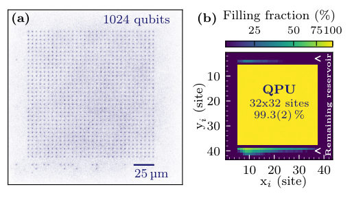
<figcaption class="paper-figure-caption"><b>Fig 1.</b> Figure 1. Large-scale array of atomic qubits forming a quan- tum processing unit (QPU) of 32×32 sites and a surrounding reservoir in an array of 43×43 homogenized optical tweez- ers created by modularized microoptical light field pattern- ing. Inerconnectivity is enhanced by parallelized atomic qubit transport. (a) Single-shot fluorescence image of a defect-free QPU of 1024 qubits. (b) Site-resolved visualization of the cumulative maximum filling fraction for twelve successive re- arrangement sequences. The QPU filling fraction is 99.3(2) %.</figcaption>
</figure>
<figure class="paper-figure-card">
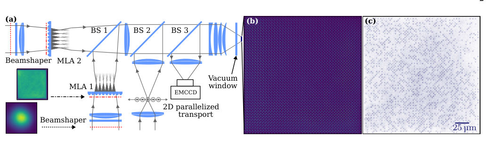
<figcaption class="paper-figure-caption"><b>Fig 2.</b> Figure 2. (a) Schematic of the optical setup. In two independent input ports, a diffractive beamshaper converts an input Gaussian beam (dashed line) into a top-hat profile (dash-dotted line). Each beam illuminates a microlens array (MLA 1,2) generating a homogenized two-dimensional (2D) array of laser foci. The two resulting static tweezer arrays are combined using a polarizing beam splitter (BS 1) and reimaged into the vacuum chamber. Dynamically steerable 2D parallelized optical tweezers for atom transport are superimposed using a non-polarizing beam combiner (BS 2) with 90 % transmission. (b) Intensity pattern of the combined MLA-generated trap arrays in an evenly-space interleaved...</figcaption>
</figure>
<figure class="paper-figure-card">
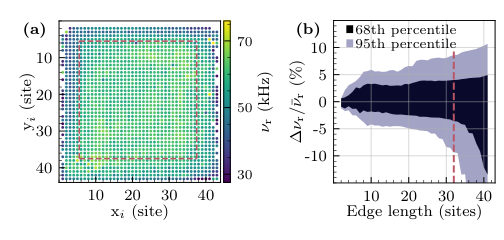
<figcaption class="paper-figure-caption"><b>Fig 3.</b> Figure 3. Radial vibrational frequency νr in the homoge- nized 43×43 site static tweezer array with the QPU (32×32 sites) indicated by dashed lines. (a) Site-resolved, color-coded representation of νr. Sites with insufficient statistics are left blank. (b) Spread of νr as deviation from the median for in- creasing edge length of a central quadratic array. The 68th (black) and 95th (blue) percentiles are shown.</figcaption>
</figure>
<figure class="paper-figure-card">
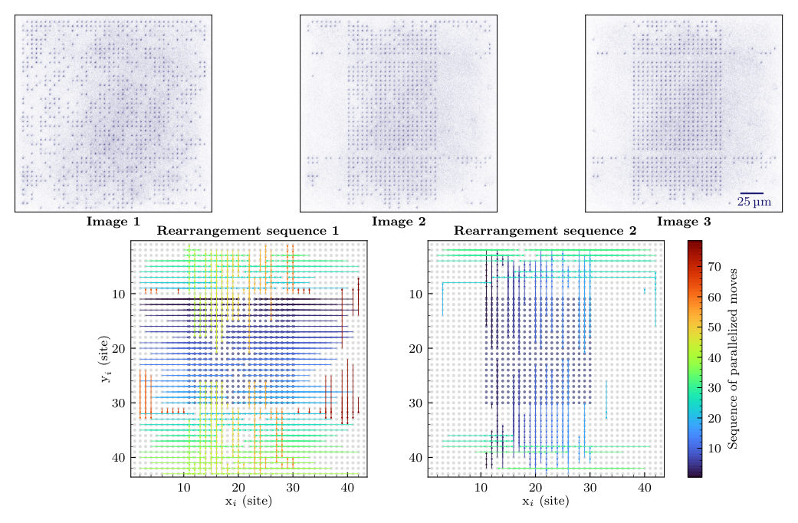
<figcaption class="paper-figure-caption"><b>Fig 4.</b> Figure 4. Parallelized rearrangement of atomic qubits into a defect-free 20×20 target pattern within two rearrangement sequences. Three subsequent fluorescence images (top) and the two interposed rearrangement sequences (bottom) containing consecutive multi-tweezer transport trajectories are shown. The color code indicates the temporal order of parallelized moves along rows and columns within each rearrangement sequence. Prior to the image 1, atom loading of both static arrays and supercharging of the processor array are performed.</figcaption>
</figure>
<figure class="paper-figure-card">
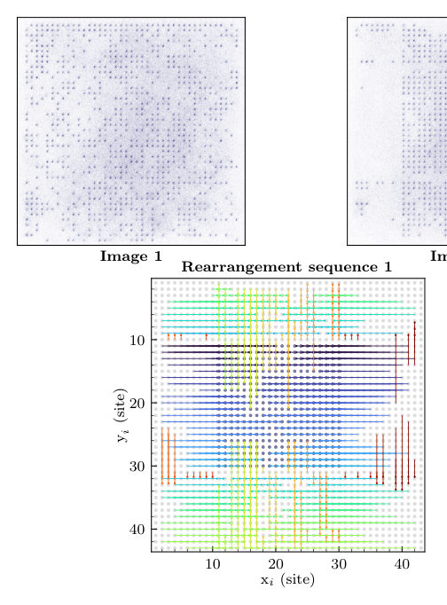
<figcaption class="paper-figure-caption"><b>Fig 5.</b> Figure 4 illustrates the assembly of a defect-free 20×20 qubit target pattern after supercharging of the processor array. The top row shows three consecutive fluorescence images of the atom array, while the bottom row depicts</figcaption>
</figure>

**Summary.** The research presents an advanced microoptical system capable of assembling massive, defect-free quantum registers using neutral atoms trapped in optical tweezers. By modularizing the trapping array generation and implementing parallelized atom transport, they achieve high uniformity and successfully demonstrate reliable assembly up to 1024 qubits. This significantly advances the hardware capabilities for large-scale quantum information processing.

**Why it may be interesting.** This work directly addresses scalability bottlenecks in neutral-atom quantum computing by providing a robust, highly uniform, and fast hardware platform for creating large qubit arrays.

Detailed structure

**Main problem.** The primary challenge is achieving the efficient, defect-free assembly of a large quantum register containing up to 1024 neutral-atom qubits.

**Main result.** The authors demonstrated a novel microoptical architecture that enables the rapid and highly uniform assembly of $32 	imes 32$ arrays with near-unity filling fraction, pushing the platform toward the kiloqubit scale.

**Method.** They combine microlens array generation for large-scale trapping with parallelized atom transport tweezers to achieve fast qubit relocation and pattern formation.

**Model / system.** The physical system is a quantum register composed of neutral atoms trapped in optical tweezers generated by an advanced, modular microoptical setup. This architecture separates the static trap patterning from the dynamic transport mechanism.

**Key observables.** Site-resolved vibrational frequency ($
u_r$), cumulative maximum filling fraction (approaching 99%), and survival probability during rearrangement sequences.

**Important parameters / regimes.** System size up to $32 	imes 32$ sites, $>3500$ total potential sites, and a speedup factor of 9 compared to single-tweezer transport for large structures.

**Assumptions / limitations.** The method relies on modularizing intensity equalization from tweezer patterning to overcome power limitations in single-device control. Homogeneity is assessed via the vibrational frequency $
u_r$.

**Figures summary.** Figures illustrate high-fidelity assembly maps of $32 	imes 32$ QPU, schematics of the optical setup, and site-resolved uniformity measurements ($
u_r$) across large arrays.

**Paper structure.** The paper details the novel microoptical architecture for scalable trapping, presents methods for characterizing trap uniformity using vibrational frequencies, and demonstrates the high-speed, parallelized rearrangement algorithm to assemble defect-free target patterns up to 1024 qubits.

Abstract

Low-entropy arrays of atomic quantum systems in optical tweezers offer unique prospects for fundamental research on few- and many-body systems as well as for extended applications in quantum technology. The significance of this approach relies on the achievable system size, its uniformity, and the rate of qubit allocation. We propel the neutral-atom quantum-technology platform by the rapid assembly of a regular two-dimensional quantum register of up to 1024 atomic qubits, enabled by a novel implementation of intensity-homogenized tweezer arrays and parallelized atom transport. Our highly efficient microoptical architecture modularizes intensity equalization and tweezer patterning in separate functional units, eliminating restrictions that arise for high-power, high-resolution, and large-scale light-field control within a single device. Arrays of precise grid structure, trap depth, and vibrational frequency with more than 3500 sites are demonstrated. Individual sites are interconnected by up to 50 parallelized transport tweezers with intensity and position control in real-time for swift qubit relocation. Multi-tweezer transport enables the operation of target patterns of up to 32 x 32 sites with sustained near-unity filling fraction. These results boost neutral-atom quantum information science above the kiloqubit level.

[↑ back to top](#top)

### [Dynamics of the spontaneous emission factor in multiple quantum well nanowire lasers](http://arxiv.org/abs/2608.11523v1)

**Authors:** Parya Reyhanian, Christopher G Poulton, Arti Agrawal, Charlene J. Lobo  
**Type:** theory · **Category:** other · **PDF:** <https://arxiv.org/pdf/2608.11523v1>  
**Analysis basis:** full PDF text, analyzed in chunks
**Topic relevance:** 🔥 `methods for driven-dissipative` **4/5** · `Keldysh / 2PI / non-Gaussian methods` **3/5** · `correlated / nonlocal dissipation` **3/5** · `driven-dissipative phase transition` **3/5** · `Dicke superradiance` **2/5** · `interference shaping light` **2/5** · `quantum measurements` **2/5** · `superradiant laser` **2/5** · `Tavis-Cummings & cavity-many-emitter` **1/5** · `non-equilibrium universality` **1/5**

↔ Scroll figures horizontally

<figure class="paper-figure-card">
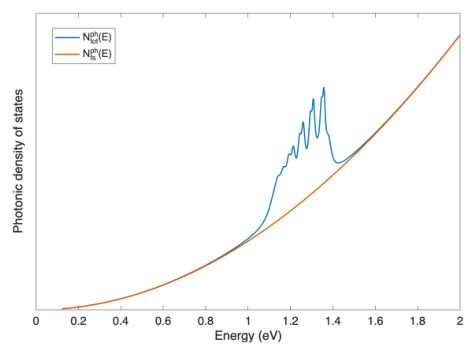
<figcaption class="paper-figure-caption"><b>Fig 1.</b> Fig. 2. Total photonic density of states Nph tot(E) of the MQW nanowire laser depicted in Fig. 1. The free space density of states Nph fs (E) is also shown.</figcaption>
</figure>
<figure class="paper-figure-card">
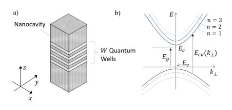
<figcaption class="paper-figure-caption"><b>Fig 2.</b> Fig. 1. (a) Schematic of multiple quantum well semiconductor nanowire laser. We assume that the quantum wells are oriented perpendicular to the z axis and have equal widths Lz; b) Energy level diagram showing the first three energy levels in the quantum wells as a function of the perpendicular wavenumber k⊥. The edge of the valence band in the bulk active semiconductor is set at Ev = 0 throughout this paper. The band edges shift due to quantization introduced by the quantum well.</figcaption>
</figure>
<figure class="paper-figure-card">
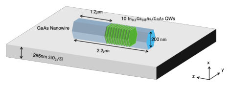
<figcaption class="paper-figure-caption"><b>Fig 3.</b> Fig. 4. Schematic diagram of the modelled In0.2Ga0.80As/GaAs quantum-well nanowire laser. The nanowire cavity is surrounded by air and contains W=10 quantum wells, each with thickness 19 nm.</figcaption>
</figure>
<figure class="paper-figure-card">
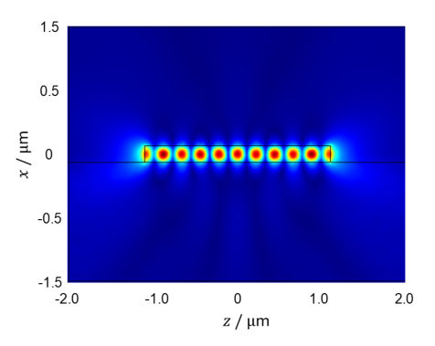
<figcaption class="paper-figure-caption"><b>Fig 4.</b> Fig. 5. Cross-section from the 3D cavity simulation of the In0.2Ga0.80As/GaAs MQW nanowire laser showing the electric field intensity of the HE11b lasing mode along the longitudinal (x) axis.</figcaption>
</figure>
<figure class="paper-figure-card">
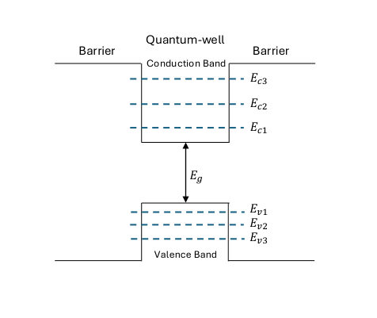
<figcaption class="paper-figure-caption"><b>Fig 5.</b> Fig. 3. Three discrete electron (Ec1, Ec2, Ec3) and hole (Ev1, Ev2, Ev3) energy levels within the conduction and valence bands of each QW.</figcaption>
</figure>

**Summary.** This paper develops a theoretical framework to calculate the spontaneous emission factor ($eta$) dynamically for MQW nanowire lasers, treating it as a variable rather than a constant. By coupling quantum electrodynamics with semiconductor physics, the authors show that $eta$ strongly depends on carrier density, accurately predicting laser thresholds and spectral behavior near operation.

**Why it may be interesting.** This work is highly relevant as it models open quantum systems dynamics (spontaneous emission into a structured cavity) using rate equations derived from fundamental quantum electrodynamics principles, providing insights into light-matter interaction in nanoscale devices.

Detailed structure

**Main problem.** The study investigates the dynamic nature of the spontaneous emission factor (the eta or beta factor) in multiple quantum well (MQW) nanowire lasers, moving beyond previous constant approximations.

**Main result.** The spontaneous emission factor is shown to be highly dependent on charge carrier density and device parameters, peaking near the lasing threshold before decreasing above it.

**Method.** The authors derive general expressions for the beta factor and gain using quantum electrodynamics principles applied to semiconductor quantum wells, combining Finite Element Modeling (FEM) with rate equation analysis.

**Model / system.** The system modeled is an MQW nanowire laser structure ($	ext{In}_{0.2}	ext{Ga}_{0.8}	ext{As}/	ext{GaAs}$), where the photonic density of states (PDOS) is calculated by combining free-space and discrete cavity Lorentzian modes.

**Key observables.** Spontaneous emission factor ($eta$), laser gain, Lasing threshold power, and the spontaneous emission spectrum $	ext{r}_{	ext{spon}}(E)$.

**Important parameters / regimes.** Charge carrier density ($N_c$), quantum well thickness ($L_z$), Indium composition (In content), and cavity mode frequency.

**Assumptions / limitations.** The model assumes that the cavity modes are sufficiently well-confined to be treated as discrete Lorentzian terms, and it utilizes Einstein coefficients for rate calculations.

**Figures summary.** Figures illustrate the schematic structure of the laser, the total photonic density of states (PDOS), and crucially, plots showing $eta$'s dependence on carrier density ($N_c$) relative to the lasing threshold.

**Paper structure.** The paper progresses from defining the physical problem and deriving general theoretical expressions for $eta$ using QED principles. It then applies this model to specific MQW nanowire structures, analyzing how varying carrier densities affects $eta$, gain, and ultimately predicting the laser's operational characteristics like threshold power.

Abstract

The spontaneous emission factor - often known as the \b{eta} factor - is an important quantity in the description of quantum well lasers, influencing both the threshold power as well as the general shape of the light in-light out (L-L) curve. Past work on modelling multiple quantum well (MQW) nanowire laser devices has typically assumed that the \b{eta} factor is a constant parameter that can either be estimated or fit in a post-hoc manner. However, the \b{eta} factor can be derived from the transitions between valence and conduction bands in semiconductor quantum wells, together with knowledge of the cavity modes. Here we investigate the dynamic nature of the \b{eta} factor for MQW nanowire lasers, and show how it can be computed. We also examine the dependence of the spontaneous emission rate and spontaneous emission factor \b{eta} on the charge carrier density, quantum well thickness, and composition, and discuss the impact on laser threshold and operation.

[↑ back to top](#top)

### [Interface phases and dynamics in two-dimensional quantum magnets: A "holographic" approach from universality to quantum simulation](http://arxiv.org/abs/2608.12312v1)

**Authors:** Abhishodh Prakash, Jaydev Singh Rao, Siddharth A. Parameswaran, Alessio Lerose  
**Type:** both · **Category:** statistical mechanics · **PDF:** <https://arxiv.org/pdf/2608.12312v1>  
**Analysis basis:** full PDF text, analyzed in chunks
**Topic relevance:** 🔥 `analog quantum simulation` **4/5** · `Full counting statistics` **3/5** · `methods for driven-dissipative` **3/5** · `non-equilibrium universality` **3/5** · `Frenkel-Kontorova` **2/5** · `Keldysh / 2PI / non-Gaussian methods` **2/5** · `driven-dissipative phase transition` **2/5** · `correlated / nonlocal dissipation` **1/5** · `quantum measurements` **1/5** · `scars & prethermalization` **1/5**

↔ Scroll figures horizontally

<figure class="paper-figure-card">
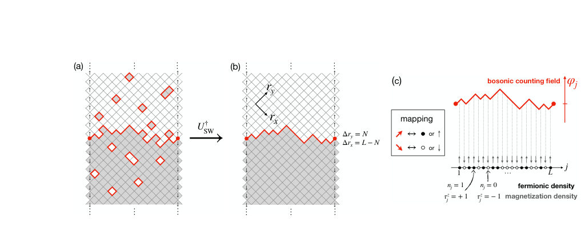
<figcaption class="paper-figure-caption"><b>Fig 1.</b> Figure 1. “Holographic” description of interfaces in 2D quantum magnets. For illustration, we consider an Ising square lattice tilted by 45◦. Spins on the vertical sides are frozen as shown, pinning the endpoints of a domain wall. Panel (a): Typical computational-basis snapshot of the ground-state wave function of a quantum Ising- type ferromagnet with the considered boundary conditions, with white/gray plaquettes depicting up/down spins. Panel (b): Undoing the Schrieffer-Wolff transformation USW, the bulk regions look perfectly magnetized, and wave function snapshots consist of minimal-length domain walls, i.e., ground states of the classical Ising ferromagnet. Panel (c): The classical...</figcaption>
</figure>
<figure class="paper-figure-card">
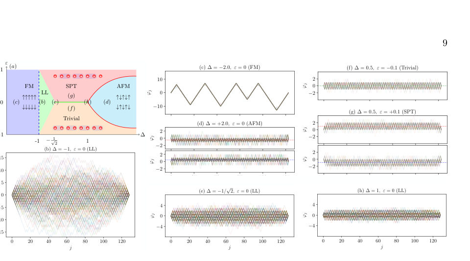
<figcaption class="paper-figure-caption"><b>Fig 2.</b> Figure 2. Interface quantum phase structure (I). Panel (a): Schematic phase diagram of the effective 1D Hamiltonian (11). Panels (b-h): Interface fluctuation statistics computed from the 1D ground-state wave function in various phases: (b,e,h) Luttinger-liquid (LL) phase for three values of the anisotropy parameter ∆= 2J′/g; (c) Ferromagnetic and (d) antiferromagnetic (Néel) phases; (f) trivial and (g) Haldane SPT gapped phases. Degenerate ground states are shown for the Néel and Haldane SPT phases. Horizontal dashed lines highlight field-theoretical bosonization predictions. Here L = 128 and the plots are made by overlapping 50 (200) wave-function snapshots for gapped (gapless) states.</figcaption>
</figure>
<figure class="paper-figure-card">
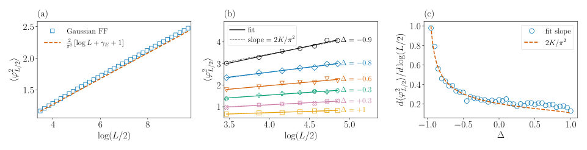
<figcaption class="paper-figure-caption"><b>Fig 3.</b> Figure 3. Roughness scaling law (21). Panels (a,b): Mid-point variance of the interface height ⟨φ2 L/2⟩vs interface length, numerically computed from the effective 1D XXZ spin chain ground state, for (a) the free-fermion point J′ = 0 and (b) general values of the effective anisotropy ∆= 2J′/g. Panel (c): illustration of the scaling law in Eq. (21). For the free-fermion point, we overlay the numerically exact result of ⟨φ2 L/2⟩from Gaussian techniques with the known large-size asymptotics ⟨φ2 L/2⟩= 2 π2 [log(L/2) + log 2 + γE + 1 + o(1)], where γE is the Euler-Mascheroni constant [63]. For the general case (b,c), ⟨φ2 L/2⟩is computed by averaging over 105 ground state wave-function snapshots...</figcaption>
</figure>
<figure class="paper-figure-card">
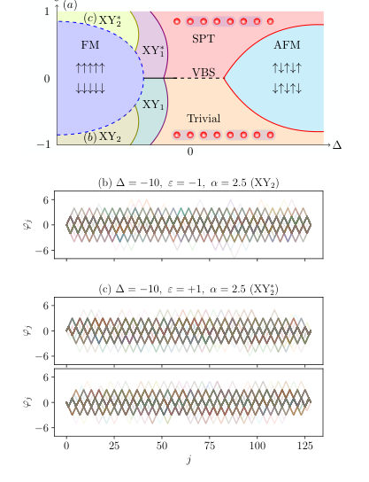
<figcaption class="paper-figure-caption"><b>Fig 4.</b> Figure 4. Interface quantum phase structure (II). Panel (a): Schematic phase diagram of the effective 1D Hamiltonian (25) for g′/g = α ∼2.5. Panels (b,c): Interface fluctuation statistics computed from the 1D ground-state wave function in the rough trival (XY2) (b) and non-trivial (XY∗ 2) (c) symmetry-enriched critical phases. XY∗ 2 has degenerate ground states with distinct edge modes that are shown. Here L = 128 and the plots are made by overlapping 200 wave-function snapshots.</figcaption>
</figure>
<figure class="paper-figure-card">
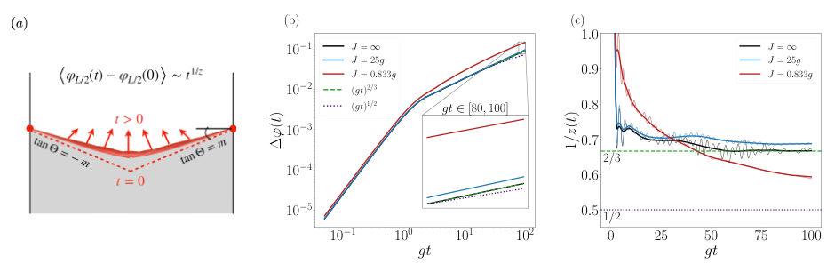
<figcaption class="paper-figure-caption"><b>Fig 5.</b> Figure 5. Curvature-driven quantum dynamics. Panel (a): Illustration of curvature-driven evolution starting from a corner-like configuration at t = 0. Panel (b): Evolution of the interface height variation ∆φ(t) = φL/2(t) − φL/2(0) from initial slopes tan Θ = ±m = ±0.01, computed from the effective 1D Hamiltonian dynamics (40) for J = ∞(black), J = 25g (blue) and J = 0.833g (red), corresponding to spin-transport in an unperturbed, weakly perturbed, and strongly perturbed SU(2)-symmetric Heisenberg chain of size L = 200, respectively. Panel (c): Running dynamical exponent 1/z(t) = d log ∆φ/d log t for the same three simulations, shown as raw point-wise log- derivative (thin) and smoothed...</figcaption>
</figure>

**Summary.** This work develops a 'holographic' framework to study interfaces in 2D quantum magnets by mapping the complex problem onto effective 1D Hamiltonians. It classifies rich quantum phase structures and predicts distinct scaling laws for non-equilibrium dynamics. Crucially, it demonstrates how this theory can guide experiments to measure advanced diagnostics like full counting statistics using neutral atom arrays.

**Why it may be interesting.** It provides a powerful theoretical bridge between high-dimensional quantum magnets and exactly solvable 1D quantum systems, directly connecting abstract field theory concepts to measurable quantities in modern quantum simulation platforms (neutral atoms).

Detailed structure

**Main problem.** The paper aims to classify quantum phases, phase transitions, and non-equilibrium dynamics of interfaces separating ordered bulk domains in 2D quantum magnets.

**Main result.** A framework is established that predicts distinct spatiotemporal scaling laws for interface dynamics and enables the measurement of charge full counting statistics in simulated 1D systems.

**Method.** The approach uses a 'holographic' mapping, reinterpreted as an exact bosonization, to reduce the problem to effective 1D Hamiltonians governing geometric fluctuations. These are analyzed using techniques derived from field theory and numerical simulation.

**Model / system.** The system is based on 2D quantum magnets (e.g., spin-1/2 Ising model) whose interface dynamics are mapped onto an effective 1D fermionic or bosonic chain Hamiltonian, which can be related to known models like the XXZ chain.

**Key observables.** Interface phase structure (stiff vs. rough), spatiotemporal scaling laws for curvature-driven dynamics, and charge full counting statistics.

**Important parameters / regimes.** Perturbation strength ($\lambda$), filling factor ($
ho$), and magnetization density ($m$).

**Assumptions / limitations.** The low-energy physics is accurately captured by truncating the Schrieffer-Wolff transformation series for small perturbations, treating this as an exact description.

**Figures summary.** Figure 1 illustrates the holographic mapping: showing a computational basis snapshot of a ground state, minimal-length domain walls, and the explicit mapping to a 1D Fock space relating fermionic filling to magnetization density.

**Paper structure.** The paper introduces the framework by defining the problem in 2D quantum magnets, derives the effective 1D Hamiltonian via dimensional reduction (holography/bosonization), analyzes the resulting phase structure and dynamics, and concludes with a demonstration of measuring advanced observables like full counting statistics using neutral-atom array simulations.

Abstract

We introduce a framework to classify quantum phases, phase transitions, and non-equilibrium dynamics of interfaces separating ordered bulk domains in 2D quantum magnets - equivalently, confining strings in dual lattice gauge theories - based on effective 1D Hamiltonians governing geometric fluctuations. Building on a "holographic" approach from [Phys. Rev. Lett. 129, 120601 (2022)], here reinterpreted as an exact bosonization, we uncover a rich quantum phase structure, with a variety of stiff and rough interface phases described by gapped and gapless 1D ground states, respectively, all distinguishable through the statistics of 2D wave-function snapshots. Our framework allows us to predict distinct spatiotemporal scaling laws for non-equilibrium curvature-driven interface dynamics across parameter space, which can be readily probed in existing experiments. We finally show that our approach enables the unprecedented experimental opportunity of directly measuring charge full counting statistics and symmetry-resolved properties of an encoded 1D system, as we explicitly demonstrate by numerically simulating a neutral-atom array experiment.

[↑ back to top](#top)

### [Particle Production, Equilibration, and Quantum Recurrences from Classical Fields](http://arxiv.org/abs/2608.11316v1)

**Authors:** Iván Cuntín, Wenyang Qian, Bin Wu  
**Type:** theory · **Category:** numerical methods · **PDF:** <https://arxiv.org/pdf/2608.11316v1>  
**Analysis basis:** full PDF text, analyzed in chunks
**Topic relevance:** 🔥 `methods for driven-dissipative` **4/5** · 🔥 `scars & prethermalization` **4/5** · `Keldysh / 2PI / non-Gaussian methods` **3/5** · `non-equilibrium universality` **3/5** · `analog quantum simulation` **2/5** · `driven-dissipative phase transition` **2/5** · `correlated / nonlocal dissipation` **1/5** · `quantum measurements` **1/5**

↔ Scroll figures horizontally

<figure class="paper-figure-card">
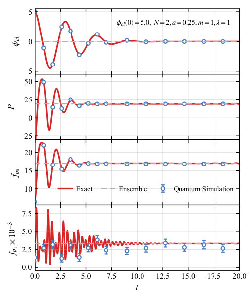
<figcaption class="paper-figure-caption"><b>Fig 1.</b> FIG. 1. Particle production and equilibration from clas- sical fields. For ϕcl(0) = 5, πcl(0) = 0, a = 0.25, m = 1 and λ = 1, the field expectation value ϕcl, pressure P, and occupation-number distribution fp obtained by direct expo- nentiation (Exact) all relax to the values predicted by the diagonal ensemble ρeq [Eq. (9), Ensemble]. Data points with error bars (Quantum Simulation) are obtained from 220 mea- surements of the Qiskit circuit with nQ = 6 qubits per site and second-order Trotter step δt = 0.01.</figcaption>
</figure>
<figure class="paper-figure-card">
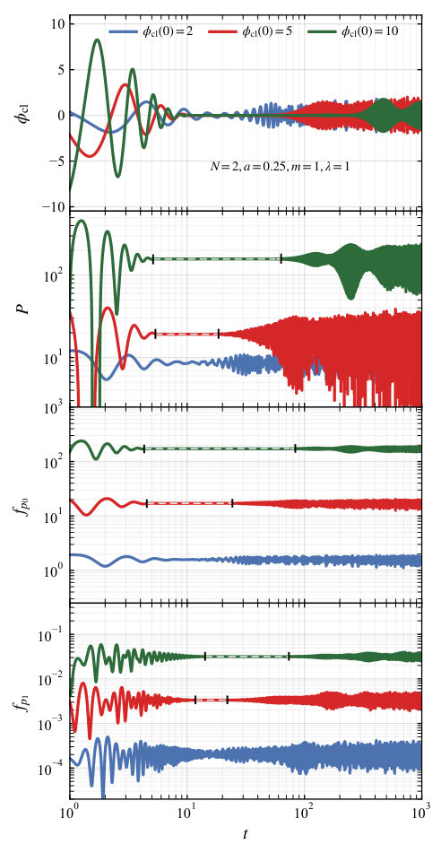
<figcaption class="paper-figure-caption"><b>Fig 2.</b> FIG. 2. Equilibration and quantum recurrences for ϕcl(0) = 2, 5, and 10 with πcl(0) = 0 on a two-site one-dimensional lattice. The parameters are a = 0.25, m = 1, and λ = 1. Direct exponentiation of Eq. (2), involving matrices up to 216 × 216, provides an exact benchmark for the gate-based quantum algorithm. Gray dashed lines show the equilibration intervals of P and fp, with short vertical lines marking their endpoints for ϕcl(0) = 5 and 10.</figcaption>
</figure>
<figure class="paper-figure-card">
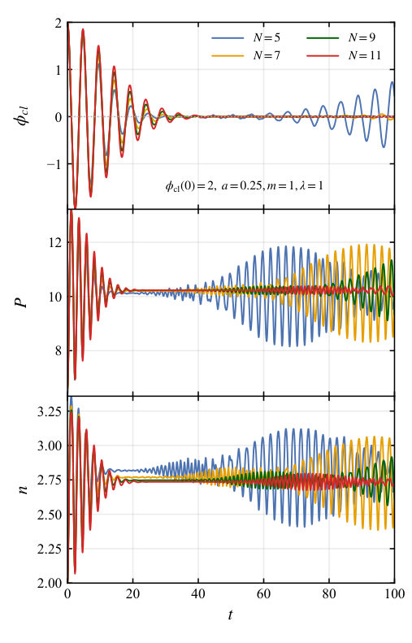
<figcaption class="paper-figure-caption"><b>Fig 3.</b> FIG. 3. Equilibration with increasing system size. Shown are the field expectation value ϕcl(t) (top), pressure P (middle), and particle number density n (bottom) for one-dimensional lattices with N = 5, 7, 9, and 11 sites, starting from a coherent state with ϕcl(0) = 2 and πcl(0) = 0. The parameters are a = 0.25, m = 1, and λ = 1. The observables exhibit longer-lived equilibration stages, followed by a further delayed renewal of oscillations, as the system size increases. Tensor-network simulations use a maximal bond dimension χmax = 25 and time step δt = 0.01.</figcaption>
</figure>
<figure class="paper-figure-card">
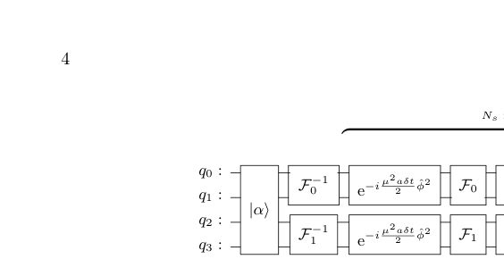
<figcaption class="paper-figure-caption"><b>Fig 4.</b> FIG. 4. Full real-time evolution e−iHt with N = 2 and nQ = 2.</figcaption>
</figure>
<figure class="paper-figure-card">
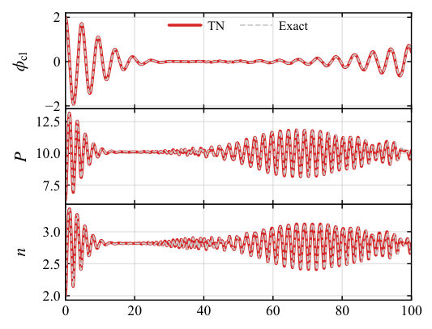
<figcaption class="paper-figure-caption"><b>Fig 5.</b> FIG. 7. Comparison between the tensor-network (TN) and direct-exponentiation (exact) results for an initial coherent state with ϕcl(0) = 2 and πcl(0) = 0 on a one-dimensional lattice with N = 5, a = 0.25, m = 1, and λ = 1. The agreement validates the TN approach for the observables considered in the main text.</figcaption>
</figure>

**Summary.** This work simulates particle production and equilibration in a lattice $\lambda\phi^4$ theory, modeling conditions found in heavy-ion collisions. By employing advanced numerical techniques like tensor networks and quantum circuit simulations, the authors show that observables relax to equilibrium values before exhibiting quantum Poincaré recurrences. This establishes a first-principles computational route for studying non-equilibrium dynamics.

**Why it may be interesting.** While focused on QFT, the techniques—especially using TNs to simulate non-equilibrium dynamics and track thermalization—are highly relevant to simulating complex quantum many-body systems in AMO physics.

Detailed structure

**Main problem.** The research investigates how particle production and thermalization occur from highly excited, non-equilibrium quantum states relevant to heavy-ion collisions or the early universe.

**Main result.** The study demonstrates that observables equilibrate sequentially in momentum space, persisting beyond initial relaxation times before exhibiting characteristic quantum Poincaré recurrences.

**Method.** A combination of quantum circuit simulation (for small lattices) and Tensor Network methods (for larger systems) is used to simulate real-time evolution governed by the $\lambda\phi^4$ Hamiltonian.

**Model / system.** The model is lattice $\lambda\phi^4$ theory, simulating a scalar field ($\hat{\phi}$) on a discrete spatial lattice. The dynamics are driven by the full Hamiltonian $H = H_0 + H_{	ext{int}}$, initialized in coherent states $|\psi(0)
angle$.

**Key observables.** Field expectation value ($\langle \hat{\phi} 
angle$), pressure ($P$), occupation-number distribution ($f_p$), and particle number density ($n$).

**Important parameters / regimes.** Lattice spacing ($a$), mass ($m$), coupling constant ($\lambda$), and initial field amplitudes ($\phi_{cl}(0)$). Time scales are measured in units of $m^{-1}$.

**Assumptions / limitations.** The use of truncated Harmonic Oscillator bases (in TN methods) and the reliance on quantum circuit decompositions for time evolution, which are computationally intensive.

**Figures summary.** Figures illustrate observable relaxation ($\phi_{cl}, P, f_p$) over time, comparing exact vs. simulated results; they also show how equilibration times increase with system size ($N$).

**Paper structure.** The paper develops the framework by defining the Hamiltonian and initial coherent states, then details the simulation methods (quantum circuits/TN evolution), presents diagnostics for equilibrium ($
ho_{eq}$), and finally analyzes the time evolution dynamics across different lattice sizes.

Abstract

We investigate particle production from classical fields, a phenomenon central to the pre-equilibrium dynamics of relativistic heavy-ion collisions and the reheating epoch of the early Universe. Using lattice $λφ^4$ theory as a proof of principle, we show that this problem is naturally amenable to quantum computation, providing a first-principles framework for nonequilibrium quantum-field dynamics beyond existing approximations. We perform simulations on small spatial lattices, exhausting our available classical computational resources while maintaining a direct mapping to future quantum-computing implementations. We find that particle production is accompanied by equilibration of observables, including the field expectation value, occupation-number distribution, and pressure. The observed equilibration persists for timescales several times longer than the initial equilibration time before the observables resume oscillatory behavior associated with quantum Poincaré recurrences. Our results establish a route toward first-principles studies of equilibration in nonequilibrium quantum field theory and provide insight into the search for the smallest possible locally equilibrated quark-gluon systems at hadron colliders.

[↑ back to top](#top)

### [Antibunching Enhancement via Non-Markovianity in a Hybrid Optical-Microwave Cross-Cavity](http://arxiv.org/abs/2608.11783v1)

**Authors:** Shiying Gu, Jun-Qi Li, Liping Guo  
**Type:** theory · **Category:** other · **PDF:** <https://arxiv.org/pdf/2608.11783v1>  
**Analysis basis:** full PDF text, analyzed in chunks
**Topic relevance:** 🔥 `methods for driven-dissipative` **4/5** · `Keldysh / 2PI / non-Gaussian methods` **3/5** · `correlated / nonlocal dissipation` **3/5** · `Tavis-Cummings & cavity-many-emitter` **2/5** · `driven-dissipative phase transition` **2/5** · `analog quantum simulation` **1/5** · `interference shaping light` **1/5** · `non-equilibrium universality` **1/5** · `quantum measurements` **1/5** · `superradiant laser` **1/5**

↔ Scroll figures horizontally

<figure class="paper-figure-card">
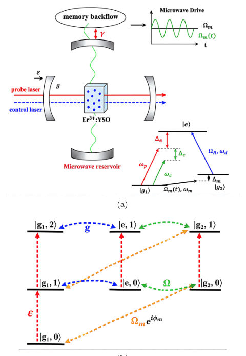
<figcaption class="paper-figure-caption"><b>Fig 1.</b> FIG. 1. Schematic of the crossed optical-microwave cavity and the level configuration. (a) An Er3+:Y2SiO5 crystal is positioned at the intersection of an optical Fabry-P´erot cavity and a microwave resonator. The lower right inset illustrates the ∆-type three-level atomic configuration, where |g1⟩and |g2⟩are the hyperfine ground states, and |e⟩is the excited state. The top right inset is that the constant bare amplitude Ωm evolves into a time-dependent effective field Ωm(t) due to the non-Markovian environmental feedback. (b) Energy- level and transition pathways for the destructive quantum interference .</figcaption>
</figure>
<figure class="paper-figure-card">
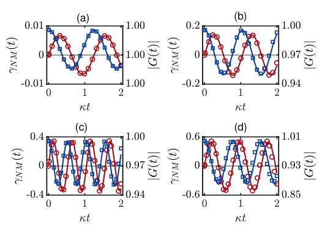
<figcaption class="paper-figure-caption"><b>Fig 2.</b> FIG. 2. Comparison of the analytical and numerical solu- tions for the non-Markovian dissipation rate γNM(t) (left axis, red) and the decoherence amplitude |G(t)| (right axis, blue). Solid lines represent the first-order perturbative analytical so- lutions, while open circles and squares denote the numerical results obtained via the ODE method. (a) γ = 0.01, ∆mc = 5; (b) γ = 0.05, ∆mc = 6; (c) γ = 0.1, ∆mc = 12; and (d) γ = 0.1, ∆mc = 8.</figcaption>
</figure>
<figure class="paper-figure-card">
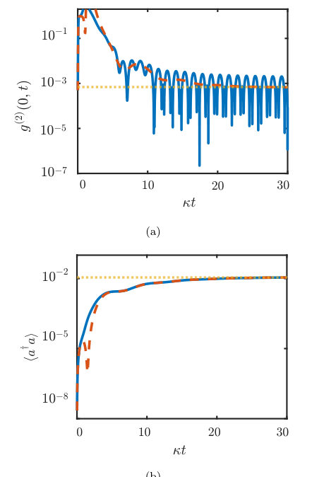
<figcaption class="paper-figure-caption"><b>Fig 3.</b> FIG. 3. Comparison results of the second-order coherence log10[g(2)(0, t)] (a) and the photon numbers ⟨a†a⟩(b) given by the Markovian (red dashed line) and the non-Markovian evolution (blue solid line) respectively. The yellow dotted line is the Markovian steady-state limit. The system parameters are set as g = 1.0κ, ΩR = 0.5κ, ϵ = γ = λ = 0.01κ, ∆c = ∆e = 0, ∆m = 0.051κ, Ωm = 0.035κ, ∆mc = 5.0κ and ϕm = 0.</figcaption>
</figure>
<figure class="paper-figure-card">
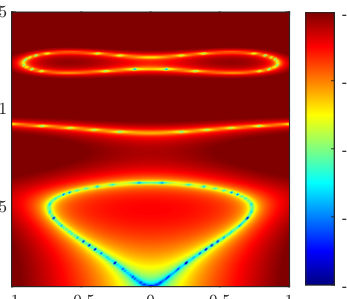
<figcaption class="paper-figure-caption"><b>Fig 4.</b> FIG. 4. Transient photon blockade patterns and detuning dependence of the non-Markovian UPB at t = 19.5/κ. The logarithmic second-order coherence log10[g(2)(0, t)] is shown as a function of (a) ∆m/κ and γ/κ. Here ∆c/κ = 0. (b) ∆c/κ and γ/κ, here ∆m/κ = 0.051. The other parameters chosen are the same as Fig. 3.</figcaption>
</figure>
<figure class="paper-figure-card">
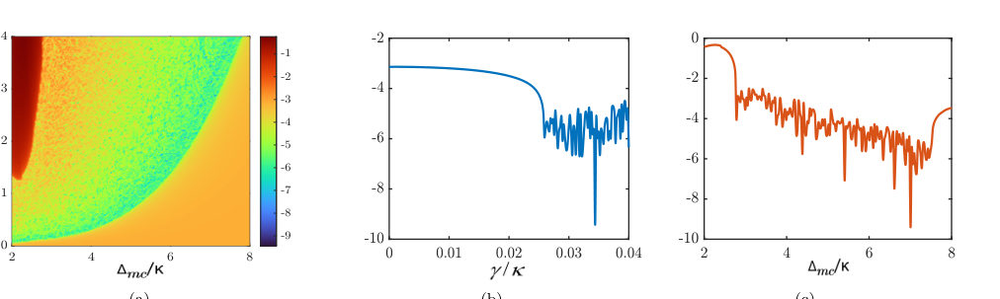
<figcaption class="paper-figure-caption"><b>Fig 5.</b> FIG. 5. Contour plot of transient minimum mint log10[g(2)(0, t)] as a function of ∆mc/κ and γ/κ (a), and panels (b) and (c) display the 1D cross-sections along the ∆mc = 7.0κ and γ = 0.034κ axes, respectively. Every data point in panel (a) is independently evaluated by continuously scanning 0 ≤κt ≤40 to capture the optimal interference time topt. The other parameters chosen are the same as those in Fig. 3.</figcaption>
</figure>

**Summary.** The paper investigates enhancing antibunching in a hybrid optical-microwave cavity system by exploiting non-Markovian environmental effects. Using the time-convolutionless framework, the authors show that structured dissipation allows for information backflow, which boosts photon blockade beyond what is possible in standard Markovian models. This demonstrates a pathway to using environmental memory as a controllable resource for high-purity single-photon generation.

**Why it may be interesting.** This work is highly relevant as it tackles open quantum systems dynamics, specifically showing how structured environments (non-Markovianity) can actively enhance quantum light sources like single-photon emitters, a core topic in cavity QED and quantum optics.

Detailed structure

**Main problem.** The primary goal is enhancing single-photon antibunching by utilizing non-Markovian environmental effects, thereby transforming decoherence from a limitation into a controllable quantum resource.

**Main result.** Non-Markovian dynamics allow for the backflow of environmental information, significantly suppressing the second-order correlation function ($g^{(2)} \sim 10^{-7}$) and broadening the antibunching profile.

**Method.** The study employs the time-convolutionless non-Markovian framework to derive time-dependent decay rates and renormalized drives for the open quantum system dynamics.

**Model / system.** The physical platform is a hybrid optical-microwave cross-cavity system involving an Er3+:Y2SiO5 crystal. The theoretical treatment involves deriving master equations incorporating non-Markovian memory kernels derived from spectral density functions.

**Key observables.** Second-order correlation function ($g^{(2)}$), non-Markovian decay rate ($\gamma_{	ext{NM}}(t)$), and the renormalized microwave drive ($\Omega_m(t)$).

**Important parameters / regimes.** Weak coupling regime, optical detuning, temperature (T=20 K mentioned in notes), and spectral density parameters.

**Assumptions / limitations.** The analysis relies on the time-convolutionless master equation approach and assumes the microwave environment is in thermal equilibrium.

**Figures summary.** Figures illustrate the crossed cavity setup, show the evolution of the renormalized drive $\Omega_m(t)$, compare decoherence functions $G(t)$ with revival features, and present blockade maps for $g^{(2)}(0, t)$.

**Paper structure.** The paper builds from establishing the physical model (hybrid cross-cavity) to deriving the non-Markovian dynamics using advanced techniques like the time-convolutionless framework. It then applies this formalism to calculate key observables like $g^{(2)}$ and $\gamma_{	ext{NM}}(t)$, culminating in demonstrating the resource potential of environmental memory.

Abstract

Unconventional photon blockade (UPB) provides an attractive route for generating antibunched light through quantum interference without requiring strong nonlinear coupling. In conventional Markovian systems, irreversible dissipation progressively destroys the phase coherence, even limiting the achievable single-photon purity. Here we propose a scheme for imposing non-Markovian effects on a microwave cavity where a Er$^{3+}$:Y$_2$SiO$_5$ crystal loaded into a hybrid optical-microwave system. Based on the time-convolutionless non-Markovian framework, we derive the time-dependent non-Markovian decay rate and the renormalized microwave drive in the weak-coupling regime. We show that the second-order correlation function is significantly suppressed, even to the order of $10^{-7}$, since the backflow of environmental information enhances photon blocking. In addition, this structured reservoir engineering not only provides an additional degree of freedom, but also further optimizes the blockade via optical detuning. Importantly, the delayed second-order correlation exhibits a broadened antibunching profile, thereby relaxing the timing requirements for single-photon synchronization. Our results demonstrate that environmental non-Markovianity can be transformed from a source of decoherence into a controllable quantum resource, opening new opportunities for high-purity single-photon generation.

[↑ back to top](#top)

### [Fluctuation Spectra and Response Function of Coupled Atomic and Molecular BECs](http://arxiv.org/abs/2608.11642v1)

**Authors:** Avinaba Mukherjee, Raka Dasgupta  
**Type:** theory · **Category:** quantum gases · **PDF:** <https://arxiv.org/pdf/2608.11642v1>  
**Analysis basis:** full PDF text, analyzed in chunks
**Topic relevance:** 🔥 `analog quantum simulation` **4/5** · `Keldysh / 2PI / non-Gaussian methods` **3/5** · `driven-dissipative phase transition` **3/5** · `methods for driven-dissipative` **3/5** · `non-equilibrium universality` **2/5** · `correlated / nonlocal dissipation` **1/5** · `quantum measurements` **1/5** · `scars & prethermalization` **1/5**

↔ Scroll figures horizontally

<figure class="paper-figure-card">
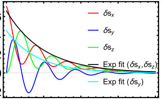
<figcaption class="paper-figure-caption"><b>Fig 1.</b> FIG. 1: Real-time dynamics of the Bloch-vector fluctuations δsx ( ), δsy ( ), and δsz ( ), with exponential fits shown for δsx and δsz ( ), and δsy ( ), for finite coupling (γx) and detuning (γz) noise.</figcaption>
</figure>
<figure class="paper-figure-card">
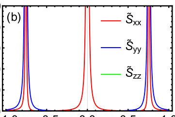
<figcaption class="paper-figure-caption"><b>Fig 2.</b> FIG. 2: Fluctuation matrix elements ( ˜S ii) as functions of the Feshbach detuning (ϵb). The components ˜S xx ( ), ˜S yy ( ), and ˜S zz ( ) are indicated by their respective colors. Panels show the cases where noise is present only in (a) the Feshbach coupling (γx) and (b) the detuning (γz).</figcaption>
</figure>
<figure class="paper-figure-card">
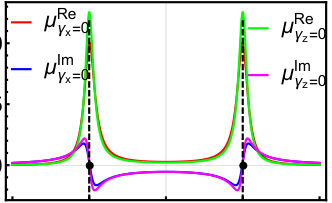
<figcaption class="paper-figure-caption"><b>Fig 3.</b> FIG. 3: Kubo spectral mobility, µ( ¯ω), versus driving frequency ¯ω. The real part, µRe, is shown for (γx , 0, γz = 0) ( ) and (γz , 0, γx = 0) ( ), while the imaginary part, µIm, is shown for (γx , 0, γz = 0) ( ) and (γz , 0, γx = 0) ( ). Here, γx and γz represent noise in the Feshbach coupling ˜g and the detuning ϵb, respectively. The symbols ( ) mark µIm at the dynamic resonance frequencies ±ωs.</figcaption>
</figure>
<figure class="paper-figure-card">
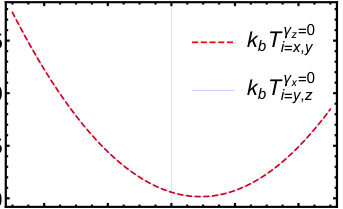
<figcaption class="paper-figure-caption"><b>Fig 4.</b> FIG. 5: Temperature (Ti) as a function of detuning (ϵb) for coupling noise only (γx , 0, γz = 0; ) and detuning noise only (γz , 0, γx = 0; ).</figcaption>
</figure>
<figure class="paper-figure-card">
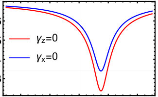
<figcaption class="paper-figure-caption"><b>Fig 5.</b> FIG. 6: Phase difference (Φ) plotted as a function of detuning (ϵb) for coupling noise (γx , 0, γz = 0) and detuning noise (γz , 0, γx = 0), denoted by the ( ) and ( ) curves, respectively.</figcaption>
</figure>

**Summary.** The paper theoretically examines how coupled atomic and molecular BECs behave when subjected to external noise affecting their coupling strength and detuning. By mapping the system onto a Bloch sphere, the authors calculate fluctuation spectra and response functions. The key finding is that these noisy dynamics reveal optimal control points near the Feshbach resonance, maximizing power transfer efficiency.

**Why it may be interesting.** This work directly addresses non-equilibrium quantum dynamics in a highly relevant experimental platform (BECs via Feshbach resonances), providing quantitative tools to understand noise effects on coherence and energy transfer.

Detailed structure

**Main problem.** The study investigates out-of-equilibrium properties of coupled atomic and molecular Bose-Einstein condensates (BECs) when the coupling and detuning are subjected to Gaussian white noise.

**Main result.** Noise significantly enhances diffusive dynamics, and the system exhibits a dynamical resonance where optimal power utilization and quality factor are achieved near the Feshbach resonance.

**Method.** The analysis employs a bosonic Josephson junction framework using a Bloch vector description, calculating fluctuation spectra via drift ($\Gamma$) and diffusion ($D$) matrices derived from linearized stochastic differential equations.

**Model / system.** The system consists of coupled atomic (A) and molecular (M) BECs interacting near a Feshbach resonance. The dynamics are modeled using a two-state system mapped onto the Bloch sphere, incorporating noise in both coupling and detuning parameters.

**Key observables.** Fluctuation spectra ($	ilde{S}_{ii}$), dynamic mobility ($\mu(ar{\omega})$) (real/imaginary parts), effective temperature ($k_B T_i$), and phase difference ($\Phi$).

**Important parameters / regimes.** Feshbach detuning ($\epsilon_b$), Feshbach coupling noise ($\gamma_x$), and detuning noise ($\gamma_z$).

**Assumptions / limitations.** The A-BEC and M-BEC are treated as single-mode condensates, neglecting spatial fluctuations; noise is modeled as Gaussian white noise.

**Figures summary.** Figures show the dependence of fluctuation matrix elements ($	ilde{S}_{ii}$) on Feshbach detuning for different noise sources, and plots illustrate dynamic mobility and effective temperature versus detuning.

**Paper structure.** The paper progresses from defining the Hamiltonian and stochastic dynamics (using Bloch vector representation) to calculating correlation functions using drift/diffusion matrices. It then analyzes the resulting fluctuation spectra and response function under periodic driving, culminating in characterizing resonance conditions near the Feshbach point.

Abstract

We investigate out-of-equilibrium properties of atomic molecular Bose Einstein condensates coupled through a Feshbach resonance, with the Feshbach coupling and detuning subject to Gaussian white noise. Using a bosonic Josephson junction framework and a Bloch sphere description, we examine the interplay of detuning, coherence, and noise governing the system dynamics. Coupling and detuning noise produce distinct fluctuation spectra, featuring both Feshbach resonant and symmetric off resonant peaks. We characterize the dispersive and absorptive response of the atom dimer system under periodic driving. The atom molecule hybridization at the Feshbach resonance maximizes the linewidth and minimizes both the effective temperature and the phase difference between the driving field and the system. This leads to an optimized power utilization and quality factor.

[↑ back to top](#top)

### [Full-Stack High-Volume Quantum Networking Architecture based on Photonic-Integrated Tin Vacancy Centers in Diamond](http://arxiv.org/abs/2608.11630v1)

**Authors:** Hamza Raniwala, Ian Christen, Helaman Flores, David Starling, Ryan Murphy, Eric Bersin, Kevin Chen, Marc Davis, Maxim Sirotin, Mahmoud Jalali Mehrabad, Ethan G. Arnault, Matthew E. Trusheim, P. B. Dixon, Dirk R. Englund  
**Type:** both · **Category:** quantum information and computing · **PDF:** <https://arxiv.org/pdf/2608.11630v1>  
**Analysis basis:** full PDF text, analyzed in chunks
**Topic relevance:** 🔥 `QC/QI experiment` **4/5** · `analog quantum simulation` **3/5** · `methods for driven-dissipative` **3/5** · `quantum measurements` **2/5** · `quantum optics experiment` **2/5** · `Keldysh / 2PI / non-Gaussian methods` **1/5** · `Tavis-Cummings & cavity-many-emitter` **1/5** · `driven-dissipative phase transition` **1/5** · `interference shaping light` **1/5**

↔ Scroll figures horizontally

<figure class="paper-figure-card">
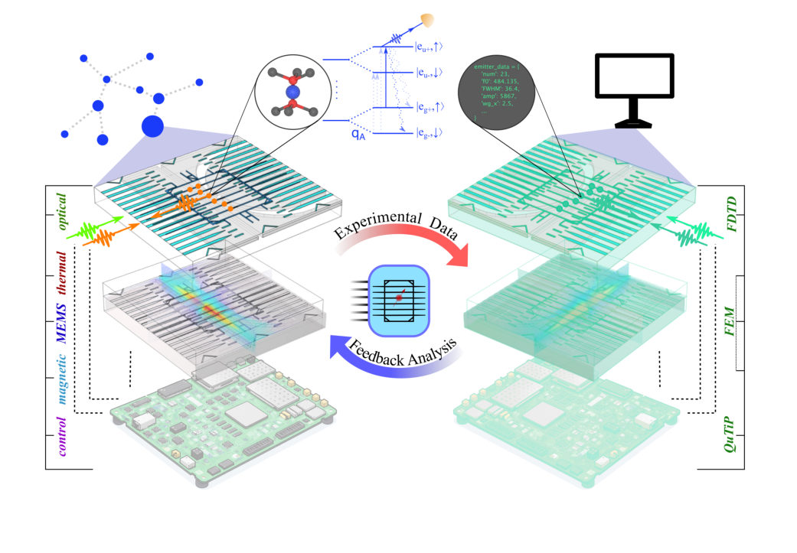
<figcaption class="paper-figure-caption"><b>Fig 1.</b> Figure 1. Engineering a full-stack blueprint of a QR-PIC. The left hand side of the figure diagrammatically depicts real-world components of a quantum network, including an entangled network (blue dots) where each node consists of a QR-PIC (left top) housing SnV−quantum emitters (inset). The QR-PIC exhibits multiphysics phenomena, including optical interfacing with SnV−emitters in nanophotonic waveguides (left second), thermal (left third) and controllable electromechanical (left fourth) strain effects perturbing quantum resources on-chip, magnetic field extents (left fifth) of coherent electromagnetic drives of SnV−electron spin qubits, and real-world electronics governed by a RFSoC (left...</figcaption>
</figure>
<figure class="paper-figure-card">
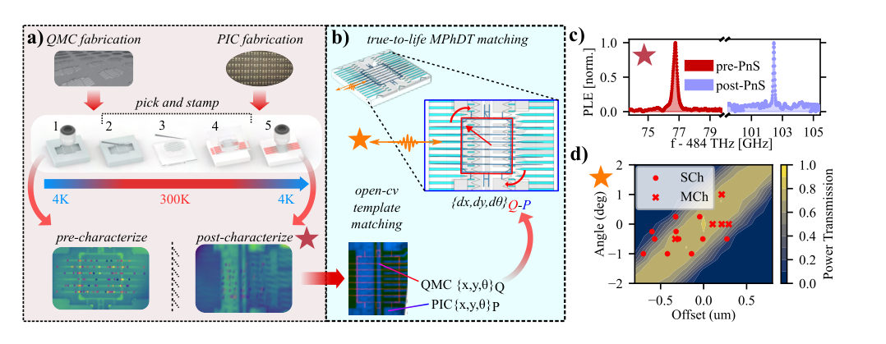
<figcaption class="paper-figure-caption"><b>Fig 2.</b> Figure 2. Development of physical and digital quantum repeater. (a) real-world development of the QR-PIC, starting from QMC and PIC fabrication components which are combined in a heterogeneous pick-and-stamp (PnS) procedure aligning a QMC to the PIC photonic integrated circuit. Emitters in the QMC are characterized using a widefield PLE (w-PLE) technique [17] to identify emitters pre- and post-PnS (red star). (b) digital twin sample construction, including a FEM and FDTD (not shown) software recreation from the sample planar geometry file. QMC (Q)-PIC (P) offsets are measured using an open-cv template matching algorithm, and these offsets (dx, dy, dθ)Q−P are passed to simulation to evaluate...</figcaption>
</figure>
<figure class="paper-figure-card">
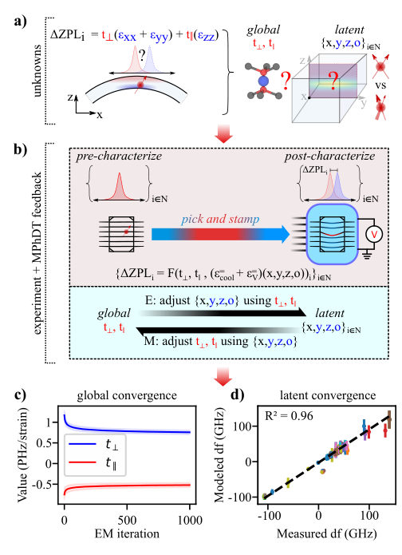
<figcaption class="paper-figure-caption"><b>Fig 3.</b> Figure 3. Experiment-analysis feedback revealing unknown global and local latent variables of SnV−quantum resources. (a) illustration of on-chip strain in a diamond waveguide gen- erating frequency shifts in the ZPL of a SnV−post-PnS and upon applied MEMS voltage. The ZPL shift is difficult to predict a priori due to the globally uncertain and underre- ported variables of tperp and tpar, as well as the latent vari- ables of each emitter (waveguide cross-sectional location, ori- entation). (b) Expectation-maximization (EM) algorithm run on seven experimental QMCs of the PnS procedure and ap- plied MEMS voltage on test chips. The ZPL shift of emitters in each sample are observed and recorded,...</figcaption>
</figure>
<figure class="paper-figure-card">
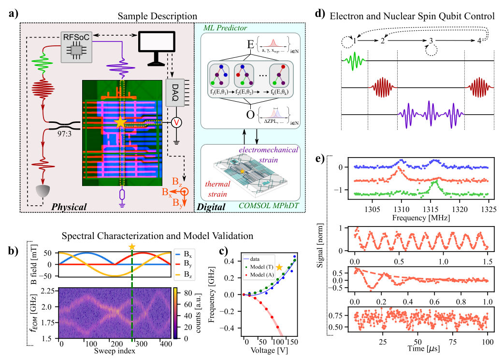
<figcaption class="paper-figure-caption"><b>Fig 4.</b> Figure 4. Robust control and model understanding of a sample emitter in a Bluefors cryostat. (a) sample constructed of a QR-PIC with two microchiplets stamped in the socket, with the targeted emitter pinpointed with a gold star. The emitter is modeled with an XGBoost model interacting with the sample MPhDT to provide expected spectral tuning parameters. (b) shows the spectral characterization of the targeted emitter using magnetospectrosocpy (left) and MEMS voltage-tuned strain spectrosocopy (right). The digital twin model captures, with root-mean-squared error of 30 MHz up to 100 V, the transverse orientation and ZPL shift from zero voltage of the emitter. (d) knowledge of the emitter...</figcaption>
</figure>
<figure class="paper-figure-card">
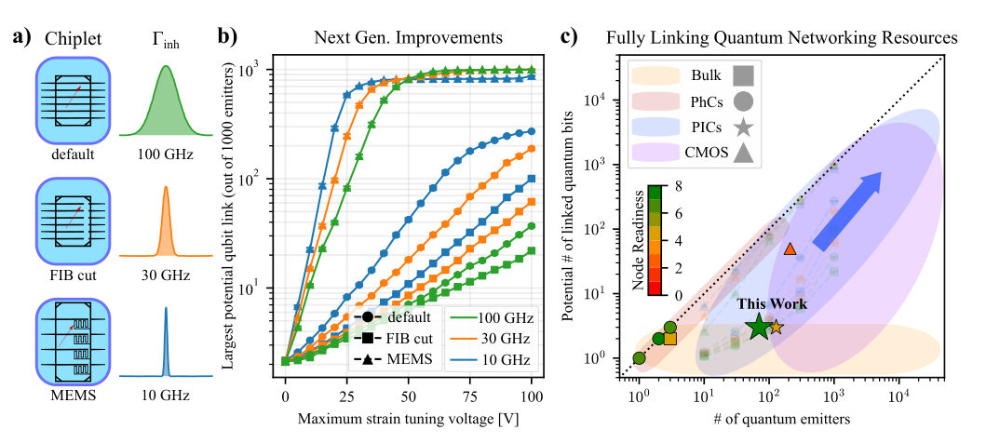
<figcaption class="paper-figure-caption"><b>Fig 5.</b> Figure 5. The MPhDT enables smarter design of next-generation QR-PICs. (a) exploring the QMC sample space by varying an input QMC to a disjoint set union (DSU) algorithm, where unions are made between emitters when one emitter’s ZPL strain tuning curve overlaps with another emitter’s curve at any voltage of both curves (assuming local tuning shown in this work). Chiplet types are varied from the default and FIB-cut waveguide QMCs (both in this work) to MEMS-designed single-sided cantilever waveguides. The inhomogeneous linewidth Γinh of SnV−emitters is also varied from 100 GHz (observed in this work) to 10 GHz (4 GHz observed in [34]), providing a 2D matrix of targeted QMC improvements. (b)...</figcaption>
</figure>

**Summary.** The paper presents a breakthrough 'full-stack' architecture integrating SnV- emitters into photonic chips for quantum networking. By coupling experimental measurements with a Multiphysics Digital Twin, the authors successfully characterized strain effects and demonstrated simultaneous control over spectral tuning, electron spin, and nuclear spins. This work establishes a robust platform roadmap toward realizing large-scale, high-connectivity quantum repeaters.

**Why it may be interesting.** This work directly addresses the engineering challenges in solid-state quantum networking by providing a comprehensive, multi-physics framework to overcome emitter disorder and enable scalable entanglement distribution.

Detailed structure

**Main problem.** Scaling solid-state quantum emitters for distributed quantum entanglement is limited by emitter frequency inhomogeneity, environmental variations, and difficulty in achieving scalable coherent control.

**Main result.** The authors demonstrated a full-stack architecture enabling simultaneous spectral tuning, spin readout, and nuclear spin control, proposing a roadmap to achieve high connectivity ($N \sim 1000$) for quantum repeaters.

**Method.** A combination of experimental characterization (strain mapping, spin echo measurements) and advanced computational modeling using a Multiphysics Digital Twin (MPhDT) guided by Expectation-Maximization algorithms was employed.

**Model / system.** The platform integrates SnV- quantum emitters in diamond nanophotonic microchiplets (QMC) onto a frequency-tunable silicon nitride photonic integrated circuit (PIC). The MPhDT simulates electro-mechanical strain effects on the emitter's zero phonon line (ZPL) frequency.

**Key observables.** GHz scale spectral tuning of ZPL, electron spin coherence time ($T_2 \sim 1	ext{ms}$), and measurable coupling efficiency between waveguides.

**Important parameters / regimes.** Strain susceptibilities ($t_{\perp}, t_{\|}$), gate times ($<80\ 	ext{ns}$), and target connectivity of $99.96\%$ for large emitter arrays.

**Assumptions / limitations.** The ability to model the complex interplay between strain, electric fields, and quantum emitter properties using coupled FEM/FDTD simulations is assumed for predictive control.

**Figures summary.** Figures likely detail spectral tuning curves vs. voltage, spin echo decay plots (XY8 sequences), and simulation results showing achievable connectivity based on overlap criteria.

**Paper structure.** The work progresses from identifying the limitations of current solid-state platforms to proposing a full-stack architecture ($	ext{QR-PIC}$), detailing the use of $	ext{MPhDT}$ for parameter extraction, demonstrating advanced control (spin/spectral tuning), and finally simulating scalability for large networks.

Abstract

Solid state quantum emitters are a leading platform for photonic quantum networking with memory nodes. However, the inhomogeneous distribution of quantum emitters, as well as several environmental factors (i.e. strain and electric fields) spread the frequency spectrum of the qubits, making them distinguishable and therefore not a reliable resource for distributed quantum entanglement. In this paper, we demonstrate a full-stack approach to integrating nearly indistinguishable tin vacancy (SnV$^-$) quantum emitters on a frequency-tunable photonic interposer that overcomes the native distribution and static variation of quantum emitters for an indistinguishable photonic quantum networking platform. We demonstrate a silicon nitride-on-insulator photonic integrated circuit (PIC) with accompanying multiphysics digital twin (MPhDT) that guides discovery of SnV$^-$ strain-tuning parameters and informs construction of a multi-channel quantum repeater node. On this node, we achieve the first simultaneous demonstration of spectral tuning of the zero phonon line (ZPL) at GHz scale; coherent electron spin control with gate times of $<80$ ns; strongly- and weakly-coupled nuclear spin detection; and commercial fiber array-coupled readout of a SnV$^-$ center. Finally, we propose and simulate improvements to the architecture that achieve 99.96% connectivity of $ N \sim 1000$ emitters spanning the inhomogeneous distribution of SnV$^-$ centers in strained diamond, where distributed quantum entanglement may be realized.

[↑ back to top](#top)

### [Modelling quantum measurement dynamics: from decoherence to redundancy with site-hopping indistinguishable particles](http://arxiv.org/abs/2608.11319v1)

**Authors:** Katja Schneeweiss, Tom Rivlin, Maximilian P. E. Lock, Marcus Huber, Iva Březinová  
**Type:** theory · **Category:** other · **PDF:** <https://arxiv.org/pdf/2608.11319v1>  
**Analysis basis:** full PDF text, analyzed in chunks
**Topic relevance:** 🔥 `analog quantum simulation` **4/5** · 🔥 `quantum measurements` **4/5** · `correlated / nonlocal dissipation` **3/5** · `methods for driven-dissipative` **3/5** · `driven-dissipative phase transition` **2/5** · `non-equilibrium universality` **1/5** · `scars & prethermalization` **1/5**

↔ Scroll figures horizontally

<figure class="paper-figure-card">
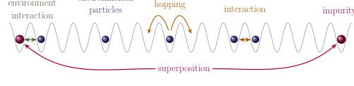
<figcaption class="paper-figure-caption"><b>Fig 1.</b> FIG. 1. A sketch of the model consisting of a discrete 1D lattice with hard-wall boundaries and MS sites (the sites are suggestively pictured as potential wells but in our model they are simply treated as abstract sites). The system contains NE = MS/2 indistinguishable particles (fermions or hard- core bosons), which can hop from site to site and interact with each other via nearest-neighbour interactions. We refer to these particles as the environment. Additionally, the sys- tem contains one distinguishable particle, which we call the impurity, that is initially in a superposition of being at the left- and right-most sites. It interacts with the environmental particles in the ensuing...</figcaption>
</figure>
<figure class="paper-figure-card">
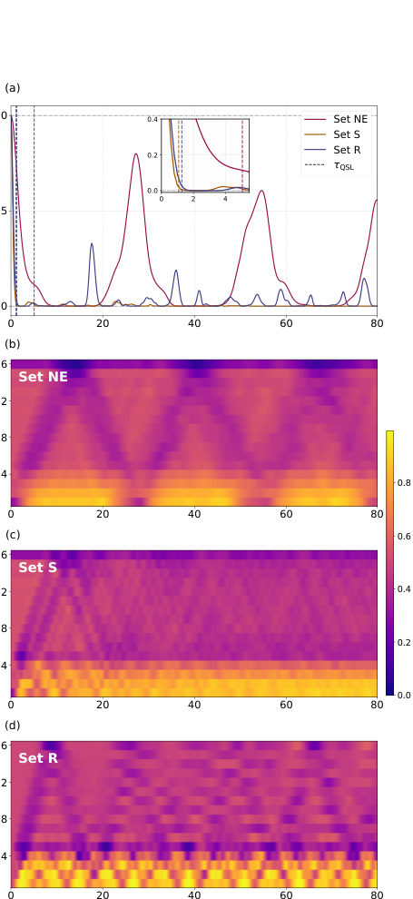
<figcaption class="paper-figure-caption"><b>Fig 2.</b> FIG. 2. Comparison of three parameter sets for fermions with MS = 16 and NE = 8. See Tab. II for the parameter values. The vertical dashed lines in subfigure (a) mark τQSL from Eq. 21 for each case. (a) shows D(t) as a function of time. (b-d) show, for each of the three cases, the probability of observing an environment particle at each lattice site over time, conditional on the impurity being at the left site, which are the diagonal elements of ˆDL 1 defined below.</figcaption>
</figure>
<figure class="paper-figure-card">
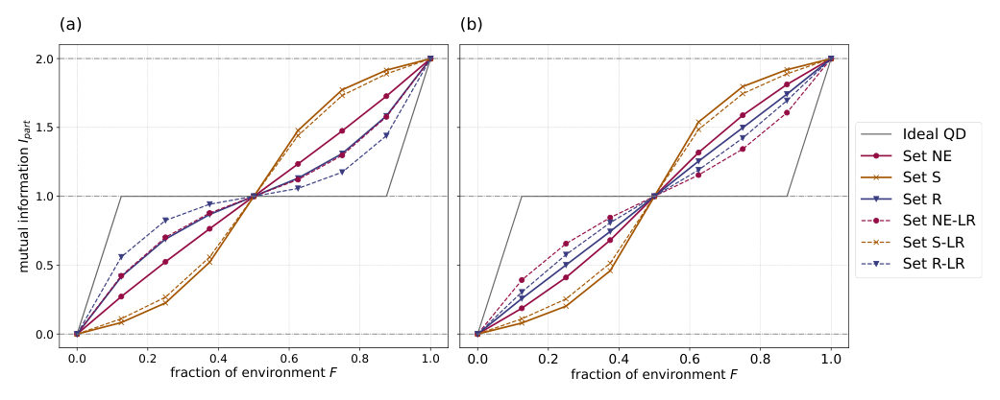
<figcaption class="paper-figure-caption"><b>Fig 3.</b> FIG. 3. The QMI IF/B part[I : ˆD1...p] for (a) fermions and (b) hard-core bosons. It is calculated using Eq. 14 as a function of the fraction of the environment F = p/NE using particle-based averaging. The six curves in each subfigure show different parameter sets from Tab. II, with MS = 16 and NE = 8. The timesteps at which these curves were calculated are given in the appendix in Table IV (they are the same for fermions and bosons). We also show an ‘Ideal QD’ curve indicating what an idealised quantum Darwinism model would predict.</figcaption>
</figure>
<figure class="paper-figure-card">
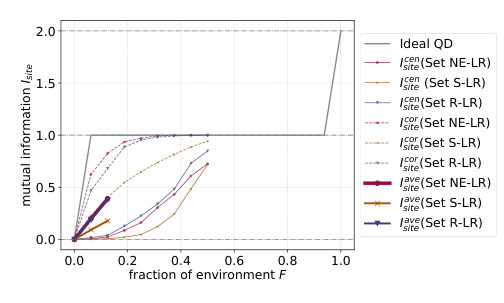
<figcaption class="paper-figure-caption"><b>Fig 4.</b> FIG. 4. The QMI based on traces over sites Isite (Eq. 19) for MS = 16 and NE = 8. (Fermions were used in this calculation but the result is identical for bosons.) Each curve represents a certain set of parameters from Tab. II, and different choices of X, the set of sites to average over. The set is either filled from the left and right edges of the system (labelled ‘corner’, Icor site), or from the centre of the system (labelled ‘centre’, Icen site), or we average over all possible choices for a given |X|: Iave site from Eq. 20. As before, we include an idealised QD curve. For each curve, the timestep at which the calculation was performed is listed in the appendix in Tab. IV.</figcaption>
</figure>
<figure class="paper-figure-card">
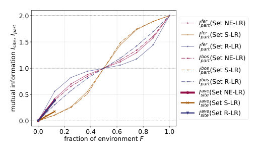
<figcaption class="paper-figure-caption"><b>Fig 5.</b> FIG. 5. Comparison between the averaged QMI based on traces over fermions and bosons IF/B part[I : ˆD1...p] (as in Fig. 3), and the QMI based on traces over sites ⟨Isite[I : ˆρX]⟩|X| (as in Fig. 4). For two of the parameter sets, the three different QMIs agree with each other.</figcaption>
</figure>

**Summary.** This paper develops and analyzes a flexible many-body model—a 1D lattice with hopping indistinguishable particles—to study how quantum measurement dynamics proceed from decoherence toward classical redundancy. By incorporating particle statistics (fermions vs. bosons), the authors demonstrate that these fundamental details significantly alter the emergence of objective information, providing crucial theoretical alignment for future experiments using ultracold atoms.

**Why it may be interesting.** This work directly addresses fundamental questions about quantum-to-classical transition using a highly tunable model inspired by ultracold atom simulators, making it highly relevant to AMO physics research in open quantum systems.

Detailed structure

**Main problem.** The paper models quantum measurement dynamics, specifically investigating the transition from decoherence to redundancy within the framework of Quantum Darwinism (QD) using realistic many-body systems.

**Main result.** Particle statistics significantly impact QD properties, showing that fermionic environments can achieve information redundancy more readily than bosonic or site-based ones. The model successfully reproduces known decoherence dynamics by tuning parameters.

**Method.** The authors use numerically exact time evolution simulations on a 1D lattice to calculate quantum observables like Quantum Mutual Information (QMI) and environmental entropy.

**Model / system.** The system is a 1D lattice containing an impurity particle interacting with an environment composed of indistinguishable hopping particles (fermions or hard-core bosons). The Hamiltonian includes terms for environment hopping ($\hat{H}_E$) and interaction between the impurity and environment ($\hat{H}_{IE}$).

**Key observables.** Quantum Mutual Information (QMI), decoherence parameter $D(t)$, environmental entropy, and indicators of classicality like equilibration and redundancy.

**Important parameters / regimes.** $W_{EE}$ (environment interaction strength), $W_{IE}$ (impurity-environment coupling), and the particle statistics (fermionic vs. bosonic).

**Assumptions / limitations.** The analysis assumes that measurements must be performed at times when the decoherence parameter $D(t) \approx 0$ for a fair QMI assessment, and it simplifies by setting $\hat{H}_I = 0$.

**Figures summary.** Figures illustrate the time evolution of QMI showing the loss of an initial 'redundancy plateau' due to environment-environment interactions. They also show how revival characteristics decrease with increasing system size.

**Paper structure.** The paper introduces the model, details methods for handling indistinguishable particles in environmental entropy calculations, analyzes the effect of particle statistics on QD properties via QMI measurements over time, and discusses the implications for aligning theory with experiments.

Abstract

In recent years, new theoretical insights into decoherence and quantum measurements have emerged through the study of many-body dynamics in isolated quantum systems. It is now understood that the parameters and energy scales in system-environment interactions decisively affect how readily information spreads from a quantum system into its surroundings during a decoherence event. A popular choice for studying these effects is the framework of quantum Darwinism (QD), but so far few works have applied this to realistic many-body models. Inspired by experimentally-accessible setups, in this work we introduce a simple, flexible, numerically exact many-body model of a system broadcasting information into an environment: a 1D lattice of sites with hopping particles. We show that different choices of parameters lead to the recovery of known scenarios featuring different decoherence and QD effects, such as equilibration, revivals of coherence, and redundancy. In constructing this model we resolve the crucial issue of indistinguishability: we explain how to calculate the entropy of a fraction of the environment when said environment is composed of indistinguishable fermions or bosons (or lattice sites containing them). We then show that particle statistics can make a notable difference to the QD properties of the setup, with fermionic environments sometimes achieving redundancy much more readily than bosonic or site-based ones. Our work opens the door to much closer alignment between theoretical models and experimental tests of the dynamics of quantum measurements and the quantum-to-classical transition.

[↑ back to top](#top)

### [Shortcuts to Parameter Sweeps](http://arxiv.org/abs/2608.12154v1)

**Authors:** Chi Xiang, Guodong Cheng, Geng Li  
**Type:** theory · **Category:** statistical mechanics · **PDF:** <https://arxiv.org/pdf/2608.12154v1>  
**Analysis basis:** full PDF text, analyzed in chunks
**Topic relevance:** 🔥 `analog quantum simulation` **4/5** · `driven-dissipative phase transition` **3/5** · `methods for driven-dissipative` **3/5** · `Keldysh / 2PI / non-Gaussian methods` **2/5** · `non-equilibrium universality` **2/5** · `quantum measurements` **2/5** · `correlated / nonlocal dissipation` **1/5** · `scars & prethermalization` **1/5**

↔ Scroll figures horizontally

<figure class="paper-figure-card">
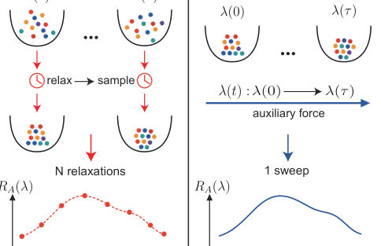
<figcaption class="paper-figure-caption"><b>Fig 1.</b> FIG. 1. Point-by-Point Relaxation versus Single-Sweep Con- tinuous Response Estimation. Left: In conventional ap- proaches, the system is simulated independently at a sequence of discrete parameter values λi. At each parameter value, the system must first relax to the corresponding stationary state before the observable RA(λi) is sampled. The response curve is subsequently reconstructed from these discrete mea- surements. Right: In STPS, the control parameter λ(t) is continuously swept from λ(0) to λ(τ), while an auxiliary con- trol ensures that the system evolves according to the instan- taneous stationary-state distribution throughout the sweep. Consequently, STPS estimates the continuous...</figcaption>
</figure>
<figure class="paper-figure-card">
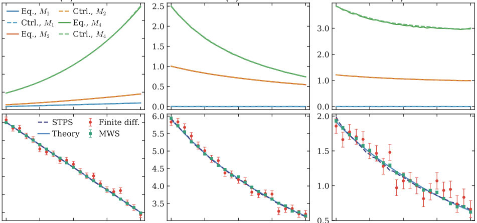
<figcaption class="paper-figure-caption"><b>Fig 2.</b> FIG. 2. Numerical validation of STPS for continuous response estimation. (a) Translated harmonic trap, Uo = kx2/2 −λx, with k = 2. (b) Interacting many-body system, Uo = a P</figcaption>
</figure>

**Summary.** The paper introduces Shortcuts to Parameter Sweeps (STPS), an advanced technique to calculate how system properties change with respect to varying control parameters ($\lambda$). By engineering a controlled trajectory, STPS estimates the entire continuous response curve from just one simulation run. This offers a significant computational advantage over traditional methods that require running many independent simulations.

**Why it may be interesting.** This is highly relevant for studying open quantum systems or many-body dynamics where parameters (like coupling strengths or external driving frequencies) are varied slowly. It provides a computational shortcut to map out parameter landscapes without prohibitive simulation costs.

Detailed structure

**Main problem.** The core challenge is efficiently calculating how stationary expectations (response functions) change when system parameters are varied over a wide range, as standard methods require costly repeated sampling.

**Main result.** The proposed Shortcuts to Parameter Sweeps (STPS) framework allows estimating the continuous response curve from a single controlled simulation sweep, providing an efficient, sample-based alternative to traditional methods.

**Method.** STPS engineers an auxiliary control field to guide the system's probability density along the instantaneous stationary manifold during one finite-time sweep. This leverages covariance-based response relations derived from transport theory.

**Model / system.** The method is general, applicable to both equilibrium and non-equilibrium steady-state systems, including many-body interacting particle models (e.g., trapped or rotating systems).

**Key observables.** Stationary response functions $\langle A 
angle_\lambda$ and their derivatives with respect to the parameter $\lambda$, denoted $R_A(\lambda)$.

**Important parameters / regimes.** The control parameter $\lambda$ is swept over a broad range; simulation details include time scales ($	au$) and dimensionality.

**Assumptions / limitations.** Assumes that the stationary density $
ho_{st}$ can be characterized, even if unknown analytically. Learned implementations introduce errors related to score matching, escort field training, and finite sampling coverage.

**Figures summary.** Figures compare Point-by-Point Relaxation (multiple runs) against STPS using a single controlled sweep for various physical systems (harmonic trap, interacting many-body).

**Paper structure.** The paper introduces the limitation of standard methods, develops the theoretical basis linking response to stationary transport equations, details the practical implementation using learned fields (GNNs), and validates the approach by comparing results against established finite difference techniques.

Abstract

Efficient evaluation of stationary parametric sensitivities over broad parameter ranges is important for identifying influential training data, fitting force fields, and predicting material responses, but standard pointwise approaches require repeated relaxation and sampling. Here we introduce Shortcuts to Parameter Sweeps (STPS), an engineered control strategy that uses an auxiliary control to transport the probability density along a prescribed family of instantaneous stationary states during a finite-time parameter sweep. This enables the continuous response curve over the full parameter interval to be estimated from a single controlled sweep using covariance-based response relations. STPS applies to both equilibrium and nonequilibrium steady-state systems, including those with unknown stationary distributions, and can be implemented directly using stationary samples in high-dimensional settings. Numerical tests on single-particle and interacting many-body systems show that STPS yields response curves in close agreement with reference results. These findings establish STPS as an efficient, sample-based framework for continuous sensitivity analysis in stochastic simulations.

[↑ back to top](#top)

### [A piston-like polymer stochastic heat engine](http://arxiv.org/abs/2608.11507v1)

**Authors:** Yi-Jui Chiu, Cheng-Hung Chang  
**Type:** both · **Category:** statistical mechanics · **PDF:** <https://arxiv.org/pdf/2608.11507v1>  
**Analysis basis:** full PDF text, analyzed in chunks
**Topic relevance:** 🔥 `non-equilibrium universality` **4/5** · `driven-dissipative phase transition` **3/5** · `methods for driven-dissipative` **3/5** · `Frenkel-Kontorova` **2/5** · `Keldysh / 2PI / non-Gaussian methods` **2/5** · `correlated / nonlocal dissipation` **1/5** · `quantum measurements` **1/5** · `scars & prethermalization` **1/5**

↔ Scroll figures horizontally

<figure class="paper-figure-card">
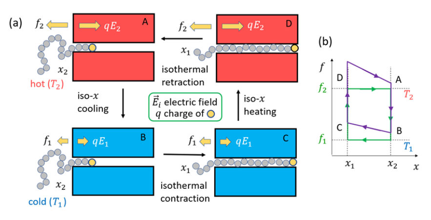
<figcaption class="paper-figure-caption"><b>Fig 1.</b> Figure 1. Construction and quasistatic cycle of the polymer engine. a, A terminal bead</figcaption>
</figure>
<figure class="paper-figure-card">

<figcaption class="paper-figure-caption"><b>Fig 2.</b> Figure 2. Thermodynamic validation of the isothermal branches. a, Entropic recoil force</figcaption>
</figure>
<figure class="paper-figure-card">
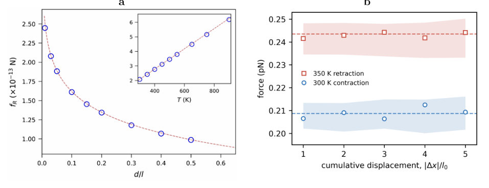
<figcaption class="paper-figure-caption"><b>Fig 3.</b> Figure 3a shows the crossover from work-consuming cycles at the fastest protocols to positive</figcaption>
</figure>
<figure class="paper-figure-card">

<figcaption class="paper-figure-caption"><b>Fig 4.</b> Fig. 3b shows the corresponding increase of efficiency toward ηC. Maximization within the</figcaption>
</figure>
<figure class="paper-figure-card">
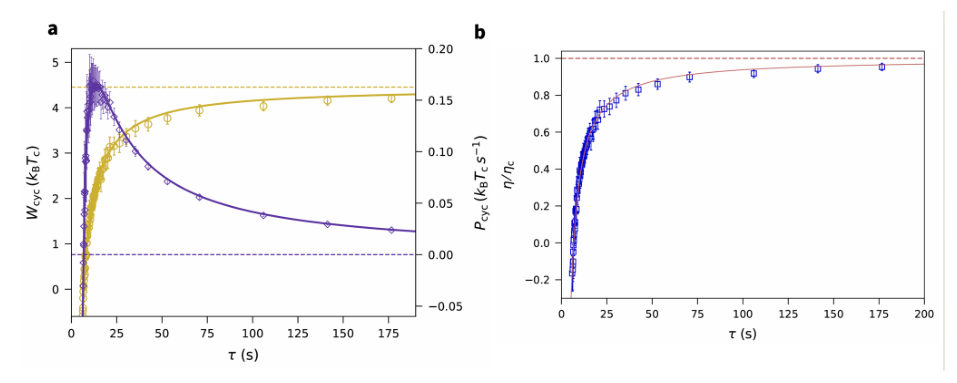
<figcaption class="paper-figure-caption"><b>Fig 5.</b> Figure 3. Finite-time performance at Tc = 300 K and Th = 350 K. a, Cycle work and power</figcaption>
</figure>

**Summary.** The authors introduce and analyze a novel stochastic heat engine based on polymer confinement that more closely mimics classical piston engines. By simulating cyclic work extraction under varying temperatures, they demonstrate the recovery of fundamental thermodynamic limits, such as Carnot efficiency, while also mapping out finite-time performance boundaries.

**Why it may be interesting.** This work provides a concrete, mesoscopic realization of non-equilibrium thermodynamics principles (like the Jarzynski equality) in a polymer system, offering insights into how complex molecular dynamics can govern macroscopic energy conversion processes relevant to statistical mechanics.

Detailed structure

**Main problem.** To develop a stochastic heat engine model that more accurately mimics macroscopic piston-cylinder engines compared to existing colloidal analogues, allowing for direct work calculation from the force-position diagram.

**Main result.** The polymer-based engine successfully demonstrates characteristic features of thermal machines, recovering Carnot efficiency under ideal regeneration and following universal low-dissipation bounds in finite-time analysis.

**Method.** The study uses both theoretical quasistatic cycle definitions (e.g., Jarzynski equality) and numerical simulations involving Langevin dynamics to calculate work, power, and efficiency across various driving speeds.

**Model / system.** The system is a polymer chain confined in a narrow channel, modeled using bead-spring interactions governed by an overdamped Langevin equation. Work extraction occurs via cyclic processes involving isothermal contraction (cold) and retraction (hot).

**Key observables.** Cycle work ($W_{	ext{cyc}}$), power ($P_{	ext{cyc}}$), efficiency ($\eta$), free energy change ($\Delta F$), and the force magnitude during isothermal strokes.

**Important parameters / regimes.** Temperatures ($T_c=300$ K, $T_h=350$ K), channel width ($d/l$), cycle time ($	au_{	ext{cyc}}$), and coupling constants ($k_s$).

**Assumptions / limitations.** The analysis often relies on the plateau approximation for the recoil force during isothermal strokes, and finite-time results are compared against low-dissipation theoretical bounds.

**Figures summary.** Figures illustrate the engine cycle (force-position diagram), free energy reconstruction via Jarzynski equality, and plots showing work, power, and efficiency dependence on total cycle time ($	au_{	ext{cyc}}$) and temperature.

**Paper structure.** The paper first establishes the theoretical framework by defining the polymer engine cycle and calculating quasistatic limits. It then proceeds to numerical simulations, validating force measurements using iso-force analysis and analyzing finite-time performance across various driving speeds to map out power-efficiency trade-offs.

Abstract

Colloidal stochastic engines are often regarded as microscopic analogues of macroscopic pis ton cylinder heat engines. However, although they share some underlying physical principles, such systems remain far from being direct force generators from a practical perspective. Motivated by this limitation, the present study introduces a polymer-based stochastic engine that more closely mimics the operation of piston cylinder engines. In this setup, heat is converted into work through a cyclic process in which a polymer is pulled into and out of a narrow channel under varying tem peratures. The work performed by the engine can be directly obtained from the cyclic trajectory in the force position diagram, analogous to the pressure volume diagram in traditional heat engines. Despite its much higher number of degrees of freedom compared to colloidal engines, the polymer en gine nevertheless follows several characteristic features observed in such systems. Numerical results demonstrate consistency with universal low-dissipation bounds for e ciency, recovery of Carnot e ciency under regeneration, and low-dissipation scaling of work and power.

[↑ back to top](#top)

### [Floquet-Resolved Dissipation Selects Entanglement Beyond Population Spectroscopy](http://arxiv.org/abs/2608.12178v1)

**Authors:** Gianluigi Pacino, Rosario Nicosia, Alessandro Ridolfo  
**Type:** theory · **Category:** other · **PDF:** <https://arxiv.org/pdf/2608.12178v1>  
**Analysis basis:** full PDF text, analyzed in chunks
**Topic relevance:** 🔥 `methods for driven-dissipative` **4/5** · `Keldysh / 2PI / non-Gaussian methods` **3/5** · `correlated / nonlocal dissipation` **3/5** · `analog quantum simulation` **2/5** · `quantum measurements` **2/5** · `Tavis-Cummings & cavity-many-emitter` **1/5** · `driven-dissipative phase transition` **1/5** · `non-equilibrium universality` **1/5**

↔ Scroll figures horizontally

<figure class="paper-figure-card">
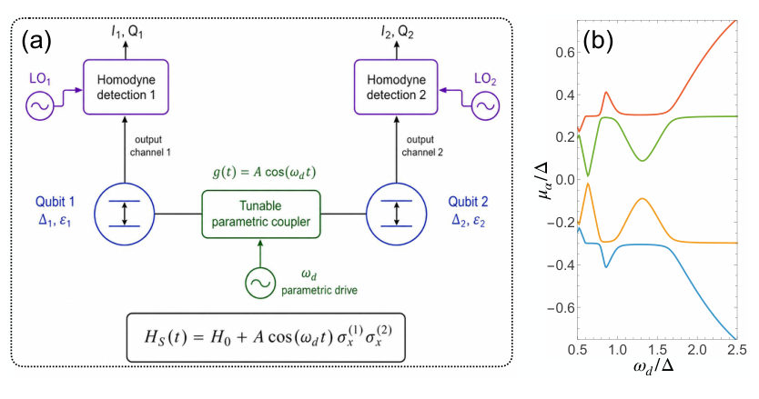
<figcaption class="paper-figure-caption"><b>Fig 1.</b> FIG. 1. Parametrically coupled qubits and Floquet spectrum. (a) Minimal scheme of two effective qubits with static transverse coupling contained in H0 and a tunable interaction modulated as g(t) = A cos(ωdt). Each qubit is coupled to an independent output channel, shown with phase-sensitive homodyne detection of the two quadratures. (b) Four Floquet quasienergies µα, folded into the first Brillouin zone, as a function of ωd/∆. Avoided crossings mark the multiphoton resonances at which the drive hybridizes different excitation sectors. Parameters are ∆1 = ∆2 = ∆, ϵ1/∆= 0.1, ϵ2/∆= 0, g0/∆= 0.3, and A/∆= 1.</figcaption>
</figure>
<figure class="paper-figure-card">
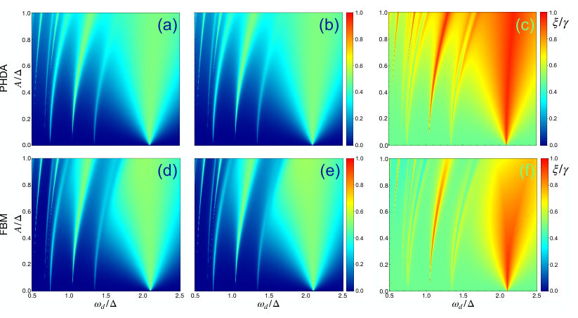
<figcaption class="paper-figure-caption"><b>Fig 2.</b> FIG. 2. Period-averaged dressed populations and Liouvillian gap. The upper (lower) row corresponds to PHDA (FBM). Panels (a,d) and (b,e) show the period-averaged dressed populations of qubits 1 and 2, respectively, while panels (c,f) show the scaled Liouvillian gap ξ/γ, with ξ = minj̸=0[−Re(λj)]. All color scales range from 0 to 1. Parameters are ∆1 = ∆2 = ∆, ϵ1/∆= 0.1, ϵ2/∆= 0, g0/∆= 0.3, T1 = T2 = 0, and γ/∆= 10−3 for Ohmic reservoirs.</figcaption>
</figure>
<figure class="paper-figure-card">
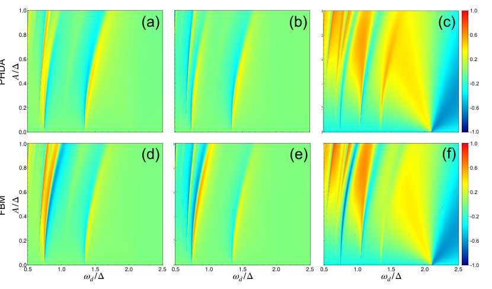
<figcaption class="paper-figure-caption"><b>Fig 3.</b> FIG. 3. Phase-resolved coherence-sensitive observables. All quantities are evaluated at t0 = τ/2. The upper (lower) row corresponds to PHDA (FBM). Panels (a,d), (b,e), and (c,f) display X1, X2, and the symmetrized mixed quantity X12, respectively. All panels share the same scale, ranging from −1 to 1, so that differences in the amplitude, width, and shape of the resonant structures can be compared directly. The plotted quantities are system observables, and their relation to calibrated output signals, including the corresponding spectral factors, is given in Appendix A. Parameters are the same as in Fig. 2.</figcaption>
</figure>
<figure class="paper-figure-card">
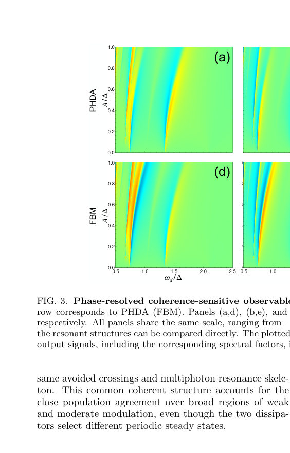
<figcaption class="paper-figure-caption"><b>Fig 4.</b> Figure 2 shows where that agreement becomes visi- bly less accurate. The resonance positions remain com- mon to both descriptions, but appreciable differences are mainly evident once the modulation reaches A/∆≳ 0.3. In particular, the FBM population maps develop a stronger asymmetry than PHDA and show a suppres- sion on the left side of the resonant tongue that emerges near ωd/∆≃2.1. These features are much less pro- nounced in the PHDA maps. The relaxation-gap panels display a clearer reorganization of the decay structure. Thus the population comparison supports the conserva- tive conclusion that the two methods reproduce essen- tially the same resonance skeleton and remain close over a...</figcaption>
</figure>
<figure class="paper-figure-card">
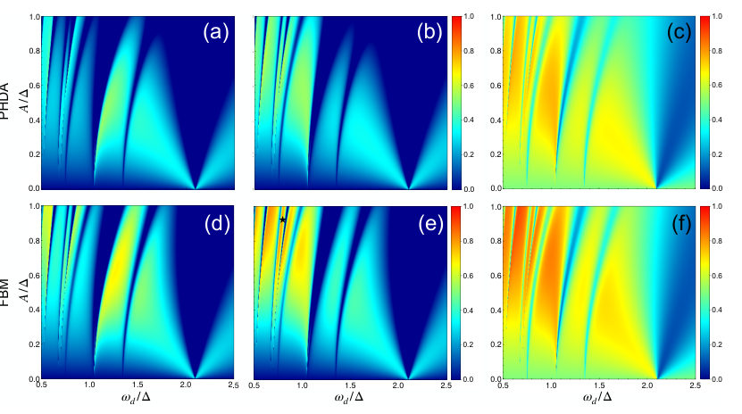
<figcaption class="paper-figure-caption"><b>Fig 5.</b> FIG. 4. Concurrence and phase-anchored Floquet fidelity. The upper row is calculated with PHDA and the lower row with FBM. The left and middle columns show Wootters’ concurrence C(t0) at t0/τ = 0 [panels (a,d)] and t0/τ = 1/2 [panels (b,e)]. The right column [panels (c,f)] shows the overlap FB,0(τ/2) with the Floquet Bell-like reference |ΨF B(0)⟩= [|Φ1(0)⟩−|Φ4(0)⟩]/ √</figcaption>
</figure>

**Summary.** The paper investigates how different theoretical methods describe dissipation in periodically driven qubits. By comparing the Partial Harmonic Decomposition Approach (PHDA) and Floquet-Born-Markov (FBM) theory, the authors demonstrate that while both predict similar average populations, they yield vastly different predictions for entanglement. This establishes that coherence-sensitive observables are essential benchmarks for accurate open quantum state engineering.

**Why it may be interesting.** This work directly addresses the practical challenges of modeling open quantum systems under strong periodic driving, providing a crucial diagnostic tool (coherence measurements) that surpasses simple population monitoring in validating theoretical models.

Detailed structure

**Main problem.** To determine if population spectroscopy is a sufficient benchmark for validating open Floquet quantum-state engineering, showing that dissipation selects entanglement beyond what can be inferred from populations alone.

**Main result.** The comparison between two theoretical descriptions (PHDA and FBM) shows that while they yield similar average populations, the asymptotic entanglement predicted by the more rigorous Floquet-Born-Markov theory is substantially stronger than that predicted by PHDA.

**Method.** The authors compare two methods for solving the time-dependent master equation in periodically driven systems: Partial Harmonic Decomposition Approach (PHDA) and Floquet-Born-Markov (FBM) theory, analyzing their predictions for entanglement.

**Model / system.** The model consists of two transversely coupled qubits whose interaction is modulated parametrically by a cosine function. The dynamics are governed by a time-dependent master equation solved using both PHDA and FBM formalisms.

**Key observables.** Period-averaged populations, phase-resolved single- and two-qubit coherence observables, and Concurrence (a measure of entanglement).

**Important parameters / regimes.** Modulation strength ($A$), drive frequency ($\omega$), and the ratio $\omega_d/\Delta$. The comparison is sensitive to increasing modulation strength.

**Assumptions / limitations.** The PHDA approach is an approximation to FBM, valid in the weak-dressing regime but not equivalent. The analysis relies on verifying secularity conditions ($R_{\min} \gg 1$) for rate equations to be applicable.

**Figures summary.** Figures show period-averaged dressed populations and Liouvillian gaps comparing PHDA and FBM across varying drive parameters, while other figures illustrate coherence observables revealing discrepancies as modulation increases.

**Paper structure.** The paper establishes the problem by noting that population agreement is insufficient. It then details the two theoretical frameworks (PHDA vs. FBM), compares their predictions using various diagnostics (populations, coherence, concurrence), and concludes by establishing coherence-sensitive observables as the necessary validation test for open Floquet engineering.

Abstract

Reliable quantum-state engineering in periodically driven devices requires more than reproducing their excitation spectrum: the environment must resolve the transitions of the driven system. We show that two dissipative descriptions of the same parametrically coupled qubits can yield closely similar period-averaged populations yet qualitatively different asymptotic entanglement. Both retain the complete periodically driven Hamiltonian, the same microscopic bath couplings, and the same physical observables; they differ in the dynamical representation used to resolve the dissipative channels and the corresponding system operators: the static dressed basis in the partial harmonic decomposition approach (PHDA) and the Floquet basis, including all relevant drive sidebands, in Floquet-Born-Markov (FBM) theory. The population maps preserve the same resonance skeleton and remain closely similar over broad low-to-moderate drive regions, while clearer differences emerge as the modulation becomes stronger. Phase-resolved single- and two-qubit coherence observables reveal a substantially stronger redistribution of amplitudes and phases. Concurrence amplifies this hidden state-level discrepancy: Floquet-resolved dissipation selects stronger and more extended Bell-like entangled regions and a larger overlap with a fixed Bell-like reference, while PHDA generally underestimates the entanglement and its thermal persistence. A channel-resolution test verifies the secular, completely positive FBM construction throughout the relevant parameter domain. Our results establish population agreement as an insufficient benchmark for open Floquet quantum-state engineering and identify coherence-sensitive observables as the decisive validation test.

[↑ back to top](#top)

### [Exchange Fluctuation Theorems for Non-Markovian Baths in Quantum Collisional Model](http://arxiv.org/abs/2608.11488v1)

**Authors:** Sayan Mondal, Sukrut Mondkar, Ujjwal Sen  
**Type:** theory · **Category:** statistical mechanics · **PDF:** <https://arxiv.org/pdf/2608.11488v1>  
**Analysis basis:** full PDF text, analyzed in chunks
**Topic relevance:** 🔥 `quantum measurements` **4/5** · `correlated / nonlocal dissipation` **3/5** · `methods for driven-dissipative` **3/5** · `non-equilibrium universality` **3/5** · `driven-dissipative phase transition` **2/5** · `Keldysh / 2PI / non-Gaussian methods` **1/5**

↔ Scroll figures horizontally

<figure class="paper-figure-card">
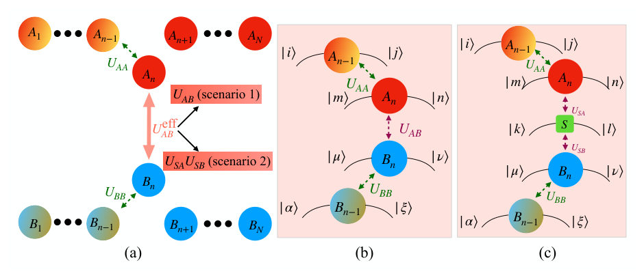
<figcaption class="paper-figure-caption"><b>Fig 1.</b> Figure 1. Schematic diagram of the setup. (a) Collisional model describing heat exchange between two baths A and B. The red (blue) circles denote auxiliary units of bath A (B), each initially prepared in a Gibbs state at the corresponding bath temperature. Before the nth inter-bath collision, the neighboring auxiliaries within each bath undergo intra-bath interactions UAA and UBB, generating memory effects. The intra-bath interactions involve the nth and (n −1)th auxiliary unit of each bath. The initial state of the nth unit is the thermal Gibbs state, while that of the (n−1)th unit can be some athermal state. The subsequent effective interaction between the two baths is denoted by U eff...</figcaption>
</figure>
<figure class="paper-figure-card">
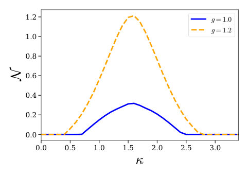
<figcaption class="paper-figure-caption"><b>Fig 2.</b> Figure 2. BLP measure of non-Markovianity of the collisional bath. The BLP measure of non-Markovianity, N, is shown as a function of the intra-bath coupling strength κ. The environment consists of auxiliary qubits interacting sequentially with a system qubit. Both the system and bath auxiliary qubits have energy split- ting ω = 1.0. Results are shown for two values of the system-bath coupling strength, g = 1.0 (blue solid) and g = 1.2 (orange dashed). The bath auxiliaries are initially prepared in Gibbs states with inverse temperature β = 1.0. Quantities plotted on both axes are dimension- less.</figcaption>
</figure>
<figure class="paper-figure-card">
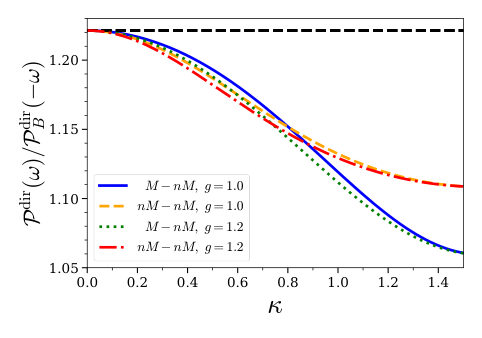
<figcaption class="paper-figure-caption"><b>Fig 3.</b> Figure 3. XFT for direct bath-bath interaction. The left-hand side of Eq. (14) is plotted as a function of the intra-bath coupling strength κ. The bath auxiliaries are qubits with energy splitting ω = 1.0. Results are shown for bath-bath coupling strengths g = 1.0 and g = 1.2, comparing a Markovian and a non-Markovian bath A, while bath B remains non-Markovian. The inverse temperatures are βA = 1.0 and βB = 0.8. The black dashed line denotes the standard Markovian XFT prediction, e∆βω, corresponding to the right-hand side of Eq. (14) with Cdir M-M = 1. Quantities plotted on both axes are dimensionless.</figcaption>
</figure>
<figure class="paper-figure-card">
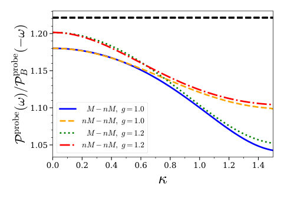
<figcaption class="paper-figure-caption"><b>Fig 4.</b> Figure 4. XFT for probe-mediated bath-bath interaction. The left-hand side of Eq. (20) is plotted as a function of the intra-bath coupling strength κ. The bath auxiliaries are qubits with energy split- ting ω = 1.0, and the probe is also taken to be a qubit with the same energy splitting. The probe is initially prepared in the Gibbs state at inverse temperature βA. Results are shown for bath-bath coupling strengths g = 1.0 and g = 1.2, comparing a Markovian and a non- Markovian bath A, while bath B remains non-Markovian. The in- verse temperatures are fixed at βA = 1.0 and βB = 0.8. The black dashed line represents the conventional Markovian XFT prediction, e∆βω, obtained in the absence of...</figcaption>
</figure>

**Summary.** This paper extends the quantum exchange fluctuation theorem to systems coupled to baths exhibiting memory effects (non-Markovianity). Using a collisional model, the authors derive generalized theorems showing that bath memory modifies the expected heat flow statistics. This establishes a microscopic link between environmental memory and non-equilibrium thermodynamics.

**Why it may be interesting.** This work directly addresses how environmental memory modifies fundamental non-equilibrium relations like the Second Law, which is crucial for understanding energy transport in realistic quantum devices.

Detailed structure

**Main problem.** The primary goal is generalizing the quantum exchange fluctuation theorem (XFT) to account for non-Markovian dynamics in open quantum systems undergoing heat exchange.

**Main result.** Non-Markovian memory introduces an additional factor, modifying the conventional Jarzynski-Wójcik XFT and enhancing the probability of heat transfer against the temperature gradient.

**Method.** The authors derive generalized XFTs by analyzing forward and reverse quantum trajectories within a microscopic collisional model framework.

**Model / system.** The system is an open quantum system modeled using a quantum collisional approach involving two thermal baths (A and B) coupled via auxiliary units. Non-Markovianity arises from correlations between successive bath auxiliaries.

**Key observables.** Heat transfer ($q$), probability ratios $p(q)/p(-q)$, and the non-Markovian factor $C$.

**Important parameters / regimes.** Temperature differences ($eta_A, eta_B$) defining the temperature gradient; the degree of environmental memory.

**Assumptions / limitations.** The derivation is performed in the steady-state regime using a microscopic collisional model structure.

**Figures summary.** Figure 1 schematically illustrates the setup: (a) Collisional model for heat exchange, and (b) and (c) show the Two-Point Measurement protocol for direct vs. probe-mediated interaction.

**Paper structure.** The paper builds from defining the standard XFT to introducing non-Markovianity via auxiliary correlations, deriving generalized theorems for two coupling mechanisms (direct/probe), and concluding with a modified second law incorporating the memory factor $C$.

Abstract

The quantum exchange fluctuation theorem relates the probabilities of observing heat transfer along and against the temperature gradient between thermal baths at different temperatures. We investigate how this relation generalizes when the baths exhibit non-Markovian dynamics. Using a microscopic collisional model, bath memory is generated through interactions between successive bath auxiliaries before each heat-exchange collision. We derive exchange fluctuation theorems for both direct bath-bath interactions and probe-mediated heat exchange in the steady-state regime. As an illustrative example, we consider heat baths with qubit auxiliaries and show that non-Markovian memory enhances the probability of heat-transfer events against the temperature gradient, modifying the predictions made by the conventional Jarzynski-Wójcik exchange fluctuation theorem. Our results establish a microscopic connection between environmental memory and non-equilibrium heat-exchange statistics.

[↑ back to top](#top)

### [Operational identifiability of false-vacuum decay rates in the quantum Ising chain](http://arxiv.org/abs/2608.11339v1)

**Authors:** Boliang Yu, Ruixin Zhou, Hang Su  
**Type:** theory · **Category:** statistical mechanics · **PDF:** <https://arxiv.org/pdf/2608.11339v1>  
**Analysis basis:** full PDF text, analyzed in chunks
**Topic relevance:** 🔥 `methods for driven-dissipative` **4/5** · `Keldysh / 2PI / non-Gaussian methods` **3/5** · `non-equilibrium universality` **3/5** · `driven-dissipative phase transition` **2/5** · `analog quantum simulation` **1/5** · `correlated / nonlocal dissipation` **1/5** · `quantum measurements` **1/5** · `scars & prethermalization` **1/5**

↔ Scroll figures horizontally

<figure class="paper-figure-card">
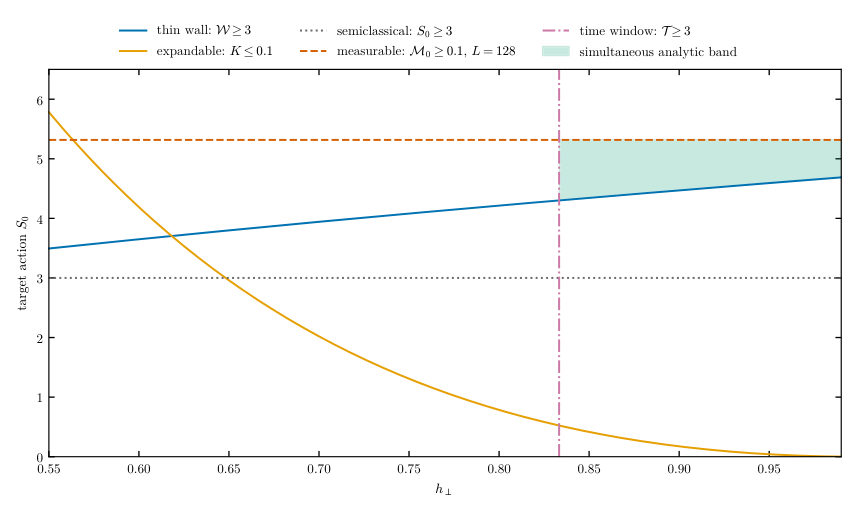
<figcaption class="paper-figure-caption"><b>Fig 1.</b> Figure 1. Analytic scale-conflict diagram defining the scale-only fitting region. The horizontal axis is the transverse field h⊥and the vertical axis is the target continuum action S0; both quantities are dimensionless. The blue, orange, dotted black, dashed red, and dash-dotted purple boundaries impose W ≥3, K ≤0.1, S0 ≥3, M0 ≥0.1 at L = 128, and T ≥3, respectively; the green area is the band satisfying all five analytic conditions. Throughout the figures J = ℏ= a = 1, so energies are measured in J and times in J−1. Initial-state, numerical, estimator-specific, size, geometry, and cross-engine checks are applied separately and are not shown here.</figcaption>
</figure>
<figure class="paper-figure-card">
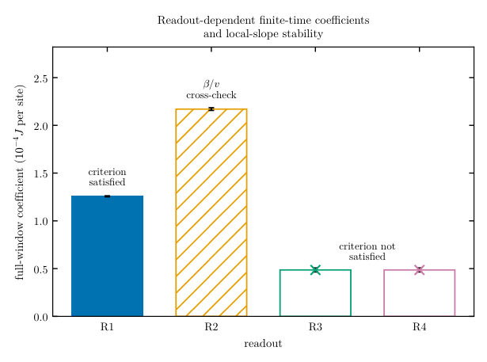
<figcaption class="paper-figure-caption"><b>Fig 2.</b> Figure 2. Readout-dependent finite-time coefficients and local-slope stability. The horizontal axis lists readouts R1–R4 and the vertical axis gives their exact full-window coefficients at (h⊥, S0) = (0.75, 4) in units of 10−4J per site; error bars contain regression components only. Filled, hatched, and crossed bars distinguish the R1 plateau, the fixed-velocity R2 cross-check, and R3–R4 diagnostics that do not satisfy the local-plateau criterion.</figcaption>
</figure>
<figure class="paper-figure-card">
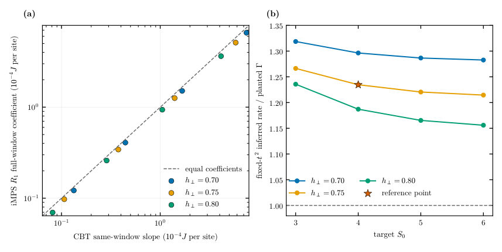
<figcaption class="paper-figure-caption"><b>Fig 3.</b> Figure 3. Matched-window positive result and kinetic-model control. (a) For the twelve parameter points with non-empty analysis intervals, the horizontal axis is the L1 CBT finite-window slope and the vertical axis is the L0 iMPS R1 full-window coefficient; both are in units of 10−4J per site and both axes are logarithmic. The dashed line denotes equal coefficients, and colour labels the transverse field h⊥(dimensionless). (b) The horizontal axis is the target action S0 (dimensionless), and the vertical axis is the ratio of the rate inferred by the fixed-t2, fixed-velocity R2 conversion to the planted coherent-growth generator. The star marks the reference point. Neither panel is a...</figcaption>
</figure>
<figure class="paper-figure-card">
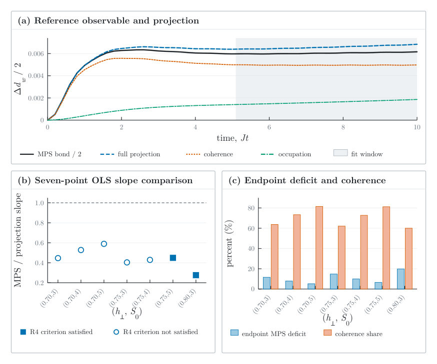
<figcaption class="paper-figure-caption"><b>Fig 4.</b> Figure 4. Vacuum–two-kink bond-operator comparison. (a) The horizontal axis is the time Jt and the vertical axis is the accumulated bond-defect proxy ∆ddw/2 (dimensionless). Curves show the reference MPS proxy, the full projection, and its vacuum–pair coherence and pair–pair occupation terms; shading denotes the prespecified physical window, and quoted endpoint values use its last sampled time. (b) The horizontal labels give the parameter pair (h⊥, S0), whose entries are dimensionless, and the vertical axis is the MPS-to-projection OLS window-slope ratio for the seven parameter points satisfying the post-hoc matched-χ bond check. Filled squares satisfy the stated R4 plateau rule and open...</figcaption>
</figure>
<figure class="paper-figure-card">
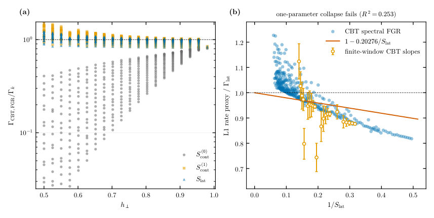
<figcaption class="paper-figure-caption"><b>Fig 5.</b> Figure 5. L1–L2 fixed-prefactor rate comparison and finite-window L1 diagnostics. (a) The horizontal axis is the transverse field h⊥(dimensionless) and the logarithmic vertical axis is the ratio of the CBT spectral FGR rate to the fixed-prefactor rate obtained with each action Sk. (b) The horizontal axis is the inverse lattice action 1/Slat, and the vertical axis is the L1 rate proxy divided by Γlat. Here “L1 rate proxy” denotes the spectral FGR rate for blue points and the finite-window slope at representative parameter points for orange points. The constrained line is intentionally labelled as a failed one-parameter collapse (R2 = 0.253). No L0 rate is plotted because no parameter point...</figcaption>
</figure>

**Summary.** This paper tackles the difficult problem of determining a true, bulk thermodynamic decay rate from limited, finite-time quantum simulation data on the Ising chain. The authors introduce a robust multilevel framework that successfully cross-validates results across different theoretical approximations. While they establish strong consistency evidence, they conclude that further computational work on size extrapolation is required to claim a definitive thermodynamic result.

**Why it may be interesting.** The rigorous methodology for extracting bulk properties from finite-time quantum simulations is highly relevant to open quantum systems and non-equilibrium dynamics in condensed matter theory.

Detailed structure

**Main problem.** The core challenge is establishing an operational link between finite-time quantum dynamics simulations and a true, bulk thermodynamic false-vacuum decay rate.

**Main result.** A multilevel identification framework was developed showing quantitative consistency across different theoretical levels (L0 to L2), but the final interpretation of a bulk rate remains conditional on performing necessary future size-extrapolation tests.

**Method.** The authors use real-time tensor-network simulations combined with multi-level analysis, comparing observables derived from finite time windows against predictions from coherent-bubble theory and semiclassical WKB actions.

**Model / system.** The system is the one-dimensional quantum Ising chain governed by a Hamiltonian involving transverse ($\sigma_x$) and longitudinal ($\sigma_z$) fields. The study focuses on the dynamics of false-vacuum decay in this model.

**Key observables.** Survival coefficient, magnetization dynamics, vacuum–pair coherence contribution, lattice-resolved WKB action discrepancy, and various correlation readouts ($R1$ through $R4$).

**Important parameters / regimes.** Transverse field ($h^\perp$), longitudinal field ($h_\parallel$), system size ($L$), and the comparison between finite-time vs. infinite-chain limits.

**Assumptions / limitations.** The analysis assumes that consistency across multiple theoretical levels (e.g., L0 matching L1) provides strong evidence, but it explicitly notes these are not sufficient proof for a full thermodynamic rate without further size validation.

**Figures summary.** Figures compare rates derived from different actions and show the quantitative agreement between iMPS survival coefficients and coherent-bubble slopes across various parameter points.

**Paper structure.** The paper progresses by first defining the identifiability problem, developing a multilevel framework comparing lattice observables (L0) to spectral theory (L1) and semiclassical limits (L2), establishing consistency checks through multiple readouts, and finally concluding with the necessary next steps for full thermodynamic validation.

Abstract

Extracting a thermodynamic nucleation rate from finite-time quantum dynamics requires separating observable decay from estimator and finite-size validity. We develop a multilevel identification framework to real-time tensor-network simulations of false-vacuum decay in the one-dimensional quantum Ising chain. Across twelve parameter points with non-empty analysis intervals, the same coherent two-kink amplitudes semi-quantitatively predict both infinite-chain survival and magnetization dynamics: the survival coefficient has a median lattice-to-theory ratio of 0.902, while the magnetization-area slope ratios span 0.809--0.953. By contrast, the microscopic nearest-neighbour bond response is coherence dominated: vacuum--pair coherence contributes 60.0--81.5\% within the seven parameter points satisfying the matched-bond-dimension convergence criterion, while substantial late-window slope discrepancies remain that cannot be removed by a scalar normalization. The framework establishes reliable finite-time decay coefficients and identifies the additional finite-size and branch-validation requirements for a bulk thermodynamic rate interpretation. Within the two-kink model, a lattice-resolved WKB action reduces the median fixed-prefactor discrepancy with the coherent-bubble spectral calculation to 4.13\%. Quantitative cross-level consistency, observable-dependent reduced-model error, and a thermodynamic-rate interpretation that remains subject to finite-size validation can therefore coexist.

[↑ back to top](#top)

### [Macroscopic fluctuation theory for the multi-time statistics of current in non-stationary diffusive systems](http://arxiv.org/abs/2608.12119v1)

**Authors:** Sabyasachi Chowdhury, Kapil Sharma, Sandeep Jangid, Tridib Sadhu  
**Type:** theory · **Category:** statistical mechanics · **PDF:** <https://arxiv.org/pdf/2608.12119v1>  
**Analysis basis:** full PDF text, analyzed in chunks
**Topic relevance:** 🔥 `Keldysh / 2PI / non-Gaussian methods` **4/5** · `methods for driven-dissipative` **3/5** · `non-equilibrium universality` **3/5** · `driven-dissipative phase transition` **2/5** · `Full counting statistics` **1/5** · `correlated / nonlocal dissipation` **1/5** · `scars & prethermalization` **1/5**

↔ Scroll figures horizontally

<figure class="paper-figure-card">
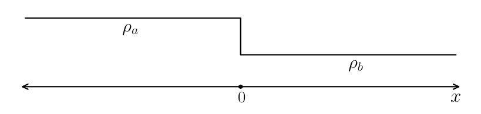
<figcaption class="paper-figure-caption"><b>Fig 1.</b> Figure 1: The domain-wall initial state, where the negative half-line (x ≤0) is in equilibrium with average density r(x) = ρa while the positive half-line (x &gt; 0) has average density r(x) = ρb.</figcaption>
</figure>
<figure class="paper-figure-card">
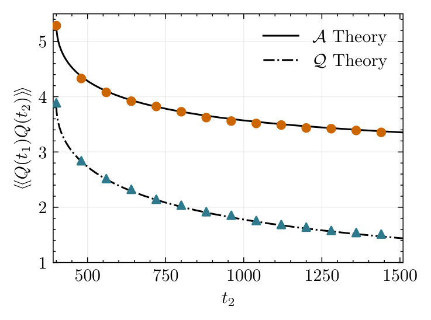
<figcaption class="paper-figure-caption"><b>Fig 2.</b> Figure 2: SSEP two-time correlation: Autocorrelations of the integrated current Q(t) in an SSEP for an initial domain-wall state with ρa = 0.5 and ρb = 0.3. The plot shows the variation of ⟨⟨Q(t1)Q(t2)⟩⟩with t2 &gt; t1 for a fixed t1 = 400 for both ensembles. The circles and triangles represent the data points obtained by Monte Carlo simulations and averaged over 108 samples. The lines correspond to the theoretical results (7) and (8) for D = 1 and σ = 2ρ(1 −ρ). The slow decay reflects the long-range nature of the autocorrelations.</figcaption>
</figure>
<figure class="paper-figure-card">
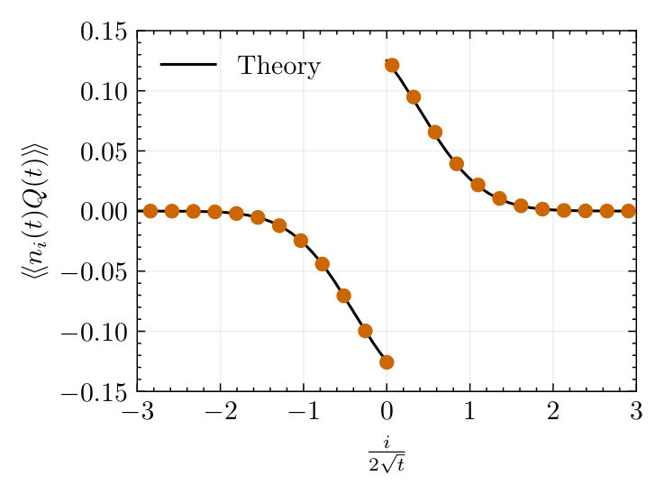
<figcaption class="paper-figure-caption"><b>Fig 3.</b> Figure 3: Density-current correlation in SSEP: The solid line indicates the theoretical result (9) while the data points indicate numerical simulation results averaged over 107 samples for t = 1500 for a step-initial profile with densities ρa = 1 and ρb = 0.</figcaption>
</figure>
<figure class="paper-figure-card">
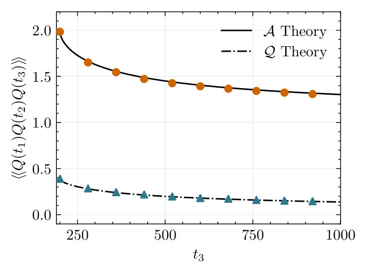
<figcaption class="paper-figure-caption"><b>Fig 4.</b> Figure 4: Non- interacting three-time correlations: The solid line represents the theoretical result (54) for the annealed ensemble, while the dashed line corresponds to the quenched result (64) for ρa = 1 and ρb = 0.5 as a function of t3, with t1 = 100 and t2 = 200 fixed. The markers (circles and triangles) denote Monte Carlo simulation results for non-interacting continuous-time random walkers on an infinite lattice, averaged over 108 realizations.</figcaption>
</figure>
<figure class="paper-figure-card">
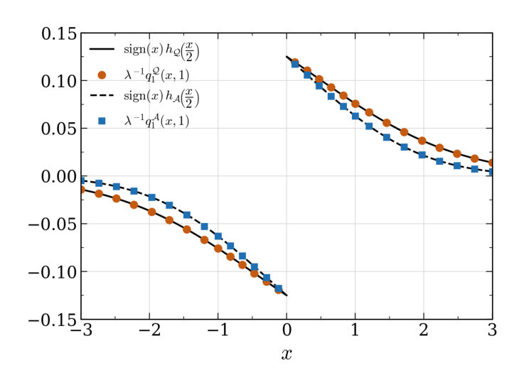
<figcaption class="paper-figure-caption"><b>Fig 5.</b> Figure 5: Density-current correlation and optimal profile: A numerical comparison between the density-current correlation (9,10) and the optimal density profile (132,133) at linear order in λ for the SSEP. The results shown are for domain-wall densities ρa = 0.75 and ρb = 0.25.</figcaption>
</figure>

**Summary.** This paper advances the theory of current fluctuation statistics by extending Macroscopic Fluctuation Theory (MFT) from single-time to multi-time measurements. Using models like the SSEP, the authors derive explicit formulas for two-time correlations in non-stationary states. The work is significant for understanding how system history affects transport properties far from equilibrium.

**Why it may be interesting.** This work provides advanced theoretical tools (MFT extension) to analyze complex non-equilibrium fluctuations in many-body systems, which is crucial for understanding transport phenomena beyond simple equilibrium assumptions.

Detailed structure

**Main problem.** The study focuses on characterizing the multi-time statistics of current fluctuations in non-stationary diffusive systems, addressing a gap where most prior work only considered one-time statistics.

**Main result.** Explicit formulas for two-time current correlations are derived for simple models, and general results show that the connection to fractional Brownian motion breaks down under step initial conditions.

**Method.** The authors extend Macroscopic Fluctuation Theory (MFT) by formulating the problem using cumulant generating functionals and employing perturbative solutions or solving corresponding microscopic dynamics.

**Model / system.** The analysis is performed on a diffusive system modeled on an infinite line, specifically examining non-interacting lattice gases and the Symmetric Simple Exclusion Process (SSEP). The systems are driven into a non-stationary state via a domain-wall initial condition.

**Key observables.** Multi-time correlations of the time-integrated current $Q(t)$, including two-time correlations $\langle\langle Q(t_1)Q(t_2)
angle
angle$ and density-current correlations $\langle\langle n_i(t)Q(t)
angle
angle$.

**Important parameters / regimes.** The analysis is concerned with the non-stationary regime ($\Delta
ho 
eq 0$) versus equilibrium ($\Delta
ho = 0$), and involves taking limits such as large observation times ($t_i$) or large system sizes (hydrodynamic scale).

**Assumptions / limitations.** The framework relies on extending MFT to multi-time statistics, utilizing perturbative methods for generic systems, and assuming specific boundary conditions in the hydrodynamic limit.

**Figures summary.** Figure 1 illustrates the domain-wall initial state. Figure 2 compares calculated two-time current correlations against simulation data for SSEP. Figure 3 shows density-current correlation comparisons between theory and simulations.

**Paper structure.** The paper progresses by first establishing the multi-time framework using MFT, presenting explicit solutions for simple non-interacting models, then tackling the general case perturbatively to derive two-time correlations, and finally confirming results via microscopic dynamics (SSEP) and numerical simulations.

Abstract

The statistics of current fluctuations has long been a central object of study in non-equilibrium physics. Most existing work has focused on one-time statistics, while their multi-time generalisation remains comparatively less explored. We address this gap by extending the fluctuating hydrodynamics framework of Macroscopic Fluctuation Theory (MFT) to study multi-time statistics in the non-stationary state of a diffusive system on an infinite line. For the simplest cases of a non-interacting lattice gas and hard-core Brownian point particles, we present explicit solution of the MFT leading to multi-time large-deviation statistics. For generic systems, the MFT is solved perturbatively, yielding explicit results for two-time correlations. These reveal that the connection between current fluctuations and fractional Brownian motion, previously observed for flat initial conditions, does not persist for step initial conditions. We independently verify these hydrodynamic results by solving the corresponding microscopic dynamics for the non-interacting gas and for the symmetric simple exclusion process. Additional confirmation comes from numerical simulations.

[↑ back to top](#top)

### [Magnetic noise of a dark exciton Bose-Einstein condensate](http://arxiv.org/abs/2608.11740v1)

**Authors:** Pieter M. Gunnink  
**Type:** both · **Category:** quantum gases · **PDF:** <https://arxiv.org/pdf/2608.11740v1>  
**Analysis basis:** full PDF text, analyzed in chunks
**Topic relevance:** 🔥 `analog quantum simulation` **4/5** · `quantum measurements` **3/5** · `Keldysh / 2PI / non-Gaussian methods` **2/5** · `quantum optics experiment` **2/5** · `QC/QI experiment` **1/5** · `driven-dissipative phase transition` **1/5** · `methods for driven-dissipative` **1/5** · `non-equilibrium universality` **1/5**

↔ Scroll figures horizontally

<figure class="paper-figure-card">
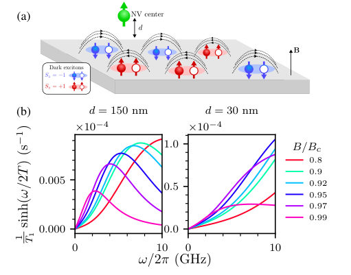
<figcaption class="paper-figure-caption"><b>Fig 1.</b> FIG. 1. (a) Schematic of magnetic noise of a Bose-Einstein conden- sate of 𝑆𝑧= ±1 dark excitons, sensed by a diamond NV center at distance 𝑑from the two-dimensional sample. An external magnetic field B along 𝑧allows for tuning between the antiferromagnetic and ferromagnetic ordering of the exciton condensate. (b) The reduced transition rate 𝑇1(𝜔)−1 sinh(𝜔/2𝑇) as a function of frequency, for magnetic fields 𝐵approaching the critical field 𝐵𝑐and softening one of the sound modes, bringing it into the measurable frequency range of an NV center.</figcaption>
</figure>
<figure class="paper-figure-card">
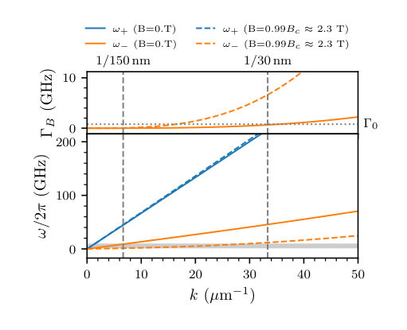
<figcaption class="paper-figure-caption"><b>Fig 2.</b> FIG. 2. The frequency (𝜔) of the collective Bogoliubov modes and the Beliaev damping of the lower mode (Γ𝐵). The gray shaded area indi- cates the approximate frequency range over which 𝑇1 relaxation noise spectroscopy can be performed. The vertical dashed lines indicate the momenta 𝑘𝑐≈1/𝑑which dominate the NV center relaxation noise spectroscopy response, with 𝑑the distance between NV center and sample; values are chosen to correspond with Fig. 1(b). The extrinsic damping Γ0 is indicated by the horizontal dotted line, demonstrating that Beliaev damping becomes relevant for high momenta in the crit- ical regime (𝐵= 0.99𝐵𝑐).</figcaption>
</figure>
<figure class="paper-figure-card">
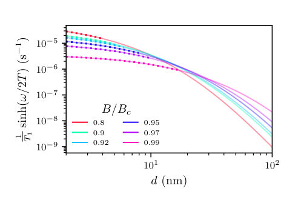
<figcaption class="paper-figure-caption"><b>Fig 3.</b> FIG. 3. The numerically obtained scaling of the low-frequency (𝜔= 0.1 GHz) reduced transition rate 𝑇−1 1 sinh(𝜔/2𝑇) as a func- tion of distance 𝑑from the sample, for magnetic fields approaching the critical field. The small 𝑑-scaling is fitted to 𝐼0 + 𝐼1𝑑+ 𝐼′𝑑log 𝑑 (dotted lines), demonstrating the unconventional UV scaling.</figcaption>
</figure>

**Summary.** The authors propose using the stray magnetic field noise generated by an exciton Bose-Einstein Condensate as a novel detection method, circumventing the challenge of direct optical detection. By tuning the system's magnetic ordering near a critical point, they predict that the collective spin sound mode will soften into a measurable frequency range detectable by NV center magnetometry. This establishes a powerful link between condensed matter quantum phases and high-precision quantum sensing.

**Why it may be interesting.** This work bridges the gap between highly correlated, solid-state quantum matter (exciton BECs) and advanced quantum sensing techniques (NV centers). The use of magnetic noise spectroscopy to probe collective excitations is a powerful methodology for studying otherwise inaccessible quantum phases.

Detailed structure

**Main problem.** The primary goal is to develop a novel, measurable technique to experimentally detect exciton Bose-Einstein Condensates (BECs) formed by optically dark triplet excitons.

**Main result.** The magnetic nature of the BEC allows for the detection of collective spin sound modes via stray magnetic field noise measured using Nitrogen-Vacancy (NV) center magnetometry, particularly near a quantum phase transition.

**Method.** Theoretical calculations involving Bogoliubov theory and mean-field approximations are combined with predictions derived from the fluctuation-dissipation theorem applied to NV center magnetometry measurements.

**Model / system.** The system is an exciton BEC composed of $S_z = \pm 1$ triplet excitons in a solid-state platform (like TMDs). The physics is governed by interactions and tuned via an external magnetic field, allowing tuning between antiferromagnetic and ferromagnetic ordering.

**Key observables.** Stray magnetic field noise measured by NV center magnetometry; the softening frequency of the longitudinal spin sound mode ($\omega_{-1}$); and unconventional UV scaling in the low-frequency $T_1^{-1}$ rate.

**Important parameters / regimes.** External magnetic field ($B$), critical field ($B_c$), spin polarization ($f_z$), and distance from the sample ($d$).

**Assumptions / limitations.** The analysis assumes quasi-equilibrium for excitons, neglects static/thermal contributions to susceptibility in some parts, and relies on the NV center acting as a momentum filter.

**Figures summary.** Figures illustrate schematic magnetic noise measurements, the dependence of $T_1^{-1}$ on frequency near $B_c$, and numerically derived scaling laws for the low-frequency reduced transition rate versus distance $d$.

**Paper structure.** The paper progresses from establishing the physical challenge (dark excitons) to developing a theoretical framework using mean-field theory and Bogoliubov analysis. It then calculates key diagnostics like magnetic susceptibility and damping mechanisms (Beliaev/Landau), culminating in relating these fluctuations to measurable NV center spin relaxation rates.

Abstract

Excitons provide a promising platform for the realization of solid-state Bose-Einstein condensation (BEC), offering quantum coherence, strongly correlated electron-hole physics, and superfluidity. Yet, its unambiguous experimental identification remains challenging. In particular, $S_z= \pm 1$ triplet excitons are excellent candidates to realize an exciton BEC, because of their intrinsically limited recombination rate and thus long lifetimes. However, since their optical detection is inherently forbidden, experimental signatures remain elusive. In this work, we demonstrate that the magnetic nature of a $S_z= \pm 1$ triplet exciton BEC gives rise to stray magnetic field noise, that can be measured using nitrogen-vacancy (NV) center magnetometry. Using an external magnetic field to tune the system from an antiferromagnetic to a ferromagnetic ordering, the longitudinal spin sound mode of the BEC softens, bringing the mode into the characteristic gigahertz frequency range of the NV spin relaxation rate and thus allowing direct detection. Furthermore, we demonstrate an unconventional UV scaling at small distances $d$ from the sample, owing to the cubic corrections to the sound mode dispersion and damping rate in the form of Beliaev damping. Through this approach, we establish that the spin component of exciton BECs offers new approaches to detect exciton BECs.

[↑ back to top](#top)

### [Continuous-variable state moments from randomized homodyne and heterodyne measurements](http://arxiv.org/abs/2608.11811v1)

**Authors:** Michael Tsesmelis, Moritz Straeter, Leong-Chuan Kwek  
**Type:** theory · **Category:** quantum information and computing · **PDF:** <https://arxiv.org/pdf/2608.11811v1>  
**Analysis basis:** full PDF text, analyzed in chunks
**Topic relevance:** 🔥 `quantum measurements` **4/5** · `quantum optics experiment` **3/5** · `Full counting statistics` **1/5** · `Keldysh / 2PI / non-Gaussian methods` **1/5** · `analog quantum simulation` **1/5** · `methods for driven-dissipative` **1/5**

↔ Scroll figures horizontally

<figure class="paper-figure-card">
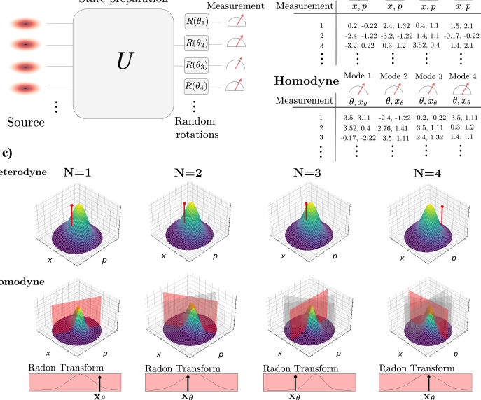
<figcaption class="paper-figure-caption"><b>Fig 1.</b> Figure 1. a) After preparing a state with some process U, random rotations are applied locally to each mode and the final state is measured. b-c) In the homodyne setting, the rotation R(θ) determines the measurement angle and the measurement device samples from the Radon-transformed Wigner function, obtaining xθ. On the other hand, heterodyne measurements directly sample points (x, p) from the Husimi-Q quasiprobability distribution.</figcaption>
</figure>
<figure class="paper-figure-card">
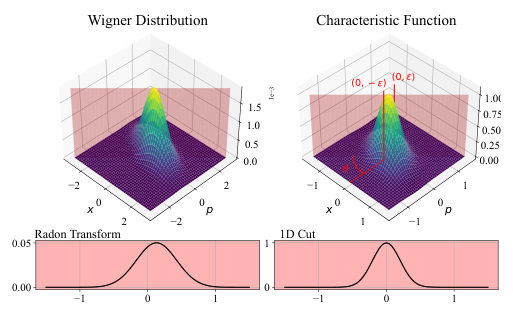
<figcaption class="paper-figure-caption"><b>Fig 2.</b> Figure 2. The characteristic function χ(θ, uθ) of a state along some angle θ is the complex Fourier Transform of a marginal probability distribution of the Radon-transformed Wigner function Pθ(xθ) along the same quadrature angle θ of the phase space. Homodyne measurements sample directly from this marginal distribution function. For a given angle, we can therefore only rebuild the characteristic function from Wigner samples along a specific angle θ. However, deter- mining the expectation value of normally-ordered operators requires knowledge about the characteristic function at well- defined points in phase space (x, p), which usually do not lie on the same angle θ. For instance, when...</figcaption>
</figure>
<figure class="paper-figure-card">
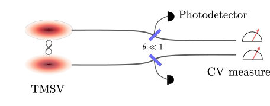
<figcaption class="paper-figure-caption"><b>Fig 3.</b> Figure 3. A photon-subtracted twin beam is generated by first preparing a two-mode squeezed vacuum with squeezing parameter ξ. We couple each mode to a separate ancilla mode using a low-reflectivity beam-splitter (θ ≪1). A click on both photodetectors heralds the production of a non-Gaussian photon-subtracted state on the two main modes, after which we can make any CV measurement.</figcaption>
</figure>
<figure class="paper-figure-card">
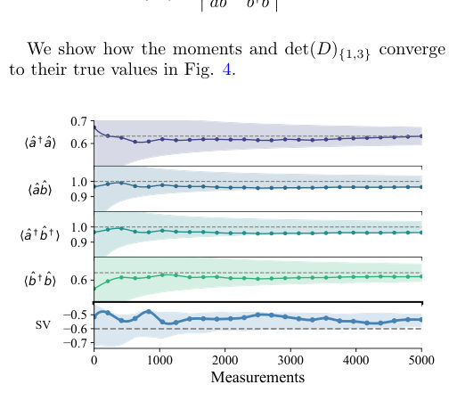
<figcaption class="paper-figure-caption"><b>Fig 4.</b> Figure 4. We display the convergence of the SV matrix com- ponents and the final SV criterion for the photon-subtracted state using homodyne measurements. The first four rows de- pict the expectation value of a single operator over a growing number of measurements. The light-colored bands are the standard deviations ±1σ derived from the exact variance in the Supplementary Information. The variance decreases sim- ilarly for all moments of det(D){1,3}, as 1/N. The bottom row shows the evolution of a single SV value, as well as the ±1σ over ten independent numerical estimation rounds in the light-colored band. This figure should convey a sense of the speed at which different expectation values...</figcaption>
</figure>
<figure class="paper-figure-card">
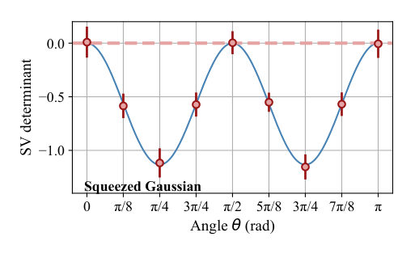
<figcaption class="paper-figure-caption"><b>Fig 5.</b> Figure 5. Violation of the SV criterion for a squeezed vacuum mode coupled to a second mode with a tunable beamsplitter. The transmittivity of the beamsplitter is parametrized by θ. Red dots are simulated violations for a squeezing of ξ = 1.5 and N = 5000 measurements. We also show the 2σ standard deviation from 10 independent estimation rounds. We see that the 50:50 beamsplitter with θ = π/4 or θ = 3π/4 max- imises the violation, as expected. For little mixing between the two modes (for example at θ = 0, the system is essentially a product state, and no definitive violation is signalled.</figcaption>
</figure>

**Summary.** The paper introduces shadow tomography using randomized homodyne and heterodyne measurements to efficiently estimate moments of continuous-variable quantum states. By focusing on the Moment Generating Function (MGF), it bypasses the exponential scaling issues of full state reconstruction. This scalable protocol is demonstrated to successfully characterize entanglement and measure optical loss in photonic systems with minimal experimental overhead.

**Why it may be interesting.** This work provides a practical, measurement-based pathway for characterizing complex quantum states in CV systems that is far more scalable than traditional full tomography methods. This methodology is crucial for experimental quantum optics and simulation of open quantum systems.

Detailed structure

**Main problem.** The core problem is developing an efficient protocol to estimate high-order moments of Continuous-Variable (CV) quantum states using limited measurements, circumventing the exponential scaling associated with full state tomography.

**Main result.** The authors propose shadow tomography based on randomized homodyne and heterodyne measurements that allows for the concurrent estimation of many multimode moments efficiently. They demonstrate this is applicable to tasks like entanglement detection and loss characterization with only a few thousand measurements.

**Method.** The method involves using randomized projective measurements (homodyne/heterodyne) to sample the Moment Generating Function (MGF) in phase space, rather than attempting full reconstruction of the density matrix or characteristic function directly.

**Model / system.** The system under study is general Continuous-Variable (CV) quantum states, which are characterized by their moments and can be analyzed using representations like the Wigner or MGFs. The analysis applies to various photonic systems, including those exhibiting entanglement or undergoing optical loss.

**Key observables.** State moments ($\langle \hat{O} 
angle$), Moment Generating Functions (MGFs), Entanglement measures (e.g., Shchukin-Vogel determinant), and the success probability of photon subtraction.

**Important parameters / regimes.** The order of the moments being estimated, the number of modes ($N$ or $M$), and measurement parameters like quadrature angles ($	heta$) and squeezing levels ($r$).

**Assumptions / limitations.** The protocol assumes that focusing on MGFs bypasses the convergence issues encountered when reconstructing the full density matrix from limited homodyne measurements. Some derivations also rely on approximations like Taylor expansions.

**Figures summary.** Figures illustrate measurement processes (homodyne vs. heterodyne sampling) and show how normalized variances for photon-subtracted states and entangled cat states decrease or behave predictably with increasing squeezing or displacement parameters.

**Paper structure.** The paper progresses from establishing the need for moment estimation in CV systems, detailing the theoretical framework using MGFs derived from randomized measurements (homodyne/heterodyne), analyzing the complexity of these estimators, and finally applying the protocol to concrete tasks like entanglement detection and loss characterization.

Abstract

Continuous-variable (CV) quantum states are naturally characterized by their moments, defined as expectation values of products of single- or multimode ladder operators. Many CV Hamiltonians and quantum algorithms are formulated directly in terms of these moments, and therefore an efficient procedure to estimate moments with limited state measurements is necessary. In this paper, we present a protocol for shadow tomography of moment-generating functions (MGFs) of CV states based on randomized homodyne and heterodyne measurements. The resulting shadows enable an efficient and concurrent estimation of many multimode moments. Our complexity analysis shows that the number of measurements required to estimate a certain moment to a given precision grows exponentially in the order of the moments. Finally, we assess the precision of these moment estimators by applying them to two tasks: detecting entanglement in both Gaussian and non-Gaussian states via the Shchukin-Vogel protocol, and characterizing optical loss in a photonic chip. We demonstrate that both tasks can be accomplished with only a few thousand randomized measurements. The small number of required measurements, combined with efficient sample processing, makes our protocol applicable to a wide range of CV simulation tasks.

[↑ back to top](#top)

### [Holonomic quantum gates via continuous measurement in bosonic codes: GKP and cat states](http://arxiv.org/abs/2608.11369v1)

**Authors:** Juan Garcia-Nila, Anirudh Lanka, Todd A. Brun  
**Type:** theory · **Category:** quantum information and computing · **PDF:** <https://arxiv.org/pdf/2608.11369v1>  
**Analysis basis:** full PDF text, analyzed in chunks
**Topic relevance:** 🔥 `quantum measurements` **4/5** · `methods for driven-dissipative` **3/5** · `driven-dissipative phase transition` **2/5** · `Keldysh / 2PI / non-Gaussian methods` **1/5** · `correlated / nonlocal dissipation` **1/5**

↔ Scroll figures horizontally

<figure class="paper-figure-card">
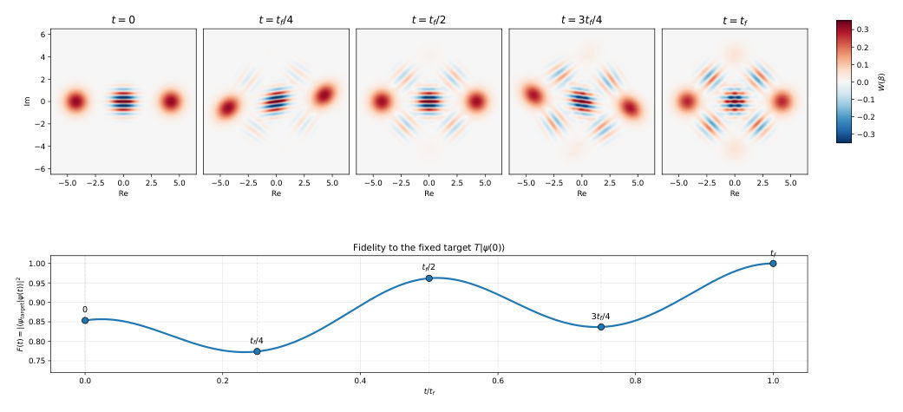
<figcaption class="paper-figure-caption"><b>Fig 1.</b> FIG. 1. Implementation of the logical T gate in the four-component cat code. Top: Wigner-function snapshots of the encoded state |ψ(t)⟩= V (t)|ψ(0)⟩at five different times showing its continuous evolution under the holonomic control path. Bottom: Fidelity with respect to the target state T|ψ(0)⟩, where the |ψ(0)⟩= |+⟩is the +1 eigenstate with the XL operator, as a function of the normalized time t/tf. Markers indicate the times corresponding to the Wigner-function snapshots. The protocol reaches unit fidelity at t = tf, demonstrating the implementation of the target logical gate.</figcaption>
</figure>
<figure class="paper-figure-card">
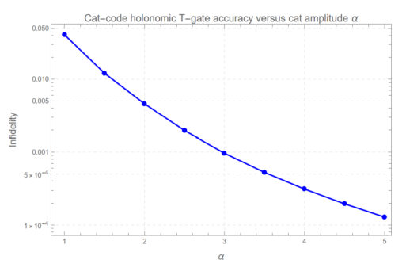
<figcaption class="paper-figure-caption"><b>Fig 2.</b> FIG. 2. Process holonomy infidelity 1 − Tr  T † LUhol  2 /4 of</figcaption>
</figure>
<figure class="paper-figure-card">
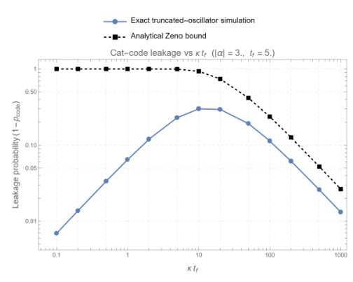
<figcaption class="paper-figure-caption"><b>Fig 3.</b> FIG. 3. Leakage probability 1 −pcode of the cat-code holo- nomic TL gate as a function of the dimensionless measurement strength κtf for |α| = 3 and tf = 5. The blue curve shows the exact truncated-oscillator simulation obtained from the Lindblad master equation in the rotating frame, while the black dashed curve denotes the analytical operator-norm up- per bound. The plotted quantity is the leakage infidelity.</figcaption>
</figure>
<figure class="paper-figure-card">
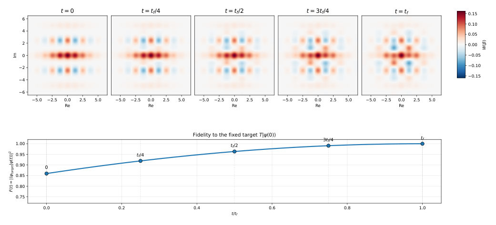
<figcaption class="paper-figure-caption"><b>Fig 4.</b> FIG. 4. Measurement-based holonomic implementation of the TGKP gate on the GKP code. Top: Wigner function snapshots of the encoded state at five different times. Bottom: Fidelity with respect to the target state T |ψ(0)⟩as a function of the rescaled time t/tf, where the initial state |ψ(0)⟩= |+⟩is the +1 eigenstate of the XL operator. Markers indicate the times corresponding to the Wigner-function snapshots above.</figcaption>
</figure>
<figure class="paper-figure-card">
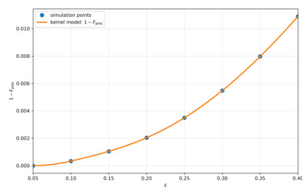
<figcaption class="paper-figure-caption"><b>Fig 5.</b> FIG. 5. Process infidelity 1 −Fproc of the holonomic GKP TGKP gate as a function of the finite-energy parameter ϵ. Blue markers show the numerical values using the truncated finite- energy kernel model on Strawberry Fields, while the orange curve is the corresponding smooth interpolation.</figcaption>
</figure>

**Summary.** This paper details the use of Continuous Measurement-Based Holonomic Quantum Computation (CMHQC) to build robust logical gates on bosonic codes like cat and GKP states. By engineering time-dependent measurements, the authors show that the accumulated geometric phase realizes complex quantum gates without needing precise Hamiltonian control. This establishes a powerful theoretical pathway for fault-tolerant quantum computation in bosonic systems.

**Why it may be interesting.** This work provides a concrete theoretical blueprint for implementing universal quantum computation in platforms where continuous measurement is feasible, linking geometric phases directly to fault-tolerant logic operations.

Detailed structure

**Main problem.** The paper addresses the challenge of realizing fault-tolerant quantum computation, specifically implementing non-Clifford logical gates (like the T gate), using measurement-based holonomic quantum computation.

**Main result.** They successfully develop protocols for both cat and GKP bosonic codes that demonstrate how continuous monitoring can induce geometric phases to realize desired logical operations without direct Hamiltonian control.

**Method.** The core method involves applying Continuous Measurement-Based Holonomic Quantum Computation (CMHQC) by constructing time-dependent unitary paths on the code subspace, followed by rigorous error analysis using Lindblad master equations and Knill-Laflamme conditions.

**Model / system.** The system utilizes bosonic quantum error-correcting codes, specifically focusing on four-component Schrödinger cat states and Gottesman-Kitaev-Preskill (GKP) states. The dynamics are governed by time-dependent unitaries that trace closed trajectories on the Grassmannian manifold.

**Key observables.** Fidelity of the implemented logical gate ($	ext{T}_L$), leakage probability ($1 - p_{	ext{code}}$), and the projected connection/holonomy around the code trajectory.

**Important parameters / regimes.** The measurement strength ($\kappa$) and the amplitude parameter $|\alpha|$ (for cat states) are crucial parameters determining fidelity and leakage bounds. The adiabatic limit is a key regime analyzed.

**Assumptions / limitations.** Approximations include neglecting higher-order terms in the large cat state approximation ($|\alpha|^2 \gg 1$), and using Gaussian approximations for wave packet overlaps when calculating matrix elements.

**Figures summary.** Figures illustrate Wigner function snapshots showing unit fidelity during gate operation, plot process holonomy infidelity vs. code parameters (e.g., $|\alpha|$), and show the leakage probability decay as a function of measurement strength or time.

**Paper structure.** The paper systematically develops the theory by first defining the CMHQC framework for bosonic codes, then deriving explicit protocols for cat and GKP states to generate logical gates, followed by detailed analytical calculations of error bounds (leakage) and gate fidelity using master equations and overlap integrals.

Abstract

We apply continuous measurement-based holonomic quantum computation (CMHQC) to bosonic quantum error-correcting codes and develop explicit protocols for both four-component cat codes and Gottesman-Kitaev-Preskill (GKP) codes. In this framework, a continuously monitored time-dependent codespace undergoes a closed trajectory on the Grassmannian manifold while Zeno confinement suppresses departures from the instantaneous code subspace. For cat codes, we construct a family of squeezed-cat trajectories whose projected Wilczek-Zee connection generates arbitrary logical Z rotations, including non-Clifford T-gates. For GKP codes, we introduce a translated-lattice trajectory that realizes the logical GKP T gate through a purely geometric holonomy. We derive the corresponding time-dependent projectors, analytically evaluate the projected connections, and show that the resulting holonomies reproduce the desired logical operations without Hamiltonian control. Furthermore, we analyze the error-correcting capabilities of the instantaneous codespaces by establishing dressed Knill-Laflamme conditions for the relevant bosonic error models and derive analytical estimates for leakage induced by finite-strength continuous measurements. Our results provide a concrete realization of measurement-induced holonomic control in experimentally relevant bosonic platforms and establish a full fault-tolerant logical gate implementation.

[↑ back to top](#top)

### [Experimental quantum telecloning across silicon photonic chips](http://arxiv.org/abs/2608.11718v1)

**Authors:** Zicong Wen, Kai Wang, Bochi Wu, Leizhen Chen, Yan-Qing Lu, Shining Zhu, Xiao-Song Ma  
**Type:** experiment · **Category:** quantum information and computing · **PDF:** <https://arxiv.org/pdf/2608.11718v1>  
**Analysis basis:** full PDF text, analyzed in chunks
**Topic relevance:** 🔥 `QC/QI experiment` **4/5** · `quantum optics experiment` **3/5** · `quantum measurements` **2/5** · `interference shaping light` **1/5**

↔ Scroll figures horizontally

<figure class="paper-figure-card">
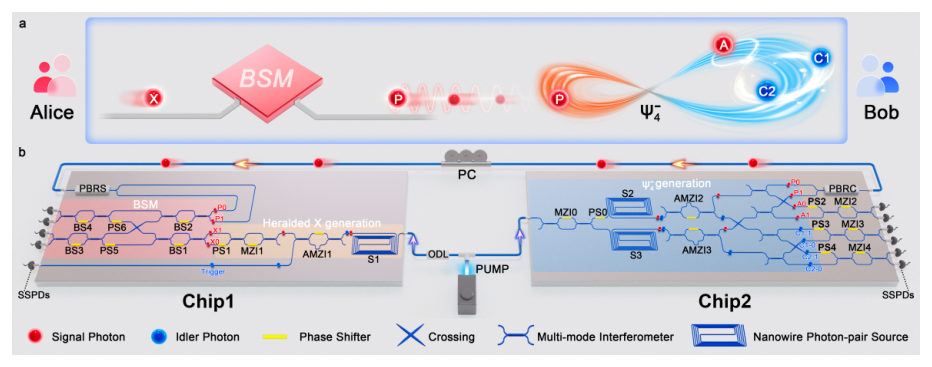
<figcaption class="paper-figure-caption"><b>Fig 1.</b> Fig. 1. Optimal symmetric quantum telecloning. a, Schematic of the 1→2 telecloning protocol: Alice holds an unknown input photon X. Bob prepares the four-photon entangled state |Ψ− 4 ⟩and sends the photon P to Alice. Alice then performs BSM on photon X and photon P from Bob. Based on the BSM outcome of Alice, the input state of X is thereby cloned to photons C1 and C2. b, Photonic-chip layout used to realize the telecloning. On Chip 1, source S1 generates the trigger and the input photon X; the target state |φ⟩X is prepared by MZI1 and PS1 and then interferes with the photon P (delivered from Chip 2) in the on-chip BSM module. On Chip 2, photon sources S2 and S3, together with AMZIs,...</figcaption>
</figure>
<figure class="paper-figure-card">
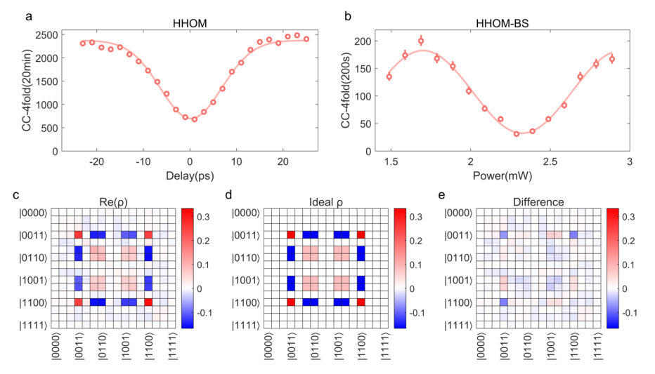
<figcaption class="paper-figure-caption"><b>Fig 2.</b> Fig. 2. The experimental results for the four-photon entangled state |Ψ− 4 ⟩and the BSM. a, Interchip HHOM interference result. After transmitting photon P to Chip 2, we scan the optical delay line to measure two-photon interference between X and P while registering four-fold coincidences (Trigger, X, P, and A). The HHOM visibility is 70.55 ± 0.36%. b, Dependence of four-photon coincidence rate on the phase of the PPS in the BSM. The transmission of BS1–BS4 are fixed at 50:50. The interferometer phase is varied by tuning the voltage of the phase shifter PS5. The interference visibility is 70.04 ± 2.12%. c, Real part of the reconstructed density matrix of the quantum state, |Ψ− 4 ⟩for the...</figcaption>
</figure>
<figure class="paper-figure-card">
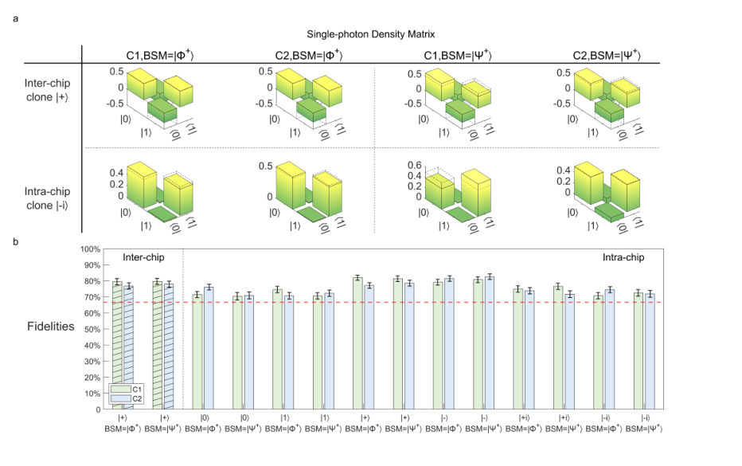
<figcaption class="paper-figure-caption"><b>Fig 3.</b> Fig. 3. Teleclone states and fidelities. a, Experimentally reconstructed single-qubit reduced density matrices for photons C1 and C2, conditioned on the BSM outcome, for two representative input states |+⟩X = |0⟩+|1⟩ √</figcaption>
</figure>
<figure class="paper-figure-card">
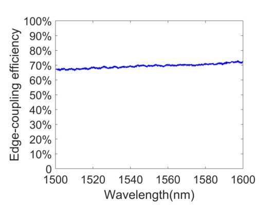
<figcaption class="paper-figure-caption"><b>Fig 4.</b> Fig. 4. Measured chip-to-fiber coupling efficiency of the edge coupler from 1500 nm to 1600 nm. An average efficiency of approximately 70% is achieved across the range with the application of refractive index matching fluid.</figcaption>
</figure>
<figure class="paper-figure-card">
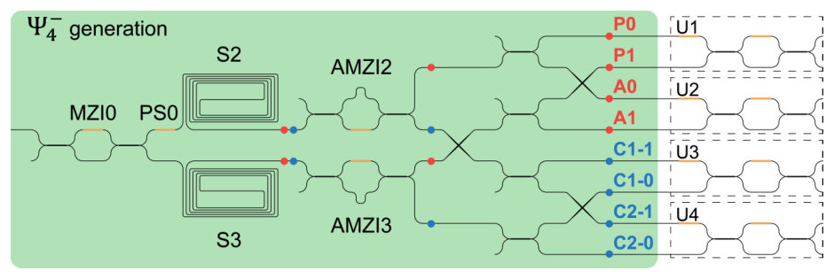
<figcaption class="paper-figure-caption"><b>Fig 5.</b> Fig. 5. Layout of Chip 2. Unitary modules U1-U4 are used to perform single-qubit state tomography of photons arriving from the photon sources. When source S2 (resp. S3) generates a photon pair, routing directs one photon to either U1 or U2 and the other to either U3 or U4. As a result, emission events from S2 and S3 are placed into a path superposition. Correlated measurement outcomes across U1-U4 therefore allow us to probe the indistinguishability of S2 and S3.</figcaption>
</figure>

**Summary.** The paper reports an experimental realization of optimal symmetric quantum telecloning using two interconnected silicon photonic chips. By implementing a six-photon protocol involving interchip Bell-state measurements, the researchers successfully cloned an unknown quantum state to two remote nodes. This achievement demonstrates robust multi-photon state manipulation on integrated photonics, providing a crucial building block for large-scale quantum networks.

**Why it may be interesting.** This work is highly relevant as it pushes the boundaries of photonic quantum information processing by demonstrating complex multi-photon entanglement distribution and state manipulation across integrated chips, a key requirement for scalable quantum networks.

Detailed structure

**Main problem.** The primary goal was to experimentally demonstrate optimal symmetric quantum telecloning ($1 	o 2$) for unknown quantum states across spatially separated nodes.

**Main result.** The authors successfully achieved this using integrated silicon photonics, measuring an interchip cloning fidelity of $78.45 \pm 1.39\%$, which significantly surpasses the classical limit of $2/3$.

**Method.** The protocol combines quantum teleportation and cloning, utilizing a six-photon setup involving two independent, fiber-linked photonic chips.

**Model / system.** The experiment is performed on a scalable silicon photonic platform, employing nanowire photon-pair sources and an interchip Bell-state measurement (BSM) to distribute the input state into two optimal clones.

**Key observables.** Interchip cloning fidelity ($78.45 \pm 1.39\%$), resource state purity ($81.12 \pm 0.26\%$ for interchip), and reconstructed density matrices for various clone states.

**Important parameters / regimes.** The achieved fidelity exceeds the classical limit by 8 standard deviations; the setup involves a six-photon protocol using two chips.

**Assumptions / limitations.** The analysis relies on quantum state tomography performed on post-selected coincidences correlated with BSM results, and future work requires active feed-forward operation.

**Figures summary.** Figures illustrate the $1 	o 2$ telecloning schematic (Fig. 1a) and photonic chip layout (Fig. 1b). Other figures detail HHOM interference results (Fig. 2) and summarize clone state fidelities across different input states (Fig. 3, Fig. 10-16).

**Paper structure.** The paper systematically presents the protocol setup using integrated photonics, details component characterization (BSM visibility, resource state fidelity), reports quantitative measurements of the cloning process for various input states, and concludes by confirming performance against theoretical bounds.

Abstract

Telecloning -- the combination of quantum teleportation and cloning -- offers a powerful mechanism to disseminate unknown quantum states to multiple spatially separated recipients with optimal fidelity. Despite its conceptual importance for quantum networks, an experimental demonstration of symmetric qubit quantum telecloning remains elusive, particularly due to the challenges of generating multipartite entangled resource states and implementing stable multi-photon interference across distributed nodes. Here, we realize the optimal 1 to 2 symmetric quantum telecloning using a scalable silicon photonic platform. We implement a six-photon protocol using two independent, fiber-linked photonic chips: one generating a heralded input state and the other preparing a four-photon entangled resource state. By performing an interchip Bell-state measurement, we successfully distribute the input state into two optimal clones at remote nodes. We observe an interchip cloning fidelity of 78.45 $\pm$ 1.39%, exceeding the classical limit of 2/3 by 8 standard deviations. Our results demonstrate the robust generation and manipulation of complex multi-photon states between integrated chips, providing a foundational building block for large-scale multi-party quantum networks.

[↑ back to top](#top)

### [Generative Learning for Quantum Measurement Design](http://arxiv.org/abs/2608.11396v1)

**Authors:** Jun Dai, Olivier Nahman-Lévesque, Guillaume Rabusseau, Hong-Ye Hu, Cunlu Zhou  
**Type:** theory · **Category:** quantum information and computing · **PDF:** <https://arxiv.org/pdf/2608.11396v1>  
**Analysis basis:** full PDF text, analyzed in chunks
**Topic relevance:** 🔥 `quantum measurements` **4/5** · `analog quantum simulation` **2/5** · `methods for driven-dissipative` **1/5**

↔ Scroll figures horizontally

<figure class="paper-figure-card">
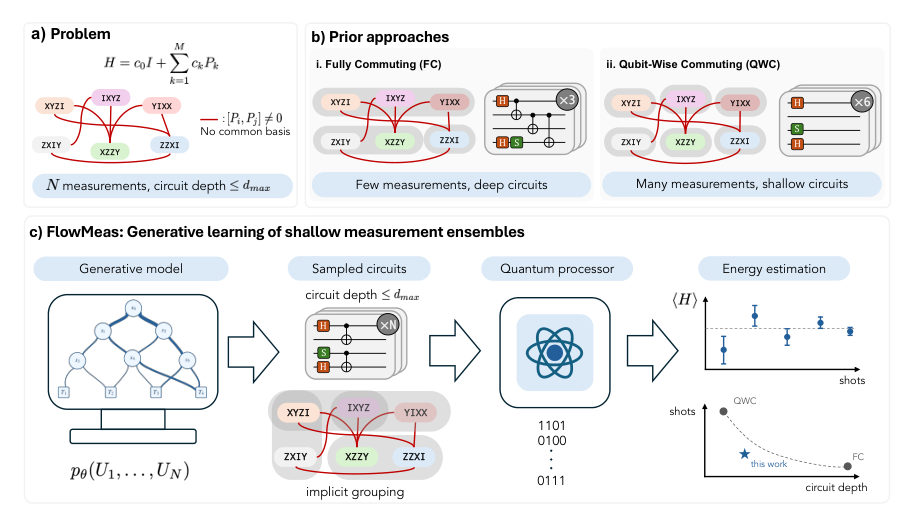
<figcaption class="paper-figure-caption"><b>Fig 1.</b> Figure 1: Resource-constrained quantum measurement design. (a) Estimating ⟨H⟩for H = c0I + P</figcaption>
</figure>
<figure class="paper-figure-card">
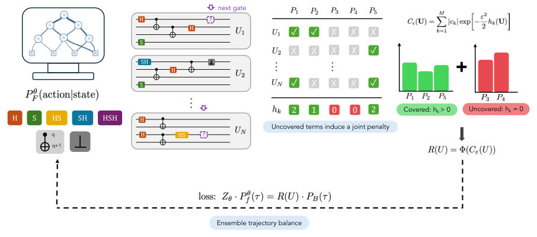
<figcaption class="paper-figure-caption"><b>Fig 2.</b> Figure 2: Generative learning of shallow measurement ensembles. (a) A shared GFlowNet forward policy P θ F (a | s) constructs Clifford measurement circuits from a discrete action set consisting of local Clifford gates, nearest-neighbor CNOTs, and a stop action ⊥. (b) The policy constructs N circuit slots in parallel, with action masks enforcing the prescribed connectivity and CNOT-depth limit dmax. The completed circuits form an executable ensemble U = (U1, . . . , UN). (c) Each ensemble defines a binary hit matrix: an entry indicates that circuit Uj maps Pauli term Pk to a product of Z and identity operators. The column sums give the hit counts hU, which quantify how the measurement budget...</figcaption>
</figure>
<figure class="paper-figure-card">
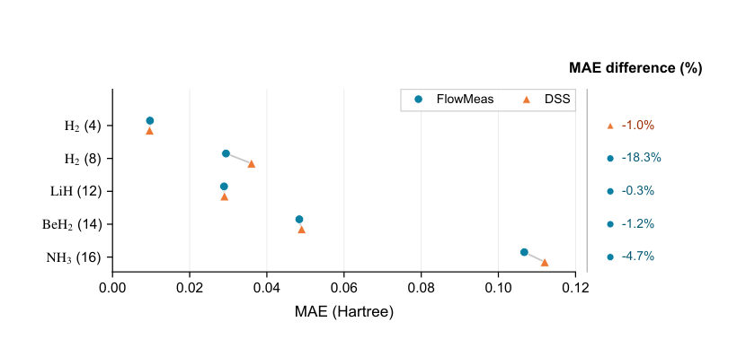
<figcaption class="paper-figure-caption"><b>Fig 3.</b> Figure 3: Direct comparison with derandomized shallow shadows. Mean absolute error (MAE) for five molecular Hamiltonians under a common budget of 1000 measurements and one CNOT layer. Both DSS and FlowMeas use the DSS confidence-based proxy objective. Orange filled triangles show DSS values from Ref. [32], while blue filled circles show FlowMeas. The right column reports the relative MAE difference, normalized by the DSS MAE. FlowMeas matches or improves DSS on four of the five systems, with the largest reduction occurring for the eight-qubit H2 Hamiltonian.</figcaption>
</figure>
<figure class="paper-figure-card">
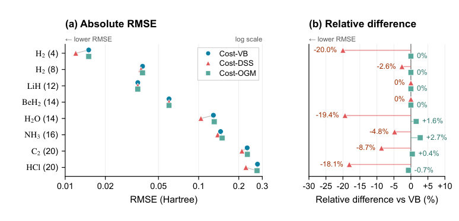
<figcaption class="paper-figure-caption"><b>Fig 4.</b> Figure 4: Effect of the state-independent training proxy. Ground-state energy RMSE for FlowMeas at dmax = 2 using VB, DSS, and OGM proxy costs. (a) Absolute RMSE in Hartree on a logarithmic horizontal scale, where lower values indicate more accurate energy estimates. (b) Percentage difference relative to the VB baseline results; negative values indicate lower RMSE. Blue filled circles, red filled triangles, and green filled squares denote the VB, DSS, and OGM proxy costs, respectively. The percentage annotations report the change obtained using the DSS proxy.</figcaption>
</figure>
<figure class="paper-figure-card">
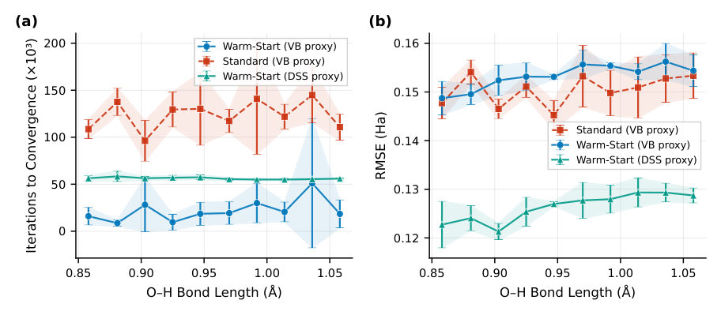
<figcaption class="paper-figure-caption"><b>Fig 5.</b> Figure 5: Reuse of the learned policy across an H2O potential energy surface. Number of gradient updates required to satisfy the convergence criterion (a) and final ground-state energy RMSE (b) as functions of the symmetric O–H bond length. At each bond length, the markers show averages over five H–O–H angles spanning 100◦–109◦, while the error bars and shaded regions indicate the variation across angles. Warm-start training initializes FlowMeas from a policy trained at the reference geometry, whereas standard training uses random initialization at each geometry; both optimize the VB proxy. DSS-proxy runs instead optimize the DSS proxy, warm-started at every geometry from a single converged...</figcaption>
</figure>

**Summary.** This paper introduces FlowMeas, a generative learning approach that treats resource-constrained quantum measurement design as an optimization problem. By using a generative flow network, it learns to sample optimal ensembles of shallow Clifford circuits tailored for specific hardware constraints. This allows for highly efficient energy estimation in complex molecular and lattice systems while respecting practical limitations on circuit depth.

**Why it may be interesting.** It provides a powerful, data-driven framework for optimizing quantum measurements, which is crucial for making near-term quantum algorithms practical by explicitly incorporating hardware limitations into the design process.

Detailed structure

**Main problem.** The core challenge is designing quantum measurement protocols that efficiently extract quantum information while balancing statistical accuracy against practical hardware resource constraints like circuit depth and gate count.

**Main result.** The proposed FlowMeas framework achieves state-of-the-art performance by learning optimal, shallow Clifford circuits, reducing energy estimation error by up to 27% compared to strong product-measurement baselines.

**Method.** It recasts resource-constrained measurement design as a generative learning problem, utilizing a Generative Flow Network (GFlowNet) to sample ensembles of hardware-compatible measurement circuits.

**Model / system.** The method is applied to estimating energy for molecular Hamiltonians and large interacting fermionic models (Hubbard model), testing its utility across varying qubit counts up to 54 qubits.

**Key observables.** Energy estimation error (RMSE), Pauli coverage statistics, circuit depth, and entangling gate count.

**Important parameters / regimes.** The trade-off between product measurements (low depth) and fully commuting measurements (high depth); the allowed number of entangling layers ($d_{\max}$).

**Assumptions / limitations.** The problem is framed as optimizing over a distribution sampled by the generative model, effectively searching the intermediate regime between simple product bases and complex fully commuting sets.

**Figures summary.** Figures illustrate comparisons between different measurement strategies (FC vs. QWC vs. FlowMeas) and detail the GFlowNet process for constructing measurement ensembles based on Pauli coverage statistics.

**Paper structure.** The paper introduces the problem, details the generative learning approach (GFlowNet), validates its performance against existing benchmarks across molecular systems, and extends testing to large fermionic lattice models.

Abstract

Extracting quantum information from a quantum state is a fundamental task of quantum computation, often requiring the estimation of many non-commuting observables under a finite measurement budget. For both near-term and early fault-tolerant settings, the measurement protocol must balance statistical efficiency against implementation resources such as circuit depth, connectivity, and entangling-gate count. Many existing strategies focus on two extremes: hardware-friendly product measurements with high sampling cost, and fully commuting measurements with deep circuits. Here we recast resource-constrained measurement design as a generative learning problem. We introduce FlowMeas, which uses a generative flow network to directly sample finite ensembles of shallow Clifford measurement circuits subject to a prescribed shot budget and hardware constraints. At zero entangling depth, FlowMeas learns qubit-wise commuting measurement schedules and already matches or improves leading product-measurement methods on nearly all molecular benchmarks. Allowing one or two entangling gate layers yields further reductions in energy estimation error of up to $27\%$ relative to the strongest state-independent product-measurement baseline. The learned policy can also be reused across related Hamiltonians, substantially accelerating retraining along a molecular potential-energy surface. We further obtain results for molecular Hamiltonians with up to 20 qubits and apply the framework to a compactly encoded 54-qubit interacting fermionic model, extending the demonstrated scale beyond prior molecular benchmarks. These results establish generative learning as a flexible and unified framework for quantum measurement design under practical resource constraints.

[↑ back to top](#top)

### [Improved quantum sampling methods for molecular simulations](http://arxiv.org/abs/2608.11569v1)

**Authors:** Connor van Rossum, Jeffery Cohn, Sally Shrapnel, Riddhi Gupta  
**Type:** theory · **Category:** other · **PDF:** <https://arxiv.org/pdf/2608.11569v1>  
**Analysis basis:** full PDF text, analyzed in chunks
**Topic relevance:** 🔥 `quantum measurements` **4/5** · `analog quantum simulation` **1/5** · `methods for driven-dissipative` **1/5**

↔ Scroll figures horizontally

<figure class="paper-figure-card">
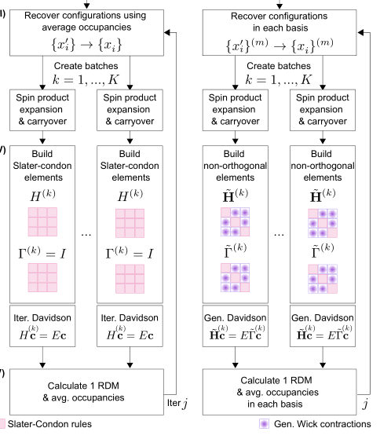
<figcaption class="paper-figure-caption"><b>Fig 1.</b> FIG. 1. Low-energy states of a molecule are associated with an initial quantum state |Ψ⟩(I) measured N times in the standard computational basis [7] (left) vs. non-orthogonal bases (right). (II) N binary measurement outcomes xi, i = 1, . . . , N on κ-qubits are collected in the computational ba- sis (left) or spread across M non-orthogonal bases defined by {Um}. (III) During configuration recovery, any measured x′ ∈χ′ with an incorrect particle number are probabilisti- cally bit-flipped to physical configurations x ∈χ based on average occupancies over the full ensemble. Batches, K, of size r0 ≪N/M are formed by subsampling corrected mea- surements. Any carryover configurations are appended,...</figcaption>
</figure>
<figure class="paper-figure-card">
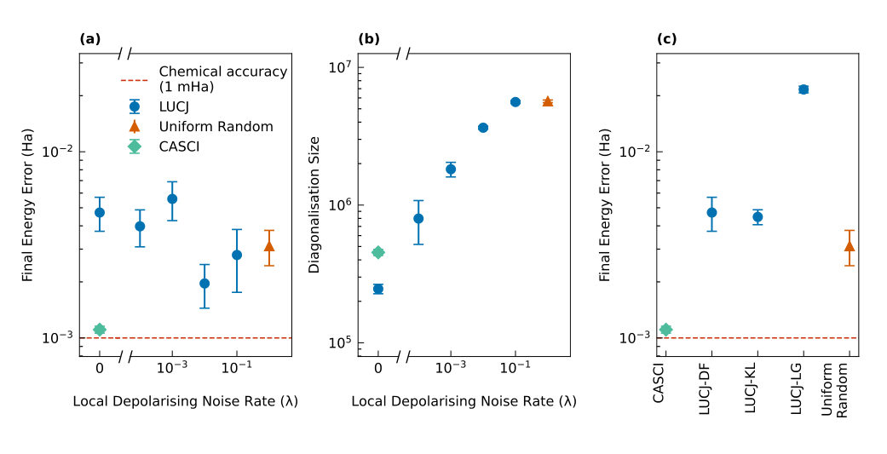
<figcaption class="paper-figure-caption"><b>Fig 2.</b> FIG. 2. SQD for N2 in the 6-31g basis with two frozen orbitals and bond length R = 1.0˚A. (a) Final ground-state energy error for standard SQD under increasing local depolarizing noise rates applied to all two-qubit gates in the LUCJ circuit. The LUCJ ansatz (circles) is initialized via compressed double-factorization of CCSD t2 amplitudes (LUCJ-DF) and optimized to minimize reconstruction error. This is compared to sampling from the exact CASCI wavefunction (“CASCI”, diamonds) or uniformly randomly from all configurations (triangles). Each data point uses rj = 2,668 ∀j unique configurations for up-to five iterations, where only average orbital occupancies are propagated between iterations...</figcaption>
</figure>
<figure class="paper-figure-card">
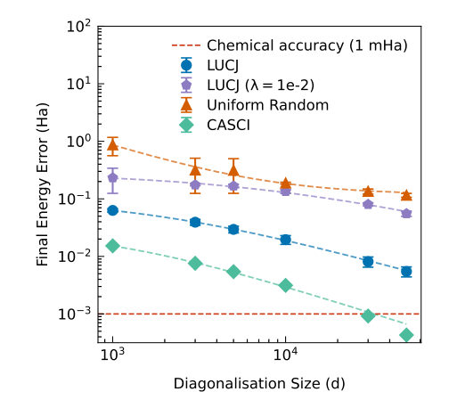
<figcaption class="paper-figure-caption"><b>Fig 3.</b> FIG. 3. Benchmarking SQD for N2 in the 6-31g basis with two frozen orbitals and R = 1.0˚A under a fixed diagonal- ization size d, explicitly constraining classical computational resources. Subspaces are constructed directly from bitstrings sampled from measurement outcomes, without forming Carte- sian products of α- and β-spin configurations. The x-axis denotes the number of unique configurations used to define each diagonalization subspace (rj = d). For methods with noise, five iterations are performed, propagating only average orbital occupancies between iterations. In contrast to Fig. 2, controlling d removes artificial improvements from subspace growth: energy error increases with noise...</figcaption>
</figure>
<figure class="paper-figure-card">
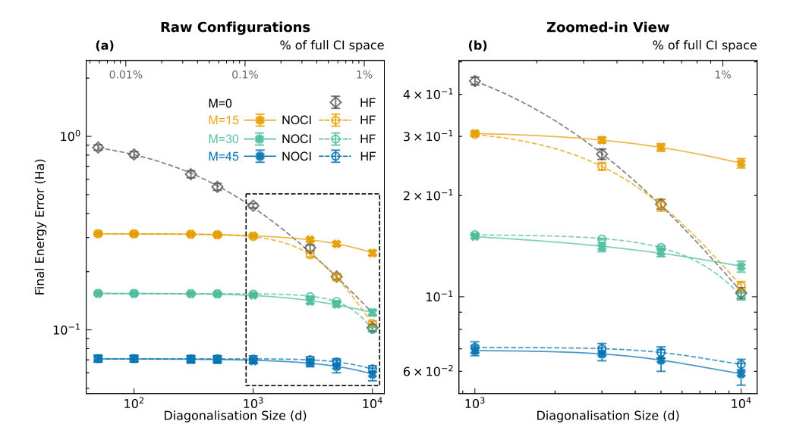
<figcaption class="paper-figure-caption"><b>Fig 4.</b> FIG. 4. SQD using NOCI bases for H12 in the STO-6G basis with no frozen orbitals and R = 2.0˚A using a fixed diagonalization size d, without spin product expansion as in Fig. 3. Samples are drawn from the exact FCI wavefunction. Two measurement strategies are compared. First, measurements performed solely in Hartree–Fock basis with the Hartree–Fock configuration in each of the M NOCI measurement bases (“HF (M = · · · )”, dashed lines). Second, measurements are distributed evenly across the Hartree–Fock and M NOCI bases (“NOCI (M = · · · )” solid lines). (a) Final ground-state energy error as a function of diagonalization subspace size d. Increasing M reduces the starting energy error as...</figcaption>
</figure>
<figure class="paper-figure-card">
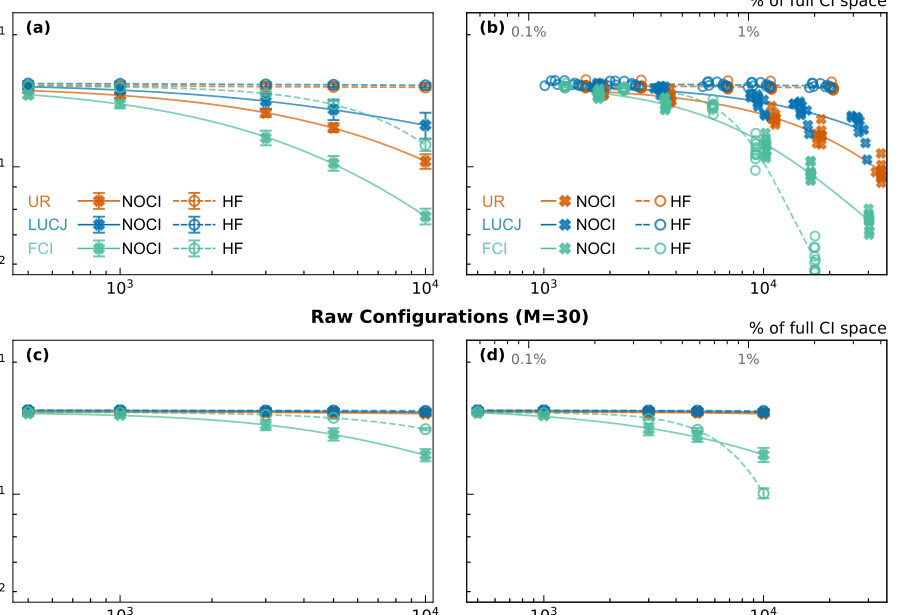
<figcaption class="paper-figure-caption"><b>Fig 5.</b> FIG. 5. SQD for H12 in the STO-6G basis with no frozen orbitals, R = 2.0˚A, and M = 30 NOCI measurement bases. Samples are drawn from the exact FCI wavefunction, a CCSD-optimized LUCJ ansatz, or uniformly random configurations (UR). For each sampling method, measurements are performed either exclusively in the Hartree–Fock basis (HF) or distributed uniformly across the Hartree–Fock and NOCI bases (NOCI). (a) Results using a restricted spin product expansion, with diagonalization subspaces constructed from all sampled configurations. The x-axis denotes the total number of measurements. Each sampled pair (αi, βi) is expanded to {(αi, βi), (βi, αi), (αi, αi), (βi, βi)}. (b) Same as panel (a),...</figcaption>
</figure>

**Summary.** The paper tackles the inefficiency of current quantum sampling techniques used for molecular electronic structure calculations. It proposes a novel measurement-basis engineering approach called NOCI, which samples measurements across multiple optimized orbital bases rather than just the standard Hartree-Fock basis. This significantly improves the discovery of important electronic configurations while maintaining performance even when classical computational resources are limited.

**Why it may be interesting.** This work directly addresses resource constraints in simulating complex molecular Hamiltonians using near-term quantum hardware concepts (quantum sampling), which is highly relevant to AMO physics applications like spectroscopy or reaction dynamics.

Detailed structure

**Main problem.** The primary challenge is improving quantum sampling methods for molecular simulations by efficiently identifying physically relevant, energy-lowering electronic configurations.

**Main result.** Measurement-basis engineering using Non-orthogonal Configuration Interaction (NOCI) shows promise by increasing configurational diversity and alleviating sampling concentration issues, especially when the Hartree-Fock basis is insufficient.

**Method.** The work develops an NOCI measurement protocol that distributes quantum measurements across multiple optimized, non-orthogonal orbital bases to improve sample efficiency over standard methods.

**Model / system.** The study focuses on molecular electronic structure simulation, using systems like $	ext{N}_2$ and $	ext{H}_{12}$. The core physics involves diagonalizing the Hamiltonian within a reduced subspace spanned by quantum-selected configurations derived from measurements in various orbital bases.

**Key observables.** Energy error convergence, configurational diversity (number of unique samples), average orbital occupancies ($o_{\sigma}^{m,\mu}$), and diagonalization subspace size ($d$).

**Important parameters / regimes.** Fixed classical resource budgets, noise levels ($\lambda$), and the choice between orthogonal (HF) vs. non-orthogonal measurement bases.

**Assumptions / limitations.** The methods do not solve the fundamental challenge of preparing quantum states with high overlap to the true ground state; furthermore, NOCI introduces increased classical cost due to constructing dense Hamiltonian matrices.

**Figures summary.** Figures compare energy error convergence under varying noise levels and fixed subspace sizes for different sampling strategies (LUCJ vs. Uniform Random Sampling). They also illustrate the workflow comparing standard computational basis measurements versus multi-basis NOCI measurements.

**Paper structure.** The paper first establishes the limitations of current quantum sampling methods like SQD, showing that unconstrained classical resources can mask true performance issues. It then introduces and validates the NOCI measurement protocol by optimizing orbital bases to improve sample efficiency for electronic structure calculations.

Abstract

Quantum-selected configuration interaction (QSCI) methods use a quantum computer to identify dominant electronic configurations in the molecular ground state, while a classical computer diagonalizes the Hamiltonian within the reduced subspace spanned by those configurations. Sample-based quantum diagonalization (SQD), a leading QSCI approach, uses iterative classical post-processing to correct noisy quantum measurement to ensure that the corresponding configurations remain physically sensible. In this work, we show that SQD performance can be strongly influenced by uncontrolled growth of the classical diagonalization subspace. When classical resources are not explicitly constrained, classical uniform random sampling can reproduce SQD benchmarks as noise increases the diversity of sampled configurations. We show any fair benchmarking protocol of SQD must explicitly control diagonalization size over unique samples. We then address the problem of efficiently discovering physically relevant, energy-lowering configurations by introducing a measurement protocol based on non-orthogonal configuration interaction (NOCI). By distributing measurements across orbital bases optimized with respect to the molecular Hamiltonian, we obtain improved sample efficiency relative to measurements performed solely in the Hartree--Fock basis. Importantly, these improvements persist even under fixed classical resource budgets, demonstrating that the resulting configurations are of higher quality rather than being more numerous. Under our proposed benchmarking procedure, we establish measurement-basis engineering as a promising route to improving quantum sampling methods for electronic structure.

[↑ back to top](#top)

### [Uniformly Stable Minimal Weyl--Heisenberg Measurements Approaching the SIC Benchmark](http://arxiv.org/abs/2608.11850v1)

**Authors:** Xiuwu Zhu, Yu Wang  
**Type:** theory · **Category:** quantum information and computing · **PDF:** <https://arxiv.org/pdf/2608.11850v1>  
**Analysis basis:** full PDF text, analyzed in chunks
**Topic relevance:** 🔥 `quantum measurements` **4/5** · `Keldysh / 2PI / non-Gaussian methods` **1/5**

↔ Scroll figures horizontally

<figure class="paper-figure-card">
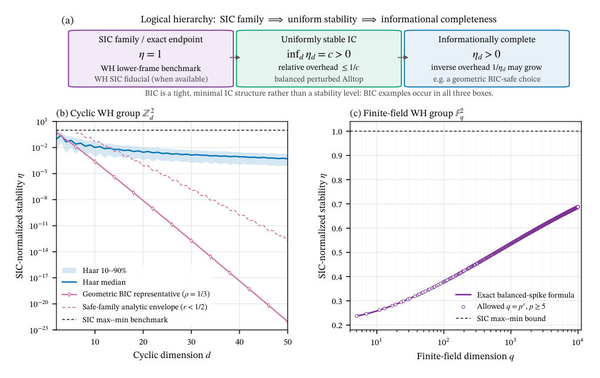
<figcaption class="paper-figure-caption"><b>Fig 1.</b> FIG. 1. Spectral stability beyond binary informational completeness; larger η is better. (a) A SIC is the exact η = 1 endpoint, uniform stability is a dimension-independent relative guarantee, and ordinary IC says only that the inverse exists, so conditioning may degrade. BIC is a tight minimal-IC structure, not a stability level. (b) Cyclic Z2 d benchmarks: blue shows the median and 10–90% range of 2000 Haar fiducials per dimension; pink shows the geometric representative α = (1/3)e2πitd from the explicit sufficient IC region, with td = 0 for odd d and td = 1/(4d) for even d. Its analytic upper envelope decays exponentially but does not bound all BICs. (c) Exact balanced-Alltop stability...</figcaption>
</figure>
<figure class="paper-figure-card">
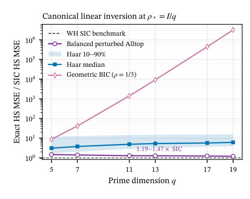
<figcaption class="paper-figure-caption"><b>Fig 2.</b> FIG. 2. Exact Hilbert–Schmidt MSE ratio R for canonical linear inversion at I/q in prime dimensions. The WH-SIC benchmark is R = 1, and larger R means larger error. Purple circles show balanced Alltop, blue the median and 10–90% range over 4000 Haar fiducials, and pink diamonds the geo- metric representative α = 1/3 from the explicit sufficient IC region (all plotted dimensions are odd). Ratios are evaluated analytically from the nonidentity projector-Gram spectrum and are independent of N; no measurement-shot Monte Carlo is used. For prime q, cyclic and finite-field WH phase spaces coincide.</figcaption>
</figure>
<figure class="paper-figure-card">

<figcaption class="paper-figure-caption"><b>Fig 3.</b> Figure 2 uses the WH-SIC value R = 1 as its benchmark. Across the displayed primes, the balanced-Alltop ratio decreases from 1.474 to 1.194, whereas the Haar median rises from 3.117 to 6.108 and the geometric representa- tive grows from 8.828 to 3.20 × 106. Thus informational completeness alone does not control this canonical finite- sample linear-inversion MSE, even for the fixed maximally mixed input.</figcaption>
</figure>

**Summary.** This theoretical paper rigorously analyzes the spectral stability of Weyl--Heisenberg measurements relative to the ideal SIC benchmark. By developing explicit constructions in various dimensions (cyclic, finite-field), the authors derive quantitative lower bounds on the minimum eigenvalue ($\lambda$) and show that these measurements approach optimal performance asymptotically without requiring the existence of a true SIC state.

**Why it may be interesting.** This work provides rigorous, constructive methods to quantify measurement performance metrics like local Fisher efficiency and canonical error bounds, which are crucial for designing optimal quantum state tomography protocols.

Detailed structure

**Main problem.** The paper aims to quantify the spectral stability of minimal Weyl--Heisenberg (WH) measurements, determining how closely they can approach the ideal Symmetric Informationally Complete (SIC) benchmark without assuming SIC existence.

**Main result.** The authors construct a hierarchy of minimal measurements showing that for prime-power dimensions $p \ge 5$, perturbations of cubic Alltop states yield spectra confined to $[L_q, U_q]$ with the ratio $U_q/L_q$ approaching 1, and $\lambda(\phi_q)/\Lambda^\star_q 	o 1$.

**Method.** The analysis heavily relies on spectral theory applied to the projector-Gram matrix derived from WH measurements, utilizing Fourier transforms, max-min optimization, and specialized algebraic techniques for cyclic and finite-field correlations.

**Model / system.** The system under study is quantum measurement theory using minimal rank-one Weyl--Heisenberg (WH) measurements in a $d$-dimensional Hilbert space. The quality of the measurement is diagnosed via the spectrum of the Projector Gram matrix, $	ext{Spec}(G_\Pi^\phi)$.

**Key observables.** Smallest nonidentity eigenvalue ($\lambda(\phi)$), spectral stability measure ($\eta(\phi)$), and the canonical Mean-Squared Error ratio ($R(\phi)$).

**Important parameters / regimes.** Dimension $d$, prime power dimension $q=p^k$ with characteristic $p \ge 5$, and the SIC benchmark value.

**Assumptions / limitations.** The analysis often proceeds by assuming specific algebraic structures (e.g., cyclic or finite-field settings) to derive bounds, though it aims to provide results without assuming exact SIC existence.

**Figures summary.** Figures compare spectral stability ($\eta$) across different dimensions and plot the exact MSE ratio ($R$) for canonical linear inversion against the WH-SIC benchmark ($R=1$).

**Paper structure.** The paper establishes the relationship between IC, uniform stability, and the SIC endpoint using the projector-Gram matrix spectrum. It then develops specific constructions (cyclic, finite-field) to derive quantitative bounds on $\lambda(\phi)$ and $\eta(\phi)$, culminating in results for prime-power dimensions.

Abstract

Informational completeness (IC) guarantees that an inverse exists, not that it is statistically well conditioned. For minimal rank-one Weyl--Heisenberg (WH) measurements, covariance makes the nonidentity projector-Gram spectrum proportional to the fiducial's ambiguity intensities, with eigenvalues \(d|χ_φ(u)|^2\), turning stability into an explicit worst-direction design problem; write \(λ\) for its smallest nonidentity eigenvalue. Haar fiducials are IC almost surely while \(\mathbb E[λ^{-1}]=\infty\), and an explicit geometric family used to establish balanced informationally complete measurements in every dimension has a normalized spectral floor bounded above by an exponentially decaying envelope. We then construct a hierarchy of minimal measurements. A cyclic family with exactly \(d^2\) outcomes in every integer dimension has floors \(Θ(d^{-3})\) for odd \(d\) and \(Θ(d^{-5})\) for even \(d\); a finite-field family for \(q=2^m\) obeys the uniform bound \(λ\ge4/9\). Our main result treats every prime-power dimension of characteristic \(p\ge5\). A balanced one-coordinate perturbation repairs the zero ambiguity axis of a cubic Alltop state, gives an attained floor uniformly bounded below by a positive constant, and confines the entire nonidentity spectrum to \([L_q,U_q]\) with \(U_q/L_q\to1\). Its SIC-normalized minimum tends to one, and \(λ(φ_q)/Λ_q^\star\to1\) for the global finite-field WH max--min optimum \(Λ_q^\star\), without assuming SIC existence. The complete spectrum determines the exact finite-sample Hilbert--Schmidt error of canonical linear inversion at \(I/d\), while its lower edge controls local Fisher efficiency and canonical-shadow bounds.

[↑ back to top](#top)

### [Parity Mapping for Quantum Optimization on Frustrated Ising Rings](http://arxiv.org/abs/2608.12213v1)

**Authors:** Ruiyi Wang, Anita Weidinger, Glen Bigan Mbeng, Wolfgang Lechner, Giuseppe E. Santoro  
**Type:** theory · **Category:** quantum information and computing · **PDF:** <https://arxiv.org/pdf/2608.12213v1>  
**Analysis basis:** full PDF text, analyzed in chunks
**Topic relevance:** 🔥 `analog quantum simulation` **4/5**

↔ Scroll figures horizontally

<figure class="paper-figure-card">
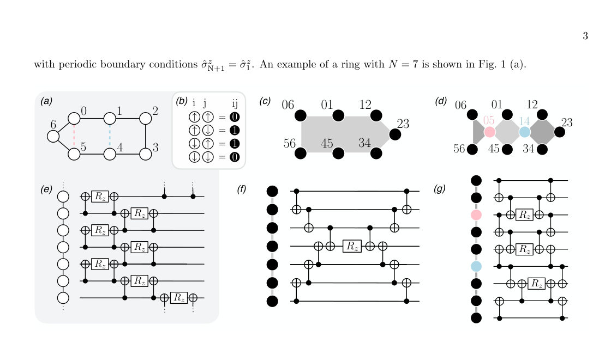
<figcaption class="paper-figure-caption"><b>Fig 1.</b> FIG. 1: The Ising ring with N = 7 in its logical representation (a) and parity representations (c)–(d). The parity transformation table is given in (b). Without ancillas the parity graph has an N-body constraint visualized by a grey polygon in (c). With ancilla interactions (red and blue dashed lines in (a)) the parity graph has three constraints of size three or four, shown in (d). The digital implementations of the multi-qubit gates are shown in (e), (f) and (g) for the logical graph, parity graph and the parity graph with ancillas, respectively.</figcaption>
</figure>
<figure class="paper-figure-card">
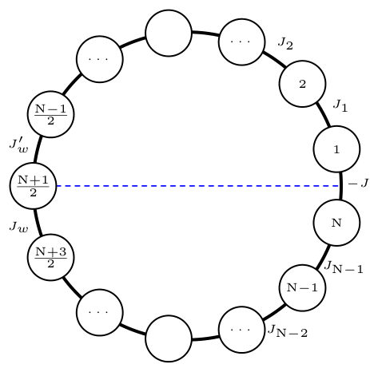
<figcaption class="paper-figure-caption"><b>Fig 2.</b> FIG. 2: The frustrated Ising ring with N spins. The antiferromagnetic bond −Jf sits at site j = N; the two weak bonds Jw and J′ w flank the central spin at j = (N + 1)/2, with J′ w = Jw in the standard symmetric case. All remaining bonds equal J in the standard model and may take distinct values in the modified instances (see text). The dashed blue line indicates the possible reflection symmetry axis.</figcaption>
</figure>
<figure class="paper-figure-card">
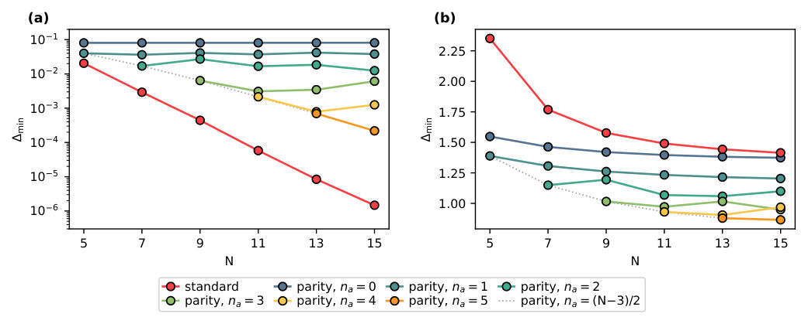
<figcaption class="paper-figure-caption"><b>Fig 3.</b> FIG. 3: Minimal energy gap ∆min versus system size N in the standard and parity implementations, for (a) the frustrated ring model (constraint strength C = J; note the logarithmic scale) and (b) the ring with uniform coupling magnitudes and a single antiferromagnetic bond (constraint strength C = 2J; linear scale). In both panels, solid coloured lines show the parity gap at fixed ancilla number na = 0, 1, . . . , 5, each starting at the smallest admissible ring N = 2na + 3; the grey dotted line is the realistic parity gap at the hardware-required na = (N −3)/2. In (a), the standard and realistic-parity gaps close as ∼e−0.96 N and ∼e−0.51 N, so the parity mapping roughly halves the decay...</figcaption>
</figure>
<figure class="paper-figure-card">
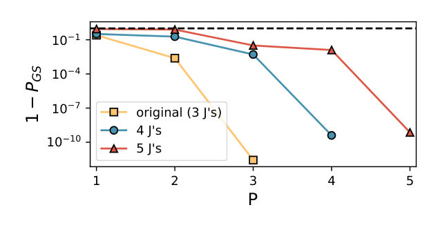
<figcaption class="paper-figure-caption"><b>Fig 4.</b> FIG. 4: Ground state infidelity 1 −PGS vs circuit depth P (only single qubit z- and x-rotations) for the original formulation of the frustrated ring model and its adaptations for N = 7. The greater the number of distinct Jj values, the more layers P are needed to reach the ground state.</figcaption>
</figure>
<figure class="paper-figure-card">
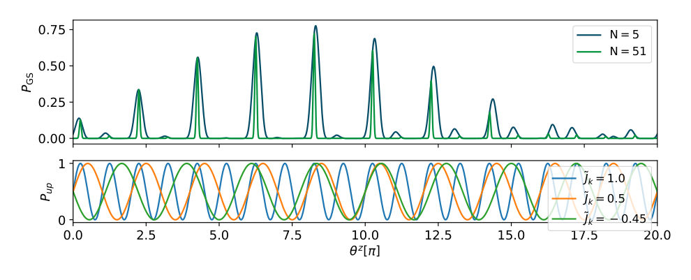
<figcaption class="paper-figure-caption"><b>Fig 5.</b> FIG. 5: The probability of being in the exact ground state PGS (upper plot) and the probability of a single physical qubit being in the up state P↑(lower plot) as a function of the single control parameter θz at fixed θx = π/4 (a single QAOA layer, P = 1). In the upper plot we show comparisons between N = 5 and N = 51. In the lower plot we show comparisons of qubits associated with different parameters ˜Jk = 1.0, 0.5 and −0.45.</figcaption>
</figure>

**Summary.** This work analyzes the use of parity mapping to enhance quantum optimization on frustrated Ising rings. By applying this technique, the authors demonstrate significant theoretical improvements for both Quantum Annealing and QAOA protocols compared to standard methods. This suggests that constraint encoding via parity qubits can lead to more robust and scalable quantum computation algorithms.

**Why it may be interesting.** It provides a concrete algorithmic improvement for quantum computation by showing how mapping constraints can stabilize spectral gaps and reduce scaling in variational quantum algorithms applied to physically relevant models like frustrated magnets.

Detailed structure

**Main problem.** The paper investigates how applying a 'parity mapping' technique affects the performance of quantum optimization algorithms (QA and QAOA) when solving problems on frustrated Ising rings.

**Main result.** Parity mapping improves both continuous-time Quantum Annealing by increasing spectral gaps and discrete QAOA by achieving constant layer scaling, outperforming conventional methods in complexity metrics.

**Method.** The authors analyze the performance of two quantum optimization protocols—Quantum Annealing (QA) and QAOA—on a frustrated Ising ring using theoretical analysis and state-vector simulations.

**Model / system.** The system is the frustrated Ising ring, modeled by a target Hamiltonian $\hat{H}_{\text{target}}$. The core technique involves mapping local interactions to parity qubits via Parity Mapping, which introduces constraint Hamiltonians ($\tilde{H}_c$) into the overall problem formulation.

**Key observables.** Minimum spectral gap (for QA), number of required QAOA layers, and circuit complexity metrics like CNOT depth.

**Important parameters / regimes.** The coupling strengths ($J_j$), constraint strength ($C$), and the annealing schedule parameter ($s(t)$).

**Assumptions / limitations.** The analysis compares ideal Parity-QA vs. hardware-motivated decompositions, and assumes that single-qubit rotations are sufficient for ground state preparation in certain regimes.

**Figures summary.** Figure 1 illustrates the Ising ring structure in both logical and parity qubit representations, detailing the required multi-qubit gate transformations.

**Paper structure.** The paper introduces the frustrated Ising ring model, details the Parity Mapping technique to transform the Hamiltonian, and then analyzes its impact separately on continuous-time Quantum Annealing (QA) and the discrete QAOA protocol, concluding with complexity comparisons.

Abstract

The frustrated Ising ring is one of the simplest models exhibiting exponential closing spectral gaps, making it a paradigmatic and challenging benchmark for quantum annealing (QA). Ground-state preparation for this model has therefore been studied extensively in both continuous-time QA and digitized protocols such as the Quantum Approximate Optimization Algorithm (QAOA). Here, we use the frustrated Ising ring to investigate how the parity mapping affects the performance of both QA and QAOA. For QA, finite-size calculations show that the parity mapping increases the minimum spectral gap under the energy normalization used in this work, thereby enabling faster continuous-time ground state preparation protocols. An ideal implementation of Parity-QA, with a single global constraint, shows no evidence of exponential gap closing over the accessible system sizes, whereas a hardware-motivated decomposition into local constraints restores the exponential decrease, albeit with a smaller fitted exponent than conventional QA. For the digitized protocol, we find that the number of Parity-QAOA layers required to prepare the exact ground state remains constant over the simulated sizes, improving upon the quadratic scaling required by conventional QAOA. To investigate the role of constraints in Parity-QAOA, we further consider a modified Ising ring instance in which the constraint term is essential for preparing the target ground state. We then compare the corresponding resource requirements with those of conventional QAOA.

[↑ back to top](#top)

### [Quetzalcoatlite as a Disorder-Free Platform for Chiral Magnetism and Frustration](http://arxiv.org/abs/2608.11301v1)

**Authors:** Aleksandar Razpopov, P. Peter Stavropoulos, Michael R. Norman, Roser Valentí  
**Type:** theory · **Category:** strongly correlated electrons · **PDF:** <https://arxiv.org/pdf/2608.11301v1>  
**Analysis basis:** full PDF text, analyzed in chunks
**Topic relevance:** 🔥 `analog quantum simulation` **4/5**

↔ Scroll figures horizontally

<figure class="paper-figure-card">
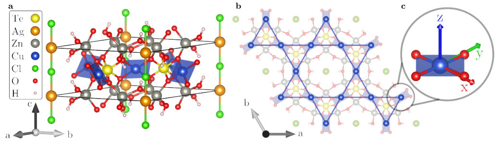
<figcaption class="paper-figure-caption"><b>Fig 1.</b> Fig. 1 Crystal structure of quetzalcoatlite. The idealized stoichiometry structure (x = 1 and y = 0 in Zn6Cu3(TeO6)2(OH)6 · (Agx PbyClx+2y)) is shown. a Side view of the primitive unit cell. b Top-down view, with the characteristic kagome lattice formed by the magnetic Cu2+ sites, decorated by O and OH– ligands. c Closeup view of the local Cu environment, with the local axis z perpendicular to the ligand plane, and xy mostly aligned with the oxygens. The crystal structure was visualized using VESTA [38].</figcaption>
</figure>
<figure class="paper-figure-card">
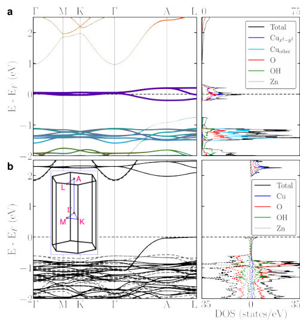
<figcaption class="paper-figure-caption"><b>Fig 2.</b> Fig. 2 Electronic structure of quetzalcoatlite. a Band struc- ture and atom resolved DOS at the GGA level. The superimposed fat bands indicate the respective contributions in the bands. The Cu DOS is given in the local coordinates as defined in Fig. 1c, and additionally resolved in the local x2 −y2 contributions. b Band structure and DOS calculated within the GGA+U framework with Ueff = 6 eV, assuming a polarized FM configuration. Solid and dashed lines represent the spin-up and spin-down channels, respec- tively. The negligible Cl and Ag contribution, in this energy win- dow, are not visible.</figcaption>
</figure>
<figure class="paper-figure-card">
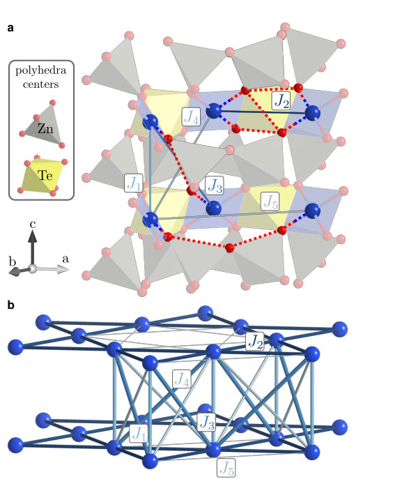
<figcaption class="paper-figure-caption"><b>Fig 3.</b> Fig. 3 Exchange microscopic paths and network a Cut out of the crystal enviroment, highlighting the superexchange paths for J1 to J5. The contributing Cu and O sites are highlighted. b The copper magnetic exchange network up to J5, color coded from strongest coupling (dark blue) to weakest (light blue). The crystal structure was visualized using VESTA [38]</figcaption>
</figure>
<figure class="paper-figure-card">
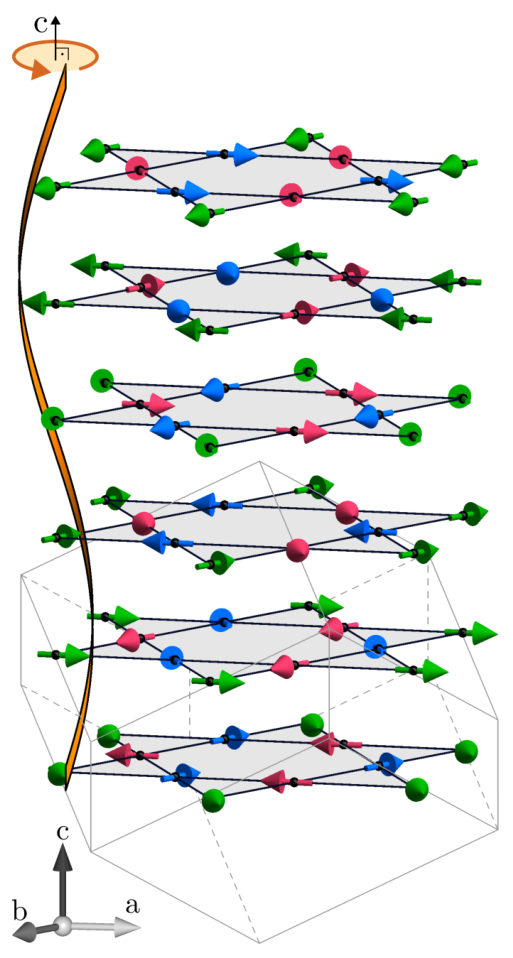
<figcaption class="paper-figure-caption"><b>Fig 4.</b> Fig. 4 Magnetic unit cell orderer. Classical ⃗Q = (−2/3, −2/3, −1/6) state in real space. Each kagome layer forms a √</figcaption>
</figure>
<figure class="paper-figure-card">
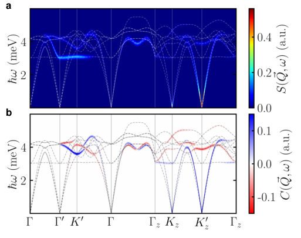
<figcaption class="paper-figure-caption"><b>Fig 5.</b> Fig. 6 Magnon bands and dynamical factors. Magnon ex- citation spectrum and dynamical chirality estimated via LSWT. The momentum path follows the high-symmetry points defined in Fig. 5, with Γ′ = (0, 1, 0), K′ = (−2/3, 4/3, 0), Γz = (0, 0, qz), Kz = (1/3, 1/3, qz), and K′ z = (−2/3, 4/3, qz). a The magnon intensity strongly peaks at the primary magnetic ordering vectors ⃗Q1 = K′ z and ⃗Q2 = Kz, in agreement with the classical structure factor. b Dynamical chirality signature, reflecting the right-handed spiral of the underlying magnetic ground state. The plots include Gaussian broadening of 0.1 meV. Note that the chirality operator changes sign in between Γ and Γz, following the description...</figcaption>
</figure>

**Summary.** This theoretical study analyzes quetzalcoatlite, an ideal kagome magnet, to understand its magnetic ground state. By mapping the electronic structure onto an effective Heisenberg model, the authors show that competing intra- and interlayer exchange interactions stabilize a unique, intrinsic three-dimensional chiral spin order. This work highlights how structural geometry dictates complex quantum magnetic behavior.

**Why it may be interesting.** The explicit derivation of chirality from competing geometric interactions in a lattice model is highly relevant for understanding frustrated magnetism and emergent order parameters in quantum materials.

Detailed structure

**Main problem.** The study investigates how geometric frustration, chirality, and interlayer coupling dictate the magnetic ground state of the mineral quetzalcoatlite.

**Main result.** The competition between nearest-neighbor intralayer and next-nearest-neighbor interlayer couplings stabilizes an intrinsic three-dimensional chiral magnetic order characterized by a $60^\circ$ spin rotation between adjacent layers.

**Method.** The authors employed ab initio calculations (DFT+U) to derive effective Heisenberg exchange interactions, which were then used to minimize the classical magnetic Hamiltonian.

**Model / system.** The system is modeled as an ideal kagome magnet structure within quetzalcoatlite. The low-energy physics is mapped onto a generalized Heisenberg model incorporating multiple competing exchange couplings ($J_\alpha$) up to the 5th nearest neighbor.

**Key observables.** Chiral magnetic order, propagation vector Q, static and dynamic spin structure factors, and electronic band gap.

**Important parameters / regimes.** The relative strengths of the intralayer vs. interlayer exchange couplings ($J_2$ vs $J_3$), which determine the transition between different ordered states.

**Assumptions / limitations.** The study assumes an idealized stoichiometry for simplification and uses DFT+U to treat strong electronic correlations, which opens a gap in the insulating state.

**Figures summary.** Figures illustrate the crystal structure showing the kagome lattice; one figure shows the opening of the electronic band gap upon including correlation effects (GGA vs GGA+U); others map out the resulting $\sqrt{3} 	imes \sqrt{3}$ coplanar magnetic order with layer-to-layer $60^\circ$ rotation.

**Paper structure.** The paper first establishes the material as a suitable platform, then uses DFT+U to calculate exchange couplings ($J_\alpha$). Finally, it analyzes the resulting effective Heisenberg model by minimizing the energy and analyzing the magnetic structure factors to determine the chiral ground state.

Abstract

The natural mineral quetzalcoatlite Zn$_6$Cu$_3$(TeO$_6$)$_2$(OH)$_6$ $\cdot$ (Ag$_x$Pb$_y$Cl$_{x+2y}$) is a structurally ideal kagome magnet, providing a platform for exploring the interplay of geometric frustration, chirality, and tunability in a disorder-free framework. Here, we present the (first) comprehensive ab initio study of its electronic and magnetic properties. The electronic structure is dominated by localized half-filled Cu $d_{x^2-y^2}$ orbitals that become insulating through electronic correlations. Mapping the low-energy physics onto a Heisenberg model reveals that the magnetism is governed primarily by two exchange interactions: a nearest-neighbor intralayer kagome coupling and a next-nearest-neighbor interlayer coupling. Their competition stabilizes an unconventional three-dimensional chiral magnetic state. Each kagome layer hosts a $\sqrt{3}\times\sqrt{3}$ order, while adjacent layers are rotated by $60^\circ$, producing a right-handed spiral along the crystallographic $c$-axis. This intrinsic chiral order emerges naturally from the crystal structure and magnetic interactions, establishing quetzalcoatlite as a distinctive realization of chiral magnetism on a perfect kagome lattice. At the same time, the small energy scale of the exchange interactions places the material close to competing magnetic regimes, suggesting that moderate pressure, chemical substitution, or structural modifications may strongly enhance frustration, suppress long-range order, and potentially drive the system toward a quantum spin-liquid state.

[↑ back to top](#top)

### [Spin-coherent quantum designs](http://arxiv.org/abs/2608.11310v1)

**Authors:** Marcin Rudziński, Aaron Z. Goldberg, Andrei B. Klimov, Luis L. Sánchez-Soto, Karol Życzkowski  
**Type:** theory · **Category:** other · **PDF:** <https://arxiv.org/pdf/2608.11310v1>  
**Analysis basis:** full PDF text, analyzed in chunks
**Topic relevance:** 🔥 `quantum measurements` **4/5**

↔ Scroll figures horizontally

<figure class="paper-figure-card">
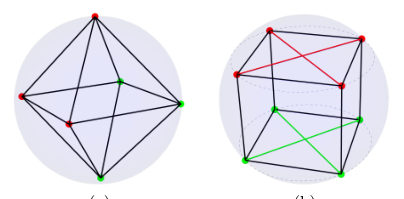
<figcaption class="paper-figure-caption"><b>Fig 1.</b> Figure 2. Examples of azimuthal freedom in coherent-state identity resolutions. Identity 11d resolution is invariant under a collective rotation of k equally distributed points on a circle around the circle axis, provided k ≥d. The colored points indicate rigid blocks that can be rotated without changing the identity resolution in the corresponding spin dimension. a) an octahedron–identity resolution of dimensions d = 2, 3 invariant under collective rotation of points of the same color, b) a cube–invariant decomposition for d = 2, 3, 4, c) a cube–invariant decomposition for d = 2, d) a regular tetrahedron–it gives resolution of identity for d = 2, 3 and it is a specific case of c) with...</figcaption>
</figure>
<figure class="paper-figure-card">
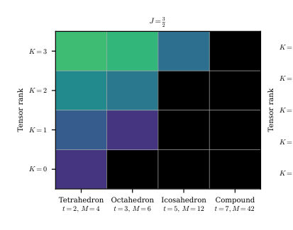
<figcaption class="paper-figure-caption"><b>Fig 2.</b> Figure 3. Hilbert–Schmidt reconstruction error for irreducible spin-tensor operators using a coherent-state decomposition generated by analytical spherical designs given by chosen Platonic solids66 and a compound of seven octahedra.67 For each spin J, tensor rank K, and design, the maximal Hilbert–Schmidt distance between spin-tensor T (J) Kq and its reconstruction via coherent design is plotted. Black cells denote analytically exact reconstruction.</figcaption>
</figure>

**Summary.** This paper establishes that reconstructing an operator of rank $S$ in a spin system requires the measurement sampling points to form a spherical $(2J+S)$-design. It provides explicit constructions and protocols, offering a powerful mathematical tool to guide the design of optimal, minimal-sample measurements for quantum systems like magnetometers.

**Why it may be interesting.** This work directly impacts quantum measurement theory by providing rigorous, mathematically necessary conditions (spherical designs) for achieving high-fidelity state or observable readouts using minimal measurements, which is crucial for experimental quantum sensing.

Detailed structure

**Main problem.** The core problem is determining the minimal discrete set of measurement points (coherent states) required to exactly reconstruct an arbitrary quantum operator within a specific rank sector ($S$) for spin systems.

**Main result.** Exact reconstruction is mathematically equivalent to the sampling points forming a spherical $(2J+S)$-design, providing a unified framework for reading out physical observables from limited measurements.

**Method.** The authors use techniques involving multipole expansions and comparing discrete sums over design points against continuous integral representations of quantum operators.

**Model / system.** The system is based on spin-$J$ angular momentum systems ($	ext{SU}(2)$), whose phase space is modeled by the sphere $S^2$. Operators are analyzed via their decomposition into irreducible tensor sectors ($V_S$).

**Key observables.** Spin moments ($\langle J_q 
angle$), second moment contravariant symbol ($I^{ab}$), and the expectation values of operators in specific rank sectors.

**Important parameters / regimes.** The spin quantum number $J$, the target operator rank $S$, and the required design strength $t = 2J+S$.

**Assumptions / limitations.** The analysis is specialized for $	ext{SU}(2)$ systems, focusing on reconstructing specific tensor sectors rather than the entire Hilbert space.

**Figures summary.** Figures illustrate the scaling of known spherical designs ($M$ vs $t$) and confirm that exact reconstruction (black cells) occurs when the design strength $t$ meets or exceeds $2J+S$.

**Paper structure.** The paper establishes the mathematical equivalence between exact operator reconstruction and the existence of a specific type of spherical design, provides explicit constructions (Gauss-Legendre), and concludes with practical protocols for moment estimation.

Abstract

Coherent states bridge the gap between quantum and classical physics, but their overcomplete and nonorthogonal nature makes it difficult to identify the minimal discrete set needed to reconstruct quantum information. Finite spin-coherent tomography and discrete coherent-state operator bases are known, but here we address the more specific rank-resolved problem of preserving the canonical contravariant-symbol representation. We show that the canonical finite coherent-state formula reconstructs every operator in the rank-$S$ sector exactly if and only if the sampling points form a spherical $(2J+S)$-design. We call the associated configurations spin-coherent quantum designs. We further give a fully explicit positive-weight Gauss-Legendre construction that avoids the need for an equal-weight spherical design. Together, these results establish a unified framework for reading out physical observables from a handful of measurement samples, playing for spin systems the role that the so-called von Neumann lattice plays for canonical coherent states. Finally, we derive practical protocols for estimating moments of spin operators from these constructions, with direct applications to polarimetry, magnetometry, and quantum state tomography.

[↑ back to top](#top)

### [Design of monolithic microcavities for enhancing organic quantum emitters](http://arxiv.org/abs/2608.12081v1)

**Authors:** Tim Hebenstreit, Jaime Gimeno Balaguer, Fridtjof Betz, Felix Binkowski, Maja Colautti, Jan Renger, Costanza Toninelli, Sven Burger, Stephan Götzinger  
**Type:** theory · **Category:** other · **PDF:** <https://arxiv.org/pdf/2608.12081v1>  
**Analysis basis:** full PDF text, analyzed in chunks
**Topic relevance:** `analog quantum simulation` **3/5** · `interference shaping light` **3/5** · `Tavis-Cummings & cavity-many-emitter` **2/5** · `driven-dissipative phase transition` **2/5** · `methods for driven-dissipative` **2/5** · `Keldysh / 2PI / non-Gaussian methods` **1/5** · `correlated / nonlocal dissipation` **1/5** · `quantum measurements` **1/5** · `superradiant laser` **1/5**

↔ Scroll figures horizontally

<figure class="paper-figure-card">
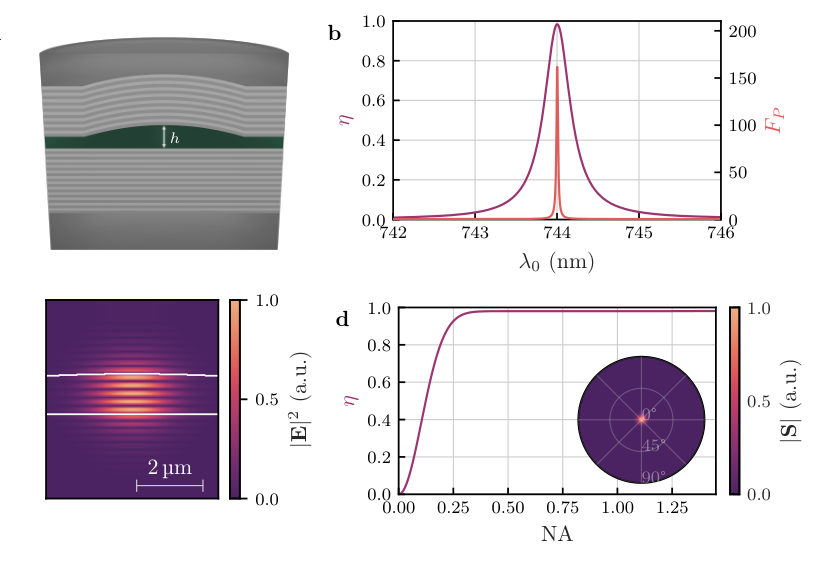
<figcaption class="paper-figure-caption"><b>Fig 1.</b> Figure 1: Monolithic DBR-based Fabry–Perot cavity for DBT:p-DCB. a Schematic cross-section with planar bottom DBR and concave top DBR (R = 50 µm). b Simulated resonant Purcell enhancement (FP ≈160, ≈0.02 nm bandwidth) and collection η ≈98 % into NA = 0.75. c Normalized field intensity showing h ≈5</figcaption>
</figure>
<figure class="paper-figure-card">
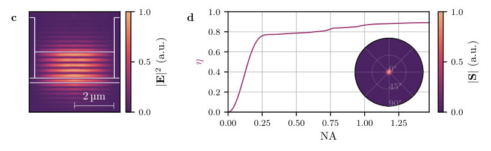
<figcaption class="paper-figure-caption"><b>Fig 2.</b> Figure 2: DBR-based micropillar cavity for DBT:Ac nanocrystals. a Cross-section and design parameters of the structure. b Simulated Purcell enhancement and collection efficiency into NA = 0.75. c Normalized field intensity of the dominant eigenmode with Veff ≈34(λ0/n)3 and Q ≈10200. d The collection efficiency as a function of the numerical aperture. The inset shows the energy radiated to the far-field.</figcaption>
</figure>
<figure class="paper-figure-card">
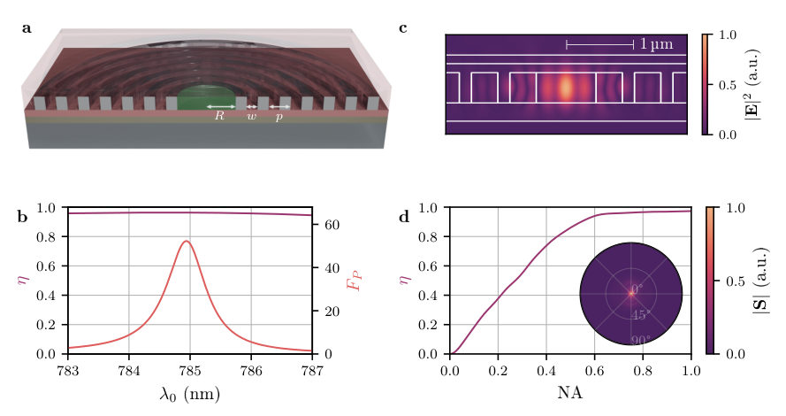
<figcaption class="paper-figure-caption"><b>Fig 3.</b> Figure 3: Circular Bragg grating cavity for nanoprinted DBT:Ac. a CBG cross-section and design parameters. b Simulated Purcell enhancement FP ≈52 (bandwidth ≈1 nm) and free-space collection efficiency η ≈96 % into NA = 0.75. c Normalized field intensity with Veff ≈1.3  λ0</figcaption>
</figure>

**Summary.** The paper tackles the challenge of improving single-photon purity from organic molecules by designing monolithic microcavities. Using advanced theoretical modeling and optimization, they propose specific Fabry–Perot and CBG designs that maximize Purcell enhancement into the desired zero-phonon line. This provides a crucial pathway for realizing practical, high-quality quantum light sources.

**Why it may be interesting.** This work directly addresses quantum light sources, a core topic in AMO physics and quantum optics. The detailed coupling of molecular emission properties with engineered cavity QED effects is highly relevant for building practical quantum hardware.

Detailed structure

**Main problem.** Single organic molecules are promising single-photon sources but suffer from unwanted phonon sideband emission, reducing the desired zero-phonon line (0-0 ZPL) purity.

**Main result.** The authors propose and analyze three monolithic microcavity designs that can significantly enhance Purcell enhancement into the 0-0 ZPL, offering a clear route to high-quality monochromatic single-photon sources.

**Method.** The study uses theoretical modeling, including finite-element method (FEM) simulations and analytical approximations for various cavity types (Fabry–Perot, CBG), coupled with Bayesian optimization techniques.

**Model / system.** The system involves embedding organic quantum emitters within monolithic photonic nanostructures like Fabry–Perot or Circular Bragg Grating (CBG) microcavities. These structures are designed to engineer the local photonic density of states.

**Key observables.** Purcell Enhancement ($F_P$), Spectral Redistribution Factor ($\alpha'$), Overall Collection Efficiency ($\eta_{	ext{ZPL}}$), and cavity quality factor ($Q$).

**Important parameters / regimes.** Cavity dimensions (e.g., spacer thickness $h_{	ext{SiO2}}$, disk radius $R_{	ext{disk}}$), emitter wavelength ($\lambda_0$), and coupling parameters.

**Assumptions / limitations.** The analysis assumes that single molecules can be positioned at the electric field maximum of the engineered cavity mode, which is a major technological hurdle.

**Figures summary.** Figures illustrate theoretical field profiles (Gaussian/Bessel-like), far-field intensity patterns showing Gaussian divergence, and parameter dependency sweeps mapping optimal ranges for various structural dimensions to maximize $F_P$ and $\eta$.

**Paper structure.** The paper develops an analytical framework by analyzing different cavity geometries (Fabry–Perot vs. CBG) using Gaussian beam optics and Bloch wave vector analysis. It then applies optimization techniques (Bayesian optimization) to determine optimal structural parameters that maximize the desired photon collection efficiency.

Abstract

Single organic molecules are a well-established platform for high-quality single-photon generation: they can emit lifetime-limited photons with high purity and indistinguishability. However, their emission is accompanied by a pronounced red-shifted phonon sideband and higher-order vibrational peaks, which reduce the fraction of photons emitted into the desired narrowband zero-phonon line. The standard approach to suppressing this unwanted emission is to integrate the emitter into a monolithic photonic nanostructure that provides Purcell enhancement. However, incorporating organic materials using clean-room techniques has proven challenging, and has in fact so far prevented their integration into monolithic microcavities altogether. As a result, efficient, narrowband organic single-photon sources for applications in quantum information processing have remained elusive despite their considerable promise. Here, we propose three monolithic microcavity designs tailored to provide sufficient Purcell enhancement for organic quantum emitters. The Purcell effect induced by these cavities preferentially enhances emission into the 0-0 zero-phonon line, increasing spectral purity, photon extraction, and shortening the excited-state lifetime, which in turn relaxes the requirements for generating indistinguishable photons. The cavities have been optimized using Bayesian optimization and the adaptive Antoulas-Anderson (AAA) algorithm for rational approximation, which offer global optimization and the efficient reconstruction of spectra from scattering simulations, respectively. These structures are compatible with both standard clean-room processing and single-molecule preparation techniques. Therefore, they offer a clear route to realize high-quality, practically monochromatic organic single-photon light sources.

[↑ back to top](#top)

### [Dynamics of fluctuating populations in multi-state switching environments](http://arxiv.org/abs/2608.12208v1)

**Authors:** Mauro Mobilia  
**Type:** theory · **Category:** statistical mechanics · **PDF:** <https://arxiv.org/pdf/2608.12208v1>  
**Analysis basis:** full PDF text, analyzed in chunks
**Topic relevance:** `analog quantum simulation` **3/5** · `driven-dissipative phase transition` **3/5** · `methods for driven-dissipative` **3/5** · `Keldysh / 2PI / non-Gaussian methods` **2/5** · `non-equilibrium universality` **2/5** · `correlated / nonlocal dissipation` **1/5** · `quantum measurements` **1/5** · `scars & prethermalization` **1/5**

↔ Scroll figures horizontally

<figure class="paper-figure-card">
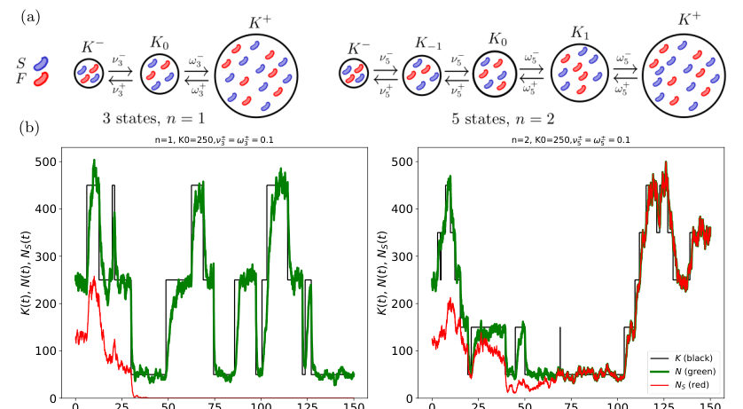
<figcaption class="paper-figure-caption"><b>Fig 1.</b> FIG. 1. (a) Illustration of the the 3-state (n = 1, left) and 5-state (n = 2, right) switching eco-evolutionary dynamics. (b) Typical sample paths of K(t) (black), N(t) (green), and NS(t) (red) for the 3-state (left) and 5-state (right) switching models with (K−, K+) = (50, 450). The number of F individuals is NF (t) = N(t) −NS(t) (not shown). (b, left) n = 1, K0 = 250, K(t) ∈{50, 250, 450}, ν± 3 = ω± 3 = 0.1 (intermediate switching regime; see text); (b, right) n = 2, K0 = 250, K(t) ∈{50, 150, 250, 350, 450}, ν± 5 = ω± 5 = 0.1 (intermediate switching). In (b, left), simultaneous S extinction and F fixation (not shown) occurs at t ≈35, whereas in (b, right) there is S fixation (with...</figcaption>
</figure>
<figure class="paper-figure-card">
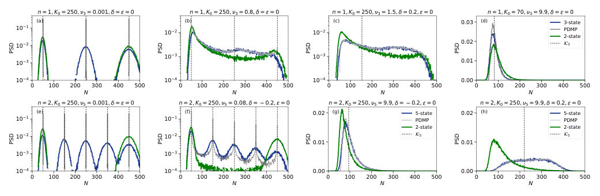
<figcaption class="paper-figure-caption"><b>Fig 2.</b> FIG. 2. Histograms of the quasi-stationary PSD, pν2n+1(N) (dark blue), for different switching rates for 3-state (a)- (d) and 5-state (b)-(h) multi-state switching models. In grey are shown the histograms of the N-PDMP (see Eq, (14) and Appendix C). These are compared with those of the PSD peν(N) = p(ν2n+1/n)(1+ϵ)/(2+ϵ)(N) of the effective two- state model (see text and Eq. (8)) shown in green. Panels (a)-(c), (e) and (f) are in semi-log scale (values &lt; 10−4 are not shown), while (d), (g) and (h) are in linear scale. The vertical dotted lines in (a),(b),(d),(e) are eyeguides show- ing N = Ki. In panels (c) (d),(g),(h) the dotted lines show K3 ≈153.23 (c) and K3 ≈82.17 (d), while in (g) and...</figcaption>
</figure>
<figure class="paper-figure-card">
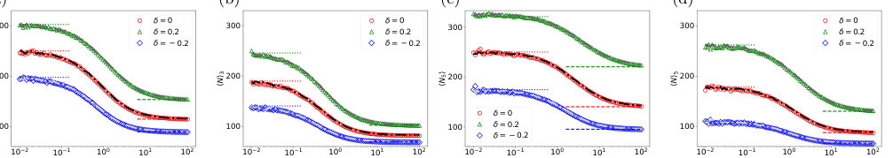
<figcaption class="paper-figure-caption"><b>Fig 3.</b> FIG. 3. Average population size ⟨N⟩2n+1 (markers) and ⟨N⟩PDMP 2n+1 (dash-dotted curves) versus ν2n+1 for different values of n, K0 and δ; see text and (15): (a) (n, K0) = (1, 250); (b) (n, K0) = (1, 70); (c) (n, K0) = (2, 250); (d) (n, K0) = (2, 70). In all panels, we have δ = 0 (red circles, black curves), δ = 0.2 (green triangles, dark gray curves), δ = −0.2 (blue diamonds, grey curves). The dotted and dashed horizontal lines are eyeguides respectively showing ⟨K⟩2n+1 = Pn i=−n Kiπi and K2n+1 (given by Eq. (13)) for each combination of n, K0, δ. Other parameters are (K−, K+, ϵ) = (50, 450, 0) in all panels. In all the examples, ⟨N⟩2n+1 and ⟨N⟩PDMP 2n+1 have been computed after t &gt; 5000,...</figcaption>
</figure>
<figure class="paper-figure-card">
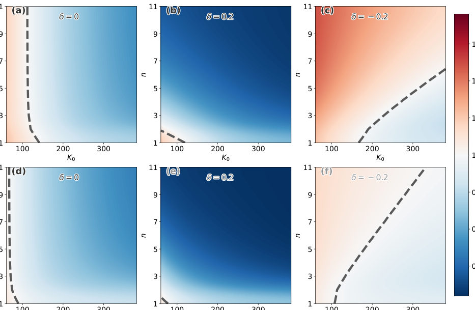
<figcaption class="paper-figure-caption"><b>Fig 4.</b> FIG. 4. Comparison of the S fixation probability in the regime of slow and fast switching in multi-state (n ≥1) and binary switching models: Heatmaps of the ratios ϕ0 2n+1/ϕ0 2 (slow switching) in (a)-(c) and ϕ∞ 2n+1/ϕ∞ 2 (fast switching) in (d)-(f) as colour-coded in the rightmost vertical bar; see text. Parameters are (K−, K+, s, x0, ϵ) = (50, 450, 0.02, 0.5, 0) and δ = 0 in (a,d), δ = 0.2 in (b,e), and δ = −0.2 in (c,f). For reference, K2 = 90 for δ = 0 , K2 ≈107.14 for δ = 0.2, and K2 ≈77.59 for δ = −0.2. In all panels, ϕ0,∞ 2n+1/ϕ0 2 &lt; 1 blueish areas and ϕ0,∞ 2n+1/ϕ0 2 &gt; 1 in yellow/orange regions. The black dashed lines (surrounded by a whitish cloud) indicate the contours along...</figcaption>
</figure>
<figure class="paper-figure-card">
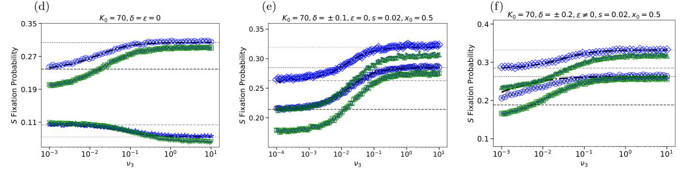
<figcaption class="paper-figure-caption"><b>Fig 5.</b> FIG. 5. S fixation probability in the three-state model as a function of the switching rate ν3. The centre state carrying capacity in (a)-(c) is K0 = 250, while K0 = 70 in (d)-(f). Here, n = 1, and (K−, K+) = (50, 450) in all panels except (c). Symbols are from full stochastic simulations and black dashed-dotted curves (in all panels), often almost indistinguishable from markers, are from the N-PDMP-based approximation; see Eq. (19). In blue, is shown ϕ3 vs. ν3 for different parameter sets: (δ, ϵ, s, x0) = (0, 0, 0.02, 0.5) (circles) in (a); (δ, ϵ, s, x0) = (0.2, 0, 0.02, 0.5) (circles) and (δ, ϵ, s, x0) = (−0.2, 0, 0.02, 0.5) (dia- monds) in (b); (δ, ϵ, s, x0, K−, K+) = (0.25, 0, 0.05,...</figcaption>
</figure>

**Summary.** This paper analyzes population competition in microbial systems subjected to complex, multi-state environmental fluctuations that mimic gradual feast-famine cycles. By developing a multi-state stochastic model, the authors show that these intermediate states significantly alter evolutionary outcomes compared to simple two-state models. The work provides quantitative tools for understanding how the complexity of environmental noise dictates population fate.

**Why it may be interesting.** While focused on biology/ecology, the mathematical machinery—analyzing non-equilibrium dynamics in fluctuating environments using stochastic processes (like master equations or birth-death processes)—is highly relevant to open quantum systems and non-equilibrium statistical mechanics.

Detailed structure

**Main problem.** The study investigates how population dynamics of competing strains are affected by environmental fluctuations that change gradually through multiple intermediate states, moving beyond simple binary switching models.

**Main result.** Multi-state stochastic switching models provide a more accurate description of feast-famine cycles than binary models, allowing characterization of how fluctuation frequency and amplitude impact fixation probability and mean fixation time.

**Method.** The authors use computational (Gillespie simulations) and analytical techniques to characterize population dynamics using multi-state birth-death processes and Moran model approximations.

**Model / system.** The system models two competing microbial strains in an environment whose carrying capacity fluctuates stochastically among a finite number of intermediate states, generalizing classical binary telegraph noise.

**Key observables.** Population size statistics, fixation probability, mean fixation time, and the population size distribution (PSD).

**Important parameters / regimes.** Environmental switching rates ($
u$), carrying capacity distribution parameters ($\omega$), fitness difference ($s$), and initial strain fraction ($x_0$).

**Assumptions / limitations.** The analysis relies on coarse-graining resource limitation into a time-varying carrying capacity $K(t)$ and uses approximations like the Moran process for finite populations.

**Figures summary.** Figures illustrate schematic switching dynamics (3-state vs 5-state) and sample paths of environmental states, population size, and strain proportions over time.

**Paper structure.** The paper first establishes the limitations of binary models by introducing the multi-state stochastic switching framework. It then details the model setup, analyzes mean-field dynamics, and finally applies the Moran process to calculate key evolutionary diagnostics like fixation probability and mean fixation time.

Abstract

Microbial populations generally evolve in fluctuating environments under time-varying conditions. These are often described by binary switching models, sometimes seen as coarse-grained feast-famine cycles, in which resource availability switches abruptly between abundant and scarce conditions. However, experimental studies suggest that feast-famine environments actually exhibit more complex temporal dynamics. Here, we study how two strains, one growing slightly slower than the other, compete for the same resources in fluctuating environments comprising a finite number of intermediate states, each having its own carrying capacity. Environmental switching between these states and their carrying capacities represents gradual changes in nutrient availability. This class of multi-state stochastic switching models can be interpreted as a coarse-grained description of feast--famine cycles and allows us to investigate strain competition under the gradual recovery and depletion of resources. By computational and analytical means, we characterise the population dynamics in these multi-state fluctuating environments. In particular, we study how the switching rates and distribution of carrying capacities affect the population-size statistics, fixation probability, and mean fixation time. By comparing these results with their counterparts in binary environments, we clarify how the frequency and amplitude of environmental fluctuations influence population dynamics in coarse-grained feast-famine cycles.

[↑ back to top](#top)

### [Exact dynamics of first-order system-bath coherence in bilinear bosonic models](http://arxiv.org/abs/2608.11556v1)

**Authors:** Yang-Yang Xie, Song-Lin Wu, Paul Brumer, Zhao-Ming Wang, Lian-Ao Wu  
**Type:** theory · **Category:** other · **PDF:** <https://arxiv.org/pdf/2608.11556v1>  
**Analysis basis:** full PDF text, analyzed in chunks
**Topic relevance:** `Keldysh / 2PI / non-Gaussian methods` **3/5** · `correlated / nonlocal dissipation` **3/5** · `methods for driven-dissipative` **3/5** · `Tavis-Cummings & cavity-many-emitter` **2/5** · `driven-dissipative phase transition` **2/5** · `analog quantum simulation` **1/5** · `non-equilibrium universality` **1/5** · `quantum measurements` **1/5**

↔ Scroll figures horizontally

<figure class="paper-figure-card">
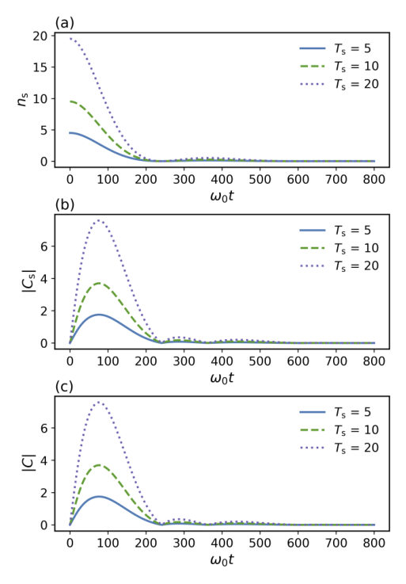
<figcaption class="paper-figure-caption"><b>Fig 1.</b> Figure 1. Effect of the system temperature Ts on the first- order system–bath coherence dynamics. (a) System occupa- tion number ns. (b) System-induced coherence contribution |Cs|. (c) Total first-order system–bath coherence amplitude |C| = |Cs + Cb|. Other parameters are ω0 = Ω= 1, Γ = 0.02, γ = 0.01, and Tb = 10.</figcaption>
</figure>
<figure class="paper-figure-card">
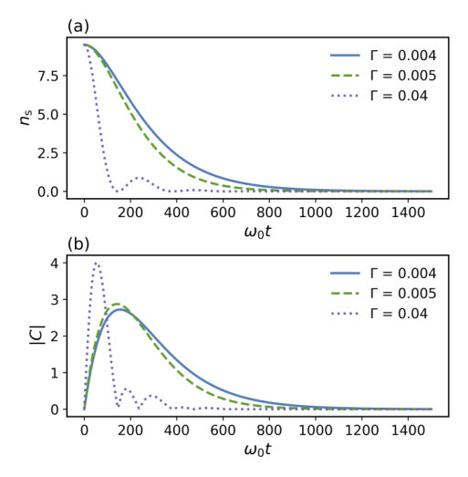
<figcaption class="paper-figure-caption"><b>Fig 2.</b> Figure 3. Effect of the coupling strength Γ on the first- order system–bath coherence dynamics. (a) System occupa- tion number ns. (b) First-order system–bath coherence am- plitude |C|. Other parameters are ω0 = Ω= 1, γ = 0.01, Ts = 10, and Tb = 1.</figcaption>
</figure>
<figure class="paper-figure-card">
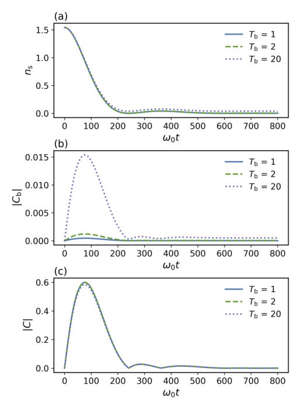
<figcaption class="paper-figure-caption"><b>Fig 3.</b> Figure 2. Effect of the bath temperature Tb on the first- order system–bath coherence dynamics. (a) System occu- pation number ns. (b) Bath-induced coherence contribution |Cb|. (c) Total first-order system–bath coherence amplitude |C| = |Cs + Cb|. Other parameters are ω0 = Ω= 1, Γ = 0.02, γ = 0.01, and Ts = 2.</figcaption>
</figure>
<figure class="paper-figure-card">
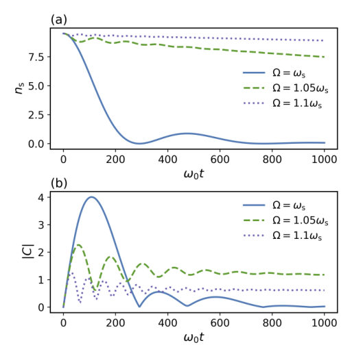
<figcaption class="paper-figure-caption"><b>Fig 4.</b> Figure 5. Effect of the detuning ∆= Ω−ω0 on the first- order system–bath coherence dynamics. (a) System occupa- tion number ns. (b) First-order system–bath coherence ampli- tude |C|. Other parameters are ω0 = 1, Γ = 0.02, γ = 0.005, Ts = 10, and Tb = 1.</figcaption>
</figure>
<figure class="paper-figure-card">
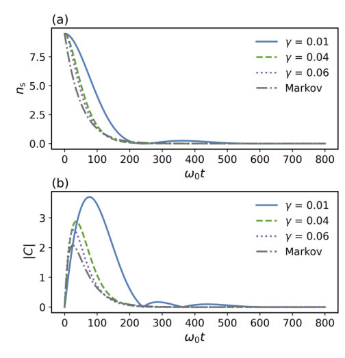
<figcaption class="paper-figure-caption"><b>Fig 5.</b> Figure 4. Effect of the spectral width γ on the first-order system–bath coherence dynamics. (a) System occupation number ns. (b) First-order system–bath coherence amplitude |C|. Other parameters are ω0 = Ω= 1, Γ = 0.02, Ts = 10, and Tb = 1.</figcaption>
</figure>

**Summary.** The paper theoretically analyzes how first-order coherence builds and evolves when a single bosonic mode interacts with a structured bath. By solving the full linear equations of motion, the authors demonstrate that reservoir memory effects (narrow spectral width) enhance transient coherence peaks. Furthermore, they show that active control via random frequency modulation can effectively suppress energy leakage into the environment, stabilizing quantum coherence at long times.

**Why it may be interesting.** This work provides rigorous analytical insights into non-Markovian open quantum system dynamics, which is crucial for designing robust quantum devices where environmental coupling must be precisely controlled to preserve coherence.

Detailed structure

**Main problem.** The study investigates the exact dynamics of first-order system–bath coherence induced by excitation exchange in bilinear bosonic models.

**Main result.** Random frequency modulation is shown to be superior to periodic modulation for suppressing excitation leakage and maintaining stable, finite long-time coherence fluctuations.

**Method.** The authors solve the linear Heisenberg equations exactly, avoiding approximations like Born or Markov limits, to derive time evolution coefficients for system and bath operators.

**Model / system.** The model uses bilinear bosonic Hamiltonians describing a localized bosonic mode coupled to a structured continuum reservoir (e.g., cavity coupled to photonic/phononic crystal modes).

**Key observables.** First-order system–bath coherence ($C(t)$), system occupation number ($n_s(t)$), and the time evolution of coupling coefficients.

**Important parameters / regimes.** Coupling strength ($\Gamma$), spectral width ($\gamma$, controlling bath memory time), detuning ($\Delta = \Omega - \omega_0$), and modulation parameters ($\delta\omega_{	ext{max}}$, $	au_{	ext{ran}}$).

**Assumptions / limitations.** The analysis relies on the linearity of the Heisenberg equations, allowing for closed-form solutions for expansion coefficients.

**Figures summary.** Figures illustrate the effect of system temperature ($T_s$), spectral width ($\gamma$), and detuning ($\Delta$) on coherence. Crucially, they compare random versus rectangular modulation protocols, demonstrating random modulation's superior ability to suppress leakage and maintain coherence.

**Paper structure.** The paper progresses from deriving exact dynamics using linear equations, analyzing the dependence of coherence on reservoir spectral features (memory/detuning), and finally developing a control scheme using LEO-inspired frequency modulation techniques.

Abstract

We investigate the exact dynamics of first-order system--bath coherence induced by excitation exchange in bilinear bosonic models. By solving the linear Heisenberg equations, we obtain the exact evolution of system and bath operators and evaluate the first-order coherence between the system mode and the collective bath mode directly coupled to it. We analyze how this coherence depends on initial occupations, coupling strength, spectral width, and detuning, showing that its buildup and oscillatory behavior are closely related to excitation exchange and reservoir memory. We further examine controlled coherence dynamics under leakage-elimination-operator inspired modulation of the system frequency. The results show that random modulation can suppress excitation leakage and maintain finite and relatively stable coherence fluctuations at long times. These results clarify the evolution and control of first-order system--bath coherence in settings where a localized bosonic mode is coupled to a structured bosonic reservoir.

[↑ back to top](#top)

### [Enhancing the power of a quantum heat engine via control of the system--reservoir coupling](http://arxiv.org/abs/2608.12055v1)

**Authors:** Sabrina Burgardt, Julian Feß, Silvia Hiebel, Eric Lutz, Artur Widera  
**Type:** experiment · **Category:** statistical mechanics · **PDF:** <https://arxiv.org/pdf/2608.12055v1>  
**Analysis basis:** full PDF text, analyzed in chunks
**Topic relevance:** `analog quantum simulation` **3/5** · `correlated / nonlocal dissipation` **3/5** · `driven-dissipative phase transition` **2/5** · `methods for driven-dissipative` **2/5** · `Keldysh / 2PI / non-Gaussian methods` **1/5** · `QC/QI experiment` **1/5** · `non-equilibrium universality` **1/5** · `quantum measurements` **1/5**

↔ Scroll figures horizontally

<figure class="paper-figure-card">
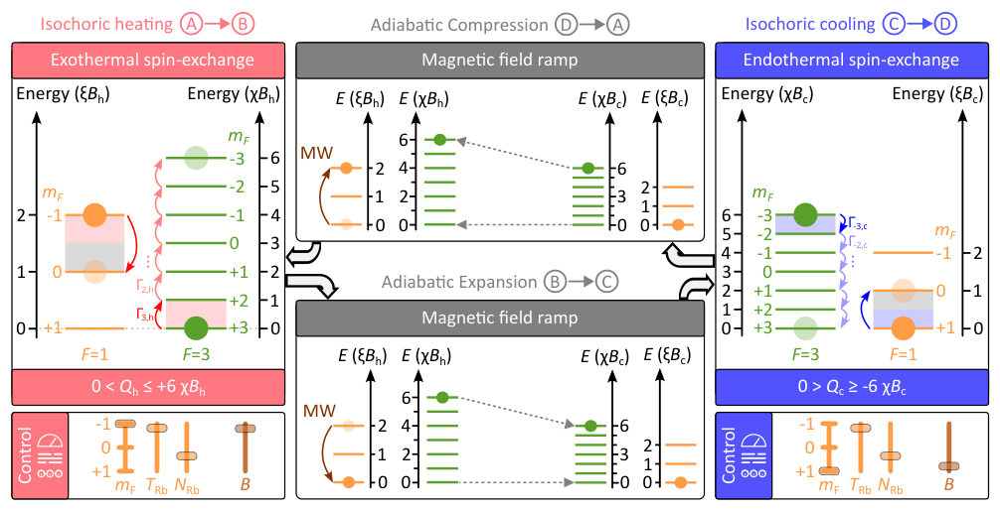
<figcaption class="paper-figure-caption"><b>Fig 1.</b> FIG. 1. Operation scheme of the quantum Otto heat engine. The working medium consists of the seven Zeeman states in the hyperfine ground-state manifold of Cs and undergoes a four-stroke cycle comprising two isochoric strokes and two adiabatic work strokes. The cycle starts with isochoric heating driven by exothermal spin-exchange collisions at a magnetic field Bh = 1 G, in which single quanta of heat (red shaded) are absorbed from the atomic reservoir of Rb atoms, while the excess internal energy (gray shaded) is released to the collision energy </figcaption>
</figure>
<figure class="paper-figure-card">
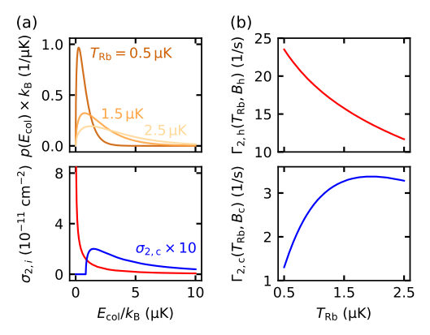
<figcaption class="paper-figure-caption"><b>Fig 2.</b> FIG. 2. Inelastic s-wave scattering. (a) Energy- dependent scattering cross sections of exothermal spin- exchange (red, Bh = 1 G) and endothermal spin-exchange (blue, Bc = 35 mG) for the Zeeman state mF,Cs = 2. The ki- netic temperature TRb of the atomic reservoir sets the range of accessible collision energies via the distribution function p(Ecol, TRb). (b) Transition rates resulting from the scatter- ing cross sections shown in (a) by evaluating Eq. (9) for var- ious kinetic temperatures TRb of the atomic bath at a fixed peak density nRb,0 = 2.2 × 1012 cm−3.</figcaption>
</figure>
<figure class="paper-figure-card">
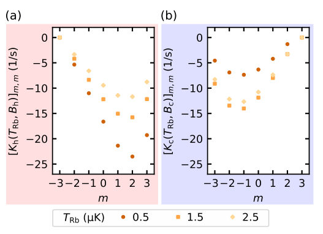
<figcaption class="paper-figure-caption"><b>Fig 3.</b> FIG. 3. Eigenvalues of the rate matrices governing heat trans- fer during the two isochoric strokes. Diagonal elements of the triangular rate matrices for isochoric heating (a) and iso- choric cooling (b), shown for three kinetic temperatures of the atomic reservoir, TRb = {0.5, 1.5, 2.5} µK, as obtained from Eqs. (7) and (8). Since the rate matrices are triangu- lar, their diagonal elements coincide with the eigenvalues λk, which determine the relaxation timescales entering the multi- exponential heat transfer law in Eq. (11). The magnetic fields are set to Bh = 1 G and Bc = 35 mG, and the peak density of the atomic reservoir is fixed at nRb,0 = 2.2 × 1012 cm−3.</figcaption>
</figure>
<figure class="paper-figure-card">
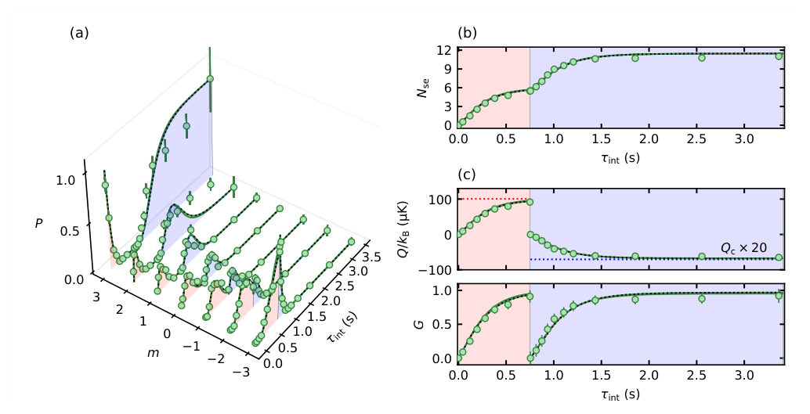
<figcaption class="paper-figure-caption"><b>Fig 4.</b> FIG. 4. Heat transfer driven by inelastic spin-exchange collisions. (a) Population dynamics of the seven Zeeman states in the working medium induced by exothermal spin-exchange collisions (red, isochoric heating) and endothermal spin-exchange collisions (blue, isochoric cooling). The working medium reaches full population inversion after an interaction time of approx- imately 750 ms. (b) Number-of-collisions evolution resulting from the measured spin dynamics. Full population inversion is reached after the maximal number of six spin-exchange collisions. (c) Heat transfer resulting from the spin-evolution driven by spin-exchange collisions. The evolution of the isochoric cooling stroke is...</figcaption>
</figure>
<figure class="paper-figure-card">
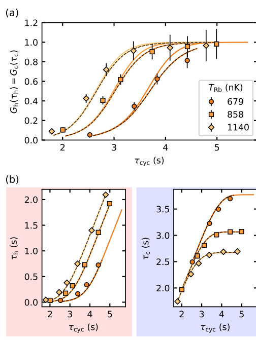
<figcaption class="paper-figure-caption"><b>Fig 5.</b> FIG. 5. Controlling the equilibration dynamics via the kinetic temperature of the atomic reservoir. (a) Evolution of the ther- malization factor Gh(τh) = Gc(τc) as a function of the total cycle duration τcyc for different kinetic temperatures TRb of the atomic reservoir. (b) Stroke durations required to reach a fixed fraction of equilibration, illustrating the redistribution of time allocation within the cycle. Increasing TRb induces a pronounced asymmetry: isochoric cooling accelerates, while isochoric heating slows down. The solid lines show the equili- bration dynamics resulting from our numerical model [Eq. (6)] without introducing free parameters, and the black dashed lines show the...</figcaption>
</figure>

**Summary.** The research experimentally demonstrates that the performance of a quantum heat engine can be optimized by controlling the system-reservoir coupling. Using ultracold atoms, the authors show that tuning the reservoir's kinetic temperature modifies the microscopic scattering rates governing heat transfer during the cycle's isochoric strokes. This provides a powerful tool for engineering finite-time energy conversion processes at the nanoscale.

**Why it may be interesting.** This work bridges fundamental non-equilibrium thermodynamics with cutting-edge AMO physics. It shows how engineering the microscopic coupling (the reservoir interaction) can be a direct tool for optimizing macroscopic performance metrics like power in quantum engines, which is highly relevant to quantum energy technologies.

Detailed structure

**Main problem.** The goal is to enhance the power output of a quantum heat engine operating at finite time by microscopically controlling the energy exchange between the working system and its environment (reservoir).

**Main result.** The authors experimentally demonstrated that tuning the kinetic temperature of the reservoir allows for microscopic control over the heat transfer law, enabling optimization of the engine's power output while maintaining a fixed efficiency.

**Method.** The study uses an experimental platform involving ultracold atoms to realize and measure the performance of a quantum Otto cycle, analyzing how collision-mediated energy exchange dictates the time evolution during isochoric strokes.

**Model / system.** The system is a quantum Otto engine using $^{133}	ext{Cs}$ atoms as the working medium coupled to an $^{87}	ext{Rb}$ atomic reservoir. Heat transfer occurs via inelastic $s$-wave collisions, which are modeled by rate matrices governing population dynamics during heating and cooling strokes.

**Key observables.** Power output ($P$), efficiency ($\eta$), cycle duration ($	au_{cyc}$), and the heat absorbed/released ($Q$).

**Important parameters / regimes.** Kinetic temperature of the reservoir ($T_{	ext{Rb}}$), magnetic field difference ($\Delta B$), and the durations of the isochoric strokes ($	au_h, 	au_c$).

**Assumptions / limitations.** Adiabatic work strokes are assumed short enough that no spin-exchange collisions occur; the control mechanism relies on the asymmetric energy scaling of scattering cross-sections for different collision types.

**Figures summary.** Figures illustrate the four-stroke cycle (isochoric heating/cooling, adiabatic expansion/compression) and show how cycle times ($	au_{cyc}$) depend strongly on $T_{	ext{Rb}}$ but weakly on $\Delta B$, while efficiency shows a monotonic dependence on $\Delta B$.

**Paper structure.** The paper establishes the theoretical framework for heat exchange via collision rates, details the four-stroke cycle dynamics using master equations, and then experimentally demonstrates that tuning $T_{	ext{Rb}}$ provides the primary handle to optimize power output by controlling the relative time allocation between heating and cooling strokes.

Abstract

The non-equilibrium properties of open quantum systems are determined by the microscopic laws governing energy exchange with their environment. In particular, an enhancement of the performance of quantum heat engines has been predicted by speeding up the dynamics through control of the system--bath interaction. However, direct microscopic control of heat transfer between the machine and the reservoir has remained elusive so far. Here, we experimentally demonstrate such control in a quantum Otto engine realized with ultracold Cs-133 atoms coupled to an atomic reservoir of ultracold Rb-87 atoms. Heat exchange between the two is mediated by inelastic s-wave collisions whose energy-dependent scattering cross sections lead to an asymmetric equilibration dynamics in the isochoric heating and cooling strokes. By tuning the kinetic temperature of the atomic reservoir, we modify the associated microscopic scattering rates, and thereby the heat transfer law, giving control over the time allocation within the engine cycle through control over the microscopic, multi-exponential relaxation dynamics. This enables power output optimization at fixed efficiency. Our results establish microscopic control of system-reservoir interactions as a tool for manipulating heat flow at the nanoscale and engineering the finite-time performance of quantum thermal machines.

[↑ back to top](#top)

### [Teleportation through time-varying channels: threshold geometry and a complete-positivity bound on non-Markovian backflow](http://arxiv.org/abs/2608.11314v1)

**Authors:** Chaibata Seida  
**Type:** theory · **Category:** quantum information and computing · **PDF:** <https://arxiv.org/pdf/2608.11314v1>  
**Analysis basis:** full PDF text, analyzed in chunks
**Topic relevance:** `correlated / nonlocal dissipation` **3/5** · `methods for driven-dissipative` **3/5** · `quantum measurements` **3/5** · `Keldysh / 2PI / non-Gaussian methods` **2/5** · `driven-dissipative phase transition` **2/5** · `non-equilibrium universality` **1/5**

↔ Scroll figures horizontally

<figure class="paper-figure-card">
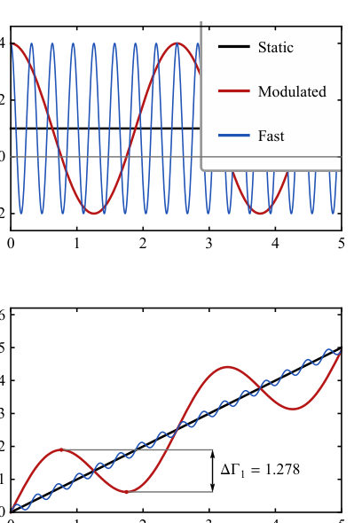
<figcaption class="paper-figure-caption"><b>Fig 1.</b> FIG. 1. Instantaneous rate γ1(t) (upper panel) and accumu- lated rate Γ1(t) (lower panel) for the three regimes of Sec. II C: static (ξ = 0), modulated (ξ = 3, Ω= 2.5γ1,0) and fast (ξ = 3, Ω= 20γ1,0). In both modulated cases the instanta- neous rate turns negative over part of each period, but only in the modulated one does this leave a visible mark on Γ1: the accumulated rate peaks at γ1,0t ≃0.76 and bottoms out at γ1,0t ≃1.75, separated by the peak-to-trough excursion ∆Γ1 = 1.278 of Eq. (14). Under fast modulation the same depth produces an excursion of order ξγ1,0/Ωand the curve is indistinguishable from the static one. The mean rate is γ1,0 in all three cases.</figcaption>
</figure>
<figure class="paper-figure-card">
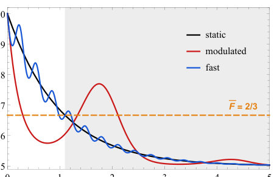
<figcaption class="paper-figure-caption"><b>Fig 2.</b> FIG. 2. One-sided exposure: negativity N(t) and average teleportation fidelity ¯F(t) for the three regimes. The dashed line is the classical benchmark ¯F = 2/3 and the shaded band is the useless-entanglement regime. Modulation drives excur- sions back above the benchmark, fragmenting that regime into finite windows, while N never reaches zero.</figcaption>
</figure>
<figure class="paper-figure-card">
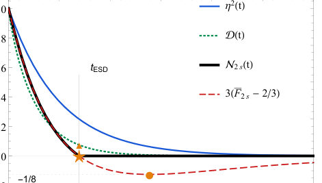
<figcaption class="paper-figure-caption"><b>Fig 3.</b> FIG. 3. Two-sided exposure. Upper panel: negativity N2s(t) for the static and modulated channels; the static channel dies once at tESD = ln 2, while modulation produces a sin- gle death–birth–death cycle (shaded) at γ1,0t ≃0.178, 1.599, 1.893. Lower panel: ordering of the static lifetimes, nor- malised to unity at t = 0: η2(t), D(t), 2N2s(t) and the fidelity margin 3( ¯F 2s −2/3). The last two coincide for t &lt; tESD by Eq. (26); past tESD the negativity is clamped at zero while the margin dips to −1/8 at γ1,0t = ln 4.</figcaption>
</figure>
<figure class="paper-figure-card">
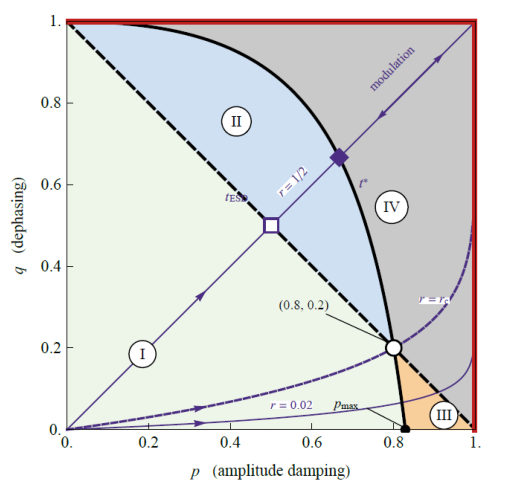
<figcaption class="paper-figure-caption"><b>Fig 4.</b> FIG. 4. Threshold landscape in the (p, q) plane. Solid: the one-sided advantage boundary 4(1 −p)(1 −q) = p2, meeting the axis at pmax = 2 √</figcaption>
</figure>

**Summary.** This paper analyzes the degradation of quantum entanglement and teleportation fidelity when qubits pass through time-varying decoherence channels. By mapping resource thresholds onto a fixed parameter space, the authors derive bounds on how much coherence can 'backflow' due to modulation. The results show that while resources decay overall, controlled modulation can lead to temporary revivals of quantum advantage.

**Why it may be interesting.** This work provides rigorous mathematical bounds on how quantum resources can be temporarily restored or enhanced by time-varying environments, which is crucial for designing robust quantum communication protocols.

Detailed structure

**Main problem.** The study investigates quantum teleportation fidelity through time-varying, non-Markovian decoherence channels.

**Main result.** The analysis establishes a complete positivity bound on the backflow of coherence ($\Delta\Gamma_k \le 2\pi\gamma_{k,0}/\Omega$) and shows that modulation can induce transient revival of quantum advantage.

**Method.** The authors model decoherence using time-local master equations, analyzing resource degradation by mapping thresholds onto a fixed $(p, q)$ plane.

**Model / system.** The system involves teleporting an unknown qubit state via a shared entangled pair passing through a link combining amplitude damping and dephasing at time-dependent rates. The dynamics are parameterized by two accumulated damping factors, $p(t)$ and $q(t)$.

**Key observables.** Negativity ($N$), Fully Entangled Fraction ($f$), Quantum Discord ($D$), and Average Teleportation Fidelity ($ar{F}$).

**Important parameters / regimes.** Accumulated damping parameters $p(t)$ and $q(t)$; modulation depth $\xi_k$; the critical threshold condition $p+q \ge 1$ for entanglement vanishing.

**Assumptions / limitations.** The time evolution separates into a fixed part and a moving one, depending only on accumulated damping parameters $p(t)$ and $q(t)$.

**Figures summary.** Figure 1 illustrates the rate profiles ($\gamma_1(t), \Gamma_1(t)$) across static, fast, and modulated regimes. Figure 2 plots resource measures like negativity and fidelity over time for one-sided exposure.

**Paper structure.** The paper first establishes the dynamics using accumulated parameters $p(t)$ and $q(t)$, then analyzes different noise geometries (one-sided vs. two-sided), deriving key bounds from complete positivity, and finally discussing resource revival phenomena under harmonic modulation.

Abstract

A Bell pair distributed through a link that combines amplitude damping with dephasing at time-dependent rates has dynamics that separate into a fixed part and a moving one. The negativity, fully entangled fraction, discord, and average teleportation fidelity depend on time only through the accumulated damping parameters $p(t)$ and $q(t)$. Every threshold is therefore a curve fixed in the unit square, and the rates select nothing but a trajectory across it. The Horodecki fidelity formula $\bar{F} = \frac{1}{2} + \frac{1}{6}\mathrm{Tr}|T|$ covers one- and two-sided exposure alike: the condition $\det T \leq 0$ under which it takes this form holds throughout the unit square for both. Under symmetric two-sided noise the entanglement vanishes when $p+q\geq1$, where the exact relation $\bar{F}^{2s}=\frac{2}{3}+\frac{1}{3}\mathcal{N}_{2s}$ ties disentanglement and the loss of quantum advantage to the same instant. One-sided exposure admits no finite-time sudden death for any rate profile, and the discord stays strictly positive throughout the open square, so the distributed state can be separable, useless for teleportation, and still nonclassical. For harmonically modulated rates, complete positivity caps the backflow at one modulation period of static decay, $ΔΓ_{k}\leq2πγ_{k,0}/Ω$, equivalently at a modulation depth $ξ_{k}\leq4.6033$ independent of $Ω$. Inside that window the trajectory reverses, producing finite intervals of restored quantum advantage and entanglement sudden birth.

[↑ back to top](#top)

### [Geometry of Noisy Quantum Many-Body Dynamics with Continuous Symmetries: Entanglement and Correlations](http://arxiv.org/abs/2608.11297v1)

**Authors:** Marco Lastres, Sanjay Moudgalya  
**Type:** theory · **Category:** statistical mechanics · **PDF:** <https://arxiv.org/pdf/2608.11297v1>  
**Analysis basis:** full PDF text, analyzed in chunks
**Topic relevance:** `methods for driven-dissipative` **3/5** · `non-equilibrium universality` **3/5** · `Keldysh / 2PI / non-Gaussian methods` **2/5** · `driven-dissipative phase transition` **2/5** · `analog quantum simulation` **1/5** · `correlated / nonlocal dissipation` **1/5** · `scars & prethermalization` **1/5**

↔ Scroll figures horizontally

<figure class="paper-figure-card">
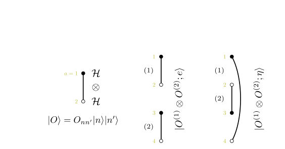
<figcaption class="paper-figure-caption"><b>Fig 1.</b> FIG. 1. Pictorial representations of the vectorization of the operator O 7→|O⟩on a duplicated Hilbert space, and the states defined in Eq. (13) for a k = 2 replica system (e ∈S2 is the identity permutation and η ∈S2 is the swap).</figcaption>
</figure>
<figure class="paper-figure-card">
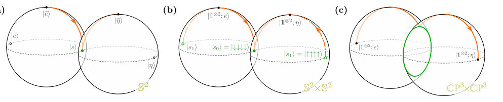
<figcaption class="paper-figure-caption"><b>Fig 2.</b> FIG. 2. Illustration of the ferromagnetic ground state manifolds of the models studied here. The lines show paths between the e and η branches that are relevant for entanglement domain wall melting. (a) Ground state manifold and of the esη toy model, composed of two Bloch spheres S2 which share the s-point. (b) Commutant manifold for a U(1) symmetry at k = 2 replicas, composed of two S2 × S2 manifolds that touch at two points. (c) Commutant manifold for a SU(2) symmetry at k = 2 replicas, composed of two CP3 × CP3 manifolds that intersect on a (S2)×4 continuous submanifold.</figcaption>
</figure>
<figure class="paper-figure-card">
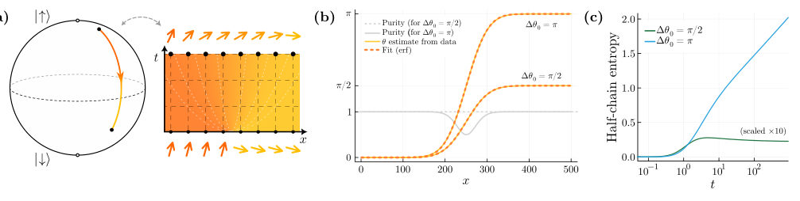
<figcaption class="paper-figure-caption"><b>Fig 3.</b> FIG. 3. (a) Illustration of the ground state manifold and diffusive relaxation for the Heisenberg model imaginary-time dynamics. For a 1d system, in the continuum limit a smooth field configuration can be seen as a curve on the Bloch sphere. (b) Spatial profile of the field θ(x, t) at late times extracted using Eq. (75) from numerical data of the Heisenberg model, compared to a fit of the TDVP solution Eq. (74). In light gray the purity of the one-site reduced density matrix for the ∆θ0 = π evolved state, where the TDVP equations have multiple equivalent solutions. (c) Half-chain entanglement entropy from numerical data for two evolved domain walls in the Heisenberg model. The entropy in...</figcaption>
</figure>
<figure class="paper-figure-card">
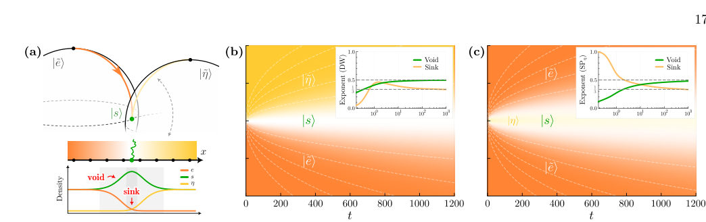
<figcaption class="paper-figure-caption"><b>Fig 4.</b> FIG. 4. (a) Illustration of a field configuration for the esη model, in particular associated to the evolution of the domain wall state |dw(t)⟩. To each position in space we associate a point on the ground state manifold MGS of Fig. 2a, and we treat the position of the s-point as a defect, which in the semiclassical limit remains stationary. We call void the region where the density of the |s⟩state dominates, and sink the region where density of |e⟩and |η⟩states overlap. (b) Density of |e⟩and |η⟩states in the evolution of |dw(t)⟩, showing the formation of the void the |s⟩density dominates. Inset, power law exponent for the growth of the void (diffusive) and sink (subdiffusive), the latter...</figcaption>
</figure>
<figure class="paper-figure-card">
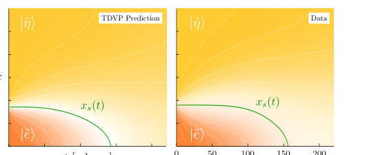
<figcaption class="paper-figure-caption"><b>Fig 5.</b> FIG. 5. Comparison between solution to the TDVP equa- tions of motion (left) and numerical simulation data (right) for a domain wall close to the spatial boundary of the sys- tem, showing its annihilation, as in Sec. V D 3. Time in the TDVP continuum prediction is in arbitrary units and has been approximately rescaled to match the data. Numerical data obtained using MPS simulation with L = 60, with other pa- rameters similar to Fig. 4.</figcaption>
</figure>

**Summary.** This paper develops a general geometric theory to analyze the late-time dynamics of noisy quantum many-body systems with continuous symmetries. By mapping the evolution onto the geometry of $k$-commutant manifolds, it explains anomalous decay rates and entanglement growth using concepts from quantum geometry. This framework offers systematic tools for studying observables in complex, non-equilibrium settings.

**Why it may be interesting.** This work provides a powerful geometric framework for understanding non-equilibrium dynamics in complex quantum systems, linking symmetry structure directly to observable scaling laws like entanglement entropy.

Detailed structure

**Main problem.** The study investigates unitary quantum dynamics in noisy many-body systems possessing global continuous symmetries, focusing on how entanglement and correlations evolve over time.

**Main result.** The late-time evolution is governed by the quantum geometry of effective $k$-commutant manifolds, providing a geometric explanation for sub-ballistic entanglement growth and anomalous correlator decay linked to manifold singularities.

**Method.** The authors employ replica theory, mapping dynamics to low-energy physics on effective Hamiltonians, and utilize the Time-Dependent Variational Principle (TDVP) adapted for singular ground state manifolds.

**Model / system.** The analysis covers noisy Brownian models with continuous symmetries ($U(1), SU(2)$), generalized to interacting systems whose dynamics are characterized by $k$-commutant algebras. Specific toy models include the $es\eta$ model and free-fermion systems.

**Key observables.** Rényi entanglement entropies, hydrodynamic and non-hydrodynamic correlators, and the geometry of $k$-commutants.

**Important parameters / regimes.** The symmetry group ($U(1)$ vs. $SU(2)$), replica number ($k$), and system parameters defining the noise/interaction strength ($\lambda$, $\Delta$).

**Assumptions / limitations.** Key challenges involve treating ground state manifolds that possess singularities, requiring extensions beyond standard smooth manifold dynamics treatments like TDVP.

**Figures summary.** The notes do not provide a summary of figures, but mention calculations involving overlaps and entropy scaling for specific models.

**Paper structure.** The paper is structured as a review: Section II covers Brownian models; Section III characterizes $k$-commutant manifolds; Section IV applies TDVP to smooth systems (Heisenberg); Section V introduces singularity physics via toy models; Sections VI and VII address entanglement growth in $U(1)$ and $SU(2)$ symmetric systems, respectively.

Abstract

We study unitary quantum dynamics in noisy Brownian models with global continuous symmetries, such as $U(1)$ and $SU(2)$, focusing on Rényi entanglement entropies and hydrodynamic and non-hydrodynamic correlators. By mapping the averaged late-time dynamics to the low-energy physics of effective replica Hamiltonians, we find that the evolution is controlled by the quantum geometry of their ground-state manifolds, which is directly related to the geometry of $k$-commutants---the symmetry algebra of $k$ replicas of the system. In interacting systems, these $k$-commutants are generically determined solely by the symmetries of the system, independent of microscopic details of the noisy evolution. This allows us to use the time-dependent variational principle (TDVP) to provide simple geometric explanations for the sub-ballistic Rényi entanglement growth and the anomalous decay of non-hydrodynamic correlators in interacting systems with continuous symmetries. We find this behavior to be intimately connected to singularities within the $k$-commutant manifolds, arising from frozen ``void'' states in the Hilbert space that exist due to continuous on-site symmetries. This also demystifies the important role of voids in the dynamics of these observables, previously identified in $U(1)$ symmetric systems. We compare these behaviors in interacting systems with Abelian and non-Abelian continuous symmetries and in free-fermion systems, which differ in the geometry of their $k$-commutants. Ultimately, this work provides a general geometric framework for systematically studying observables in noisy systems with continuous symmetries, including Haar-random circuits.

[↑ back to top](#top)

### [Light-induced effective magnetic fields in Landau quantized graphene](http://arxiv.org/abs/2608.11751v1)

**Authors:** Hiroki Ueda, Alexej Pashkin, Ece Uykur, Kryštof Kašša, Filip Chudoba, Jan Kunc, Manfred Helm, Milan Orlita, Stephan Winnerl  
**Type:** experiment · **Category:** strongly correlated electrons · **PDF:** <https://arxiv.org/pdf/2608.11751v1>  
**Analysis basis:** full PDF text, analyzed in chunks
**Topic relevance:** `Keldysh / 2PI / non-Gaussian methods` **3/5** · `driven-dissipative phase transition` **2/5** · `quantum optics experiment` **2/5** · `analog quantum simulation` **1/5** · `correlated / nonlocal dissipation` **1/5** · `interference shaping light` **1/5** · `methods for driven-dissipative` **1/5** · `non-equilibrium universality` **1/5** · `quantum measurements` **1/5**

↔ Scroll figures horizontally

<figure class="paper-figure-card">
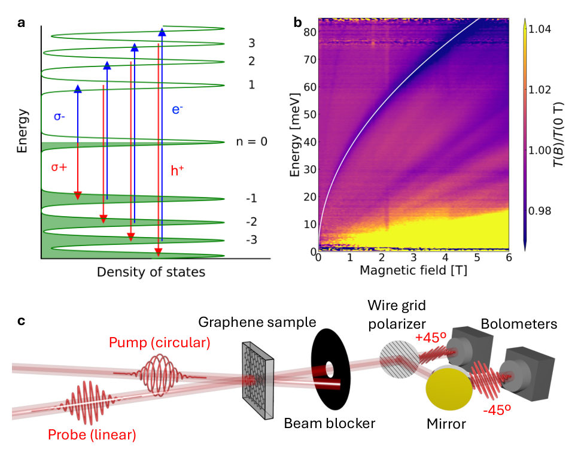
<figcaption class="paper-figure-caption"><b>Fig 1.</b> Figure 1: Energy diagram and experimental setup. a, Energy diagram of the Landau levels in graphene. Circular polarization selectively couples to electron (upward arrows) or hole (downward arrows) excitations between the levels. Red and blue arrows denote excitations by σ+ and σ−polarizations, respectively. b, Magneto-transmission spectra of the measured graphene sample, where the white curve indicates the Landau-level transition from n = 0 to n = ±1, following E(B) = vF √</figcaption>
</figure>
<figure class="paper-figure-card">
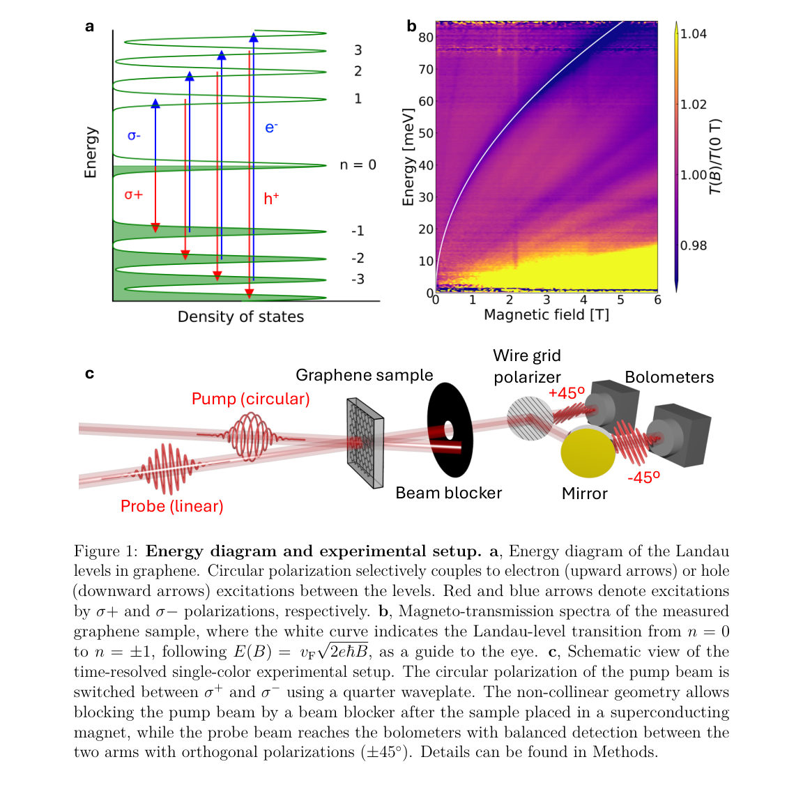
<figcaption class="paper-figure-caption"><b>Fig 2.</b> Fig. 1c and Methods for details). The pump pulse was circularly polarized (σ+ for right and</figcaption>
</figure>
<figure class="paper-figure-card">
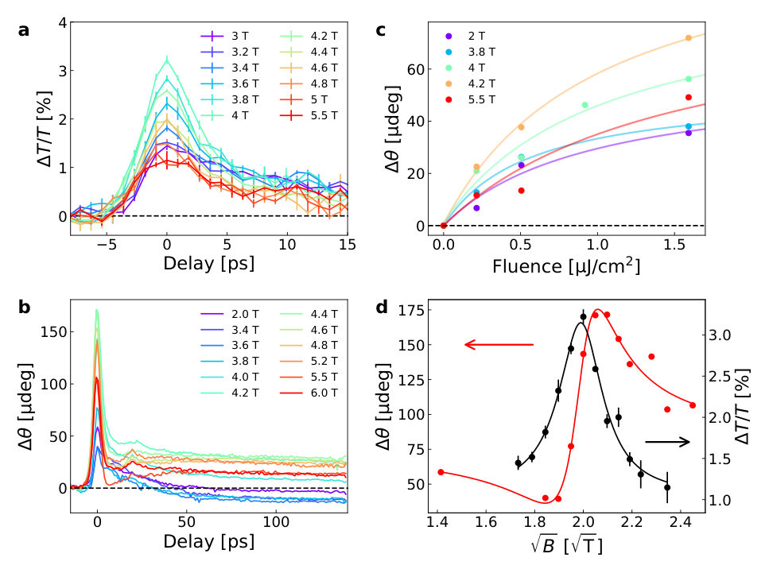
<figcaption class="paper-figure-caption"><b>Fig 3.</b> Figure 2: Characterization of the dynamics triggered by circularly polarized terahertz pulses. a, Differential transmission ∆T/T and b, polarization rotation angle ∆θ at different magnetic fields as a function of pump-probe delay. c, Fluence (F) dependence of peak ∆θ signals at different magnetic fields. Curves are guides to the eye from the fit to the Langmuir saturation model, ∆θ(F) = ∆θmax F F+Fsat, where ∆θmax and Fsat represent the saturation amplitude and the fluence over which saturation occurs, respectively. Obtained Fsat is ∼1 µJ/cm2. d, Magnetic field dependence of ∆T/T (black) and ∆θ (red), extracted from the data shown in a and b, respectively. The black and red solid curves...</figcaption>
</figure>
<figure class="paper-figure-card">
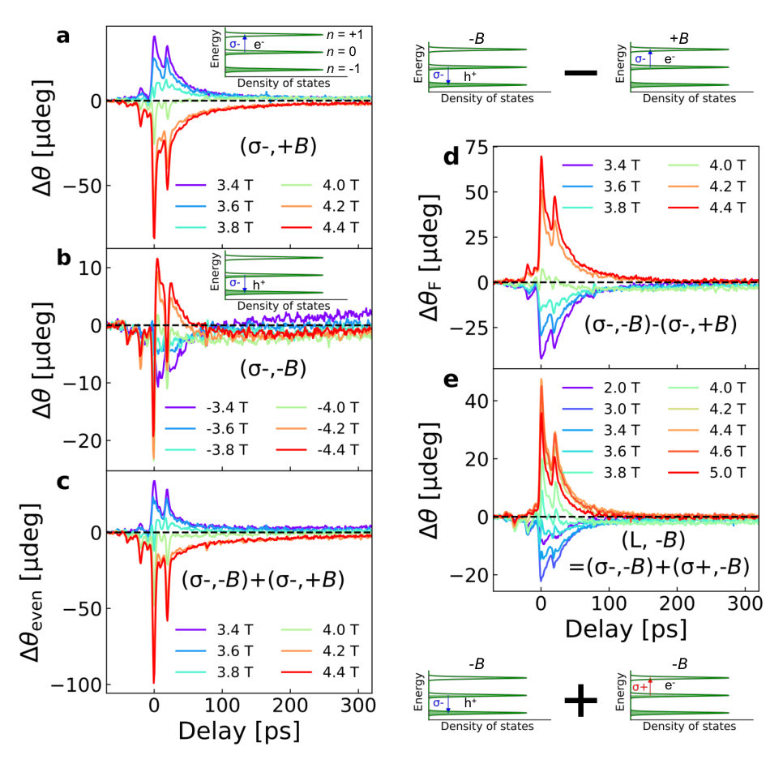
<figcaption class="paper-figure-caption"><b>Fig 4.</b> Figure 3: Pump polarization and magnetic field dependences of the polarization rotation signals. Polarization rotation angle ∆θ measured at different magnetic fields and pump beam polarizations as a function of pump-probe delay: a, (σ−, +B), b, (σ−, −B), and e, (L, −B). The inset in a and b represents the corresponding excitation diagram. c, Sum and d, difference of the data shown in a and b. The comparison between d and e demonstrates the equivalence between (σ+, −B) and sign-flipped (σ−, +B) data, as indicated by the excitation diagram shown above or below each panel (see main text for details). The difference data shown in d corresponds to the Faraday rotation ∆θF, while the sum data...</figcaption>
</figure>
<figure class="paper-figure-card">
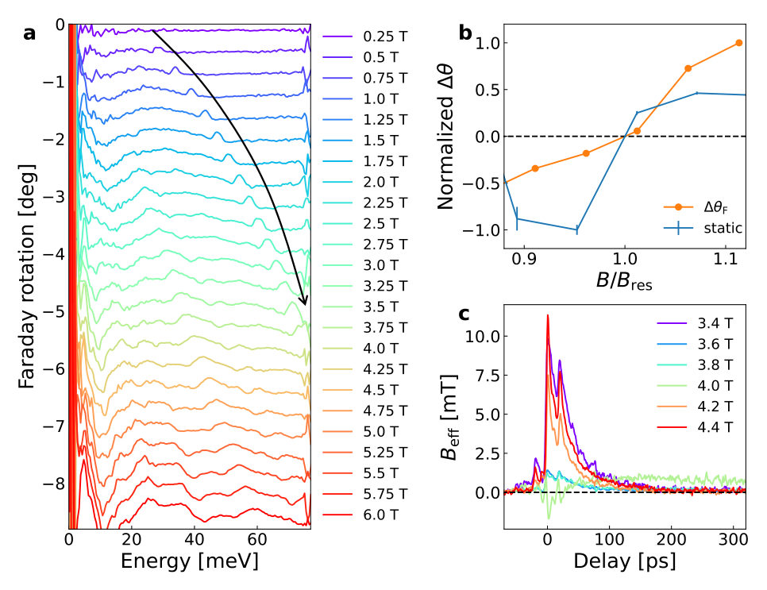
<figcaption class="paper-figure-caption"><b>Fig 5.</b> Figure 4: Effective magnetic fields extracted by comparison to static Faraday rotation spectra. a, Static Faraday rotation spectra measured at different magnetic fields. Each data is vertically shifted for clarity. The black arrow is a guide to the eye to follow Faraday rotation signals due to the first Landau-level transition between n = 0 and n = ±1. b, B evolution of the static and transient Faraday rotation signals (blue and orange, respectively) normalized for comparison. Because of instrumental artifacts near 75 meV in the static data, the data around 71 meV is shown instead, normalized to the resonant field. Here, ∆θF represents the peak values in the time traces. c, Time traces of...</figcaption>
</figure>

**Summary.** This paper experimentally demonstrates how circularly polarized light can induce transient effective magnetic fields in graphene by selectively exciting transitions between Landau quantized energy levels. By analyzing the resulting magneto-optical response, the authors establish a clear microscopic picture of the electronic inverse Faraday effect, opening avenues for ultrafast control over spin and magnetoelectric functionalities.

**Why it may be interesting.** The work provides a clean, tunable platform to observe fundamental many-body quantum coupling effects (like the inverse Faraday effect) in Dirac materials using light, which is highly relevant for developing next-generation opto-spintronic devices.

Detailed structure

**Main problem.** Investigating light-induced effective magnetic fields generated by circularly polarized radiation in graphene, relevant for ultrafast spin control.

**Main result.** The study demonstrates a direct, time-resolved link between resonant Landau-level excitation and the modification of optical Hall conductivity, generating an effective magnetic field on the order of 10 mT.

**Method.** Time-resolved pump-probe spectroscopy using circularly polarized terahertz pulses ($\sigma^+$ and $\sigma^-$) to selectively excite non-equidistant Landau quantized states in graphene.

**Model / system.** The physical system is graphene, a prototypical Dirac material, studied under an applied magnetic field ($B$) where electron energy levels are quantized into Landau levels. The analysis focuses on the electronic origin of the inverse Faraday effect.

**Key observables.** Transient Faraday rotation signals ($\Delta	heta$), differential transmission ($\Delta T/T$), and the extracted effective magnetic field ($\mathbf{B}_{	ext{eff}}$).

**Important parameters / regimes.** Pump fluence ($\sim 1.6 \mu	ext{J}/	ext{cm}^2$); Effective magnetic field magnitude ($\sim 10 	ext{ mT}$); Landau level transitions ($n=-1 	o n=0$, etc.).

**Assumptions / limitations.** The fast-timescale dynamics are attributed purely to electronic effects via the optical Hall conductivity, isolating this mechanism from phonon or sublattice contributions.

**Figures summary.** Figures show energy diagrams of Landau levels and time traces of polarization rotation ($\Delta	heta$) vs. delay time at various magnetic fields, demonstrating field dependence across resonance.

**Paper structure.** The paper establishes the physical problem (ultrafast spin control), details the experimental setup using selective resonant excitation in graphene's Landau levels, analyzes the magneto-optical response by separating contributions ($\Delta	heta_F$), and concludes that the signal originates from the optical Hall conductivity mechanism.

Abstract

Ultrafast magnetism triggered by circularly polarized radiation underpins ultrafast spin control, relevant to future technologies, e.g., opto-spintronics and magnonics. The dynamics are often complicated and intertwined among correlated subsystems, such as electrons, spins, phonons, plasmons, topology, and lattice, due to many-body quantum coupling at ultrafast timescales. Here, we demonstrate light-induced effective magnetic fields generated by selective excitation between non-equidistant Landau quantized states in graphene, a prototypical Dirac material, using circularly polarized pulses. By magnetically tuning the Landau-level transition resonance away from other low-energy excitations, we obtain a clean electrostatically controllable platform and identify the microscopic origin of the light-induced magnetic signals, independent of sublattice coupling. Because different Landau levels carry distinct optical Hall conductivities, direct modification of their occupancies via optical excitations creates transient Faraday rotation signals with dispersive magnetic-field dependence, mirroring the static magneto-optical lineshape. The induced effective magnetic field normalized by the pump electric field exceeds typical reported values for the inverse Faraday effect of electronic origin. Our results establish a clear microscopic picture of the inverse Faraday effect of electronic origin, which can trigger hierarchical dynamics among correlated sublattices once Landau-level transitions are magnetically tuned to coincide with other low-energy excitations in Dirac systems and related materials.

[↑ back to top](#top)

### [Quantum-limited imaging using diffractive optical neural networks](http://arxiv.org/abs/2608.12300v1)

**Authors:** Aakash Warke, Aonan Zhang, A. I. Lvovsky  
**Type:** both · **Category:** other · **PDF:** <https://arxiv.org/pdf/2608.12300v1>  
**Analysis basis:** full PDF text, analyzed in chunks
**Topic relevance:** `interference shaping light` **3/5** · `quantum measurements` **3/5** · `quantum optics experiment` **3/5** · `Full counting statistics` **1/5** · `analog quantum simulation` **1/5** · `driven-dissipative phase transition` **1/5** · `methods for driven-dissipative` **1/5**

↔ Scroll figures horizontally

<figure class="paper-figure-card">
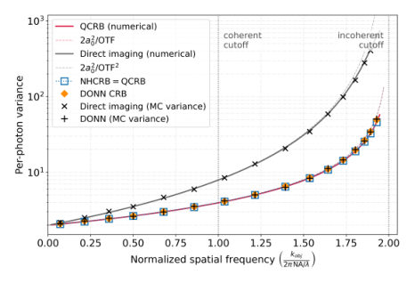
<figcaption class="paper-figure-caption"><b>Fig 1.</b> FIG. 1: Variances for single-amplitude estimation and the corresponding precision bounds. The NHCRB coincides with the QCRB, and the trained 8-layer DONN saturates it at every spatial frequency. DI falls short of this benchmark. The CRBs for DI and DONN are consistent with the variance of the estimator (9) tested via Monte Carlo (MC) simulations.</figcaption>
</figure>
<figure class="paper-figure-card">
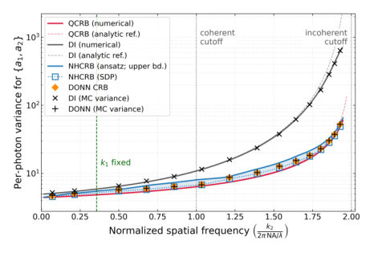
<figcaption class="paper-figure-caption"><b>Fig 2.</b> FIG. 2: Two-amplitude estimation. The first spatial frequency is fixed at 0.36. The total variance of both amplitudes is plotted as a function of the second spatial frequency, with the precision bounds Tr[F −1]. The NHCRB detaches from the QCRB and reconverges near the incoherent cutoff. Shaded region shows the upper bound (10), validating our SDP implementation, and a 10-layer DONN saturates the NHCRB across the band.</figcaption>
</figure>
<figure class="paper-figure-card">
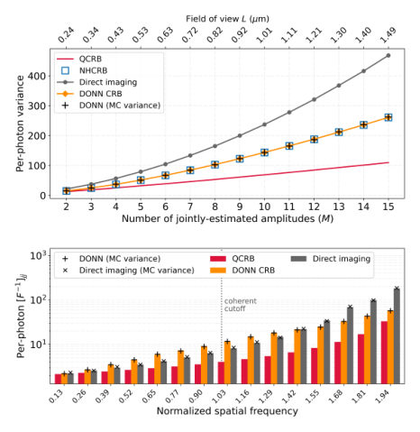
<figcaption class="paper-figure-caption"><b>Fig 3.</b> FIG. 3: Total variances for multiple amplitude estimation and the corresponding precision bounds. (a) For up to fifteen parameters equally spaced across the band, the NHCRB scales linearly, away from the QCRB. A suitably deep DONN, taken as 2M layers for M parameters, consistently saturates the NHCRB as parameters increase. (b) The per-parameter variances (log-y) at M = 15 show that DONN gains advantage over DI by prioritizing higher frequency amplitudes.</figcaption>
</figure>
<figure class="paper-figure-card">
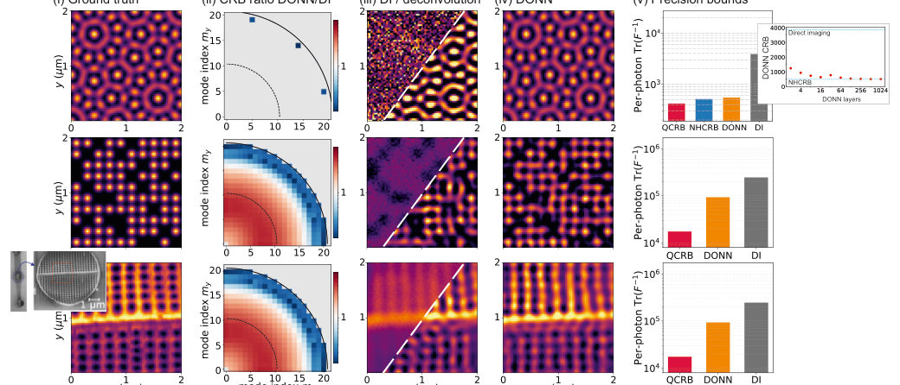
<figcaption class="paper-figure-caption"><b>Fig 4.</b> FIG. 4: Image reconstructions of 2D objects with sub-Rayleigh features. Each object occupies a 2 × 2 µm square field of view. Top: abstract pattern with three nonzero spatial frequency components. Middle: simulated atomic lattice. Bottom: SEM microphotograph of Amphipleura pellucida. (i) Ground truth object. (ii) DONN/DI variance ratio for individual spatial frequency components showing DONN advantage for high frequencies. (iii) Direct image and its deconvolution. (iv) DONN reconstruction, which recovers fine features of the object. (v) Precision bars comparing per-photon Tr[F −1] for the QCRB, NHCRB (computable for the first object only), DONN, and DI. Top inset: dependence of the DONN...</figcaption>
</figure>

**Summary.** This paper reformulates general optical imaging as a multiparameter quantum estimation problem and proposes using Diffractive Optical Neural Networks (DONN) to build an optimal measurement apparatus. By training the DONN, the authors show it can saturate fundamental quantum precision limits, enabling super-resolution image reconstruction that surpasses classical diffraction limitations.

**Why it may be interesting.** This work bridges quantum metrology with deep learning, providing a concrete, scalable physical implementation (the DONN) that achieves theoretically predicted quantum limits for complex sensing tasks like superresolution microscopy.

Detailed structure

**Main problem.** The paper addresses how to perform general imaging, which is formulated as a multiparameter quantum estimation problem of spatial-frequency amplitudes, aiming to surpass the diffraction limit.

**Main result.** They demonstrate that an architecture based on Diffractive Optical Neural Networks (DONN) can saturate the theoretical quantum limits (specifically the Nagaoka-Hayashi Cramér-Rao bound), achieving superresolution reconstruction.

**Method.** The authors combine quantum estimation theory (using bounds like NHCRB and QCRB) with machine learning by training a DONN to implement an optimal measurement apparatus that estimates multiple object amplitudes simultaneously.

**Model / system.** The physical system is optical imaging, modeled as collecting a quantum state whose parameters are the unknown Fourier-cosine expansion coefficients of the object intensity. The proposed measurement device is the DONN, which acts as a trainable unitary transformation followed by photon counting.

**Key observables.** Object amplitudes ($	heta = \{a_k\}$), Quantum Fisher Information Matrix (FIM), and measured photon counts ($n_d$).

**Important parameters / regimes.** Low-contrast regime ($a_k \ll a_0$), number of estimated parameters ($M$), and the achievable quantum limit.

**Assumptions / limitations.** The analysis relies heavily on the low-contrast approximation ($
ho 	o 
ho_0$) for deriving analytic bounds, and assumes Poissonian statistics for photon counts when calculating the estimator variance.

**Figures summary.** Figures illustrate that the trained DONN saturates the quantum limit across single, two, and multiple amplitude estimations, showing superior performance compared to direct imaging deconvolution in 2D reconstruction.

**Paper structure.** The paper first formulates general imaging as a quantum estimation problem, deriving theoretical bounds (NHCRB). It then introduces the DONN architecture, trains it using gradient descent to minimize the bound loss, and finally validates its performance by comparing reconstructions against direct imaging methods across increasing numbers of estimated parameters.

Abstract

We cast general imaging as multiparameter quantum estimation of band-limited spatial-frequency amplitudes. For separable (single-copy) measurements, we compute precision limits using semidefinite programming to evaluate the Nagaoka-Hayashi Cramér-Rao bound. We then introduce an architecture for a measurement apparatus based on diffractive optical neural networks and photon counting that saturates this bound. Extending the framework to arbitrary objects and many amplitudes, we show image reconstructions in which our architecture recovers fine features at the quantum limit, outperforming direct imaging. Together, these results open a scalable route to saturating multiparameter quantum limits in superresolution microscopy, telescopy, and remote sensing.

[↑ back to top](#top)

### [State-resolved quantum transport of vortex electrons in accelerators](http://arxiv.org/abs/2608.11934v1)

**Authors:** S. S. Baturin  
**Type:** theory · **Category:** other · **PDF:** <https://arxiv.org/pdf/2608.11934v1>  
**Analysis basis:** full PDF text, analyzed in chunks
**Topic relevance:** `driven-dissipative phase transition` **3/5** · `methods for driven-dissipative` **3/5** · `Keldysh / 2PI / non-Gaussian methods` **2/5** · `correlated / nonlocal dissipation` **2/5** · `quantum measurements` **2/5** · `non-equilibrium universality` **1/5**

↔ Scroll figures horizontally

<figure class="paper-figure-card">
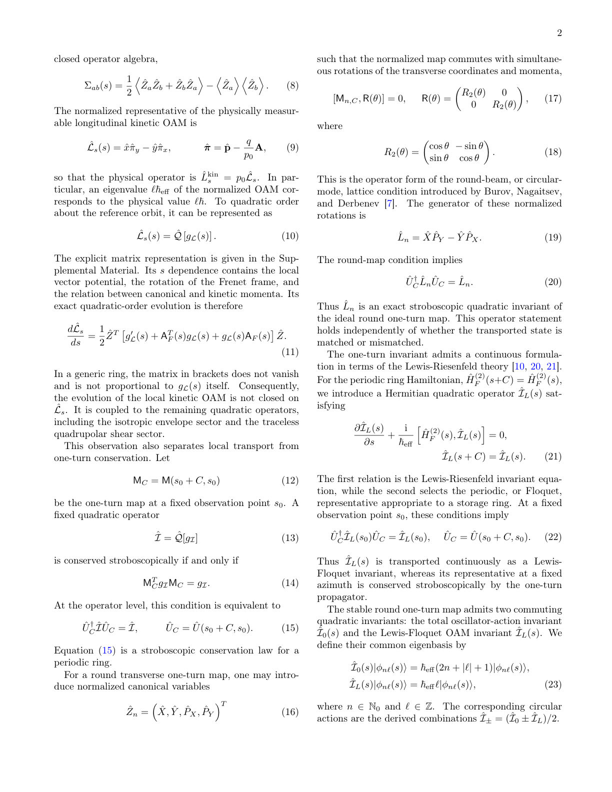
<figcaption class="paper-figure-caption"><b>Fig 1.</b> Low-resolution page preview, page 2</figcaption>
</figure>
<figure class="paper-figure-card">
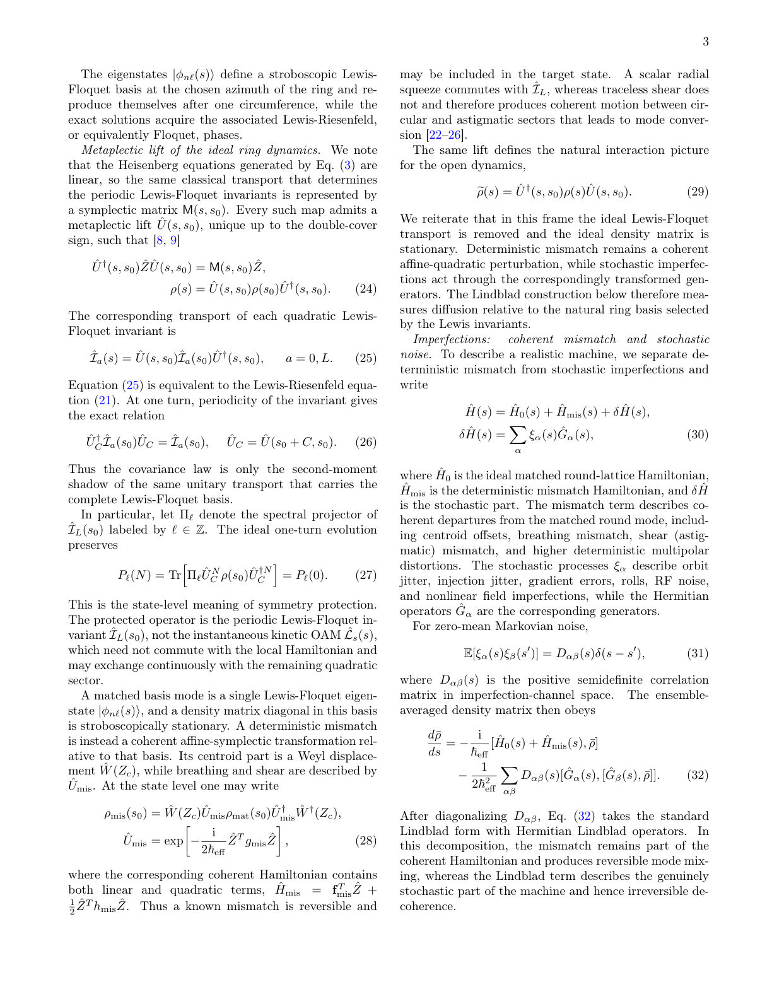
<figcaption class="paper-figure-caption"><b>Fig 2.</b> Low-resolution page preview, page 3</figcaption>
</figure>
<figure class="paper-figure-card">
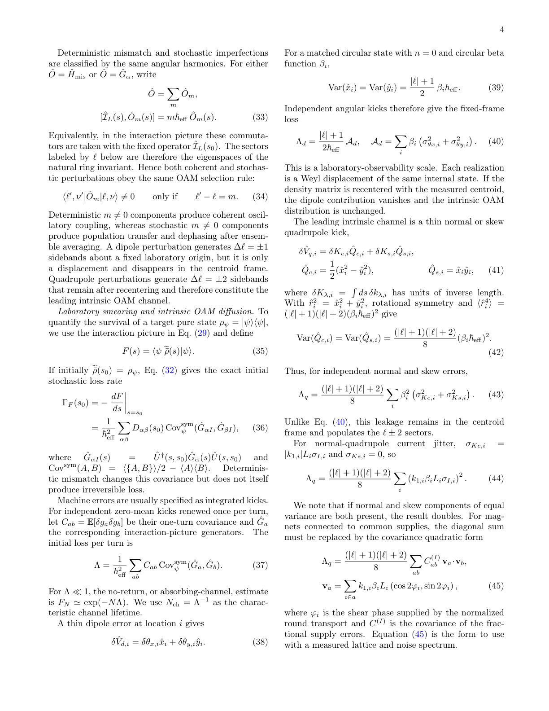
<figcaption class="paper-figure-caption"><b>Fig 3.</b> Low-resolution page preview, page 4</figcaption>
</figure>
<figure class="paper-figure-card">
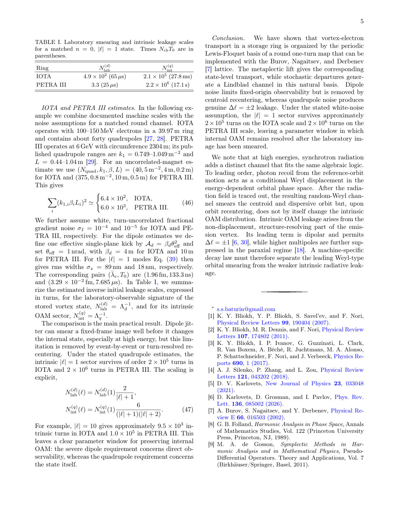
<figcaption class="paper-figure-caption"><b>Fig 4.</b> Low-resolution page preview, page 5</figcaption>
</figure>
<figure class="paper-figure-card">
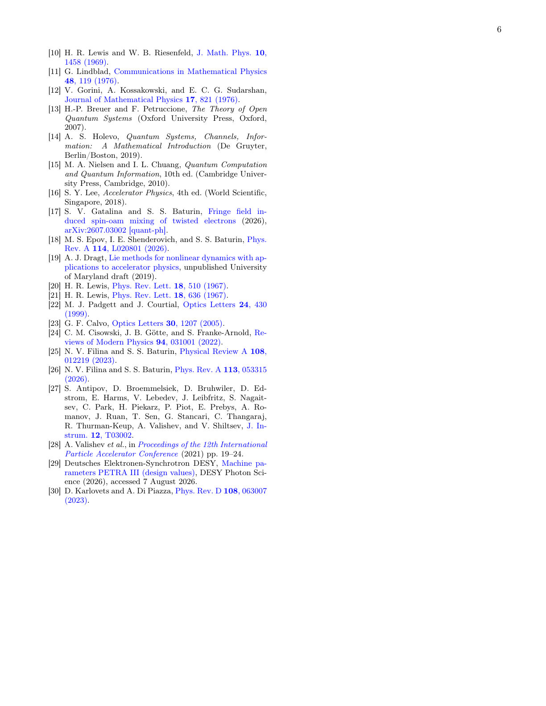
<figcaption class="paper-figure-caption"><b>Fig 5.</b> Low-resolution page preview, page 6</figcaption>
</figure>

**Summary.** This paper develops a density-matrix theory to study how the quantum structure of vortex electrons is maintained during acceleration in circular lattices. It models noise effects using a Lindblad master equation, showing that while ideal transport preserves an OAM invariant, stochastic imperfections cause leakage quantified by specific rates for real accelerators.

**Why it may be interesting.** This work provides a rigorous framework for analyzing decoherence and quantum state preservation in highly coherent particle beam dynamics, drawing parallels between accelerator physics and open quantum systems theory (Lindblad master equations).

Detailed structure

**Main problem.** The core problem is developing a density-matrix theory to determine if state-resolved quantum structure, specifically intrinsic Orbital Angular Momentum (OAM), can be preserved during the transport of vortex electrons in accelerator lattices.

**Main result.** Ideal transport preserves the Lewis-Floquet OAM invariant stroboscopically; however, stochastic imperfections generate a Lindblad channel, with quadrupole noise driving an intrinsic $\Delta\ell = \pm 2$ leakage rate that can be quantified for specific accelerators.

**Method.** The analysis uses density-matrix theory, deriving a master equation incorporating coherent evolution (from the Hamiltonian) and irreversible decoherence (from stochastic noise terms).

**Model / system.** The system is modeled as vortex electrons moving in periodic round accelerator lattices. The dynamics are described by an effective quadratic Hamiltonian, leading to a density matrix evolution governed by both unitary and Lindblad terms.

**Key observables.** Lewis-Floquet orbital angular momentum (OAM) invariant ($\hat{I}_L$), local kinetic OAM ($\hat{L}_{kin}$), centroid smearing, and intrinsic $\Delta\ell = \pm 2$ leakage rate ($\Lambda_q$).

**Important parameters / regimes.** The inverse initial leakage scale is calculated for specific machines (e.g., $2	imes10^5$ turns for IOTA).

**Assumptions / limitations.** The analysis relies on quadratic approximations of the Hamiltonian and separates deterministic mismatch from stochastic noise sources to construct the Lindblad master equation.

**Figures summary.** Not specified in the notes, but comparisons are made between laboratory smearing limits ($\Lambda^{-1}_d$) and intrinsic quadrupole leakage rates ($\Lambda^{-1}_q$).

**Paper structure.** The paper builds from defining the system Hamiltonian and invariants (Lewis-Floquet basis) to deriving the full master equation incorporating noise sources. It then analyzes how different types of noise perturb the conserved quantum structure, culminating in quantitative estimates of coherence loss.

Abstract

We develop a density-matrix theory of vortex-electron transport in accelerator lattices. In a periodic round lattice, the protected object is a Lewis-Floquet orbital angular momentum (OAM) invariant rather than the instantaneous kinetic OAM. Ideal transport has a metaplectic lift; stochastic imperfections generate a Lindblad channel. Dipole noise produces removable centroid smearing; quadrupole noise drives intrinsic $Δ\ell=\pm2$ leakage. Under explicit white-noise benchmarks, the inverse initial leakage scale is $2\times10^5$ turns for IOTA and $2\times10^6$ turns for PETRA III.

[↑ back to top](#top)

### [Unifying Physical Backpropagation](http://arxiv.org/abs/2608.11585v1)

**Authors:** Cyrill Bösch, Yigithan Gediz, Hakan Türeci  
**Type:** theory · **Category:** disordered systems and neural networks · **PDF:** <https://arxiv.org/pdf/2608.11585v1>  
**Analysis basis:** full PDF text, analyzed in chunks
**Topic relevance:** `Keldysh / 2PI / non-Gaussian methods` **3/5** · `analog quantum simulation` **3/5** · `driven-dissipative phase transition` **2/5** · `methods for driven-dissipative` **2/5** · `correlated / nonlocal dissipation` **1/5** · `non-equilibrium universality` **1/5** · `quantum measurements` **1/5**

↔ Scroll figures horizontally

<figure class="paper-figure-card">
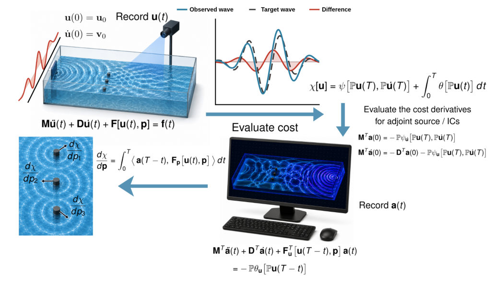
<figcaption class="paper-figure-caption"><b>Fig 1.</b> Figure 1: Conceptual overview of optimizing a physical system with the adjoint method. The physical state u(t) evolves under the forward dynamics M¨u + D ˙u + F[u, p] = f(t), with mass matrix M, damping matrix D, internal forces F carrying the trainable parameters p, external drive f, and initial conditions u(0) = u0, ˙u(0) = v0. The recorded trajectory and terminal state induce the cost χ[u] = ψ[Pu(T), P ˙u(T)]+ R T 0 θ[Pu(t)] dt, where P projects onto the measured output degrees of freedom and ψ and θ are the terminal and trajectory losses. Evaluating the derivatives of the losses provides the drive and initial conditions for the adjoint field a(t). The adjoint state equation involves the...</figcaption>
</figure>
<figure class="paper-figure-card">
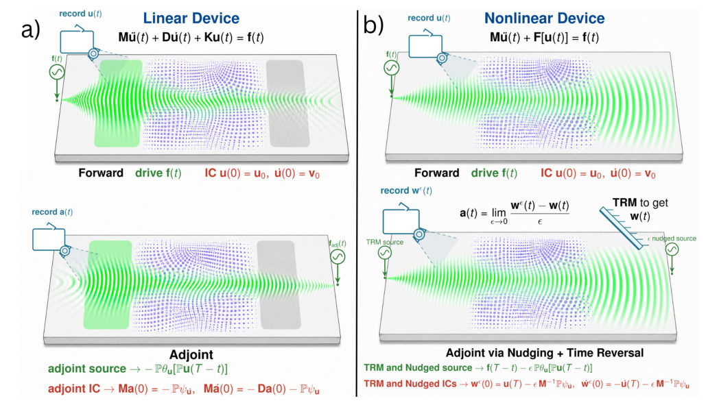
<figcaption class="paper-figure-caption"><b>Fig 2.</b> Figure 2: A schematic illustration of the experiments to obtain the adjoint field physically. For the linear devices (a), reciprocity allows the same device to be used, with the drive and ICs adjusted for the forward and adjoint field propagations. Damping and gain are allowed, so long as reciprocity is preserved. In the nonlinear case (b), the existence of a time reversal mirror (TRM) [78] together with reciprocity of the linearized system provide indirect access to the adjoint field in the same hardware. To obtain the adjoint field physically, simultaneously apply the TRM to the final state of the forward run and perturb the time- reversed trajectory with the adjoint drive and ICs. The...</figcaption>
</figure>
<figure class="paper-figure-card">
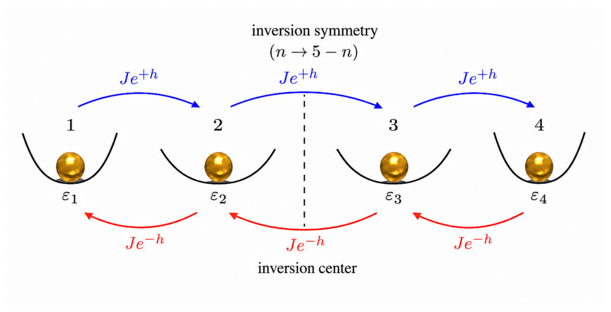
<figcaption class="paper-figure-caption"><b>Fig 3.</b> Figure 3: The Hatano–Nelson chain of Eq. (86) for N = 4: sites with on-site potentials εn, coupled by asymmetric nearest-neighbor hoppings, amplified to the right (Je+h, blue) and attenuated to the left (Je−h, red), so that KT ̸= K and the chain transmits with one-way gain. Transposition reverses the arrow of every hop; the spatial inversion n →N + 1 −n about the marked inversion center reverses it again. If the on-site potential is mirror-symmetric, εn = εN+1−n, the chain is therefore twisted reciprocal, SKT S−1 = K, and by Theorem 10.1 the adjoint field is obtained in the same hardware, with the same bias h, by injecting the spatially flipped adjoint source and initial conditions.</figcaption>
</figure>

**Summary.** This paper unifies the theory of physical backpropagation by developing an adjoint-based framework for computing gradients in physical systems. It derives necessary and sufficient conditions—such as reciprocity—for a system to compute its own gradient on-device. This provides a general template for designing physically realizable, exact learning algorithms across various domains like photonics and mechanics.

**Why it may be interesting.** This work provides a rigorous mathematical framework connecting fundamental physics principles (like reciprocity) directly to the practical requirements of training complex models on analog or photonic hardware, bridging quantum optics/AMO concepts with machine learning optimization.

Detailed structure

**Main problem.** The paper aims to develop a unifying theoretical framework for achieving formally exact gradient computation (physical backpropagation) in physical computing systems.

**Main result.** It establishes sufficient conditions, based on the adjoint method, under which the required adjoint field can be generated physically on the same hardware performing the forward computation.

**Method.** The core methodology is the application of the adjoint method from PDE-constrained optimization to derive gradient formulas that rely on overlaps between forward and adjoint fields.

**Model / system.** The theory applies to diverse physical systems modeled by discretized ODEs, including photonic circuits, mechanical networks, and general nonlinear trajectory systems. The governing dynamics are generally represented as second-order differential equations.

**Key observables.** The gradient of the cost function ($\mathrm{d}\chi/\mathrm{d}p$), the adjoint field ($a(t)$), and various overlap integrals between forward and adjoint states.

**Important parameters / regimes.** Reciprocity, time-reversal symmetry, and the specific structure of linear vs. nonlinear dynamics are critical parameters determining feasibility.

**Assumptions / limitations.** The theory assumes an external teacher applies parameter updates; it does not cover self-adapting systems or heuristic learning rules.

**Figures summary.** Conceptual diagrams illustrate the adjoint method applied to physical optimization, showing the relationship between forward passes, loss functions, and the required adjoint solves for different system types.

**Paper structure.** The paper progresses by defining the general problem (PDE-constrained optimization), developing the adjoint formalism, deriving specific conditions for linear vs. nonlinear systems (reciprocity/time-reversal symmetry), and finally unifying these results to recover known physical learning algorithms.

Abstract

Physical computing systems exploit device dynamics for computation, but their gradient-based optimization is challenging: backpropagation through a digital twin suffers from model-reality gap. On-device gradient computation could resolve this issue, and a handful of theoretical and experimental studies have proposed ways to achieve it. Yet a unifying theory identifying when a physical system can compute the gradient of its own performance has been missing. Here we develop such a unification, based on the adjoint method: we identify sufficient conditions under which the adjoint field required for formally exact gradients can be generated on the same hardware that performs the computation. Linear and nonlinear systems obey fundamentally different conditions: for linear systems damping or gain is admissible provided reciprocity is preserved. For nonlinear trajectory systems the sufficient conditions are reciprocity of the linearized system and the existence of a time-reversal mirror. Algorithmically, the nonlinear case requires infinitesimal nudging, whereas linear systems admit a finite-amplitude experiment. We recover Equilibrium Propagation, Hamiltonian echo backpropagation, fully forward mode training and in situ gradient methods in integrated-photonic and free-space-optical systems. We further show that reciprocity is only the simplest instance of a more general intertwining condition, which extends exact on-device gradient computation to a class of non-Hermitian, non-reciprocal systems. Further generalizations include time-dependent parameters, Onsager-reciprocal dynamics and nonlinear, PT-symmetric Schrödinger equations. Our work provides a unified theoretical basis for formally exact physical learning algorithms and a template for constructing them across a range of physical systems.

[↑ back to top](#top)

### [Confinement transitions in half-space constrained Riesz gases](http://arxiv.org/abs/2608.11813v1)

**Authors:** Sung-Soo Byun, Yong-Woo Lee, Eui Yoo  
**Type:** theory · **Category:** statistical mechanics · **PDF:** <https://arxiv.org/pdf/2608.11813v1>  
**Analysis basis:** full PDF text, analyzed in chunks
**Topic relevance:** `Keldysh / 2PI / non-Gaussian methods` **3/5** · `driven-dissipative phase transition` **2/5** · `methods for driven-dissipative` **2/5** · `non-equilibrium universality` **2/5** · `analog quantum simulation` **1/5** · `correlated / nonlocal dissipation` **1/5** · `scars & prethermalization` **1/5**

↔ Scroll figures horizontally

<figure class="paper-figure-card">
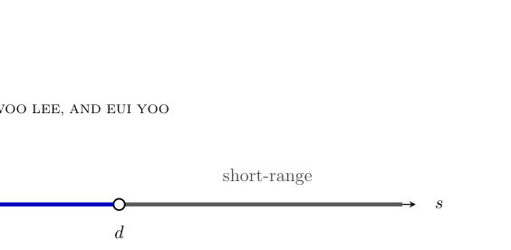
<figcaption class="paper-figure-caption"><b>Fig 1.</b> Figure 1. Interaction regimes for the Riesz exponent s.</figcaption>
</figure>
<figure class="paper-figure-card">
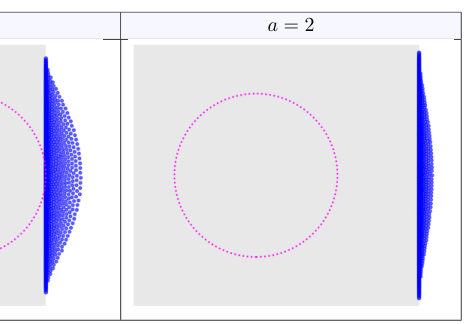
<figcaption class="paper-figure-caption"><b>Fig 2.</b> Figure 2. Point configurations of the minimiser of (1.1), obtained numerically via gradient descent for N = 1000. Here, d = 2 and s = 1</figcaption>
</figure>
<figure class="paper-figure-card">
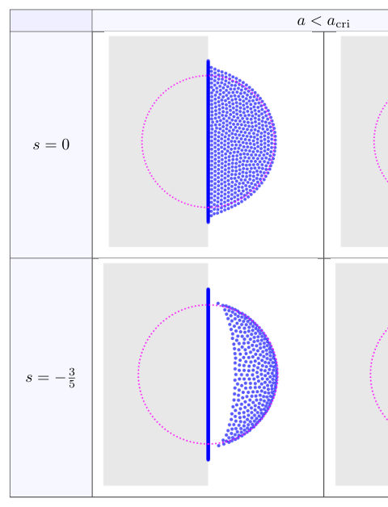
<figcaption class="paper-figure-caption"><b>Fig 3.</b> Figure 3. Same as Figure 2, but in the strongly long-ranged regime, with s = 0 and s = −3</figcaption>
</figure>
<figure class="paper-figure-card">
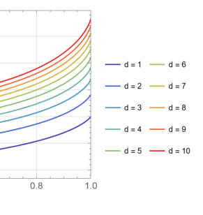
<figcaption class="paper-figure-caption"><b>Fig 4.</b> Figure 4. Graphs of the function s 7→acri(d, s) for d = 1, . . . , 10. The horizontal axis repre- sents s −(d −3), which ranges from 0 to 1 for every d.</figcaption>
</figure>

**Summary.** This paper analyzes the equilibrium state of a Riesz gas confined to a half-space. It proves that the system's behavior undergoes a sharp transition depending on the interaction strength $s$. Specifically, it identifies a critical wall position beyond which the particles are forced entirely onto the boundary for strongly long-ranged interactions.

**Why it may be interesting.** While focused on classical statistical mechanics, understanding phase transitions and critical thresholds in interacting particle systems is fundamental to many-body physics, including quantum gas models where effective interactions can be long-ranged.

Detailed structure

**Main problem.** The study investigates how the equilibrium state of a Riesz gas changes when confined to a half-space, specifically determining if this confinement exhibits qualitative transitions based on the interaction range.

**Main result.** A dichotomy exists: for weakly long-ranged interactions ($s \in (d-2, d)$), the measure always has bulk support; however, for strongly long-ranged interactions ($s \in (d-3, d-2]$), a critical wall position $a_{crit}$ dictates whether the system is fully confined to the wall.

**Method.** The analysis uses variational methods by minimizing an energy functional and proving necessary conditions via Euler–Lagrange inequalities applied to the constrained equilibrium measure.

**Model / system.** The model is a Riesz gas with interaction parameter $s \in (d-3, d)$ in dimension $d$, confined to a half-space by a hard wall. The energy functional involves the Riesz kernel $g_s(x)$.

**Key observables.** The nature of the equilibrium measure $\mu_a$: whether it retains non-trivial bulk support or becomes entirely supported on the confining wall.

**Important parameters / regimes.** Interaction exponent $s$, dimension $d$, and the critical wall position $a_{crit}(d, s)$.

**Assumptions / limitations.** The analysis is restricted to $s \in (d-3, d)$; specific mathematical tools like the incomplete beta function and properties of Gauss hypergeometric functions are employed.

**Figures summary.** Figures illustrate particle configurations showing non-confinement in the weakly long-ranged regime and demonstrating full confinement at a critical wall position in the strongly long-ranged regime.

**Paper structure.** The paper establishes the problem by defining the energy functional, then proves the dichotomy theorem (Theorem 2.2) by analyzing the Euler–Lagrange inequality across different regimes of $s$, culminating in rigorous proofs for confinement conditions.

Abstract

We study a Riesz gas with interaction parameter $s \in (d-3,d)$ in an arbitrary spatial dimension $d$, confined to a half-space by a hard wall. We prove that the equilibrium measure exhibits a dichotomy according to the interaction range. For $s \in (d-2,d)$, corresponding to the weakly long-ranged regime, the equilibrium measure always retains a non-trivial bulk component and thus is never completely confined to the wall. In contrast, for $s \in (d-3,d-2]$, corresponding to the strongly long-ranged regime, a confinement transition occurs: there exists a critical wall position beyond which the equilibrium measure is supported entirely on the wall. Our theorem generalises recent results established for the Coulomb gas, corresponding to the case $s=d-2$.

[↑ back to top](#top)

### [Tabletop reversibility of phase-covariant operations](http://arxiv.org/abs/2608.11702v1)

**Authors:** Fangzhen Chen, Xueyuan Hu  
**Type:** theory · **Category:** other · **PDF:** <https://arxiv.org/pdf/2608.11702v1>  
**Analysis basis:** full PDF text, analyzed in chunks
**Topic relevance:** `correlated / nonlocal dissipation` **3/5** · `methods for driven-dissipative` **3/5** · `driven-dissipative phase transition` **2/5** · `quantum measurements` **2/5** · `Keldysh / 2PI / non-Gaussian methods` **1/5** · `non-equilibrium universality` **1/5**

↔ Scroll figures horizontally

<figure class="paper-figure-card">
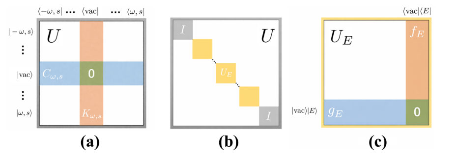
<figcaption class="paper-figure-caption"><b>Fig 1.</b> FIG. 1. Schematic illustration of the unitary construction in Theorem 1 and the corresponding proof strategy. For notational convenience, the ordering of labels is reversed in this figure: the first label refers to the environment, while the second refers to the main system. (a) Structure of the global unitary U. The ⟨vac|-column is fixed by the forward Kraus operators Kω,s, the |vac⟩-row is fixed by the Kraus operators Cω,s of the Petz map, and the overlap block is 0. The white blocks remain unspecified at this stage and will be determined by unitary completion. (b) Block decomposition of the global unitary according to total energy, U = L ¯ E U ¯ E. The yellow blocks represent the...</figcaption>
</figure>
<figure class="paper-figure-card">
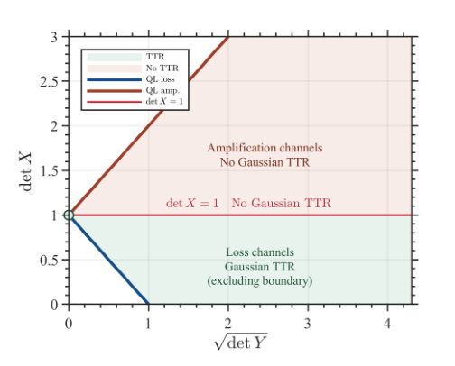
<figcaption class="paper-figure-caption"><b>Fig 2.</b> FIG. 2. Schematic illustration of TTR for single-mode phase-covariant Gaussian dilations. Complete positivity re- quires √</figcaption>
</figure>
<figure class="paper-figure-card">
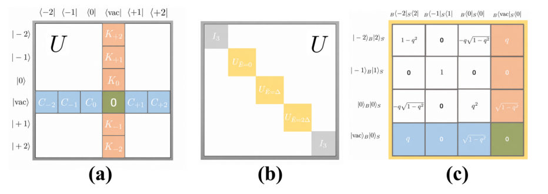
<figcaption class="paper-figure-caption"><b>Fig 3.</b> FIG. 3. Schematic illustration of the unitary construction in the qutrit example. (a) Fixed column and row according to the Kraus operators and Petz recovery map. (b) Block decomposition of the global unitary according to total energy, U = L ¯ E U ¯ E. (c) Structure of a constrained energy subblock U ¯ E=0.</figcaption>
</figure>

**Summary.** This paper rigorously studies 'tabletop reversibility' (TTR) for phase-covariant quantum channels. It establishes that TTR can be realized by a dilation for finite-dimensional systems but finds an obstruction for Gaussian ones. Crucially, it overcomes this limitation by constructing a non-Gaussian unitary architecture that successfully realizes TTR for the single-mode Gaussian amplification channel.

**Why it may be interesting.** This work directly addresses fundamental constraints on quantum operations in open systems, which is central to understanding realistic physical implementations of quantum processes and resource theories.

Detailed structure

**Main problem.** The paper investigates the concept of 'tabletop reversibility' (TTR) for phase-covariant quantum operations, aiming to understand the fundamental interplay between irreversibility and time-translation symmetry in open quantum dynamics.

**Main result.** For finite dimensions, TTR is achievable for phase-covariant maps admitting a Petz recovery map. However, a concrete obstruction was found for Gaussian systems, though this was circumvented by constructing a non-Gaussian dilation that achieves TTR for the single-mode Gaussian amplification channel.

**Method.** The analysis uses quantum channel theory, focusing on unitary dilations and leveraging structural lemmas (like Lemma 1) to construct global unitaries satisfying constraints from both the forward process and the Petz recovery map.

**Model / system.** The study considers general CPTP maps, specifically contrasting finite-dimensional systems with continuous-variable Gaussian systems. The model involves constructing unitary dilations $U$ acting on an extended system (System $\otimes$ Bath).

**Key observables.** Tabletop Reversibility (TTR), Petz recovery map realization, and the structure of the global unitary $U$.

**Important parameters / regimes.** The dimensionality of the system (finite vs. infinite/Gaussian) and the specific symmetry constraint (phase-covariance).

**Assumptions / limitations.** For finite dimensions, it assumes the Petz recovery map is well-defined; for Gaussian systems, the analysis relies on constructing non-Gaussian unitaries to bypass theoretical obstructions.

**Paper structure.** The paper first establishes the general framework of TTR and phase covariance. It then proves the positive result for finite dimensions using structural theorems. Subsequently, it contrasts this with Gaussian systems by exhibiting an obstruction, before finally providing a constructive counterexample using a non-Gaussian unitary to show TTR is possible for the single-mode Gaussian amplification channel.

Abstract

Irreversibility and time-translation symmetry are both fundamental in open quantum dynamics, and it is of great importance to study the interplay between them. In this paper, we study tabletop reversibility (TTR) for phase-covariant quantum operations and obtain sharply different conclusions for finite-dimensional and Gaussian systems. For finite-dimensional systems, we prove that any phase-covariant operation that admits a Petz recovery map can be implemented by a dilation which is both time-translational symmetric and tabletop time reversible. In contrast, for phase-covariant Gaussian operations we exhibit a concrete obstruction: any Gaussian dilation of a single-mode Gaussian amplification channel is not tabletop time reversible. As a byproduct, we find that almost every completely positive and trace preserving (CPTP) map admits a dilation that realizes TTR. These results clarify whether and how TTR can be realized under phase-covariant symmetry constraints and reveal a qualitative difference between finite-dimensional and Gaussian systems.

[↑ back to top](#top)

### [A Unified Quantum Interferometric Framework for Interaction-Free Measurement and Delayed-Choice Experiments](http://arxiv.org/abs/2608.12268v1)

**Authors:** Hitesh Awasthi, Sandeep Mishra, Anirban Pathak  
**Type:** theory · **Category:** quantum information and computing · **PDF:** <https://arxiv.org/pdf/2608.12268v1>  
**Analysis basis:** full PDF text, analyzed in chunks
**Topic relevance:** `interference shaping light` **3/5** · `quantum measurements` **3/5** · `driven-dissipative phase transition` **2/5** · `Keldysh / 2PI / non-Gaussian methods` **1/5** · `correlated / nonlocal dissipation` **1/5** · `methods for driven-dissipative` **1/5**

↔ Scroll figures horizontally

<figure class="paper-figure-card">
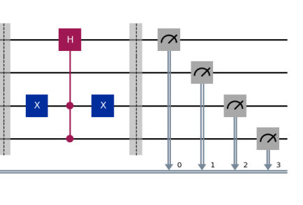
<figcaption class="paper-figure-caption"><b>Fig 1.</b> Fig. 1: (Color Online) Unified representation of interaction-free measurement in the delayed choice framework: (a) Optical realization and (b) Equivalent quantum circuit representation.</figcaption>
</figure>
<figure class="paper-figure-card">
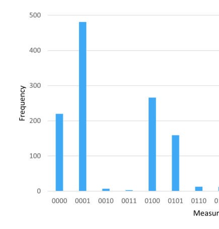
<figcaption class="paper-figure-caption"><b>Fig 2.</b> Fig. 2: Detector counts obtained from execution on the IBM Quantum hardware.</figcaption>
</figure>
<figure class="paper-figure-card">
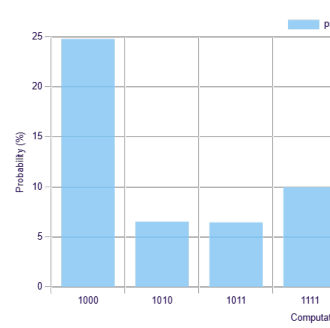
<figcaption class="paper-figure-caption"><b>Fig 3.</b> Fig. 3: Detector probability distribution obtained using the Qniverse platform simulator.</figcaption>
</figure>
<figure class="paper-figure-card">
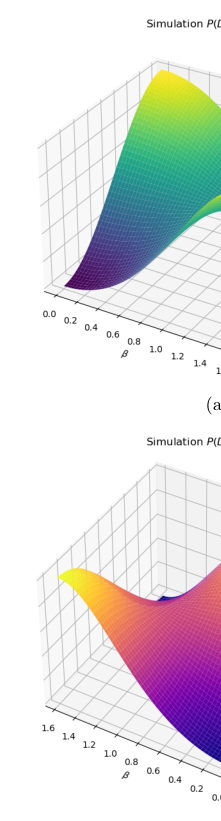
<figcaption class="paper-figure-caption"><b>Fig 4.</b> Fig. 4: (Color online) The detector probabilities (a) P(D0) and (b) P(D1) for the DC wave- particle transition in the unified interferometric configuration (θ = π/4), plotted as functions of the DC parameter α and quantum bomb state parameter β. The results demonstrate the gradual transition from particle-like behavior to wave-like interference as the second beam splitter BS2 is coherently present. The numerical simulations were performed using Qiskit’s ideal statevector simulation which implements noiseless unitary evolution. Consequently, the simulated detector probabilities agree with the analytical predictions.</figcaption>
</figure>
<figure class="paper-figure-card">
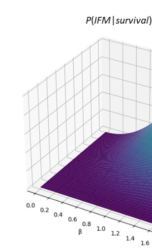
<figcaption class="paper-figure-caption"><b>Fig 5.</b> Fig. 5: (Color online) Post-selected conditional IFM probability P(IFM|survival) as a function of the DC parameter α and bomb state parameter β for the balanced interferometric configuration θ = π/4. The probability varies smoothly with both control parameters and attains its maximum value of 1</figcaption>
</figure>

**Summary.** The paper introduces a novel, unified interferometric framework to mathematically connect Interaction-Free Measurement and Delayed-Choice experiments. By modeling the system using an extended MZI circuit involving four qubits, it shows that both phenomena arise from the same underlying quantum evolution. This provides a powerful theoretical tool for understanding wave-particle duality and counterfactual information extraction simultaneously.

**Why it may be interesting.** This work is highly relevant for quantum optics and open quantum systems, providing a unified mathematical description that connects fundamental concepts like wave-particle duality (DC) with counterfactual measurements (IFM).

Detailed structure

**Main problem.** The paper develops a theoretical framework to unify two distinct quantum phenomena: Interaction-Free Measurement (IFM) and Delayed-Choice (DC) experiments.

**Main result.** It demonstrates that IFM and DC behavior share a common operational origin, emerging from the same underlying interferometric structure controlled by ancillary qubits.

**Method.** The authors use a quantum circuit representation based on an extended Mach-Zehnder Interferometer involving four qubits to model the coherent evolution of the system.

**Model / system.** The model utilizes an MZI setup incorporating a 'quantum bomb' (absorber) and a quantum-controlled second beam splitter ($	ext{BS}2$). The system is tracked using four interacting qubits ($|q_0
angle, |q_1
angle, |q_2
angle, |q_3
angle$).

**Key observables.** Detector probabilities $P(D0)$ and $P(D1)$, the conditional IFM probability $P(	ext{IFM}|	ext{survival})$.

**Important parameters / regimes.** $	heta$ (initial path superposition), $eta$ (bomb interaction strength), and $\alpha$ (delayed choice control parameter).

**Assumptions / limitations.** The analysis assumes that absorbed photons do not participate in further unitary evolution, regardless of the BS2 presence.

**Figures summary.** Figures illustrate the optical realization and quantum circuit diagram. Figure 4 shows detector probabilities transitioning continuously from particle-like to wave-like behavior as $\alpha$ varies. Figure 5 plots the conditional IFM probability versus $\alpha$ and $eta$.

**Paper structure.** The paper builds by first defining the four-qubit MZI model, then deriving the post-selected state $|\Psi_{	ext{post}}
angle$, calculating detector probabilities $P(D0)$ and $P(D1)$ as continuous functions of $\alpha$, and finally analyzing limiting cases to show unification.

Abstract

A theoretical unified interferometric framework is developed for interaction-free measurement (IFM) and delayed-choice (DC) experiments. The proposed model leads to a quantum circuit based architecture in which an ancillary qubit coherently controls the interaction between a photon and a bomb, allowing the system to evolve in a superposition of interaction and non-interaction regimes. The ancillary control qubit serves as a quantum switch that continuously interpolates between IFM and DC behavior, revealing a common operational origin for both phenomena. We demonstrate that both the phenomena can be realized within this framework through controlled quantum-gate operations. The analysis shows that the framework enables a continuous transition between the particle-like and wave-like behavior in DC setup. The framework is shown to be consistent with standard quantum mechanics, preserving unitary evolution, quantum superposition and the measurement postulate.

[↑ back to top](#top)

### [Finite-depth scaling and an exact Bernoulli-leaf identity for the min-plus process on the binary tree](http://arxiv.org/abs/2608.12295v1)

**Authors:** José Ricardo G. Mendonça  
**Type:** both · **Category:** statistical mechanics · **PDF:** <https://arxiv.org/pdf/2608.12295v1>  
**Analysis basis:** full PDF text, analyzed in chunks
**Topic relevance:** `non-equilibrium universality` **3/5** · `analog quantum simulation` **2/5** · `driven-dissipative phase transition` **2/5** · `methods for driven-dissipative` **2/5** · `correlated / nonlocal dissipation` **1/5** · `scars & prethermalization` **1/5**

↔ Scroll figures horizontally

<figure class="paper-figure-card">
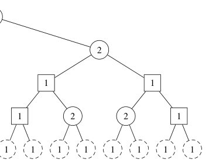
<figcaption class="paper-figure-caption"><b>Fig 1.</b> FIGURE 1. A realization of the critical min-plus stochastic process on the binary tree T4. Squares are internal nodes labeled min; circles are internal nodes labeled +; dashed circles at the bottom are the leaves, here all set to X0(i) = 1. Values inside each node are the level-by-level outputs of the recursion (1). The realization shown gives root value XN = 3.</figcaption>
</figure>
<figure class="paper-figure-card">
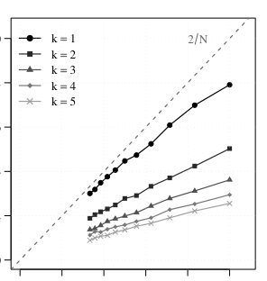
<figcaption class="paper-figure-caption"><b>Fig 2.</b> FIGURE 2. Left: empirical distribution bP(XN = k) at the root of the critical min-plus process for a representative subset of effective depths, M = 105 samples per N. Points are aggregated over geomet- ric (log-spaced) bins and plotted at each bin’s geometric midpoint; the mass at small integers shrinks with N while the tail extends. Right: the same data read at fixed k: bP(XN = k) versus 1/N for k = 1,...,5 over all eleven simulated depths, with the theoretical rate 2/N of Lemma 1 (ii) dashed. No fixed k retains mass as N →∞.</figcaption>
</figure>
<figure class="paper-figure-card">
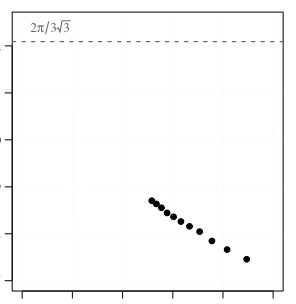
<figcaption class="paper-figure-caption"><b>Fig 3.</b> FIGURE 3. Test of the asymptotic of [1, Corollary 1] on our M = 105 data at p = 1/2. Left: bE[logXN] versus √</figcaption>
</figure>
<figure class="paper-figure-card">
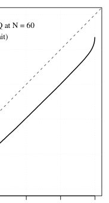
<figcaption class="paper-figure-caption"><b>Fig 4.</b> FIGURE 4. Quantile-quantile plot of the empirical rescaled distri- bution logXN/ √</figcaption>
</figure>
<figure class="paper-figure-card">
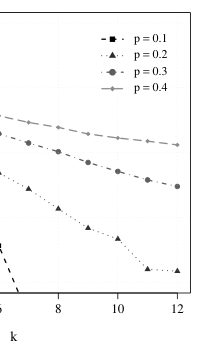
<figcaption class="paper-figure-caption"><b>Fig 5.</b> FIGURE 5. Empirical distribution ˆf(k|XN, p) of the root value of the sub-critical min-plus process for p = 0.10, 0.20, 0.30, 0.40, at effective tree depth N = 48 and M = 105 samples per parameter. Vertical axis on a logarithmic scale.</figcaption>
</figure>

**Summary.** This paper investigates a stochastic min-plus process on a binary tree, analyzing its behavior across different parameter regimes defined by $p$. Using extensive Monte Carlo simulations and mathematical identities, the authors confirm that at criticality ($p=1/2$), the root value exhibits stretched-exponential scaling matching the Beta(2,1) distribution. The work provides both asymptotic theoretical results and precise finite-depth numerical confirmations for this complex random process.

**Why it may be interesting.** While not directly about quantum systems, the analysis of recursive random processes on tree structures and the identification of critical exponents ($\sqrt{N}$ scaling) are highly relevant to understanding entanglement structure or correlation decay in many quantum physical models (e.g., tensor network renormalization group flows).

Detailed structure

**Main problem.** The study focuses on determining the asymptotic distribution of $X_N$, the root value, for a min-plus stochastic process defined recursively on a binary tree as the depth $N$ approaches infinity.

**Main result.** The paper corroborates that in the critical regime ($p=1/2$), the scaled logarithm of the root value follows a stretched-exponential limit characterized by the Beta(2,1) distribution. Furthermore, it derives an exact Bernoulli-leaf identity for specific initial conditions.

**Method.** The research combines large Monte Carlo simulations (up to $N=60$) with rigorous mathematical analysis, including deriving closed-form solutions and performing extrapolation techniques on scaling laws.

**Model / system.** The model is the min-plus stochastic process defined recursively on a rooted binary tree. The evolution at each node depends probabilistically on whether the parent value is determined by summation (probability $p$) or minimum (probability $1-p$).

**Key observables.** $X_N$ (root value), $\mathbb{E}[\log X_N]$, and the order parameter $P(X_N=0)$ for Bernoulli initial conditions.

**Important parameters / regimes.** The control parameter $p$, which defines three regimes: critical ($p=1/2$), sub-critical ($p<1/2$), and super-critical ($p>1/2$). The scaling rate is $\sqrt{N}$ in the critical case.

**Assumptions / limitations.** The analysis relies on the assumption that finite-depth simulations can accurately corroborate established asymptotic theorems, particularly concerning the $	ext{Beta}(2,1)$ limit and the identification of universality classes for random homogeneous systems.

**Figures summary.** Figures illustrate the empirical distribution of $X_N$ confirming the Beta(2,1) profile at criticality, show scaling tests for $\mathbb{E}[\log X_N]$ vs. $\sqrt{N}$, and display the exact identity $P(X_N=0)=q$ for the Bernoulli variant.

**Paper structure.** The paper first establishes the model and analyzes off-critical regimes to find closed forms for sub-critical convergence. It then focuses heavily on the critical case ($p=1/2$), using simulations to confirm the $	ext{Beta}(2,1)$ scaling limit. Finally, it derives an exact identity for a Bernoulli variant, locating phase transitions in the operator-mixing probability.

Abstract

The min-plus process is a stochastic coagulation-annihilation-type process on the binary tree, of interest in mathematics, physics, and computer science as a tractable instance of max-type recursive distributional equations. We carry out large Monte Carlo simulations at effective tree depths up to $N=60$ that provide finite-depth corroboration of the Beta(2,1) stretched-exponential limit for its root value $X_{N}$ at $p=1/2$, on the asymmetric $\sqrt{N}$ side of the random-homogeneous-systems classification recently introduced by Chen, Duquesne, and Shi and by Morfe. Off criticality, our simulations confirm the sub-critical closed form $\mathbb{P}(X_{\infty}=1)=(1-2p)/(1-p)$ within Monte Carlo error and document a super-critical mean growth exceeding the elementary $(2p)^{N}$ lower bound at the depths we reach. For a Bernoulli($q$)-initial-condition variant, we identify an elementary closed-form identity at $p=1/2$ that pins down the order parameter $\mathbb{P}(X_{N}=0)=q$ exactly, locates the absorbing-state phase transition at $p_{c}=1/2$ in the operator-mixing probability rather than in the initial-zero density, and shows that the conditional law on positives deforms substantially with $q$. Our simulations use a level-wise recursion and an FFT-based precomputed leaf table which reduce the effective simulation depth while preserving the recursive tree law and may be useful for the simulation of related recursive equations on large trees.

[↑ back to top](#top)

### [Phonon anomalies and critical scaling in the spin-$1/2$ trimer chain Na$_2$Cu$_3$Ge$_4$O$_{12}$](http://arxiv.org/abs/2608.12061v1)

**Authors:** P. Srikanth Patnaik, A. K. Bera, Srishti Bhardwaj, Tulika Maitra, Buddhananda Banerjee, Anushree Roy, S. M. Yusuf  
**Type:** experiment · **Category:** strongly correlated electrons · **PDF:** <https://arxiv.org/pdf/2608.12061v1>  
**Analysis basis:** full PDF text, analyzed in chunks
**Topic relevance:** `analog quantum simulation` **3/5** · `non-equilibrium universality` **3/5** · `driven-dissipative phase transition` **2/5** · `Frenkel-Kontorova` **1/5** · `correlated / nonlocal dissipation` **1/5** · `quantum measurements` **1/5**

↔ Scroll figures horizontally

<figure class="paper-figure-card">
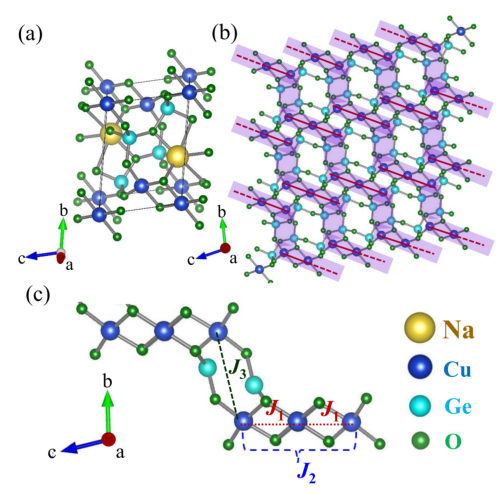
<figcaption class="paper-figure-caption"><b>Fig 1.</b> FIG. 1. (a) Unit cell of NCGO with the space group P-1. The sodium, copper, germanium, and oxygen atoms are shown in yellow, blue, cyan, and green color balls, respectively. (b) Trimer chain in NCGO with 12 unit cells. Na ions are not shown to avoid cluttering. The linear arrangement of three Cu ions forming a trimer of spin-1/2 (shown by red lines) is cou- pled, forming a zigzag chain (shown as shades) through two Ge1O4 tetrahedra. Interchain interaction is weak and can be neglected [2]. (c) Chain of two trimers. Nearest neighbor intra-trimer, next-nearest neighbor intra-trimer, and inter- trimer exchange couplings through J1, J2, and J3, respec- tively, are marked in a linear chain of Cu...</figcaption>
</figure>
<figure class="paper-figure-card">
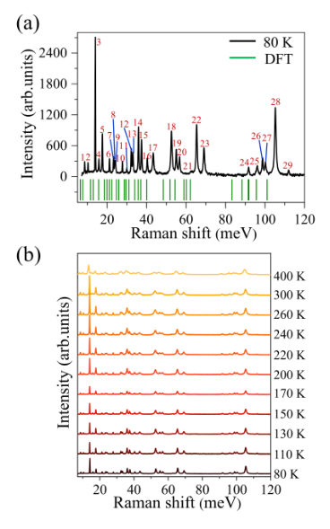
<figcaption class="paper-figure-caption"><b>Fig 2.</b> FIG. 2. (a) Raman spectrum of NCGO at 80 K over the spectral range 7.2 to 120 meV. All 29 Raman modes are marked. The green bars are the Raman peak positions at the Γ point, obtained using non-spin-polarized DFT calculations. (b) Characteristic Raman spectra at various temperatures, marked in the right.</figcaption>
</figure>
<figure class="paper-figure-card">
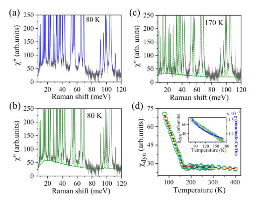
<figcaption class="paper-figure-caption"><b>Fig 3.</b> FIG. 3. (a) Magnified view of the Raman response of the spectra recorded at 80 K. The recorded spectrum and the net fitted curve are shown by gray and blue, respectively. (b) and (c) Deconvoluted components of the phonon modes and the background intensity profiles are shown by green dashed and green solid curves for the spectrum recorded at 80 K and 170 K, respectively. The value of γ remains nearly unchanged at 18±1 meV between 80 K and 170 K. The recorded spectra are shown by gray curves. See text. (d) Dynamic spin sus- ceptibility, χdyn, as estimated from the integral intensity of the Raman background recorded at temperatures between 80 K and 400 K. The error bars (see SM5 [35]) are...</figcaption>
</figure>
<figure class="paper-figure-card">
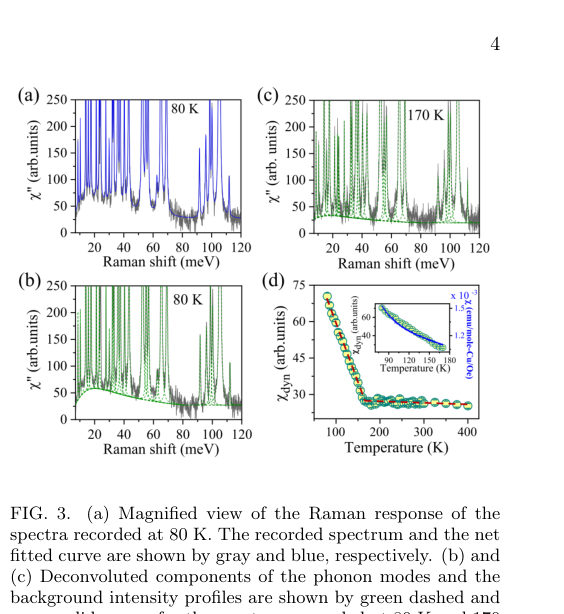
<figcaption class="paper-figure-caption"><b>Fig 4.</b> Fig. 3(a). The contributions of phonon modes are high- lighted by green-dashed curves in Fig. 3(b) for the spec- trum recorded at 80 K. The same for 170 K is shown in Fig. 3(c). In all panels, the gray curves represent the Raman response of the recorded spectra, while the blue curves depict the net fitted spectra. In panels (b) and (c), the fitted background profile (solid green curve) is traced along the crest of the phonon modes. A com- parison of the broad Raman background in the spectra recorded at 80 K and 170 K using different excitation wavelengths is available in Supplementary Material SM4 [35]. The nearly identical background profiles without any shift with excitation wavelengths...</figcaption>
</figure>
<figure class="paper-figure-card">
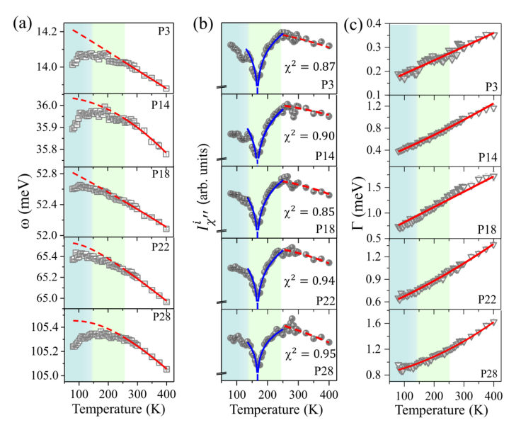
<figcaption class="paper-figure-caption"><b>Fig 5.</b> FIG. 4. (color online) Evolution of (a) Raman shift, (b) integral intensity of χ′′, (c) FWHM of P3, P14, P18, P22, and P28 with temperature are shown by symbols. In panel (a), Raman shifts for 250 K&lt; T &lt;400 K are fitted considering the anharmonicity in the change in vibrational potential with temperature (red solid curves) and then extrapolated down to 80 K (red dashed curves). In panel (b), the red dashed curves are guides to the eyes to the integral intensity of χ′′ above 250 K. The intensity of Raman response in the pastel lime-shaded regions (for 130 K≤T≤250 K) follows a power law behavior Ii χ′′ ∝|T −Tc|β, with β= 0.24±0.02 and Tc=167±1 K (shown by blue curves). The intensity scales...</figcaption>
</figure>

**Summary.** The authors used temperature-dependent Raman spectroscopy on the magnetic material $	ext{Na}_2	ext{Cu}_3	ext{Ge}_4	ext{O}_{12}$ to study spin-lattice coupling. They found a critical scaling behavior near $T_c \approx 167$ K, demonstrating that phonon anomalies are directly governed by the underlying dynamic spin correlations. This establishes NCGO as an excellent model for studying cooperative quantum phenomena.

**Why it may be interesting.** This work directly links lattice dynamics (phonons) to electronic/magnetic correlations (spin excitations), which is a core topic in understanding emergent phenomena in strongly correlated quantum materials relevant to AMO physics and open quantum systems modeling.

Detailed structure

**Main problem.** The study investigates spin-lattice coupling-mediated quantum correlations and critical scaling behavior of phonon dynamics in low-dimensional magnetic materials.

**Main result.** The research found evidence that the phonon renormalization across a magnetic crossover is driven by dynamic spin states, establishing the material as a model system for cooperative spin–lattice coupling.

**Method.** Temperature-dependent Raman spectroscopy was used to measure both sharp phonon peaks and broad spectral backgrounds related to spin excitations.

**Model / system.** The physical system is the antiferromagnetically coupled spin-$1/2$ trimer chain $	ext{Na}_2	ext{Cu}_3	ext{Ge}_4	ext{O}_{12}$ (NCGO). The structure involves a zigzag arrangement of copper trimers.

**Key observables.** Dynamic spin susceptibility ($\chi''$) from the background spectrum, phonon integral intensity ($I_i$), and critical exponents ($eta$).

**Important parameters / regimes.** $T_c = 167 \pm 1 	ext{ K}$ (critical temperature) and $eta = 0.24 \pm 0.02$ (critical exponent). Measurements span from 80 K to 400 K.

**Assumptions / limitations.** Interchain interactions are assumed weak; the analysis relies on fitting the Raman response function with phonon Lorentzians and a background term for spin excitations.

**Figures summary.** Figures illustrate the crystal structure, schematic of exchange couplings, and show temperature-dependent Raman spectra used to extract both sharp phonon modes and broad spectral backgrounds related to spin dynamics.

**Paper structure.** The paper proceeds by characterizing the material's magnetic and structural properties using DFT calculations, followed by detailed temperature-dependent Raman measurements. Key analyses include fitting the background for dynamic susceptibility and analyzing power-law scaling of phonon intensities near the critical point.

Abstract

Low-dimensional quantum magnets provide an ideal platform to explore spin-lattice coupling-mediated quantum correlations, which give rise to emergent quasiparticle excitations. The antiferromagnetically coupled spin-1/2 trimer chain of copper ions in Na$_2$Cu$_3$Ge$_4$O$_{12}$ (NCGO) hosts high-energy spin excitations of different species, whose energy scales overlap with those of lattice vibrations. Here, we report a comprehensive temperature-dependent Raman spectroscopic study performed between 80 and 400 K. The dynamic spin susceptibility, as obtained from the analysis of the broad spectral background, reveals the emergence of quasiparticle excitations below 170 K. We further identify an unusual crossover of phonon dynamics when the material transits from a normal paramagnetic state to a correlated quantum magnetic state. A power law dependence of the integrated Raman susceptibility of the phonon modes, $I_{χ^{\prime\prime}}^{i}\sim|T-T_{c}|^β$, is observed with the critical temperature $T_c$=167$\pm$1 K, and critical exponent $β= 0.24\pm 0.02$. The combined results obtained from the broad spectral background and sharp phonon peaks further indicate that the phonon renormalization observed across the crossover is driven by dynamic spin states. Additionally, statistical correlations among phonon energy eigenvalues, quantified through matrix-norm and power-test analyses of 200 spectra recorded at 80 K, reveal an unexpected linear correlation among phonon modes, also indicating that the collective lattice response is governed by spin correlations. These findings establish NCGO as a model system for investigating cooperative spin-lattice coupling and critical scaling behavior of phonon dynamics in low-dimensional magnetic materials.

[↑ back to top](#top)

### [Magnetic active matter across scales](http://arxiv.org/abs/2608.11875v1)

**Authors:** Francisca Guzmán-Lastra, Margaret Rosenberg, Marco Musacchio, Lorenzo Caprini, Hartmut Löwen  
**Type:** both · **Category:** statistical mechanics · **PDF:** <https://arxiv.org/pdf/2608.11875v1>  
**Analysis basis:** full PDF text, analyzed in chunks
**Topic relevance:** `non-equilibrium universality` **3/5** · `driven-dissipative phase transition` **2/5** · `Frenkel-Kontorova` **1/5** · `Keldysh / 2PI / non-Gaussian methods` **1/5** · `analog quantum simulation` **1/5** · `correlated / nonlocal dissipation` **1/5** · `methods for driven-dissipative` **1/5**

↔ Scroll figures horizontally

<figure class="paper-figure-card">
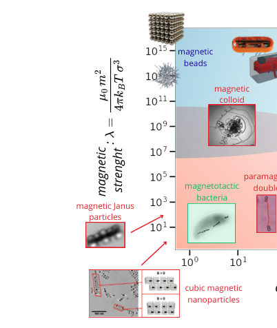
<figcaption class="paper-figure-caption"><b>Fig 1.</b> Figure 1: Schematic overview of magnetic active matter. The schematic overview reports</figcaption>
</figure>
<figure class="paper-figure-card">
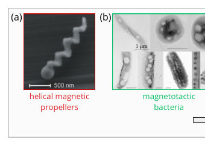
<figcaption class="paper-figure-caption"><b>Fig 2.</b> Figure 2: Active magnetic particles at different scales. Active magnetic particles at various</figcaption>
</figure>
<figure class="paper-figure-card">
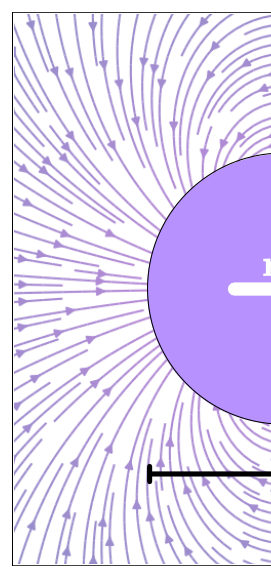
<figcaption class="paper-figure-caption"><b>Fig 3.</b> Figure 3: Dipolar active particle. Sketch of a dipolar active particle: the cap of the particle</figcaption>
</figure>
<figure class="paper-figure-card">
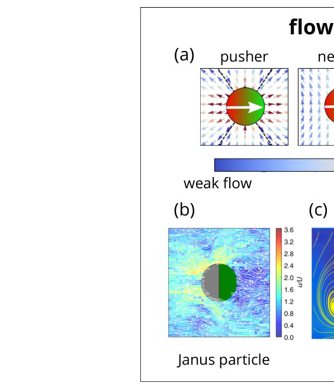
<figcaption class="paper-figure-caption"><b>Fig 4.</b> Figure 4: Hydrodynamic flow fields. Hydrodynamic flow fields (color gradient) produced by</figcaption>
</figure>
<figure class="paper-figure-card">
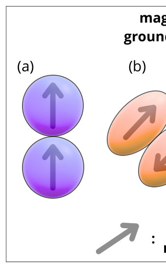
<figcaption class="paper-figure-caption"><b>Fig 5.</b> Figure 5: Magnetic ground state of particles with different shapes. Magnetic ground state for</figcaption>
</figure>

**Summary.** This review surveys magnetic active matter, detailing how intrinsic magnetic dipoles drive self-organization in systems ranging from bacteria to synthetic robots. It synthesizes theoretical models and experimental results showing that dipolar interactions are key for controlling collective behaviors like swarming and pattern formation. The work highlights the broad applicability of these principles across diverse physical scales.

**Why it may be interesting.** While focused on classical non-equilibrium dynamics, the study of collective behavior, pattern formation, and energy dissipation in these systems touches upon concepts relevant to non-equilibrium statistical mechanics and complex many-body physics.

Detailed structure

**Main problem.** The review focuses on understanding how magnetic dipole interactions control and organize active matter across all length scales, from nanoscale particles to macroscopic robots.

**Main result.** Magnetic dipolar forces provide a versatile tool for achieving complex self-organization, leading to phenomena like chaining, swarming, and tunable pattern formation in non-equilibrium systems.

**Method.** The paper surveys both theoretical models (e.g., Langevin dynamics using point dipole approximations) and experimental realizations across various physical platforms.

**Model / system.** The system involves active particles carrying intrinsic magnetic dipoles whose interactions mediate self-organization, distinct from external field propulsion. Examples include magnetotactic bacteria, colloidal swimmers, and granular robots.

**Key observables.** Chaining, swarming, tunable pattern formation, alignment, collective hydrodynamic states (e.g., vortices), and reconfigurable structures.

**Important parameters / regimes.** Péclet number (Pe) comparing activity strength to diffusion; dimensionless magnetic coupling parameter ($\lambda$) comparing dipolar energy to thermal energy ($k_B T$).

**Assumptions / limitations.** The point-dipole approximation is used for long-range interactions, and the dynamics are often modeled using overdamped Langevin equations.

**Figures summary.** Figure 1 schematically classifies experimental realizations based on activity (Pe) and interaction strength ($\lambda$), categorizing systems into colloids, granular matter, and biological examples.

**Paper structure.** The review progresses by establishing the fundamental role of magnetic interactions in active matter, detailing the theoretical modeling across scales (nano to macro), surveying diverse physical implementations (bacteria, synthetic swimmers), and concluding with applications and open challenges.

Abstract

Magnetic interactions provide a versatile and powerful tool for controlling and organizing active matter, where individual units continuously consume energy to drive autonomous motion. These interactions arise naturally in biological systems, such as magnetotactic bacteria, and can be engineered into synthetic platforms, including colloidal microswimmers, magnetic nanoparticles, and macroscopic granular robots. This review focuses on active, self-propelled particles that carry an intrinsic magnetic dipole moment, powered by their own energy consumption rather than driven by external fields; here, the dipole moment mediates interactions and self-organization, not propulsion. We survey experimental and theoretical studies across all length scales, showing how dipolar interactions shape single-particle dynamics, collective behavior, and self-organization. We discuss models incorporating pairwise dipolar forces and confinement, and examine emergent phenomena such as chaining, swarming, and tunable pattern formation. We close by outlining challenges and opportunities in the design, control, and application of magnetic active systems, from programmable materials and biomedical actuation to nonequilibrium physics.

[↑ back to top](#top)

### [Quantum Inequalities from the Second Law](http://arxiv.org/abs/2608.11817v1)

**Authors:** Andrea Palessandro  
**Type:** theory · **Category:** statistical mechanics · **PDF:** <https://arxiv.org/pdf/2608.11817v1>  
**Analysis basis:** full PDF text, analyzed in chunks
**Topic relevance:** `quantum measurements` **3/5** · `Keldysh / 2PI / non-Gaussian methods` **2/5** · `driven-dissipative phase transition` **2/5** · `correlated / nonlocal dissipation` **1/5** · `methods for driven-dissipative` **1/5** · `non-equilibrium universality` **1/5**

↔ Scroll figures horizontally

<figure class="paper-figure-card">
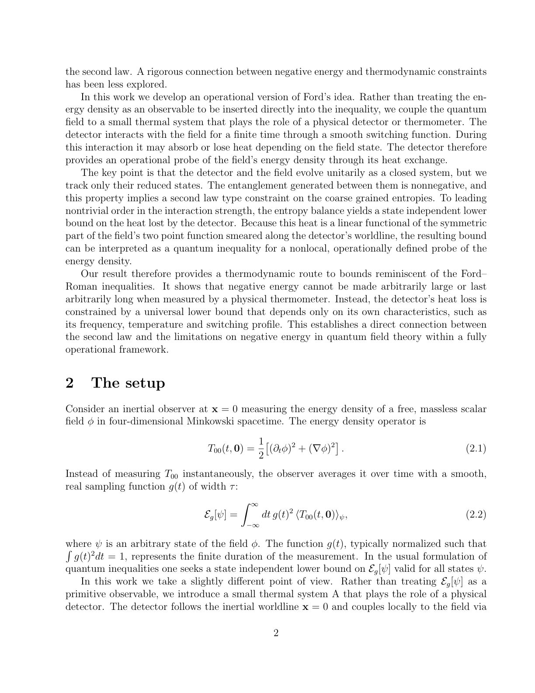
<figcaption class="paper-figure-caption"><b>Fig 1.</b> Low-resolution page preview, page 2</figcaption>
</figure>
<figure class="paper-figure-card">
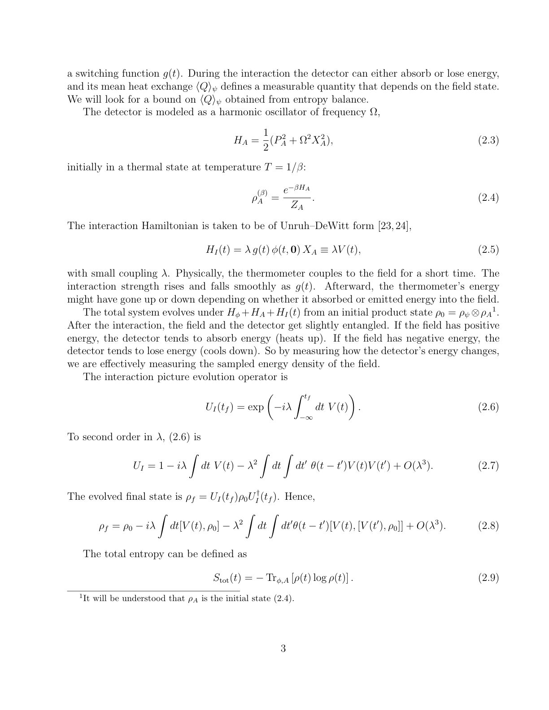
<figcaption class="paper-figure-caption"><b>Fig 2.</b> Low-resolution page preview, page 3</figcaption>
</figure>
<figure class="paper-figure-card">
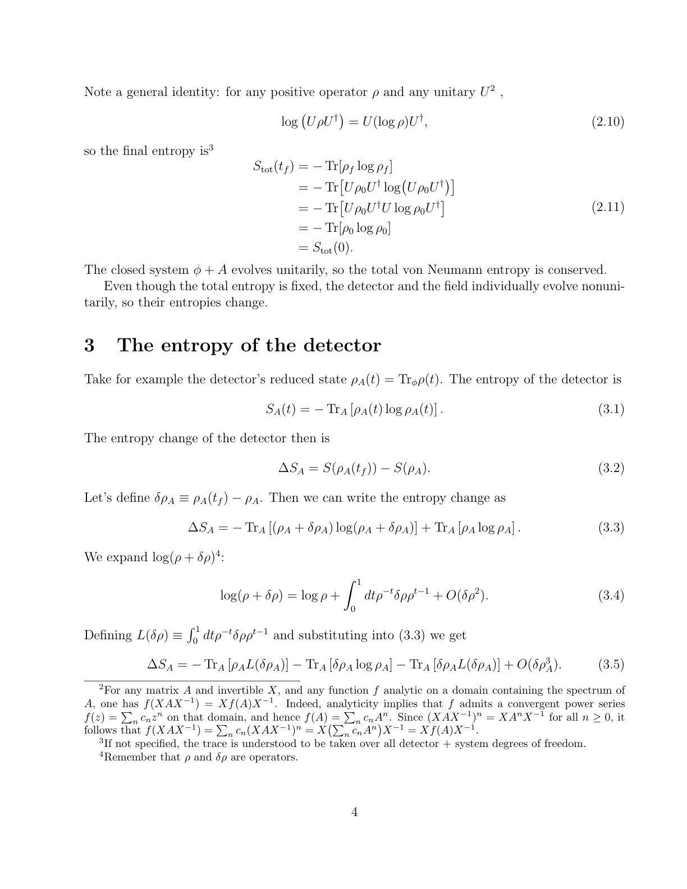
<figcaption class="paper-figure-caption"><b>Fig 3.</b> Low-resolution page preview, page 4</figcaption>
</figure>
<figure class="paper-figure-card">
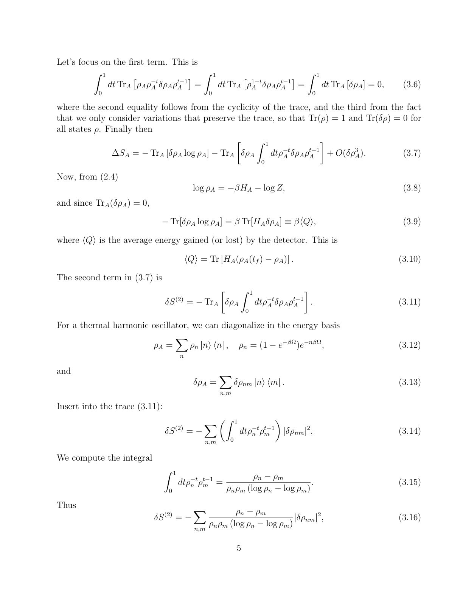
<figcaption class="paper-figure-caption"><b>Fig 4.</b> Low-resolution page preview, page 5</figcaption>
</figure>
<figure class="paper-figure-card">
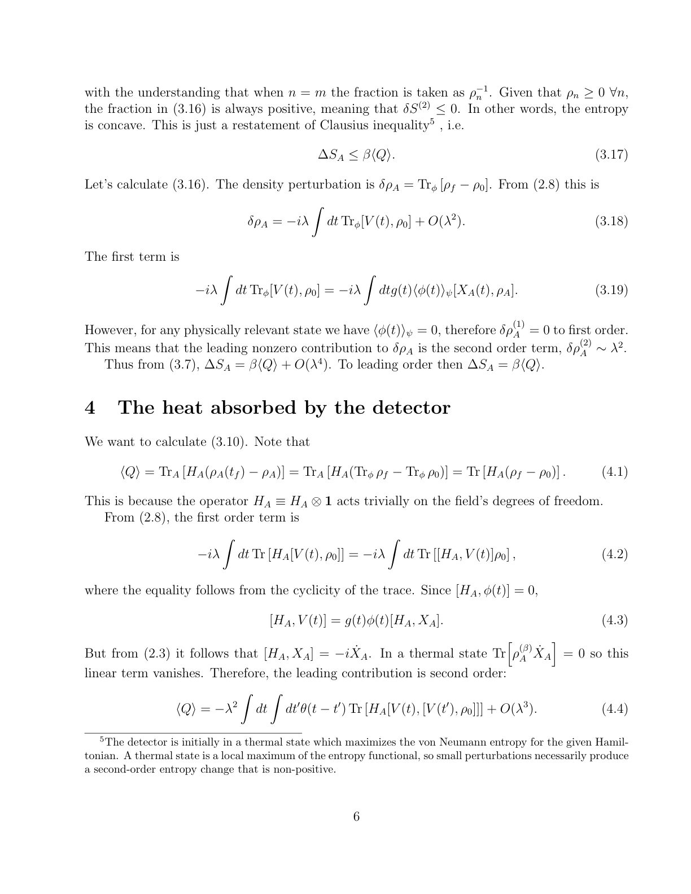
<figcaption class="paper-figure-caption"><b>Fig 5.</b> Low-resolution page preview, page 6</figcaption>
</figure>

**Summary.** This work derives quantum inequalities—which bound how negative the local energy density can be—by applying the second law of thermodynamics. It models this using a thermal detector coupled to a quantum field, showing that entropy conservation dictates a minimum heat loss. This establishes a direct thermodynamic pathway to understanding fundamental energy constraints in quantum field theory.

**Why it may be interesting.** It provides a powerful, non-field-theoretic derivation of quantum inequalities by grounding them in fundamental thermodynamic principles (the Second Law), making it relevant for understanding energy constraints in open quantum systems.

Detailed structure

**Main problem.** The paper derives quantum inequalities—bounds on negative energy density—by establishing a connection between these bounds and the second law of thermodynamics.

**Main result.** It shows that the non-negativity of entropy change (the Second Law) imposes a state-independent lower bound on the heat loss measured by a thermal detector, leading to quantum inequalities for the field's energy density.

**Method.** The analysis uses an operational framework involving coupling a quantum field to a small thermal detector and applying entropy balance arguments derived from thermodynamics.

**Model / system.** The system consists of a free, massless scalar field coupled via an Unruh-DeWitt interaction Hamiltonian to a harmonic oscillator detector. The dynamics are analyzed using perturbation theory in the coupling strength.

**Key observables.** Average heat absorbed by the detector ($\langle Q 
angle_\psi$), change in detector entropy ($\Delta S_A$), and time-averaged energy density ($\langle E_g[\psi] 
angle$).

**Important parameters / regimes.** Temperature ($T$) or inverse temperature ($eta=1/T$), coupling strength ($\lambda$), and the characteristic frequency ($\Omega$) of the detector.

**Assumptions / limitations.** The analysis is performed to second order in the coupling strength $\lambda$, and it assumes that for physical states, the first-order term in the density matrix change vanishes.

**Paper structure.** The paper builds from general principles of entropy conservation ($\Delta S_{tot}=0$) to applying the Second Law constraint ($\Delta S_A \le eta \langle Q 
angle$), which is then used in a perturbative calculation involving correlation functions to derive the energy bounds.

Abstract

Quantum field theory allows local violations of the classical energy conditions, such as regions of negative energy density. The Ford-Roman quantum inequalities quantify how negative these regions can be and for how long. We present a derivation of these inequalities from the second law of thermodynamics, in an operational framework that couples the field to a small thermal detector. The detector acts as a physical probe of the field's energy density and, by the non-negativity of the entanglement entropy between the two systems, one can show that its heat loss is bounded from below by a state-independent quantity.

[↑ back to top](#top)

### [Accurate Evaluation of Nanoscale Spatiotemporal Dynamics with Electron Correlation Microscopy](http://arxiv.org/abs/2608.11466v1)

**Authors:** Po-Cheng Kung, Ajay Annamareddy, Mark D. Ediger, Dane Morgan, Paul M. Voyles  
**Type:** both · **Category:** disordered systems and neural networks · **PDF:** <https://arxiv.org/pdf/2608.11466v1>  
**Analysis basis:** full PDF text, analyzed in chunks
**Topic relevance:** `methods for driven-dissipative` **3/5** · `non-equilibrium universality` **2/5** · `driven-dissipative phase transition` **1/5** · `quantum measurements` **1/5** · `scars & prethermalization` **1/5**

↔ Scroll figures horizontally

<figure class="paper-figure-card">

<figcaption class="paper-figure-caption"><b>Fig 1.</b> Figure 1: Time- and spatially averaged squared self-ISF for the CuZr MD trajectory at 760 K,</figcaption>
</figure>
<figure class="paper-figure-card">
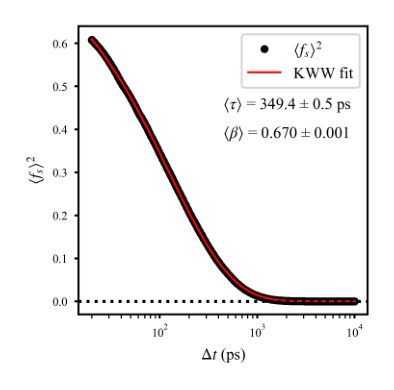
<figcaption class="paper-figure-caption"><b>Fig 2.</b> Figure 2 (a) shows the time- and spatially averaged intensity autocorrelation function normalized by</figcaption>
</figure>
<figure class="paper-figure-card">
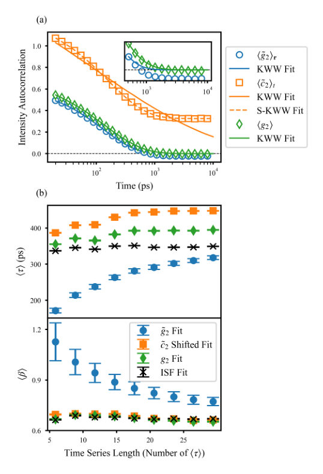
<figcaption class="paper-figure-caption"><b>Fig 3.</b> Figure 2: (a) Time- and spatially averaged intensity autocorrelation functions calculated based on</figcaption>
</figure>
<figure class="paper-figure-card">
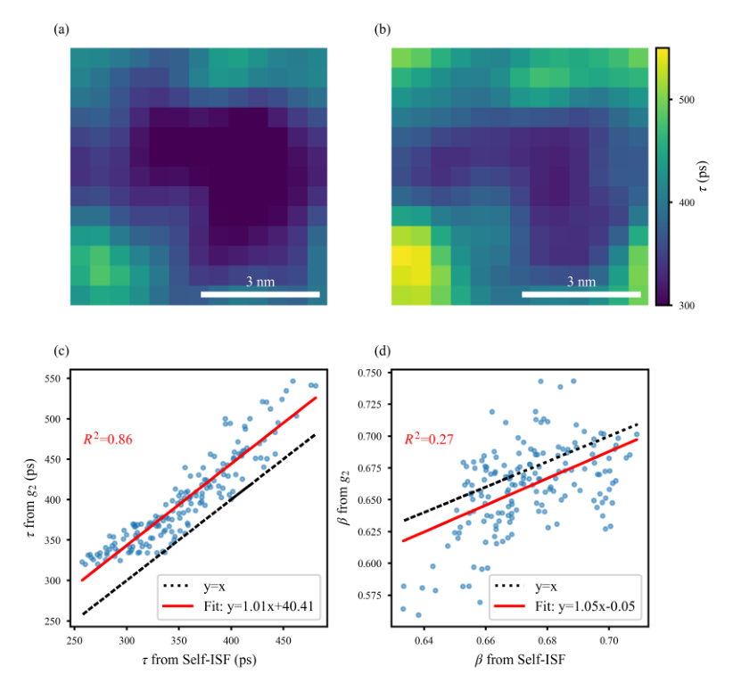
<figcaption class="paper-figure-caption"><b>Fig 4.</b> Figure 3: (a,b) Time-averaged structural relaxation time τ map calculated from the self-ISF and</figcaption>
</figure>
<figure class="paper-figure-card">

<figcaption class="paper-figure-caption"><b>Fig 5.</b> Figure 4 (a) shows the single probe position TTCF from the center of the model SCL, where</figcaption>
</figure>

**Summary.** This paper addresses systematic errors in measuring nanoscale structural dynamics using Electron Correlation Microscopy by proposing a novel, physics-inspired intensity normalization technique. The method corrects for artifacts arising from misapplying X-ray scattering analysis tools (XPCS) to electron diffraction data. By validating this approach against simulations and applying it to experimental samples, the authors establish an artifact-free pathway for characterizing localized structural relaxation in disordered materials.

**Why it may be interesting.** This work provides crucial methodological rigor for interpreting complex scattering data from disordered systems (like glasses or amorphous materials), which is highly relevant to understanding structural relaxation dynamics in condensed matter theory and experiment.

Detailed structure

**Main problem.** Previous Electron Correlation Microscopy (ECM) methods incorrectly applied X-ray Photon Correlation Spectroscopy (XPCS) normalization frameworks to nanobeam electron diffraction data, leading to systematic errors in measuring nanoscale structural relaxation times.

**Main result.** The authors developed a physics-inspired, ECM-specific normalization framework that successfully reproduces known relaxation dynamics using molecular dynamics simulations and correctly identifies stable crystalline phases in experimental nanowire data previously misclassified as relaxing domains.

**Method.** They propose an alternative intensity normalization scheme based on time- and azimuthal-averaging of the first diffraction ring intensities, which corrects for artifacts inherent to conventional XPCS analysis in nanoscale electron scattering geometries.

**Model / system.** The work uses molecular dynamics simulations of a supercooled liquid (CuZr) as a benchmark, and applies the method to experimental time-resolved 4D STEM datasets of a complex metallic nanowire ($	ext{Pt}_{57.5}	ext{Cu}_{14.7}	ext{Ni}_{5.3}	ext{P}_{22.5}$).

**Key observables.** Structural relaxation times and stretching exponents derived from intensity autocorrelation functions, specifically the self-intermediate scattering function ($	ext{self-ISF}$), $	ext{g}_2$, and $	ext{c}_2$.

**Important parameters / regimes.** Nanoscale spatial resolution (1 nm probe size); time delays ($\Delta t$); temperature/cooling rate regimes in supercooled liquids.

**Assumptions / limitations.** The primary assumption is that the systematic errors arise from inappropriate normalization; the proposed method assumes isotropy and uses specific averaging over diffraction rings to correct for these artifacts.

**Figures summary.** Figure 12 compares simulated X-ray and electron scattering normalized intensity profiles, highlighting the difference between standard XPCS ranges and the actual electron speckle diameter sampled by ECM.

**Paper structure.** The paper first identifies the systematic failure of XPCS normalization in ECM; it then proposes a new physics-inspired normalization framework; this is validated using MD simulations of supercooled liquids ($	ext{CuZr}$); finally, the method is applied to analyze experimental 4D STEM data on nanowires.

Abstract

Electron correlation microscopy (ECM) can measure materials dynamics with nanoscale spatial resolution from intensity correlation functions. However, adopting X-ray photon correlation spectroscopy (XPCS) normalization frameworks unchanged when calculating intensity correlations can introduce errors. Due to the constrained sampling volumes and larger speckle sizes in nanobeam electron diffraction, XPCS-style time-averaging and scattering-vector averaging introduce systematic artifacts, such as artificial anticorrelations or elevated baselines that lead to systematic errors in structural relaxation times and stretching exponents. This work presents physics-inspired, ECM-specific intensity normalizations over time- and azimuthal-averaged intensities of the first diffraction ring that limit those errors. The framework is validated using molecular dynamics simulations of a CuZr supercooled liquid to benchmark against the self intermediate scattering function, successfully reproducing relaxation times. When applied to experimental time-resolved 4D STEM datasets of a Pt57.5Cu14.7Ni5.3P22.5 nanowire, the method correctly identifies highly stable, unchanging nanoscale crystalline phases that were erroneously misclassified as relaxing domains by previous frameworks. Other previous ECM research is reevaluated in light of these observation. This robust approach establishes an artifact-free pathway for evaluating localized spatiotemporal relaxation behaviors.

[↑ back to top](#top)

### [Logarithmically Correlated Landscapes and Localization in Non-Hermitian Quasicrystals](http://arxiv.org/abs/2608.11700v1)

**Authors:** Xianqi Tong, Qifeng Ding, Xiaosen Yang  
**Type:** theory · **Category:** disordered systems and neural networks · **PDF:** <https://arxiv.org/pdf/2608.11700v1>  
**Analysis basis:** full PDF text, analyzed in chunks
**Topic relevance:** `non-equilibrium universality` **3/5** · `driven-dissipative phase transition` **2/5** · `analog quantum simulation` **1/5** · `correlated / nonlocal dissipation` **1/5** · `scars & prethermalization` **1/5**

↔ Scroll figures horizontally

<figure class="paper-figure-card">
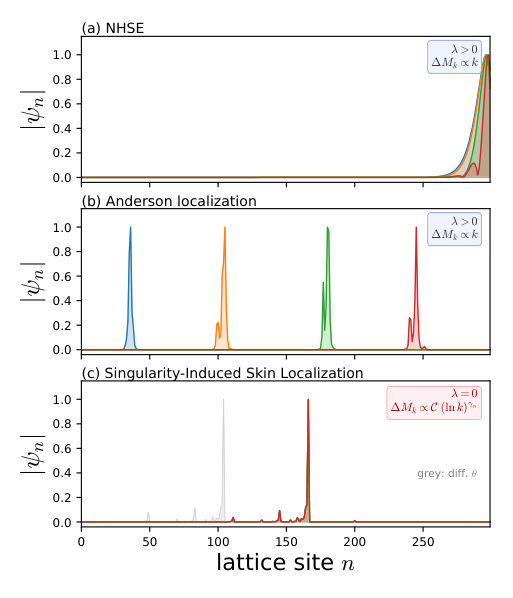
<figcaption class="paper-figure-caption"><b>Fig 1.</b> FIG. 1. Three localization mechanisms in one-dimensional non-Hermitian lattices. (a) Conventional skin effect under open boundaries. (b) Anderson or Aubry-Andr´e localization driven by an on-site potential. (c) This work: a singular quasiperiodic gauge field builds a deterministic log-correlated landscape on a closed ring.</figcaption>
</figure>
<figure class="paper-figure-card">
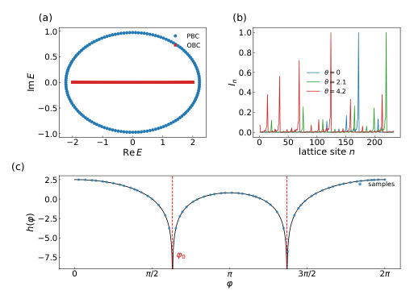
<figcaption class="paper-figure-caption"><b>Fig 2.</b> FIG. 2. Hatano-Nelson ring with quasiperiodic nonreciprocal hopping at t = 1, µ = 2.5, p = 2, and golden-mean frequency. (a) Energy spectrum under PBC, forming a closed loop, and under OBC, collapsing onto the real axis. (b) Eigenstate in- tensities In under PBC for three modulation phases θ; all share the same envelope. (c) Gauge field h(φ) showing log- arithmic singularities at the zeros of t + µ cos φ. Dots mark the quasiperiodic orbit samples.</figcaption>
</figure>
<figure class="paper-figure-card">
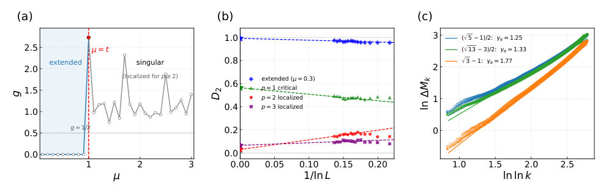
<figcaption class="paper-figure-caption"><b>Fig 3.</b> FIG. 3. Landscape statistics at t = 1, µ = 2.5 unless labeled, and golden-mean frequency. (a) Stiffness g versus µ at L = 2584, averaged over 160 phases. The extended phase with g = 0 ends at µ = t; inside the singular regime, a localization threshold at g = 1/2 separates critical states at p = 1 from localized states at p ≥2. (b) Fractal dimension D2 versus 1/ ln L for several (µ, p) combinations. Stars mark the L →∞extrapolations. (c) Gap statistics ∆Mk on doubly logarithmic axes for three frequencies at L = 108–2 × 108, averaged over 48 phases.</figcaption>
</figure>
<figure class="paper-figure-card">
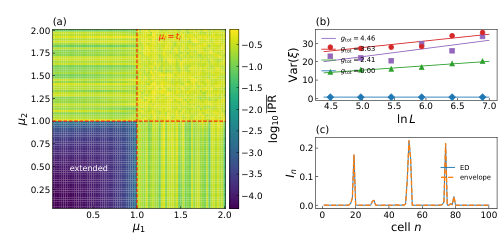
<figcaption class="paper-figure-caption"><b>Fig 4.</b> FIG. 4. Non-Hermitian SSH chain with t1 = t2 = 1, p = 2, and golden-mean frequency. (a) Phase diagram in the (µ1, µ2) plane. Color encodes the disorder-averaged IPR and dashed lines mark the predicted boundaries. (b) Landscape variance Var(ξ) versus ln L for four representative parameter combi- nations with different total stiffness gtot. (c) Cell-resolved in- tensity In compared with the analytic two-channel envelope.</figcaption>
</figure>
<figure class="paper-figure-card">
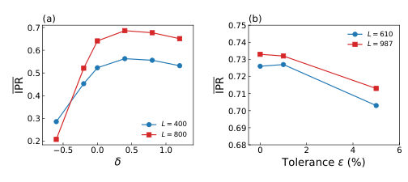
<figcaption class="paper-figure-caption"><b>Fig 5.</b> FIG. 5. Robustness of the localization mechanism at t = 1, µ = 2.5, p = 2, and golden-mean frequency. (a) Disorder- averaged IPR versus asymmetry parameter δ at two system sizes, averaged over 8 phases and 10 midspectrum states. (b) Disorder-averaged IPR versus component tolerance ϵ, av- eraged over 8 phases and 4 noise realizations.</figcaption>
</figure>

**Summary.** This paper analyzes wave function localization in non-Hermitian quasicrystals where hopping amplitudes modulate through zero. By mapping the system onto a logarithmically correlated potential landscape, the authors derive a critical stiffness threshold that dictates whether the state localizes or remains multifractal. The resulting signatures—including unique gap scaling laws—provide a powerful diagnostic tool for understanding complex quantum transport in engineered non-Hermitian systems.

**Why it may be interesting.** This work provides a detailed theoretical framework for understanding how non-Hermiticity, combined with quasiperiodicity, generates novel forms of spectral localization that are mathematically distinct from standard models. The connection to robust physical circuits (topolectrical) is highly relevant for AMO/Quantum Optics applications.

Detailed structure

**Main problem.** The study investigates localization phenomena in non-Hermitian quantum systems subjected to quasiperiodically modulated hopping that passes through zero (a singular regime). The goal is to characterize the resulting wave function behavior based on system parameters.

**Main result.** Localization occurs only when a derived 'stiffness' factor exceeds a critical threshold, leading to distinct signatures like super-logarithmic gap scaling in extreme-value statistics. This mechanism is robust and differs from standard Anderson or Aubry-André universality classes.

**Method.** The authors use gauge transformations to map the non-Hermitian system onto an effective potential landscape whose variance grows logarithmically with system size, allowing for rigorous mathematical analysis of localization criteria.

**Model / system.** The model is a one-dimensional Hatano-Nelson ring with quasiperiodically modulated nonreciprocal hopping. The Hamiltonian involves terms like $t \pm \mu \cos(2\pi \alpha n + 	heta)$, placing it in the realm of non-Hermitian quasicrystals.

**Key observables.** Landscape Variance ($	ext{Var}(\xi) \propto \ln L$), Stiffness ($g$), Inverse Participation Ratio (IPR), and the scaling exponent ($\gamma_\alpha$) governing peak gaps.

**Important parameters / regimes.** Modulation depth ($\mu$), mean hopping ($t$), quasiperiodic frequency ($\alpha$), and the stiffness factor $g$.

**Assumptions / limitations.** The analysis relies on mapping the non-Hermiticity into a gauge field whose fluctuations determine localization, assuming the dominant contribution to eigenstate modulus comes from this singular factor.

**Figures summary.** Figures compare localization mechanisms (NHSE vs. Anderson), show energy spectra and intensity profiles under periodic/open boundary conditions, and illustrate the phase diagram showing variance scaling versus system size.

**Paper structure.** The paper establishes the model via a gauge transformation, derives the logarithmic growth of landscape variance in the singular regime ($|\mu| > |t|$), defines the localization criterion based on stiffness $g$, and finally characterizes this mechanism using unique super-logarithmic gap statistics.

Abstract

We study a one-dimensional Hatano-Nelson ring whose nonreciprocal hopping is quasiperiodically modulated through zero. A gauge transformation maps every eigenstate onto a single spatial envelope, whose logarithm becomes a deterministic, logarithmically correlated field once the hopping vanishes along the quasiperiodic orbit. We derive an exact Fourier representation and prove that the landscape variance grows logarithmically with system size, with a stiffness set by the modulation power and the arithmetic of the incommensurate frequency. The extended phase terminates at an algebraic boundary given by Jensen's formula. Inside the singular regime, localization requires the stiffness to exceed a critical threshold: above it, the wavefunction weight concentrates on the few highest landscape peaks and the state is localized; below it, the weight spreads over too many competing peaks and the state is a critical multifractal. The extreme-value statistics are anomalous: peak gaps grow as a power of the logarithm of rank, with an exponent that encodes the continued-fraction type of the frequency, distinct from the Anderson, Aubry-André, and random-gauge universality classes. The stiffness adds across channels in multiband lattices, and all signatures survive percent-level component disorder, placing the mechanism within reach of nonreciprocal topolectrical circuits.

[↑ back to top](#top)

### [Scalar Finite-Proper-Time Field Theory as Spectral Operator Calculus](http://arxiv.org/abs/2608.11721v1)

**Authors:** Mustafa Bakr, Tongyu Zhang  
**Type:** theory · **Category:** other · **PDF:** <https://arxiv.org/pdf/2608.11721v1>  
**Analysis basis:** full PDF text, analyzed in chunks
**Topic relevance:** `Keldysh / 2PI / non-Gaussian methods` **3/5** · `quantum measurements` **2/5** · `methods for driven-dissipative` **1/5**

↔ Scroll figures horizontally

<figure class="paper-figure-card">
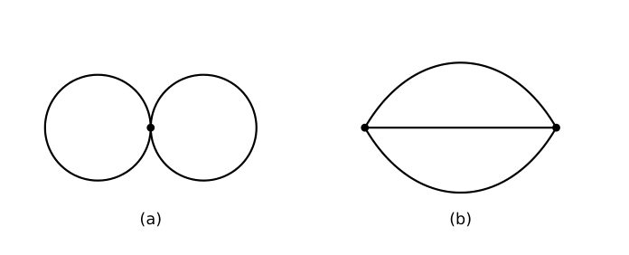
<figcaption class="paper-figure-caption"><b>Fig 1.</b> Figure 1: The two two-loop one-particle-irreducible topologies generated by the background-field cumulant expansion: (a) the figure-eight from one quartic fluctuation vertex and (b) the sunset from two cubic fluctuation vertices.</figcaption>
</figure>
<figure class="paper-figure-card">
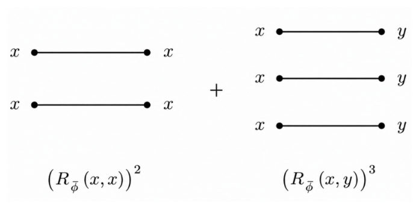
<figcaption class="paper-figure-caption"><b>Fig 2.</b> Figure 2: Schematic of the Schwinger parameter worldlines which form the two-loop effective action. The left diagram refers to the first term in Eq. (94), and the right diagram refers to the second. Each line has minimum length s0. Each derivative acting on exponential factors in the Duhamel chain inserts an insertion which partitions a line (see Fig. 3), and subsequent derivatives acting on insertions modify their structure. They can be used to construct insertion-distribution diagrams, as explained in Section 15.2.</figcaption>
</figure>
<figure class="paper-figure-card">
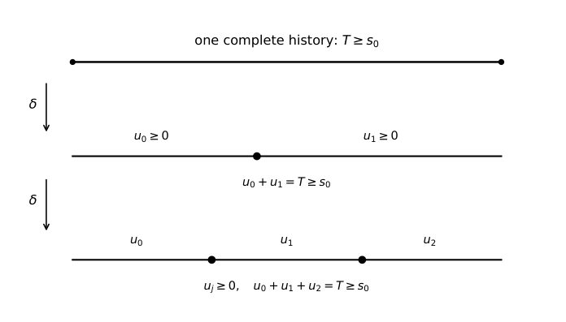
<figcaption class="paper-figure-caption"><b>Fig 3.</b> Figure 3: Duhamel ancestry of one complete open history. A functional derivative inserts an operator and partitions the same total proper time T into non-negative segments. Repeated differentiation produces further segments, but the only lower-endpoint condition is on their sum, P j uj = T ≥s0.</figcaption>
</figure>
<figure class="paper-figure-card">
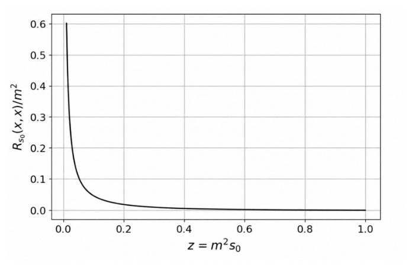
<figcaption class="paper-figure-caption"><b>Fig 4.</b> Figure 4: Dimensionless coincident finite-endpoint covariance in four dimensions, Rs0(x, x)/m2 = [e−z/z −E1(z)] /(16π2) with z = m2s0 = m2/Λ2. The quantity is finite for every fixed s0 &gt; 0 and diverges as Rs0(x, x)/m2 ∼1/(16π2z) only in the limit s0 →0+ when the endpoint is removed.</figcaption>
</figure>
<figure class="paper-figure-card">
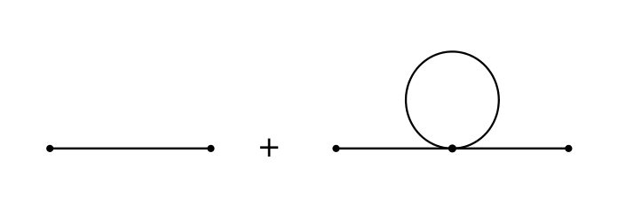
<figcaption class="paper-figure-caption"><b>Fig 5.</b> Figure 5: Schematic one-loop one-particle-irreducible two-point kernel: the tree inverse kernel plus the scalar tadpole self-energy.</figcaption>
</figure>

**Summary.** This work develops a Finite-Proper-Time Field Theory framework for $\lambda\phi^4$ theory, treating a finite endpoint scale $s_0$ as a physical parameter. By calculating loop corrections to scattering amplitudes, the authors prove that this retained scale introduces non-redundant physics that cannot be removed by standard renormalization procedures or local field redefinitions.

**Why it may be interesting.** While the model is simple ($\lambda\phi^4$), the methodology of distinguishing between physical scales ($s_0$) and arbitrary regulators provides a powerful theoretical tool for understanding how scale dependence enters quantum field theories beyond traditional RG flow descriptions.

Detailed structure

**Main problem.** To formulate a finite-proper-time construction for Euclidean scalar $\lambda\phi^4$ theory and rigorously determine if the dependence on the retained endpoint scale ($s_0$) survives standard renormalization procedures.

**Main result.** The analysis establishes that the retained finite proper-time scale $s_0$ introduces perturbative non-redundancy in scattering amplitudes, meaning it cannot be absorbed by local field redefinitions or parameter matching at one loop and beyond.

**Method.** The authors use functional methods involving paired open/closed spectral functions and a complete-history diagrammatic calculus to calculate effective actions and scattering amplitudes up to two loops.

**Model / system.** The theory analyzed is the Euclidean scalar $\lambda\phi^4$ model. The core novelty lies in defining the theory via a 'retained finite proper-time' scale ($s_0$), which differs fundamentally from standard UV cutoffs ($\Lambda_{UV}$) or renormalization group scales ($\mu$).

**Key observables.** The one-loop four-point scattering amplitude, specifically its on-shell dependence and the correlation between coefficients in the low-energy effective action.

**Important parameters / regimes.** The retained finite proper-time scale $s_0$, which is treated as a physical parameter distinct from regulators or renormalization scales.

**Assumptions / limitations.** The analysis is restricted to fixed-order Euclidean calculations, and the authors explicitly state that this does not imply nonperturbative Lorentzian completion or solve all open questions regarding field redefinition equivalence.

**Figures summary.** Figure 11 illustrates the angular dependence of the leading non-constant finite-endpoint correction to massless $2 	o 2$ scalar scattering, showing a specific predicted shape ($3 + \cos^2	heta$).

**Paper structure.** The paper builds by first introducing the FPT formalism using spectral functions and deriving diagrammatic rules. It then calculates loop corrections (one-loop four-point function) to demonstrate that $s_0$ dependence is non-redundant, culminating in theorems proving this non-equivalence to standard local renormalization schemes.

Abstract

We formulate a finite-proper-time construction for Euclidean scalar $λφ^4$ theory in which a retained endpoint $s_0$ is assigned to complete internal histories rather than independently to individual Schwinger segments. The theory is defined through paired open and closed spectral functions and their Fréchet/Duhamel hierarchy. Functional differentiation inserts operators along an existing proper-time history and partitions its total length, while interaction vertices sew separately complete histories. We introduce a corresponding complete-history diagrammatic calculus and derive the resulting one- and two-loop structures. We distinguish the retained endpoint from an auxiliary regulator or renormalisation-group scale and test whether its effects survive ordinary parameter matching and admissible field redefinitions. For the one-loop four-point function, fixing the renormalised mass, field normalisation, and quartic coupling leaves a finite momentum-dependent remainder. We establish a perturbative non-redundancy description of the retained endpoint against finite renormalisable-parameter redefinitions and local $S$-matrix-preserving field redefinitions at this order. The low-energy theory can be represented as an effective field theory, but its higher-derivative coefficients are not independent. This provides a concrete distinction between a retained finite proper-time scale and an arbitrary cutoff prescription.

[↑ back to top](#top)

### [Thermodynamic Spectroscopy of Emergent Excitations in Quantum Spin Ice](http://arxiv.org/abs/2608.11305v1)

**Authors:** Zhengbang Zhou, Tony An, Yong Baek Kim  
**Type:** theory · **Category:** strongly correlated electrons · **PDF:** <https://arxiv.org/pdf/2608.11305v1>  
**Analysis basis:** full PDF text, analyzed in chunks
**Topic relevance:** `analog quantum simulation` **3/5** · `Keldysh / 2PI / non-Gaussian methods` **1/5** · `quantum measurements` **1/5**

↔ Scroll figures horizontally

<figure class="paper-figure-card">
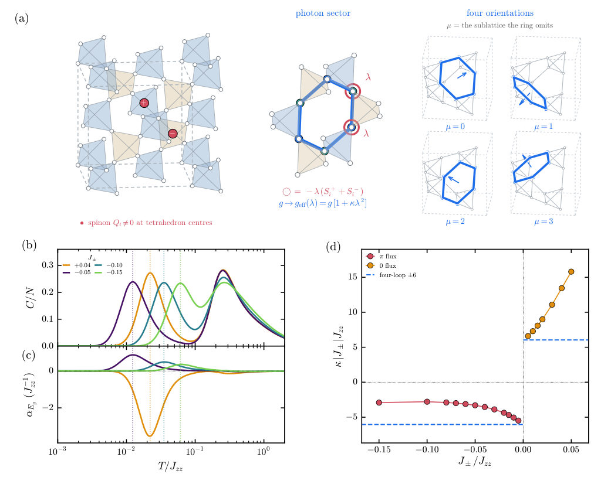
<figcaption class="paper-figure-caption"><b>Fig 1.</b> FIG. 1. Anisotropic thermal expansion as ring-exchange spectroscopy in non-Kramers QSI. (a) Left: Pyrochlore lattice. One spin flip making a spinon pair (Qt ̸= 0, at tetrahedron centres). Centre: a weak transverse field renormalizes the ring exchange whose virtual process is hosted on a hexagonal ring [Eq. (5)]. Right: the 16-site cubic cell holds one ring of each orientation, shown separately in a common view; µ is the sublattice the ring omits, fixing its normal along ˆnµ. (b,c) ED on the 16-site cubic pyrochlore cluster with periodic boundary conditions at x = λ2/(|J±|Jzz) = 0.014: the Eg response (c) tracks the lower anomaly of C (b), dotted lines, and its sign follows the flux sector,...</figcaption>
</figure>
<figure class="paper-figure-card">
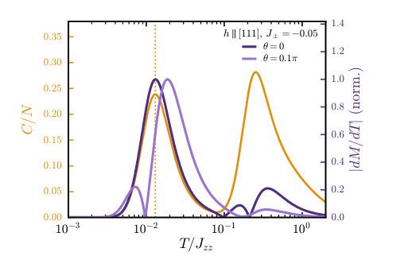
<figcaption class="paper-figure-caption"><b>Fig 2.</b> FIG. 2. The mixing angle sets where the magne- tocaloric response sits. ED on the 16-site cubic cluster at J± = −0.05 with a [111] field [Eq. (12)] with field strength h2 = 0.014|J±|Jzz. For the purely transverse coupling θ = 0 the extremum of |dM/dT| (blue) sits on the lower peak of C (black, dotted line); for θ ̸= 0 (θ = 0.1π, orange) the field lifts the ice degeneracy at first order and the response moves onto the field-set scale on which the ice manifold reorganizes, a factor 12 above the hexagon scale g although only a factor 1.4 above this cluster’s own g4. Both |dM/dT| curves are nor- malized to their maxima.</figcaption>
</figure>
<figure class="paper-figure-card">
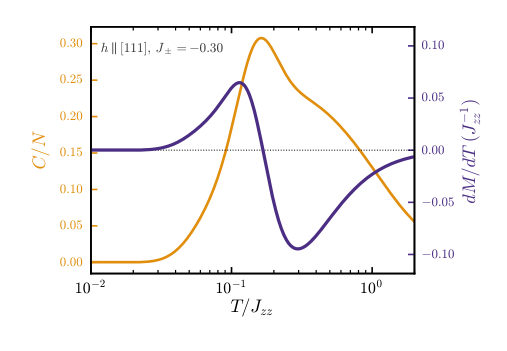
<figcaption class="paper-figure-caption"><b>Fig 3.</b> FIG. 3. Specific heat and dM/dT at J± = −0.30 with field strength h2 = 0.014|J±|Jzz and θ = 0 Here, the two energy scales are close enough that C (black) has a single merged maximum. The signed dM/dT (blue) can still resolve the two energy scales: positive at the ring-exchange scale and negative at T ∼Jzz.</figcaption>
</figure>

**Summary.** The paper introduces advanced thermodynamic spectroscopy techniques to overcome experimental difficulties in measuring the ring-exchange energy scale in Quantum Spin Ice. By analyzing how observables like thermal expansion and magnetization change with weak external fields, the authors propose clean diagnostic signatures that can distinguish between different magnetic flux states within QSI materials.

**Why it may be interesting.** This work provides a detailed, quantitative roadmap for interpreting complex thermodynamic measurements in frustrated quantum magnets, linking microscopic Hamiltonian parameters ($g$) directly to macroscopic, measurable responses ($\Delta \alpha$, $dM/dT$).

Detailed structure

**Main problem.** The primary challenge is developing a reliable thermodynamic probe to detect the elusive ring-exchange energy scale in Quantum Spin Ice (QSI).

**Main result.** Novel probes, such as anisotropic thermal expansion ($\Delta \alpha$) for non-Kramers QSI and $dM/dT$ for dipolar-octupolar pyrochlores, are shown to be highly sensitive to this ring-exchange scale.

**Method.** The authors use a novel thermodynamic approach involving coupling the system to weak perturbations (strain or magnetic fields) and analyzing the resulting temperature derivatives of observables ($\gamma_X$).

**Model / system.** The study focuses on Quantum Spin Ice, modeled by the XXZ Hamiltonian on the pyrochlore lattice. The analysis distinguishes between non-Kramers and dipolar-octupolar variants to propose distinct experimental signatures.

**Key observables.** Difference in thermal expansion coefficients ($\Delta \alpha$), temperature derivative of magnetization ($dM/dT$), and the generalized response function $\gamma_X$.

**Important parameters / regimes.** Ring-exchange energy scale ($g$), zero-flux vs. $\pi$-flux state, weak perturbation strength ($\lambda$).

**Assumptions / limitations.** The analysis relies on perturbative expansions in the coupling constant ($\lambda$) and assumes that specific probes (like $\Delta \alpha$) are immune to direct nuclear Schottky anomalies.

**Figures summary.** Figures illustrate anisotropic thermal expansion spectroscopy showing how the measured signal tracks the lower energy anomaly of the specific heat, and diagrams show the microscopic dependence on flux sector for $dM/dT$.

**Paper structure.** The paper establishes the theoretical framework using perturbation theory to derive $\gamma_X$ from weak coupling. It then applies this formalism to two distinct experimental platforms (NK and DO pyrochlores) to predict measurable signatures distinguishing different QSI ground states.

Abstract

Quantum spin ice (QSI) is a three-dimensional quantum spin liquid where fractionalized spinons interact with emergent photons. The XXZ model on the pyrochlore lattice realizes such a $U(1)$ quantum spin liquid and a number of pyrochlore magnets have been investigated as candidate materials, but the detection of emergent excitations has been a major challenge. The specific heat is expected to show the higher-energy spinon excitations and a lower-energy anomaly at the ring-exchange scale, which sets both the photon bandwidth and the energy of the emergent magnetic monopoles (or visons). In reality, the lower-energy peak is obscured by the nuclear Schottky anomaly in non-Kramers Pr-based systems, while it is not clearly resolved from the spinon contributions in Ce-based dipolar-octupolar systems. In this work, we propose a novel thermodynamic probe of the elusive ring-exchange energy scale. We show that in the presence of a weak perturbation coupled to the transverse component of the pseudospin degrees of freedom, the temperature derivative of an observable conjugate to such a weak perturbing force is highly sensitive to the ring-exchange energy scale. Using this scheme, it is shown that the difference between thermal expansion coefficients along the [100] and [010] directions should show a peak at the ring-exchange energy scale for non-Kramers QSI. Similarly, the temperature derivative of the magnetization, $dM/dT$, of dipolar-octupolar pyrochlores under a weak magnetic field can also detect the same signal. Moreover, the sign of these signatures distinguishes the zero-flux and $π$-flux QSI states.

[↑ back to top](#top)

### [Conditional dependence and Scrooge ensembles in shallow random quantum circuits](http://arxiv.org/abs/2608.12255v1)

**Authors:** Yinchen Liu, Max McGinley, Thomas Schuster, David Gosset  
**Type:** theory · **Category:** statistical mechanics · **PDF:** <https://arxiv.org/pdf/2608.12255v1>  
**Analysis basis:** full PDF text, analyzed in chunks
**Topic relevance:** `quantum measurements` **3/5** · `correlated / nonlocal dissipation` **1/5**

↔ Scroll figures horizontally

<figure class="paper-figure-card">
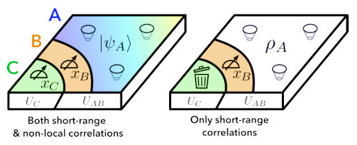
<figcaption class="paper-figure-caption"><b>Fig 1.</b> FIG. 1. Illustration of the Scrooge hypothesis for constant- depth random quantum circuits. Here |ψA⟩is the post- measurement state with outcomes xB, xC; while ρA is ob- tained by measuring xB and tracing out C. We find that moments of |ψA⟩match those of the Scrooge ensemble de- fined by ρA. When measured in any fixed basis, ρA features only short-range correlations (black light-cones), while |ψA⟩ may have non-local correlations (rainbow gradient).</figcaption>
</figure>
<figure class="paper-figure-card">
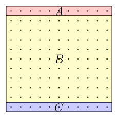
<figcaption class="paper-figure-caption"><b>Fig 2.</b> FIG. 2. (a) Tripartition ABC of the 2D grid. (b) Numerical estimation of the distribution of the integer r = I(A; C|B) for depth-5 and depth-7 2D random Clifford circuits acting on a 100×100 grid of qubits using 105 random circuit realizations.</figcaption>
</figure>
<figure class="paper-figure-card">
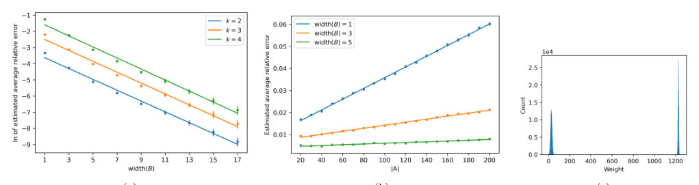
<figcaption class="paper-figure-caption"><b>Fig 3.</b> FIG. 3. (a,b) Average relative error between the k-th diagonal frame potential (DFP) of EA(UAB, xB) and Dρ as a function of (a) width(B) = dist(A, C) −1, and (b) |∂A|. Here, A is the top row of qubits, C is the bottom 6 rows of qubits, and B is all other qubits; averaging is over instances of the background state ρA(UAB, xB). In (a), we fix |A| = 100; in (b), we fix k = 2. Error bars show twice the standard error. (c) Weight distribution of the Z-type stabilizers of a depth-7 2D random Clifford circuit acting on a 50 × 50 grid of qubits. This example shows a bimodal histogram over a total of 219 −1 non-identity Z-type stabilizers, with a low-weight peak of 218 −1 elements centered at 28 and...</figcaption>
</figure>
<figure class="paper-figure-card">
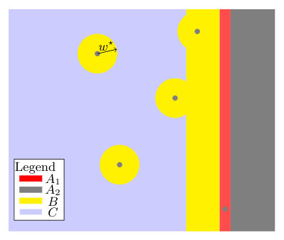
<figcaption class="paper-figure-caption"><b>Fig 4.</b> FIG. 4. The sets A1(j), A2(j), B(j), C(j) used in step j of Algorithm 1 (see line 6 of (a)) are depicted in (b) and described in the text. We show that for a given ϵ = 1/poly(n) it is possible to choose constants c1, c2 = O(1) such that Algorithm 1 samples from a distribution with expected total variation distance at most ϵ/2 from pT (cf. Eq. (9)).</figcaption>
</figure>
<figure class="paper-figure-card">
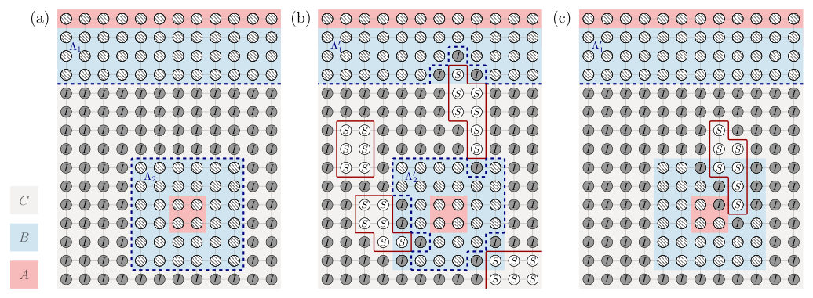
<figcaption class="paper-figure-caption"><b>Fig 5.</b> FIG. 5. Spin configurations contributing to the conditional probabilities and expectations arising in the expression (B44), for a particular choice of tripartition A (red), B (blue), and C (light grey). (a): Conditioning on πC = I means all spins in C are frozen to the state I (grey circles). These frozen spins define effective boundary conditions for Ising models on each connected component Λi ⊂AB (boundaries of which are shown with blue dashed lines). Within each component, spins are free to fluctuate (black and white striped circles). (b): After conditioning on the event ⃗πC ∈GI, a typical configuration has most spins in the state I, but with some small minority islands in the state S...</figcaption>
</figure>

**Summary.** This work analyzes how measuring subsets of qubits in shallow random quantum circuits induces long-range entanglement, leading to conditional dependencies. The authors conjecture that these post-measurement states follow a 'Scrooge ensemble,' which mathematically implies that the complex quantum dynamics are efficiently simulable classically, even when noise is present.

**Why it may be interesting.** It provides a concrete mechanism by which local quantum dynamics can generate non-local correlations that are nevertheless efficiently simulated classically due to underlying structural constraints revealed by measurement theory.

Detailed structure

**Main problem.** The paper investigates the structure of conditional dependence induced by measurements on qubits within shallow random quantum circuits (SRQCs) and how this relates to classical simulation complexity.

**Main result.** For sufficiently deep SRQCs, the post-measurement state ensemble is conjectured to be approximated by a 'Scrooge ensemble,' leading to the conclusion that these circuits are classically efficiently simulable even with small depolarizing noise.

**Method.** The analysis uses theoretical conjectures (the Scrooge hypothesis) and rigorous mathematical tools like analyzing moment matching via Diagonal Frame Potentials (DFP) to bound the relative error between the actual post-measurement ensemble and the predicted Haar/Scrooge measure.

**Model / system.** The model is an n-qubit two-dimensional lattice subjected to shallow random quantum circuits (SRQCs) with nearest-neighbor gates, partitioned into three regions A, B, and C for measurement analysis.

**Key observables.** Conditional Mutual Information $I(A; C|B)$, the relative error between moment expectations of the actual ensemble vs. the Scrooge ensemble ($\epsilon$), and the Diagonal Frame Potential (DFP).

**Important parameters / regimes.** Circuit depth ($d > d^* = \Theta(1)$), system size ($n$), and the width parameter $	ext{width}(B) = 	ext{dist}(A, C) - 1$.

**Assumptions / limitations.** The core conjecture is that the post-measurement ensemble approximates the Scrooge ensemble; further analysis relies on assuming stabilizer state structures for bounding errors.

**Figures summary.** Figures illustrate numerical evidence showing non-zero conditional mutual information at sufficient depth, and plots demonstrate that the average relative error decays inverse exponentially with the separation width between measured regions.

**Paper structure.** The paper progresses from establishing the physical phenomenon of measurement-induced long-range entanglement to formulating the Scrooge ensemble conjecture. It then develops rigorous mathematical machinery using moment matching (DFP) to prove the convergence of observables towards this idealized, classically simulable limit.

Abstract

The output state of a 2D geometrically local shallow random quantum circuit does not have long range correlations due to its lightcone structure. But this changes if one measures a subset of the qubits: long-range entanglement can be induced by the measurement process, leading to conditional correlations between distant qubits. In this paper we investigate the structure of conditional dependence in these circuits and its consequences for quantum advantage. For a tripartition $ABC$ of the qubits, we consider the ensemble of post-measurement states on $A$ that is conditioned on a specific measurement outcome on $B$ and ranges over all possible measurement outcomes on $C$. For circuit depths exceeding a constant critical value $d^*$, we conjecture that this ensemble is well approximated by a certain generalization of the Haar ensemble, called the Scrooge ensemble~[Jozsa \textit{et al.}, \href{https://doi.org/10.1103/PhysRevA.49.668}{Phys. Rev. A \textbf{49}, 668 (1994)}]; we also provide supporting numerical and analytical evidence. Our conjecture describes a precise sense in which the state retains its lightcone structure on the remaining unmeasured qubits, but also develops some globally random features arising from the measurement. A consequence is that $n$-qubit shallow random quantum circuits in two dimensions are classically efficiently simulable in the presence of a tiny depolarizing noise rate $Ω(\log(n)/n)$.

[↑ back to top](#top)

### [The Ambipolar electric field in multispecies plasma atmospheres: effects of alpha particles and stochastic heating](http://arxiv.org/abs/2608.12014v1)

**Authors:** Luca Barbieri, Pascal Démoulin, Daniel Verscharen  
**Type:** theory · **Category:** statistical mechanics · **PDF:** <https://arxiv.org/pdf/2608.12014v1>  
**Analysis basis:** full PDF text, analyzed in chunks
**Topic relevance:** `Keldysh / 2PI / non-Gaussian methods` **3/5** · `quantum measurements` **1/5**

↔ Scroll figures horizontally

<figure class="paper-figure-card">
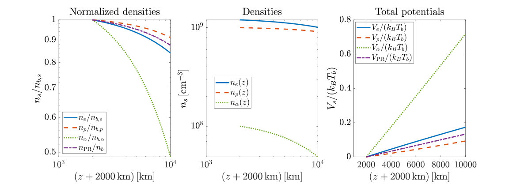
<figcaption class="paper-figure-caption"><b>Fig 1.</b> Figure 1. Density and total potential profiles for a three-component plasma composed of electrons, protons, and α-particles. Left panel: normalized density profiles of electrons, protons, and α particles together with the classical Pannekoek–Rosseland solution as functions of height. The density profiles are computed from Equation (8) using the self-consistent electrostatic potential obtained by numerically solving Equation (12), whereas the Pannekoek–Rosseland reference profile is computed from Equation (13). Middle panel: corresponding density profiles. Right panel: total potential energies, computed from Equation (4) and normalized to kBTb, as functions of height. The calculations are...</figcaption>
</figure>
<figure class="paper-figure-card">
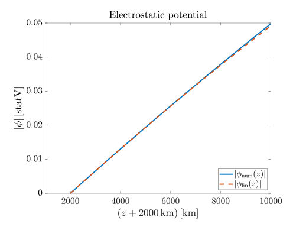
<figcaption class="paper-figure-caption"><b>Fig 2.</b> Figure 2. Comparison between the numerical solution of the nonlinear self-consistent electrostatic potential obtained from Equation (12) and the first-order analytical approximation given by Equation (42). The calculations were performed using the same physical parameters as in Figure 1.</figcaption>
</figure>
<figure class="paper-figure-card">
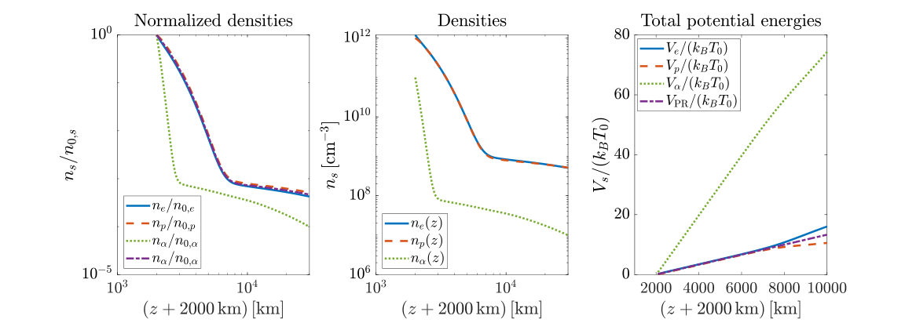
<figcaption class="paper-figure-caption"><b>Fig 3.</b> Figure 3. Density and total potential profiles for a multi-temperature three-component plasma. Left panel: normalized density profiles of electrons, protons, α particles, and the corresponding Pannekoek–Rosseland solution as functions of height. The density profiles are computed from Equation (47) using the self-consistent electrostatic potential obtained by numerically solving Equation (51). Middle panel: corresponding density profiles. Right panel: total potential energies, computed from Equation (4) and normalized to kBT0, as functions of height. The calculations are performed assuming T0 = 104 K, ∆T = 106K, At = 10−3, fb = n0,α/n0,p = 0.1, and n0,p = 1012 cm−3.</figcaption>
</figure>
<figure class="paper-figure-card">
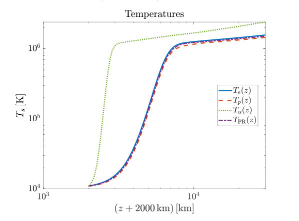
<figcaption class="paper-figure-caption"><b>Fig 4.</b> Figure 4. Effective temperatures of electrons, protons, α particles, and the corresponding Pannekoek–Rosseland solution as functions of height. The temperatures are computed from Equation (48) using the self-consistent density profiles shown in Figure 3. The values of the physical parameters are the same as those adopted in Figure 3.</figcaption>
</figure>
<figure class="paper-figure-card">
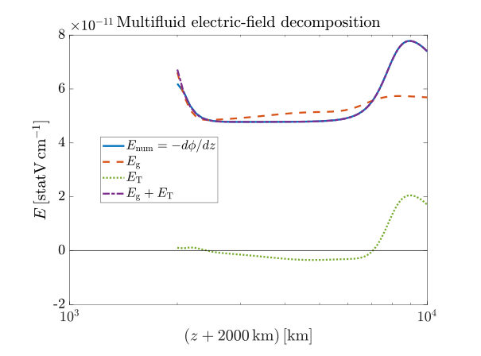
<figcaption class="paper-figure-caption"><b>Fig 5.</b> Figure 5. Decomposition of the self-consistent ambipolar electric field in the multi-temperature atmosphere. The numerical electric field, Enum = −dϕ/dz, is obtained by numerically solving Equation (51). The gravitational contribution Eg is computed from Equation (63), the thermoelectric contribution ET from Equation (64). The values of the physical parameters are the same as those adopted in Figure 3.</figcaption>
</figure>

**Summary.** This paper develops a theoretical framework to model electric fields in complex, multi-species plasma atmospheres under gravity. By extending classical plasma theories to include alpha particles and stochastic heating, the authors show that the resulting ambipolar field has distinct gravitational and thermoelectric components. This provides a comprehensive tool for understanding highly stratified astrophysical plasmas.

**Why it may be interesting.** While focused on astrophysical plasma physics, the rigorous application of kinetic theory (Liouville's theorem) to derive macroscopic fields from microscopic equilibrium distributions is a powerful technique applicable to non-equilibrium statistical mechanics problems in other domains.

Detailed structure

**Main problem.** The study investigates the stationary states of collisionless, gravitationally stratified plasma atmospheres composed of electrons, protons, and alpha particles.

**Main result.** The ambipolar electric field is shown to decompose into a dominant gravitational component and a thermoelectric contribution arising from species-dependent temperature gradients in multi-temperature plasmas.

**Method.** The authors extend Pannekoek--Rosseland theory by deriving the self-consistent ambipolar electric field from kinetic equilibrium, charge neutrality, and Liouville's theorem.

**Model / system.** The model is a three-component plasma (e-, p+, alpha) in a gravitational field. The analysis progresses from single-temperature isothermal assumptions to multi-temperature regimes generated by stochastic boundary heating.

**Key observables.** Ambipolar electric field (d\phi/dz), density profiles, and temperature gradients for each species.

**Important parameters / regimes.** Alpha-particle abundance ($f$), gravitational acceleration ($g$), plasma temperatures ($T_s$).

**Assumptions / limitations.** The system is assumed collisionless; the analysis uses perturbative expansions in $\alpha$-particle abundance and extends to multi-temperature states generated by stochastic heating.

**Figures summary.** Figure 6 compares numerical solutions for the electrostatic potential with analytical approximations derived from the first-order perturbation theory, showing good agreement.

**Paper structure.** The paper builds from a single-temperature analysis using Liouville's theorem to determine the ambipolar field. It then generalizes this formalism to multi-temperature plasmas, deriving the decomposition of the electric field into gravitational and thermoelectric parts.

Abstract

We investigate stationary states of a collisionless, gravitationally stratified plasma atmosphere composed of electrons, protons, and alpha particles by extending Pannekoek--Rosseland theory to multispecies and multi-temperature plasmas. Starting from Liouville's theorem, we derive the self-consistent ambipolar electric field from kinetic equilibrium and charge neutrality. For a single-temperature atmosphere, we obtain analytical expressions for the ambipolar field, show its dependence on alpha-particle abundance, and determine the relative stratification of the three species. A first-order analytical approximation to the electrostatic potential accurately reproduces the numerical solution. We then generalize the formalism to multi-temperature plasmas generated by stochastic boundary heating, representing the stationary distribution as a superposition of Maxwellian populations. Gravitational filtering produces non-exponential density profiles and increasing temperatures with altitude, while preserving the relative species stratification, with alpha particles most strongly stratified and protons least. The ambipolar electric field contains a dominant gravitational contribution, corresponding to the generalized Pannekoek--Rosseland field, and a thermoelectric contribution arising from species-dependent temperature gradients, which accounts for its non-monotonic structure. These results provide a framework for studying the combined effects of plasma composition and stochastic heating in gravitationally stratified astrophysical plasmas.

[↑ back to top](#top)

### [Two routes to quantum anomalous Hall states in altermagnets](http://arxiv.org/abs/2608.12124v1)

**Authors:** Makoto Naka, Shuntaro Sumita, Yukitoshi Motome, Hitoshi Seo  
**Type:** theory · **Category:** strongly correlated electrons · **PDF:** <https://arxiv.org/pdf/2608.12124v1>  
**Analysis basis:** full PDF text, analyzed in chunks
**Topic relevance:** `analog quantum simulation` **3/5** · `driven-dissipative phase transition` **1/5**

↔ Scroll figures horizontally

<figure class="paper-figure-card">
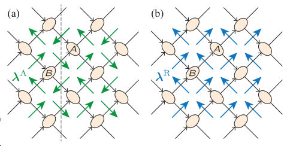
<figcaption class="paper-figure-caption"><b>Fig 1.</b> FIG. 1. Schematic lattice structure and spatial patterns of the antisymmetric SOC vectors: (a) λA ij for an orthorhombic two- dimensional altermagnet and (b) Rashba-type SOC λR ij. The green and blue solid arrows indicate the directions of λA ij and λR ij, respec- tively, on the NN bonds associated with the electron hopping along the directions indicated by the black arrows. A and B denote the crystallographically equivalent sites in the unit cell, which are con- nected by the glide operation with respect to the yz plane denoted by the dashed line.</figcaption>
</figure>
<figure class="paper-figure-card">
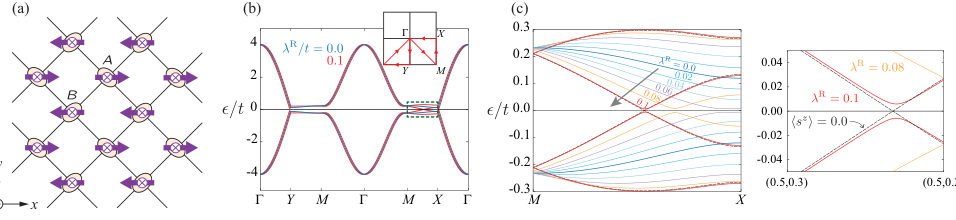
<figcaption class="paper-figure-caption"><b>Fig 2.</b> FIG. 2. (a) Schematic picture of an altermagnetic ground state of HALM + HR with the weak ferromagnetic moment along the z axis. (b) Energy band structures with and without the Rashba-type SOC term HR for λR/t = 0.0 (blue) and 0.1 (red), respectively. The inset shows the path along the high-symmetry lines in the first BZ. The dashed rectangle represents the region expanded in (c). (c) Variation of the band structure near the insulating gap on the X-M line with respect to λR/t. The dashed line denotes the band structure obtained from the self- consistent solution under the constraint of ⟨sz⟩= 0.0 at λR/t = 0.1. The right hand panel shows an enlarged view of the bands near the point node; (kx,...</figcaption>
</figure>
<figure class="paper-figure-card">
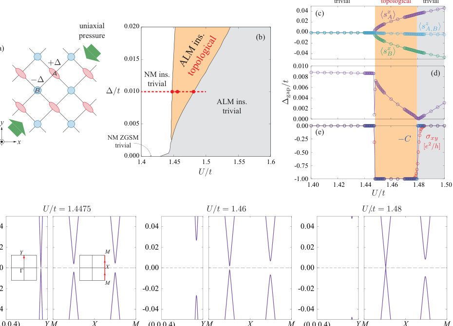
<figcaption class="paper-figure-caption"><b>Fig 3.</b> FIG. 3. (a) Schematic illustration of the system with a staggered potential induced by uniaxial pressure. (b) Ground-state phase diagram of HALM+HR+H∆in the U-∆plane. NM, ALM, and ZGSM denote nonmagnetic, altermagnetic, and zerogap semimetal states, respeectively, and the orange region indicates the topological altermagnetic phase with the Chern number |C| = 1. The dashed line represents the parameter path along which (c) the spin moments ⟨sx A,B⟩and ⟨sz A,B⟩, (d) the energy gap between the valence and conduction bands, ∆gap, and (e) the Hall conductivity σxy and the Chern number of the occupied band manifold, −C, are calculated. (f) Energy band structures near the gap for ∆/t = 0.01 at U/t...</figcaption>
</figure>
<figure class="paper-figure-card">
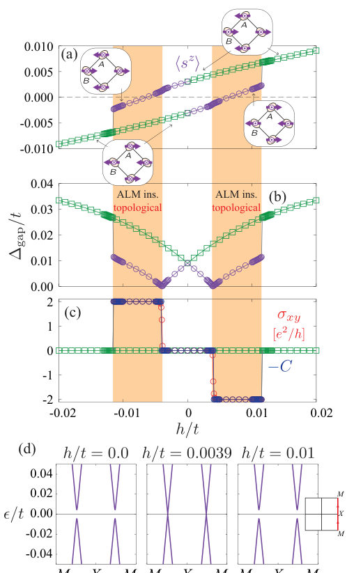
<figcaption class="paper-figure-caption"><b>Fig 4.</b> FIG. 4. Magnetic-field dependences of (a) the spin moment ⟨sz A,B⟩, (b) the energy gap ∆gap, and (c) the Hall conductivity σxy together with the Chern number of the occupied bands, −C, at U/t = 1.48. The insets in (a) show schematic spin configurations in the corre- sponding states. The square and circle symbols represent the ground- state and metastable branches, respectively. The shaded regions indi- cate the topological altermagnetic phases realized in the metastable branch. (d) Energy band structures near the energy gap along the M-X-M path at h/t = 0, 0.0039, and 0.01, corresponding to the trivial altermagnetic phase, the topological transition point, and the topological altermagnetic...</figcaption>
</figure>
<figure class="paper-figure-card">
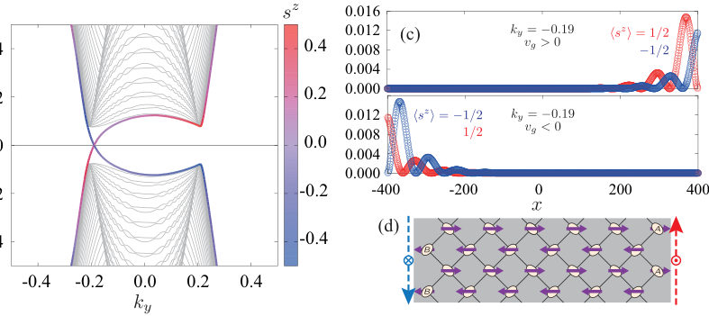
<figcaption class="paper-figure-caption"><b>Fig 5.</b> FIG. 5. (a) Schematic illustration of the ribbon geometry used in the edge-state calculations for the topological altermagnetic state. Open and periodic boundary conditions are imposed along the x and y directions, respectively. (b) Energy spectrum as a function of ky in the topological altermagnetic state induced by the staggered potential. The gray curves represent the bulk states, and the colored curves denote the in-gap edge states. The color scale indicates the expectation value of the spin moment ⟨sz⟩. (c) sz-resolved real-space distributions of the chiral edge modes at ky = −0.19 in panel (b). The spin-up and spin-down components are shown by red and blue symbols, respectively. The...</figcaption>
</figure>

**Summary.** This work presents a theoretical framework detailing two distinct methods—using a staggered potential or an external magnetic field—to induce Quantum Anomalous Hall (QAHE) effects in altermagnetic materials. The authors predict quantized Hall conductivities of $e^2/h$ and $2e^2/h$, respectively, by analyzing topological transitions marked by specific gap closings and robust chiral edge states.

**Why it may be interesting.** While focused on condensed matter topology, the concept of realizing robust quantum states via controlled symmetry breaking and external fields is highly relevant to engineering novel superconducting or topological qubits in solid-state platforms.

Detailed structure

**Main problem.** The paper theoretically proposes two distinct, experimentally accessible routes for realizing Quantum Anomalous Hall (QAHE) states in altermagnetic materials.

**Main result.** These routes involve either applying a staggered potential ($\Delta$) to achieve $C=1$ or applying an external magnetic field ($H_Z$) to realize a metastable state with $C=2$.

**Method.** The study uses theoretical modeling based on a Hubbard Hamiltonian, employing Hartree-Fock approximations and calculating topological invariants like the Chern number via band structure analysis.

**Model / system.** The system is an altermagnetic material modeled by a minimal square-lattice Hubbard model incorporating antisymmetric and Rashba spin-orbit couplings. The physics is analyzed under external perturbations: a staggered potential ($\Delta$) or a perpendicular magnetic field ($H_Z$).

**Key observables.** Quantized Hall conductivity ($\sigma_{xy}$), Chern number ($C$), energy gap closing/reopening at the Brillouin zone boundary, and spin-polarized chiral edge states.

**Important parameters / regimes.** The key parameters are the coupling strengths (e.g., $\lambda_A, \lambda_R$) and the relative strengths of the perturbations ($\Delta/t$ or $h/t$).

**Assumptions / limitations.** The analysis relies on a minimal Hubbard model framework and assumes that topological transitions can be diagnosed by gap closings at specific momenta.

**Figures summary.** Figures illustrate band structures showing gap closing points corresponding to the transition between trivial and topological phases, and ribbon geometry calculations visualize the distinct spin-polarized chiral edge states for both $C=1$ and $C=2$ regimes.

**Paper structure.** The paper systematically introduces the model Hamiltonian, first analyzing the ground state evolution with SOC, then detailing the two separate mechanisms (staggered potential vs. magnetic field) that drive the system into quantized topological phases, concluding with detailed edge state characterization for both cases.

Abstract

We theoretically propose two possible routes to realizing quantum anomalous Hall states in altermagnetic materials. We consider a minimal square-lattice Hubbard model with antisymmetric spin-orbit coupling associated with an orthorhombic crystal structure, which supports a topologically trivial altermagnetic state. By incorporating Rashba-type spin-orbit coupling and external perturbations, we demonstrate that this trivial state can be turned into topological altermagnetic phases in two distinct ways. The first route is driven by a staggered potential that breaks the symmetry connecting crystallographically equivalent sublattices, leading to a topological altermagnetic ground state characterized by a quantized Hall conductivity $\left| σ_{xy} \right|=e^2/h$ and a Chern number $C=1$. The second route is realized by applying a magnetic field perpendicular to the two-dimensional plane. The resulting topological state appears as a metastable state in the magnetic hysteresis loop, exhibiting a quantized Hall conductivity $\left| σ_{xy} \right|=2e^2/h$ associated with a Chern number $C=2$. We show that these topological transitions are accompanied by characteristic gap closings at the Brillouin-zone boundary, with the number of gap-closing points determining the Chern number. Ribbon-geometry calculations reveal chiral edge states consistent with the bulk topological invariants and demonstrate distinct spin polarizations between the $C=1$ and $C=2$ states. Our results establish experimentally accessible routes to quantized anomalous Hall responses in altermagnets.

[↑ back to top](#top)

### [Layer-Number-Controlled Symmetry Breaking and Surface-State Transport in Rhombohedral Graphene Multilayers](http://arxiv.org/abs/2608.11450v1)

**Authors:** Bosai Lyu, Jian Zheng, Kai Liu, Yulu Ren, Size Wu, Yating Sha, Shuhan Liu, Youngju Park, Kenji Watanabe, Takashi Taniguchi, Jinfeng Jia, Zhiwen Shi, Jeil Jung, Weidong Luo, Guorui Chen  
**Type:** both · **Category:** strongly correlated electrons · **PDF:** <https://arxiv.org/pdf/2608.11450v1>  
**Analysis basis:** full PDF text, analyzed in chunks
**Topic relevance:** `Keldysh / 2PI / non-Gaussian methods` **2/5** · `analog quantum simulation` **2/5** · `driven-dissipative phase transition` **2/5** · `methods for driven-dissipative` **2/5** · `correlated / nonlocal dissipation` **1/5** · `non-equilibrium universality` **1/5** · `quantum measurements` **1/5**

↔ Scroll figures horizontally

<figure class="paper-figure-card">
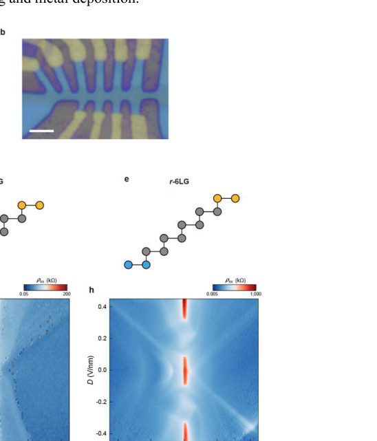
<figcaption class="paper-figure-caption"><b>Fig 1.</b> Figure 1. Rhombohedral 4, 5, 6-layer graphene. a, Schematic of the dual-gated devices. b, Optical</figcaption>
</figure>
<figure class="paper-figure-card">
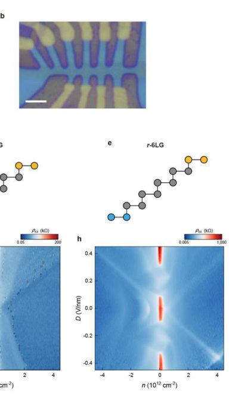
<figcaption class="paper-figure-caption"><b>Fig 2.</b> Figure 1c-h show illustrations of unit cells and color plots of the measured resistivity 𝜌xx as functions of n and D (1.5 K, B = 0 T) of r-4LG-D1 (c,f), r-5LG-D1 (d,g) and r-6LG-D1 (e,h), see also Sec. 1 of Supplementary Information for colormaps of r-8LG-D1 and other additional devices. From these color plots, three phases with distinct resistivities are resolved at n = 0 for different D in r-4LG through r-6LG. The insulating, semimetallic, and insulating phases at different D together with transitions between them from r-4LG to r-6LG are more clearly presented by the line cuts at n = 0 measured at different temperatures shown as Fig. 2a (also see Sec. 2 of Supplementary Information for...</figcaption>
</figure>
<figure class="paper-figure-card">
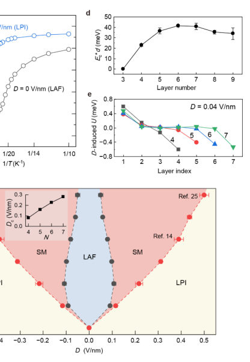
<figcaption class="paper-figure-caption"><b>Fig 3.</b> Figure 2. Layer-dependent phase transitions driven by D at n = 0. a, D-dependent 𝜌xx of r-4LG to</figcaption>
</figure>
<figure class="paper-figure-card">
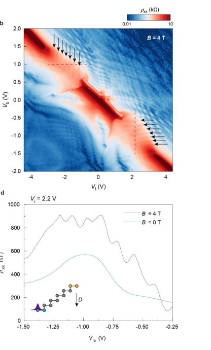
<figcaption class="paper-figure-caption"><b>Fig 4.</b> Figure 3. Surface-state-dominated transport characteristics in r-6LG. a, b, longitudinal resistivity</figcaption>
</figure>

**Summary.** This work systematically explores how changing the number of layers in rhombohedral graphene modifies its electronic behavior. By combining transport measurements with theoretical modeling, the authors reveal that layer count controls critical phase transitions and enhances interlayer screening. This establishes layer number as a powerful tool for engineering correlated and topological quantum states.

**Why it may be interesting.** The strong dependence on layer number and the explicit study of correlation effects (LAF state) and screening mechanisms provide a rich platform for understanding emergent quantum phases in low-dimensional correlated electron systems, relevant to topological materials research.

Detailed structure

**Main problem.** The study investigates how the number of layers controls symmetry breaking, surface screening, and electronic phases in rhombohedral graphene multilayers.

**Main result.** Layer number acts as a key tuning knob, leading to distinct layer-dependent phase transitions (LAF $\leftrightarrow$ SM $\leftrightarrow$ LPI) and enhanced interlayer screening effects in thicker stacks.

**Method.** The research combines electrical transport measurements ($
ho_{xx}$ vs. gate voltages/displacement fields) with self-consistent electrostatic tight-binding calculations.

**Model / system.** The physical system is rhombohedral graphene multilayers (r-NLG), studied across several layer numbers ($N=4$ to $8$). The physics involves correlated electronic states, spontaneous symmetry breaking (LAF state), and screening effects governed by the external displacement field.

**Key observables.** Critical displacement fields ($D_c$) for phase transitions, longitudinal resistivity ($
ho_{xx}$), Landau level (LL) crossing patterns, and the electronic screening factor ($S$).

**Important parameters / regimes.** Layer number ($N$), applied displacement field ($D$), magnetic field ($B$), and carrier density ($n$).

**Assumptions / limitations.** The insulating states observed are attributed to electron-electron interactions (LAF state) rather than single-particle band gaps, which is confirmed by calculations.

**Figures summary.** Figures illustrate phase diagrams ($
ho_{xx}$ vs $n$ and $D$), layer-resolved potential profiles showing screening increase with $N$, and LL structures used to determine the number of layers.

**Paper structure.** The paper systematically maps out phase transitions (LAF $	o$ SM $	o$ LPI) as a function of $N$ and $D$. It then delves into the mechanism, highlighting how increased screening in thicker films modifies surface-state transport and LL behavior under magnetic fields.

Abstract

Rhombohedral multilayer graphene hosts layer-polarized flat bands, providing an intriguing platform for correlated and topological electronic states; however, the role of layer number in governing symmetry breaking and surface screening remains elusive. Here we prepare rhombohedral graphene multilayers and systematically conduct electrical transport measurements. We uncover an unconventional layer dependence of phase transitions: the critical displacement field (D$_{c}$) for the layer-antiferromagnetic (LAF)-to-semimetal transitions remains constant across tetralayer to hexalayer graphene, whereas the D$_{c}$ for semimetal-to-layer-polarized-insulator (LPI) transition increases with layer number, defying unscreened Coulomb interaction models. In hexalayer graphene, surface-state-dominated transport emerges, with Landau levels (LLs) and resistive peaks selectively controlled by adjacent gates, a signature of strong interlayer screening absent in thinner stacks. High magnetic fields reveal valley-layer-locked LLs and dissipative states possibly from interlayer backscattering, highlighting the presence of decoupled surface states. Our findings establish layer number as a key tuning knob for engineering correlated and topological phases in rhombohedral graphene multilayers.

[↑ back to top](#top)

### [Connecting the tensor-categorical formulation of anyon condensation with operator algebras and entropic order parameters](http://arxiv.org/abs/2608.12157v1)

**Authors:** Hua-Chen Zhang  
**Type:** theory · **Category:** strongly correlated electrons · **PDF:** <https://arxiv.org/pdf/2608.12157v1>  
**Analysis basis:** full PDF text, analyzed in chunks
**Topic relevance:** `analog quantum simulation` **2/5** · `driven-dissipative phase transition` **2/5** · `non-equilibrium universality` **2/5** · `Keldysh / 2PI / non-Gaussian methods` **1/5** · `correlated / nonlocal dissipation` **1/5** · `methods for driven-dissipative` **1/5** · `quantum measurements` **1/5**

↔ Scroll figures horizontally

<figure class="paper-figure-card">
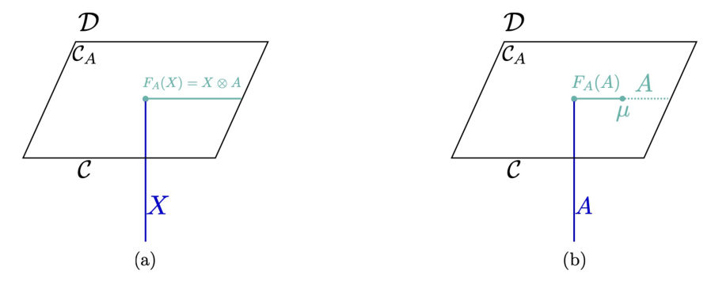
<figcaption class="paper-figure-caption"><b>Fig 1.</b> Figure 1: (a) The free A-module functor FA : C →CA with FA(X) = X ⊗A determines what happens when an anyon X from topological order C is brought to the interface described by the module category CA. D, sitting on the other side of this interface, is the post-condensation topological order to be identified below. (b) As A is the invisible topological line (depicted as a dashed line here and simply omitted in the following) on the interface CA, composing FA with the multiplication µ : A ⊗A →A, one finds that the bulk line A can end topologically on this interface.</figcaption>
</figure>
<figure class="paper-figure-card">
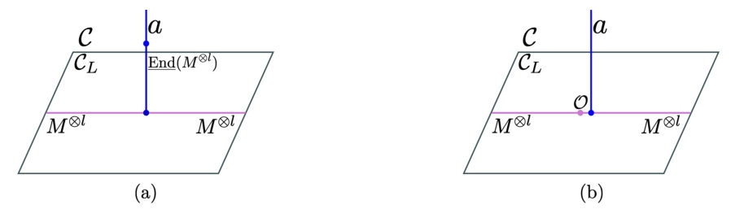
<figcaption class="paper-figure-caption"><b>Fig 2.</b> Figure 2: (a) For a strongly tensor generating object M ∈CL and a sufficiently large l, any a ∈Irr(C) arises in the decomposition of the internal end End(M⊗l). (b) Acting an operator O ∈EndCL(M⊗l) on an element in the bimodule labelled by a, which is represented as a junction operator joining the bulk line a with the boundary lines M⊗l, amounts to bringing O close to the junction and performing the OPE. The latter produces another junction operator attached to a.</figcaption>
</figure>
<figure class="paper-figure-card">
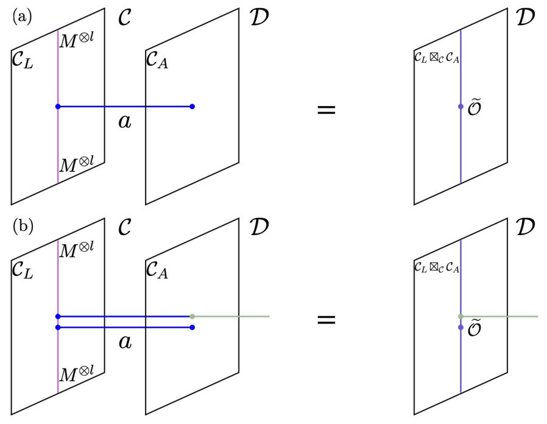
<figcaption class="paper-figure-caption"><b>Fig 3.</b> Figure 3: The bulk line a ∈Irr(C) can end topologically on the interface CA, and M is a strongly tensor generating object in CL. (a) An operator sits at the junction joining a with the lines M⊗l on the boundary. eO, obtained when hitting this junction operator with the interface by collapsing the C layer, becomes an element in A upon taking the inductive limit. (b) The action of eO via OPE. Repeating the arguments we made above [c.f. figure 2(b)], one realises that every bulk line in the TQFT D labels a bimodule over A; in fact, D ∼= DHR(A).</figcaption>
</figure>

**Summary.** This theoretical paper unifies two advanced mathematical descriptions—tensor categories and operator algebras—to study anyon condensation in topological matter. It introduces an entropic order parameter, providing a rigorous bound on this measure that characterizes the transition into a condensed phase. The work is significant for its deep mathematical connection between quantum information theory and exotic phases of matter.

**Why it may be interesting.** While highly abstract, the use of entanglement measures like relative entropy to characterize phase transitions is directly relevant to understanding quantum criticality and topological phases in strongly correlated electron systems.

Detailed structure

**Main problem.** The paper aims to connect two formalisms—tensor-categorical and operator algebraic—used to describe anyon condensation in topological quantum field theories.

**Main result.** It establishes a manifest connection between these two frameworks and provides a simple proof for an upper bound on the entropic order parameter characterizing the condensation transition.

**Method.** The authors deploy Doplicher-Haag-Roberts bimodules over quasi-local C*-algebras to investigate anyon condensation, relating this structure to tensor categories via module functors.

**Model / system.** The study focuses on anyon condensation, which describes phase transitions between $(2+1)$-dimensional topological orders or TQFTs. The analysis uses models like quantum doubles ($S_3$) and product theories (e.g., double Fibonacci/Ising).

**Key observables.** Entropic order parameter $S(\omega|\omega \circ E)$, which is a quantum information-theoretic measure of condensation.

**Important parameters / regimes.** The quantum dimension ($d_A$) of the condensable algebra $A$, and the topological state $\omega$.

**Assumptions / limitations.** The analysis assumes the existence of a topological (gapped) boundary, restricting the scope to cases where the underlying MTC has trivial Witt class.

**Figures summary.** Figure 1 illustrates the free A-module functor connecting bulk theory ($\mathcal{C}$) to an interface ($\mathcal{C}_A$). Figure 2 relates simple objects in $	ext{Irr}(\mathcal{C})$ to localizable bimodules over the boundary algebra $M$.

**Paper structure.** The paper proceeds by first defining the tensor-categorical view (using module categories) and then mapping this structure onto the operator algebraic framework using DHR bimodules, culminating in the derivation of bounds on the entropic order parameter.

Abstract

Anyon condensation that describes the transition between topological quantum field theories can be formulated in the language of tensor categories or that of operator algebras. We deploy the formalism of Doplicher-Haag-Roberts bimodules over quasi-local $\mathrm{C}^{*}$-algebras recently developed in [1] to investigate anyon condensation, which is associated with an extension of a certain operator algebra. The connection between notions in the two formulations is thereby made manifest in an intuitive, diagrammatic manner. An entropic order parameter, as the quantum information-theoretic measure characterising a condensation, is naturally defined, and we give a very simple proof of a bound on it.

[↑ back to top](#top)

### [Proliferation Transitions for Non-Abelian Anyons](http://arxiv.org/abs/2608.12303v1)

**Authors:** Sakura Schafer-Nameki, Yunqin Zheng, Andrea Antinucci  
**Type:** theory · **Category:** strongly correlated electrons · **PDF:** <https://arxiv.org/pdf/2608.12303v1>  
**Analysis basis:** full PDF text, analyzed in chunks
**Topic relevance:** `Keldysh / 2PI / non-Gaussian methods` **2/5** · `driven-dissipative phase transition` **2/5** · `analog quantum simulation` **1/5** · `correlated / nonlocal dissipation` **1/5** · `methods for driven-dissipative` **1/5** · `quantum measurements` **1/5**

↔ Scroll figures horizontally

<figure class="paper-figure-card">
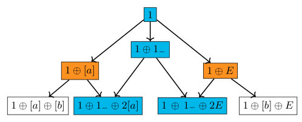
<figcaption class="paper-figure-caption"><b>Fig 1.</b> Figure 1. The condensable algebras of D(S3), partially or- dered by the subalgebra relation. The cyan ones form subcat- egories, orange ones have a generated sub-category Rep(G), the uncolored are mixed algebras of type (iii).</figcaption>
</figure>
<figure class="paper-figure-card">
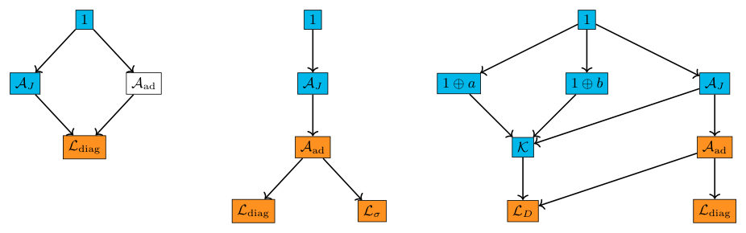
<figcaption class="paper-figure-caption"><b>Fig 2.</b> Figure 2. The Hasse diagrams of condensable algebras of Tk = SU(2)k ⊠SU(2)−k for generic k odd, k = 2 mod 4 and k = 0 mod 4, excluding the exceptional cases k = 10, 16, 28. cyan are type (i), orange type (ii), uncolored type (iii) algebras, respectively. The algebras are: AJ = 1 ⊕c, Aad = ⊕j∈Z(j, j), the two chiral D-type algebras 1 ⊕a and 1 ⊕b, K = 1 ⊕a ⊕b ⊕c. Finally there are the Lagrangian algebras: Ldiag = ⊕j(j, j), AD = Aad ⊗(1 ⊕a), and Lσ of (6.50). At k ≡2 mod 4, Aad is super-Tannakian, so its type (ii) only for ⟨1 ⊕c⟩.</figcaption>
</figure>

**Summary.** The paper develops a general theoretical framework using Symmetry Topological Field Theory (SymTFT) to describe how condensable anyons cause a TQFT to undergo a phase transition. By classifying the underlying algebraic structure into three types, the authors provide systematic methods to calculate the resulting condensed topological order, applicable to complex non-Abelian systems.

**Why it may be interesting.** This work provides a powerful mathematical machinery (SymTFT) to analyze phase transitions in exotic quantum matter states like fractional quantum Hall systems, linking topological order parameters directly to symmetry breaking mechanisms analogous to Higgsing transitions.

Detailed structure

**Main problem.** The research aims to systematically construct and analyze phase transitions that occur when condensable anyons proliferate within a general 2+1 dimensional Topological Quantum Field Theory (TQFT). This transition maps the initial TQFT $T$ to a reduced TQFT, $T/A$.

**Main result.** The proliferation transition is realized by coupling scalar fields on the symmetry boundary of a Symmetry Topological Field Theory (SymTFT) and tuning a mass term. The structure of this transition depends systematically on the classification type (i, ii, or iii) of the condensable algebra.

**Method.** The core methodology involves using the SymTFT framework to embed the 2+1d TQFT into a 3+1d gauge theory. The condensation process is modeled by tuning mass terms for boundary scalars, leading to different mathematical structures depending on the underlying symmetry algebra.

**Model / system.** The system under study is defined by Topological Quantum Field Theories (TQFTs) characterized by Modular Tensor Categories (MTCs), which describe fractional quantum Hall states and non-Abelian anyons. Specific examples include $D(S_3)$ and $	ext{SU}(2)_k$ Chern-Simons theories.

**Key observables.** The order parameter is related to the vacuum expectation values of boundary scalars, and key observables include the residual algebra ($b_A$) and the structure of the Higgsed phase.

**Important parameters / regimes.** The transition is controlled by tuning a mass term $m^2$ for boundary scalars: $m^2 > 0$ (original TQFT), $m^2 < 0$ (condensed TQFT), and $m^2 = 0$ (transition point).

**Assumptions / limitations.** The approach assumes the condensable algebra $A$ can be associated with a symmetry group $G$ via its Mügenger center, allowing for the SymTFT realization. The analysis is initially focused on transparent bosons.

**Figures summary.** Table I summarizes the three types of algebras (i, ii, iii) and their corresponding proliferation transition structures within the SymTFT components ($M_A$, $N_A$, etc.).

**Paper structure.** The paper first establishes the general framework using SymTFT to define the condensation process. It then classifies condensable algebras into three types (i, ii, iii) based on their relationship with the Mügenger center. The structure of the transition is derived for each type, illustrated by examples ranging from abelian theories to non-abelian Chern-Simons models.

Abstract

We construct phase transitions that proliferate condensable anyons in general 2+1d topological orders, including non-abelian ones. The central tool that provides a systematic approach to this question is the Symmetry Topological Field Theory (SymTFT). For a given topological order, we identify the relevant symmetry from the transparent lines generated by the condensable anyons, and thereby realize the topological order in terms of a 3+1d SymTFT sandwich. The proliferation phase transition is realized by coupling scalar fields to the anyons purely on the symmetry boundary of the SymTFT. We illustrate the construction for abelian theories, as well as non-abelian ones, $D(S_3)$ and $SU(2)_k$ Chern-Simons theories, and extend it to anomalous anyons.

[↑ back to top](#top)

### [Limitations on Joint Coherence Transfer in Quantum Thermodynamics](http://arxiv.org/abs/2608.11872v1)

**Authors:** Piotr Ćwikliński, Michał Studziński  
**Type:** theory · **Category:** statistical mechanics · **PDF:** <https://arxiv.org/pdf/2608.11872v1>  
**Analysis basis:** full PDF text, analyzed in chunks
**Topic relevance:** `driven-dissipative phase transition` **2/5** · `Keldysh / 2PI / non-Gaussian methods` **1/5** · `correlated / nonlocal dissipation` **1/5** · `methods for driven-dissipative` **1/5** · `non-equilibrium universality` **1/5** · `quantum measurements` **1/5**

↔ Scroll figures horizontally

<figure class="paper-figure-card">
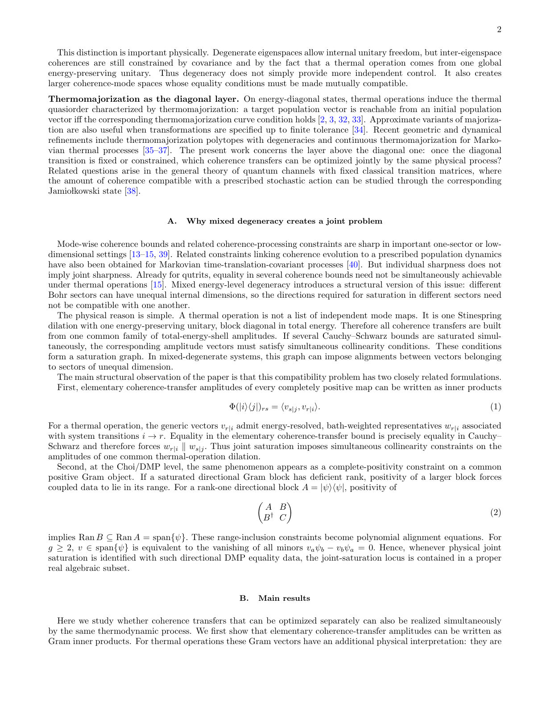
<figcaption class="paper-figure-caption"><b>Fig 1.</b> Low-resolution page preview, page 2</figcaption>
</figure>
<figure class="paper-figure-card">
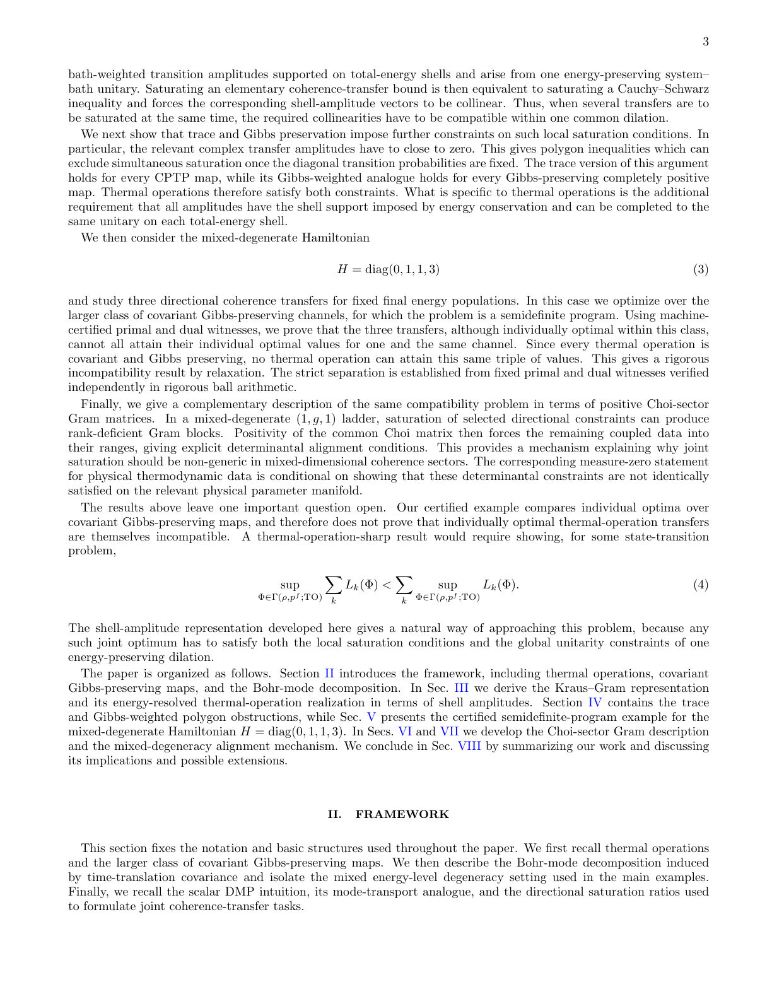
<figcaption class="paper-figure-caption"><b>Fig 2.</b> Low-resolution page preview, page 3</figcaption>
</figure>
<figure class="paper-figure-card">
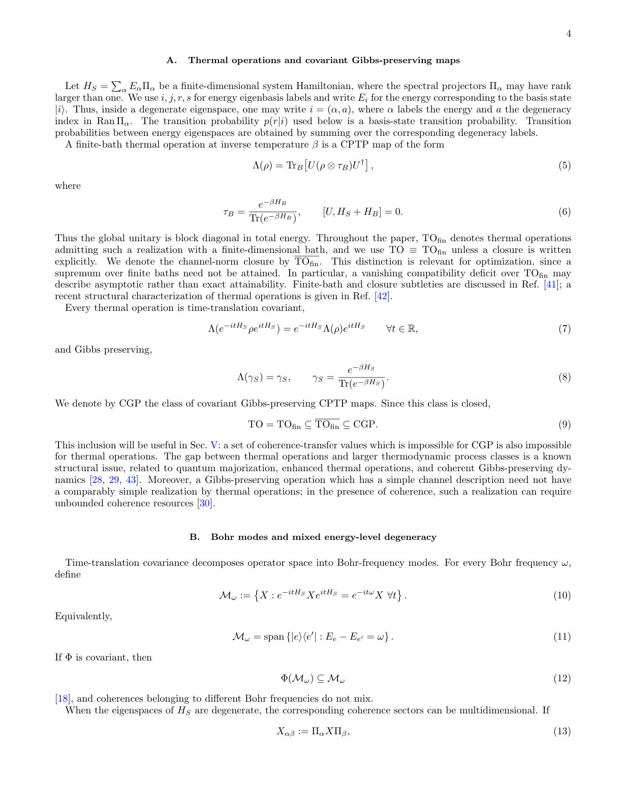
<figcaption class="paper-figure-caption"><b>Fig 3.</b> Low-resolution page preview, page 4</figcaption>
</figure>
<figure class="paper-figure-card">
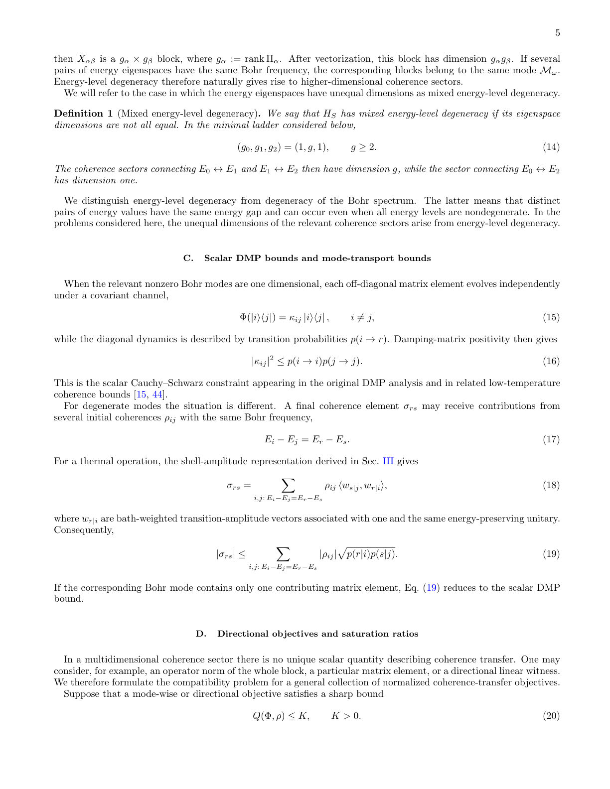
<figcaption class="paper-figure-caption"><b>Fig 4.</b> Low-resolution page preview, page 5</figcaption>
</figure>
<figure class="paper-figure-card">
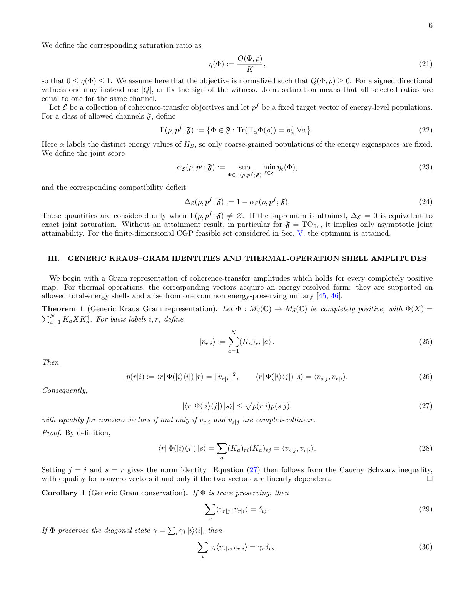
<figcaption class="paper-figure-caption"><b>Fig 5.</b> Low-resolution page preview, page 6</figcaption>
</figure>

**Summary.** This paper investigates whether multiple individually optimal coherence transfers in a quantum system can be achieved simultaneously by one single thermodynamic process. Using advanced techniques including Stinespring representations and semidefinite programming, the authors prove that this joint optimization is generally impossible due to inherent compatibility constraints imposed by thermal operations. The results highlight a fundamental limitation on what physical processes can achieve when optimizing multiple distinct quantum coherence measures.

**Why it may be interesting.** This work provides fundamental mathematical constraints on the operational capabilities of quantum systems under thermalization, showing that local optimization goals can conflict when constrained by global physical processes like energy conservation.

Detailed structure

**Main problem.** The core problem is determining if multiple coherence transfers, each individually achievable optimally by a quantum process, can be simultaneously optimized by the same single thermodynamic process.

**Main result.** The authors prove that joint optimization of these coherence transfers is generally impossible for thermal operations, even when individual optimizations are possible. This incompatibility is rigorously demonstrated using semidefinite programming and algebraic constraints.

**Method.** The analysis employs energy-resolved Stinespring representations, formulating the problem as a compatibility condition constrained by trace and Gibbs preservation laws, which leads to polygon inequalities and SDP formulations.

**Model / system.** The study uses quantum thermodynamics applied to a system described by a mixed-degenerate Hamiltonian $H=	ext{diag}(0,1,1,3)$. The processes considered are thermal operations (TO), which must be covariant and Gibbs preserving.

**Key observables.** Coherence transfer amplitudes ($\Phi(|i
angle\langle j|)$) and the feasibility of joint saturation for these transfers.

**Important parameters / regimes.** The structure of the mixed-degenerate Hamiltonian, population transfer data ($p_f$), and the constraints imposed by thermal operations (covariance, Gibbs preservation).

**Assumptions / limitations.** The analysis assumes that any physical process must be a thermal operation derived from an energy-preserving system-bath unitary.

**Paper structure.** The paper develops the problem by relating coherence transfers to inner products of bath-weighted vectors, establishing necessary conditions via Cauchy-Schwarz bounds. It then incorporates thermodynamic constraints (trace/Gibbs preservation) leading to inequalities and culminates in a rigorous SDP analysis proving incompatibility for specific cases.

Abstract

Coherences between different energy levels are strongly constrained by thermodynamics. Here we ask a related question: if several coherence transfers can be optimized separately, can they also be optimized simultaneously by the same thermodynamic process? We show that this is in general a compatibility problem. Using an energy-resolved Stinespring representation of thermal operations, we express elementary coherence-transfer amplitudes as inner products of bath-weighted vectors associated with total-energy shells. Saturation of the corresponding Cauchy--Schwarz bounds requires these vectors to be collinear. Since all transfers have to arise from the same energy-preserving system--bath unitary, such saturation conditions cannot in general be imposed independently. Trace and Gibbs preservation lead to additional phase-closure conditions and to polygon inequalities that can rule out simultaneous saturation for fixed population-transfer data.   We complement these analytic results with a rigorous computer-assisted semidefinite-program analysis. For the mixed-degenerate Hamiltonian $H=\operatorname{diag}(0,1,1,3)$, machine-certified primal and dual bounds show that no covariant Gibbs-preserving channel can simultaneously attain three individually optimal directional coherence transfers. Since every thermal operation is covariant and Gibbs preserving, the same triple of optimal values cannot be attained by a thermal operation. We further relate this incompatibility to range-inclusion constraints in Choi-sector Gram matrices for mixed-degenerate energy levels. Our results show that coherence transfers which are optimal when considered separately need not be compatible with one physical thermodynamic process. A full characterization of this incompatibility directly within thermal operations remains open.

[↑ back to top](#top)

### [Spin lifetime anisotropy in graphene induced by the SiO2 interface](http://arxiv.org/abs/2608.11615v1)

**Authors:** Aron W. Cummings, Chunhao Guo, Andrew Grieder, Shihao Tu, Mayank Gupta, Junqing Xu, Juan Marmolejo-Tejada, Yuan Ping  
**Type:** theory · **Category:** other · **PDF:** <https://arxiv.org/pdf/2608.11615v1>  
**Analysis basis:** full PDF text, analyzed in chunks
**Topic relevance:** `Keldysh / 2PI / non-Gaussian methods` **2/5** · `methods for driven-dissipative` **2/5** · `correlated / nonlocal dissipation` **1/5** · `quantum measurements` **1/5**

↔ Scroll figures horizontally

<figure class="paper-figure-card">
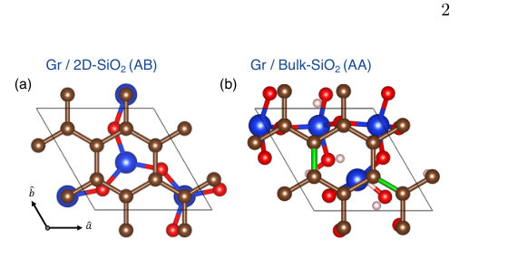
<figcaption class="paper-figure-caption"><b>Fig 1.</b> FIG. 1. (a) Crystal structure of the graphene and 2D SiO2 interface with AB stacking. (b) Crystal structure of graphene and bulk SiO2 interface with AA stacking and Si termination. The green bonds in graphene indicate those modified by prox- imity to the SiO2, see Eq. (2) and the associated discussion.</figcaption>
</figure>
<figure class="paper-figure-card">
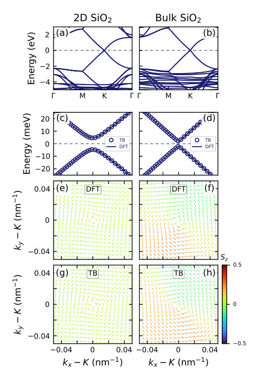
<figcaption class="paper-figure-caption"><b>Fig 2.</b> FIG. 2. Band structure and spin texture of graphene on SiO2. The left (right) column shows the case of graphene on 2D SiO2 (bulk SiO2). Panels (a) and (b) show the DFT band structure over the Brillouin zone, while (c) and (d) show a zoom of the bands around the graphene Dirac point, including the fit to the TB model. Panels (e) and (f) show the DFT spin texture of the the highest valence band of graphene, while (g) and (h) show the spin texture calculated from the TB model.</figcaption>
</figure>
<figure class="paper-figure-card">
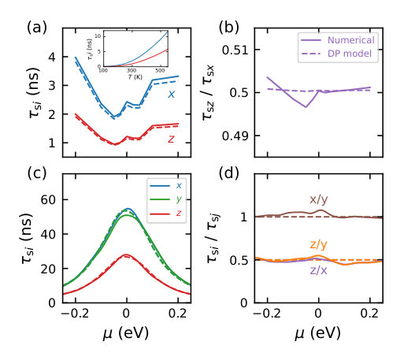
<figcaption class="paper-figure-caption"><b>Fig 3.</b> FIG. 3. (a) In-plane and out-of-plane spin lifetime as a func- tion of chemical potential for graphene on 2D SiO2, with re- laxation driven by electron-phonon scattering at 300 K. Solid lines are from first-principles real-time dynamics, and dot- ted lines are calculated lifetimes assuming DP spin relaxation from Eq. (17) with ab initio parameters. The lifetime as a function of temperature-dependent (at µ = 25 meV above the CB minimum) is shown in the inset. (b) The corresponding spin lifetime anisotropy. (c) Spin lifetime arising from scatter- ing by long-range electron-hole puddles, calculated with the real-space TB approach. (d) The corresponding anisotropies.</figcaption>
</figure>
<figure class="paper-figure-card">

<figcaption class="paper-figure-caption"><b>Fig 4.</b> FIG. 4. (a) In-plane and out-of-plane spin lifetime as a func- tion of chemical potential for graphene on bulk SiO2, with re- laxation driven by oxygen vacancies, and (b) the correspond- ing spin lifetime anisotropies. (c) Spin lifetime arising from scattering by long-range electron-hole puddles that do not in- duce intervalley scattering, calculated with the TB model, and (d) the corresponding spin lifetime anisotropies. (e) Spin lifetime arising from short-range electron-hole puddles that induce intervalley scattering, and (f) the corresponding spin lifetime anisotropies.</figcaption>
</figure>
<figure class="paper-figure-card">
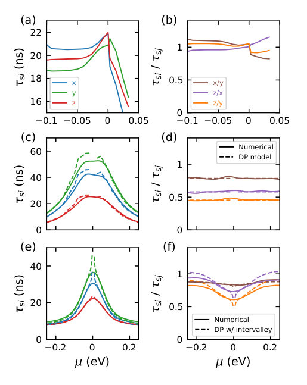
<figcaption class="paper-figure-caption"><b>Fig 5.</b> Figure 4(a) shows the spin lifetime as a function of chemical potential, arising from scattering by oxygen va- cancies in the SiO2 substrate. Comparing to Fig. 3, the spin lifetime is qualitatively different for graphene on 2D SiO2. Here, τs is relatively independent of chemi- cal potential, only varying by around 20%. Meanwhile, as shown in the SM [45], the momentum relaxation time varies strongly over this range of µ, by more than a factor of 6, suggesting that spin relaxation and charge scatter- ing are effectively decoupled. We examine the mechanism for spin relaxation in further detail in Sec. III D below. Figure 4(b) shows the spin lifetime anisotropy aris- ing from oxygen vacancies,...</figcaption>
</figure>

**Summary.** This paper uses advanced numerical simulations to investigate how SiO2 substrates modify spin transport in graphene. It finds that the interface dictates a complex spin texture, leading to measurable spin lifetime anisotropies depending on whether the substrate is modeled as 2D or bulk. The results offer critical guidance for interpreting experimental measurements and engineering better spintronic materials.

**Why it may be interesting.** This work provides detailed insights into spin relaxation in graphene interfaces, which is crucial for designing functional spintronic devices by understanding substrate-induced spin-orbit coupling effects beyond simple models.

Detailed structure

**Main problem.** The study aims to understand how common dielectric substrates, specifically SiO2, influence the spin transport properties of graphene for advancing spintronic technologies.

**Main result.** The substrate induces a complex spin texture beyond the standard Rashba model; 2D SiO2 yields $\zeta=1/2$, while bulk SiO2 leads to anisotropic relaxation ($\zeta > 1/2$), and oxygen vacancies show distinct EY-like behavior.

**Method.** The research employs comprehensive numerical simulations, including first-principles density matrix dynamics (FPDMD) and tight-binding (TB) transport simulations.

**Model / system.** The physical system is graphene placed on SiO2 substrates (both 2D and bulk). The modeling incorporates Hamiltonian terms for nearest-neighbor hopping, Rashba SOC, electron-phonon scattering, impurity scattering, and electrostatic disorder.

**Key observables.** Spin texture, spin relaxation process, and the spin lifetime anisotropy ($\zeta = \tau_{s_z}/\tau_{s_x}$).

**Important parameters / regimes.** The substrate type (2D vs. bulk SiO2), scattering mechanisms (e-ph, impurity), and disorder strength are critical parameters.

**Assumptions / limitations.** The analysis assumes that the standard Rashba model is insufficient to describe spin relaxation at this ubiquitous interface; approximations include using RTA for charge scattering in some analyses.

**Figures summary.** Figures illustrate crystal structures (2D vs. bulk SiO2), DFT band/spin textures, and scaling plots comparing spin relaxation rates and anisotropy ($\zeta$) under different conditions.

**Paper structure.** The paper progresses by establishing the physical problem, detailing advanced simulation methods (FPDMD, TB modeling), presenting results for 2D and bulk substrates separately, analyzing specific scattering mechanisms (vacancies vs. disorder), and concluding with a comparative summary of the observed anisotropy.

Abstract

Understanding how common dielectric substrates influence the spin transport properties of graphene is essential for advancing graphene-based spintronic technologies. Here we use a comprehensive set of numerical simulations to reveal how a SiO$_2$ substrate modifies the spin texture and governs spin relaxation in graphene. Using first-principles density matrix dynamics simulations, as well as tight-binding (TB) transport simulations, we quantify the effects of electron-phonon scattering, impurity scattering, and electrostatic disorder on the spin relaxation process. We find that a 2D SiO$_2$ substrate induces a predominantly Rashba-type helical spin texture in graphene, leading to a spin lifetime anisotropy of 1/2. Meanwhile, bulk SiO$_2$ breaks in-plane symmetry in graphene, leading to anisotropic in-plane and out-of-plane components in the spin texture, which we capture with a newly-developed TB model of graphene. Transport simulations under realistic disorder conditions reveal a spin lifetime anisotropy between 0.5 and 1, similar to what is seen in measurements of graphene spin valves on a SiO$_2$ substrate. Our results reveal a more complex picture of spin relaxation at the ubiquitous graphene/SiO$_2$ interface, beyond the standard Rashba model, providing critical insight for interpreting experiments and guiding substrate engineering for graphene spintronics.

[↑ back to top](#top)

### [Do Not Let CNOTs Overwhelm the Decoder: Scheduling Transversal Gates for Fast FTQC](http://arxiv.org/abs/2608.11719v1)

**Authors:** Shota Ikari, Yuga Hirai, Yasunari Suzuki, Hiroshi Nakamura, Yosuke Ueno  
**Type:** theory · **Category:** quantum information and computing · **PDF:** <https://arxiv.org/pdf/2608.11719v1>  
**Analysis basis:** full PDF text, analyzed in chunks
**Topic relevance:** `QC/QI experiment` **2/5** · `analog quantum simulation` **1/5** · `correlated / nonlocal dissipation` **1/5** · `quantum measurements` **1/5**

↔ Scroll figures horizontally

<figure class="paper-figure-card">
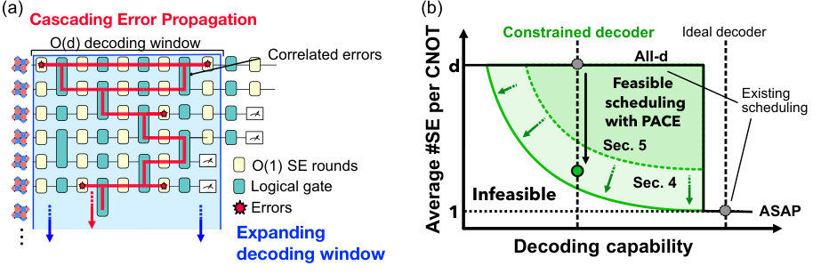
<figcaption class="paper-figure-caption"><b>Fig 1.</b> Figure 1: Motivation of PACE. (a) Dense TCNOT scheduling enlarges the decoding window, rapidly increasing decoder workload. (b) PACE schedules TCNOTs as densely as decoder capacity allows, balancing quantum acceleration with decoding capability.</figcaption>
</figure>
<figure class="paper-figure-card">
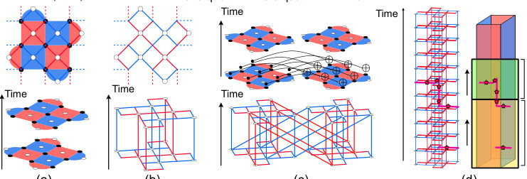
<figcaption class="paper-figure-caption"><b>Fig 2.</b> Figure 2: (a) A distance-three rotated surface code. (b) A DEM for a memory experiment. (c) A TCNOT can flip more than two detectors, which forms hyperedges in the corresponding DEM. (d) The diagram of window decoding.</figcaption>
</figure>
<figure class="paper-figure-card">
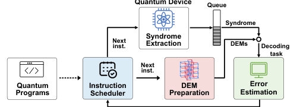
<figcaption class="paper-figure-caption"><b>Fig 3.</b> Figure 3: Execution pipeline of the FTQC system considered in this study. The highlighted components indicate the scope of this work.</figcaption>
</figure>
<figure class="paper-figure-card">

<figcaption class="paper-figure-caption"><b>Fig 4.</b> Figure 3 illustrates the execution pipeline of an FTQC system. The instruction scheduler issues logical instructions according to circuit dependencies and decoded feedback. While the quantum device con- tinuously performs SE, the classical pipeline prepares window-level DEMs and decodes the resulting detection events. The estimated errors are fed back to the scheduler to support classically controlled operations. Because the quantum and classical pipelines operate concurrently, FTQC throughput is limited by the slower pipeline. DEM preparation and decoding must therefore sustain the rate at which SE generates new decoding tasks; otherwise, the tasks</figcaption>
</figure>
<figure class="paper-figure-card">
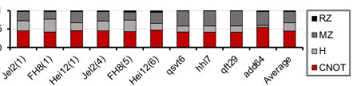
<figcaption class="paper-figure-caption"><b>Fig 5.</b> Figure 5: Instruction breakdown of the benchmark circuits in Table 2, using the instruction set in Fig. 4. The resource- state preparations are omitted because they are not primitive operations and do not lie on the execution critical path.</figcaption>
</figure>

**Summary.** This paper addresses the bottleneck in fast Fault-Tolerant Quantum Computation caused by TCNOT gates creating overly complex error patterns that overwhelm classical decoders. The proposed framework, PACE, mitigates this by implementing advanced decoding strategies and scheduling TCNOTs based on real-time decoder capacity rather than just quantum speedup.

**Why it may be interesting.** While focused on computation theory, the explicit mention of physical platforms like neutral atoms and the need to manage complex, correlated errors touches upon the practical limitations of quantum hardware interfacing with classical control electronics, which is relevant for AMO physicists working on scalable quantum devices.

Detailed structure

**Main problem.** The primary challenge is developing a scheduling strategy for Fault-Tolerant Quantum Computation (FTQC) that maximizes the speedup from Transversal CNOT (TCNOT) gates without overwhelming the classical decoding resources.

**Main result.** The authors introduce PACE, a decoder-aware framework that successfully balances TCNOT concurrency against the limitations of classical decoding capacity by employing novel scheduling and decoding techniques.

**Method.** PACE combines three complementary techniques—Hybrid Window Decoding, DEM Stitch, and Sub-window Parallel Decoding—to mitigate decoder costs before performing an optimized, resource-aware TCNOT schedule.

**Model / system.** The work is situated within the context of surface code quantum error correction. The system relies on syndrome extraction rounds mediated by TCNOT gates, which generate complex, non-graphlike Detector Error Models (DEMs) due to correlated errors across patches.

**Key observables.** The trade-off between quantum acceleration (TCNOT concurrency) and classical decoding cost (latency, memory requirements).

**Important parameters / regimes.** Code distance ($d$), TCNOT gate density, and the computational capacity of the classical decoder.

**Assumptions / limitations.** It is assumed that the practical benefit of TCNOTs is limited not only by quantum hardware but critically by the classical decoding and DEM-compilation capacity.

**Figures summary.** Figure 1 illustrates the trade-off, showing how dense scheduling leads to infeasible decoding windows compared to PACE's balanced approach. Figure 2 details how TCNOTs create hyperedges that break the standard graphlike structure of the DEM.

**Paper structure.** The paper first establishes the quantum acceleration benefit of TCNOTs but then pivots to detailing the classical bottleneck caused by error correlation and exponential DEM growth. It then introduces PACE, describing its three constituent decoder-side techniques before presenting the final scheduler that optimizes concurrency against resource limits.

Abstract

Transversal CNOT (TCNOT) gates can accelerate fault-tolerant quantum computation (FTQC) in the surface code by reducing the number of syndrome extraction rounds required between logical operations from $O(d)$ to $O(1)$. This is particularly attractive for quantum platforms with long-range connectivity, such as neutral atoms. However, dense TCNOT schedules substantially increase the classical decoding workload. TCNOTs propagate errors across multiple surface-code patches, enlarging the spatiotemporal region that must be decoded jointly. Consequently, denser TCNOT schedules increase decoding latency and memory requirements and potentially exceed available decoder capacity. Moreover, because the detector error model (DEM) of each decoding window depends on the TCNOT schedule, exhaustively precomputing all possible window-level DEMs is infeasible, requiring just-in-time (JIT) DEM compilation. Thus, the practical benefit of TCNOT gates is limited not only by quantum hardware performance but also by classical decoding and DEM-compilation capacity.   We introduce PACE, a decoder-aware scheduling framework for TCNOT-based FTQC. PACE first mitigates the decoder-side costs of aggressive TCNOT scheduling through three complementary techniques. Hybrid Window Decoding assigns different decoders for each decoding window according to its DEM structure. DEM Stitch generates schedule-specific window-level DEMs just in time by assembling reusable precompiled fragments. Sub-window Parallel Decoding decomposes large windows into smaller sub-windows with graph-coloring formulation. Building on these techniques, PACE then performs decoder-aware scheduling to maximize TCNOT concurrency within the available decoder resources. Our evaluation shows the trade-off between quantum acceleration and classical decoding cost, revealing the limitations of current decoding systems for TCNOT-based FTQC.

[↑ back to top](#top)

### [Quantum Channel-Induced Geometry of the Uhlmann Phase in Qubit Systems](http://arxiv.org/abs/2608.11714v1)

**Authors:** F. Nieto-Guadarrama, F. Rojas, J. Villavicencio, Jesús A. Maytorena  
**Type:** theory · **Category:** quantum information and computing · **PDF:** <https://arxiv.org/pdf/2608.11714v1>  
**Analysis basis:** full PDF text, analyzed in chunks
**Topic relevance:** `driven-dissipative phase transition` **2/5** · `correlated / nonlocal dissipation` **1/5** · `non-equilibrium universality` **1/5** · `quantum measurements` **1/5**

↔ Scroll figures horizontally

<figure class="paper-figure-card">
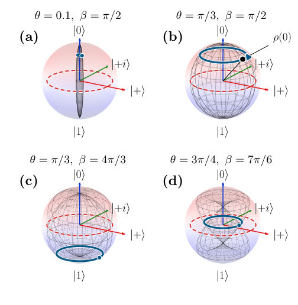
<figcaption class="paper-figure-caption"><b>Fig 1.</b> FIG. 1. Bloch-vector trajectories generated by the NCG chan- nel at the (θ, β) indicated above each panel. The mesh depicts the closed surface ⃗r(α, χ) of Eq. (2), swept by α, χ ∈[0, 2π): a thin spindle in (a), a ellipsoid in (b), and folded surfaces with self-intersections in (c) and (d). In every panel the thick dark-blue curve is the representative Uhlmann cycle ⃗r(π/4, χ), traversed counterclockwise when viewed from +z; in (a) it is nearly point-like, the transverse radius s∥being strongly suppressed at small θ. The dot marks the reference point ρ(χ = 0) and the arrowhead the sense of increasing χ, both labeled only in (b). The red dashed circle of radius √</figcaption>
</figure>
<figure class="paper-figure-card">
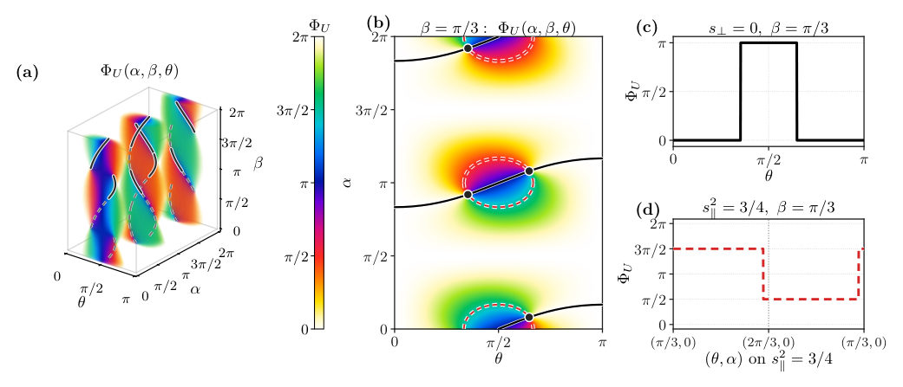
<figcaption class="paper-figure-caption"><b>Fig 2.</b> FIG. 2. (a) ΦU(α, β, θ) over the parameter cube; values near 0 and 2π are rendered transparent to reveal the interior structure; dark neutral curves with thin white halos mark the critical locus. (b) Slice at β = π/3 in the (θ, α) plane: solid black curves mark s⊥= 0, red dashed loops mark s2 ∥= 3/4, and their intersections, shown as dark filled circles with thin white outlines, are the phase vortices. (c), (d) ΦU along s⊥= 0 and s2 ∥= 3/4, respectively, in the same slice; the discontinuities occur at the intersections of the two loci and thus locate the vortices. The lower axis in (d) gives the corresponding (θ, α) coordinates along the loop.</figcaption>
</figure>
<figure class="paper-figure-card">
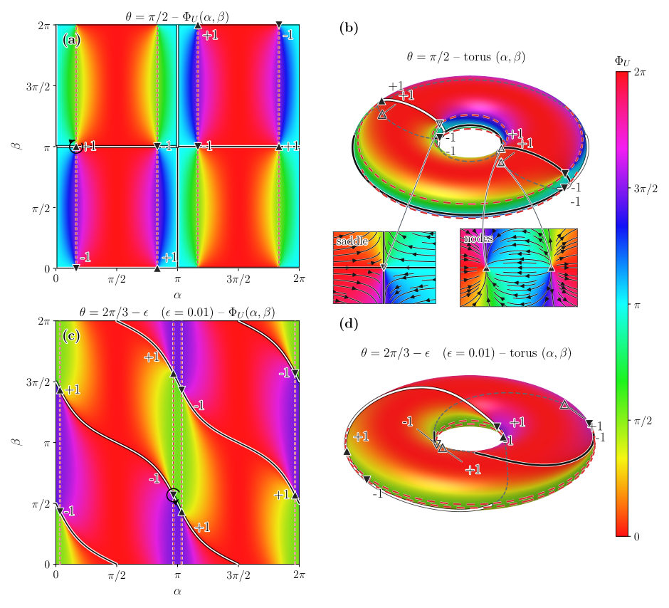
<figcaption class="paper-figure-caption"><b>Fig 3.</b> FIG. 3. Uhlmann phase ΦU(α, β) generated by the NCG channel at θ = π/2 [(a), (b)] and θ = 2π/3 −ϵ with ϵ = 0.01 [(c), (d)], on the fundamental square of the channel parameters [(a), (c)] and on the covering torus T 2 [(b), (d)]. The color scale is cyclic: ΦU = 0 and ΦU = 2π share the same color. Solid black and white curves are the two branches of s⊥= 0, red dashed curves are s2 ∥= 3/4, and their crossings are the vortices, where ΦU is undefined. Winding numbers [+1, −1] are marked respectively by [▲, ▼] ([△, ▽]) on the visible (hidden) portion of the torus [(b), (d)]. The circular arrow gives the sense in which ΦU circulates. The insets in (b) show G as a vector field: by the Jacobian of...</figcaption>
</figure>
<figure class="paper-figure-card">
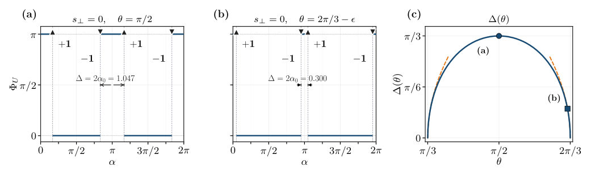
<figcaption class="paper-figure-caption"><b>Fig 4.</b> FIG. 4. Uhlmann phase ΦU as a function of α along the locus s⊥= 0, for (a) θ = π/2 and (b) θ = 2π/3 −ϵ, with ϵ = 0.02. The ΦU = π plateau is bounded by [+1, −1] vortices marked respectively by [▲, ▼]; neutral vertical dashed lines indicate their positions. Its width equals the vortex separation ∆(θ), decreasing from ∆= π/3 ≃1.047 in (a) to ∆≃0.300 in (b). Panel (c) shows the exact separation from Eq. (8) (solid blue curve), and the near-edge square-root law ∆(θ) ∝(θ −θc)1/2 (orange dashed curves). The filled markers identify the parameters used in panels (a) and (b), making the pairwise vortex coalescence directly visible.</figcaption>
</figure>

**Summary.** The paper analyzes the geometry of the Uhlmann phase generated when qubits interact with specific non-coherence-generating quantum channels. It demonstrates that this interaction creates localized vortex singularities in the parameter space, unlike previous models. This finding highlights a mechanism where environmental coupling generates measurable geometric phases through defect dynamics.

**Why it may be interesting.** This work provides a detailed geometric understanding of quantum information flow through noisy channels, offering insights into how environmental coupling (the channel parameters) can generate measurable geometric phases locally, which is crucial for designing robust quantum protocols.

Detailed structure

**Main problem.** The study investigates the geometry of the Uhlmann phase induced by quantum channels, contrasting this with previous analyses focused on thermal transitions driven by Hamiltonian variations.

**Main result.** A cyclically controlled non-coherence-generating channel induces a nontrivial Uhlmann phase characterized by local vortex–antivortex structures on the parameter torus. These defects nucleate and annihilate in pairs following a square-root coalescence law, contrasting with global winding number jumps.

**Method.** The analysis uses Bloch-space geometry and calculates the Uhlmann phase via cyclic holonomy amplitudes derived from the channel parameters. Topological defect identification relies on solving for vanishing points of this amplitude.

**Model / system.** The system is modeled using qubit systems undergoing evolution governed by a Non-Coherence-Generating (NCG) quantum channel, whose parameters drive the cycle in the space of CPTP maps.

**Key observables.** Uhlmann phase ($\Phi_U$), topological defects (vortices/antivortices), and the net topological charge.

**Important parameters / regimes.** Channel parameters $(\mu, 
u, \chi)$, input-state orientation approaching critical values, and the parameter regime $	heta \in [\pi/3, 2\pi/3]$ for defect existence.

**Assumptions / limitations.** The analysis is restricted to NCG channels (Kraus rank two), and the initial state is assumed pure, carrying no intrinsic geometric phase.

**Figures summary.** Figure 1 shows Bloch-vector trajectories tracing closed loops. Figure 2 maps $\Phi_U$ over the parameter cube, highlighting vortices at specific loci intersections. Figure 3 and 4 visualize these phase jumps and defect structures on the parameter torus.

**Paper structure.** The paper establishes the problem by analyzing the Uhlmann phase geometry induced by NCG channels. It develops the mathematical framework using Bloch-space connections to locate singularities (vortices) in the channel parameter space, demonstrating their dynamics via coalescence laws while confirming zero net topological charge.

Abstract

We show that a cyclically controlled non-coherence-generating channel supplies a two-parameter family of closed Bloch trajectories, absent in the single-parameter (temperature) cycles of the thermal Uhlmann literature, whose associated Uhlmann phase develops a genuine vortex--antivortex structure on the channel-parameter torus. A qubit prepared in a pure state, which carries no geometric phase of its own, acquires a nontrivial Uhlmann phase, obtained here in closed form, purely from a closed loop in the space of the native quantum channel parameters. The net topological charge of these defects is constrained to zero by the Poincaré--Hopf theorem. As the input-state orientation approaches its critical values, the defects merge and annihilate in pairs following a square-root coalescence law. This defect dynamics drives local geometric transitions, a mechanism that contrasts with single-parameter thermal Uhlmann transitions, where a global quantized winding jumps as a bulk invariant.

[↑ back to top](#top)

### [Hamilton-Zero: A Neural Tensor-Network Foundation Model for Ground States of Arbitrary Quadratic Qubit Hamiltonians](http://arxiv.org/abs/2608.11911v1)

**Authors:** Timothy Heightman, Elena Orlova, Philip Mantrov, Aleksei Ustimenko  
**Type:** theory · **Category:** disordered systems and neural networks · **PDF:** <https://arxiv.org/pdf/2608.11911v1>  
**Analysis basis:** full PDF text, analyzed in chunks
**Topic relevance:** `analog quantum simulation` **2/5** · `driven-dissipative phase transition` **1/5** · `methods for driven-dissipative` **1/5**

↔ Scroll figures horizontally

<figure class="paper-figure-card">
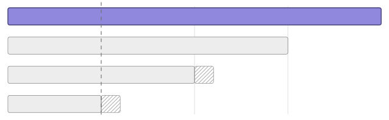
<figcaption class="paper-figure-caption"><b>Fig 1.</b> Figure 1: The generalisation surface of foundation wavefunction models. Each bar is one pretrained- model family. Its length is how the model varies its coupling across its training and evaluation corpus, with the axes ordered by structural depth. Solid bars mark demonstrated generalisation, hatched bars partial or model-dependent reach, with each reviewed in the main text.</figcaption>
</figure>
<figure class="paper-figure-card">
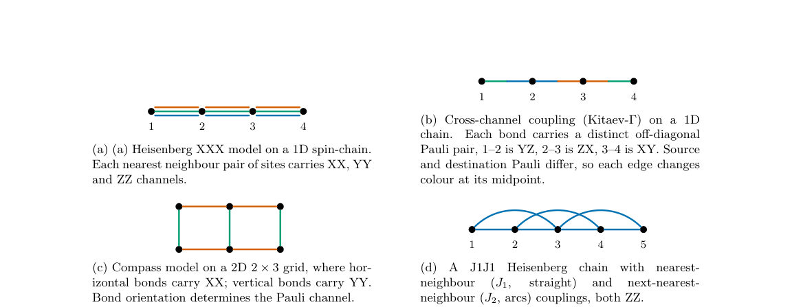
<figcaption class="paper-figure-caption"><b>Fig 2.</b> Figure 2: Four interaction-graph examples drawn from the training data. The colour map X, Y, Z shows different types of edges.</figcaption>
</figure>
<figure class="paper-figure-card">
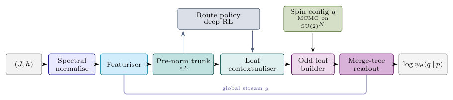
<figcaption class="paper-figure-caption"><b>Fig 3.</b> Figure 3: Hamilton-Zero information flow. The Hamiltonian (J, h) is spectrally normalised, featurised in polar form, and propagated through the trunk; a route policy conditioned on the trunk’s outputs permutes sites and padding slots before the leaf contextualiser; the spin configuration q enters only at the odd leaf builder, enforcing per-site oddness before the shared rank-four merge tree returns log ψθ(q | p). The rail beneath the pipeline is the global stream g, refreshed at every stage on the unit-RMS sphere. Component diagrams are SM §S2.</figcaption>
</figure>
<figure class="paper-figure-card">
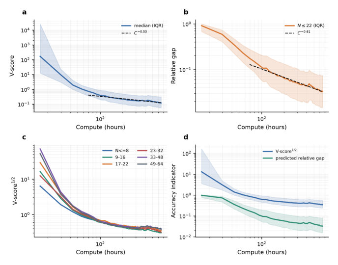
<figcaption class="paper-figure-caption"><b>Fig 4.</b> Figure 4: Compute scaling of variance and variational energy error through step 280 000. (a) V-score decreases approximately as V ∝C−0.53 after the initial transient. (b) The observed relative gap for ED-covered systems decreases approximately as C−0.61. (c) V 1/2 approaches a common late-time scale across the six system-size bands, showing that the normalization removes most of the extensive size dependence. (d) V 1/2 and the predicted relative gap decrease together over the full 5,000-system dataset, connecting variance reduction to improved inferred accuracy. Compute is cumulative execution time across eight NVIDIA H200 GPUs. The V-score is V = N Var(EL)/(E −E∞)2, with E∞= 0 here, and is...</figcaption>
</figure>
<figure class="paper-figure-card">
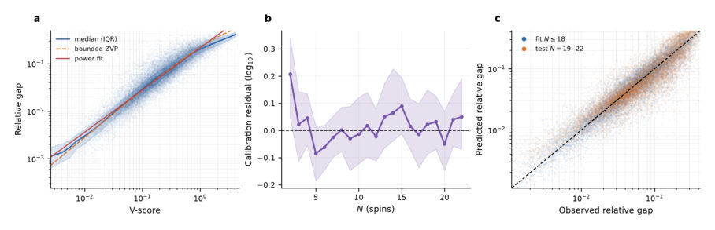
<figcaption class="paper-figure-caption"><b>Fig 5.</b> Figure 5: Zero-variance calibration and held-out size validation. (a) Relative gap against V-score, both defined as in Fig. 4. Here we show the median and IQR as a blue line and shaded blue region, with a bounded zero-variance principle in dashed orange, obtained from q = (E −EED)/|E| = κV with κ = 0.2825 and r = q/(1 + q); a free robust fit gives r ∝V 0.89. (b) The median calibration residual shows no monotonic drift with N, supporting transfer across system size. (c) Fit of gap prediction showing sizes N ≥18 follow the same relationship as 19 ≤N ≤22. Blue points belong to the fitted N ≤18 population and orange points to the unseen N = 19–22 population. Their overlap around the one-to-one...</figcaption>
</figure>

**Summary.** The paper introduces Hamilton-Zero, a massive foundation model designed to calculate ground states for arbitrary qubit Hamiltonians. It achieves this by reformulating the problem as variational optimization on a continuous mathematical manifold defined over SU(2)^N. This allows the model to generalize robustly across vastly different system sizes and interaction topologies, promising quantum advantage in simulating complex materials.

**Why it may be interesting.** This work represents a major convergence point between quantum simulation and deep learning, offering a scalable, data-driven approach that bypasses the explicit exponential complexity limitations of traditional quantum state representations for many-body physics.

Detailed structure

**Main problem.** The core problem is computing the ground state energy of arbitrary quadratic qubit Hamiltonians for quantum many-body systems.

**Main result.** The authors introduce 'Hamilton-Zero,' a foundation model capable of effectively amortizing ground state computation across an entire, universal set of Hamiltonians, achieving high accuracy on very large, complex systems.

**Method.** They formulate the problem as manifold variational optimization over centrally odd scalar functions on SU(2)^N, replacing explicit amplitudes with continuous manifold representations acted upon by Lie derivatives.

**Model / system.** The model targets spin-1/2 quantum systems governed by arbitrary quadratic qubit Hamiltonians. It uses a neural tensor-network foundation model architecture with $\sim 0.5$B parameters.

**Key observables.** Variational energy ($\langle\psi_	heta|\hat{H}|\psi_	heta
angle / \langle\psi_	heta|\psi_	heta
angle$), which serves as an upper bound on the true ground-state energy $E_0$.

**Important parameters / regimes.** The model is trained/tested up to system sizes of 8100 qubits, with pretraining covering hundreds of thousands of varied Hamiltonians.

**Assumptions / limitations.** The variational principle is preserved by constraining the wavefunction to be a centrally odd scalar function on SU(2)^N, which guarantees it lies in the physical spin-1/2 sector.

**Figures summary.** Figure 1 illustrates the generalization surface of foundation wavefunction models, demonstrating Hamilton-Zero's superior ability to vary system topology compared to previous methods limited to varying only coefficients on a fixed graph.

**Paper structure.** The paper introduces the problem and the novel manifold variational formulation. It details the training procedure using large datasets and advanced optimizers (KFAC extension). Results demonstrate generalization across diverse Hamiltonians and scaling to very large systems, comparing performance against established methods like tensor networks.

Abstract

A central promise of useful quantum advantage is the ability to compute ground states of Hamiltonian systems beyond the reach of classical simulation methods. Here we demonstrate that this problem can be effectively amortized across an arbitrary and universal set of Hamiltonians by a foundation model with $\sim0.5$B variational parameters, trained with contemporary techniques from large language models and deep reinforcement learning. To do this, we formulate $\text{spin-}1/2$ quantum ground-state learning as manifold variational optimisation over centrally odd scalar functions on $\mathrm{SU}(2)^N$. This replaces explicit Hilbert-space vector amplitudes with manifold functions on which the Hamiltonian acts through Lie derivatives, evaluated by custom automatic differentiation primitives. We prove that the resulting variational principle on this manifold preserves the $\text{spin-}1/2$ sector's ground-state upper bound using the Peter-Weyl theorem, then pre-train our foundation model on a dataset of hundreds of thousands of different Hamiltonian systems, varying the connection topology, system size, interaction types and strengths, bringing together a century of many-body literature. Using a novel $\mathrm{SU}(2)$ replica-exchange Langevin sampler and sharded natural-gradient optimisation, we train our model with our own extension of the Kronecker-Factored Approximate Curvature (KFAC) optimiser on system sizes up to 64 qubits. On a held-out generalisation dataset, we fine-tune our model on system sizes of up to 1024 qubits, and evaluate on systems up to 8100 qubits.

[↑ back to top](#top)

### [Benchmarking Quantum and Classical Machine Learning Models on Oncological Data](http://arxiv.org/abs/2608.11373v1)

**Authors:** Sydney Leither, Thomas Lubinski, Michael Kubal, Sonika Johri  
**Type:** both · **Category:** other · **PDF:** <https://arxiv.org/pdf/2608.11373v1>  
**Analysis basis:** full PDF text, analyzed in chunks
**Topic relevance:** `QC/QI experiment` **2/5** · `quantum measurements` **1/5**

↔ Scroll figures horizontally

<figure class="paper-figure-card">
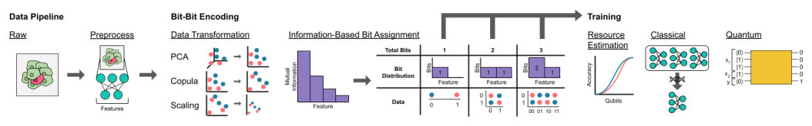
<figcaption class="paper-figure-caption"><b>Fig 1.</b> Fig. 1. The data processing steps for the experiments in the paper. First, the “data pipeline” step optionally applies feature selection or feature reduction preprocessing to reduce noise in the dataset. Then, the “bit-bit encoding” step makes the dataset quantum-ready by applying classical data transformations to further reduce noise before discretizing the data into bits using an information-based bit assignment. Finally, the “training” steps trains models on the dataset discretized into different numbers of bits.</figcaption>
</figure>
<figure class="paper-figure-card">
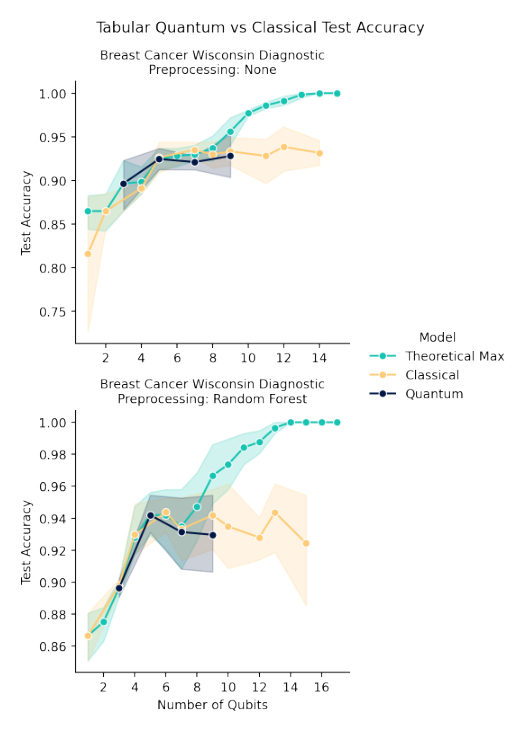
<figcaption class="paper-figure-caption"><b>Fig 2.</b> Fig. 2. The test accuracy and standard error of the theoretical, AutoML- optimized classical, and quantum models trained on the bit-bit encoded WDBC dataset with and without random forest preprocessing. The x-axis is the number of bits allocated to the dataset features. We see that on both the original and preprocessed dataset, the quantum and classical models fail to consistently reach the estimated maximum test accuracy and the quantum model performance is always within the standard error of the classical model performance.</figcaption>
</figure>
<figure class="paper-figure-card">
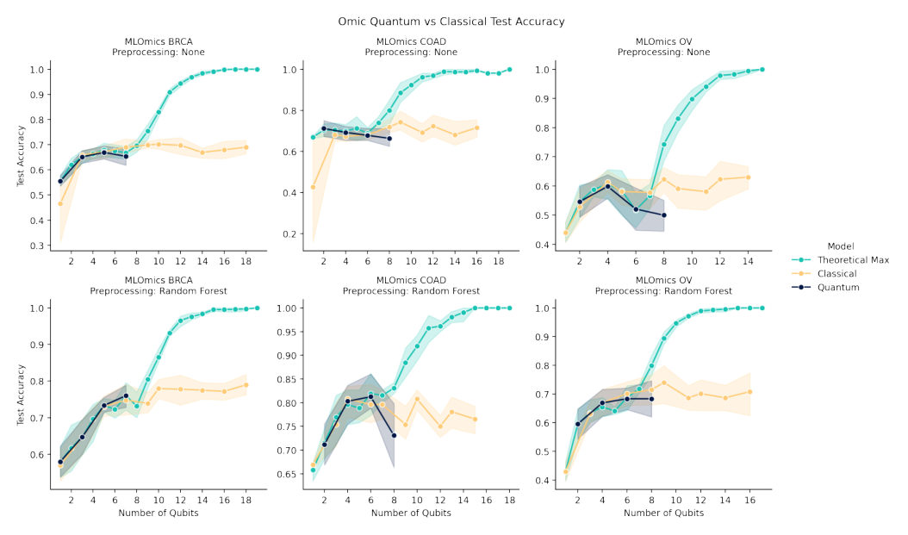
<figcaption class="paper-figure-caption"><b>Fig 3.</b> Fig. 3. The test accuracy of the theoretical, AutoML-optimized classical, and quantum models trained on the bit-bit encoded omics datasets (columns: BRCA, COAD, OV) without preprocessing (top row) and with random forest preprocessing (bottom row). In most cases, both models stop reaching the theoretical test accuracy at eight qubits, and the quantum model performance is within the standard error of the classical model performance. The classical models trained on the preprocessed datasets plateau at a higher accuracy than the classical models trained on the original datasets.</figcaption>
</figure>
<figure class="paper-figure-card">
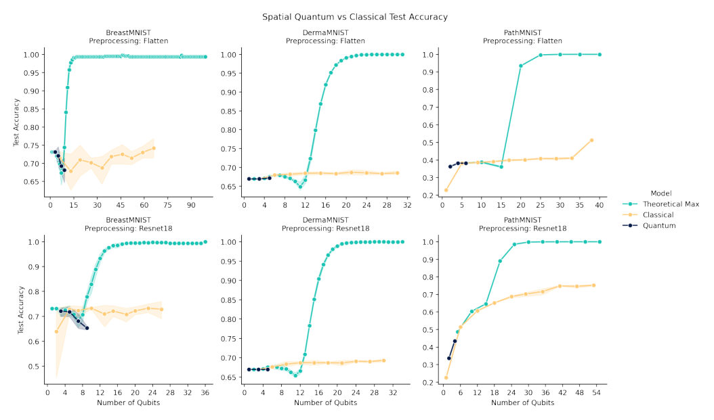
<figcaption class="paper-figure-caption"><b>Fig 4.</b> Fig. 4. The test accuracy of the theoretical, AutoML-optimized classical, and quantum models trained on the bit-bit encoded spatial datasets (columns: BreastMNIST, DermaMNIST, PathMNIST) with flattening (top row) and with ResNet18 preprocessing (bottom row). The theoretical maximum test accuracy reaches 100% at a much larger number of qubits than the previous datasets. The spatial datasets exhibit unique behaviors in test accuracy differences between models trained on the flattened datasets compared to the models trained on the ResNet18 preprocessed datasets.</figcaption>
</figure>
<figure class="paper-figure-card">
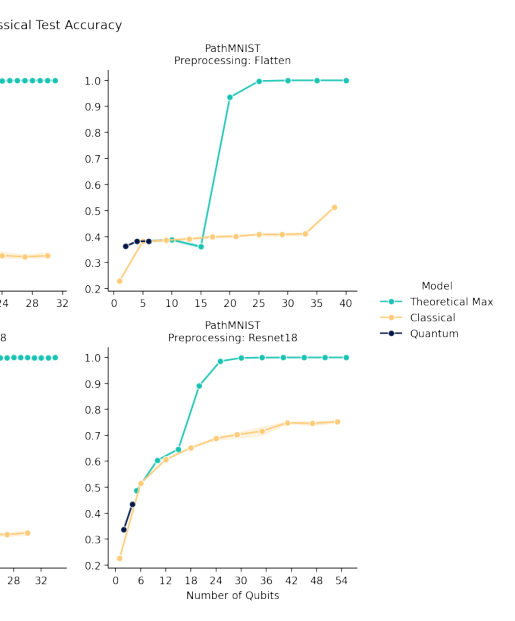
<figcaption class="paper-figure-caption"><b>Fig 5.</b> Figure 4 shows the overlaid test accuracy of the theo- retical, classical, and quantum models on the flattened and ResNet18 preprocessed bit-bit encoded spatial datasets. Note that some quantum models did not finish running within the time frame so higher-qubit performances are not available. The dip in the theoretical accuracy, which is not seen in the other datasets, suggests that there may be more optimal ways to encode such data to be explored in future work. As discussed in Section III-A, the classical models can achieve higher accuracy than the theoretical maximum test accuracy because the classical model train accuracy does not reach the theoretical maximum train accuracy. We see...</figcaption>
</figure>

**Summary.** This work systematically benchmarks Quantum Machine Learning against classical methods using cancer datasets. The authors conclude that current benchmark data do not show a quantum advantage, establishing a rigorous framework for future research. They argue that meaningful progress requires analyzing significantly higher-dimensional and more biologically complex datasets.

**Why it may be interesting.** While focused on ML applications rather than fundamental physics, the rigorous framework developed for quantifying 'quantum advantage' via resource estimation is highly relevant to assessing computational feasibility in complex physical simulations or open quantum systems modeling.

Detailed structure

**Main problem.** The paper benchmarks quantum vs. classical machine learning models for cancer diagnosis using complex biological data, aiming to determine if a practical quantum advantage exists.

**Main result.** The authors found no evidence of quantum advantage when testing on standard oncological benchmark datasets, suggesting the need for higher-dimensional, more realistic data.

**Method.** They developed a rigorous benchmarking methodology based on the Red Cedar framework, comparing performance across tabular, omics, and spatial datasets using both classical AutoML networks and QML models.

**Model / system.** The system involves Quantum Machine Learning (QML) models utilizing parameterized quantum circuits, benchmarked against optimized classical neural networks. The analysis uses specific encoding schemes like bit-bit encoding for data representation on qubits.

**Key observables.** Performance comparison between quantum and classical models; the resource estimation metric $Q_{dataset}(1.0)$; classification accuracy.

**Important parameters / regimes.** Number of qubits ($Q_n, Q_c$); number of parameters per layer; dimensionality reduction techniques (PCA, Copula transform).

**Assumptions / limitations.** The theoretical test accuracy metric is noted to be unrealistically optimistic as it cannot account for unseen test samples. All quantum results were run on a simulator.

**Figures summary.** Figure 1 illustrates the data processing pipeline: optional feature selection/reduction $
ightarrow$ bit-bit encoding (data transformation and information-based bit assignment) $
ightarrow$ training.

**Paper structure.** The paper establishes a benchmarking methodology, applies it to various oncological datasets (tabular, omics, spatial), compares performance metrics against classical baselines, and concludes by discussing the requirements for demonstrating true quantum advantage.

Abstract

Machine learning is being increasingly used for the detection, diagnosis, and treatment of cancer. However, models often struggle with biological data due to high dimensionality, limited sample diversity, and complex feature interactions. Recent works have investigated the potential for quantum machine learning models to exhibit improved performance over classical models on this kind of complex data, but have often lacked rigorous empirical evaluation of quantum advantage. In this work, we develop a methodology for fair benchmarking of quantum and classical machine learning models, based on the Red Cedar quantum machine learning and resource estimation framework and AutoML-optimized classical neural networks. We assess the potential for quantum advantage in machine learning across tabular, omics, and spatial oncological datasets drawn from the existing quantum machine learning literature, with a range of preprocessing methods, and find no evidence of quantum advantage. Our results suggest that the field should prioritize analyzing higher-dimensional, more biologically realistic datasets to make meaningful progress toward practical quantum advantage in oncological classification problems.

[↑ back to top](#top)

### [Flood of multipartite Rains entanglement](http://arxiv.org/abs/2608.11406v1)

**Authors:** Hailey S. Murray, Sagnik Bhattacharya, M. Cerezo, Liuke Lyu, Mark M. Wilde  
**Type:** theory · **Category:** quantum information and computing · **PDF:** <https://arxiv.org/pdf/2608.11406v1>  
**Analysis basis:** full PDF text, analyzed in chunks
**Topic relevance:** `analog quantum simulation` **2/5** · `Keldysh / 2PI / non-Gaussian methods` **1/5**

↔ Scroll figures horizontally

<figure class="paper-figure-card">
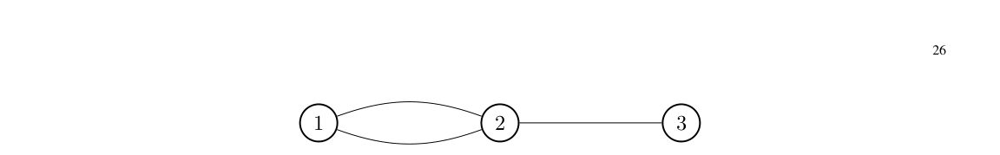
<figcaption class="paper-figure-caption"><b>Fig 1.</b> Fig. 1. An example of a quantum PIN with three terminals. One GHZ state can be distilled from this quantum PIN, and this is known to be optimal [62]. R = 1 for this qPIN, which also confirms optimality.</figcaption>
</figure>
<figure class="paper-figure-card">
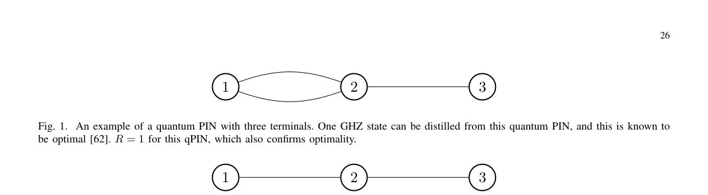
<figcaption class="paper-figure-caption"><b>Fig 2.</b> Fig. 2. An example of a quantum PIN with three terminals that distinguishes between R and RS. For this PIN, R = RH = 1 and RS = 2. One GHZ state can be distilled from this PIN, so R is tight.</figcaption>
</figure>
<figure class="paper-figure-card">
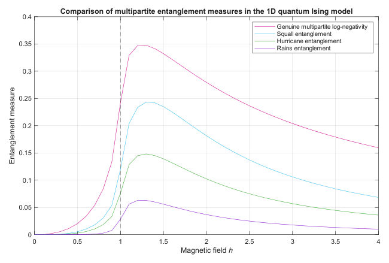
<figcaption class="paper-figure-caption"><b>Fig 3.</b> Fig. 4. The genuine multipartite log-negativity, squall entanglement, hurricane entanglement, and Rains entanglement of tripartite reduced density matrices in the 1D transverse-field Ising model are plotted versus the magnetic field h. The reduced density matrices are obtained exactly via the Jordan-Wigner transformation [63], and the code for calculating the entanglement uses [46], [64], [65]. We used the relationship EN = log2(2N + 1) to calculate the log-GMN EN, where [56, Eq. (8)] was used to calculate the genuine multipartite negativity N.</figcaption>
</figure>

**Summary.** This paper introduces several new multipartite entanglement measures—including Rains, Monsoon, Hurricane, and Squall entanglements—to address the limitations of existing bipartite measures. It establishes these quantities as upper bounds on key physical processes like pure-state distillation rates. The methodology relies heavily on advanced convex optimization techniques, particularly Semidefinite Programming.

**Why it may be interesting.** This work provides rigorous mathematical tools to quantify complex multi-partite correlations, which is fundamental for understanding quantum communication protocols and resource theories in many-body physics simulations.

Detailed structure

**Main problem.** The primary goal is characterizing multipartite entanglement, as existing bipartite measures fail to generalize uniquely to multi-party quantum systems.

**Main result.** New measures (Rains, Monsoon, Hurricane, Squall) are defined, and upper bounds for one-shot and asymptotic pure-state distillation rates are established using these quantities.

**Method.** The authors define entanglement measures via generalizations of the Rains relative entropy and utilize Semidefinite Programming (SDP) to formulate optimization problems and derive dual programs.

**Model / system.** The work analyzes general multipartite quantum states ($
ho$) in $k$-partite systems, with specific applications to Quantum Pairwise Independent Networks (qPINs) and the one-dimensional transverse-field Ising model.

**Key observables.** Rains entanglement ($R$), Monsoon, Hurricane, Squall entanglements; Genuine Multipartite Entanglement (GME); One-shot and asymptotic pure-state distillation rates.

**Important parameters / regimes.** The number of parties ($k$); the parameter $\alpha$ used in Rényi generalizations ($	ext{e}D_\alpha$).

**Assumptions / limitations.** Strong duality theorems are assumed or proven for SDP formulations; approximations (variational parametrization) are necessary to solve the full Rains entanglement optimization problem.

**Paper structure.** The paper proceeds by defining multiple multipartite entanglement measures, proving their properties (like monotonicity), deriving upper bounds on distillation rates using these measures, and finally formulating the max-Rains entanglement via SDPs.

Abstract

Multipartite entanglement admits phenomena such as the activation of genuine multipartite entanglement (GME) and the existence of inequivalent classes of entanglement, and existing bipartite entanglement measures have no unique generalization to this regime. In this work, we define the Rains, monsoon, hurricane, and squall entanglement as generalizations of the bipartite Rains relative entropy, and we establish various properties of these entanglement measures. We also prove that the Rains entanglement is monotone under selective quantum operations that completely preserve the positivity of the partial transpose. We establish single-letter upper bounds on the one-shot and asymptotic rates at which a fixed pure state can be distilled from an arbitrary state in both the standard and probabilistic approximate distillation scenarios. Among the entanglement measures we define, the tightest upper bound on the one-shot pure-state distillation rate is in terms of the Rains entanglement. However, the activation of GME (or, equivalently, the tensor instability of biseparability) makes it unclear if the one-shot bound in terms of the Rains entanglement can be extended to a single-letter asymptotic bound. Instead, we establish upper bounds on the asymptotic pure-state distillation rate in terms of the hurricane and squall entanglement. Upper bounds on the GHZ- and W-distillable entanglement follow as a consequence. Additionally, we define the multipartite max-Rains entanglement, write it as a semidefinite program, and derive a dual program for it. Finally, we analyze these measures for quantum pairwise independent networks, and we establish a conditional gradient (Frank-Wolfe) algorithm for computing the Rains entanglement.

[↑ back to top](#top)

### [Numerical methods for the simulation of quantum walks and quantum annealing](http://arxiv.org/abs/2608.12058v1)

**Authors:** Asa Hopkins, Viv Kendon  
**Type:** theory · **Category:** numerical methods · **PDF:** <https://arxiv.org/pdf/2608.12058v1>  
**Analysis basis:** full PDF text, analyzed in chunks
**Topic relevance:** `analog quantum simulation` **2/5** · `methods for driven-dissipative` **1/5**

↔ Scroll figures horizontally

<figure class="paper-figure-card">
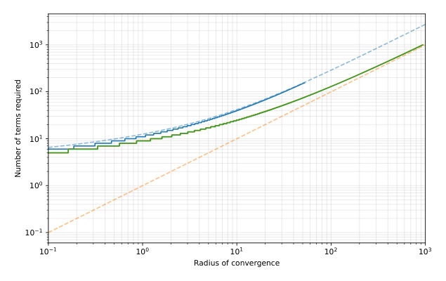
<figcaption class="paper-figure-caption"><b>Fig 1.</b> FIG. 1. The number of terms required for different polynomial expansions of the function sin(x) + cos(x) to reach a truncation error of 2−23 corresponding to 32-bit floating point precision, as a function of the required radius of convergence. The solid blue line is the Taylor series, the solid green line is the minimax polynomial calculated using the CF method. A solid orange line is drawn for the Chebyshev series but the green line overlaps it closely. The dashed blue line is the asymptote for the number of terms for the Taylor series, and the dashed orange line is the asymptote for the number of terms for the Chebyshev series.</figcaption>
</figure>
<figure class="paper-figure-card">
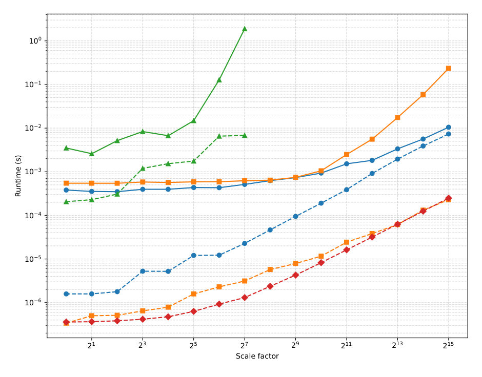
<figcaption class="paper-figure-caption"><b>Fig 2.</b> FIG. 2. The runtime needed to create a polynomial p(x) which approximates sin(x) + cos(x) on the interval [-scale,scale] to an error of 2−23 using a variety of methods. Solid lines show Chebfun algorithms and dashed lined show our C++ implementations. Green triangles show the Remez algorithm, Blue circles show interpolation at the Chebyshev nodes, orange squares show the CF method and red diamonds show Miller’s algorithm. It can be seen that Miller’s algorithm combined with our CF implementation give vastly improved runtime over the original Chebfun methods, making them viable for practical use.</figcaption>
</figure>
<figure class="paper-figure-card">
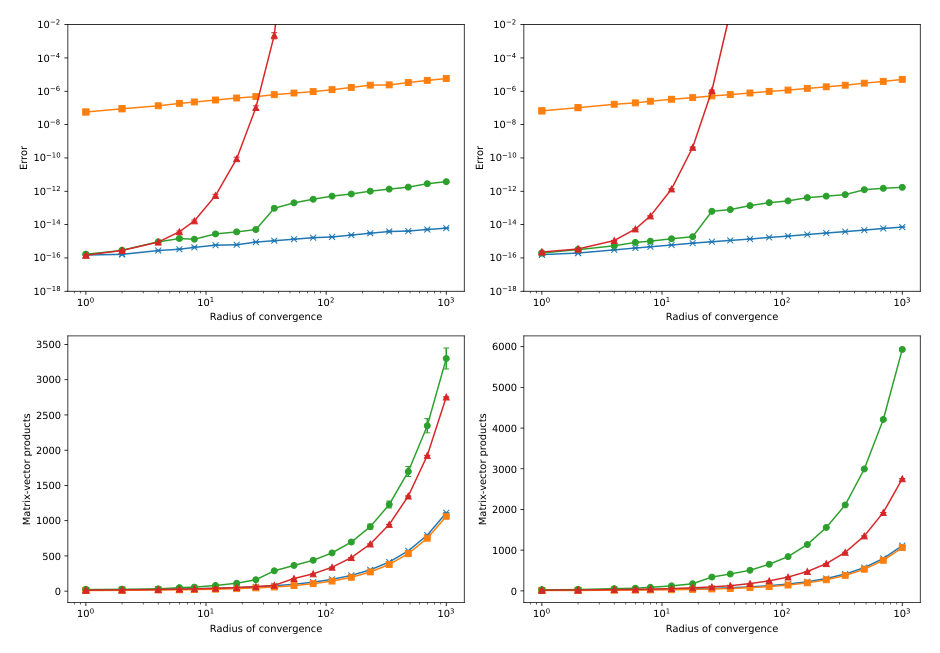
<figcaption class="paper-figure-caption"><b>Fig 3.</b> FIG. 3. A comparison of numerical errors and performance across different methods and problem instances for calculating (sin(H) + cos(H)) |ψ⟩. The first column is tested on 100 5-qubit SK spin-glass problems from [30], where the parameters are sampled from a standard normal distribution. The second column is tested on 100 symmetric 32×32 matrices where all entries are sampled from a standard normal distribution, and then it is made symmetric by adding it to its own transpose. The first row shows how much numerical error is incurred, measured by calculating the euclidean distance of the output from an 80-bit precision baseline, as convergence radius increases. The second row shows how many...</figcaption>
</figure>
<figure class="paper-figure-card">
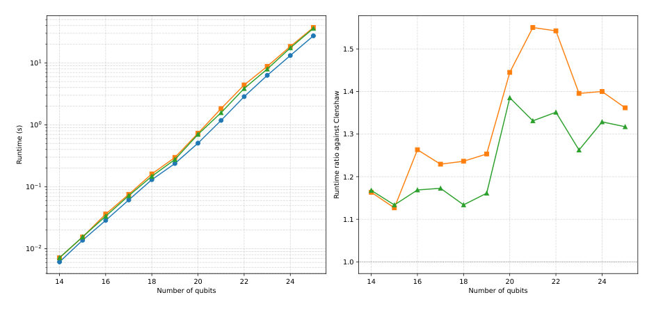
<figcaption class="paper-figure-caption"><b>Fig 4.</b> FIG. 4. The runtime needed to evaluate p( ˆH) for a set of 10 random SK spin-glass Ising Hamiltonians from [30], where parameters have been drawn from a standard normal distribution, and a degree-50 polynomial p where the coefficients have been drawn from a standard normal distribution in the monomial basis. Orange squares show a naive Clenshaw implementation, green triangles show a naive Horner implementation, and blue circles show an optimised Clenshaw algorithm. On the right hand side, ratios of runtimes are shown for clarity. The optimised Clenshaw algorithm shows the most performance gain for large sizes, where it is most needed.</figcaption>
</figure>
<figure class="paper-figure-card">
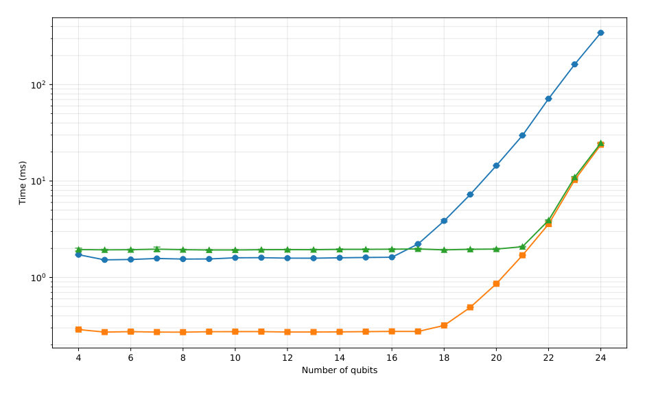
<figcaption class="paper-figure-caption"><b>Fig 5.</b> FIG. 5. The runtime needed to evaluate p( ˆH) |ψ⟩on a GPU for a set of 20 degree-50 polynomials p where the coefficients have been drawn from a standard normal distribution in the monomial basis. Blue circles show sparse matrix multiplication with CuPy, orange squares show a matrix-free approach using a CuPy RawKernel, and green triangles show a matrix-free approach using a Taichi kernel. In the large n limit, Taichi’s performance matches CUDA, but for moderate n the kernel launch overhead is too significant.</figcaption>
</figure>

**Summary.** This paper tackles the numerical challenge of accurately and efficiently calculating matrix functions like $\exp(-it\hat{H})$ arising in quantum simulations. The authors provide a comprehensive comparison of approximation methods—highlighting minimax and Chebyshev techniques—and offer optimized, rigorously analyzed C++ implementations for these calculations.

**Why it may be interesting.** This is highly relevant as it provides state-of-the-art computational tools and rigorous error analysis for simulating quantum dynamics, which is crucial for developing practical quantum simulation algorithms.

Detailed structure

**Main problem.** Developing rigorous analysis and high-performance implementations for approximating functions of a Hermitian matrix, such as $\exp(-it\hat{H})$, to simulate quantum time evolution.

**Main result.** The authors provide rigorous error bounds for Chebyshev approximation and implement true minimax approximation techniques, showing superior convergence compared to naive methods.

**Method.** The work compares multiple polynomial approximation schemes (Chebyshev, Minimax via CF algorithm, Taylor series) for matrix functions, focusing on efficient evaluation using the Clenshaw algorithm and optimizing for sparse Hamiltonians.

**Model / system.** The focus is on quantum systems governed by the time-dependent Schrödinger equation, utilizing Hamiltonians ($\hat{H}$) relevant to quantum optimization (e.g., $\hat{H} = \hat{H}_P + \gamma \hat{H}_G$) and quantum walks.

**Key observables.** Approximation error ($\epsilon$), computational runtime, number of matrix-vector products required, and the action $|\psi(t)
angle = \exp(-it\hat{H}) |\psi
angle$.

**Important parameters / regimes.** The spectral radius $
ho(\hat{H})$ dictates the necessary interval size for approximation; performance is analyzed across varying system sizes ($n$).

**Assumptions / limitations.** Minimax approximations require fixing an interval, necessitating an upper bound on the spectral radius. The analysis distinguishes between truncation error, coefficient error, and evaluation error.

**Figures summary.** Figures compare convergence rates (Taylor vs. Minimax/Chebyshev), runtime comparisons of various approximation algorithms (e.g., optimized Clenshaw vs. naive Horner), and performance gains when using GPU acceleration or commutator-free time evolution methods.

**Paper structure.** The paper builds from the general problem of matrix function approximation to specific implementations, comparing Chebyshev, minimax, and Taylor methods for calculating $\exp(-it\hat{H})|\psi
angle$, concluding with discussions on optimizing these calculations for modern hardware (GPU) and time-dependent evolution.

Abstract

It is known that Chebyshev based polynomial approximation gives a near-optimal rate of convergence for calculating a function of a Hermitian matrix. However, previous work has not discussed the option of true minimax approximation, nor the specifics of writing a high performance implementation with a rigorous analysis of errors. This work provides such an analysis and an open-source implementation of three approximation methods in C++.

[↑ back to top](#top)

### [The optimization landscape of peaked-circuit generation](http://arxiv.org/abs/2608.11890v1)

**Authors:** Ilyes Jamoussi  
**Type:** theory · **Category:** quantum information and computing · **PDF:** <https://arxiv.org/pdf/2608.11890v1>  
**Analysis basis:** full PDF text, analyzed in chunks
**Topic relevance:** `quantum measurements` **2/5** · `scars & prethermalization` **1/5**

↔ Scroll figures horizontally

<figure class="paper-figure-card">
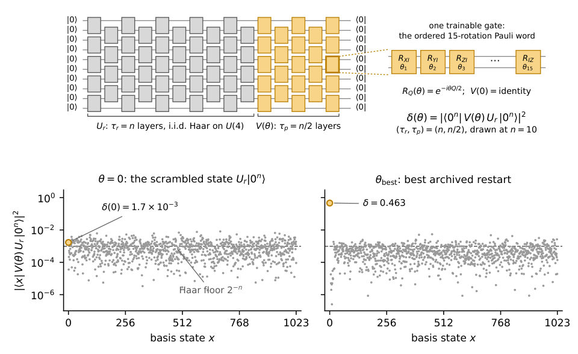
<figcaption class="paper-figure-caption"><b>Fig 1.</b> Figure 1: The generation problem. Top: the geometry of Sec. 2 at the operating point (τr, τp) = (n, n/2), drawn at n = 10: an open-boundary brickwall whose first τr layers are i.i.d. Haar on U(4) (gray), layer 0 coupling all n qubits in disjoint pairs, continued by the trainable section V (θ) in the same brick pattern for τp layers (orange); each trainable gate is the ordered product of fifteen Pauli rotations over a fixed word sequence, the identity at θ = 0 (exploded brick). Bottom: the exact output distribution |⟨x| V (θ) Ur|0n⟩|2 of one converged-rerun ensemble (n = 10, instance 0), regenerated from the archived angles and instance seed and reproducing the archived δ values to 10−14. At...</figcaption>
</figure>
<figure class="paper-figure-card">

<figcaption class="paper-figure-caption"><b>Fig 2.</b> Figure 2: Moment-hierarchy exponents ln mk/ ln m2 versus random depth τr, for k = 3, 4 at n = 6, 8 (normalized moments mk = E[δk]/(k! D−k); exact transfers). Every plotted point carries either a complete configuration sum, at τr ∈{1, 3} for both sizes, or a truncation certificate: 0.33% of m4 at (6, 6) and 0.98% at (8, 8). The points (6, 2) and (8, 2) are excluded by their 15.9% and 125% certificates, and (6, 12) and (8, 16) because m2 sits within 1.1% of the exponent’s pole at m2 = 1; the figure script prints each exclusion. The hierarchy sits below the pair-dominated log-envelope</figcaption>
</figure>
<figure class="paper-figure-card">
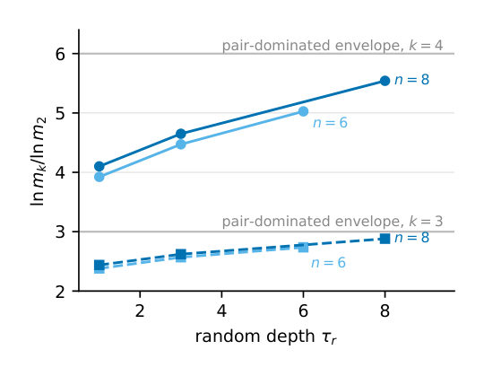
<figcaption class="paper-figure-caption"><b>Fig 3.</b> Figure 2 shows the resulting hierarchy in terms of the normalized moments mk = E[δk]/(k! D−k). At the operating depth τr = n and at that probe: m2 = 1.118, m3 = 1.357, m4 = 1.752 at n = 6 and m2 = 1.164, m3 = 1.549, m4 = 2.320 at n = 8, with k-exponents ln m4/ ln m2 = 5.03 and 5.53, inside the band [4.5, 6) registered before either τr = n value existed; at n = 8 the exponent lands in the upper half of the band, the half the registration favored. We assume, as the reference model against which the measured moments are read, δ = D−1E Y with E a standard exponential, the local Porter–Thomas factor, and Y &gt; 0 a local modulus independent of E; the independence is the modeling step, and the deep...</figcaption>
</figure>
<figure class="paper-figure-card">
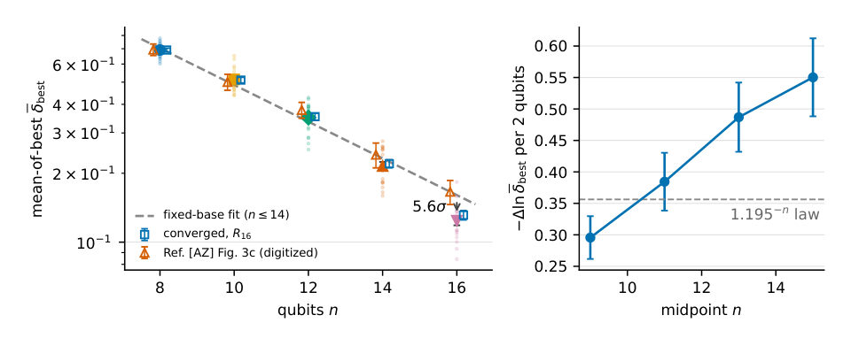
<figcaption class="paper-figure-caption"><b>Fig 4.</b> Figure 3: Left: mean-of-best peakedness versus n (18 instances per size, the full grid including the registered n = 16 catch-up; the published n = 16 values rest on the first four instances, and the text reports both readings; small dots: per-instance bests; error bars: standard error of the instance mean). The dashed line is the weighted fixed-base fit to n ≤14; the arrow marks the shortfall of the plotted n = 16 point (5.6σ on all eighteen instances), before the step-cap correction of the text. Open squares: the registered converged grid at the matched B0 = 16 estimator, the level with the step cap removed. Open triangles: the five instance-averaged points of Ref. [1] Fig. 3c, τp = τr/2,...</figcaption>
</figure>
<figure class="paper-figure-card">
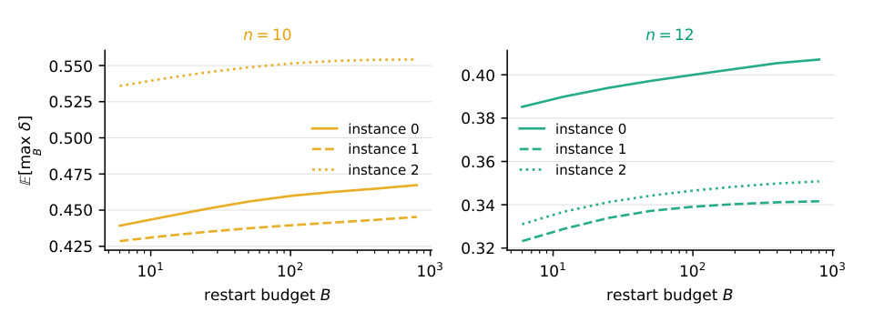
<figcaption class="paper-figure-caption"><b>Fig 5.</b> Figure 4: Expected best-of-B curves (the without-replacement estimator of Eq. (7) over the 800-restart ensembles) for three instances each at n = 10, 12. The log-budget slope persists to B = 800 at 0.61–0.63× its own [25, 200] reference, ≈9× the i.i.d.-exponential null at n = 12 on these ensembles, and the maximum stays unique (degeneracy 1–2 per 800 at 10−4).</figcaption>
</figure>

**Summary.** The paper investigates how to classically optimize random quantum circuits to achieve a high probability peak on one output state. The authors challenge previous theoretical predictions regarding this optimization landscape by presenting detailed numerical measurements showing specific decay rates and comparing the performance of different optimizers. Ultimately, they establish rigorous bounds on achievable peakedness while noting that the structure of near-optimal solutions remains connected.

**Why it may be interesting.** This work directly addresses the feasibility limits of quantum computation protocols by characterizing the difficulty of finding highly non-random states within complex Hilbert spaces, which has implications for understanding resource scaling in quantum information processing.

Detailed structure

**Main problem.** The core problem is understanding the optimization landscape for generating 'peaked circuits'—random quantum circuits whose measurement output concentrates probability on a single bitstring, which is proposed as a route to verifiable quantum advantage.

**Main result.** The authors show that while the barren plateau exists, it does not explain the observed rate of decay in peakedness; furthermore, they prove an upper bound for the achievable peak probability in the deep limit. They also find evidence suggesting the near-optimal solutions form a connected structure rather than fragmenting.

**Method.** The methodology involves mapping the optimization landscape by maximizing the peakedness observable $\delta(	heta)$ using advanced gradient descent techniques (L-BFGS-B vs. Adam) and comparing results against theoretical bounds like the Haar floor.

**Model / system.** The system consists of a random quantum circuit ($U_r$) followed by a trainable variational 'brickwall' section $V(	heta)$ acting on $n$ qubits. The analysis focuses on maximizing the probability $\delta(	heta) = |\langle 0^n| V(	heta) U_r |0^n
angle|^2$.

**Key observables.** Peakedness ($\delta$), Haar floor ($2^{-n}$), Reach ratio ($
ho_{	ext{arm}}/R_{	ext{conv}}$), and the decay rate of $\delta^*$ with system size $n$.

**Important parameters / regimes.** Number of qubits ($n=8-16$, extrapolated to $n=50$), circuit depth ($	au_r, 	au_p$), and optimization parameters ($	heta$).

**Assumptions / limitations.** The analysis compares results against previous fixed-base exponential laws, rejects the initial hardness conjecture based on optimizer performance, and relies on rigorous numerical measurements across multiple instances.

**Figures summary.** Figure 1 illustrates the general setup comparing $\delta(0)$ to $\delta_{	ext{best}}$ relative to the Haar floor; other figures likely show scaling of these observables with $n$.

**Paper structure.** The paper progresses by defining the problem (peaked circuits), presenting numerical measurements that contradict prior theoretical fits, analyzing the role of optimization algorithms and plateaus, and concluding with rigorous proofs regarding the achievable bounds in the deep limit.

Abstract

Peaked circuits are random quantum circuits whose measurement returns one bitstring far more often than chance. They are a candidate route to verifiable quantum advantage, and the bottleneck is classical generation. Aaronson and Zhang fix a random circuit, append a trainable brickwall of half that depth, and optimize it by gradient descent to raise the probability of one chosen output string. Their method plateaus at a size-dependent ceiling, which they attribute to a barren plateau. A dichotomy remains open: either the optimizer stops short, so a better algorithm would reach higher, or no efficient method exists. We map the landscape on which the answer depends. Across 18 instances per size at n = 8-16, at fixed and converged budgets, no fixed-base exponential, the law they fit, matches the optimizer's reach: at convergence the decay steepens from 1.16 to 1.295 per qubit through n = 16 (p = 0.011 frozen and 0.025 converged, on n = 8-14 alone), leaving their n = 50 estimate unsupported; at n = 16 they report more than we reach at any budget measured. One optimizer beats ours: L-BFGS-B ends 3.9 +/- 1.6% above converged Adam at n = 16, on three instances. That margin retires our hardness conjecture under its registered rule and leaves the rate untouched: every optimizer measured loses a factor 1.3 per qubit. The barren plateau is present and cannot explain that rate: the reach sits far above the Haar floor 2^-n, and the exact second-order amplitude data are depth-independent while the reach is not. Nor do solutions cluster at that floor: they are decorrelated yet path-connected by paths 10^2-10^3 above 2^-n whose floor falls from 0.73 to 0.23 of the endpoints. Path search is one-sided, so near-optimal clustering stays open. In the deep limit we prove no poly(n)-parameter family beats poly(n) 2^-n on average. What survives: a connected landscape and a shrinking reach.

[↑ back to top](#top)

### [Capability-Adaptive Cryptanalysis with Reduced-Space Quantum Verification](http://arxiv.org/abs/2608.12234v1)

**Authors:** Nivedita Dey, Mrityunjay Ghosh, Pranav Kaushal, Abhinab Khare, Amlan Chakrabarti  
**Type:** theory · **Category:** quantum information and computing · **PDF:** <https://arxiv.org/pdf/2608.12234v1>  
**Analysis basis:** full PDF text, analyzed in chunks
**Topic relevance:** `quantum measurements` **2/5**

↔ Scroll figures horizontally

<figure class="paper-figure-card">
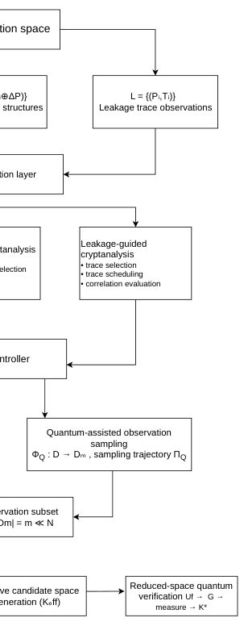
<figcaption class="paper-figure-caption"><b>Fig 1.</b> Fig. 1 Quantum-assisted observation sampling within capability-adaptive cryptanalysis. The framework incorporates quantum-generated randomness exclusively during observation selection, differential-pair selection, and leakage-trace selection stages without altering the subsequent candidate-space reduction or reduced-space quantum verification procedures. [21]</figcaption>
</figure>
<figure class="paper-figure-card">
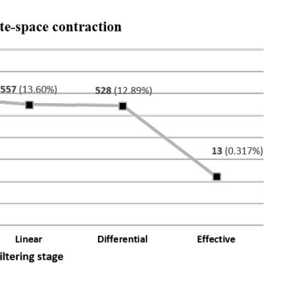
<figcaption class="paper-figure-caption"><b>Fig 2.</b> Fig. 2 Progressive contraction of the candidate-key hypothesis space under the adaptive cryptana- lytic filtering framework. Starting from an initial space of 4096 hypotheses, successive filtering stages substantially reduce the admissible candidate set, yielding an effective candidate space of only 13 hypotheses prior to quantum verification.</figcaption>
</figure>

**Summary.** The paper introduces an adaptive framework that merges multiple classical cryptanalytic techniques (linear, differential, side-channel) to aggressively filter a large key hypothesis space. This reduction allows subsequent quantum verification using amplitude amplification to operate on a much smaller effective space, drastically cutting down the required computational resources for breaking cryptographic systems.

**Why it may be interesting.** This work provides a concrete theoretical blueprint for optimizing quantum algorithms applied to classical security problems, showing how pre-processing steps can drastically reduce resource requirements (qubits, time) for quantum computation in cryptography.

Detailed structure

**Main problem.** The core challenge is efficiently integrating classical cryptanalytic evidence (from linear, differential, and side-channel analysis) with quantum verification in hybrid classical-quantum cryptanalysis.

**Main result.** The proposed framework demonstrates that adaptive classical filtering can substantially reduce the initial key hypothesis space (e.g., 4096 to 13 candidates), leading to a significant reduction (approx. 25-fold) in required quantum verification effort via reduced-space amplitude amplification.

**Method.** A capability-adaptive framework is developed that first uses statistical filtering based on multiple cryptanalytic techniques to contract the candidate key space, followed by applying reduced-space quantum verification using amplitude amplification.

**Model / system.** The model applies to symmetric-key cryptographic primitives ($\Pi$). The theoretical structure involves defining a formal mathematical model for candidate-space construction and adaptive filtering, culminating in a Hamiltonian formulation for physically realizing the reduced-space quantum verification process.

**Key observables.** Candidate-key hypothesis space size (e.g., 4096 initial $	o$ 13 effective), Grover iteration requirement reduction (50 to 2 iterations), and target-state success probability ($\approx 94.53\%$).

**Important parameters / regimes.** The complexity is characterized by the relationship between candidate-space contraction and quantum verification effort, quantified using metrics like linear approximation bias ($\hat{\epsilon}_i$) and differential characteristic probabilities ($P_i$).

**Assumptions / limitations.** The framework assumes that classical filtering can accurately contract the search space while preserving cryptanalytic admissibility, allowing the use of reduced-space quantum algorithms.

**Figures summary.** Figure 1 illustrates the overall process flow: Quantum-assisted observation sampling $
ightarrow$ Effective candidate space generation ($K_{	ext{eff}}$) $
ightarrow$ Reduced-space quantum verification. Tables summarize contraction statistics and complexity reduction.

**Paper structure.** The paper builds by first defining the need for unification, developing a formal mathematical model encompassing candidate-space construction (using linear/differential/leakage analysis), and finally demonstrating the quantitative benefits of reduced-space quantum verification using amplitude amplification on the filtered set.

Abstract

Efficient integration of cryptanalytic evidence with quantum verification remains a fundamental challenge in hybrid classical-quantum cryptanalysis. This work presents a capability-adaptive cryptanalytic framework that unifies linear cryptanalysis, differential cryptanalysis, and side-channel leakage analysis within a common candidate-space reduction architecture, followed by reduced-space quantum verification through amplitude amplification. A formal mathematical model is developed for candidate-space construction, adaptive filtering, verification-space reduction, and complexity characterization, supported by the oretical results establishing the relationship between candidate-space contraction and quantum verification effort. A Hamiltonian formulation is further introduced to provide a physically realizable interpretation of the reduced-space verification process. Evaluation using statistically generated cryptanalytic observations demonstrates that the proposed framework reduces an initial candidate-key hypothesis space of 4096 candidates to an effective candidate space of 13 hypotheses, corresponding to an overall reduction of approximately 99.683%. Consequently, the Grover verification requirement decreases from 50 iterations to only 2 iterations, yielding an approximately 25-fold reduction in verification effort, while reduced-space amplitude amplification achieves a target-state success probability of approximately 94.53%. These results demonstrate that adaptive cryptanalytic filtering can substantially reduce quantum verification complexity while preserving cryptanalytic admissibility, providing a practical foundation for capability-aware hybrid cryptanalysis and reduced-space quantum search.

[↑ back to top](#top)

### [Density-Selected Topological Pathways in the Melting of Single-Particle-Thick Stripes](http://arxiv.org/abs/2608.11880v1)

**Authors:** José Rafael Bordin  
**Type:** theory · **Category:** statistical mechanics · **PDF:** <https://arxiv.org/pdf/2608.11880v1>  
**Analysis basis:** full PDF text, analyzed in chunks
**Topic relevance:** `Frenkel-Kontorova` **1/5** · `analog quantum simulation` **1/5** · `driven-dissipative phase transition` **1/5** · `non-equilibrium universality` **1/5**

↔ Scroll figures horizontally

<figure class="paper-figure-card">
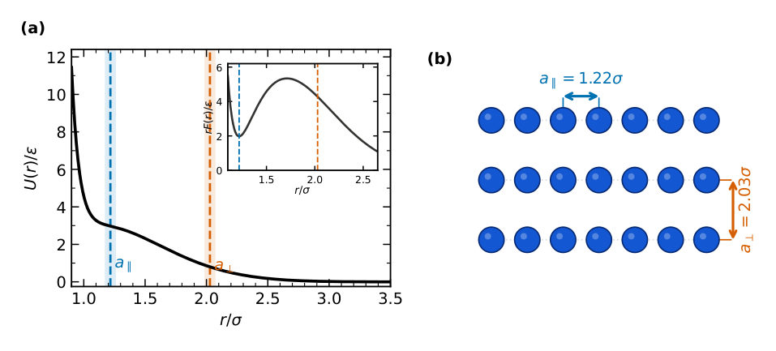
<figcaption class="paper-figure-caption"><b>Fig 1.</b> FIG. 1. Interaction model and microscopic organization of the stripe phase. (a) Lennard-Jones–</figcaption>
</figure>
<figure class="paper-figure-card">
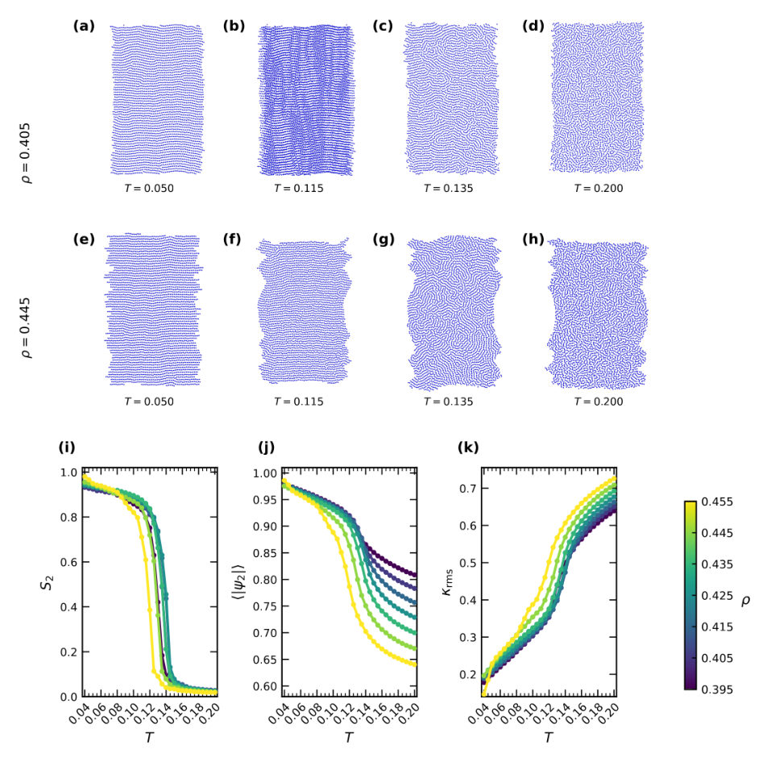
<figcaption class="paper-figure-caption"><b>Fig 2.</b> FIG. 2. Density-selected pathways in the melting of one-particle-thick stripes. Representative</figcaption>
</figure>
<figure class="paper-figure-card">
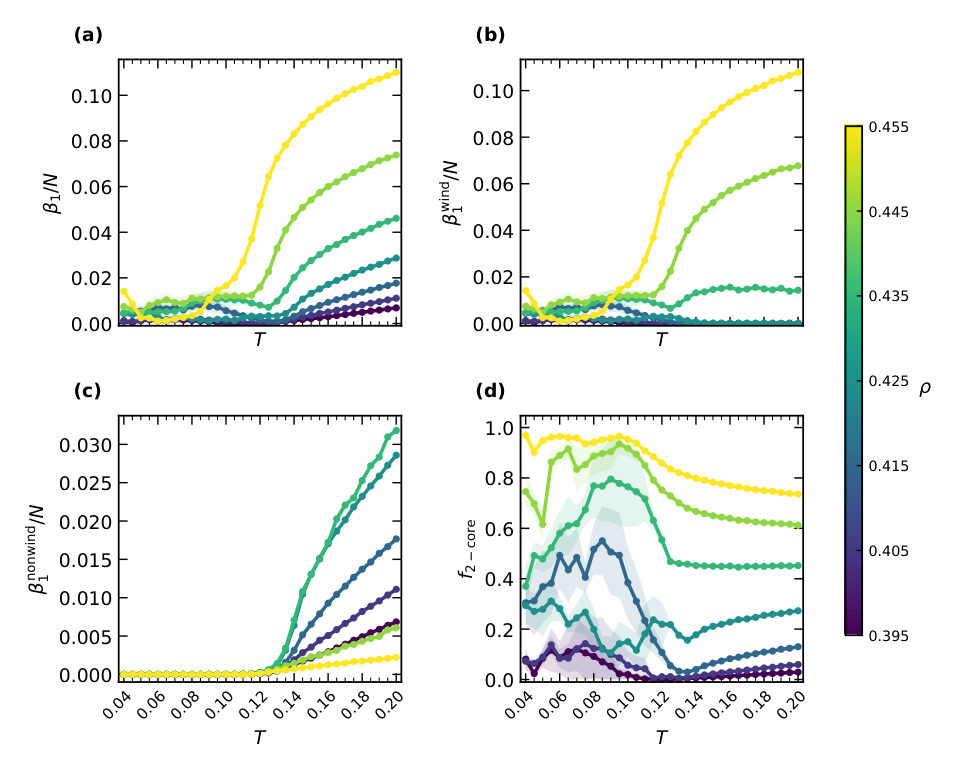
<figcaption class="paper-figure-caption"><b>Fig 3.</b> FIG. 3. Topological reconstruction during heating for the seven densities. (a) First Betti number</figcaption>
</figure>
<figure class="paper-figure-card">
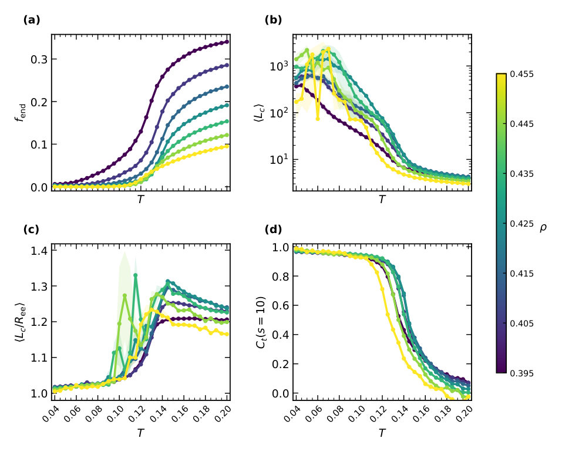
<figcaption class="paper-figure-caption"><b>Fig 4.</b> FIG. 4. Evolution of filament geometry during heating. (a) Endpoint fraction, (b) mean contour</figcaption>
</figure>
<figure class="paper-figure-card">
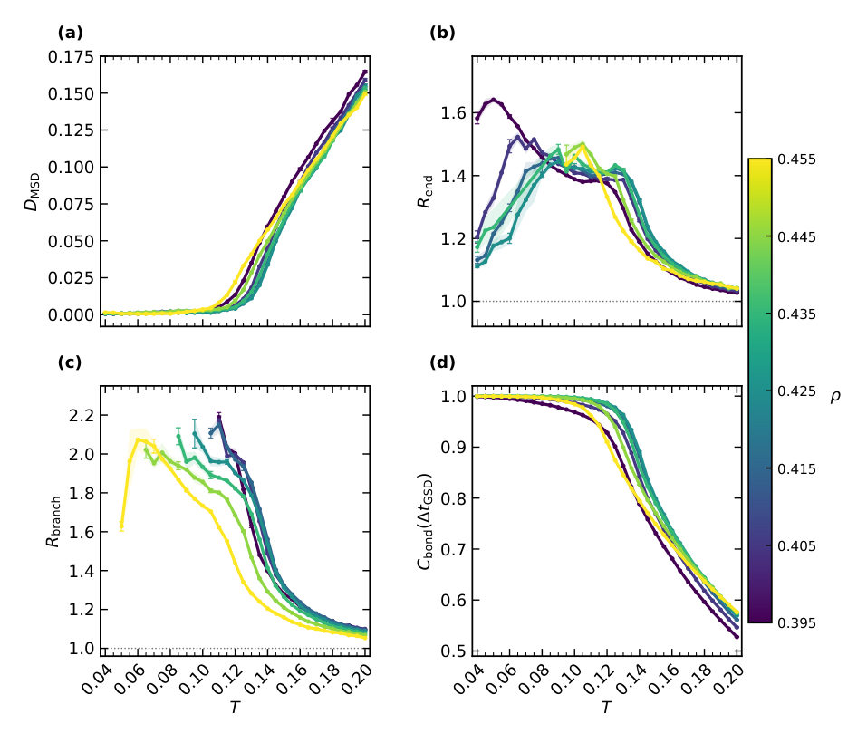
<figcaption class="paper-figure-caption"><b>Fig 5.</b> FIG. 5. Coupling between local connectivity and dynamics. (a) Long-time diffusion coefficient</figcaption>
</figure>

**Summary.** This work simulates the melting of stripe phases in a 2D system, finding that density dictates the final fluid topology. The authors demonstrate that simple thermodynamic measurements fail to capture this complexity; only advanced topological observables can distinguish between a fragmented cluster state and a continuous network state.

**Why it may be interesting.** While focused on classical soft matter physics, the reliance on topological invariants (like Betti numbers) to characterize phase transitions and connectivity changes mirrors concepts used in analyzing complex quantum many-body ground states or entanglement structures.

Detailed structure

**Main problem.** The study investigates how the melting of stripe-forming systems changes connectivity, specifically determining if the resulting fluid topology is uniquely determined by the initial ordered state or if it is instead selected by the system's density.

**Main result.** The topological outcome of the melt—whether the filaments fragment into finite clusters or remain in a dynamically fluid, system-spanning network—is strongly dependent on the particle density ($
ho$).

**Method.** Molecular dynamics simulations are performed along isochoric heating paths using various structural, orientational, and advanced graph-based topological observables.

**Model / system.** The model is a two-dimensional system of particles interacting via a Lennard-Jones plus Gaussian (LJG) pair potential, which stabilizes one-particle-thick stripe phases at low temperatures.

**Key observables.** Topological descriptors like the first Betti number ($eta_1$), graph 2-core fraction ($f_{2-	ext{core}}$), and connectivity measures are crucial alongside standard thermodynamic quantities like isochoric heat capacity ($c_V$).

**Important parameters / regimes.** The analysis spans seven densities ($
ho = 0.395$ to $0.455$) across the stripe-forming regime, as well as varying temperatures during heating.

**Assumptions / limitations.** Conventional scalar order parameters are insufficient because they cannot distinguish between a system-spanning network and finite clusters when local packing is similar; thus, topological diagnostics are necessary.

**Figures summary.** Figures summarize the density dependence of structural metrics (like nematic order $S_2$) during melting, showing that while global order decays uniformly, the topological structure diverges based on $
ho$.

**Paper structure.** The paper analyzes the multistage reconstruction upon heating, contrasting the behavior observed using only thermodynamic/orientational data versus the richer information provided by graph-based topology to distinguish between different fluid states.

Abstract

The melting of stripe-forming systems involves changes in connectivity that are not fully captured by conventional structural and orientational descriptors. We investigate a two-dimensional model with competing interactions whose low-temperature phase consists of one-particle-thick stripes. Molecular dynamics simulations along seven heating isochores are analyzed using thermodynamic, orientational, dynamical, and graph-based observables. Heating produces a multistage reconstruction in which the loss of stripe alignment and the reorganization of filament connectivity occur over distinct temperature ranges. Density controls whether the disordered filaments fragment into finite polymer-like clusters or remain joined in a dynamically fluid, system-spanning network. The topological observables distinguish these outcomes, which are not resolved by the thermodynamic and orientational responses alone. Thus, the same ordered stripe microphase can melt into topologically distinct fluids selected by density.

[↑ back to top](#top)

### [A sharp bound on spacetime distance from quantum entanglement](http://arxiv.org/abs/2608.12245v1)

**Authors:** Zhi-Wei Wang, Arshid Shabir, Mir Faizal, Samuel L. Braunstein  
**Type:** theory · **Category:** other · **PDF:** <https://arxiv.org/pdf/2608.12245v1>  
**Analysis basis:** full PDF text, analyzed in chunks
**Topic relevance:** `Keldysh / 2PI / non-Gaussian methods` **1/5** · `correlated / nonlocal dissipation` **1/5** · `quantum measurements` **1/5**

↔ Scroll figures horizontally

<figure class="paper-figure-card">
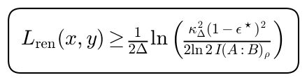
<figcaption class="paper-figure-caption"><b>Fig 1.</b> Figure 1. The metric-from-information bound. Left: when boundary regions A and B are nearby, so that I(A : B) is large, the MfI bound permits a short bulk geodesic between the corresponding points x and y. Right: when A and B are far apart, so that I(A : B) is small, the bound forces the bulk geodesic to be long. A heavy probe O∆propagates along the bulk geodesic of renormalised length Lren(x, y).</figcaption>
</figure>
<figure class="paper-figure-card">
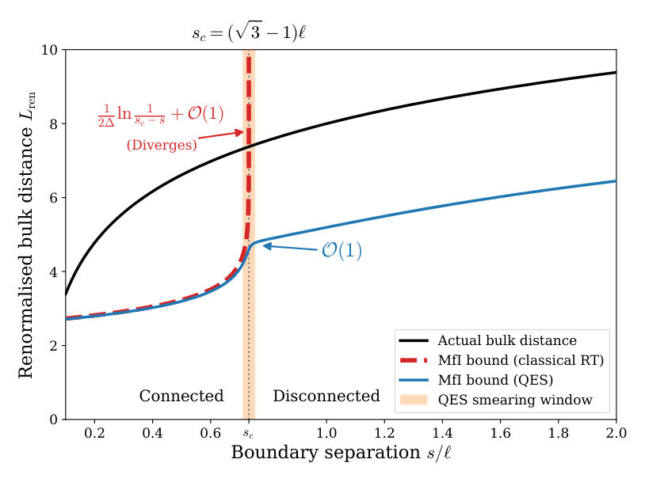
<figcaption class="paper-figure-caption"><b>Fig 2.</b> Figure 2. MfI bound at the entanglement-wedge phase transition for parallel strips in AdS5/CFT4. Black: the actual bulk geodesic distance, which is finite everywhere. Red dashed: the MfI bound evaluated with the classical RT mutual information, which diverges logarithmically at the critical separation sc = ( √</figcaption>
</figure>

**Summary.** This work provides a quantitative link between quantum entanglement and spacetime geometry by deriving a 'metric-from-information' lower bound. It shows that the amount of boundary mutual information dictates how far apart points can be in the bulk spacetime, offering a powerful diagnostic tool beyond classical area laws.

**Why it may be interesting.** While focused on gravity/QFT, the core methodology—using entanglement measures like mutual information to constrain geometric properties—is highly relevant for understanding quantum correlations in open quantum systems.

Detailed structure

**Main problem.** To establish a quantitative, metric counterpart showing how boundary mutual information constrains the bulk geodesic separation distance within holographic spacetime settings.

**Main result.** The paper derives a rigorous lower bound (Metric-from-information bound) stating that vanishing mutual information forces the allowed bulk geodesic separation to diverge logarithmically.

**Method.** It combines quantum information measures, specifically Mutual Information $I(A:B)$, with holographic dictionary relations linking two-point functions to renormalized geodesic lengths $	ext{L}_{	ext{ren}}(x, y)$.

**Model / system.** The analysis is set in the context of AdS/CFT correspondence and involves calculating bounds for a boundary manifold $\Sigma$ with disjoint regions $A$ and $B$. Specific applications include parallel strips in AdS$_5$/CFT$_4$.

**Key observables.** Boundary Mutual Information ($I(A:B)$) and renormalized Bulk Geodesic Distance ($	ext{L}_{	ext{ren}}(x, y)$).

**Important parameters / regimes.** The bound depends on calibration constants $\kappa_\Delta$ and $\epsilon_\star$, and the analysis distinguishes between semiclassical regimes.

**Assumptions / limitations.** The derivation relies on operating within a semiclassical holographic code subspace and assumes controlled truncation errors ($\epsilon_{	ext{code}} \ll 1$).

**Figures summary.** Figure 1 illustrates how short geodesics are permitted when $I(A:B)$ is large, while long geodesics are forced when $I(A:B)$ is small.

**Paper structure.** The paper progresses from establishing a pairwise metric-from-information bound (Theorem 1) to extending this local inequality to global connectivity via a multiscale iteration (Theorem 2).

Abstract

Ryu-Takayanagi established how boundary entanglement encodes bulk area. We provide the metric counterpart: boundary mutual information imposes a rigorous lower bound on bulk geodesic separation that diverges logarithmically as correlations vanish. A multiscale iteration promotes this local inequality to a global obstruction to bulk connectivity. For parallel strips in AdS$_5$/CFT$_4$, the bound necessitates a quantum resolution of the classical mutual-information transition and fixes the asymptotic growth of geodesic distance.

[↑ back to top](#top)

### [Joint symmetry and dynamical accessibility in compact Hamiltonian encodings of set cover](http://arxiv.org/abs/2608.11503v1)

**Authors:** Fabricio de Souza Luiz  
**Type:** theory · **Category:** quantum information and computing · **PDF:** <https://arxiv.org/pdf/2608.11503v1>  
**Analysis basis:** full PDF text, analyzed in chunks
**Topic relevance:** `analog quantum simulation` **1/5** · `driven-dissipative phase transition` **1/5** · `methods for driven-dissipative` **1/5**

↔ Scroll figures horizontally

<figure class="paper-figure-card">
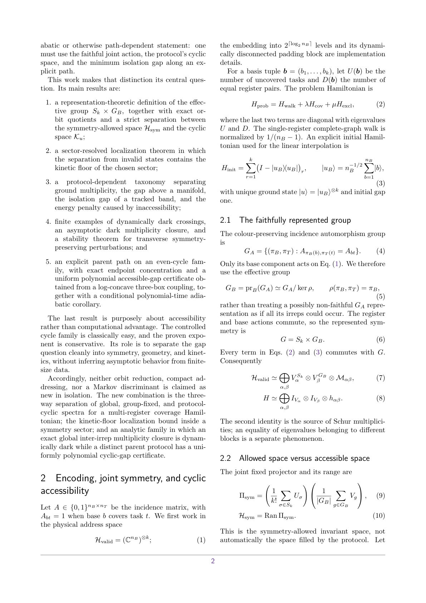
<figcaption class="paper-figure-caption"><b>Fig 1.</b> Low-resolution page preview, page 2</figcaption>
</figure>
<figure class="paper-figure-card">
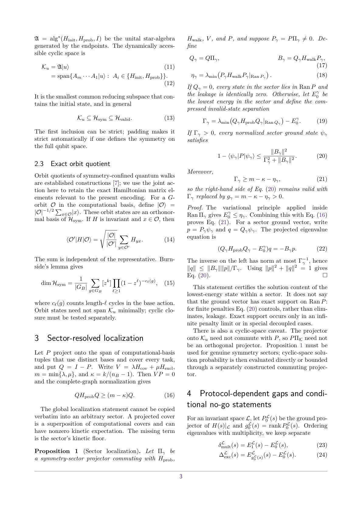
<figcaption class="paper-figure-caption"><b>Fig 2.</b> Low-resolution page preview, page 3</figcaption>
</figure>
<figure class="paper-figure-card">
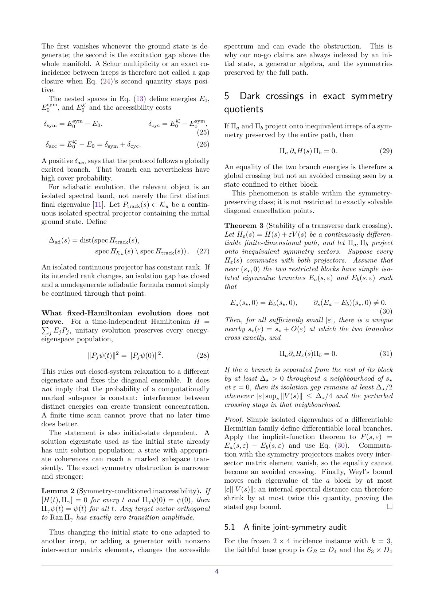
<figcaption class="paper-figure-caption"><b>Fig 3.</b> Low-resolution page preview, page 4</figcaption>
</figure>
<figure class="paper-figure-card">
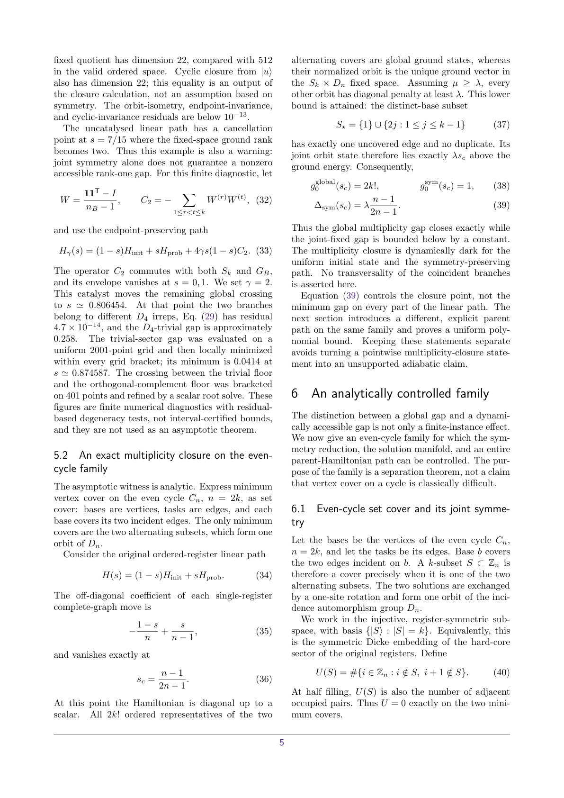
<figcaption class="paper-figure-caption"><b>Fig 4.</b> Low-resolution page preview, page 5</figcaption>
</figure>
<figure class="paper-figure-card">
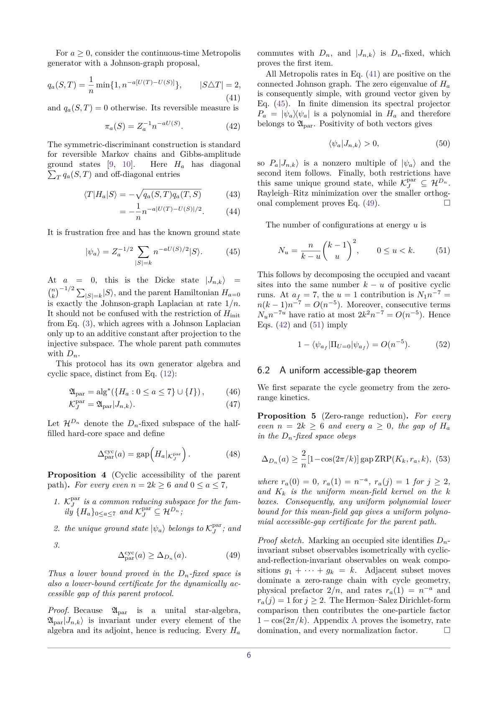
<figcaption class="paper-figure-caption"><b>Fig 5.</b> Low-resolution page preview, page 6</figcaption>
</figure>

**Summary.** This theoretical paper analyzes the spectral properties of quantum Hamiltonians used to encode NP-hard problems like Set Cover. It rigorously distinguishes between the full symmetry-allowed spectrum and the subspace actually reachable by the system's dynamics. The work provides structural guarantees regarding adiabatic evolution times, establishing a fundamental separation between potential symmetries and actual physical accessibility.

**Why it may be interesting.** The rigorous separation of accessible spectral structure is highly relevant to understanding the limitations and guarantees of quantum computation protocols based on Hamiltonian simulation or annealing.

Detailed structure

**Main problem.** The research addresses which parts of a Hamiltonian spectrum are physically relevant when both the initial state preparation and subsequent time evolution preserve multiple symmetries, specifically for encoding Minimum Set Cover.

**Main result.** The authors establish a rigorous structural separation between the global symmetry-allowed spectral structure and the dynamically accessible cyclic subspace. They derive bounds on the adiabatic runtime conditional on specific state preparations.

**Method.** The analysis employs advanced mathematical tools including sector-resolved localization, analyzing algebraic structures generated by Hamiltonians, and deriving gap estimates using techniques related to Dirichlet forms and coupling arguments.

**Model / system.** The model is a compact multi-register quantum encoding of the Minimum Set Cover problem. The dynamics are governed by complex Hamiltonians involving walk terms, cover constraints, and exclusion terms acting on multiple registers.

**Key observables.** Joint fixed excitation gap, sector-resolved leakage bounds ($\Gamma_\gamma$), and the dynamically accessible cyclic space ($\mathcal{K}_u$).

**Important parameters / regimes.** The size of the problem instance ($n$), the number of registers, and parameters governing the Hamiltonian components ($\lambda, \mu$).

**Assumptions / limitations.** No quantum speedup claim is made; the results are structural separations. The analysis relies on specific conditions for symmetry sectors and state preparation (e.g., Dicke-state preparation).

**Paper structure.** The paper progresses by defining the physical system and Hamiltonian, establishing the relationship between different spectral subspaces ($H_{	ext{sym}}$ vs $\mathcal{K}_u$), proving localization bounds (Proposition 1), constructing explicit parent paths for specific families, and finally deriving polynomial adiabatic runtime estimates.

Abstract

Which part of a Hamiltonian spectrum is physically relevant when both the initial state and interpolation preserve several symmetries? We address this question for a compact multi-register encoding of Minimum Set Cover. The represented symmetry combines register permutations with the faithful base action of the incidence automorphism group. We distinguish its fixed, symmetry-allowed space from the generally smaller cyclic space generated by the protocol and define gaps relative to isolated bands in that space. A sector-resolved Schur-complement bound certifies cover-measurement probability whenever the sector contains feasible covers and has positive invalid-state separation; the sector kinetic floor is essential. Exact orbit quotients expose inter-sector coincidences invisible to a symmetric protocol, while a stability theorem shows that transverse dark crossings persist under small symmetry-preserving perturbations. On an even-cycle family, the original linear interpolation has an exact global multiplicity closure while the joint-fixed excitation gap remains constant. For the same family we construct a Johnson/Metropolis parent path from a Dicke state to a Gibbs-amplitude state with cover probability $1-O(n^{-5})$. A zero-range comparison and a log-concave three-box coupling give the uniform cyclic-gap certificate $Ω(n^{-13})$. Quantitative derivative bounds then yield a polynomial adiabatic runtime in the abstract Hamiltonian-access model, conditional on Dicke-state preparation and access to the parent Hamiltonian. We make no quantum-speedup claim: the result is a rigorous separation of global, symmetry-allowed, and dynamically accessible spectral structure. Changing the initial state or breaking a preserved symmetry changes that accessible spectrum.

[↑ back to top](#top)

### [On the Swapping Capacity of a Quantum Repeater](http://arxiv.org/abs/2608.11429v1)

**Authors:** Van Sy Mai, Richard J. La, Abdella Battou, Abderrahim Amlou, Cory Nunn  
**Type:** theory · **Category:** quantum information and computing · **PDF:** <https://arxiv.org/pdf/2608.11429v1>  
**Analysis basis:** full PDF text, analyzed in chunks
**Topic relevance:** `correlated / nonlocal dissipation` **1/5** · `methods for driven-dissipative` **1/5** · `quantum measurements` **1/5**

↔ Scroll figures horizontally

<figure class="paper-figure-card">
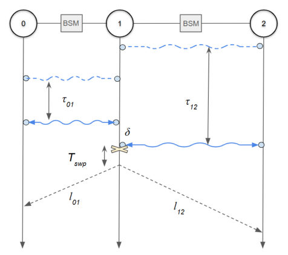
<figcaption class="paper-figure-caption"><b>Fig 1.</b> Fig. 1: Timeline of a path with 3 quantum nodes. Each quantum channel is equipped with a photonic BSM station in the middle. Dashed and solid wavy lines indicate when entanglement generation attempts start with photon emissions and succeed with heralds acknowledged, respectively. Here, δ is the waiting time to swap, Tswp the swapping time, and ℓij one-way latency between node i and node j.</figcaption>
</figure>
<figure class="paper-figure-card">
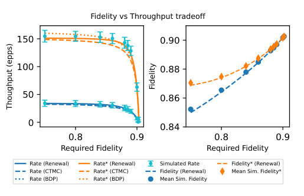
<figcaption class="paper-figure-caption"><b>Fig 2.</b> Fig. 2: Comparison of models and simulation in unit-memory case. Rate* and Fidelity* correspond to near ideal setting with parameters: ηmem = 0.9, ηd = 1 and deterministic swapping q = 1. Error bars denote means and standard deviations of simulation results.</figcaption>
</figure>
<figure class="paper-figure-card">
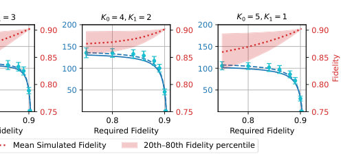
<figcaption class="paper-figure-caption"><b>Fig 3.</b> Fig. 3: Throughput and fidelity when varying memory allocation and multiplexing.</figcaption>
</figure>
<figure class="paper-figure-card">
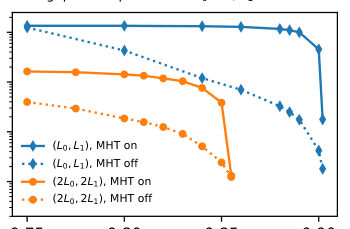
<figcaption class="paper-figure-caption"><b>Fig 4.</b> Fig. 5: Comparing throughput with and without model-based MHTs.</figcaption>
</figure>
<figure class="paper-figure-card">
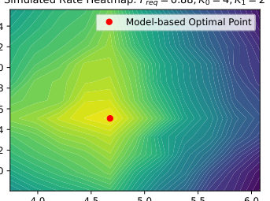
<figcaption class="paper-figure-caption"><b>Fig 5.</b> Fig. 4: Average throughput when varying MHTs Wi.</figcaption>
</figure>

**Summary.** This paper develops queueing models to analyze the capacity of memory-based quantum repeaters, balancing the trade-off between high entanglement throughput and maintaining a minimum required fidelity. By incorporating detailed noise dynamics from quantum memories and Bell State Measurements, the authors show that optimizing the maximum waiting times in these memories is key to maximizing usable network performance.

**Why it may be interesting.** This work provides a rigorous theoretical framework connecting resource management (memory time limits) directly to performance metrics (rate vs. fidelity), which is crucial for designing practical quantum communication networks.

Detailed structure

**Main problem.** The study focuses on optimizing the End-to-End (E2E) entanglement throughput of a memory-based quantum repeater while satisfying a minimum required fidelity constraint.

**Main result.** Optimal performance requires treating the maximum waiting times in quantum memories as optimization variables, leading to model-derived optimal holding times that significantly boost achievable throughput compared to unconstrained scenarios.

**Method.** The authors employ queueing models and stochastic process theory (e.g., CTMC) to approximate the system's rate dynamics under decoherence constraints.

**Model / system.** The model describes a quantum repeater network with two links, utilizing quantum memories subject to dephasing and depolarizing noise during entanglement swapping operations.

**Key observables.** E2E entanglement throughput (rate), average E2E fidelity ($F_{	ext{req}}$).

**Important parameters / regimes.** Memory capacities, entanglement attempt rates, classical communication latencies, and the maximum waiting times (MHTs) in quantum memories.

**Assumptions / limitations.** The analysis assumes independent Poisson generation of elementary entanglements and models decoherence using time-dependent depolarizing/dephasing channels; it does not consider entanglement purification.

**Figures summary.** Figures illustrate the timeline of entanglement attempts, show the throughput vs. fidelity trade-off curve, and compare performance when optimal model-based MHTs are enforced versus when they are ignored.

**Paper structure.** The paper develops queueing models to approximate E2E throughput, derives an expression for E2E fidelity accounting for memory noise and BSM errors, formulates the problem as maximizing rate subject to fidelity constraints, and validates this using simulations.

Abstract

We study the capacity of a memory-based quantum repeater in entanglement swapping between two quantum links with either single or multiple memories, which we refer to as the end-to-end (E2E) entanglement throughput, subject to a constraint on the minimum fidelity. In order to approximate the E2E entanglement throughput, we adopt queueing models, where quantum links can have different characteristics: memory capacities, entanglement attempt rates and success probabilities, as well as classical communication latencies. We develop a model for estimating E2E entanglement fidelity, while taking into account the heterogeneous dephasing and depolarizing dynamics of quantum memories and Bell-state measurements in entanglement swapping as well as classical communication delays and noises. Finally, with the help of our models for approximating the E2E entanglement throughput and fidelity, we use the maximum waiting times of entanglements in quantum memories at the repeater as optimization variables to maximize the E2E entanglement throughput while ensuring required minimum E2E fidelity.

[↑ back to top](#top)

### [Spectrally local geometric response at the onset of many-body quantum chaos](http://arxiv.org/abs/2608.11309v1)

**Authors:** George Mihailescu, Pablo M. Poggi  
**Type:** theory · **Category:** statistical mechanics · **PDF:** <https://arxiv.org/pdf/2608.11309v1>  
**Analysis basis:** abstract only; PDF text extraction failed or PDF unavailable
**Topic relevance:** `analog quantum simulation` **1/5** · `non-equilibrium universality` **1/5** · `scars & prethermalization` **1/5**

**Summary.** This paper introduces the spectral density of geometric response as a diagnostic tool to study how many-body quantum systems transition from integrable to chaotic behavior. It reveals that this crossover involves an initial localization of eigenbasis deformations before they spread across the spectrum. The findings suggest universal features governing chaos onset that are not captured by simple random matrix models.

**Why it may be interesting.** This work provides a quantitative measure (spectral density) for tracking the onset of quantum chaos in complex many-body dynamics, which is relevant for understanding thermalization and energy transport in interacting systems.

Detailed structure

**Main problem.** The paper investigates how quantum systems transition from integrable regimes towards chaos, focusing on spectral properties.

**Main result.** It finds that the crossover to chaos is characterized by an exponentially sensitive accumulation of eigenbasis deformations in localized spectral regions before spreading out.

**Method.** The authors introduce and analyze a novel diagnostic tool called the 'spectral density of geometric response' to measure eigenstate sensitivity across the energy spectrum.

**Model / system.** The study is applied to general many-body quantum systems, comparing results from physically motivated random-matrix ensembles against featureless Gaussian ensembles.

**Key observables.** Spectral density of geometric response; accumulation and spreading of eigenbasis deformations.

**Important parameters / regimes.** Integrability-to-chaos crossover scale; energy spectrum structure.

**Assumptions / limitations.** The analysis relies on comparing physical random matrix models against idealized Gaussian ensembles to isolate universal features.

**Paper structure.** The paper introduces the spectral density of geometric response, applies it to many-body systems to characterize the integrability-to-chaos crossover, and contrasts the findings between different random matrix models.

Abstract

We introduce the spectral density of geometric response, a measure of eigenstate sensitivity across an energy spectrum. Applied to many-body quantum systems, it reveals an exponentially sensitive integrability-to-chaos crossover, where eigenbasis deformations first accumulate in localized spectral regions before spreading throughout the spectrum. Physically motivated random-matrix ensembles reproduce this behaviour, whereas Gaussian ensembles do not, indicating universal features of the route to chaos that are absent from featureless random-matrix models.

[↑ back to top](#top)

### [Emergent heavy fermion and superconductivity near Mott transition in twisted bilayer graphene](http://arxiv.org/abs/2608.12319v1)

**Authors:** Ya-Hui Zhang  
**Type:** theory · **Category:** strongly correlated electrons · **PDF:** <https://arxiv.org/pdf/2608.12319v1>  
**Analysis basis:** full PDF text, analyzed in chunks
**Topic relevance:** `Keldysh / 2PI / non-Gaussian methods` **1/5** · `analog quantum simulation` **1/5**

↔ Scroll figures horizontally

<figure class="paper-figure-card">
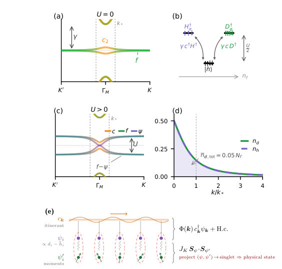
<figcaption class="paper-figure-caption"><b>Fig 1.</b> FIG. 1. (a) Free fermion bands at U = 0 along K′−ΓM −K, coloured by orbital content. γ inverts the active band: c2- like at ΓM, f-like in the regime |k| &gt; k∗. (b) Starting from a true Mott insulator of f orbital at a fixed valence nf i = ¯n, the γ hybridization generates a finite density of holon and doublon excitations. (c) The bands in the charge sector in the mixed-valence Mott state. At low energy, there is a quadratic band touching dominated by the orthogonal fermion ψ. (d) The momentum distribution of the doublon and holon nd(k) = nh(k) = 1 2  1 −k/ p</figcaption>
</figure>
<figure class="paper-figure-card">
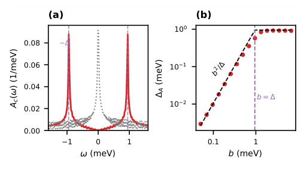
<figcaption class="paper-figure-caption"><b>Fig 2.</b> FIG. 3. (a) Momentum-integrated Ac(ω) inside the supercon- ducting phase, at the θ = 1.15◦, ν = 0, JA = 1 meV solution of Fig. 2(d) (b = 5.7 meV, ∆= 0.95 meV). The four point nodes of the | cos 2ϕ| gap (ϕ is the polar angle of k, measured from the nematic axis) give a V shape, with coherence peaks at ±∆. Dotted: the same spectral function Ac(ω) for the normal state with ∆= 0. (b) Antinodal gap ∆A versus b at fixed ∆= 0.95 meV (θ = 1.15◦, ν = 0), crossing over from the proximity form b2/∆(dashed) to the locked value ∆. In the regime b &lt; ∆, we expect a two-gap structure.</figcaption>
</figure>
<figure class="paper-figure-card">
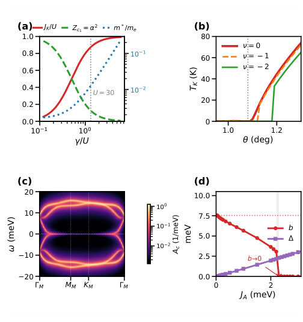
<figcaption class="paper-figure-caption"><b>Fig 3.</b> FIG. 2. (a) The γ/U crossover at θ = 1.15◦for the charge sector at ν = 0, with γ, M, v∗fixed at their THFM values and U varied. Red: JK/U = γ2/(γ2 + U 2/4). Green dashed: the c1 spectral weight Zc1 = α2. The two cross at γ = U/2. Blue dotted (right axis): the effective mass of the quadratic band touching, m∗= ℏ2|M|/(2α2v2 ∗) = ℏ2|M|</figcaption>
</figure>
<figure class="paper-figure-card">
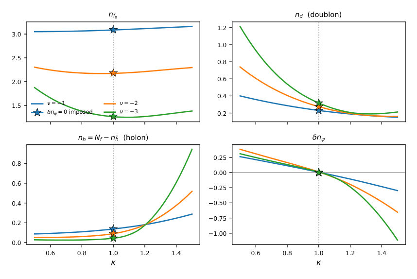
<figcaption class="paper-figure-caption"><b>Fig 4.</b> FIG. 4. Occupations versus κ near the magic angle (θ = 1.05◦: γ = 24.75 meV, |M| = 3.69 meV, U = 30 meV, temperature T = 0.02 meV) for ν = −1, −2, −3, computed from Eq. (A24) with nc = 4 + ν held fixed: nf0, the doublon and holon densities nd and nh = Nf −n˜h, and the mismatch δnψ. Stars mark the solution of Eq. (A25), which has no κ; near κ = 1 the two coincide within the linewidth. nd &gt; nh throughout: the valence stays mixed in both cases.</figcaption>
</figure>
<figure class="paper-figure-card">
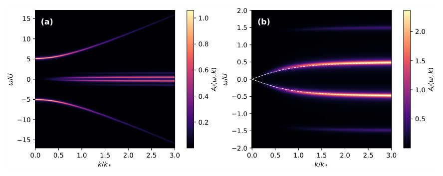
<figcaption class="paper-figure-caption"><b>Fig 5.</b> FIG. 5. f spectral function Af(ω, k) of the untruncated Gaussian theory Eq. (B11) at γ = 5U, M = 0, pairs l ∈{0, 1}. (a) Full window: the bright pair at ± p</figcaption>
</figure>

**Summary.** This work develops a comprehensive theoretical model to describe emergent heavy fermion physics and superconductivity near the Mott transition in twisted bilayer graphene. By treating the system through an emergent Kondo coupling mechanism involving mixed-valence excitations, the authors predict the formation of a heavy semimetal phase and unconventional superconducting domes at charge neutrality. This establishes a powerful, unified framework for correlated materials research.

**Why it may be interesting.** The development of a unified framework connecting Mott transitions, heavy fermion behavior, and unconventional superconductivity in a tunable solid-state system like TBG is highly relevant for understanding strongly correlated electron physics beyond simple Hubbard models.

Detailed structure

**Main problem.** The research investigates emergent heavy fermion behavior and superconductivity that arise near a Mott transition in twisted bilayer graphene (TBG).

**Main result.** The authors establish a unified framework showing how mixed-valence physics leads to an emergent Kondo screening transition, resulting in a heavy semimetal phase and unconventional superconductivity.

**Method.** The analysis employs an emergent heavy-fermion framework utilizing an 'ancilla' theory involving orthogonal fermions ($\psi$) to capture mixed-valence Mott states. Techniques include Schrieffer-Wolff elimination, mean-field theory for pairing, and self-consistent determination of excitation weights.

**Model / system.** The system is Twisted Bilayer Graphene (TBG) modeled by an extended Hamiltonian involving itinerant carriers ($c$), local moments ($\psi'$), and charge excitations treated via doublon/holon operators. The physics is analyzed near integer fillings $
u$ relative to the Mott transition.

**Key observables.** Quasiparticle residue ($Z$), Fermi velocity ($v_F$), superconducting gap structure ($\Delta_{SC}$), Kondo temperature ($T_K$), and momentum-resolved occupations of doublon/holon excitations.

**Important parameters / regimes.** Hybridization coupling ($\gamma$) vs. on-site repulsion ($U$); twist angle ($	heta$); doping level ($
u$); and the anti-Hund's coupling ($J_A$).

**Assumptions / limitations.** The theory relies on an emergent heavy-fermion description derived from mixed-valence physics, using approximations like canonical fermions in a mixed state ensemble.

**Figures summary.** Figures illustrate band structure changes (band inversion), the generation of holon/doublon excitations, and plots showing $T_K$ dependence on the twist angle $	heta$.

**Paper structure.** The paper progresses by defining the effective heavy-fermion model using ancilla fermions, deriving the Kondo coupling mechanism from mixed-valence physics, calculating the resulting low-energy semimetal state below $T_K$, and finally incorporating anti-Hund's coupling to predict superconductivity.

Abstract

Near a bandwidth-tuned Mott transition, the Fermi velocity $v_F$ and quasiparticle residue $Z$ of a metal often vanish. Here, we show that analogous phenomena emerge in twisted bilayer graphene (TBG) at integer fillings and can be captured by an emergent heavy-fermion framework within a projective active-band limit. Unlike models incorporating remote bands, our effective heavy-fermion description arises from \textit{mixed-valence Mott} physics via decoupled charge and local-moment sectors. In the charge sector, active bands $c(\mathbf{k})$ hybridize with an emergent \emph{orthogonal fermion} $ψ(\mathbf{k})$ to open a large Mott gap at $|\mathbf{k}| > k_*$ ($k_*$ sets the momentum-patch size) and a quadratic band-touching semimetal near $\mathbf{k}=0$ at neutrality ($ν=0$). The orthogonal fermion is a linear combination of the doublon and holon excitations and may be written as $ψ_i \sim (δn^f_i+\frac{1}{2})^{-1} f_i$. An emergent Kondo coupling $J_K \sim U$ ($U$ is the local Hubbard interaction) between $ψ$ and local moments $ψ'$ frames the Mott transition as a Kondo screening transition, tuned by the twist angle $θ$. Away from the magic angle, a Kondo-screened heavy semimetal develops below $T_K$ (the Kondo temperature) with vanishing $Z$. Introducing anti-Hund's coupling $J_A$ generates an s-wave fully gapped or nematic, nodally gapped superconducting dome near the Mott boundary even at $ν=0$. At other integer fillings $ν= \pm 1, \pm 2$, increasing bandwidth first drives the small-gap Mott state into an intermediate quadratic band-touching semimetal before entering a heavy Fermi liquid with large Fermi surfaces. Our results establish a unified framework for emergent heavy fermion physics with both itinerant carriers and local moments from the $f$ orbital.

[↑ back to top](#top)

### [Probing Impurity Quantum Criticality with Entanglement Witnesses](http://arxiv.org/abs/2608.12317v1)

**Authors:** Mateo Cárdenes Wuttig, Andrew J. Millis  
**Type:** theory · **Category:** strongly correlated electrons · **PDF:** <https://arxiv.org/pdf/2608.12317v1>  
**Analysis basis:** full PDF text, analyzed in chunks
**Topic relevance:** `analog quantum simulation` **1/5** · `quantum measurements` **1/5**

↔ Scroll figures horizontally

<figure class="paper-figure-card">
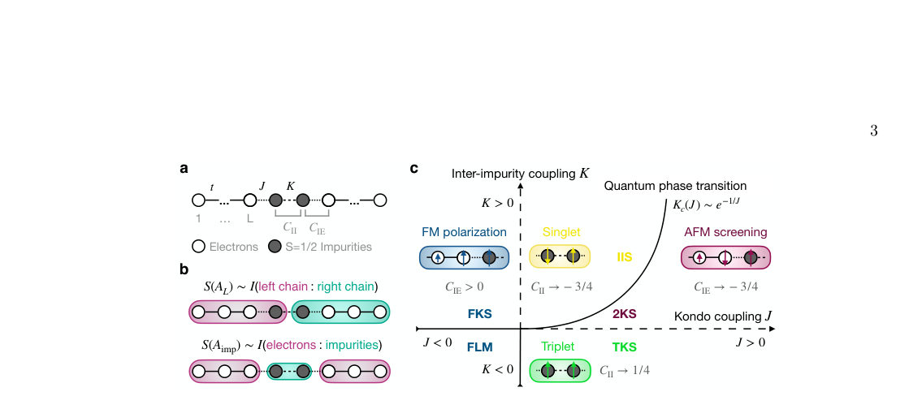
<figcaption class="paper-figure-caption"><b>Fig 1.</b> FIG. 1. Two-impurity Kondo model, entanglement partitions, and schematic phase diagram. a, Two spin- 1/2 impurities (gray sites) are coupled by an inter-impurity exchange K and connected through Kondo couplings J to independent half-filled chains of L non-interacting electrons (white sites) with nearest-neighbor hopping t. CII = ⟨S1 · S2⟩ and CIE = ⟨S · se⟩denote the impurity-impurity and impurity-electron correlators, respectively. b, Partitions used to probe ground-state entanglement, which is proportional to the mutual information I: Two single-impurity chains S(AL) (top) and impurities and electrons S(Aimp) (bottom). c, Schematic zero-temperature ground-state phase diagram as a function...</figcaption>
</figure>
<figure class="paper-figure-card">
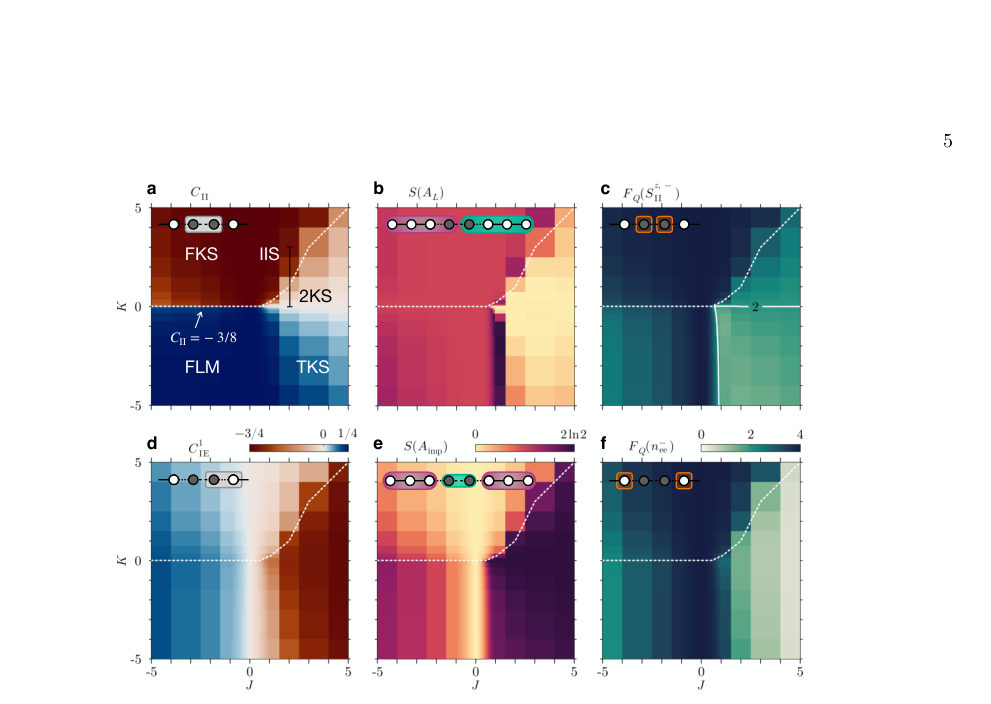
<figcaption class="paper-figure-caption"><b>Fig 2.</b> FIG. 2. Correlations, entanglement, and quantum Fisher information across the phase diagram. Zero temper- ature ground-state observables as a function of the electron–impurity Kondo coupling J (horizontal axis) and inter-impurity exchange K (vertical axis), obtained from DMRG. a, d, Spin-spin correlations. The impurity–impurity correlator CII (a) distinguishes predominantly singlet-correlated (red) and triplet-correlated (blue) impurities. In all panels, the dotted white contour marks CII = −3/8 and provides a reference scale for the competition between singlet formation and Kondo screening in the quadrant J, K &gt; 0. The black line corresponds to the linecut presented in Fig. 3. The...</figcaption>
</figure>
<figure class="paper-figure-card">
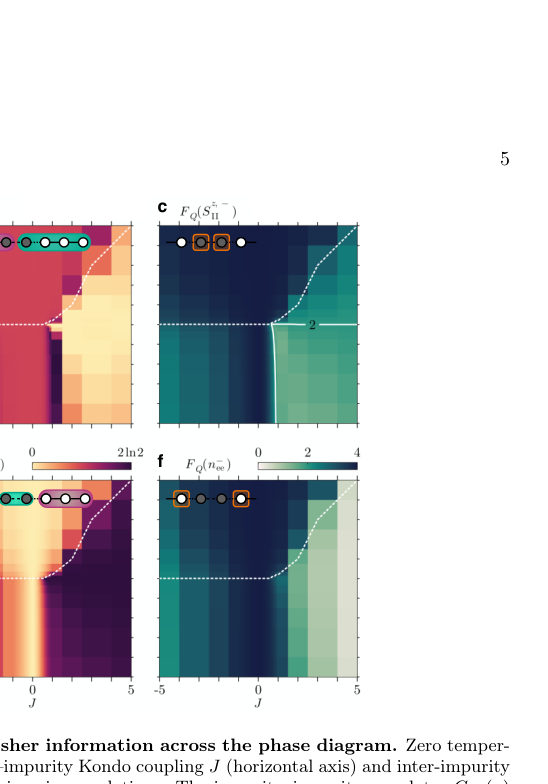
<figcaption class="paper-figure-caption"><b>Fig 3.</b> Fig. 3d shows that ∂KFQ(n− ee) develops a pronounced peak near the same finite-size critical coupling Kc(L). Its critical enhancement reveals that the redistribution of entanglement is imprinted on spatially resolved occu- pation fluctuations of the conduction electrons, provid- ing an experimentally motivated route to detect impu- rity quantum criticality without direct measurement of the inter-impurity spin correlation. The spin-resolved QFI FQ(n− ↑,ee) (inset of Fig. 3d) follows the critical re- sponse and also verifies entanglement[12].</figcaption>
</figure>
<figure class="paper-figure-card">
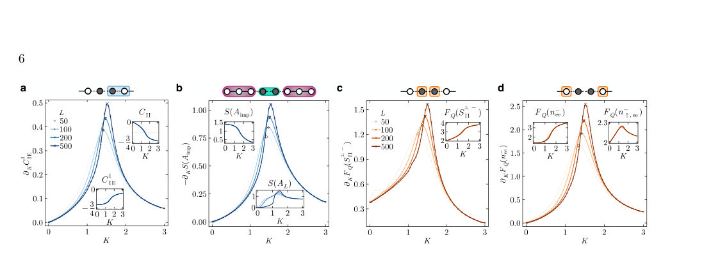
<figcaption class="paper-figure-caption"><b>Fig 4.</b> FIG. 3. Quantum Fisher information reveals entanglement redistribution at the critical point. Derivatives with respect to the inter-impurity exchange K for J = 2 and different electron chain lengths L. a, The derivative of the impurity–electron correlator, ∂KC1 IE, develops a peak near the size-dependent critical coupling Kc(L), visualized by large symbols. The insets show C1 IE and the impurity–impurity correlator CII. b, The derivative of the entropy between electrons and impurities, −∂KS(Aimp), provides an entanglement signature of the critical point. The insets show S(Aimp) and S(AL), demonstrating how entanglement is redistributed across the phase transition. c, The derivative of the...</figcaption>
</figure>
<figure class="paper-figure-card">
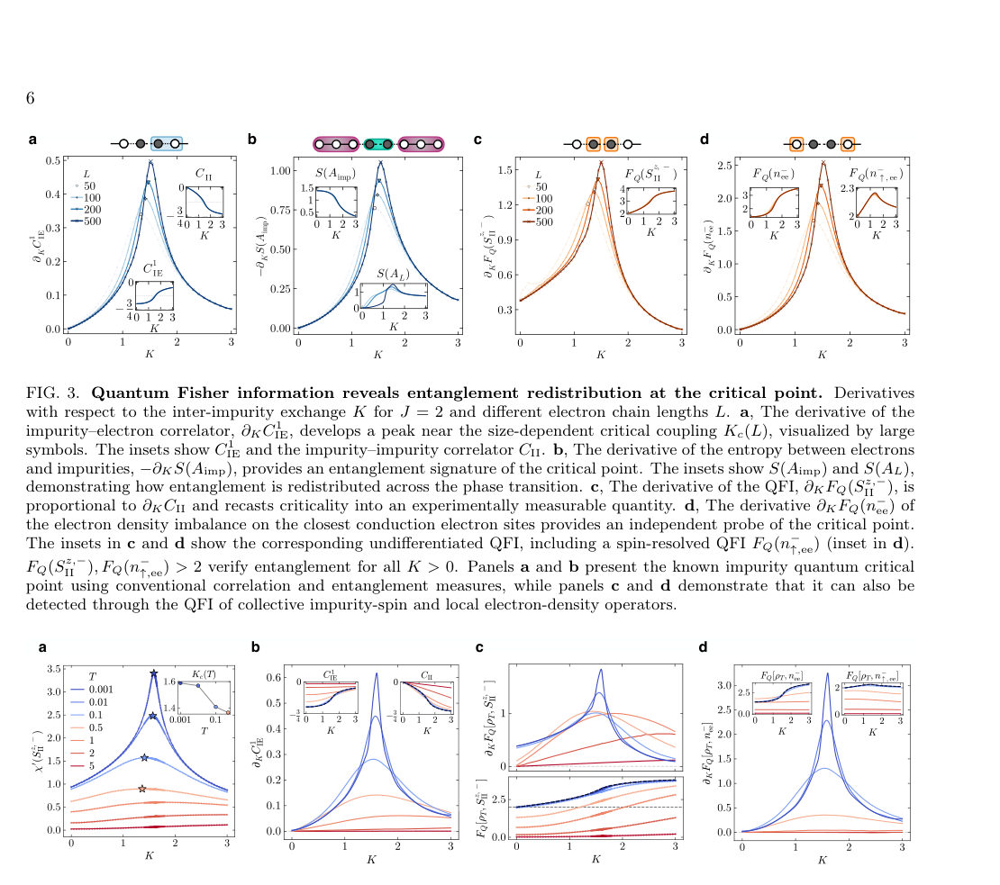
<figcaption class="paper-figure-caption"><b>Fig 5.</b> FIG. 4. Impurity criticality and QFI at finite temperatures. a, Static susceptibility χ′(Sz,− II ) of the staggered impurity spin operator as a function of K for J = 2 for different temperatures T. All data are obtained from NRG. The low-temperature peak at T = 0.001 identifies Kc = 1.59 ± 0.03 and is suppressed into a broader crossover with increasing temperature. b, Derivative of the impurity–electron correlator ∂KC1 IE, whose extrema track the susceptibility peak. Insets show the corresponding finite-temperature correlators, where T = 0 DMRG data (dashed black lines) of the undifferentiated observables show that both methods agree in the limit T →0. c,d, QFI of the impurity generator...</figcaption>
</figure>

**Summary.** The paper investigates quantum criticality in the two-impurity Kondo model by using entanglement measures as witnesses. By calculating observables like Quantum Fisher Information and various correlation functions across different coupling regimes, the authors demonstrate that these measurable quantities exhibit singular behavior precisely at the predicted quantum critical point. This establishes a robust theoretical framework for detecting exotic quantum phases in solid-state systems.

**Why it may be interesting.** This work directly connects abstract quantum information concepts (entanglement) to concrete, measurable physical quantities (susceptibilities, fluctuations), providing a powerful diagnostic tool for strongly correlated materials like heavy fermions.

Detailed structure

**Main problem.** The study aims to determine if measurable spin and charge fluctuations can serve as entanglement witnesses to detect quantum critical points (QCPs) in impurity systems.

**Main result.** The analysis confirms that the Quantum Fisher Information (QFI), derived from measurable correlations, tracks the entanglement changes across the non-Fermi-liquid QCP separating Kondo-screened and inter-impurity singlet phases.

**Method.** The authors employ advanced numerical techniques like Density-Matrix Renormalization Group (DMRG) and Numerical Renormalization Group (NRG) to calculate entanglement measures and QFI at zero and finite temperatures.

**Model / system.** The primary model is the two-impurity Kondo model, consisting of two spin-1/2 impurities coupled by an exchange interaction ($K$) and each coupled independently to a bath of conduction electrons via Kondo couplings ($J$).

**Key observables.** Entanglement entropy ($S(A_{	ext{imp}})$), impurity-impurity correlator ($\langle \mathbf{S}_1 \cdot \mathbf{S}_2 
angle$), Quantum Fisher Information (QFI) for spin and charge operators.

**Important parameters / regimes.** The critical coupling $K_c(J)$ controls the transition between the Kondo-screened Fermi-liquid state and the inter-impurity singlet phase; temperature ($T$) is also varied.

**Assumptions / limitations.** The analysis relies on mapping entanglement properties onto experimentally accessible dynamical response functions via QFI calculations.

**Figures summary.** Figures schematically illustrate the model setup, showing how various observables like correlators and entanglement measures change across different quantum phases (e.g., 2KS vs IIS).

**Paper structure.** The paper systematically analyzes the Hamiltonian in different coupling regimes ($J$ vs $K$), calculates ground-state and finite-temperature expectation values using DMRG/NRG, and then maps these results onto entanglement measures and QFI to pinpoint the critical point.

Abstract

Entanglement is a defining feature of quantum mechanics, and its relation to quantum criticality is of considerable current interest. Here we show that measurable spin and charge fluctuations provide an entanglement witness of quantum criticality in the two-impurity Kondo model, which has experimental realizations in terms of coupled quantum dots and magnetic impurities added to surfaces. We use density-matrix renormalization group and numerical renormalization group calculations to resolve the non-Fermi-liquid critical point separating two independently Kondo-screened impurities from an inter-impurity singlet and interpret it as a change in the dominant entanglement partner of each local moment: from entanglement of the local moment with an extended set of conduction-electron degrees of freedom to entanglement with the other impurity. This reorganization is accompanied by a singular response of the impurity-bath entanglement and the inter-impurity susceptibility. We show how the same structure is encoded in the quantum Fisher information of collective spin and charge operators at zero and finite temperatures, connecting the entanglement picture to experimentally accessible dynamical response functions. Our results establish impurity systems as controlled settings in which quantum-critical entanglement can be detected through measurable correlations, and provide further insight into the possibility of understanding heavy-fermion physics in terms of entanglement.

[↑ back to top](#top)

### [The Fate of Crystalline Topological Phenomena in the Continuum](http://arxiv.org/abs/2608.11302v1)

**Authors:** Rajas Chari, Taylor L. Hughes  
**Type:** theory · **Category:** strongly correlated electrons · **PDF:** <https://arxiv.org/pdf/2608.11302v1>  
**Analysis basis:** full PDF text, analyzed in chunks
**Topic relevance:** `analog quantum simulation` **1/5** · `driven-dissipative phase transition` **1/5**

↔ Scroll figures horizontally

<figure class="paper-figure-card">
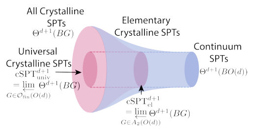
<figcaption class="paper-figure-caption"><b>Fig 1.</b> FIG. 1. Schematic “funnel” for the stratification theorem. The clas- sification of crystalline SPTs across all finite symmetry groups (left) maps surjectively onto the continuum classification (right) via the stratification map.</figcaption>
</figure>
<figure class="paper-figure-card">
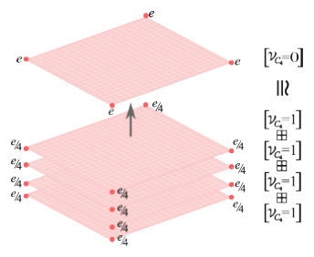
<figcaption class="paper-figure-caption"><b>Fig 2.</b> FIG. 2. A single C4-symmetric HOTI layer carries fractional corner charge qcorner = e/4 (mod e) with indicator νC4 = 1 ∈Z4, and is denoted by [νC4 = 1]. Stacking four layers adds the corner charges to an integer e, yielding a trivial insulator. This realizes [νC4 = 1]⊞4 = 0, i.e., a p = 2 torsion class with exponent k = 2 with νC4 = 0.</figcaption>
</figure>
<figure class="paper-figure-card">
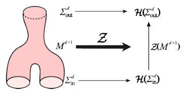
<figcaption class="paper-figure-caption"><b>Fig 3.</b> FIG. 3. Pictorial description of a TQFT functor.</figcaption>
</figure>
<figure class="paper-figure-card">
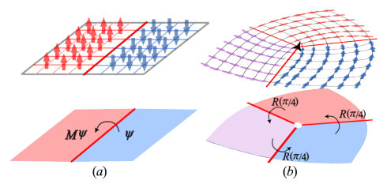
<figcaption class="paper-figure-caption"><b>Fig 4.</b> FIG. 4. (a) Codimension-1 domain walls for orientation-reversing mirror symmetry M. (b) Codimension-2 disclinations defect of dis- crete rotation symmetry G = C4. Non-trivial holonomy around a loop encircling the disclination implies it is a source of curvature. Bottom panels encode the physical defect configurations using trian- gulations with edges labelled with group elements.</figcaption>
</figure>
<figure class="paper-figure-card">
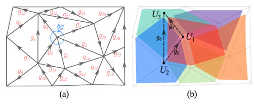
<figcaption class="paper-figure-caption"><b>Fig 5.</b> FIG. 5. (a) A patch of a triangulated manifold with locally oriented edges labeled by group elements ge ∈G. Consistency requires that the ordered product of labels along any contractible loop in the 1- skeleton equals the identity. (b) Illustrates the dual cellulation of the triangulation. The same consistency condition applied to every face (2-simplex above) leads to the ˇCech cocycle condition on the topology defined by open covers {Uα} given by polytopes in the dual lattice(or cellulation). For example, in the highlighted example we get g5 · g4 = g6.</figcaption>
</figure>

**Summary.** The paper rigorously analyzes the passage from crystalline topological phases on a lattice to their corresponding continuum field theories. Using advanced algebraic topology, it proves that while every continuum phase can be realized on a lattice, the process loses information, meaning distinct lattice configurations can map to the same continuous description.

**Why it may be interesting.** This work provides a rigorous mathematical framework for understanding how microscopic symmetries and lattice details constrain macroscopic continuum descriptions in topological materials, which is crucial for designing novel quantum states.

Detailed structure

**Main problem.** The central problem is rigorously determining whether the topological properties of gapped bosonic systems defined on a discrete lattice (crystalline phases) survive when taking the continuum limit to form a field theory.

**Main result.** The map from crystalline to continuum topological phases is surjective, meaning every continuum phase has a lattice realization; however, it is generally not injective, implying that some microscopic lattice information collapses in the continuum description.

**Method.** The authors employ advanced mathematical tools, including algebraic topology and category theory, to construct a rigorous stratification map relating crystalline classification groups ($\Theta^{d+1}(BG)$) to continuum ones ($\Theta^{d+1}(	ext{BO}(d))$).

**Model / system.** The study focuses on gapped bosonic phases of matter characterized by finite point-group symmetries ($G \subset O(d)$), analyzing the relationship between lattice topological invariants and their effective low-energy continuum field theories.

**Key observables.** Topological invariants, such as those classified by group cohomology ($\Theta^{d+1}(BG)$) and cobordism theory ($\Omega_{d+1}^O(BG)$).

**Important parameters / regimes.** The analysis is restricted to point-group symmetries ($G \subset O(d)$), deliberately excluding lattice translations, and focuses specifically on the 2-primary torsion sector of the classification groups.

**Assumptions / limitations.** The work assumes gapped phases and restricts attention to bosonic systems whose continuum limit TQFTs are assumed to be diffeomorphism-invariant (excluding certain metric dependencies).

**Figures summary.** Figure 1 schematically illustrates a surjective 'funnel' mapping the classification of crystalline SPTs onto the continuum SPT classification.

**Paper structure.** The paper develops the mathematical framework by defining the map between lattice and continuum classifications, proving its surjectivity, analyzing the loss of information (non-injectivity), and applying this general theory to specific physical examples like 2D rotation-symmetric phases and quantum critical points.

Abstract

The continuum limit is a widely used theoretical construct for obtaining continuum field-theories of crystalline systems. We study the formulation of a continuum limit for gapped bosonic phases and ask whether their topological properties survive passage to the continuum. Using methods in algebraic topology and category theory, we give a rigorous formulation of the continuum limit and construct a surjective global map relating crystalline topological phases across all finite point-group symmetries to continuum invertible topological phases. Consequently, we find that some lattice phases admit no continuum limit, while distinct lattice phases that do admit a continuum limit can share the same continuum image, hence implying that some lattice topological data can collapse. Conversely, we find that every continuum invertible phase admits a faithful crystalline realization. In addition to the general framework, we apply it to several examples, including studies of a 2D rotation-symmetric phase, higher-order topological phases, and the mixed spin-lattice anomaly of the deconfined quantum critical point between an antiferromagnet and valence bond solid.

[↑ back to top](#top)

### [Contextuality in the $n$-qubit Pauli group](http://arxiv.org/abs/2608.11993v1)

**Authors:** Markus Frembs  
**Type:** theory · **Category:** quantum information and computing · **PDF:** <https://arxiv.org/pdf/2608.11993v1>  
**Analysis basis:** full PDF text, analyzed in chunks
**Topic relevance:** `quantum measurements` **1/5**

↔ Scroll figures horizontally

<figure class="paper-figure-card">
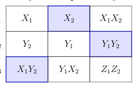
<figcaption class="paper-figure-caption"><b>Fig 1.</b> FIG. 1: The highlighted mutually anti-commuting Pauli operators determine the rank-2 projectors ΠP = 1</figcaption>
</figure>

**Summary.** The paper rigorously investigates contextuality within the $n$-qubit Pauli group by introducing a generalized notion of noncontextual property. It proves that for three or more qubits, this system is highly contextual, linking its structure to the geometry of symplectic polar spaces. This provides deep mathematical insight into the fundamental resource of quantum information.

**Why it may be interesting.** This work provides a deep mathematical characterization of quantum contextuality in a fundamental model ($	ext{Pauli}_n$), linking it rigorously to advanced topics in algebraic geometry (symplectic polar spaces) and combinatorial set theory (Cameron-Liebler sets).

Detailed structure

**Main problem.** The paper analyzes contextuality within the $n$-qubit Pauli group, generalizing the concept of noncontextuality beyond simple valuations using Boolean-valued frame functions.

**Main result.** It establishes that for $n \geq 3$, the Pauli group admits no nontrivial noncontextual properties; furthermore, it shows that contextuality depends on the geometry of symplectic polar spaces rather than just the projective nature of the representation.

**Method.** The analysis employs advanced mathematical tools including defining context posets, introducing 'noncontextual properties' via connection holonomy groups, and relating these to Boolean-valued frame functions and Cameron–Liebler sets.

**Model / system.** The primary system is the $n$-qubit Pauli group ($	ilde{P}_n$), which is analyzed through its underlying symplectic theory. The contextuality is mapped onto geometric structures like isotropic subspaces and polar spaces in a binary affine-symplectic space.

**Key observables.** Contextuality, noncontextual properties (diagnosed by the holonomy group $	ext{Hol}_{C_0}(
abla)$), Boolean-valued frame functions, and the weight $k$ of these functions.

**Important parameters / regimes.** $n$ (number of qubits); the structure of the symplectic form $\omega$; and specific weights $\{0, 1, 2, 2n-2, 2n-1, 2n\}$ for frame function analysis.

**Assumptions / limitations.** The generalization of KS noncontextuality via Definition 3 (noncontextual property) is central; the analysis also relies on relating these properties to Lagrangian subspaces and Cameron–Liebler sets.

**Figures summary.** Figure 1 illustrates mutually anti-commuting Pauli operators determining rank-2 projectors. Table I summarizes the existence of frame functions for different $n$ and theories, while Table II compares four distinct context posets associated with the system.

**Paper structure.** The paper progresses by defining generalized noncontextuality (Definition 3), establishing its equivalence to Boolean-valued frame functions (Theorem 1), analyzing specific cases ($n=2$), comparing the Pauli group context poset to the symplectic theory, and finally relating these results to the classification of Cameron–Liebler sets.

Abstract

The $n$-qubit Pauli group is an essential ingredient to most quantum applications, from computing and error correction to benchmarking and simulation. Despite comprising merely a discrete set of operators, it exhibits many quintessential features of quantum theory, including contextuality, which has been identified as a key resource to quantum advantage in a variety of different flavours. Here, we extend this analysis, introducing the notion of a `noncontextual property' whose nonexistence proves the Kochen-Specker theorem, similarly to and generalising common arguments based on the nonexistence of valuations. We relate this notion formally to the existence of Boolean-valued frame functions, and characterise all such frame functions in the case of the $n$-qubit Pauli group.   For two qubits, we show that the Pauli group admits noncontextual properties, despite admitting no valuations. We then establish this as the only nontrivial such case with $n\geq 2$, by proving that any Boolean-valued frame function on stabiliser states is constant for more than two qubits. We also perform a similar analysis for the symplectic theory underlying the $n$-qubit Pauli group, for which nonconstant Boolean-valued frame functions exist for all $n$, yet only in restricted form. By comparison, this shows that contextuality in the $n$-qubit Pauli group is not only a consequence of the projective nature of the Pauli group as a representation of its underlying symplectic vector space, but of the geometry of symplectic polar spaces itself. In geometric terms, our result determines all Cameron-Liebler sets of maximal totally isotropic flats in the binary affine-symplectic space.

[↑ back to top](#top)

### [CoQui: A Coordinate-Conditioned Quantum Implicit Generative Adversarial Network for End-to-End Image Generation](http://arxiv.org/abs/2608.11884v1)

**Authors:** Xue Yang, Rigui Zhou, ShiZheng Jia, Dax Enshan Koh, Siong Thye Goh, Young-Wook Cho, YaoChong Li, Xuezhi Ma, Hongyu Chen, Xin Wang  
**Type:** both · **Category:** quantum information and computing · **PDF:** <https://arxiv.org/pdf/2608.11884v1>  
**Analysis basis:** full PDF text, analyzed in chunks
**Topic relevance:** `quantum measurements` **1/5**

↔ Scroll figures horizontally

<figure class="paper-figure-card">
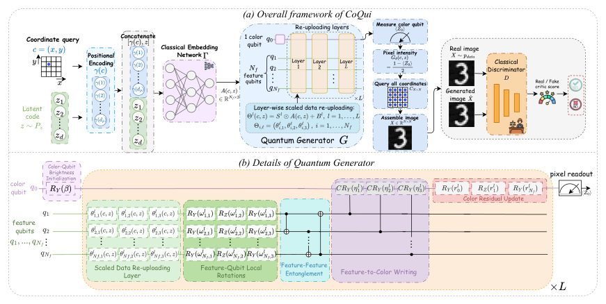
<figcaption class="paper-figure-caption"><b>Fig 1.</b> Figure 1: Overview of the CoQui framework. (a) Overall architecture: Given a spatial coordinate c = (x, y) and a latent code z, CoQui utilizes a classical embedding network Γ to generate coordinate- and latent-conditioned parameters A(c, z) ∈RNf ×3. These are transformed into layer-wise scaled parameters Θi,ℓfor the quantum generator G. The pixel intensity is computed as G(c, z) = 1−⟨Z0⟩</figcaption>
</figure>
<figure class="paper-figure-card">
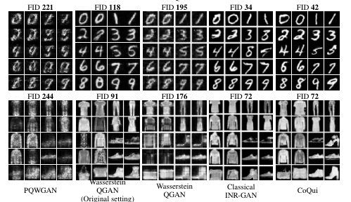
<figcaption class="paper-figure-caption"><b>Fig 2.</b> Figure 2: Qualitative comparison on MNIST and Fashion-MNIST. Top: samples from each class for each method. Bottom: represen- tative grids over ten classes, with FID scores reported above each grid.</figcaption>
</figure>
<figure class="paper-figure-card">
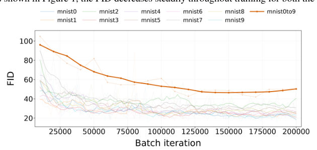
<figcaption class="paper-figure-caption"><b>Fig 3.</b> Figure 1: Training FID curves of the jointly trained MNIST 0–9 model and the individual digit-specific models. the jointly trained multi-class model, and gradually stabilizes in the later stages. This indicates that the proposed model is able to progressively learn the target data distribution and achieve stable convergence under both single-class and multi-class settings.</figcaption>
</figure>

**Summary.** CoQui introduces a novel Quantum Generative Adversarial Network that models image generation using coordinate-conditioned implicit functions, overcoming the qubit scaling issues of traditional QGANs. By reading out pixel intensities via expectation values at specific coordinates rather than encoding them into circuit amplitudes, it achieves superior performance on benchmark datasets while maintaining structural control over the generated image.

**Why it may be interesting.** This work is highly relevant as it pushes QGANs beyond simple amplitude encoding by adopting an implicit function representation conditioned on continuous spatial coordinates. This structural change addresses fundamental scaling bottlenecks in quantum machine learning for imaging tasks.

Detailed structure

**Main problem.** The authors address limitations in existing Quantum Generative Adversarial Networks (QGANs) for image generation, specifically the scaling issues with resolution and the probability competition when decoding multiple pixels.

**Main result.** CoQui outperforms established amplitude-mapping QGAN baselines (like FRQI-based methods) in both visual quality and quantitative metrics while requiring fewer qubits. The method successfully decouples image resolution from address qubit requirements.

**Method.** The core methodology reformulates image generation as coordinate-conditioned implicit function learning, where pixel intensities are read out by evaluating a variational quantum circuit at specific spatial coordinates $(c)$ conditioned on latent variables $(z)$.

**Model / system.** The model is CoQui, a QGAN framework built upon Quantum Implicit Neural Representations (QINR). It uses a classical embedding network to generate parameters for a parameterized quantum circuit that maps continuous spatial coordinates and latent codes to pixel intensities via expectation values.

**Key observables.** Pixel intensity derived from the expectation value of a dedicated color qubit ($\langle Z_0 
angle$), evaluated across all spatial coordinates $(c)$. Quantitative metrics include FID, JSD, Entropy, Brightness, and Sobel distance.

**Important parameters / regimes.** The model's structure involves trainable parameters governing circuit layers (e.g., scale $S_l$, bias $B_l$) and the number of feature qubits ($N_f$), which are optimized during training.

**Assumptions / limitations.** The primary assumption is that image generation can be accurately modeled as a continuous, coordinate-conditioned implicit function learned via quantum circuits. Limitations include reliance on classical simulation and neglecting realistic hardware noise.

**Figures summary.** Figures illustrate the overall CoQui framework (input $
ightarrow$ embedding $
ightarrow$ VQC $
ightarrow$ readout) and show representative MNIST samples comparing Full CoQui against variants lacking key structural components, demonstrating performance gains.

**Paper structure.** The paper first identifies limitations in existing QGANs. It then proposes the CoQui architecture, detailing its coordinate-conditioned implicit mapping approach. The methodology involves defining the classical embedding network and the complex structure of the variational quantum circuit (including color qubit initialization, data re-uploading layers, entanglement, and residual updates). Finally, it presents quantitative ablation studies and capacity analyses.

Abstract

Quantum generative adversarial networks (QGANs) have attracted increasing attention for image generation using parameterized quantum circuits. Existing amplitude-based approaches face two key limitations: pixel locations are typically encoded by computational-basis indices or address qubits, causing quantum resources to grow with image resolution; meanwhile, jointly decoding many pixels from normalized quantum states introduces probability competition among pixels and limits precise pixel-wise control. To address these issues, we reformulate quantum image generation as coordinate-conditioned implicit function learning. Our method takes spatial coordinates and latent variables as inputs, uses a classical embedding network to generate input-dependent circuit parameters, and evaluates a variational quantum circuit at each coordinate. Pixel intensities are directly obtained from the expectation value of a dedicated color qubit, and a complete image is generated by querying all spatial coordinates. This design decouples image resolution from address-qubit requirements and avoids shared probability-normalization constraints across pixels. We further design a specialized variational quantum circuit to provide structural inductive bias for coordinate-conditioned generation. Simulated experiments on two benchmark datasets show that our method outperforms FRQI-based generation and PQWGAN in visual and quantitative quality while using fewer qubits, and also achieves better generation quality than the corresponding classical baseline.

[↑ back to top](#top)

### [Isospectral majorization and isoperimetric inequalities for coherent states on the Bloch sphere](http://arxiv.org/abs/2608.12248v1)

**Authors:** Luis Daniel Abreu  
**Type:** theory · **Category:** other · **PDF:** <https://arxiv.org/pdf/2608.12248v1>  
**Analysis basis:** full PDF text, analyzed in chunks
**Topic relevance:** `quantum measurements` **1/5**

↔ Scroll figures horizontally

<figure class="paper-figure-card">
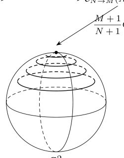
<figcaption class="paper-figure-caption"><b>Fig 1.</b> Figure 1. Geometric representation of the spherical amplification channel. Amplification raises the representation degree from PN to PM, while the natural normalization preserves the covariant symbol and its level curves on the Bloch sphere: QXM(X) = QX.</figcaption>
</figure>

**Summary.** This theoretical paper develops a fixed-spectrum majorization theory for coherent states on the Bloch sphere. By proving an isospectral version of the Lieb-Solovej inequality, it shows that passive rearrangement minimizes entropy. This spectral result is then applied to derive sharp isoperimetric inequalities for Toeplitz operators associated with measurable subsets of the sphere.

**Why it may be interesting.** This work connects fundamental concepts from quantum information geometry (coherent states, entropy) with classical geometric inequalities (isoperimetry), providing powerful tools applicable to characterizing optimal state preparations or spatial distributions in quantum systems.

Detailed structure

**Main problem.** The paper establishes isospectral majorization relationships and derives sharp isoperimetric inequalities for coherent states defined on the Bloch sphere.

**Main result.** It proves a fixed-spectrum Lieb-Solovej inequality, showing that passive rearrangement minimizes certain entropy measures, which in turn yields isoperimetric bounds for Toeplitz operators related to spherical caps.

**Method.** The analysis uses functional inequalities (convex/concave functions $\Phi$) applied to the Husimi function and leverages majorization theory ($\prec$) derived from spectral properties of Toeplitz operators.

**Model / system.** The system is based on density operators $
ho$ acting on the Hilbert space of analytic polynomials $P_N$, which models coherent states on the Bloch sphere ($	ext{SU}(2)$). The analysis involves Toeplitz operators $T_\Omega$ defined by subsets $\Omega$ of the sphere.

**Key observables.** Husimi function ($Q_
ho(z)$), Wehrl entropy ($S_W(
ho)$), and partial sums of eigenvalues ($\sum \lambda_j(\Omega)$) of Toeplitz operators.

**Important parameters / regimes.** The polynomial degree $N$, the rank of the density operator $	ext{Rank}(
ho)=r$, and the measure/area $m(\Omega)$ of the subset $\Omega$.

**Assumptions / limitations.** The results are derived for fixed spectra, extending previous rank-1 results. The extension to general convex functions relies on approximating them with piecewise linear functions.

**Paper structure.** The paper builds from the Lieb-Solovej inequality (comparing $
ho$ to its passive rearrangement $
ho_{\downarrow}$) to establish entropy minimization, culminating in the application of this spectral theory to derive sharp isoperimetric inequalities for Toeplitz operators on the sphere.

Abstract

Let $\mathcal{P}_{N}$ be the $(N+1)$-dimensional Hilbert space of analytic polynomials of degree at most $N$. This is the natural environment to define $SU(2)$ (Bloch) coherent states. Let $Q_{ρ}$ be the Husimi function of a density operator $ρ$ on $% \mathcal{P}_{N}$. We prove an isospectral version of Lieb-Solovej inequality: if $ρ^{\downarrow }$ is obtained by placing the eigenvalues of $ρ$ in decreasing order along the monomial basis, then \begin{equation*} \int_{\mathbb{C}}Φ(Q_{ρ}(z))\,dm(z)\leq \int_{\mathbb{C}}Φ(Q_{ρ^{\downarrow }}(z))\,dm(z) \end{equation*}% for every convex function $Φ$ on $[0,1]$. Applying the corresponding reversed inequality to the concave function $Φ(t)=-t\log t$ gives the Wehrl entropy. In the process it is show that the output state of $ρ$ under Lieb-Solovej's channel is majorized by the output of the state $ρ^{\downarrow }$.   As an application, among all measurable subsets of the sphere having a fixed area, spherical caps maximize every partial sum of the eigenvalues of Toeplitz operators with symbol $1_Ω$. Equivalently, caps maximize all Ky Fan norms, leading to the sharp inequalities, previously known for $r=1$: \begin{equation*} \sum_{j=1}^{r}λ_{j}(Ω) \leq r-\sum_{k=0}^{r-1}(r-k)\binom{N+1}{k} m(Ω)^{k}\bigl(1-m(Ω)\bigr)^{N+1-k}. \end{equation*} This implies isoperimetric inequalities for all Schatten sums of $T_Ω$, obtained without using the spherical isoperimetric inequality.

[↑ back to top](#top)

### [Perfect State Transfer on Oriented Circulant Graphs: A Complete Classification](http://arxiv.org/abs/2608.11992v1)

**Authors:** Xingkun Song  
**Type:** theory · **Category:** quantum information and computing · **PDF:** <https://arxiv.org/pdf/2608.11992v1>  
**Analysis basis:** full PDF text, analyzed in chunks
**Topic relevance:** `analog quantum simulation` **1/5**

↔ Scroll figures horizontally

<figure class="paper-figure-card">
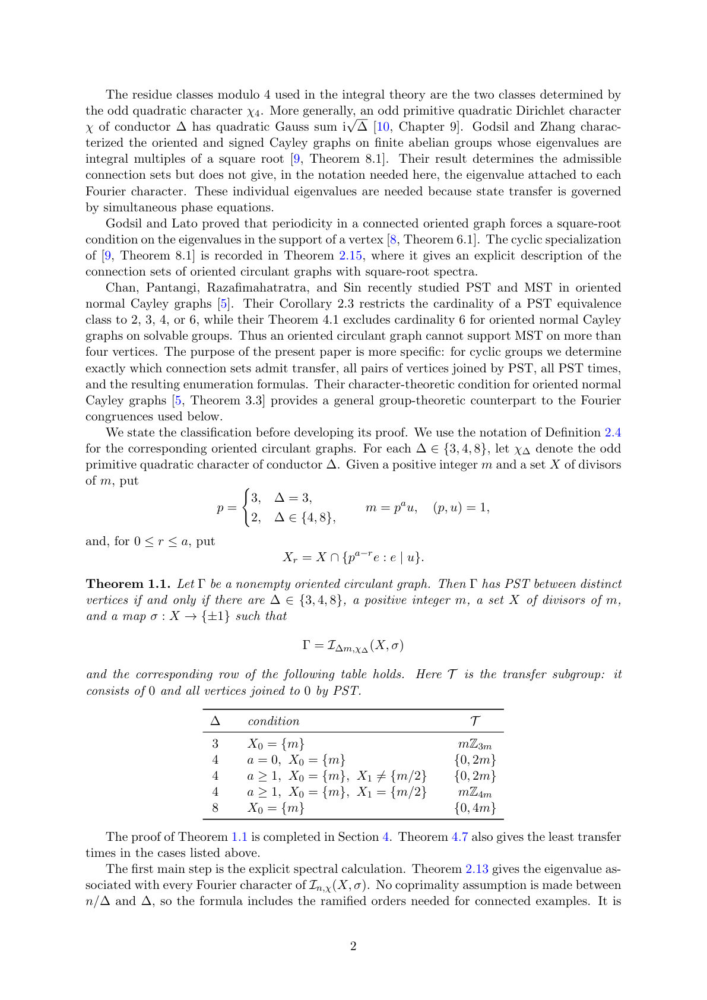
<figcaption class="paper-figure-caption"><b>Fig 1.</b> Low-resolution page preview, page 2</figcaption>
</figure>
<figure class="paper-figure-card">
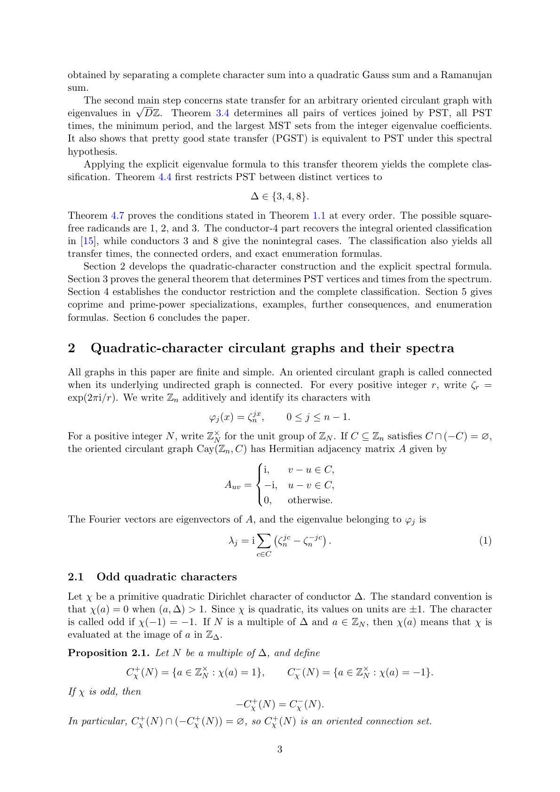
<figcaption class="paper-figure-caption"><b>Fig 2.</b> Low-resolution page preview, page 3</figcaption>
</figure>
<figure class="paper-figure-card">
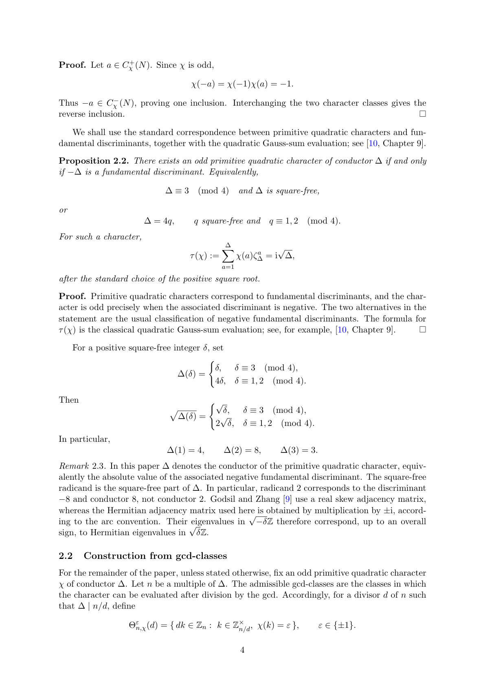
<figcaption class="paper-figure-caption"><b>Fig 3.</b> Low-resolution page preview, page 4</figcaption>
</figure>
<figure class="paper-figure-card">
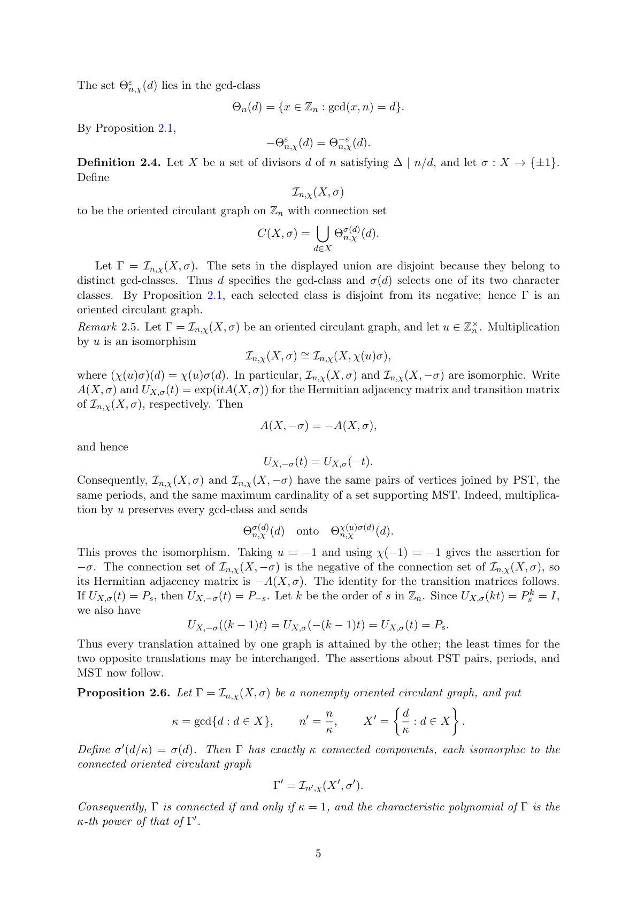
<figcaption class="paper-figure-caption"><b>Fig 4.</b> Low-resolution page preview, page 5</figcaption>
</figure>
<figure class="paper-figure-card">
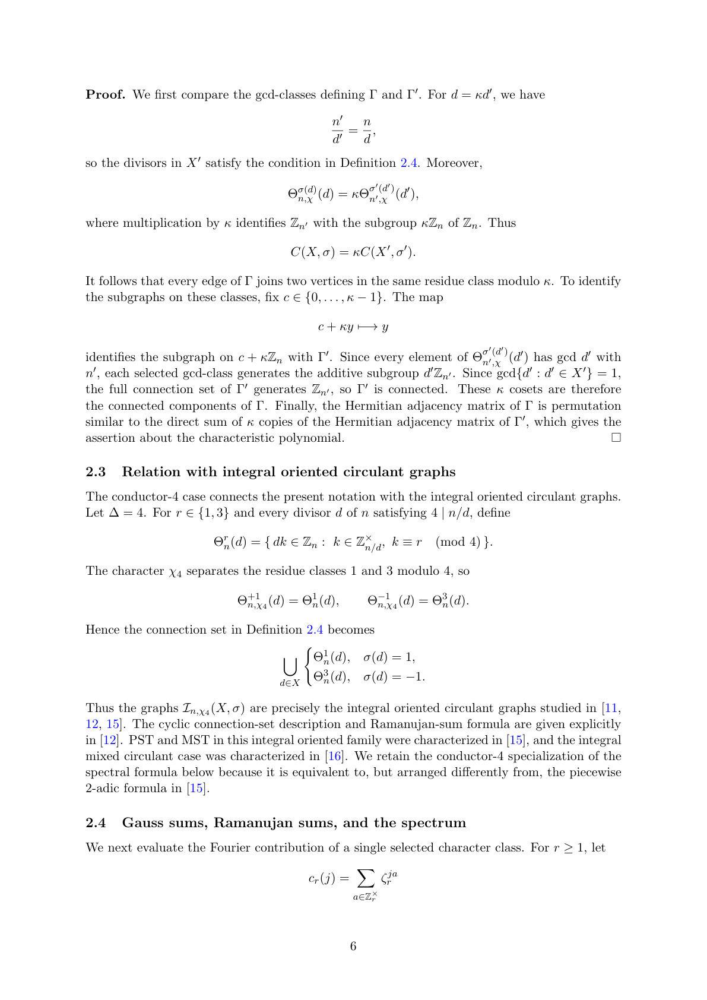
<figcaption class="paper-figure-caption"><b>Fig 5.</b> Low-resolution page preview, page 6</figcaption>
</figure>

**Summary.** This paper rigorously classifies all oriented circulant graphs that support Perfect State Transfer (PST) during a continuous-time quantum walk. By employing advanced number theory involving quadratic Dirichlet characters, the authors prove that PST can only occur if the graph's underlying structure is determined by conductors $\Delta \in \{3, 4, 8\}$. This provides a complete mathematical blueprint for realizing such quantum transport phenomena.

**Why it may be interesting.** This work provides a deep mathematical characterization of quantum transport phenomena on structured graphs, which has direct implications for designing quantum communication channels or quantum simulators based on lattice structures.

Detailed structure

**Main problem.** The primary goal is to classify all oriented circulant graphs that exhibit Perfect State Transfer (PST) between distinct vertices.

**Main result.** PST in these graphs is strictly limited to cases where the graph's structure is governed by conductors $\Delta \in \{3, 4, 8\}$, which corresponds to square-free radicands of 1, 2, and 3.

**Method.** The classification uses advanced number theory, specifically properties of odd primitive quadratic Dirichlet characters and Fourier analysis applied to the graph's Hermitian adjacency matrix spectrum.

**Model / system.** The model is a continuous-time quantum walk on an oriented circulant graph $	ext{Cay}(\mathbb{Z}_n, C)$. The dynamics are governed by the Hamiltonian derived from the graph's Hermitian adjacency matrix $A$.

**Key observables.** Perfect State Transfer (PST) and Multiple State Transfer (MST), which depend directly on the Fourier eigenvalues of the adjacency matrix.

**Important parameters / regimes.** The conductor $\Delta$ of the underlying quadratic Dirichlet character, and the graph order $n$.

**Assumptions / limitations.** The analysis assumes the graph is finite and simple, relying heavily on number theoretic tools related to characters and gcd-classes.

**Figures summary.** Table 2 provides a comprehensive classification summarizing representative graphs exhibiting PST, categorized by their conductor $\Delta$, square-free radicand $\delta$, order $n$, and counts of specific transfer cardinalities ($h$).

**Paper structure.** The paper progresses from establishing spectral properties using quadratic characters (Section 2), deriving general state transfer theorems from the spectrum (Section 3), and finally applying these constraints to restrict the possible conductors ($\Delta$) to complete the classification (Section 4).

Abstract

The continuous-time quantum walk on an oriented circulant graph is determined by the Fourier eigenvalues of its Hermitian adjacency matrix. We classify perfect state transfer (PST) between distinct vertices in every nonempty oriented circulant graph. We show that each such graph is described by an odd primitive quadratic Dirichlet character of conductor $Δ$, a set of gcd-classes, and a choice between the two orientations of each selected class. For a graph of order $n$, we derive an explicit formula for every Fourier eigenvalue without assuming that $n/Δ$ is coprime to $Δ$. We prove that PST occurs only for $Δ\in\{3,4,8\}$ and give necessary and sufficient conditions on the connection set for each conductor. Equivalently, the square-free radicands of oriented circulant graphs with PST are exactly $1$, $2$, and $3$. More generally, when $λ_j=\sqrt{D}η_j$ with $η_j\in\mathbb{Z}$, congruences satisfied by the integers $η_j$ determine all PST pairs and times, the minimum period, and the largest vertex sets supporting multiple state transfer (MST). In this class, pretty good state transfer is equivalent to PST. We also determine the connected orders and enumerate the resulting graphs.

[↑ back to top](#top)

### [Robust Quantum Machine Learning for Collider Event Selection under Detector Variability](http://arxiv.org/abs/2608.11330v1)

**Authors:** Christopher Brown, Michael Spannowsky, Simon Williams  
**Type:** theory · **Category:** other · **PDF:** <https://arxiv.org/pdf/2608.11330v1>  
**Analysis basis:** full PDF text, analyzed in chunks
**Topic relevance:** `quantum measurements` **1/5**

↔ Scroll figures horizontally

<figure class="paper-figure-card">
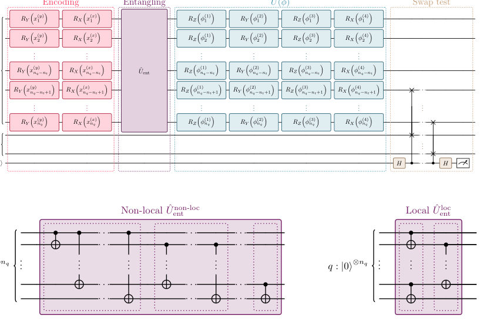
<figcaption class="paper-figure-caption"><b>Fig 1.</b> Figure 1: Quantum autoencoder architecture and entangling ansätze. The circuit (top) consists of angle encoding of the input features using RY and RX rotations, an entangling block Uent, and a parameterised unitary ˆU(ϕ) with trainable parameters ϕ. A swap test evaluates the fidelity between the state of the nt trash qubits and the reference vacuum state |0⟩⊗nt. The non-local and local implementations of Uent, employing long- and short-range cnot connectivity, respectively, are shown below.</figcaption>
</figure>
<figure class="paper-figure-card">
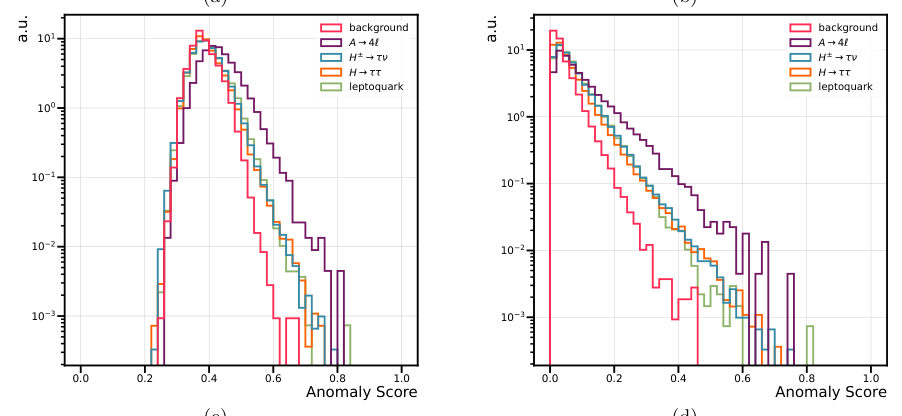
<figcaption class="paper-figure-caption"><b>Fig 2.</b> Figure 2: Anomaly-score distributions obtained under reference detector conditions using the shared MLP embedding. Panels (a)–(d) show the results for the autoencoder, variational autoencoder, non-local quantum autoencoder and local quantum autoencoder, respectively. In each panel, the background distribution is compared with those of the four benchmark signals.</figcaption>
</figure>
<figure class="paper-figure-card">
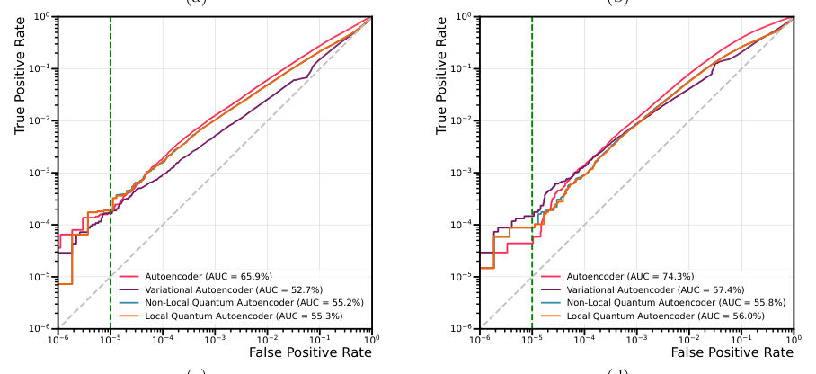
<figcaption class="paper-figure-caption"><b>Fig 3.</b> Figure 3: Anomaly-detection performance in the absence of detector-induced distribution shift using the shared MLP embedding. Panels (a)–(d) show the ROC curves for the A →4ℓ, H± →τν, H →ττ, and leptoquark benchmark signals, respectively. Each panel compares the classical autoencoder, variational autoencoder, non-local quantum autoencoder, and local quantum autoencoder, with the corresponding AUC values quoted in the legends. The vertical dashed line indicates a false-positive rate of 10−5, representative of the low-background operating regime relevant for collider triggers.</figcaption>
</figure>
<figure class="paper-figure-card">
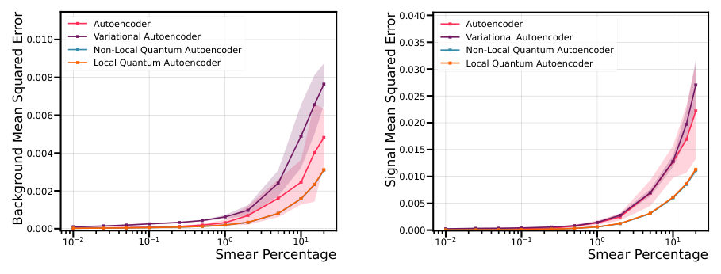
<figcaption class="paper-figure-caption"><b>Fig 4.</b> Figure 4: Mean-squared deviation of the anomaly score from its reference value as a function of the detector-smearing strength. Results are shown for background events in the left panel and A →4ℓevents in the right panel, comparing the classical autoencoder, variational autoencoder, non-local quantum autoencoder and local quantum autoencoder. The model parameters, learned embedding and feature-scaling constants are held fixed throughout. The shaded bands indicate the standard deviation across ten independent slices of the test set with input smearing.</figcaption>
</figure>
<figure class="paper-figure-card">
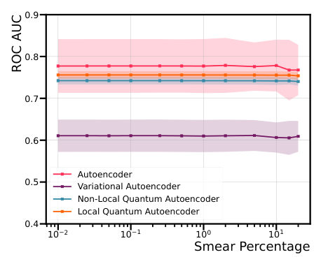
<figcaption class="paper-figure-caption"><b>Fig 5.</b> Figure 5: ROC AUC as a function of the detector-smearing strength for the A →4ℓsample. Results are shown for the classical autoencoder, variational autoencoder, non-local quantum autoencoder and local quantum autoencoder. The model parameters, learned embedding and feature-scaling constants are held fixed throughout. The shaded bands indicate the standard deviation across ten independent slices of the test set with input smearing.</figcaption>
</figure>

**Summary.** This paper evaluates Quantum Machine Learning techniques for selecting rare events in high-energy collider physics. It demonstrates that parameterised quantum models provide an inherent robustness against detector noise and data shifts compared to state-of-the-art classical methods. This suggests QML can be a valuable tool for building reliable analysis pipelines in complex experimental settings.

**Why it may be interesting.** While the application is HEP, the core methodology—using quantum circuits to induce a specific inductive bias (robustness) that resists input perturbations better than highly expressive classical models—is relevant for understanding model stability in complex physical systems.

Detailed structure

**Main problem.** The core problem is developing machine learning methods robust enough for high-energy physics data analysis that can maintain performance despite detector degradation or shifts in data distributions.

**Main result.** Quantum models, specifically Quantum Autoencoders and classifiers, demonstrated superior robustness compared to expressive classical baselines when tested under controlled feature-level smearing.

**Method.** The study compares quantum (QAEs) and classical autoencoders/classifiers for both unsupervised anomaly detection and supervised signal classification tasks.

**Model / system.** The system is the analysis of collider event data, where models are trained on reference conditions but tested under controlled feature-level smearing to simulate detector variability. The quantum components involve angle encoding and parameterized unitary circuits.

**Key observables.** Anomaly detection scores (based on fidelity to vacuum state), discrimination performance retention, and the shift in output score distributions under perturbation.

**Important parameters / regimes.** Detector smearing strength (perturbation level) and training sample size ($N_{train}$).

**Assumptions / limitations.** The comparison assumes that fixing model parameters while varying input features (smearing) is a valid test of robustness. The study also notes limitations regarding realistic detector systematics and finite-shot statistics.

**Figures summary.** Figures compare the Mean Squared Error deviation of anomaly scores for various models (AE, VAE, QAE variants) as a function of increasing detector smearing strength, showing quantum models maintain better stability.

**Paper structure.** The paper investigates robustness in two settings: unsupervised anomaly detection using QAEs trained on background events, and supervised classification using data reuploading techniques. Results compare these quantum approaches against established classical ML baselines under simulated noise.

Abstract

Robust machine-learning methods are becoming increasingly important for high-energy physics data analysis as experiments enter the era of higher luminosity and future higher-energy colliders. Detector degradation, changing running conditions and calibration drift can shift data distributions, causing models trained on clean reference samples to degrade after deployment. We investigate whether parameterised quantum models provide a useful inductive bias for robust collider-event selection in two complementary settings. In the unsupervised study, quantum autoencoders trained on background events are compared with classical and variational autoencoders for anomaly detection. In the supervised study, quantum classifiers with data reuploading are trained to distinguish a supersymmetric signal from background and are compared with linear and multilayer-perceptron classifiers. All models are trained under reference conditions and subsequently evaluated under controlled feature-level smearing while their parameters and preprocessing transformations are held fixed. On clean inputs, the quantum autoencoders achieve competitive anomaly-detection performance, including in the low-false-positive-rate regime relevant for triggering, while the deeper data-reuploading classifier attains discrimination comparable to the non-linear classical baseline. Under smearing, the quantum models generally exhibit smaller shifts in their output scores and retain their discrimination more effectively than the expressive classical baselines. These results suggest that parameterised quantum models can provide a useful robustness inductive bias for collider-event selection and motivate further studies with realistic detector systematics, finite-shot statistics and quantum-device noise.

[↑ back to top](#top)

### [The Dirac Information Carrier for Relativistic Quantum Computation](http://arxiv.org/abs/2608.11647v1)

**Authors:** Barry C Sanders  
**Type:** theory · **Category:** quantum information and computing · **PDF:** <https://arxiv.org/pdf/2608.11647v1>  
**Analysis basis:** full PDF text, analyzed in chunks
**Topic relevance:** `quantum measurements` **1/5**

↔ Scroll figures horizontally

<figure class="paper-figure-card">
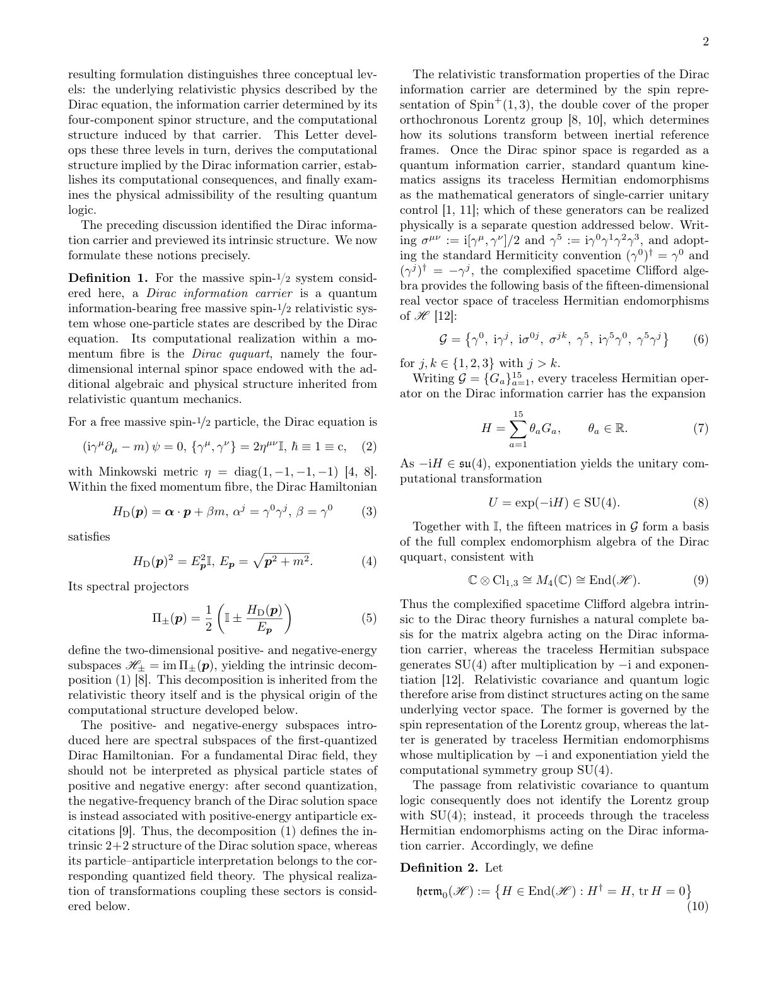
<figcaption class="paper-figure-caption"><b>Fig 1.</b> Low-resolution page preview, page 2</figcaption>
</figure>
<figure class="paper-figure-card">
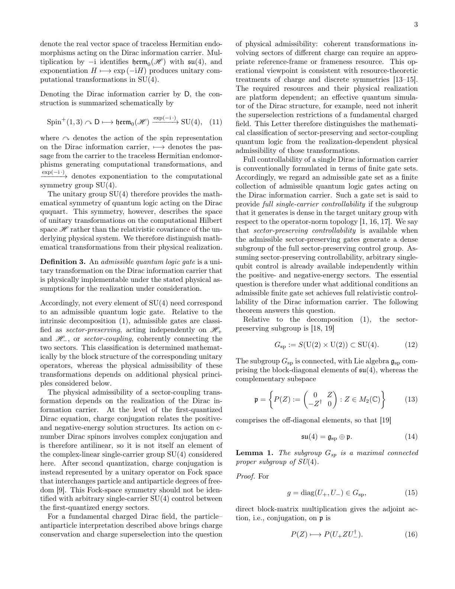
<figcaption class="paper-figure-caption"><b>Fig 2.</b> Low-resolution page preview, page 3</figcaption>
</figure>
<figure class="paper-figure-card">
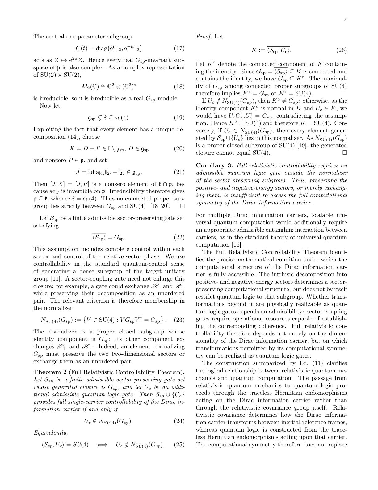
<figcaption class="paper-figure-caption"><b>Fig 3.</b> Low-resolution page preview, page 4</figcaption>
</figure>
<figure class="paper-figure-card">
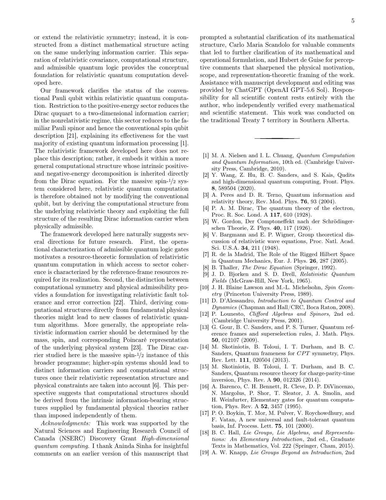
<figcaption class="paper-figure-caption"><b>Fig 4.</b> Low-resolution page preview, page 5</figcaption>
</figure>
<figure class="paper-figure-card">

<figcaption class="paper-figure-caption"><b>Fig 5.</b> Low-resolution page preview, page 6</figcaption>
</figure>

**Summary.** This work rethinks quantum computation by deriving its computational structure from the relativistic description of a massive spin-1/2 particle (the Dirac carrier). It shows that this intrinsic structure imposes limitations on possible quantum gates, distinguishing between mathematical symmetries and physically realizable operations. Ultimately, it provides necessary and sufficient conditions for achieving full control over this fundamental information carrier.

**Why it may be interesting.** It provides a rigorous theoretical framework linking fundamental particle physics symmetries (Dirac equation) directly to the constraints on quantum computation, offering a physical basis for gate sets beyond abstract assumptions.

Detailed structure

**Main problem.** The paper addresses how computational structure can be derived intrinsically from a fundamental relativistic quantum system, rather than assuming abstract carriers first.

**Main result.** It establishes the Dirac information carrier as a source of a constrained quantum logic (sector-preserving and sector-coupling gates) whose full controllability requires specific physical resources beyond simple unitary transformations.

**Method.** The analysis uses group theory applied to the symmetry algebra ($\mathfrak{su}(4)$) governing the spin-1/2 system, distinguishing between mathematical unitaries and physically admissible quantum logic gates.

**Model / system.** The model is the massive spin-1/2 particle described by the Dirac equation. The resulting information carrier is termed the 'Dirac ququart,' possessing an intrinsic positive- and negative-energy decomposition ($H_+ \oplus H_-$).

**Key observables.** Admissible quantum logic gates, sector coherence, and controllability conditions.

**Important parameters / regimes.** Mass ($m$), momentum ($\vec{p}$), and the structure of the Poincaré representation.

**Assumptions / limitations.** The core assumption is that computational structure must arise from the intrinsic symmetries dictated by relativistic field theory (Dirac equation).

**Figures summary.** Not specified in the notes, but the mathematical flow involves mapping generators from $	ext{Spin}^+(1, 3)$ through the Dirac carrier to $SU(4)$.

**Paper structure.** The paper first derives the intrinsic computational structure from the positive/negative energy decomposition of the Dirac equation. It then analyzes the symmetry group ($SU(4)$) and defines physically admissible gates. Finally, it uses group theory (normalizers) to determine the necessary conditions for achieving full single-carrier controllability.

Abstract

Quantum computation has traditionally been formulated by postulating abstract information carriers and subsequently identifying physical systems that realize them. We adopt the opposite viewpoint and ask what computational structure is supplied by a fundamental relativistic quantum system itself. Focusing on the simplest nontrivial massive spin carrier, spin-1/2, we show that its relativistic description supplies a native four-dimensional information carrier through the Dirac equation. The resulting Dirac information carrier possesses an intrinsic positive- and negative-energy decomposition that induces a physics-constrained computational structure comprising sector-preserving and sector-coupling quantum logic. Restricting the relativistic computational structure to the positive-energy sector and taking the nonrelativistic regime recovers the familiar Pauli qubit description. We distinguish mathematical unitary transformations from physically admissible gates and show how charge-conjugation structure, charge superselection, and associated reference-frame resources can constrain quantum logic beyond the sector-preserving structure. Finally, under appropriate physical assumptions, we establish the conditions under which this structure supports full single-carrier controllability. Our work establishes the Dirac information carrier as the massive spin-1/2 instance of a broader programme in which computational structures are derived from the relativistic representation carried by the underlying physical system.

[↑ back to top](#top)

### [The Min-Rains Relative Entropy Is Not Tight for Exact PPT Entanglement Distillation](http://arxiv.org/abs/2608.12135v1)

**Authors:** Chengkai Zhu, Xin Wang  
**Type:** theory · **Category:** quantum information and computing · **PDF:** <https://arxiv.org/pdf/2608.12135v1>  
**Analysis basis:** full PDF text, analyzed in chunks
**Topic relevance:** `quantum measurements` **1/5**

↔ Scroll figures horizontally

<figure class="paper-figure-card">
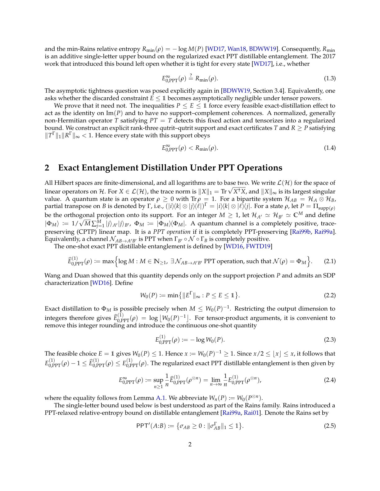
<figcaption class="paper-figure-caption"><b>Fig 1.</b> Low-resolution page preview, page 2</figcaption>
</figure>
<figure class="paper-figure-card">
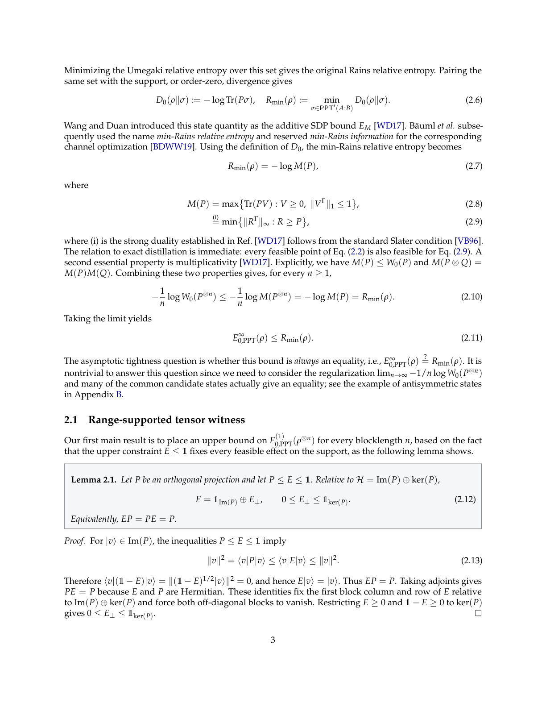
<figcaption class="paper-figure-caption"><b>Fig 2.</b> Low-resolution page preview, page 3</figcaption>
</figure>
<figure class="paper-figure-card">
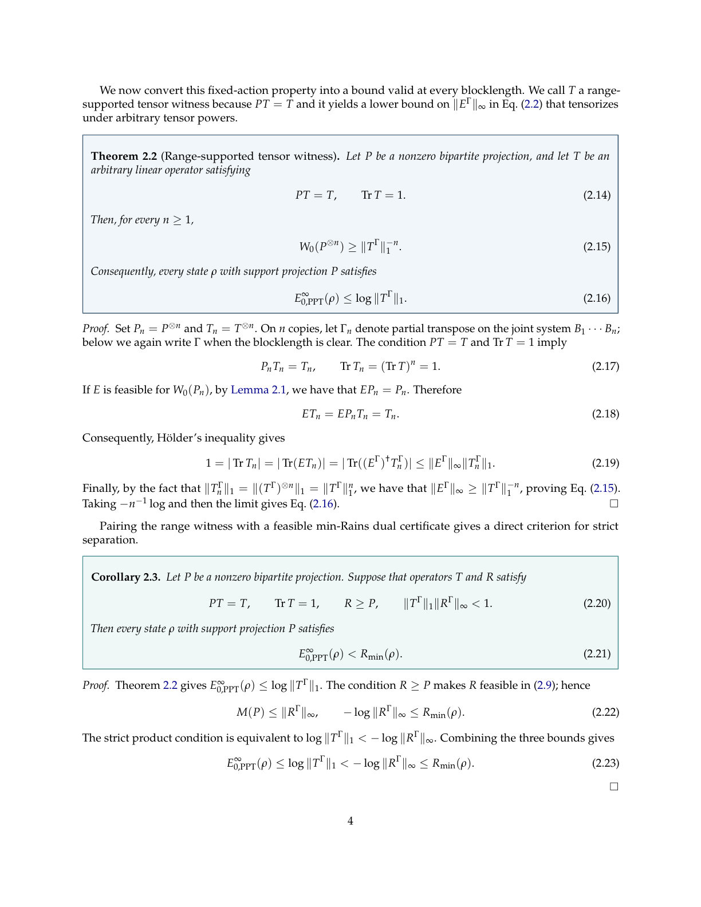
<figcaption class="paper-figure-caption"><b>Fig 3.</b> Low-resolution page preview, page 4</figcaption>
</figure>
<figure class="paper-figure-card">
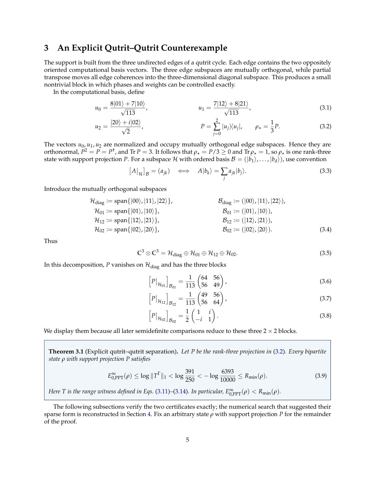
<figcaption class="paper-figure-caption"><b>Fig 4.</b> Low-resolution page preview, page 5</figcaption>
</figure>
<figure class="paper-figure-card">
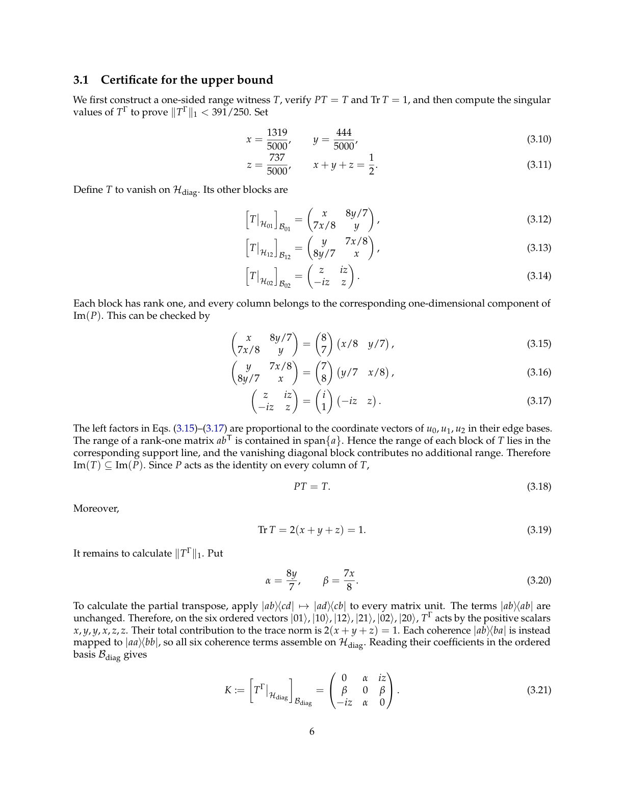
<figcaption class="paper-figure-caption"><b>Fig 5.</b> Low-resolution page preview, page 6</figcaption>
</figure>

**Summary.** This paper resolves an open problem by proving that the min-Rains relative entropy does not provide a tight upper bound for exact distillable entanglement under PPT operations. The authors construct explicit counterexamples using specific bipartite states to demonstrate a strict separation between the true distillation rate and the theoretical bound, revealing subtle asymptotic structures in quantum information theory.

**Why it may be interesting.** This work provides fundamental theoretical constraints on quantum information processing, specifically refining our understanding of entanglement manipulation under physical constraints like PPT operations, which is crucial for designing quantum communication protocols.

Detailed structure

**Main problem.** The central question is whether the min-Rains relative entropy provides a tight upper bound for the regularized exact PPT distillable entanglement of a bipartite quantum state.

**Main result.** The authors prove that the min-Rains relative entropy is not always tight, establishing a strict inequality between the true distillable rate and the min-Rains bound using specific counterexamples.

**Method.** The proof involves constructing two independent bounds—an upper bound derived from a range-supported tensor witness and a lower bound related to the min-Rains relative entropy—and showing they are strictly separated for certain states.

**Model / system.** The analysis concerns bipartite quantum states undergoing exact entanglement distillation under completely PPT-preserving operations. The focus is on the support projection $P$ of the input state, often analyzed using rank-three qutrit systems as a concrete counterexample.

**Key observables.** Regularized exact PPT distillable entanglement ($E_{\infty}^{0,	ext{PPT}}(
ho)$), min-Rains relative entropy ($R_{\min}(
ho)$), and the witness values ($\mu = \|T\Gamma\|_1$ and $\|R\Gamma\|_{\infty}$).

**Important parameters / regimes.** The comparison relies on specific numerical ratios derived from the state support, such as $391/250$ versus $6393/10000$.

**Assumptions / limitations.** The analysis assumes the existence of completely PPT-preserving operations and utilizes techniques involving partial transposition ($\Gamma$) and tensor witnesses.

**Figures summary.** Not specified in the notes, but the comparison relies on establishing strict inequalities between calculated numerical bounds derived from witness operators.

**Paper structure.** The paper first defines the problem by comparing $E_{\infty}^{0,	ext{PPT}}(
ho)$ to $R_{\min}(
ho)$. It then develops the necessary mathematical tools (range witnesses and dual certificates) to establish both an upper bound ($\log \mu$) and a lower bound ($-\log M(P)$), culminating in a concrete counterexample showing the separation.

Abstract

Exact entanglement distillation converts a noisy bipartite state into a maximally entangled state with zero error. Under completely PPT-preserving operations, the additive min-Rains relative entropy provides a single-letter upper bound on the regularized distillation rate. An interesting problem in entanglement theory dating back to 2016 has been whether this bound is always tight. Here we resolve this question in the negative. The key is a tensor-stable rigidity absent from the min-Rains relaxation: every feasible exact-distillation effect must act as the identity on the support of the input state. We convert this constraint into a new single-letter upper bound using a generally non-Hermitian, range-supported witness. For a rank-three subspace, we show this upper bound lies strictly below the min-Rains relative entropy for every state with that support. Thus, the constraint discarded by the min-Rains relaxation remains relevant under arbitrary tensor powers. Our result rules out the min-Rains relative entropy as a closed-form formula for exact PPT distillable entanglement and reveals the subtle asymptotic structure of exact entanglement manipulation under PPT operations.

[↑ back to top](#top)

### [Trapping Sets of Detector Error Models](http://arxiv.org/abs/2608.11516v1)

**Authors:** Michele Pacenti, Nithin Raveendran, Bane Vasic  
**Type:** theory · **Category:** quantum information and computing · **PDF:** <https://arxiv.org/pdf/2608.11516v1>  
**Analysis basis:** full PDF text, analyzed in chunks
**Topic relevance:** `quantum measurements` **1/5**

↔ Scroll figures horizontally

<figure class="paper-figure-card">
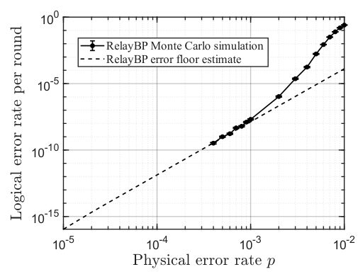
<figcaption class="paper-figure-caption"><b>Fig 1.</b> Figure 1: Comparison between the Monte Carlo simulation of RelayBP and the error-floor estimate obtained from weight-three and weight-four fault patterns supported on the enumerated LETSs. Both curves show the effective logical error rate per syndrome-extraction round.</figcaption>
</figure>
<figure class="paper-figure-card">
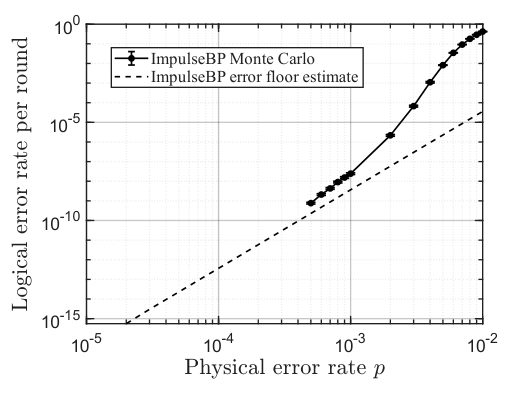
<figcaption class="paper-figure-caption"><b>Fig 2.</b> Figure 2: Comparison between the Monte Carlo simulation of ImpulseBP and the error-floor estimate obtained from weight-three and weight-four fault patterns supported on the enumerated LETSs. Both curves show the effective logical error rate per syndrome-extraction round.</figcaption>
</figure>
<figure class="paper-figure-card">

<figcaption class="paper-figure-caption"><b>Fig 3.</b> Figure 2 compares the Monte Carlo simulation of ImpulseBP with the corresponding LETS-based estimate. We use ImpulseBP(20, 6), as defined in Ref. [8], with 20 parallel constituent decoders, six residual reinitializa- tions, and at most 100 iterations for each constituent de- coder. The estimate lies below the simulated curve but remains within one order of magnitude in the low-error- rate regime. The class-level results in Table III follow the same qualitative pattern as those obtained for RelayBP. No failures occur in the (4, 0), (4, 2), (4, 3), (5, 0), or (5, 2) classes. The largest failing-instance fractions again oc- cur for (4, 4) and (5, 3), with fTS = 0.4272% and fTS = 0.2638%,...</figcaption>
</figure>
<figure class="paper-figure-card">
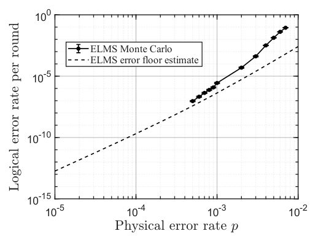
<figcaption class="paper-figure-caption"><b>Fig 4.</b> Figure 3: Comparison between the Monte Carlo simulation of ELMS and the error-floor estimate obtained from weight-three and weight-four fault patterns supported on the enumerated LETSs. Both curves show the effective logical error rate per syndrome-extraction round.</figcaption>
</figure>
<figure class="paper-figure-card">
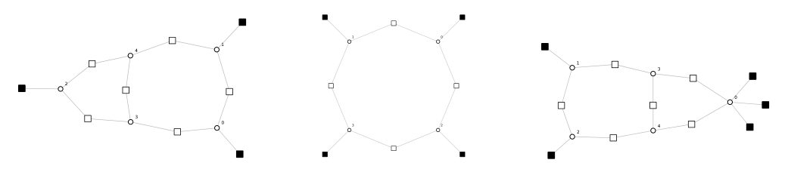
<figcaption class="paper-figure-caption"><b>Fig 5.</b> Figure 4: Canonical representatives of the three LETS topology classes forming the top-three set for both RelayBP and ImpulseBP. The same structures remain highly ranked for ELMS: τ1, τ2, and τ3 have ranks 6, 10, and 17, respectively, among its 647 harmful topology classes. Circles represent variable nodes and squares represent check nodes; white and black squares indicate satisfied and unsatisfied checks, respectively.</figcaption>
</figure>

**Summary.** This paper develops a systematic framework to predict the error floor in quantum error correction codes by analyzing their detector error models. It uses exhaustive enumeration of 'trapping sets'—specific graph structures causing decoding failure—to bypass costly simulations. The results establish trapping-set analysis as a powerful tool for guiding the joint design of both quantum codes and decoding algorithms.

**Why it may be interesting.** The methodology of using structural analysis (trapping sets) to predict performance limits is highly relevant for designing robust quantum computation protocols by identifying inherent hardware/algorithmic weaknesses.

Detailed structure

**Main problem.** The work aims to understand the structural weaknesses of message-passing decoders used for quantum error correction in the low-error-rate regime.

**Main result.** Trapping-set analysis provides a practical framework that accurately predicts the achievable error floor for iterative decoders, revealing performance gaps between code distance and actual decoding capability.

**Method.** The authors introduce a systematic framework involving exhaustive enumeration of 'trapping sets' directly applied to the detector error model (DEM) of QLDPC codes.

**Model / system.** The study analyzes Quantum Low-Density Parity-Check (QLDPC) codes under circuit-level noise, modeled via their Detector Error Model (DEM). The analysis focuses on message-passing decoders like RelayBP and ImpulseBP.

**Key observables.** Error floor (minimum logical error rate), Trapping Sets (TSs), low-weight fault configurations, and the gap between code distance and practical performance.

**Important parameters / regimes.** Low-error-rate regime, circuit-level noise, weight of error patterns, and the structure of the Tanner graph associated with the DEM.

**Assumptions / limitations.** The analysis relies on restricting the search to 'leafless elementary trapping sets' (LETSs), which is motivated by classical LDPC literature but its applicability to QLDPC/DEMs is noted as an assumption.

**Paper structure.** The paper systematically defines the DEM structure based on fault origins ($D(r)$, $A(r)$, $U(r)$) derived from circuit scheduling, then applies graph theory algorithms (like dpl-search) to enumerate LETSs, and finally evaluates these sets against various iterative decoders.

Abstract

Message-passing decoders are among the most promising candidates for scalable quantum error correction, yet their behavior in the low-error-rate regime remains poorly understood under realistic circuit-level noise. In this work, we introduce a systematic framework for identifying the graph structures that govern decoder failures and for using them to predict the resulting error floor. We apply exhaustive trapping-set enumeration directly to the detector error model of a bivariate bicycle code and test all low-weight fault configurations supported on the resulting structures. This converts the analysis of extremely rare logical failures into a finite structural search, avoiding the prohibitive cost of direct Monte Carlo simulation. We evaluate the framework on three iterative decoders with substantially different architectures and decoding heuristics. Remarkably, for \texttt{RelayBP}, the resulting prediction accurately reproduces the simulated error floor; for the others, it remains within the same order of magnitude. Despite their differences, leafless elementary trapping sets capture a substantial part of the low-weight error-floor contribution for all three decoders. Moreover, each decoder admits failures caused by fault configurations well below the correction capability implied by the circuit-level distance, revealing a substantial gap between code distance and practical iterative-decoding performance. These results establish trapping-set analysis as a practical framework for predicting error floors, exposing the structural weaknesses of iterative decoders, and guiding the joint design of decoding algorithms.

[↑ back to top](#top)

## Other papers (8)

*Papers from primary archives without highlighted authors or any topic match. Click to expand.*

Show other papers

### [A 12-CNOT Double Qubit Excitation Gate](http://arxiv.org/abs/2608.11733v1)

**Authors:** Irfansha Shaik  
**Type:** theory · **Category:** quantum information and computing · **PDF:** <https://arxiv.org/pdf/2608.11733v1>  
**Analysis basis:** full PDF text, analyzed in chunks

↔ Scroll figures horizontally

<figure class="paper-figure-card">
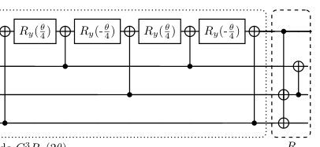
<figcaption class="paper-figure-caption"><b>Fig 1.</b> Figure 2 A 14-CNOT decomposed double-excitation circuit with C3Ry(2θ) Gray-code expansion.</figcaption>
</figure>
<figure class="paper-figure-card">
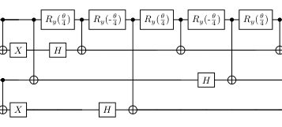
<figcaption class="paper-figure-caption"><b>Fig 2.</b> Figure 3 A 13-CNOT double-excitation gate by Yordanov et al. [21, 20] with lowest CNOT depth (11) cf. Table 1. The two highlighted gates on qk are added to correct the original circuit.</figcaption>
</figure>

**Summary.** This paper presents a highly optimized quantum circuit decomposition for the double qubit excitation gate. The authors achieved a record low CNOT count of 12, significantly improving upon previous state-of-the-art implementations. This research is vital for advancing practical quantum computing by minimizing required physical resources like gates and depth.

**Why it may be interesting.** This work directly addresses resource optimization in quantum circuit design, which is crucial for mapping complex theoretical gates onto near-term hardware architectures used in AMO simulations.

Detailed structure

**Main problem.** The core problem is achieving an effective implementation of high-level quantum gates, specifically the Double Qubit Excitation Operator ($U_{klij}(	heta)$), for practical quantum computation.

**Main result.** The authors report a novel decomposition requiring only 12 CNOT gates, which sets new state-of-the-art records for CNOT count (12), CNOT depth (10), and total circuit depth (16).

**Method.** They developed a specific quantum circuit decomposition technique based on the double qubit excitation operator's definition, comparing it against existing methods like Gray-code expansion.

**Model / system.** The work analyzes gate implementation within a 4-qubit system using the computational basis ordering $|q_i q_j q_k q_l\rangle$. The target operation is a continuous rotation between states $|0011\rangle$ and $|1100\rangle$.

**Key observables.** CNOT count, CNOT depth, single-qubit gate count, and total circuit depth are the primary metrics used for comparison.

**Important parameters / regimes.** The rotation angle $\theta$ is a key parameter defining the excitation operator; the system size is 4 qubits.

**Assumptions / limitations.** The analysis assumes that comparing these specific gate counts and depths across different synthesis techniques (e.g., Clifford Synthesis) provides a valid measure of circuit efficiency.

**Figures summary.** Figures illustrate the high-level double-excitation operator structure, baseline 14-CNOT circuits, previous SOTA 13-CNOT circuits, and finally, the proposed optimized 12-CNOT circuit.

**Paper structure.** The paper introduces the necessity of implementing complex gates, defines the target operator, presents a comparison against existing state-of-the-art methods using metrics like CNOT count, and concludes by detailing their superior 12-CNOT decomposition.

Abstract

Effective implementation of high-level quantum gates is essential for practical quantum computing. To the best of our knowledge, we present the first reported 12-CNOT decomposition of the double qubit excitation operator, improving upon state-of-the-art (SOTA) implementations with 13 CNOTs. Our new circuit has the lowest CNOT count (12), lowest CNOT depth (10), and lowest total circuit depth (16) among all the previous SOTA circuits. Further, we only added 2 extra one-qubit gates compared to the lowest one-qubit gate count (11) among the previous SOTA circuits.

[↑ back to top](#top)

### [A Quantum/Classical Example Oracle Separation for Making Things Up](http://arxiv.org/abs/2608.11648v1)

**Authors:** Kenny Chen  
**Type:** theory · **Category:** quantum information and computing · **PDF:** <https://arxiv.org/pdf/2608.11648v1>  
**Analysis basis:** full PDF text, analyzed in chunks

↔ Scroll figures horizontally

<figure class="paper-figure-card">
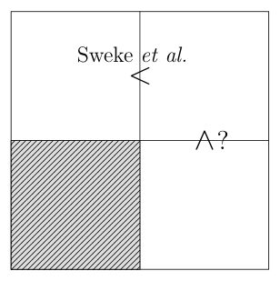
<figcaption class="paper-figure-caption"><b>Fig 1.</b> Figure 1: Sweke et al. showed a separation between learners with classical computation and learners with quantum computation when both had only classical examples. It is an open question as to whether there is a separation between quantum learners when one only has classical examples and the other has quantum examples.</figcaption>
</figure>
<figure class="paper-figure-card">
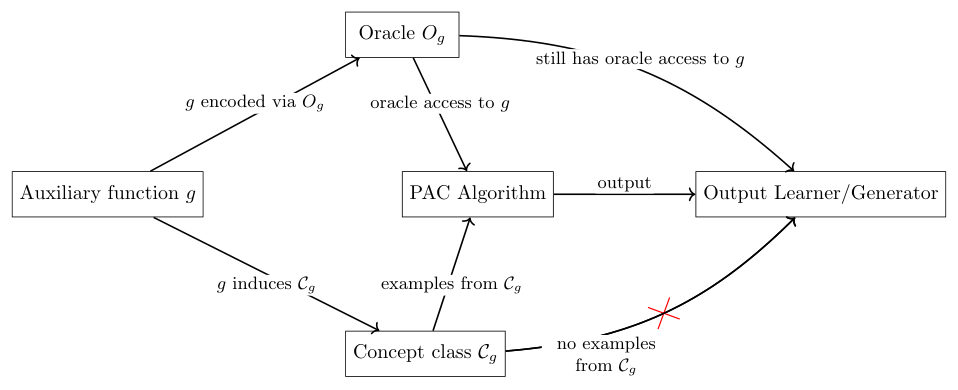
<figcaption class="paper-figure-caption"><b>Fig 2.</b> Figure 2: Illustration of our PAC learning setting. An auxiliary function g induces a concept class Cg. The PAC learning algorithm has oracle access to g and examples from Cg. They must output a learner/generator, which operates with oracle access to g, but no further examples from Cg.</figcaption>
</figure>

**Summary.** This paper tackles a foundational question in quantum learning theory: whether quantum examples offer an advantage over classical ones. Using complexity arguments relative to oracles, the authors prove that such a separation exists for generating certain distribution classes. This advances the understanding of where quantum resources provide strictly more computational power than classical ones in machine learning contexts.

**Why it may be interesting.** While highly theoretical, demonstrating computational separations between classical and quantum resources in learning theory provides fundamental insights into the limits of quantum computation that could inform resource requirements for simulating complex physical systems.

Detailed structure

**Main problem.** The paper investigates whether quantum examples provide a computational advantage over classical examples when performing learning tasks within the PAC framework.

**Main result.** It demonstrates that, relative to an oracle, there exist distribution classes that can be efficiently generated by a quantum learner using quantum examples but cannot be generated by a quantum learner restricted to only classical examples.

**Method.** The authors use computational complexity theory, building on one-way permutations and establishing separations between the sample complexity required for generation/learning under quantum versus classical access models.

**Model / system.** The setting is theoretical learning theory (PAC framework), utilizing abstract concepts like concept classes induced by auxiliary functions ($g$) and relying on computational hardness assumptions related to inverting one-way permutations.

**Key observables.** The ability to efficiently PAC generate a distribution class, quantified by the required sample complexity advantage between quantum and classical access methods.

**Important parameters / regimes.** The existence of an oracle for a one-way permutation ($g$), and parameters related to pseudoperiods ($\varepsilon(f, a)$) in specific constructions.

**Assumptions / limitations.** Results are shown relative to the assumption of oracle access to auxiliary functions (like $g$) and rely on the assumed existence of quantum-resilient one-way permutations.

**Figures summary.** Figure 1 illustrates separations between classical/quantum computation power; Figure 2 depicts the PAC learning setting using an inducing function $g$; Figure 3 shows a quadrilateral structure related to pseudoperiods.

**Paper structure.** The paper progresses by first establishing general oracle separations (Theorem 1.2), then presenting the main result showing quantum example advantage for generation (Theorem 1.3), and finally detailing a specific separation using Simon's algorithm context based on pseudoperiods (Theorem 4.2).

Abstract

We study the power of quantum examples, as compared to classical examples, in the PAC learning framework. Here, we have two learning algorithms, both with access to quantum computation, but one gets quantum examples, whereas the other gets classical examples. It was previously unknown whether there were learning tasks that can be efficiently performed but not by the latter. Our primary result is to show that relative to an oracle, there are distributions that can be efficiently generated by a quantum learner with access to quantum examples, but not by a quantum learner with access to only classical examples, making progress to answering this question in the affirmative.

[↑ back to top](#top)

### [A uniform elliptic reduction, an order-matching criterion, and precision benchmarks for the strong-coupling Birman-Schwinger analysis of the lattice three-boson trimer](http://arxiv.org/abs/2608.11848v1)

**Authors:** Mikhail Dolgopolov  
**Type:** theory · **Category:** other · **PDF:** <https://arxiv.org/pdf/2608.11848v1>  
**Analysis basis:** full PDF text, analyzed in chunks

↔ Scroll figures horizontally

<figure class="paper-figure-card">
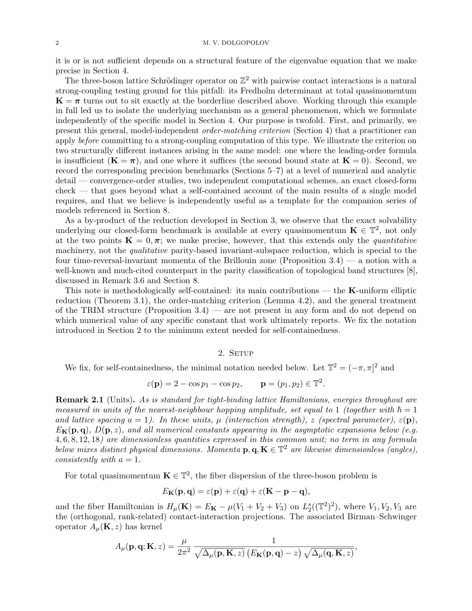
<figcaption class="paper-figure-caption"><b>Fig 1.</b> Low-resolution page preview, page 2</figcaption>
</figure>
<figure class="paper-figure-card">
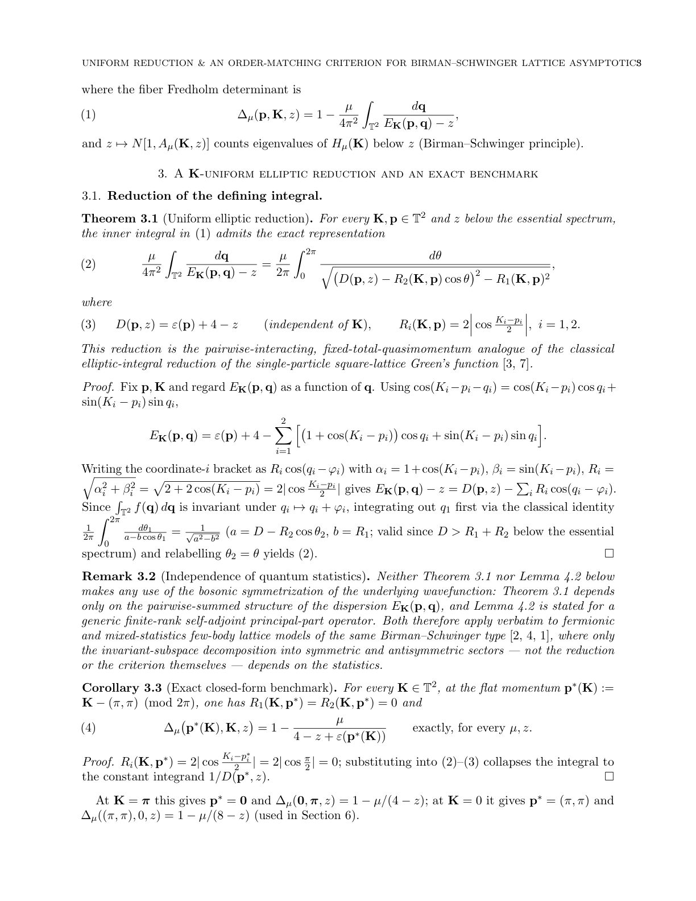
<figcaption class="paper-figure-caption"><b>Fig 2.</b> Low-resolution page preview, page 3</figcaption>
</figure>
<figure class="paper-figure-card">
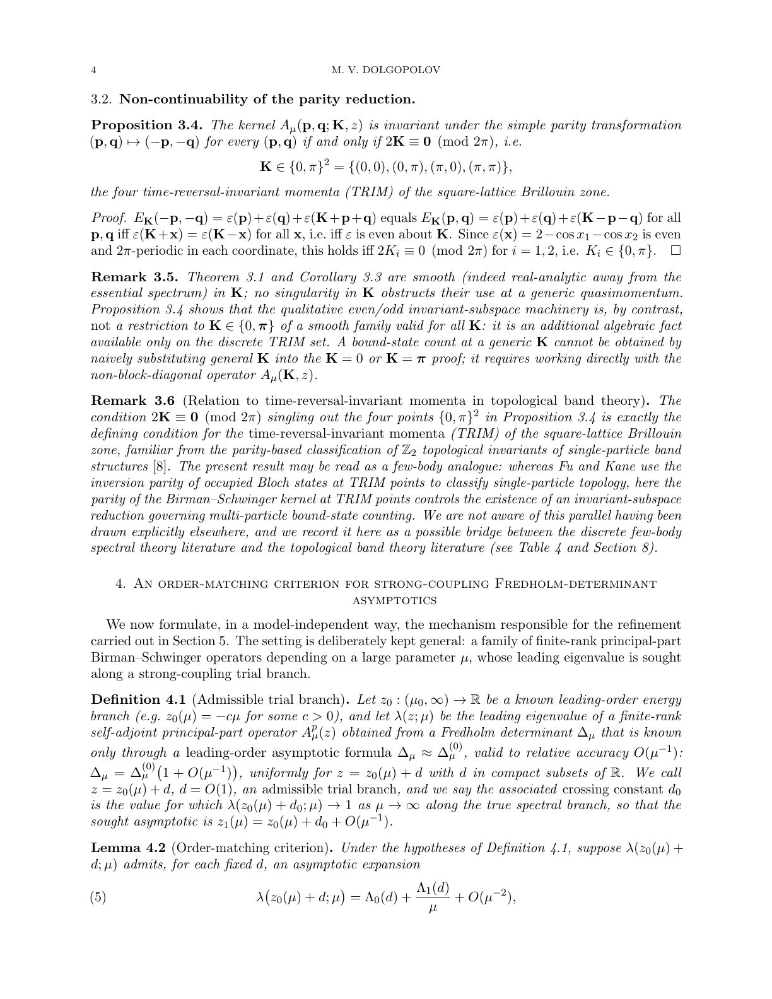
<figcaption class="paper-figure-caption"><b>Fig 3.</b> Low-resolution page preview, page 4</figcaption>
</figure>
<figure class="paper-figure-card">
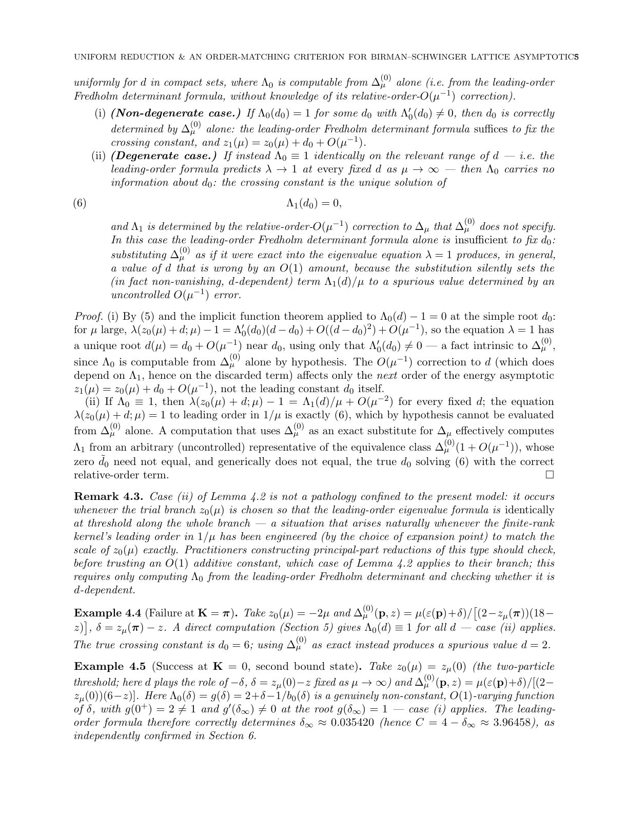
<figcaption class="paper-figure-caption"><b>Fig 4.</b> Low-resolution page preview, page 5</figcaption>
</figure>
<figure class="paper-figure-card">
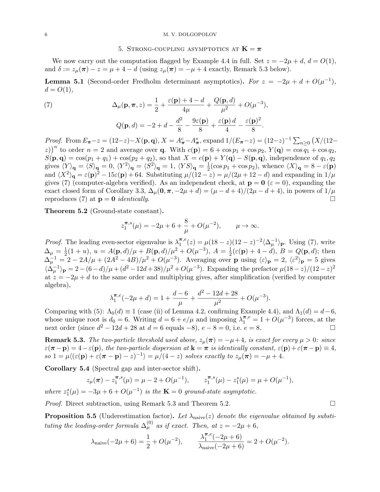
<figcaption class="paper-figure-caption"><b>Fig 5.</b> Low-resolution page preview, page 6</figcaption>
</figure>

**Summary.** This paper tackles the complex problem of finding the precise ground-state energy asymptotics for interacting bosons on a lattice using the Birman-Schwinger method. The authors introduce a powerful order-matching criterion to determine when simple asymptotic expansions are insufficient, allowing them to derive complete results that are cross-validated numerically against an exact closed-form benchmark.

**Why it may be interesting.** The rigorous development of the order-matching criterion provides a general tool for analyzing strong-coupling limits in lattice many-body physics, which is crucial for accurately determining physical constants beyond leading-order approximations.

Detailed structure

**Main problem.** The study focuses on determining the precise strong-coupling ground-state asymptotics for a lattice three-boson system using the Birman-Schwinger analysis.

**Main result.** The authors derived the complete strong-coupling ground-state asymptotics at $K=\pi$, including the coefficient of the $O(1/\mu)$ term, and established a general order-matching criterion for such analyses.

**Method.** The methodology combines an exact closed-form benchmark derived from a K-uniform elliptic reduction with a newly formulated order-matching criterion to rigorously determine necessary asymptotic refinements.

**Model / system.** The system is the three-boson Schrödinger operator on a lattice ($\mathbb{Z}^2$) with pairwise contact interactions, analyzed in the strong-coupling limit ($\mu 	o \infty$).

**Key observables.** Ground-state energy asymptotics ($z_\pi(1/\mu)$), spectral gap, and the fiber Fredholm determinant $\Delta_\mu$.

**Important parameters / regimes.** Interaction strength ($\mu$), total quasimomentum ($K$), and the lattice momentum $p$.

**Assumptions / limitations.** The analysis relies on asymptotic expansion techniques for eigenvalues derived from the Birman-Schwinger operator, requiring careful application of the order-matching criterion.

**Figures summary.** Tables compare exact vs. leading-order Fredholm determinants at $K=\pi$, and show numerical convergence confirming the derived asymptotic constants.

**Paper structure.** The paper first introduces the Birman-Schwinger framework, then derives an elliptic reduction for the determinant, formulates and proves the order-matching criterion (Lemma 4.2), applies this to find the full asymptotics at $K=\pi$, and finally compares results with known cases like $K=0$.

Abstract

We study the strong-coupling Birman-Schwinger analysis of the three-boson lattice Schroedinger operator at the exceptional quasimomentum K = pi. First, we provide an exact closed-form benchmark for the fiber Fredholm determinant at a distinguished flat momentum, valid for every quasimomentum K, obtained via a uniform elliptic reduction of the two-dimensional lattice integral. Second, we formulate and prove a general order-matching criterion. This criterion decides whether a leading-order Fredholm determinant asymptotic, with relative accuracy of order 1/mu, suffices to determine the constant-order additive correction in the strong-coupling energy, or if the next-order refinement is required. Applying the criterion at K = pi, we derive the complete strong-coupling ground-state asymptotics, including the coefficient of the order 1/mu term. The results are cross-validated against the exact closed-form benchmark and two independent high-precision numerical schemes. Furthermore, we determine the corresponding spectral gap and prove an exact Fredholm-determinant underestimation factor equal to 2. Additionally, we independently confirm that the previously established K = 0 constant is correctly derived and requires no analogous refinement. Finally, we compare the orders of asymptotic precision controlled across recent lattice few-body models and draw a structural parallel with the parity classification of topological band structures.

[↑ back to top](#top)

### [Efficient Compilation for Hamiltonian Simulation via Global Binary Symplectic Form Simplification](http://arxiv.org/abs/2608.11579v1)

**Authors:** Zhaohui Yang, Yuwei Han, Ruiyun Zhang, Dawei Ding, Jianxin Chen, Yuan Feng, Yuan Xie  
**Type:** theory · **Category:** quantum information and computing · **PDF:** <https://arxiv.org/pdf/2608.11579v1>  
**Analysis basis:** full PDF text, analyzed in chunks

↔ Scroll figures horizontally

<figure class="paper-figure-card">
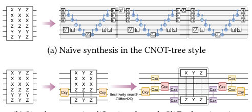
<figcaption class="paper-figure-caption"><b>Fig 1.</b> Figure 1. (a) Naïve synthesis vs. (b) simultaneous simplifica- tion of Pauli exponentials.</figcaption>
</figure>
<figure class="paper-figure-card">
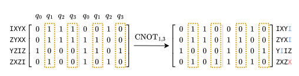
<figcaption class="paper-figure-caption"><b>Fig 2.</b> Figure 2. Example of BSF update by Clifford transformation.</figcaption>
</figure>
<figure class="paper-figure-card">
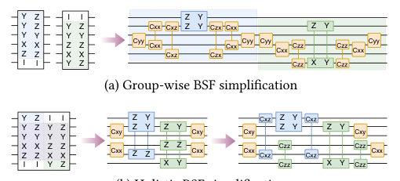
<figcaption class="paper-figure-caption"><b>Fig 3.</b> Figure 3. Comparison of (a) group-wise and (b) holistic BSF simplification. By evaluating Clifford transformations against the entire tableau, the holistic approach captures cross-support overlaps, thereby halving the required UCG conjugations in this example.</figcaption>
</figure>
<figure class="paper-figure-card">
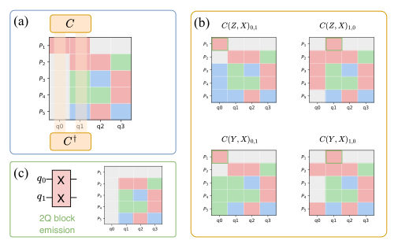
<figcaption class="paper-figure-caption"><b>Fig 4.</b> Figure 4. Avoiding degradation via early two-qubit block emission during BSF simplification (𝑋, 𝑌, 𝑍shown as red, green, blue). (a) Initial Pauli strings to be simplified by Clif- ford conjugation acting on (𝑞0,𝑞1). (b) Forcing target 𝑃1 to weight-1 invariably inflates the weights of remaining strings. (c) Emitting 𝑃1 early at weight-2 prevents collateral inflation and significantly reduces overall synthesis overhead.</figcaption>
</figure>
<figure class="paper-figure-card">
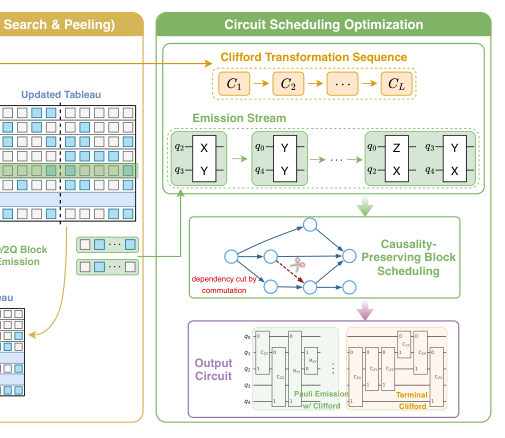
<figcaption class="paper-figure-caption"><b>Fig 5.</b> Figure 5. Overview of the Symphony compilation workflow.</figcaption>
</figure>

**Summary.** This paper presents Symphony, an advanced compiler that optimizes Hamiltonian simulation circuits by treating the entire Pauli sequence as a global algebraic structure represented by the Binary Symplectic Form (BSF). By applying controlled-Pauli Clifford transformations directly to this BSF tableau, it achieves superior circuit compression compared to existing methods. This results in substantial reductions in required two-qubit gates and overall circuit depth for quantum algorithms.

**Why it may be interesting.** This work provides a powerful algorithmic tool for quantum circuit compilation, directly impacting the feasibility of running complex algorithms like VQE or QAOA on near-term hardware by minimizing gate count and depth.

Detailed structure

**Main problem.** The core challenge is efficiently compiling Hamiltonian simulation workloads, which are expressed as Pauli exponential sequences, by fully exploiting their global algebraic structure.

**Main result.** The proposed method achieves significant reductions in two-qubit gate count (average 59%) and circuit depth (average 91%) compared to naïve synthesis on standard benchmarks.

**Method.** It introduces Symphony, a holistic compilation approach utilizing the Binary Symplectic Form (BSF) representation of Pauli strings. This involves applying generalized controlled-Pauli Clifford transformations directly to the global BSF tableau for simultaneous simplification and parallelism extraction.

**Model / system.** The work focuses on quantum computation simulating time evolution governed by Hamiltonians expressed as weighted sums of Pauli strings ($\sum c_k P_k$). The input is a sequence of Pauli rotations, analyzed using the BSF representation which encodes commutation relations via symplectic geometry.

**Key observables.** Two-qubit gate count and circuit depth are the primary optimization metrics. Other diagnostics include the BSF weight reduction and the rank of interaction matrices for two-qubit blocks.

**Important parameters / regimes.** The efficiency is measured by factors like $1.14–1.58	imes$ improvement in CNOT gates and $1.87–5.67	imes$ improvement in circuit depth over prior state-of-the-art compilers.

**Assumptions / limitations.** Prior methods are limited by constrained paradigms, such as strict adherence to 'first-diagonalize, then-search-CNOT' or computationally expensive long-horizon searches; Symphony overcomes these limitations holistically.

**Figures summary.** Figures illustrate the comparison between naïve synthesis and simultaneous simplification via Clifford conjugation on a BSF tableau. Other figures detail how Clifford transformations act as symplectic updates on the BSF structure.

**Paper structure.** The paper develops theory around Pauli commutation using the symplectic form, introduces Symphony's global BSF transformation framework, details the causality-preserving block rescheduling heuristic, and validates its performance against state-of-the-art compilers across multiple benchmarks.

Abstract

Hamiltonian simulation is a core quantum workload, underpinning variational quantum algorithms and Trotterized time evolution. Such programs are expressed as Pauli exponential sequences, exhibiting structural patterns that are highly amenable to high-level synthesis and optimization. Existing compilers, however, fail to fully unlock the optimization potential of their global algebraic structure, even when employing advanced graph- or tableau-based methods.   We present Symphony, a holistic compilation approach built on the binary symplectic form (BSF) representation of Pauli strings. Unlike prior group-wise BSF simplification and path-based Pauli network synthesis, Symphony applies generalized controlled-Pauli Clifford transformations directly to a global BSF tableau, adaptively reducing active Pauli rows and emitting eligible two-qubit blocks other than single-qubit rotations in a forward Clifford frame. Following algebraic simplification, Symphony performs a causality-preserving block rescheduling heuristic that respects frame-induced dependencies while exposing extensive two-qubit block parallelism opportunities. This streamlined compilation style comprehensively exploits simultaneous simplification and commutativity opportunities, achieving efficient global optimization without relying on computationally expensive heuristics or long-horizon searches. Across the generic Hamiltonian simulation benchmarks in HamLib, Symphony achieves average reductions of 59% in two-qubit gate count and 91% in circuit depth. It strictly Pareto-dominates prior state-of-the-art compilers, requiring 1.14--1.58$\times$ fewer two-qubit gates and especially shrinking two-qubit circuit depth by a substantial factor of 1.87--5.67$\times$ on average.

[↑ back to top](#top)

### [Efficient Quantum Modular Reduction: Crandall reduction and its Fault-tolerant resource analysis](http://arxiv.org/abs/2608.11563v1)

**Authors:** Changyeol Lee, Sungyeon Kook, Wooyeong Song, Kwangil Bae, Wonhyuk Lee, IlKwon Sohn  
**Type:** theory · **Category:** quantum information and computing · **PDF:** <https://arxiv.org/pdf/2608.11563v1>  
**Analysis basis:** full PDF text, analyzed in chunks

↔ Scroll figures horizontally

<figure class="paper-figure-card">
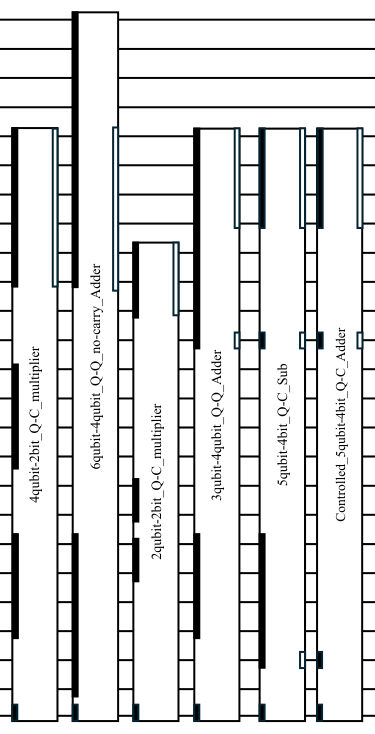
<figcaption class="paper-figure-caption"><b>Fig 1.</b> Figure 1. Overall structure of the quantum Crandall reduction circuit for n = 4 and c = 3. The folding stage consists of quantum-classical multiplication by c and quantum-quantum addition to accumulate the folded values. The normalization stage subtracts the fixed modulus q = 2n −c and conditionally restores it when the subtraction result is negative. After forward evaluation, the desig- nated output register M contains a mod q, while some ancillary work qubits retain input-dependent intermediate states until the inverse circuit is applied. The illustrated circuit corresponds to Crandall reduction-1 with one normalization block; Crandall reduction-2 applies the same normalization block...</figcaption>
</figure>
<figure class="paper-figure-card">
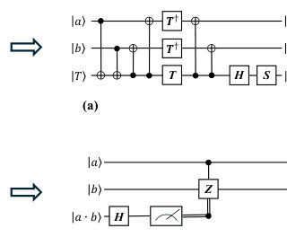
<figcaption class="paper-figure-caption"><b>Fig 2.</b> Figure 2. Temporary logical-AND quantum circuit. (a) Computation of the mapping |a⟩|b⟩|0⟩7→ |a⟩|b⟩|a·b⟩, which stores the logical-AND value used for carry or borrow propagation. (b) Measurement- and-fixup uncomputation of the stored logical-AND, which removes the temporary value without additional T gates.</figcaption>
</figure>
<figure class="paper-figure-card">
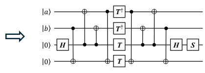
<figcaption class="paper-figure-caption"><b>Fig 3.</b> Figure 3. Temporary logical-AND computation circuit with T-depth 1. An additional temporary ancilla is used to parallelize the T/T † gates, reducing the T-depth from 2 to 1 while preserving the T-count of 4. The additional ancilla is restored to |0⟩after the computation and can be reused in subsequent arithmetic operations.</figcaption>
</figure>
<figure class="paper-figure-card">
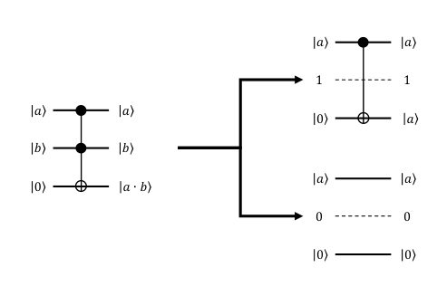
<figcaption class="paper-figure-caption"><b>Fig 4.</b> Figure 4. Simplification of a CCX gate operation when one control input is fixed as a classical bit and the target ancilla is initialized to |0⟩. If the classical bit is 1, the CCX gate reduces to a CX gate and the target becomes |a⟩. If the classical bit is 0, the operation is removed and the target remains |0⟩.</figcaption>
</figure>
<figure class="paper-figure-card">
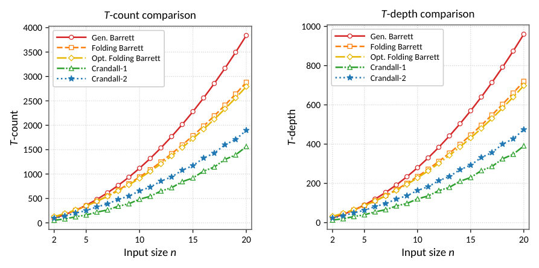
<figcaption class="paper-figure-caption"><b>Fig 5.</b> Figure 5. Logical T-count and T-depth comparison for Barrett reduction circuits and the proposed Crandall reduction circuits. Crandall reduction-1 achieves the lowest non-Clifford cost, while Crandall reduction-2 supports a wider range of c with moderate additional overhead.</figcaption>
</figure>

**Summary.** This paper presents a novel, resource-efficient reversible quantum circuit formulation for modular reduction using Crandall reduction tailored for pseudo-Mersenne moduli. By analyzing the folding and normalization steps, the authors derive two variants that significantly reduce the required T-count and T-depth compared to established methods like Barrett reduction. This work demonstrates the practical importance of exploiting modulus-specific arithmetic structure in designing fault-tolerant quantum algorithms.

**Why it may be interesting.** While focused on computation rather than AMO physics, the rigorous analysis of resource scaling (T-depth/T-count) and fault tolerance is highly relevant to any quantum simulation or algorithm implementation that requires deep circuits.

Detailed structure

**Main problem.** The core problem is developing highly efficient, reversible quantum circuits for modular reduction, which is a critical component in quantum algorithms like Shor's algorithm.

**Main result.** The authors propose two variants of Crandall reduction that achieve significantly lower T-count and T-depth (up to 46.9% reduction at n=10) compared to optimized folding Barrett reduction, even when analyzed under fault-tolerant surface code models.

**Method.** They translate classical modular arithmetic techniques for pseudo-Mersenne moduli ($q = 2^n - c$) into explicit reversible quantum circuits by analyzing the necessary folding and normalization steps.

**Model / system.** The work is situated in fault-tolerant quantum computation, utilizing resource estimates (T-count, T-depth) derived from surface code analysis. The arithmetic operations are modeled using specialized quantum gates for addition, multiplication, and subtraction.

**Key observables.** T-count, T-depth, required qubits, and estimated runtimes under the Sparse Blossom decoder.

**Important parameters / regimes.** Modulus size parameter $n$, the constant $c$ defining the modulus structure ($q=2^n-c$), and the specific normalization steps (one-step vs. two-step).

**Assumptions / limitations.** The resource estimates are based on worst-case logical bounds, assuming the use of a T-depth-one primitive for temporary logical-AND computation.

**Figures summary.** Figures illustrate the overall circuit structure for small parameters (n=4, c=3), detail quantum circuits for arithmetic components like adders and multipliers, and show specialized logic gates used in the reduction process.

**Paper structure.** The paper progresses by first identifying the structural advantage of Crandall reduction over Barrett reduction. It then derives explicit reversible quantum circuit formulations (Crandall-1 and Crandall-2) based on normalization requirements, followed by detailed resource analysis yielding closed-form T-depth formulas, culminating in performance comparisons against existing methods.

Abstract

Modular arithmetic is central to quantum algorithms for cryptographic problems, including Shor's algorithm and Grover-based cryptanalysis, with modular reduction contributing substantially to circuit cost. Pseudo-Mersenne moduli $q=2^n-c$ allow classical Crandall reduction to replace division with folding and constant arithmetic, providing a structural opportunity for more efficient quantum modular reduction than Barrett reduction. We translate this advantage into a reversible quantum setting by deriving explicit folding and normalization conditions for $2n$-bit inputs. To the best of our knowledge, this constitutes the first exact reversible quantum circuit formulation of Crandall reduction. Based on this formulation, we develop two variants: Crandall reduction-1 is designed to minimize execution cost through one-step normalization, whereas Crandall reduction-2 uses two-step normalization to support a wider range of $c$ with limited overhead. Logical resource estimates show that both variants require fewer qubits and lower T-count and T-depth than optimized folding Barrett reduction. At $n=10$, Crandall reduction-1 reduces both T-count and T-depth by approximately 46.9% relative to optimized folding Barrett reduction. Surface-code analysis further shows that, at $n=20$ under the Sparse Blossom decoder, the estimated runtimes of the two variants are 30.05 ms and 35.39 ms, respectively, compared with 53.77 ms for optimized folding Barrett reduction. These results demonstrate the practical value of exploiting modulus-specific arithmetic structure in fault-tolerant quantum circuit design.

[↑ back to top](#top)

### [Evaluating QAOA expectation values can be as hard as counting optimal solutions](http://arxiv.org/abs/2608.11385v1)

**Authors:** Stuart Hadfield  
**Type:** theory · **Category:** quantum information and computing · **PDF:** <https://arxiv.org/pdf/2608.11385v1>  
**Analysis basis:** full PDF text, analyzed in chunks

↔ Scroll figures horizontally

<figure class="paper-figure-card">
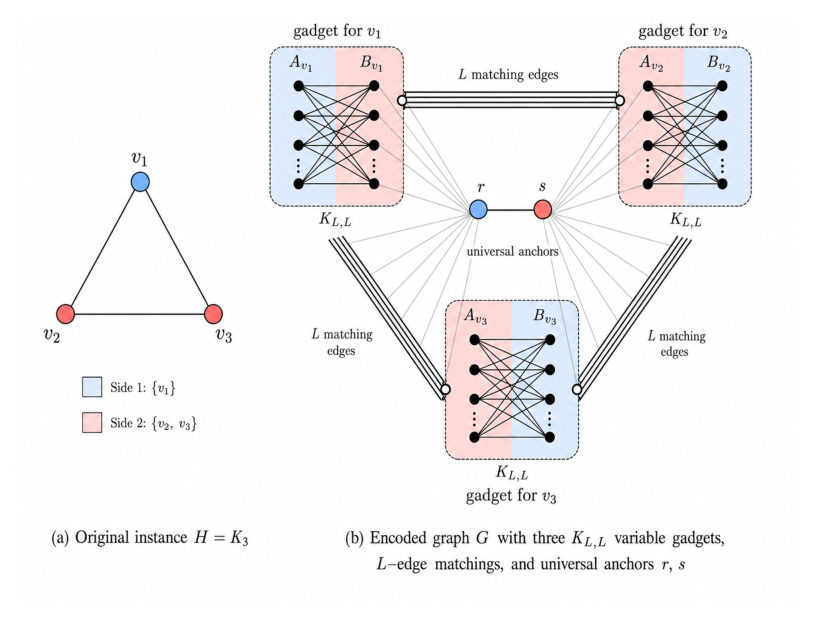
<figcaption class="paper-figure-caption"><b>Fig 1.</b> Figure 1: The balanced counting gadget for the source instance K3 (triangle graph). Blue and red indicate the two labels of one source maximum cut and its corresponding lift. Every KL,L variable gadget is cut completely, so each Av and Bv lie on opposite sides; the synchronous matchings among the A-parts reproduce the three source edges. The separated anchors r and s are adjacent to one another and each is joined to every vertex in W. Each part Av, Bv in panel (b) contains L vertices; only representative vertices and edges are shown. For H = K3, the constructed graph G(H) has L = 9, N = 56, and maximum cut counts |# MC(G)| = 2|# MC(H)| = 12. This figure was created with assistance from...</figcaption>
</figure>

**Summary.** This paper rigorously proves that evaluating expectation values for QAOA circuits at depth $p \geq 2$ is computationally intractable, specifically showing it is \#P-hard. By constructing specialized graph gadgets, the authors reduce the problem of counting maximum cuts to calculating a specific coefficient in the QAOA's resulting Laurent polynomial. This establishes a significant complexity barrier for variational quantum algorithms.

**Why it may be interesting.** This work provides a strong theoretical barrier, suggesting that simulating or optimizing complex quantum algorithms beyond shallow circuits requires computational resources equivalent to solving hard counting problems.

Detailed structure

**Main problem.** The core problem is determining the computational complexity of evaluating expectation values for variational quantum algorithms, specifically QAOA applied to MaxCut.

**Main result.** The authors prove that for fixed depth $p \geq 2$, evaluating these expectation values (and related quantities like gradients/Hessians) is \#P-hard, meaning it is as hard as counting optimal solutions.

**Method.** The hardness proof refines previous work by constructing specialized 'counting gadgets' within the QAOA framework. This allows mapping the problem of counting maximum cuts ($\#	ext{MC}(G)$) to the coefficient extraction from a Laurent polynomial derived from the expectation value.

**Model / system.** The study focuses on the Quantum Approximate Optimization Algorithm (QAOA) applied to finding the MaxCut of a graph $G$. The system is described by cost and mixer Hamiltonians, leading to quantum states $|\psi_p(\gamma, eta)
angle$ at depth $p$.

**Key observables.** The primary observable is the cost expectation value $F_p(G; \gamma, eta) = \langle\psi_p|C_G|\psi_p
angle$, and also single pairwise correlators $\langle Z_r Z_s 
angle$.

**Important parameters / regimes.** The depth parameter $p$ is critical: $p=1$ is tractable ($\in 	ext{FP}$), while fixed $p \geq 2$ exhibits \#P-hardness.

**Assumptions / limitations.** The hardness results apply to worst-case families of graphs and require evaluating the expectation value with exponential precision ($\epsilon = 2^{-cN}$).

**Figures summary.** Figure 1 illustrates a balanced counting gadget for $K_3$, demonstrating how the number of maximum cuts in the constructed graph relates directly to the original graph's count.

**Paper structure.** The paper first establishes tractability for $p=1$ (Chunk 4). It then builds upon this by introducing specialized gadgets and mathematical tools (Laurent polynomials) to prove that exact evaluation becomes \#P-hard for fixed $p \geq 2$ (Chunks 1 & 2). Finally, it extends the hardness result to computing derivatives like gradients and Hessians (Chunk 3).

Abstract

Evaluating expectation values is a critical task for variational quantum eigensolvers, and for parameterized quantum circuits and other quantum algorithms more generally. We consider the well-studied case of the Quantum Approximate Optimization Algorithm (QAOA) for the MaxCut problem. Recent work of Wang et al. [arXiv:2511.20212] showed this task to be NP-hard in general for any QAOA depth $p\geq 2$, complementing past results showing efficiently computable formulas for $p=1$ with arbitrary problem graphs. We sharpen this dichotomy showing that for $p\geq 2$ exact or exponentially precise cost expectation value evaluation is #P-hard under deterministic polynomial-time Turing reductions. Hardness at $p\geq 2$ is shown to remain even for evaluating single pairwise correlators $\langle Z\otimes Z\rangle $, as well as for highly restricted sets of algorithm parameters. Our proof refines the NP-hardness construction of Wang et al. that recovers the maximum cut value from the largest exponent of a QAOA Laurent polynomial, utilizing a distinct and simpler construction that extracts a value proportional to the total number of maximum cuts, in addition to the optimal cut value. Thus we show that the QAOA expectation value hardness transition from $p=1$ to $p=2$ is not only from tractability to optimization hardness, but to that of counting optimal solutions. As an application we show our results imply analogous hardness results for computing gradients and Hessians of QAOA circuits.

[↑ back to top](#top)

### [Ideal heat engine cycles at maximal efficiency -- the ideal gas and beyond](http://arxiv.org/abs/2608.11966v1)

**Authors:** Gregory Behrendt, Sebastian Deffner  
**Type:** theory · **Category:** statistical mechanics · **PDF:** <https://arxiv.org/pdf/2608.11966v1>  
**Analysis basis:** full PDF text, analyzed in chunks

↔ Scroll figures horizontally

<figure class="paper-figure-card">
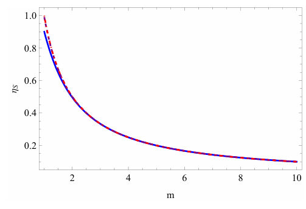
<figcaption class="paper-figure-caption"><b>Fig 1.</b> FIG. 1. Stirling efficiency (14) as a function of m, for Tc/Th = 10−1 (blue, solid line), Tc/Th = 10−2 (purple, dashed line), and Tc/Th = 10−3 (red, dot-dashed line)</figcaption>
</figure>
<figure class="paper-figure-card">
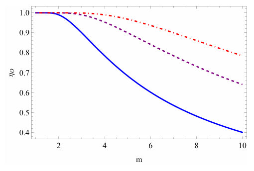
<figcaption class="paper-figure-caption"><b>Fig 2.</b> FIG. 2. Otto efficiency (23) as a function of m, for n = 2 and κ = 10−1 (blue, solid line), κ = 10−2 (purple, dashed line), and κ = 10−3 (red, dot-dashed line)</figcaption>
</figure>
<figure class="paper-figure-card">
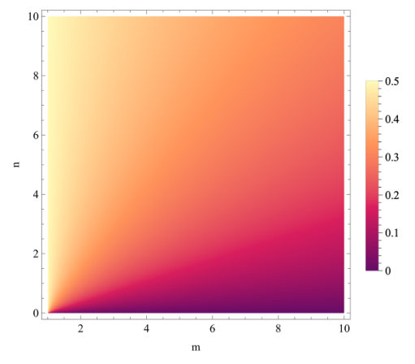
<figcaption class="paper-figure-caption"><b>Fig 3.</b> FIG. 3. Brayton efficiency (34) as a function of m and n for C = 2.</figcaption>
</figure>

**Summary.** This paper investigates which working medium maximizes the efficiency of standard heat engines like Stirling, Otto, and Brayton. By analyzing a general thermodynamic potential, the authors prove that maximum efficiency is achieved when the system's caloric equation of state is linear in temperature. This result extends beyond ideal gases to include models like harmonic oscillators.

**Why it may be interesting.** While focused on classical thermodynamics, the rigorous mathematical framework linking efficiency maximization to specific functional forms (linear temperature dependence) provides insight into optimal constraints for energy conversion processes relevant in quantum systems modeling.

Detailed structure

**Main problem.** The study aims to determine the optimal working medium for an ideal heat engine cycle, moving beyond the standard assumption that the ideal gas is always optimal.

**Main result.** Maximum efficiency across multiple cycles (Stirling, Otto, Brayton) is achieved when the working medium's caloric equation of state is linear in temperature ($m=1$).

**Method.** The authors derive exact efficiency expressions for three canonical heat engine cycles using a general polynomial Helmholtz potential and analyzing their dependence on system parameters.

**Model / system.** The analysis considers general thermodynamic systems defined by a polynomial Helmholtz potential, applied to the ideal Stirling, Otto, and Brayton cycles. The working mediums include ideal gases, classical harmonic oscillators, and rubber band models.

**Key observables.** Efficiency ($\eta$) of the heat engine cycles.

**Important parameters / regimes.** Exponents $n$ and $m$ derived from the fundamental thermodynamic relation; cycle ratios (e.g., compression ratio $\kappa$).

**Assumptions / limitations.** The underlying thermodynamic relationship is assumed to be a polynomial function of molar volume and temperature, and endoreversible cycles are analyzed.

**Figures summary.** Figure 1 shows Stirling efficiency ($\eta_S$) maximized at $m=1$, and Figure 2 shows Otto efficiency ($\eta_O$) suggesting maximization near $m=1$.

**Paper structure.** The paper systematically derives closed-form efficiencies for the Stirling, Otto, and Brayton cycles based on a general fundamental relation. The analysis consistently points to the condition $m=1$ as maximizing performance across all studied engines.

Abstract

Given a particular heat engine cycle, what is the optimal working medium that results in the highest efficiency? While one might jump to the conclusion that it must surely be the ideal gas, the situation is actually more intricate. Starting with a general Hemlholtz potential that depends polynomially on molar volume and temperature we derive exact expressions for the ideal Stirling, Otto, and Brayton cycles. We find that quite universally the maximal efficiency is achieved for thermodynamics systems, whose working mediums are linear in temperature. This includes the ideal gas, but also classical harmonic oscillators and pheonmenological models of the rubber band.

[↑ back to top](#top)

### [Spin nematic liquid crystal and scalar spin chirality in tetragonal lattice YbMnBi$_2$](http://arxiv.org/abs/2608.11776v1)

**Authors:** Yaofeng Xie, Sijie Xu, Yu Pan, Taekoo Oh, Tingjun Zhang, Masaaki Matsuda, Zhaoyu Liu, Zehao Wang, Yiheng Wang, Siyu Pan, Avishek Maity, Sylwia Pawledzio, Xiaoping Wang, Songxue Chi, Feng Ye, Yiqing Hao, Huibo Cao, Barry L. Winn, Melissa K. Graves-Brook, Shuai Wu, Fan Li, Xiaoyuan Zhou, Claudia Felser, Naoto Nagaosa, Pengcheng Dai  
**Type:** experiment · **Category:** strongly correlated electrons · **PDF:** <https://arxiv.org/pdf/2608.11776v1>  
**Analysis basis:** full PDF text, analyzed in chunks

↔ Scroll figures horizontally

<figure class="paper-figure-card">
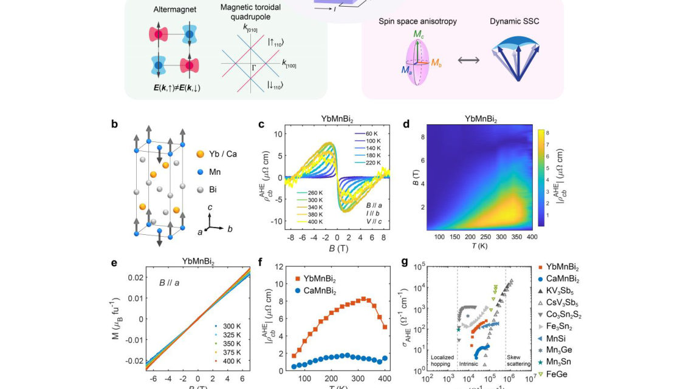
<figcaption class="paper-figure-caption"><b>Fig 1.</b> Figure 1 | Mechanisms of AHE, crystal structure and AHE of AMnBi2 . a, Schematics of mechanisms of AHE, including real-space SSC in non-collinear magnets and skyrmion, Berry curvature in momentum space of Weyl semimetals, altermagnets, and spin nematic state induced dynamic SSC. The pink ellipsoid represents the magnetic responses 𝑀𝑎, 𝑀𝑏, and 𝑀𝑐 measured by neutron LPA along the crystalline a-, b-, and c-axis directions. b, Crystal structure of AMnBi2 (A=Ca,Yb) showing the reported C-type AFM structure(36, 79, 80). c, Magnetic field dependence of anomalous Hall resistivity 𝜌𝑐𝑏</figcaption>
</figure>
<figure class="paper-figure-card">
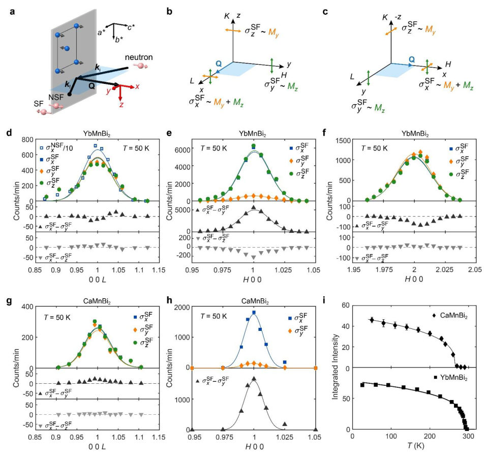
<figcaption class="paper-figure-caption"><b>Fig 2.</b> Figure 2 | Polarized neutron diffraction results of AMnBi2. a, Scattering geometry of polarized neutron scattering experiment in the [𝐻, 0, 𝐿] scattering plane. Incident neutron spins are polarized along the 𝒙, 𝒚, and 𝒛 directions, corresponding to directions along the 𝑸, orthogonal to 𝑸 within the scattering plane, and perpendicular to the scattering plane, respectively. b, SF cross sections 𝜎𝑥,𝑦,𝑧</figcaption>
</figure>
<figure class="paper-figure-card">
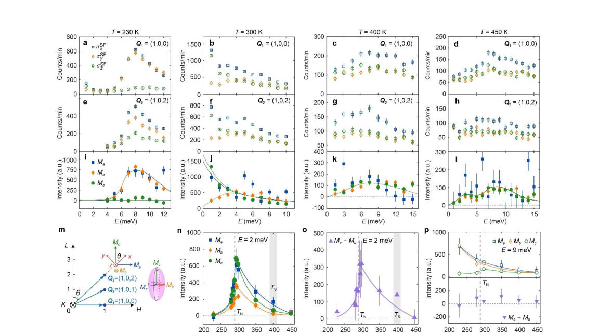
<figcaption class="paper-figure-caption"><b>Fig 3.</b> Figure 3 | Polarized inelastic neutron scattering results of YbMnBi2. l. a-d, Energy scans of 𝜎𝑥,𝑦,𝑧</figcaption>
</figure>
<figure class="paper-figure-card">
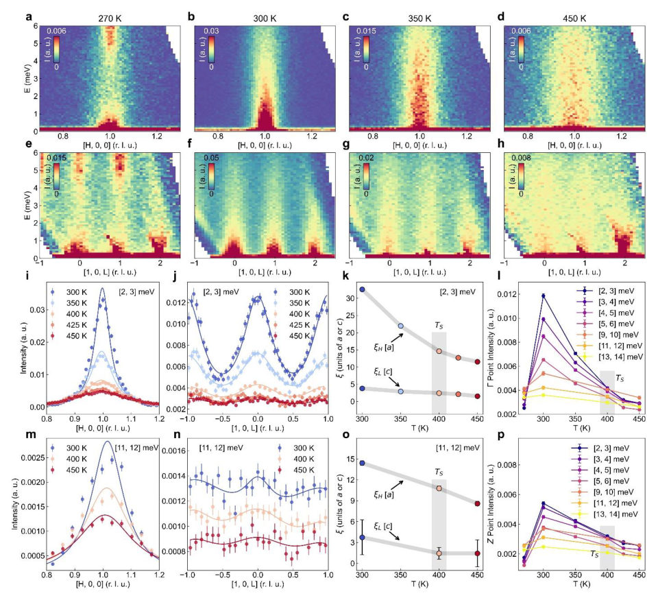
<figcaption class="paper-figure-caption"><b>Fig 4.</b> Figure 4 | Spin dynamics of YbMnBi2 across 𝑻𝑵 probed by unpolarized neutrons. a-d, Inelastic neutron scattering spectra showing spin excitations along the [𝐻, 0,0] direction near 𝑸= (1,0,0) at 𝑇= 270, 300, 350, and 450 K, respectively. e-h, Spin excitations along the [1,0, 𝐿]direction around 𝑸= (1,0,0) measured at the same temperatures. The dispersive low- energy scattering at (1,0,1) and (1,0,2) in h is acoustic phonons. i, Constant-𝐸 cuts integrated over [2, 3] meV along the [𝐻, 0,0] direction at different temperatures. The solid lines indicate the Lorentzian fit to extract the in-plane correlation length. j, Similar cuts of spin excitation along the [1,0, 𝐿] direction, fitted with...</figcaption>
</figure>
<figure class="paper-figure-card">
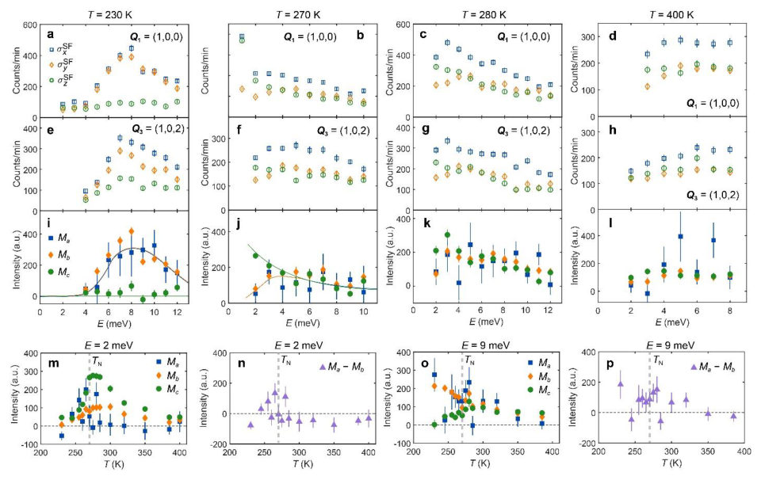
<figcaption class="paper-figure-caption"><b>Fig 5.</b> Figure 5 | Polarized inelastic neutron scattering results of CaMnBi2. a-d, Energy scans of 𝜎𝑥,𝑦,𝑧</figcaption>
</figure>

**Summary.** The authors investigate the interplay between spin nematic order and scalar spin chirality in $	ext{YbMnBi}_2$ using polarized neutron scattering. They find that $	ext{YbMnBi}_2$ exhibits a high-temperature dynamic spin nematic phase, which couples with an external magnetic field to induce anomalous Hall effects (AHE) and anomalous Nernst effects (ANE). This provides strong evidence for composite spin orders driving room-temperature spintronic phenomena in antiferromagnets.

**Why it may be interesting.** This work connects exotic magnetic orders (nematicity) observed through neutron scattering directly to measurable transport phenomena (AHE), providing a concrete platform for studying emergent quantum magnetotransport effects in correlated materials.

Detailed structure

**Main problem.** The study investigates the relationship between spin nematic order, scalar spin chirality (SSC), and anomalous magnetotransport effects in tetragonal magnetic compounds.

**Main result.** In $	ext{YbMnBi}_2$, a dynamic spin nematic phase exists above $T_N$ that couples with an external field to induce measurable AHE and ANE, phenomena absent in the analogous $	ext{CaMnBi}_2$.

**Method.** The research employs polarized neutron scattering (LPA) to probe spin excitations and measures magnetotransport properties like the Anomalous Hall Effect (AHE).

**Model / system.** The system under study is the tetragonal lattice $	ext{YbMnBi}_2$ compared to $	ext{CaMnBi}_2$, which are characterized as collinear antiferromagnets. The physics involves complex spin orders: nematicity (breaking rotational symmetry) and SSC (a three-spin, time-reversal symmetry breaking order).

**Key observables.** Spin excitation anisotropy ($M_a$ vs $M_b$ vs $M_c$), AHE/ANE magnitude, and the temperature dependence of magnetic scattering intensities.

**Important parameters / regimes.** Critical temperatures like $T_N \approx 270-290	ext{ K}$ and a nematic crossover temperature around $400	ext{ K}$; external magnetic field strength ($B$).

**Assumptions / limitations.** The analysis assumes that the observed AHE/ANE in $	ext{YbMnBi}_2$ is due to coupling between the dynamic spin nematic phase and SSC, which is not present in $	ext{CaMnBi}_2$.

**Figures summary.** Figures illustrate temperature dependence of scattering cross sections ($\sigma^{	ext{SF}}$) showing changes in magnetic moment anisotropy across $T_N$ and $T_S$, alongside plots detailing the AHE response vs. field for both compounds.

**Paper structure.** The paper establishes background on spin nematicity and SSC, uses polarized neutron scattering to characterize the distinct dynamic spin nematic phase in $	ext{YbMnBi}_2$ above $T_N$, confirms the collinear AFM structure via multiple measurements, and finally links this high-temperature nematic state to field-induced AHE/ANE.

Abstract

A spin nematic order, analogous to the nematic liquid crystal, characterizes the spontaneous breaking of spin-space rotational symmetry while preserving time-reversal ($T$) symmetry. In contrast, scalar spin chirality (SSC), a composite three-spin order, breaks $T$ symmetry and is known to induce an anomalous Hall effect (AHE). Although a spin nematic phase has been suggested in frustrated magnets and the square-lattice iridate, how it might affect magnetotransport properties is unknown. Here we use polarized neutron scattering to show that tetragonal $A$MnBi$_2$ ($A$ = Ca, Yb) is a strictly $c$-axis-aligned collinear antiferromagnet (C-type), with $T_N \approx 270$ K and 290 K, respectively. On cooling from 450 K to $T_N$, low-energy spin excitations in YbMnBi$_2$ spontaneously change from isotropic to anisotropic in spin space within the tetragonal plane, forming a dynamic spin nematic phase around 400 K due to heavy Yb-induced spin-orbit coupling, before gapping out below $T_N$. Similar measurements on CaMnBi$_2$ reveal isotropic paramagnetic scattering without a spin nematic phase above $T_N$. Under an in-plane magnetic field, the Yb$^{3+}$ moments may interact with the dynamic spin nematic phase to induce nonzero SSC, giving rise to AHE and an anomalous Nernst effect (ANE) in YbMnBi$_2$ that are absent in CaMnBi$_2$ above $T_N$. A symmetry-based Ginzburg-Landau analysis shows that coupling terms between the nematic order and SSC are allowed under an external magnetic field, which could explain the rapid increase of AHE with field in YbMnBi$_2$. Our results provide compelling evidence for dynamic SSC-induced AHE and ANE in the paramagnetic phase of a compensated collinear antiferromagnet, opening a new avenue for the physics of composite spin orders and room-temperature spintronics without magnetic order.

[↑ back to top](#top)

## Secondary cond-mat archives

*Papers from cond-mat.mtrl-sci, mes-hall, other, soft, supr-con. These archives are de-prioritized — they appear at the end regardless of relevance score.*

### Relevant in secondary archives (23)

### [Spatially Resolving the Pre-Thermal Anatomy of a Driven Bosonic Fluid](http://arxiv.org/abs/2608.11561v1)

**Authors:** Shantam Ravan, Aaron Müller, Johannes Cremer, Jonathan Curtis, Daniel Fernandez, Ronald Walsworth, Eugene Demler, Amir Yacoby  
**Type:** both · **Category:** statistical mechanics · **PDF:** <https://arxiv.org/pdf/2608.11561v1>  
**Analysis basis:** full PDF text, analyzed in chunks
**Topic relevance:** 🔥 `driven-dissipative phase transition` **4/5** · 🔥 `scars & prethermalization` **4/5** · `methods for driven-dissipative` **3/5** · `non-equilibrium universality` **3/5** · `Keldysh / 2PI / non-Gaussian methods` **2/5** · `analog quantum simulation` **2/5** · `correlated / nonlocal dissipation` **2/5** · `QC/QI experiment` **1/5** · `quantum measurements` **1/5** · `quantum optics experiment` **1/5**

↔ Scroll figures horizontally

<figure class="paper-figure-card">
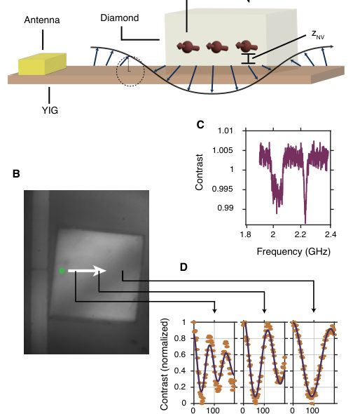
<figcaption class="paper-figure-caption"><b>Fig 1.</b> Figure 1. Experimental setup and single-frequency magnon detection. (A) Schematic diagram of the experimental ge- ometry showing the YIG thin film, diamond chip with NV centers, microwave stripline antenna, and magnetic bias field orientation. Spin waves in the YIG film are a result of the precession of individual magnetic dipoles around the equilib- rium magnetization, as indicated by the dashed circle. (B) Optical camera image of the diamond chip placed on the sur- face of the YIG adjacent to the stripline antenna. The green dot indicates the laser spot of the confocal microscope, used for NV excitation, which is scanned across the diamond chip to probe magnons at different positions...</figcaption>
</figure>
<figure class="paper-figure-card">
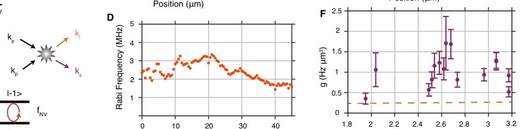
<figcaption class="paper-figure-caption"><b>Fig 2.</b> Figure 2. (A) (i) Pulse sequence to acquire data in (C): a standard NV ODMR sequence with a microwave signal at fixed frequency fp and an additional driving tone at swept frequency fs. (ii) Pulse sequence to acquire data in (D). The length of the microwave signal for both fp and fs is swept to drive Rabi oscillations between the NV spin states. (B) Schematic of the four magnon NV mixing process. The left side indicates that the consumption of two fp magnons and the emission of fs and fi magnons conserves energy. If the fi idler magnon is at the NV spin resonance, then the NV ensemble will be coherently driven. (C) Example measured NV ODMR spectrum along the diamond chip and hence the YIG...</figcaption>
</figure>

**Summary.** The paper uses NV magnetometry to image magnon dynamics in YIG films, revealing that the approach to thermal equilibrium is not random but proceeds through discrete, multi-stage parametric scattering cascades. By quantifying these steps and mapping out the resonance structure, it establishes spatially resolved magnonics as a powerful tool for studying non-equilibrium many-body physics.

**Why it may be interesting.** This provides an experimental realization and quantitative framework for visualizing non-equilibrium many-body kinetics in a solid-state quantum system, directly addressing energy redistribution mechanisms beyond simple thermalization assumptions.

Detailed structure

**Main problem.** The central challenge is understanding how coherently driven quantum many-body systems redistribute energy through discrete, non-equilibrium steps before reaching thermal equilibrium.

**Main result.** The system's relaxation proceeds via a multi-stage, deterministic scattering cascade involving magnons in the slow magnon regime, rather than purely stochastic processes.

**Method.** The authors combine NV magnetometry for micron-scale spatial imaging with theoretical modeling of parametric scattering instabilities to track energy flow.

**Model / system.** The physical system is a Yttrium Iron Garnet (YIG) thin film hosting magnons (bosonic excitations). The dynamics are modeled using coupled-mode theory and nonlinear wave equations describing four-magnon interactions and subsequent cascading parametric resonances.

**Key observables.** Spatial growth profiles of scattering products, frequency shifts ($\omega_{NL}$), Rabi oscillation decay rates ($\Omega_R$), and the resonance structure in momentum space.

**Important parameters / regimes.** The coupling strength ($g$) of the four-magnon interaction, the microwave driving intensity ($I$), and the operating regime near ferromagnetic resonance (FMR).

**Assumptions / limitations.** Standard perturbative approaches fail to capture the multi-stage kinetics; the analysis relies on identifying dynamic selection rules favoring momenta where group velocity vanishes ('slow magnon regime').

**Figures summary.** Figures illustrate the experimental setup, ODMR spectra showing nonlinear dips, and Rabi oscillation measurements confirming spatial decay of coherent excitations.

**Paper structure.** The work progresses by first isolating the elementary four-magnon interaction strength using two-tone driving, then observing a spontaneous, multi-generation scattering cascade driven by intense single-frequency excitation. Finally, theoretical modeling maps out the resonance structure across different cascade orders.

Abstract

Understanding how coherently driven quantum many-body systems redistribute energy prior to thermal equilibrium remains a central challenge in many-body physics. Here, we utilize nitrogen-vacancy (NV) magnetometry to perform micron-scale spatial imaging of room-temperature magnon dynamics in a yttrium iron garnet (YIG) thin film. We resolve a hierarchy of discrete parametric scattering events that serve as deterministic stepping stones toward thermalization. By applying a two-tone wave-mixing protocol, we first isolate the elementary four-magnon interaction and extract its coupling strength via the spatial growth of the scattering product. We then drive the system with an intense single-frequency excitation near ferromagnetic resonance, revealing that magnon-magnon interactions trigger a spontaneous, multi-generation scattering cascade. We demonstrate that in each generation, the dominant scattering channels correspond to one of the out-scattered magnons being in the slow magnon regime, reminiscent of the enhancement of optical nonlinearities in slow light systems. We capture this dynamics quantitatively using a near field magnonics framework and extract the cascade order and nonlinear coefficients directly from power-dependent frequency shifts. By revealing the multi-stage dynamical process through which monochromatic injected magnons evolve toward equilibrium, our work establishes spatially resolved magnonics as a powerful platform for visualizing non-equilibrium many-body kinetics.

[↑ back to top](#top)

### [Realization of Arbitrary Gauge Fields via Symmetry-Protected Zero Modes](http://arxiv.org/abs/2608.11609v1)

**Authors:** J. X. Dai, Bingbing Wang, Jiangzi Chen, Y. X. Zhao, Haoran Xue  
**Type:** both · **Category:** other · **PDF:** <https://arxiv.org/pdf/2608.11609v1>  
**Analysis basis:** full PDF text, analyzed in chunks
**Topic relevance:** 🔥 `analog quantum simulation` **4/5** · `driven-dissipative phase transition` **1/5** · `methods for driven-dissipative` **1/5**

↔ Scroll figures horizontally

<figure class="paper-figure-card">
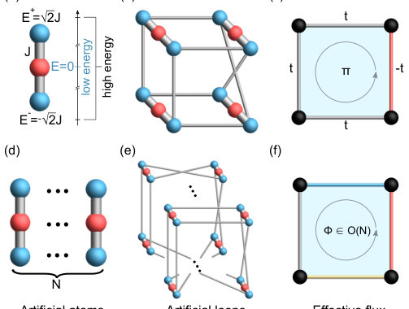
<figcaption class="paper-figure-caption"><b>Fig 1.</b> FIG. 1. General framework. (a) The three-site unit com- prising one A-site (red) and two B-sites (blue). This system possesses two high-energy modes ± √</figcaption>
</figure>
<figure class="paper-figure-card">
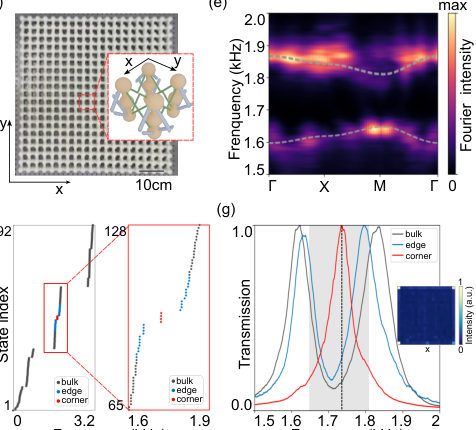
<figcaption class="paper-figure-caption"><b>Fig 2.</b> FIG. 2. A quadrupole topological insulator with Z2 gauge field. (a) The target lattice model (top) and the constructed lattice model using N = 1 artificial atoms (bottom). Gray (red) bonds represent positive (negative) couplings. (b) Cal- culated energy spectrum of the target model under a square geometry with t1 = 0.2 and t2 = 1. (c) Calculated energy spectrum of the constructed model under a square geometry with J = 10, t1 = 0.2 and t2 = 1. (d) Photograph of the fabricated acoustic sample. The inset shows the unit cell. (e) Measured (color map) and simulated (black curves) bulk dis- persion of the acoustic crystal. (f) Simulated eigenfrequencies of the acoustic crystal under a square...</figcaption>
</figure>
<figure class="paper-figure-card">
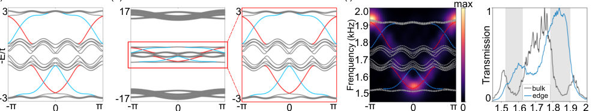
<figcaption class="paper-figure-caption"><b>Fig 3.</b> FIG. 3. An SO(2) Hofstadter model. (a) The target SO(2) Hofstadter lattice model, with hopping phases indicated. (b) The constructed lattice model with α = π/2. Dashed lines mark the unit cell. (c) Photograph of the fabricated acoustic sample with three and twelve unit cells along the x and y directions, respectively. The right panel illustrates the unit cell. (d) The Hofstadter butterfly spectrum calculated from the target lattice model, plotted against the flux ratio p/q (fixed q = 100). (e) Energy spectrum of the constructed lattice model, where the Hofstadter butterfly emerges in the low-energy window (red box). (f) Simulated eigenfrequencies as a function of p/q for acoustic crystals...</figcaption>
</figure>
<figure class="paper-figure-card">
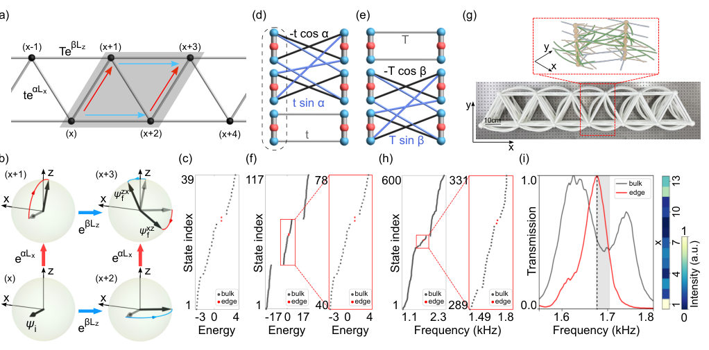
<figcaption class="paper-figure-caption"><b>Fig 4.</b> FIG. 4. A non-Abelian SO(3) gauge field. (a) The target lattice model featuring an SO(3) gauge field. Each site (x) hosts three orbitals, connected by the indicated hopping matrices. (b) Illustration of the non-Abelian nature of the SO(3) lattice gauge field. A particle initialized in state ψi at site x evolves into distinct final states when transported to site x + 3 along two different pathways. (c) Calculated energy spectrum of the target model in (a) under open boundary conditions. (d) and (e) Physical realizations of the hopping terms teαLx and TeβLz utilizing N = 3 artificial atoms. (f) Calculated energy spectrum of the constructed model. (g) Photograph of the acoustic sample. The top...</figcaption>
</figure>

**Summary.** The paper introduces a general and highly robust method to engineer arbitrary static O(N) lattice gauge fields in artificial systems. By exploiting symmetry-protected zero modes within bipartite units, the authors ensure that the target Hamiltonian is realized exactly, avoiding perturbative errors. This technique has been experimentally validated using acoustic resonators for realizing $\mathbb{Z}_2$, SO(2), and SO(3) topological models.

**Why it may be interesting.** This work provides a powerful, experimentally accessible blueprint for engineering complex quantum Hamiltonians—specifically those containing non-trivial gauge fields—using only local interactions in platforms like acoustics or photonics.

Detailed structure

**Main problem.** The primary challenge addressed is realizing arbitrary static O(N) lattice gauge configurations within artificial physical systems.

**Main result.** The authors present a general scheme that achieves this by encoding the target gauge field into the symmetry-protected zero modes of sublattice-imbalanced bipartite units, demonstrated successfully across multiple topological models.

**Method.** The methodology involves constructing an effective Hamiltonian ($	ext{H}_{	ext{eff}}$) by projecting the microscopic tight-binding model onto the zero-mode subspace, ensuring this projection is an exact spectral block rather than a perturbative approximation.

**Model / system.** The framework is demonstrated using acoustic crystals (coupled resonators), realizing specific models like a $\mathbb{Z}_2$ quadrupole topological insulator, an SO(2) Hofstadter model, and an SO(3) non-Abelian topological insulator.

**Key observables.** Transmission spectra, energy/frequency spectra of bulk/edge states, and field localization at boundaries are used as key diagnostic observables.

**Important parameters / regimes.** The construction relies on using only positive microscopic couplings (for experimental feasibility), and requires a sufficiently large intra-unit gap to isolate the zero-mode subspace.

**Assumptions / limitations.** The method assumes that all necessary physical couplings can be realized as positive real numbers, allowing for mapping continuous gauge fields onto discrete artificial atom couplings.

**Figures summary.** Figures illustrate the general framework of using a three-site unit to create an O(N) artificial atom. Specific applications show the realization of edge states and flux patterns in acoustic resonators for the $\mathbb{Z}_2$ TI, SO(2) model, and SO(3) insulator.

**Paper structure.** The paper establishes the theoretical zero-mode construction using bipartite units, details the general procedure for projecting to an exact gauge Hamiltonian, and then presents experimental demonstrations across three distinct physical realizations ($\mathbb{Z}_2$, SO(2), SO(3)).

Abstract

Gauge fields are fundamental to modern physics, but prescribed gauge configurations are often difficult to implement in artificial systems. Here, we present a general scheme for realizing arbitrary static $\mathrm{O}(N)$ lattice gauge configurations using symmetry-protected zero modes of sublattice-imbalanced bipartite units. The target $\mathrm{O}(N)$ link on each bond is encoded in the connectivity and strengths of positive microscopic couplings. By decoupling the zero-mode manifold from the remaining modes, the target gauge Hamiltonian forms an exact spectral block of the microscopic tight-binding model rather than a perturbative approximation. We experimentally demonstrate this framework in acoustic crystals through a $\mathbb{Z}_2$ quadrupole topological insulator, an $\mathrm{SO}(2)$ Hofstadter model, and an $\mathrm{SO}(3)$ non-Abelian topological insulator. Our results provide a general and accessible route to gauge-field physics in artificial systems.

[↑ back to top](#top)

### [Exact solution for stationary states of a closed memristor with mobile charged vacancies](http://arxiv.org/abs/2608.12264v1)

**Authors:** Irina V. Boylo, Konstantin L. Metlov  
**Type:** theory · **Category:** statistical mechanics · **PDF:** <https://arxiv.org/pdf/2608.12264v1>  
**Analysis basis:** full PDF text, analyzed in chunks
**Topic relevance:** `Keldysh / 2PI / non-Gaussian methods` **3/5** · `methods for driven-dissipative` **3/5** · `non-equilibrium universality` **3/5** · `analog quantum simulation` **2/5** · `driven-dissipative phase transition` **2/5** · `scars & prethermalization` **2/5** · `Frenkel-Kontorova` **1/5** · `correlated / nonlocal dissipation` **1/5** · `quantum measurements` **1/5**

↔ Scroll figures horizontally

<figure class="paper-figure-card">
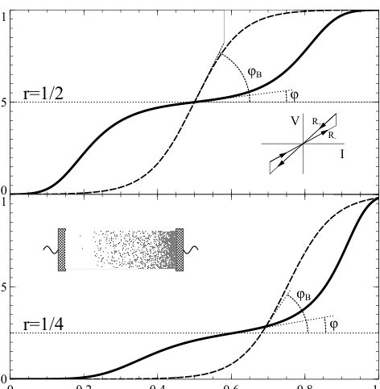
<figcaption class="paper-figure-caption"><b>Fig 1.</b> Figure 1. Stationary vacancy distributions in memristors half-filled with vacancies (r = 1/2, top) and quarter-filled (r = 1/4, bottom) at normalized current strength p = 16; solid lines show distributions at normalized Coulomb energy of vacancies α = 1000, dashed lines at α = 0, corresponding to solutions of the Burgers equation. The insets show: (top right) a typical hysteresis loop of the considered memristor under a square-wave current; (bottom left) an illustration of the random vacancy distribution in the memristor corresponding to the solid line in the figure. The derivative scaling factor is defined in the text as υ = tan φ/ tan φB.</figcaption>
</figure>
<figure class="paper-figure-card">
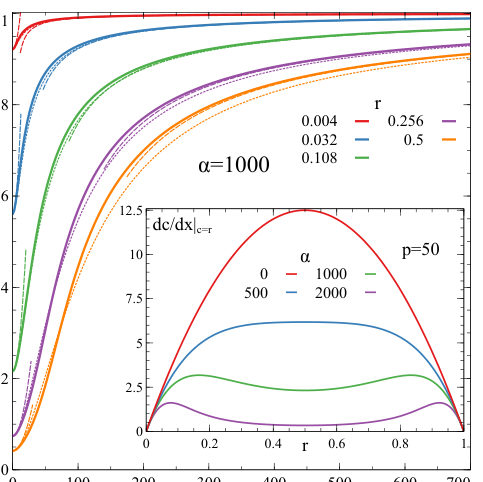
<figcaption class="paper-figure-caption"><b>Fig 2.</b> Figure 2. Derivative scaling factor s as a function of the reduced current strength p in memristors with different vacancy fillings at α = 1000. The curves for fillings r and 1−r coincide. The inset shows the dependence of the derivative of the vacancy distribution profile dc/ dx at the point c = r as a function of the memristor filling factor r at p = 50.</figcaption>
</figure>

**Summary.** This work provides an analytical solution for the stationary state of a memristor model incorporating mobile charged vacancies and their electrostatic interactions. By linearizing the governing equations, the authors derive expressions for vacancy profiles and demonstrate that the device's limiting resistance is robustly independent of the interaction strength in the leading order approximation.

**Why it may be interesting.** While this is condensed matter physics (memristors), the mathematical techniques—linearization of non-local PDEs, use of integral invariants, and analysis in limiting regimes ($p 	o 0, p 	o \infty$)—are highly relevant to theoretical studies of complex many-body dynamics or open quantum systems.

Detailed structure

**Main problem.** The primary goal is to find analytical expressions for the stationary (limiting) vacancy distributions within a closed memristor model that incorporates long-range electrostatic interactions between mobile charged vacancies.

**Main result.** Despite the inclusion of strong electrostatic interaction, the limiting resistances in both 'on' and 'off' states remain independent of the interaction strength ($\alpha$) at leading order.

**Method.** The analysis focuses on solving the steady-state condition ($J=0$) by linearizing the governing non-linear partial differential equations using a logit transformation ($\Lambda = \log(c/(1-c))$) and solving the resulting equation via quadrature integration.

**Model / system.** The system is a one-dimensional memristor containing mobile charged vacancies. The dynamics are governed by a continuity equation coupled with Poisson's equation, modeling charge transport influenced by vacancy concentration $C(x)$ and an electric potential $\Phi$.

**Key observables.** Stationary vacancy distributions $c(x)$, limiting resistances in 'on'/'off' states, and the derivative scaling factor $\upsilon$.

**Important parameters / regimes.** Electrostatic interaction strength ($\alpha$), applied current density ($p$), and filling factor ($r$). The analysis explores limits like $p \ll 1$ and $p \gg 1$.

**Assumptions / limitations.** The full kinetic equation is too complex, necessitating the focus on stationary states ($J=0$). Results regarding resistance independence hold only in the leading linear order of vacancy concentration.

**Figures summary.** Figure 2 illustrates the dependence of the derivative scaling factor $\upsilon$ on reduced current strength $p$ for various fillings and interaction strengths ($\alpha$), showing symmetry around half-filling.

**Paper structure.** The paper establishes the governing equations (continuity, Poisson) and then simplifies them to stationary state forms. It employs a logit transformation to linearize the system, leading to an equation solved via quadrature integration involving two constants ($\Lambda_0$ and $\upsilon$). Finally, asymptotic expansions for $\upsilon$ are derived.

Abstract

A nonlinear model of a memristor based on charged mobile vacancies is considered taking into account the electrostatic interaction between them. This interaction significantly affects the stationary (limiting) vacancy distributions formed under the action of the electric current flowing through the memristor, for which analytical expressions are obtained in this work. Between the regions with reduced and increased vacancy concentrations, an intermediate electrically neutral region is formed due to the electrostatic interaction. Interestingly, the limiting resistances in the ``on'' and ``off'' states of such a memristor do not depend on the strength of the electrostatic interaction, at least in the leading first order in the vacancy concentration.

[↑ back to top](#top)

### [Light induced superconducting diode effect in patterned films](http://arxiv.org/abs/2608.11331v1)

**Authors:** Evan M. Wilson, Hou-Tong Chen, Alexander V. Balatsky  
**Type:** theory · **Category:** other · **PDF:** <https://arxiv.org/pdf/2608.11331v1>  
**Analysis basis:** full PDF text, analyzed in chunks
**Topic relevance:** `driven-dissipative phase transition` **3/5** · `interference shaping light` **3/5** · `methods for driven-dissipative` **3/5** · `Keldysh / 2PI / non-Gaussian methods` **2/5** · `non-equilibrium universality` **2/5** · `analog quantum simulation` **1/5** · `correlated / nonlocal dissipation` **1/5** · `quantum measurements` **1/5**

↔ Scroll figures horizontally

<figure class="paper-figure-card">
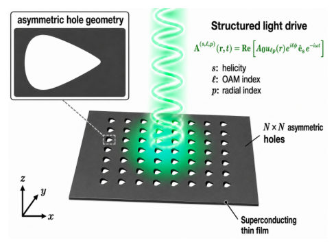
<figcaption class="paper-figure-caption"><b>Fig 1.</b> FIG. 1. A superconducting film patterned with an Nx × Ny array of asymmetric holes is illuminated by a structured optical beam. The drive is described by a vector potential A(s,ℓ,p)(r, t), where s denotes helicity, ℓthe orbital angular momentum index, and p the radial index. The induced condensate dynamics are modeled using the time-dependent Ginzburg–Landau equation, with the supercurrent density js determined by the gauge-covariant phase gradients of the superconducting order parameter.</figcaption>
</figure>
<figure class="paper-figure-card">
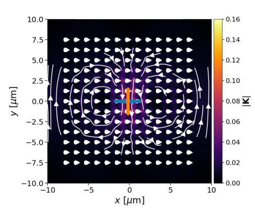
<figcaption class="paper-figure-caption"><b>Fig 2.</b> FIG. 2. Optically induced sheet-current texture in the 169-hole superconducting metacrystal for the continuous linearly polarized Gaussian drive, (s, ℓ, p) = (0, 0, 0). The color scale shows the magnitude of the induced current, and the horizontal and vertical central cuts mark the internal channels used to compare left-right and up-down current flow. The asymmetric hole array redirects the driven current into components parallel and perpendicular to the driving electric field, enabling a zero-bias directional current imbalance. Video simulations for all optical modes are available on the companion website [32].</figcaption>
</figure>
<figure class="paper-figure-card">
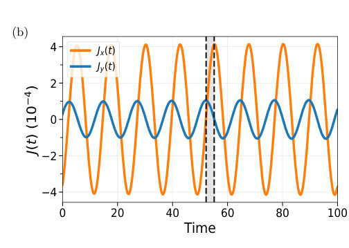
<figcaption class="paper-figure-caption"><b>Fig 3.</b> FIG. 3. Time-dependent zero-bias current imbalance and local phase mixing in the 169-hole superconducting metacrystal under continuous linearly polarized Gaussian illumination, (s, ℓ, p) = (0, 0, 0). Panel (a) shows the instantaneous left–right and up–down diode-like coefficients, ηLR and ηUD, obtained from opposite central line-cut currents. The instantaneous coefficients are plotted as dimensionless ratios, so η = 0.10 corresponds to 10%; Table I reports the cycle-averaged values in percent. The asymmetric peaks over an optical cycle produce a finite cycle-averaged directional imbalance. Panel (b) shows representative local current components Jx(t) and Jy(t) inside the patterned region....</figcaption>
</figure>
<figure class="paper-figure-card">
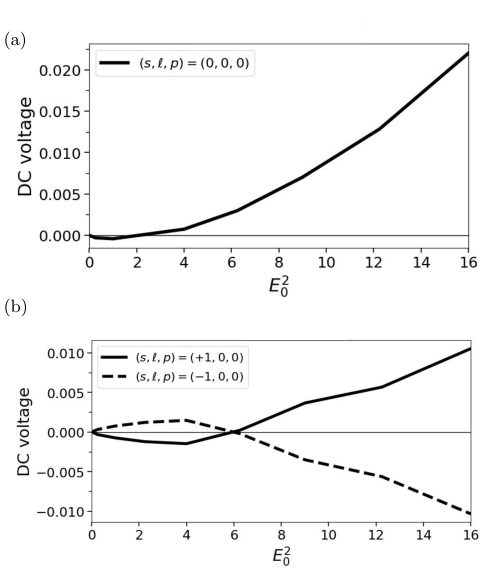
<figcaption class="paper-figure-caption"><b>Fig 4.</b> FIG. 4. (a) For Gaussian linear polarization, (s, ℓ, p) = (0, 0, 0), the dc voltage shows nonlinear rectification as a function of the optical intensity proxy E2 0. The response includes a sign change at low intensity and higher-order nonlinearity. (b) Circularly polarized beams with opposite optical helicities, (s, ℓ, p) = (+1, 0, 0) and (−1, 0, 0), separate into opposite-sign voltage branches that both change sign, showing helicity-sensitive rectification.</figcaption>
</figure>
<figure class="paper-figure-card">
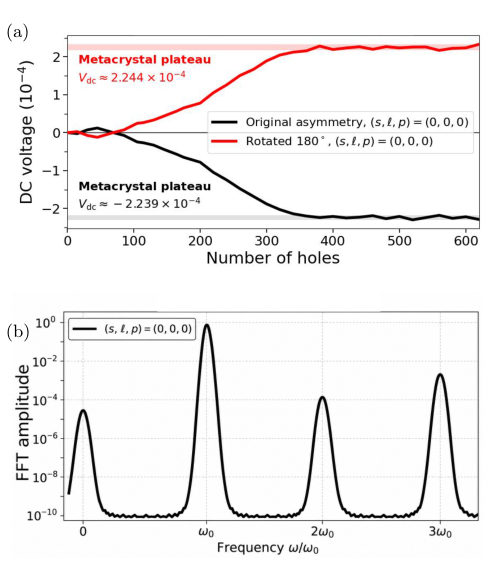
<figcaption class="paper-figure-caption"><b>Fig 5.</b> FIG. 5. Geometry dependence and harmonic content of the optically rectified voltage for the linearly polarized Gaussian drive, (s, ℓ, p) = (0, 0, 0). Panel (a) shows the dc voltage as the number of asymmetric holes is increased for the original hole orientation and for the 180◦-rotated geometry. The voltage grows with hole number and approaches a metacrystal plateau, while rotating the holes reverses the sign of the response, showing that the diode polarity is set by the broken spatial symmetry of the hole array. Panel (b) shows the Fourier spectrum of the voltage response for the 169-hole metacrystal. The spectrum contains a finite dc component together with peaks at 2ω0, and 3ω0,...</figcaption>
</figure>

**Summary.** The research shows that patterned superconducting films act as superconducting diodes when illuminated by structured light. By exploiting the geometric asymmetry of holes (metacrystals), the system generates a directional supercurrent imbalance and measurable photovoltage even without external bias. This establishes a powerful, non-invasive method for controlling superconducting transport using optical fields.

**Why it may be interesting.** This work bridges quantum electrodynamics/optics with superconductivity, showing how engineered geometry can induce non-linear, directed transport phenomena using light, which is relevant for understanding coherent control in mesoscopic superconducting circuits.

Detailed structure

**Main problem.** The study demonstrates how structured light can induce a superconducting diode response in patterned films without applying a static bias or permanently altering the material.

**Main result.** Structured optical driving generates measurable, non-zero directional supercurrent imbalances and rectified photovoltages, establishing patterned superconductors as viable platforms for light-tunable diodes.

**Method.** The analysis relies on solving the generalized time-dependent Ginzburg-Landau equation using numerical simulations to model the coherent condensate response.

**Model / system.** The physical system is a superconducting film perforated with geometrically asymmetric holes (metacrystals). The dynamics are governed by the TDGL equation, incorporating an optical drive via a time-dependent vector potential.

**Key observables.** Rectified dc photovoltages ($V_{dc}$), zero-bias directional supercurrent imbalance ($\eta_{LR}, \eta_{UD}$), and the nonlinear dependence of $V_{dc}$ on optical intensity.

**Important parameters / regimes.** The response is highly controlled by the hole array geometry, the helicity ($s$), and orbital angular momentum index ($\ell$) of the incident structured light.

**Assumptions / limitations.** The analysis focuses exclusively on the coherent condensate response, neglecting dissipative effects like optical heating or nonequilibrium quasiparticle dynamics.

**Figures summary.** Figures illustrate the setup using structured light, show time-dependent current textures revealing chiral flow patterns, and plot $V_{dc}$ vs. intensity to confirm nonlinear rectification.

**Paper structure.** The paper systematically analyzes how structural asymmetry interacts with various optical modes (Gaussian, Laguerre-Gaussian) under both continuous and pulsed driving conditions to quantify the resulting directional supercurrent imbalance and photovoltage.

Abstract

Structured light offers a route to control superconducting transport without permanently modifying the material or applying a static bias. Here we show that structured optical driving can generate a superconducting diode response in patterned superconducting films with asymmetric holes. Using generalized time-dependent Ginzburg Landau simulations, we find that optical driving produces rectified dc photovoltages and zero bias directional supercurrent imbalance in a junction free geometry, with continuous-drive diode efficiencies of order $10^{-3}$ and pulsed efficiencies reaching $10^{-2}$. The response is controlled by both the hole array and the optical mode. Increasing the number of asymmetric holes enhances rectification, reversing circular helicity reverses the diode polarity, and the optical spatial mode strongly modifies the magnitude and polarity of the directional response. Pulsed excitation enhances the zero bias line cut current imbalance to the percent level. For linearly polarized illumination, the asymmetric metacrystal converts the drive into local chiral supercurrent motion, inducing an inverse Faraday effect like mechanism for dynamical time reversal symmetry breaking. These results establish patterned superconducting films as a viable platform for light-tunable superconducting diode behavior.

[↑ back to top](#top)

### [False-vacuum bubbles in sphaleron scattering](http://arxiv.org/abs/2608.11370v1)

**Authors:** Manuel A. Martínez Sánchez, Christoph Adam, Danial Saadatmand  
**Type:** theory · **Category:** statistical mechanics · **PDF:** <https://arxiv.org/pdf/2608.11370v1>  
**Analysis basis:** full PDF text, analyzed in chunks
**Topic relevance:** `driven-dissipative phase transition` **3/5** · `non-equilibrium universality` **3/5** · `Frenkel-Kontorova` **2/5** · `Keldysh / 2PI / non-Gaussian methods` **2/5** · `methods for driven-dissipative` **2/5** · `analog quantum simulation` **1/5** · `correlated / nonlocal dissipation` **1/5** · `scars & prethermalization` **1/5**

↔ Scroll figures horizontally

<figure class="paper-figure-card">
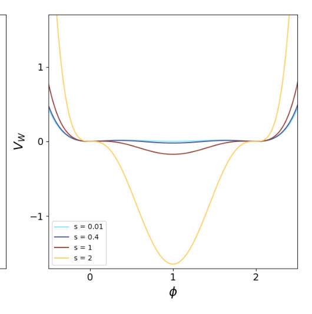
<figcaption class="paper-figure-caption"><b>Fig 1.</b> FIG. 1: Barrier (left) and well (right) potentials for different values of s.</figcaption>
</figure>
<figure class="paper-figure-card">
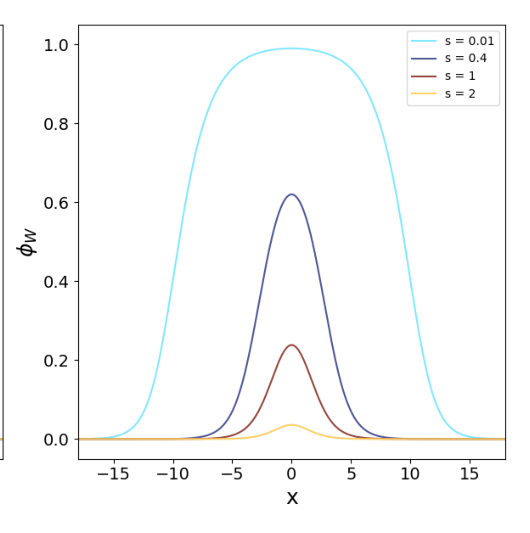
<figcaption class="paper-figure-caption"><b>Fig 2.</b> FIG. 2: Sphaleron profiles in the barrier model (left) and the well model (right) for different values of s.</figcaption>
</figure>
<figure class="paper-figure-card">
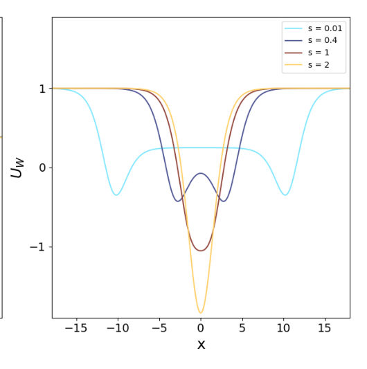
<figcaption class="paper-figure-caption"><b>Fig 3.</b> FIG. 3: Quantum potentials for the sphalerons represented in Fig. 2</figcaption>
</figure>
<figure class="paper-figure-card">
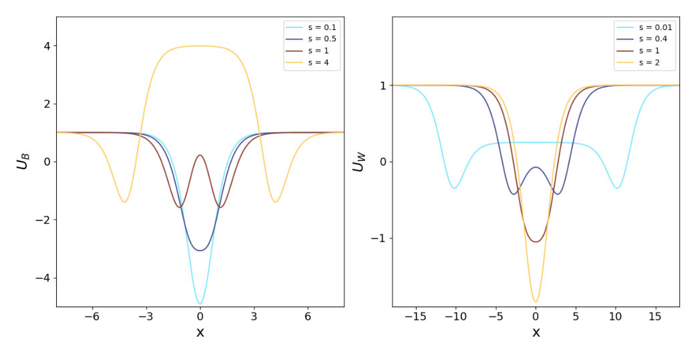
<figcaption class="paper-figure-caption"><b>Fig 4.</b> Fig. 3 shows the quantum mechanical potentials for the aforementioned models. In the left panel, which corresponds to the barrier model, the effective potential develops a barrier at its center for large values of s. This can be explained by the fact that the sphaleron resembles a kink–antikink pair in the standard ϕ6 model at this limit. Such a pair is known not to possess a shape mode [30]. The spectrum of the barrier model is shown in Fig. 4 as a function of the parameter s. It can be seen that the linear spectrum contains no bound states other than the zero mode and the unstable negative mode. The magnitude of the unstable mode increases with increasing s, indicating that the sphalerons...</figcaption>
</figure>
<figure class="paper-figure-card">
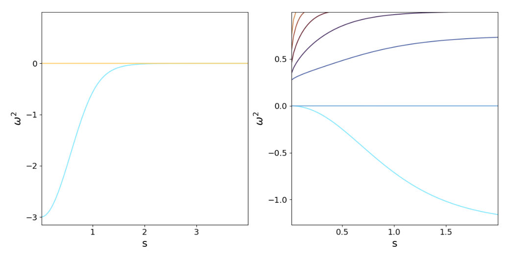
<figcaption class="paper-figure-caption"><b>Fig 5.</b> FIG. 4: Eigenvalues for the bound, zero and unstable modes in the barrier (left) and well (right) models. In both cases the continuum threshold is at ω2 = 1.</figcaption>
</figure>

**Summary.** This paper analyzes how two localized, unstable field configurations called sphalerons collide in a scalar field theory with false vacua. Using numerical simulations, the authors demonstrate that these collisions lead to highly complex outcomes, including the transient formation of metastable vacuum bubbles. This reveals richer dynamics than previously understood for such systems.

**Why it may be interesting.** The study explores non-equilibrium dynamics far from equilibrium (vacuum decay/field evolution), which shares conceptual links with phase transitions and domain wall dynamics studied in statistical mechanics.

Detailed structure

**Main problem.** The study investigates the complex collision dynamics of bright sphalerons within a $(1+1)$-dimensional deformed $\phi^6$ scalar field theory that possesses false vacua.

**Main result.** The collisions exhibit rich final states, most notably the dynamic formation of long-lived bubbles of the false vacuum bounded by kink-antikink pairs, which repeatedly collapse and re-expand before decaying.

**Method.** The research combines linear stability analysis to characterize sphaleron properties with extensive numerical simulations to track the nonlinear time evolution following head-on collisions.

**Model / system.** The system is a $(1+1)$-dimensional real scalar field theory governed by a deformed $\phi^6$ potential, analyzed using two specific realizations: the barrier model and the well model. Sphalerons are non-topological solitary wave solutions existing in these metastable vacuum backgrounds.

**Key observables.** Final states (kink-antikink pairs, oscillons), bubble formation/decay dynamics, sphaleron lifetime ($	au$), and oscillation frequencies ($\omega$).

**Important parameters / regimes.** The deformation parameter ($s$) of the potential and the initial collision velocities are crucial parameters governing the outcome.

**Assumptions / limitations.** The analysis assumes that collisions occur when the intrinsic instability decay rate is slow enough to allow for a measurable interaction time. The initial two-sphaleron configuration used for simulation is an approximation.

**Figures summary.** Figures illustrate potential energy landscapes (barrier vs. well), sphaleron profiles, quantum potentials, eigenvalue spectra, and phase diagrams mapping out various final states resulting from collisions.

**Paper structure.** The paper first reviews the static properties and linear instabilities of the sphalerons in both vacuum models. It then proceeds to numerically simulate head-on collisions across parameter space, mapping out the resultant stable or transient field configurations.

Abstract

We investigate the collision dynamics of two bright sphalerons in a (1+1)-dimensional deformed $φ^6$ scalar field theory with a symmetric potential possessing false vacua. Two one-parameter realizations of the model, referred to as the barrier and well models, are considered and their static and linear instability properties are first reviewed. We then study head-on collisions of boosted sphalerons over a broad range of initial velocities and deformation parameters. The scattering dynamics exhibit a rich variety of final states, including the production of kink-antikink pairs, long-lived oscillons in true and false vacuum, multiple oscillons propagating in false-vacuum regions, and radiative decay. A particularly remarkable outcome is the emergence of a long-lived bubble of the false broken vacuum bounded by a kink-antikink pair, which repeatedly collapses and re-expands before eventually decaying into an oscillon. These results demonstrate that deformed $φ^6$ theories with false vacua exhibit considerably richer sphaleron dynamics than previously known and provide new insight into the role of unstable localized configurations in nonlinear field theories.

[↑ back to top](#top)

### [Electron transport in a 1.6~nm-thick double-gated (100) silicon nanosheet: A theoretical study accounting for phonon confinement and remote-phonon scattering](http://arxiv.org/abs/2608.12214v1)

**Authors:** Shoaib Mansoori, Bimin Cai, Edward Chen, Dallin O. Nielsen, Massimo V. Fischetti  
**Type:** theory · **Category:** other · **PDF:** <https://arxiv.org/pdf/2608.12214v1>  
**Analysis basis:** full PDF text, analyzed in chunks
**Topic relevance:** `Keldysh / 2PI / non-Gaussian methods` **3/5** · `analog quantum simulation` **2/5** · `correlated / nonlocal dissipation` **2/5** · `quantum measurements` **2/5** · `driven-dissipative phase transition` **1/5** · `methods for driven-dissipative` **1/5** · `non-equilibrium universality` **1/5**

↔ Scroll figures horizontally

<figure class="paper-figure-card">
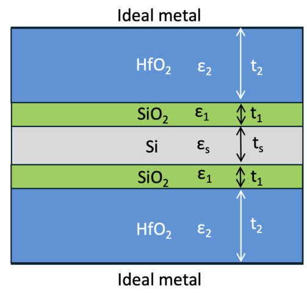
<figcaption class="paper-figure-caption"><b>Fig 1.</b> FIG. 1. Idealized structure of a double-gate field-effect tran- sistor (FET) with a silicon (Si) nanosheet channel, surrounded by SiO2 and HfO2 dielectric layers. The structure includes the labeled dielectric permittivities (ϵ1, ϵ2) and layer thick- nesses (t1, t2,g ts). The specific dimensions considered are t1 ≡tSiO2 = 0.6 nm, t2 ≡tHfO2 =1.2 nm, and silicon nanosheet thickness ts = 1.6 nm. The top and bottom metal gates are considered ideal equipotential metals.</figcaption>
</figure>
<figure class="paper-figure-card">
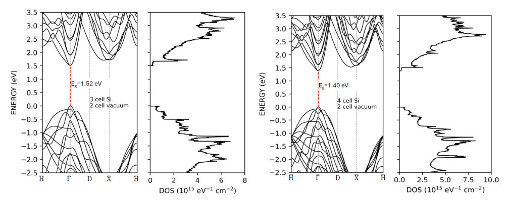
<figcaption class="paper-figure-caption"><b>Fig 2.</b> FIG. 2. Band structure and density of states of the (100) 3-cell (left) and 4-cell (right) H-terminated thick films obtained from empirical pseudopotentials assuming 2 cells of vacuum ’padding’. The bandgap of the 3-cell-thick Si nanosheet,≈1.52 eV, can be viewed as resulting from the ground-state energy of electrons in the conduction band, E0</figcaption>
</figure>
<figure class="paper-figure-card">
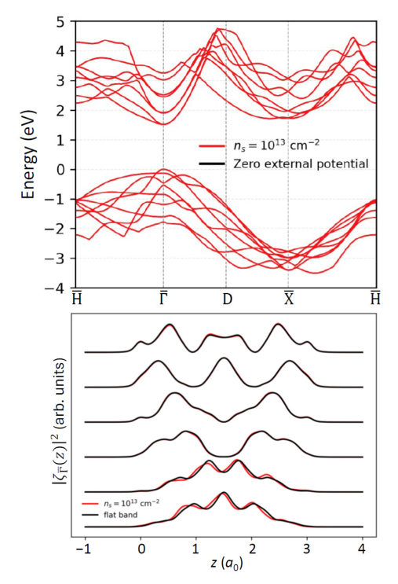
<figcaption class="paper-figure-caption"><b>Fig 3.</b> FIG. 3. Top: Band structure of a 3-cell-thick Si nanosheet in the presence of the parabolic potential given by Eq. (6) (red lines) compared to the band structure at flat bands (black lines). The difference is too small to be visible (the band gap at Γ changes only by about 2 meV, from 1.518 eV to 1.520 eV. Bottom: Squared magnitude of the wavefunctions at the Γ- point in the six lowest-energy subbands both in the presence of the parabolic potential (red lines) and at flat bands (black lines). Note the slight increase of amplitude of the wavefunc- tion in the ground-state subband on the left side and on the right side for the first excited state (almost degenerate) wave- function. The...</figcaption>
</figure>
<figure class="paper-figure-card">
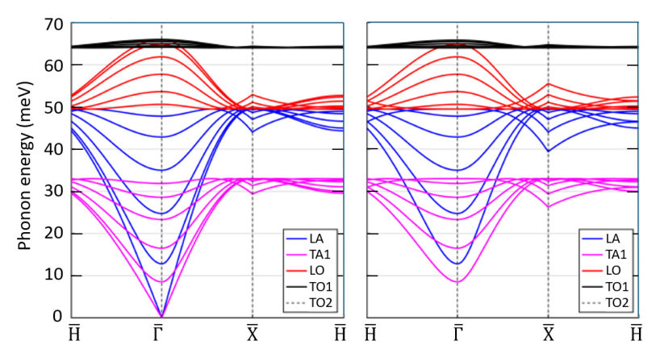
<figcaption class="paper-figure-caption"><b>Fig 4.</b> FIG. 4. Phonon dispersion in a 3-cell thick Si nanosheet with freestanding (left) and clamped (right) boundary conditions, as obtained from the model described by Eqs. (7) and (8) using the values from Ref. [43], also listed in Table II. Although 30 of the 36 branches are shown (not shown are the acoustic shear branches that are decoupled from the electrons), not all branches are visible, since the 6 TO2 (ZO) branches are hidden by the 6 TO1 branches. The labels in the legend, ”LA”, ”TA1”, ”LO”, etc., refer to the bulk modes from which the 2D phonons originate. As stated in the main text, bulk TA phonons correspond to shear or flexural modes, whereas the bulk LA phonons correspond to...</figcaption>
</figure>
<figure class="paper-figure-card">
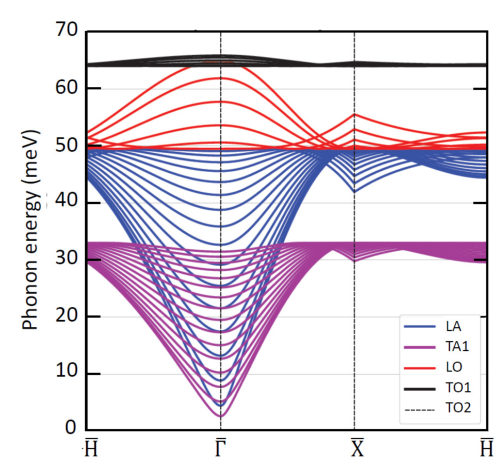
<figcaption class="paper-figure-caption"><b>Fig 5.</b> FIG. 5. As in the center frame of Fig. 4, but considering confinement of the acoustic phonons also in the SiO2 layers assuming clamped boundary conditions at the SiO2/HfO2 in- terfaces using the elastic continuum approximation given by Eqs. (18)-(20). Comparison with the center frame of Fig. 4 shows a smaller ‘zero-point’ energy of the acoustic phonons as well as a larger number of acoustic branches.</figcaption>
</figure>

**Summary.** This theoretical study analyzes electron transport in nanoscale silicon nanosheets by rigorously accounting for phonon confinement and remote-phonon scattering effects. The findings demonstrate that realistic boundary conditions significantly lower predicted mobility, but importantly, the interaction with high-kappa gate dielectrics (via IPPs) does not negatively affect transistor performance, suggesting compatibility for future devices.

**Why it may be interesting.** While focused on solid-state device physics rather than fundamental AMO phenomena, the detailed treatment of quantized lattice vibrations (phonons) interacting with confined charge carriers shares mathematical parallels with open quantum systems theory involving coupling to bosonic baths.

Detailed structure

**Main problem.** The study theoretically investigates electron transport in an ultra-thin silicon nanosheet, focusing on how phonon confinement and interface hybrid plasmon-phonon excitations (IPPs) affect device performance.

**Main result.** Realistic boundary conditions for phonons significantly reduce the predicted room temperature mobility compared to bulk approximations. Crucially, IPP scattering is found not to negatively impact FET performance, potentially increasing the saturated velocity by cooling the electrons.

**Method.** The authors employed a combination of methods including calculating band structures using pseudopotentials and solving eigenvalue equations derived from continuum models for phonon confinement and dielectric continuum limits for IPPs.

**Model / system.** The system is a double-gated (100) silicon nanosheet with a thickness of 1.6 nm, featuring $	ext{SiO}_2/	ext{HfO}_2$ gate stacks. The model incorporates quantum confinement effects on both electron wavefunctions and phonon dispersion relations.

**Key observables.** Electron mobility ($\mu$), high-field saturated velocity, and the influence of various scattering mechanisms (phonon confinement, IPP scattering).

**Important parameters / regimes.** Nanosheet thickness ($t_s = 1.6$ nm), room temperature, gate dielectric materials ($	ext{SiO}_2$, $	ext{HfO}_2$), and boundary conditions for phonons.

**Assumptions / limitations.** The analysis uses an approximated elastic continuum model for acoustic phonons and the dielectric continuum limit for IPPs; it neglects extrinsic scattering sources like interface roughness or charged defects.

**Figures summary.** Figure 3 (mentioned in notes) compares band structures calculated with parabolic vs. flat potential profiles, confirming small bandgap changes due to gate bias variations.

**Paper structure.** The paper proceeds by defining the physical system and Hamiltonian, detailing the methods for calculating electronic subbands under confinement, modeling phonon interactions via boundary conditions, analyzing the impact of IPPs, and concluding with performance implications for high-kappa materials.

Abstract

We study theoretically electron transport in an top-and bottom-gated (100) 1.6 nm-thin silicon nanosheet with SiO2/HfO2 gate stacks, focusing on the intrinsic physical processes that affect transport: the confinement of phonons and the presence of interface hybrid plasmon-phonon excitations (IPPs or `remote phonons'). The band structure is calculated using local empirical pseudopotentials; an approximated elastic continuum model is used to consider the confinement of acoustic phonons; the dielectric continuum limit is used to deal with the IPPs. We find that the electron mobility is affected significantly by the boundary conditions chosen to deal with phonon confinement. The more realistic assumption of phonons clamped at the SiO2/HfO2 interfaces and optical phonons at the Si/SiO2 interfaces results in a room temperature mobility much smaller than what is obtained using the common assumption of bulk phonons in the elastic, high-temperature approximation. We also find that, as a result of the complicated structure of the primed subbands, the high-field saturated velocity is significantly lower than its bulk value, as it had been measured in the past in the case of Si inversion layers but never explained theoretically. Finally, we find that IPP scattering does depress the low-field mobility but to a small extent, thanks to the presence of the interfacial SiO2 layers and to the proximity of the metal gates. Moreover, by keeping electrons `cooler', IPP scattering results in a higher saturated velocity. Therefore, the presence of high-kappa materials in the gate-insulator stacks should not affect negatively the performance of field effect transistors based on Si nanosheets.

[↑ back to top](#top)

### [Beam Routing through Excitons in Transition Metal Dichalcogenide Monolayers](http://arxiv.org/abs/2608.12105v1)

**Authors:** Yonas Lebsir, Jacob Terndrup Heiden, Jorge Barcia Rodríguez, Maria Papadopoulou, Kenji Watanabe, Takashi Taniguchi, N. Asger Mortensen, Sergii Morozov, Nicolas Ubrig  
**Type:** experiment · **Category:** other · **PDF:** <https://arxiv.org/pdf/2608.12105v1>  
**Analysis basis:** full PDF text, analyzed in chunks
**Topic relevance:** `interference shaping light` **3/5** · `quantum optics experiment` **3/5** · `driven-dissipative phase transition` **2/5** · `analog quantum simulation` **1/5** · `correlated / nonlocal dissipation` **1/5** · `quantum measurements` **1/5**

↔ Scroll figures horizontally

<figure class="paper-figure-card">
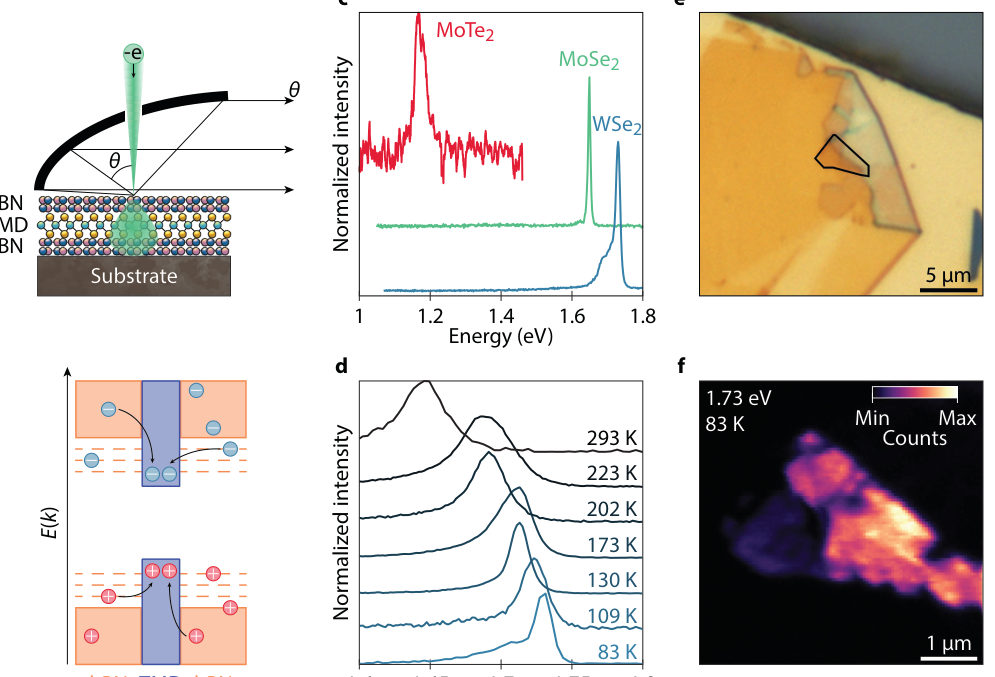
<figcaption class="paper-figure-caption"><b>Fig 1.</b> FIG. 1. Demonstration of electron-beam induced light emission from monolayer TMDs. a. Schematic of the experimental setup, consisting of a focused electron beam with an accelerating voltage of 5–30 kV and beam currents of 1 nA, focused through a hole in a parabolic mirror with numerical aperture NA = 0.97. The collected light is sent to a spectrometer that resolves the emission energy and angle. b. Band diagram illustrating incoherent cathodoluminescence in hBN-encapsulated monolayer TMDs. Electrons and holes are primarily generated in the hBN and relax toward the local band extrema of the TMD, where they form excitons. c. Measured cathodoluminescence spectra at base temperature of hBN...</figcaption>
</figure>
<figure class="paper-figure-card">
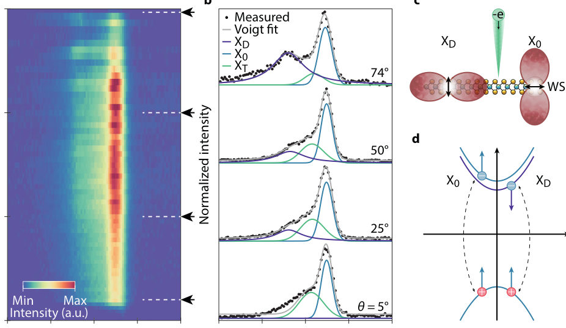
<figcaption class="paper-figure-caption"><b>Fig 2.</b> FIG. 2. Spectral signatures of dark excitons in cathodoluminescence. a. False-color map of the measured cathodoluminescence intensity, recorded at 83 K on a gold substrate, as a function of emission energy and angle. The dominant emission centered at 1.73 eV originates from the neutral exciton with an in-plane transition dipole. At larger emission angles, a second spectral feature appears, which we attribute to the dark exciton with an out-of-plane transition dipole. b. Cathodoluminescence spectra recorded at the selected emission angles indicated in panel a (black circles; curves offset for clarity). Solid lines show the fits of the individual excitonic contributions, including the neutral...</figcaption>
</figure>
<figure class="paper-figure-card">
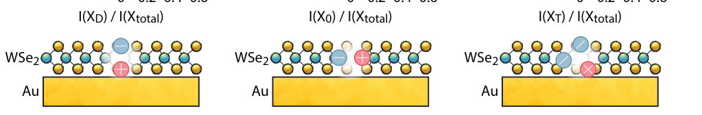
<figcaption class="paper-figure-caption"><b>Fig 3.</b> FIG. 3. Angular emission profile of distinct exciton species. a. Polar plot of the dark exciton emission profile (XD, purple circles). The radial coordinate represents the normalized intensity, I(XD)/I(Xtotal), with the normalization used to account for the instrument response, as described in the main text. The dashed line shows a simplified simulation of the emission pattern of the structure shown below, where the hBN layers are omitted for clarity but included in the calculation, confirming the predominantly out-of-plane character of the emission. The gray shaded area indicates the cutoff angle of the parabolic mirror. b. Same as in a, but for the neutral exciton (X0, blue circles) with...</figcaption>
</figure>
<figure class="paper-figure-card">
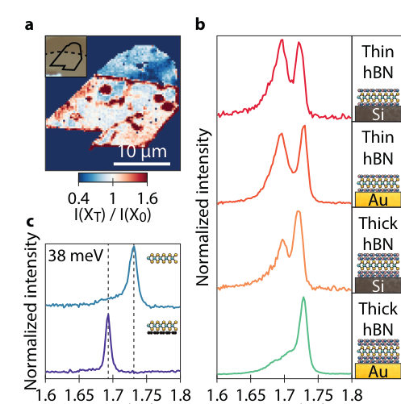
<figcaption class="paper-figure-caption"><b>Fig 4.</b> FIG. 4. hBN thickness dependency. a. Cathodoluminescence false-color map, recorded at 83 K, of the trion-exciton intensity ratio in a sample where the same WSe2 is placed on top of two distinct hBN thicknesses (≈20 and 50 nm). The inset displays an optical micrograph of the sample with a black outline of the monolayer. The intensity ratio clearly correlates with the hBN thicknesses. b. Cathodo- luminescence spectra of different samples (sketched on the right next to each respective spectrum) with varying hBN thicknesses and sub- strates. Every spectrum is normalized with respect to its own max- imum. c. Maximum normalized cathodoluminescence spectra of a WSe2 monolayer encapsulated in hBN,...</figcaption>
</figure>

**Summary.** The research shows that light beam routing at the nanoscale can be achieved intrinsically within TMD monolayers without needing external nanostructures. By using angle-resolved cathodoluminescence, the authors prove that the dark exciton possesses an out-of-plane dipole moment, causing it to emit directionally at large angles relative to the surface normal.

**Why it may be interesting.** This work demonstrates a solid-state platform for controlling photon emission directionality purely through quantum mechanical selection rules (dipole orientation), which is highly relevant for integrated photonic devices and open quantum systems engineering.

Detailed structure

**Main problem.** To achieve nanoscale beam routing of light without relying on external nanostructuring elements.

**Main result.** The intrinsic excitonic transitions within TMD monolayers, particularly the dark exciton, can produce highly directional emission channels at large angles.

**Method.** Low-temperature, angle-resolved cathodoluminescence spectroscopy is used to probe and distinguish between different excitonic species based on their angular emission profiles.

**Model / system.** The study focuses on monolayer Transition Metal Dichalcogenides ($	ext{WSe}_2$, $	ext{MoSe}_2$, $	ext{MoTe}_2$), which host distinct excitonic species: bright exciton, trion, and dark exciton. These species possess different transition dipole orientations (in-plane vs. out-of-plane).

**Key observables.** Emission energy, emission angle ($	heta$), and the relative intensity of $	ext{X}^0$, $	ext{X}_T$, and $	ext{X}_D$ as a function of collection angle.

**Important parameters / regimes.** Low temperature (down to 83 K), local dielectric environment, and the presence/thickness of encapsulating layers like hBN or graphene.

**Assumptions / limitations.** The analysis assumes that the distinct angular emission profiles are solely determined by the orientation of the respective excitonic transition dipoles.

**Figures summary.** Figures illustrate the experimental setup, band diagrams, and measured spectra showing how $	ext{X}_D$ appears at large angles due to its out-of-plane dipole, while $	ext{X}^0$ and $	ext{X}_T$ peak near the surface normal.

**Paper structure.** The paper establishes the problem of nanoscale light routing, details the use of TMDs with multiple excitonic species, presents experimental measurements using angle-resolved CL to map out dipole orientations, and concludes that intrinsic material properties can achieve directional emission.

Abstract

Routing light at the nanoscale typically relies on nanostructured surfaces to imprint directionality on the emission. Using low-temperature, angle-resolved cathodoluminescence spectroscopy, we show that the intrinsic excitonic transitions of a semiconductor can themselves produce routed emission. We probe monolayers of WSe$_2$, MoSe$_2$, and MoTe$_2$ and resolve the excitonic species of monolayer WSe$_2$ -- the bright exciton, the trion, and the spin-forbidden dark exciton -- through their distinct angular emission profiles. While the in-plane transition dipoles of the bright exciton and trion radiate predominantly toward the surface normal, the out-of-plane dipole of the dark exciton, inaccessible under normal-incidence optical excitation, produces a directional emission channel at large angles. We further tune the balance between neutral and charged exciton emission through the local dielectric environment. Our results establish dark excitons in TMD monolayers as a platform for directional light emission in compact photonic architectures without additional nanostructuring.

[↑ back to top](#top)

### [Acoustic Plasmon Resonance: Breaking the Anderson Stiffness Paradigm in Quasi-Two-Dimensional Superconducting Films](http://arxiv.org/abs/2608.11610v1)

**Authors:** V. M. Kovalev, A. V. Chaplik  
**Type:** theory · **Category:** other · **PDF:** <https://arxiv.org/pdf/2608.11610v1>  
**Analysis basis:** full PDF text, analyzed in chunks
**Topic relevance:** `Keldysh / 2PI / non-Gaussian methods` **3/5** · `driven-dissipative phase transition` **2/5** · `methods for driven-dissipative` **2/5** · `correlated / nonlocal dissipation` **1/5** · `quantum measurements` **1/5**

↔ Scroll figures horizontally

<figure class="paper-figure-card">
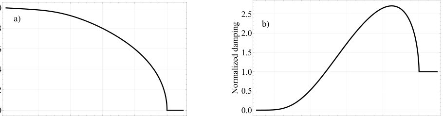
<figcaption class="paper-figure-caption"><b>Fig 1.</b> FIG. 1. Acoustic mode properties as a function of temperature in the dirty regime. (a) Temperature dependence of the normalized acoustic mode dispersion, ωk(T)/ωk(0), versus the reduced temperature, T/Tc. (b) Temperature dependence of the normalized acoustic mode damping, Γ(T)/Γ(Tc), versus the reduced temperature, T/Tc. The phenomenological relation</figcaption>
</figure>

**Summary.** The paper introduces a microscopic theory explaining an acoustic plasmon resonance observed in thin superconducting films. It shows this mode arises from the transverse redistribution of charge densities across the film thickness, bypassing limitations of older models like the Carlson-Goldman scenario. The resulting theoretical predictions for the mode's dispersion and temperature scaling align remarkably well with recent experimental findings.

**Why it may be interesting.** This work provides a detailed theoretical mechanism for observing collective excitations in superconductors that are otherwise predicted to be invisible or insensitive to superconductivity, connecting fundamental quantum many-body physics to measurable electromagnetic responses.

Detailed structure

**Main problem.** The paper addresses an observed acoustic plasmon mode in superconducting films that critically depends on the superconducting transition temperature, challenging the conventional Anderson-Higgs paradigm.

**Main result.** A microscopic theory was developed showing that transverse charge redistribution across finite thickness allows for a unique coupling mechanism to EM radiation, predicting an acoustic mode whose dispersion and temperature scaling match experiments.

**Method.** The authors employed a microscopic kinetic theory approach, linearizing the kinetic equation and using Poisson's equation to derive polarization operators for normal and superfluid components.

**Model / system.** The system is quasi-two-dimensional superconducting films of finite thickness (d), involving both normal and superfluid charge densities. The model incorporates effects from both clean and dirty transport regimes.

**Key observables.** Acoustic plasmon mode frequency ($\omega_k$), damping rate ($\Gamma$), phase velocity ($s$), and their dependence on temperature ($T$) and film thickness ($d$).

**Important parameters / regimes.** Superconducting gap ($\Delta$), film thickness ($d$), temperature relative to $T_c$, and the ratio of mean free path to coherence length ($l/\xi_0$).

**Assumptions / limitations.** The theory assumes global charge conservation and is most accurate in the low-frequency, overdamped regime ($\omega	au \ll 1$).

**Figures summary.** Figure 1 illustrates the temperature dependence of the normalized acoustic mode dispersion and damping rate in the dirty regime, confirming predicted scaling laws.

**Paper structure.** The paper builds from identifying the conflict with established theory (Anderson-Higgs) to developing a microscopic kinetic framework. It derives general dispersion relations using polarization operators, analyzes different transport limits (clean/dirty), and finally presents results matching experimental observations regarding thickness and temperature dependence.

Abstract

Recent experiments on superconducting films have revealed an acoustic plasmon mode that depends critically on the superconducting transition, directly challenging the long-standing Anderson-Higgs paradigm regarding the stiffness of the plasma spectrum in superconductors. In this Letter, we provide a microscopic theoretical framework that explains this behavior and establishes the physical conditions under which classical Anderson-Higgs constraints are bypassed. We demonstrate that in films of finite thickness, the transverse redistribution of normal and superfluid charge densities enables a unique coupling mechanism to electromagnetic radiation - a feature fundamentally absent in the conventional Carlson-Goldman scenario. Our theory predicts an acoustic mode whose dispersion, temperature scaling, and dependence on film thickness are in remarkable agreement with recent experimental observations. By delineating the regime of this acoustic response, we reconcile the observed electromagnetic activity of collective excitations with the fundamental principles of superconductivity.

[↑ back to top](#top)

### [The electrical transport of intrinsic two-dimensional ferroelectric metal PtBi2](http://arxiv.org/abs/2608.12152v1)

**Authors:** Dan Li, Liu Yang, Lei Li  
**Type:** theory · **Category:** other · **PDF:** <https://arxiv.org/pdf/2608.12152v1>  
**Analysis basis:** full PDF text, analyzed in chunks
**Topic relevance:** `Keldysh / 2PI / non-Gaussian methods` **3/5** · `quantum measurements` **2/5** · `analog quantum simulation` **1/5** · `driven-dissipative phase transition` **1/5** · `methods for driven-dissipative` **1/5** · `non-equilibrium universality` **1/5**

↔ Scroll figures horizontally

<figure class="paper-figure-card">
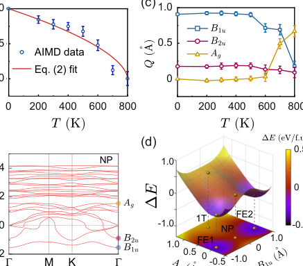
<figcaption class="paper-figure-caption"><b>Fig 1.</b> FIG. 1. (a) Temperature-dependent normalized ferroelec- tric polarization P/P0 obtained from AIMD simulations (blue open circles) and the corresponding critical exponent fit (red solid line) yielding a Curie temperature TC ≈800 K. (b) Phonon dispersion of the NP state. The key zone-center phonon modes (B1u, B2u, and Ag) involved in structural tran- sitions are highlighted at the Γ point. (c) Temperature evo- lution of the normal mode coordinates Q for the B1u, B2u, and Ag phonons extracted from equilibrium structures in the AIMD simulations. (d) 3D energy landscape ∆E mapped as a function of Q(B1u) and Q(Ag). The surface illustrates the relative stabilities and transition energy barriers...</figcaption>
</figure>
<figure class="paper-figure-card">
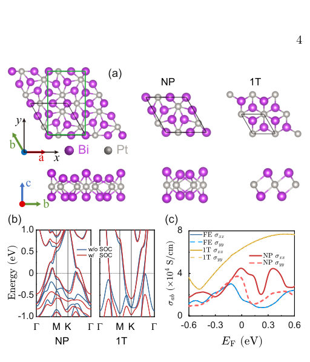
<figcaption class="paper-figure-caption"><b>Fig 2.</b> FIG. 2. (a) Top and side views of the atomic structures for the FE (left), NP (middle), and 1T (right) states. The Bi and Pt atoms are represented by purple and grey spheres, respec- tively. The black rhombuses mark the lattice of the pristine primitive cell, and the green rectangle marks the lattice of the FE PtBi2 under uniaxial strain, which breaks the C3z ro- tational symmetry. (b) Calculated electronic band structures for the NP and 1T states. (c) Calculated in-plane electrical conductivity tensor components (σxx and σyy) as a function of the Fermi level. The FE and 1T states exhibit isotropic in-plane conductivity (σxx = σyy) protected by their C3z spa- tial symmetry, whereas the NP...</figcaption>
</figure>
<figure class="paper-figure-card">
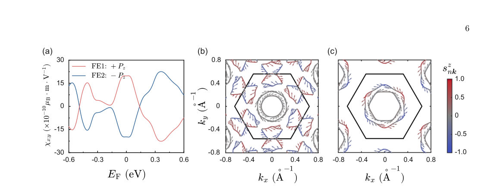
<figcaption class="paper-figure-caption"><b>Fig 3.</b> FIG. 3. (a) The calculated Edelstein coefficient χx;y as a function of the Fermi level EF for FE1 (+Pz) and FE2 (−Pz) of monolayer PtBi2. (b) The Fermi surface and corresponding spin texture in the BZ at EF = 0. (c) The Fermi surface and spin texture at a shifted Fermi energy of EF = 0.2 eV. In (b) and (c), the arrows represent the direction and magnitude of in-plane spin polarization, while the color encodes the magnitude of out-of-plane spin component sz nk.</figcaption>
</figure>
<figure class="paper-figure-card">
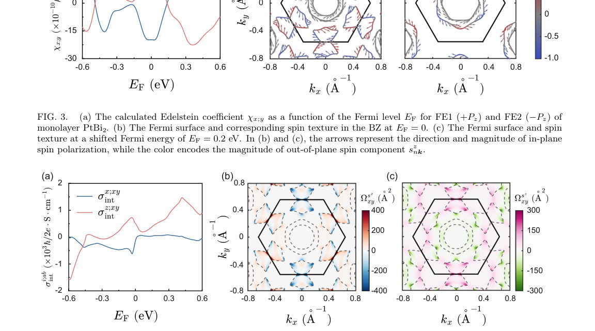
<figcaption class="paper-figure-caption"><b>Fig 4.</b> FIG. 4. (a) The independent non-zero components of the intrinsic spin Hall conductivity, σx;xy int and σz;xy int , as a function of the Fermi level EF. (b, c) The k-resolved spin Berry curvature (b) Ωsx xy and (c) Ωsz xy summed over all occupied states in momentum space at EF = 0. The solid black hexagon represents the first BZ, and the dashed lines indicate the Fermi surface contours.</figcaption>
</figure>
<figure class="paper-figure-card">
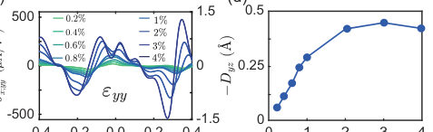
<figcaption class="paper-figure-caption"><b>Fig 5.</b> FIG. 5. (a),(c) The nonlinear Hall conductivity σBCD x;yy and the corresponding BCD Dyz as a function of the Fermi energy EF under various uniaxial strains applied along the (a) x direction (εxx) and (c) y direction (εyy). (b),(d) The calculated BCD Dyz at EF = 0 as a function of the applied uniaxial strain along the (b) x and (d) y directions.</figcaption>
</figure>

**Summary.** This work theoretically investigates $	ext{PtBi}_2$, a 2D ferroelectric metal, demonstrating its potential for next-generation electronics. Using first-principles calculations, the authors predict high operational temperatures and significant spin-charge conversion effects. They conclude by proposing a novel nonvolatile memory device concept based on domain wall switching.

**Why it may be interesting.** While focused on condensed matter electronics, the study of polarization switching coupled with charge/spin currents touches upon emergent order parameters and non-equilibrium dynamics that are relevant to advanced quantum control concepts.

Detailed structure

**Main problem.** The study investigates the electrical transport properties of intrinsic two-dimensional (2D) ferroelectric metals, aiming to overcome the limitation that traditional ferroelectrics are often insulating.

**Main result.** The material exhibits high Curie temperature ($T_C \approx 800\ 	ext{K}$), sizable charge-to-spin conversion efficiencies (Edelstein and SHE), and enables conceptual design of a nonvolatile Ferroelectric Metal Field-Effect Transistor (FEM-FET).

**Method.** The research employs first-principles calculations combined with the semiclassical Boltzmann transport equation to model linear, nonlinear, and spin transport responses.

**Model / system.** The physical system is the intrinsic 2D ferroelectric metal $	ext{PtBi}_2$. The theoretical framework involves analyzing its polarization switching, electronic band structure, and resulting charge/spin currents under applied fields.

**Key observables.** Electrical conductivity ($\sigma_{ab}$), Edelstein effect coefficient ($\chi$), Spin Hall conductivity ($\sigma^{ext}_{i;ab}$), Nonlinear Hall effect (NLHE), and ferroelectric polarization ($P$).

**Important parameters / regimes.** High Curie temperature ($\sim 800\ 	ext{K}$); applied electric field ($E$); uniaxial strain.

**Assumptions / limitations.** The transport analysis relies on the semiclassical Boltzmann theory, and an effective thickness scaling is used for comparison with bulk materials.

**Figures summary.** Figures illustrate temperature-dependent polarization confirming high $T_C$, phonon dispersion showing structural phase transitions (FE $\leftrightarrow$ NP), and conductivity anisotropy measurements distinguishing different phases.

**Paper structure.** The paper systematically analyzes the material's ferroelectric stability via AIMD, calculates linear/nonlinear transport coefficients using Boltzmann theory, discusses spin-related effects (Edelstein/SHE), and culminates in proposing a device concept (FEM-FET) based on domain wall physics.

Abstract

Breaking the conventional stereotype that ferroelectrics are necessarily insulating, two-dimensional (2D) ferroelectric metals combine seemingly incompatible switchable electric polarization and metallic conductivity, providing a fertile ground for the discovery of novel electrical transport phenomena and the development of innovative electronic devices. Using the semiclassical Boltzmann equation and first-principles calculations, we systematically investigate the linear and nonlinear transport responses of the intrinsic 2D ferroelectric metal \ch{PtBi2} to an applied electric field. Our \textit{ab initio} molecular dynamics simulations reveal that it possesses a high Curie temperature reaching $800~\text{K}$. We propose that the crystal structure of its high-temperature paraelectric phase can be explicitly distinguished through simple measurements of the in-plane electrical conductivity. Quantitative calculations of the Edelstein effect and the intrinsic spin Hall effect demonstrate a sizable charge-to-spin conversion efficiency, highlighting its potential in spintronics. We also find that a Berry curvature dipole-induced nonlinear Hall effect emerges in uniaxially strained \ch{PtBi2}. Furthermore, we highlight the unique advantages of 2D ferroelectric metals in gate-controlled transport applications. Based on the domain wall scattering mechanism, we conceptually design a novel ferroelectric metal field-effect transistor (FEM-FET) capable of nonvolatile switching between high-resistance and low-resistance states under a gate voltage. Our work not only unveils the rich transport physics in 2D ferroelectric metals but also provides valuable insights into the design of next-generation nonvolatile memory and spintronic devices.

[↑ back to top](#top)

### [Wormhole Geometry from a Magnetic Vortex](http://arxiv.org/abs/2608.12285v1)

**Authors:** Dušan Đorđ ević, Fabián Molina, Vladimir Juričić  
**Type:** theory · **Category:** other · **PDF:** <https://arxiv.org/pdf/2608.12285v1>  
**Analysis basis:** full PDF text, analyzed in chunks
**Topic relevance:** `analog quantum simulation` **3/5** · `quantum measurements` **2/5** · `Keldysh / 2PI / non-Gaussian methods` **1/5** · `interference shaping light` **1/5**

↔ Scroll figures horizontally

<figure class="paper-figure-card">
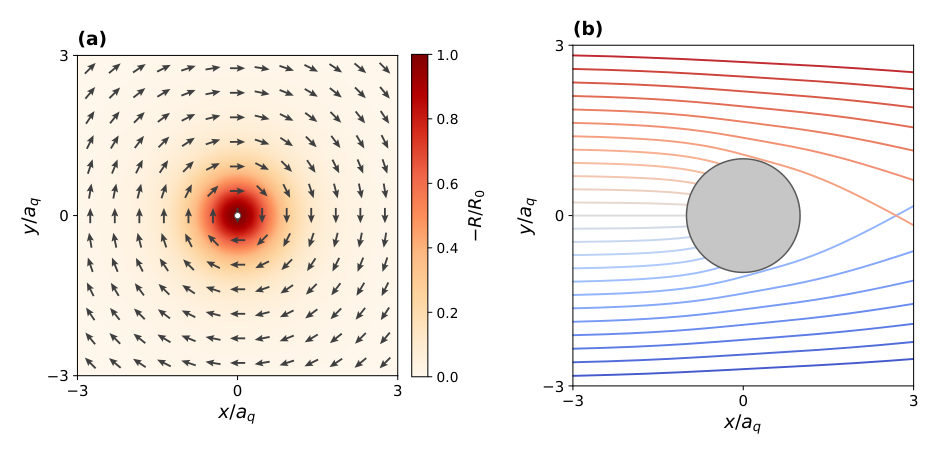
<figcaption class="paper-figure-caption"><b>Fig 1.</b> FIG. 1. Vortex-induced wormhole geometry (k = 0). (a) The magnetic vortex texture (arrows: in-plane spin orientation S) with the emergent negative Ricci-curvature magnitude −R/R0 (color), where R is given by Eq. (9) and R0 = 2/a2 q. The magnitude of the negative curvature is largest at the core. (b) Geodesics of the effective metric (5), colored by impact parameter defined before Eq. (10). The grey disk marks the microscopic cutoff of the exterior Ellis geometry. The exact deflection law and its q2/J collapse are shown in Fig. 2.</figcaption>
</figure>
<figure class="paper-figure-card">
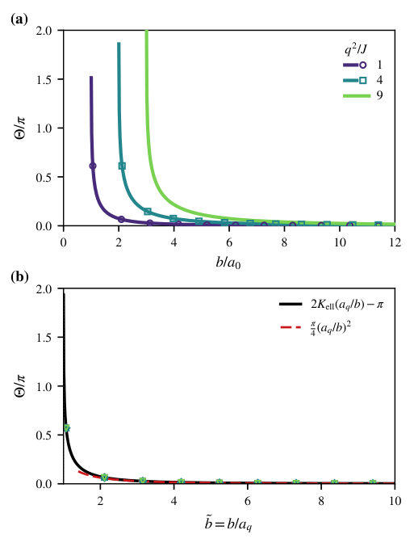
<figcaption class="paper-figure-caption"><b>Fig 2.</b> FIG. 2. Universal q2/J scaling. (a) Deflection angle Θ for three values of q2/J, with b in units of the fixed length a0 = ℏ/(2√mJ0). Because a2 q = q2ℏ2/(4mJ), configurations with the same q2/J have the same aq and therefore the same deflection without rescaling. For each color, the solid curve corresponds to a configuration at J = J0, while the open marker denotes a distinct configuration at J = 4J0 with the same q2/J, and hence the same deflection without rescaling: (q, J) = (1, J0) is paired with (2, 4J0), and (q, J) = (2, J0) with (4, 4J0). (b) Measured in each configuration’s own Ellis scale, ˜b = b/aq, the data collapse onto Eq. (11) (solid), with the weak-field tail (π/4)˜b−2...</figcaption>
</figure>
<figure class="paper-figure-card">
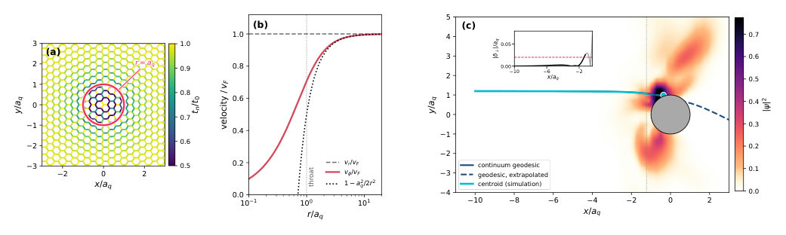
<figcaption class="paper-figure-caption"><b>Fig 3.</b> FIG. 3. Designer honeycomb emulator. (a) Engineered nearest-neighbor hoppings (color: tn/t0) realizing the inverse vielbein of the core-truncated Ellis metric to leading order, with tangential bonds suppressed near the core [Eq. (16)]. (b) Target velocity profile, vr = vF and vϕ/vF = r/ p</figcaption>
</figure>

**Summary.** This work demonstrates that the topological structure of a magnetic vortex induces an emergent curved space metric analogous to the exterior of an Ellis wormhole for electrons. The key findings are two experimentally distinct signatures: measurable electron deflection governed by the vortex winding, and a quantized Berry phase response dependent on winding parity. This establishes a powerful 'texture–geometry dictionary' applicable to quantum materials.

**Why it may be interesting.** It provides a concrete, physical mechanism—a magnetic vortex—to generate an effective curved spacetime geometry that can be probed using standard quantum scattering techniques in condensed matter systems.

Detailed structure

**Main problem.** The study investigates how the topology of a magnetic vortex dictates the effective geometry experienced by itinerant electrons, linking defects to curved spacetime analogues.

**Main result.** A single magnetic vortex defect successfully generates an emergent metric realizing the exterior spatial geometry of an Ellis wormhole. This effect is characterized by two distinct, measurable signatures: electron deflection and a half-flux Aharonov-Bohm response.

**Method.** The analysis combines deriving effective metrics from spin textures with solving geodesic equations and performing partial-wave scattering analyses to quantify quantum phase shifts.

**Model / system.** The system models electrons propagating in a background coupled strongly to an elementary magnetic vortex. The geometry is mathematically compared to the exterior of an Ellis wormhole, and the results are tested by emulating the metric in designer honeycomb lattices.

**Key observables.** Electron deflection angle ($\Theta(b)$), Berry phase flux (Aharonov-Bohm response), and the effective curved space metric ($ds^2$).

**Important parameters / regimes.** Vortex winding number ($q$), Hund exchange coupling ($J$), and the characteristic Ellis length scale ($a_q \propto q/\sqrt{J}$).

**Assumptions / limitations.** The analysis focuses on the exterior, core-truncated region of the wormhole geometry; lattice simulations require valley symmetrization to isolate the metric response.

**Figures summary.** Figures illustrate vortex textures and corresponding geodesics showing negative Ricci curvature. Other figures demonstrate universal scaling laws for deflection angles ($\Theta \propto q^2/J$) and show engineered hoppings reproducing continuum geodesic profiles in lattices.

**Paper structure.** The paper progresses from deriving the effective metric from spin texture variations, calculating observable quantities like deflection via elliptic integrals, establishing two independent signatures (metric vs. Berry flux), and finally validating these predictions by simulating wave-packet propagation on artificial honeycomb lattices.

Abstract

Strong coupling to a magnetic texture makes an electron propagate through an emergent curved space. We show that an elementary vortex realizes the exterior spatial geometry of an Ellis wormhole: an ultrastatic throat with radius fixed by the topological charge and Hund exchange, cut off at short distances by the microscopic core. Two separable signatures follow directly: the electron deflection collapses onto a single Ellis curve governed by the vortex winding and exchange coupling, while the spin Berry phase produces a half-flux Aharonov--Bohm response switched on and off by winding parity. The same metric can be emulated in a designer honeycomb lattice, where the valley-symmetrized wave-packet response follows the predicted exterior geodesic. These signatures are accessible through real-space electron deflection and scattering, providing experimentally distinct probes of the emergent geometry and Berry flux. The magnetic vortex thus turns a topological defect into a tunable curved-space lens for electrons in quantum materials and designer lattices.

[↑ back to top](#top)

### [Spin-polarized supercurrents and Josephson diode effect in altermagnets](http://arxiv.org/abs/2608.11906v1)

**Authors:** Janus F. Niebuhr, Matthias Eschrig, Danilo Nikolić  
**Type:** theory · **Category:** other · **PDF:** <https://arxiv.org/pdf/2608.11906v1>  
**Analysis basis:** full PDF text, analyzed in chunks
**Topic relevance:** `Keldysh / 2PI / non-Gaussian methods` **3/5** · `methods for driven-dissipative` **1/5** · `quantum measurements` **1/5**

↔ Scroll figures horizontally

<figure class="paper-figure-card">
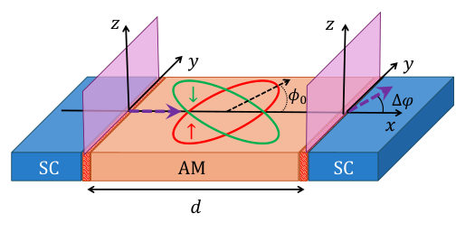
<figcaption class="paper-figure-caption"><b>Fig 1.</b> FIG. 1. A scheme of the system under study consisting of an altermagnet (AM) coupled to two BCS superconductors (SC). In general, the SC/AM interfaces are spin-dependent with misaligned magnetic moments. For illustration, the al- termagnet is shown in the dxy orientation (ϕ0 = π/4); how- ever, the results presented in the manuscript are obtained for the general case of an arbitrary orientation, ϕ0 ∈[0, π/4] (see the text below).</figcaption>
</figure>
<figure class="paper-figure-card">
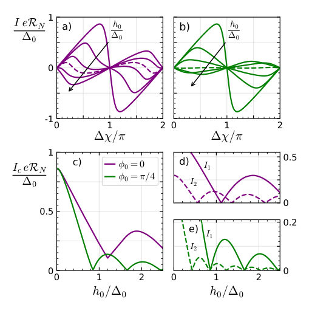
<figcaption class="paper-figure-caption"><b>Fig 2.</b> FIG. 2. The Josephson CPR in an SC/AM/SC junction for altermagnet’s thickness of d = ξ at temperature T = 0.1 Tc, different values of altermagnetic exchange field h0/∆0, and (a) the dx2−y2 orientation and (b) the dxy orientation. Panel (c): the corresponding critical currents Ic as functions of the altermagnetic exchange field h0/∆0. Panels (d) and (e): the amplitudes of the first harmonic (solid lines) and the second harmonic (dashed lines) as functions of the altermagnetic ex- change field h0/∆0 for the two orientations.</figcaption>
</figure>
<figure class="paper-figure-card">
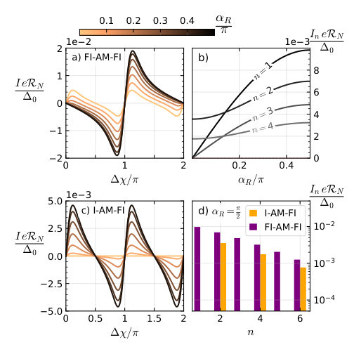
<figcaption class="paper-figure-caption"><b>Fig 3.</b> FIG. 3. The Josephson CPR in different altermagnetic junc- tions. Panel (a) shows the Josephson CPR across an alter- magnet coupled to superconductors via two spin-active in- terfaces (”trilayer”) for different misalignment between the altermangetic exchange field h and the exchange field of the right SC/AM interface JR. Panel (b) shows first four har- monic amplitudes as a function of αR. Panel (c) shows the corresponding CPR in the system featuring one interface spin active and the other normal insulating (”bilayer”). Panel (d) shows the harmonic amplitudes in the case of a trilayer (pur- ple) and a bilayer (orange).</figcaption>
</figure>
<figure class="paper-figure-card">
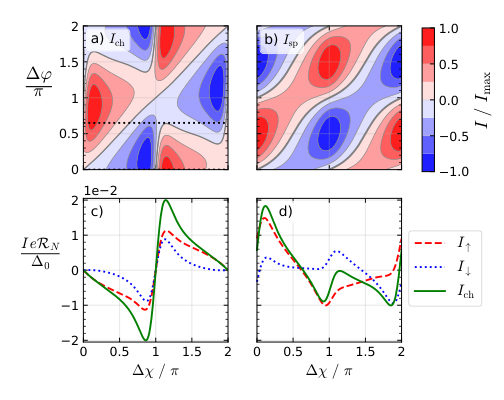
<figcaption class="paper-figure-caption"><b>Fig 4.</b> FIG. 4. Panel (a): The charge current Ich as function of the superconducting phase difference ∆χ and the quantum geo- metric phase ∆φ. Panel (b): The corresponding spin current Isp. Horizontal cross-sections of the color scale plot from (a) taken for ∆φ = 0 and ∆φ = 0.65π [see the dotted line in panel (a)] are shown in panels (c) and (d), respectively. The currents are calculated for the ϕ0 = 0 (dx2−y2 orientation of the altermagnet), the temperature T/Tc = 0.1, and the alter- magnetic exchange field of h0/EF = 0.5. Other parameters are mentioned at the beginning of the section.</figcaption>
</figure>
<figure class="paper-figure-card">
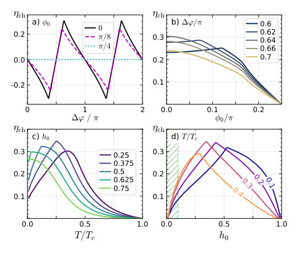
<figcaption class="paper-figure-caption"><b>Fig 5.</b> FIG. 5. Charge diode efficiency ηch as a function of various system’s parameters. Panel (a) shows the dependence of ηch on the quantum-geometric angle ∆φ for three different orien- tations of the altermagnet given by ϕ0. Panel (b) shows the dependence of the orientation of the altermagnet for different geometric angles. Panel (c) shows the role of temperature T for different altermagnetic exchange strengths h0. Panel (d) shows the dependence on the altermagnetic exchange fields for different temperatures.</figcaption>
</figure>

**Summary.** This theoretical study models supercurrents across junctions involving an altermagnet and superconductors. By analyzing the junction's response in different magnetic polarization regimes, the authors predict that a specific noncoplanar magnetic configuration induces a robust Josephson diode effect. This demonstrates how fundamental magnetic symmetries can govern macroscopic electronic transport properties.

**Why it may be interesting.** This work bridges superconductivity with magnetism in a highly non-trivial way, predicting novel electronic transport phenomena (diode effects) directly controlled by the symmetry of the underlying magnetic order parameter. This is relevant for understanding superconducting spintronics.

Detailed structure

**Main problem.** The study investigates spin-polarized supercurrents and the emergence of a Josephson diode effect (JDE) in junctions formed by an altermagnet (AM) sandwiched between two BCS superconductors (SC). The focus is on how magnetic structure dictates nonreciprocal transport.

**Main result.** A noncoplanar exchange field profile within the strongly spin-polarized AM regime leads to quantum geometric phases, causing a Josephson diode effect with high charge and perfect spin diode efficiencies. Conversely, other configurations yield normal or suppressed effects.

**Method.** The analysis employs advanced quasiclassical Green's function techniques (Gor'kov/Eilenberger formalism) applied to the SC/AM/SC geometry.

**Model / system.** The system is an SC/AM/SC junction where the AM is a d-wave altermagnet. The model incorporates spin-dependent delta potentials at the interfaces and analyzes transport in both weakly and strongly polarized regimes.

**Key observables.** Josephson current-phase relation (CPR), charge diode efficiency, spin diode efficiency, and quantum geometric phases ($\Delta\varphi$).

**Important parameters / regimes.** The relative strength of the exchange field ($h_0$) compared to the Fermi energy ($E_F$) and superconducting gap ($\Delta$), which defines the polarization regime.

**Assumptions / limitations.** The analysis assumes ideal SC/AM interfaces (continuity of Green's functions) and often focuses on quasiparticles at the Fermi surface. The diode effect strongly depends on achieving a half-metallic contribution.

**Figures summary.** Figures illustrate the Josephson CPR for different magnetic orientations ($\phi_0$) and polarization regimes, showing how current asymmetry ($I_{ch}$ vs $\Delta\chi$) manifests as a diode effect.

**Paper structure.** The paper systematically develops the theoretical framework using Green's functions, analyzes the weak polarization limit first, and then focuses heavily on the strongly polarized regime to derive the conditions necessary for the Josephson diode effect based on magnetic field geometry.

Abstract

We present a systematic theoretical study of the Josephson effect in junctions consisting of a d-wave altermagnet (AM) placed between two BCS superconductors (SC). In general, the SC/AM interfaces are spin-active and modeled by spin-dependent $δ$ potentials, allowing for an arbitrary direction of the local exchange field vector. The model is formulated within the fully quantum (Gor'kov) and quasiclassical (Eilenberger) Green's function technique, applied to two distinct cases of (i) a weakly spin-polarized AM (exchange field much smaller compared to the Fermi energy) and (ii) a strongly spin-polarized AM (exchange field comparable to the Fermi energy). We apply our model to the SC/AM/SC geometry, accounting for the Josephson current-phase relation (CPR). In the weakly spin-polarized regime, the CPR displays the normal Josephson effect. Irrespective of the orientation of the altermagnet, the junction undergoes the $0-π$ transition. Depending on the orientation, the system displays the features similar to those of a ferromagnetic or an antiferromagnetic junction. To investigate the spin-polarized currents and nonreciprocal transport as the central results of the present work, we put the main focus on the strongly spin-polarized regime. Within this regime, we distinguish two cases. A coplanar exchange field profile across the junctions displays the normal Josephson effect; however, with a pure and stable long-range second harmonic in the CPR. In contrast, a noncoplanar exchange field profile gives rise to the so-called quantum geometric phases across the junction, leading to the absence of the phase-inversion center in the Josephson CPR. As a result, a Josephson diode effect emerges with a significant charge diode efficiency larger than 30% and a perfect spin diode efficiency of 100%.

[↑ back to top](#top)

### [Giant Effective Permeability in Drude Thin Films Probed by THz Time-Domain Spectroscopy](http://arxiv.org/abs/2608.11432v1)

**Authors:** Gian Paolo Papari, Zahra Mazaheri, Antonio Vettoliere, Carmine Granata, Roberto Russo, Giovanni Ausanio, Umar Farooq, Junaid Yaseen, Can Koral, Antonello Andreone  
**Type:** both · **Category:** other · **PDF:** <https://arxiv.org/pdf/2608.11432v1>  
**Analysis basis:** full PDF text, analyzed in chunks
**Topic relevance:** `Keldysh / 2PI / non-Gaussian methods` **2/5** · `methods for driven-dissipative` **2/5** · `quantum measurements` **2/5** · `analog quantum simulation` **1/5** · `correlated / nonlocal dissipation` **1/5** · `driven-dissipative phase transition` **1/5** · `interference shaping light` **1/5** · `non-equilibrium universality` **1/5**

↔ Scroll figures horizontally

<figure class="paper-figure-card">
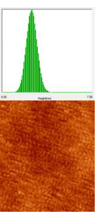
<figcaption class="paper-figure-caption"><b>Fig 1.</b> Figure 1: AFM image of the Al film 10nm-thick. The inset shows the histogram of heights revealing that the average</figcaption>
</figure>
<figure class="paper-figure-card">
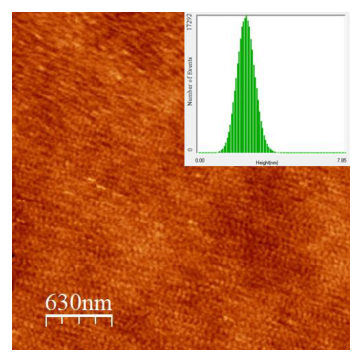
<figcaption class="paper-figure-caption"><b>Fig 2.</b> Fig.2 reports the time-dependent signals corresponding to the transmission through the Cu film and the reflection from the Al, together with the respective reference signals from the Si substrate.</figcaption>
</figure>
<figure class="paper-figure-card">
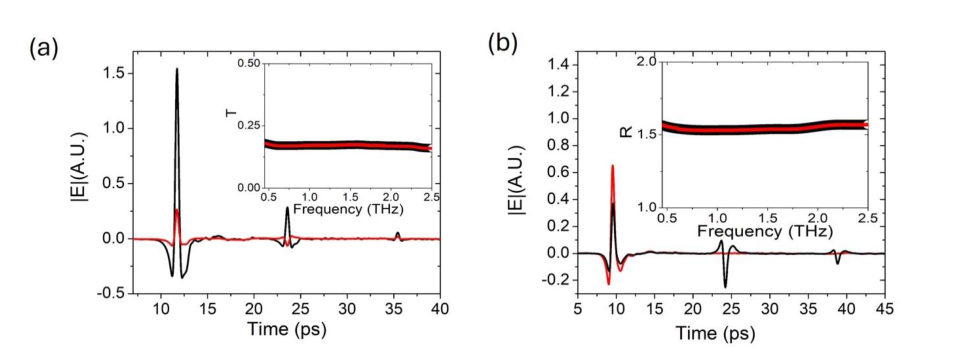
<figcaption class="paper-figure-caption"><b>Fig 3.</b> Figure 2: (a) Black and red curves represent the time dependent signals transmitted across a Si substrate and the Cu film,</figcaption>
</figure>
<figure class="paper-figure-card">
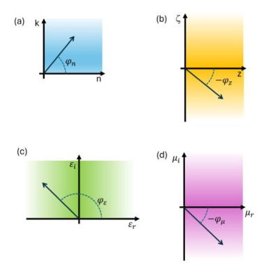
<figcaption class="paper-figure-caption"><b>Fig 4.</b> Figure 3: Polar representations of electrodynamic parameters. The colored areas indicate the phase intervals of (a) the</figcaption>
</figure>
<figure class="paper-figure-card">
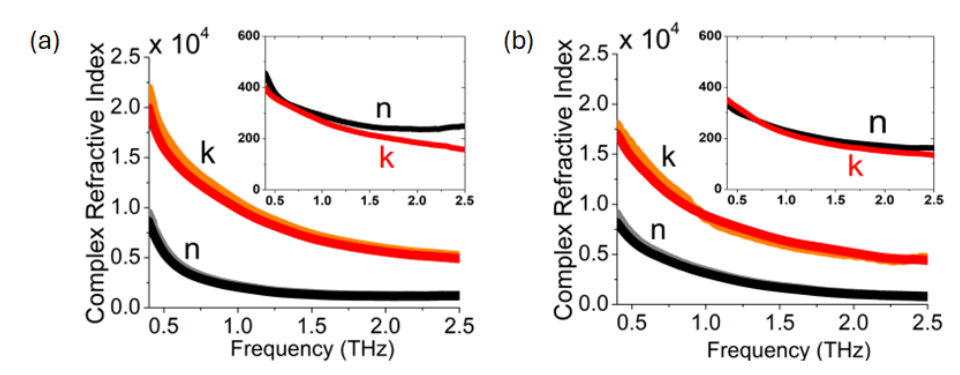
<figcaption class="paper-figure-caption"><b>Fig 5.</b> Figure 4: In (a) and (b), the complex refractive index of the Al and Cu thin films is shown, respectively. The insets display the same parameters obtained processing the transmission measurements and applying the 𝜇̃ = 1 condition.</figcaption>
</figure>

**Summary.** This work demonstrates that assuming unit magnetic permeability ($\mu=1$) when analyzing THz spectroscopy data for metals like Al and Cu leads to inaccurate electrodynamic characterization. By employing a self-consistent retrieval method, the authors show that the effective permeability significantly deviates from unity due to large screening currents induced by time-varying magnetic fields. This highlights the necessity of treating $	ilde{\mu}$ as an independent variable in such analyses.

**Why it may be interesting.** While focused on classical electromagnetism, the concept of induced macroscopic fields (screening currents) leading to parameter misinterpretation mirrors how boundary conditions or approximations can fundamentally alter the perceived quantum state or response in complex open quantum systems.

Detailed structure

**Main problem.** The standard assumption of unit relative magnetic permeability (mu=1) when analyzing THz spectroscopy data for metallic films introduces significant errors in retrieving the true electrodynamic parameters.

**Main result.** The effective permeability ($	ilde{\mu}$) significantly deviates from unity, a deviation attributed not to intrinsic magnetism but to macroscopic screening currents governed by the Faraday-Neumann-Lenz effect.

**Method.** The authors employed a self-consistent retrieval method (CTVT) on both transmission and reflection THz time-domain spectroscopy data to independently determine complex permittivity ($	ilde{\epsilon}$) and permeability ($	ilde{\mu}$).

**Model / system.** The study investigates highly conductive thin films of Aluminum and Copper deposited on substrates, analyzing their response in the terahertz frequency range using Drude dielectric modeling.

**Key observables.** Complex permittivity ($	ilde{\epsilon}$), complex permeability ($	ilde{\mu}$), complex refractive index ($	ilde{n}$), and normalized impedance ($	ilde{z}$).

**Important parameters / regimes.** Plasma frequency ($\omega_p$), relaxation time ($\omega_	au$), skin depth ($\delta(\omega)$), and the ratio of THz wavelength to skin depth ($\lambda_{in} / \delta$).

**Assumptions / limitations.** The primary assumption challenged is $	ilde{\mu}=1$; the analysis requires treating $	ilde{\epsilon}$ and $	ilde{\mu}$ independently for accurate characterization.

**Figures summary.** Figures illustrate time-dependent THz signals, polar representations of electrodynamic parameters showing phase constraints, and comparisons of skin depths calculated under different assumptions ($	ilde{\mu}=1$ vs. free retrieval).

**Paper structure.** The paper establishes the problem with $	ilde{\mu}=1$, details the self-consistent retrieval methodology using THz-TDS data for Al/Cu films, presents results showing large deviations in $	ilde{\mu}$, and finally provides a physical interpretation linking this deviation to screening currents via the FNL effect.

Abstract

The electromagnetic response of metallic films is commonly analyzed in terahertz spectroscopy by assuming unit relative magnetic permeability. In this work we show that this assumption introduces significant distortions in the electrodynamic retrieval of highly conductive films. Aluminum and copper films, 10 nm thick, were investigated by terahertz time-domain spectroscopy in both transmission and reflection configurations. By applying a self consistent retrieval method that independently determines the complex permittivity and permeability, we show that the Drude-type dielectric response is systematically accompanied by a permeability that strongly departs from unity. This deviation is intrinsically linked to the reactive impedance of the films, which clarifies the light induced onset of large screening currents within a transversally confined geometry. A phenomenological interpretation based on the Faraday Neumann Lenz mechanism and a lumped-element model of the film impedance accounts for the observed trends. These results indicate that the common assumption $\tildeμ=1$ in non-magnetic Drude films can lead to an incomplete or biased electrodynamic characterization in the terahertz regime.

[↑ back to top](#top)

### [Metastable soliton necklaces confined by the boundary of a flattop region](http://arxiv.org/abs/2608.11885v1)

**Authors:** Dmitry A. Zezyulin  
**Type:** theory · **Category:** other · **PDF:** <https://arxiv.org/pdf/2608.11885v1>  
**Analysis basis:** full PDF text, analyzed in chunks
**Topic relevance:** `driven-dissipative phase transition` **2/5** · `Frenkel-Kontorova` **1/5** · `Keldysh / 2PI / non-Gaussian methods` **1/5** · `analog quantum simulation` **1/5** · `correlated / nonlocal dissipation` **1/5** · `interference shaping light` **1/5** · `methods for driven-dissipative` **1/5** · `non-equilibrium universality` **1/5**

↔ Scroll figures horizontally

<figure class="paper-figure-card">
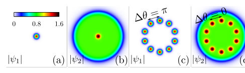
<figcaption class="paper-figure-caption"><b>Fig 1.</b> FIG. 1: The amplitude distributions |ψ1,2(x, y, z = 0)| for the seed solution (a,b) with propagation constants (b1, b2) ≈ (3.0525, 0.1795) and for the soliton necklace (c,d) with N = 10, M = 5, and R = 13, generated from this seed. The next- neighbor solitons in the necklace are out-of-phase in the first component (i.e., ∆θ = π), and in-phase in the second (i.e., ∆θ = 0). All plots are shown within the transverse spatial window x, y ∈[−25, 25]. The colorbar applies to all panels.</figcaption>
</figure>
<figure class="paper-figure-card">
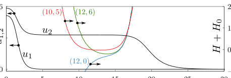
<figcaption class="paper-figure-caption"><b>Fig 2.</b> FIG. 2: Radial profiles u1,2(R) of the seed solution from Fig. 1 (left axis) and several dependencies H(R) for different com- binations (N, M) (right axis). For better comparison, each dependence H(R) is shown up to an irrelevant constant shift H0, which differs for each pair (N, M).</figcaption>
</figure>
<figure class="paper-figure-card">
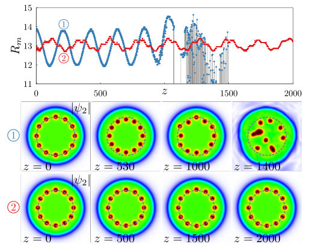
<figcaption class="paper-figure-caption"><b>Fig 3.</b> FIG. 3: The upper panel shows the dependence Rm(z), for the soliton necklace initialized with radius R minimizing the de- pendence H(R) (curve 1) and with the mean oscillation radius (curve 2). The latter case includes additional random noise in the input solution. The calculation corresponding to curve 1 was terminated at z = 1500. Second and third rows show the amplitude distributions of |ψ2| at different z for curve 1 (the second row) and curve 2 (the third row). Amplitude distributions |ψ1| are similar, except that the flattop plateau is absent in ψ1. All plots in the second and third rows are shown within the transverse spatial window x, y ∈[−25, 25]. Gray dashed circles show the radii...</figcaption>
</figure>
<figure class="paper-figure-card">
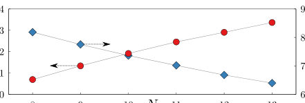
<figcaption class="paper-figure-caption"><b>Fig 4.</b> FIG. 4: The radius R of the most robustly propagating necklace (left axis) and the distance ∆between the next- neighbor solitons (right axis), both plotted versus the soli- ton number N. For each N, the necklace was generated with M = floor(N/2).</figcaption>
</figure>
<figure class="paper-figure-card">
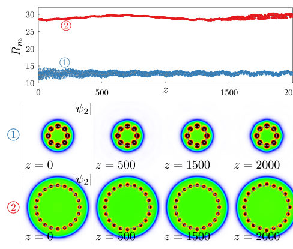
<figcaption class="paper-figure-caption"><b>Fig 5.</b> FIG. 5: The upper panel shows the dependence Rm(z) for the soliton necklace with (N, M) = (8, 4) generated from the seed solution with the propagation constants (b1, b2) ≈ (2.1225, 0.1795) (curve 1) and for the necklace with (N, M) = (20, 10) generated from the seed solution with (b1, b2) ≈ (3.1825, 0.1835) (curve 2). Both simulations include addi- tional random noise in the input solutions. Second and third rows show the amplitude distributions of |ψ2| at different propagation distances z for curve 1 (the second row) and curve 2 (the third row). All plots in the second and third rows are shown within the transverse spatial window x, y ∈ [−45, 45]. Gray dashed circles show the radii of the...</figcaption>
</figure>

**Summary.** This paper investigates how multi-soliton necklaces can maintain stable propagation in a specialized nonlinear medium. The stability arises from a delicate balance: repulsion among solitons in one component is counteracted by the confining effect of the boundary structure in a second coupled component. Numerical simulations confirm that careful initialization based on system dynamics leads to robust, long-lived metastable states.

**Why it may be interesting.** This work is highly relevant as it explores complex nonlinear wave dynamics in optical systems, drawing parallels between quantum field theory concepts (solitons, nonlinearity) and physical phenomena like light guiding and confinement, which touches upon advanced topics in quantum optics.

Detailed structure

**Main problem.** The study elucidates a mechanism for the quasistationary propagation of multi-soliton necklaces within a two-component envelope system exhibiting competing cubic-quintic nonlinearity.

**Main result.** Metastable propagation is achieved by balancing inter-soliton repulsion (in one component) against boundary confinement (from the flattop region in the second component), showing robustness even with added noise.

**Method.** The research relies on numerical simulations tracking the radial position of maximum intensity and comparing initialization methods to assess stability over long propagation distances.

**Model / system.** The system is modeled by a two-component envelope ($\psi_1, \psi_2$) governed by a nonlinear Schrödinger type equation with a Hamiltonian incorporating cubic-quintic nonlinearity. The confinement mechanism is analogous to nonlinear total internal reflection at the boundary of a flattop region.

**Key observables.** The primary observables are the radial position of maximum intensity ($R_m(z)$) and the stability/persistence of the soliton necklace over propagation distance $z$.

**Important parameters / regimes.** Key parameters include the number of solitons ($N$), the phase difference between adjacent solitons ($\Delta	heta = \pi$ for repulsion), and the geometry defined by the flattop region width.

**Assumptions / limitations.** The analysis assumes a quasistationary regime where stability is achieved through a specific balance of nonlinear forces, and initial simulations suggest that using the mean oscillation radius enhances robustness significantly.

**Figures summary.** Figures illustrate amplitude distributions for soliton necklaces (e.g., N=10), track the evolution of the necklace radius $R_m(z)$ under different initialization conditions, and compare stable propagation with noisy inputs.

**Paper structure.** The paper establishes the physical model using a two-component envelope equation; it then analyzes the stability mechanism by relating soliton repulsion to boundary confinement; finally, numerical simulations demonstrate robust metastable propagation when specific initial conditions (mean oscillation radius) are used.

Abstract

We present quasistationary ring-shaped soliton necklaces in a two-component envelope propagating in a medium with competing cubic-quintic nonlinearity. Metastable propagation of soliton necklaces results from a balance of repulsion between adjacent out-of-phase solitons in one component and confinement by the boundary of a flattop region in the other. Numerical simulations demonstrate metastable propagation over about a hundred diffraction lengths, even with random noise added to the input envelopes. The maximum number of solitons in metastable necklaces can be controlled either by changing the size of individual solitons or by adjusting the width of the flattop region hosting the necklace.

[↑ back to top](#top)

### [Formally Verified Lock-Free Software Transactional Memory for Scientific Measurement](http://arxiv.org/abs/2608.12024v1)

**Authors:** Kentaro Kitagawa  
**Type:** theory · **Category:** other · **PDF:** <https://arxiv.org/pdf/2608.12024v1>  
**Analysis basis:** full PDF text, analyzed in chunks
**Topic relevance:** `QC/QI experiment` **2/5** · `quantum measurements` **2/5** · `analog quantum simulation` **1/5** · `driven-dissipative phase transition` **1/5** · `methods for driven-dissipative` **1/5**

↔ Scroll figures horizontally

<figure class="paper-figure-card">
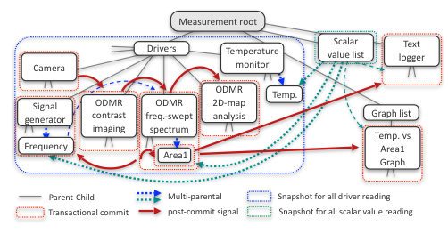
<figcaption class="paper-figure-caption"><b>Fig 1.</b> FIG. 1. Concurrency model of the wide-field optically- detected magnetic resonance (ODMR) measurement of Fig. 2, drawn as its simplified node tree (see legend). Grey Parent– Child edges form the ownership tree of instrument drivers and display/aggregation sections under the root Measurement node. The scalar entries (Area1, Temp., Frequency) are multi- parented: each is owned by its source driver and simultane- ously aliased into the Scalar value list. Each dotted red box is one transactional commit, atomic over its subtree. When a driver commits, a post-commit signal propagates along the dependency chain; each listener takes a non-blocking consis- tent snapshot of its inputs (two snapshot...</figcaption>
</figure>
<figure class="paper-figure-card">
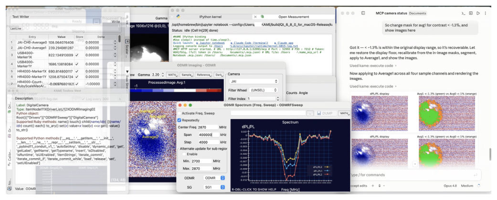
<figcaption class="paper-figure-caption"><b>Fig 2.</b> FIG. 2. GUI screenshot of the wide-field ODMR measurement modeled in Fig. 1: the camera image, the processed ODMR contrast map of the diamond NV centers, and the frequency-swept spectrum. In the right panel, an AI agent (a large language model connected through the Model Context Protocol, MCP) identifies high-contrast fluorescence regions in natural-language dialogue with the operator, reading the measurement state through the Snapshot API and publishing analysis-mask updates through the Transaction API. This workflow replaces manual region selection, which does not scale to high-throughput wide- field ODMR.</figcaption>
</figure>
<figure class="paper-figure-card">
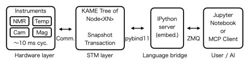
<figcaption class="paper-figure-caption"><b>Fig 3.</b> FIG. 3. System architecture of KAME. The central STM layer shares the tree-structured state among instrument drivers, native C++ clients, and external clients. The same Snap- shot/Transaction API is exposed locally through pybind11 and remotely over ZeroMQ (ZMQ); Jupyter notebooks and AI agents connected through the Model Context Protocol (MCP) thus operate on the same transactional state.</figcaption>
</figure>
<figure class="paper-figure-card">
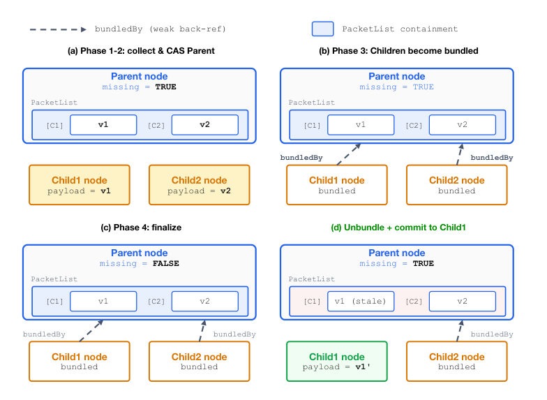
<figcaption class="paper-figure-caption"><b>Fig 4.</b> FIG. 4. State transitions of the four-phase bundle/unbundle protocol, drawn as the actual pointer graph. The Parent’s PacketList contains a snapshot of each child sub-packet (nested boxes). A bundled child’s Linkage holds a BundledRefWrapper whose packet is Null and whose bundledBy is a weak back-reference up to the Parent (dashed arrow); a snapshot of that child therefore follows bundledBy to the Parent and reads Parent.PacketList[child]. On commit (unbundle, panel d), the committing child is restored to a regular packet-holding PacketWrapper while the Parent’s sub is kept for recovery.</figcaption>
</figure>
<figure class="paper-figure-card">
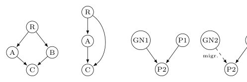
<figcaption class="paper-figure-caption"><b>Fig 5.</b> FIG. 5. Parent–child topologies verified by the Layer 2 TLA+ models. (a)–(d) tree structures; (e)–(h) multi-parent (DAG) structures where a child is shared by two parents. Solid = static edge; dashed (ins/rel, migr.) = runtime insert/re- lease/migration.</figcaption>
</figure>

**Summary.** This paper presents a novel, formally verified lock-free Software Transactional Memory (STM) designed specifically for managing the shared, hierarchical state in automated condensed-matter measurement instruments. By providing atomic subtree updates and fast snapshots, it overcomes concurrency bottlenecks associated with traditional locking mechanisms. This robust framework enables complex, multi-threaded scientific workflows involving AI automation.

**Why it may be interesting.** While not directly about quantum physics theory, the robust, high-concurrency state management techniques developed here are crucial for building complex, real-time control systems necessary for advanced quantum experiments like trapped ion or cavity QED measurements.

Detailed structure

**Main problem.** The core problem is managing concurrent, shared state access from multiple threads (instrument control, data acquisition, GUI) in automated condensed-matter measurements without introducing deadlocks or significant latency.

**Main result.** The authors designed and formally verified a lock-free Software Transactional Memory (STM) framework that allows for atomic subtree updates and $O(1)$ consistent snapshots of hierarchical state.

**Method.** They implemented the STM using custom atomic shared pointers and a multi-phase CAS protocol to manage tree structure commits, which was rigorously checked using TLA+ and tested under weak memory models.

**Model / system.** The system is an open-source measurement platform used for NMR and ODMR experiments, modeling its state as a naturally hierarchical tree structure (KAME model).

**Key observables.** ODMR contrast map, frequency-swept spectrum, and the ability to acquire consistent subtree snapshots.

**Important parameters / regimes.** The performance advantage is shown by achieving near $O(1)$ snapshot cost compared to $O(\log N)$ path copying in traditional COW structures.

**Assumptions / limitations.** The design assumes that bounding retries via an oldest-first arbitration mechanism can maintain system-wide livelock-freedom, although general liveness proof remains complex.

**Figures summary.** Figures illustrate the node tree structure of ODMR measurements, the overall KAME system architecture showing the STM layer, and the GUI workflow demonstrating AI agent interaction with measurement state via APIs.

**Paper structure.** The paper details the necessity of concurrent access management in scientific instruments, introduces the lock-free STM as the solution, describes its tree structure and atomic operations (snapshot/transaction), provides formal verification results (TLA+), and discusses practical implementation interfaces (Python/ZMQ).

Abstract

Automated measurement of condensed-matter experiments requires instrument-control, data-acquisition, and user-interface threads to access shared, naturally hierarchical state concurrently. Coarse-grained locking can delay acquisition and cause sample loss, whereas fine-grained locking requires deadlock-prone lock ordering across instruments. Instead, we describe the lock-free software transactional memory (STM) that has been at the core of an open-source measurement platform for 16 years, in nuclear magnetic resonance experiments and, more recently, in optically detected magnetic resonance experiments. The STM organizes this state as a tree and provides atomic subtree updates and consistent subtree snapshots. After initial bundling, an unchanged subtree snapshot is acquired in $O(1)$ time through a custom lock-free atomic shared pointer. Within each bounded TLA+ configuration, TLC exhaustively checks the state space, establishing the safety and livelock-freedom properties specified for that configuration. Bounded executions of the atomic shared-pointer implementation are separately checked under the C11 weak-memory model. The same Snapshot and Transaction interfaces are exposed to Python scripting and AI-assisted automation.

[↑ back to top](#top)

### [Dimensional crossover and local strain induced deflection of the spin spiral state in multiferroic NiI2](http://arxiv.org/abs/2608.11944v1)

**Authors:** Tianxing Jiang, Lianchuang Li, Haiyan Zhu, Hongyu Wang, Junchao Tian, Wenzhao Wang, Weiyi Pan, Haitao Wang, Changlin Zheng, Hongjun Xiang, Changsong Xu, Donglai Feng, Tong Zhang  
**Type:** both · **Category:** strongly correlated electrons · **PDF:** <https://arxiv.org/pdf/2608.11944v1>  
**Analysis basis:** full PDF text, analyzed in chunks
**Topic relevance:** `analog quantum simulation` **2/5** · `quantum measurements` **2/5** · `Frenkel-Kontorova` **1/5** · `Keldysh / 2PI / non-Gaussian methods` **1/5**

↔ Scroll figures horizontally

<figure class="paper-figure-card">
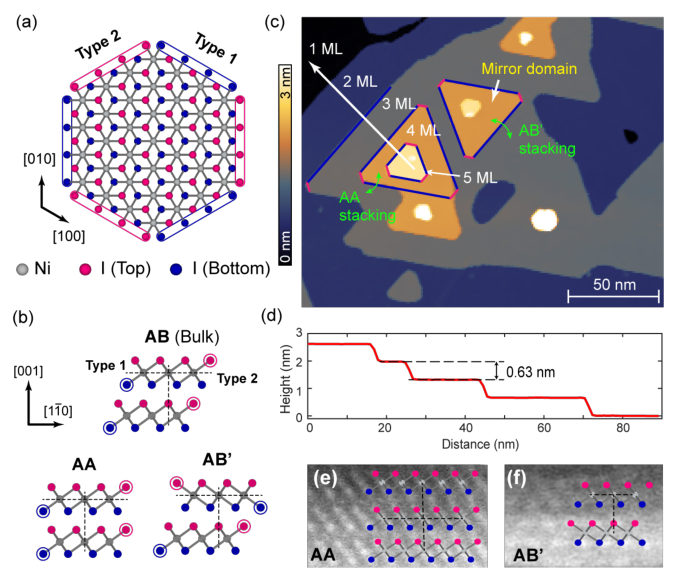
<figcaption class="paper-figure-caption"><b>Fig 1.</b> Fig. 1. Lattice structure and STM/STEM characterization of few-layer NiI2. (a) The lattice structure of NiI2 (top view). Two types of edges are marked with blue and red frame. (b) The lattice structure of NiI2 with AB, AA and AB’ stackings (side view). (c) Topographic image of the NiI2 thin film sample (Vb = 1.8 V, I = 8 pA). Two types of edges are marked by blue/red lines. The terraces labelled by 1–5 ML have the same (AA) stacking order; while the terrace labeled by “mirror domain” has an AB’ stacking with respect to underneath layer. (d) Line profile along the green arrow in (c), the single step height is 0.63 nm. (e, f) HAADF STEM images of the few-layer NiI2 sample, showing the AA and...</figcaption>
</figure>
<figure class="paper-figure-card">
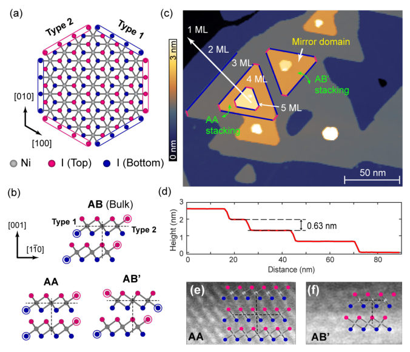
<figcaption class="paper-figure-caption"><b>Fig 2.</b> Fig. 2f shows an SP-STM image across a step edge. The spin spiral modulation exists in different terraces, while the phases of spin modulation between two adjacent terraces are nearly</figcaption>
</figure>
<figure class="paper-figure-card">
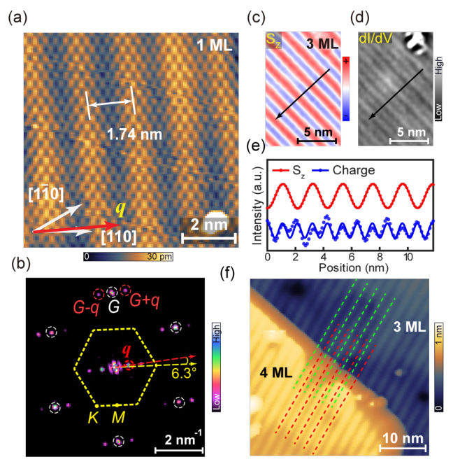
<figcaption class="paper-figure-caption"><b>Fig 3.</b> Fig. 2. SP-STM measurement of spin spirals. (a, b) SP-STM image of 1ML NiI2 showing spin spirals stripes (Vb = 1.0 V, I = 80 pA) and its FFT image, respectively. (c, d) The SZ and charge maps taken on the same 3ML area, confirming magnetic contrast (Vb = 1.35 V, I = 50 pA). (e) The phase relationship between q and 2q along the arrow in Fig. 2c and d, further proved the spin spiral nature of stripes. (f) SP-STM image of a 3ML/4ML step (Vb = 1.2V, I = 30 pA). The spin spiral stripes display a half period offset across the step, evidencing an anti-parallel interlayer spin alignment.</figcaption>
</figure>
<figure class="paper-figure-card">
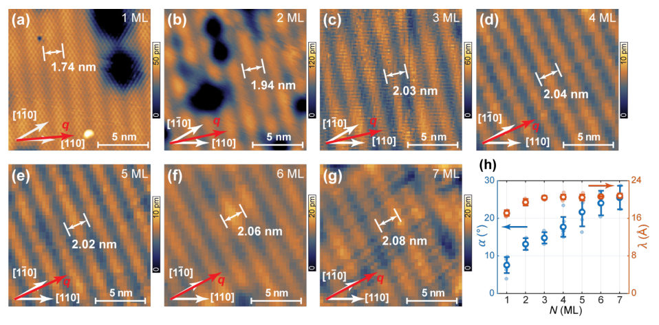
<figcaption class="paper-figure-caption"><b>Fig 4.</b> Fig. 3. Thickness dependence of spin spirals. (a-g) SP-STM images of the spin spirals at different thicknesses. The directions of q and NiI2 lattice, and the modulation wavelength are marked in each image. (h) Relations of wavelength and direction vs. film thickness. Each light-colored data point corresponds to one independent measurement, the circles denote the corresponding mean values, and error bars indicate the standard deviations.</figcaption>
</figure>
<figure class="paper-figure-card">
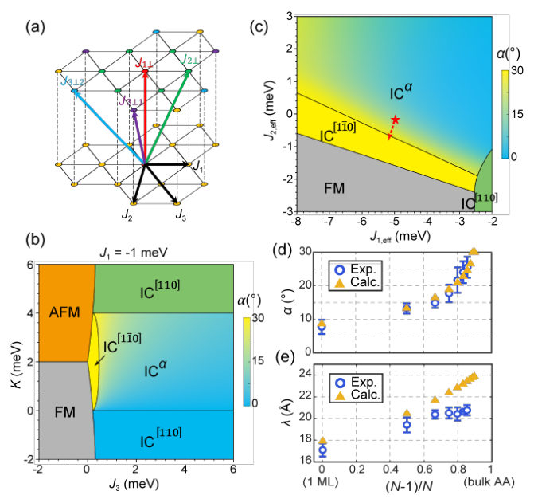
<figcaption class="paper-figure-caption"><b>Fig 5.</b> Fig. 4. Phase diagram and Monte Carlo simulation. (a) Illustration of the intralayer and interlayer Heisenberg exchange interactions (for AA stacking). (b) Phase diagram for 1 ML NiI2 (J1-J3-K model) in J3-K space. The false color of ICα phase in the phase diagram represents the orientation angle (α) of q. The two IC[110] phases with blue/green color have different wavelength (see Part Ⅱ-4 of Supplementary Material for more details). (c) Phase diagram of multi-layer NiI2 (effective J1-J2-J3-K model) in J1-J2 space. Red star: the position of (J1-J2) for 1 ML NiI2; Arrow: the trajectory towards bulk NiI2 with AA stacking. (d, e) Comparison of experimental and calculation results of the q...</figcaption>
</figure>

**Summary.** This work systematically explores how the magnetic spin spiral state in layered multiferroic NiI2 responds to changes in film thickness and mechanical strain. By combining advanced STM measurements with detailed theoretical modeling, the authors establish that both dimensionality crossover and local curvature are powerful methods for engineering non-collinear magnetism and associated ferroelectricity in these 2D materials.

**Why it may be interesting.** While focused on magnetism, the coupling between structural deformation (strain/curvature) and electronic/magnetic ordering is central to modern condensed matter physics, relevant for understanding emergent phenomena in low-dimensional quantum materials.

Detailed structure

**Main problem.** The study investigates how the spin spiral state, which induces ferroelectricity, evolves as a function of film thickness and local strain in few-layer multiferroic NiI2.

**Main result.** Thickness increases cause a dimensional crossover characterized by an increasing spin-spiral wavelength and wavevector rotation. Furthermore, local film wrinkles induce measurable deflection of the spin spiral wavevector due to modified exchange interactions.

**Method.** The research combines experimental techniques like Spin-Polarized STM with advanced theoretical modeling using DFT+U calculations and spin-lattice dynamics simulations (LAMMPS/SpinGNN++).

**Model / system.** The physical system is few-layer van der Waals multiferroic NiI2, modeled by incorporating complex magnetic interactions including Heisenberg, Kitaev, and biquadratic terms. The Hamiltonian describes the coupled spin-lattice dynamics across different stacking orders (AA, AB, AC).

**Key observables.** Spin-spiral wavelength ($\lambda$), wavevector ($\mathbf{q}$) rotation/deflection, interlayer exchange coupling strength ($J_{nn}^\perp$), and associated electric polarization.

**Important parameters / regimes.** Film thickness (1 to 7 ML), local strain/curvature, Hubbard correction parameter U=4.0 eV, and various magnetic exchange parameters ($J_1, K$, etc.).

**Assumptions / limitations.** The analysis relies on mapping interlayer interactions onto effective intralayer couplings and assuming that structural changes dictate the modification of magnetic exchange interactions.

**Figures summary.** Figures illustrate lattice structures, STM images showing spin spirals, and energy diagrams comparing different stacking orders (AA, AB, AC) and the effect of curvature-induced strain on magnetism.

**Paper structure.** The paper progresses by first establishing the basic thickness dependence using SP-STM data, then developing a comprehensive theoretical model incorporating multiple interactions, and finally demonstrating how local mechanical strain (wrinkles/curvature) acts as an additional tuning knob for the magnetic state.

Abstract

Low-dimensional multiferroics hold great promise for integrated magnetoelectric devices. Spin spiral state has recently been shown to induce ferroelectricity in single-layer van der Waals (vdW) material NiI2. However, how this state evolves and can be tuned towards the two-dimensional limit remain unclear. Here, we combine spin-polarized scanning tunneling microscopy, layer-by-layer film growth, and multi-scale theoretical modeling to investigate the spin spirals in NiI2 thin films. As the film thickness increases from 1 to 7 monolayers, we observed a continuous increase of spin-spiral wavelength and a rotation of wavevector from near [110] to [1-10] direction, which evidences a dimensional crossover primarily driven by enhanced interlayer exchange energy. Moreover, we find that the film wrinkles can cause deflection of the spin spiral wavevector, which is caused by local curvature induced modification of exchange interactions. Our findings establish thickness and local strain as two tuning methods for engineering non-collinear helical magnetism and accompanied electric polarization in vdW multiferroics.

[↑ back to top](#top)

### [Mismatch between Raman shear modes and ferroelectric polarization in 3R-MoS$_{2}$](http://arxiv.org/abs/2608.11988v1)

**Authors:** Johannes Schwandt-Krause, Jan-Niklas Heidkamp, Mohammed El Amine Miloudi, Swarup Deb, Elisabeth Grune, Kenji Watanabe, Takashi Taniguchi, Rico Schwartz, Oliver Kühn, Tobias Korn  
**Type:** experiment · **Category:** other · **PDF:** <https://arxiv.org/pdf/2608.11988v1>  
**Analysis basis:** full PDF text, analyzed in chunks
**Topic relevance:** `quantum measurements` **2/5** · `analog quantum simulation` **1/5** · `driven-dissipative phase transition` **1/5** · `methods for driven-dissipative` **1/5**

↔ Scroll figures horizontally

<figure class="paper-figure-card">
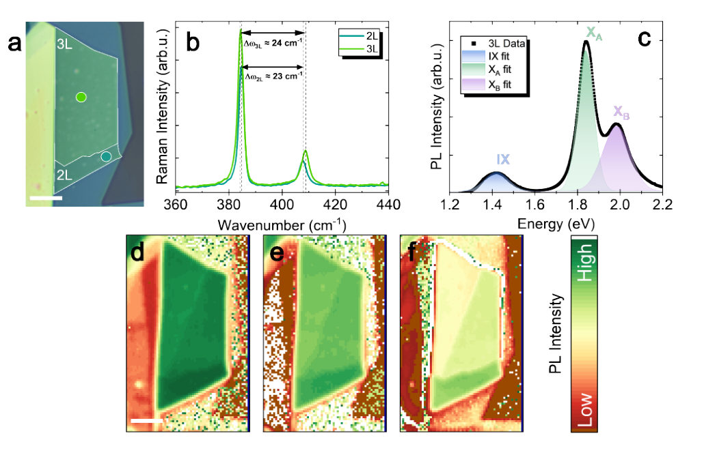
<figcaption class="paper-figure-caption"><b>Fig 1.</b> Figure 1: (a) Optical micrograph of the 3R-MoS2/hBN flake showing the regions of differing layer number. The white bar denotes 5 µm. (b) High-frequency Raman spectra of the 2L and 3L regions, where the E2g–A1g separation (∆ω2L ≈23 cm−1, ∆ω3L ≈24 cm−1) confirms the layer assignment. The spectra are taken at representative coloured spots marked in (a). (c) Room-temperature photoluminescence spectrum deconvolved into the interlayer (IX), A-exciton (XA), and B-exciton (XB) contributions. (d-f) Spatially-resolved PL-intensity maps of the flake for the A-exciton (d), B-exciton (e) and interlayer exciton (f).</figcaption>
</figure>
<figure class="paper-figure-card">
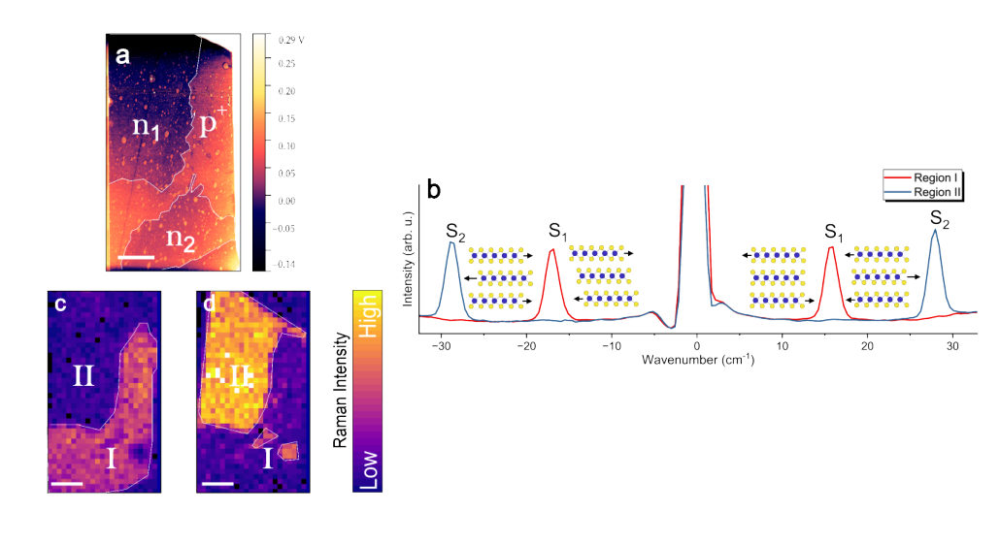
<figcaption class="paper-figure-caption"><b>Fig 2.</b> Figure 2: (a) KPFM surface-potential map of the 3L part of the MoS2 flake alongside Raman-intensity maps of the shear-modes. (b) Stokes/anti-Stokes low-frequency Raman spectra for two regions of the flake (Region I, red; Region II, blue), resolving the S1 and S2 interlayer shear modes. Inset crystal-structure schematics indicate the candidate stacking sequences and displacement associated with each region/shear mode. (c) S1 and (d) S2, showing the spatial correlation between ferroelectric domains (n1/n2 denote neutral domains, p denotes a polar domain) and shear-mode activity of different modes across the sample. The white bars denote 5 µm.</figcaption>
</figure>
<figure class="paper-figure-card">
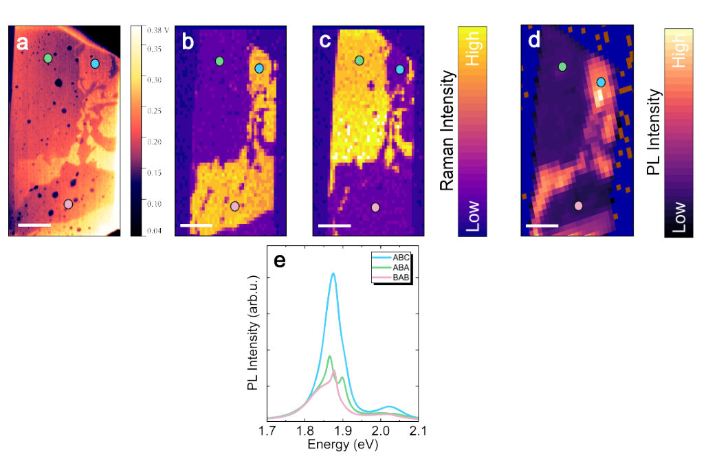
<figcaption class="paper-figure-caption"><b>Fig 3.</b> Figure 3: (a) KPFM surface-potential map and the corresponding low-frequency Raman-intensity maps of the shear modes (b) S1 and (c) S2 of a the same flake as in Fig. 1 and Fig. 2 after an annealing procedure. The white bars denote 5 µm. (d) Photoluminescence intensity map of the A exciton transition of the same area as in (b) and (c) at low temperatures (4 K). (e) Photoluminescence spectra taken at three representative positions (ABC, ABA and BAB domain, respectively) show the variation in XA lineshape and the relative weight of the higher-energy feature between domains. The color of the plots matches the inset color markings shown in (a).</figcaption>
</figure>

**Summary.** This work demonstrates that characterizing ferroelectric stacking order in layered $	ext{MoS}_2$ requires combining multiple advanced techniques. KPFM alone fails to distinguish between certain neutral stackings (ABA vs. BAB), but the combination of low-frequency Raman spectroscopy and PL successfully resolves these ambiguities by probing complementary structural, vibrational, and electronic properties.

**Why it may be interesting.** While not directly quantum information related, the study of polarization switching and structural characterization in 2D materials touches upon emergent collective electronic states and lattice dynamics that are crucial for designing solid-state quantum devices.

Detailed structure

**Main problem.** The core challenge is achieving reliable, non-destructive assignment of the stacking order and ferroelectric polarization state in sliding ferroelectric van der Waals materials like trilayer 3R-MoS2.

**Main result.** A combined approach using KPFM, low-frequency Raman spectroscopy, and photoluminescence is necessary because no single technique can uniquely determine the local structural or electronic configuration of the material.

**Method.** The study combines Kelvin-probe force microscopy (KPFM) to map surface potential, low-frequency Raman spectroscopy to probe shear modes sensitive to interlayer coupling, and photoluminescence (PL) to analyze excitonic signatures.

**Model / system.** The system is exfoliated trilayer 3R-MoS2 flakes on an hBN substrate. The analysis compares different stacking configurations (e.g., ABA vs. BAB), which exhibit distinct physical properties despite some being indistinguishable by electrostatic measurements alone.

**Key observables.** Surface potential contrast ($	ext{KPFM}$); low-frequency Raman shear mode intensities ($	ext{S}1$ and $	ext{S}2$); A-exciton spectral line shapes ($	ext{PL}$).

**Important parameters / regimes.** The distinction between zero net polarization stackings (ABA/BAB) versus polar ones (ABC), and the failure of simple bond-polarizability models to explain all observed Raman shifts.

**Assumptions / limitations.** Individual techniques are insufficient; a complementary, multi-modal spectroscopic-scanning-probe approach is required for full characterization.

**Figures summary.** Figures compare KPFM maps with Raman intensity maps across different domains (I vs II) and show PL spectra taken from representative stacking regions ($	ext{ABC}$, $	ext{ABA}$, $	ext{BAB}$) to demonstrate the unique signatures of each technique.

**Paper structure.** The paper establishes the need for characterization, presents data showing KPFM ambiguity between certain stackings (ABA/BAB), then uses Raman spectroscopy to resolve this degeneracy by observing different shear modes. Finally, PL is used to further distinguish between these spectroscopically similar but structurally distinct domains.

Abstract

Sliding ferroelectricity in parallel-stacked two-dimensional van der Waals materials enables a broad range of novel device concepts, but exploiting it requires reliable, non-destructive assignment of the underlying stacking order and polarization state. Here, we combine Kelvin-probe force microscopy (KPFM) with low-frequency Raman spectroscopy to probe the polarization domains and stacking configurations of a exfoliated trilayer 3R-MoS$_{2}$ flake on a hBN substrate. We find that ABA and BAB - both stackings with zero net polarization - are indistinguishable in KPFM, yet show drastically different low-frequency shear modes. This observation is reproduced across multiple flakes and is corroborated by low-temperature photoluminescence. Notably, the standard bond-polarizability model does not account for the difference in shear-mode activity between the ABA and BAB configurations, indicating that the interlayer Raman response of these stackings is governed by physics beyond a simple polarizability picture. Our results show that none of the here-used individual techniques alone is sufficient to assign sliding-ferroelectric stacking order and motivate a combined spectroscopic-scanning-probe approach.

[↑ back to top](#top)

### [Thickness-Driven Superconductor-Insulator Transition in (Cu,C)-1234 and Proximity-Induced Superconductivity Recovery in (Cu,C)-1234/YBCO Heterostructure](http://arxiv.org/abs/2608.11707v1)

**Authors:** Zhihang Xu, Detian Yang, Ping Zhu, Ruoxian Sun, Xiaoyang Cai, Yanqun Guo, Chuanbing Cai  
**Type:** experiment · **Category:** strongly correlated electrons · **PDF:** <https://arxiv.org/pdf/2608.11707v1>  
**Analysis basis:** full PDF text, analyzed in chunks
**Topic relevance:** `driven-dissipative phase transition` **2/5** · `correlated / nonlocal dissipation` **1/5**

↔ Scroll figures horizontally

<figure class="paper-figure-card">
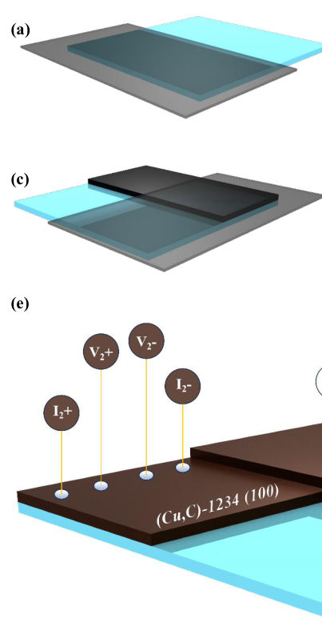
<figcaption class="paper-figure-caption"><b>Fig 1.</b> Fig. 1. The growth procedure of the heterostructure and three test circuits to obtain the temperature-dependent resistance of single thin films and interface by four-probe method. (a) LAO substrate with the surface half covered by thin wafer. (b) YBCO deposited at half the substrate. (c) both grown YBCO and LAO substrate half covered by the wafer. (d) the final four-grid area distribution including LAO substrate, sole YBCO, sole (Cu,C)-1234 and (Cu,C)-1234/YBCO heterostructure after the deposition of (Cu,C)-1234. (e) Test circuits for sole YBCO, sole (Cu,C)-1234 and interface.</figcaption>
</figure>
<figure class="paper-figure-card">
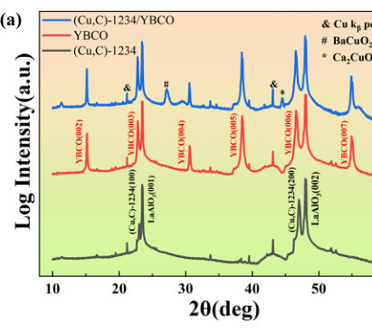
<figcaption class="paper-figure-caption"><b>Fig 2.</b> Fig. 2. (a) XRD pattern of (Cu,C)-1234 (black), YBCO (red) and heterostructure (blue) with highest Tc. (b) 10KⅹSEM image of (Cu,C)-1234/YBCO heterostructure. (c) HAADF-STEM image and FFT results of (Cu,C)-1234 and YBCO.</figcaption>
</figure>
<figure class="paper-figure-card">
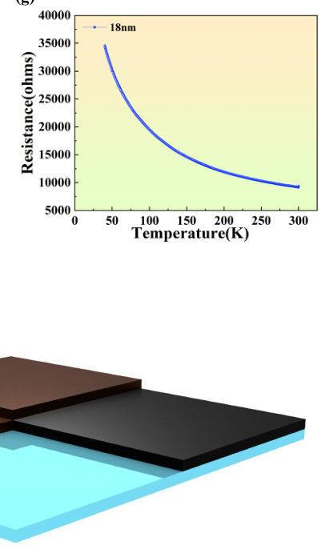
<figcaption class="paper-figure-caption"><b>Fig 3.</b> Fig. 3. (a) Normalized ρ-T curve of solely grown YBCO (black), solely grown (Cu,C)-1234 (red) and (Cu,C)-1234/YBCO heterostructure. Here the circuit for heterostructure is on the top (Cu,C)-1234 layer and the heterostructure was in-situ grown. (b) Enlarged view of Tc0 region in (a). (c) R-T curves for another heterostructure sample under 0-9 T (d) Normalized ρ-T curve of YBCO after the growth process of (Cu,C)-1234. The Tc0 dropped from 91K to 78 K. (e)Test circuit for YBCO. (f) R-T curve of (Cu,C)-1234 with thickness of 188 nm and 87 nm. (g) R-T curve of (Cu,C)-1234 with thickness of 18 nm which transited into insulator. (h) Test circuit for (Cu,C)-1234.</figcaption>
</figure>
<figure class="paper-figure-card">
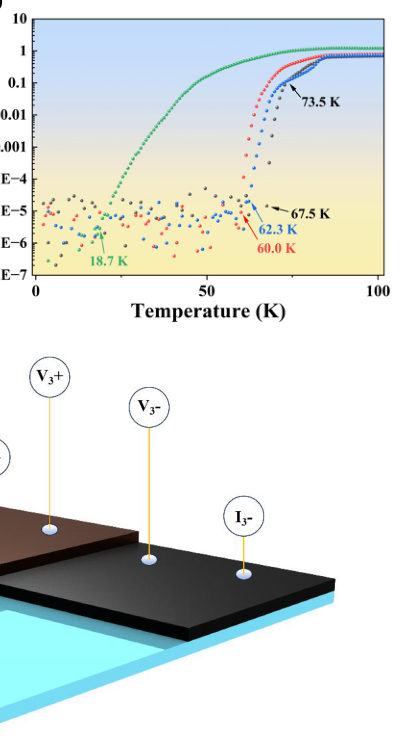
<figcaption class="paper-figure-caption"><b>Fig 4.</b> Fig. 4. (a) Normalized ρ-T curves of the circuit going through the interface with different thickness of top (Cu,C)-1234 layer controlled by deposition duration. S1-S4 respectively correspond to the thickness of (Cu,C)-1234 as 188 nm, 87 nm, 18 nm and 1.2 nm. (b) Enlarged view of region near Tc0 in (a). (c)Test circuit for the interface.</figcaption>
</figure>
<figure class="paper-figure-card">
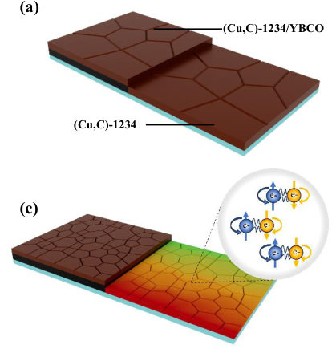
<figcaption class="paper-figure-caption"><b>Fig 5.</b> Fig. 5. Property evolution of (Cu,C)-1234 and heterostructure with the thickness of (Cu,C)-1234 as (a) 188 nm, (b) 88 nm, (c)18 nm and (d) 1.2 nm</figcaption>
</figure>

**Summary.** The paper investigates the interplay between thickness-driven Superconductor-Insulator Transition (SIT) and proximity effects in $	ext{(Cu,C)-1234/YBCO}$ heterostructures. By varying the top layer thickness, they observed that while the material undergoes SIT when isolated, coupling it to YBCO restores superconductivity over a specific thickness range. This work establishes a platform for studying interfacial superconducting coupling in high-temperature superconductors.

**Why it may be interesting.** This work provides experimental evidence on how interfacial coupling can stabilize superconductivity against intrinsic dimensional confinement effects in complex oxide systems, which is relevant for understanding quantum phase transitions in artificial superconducting junctions.

Detailed structure

**Main problem.** The study investigates the interplay between thickness-driven Superconductor-Insulator Transition (SIT) and superconducting proximity effects in high-temperature cuprate heterostructures.

**Main result.** Reducing the thickness of the top layer causes an SIT, but superconductivity is re-established across the interface with YBCO over a finite range before being suppressed again at very small thicknesses.

**Method.** The research employed Pulsed Laser Deposition (PLD) to fabricate $	ext{(Cu,C)-1234/YBCO}$ heterostructures and characterized them using four-probe electrical transport measurements as a function of film thickness.

**Model / system.** The physical system is an epitaxial heterostructure composed of two cuprate superconductors: $	ext{YBCO}$ (bottom layer) and $	ext{(Cu,C)-1234}$ (top layer), grown on an LAO substrate. The study explores the superconducting coupling at this interface.

**Key observables.** Temperature-dependent resistance ($
ho$-$T$ curves), superconducting transition temperature ($T_{c0}$), and normal state resistance as a function of film thickness.

**Important parameters / regimes.** Film thicknesses, particularly varying $	ext{(Cu,C)-1234}$ thickness from $188 	ext{ nm}$ down to $1.2 	ext{ nm}$.

**Assumptions / limitations.** The observed recovery mechanism suggests that the robust superconducting state of YBCO helps reestablish long-range phase coherence in the ultrathin $	ext{(Cu,C)-1234}$ layer.

**Figures summary.** Figures illustrate the growth process and test circuits; key results show how $T_{c0}$ drops with decreasing thickness for isolated films (SIT) but recovers when coupled to YBCO before dropping again at the thinnest limit.

**Paper structure.** The paper follows a structure of fabrication ($	ext{PLD}$ growth), structural confirmation ($	ext{XRD}$, $	ext{STEM}/	ext{FFT}$), and systematic electrical characterization across varying thicknesses, comparing isolated film behavior to heterostructure performance.

Abstract

Superconducting proximity effect and related thickness-driven property evolution remain an important issue in understanding high temperature superconductors. Among proximity systems, superconductor-superconductor (S-S') is special for the existence of intrinsic superconductivity in both materials. Such platform allows the different superconducting orders to compete, couple and reconstruct at the interface. In this paper, (Cu,C)-1234/YBCO heterostructure grown on LAO (001) with fixed thickness of bottom YBCO layer as 150 nm and varied thickness of top (Cu,C)-1234 layer as 188nm, 87 nm, 18nm and estimated 1.2 nm were fabricated and component films were preserved. Electrical transport characterization indicated that as the thickness decrease the (Cu,C)-1234 film degrades and underwent the superconductor-insulator transition (SIT) from thicker to less than 18 nm. In contrast, superconductivity is re-established in transport measurements when the insulating (Cu,C)-1234 layer is coupled to superconducting YBCO As the (Cu,C)-1234 thickness is further reduced to approximately 1.2 nm, the recovered superconductivity is strongly suppressed. The observed thickness dependence is consistent with a scenario in which interfacial coupling restores superconductivity over a finite thickness range before increasing disorder and dimensional confinement dominate in the two-dimensional limit. This work establishes a promising platform for investigating interfacial coupling between cuprate superconductors and provides new insight into the superconducting proximity effect in high-temperature superconducting heterostructures.

[↑ back to top](#top)

### [Second-Chern Bounds in Non-Abelian Quantum Geometry](http://arxiv.org/abs/2608.12221v1)

**Authors:** Junwen Zhao, Zhiming Pan, Kang Yang, Congjun Wu  
**Type:** theory · **Category:** other · **PDF:** <https://arxiv.org/pdf/2608.12221v1>  
**Analysis basis:** full PDF text, analyzed in chunks
**Topic relevance:** `Keldysh / 2PI / non-Gaussian methods` **1/5** · `analog quantum simulation` **1/5** · `quantum measurements` **1/5**

↔ Scroll figures horizontally

<figure class="paper-figure-card">
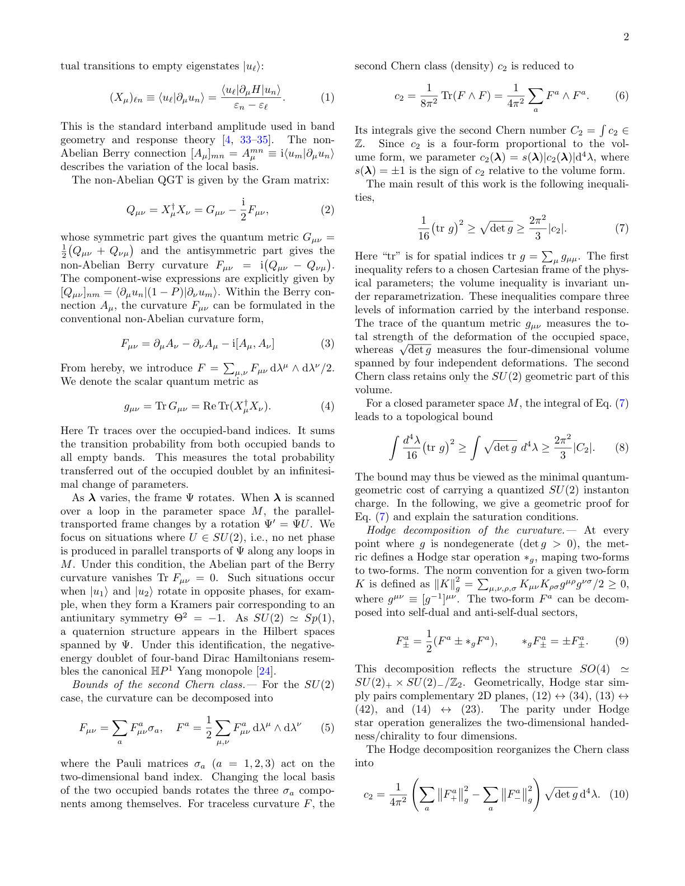
<figcaption class="paper-figure-caption"><b>Fig 1.</b> Low-resolution page preview, page 2</figcaption>
</figure>
<figure class="paper-figure-card">
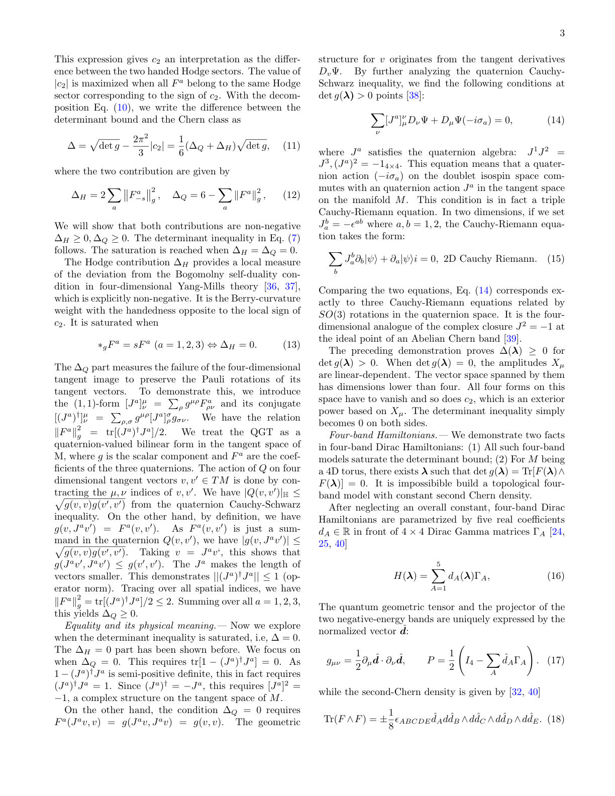
<figcaption class="paper-figure-caption"><b>Fig 2.</b> Low-resolution page preview, page 3</figcaption>
</figure>
<figure class="paper-figure-card">
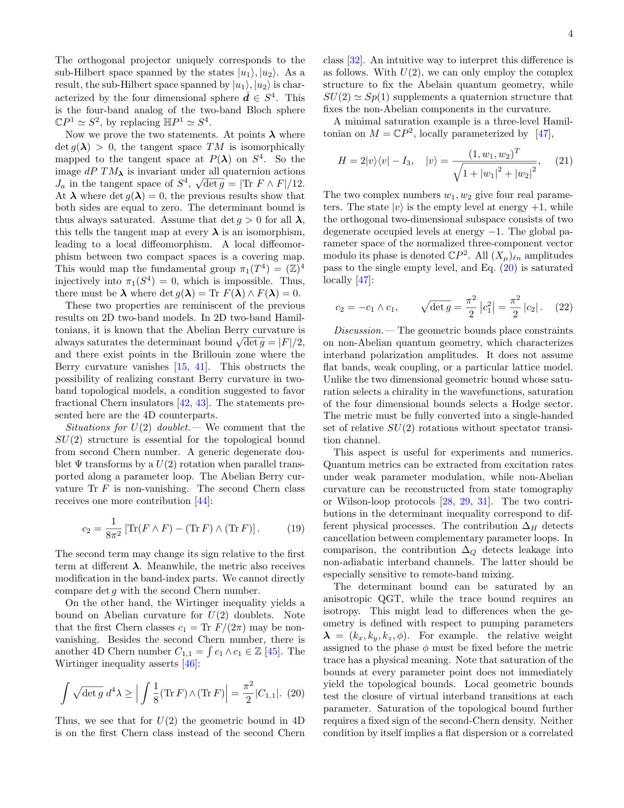
<figcaption class="paper-figure-caption"><b>Fig 3.</b> Low-resolution page preview, page 4</figcaption>
</figure>
<figure class="paper-figure-card">
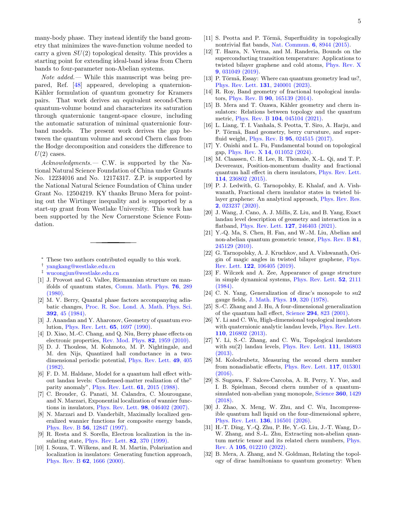
<figcaption class="paper-figure-caption"><b>Fig 4.</b> Low-resolution page preview, page 5</figcaption>
</figure>
<figure class="paper-figure-card">
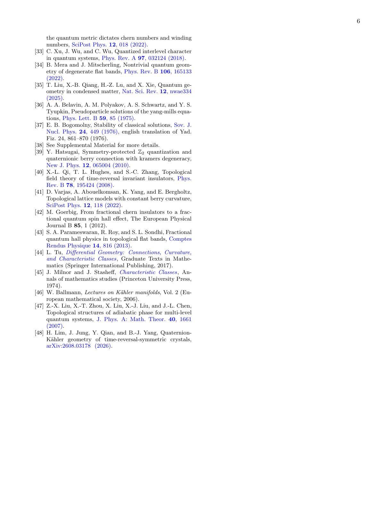
<figcaption class="paper-figure-caption"><b>Fig 5.</b> Low-resolution page preview, page 6</figcaption>
</figure>

**Summary.** This theoretical paper investigates the geometric constraints imposed by non-Abelian quantum geometry on degenerate energy bands. It derives key inequalities linking the metric tensor to the second Chern class, showing that when these bounds are saturated, the parameter space must possess highly structured geometries like quaternion Kähler manifolds. This provides a powerful tool for characterizing topological phases in condensed matter systems.

**Why it may be interesting.** This work provides deep mathematical connections between topological invariants ($c_2$) and the geometry of parameter space metrics, which is crucial for understanding robust topological phases in condensed matter systems.

Detailed structure

**Main problem.** The study derives geometric bounds for the quantum metric related to the second Chern class ($c_2$) in non-Abelian quantum geometry.

**Main result.** The paper establishes key inequalities relating $	ext{tr } g$, $\sqrt{\det g}$, and $|C_2|$, showing that saturation of these bounds implies specific geometric structures like quaternion Kähler manifolds or complex structures.

**Method.** The analysis uses the Quantum Geometric Tensor (QGT) derived from band structure properties, employing Hodge decomposition and algebraic identities involving gauge fields to derive inequalities.

**Model / system.** The focus is on doubly degenerate energy levels characterized by $	ext{SU}(2)$ gauge structures within a four-dimensional parameter space ($M$). Examples include four-band Dirac Hamiltonians.

**Key observables.** Quantum metric ($	ext{tr } g$), Non-Abelian Berry curvature ($F_{\mu
u}$), and the Second Chern class density ($	ext{Tr}(F \wedge F)$).

**Important parameters / regimes.** The dimensionality of the parameter space (4D) and the gauge group structure ($	ext{SU}(2)$ vs $	ext{U}(2)$).

**Assumptions / limitations.** The analysis assumes gapped, doubly degenerate band structures and relies on comparing geometric constraints derived from different symmetry groups.

**Paper structure.** The paper progresses by defining the QGT and its components, deriving the central determinant inequalities using algebraic identities, analyzing the conditions for saturation (which link to specific geometric structures), and finally comparing results between $	ext{SU}(2)$ and $	ext{U}(2)$ cases.

Abstract

We study the quantum geometry of doubly degenerate energy levels in a four-dimensional parameter space. For degenerate pairs with $SU(2)$ gauge structures, the quantum geometry obeys $\big(\textrm{tr } g\big)^2/16\geq\sqrt{\det g}\geq |\textrm{Tr}(F\wedge F)|/12$. The first inequality characterizes the anisotropy in the metric. The second determinant inequality measures the self-duality of the curvature under Hodge star operation and the inter-level processes that do not close under the three $SU(2)$ rotations of the doubly degenerate levels. The saturation of the determinant bound induces a quaternion Kähler structure on the four-dimensional parameter space, analogous to the complex structure induced by the ideal-band condition in two-dimensional Chern insulators. As examples, four-band Dirac Hamiltonians automatically saturate the determinant bound and possess a topological zero in $\textrm{Tr}(F\wedge F)$. We discuss the comparison to degenerate pairs with $U(2)$ gauge structures.

[↑ back to top](#top)

### [Strain-controlled magnetism and magnetoelasticity in monolayer NiPS$_3$ and CrPS$_4$](http://arxiv.org/abs/2608.11356v1)

**Authors:** Balázs Nagyfalusi, Alvaro Bermejillo-Seco, Linde de Jong, Ritesh Das, Yaroslav M. Blanter, Herre S. J. van der Zant, Amador Garcia-Fuente, and Jaime Ferrer  
**Type:** theory · **Category:** statistical mechanics · **PDF:** <https://arxiv.org/pdf/2608.11356v1>  
**Analysis basis:** full PDF text, analyzed in chunks
**Topic relevance:** `Frenkel-Kontorova` **1/5** · `analog quantum simulation` **1/5** · `methods for driven-dissipative` **1/5**

↔ Scroll figures horizontally

<figure class="paper-figure-card">
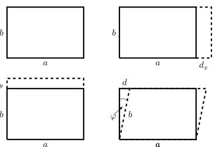
<figcaption class="paper-figure-caption"><b>Fig 1.</b> FIG. 1. Possible deformations of the 2D unit cell: top left to bottom right: original cell, strain in x direction (1), strain in y direction (2) and shear strain (6).</figcaption>
</figure>
<figure class="paper-figure-card">
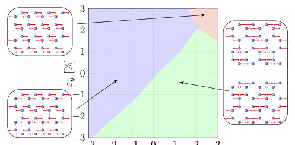
<figcaption class="paper-figure-caption"><b>Fig 2.</b> FIG. 3. Magnetic ground-state phase diagram of NiPS3 as a function of externally applied strain along the x and y di- rections. The blue region corresponds to the 0◦zigzag AFM phase, with zigzag chains oriented along the x direction. In the green region, the two ±120◦zigzag configurations are de- generate and energetically favored over the 0◦state. The red region corresponds to the stripy AFM phase.</figcaption>
</figure>
<figure class="paper-figure-card">
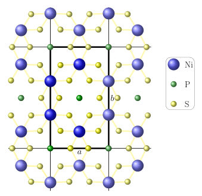
<figcaption class="paper-figure-caption"><b>Fig 3.</b> FIG. 2. Atomic structure of a NiPS3 monolayer. The blue, green and yellow spheres denote the Ni, P and S atoms, re- spectively, while the yellow lines represent the atomic bonds. The black lines divide the system into unit cell, with a and b being the lattice constants in the x and y direction, respec- tively.</figcaption>
</figure>
<figure class="paper-figure-card">
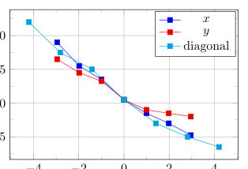
<figcaption class="paper-figure-caption"><b>Fig 4.</b> FIG. 4. Critical temperature (in K) as a function of external strain in x and y directions. (a) Color map of Tc in the whole region. (b) Critical temperatures along the main directions (x, y, diagonal) represented by dashed lines in Fig (a).</figcaption>
</figure>
<figure class="paper-figure-card">
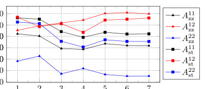
<figcaption class="paper-figure-caption"><b>Fig 5.</b> FIG. 6. Convergence of the partial sums contributing to the magnetic elastic tensor Aµν as a function of included shells in the zigzag (zz) and stripy (st) AFM phases of monolayer NiPS3.</figcaption>
</figure>

**Summary.** This paper establishes a comprehensive first-principles framework to quantify magnetoelastic coupling in 2D magnets using strain derivatives of exchange interactions. By applying this method to $	ext{NiPS}_3$ and $	ext{CrPS}_4$, the authors demonstrate that while both materials show magnetostriction, $	ext{CrPS}_4$ exhibits significantly stronger, anisotropic coupling, allowing external strain to robustly control its magnetic phase transitions.

**Why it may be interesting.** The explicit, quantitative link between lattice strain and magnetic phase transitions is highly relevant. Understanding how external mechanical stress can tune quantum ground states or critical temperatures provides a pathway for designing novel spintronic devices.

Detailed structure

**Main problem.** The study develops a first-principles framework to microscopically link spin interactions (magnetism) with elastic response (lattice structure) by quantifying magnetoelastic coupling in 2D magnets.

**Main result.** The work distinguishes between two regimes: $	ext{NiPS}_3$ shows weak, isotropic coupling, while $	ext{CrPS}_4$ exhibits strong, anisotropic coupling that allows strain to drive transitions between different magnetic phases (e.g., spin-spiral to ferromagnetic).

**Method.** Calculations use DFT to derive strain derivatives of exchange interactions, which are then incorporated into a strain-dependent Heisenberg model solved via Monte Carlo simulations.

**Model / system.** The system involves monolayer magnets ($	ext{NiPS}_3$ and $	ext{CrPS}_4$) modeled by a strain-dependent Heisenberg Hamiltonian. The total elastic energy is expanded to second order in strain, incorporating magnetic contributions derived from exchange coupling changes.

**Key observables.** Magnetostriction, renormalization of the elastic tensor ($A_{ij}$), critical temperatures ($T_c$), and the stability/phase diagram of magnetic ground states (FM vs. SS).

**Important parameters / regimes.** Strain ($\varepsilon$), Hubbard $U$ correction in DFT, and the magnitude of exchange couplings ($J_{ij}$).

**Assumptions / limitations.** The derivation retains only the leading contribution from isotropic exchange interactions; calculations are performed assuming a fixed monolayer thickness.

**Figures summary.** Figures illustrate possible unit cell deformations under strain, show magnetic phase diagrams mapping ground states vs. applied strain ($\varepsilon_x, \varepsilon_y$), and plot $T_c$ dependence on strain.

**Paper structure.** The paper progresses from developing the general theory of magnetoelastic coupling (Section I), detailing the DFT/MC computational methods for both electronic structure and elasticity (Section II), before applying this unified framework to analyze $	ext{NiPS}_3$ and $	ext{CrPS}_4$ separately.

Abstract

We develop a first-principles framework for magnetoelastic coupling in two-dimensional magnets based on a strain-dependent Heisenberg model. In this approach, strain derivatives of the exchange interactions provide direct access to magnetostriction and to the magnetic renormalization of the elastic tensor, establishing a microscopic link between spin interactions and elastic response. We apply the method to monolayer NiPS$_3$ and CrPS$_4$, which exhibit contrasting magnetoelastic behavior. NiPS$_3$ shows weak and nearly isotropic spin-lattice coupling, consistent with a robust zigzag antiferromagnetic ground state. In contrast, CrPS$_4$ displays strong anisotropic coupling, leading to strain-driven transitions between spin-spiral and ferromagnetic phases and significant changes in the critical temperature and elastic response. Our results demonstrate a general route to quantify magnetoelastic effects in low-dimensional magnets and highlight CrPS$_4$ as a promising platform for strain engineering of magnetic order.

[↑ back to top](#top)

### [Yttrium Superhydrides Revisited: Advanced Experimental and Theoretical Studies of YH$_6$, YH$_9$ and YH$_{10}$](http://arxiv.org/abs/2608.11428v1)

**Authors:** Dmitrii V. Semenok, Pedro N. Ferreira, Di Zhou, Fabian Jőbstl, Andrey V. Sadakov, Kirill S. Pervakov, Burkhan I. Massalimov, Toni Helm, Ryosuke Akashi, Vladimir M. Pudalov, Viktor V. Struzhkin, Christoph Heil, Ivan A. Troyan  
**Type:** both · **Category:** other · **PDF:** <https://arxiv.org/pdf/2608.11428v1>  
**Analysis basis:** full PDF text, analyzed in chunks
**Topic relevance:** `Keldysh / 2PI / non-Gaussian methods` **1/5** · `quantum measurements` **1/5**

↔ Scroll figures horizontally

<figure class="paper-figure-card">
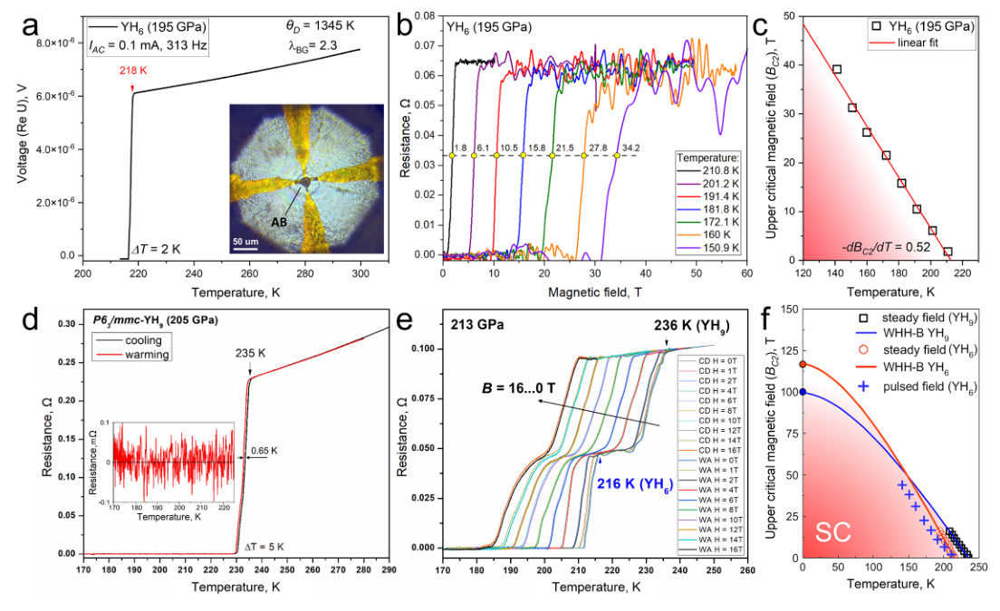
<figcaption class="paper-figure-caption"><b>Fig 1.</b> Figure 1. Electric transport measurements of yttrium hydrides YH6 (DAC Y1) and YH9 (DAC Y2) in steady and pulsed magnetic fields up to 16 and 60 Tesla, respectively. (a) Temperature dependence of the electric voltage drop (real component, Re U) on the YH6 sample at 195 GPa, measured in the AC mode at a frequency of 313 Hz and a current IAC = 0.1 mA. Warming cycle. Inset: photograph of the DAC Y1 high-pressure chamber, which shows the sample after laser heating and Ta/Au electrodes. (b) Dependence of the resistance (real component, Re Z) of the DAC Y1 sample on magnetic field for a series of fixed temperatures from 151 K to 211 K, measured at a frequency of 7.77 kHz and a current IAC = 2 mA....</figcaption>
</figure>
<figure class="paper-figure-card">
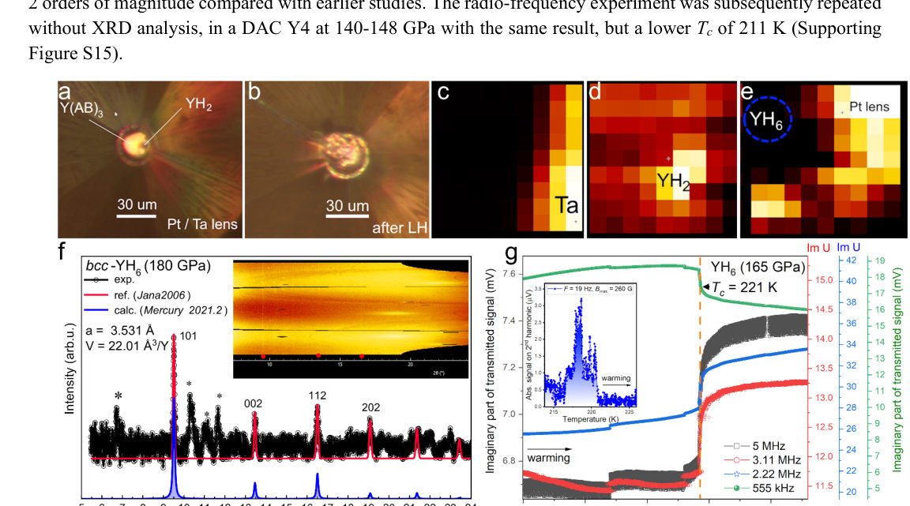
<figcaption class="paper-figure-caption"><b>Fig 2.</b> Figure 2. X-ray diffraction and radio-frequency transmission study of YH6 synthesized at 180 GPa in a DAC Y3 from a YH2/Y(AB)3 mixture. (a, b) Optical micrographs of the sample chamber before and after laser heating (LH), respectively, showing the Pt/Ta Lenz lens. (c–e) 2D X-ray diffraction mapping demonstrating the distribution of Ta (c), unreacted YH2 (d), and the synthesized YH6 phase (e, highlighted by a dashed blue circle) near the culet center. (f) Integrated X-ray diffraction pattern of the cubic bcc-YH6 phase at 180 GPa (λ = 0.414 Å). Experimental data are represented by black circles, the refinement profile (Jana2006) by a red line, and the calculated spectrum (Mercury 2021.2) by a...</figcaption>
</figure>
<figure class="paper-figure-card">
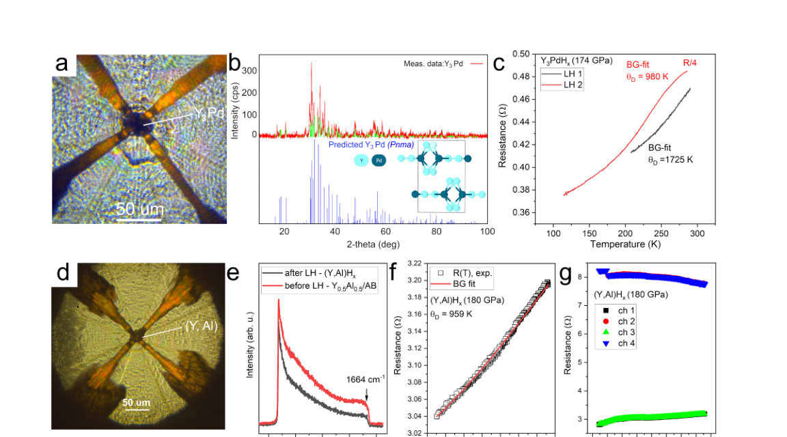
<figcaption class="paper-figure-caption"><b>Fig 3.</b> Figure 3. Absence of high-temperature superconductivity in the Y-Pd(25 at%)-H and Y-Al(50 at%)-H systems at 174-180 GPa. (a) Photo of the Y3PdHx sample obtained after laser heating of Y3Pd/NH3BH3 in DAC Y5. (b) Powder X-ray diffraction pattern (Cu Ka) of the precursor for synthesis, Pnma-Y3Pd, and the expected diffraction pattern, as well as the structure of this intermetallic compound. (c) Temperature dependence of electrical resistance of the obtained Y3PdHx after the first and second laser heatings (LH1, LH2) in the range from 290 to 120 K, as well as fitting by the Bloch-Grüneisen formula (eq. 1). The samples demonstrate metallic behavior with the absence of high-Tc superconductivity....</figcaption>
</figure>
<figure class="paper-figure-card">
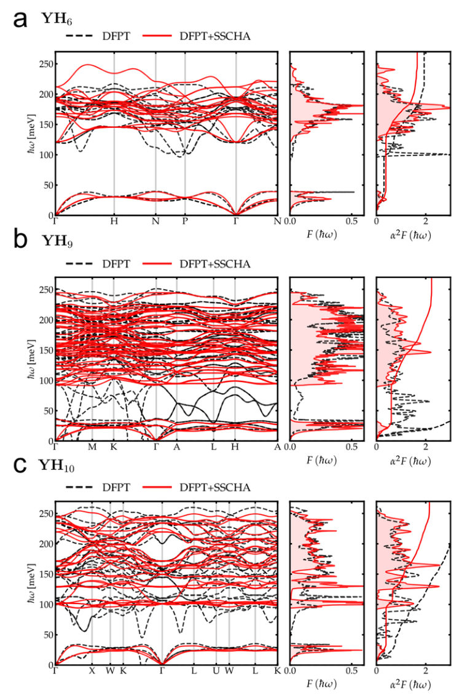
<figcaption class="paper-figure-caption"><b>Fig 4.</b> Figure 4. Phonon spectra, el-ph interactions, and superconducting properties of YH6, YH9, and YH10 within the harmonic approximation (black dashed lines) and including anharmonic quantum lattice effects (red solid lines). For each compound, we show the phonon dispersion along high-symmetry paths in the Brillouin zone, the total phonon DOS F(ℏω), and the Eliashberg spectral function α2F(ℏω), together with the cumulative el-ph coupling parameter λ.</figcaption>
</figure>

**Summary.** This work comprehensively re-examines yttrium superhydrides using multiple experimental techniques and advanced theoretical calculations. The findings consistently point to limitations in the superconducting state of these binary compounds, particularly arguing against room-temperature superconductivity based on measured critical fields and calculated $T_c$ reductions.

**Why it may be interesting.** While focused on superconductivity rather than quantum information, the rigorous application of advanced many-body theory (Migdal-Eliashberg) combined with high-pressure experimental diagnostics provides a model for testing fundamental condensed matter theories under extreme conditions.

Detailed structure

**Main problem.** To re-investigate the superconducting potential of yttrium polyhydrides ($	ext{YH}_6$, $	ext{YH}_9$, and $	ext{YH}_{10}$) under high pressure, specifically addressing claims of room-temperature superconductivity.

**Main result.** The combination of advanced measurements (pulsed fields, RF susceptibility) and theoretical calculations strongly disfavors the existence of room-temperature superconductivity in binary yttrium superhydrides.

**Method.** A combined approach using experimental techniques like pulsed-field magnetometry, contactless radio-frequency AC susceptibility, and electrical transport measurements, alongside sophisticated first-principles calculations (DFT, Migdal-Eliashberg theory).

**Model / system.** The study focuses on the superconducting properties of yttrium hydrides ($	ext{YH}_x$) synthesized and tested within Diamond Anvil Cells under pressures up to 213 GPa.

**Key observables.** Superconducting transition temperature ($T_c$), upper critical magnetic field ($	ext{B}_{c2}(T)$), AC magnetic susceptibility (field screening), and normal-state magnetoresistance.

**Important parameters / regimes.** Pressure range of 140–213 GPa; superconducting transitions observed at $T_c \approx 218-237$ K for $	ext{YH}_6$ and $	ext{YH}_9$.

**Assumptions / limitations.** The theoretical modeling incorporates anharmonic effects, which are crucial in reducing the predicted $T_c$ of $	ext{YH}_{10}$ to a more realistic range.

**Figures summary.** Figure 1 shows electric transport measurements ($R(T)$ vs. T and B) for $	ext{YH}_6$; Figure 2 details RF transmission measurements confirming superconductivity in $	ext{YH}_6$.

**Paper structure.** The paper systematically combines experimental characterization (transport, RF, pulsed fields) to map out the superconducting phase diagram of $	ext{YH}_x$, followed by theoretical calculations that refine and constrain the predicted critical temperatures.

Abstract

Yttrium polyhydrides are benchmark materials in high-pressure superconductivity, yet several key properties of the Y-H system remain insufficiently characterized. Here we combine contact transport, contactless radio-frequency measurements, pulsed-field experiments, and first-principles calculations to reinvestigate YH$_6$, YH$_9$, and YH$_{10}$ in the pressure range 140-213 GPa. Yttrium hydrides YH$_6$ ($\textit{$T_c$}$ = 218-221 K) and YH$_9$ ($\textit{$T_c$}$ = 235-237 K) demonstrate narrow superconducting transitions ($\textit{$Δ$T$_c$}$ = 2-5 K), approaching the limit imposed by thermal fluctuations. Pulsed-field measurements on YH$_6$ up to 60 T establish an extended superconducting phase diagram with a linear slope $\textit{dB$_{c2}$/dT}$ = -0.52 T/K, pronounced transition broadening above 30 T, and negligible normal-state magnetoresistance. We report the radio-frequency AC susceptibility study of YH$_6$, providing evidence for superconductivity via high-frequency field screening in a contactless geometry. Experiments involving Pd incorporation, Pd thin-film sputtering, and Al alloying show strong suppression of high-temperature superconductivity, with no transitions detected above 78-120 K. Finally, using density-functional theory with the stochastic self-consistent harmonic approximation, superconducting density-functional theory, and full-bandwidth Migdal-Eliashberg calculations, we show that anharmonic effects substantially reduce the predicted $\textit{$T_c$}$ of cubic YH$_{10}$ to approximately 260-270 K. These results strongly disfavor room-temperature superconductivity in binary yttrium superhydrides.

[↑ back to top](#top)

### [Large bias-tunable magnetoresistance from spin-dependent interlayer hybridization in van der Waals antiferromagnet CrSBr-based heterostructures](http://arxiv.org/abs/2608.11389v1)

**Authors:** Sadeed Hameed, Aditya Kumar, Chengjie Yu, Aravind P. Balan, Xinran Wang, Lichuan Zhang, Yuriy Mokrousov, Mathias Kläui  
**Type:** both · **Category:** other · **PDF:** <https://arxiv.org/pdf/2608.11389v1>  
**Analysis basis:** full PDF text, analyzed in chunks
**Topic relevance:** `quantum measurements` **1/5**

↔ Scroll figures horizontally

<figure class="paper-figure-card">
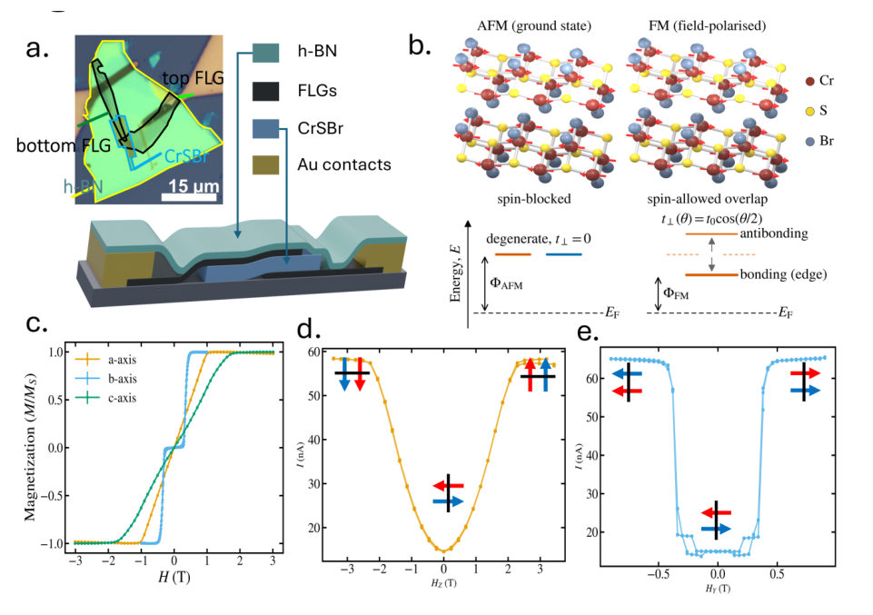
<figcaption class="paper-figure-caption"><b>Fig 1.</b> Figure 1: (a) Schematic of the hBN/FLG/CrSBr/FLG van der Waals heterostructure for vertical magnetotransport. Inset: optical micrograph of the device, with the FLG placed on pre-patterned gold electrodes. (b) Band diagram of the junction: the band-edge offset Φ between the graphite Fermi level and the CrSBr conduction-band edge, in the field-polarized ferromagnetic state (left, ΦFM) and in the A-type antiferromagnetic ground state (right, ΦAFM &gt; ΦFM). (c) SQUID magnetometry of bulk CrSBr at base temperature: spin-flip transition near 0.3 T along the b-axis (blue), and canting along the a-axis (yellow, saturation 1 T) and c-axis (green, saturation 2 T). (d) Magnetoresistance for sweeps of Hz...</figcaption>
</figure>
<figure class="paper-figure-card">
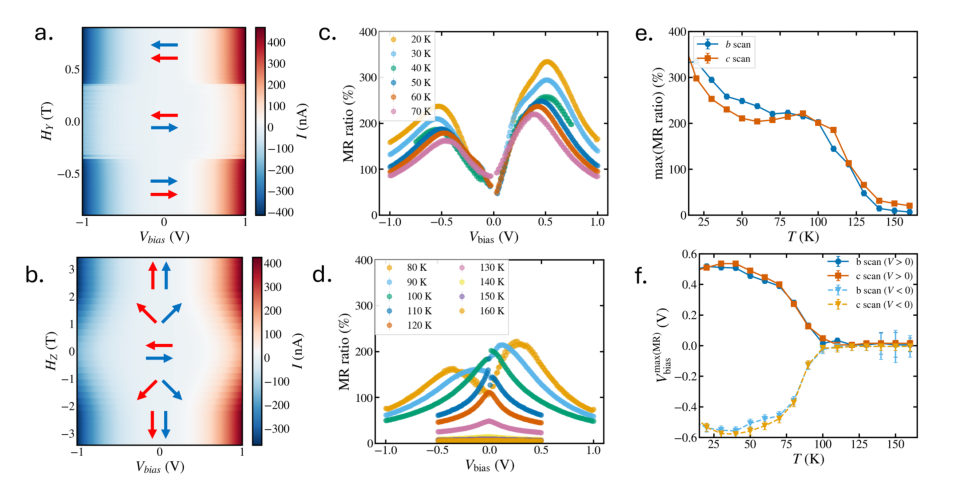
<figcaption class="paper-figure-caption"><b>Fig 2.</b> Figure 2: (a) I–V sweeps for Hy from −0.8 T to 0.8 T along the b-axis. (b) I–V sweeps for Hz from −3.5 T to 3.5 T along the c-axis. (c,d) Bias dependence of the MR ratio between the ferromagnetic and antiferromagnetic states for field along the b-axis, from 20 K to 70 K (c) and from 80 K to 160 K (d). The c-axis counterpart is given in Appendix . (e) Maxi- mum magnetoresistance versus temperature, b- and c-axis. (f) Positive and negative bias of maximum magnetoresistance versus temperature, b- and c-axis. In (c)–(f) the ferromagnetic state is the fully field-polarized state, with IFM averaged over |µ0Hy| &gt; 0.5 T (b-axis) and |µ0Hz| &gt; 2.5 T (c-axis), and IAFM taken near zero field.</figcaption>
</figure>
<figure class="paper-figure-card">
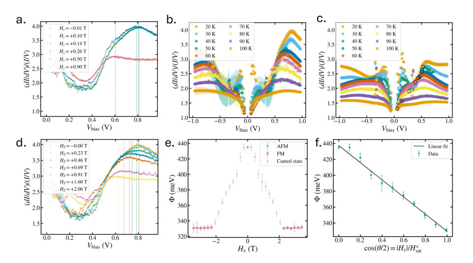
<figcaption class="paper-figure-caption"><b>Fig 3.</b> Figure 3: (a) Normalized differential conductance (dI/dV )/(I/V ) at 20 K along the easy b-axis, for four antiferromagnetically aligned fields (Hy = −0.01, +0.10, +0.14, +0.26 T, of which the first three lie inside the pristine AFM window |Hy| &lt; 0.2 T used for the weighted fit) and two in the saturated FM window (Hy = +0.50, +0.90 T). Points are data, solid lines Gaussian-plus-linear-background fits; vertical dashed lines mark the fitted peak positions V FM peak ≈0.62 V and V AFM peak ≈0.80 V. (b,c) Normalized differential conductance from 20 K to 100 K in the AFM (b) and FM (c) states, for fields along both the easy b- and hard c-axes. (d) Normalized differential conductance at 20 K for...</figcaption>
</figure>
<figure class="paper-figure-card">
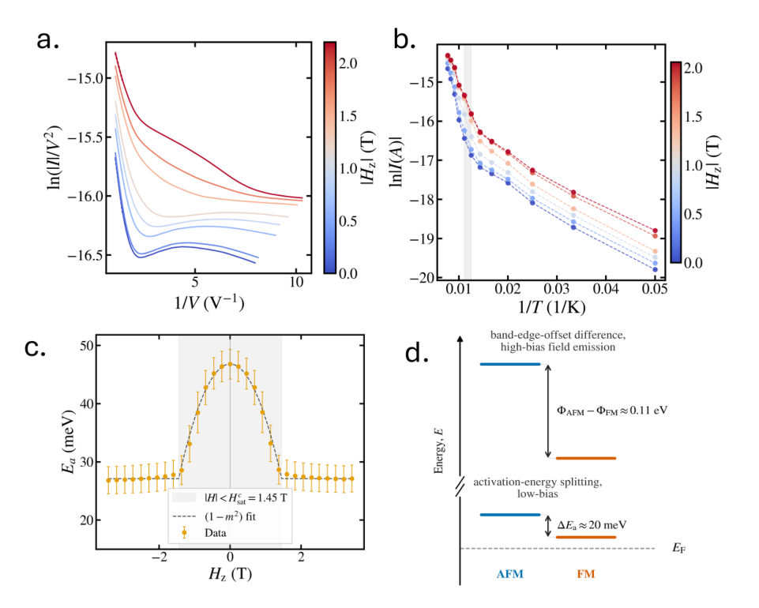
<figcaption class="paper-figure-caption"><b>Fig 4.</b> Figure 4: Two transport regimes, separated by a crossover near 90 K (∼0.7 TN). (a) Fowler–Nordheim representation ln(|I|/V 2) versus 1/V at 20 K for fields Hz along the c-axis, from the AFM state (Hz = 0) to the FM state (color scale); Appendix . (b) Arrhenius plot ln |I| versus 1/T in the AFM and FM states, c-axis, at Vprobe = 0.2 V. Below 90 K the slopes coincide; above 90 K they split, with EAFM a ≈47 meV, EFM a ≈27 meV and ∆Ea ≈20 meV. Error bars, propagated from the measured currents, are smaller than the markers. Fit-form comparison: Appendix . (c) Activation energy Ea(Hz) above 90 K for a probe bias of 0.2 V, c-axis, with a fit to Ea = EFM a + (EAFM a −EFM a )(1 −m2), m = |Hz|/Hsat....</figcaption>
</figure>

**Summary.** This work investigates large magnetoresistance in $	ext{CrSBr}$-based van der Waals heterostructures by measuring transport properties as a function of applied magnetic field angle. The key finding is that the MR mechanism stems from a band edge offset that changes linearly with the cosine of half the magnetization angle, confirming spin-dependent interlayer hybridization rather than simple electrode polarization effects.

**Why it may be interesting.** While focused on solid-state magnetism, the precise mapping of energy levels (band edge shifts) based on magnetic configuration provides insights into spin-dependent coupling mechanisms relevant for quantum device engineering.

Detailed structure

**Main problem.** The study aims to elucidate the physical mechanism responsible for large, non-monotonic magnetoresistance (MR) observed in van der Waals antiferromagnetic heterostructures.

**Main result.** The MR is dictated by a magnetic-configuration-dependent band edge offset, which varies linearly with $\cos(	heta/2)$, ruling out models based solely on electrode spin polarization like the Jullière model.

**Method.** Transport spectroscopy using I-V measurements across varying bias voltages and temperatures, combined with angular dependence analysis of the extracted band-edge offset ($\Phi$).

**Model / system.** The system is a $	ext{hBN}/	ext{few-layer-graphene}/	ext{CrSBr}/	ext{few-layer-graphene}$ vertical heterostructure, utilizing $	ext{CrSBr}$ as the magnetic semiconductor.

**Key observables.** Large MR up to 350% with M-shaped bias dependence; linear variation of band-edge offset ($\Phi$) vs. $\cos(	heta/2$); temperature evolution of transport regimes (VRH vs. activated).

**Important parameters / regimes.** Low temperatures ($20 	ext{ K}$), magnetic field angle ($	heta$), and bias voltage ($V$).

**Assumptions / limitations.** The transport is dominated by tunneling/hopping limited by the band-edge barrier of $	ext{CrSBr}$.

**Figures summary.** Figures show I-V sweeps, MR vs. V plots exhibiting M-shapes, and crucial angular dependence plots demonstrating the linear fit of the band-edge offset against $\cos(	heta/2)$.

**Paper structure.** The paper establishes the large MR phenomenon, uses continuous field variation along the hard axis to map the band-edge offset ($\Phi$) as a function of magnetization angle ($	heta$), and analyzes this angular dependence to rule out competing theoretical models.

Abstract

We explore the large magnetoresistance (MR) in \ce{hBN}/few-layer-graphene/\ce{CrSBr}/few-layer-graphene heterostructures and reveal the mechanism behind its non-monotonic bias dependence. Using bias voltage and temperature as independent tuning knobs, we achieve MR up to \SI{350}{\percent} at \SI{20}{K}, characterized by symmetric M-shaped maxima around $\pm 0.5\,\mathrm{V}$. Continuous tuning of the magnetization angle $θ$ via a hard-axis magnetic field shows that the barrier band-edge offset varies linearly with $\cos(θ/2)$, a first-order signature of spin-dependent interlayer hybridization. This linear relationship rules out the Jullière model and a spin-filter projection. We conclude that the magnetic-configuration-dependent band edge, rather than electrode spin polarization, dictates the large magnetoresistance in \ce{CrSBr} junctions.

[↑ back to top](#top)

### [Lectures on ultrathin film ferromagnetism](http://arxiv.org/abs/2608.12189v1)

**Authors:** D. Pescia  
**Type:** theory · **Category:** statistical mechanics · **PDF:** <https://arxiv.org/pdf/2608.12189v1>  
**Analysis basis:** full PDF text, analyzed in chunks
**Topic relevance:** `non-equilibrium universality` **1/5**

↔ Scroll figures horizontally

<figure class="paper-figure-card">
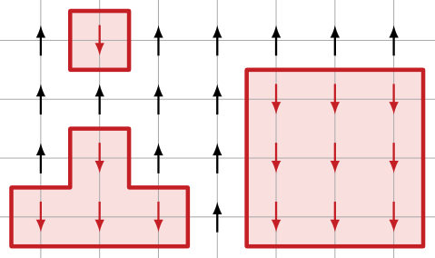
<figcaption class="paper-figure-caption"><b>Fig 1.</b> Figure 1.2.: A state of the two-dimensional Ising model, of the type used by Peierls in his proof of the existence of a spontaneous magnetization[14]: within a sea of aligned spins (black), droplets of overturned spins (red) are enclosed by closed boundaries. Along each unit of boundary length two antiparallel spins meet, so that a droplet costs an exchange energy proportional to the length of its boundary.</figcaption>
</figure>
<figure class="paper-figure-card">
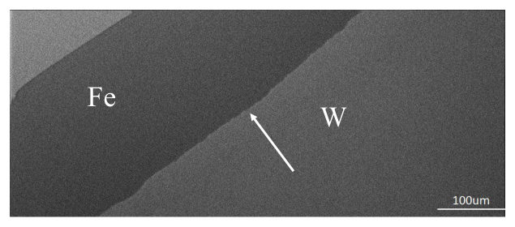
<figcaption class="paper-figure-caption"><b>Fig 2.</b> Figure 2.1.: View from above of a section of a 2-3 ML thick Fe stripe (dark) on W(110) (brighter), imaged by Scanning Electron Microscopy. In this specific exper- iment, the primary SEM-beam has an energy of about 10 keV. When the electron beam hits the surface, it produces a set of scattered electrons. The scattering cross section is material dependent, producing a contrast between the intensity of the electrons emitted from Fe and the intensity of the elec- trons emitted from W. This contrast is seen in the Figure. The white arrow indicates the direction along which the STM scans of Fig. 2.2 are performed. The scale bar corresponds to 100 µm. This figure and the next one were obtained...</figcaption>
</figure>
<figure class="paper-figure-card">
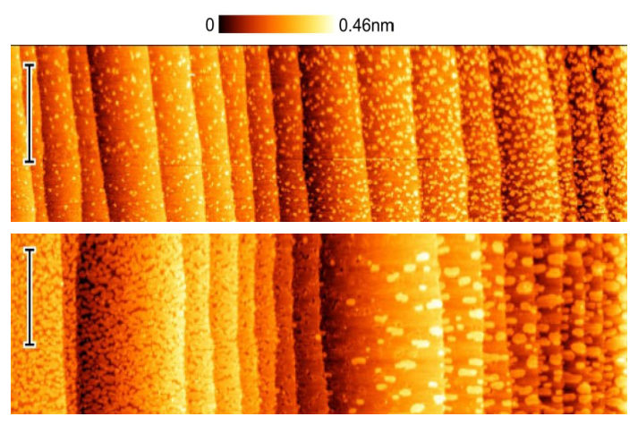
<figcaption class="paper-figure-caption"><b>Fig 3.</b> Figure 2.2.: Images of a section of the boundary between Fe and W. The nominal thick- ness of the Fe film increases from left to right and from the top image to the bottom image, from the submonolayer range on the left-hand side of the top image to ≈2 ML on the right-hand side of the bottom image. The length of the STM images is 500 nm; the white vertical bar in each image corresponds to 100 nm. Experiments are performed at room temperature. STM is performed in constant current mode, i.e., during the scan, the tip displaces vertically to keep the tunneling current constant. The vertical dis- placement is, thus, a direct measure of the surface topography. The vertical displacement is encoded...</figcaption>
</figure>
<figure class="paper-figure-card">
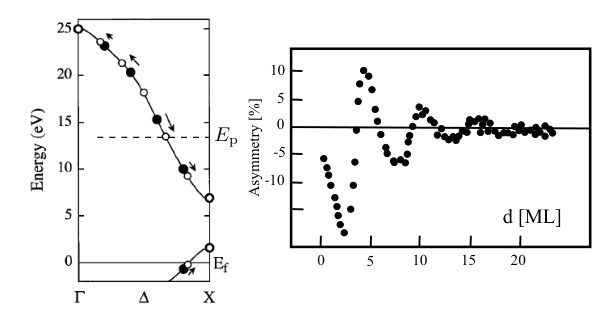
<figcaption class="paper-figure-caption"><b>Fig 4.</b> Figure 2.3.: Left: The free electron band along the ∆direction in Cu. The confinement produces quantum well states (black dots). Their position changes (open dots) when the thickness of the Cu-overlayer is varied; the arrows indicate the direction in which the states move as the thickness increases. The dashed line marks the energy Ep of the primary electrons, which is kept fixed while the thickness is changed: the oscillations of the right panel arise as the quantum well states sweep through it. Right: Oscillatory component of the reflected intensity as a function of the thickness d (in ML) of the Cu-top layer. The use of spin polarized electrons (plotted on the vertical scale is the...</figcaption>
</figure>
<figure class="paper-figure-card">
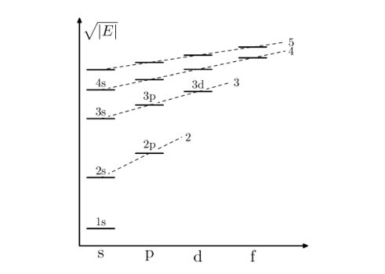
<figcaption class="paper-figure-caption"><b>Fig 5.</b> Figure 3.1.: Schematic energy diagram of an atom, resulting from single electron numer- ical computations.</figcaption>
</figure>

**Summary.** This lecture reviews ferromagnetism in ultrathin films, treating them as quasi-two-dimensional magnetic systems. It details how dimensionality dictates unique properties like oscillatory coupling and specific types of magnetic anisotropy. The theoretical analysis uses Renormalization Group techniques to describe phase transitions, linking the physics to established models like the 2D Ising universality class.

**Why it may be interesting.** The application of RG theory to finite-temperature phase transitions in low-dimensional quantum systems is a core concept relevant to understanding critical dynamics in many-body physics, bridging statistical mechanics with condensed matter magnetism.

Detailed structure

**Main problem.** The paper reviews fundamental principles governing ferromagnetism in ultrathin films, focusing on how reduced dimensionality profoundly impacts magnetic properties.

**Main result.** It establishes that the 2D nature leads to unique ground state behaviors, predicting phenomena like oscillatory coupling and phase transitions governed by universality classes such as the 2D Ising model.

**Method.** The analysis relies heavily on theoretical frameworks including Landau theory for free energy, Renormalization Group (RG) techniques for critical behavior, and models addressing thermal fluctuations in low dimensions.

**Model / system.** The system studied is ultrathin films of 3d transition metals grown layer-by-layer. These systems behave as effectively two-dimensional magnetic quantum wells, exhibiting phenomena like 'dead' layers and perpendicular anisotropy.

**Key observables.** Spontaneous magnetization ($M_s$), magnetic anisotropy (perpendicular vs. in-plane), oscillatory interlayer coupling, and the critical exponents near phase transitions.

**Important parameters / regimes.** Film thickness (ultrathin limit), temperature relative to $T_c$, and dimensionality (2D confinement).

**Assumptions / limitations.** The analysis often employs approximations like mean field theory or assumes specific universality classes for phase transitions, though the stripe transition remains incompletely understood.

**Figures summary.** Figures illustrate the Helmholtz free energy ($F(M)$) vs. magnetization ($M$) to distinguish between equilibrium and metastable states, showing characteristic hysteresis loops in $M$ vs. applied field ($B$).

**Paper structure.** The paper progresses by introducing the physical system (ultrathin films), detailing key magnetic phenomena (anisotropy, coupling), developing theoretical tools (Landau/RG), and finally analyzing specific transitions like the loss of ferromagnetic order.

Abstract

In these Lecture Notes we review some of the fundamental principles that have emerged from research on the ferromagnetism of ultrathin films consisting of 3d transition-metal overlayers. Their growth is often layer-by-layer. This growth mode produces quantum wells along the vertical direction that profoundly impact any physical property of the materials. In addition, the vertical confinement establishes spin ensembles that extend to macroscopic distances along the in-plane directions and are finite along the vertical (perpendicular) direction, i.e. they are two-dimensional. Accordingly, they display ground state properties that originate from the two-dimensionality, such as ``dead'' magnetic layers or ``enhanced magnetic moments'', an oscillatory interlayer magnetic coupling and an anomalous perpendicular versus in-plane magnetic anisotropy that produces, in some specific situations, a perpendicular collective orientation of the spins. At finite temperatures, ferromagnetic order is observed to persist and an analysis of the magnetic order of ultrathin films in terms of the renormalization group provides a suitable framework for explaining this observation. The ferromagnetic order is lost at a phase transition which follows closely the two-dimensional Ising universality class, as shown by an accurate analysis of data in the vicinity of the critical point. The perpendicular spin orientation is often observed to turn in-plane by a reorientation phase transition which is also properly described by a renormalization group argument. Finally, the perpendicular spin orientation introduces topological excitations of the ferromagnetic order, consisting of stripes of reversed perpendicular spin direction. The stripe order undergoes a phase transition to the paramagnetic state that is not yet completely understood.

[↑ back to top](#top)

### [Strain-controlled sign reversal of the anomalous Hall effect in Ru/[Co/Ni]$_N$ multilayers](http://arxiv.org/abs/2608.11897v1)

**Authors:** Jingying Zhang, Sigang Wang, Yue Xiang, Wenhui Xie, Zhe Yuan, Yi Liu, Zongzhi Zhang  
**Type:** both · **Category:** other · **PDF:** <https://arxiv.org/pdf/2608.11897v1>  
**Analysis basis:** full PDF text, analyzed in chunks
**Topic relevance:** `Keldysh / 2PI / non-Gaussian methods` **1/5**

↔ Scroll figures horizontally

<figure class="paper-figure-card">
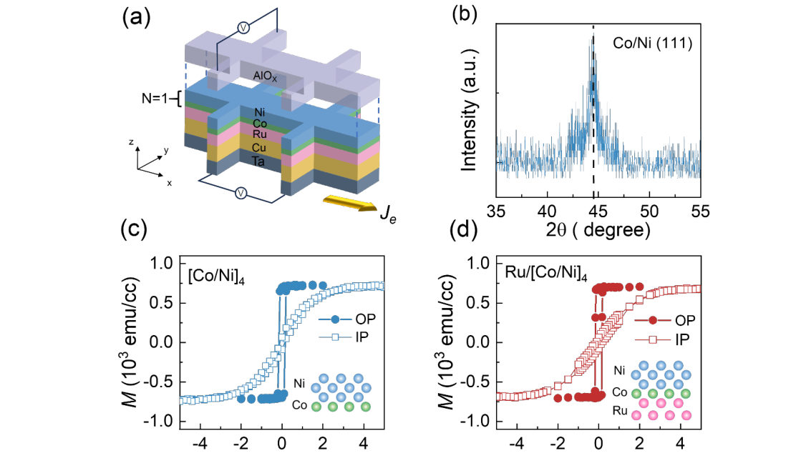
<figcaption class="paper-figure-caption"><b>Fig 1.</b> FIG. 1. Structural, magnetic, and transport characterization of Co/Ni multilayers. (a) Schematic illustration of the multilayer stack architecture and Hall bar geometry used for electrical transport measurements. (b) XRD patterns of [Co/Ni]N multilayers with a repeat number of 𝑁= 16, showing a pronounced (111) preferential orientation. Out-of-plane and in-plane magnetic hysteresis loops measured for (c) the [Co/Ni]4 and (d) Ru/[Co/Ni]4 samples. The square out-of-plane loops and large in-plane saturation fields confirm robust PMA in both structures. Insets schematically depict the corresponding layer stacking sequences, highlighting the repeated Co/Ni layers and the Ru underlayer.</figcaption>
</figure>
<figure class="paper-figure-card">
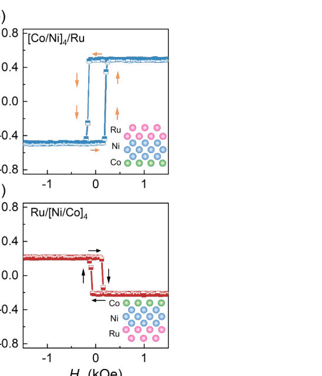
<figcaption class="paper-figure-caption"><b>Fig 2.</b> FIG. 2. Ru-layer-induced reversal of the anomalous Hall effect in Co/Ni multilayers. Room temperature anomalous Hall resistivity (𝜌AH) as a function of out- of-plane magnetic field (𝐻𝑧) for (a) [Co/Ni]4, (b) [Co/Ni]4/Ru, (c) Ru/[Co/Ni]4, and (d) Ru/[Ni/Co]4 samples. While the [Co/Ni]4 and [Co/Ni]4/Ru structures exhibit identical AHE polarity, the insertion of a Ru underlayer leads to a pronounced reversal and suppression of 𝜌AH, independent of whether Co or Ni is in direct contact with Ru. Insets schematically illustrate the corresponding layer stacking sequences, highlighting the Co/Ni multilayers and the position of the Ru layer.</figcaption>
</figure>
<figure class="paper-figure-card">
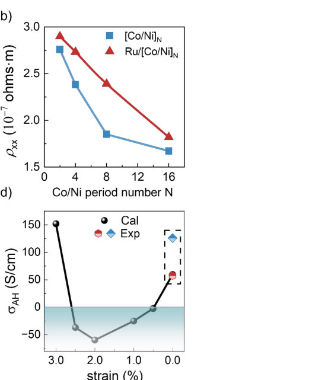
<figcaption class="paper-figure-caption"><b>Fig 3.</b> FIG. 3. Thickness-dependent anomalous Hall transport and strain-induced sign reversal. (a) Anomalous Hall resistivity 𝜌AH, (b) longitudinal resistivity 𝜌𝑥𝑥 and (c) AHC 𝜎AH as a function of the Co/Ni repeat number N for [Co/Ni]N and Ru/[Co/Ni]N multilayers. While the Ru-free [Co/Ni]N samples exhibit a largely monotonic evolution of 𝜎AH, the Ru/[Co/Ni]N series displays pronounced nonmonotonic behavior and sign reversals. (d) Calculated 𝜎AH for Co/Ni multilayer as a function of in-plane strain, demonstrating a strain-driven sign change. The colored data points highlighted by dashed boxes in (c) and (d) correspond to the same experimental values, illustrating the consistency between experiment...</figcaption>
</figure>
<figure class="paper-figure-card">
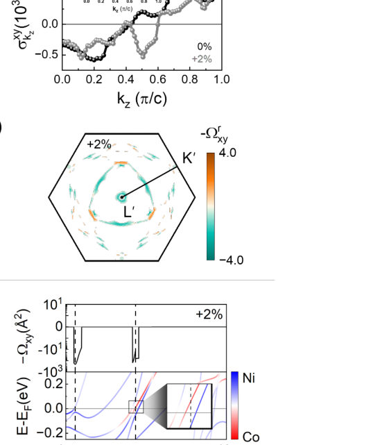
<figcaption class="paper-figure-caption"><b>Fig 4.</b> FIG. 4. Strain-induced redistribution of Berry curvature and AHC of the Co/Ni multilayer. (a) BZ of the Co/Ni multilayer, indicating the high-symmetry points and the 𝐿′ −𝐾′ path analyzed. (b) Calculated 𝑘𝑧-resolved AHC 𝜎AH(𝑘𝑧) for Co/Ni multilayers with unstrained and tensile-strained lattices. The inset shows the cumulative integral of 𝜎AH(𝑘𝑧) from −𝑘𝑧 to 𝑘𝑧, illustrating how the bulk AHC emerges from contributions of specific 𝑘𝑧 planes. Distribution of the Berry curvature in the 𝑘𝑧 = 0.5𝜋/𝑐 plane for the (c) unstrained and (d) strained Co/Ni multilayers, plotted in a relative representation (see text). The sign reversal of the dominant Berry-curvature contributions under strain is...</figcaption>
</figure>

**Summary.** This research demonstrates that placing a Ruthenium underlayer beneath Co/Ni multilayers can induce a dramatic sign reversal in the Anomalous Hall Effect. This effect is experimentally linked to tensile strain generated by lattice mismatch, which theoretical calculations confirm reshapes the electronic band structure and redistributes Berry curvature, offering a new pathway for strain-controlled topological transport.

**Why it may be interesting.** While focused on magnetism, the concept of using controlled lattice strain (a structural parameter) to tune topological transport properties like Berry curvature is highly relevant to engineering quantum materials and simulating emergent phenomena in condensed matter theory.

Detailed structure

**Main problem.** The study investigates how strain, specifically induced by an underlayer, can control the sign of the Anomalous Hall Effect (AHE) in magnetic multilayers.

**Main result.** Introducing a Ru underlayer causes a robust sign reversal of the AHE from positive to negative, which is theoretically attributed to tensile in-plane strain reshaping the electronic structure and Berry curvature near the Fermi level.

**Method.** The work combines experimental transport measurements (measuring anomalous Hall resistivity) with first-principles density functional theory (DFT) calculations that incorporate lattice strain effects.

**Model / system.** The physical system is $	ext{Ru}/[	ext{Co}/	ext{Ni}]_N$ multilayers, characterized by a strong (111) crystallographic texture and exhibiting perpendicular magnetic anisotropy. The theoretical modeling uses DFT to calculate the anomalous Hall conductivity ($\sigma_{AH}$) under varying strain.

**Key observables.** Anomalous Hall resistivity ($
ho_{AH}$), Anomalous Hall Conductivity ($\sigma_{AH}$), Berry curvature distribution, and lattice strain ($\epsilon$).

**Important parameters / regimes.** Multilayer repeat number ($N$), the presence/position of the Ru layer (underlayer vs. capping layer), and the magnitude of tensile in-plane strain.

**Assumptions / limitations.** The sign reversal is primarily due to lattice mismatch inducing tensile strain, rather than simple interfacial atomic intermixing or current shunting effects.

**Figures summary.** Figures show $
ho_{AH}$ hysteresis loops demonstrating opposite polarities based on Ru placement. Theoretical figures illustrate the dependence of $\sigma_{AH}$ on strain and map out the sign reversal of Berry curvature contributions in momentum space ($k_z$).

**Paper structure.** The paper establishes the experimental observation of AHE sign reversal upon placing Ru under the Co/Ni stack, contrasts this with capping layers, and then uses DFT calculations to microscopically prove that tensile strain modifies the electronic bands, leading to a Berry curvature-driven sign change.

Abstract

The anomalous Hall effect (AHE) is a hallmark transport phenomenon in ferromagnets arising from relativistic spin-orbit interaction. Here, we report an unexpected sign reversal of the AHE in Ru/[Co/Ni]$_N$ multilayers controlled by the stacking sequence of the Ru layer. When Ru is placed beneath, rather than atop, the Co/Ni multilayers, the anomalous Hall signal switches from positive to negative. By systematically varying the multilayer repeat number N and combining transport measurements with first-principles calculations, we show that this reversal originates from in-plane tensile strain imposed by the Ru underlayer, which reshapes the electronic structure and redistributes Berry curvature near the Fermi level. Our findings establish interfacial strain as an effective knob for tuning Berry-curvature-driven transport and suggest a pathway toward strain-controlled topological transport phenomena in magnetic multilayers.

[↑ back to top](#top)

### Other secondary papers (1)

Show other secondary papers

### [Quantum Anomalous Hall Effect in $d^{10}$ Oxide Monolayers](http://arxiv.org/abs/2608.11855v1)

**Authors:** Zeyu Li, Xudong Zhu, Yulei Han, Zhenhua Qiao  
**Type:** theory · **Category:** other · **PDF:** <https://arxiv.org/pdf/2608.11855v1>  
**Analysis basis:** full PDF text, analyzed in chunks

↔ Scroll figures horizontally

<figure class="paper-figure-card">
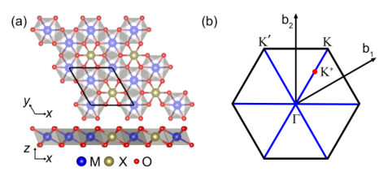
<figcaption class="paper-figure-caption"><b>Fig 1.</b> FIG. 1. (a) Top and side views of monolayer oxides M2DO6 (M = Zn, Cd; D = Se, Te). (b) The first Brillouin zone with high symmetry points and high high-symmetry line. The red point K∗represents the momentum point where the Dirac dispersion emerge along the K-Γ high high-symmetry line.</figcaption>
</figure>
<figure class="paper-figure-card">
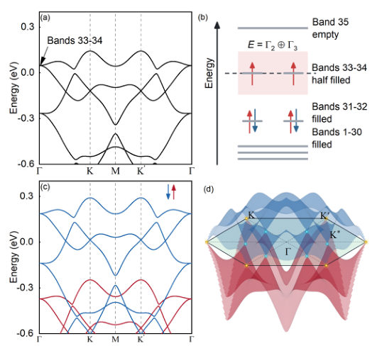
<figcaption class="paper-figure-caption"><b>Fig 2.</b> FIG. 2. (a) Nonmagnetic band structure of monolayer Zn2TeO6. (b) The schematic illustrates the symmetry- constrained filling of nonmagnetic monolayer Zn2TeO6. Bands 1–32 are fully occupied, while bands 33 and 34 form a degenerate doublet at the Fermi level that accommodates the remaining two electrons. According to Hund’s rule, these two electrons occupy different components of the doublet with parallel spins, giving rise to a spin-polarized ferromagnetic ground state without the presence of unpaired d electrons. (c) Spin-polarized band structure of monolayer Zn2TeO6. (d) The corresponding three-dimensional band structure near the Fermi level for (c). Blue and red surfaces denote the two...</figcaption>
</figure>
<figure class="paper-figure-card">
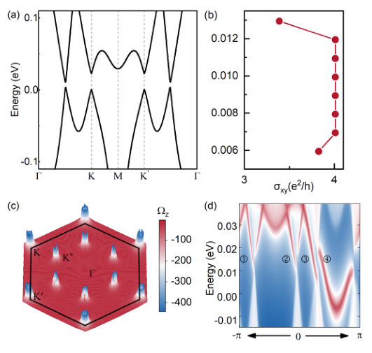
<figcaption class="paper-figure-caption"><b>Fig 3.</b> FIG. 3. (a) Band structure of monolayer Zn2TeO6 with spin- orbit coupling opens a global gap of 7 meV. (b) The calculated anomalous Hall conductance σxy as a function of Fermi energy shows a quantized conductance plateau of 4e2/h in the global gap of monolayer Zn2TeO6. (c) Corresponding distribution of Berry curvatures mainly concentrates at the gapped Dirac points. (d) Corresponding energy spectra of a semi-infinite ribbon of monolayer Zn2TeO6 with four gapless edge modes.</figcaption>
</figure>
<figure class="paper-figure-card">
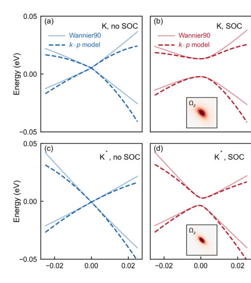
<figcaption class="paper-figure-caption"><b>Fig 4.</b> FIG. 4. Wannier90 bands and effective two-band k·p models near the Dirac crossings at K (a)-(b) and K∗(c)-(d). Spin- orbit coupling opens finite mass gaps at both crossings. Insets show the Berry curvature Ωz revealing localized topological contributions near the gapped Dirac points.</figcaption>
</figure>

**Summary.** This work proposes that Quantum Anomalous Hall Effect can be achieved in 2D oxide monolayers ($	ext{M}_2	ext{DO}_6$) by inducing ferromagnetism solely through the $	ext{O-}2p$ orbitals. By simulating cation deintercalation, the authors demonstrate a robust pathway to realize a high-Chern-number QAHE phase with $\mathcal{C}=4$, opening new design principles for magnetic topological insulators beyond conventional $d$-electron systems.

**Why it may be interesting.** While focused on solid-state magnetism, the concept of engineering topological phases using orbital physics—specifically leveraging $	ext{O-}2p$ states rather than transition metal $d$-orbitals—provides a novel paradigm for designing artificial quantum materials relevant to condensed matter theory.

Detailed structure

**Main problem.** The primary goal is realizing the Quantum Anomalous Hall Effect (QAHE) using a mechanism distinct from traditional partially filled transition-metal $d$ orbitals or correlation-driven moiré bands.

**Main result.** The authors propose that cation deintercalation in $	ext{M}_2	ext{DO}_6$ oxides can induce half-filled $	ext{O-}2p$ ferromagnetism, leading to a high-Chern-number QAHE phase with a Chern number of $\mathcal{C}=4$.

**Method.** The study employs first-principles calculations (DFT) combined with effective low-energy $k\cdot p$ modeling to analyze the electronic and topological properties.

**Model / system.** The physical system is the two-dimensional oxide monolayer $	ext{M}_2	ext{DO}_6$ ($	ext{M} = 	ext{Zn}, 	ext{Cd}$; $	ext{D} = 	ext{Se}, 	ext{Te}$), where magnetism originates from the half-filled $	ext{O-}2p$ orbital after cation deintercalation.

**Key observables.** Spin-polarized Dirac points at K/K′ valleys, a high Chern number ($\mathcal{C}=4$), and quantized anomalous Hall conductance ($\sigma_{xy} = 4e^2/h$).

**Important parameters / regimes.** The spontaneous ferromagnetism is driven by the $	ext{O-}2p$ manifold; the gap opening due to SOC results in a measurable spin polarization gap (e.g., $0.5-0.6 	ext{ eV}$).

**Assumptions / limitations.** The mechanism relies on the feasibility of cation deintercalation and projecting the full $	ext{O-}p$-orbital Hamiltonian onto an effective two-band model near Dirac crossings.

**Figures summary.** Figures illustrate the crystal structures, nonmagnetic vs. spin-polarized band structures showing gap opening, and schematics confirming the high Chern number plateau ($\sigma_{xy} = 4e^2/h$).

**Paper structure.** The paper first identifies the limitations of existing QAHE mechanisms, then proposes $	ext{M}_2	ext{DO}_6$ as a novel platform. It details how cation deintercalation activates $	ext{O-}2p$ ferromagnetism, calculates the resulting topological properties (Dirac points and Chern number), and concludes by establishing this general design principle for oxygen-based magnetic topology.

Abstract

Quantum anomalous Hall effect (QAHE) arises from the interplay between magnetic order and spin-orbit coupling, which opens up a topologically nontrivial band gap to host chiral edge states in the absence of magnetic field. So far, magnetic order of QAHE usually originates from partially filled transition-metal $d$ orbitals or correlation-driven moiré bands. Here, we propose an experimentally accessible family of two-dimensional oxides, M$_2$DO$_6$ (M = Zn, Cd; D = Se, Te), that can realize QAHE from the half-filled O-$2p$ orbital induced spontaneous ferromagnetism. In M$_2$DO$_6$ monolayers, spin-polarized Dirac points appear at K/K$^{\prime}$ valleys and along $Γ$-K/$Γ$-K$^{\prime}$ lines. $C_3$ rotational symmetry then generates eight symmetry-related crossings in the first Brillouin zone. Upon gap opening by spin-orbit coupling, each massive Dirac point contributes half Chern number, resulting in a high-Chern-number QAHE phase with $\mathcal{C}=4$. We establish cation deintercalation as a general strategy to activate O-$2p$ ferromagnetism in oxides. Our finding provides a route to realize QAHE from O-$2p$ ferromagnetism and offers design principles applicable to oxygen-based magnetic topology platforms beyond conventional $d$-electron systems.

[↑ back to top](#top)

