
# arxiv digest (quant-ph + cond-mat) — 2026-08-15

*110 papers · 38 relevant · 1 highlighted*

## 🔥 Most relevant (38)

*Every paper with at least one nonzero topic score, sorted by best-matching score. 🔥 marks scores ≥4/5. Click the title to jump to the full entry below; click [arXiv] to open the paper page. `(secondary)` marks papers from de-prioritized cond-mat archives.*

Show 38 relevant papers

- [Two-atom Dicke model with atom-atom interaction](#paper-2608.12625) [[arXiv]](http://arxiv.org/abs/2608.12625v1) — 🔥 `Dicke superradiance` **5/5** · 🔥 `analog quantum simulation` **4/5** · 🔥 `non-equilibrium universality` **4/5** · 🔥 `superradiant laser` **4/5** · `Tavis-Cummings & cavity-many-emitter` **3/5** · `driven-dissipative phase transition` **3/5** · `methods for driven-dissipative` **3/5** · `correlated / nonlocal dissipation` **2/5** · `Keldysh / 2PI / non-Gaussian methods` **1/5** · `quantum measurements` **1/5**
- [Heterogeneously Integrated Squeezed-Light Generation and Detection on a Single Photonic Chip](#paper-2608.13218) [[arXiv]](http://arxiv.org/abs/2608.13218v1) — 🔥 `quantum optics experiment` **5/5** · 🔥 `QC/QI experiment` **4/5** · `quantum measurements` **3/5** · `analog quantum simulation` **2/5** · `driven-dissipative phase transition` **1/5** · `interference shaping light` **1/5**
- [Encoding Circuit Satisfiability in Rydberg Atom Arrays](#paper-2608.12938) [[arXiv]](http://arxiv.org/abs/2608.12938v1) — 🔥 `Rydberg arrays` **5/5** · 🔥 `analog quantum simulation` **4/5** · `QC/QI experiment` **2/5** · `quantum measurements` **1/5**
- [Sector-resolved non-Bloch topology and nonlocal entanglement dynamics in a bond-dissipative Kitaev chain](#paper-2608.12809) [[arXiv]](http://arxiv.org/abs/2608.12809v1) — 🔥 `driven-dissipative phase transition` **4/5** · 🔥 `methods for driven-dissipative` **4/5** · `Keldysh / 2PI / non-Gaussian methods` **3/5** · `analog quantum simulation` **3/5** · `correlated / nonlocal dissipation` **3/5** · `non-equilibrium universality` **2/5** · `quantum measurements` **1/5** · `scars & prethermalization` **1/5**
- [Steady states and oscillation modes of two driven dissipative oscillators with non-Hermitian coupling](#paper-2608.12799) [[arXiv]](http://arxiv.org/abs/2608.12799v1) `(secondary)` — 🔥 `driven-dissipative phase transition` **4/5** · 🔥 `methods for driven-dissipative` **4/5** · `Keldysh / 2PI / non-Gaussian methods` **3/5** · `correlated / nonlocal dissipation` **3/5** · `analog quantum simulation` **2/5** · `non-equilibrium universality` **2/5** · `Tavis-Cummings & cavity-many-emitter` **1/5** · `scars & prethermalization` **1/5**
- [Exceptional activated mode theory for generalized real-complex transitions](#paper-2608.12475) [[arXiv]](http://arxiv.org/abs/2608.12475v1) — 🔥 `driven-dissipative phase transition` **4/5** · `Keldysh / 2PI / non-Gaussian methods` **3/5** · `correlated / nonlocal dissipation` **3/5** · `methods for driven-dissipative` **3/5** · `analog quantum simulation` **2/5** · `non-equilibrium universality` **2/5** · `Frenkel-Kontorova` **1/5** · `quantum measurements` **1/5**
- [Time evolution of nonlinear dynamics on a quantum processor](#paper-2608.13041) [[arXiv]](http://arxiv.org/abs/2608.13041v1) — 🔥 `QC/QI experiment` **4/5** · `Keldysh / 2PI / non-Gaussian methods` **3/5** · `methods for driven-dissipative` **3/5** · `analog quantum simulation` **2/5** · `driven-dissipative phase transition` **2/5** · `non-equilibrium universality` **2/5** · `Frenkel-Kontorova` **1/5** · `correlated / nonlocal dissipation` **1/5** · `quantum measurements` **1/5**
- [Time-resolved correlation engineering in DLCZ Raman photon sources](#paper-2608.13091) [[arXiv]](http://arxiv.org/abs/2608.13091v1) — 🔥 `methods for driven-dissipative` **4/5** · `Keldysh / 2PI / non-Gaussian methods` **3/5** · `quantum optics experiment` **3/5** · `analog quantum simulation` **2/5** · `correlated / nonlocal dissipation` **2/5** · `quantum measurements` **2/5** · `QC/QI experiment` **1/5** · `driven-dissipative phase transition` **1/5** · `interference shaping light` **1/5**
- [In-situ Adjoint Wave Control in Reconfigurable Non-Hermitian Nonlinear Systems](#paper-2608.13503) [[arXiv]](http://arxiv.org/abs/2608.13503v1) — 🔥 `methods for driven-dissipative` **4/5** · `interference shaping light` **3/5** · `quantum measurements` **3/5** · `driven-dissipative phase transition` **2/5** · `quantum optics experiment` **2/5** · `Keldysh / 2PI / non-Gaussian methods` **1/5** · `analog quantum simulation` **1/5** · `correlated / nonlocal dissipation` **1/5** · `non-equilibrium universality` **1/5**
- [Spin Vector Control for Heisenberg-Inspired Probabilistic Computing](#paper-2608.12568) [[arXiv]](http://arxiv.org/abs/2608.12568v1) `(secondary)` — 🔥 `QC/QI experiment` **4/5** · 🔥 `analog quantum simulation` **4/5** · `quantum measurements` **3/5** · `Keldysh / 2PI / non-Gaussian methods` **2/5** · `driven-dissipative phase transition` **2/5** · `correlated / nonlocal dissipation` **1/5** · `methods for driven-dissipative` **1/5** · `non-equilibrium universality` **1/5**
- [Spatially Dense, Continuous-Variable Quantum Computing with Solid State Spin Nonlinearities](#paper-2608.12504) [[arXiv]](http://arxiv.org/abs/2608.12504v1) — 🔥 `QC/QI experiment` **4/5** · `methods for driven-dissipative` **3/5** · `Tavis-Cummings & cavity-many-emitter` **2/5** · `driven-dissipative phase transition` **2/5** · `quantum optics experiment` **2/5** · `Keldysh / 2PI / non-Gaussian methods` **1/5** · `analog quantum simulation` **1/5** · `correlated / nonlocal dissipation` **1/5** · `quantum measurements` **1/5**
- [Always-on, highly efficient microwave photon detector based on a superconducting artificial molecule](#paper-2608.12972) [[arXiv]](http://arxiv.org/abs/2608.12972v1) — 🔥 `quantum measurements` **4/5** · `QC/QI experiment` **3/5** · `driven-dissipative phase transition` **2/5** · `quantum optics experiment` **2/5** · `Full counting statistics` **1/5** · `Tavis-Cummings & cavity-many-emitter` **1/5** · `analog quantum simulation` **1/5** · `correlated / nonlocal dissipation` **1/5** · `methods for driven-dissipative` **1/5**
- [Heat transport in driven quantum systems: Comparison between the Floquet-Redfield equation and the master equation in the instantaneous eigenbasis](#paper-2608.13308) [[arXiv]](http://arxiv.org/abs/2608.13308v1) — 🔥 `methods for driven-dissipative` **4/5** · `Keldysh / 2PI / non-Gaussian methods` **3/5** · `driven-dissipative phase transition` **3/5** · `non-equilibrium universality` **2/5** · `analog quantum simulation` **1/5** · `correlated / nonlocal dissipation` **1/5** · `quantum measurements` **1/5** · `scars & prethermalization` **1/5**
- [Neural Quadratic Forms: A Unified Minimal Model for Sudden Learning and Scaling Laws](#paper-2608.13335) [[arXiv]](http://arxiv.org/abs/2608.13335v1) — 🔥 `analog quantum simulation` **4/5** · `methods for driven-dissipative` **3/5** · `non-equilibrium universality` **3/5** · `correlated / nonlocal dissipation` **2/5** · `scars & prethermalization` **2/5** · `Keldysh / 2PI / non-Gaussian methods` **1/5** · `driven-dissipative phase transition` **1/5**
- [Thermal transport in crystals: from the quantum Dyson equation to mesoscopic phonon hydrodynamics](#paper-2608.13339) [[arXiv]](http://arxiv.org/abs/2608.13339v1) `(secondary)` — 🔥 `Keldysh / 2PI / non-Gaussian methods` **4/5** · `methods for driven-dissipative` **3/5** · `non-equilibrium universality` **3/5** · `driven-dissipative phase transition` **2/5** · `analog quantum simulation` **1/5** · `correlated / nonlocal dissipation` **1/5** · `quantum measurements` **1/5** · `scars & prethermalization` **1/5**
- [Beyond persuasion: Mobile electoral interfaces in polarized societies](#paper-2608.13184) [[arXiv]](http://arxiv.org/abs/2608.13184v1) — 🔥 `non-equilibrium universality` **4/5** · `driven-dissipative phase transition` **3/5** · `methods for driven-dissipative` **3/5** · `Frenkel-Kontorova` **2/5** · `Keldysh / 2PI / non-Gaussian methods` **1/5** · `correlated / nonlocal dissipation` **1/5** · `scars & prethermalization` **1/5**
- [Quantum Divergence and Topological Edge Diagnostics via Levitov Full Counting Statistics](#paper-2608.12726) [[arXiv]](http://arxiv.org/abs/2608.12726v1) `(secondary)` — 🔥 `Full counting statistics` **4/5** · `quantum measurements` **3/5** · `driven-dissipative phase transition` **2/5** · `non-equilibrium universality` **2/5** · `Keldysh / 2PI / non-Gaussian methods` **1/5** · `analog quantum simulation` **1/5** · `correlated / nonlocal dissipation` **1/5** · `methods for driven-dissipative` **1/5**
- [Accelerating a Strong-Coupling Non-Equilibrium Steady-State Impurity Solver using (Quantics) Tensor Trains](#paper-2608.13146) [[arXiv]](http://arxiv.org/abs/2608.13146v1) — 🔥 `Keldysh / 2PI / non-Gaussian methods` **4/5** · `methods for driven-dissipative` **3/5** · `non-equilibrium universality` **3/5** · `driven-dissipative phase transition` **2/5** · `correlated / nonlocal dissipation` **1/5** · `scars & prethermalization` **1/5**
- [Controlling quantum transport by measurement-rate modulation](#paper-2608.13109) [[arXiv]](http://arxiv.org/abs/2608.13109v1) — 🔥 `quantum measurements` **4/5** · `driven-dissipative phase transition` **3/5** · `methods for driven-dissipative` **3/5** · `non-equilibrium universality` **2/5** · `correlated / nonlocal dissipation` **1/5** · `scars & prethermalization` **1/5**
- [Mid-circuit ground-state cooling and ancilla readout in the $\textit{omg}$ architecture](#paper-2608.13181) [[arXiv]](http://arxiv.org/abs/2608.13181v1) — 🔥 `QC/QI experiment` **4/5** · `quantum measurements` **3/5** · `driven-dissipative phase transition` **2/5** · `quantum optics experiment` **2/5** · `analog quantum simulation` **1/5** · `correlated / nonlocal dissipation` **1/5** · `methods for driven-dissipative` **1/5**
- [Resonant Far-Infrared Spectroscopy of Flat-Band Fermions in Magic Angle Graphene](#paper-2608.12553) [[arXiv]](http://arxiv.org/abs/2608.12553v1) — 🔥 `analog quantum simulation` **4/5** · `Keldysh / 2PI / non-Gaussian methods` **3/5** · `methods for driven-dissipative` **2/5** · `quantum measurements` **2/5** · `driven-dissipative phase transition` **1/5** · `interference shaping light` **1/5** · `quantum optics experiment` **1/5**
- [Aperiodicity is sufficient for macroscopic thermalization](#paper-2608.13462) [[arXiv]](http://arxiv.org/abs/2608.13462v1) — 🔥 `scars & prethermalization` **4/5** · `non-equilibrium universality` **3/5** · `driven-dissipative phase transition` **2/5** · `analog quantum simulation` **1/5** · `correlated / nonlocal dissipation` **1/5** · `methods for driven-dissipative` **1/5** · `quantum measurements` **1/5**
- [Coherent temporal filtering of multimode parametric down-conversion using a quantum pulse gate](#paper-2608.12544) [[arXiv]](http://arxiv.org/abs/2608.12544v1) — 🔥 `quantum optics experiment` **4/5** · `interference shaping light` **3/5** · `quantum measurements` **2/5** · `QC/QI experiment` **1/5** · `driven-dissipative phase transition` **1/5** · `methods for driven-dissipative` **1/5**
- [Flux control of measurement back-action and Leggett-Garg correlations in chiral quantum walks](#paper-2608.12519) [[arXiv]](http://arxiv.org/abs/2608.12519v1) — 🔥 `quantum measurements` **4/5** · `analog quantum simulation` **2/5** · `driven-dissipative phase transition` **2/5** · `Full counting statistics` **1/5** · `correlated / nonlocal dissipation` **1/5** · `methods for driven-dissipative` **1/5** · `non-equilibrium universality` **1/5**
- [Levitation of a YIG sphere using a magnetic Paul trap - towards strongly coupled quantum magno-mechanics](#paper-2608.12752) [[arXiv]](http://arxiv.org/abs/2608.12752v1) — 🔥 `analog quantum simulation` **4/5** · `quantum measurements` **2/5** · `quantum optics experiment` **2/5** · `QC/QI experiment` **1/5** · `Tavis-Cummings & cavity-many-emitter` **1/5** · `driven-dissipative phase transition` **1/5** · `methods for driven-dissipative` **1/5**
- [Experimental Quantum Key Distribution in an Indefinite Causal Order](#paper-2608.13561) [[arXiv]](http://arxiv.org/abs/2608.13561v1) — 🔥 `QC/QI experiment` **4/5** · `quantum measurements` **3/5** · `quantum optics experiment` **3/5** · `interference shaping light` **1/5**
- [Finite-momentum coupling of Higgs and Bardasis--Schrieffer modes in superconductors with competing pairing channels](#paper-2608.12461) [[arXiv]](http://arxiv.org/abs/2608.12461v1) `(secondary)` — 🔥 `Keldysh / 2PI / non-Gaussian methods` **4/5** · `methods for driven-dissipative` **3/5** · `driven-dissipative phase transition` **2/5** · `correlated / nonlocal dissipation` **1/5** · `quantum measurements` **1/5**
- [Ion trap on borosilicate substrate with integrated femtosecond-laser-written waveguide](#paper-2608.13207) [[arXiv]](http://arxiv.org/abs/2608.13207v1) — 🔥 `QC/QI experiment` **4/5** · `analog quantum simulation` **3/5** · `quantum optics experiment` **2/5** · `interference shaping light` **1/5** · `quantum measurements` **1/5**
- [Shots-to-Approximate-Solution Scaling in Neutral-Atom Quantum Optimization](#paper-2608.12858) [[arXiv]](http://arxiv.org/abs/2608.12858v1) — 🔥 `Rydberg arrays` **4/5** · 🔥 `analog quantum simulation` **4/5** · `QC/QI experiment` **2/5** · `quantum measurements` **1/5**
- [Field-Widened Multimode Interferometer with Long Time-Bin Delay Using a Multi-Pass Herriott Cell](#paper-2608.13399) [[arXiv]](http://arxiv.org/abs/2608.13399v1) — 🔥 `interference shaping light` **4/5** · `quantum optics experiment` **3/5** · `QC/QI experiment` **1/5** · `free-space correlated emission` **1/5** · `methods for driven-dissipative` **1/5**
- [Observation of Time-Domain Braiding of Non-Abelian Anyons at $ν= 5/2$ State](#paper-2608.12897) [[arXiv]](http://arxiv.org/abs/2608.12897v1) — 🔥 `Full counting statistics` **4/5** · `quantum measurements` **3/5** · `analog quantum simulation` **1/5** · `correlated / nonlocal dissipation` **1/5** · `methods for driven-dissipative` **1/5**
- [Phase information transfer by post-selection in Spin--Mechanical assisted magnetometry](#paper-2608.13325) [[arXiv]](http://arxiv.org/abs/2608.13325v1) — 🔥 `quantum measurements` **4/5** · `driven-dissipative phase transition` **2/5** · `Keldysh / 2PI / non-Gaussian methods` **1/5** · `analog quantum simulation` **1/5** · `correlated / nonlocal dissipation` **1/5** · `methods for driven-dissipative` **1/5**
- [Robust controlled-Z gate for Rydberg atoms based on level-crossing-free echoing rapid adiabatic passage](#paper-2608.13090) [[arXiv]](http://arxiv.org/abs/2608.13090v1) — 🔥 `Rydberg arrays` **4/5** · `QC/QI experiment` **2/5** · `analog quantum simulation` **1/5** · `correlated / nonlocal dissipation` **1/5** · `driven-dissipative phase transition` **1/5** · `methods for driven-dissipative` **1/5**
- [Entanglement distribution and quantum storage of more than 8000 modes over a metropolitan network](#paper-2608.13177) [[arXiv]](http://arxiv.org/abs/2608.13177v1) — 🔥 `QC/QI experiment` **4/5** · `quantum optics experiment` **3/5** · `interference shaping light` **1/5** · `quantum measurements` **1/5**
- [Pulse Engineering of Quantum Many-Body Dynamics: Emergent Scar States, Entanglement, and Nonstabilizerness](#paper-2608.12559) [[arXiv]](http://arxiv.org/abs/2608.12559v1) — 🔥 `analog quantum simulation` **4/5** · 🔥 `scars & prethermalization` **4/5** · `quantum measurements` **1/5**
- [One-sided stripe supersolidity from engineered non-axisymmetric dipolar interactions](#paper-2608.12867) [[arXiv]](http://arxiv.org/abs/2608.12867v1) — 🔥 `analog quantum simulation` **4/5** · `Frenkel-Kontorova` **1/5** · `methods for driven-dissipative` **1/5**
- [Quantifying nonclassicality in qubit systems via positive operator-valued measures](#paper-2608.13088) [[arXiv]](http://arxiv.org/abs/2608.13088v1) — 🔥 `quantum measurements` **4/5** · `correlated / nonlocal dissipation` **1/5** · `methods for driven-dissipative` **1/5**
- [Gate Control of g-factor in Germanium Quantum Dots: A Strain-Based Explanation](#paper-2608.12718) [[arXiv]](http://arxiv.org/abs/2608.12718v1) `(secondary)` — 🔥 `QC/QI experiment` **4/5** · `quantum measurements` **1/5**

## ⭐ Highlighted (1)

*Papers by authors on your watch list. Click the title to jump to the full entry below; click [arXiv] to open the paper page.*

Show 1 highlighted papers

- ⭐ [Imaginary-time correlations in time-sliced stochastic series expansion](#paper-2608.13477) [[arXiv]](http://arxiv.org/abs/2608.13477v1) — Anders W. Sandvik

## All papers (87, sorted by relevance)

*Papers from quant-ph and your primary cond-mat archives (quant-gas, stat-mech, str-el, dis-nn). Highlighted papers (⭐) come first, then everything else sorted by topic-relevance score, highest first.*

### ⭐ [Imaginary-time correlations in time-sliced stochastic series expansion](http://arxiv.org/abs/2608.13477v1)

**Highlighted author(s):** Anders W. Sandvik  
**Authors:** Ryan Flynn, Adam Iaizzi, Sibin Yang, Ying-Jer Kao, Anders W. Sandvik  
**Type:** theory · **Category:** strongly correlated electrons · **PDF:** <https://arxiv.org/pdf/2608.13477v1>  
**Analysis basis:** full PDF text, analyzed in chunks

↔ Scroll figures horizontally

<figure class="paper-figure-card">
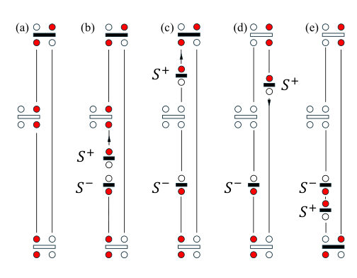
<figcaption class="paper-figure-caption"><b>Fig 1.</b> FIG. 1. The directed-loop update for the XXZ model can be thought of as the insertion of an S+, S−pair of operators at some spacetime point (r0, τ0), and then propagating one of the corresponding defects (the “head”, here S+) through the configuration. Partial SSE configurations are here shown in the linked-vertex representation [1], where spin states be- tween operators are represented by vertical lines; realized as bidirectional links used in coding. (a) A configuration in the space C without defects, with •/◦representing up/down spins, and (black) white rectangles representing (off)-diagonal oper- ators. (b) Construction of a loop is commenced by inserting an S+S−pair on a chosen link....</figcaption>
</figure>
<figure class="paper-figure-card">
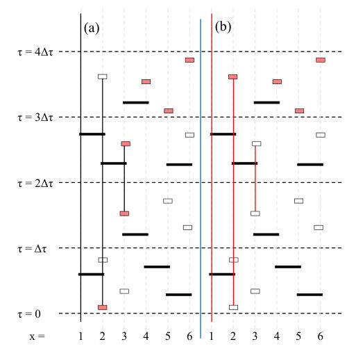
<figcaption class="paper-figure-caption"><b>Fig 2.</b> FIG. 2. Illustration of the TFIM cluster update. Ising oper- ators are represented by black rectangles. White/red rectan- gles represent hI and hσx operators respectively, where the identity operators are present for efficient cluster updates. A single cluster (a) is shown, and the action of flipping the clus- ter (b) is illustrated. Clusters which touch single-site opera- tors flip hI ↔hσx as shown.</figcaption>
</figure>
<figure class="paper-figure-card">
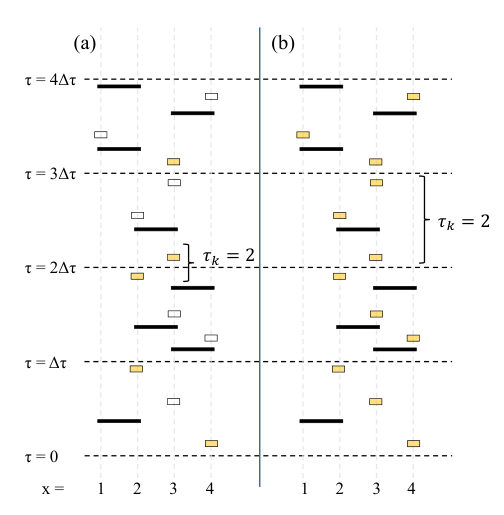
<figcaption class="paper-figure-caption"><b>Fig 3.</b> FIG. 3. Illustration of the off-diagonal estimator for the cor- relation function ⟨σx(r, τ)σx(0, 0)⟩in the TFIM, using the (a) boundary-valued and the (b) time-slice averaged formula- tions. Two-site Ising J operators are denoted by black rect- angles, and do not factor into the measurement procedures. Diagonal single-site operators hI are not shown, and also do not factor into the procedure. Spin-flip operators are denoted by single-site rectangles, where yellow denotes that they con- tribute to the estimator. For the (a) boundary-valued estima- tor, only spin-flip operators directly adjacent to the time-slice boundary contribute. Only a fraction of total operators are used. This method is...</figcaption>
</figure>
<figure class="paper-figure-card">
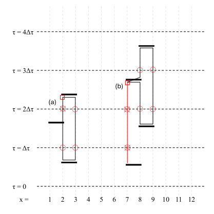
<figcaption class="paper-figure-caption"><b>Fig 4.</b> FIG. 5. In the directed loops algorithm [10], there are two ways that loops can close. Loops begin with choosing a ran- dom vertex leg v0 (□) and moving to the exit leg for that vertex. A loop can close either reconnecting with the origi- nal vertex as (a) an entry leg or (b) an exit leg. Both loops shown above yield valid configurations in the closed space C. For sampling in the extended configuration space C′, only loop closings of type (a) are allowed, as type (b) causes biasing of the estimator. This is due to the method for defining a start- ing point (x0, τ0), which extends back along the leg from v0 (red solid line). Allowing loop closures of type (b) leaves a loop that does not...</figcaption>
</figure>
<figure class="paper-figure-card">
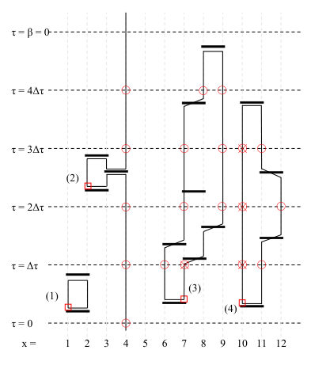
<figcaption class="paper-figure-caption"><b>Fig 5.</b> FIG. 4. Example loops and their contributions to the corre- lator G±(r, τ). represent operators; solid lines are the loop paths; □marks the initial vertex v0; × marks possible τ0 starting points, ⃝mark all contributing boundary points to the histogram in that loop. Loop (1) does not cross any time- slice boundaries, and so does not contribute to the histogram, although we still draw it as a normal MC update. Loop (2) does cross boundaries, but the initial leg chosen does not, and so it does not contribute to the histogram. Loop (3) starts on a link that crosses a single boundary at x0 = 7, τ0 = ∆τ. As we draw the loop, all boundary crossings (⃝) contribute G±[∆r, ∆τk] += nlegs, where nlegs...</figcaption>
</figure>

**Summary.** This work introduces a novel, efficient algorithm within the Stochastic Series Expansion framework to compute imaginary-time correlation functions for both diagonal and off-diagonal operators. By implementing discrete imaginary-time slicing, the method overcomes previous computational bottlenecks associated with measuring non-local correlations in spin models like the TFIM and XXZ chain. This advancement significantly broadens the scope of quantum simulations for strongly correlated matter.

**Why it may be interesting.** The ability to efficiently measure off-diagonal correlation functions in strongly correlated spin systems is crucial for understanding quantum phase transitions and excitations (like spinons) that are often masked by diagonal measurements.

Detailed structure

**Main problem.** The primary goal is to develop an efficient, general algorithm for calculating imaginary-time correlation functions in Quantum Monte Carlo simulations.

**Main result.** The authors present a method using discrete imaginary-time slicing of the SSE operator string that allows for the calculation of both diagonal and off-diagonal correlators with minimal overhead.

**Method.** The technique involves splitting the inverse temperature $eta$ into $m$ time slices ($\Delta	au = eta/m$) within the Stochastic Series Expansion (SSE) framework. This slicing enables the direct estimation of correlation functions at discrete imaginary times $	au_k$.

**Model / system.** The method is benchmarked on spin systems, specifically the one-dimensional transverse-field Ising model (TFIM) and the XXZ Heisenberg chain. These models are used to test the algorithm's applicability across different types of operators.

**Key observables.** Imaginary-time correlation functions ($G(	au)$), including both diagonal and off-diagonal spectral functions, which can be analytically continued to real frequencies.

**Important parameters / regimes.** Inverse temperature ($eta$), number of time slices ($m$), system size ($L$), and the specific coupling constants defining the Hamiltonian (e.g., $\Delta$ for XXZ).

**Assumptions / limitations.** The method assumes that discretizing imaginary time into $m$ slices provides a representation accurate enough to avoid significant discretization errors, while maintaining the ergodicity of existing cluster update schemes.

**Figures summary.** Figures illustrate the implementation details: one shows the directed-loop update for XXZ chains, and another demonstrates the TFIM cluster update mechanism used within the SSE framework.

**Paper structure.** The paper first establishes the challenge of calculating off-diagonal correlators in QMC. It then introduces the core technique—time-slicing the SSE operator string—and derives estimators for both diagonal and off-diagonal operators. Finally, it validates this general algorithm on established models like TFIM and XXZ chains.

Abstract

Combined with numerical analytic continuation techniques, quantum Monte Carlo (QMC) methods enable the extraction of real-frequency dynamical properties from imaginary-time correlation functions. However, the efficient computation of imaginary-time correlation functions by QMC simulations can (depending on the particular model used) be challenging, particularly for operators that are off-diagonal in the computational basis. In this work, we present an efficient and general algorithm within the stochastic series expansion (SSE) framework for evaluating imaginary-time correlation functions of both diagonal and off-diagonal operators. The algorithm builds on a discrete imaginary-time slicing of the SSE operator string, which provides correlation functions on a grid of well-defined imaginary-time points with no discretization error. For off-diagonal operators, we derive estimators that integrate directly into the existing SSE directed-loop or cluster updating schemes, introducing only minimal computational overhead. We benchmark the method on the one-dimensional transverse-field Ising model (sampling with cluster updates) and XXZ spin chain (using directed-loop sampling), demonstrating excellent agreement (with only statistical errors) with exact diagonalization of small systems. We also study larger systems to demonstrate efficiency.

[↑ back to top](#top)

### [Two-atom Dicke model with atom-atom interaction](http://arxiv.org/abs/2608.12625v1)

**Authors:** Lin Jiao, Han Pu  
**Type:** theory · **Category:** other · **PDF:** <https://arxiv.org/pdf/2608.12625v1>  
**Analysis basis:** full PDF text, analyzed in chunks
**Topic relevance:** 🔥 `Dicke superradiance` **5/5** · 🔥 `analog quantum simulation` **4/5** · 🔥 `non-equilibrium universality` **4/5** · 🔥 `superradiant laser` **4/5** · `Tavis-Cummings & cavity-many-emitter` **3/5** · `driven-dissipative phase transition` **3/5** · `methods for driven-dissipative` **3/5** · `correlated / nonlocal dissipation` **2/5** · `Keldysh / 2PI / non-Gaussian methods` **1/5** · `quantum measurements` **1/5**

↔ Scroll figures horizontally

<figure class="paper-figure-card">
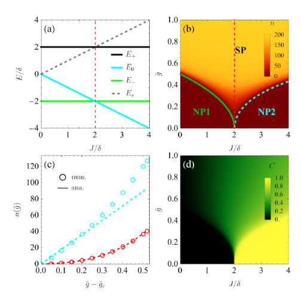
<figcaption class="paper-figure-caption"><b>Fig 1.</b> FIG. 1. (a) Bare spin spectrum of Hspin. (b) Ground-state photon number n = ⟨a†a⟩in the (J/δ, ˜g) parameter space. The green solid and cyan dashed curves are the analytical NP– SP boundaries of Eq. (2). (c) Photon number n at J = 2δ (red) and J = 3δ (cyan). Circles are numerical results and dashed lines the analytical results of Eqs. (S17) and (S21) in the SM [44], respectively. (d) Two-spin concurrence C in the same parameter plane as in (b). Numerical results are obtained by exact diagonalization with ω = 1, δ = 50.</figcaption>
</figure>
<figure class="paper-figure-card">
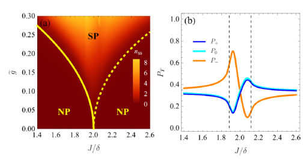
<figcaption class="paper-figure-caption"><b>Fig 2.</b> FIG. 2. (a) Steady-state photon number nss = ⟨a†a⟩ss under cavity photon loss. The yellow solid and dashed curves denote the phase boundaries according to Eq. (5). (b) Steady-state triplet populations Pµ = Tr[(|tµ⟩⟨tµ|⊗Icav)ρss] for µ = +, 0, − along representative cut of ˜g =0.12 are denoted by the blue, cyan, and orange curves, respectively. The vertical black dashed lines mark the phase boundaries. We set ω = 1, δ = 50, κ = 0.1.</figcaption>
</figure>
<figure class="paper-figure-card">
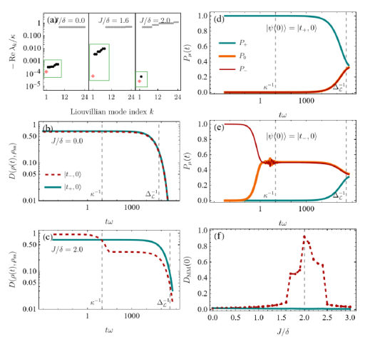
<figcaption class="paper-figure-caption"><b>Fig 3.</b> FIG. 3. (a) Liouvillian eigenvalues −Re(λk)/κ for J/δ = 0, 1.6, and 2. The slow modes satisfying |Re(λk)| ≪κ and forming the metastable manifold are indicated by green boxes. (b) Evolution of the normalized trace-distance D(t) = Dtr[ρ(t), ρss]/Dtr[ρ(0), ρss] between the instantaneous and the steady-state density matrices for J/δ = 0 starting from two different initial states |t+, 0⟩(solid line) and |t−, 0⟩(dashed line). The vertical dashed lines indicate the cavity-loss time κ−1 and the slow Liouvillian time ∆−1 L . (c) Same as (b) for J/δ = 2. (d) Evolution of the triplet population Pµ(t) start- ing from the initial states |t+, 0⟩for J/δ = 2. (e) Same as (d) but from the initial state |t−,...</figcaption>
</figure>
<figure class="paper-figure-card">
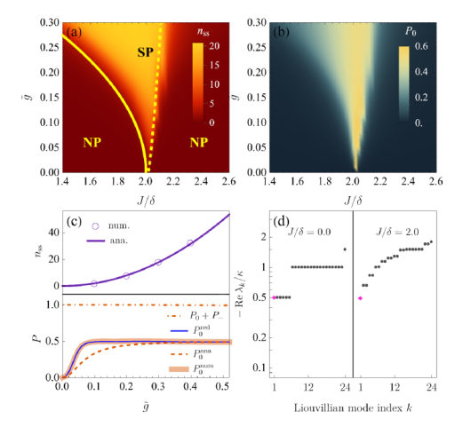
<figcaption class="paper-figure-caption"><b>Fig 4.</b> FIG. 4. (a) Steady-state photon number nss = ⟨a†a⟩ss of the full model. The yellow lines are the analytic phase boundaries from the reduced model. (b) Steady-state population P0. (c) Steady-state photon number (upper) and atomic populations (lower) at J = 2δ. The upper panel compares the analytical result in Eq. (11) (purple solid) with the full model numerical results (open circles). The lower panel shows P0 from the full- Liouvillian numerical (thick pale orange), reduced-Liouvillian (thin blue), and analytical (orange dashed) results; the dot- dashed curve denotes P0 + P−. (d) Spectrum of the full- Liouvillian −Re(λk)/κ at ˜g = 0.12 for J/δ = 0 and 2. We set ω = 1, δ = 50, κ = 0.1, γ↓=...</figcaption>
</figure>

**Summary.** This paper analyzes the two-atom Dicke model to study how internal atomic interactions modify superradiant phase transitions. By incorporating dissipation and analyzing the Liouvillian spectrum, the authors demonstrate that these interactions can fundamentally alter critical thresholds and change the universality class of the transition. The results highlight the tunability of collective quantum phenomena through engineered coupling terms.

**Why it may be interesting.** This work provides a detailed theoretical framework for controlling collective light-matter interactions in cavity QED systems by engineering atom-atom coupling, which is crucial for designing quantum memories or nonlinear optical devices.

Detailed structure

**Main problem.** The study investigates how atom-atom interactions modify superradiant criticality in a minimal cavity QED model, particularly concerning phase boundaries and the universality class of the transition.

**Main result.** Interaction terms can suppress the superradiance threshold entirely, causing the critical coupling strength to vanish at specific interaction ratios (e.g., $J=2\delta$), and changing the critical scaling exponent from $\gamma=1$ to $\gamma=2$.

**Method.** The analysis employs both analytical techniques like perturbation theory for phase boundaries and numerical methods involving solving the Liouvillian spectrum and analyzing relaxation dynamics via the Master equation.

**Model / system.** The system is a Dicke model consisting of two interacting two-level atoms coupled to a single cavity mode. The physics is governed by a Hamiltonian analyzed through a Master equation that includes terms for photon loss ($\kappa$) and local spin relaxation ($\gamma_{\downarrow}$).

**Key observables.** Critical coupling strength ($	ilde{g}_c$), steady-state photon number ($n_{ss}$), two-spin concurrence ($C$), Liouvillian gap ($\Delta_L$), and the scaling exponent ($\gamma$).

**Important parameters / regimes.** Atom-atom interaction strength ($J$), cavity frequency ($\omega$), coupling constant ($g$), dissipation rates ($\kappa, \gamma_{\downarrow}$), and the ratio $J/\delta$.

**Assumptions / limitations.** The analysis often involves projecting onto reduced subspaces (e.g., ignoring the singlet state) or utilizing approximations like the classical oscillator limit for analytical tractability.

**Figures summary.** Figures illustrate the bare spin spectrum, phase boundaries in the $(	ilde{g}/J/\delta)$ plane showing Normal/Superradiant phases, and the evolution of photon number and populations under cavity loss, alongside plots of Liouvillian eigenvalues.

**Paper structure.** The paper progresses from establishing the minimal model Hamiltonian to analyzing the closed-system phase transitions using perturbation theory. It then extends the analysis to include dissipation via the Master equation, examining steady states, relaxation dynamics (Liouvillian spectrum), and finally deriving stability criteria for different interaction regimes.

Abstract

Interactions among emitters provide a powerful means of controlling collective light--matter phenomena, yet their role in superradiant criticality has not been thoroughly investigated. Here we construct a minimal model that can yield analytical insights --- a Dicke model with two interacting atoms coupled to a single mode cavity --- to study such interaction effects. We show that interaction changes the phase boundary, and may even completely suppress the atom-photon coupling threshold for superradiance and change the universality class of the phase transition. We further study the dissipative phase transition and quantum dynamics in the presence of dissipation channels such as photon loss and spin relaxation. Our results demonstrate important roles played by the atom-atom interaction and how it can be engineered to control atom-photon coupling.

[↑ back to top](#top)

### [Heterogeneously Integrated Squeezed-Light Generation and Detection on a Single Photonic Chip](http://arxiv.org/abs/2608.13218v1)

**Authors:** Haoran Chen, Benjamin Westcott, Fatemehsadat Tabatabaei, Xiangwen Guo, Shuman Sun, Zijiao Yang, Gedalia Y. Koehler, Beichen Wang, Shadrach Sarpong, Steven Bowers, Olivier Pfister, Andreas Beling, Xu Yi  
**Type:** experiment · **Category:** quantum information and computing · **PDF:** <https://arxiv.org/pdf/2608.13218v1>  
**Analysis basis:** full PDF text, analyzed in chunks
**Topic relevance:** 🔥 `quantum optics experiment` **5/5** · 🔥 `QC/QI experiment` **4/5** · `quantum measurements` **3/5** · `analog quantum simulation` **2/5** · `driven-dissipative phase transition` **1/5** · `interference shaping light` **1/5**

↔ Scroll figures horizontally

<figure class="paper-figure-card">
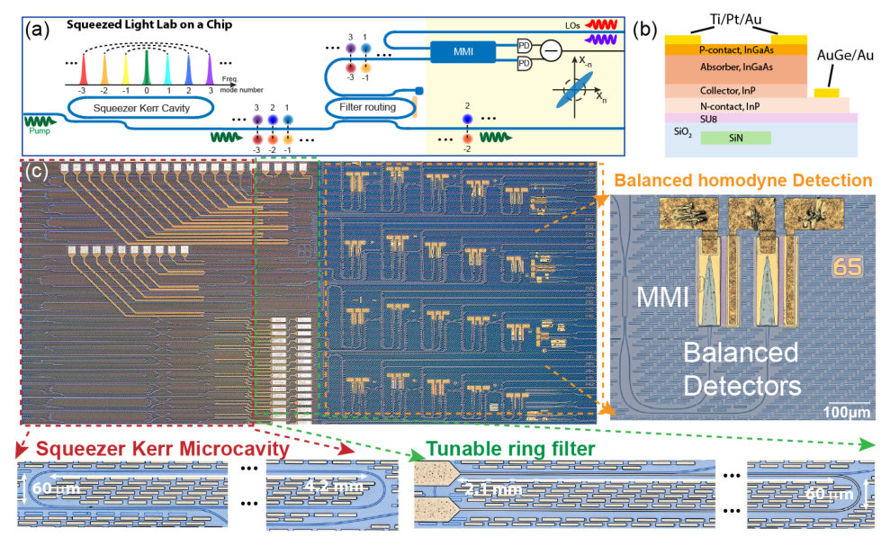
<figcaption class="paper-figure-caption"><b>Fig 1.</b> FIG. 1: Architecture and building blocks of the heterogeneous integrated squeezed-light generation and detection on a photonic chip. (a) Illustration of the heterogeneous quantum photonic integrated circuit. The quantum light source is a squeezed quantum microcomb generated in a SiN optical microcavity through Kerr nonlinearity. The squeezer is followed by a tunable ring filter to route the odd-number quantum modes (qumodes) to the balanced homodyne detection (BHD). The routed odd number qumodes are then combined with local os- cillator on a 50/50 multimode interferometry (MMI) coupler, and detected on a pair of balanced MUTC photo- diodes heterogeneously integrated on the SiN QPIC. (b)...</figcaption>
</figure>
<figure class="paper-figure-card">
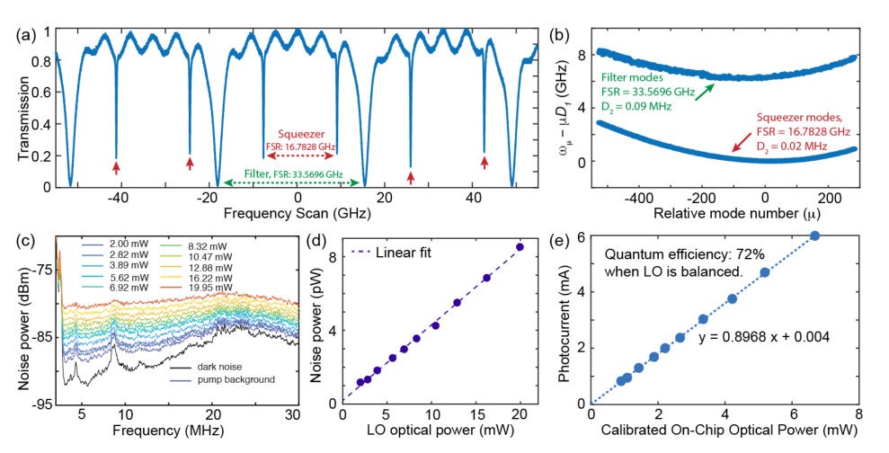
<figcaption class="paper-figure-caption"><b>Fig 2.</b> FIG. 2: Characterization of components in the squeezed-light generation and detection chip. (a) Transmission spectrum of the squeezer and the tunable filter. The filter frequencies can be tuned by an integrated heater to align with the resonance frequencies of the squeezer. (b) Mode spectrum of the squeezer cavity and the tunable filter cavity. The FSR of the filter cavity matches twice of the squeezer cavity FSR within 4 MHz differ- ence. (c) Noise spectrum of the BHD at different LO optical power levels. (d) The noise power increase linearly with the LO optical power, validating the BHD is shot noise limited. (e) Total quantum efficiency measurement of the filter, MMI coupler and balanced...</figcaption>
</figure>
<figure class="paper-figure-card">
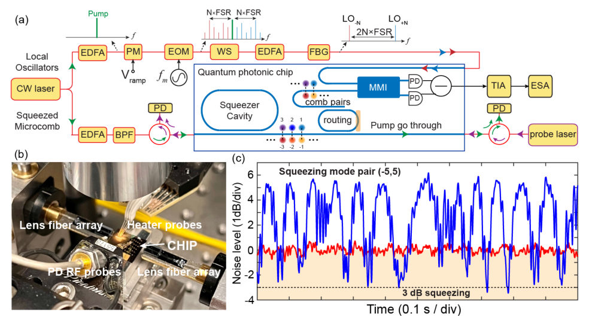
<figcaption class="paper-figure-caption"><b>Fig 3.</b> FIG. 3: Experimental setup and squeezing measurement. (a) Experimental setup. The pump laser and the local oscillators are created off-chip and coupled into the squeezed light chip through lens fiber array. The bichro- matic LOs are created using electro-optics modulation and a line-by-line programmable waveshaper (WS) filter. A probe laser is coupled into the chip from the opposite direction to monitor the frequency alignment of the squeezer and the tunable filter. A low bandwidth DC probe is used to control the integrated heater on the ring filter, and an RF probe is used to bias the integrated photodiodes and read-out the photocurrents. (b) Image of the squeezed light generation and...</figcaption>
</figure>
<figure class="paper-figure-card">
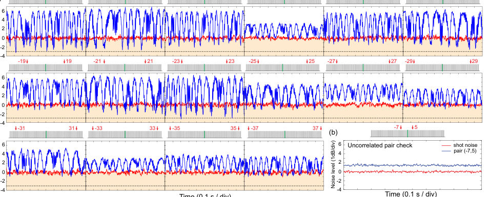
<figcaption class="paper-figure-caption"><b>Fig 4.</b> FIG. 4: Squeezed quantum microcomb generation and measurement on the heterogeneously inte- grated chip. (a) Quadrature noise variances (blue) relative to shot noise (red) of odd number qumodes from (-7,7) to (-37,37). The qumodes measured are marked by the red arrows. The regime below the shot noise limit is colored in orange, and a dashed black line indicates 3 dB below the shot noise level. Qumodes are selected in mea- surements by tuning the frequency of the LOs to align with the target qumodes. (b) Quantum correlation check: noise variances show no quantum correlation between uncorrelated comb pairs for qumodes (-7,5).</figcaption>
</figure>

**Summary.** The research presents an experimental demonstration of integrating squeezed-light generation and detection onto one photonic chip using heterogeneous integration. By overcoming material conflicts between low-loss transmission and high-absorption detection, the authors achieved 3 dB squeezing with a high total quantum efficiency. This establishes a scalable platform for advanced quantum photonic applications.

**Why it may be interesting.** This work directly addresses hardware bottlenecks in quantum optics by demonstrating a fully integrated platform for continuous-variable quantum state generation and measurement, which is crucial for scalable quantum networking and computation.

Detailed structure

**Main problem.** Integrating squeezed-light generation and photodetection on a single photonic chip is challenging due to conflicting material requirements: low loss for quantum correlations versus efficient absorption for detection.

**Main result.** The authors successfully demonstrated a scalable architecture by integrating all three stages (generation, routing, and detection) on one chip, achieving measurable 3 dB squeezing with low overall circuit loss.

**Method.** They used heterogeneous integration to combine components like Kerr microcavities for squeezing, tunable filters for routing, and modified uni-traveling carrier photodiodes for balanced homodyne detection.

**Model / system.** The system is a single photonic chip built on SiN, incorporating an Optical Parametric Oscillator (OPO) pumped by a continuous wave laser to generate two-mode squeezed light. Detection relies on heterogeneously integrated MUTC photodiodes.

**Key observables.** Squeezing level ($\approx 3 	ext{ dB}$), total quantum efficiency ($72\%$), and quadrature noise variances relative to shot noise.

**Important parameters / regimes.** Total optical loss of $1.1 	ext{ dB}$ post-squeezer, pump power near OPO threshold, and the measured MMI splitting ratio ($46/54$ vs designed).

**Assumptions / limitations.** The primary limitation noted is that squeezing level is limited by component non-idealities like squeezer escape efficiency and residual loss.

**Figures summary.** Figures show architectural diagrams, sideviews of photodiodes, characterization spectra (transmission/mode), noise spectrum validation confirming sub-shot-noise operation, and total quantum efficiency measurements.

**Paper structure.** The paper details the architecture, presents component characterizations (loss, QE), demonstrates the measurement of quadrature noise variances to quantify squeezing below the shot noise limit, and discusses the scalability of the integrated platform.

Abstract

Squeezed light underpins quantum-enhanced sensing and continuous-variable quantum information processing, and integrated photonics offers a route to producing it at scale. Universal to these applications are squeezed-light generation and measurement. Importantly, quantum measurements serve not only as readout but also as active operations in quantum-state evolution. However, integrating squeezed-light generation and photodetection on the same photonic chip has remained challenging because they impose fundamentally conflicting material requirements: low optical loss to preserve quantum correlations, but efficient photon absorption for photodetection. Here, we demonstrate squeezed-light generation, routing, and balanced homodyne detection integrated on a single photonic chip through heterogeneous integration. A two-mode squeezed quantum microcomb comprising 34 quantum modes is measured with approximately 3 dB squeezing. Our work establishes a scalable architecture for fully integrated squeezed-light quantum photonic systems, unifying quantum-state generation, processing, and detection on a single chip.

[↑ back to top](#top)

### [Encoding Circuit Satisfiability in Rydberg Atom Arrays](http://arxiv.org/abs/2608.12938v1)

**Authors:** Haotian Ji, Zhangjie Qin, Zheng An, Bowen Yan, Daoheng Niu, Kunzhe Dai, Jingkai Fang, Dongyang Cao, Jiangyu Cui  
**Type:** both · **Category:** other · **PDF:** <https://arxiv.org/pdf/2608.12938v1>  
**Analysis basis:** full PDF text, analyzed in chunks
**Topic relevance:** 🔥 `Rydberg arrays` **5/5** · 🔥 `analog quantum simulation` **4/5** · `QC/QI experiment` **2/5** · `quantum measurements` **1/5**

↔ Scroll figures horizontally

<figure class="paper-figure-card">
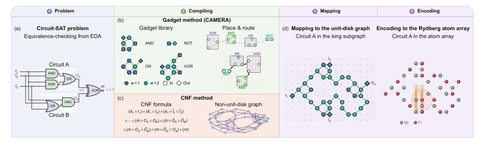
<figcaption class="paper-figure-caption"><b>Fig 1.</b> FIG. 1. Overview of the encoding framework, from an electronic-design consistency check to a Rydberg native MWIS problem. The gadget-based route of this work (CAMERA) runs (a) →(b) →(d); the conventional CNF route, (a) →(c). (a) The input: combinational equivalence checking by a miter. Two structurally different circuits A and B share the inputs I1, I2, I3 and have their outputs compared by an XOR gate, whose output m = OA ⊕OB satisfies m = 1 ⇔A ̸= B. (b) The gadget method of this work. Left, the weighted KSG gadget library: one gadget per Boolean primitive, whose MWIS configurations reproduce the gate truth table. Color encodes the on-site weight w ∈{1, 2}, realized as a local detuning....</figcaption>
</figure>
<figure class="paper-figure-card">
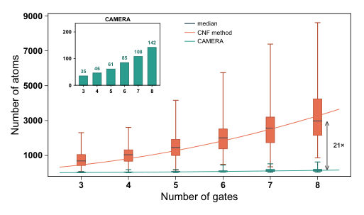
<figcaption class="paper-figure-caption"><b>Fig 2.</b> FIG. 2. Atom cost of the conventional CNF route (red) and the direct gadget route (CAMERA, teal) on random bench- mark circuits of g = 3–8 gates (100 random circuits per gate count on each route). For each gate count, the thin vertical line spans the full min–max range, the box the interquartile range, and the dark slate tick marks the median. The curves are pure quadratics atoms = n g2 fitted through the medians, and the double-headed arrow marks the 21× median suppres- sion at g = 8. Inset: atom count of the median CAMERA instance at each gate count.</figcaption>
</figure>
<figure class="paper-figure-card">
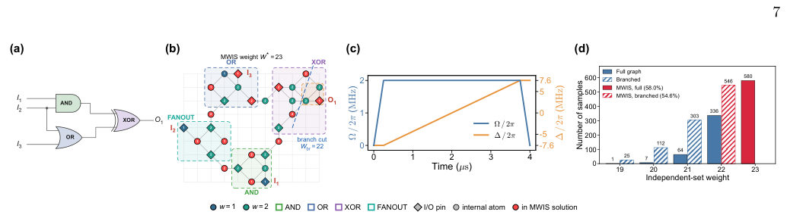
<figcaption class="paper-figure-caption"><b>Fig 3.</b> FIG. 3. End-to-end compilation and solution of the multi-gate Circuit-SAT instance C(I1, I2, I3) = (I1 ∧I2) ⊕(I2 ∨I3). (a) A three-gate circuit combining AND, OR, and XOR, with output O1. (b) The compiled 30-atom weighted king subgraph: colored dashed boxes outline the four gadgets (AND, OR, XOR, FANOUT), node color encodes the on-site weight w ∈{1, 2}, and diamonds mark the pin atoms, with the ports I1, I2, I3, O1 labeled in red. Red fill marks one of the eight degenerate MWIS optima (W ⋆= 23), encoding the input row (I1, I2, I3) = (0, 0, 1) with O1 = 1. The orange frame and blue dashed cut mark the output branching that asserts O1 = 1: deleting the three framed atoms leaves the 27-atom...</figcaption>
</figure>
<figure class="paper-figure-card">
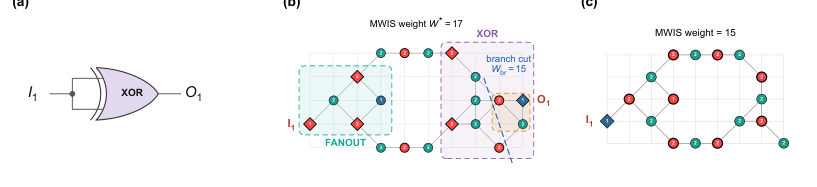
<figcaption class="paper-figure-caption"><b>Fig 4.</b> FIG. 4. Detecting unsatisfiability from the compiled king subgraph, for the minimal unsatisfiable instance O1 = I1 ⊕I1. (a) Logical circuit: the single input I1 is fanned out into both ports of an XOR gate, so O1 is identically 0 and the demand O1 = 1 is unsatisfiable. (b) The compiled 20-atom weighted KSG: dashed boxes outline the FANOUT and XOR gadgets, node color encodes the on-site weight w ∈{1, 2}, diamonds mark the pin atoms, and the ports I1, O1 are labeled in red. Red fill marks one of the two degenerate MWIS optima (W ⋆= 17); every optimum reads O1 = 0. The orange frame and blue dashed cut mark the output branching that asserts O1 = 1: deleting the three framed atoms leaves the...</figcaption>
</figure>
<figure class="paper-figure-card">
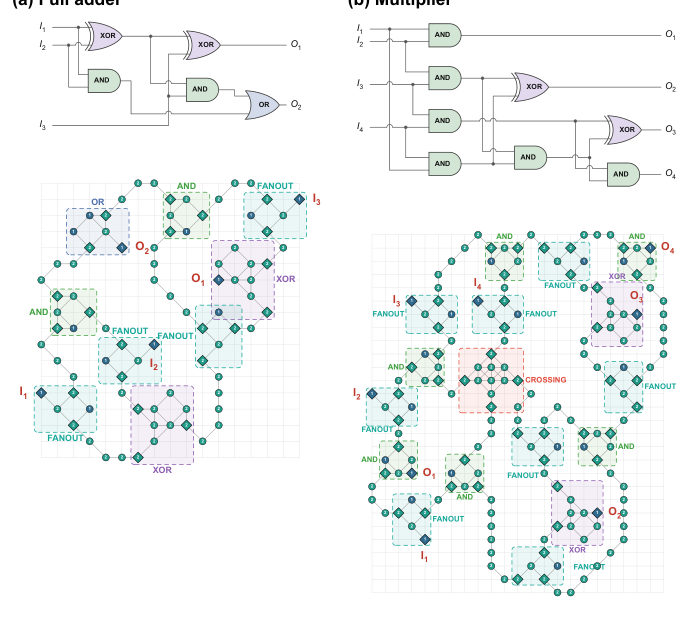
<figcaption class="paper-figure-caption"><b>Fig 5.</b> FIG. 5. Compilation of multi gate arithmetic blocks into weighted king subgraphs by the automated pipeline. (a) One-bit full adder: logical circuit (top) and compiled 85-atom weighted KSG (bottom). Dashed boxes outline the constituent XOR, AND, OR, and fanout gadgets; diamonds mark the gadget I/O pin atoms, circles the internal and wire atoms; node color encodes the on-site weight w ∈{1, 2} printed on each atom; and the ports I1–I3, O1, O2 appear as labeled boundary atoms. The eight degenerate maximum weight independent sets (weight W ⋆= 73) enumerate the full adder truth table. (b) Two-bit multiplier: logical circuit (top) and compiled 165-atom weighted KSG (bottom), with the same...</figcaption>
</figure>

**Summary.** The paper presents CAMERA, a novel method to encode Circuit-SAT into an MWIS problem on Rydberg atom arrays using compact logic gadgets. By avoiding the massive overhead of CNF representations, it drastically reduces the required number of atoms while demonstrating end-to-end simulation capability for complex arithmetic circuits.

**Why it may be interesting.** This work provides a concrete, resource-aware blueprint for mapping abstract computational problems onto the physical constraints of Rydberg arrays, directly addressing scalability issues inherent in previous encoding schemes.

Detailed structure

**Main problem.** The primary goal is to encode the NP-complete Boolean Circuit Satisfiability problem (Circuit-SAT) onto a physical quantum hardware platform.

**Main result.** A novel, atom-efficient encoding method called CAMERA was introduced, which reduces the required number of atoms for Circuit-SAT by an average factor of 22.4 compared to conventional CNF encodings.

**Method.** The authors developed a gadget-based approach that maps logic gates directly into weighted gadgets on the king subgraph geometry of Rydberg arrays, bypassing the overhead associated with Conjunctive Normal Form (CNF) representations.

**Model / system.** The physical platform is Rydberg atom arrays, which naturally encode the Maximum-Weight Independent Set (MWIS) problem via the blockade mechanism. The system's Hamiltonian governs interactions that restrict excitations to independent sets on a graph structure like the king subgraph.

**Key observables.** Maximum Weight ($W^\star$) of the MWIS, which corresponds to circuit functionality; port occupations read out from the ground state solution.

**Important parameters / regimes.** The atom cost reduction factor ($\approx 22.4$); the blockade radius ($R_b$); and the weights assigned to gadgets (e.g., $\{1, 2\}$).

**Assumptions / limitations.** The work establishes a proof of principle for the complete encoding and simulation workflow; verification relies on exact classical ground state calculations (dynamic programming) for small instances.

**Figures summary.** Figures illustrate the workflow from circuit check to gadget assembly and final mapping onto the array. Specific tables summarize the MWIS weights achieved for verifying arithmetic blocks like the full adder ($W^\star=73$) and two-bit multiplier ($W^\star=142$).

**Paper structure.** The paper first introduces the problem (Circuit-SAT $
ightarrow$ MWIS) and the limitations of CNF encoding. It then details CAMERA, presenting the gadget construction and VLSI-inspired compilation. The core is validation through compiling and solving increasingly complex circuits: three-gate circuit $
ightarrow$ full adder $
ightarrow$ two-bit multiplier, culminating in an end-to-end simulation.

Abstract

Rydberg atom arrays natively encode the maximum-weight independent set (MWIS) problem through the blockade mechanism, so the Boolean circuit satisfiability problem (Circuit-SAT) can be brought onto the platform once it is reduced to MWIS. The conventional encoding of Circuit-SAT in the Rydberg atom array proceeds through conjunctive normal form (CNF) and incurs a substantial atom overhead. We introduce CAMERA (Circuit-SAT Atom-efficient MWIS Encoding for Rydberg Arrays), a method that provides MWIS encodings of Circuit-SAT instances on the king subgraph geometry of the array. CAMERA represents each logic gate as a compact weighted gadget and assembles the gadgets with a placement and routing compiler inspired by very large scale integration (VLSI) design. On random multi-gate benchmarks, the direct encoding route lowers the atom cost relative to the CNF route by an average factor of $22.4 \pm 1.8$. To demonstrate that the encoding extends from individual weighted gadgets to multi-gate arithmetic blocks, we compile a full adder and a multiplier, verifying each against its complete truth table by exact classical ground state calculations. We further showcase solving a representative Circuit-SAT instance end-to-end, from gate level compilation through a closed-system tensor-network simulation of a hardware-compatible annealing protocol on the encoded 30-atom instance to readout of a satisfying assignment. These results establish a complete encoding and simulation workflow as a proof of principle, and a concrete route toward solving a broader family of combinatorial problems on Rydberg atom arrays.

[↑ back to top](#top)

### [Sector-resolved non-Bloch topology and nonlocal entanglement dynamics in a bond-dissipative Kitaev chain](http://arxiv.org/abs/2608.12809v1)

**Authors:** Shaina Gandhi, Koustav Roy, Bilal Tanatar, Saurabh Basu  
**Type:** theory · **Category:** other · **PDF:** <https://arxiv.org/pdf/2608.12809v1>  
**Analysis basis:** full PDF text, analyzed in chunks
**Topic relevance:** 🔥 `driven-dissipative phase transition` **4/5** · 🔥 `methods for driven-dissipative` **4/5** · `Keldysh / 2PI / non-Gaussian methods` **3/5** · `analog quantum simulation` **3/5** · `correlated / nonlocal dissipation` **3/5** · `non-equilibrium universality` **2/5** · `quantum measurements` **1/5** · `scars & prethermalization` **1/5**

↔ Scroll figures horizontally

<figure class="paper-figure-card">
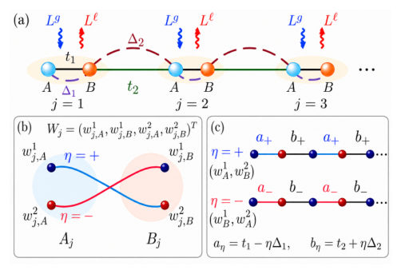
<figcaption class="paper-figure-caption"><b>Fig 1.</b> FIG. 1. Schematic of the bond-dissipative dimerized Kitaev chain and its Majorana-sector decomposition. (a) Real-space chain with sublattices A and B in each unit cell. Solid bonds denote hoppings t1 = t(1 + d), t2 = t(1 −d), dashed bonds represent the pairings ∆1 = ∆(1−d), ∆2 = ∆(1+d), and each unit cell couples to a Markovian bath through the bond loss and gain jump operators Lℓ j and Lg j. (b) Local Majorana basis and sector split at µ = 0, with sector 1−4 spanned by (w1 A, w2 B) and sector 2−3 by (w1 B, w2 A). (c) The sectors map to SSH-like Majorana chains with effective couplings aη = t1 −η∆1 and bη = t2 + η∆2.</figcaption>
</figure>
<figure class="paper-figure-card">
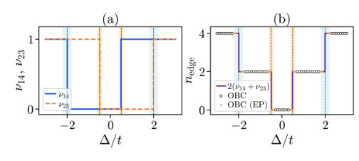
<figcaption class="paper-figure-caption"><b>Fig 2.</b> FIG. 2. (a) Non-Bloch winding numbers ν14 and ν23 as functions of ∆/t. (b) Number of isolated edge rapidities in the finite OBC rapidity spectrum. The purple line shows the sector-resolved prediction 2(ν14 + ν23) from Eq. (11), while symbols are obtained by direct diagonalization of XOBC. Open circles denote OBC counts away from the shaded real- gapless windows, and filled orange circles denote counts eval- uated inside those windows. The shaded regions mark the PBC real-gapless windows bounded by exceptional points, and the vertical dashed lines indicate the Hermitian critical values ∆/t = ±d and ∆/t = ±1/d. Parameters are t = 1, d = 0.5, µ = 0, and γℓ= γg = 0.2.</figcaption>
</figure>
<figure class="paper-figure-card">
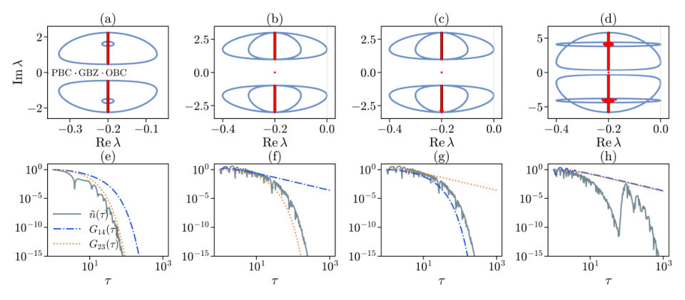
<figcaption class="paper-figure-caption"><b>Fig 3.</b> FIG. 3. Sector-resolved rapidity spectra and PBC damping. (a)–(d) Damping-plane spectra λ = iβ, showing PBC Bloch bands, sector-GBZ continua, and finite-chain OBC rapidities. (e)–(h) Normalized root-mean-square amplitudes en(τ), G14(τ), and G23(τ). Columns correspond to ∆/t = 0.25, 1, −1, and 2.5, representing the trivial, 1ab, 1ba, and SSH-like regimes. Only probes overlapping a gapless PBC sector show algebraic damping; the cross-sector density need not. Parameters are t = 1, d = 0.5, µ = 0, and γℓ= γg = 0.2.</figcaption>
</figure>
<figure class="paper-figure-card">
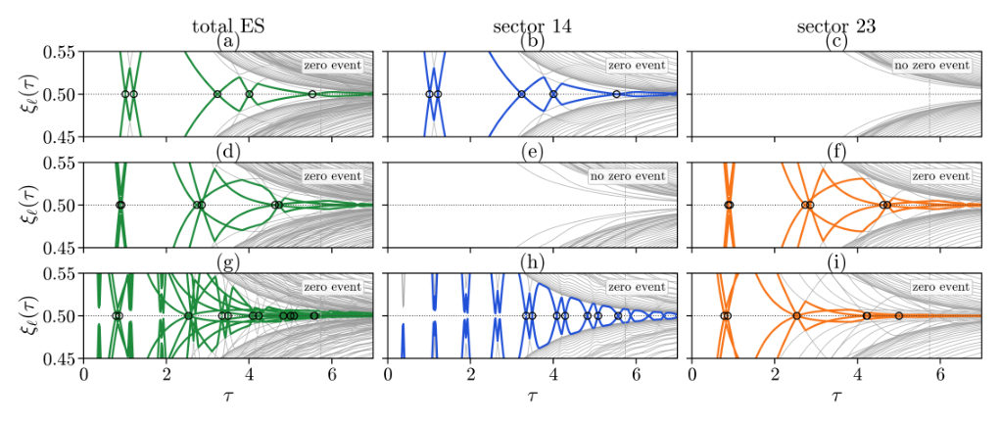
<figcaption class="paper-figure-caption"><b>Fig 4.</b> FIG. 4. Entanglement-spectrum dynamics under PBC after dissipative quenches from a trivial Hermitian initial state at ∆i/t = 0.25. Rows correspond to post-quench values ∆/t = 1, −1, and 2.5, with sector windings (ν14, ν23) = (1, 0), (0, 1), and (1, 1). Columns show the total ES and the sector-restricted covariance ES diagnostics for sectors 1−4 and 2−3. Plotted are the entanglement occupations ξℓ(τ), with ξℓ= 1/2 marking an entanglement zero mode. Colored curves highlight branches participating in finite-time zero events, gray curves represent the remaining branches, and open circles mark zero events. Parameters are t = 1, d = 0.5, µ = 0, γℓ= γg = 0.2, N = 200, and NS = 100.</figcaption>
</figure>

**Summary.** The paper investigates how topology behaves in dissipative superconducting chains by analyzing the Kitaev model under Lindblad dynamics. It reveals that while local measurements can be 'sector-blind' due to cross-talk between Majorana sectors, nonlocal diagnostics like the entanglement spectrum zero events successfully reveal the underlying, hidden open-boundary topological structure.

**Why it may be interesting.** This work bridges non-Hermitian physics (dissipation) with topological invariants and entanglement measures, providing advanced diagnostics for open quantum systems where standard bulk-boundary correspondence fails. This is highly relevant to AMO/open system research.

Detailed structure

**Main problem.** The study investigates how non-Bloch topology manifests and breaks down in dissipative topological superconductors, particularly when multiple Majorana sectors are present.

**Main result.** The system exhibits a sector-resolved non-Bloch bulk-boundary correspondence at zero chemical potential, which is masked by local observables due to cross-sector covariance. This hidden edge content can be recovered dynamically via finite-time zero events in the entanglement spectrum.

**Method.** The analysis employs third quantization on a bond-dissipative Kitaev chain, analyzing the Liouvillian spectrum and utilizing the spatial entanglement spectrum (ES) dynamics under quenches.

**Model / system.** The model is a bond-dissipative dimerized Kitaev chain governed by a Lindblad master equation. The Hamiltonian includes hopping terms ($t_{1a}, t_{2b}$) and onsite potentials, alongside dissipation rates ($\gamma_\ell, \gamma_g$).

**Key observables.** Non-Bloch winding numbers ($
u$), local density relaxation (cross-sector covariance), and finite-time zero events in the entanglement spectrum ($\xi_\ell = 1/2$).

**Important parameters / regimes.** Zero chemical potential ($\mu=0$) is crucial for sector separation; finite $\mu$ causes hybridization. The ratio of hopping parameters ($\Delta/t$) controls the topological regime.

**Assumptions / limitations.** The exact sector decomposition into two independent non-Hermitian sectors is only valid at $\mu=0$. For $\mu 
eq 0$, the analysis must use the full rapidity matrix due to hybridization.

**Figures summary.** Figures illustrate the schematic of the chain structure and sector split ($\mu=0$), map out non-Bloch winding numbers vs. coupling ratios, show observable selection rules (e.g., $	ext{G}_{14}$ decay), and demonstrate ES zero events signaling hidden OBC topology.

**Paper structure.** The paper first establishes the general framework of dissipative non-Hermitian topology. It then analyzes the specific case at $\mu=0$ to reveal sector-resolved diagnostics. Finally, it extends the analysis to finite chemical potential ($\mu 
eq 0$), showing how hybridization complicates the simple sector separation but that total ES dynamics remain a robust diagnostic tool.

Abstract

A core characteristic of dissipative non-Hermitian topology is that the relaxation dynamics tracks the non-Bloch bulk-boundary correspondence, rendering an algebraic decay in the gapless regime and an exponential falloff in the gapped phase, so that local observables directly diagnose the topology. We show that this correspondence breaks down in a dissipative topological superconductor, where the local observables turn blind to the very topology they are expected to decipher. Via a bond-dissipative dimerized Kitaev chain in a third-quantized rapidity-matrix formulation, we find that at zero chemical potential the Majorana rapidity matrix decomposes into two independent non-Hermitian sectors, each with its own generalized Brillouin zone and non-Bloch winding number, thereby revealing a sector-resolved non-Bloch bulk-boundary correspondence. The local density is a cross-sector covariance and relaxes at the sum of the two sector rates, so it remains sector-blind even when one sector is gapless and topological. For balanced gain and loss, the finite-time zero events of the entanglement spectrum under purely periodic-boundary Lindblad evolution recover this hidden edge content sector by sector, serving as a dynamical invariant that returns the open-boundary edge rapidities without physically opening the chain.

[↑ back to top](#top)

### [Exceptional activated mode theory for generalized real-complex transitions](http://arxiv.org/abs/2608.12475v1)

**Authors:** Mengjie Yang, Alexander N. Poddubny, Ching Hua Lee  
**Type:** theory · **Category:** other · **PDF:** <https://arxiv.org/pdf/2608.12475v1>  
**Analysis basis:** full PDF text, analyzed in chunks
**Topic relevance:** 🔥 `driven-dissipative phase transition` **4/5** · `Keldysh / 2PI / non-Gaussian methods` **3/5** · `correlated / nonlocal dissipation` **3/5** · `methods for driven-dissipative` **3/5** · `analog quantum simulation` **2/5** · `non-equilibrium universality` **2/5** · `Frenkel-Kontorova` **1/5** · `quantum measurements` **1/5**

↔ Scroll figures horizontally

<figure class="paper-figure-card">
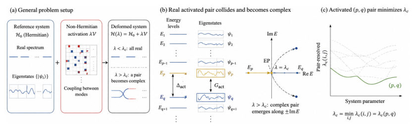
<figcaption class="paper-figure-caption"><b>Fig 1.</b> Figure 1. Activated-mode mechanism and real-to-complex threshold selection. (a) Operator family setup H(λ) = H0 + λV: H0 has a real reference spectrum, while λV activates complex eigenenergies. We seek the minimal coupling λ = λc at which the first eigenenergies leave the real axis. (b) Projecting V onto all candidate pairs identifies the activated pair (p, q) with the lowest pair-resolved EP threshold λ(i,j) c . Its threshold λc is set by the competition between the reference spectral detuning ∆act and the projected activation strength Gact. With increasing λ, the selected levels approach along Re E, coalesce at an EP, and subsequently escape into the complex plane. (c) As any system...</figcaption>
</figure>
<figure class="paper-figure-card">
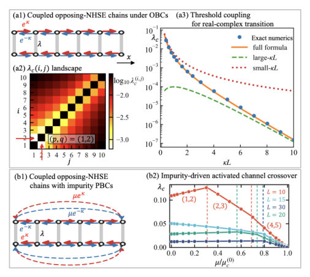
<figcaption class="paper-figure-caption"><b>Fig 2.</b> Figure 2. Boundary-controlled activation in antagonistic NHSE systems. Both (a,b) possess the same oppositely nonreciprocal HN bulk hoppings (inverse skin lengths ±κ) and inter-chain couplings λ, but differ in boundary closure: row (a) keeps the chains open, while row (b) closes them by end-to-end impurity links µe±κ. (a1) OBC realization [Eqs. (8)–(10)]. (a2) Pair-resolved two-mode thresholds λ(i,j) c [Eq. (27)]; in the displayed 10 × 10 low-index window (L = 100, κ = 0.02) the lower envelope selects the band-edge chan- nel (p, q) = (1, 2). (a3) λc threshold, with exact numerics in excellent agreement with our new closed-form expression Eq. (11), which connects the large-κL asymptote [Eq....</figcaption>
</figure>
<figure class="paper-figure-card">
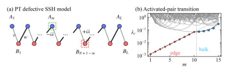
<figcaption class="paper-figure-caption"><b>Fig 3.</b> Figure 3. Seemingly non-local active-channel switching in a PT -defective SSH chain. (a) OBC SSH chain with bal- anced gain and loss at Am and BL+1−m [Eqs. (20) and (21)]. (b) Real-to-complex transition threshold λc versus m. Translucent gray curves show all pair-resolved candidates λ(i,j) c (m) = |Ei −Ej|/|2Aij|; their lower envelope gives the active-space prediction (black dashed curve), agreeing per- fectly with exact numerics (Red and Blue for edge- and bulk- activated channels, respectively). Their switching (vertical dotted line) occurs not only far from the topological edge (m = 1), but also unaccompanied by any bulk topological transition; in the edge regime, λc follows Eq. (22).</figcaption>
</figure>

**Summary.** The authors introduce an activated-mode principle to universally describe the critical threshold where non-Hermitian spectra transition from real to complex values. By identifying a minimal 'activated' subspace pair, they derive a closed-form condition that governs this onset across diverse physical models. This framework successfully predicts crossover regimes and channel switching without relying on specific symmetries or perturbative assumptions.

**Why it may be interesting.** This work provides a powerful, generalized analytical tool for understanding spectral singularities (like EPs) that govern system stability or amplification onset in open quantum systems, applicable far beyond simple perturbation theory.

Detailed structure

**Main problem.** The paper develops a general, non-perturbative activated-mode principle to govern the critical threshold for real-to-complex spectral transitions in non-Hermitian systems.

**Main result.** It establishes a unified, closed-form condition ($\lambda_c = \Delta_{	ext{act}} / G_{	ext{act}}$) that determines the transition onset by finding the minimum threshold across all possible active Hilbert subspaces.

**Method.** The theory involves pair-resolved analysis of the exceptional point (EP) condition on a small, 'activated' subspace, avoiding perturbative expansions in system parameters.

**Model / system.** The framework is applied to broad classes of non-Hermitian systems, including coupled Hatano-Nelson chains, topological SSH models with gain/loss, and impurity-modified lattices.

**Key observables.** Critical coupling strength ($\lambda_c$), spectral detuning ($\Delta E_{ij}$), and projected activation strength ($G_{	ext{act}}$).

**Important parameters / regimes.** System size (L), impurity strength ($\mu$), and the ratio of hopping parameters in SSH models.

**Assumptions / limitations.** The theory assumes that the transition is governed by a small, variationally determined active subspace pair, and $H_0$ is diagonalizable in the spectral window.

**Figures summary.** Figures illustrate the activated mode mechanism (EP competition), show the agreement between derived closed-form thresholds and numerical results for cNHSE models, and track how the 'winning' active channel switches as a function of external parameters ($\mu$).

**Paper structure.** The paper builds from establishing the general non-perturbative principle to applying it sequentially to specific physical realizations: first, generic NHSE systems; second, impurity-modified OBC/PBC setups; and finally, analyzing complex switching behavior in SSH chains.

Abstract

Real-to-complex spectral transitions mark the onset of amplification in non-Hermitian systems, but their thresholds are often treated as model-specific quantities. Here we develop a general, non-perturbative activated-mode principle that governs the real-to-complex threshold across broad classes of non-Hermitian systems. A central insight is that only a small Hilbert subspace is ``activated" at the transition onset, which can be variationally determined through the competition between spectral detuning and mode-level projected non-Hermitian couplings. The result is a closed-form exceptional-activation condition for arbitrarily large ``disturbances", rather than a perturbative estimate. We apply our framework to three contrasting illustrative problems, establishing (i) a closed-form threshold for critical non-Hermitian skin amplification at \emph{all} system sizes; (ii) a new link between impurity tunneling threshold and exceptional point switching; and (iii) activation channel switching without underlying topological phase transition. Overall, our findings recast real-to-complex transitions as generic mode-selection problems independent of any specific symmetry.

[↑ back to top](#top)

### [Time evolution of nonlinear dynamics on a quantum processor](http://arxiv.org/abs/2608.13041v1)

**Authors:** José Diogo da Costa Jesus, Abhishek Setty, Tommaso Calarco, Dieter Jaksch, Francisco Cárdenas López, Felix Motzoi  
**Type:** experiment · **Category:** quantum information and computing · **PDF:** <https://arxiv.org/pdf/2608.13041v1>  
**Analysis basis:** full PDF text, analyzed in chunks
**Topic relevance:** 🔥 `QC/QI experiment` **4/5** · `Keldysh / 2PI / non-Gaussian methods` **3/5** · `methods for driven-dissipative` **3/5** · `analog quantum simulation` **2/5** · `driven-dissipative phase transition` **2/5** · `non-equilibrium universality` **2/5** · `Frenkel-Kontorova` **1/5** · `correlated / nonlocal dissipation` **1/5** · `quantum measurements` **1/5**

↔ Scroll figures horizontally

<figure class="paper-figure-card">
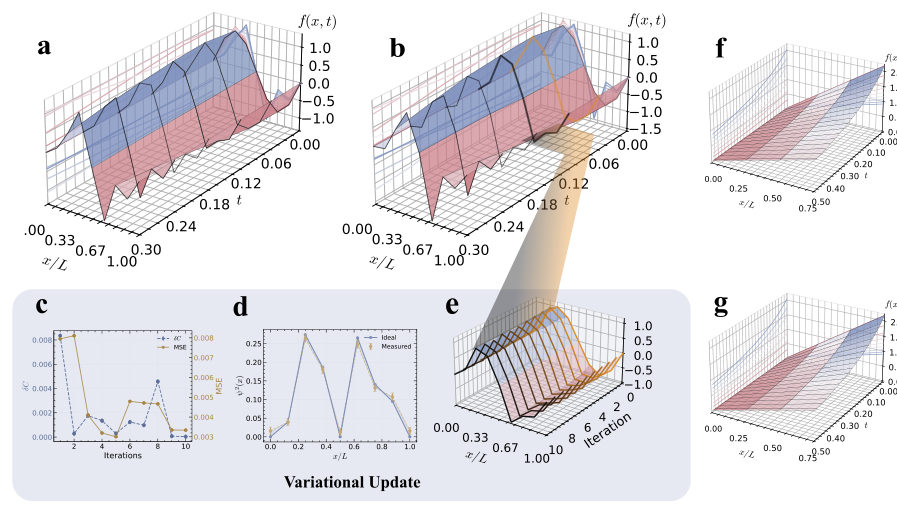
<figcaption class="paper-figure-caption"><b>Fig 1.</b> FIG. 1. Evolution of the Burgers equation in a convection-dominated regime. a) The ideal evolution of the viscous Burgers equation with viscosity ν = 0.01 for the initial condition f(x, 0) = sin(2πx). The competition between nonlinear convection and viscous diffusion progressively generates sharp spatial gradients and shock-like structures during the evolution. The evolution is performed variationally with timestep dt = 0.06 up to final time T = 0.3. b) Experimentally reconstructed evolution obtained using the variational quantum time- propagation protocol (see Figure 2), showing close agreement with the ideal nonlinear dynamics. The final MSE is 2.1% compared to the error-free dynamics,...</figcaption>
</figure>
<figure class="paper-figure-card">
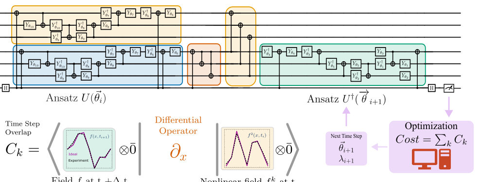
<figcaption class="paper-figure-caption"><b>Fig 2.</b> FIG. 2. Variational circuit decomposition for nonlinear Burgers dynamics. Quantum circuit implementing the convection term of the Burgers equation. Highlighted circuit components correspond to distinct contributions entering the nonlinear evolution. The blue block encodes the parametrized quantum state representing the field f(x, t) at the current timestep. The red block implements the discretized shifting operator associated with the spatial derivatives (a finite central derivative requires two shifters– one forwards and one backwards, see Eq. 11). The orange blocks represents the nonlinear-processing-unit (QNPU) which evaluates products of field amplitudes required for the nonlinear...</figcaption>
</figure>
<figure class="paper-figure-card">
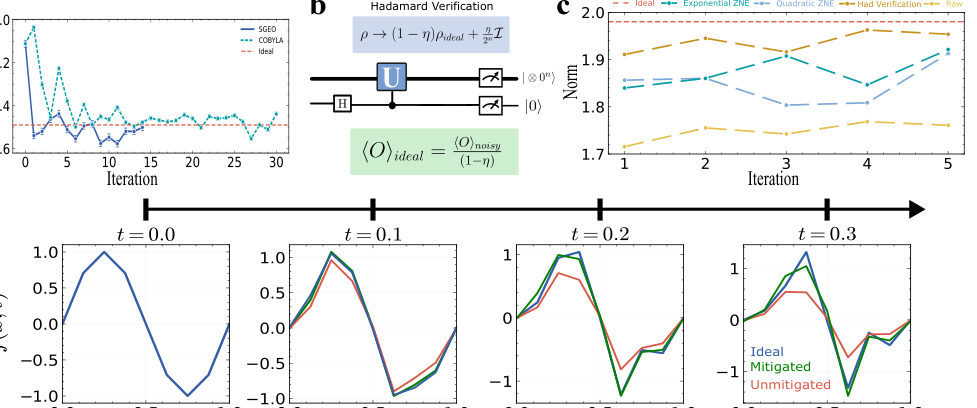
<figcaption class="paper-figure-caption"><b>Fig 3.</b> FIG. 3. Optimization and Error Mitigation Strategies for the Burgers dynamics considered a) Comparison between SGEO and COBYLA optimization for the Inviscid problem, for a single time step dt=0.1 and a cold start. Although COBYLA finds a good minima for the cost, it cannot sufficiently resolve the −→θ parameters and produces incorrect solutions. For this single time step the solution obtained via COBYLA has a MSE of 0.026 and a fidelity of 94.2% and the solution obtained via SGEO has a MSE of 0.01 and a fidelity of 99.2 % . b) Schematic representation of the Hadamard Verification method used for error mitigation. The controlled circuit U is assumed to produce a global depolorizing noise...</figcaption>
</figure>
<figure class="paper-figure-card">
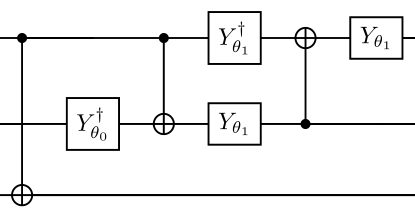
<figcaption class="paper-figure-caption"><b>Fig 4.</b> FIG. 4. Ansatz Used to Solve the Inviscid Burgers Equation</figcaption>
</figure>
<figure class="paper-figure-card">
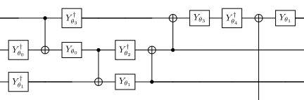
<figcaption class="paper-figure-caption"><b>Fig 5.</b> FIG. 5. Ansatz Used to Solve the Viscid Burgers Equation</figcaption>
</figure>

**Summary.** This paper reports the first experimental demonstration of simulating nonlinear time evolution using a superconducting quantum processor. By developing a variational framework that embeds nonlinearity directly into optimization circuits, they successfully simulated the Burgers equation across multiple timesteps. This work significantly expands the scope of quantum simulation beyond purely linear systems toward complex continuum dynamics.

**Why it may be interesting.** This work directly pushes the boundaries of what is computationally feasible on near-term quantum hardware by tackling non-Hamiltonian dynamics, which is a major frontier in quantum computation theory.

Detailed structure

**Main problem.** The core challenge is extending quantum simulation from linear, unitary dynamics to nonlinear and non-Hermitian evolution required for simulating continuum physics like fluid flow.

**Main result.** The authors achieved the first experimental realization of time propagation for nonlinear dynamics (Burgers equation) on a quantum processor, successfully demonstrating stable evolution across multiple timesteps despite hardware noise.

**Method.** They employ a hybrid variational framework that encodes nonlinearity directly into a quantum circuit optimization procedure, bypassing traditional linearization techniques like Carlemanization.

**Model / system.** The system modeled is nonlinear fluid dynamics, specifically the viscous and inviscid Burgers equations. The computation is performed on superconducting quantum processors using parametrized quantum circuits.

**Key observables.** Mean-Squared Error (MSE) comparing reconstructed dynamics to ideal evolution; state-overlap fidelity; time-dependent field reconstruction ($f(x, t)$).

**Important parameters / regimes.** Reynolds numbers of order $10^2$; circuit depth up to 60 controlled-Z layers; viscous parameter $
u=0.01$.

**Assumptions / limitations.** The approach assumes the validity of specific noise models (e.g., global depolarizing channel) for error mitigation techniques like Hadamard Verification.

**Figures summary.** Figures summarize the reconstructed dynamics showing shock formation and gradient sharpening in both viscous and inviscid regimes, alongside comparisons of optimization methods (SGEO vs COBYLA) and error mitigation protocols.

**Paper structure.** The paper introduces the problem gap (nonlinearity incompatibility), details the variational framework for time evolution, presents experimental results on superconducting hardware using advanced error mitigation techniques, and concludes by establishing a pathway for quantum simulation beyond linear settings.

Abstract

From fluid flow and transport to collective dynamics, numerical simulation of nonlinear partial differential equations underpins modern scientific computing. Extending this capability to quantum computers remains a longstanding challenge because nonlinear and non-Hermitian evolution is fundamentally incompatible with conventional Hamiltonian-based quantum simulation. Here we experimentally realize the time evolution of nonlinear fluid dynamics on a quantum processor using a hybrid variational framework for the viscous and inviscid Burgers equations. Our approach directly encodes the nonlinear dynamics into a variational optimization procedure, avoiding the enlarged linear embeddings and truncation overhead associated with Carleman linearization-based quantum algorithms. We further demonstrate convection-dominated dynamics corresponding to Reynolds numbers of order $10^2$. We encode the governing evolution into parametrized quantum circuits and iteratively reconstruct the time-dependent field through quantum-classical optimization. By introducing a zero-noise extrapolation method without additional circuit-folding overhead, we accurately execute deep error-circuits with entangling-gate counts beyond those typical of Hadamard test circuits. We accurately reconstruct the time evolution across multiple timesteps despite hardware noise and finite device coherence. Our results constitute, to our knowledge, the first experimental realization of nonlinear time propagation on a quantum processor, extending quantum simulation beyond predominantly linear settings and establishing a route toward quantum computation for nonlinear continuum dynamics.

[↑ back to top](#top)

### [Time-resolved correlation engineering in DLCZ Raman photon sources](http://arxiv.org/abs/2608.13091v1)

**Authors:** Jiun-Shiuan Shiu, Chang-Wei Lin, Chi-Ming Yang, Ite A. Yu, Yong-Fan Chen  
**Type:** both · **Category:** quantum information and computing · **PDF:** <https://arxiv.org/pdf/2608.13091v1>  
**Analysis basis:** full PDF text, analyzed in chunks
**Topic relevance:** 🔥 `methods for driven-dissipative` **4/5** · `Keldysh / 2PI / non-Gaussian methods` **3/5** · `quantum optics experiment` **3/5** · `analog quantum simulation` **2/5** · `correlated / nonlocal dissipation` **2/5** · `quantum measurements` **2/5** · `QC/QI experiment` **1/5** · `driven-dissipative phase transition` **1/5** · `interference shaping light` **1/5**

↔ Scroll figures horizontally

<figure class="paper-figure-card">
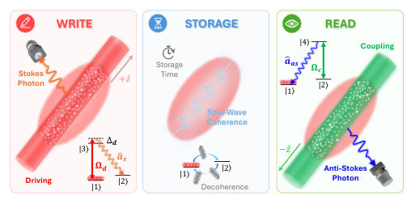
<figcaption class="paper-figure-caption"><b>Fig 1.</b> Fig. 1. Schematic of the DLCZ-type SRS process. During the write stage, a driving pulse with Rabi frequency Ωd and detuning ∆d excites the |1⟩→|3⟩transition. Stokes emission on |3⟩→|2⟩creates a collective |1⟩–|2⟩spin wave, which is stored for a controllable in- terval and decays through ground-state decoherence. During readout, a coupling pulse with Rabi frequency Ωc maps the stored spin wave onto an anti-Stokes field via state |4⟩. The Stokes and anti-Stokes fields propagate along +z and −z, respectively.</figcaption>
</figure>
<figure class="paper-figure-card">
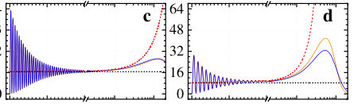
<figcaption class="paper-figure-caption"><b>Fig 2.</b> Fig. 2. Comparison of Stokes photon generation rates in DLCZ-type SRS and SFWM. Panels a–d use (OD,Ωd,∆d) = (10,2Γ,15Γ), (10,1Γ,15Γ), (10,2Γ,30Γ), and (20,2Γ,15Γ), re- spectively, with γ21 = 0.001Γ. The orange solid curves show the time-dependent open-system calculations using the piecewise- constant propagator. The blue solid curves show phenomenolog- ical depletion-corrected large-detuning estimates obtained by sub- stituting ODeff(T) = OD⟨ˆσ11(T)⟩into the undepleted response of Eq. (15). The red dashed curves show the undepleted-medium re- sults of Eq. (16), and the black dotted curves show the steady-state SFWM predictions under identical driving conditions90.</figcaption>
</figure>
<figure class="paper-figure-card">
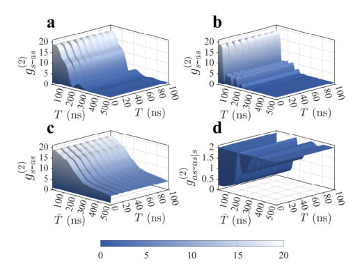
<figcaption class="paper-figure-caption"><b>Fig 3.</b> Fig. 5. Two-photon correlation functions in DLCZ-type SRS under different coupling conditions. Panels a–c show the calcu- lated time-resolved normalized cross-correlation profiles g(2) s-as(T, ¯T). The retrieval parameters (Ωc,∆c) are (2Γ,0), (4Γ,0), and (2Γ,2Γ) in panels a, b, and c, respectively. Panel d shows the correspond- ing model-inferred time-resolved zero-delay conditional anti-Stokes autocorrelation under the retrieval conditions of panel a. The quanti- ties in all panels are not averaged over finite detection windows. The calculations use a 100-ns driving pulse followed by a 200-ns storage interval. The driving parameters are fixed at Ωd = 2Γ and ∆d = 15Γ, with OD = 10, γ21 =...</figcaption>
</figure>
<figure class="paper-figure-card">
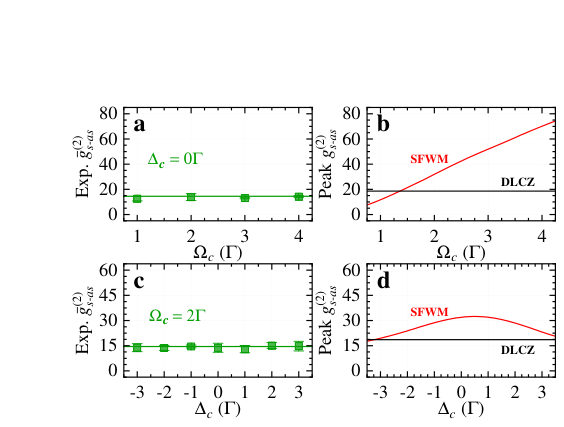
<figcaption class="paper-figure-caption"><b>Fig 4.</b> Fig. 6. Two-photon correlations in DLCZ-type SRS and com- parison with SFWM under different coupling conditions. Panels a and c show the measured integrated cross-correlations versus Ωc at ∆c = 0Γ and versus ∆c at Ωc = 2Γ, respectively. Squares represent the experimental data, and the solid curves represent the theoretical integrated cross-correlations. Panels b and d show the correspond- ing theoretical time-resolved peak cross-correlations for DLCZ-type SRS and SFWM. The integrated measurements and theoretical peak values are distinct temporal observables and are not expected to co- incide quantitatively. Unless otherwise stated, all experimental er- ror bars throughout this work...</figcaption>
</figure>
<figure class="paper-figure-card">
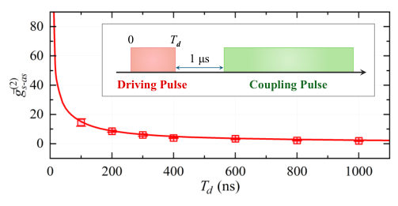
<figcaption class="paper-figure-caption"><b>Fig 5.</b> Fig. 8. Two-photon correlations in DLCZ-type SRS as a func- tion of driving pulse duration. Squares represent the experimental data, and the solid curve represents the theoretical integrated cross- correlation evaluated using the same temporal integration procedure. The correlation decreases with increasing driving pulse duration, showing that shorter write pulses enhance the correlation by reduc- ing the relative accidental-coincidence contribution. The measure- ments are performed with a storage time of 1 µs. The parameters are OD = 10, Ωd = Ωc = 2Γ, ∆d = 15Γ, γ21 = 0.001Γ, and ∆kL = 0.37π.</figcaption>
</figure>

**Summary.** This paper presents an advanced, unified quantum theory to model and predict the temporal correlations generated by DLCZ Raman photon sources used in quantum networks. By combining Heisenberg-Langevin dynamics with Maxwell-Schrödinger propagation, the authors experimentally validate that correlation engineering can be achieved through controlled retrieval tuning. This establishes a robust quantitative framework for generating high-quality entangled photons on demand.

**Why it may be interesting.** This work is highly relevant as it tackles open-system dynamics in a platform critical for quantum networking—the DLCZ source. The combination of full propagation effects with time-resolved correlation measurement provides advanced tools for controlling photonic resources.

Detailed structure

**Main problem.** The primary goal is developing a unified, predictive theory for time-resolved correlation engineering in DLCZ Raman photon sources that accounts for realistic propagation and noise.

**Main result.** The study establishes a quantitative framework showing that classically controlled retrieval allows temporal gating of the anti-Stokes wavepacket, confirming robust correlations achievable through careful tuning.

**Method.** The authors developed a propagation-inclusive open-system quantum theory combining Heisenberg-Langevin dynamics with Maxwell-Schrödinger propagation equations.

**Model / system.** The system is based on the Duan–Lukin–Cirac–Zoller (DLCZ) protocol using spontaneous Raman scattering in atomic ensembles to generate entangled photon pairs for memory-assisted quantum networks.

**Key observables.** Time-dependent Stokes generation, spin-wave evolution, retrieved anti-Stokes wavepackets, and time-resolved cross-correlations (two-photon correlations).

**Important parameters / regimes.** Short write pulses enhance correlations; the theory is validated across different tuning ranges.

**Assumptions / limitations.** The theory improves upon previous work by retaining write-driven population redistribution and combining propagation effects into the open-system framework.

**Figures summary.** Figure 1 schematically illustrates the three stages of operation: WRITE (driving pulse $\Omega_d$, Stokes emission creating spin-wave), STORAGE, and READ (coupling pulse $\Omega_c$ mapping spin-wave to anti-Stokes field).

**Paper structure.** The paper introduces the physical problem, develops the combined quantum theory using HLEs and MSEs, analyzes the dynamics in specific regimes (like large detuning), presents experimental validation of key predictions, and concludes by establishing the correlation engineering framework.

Abstract

Memory-assisted quantum networks require photon sources with controllable temporal and correlation properties. The Duan-Lukin-Cirac-Zoller (DLCZ) protocol provides a platform based on spontaneous Raman scattering in atomic ensembles, but a unified predictive theory connecting control parameters to correlations under realistic propagation and noise conditions remains lacking. Here we present a propagation-inclusive open-system quantum theory that retains write-induced population redistribution while combining Heisenberg-Langevin dynamics with Maxwell-Schrödinger propagation. We experimentally validate its key predictions. The theory predicts time-dependent Stokes generation, spin-wave evolution, retrieved anti-Stokes wavepackets, and time-resolved cross-correlations. Experiments confirm robust correlations under retrieval tuning and enhanced correlations for shorter write pulses, consistent with the different scaling of correlated coincidences and accidental backgrounds with the mean spin-wave excitation number. Classically controlled retrieval enables temporal gating and slicing of the anti-Stokes wavepacket, establishing a quantitative framework for correlation engineering in memory-compatible DLCZ photon sources.

[↑ back to top](#top)

### [In-situ Adjoint Wave Control in Reconfigurable Non-Hermitian Nonlinear Systems](http://arxiv.org/abs/2608.13503v1)

**Authors:** John Guillamon, William Tuxbury, Cheng-Zhen Wang, Owen Miller, Zin Lin, Tsampikos Kottos  
**Type:** both · **Category:** disordered systems and neural networks · **PDF:** <https://arxiv.org/pdf/2608.13503v1>  
**Analysis basis:** full PDF text, analyzed in chunks
**Topic relevance:** 🔥 `methods for driven-dissipative` **4/5** · `interference shaping light` **3/5** · `quantum measurements` **3/5** · `driven-dissipative phase transition` **2/5** · `quantum optics experiment` **2/5** · `Keldysh / 2PI / non-Gaussian methods` **1/5** · `analog quantum simulation` **1/5** · `correlated / nonlocal dissipation` **1/5** · `non-equilibrium universality` **1/5**

↔ Scroll figures horizontally

<figure class="paper-figure-card">
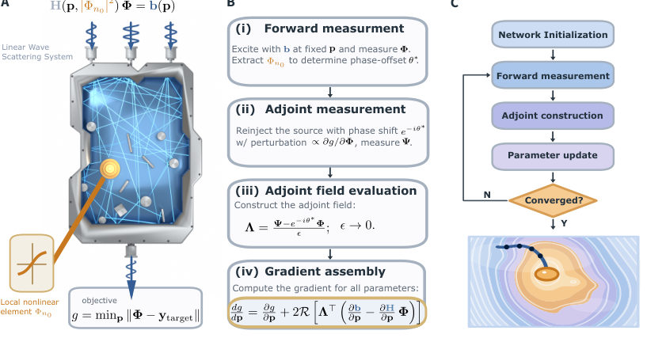
<figcaption class="paper-figure-caption"><b>Fig 1.</b> Figure 1: In-situ nonlinear adjoint protocol for gradient-based control of a wave-scattering</figcaption>
</figure>
<figure class="paper-figure-card">
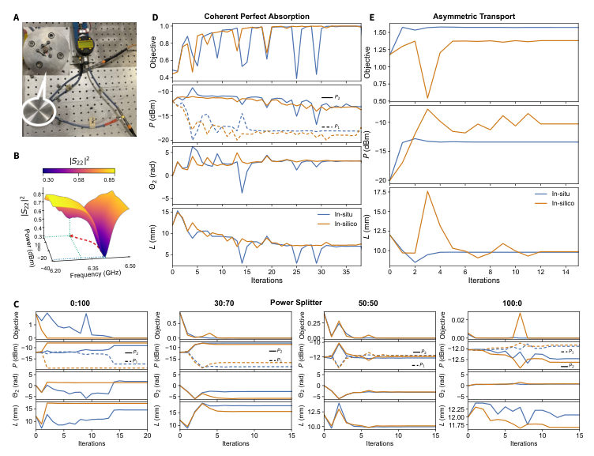
<figcaption class="paper-figure-caption"><b>Fig 2.</b> Figure 2: Experimental implementation of the iNAP protocol. (A) The physical platform con-</figcaption>
</figure>
<figure class="paper-figure-card">
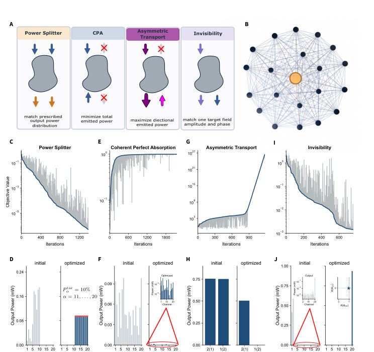
<figcaption class="paper-figure-caption"><b>Fig 3.</b> Figure 3: In-silico validation of iNAP in a large-scale network. (A) Testing iNAP across multiple</figcaption>
</figure>

**Summary.** This work introduces an In-situ Adjoint Optimization Protocol (iNAP) to enable real-time gradient-based optimization in complex nonlinear wave systems. By physically performing both forward and adjoint propagations on hardware, the method allows researchers to adaptively control devices like wireless communications components despite inherent multipath complexity and nonlinearity. This bypasses major computational bottlenecks associated with traditional system modeling.

**Why it may be interesting.** The development of an *in-situ* optimization protocol that bypasses the need for full system modeling or digital twins is highly relevant to quantum optics and open quantum systems, as it provides a pathway for adaptive control in complex, noisy physical implementations.

Detailed structure

**Main problem.** The research aims to overcome limitations in wave control by harnessing multipath complexity and nonlinearity, which are typically seen as impediments.

**Main result.** They successfully demonstrate an in-situ adjoint optimization protocol (iNAP) that allows for real-time gradient calculation in complex nonlinear physical systems without needing digital twins or conventional backpropagation.

**Method.** The core method is the In-situ Adjoint Optimization Protocol (iNAP), which involves sequential forward and adjoint measurements performed directly on the physical hardware to calculate parameter sensitivities.

**Model / system.** The system utilizes a minimal platform composed of incommensurate coaxial cables forming a wave-chaotic multipath network, incorporating a single localized nonlinear defect. The analysis also details deriving a self-consistency equation for the resonator intensity by integrating out linear graph degrees of freedom.

**Key observables.** Objective function gradient sensitivities ($\partial g / \partial p$), field measurements ($\Psi$, $\zeta$), and the resonant intensity ($y$).

**Important parameters / regimes.** The nonlinearity strength, input power levels (e.g., -50 to 10 dBm), and system parameters $p$.

**Assumptions / limitations.** For iNAP, a crucial assumption is enforcing field invariance under phase conjugation at the nonlinear defect to ensure adjoint dynamics match hardware emulation. For modeling, invertibility of the linear graph matrix ($\mathbf{A}^{-1}_g$) is assumed.

**Figures summary.** Figure 1 illustrates the four-step physical measurement process for iNAP (Forward $
ightarrow$ Adjoint $
ightarrow$ Evaluation $
ightarrow$ Gradient). Figure S1 shows frequency-resolved scattering response $|S_{ij}|^2$ versus input power for a measured nonlinear vertex.

**Paper structure.** The paper progresses from establishing the theoretical need to harness nonlinearity/multipath, detailing the iNAP protocol using adjoint fields in hardware (Chunk 1 & 2), deriving a compact scalar self-consistency equation by integrating out linear graph modes (Chunk 3), and finally characterizing a physical nonlinear vertex using this framework (Chunk 4).

Abstract

Complex multipath environments are usually avoided in wave-based information processing because repeated scattering creates many interfering propagation paths, obscuring controllability and generating extreme sensitivity to perturbations. The addition of nonlinear mechanisms fundamentally alters the wave-control landscape by breaking the superposition principle that underpins most wave-management strategies. Here, we show that these two apparent impediments -- multipath complexity and nonlinearity -- can instead be harnessed as key resources for physical optimization. We demonstrate an in-situ adjoint optimization protocol in a wave-chaotic platform incorporating a single localized nonlinear defect, in which the system itself performs both the forward and the adjoint propagations required for gradient evaluation. Recurrent multipath returns repeatedly expose the wave to the defect, producing from a minimal hardware a rich nonlinear input-output map with many pathway-mediated degrees of freedom. At the same time, a suitable adjoint excitation enables direct extraction of the sensitivities from measurements alone, without a digital twin or conventional numerical backpropagation. We experimentally validate the protocol on a minimal nonlinear multipath platform composed of incommensurate coaxial cables connected via T-junctions, one of which hosts a diode-loaded cavity. Our approach opens a route to adaptive wireless communications, imaging and analog intelligence in complex, partially unknown environments where conventional modeling is impractical.

[↑ back to top](#top)

### [Spatially Dense, Continuous-Variable Quantum Computing with Solid State Spin Nonlinearities](http://arxiv.org/abs/2608.12504v1)

**Authors:** Hamza Raniwala, Ethan G Arnault, Dirk R. Englund, Matthew E. Trusheim  
**Type:** both · **Category:** quantum information and computing · **PDF:** <https://arxiv.org/pdf/2608.12504v1>  
**Analysis basis:** full PDF text, analyzed in chunks
**Topic relevance:** 🔥 `QC/QI experiment` **4/5** · `methods for driven-dissipative` **3/5** · `Tavis-Cummings & cavity-many-emitter` **2/5** · `driven-dissipative phase transition` **2/5** · `quantum optics experiment` **2/5** · `Keldysh / 2PI / non-Gaussian methods` **1/5** · `analog quantum simulation` **1/5** · `correlated / nonlocal dissipation` **1/5** · `quantum measurements` **1/5**

↔ Scroll figures horizontally

<figure class="paper-figure-card">
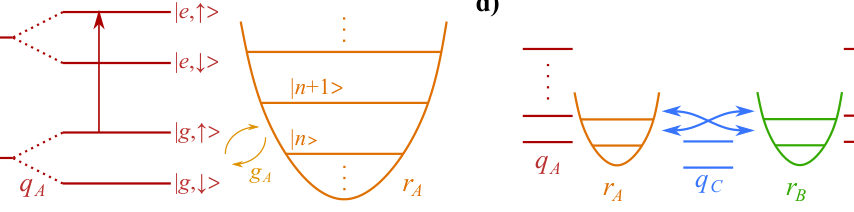
<figcaption class="paper-figure-caption"><b>Fig 1.</b> FIG. 1. a) A depiction of the device. Piezoelectric transducers (purple) are driven by a microwave tone coupled via an interdigitated capacitor. Each spin can be optically addressed (depicted by red cones) for spin polarization and readout. b) A unit cell of the device which contains three qubits. A coupling qubit qc ties together each logical cell. A logical cell consists of a spin qubit and a nanomechanical resonator. Logical information is encoded in the bosonic states of the nanomechanical resonator, which can be driven by the piezo and addressed by the spin qubit. Superconducting wires flow current to control the spin qubit. c) Spin (red) and nanomechanical (yellow) energy diagrams....</figcaption>
</figure>
<figure class="paper-figure-card">
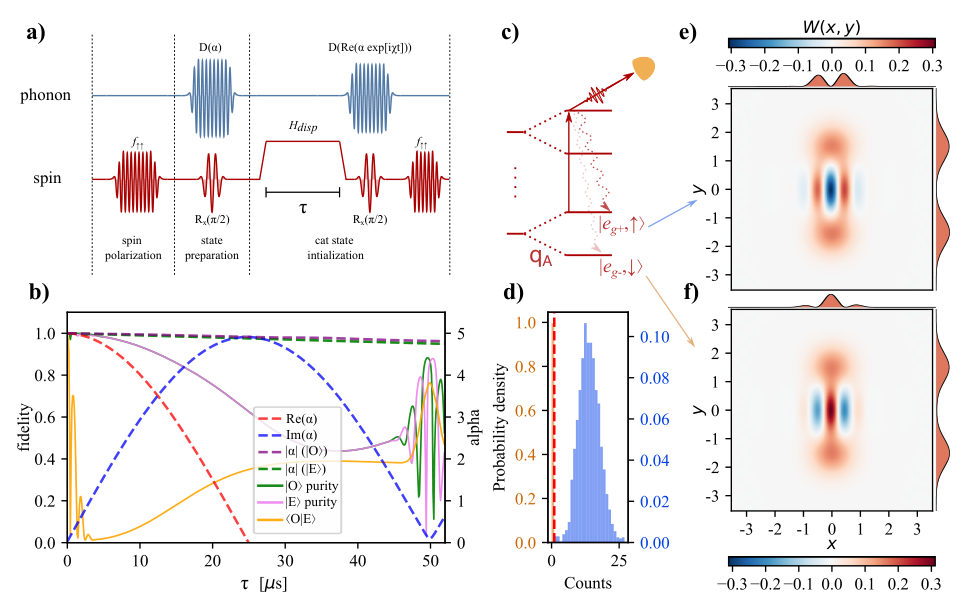
<figcaption class="paper-figure-caption"><b>Fig 2.</b> FIG. 2. a) The cat state preparation scheme. b) Plot of the system evolution over time during dispersive interaction. The dotted red (blue) line represents the real(imaginary) displacement of the coherent state in quasi-probability space, where the real component is the amount by which the state must be shifted to achieve the initial states. The solid purple(green) lines represent the even(odd) cat state purities, while the solid purple(green) lines represent their magnitudes. The solid yellow line represents the orthogonality of the even/odd cat states. c) Schematic of single shot optical readout with d) readout histograms distinguishing the spin-up(orange) and spin-down(blue) states...</figcaption>
</figure>
<figure class="paper-figure-card">
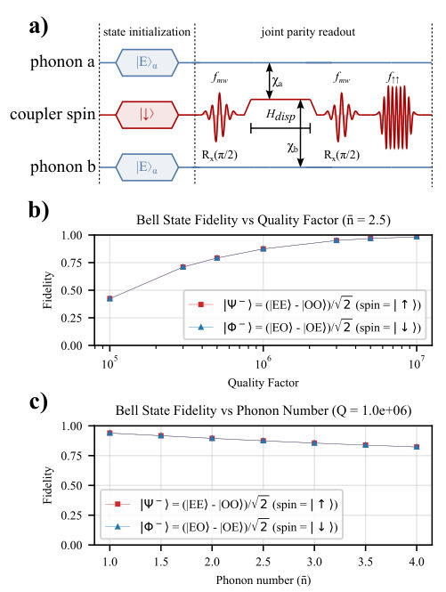
<figcaption class="paper-figure-caption"><b>Fig 3.</b> FIG. 4. a) Parity readout-based entanglement scheme. b) Bell state fidelity for increasing mean phonon number, ¯n, in the resonator. c) Bell state fidelity for various Qres with ¯n = 2.5.</figcaption>
</figure>
<figure class="paper-figure-card">
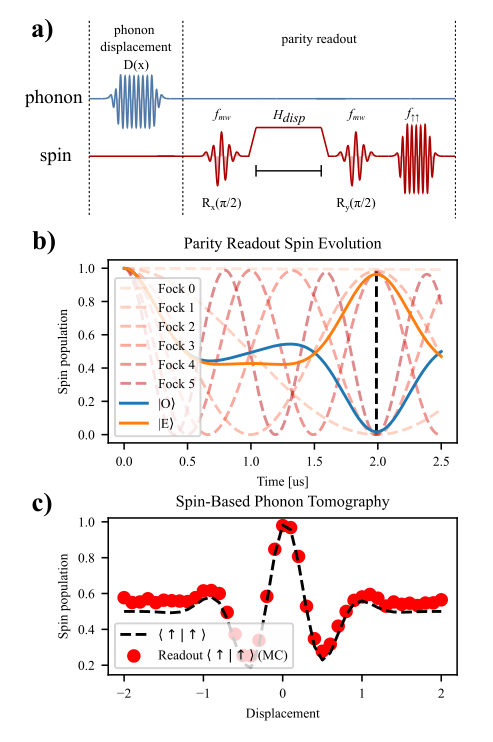
<figcaption class="paper-figure-caption"><b>Fig 4.</b> FIG. 3. Spin-enabled wigner tomography of the phonon state. a) wigner tomography scheme. b) spin population evolu- tion under dispersive interaction with the phonon for different phonon states, including the odd and even cat states prepared in Figure 1. c) Wigner tomography with spin population av- eraged over 1000 Monte Carlo simulated tomography experi- ments with varying real displacement of the even cat state</figcaption>
</figure>
<figure class="paper-figure-card">
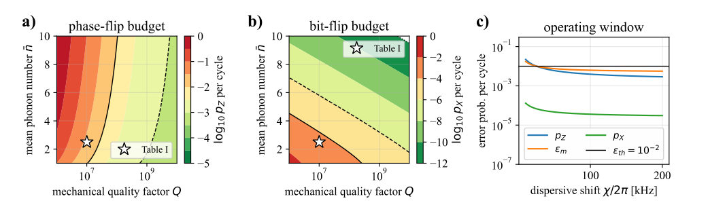
<figcaption class="paper-figure-caption"><b>Fig 5.</b> FIG. 5. Error-correction parameter requirements. a) Per-cycle phase-flip probability pZ (Eq. 10) as a function of mechanical quality factor Q and mean phonon number ¯n, with the Table I operating point marked (star) and the ϵth = 10−2 threshold contour (dashed). b) Per-cycle error probabilities — phase-flip pZ (blue), syndrome/measurement error ϵm (green), and bit-flip pX (orange) — as a function of dispersive shift χ/2π, against the ϵth = 10−2 threshold (black). c) Per-cycle bit-flip probability pX (Eq. 12) as a function of Q and ¯n, with the same Table I operating point and threshold contour as in (a).</figcaption>
</figure>

**Summary.** The paper proposes a novel, high-density quantum computing architecture combining nanomechanical resonators and solid-state spin defects. By using spins as nonlinear couplers, the system can encode information in bosonic cat states, enabling universal quantum gates. This approach promises scalability by achieving small qubit footprints while maintaining long coherence times necessary for error correction.

**Why it may be interesting.** This work provides a concrete blueprint for integrating solid-state quantum memories (spins) with scalable bosonic qubits (resonators), offering an alternative pathway to fault-tolerant computation that addresses density limitations seen in superconducting circuits.

Detailed structure

**Main problem.** Developing a scalable quantum computing platform using bosonic encoding that overcomes the resource intensity and low spatial density of current methods.

**Main result.** The authors demonstrated high-fidelity single-qubit gates (X, Z) and two-qubit entangling operations with fidelities up to 0.98 in a solid-state spin-resonator architecture.

**Method.** The work combines theoretical modeling of the Hamiltonian with numerical simulations (Lindblad/QMC) to demonstrate gate sequences and error correction protocols.

**Model / system.** The platform uses nanomechanical resonators for bosonic encoding (cat states) coupled to strain-sensitive solid-state spin defects. The interaction is modeled via dispersive coupling, allowing for controlled quantum operations.

**Key observables.** Cat state fidelity (>0.98), single-shot optical parity readout fidelity (>0.95), and gate fidelities ($X_L, Z_L$).

**Important parameters / regimes.** The system leverages the small footprint ($\sim 10 \mu	ext{m}^2$) compared to other codes, and long coherence times from diamond spins are key.

**Assumptions / limitations.** The architecture relies on piezoelectric driving for population, and gate fidelity is limited by photon loss or quasi-static noise in certain protocols.

**Figures summary.** Figures illustrate the device structure, unit cell coupling, cat state preparation/readout schemes (using spin ancillae), and detailed sequences for single-qubit gates ($X_L$ via unitary evolution) and parity readout.

**Paper structure.** The paper progresses from defining the physical system and Hamiltonian to demonstrating cat state initialization, followed by protocols for single-qubit gates, two-qubit entanglement generation, and finally addressing noise mitigation through dynamical decoupling techniques.

Abstract

Nanomechanical structures have been investigated as a method of achieving long-lived quantum excitations at radio frequencies. Their high quality factors are especially intriguing as a medium for bosonic encoding of quantum information. However, to leading order, mechanical modes typically lack the nonlinearities necessary to achieve interaction between bosonic channels and thus are limited in their ability to scale to the many-qubit regime necessary for practical quantum computing. In this work, we propose and describe an approach for bosonic quantum information processing that uses strain-sensitive solid-state spins as nonlinear elements to produce the relevant nonclassical mechanical states. We outline the architecture required to achieve nearest-neighbor connectivity between mechanical cat-state qubits on-chip, as well as the control and readout architecture required for universal quantum computation. In addition, we show that this architecture can allow for a high spatial density of logical qubits by leveraging both the efficiency of bosonic error correction schemes and the small sizes of the constituent nanomechanical resonators and spin qubits. Finally, we identify the necessary performance metrics that will enable error-correction thresholds at high qubit densities, illuminating a path towards scalable quantum information processing.

[↑ back to top](#top)

### [Always-on, highly efficient microwave photon detector based on a superconducting artificial molecule](http://arxiv.org/abs/2608.12972v1)

**Authors:** Vyom Kulkarni, Mohammed Ali Aamir, Simon Sundelin, Simone Gasparinetti  
**Type:** experiment · **Category:** other · **PDF:** <https://arxiv.org/pdf/2608.12972v1>  
**Analysis basis:** full PDF text, analyzed in chunks
**Topic relevance:** 🔥 `quantum measurements` **4/5** · `QC/QI experiment` **3/5** · `driven-dissipative phase transition` **2/5** · `quantum optics experiment` **2/5** · `Full counting statistics` **1/5** · `Tavis-Cummings & cavity-many-emitter` **1/5** · `analog quantum simulation` **1/5** · `correlated / nonlocal dissipation` **1/5** · `methods for driven-dissipative` **1/5**

↔ Scroll figures horizontally

<figure class="paper-figure-card">
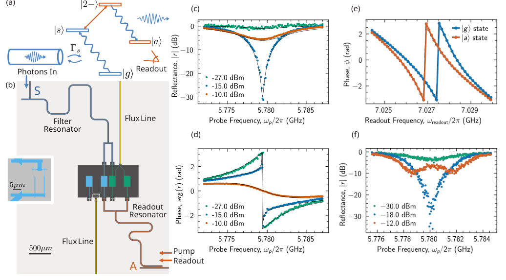
<figcaption class="paper-figure-caption"><b>Fig 1.</b> FIG. 1. a. Operating principle of the detector. Incident photons are absorbed by the symmetric mode. The pump coherently excites the system to the |2−⟩state, which subsequently relaxes to the metastable state |a⟩. The population of |a⟩is continuously monitored using dispersive readout. b. Device layout. The circuit consists of two coupled flux-tunable transmon qubits, shown in light blue and green, which are tuned into resonance using flux lines, shown in yellow. The inset displays the superconducting quantum interference device located in close proximity to the flux line. The device has two radio-frequency ports: waveguide S, which routes incident photons to the detector, and waveguide A,...</figcaption>
</figure>
<figure class="paper-figure-card">
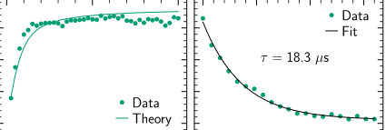
<figcaption class="paper-figure-caption"><b>Fig 2.</b> FIG. 2. Cyclic photodetection. a. Pulse sequence. A 50 µs-long pump is applied to the |s⟩↔|2−⟩transition. The state of |a⟩is measured at the end of the pump using a readout pulse. A coherent photon pulse with calibrated mean photon number ¯n is routed to the detector input a time tdelay before the readout pulse. b. Detection efficiency. Population pa of state |a⟩is measured using single-shot statistics as a func- tion of mean photon number ¯n at zero tdelay. Inset: pa as a function of ¯n in the range ¯n ≤0.2. The solid blue line indi- cates a linear fit. c,d. Representative single-shot histograms for ¯n = 0 and ¯n = 1. e. Cyclic detection efficiency ηcyc vs the photon pulse duration tph at...</figcaption>
</figure>
<figure class="paper-figure-card">
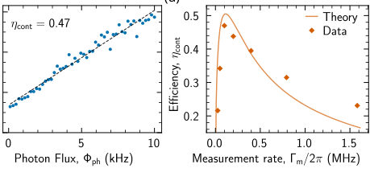
<figcaption class="paper-figure-caption"><b>Fig 3.</b> FIG. 3. Continuous photodetection. a. The pump tone is played continuously while routing a calibrated coherent pho- ton flux Φph to the symmetric mode. The state of the anti- symmetric mode is measured at rate Γm using a continuous tone on the readout resonator. b. A typical 2 ms-long filtered trace exhibiting 10 quantum jumps between the states |g⟩and |a⟩triggered by captured photons. The dashed black line de- notes the threshold above which readout signal is counted as a jump. c. The jump rate, extracted from the time trace, is plotted against the photon flux incident on the symmet- ric mode. Dotted line indicates a linear fit. d. Continuous detection efficiency ηcont is plotted against...</figcaption>
</figure>
<figure class="paper-figure-card">
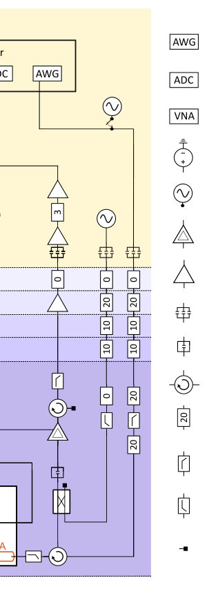
<figcaption class="paper-figure-caption"><b>Fig 4.</b> FIG. 4. Complete experimental setup. See text for description.</figcaption>
</figure>
<figure class="paper-figure-card">
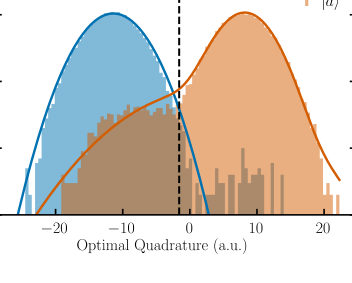
<figcaption class="paper-figure-caption"><b>Fig 5.</b> FIG. 5. Histograms of single-shot readout statistics, with the molecule prepared in |g⟩(blue) and |a⟩(orange). Counts are plotted against the optimal readout quadrature. Solid lines show the fitted Gaussian mixture models and the dashed black line indicates the decision boundary.</figcaption>
</figure>

**Summary.** The paper presents an experimental realization of a continuously operating microwave single-photon detector using a superconducting artificial molecule. By engineering the system dynamics to transfer absorbed photons into a continuously monitored state, they overcome the efficiency vs. duty cycle trade-off inherent in prior detectors. This breakthrough enables continuous quantum measurement crucial for quantum sensing and thermodynamics.

**Why it may be interesting.** This work is highly relevant to AMO physics as it uses superconducting circuits—a platform for engineered quantum matter—to solve a fundamental problem in quantum optics: efficient, continuous single-photon detection.

Detailed structure

**Main problem.** The primary challenge addressed is developing a microwave single-photon detector that achieves high efficiency, low dark counts, and continuous operation simultaneously, overcoming limitations of existing cyclic detectors.

**Main result.** The authors demonstrated a continuously operated detector with a measured efficiency of 0.47, successfully establishing a method for continuous microwave photon detection in quantum technologies.

**Method.** The experiment involves characterizing the system's response using both pulsed (cyclic) and continuous readout protocols, analyzing quantum jumps and signal-to-noise ratios.

**Model / system.** The physical platform is a superconducting artificial molecule built from two coupled transmon qubits. The dynamics are modeled as a four-level system involving symmetric ($	ext{S}$) and anti-symmetric ($	ext{A}$) modes, driven by photon absorption into the $	ext{S}$ mode and monitored via continuous readout of the $	ext{A}$ mode.

**Key observables.** Continuous detection efficiency ($\eta_{	ext{cont}} = 0.47$), dark count rate ($1.3 	ext{ kHz}$), temporal resolution ($1\ \mu	ext{s}$), and dead time ($15\ \mu	ext{s}$).

**Important parameters / regimes.** Operating temperature of $8 	ext{ mK}$; coupling rate $\Gamma_s/2\pi = 7.26 	ext{ MHz}$.

**Assumptions / limitations.** The continuous efficiency is modeled as a product of the intrinsic absorption efficiency ($\eta_{	ext{abs}}$) and the readout fidelity factor ($F_{	ext{cont}}$), which are both dependent on measurement strength.

**Figures summary.** Figures illustrate the operating principle, spectroscopy of the symmetric mode, dispersive readout of the anti-symmetric mode, and the photon transfer mechanism from $	ext{S}$ to $	ext{A}$.

**Paper structure.** The work progresses by first characterizing the system modes (spectroscopy), then demonstrating pulsed detection efficiency ($\eta_{	ext{cyc}}$), and finally establishing continuous operation by modeling the trade-off between absorption and readout fidelity.

Abstract

Efficient detection of single microwave photons is a key capability for emerging quantum technologies. Yet, it remains far less developed than its optical domain counterpart. Realizing detectors that simultaneously achieve high efficiency, low dark counts, and continuous operation has proved challenging. Existing detectors operate cyclically, forcing a trade-off between efficiency and duty cycle. Here, we demonstrate a continuously operated microwave single-photon detector based on a superconducting artificial molecule. In our scheme, an incoming photon is captured by a bright state of the molecule and then transferred to a long-lived dark state via a driven-dissipative process. Photon ``clicks'' are revealed as quantum jumps in the continuously monitored dark state. We observe a cyclic detection efficiency of $0.73$, and a continuous detection efficiency of $0.47$ over a $5\,\mathrm{MHz}$ instantaneous bandwidth, with a $1\,μ\mathrm{s}$ temporal resolution and a $15\,μ\mathrm{s}$ dead time. By overcoming the trade-off between efficiency and duty cycle, this approach establishes continuous microwave photon detection for quantum sensing, quantum thermodynamics, and fundamental physics.

[↑ back to top](#top)

### [Heat transport in driven quantum systems: Comparison between the Floquet-Redfield equation and the master equation in the instantaneous eigenbasis](http://arxiv.org/abs/2608.13308v1)

**Authors:** Luca Magazzù, Christoforus Dimas Satrya, Aleksandr S. Strelnikov, Bayan Karimi, Jukka P. Pekola  
**Type:** theory · **Category:** statistical mechanics · **PDF:** <https://arxiv.org/pdf/2608.13308v1>  
**Analysis basis:** full PDF text, analyzed in chunks
**Topic relevance:** 🔥 `methods for driven-dissipative` **4/5** · `Keldysh / 2PI / non-Gaussian methods` **3/5** · `driven-dissipative phase transition` **3/5** · `non-equilibrium universality` **2/5** · `analog quantum simulation` **1/5** · `correlated / nonlocal dissipation` **1/5** · `quantum measurements` **1/5** · `scars & prethermalization` **1/5**

↔ Scroll figures horizontally

<figure class="paper-figure-card">
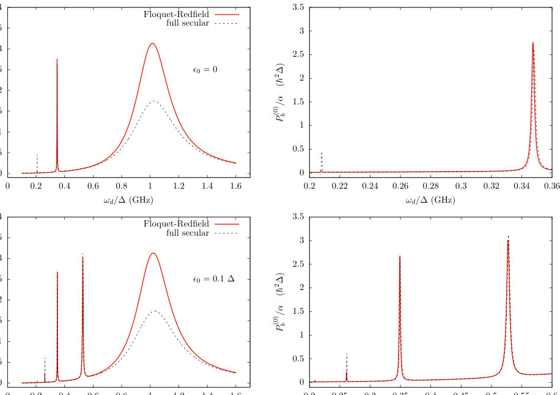
<figcaption class="paper-figure-caption"><b>Fig 1.</b> FIG. 1. Driven qubit. Steady-state heat current to the bath vs. drive frequency for Ad = 0.4 ∆, at zero (upper panels) and finite (lower panels) bias. Details of the peaks in the right panels. Red curves: Numerical solution of the steady-state Floquet-Redfield master equation (28) and Eq. (35) with k = 0 (one-period average of the heat current to the bath). The only approximation used is weak system-bath coupling. Dashed, black lines: Numerical solution of the full secular master equation and heat current, Eqs. (37)-(39). The bath has a ohmic-Drude spectral density function, Eq. (41), with cutoff ωc = 20 ∆and coupling strength α = 0.0003 (relevant for the full Floquet-Redfield master...</figcaption>
</figure>
<figure class="paper-figure-card">
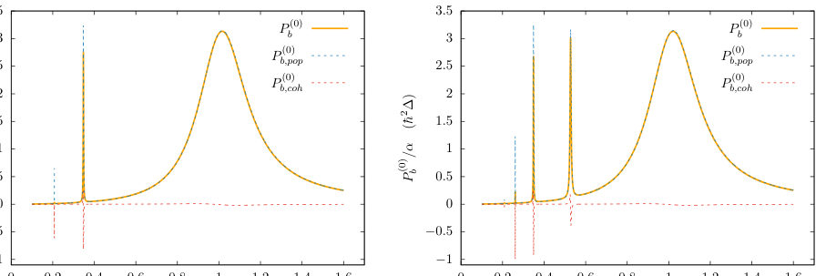
<figcaption class="paper-figure-caption"><b>Fig 2.</b> FIG. 2. Impact of steady-state coherences in the Floquet-Redfield approach. Steady-state heat current to the bath vs. drive frequency for Ad = 0.4 ∆, at zero (left) and finite (right) bias. Orange, solid lines: Numerical solution of the full Floquet- Redfield master equation (28) and Eq. (35) with k = 0 (one-period average of the heat current). Dashed, blue and red lines: separate contributions to P (0) b from populations and coherences, respectively, according to Eq. (42). Parameters are as in Fig. 1</figcaption>
</figure>
<figure class="paper-figure-card">
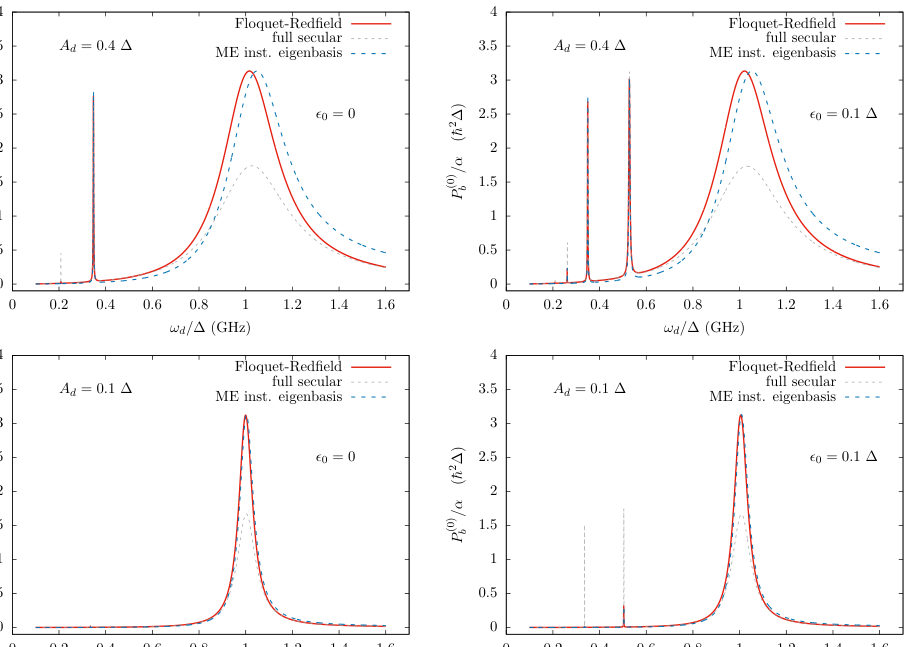
<figcaption class="paper-figure-caption"><b>Fig 3.</b> FIG. 3. Time-averaged, steady-state value of Pb(t) vs. drive frequency, Eqs. (55)-(57) dashed-blue lines. The solution is propagated up to the steady state and averaged over several drive periods for two values of drive amplitude Ad = 0.4 ∆(upper panels) and Ad = 0.1 ∆(lower panels), at zero and finite bias. Comparison with the full Floquet-Redfield equation approach, Eqs. (28) and (35) (the latter with k = 0, i.e. one-period average of the heat current to the bath) (solid red line). The results of the full secular master equation approach, Eqs. (37)-(39), are also shown for reference (dashed, gray lines). Other parameters are as in Fig. 1. Note that the discrepancy at high frequency and...</figcaption>
</figure>
<figure class="paper-figure-card">
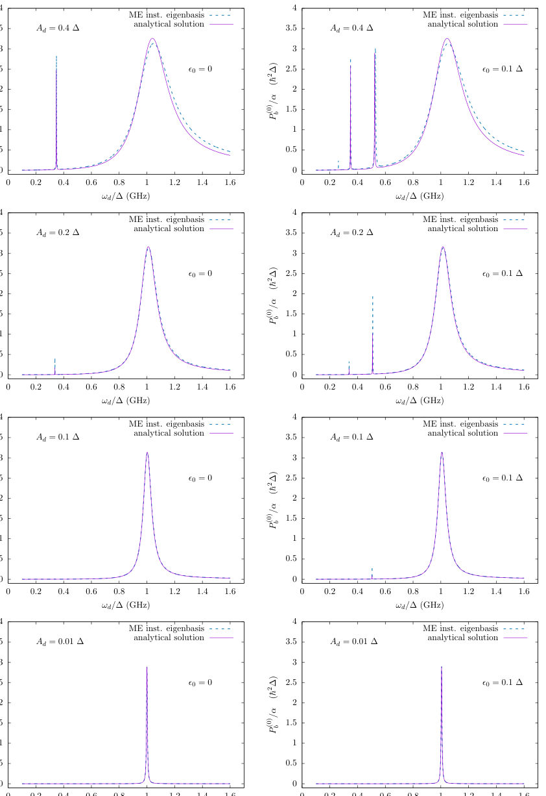
<figcaption class="paper-figure-caption"><b>Fig 4.</b> FIG. 4. One-period average of the heat current to the bath vs. drive frequency. Analytical calculation, Eq. (A4) (solid lines), using the weak-drive expansion for the one-period averaged qubit frequency ¯ωq. Comparison with the numerical solution of the time-dependent master equation in the instantaneous eigenbasis (dashed lines), Eqs. (55)-(57). Parameters are as in Fig. 1.</figcaption>
</figure>

**Summary.** This paper provides a rigorous comparison of theoretical methods—specifically the Floquet-Redfield equation versus the master equation—for modeling heat transport in quantum systems subjected to periodic driving. By analyzing a driven spin-boson model, the authors demonstrate that advanced techniques are necessary to capture non-trivial features like multi-photon resonances in the heat current spectrum, which simpler approximations miss.

**Why it may be interesting.** This is highly relevant as it tackles non-equilibrium quantum thermodynamics in periodically driven systems, a key area where standard approximations often fail to capture resonant or multi-photon effects crucial for understanding energy harvesting and thermal machines.

Detailed structure

**Main problem.** The study compares different theoretical frameworks, specifically the Floquet-Redfield equation versus the full master equation approach, for accurately calculating heat transport in periodically driven quantum systems.

**Main result.** The non-secular Floquet-Redfield approach correctly predicts multi-photon resonances in the heat current spectrum, outperforming simpler secular approximations, especially near resonance points.

**Method.** The authors employ projection operator techniques to derive generalized master equations, which are then analyzed by projecting onto the basis of Floquet states for periodic driving.

**Model / system.** The work analyzes a general open quantum system, exemplified by a driven spin-boson model (a qubit coupled to a bosonic heat bath). The dynamics are governed by Hamiltonians involving time-periodic terms and coupling to an environment characterized by spectral densities.

**Key observables.** Heat current ($P_b(t)$), steady-state populations, coherences ($	ilde{
ho}_{nm}(t)$), and the power spectrum of bath fluctuations $S(\omega)$.

**Important parameters / regimes.** Drive frequency ($\omega_d$), coupling strength (weak coupling limit), spectral density function parameters (e.g., ohmic spectral density).

**Assumptions / limitations.** The analysis develops from exact weak-coupling results, comparing them against approximations like the Markovian or full secular approximations; discrepancies are noted when using the instantaneous eigenbasis approach outside the adiabatic regime.

**Figures summary.** Figures likely compare calculated heat current spectra (e.g., showing multi-photon peaks) derived from different theoretical limits (Floquet-Redfield vs. Secular Master Equation).

**Paper structure.** The paper establishes the general open quantum system dynamics using a master equation, projects this onto the Floquet basis for periodic driving, and then systematically compares results obtained via the full Floquet-Redfield formalism against simplified approximations like the secular or Markovian limits.

Abstract

We provide a comprehensive study of heat transport in periodically driven quantum systems using a combination of master equation and Floquet approach. We give exact results (within the weak coupling Redfield theory, with no Markovian or secular approximations) and compare them with alternative approaches involving further approximations. Numerical and analytical results obtained in their appropriate driving regimes are provided for the driven spin boson-model. The adiabatic regime, which is relevant to thermal machines, is discussed.

[↑ back to top](#top)

### [Neural Quadratic Forms: A Unified Minimal Model for Sudden Learning and Scaling Laws](http://arxiv.org/abs/2608.13335v1)

**Authors:** Liu Ziyin, Yizhou Xu, Tomaso Poggio, Isaac Chuang  
**Type:** theory · **Category:** disordered systems and neural networks · **PDF:** <https://arxiv.org/pdf/2608.13335v1>  
**Analysis basis:** full PDF text, analyzed in chunks
**Topic relevance:** 🔥 `analog quantum simulation` **4/5** · `methods for driven-dissipative` **3/5** · `non-equilibrium universality` **3/5** · `correlated / nonlocal dissipation` **2/5** · `scars & prethermalization` **2/5** · `Keldysh / 2PI / non-Gaussian methods` **1/5** · `driven-dissipative phase transition` **1/5**

↔ Scroll figures horizontally

<figure class="paper-figure-card">
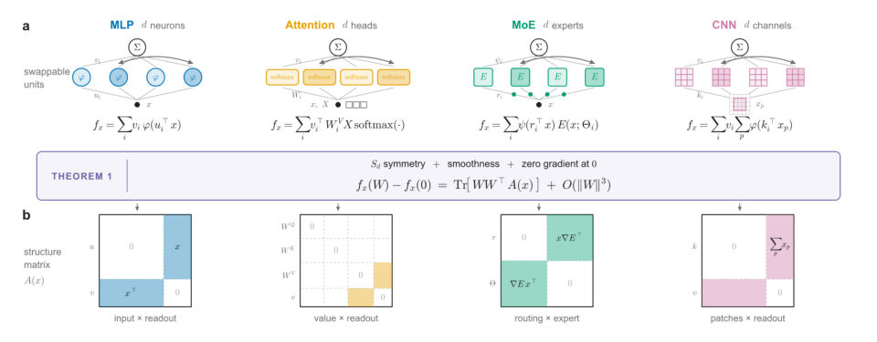
<figcaption class="paper-figure-caption"><b>Fig 1.</b> Figure 1: Permutation symmetry of the units allows us to characterize the model with structure matrices A. (a) Perceptrons, attention layers, mixtures of experts and convolutions are all sums over interchangeable components, so a permutation leaves the represented function unchanged. (b) Training begins with all weights near zero, so each module may be Taylor expanded about that point. Given smoothness and the condition that a component’s gradient vanish whenever that component’s own weights do, symmetry then enforces the same leading quadratic form in every case (Theorem 1), and the architecture survives only in the structure matrix A(x). Here x is a single input to the module.</figcaption>
</figure>
<figure class="paper-figure-card">
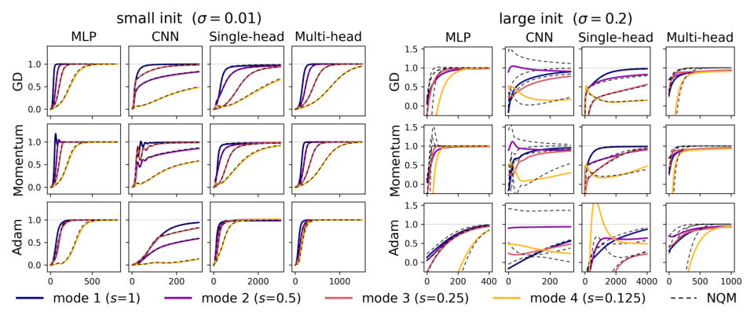
<figcaption class="paper-figure-caption"><b>Fig 2.</b> Figure 2: NQF approximation across initialization, optimizer, and architecture. Two initialization scales are juxtaposed—small init (σ = 0.01, left) and large init (σ = 0.2, right). Within each block, rows are optimizers and columns are architectures. Each module is trained together with its NQF approximation on an NQF teacher with singular values s = (1, 1</figcaption>
</figure>
<figure class="paper-figure-card">
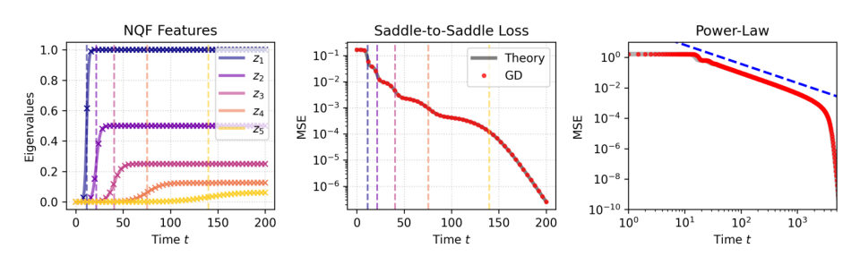
<figcaption class="paper-figure-caption"><b>Fig 3.</b> Figure 3: Sudden learning in a solvable NQF, the phenomenon the theory of this paper is built to explain. The experi- ment is under the feature-wise descent setting of Section 6. Solid lines represent the theory in Theorem 6 and markers represent the results obtained by GD. Vertical dashed lines mark the characteristic timescales t∗ k = 1 rk ln( rk Ckkϵ) where each feature reaches half-saturation. Left: Evolution of the eigenvalues of WW ⊺. Middle: The excess MSE loss over time, which exhibits sequential plateaus. Each sharp drop in the loss aligns with t∗ k. Right: Under the feature-wise descent setting of Section 6, the blue dashed line indicates the theoretical slope and confirms that...</figcaption>
</figure>
<figure class="paper-figure-card">
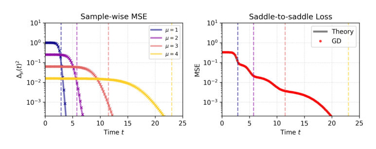
<figcaption class="paper-figure-caption"><b>Fig 4.</b> Figure 4: The experiment is under the setting of the sample-wise descent in Section 6. Solid lines represent the theory of Theorem 5 obtained by numerically solving Eq. (36), and markers represent the empirical results obtained by full- batch GD. Vertical dashed lines mark the characteristic timescales t∗ µ = ζ−1 µ ln(1/ϵ) according to (47). Left: Evolution of the per-sample loss ∆µ(t)2 = (Tr[WW ⊺A(xµ)] −yµ)2, showing independent and sequential convergence. Right: The total empirical MSE loss over time, which exhibits m sequential plateaus. Each discrete drop in the total loss matches the respective timescale t∗ µ.</figcaption>
</figure>
<figure class="paper-figure-card">
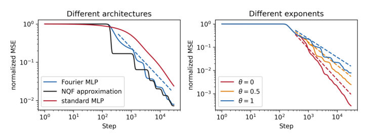
<figcaption class="paper-figure-caption"><b>Fig 5.</b> Figure 5: Curves show the normalized MSE L(t)/L(0); dotted lines are the slopes predicted in Section 6. Left: For θ = 1, the Fourier MLP (blue) descends as the predicted power law t−(2β−1)/(θ+β) (see Appendix C) and is tracked by its NQF approximation (black); a standard tanh MLP trained on the raw input x (red), which does not exhibit the power law. Right: The power-law exponent of the Fourier MLP (solid lines) matches the theory (dashed lines) for θ ∈{0,0.5,1}.</figcaption>
</figure>

**Summary.** This work unifies the theory of neural network training by deriving the Neural Quadratic Form (NQF) based on permutation symmetry. It demonstrates that diverse architectures map onto this single model, whose dynamics are governed by solvable equations like Lotka–Volterra systems. This provides a powerful theoretical tool to predict both sudden learning plateaus and smooth scaling laws across different deep learning models.

**Why it may be interesting.** The mathematical machinery developed—reducing complex high-dimensional learning dynamics to low-dimensional, solvable ODEs governed by symmetry principles—is highly relevant for understanding emergent collective behavior in many-body quantum systems or disordered physical models.

Detailed structure

**Main problem.** The paper unifies two seemingly disparate observations in neural network training: abrupt 'sudden learning' steps and smooth power-law scaling laws.

**Main result.** It shows that the dynamics of various architectures (MLPs, Attention) can be unified under a single mathematical framework called the Neural Quadratic Form (NQF), whose evolution reduces to solvable differential equations like Lotka–Volterra systems.

**Method.** The analysis uses symmetry arguments (permutation symmetry) combined with Taylor expansion around zero weights to derive the NQF structure, followed by solving the resulting low-dimensional dynamical system for the order parameter $M=WW^T$.

**Model / system.** The model is a general neural network trained via gradient descent on a smooth cost function. The core mathematical object is the Neural Quadratic Form (NQF), which approximates the network's behavior near initialization.

**Key observables.** Order parameter $M=WW^T$, effective slope $k_{	ext{eff}}$, and the time evolution of mode amplitudes $
ho_a(t)$.

**Important parameters / regimes.** Initial weight scale ($\epsilon$), learning rate, and architectural parameters defining the structure matrix $A(x)$.

**Assumptions / limitations.** The analysis assumes permutation symmetry ($\mathcal{S}_d$) for the network layer and that the system can be accurately described by a quadratic expansion (NQF) near initialization.

**Figures summary.** Figures illustrate how different architectures reduce to the NQF structure via $A(x)$, show tracking accuracy between full models and NQFs, and compare predicted scaling laws against finite-initialization effects.

**Paper structure.** The paper first establishes Theorem 1 (NQF) using symmetry arguments for various modules. It then analyzes the dynamics by reducing the evolution to moments $(M, \mu)$, showing reduction to Lotka–Volterra equations. Finally, it confirms these predictions by analyzing scaling laws and mode evolution.

Abstract

Neural networks trained by gradient descent on a smooth cost function can nevertheless learn in steps: the cost holds on long plateaus and then drops abruptly. Meanwhile, training losses instead follow smooth power laws. Variants of both behaviors occur in architectures with very different microscopic structures, which is the signature of a few relevant collective variables. We show that a symmetry fixes what those variables are: a network layer is a sum over interchangeable units, so relabeling the units leaves it unchanged; given smoothness and the condition that a unit's gradient vanish at the origin, symmetry then enforces a universal leading form for the expansion about the near-zero weights present at the start of training, the quadratic $\Tr[WW^{\top}A(x)]$, in which every architectural detail is confined to a single ``structure matrix" $A(x)$ that we compute for each architecture. Perceptrons, attention layers, mixtures of experts, and convolutions become one model at different $A$. Its training dynamics then close on the ``order parameter" $M=WW^{\top}$ and, whenever the data matrices share an eigenbasis, reduce to a Lotka--Volterra equation whose modes switch on one after another. The smaller the initial weights, the further apart the switch-on times, and the plateaus appear as a singular limit of a smooth flow; when many modes are unresolved the same events merge into a power law in training time whose exponent the theory predicts. We confirm both numerically across training methods and architectures.

[↑ back to top](#top)

### [Beyond persuasion: Mobile electoral interfaces in polarized societies](http://arxiv.org/abs/2608.13184v1)

**Authors:** Nuno Crokidakis, Celia Anteneodo  
**Type:** theory · **Category:** statistical mechanics · **PDF:** <https://arxiv.org/pdf/2608.13184v1>  
**Analysis basis:** full PDF text, analyzed in chunks
**Topic relevance:** 🔥 `non-equilibrium universality` **4/5** · `driven-dissipative phase transition` **3/5** · `methods for driven-dissipative` **3/5** · `Frenkel-Kontorova` **2/5** · `Keldysh / 2PI / non-Gaussian methods` **1/5** · `correlated / nonlocal dissipation` **1/5** · `scars & prethermalization` **1/5**

↔ Scroll figures horizontally

<figure class="paper-figure-card">
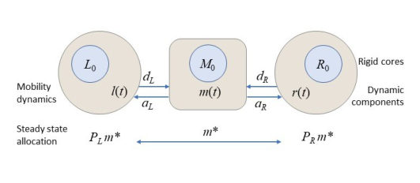
<figcaption class="paper-figure-caption"><b>Fig 1.</b> FIG. 1. Schematic representation of the model. Each polit- ical bloc consists of a rigid partisan core (L0 and R0) and a fluctuating aligned population (l(t) and r(t)). The nonaligned compartment is similarly composed of a rigid nonaligned nu- cleus of size M0 and a mobile electoral interface of size m(t). Alignment and detachment processes determine the size of the mobile interface, with steady state m∗, while a rejection- based probabilistic rule allocates the remaining mobile voters between the competing blocs.</figcaption>
</figure>
<figure class="paper-figure-card">
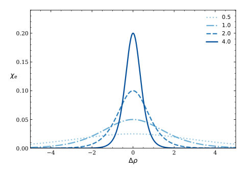
<figcaption class="paper-figure-caption"><b>Fig 2.</b> FIG. 2. Electoral susceptibility χe as a function of the rejec- tion asymmetry ∆ρ = ρR −ρL, for different values of the in- verse social temperature β indicated in the legend (increasing from lighter to darker) and fixed m∗= 0.2. The susceptibil- ity reaches its maximum at ∆ρ = 0, corresponding to equally rejected political blocs, and decreases as the rejection asym- metry increases.</figcaption>
</figure>

**Summary.** This paper models polarized elections by focusing on the dynamics of a mobile voter fraction rather than direct opinion change. It shows that the system's sensitivity to political shocks (electoral susceptibility) is directly controlled by the size and fluctuation dynamics of this mobile interface. This shifts the focus from ideological conversion to interfacial fluctuations as the key driver of electoral outcomes.

**Why it may be interesting.** The mathematical framework of modeling collective behavior using a 'mobile interface' whose fluctuations control macroscopic response mirrors concepts in non-equilibrium statistical mechanics, particularly those involving phase boundaries or critical fluctuations.

Detailed structure

**Main problem.** To model electoral competition in contemporary polarized societies where direct opinion change between stable partisan blocs is suppressed.

**Main result.** Electoral susceptibility to political shocks is found to be proportional to the stationary size of the mobile electoral interface, suggesting fluctuations at this interface govern macroscopic response rather than large-scale ideological conversion.

**Method.** The authors developed a minimal dynamical model using coupled differential equations to track the allocation and dynamics of a mobile voter fraction between two partisan blocs.

**Model / system.** The system partitions the electorate into two stable partisan cores ($L_0, R_0$), fluctuating aligned populations ($l(t), r(t)$), and a key mobile electoral interface ($m(t)$). The dynamics are governed by capture/detachment rates and a Fermi-like probabilistic rule.

**Key observables.** Electoral susceptibility ($\chi_e$) and the stationary size of the mobile electoral interface ($m^*$).

**Important parameters / regimes.** Rejection asymmetries ($
ho_L, 
ho_R$), capture rate ($a$), detachment rates ($d_L, d_R$), and the mobility regime (low vs. high $m^*/m_{\max}$).

**Assumptions / limitations.** Direct transitions between opposing blocs are strongly suppressed; analysis is restricted to homogeneous dynamics for tractability.

**Figures summary.** Figure 1 schematically shows the components of the electorate and the two-step process: mobility dynamics determining $m^*$, followed by rejection-based allocation. Figure 2 illustrates $\chi_e$'s dependence on asymmetry ($\Delta
ho$).

**Paper structure.** The paper establishes the model partitioning, derives equations for mobile interface evolution and voter allocation probabilities (Fermi rule), calculates susceptibility ($\chi_e$) based on these dynamics, and analyzes how different mobility regimes dictate the system's response to shocks.

Abstract

Many traditional models of electoral dynamics emphasize opinion change, social influence and persuasion mechanisms. In contrast, contemporary polarized societies often exhibit relatively stable partisan blocs coexisting with an electorally relevant mobile population. We propose a minimal dynamical model in which electoral competition is governed not by direct persuasion between opposing blocs, but by the dynamics and allocation of a mobile electoral interface. The electorate is partitioned into two stable partisan blocs and a mobile fraction, while direct transitions between the polarized blocs are strongly suppressed. Mobile voters are allocated between the competing blocs through a Fermi-like probabilistic rule governed by rejection asymmetries. Analytical calculations show that the electoral susceptibility to political shocks is proportional to the stationary size of the mobile electoral interface, identifying electoral mobility as the key quantity controlling the macroscopic response of polarized systems to external perturbations. The model naturally predicts a continuum of mobility regimes, ranging from frozen polarization to highly responsive electoral states characterized by a broad mobile interface. These results suggest that, in strongly polarized elections, aggregate electoral changes may be governed primarily by fluctuations at the mobile electoral interface rather than by large-scale ideological conversion.

[↑ back to top](#top)

### [Accelerating a Strong-Coupling Non-Equilibrium Steady-State Impurity Solver using (Quantics) Tensor Trains](http://arxiv.org/abs/2608.13146v1)

**Authors:** Bastian Schindler, Martin Eckstein  
**Type:** theory · **Category:** strongly correlated electrons · **PDF:** <https://arxiv.org/pdf/2608.13146v1>  
**Analysis basis:** full PDF text, analyzed in chunks
**Topic relevance:** 🔥 `Keldysh / 2PI / non-Gaussian methods` **4/5** · `methods for driven-dissipative` **3/5** · `non-equilibrium universality` **3/5** · `driven-dissipative phase transition` **2/5** · `correlated / nonlocal dissipation` **1/5** · `scars & prethermalization` **1/5**

↔ Scroll figures horizontally

<figure class="paper-figure-card">
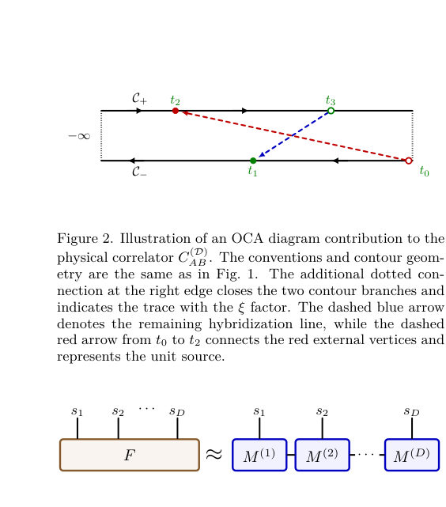
<figcaption class="paper-figure-caption"><b>Fig 1.</b> Figure 3. Illustration of a general decomposition of a D- dimensional tensor F (brown) as a TT with three leg cores M (blue), for example achievable via TCI.</figcaption>
</figure>
<figure class="paper-figure-card">
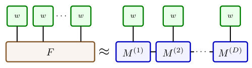
<figcaption class="paper-figure-caption"><b>Fig 2.</b> Figure 4. Hypercubic integration of TT via contraction with independent quadrature weight tensors w (green).</figcaption>
</figure>
<figure class="paper-figure-card">
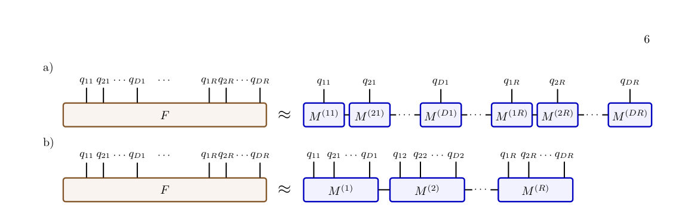
<figcaption class="paper-figure-caption"><b>Fig 3.</b> Figure 5. Quantics tensor-train illustrations, where a) depicts the interleaved and b) the fused quantics decomposition of a quantized tensor.</figcaption>
</figure>
<figure class="paper-figure-card">
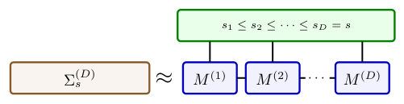
<figcaption class="paper-figure-caption"><b>Fig 4.</b> Figure 7. TT-factorized representation of the integrand with its time-ordering constraint.</figcaption>
</figure>
<figure class="paper-figure-card">
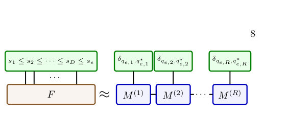
<figcaption class="paper-figure-caption"><b>Fig 5.</b> Figure 8. Illustration of the masked sampling employed for the quantics time decomposition, which results in factorized integration boundaries. The local Kronecker factors fix the external-time bits qe,r to their target values q∗ e,r.</figcaption>
</figure>

**Summary.** This paper introduces an advanced computational technique combining Tensor Cross Interpolation and Quantics Tensor-Trains to efficiently calculate high-dimensional integrals arising in the strong-coupling expansion of quantum impurity models. By implementing this method directly into the real-time Keldysh formalism, the authors achieve a controlled and scalable solver for non-equilibrium steady states in correlated electron systems.

**Why it may be interesting.** This work provides a powerful, systematically improvable numerical framework for calculating non-equilibrium quantum dynamics in strongly correlated systems, which is crucial for understanding open quantum systems far from equilibrium.

Detailed structure

**Main problem.** The primary challenge is evaluating high-dimensional, time-ordered integrals arising from the strong-coupling expansion for quantum impurity models in non-equilibrium steady states (NESS).

**Main result.** The combination of Tensor Cross Interpolation and Quantics Tensor-Train representations substantially reduces the computational cost of evaluating higher-order diagrams, enabling systematic calculations up to the third order.

**Method.** The authors employ a strong-coupling expansion within the Keldysh formalism, utilizing Tensor Cross Interpolation (TCI) to decompose high-dimensional tensors into a low-rank Quantics Tensor-Train (QTT) format for efficient computation of retarded convolutions.

**Model / system.** The work focuses on quantum impurity models, specifically addressing non-equilibrium steady states using the Anderson model and extended Dynamical Mean Field Theory (DMFT) with retarded density-density interactions. The formalism is built around solving Dyson equations for pseudo-particle propagators.

**Key observables.** Pseudo-particle propagator $\hat{G}(t, t')$, self-energy $\hat{\Sigma}(t, t')$, and physical correlation functions $C_{AB}(t, t')$.

**Important parameters / regimes.** The order of the strong-coupling expansion (up to third order), bond dimensions ($\chi$), and artificial broadening parameter ($\eta$).

**Assumptions / limitations.** The method assumes that transient dynamics decay sufficiently fast to allow for a NESS description, necessitating an artificial damping factor $\eta$ in calculations.

**Figures summary.** Figures illustrate the Keldysh contour structure, examples of self-energy diagrams (OCA), and show convergence tests for spectral functions (NCA, OCA, TOA) as a function of broadening ($\eta$) or bond dimension ($\chi$).

**Paper structure.** The paper develops the formalism by first establishing the need to evaluate high-dimensional integrals in NESS. It then introduces TCI/QTT for tensor decomposition and applies this machinery to solve the Dyson equation iteratively, culminating in calculations of higher-order self-energies.

Abstract

Including higher order diagrammatic corrections to the strong-coupling expansion is mainly limited by the evaluation of high-dimensional, time-ordered integrals. In this work we present and compare four different parametrizations of the integrands in order to obtain a low-rank (quantics) tensor-train representation using tensor cross interpolation. Particular emphasis is placed on a quantics time-difference formulation in which the required retarded convolutions are performed directly in quantics tensor-train form. Using controlled Gaussian benchmarks, we analyze the accuracy, bond dimensions, and computational scaling of the different approaches. We then validate the most promising formulations in self-consistent equilibrium and nonequilibrium DMFT calculations and demonstrate calculations up to the third order in the strong-coupling expansion. Finally, we extend the solver to impurity models with retarded density-density interactions and apply it within nonequilibrium extended DMFT. Our results show that tensor cross interpolation substantially reduces the cost of evaluating higher-order diagrams and provides a controlled, systematically improvable framework for nonequilibrium quantum impurity calculations.

[↑ back to top](#top)

### [Controlling quantum transport by measurement-rate modulation](http://arxiv.org/abs/2608.13109v1)

**Authors:** Jesús Casado-Pascual, Luis Octavio Castaños-Cervantes  
**Type:** theory · **Category:** other · **PDF:** <https://arxiv.org/pdf/2608.13109v1>  
**Analysis basis:** full PDF text, analyzed in chunks
**Topic relevance:** 🔥 `quantum measurements` **4/5** · `driven-dissipative phase transition` **3/5** · `methods for driven-dissipative` **3/5** · `non-equilibrium universality` **2/5** · `correlated / nonlocal dissipation` **1/5** · `scars & prethermalization` **1/5**

↔ Scroll figures horizontally

<figure class="paper-figure-card">
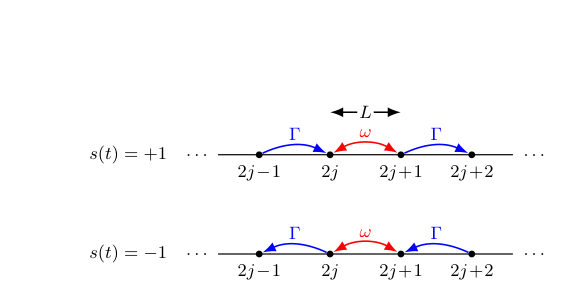
<figcaption class="paper-figure-caption"><b>Fig 1.</b> FIG. 1. Schematic representation of the lattice for the two possible values of the time-dependent lattice configuration s(t). The lattice consists of equally spaced sites separated by a distance L. Coherent tunneling (red double-headed ar- rows) couples the two sites within each dimer (2j, 2j + 1) with tunneling rate ω, whereas incoherent hopping (blue ar- rows) connects neighboring dimers with transition rate Γ. For s(t) = +1, hopping proceeds from site 2j −1 to site 2j, whereas for s(t) = −1 the hopping direction is reversed. The two configurations therefore favor transport in opposite direc- tions.</figcaption>
</figure>
<figure class="paper-figure-card">
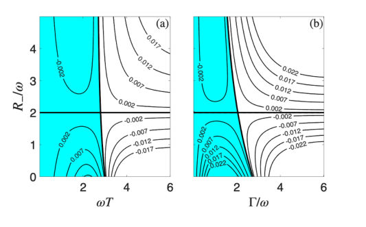
<figcaption class="paper-figure-caption"><b>Fig 2.</b> FIG. 3. Transport-regime diagram for the periodic proto- col. Black curves are contour lines of the dimensionless long- time averaged velocity v∞/(ωL). The thick solid curves in- dicate the zero-current boundaries (v∞= 0). The cyan- shaded region denotes the anti-Zeno-dominated transport regime (κ &gt; 0), while the unshaded region corresponds to the Zeno-dominated regime (κ &lt; 0), with the two regimes separated by the boundary κ = 0. (a) Dependence on ωT and R−/ω for Γ/ω = 0.5. (b) Dependence on Γ/ω and R−/ω for ωT = 2. In both panels, R+/ω = 2.</figcaption>
</figure>
<figure class="paper-figure-card">
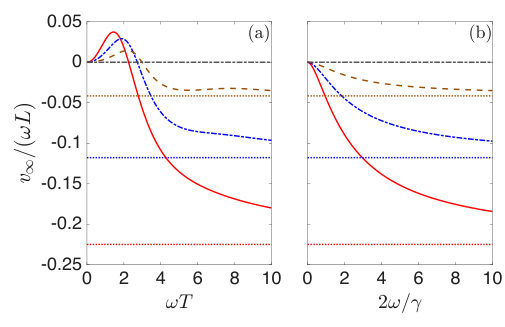
<figcaption class="paper-figure-caption"><b>Fig 3.</b> FIG. 2. Dimensionless long-time averaged velocity v∞/(ωL) as a function of (a) ωT for the periodic protocol and (b) 2ω/γ for the stochastic protocol. Whereas the stochastic protocol preserves the transport direction for all switching rates, the periodic protocol exhibits a current reversal as the switching period decreases, signaling a crossover from Zeno- to anti-Zeno-dominated transport. The curves correspond to R+/ω = 2, R−/ω = 0.2, and Γ/ω = 0.5 (brown dashed), 1 (blue dash-dotted), and 2 (red solid). The horizontal gray dash-dotted line indicates zero current, while the colored dot- ted lines denote the asymptotic slow-switching limit.</figcaption>
</figure>
<figure class="paper-figure-card">
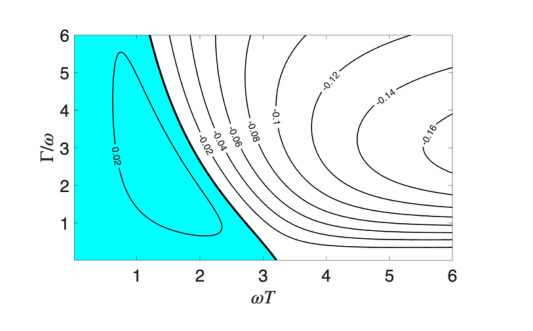
<figcaption class="paper-figure-caption"><b>Fig 4.</b> FIG. 4. Transport-regime diagram in the (ωT, Γ/ω) plane for the periodic protocol, corresponding to the parameters R+/ω = 2 and R−/ω = 0.2. Black curves are contour lines of the dimensionless long-time averaged velocity v∞/(ωL). The thick solid curve indicates the zero-current boundary (v∞= 0). The cyan-shaded region denotes the anti-Zeno- dominated transport regime (κ &gt; 0), while the unshaded re- gion corresponds to the Zeno-dominated regime (κ &lt; 0); the boundary is defined by κ = 0.</figcaption>
</figure>

**Summary.** This paper demonstrates that modulating the rate at which a quantum particle is measured can be used as a control knob to induce directed current flow in an otherwise symmetric system. By analyzing both periodic and stochastic switching protocols, the authors show that breaking the symmetry of measurement rates ($\delta R 
eq 0$) is necessary for non-zero transport. The work provides deep insights into the interplay between coherent dynamics, dissipation, and measurement backaction.

**Why it may be interesting.** This work provides concrete theoretical tools to engineer non-equilibrium quantum transport in open systems, directly relevant to controlling quantum dynamics using measurement backaction, a key area in quantum optics and AMO physics.

Detailed structure

**Main problem.** The research addresses how controlling open-system dynamics and stationary quantum transport can be achieved by temporally modulating the measurement rate (measurement backaction).

**Main result.** Directed particle transport is only possible when the measurement rate is modulated ($\delta R 
eq 0$), as this breaks the dynamical symmetry of the system.

**Method.** The authors derive exact analytical expressions for the long-time current using methods applicable to both periodic and stochastic switching protocols, including solving coupled linear differential equations.

**Model / system.** The model is a minimal exactly solvable quantum particle on a 1D lattice that undergoes continuous monitoring. The dynamics are governed by a master equation incorporating coherent tunneling, incoherent hopping, and measurement-induced dephasing terms whose rates switch between two values ($R^+$ and $R^-$).

**Key observables.** Long-time averaged particle velocity ($v_\infty$), which serves as the primary diagnostic for directed transport.

**Important parameters / regimes.** The difference in measurement rates ($\delta R = (R^+ - R^-)/2$) is crucial; the analysis also explores limits like slow-switching and fast-driving regimes.

**Assumptions / limitations.** For stochastic switching, the system is assumed to be ergodic. For periodic switching, convergence to an asymptotic state is assumed.

**Figures summary.** Figure 1 illustrates the lattice structure for different switching states; Figure 2 plots $v_\infty$ versus driving parameters (period or rate); Figures 3 and 4 map out transport regimes separating Zeno-dominated from anti-Zeno-dominated transport regions.

**Paper structure.** The paper first establishes the general dynamics using a master equation for a switching lattice. It then derives analytical solutions for the long-time current under periodic driving, followed by an analysis using the Birkhoff ergodic theorem for stochastic switching. Finally, it compares results across different time/driving limits.

Abstract

Temporal modulation of the measurement rate provides a powerful mechanism for controlling open-system dynamics through measurement backaction. We demonstrate this mechanism in a minimal exactly solvable model of a continuously monitored quantum particle on a switching lattice. We derive exact analytical expressions for the long-time current under both periodic and stochastic switching, revealing a common slow-switching limit and identifying a measurement-induced crossover between Zeno- and anti-Zeno-dominated transport regimes that controls the direction of the current.

[↑ back to top](#top)

### [Mid-circuit ground-state cooling and ancilla readout in the $\textit{omg}$ architecture](http://arxiv.org/abs/2608.13181v1)

**Authors:** Sean Brudney, Connor Burns, Gabriel J. Gregory, Evan Ritchie, David J. Wineland, David T. C. Allcock, Jameson O'Reilly  
**Type:** experiment · **Category:** other · **PDF:** <https://arxiv.org/pdf/2608.13181v1>  
**Analysis basis:** full PDF text, analyzed in chunks
**Topic relevance:** 🔥 `QC/QI experiment` **4/5** · `quantum measurements` **3/5** · `driven-dissipative phase transition` **2/5** · `quantum optics experiment` **2/5** · `analog quantum simulation` **1/5** · `correlated / nonlocal dissipation` **1/5** · `methods for driven-dissipative` **1/5**

↔ Scroll figures horizontally

<figure class="paper-figure-card">
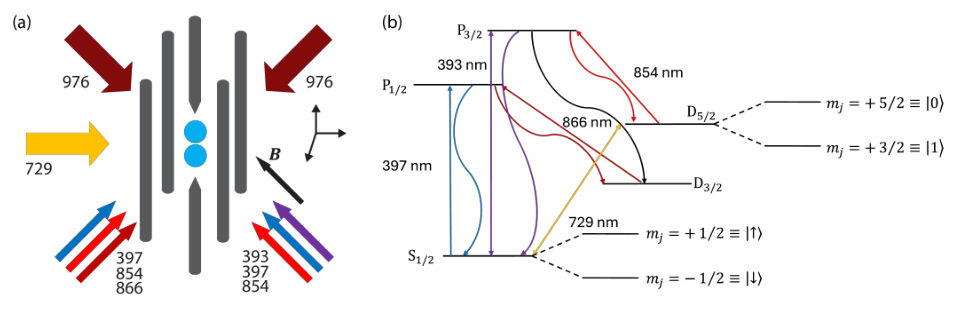
<figcaption class="paper-figure-caption"><b>Fig 1.</b> FIG. 1. Experiment overview. (a) Cartoon of two ions in the trap with directions and wavelengths of incident laser beams in nm. All beam diameters are, in reality, larger than the ion spacing of ∼6 µm. (b) Level diagram of 40Ca+</figcaption>
</figure>
<figure class="paper-figure-card">
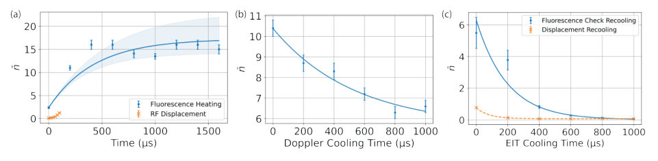
<figcaption class="paper-figure-caption"><b>Fig 2.</b> FIG. 2. (a) Fluorescence heating (solid blue) and RF displacement (dashed orange). (b) Doppler cooling after fluorescence heating. (c) EIT cooling after Doppler cooling (blue) and directly after RF displacement (orange).</figcaption>
</figure>
<figure class="paper-figure-card">
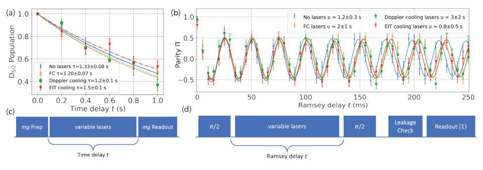
<figcaption class="paper-figure-caption"><b>Fig 3.</b> FIG. 3. Preservation of the m-qubit during dissipative operations on the ancilla ion. (a) Lifetime measurement of the D5/2 manifold using a single ion while exposed to various sets of laser beams. (b) Parity oscillations of the two m- qubit protected subspace while ions are exposed to various laser beams. (c) Pulse sequence of lifetime measurement. (d) Pulse sequence of Ramsey experiment to measure parity.</figcaption>
</figure>
<figure class="paper-figure-card">
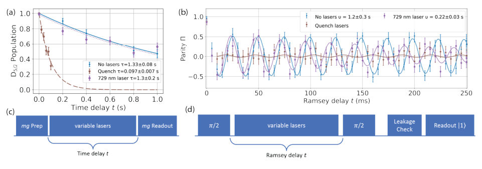
<figcaption class="paper-figure-caption"><b>Fig 4.</b> FIG. 4. Effect of ground-state cooling techniques on the m-qubit. (a) Lifetime measurement of the D5/2 manifold in an mg crystal while ions are exposed to various laser beams. (b) Ramsey experiment for two m-qubits while ions are exposed to various laser beams. (c) Pulse sequence of lifetime measurement. (d) Pulse sequence of Ramsey experiment to measure parity.</figcaption>
</figure>
<figure class="paper-figure-card">
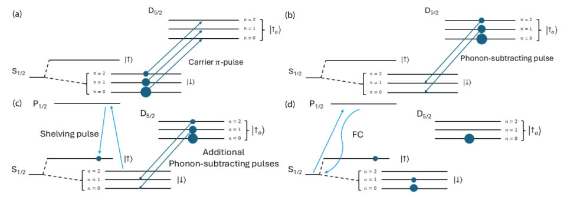
<figcaption class="paper-figure-caption"><b>Fig 5.</b> FIG. 5. Diagram of our measurement-based cooling technique. Relative motional populations are represented by size of the circles corresponding to each Fock state. (a) The g-qubit is Doppler and EIT cooled, prepared in |↓⟩, and then is shelved with a 729 nm carrier π-pulse to |↑o⟩≡|D5/2, m = −5/2⟩. (b) A 729 nm pulse on the first phonon-subtracting sideband drives population in motional states n &gt; 0 from |↑o⟩back to |↓⟩. (c) Population in |↓⟩ is pumped into |↑⟩to allow an additional phonon-subtracting pulse to bring n &gt; 0 population in |↑o⟩that was missed by the previous deshelving pulse down to the ground state. This combination of pulses can be repeated to increase the likelihood that all...</figcaption>
</figure>

**Summary.** The paper reports on achieving mid-circuit ground-state cooling in the omg trapped-ion architecture. By using dissipative operations on one qubit species to cool the shared motional mode, they enable non-destructive readout of a second metastable qubit. This capability is crucial for implementing error correction and complex quantum gates in future ion trap processors.

**Why it may be interesting.** This work directly addresses crucial hardware requirements—cooling and readout fidelity—for scaling trapped-ion quantum computers, providing vital experimental benchmarks for open quantum system control.

Detailed structure

**Main problem.** The core challenge is demonstrating mid-circuit ground-state cooling and non-destructive ancilla readout within the optical-metastable-ground (omg) trapped-ion architecture.

**Main result.** The authors successfully demonstrated cooling the global motional mode to near the quantum ground state ($ar{n} \approx 0$) while preserving the coherence of the metastable qubit, enabling non-destructive readout for quantum logic spectroscopy.

**Method.** The technique combines measurement-based cooling using dissipative operations on the ground qubit with fluorescence detection on an ancilla ion to read out the metastable qubit state.

**Model / system.** The physical system is a trapped-ion crystal utilizing two species: a metastable qubit ($	ext{m}$) and a ground state ($	ext{g}$) ancilla. The process involves complex laser sequences, including Doppler cooling, EIT cooling, and specialized sideband driving for cooling.

**Key observables.** Motional state occupation number ($ar{n}$), FC success rate ($99.81\%$), and qubit coherence times ($T_2$).

**Important parameters / regimes.** Cooling fidelity achieved to $ar{n} = 0.02(1)$; the metastable qubit lifetime is assumed largely undisturbed during short pulses.

**Assumptions / limitations.** The primary assumption is that the metastable manifold remains spectrally isolated from the fast cycling transitions used for detection and cooling.

**Figures summary.** Figures illustrate the laser beam geometry for two ions, and show the sequence of Doppler and EIT cooling steps alongside heating effects from fluorescence checks or RF displacement.

**Paper structure.** The paper details the experimental setup, presents measurements on motional excitation sources (FCs, RF pulses), validates the non-destructive readout mechanism via QLS principles, and concludes by confirming ground-state cooling capability for fault-tolerant primitives.

Abstract

The trapped-ion optical-metastable-ground ($\textit{omg}$) architecture for quantum processors promises the full functionality of two-species experiments, including sympathetic cooling and non-destructive ancilla readout, without the corresponding hardware overhead. We confirm that we can cool a global motional mode of a mixed metastable-ground state Coulomb crystal to the motional ground state via dissipative operations on the ground ($\textit{g}$) qubit without disturbing coherence of the metastable ($\textit{m}$) qubit. This enables quantum logic spectroscopy to non-destructively readout the state of the $\textit{m}$ qubit using fluorescence detection of the $\textit{g}$ qubit. Extensions of these demonstrations to larger system sizes should enable the mitigation of motional heating after ion shuttling and syndrome extraction for quantum error correction, both crucial primitives for future fault-tolerant quantum computers based on trapped ions.

[↑ back to top](#top)

### [Resonant Far-Infrared Spectroscopy of Flat-Band Fermions in Magic Angle Graphene](http://arxiv.org/abs/2608.12553v1)

**Authors:** Ayelet J. Uzan-Narovlansky, Ipsita Das, Juan F. Mendez Valderrama, Yue Tang, Jonah Herzog-Arbeitman, Haoyu Hu, Pengjie Wang, Zhaoyi Joy Zheng, Haosen Guan, Kenji Watanabe, Takashi Taniguchi, B. Andrei Bernevig, Sanfeng Wu  
**Type:** both · **Category:** strongly correlated electrons · **PDF:** <https://arxiv.org/pdf/2608.12553v1>  
**Analysis basis:** full PDF text, analyzed in chunks
**Topic relevance:** 🔥 `analog quantum simulation` **4/5** · `Keldysh / 2PI / non-Gaussian methods` **3/5** · `methods for driven-dissipative` **2/5** · `quantum measurements` **2/5** · `driven-dissipative phase transition` **1/5** · `interference shaping light` **1/5** · `quantum optics experiment` **1/5**

↔ Scroll figures horizontally

<figure class="paper-figure-card">
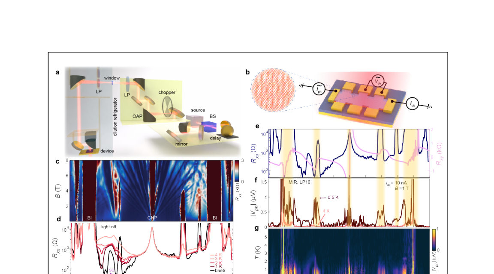
<figcaption class="paper-figure-caption"><b>Fig 1.</b> Fig.1. Millikelvin FIR spectroscopy and the MATBG devices. a, Schematic description of millikelvin FIR optical detection platform based on Fourier transform infrared spectroscopy. b, FIR excitation spectrum is measured via photocurrent (Iph) and photovoltage (Vph) in the presence of d.c. current (Idc) applied to the source contact. c, Rxx of D1 as a function of B and v taken at base temperature (with light off). d, Temperature (T) dependence of the Rxx traces, showing the insulating and superconducting (SC) states. e, A selected longitudinal and transverse resistivity (Rxx &amp; Rxy) traces taken with light off and at B = 1 T. f, Photovoltage (Vph) as a function of filling factor v, taken at T...</figcaption>
</figure>
<figure class="paper-figure-card">
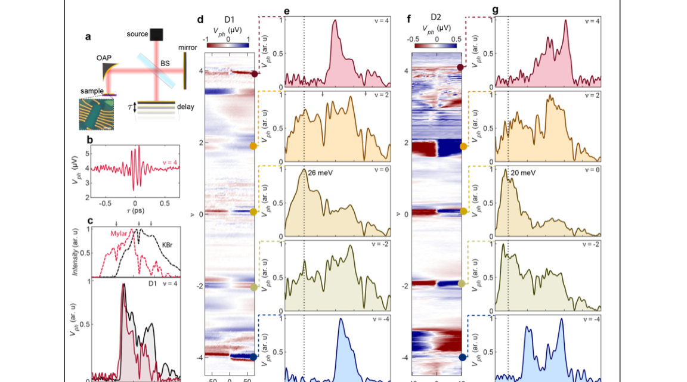
<figcaption class="paper-figure-caption"><b>Fig 2.</b> Fig. 2. Filling dependence FIR spectra of MATBG. a &amp; b, Schematic description of FTIR spectroscopy (a) and a representative oscillating photovoltage interferogram (red curve) as a function of the time delay (τ ) between the two optical beams (b). c, Top: The reference input source spectrum, detected via external detector, highlight the best working range of the two beamsplitters (BS) of KBr (black) and Mylar (red). The features due to beamsplitter absorption (dips) are marked with gray arrows. Bottom: The excitation spectrum of D1 at filling v = +4, detected using the KBr (black) or Mylar (red) beamsplitter at B = 1 T and at the base T. d &amp; f, Photovoltage map (D1 and D2, respectively) as a...</figcaption>
</figure>
<figure class="paper-figure-card">
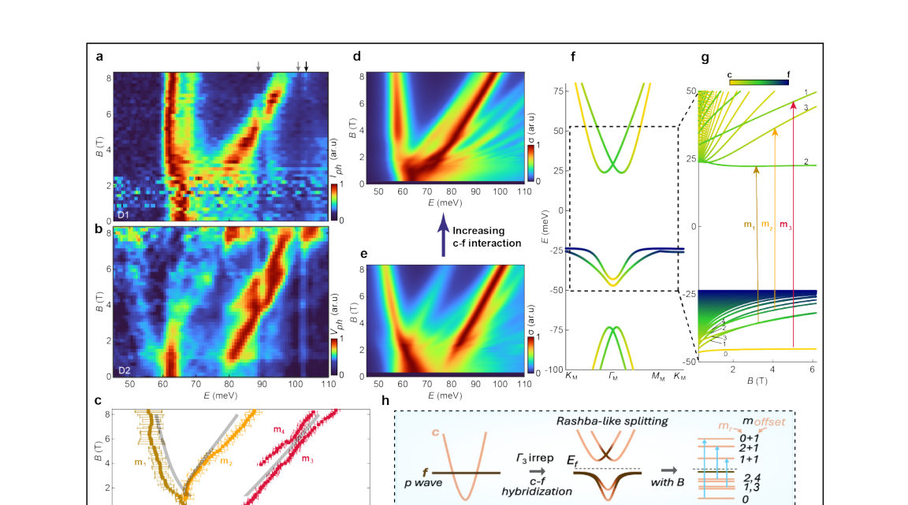
<figcaption class="paper-figure-caption"><b>Fig 3.</b> Fig. 3. Interaction-driven resonances at v = +4 and the optical selection rule. a &amp; b, The FIR spectra taken at v = +4 as a function of B, of device D1 and D2, respectively. Data is taken at the base T with KBr beamsplitter. Each spectrum is normalized by its maximum value. BS absorption lines are marked by gray arrows and the hBN phonon excitation at 102 meV is marked by the black arrow. c, Extraction of the resonance energy for each mode observed in D2 (b) as a function of B. The theoretical prediction for these excitations (m1-m3, extracted from e) is presented by the gray curves. d &amp; e, Calculated infrared excitation spectra based on the THF model. e is a simulation with parameters that...</figcaption>
</figure>
<figure class="paper-figure-card">
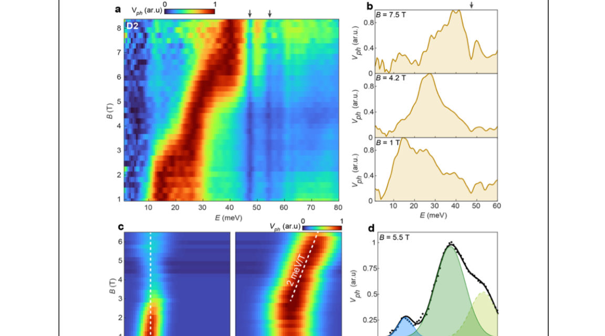
<figcaption class="paper-figure-caption"><b>Fig 4.</b> Fig. 4. Many-body resonances at the CNP. a, FIR excitation spectrum map, as a function of B, resolved at base T using Mylar BS. Each spectrum at a given B is normalized by its maximum value. The BS absorption lines are marked with gray arrows. b, Linecuts of the excitation spectra, at B = 1 T, 4.2 T and 7.5 T, respectively. c, Left and right maps: Gaussian decomposition of the spectra, identifying two low-energy modes and their magnetic-field evolution (each mode is plotted in a separated map). The white dash lines indicate the shift (right map) or the absence (left map) of shift in its resonance energy. d, Demonstration of the Gaussian decomposition for the excitation spectrum resolved at...</figcaption>
</figure>

**Summary.** This work reports the first FIR spectroscopy of interacting moiré bands in MATBG using a novel millikelvin platform. By combining experiment with the Topological Heavy-Fermion model, the authors revealed characteristic resonances arising from strong light-matter coupling between itinerant and localized electrons. This provides fundamental insight into correlated electronic states in twisted 2D materials.

**Why it may be interesting.** The strong coupling between optical fields and emergent many-body modes in flat bands provides a clean platform for studying light-matter interaction in strongly correlated electronic systems, relevant to quantum optics and open quantum systems dynamics.

Detailed structure

**Main problem.** Optical spectroscopy of interacting moiré bands in the far-infrared (FIR) regime has been largely unexplored due to extreme experimental challenges.

**Main result.** The study observed characteristic FIR resonances in MATBG, showing that light-matter interaction is governed by itinerant topological electrons acting as an 'antenna' coupled to localized heavy fermions.

**Method.** The research combines new millikelvin FIR spectroscopy measurements with theoretical modeling using the Topological Heavy-Fermion (THF) model.

**Model / system.** The system is Magic Angle Twisted Bilayer Graphene (MATBG), whose physics is modeled by the THF framework, which incorporates Hubbard interactions for localized heavy fermions and topological character from itinerant light fermions.

**Key observables.** FIR resonances, photovoltage ($	ext{V}_{	ext{ph}}$) spectra, transport characteristics ($	ext{R}_{	ext{xx}}$), and spectral weight development at low energies.

**Important parameters / regimes.** Filling factor ($v$), magnetic field ($B$), temperature ($T$), on-site Coulomb energy, and various coupling constants within the THF model (e.g., $W_1, W_3, U_1$).

**Assumptions / limitations.** The analysis assumes that itinerant topological electrons couple strongly to the optical field, and the THF model provides a practical route to compute the optical response.

**Figures summary.** Figures show FIR spectra mapping photovoltage vs. filling factor/bias current; theoretical calculations illustrate resonance dependence on magnetic field and strain ($\sigma(\omega)$).

**Paper structure.** The paper establishes the experimental gap, presents measurements using a new millikelvin platform to observe resonances in MATBG, develops the THF model to explain these findings, and analyzes parameter sensitivity across different doping regimes.

Abstract

Moiré engineering in twisted two-dimensional (2D) materials radically alters low-energy bands, interactions and topological quantum states. Despite extensive studies, optical spectroscopy of interacting moiré bands in the characteristic far-infrared (FIR) regime has remained largely unexplored due to extreme experimental challenges. Using a newly developed millikelvin FIR platform, we report the observation of the long-sought-after characteristic FIR resonances of flat-band electrons in magic-angle twisted bilayer graphene (MATBG). We observe highly tunable spectroscopic signatures of interacting light and heavy fermions that constitute the flat bands in MATBG. Using the topological heavy-fermion model (THF), we show that itinerant topological electrons act as an "antenna" that couples strongly to the optical field, with resonant frequencies renormalized by the hybridization with localized heavy electrons. We establish optical selection rules of MATBG which uncovers the key symmetry governing light-heavy fermion hybridization. At charge neutrality, we observe pronounced resonances at energies below the on-site Coulomb energy, implying the emergence of new many-body modes. Our experiments and modeling provide a fundamental understanding of light-matter interactions in MATBG and enable resonant optical spectroscopy of moiré bands down to millikelvin temperatures.

[↑ back to top](#top)

### [Aperiodicity is sufficient for macroscopic thermalization](http://arxiv.org/abs/2608.13462v1)

**Authors:** Amit Vikram  
**Type:** theory · **Category:** statistical mechanics · **PDF:** <https://arxiv.org/pdf/2608.13462v1>  
**Analysis basis:** full PDF text, analyzed in chunks
**Topic relevance:** 🔥 `scars & prethermalization` **4/5** · `non-equilibrium universality` **3/5** · `driven-dissipative phase transition` **2/5** · `analog quantum simulation` **1/5** · `correlated / nonlocal dissipation` **1/5** · `methods for driven-dissipative` **1/5** · `quantum measurements` **1/5**

↔ Scroll figures horizontally

<figure class="paper-figure-card">
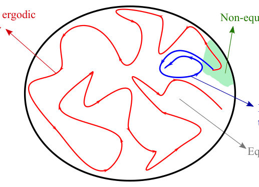
<figcaption class="paper-figure-caption"><b>Fig 1.</b> Figure 1: A depiction of the role of ergodic dynamics in macroscopic thermalization in a schematic state space. The equilibrium region takes up almost all of the phase space, and the nonequilibrium region (shaded) takes up a vanishing fraction (pictured as disproportionately large and connected here for convenience). Partial ergodicity (exploring a fraction of the phase space) is sufficient for macroscopic thermalization at almost all times along the trajectory, without requiring formal ergodicity (exploring the full phase space). Moreover, partial ergodicity is necessary to establish finite-time macroscopic thermalization, which conventional ergodicity cannot formally guarantee (for...</figcaption>
</figure>

**Summary.** This paper proposes that macroscopic quantum systems can thermalize even when starting from non-equilibrium states, provided the dynamics exhibit sufficient aperiodicity. The key breakthrough is establishing that this equilibration can be predicted using only information about the decay of initial state return probabilities over finite time intervals. This provides a strong, operational framework for understanding thermalization in complex quantum many-body systems.

**Why it may be interesting.** It offers a powerful, operational extension to traditional thermalization theory by providing concrete, computable criteria applicable over experimentally relevant finite time windows, moving beyond the limitations of infinite-time averages.

Detailed structure

**Main problem.** The paper seeks a general mechanism to explain how macroscopic quantum observables thermalize over finite time scales in isolated, non-equilibrium systems.

**Main result.** It shows that mere aperiodicity and the small return probability of initial states over a finite time interval are sufficient conditions for predicting macroscopic equilibration at almost all times.

**Method.** The approach connects concepts from dynamical ergodicity (aperiodicity) to operational quantum statistical mechanics, providing criteria based on observable decay rather than relying solely on infinite-time limits.

**Model / system.** The focus is on isolated many-body quantum or classical systems. The analysis centers on macroscopic observables like coarse-grained charge densities, treating the system as evolving from a non-equilibrium state towards equilibrium.

**Key observables.** Coarse-grained observables (e.g., charge densities), return probability of initial states, and memorylessness decay.

**Important parameters / regimes.** Finite observation times, the thermodynamic limit ($N 	o \infty$), and the degree of aperiodicity.

**Assumptions / limitations.** The primary assumption is that the mechanism can be characterized by observable-independent information, specifically the small return probability over finite time ranges.

**Paper structure.** The paper develops the theory by first identifying aperiodicity as the key measure of partial ergodicity. It then contrasts this finite-time approach with standard infinite-time ergodic theorems, culminating in a framework that unifies memorylessness decay, state alignment, and predictions for various thermalization regimes.

Abstract

We identify a general mechanism for the finite-time thermalization of macroscopic observables, such as coarse-grained charge densities, in terms of elementary forms of the quantum dynamics of initial states: (1) aperiodicity, which provides a computable measure of (2) a dynamical partially ergodic exploration of the Hilbert space. Specifically, this mechanism predicts the equilibration of all (concentrated) macroscopic observables, in almost all states in an initial ensemble and almost all times within finite and longer intervals, given only the observable-independent information that the return probability of the ensemble of initial states is small over a finite time range. As a special case, it also accesses standard results on equilibration over infinitely long times in terms of (stronger versions of) the effective dimension of initial state delocalization in the energy eigenbasis. Our results incorporate macroscopic thermalization into the domain of operational quantum statistical mechanics, recently developed to provide finitely computable criteria for microscopic thermalization. We discuss an overall characterization of this approach as establishing connections between (1) the decay of a (theoretically or experimentally) computable probe indicating memorylessness, (2) a fundamental invariant mechanism in terms of the alignment of observables or states in the Hilbert space, and (3) predicting different natural forms of (classical and) quantum thermalization, most of which rigorously recover conventional eigenstate-based descriptions of infinite-time thermalization as a special case but provide stronger accessible predictions over finite observation times in the thermodynamic limit.

[↑ back to top](#top)

### [Coherent temporal filtering of multimode parametric down-conversion using a quantum pulse gate](http://arxiv.org/abs/2608.12544v1)

**Authors:** Abhinandan Bhattacharjee, Patrick Folge, Laura Serino, Sebastian Lengeling, Benjamin Brecht, Christine Silberhorn  
**Type:** both · **Category:** quantum information and computing · **PDF:** <https://arxiv.org/pdf/2608.12544v1>  
**Analysis basis:** full PDF text, analyzed in chunks
**Topic relevance:** 🔥 `quantum optics experiment` **4/5** · `interference shaping light` **3/5** · `quantum measurements` **2/5** · `QC/QI experiment` **1/5** · `driven-dissipative phase transition` **1/5** · `methods for driven-dissipative` **1/5**

↔ Scroll figures horizontally

<figure class="paper-figure-card">
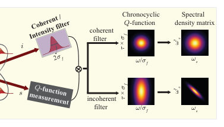
<figcaption class="paper-figure-caption"><b>Fig 1.</b> Fig. 1. (a) Conceptual distinction between coherent filtering and intensity filtering. (b) Implementation of coherent and intensity filtering on a time–frequency entangled parametric down-conversion (PDC) source. Filtering is applied to the heralding (idler) photon (푖). The effect of filtering is characterized through the chronocyclic 푄-function of the signal photon (푠), from which the corresponding spectral density matrix is reconstructed.</figcaption>
</figure>
<figure class="paper-figure-card">

<figcaption class="paper-figure-caption"><b>Fig 2.</b> Fig. 2. Schematic of the experimental setup. mQPG: multi-output quantum pulse gate, BP: bandpass, DM: dichroic mirror, APD: avalanche photodiode, SNSPD: supercon- ducting nanowire single-photon detector</figcaption>
</figure>
<figure class="paper-figure-card">
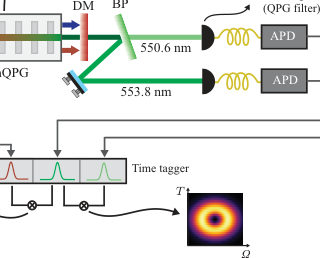
<figcaption class="paper-figure-caption"><b>Fig 3.</b> Figure 2 shows a schematic of the experimental setup. A Ti:Sapphire oscillator with a repetition rate of 76 MHz, a central wavelength of 771.9 nm, and a spectral bandwidth of 0.1 nm pumps a waveguide-integrated type-0 PDC source, which generates TF entangled photon pairs. The PDC source is a 1 cm long periodically poled titanium-in-diffused LiNbO3 waveguide operated at a temperature of 433 K. In the following, we first describe the implementation of coherent filtering using a QPG, followed by the implementation of incoherent filtering. For coherent filtering, the PDC photons are first spectrally filtered using a 20-nm-wide rectangular bandpass filter implemented with a Finisar waveshaper. They are...</figcaption>
</figure>
<figure class="paper-figure-card">
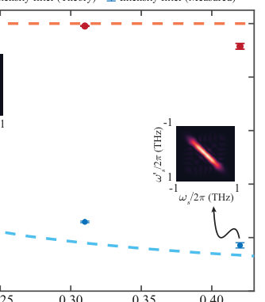
<figcaption class="paper-figure-caption"><b>Fig 4.</b> Fig. 3. (a) Filter shapes with different spectral bandwidths. (b) Theoretical chrono- cyclic 푄-functions corresponding to coherent filtering. (c) Measured chronocyclic 푄-functions obtained using QPG filtering and intensity filtering. (d) Spectral purity as a function of filter bandwidth. The insets show the corresponding reconstructed spectral density matrices.</figcaption>
</figure>
<figure class="paper-figure-card">
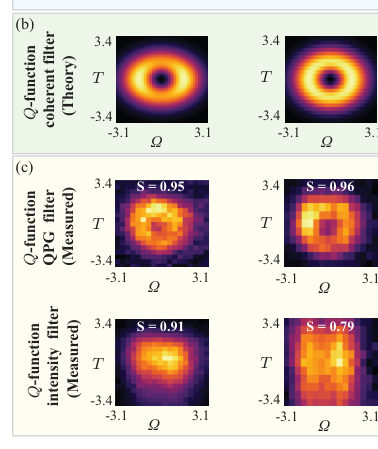
<figcaption class="paper-figure-caption"><b>Fig 5.</b> Fig. 4. (a) Illustrates different filter shapes. (b) Theoretical chronocyclic 푄-functions for a coherent filter. (c) Measured chronocyclic 푄-functions corresponding to QPG filter and intensity filter. 푆represents the similarity between theoretical and measured 푄-functions.</figcaption>
</figure>

**Summary.** The paper introduces and validates the use of a Quantum Pulse Gate (QPG) for coherently filtering multimode parametric down-conversion sources. This technique successfully projects heralded signal photons into spectrally pure, well-defined temporal modes with high fidelity. The results conclusively show that this coherent method vastly outperforms conventional intensity filtering, which degrades photon purity by introducing mixed states.

**Why it may be interesting.** This work directly addresses a key hardware bottleneck in quantum networking—the preparation of high-quality single photons—by providing a robust, coherent filtering mechanism applicable to existing PDC sources.

Detailed structure

**Main problem.** The challenge is generating spectrally pure and indistinguishable single photons from multimode sources, which is crucial for quantum network applications.

**Main result.** Coherent temporal filtering using a Quantum Pulse Gate (QPG) successfully generates heralded photons with high purity (>0.90), whereas conventional intensity filtering results in mixed states.

**Method.** The authors compare QPG-based coherent filtering against standard spectral intensity filtering by analyzing the resulting photon state's spectral density matrix and chronocyclic Q-function.

**Model / system.** The system utilizes a time-frequency entangled pair source via parametric down-conversion (PDC). The core comparison is between projecting the idler photon onto a specific temporal mode using a QPG versus simple spectral amplitude filtering.

**Key observables.** Photon purity ($\mathcal{F}$), Spectral Density Matrix ($\Gamma$), and Chronocyclic $Q$-function ($\mathcal{F}(\Omega, 	au)$).

**Important parameters / regimes.** Filter bandwidth, coherence properties (single TM vs. multimode mixture), and the resulting spectral purity.

**Assumptions / limitations.** Conventional intensity filtering cannot control relative phase or select a well-defined temporal mode; minor deviations in QPG performance are attributed to finite measurement resolution or pump shaping limitations.

**Figures summary.** Figures conceptually distinguish coherent (single TM transmission) vs. incoherent (spectral intensity transmission, phase erasure) filtering setups and show reconstructed spectral purity ($\mathcal{F}$) versus filter bandwidth for both methods.

**Paper structure.** The paper establishes the need for pure single photons; it then details the theoretical comparison between QPG-mediated coherent projection and conventional incoherent filtering using mathematical formalisms (JSA, $\Gamma$ matrix); finally, it presents experimental results demonstrating superior purity and programmability with the QPG.

Abstract

Spectrally pure and indistinguishable single photons are essential for quantum network platforms, where high-visibility interference underpins many quantum information protocols. However, most practical single-photon sources emit spectrally multimode states with reduced purity. Conventional spectral intensity filtering can partially improve purity but cannot select a well-defined temporal mode (TM). Here, we demonstrate coherent temporal filtering of a multimode parametric down-conversion (PDC) source using a quantum pulse gate (QPG) and benchmark its performance against conventional intensity filtering. The generated PDC photons exhibit strong spectral correlations, rendering extraction of pure heralded photons from the pair a challenge. We demonstrate that QPG filtering consistently generates heralded photons with purities above 0.90 regardless of the filter shape. Contrariwise, using spectral intensity filters yields mixed photons. Photon purities are probed with chronocyclic Q-function tomography. Furthermore, we demonstrate the versatility of QPG filtering by extracting structured TMs, including superposition of picosecond time bins. These results establish the QPG as a practical coherent filtering tool for quantum network applications.

[↑ back to top](#top)

### [Flux control of measurement back-action and Leggett-Garg correlations in chiral quantum walks](http://arxiv.org/abs/2608.12519v1)

**Authors:** Paolo Luppi  
**Type:** theory · **Category:** other · **PDF:** <https://arxiv.org/pdf/2608.12519v1>  
**Analysis basis:** full PDF text, analyzed in chunks
**Topic relevance:** 🔥 `quantum measurements` **4/5** · `analog quantum simulation` **2/5** · `driven-dissipative phase transition` **2/5** · `Full counting statistics` **1/5** · `correlated / nonlocal dissipation` **1/5** · `methods for driven-dissipative` **1/5** · `non-equilibrium universality` **1/5**

↔ Scroll figures horizontally

<figure class="paper-figure-card">
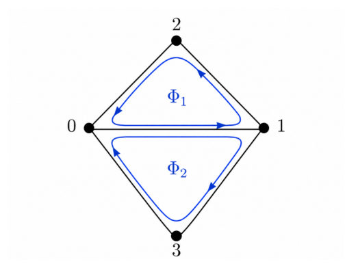
<figcaption class="paper-figure-caption"><b>Fig 1.</b> FIG. 1. Diamond graph with the oriented fluxes Φ1 and Φ2 associated with the cycles C1 = (0, 1, 2, 0) and C2 = (0, 1, 3, 0), respectively.</figcaption>
</figure>
<figure class="paper-figure-card">
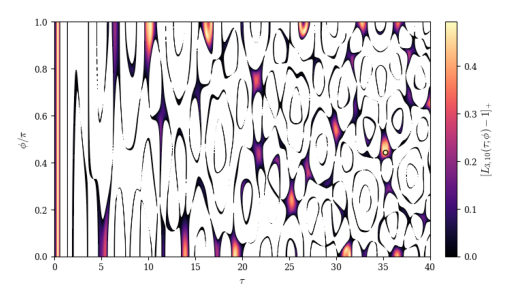
<figcaption class="paper-figure-caption"><b>Fig 2.</b> FIG. 3. Leggett–Garg violation regions for the cycle C10. The color scale represents the positive violation excess [L3,10(τ; ϕ)− 1]+ as a function of τ and ϕ/π. White regions do not violate the macrorealist bound, while the black curves mark L3,10(τ; ϕ) = 1. The largest value in the displayed window is L3,10 ≃1.4931, attained near τ ≃35.2 and ϕ/π ≃0.445.</figcaption>
</figure>
<figure class="paper-figure-card">
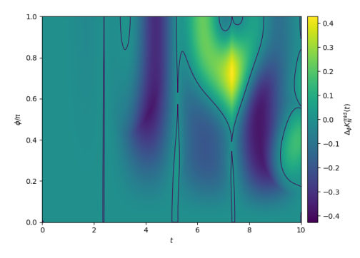
<figcaption class="paper-figure-caption"><b>Fig 3.</b> FIG. 2. Finite-time flux control of measurement back-action on the cycle C6. The color scale represents the midpoint con- trast ∆ϕKmid 6 (t) = K6,ϕ(t/2, t) −K6,0(t/2, t) as a function of t and ϕ/π. Positive and negative values indicate enhancement and suppression relative to zero flux, respectively. The black curves mark ∆ϕKmid 6 (t) = 0.</figcaption>
</figure>
<figure class="paper-figure-card">
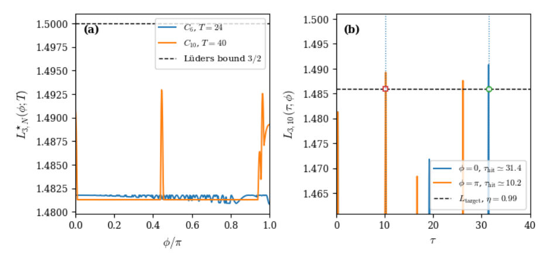
<figcaption class="paper-figure-caption"><b>Fig 4.</b> FIG. 4. Flux dependence of the Leggett–Garg violation strength and its temporal accessibility for C6 and C10. (a) Optimized functional L⋆ 3,N(ϕ; T) for C6 with T = 24 and C10 with T = 40. The dashed line marks the Lüders bound L3 = 3/2. (b) Leggett–Garg functional for C10 at zero and half flux. The horizontal dashed line marks L(10) target(0.99; 40) = 1 + 0.99V ⋆ 3,10(0; 40). The first target crossings occur at τ (10) hit (0; 0.99, 40) ≃31.4 and τ (10) hit (π; 0.99, 40) ≃10.2, giving S10(0.99; 40) ≃3.1.</figcaption>
</figure>

**Summary.** The paper demonstrates that magnetic fluxes threading cycles in chiral quantum walks act as a controllable resource to engineer local measurement back-action. By analyzing the two-time statistics, the authors show flux can drive the system to saturate fundamental bounds like the Lüders bound. This establishes gauge-invariant flux control over temporal quantum correlations.

**Why it may be interesting.** This work provides a concrete mechanism—flux engineering—to manipulate non-classical temporal correlations (LGI violation) in quantum transport models, which is highly relevant for understanding measurement limitations in open quantum systems.

Detailed structure

**Main problem.** The paper investigates how gauge-invariant magnetic fluxes control measurement back-action and temporal quantum correlations (Leggett-Garg inequalities) in chiral continuous-time quantum walks.

**Main result.** Flux can be engineered to saturate the Lüders bound ($L_3 = 3/2$) by reducing dynamics to a specific Krylov subspace, establishing flux as a resource for controlling local measurement back-action.

**Method.** The analysis involves deriving exact two-time statistics using rooted return amplitudes and performing short-time expansions of correlation functions related to the Kolmogorov inconsistency.

**Model / system.** The system is chiral continuous-time quantum walks (CTQWs) on a graph, governed by a Hamiltonian incorporating oriented Peierls phases ($	heta_{jk}$). The study focuses on measurements performed at a single vertex using a dichotomic observable.

**Key observables.** Measurement back-action ($K_
u$), Leggett-Garg functional ($L_3$), and the rooted return amplitude $A_
u(t; \Phi)$.

**Important parameters / regimes.** The external fluxes ($\Phi$) threading cycles in the graph, time ($t$), and measurement times ($\alpha t$).

**Assumptions / limitations.** The analysis assumes a localized initial state $|
u
angle$ and relies on short-time expansions for correlation functions.

**Figures summary.** Figures illustrate flux dependence of back-action contrast over time and show phase diagrams mapping Leggett-Garg violation against applied fluxes.

**Paper structure.** The paper progresses by defining the CTQW model with gauge-invariant fluxes, deriving exact two-time statistics from return amplitudes, analyzing short-time expansions to find flux dependence, and finally demonstrating how this control can saturate fundamental bounds like the Lüders bound.

Abstract

Gauge-invariant fluxes control interference in chiral continuous-time quantum walks. We investigate how they affect sequential measurements at a single vertex, using a dichotomic observable that distinguishes return to that vertex from occupation of its complement. For a walker initially localized at the measured vertex, the complete two-time statistics, including measurement back-action and Leggett--Garg correlators, are determined exactly by the return amplitude, connecting temporal correlations to the local spectral measure and gauge-invariant closed-walk interference. At short times, the leading disturbance is independent of the Peierls phases, whereas flux sensitivity enters at higher orders through interference among closed walks. We further identify a graph-independent sufficient mechanism for saturating the Lüders bound: flux can reduce the rooted dynamics to a balanced two-dimensional Krylov subspace with equal spectral weights, yielding a constructive flux-engineering criterion for attaining the Lüders bound of $3/2$ at finite times. The mechanism is realized exactly on a two-flux diamond graph, where destructive interference renders additional rooted modes dark and the local back-action depends on relative combinations of the two independent fluxes. For flux-threaded cycles, an exact winding-number expansion reveals a parity-dependent onset: the leading flux contrast occurs generically at order $t^N$ for even cycles and $t^{2N}$ for odd cycles. Across the cycles examined, flux can either enhance the maximal Leggett--Garg violation or shift strong violations to earlier measurement times, with half flux driving the four-site cycle to the Lüders bound. These results establish gauge-invariant flux as a resource for engineering local measurement back-action and temporal quantum correlations.

[↑ back to top](#top)

### [Levitation of a YIG sphere using a magnetic Paul trap - towards strongly coupled quantum magno-mechanics](http://arxiv.org/abs/2608.12752v1)

**Authors:** A. O. Yakymenko, S. Das, J. Twamley  
**Type:** both · **Category:** other · **PDF:** <https://arxiv.org/pdf/2608.12752v1>  
**Analysis basis:** full PDF text, analyzed in chunks
**Topic relevance:** 🔥 `analog quantum simulation` **4/5** · `quantum measurements` **2/5** · `quantum optics experiment` **2/5** · `QC/QI experiment` **1/5** · `Tavis-Cummings & cavity-many-emitter` **1/5** · `driven-dissipative phase transition` **1/5** · `methods for driven-dissipative` **1/5**

↔ Scroll figures horizontally

<figure class="paper-figure-card">
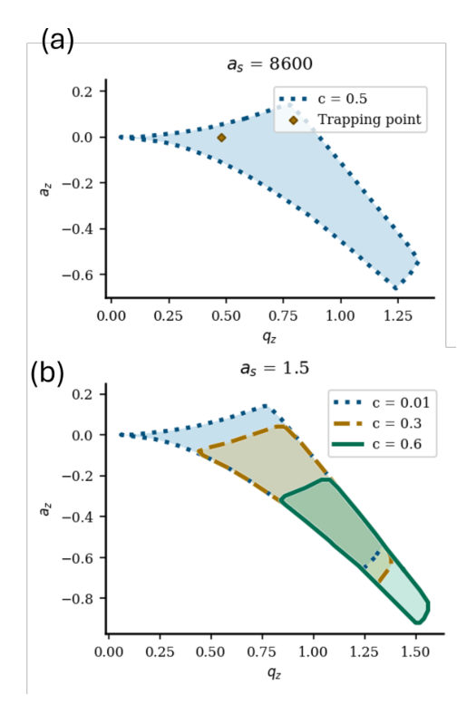
<figcaption class="paper-figure-caption"><b>Fig 1.</b> FIG. 1. We study the conditions for stability of the levitation of the magnet in the magnetic Paul trap, so that we can understand the pa- rameter values for the best trapping. We note that this stability anal- ysis is more complex than for an ion trap, as the magnet has tilting degrees of freedom, which are not present in an ion. We plot the numerically estimated fundamental stability region on the [az −qz] plane. az (qz) quantifies the strength of the static (time-dependent) trapping fields. We choose fixed values of as, which quantifies the li- brational dynamics, and fixed values for c, which quantifies the cou- pling strength between the librational and translational motion. c can be...</figcaption>
</figure>
<figure class="paper-figure-card">
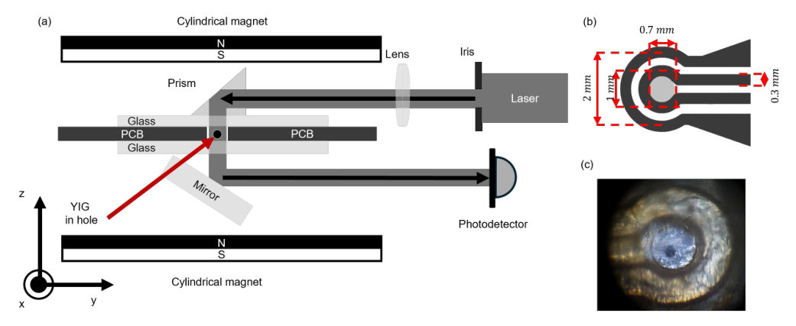
<figcaption class="paper-figure-caption"><b>Fig 2.</b> FIG. 2. Experimental setup for levitating a YIG sphere using a magnetic Paul trap and measuring motion using optical detection. a) We trap the YIG using a combination of a time-dependent magnetic field delivered by circulating currents flowing through electrodes on a printed circuit board and a static magnetic field generated by permanent magnets. The YIG is prevented from falling out from the trapping region by covering PCB hole with glass cover slides. We detect the motion by shining laser light down through the PCB hole and onto a photodiode. We use a lens to focus the light at the YIG’s location, to amplify the motional signal at the photodetector. b) Photo of loaded YIG in the MPT</figcaption>
</figure>
<figure class="paper-figure-card">
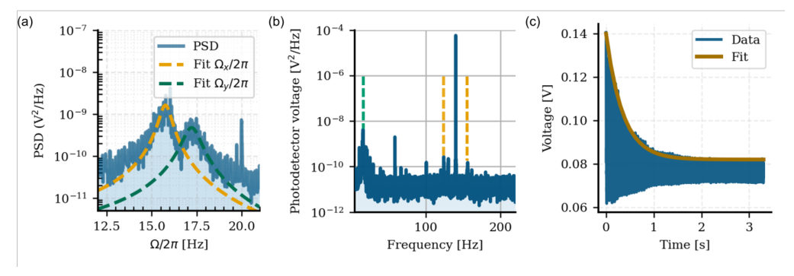
<figcaption class="paper-figure-caption"><b>Fig 3.</b> FIG. 3. Characterizing motion of the trapped in MPT YIG. We measure the motional PSD of trapped YIG in MPT with parameters I1ac = 0.48 ARMS, I2ac = 1 ARMS, I1dc = 56 mA, I2dc = 113 mA, Ω/2π = 140Hz. a) The secular modes of the translation motion. We fitted the data with a Lorentzian and obtained the frequencies fx = 15.8Hz and fy = 17.2Hz along with Q-factors: Qx = 25,Qy = 18. b) Motional spectrum of trapped YIG. The spectrum consists of secular frequencies marked by a green dashed line, the micromotion mode at trap current frequency fm = 140Hz, and sidebands fm ± fx and fm ± fy that are marked by yellow dashed line. We conclude that these frequencies correspond to the x and y modes because...</figcaption>
</figure>
<figure class="paper-figure-card">
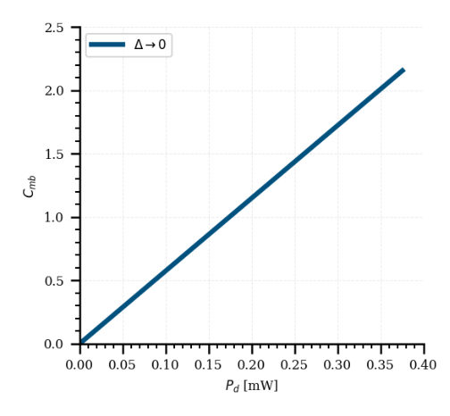
<figcaption class="paper-figure-caption"><b>Fig 4.</b> FIG. 4. Magnon enhanced cooperativity depending on the driving magnon power: We plot the cooperativity between the magnon and center of mass motion of levitated YIG for zero detuning. When Cmb exceeds unity, the two modes are strongly coupled and quantum effects can be become dominant.</figcaption>
</figure>

**Summary.** The authors successfully demonstrated the stable levitation of a YIG sphere using a magnetic Paul trap at room temperature. They analyzed the coupled dynamics between the mechanical motion (phonons) and the spin wave excitations (magnons). This work establishes a platform for investigating strongly coupled quantum magno-mechanics, with potential applications in quantum information processing.

**Why it may be interesting.** This work bridges macroscopic mechanical trapping (Paul traps) with microscopic quantum excitations (magnons), providing an experimentally realized platform to study cavity QED concepts in a solid-state magnetic system, relevant for quantum sensing and information processing.

Detailed structure

**Main problem.** The work demonstrates stable levitation of a YIG sphere using a magnetic Paul trap, aiming to realize strongly coupled quantum magno-mechanical systems.

**Main result.** Stable trapping was achieved at room temperature with measured Q-factors ($\sim 25$) and secular frequencies (15.8 Hz, 17.2 Hz), and theoretical estimates suggest achievable magnon-phonon cooperativity above unity.

**Method.** The study combines classical stability analysis using Floquet theory on Mathieu equations with experimental measurements of mechanical motion via backscattered light detection.

**Model / system.** The system involves a YIG sphere (soft magnet) trapped by a magnetic Paul trap. The physics couples the center-of-mass mechanical motion (phonons) to the quantized spin waves (magnons), described by coupled Hamiltonians.

**Key observables.** Q-factors ($\sim 25$), secular frequencies (15.8 Hz, 17.2 Hz), and magnon-phonon cooperativity ($C_{mb}$).

**Important parameters / regimes.** Room temperature operation, magnetic field gradients, and coupling strengths between mechanical and magnonic modes.

**Assumptions / limitations.** The analysis assumes the classical limit for soft magnets (YIG) and employs small-motion approximations to derive the equations of motion.

**Figures summary.** Figures illustrate the stability diagram in parameter space (Fig. 1), the experimental setup using neodymium magnets (Fig. 2), and the measured power spectral density showing trapped oscillations (Fig. 3).

**Paper structure.** The paper progresses from deriving the full equations of motion for the coupled system, simplifying them to a vector Mathieu equation for stability analysis, presenting the theoretical framework for magnon-phonon coupling, and concluding with experimental measurements confirming stable levitation and quantifying quantum coupling potential.

Abstract

Magnetic levitation offer passive levitation of massive objects for use in advanced inertia sensors, for the generation of non-classical macroscopic motional states, and towards the table-top testing of low energy gravity with quantum mechanics. Magnons, a quanta of spin wave, couple to many physical quantities and strongly to electromagnetic fields, even at room temperature. In this work we demonstrate the stable trapping of a small YIG sphere using a magnetic Paul trap. We present a classical stability analysis of a magnetic Paul trap and show the stability diagram for all mechanical degrees of freedom. We show that coupling between librational and translational modes changes the stability region. We experimentally levitate the soft magnet yttrium iron garnet at room temperature obtaining Q-factors of $\sim25$ and secular frequencies $15.8$ Hz and $17.2$ Hz. We provide numerical estimates of the achievable enhanced coupling between the center-of-mass motion and excited magnon modes, with a cooperativity above unity despite strong mechanical damping, indicating potential applications in quantum information processing, quantum interconnects and quantum memories.

[↑ back to top](#top)

### [Experimental Quantum Key Distribution in an Indefinite Causal Order](http://arxiv.org/abs/2608.13561v1)

**Authors:** Yann Valibouse, Martí Cladera-Rosselló, Michael Antesberger, Hector Spencer-Wood, Kyrylo Simonov, Patrik Sund, Mathieu Bozzio, Philip Walther, Lee A. Rozema  
**Type:** both · **Category:** quantum information and computing · **PDF:** <https://arxiv.org/pdf/2608.13561v1>  
**Analysis basis:** full PDF text, analyzed in chunks
**Topic relevance:** 🔥 `QC/QI experiment` **4/5** · `quantum measurements` **3/5** · `quantum optics experiment` **3/5** · `interference shaping light` **1/5**

↔ Scroll figures horizontally

<figure class="paper-figure-card">
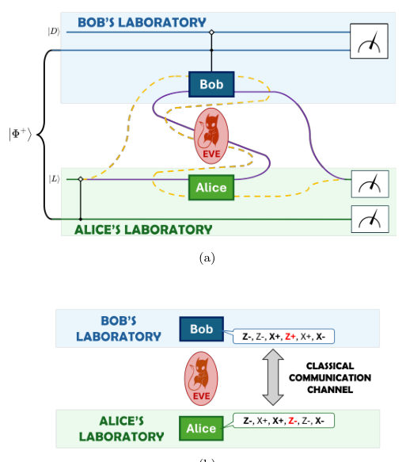
<figcaption class="paper-figure-caption"><b>Fig 1.</b> FIG. 1. (a) Alice and Bob independently choose a mea- surement basis and obtain two binary outcomes from each successful event: a polarization outcome, which contributes to the raw key, and a control outcome associated with the output port of their respective interferometers. The latter encodes information about the coherence between the alter- native causal-order branches of the quantum SWITCH. (b) During the reconciliation stage, Alice and Bob publicly disclose their basis choices and control outcomes, while keep- ing the polarization outcomes private. Key bits are retained only when both parties selected the same basis (highlighted in bold). In the absence of an eavesdropper, the control...</figcaption>
</figure>
<figure class="paper-figure-card">
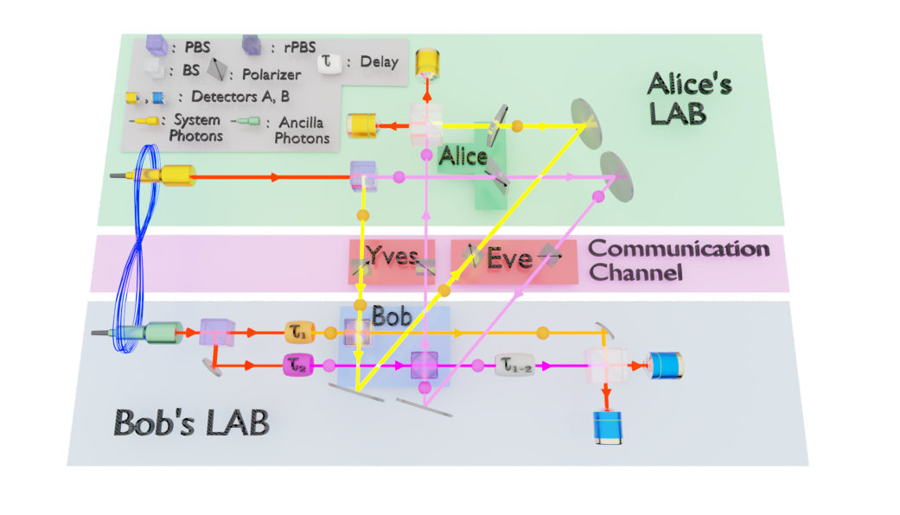
<figcaption class="paper-figure-caption"><b>Fig 2.</b> FIG. 2. Experimental realization of the quantum SWITCH with a path-coherence-preserving measurement performed in Bob’s laboratory. The yellow and blue detectors correspond to measurements performed by Alice and Bob, respectively. The protocol admits two distinct locations at which an eavesdropper may intercept the communication, denoted by Eve and Yves, corresponding to the two possible insertion points within the alternative causal-order branches. In the present experiment, only the eavesdropping strategy associated with Eve is implemented. On Alice, side, the encoding of the key happens in the darker green area with polarizers while for Bob, the encoding happens via its rotated PBSs (PBS...</figcaption>
</figure>
<figure class="paper-figure-card">
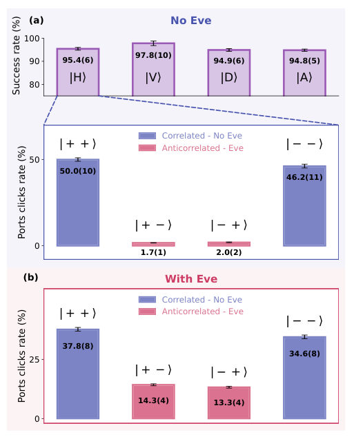
<figcaption class="paper-figure-caption"><b>Fig 3.</b> FIG. 3. (a) Measured protocol performance in the absence of an eavesdropper. The teal bars show the probability that Alice and Bob obtain the same polarization outcome and therefore establish a shared key bit. The insets show the probability of observing anti-correlated control outcomes, cor- responding to false-positive eavesdropping detections. (b) Measured probability of observing anti-correlated control outcomes in the presence of Eve. In this measurement, Alice prepares the state |H⟩and Eve’s polarizers are set at θ = 45◦, corresponding to a measurement in the diagonal basis. The theoretical detection probability is pdetect|0,0(45◦) = 25%, while the experimentally observed value is...</figcaption>
</figure>
<figure class="paper-figure-card">
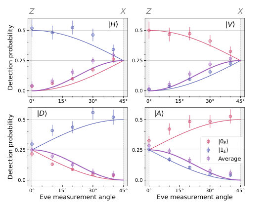
<figcaption class="paper-figure-caption"><b>Fig 4.</b> FIG. 4. Detection probability as a function of Eve’s polar- izer angle θ for the four BB84 signal states (2). Red and blue data correspond to the conditional detection probabil- ities Pdetect|0,µ,b and Pdetect|1,µ,b, associated with Eve’s two possible measurement outcomes. Purple data show the detec- tion probability obtained after averaging over Eve’s outcomes. Solid curves are the theoretical predictions.</figcaption>
</figure>
<figure class="paper-figure-card">
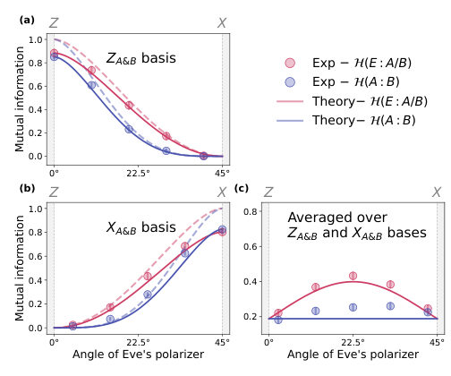
<figcaption class="paper-figure-caption"><b>Fig 5.</b> FIG. 5. (a)–(b) Mutual information between the different parties when Alice and Bob use (a) the computational basis and (b) the Hadamard basis. Dashed curves correspond to the theoretical predictions, while solid curves show the same predictions renormalized using the experimentally observed maximum mutual information. (c) Mutual information averaged over all four BB84 signal states (2) as a function of Eve’s polarizer angle θ. The mutual information between Alice and Bob is constant and equal to H(A : B) = −1 + 3</figcaption>
</figure>

**Summary.** The paper reports an experimental demonstration of Quantum Key Distribution using the principle of Indefinite Causal Order, realized via a photonic quantum SWITCH. This approach allows for eavesdropper detection by monitoring coherence in a control qubit without forcing Alice and Bob to publicly reveal any part of their raw key material. It proves that ICO can enhance QKD security protocols.

**Why it may be interesting.** This work directly addresses fundamental concepts in quantum information theory—causality and resource quantification—by proposing a novel physical implementation (the quantum SWITCH) to enhance cryptographic security protocols beyond current standards.

Detailed structure

**Main problem.** To demonstrate an experimental protocol for Quantum Key Distribution (QKD) that leverages the concept of Indefinite Causal Order (ICO) to detect eavesdropping without sacrificing any key bits.

**Main result.** The experiment provides a proof-of-principle that ICO can be exploited to achieve eavesdropper detection by monitoring the control qubit, which is superior to standard QKD methods requiring public key comparison and bit discarding.

**Method.** The protocol adapts BB84-like QKD using a photonic quantum SWITCH to embed Alice's and Bob's operations. Eavesdropping is detected by measuring coherence loss in the control qubit rather than comparing raw key material.

**Model / system.** The system utilizes a photonic quantum SWITCH, where the path degree of freedom controls the indefinite causal order between measurement/preparation operations (Alice and Bob). The polarization degree of freedom carries the key information.

**Key observables.** Average eavesdropper detection probability ($0.15 \pm 0.02$ per shared qubit) measured via the control qubit state, specifically monitoring population in $|-
angle_c$.

**Important parameters / regimes.** The protocol's success hinges on a new measurement technique allowing polarization readout inside the SWITCH without destroying path coherence.

**Assumptions / limitations.** Currently, the implementation is limited by post-selection required for measurements within the quantum SWITCH, meaning it is not yet a fully secure QKD protocol.

**Figures summary.** The notes do not provide specific figure summaries beyond general references to figures illustrating joint probabilities and mutual information calculations in related theoretical analyses.

**Paper structure.** The paper moves from establishing the theoretical framework of ICO using the quantum SWITCH, adapting it to BB84-like QKD, detailing the measurement techniques required for local readout, presenting the experimental results demonstrating eavesdropper detection, and concluding with a discussion of limitations.

Abstract

In quantum physics the order in which different operations occur can be placed in superposition. The resulting processes have an indefinite causal order and are both of fundamental interest and can be viewed as a novel quantum resource that enables a variety of new protocols. Here we report an experimental implementation of one such protocol, where we perform BB84-like quantum cryptography by placing Alice and Bob's measurement-and-preparation operations in a photonic quantum SWITCH. By embedding Alice and Bob within the quantum SWITCH, the protocol achieves an average eavesdropper detection probability of $0.15 \pm 0.02$ per shared qubit, with eavesdropper detection performed through measurements of the control qubit rather than by comparing the key. Unlike the standard BB84 and related schemes, which detect eavesdropping by publicly revealing and discarding a fraction of the raw key, our approach requires no disclosure of key material: every retained qubit can, in principle, be tested for eavesdropping while remaining available for key generation. The experiment relies on a new measurement technique that allows the polarization of a photon to be measured inside the quantum SWITCH without destroying path coherence. Although the present implementation does not yet constitute a secure quantum key distribution protocol, owing to the post-selection required for measurements within the quantum SWITCH, it provides a proof of principle that indefinite causal order can be exploited to detect eavesdropping without sacrificing key bits.

[↑ back to top](#top)

### [Ion trap on borosilicate substrate with integrated femtosecond-laser-written waveguide](http://arxiv.org/abs/2608.13207v1)

**Authors:** Jakob Wahl, Alexander Zesar, Philipp Hurdax, Marco Schmauser, Victoria Schwab, Michael Pasquini, Marco Valentini, Clemens Rössler, Thomas Monz, Bernhard Lamprecht, Klemens Schüppert, Philipp Schindler  
**Type:** experiment · **Category:** other · **PDF:** <https://arxiv.org/pdf/2608.13207v1>  
**Analysis basis:** full PDF text, analyzed in chunks
**Topic relevance:** 🔥 `QC/QI experiment` **4/5** · `analog quantum simulation` **3/5** · `quantum optics experiment` **2/5** · `interference shaping light` **1/5** · `quantum measurements` **1/5**

↔ Scroll figures horizontally

<figure class="paper-figure-card">
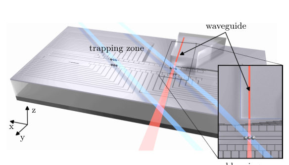
<figcaption class="paper-figure-caption"><b>Fig 1.</b> FIG. 1. Concept of the ion trap. The aluminum trap electrodes are patterned on a borosilicate substrate. Patterned segmented DC electrodes allow for shuttling of the ion between the trapping and the addressing zone. On top of the traps’ surface, another borosilicate glass block is bonded that contains a femtosecond laser-written waveguide for light with 729nm wavelength (red beam), inscribed at a distance to the trap surface that is in-plane with the trapping position of the ion. The geometry and size of the optics block is chosen such that ions can be trapped in the addressing zone in front of the waveguide, but also at a position millimeter distances away from the glass, allowing for...</figcaption>
</figure>
<figure class="paper-figure-card">
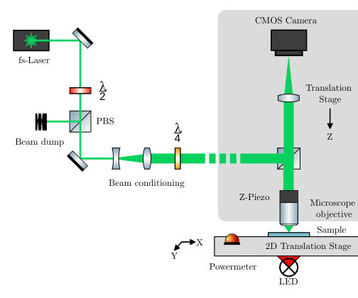
<figcaption class="paper-figure-caption"><b>Fig 2.</b> FIG. 2. Schematic of the femtosecond laser setup used for waveguide writing and laser ablation.</figcaption>
</figure>
<figure class="paper-figure-card">
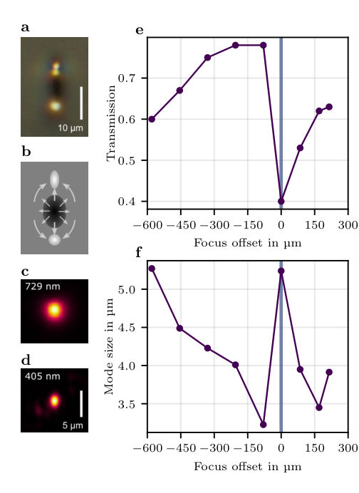
<figcaption class="paper-figure-caption"><b>Fig 3.</b> FIG. 3. Overview of waveguide morphology, mode pro- files, and writing-depth optimization in borosilicate glass. (a) Transmission microscope image showing two spatially sepa- rated guiding regions (“upper” and “lower”) formed within a single written track. (b) Schematic illustration of the inferred refractive-index distribution and dominant material redistri- bution during waveguide formation. (c,d) Near-field intensity profiles of a lower waveguide optimized and characterized at (c) 729 nm and (d) 405 nm. (e) Measured transmission at a wavelength of 729 nm as a function of the focus offset, de- fined as the difference between writing depth and objective correction depth. (f) Effective mode...</figcaption>
</figure>
<figure class="paper-figure-card">
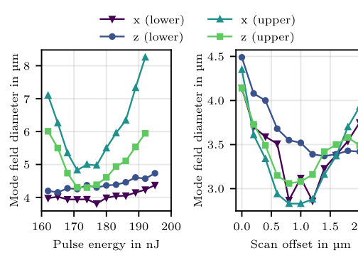
<figcaption class="paper-figure-caption"><b>Fig 4.</b> FIG. 4. Mode field diameter of waveguides located above and below the focal plane, measured along the x- and z-directions. The measurement are indicated with symbols, and are con- nected with lines as a guide for the eye. (a) Mode field diam- eter (MFD) as a function of the pulse energy at a scan offset ∆x = 1.5 µm and 3 overscans. (b) MFD as a function of ∆x at a fixed pulse energy of 177 nJ and N = 8 overscans. All structures were written at a scan speed of 50 mm/s.</figcaption>
</figure>
<figure class="paper-figure-card">
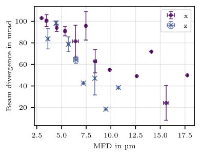
<figcaption class="paper-figure-caption"><b>Fig 5.</b> FIG. 5. Beam divergence as a function of the mode field diameter (MFD) for the two transverse directions. The data represents multiple measurements within an MFD of 1 µm and indicates the mean value and standard error.</figcaption>
</figure>

**Summary.** This paper presents an advanced ion trap platform built on borosilicate glass featuring an integrated waveguide written by femtosecond lasers. This architecture solves the challenge of routing optical signals in large-scale trapped-ion quantum processors. By demonstrating trapping and coherent operations using this on-chip light delivery, it offers a robust and scalable route for future quantum computing devices.

**Why it may be interesting.** This work directly addresses a major engineering bottleneck in trapped-ion quantum computing—the integration of photonics. For theorists studying open quantum systems or quantum optics, this provides a concrete platform for modeling light-matter interactions on chip at scale.

Detailed structure

**Main problem.** The primary challenge addressed is developing a scalable platform for trapped-ion quantum computing that requires robust, on-chip delivery of optical light to address individual qubits.

**Main result.** The authors successfully demonstrated an end-to-end system integrating an ion trap on borosilicate glass with an integrated, low-loss waveguide capable of delivering coherent light for qubit operations.

**Method.** They fabricated the platform using femtosecond laser writing (FLW) to create waveguides bonded atop a surface-electrode ion trap and validated functionality in a cryogenic trapped-ion system.

**Model / system.** The physical system is an ion trap built on borosilicate glass, featuring aluminum electrodes and an integrated waveguide. The light delivery mechanism physically separates the optical layer from the electrode substrate, enabling compatibility with silicon integration.

**Key observables.** Coherent Rabi oscillations driven by 729 nm light delivered through the waveguide; measurement of stray electric fields showing slow drift over hours.

**Important parameters / regimes.** Single-mode low-loss guidance at 729 nm and 405 nm; curved waveguides maintained down to a radius of curvature of 6 mm.

**Assumptions / limitations.** The architecture relies on bonding an optically structured block onto the trap surface, and that positive refractive index changes induced by femtosecond laser exposure are sufficient for guiding weakly guided modes.

**Figures summary.** Figures illustrate the concept showing the integrated waveguide positioned in-plane with the ion addressing zone; other figures detail waveguide writing setups and mode profile tuning based on focus offset.

**Paper structure.** The paper progresses from establishing the need for scalable optical access to presenting the physical platform, detailing the fabrication of low-loss waveguides, and finally validating the entire system through trapping, shuttling, and coherent quantum operations.

Abstract

We present an ion-trap platform on borosilicate glass with an integrated femtosecond-laser-written waveguide for on-chip light delivery. The optical layer is physically separated from the electrode substrate and bonded atop the trap, remaining compatible with silicon-based integration. We engineer single-mode low-loss guidance at 729 nm with tunable mode-field diameter and achieve low-loss curved waveguides down to a radius of curvature of 6 mm. We also extend single-mode operation to a wavelength of 405 nm. The fabrication process is compatible with the industrial fabrication of a single-metal-layer surface-electrode trap, including active fiber alignment and bonding. We validate the platform in a cryogenic trapped-ion system with $^{40}$Ca$^+$, demonstrating trapping, shuttling the ion to a zone in front of the waveguide, and coherent operations driven by 729 nm light delivered through the integrated waveguide. We characterize the effect of the exposed dielectric on the ion and measure stray electric fields that show slow drift at a timescale of hours. The architecture is compatible with hybrid micro-optics (e.g. pick-and-place lenses) to realize single ion addressing and provides a robust, scalable route to integrated light delivery for trapped-ion devices.

[↑ back to top](#top)

### [Shots-to-Approximate-Solution Scaling in Neutral-Atom Quantum Optimization](http://arxiv.org/abs/2608.12858v1)

**Authors:** Junwoo Jung, Jaewook Ahn  
**Type:** both · **Category:** other · **PDF:** <https://arxiv.org/pdf/2608.12858v1>  
**Analysis basis:** full PDF text, analyzed in chunks
**Topic relevance:** 🔥 `Rydberg arrays` **4/5** · 🔥 `analog quantum simulation` **4/5** · `QC/QI experiment` **2/5** · `quantum measurements` **1/5**

↔ Scroll figures horizontally

<figure class="paper-figure-card">
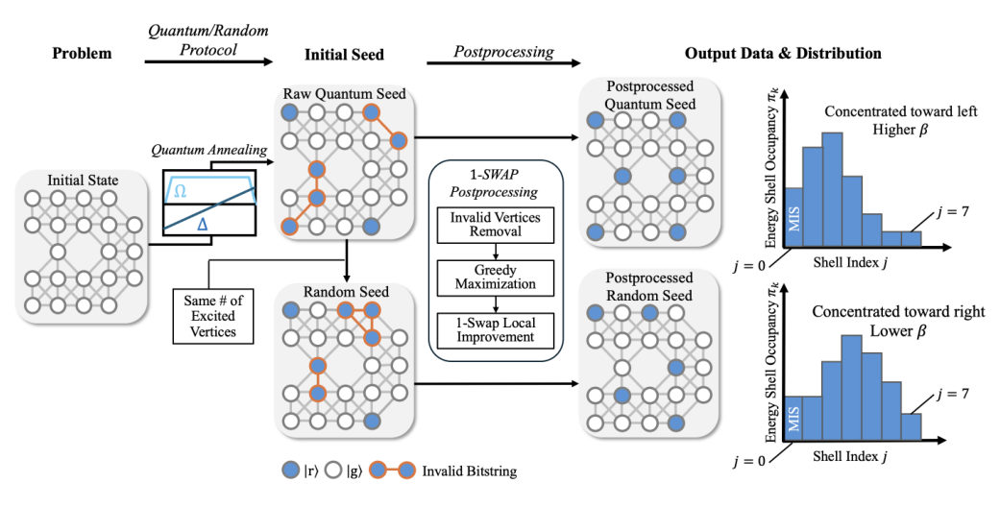
<figcaption class="paper-figure-caption"><b>Fig 1.</b> FIG. 1. Density-controlled shots-to-approximate-solution workflow. An initial King’s-lattice atom array is evolved by a Rydberg quantum-annealing schedule, producing raw quantum seeds (occupation bitstrings). To construct a density- controlled null model, random seeds are sampled with the same mean excitation density as the quantum data. Both seeds are passed through the identical postprocessing pipeline: invalid adjacent excitations are removed, the independent set is greedily maximized, and a local 1-swap improvement is applied. The resulting postprocessed outputs define shell distributions over shell index j, where j = 0 corresponds to the MIS manifold, summarized by an effective quality...</figcaption>
</figure>
<figure class="paper-figure-card">
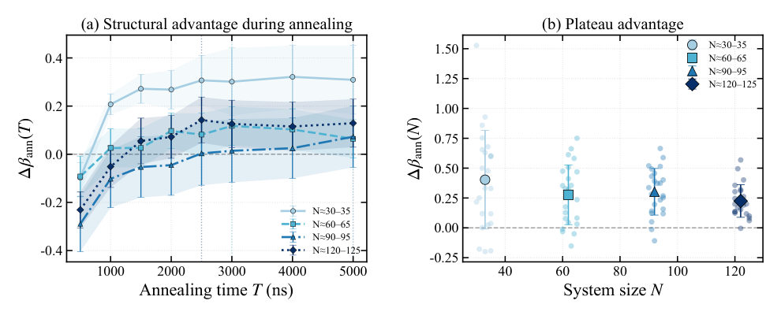
<figcaption class="paper-figure-caption"><b>Fig 2.</b> FIG. 2. Plateau behavior and annealing advantage with excitation-matched random baseline. (a) ∆βann(T) = βann(T) −βrand(p(ann) exc (T)) as a function of annealing time for all four size groups (bin 2; see Fig. 3 for the full hardness dependence). The random baseline is evaluated at the per-instance, per-T excitation rate p(ann) exc (T), controlling for the density effect at every point of the sweep. In all groups, ∆βann(T) rises from negative or near-zero values at short times and saturates at a positive plateau near T ⋆≈2500–5000 ns (group-dependent). (b) Per-instance ∆βann at the plateau (T = 5000 ns), for the 24 instances of bins 1–4 in each size group, as a function of system size N....</figcaption>
</figure>
<figure class="paper-figure-card">
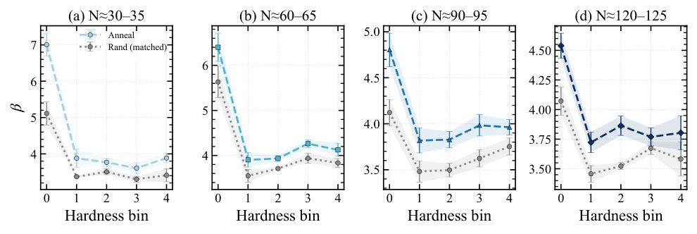
<figcaption class="paper-figure-caption"><b>Fig 3.</b> FIG. 3. Annealing quality parameter and excitation-matched random baseline across hardness bins. βann (blue squares) and the excitation-matched random baseline βrand(p(ann) exc ) (gray circles, dashed) as a function of hardness bin at T = 5000 ns, shown separately for each size group. The excitation rate p(ann) exc is measured per instance from experimental shots, so each random-baseline point is density-matched to the corresponding annealing measurement. Annealing consistently exceeds the matched baseline across all bins and system sizes, with the gap ∆βann = βann −βrand(p(ann) exc ) remaining positive throughout. The lowest-hardness bin (bin 0) is shown for completeness but is excluded...</figcaption>
</figure>
<figure class="paper-figure-card">
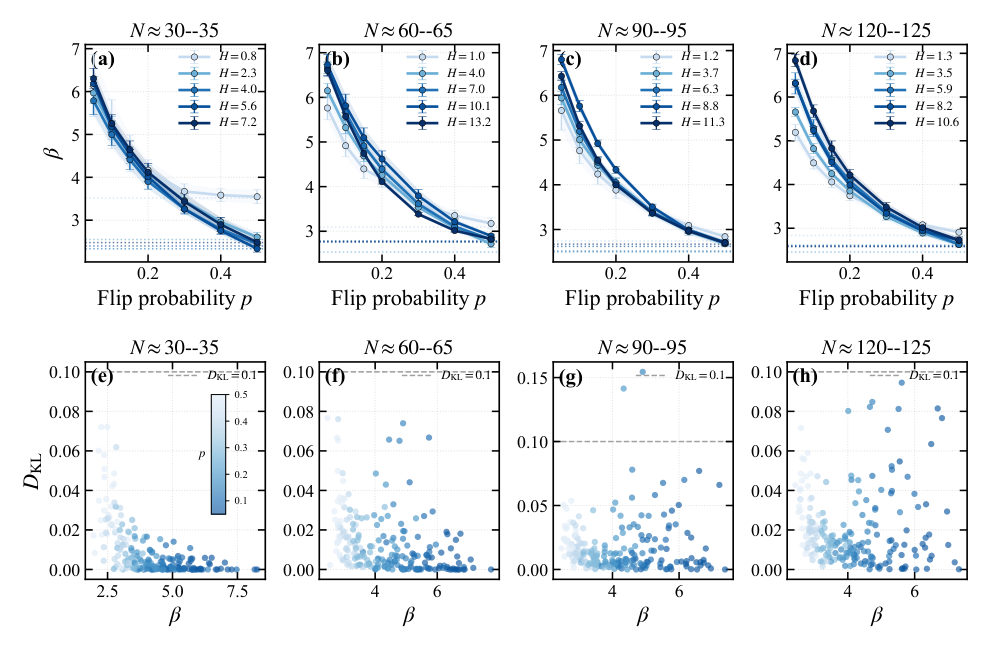
<figcaption class="paper-figure-caption"><b>Fig 4.</b> FIG. 4. Shell-model sensitivity and KL-divergence validation. (a)–(d) Postprocessed β as a function of flip probability p for controlled mock data, constructed by independently flipping each bit of the exact MIS solution with probability p and applying the ℓ= 1 postprocessing pipeline, shown separately for each size group. Dotted lines indicate the excitation-matched random baseline βrand for each hardness bin. (e)–(h) DKL(Pemp∥Pfit) between the empirical postprocessed shell distribution and the fitted shell model as a function of the inferred β, for mock data across all four size groups. Color encodes flip probability p; darker points correspond to lower p and hence higher solution...</figcaption>
</figure>
<figure class="paper-figure-card">
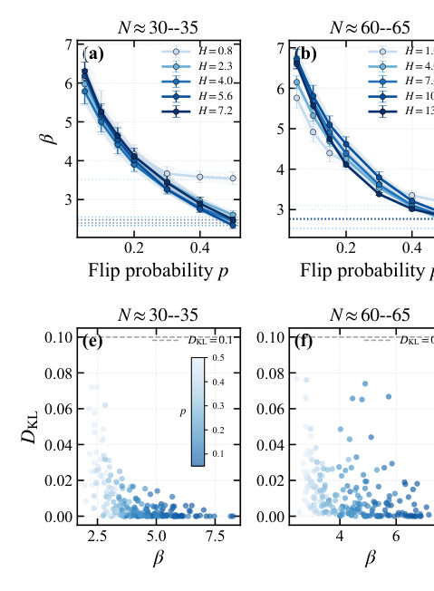
<figcaption class="paper-figure-caption"><b>Fig 5.</b> Figure 5(c) makes this target dependence explicit from the opposite perspective. At the exact target, STS(r = 1; β) decreases rapidly with increasing β, and the sepa- ration between size groups grows with system size. The measured annealing plateau values β(g) ann lie to the right of the excitation-matched random baselines βrand, implying fewer required shots at fixed N. The faint vertical lines mark the plateau values β(g) ann, at which the exponential fits in panel (a) are evaluated. The large reduction visi-</figcaption>
</figure>

**Summary.** This work introduces the STS metric to rigorously measure how many quantum shots are needed to find approximate solutions to NP-hard problems like MIS using neutral atoms. By comparing results against an excitation-matched random baseline, the authors prove that quantum annealing provides a genuine advantage over classical expectations. The findings delineate specific regimes where quantum resources yield practical benefits versus when classical heuristics suffice.

**Why it may be interesting.** It provides a rigorous, quantifiable benchmark for assessing true quantum speedup in optimization problems implemented on Rydberg arrays, distinguishing genuine algorithmic advantages from mere hardware noise or local correlations.

Detailed structure

**Main problem.** The core problem is developing an operational metric, STS(r), to quantify whether neutral-atom quantum optimization protocols exhibit genuine concentration toward low-energy solution structures.

**Main result.** Quantum annealing consistently outperforms a random baseline, demonstrating enhanced concentration beyond what can be explained by mere excitation density. The required shot cost scales differently for near-exact versus relaxed target solutions.

**Method.** The authors introduce the Shots-to-Approximate-Solution metric, STS(r), and analyze postprocessed outputs using a degeneracy-weighted shell distribution model ($\pi_j \propto d_{\alpha-j} e^{-eta j}$).

**Model / system.** The study uses programmable Rydberg-atom arrays to implement the Maximum Independent Set (MIS) problem. The analysis relies on modeling output quality via a shell index ($j$) derived from postprocessing the raw quantum bitstrings.

**Key observables.** Shots-to-Approximate-Solution metric ($	ext{STS}(r)$), effective concentration parameter ($eta$), and the residual advantage $\Deltaeta_{	ext{ann}}$.

**Important parameters / regimes.** Approximation ratio ($r$), system size ($N$), and the shell index $j$ relative to the optimal MIS size $\alpha$.

**Assumptions / limitations.** The analysis focuses on postprocessed outputs rather than raw bitstrings due to blockade violations, necessitating a random baseline control. The shell distribution is modeled using maximum entropy principles.

**Figures summary.** Figures compare quantum annealing shot costs against random baselines and classical reference times for different target ratios ($r=1$ vs. relaxed targets), showing distinct scaling behaviors.

**Paper structure.** The paper introduces the STS metric, models output quality via shell distributions ($eta$), establishes a random baseline control by matching excitation density, and then analyzes two regimes (near-exact vs. relaxed) to quantify quantum advantage.

Abstract

Whether neutral-atom quantum optimization protocols exhibit genuine concentration toward low-energy solution structure remains an open question. Here, we introduce a shots-to-approximate-solution metric, STS(r), where r denotes the approximation ratio, and evaluate it using postprocessed outputs modeled by a degeneracy-weighted shell distribution governed by a single effective parameter, $β$, that quantifies concentration toward near-optimal independent sets. To extract the genuine concentration effect in the quantum data, we apply identical postprocessing to both experimental bitstrings and randomly generated bitstrings with matched excitation density, thereby constructing an excitation-matched random baseline. Experiments on programmable Rydberg-atom arrays with system sizes up to 125 sites show that quantum annealing consistently exceeds the random baseline, demonstrating enhanced concentration toward low-energy solution structure beyond what can be attributed solely to excitation density. The results further reveal two distinct target-dependent regimes. For near-exact targets with $r \approx 1$, the required shot count grows exponentially with system size and is reduced at the same exponential level by quantum annealing within the shell-model description. By contrast, for relaxed targets, the shot cost becomes effectively constant, and the corresponding quantum enhancement diminishes, with the classical postprocessing heuristic alone reaching the target in order-unity attempts. Together, these results establish an operational method for quantifying quantum optimization performance and clarify the regimes under which quantum approaches can yield practical benefits.

[↑ back to top](#top)

### [Field-Widened Multimode Interferometer with Long Time-Bin Delay Using a Multi-Pass Herriott Cell](http://arxiv.org/abs/2608.13399v1)

**Authors:** Ramy Tannous, Stéphane Vinet, Kaylee Sherk, Kimia Mohammadi, Thomas Jennewein  
**Type:** both · **Category:** quantum information and computing · **PDF:** <https://arxiv.org/pdf/2608.13399v1>  
**Analysis basis:** full PDF text, analyzed in chunks
**Topic relevance:** 🔥 `interference shaping light` **4/5** · `quantum optics experiment` **3/5** · `QC/QI experiment` **1/5** · `free-space correlated emission` **1/5** · `methods for driven-dissipative` **1/5**

↔ Scroll figures horizontally

<figure class="paper-figure-card">
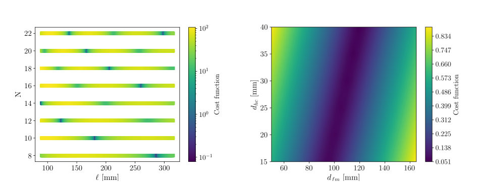
<figcaption class="paper-figure-caption"><b>Fig 1.</b> FIG. 2: (a) Analytical optimization of the HC to be an imaging system, the colour bar</figcaption>
</figure>
<figure class="paper-figure-card">
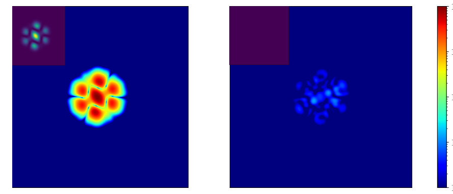
<figcaption class="paper-figure-caption"><b>Fig 2.</b> FIG. 3: (Ray tracing simulation, constructive and destructive interference intensities in</figcaption>
</figure>
<figure class="paper-figure-card">
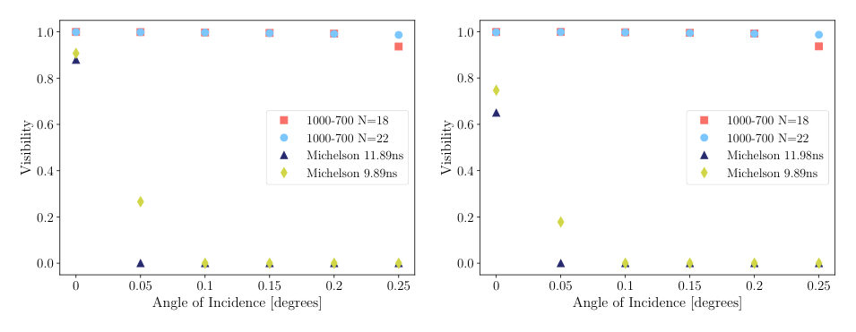
<figcaption class="paper-figure-caption"><b>Fig 3.</b> FIG. 4: Ray tracing results of a varying angle of incidence test with a Gaussian single</figcaption>
</figure>
<figure class="paper-figure-card">
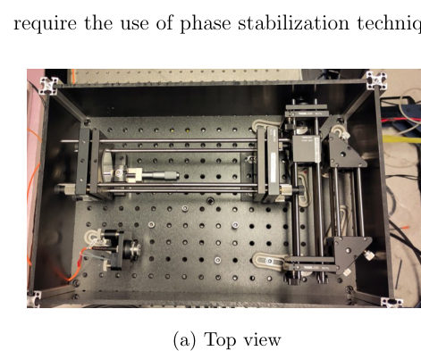
<figcaption class="paper-figure-caption"><b>Fig 4.</b> FIG. 5: (a) Top view of the HC interferometer setup. (b) Horizontally spaced spots</figcaption>
</figure>
<figure class="paper-figure-card">
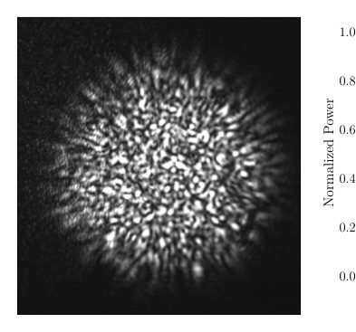
<figcaption class="paper-figure-caption"><b>Fig 5.</b> FIG. 6: (a) Highly multimode beam used for visibility tests with a long coherence</figcaption>
</figure>

**Summary.** The paper presents a novel field-widened interferometer design using a multi-pass Herriott cell to overcome signal degradation in free-space optics. By combining advanced ray tracing with experimental validation, the authors demonstrate that this architecture maintains high interference visibility for large time delays (up to 12 ns) and wide viewing angles. This makes it a highly promising component for robust quantum communication networks.

**Why it may be interesting.** This work directly addresses hardware limitations for quantum communication protocols by providing a robust, passive optical architecture that maintains coherence over long temporal delays in turbulent or pointing-error prone free-space channels.

Detailed structure

**Main problem.** The primary challenge addressed is maintaining high interference visibility for spatially multimode optical beams when large time delays are introduced, which is critical for free-space quantum communication links.

**Main result.** The authors successfully demonstrated a field-widened interferometer using a multi-pass Herriott cell that maintains high interference visibility ($\approx 0.9$ to $0.98$) even with path length differences up to 12 ns and large field-of-view angles.

**Method.** The work combines analytical ray transfer matrix methods for initial design optimization with advanced non-sequential Gaussian Beamlet Decomposition (GBD) ray tracing simulations, validated by pulsed laser time-bin measurements.

**Model / system.** The system is a field-widened, multimode interferometer configured in a Michelson arrangement, utilizing a multi-pass Herriott cell to achieve long optical path separations within a compact physical footprint. It is designed for applications like quantum key distribution (QKD) over free space.

**Key observables.** Interference Visibility ($V$), Time-Bin Separation ($\sim 12$ ns), and Field-of-View ($0.4^\circ$).

**Important parameters / regimes.** Path length difference ($\geq 10 	ext{ ns}$), large time delays, and angular deviations (pointing errors).

**Assumptions / limitations.** Initial ray tracing methods neglect wavefront distortions, polarization, and phase effects; the final results rely on GBD modeling to account for these complex wave phenomena.

**Figures summary.** Figures illustrate the conceptual Herriott cell design, analytical optimization of mirror parameters ($\ell$, $d_{fm}$), and experimental measurements showing high visibility maintenance across single-mode and multi-mode inputs at large time delays.

**Paper structure.** The paper progresses from establishing the need for passive alternatives to adaptive optics in free space. It details the theoretical design using ray tracing, validates this with GBD simulations accounting for wavefronts, and concludes with experimental demonstrations using both CW lasers and pulsed sources to measure time-bin visibility.

Abstract

Interference of optical signals in free-space channels requires optical receivers to support many spatial modes due to atmospheric turbulence, typically necessitating adaptive optics systems. Field-widened interferometers offer a passive alternative, making them particularly attractive for time-bin encoded signals with delays on the order of one nanosecond. Here, we demonstrate a field-widened, multimode interferometer design that achieves a high interference visibility for spatially multimode beams with large time bin separations. The interference of the multimode beams is enabled using a multi-pass Herriott cell that enables a very long path separation with a small form-factor. The design is tested using both numerical ray-tracing simulations and proof-of-principle demonstrations. We create a prototype interferometer with a path length difference of 12ns and determine that it maintains a high interference visibility with a large field-of-view of $0.4^{\circ}$.

[↑ back to top](#top)

### [Observation of Time-Domain Braiding of Non-Abelian Anyons at $ν= 5/2$ State](http://arxiv.org/abs/2608.12897v1)

**Authors:** Tomer Alkalay, Jinhong Park, Minseong Oh, Changki Hong, Jun-Young M. Lee, Priya Tiwari, Tapas Senapati, Vladimir Umansky, Moty Heiblum, H. -S. Sim  
**Type:** experiment · **Category:** strongly correlated electrons · **PDF:** <https://arxiv.org/pdf/2608.12897v1>  
**Analysis basis:** full PDF text, analyzed in chunks
**Topic relevance:** 🔥 `Full counting statistics` **4/5** · `quantum measurements` **3/5** · `analog quantum simulation` **1/5** · `correlated / nonlocal dissipation` **1/5** · `methods for driven-dissipative` **1/5**

↔ Scroll figures horizontally

<figure class="paper-figure-card">
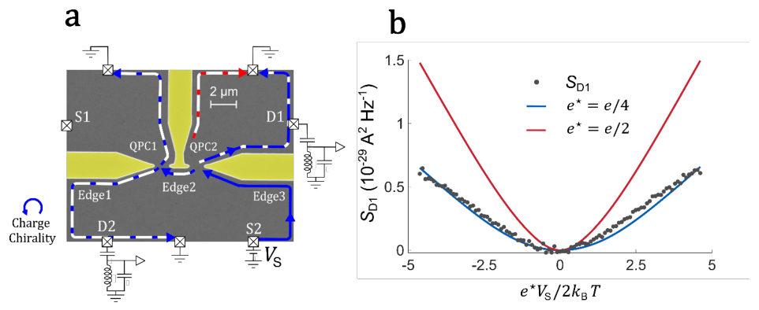
<figcaption class="paper-figure-caption"><b>Fig 1.</b> Figure 1 | Partitioning dilute charged anyons in a two-QPC geometry. (a) False-color scanning electron</figcaption>
</figure>
<figure class="paper-figure-card">
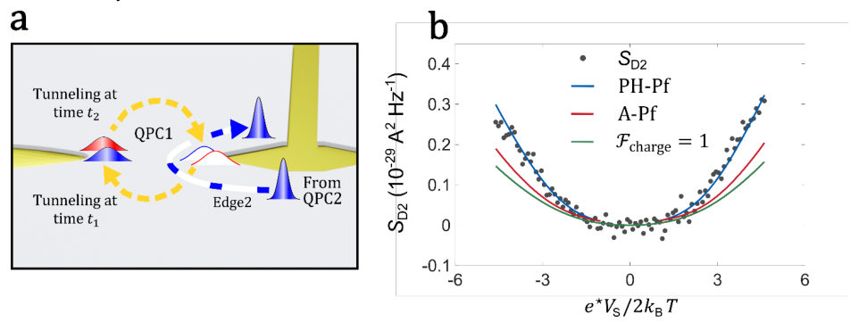
<figcaption class="paper-figure-caption"><b>Fig 2.</b> Figure 2 | Time-domain braiding of charged anyons. (a) Illustration of the time-domain braiding at QPC1.</figcaption>
</figure>
<figure class="paper-figure-card">
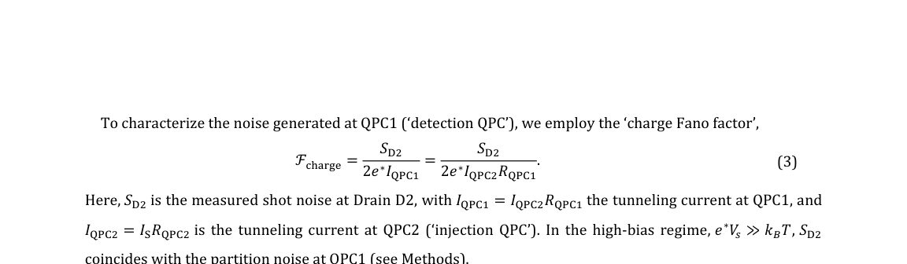
<figcaption class="paper-figure-caption"><b>Fig 3.</b> Figure 2b shows the measured shot noise, 𝑆𝑆D2, for one representative device (corresponding measurements</figcaption>
</figure>
<figure class="paper-figure-card">

<figcaption class="paper-figure-caption"><b>Fig 4.</b> Figure 3 | Time-domain braiding of neutral anyons. (a) Experimental configuration. False-color SEM image</figcaption>
</figure>
<figure class="paper-figure-card">
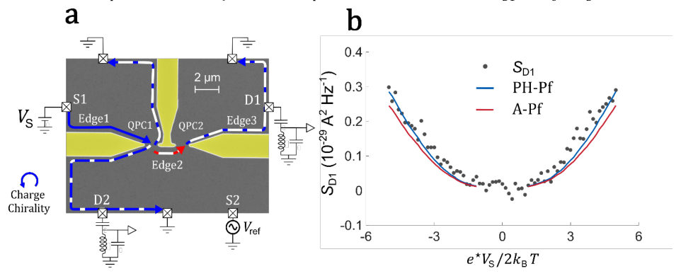
<figcaption class="paper-figure-caption"><b>Fig 5.</b> Figure 3b shows the measured shot noise that is compared with the theoretical predictions of 𝑆𝑆D1 =</figcaption>
</figure>

**Summary.** The paper reports evidence for non-Abelian anyons by measuring time-domain braiding signatures in the $\nu=5/2$ fractional quantum Hall state. Using current fluctuation measurements on edge modes, they independently probe both charged and neutral quasiparticles. The agreement between these two distinct measurements strongly supports the predicted topological order (PH-Pf) over simpler models.

**Why it may be interesting.** This work provides a concrete experimental realization using mesoscopic transport measurements to probe topological order parameters (non-Abelian statistics), which is highly relevant for understanding emergent quantum phenomena in condensed matter systems.

Detailed structure

**Main problem.** The primary challenge is providing experimental evidence for non-Abelian braiding statistics of anyons, which has been difficult to observe.

**Main result.** The authors report independent measurements of both charged (downstream) and neutral (upstream) current fluctuations that provide strong evidence supporting the presence of non-Abelian anyons in the $\nu=5/2$ fractional quantum Hall state.

**Method.** The study uses weak partitioning of highly dilute one-dimensional edge modes via two Quantum Point Contacts to measure noise signatures corresponding to time-domain braiding effects.

**Model / system.** The physical system is the Fractional Quantum Hall (FQH) state at filling factor $\nu=5/2$, analyzed using the 'particle-hole Pfaffian' topological order. The measurement probes quasiparticles exhibiting non-Abelian statistics, contrasting them with Abelian anyons.

**Key observables.** Charge Fano factor ($\mathcal{F}_{	ext{charge}}$) and Neutral Fano factor ($\mathcal{F}_{	ext{neutral}}$), derived from measured shot noise ($S_{D2}$ and $S_{D1}$).

**Important parameters / regimes.** Filling factor $\nu=5/2$, fractional charge $e^* = e/4$, and the comparison between theoretical predictions for PH-Pf and A-Pf topological orders.

**Assumptions / limitations.** The analysis assumes that observed excess noise cannot be explained by an incoherent Joule heating model, ruling out this simpler physical mechanism.

**Figures summary.** Figure 2 compares measured shot noise ($S_{D2}$) against theoretical predictions for PH-Pf and A-Pf edges. Figure 3 shows the neutral noise measurement ($S_{D1}$), while supplementary figures compare excess noise to heating model predictions, showing a significant discrepancy.

**Paper structure.** The paper first establishes the experimental setup using two QPCs to measure charge and neutral current fluctuations. It then analyzes the charged sector, finding evidence for non-Abelian statistics via $\mathcal{F}_{	ext{charge}}$. Subsequently, it analyzes the neutral sector ($\mathcal{F}_{	ext{neutral}}$) and concludes by ruling out an incoherent heating model as the source of excess noise.

Abstract

Unlike elementary particles, which obey either bosonic or fermionic exchange statistics, certain quasiparticles, known as anyons, are predicted to exhibit Abelian or non-Abelian braiding statistics. While braiding Abelian anyons modifies the wavefunction by a 'statistical phase', braiding non-Abelian anyons implements a unitary transformation of the state within a degenerate subspace of states. Experimental evidence of non-Abelian braiding has thus far remained elusive. Here, we report a 'time-domain braiding' signature of non-Abelian anyons in the $ν= 5/2$ fractional quantum Hall state, by extending our previously demonstrated approach with Abelian anyons at $ν= 1/3$. Our approach is based on measurements of the current fluctuations arising from weak partitioning of a highly dilute one-dimensional edge mode. We independently probe the partition noise of the downstream charged mode and also that of the upstream neutral mode. These independent measurements agree with our theoretical predictions for 'time-domain braiding' of the downstream Abelian and the upstream non-Abelian anyons, respectively, in the 'particle-hole Pfaffian' topological order. Together, these results provide evidence for the presence of non-Abelian anyons.

[↑ back to top](#top)

### [Phase information transfer by post-selection in Spin--Mechanical assisted magnetometry](http://arxiv.org/abs/2608.13325v1)

**Authors:** Raúl Coto, Hugo Molinares, Vitalie Eremeev  
**Type:** theory · **Category:** quantum information and computing · **PDF:** <https://arxiv.org/pdf/2608.13325v1>  
**Analysis basis:** full PDF text, analyzed in chunks
**Topic relevance:** 🔥 `quantum measurements` **4/5** · `driven-dissipative phase transition` **2/5** · `Keldysh / 2PI / non-Gaussian methods` **1/5** · `analog quantum simulation` **1/5** · `correlated / nonlocal dissipation` **1/5** · `methods for driven-dissipative` **1/5**

↔ Scroll figures horizontally

<figure class="paper-figure-card">
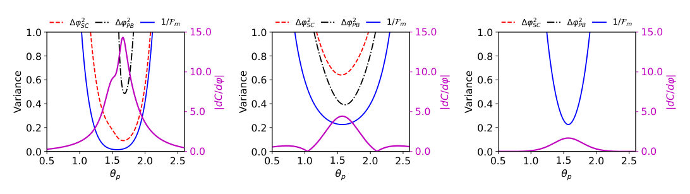
<figcaption class="paper-figure-caption"><b>Fig 1.</b> Figure 1: Left panel: coherent-state |β⟩with amplitude β = 1, center panel: even cat-state |cat⟩∝(|α⟩+ |−α⟩), with |α| = 2; and right panel: thermal-state with mean occupation ¯nth = 0.5. The phase variance is estimated using two different approaches: a semiclassical procedure based on the error-propagation formula (∆φ2 SC) and the Pegg-Barnett formalism for the phase operator (∆ˆφ2 PB). 1/Fm (CR) represents the lowest bound. Parameters used are λ = 0.1, ωmτ = 1, θi = π/2, γ/ωm = 1 G−1, and Bz = 2.7 G.</figcaption>
</figure>
<figure class="paper-figure-card">
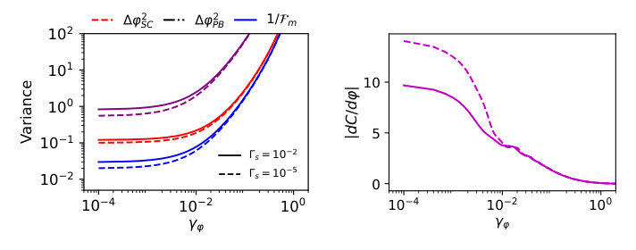
<figcaption class="paper-figure-caption"><b>Fig 2.</b> Figure 2: Dephasing rate impairs the Variance, without a significant impact from the dissipation rate (left panel). Consistenly with our previous observations, |dC/dφ| shows a monotonic decreasing (right panel). We simulate an initial coherent state and set θp = 1.65. γϕ and Γs are scaled by the oscillator frequency. Other parameters are the same as in Fig. 1.</figcaption>
</figure>
<figure class="paper-figure-card">
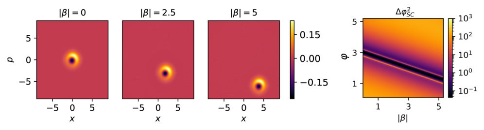
<figcaption class="paper-figure-caption"><b>Fig 3.</b> Figure 3: Wigner function of the MO state is displaced for different values of the initial amplitude |β|. We set the post-selection angle at θp = 1.65, yielding a success probability of 1.5% (left). ∆φ2 SC as a function of the phase φ and the coherent-state amplitude |β| (right). Other parameters are the same as in Fig. 1.</figcaption>
</figure>
<figure class="paper-figure-card">
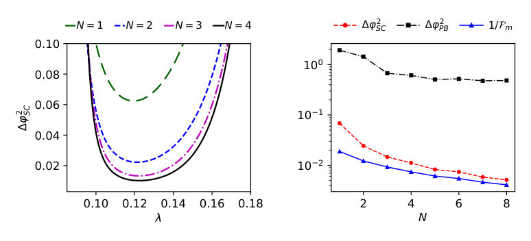
<figcaption class="paper-figure-caption"><b>Fig 4.</b> Figure 4: Variance ∆φ2 SC shows an optimal region as a function of the coupling strength λ. Different numbers of spins (N) coupled to the MO share the same optimal value λ ≃0.12 (left). Variance’s estimators decreases as a function of the number of spins. We set λ = 0.13 (right). Other parameters are: β = 1, ωmτ = 1, θp = 1.65, γ/ωm = 1 G−1 and Bz = 2.7 G.</figcaption>
</figure>
<figure class="paper-figure-card">
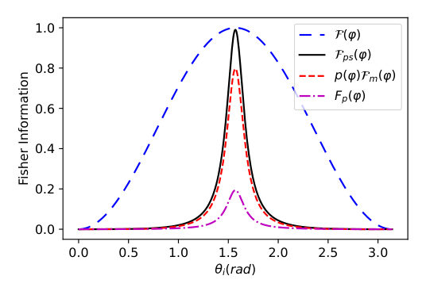
<figcaption class="paper-figure-caption"><b>Fig 5.</b> Figure 5: Quantum Fisher information (QFI) with post-selection Fps(φ) saturates QFI without post-selection F (φ), in a small region of the spin preparation angle θi. Fps(φ) involves contributions from the information obtained from the meter conditioned on successful post-selection p(φ)Fm, while Fp denotes the classical Fisher information associated with the post-selection probability distribution p(φ). Parameters used are λ = 0.1, β = 1, φ = 2.9 rad, ωmt = 1, and θp = θi.</figcaption>
</figure>

**Summary.** This paper develops a theory for transferring phase information from coupled spins to a mechanical oscillator using post-selection as a selective measurement backaction. By comparing various variance estimators against the Quantum Fisher Information, the authors establish diagnostic tools like coherence susceptibility. The work highlights that while post-selection can enhance sensing, one must carefully account for the success probability when interpreting sensitivity gains.

**Why it may be interesting.** This work provides a detailed theoretical blueprint for utilizing non-unitary quantum processes (measurement backaction) to enhance sensing capabilities in complex hybrid systems, which is highly relevant to open quantum system dynamics and quantum metrology.

Detailed structure

**Main problem.** The study investigates how phase information encoded in a spin system can be selectively transferred to a mechanical oscillator using post-selection as a measurement-induced backaction mechanism for quantum magnetometry.

**Main result.** Post-selection successfully transfers phase information from the spins to the MO, but the apparent improvement in sensitivity calculated only on successful events can overestimate true performance due to low success probabilities and discarded data.

**Method.** The authors compare multiple diagnostics—Semiclassical variance estimator, Pegg-Barnett quantum estimator, and Quantum Fisher Information (QFI)—to quantify phase transfer efficiency under various environmental conditions.

**Model / system.** The system is a hybrid quantum platform consisting of one or more spins coupled to a mechanical oscillator (MO). The dynamics are governed by Hamiltonians incorporating spin-oscillator coupling ($\lambda_0$) and dissipation modeled via a Lindblad master equation.

**Key observables.** Phase variance ($\Delta\hat{\varphi}^2$), Quantum Fisher Information ($F_{ps}(\varphi)$), Coherence Susceptibility ($|dC/d\varphi|$), and the success probability $p(\varphi)$.

**Important parameters / regimes.** Oscillator quantum coherence, coupling strength ($\lambda_0$), number of spins ($N$), dephasing rate ($\gamma_\phi$), and dissipation rate ($\Gamma_s$).

**Assumptions / limitations.** The analysis compares different estimators (SC vs. PB) to determine the best measure of phase transfer; a key limitation noted is that relying solely on successful events overestimates performance.

**Figures summary.** Figures compare variance estimates for different initial states (coherent, cat, thermal), show how dephasing degrades accuracy relative to dissipation, and illustrate the decomposition of QFI into components related to post-selection probability and MO state.

**Paper structure.** The paper develops a theoretical framework for probabilistic phase estimation in hybrid systems. It introduces coherence susceptibility as a diagnostic tool, decomposes the total QFI after post-selection, and analyzes how different environmental effects (dephasing vs. dissipation) impact the achievable measurement precision.

Abstract

Quantum information transfer between light-matter-type systems is poised to enable important applications, while also serving as a testbed for theoretical investigation. Such systems can be realized with spins coupled to a mechanical oscillator, a platform that has been extensively studied both theoretically and experimentally. Early demonstrations of quantum information transfer have relied mostly on coherent control. However, measurement-induced backaction has emerged as a strong alternative for quantum control. In this work we use post-selection on the spin system as a selective backaction to refocus spin's phase information onto the mechanical oscillator. We identify physical resources and operating regimes that govern conditional phase transfer, including oscillator quantum coherence, the number of spins, the mechanical initial state, coupling strength, oscillator amplitude, and relaxation. We benchmark different scenarios using the variance as the figure of merit, estimated via two complementary approaches: a semiclassical variance estimator and a Pegg-Barnett quantum estimator. The Cramér-Rao bound is also computed for comparison. The analysis provides a framework for understanding phase transfer in high-dimensional hybrid quantum systems and for measurement-induced backaction used in quantum magnetometry.

[↑ back to top](#top)

### [Robust controlled-Z gate for Rydberg atoms based on level-crossing-free echoing rapid adiabatic passage](http://arxiv.org/abs/2608.13090v1)

**Authors:** Yichi Zhang, Zhenqi Bai, Xu Zhao, Hongyan Fan, Ximo Wang, Tiecheng Wang  
**Type:** theory · **Category:** other · **PDF:** <https://arxiv.org/pdf/2608.13090v1>  
**Analysis basis:** full PDF text, analyzed in chunks
**Topic relevance:** 🔥 `Rydberg arrays` **4/5** · `QC/QI experiment` **2/5** · `analog quantum simulation` **1/5** · `correlated / nonlocal dissipation` **1/5** · `driven-dissipative phase transition` **1/5** · `methods for driven-dissipative` **1/5**

↔ Scroll figures horizontally

<figure class="paper-figure-card">
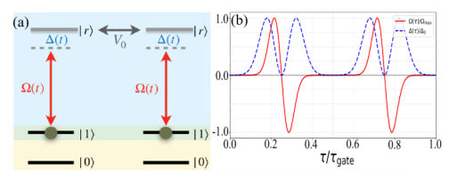
<figcaption class="paper-figure-caption"><b>Fig 1.</b> FIG. 1: Schematic of the pulse design and atomic–evel structure. (a)Atomic level structure of two-atom qubits featuring Rydberg–Rydberg interactions between the |r⟩states. (b)Two identical level-crossing-free pulses. The Rabi frequency Ω(t) exhibits an antisymmetric bipolar structure, crossing zero and changing sign at the pulse center; the detuning ∆(t) has a single-peak symmetric structure, smoothly approaching zero at the beginning and end.</figcaption>
</figure>
<figure class="paper-figure-card">
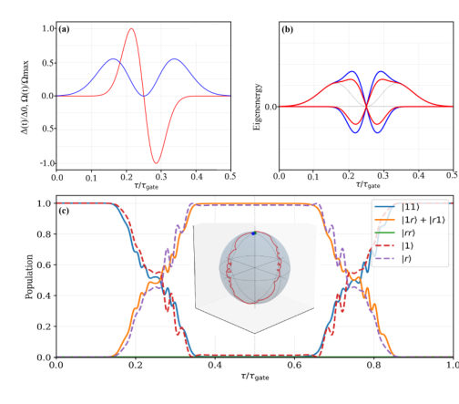
<figcaption class="paper-figure-caption"><b>Fig 2.</b> FIG. 2: Pulse design and system evolution for CZ and CCZ gates. (a) Profile of the pulses, ∆(t) and Ω(t), for CZ and CCZ gate construction. (b) Instantaneous eigenenergies of the Hamiltonian H(t) during one pulse: the blue and red solid lines represent the eigenstates of the two-atom and single-atom systems, respectively. (c) The atomic population evolution during the complete gate time τgate. The solid line represents the states evolution of the double-atom case, and the dashed line represents the single-atom case. Inset: Bloch sphere trajectory of the dynamical state.</figcaption>
</figure>
<figure class="paper-figure-card">
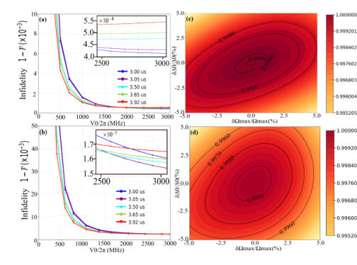
<figcaption class="paper-figure-caption"><b>Fig 3.</b> FIG. 3: Fidelity and parameter robustness analysis for CZ and CCZ gates. (a) and (b): Variation of the infidelity with V0 at different total gate times for the CZ and CCZ gates, respectively. (c) and (d): Contour plots of the fidelity for the CZ and CCZ gates against parameter fluctuations, with Ωmax = (2π) 14.93 MHz, ∆0 = 0.45 Ωmax, τR = 11.1, τD = 8.58 for the CZ gate, and Ωmax = (2π) 13.75 MHz, ∆0 = 0.14 Ωmax, τR = 12, τD = 9.15 for the CCZ gate. The total gate time is 3.92 µs for both gates.</figcaption>
</figure>

**Summary.** The paper proposes a novel, robust method to implement controlled-Z gates on Rydberg atoms using level-crossing-free adiabatic passage. By designing specific pulse sequences with zero net area, the scheme naturally cancels unwanted phases and maintains high fidelity ($>0.999$) even when subjected to realistic experimental noise and dissipation. This makes it a highly promising platform for scalable quantum computation.

**Why it may be interesting.** This work represents a significant advancement in quantum gate implementation by providing an architecture (level-crossing-free echoing RAP) that intrinsically suppresses common sources of error like laser intensity noise and dynamical phase accumulation, making it highly practical for large arrays.

Detailed structure

**Main problem.** The primary goal is to design a highly robust controlled-Z (CZ) gate for Rydberg atoms that minimizes decoherence and remains functional despite experimental imperfections.

**Main result.** The proposed level-crossing-free echoing rapid adiabatic passage scheme achieves very high fidelity ($0.9999$ for CZ) while being remarkably resilient to laser intensity fluctuations ($\pm 2\%$) and detuning offsets ($\pm 1\%$).

**Method.** The authors employ a double-pulse sequence utilizing antisymmetric Rabi frequency pulses and symmetric detuning pulses, which naturally cancels the dynamical phase via time-reversal symmetry.

**Model / system.** The system involves Rydberg atoms in neutral atom arrays, modeled using the Lindblad master equation to account for dissipation. The gate relies on the strong Rydberg blockade effect restricting dynamics to low-excitation subspaces.

**Key observables.** Gate fidelity ($F$), nonadiabatic transition probability ($P_{	ext{nonad}}$), and population evolution during the gate time ($	au_{	ext{gate}}$).

**Important parameters / regimes.** Rabi frequency fluctuation ($\pm 2\%$), detuning offset ($\pm 1\%$), blockade interaction strength ($V_0$), and gate duration ($	au_{	ext{gate}}$).

**Assumptions / limitations.** The analysis assumes the system can be effectively described by restricting evolution to low-dimensional subspaces due to the Rydberg blockade, and that the pulse structure ensures zero-area conditions.

**Figures summary.** Figures illustrate schematic level structures (FIG. 1), pulse profiles for CZ/CCZ gates (FIG. 2(a)), instantaneous eigenenergies showing avoided crossings (FIG. 2(b)), and Bloch sphere trajectories demonstrating controlled phase accumulation.

**Paper structure.** The paper develops the theory by comparing adiabatic passage schemes, establishing that level-crossing-free zero-area pulses are superior for robustness. It then applies this framework to simulate CZ/CCZ gates under dissipation using the Lindblad master equation, quantifying fidelity and noise resilience.

Abstract

We propose a controlled-Z gate scheme for Rydberg atoms based on level-crossing-free echoing rapid adiabatic population transfer. We design antisymmetric Rabi frequency pulses and symmetric detuning pulses, enabling the system to completely avoid level-crossing points throughout the evolution, and the dynamical phase is naturally eliminated by the time-reversal symmetry of the double-pulse sequence. We incorporate dissipative effects through the Lindblad master equation. The numerical simulation yields a two-qubit CZ gate fidelity of 0.9999. When the Rabi-frequency fluctuation is within $\pm 2\%$, and the detuning offset is within $\pm 1\%$, the fidelity can still remain above 0.999. Under the same dissipative model, the three-qubit CCZ gate achieves a fidelity of 0.999. When a single-parameter fluctuation does not exceed $\pm 3\%$, the fidelity is always higher than 0.997. Our scheme requires no laser phase jumps or fast switching operations. The zero-area pulse structure suppresses first-order intensity noise, and the symmetric double-pulse sequence avoids spatially resolved laser switching, making it suitable for parallel gate operations in large-scale neutral-atom arrays.

[↑ back to top](#top)

### [Entanglement distribution and quantum storage of more than 8000 modes over a metropolitan network](http://arxiv.org/abs/2608.13177v1)

**Authors:** Angelo Gelmini Rodriguez, Louis Nicolas, Théo Sanchez Mejia, Pavel Sekatski, Nicolas Brunner, Towsif Taher, Rob Thew, Philippe Goldner, Mikael Afzelius  
**Type:** experiment · **Category:** quantum information and computing · **PDF:** <https://arxiv.org/pdf/2608.13177v1>  
**Analysis basis:** full PDF text, analyzed in chunks
**Topic relevance:** 🔥 `QC/QI experiment` **4/5** · `quantum optics experiment` **3/5** · `interference shaping light` **1/5** · `quantum measurements` **1/5**

↔ Scroll figures horizontally

<figure class="paper-figure-card">
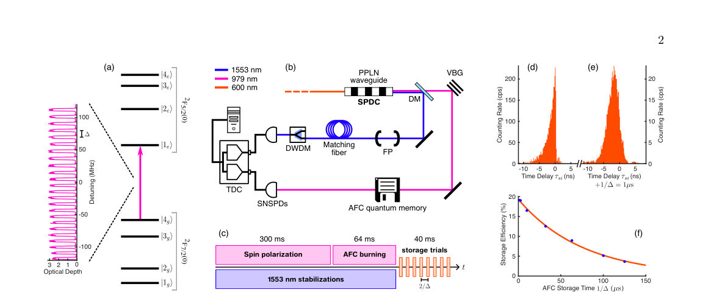
<figcaption class="paper-figure-caption"><b>Fig 1.</b> FIG. 1. Experimental setup. (a) Hyperfine manifolds of the 2F7/2(0) ground and 2F5/2(0) excited states of 171Yb3+ in crystallographic site II. The AFC memory was created on the |4g⟩−|1e⟩transition, the inset shows a measured comb with periodicity ∆= 10 MHz. (b) Simplified schematics of the experimental setup showing the SPDC source (PPLN waveguide), the AFC quantum memory, the optical frequency filters, and the detection setup. The optical filters comprise the volume Bragg grating (VBG), 20 GHz bandwidth, Fabry-P´erot (FP) cavity, 90 MHZ bandwidth, and the dense wavelength-division mulitplexer (DWDM) at channel 31, 75 GHz bandwidth. The detection system consists of superconducting nanowire...</figcaption>
</figure>
<figure class="paper-figure-card">
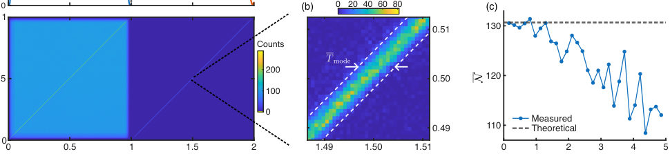
<figcaption class="paper-figure-caption"><b>Fig 2.</b> FIG. 2. Multimode analysis. (a) The measured joint detection matrix as a function of the idler ti and signal ts detection times, with respect to the beginning of the SPDC pump pulse. The background due to accidental coincidences is significantly higher in the transmission window, due to 979-nm signal photons not absorbed by the 171Yb3+:Y2SiO5 crystal. The signal-to- noise ratio is significantly higher in the echo window, owing to the frequency-temporal filtering by the AFC quantum memory [36]. (Top inset) Total signal counts as a function of ts showing the transmission and echo windows. (b) Zoom on the echo correlation line, at a binning of 730 ps. (c) Numerical estimation of the lower...</figcaption>
</figure>
<figure class="paper-figure-card">
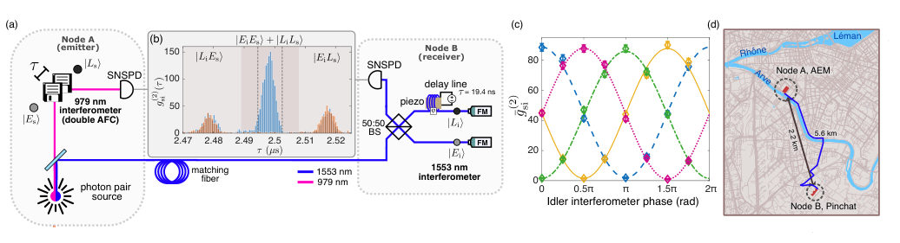
<figcaption class="paper-figure-caption"><b>Fig 3.</b> FIG. 3. Entanglement distribution. (a) Franson-type interferometer setup for measuring energy-time entanglement, em- ploying a fibered Michelson interferometer at 1553 nm and a double-AFC scheme at 979 nm. FM = Faraday mirror. BS = beam splitter. (b) Example of detection histogram for 1/∆= 2.5 µs, showing the typical three correlation peaks of the Franson setup, where only detections in the middle peak reveal entanglement. The blue and red histograms show cases of constructive and destructive interferences. Dashed lines indicate the detection window T mode. (c) The averaged second-order cross-correlation value ¯g(2) si as a function of the idler phase ϕi, for fixed signal phases ϕs = 0...</figcaption>
</figure>

**Summary.** This paper reports on a quantum repeater node using a multimode quantum memory ($	ext{Yb}^{3+}:	ext{Y}_2	ext{SiO}_5$) to overcome rate limitations in quantum communication. They successfully demonstrated the storage and distribution of entanglement across thousands of temporal modes over both laboratory fiber spools and a real metropolitan network link. This advances the feasibility of long-distance, high-capacity quantum networking.

**Why it may be interesting.** This work directly addresses scalability issues in quantum networking by demonstrating high-mode count entanglement distribution, which is crucial for realizing large-scale quantum repeaters beyond simple single-photon links.

Detailed structure

**Main problem.** The primary challenge is achieving practical, high-rate entanglement distribution over metropolitan distances by overcoming rate limitations inherent in single-mode quantum memories.

**Main result.** The authors successfully demonstrated the distribution of entanglement across a 5.66 km metropolitan fiber link while storing and verifying correlations across 8235 temporal modes.

**Method.** They utilized an Atomic Frequency Comb (AFC) quantum memory in a quantum repeater node setup, combining it with Spontaneous Parametric Down-Conversion (SPDC) sources and performing Bell tests to confirm entanglement preservation.

**Model / system.** The platform uses a multimode quantum memory based on the $	ext{}^{171}	ext{Yb}^{3+}:	ext{Y}_2	ext{SiO}_5$ crystal. Entanglement is established between a telecom photon in the fiber and a stored signal photon, with mode capacity quantified via Schmidt decomposition.

**Key observables.** CHSH Bell parameter ($S > 2$), effective temporal mode capacity (up to 16340 modes), coincidence detection rates, and interference fringe visibility ($V$).

**Important parameters / regimes.** Memory bandwidth of $250	ext{ MHz}$, storage lifetime ($	ext{AFC}$) of $\sim 76.6\ \mu	ext{s}$, and metropolitan distribution distance up to $5.66	ext{ km}$.

**Assumptions / limitations.** The analysis relies on the fair-sampling assumption for Bell nonlocality revelation, and there is a noted trade-off between coincidence rate and storage time due to memory efficiency decay.

**Figures summary.** Figures illustrate the experimental setup involving SPDC sources, AFC memories, and detection systems. Specific panels show correlation peaks in joint detection histograms and the measurement of entanglement via Bell tests over varying fiber lengths.

**Paper structure.** The paper details the physical system (AFC memory + SPDC source), introduces quantitative measures like Schmidt decomposition for mode capacity, demonstrates broadband storage capabilities using fiber spools, and culminates in a field deployment test over a metropolitan network while verifying nonlocality via CHSH tests.

Abstract

Entanglement generation between telecommunication photons and matter is central to fibre-based quantum repeaters. Achieving practical communication rates requires multiplexing, which multimode quantum memories can provide. Rare-earth-ion ensembles offer large temporal multimode storage by exploiting the numerous spectral channels within their absorption spectrum. Here, we report on a quantum repeater node comprised of a $^{171}$Yb$^{3+}$:Y$_2$SiO$_5$ multimode quantum memory, featuring a 250 MHz bandwidth and a $76.6~μ\mathrm{s}$ lifetime, and a bandwidth-matched entangled photon-pair source. We introduce and validate a quantitative measure of the effective temporal mode capacity using a Schmidt decomposition. With this platform, we demonstrate entanglement between a telecom photon propagating through a 25.3 km fiber spool and a 979 nm photon stored for $125~μ\mathrm{s}$ across 16340 temporal modes. Finally, we report a field deployment distributing entanglement over 5.66 km through the Geneva metropolitan fibre network while storing 8235 modes for $63~μ\mathrm{s}$.

[↑ back to top](#top)

### [Pulse Engineering of Quantum Many-Body Dynamics: Emergent Scar States, Entanglement, and Nonstabilizerness](http://arxiv.org/abs/2608.12559v1)

**Authors:** Prasant Mallik, Arkaprava Sil, Sudipto Singha Roy  
**Type:** theory · **Category:** strongly correlated electrons · **PDF:** <https://arxiv.org/pdf/2608.12559v1>  
**Analysis basis:** full PDF text, analyzed in chunks
**Topic relevance:** 🔥 `analog quantum simulation` **4/5** · 🔥 `scars & prethermalization` **4/5** · `quantum measurements` **1/5**

↔ Scroll figures horizontally

<figure class="paper-figure-card">
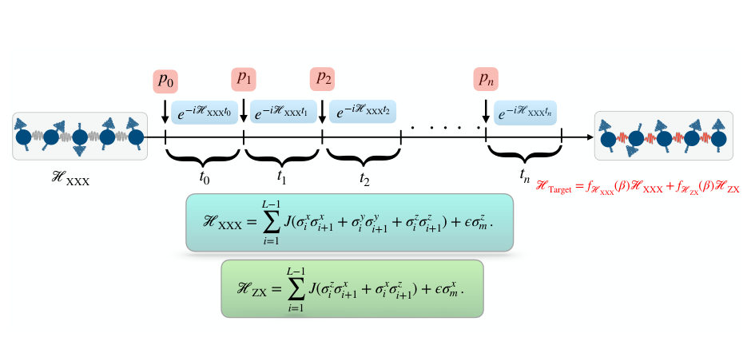
<figcaption class="paper-figure-caption"><b>Fig 1.</b> Figure 1. Schematic illustration of the pulse-driven spin chain and the effective Hamiltonian generated through the pulse-based Hamiltonian engineering protocol.</figcaption>
</figure>
<figure class="paper-figure-card">
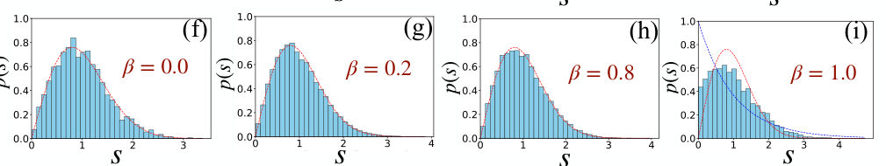
<figcaption class="paper-figure-caption"><b>Fig 2.</b> Figure 2. Level statistics under pulse engineering. (a) Mean level-spacing ratio ⟨r⟩as a function of impurity strength ε for different values of the parameter β. The dashed lines indicate the Poisson limit (⟨r⟩Poiss ≈0.38629) and the GOE limit (⟨r⟩GOE ≈0.53590). In the XXX limit (β = 0), the system shows Poisson-like statistics at weak impurity and crosses over to GOE behavior at stronger ε. For finite β (except β = 1), a similar crossover is observed, indicating that pulse engineering preserves the non-chaotic to chaotic transition across parameters. However, β = 1 limits shows non-chaotic behavior for all impurity strength considered. Here, (b)–(e) show level spacing distribution for ε =...</figcaption>
</figure>
<figure class="paper-figure-card">
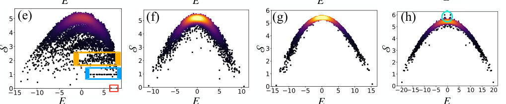
<figcaption class="paper-figure-caption"><b>Fig 3.</b> Figure 3. Energy-resolved distribution of the bipartite entanglement entropy S for eigenstates of the pulse-engineered spin chain. (a)–(d) Correspond to β = 0, 0.3, 0.7, and 1.0, respectively, with ε = 0.03981. (e)–(h) Show the corresponding results for the same values of β at ε = 0.63095. The figures reveal distinct entanglement structures that emerge across the pulse-engineered interpolation. The color scale represents the density of states. Marked boxes of different colors highlight selected energy windows from which atypical eigenstates are chosen for further analysis. Among them the middle one of (a) and (e) (blue box) captures L −1 exact atypical states that we explore in detail....</figcaption>
</figure>
<figure class="paper-figure-card">
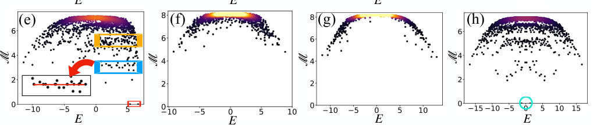
<figcaption class="paper-figure-caption"><b>Fig 4.</b> Figure 4. Energy-resolved distribution of the second-order stabilizer R´enyi entropy M for eigenstates of the pulse-engineered spin chain. (a)–(d) Correspond to β = 0, 0.3, 0.7, and 1.0, respectively, with ε = 0.03981. (e)–(h) Show the corresponding results for the same values of β at ε = 0.63095. The figures reveal distinct nonstabilizer structures that emerge across the pulse-engineered interpolation. The color scale represents the density of states. In this case, the marked boxes highlight the similar set of states that we consider in Fig. 3 for further analysis. Here, we consider L = 11.</figcaption>
</figure>
<figure class="paper-figure-card">
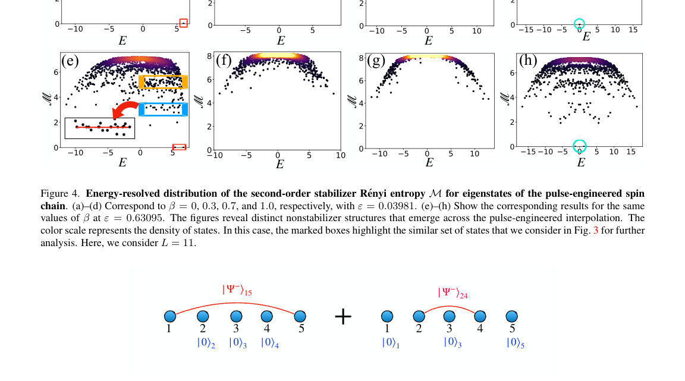
<figcaption class="paper-figure-caption"><b>Fig 5.</b> Figure 5. Schematic representation of one of the special plateau eigenstates for L = 5. The state consists of a coherent superposition of different long-range Bell-pair coverings connecting distant lattice sites, together with fixed product-state configurations on the remaining spins. Such structures resemble RVB-like singlet superpositions.</figcaption>
</figure>

**Summary.** The paper introduces pulse engineering as a powerful technique to construct and study effective Hamiltonians for interacting spin chains. By smoothly interpolating between two distinct models (XXX and ZX), the authors demonstrate controlled access to exotic eigenstates exhibiting specific entanglement patterns. This establishes pulse engineering as a general tool for tuning quantum resources in many-body physics.

**Why it may be interesting.** This work directly addresses how external driving fields can be used as a tool to sculpt complex many-body Hamiltonians, offering precise control over emergent quantum features like entanglement structure, which is highly relevant for designing quantum simulators.

Detailed structure

**Main problem.** The central challenge is coherently controlling the properties of interacting quantum many-body systems by systematically engineering their Hamiltonians.

**Main result.** Pulse engineering provides a versatile framework to generate structured Hamiltonians, allowing for controlled transitions between different types of atypical eigenstates (like VBS states and rainbow scar states) while tracking changes in entanglement and nonstabilizerness.

**Method.** The authors use pulse engineering schemes combined with average Hamiltonian theory to derive an effective time-independent Hamiltonian that interpolates between two known models ($\mathcal{H}_{XXX}$ and $\mathcal{H}_{ZX}$).

**Model / system.** The system is a one-dimensional spin-1/2 chain with nearest-neighbor interactions and a local impurity. The analysis compares the chaotic Heisenberg (XXX) model to a target ZX Hamiltonian.

**Key observables.** Entanglement entropy, stabilizer Rényi entropy, nonstabilizerness ('magic'), and spectral statistics ($\langle r 
angle$).

**Important parameters / regimes.** The interpolation parameter $eta$ controls the mixing between the two Hamiltonians; regimes include exchange-dominated ($J/\epsilon > 1$) and impurity-dominated ($J/\epsilon < 1$).

**Assumptions / limitations.** The analysis relies on the leading-order Magnus approximation for deriving the effective Hamiltonian.

**Figures summary.** Figures illustrate the pulse-driven spin chain, the resulting effective Hamiltonian structure, and show how entanglement/nonstabilizerness evolve across different engineered limits.

**Paper structure.** The paper introduces the problem of control in many-body systems, derives the effective Hamiltonian via pulse engineering theory, analyzes the system's spectral properties (chaos vs. non-chaos) across the parameter space, and finally characterizes specific atypical eigenstates and their associated quantum resources.

Abstract

Understanding and coherently controlling the properties of interacting quantum many-body systems is a central challenge in non-equilibrium quantum physics. While in the past decades, a wide range of many-body Hamiltonians have been introduced to study quantum chaos, atypical eigenstates, and quantum resources, systematically engineering and continuously tuning these properties within a single microscopic model remains largely unexplored. Here, we employ a pulse engineering scheme to construct an effective Hamiltonian that continuously interpolates between a chaotic Heisenberg (XXX) chain with a local impurity and the ZX Hamiltonian. Along this interpolation, we identify several families of analytically tractable atypical eigenstates embedded in the excited-state spectrum with distinct entanglement and nonstabilizerness properties. In the XXX limit, these states exhibit exact plateaus in both entanglement and stabilizer Rényi entropy and correspond to coherent superpositions of long-range valence-bond solid (VBS) states. As the pulse strength increases, the effective Hamiltonians exhibit a hierarchy of new set of approximate entanglement plateaus in the low-energy spectrum. Interestingly, in the fully pulse-engineered ZX limit, we uncover a distinct pair of long-range entangled stabilizer eigenstates, corresponding to rainbow scar states. We further show that pulse engineering preserves the distinct chaotic and non-chaotic regimes of the original model, while that is largely absent in the dynamical generation of entanglement and nonstabilizerness. The pulse-engineered models generate nearly identical quantum resources in both regimes, revealing a partial decoupling between quantum chaos and quantum-resource generation. Our results establish pulse engineering as a versatile framework for generating many-body Hamiltonians with structured eigenstates and tunable quantum resources.

[↑ back to top](#top)

### [One-sided stripe supersolidity from engineered non-axisymmetric dipolar interactions](http://arxiv.org/abs/2608.12867v1)

**Authors:** Chao Zhang  
**Type:** theory · **Category:** quantum gases · **PDF:** <https://arxiv.org/pdf/2608.12867v1>  
**Analysis basis:** full PDF text, analyzed in chunks
**Topic relevance:** 🔥 `analog quantum simulation` **4/5** · `Frenkel-Kontorova` **1/5** · `methods for driven-dissipative` **1/5**

↔ Scroll figures horizontally

<figure class="paper-figure-card">
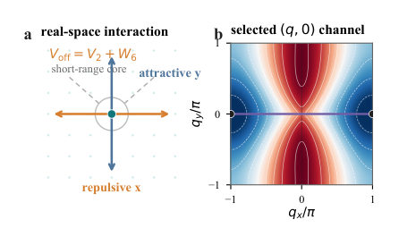
<figcaption class="paper-figure-caption"><b>Fig 1.</b> FIG. 1. Interaction-selected stripe channel. (a) The off-site interaction is repulsive along x, attractive along y, and has a short-range repulsive core. (b) The momentum- space off-site kernel, eVoff(q), has a low axial (q, 0) channel, while onsite U does not choose the ordering direction. In (b), colors show the relative value of eVoff(q) after subtracting its Brillouin-zone average; the low axial region marks the selected (q, 0) channel.</figcaption>
</figure>
<figure class="paper-figure-card">
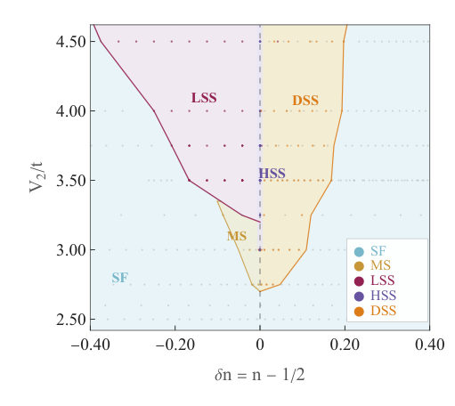
<figcaption class="paper-figure-caption"><b>Fig 2.</b> FIG. 2. Fixed-shape phase diagram. Phase assignments in the (δn, η) plane, with δn = n −1/2, η = V2/t, and fixed ratios U/V2 = 30/7, W6/V2 = 3/7. Small gray dots denote simulated points; colored points and domains summarize the identified phases: superfluid (SF), mobile stripe (MS), locked stripe solid (LSS), half-filled stripe solid (HSS), and doped stripe supersolid (DSS). The HSS forms the central parent at δn = 0.</figcaption>
</figure>
<figure class="paper-figure-card">
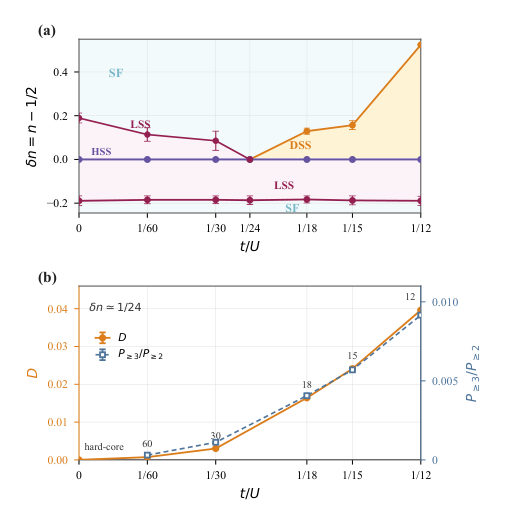
<figcaption class="paper-figure-caption"><b>Fig 3.</b> FIG. 4. Soft-core-to-hard-core control. (a) At fixed V2/t = 3.5 and W6/t = 1.5, the half-filled HSS parent re- mains at δn = 0, while the particle-side DSS window ap- pears for U/t = 12, 15, 18 but is absent for U/t = 24, 30, 60 and hard-core. Error bars in (a), shown only on the plotted phase-window boundaries, denote the boundary-location un- certainty set by adjacent sampled filling sectors. (b) At sam- pled particle-side sectors near δn ≃1/24, the left axis shows the onsite pair weight D = L−2 P</figcaption>
</figure>
<figure class="paper-figure-card">
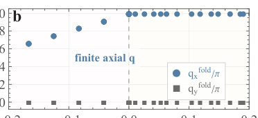
<figcaption class="paper-figure-caption"><b>Fig 4.</b> FIG. 5. Selected-stripe and leading-wave-vector diag- nostics. These results use the L = 24, η = 3.5 fixed-shape cut, (U, V2, W6)/t = (15, 3.5, 1.5), also shown in Fig. 3. Nor- malized channel weights and the leading folded wave vec- tor show that the ordered states are carried by the same interaction-selected (q, 0) stripe channel. Here S⋆ comp = max(S⋆ y, S⋆ d) denotes the larger of the transverse and diag- onal competing-channel peaks. The plotted qfold x and qfold y are the two components of qfold 1 . The dominant structure-factor weight remains in the x-stripe channel, while qfold x drifts with filling and qfold y remains near zero.</figcaption>
</figure>

**Summary.** The paper theoretically investigates stripe supersolidity in a Bose-Hubbard model governed by engineered non-axisymmetric dipolar interactions. It demonstrates that the system's response to doping is highly asymmetric: particle doping stabilizes a true supersolid phase with finite superfluidity, whereas hole doping leads to locked, less coherent states. This behavior hinges critically on the presence of soft-core doublon fluctuations enabled by onsite interaction $U$.

**Why it may be interesting.** This work provides a detailed theoretical framework for realizing and controlling exotic quantum phases like stripe supersolids in controllable lattice systems, directly relevant to cold atom simulations using dipolar interactions.

Detailed structure

**Main problem.** The study investigates whether doping defects (vacancies/interstitials) can become phase coherent without melting the ordered background in a supersolid state, and how this coherence depends on particle vs. hole doping.

**Main result.** The system exhibits an asymmetry: particle doping leads to a stripe supersolid with finite superfluid stiffness ($
ho_s>0$) and compressibility ($\kappa>0$), while hole doping results in locked commensurate solids with vanishing $
ho_s$.

**Method.** Path-integral Quantum Monte Carlo method utilizing the worm algorithm for simulations.

**Model / system.** A soft-core Bose-Hubbard model on a square lattice featuring an engineered non-axisymmetric dipolar interaction ($V_{ij} \propto (x^2-y^2)/r^5 + 1/r^6$).

**Key observables.** Compressibility ($\kappa$), Superfluid Stiffness ($
ho_s$), Double Occupancy ($D$), and the structure factor $S(q)$ to confirm $(q,0)$ stripe order.

**Important parameters / regimes.** The ratio $U/t$ (controlling onsite softness) and the doping level $\delta n = n - 1/2$.

**Assumptions / limitations.** The analysis assumes that the off-site dipolar kernel selects a fixed $(q,0)$ stripe channel, while the finite onsite interaction ($U$) controls defect mobility.

**Figures summary.** Figures illustrate the asymmetric phase diagram in doping space ($\delta n$), showing plateaus on the hole side versus continuous supersolid formation on the particle side. Tables summarize how this DSS state vanishes when the soft-core doublon channel is suppressed by increasing $U/t$ towards the hard-core limit.

**Paper structure.** The paper systematically analyzes the Bose-Hubbard model, first establishing the role of the engineered dipolar interaction in selecting stripe order. It then compares the physical response to particle vs. hole doping, using $
ho_s$, $\kappa$, and $D$ as diagnostics to prove the one-sided nature of the supersolid phase.

Abstract

A supersolid combines density order with phase coherence, and doped lattice solids ask whether added defects can become coherent without melting the ordered background. We study a soft-core Bose-Hubbard model with isotropic hopping and an engineered non-axisymmetric dipolar interaction, \(V_{ij}=V_2(x_{ij}^2-y_{ij}^2)/r_{ij}^5+W_6/r_{ij}^6\), where the sign-changing \(d_{x^2-y^2}\) component selects a fixed \((q,0)\) stripe channel and the \(W_6/r^6\) core stabilizes the short-distance attractive branch. Using sign-problem-free quantum Monte Carlo method with worm algorithm, we find that the half-filled stripe parent responds asymmetrically to doping: the hole side forms locked commensurate stripe solids with vanishing superfluid stiffness, whereas the particle side forms a stripe supersolid with finite compressibility \(κ>0\), finite superfluid stiffness \(ρ_s>0\), and enhanced double occupancy \(D\). Keeping the same off-site kernel while increasing \(U/t\) toward the hard-core limit shows that the particle-side supersolid disappears once doublon-like defects are projected out. Thus the engineered dipolar kernel selects the fixed \((q,0)\) stripe channel, while onsite softness selects the phase-coherent defect sector.

[↑ back to top](#top)

### [Quantifying nonclassicality in qubit systems via positive operator-valued measures](http://arxiv.org/abs/2608.13088v1)

**Authors:** Abdul Sattar Khan, Mehdi Abdi  
**Type:** theory · **Category:** quantum information and computing · **PDF:** <https://arxiv.org/pdf/2608.13088v1>  
**Analysis basis:** full PDF text, analyzed in chunks
**Topic relevance:** 🔥 `quantum measurements` **4/5** · `correlated / nonlocal dissipation` **1/5** · `methods for driven-dissipative` **1/5**

↔ Scroll figures horizontally

<figure class="paper-figure-card">
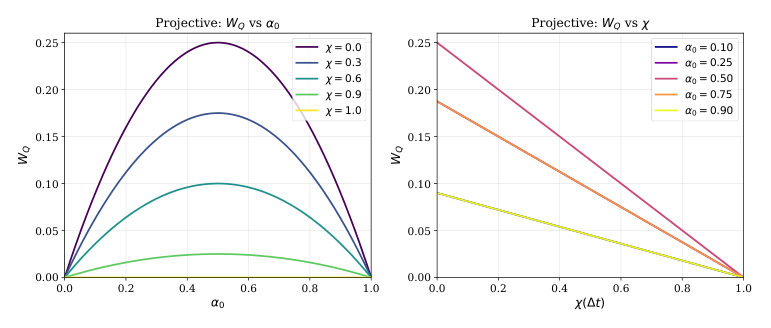
<figcaption class="paper-figure-caption"><b>Fig 1.</b> FIG. 1. (Color online) Nonclassicality witness WQ for projective measurements. Panel (a) shows</figcaption>
</figure>
<figure class="paper-figure-card">
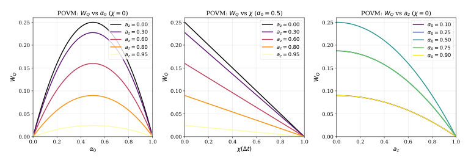
<figcaption class="paper-figure-caption"><b>Fig 2.</b> FIG. 2. (Color online) Nonclassicality witness WQ for POVM measurements. Panel (a) shows WQ</figcaption>
</figure>
<figure class="paper-figure-card">
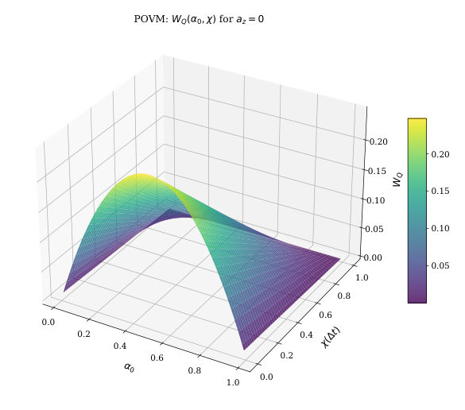
<figcaption class="paper-figure-caption"><b>Fig 3.</b> FIG. 3. (Color online) Three-dimensional plot of the nonclassicality witness WQ(α0, χ) for a qubit</figcaption>
</figure>
<figure class="paper-figure-card">
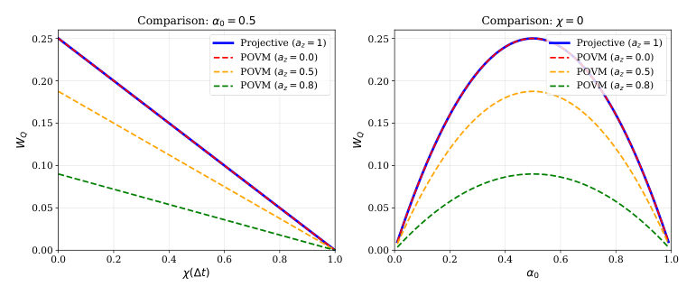
<figcaption class="paper-figure-caption"><b>Fig 4.</b> FIG. 4. (Color online) Comparison between projective measurements (az = 1, solid blue line)</figcaption>
</figure>

**Summary.** The authors introduce a novel, operational witness ($W_Q$) to quantify nonclassicality in qubits by examining violations of Kolmogorov consistency across sequential measurements. They show that while projective measurements fail to detect nonclassicality for diagonal states, generalizing to POVMs allows detection via measurement unsharpness. This provides a robust tool connecting quantum resource theory to experimental measurement protocols.

**Why it may be interesting.** This work provides an experimentally accessible diagnostic tool that extends beyond standard state-based measures by linking nonclassicality detection directly to the nature (unsharpness) of the quantum measurements themselves.

Detailed structure

**Main problem.** The paper aims to develop an operational measure, a nonclassicality witness ($W_Q$), for qubit systems based on detecting violations of Kolmogorov consistency conditions in sequential measurements.

**Main result.** The witness reveals that non-projective Positive Operator-Valued Measures (POVMs) can detect nonclassicality even when the initial state is diagonal, achieving a maximum value of $1/4$.

**Method.** The methodology involves deriving the witness from joint probability distributions calculated using measurement update rules for both projective measurements and general POVMs.

**Model / system.** The system analyzed is a qubit undergoing evolution coupled to an environment (bath), modeled with pure dephasing dynamics. The analysis uses concepts linking Kolmogorov consistency, Leggett-Garg inequalities, and POVM theory.

**Key observables.** Nonclassicality witness ($W_Q$), measurement unsharpness parameter ($a_z$), joint probabilities $P(x_2, t_2; x_1, t_1)$.

**Important parameters / regimes.** Initial state populations ($\alpha_0, \alpha_1$), dephasing factor ($\chi(\Delta t)$), and the POVM unsharpness parameter ($a_z$).

**Assumptions / limitations.** The analysis assumes a Markovian process and models the dynamics using pure dephasing. It compares projective measurements to general POVMs.

**Figures summary.** Figures illustrate the dependence of $W_Q$ on initial populations, dephasing factors, and the measurement unsharpness parameter ($a_z$), showing that $W_Q$ is zero for ideal projective measurements but positive for generalized POVMs.

**Paper structure.** The paper introduces the witness based on Kolmogorov violation, derives it for two-measurement scenarios, compares results for projective vs. general POVMs, and establishes the maximum value of the witness by connecting it to measurement unsharpness.

Abstract

We introduce an operational measure of nonclassicality for qubit systems based on the violation of Kolmogorov consistency conditions in sequential measurements. In contrast to previous work by Milz et al.~\cite{Milz-2020}, who characterized classicality via NCGD maps, and Sakuldee et al.~\cite{Sakuldee-2022a, Sakuldee-2022b}, who studied quantum correlations under measurement disturbance, our witness explicitly quantifies nonclassicality in terms of the POVM unsharpness parameter $a_z$. For projective measurements on an initially diagonal state, the witness vanishes identically, showing that such measurements cannot reveal nonclassicality. However, by generalizing to positive operator-valued measures (POVMs), we find that non-projective measurements can reveal nonclassicality even for diagonal initial states. We derive explicit expressions for the witness for general initial states, including coherences, and show that its maximum value is $1/4$, which is a new result achieved for unbiased POVMs, maximal dephasing, and equal initial populations. Our results connect Kolmogorov consistency, Leggett-Garg inequalities, and POVMs, providing an experimentally accessible tool for detecting nonclassicality in qubit systems with potential applications in quantum technology certification.

[↑ back to top](#top)

### [Floquet Quasiparticle Poisoning of Frozonium](http://arxiv.org/abs/2608.12454v1)

**Authors:** Haoyu Guo, Debanjan Chowdhury  
**Type:** theory · **Category:** other · **PDF:** <https://arxiv.org/pdf/2608.12454v1>  
**Analysis basis:** full PDF text, analyzed in chunks
**Topic relevance:** `driven-dissipative phase transition` **3/5** · `methods for driven-dissipative` **3/5** · `Keldysh / 2PI / non-Gaussian methods` **2/5** · `non-equilibrium universality` **2/5** · `analog quantum simulation` **1/5** · `correlated / nonlocal dissipation` **1/5** · `quantum measurements` **1/5** · `scars & prethermalization` **1/5**

↔ Scroll figures horizontally

<figure class="paper-figure-card">
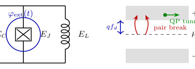
<figcaption class="paper-figure-caption"><b>Fig 1.</b> FIG. 1. Schematic of a driven fluxonium circuit (left) and the two quasiparticle (QP) poisoning channels (right) considered in this work. Left: Circuit comprising a capacitor with charg- ing energy EC, a small junction with Josephson energy EJ, and a superinductance with inductive energy EL, threaded by a time-dependent external flux φext(t). Right: Density of states with gap ∆in the superconducting junction with a chemical potential µ, showing drive-assisted Cooper-pair breaking (red) and tunneling of a pre-existing nonequilibrium QP (green).</figcaption>
</figure>
<figure class="paper-figure-card">
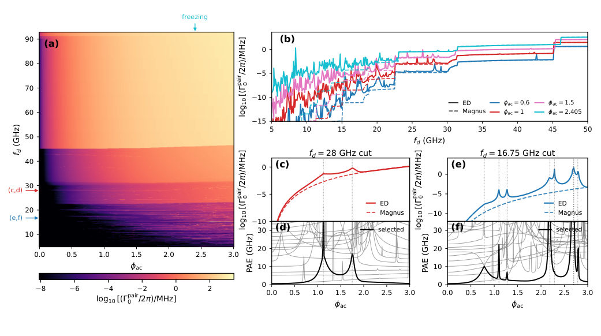
<figcaption class="paper-figure-caption"><b>Fig 2.</b> FIG. 2. Pair-generation rate landscape for fluxonium branch 0, which denotes the Floquet eigenstate assigned to the Magnus ground state by the one-to-one overlap procedure. (a) Quasiparticle generation rate Γpair 0 as a function of phase-drive amplitude, ϕac, and drive frequency, fd, plotted on a log scale. The top-right arrow marks the location of the freezing point ϕac ≃2.405. (b) Fixed-ϕac cuts compare Γpair 0 computed from ED (solid lines) with the Magnus reference (dashed lines); see [50] for more details. The reference captures the high-frequency magnitude and the discontinuous openings at the 2∆/n thresholds, while visible deviations appear below about 20 GHz. At fixed fd = 28 GHz, a...</figcaption>
</figure>
<figure class="paper-figure-card">
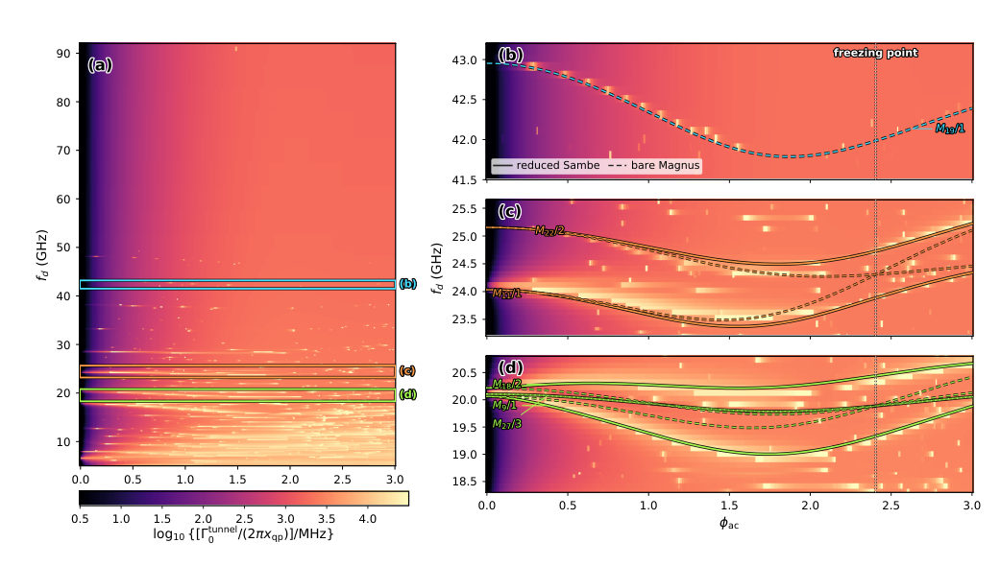
<figcaption class="paper-figure-caption"><b>Fig 3.</b> FIG. 3. Quasiparticle tunneling rate landscape for fluxonium branch 0, tracked using the same numerical procedure as in Fig. 2. (a) Γtunnel 0 /xqp as a function of phase-drive amplitude, ϕac, and drive frequency, fd, plotted on a log scale. In addition to the isolated resonances studied in Fig. 2, Γtunnel 0 contains connected resonance curves whose structure is organized by the Magnus spectrum and hybridization among resonant channels. (b) A one-photon resonance whose location is accurately predicted by the bare Magnus condition EM 19 −EM 0 = hfd. The dashed M19/1 locus follows the bright rate ridge. (c) The bare M11/1 and M22/2 loci meet at the freezing point as a consequence of frozonium...</figcaption>
</figure>
<figure class="paper-figure-card">
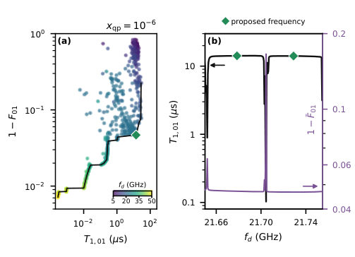
<figcaption class="paper-figure-caption"><b>Fig 4.</b> FIG. 4. Freezing-point operating tradeoff for an aluminum- based circuit with xqp = 10−6. (a) Pointwise drive-frequency scan in the (T1,01, 1 −¯F01) plane. Two proposed drive fre- quencies are highlighted. (b) Fine scan around 21.7 GHz re- veals two operating frequency intervals separated by a reso- nance. The black and purple curves show T1,01 and 1 −¯F01 on the left and right axes, respectively. The narrow fea- ture near 21.704 GHz is the nearest resolved resonance. The left and right highlighted frequencies are fd = 21.6785 GHz and 21.7290 GHz, respectively, placing them 25.5 MHz and 24.5 MHz from the nearest resonance.</figcaption>
</figure>

**Summary.** This paper analyzes quasiparticle poisoning in a periodically driven fluxonium superconducting circuit. It demonstrates that while periodic driving can induce dynamical freezing of the Josephson nonlinearity, this process does not eliminate dissipation from quasiparticles. The authors provide a framework to identify optimal operating regimes by balancing the desired coherent state against detrimental resonance-enhanced quasiparticle loss.

**Why it may be interesting.** This work is highly relevant for AMO/open quantum systems as it models dissipation (quasiparticle loss) in a driven superconducting circuit, providing concrete guidelines for engineering coherence by managing external driving fields.

Detailed structure

**Main problem.** The study investigates quasiparticle poisoning effects in a superconducting fluxonium circuit subjected to periodic driving, determining if dynamic freezing suppresses dissipation.

**Main result.** Dynamic freezing does not generically suppress quasiparticle-induced dissipation; optimal operation requires balancing the drive's tendency toward dynamical freezing against unavoidable quasiparticle loss mechanisms.

**Method.** The authors calculate quasiparticle transition rates using Floquet Fermi's Golden Rule, comparing full Floquet treatments with approximations derived from the Magnus expansion.

**Model / system.** The system is a fluxonium superconducting circuit driven by a time-dependent external magnetic flux. The analysis uses the driven Hamiltonian and examines pair generation and pre-existing quasiparticle tunneling channels.

**Key observables.** Quasiparticle generation rate ($\Gamma_{	ext{pair}}^0$), quasiparticle tunneling rate ($\Gamma_{	ext{tunnel}}^0$), lifetime ($T_{1,01}$), and fidelity ($ar{F}_{01}$).

**Important parameters / regimes.** Drive frequency ($f_d$), drive amplitude ($\phi_{ac}$), charging energy ($E_C$), Josephson energy ($E_J$), and inductive energy ($E_L$).

**Assumptions / limitations.** The analysis often compares results to the Magnus Hamiltonian reference, and later sections assume quasiparticles are promptly removed from the junction or use Boltzmann occupation benchmarks.

**Figures summary.** Figures illustrate the landscape of pair generation rates vs. drive parameters, resonance structures in tunneling rates organized by the Floquet-Magnus spectrum, and a trade-off plot showing lifetime versus fidelity as a function of drive frequency.

**Paper structure.** The paper first establishes the model using the driven Hamiltonian, then calculates both pair-breaking and tunneling rates using Floquet theory. It analyzes how these rates depend on drive parameters, contrasting results with simpler approximations to map out safe operating regimes.

Abstract

Periodic driving can suppress the Josephson nonlinearity of a fluxonium superconducting circuit, producing a nearly harmonic Floquet spectrum at isolated freezing points [K. Lewellen et al., Newton 2, 100434 (2026)]. Here we show that this dynamically frozen behavior does not generically suppress quasiparticle-induced dissipation in the resulting frozonium circuit. We formulate quasiparticle processes in the frozonium using a Floquet framework and analyze both drive-assisted Cooper-pair breaking and tunneling of pre-existing quasiparticles. Pair generation is controlled by gap-breaking thresholds at high drive frequencies, while multiphoton resonances produce pronounced rate enhancements at lower frequencies. Quasiparticle tunneling exhibits connected resonance structures organized by the harmonic Floquet-Magnus spectrum near the freezing point, with resonant hybridization generating characteristic avoided crossings. Our results show that suitable operating regimes must balance dynamical freezing against quasiparticle loss and provide a framework for identifying experimental drive parameters away from harmful resonances.

[↑ back to top](#top)

### [Quantum simulation of non-Markovian dynamical systems](http://arxiv.org/abs/2608.13533v1)

**Authors:** Abtin Ameri, Arkopal Dutt, Hari Krovi  
**Type:** theory · **Category:** quantum information and computing · **PDF:** <https://arxiv.org/pdf/2608.13533v1>  
**Analysis basis:** full PDF text, analyzed in chunks
**Topic relevance:** `Keldysh / 2PI / non-Gaussian methods` **3/5** · `correlated / nonlocal dissipation` **3/5** · `methods for driven-dissipative` **3/5** · `driven-dissipative phase transition` **2/5** · `analog quantum simulation` **1/5** · `non-equilibrium universality` **1/5** · `quantum measurements` **1/5**

↔ Scroll figures horizontally

<figure class="paper-figure-card">
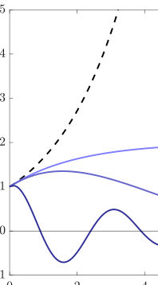
<figcaption class="paper-figure-caption"><b>Fig 1.</b> Figure 1: Numerical simulation of du</figcaption>
</figure>
<figure class="paper-figure-card">
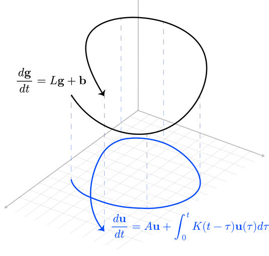
<figcaption class="paper-figure-caption"><b>Fig 2.</b> Figure 2: Illustration of the linear coarse-graining formalism for a three-dimensional dynamical system. While the full dynamics is Markovian and described by a linear ODE system, the projected dynamics is non-Markovian and described by a linear VIDE.</figcaption>
</figure>

**Summary.** This paper tackles the challenge of simulating non-Markovian dynamics using quantum computation by developing algorithms for Volterra integro-differential equations (VIDEs). It achieves exponential speedup when memory effects are weak ($M < 1$) or when the system's kernel has a specific, structured form. This expands the scope of quantum simulation beyond traditional Markovian models into complex physical systems like those found in open quantum dynamics.

**Why it may be interesting.** This work directly addresses simulating complex open quantum systems where memory effects are crucial, pushing the boundary of what quantum computers can simulate efficiently beyond simple Markovian master equations.

Detailed structure

**Main problem.** Developing quantum algorithms capable of simulating non-Markovian dynamical systems, which retain memory of past system states.

**Main result.** Efficient quantum algorithms are developed for linear Volterra integro-differential equations (VIDEs) under specific conditions ($M < 1$ or structured kernels), achieving exponential speedup over classical methods in certain regimes.

**Method.** The approach involves recasting the VIDE into a solvable linear system, utilizing Quantum Linear System Algorithms (QLSA) when memory effects are weak, or employing 'Markovianization' to convert the problem into an ODE set for structured kernels.

**Model / system.** The focus is on linear Volterra integro-differential equations (VIDEs), which model non-Markovian dynamics where the evolution depends on a convolution memory kernel $K(t-	au)$. Applications include open quantum systems described by the Mori-Zwanzig formalism.

**Key observables.** Quantum state encoding of the system's state over a time interval or at a specific final time T.

**Important parameters / regimes.** The Memory Strength Parameter ($M$), which characterizes the ratio of memory term strength to Markovian dissipation; regimes include $M < 1$ (short-term memory) and $M \geq 1$.

**Assumptions / limitations.** For general kernels, simulation is conjectured to be intractable when $M \geq 1$; efficiency for large $M$ relies on the kernel being decomposable as a sum of exponentials (SOE).

**Paper structure.** The paper first establishes the limitation of existing Markovian simulation algorithms, then develops efficient quantum circuits for VIDEs when $M < 1$, and finally introduces 'Markovianization' to extend this capability to structured kernels even when $M \geq 1$.

Abstract

Existing quantum algorithms for simulating dynamical systems -- from Hamiltonian simulation to linear and nonlinear differential equations solvers -- simulate Markovian dynamics, in which the system's future evolution depends solely on its current state. We turn our attention to developing quantum algorithms for non-Markovian dynamical systems where the system's future evolution depends on its past history and thus has memory. Specifically, we develop efficient algorithms for linear Volterra integro-differential equations (VIDEs) with a convolution memory kernel that output a quantum state encoding the state description over a time interval or at a particular time. Given efficient circuits for the problem inputs, our algorithms achieve an exponential speedup in system size over existing classical algorithms.   We develop an algorithm for general kernels assuming that $\textsf{M} < 1$, where $\textsf{M}$ characterizes the strength of the memory term relative to the dissipation of the Markovian part of the dynamics. We complement this with lower bounds for general-kernel VIDEs when $\textsf{M} \geq 1$, showing that the problem becomes intractable for a family of systems. However, by specializing to structured kernels which admit concise decompositions over exponentials, we develop efficient quantum algorithms even when $\textsf M \geq 1$ by converting the VIDE into a larger set of ODEs, a procedure which we call Markovianization. As an application of the overall framework, we discuss the Mori-Zwanzig formalism used in open quantum systems and fluid dynamics. Overall, our results expand the range of dynamical systems that quantum computers can simulate efficiently.

[↑ back to top](#top)

### [Boundary phases and thermodynamics of the Kondo spin-$s$ chain: from overscreened Kondo to boundary-bound states](http://arxiv.org/abs/2608.12453v1)

**Authors:** Abay Zhakenov, Pradip Kattel, Andreas Gleis, Natan Andrei  
**Type:** theory · **Category:** statistical mechanics · **PDF:** <https://arxiv.org/pdf/2608.12453v1>  
**Analysis basis:** full PDF text, analyzed in chunks
**Topic relevance:** `Keldysh / 2PI / non-Gaussian methods` **3/5** · `methods for driven-dissipative` **3/5** · `driven-dissipative phase transition` **2/5** · `non-equilibrium universality` **2/5** · `Frenkel-Kontorova` **1/5** · `quantum measurements` **1/5** · `scars & prethermalization` **1/5**

↔ Scroll figures horizontally

<figure class="paper-figure-card">
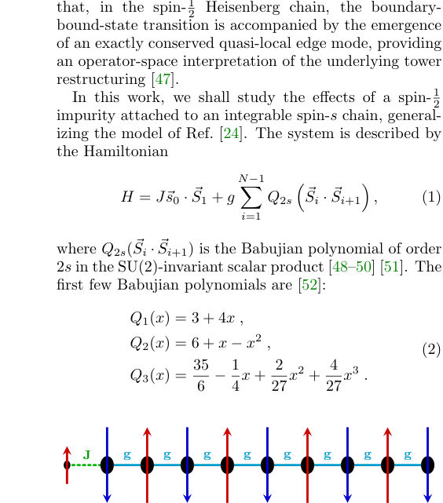
<figcaption class="paper-figure-caption"><b>Fig 1.</b> FIG. 1: Spin-s chain with a spin- 1</figcaption>
</figure>
<figure class="paper-figure-card">
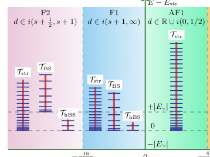
<figcaption class="paper-figure-caption"><b>Fig 2.</b> FIG. 2: Phase diagram of the spin-s Takhtajan–Babujian chain with a spin- 1</figcaption>
</figure>
<figure class="paper-figure-card">
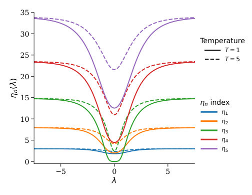
<figcaption class="paper-figure-caption"><b>Fig 3.</b> FIG. 3: Functions ηn(λ) obtained through the numerical solutions of the TBA equations for S = 3/2. For finite temperature T values, the functions smoothly change from the limit values ηT =∞ n to the minimum at λ = 0. At small temperatures T ≪1, the functions are almost flat for |λ| ≪ln(T/2π) and equal in that region to another limit value ηT =0 n . The flattening can be already seen to start happening to η3 function at T = 1 on the plots. As the temperature T increases, the driving term in the TBA equations gets more irrelevant, and functions tend to flatten out to their at-infinity values ηT =∞ n (compare dashed and solid lines corresponding to T = 5 and T = 1, respectively).</figcaption>
</figure>
<figure class="paper-figure-card">
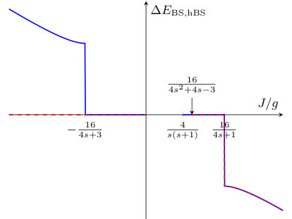
<figcaption class="paper-figure-caption"><b>Fig 4.</b> FIG. 4: The energy of the base states of the boundary string and higher-order boundary string towers with re- spect to the string tower. The fundamental boundary- string tower (solid blue line) exists everywhere but in the phase AF1 (J/g ∈(0, 4 s(s+1)) and is gapped with Eγ [see Eq. (72)] in the phases AF3 and F2. The boundary string tower (dashed red line) is absent in the phase AF1 and the first part of the phase AF2, it gets gapped only in the phase AF3.</figcaption>
</figure>
<figure class="paper-figure-card">
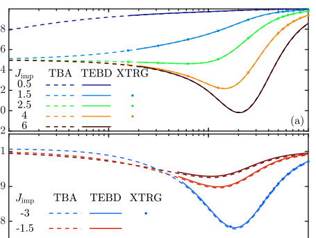
<figcaption class="paper-figure-caption"><b>Fig 5.</b> FIG. 5: Impurity contribution to the entropy for a spin- s = 1 chain. We show Simp(T) = Sbulk+imp(T)−Sbulk(T) for antiferromagnetic impurity coupling in panel (a) and ferromagnetic impurity coupling in panel (b). Dashed lines show the TBA result, solid lines show TEBD data, and dots show XTRG data. The MPO calculations use Nbulk = 100 bulk sites, and data are shown only above the finite-size cutoff determined from the com- parison of Nbulk and Nbulk + 1 chains. For s = 1, the positive-coupling phase boundaries are at Jimp = 2 and Jimp = 3.2, while the ferromagnetic F1–F2 boundary is at Jimp = −16/7 ≃−2.29. The nonmonotonic entropy dips at stronger coupling reflect the formation of boundary-...</figcaption>
</figure>

**Summary.** This paper develops a comprehensive theory for the boundary physics of a Kondo spin-$s$ chain by combining Boundary Conformal Field Theory with exact Bethe Ansatz and TBA methods. It maps out a rich phase diagram featuring multiple impurity-bound states that reorganize the system's excitation spectrum into distinct towers. The results unify descriptions of screening mechanisms, providing quantitative predictions for thermodynamic quantities like entropy across various coupling regimes.

**Why it may be interesting.** This work provides a powerful, unified theoretical toolkit (combining CFT, integrability, and advanced statistical mechanics) to analyze complex quantum impurity problems in 1D correlated systems, which is highly relevant for understanding open quantum systems dynamics.

Detailed structure

**Main problem.** The study investigates the boundary phases and thermodynamic properties of a Kondo impurity coupled to a strongly correlated spin-$s$ chain, particularly focusing on transitions between overscreened Kondo behavior and localized boundary-bound states.

**Main result.** The system exhibits a rich phase diagram with five distinct regimes (AF1-AF3, F1, F2), characterized by the restructuring of excitation towers in the Hilbert space. The analysis provides a unified description using CFT, Bethe Ansatz, and TBA methods.

**Method.** A combination of Boundary Conformal Field Theory (BCFT) for low-energy universality, exact Bethe Ansatz solutions, generalized Thermodynamic Bethe Ansatz (TBA), and tensor-network simulations are employed to analyze the system across different temperature and coupling regimes.

**Model / system.** The model is a spin-$1/2$ impurity coupled to the boundary of a strongly correlated spin-$s$ Takhtajan–Babujian chain, described by an integrable Hamiltonian. The low-energy physics is related to a perturbed SU(2) WZW conformal field theory.

**Key observables.** Impurity entropy (showing nonmonotonic temperature dependence), impurity spectral function (exhibiting sharp threshold features), and the structure of excitation towers.

**Important parameters / regimes.** The coupling ratios ($J/g$) define five distinct phases ($	ext{AF}1-	ext{AF}3, 	ext{F}1, 	ext{F}2$), which dictate whether the system is in an overscreened Kondo regime or a localized boundary-bound state.

**Assumptions / limitations.** The analysis relies on mapping the problem to integrable models solvable by Bethe Ansatz techniques and developing generalized TBA frameworks to handle multi-tower structures.

**Figures summary.** Figure 2 details the phase diagram showing coupling ranges for five phases, while Table I provides quantitative fingerprints (entropy, residual values) associated with these distinct boundary configurations.

**Paper structure.** The paper systematically develops the theoretical framework by first establishing the Hamiltonian and using BCFT for the weak-coupling limit. It then employs exact Bethe Ansatz methods to derive energy eigenvalues, leading into a generalized TBA formulation that accounts for multiple excitation towers across all coupling regimes.

Abstract

We study a spin-$\frac12$ impurity coupled to the boundary of a strongly correlated spin-$s$ Takhtajan--Babujian chain, an integrable model whose low-energy physics is described by a perturbed $SU(2)_{2s}$ Wess--Zumino--Witten conformal field theory. While boundary conformal field theory determines the low-energy universality class of the weak-coupling regime, exact Bethe Ansatz methods reveal a sequence of boundary quantum phase transitions in which impurity-bound states emerge and reorganize the Hilbert space into multiple excitation towers built on distinct boundary configurations. This tower restructuring provides the organizing principle for a rich boundary phase diagram extending beyond the conventional Kondo regime. Weak antiferromagnetic coupling realizes the overscreened $2s$-channel Kondo universality class, whereas stronger couplings generate localized boundary modes and qualitatively new screening mechanisms. To describe the resulting thermodynamics, we develop a generalized thermodynamic Bethe Ansatz framework that captures the multi-tower structure across all regimes. The impurity entropy reproduces the boundary conformal field theory prediction in the overscreened Kondo regime but develops pronounced nonmonotonic temperature dependence once boundary-bound states appear, in quantitative agreement with large-scale finite-temperature matrix-product-operator simulations. Complementary dynamical calculations reveal sharp threshold features in the impurity spectral function that directly track the underlying tower structure. Together, boundary conformal field theory, exact Bethe Ansatz, generalized thermodynamic Bethe Ansatz, and tensor-network simulations provide a unified description of impurity screening, boundary-bound-state formation, and excitation-tower reconstruction in a correlated spin-$s$ chain.

[↑ back to top](#top)

### [Local and quasilocal conservation laws of three-state IRF cellular automata and their quantum deformations](http://arxiv.org/abs/2608.13080v1)

**Authors:** Tomaž Prosen  
**Type:** theory · **Category:** statistical mechanics · **PDF:** <https://arxiv.org/pdf/2608.13080v1>  
**Analysis basis:** full PDF text, analyzed in chunks
**Topic relevance:** `methods for driven-dissipative` **3/5** · `scars & prethermalization` **3/5** · `driven-dissipative phase transition` **2/5** · `non-equilibrium universality` **2/5** · `analog quantum simulation` **1/5** · `correlated / nonlocal dissipation` **1/5** · `quantum measurements` **1/5**

↔ Scroll figures horizontally

<figure class="paper-figure-card">
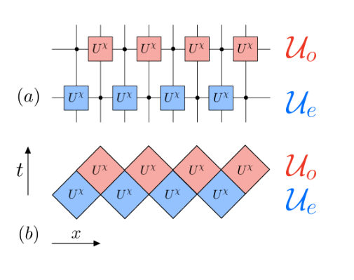
<figcaption class="paper-figure-caption"><b>Fig 1.</b> Figure 1: One full time step of the IRF circuit (either classical or quantum, as defined in the text). Panel (a) shows the commuting even and odd layers of three-site control–active–control gates. Panel (b) is the equivalent face representation on the staggered square lattice. Time runs upward.</figcaption>
</figure>
<figure class="paper-figure-card">
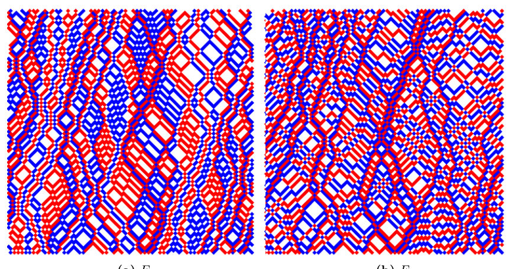
<figcaption class="paper-figure-caption"><b>Fig 2.</b> Figure 2: Light-cone trajectories of the two classical rules from the same random lower- boundary initial condition. Species 1 and 2 are blue and red; vacancies are omitted (white).</figcaption>
</figure>
<figure class="paper-figure-card">
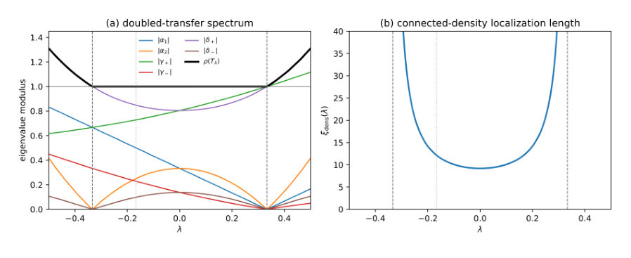
<figcaption class="paper-figure-caption"><b>Fig 3.</b> Figure 3: (a) Moduli of the distinct nonzero branches of Tλ on −1/2 ≤λ ≤1/2; the black curve is the spectral radius. (b) The physically relevant localization length of the connected quasi-local densities, ξdens = 2/[−log δ+]. The endpoint-centered bilinear form annihilates the γ± projectors exactly, and the full norm sequence obeys the two-root formula (63).</figcaption>
</figure>
<figure class="paper-figure-card">
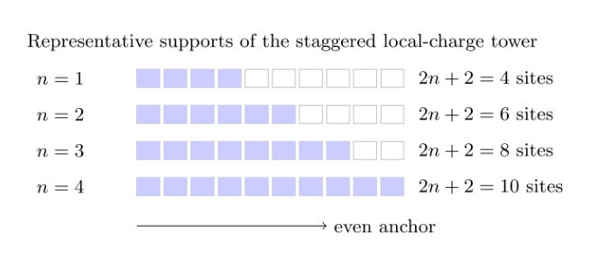
<figcaption class="paper-figure-caption"><b>Fig 4.</b> Figure 4: Support structure of the logarithmic tower. The displayed bars show the even- anchored classes of support 2n + 2; their reflected partners have support label 2n + 3 in the same fixed-anchor convention. The labels Qr refer to the canonical new conserved charge whose minimal support label in Ref. [5] is r. The first two log-derivative orders produce Q4, Q5, Q6, Q7 modulo lower-support charges.</figcaption>
</figure>

**Summary.** This paper rigorously analyzes the conservation laws of three-state IRF cellular automata and their quantum deformations using advanced matrix product methods. It establishes a lower bound on the system's maximal sound speed by analyzing conserved charges derived from both classical rules. The findings provide deep insights into the underlying integrability structure, particularly concerning the emergence of quasi-local invariants in the quantum regime.

**Why it may be interesting.** The rigorous mathematical framework used to constrain conserved quantities in integrable or near-integrable lattice models is highly relevant to understanding dynamics in many-body quantum systems, particularly those exhibiting quasi-periodicity or emergent symmetries.

Detailed structure

**Main problem.** The study focuses on determining the local and quasilocal conservation laws governing three-state Interaction-Round-a-Face (IRF) cellular automata, both classically and through their quantum deformations.

**Main result.** The analysis established a rigorous lower bound for the maximal Euler speed ($\sqrt{3/23}$) for the species-flipping rule, strongly supporting the completeness of known sound-active charges. Furthermore, the quantum deformation yields exact low-bond-dimension invariant states (scar candidates).

**Method.** The research employs patch-matrix-product methods (PMPA) combined with hydrodynamic projection techniques to analyze conserved quantities and their associated Euler velocities.

**Model / system.** The model is a three-state IRF cellular automaton defined on a lattice, featuring two specific rules: species-preserving ($\chi_p$) and species-flipping ($\chi_f$). These classical systems are extended into a coherent quantum deformation.

**Key observables.** Quasi-local conservation laws, Euler velocities (e.g., $\pm\sqrt{3/23}$), low-entanglement invariant states, and the Mazur bound for diagonal quasi-local charges.

**Important parameters / regimes.** The analysis involves a one-parameter family of conserved laws and parameters related to the structure of the PMPA ansatz ($\lambda \in I^*$).

**Assumptions / limitations.** The authors note that while they provide strong support for known sound-active charges, unconditional completeness of the full conserved space is not claimed.

**Figures summary.** Figure 1 illustrates one time step of the IRF circuit using three-site gates; tables summarize the rules for $\chi_p$ and $\chi_f$.

**Paper structure.** The paper systematically analyzes the classical conservation laws using PMPA, derives explicit algebraic forms for conserved quantities across multiple orders (Chunks 3 & 4), and then extends these findings to characterize low-energy states and charges in the quantum deformation.

Abstract

Using patch-matrix-product methods, we study two reversible three-state interaction-round-a-face cellular automata introduced by Klobas and Prosen [J. Phys. A 55, 094003 (2022)] - the species-preserving and species-flipping rules - and a coherent quantum deformation interpolating between them. Within an explicit translationally invariant ansatz, the two classical rules share a one-parameter family of quasi-local conservation laws with an auxiliary-dimension-three realization. Every regular member is also the first centered logarithmic derivative of an analytic auxiliary-dimension-two family passing through the identity observable. On the closed span of this family and the three elementary local charges, the only nonzero Euler velocities are $\pm\sqrt{3/23}$. Consequently, $\sqrt{3/23}$ is a rigorous lower bound on the maximal Euler speed in any larger conserved sector. For the species-flipping rule, this value agrees with the reported extrapolated value $0.361$ of Klobas and Prosen, strongly supporting completeness of the known sound-active charges. The species-preserving rule admits, in addition, a staggered generating family whose logarithmic derivatives form an infinite tower of strictly local charges. In the quantum deformation, the same algebraic structures yield exact low-bond-dimension invariant states (scar candidates), exponentially long-lived quasi-local quasimodes, and diagonal quasi-local charges that produce a nonzero Mazur bound after projection away from the three elementary local charges.

[↑ back to top](#top)

### [Thermodynamics of Learning: A Typed Four-Component Accounting of Memory, Fit, and Value](http://arxiv.org/abs/2608.12791v1)

**Authors:** Akihito Sudo  
**Type:** theory · **Category:** statistical mechanics · **PDF:** <https://arxiv.org/pdf/2608.12791v1>  
**Analysis basis:** full PDF text, analyzed in chunks
**Topic relevance:** `non-equilibrium universality` **3/5** · `Keldysh / 2PI / non-Gaussian methods` **2/5** · `driven-dissipative phase transition` **2/5** · `methods for driven-dissipative` **2/5** · `quantum measurements` **2/5** · `correlated / nonlocal dissipation` **1/5** · `scars & prethermalization` **1/5**

↔ Scroll figures horizontally

<figure class="paper-figure-card">
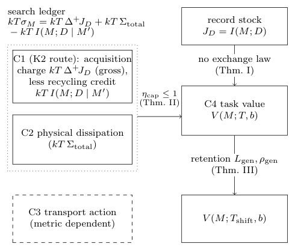
<figcaption class="paper-figure-caption"><b>Fig 1.</b> FIG. 1. The typed four-component accounting. Boxes are the component currencies (Table I) together with the record stock JD and the shifted value; arrows denote theo- rems or routes that hold between the accounts—or, where so labeled, their proven absence—not additions. The ledger frame displays the universal identity in its energy-typed form, kTσM + kT I(M; D | M ′) = kT ∆+JD + kT Σtotal [Eq. (21)]: the C1 entry on the K2 route is the gross acquisition charge kT ∆+JD (distinct from the signed stock change kT ∆JD, which is not an acquisition charge), the recycling credit van- ishes under condition (f), and all information-typed quantities enter with their explicit kT conversion. The...</figcaption>
</figure>
<figure class="paper-figure-card">
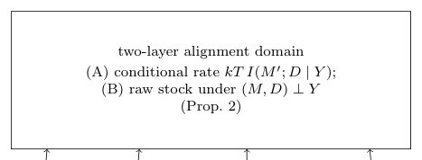
<figcaption class="paper-figure-caption"><b>Fig 2.</b> FIG. 2. Fit–value alignment: the two-layer domain in which fit ranking and value ranking coincide (Main Theo- rem III(i)), whose boundary is marked by the one-time-pad witness (Proposition 3), and the four paired interventions S/B/A/R (parts (ii)–(vi)): each double arrow is a setting pair in which changing that coordinate alone reverses or restores the ranking. The neutrality coordinate (γ, device AC′) alone carries a one-condition-drop necessity witness (part (vii)); no uniform necessity is claimed for the other three. The four axes are not claimed to classify all misalignment phenomena.</figcaption>
</figure>

**Summary.** This paper introduces a rigorous, four-component thermodynamic accounting system to quantify the difference between what is merely stored (memory) and what truly retains operational value in a learning device. By defining 'value' as an achievable work gap, it provides exact theorems governing how this value changes under task shifts or updates. It offers a powerful theoretical tool for analyzing information processing beyond standard generalization bounds.

**Why it may be interesting.** While abstract, the framework provides a deep thermodynamic analogy for information processing. Concepts like 'operational capital' and 'work gap' resonate with non-equilibrium statistical mechanics approaches used to study computation or energy dissipation in complex systems.

Detailed structure

**Main problem.** The paper develops a typed accounting framework to rigorously separate the physical quantity recorded by a finite-state learning device (memory) from the actual operational value that will persist or be useful for future tasks.

**Main result.** It establishes precise, non-trivial bounds and exchange rates governing how 'value' is retained or capitalized during task-distribution shifts, showing that simple measures like record correlation do not capture this full operational value.

**Method.** The authors employ a novel four-component accounting system (fit functional, record-correlation stock, update ledger, and operational capital value) derived from information theory and thermodynamics principles.

**Model / system.** The model is an abstract, finite-state learning device operating under defined protocols ($	ext{Protb}$), involving memory states ($M$), training records ($D$), and future task distributions ($T$). It analyzes the work gap between informed and blind protocol classes.

**Key observables.** Operational capital value $V(M; T, b)$, record-correlation stock $I(M; D)$, capitalization efficiency $\eta_{	ext{cap}}$, retention gap $L_{	ext{gen}}$, and the four component currencies ($C_1$ through $C_4$).

**Important parameters / regimes.** Budget ($b$), temperature ($kT$), memory size ($n$), and various functional parameters defining stability regimes (e.g., $\mathrm{flat}^{*}$ regime).

**Assumptions / limitations.** The results are strictly limited to finite-state learning devices operating within a fixed, explicit operational framework; the paper explicitly states it is not a theory of statistical generalization.

**Figures summary.** Figures and tables define the four component currencies and illustrate theorems connecting these accounts, such as showing how different protocols yield distinct energy bounds ($\Delta V$).

**Paper structure.** The structure builds from defining the four-component accounting system to proving three main theorems: Separation (I), Capitalization Ledger (II), and Value Retention (III). The analysis uses specific computational witnesses (S, B, A) to derive these rigorous statements.

Abstract

What a finite learning device has recorded and what will hold value for it on future tasks are not the same quantity. We develop a typed accounting for finite-state learning devices that separates four components: a training-side fit functional $Φ_{\mathrm{fit}}$, the record-correlation stock $J_{D}=I(M;D)$, an update-side search ledger $σ_{M}$, and an operational capital value $V(M;T,b)$. This value is the work gap between an informed protocol class and a blind class obtained by deleting the memory-read port and re-optimizing from scratch. (I) Separation: for every $n$, there is a device family on which record correlation and world correlation grow by $n\ln 2$ while the capital gain is exactly zero. In the $\mathrm{flat}^{*}$ regime, data-free updates never increase $V$. (II) Capitalization ledger: an exact $\mathrm{flat}^{*}$ extraction identity and a universal ledger identity give, for (F5$'$)-stable $M$-local updates under a no-discarded-record-correlation condition (f), the bound $η_{\mathrm{cap}}\le 1$ for the capitalization efficiency $η_{\mathrm{cap}}=ΔV/(k T\,σ_{M})$, together with necessary and sufficient conditions for equality. (III) Value retention: for the retention gap $L_{\mathrm{gen}}$ and retention ratio $ρ_{\mathrm{gen}}$ (the former carries no sign constraint; the latter is defined for positive training-side value and is not confined to $[0,1]$) we give a two-layer alignment domain: an exact exchange rate between value and the side-information-adjusted record fit $I(M';D\mid Y)$ without any record-side-information independence assumption, and a raw record-stock exchange rate under a joint side-information neutrality condition $(M,D)\perp Y$, whose boundary is marked by an explicit one-time-pad witness. These are statements about finite-device value retention under task-distribution shift, not a theory of statistical generalization.

[↑ back to top](#top)

### [Time-ordered free energy in correlated quantum systems: An agentic approach](http://arxiv.org/abs/2608.12942v1)

**Authors:** Ruo Cheng Huang, Isha Singh Le Xue, Yuxuan Qu, Paul M. Riechers, Varun Narasimhachar, Mile Gu  
**Type:** theory · **Category:** statistical mechanics · **PDF:** <https://arxiv.org/pdf/2608.12942v1>  
**Analysis basis:** full PDF text, analyzed in chunks
**Topic relevance:** `correlated / nonlocal dissipation` **3/5** · `quantum measurements` **3/5** · `Keldysh / 2PI / non-Gaussian methods` **2/5** · `driven-dissipative phase transition` **2/5** · `analog quantum simulation` **1/5** · `methods for driven-dissipative` **1/5** · `non-equilibrium universality` **1/5**

↔ Scroll figures horizontally

<figure class="paper-figure-card">
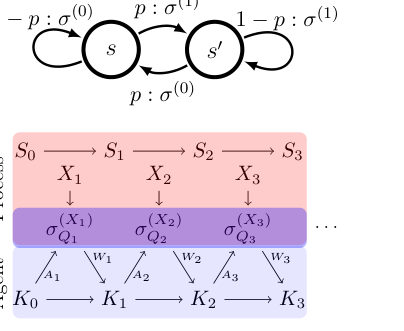
<figcaption class="paper-figure-caption"><b>Fig 1.</b> Figure 1: (a) The perturbed coin process is an example of a quantum hidden state source. It possesses two latent states s and s′ (nodes). The directed edges describe its dynamics: an edge from s to s′ labeled p : σ indicates that a source in state s has probability p to transition to s′ and emit state σ. (b) A causal network depicting the interaction between the hidden quantum process (top, red) and the sequential agent (bottom, blue). The agent does not have access to st and thus can only select an extraction method At based on its current memory state Kt−1. The extracted work Wt acts as an observable, allowing the agent to update its memory to Kt.</figcaption>
</figure>
<figure class="paper-figure-card">
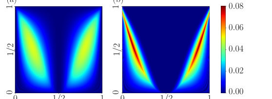
<figcaption class="paper-figure-caption"><b>Fig 2.</b> Figure 2: Comparison of asymptotic work-extraction rates in units of kBT. Rates are plotted as a function of the transition probability p (x-axis) and the overlap between emitted quantum states r (y-axis). (a) Work rate lost due to causal constraints, given by fnoneq −fTO. (b) Performance advantage of the optimal policy over a greedy strategy, given by fTO −wLO.</figcaption>
</figure>
<figure class="paper-figure-card">
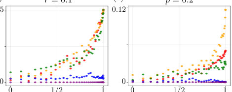
<figcaption class="paper-figure-caption"><b>Fig 3.</b> Figure 3: Relation between how much energy an agent is willing to locally sacrifice vs. uncertainty. The energetic price of information, quantified by D(ξηϵ∥ρΛ∗(η)) (y- axis), represents how much energy an agent is willing to sacrifice when extracting work from the current quantum system. Meanwhile, h2(ηϵ)(x-axis) represents the agent’s uncertainty about the underlying source. Panels (a) and (b) show scatter plots of how these quantities relate for various parameters of a perturbed coin source. (a) Varying transition probability p ∈{0.1, 0.2, 0.3, 0.4, 0.5} for a fixed overlap r = 0.1. (b) Varying overlap r ∈ {0.1, 0.3, 0.5, 0.7, 0.9} for a fixed transition probability p = 0.2. In both...</figcaption>
</figure>
<figure class="paper-figure-card">
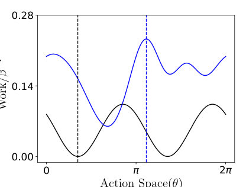
<figcaption class="paper-figure-caption"><b>Fig 4.</b> Figure 4: Graph of reward and dissipation, conditioned on the belief state K = µ0 = (1/2, 1/2). The action space is parametrized by θ ∈[0, 2π]. The blue line represents V1(K0 = µ0) as defined in Eq. (F2), and the black line represents the dissipation incurred at the second time step, in Eq. (F1). The blue and black dotted lines correspond to the optimal actions taken at t = 1 and t = 2, respectively.</figcaption>
</figure>
<figure class="paper-figure-card">
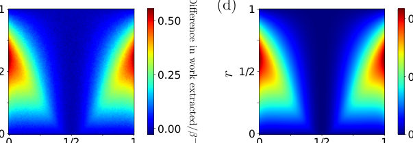
<figcaption class="paper-figure-caption"><b>Fig 5.</b> Figure 5: The gap between the non-equilibrium free energy and the TOFE (panels (a) and (c)) shows good agreement with the analytical causal dissipation (panels (b) and (d)). The top row corresponds to a time horizon of L = 3, while the bottom row is for L = 4.</figcaption>
</figure>

**Summary.** This paper introduces Time-Ordered Free Energy (TOFE) as the fundamental measure of available free energy when extracting work from correlated quantum states under causal limitations. It develops an optimal strategy using dynamic programming that scales linearly with sequence length, providing a powerful tool for analyzing non-Markovian quantum processes.

**Why it may be interesting.** This work provides a rigorous, information-theoretic framework for quantifying irreversibility and extractable energy in open quantum systems subject to realistic measurement constraints, which is highly relevant to non-equilibrium thermodynamics in AMO physics.

Detailed structure

**Main problem.** The core problem is determining the maximum work an agent can extract from a sequence of quantum states generated by a hidden, non-Markovian process while adhering to strict causal constraints.

**Main result.** They introduce Time-Ordered Free Energy (TOFE) as the fundamental measure for available free energy in such systems and develop an optimal strategy solvable via dynamic programming in linear time complexity.

**Method.** The methodology employs a resource-theoretic framework, using dynamic programming over belief states derived from Bayesian inference to find the optimal causal policy.

**Model / system.** The system models quantum state sequences generated by a Hidden Markov Model (HMM), where an agent interacts online with the emitted quantum system.

**Key observables.** Time-Ordered Free Energy (TOFE), Causal Dissipation ($\delta$), and various work extraction rates ($	ext{f}_{	ext{TO}}$, $	ext{w}_{	ext{LO}}$).

**Important parameters / regimes.** Sequence length $L$, temperature parameter $eta$, and the belief state uncertainty quantified by entropy.

**Assumptions / limitations.** The agent operates under strict causality (actions depend only on past observations), and the DP approach assumes belief states are sufficient statistics for optimization.

**Figures summary.** Figures illustrate the perturbed coin process source, causal networks showing agent-system interaction, and comparisons of work deficit versus calculated causal dissipation across different sequence lengths.

**Paper structure.** The paper builds from defining the physical problem (causal work extraction) to developing the computational solution (DP in $O(L)$), establishing key theoretical relationships like Causal Dissipation ($\delta$), and finally addressing implementation details via spectral tagging for unitary updates.

Abstract

How much work can an agent extract from a temporal sequence of quantum states when it can only operate online under causal constraints---deciding which energy extraction method to use with knowledge of what it has observed before? Here, we study this problem in the context of quantum state sequences that are potentially non-Markovian---generated by some underlying hidden Markov machine that the agent cannot observe. Using techniques from dynamic programming and computational mechanics, we present a method to identify the provably optimal agent strategy, with time complexity that scales linearly with sequence length. This motivates us to introduce the maximum work such agents can extract---time-ordered free energy(TOFE)---as a fundamental measure of free energy available in a temporally correlated quantum system subject to causal considerations.

[↑ back to top](#top)

### [A Finite-Window Recovery Hierarchy for Local Quantum Memory](http://arxiv.org/abs/2608.12803v1)

**Authors:** Zheng An, Dongyang Cao, Jiangyu Cui  
**Type:** theory · **Category:** disordered systems and neural networks · **PDF:** <https://arxiv.org/pdf/2608.12803v1>  
**Analysis basis:** full PDF text, analyzed in chunks
**Topic relevance:** `quantum measurements` **3/5** · `analog quantum simulation` **2/5** · `driven-dissipative phase transition` **2/5** · `methods for driven-dissipative` **2/5** · `correlated / nonlocal dissipation` **1/5** · `non-equilibrium universality` **1/5** · `scars & prethermalization` **1/5**

↔ Scroll figures horizontally

<figure class="paper-figure-card">
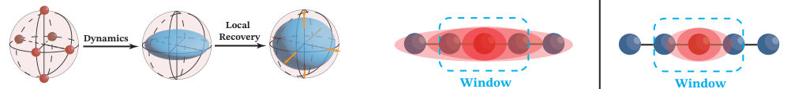
<figcaption class="paper-figure-caption"><b>Fig 1.</b> FIG. 1. Local variational recovery operationalizes finite-window recoverability with strictly local resources. (a) Protocol: prepare the target qubit in one of six probe states while the remaining qubits are initialized in a fixed product-state background, evolve under the many-body dynamics of interest, apply a local decoder Vθ on a radius-r recovery window, and measure target- qubit Pauli operators. (b) Channel viewpoint: many-body dynamics deforms the local output geometry of the probe ensemble, and the optimized decoder partially restores it. (c) Conceptual distinction: under strong scrambling, relevant information spreads beyond the accessible window and local recovery fails, whereas...</figcaption>
</figure>
<figure class="paper-figure-card">
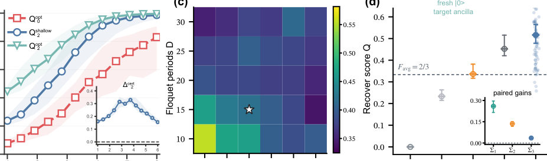
<figcaption class="paper-figure-caption"><b>Fig 2.</b> FIG. 2. Hierarchy-guided carrier-deletion repair from a finite surrounding halo. (a) Radius-2 recovery hierarchy in the original task, comparing the target-site optimum Qopt 0 , the operational depth-6 score Qshallow 2 , and the same-window optimum Qopt 2 ; the inset shows the certified gain ∆cert 2 . (b) Carrier-deletion protocol: after the many-body evolution, the target carrier is reset and the radius-3 surrounding halo is decoded back to the target register. (c) Shallow-only reset-erasure selection scan over disorder strength and Floquet depth; the star marks the frozen held-out working point. (d) Held-out subwindow test at the frozen point. The full-halo shallow decoder exceeds the...</figcaption>
</figure>
<figure class="paper-figure-card">
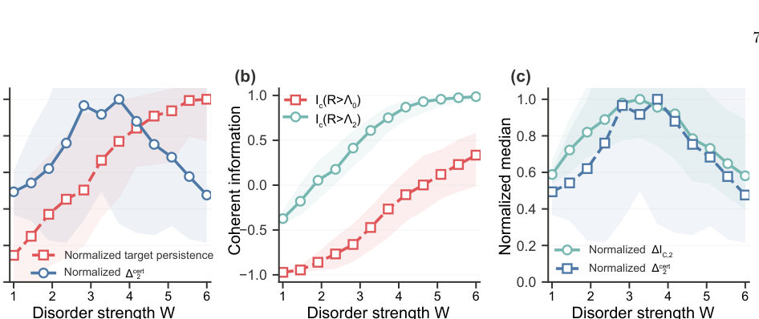
<figcaption class="paper-figure-caption"><b>Fig 3.</b> FIG. 3. Alternative diagnostics do not isolate the same operational distinction. (a) Disorder profiles of target-site persistence and certified finite-window gain after normalizing each median curve by its own maximum, making the shape difference directly visible on a common scale. (b) Reconstructed-channel coherent information for the target site and the five-site window. (c) Normalized coherent-information increment ∆Ic,2 compared with the normalized certified gain. The local observable and the tomographic comparator both respond to memory retained near the target, but neither isolates the locality-constrained channel-recovery question addressed by Qshallow 2 and ∆cert 2 .</figcaption>
</figure>
<figure class="paper-figure-card">
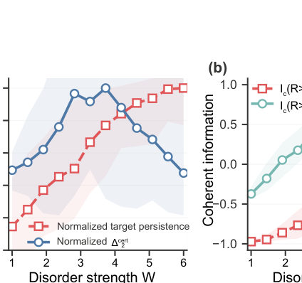
<figcaption class="paper-figure-caption"><b>Fig 4.</b> Figure 4 addresses the deployment question directly. For N = 24, the strongest intermediate-disorder signal occurs near W ≈3.2–3.6 at D = 20–40; for N = 32, the median gain peaks near W ≈4.4 at D = 20 and near W ≈3.6 at D = 30; and for N = 40, the peak remains in the crossover-to-strong-disorder window. On the subset where the same-window optimum is evaluated, the shal- low decoder still accesses a substantial fraction of the locally available memory, with typical η2 values of about 0.65–0.85 for N = 32 and about 0.55–0.80 for N = 40. These data indicate that the positive radius-2 certified gain is not specific to the N = 12 exact-diagonalization instance.</figcaption>
</figure>
<figure class="paper-figure-card">
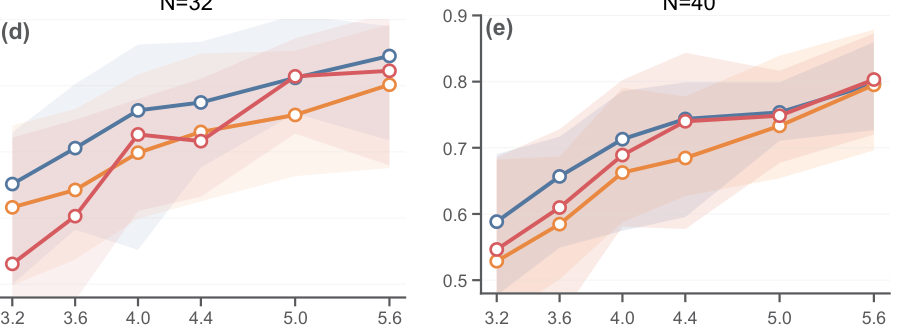
<figcaption class="paper-figure-caption"><b>Fig 5.</b> FIG. 4. Larger-system tensor-network deployment of the finite-window recoverability framework. (a)–(c) Median certified finite-window gain ∆cert 2 = Qshallow 2 −Qopt 0 versus disorder strength for N = 24, 32, 40 at representative Floquet depths D = 20, 30, 40; shaded bands denote the IQR over 32 disorder realizations.</figcaption>
</figure>

**Summary.** The paper introduces 'finite-window recoverability' as a benchmark to quantify if quantum information seemingly lost from a target qubit is actually displaced into neighboring degrees of freedom. Using a disordered kicked-Ising chain, the authors demonstrate that bounded-depth local control can successfully diagnose this residual information, establishing a crucial diagnostic tool for off-site quantum memory.

**Why it may be interesting.** This work provides a rigorous, resource-constrained diagnostic tool for characterizing quantum memory in complex, noisy environments typical of solid-state or engineered quantum systems.

Detailed structure

**Main problem.** The study develops a benchmark, finite-window recoverability, to determine if quantum information initially stored locally on a qubit remains accessible after apparent loss due to dynamics.

**Main result.** The authors establish that local control can diagnose whether information is merely displaced into nearby degrees of freedom or truly lost, showing positive certified gains in disordered systems.

**Method.** They introduce an operational channel benchmark comparing optimal recovery (unrestricted) against shallow-depth variational recovery using a localized window decoder.

**Model / system.** The primary testbed is a disordered kicked-Ising Floquet chain, analyzed by considering the evolution over multiple Floquet periods and embedding the task in longer open chains.

**Key observables.** Certified gain ($\Delta_{	ext{cert}}^r$), Shallow-accessibility fraction ($\eta^r$), and recovery fidelity ($Q$).

**Important parameters / regimes.** Recovery radius ($r$), Decoder depth ($L$), Disorder strength ($W$), and Floquet period count ($D$).

**Assumptions / limitations.** The definition of 'local quantum information' is operational, relying on the specified probe ensemble and local-access model.

**Figures summary.** Figures illustrate optimization reliability across disorder strengths, compare shallow decoder performance against optimal CPTP benchmarks across varying resource limits (radius/depth), and show time-dependence robustness.

**Paper structure.** The paper introduces the finite-window recoverability benchmark by defining three recovery metrics ($Q_{	ext{opt}}^0$, $Q_{	ext{shallow}}^r$, $Q_{	ext{opt}}^r$). It applies this to a disordered kicked-Ising chain, analyzing gains and accessibility fractions. Finally, it tests the concept on a carrier-deletion task.

Abstract

When quantum information initially stored in a local qubit disappears, it need not be lost: it may have moved into nearby degrees of freedom or become inaccessible to shallow local control. We introduce finite-window recoverability as an operational channel benchmark that separates these possibilities. It compares optimal recovery from the target site, recovery by a bounded-depth decoder on a finite window, and the unrestricted optimum for that window. Its operational component, local variational recovery, uses local state preparation, window-local control, and target-qubit Pauli readout to certify recoverable memory beyond the target and quantify how much of the same-window advantage is accessible to shallow control. In a disordered kicked-Ising Floquet chain, a depth-6 decoder on a five-site window realizes $Q^{\mathrm{opt}}_0<Q^{\mathrm{shallow}}_2<Q^{\mathrm{opt}}_2$ across the crossover regime, with positive certified gain for most disorder realizations and substantial shallow-accessibility fractions. The signal differs from target-site persistence and reconstructed coherent-information increments. Positive radius-2 gain also persists when the task is embedded in longer open chains using an independent tensor-network backend. Guided by this hierarchy, we test a carrier-deletion task in which the original target register is reset after the dynamics. A depth-8 decoder repairs the input from a radius-3 surrounding halo with held-out median $F_{\mathrm{avg}}=0.758$, above the single-qubit classical benchmark $2/3$, and outperforms optimal one-, two-, and three-site halo-subwindow counterfactuals. These results establish finite-window recovery as a local-control benchmark for off-site quantum memory, diagnosing both where local quantum information remains and whether bounded-depth control can refocus it.

[↑ back to top](#top)

### [Dual Gauge Theory for Two Dimensional Superfluid Turbulence](http://arxiv.org/abs/2608.12485v1)

**Authors:** Tobias Helbig, Sayak Bhattacharjee, Srinivas Raghu  
**Type:** theory · **Category:** quantum gases · **PDF:** <https://arxiv.org/pdf/2608.12485v1>  
**Analysis basis:** full PDF text, analyzed in chunks
**Topic relevance:** `Keldysh / 2PI / non-Gaussian methods` **3/5** · `driven-dissipative phase transition` **2/5** · `methods for driven-dissipative` **2/5** · `non-equilibrium universality` **2/5** · `analog quantum simulation` **1/5** · `correlated / nonlocal dissipation` **1/5** · `quantum measurements` **1/5**

↔ Scroll figures horizontally

<figure class="paper-figure-card">
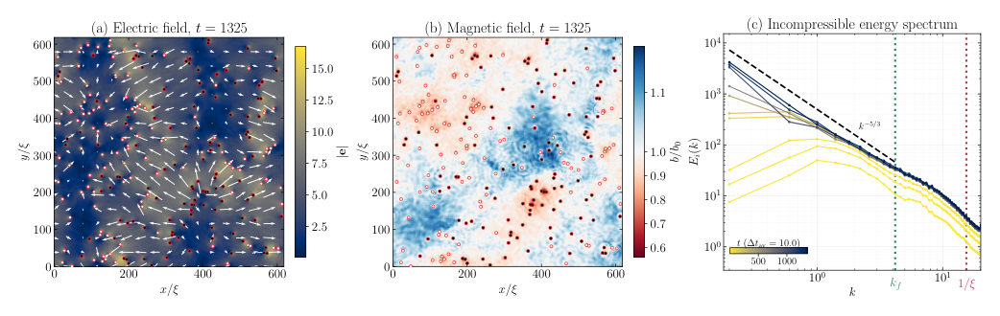
<figcaption class="paper-figure-caption"><b>Fig 1.</b> FIG. 1. A snapshot of (a) electric fields (e, or the π/2−rotated superfluid current) and (b) normalized magnetic fields (b/b0, where b0 is the average magnetic field, or the superfluid density) at a time t = 1325 (in units of ℏ/µ), obtained under turbulent dynamics of a two dimensional superfluid with g = 500 (in units of ℏ2/2m, and gb0/(2π) ≈119) using the dual hydrodynamical equations (Eqs. (13a), (13b) and (13c)). The snapshot is taken at a representative time when the cascade in the incompressible kinetic energy is well developed. The point-vortices are depicted by unfilled and filled circles, corresponding to vortices of opposite sign. (c) Incompressible kinetic energy Ei(k), plotted...</figcaption>
</figure>
<figure class="paper-figure-card">
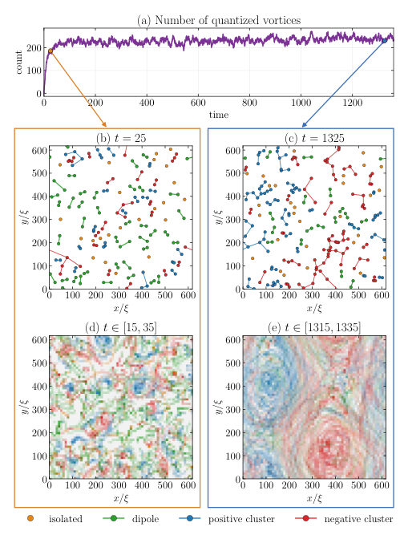
<figcaption class="paper-figure-caption"><b>Fig 2.</b> FIG. 2. (a) Total number of vortices as a function of time in the superfluid dynamics. (b) and (c): Vortex positions at time t = 25 and t = 1325 respectively. The vortices have been classified into positive (blue) and negative (red) clusters and dipoles (green). The remaining isolated vortices are colored in orange [19]. (d) and (e): Corresponding vortex distribution averaged over a time window of 20 (in units of ℏ/µ) at early and late times.</figcaption>
</figure>
<figure class="paper-figure-card">
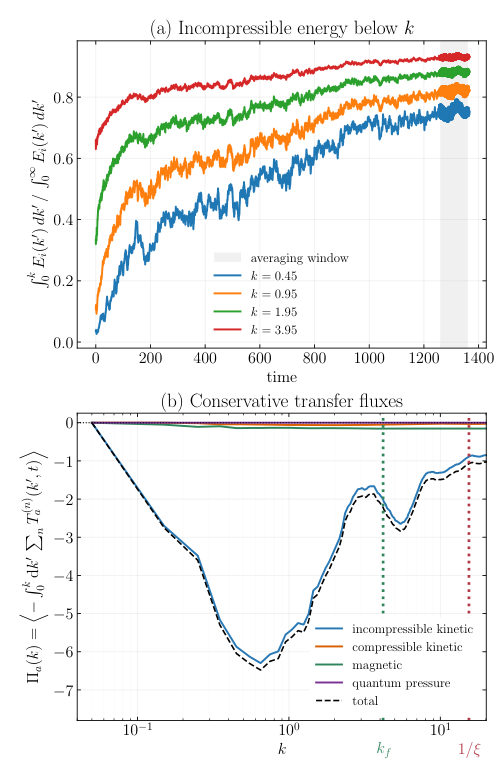
<figcaption class="paper-figure-caption"><b>Fig 3.</b> FIG. 3. (a) Time evolution of the ratio of incompressible en- ergy within a sphere of radius k to the total incompressible energy. (b) Total conservative energy flux Πa(k) for all en- ergy channels a = i, c, b, Q (incompressible and compressible kinetic energy, magnetic and quantum pressure energy) as a function of wavenumber k, averaged over the time window t ∈[1260, 1360].</figcaption>
</figure>
<figure class="paper-figure-card">
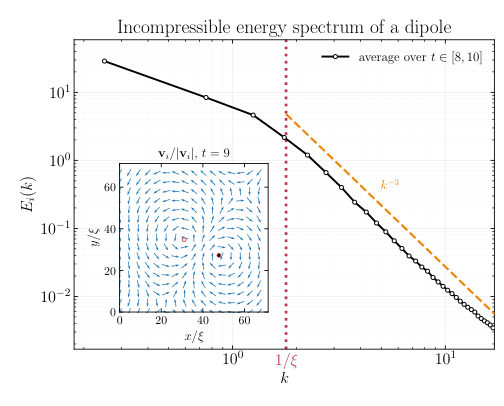
<figcaption class="paper-figure-caption"><b>Fig 4.</b> FIG. 4. Incompressible kinetic energy spectrum of a single vortex-anti-vortex pair at g = 1, b0 = 10.0 (gb0/(2π) = 1.6). At scales kξ ≫1, the spectrum follows a k−3 power law scal- ing, as indicated by the orange reference line. The inset shows a snapshot of the incompressible velocity field at t = 9.0.</figcaption>
</figure>
<figure class="paper-figure-card">
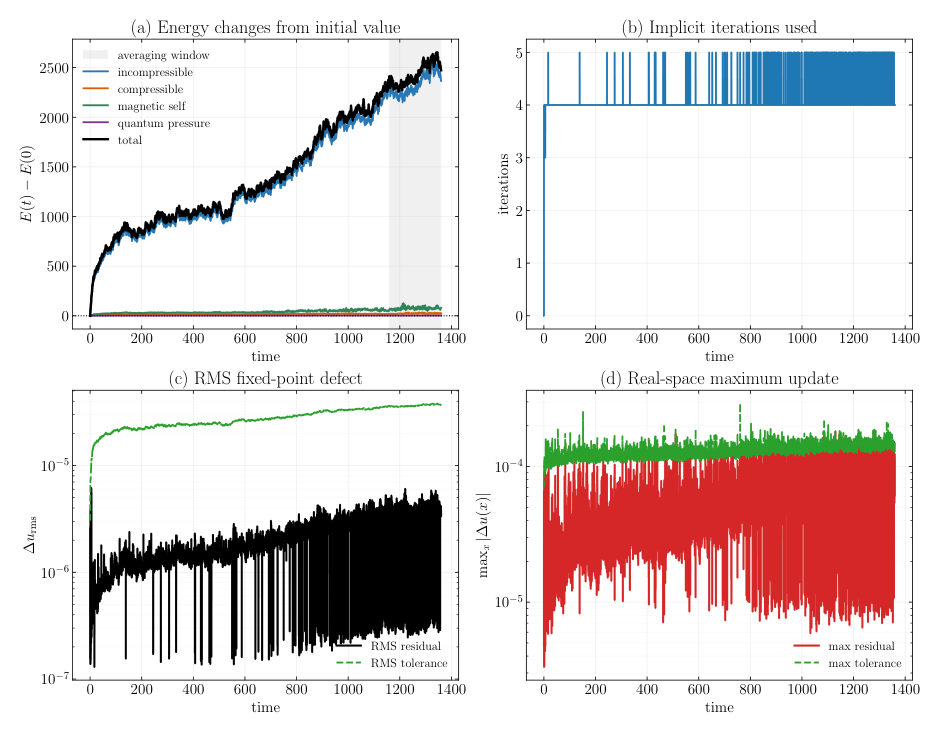
<figcaption class="paper-figure-caption"><b>Fig 5.</b> FIG. 5. Diagnostics of numerical algorithm. (a) Energy change as a function of time relative to the initial energy E(0) for each energy contribution in the Lagrangian. (b) Number of iterations used in the implicit adaptive solver until convergence is reached. (c) RMS and (d) maximum value of the residual of the velocity update in the last iteration, compared to the RMS and maximum tolerance value, respectively.</figcaption>
</figure>

**Summary.** The paper develops a dual gauge theory to model turbulent hydrodynamics in 2D superfluids, treating the system via coupled vortex and emergent gauge fields. It successfully derives equations of motion that reproduce known hydrodynamic behaviors, such as Kolmogorov scaling and an inverse energy cascade. This provides a rigorous theoretical framework for understanding quantum turbulence.

**Why it may be interesting.** This work connects superfluid dynamics (a topic often studied with BECs) to advanced field theories (gauge theory), providing a powerful mathematical toolset for understanding non-equilibrium many-body fluid phenomena relevant to quantum gases.

Detailed structure

**Main problem.** The study focuses on theoretically describing the turbulent hydrodynamics of superfluids confined to two spatial dimensions.

**Main result.** The authors show that a dual gauge theory framework successfully models superfluid turbulence, predicting an inverse energy cascade consistent with theoretical expectations for 2D fluids.

**Method.** They employ a dual gauge theory approach, mapping the fluid dynamics onto coupled equations governing emergent U(1) gauge fields and point-like vortices.

**Model / system.** The system is a two-dimensional superfluid described by a complex order parameter $\psi$. Turbulence is modeled using quantized vortices coupled to an emergent 2+1 dimensional U(1) gauge field, leading to dual equations of motion.

**Key observables.** Kinetic energy spectrum $E(k)$, energy transfer fluxes ($\Pi_a^\chi$), and the evolution of magnetic ($b$) and electric ($e$) fields.

**Important parameters / regimes.** The system exhibits distinct scaling regimes, including Kolmogorov's $k^{-5/3}$ law and a predicted inverse energy cascade towards low wavenumbers.

**Assumptions / limitations.** Key approximations include treating vortices as point-like particles and deriving the hydrodynamics from the dual gauge theory in specific limits (e.g., $g 	o \infty$).

**Figures summary.** Figures illustrate snapshots of vortex clustering, energy spectra confirming power-law scaling consistent with Kolmogorov's law, and time evolution plots showing energy transfer fluxes.

**Paper structure.** The paper builds from the classical fluid description to the proposed dual gauge theory framework. It then details the coupled equations for the fields, analyzes the resulting energy balance equation in Fourier space, and finally presents numerical results confirming scaling laws and cascade behavior.

Abstract

We describe turbulent hydrodynamics of superfluids in two spatial dimensions via the dynamics of point-like vortices coupled to an emergent 2+1 dimensional $U(1)$ gauge field. The cascade of superfluid kinetic energy is equivalently described by a cascade of dual electric field energies. We study superfluid turbulence using the equations of motion of the dual gauge theory in the presence of a drive and dissipation. In the limit that the vortices are point-like, the dual equations of motion directly yield the hydrodynamical equations of the superfluid. We obtain a turbulent cascade consistent with Kolmogorov's scaling law for two dimensional fluid turbulence. We observe clustering of like-signed vortices and compute the kinetic energy flux to show that the turbulent regime exhibits an inverse energy cascade.

[↑ back to top](#top)

### [Ising-machine-like Driving Condition Restrictions in SSBM and Additional Pseudo-annealing- Driving Method for SSBM that Achieves Best Cut Value Search -](http://arxiv.org/abs/2608.12545v1)

**Authors:** Toshiya Sato  
**Type:** theory · **Category:** disordered systems and neural networks · **PDF:** <https://arxiv.org/pdf/2608.12545v1>  
**Analysis basis:** full PDF text, analyzed in chunks
**Topic relevance:** `driven-dissipative phase transition` **3/5** · `methods for driven-dissipative` **3/5** · `non-equilibrium universality` **2/5** · `Keldysh / 2PI / non-Gaussian methods` **1/5** · `analog quantum simulation` **1/5** · `correlated / nonlocal dissipation` **1/5** · `scars & prethermalization` **1/5**

↔ Scroll figures horizontally

<figure class="paper-figure-card">
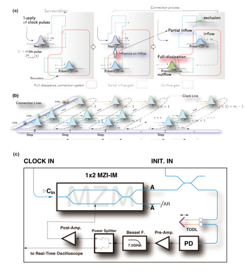
<figcaption class="paper-figure-caption"><b>Fig 1.</b> FIG. 1. Set-up of nest-type dissipative system using polarized optical coherent clock pulses and 1 × 2MZM as partial inflow gate of the FDCS.</figcaption>
</figure>
<figure class="paper-figure-card">
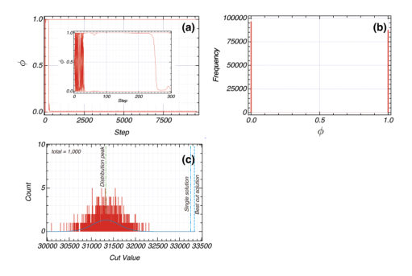
<figcaption class="paper-figure-caption"><b>Fig 2.</b> FIG. 2. Behavior of SSBM under a restriction condition following the continuous-variable-type Ising machines (sim- ulation results for the K2000 problem). (a) Step evolutions of continuous-variables ϕi (pseudo-spins) (20 samples, 9699 steps), (b) Histogram of pseudo-spin values (20 samples, to- tal=193,980 counts), (c) Histogram of cut values explored in 1,000 simulations.</figcaption>
</figure>
<figure class="paper-figure-card">
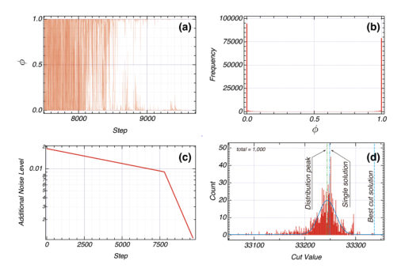
<figcaption class="paper-figure-caption"><b>Fig 3.</b> FIG. 3. Behavior of SSBM in the case where a pseudo- annealing effect is added under the restricted conditions (sim- ulation results for the K2000 problem). (a) Step evolutions of pseudo-spins (20 samples, 9699 steps), (b) Histogram of pseudo-spin values (20 samples, total=193,980 counts), (c) Scheduling of additional noise levels for pseudo-annealing.</figcaption>
</figure>

**Summary.** The paper improves a specialized simulator called the SSBM for solving combinatorial optimization problems. It achieves this by modifying the machine's driving conditions to mimic continuous-variable Ising machines and by incorporating a pseudo-annealing effect. These modifications allow the physical simulator to search more effectively, reaching near state-of-the-art solutions.

**Why it may be interesting.** This work directly addresses how non-equilibrium dynamics (like those in dissipative physical simulators) can be tuned using concepts borrowed from thermal physics (annealing) to solve hard optimization problems, which is highly relevant for quantum computation and complex system modeling.

Detailed structure

**Main problem.** Developing a high-performance solver for complex combinatorial optimization problems, such as finding the best cut value for K2000.

**Main result.** By restricting driving conditions and adding a pseudo-annealing effect to the SSBM, the system can achieve search performance comparable to known state-of-the-art methods, approaching the best known cut values.

**Method.** The authors analyze the dynamics of the Spontaneous Symmetry Breaking Machine (SSBM) by imposing specific driving condition restrictions and introducing a pseudo-annealing term into its discrete evolution equations.

**Model / system.** The core system is the SSBM, a physical simulator based on spontaneous symmetry breaking phenomena using dissipative elements. Its dynamics are governed by an iteration equation ($\phi_{i+m} = \sin^2(\gamma^2 \phi_i + 	heta_B)$) and pseudo-spin interactions.

**Key observables.** The primary observable is the 'cut value' achieved during the solution search process, alongside the evolution and histogram of pseudo-spin patterns ($\phi_i$).

**Important parameters / regimes.** Nesting number (restricted to 12), noise intensity schedule for annealing, and coupling parameters ($\gamma, 	heta_B$).

**Assumptions / limitations.** The SSBM is treated as a discrete system, requiring the introduction of a *pseudo*-annealing effect to mimic continuous-variable techniques like those involving Nosé–Hoover methods.

**Figures summary.** Figures compare SSBM behavior under simple restrictions (Point 1) versus when pseudo-annealing (Point 2) is added. The histograms show that adding annealing shifts the cut value distribution toward higher, better values.

**Paper structure.** The paper first establishes the baseline performance of SSBM; it then discusses imposing quasi-static restrictions analogous to continuous IMs; finally, it introduces and validates the addition of a pseudo-annealing effect to further enhance search capability.

Abstract

In our previous paper, we described the proposal and validation of a new physical implementation-type simulator (spontaneous symmetry breaking machine (SSBM)) for a combinatorial optimization problem that utilizes a phenomenon dual to the model in which a pseudo-spin many-body system is created by spontaneous symmetry breaking. Furthermore, we performed numerical simulations with different initial fluctuations on a large-scale benchmark problem (K_{2000}) and reported that we identified a condition under which pseudo-spin patterns gradually converge during the solution search process to ultimately form a single pattern and that the cut value of this converged solution reached 99.7% of the known best. In this paper, we discuss the conditions under which the SSBM can exhibit behavior analogous to that of a continuous-variable-type Ising machine, and report that by adding an effect similar to physical annealing to these conditions, the SSBM can be made to search for the best known cuts in K_{2000}.

[↑ back to top](#top)

### [Critical Microwave Mach-Zehnder-Type Interferometry with Dual-LO Rydberg Atoms](http://arxiv.org/abs/2608.13222v1)

**Authors:** Jun-Rong Chen, Guo-Qing Qin, Peng-Fu Liang, He Hao, Ming-Min Zhao, Ling-Qiang Meng, Gui-Lan Li, Min-Jian Zhao, Bin-Bin Wei, Hao Tian  
**Type:** experiment · **Category:** other · **PDF:** <https://arxiv.org/pdf/2608.13222v1>  
**Analysis basis:** full PDF text, analyzed in chunks
**Topic relevance:** `Rydberg arrays` **3/5** · `interference shaping light` **3/5** · `quantum optics experiment` **2/5** · `analog quantum simulation` **1/5** · `quantum measurements` **1/5**

↔ Scroll figures horizontally

<figure class="paper-figure-card">
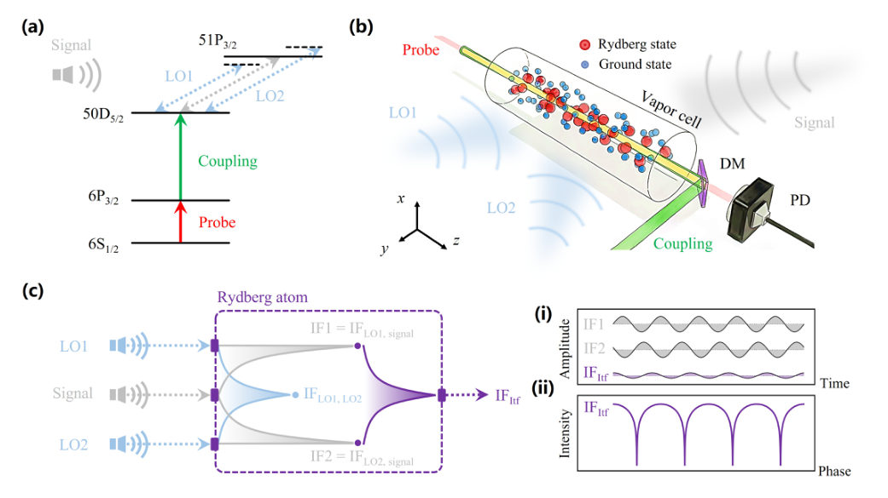
<figcaption class="paper-figure-caption"><b>Fig 1.</b> Figure 1. Dual-LO Mach-Zehnder-type microwave interferometry. (a) Energy-level diagram of Cs atoms. A probe beam and a coupling beam drive a two-photon EIT process, exciting Cs atoms from the ground state 6S1/2 to the Rydberg state 50D5/2. Two local oscillator fields (LO1 and LO2) are symmetrically detuned about the signal field frequency and are both near-resonant with the Rydberg transition 50D5/2 →51P3/2. (b) Schematic of the dual-LO microwave interferometry setup. The counter-propagating probe and coupling beams traverse the atomic vapor cell collinearly. The microwave-induced atomic response is encoded in the transmitted probe field and is read out as the output IF signal by a...</figcaption>
</figure>
<figure class="paper-figure-card">
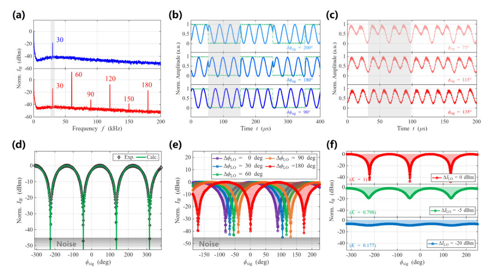
<figcaption class="paper-figure-caption"><b>Fig 2.</b> Figure 2. Response characteristics of the dual-LO Mach-Zehnder-type microwave interferometer. (a) Output IF spectra obtained using the conventional single-LO superheterodyne scheme (upper panel) and the proposed dual-LO interfer- ometric scheme (lower panel). (b) Output IF signals under the single-LO standard superheterodyne scheme for varying signal field phase shifts. The upper, middle, and lower panels correspond to phase shifts of 200◦, 180◦, and 90◦, respectively. The green dashed lines indicate the trigger signals for the phase modulation. (c) Output IF signals under the dual-LO interferom- etry scheme for different signal field phases. The upper, middle, and lower panels correspond...</figcaption>
</figure>
<figure class="paper-figure-card">
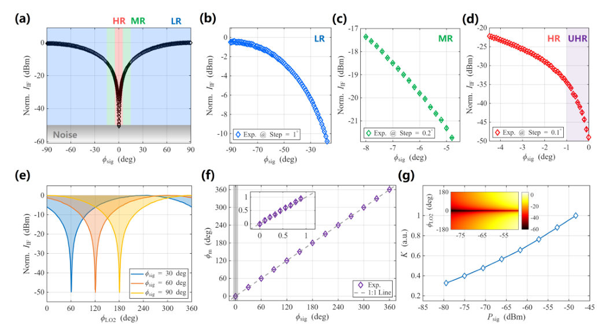
<figcaption class="paper-figure-caption"><b>Fig 3.</b> Figure 3. High-precision phase retrieval using the dual-LO Mach-Zehnder-type microwave interferometer.. (a) Interferometric response as a function of signal-field phase over the range from −90◦to +90◦. The phases of LO1 and LO2 are fixed at 0◦and 180◦, respectively. As the signal phase approaches the critical interference point, the response slope increases significantly. According to the local transfer slope, the response can be divided into low-resolution (LR, blue shaded), medium- resolution (MR, green shaded), and high-resolution (HR, red shaded) regions. (b–d) Enlarged views of the LR, MR, and HR regions, corresponding to phase step sizes of 1◦, 0.2◦, and 0.1◦, respectively. Within the...</figcaption>
</figure>
<figure class="paper-figure-card">
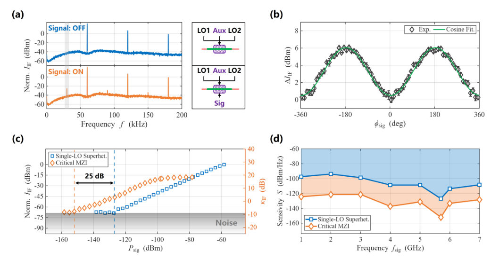
<figcaption class="paper-figure-caption"><b>Fig 4.</b> Figure 4. Critical-point-enhanced sensitivity in the Mach-Zehnder-type interferometer. (a) Output IF spectra measured with LO1, LO2, and the auxiliary field (Aux) present simultaneously, in the absence (upper panel) and presence (lower panel) of the external signal field. The phases of LO1, LO2, and Aux are fixed at 0◦, 0◦, and 90◦, respectively. The insets schematically illustrate the corresponding operating conditions of the interferometer. The red and green line segments denote the probe and coupling laser fields, respectively, and the purple rectangle represents the atomic vapor cell. Microwave horn antennas are omitted for clarity. (b) Relative variation of the interferometric...</figcaption>
</figure>
<figure class="paper-figure-card">
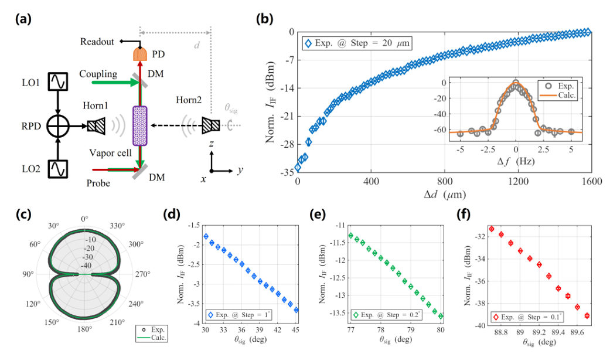
<figcaption class="paper-figure-caption"><b>Fig 5.</b> Figure 5. Interferometric microwave distance and polarization metrology. (a) Experimental configuration for in- terferometric microwave metrology. LO1 and LO2 are combined by a resistive power divider (RPD) and transmitted toward the atomic vapor cell through Horn1. The signal field is radiated directly from Horn2 to the vapor cell over a propagation distance d. Horn2 can be rotated in the x–z plane, defining the signal polarization angle θsig with respect to Horn1. The interferometric IF signal is read out from the transmitted probe field by a photodetector (PD). (b) Measured interferometric intensity IIF as a function of the distance variation ∆d. Error bars represent the standard...</figcaption>
</figure>

**Summary.** The authors present a novel Rydberg-atom-based Mach-Zehnder interferometer using a dual-local-oscillator configuration to measure microwave fields. This setup overcomes limitations of prior methods by achieving high phase resolution and exceptional sensitivity enhancement near critical interference points. The resulting framework is simple, scalable, and applicable for multi-parameter metrology including distance and polarization sensing.

**Why it may be interesting.** This work provides a highly scalable quantum platform for microwave metrology by engineering an interference scheme that converts weak phase shifts into large measurable intensity changes, which is crucial for advancing practical quantum sensors.

Detailed structure

**Main problem.** The core challenge is achieving high-precision phase measurement of microwave fields while overcoming trade-offs in resolution, range, and system complexity inherent in existing Rydberg-atom sensing methods.

**Main result.** The proposed dual-LO Mach-Zehnder interferometer achieves direct phase retrieval with $>0.1^\circ$ resolution and demonstrates a sensitivity enhancement exceeding 25 dB near the critical interference point.

**Method.** The technique uses two local oscillators to create two coherent interferometric pathways in the Rydberg medium, whose recombination forms an intermediate-frequency signal sensitive to the input microwave phase.

**Model / system.** The system is a Mach-Zehnder type interferometer implemented using Rydberg atoms. It employs a dual-local-oscillator (dual-LO) configuration that establishes two coherent pathways for mixing with the signal field, avoiding complex optical setups.

**Key observables.** Phase ($\phi$), intensity ($I_{	ext{Itf}}$), propagation distance ($\delta d$), and polarization angle ($	heta$).

**Important parameters / regimes.** Phase resolution ($>0.1^\circ$), sensitivity enhancement ($>25 	ext{ dB}$), distance precision ($< 20 \mu	ext{m}$ at $5.7 	ext{ GHz}$).

**Assumptions / limitations.** The method assumes the ability to establish and control two coherent LO pathways and relies on operating near a critical interference point for maximum sensitivity.

**Figures summary.** Figures illustrate the energy-level diagram, the dual-LO setup schematic, the coherent mixing process forming $	ext{IF}_{	ext{total}}$, and response curves demonstrating phase retrieval across different resolution regimes (LR, MR, HR).

**Paper structure.** The paper introduces the problem of microwave metrology, details the dual-LO Mach-Zehnder interferometer model, derives the intensity dependence on accumulated phase, quantifies the enhanced sensitivity near critical points, and finally demonstrates applications to distance and polarization sensing.

Abstract

High-precision phase measurement of microwave fields underpins a wide range of applications, including wireless communications, distributed radar, plasma diagnostics, and antenna metrology. Existing Rydberg-atom-based approaches, however, often face trade-offs among phase resolution, measurement range, and system complexity. Here we demonstrate a Rydberg-atom-based microwave Mach-Zehnder-type interferometer using a dual-local-oscillator configuration. The two local oscillators establish two coherent interferometric pathways in the Rydberg medium. Their coherent mixing with the signal field produces an interferometric intermediate-frequency output governed by a phase-to-intensity transfer characteristic that enables critical-point enhancement. This scheme supports direct phase retrieval with a resolution exceeding $0.1^\circ$ and unambiguous full $360^\circ$ phase coverage with the reconfigurable dual-LO architecture. Moreover, near the critical interference point, the system exhibits a sharply enhanced phase-to-amplitude transduction, where weak amplitude variations are converted into pronounced phase responses, yielding a sensitivity enhancement exceeding 25 dB. Besides, the same interferometric transfer mechanism enables microwave propagation-distance and polarization metrology, achieving a propagation-distance precision below 20 $μ$m at 5.7 GHz together with a polarization-angle resolution exceeding $0.1^\circ$. This approach eliminates the need for complex optical configurations and lock-in detection, providing a simple, scalable, and reconfigurable Mach-Zehnder-type quantum microwave interferometry framework for multifunctional high-precision microwave metrology.

[↑ back to top](#top)

### [Robust Genuine Multipartite Entanglement in Two Walker Quantum Walks](http://arxiv.org/abs/2608.13338v1)

**Authors:** Sandipan Hazra, Tamoghna Das, Sougato Bose, Sonjoy Majumder  
**Type:** theory · **Category:** quantum information and computing · **PDF:** <https://arxiv.org/pdf/2608.13338v1>  
**Analysis basis:** full PDF text, analyzed in chunks
**Topic relevance:** `analog quantum simulation` **3/5** · `driven-dissipative phase transition` **2/5** · `non-equilibrium universality` **2/5** · `correlated / nonlocal dissipation` **1/5** · `methods for driven-dissipative` **1/5** · `scars & prethermalization` **1/5**

↔ Scroll figures horizontally

<figure class="paper-figure-card">
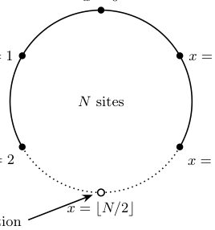
<figcaption class="paper-figure-caption"><b>Fig 1.</b> FIG. 1. One-dimensional lattice with periodic boundary conditions. The lattice sites are labelled by x = 0, 1, 2, . . . , N − 1, with the identification |x + N⟩≡|x⟩. The walkers are initially localized at the central lattice site x = ⌊N/2⌋, where ⌊·⌋denotes the floor function. The periodic identification makes the sites x = 0 and x = N −1 nearest neighbours, resulting in a closed lattice topology.</figcaption>
</figure>
<figure class="paper-figure-card">
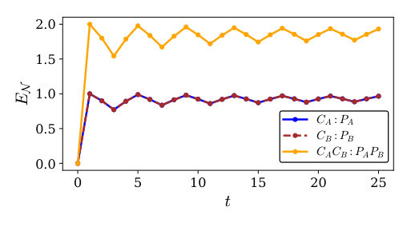
<figcaption class="paper-figure-caption"><b>Fig 2.</b> FIG. 2. (Color online.) Time evolution of bipartite entangle- ment (in ebit unit) in various bipartitions has been plotted as a function of number of steps t ( dimensionless), in the two-walker DTQW, when the initial coin: coin quantum state is a product state |ψ1⟩CACB = |01⟩CACB. The entanglement has been calculated with the help of logarithmic negativity in the bipartitions CA : PA (by the solid blue line) and CB : PB (by the dashed brown line) CACB : PAPB (by the solid or- ange curve). Here we consider the open-boundary regime with N = 51 lattice points and a maximum allowed step count of T = 25.</figcaption>
</figure>
<figure class="paper-figure-card">
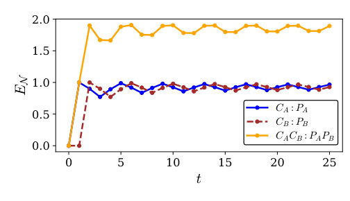
<figcaption class="paper-figure-caption"><b>Fig 3.</b> FIG. 3. (Color online.) Time evolution of bipartite entangle- ment (in ebit unit) in various bipartitions has been plotted as a function of number of steps t ( dimensionless), in the two-walker DTQW, when the initial coin: coin quantum state is a product state |ψ2⟩CACB = |0+⟩CACB. The entanglement has been calculated with the help of logarithmic negativity in the bipartitions CA : PA (by the solid blue line) and CB : PB (by the dashed brown line) CACB : PAPB (by the solid orange curve). Here, we consider the open-boundary regime with N = 51 lattice points and a maximum allowed step count of T = 25.</figcaption>
</figure>
<figure class="paper-figure-card">
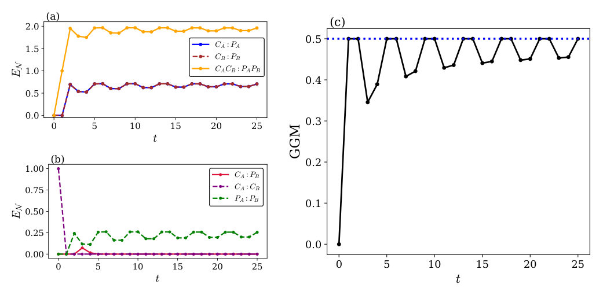
<figcaption class="paper-figure-caption"><b>Fig 4.</b> FIG. 4. (Color online.) Time evolution of bipartite entanglement (in ebit unit) in various bipartitions and GGM (dimensionless) has been plotted as a function of number of steps t (dimensionless), in the two-walker DTQW, when the initial coin: coin quantum state is |ψ3⟩CACB = 1 √</figcaption>
</figure>
<figure class="paper-figure-card">
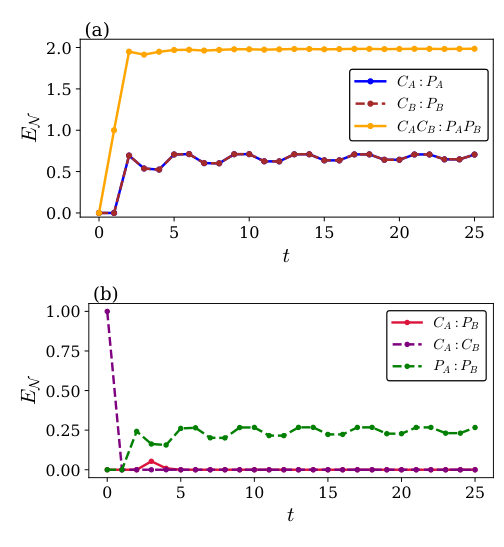
<figcaption class="paper-figure-caption"><b>Fig 5.</b> FIG. 5. (Color online.) Time evolution of bipartite entangle- ment (in ebit unit) in various bipartitions has been plotted as a function of number of steps t (dimensionless), in the two-walker DTQW, when the initial coin: coin quantum state is |ψ4⟩CACB = 1 √</figcaption>
</figure>

**Summary.** This paper investigates how entanglement—both bipartite and genuine multipartite—evolves in two-walker discrete-time quantum walks. Using advanced measures like the GGM, the authors demonstrate that open boundary conditions naturally lead to the generation of maximal, robust multipartite entanglement. This establishes these quantum walk systems as promising tools for quantum information processing.

**Why it may be interesting.** This work directly addresses quantum information processing by providing a physical platform (quantum walks) where multipartite correlations can be engineered robustly, which is highly relevant for quantum simulation and computation.

Detailed structure

**Main problem.** The study focuses on characterizing the generation, evolution, and robustness of genuine multipartite entanglement in composite quantum systems using two-walker discrete-time quantum walks.

**Main result.** Maximal genuine multipartite entanglement generation is shown to be a robust and generic feature of open-boundary two-walker DTQWs, making them promising platforms for engineering quantum correlations.

**Method.** The authors employ logarithmic negativity to track bipartite entanglement and the generalized geometric measure (GGM) to quantify genuine multipartite entanglement dynamics.

**Model / system.** The model is a two-walker discrete-time quantum walk on a one-dimensional lattice, incorporating both internal (coin) and external (position) degrees of freedom. The analysis compares open-boundary (free movement) versus closed-boundary (periodic) regimes.

**Key observables.** Logarithmic negativity (for bipartite entanglement) and the Generalized Geometric Measure (GGM) for genuine multipartite entanglement.

**Important parameters / regimes.** Lattice topology (open vs. closed boundary), initial Bell state, and local coin operator choice (e.g., Hadamard or Pauli-X).

**Assumptions / limitations.** The analysis assumes the validity of using DTQWs as a model for quantum correlation transport and relies on specific mathematical measures to quantify entanglement.

**Figures summary.** Figures illustrate the one-dimensional lattice structure, showing periodic boundary conditions, and demonstrate time evolution plots of GGM under different coin operators (e.g., Pauli-X).

**Paper structure.** The paper systematically analyzes entanglement dynamics by first defining the two-walker DTQW framework, then comparing correlation redistribution in open versus closed boundaries, culminating in demonstrating the robustness of maximal GME generation.

Abstract

Discrete-time quantum walks provide a versatile framework for investigating the generation, redistribution, and transport of quantum correlations in composite quantum systems. Here, we study the dynamics of bipartite and genuine multipartite entanglement in a two-walker discrete-time quantum walk on a one-dimensional lattice. By employing logarithmic negativity and the generalized geometric measure (GGM), we systematically characterize the redistribution of bipartite entanglement among different subsystem partitions and the emergence of genuine multipartite entanglement involving the two coin and two position degrees of freedom. We show that the entanglement dynamics are strongly influenced by the lattice topology. The open-boundary regime exhibits a monotonic redistribution of quantum correlations, whereas the closed-boundary regime gives rise to pronounced oscillatory behavior due to boundary-induced interference and recurrent wave-packet overlap. In the open-boundary regime, the GGM rapidly approaches its theoretical maximum value of $1/2$ and remains largely insensitive to the choice of the initial Bell state as well as to continuous variations of the local coin operator over a broad parameter range, except near the Pauli-$X$ coin. These results demonstrate that maximal genuine multipartite entanglement generation is a robust and generic feature of open-boundary two-walker discrete-time quantum walks, establishing them as promising platforms for engineering multipartite quantum correlations in quantum information processing and quantum simulation.

[↑ back to top](#top)

### [Spectral Localization Principle for Entanglement Harvesting](http://arxiv.org/abs/2608.13449v1)

**Authors:** Hao Xu  
**Type:** theory · **Category:** other · **PDF:** <https://arxiv.org/pdf/2608.13449v1>  
**Analysis basis:** full PDF text, analyzed in chunks
**Topic relevance:** `correlated / nonlocal dissipation` **3/5** · `Tavis-Cummings & cavity-many-emitter` **2/5** · `quantum measurements` **2/5** · `analog quantum simulation` **1/5** · `driven-dissipative phase transition` **1/5** · `methods for driven-dissipative` **1/5**

↔ Scroll figures horizontally

<figure class="paper-figure-card">
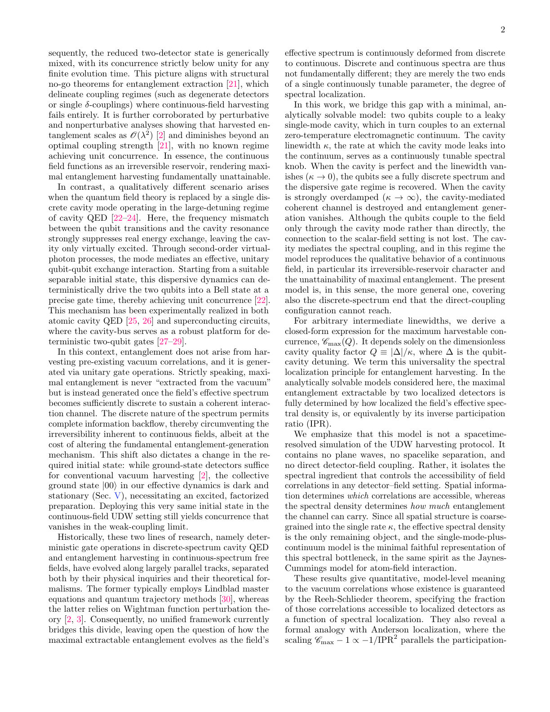
<figcaption class="paper-figure-caption"><b>Fig 1.</b> Low-resolution page preview, page 2</figcaption>
</figure>
<figure class="paper-figure-card">
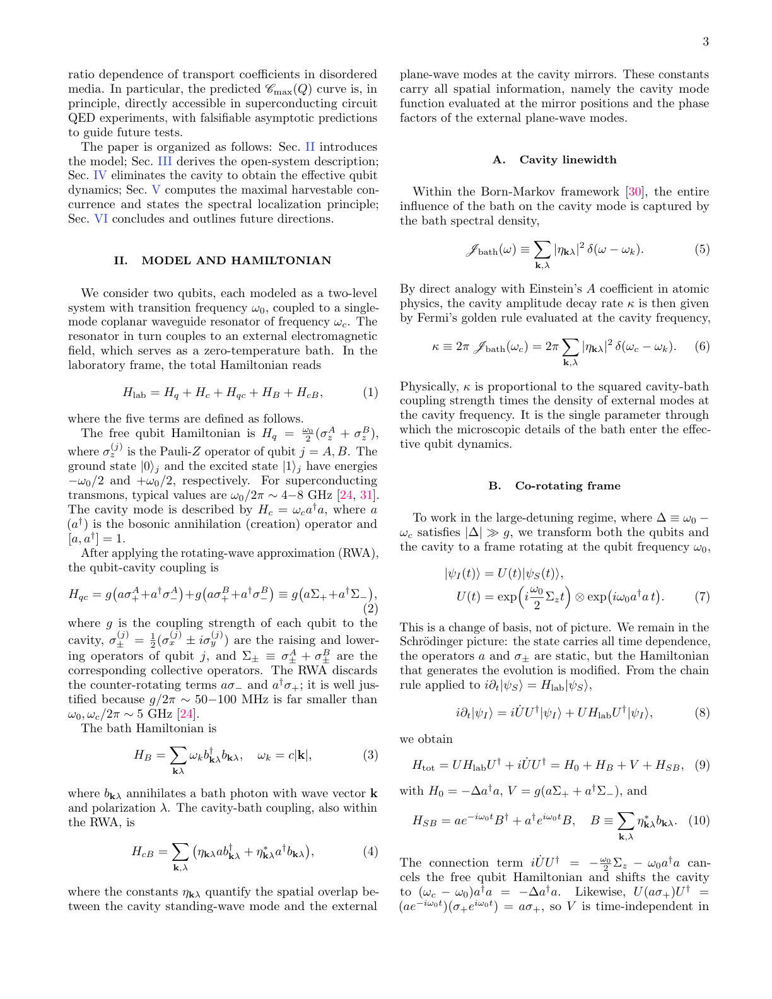
<figcaption class="paper-figure-caption"><b>Fig 2.</b> Low-resolution page preview, page 3</figcaption>
</figure>
<figure class="paper-figure-card">
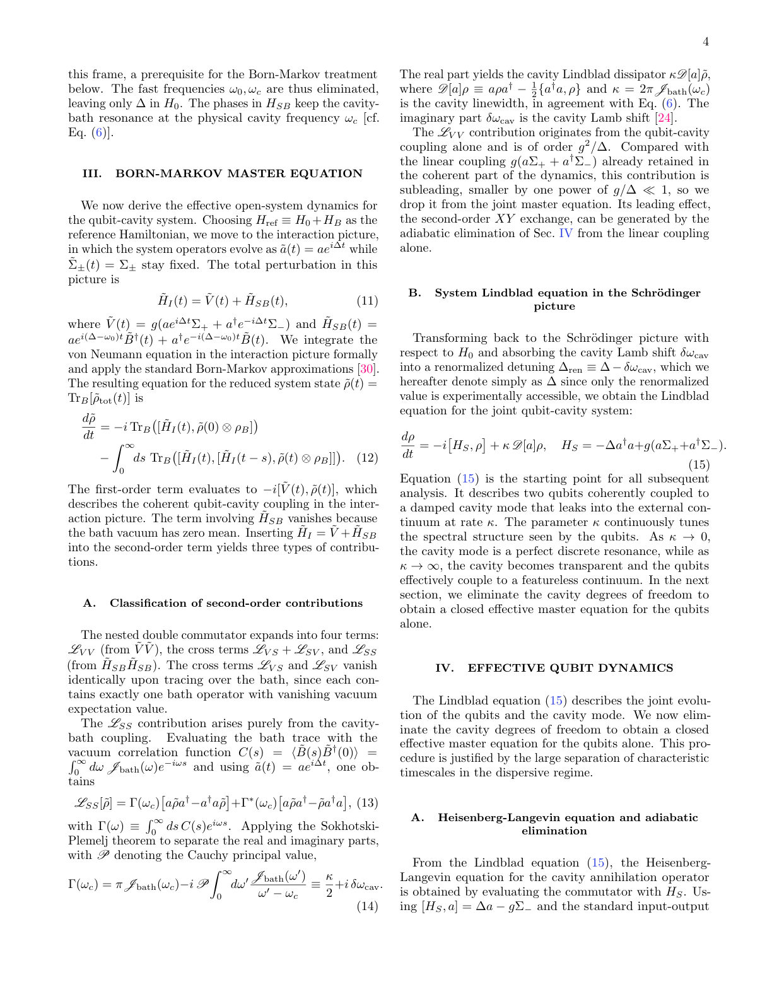
<figcaption class="paper-figure-caption"><b>Fig 3.</b> Low-resolution page preview, page 4</figcaption>
</figure>
<figure class="paper-figure-card">
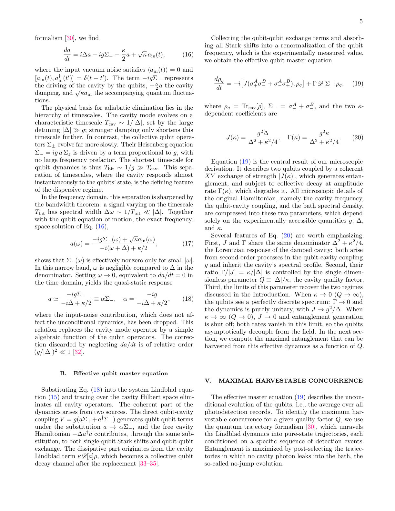
<figcaption class="paper-figure-caption"><b>Fig 4.</b> Low-resolution page preview, page 5</figcaption>
</figure>
<figure class="paper-figure-card">
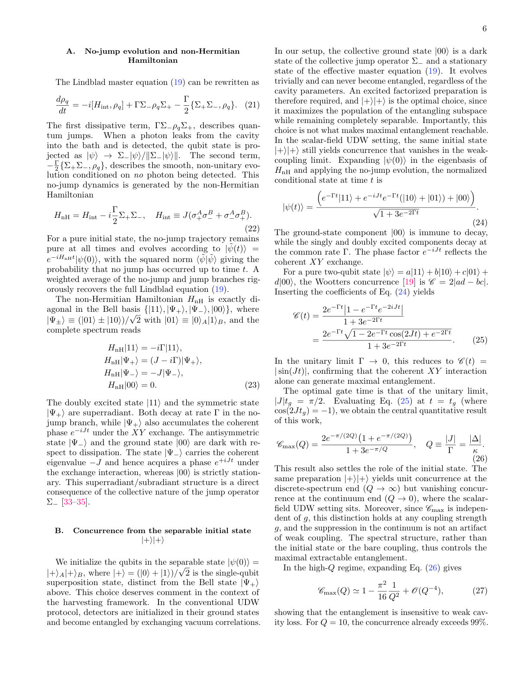
<figcaption class="paper-figure-caption"><b>Fig 5.</b> Low-resolution page preview, page 6</figcaption>
</figure>

**Summary.** This work proposes the Spectral Localization Principle, stating that extractable entanglement depends only on how localized the field's spectral density is. Using an analytically solvable model of qubits coupled to a leaky cavity, the authors derive a closed-form expression for maximum concurrence based on the parameter $Q$. This framework bridges deterministic gate operations with vacuum harvesting by drawing formal analogies to localization phenomena.

**Why it may be interesting.** It directly connects concepts from condensed matter physics (Anderson localization, IPR) to quantum information theory (entanglement harvesting), providing a quantitative diagnostic tool for vacuum correlations observable in superconducting circuit QED experiments.

Detailed structure

**Main problem.** To establish a unified physical principle—the Spectral Localization Principle—governing how much entanglement can be extracted from a quantum field by localized detectors.

**Main result.** The maximum harvestable concurrence, $C_{\max}(Q)$, is determined solely by the spectral localization parameter $Q$, showing robustness in the high-$Q$ limit and exponential decay in the low-$Q$ limit.

**Method.** Analytical derivation of the maximum concurrence using an analytically solvable model and applying adiabatic elimination to derive an effective master equation for the qubits.

**Model / system.** The system consists of two qubits coupled to a leaky single-mode cavity, which is itself coupled to a continuous electromagnetic bath. The dynamics are governed by a Lindblad master equation after eliminating the cavity degrees of freedom.

**Key observables.** Maximum harvestable concurrence ($\mathcal{C}_{\max}$), which quantifies accessible vacuum correlations.

**Important parameters / regimes.** $Q \equiv |\Delta|/\kappa$, the ratio of qubit-cavity detuning to cavity linewidth; $\kappa$ (linewidth); IPR (Inverse Participation Ratio).

**Assumptions / limitations.** The model assumes a Born-Markov approximation and uses adiabatic elimination, which requires a large separation between qubit and cavity timescales.

**Paper structure.** The paper introduces the principle, models the system using coupled qubits/cavity/bath Hamiltonian, derives the master equation via adiabatic elimination, calculates $C_{\max}(Q)$ in closed form, and analyzes its behavior in high-Q (deterministic) and low-Q (vacuum harvesting) limits.

Abstract

We propose a unified physical principle for entanglement harvesting: the entanglement that two localized detectors can extract from a quantum field is determined solely by how localized the field's effective spectral density is. We demonstrate this in an analytically solvable model of two qubits coupled to a leaky single-mode cavity, which in turn couples to a continuous electromagnetic bath, and derive the maximum harvestable concurrence in closed form, $\mathcal{C}_{\max}(Q)=2e^{-π/(2Q)}(1+e^{-π/(2Q)})/(1+3e^{-π/Q})$, where $Q\equiv|Δ|/κ$ is the ratio of the qubit-cavity detuning $Δ$ to the cavity linewidth $κ$. In the high-$Q$ limit, $\mathcal{C}_{\max}\simeq1-π^{2}/(16Q^{2})$, so the entanglement is robust against cavity loss; in the low-$Q$ limit it decays exponentially to zero, consistent with the irreversible-reservoir character of a continuous field, where maximal entanglement is unattainable. Since $Q$ is proportional to the inverse participation ratio (IPR) of the effective spectral density, it is the single dimensionless parameter governing the crossover from deterministic gate-based entanglement ($Q\to\infty$) to vacuum harvesting ($Q\to0$). Our framework operationalizes the Reeh-Schlieder theorem by quantifying the fraction of vacuum correlations accessible to localized detectors. It also reveals a formal correspondence of the maximal concurrence with the IPR, analogous to the conductivity-participation-ratio relation in Anderson localization. The predicted $\mathcal{C}_{\max}(Q)$ curve is, in principle, directly observable in superconducting circuit QED experiments.

[↑ back to top](#top)

### [Exponential quantum advantage for learning signals with a single qubit](http://arxiv.org/abs/2608.13521v1)

**Authors:** Ishaan Kannan, Sridhar Prabhu, Saeed A. Khan, Mandar M. Sohoni, Xingrui Song, Saswata Roy, Alen Senanian, Valla Fatemi, Peter L. McMahon, Jordan Cotler  
**Type:** both · **Category:** other · **PDF:** <https://arxiv.org/pdf/2608.13521v1>  
**Analysis basis:** full PDF text, analyzed in chunks
**Topic relevance:** `quantum measurements` **3/5** · `QC/QI experiment` **2/5** · `Tavis-Cummings & cavity-many-emitter` **1/5** · `analog quantum simulation` **1/5** · `driven-dissipative phase transition` **1/5** · `quantum optics experiment` **1/5**

↔ Scroll figures horizontally

<figure class="paper-figure-card">
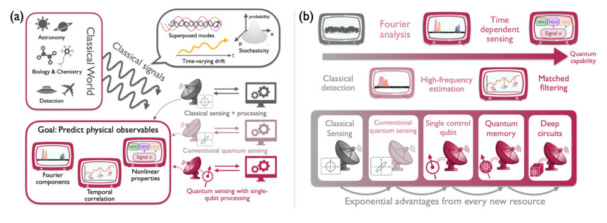
<figcaption class="paper-figure-caption"><b>Fig 1.</b> FIG. 1. Overview of exponential advantages in quantum-enhanced sensing. (a) Architectures for sensing the classical world. Data across experimental science and modern technology is transmitted through classical signals which may have superposed frequencies, time-varying drift, and stochasticity. In these realistic settings we consider sensing with near-term quantum architectures and predicting physical observables such as Fourier components, temporal correlations, and nonlinear transformation of the measured signals. Our QΨ framework encapsulates all of these settings. (b) Hierarchy of quantum-enhanced sensing architectures. As the sensing tasks become richer, sensor architectures with...</figcaption>
</figure>
<figure class="paper-figure-card">
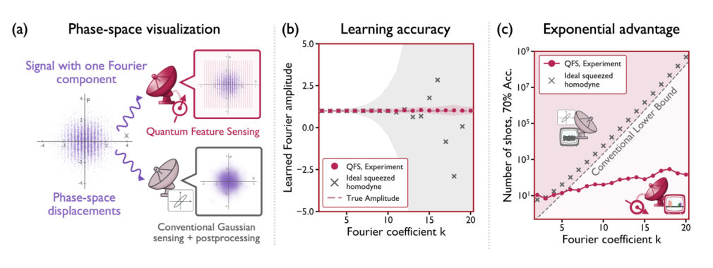
<figcaption class="paper-figure-caption"><b>Fig 2.</b> FIG. 2. Exponential quantum advantage of single-qubit control for learning Fourier amplitudes. (a) Visualization of quantum advantage. The signal contains a high-frequency phase-space Fourier component. The pictured distribution of displacements P(α), for k = 20, is implemented in our experiment. The response of single-qubit quantum feature sensing (top) acts like a frequency comb, probing fine oscillatory structure in each measurement. The response of a conventional Gaussian protocol (bottom) sees the signal severely blurred by Gaussian convolution noise. Plotted is the same signal as seen by 104 shots from QFS vs. an entangled two-mode squeezed sensor with the same energy. (b)...</figcaption>
</figure>
<figure class="paper-figure-card">
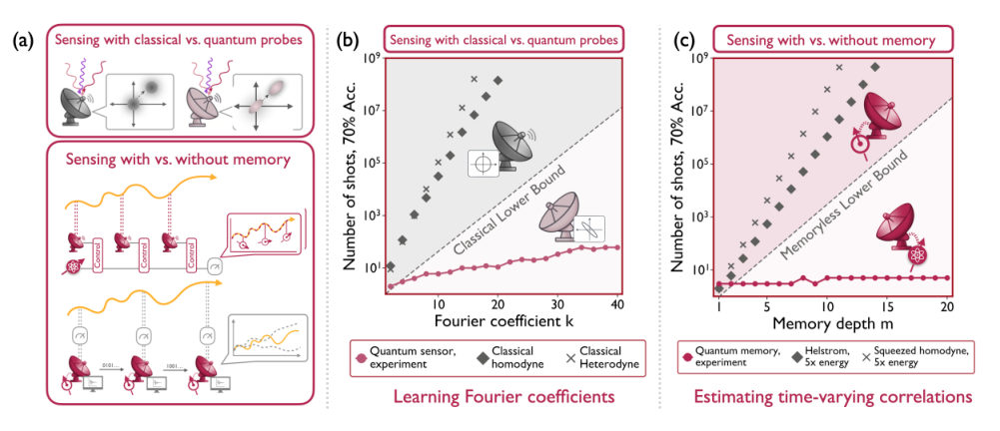
<figcaption class="paper-figure-caption"><b>Fig 3.</b> FIG. 3. Exponential quantum advantages with quantum probes and quantum memory. (a) Top: schematic of sensing with classical vs. conventional Gaussian quantum probes. Classical sensors are modeled as preparing coher- ent probe states, whereas conventional Gaussian sensors can utilize squeezed probes and generaldyne readout. Bottom: schematic of quantum sensing with vs. without quantum memory. A sensor equipped with quantum memory coherently accumulates temporal correlations, whereas a memoryless sensor must measure destructively after each interaction and carry forward only the resulting classical information. (b) Experimental demonstration of separation between conven- tional Gaussian...</figcaption>
</figure>
<figure class="paper-figure-card">
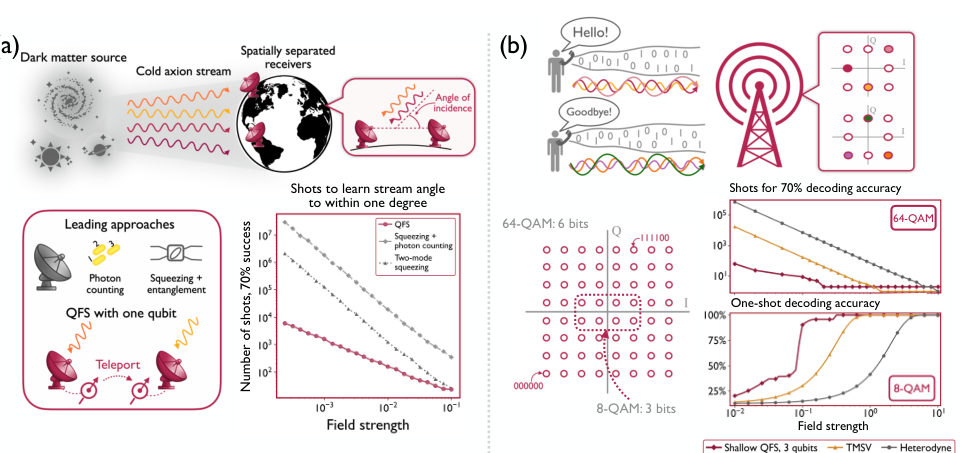
<figcaption class="paper-figure-caption"><b>Fig 4.</b> FIG. 4. Demonstrating speedups in practical applications through numerical simulations. (a) Characterizing cold axion streams. Daily periodicity in the angle of an incident field would constitute smoking-gun evidence of axionic dark matter. This angle manifests as Gaussian covariance between spatially separated receivers. Using estimated velocity parameters of the Sagittarius stream [40], we simulate QFS vs. the leading practical approaches that do not use long- range, long-lived entangled sensors. The QFS protocol only requires a single qubit that is separately coupled to each detector at different times; a realization could use state teleportation of the ancilla, but no...</figcaption>
</figure>
<figure class="paper-figure-card">
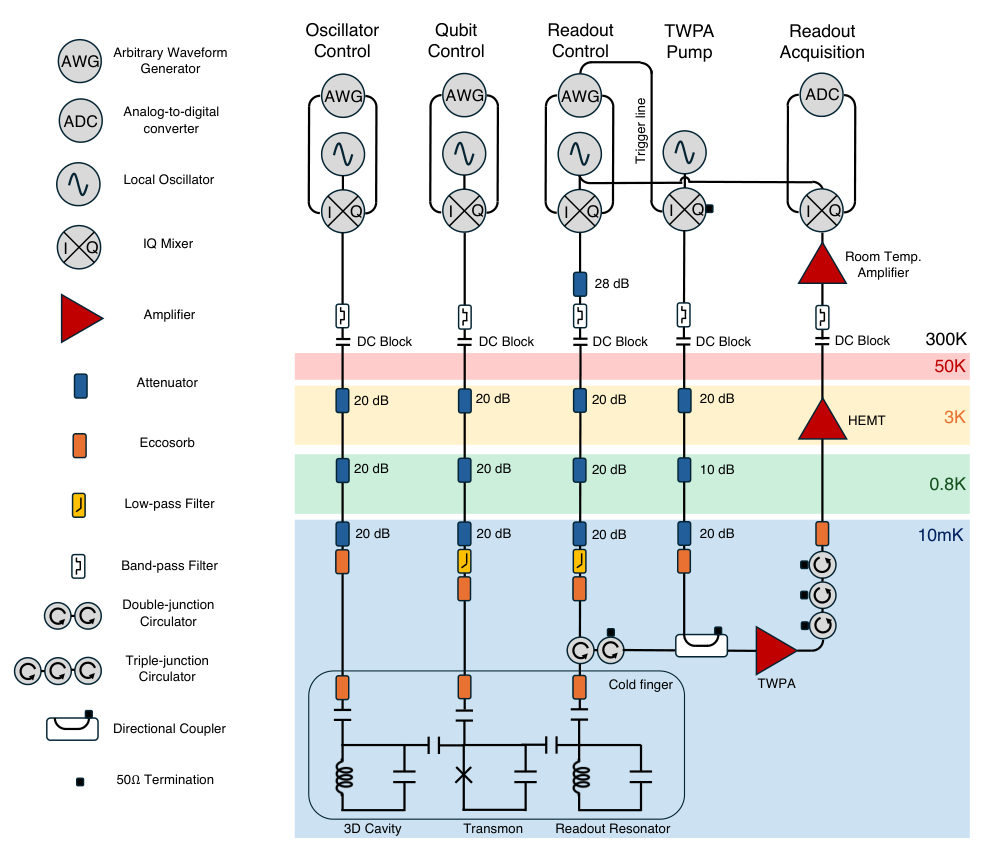
<figcaption class="paper-figure-caption"><b>Fig 5.</b> FIG. 1. Wiring Diagram of the experiment. Experiment setup for microwave hardware and cabling for the device used in this work.</figcaption>
</figure>

**Summary.** This work establishes that coupling a single controllable qubit to a conventional sensor can yield an exponential quantum advantage for learning classical signals. Using the novel QΨ theory, the authors demonstrate this capability experimentally with superconducting qubits, showing massive reductions in measurement requirements for tasks like Fourier analysis and signal correlation estimation.

**Why it may be interesting.** It provides a concrete, near-term pathway to quantum advantage by showing that simple systems (single qubit + sensor) can exponentially enhance fundamental signal processing tasks like spectral analysis and time-series learning, which is highly relevant for quantum sensing applications in AMO physics.

Detailed structure

**Main problem.** The paper demonstrates an exponential quantum advantage for learning classical signals, such as Fourier coefficients or temporal correlations, by coupling a single controllable qubit to a conventional sensor.

**Main result.** Quantum Feature Sensing (QFS) protocols achieve exponential reductions in the required number of measurements compared to classical or standard quantum methods, demonstrated with up to $10^7$-fold improvements experimentally.

**Method.** The authors introduce Quantum Phase-Space Inference (QΨ), a unifying theory that derives optimal quantum-enhanced learning algorithms and rigorous lower bounds for sensing tasks.

**Model / system.** The primary platform is a superconducting cavity–qubit architecture. The theoretical framework models the signal estimation by characterizing the probability density $P(\alpha)$ in phase space, extending beyond standard quantum Fisher information limits.

**Key observables.** Prediction accuracy (e.g., 70% for Fourier-amplitude learning), query complexity ($O(k)$ vs $\exp(\Omega(k))$ queries), and Accessible Feature Information ($	ext{AFI}$).

**Important parameters / regimes.** The advantage is shown to hold using only a single ancilla qubit, making it relevant for near-term quantum technology.

**Assumptions / limitations.** The protocols are designed to be robust even in the presence of decoherence and noise (Markovian, white, or thermal).

**Figures summary.** Figures illustrate the exponential advantage: Fig. 2(c) shows QFS achieving high accuracy with few shots compared to conventional Gaussian approaches; Fig. 4 demonstrates superior performance for sensing dark matter angles and identifying wireless communication symbols.

**Paper structure.** The paper builds from a general overview of quantum sensing (Fig. 1), introduces the theoretical framework ($	ext{Q}\Psi$), proves exponential advantages for specific tasks like Fourier coefficient learning (Theorem 1) and temporal correlation estimation using memory (Theorem 3), and concludes with experimental validation on superconducting qubits.

Abstract

Quantum technology has the potential to transform scientific discovery, but quantum advantages often require processing capabilities well beyond the reach of experimental platforms. We show that coupling a single controllable qubit to an otherwise conventional sensor can exponentially reduce the number of measurements required to learn classical signals. These rigorous quantum advantages apply to fundamental sensing tasks, including learning Fourier coefficients, extracting temporal correlations from time-varying signals, and estimating transformations of physical observables. Using a superconducting cavity--qubit architecture, we experimentally demonstrate $10^7$-fold reductions in the number of measurements required for Fourier-amplitude and time-varying signal learning. Our $\textit{quantum feature sensing}$ algorithms further enable orders-of-magnitude improvements in simulations of weak-signal dark matter detection and wireless communication applications. These quantum advantages are derived from Quantum Phase-Space Inference (Q$Ψ$), a unifying theory of quantum-enhanced experiments that simultaneously converts a set of experimental objectives and constraints into tight lower bounds and optimal quantum-enhanced learning algorithms while producing a certificate of quantum advantage. Q$Ψ$ extends beyond the regimes captured by quantum Fisher information and provides a framework for systematically identifying rigorous quantum advantages in practical experimental tasks. Together, our results establish that near-term quantum technology can exponentially enhance our ability to learn from classical signals.

[↑ back to top](#top)

### [Quantum-Inspired Phase Bicoherence Spectroscopy: A Framework for Detecting Universal Textural Angular Order Across Multi-Modal Complex Datasets](http://arxiv.org/abs/2608.13342v1)

**Authors:** Zheng Xing, Chan-Tong Lam, Xiaochen Yuan  
**Type:** both · **Category:** other · **PDF:** <https://arxiv.org/pdf/2608.13342v1>  
**Analysis basis:** full PDF text, analyzed in chunks
**Topic relevance:** `interference shaping light` **3/5** · `quantum measurements` **2/5** · `Keldysh / 2PI / non-Gaussian methods` **1/5** · `analog quantum simulation` **1/5** · `correlated / nonlocal dissipation` **1/5** · `methods for driven-dissipative` **1/5**

↔ Scroll figures horizontally

<figure class="paper-figure-card">
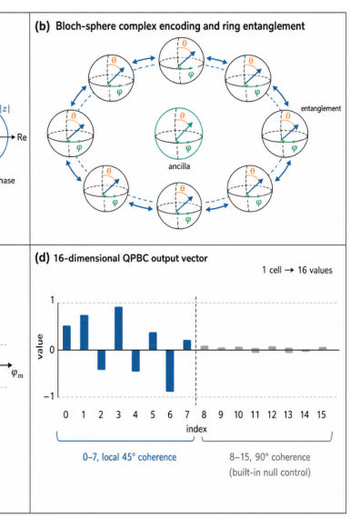
<figcaption class="paper-figure-caption"><b>Fig 1.</b> Fig. 1: Overview of QPBC spectroscopy. (a) Stage 1: Single-cell preprocessing, angular sectorisation into nd = 8 sectors, and extraction of the complex Fourier coef- ficient Fj at the selected spatial frequency (kx, ky). (b) Stage 2: Bloch-sphere complex encoding. Each data qubit qj stores amplitude in the polar angle (θj = πAj) and phase in the azimuthal angle (ϕj). A ring entanglement network (L = 4 layers of CNOT and Rzz gates) delocalises the information across all nine qubits. (c) Stage 3: Three-body bicoherence readout. For each angular triplet (a, b, c), a CRz gate sequence extracts cos(ϕa + ϕc −2ϕb) via ancilla interferometry. (d) The 16-dimensional QPBC vector: step-d = 1 triplets...</figcaption>
</figure>
<figure class="paper-figure-card">
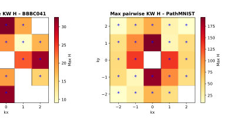
<figcaption class="paper-figure-caption"><b>Fig 2.</b> Fig. 2: Cross-dataset frequency-sweep heatmaps. Colour encodes the maximum pairwise Kruskal–Wallis H statistic at each frequency (kx, ky) for (a) BBBC021, (b) BBBC041, and (c) PathMNIST. In all three datasets, the dominant frequencies lie on the kx = 0 axis, with (0, ±1) consistently among the top candidates. All three panels exhibit central inversion symmetry about the origin, f(kx, ky) ≈f(−kx, −ky), a direct consequence of F(−k) = F ∗(k) for real-valued images. This leaves the bicoherence invariant under k →−k, providing an internal validation of the method’s physical correctness. PathMNIST shows the most uniform colour-block matching across the origin. Stars mark frequencies with at...</figcaption>
</figure>
<figure class="paper-figure-card">
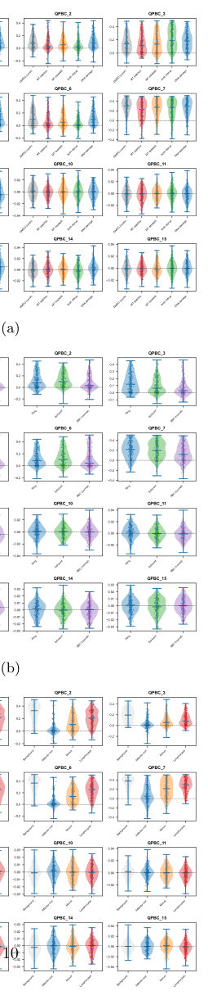
<figcaption class="paper-figure-caption"><b>Fig 3.</b> Fig. 3: QPBC distributions at the optimal frequency (0, 1). Violin plots of the 16 QPBC dimensions across biological classes for (a) BBBC021, (b) BBBC041, and (c) PathMNIST. Step-d = 1 dimensions (0–7) show significant non-zero values in control populations (H1 confirmed); step-d = 2 dimensions (8–15) are tightly centred at zero (H2 confirmed). The responsive dimensions differ across datasets, reflecting their distinct angular texture architectures.</figcaption>
</figure>
<figure class="paper-figure-card">
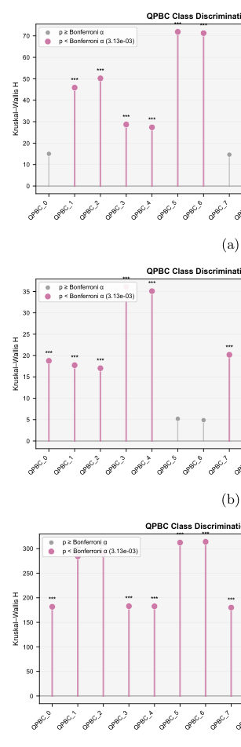
<figcaption class="paper-figure-caption"><b>Fig 4.</b> Fig. 4: Kruskal–Wallis H spectra at the optimal frequency (0, 1). (a) BBBC021: 7/16 dimensions significant (green), strongest H=72.1 (p = 8.3 × 10−15). (b) BBBC041: 7/16 dimensions significant, strongest H=36.1 (p = 1.5 × 10−8). (c) PathMNIST: 8/16 dimensions significant, strongest H=314.1 (p = 8.7 × 10−68). Grey bars: non-significant. Significance threshold: Bonferroni-corrected α = 0.05/16 = 3.125 × 10−3.</figcaption>
</figure>
<figure class="paper-figure-card">
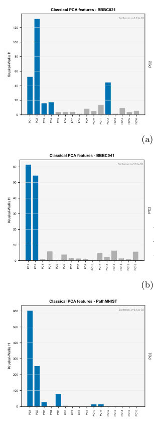
<figcaption class="paper-figure-caption"><b>Fig 5.</b> Fig. 5: Classical baseline fails to achieve meaningful class separation across all three datasets. PCA projections of the 16-dimensional classical features (mean intensity + LBP histogram per angular sector) for (a) BBBC021 (five drug classes), (b) BBBC041 (three malaria stages), and (c) PathMNIST (four tissue types). In all cases, the class distributions exhibit extensive overlap with no clear cluster boundaries. On BBBC041, the three classes collapse into a single cluster (Mahalanobis distances &lt; 1). On PathMNIST, the Background class (grey) separates from the tissue classes due to the extreme textural contrast of near-empty fields, but the pathologically relevant dis- tinctions among...</figcaption>
</figure>

**Summary.** This paper introduces Quantum Phase Bicoherence (QPBC) spectroscopy, a novel quantum-inspired technique designed to measure orientation order in complex images by probing gauge-invariant phase relationships. By encoding image sectors into an entangled qubit state and measuring three-body bicoherence, the method generates a robust descriptor that outperforms classical statistics for classifying biological textures across multiple modalities.

**Why it may be interesting.** While applied to biology, the core technique relies on simulating complex quantum interference measurements (bicoherence) to extract robust phase information that is fundamentally inaccessible classically. This methodology of mapping classical physical constraints onto quantum observables is highly relevant for developing new measurement protocols in AMO physics.

Detailed structure

**Main problem.** Classical image analysis fails to capture structurally meaningful, gauge-invariant orientation signatures encoded in Fourier phase due to local cellular rotations.

**Main result.** The proposed Quantum Phase Bicoherence (QPBC) spectroscopy successfully resolves angular-phase order and discriminates distinct biological phenotypes across multiple multi-modal datasets with high statistical significance.

**Method.** It introduces a quantum-interferometric framework that embeds image angular sectors into an entangled qubit state to probe three-body bicoherence, yielding a 16-dimensional descriptor vector.

**Model / system.** The analysis is applied to multi-modal microscopic imaging datasets (fluorescence, bright-field, histopathology) containing biological textures exhibiting directional order. The method simulates quantum interference on an abstract qubit register representing angular sectors.

**Key observables.** The 16-dimensional QPBC vector ($	ext{f}_{	ext{QPBC}}$), which measures gauge-invariant angular phase coupling via three-body bicoherence $\cos(\phi_a + \phi_c -2\phi_b)$.

**Important parameters / regimes.** Optimal probing frequency convergence to $(0, 1)$ after principal-axis alignment; the number of sectors ($n_d=8$).

**Assumptions / limitations.** The primary assumption is that quantum interference mechanisms can support invariant nonlinear phase composition where classical real-valued pipelines fail.

**Figures summary.** Figures schematically illustrate the four stages: Sectorisation $
ightarrow$ Quantum Encoding $
ightarrow$ Three-body Bicoherence Measurement $
ightarrow$ Final Vector Output, demonstrating the process flow.

**Paper structure.** The paper follows a structure detailing the scientific limitation (classical phase loss), introducing QPBC as the solution, describing the multi-stage quantum simulation methodology, validating it across three diverse datasets using rigorous statistical testing, and concluding with its utility in establishing 'quantum morphometry'.

Abstract

Classical image analysis routinely discards structurally meaningful orientation signatures encoded within Fourier phase, which are easily corrupted by local cellular rotation. Although quantum-inspired data processing offers new avenues for complex signal characterization, practical tools for directly extracting gauge-invariant angular correlations without explicit phase reconstruction remain scarce. Here we introduce Quantum Phase Bicoherence (QPBC) spectroscopy, a novel quantum-interferometric framework for capturing gauge-invariant angular order. The method embeds image angular sectors into a nine-qubit entangled state and probes three-body bicoherence via an ancilla, yielding 16 interpretable readout channels. We validate our framework on three independent public multi-modal imaging datasets covering fluorescence (BBBC021), bright-field (BBBC041) and histopathology (PathMNIST). QPBC consistently resolves angular-phase order and discriminates distinct biological phenotypes with high statistical significance. After principal-axis alignment, the optimal probing frequency universally converges, driven by Fourier directional sensitivity; negative-control experiments fully eliminate discriminative capacity, demonstrating frequency tuning acts as an on-off switch. Cross-dataset benchmarks confirm QPBC outperforms conventional Fourier-phase statistics, where inherent inversion symmetry serves as a built-in pipeline self-check. QPBC delivers a universal, classically unachievable quantitative texture observable, establishes interpretable quantum morphometry, and broadens the toolbox for quantum-inspired analysis applicable to diverse multi-modal microscopic measurements.

[↑ back to top](#top)

### [Symmetry Emergence in Self-Organized Criticality](http://arxiv.org/abs/2608.13500v1)

**Authors:** Ernesto Lupercio, Mikhail Shkolnikov  
**Type:** theory · **Category:** statistical mechanics · **PDF:** <https://arxiv.org/pdf/2608.13500v1>  
**Analysis basis:** full PDF text, analyzed in chunks
**Topic relevance:** `non-equilibrium universality` **3/5** · `driven-dissipative phase transition` **2/5** · `Keldysh / 2PI / non-Gaussian methods` **1/5** · `analog quantum simulation` **1/5** · `correlated / nonlocal dissipation` **1/5** · `scars & prethermalization` **1/5**

↔ Scroll figures horizontally

<figure class="paper-figure-card">
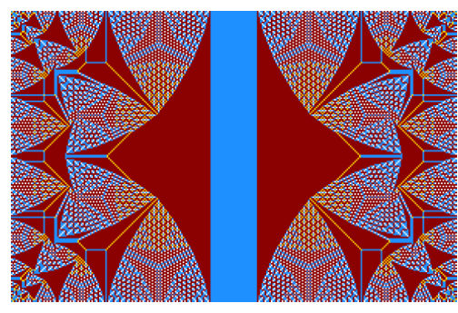
<figcaption class="paper-figure-caption"><b>Fig 1.</b> FIG. 1. Restoration of the first image of the neutral element of the sandpile group on 288x188 lattice rectangle produced by Michael Creutz [5], in the original color scheme: white, gold, dodgerblue and darkred mean 0,1,2 and 3, respectively. Reproduced by Higinio Serrano.</figcaption>
</figure>
<figure class="paper-figure-card">
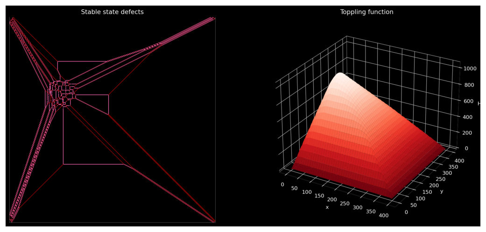
<figcaption class="paper-figure-caption"><b>Fig 2.</b> FIG. 2. A perturbation by a localized cloud. Observe that the plot on the right is near-conical over the center of the perturbation, and the corresponding set of defects on the left has almost no vertices outside the perturbation cloud.</figcaption>
</figure>

**Summary.** This work rigorously analyzes how symmetries emerge in Self-Organized Criticality models by examining different spatial and temporal scales. It establishes a profound connection between the sandpile model's relaxation process and solutions to the Monge-Ampère equation from optimal transport theory. This provides a powerful mathematical framework for understanding symmetry emergence in complex, non-equilibrium physical systems.

**Why it may be interesting.** While focused on classical SOC, the deep connection established between critical phenomena and advanced PDEs like the Monge-Ampère equation provides powerful mathematical machinery applicable to non-equilibrium quantum systems or complex many-body dynamics where symmetry breaking is key.

Detailed structure

**Main problem.** The paper investigates the emergence of affine symmetry in Self-Organized Criticality (SOC) models, particularly when analyzed across different mathematical scales.

**Main result.** The scaling limit of the toppling function is shown to be a unique concave solution to the Monge-Ampère equation, linking SOC dynamics to optimal transport theory and differential geometry.

**Method.** The analysis employs rigorous mathematical tools including scaling limits, tropical geometry, and solving non-linear partial differential equations like the Monge-Ampère equation.

**Model / system.** The system is based on a prototypical Abelian sandpile model defined on a compact convex domain in $\mathbb{R}^2$. The analysis compares micro (Abelian), meso (Tropical), and macro scales of this critical process.

**Key observables.** The toppling function (odometer) and the deviation of density from its maximal value are key observables, which converge to solutions of the Monge-Ampère equation.

**Important parameters / regimes.** The analysis focuses on the regime where the inverse square of the lattice mesh ($1/h^2$) is much larger than the number of random perturbation points.

**Assumptions / limitations.** The results rely on specific scaling limits and assumptions regarding the relative sizes of lattice discretization versus external perturbations in the maximal density regime.

**Figures summary.** Figure 1 illustrates scale invariance by showing the restoration of the neutral element of the sandpile group. Figure 2 compares defect structures resulting from localized vs. uniform perturbations.

**Paper structure.** The paper progresses by establishing a mathematical hierarchy: first analyzing microscale Abelian dynamics, then bridging to mesoscale tropical models via scaling limits, and finally characterizing the macroscale limit using solutions to the Monge-Ampère equation.

Abstract

We describe a mechanism of affine symmetry emergence in the maximal density regime of the prototypical model of self-organized criticality when the inverse square of the mesh of the underlying lattice is much larger than the number of random perturbation points distributed according to a prescribed probability measure supported in the interior of the ambient convex domain. Moreover, an appropriate scaling limit of the toppling function (aka odometer), which counts the number of operations per site, is a solution to a non-linear partial differential equation well known in the context of optimal transport and differential geometry, making it possible to accurately estimate the deviation of the density from its maximal value in any macroscopic window. The mechanism for the affine symmetry emergence is due to the novel empirical fact, supported in addition by inductive arguments that have recently being upgraded to a rigorous proof, that the scaling limit of the toppling function is the unique concave solution of the Monge-Ampère equation with Dirichlet boundary condition on the convex domain with the potential given by the probability measure used above as the infinite-perturbation profile.

[↑ back to top](#top)

### [Emergent Symmetry-Protected Topological Phases via Polyakov Confinement in Quantum Spin Systems](http://arxiv.org/abs/2608.13238v1)

**Authors:** Li-Wei He, Shun-Li Yu, Jian-Xin Li  
**Type:** theory · **Category:** strongly correlated electrons · **PDF:** <https://arxiv.org/pdf/2608.13238v1>  
**Analysis basis:** full PDF text, analyzed in chunks
**Topic relevance:** `Keldysh / 2PI / non-Gaussian methods` **3/5** · `analog quantum simulation` **3/5** · `quantum measurements` **1/5**

↔ Scroll figures horizontally

<figure class="paper-figure-card">
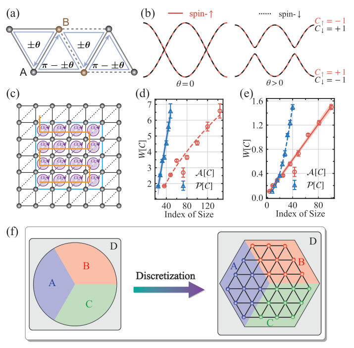
<figcaption class="paper-figure-caption"><b>Fig 1.</b> Figure 1. (a) The details of mean-field Ans¨atz, where the flux through down-pointing (up-pointing) triangles is ±θ (π ± θ). The sign “±” indicates that spinons with opposite spins couple to opposite gauge fluxes: eiθσc† i,σcj,σ on the NN bond ⟨ij⟩, with θ↑(↓) = +(−)θ/3 as the Peierls phase. This reduces to a DSL , depicted by the solid orange line in the phase diagram in Fig. 2, when the gauge flux θ = 0. A finite θ &gt; 0 opens gaps at Dirac cones, resulting in a topologically nontrivial Chern number C↑,↓= ±1. The mean-field dispersion for two spin flavors in these cases is shown in (b). (c), Schematic illustration of flux insertion by a string operator, represented by the solid orange line...</figcaption>
</figure>
<figure class="paper-figure-card">
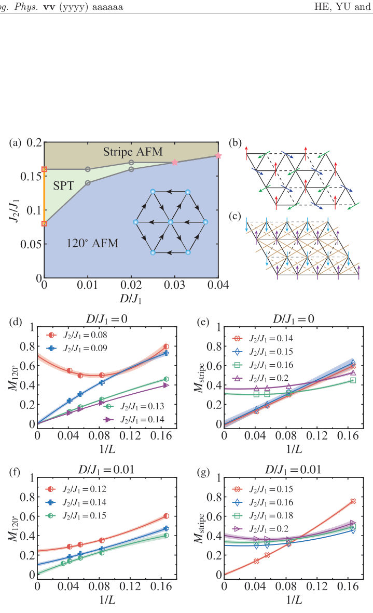
<figcaption class="paper-figure-caption"><b>Fig 2.</b> Figure 2. (a) Phase diagram of the J1-J2 antiferromagnetic model with DM interaction on a triangular lattice. The inset illustrates the pattern of the DM interaction, where the vector D indicates the spin direction along the +z-axis. (b) and (c), The mean-field Ans¨atze of the 120◦and strip antiferromagnetic orders, respectively. Different spinon hopping terms are highlighted in various colors, with dashed lines indicating terms that include an additional negative sign. The optimized variational magnetic moments M for the 120◦[(d) and (f)] and stripe [(e) and (g)] orders are shown as a function of 1/L (where the system size is L × L) for different DM and J2 spin interactions. The solid...</figcaption>
</figure>
<figure class="paper-figure-card">
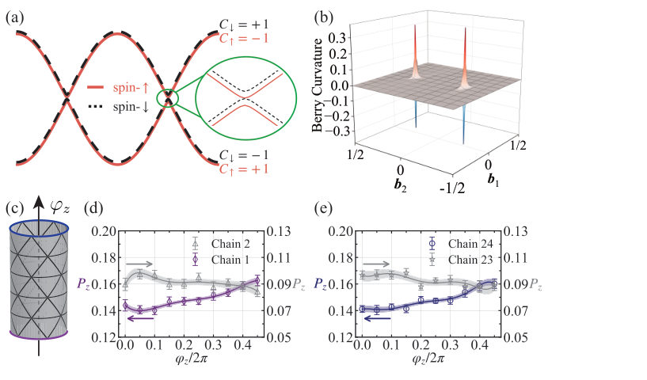
<figcaption class="paper-figure-caption"><b>Fig 3.</b> Figure 3. (a) Mean-field spinon dispersion for total magnetization Sz tot = 2. The spin-↓valence band and spin-↑ conduction band intersect at momenta ±b2/4. (b) Berry curvature distributions for the spin-↑valence band (positive Berry curvature) and conduction band (negative Berry curvature). The different sign between spin-↑and spin-↓ spinon bands are due to time-reversal symmetry. (c) Schematic of a triangular lattice with cylindrical geometry. φz represents the twist gauge flux. (d) and (e) The spin polarization Pz near the bottom (Chain 1 and Chain 2) and top (Chain 23 and Chain 24) edges as a function of φz, respectively, with total magnetization Sz tot = 2. The system size in a and b...</figcaption>
</figure>

**Summary.** This work shows that the confinement of fractionalized excitations, modeled after Polyakov's mechanism in gauge theory, can drive a Dirac Spin Liquid into a robust Symmetry-Protected Topological (SPT) phase. By analyzing lattice models and using diagnostics like Wilson loops, the authors confirm this transition while simultaneously revealing protected edge physics via spin pump measurements.

**Why it may be interesting.** It provides a concrete mechanism—gauge field dynamics—for realizing topological order in strongly correlated magnets, linking gauge theory concepts directly to observable condensed matter phenomena like spin-Hall effects.

Detailed structure

**Main problem.** The core challenge is understanding how exotic, fractionalized excitations emerging from quantum spin systems reconfine into stable Symmetry-Protected Topological (SPT) phases.

**Main result.** The authors demonstrate that Polyakov's confinement mechanism can dynamically transform a Dirac Spin Liquid into an SPT state by confining bulk spinons while preserving gapless edge modes.

**Method.** The analysis combines field theory techniques, including mean-field approximations and Hubbard-Stratonovich transformations to derive dual Lagrangians, with numerical diagnostics like Wilson loop calculations and entanglement entropy.

**Model / system.** The study uses quantum spin systems on a triangular lattice, starting from a Dirac Spin Liquid (DSL) model involving coupled spinons and an emergent U(1) gauge field. The Hamiltonian includes Heisenberg, $J_2$, and Dzyaloshinskii-Moriya interactions.

**Key observables.** Wilson loop expectation value $\langle W[C] 
angle$ (diagnosing confinement), Topological Entanglement Entropy ($\gamma$), and the spin-pump response encoding Berry curvature.

**Important parameters / regimes.** The ratio $J_2/J_1$, the DM interaction strength $D$, and the magnetic flux threading $\phi_z$.

**Assumptions / limitations.** The analysis relies on projecting the theory via a Gutzwiller operator to enforce single-occupancy constraints, leading to compact gauge fields.

**Figures summary.** Figures illustrate the mean-field Ansatz, flux insertion effects, and calculations comparing Wilson loop scaling for DSL vs. SPT states, alongside Berry curvature distributions from spin pump measurements.

**Paper structure.** The paper progresses by first establishing the theoretical framework (DSL $	o$ Chern-Simons theory), then applying confinement diagnostics (Wilson loops/TEE) to identify the transition to an SPT state, and finally probing the protected edge physics using magnetic field response (spin pump).

Abstract

A main theme in modern condensed matter physics is the emergence of fractionalized excitations and gauge structures from quantum spin systems. However, understanding how these exotic degrees of freedom reconfine into new phases of matter remains a fundamental challenge. In this work, we demonstrate that Polyakov's confinement mechanism-a foundation of compact gauge theory-can serve as a dynamical engine to transform a Dirac spin liquid into a symmetry-protected topological (SPT) state. Starting with a Dirac spin liquid with spin-dependent gauge fluxes, we show that the single-occupancy constraint inherent to the physical Hilbert space triggers monopole condensation, dynamically confining bulk spinons while preserving gapless edge modes-realizing a spinon analog of the quantum spin Hall effect. Using a large-scale variational Monte Carlo simulation on a triangular antiferromagnet with an additional Dzyaloshinskii-Moriya interaction, we provide microscopic evidence for this confined SPT phase, including a characteristic area law for the Wilson loop and vanishing topological entanglement entropy. Furthermore, we identify a measurable spin-pump response under magnetic fields, which directly encodes the Berry curvature of the parent Dirac cones. Our results reveal a previously unexplored pathway to SPT physics, bridging the fields of gauge theory, quantum magnetism, and topological matter.

[↑ back to top](#top)

### [Using Diffusion Models to Estimate Uncertainties in Analytic Continuation](http://arxiv.org/abs/2608.13123v1)

**Authors:** Sagi Meir, Daniel Freedman, Barak Hirshberg  
**Type:** theory · **Category:** statistical mechanics · **PDF:** <https://arxiv.org/pdf/2608.13123v1>  
**Analysis basis:** full PDF text, analyzed in chunks
**Topic relevance:** `Keldysh / 2PI / non-Gaussian methods` **3/5** · `methods for driven-dissipative` **3/5** · `quantum measurements` **1/5**

↔ Scroll figures horizontally

<figure class="paper-figure-card">
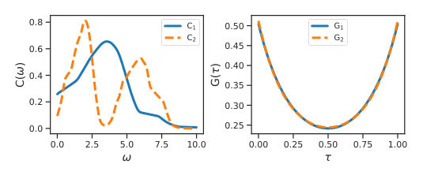
<figcaption class="paper-figure-caption"><b>Fig 1.</b> Figure 1. Demonstration of the ill-posedness of equation (1). Left panel: Two synthetic spectra, C1 (blue) and C2 (orange), with clearly distinct features. Right panel: The corresponding iTCFs, G1 and G2, which are nearly indistinguishable.</figcaption>
</figure>
<figure class="paper-figure-card">
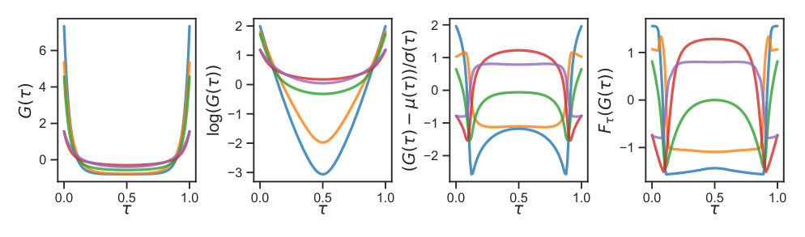
<figcaption class="paper-figure-caption"><b>Fig 2.</b> Figure 2. The four-channel representation of the iTCFs used for model conditioning. To provide a richer representation of the input signal and expose hidden structural features, the original iTCF is transformed into four complementary channels. The different colors represent a selection of sample iTCFs from the dataset. From left to right: The raw iTCF G(τ), which often compresses distinct spectral features into visually similar curves. The logarithmic transformation log(G(τ)), which enhances the visibility of low-amplitude structure, particularly near τ = 0.5. The pointwise normalized signal (G(τ) −µ(τ))/σ(τ), computed using the pointwise training-set mean and mean absolute deviation,...</figcaption>
</figure>
<figure class="paper-figure-card">
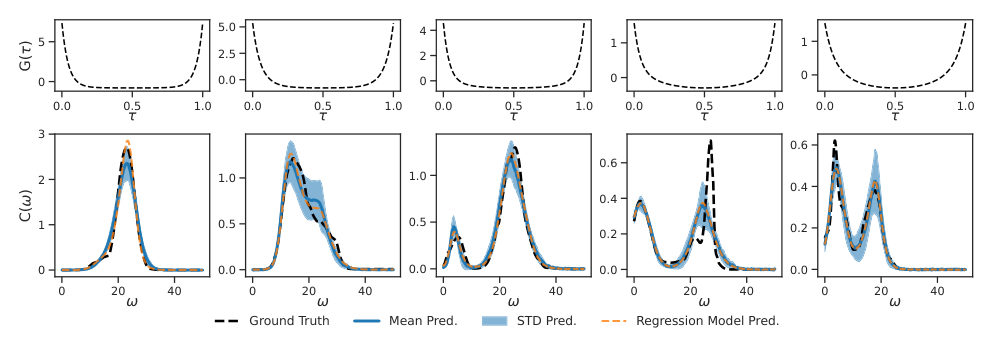
<figcaption class="paper-figure-caption"><b>Fig 3.</b> Figure 3. Comparison of analytic continuation using regression and diffusion models across representative synthetic examples. Top row: Ground-truth iTCFs obtained via equation (1) from the generated synthetic spectra. Bottom row: Ground-truth spectra (dashed black) compared against reconstructed spectral functions. The solid blue line and shaded light blue area are the mean and standard deviation of 1000 realizations of the diffusion model. The prediction of the baseline regression model is shown in dashed orange.</figcaption>
</figure>
<figure class="paper-figure-card">
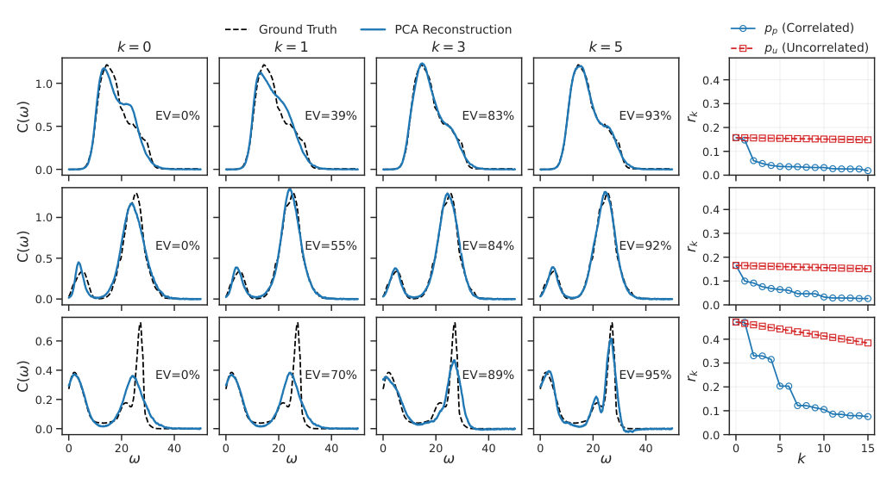
<figcaption class="paper-figure-caption"><b>Fig 4.</b> Figure 4. Step-by-step visualization of the PCA reconstruction for the correlated model (pp). The rightmost column shows the parsimony analysis for both the correlated and uncorrelated models. Rows are three representative synthetic examples; columns show the number of principal components k increasing from 0 to 5. Ground-truth spectra C(ω) (dashed black lines) are compared against the PCA reconstructions ˆCk(ω) (solid blue lines). Annotations within each panel denote the cumulative explained variance (EV). The progression confirms the rapid convergence of the correlated model, with accurate reconstructions by k = 3 to k = 5. Rightmost column: Parsimony analysis evaluating the efficiency of...</figcaption>
</figure>
<figure class="paper-figure-card">
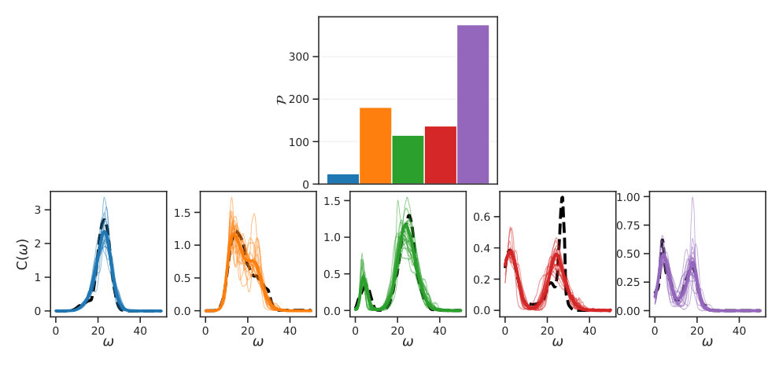
<figcaption class="paper-figure-caption"><b>Fig 5.</b> Figure 5. Quantitative analysis of inversion ambiguity for the representative synthetic examples shown in figure 3. Top: A bar chart displaying the computed UPV, P, for each case. Bottom: A visual legend linking the colors in the bar chart to their respective spectral shapes, displaying the corresponding ground-truth (dashed black) and mean reconstructed (solid thick colored lines) spectra, C(ω), and thin lines represent twenty different realizations with the diffusion model. The UPV serves as a reliable diagnostic for the intrinsic difficulty of the inversion: straightforward reconstructions (e.g., the single peak in blue) yield a low UPV, reflecting a tightly constrained solution space....</figcaption>
</figure>

**Summary.** The paper addresses the challenge of analytically continuing imaginary-time correlation functions (iTCFs) to real frequencies, an inherently ill-posed problem. By employing a diffusion model framework, the authors move beyond simple regression to learn the entire probability distribution of possible spectra consistent with the input iTCF. This allows for rigorous quantification of uncertainty and assessment of the physical ambiguity in the measurement.

**Why it may be interesting.** This work provides a powerful, theoretically grounded tool for analyzing spectral data in quantum many-body physics by moving beyond single-point estimates to quantify inherent physical uncertainties arising from ill-posed inverse problems.

Detailed structure

**Main problem.** The core problem is the ill-posed analytic continuation of imaginary-time correlation functions (iTCFs) to estimate real-frequency power spectra.

**Main result.** The authors introduce a diffusion-based generative framework that models the full probability distribution of plausible spectra, allowing for direct quantification of uncertainty and assessment of inversion hardness via an 'uncertainty pseudo-volume.'

**Method.** They adapt conditional diffusion models (like DiT) to learn $P(C(\omega)|G(	au))$, treating the continuation as a generative sampling task rather than a single regression point estimate.

**Model / system.** The methodology is applied to iTCFs derived from path-integral molecular dynamics simulations, exemplified by liquid parahydrogen. The underlying physics involves relating imaginary-time correlation functions $G(	au)$ to the real-frequency power spectrum $C(\omega)$.

**Key observables.** Self-diffusion coefficient (with error bar), reconstructed power spectra $C(\omega)$, and the uncertainty pseudo-volume.

**Important parameters / regimes.** Imaginary time $	au \in [0, eta\hbar]$, diffusion time steps ($N=40$), and the conditioning input channels (raw iTCF, log(iTCF), normalized signal, histogram equalization).

**Assumptions / limitations.** The primary assumption is that the true solution space of compatible spectra can be accurately modeled by a continuous probability distribution learned via diffusion processes.

**Figures summary.** Figure 1 illustrates the non-uniqueness of the inverse Laplace transform using synthetic data. Figure S1 shows Principal Components (PCs) derived from an ensemble, quantifying the variance explained by successive components.

**Paper structure.** The paper first establishes the ill-posed nature of iTCF continuation. It critiques existing NN regression methods for ignoring solution uncertainty. The core contribution is presenting and detailing the diffusion model framework, including its conditional training objective, advanced sampling techniques (DPM-Solver++), and multi-channel input representation.

Abstract

Inverse problems are ubiquitous in physics, chemistry, and engineering, arising when reconstructing hidden quantities from indirect measurements. A key example is the analytic continuation of imaginary-time correlation functions (iTCFs) to the real-frequency domain. This process requires an inverse Laplace transform, which is inherently ill-posed and highly sensitive to small input variations. Recent neural network (NN)-based methods have shown promising results by learning mappings from imaginary-time to real-frequency spectra, often outperforming traditional techniques such as maximum entropy. However, because the problem is ill-posed, many spectra fit the same iTCF. Regression-based approaches output a single solution, which approximates an average over the true solution space, and therefore fail to capture the full distribution of plausible power spectra. To address this issue, we introduce a diffusion-based framework for analytic continuation that learns the distribution of spectra consistent with a given iTCF. It offers two key advantages. First, it quantifies uncertainty directly from the learned distribution. Second, by analyzing the spread and structure of this distribution, we can quantitatively assess the intrinsic hardness of each inversion problem. We measure this hardness with a new metric, the uncertainty pseudo-volume. Applying the framework to an iTCF from a path-integral molecular dynamics simulation of liquid parahydrogen, we obtain the self-diffusion coefficient with an error bar and flag a secondary high-frequency peak as a possible spurious artifact. In contrast to previous attempts at uncertainty quantification, our generative approach rests on a concrete probabilistic basis, providing a more theoretically grounded measure of confidence in the reconstructed power spectra.

[↑ back to top](#top)

### [Geometry versus excitation sector in the decoherence of asymmetric $N$-qubit $W$ states](http://arxiv.org/abs/2608.12965v1)

**Authors:** Sougata Bhattacharyya, Sovik Roy, Fatih Ozaydin  
**Type:** theory · **Category:** quantum information and computing · **PDF:** <https://arxiv.org/pdf/2608.12965v1>  
**Analysis basis:** full PDF text, analyzed in chunks
**Topic relevance:** `correlated / nonlocal dissipation` **3/5** · `driven-dissipative phase transition` **1/5** · `methods for driven-dissipative` **1/5** · `non-equilibrium universality` **1/5**

↔ Scroll figures horizontally

<figure class="paper-figure-card">
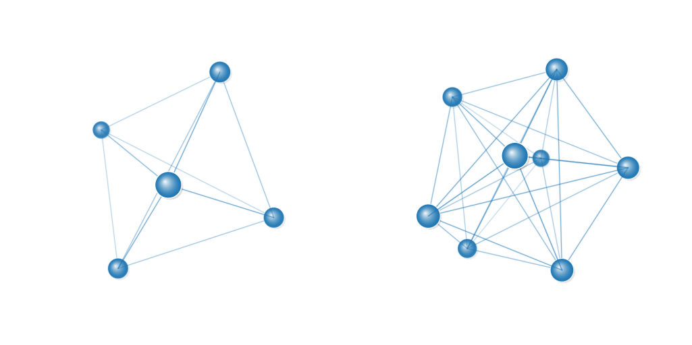
<figcaption class="paper-figure-caption"><b>Fig 1.</b> Figure 1. Equilateral entanglement-network geometry of symmetric |W⟩states for N = 5 (left) and N = 8 (right). Every pair carries concurrence 2/N, illustrating that all qubits play structurally identical roles with no distinguished node.</figcaption>
</figure>
<figure class="paper-figure-card">
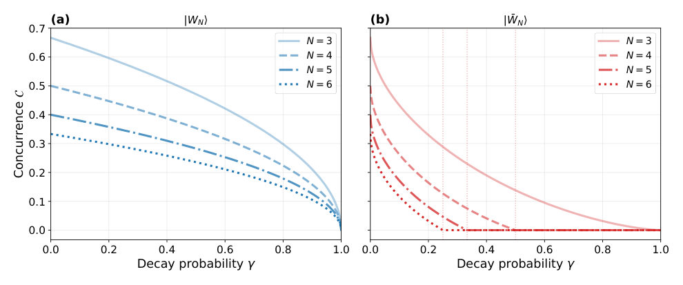
<figcaption class="paper-figure-caption"><b>Fig 2.</b> Figure 2. AD concurrence. Left: |WN⟩decays without ESD. Right: W N undergoes ESD at γ∗= 1/(N −2) for N ≥4; at N = 3, concurrence vanishes only at the boundary γ = 1, so no ESD occurs.</figcaption>
</figure>
<figure class="paper-figure-card">
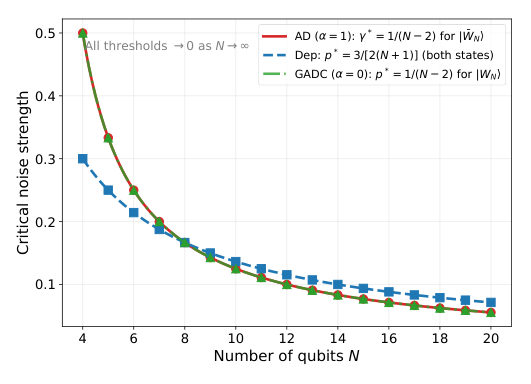
<figcaption class="paper-figure-caption"><b>Fig 3.</b> Figure 3. ESD thresholds for the symmetric family under AD and DP. The AD threshold is γ∗= 1/(N −2) for N ≥4, while the DP threshold is p∗= 3/[2(N +1)]; both vanish as N →∞.</figcaption>
</figure>
<figure class="paper-figure-card">
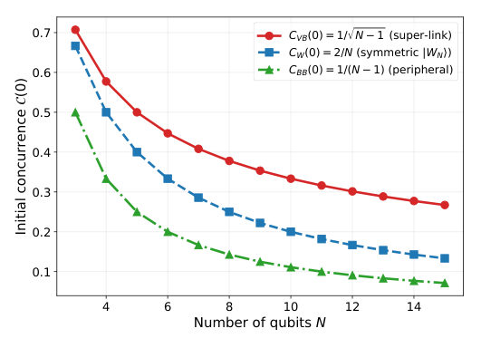
<figcaption class="paper-figure-caption"><b>Fig 4.</b> Figure 4. Initial pairwise concurrence versus N for the VB and BB pair classes and the symmetric reference. The hierarchy CV B &gt; CW &gt; CBB holds for all N ≥3.</figcaption>
</figure>
<figure class="paper-figure-card">
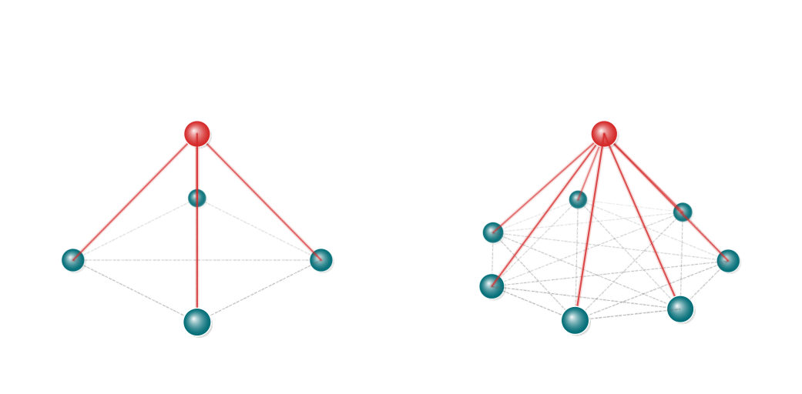
<figcaption class="paper-figure-caption"><b>Fig 5.</b> Figure 5. Entanglement-network geometry of the generalized asymmetric W L N state for N = 5 (left) and N = 8 (right). The distinguished vertex qubit is connected to each base qubit by a higher-concurrence VB link (CV B = 1/ √</figcaption>
</figure>

**Summary.** This paper analyzes the decoherence of asymmetric N-qubit W states by separating the effects of network geometry from the excitation sector. Using closed-form concurrence dynamics under various noise models, the authors show that different pair classes exhibit distinct vulnerabilities to noise. The work establishes that entanglement robustness is governed by three independent factors: geometry, excitation sector, and noise symmetry.

**Why it may be interesting.** It provides a rigorous theoretical framework to decouple structural properties (geometry vs. excitation) governing entanglement decay in complex quantum networks, which is crucial for designing robust quantum communication protocols.

Detailed structure

**Main problem.** The study investigates how network geometry and excitation sector independently govern the decay of pairwise entanglement within asymmetric N-qubit W states.

**Main result.** The analysis distinguishes between structural fragility (seen in Base-Base pairs) and cross-sector effects, establishing that geometry, sector, and noise symmetry are distinct controls on entanglement robustness.

**Method.** The authors derived closed-form concurrence dynamics for generalized asymmetric W states under various one-sided local quantum noise models.

**Model / system.** The system involves asymmetric multipartite N-qubit W states ($\langle W_L 
angle_N$), which are compared against symmetric references ($|W_N
angle$). The analysis uses an N-qubit generalization of the Lohmayer geometry.

**Key observables.** Pairwise entanglement decay, measured by concurrence; comparison between Vertex-Base (VB) and Base-Base (BB) pair classes.

**Important parameters / regimes.** Noise types include Phase Damping (PD), Amplitude Damping (AD), Depolarization (DP), and Generalized Amplitude Damping (GAD). The system size N is a key parameter.

**Assumptions / limitations.** The analysis relies on a one-sided local-noise convention, where the noise channel acts only on one qubit in any bipartite subsystem.

**Figures summary.** Figures compare AD concurrence decay for symmetric vs. asymmetric states and illustrate how ESD thresholds depend on N under different noise models.

**Paper structure.** The paper systematically compares decoherence dynamics of symmetric versus asymmetric W states by separating network geometry from the excitation sector, deriving closed-form concurrences for various pair classes.

Abstract

We investigate how network geometry and excitation sector separately control pairwise entanglement decay in asymmetric multipartite $W$ states. To disentangle these effects, we introduce an analytically tractable $N$-qubit generalization of the asymmetric Lohmayer geometry and its complementary-excitation partner, yielding inequivalent vertex-base (VB) and base-base (BB) pair classes that can be compared directly with symmetric $W$-state references. We derive closed-form concurrence dynamics under representative one-sided noise models and find that, within either excitation sector, the VB concurrence has exactly the same noise dependence as the corresponding symmetric reference, preserving a noise-independent proportional advantage wherever both remain entangled. The amplitude-damping reordering previously identified for the three-qubit Lohmayer state is therefore a cross-sector effect rather than an intrinsic fragility of the VB geometry. In contrast, the BB pair exhibits a genuine same-sector structural fragility, with lower entanglement-sudden-death thresholds than the VB pair under depolarizing noise and, in the $(N-1)$-excitation sector, under amplitude damping. The results establish network geometry, excitation sector, and noise symmetry as distinct ingredients governing pairwise entanglement robustness in asymmetric quantum networks.

[↑ back to top](#top)

### [Fermionic Anomalies of Finite Symmetries on Lattices](http://arxiv.org/abs/2608.12455v1)

**Authors:** Ameya Chavda, Ryohei Kobayashi  
**Type:** theory · **Category:** strongly correlated electrons · **PDF:** <https://arxiv.org/pdf/2608.12455v1>  
**Analysis basis:** full PDF text, analyzed in chunks
**Topic relevance:** `analog quantum simulation` **3/5** · `correlated / nonlocal dissipation` **1/5** · `quantum measurements` **1/5**

↔ Scroll figures horizontally

<figure class="paper-figure-card">
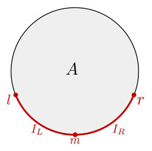
<figcaption class="paper-figure-caption"><b>Fig 1.</b> Figure 1: A disk region A and an interval I (thick red line), separated into IL = [l, m] and IR = [m, r].</figcaption>
</figure>
<figure class="paper-figure-card">
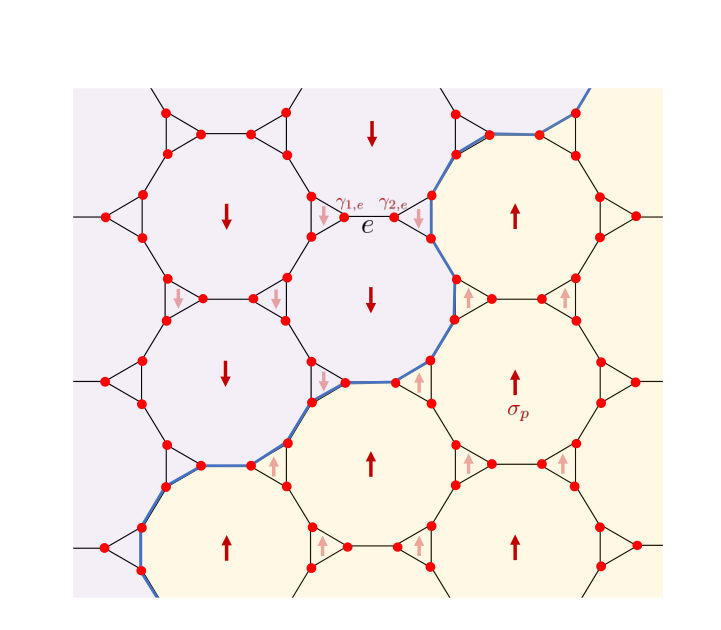
<figcaption class="paper-figure-caption"><b>Fig 2.</b> Figure 2: The lattice Γ. Its edges will be endowed with Kasteleyn orientation. Each vertex of Γ has a Majorana fermion (red dot), and each honeycomb lattice plaquette p has a qubit σp. We also place a fictitious qubit on each triangle plaquette, whose state is fixed by the majority rule of three qubits surrounding the triangle. The Z2 domain wall forms a closed loop (thick blue line).</figcaption>
</figure>

**Summary.** This work develops a rigorous framework to characterize fermionic 't Hooft anomalies on quantum lattices using anomaly indices derived from the obstruction to symmetric Short-Range-Entangled states. The key finding is that lattice constraints are often stricter than continuum predictions, revealing systematic mismatches between microscopic lattice symmetries and their macroscopic QFT counterparts.

**Why it may be interesting.** The mismatch found between lattice and continuum anomalies provides crucial theoretical constraints for designing physical models that realize specific topological phases or symmetries, which is vital for understanding emergent phenomena in strongly correlated electron systems.

Detailed structure

**Main problem.** The paper develops a lattice characterization of fermionic 't Hooft anomalies associated with finite internal symmetries in (1+1)D and (2+1)D.

**Main result.** It establishes that exact lattice symmetries do not always realize the full continuum anomaly structure, demonstrating mismatches between lattice obstructions (like forbidding symmetric SRE states) and continuum predictions.

**Method.** The analysis uses group cohomology to define hierarchy of fermionic anomaly indices ($(n_2, 
u_3)$ or $(n_2, n_3, 
u_4)$) derived from the obstruction to finding a symmetric Short-Range-Entangled (SRE) state on lattice tensor product Hilbert spaces.

**Model / system.** The system consists of lattice models formed by the tensor product of onsite fermionic and bosonic Hilbert spaces. The symmetry is described by a finite group $G_f$ via a central extension $\mathbb{Z}_2 	o G_f 	o G_b$.

**Key observables.** Anomaly indices ($(n_2, 
u_3)$ in 1D; $(n_2, n_3, 
u_4)$ in 2D), and the existence/obstruction of symmetric SRE states.

**Important parameters / regimes.** The dimensionality (1+1)D or (2+1)D, and the structure of the bosonic group $G_b$.

**Assumptions / limitations.** The analysis relies on characterizing symmetries via obstructions to SRE states and comparing these lattice invariants with continuum QFT anomaly classifications.

**Paper structure.** The paper proceeds by developing the index machinery for (1+1)D, showing how trivial indices imply onsiteability. It then extends this to (2+1)D, identifying multiple anomaly layers and culminating in explicit constructions demonstrating mismatches between lattice and continuum anomalies.

Abstract

We develop a lattice characterization of fermionic 't Hooft anomalies of finite internal symmetries in (1+1)D and (2+1)D, formulated in terms of obstructions to symmetric short-range-entangled (SRE) states. We consider lattice systems formed by tensor product of onsite fermionic and bosonic Hilbert spaces, and finite internal symmetry given by a central extension $\mathbb Z_2^F\to G_f\to G_b$. We extract a hierarchy of fermionic anomaly indices for a given symmetry operator. In (1+1)D, an exact lattice symmetry is characterized by a pair of cohomological data $(n_2,ν_3)$. For $G_f=G_b\times\mathbb Z_2^F$, we show that a symmetry with trivial anomaly indices $(n_2,ν_3)$ is onsiteable and hence admits a symmetric SRE state, establishing that these indices faithfully detect the lattice anomaly. Comparing with continuum QFT, we find that exact lattice symmetries do not realize the additional $H^1(BG_b,\mathbb Z_2)$ anomaly layer in continuum QFT. In particular, for $G_b=\mathbb Z_2$, exact lattice symmetries realize only the even $\mathbb Z_4$ subgroup of the continuum $\mathbb Z_8$ classification. In (2+1)D, we identify three successive anomaly layers of cohomological data $(n_2,n_3,ν_4)$. We show that a nontrivial value of any layer obstructs symmetric SRE. For $G_f=G_b\times\mathbb Z_2^F$, it also forbids a symmetric invertible state. When the bosonic group $G_b$ is non-trivially extended by fermion parity, the lattice obstruction to SRE states does not generally coincide with the continuum 't Hooft anomaly. We explicitly construct a $\mathbb Z_4^F$ lattice symmetry in (2+1)D with nontrivial lattice anomaly index that forbids symmetric SRE states, even though its continuum anomaly is trivial. Our results highlight a mismatch between lattice and continuum anomalies and motivate a systematic study of which continuum anomalies admit exact microscopic lattice realizations.

[↑ back to top](#top)

### [Homomorphic Aggregation of Continuous-Variable GKP States](http://arxiv.org/abs/2608.13227v1)

**Authors:** Nilesh Vyas  
**Type:** theory · **Category:** quantum information and computing · **PDF:** <https://arxiv.org/pdf/2608.13227v1>  
**Analysis basis:** full PDF text, analyzed in chunks
**Topic relevance:** `quantum measurements` **3/5** · `methods for driven-dissipative` **1/5** · `quantum optics experiment` **1/5**

↔ Scroll figures horizontally

<figure class="paper-figure-card">
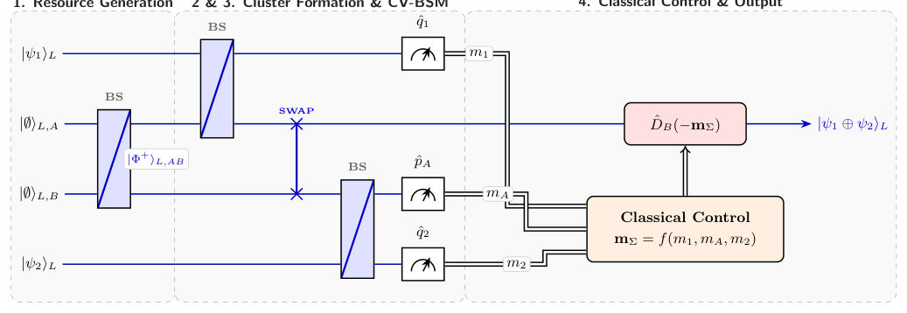
<figcaption class="paper-figure-caption"><b>Fig 1.</b> FIG. 1. Continuous-variable measurement-based quantum state aggregation protocol for n = 2 logical inputs. Stage 1 generates a Gottesman-Kitaev-Preskill (GKP) Bell pair |Φ+⟩L,AB from continuous-variable vacuum qunaught states |∅⟩L,A and |∅⟩L,B. In Stages 2 and 3, Data Mode 1 (|ψ1⟩L) and Data Mode 2 (|ψ2⟩L) couple to Ancilla Mode A via sequential beam splitters (BS) and a physical waveguide SWAP gate (×—×), followed by dual homodyne detection of quadratures ˆq1, ˆpA, and ˆq2. Stage 4 processes the extracted classical eigenvalues m1, mA, and m2 within a classical control unit to evaluate the net displacement vector mΣ = f(m1, mA, m2), executing the active feed-forward displacement ˆDB(−mΣ) on...</figcaption>
</figure>
<figure class="paper-figure-card">
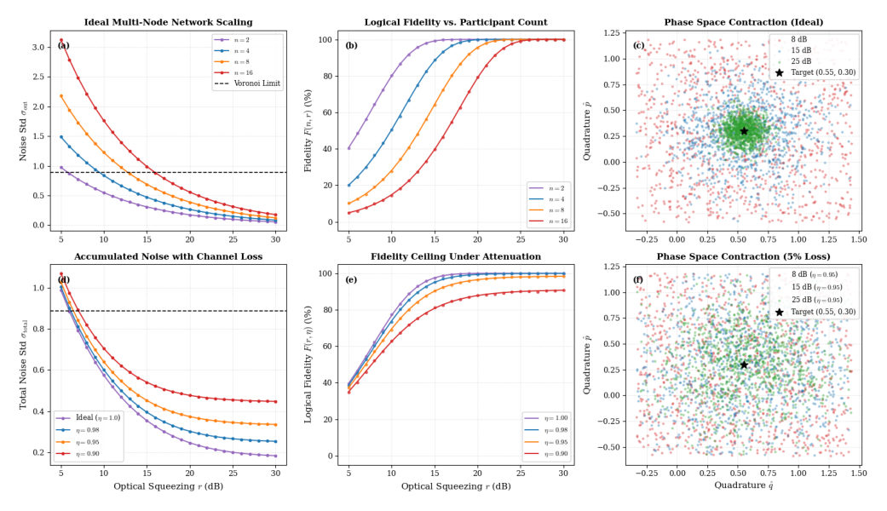
<figcaption class="paper-figure-caption"><b>Fig 2.</b> FIG. 2. Performance scaling and hardware loss degradation of measurement-based continuous-variable GKP state aggregation. Top Row (Ideal Channel Scaling, η = 1.0): (a) Accumulated network noise standard deviation σout = p</figcaption>
</figure>

**Summary.** This paper presents an active, measurement-based protocol for homomorphically aggregating logical information encoded in CV GKP states. It proves that passive optical methods fail due to lattice compression and introduces a solution using homodyne measurements and feed-forward control. The result is crucial for scalable distributed quantum computing networks.

**Why it may be interesting.** This work provides a concrete theoretical blueprint for scaling quantum computation beyond simple linear chains by addressing topological aggregation challenges inherent to continuous-variable encoding schemes.

Detailed structure

**Main problem.** The core challenge is developing a method for homomorphically aggregating logical quantum information encoded in continuous-variable (CV) Gottesman-Kitaev-Preskill (GKP) states across multiple distributed nodes.

**Main result.** An active, measurement-based framework utilizing GKP Bell states and homodyne feed-forward successfully computes the logical sum while preserving code space geometry up to correctable deformations.

**Method.** The authors propose a Completely Positive Trace-Preserving (CPTP) map that bypasses the limitations of passive linear optics by incorporating active syndrome extraction and classical feed-forward displacement.

**Model / system.** The system uses CV GKP states, which encode discrete logical information into an infinite-dimensional Hilbert space via a phase-space lattice. The process is analyzed within a measurement-based quantum computing (MBQC) framework.

**Key observables.** Logical fidelity ($F$), total variation distance ($	ext{TV}$), output position quadrature ($\hat{q}_{	ext{out}}$), and the intrinsic state noise variance ($\sigma_{	ext{out}}^2$).

**Important parameters / regimes.** Squeezing level ($r$), critical Voronoi cell boundary threshold ($q_{	ext{thresh}} = \sqrt{\pi}/2$), and channel attenuation ($\eta$).

**Assumptions / limitations.** The protocol assumes the ability to perform intermediate syndrome extraction at network vertices to reset physical noise accumulation, and it operates within a finite-energy GKP subspace.

**Figures summary.** Figures illustrate performance scaling under various conditions: (a) linear cascade vs. logarithmic tree topology for variance ($\sigma_{	ext{out}}$); (b) logical fidelity convergence; and (c)-(f) the impact of physical channel attenuation ($\eta < 1$) on achievable fidelity.

**Paper structure.** The paper first establishes the failure modes of passive optics due to lattice compression. It then introduces the active, measurement-based protocol using GKP Bell states and homodyne measurements. Finally, it derives analytical bounds on fidelity and security, showing that logarithmic tree routing is necessary for scalability.

Abstract

Aggregating logical quantum information encoded in continuous-variable phase space is essential for distributed quantum computing. However, passive linear optics fail for non-Gaussian Gottesman-Kitaev-Preskill (GKP) codes due to symplectic lattice compression and entanglement-induced decoherence. We present an active, measurement-based framework for the homomorphic aggregation of multi-node GKP states. Utilizing GKP Bell states and homodyne feed-forward, we construct a completely positive trace-preserving map that computes the logical sum of distributed states while preserving the logical code space geometry up to correctable finite-squeezing deformations. We prove this protocol operates as an approximate quantum non-demolition measurement, bound its cryptographic leakage for continuous one-time pads, and derive analytical logical fidelity limits under finite-squeezing constraints.

[↑ back to top](#top)

### [Superconductivity in the $t$-$t'$ Hubbard Model from Symmetry-Preserving Neural-Network Quantum States](http://arxiv.org/abs/2608.12465v1)

**Authors:** Riccardo Rende, Luciano Loris Viteritti, Antoine Georges  
**Type:** theory · **Category:** strongly correlated electrons · **PDF:** <https://arxiv.org/pdf/2608.12465v1>  
**Analysis basis:** full PDF text, analyzed in chunks
**Topic relevance:** `analog quantum simulation` **3/5** · `methods for driven-dissipative` **1/5** · `quantum measurements` **1/5**

↔ Scroll figures horizontally

<figure class="paper-figure-card">
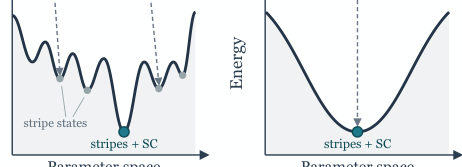
<figcaption class="paper-figure-caption"><b>Fig 1.</b> FIG. 1. Pictorial representation of the variational energy landscape in the relevant basin of attraction, as a function of the wave-function parameters (see main text). Panel (a): With an ansatz that breaks the symmetries of the Hamil- tonian the landscape is rugged: the optimization is easily trapped in local minima corresponding to broken-symmetry, pure stripe states (gray dots), and tends to miss the lower- lying minimum in which stripe and superconducting order can coexist (teal). Panel (b): The proposed symmetry- preserving ansatz reshapes the landscape into an effectively “convex” one, with a single minimum to which the optimiza- tion converges reliably.</figcaption>
</figure>
<figure class="paper-figure-card">
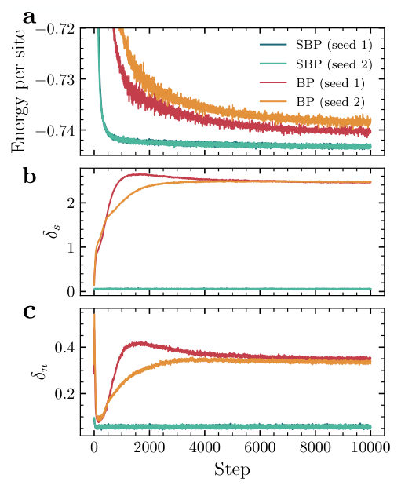
<figcaption class="paper-figure-caption"><b>Fig 2.</b> FIG. 2. Optimization of the SBP wave function [see Eq. (2)] and of the BP wave function [see Eq. (5)] for two different random seeds, for the t-t′ Hubbard model [see Eq. (1)] on a 12 × 12 lattice at t′ = −0.2, U = 8.0, and doping δ = 1/8. Panel (a): Variational energy per site as a function of the optimization step. Panel (b) and (c): Spin and charge symmetry breaking parameters δs and δn [see Eq. (6)] as a function of the optimization steps.</figcaption>
</figure>
<figure class="paper-figure-card">
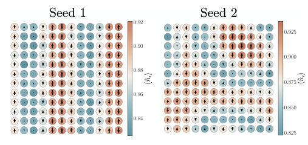
<figcaption class="paper-figure-caption"><b>Fig 3.</b> FIG. 3. Local charge density ⟨ˆni⟩and spin ⟨ˆSz i ⟩on each site of the 12×12 lattice, for the two BP solutions obtained from the two random seeds of Fig. 2. The color of each site encodes the charge density ⟨ˆni⟩, as indicated by the colorbar, while the arrows show the local spin ⟨ˆSz i ⟩.</figcaption>
</figure>
<figure class="paper-figure-card">
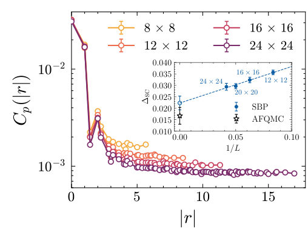
<figcaption class="paper-figure-caption"><b>Fig 4.</b> FIG. 4. d-wave pairing correlation function Cp(|r|) [see Eq. (7)] for the t-t′ Hubbard model with periodic boundary conditions, at t′ = −0.2, U = 8.0, and doping δ = 1/8, as a function of the distance |r|. Inset: d-wave order parameter ∆SC [see Eq. (8)] as a function of the inverse linear size 1/L, together with the AFQMC results of Ref. [6].</figcaption>
</figure>
<figure class="paper-figure-card">
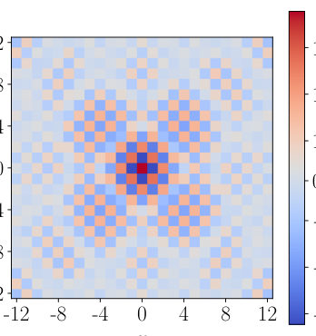
<figcaption class="paper-figure-caption"><b>Fig 5.</b> FIG. 5. Real space spin-spin correlation function Cs(r) (see definition in the main text), with r = (x, y) the relative positions, on the 24 × 24 lattice for the t-t′ Hubbard model with periodic boundary conditions, at t′ = −0.2, U = 8.0, doping δ = 1/8.</figcaption>
</figure>

**Summary.** This work tackles the long-standing mystery of superconductivity in the 2D doped Hubbard model by introducing a novel Symmetry-Preserving Neural-Network Quantum State (SBP) ansatz. By mathematically enforcing translational symmetry, the method bypasses variational biases that favor incorrect broken-symmetry states. The results strongly suggest d-wave superconductivity exists for key parameters, providing significant theoretical progress.

**Why it may be interesting.** The development of symmetry-preserving NQS is a powerful general technique applicable across many strongly correlated systems where ground state degeneracy or symmetry breaking is a major theoretical hurdle. This methodology could be adapted to study exotic phases in AMO platforms simulating Hubbard physics.

Detailed structure

**Main problem.** Determining the true nature of the ground state, particularly superconducting order, in the highly debated two-dimensional doped Hubbard model.

**Main result.** The authors provide robust evidence for d-wave superconductivity in the 1/8-doped model by using a symmetry-preserving ansatz that avoids artificial biases found in previous variational methods.

**Method.** They employ Neural-Network Quantum States (NQS) via a novel Symmetry-Preserving Backflow Pairing (SBP) ansatz, which is designed to enforce translational symmetry during optimization.

**Model / system.** The study focuses on the two-dimensional doped Hubbard model, governed by an extended Hamiltonian involving hopping ($t, t'$) and onsite repulsion ($U$). The system is simulated at finite doping ($\delta=1/8$) relevant to cuprate superconductors.

**Key observables.** Superconducting order parameter ($\Delta_{SC}$), pairing correlation function $C(r)$, and measures of spatial modulation ($\delta_n, \delta_s$).

**Important parameters / regimes.** $t'/t=-0.2$, $U/t=8.0$, doping $\delta = 1/8$. Lattice sizes up to $24	imes24$.

**Assumptions / limitations.** The primary assumption is that enforcing symmetries directly into the wave function ansatz (SBP) resolves ambiguities caused by variational parameterization biases leading to broken-symmetry minima.

**Figures summary.** Figures compare energy optimization and symmetry breaking parameters between SBP and standard Backflow Pairing (BP) ansätze, showing SBP's superior convergence toward a symmetric ground state. Other figures illustrate local charge/spin modulations for the BP ansatz.

**Paper structure.** The paper first establishes the physical problem and limitations of existing variational methods. It then introduces the SBP ansatz, details its mathematical formulation using neural networks (Transformer architecture), presents results comparing SBP to competing ansätze, and finally quantifies the evidence for d-wave superconductivity via correlation functions.

Abstract

Despite its fundamental importance in the theory of strongly correlated electrons, the nature of the ground state of the two-dimensional doped Hubbard model remains intensely debated. Variational approaches provide a powerful route to this problem, but their conclusions can depend sensitively on the chosen wave-function parameterization, the mean-field initialization, or the pinning fields used to guide the optimization, as well as on boundary conditions. This can favor one type of symmetry breaking over another, making it difficult to distinguish the genuine interplay of intertwined or competing orders from biases induced by the variational parameterization. Here, we introduce the Symmetry-Preserving Backflow Pairing (SBP) ansatz, a neural-network wave function that respects translational symmetry by construction and thereby avoids these broken-symmetry minima. The SBP ansatz reaches state-of-the-art variational energies for the $t$-$t'$ Hubbard model on lattices up to $24\times24$ with $504$ electrons, below those of competing pure stripe solutions. By extrapolating to the thermodynamic limit, we find robust evidence for $d$-wave superconducting order, resolving a long-standing question about the $1/8$-doped model at $t'/t=-0.2$ and $U/t=8.0$. Built on general principles of symmetry and locality, the SBP wave function provides a broadly applicable variational representation for challenging interacting fermionic systems.

[↑ back to top](#top)

### [The "Moiré Capacitor Effect" and Stabilization of Fractional Chern Insulators in Rhombohedral Graphene Superlattices](http://arxiv.org/abs/2608.12452v1)

**Authors:** Nicolas Regnault, Heqiu Li, Yves H. Kwan, B. Andrei Bernevig, Jonah Herzog-Arbeitman  
**Type:** theory · **Category:** strongly correlated electrons · **PDF:** <https://arxiv.org/pdf/2608.12452v1>  
**Analysis basis:** full PDF text, analyzed in chunks
**Topic relevance:** `analog quantum simulation` **3/5** · `Frenkel-Kontorova` **1/5** · `Keldysh / 2PI / non-Gaussian methods` **1/5**

↔ Scroll figures horizontally

<figure class="paper-figure-card">
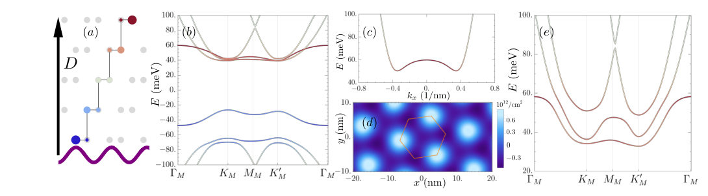
<figcaption class="paper-figure-caption"><b>Fig 1.</b> FIG. 1. (a) Structure of R5G, including two sublattice-polarized surface states. (b) Non-interacting moir´e band structure at V = 30meV and θ = 0.77◦, showing strong (weak) moir´e Umklapp in the valence (conduction) bands. States are colored by layer polarization according to panel (a). The conduction bands are essentially folded from pristine R5G (c), while the valence bands exhibit moir´e-modulated density (d). The filled valence bands generate Hartree terms (the moir´e capacitor effect) which imprint on the conduction bands (e), causing moir´e Umklapp.</figcaption>
</figure>
<figure class="paper-figure-card">
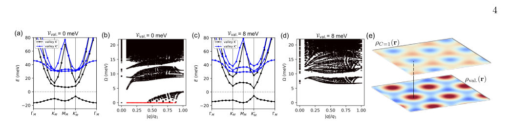
<figcaption class="paper-figure-caption"><b>Fig 2.</b> FIG. 2. (a) HF band structure for the ν = 1, C = 1 state in θ = 0.77◦R5G/hBN with Vval. = 0 meV on a 18 × 18 system. Only bands in the polarized spin-↑sector are shown. Dotted line indicates Fermi level. (b) TDHF spectrum as a function of momentum |q|/q1. Results for multiple system sizes Nx × Ny with Nx = Ny = 8, 9, . . . , 20 are overlaid. Red dots indicate momenta with complex/negative TDHF eigenvalues, indicating a local instability. (c, d) Same as (a, b) except with Vval. = 8 meV. (e) Top/bottom shows charge density variation of the occupied HF band/valence background with Vval. = 8 meV. We use parameters V = 22 meV, Vtb = 32 meV, ψval. = ( 4π</figcaption>
</figure>
<figure class="paper-figure-card">
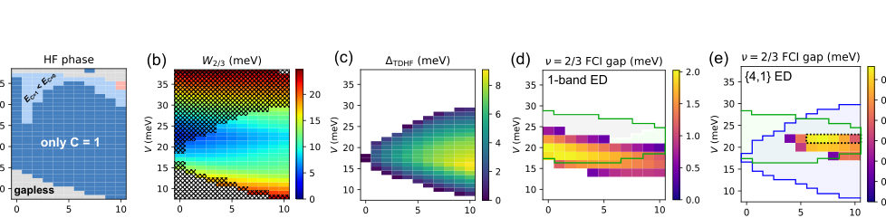
<figcaption class="paper-figure-caption"><b>Fig 3.</b> FIG. 3. (a) HF phase diagram for θ = 0.77◦R5G/hBN at ν = 1. The dark blue region labeled ‘only C = 1’ indicates where the HF ground state has C = 1, and no C = 0 state is obtained even as a metastable solution. The light blue region labeled ‘EC=1 &lt; EC=0’ indicates where the HF ground state has C = 1, but metastable C = 0 solutions are also obtained. The small pink region at Vval. = 10 meV indicates where the HF ground state has C = 0, but metastable C = 1 solutions are also obtained. The grey region labeled ‘gapless’ denotes where the HF ground state does not have a positive indirect gap. System size is 12×12 and 3 conduction bands are kept. (b) Effective bandwidth W2/3 (see text for...</figcaption>
</figure>
<figure class="paper-figure-card">
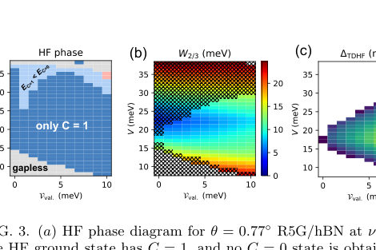
<figcaption class="paper-figure-caption"><b>Fig 4.</b> Fig. 4(c) plots the FCI gap for Hilbert spaces up to 1 × 109. For n3 = 1, . . . , 5, both 14,2 and 14,5 orbital truncations show convergence in n2 by n2 = 6. The 14,2 and 17,2 truncations show identical trends in ∆FCI for ac- cessible n2. Finally, the 17,5 calculation exhibits nearly identical gaps for n3 = 1, 2, and behaves similarly to the 14,5 calculation. Our results suggest that ∆FCI converges to a finite &gt; 0.1meV gap (corresponding to a temperature</figcaption>
</figure>
<figure class="paper-figure-card">
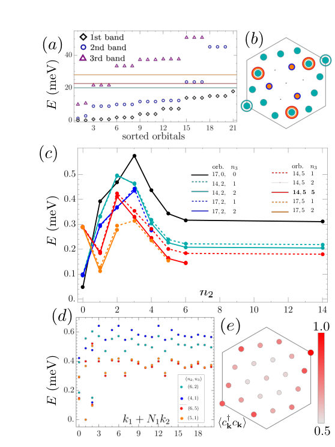
<figcaption class="paper-figure-caption"><b>Fig 5.</b> FIG. 4. Multi-band convergence of the ν = 2/3 FCI on 21 sites (using the parameters of Fig. 2(c,d)). (a) Single-particle levels of ¯Hcon sorted by energy. Orbitals are truncated based on the energy cutoff. (b) The 14,2 truncation is shown in cyan with solid (open) circles denoting orbitals in the second (third) band. The 17,2/14,5/17,5 truncation includes the ad- ditional blue/red/orange orbitals. (c) FCI gap as a function of band mixing. (d) ED spectra (colored as in (b)) show that the FCI ground states rapidly converge and the gap to the continuum is stabilized at large truncations. (e) Momentum- resolved density ⟨c† kck⟩in the C = 1 HF band exhibits in- creased weight near the mBZ edge,...</figcaption>
</figure>

**Summary.** This paper develops a theory showing that an electrostatic 'moiré capacitor effect' stabilizes Fractional Chern Insulators (FCIs) in graphene superlattices. Using advanced numerical methods like ED, the authors confirm FCI existence at $
u=2/3$ while demonstrating that this moiré potential is essential to suppress competing Charge Density Wave phases.

**Why it may be interesting.** The work provides a detailed theoretical mechanism (the moiré capacitor effect) explaining the stability of exotic topological states like FCIs in solid-state systems, which is highly relevant for understanding correlated electron physics and emergent quantum phases.

Detailed structure

**Main problem.** The primary goal is to provide a theoretical understanding of how the moiré potential stabilizes Fractional Chern Insulators (FCIs) in rhombohedral graphene superlattices, and to distinguish these states from competing Charge Density Wave (CDW) phases.

**Main result.** The 'moiré capacitor effect,' arising from electrostatically imprinting valence charge density onto conduction bands, is crucial for stabilizing the FCI state. Furthermore, band mixing is shown to be necessary to suppress CDW tendencies and realize a clean FCI ground state.

**Method.** The study employs theoretical derivations of effective Hamiltonians combined with advanced numerical techniques, including Hartree-Fock (HF), Time-Dependent HF (TDHF), and multi-band Exact Diagonalization (ED) calculations on the many-body Hilbert space.

**Model / system.** The system is rhombohedral graphene superlattices ($	ext{RLG/hBN}$). The physics is governed by conduction electrons interacting with a moiré potential derived from occupied valence bands, leading to an effective Hamiltonian incorporating this electrostatic term.

**Key observables.** Chern number ($C$), FCI gap size ($\Delta_{	ext{FCI}}$), Potential Energy Surface (PES) gaps, and the Particle Entanglement Spectrum (PES) counts used to distinguish FCI from CDW states.

**Important parameters / regimes.** Filling factors ($
u=1$ and $
u=2/3$), moiré potential strength ($V_{	ext{val.}}$), and various interaction parameters ($V, V_{	ext{tb}}$).

**Assumptions / limitations.** The analysis relies on specific orbital truncations for ED calculations and assumes that the moiré capacitor effect provides a dominant electrostatic contribution to stabilize the correlated state.

**Figures summary.** Figures illustrate band structure splitting due to the moiré potential, compare HF/TDHF spectra showing instability cure by finite $V_{	ext{val.}}$, and use PES analysis to distinguish FCI (168 states) from CDW counting (63 states).

**Paper structure.** The paper progresses by first establishing the necessity of the moiré capacitor effect for stabilizing a parent CI state ($
u=1$). It then develops a general theory, using ED calculations at $
u=2/3$, to confirm FCI stability while simultaneously ruling out CDW competition through entanglement spectrum analysis.

Abstract

While the necessity of a moiré potential for fractional Chern insulators (FCIs) in rhombohedral graphene-hBN superlattices, first predicted in Ref. 1, is now grounded in experiments, a theory of its origin and importance remains at large. We present a mechanism---the moiré capacitor effect---that enhances the moiré potential by electrostatically imprinting the valence charge density onto the conduction bands. We derive the analytical form of this term and reveal its crucial role in stabilizing a parent state with Chern number $C=1$ at filling $ν=1$. We propose a parent state theory which posits that stability of the Chern insulator and flatness of its hole excitations are necessary for obtaining FCIs upon doping. We then perform multi-band exact diagonalization calculations to confirm the emergence of FCIs at $ν= 2/3$ in the presence of the moiré capacitor effect. Our FCI state is stabilized by inter-band fluctuations, unlike in the moire-free case which collapses with band-mixing. We provide the first consistent theory for this state in aligned samples and explain its absence in unaligned ones.

[↑ back to top](#top)

### [Classical Simulation and Design Frontiers for IBM's Doped Clifford Sampling Experiment](http://arxiv.org/abs/2608.13110v1)

**Authors:** Hidetaka Manabe, Hanfeng Gu, Feng Pan  
**Type:** theory · **Category:** numerical methods · **PDF:** <https://arxiv.org/pdf/2608.13110v1>  
**Analysis basis:** full PDF text, analyzed in chunks
**Topic relevance:** `methods for driven-dissipative` **3/5** · `QC/QI experiment` **1/5**

↔ Scroll figures horizontally

<figure class="paper-figure-card">
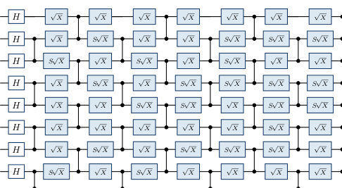
<figcaption class="paper-figure-caption"><b>Fig 1.</b> Figure 1: Mapping an open-boundary one-dimensional brickwork circuit to its tensor network representation. (a) A layout of the brickwork Clifford circuit [1]. (b) The corresponding PEPS-like tensor network geometry.</figcaption>
</figure>
<figure class="paper-figure-card">
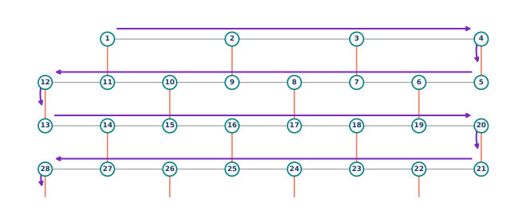
<figcaption class="paper-figure-caption"><b>Fig 2.</b> Figure 2: Deterministic contraction path for exact amplitude contraction. The numbers indicate the order in which tensors are visited, and the arrows indicate the direction of the sweep. d = 8 in this figure.</figcaption>
</figure>
<figure class="paper-figure-card">
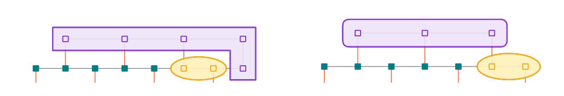
<figcaption class="paper-figure-caption"><b>Fig 3.</b> Figure 3: The two possible paired steps. The purple region contains the tensors already absorbed into the boundary tensor, and the yellow region contains the next two tensors to be contracted.</figcaption>
</figure>
<figure class="paper-figure-card">
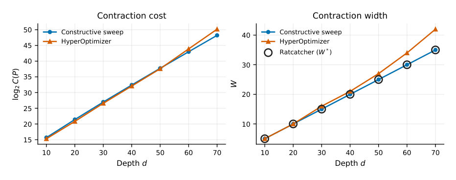
<figcaption class="paper-figure-caption"><b>Fig 4.</b> Figure 4: Total contraction cost (left) and contraction width (right) for the n = 70 brickwork tensor networks. The blue lines show the constructive path, while the orange lines show the paths obtained by HyperOptimizer. Black open circles indicate the exact minimum contraction widths W ∗certified using Ratcatcher.</figcaption>
</figure>
<figure class="paper-figure-card">
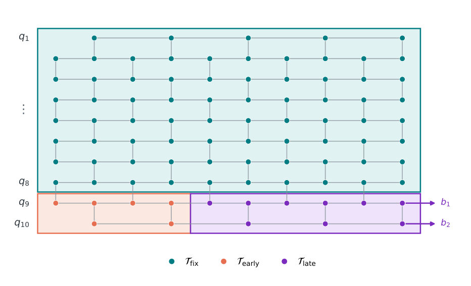
<figcaption class="paper-figure-caption"><b>Fig 5.</b> Figure 5: Three-region decomposition for batched contraction with n = d = 10 and k = 2. The fixed region Tfix spans qubits q1, . . . , q8, while the output indices on q9 and q10 are left open. The early and late regions contain the first c = 4 layers and remaining d −c = 6 entangling layers, respectively.</figcaption>
</figure>

**Summary.** The paper presents an efficient tensor network contraction method to classically simulate IBM's large-scale doped Clifford random circuit sampling experiment. By mapping the 70-qubit circuit onto a structured tensor network, they achieved a significant computational result within minutes using advanced GPU clusters. This work establishes a quantitative classical benchmark for assessing quantum advantage in randomized quantum circuits.

**Why it may be interesting.** This work provides a concrete, scalable classical benchmark for simulating complex random quantum circuits, which is crucial for understanding the resource requirements needed to surpass current NISQ-era hardware capabilities in quantum information processing.

Detailed structure

**Main problem.** To classically simulate the complex amplitude evaluation for IBM's doped Clifford random circuit sampling (RCS) experiment to establish a resource baseline.

**Main result.** The authors successfully simulated all 2051 output batches in 37.3 minutes using 32 H100 GPUs, yielding a log-XEB estimate compatible with IBM's fidelity lower bound.

**Method.** They developed and applied a deterministic temporal-boundary tensor network contraction approach to evaluate the exact circuit amplitude by mapping the quantum circuit onto a PEPS-like structure.

**Model / system.** The system is an open-boundary, one-dimensional brickwork circuit involving 70 qubits, 70 entangling layers (CZ gates), and 468 inserted T gates, mimicking IBM's experimental setup.

**Key observables.** Log-XEB estimate of 0.35034; contraction width $\lceil d/2 
ceil$; total simulation time (37.3 minutes).

**Important parameters / regimes.** Number of qubits ($n=70$), circuit depth ($d=70$), number of nodes (32), and GPU type (NVIDIA H100).

**Assumptions / limitations.** The compatibility of the log-XEB estimate with fidelity relies on Porter–Thomas and scrambled-noise assumptions.

**Figures summary.** Figure 1 maps the circuit to a tensor network; Figure 2 details the deterministic temporal-state contraction path (Algorithm 1); Figure 4 compares the cost/width of constructive vs. heuristic paths.

**Paper structure.** The paper introduces the problem, details the novel deterministic tensor network contraction method for open boundaries, presents the computational results on the IBM instance, and concludes by positioning the technique as a general diagnostic tool for future quantum experiments.

Abstract

We classically simulate the IBM doped Clifford random circuit sampling experiment, comprising $70$ qubits, $70$ entangling layers, and $468$ inserted $T$ gates. A deterministic temporal-boundary tensor network contraction approach is specifically designed to tackle such open-boundary one-dimensional brickwork circuits with operator-Schmidt-rank-$2$ entangling gates. For an $n$-qubit circuit of depth $d$, the resulting unsliced path evaluates an exact amplitude with contraction width $\lceil d/2\rceil$; Ratcatcher calculations certify that no smaller width is possible for the tested instances. Because one-qubit gates are absorbed without changing the network topology, the width and dense scheduled contraction cost are independent of their values and of the number and placement of $T$ gates. For the IBM instance, its largest intermediate tensor contains $2^{35}$ complex64 entries (256 times smaller than IBM's estimation), corresponding to a tensor payload of $256$ GiB, and is distributed across eight GPUs within a node. Using 32 nodes, with eight NVIDIA H100 GPUs per node, we completed all 2051 amplitude batches corresponding to IBM's published output bitstrings in 37.3 minutes. The resulting probabilities yield a log-XEB estimate of $0.35034$ with a 95\% interval of $[0.29763,0.40305]$. Under the Porter--Thomas and scrambled-noise assumptions, this is numerically compatible with IBM's fidelity lower bound; separately, fidelity-weighted resource accounting projects a 583-contraction workload with a 10.6-minute makespan on the same 32 nodes. More broadly, the approach provides a practical diagnostic for experimental outputs and a quantitative tool for designing future doped Clifford sampling experiments.

[↑ back to top](#top)

### [Hybrid HPC-Quantum Simulations: DFT-Quantum Embedding for Molecular Systems](http://arxiv.org/abs/2608.12884v1)

**Authors:** Namrata Manglani, Samrit Maity, Shashank Sharma, Tejjan Arora, Soham Phulare, Shreyas Kadam, Sanjay Wandhekar  
**Type:** theory · **Category:** strongly correlated electrons · **PDF:** <https://arxiv.org/pdf/2608.12884v1>  
**Analysis basis:** full PDF text, analyzed in chunks
**Topic relevance:** `Keldysh / 2PI / non-Gaussian methods` **3/5** · `quantum measurements` **1/5**

↔ Scroll figures horizontally

<figure class="paper-figure-card">
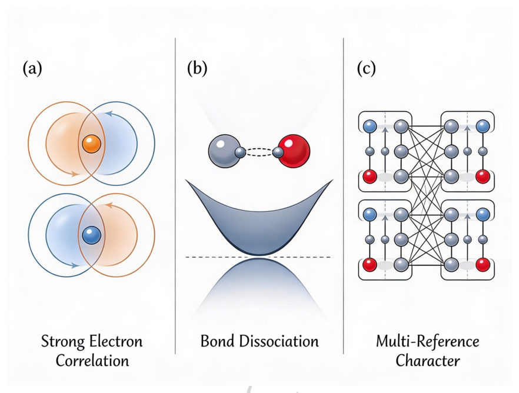
<figcaption class="paper-figure-caption"><b>Fig 1.</b> Figure 1.1: (a) Strong electron correlation causing interdependent motion. (b) Bond dissociation accompanied by electronic state changes. (c) Multi-reference character from multiple important configurations.</figcaption>
</figure>
<figure class="paper-figure-card">
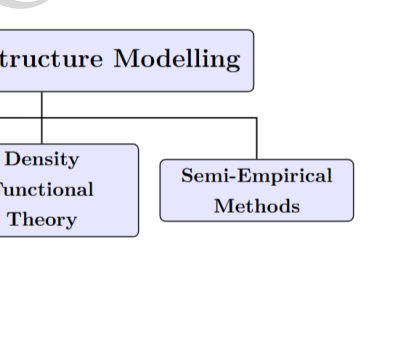
<figcaption class="paper-figure-caption"><b>Fig 2.</b> Figure 2.1: Evolution of Materials Modeling Methods [12].</figcaption>
</figure>
<figure class="paper-figure-card">
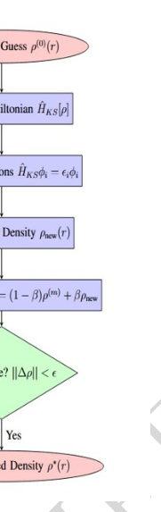
<figcaption class="paper-figure-caption"><b>Fig 3.</b> Figure 2.2: Self-Consistent Field Loop Process</figcaption>
</figure>
<figure class="paper-figure-card">
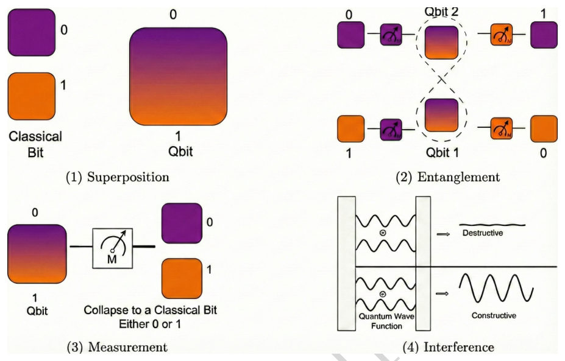
<figcaption class="paper-figure-caption"><b>Fig 4.</b> Figure 3.1: Schematic representation of key quantum concepts including superposition, entanglement, and measurement collapse. (Author-generated illustration)</figcaption>
</figure>
<figure class="paper-figure-card">
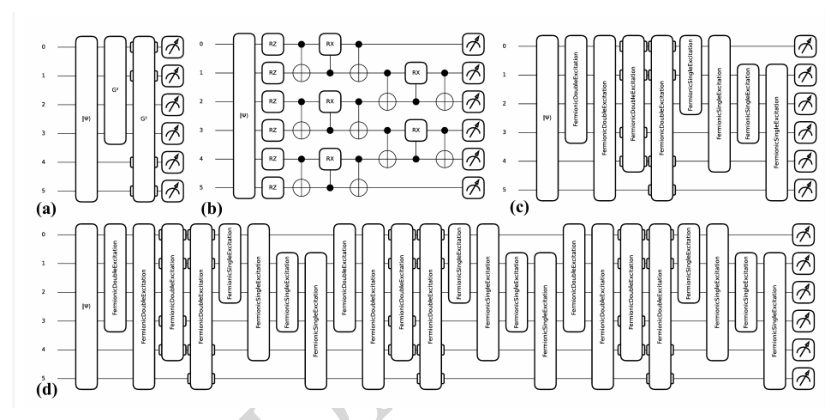
<figcaption class="paper-figure-caption"><b>Fig 5.</b> Figure 3.2: Circuit structures of four variational ansatz architectures investigated in recent benchmarking: (a) Double Excitation Gates, (b) Particle-Conserving U2 (Hard- ware Efficient), (c) UCCSD (Chemically Inspired), and (d) k-UpCCGSD. Adapted from Boutakka et al. [1].</figcaption>
</figure>

**Summary.** The paper proposes a Hybrid DFT-Quantum Embedding (QDFT) framework to overcome the limitations of standard Density Functional Theory in simulating strongly correlated molecular systems. It achieves this by partitioning large molecules, treating the critical active space with a Variational Quantum Eigensolver (VQE) and the rest classically via DFT. This hybrid approach aims to combine classical scalability with quantum mechanical accuracy for complex electronic structure problems.

**Why it may be interesting.** This directly addresses the core challenge in modern quantum chemistry: bridging the gap between the massive scale of classical computation (HPC/DFT) and the high accuracy required for strongly correlated phenomena, making it highly relevant to AMO physics and open quantum systems modeling.

Detailed structure

**Main problem.** Developing scalable simulations for molecular electronic structure that accurately capture strong electron correlation effects, which are poorly handled by standard DFT approximations.

**Main result.** The hybrid QDFT framework successfully integrates classical HPC scalability with quantum accuracy potential, demonstrating improvement in selected electronic-structure properties.

**Method.** A novel Quantum Embedding (QDFT) approach partitions large systems: the active space is treated via VQE on a quantum computer, while the environment is handled by classical DFT.

**Model / system.** The focus is on molecular systems undergoing electronic structure calculations. The methodology combines DFT for long-range screening with variational quantum circuits (VQE) to model short-range, strongly correlated interactions.

**Key observables.** Electronic-structure properties, energy eigenvalues ($\Delta E$), computational bottlenecks, and QPU execution requirements.

**Important parameters / regimes.** Energy difference thresholds ($10^{-5} 	ext{ Ha}$), range-separation parameters ($\mu, \alpha, eta$), and qubit resources/noise levels.

**Assumptions / limitations.** The initial work focuses on noiseless quantum simulation to systematically evaluate the framework's potential before tackling hardware noise limitations.

**Figures summary.** Not specified in detail, but concepts involve illustrating strong electron correlation, bond dissociation with state changes, and multi-reference character.

**Paper structure.** The paper introduces the QDFT concept by identifying the limitations of DFT for correlated systems. It details the framework's components (active space selection, embedding) and presents results showing potential improvements while maintaining HPC scalability. Future work focuses on noisy simulation and runtime estimation.

Abstract

Scientific simulations demand methods combining scalability with predictive accuracy. Density Functional Theory (DFT) on High-Performance Computing (HPC) enables large-scale electronic-structure simulations but is limited by approximations affecting strongly correlated systems and band-gap predictions. Quantum computing offers a pathway to address this, though current Noisy Intermediate-Scale Quantum (NISQ) hardware remains constrained by qubit resources, noise, and execution cost.   This work presents a hybrid DFT-Quantum Embedding (QDFT) framework integrating classical HPC-based DFT with a quantum electronic-structure solver. Large systems are partitioned to isolate a chemically relevant active space, treated via the Variational Quantum Eigensolver (VQE), while the remaining degrees of freedom are described by DFT. The framework incorporates active-space selection, embedded Hamiltonian construction, symmetry preservation, operator mapping, self-consistent density updating, and modular classical-quantum coupling.   We focus on noiseless quantum simulation to systematically evaluate accuracy, convergence, active-space dependence, computational cost, and HPC scalability without hardware noise. Detailed profiling identifies computational bottlenecks and highlights limitations of CPU-based quantum simulation. A QPU runtime-estimation methodology is additionally developed to assess execution requirements on actual quantum hardware.   Results demonstrate quantum embedding's potential to improve selected electronic-structure properties while retaining classical HPC's scalability. Noisy quantum simulation and QPU execution remain key future directions, providing a pathway toward practical, scalable HPC-quantum hybrid simulations as hardware matures.

[↑ back to top](#top)

### [Improved Measurement Cost Scaling in the Nonorthogonal Quantum Eigensolver](http://arxiv.org/abs/2608.12830v1)

**Authors:** Mingyu Kang, K. Birgitta Whaley  
**Type:** theory · **Category:** quantum information and computing · **PDF:** <https://arxiv.org/pdf/2608.12830v1>  
**Analysis basis:** full PDF text, analyzed in chunks
**Topic relevance:** `quantum measurements` **3/5** · `analog quantum simulation` **1/5**

↔ Scroll figures horizontally

<figure class="paper-figure-card">
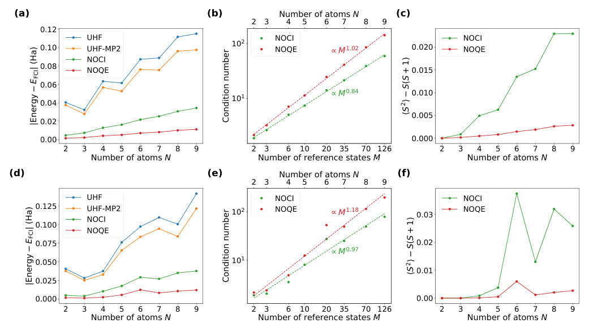
<figcaption class="paper-figure-caption"><b>Fig 1.</b> FIG. 1. Performance of noiseless NOQE for (a)–(c) linear hydrogen chains (upper panels) and (d)–(f) regular hydrogen rings (lower panels) of various numbers of atoms N in the STO-3G basis, compared with classical methods such as NOCI, UHF and UHF-MP2. The distance between nearest-neighbor atoms is set as 1.5 ˚A. (a,d) Ground-state energy error |E −EFCI| versus N. (b,e) Condition number of the unthresholded overlap matrix κ(S) versus the number of reference states M(N) =  N ⌈N/2⌉  .</figcaption>
</figure>
<figure class="paper-figure-card">
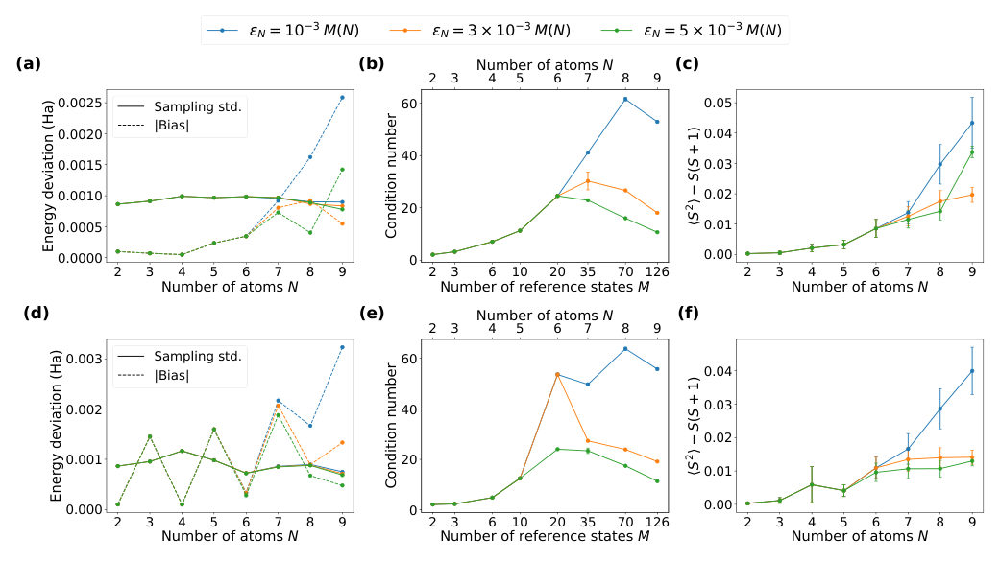
<figcaption class="paper-figure-caption"><b>Fig 2.</b> FIG. 2. Performance of finite-shot NOQE with overlap thresholding for the ground state energies E0 of (a)–(c) linear hydrogen chains (upper panels) and (d)–(f) regular hydrogen rings (lower panels). Diagonal entries of H are subject to real zero-mean noise with standard deviation σ = 10−3 Ha, while off-diagonal entries of H and S are perturbed on the upper triangle by independent zero-mean complex noise whose real and imaginary parts each have standard deviation σ = 10−3/ √</figcaption>
</figure>
<figure class="paper-figure-card">

<figcaption class="paper-figure-caption"><b>Fig 3.</b> Figure 1(b) and (e) show the bare condition number of the overlap matrix κ(S), before any thresholding, as a function of system size. Both NOCI and NOQE exhibit a clear increasing trend, with the NOQE overlap matrices slightly more ill-conditioned. Figures 1(c) and (f) plot the spin contamination, measured by ⟨ˆS2⟩−S(S + 1), which is substantially smaller for NOQE than for NOCI, consistent with the spin-purification property of NOQE emphasized in Ref. [22].</figcaption>
</figure>
<figure class="paper-figure-card">
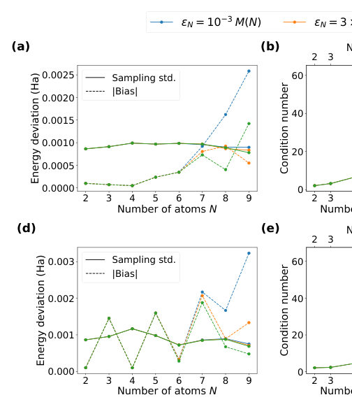
<figcaption class="paper-figure-caption"><b>Fig 4.</b> Figure 1 first studies the system-size dependence of noiseless NOQE, where the projected Hamiltonian and overlap matrices are evaluated exactly before any finite- shot measurement noise is added. In Fig. 1(a) and (d), we compare the NOQE ground-state energy error with those of several classical methods: unrestricted Hartree-Fock (UHF) uses the lowest-energy determinant among the M UHF states before dressing, UHF with second-order Møller–Plesset perturbation theory (UHF-MP2), applies an MP2 correction to this single determinant [41], non- orthogonal configuration interaction (NOCI) diagonalizes in the subspace of the M UHF states [42, 43], and NOQE diagonalizes in the subspace of the M...</figcaption>
</figure>
<figure class="paper-figure-card">
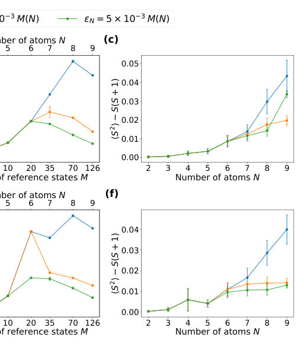
<figcaption class="paper-figure-caption"><b>Fig 5.</b> Figure 2 introduces finite-shot measurement sampling noise and overlap thresholding to assess the scalability criteria in Def. 2. We set the standard deviation σ of the independent matrix-element noise to 10−3 (see the cap- tion of Fig. 2 for details), which places the simulations in a regime where a scalable thresholding scheme exists and the overall energy errors remain below chemical accu- racy. The number of shots per matrix element required to maintain this fixed element noise may further grow modestly with system size, depending on the Pauli-word grouping [30–32] or basis-rotation grouping [33] used in</figcaption>
</figure>

**Summary.** This paper tackles the computational bottleneck in using quantum computers to find molecular energies via the Nonorthogonal Quantum Eigensolver (NOQE). By introducing a scalable thresholding scheme based on the overlap matrix's condition number, the authors theoretically improve the required measurement shot count scaling from $O(M^3)$ to $O(M)$. This advancement makes simulating larger and more complex quantum chemical systems feasible with current noisy hardware.

**Why it may be interesting.** This work directly addresses the resource estimation (measurement time/shots) required for near-term quantum simulation of chemistry problems, which is a core concern in applying quantum algorithms to physical systems.

Detailed structure

**Main problem.** The primary goal is improving the measurement cost scaling for quantum subspace diagonalization methods, specifically the Nonorthogonal Quantum Eigensolver (NOQE). The bottleneck is accurately estimating matrix elements when errors can lead to large eigenvalue errors.

**Main result.** The authors prove that by using a scalable thresholding scheme on the overlap matrix, the required shot count per matrix element improves from a worst-case $O(M^3)$ bound to a linear scaling of $O(M)$.

**Method.** The work combines theoretical perturbation analysis with numerical simulations. It involves formulating the problem as solving a generalized eigenvalue problem and applying thresholding techniques to control error propagation.

**Model / system.** The method is applied to estimating low-lying energies of molecular Hamiltonians, constructing a multireference subspace from dressed unrestricted Hartree-Fock states ($\vert\phi_J
angle$). Testing was done on hydrogen chains and rings.

**Key observables.** Eigenvalue sensitivity, measurement shot count ($N_{	ext{shots}}$), bias relative to noiseless results, and the condition number of the retained overlap matrix ($\kappa(S_{>\epsilon})$).

**Important parameters / regimes.** $M$ (number of reference states), $E$ (target accuracy), $\epsilon$ (thresholding parameter), and $\kappa(S)$ (overlap condition number).

**Assumptions / limitations.** The analysis assumes that the eigenvalue sensitivity is controlled by the condition number $\kappa(S)$ rather than dimension factors, and it relies on a scalable thresholding scheme to manage near-singularity.

**Figures summary.** Figure 1 compares noiseless NOQE results against classical methods. Figure 2 shows how bias, retained condition number, and spin contamination remain bounded as system size $N$ increases when using appropriate thresholding schemes.

**Paper structure.** The paper first establishes the theoretical bottleneck in measurement cost scaling for NOQE. It then introduces a scalable thresholding scheme to control errors by replacing dimension-based bounds with those based on the overlap condition number, leading to improved complexity bounds and numerical validation on molecular systems.

Abstract

Quantum subspace diagonalization methods are promising algorithms for quantum chemistry on near-term quantum computers. These methods can estimate low-lying energies of molecular systems using shallow quantum circuits, at the cost of many circuit repetitions to estimate the projected matrix elements. Errors in these matrix elements can be converted into much larger eigenvalue errors by an ill-conditioned overlap matrix. We study this bottleneck for the nonorthogonal quantum eigensolver (NOQE), which constructs a compact multireference subspace from dressed unrestricted Hartree-Fock states. We prove a finite-shot perturbation bound showing that, after overlap thresholding, the eigenvalue sensitivity is controlled by the condition number of the retained overlap matrix rather than by a worst-case dimension factor. With a scalable thresholding scheme, the upper bound on the per-matrix-element shot count required to reach a target accuracy scales as $\mathcal{O}(M)$, improving on the previously known $\mathcal{O}(M^3)$ bound, where $M$ is the number of reference states. Numerical experiments on hydrogen chains and rings suggest that, in practice, the measurement cost of structured NOQE instances can grow even more slowly than this linear bound.

[↑ back to top](#top)

### [Capillary self-folding chains](http://arxiv.org/abs/2608.13349v1)

**Authors:** Megan Delens, Axel Franckart, Martin Poty, Nicolas Vandewalle  
**Type:** both · **Category:** statistical mechanics · **PDF:** <https://arxiv.org/pdf/2608.13349v1>  
**Analysis basis:** full PDF text, analyzed in chunks
**Topic relevance:** `Frenkel-Kontorova` **2/5** · `analog quantum simulation` **1/5** · `correlated / nonlocal dissipation` **1/5** · `driven-dissipative phase transition` **1/5** · `non-equilibrium universality` **1/5** · `quantum measurements` **1/5** · `scars & prethermalization` **1/5**

↔ Scroll figures horizontally

<figure class="paper-figure-card">
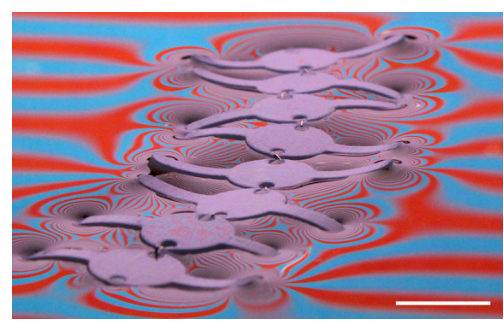
<figcaption class="paper-figure-caption"><b>Fig 1.</b> FIG. 1. Picture of a flexible chain made of 8 components floating on a liquid-air interface. Each component has two op- posite branches. By using the reflection of a striped pattern, the local deformations of the liquid interface are evidenced. Negative and positive curvatures are visible near branch tips. Scale bar: 10 mm.</figcaption>
</figure>
<figure class="paper-figure-card">
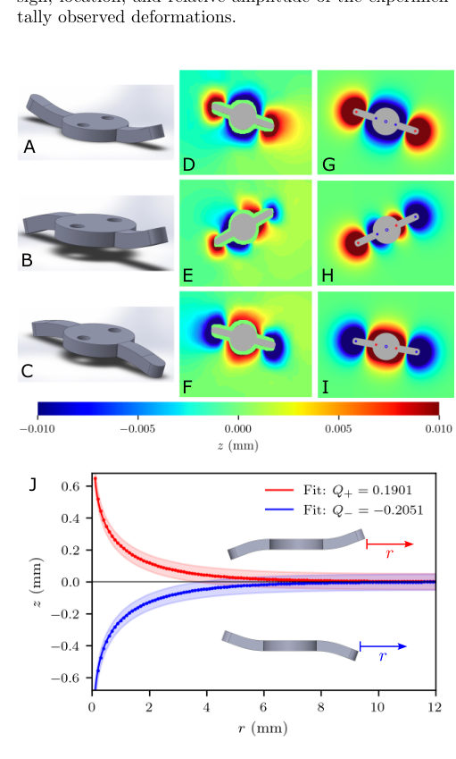
<figcaption class="paper-figure-caption"><b>Fig 2.</b> FIG. 2. (A-C) Three physical monomers used to assemble capillary polymers. (D-F) Associated liquid deformation mea- sured by profilometry. (G-I) Simulated interface profiles from the five-charge model of Eq. (2). (J) Experimental liquid profiles z(r) along the major axis of a {− +} element and corre- sponding fits of Eq. (1) near each tip. Shaded bands indicate the uncertainty in the height measurements (±0.05 mm).</figcaption>
</figure>
<figure class="paper-figure-card">
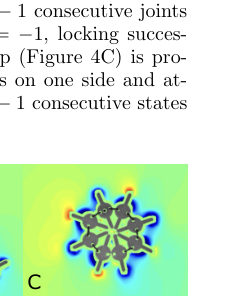
<figcaption class="paper-figure-caption"><b>Fig 3.</b> FIG. 4. Experimental liquid profiles around self-folding chains in same color scale as Figure 2 (red: positive, blue: negative surface deformations). Three N = 8 examples. (A) Linear structure obtained with a straight-biased code. (B) Zigzag when pairs of successive tips attract. (C) Loop formed with a fold-biased code.</figcaption>
</figure>
<figure class="paper-figure-card">
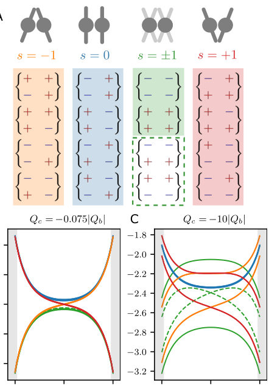
<figcaption class="paper-figure-caption"><b>Fig 4.</b> FIG. 3. (A) The 16 possible capillary codes for a dimer, color-coded by stable state s ∈{−1, 0, +1}. Symmetric and asymmetric bistable codes are distinguished (full green and dashed green outlines). (B) Normalized capillary energy land- scapes U(s) computed from Eq. (5) using experimental pa- rameters (Qc = −0.075|Qb|). (C) Same landscapes computed with an enhanced central charge (Qc = −10|Qb|) to highlight symmetry-breaking in the asymmetric bistable cases. Grey areas indicate forbidden regions due to steric contact.</figcaption>
</figure>
<figure class="paper-figure-card">
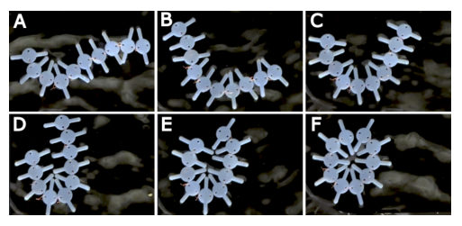
<figcaption class="paper-figure-caption"><b>Fig 5.</b> FIG. 7. Experimental exploration of the folding landscape for a fold-biased chain with N = 10 under vertical vibration. (A- F) Selected snapshots from Supplementary Movie S2 showing distinct metastable configurations. Configuration (F) corre- sponds to a low-energy experimental macrostate, consistent with theoretical predictions.</figcaption>
</figure>

**Summary.** The authors demonstrate that flexible chains assembled at a liquid-air interface can self-fold based on local geometric interactions encoded by capillary charges. They show that while short chains fold predictably, longer chains possess an exponentially growing number of metastable folding states. This platform allows for the experimental and theoretical study of how simple local rules give rise to complex collective behavior, analogous to biomolecular folding.

**Why it may be interesting.** This work provides a highly controllable mesoscale platform where local rules (capillary charges) dictate emergent collective behavior (folding). The study of the exponential growth of metastable states and the role of external agitation mirrors concepts in glassy dynamics, energy minimization pathways, and frustrated systems relevant to statistical mechanics.

Detailed structure

**Main problem.** To investigate how a minimal, static, geometry-based interaction alphabet (capillary charges) can control not only the target conformation but also the complex metastable folding landscape of a connected chain.

**Main result.** The complexity and degeneracy of the folding landscape grow exponentially with chain length for long chains, and mechanical agitation is required to transition between these many metastable states.

**Method.** Numerical mapping of energy landscapes derived from pair interaction potentials, complemented by experimental measurement using Schlieren profilometry and physical manipulation (agitation).

**Model / system.** The system consists of flexible polymer chains made of floating monomers at a liquid-air interface. Interactions are governed by capillary charges ($Q$) encoded in the monomer geometry, leading to pair potentials derived from the modified Laplace equation.

**Key observables.** Number of metastable macrostates ($|G|$), energy landscape $U(s)$, Hamming distance ($d_H$), and the final folded ground state configuration.

**Important parameters / regimes.** Capillary length ($\lambda \approx 2.7$ mm for water-air interface); local interaction rules defined by capillary charges $\{+,+\}, \{-,-\}, \{-,+\}, \{+-\}$.

**Assumptions / limitations.** The use of the Linear Superposition Approximation (LSA) to model the total interface deformation.

**Figures summary.** Figures illustrate chain structures, measured/simulated liquid profiles for monomer assembly, energy landscapes for dimer cases, and scaling plots showing exponential growth of metastable states with chain length N.

**Paper structure.** The paper first establishes the physical platform and interaction model using capillary charges. It then analyzes the folding behavior, demonstrating that while short chains are deterministic, longer chains exhibit exponentially growing complexity in their energy landscape. Finally, it explores how single-element mutations affect this complex folding landscape.

Abstract

Mesoscale self-assembly provides a route toward the design of programmable microsystems. Here, we construct flexible chains of floating monomers whose curved branches impose upward or downward deformations of the liquid interface, corresponding to effective positive or negative capillary charges. These geometrically encoded deformations generate local attractive or repulsive interactions along the chain. By tuning the capillary sequence, we obtain distinct folded configurations, including straight lines, zigzag patterns, and loops. For short chains, folding is largely governed by nearest-neighbor interactions and leads to well-defined structures. As the chain length increases and non-neighboring segments come into proximity and interact, however, the folding landscape becomes increasingly complex, with multiple metastable states whose number grows exponentially with chain length. We map these landscapes numerically and demonstrate experimentally that mechanical agitation allows the chains to transition between metastable configurations. Beyond encoding a target geometry, the capillary sequence therefore controls the complexity of the folding landscape as well as the degeneracy and mutational robustness of folded structures. These results establish capillary chains as a controllable mesoscale platform for investigating how local interaction rules give rise to collective folding and complex sequence-to-structure relationships reminiscent of those encountered in biomolecular systems.

[↑ back to top](#top)

### [Inductively-protected Andreev (IPA) spin qubit](http://arxiv.org/abs/2608.13530v1)

**Authors:** J. L. del Olmo N., F. J. Matute-Cañadas, A. Levy Yeyati, R. Seoane Souto, R. Aguado  
**Type:** theory · **Category:** quantum information and computing · **PDF:** <https://arxiv.org/pdf/2608.13530v1>  
**Analysis basis:** full PDF text, analyzed in chunks
**Topic relevance:** `QC/QI experiment` **2/5** · `driven-dissipative phase transition` **2/5** · `Keldysh / 2PI / non-Gaussian methods` **1/5** · `correlated / nonlocal dissipation` **1/5** · `methods for driven-dissipative` **1/5** · `quantum measurements` **1/5**

↔ Scroll figures horizontally

<figure class="paper-figure-card">
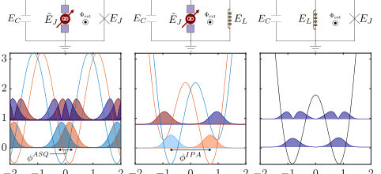
<figcaption class="paper-figure-caption"><b>Fig 1.</b> FIG. 1. Top panels: circuits of the (a) Andreev spin qubit (ASQ) in a transmon setup, (b) inductively-protected An- dreev (IPA) spin qubit and (c) fluxonium qubit. Here, EC is the charging energy, EL the inductive energy, and EJ and ˜EJ the Josephson energies. Bottom panels: Josephson potentials (lines) and wavefunctions (filled curves) of the lowest-energy levels corresponding to the circuits on the top. Blue/red col- ors correspond to two spin branches. In the ASQ (bottom left), the spin branches are phase-shifted by a distance ϕASQ 0 , see Eqs. (1-2). Due to the periodic boundary conditions, the phase separation between spin wells is ϕASQ ≤π. In the IPA case (bottom center), the inductor...</figcaption>
</figure>
<figure class="paper-figure-card">
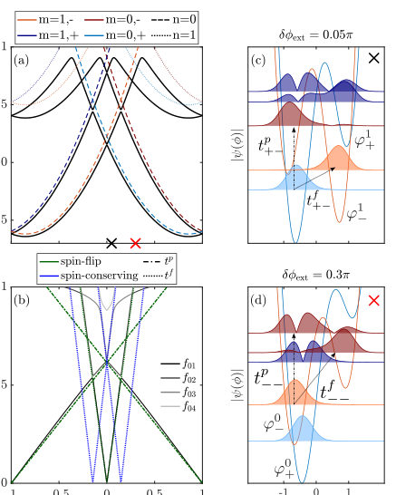
<figcaption class="paper-figure-caption"><b>Fig 2.</b> FIG. 2. (a) Comparison between the eigenvalues of the IPA qubit, obtained from the exact diagonalization of Eq. (6) (black lines), and the harmonic approximation, Eq. (11) (dashed and dotted lines). (b) Corresponding transition ener- gies, see Eq. (13) for the harmonic approximation in dashed. (c,d) Wave functions and spin-resolved Josephson potential normalized by plasma frequency fp, for δϕext = 0.05π (c) and δϕext = 0.3π (d). The arrows illustrate plasma and fluxon-like spin-flip with k = 0 in (c) and spin conserving transitions in (d) c.f. Eq. (13). In this latter case, the plasma one presents k = 1 and the fluxon k = 0. Parameters: ˜EJ/EC = 11.11 and EL/EC = 2.78, corresponding to χ...</figcaption>
</figure>
<figure class="paper-figure-card">
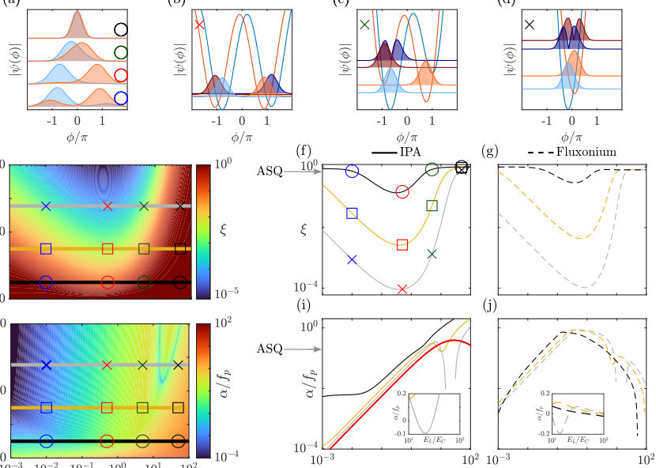
<figcaption class="paper-figure-caption"><b>Fig 3.</b> FIG. 3. (a) Lowest-energy eigenstates of the IPA qubit, Eq. (6), for ˜EJ/EC = 5 and EL/EC = 50, 5, 0.5, and 0.01 from top to bottom, where red/blue denote spin up/down along the spin-orbit direction. (b)–(d) Josephson potential (solid lines) and lowest-energy wavefunctions, |ψj(ϕ)|, (colored curves) for ˜EJ/EC ≫1, and EL/EC = 0.5, 5, 50. (e) Wavefunction overlap (ξ), as defined in Eq. (15), as a function of EL/EC and ˜EJ/EC. Grey, yellow, and black lines are cuts for ˜EJ/EC = 27.8, 15, and 5 while the symbols represent situations with EL/EC = 50, 5, 0.5, and 10−2. (f) ξ as a function of EL/EC for the ˜EJ/EC lines shown in panel (e). (g) ξ for fluxonium qubits along the same lines of ˜EJ/EC...</figcaption>
</figure>
<figure class="paper-figure-card">
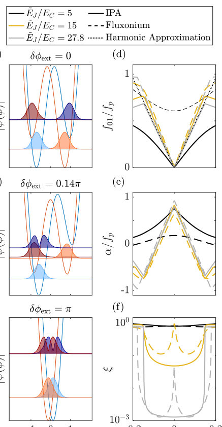
<figcaption class="paper-figure-caption"><b>Fig 4.</b> FIG. 4. Left panels: Josephson potential (thick lines) and lowest-energy eigenstates and wavefunctions (colored curves) for EL = 5EC, ˜EJ/EC = 27.8, E0 = 2ESO = 2, and dif- ferent applied fluxes (a) δϕext = 0, (b) δϕext = 0.14π and (c) δϕext = π. At δϕext ≈0.14π, a level crossing occurs for the chosen parameters. Below, this value, the two lowest- energy states belong to well-separated wells with opposite spins. Above, the two lowest-energy states no longer belong to distinct wells. While the exact flux value for a level crossing depends on the chosen parameters, the crossing itself reflects a general feature where spin states no longer belong to well- separated wells, compare panels (a)...</figcaption>
</figure>
<figure class="paper-figure-card">
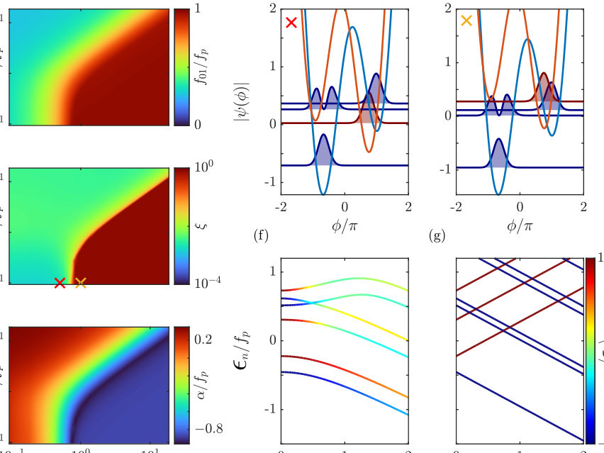
<figcaption class="paper-figure-caption"><b>Fig 5.</b> FIG. 5. (a) Qubit frequency (f01/fp), (b) wavefunction overlap (ξ), and (c) anharmonicity (α) as a function of the magnetic field parallel/perpendicular to the SO axis, B∥and B⊥, respectively. (d) Amplitudes of the lowest-energy states and spin potential branches normalized by plasma frequency fp for the situations marked in panel (b) with a red cross (B⊥/fp = 0 and B∥/fp = 0.5). (e) Same as (d) but for parameters corresponding to the orange cross in (b): B⊥/fp = 0 and B∥/fp = 1. (f) Eigenvalues evolution versus B⊥/fp for fixed B∥/fp = 0. (g) Eigenvalues evolution versus B∥/fp for fixed B⊥/fp = 0. The color indicates the spin projection along the SO axis ⟨σx⟩. The external flux is fixed to...</figcaption>
</figure>

**Summary.** The paper introduces the Inductively-protected Andreev (IPA) spin qubit as an advanced platform for realizing robust quantum bits. By incorporating an inductor shunt, it significantly enhances protection against environmental noise compared to standard designs. This theoretical work demonstrates how engineering the phase space potential can combine long coherence times with operational spin degrees of freedom.

**Why it may be interesting.** This work directly addresses noise suppression in superconducting qubits by engineering the underlying quantum mechanical potential structure, a core topic for quantum information theorists working on solid-state hardware.

Detailed structure

**Main problem.** The primary goal is mitigating environmental noise (relaxation and dephasing) to build scalable quantum computers using superconducting spin qubits.

**Main result.** The Inductively-protected Andreev (IPA) qubit enhances coherence by separating spin-qubit states into distinct potential wells in phase space, achieving protection superior to standard ASQ or fluxonium models.

**Method.** Theoretical analysis involving Hamiltonian construction, solving for energy spectra, and calculating wavefunction overlap ($\xi$) using both exact diagonalization and harmonic approximations.

**Model / system.** The system is an Andreev spin qubit (ASQ) realized in a semiconductor-superconductor Josephson junction. Protection is achieved by shunting the ASQ with a linear inductor to form the IPA qubit, which behaves like two uncoupled fluxoniums.

**Key observables.** Coherence time ($T_1$), wavefunction overlap ($\xi$), and transition energies between spin states.

**Important parameters / regimes.** Inductive energy ratio ($EL/EC$), Josephson energy ratio ($	ilde{EJ}/EC$), and external flux detuning ($\delta\phi_{	ext{ext}}$).

**Assumptions / limitations.** The analysis relies on approximations, including the harmonic limit for calculating overlaps, which is noted to show quantitative discrepancies with exact solutions.

**Figures summary.** Figures illustrate circuit diagrams comparing ASQ, IPA, and fluxonium potentials; they also plot qubit spectra, wavefunctions, and the overlap ($\xi$) as a function of inductive coupling strength.

**Paper structure.** The paper progresses from defining the basic ASQ Hamiltonian to introducing the inductor-protected IPA model. It then analyzes the resulting potential landscape, derives spectral properties using harmonic approximations, and quantifies protection via wavefunction overlap calculations across different parameter regimes.

Abstract

The spin of a quasiparticle trapped in a quantum dot Josephson junction forms the basis of an Andreev spin qubit (ASQ): a semiconductor-superconductor device where the interplay between a localized spin degree of freedom and superconductivity leads to a spin-resolved Josephson potential. In this work, we show that shunting an ASQ with a linear inductor enhances its relaxation time by separating the spin-qubit states into distinct potential wells in phase space, nearly eliminating wavefunction overlap. The resulting inductively protected Andreev (IPA) spin qubit is equivalent to two fluxoniums in the heavy regime, one for each spin. Thus, the IPA qubit combines the long coherence times, low-frequency ground-state manifold, and large anharmonicity of a protected superconducting qubit with the operational advantages of a spin degree of freedom.

[↑ back to top](#top)

### [Graph-theoretic design of lasing networks for physical vision](http://arxiv.org/abs/2608.13097v1)

**Authors:** Paul Obernolte, Jakub Dranczewski, Yixiu Yin, Tobias Farchy, Wai Kit Ng, Tobias Simonsen, Elias Großhauser, Alexis Arnaudon, Robert L. Peach, Mauricio Barahona, Riccardo Sapienza, Jack C. Gartside, T. V. Raziman  
**Type:** both · **Category:** disordered systems and neural networks · **PDF:** <https://arxiv.org/pdf/2608.13097v1>  
**Analysis basis:** full PDF text, analyzed in chunks
**Topic relevance:** `driven-dissipative phase transition` **2/5** · `analog quantum simulation` **1/5** · `methods for driven-dissipative` **1/5** · `non-equilibrium universality` **1/5** · `superradiant laser` **1/5**

↔ Scroll figures horizontally

<figure class="paper-figure-card">
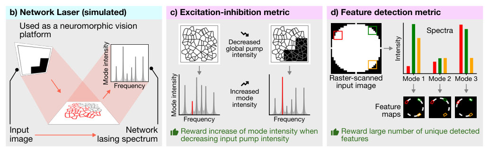
<figcaption class="paper-figure-caption"><b>Fig 1.</b> Figure 1. Working principle of graph-theoretic design of random lasing networks. a) Graph-theoretic analysis pipeline linking graph-based metrics (top) to physical lasing dynamics (middle), and neuromorphic vision performance (bottom). Interpolating between the topologies of two networks, from Waxman (left) to Buffon (right), in graph-metric space reveals associated changes in lasing dynamics (number of lasing modes) and physical vision performance (excitation–inhibition metric), enabling computationally cheap design and optimisation in an abstract graph space that bypasses expensive physical simulations. b) Schematic of the random lasing network used as an image processor: input images are...</figcaption>
</figure>
<figure class="paper-figure-card">
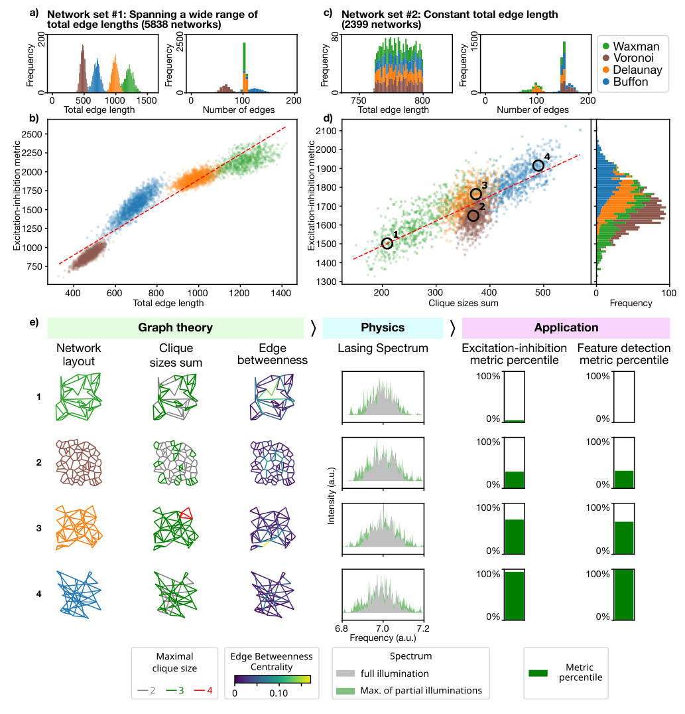
<figcaption class="paper-figure-caption"><b>Fig 2.</b> Figure 2. Identifying relevant network parameters for physical vision. a,b) In a set of networks (Network set #1) generated using four different algorithms (Buffon, Delaunay, Waxman and Voronoi) and spanning a wide range of total edge lengths, the excitation-inhibition metric is strongly correlated with the total edge length. c,d) Among networks with constrained total edge lengths (Network set #2), Buffon networks generally perform best on the two vision metrics. Among the considered graph-theoretic parameters, Clique sizes sum is the best predictor of the excitation-inhibition metric. e) Comparative illustration of network topology, graph-theoretic parameters, lasing spectra, and the two...</figcaption>
</figure>
<figure class="paper-figure-card">
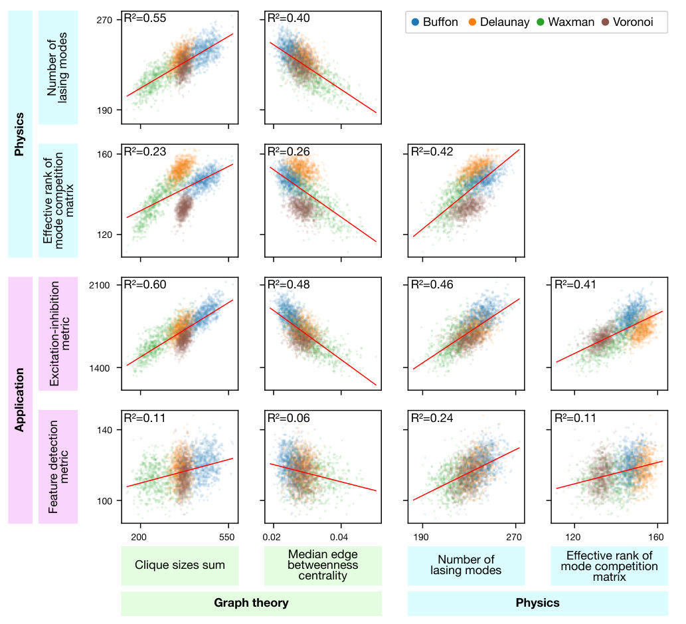
<figcaption class="paper-figure-caption"><b>Fig 3.</b> Figure 3. Relationship between graph-theoretic parameters, physical effects, and machine learning performance. System parameters from graph theory (clique sizes sum and edge betweenness centrality median), physics (number of lasing modes and effective rank of the mode competition matrix), and vision (excitation-inhibition metric and feature detection metric) are mutually correlated in the set of networks with constrained total edge length (Figure 2). (The same plot for the set of networks with varying total edge lengths can be seen in Supplementary Figure S2.)</figcaption>
</figure>
<figure class="paper-figure-card">

<figcaption class="paper-figure-caption"><b>Fig 4.</b> Figure 2b showing the strong positive correlation with the excitation-inhibition metric (see Supplementary Figure S1 for strong positive correlation with the feature detection metric). Physically, networks with longer total edge length have longer cavities which support more spatially overlapping modes (∝L/λ, for a total length L and a light wavelength λ) within the gain bandwidth,48 enhancing mode competition,49 which is consistent with the observed correlation. Maximising the total edge length within the geometrical constraints is thus a simple, physics-informed heuristic to improve vision performance. In contrast, vision performance is only weakly correlated with the number of nodes in...</figcaption>
</figure>
<figure class="paper-figure-card">
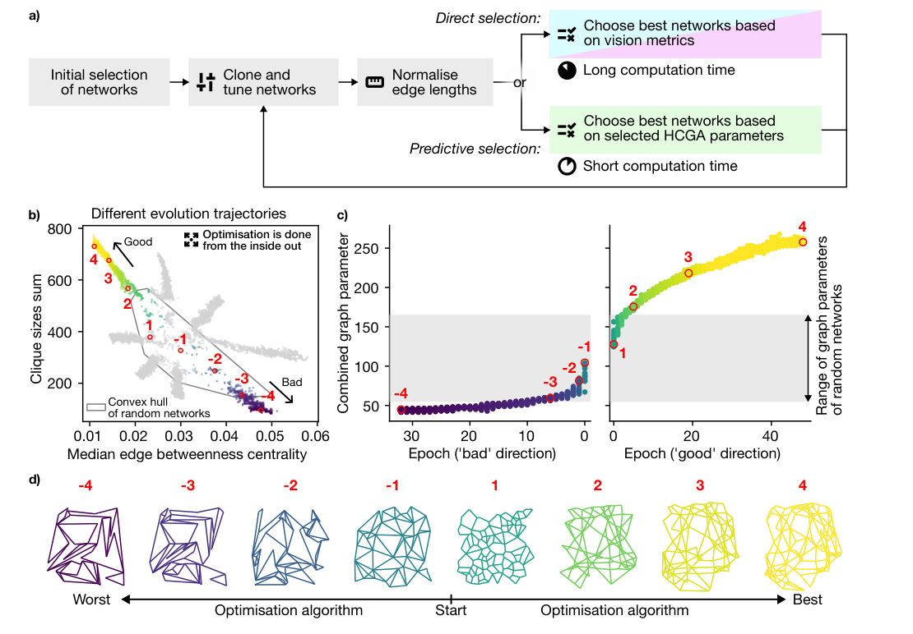
<figcaption class="paper-figure-caption"><b>Fig 5.</b> Figure 4. Evolutionary graph-based optimisation of random lasing networks for physical vision. a) Schematic of the evolutionary algorithm. b) Networks can be tuned along arbitrary directions in a two-parameter graph-theoretic space. c) The combined graph parameter improves over epochs of the algorithm under predictive selection (for the definition of the combined graph parameter, see Section S4). d) Evolution of the network layouts illustrates substantial topological changes.</figcaption>
</figure>

**Summary.** The paper introduces a novel, efficient framework to design physical neural networks using random lasing structures. By establishing a three-layer link between simple graph metrics and complex lasing physics, they guide an optimization algorithm that yields superior network topologies for vision tasks compared to random designs.

**Why it may be interesting.** This work provides a powerful methodology for designing complex quantum or nonlinear optical systems by abstracting the design space into graph theory, bypassing expensive full-scale physical simulations of many-body dynamics.

Detailed structure

**Main problem.** Optimizing physical neural network designs, which rely on complex nonlinear dynamics, is computationally prohibitive due to the high dimensionality of possible topologies.

**Main result.** The authors established a quantitative link where simple graph-theoretic metrics can predict and guide the optimization of lasing physics, leading to network topologies that significantly outperform random designs in image classification tasks.

**Method.** They developed an evolutionary algorithm guided by graph metrics (like clique sizes sum and edge betweenness centrality) to optimize random lasing networks, which are then tested on simulated image-classification benchmarks.

**Model / system.** The exemplar system is a random lasing network composed of interconnected nanoscale waveguides hosting strongly coupled lasing modes. The analysis maps graph structure metrics onto the nonlinear lasing physics and subsequent vision performance.

**Key observables.** Graph metrics (e.g., clique sizes sum, median edge betweenness centrality), physical observables (number of lasing modes, inter-mode competition), and vision proxies (Excitation-inhibition metric, Feature detection metric).

**Important parameters / regimes.** Total edge length ($L$), shot size $S$ for training, and hyperparameters $(k, C)$ for the logistic regression classifier.

**Assumptions / limitations.** The core assumption is that graph properties can predict emergent nonlinear dynamics and learning performance in active, strongly-interacting physical networks, allowing optimization in an abstract graph space rather than simulating substrate physics.

**Figures summary.** Figures illustrate a three-layer pipeline (Graph $
ightarrow$ Physics $
ightarrow$ Application), schematics of the lasing network, and show correlations between various graph parameters and vision metrics across different network sets.

**Paper structure.** The paper establishes a theoretical framework linking graph theory to physical optics via random lasing networks. It then uses this link to guide an evolutionary optimization process based on graph metrics, culminating in testing the optimized topologies on simulated image classification tasks using logistic regression.

Abstract

Physical neural networks perform learning through the intrinsic nonlinear dynamics of matter. Optimising their design presents a considerable challenge: complex many-body physics can provide powerful computation, but are expensive to simulate and large experimental optimisation runs are impractical to fabricate. Hence, the high-dimensional space of possible network topologies cannot be effectively directly searched. Here, we show that this search can be efficiently performed in an abstract graph space that is vastly cheaper to explore. Using random lasing networks -- composed of interconnected nanoscale waveguides and hosting strongly coupled lasing modes -- as an exemplar physical vision system, we establish a quantitative three-layer link: simple graph-theoretic metrics predict the nonlinear lasing physics, which in turn predicts vision performance. After validating this relationship using physical simulations, we exploit it to drive an evolutionary algorithm using graph metrics, producing network topologies that outperform random designs at a fraction of the computational cost (3000$\times$ speed-up compared to physical simulation). On simulated image-classification tasks, graph-optimised networks substantially improve classification accuracy. As our framework operates on network topology rather than substrate-specific physics, we anticipate it can transfer to other network-based physical learning systems, providing an efficient route for the directed design and optimisation of complex, strongly-interacting physical neural networks.

[↑ back to top](#top)

### [Parity Floors in Quantum Denoisers: A Closed-Form Benchmark for Fixed-Map Denoising Networks](http://arxiv.org/abs/2608.12712v1)

**Authors:** Jaeuk Kim  
**Type:** theory · **Category:** quantum information and computing · **PDF:** <https://arxiv.org/pdf/2608.12712v1>  
**Analysis basis:** full PDF text, analyzed in chunks
**Topic relevance:** `driven-dissipative phase transition` **2/5** · `Keldysh / 2PI / non-Gaussian methods` **1/5** · `correlated / nonlocal dissipation` **1/5** · `methods for driven-dissipative` **1/5** · `quantum measurements` **1/5**

↔ Scroll figures horizontally

<figure class="paper-figure-card">
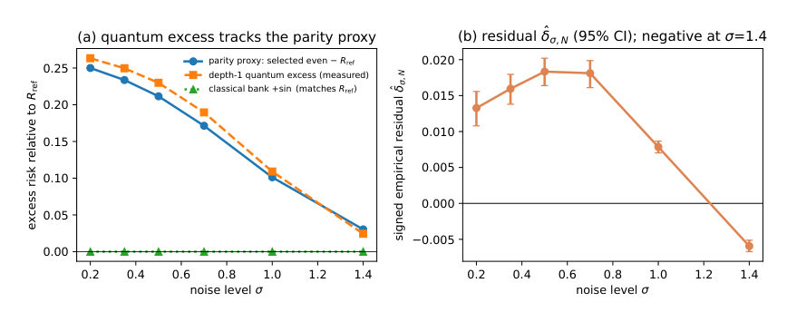
<figcaption class="paper-figure-caption"><b>Fig 1.</b> Figure 1: (a) The measured depth-1 quantum excess closely tracks the parity proxy (selected even reference −Rref) ≈∥Πoddmσ∥2 across noise levels, while a classical bank that adds the sine sector matches Rref. (b) The signed empirical residual ˆδσ,N is small in absolute value (≤0.018); error bars are paired bootstrap 95% CIs (Table 2). The negative value at σ=1.4 reflects that the finite even reference need not contain the quantum even feature span.</figcaption>
</figure>

**Summary.** This work introduces a novel benchmark to analyze fixed quantum feature maps used in diffusion denoisers. By decomposing the reconstruction error into even and odd components, the authors prove that the primary limitation (the 'parity floor') is dictated by the target's odd spectral content rather than the map's ability to represent all features. This guides future research toward nonclassical data access methods.

**Why it may be interesting.** It provides rigorous mathematical tools for diagnosing fundamental limitations in variational quantum algorithms applied to physical processes like diffusion modeling, suggesting that parity constraints are a more fundamental barrier than simple model capacity.

Detailed structure

**Main problem.** The study aims to determine which structural constraint limits fixed quantum feature maps when used within diffusion denoisers, distinguishing between representational limitations and other sources of error.

**Main result.** The excess risk in the denoising process is shown to be dominated by an irreducible 'parity floor,' which is a property of the noise-conditioned target rather than static map capacity.

**Method.** The authors develop a closed-form benchmark using analytic heat-kernel noising on a torus, decomposing the excess risk into parity and within-sector residual components based on even/odd subspaces.

**Model / system.** The model involves quantum feature maps (e.g., depth-1 RY+CNOT+Pauli-Z) applied to a diffusion process defined by a Gibbs law prior on the torus ($\mathbb{T}^n$).

**Key observables.** Excess risk, parity proxy ($\hat{P}_\sigma$), signed empirical residual ($\hat{\delta}_{\sigma,N}$), and the irreducible lower bound $\|\Pi_{	ext{odd}}m_\sigma\|^2$.

**Important parameters / regimes.** Noise scale ($\sigma$), feature map depth, and the structure of the prior (e.g., 3-body coupling on $\mathbb{T}^n$).

**Assumptions / limitations.** The analysis relies on the assumption that the excess risk can be decomposed into parity and within-sector components; the results are limited to fixed feature maps.

**Figures summary.** Figures illustrate how quantum excess tracks the calculated parity proxy across varying noise levels, confirming parity dominance over capacity limitations.

**Paper structure.** The paper first establishes a theoretical decomposition of the risk based on even/odd subspaces. It then applies this framework to specific fixed quantum feature map families (depth-1) and compares performance against classical benchmarks using various priors (torus, signed-XY).

Abstract

Fixed quantum feature maps are increasingly inserted into diffusion denoisers, but standard image benchmarks do not reveal which structural constraint limits them. We introduce CoupledPhaseTexture, a torus-diffusion benchmark with analytic heat-kernel noising that separates parity, within-sector approximation, and sample-complexity limitations. For the depth-1 RY+CNOT+Pauli-Z family we prove a containment-free parity floor: all reachable features are even functions of the encoded angles while the sine components of the Bayes denoiser are odd, so the excess risk splits exactly into an inaccessible odd part and a within-sector residual. The first term is an irreducible, noise-scale-resolved lower bound holding for every even feature class, with no containment, linearity, or closedness assumption on the feature class. The obstruction is a property of the noise-conditioned denoising target rather than static representability: the floor is re-derived at each noise scale because the target's parity content changes with noise. The measured excess is dominated by the parity proxy on two distinct priors. Higher-order Z readouts improve the even sector, but entanglement does not lower the floor and re-uploading does not reliably close it. Classical controls confirm the deficit is parity rather than quantumness: a cosine-only bank is floored similarly, while adding the sine sector matches the reference. Among tested constructions, odd readouts and a noise-coupled encoder do not match the sine-carrying classical bank. These results motivate nonclassical data access or feature classes without efficient classical surrogates; they do not establish either as sufficient for quantum advantage.

[↑ back to top](#top)

### [Type III von Neumann Algebras are Magical](http://arxiv.org/abs/2608.12512v1)

**Authors:** Mudassir Moosa  
**Type:** theory · **Category:** other · **PDF:** <https://arxiv.org/pdf/2608.12512v1>  
**Analysis basis:** full PDF text, analyzed in chunks
**Topic relevance:** `analog quantum simulation` **2/5** · `Keldysh / 2PI / non-Gaussian methods` **1/5** · `correlated / nonlocal dissipation` **1/5** · `quantum measurements` **1/5**

↔ Scroll figures horizontally

<figure class="paper-figure-card">
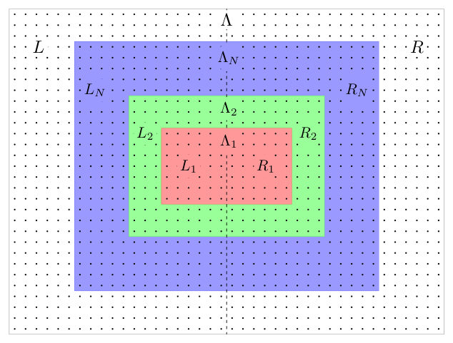
<figcaption class="paper-figure-caption"><b>Fig 1.</b> FIG. 1. A schematic representation of a nested sequence of lattices Λ1 ⊂Λ2 ⊂· · · that limits to</figcaption>
</figure>
<figure class="paper-figure-card">

<figcaption class="paper-figure-caption"><b>Fig 2.</b> Fig. 1. If we denote the algebra of operators that act trivially on LN by AN ⊂B(HN), we</figcaption>
</figure>

**Summary.** This paper connects the mathematical classification of local operator algebras (von Neumann algebras) to computational resources. It argues that systems whose local structure requires a Type III algebra—typical in QFTs—must inherently possess an infinite amount of 'magic' resource for their description to be mathematically consistent.

**Why it may be interesting.** It provides a deep connection between abstract algebraic structures (Type III factors) and concrete physical requirements for computation/simulation, which is highly relevant to understanding quantum field theories and holographic duality.

Detailed structure

**Main problem.** The work establishes a fundamental link between the mathematical structure of local von Neumann algebras (specifically Type III) and the required quantum resources ('magic') for simulating physical systems in the thermodynamic limit.

**Main result.** It is proven that Type III von Neumann algebras fundamentally require an infinite amount of 'magic' resource, linking algebraic classification to computational complexity.

**Method.** The analysis uses the formalism of von Neumann algebras and examines the inductive limits of finite lattice systems (thermodynamic limit) while quantifying resources using the concept of 'magic' gates.

**Model / system.** The study considers quantum field theories, quantum gravity models, and general lattice systems analyzed in their thermodynamic limit. The mathematical framework relies on local von Neumann algebras describing these infinite-dimensional systems.

**Key observables.** Magic (number of non-Clifford gates), Type III von Neumann Algebras, Local Subregions in QFTs.

**Important parameters / regimes.** Thermodynamic limit ($N 	o \infty$), Bounded vs. Infinite Magic Resource.

**Assumptions / limitations.** The analysis relies on the formal structure of local algebras and assumes that the thermodynamic limit can be properly constructed via inductive limits of finite systems.

**Figures summary.** Figure 1 schematically represents a nested sequence of lattices ($\Lambda_N$) partitioning into subregions, leading to an inductive limit algebra $A$.

**Paper structure.** The paper progresses by defining the mathematical tools (von Neumann algebras, magic resource) and then constructing the argument: showing that bounded local resources preclude the existence of Type III algebras in the infinite limit.

Abstract

The number of non-Clifford gates needed to perform a task, or simply \textit{magic}, is a resource for fault-tolerant quantum computation. Von Neumann algebras provide a formal mathematical structure to describe infinite-dimensional quantum systems, such as those in quantum field theory or quantum statistical mechanics. A particularly important class of von Neumann algebras is called Type III algebras, for which the standard notions of finite-dimensional systems such as density matrices and traces break down. In this work, we argue that Type III von Neumann algebras fundamentally require an infinite amount of magic. Specifically, we consider the thermodynamic limit of finite-dimensional quantum systems, such as lattice systems, and show that if the states in the thermodynamic limit possess only a bounded amount of magic, the resulting local von Neumann algebra cannot be of Type III. Our result has direct implications for the quantum simulations of quantum field theories, for which the algebra of a local subregion is known to be of Type III.

[↑ back to top](#top)

### [Quantum correlations and Basis-Independent Coherence Distribution in Two Gravitational Cat States](http://arxiv.org/abs/2608.13493v1)

**Authors:** Mostafa Mansour, Mansoura Oumennana  
**Type:** theory · **Category:** quantum information and computing · **PDF:** <https://arxiv.org/pdf/2608.13493v1>  
**Analysis basis:** full PDF text, analyzed in chunks
**Topic relevance:** `analog quantum simulation` **2/5** · `correlated / nonlocal dissipation` **1/5** · `quantum measurements` **1/5**

↔ Scroll figures horizontally

<figure class="paper-figure-card">
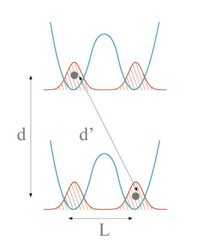
<figcaption class="paper-figure-caption"><b>Fig 1.</b> FIG. 1. Illustration of the gravcat model. Two particles are confined in a double-well potential with minima distanced by L. The parameter d (d′) denotes the separation between the particles when they occupy the same (opposite) relative min- ima.</figcaption>
</figure>
<figure class="paper-figure-card">
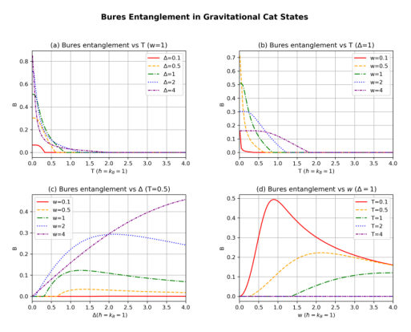
<figcaption class="paper-figure-caption"><b>Fig 2.</b> FIG. 2. Bures measure of entanglement B as a function of T, ∆and w. (a) B vs T for fixed w = 1 and varying ∆; (b) B vs T for fixed ∆= 1 and varying w; (c) B vs ∆for fixed T = 0.5 and varying w; (d) B vs w for fixed ∆= 1 and varying T.</figcaption>
</figure>
<figure class="paper-figure-card">
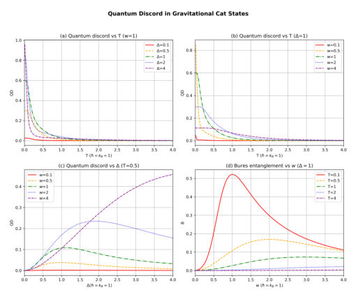
<figcaption class="paper-figure-caption"><b>Fig 3.</b> FIG. 3. QD as a function of T, ∆and w. (a) QD vs T for fixed w = 1 and varying ∆; (b) QD vs T for fixed ∆= 1 and varying w; (c) QD vs ∆for fixed T = 0.5 and varying w; (d) QD vs w for fixed ∆= 1 and varying T.</figcaption>
</figure>
<figure class="paper-figure-card">
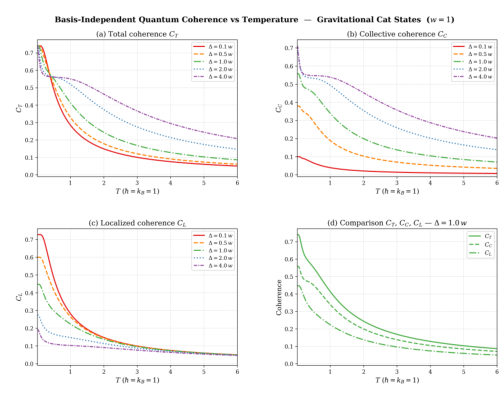
<figcaption class="paper-figure-caption"><b>Fig 4.</b> FIG. 4. Total, collective and localized coherence vs tempera- ture for ∆= 0.1w, 0.5w, 1.0w, 2.0w, 4.0w at fixed w = 1. (a) CT , (b) CC, (c) CL, (d) comparison for ∆= 1.0w.</figcaption>
</figure>
<figure class="paper-figure-card">
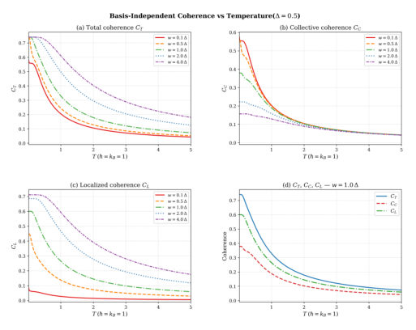
<figcaption class="paper-figure-caption"><b>Fig 5.</b> FIG. 5. Coherence vs temperature for fixed ∆= 0.5 and several w. (a) CT , (b) CC, (c) CL, (d) comparison for w = 1.</figcaption>
</figure>

**Summary.** The paper analyzes the distribution of basis-independent coherence and quantum correlations in two particles coupled by gravity within double-well potentials. By decomposing total coherence into collective and localized parts, it demonstrates that local coherence is more resilient to temperature effects than inter-particle correlations. This highlights a resource hierarchy where local superpositions persist longer than globally entangled states as the system heats up.

**Why it may be interesting.** This work provides a detailed resource quantification framework for non-local quantum resources (coherence) in a physically relevant setting (gravity), showing how local versus global entanglement survives thermalization differently.

Detailed structure

**Main problem.** The study investigates how quantum correlations and basis-independent coherence are distributed between collective (inter-particle) and localized (intra-particle) components in a system interacting via gravity.

**Main result.** Localized coherence ($C_L$) is found to be more robust against thermal fluctuations than the collective coherence ($C_C$), while increasing gravitational coupling ($\Delta$) preferentially enhances $C_C$.

**Method.** The analysis uses quantum information measures like Bures distance, Quantum Discord (QD), and a basis-independent measure of coherence derived from the Quantum Jensen–Shannon Divergence (QJSD).

**Model / system.** The system consists of two massive particles confined in a double-well potential and coupled by their mutual Newtonian gravitational interaction. The dynamics are governed by a bipartite Hamiltonian involving parameters for single-particle energy ($w$) and coupling strength ($\Delta$).

**Key observables.** Total coherence ($C_T$), Collective coherence ($C_C$), Localized coherence ($C_L$), Bures entanglement, Quantum Discord.

**Important parameters / regimes.** Temperature ($T$ or $eta$), Gravitational coupling ($\Delta$), Single-particle energy scale ($w$).

**Assumptions / limitations.** The analysis relies on a two-level approximation for the potential eigenstates and assumes thermal equilibrium with a reservoir characterized by temperature $T$.

**Figures summary.** Figures illustrate how entanglement (Bures measure) and Quantum Discord vary with $T$, $\Delta$, and $w$; coherence measures show distinct dependencies, confirming that $C_L$ is more robust than $C_C$ against thermal noise.

**Paper structure.** The paper introduces the physical model and Hamiltonian, defines various quantum correlation and coherence metrics ($C_T = C_C + C_L$), and then systematically analyzes the dependence of these measures on temperature, gravitational coupling ($\Delta$), and single-particle energy scale ($w$).

Abstract

We study the distribution of quantum correlations and basis-independent coherence in a pair of massive particles confined in a double-well potential and coupled through their mutual Newtonian gravitational interaction. Non-classical correlations are characterized using Bures distance of entanglement and quantum discord, while coherence is quantified through the square root of the quantum Jensen--Shannon divergence (QJSD) from the maximally mixed state, yielding a measure that is invariant under arbitrary unitary transformations and is therefore genuinely basis-independent. The total coherence $C_T$ decomposes into two operationally distinct contributions: the collective coherence $C_C$, which captures quantum correlations between the two subsystems, and the localized coherence $C_L$, which captures the intrinsic quantum coherence of each individual subsystem. We analyze how temperature $T$, the gravitational coupling $Δ$, and the single-particle energy scale $w$ govern the redistribution of coherence between its collective and localized components. Our results show that $C_L$ is more robust against thermal fluctuations than $C_C$, and that increasing $Δ$ preferentially enhances collective coherence by strengthening gravitationally induced inter-particle correlations.

[↑ back to top](#top)

### [Controlled dynamics of a multi-component discrete-time quantum walker](http://arxiv.org/abs/2608.13161v1)

**Authors:** Vikash Mittal, Tomasz Sowiński  
**Type:** theory · **Category:** other · **PDF:** <https://arxiv.org/pdf/2608.13161v1>  
**Analysis basis:** full PDF text, analyzed in chunks
**Topic relevance:** `analog quantum simulation` **2/5** · `quantum measurements` **1/5**

↔ Scroll figures horizontally

<figure class="paper-figure-card">
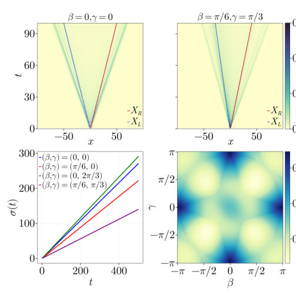
<figcaption class="paper-figure-caption"><b>Fig 1.</b> FIG. 1. (Top Row): The probability distribution P(x, t) for the three–state walk for two representative choices of the SU(3) coin parameters (β, γ), as indicated in each panel. The walker is initially localized at the origin with the coin in equal superposition of |R⟩and |B⟩as given by Eq. (9). The color scale shows the total probability at each lattice site. The red and the blue lines indicate the expectation value of the probability distributions XL and XR. (Bottom Left): The time evolution of σ(t) for four representative pairs of couplings (β, γ). (Bottom Right): slope m(β, γ) that is calculated from the long-time evolution over the full range of couplings β and γ.</figcaption>
</figure>
<figure class="paper-figure-card">
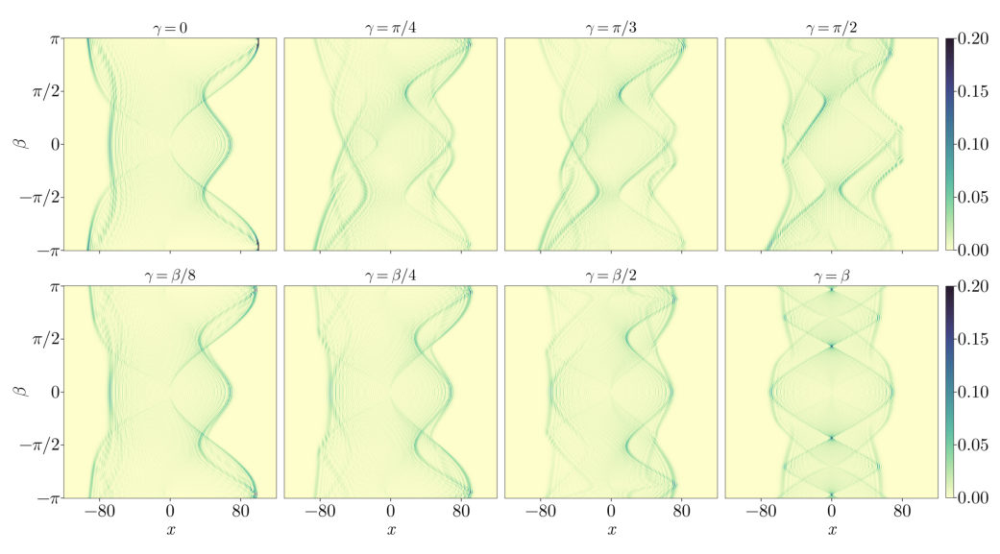
<figcaption class="paper-figure-caption"><b>Fig 2.</b> FIG. 2. The probability P(x, t) of finding the walker at lattice site x at fixed time t = 100 and different coupling angle β going from −π to π. (Top Row): fixed values of γ = 0, π/4, π/3 and π/2. (Bottom Row): fixed ratios γ/β = 1/8, 1/4, 1/2, and 1. The dynamics is symmetric under the swap β →γ, except for the mirror reflection about x = 0.</figcaption>
</figure>
<figure class="paper-figure-card">
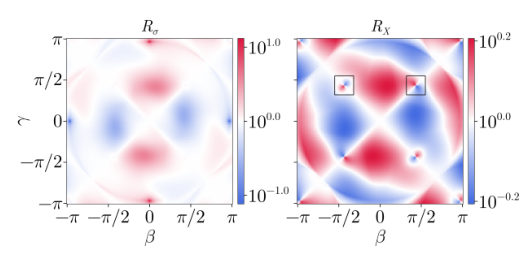
<figcaption class="paper-figure-caption"><b>Fig 3.</b> FIG. 3. Ratio of variances Rσ = σ2 R/σ2 L (Left) and the mean- position RX = −XR/XL (Right) between the right and left halves of the lattice at fixed evolution time t = 500 as a function of the coin parameters (β, γ). The decoupling limit β = γ = 0 is nearly symmetric, while finite couplings generate extended regions of pronounced directional bias, organized along smooth curves in parameter space.</figcaption>
</figure>
<figure class="paper-figure-card">
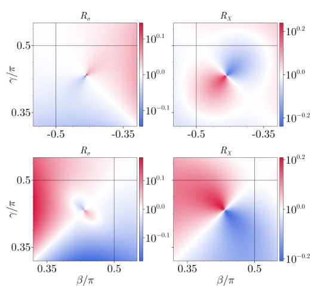
<figcaption class="paper-figure-caption"><b>Fig 4.</b> FIG. 4. Ratio of variances Rσ = σ2 R/σ2 L (Left) and the mean-position RX = −XR/XL (Right) between the right and left halves of the lattice by zooming in the region which are marked by squares in Fig. 3. The horizontal and vertical solid lines mark β = ±π/2 and γ = π/2 that helps to see the rela- tive points on interest.</figcaption>
</figure>

**Summary.** The paper investigates a three-component quantum walker whose dynamics are controlled by an SU(3) coin operator. By tuning the coupling parameters, researchers map out a complex phase diagram that allows for engineering specific transport behaviors. This demonstrates a powerful method to control spreading and localization in multi-component quantum systems.

**Why it may be interesting.** This work provides a general framework for engineering quantum transport using internal degrees of freedom (the qutrit components) rather than relying solely on external lattice geometry or topological constraints.

Detailed structure

**Main problem.** The study aims to systematically tune and control the transport properties of a multi-component quantum walker by manipulating pairwise couplings within its coin operator.

**Main result.** The system exhibits a rich phase diagram in parameter space, allowing for engineered regimes ranging from rapid ballistic spreading to strongly anisotropic dynamics with partial localization.

**Method.** Analysis involves simulating the time evolution of the state using an SU(3) coin operator and quantifying transport via spatio-temporal probability distributions and side-resolved mean/variance ratios.

**Model / system.** The model is a discrete-time quantum walk of a three-component particle (qutrit) on a 1D lattice. The evolution is governed by $U = S C(\alpha, eta, \gamma)$, where the coin operator $C$ uses Gell-Mann matrices to couple internal components.

**Key observables.** Spatio-temporal probability distribution $P(x, t)$; ballistic spreading rate $m(eta, \gamma)$; side-resolved mean position ratios ($R_X$) and variance ratios ($R_\sigma$).

**Important parameters / regimes.** The coupling parameters $(\alpha, eta, \gamma)$, particularly exploring regimes near $eta \sim\pm\pi/2$ and $\gamma \sim\pm\pi/2$.

**Assumptions / limitations.** The analysis assumes the walk remains ballistic across all tested parameter regimes; a fixed initial state $|\Psi(0)
angle = rac{1}{\sqrt{2}}(|R
angle + |B
angle) \otimes |0
angle$ is used.

**Figures summary.** Figures illustrate $P(x, t)$ for different couplings and show how side-resolved observables ($\langle X_L 
angle, \langle X_R 
angle$) reveal directional asymmetry across the parameter space.

**Paper structure.** The paper systematically analyzes the dynamics by first defining the controlled Hamiltonian/evolution operator, then applying diagnostics like $\sigma(t)$ and side-resolved ratios to map out how varying $(eta, \gamma)$ controls transport regimes in a structured phase diagram.

Abstract

We investigate a discrete-time quantum walk of a three-component quantum particle on a one-dimensional lattice. As coin operators, we employ parameterized rotations generated by the Gell-Mann matrices, which enable systematic tuning of the couplings between the internal components. We analyze how these couplings influence and control the dynamics by systematically exploring the position-space probability distribution across a broad region of the parameter space. To quantify the impact of different inter-component couplings, we further examine the ratio of the mean position to the variance in each half of the lattice. Our results indicates that the system supports a rich variety of transport regimes, ranging from nearly symmetric, rapidly spreading walks to strongly anisotropic dynamics with partial localization. This framework thus provides a new avenue for engineering targeted spreading and trapping behavior in multicomponent discrete-time quantum walks.

[↑ back to top](#top)

### [Defect-induced optical magnons and local magnetic correlations in MnSb2Te4](http://arxiv.org/abs/2608.12505v1)

**Authors:** Dhurba R. Jaishi, Bing Li, Tianxiong Han, S. X. M. Riberolles, D. M. Pajerowski, Jiaqiang Yan, R. J. McQueeney  
**Type:** both · **Category:** strongly correlated electrons · **PDF:** <https://arxiv.org/pdf/2608.12505v1>  
**Analysis basis:** full PDF text, analyzed in chunks
**Topic relevance:** `analog quantum simulation` **2/5** · `Keldysh / 2PI / non-Gaussian methods` **1/5**

↔ Scroll figures horizontally

<figure class="paper-figure-card">
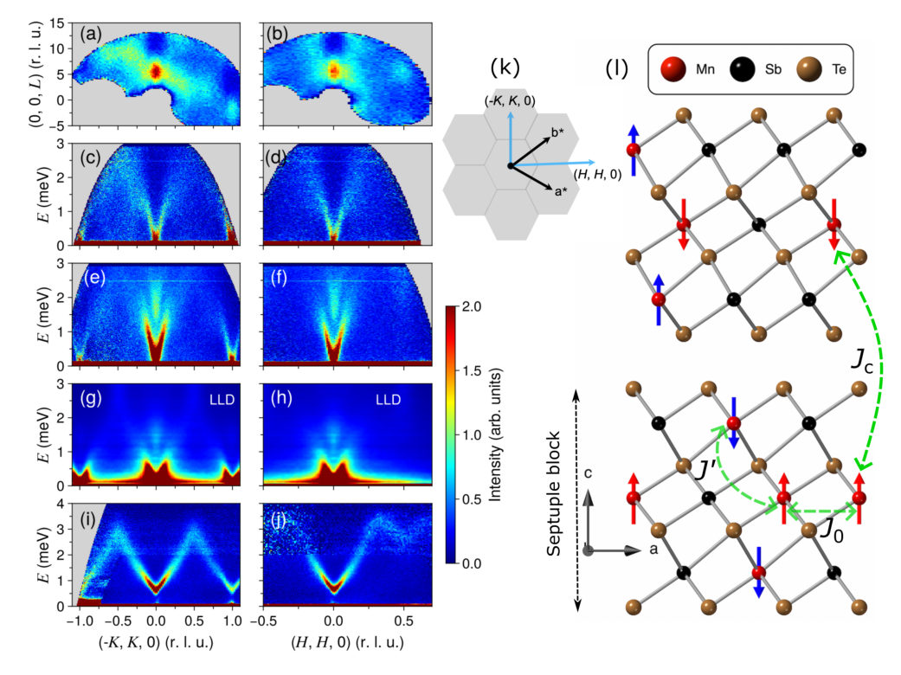
<figcaption class="paper-figure-caption"><b>Fig 1.</b> FIG. 1. (a-f) INS data of AFM MnSb2Te4 measured at 2 K and Ei = 3.32 meV. (a-b) Constant energy slices around E = 2 meV with an energy bin width of ∆E = ±0.5. (c-f) The in-plane spin wave dispersions. These data are integrated in the transverse direction with H/K =[-0.02, 0.02], L = [9, 12] in (c) and (d), and L = [3, 9] in (e) and (f). (g-h) The LLD simulations in the respective directions at 2 K. (i-j) The INS data of MBT measured at 2 K, where high-resolution INS data with Ei = 3.32 meV superposed on top of the data measured with Ei = 6.6 meV. The data are integrated in the (0, 0, L) direction in the range of L = [0, 20] for Ei = of 6.6 meV and L = [3, 12] for Ei = of 3.32 meV. MBT INS...</figcaption>
</figure>
<figure class="paper-figure-card">
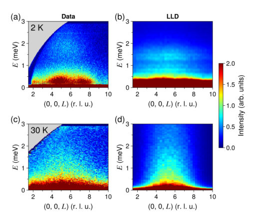
<figcaption class="paper-figure-caption"><b>Fig 2.</b> FIG. 2. Spin wave excitations in the out-of-plane direction in MST. (a), (c) INS data measured at 2 K and 30 K along the (0, 0, L) direction, respectively. (b), (d) LLD calculations corresponding to conditions of panels (a) and (c). The data and simulations are integrated in the transverse direction with H/K =[-0.02, 0.02] (r. l. u.).</figcaption>
</figure>
<figure class="paper-figure-card">
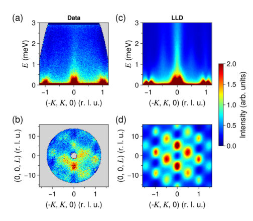
<figcaption class="paper-figure-caption"><b>Fig 3.</b> FIG. 3. Magnetic dimer formation above TN. (a) INS data measured along the in-plane direction at T = 30 K. The data are integrated in the transverse directions with H =[-0.1, 0.1] and L =[3, 9] (r. l. u.). (b) Constant energy cut around E = 1 meV with an energy bin width of ∆E = ±0.1. (c-d) LLD simulation of INS scattering intensity at T = 30 K with sampling corresponding to panels (a) and (b), respectively.</figcaption>
</figure>
<figure class="paper-figure-card">
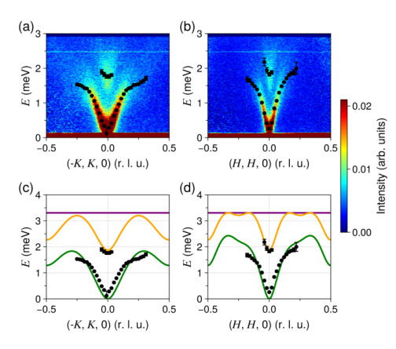
<figcaption class="paper-figure-caption"><b>Fig 4.</b> FIG. 4. (a-b) INS data measured along (−K, K, 0) and (H, H, 0) directions at 2 K, respectively, overplotted with the extracted peak centers from fitting. The data are integrated in the (0, 0, L) direction in the range of L = [3, 9] (r. l. u.). (c-d) Calculated spin wave dispersion using the minimal tri- layer model.</figcaption>
</figure>

**Summary.** This work investigates how structural defects, specifically antisite mixing, modify the magnetic properties of topological magnetic insulators like $	ext{MnSb}_2	ext{Te}_4$. By combining inelastic neutron scattering with spin-dynamics simulations, the authors demonstrate that these defects induce a strong, measurable antiferromagnetic coupling responsible for an observable optical magnon gap. This highlights defect engineering as a powerful tool to tune fundamental magnetic interactions in quantum materials.

**Why it may be interesting.** The study provides a concrete example of how disorder (antisite defects) fundamentally alters the magnetic Hamiltonian and excitation spectrum of a quantum material, which is relevant for understanding engineered correlated states in condensed matter systems.

Detailed structure

**Main problem.** The study aims to directly probe defect-induced magnetic interactions and understand how antisite mixing affects the spin dynamics of topological magnetic insulators.

**Main result.** Antisite mixing generates disordered sublattices, leading to a distinct optical magnon mode with a large gap ($\Delta' \approx 1.5$ meV), indicating strong defect-mediated antiferromagnetic coupling ($J'$).

**Method.** The research combines inelastic neutron scattering (INS) experiments on single crystals with semi-classical spin-dynamics simulations using Landau-Lifshitz Dynamics (LLD).

**Model / system.** The physical system is $	ext{MnSb}_2	ext{Te}_4$, a topological magnetic insulator in the $	ext{Mn}(	ext{Bi},	ext{Sb})_2	ext{Te}_4$ family, which exhibits significant antisite defects. The analysis uses spin Hamiltonians incorporating various exchange couplings ($J_0, J_c, J'$).

**Key observables.** Optical magnon gap ($\Delta'$), spin wave dispersion curves (acoustic and optic branches), magnetic dimer structure factor.

**Important parameters / regimes.** Defect concentration ($\sim 15\%$ in MST vs. $<3\%$ in MBT); coupling strengths ($J' \approx 0.7$ meV, $J_0 = -0.075$ meV).

**Assumptions / limitations.** The analysis assumes that the observed optical magnon mode is a signature of defect-induced ferrimagnetism and relies on fitting spin wave dispersions to model parameters.

**Figures summary.** Figures show INS data (constant energy slices, in-plane dispersion) for MST compared to MBT, illustrating the distinct magnetic excitation spectrum caused by defects.

**Paper structure.** The paper progresses from identifying the problem of defect influence in topological insulators to presenting experimental INS measurements, followed by theoretical modeling using spin Hamiltonians and LLD simulations to quantify the defect-induced couplings.

Abstract

Magnetic defect engineering offers a route to manipulate and control magnetic and electronic states in quantum materials. In the Mn(Bi,Sb)2Te4 family of topological magnetic insulators, Sb substitution facilitates site mixing between Mn and Sb atoms that affects magnetic order and band topology. Here we directly probe these defect-induced magnetic interactions using inelastic neutron scattering on single crystals of MnSb2Te4. We find that antisite mixing generates inequivalent and disordered magnetic sublattices where strong defect-induced antiferromagnetic coupling produces an optical magnon with a large gap. Semi-classical spin-dynamics simulations accurately capture magnetic excitations in the ordered and paramagnetic states and identify that linear Mn-Te-Mn bonds mediate coupling to antisite magnetic defects.

[↑ back to top](#top)

### [SPLIT-Q: A Scalable Sequential Quantum Computing Framework for Coherent Controlled Islanding](http://arxiv.org/abs/2608.12711v1)

**Authors:** Yuqi Jiang, Zhiding Liang, Qiang Guan, Yan Li, Ganesh Kumar Venayagamoorthy  
**Type:** both · **Category:** quantum information and computing · **PDF:** <https://arxiv.org/pdf/2608.12711v1>  
**Analysis basis:** full PDF text, analyzed in chunks
**Topic relevance:** `QC/QI experiment` **2/5** · `quantum measurements` **1/5**

↔ Scroll figures horizontally

<figure class="paper-figure-card">
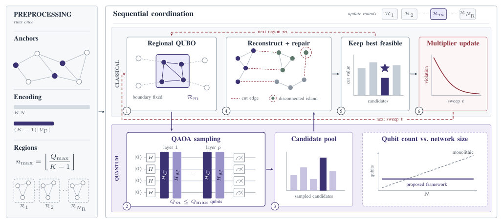
<figcaption class="paper-figure-caption"><b>Fig 1.</b> Fig. 1. Workflow of the proposed method. Preprocessing fixes coherent groups as anchors, encodes only the free buses, and partitions them into regions whose register sizes Qm do not exceed Qmax, with nmax denoting the regional bus limit and NR the number of regions. Each round optimizes active region Rm and evaluates its candidates on the full network, while projected multipliers carry global violations forward without slack qubits. The circled numbers give the execution order within one update round, which crosses the classical and quantum lanes twice; the dashed panel is a scaling annotation rather than a pipeline stage. Here, p is the QAOA depth and t indexes coordination sweeps. The...</figcaption>
</figure>
<figure class="paper-figure-card">
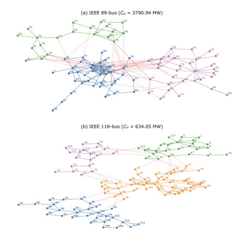
<figcaption class="paper-figure-caption"><b>Fig 2.</b> Fig. 2. Reconstructed feasible islanding solutions on the IEEE 89- and 118- bus systems. Node color denotes island membership, dashed edges mark inter- island cuts, and each panel reports the corresponding hardware cut value CH in MW.</figcaption>
</figure>
<figure class="paper-figure-card">
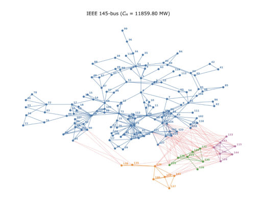
<figcaption class="paper-figure-caption"><b>Fig 3.</b> Fig. 3. Reconstructed feasible islanding solution on the IEEE 145-bus system, using the same color and line conventions as Fig. 2.</figcaption>
</figure>
<figure class="paper-figure-card">
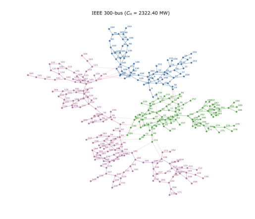
<figcaption class="paper-figure-caption"><b>Fig 4.</b> Fig. 4. Reconstructed feasible islanding solution on the IEEE 300-bus system, using the same color and line conventions as Fig. 2.</figcaption>
</figure>

**Summary.** This paper introduces SPLIT-Q, a scalable quantum framework designed to solve large power system islanding problems. It overcomes the exponential resource scaling limitations of monolithic quantum formulations by employing regionalization and sequential solving techniques within QAOA. The results demonstrate that this method can accurately find optimal partitions on real quantum hardware for very large networks while maintaining a fixed, manageable qubit footprint.

**Why it may be interesting.** While focused on power grids, the core methodology—decoupling exponentially scaling combinatorial problems into fixed-width, sequentially solvable quantum subproblems—is highly relevant to developing scalable quantum algorithms for general hard optimization problems in condensed matter physics or materials science.

Detailed structure

**Main problem.** The paper addresses the computational challenge of solving large-scale controlled islanding problems in power grids, which is a complex combinatorial optimization task.

**Main result.** A novel sequential distributed QAOA framework was proposed that successfully solves these large problems on current quantum hardware by keeping the required qubit width fixed, unlike monolithic approaches whose complexity scales exponentially with network size.

**Method.** The method formulates the problem as boundary-conditioned regional QUBO subproblems solved sequentially. This approach partitions the optimization variables into manageable regions to fit within limited quantum resources.

**Model / system.** The physical system is an electrical power grid modeled as a weighted graph (buses and transmission lines). The goal is to partition this network into electrically sustainable 'islands' by minimizing the total weight of cut edges.

**Key observables.** Disruption cost (cut value in MW), quantum resource demand (two-qubit gate count $G$, circuit depth $d$), and solution quality compared against classical solvers like Gurobi.

**Important parameters / regimes.** Network size (up to 300 buses), fixed qubit budget ($Q_{\max}$), and the scaling factor $\chi$ which measures width reduction relative to network size.

**Assumptions / limitations.** The primary assumption is that regionalization successfully decouples the quantum resource requirement from the total network size, allowing fixed-width devices to solve arbitrarily large systems.

**Figures summary.** Figures illustrate the workflow of partitioning free buses into regions for sequential QAOA sampling and show reconstructed islanding solutions on various IEEE benchmark systems.

**Paper structure.** The paper first defines the physical problem (controlled islanding) using graph theory and optimization formulations. It then critiques monolithic quantum approaches due to scaling issues, proposes the scalable regionalized framework, details its implementation via sequential QUBO solving, and finally validates it by comparing results across various IEEE benchmark systems on real hardware.

Abstract

Growing integration of distributed energy resources increases power-system variability and uncertainty. During disturbances, these effects can intensify generation-load imbalances and cascading failures. Controlled islanding limits their propagation by partitioning a compromised grid into connected, electrically sustainable islands. However, classical methods face rapidly growing computational costs as network size and island count increase. Quantum optimization offers an alternative for exploring this combinatorial partition space. Yet monolithic quantum formulations encode all assignment decisions in one circuit, causing qubit demand and circuit complexity to scale with network size. In this study, a qubit-bounded sequential distributed quantum approximate optimization algorithm (QAOA) framework is proposed to tackle coherent controlled islanding under limited quantum resources. It formulates the optimization as boundary-conditioned regional quadratic unconstrained binary optimization (QUBO) subproblems that are solved sequentially within a fixed qubit budget. Thus, circuit width remains independent of network size, with aggregate quantum workload scaling linearly on bounded-degree networks. Evaluation covers eleven IEEE systems from 9 to 300 buses using IBM quantum computing resources, with Gurobi and monolithic QAOA as references. Across all systems, the framework recovers feasible Gurobi-optimal partitions under noise, confirming the resilience of its solution quality. The results further show that the proposed method substantially reduces quantum-resource demand and circuit complexity relative to monolithic QAOA, allowing large islanding problems to be addressed within current hardware limits. The proposed framework provides a feasible and scalable pathway for quantum optimization in large-scale power systems.

[↑ back to top](#top)

### [Ambient unitaries don't enable shallow group designs](http://arxiv.org/abs/2608.13528v1)

**Authors:** Maxwell West, M. Cerezo, Martin Larocca  
**Type:** theory · **Category:** quantum information and computing · **PDF:** <https://arxiv.org/pdf/2608.13528v1>  
**Analysis basis:** full PDF text, analyzed in chunks
**Topic relevance:** `quantum measurements` **2/5**

↔ Scroll figures horizontally

<figure class="paper-figure-card">
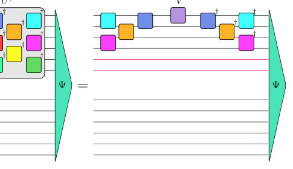
<figcaption class="paper-figure-caption"><b>Fig 1.</b> Figure 1. 2-designs over a group G which possesses an invariant state |Ψ⟩∈H⊗2 formed by averaging over an ensemble of sublinear-depth unitaries belonging to G are straightforwardly disallowed by a simple lightcone argument [4]. The invariant state effectively acts as a resource for converting a unitary from the group to its Hermitian conjugate. Indeed, for U ∈G we have U ⊗2(V ⊗1H) |Ψ⟩= ((UV U †) ⊗1H) |Ψ⟩, so that there are regions of (V ⊗1H) that are “undisturbed” if (and with high probability only if) U is of sublinear-depth. Modulo some mild technical assumptions on the entanglement structure of |Ψ⟩and the scrambling capacity of G, this can be used to rule out such sublinear-depth...</figcaption>
</figure>

**Summary.** This paper proves that achieving approximate unitary designs over several important symmetry groups requires circuit depths that scale linearly with system size, even when utilizing unitaries from outside the defined subgroup. This result closes a loophole in prior work and has major implications for quantum information theory by setting fundamental depth overheads for benchmarking protocols.

**Why it may be interesting.** It provides rigorous theoretical constraints on the resource overhead required for practical quantum characterization protocols (like tomography or benchmarking), directly impacting hardware feasibility assessments.

Detailed structure

**Main problem.** The paper investigates the fundamental limits on how efficiently approximate unitary designs can be constructed when sampling from specific subgroups of the full unitary group, particularly when using local nearest-neighbor gates.

**Main result.** It proves that these limitations hold even if 'ambient' unitaries (from outside the subgroup) are used, implying that many natural quantum tomography and benchmarking schemes suffer from a dramatic circuit depth overhead compared to ideal protocols.

**Method.** The analysis uses lower bounds derived from comparing the $k$-th moment channel fidelity ($\Phi^{(k)}$) against the Haar measure using invariant projectors associated with maximally entangled states.

**Model / system.** The study focuses on various quantum groups, including the matchgate, orthogonal $	ext{O}(d)$, symplectic $	ext{SP}(d/2)$, and Clifford groups, applied to nearest-neighbor gates on a one-dimensional lattice.

**Key observables.** Approximate $k$-design fidelity ($\epsilon$), circuit depth ($L$), and the diamond distance between moment channels.

**Important parameters / regimes.** The required depth scales linearly with system size ($n$) for all tested groups, establishing an $\Omega(n)$ lower bound.

**Assumptions / limitations.** The core contribution is extending previous results by showing that the limitation holds even when unitaries used are not strictly confined to the target subgroup (i.e., using ambient unitaries).

**Figures summary.** Figure 1 illustrates how sublinear-depth designs over groups with invariant states are disallowed via lightcone arguments.

**Paper structure.** The paper establishes a general lower bound on design fidelity based on invariant projectors, specializes this for pure entangled states, and then applies these theorems to specific quantum groups (matchgate, orthogonal, symplectic, Clifford) to prove the necessary linear depth scaling.

Abstract

Characterising the efficiency with which designs over various subsets of the unitary group may be constructed is an important goal of quantum information theory. While it is now known that approximate unitary designs can be realised in depth logarithmic in the system size, it has recently been shown that ensembles of local nearest-neighbour sublinear-depth one-dimensional circuits over the matchgate, orthogonal, and symplectic groups cannot form approximate 2-designs over their parent groups; similarly, sublinear-depth ensembles of Cliffords cannot form a Clifford 4-design. In this note we show that this remarkable exponential separation is not merely an artefact of restricting to ensembles consisting of unitaries from the subgroups themselves, but rather that no ensemble of local nearest-neighbour sublinear-depth unitaries can realise approximate designs in the aforementioned cases, even when employing "ambient" unitaries from beyond the subgroup itself (possibly acting on ancilla qubits). This implies that various natural tomography and benchmarking schemes which involves sampling from these groups suffer from a dramatic circuit depth overhead compared to similar protocols which involve sampling from the full unitary group. We additionally conclude that, in all of the above cases, the known linear-depth design constructions are up to constant factors optimal.

[↑ back to top](#top)

### [Correlation versus Causation in Quantum Criticality](http://arxiv.org/abs/2608.12770v1)

**Authors:** Conrad Wichmann, Ryan Thorngren, Ruben Verresen  
**Type:** theory · **Category:** statistical mechanics · **PDF:** <https://arxiv.org/pdf/2608.12770v1>  
**Analysis basis:** full PDF text, analyzed in chunks
**Topic relevance:** `Keldysh / 2PI / non-Gaussian methods` **1/5** · `driven-dissipative phase transition` **1/5** · `non-equilibrium universality` **1/5**

↔ Scroll figures horizontally

<figure class="paper-figure-card">
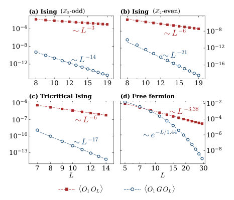
<figcaption class="paper-figure-caption"><b>Fig 1.</b> FIG. 1. Correlation vs. causation in (1 + 1)D critical systems. In each panel, the edge-to-edge correlation ⟨O1OL⟩ and causation ⟨O1 G OL⟩are computed between a ZT 2 -odd operator O1 at the left end and its mirror image OL at the right end. (a,b) Critical Ising with O1 = Y1X2 (Z2-odd) and O1 = Y1Z2X3 (Z2-even), respectively. (c) Tricritical Ising via the spin-1 Blume-Capel chain with O1 = Sy 1 Sz 2Sx 3 . (d) BDI Majorana chain with parameters (t−1, t0, t1) = (1, 3, 2) and tα = 0 otherwise, with O1 = ˜γ1 and OL = γL. Panels (a,b,d) are obtained by free-fermion diagonalization; (c) by exact diagonalization in the spin basis.</figcaption>
</figure>
<figure class="paper-figure-card">
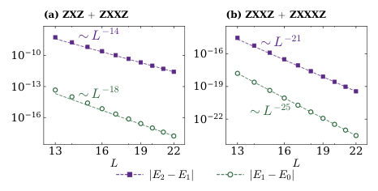
<figcaption class="paper-figure-caption"><b>Fig 2.</b> FIG. 2. Finite-size edge-mode splittings in gapless SPTs. Starting with fine-tuned gSPTs H and H′ with de- coupled qubit edge modes, we couple to Oleft 1,2 and Oright 1,2 of the main text. (a) H, with Oleft 1 = Y2Y3X4Y5 and Oleft 2 = Y2X3Y4Y5 [Eq. (10)]; splittings ∼L−14, L−18. (b) H′, with Oleft 1 = −X2Y3X4Z5 and Oleft 2 = Y2Y3Y4Z5 [Eq. (11)]; split- tings ∼L−21, L−25.</figcaption>
</figure>
<figure class="paper-figure-card">
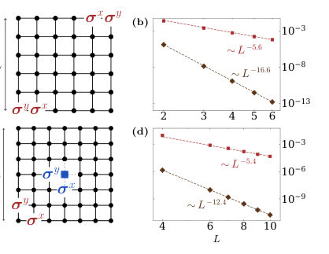
<figcaption class="paper-figure-caption"><b>Fig 3.</b> FIG. 3. Correlation and causation in the (2+1)D Ising CFT. (a) L × L Ising lattice with operators O1 := σy 1,1σx 1,2 (bottom left) and O2 := σx L,L−1σy L,L (top right). (b) Decay of ⟨O1O2⟩and ⟨O1GO2⟩with L. (c) Lattice with a magnetic line defect (blue square) and O2 at its center, shown for odd L; even L differs slightly as it has no center site. Operator definitions are unchanged up to repositioning. (d) Correlation and causation with the defect, where odd-L data is rescaled by a constant factor.</figcaption>
</figure>

**Summary.** This work introduces 'causation,' defined as the static susceptibility, as an alternative to standard correlation functions for studying quantum criticality. It demonstrates that causation decays much faster than correlation due to mathematical constraints involving time derivatives. This difference allows researchers to pinpoint fundamental physical operators and accurately predict phenomena like edge-mode splittings in topological phases.

**Why it may be interesting.** It provides a powerful new diagnostic tool for critical systems that can distinguish between physical influences (causation) and mere statistical correlations, which is crucial for understanding emergent phenomena in strongly interacting quantum matter.

Detailed structure

**Main problem.** The paper contrasts standard correlation functions with a novel measure called 'causation' (static susceptibility) to investigate how physical influences decay at quantum critical points.

**Main result.** Causation can exhibit significantly faster decay rates than correlations, revealing physics—such as specific primary operators or edge-mode splittings—that are otherwise masked by the slower decaying correlation terms.

**Method.** The analysis employs conformal field theory (CFT) techniques, resolvent calculations involving Green's functions, and numerical methods like DMRG to compare scaling laws for both observables.

**Model / system.** The study applies to various critical systems, including the $(2+1)$D Ising model, gapless symmetry-protected topological (SPT) phases in 1D, and general quantum critical points described by CFTs.

**Key observables.** Correlation functions $\langle O_1(x) O_2(0) 
angle$ vs. Causation/Static Susceptibility $\lim_{\lambda	o 0} \partial_\lambda \langle A(x) 
angle_\lambda$.

**Important parameters / regimes.** Dimensionality (1+1D, 2+1D), scaling exponents ($\Delta$), and the perturbation strength ($\lambda$).

**Assumptions / limitations.** The analysis relies on identifying operators that are not time derivatives to correctly calculate causation, contrasting this with standard correlation measurements.

**Figures summary.** Figures illustrate numerical comparisons of correlation vs. causation decay rates for various Ising variants in (1+1)D and show the scaling of edge-mode splittings derived from bulk causal influence in SPTs.

**Paper structure.** The paper systematically introduces the concept of causation, derives its theoretical scaling predictions via CFT, applies this framework to analyze boundary effects in 1D SPTs, and demonstrates how it reveals hidden primary operators in higher dimensions.

Abstract

Correlation functions $\langle O_1(x) O_2(0) \rangle$ reveal scaling dimensions through spatial decay. We instead consider static susceptibility, the change in $\langle O_1(x) \rangle$ from perturbing the Hamiltonian by $O_2(0)$, which we term causation for short. In a conformal field theory (CFT), dimensional analysis predicts decay of $|x|^{-2Δ}$ for correlation and $|x|^{-2Δ+1}$ for causation. Yet we find causation can decay up to fifteen additional orders in $x$ through a general mechanism, which we trace to time-derivative fields being unable to contribute to static response. In higher-dimensional CFTs, this mechanism ensures leading causation arises from primaries, even when descendants dominate correlation, which we leverage with DMRG to identify a previously unresolved corner primary of $Δ\approx 8.8$ and a heavy magnetic line defect primary of $Δ\approx 4.6$ in the $(2+1)$D critical Ising model. Moreover, the same mechanism governs edge-mode localization in $(1+1)$D gapless symmetry-protected topological phases, explaining previously observed anomalously small edge-mode splittings and guiding our construction of spin chains with splittings as small as $1/L^{18}$ and $1/L^{25}$.

[↑ back to top](#top)

### [Stabilizer complexity and the Python's lunch](http://arxiv.org/abs/2608.12472v1)

**Authors:** Abhirup Bhattacharya, Jatin Narde, Onkar Parrikar, Suprakash Paul  
**Type:** theory · **Category:** other · **PDF:** <https://arxiv.org/pdf/2608.12472v1>  
**Analysis basis:** full PDF text, analyzed in chunks
**Topic relevance:** `Keldysh / 2PI / non-Gaussian methods` **1/5** · `correlated / nonlocal dissipation` **1/5** · `quantum measurements` **1/5**

↔ Scroll figures horizontally

<figure class="paper-figure-card">
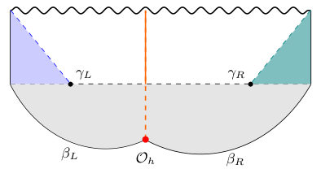
<figcaption class="paper-figure-caption"><b>Fig 1.</b> FIG. 1: Euclidean path integral preparation of PET state on the t = 0 slice. Lorentzian evolution of this state produces a geometry containing two black holes connected by a long wormhole.</figcaption>
</figure>
<figure class="paper-figure-card">
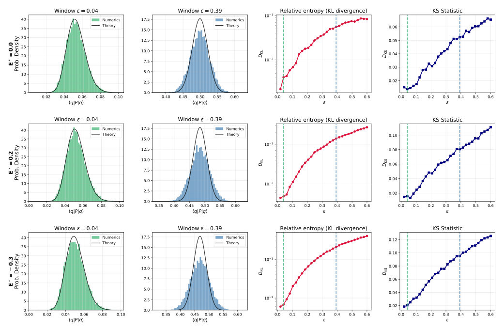
<figcaption class="paper-figure-caption"><b>Fig 2.</b> FIG. 2: Numerical evidence for Assumption-1 in the SYK model with N = 20, averaged over 20 realizations. Rows correspond to three different energy centers (E⋆= 0.0, 0.2, −0.3). The first two columns compare the numerical distribution of ⟨q|P|q⟩against the exact theoretical prediction for two representative microcanonical window sizes (ϵ = 0.04 and ϵ = 0.39). First column: for sufficiently small values of ϵ, our assumption holds very well. Second column: as ϵ increases beyond the RMT energy scale, ϵ &gt; ERMT, the assumption begins to break down. The rightmost columns quantify the degree of validity of this randomness assumption, plotting the KL and KS divergences as a function of the...</figcaption>
</figure>

**Summary.** This paper calculates the stabilizer complexity of reduced density matrices derived from partially entangled thermal states in holographic CFTs. Using Wigner negativity, the authors show that this complexity is exponentially sensitive to a feature called the 'python's lunch' in the bulk geometry. This links quantum information measures directly to gravitational structure via AdS/CFT correspondence.

**Why it may be interesting.** While highly theoretical, the connection between quantum complexity measures (like stabilizer complexity) and bulk geometry (via AdS/CFT) provides a powerful tool for understanding entanglement structure in strongly coupled systems relevant to condensed matter physics.

Detailed structure

**Main problem.** The study investigates the stabilizer complexity of the reduced density matrix for a partially entangled thermal (PET) state within the framework of holographic CFTs.

**Main result.** The relative Wigner negativity, which measures stabilizer complexity, is found to be exponentially enhanced by the presence of a 'python's lunch' region in the bulk geometry compared to its absence.

**Method.** The analysis employs concepts from quantum information theory (Wigner negativity) applied to holographic models, utilizing assumptions about spectral pseudorandomness and averaging over Haar random unitaries via the replica trick.

**Model / system.** The system involves PET states in a holographic CFT context, dual to black hole geometries containing a 'python's lunch' region. Calculations are performed on microcanonical truncations of these states, sometimes modeled using the SYK Hamiltonian.

**Key observables.** Wigner negativity ($N$), relative Wigner negativity $N(
ho_R|
ho^{(0)}_R)$, and geometric quantities like extremal surface areas ($A_{	ext{out}}, A_{	ext{min}}$).

**Important parameters / regimes.** The energy window size ($\epsilon$) must be small compared to the characteristic RMT energy scale ($E_{	ext{RMT}}$); $G_N$ (Newton's constant) appears in the exponent.

**Assumptions / limitations.** Assumes pseudorandomness of the CFT spectrum and heavy operator insertion; relies on fixed energy boundary conditions for universal statements.

**Figures summary.** Figure 1 illustrates the Euclidean path integral preparation of the PET state, depicting two black holes connected by a wormhole.

**Paper structure.** The paper progresses from defining the physical system (PET states in holography) and key diagnostics (Wigner negativity) to deriving the complexity formula based on geometric areas. It then applies these methods using approximations derived from random matrix theory and tests them against specific models like SYK.

Abstract

In this note, we study the stabilizer complexity of the reduced density matrix corresponding to one side of a partially entangled thermal (PET) state with fixed energy boundary conditions in a holographic CFT. In particular, we study Wigner negativity, an operationally meaningful magic monotone which can be interpreted as the complexity of classically simulating any quantum circuit preparation of the reduced state on the subregion. Using assumptions on the pseudorandomness of the CFT spectrum and the heavy operator insertion, we observe that the Wigner negativity of the PET state relative to the microcanonical density matrix at the given energy is given by $\exp\left[\frac{1}{8G_N}(A_{\text{out}} - A_{\text{min}})\right]$, where $A_{\text{out}}$ is the area of the outer extremal surface, while $A_{\text{min}}$ is the area of the minimal extremal surface. Thus, the stabilizer complexity of the reduced density matrix on the boundary subregion is $O(1)$ in the absence of a python's lunch, but gets exponentially enhanced in the presence of a python's lunch in the bulk geometry.

[↑ back to top](#top)

### [The nature of the "pseudogap" in the insulating phase of highly disordered superconductors](http://arxiv.org/abs/2608.12508v1)

**Authors:** Mark Nikolaevsky, Abhisek Samanta, Nandini Trivedi, Aviad Frydman  
**Type:** both · **Category:** strongly correlated electrons · **PDF:** <https://arxiv.org/pdf/2608.12508v1>  
**Analysis basis:** full PDF text, analyzed in chunks
**Topic relevance:** `Keldysh / 2PI / non-Gaussian methods` **1/5** · `analog quantum simulation` **1/5** · `driven-dissipative phase transition` **1/5**

↔ Scroll figures horizontally

<figure class="paper-figure-card">
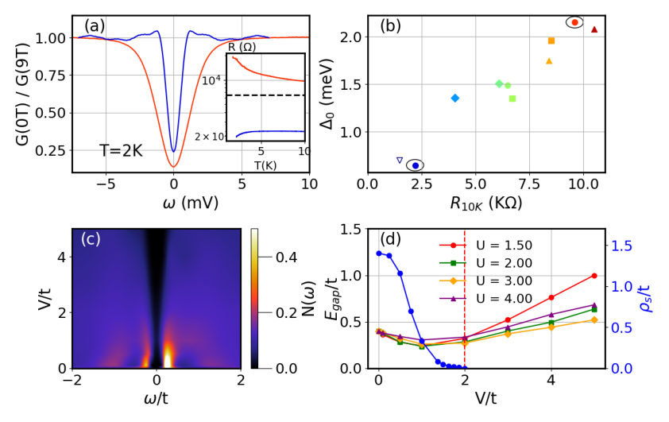
<figcaption class="paper-figure-caption"><b>Fig 1.</b> FIG. 1. Effect of the disorder on the gap. Panel (a) depicts the normalized tunneling density (G) of two tunneling spectra from the same sample at two different disorder levels at 2K. The highly disordered measurement is shown in red and a less disordered measurement, on the verge of SIT, is shown in blue. The inset depicts the corresponding resistance R as a function of temperature in red and blue lines respectively. The dashed line shows the quantum of resistance h/(2e)2 = 6.45KΩ. Panel (b) summarizes the fitted gap as a function of disorder (represented as the resistivity of the sample at 10K) from the experimental results using the Dentelski et al. model [40] at 2K. Each sample is shown...</figcaption>
</figure>
<figure class="paper-figure-card">
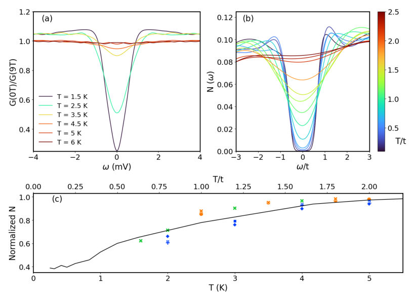
<figcaption class="paper-figure-caption"><b>Fig 2.</b> FIG. 2. The density of states (DOS) as a function of temperature. Panels (a) and (b) show the evolution of the DOS as a function of temperature in the insulating phase from the experimental measurements and the theoretical calculation respectively. (a) depicts the measured normalized tunneling density as a function energy (applied dc voltage) at varying temperatures from 1.5K to 6K, (b) is the calculated DOS as a function of energy (ω) using the DQMC simulations, at a disorder level V/t = 2.5 and at varying temperatures. Panel (c) shows the temperature dependence of the normalized low-energy DOS, obtained by integrating the spectra within ±∆. The symbols represent experimentally extracted...</figcaption>
</figure>
<figure class="paper-figure-card">
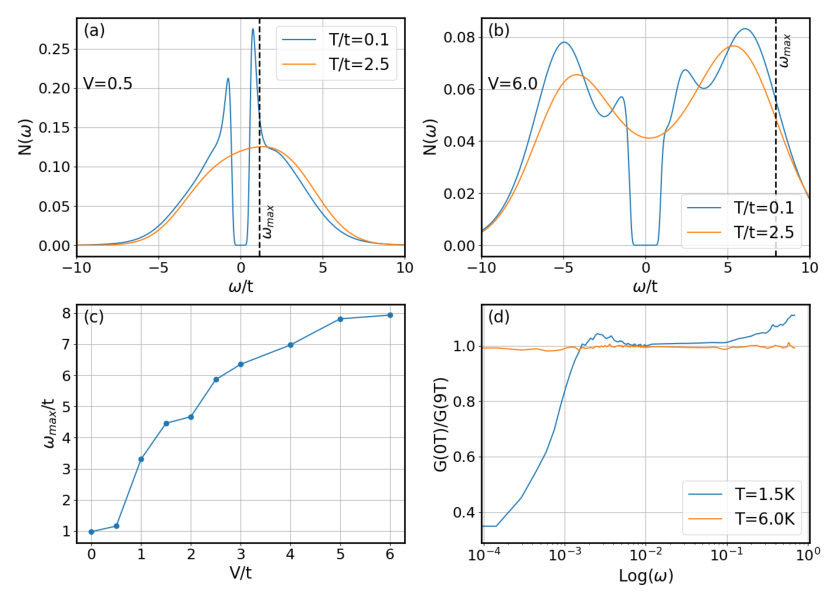
<figcaption class="paper-figure-caption"><b>Fig 3.</b> FIG. 3. Suppression of states into higher energies at large disorder. Panels (a) and (b) depict the calculated density of states (DOS) N(ω) based on DQMC simulations at different disorder levels V = 0.5t and 6t, respectively. For each disorder, N(ω) is shown for low temperature (blue line) and a higher temperature (orange line), where the coherence peaks have been suppressed. Note the relative increase in the density of states at high energies at higher temperatures. (c) Maximal energy (ωmax) defined by the energy cut-off that equalizes the integrated DOS for the low temperature curve below the cut-off to corrresponding area for the high temperature curve. This gives a quantitative measure...</figcaption>
</figure>
<figure class="paper-figure-card">
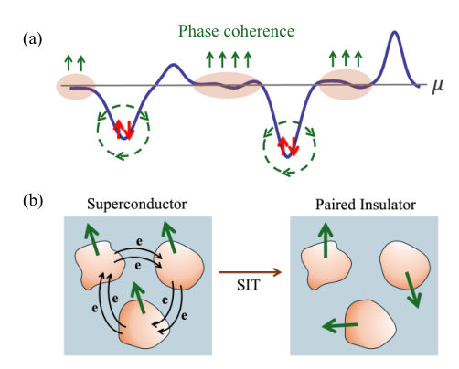
<figcaption class="paper-figure-caption"><b>Fig 4.</b> FIG. 4. Schematic illustration of superconductivity in a highly disordered potential in the insulating phase of the superconduc- tor–insulator transition (SIT). The gray surface represents a spatially random disorder potential, with red spheres denoting bound electron pairs localized in potential minima. Purple regions indicate locally coherent superconducting (SC) islands, with arrows representing the local SC phase within each island. At strong disorder, large potential barriers suppress coupling between islands, preventing global phase coherence across the sample.</figcaption>
</figure>
<figure class="paper-figure-card">
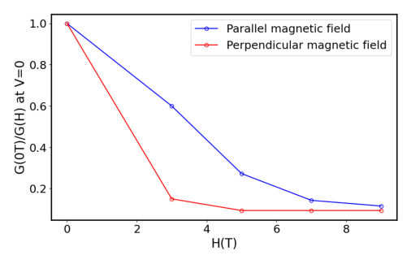
<figcaption class="paper-figure-caption"><b>Fig 5.</b> FIG. 6. Comparison between the effect of parallel vs. perpen- dicular magnetic field on the samples. Zero-bias conductance at H = 0, normalized by its value at field H, for the same sample measured with magnetic field applied parallel (blue) and perpendic- ular (red) to the film. A perpendicular field can introduce vortices, which locally create subgap states and would therefore enhance the zero-bias conductance. Although the low-field responses differ, both orientations converge to essentially the same value at H = 9T. This demonstrates that vortex-induced subgap states cannot account for the observed filling of the gap.</figcaption>
</figure>

**Summary.** This work investigates the pseudogap physics across the superconductor-insulator transition in disordered superconductors using both advanced tunneling spectroscopy and Quantum Monte Carlo simulations. The key finding is that a robust energy gap persists and grows with disorder deep into the insulating state, indicating localized Cooper pairing without global phase coherence. This establishes a crucial link between the high-temperature pseudogap and the insulating gap.

**Why it may be interesting.** The findings provide direct evidence for pairing mechanisms persisting deep into an insulating regime, which is highly relevant to understanding unconventional superconductivity in correlated materials.

Detailed structure

**Main problem.** To investigate the nature of the pseudogap in the insulating phase of highly disordered superconductors and establish a unified connection between this gap and the superconducting gap above Tc.

**Main result.** The single-particle gap survives across the superconductor-insulator transition, increases substantially with disorder, and fills upon increasing temperature rather than closing, confirming a Cooper-pair insulating state.

**Method.** Combining ultra-high-resistance planar tunneling spectroscopy on amorphous indium oxide films with Quantum Monte Carlo simulations of the attractive Hubbard model.

**Model / system.** The study uses highly disordered thin films undergoing an SIT, modeled by the attractive Hubbard Hamiltonian incorporating random onsite disorder. The system is probed via single-particle excitation spectra.

**Key observables.** Single-particle excitation spectrum (DOS), energy gap ($\Delta$), temperature dependence of spectral weight, and coherence peak behavior.

**Important parameters / regimes.** Disorder strength ($V$), interaction strength ($U/t$), Temperature ($T$), and the proximity to the Superconductor-Insulator Transition (SIT).

**Assumptions / limitations.** The analysis relies on interpreting tunneling conductance ($	ext{d}I/	ext{d}V$) as a measure of the single-particle density of states, and that QMC simulations accurately capture local pairing physics.

**Figures summary.** Figures compare DOS measurements showing gap growth with disorder (Fig. 1), demonstrate temperature filling rather than closing of the gap (Fig. 2), and illustrate spectral weight redistribution to high energies (Fig. 3).

**Paper structure.** The paper establishes the problem by noting experimental difficulty, presents the theoretical framework using the attractive Hubbard model, details the combined experimental/simulation approach, and concludes by showing quantitative agreement confirming a localized Cooper-pair insulating state.

Abstract

Disordered thin films undergoing a superconductor-insulator transition provide a controlled setting for studying pseudogap physics in the absence of competing electronic orders. Although theory predicts that local Cooper pairing can survive deep into the insulating phase, direct spectroscopic confirmation has remained experimentally inaccessible because tunneling measurements in highly insulating films require ultra-high-resistance junctions and picoampere current sensitivity. Here we combine ultra-high-resistance planar tunneling spectroscopy on amorphous indium oxide films with quantum Monte Carlo simulations of the attractive Hubbard model to probe the single-particle excitation spectrum deep in the insulating regime. We find striking agreement between experiment and theory: the single-particle gap not only survives across the superconductor-insulator transition, but increases substantially with disorder, reaching values more than twice those observed on the superconducting side. With increasing temperature, the gap fills rather than closes, while coherence peaks are suppressed and spectral weight redistributes to energies far exceeding the gap scale. Our results provide direct quantitative experimental confirmation of the theoretically predicted Cooper-pair insulating state with localized Cooper pairs and establish a unified connection between the pseudogap above $T_c$ and the insulating gap as manifestations of pairing without global phase coherence.

[↑ back to top](#top)

### [Thermal Hall tomography of chiral superconductivity in rhombohedral graphene](http://arxiv.org/abs/2608.12586v1)

**Authors:** Kumar Ghosh  
**Type:** theory · **Category:** other · **PDF:** <https://arxiv.org/pdf/2608.12586v1>  
**Analysis basis:** full PDF text, analyzed in chunks
**Topic relevance:** `Keldysh / 2PI / non-Gaussian methods` **1/5** · `analog quantum simulation` **1/5** · `driven-dissipative phase transition` **1/5**

↔ Scroll figures horizontally

<figure class="paper-figure-card">
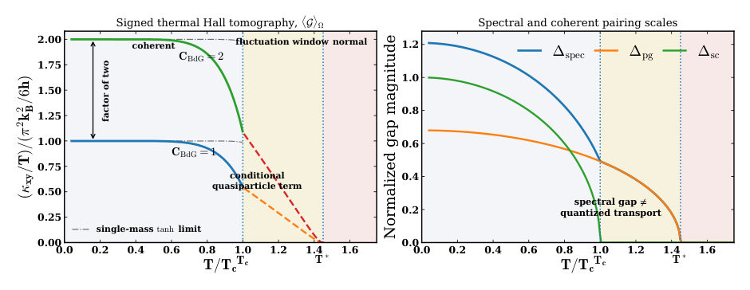
<figcaption class="paper-figure-caption"><b>Fig 1.</b> FIG. 1. Finite-temperature response framework. (a) The coherent quasiparticle contribution obtained from the curvature- resolved transport kernel for CBdG = 1 and 2. The factor-of-two low-temperature separation is universal. The continuation from Tc to a putative pair-formation scale T ∗is conditional on a long-lived, topologically oriented pseudogap and is not the full measured response; chiral fluctuations, vortices and phonons can add non-quantized terms. The curves and T ∗are illustrative. The response is evaluated with the curvature-weighted kernel ⟨G⟩Ωof Eq. (21); the thin grey curve is the single-mass tanh comparison envelope. (b) Two-gap spectral parametrization ∆2 = ∆2 sc + ∆2 pg....</figcaption>
</figure>
<figure class="paper-figure-card">
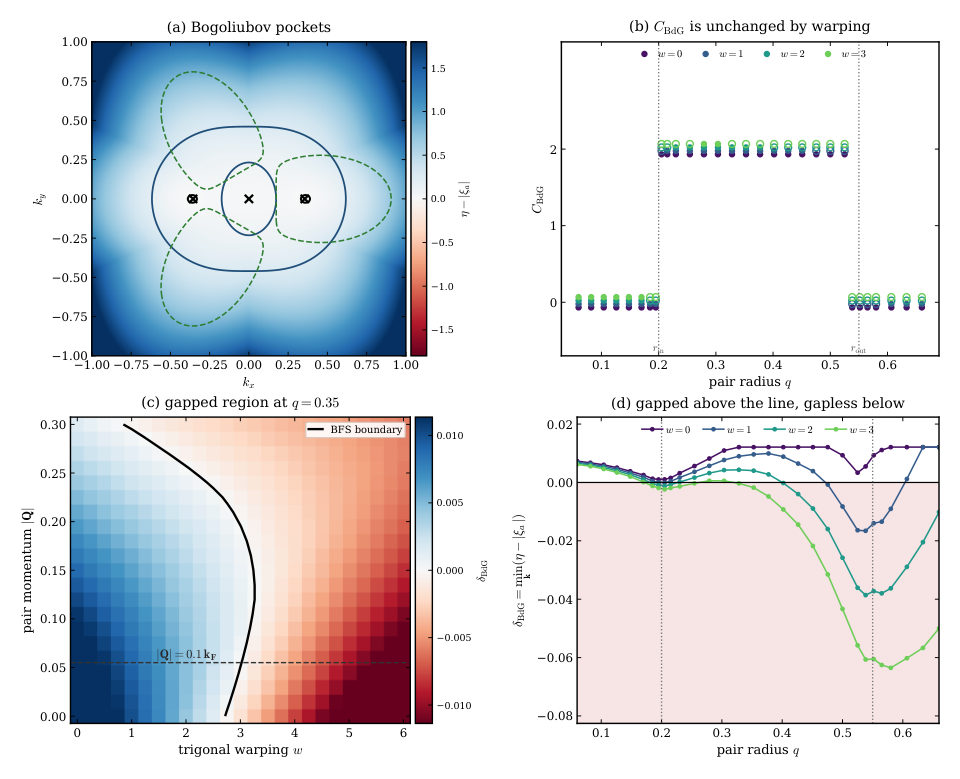
<figcaption class="paper-figure-caption"><b>Fig 2.</b> FIG. 2. Trigonal warping and finite pair momentum preserve CBdG throughout the scanned direct-gap regime, but can destroy quantization by closing the zero-energy gap. (a) η −|ξa| in momentum space at warping w = 4 and |Q| = 0.10, with η = p</figcaption>
</figure>
<figure class="paper-figure-card">
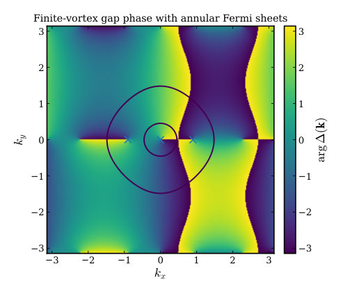
<figcaption class="paper-figure-caption"><b>Fig 3.</b> FIG. 3. Momentum-space tomography made explicit. Gap phase arg ∆(k) for the annular finite-vortex model (colour map) with the annular Fermi sheets overlaid as contours (ξann = 0, solid lines). Crosses mark the three gap zeros: the central vortex at k = 0, which lies in the inner hole and is excluded, and the two finite-momentum vortices at k = (±q, 0), which lie inside the annulus, each carrying wind- ing +1. The occupied-vortex charge Qanalytic = 2 matches the directly computed CBdG = 2. The invariant depends only on which zeros the occupied region encloses, not on how that region decomposes into pockets.</figcaption>
</figure>
<figure class="paper-figure-card">
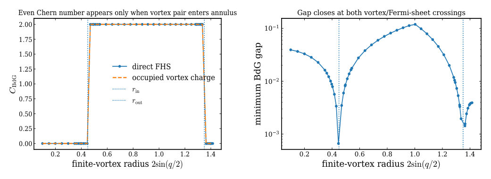
<figcaption class="paper-figure-caption"><b>Fig 4.</b> FIG. 4. Direct FHS validation of the even-Chern annular phase. Vortex-crossing scan over the finite-vortex pair radius 2 sin(q/2) for the annular Fermi sea (rin = 0.45, rout = 1.35, Nk = 201, 54 scan points with refined sampling either side of each crossing). Left: FHS Chern number (solid circles) and analytic occupied-vortex charge Qanalytic (dashed) versus 2 sin(q/2). The integer CBdG switches 0 →2 →0 as the pair crosses the inner and outer Fermi sheets; vertical dotted lines mark rin and rout. The two curves coincide at every point, max |CFHS −Qanalytic| &lt; 10−14, with max |Fplaq| = 2.86 &lt; π. Right: minimum BdG quasiparticle gap on the same axis (log scale), evaluated on the ky = 0 line...</figcaption>
</figure>
<figure class="paper-figure-card">
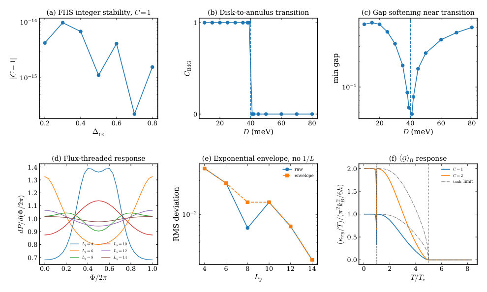
<figcaption class="paper-figure-caption"><b>Fig 5.</b> FIG. 5. Six-panel numerical validation summary. (a) FHS integer stability for the square-lattice p + ip model: |CBdG −1| vs. ∆0, showing machine-precision integrality across the full pairing scan. (b) RHG-effective Lifshitz scan: integer CBdG vs. displacement-field proxy D showing the 1 →0 transition at Dc = 40 meV. (c) Gap softening near the Lifshitz point on a semilog scale, consistent with a topological gap closing at Dc; the discrete D grid brackets the transition rather than landing on it. (d) Flux-threaded differential polarization dP/d(Φ/2π) vs. Φ/2π for cylinders Ly = 4, 6, . . . , 14. (e) Finite-width envelope (raw oscillatory RMS and upper envelope), consistent with the continuum...</figcaption>
</figure>

**Summary.** The paper develops a theoretical framework showing that the thermal Hall conductance of chiral superconductors is quantized and directly measures the system's topological invariant, the Chern number. Using graphene as a model, they predict that $\kappa_{xy}/T$ reads out this integer, offering a powerful diagnostic tool for detecting exotic superconducting phases.

**Why it may be interesting.** This work provides a highly specific, experimentally testable prediction ($\kappa_{xy}/T$ quantization) linking abstract topological invariants (Chern numbers) to measurable transport properties in condensed matter systems.

Detailed structure

**Main problem.** The primary goal is to measure the Bogoliubov–de Gennes Chern number ($	ext{CBdG}$), an integer characterizing chiral Majorana modes in superconductors, which has proven difficult using traditional magnetic signatures.

**Main result.** The low-temperature thermal Hall conductance ($\kappa_{xy}/T$) directly reads out this topological integer $	ext{CBdG}$, providing a robust diagnostic tool for chiral superconductivity. The sign of this plateau reverses when imaging domain walls, confirming the topological nature of the state.

**Method.** Theoretical calculations employing the Kubo formula approach on the BdG Hamiltonian are used to predict quantized thermal transport coefficients based on calculated Chern numbers derived from momentum-space winding rules.

**Model / system.** The study focuses on chiral superconductivity, modeled using rhombohedral graphene. The theory utilizes the Bogoliubov-de Gennes (BdG) framework, splitting the Hamiltonian into symmetric and antisymmetric parts to isolate physical effects like trigonal warping and finite Cooper pair momentum.

**Key observables.** Low-temperature thermal Hall conductance ($\kappa_{xy}/T$), Chern number ($	ext{CBdG}$), Bogoliubov Fermi surface gap ($\delta_{BdG}$).

**Important parameters / regimes.** Temperature ($T$), pairing amplitude ($\Delta$), graphene warping strength, and the vortex winding enclosed by occupied regions in momentum space.

**Assumptions / limitations.** The quantization of $\kappa_{xy}/T$ is assumed to hold at low temperatures, and the analysis relies on mapping topological invariants (Chern number) onto measurable transport quantities.

**Figures summary.** Figures illustrate the finite-temperature response framework showing quantized plateaus for different Chern numbers ($	ext{CBdG}=1, 2$), and show how the thermal Hall conductance is related to the topological invariant.

**Paper structure.** The paper establishes the theoretical link between the chiral topology (Chern number) and the measurable low-temperature thermal Hall conductance. It details the Hamiltonian decomposition for graphene, calculates the Chern number using momentum-space winding rules, and predicts the quantized plateau $\kappa_{xy}/T \propto 	ext{CBdG}$.

Abstract

A chiral superconductor carries chiral Majorana modes along its edges, and a single integer, the Bogoliubov--de Gennes Chern number, counts them. Thirty years of candidate materials have not yielded a measurement of that integer, because the magnetic signatures usually invoked are not topologically protected. Rhombohedral graphene makes the question both urgent and answerable: magnetic imaging resolves rewritable time-reversal-breaking domains inside the superconducting phase, while quantum oscillations reveal a normal state too intricate to reconstruct pocket by pocket. We show that the low-temperature thermal Hall conductance returns the integer directly, with no such reconstruction. For band-projected pairing it equals the pairing-vortex winding enclosed by the occupied regions of momentum space. Splitting the intravalley Hamiltonian into symmetric and antisymmetric parts isolates the trigonal warping and finite Cooper pair momentum of the real material: the antisymmetric part is topologically inert, direct Chern calculations across $525$ parameter points show the invariant preserved, and one inequality marks where a Bogoliubov Fermi surface removes quantization. The plateau $κ_{xy}/T=(π^2k_B^2/6h)\,C_{\rm BdG}$ then reads out the integer, its sign reverses with the imaged domain, a written domain wall should carry $2|C_{\rm BdG}|$ Majorana channels, and the thermometry required already resolves single thermal quanta in encapsulated graphene at millikelvin temperatures.

[↑ back to top](#top)

### [Diffusion and Solvation Dynamics of Ions in Water: Beyond the Brownian Approximation](http://arxiv.org/abs/2608.12562v1)

**Authors:** Ian C. Bourg, Minh Thê Hoang Ngoc, Thomas R. Underwood, Carlos Vega  
**Type:** both · **Category:** statistical mechanics · **PDF:** <https://arxiv.org/pdf/2608.12562v1>  
**Analysis basis:** full PDF text, analyzed in chunks
**Topic relevance:** `correlated / nonlocal dissipation` **1/5** · `scars & prethermalization` **1/5**

↔ Scroll figures horizontally

<figure class="paper-figure-card">
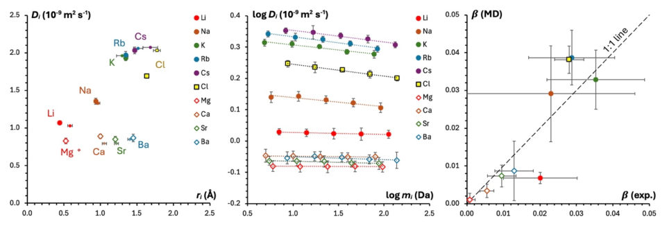
<figcaption class="paper-figure-caption"><b>Fig 1.</b> Figure 1. Ion di9usion in water. (a) Self-diZusion coeZicient 𝐷&quot; (10-9 m2 s-1) as a function of bare ion radius 𝑟&quot; (Å). Bare radii were calculated as 𝑟max minus the radius of a water O atom (1.39 Å), estimated as half of the peak O-O distance in water in our MD simulations. Large symbols show MD simulation predictions obtained in this work, where 𝐷&quot; values are shown for the most abundant isotope of each ion. Small symbols are based on experimental results (Table 1, Table S2). (b) MD simulation predictions of log 𝐷&quot; as a function of log 𝑚&quot; for all ions examined in this work. Error bars show 95% confidence intervals. Dashed lines show linear regressions. For all solutes except Mg, results are...</figcaption>
</figure>
<figure class="paper-figure-card">
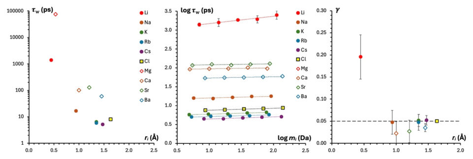
<figcaption class="paper-figure-caption"><b>Fig 2.</b> Figure 2. Residence time 𝝉w (ps) of water molecules in the first hydration shell of ions. (a) 𝜏w values of the most abundant isotope of each ion plotted on a logarithmic scale as a function of bare ion radius 𝑟&quot; (Å). All symbols show MD simulation predictions from this work. (b) MD simulation predictions of log 𝜏w as a function of log 𝑚&quot; for all ions examined in this work. Where not visible, vertical error bars are smaller than the symbol size. Dashed lines show linear regressions. For all solutes except Mg (oZ-scale with log 𝜏w &gt; 3.5), results are statistically consistent with a power-law relation with exponent 𝛾&gt; 0. (c) Predicted 𝛾-values plotted as a function of bare ion radius 𝑟&quot; (Å)....</figcaption>
</figure>
<figure class="paper-figure-card">
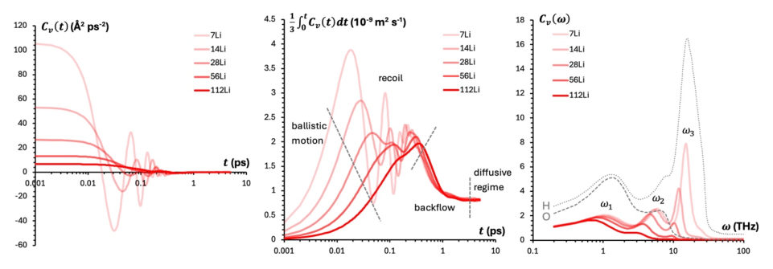
<figcaption class="paper-figure-caption"><b>Fig 3.</b> Figure 3. Velocity autocorrelation function 𝑪𝒗(𝒕) and associated properties in the case of five real or hypothetical isotopes of Li+. (a) 𝐶*(𝑡) plotted as a function of time, with a logarithmic time scale. (b)</figcaption>
</figure>
<figure class="paper-figure-card">
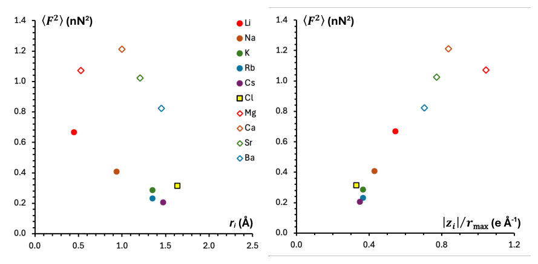
<figcaption class="paper-figure-caption"><b>Fig 4.</b> Figure 4. Mean square force experienced by the ions examined in this work. (a) 〈𝐹-〉 plotted as a function of bare ion radius 𝑟&quot; (Å). (b) 〈𝐹-〉 plotted as a function of |𝑧&quot;|/𝑟max (e Å-1).</figcaption>
</figure>
<figure class="paper-figure-card">
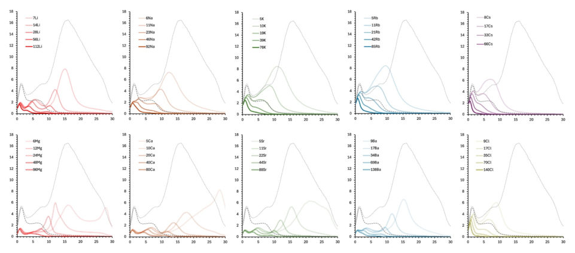
<figcaption class="paper-figure-caption"><b>Fig 5.</b> Figure 5. Power spectra of all ions examined in this work as a function of frequency (THz). (a) Li+. (b) Na+. (c) K+. (d) Rb+. (e) Cs+. (f) Mg2+. (g) Ca2+. (h) Sr2+. (i) Ba2+ (j) Cl-. The power spectra of water O and H atoms are shown as gray dashed and dotted lines on each plot.</figcaption>
</figure>

**Summary.** This work uses molecular dynamics simulations to study how ions interact with water molecules beyond simple diffusion models. By analyzing the isotopic mass dependence of structural and dynamic properties, the authors reveal multiple vibrational 'rattling' frequencies within the solvation shell. This provides a detailed spectroscopic fingerprint for understanding ion-water interactions relevant to biological processes.

**Why it may be interesting.** While focused on classical liquid dynamics, the detailed analysis of frequency spectra ($	ext{C}_{\#}(\omega)$) and their sensitivity to mass provides insights into quantum mechanical effects (like Zero-Point Energy corrections) within a many-body context, relevant for understanding energy landscapes in open quantum systems.

Detailed structure

**Main problem.** The study investigates the coupled dynamics of ions and water molecules within the first hydration shell, aiming to move beyond simplified Brownian approximations.

**Main result.** The vibrational power spectra consistently show two or three distinct peaks, indicating multiple 'rattling frequencies' sensitive to isotopic mass, which may serve as signatures for ion solvation processes.

**Method.** Molecular Dynamics (MD) simulations are employed to calculate time-dependent correlation functions and spectral densities by systematically varying the isotopic mass of the ions.

**Model / system.** The system consists of various alkali and alkaline earth metal ions ($	ext{Li}$ to $	ext{Ba}$) and chloride in bulk liquid water, modeled using established force fields (TIP4P2005/MADRID-2019).

**Key observables.** Diffusion coefficients ($D'$), water residence time ($	au_w$), vibrational power spectra ($	ext{C}_{\#}(\omega)$), radial distribution functions ($g(r)$), and mean-square force ($\langle\mathbf{F}
angle$).

**Important parameters / regimes.** Isotopic mass dependence (varying $	ext{m}_{	ext{ion}}$) is a central parameter, analyzed via power-law scaling ($eta$ and $\gamma$ coefficients).

**Assumptions / limitations.** The Born-Oppenheimer approximation is assumed to hold, meaning interatomic potentials are invariant with isotopic mass.

**Figures summary.** Figures summarize the dependence of diffusion coefficients ($D'$) on ion radius and mass ($\log D'$ vs. $\log m!$), while tables provide quantitative comparisons of structural parameters ($r_{	ext{max}}, N_O$) and dynamic properties across different computational models and experiments.

**Paper structure.** The paper systematically calculates static structure (RDFs, $N_O$) and dynamic transport properties ($D', 	au_w$) for multiple ion species. It then analyzes the isotopic mass dependence of these observables using spectral analysis to extract vibrational signatures.

Abstract

The coupled dynamics of ions and water molecules in their first hydration shell impact a variety of processes including ion diffusion, selective ion transport in water-filled nanopores, and the kinetics of ion-pairing, ion adsorption, and metal-ligand binding reactions. In this work, we study these coupled dynamics for alkali metals (Li, Na, K, Rb, Cs), alkaline Earth metals (Mg, Ca, Sr, Ba), and chloride through the lens of their dependence on ion isotopic mass. Results are validated against previous measurements of the isotopic mass-dependence of ion diffusion coefficients in water and previous ab initio calculations of ion high-frequency dynamics in water. We find that the vibrational power spectra of ions in water consistently exhibit either two or three peaks, i.e., ions have several rattling frequencies within their solvations shells as previously reported for a subset of the species examined here. These frequencies have different sensititivies to isotopic mass that may serve as signatures of ion solvation processes (such as the tendency of ions to orient their first-shell water molecules) and that also may relate to Hofmeister-like effects including the relative affinity of different metals for ribonucleic acid (RNA).

[↑ back to top](#top)

### [Dipolar-driven mean-field criticality in the ferrimagnet Eu$_2$MnSi$_2$O$_7$](http://arxiv.org/abs/2608.12639v1)

**Authors:** Masahiro Kawamata, Maxim Avdeev, Yusuke Nambu  
**Type:** experiment · **Category:** statistical mechanics · **PDF:** <https://arxiv.org/pdf/2608.12639v1>  
**Analysis basis:** full PDF text, analyzed in chunks
**Topic relevance:** `analog quantum simulation` **1/5** · `non-equilibrium universality` **1/5**

↔ Scroll figures horizontally

<figure class="paper-figure-card">
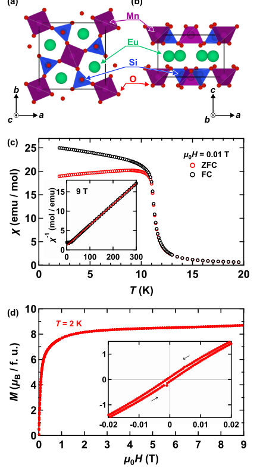
<figcaption class="paper-figure-caption"><b>Fig 1.</b> FIG. 1. Crystal structure of the melilite compound Eu2MnSi2O7 with the space group P¯421m projected onto (a) the ab- and (b) the ac-plane. (c) Temperature dependence of the magnetic susceptibility at µ0H = 0.01 T. Inset: in- verse susceptibility under 9 T with a Curie-Weiss fit (red line). (d) Field dependence of the isothermal magnetization. Inset: low-field region at 2 K showing increasing and decreasing field sweeps.</figcaption>
</figure>
<figure class="paper-figure-card">
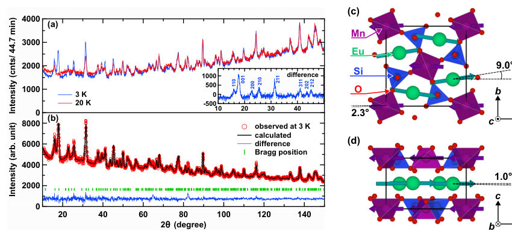
<figcaption class="paper-figure-caption"><b>Fig 2.</b> FIG. 2. (a) Neutron powder diffraction data at 3 and 20 K (λ = 1.622 ˚A). Inset: difference profile between the two temperatures. (b) Rietveld refinement of the 3 K pattern (χ2 = 1.36). Red circles: observed; black line: calculated; blue line: difference; green ticks: Bragg positions of Eu2MnSi2O7. (c,d) Refined magnetic structure with space group P212′ 12′ projected onto (c) the ab plane and (d) the ac plane.</figcaption>
</figure>
<figure class="paper-figure-card">
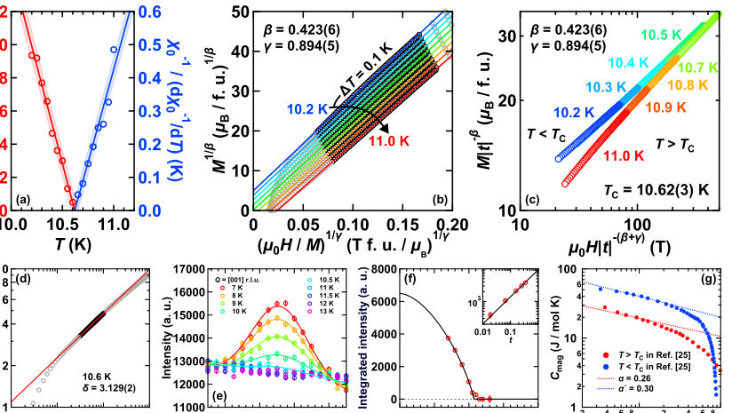
<figcaption class="paper-figure-caption"><b>Fig 3.</b> FIG. 3. (a) Kouvel-Fisher plot for spontaneous magnetization MS(T) and inverse initial susceptibility χ−1 0 . Linear fits are shown as red and blue lines; shaded areas denote uncertainties in β, γ, and TC. (b) Modified Arrott plot for 10.2 ≤T ≤11.0 K and 0.3 ≤µ0H ≤1 T. Black circles: fitted data; grey circles: data outside the fitting range. (c) Scaled magnetization as a function of reduced field above and below TC. (d) Critical isotherm at 10.6 K (dots) with fit (red line) yielding δ = 3.129(2). (e) Temperature dependence of the magnetic reflection at ⃗Q = (0, 0, 1). (f) Integrated intensity at ⃗Q = (0, 0, 1) with fit giving β = 0.41(4). (g) Magnetic specific heat Cmag (solid circles)...</figcaption>
</figure>
<figure class="paper-figure-card">
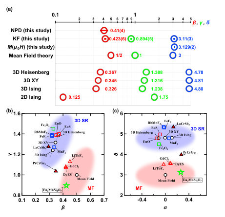
<figcaption class="paper-figure-caption"><b>Fig 4.</b> FIG. 4. (a) Critical exponents β, γ, and δ of Eu2MnSi2O7 compared with model values [41]. (b,c) β vs γ and α vs δ. Open circles: theoretical values for mean- field, 3D-Heisenberg, 3D-XY, and 3D-Ising models [41]. Star: Eu2MnSi2O7 (this work). Squares: ferromagnets (red) [35, 36], ferrimagnets (purple) [37], and antiferromag- nets (blue) [38–40] with SR interactions. Triangles: fer- romagnets with RKKY (filled) and MDD (open) interac- tions [15, 20–22, 42]. Shaded regions denote 3D-SR (red) and MF (blue) universality classes.</figcaption>
</figure>

**Summary.** This study investigates the critical behavior of the ferrimagnet $	ext{Eu}_2	ext{MnSi}_2	ext{O}_7$, demonstrating that its magnetic ordering transition is governed by long-range dipolar interactions. By measuring magnetization and performing neutron diffraction, the authors confirm mean-field critical exponents, establishing this material as a key platform for studying dipolar criticality in insulating magnets.

**Why it may be interesting.** The confirmation of mean-field criticality in a complex insulating ferrimagnet provides an experimental realization for testing universality classes beyond simple ferromagnets, which is relevant for understanding phase transitions in many interacting quantum systems.

Detailed structure

**Main problem.** To establish mean-field critical behavior driven by long-range dipolar interactions in an insulating ferrimagnet, extending previous findings limited to ferromagnets.

**Main result.** The material exhibits mean-field critical exponents ($eta \approx 0.42$, $\gamma \approx 0.9$) confirming that long-range magnetic dipole-dipole interactions govern the asymptotic critical behavior in this ferrimagnet.

**Method.** Magnetization measurements, neutron powder diffraction (NPD), and analysis of critical exponents using scaling laws (e.g., Kouvel-Fisher plots).

**Model / system.** The physical system is $	ext{Eu}_2	ext{MnSi}_2	ext{O}_7$, a melilite-type ferrimagnet with spin-only Eu$^{2+}$ and Mn$^{2+}$ moments. The critical behavior is modeled by considering the long-range magnetic dipole-dipole (MDD) interactions.

**Key observables.** Critical exponents ($eta, \gamma$), magnetic susceptibility ($\chi$), magnetization ($M$), and magnetic reflection intensities from NPD.

**Important parameters / regimes.** The system operates in a regime where MDD interactions dominate the critical fluctuations, leading to mean-field universality class behavior.

**Assumptions / limitations.** The analysis assumes that dipolar interactions are the dominant long-range force controlling the asymptotic critical exponents, despite the presence of exchange interactions stabilizing the order.

**Figures summary.** Figures show temperature dependence of susceptibility ($\chi$), NPD data comparing 3 K and 20 K reflections, and plots used to extract critical exponents using scaling analysis.

**Paper structure.** The paper systematically measures magnetic properties across temperatures, analyzes structural refinement via NPD to determine the magnetic space group ($P2_12'12'$), and then applies various thermodynamic/critical analyses (Arrott plot, scaling) to confirm mean-field critical exponents governed by dipolar interactions.

Abstract

We report mean-field critical behavior in Eu$_2$MnSi$_2$O$_7$, a melilite-type ferrimagnet with spin-only Eu$^{2+}$ and Mn$^{2+}$ moments and negligible orbital contributions. Magnetization measurements combined with neutron powder diffraction reveal critical exponents close to the mean-field values, indicating that long-range dipolar interactions govern the asymptotic critical behavior in this insulating ferrimagnet. The refined magnetic structure, described by the magnetic space group $P2_12_1^\prime2^\prime$, exhibits a tilted ferrimagnetic configuration driven by the Dzyaloshinskii-Moriya interaction, reflecting the noncentrosymmetric nature of the lattice. These results extend the applicability of mean-field theory to complex insulating magnets and establish Eu$_2$MnSi$_2$O$_7$ as a platform for exploring ferrimagnetism and long-range interactions. To our knowledge, this is the first insulating ferrimagnet in which dipolar interactions drive mean-field criticality.

[↑ back to top](#top)

### [Every PPT channel has finite entanglement-breaking index](http://arxiv.org/abs/2608.13551v1)

**Authors:** Sang-Jun Park  
**Type:** theory · **Category:** quantum information and computing · **PDF:** <https://arxiv.org/pdf/2608.13551v1>  
**Analysis basis:** full PDF text, analyzed in chunks
**Topic relevance:** `correlated / nonlocal dissipation` **1/5** · `quantum measurements` **1/5**

↔ Scroll figures horizontally

<figure class="paper-figure-card">
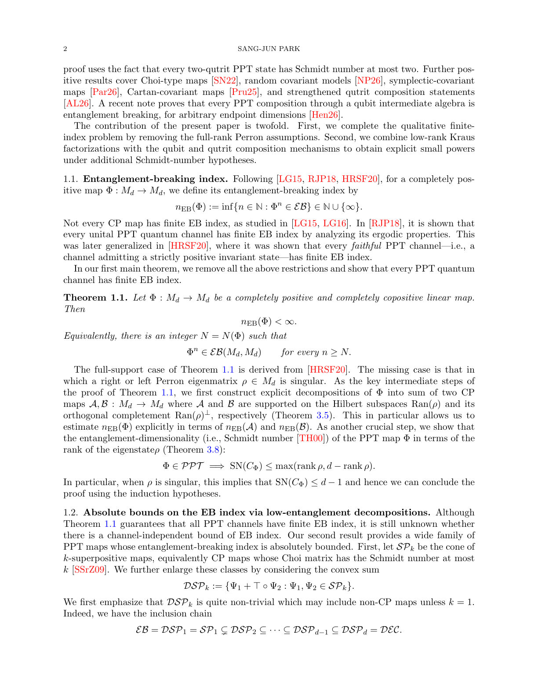
<figcaption class="paper-figure-caption"><b>Fig 1.</b> Low-resolution page preview, page 2</figcaption>
</figure>
<figure class="paper-figure-card">
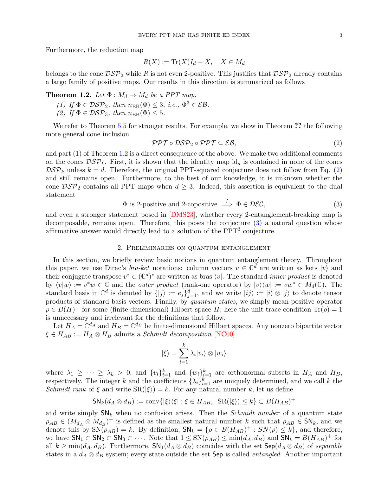
<figcaption class="paper-figure-caption"><b>Fig 2.</b> Low-resolution page preview, page 3</figcaption>
</figure>
<figure class="paper-figure-card">
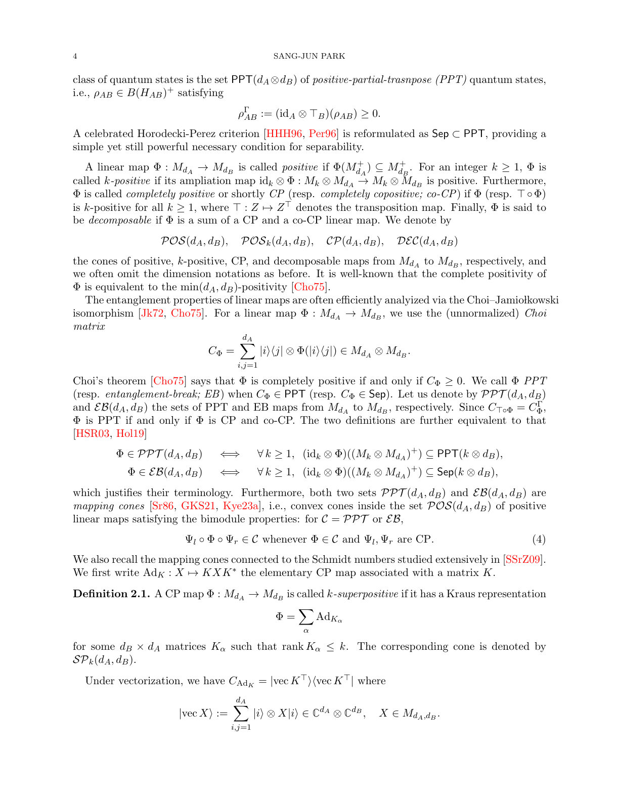
<figcaption class="paper-figure-caption"><b>Fig 3.</b> Low-resolution page preview, page 4</figcaption>
</figure>
<figure class="paper-figure-card">
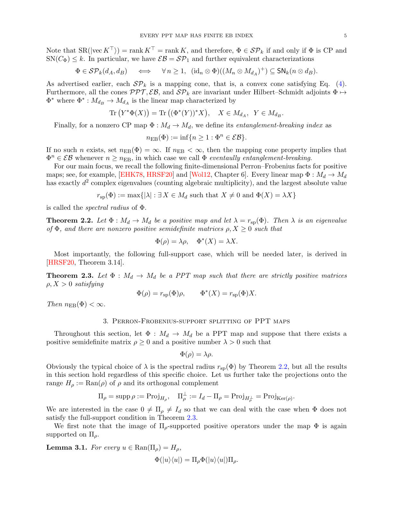
<figcaption class="paper-figure-caption"><b>Fig 4.</b> Low-resolution page preview, page 5</figcaption>
</figure>
<figure class="paper-figure-card">
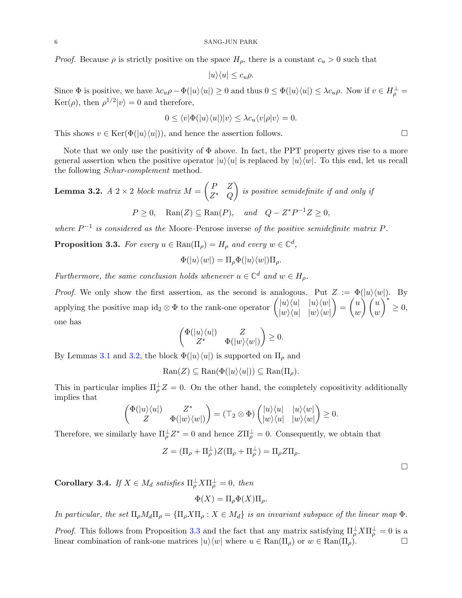
<figcaption class="paper-figure-caption"><b>Fig 5.</b> Low-resolution page preview, page 6</figcaption>
</figure>

**Summary.** This paper proves a major result showing that every PPT quantum channel must eventually become entanglement-breaking. By establishing the finite entanglement-breaking index for all such channels, it strengthens conjectures about the structure of quantum operations. The methods involve advanced linear algebra applied to map theory, providing deep insights into how entanglement is lost over repeated applications of physical processes.

**Why it may be interesting.** This work provides fundamental structural results about quantum operations (channels) that are crucial for understanding decoherence, channel capacity, and entanglement dynamics in open quantum systems.

Detailed structure

**Main problem.** The central problem is proving that every Positive Partial Transpose (PPT) quantum channel eventually becomes entanglement-breaking, establishing the eventual entanglement-breaking property for this class of channels.

**Main result.** The authors prove that every PPT linear map acting on a quantum system has a finite entanglement-breaking index ($	ext{nEB}(\Phi) < \infty$).

**Method.** The proof utilizes inductive arguments, decomposing the channel $\Phi$ based on spectral properties (Perron eigenmatrices) and relating the EB index to bounds derived from specific subclasses of maps like $k$-superpositive maps.

**Model / system.** The study concerns linear maps $\Phi: M_d(\mathbb{C}) 	o M_d(\mathbb{C})$ acting on quantum systems, characterized by their Choi matrix. Key concepts include PPT and Entanglement-Breaking (EB) channels.

**Key observables.** Entanglement-breaking index ($	ext{nEB}(\Phi)$), the structure of the Choi matrix $C\Phi$, and spectral properties like the Perron radius.

**Important parameters / regimes.** The dimension $d$ of the system, and indices related to map composition (e.g., $	ext{DSP}_2, 	ext{DSP}_3$).

**Assumptions / limitations.** The analysis relies on structural decompositions of the channel into components supported by projections derived from eigenvalue problems.

**Paper structure.** The paper builds upon defining PPT and EB maps, establishing relationships between different classes of positive maps ($	ext{SP}_k$), and culminates in proving Theorem 1.1 via induction on the dimension $d$.

Abstract

We prove that every PPT linear map has finite entanglement-breaking index, thereby establishing the eventual entanglement-breaking property of PPT channels in full generality. Furthermore, by utilizing completely positive maps with low entanglement dimensionality, we show that a large family of PPT maps, which strictly containing the class of 2-superpositive maps, has entanglement-breaking index bounded above by 3, uniformly in the dimension. In particular, these results provide strong evidence that the PPT-cubed conjecture may hold in full generality.

[↑ back to top](#top)

### [Formal Verification of Quantum Ancilla Safety](http://arxiv.org/abs/2608.13099v1)

**Authors:** Jiqi Li, Jingyi Mei, Wang Fang, Ji Guan  
**Type:** theory · **Category:** quantum information and computing · **PDF:** <https://arxiv.org/pdf/2608.13099v1>  
**Analysis basis:** full PDF text, analyzed in chunks
**Topic relevance:** `correlated / nonlocal dissipation` **1/5** · `quantum measurements` **1/5**

↔ Scroll figures horizontally

<figure class="paper-figure-card">
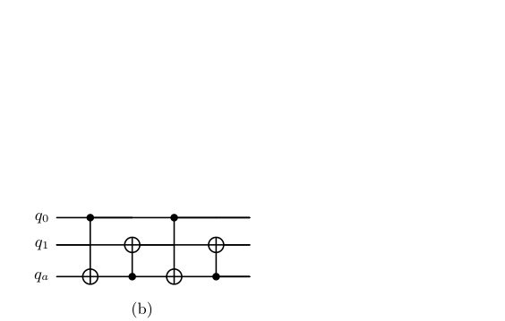
<figcaption class="paper-figure-caption"><b>Fig 1.</b> Fig. 1: Bridge-GHZ circuits [12] with a shared ancilla qa: (left) clean-ancilla ver- sion; (right) dirty-ancilla version. See detail in Appendix A.1.</figcaption>
</figure>
<figure class="paper-figure-card">
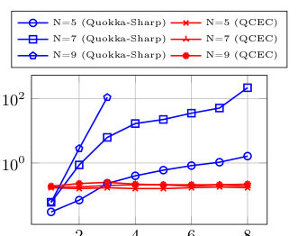
<figcaption class="paper-figure-caption"><b>Fig 2.</b> Fig. 3: Quokka-Sharp and QCEC performance on MCX and Grover circuits.</figcaption>
</figure>

**Summary.** This paper introduces a comprehensive verification-and-repair framework to mathematically guarantee 'ancilla safety' in quantum circuits. It achieves this by reducing complex, hard-to-verify dirty ancilla checks into manageable algebraic commutativity tests involving Pauli operators. The resulting tool is efficient, scalable, and provides actionable diagnosis and repair routines for local faults.

**Why it may be interesting.** While focused on computation theory, the rigorous mathematical tools developed for subspace preservation and error characterization are highly relevant to understanding decoherence and state preparation fidelity in physical quantum hardware implementations.

Detailed structure

**Main problem.** The core problem is formally verifying 'ancilla safety'—ensuring temporary ancilla qubits are restored to a known state after complex quantum operations, especially when they start in unknown ('dirty') states.

**Main result.** The authors propose an efficient end-to-end framework that reduces dirty safety checks to independent clean safety checks, which are further reduced to algebraic commutativity conditions involving Pauli operators.

**Method.** They develop a two-step reduction strategy: first decomposing the problem into multiple clean ancilla checks, and then mapping each check onto checking commutation relations $[U, Q] = 0$ using specialized reflection operators $Q$.

**Model / system.** The model is general quantum circuits operating on data qubits ($W$) and ancillary qubits ($A$). Safety definitions distinguish between 'clean' (restoring to $|0
angle^{\otimes m}$) and 'dirty' (restoring regardless of initial state $|\varphi
angle_A$).

**Key observables.** The primary diagnostics are the commutator checks $[U, Q] = 0$, and failure modes are classified as LogicError or PhaseError.

**Important parameters / regimes.** Scalability is demonstrated up to thousands of qubits; the analysis involves unitary transformations $U$ acting on composite Hilbert spaces $\mathcal{H}_W \otimes \mathcal{H}_A$.

**Assumptions / limitations.** The framework assumes purely unitary circuits without mid-circuit measurements or classical feed-forward for its core theorems. Repair routines are limited to separable error cases.

**Figures summary.** Not specified, but the notes reference Figure 1 illustrating clean vs. dirty ancilla usage and Table 3 comparing verification efficiency across benchmarks like Grover's algorithm.

**Paper structure.** The paper builds from defining the physical problem (clean/dirty safety) to establishing theoretical equivalences via lemmas (subspace invariance $\iff$ commutation), culminating in a practical, efficient framework for diagnosis and repair using algebraic checks.

Abstract

Ensuring ancilla safety is a critical correctness requirement for quantum compilation, since ancilla qubits are routinely introduced to implement complex operations with fewer gates and reduced depth. However, formally verifying this property is computationally hard due to state-space explosion in the number of qubits, particularly for dirty ancillae, which carry unknown initial states and must be restored after use. We propose an end-to-end verification-and-repair framework that rigorously addresses both clean and dirty ancilla safety. Our core contribution is a two-step reduction strategy: we first prove that verifying an $m$-qubit dirty ancilla register decomposes into $2m$ independent clean ancilla safety checks; subsequently, we reduce each clean ancilla safety instance to an algebraic commutativity check against Pauli-$Z$ and Pauli-$X$ operators. This approach yields an efficient and naturally parallel verifier and enables actionable diagnosis by classifying violations into logic errors and phase errors. Leveraging this diagnosis, we further design lightweight repair routines that append local single-qubit rotations to eliminate a broad class of local ancilla faults. We implement the full pipeline in a prototype tool using a dual-backend architecture combining decision diagrams and weighted model counting, and validate it on diverse circuits ranging from arithmetic benchmarks to Grover's algorithm. Our experiments demonstrate scalability to thousands of qubits and show that the proposed repairs effectively improve ancilla safety while preserving circuit functionality.

[↑ back to top](#top)

### [Revisiting magnon bound states: ferro-antiferromagnetic $J_1\!-\!J_2$ square-lattice model](http://arxiv.org/abs/2608.12459v1)

**Authors:** Cesar A. Gallegos, A. L. Chernyshev  
**Type:** theory · **Category:** strongly correlated electrons · **PDF:** <https://arxiv.org/pdf/2608.12459v1>  
**Analysis basis:** full PDF text, analyzed in chunks
**Topic relevance:** `Keldysh / 2PI / non-Gaussian methods` **1/5** · `analog quantum simulation` **1/5**

↔ Scroll figures horizontally

<figure class="paper-figure-card">
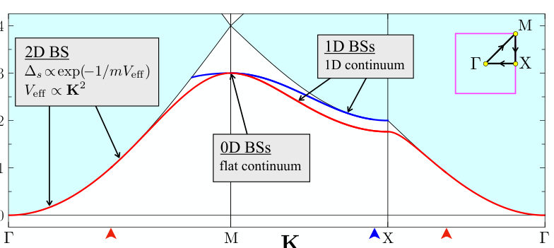
<figcaption class="paper-figure-caption"><b>Fig 1.</b> FIG. 1. Red and blue solid lines: the energies of the BSs in the S =1/2 square-lattice Heisenberg ferromagnet vs pair momentum K along the high-symmetry ΓMXΓ path in the BZ; see the inset, Γ = (0, 0), M= (π, π), and X= (π, 0). The shaded region is the two-magnon continuum energy relative to its minimum; the black solid line is its boundary. Arrows point to the regions of the super-exponentially shallow s-wave BS near the Γ point, the zero-dimensional (0D) degenerate BSs at the M point, and the 1D BSs along the MX line discussed below. Some of the binding energies are below numerical detectability for a significant portion of the ΓMXΓ path, with the arrows along the horizontal axis that...</figcaption>
</figure>
<figure class="paper-figure-card">
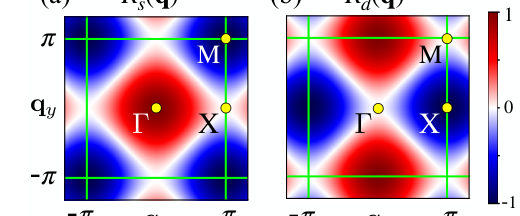
<figcaption class="paper-figure-caption"><b>Fig 2.</b> FIG. 2. Intensity plots of the (a) generalized s-wave and (b) d-wave lattice partial waves Rs(q) and Rd(q) in momen- tum space; see Eqs. (40). Nodal lines and the high-symmetry points in the BZ are indicated.</figcaption>
</figure>
<figure class="paper-figure-card">
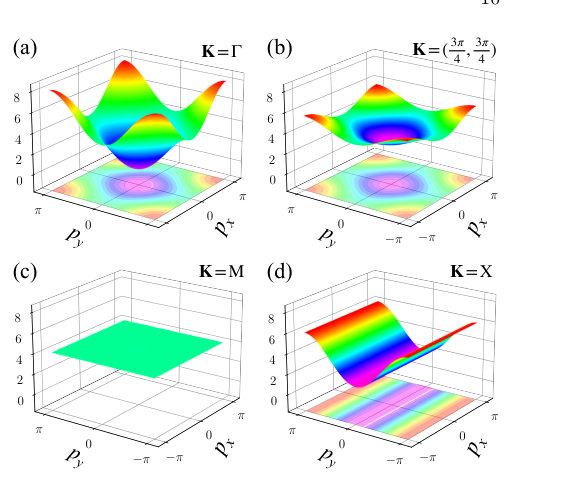
<figcaption class="paper-figure-caption"><b>Fig 3.</b> FIG. 3. The two-magnon continuum energy, EK(p)=ε K</figcaption>
</figure>
<figure class="paper-figure-card">
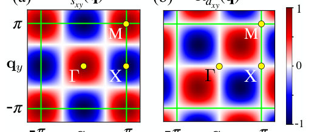
<figcaption class="paper-figure-caption"><b>Fig 4.</b> FIG. 4. Intensity plots of the (a) generalized sxy and (b) dxy lattice partial waves, Rsxy(q) and Rdxy(q), respectively, in momentum space; see Eq. (67). Nodal lines and the high- symmetry points in the BZ are indicated.</figcaption>
</figure>
<figure class="paper-figure-card">
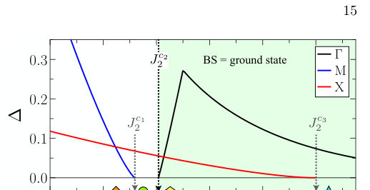
<figcaption class="paper-figure-caption"><b>Fig 5.</b> FIG. 6. Binding energies ∆for the S = 1/2 J1–J2 model at the Γ = (0, 0), M= (π, π), and X= (π, 0) points as functions of J2. The arrows show J2 values at which the BSs at the M and X points vanish, and the onset of a paired d-wave ground state at the Γ point; the filled symbols are J2’s in Fig. 5.</figcaption>
</figure>

**Summary.** This work provides a comprehensive analysis of magnon bound states in the J1-J2 square-lattice model by solving the two-magnon Schrödinger equation using multiple rigorous methods. The key finding is that the introduction of the J2 coupling stabilizes a d-wave symmetric ground state, offering a clear physical picture for magnon pairing evolution controlled by effective dimensionality changes.

**Why it may be interesting.** The rigorous comparison between different theoretical approaches (exact vs. perturbative) to solve many-body quantum problems in magnetic materials provides a robust framework for understanding collective excitations beyond simple mean-field treatments, which is relevant to strongly correlated electron physics.

Detailed structure

**Main problem.** The paper investigates magnon bound states (BSs) and pairing mechanisms in quantum magnets, aiming to reconcile theoretical predictions with observed behavior.

**Main result.** Introducing the J2 term stabilizes a d-wave symmetric BS as the ground state, showing that the physics is governed by effective dimensional reduction/enhancement rather than being fundamentally different from continuum problems.

**Method.** The study employs advanced theoretical techniques, including deriving and comparing results from non-orthogonal spin-flip wavefunctions and the 1/S-expansion of the bosonized Hamiltonian to solve the two-magnon Schrödinger equation.

**Model / system.** The system is the Heisenberg S=1/2 square-lattice J1-J2 ferro-antiferromagnetic (FM-AFM) model. The analysis focuses on the two-magnon bound state problem governed by a derived Schrödinger equation in momentum space.

**Key observables.** Binding energies of the two-magnon BSs, symmetry of the ground state BS (d-wave), and phase boundaries for BS existence as a function of pair momentum K and model parameters J2.

**Important parameters / regimes.** The exchange couplings J1 and J2, the spin quantum number S=1/2, and the pair momentum vector K across the Brillouin zone.

**Assumptions / limitations.** The $1/S$-expansion is used for fluctuating ground states (AFM), while the non-orthogonal basis approach provides an exact result for the fully polarized FM-like model; care must be taken regarding non-orthogonality corrections in pairing problems.

**Figures summary.** Figure 17 illustrates threshold boundaries ($J_{2,c}$ vs $K_x$) showing distinct existence regions for d-wave BSs originating from different high-symmetry points ($\Gamma$ and M).

**Paper structure.** The paper systematically analyzes the two-magnon bound state problem by deriving the governing Schrödinger equation using multiple formalisms. It then studies how the inclusion of J2 modifies the band structure, leading to the stabilization of a d-wave BS, and finally calculates critical parameters like $J_{c2}^2$ where this binding occurs.

Abstract

A comprehensive analysis of pairing and bound states of magnons in the Heisenberg $S\!=\!1/2$ square-lattice $J_1\!-\!J_2$ ferro-antiferromagnetic model is presented. We highlight the similarities and differences between the bound states of spin flips on a lattice and those of particles in the continuum. Magnon bound states at finite pair momentum are studied throughout the Brillouin zone and a convenient lattice partial-wave nomenclature is advocated. The mechanisms of enhanced stability or fragility of these bound states for the high-symmetry pair momenta are identified and quantified as relating to the effective dimensional reduction or enhancement, respectively. These effects are also shown to control the evolution of the bound states with the model parameters, providing a transparent framework for understanding magnon pairing in a more general setting. A method to determine the bound state phase boundaries is presented.

[↑ back to top](#top)

### [Topology and Quantum-Spin-Classical-Spin Crossover of the Gapped Kondo Effect](http://arxiv.org/abs/2608.13065v1)

**Authors:** David Krüger, Michael Potthoff  
**Type:** theory · **Category:** strongly correlated electrons · **PDF:** <https://arxiv.org/pdf/2608.13065v1>  
**Analysis basis:** full PDF text, analyzed in chunks
**Topic relevance:** `analog quantum simulation` **1/5** · `quantum measurements` **1/5**

↔ Scroll figures horizontally

<figure class="paper-figure-card">
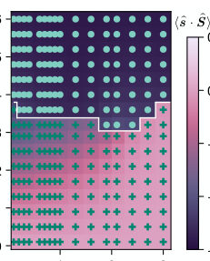
<figcaption class="paper-figure-caption"><b>Fig 1.</b> FIG. 1. m-J ground-state phase diagram. White line: dis- continuous phase transition. Background color code: local Kondo correlation ⟨ˆs · ˆS⟩≡⟨ˆsi0A · ˆS⟩. Light green symbol color: ∆N = +1, dark green: ∆N = 0. Symbol form in- dicates the ground-state degeneracy, doublet: cross, singlet: circle. Calculations for N = 50 + ∆N.</figcaption>
</figure>
<figure class="paper-figure-card">
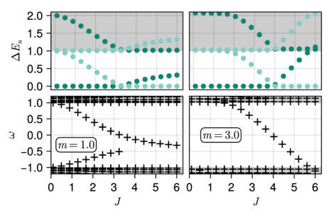
<figcaption class="paper-figure-caption"><b>Fig 2.</b> FIG. 2. Top: J-dependent difference between the energies of the lowest excited states and the ground state, ∆En(J) ≡ En(J)−E0(J). Dark green: particle number ∆N = 0 relative to the J = 0 ground state. Light green: ∆N = 1. Bottom: J- spectral flow of the low-frequency poles of the single-electron Green’s function ⟨⟨c; c†⟩⟩. Note that the bulk-band gap is ∆= 2 for both m = 1 and m = 3. Gray area: bulk continuum of single-particle excitations.</figcaption>
</figure>
<figure class="paper-figure-card">
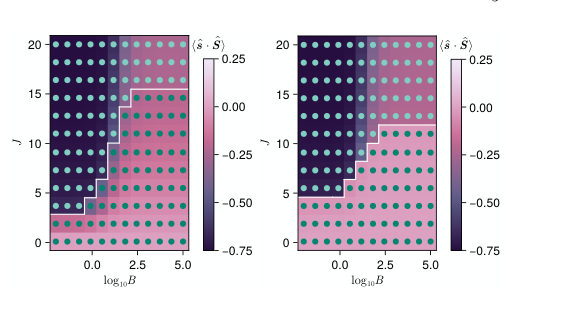
<figcaption class="paper-figure-caption"><b>Fig 3.</b> FIG. 4. B-J phase diagrams interpolating between quantum (B →0) and classical (B →∞) spin impurity models. Left: m = 1, right: m = 3. Symbol color indicates ∆N, green: ∆N = 0, light-blue: ∆N = +1. Note the log scale.</figcaption>
</figure>
<figure class="paper-figure-card">
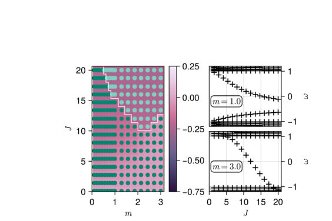
<figcaption class="paper-figure-caption"><b>Fig 4.</b> FIG. 3. Left: m-J phase diagram for a classical spin S of length S = 1/2. Background color code: ⟨ˆs · S⟩= ⟨ˆs⟩· S. Symbol color indicates ∆N, green: ∆N = 0, light-blue: ∆N = +1. Calculations for N = 50 + ∆N. Right: J-spectral flow of in-gap states for m = 1 (top) and m = 3 (bottom). Bulk continuum: gray background.</figcaption>
</figure>
<figure class="paper-figure-card">
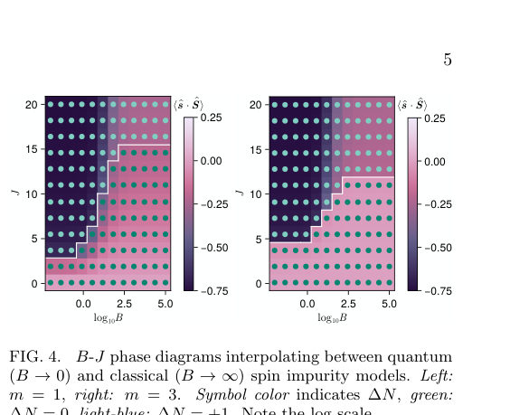
<figcaption class="paper-figure-caption"><b>Fig 5.</b> Figure 4 shows the dependence of the critical coupling on B (white lines) for two different mass parameters, m = 1 (left) and m = 3 (right), as obtained numerically. In both cases, we see that the quantum-spin C(B) = −1 phase for J &lt; JK(m) continuously connects with the classical-spin C(S) = 0 phase for J &lt; Jc(m) and, for strong J, the quantum C(B) = 0 phase connects to the classical C(S) = 1 phase. Therefore, both the quantum- spin and the classical-spin phase diagrams are identical up to continuous deformations, though the quantitative differences are significant.</figcaption>
</figure>

**Summary.** This work theoretically investigates the gapped Kondo effect, mapping out its complex phase diagram by analyzing how quantum and classical spin descriptions connect. The key finding is that these transitions are robustly characterized by changes in multiple topological invariants, such as Chern numbers. This provides a powerful topological lens for understanding strongly correlated impurity physics.

**Why it may be interesting.** The explicit use of topological invariants (Chern numbers) to characterize a many-body phase transition in an impurity model provides a powerful theoretical tool for understanding correlated electron physics beyond simple energy gap analysis.

Detailed structure

**Main problem.** The study investigates the gapped Kondo effect, focusing on its topological characterization and the continuous interpolation between quantum-spin and classical-spin impurity coupling regimes.

**Main result.** The Kondo transition is characterized by changes in multiple topological invariants (Chern numbers), demonstrating a continuous connection between the quantum and classical phase diagrams.

**Method.** Numerical investigation using Lanczos transformation combined with a self-consistent configuration-interaction (RASCI) scheme to solve the many-body Hamiltonian.

**Model / system.** The model involves an impurity spin coupled via an antiferromagnetic exchange interaction to a conduction-electron system described by the gapped Qi-Wu-Zhang (QWZ) model, which serves as a prototypical 2D insulator.

**Key observables.** Topological invariants including conventional momentum-space Chern number $C(\mathbf{k})$, B-space Chern number $C(B)$, and S-space Chern number $C(S)$; Kondo correlation $\langle\hat{s} \cdot \hat{S}
angle$.

**Important parameters / regimes.** Kondo coupling strength ($J$), gap magnitude ($\Delta$), fictitious magnetic field strength ($B$), and impurity spin quantum number ($S$).

**Assumptions / limitations.** The classical-spin limit is treated as an approximation, and the method relies on the electronic structure gap exceeding finite-size gaps for results to be robust.

**Figures summary.** Figures illustrate phase diagrams mapping critical couplings ($J_K(m)$ vs $m$) separating screened/unscreened states for both quantum ($\hat{S}$) and classical ($S$) spin limits, alongside spectral flow analysis.

**Paper structure.** The paper systematically analyzes the gapped Kondo effect using numerical methods, first establishing the topological characterization via Chern numbers, then demonstrating the continuous interpolation between quantum and classical regimes, and finally extending the study to overscreened two-channel effects.

Abstract

The gapped Kondo effect describes the screening of an $S=\frac12$ impurity spin locally coupled via an antiferromagnetic exchange interaction to a conduction-electron system exhibiting a finite hard gap. Using a combination of a Lanczos transformation and a self-consistent configuration-interaction scheme, we numerically investigate the local phase diagram. Furthermore, we show that the different phases can be characterized by several topological invariants: the conventional momentum-space Chern number of the underlying two-dimensional host system, corresponding to a Chern insulator; the B-space Chern number, defined by coupling the impurity spin to a fictitious local magnetic field $\boldsymbol B$, in the limit $B \to 0$; and the S-space Chern number, defined for a classical impurity spin, i.e., a vector of fixed length. The classical-spin limit is obtained for $B \to \infty$. By varying the field strength, we can therefore continuously interpolate between quantum-impurity-spin and classical-impurity-spin Hamiltonians and investigate whether the corresponding phase diagrams are likewise continuously connected. The gapped underscreened Kondo effect is studied for an impurity spin $S>\frac12$ as well as in the classical-spin limit approached via $B \to \infty$ or $S \to \infty$. Different variants of scattering theory are employed to interpret the resulting phases. Finally, the gapped two-channel overscreened Kondo effect, realized by coupling a quantum impurity spin equally to the local electron spins of both orbitals within a unit cell, is shown to be characterized by spontaneous particle-hole symmetry breaking. This leads to a highly nontrivial quantum-classical phase diagram.

[↑ back to top](#top)

### [A Minimum-Cardinality Genuinely Unextendible Product Basis in Three Qutrits](http://arxiv.org/abs/2608.12785v1)

**Authors:** Fei Shi, Ge Bai, Xiande Zhang, Qi Zhao, Lvzhou Li  
**Type:** theory · **Category:** quantum information and computing · **PDF:** <https://arxiv.org/pdf/2608.12785v1>  
**Analysis basis:** full PDF text, analyzed in chunks
**Topic relevance:** `quantum measurements` **1/5**

↔ Scroll figures horizontally

<figure class="paper-figure-card">
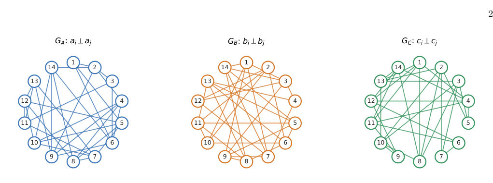
<figcaption class="paper-figure-caption"><b>Fig 1.</b> FIG. 1. Local orthogonality graphs of the construction. Vertex i labels the i-th product state in Table I, and an edge (i, j) in GX indicates that the corresponding local vectors at party X are orthogonal. All three panels use the same circular ordering of the vertices, and their edge sets together cover K14. The graphs GA and GB are isomorphic under the permutation π defined in Eq. (2).</figcaption>
</figure>

**Summary.** This paper resolves the open problem regarding the minimum size of a Genuinely Unextendible Product Basis (GUPB) in three-qutrit systems. The authors construct an explicit basis of cardinality 14, proving this is the minimum possible size for this system. They also demonstrate that the associated projector exhibits strong quantum nonlocality while remaining bound entangled across all bipartitions.

**Why it may be interesting.** The concept of GUPBs is central to understanding quantum nonlocality and separability criteria. Demonstrating a concrete example that exhibits strong nonlocality without violating PPT conditions provides deep insight into multipartite quantum correlations beyond simple entanglement measures.

Detailed structure

**Main problem.** The authors addressed the open question of determining the minimum cardinality required for a Genuinely Unextendible Product Basis (GUPB) in tripartite quantum systems.

**Main result.** They constructed an explicit three-qutrit GUPB with a minimum cardinality of fourteen, proving this is the smallest possible size for such a basis in this setting.

**Method.** The proof combines graph theory analysis (using orthogonality graphs) with rigorous mathematical constructions and computer-assisted searches to establish both existence and minimality bounds.

**Model / system.** The study focuses on three-qutrit systems ($\mathbb{C}^3 \otimes \mathbb{C}^3 \otimes \mathbb{C}^3$) in quantum information theory, generalizing the results to arbitrary local dimensions $d_A, d_B, d_C$.

**Key observables.** The constructed basis exhibits 'strong quantum nonlocality without entanglement,' and the projector onto its orthogonal complement is shown to be positive under partial transposition (PPT) and bound entangled across every bipartition.

**Important parameters / regimes.** Minimum cardinality = 14 for the three-qutrit case; local dimensions $d \ge 3$.

**Assumptions / limitations.** The proof relies on Lemma 1, which provides necessary and sufficient conditions relating the UPB property to rank conditions on local vector subsets.

**Figures summary.** Figure 1 illustrates the local orthogonality graphs ($G_A, G_B, G_C$) whose union covers $K_{14}$, while Tables I-IV detail the specific vectors, determinant certificates, and index sets used in the construction and verification process.

**Paper structure.** The paper establishes the problem definition (GUPB), uses graph theory to constrain possible bases, constructs the explicit basis of size 14 for three qutrits, proves its minimality, generalizes the construction to higher dimensions, and finally analyzes the entanglement properties of the orthogonal complement.

Abstract

It has remained an open question whether a genuinely unextendible product basis (GUPB) exists. We resolve this problem by constructing an explicit three-qutrit GUPB of cardinality fourteen in the smallest tripartite Hilbert space in which a GUPB can exist. Together with the nonexistence of three-qutrit GUPBs of cardinality less than fourteen, our construction proves that fourteen is the minimum cardinality. A padding procedure further extends the construction to all tripartite systems whose local dimensions are at least three. As applications, the normalized projector onto the thirteen-dimensional orthogonal complement of the three-qutrit GUPB is positive under partial transposition and bound entangled across every bipartition, while the GUPB exhibits strong quantum nonlocality without entanglement.

[↑ back to top](#top)

### [AutoQuREO: A Framework for Automated Quantum Resource Estimation and Optimization](http://arxiv.org/abs/2608.12936v1)

**Authors:** Harshkumar Oza, Aritra Sarkar, Syed Naqi Abbas, Rahul Bhowmick, Aryan Prakash, Prateek P Kulkarni, Krishna Kumar Sabapathy  
**Type:** theory · **Category:** quantum information and computing · **PDF:** <https://arxiv.org/pdf/2608.12936v1>  
**Analysis basis:** full PDF text, analyzed in chunks
**Topic relevance:** `quantum measurements` **1/5**

↔ Scroll figures horizontally

<figure class="paper-figure-card">
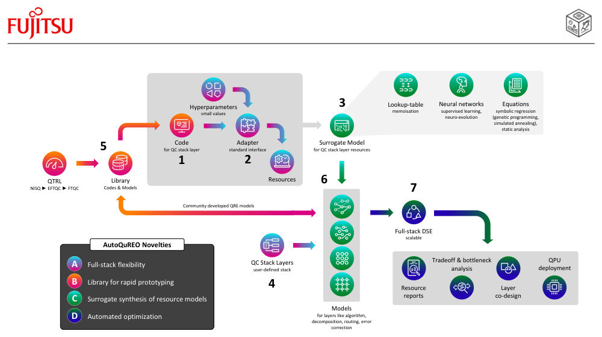
<figcaption class="paper-figure-caption"><b>Fig 1.</b> Figure 1 Overview of a typical AutoQuREO workflow. (1) Layer-specific code is either imported from the rapid-prototyping library or provided by the user. The library supports NISQ, EFTQC, and FTQC primitives. (2) The adapter design pattern interfaces the code, mapping hyperparameters to resources. The code is compiled for small instances to generate data for modeling. (3) A surrogate resource model is created. AutoQuREO natively supports various models and modeling techniques shown in the inset. (4) Multiple layers can be flexibly added by the user from the library to create a full-stack scenario. (5) The models can be imported from the library, or newly created models can be added back to...</figcaption>
</figure>
<figure class="paper-figure-card">
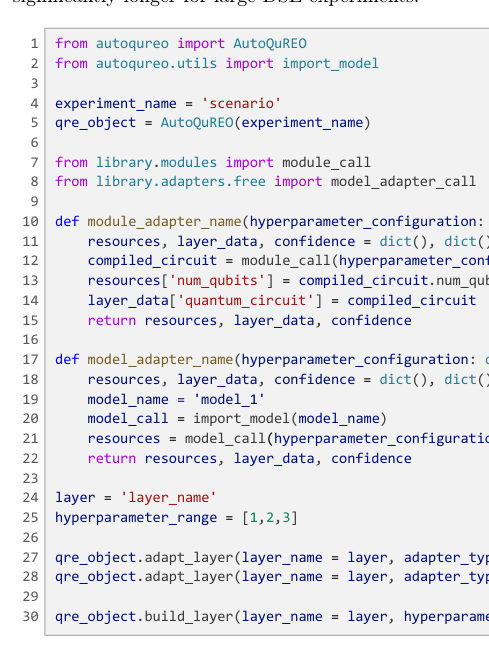
<figcaption class="paper-figure-caption"><b>Fig 2.</b> Figure 2 API template for AutoQuREO project creation, adapter definition, and layer building.</figcaption>
</figure>
<figure class="paper-figure-card">

<figcaption class="paper-figure-caption"><b>Fig 3.</b> Figure 3 presents the internal workflow of AutoQuREO, to aid the comparison with existing QRE tools. The layers are not predefined in AutoQuREO. Users can flexibly add or remove layers based on their QC stack of interest. The specific layers shown are just an example. Standard layer definitions are available in the library for rapid prototyping of full-stack use cases. In existing tools, the quantum algorithm layer is typically the only user-defined component, leaving the lower stack monolithic. Each layer has its corresponding set of tunable hyperparameters used for DSE and eventual optimization by AutoQuREO. Since no layer is treated differently, these hyperparameters can thus be used to...</figcaption>
</figure>
<figure class="paper-figure-card">
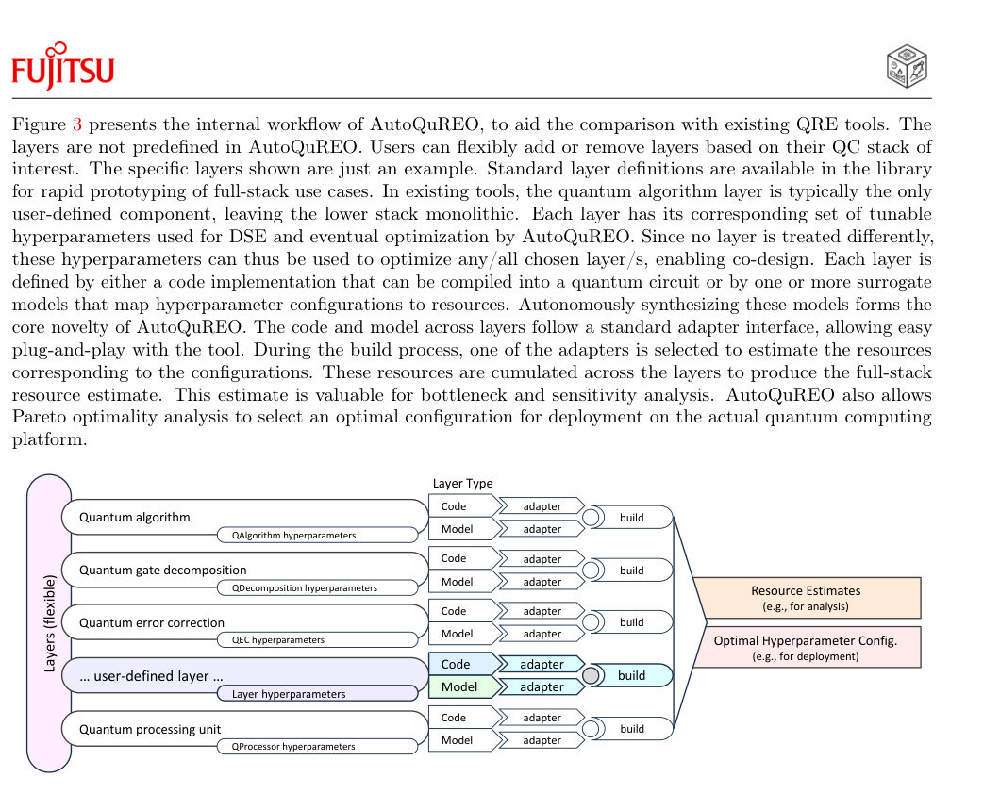
<figcaption class="paper-figure-caption"><b>Fig 4.</b> Figure 3 Internal workflow of AutoQuREO. A quantum computing stack is represented as a sequence of user-defined layers, each associated with hyperparameters and one or more adapters. For a given configuration, each layer produces resource estimates that are cumulatively aggregated across the stack. Surrogate models replace compilation where applicable, enabling scalable estimation. The aggregated resources are used for downstream multi-objective optimization and hardware deployment.</figcaption>
</figure>
<figure class="paper-figure-card">
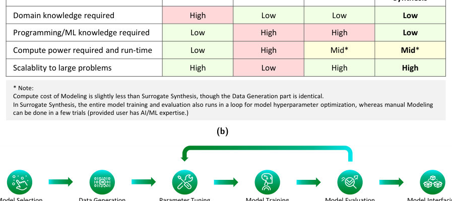
<figcaption class="paper-figure-caption"><b>Fig 5.</b> Figure 4 Surrogate synthesis workflow and comparison with existing QRE methods. (a) Comparison of QRE workflow of compilation-based, symbolic-annotation-based and the proposed modeling-based approach, highlighting trade-offs in scalability and automation. (b) Comparison of resource estimation features across criteria such as required expertise, computational cost, and scalability. (c) Surrogate synthesis pipeline including model selection, data generation, model tuning, training and evaluation, and adapter sketching. This enables AutoQuREO to perform scalable resource estimation.</figcaption>
</figure>

**Summary.** This paper introduces AutoQuREO, an automated framework designed to estimate and optimize resources across the entire quantum computing stack. It overcomes limitations of existing tools by using surrogate modeling and integrating optimization directly into deployment pipelines. This positions it as a general platform for exploring complex resource trade-offs necessary for practical quantum technology development.

**Why it may be interesting.** It provides a high-level, systematic tool for analyzing resource bottlenecks across the entire quantum stack, which is crucial for researchers designing algorithms or hardware architectures that must account for real-world constraints beyond idealized models.

Detailed structure

**Main problem.** The transition of quantum computing from proof-of-concept to practical utility requires optimizing algorithms across complex, heterogeneous hardware/software stacks.

**Main result.** AutoQuREO provides a general-purpose digital twin platform that systematically discovers unexploited resource trade-offs intractable with existing Quantum Resource Estimation (QRE) tools.

**Method.** The framework uses surrogate modeling via algorithmic profiling and neuro-symbolic learning to estimate layer-wise resources, integrating this into a multi-objective optimization pipeline.

**Model / system.** It models the entire quantum computing stack, including algorithms, compilation, error correction (QEC), and hardware execution layers, supporting NISQ through FTQC regimes.

**Key observables.** Resource trade-offs involving qubits, circuit depth, fidelity, classical control cost, logical/physical qubit counts, and wall-clock runtime.

**Important parameters / regimes.** The framework is designed to handle resource estimation across multiple computational regimes (NISQ, EFT, FTQC).

**Assumptions / limitations.** Existing QRE tools are often too compilation-heavy, domain-knowledge dependent, or strictly tied to long-term fault-tolerant assumptions.

**Figures summary.** Figure 1 illustrates the overall AutoQuREO workflow, detailing the process from user-defined stack layers through surrogate model creation to automated multi-objective optimization.

**Paper structure.** The paper introduces the framework by identifying limitations in current QRE methods, then details the four novel components of AutoQuREO (abstraction, modularity, surrogate modeling, optimization), and finally validates its utility through co-design case studies.

Abstract

As quantum computing progresses from proof-of-principle demonstrations toward practical utility, a significant impediment is the need to augment algorithmic feasibility with system-level optimization across heterogeneous hardware and software stacks. Quantum resource estimation (QRE) plays a central role in this transition, yet existing approaches remain largely compilation-heavy or domain-knowledge-guided symbolic annotations, and tightly coupled to long-term fault-tolerant assumptions, limiting their topical applicability.   In this work, we introduce AutoQuREO, an Automated framework for full-stack Quantum Resource Estimation and Optimization. AutoQuREO is built around four core novelties: (i) a flexible, user-defined abstraction of the quantum computing stack; (ii) a modular library of reusable stack components enabling rapid full-stack prototyping; (iii) surrogate modeling of layer-wise resources via algorithmic profiling and neuro-symbolic learning; and (iv) integrated multi-objective optimization that embeds QRE directly into deployment pipelines. Together, these design choices enable AutoQuREO to serve as a digital twin for quantum computing stacks, supporting the tractable exploration of complex design spaces.   We demonstrate the capabilities of AutoQuREO through representative co-design case studies, including early-fault-tolerant quantum algorithms, small error correction codes, gate decomposition and variational training of parametric quantum circuits. These examples illustrate how AutoQuREO enables systematic discovery of unexploited resource trade-offs that are computationally intractable or abstruse using existing QRE tools. AutoQuREO is positioned as a general-purpose platform for advancing quantum technology readiness.

[↑ back to top](#top)

### [Completeness for flow-preserving rewrite rules](http://arxiv.org/abs/2608.13035v1)

**Authors:** Miriam Backens, Simon Perdrix  
**Type:** theory · **Category:** quantum information and computing · **PDF:** <https://arxiv.org/pdf/2608.13035v1>  
**Analysis basis:** full PDF text, analyzed in chunks
**Topic relevance:** `quantum measurements` **1/5**

↔ Scroll figures horizontally

<figure class="paper-figure-card">
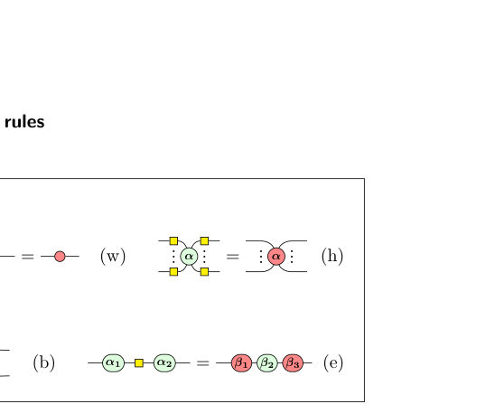
<figcaption class="paper-figure-caption"><b>Fig 1.</b> Figure 1 A complete equational theory for the ZX-calculus. In Eq. (e), α1, α2 are arbitrary real numbers, and β1 := arg(z) + arg(z′), β2 := 2 arg(i + | z</figcaption>
</figure>
<figure class="paper-figure-card">
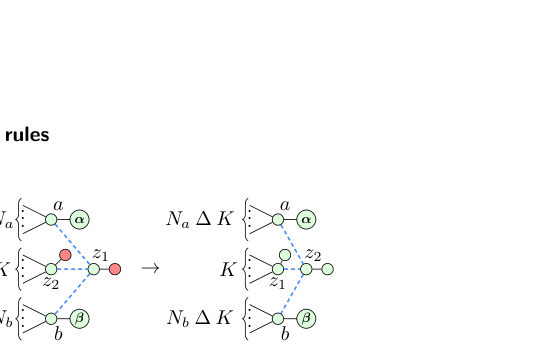
<figcaption class="paper-figure-caption"><b>Fig 2.</b> Figure 3 The sequence of rewriting steps in Lemma 52, with Na := NG(a) and Nb := NG(b). Since a, b ∈F, they must be either XY -measured (as illustrated) or outputs. The vertices a and b could also be neighbours, this would not change anything about the procedure and they would remain neighbours. Note that Nb ∆K = Nb ∆(Nb ∩S) = Nb ∩S, i.e. b is left with only extracted neighbours.</figcaption>
</figure>
<figure class="paper-figure-card">
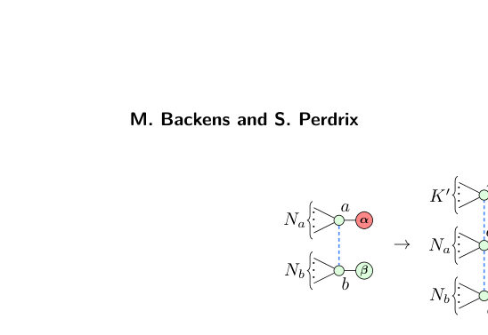
<figcaption class="paper-figure-caption"><b>Fig 3.</b> Figure 4 The operations performed in Lemma 55. Here, Na := NG(a) \ {b}, Nb := NG(b) \ {a}, and K′ := K \ {a} = (NG(b) ∩S) \ {a}. Vertex b could also be an output.</figcaption>
</figure>
<figure class="paper-figure-card">
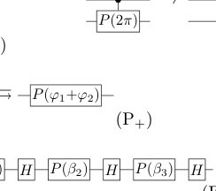
<figcaption class="paper-figure-caption"><b>Fig 4.</b> Figure 5 Complete rewriting rules for quantum circuits with initialisation. In Equation (Euler), the angles βi of the RHS are computed as follows: For any angles α1, α2 ∈R, let z := −sin  α1+α2</figcaption>
</figure>

**Summary.** This paper develops and proves the completeness of an extended set of flow-preserving rewrite rules within the ZX-calculus. By establishing this completeness, the authors provide a rigorous mathematical foundation to show that certain classes of quantum computations (those admitting efficient circuit extraction) can be fully manipulated using these graphical rules. This is vital for optimizing and verifying measurement-based quantum computation protocols.

**Why it may be interesting.** It provides a rigorous mathematical toolset—a complete rewriting system—to prove the equivalence and implementability of complex quantum circuits derived from abstract graphical models, which is crucial for optimizing quantum algorithms.

Detailed structure

**Main problem.** The central problem is establishing completeness for flow-preserving rewrite rules within the ZX-calculus framework to ensure fully graphical reasoning about quantum computations.

**Main result.** The authors extend existing flow-preserving rules and prove that the resulting rule set is complete for all flow-preserving translations between appropriate ZX-diagrams.

**Method.** The proof involves a two-stage process: transforming diagrams with Pauli flow into those with causal flow (circuit extraction) using only flow-preserving rules, relying on established circuit rewriting completeness.

**Model / system.** The model is quantum computation represented by ZX-diagrams, particularly in the context of measurement-based quantum computation (MBQC). Flow properties (Pauli flow, gflow, causal flow) are key constraints ensuring deterministic implementability.

**Key observables.** The presence and type of 'flow' (e.g., Pauli flow, gflow, causal flow), which dictates the physical validity and efficient circuit extraction capability of the diagram.

**Important parameters / regimes.** The structure of the graph derived from the computation, including input/output vertices and measurement labels ($\lambda$).

**Assumptions / limitations.** The work focuses on restricting to diagrams possessing a defined flow property (like Pauli or causal flow) to enable efficient circuit extraction; general ZX-diagrams are too complex.

**Figures summary.** Figure 1 details the complete equational theory for the ZX-calculus, while Figure 2 contains the specific set of extended flow-preserving rewrite rules central to the completeness proof.

**Paper structure.** The paper reviews the ZX-calculus and its connection to MBQC. It then defines various graph-theoretic 'flow' properties (Pauli flow, gflow) for labelled open graphs. The core is proving that an extended set of flow-preserving rewrite rules achieves completeness for these constrained diagrammatic transformations.

Abstract

Complete sets of graphical rewrite rules enable fully graphical reasoning about quantum computations and have been an area of active research for more than a decade. Many recent applications of the ZX-calculus have made use of the close correspondence between ZX-diagrams and computations in the one-way model of measurement-based quantum computation. In this model, various kinds of flow properties ensure deterministic implementability; for ZX-diagrams, these same properties allow efficient translation into quantum circuits (a problem that is known to be #P-hard in general). Therefore, flow-preserving ZX-calculus rewrite rules are of strong interest.   Here, we extend the set of flow-preserving rules appearing in the literature with a few new rules and extensions of existing rules. We then show that the resulting rule set is complete for all flow-preserving translations between ZX-diagrams of appropriate form. The proof employs a manifestly flow-preserving equivalent of circuit extraction, where a diagram with gflow is transformed, using only flow-preserving rewrite rules, into a diagram with causal flow.

[↑ back to top](#top)

### [Counter-examples for Tensorization Property of Strong Data Processing Inequality for Quantum Divergences](http://arxiv.org/abs/2608.13204v1)

**Authors:** Yu Cao  
**Type:** theory · **Category:** quantum information and computing · **PDF:** <https://arxiv.org/pdf/2608.13204v1>  
**Analysis basis:** full PDF text, analyzed in chunks
**Topic relevance:** `correlated / nonlocal dissipation` **1/5**

↔ Scroll figures horizontally

<figure class="paper-figure-card">
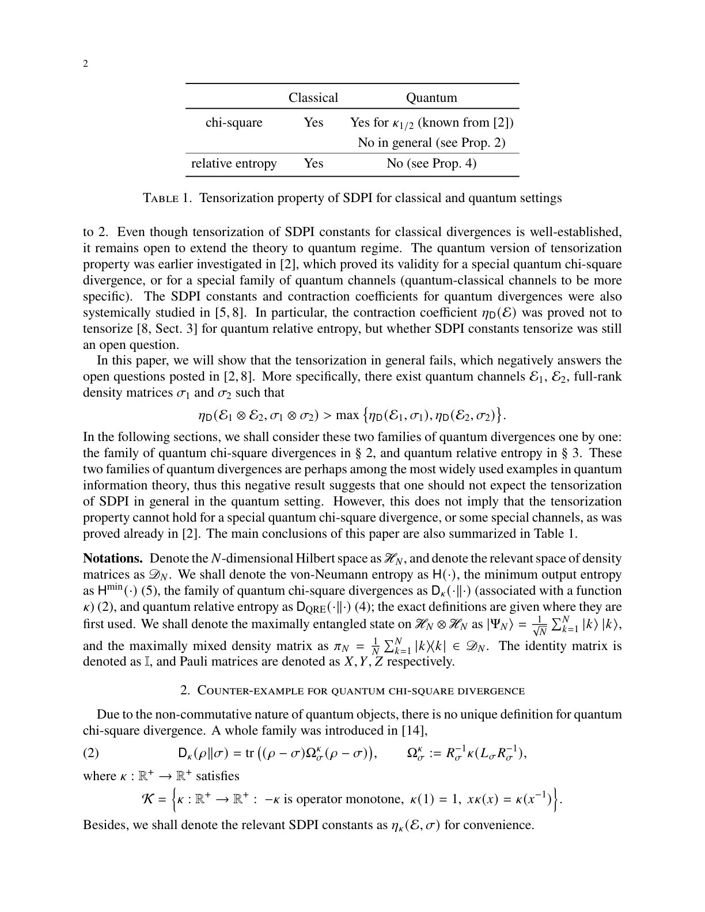
<figcaption class="paper-figure-caption"><b>Fig 1.</b> Low-resolution page preview, page 2</figcaption>
</figure>
<figure class="paper-figure-card">
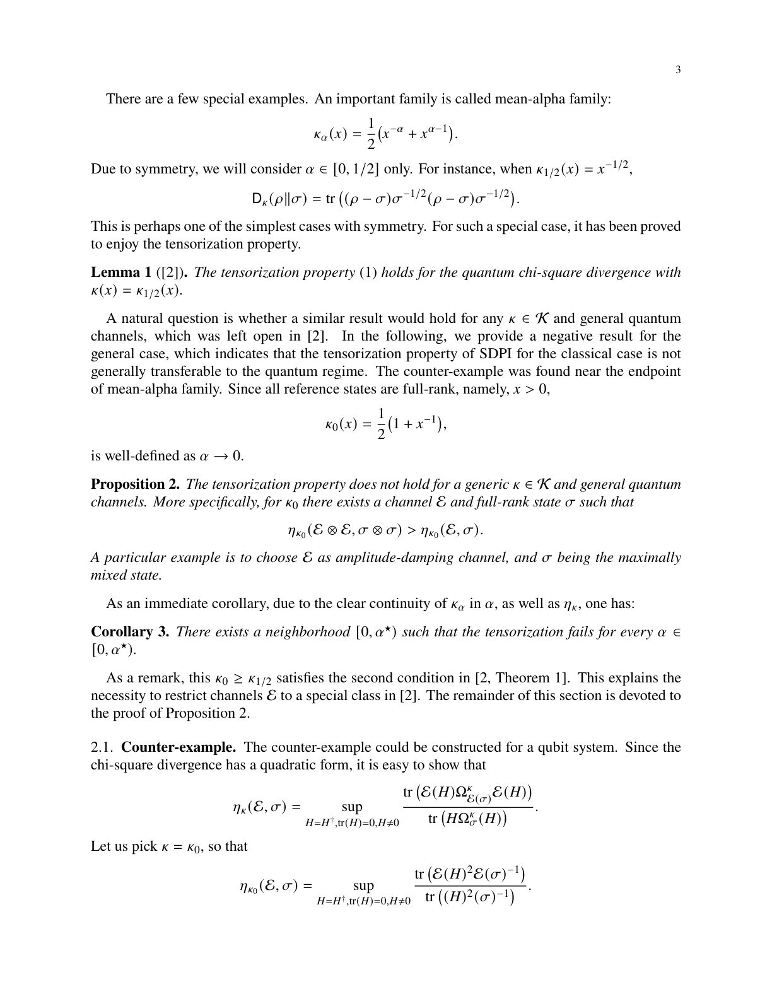
<figcaption class="paper-figure-caption"><b>Fig 2.</b> Low-resolution page preview, page 3</figcaption>
</figure>
<figure class="paper-figure-card">
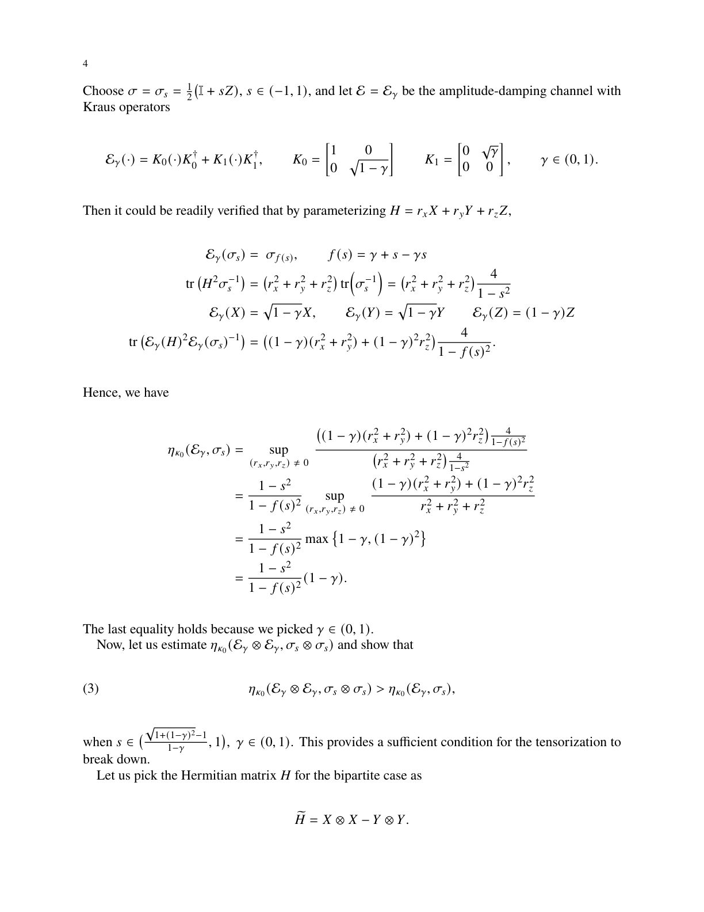
<figcaption class="paper-figure-caption"><b>Fig 3.</b> Low-resolution page preview, page 4</figcaption>
</figure>
<figure class="paper-figure-card">
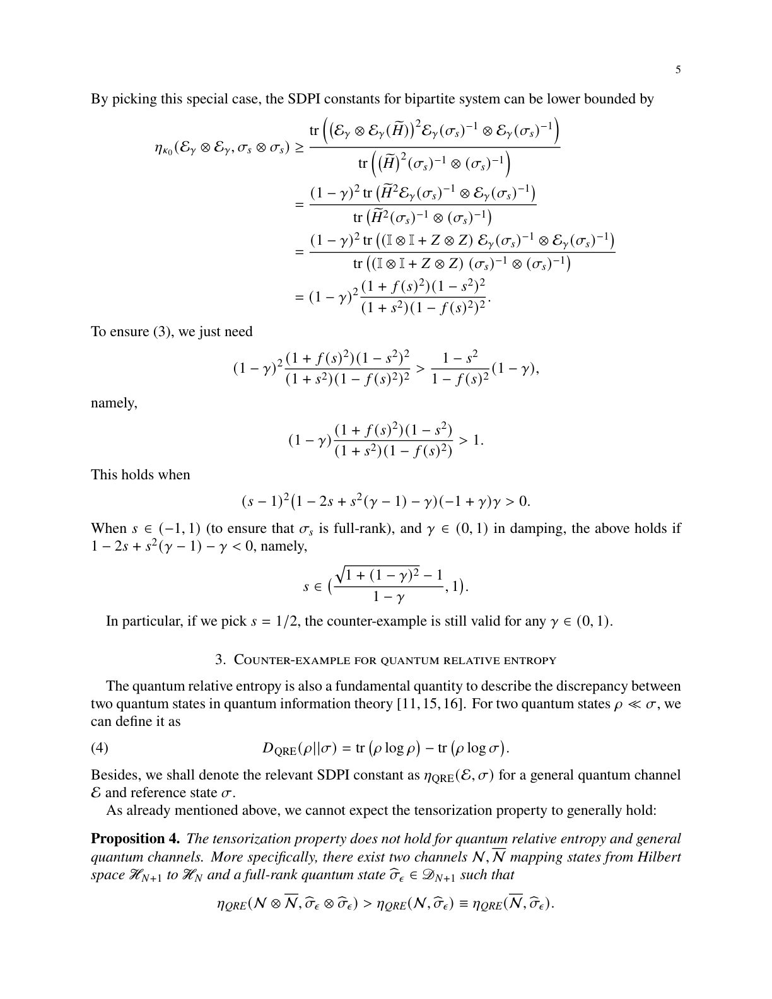
<figcaption class="paper-figure-caption"><b>Fig 4.</b> Low-resolution page preview, page 5</figcaption>
</figure>
<figure class="paper-figure-card">
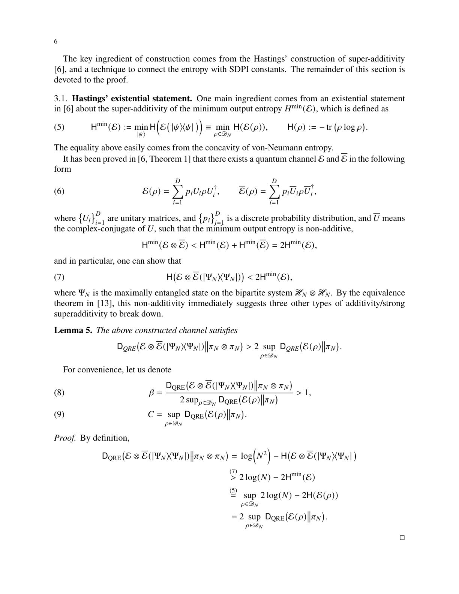
<figcaption class="paper-figure-caption"><b>Fig 5.</b> Low-resolution page preview, page 6</figcaption>
</figure>

**Summary.** This paper rigorously investigates the tensorization property associated with the Strong Data Processing Inequality for various quantum divergences. The authors demonstrate that this desirable property fails for both quantum $\chi$-square divergences and the quantum relative entropy using explicit counter-examples. This work highlights fundamental limitations in how information loss scales when considering composite quantum systems.

**Why it may be interesting.** The failure of such fundamental additivity properties (like tensorization) in quantum information theory is crucial because it indicates limitations in applying classical intuition from information theory to quantum channels.

Detailed structure

**Main problem.** The paper investigates whether the tensorization property of the Strong Data Processing Inequality (SDPI) holds for quantum divergences.

**Main result.** It reports two negative results, demonstrating that the tensorization property fails for certain quantum $\chi$-square divergences and generally for the quantum relative entropy.

**Method.** The authors construct explicit counter-examples using specific noisy channels and states to show that the inequality relating the joint divergence to the maximum of individual divergences is violated.

**Model / system.** The analysis is conducted within quantum information theory, involving general quantum channels $E$ acting on density matrices $
ho$, and considering composite systems via tensor products ($E \otimes E$).

**Key observables.** The key observable is the constant $\eta_D(E, \sigma)$ derived from the SDPI, and the divergences themselves include the quantum $\chi$-square divergence $D_\kappa$ and the quantum relative entropy $D_{QRE}$.

**Important parameters / regimes.** Parameters include the damping parameter $\gamma$, state parameters $s$, and limits taken as $\epsilon 	o 0$.

**Assumptions / limitations.** The failure of tensorization is shown for general cases, suggesting it is not a universal property in the quantum setting.

**Paper structure.** The paper first introduces the SDPI and the concept of tensorization. It then presents separate sections detailing counter-examples: one using the amplitude-damping channel for $\chi$-square divergences, and another utilizing minimum output entropy non-additivity to disprove tensorization for $D_{QRE}$.

Abstract

The data processing inequality is a fundamental property that describes the loss of information through noisy channels. A more refined description is characterized by the strong data processing inequality (SDPI). In classical information theory, the tensorization of strong data processing inequality holds for a whole family of $f$-divergences. However, its quantum counterpart is less known. The tensorization of SDPI was shown only for some special cases previously, and the general understanding about the tensorization property of SDPI for quantum divergences remains open. In this work, we report two negative results: the tensorization property fails for certain quantum chi-square divergences, and it also does not hold for the quantum relative entropy.

[↑ back to top](#top)

### [Equivariant learning of a transferable three-dimensional classical density functional](http://arxiv.org/abs/2608.13506v1)

**Authors:** Bingqing Cheng  
**Type:** theory · **Category:** statistical mechanics · **PDF:** <https://arxiv.org/pdf/2608.13506v1>  
**Analysis basis:** full PDF text, analyzed in chunks
**Topic relevance:** `Keldysh / 2PI / non-Gaussian methods` **1/5**

↔ Scroll figures horizontally

<figure class="paper-figure-card">
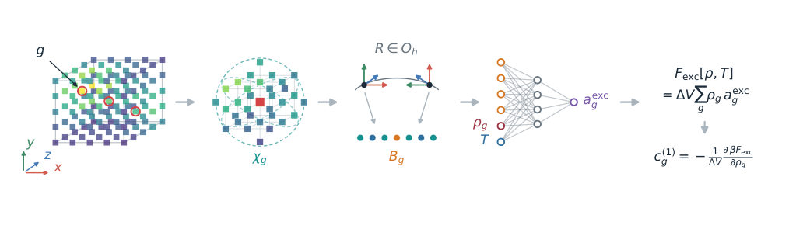
<figcaption class="paper-figure-caption"><b>Fig 1.</b> Figure 1. Equi-cDFT architecture. Local neighborhoods of the three-dimensional density field are encoded using cubic- symmetry-adapted features and processed by a shared neural readout. Summing the local contributions produces an extensive excess free-energy functional, whose derivative gives the one-body direct correlation field. Here g labels a density-grid point, χg is its finite spherical environment, R ∈Oh denotes a rotation or reflection of the cubic lattice, Bg is the resulting symmetry- adapted feature vector and T is the temperature. The readout produces the local excess free energy per particle aexc g ; summing over the grid densities ρg with voxel volume ∆V gives Fexc[ρ, T]. c(1)...</figcaption>
</figure>
<figure class="paper-figure-card">
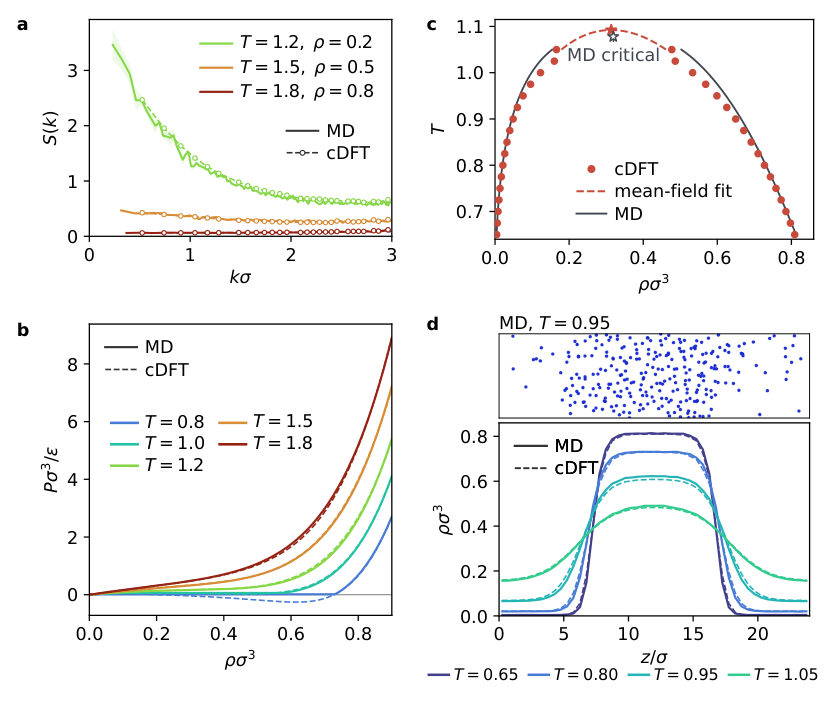
<figcaption class="paper-figure-caption"><b>Fig 2.</b> Figure 2. Equation of state, phase behavior, and interfaces from the learned free-energy functional. a Static structure factors of homogeneous fluids. Solid curves and shaded standard errors are direct MD estimates; dashed curves with open circles follow from twice differentiating the learned functional and applying the Ornstein–Zernike relation. b Pressure– density isotherms. Dashed curves are cDFT compressibility-route predictions and solid curves are evaluations of the reference EOS [25]. c Liquid–vapor coexistence. Unconnected red circles are plateau densities from cDFT slab solutions; the dashed red segment is a mean-field continuation from the highest solved state to the predicted...</figcaption>
</figure>
<figure class="paper-figure-card">
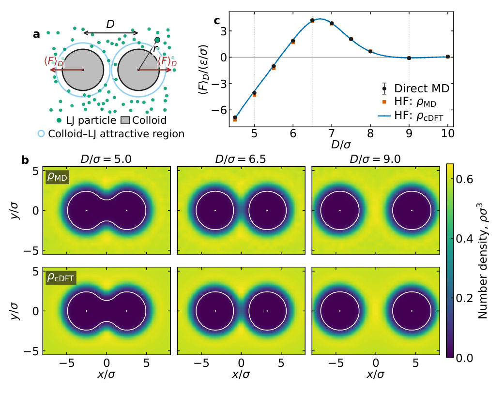
<figcaption class="paper-figure-caption"><b>Fig 3.</b> Figure 3. Solvent-mediated interactions between two fixed colloids. a Schematic of two colloids at center-to-center separation D immersed in a one-component Lennard–Jones fluid. Thin blue contours mark the colloid–fluid attractive regions; the colloids have no direct mutual interaction. Red arrows denote the mean force ⟨F⟩D, with negative values corresponding to attraction and positive values to repulsion. b Central 1σ-thick slab averages of the equilibrium number density from MD (top) and fixed-N cDFT solutions (bottom) at D/σ = 5.0, 6.5 and 9.0. White contours mark Vext/ϵ = 4. c Mean force as a function of separation: direct MD averages with block-standard-error bars (black), the...</figcaption>
</figure>
<figure class="paper-figure-card">
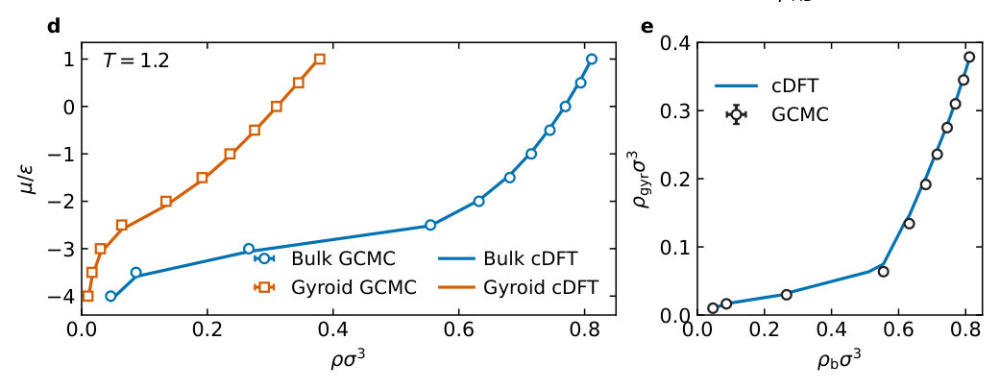
<figcaption class="paper-figure-caption"><b>Fig 4.</b> Figure 4. Gyroid-pore structure and adsorption at T = 1.2. a,b Equilibrium MD and cDFT density fields at the matched isosurface levels, for whole-box mean density ⟨ρ⟩σ3 = 0.29. c Grid-point density parity, colored by the minimum periodic distance dwall to the nominal pore wall Vext/ϵ = 4 d Bulk and gyroid chemical potentials versus whole-box density in the common reservoir gauge. Solid lines denote cDFT predictions from fixed-N solutions and open symbols denote GCMC references. e Adsorption isotherm obtained by matching bulk and gyroid states at equal chemical potential. All confined densities are defined using the full simulation-box volume.</figcaption>
</figure>
<figure class="paper-figure-card">
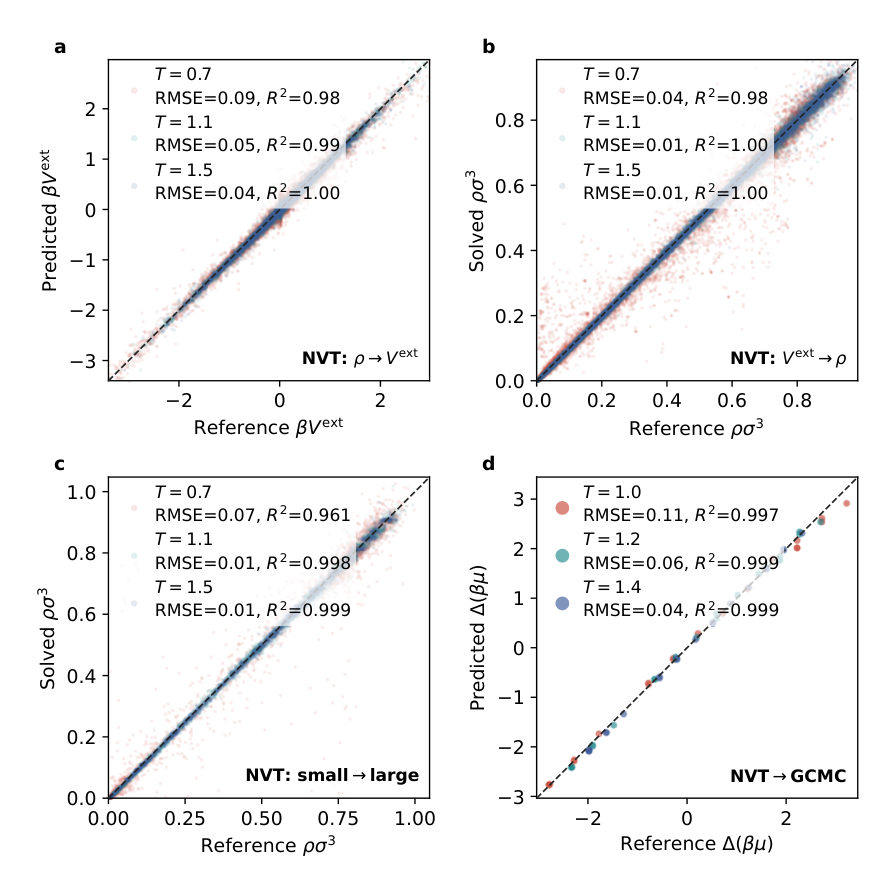
<figcaption class="paper-figure-caption"><b>Fig 5.</b> Figure 5. Combined benchmark of the learned excess free-energy functional. a Gauge-aligned external fields inferred from all 1,592 held-out NVT equilibrium density fields; one spatially constant gauge is aligned for each canonical field. b Fixed-particle-number equilibrium densities obtained from the external fields for all 1,592 held-out fields. c Transfer of the density solver to all 90 test fields in boxes with 3.375 times the training volume. d Gauge-aligned dimensionless chemical- potential differences inferred for all 66 GCMC equilibrium fields by the NVT-trained functional. Reference and predicted chemical potentials are centered independently at each temperature, corresponding to...</figcaption>
</figure>

**Summary.** This work presents an equivariant machine learning framework to learn the excess free-energy functional for classical fluids directly from equilibrium density data. By enforcing local chemical potential balance, the model achieves remarkable transferability, accurately predicting macroscopic properties like phase behavior and interparticle forces in complex 3D environments without needing explicit labels for these targets.

**Why it may be interesting.** While focused on classical liquids, the rigorous application of deep learning principles (equivariance, local constraints) to derive fundamental thermodynamic potentials is highly relevant for developing predictive models in quantum many-body physics where exact functionals are unknown.

Detailed structure

**Main problem.** The central challenge is developing a transferable, three-dimensional classical density functional theory (cDFT) that can predict complex thermodynamic and structural properties from equilibrium density fields.

**Main result.** The authors successfully learned the excess free-energy functional using only density data, enabling predictions of structure factors, equation of state, phase coexistence, and even non-monotonic forces in confined geometries.

**Method.** They introduced an equivariant learning framework (Equi-cDFT) that enforces local chemical potential balance ($\mu_{	ext{loc}, g} = 0$) to train the functional without requiring explicit free-energy or chemical-potential labels.

**Model / system.** The theory applies to classical fluids, modeled using Lennard-Jones interactions, and is tested in various geometries including bulk fluid, colloid suspensions, and porous materials like gyroid structures.

**Key observables.** Structure factor $S(k)$, equation of state ($P(
ho, T)$), liquid–vapor coexistence curves, one-body direct correlation function ($c^{(1)}_g$), and effective forces ($\langle F 
angle_D$).

**Important parameters / regimes.** Temperature ($T$), density ($
ho$), system size (e.g., $L=20\sigma$ for colloids), and external potential parameters.

**Assumptions / limitations.** The method relies on enforcing the local chemical-potential balance condition ($\mu_{	ext{loc}, g} = 0$) as the primary learning signal, and it uses a finite receptive field approximation for transferability.

**Figures summary.** Figures illustrate the learned functional architecture using symmetry-adapted features, show recovered thermodynamic properties like $S(k)$ and isotherms across different states, and benchmark performance on colloid bridging forces and adsorption in porous media.

**Paper structure.** The paper introduces the Equi-cDFT framework by enforcing local chemical potential balance. It then derives key observables (like $c^{(1)}_g$ and $c^{(2)}$) via functional differentiation. The results are benchmarked across homogeneous fluids to recover EOS/phase behavior, followed by applications to complex systems like colloid bridging and adsorption in porous media.

Abstract

Liquids exhibit collective behavior that depends sensitively on thermodynamic conditions, interfaces and confinement, yet predicting each new state commonly requires a separate atomistic simulation. Classical density functional theory offers a reusable variational description, but its central excess free-energy functional is generally unknown, and learned approximations have largely remained restricted to planar or lower-dimensional settings. Here we show that this functional can be learned directly from fully three-dimensional equilibrium density fields while preserving spatial symmetry and variational consistency, without free-energy or chemical-potential labels. A single learned functional transfers across temperatures, system sizes and statistical ensembles, and recovers structure factors, the equation of state, liquid--vapor coexistence and interfacial broadening, none of which are used as training targets. Applied to complex three-dimensional geometries, it predicts the non-monotonic force associated with formation and rupture of a solvent-depleted bridge between colloids and adsorption in an interconnected gyroid pore. These results demonstrate that equilibrium density data can be converted into a transferable thermodynamic generator connecting microscopic liquid structure to response, phase behavior and collective phenomena.

[↑ back to top](#top)

### [Magnetism in antiperovskite (Li$_2$\textit{M})\textit{Ch}O (\textit{M} = Fe, Mn, Co; \textit{Ch} = S, Se) diluted magnets with fixed 1/3 filling: the key role of magnetic anisotropy](http://arxiv.org/abs/2608.13111v1)

**Authors:** Jieyuan Zheng, Frederik L. Carstens, Lennart Singer, Mohammed A. A. Mohamed, Luca Bischof, Alexey Alfonsov, Jan Arneth, Silke Hampel, Nico Gräßler, Rüdiger Klingeler  
**Type:** experiment · **Category:** disordered systems and neural networks · **PDF:** <https://arxiv.org/pdf/2608.13111v1>  
**Analysis basis:** full PDF text, analyzed in chunks
**Topic relevance:** `analog quantum simulation` **1/5**

↔ Scroll figures horizontally

<figure class="paper-figure-card">
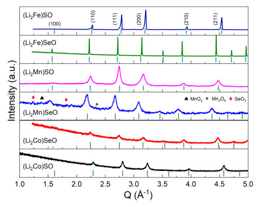
<figcaption class="paper-figure-caption"><b>Fig 1.</b> FIG. 1. Powder X-ray diffraction patterns of the ma- terials under study. Dark cyan lines in each plot mark the Bragg positions of the expected main phases (ICSD files for all materials under study: (Li2Fe)SO: 253936; (Li2Fe)SeO: 253937; (Li2Mn)SO: 434436; (Li2Mn)SeO: 434437; (Li2Co)SO: 434438; (Li2Co)SeO: 434439) [13, 18]. The scattering vector Q is used as the abscissa to compare data obtained using different radiation sources (see the text). Crystalline impurity phases are detected in (Li2Mn)SeO as shown by the markers. The data of (Li2Fe)SO and (Li2Fe)SeO are reprinted from Ref. [21, 22].</figcaption>
</figure>
<figure class="paper-figure-card">
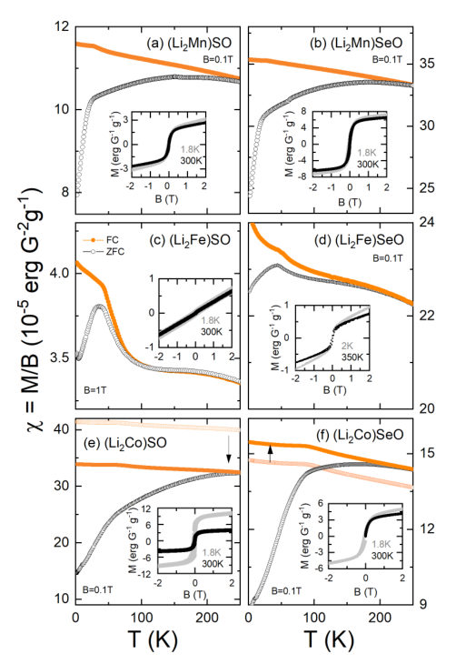
<figcaption class="paper-figure-caption"><b>Fig 2.</b> FIG. 2. Static magnetic susceptibility (χ = M/B) of (Li2M)ChO with M = Mn, Fe, Co and Ch = S, Se. Both FC (filled orange markers) and ZFC (open black markers) proto- cols have been applied. In (e,f), FC data have been shifted to compensate for a hysteresis effect of a tiny FM impurity phase. Insets: Corresponding isothermal magnetization at 2 K and 300 K.</figcaption>
</figure>
<figure class="paper-figure-card">
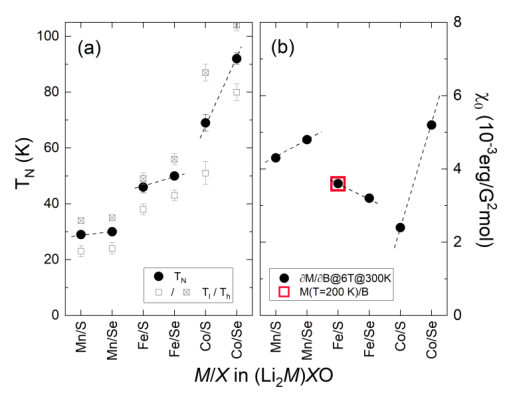
<figcaption class="paper-figure-caption"><b>Fig 3.</b> FIG. 4. (a) Magnetic ordering temperature TN and (b) magnetic susceptibility χ of (Li2M)ChO (M = Mn, Fe, or Co; Ch = Se or S). Tl and Th indicate the low- and high- temperature bounds of the jumps in Fisher’s specific heat as illustrated in Fig. 3. χ has been determined as ∂M(B)/∂B at B ≃6 T, T = 300 K and (only for (Li2Fe)SO as described in the text) from M(T)/B (at B = 1 T). Lines are guide to the eye.</figcaption>
</figure>
<figure class="paper-figure-card">
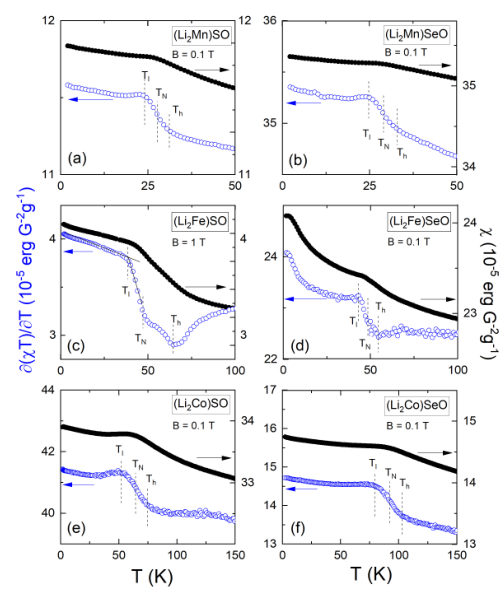
<figcaption class="paper-figure-caption"><b>Fig 4.</b> FIG. 3. Fisher’s specific heat ∂(χT)/∂T (blue open markers) as derived from the FC static magnetic susceptibility (black filled markers) in Fig. 2. The center of the step marked by TN signals the evolution of long-range magnetic order while Th and Tl are the temperatures where the steps begin and end.</figcaption>
</figure>
<figure class="paper-figure-card">
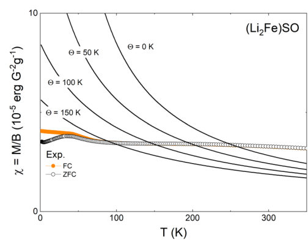
<figcaption class="paper-figure-caption"><b>Fig 5.</b> FIG. 5. Experimental magnetic susceptibility of (Li2Fe)SO (data points) from Fig. 2c and calculated magnetic response for a system of localized moments S = 2 on the Fe-positions according to the Curie-Weiss law (χ = C(T + Θ)) with the Curie constant C and varying Weiss temperatures Θ (lines). Θ = 0 reflects non-interacting moments while Θ &gt; 0 accounts for effective antiferromagnetic coupling. Note that, for T &lt; Θ, Curie-Weiss behavior is not expected in the mean-field model, which is not reflected by the shown Curie-Weiss curves.</figcaption>
</figure>

**Summary.** This work characterizes the magnetism in antiperovskite magnets where the magnetic ions are randomly diluted. The authors find clear evidence for long-range antiferromagnetic order whose temperature is strongly suppressed by this dilution effect. They conclude that while disorder plays a role, the intrinsic magnetic anisotropy of the transition metal dictates the overall magnetic coupling strength.

**Why it may be interesting.** While primarily experimental, the focus on random site occupation and percolation-like behavior places it directly within the study of disordered magnetic systems, which shares conceptual links with spin glass physics studied in condensed matter theory.

Detailed structure

**Main problem.** The study investigates how magnetic order evolves in antiperovskite magnets with a strongly diluted, randomly distributed magnetic sublattice at fixed 1/3 filling.

**Main result.** Long-range antiferromagnetic order is observed with increasing Néel temperatures ($T_N$) from Mn to Co compounds, and the ordering temperature is significantly diminished by magnetic dilution. The key controlling factor for $T_N$ appears to be the magnetic anisotropy of the transition metal ion.

**Method.** The research combines synthesis (high-energy ball milling) with extensive characterization, including static magnetic susceptibility ($\chi$), isothermal magnetization ($M(B)$), and specific heat measurements.

**Model / system.** The physical system is a series of lithium-rich antiperovskites, $(	ext{Li}_2	ext{M})	ext{ChO}$, where the random distribution of $	ext{Li}^+$ and $	ext{M}^{2+}$ ions creates a strongly diluted magnetic sublattice.

**Key observables.** Magnetic susceptibility ($\chi_{	ext{ZFC}}, \chi_{	ext{FC}}$), Néel temperatures ($T_N$), saturation magnetization ($M_{	ext{FM,sat}}$), and the Pauli-like high-field susceptibility ($\chi_0$).

**Important parameters / regimes.** Fixed 1/3 filling; magnetic anisotropy of transition metals (Fe, Co, Mn); dilution level; temperature range up to $\sim 350	ext{ K}$.

**Assumptions / limitations.** The analysis assumes that the intrinsic magnetic properties can be extracted by carefully subtracting contributions from ferromagnetic impurities ($	ext{Fe}^0$, $	ext{Fe}_3	ext{O}_4$).

**Figures summary.** Figures show pXRD patterns, ZFC/FC susceptibility curves revealing $T_N$ anomalies, and specific heat measurements exhibiting step-like features indicative of magnetic ordering.

**Paper structure.** The paper proceeds by characterizing the synthesis and impurity phases using XRD and SEM, followed by detailed magnetic measurements ($\chi(T), M(B)$) to determine the intrinsic magnetic coupling mechanisms and the role of anisotropy in diluted systems.

Abstract

We report the magnetic properties of a series of lithium-rich antiperovskites (Li$_2M$)$Ch$O ($M$ = Fe, Co, Mn and $Ch$ = Se, S) where transition metal and lithium ions are randomly distributed on the X-sites of the X$_3$BA structure, thereby forming a strongly diluted magnetic sublattice. Our study hence enables us to investigate the evolution of magnetic order at fixed 1/3-filling -- which is in the vicinity but slightly above the percolation threshold -- upon variation of the spin size, the magnetic anisotropy, and the orbital configuration. The data imply the absence of a distinct Curie-Weiss behavior up to 350~K but show rather large and weakly temperature-dependent magnetic susceptibility. We observe clear signatures of long-range antiferromagnetic order evolving in the 1/3-filled and strongly diluted magnetic X-site lattice with increasing Néel temperatures from $T_{\rm{N}}\simeq 30$~K in (Li$_2$Mn)$Ch$O to $\simeq 50$~K in (Li$_2$Fe)$Ch$O and $70-90$~K in (Li$_2$Co)$Ch$O. Except for $M$ = Co, the chalcogenide has no sizable effect on $T_{\rm N}$. We conclude significant magnetic coupling and short-range magnetic correlations at well above $T_{\rm N}$ which is in line with the observation of a broad electron spin resonance signal at room temperature. The actual ordering temperatures are strongly diminished by magnetic dilution. While structural parameters such as the tolerance factor and bonding angles do not strongly affect $T_{\rm N}$, a key parameter is the magnetic anisotropy of the transition metals.

[↑ back to top](#top)

### [Topological State-Aware Simulation Framework for Inter-Satellite Twin-Field QKD Networks](http://arxiv.org/abs/2608.12659v1)

**Authors:** Sergio Vázquez-Pozo, Juan Manuel Murillo  
**Type:** theory · **Category:** quantum information and computing · **PDF:** <https://arxiv.org/pdf/2608.12659v1>  
**Analysis basis:** full PDF text, analyzed in chunks
**Topic relevance:** `quantum measurements` **1/5**

↔ Scroll figures horizontally

<figure class="paper-figure-card">
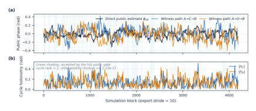
<figcaption class="paper-figure-caption"><b>Fig 1.</b> Fig. 1. Exported public telemetry for the direct link and the two witness paths, together with their cycle holonomies. Green shading marks blocks accepted by the full public gate.</figcaption>
</figure>
<figure class="paper-figure-card">
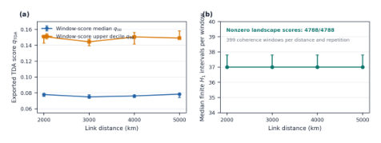
<figcaption class="paper-figure-caption"><b>Fig 2.</b> Fig. 3. Exported TDA diagnostics across the four distances. All 4,788 evaluated coherence windows produced nonzero persistence-landscape scores.</figcaption>
</figure>
<figure class="paper-figure-card">
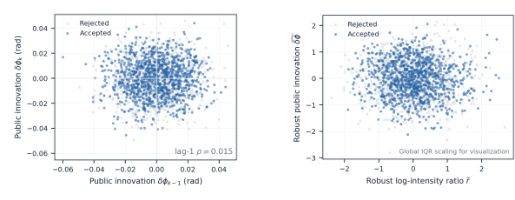
<figcaption class="paper-figure-caption"><b>Fig 3.</b> Fig. 2. (Left) Public-only phase portrait representing the dynamic state space of the telemetry estimator. (Right) Robustly normalized telemetry point cloud used to build Alpha complexes for persistent homology.</figcaption>
</figure>
<figure class="paper-figure-card">
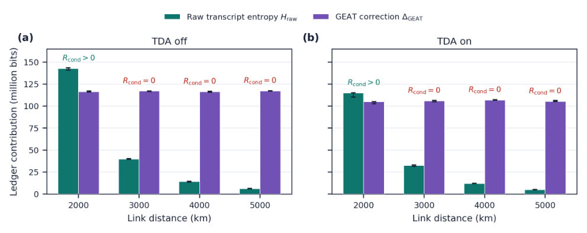
<figcaption class="paper-figure-caption"><b>Fig 4.</b> Fig. 4. Raw transcript-entropy lower bound and GEAT correction for the TDA-off and TDA-on configurations. Bars show medians and whiskers show the Monte Carlo q10–q90 interval over three repetitions.</figcaption>
</figure>
<figure class="paper-figure-card">
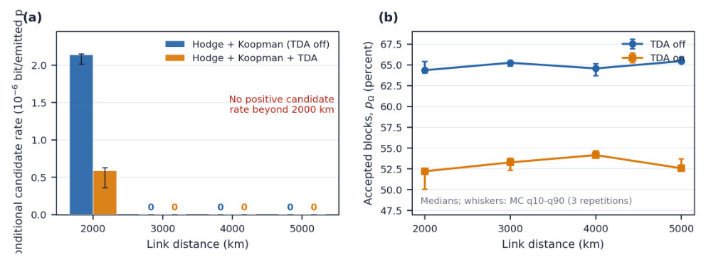
<figcaption class="paper-figure-caption"><b>Fig 5.</b> Fig. 5. Conditional candidate rate and accepted-block fraction for the same Hodge–Koopman gate with TDA disabled or enabled. Bars and points show medians; whiskers show q10–q90 over three Monte Carlo repetitions.</figcaption>
</figure>

**Summary.** This paper introduces a novel topological framework using Topological Data Analysis (TDA) to secure Quantum Key Distribution over dynamic inter-satellite links. By modeling the network state as a Cellular Sheaf and deriving acceptance criteria from classical beacon telemetry, it aims to overcome phase sensitivity issues caused by orbital noise. While showing promising candidate rates, the authors caution that the full composable security proof is not yet complete.

**Why it may be interesting.** It directly addresses quantum networking challenges by integrating advanced mathematical tools (TDA) to handle complex, non-stationary environmental noise inherent in space-based quantum communication links.

Detailed structure

**Main problem.** The extreme phase sensitivity of Twin-Field QKD over dynamic Inter-Satellite Links (ISLs) makes traditional post-selection heuristics fail in non-IID orbital environments.

**Main result.** A reference-only topological post-selection oracle, utilizing Topological Data Analysis (TDA) on a Cellular Sheaf model, is proposed to derive public acceptance events from classical telemetry.

**Method.** The protocol models the constellation as a Cellular Sheaf and applies TDA metrics (like persistent homology) to filter out noise sources that violate security assumptions in finite-key analysis.

**Model / system.** The system is an ISL constellation undergoing dynamic orbital changes, modeled using physical components like pointing jitter (log-normal fades) and phase drift (Gauss–Markov process).

**Key observables.** Median conditional candidate rates ($2.14 	imes 10^{-6}$ vs $5.87 	imes 10^{-7}$ bit/pulse at 2,000 km), accepted-block fraction, and topological metrics like persistence energy.

**Important parameters / regimes.** ISL separations (2,000–5,000 km); simulation parameters include aperture size (0.40 m) and repetition rate ($
u=1.0$ GHz).

**Assumptions / limitations.** The exported rates are only *conditional numerical candidates*; the full composable-security proof remains incomplete, resulting in a certified composable rate of zero.

**Figures summary.** Figures compare TDA-enabled vs. disabled configurations showing candidate rates and accepted fractions across different distances, with results confirming zero performance at 3,000–5,000 km.

**Paper structure.** The paper establishes the problem (TF-QKD vulnerability), introduces the topological framework using Cellular Sheaves/TDA on public telemetry, simulates the protocol under noise, and compares TDA's effect against baseline methods while noting the incompleteness of the final security proof.

Abstract

Inter-satellite links (ISLs) are the mandatory backbone for global quantum networks. While Twin-Field Quantum Key Distribution (TF-QKD) successfully surpasses linear rate-loss bounds, its extreme phase sensitivity makes it highly vulnerable to dynamic, non-IID (Independent and Identically Distributed) orbital environments. In composable finite-key analyses governed by the Generalized Entropy Accumulation Theorem (GEAT), traditional adaptive post-selection heuristics either violate strict independence conditions or incur massive second-order penalties that collapse the secret key rate. To overcome this, we introduce a reference-only topological post-selection oracle. By modeling the constellation as a Cellular Sheaf and applying Topological Data Analysis (TDA), our protocol derives a public acceptance event ($Ω$) exclusively from classical beacon telemetry. To rigorously validate this mechanism, we develop a modular simulation framework equipped with stochastic noise injection and an explicit GEAT security ledger. Simulations across 2,000-5,000 km ISL separations compare the same Hodge-Koopman gate with TDA disabled and enabled. At 2,000 km, the median conditional candidate rates are $2.14 \times 10^{-6}$ and $5.87 \times 10^{-7}$ bit per emitted pulse, respectively; both configurations return zero at 3,000-5,000 km. TDA is active in all 4,788 evaluated windows, but does not extend the positive-candidate range in this scenario. These exported rates are conditional numerical candidates: the full protocol-level composable-security proof remains incomplete and the certified composable rate is therefore zero throughout.

[↑ back to top](#top)

### [Universal magic state concentration](http://arxiv.org/abs/2608.13376v1)

**Authors:** Jacopo Rizzo, Lorenzo Leone  
**Type:** theory · **Category:** quantum information and computing · **PDF:** <https://arxiv.org/pdf/2608.13376v1>  
**Analysis basis:** full PDF text, analyzed in chunks
**Topic relevance:** `quantum measurements` **1/5**

↔ Scroll figures horizontally

<figure class="paper-figure-card">
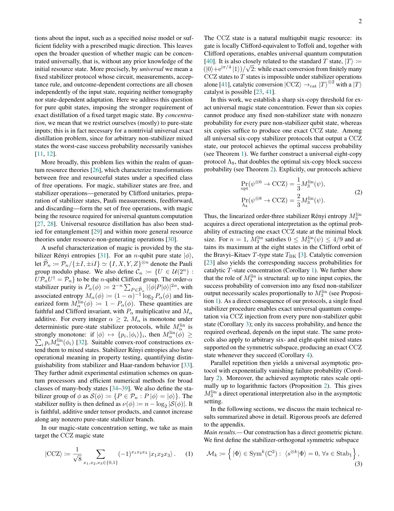
<figcaption class="paper-figure-caption"><b>Fig 1.</b> Low-resolution page preview, page 2</figcaption>
</figure>
<figure class="paper-figure-card">
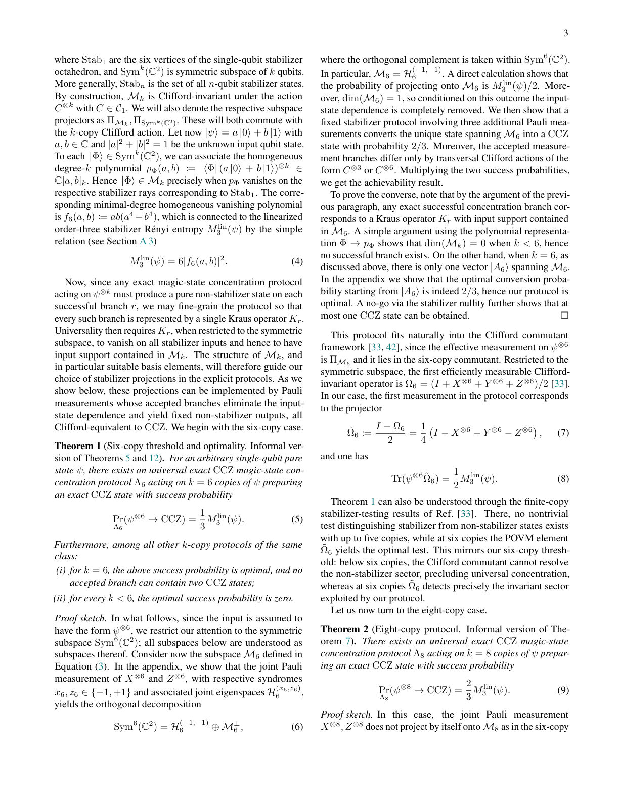
<figcaption class="paper-figure-caption"><b>Fig 2.</b> Low-resolution page preview, page 3</figcaption>
</figure>
<figure class="paper-figure-card">
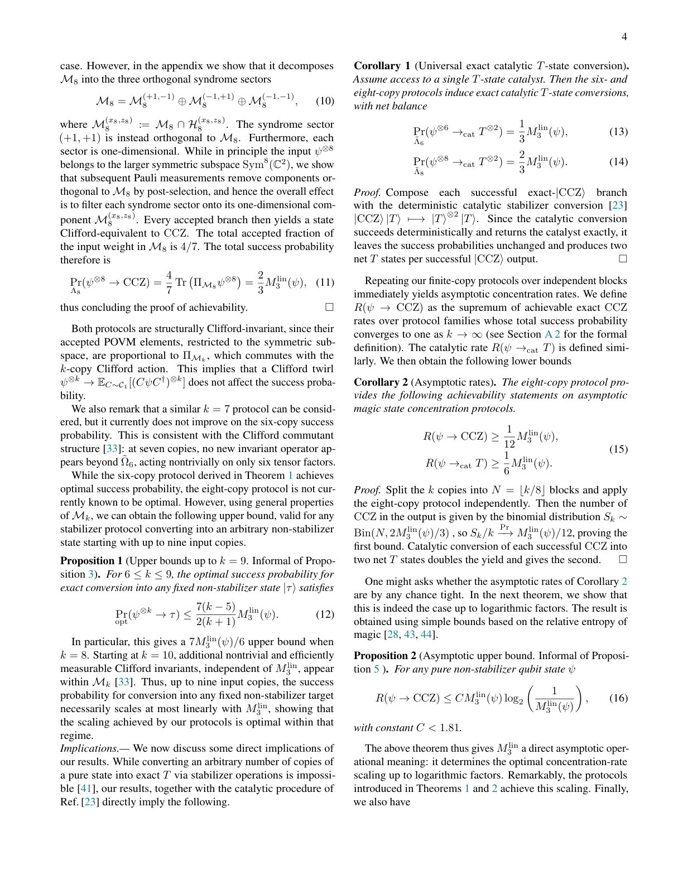
<figcaption class="paper-figure-caption"><b>Fig 3.</b> Low-resolution page preview, page 4</figcaption>
</figure>
<figure class="paper-figure-card">
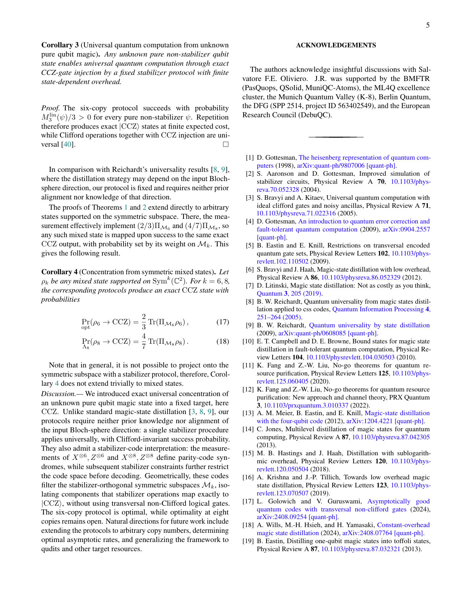
<figcaption class="paper-figure-caption"><b>Fig 4.</b> Low-resolution page preview, page 5</figcaption>
</figure>
<figure class="paper-figure-card">
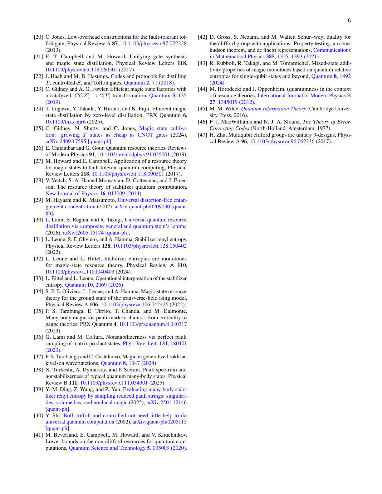
<figcaption class="paper-figure-caption"><b>Fig 5.</b> Low-resolution page preview, page 6</figcaption>
</figure>

**Summary.** The paper introduces 'universal magic state concentration,' a fixed protocol that converts multiple copies of an unknown pure qubit state into a target magic state required for universal quantum computing. It rigorously identifies the linearized order-three stabilizer Rényi entropy as the key resource measure, establishing optimal thresholds and asymptotic rates for this process.

**Why it may be interesting.** This work provides a deep theoretical understanding of resource quantification in quantum computation, linking fundamental entropy measures directly to operational limits for state preparation.

Detailed structure

**Main problem.** The paper addresses developing a universal magic state concentration protocol—a fixed stabilizer method to convert multiple copies of an unknown pure non-stabilizer qubit state into an exact target magic state.

**Main result.** They establish that the linearized order-three stabilizer Rényi entropy, $M_{	ext{lin}}^3(\psi)$, is the fundamental operational quantity governing this concentration. Specifically, they show a sharp six-copy threshold for achieving universal CCZ injection from any pure non-stabilizer state.

**Method.** The analysis employs advanced quantum information theory tools, including stabilizer Rényi entropies and bounding techniques derived from Pauli measurements and algebraic constraints on the symmetric subspace.

**Model / system.** The system is abstractly defined by single-qubit pure states $|\psi
angle$ used as resources to generate a target magic state (specifically $	ext{CCZ}$ or $	ext{T}$-state) required for universal quantum computation.

**Key observables.** Success probability of distillation protocols ($	ext{Pr}_{	ext{opt}}$), the linearized order-three stabilizer Rényi entropy ($M_{	ext{lin}}^3(\psi)$), and asymptotic distillation rates $R(\psi 	o 	ext{CCZ})$.

**Important parameters / regimes.** The number of input copies ($k$), particularly the optimal threshold at $k=6$, and the scaling behavior governed by $M_{	ext{lin}}^3(\psi)$.

**Assumptions / limitations.** Protocols must be fixed (independent of the specific input state $\psi$) and operate using stabilizer measurements; the analysis often assumes pure-state inputs.

**Figures summary.** Not specified in the notes, but the structure implies showing explicit formulas for success probabilities vs. $k$ and asymptotic rate bounds.

**Paper structure.** The paper progresses by first defining the problem of universal concentration, then deriving necessary mathematical tools (like stabilizer entropies), establishing sharp thresholds using specific copy numbers ($k=6, 8$), and finally proving general upper bounds on the achievable rates.

Abstract

Magic plays a dual role in quantum computation: it promotes stabilizer dynamics from efficient classical simulability to universality, but it presents a central challenge for fault tolerance, since non-stabilizer operations are harder to protect against noise. Magic state distillation addresses this issue; however, existing protocols typically assume prior structure in the input, such as proximity to the target or a specified noise model. Here we introduce universal magic state concentration: a fixed stabilizer protocol that converts a few copies of an unknown pure non-stabilizer qubit state into an exact target magic state. Motivated by the obstruction to exact $T$-state concentration, we show that $\mathrm{CCZ}$ states behave fundamentally differently. Six input copies are necessary and sufficient to distill one exact $\mathrm{CCZ}$ state, with an optimal success probability determined by the linearized order-three stabilizer Rényi entropy $M^{\mathrm{lin}}_3$. Beyond this, we show that $M^{\mathrm{lin}}_3$ governs the optimal state dependence of any protocol up to nine input copies, and we showcase an eight-copy protocol with improved success probability. Furthermore, block repetition of our protocols yields asymptotic distillation rates that achieve optimal scaling up to logarithmic factors. As a corollary, any unknown pure qubit magic state suffices for universal quantum computation via exact $\mathrm{CCZ}$ injection. Together, these results identify the stabilizer Rényi entropy as a fundamental operational quantity in magic state distillation.

[↑ back to top](#top)

### [Witnessing the architecture of quantum circuits](http://arxiv.org/abs/2608.13169v1)

**Authors:** Raphaël Mothe, Otfried Gühne  
**Type:** theory · **Category:** quantum information and computing · **PDF:** <https://arxiv.org/pdf/2608.13169v1>  
**Analysis basis:** full PDF text, analyzed in chunks
**Topic relevance:** `quantum measurements` **1/5**

↔ Scroll figures horizontally

<figure class="paper-figure-card">
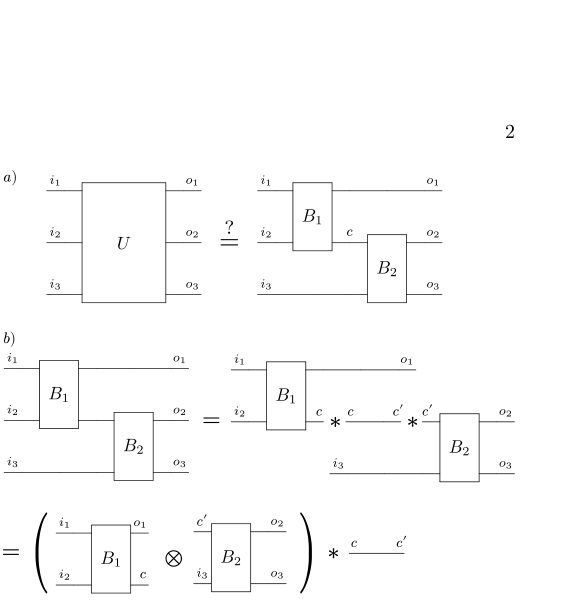
<figcaption class="paper-figure-caption"><b>Fig 1.</b> Figure 2. a) Minimal example of the architecture incompatibility problem, between a tripartite unitary U and the quantum circuit architecture Γ = ({1, 2}, {2, 3}). The input and output systems are assumed to be all qubits. Furthermore, when defining a cir- cuit architecture, we assume that all internal wires, i.e. here the wire labelled c which connects B1 and B2, is also carrying a qubit. This assumption is not restricting the set of allowed uni- tary gates for each Bk. b) Illustration of Eq. (3), which consists in rewriting in the Choi picture the composition of gates B1 and B2 as a tensor product of the Choi matrices of the two gates.</figcaption>
</figure>
<figure class="paper-figure-card">
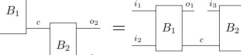
<figcaption class="paper-figure-caption"><b>Fig 2.</b> Figure 7. The quantum circuit defined as the composition of B1 and B2 according to the quantum circuit architecture Γ = ({1, 2}, {2, 3}) can be rewritten in the shape of a quantum comb. Yet, as we imposed the dimension of the internal wire in Hc to be a qubit, and as gates B1 and B2 are assumed to be unitaries, the right-hand side of the equation is a constrained quantum comb with a qubit memory system and unitary internal operations.</figcaption>
</figure>
<figure class="paper-figure-card">
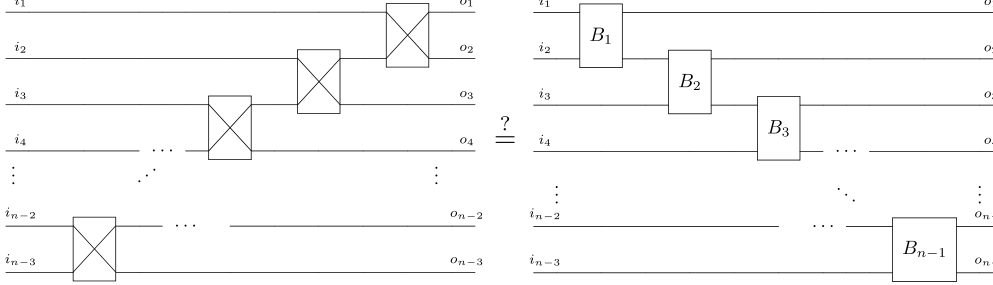
<figcaption class="paper-figure-caption"><b>Fig 3.</b> Figure 9. Graphical representation of a quantum circuit made of the composition of m = n −1 gates Bk arranged according to the quantum circuit architecture Γ = ({1, 2}, {2, 3}, . . . , {n −1, n}).</figcaption>
</figure>
<figure class="paper-figure-card">
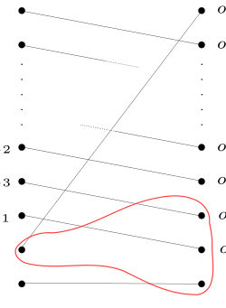
<figcaption class="paper-figure-caption"><b>Fig 4.</b> Figure 10. Illustration of the graph state |U⟩⟩⟨⟨U|⊗|1⟩⟩⟨⟨1| when the target unitary U is made of the composition of n −1 SWAP gates arranged according to the staircase circuit architecture Γ = ({n −1, n}, {n −2, n −1}, . . . , {1, 2}). Each line corresponds to a Bell pair between the input and output systems. The bottom line corresponds to the identity wire added by cutting the circuit, which is described in the Choi picture by a Bell pair up to normalisation. The red line indicates the border of the bipartition BIO 1 . . . BIO n−2|BIO n−1 considered in Eq. (D6).</figcaption>
</figure>

**Summary.** The paper presents a general framework to mathematically certify when a desired unitary transformation cannot be implemented by a given quantum circuit architecture. By formulating the problem as an SDP optimization over fidelity, it generates quantitative 'witnesses' of incompatibility. This is crucial for resource estimation and benchmarking real quantum hardware.

**Why it may be interesting.** This work provides powerful mathematical tools (SDP/LP) to rigorously prove limitations on quantum computation resources, which is fundamental knowledge for designing fault-tolerant quantum hardware or optimizing algorithms.

Detailed structure

**Main problem.** The core problem is determining if a target unitary transformation can be realized using a specific, prescribed quantum circuit architecture. The authors aim to provide rigorous certificates of incompatibility where existing methods are only constructive.

**Main result.** They introduce a general framework using 'quantum circuit architecture witnesses' derived from maximizing fidelity via Semidefinite Programming (SDP). This yields quantitative lower bounds on implementation resources like gate count or depth.

**Method.** The compatibility check is formulated as an optimization problem maximizing the fidelity between the target unitary's Choi state and those achievable by circuits compatible with the given architecture. For Clifford unitaries, this reduces to a Linear Program (LP).

**Model / system.** The model centers on quantum circuits acting on qubits, analyzed using the Choi-Jamiołkowski isomorphism to represent unitary channels. The compatibility is tested against a prescribed circuit structure $\Gamma$.

**Key observables.** The optimized fidelity ($\alpha_\Gamma(U)$) is the key diagnostic; if it is less than 1, incompatibility is certified.

**Important parameters / regimes.** Target Unitary ($U$), Circuit Architecture ($\Gamma$), Fidelity ($\alpha_\Gamma(U)$), and the resulting Witness ($W$).

**Assumptions / limitations.** The general optimization problem requires relaxation to an SDP due to non-convex constraints. Specific simplifications rely on exploiting the stabiliser formalism for Clifford unitaries or assuming graph state structures.

**Figures summary.** Figures illustrate circuit decomposition examples, showing how compatibility is tested between target and test architectures using sequential gates (e.g., two-qubit gates).

**Paper structure.** The paper develops a general framework based on SDPs for witness construction, specializes this to LPs for Clifford unitaries, explores alternative relaxations like the quantum comb approach, and concludes with analytical derivations for specific staircase architectures.

Abstract

Determining whether a target unitary can be implemented within a prescribed quantum circuit architecture is a fundamental problem in quantum information, with direct implications for optimisation and compilation of quantum circuits, and hardware-efficient quantum computation. While existing synthesis and compilation methods are primarily constructive, they generally do not provide rigorous certificates that a unitary cannot be realised using given implementation resources. Here we introduce a general framework to define quantum circuit architecture witnesses, which certify the incompatibility of a unitary transformation with a specified quantum circuit architecture. We formulate the witness construction as a semidefinite program by maximising the fidelity between the Choi state of the target unitary and those of tested circuits. The resulting witnesses provide practical and quantitative certificates of incompatibility, implying lower bounds on implementation resources such as the gate count or circuit depth, and can also be used experimentally to benchmark quantum devices by certifying that an implemented unitary channel goes beyond the capabilities of a given circuit architecture. For Clifford unitaries, we exploit the stabiliser formalism to reduce the construction to linear programming, enabling both more efficient numerical certification for circuits containing on the order of seven two-qubit gates, and analytical witnesses for some families of architectures made of an arbitrary number of gates.

[↑ back to top](#top)

## Other papers (4)

*Papers from primary archives without highlighted authors or any topic match. Click to expand.*

Show other papers

### [Clifford Circuit Synthesis for Distributed Quantum Architectures with Arbitrary Network Topology](http://arxiv.org/abs/2608.13543v1)

**Authors:** Tuomas Laakkonen  
**Type:** theory · **Category:** quantum information and computing · **PDF:** <https://arxiv.org/pdf/2608.13543v1>  
**Analysis basis:** full PDF text, analyzed in chunks

↔ Scroll figures horizontally

<figure class="paper-figure-card">
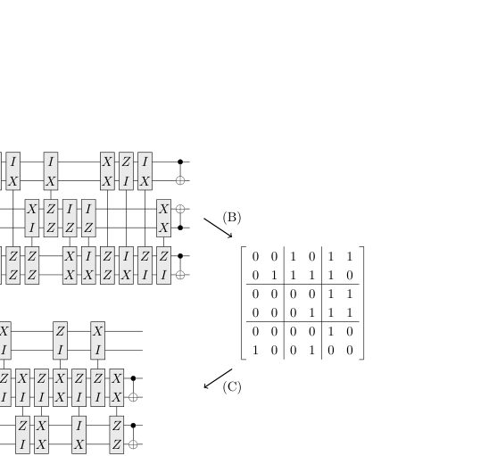
<figcaption class="paper-figure-caption"><b>Fig 1.</b> Figure 1: An example of how the a CNOT circuit is optimized using the methods presented in this paper. We have an architecture with three partitions of two qubits, and the partitions have linear nearest neighbor connectivity. (A) We start with a CNOT circuit that is converted into our circuit representation using Algorithm 2.1. Grey boxes represent generalized CNOT gates, and are the only non-local gates remaining. Note that at this point there may be non-local gates that do not respect the connectivity constraints. (B) The non-local portion of the circuit is converted into a block parity matrix. (C) Using BlockRowCol, a new circuit is synthesized from the parity matrix. This reduces the...</figcaption>
</figure>
<figure class="paper-figure-card">
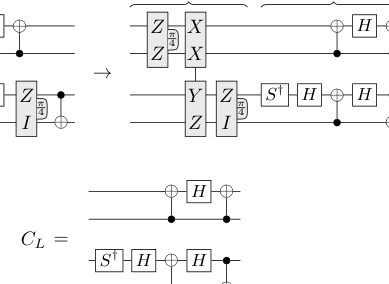
<figcaption class="paper-figure-caption"><b>Fig 2.</b> Figure 2: An example of translating a Clifford+T circuit into the representation defined in Section 2, following Algorithm 2.1. On the top left the input circuit C is shown, consisting of two partitions of two qubits. First, we replace non-Clifford and non-local CNOT gates with Pauli exponentials and generalized CNOT gates, respectively. Then we ‘push’ all of the local Clifford gates to the end of the circuit. This splits C into a local Clifford part CL and a non-local or non-Clifford part CN, from which we construct the representation (D(CN), CL).</figcaption>
</figure>
<figure class="paper-figure-card">
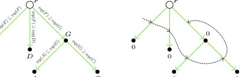
<figcaption class="paper-figure-caption"><b>Fig 3.</b> Figure 3: An example of applying Algorithm 3.4 to a set of nine partitions connected in a 3x3 grid. (a) Suppose we have a parity matrix with non-zero blocks on five partitions, which we wish to eliminate using the pivot vertex (shown in white). (b) First, we construct the Steiner tree connecting the non-zero blocks and the pivot, and orient the edges away from the pivot. (c) By applying Lemma 3.6 repeatedly, we modify the blocks at B and the pivot to respect the row space inclusion relations listed on each edge, resulting in the new block matrices G and F. (d) Finally we can eliminate all the non-pivot blocks by traversing the tree edges in post-order (shown with dashed arrows), and...</figcaption>
</figure>
<figure class="paper-figure-card">
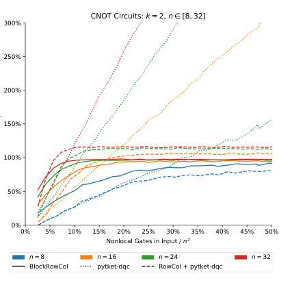
<figcaption class="paper-figure-caption"><b>Fig 4.</b> Figure 6: A comparison of distributed CNOT circuit synthesis methods. Left: The case of k = 9 partitions and n = 36 qubits, organized into three architectures: all-to-all, a 3x3 2D grid, and a line. For shallow circuits, pytket-dqc is the clear winner, while for deeper circuits, we see that there is a significant difference between different connectivities; BlockRowCol and pytket-dqc with RowCol are comparable for all-to-all connected, while BlockRowCol is better for linear connectivity and worse for 2D connectivity. Right: The case of k = 2 partitions with a varying number of qubits n. The number of non-local input gates is normalized against n2 for simpler comparability, while the output...</figcaption>
</figure>
<figure class="paper-figure-card">
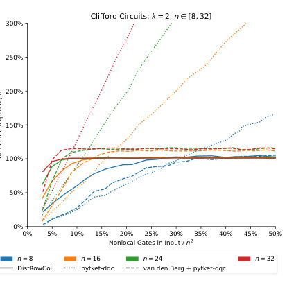
<figcaption class="paper-figure-caption"><b>Fig 5.</b> Figure 7: A comparison of distributed Clifford circuit synthesis methods. Left: The case of k = 9 partitions and n = 36 qubits, organized into three architectures: all-to-all, a 3x3 2D grid, and a line. For shallow circuits, pytket-dqc is the clear winner, while for deeper circuits, DistRowCol is superior. DistRowCol exhibits essentially no variation across different connectivities, while pytket-dqc does. Right: The case of k = 2 partitions with a varying number of qubits n. The number of non-local input gates is normalized against n2 for simpler comparability, while the output is normalized against n (which is how we expect it to scale, given that k is fixed). We see that DistRowCol has a...</figcaption>
</figure>

**Summary.** This paper presents advanced theoretical techniques for synthesizing quantum circuits intended for distributed quantum processors. It minimizes the number of required non-local gates by abstracting the circuit into block matrices and applying optimized elimination procedures. This research provides crucial algorithmic tools for scaling up quantum computation beyond single, monolithic qubit systems.

**Why it may be interesting.** This work directly addresses the resource overhead associated with implementing large quantum computations across physically separated modules, which is a major bottleneck in realizing fault-tolerant quantum computers.

Detailed structure

**Main problem.** The core problem is synthesizing equivalent quantum circuits for distributed architectures while minimizing the number of costly non-local gates, especially when connectivity is restricted.

**Main result.** The authors provide asymptotically optimal synthesis methods (BlockRowCol and DistRowCol) that bound the required non-local gates based on circuit structure and partitioning.

**Method.** The approach uses block-matrix Gaussian elimination techniques applied to an abstracted Pauli exponential circuit representation, allowing optimization across multiple physical partitions.

**Model / system.** The model is distributed quantum computing architectures where $n$ qubits are divided into $k$ smaller, interconnected blocks. The circuits involve Clifford and generalized CNOT gates.

**Key observables.** The primary observable minimized is the total number of non-local (inter-block) gates required for synthesis.

**Important parameters / regimes.** Key parameters include the total number of qubits ($n$), the number of partitions ($k$), and the specific connectivity constraints imposed on the architecture.

**Assumptions / limitations.** The method assumes that local Clifford operations can be abstracted away, allowing focus on non-local gate synthesis; some practical details require heuristic optimization.

**Figures summary.** Figure 1 illustrates the CNOT circuit optimization process: showing conversion to a block parity matrix and subsequent synthesis using BlockRowCol into a final circuit realization.

**Paper structure.** The paper develops representations for distributed Clifford+RZ circuits, focusing on capturing non-local operations via commutation DAGs. It then details specific synthesis algorithms (BlockRowCol) and compares their asymptotic scaling against existing methods like Patel-Markov-Hayes' algorithm.

Abstract

To achieve large-scale fault-tolerant quantum computation, it may be easier to combine many small sets of qubits than to construct a single large set. For example via quantum error correction with block codes, or distributed quantum processors utilizing shared entanglement. In these regimes, the time or error budget of the overall quantum computation may be dominated by non-local operations. Hence, it is worthwhile to minimize the number of these operations. We consider the case where both non-local and local connectivity may be arbitrarily restricted, and give an asymptotically optimal synthesis method for distributed CNOT and Clifford circuits, based on block-matrix Gaussian elimination. We extend this to all Clifford+RZ circuits by generalizing the Pauli exponential circuit representation; this naturally integrates with existing methods for optimizing T-count. As an application, we show how to implement CNOT circuits in a CSS code encoding n logical qubits in k blocks using O(nk) inter-block transversal CNOTs and intra-block Pauli measurements.

[↑ back to top](#top)

### [Free-Space Quantum Networks and Optimized Fiber-Reinforcement](http://arxiv.org/abs/2608.12636v1)

**Authors:** Alasdair I. Fletcher, Ignazio Pedone, Stefano Pirandola  
**Type:** theory · **Category:** quantum information and computing · **PDF:** <https://arxiv.org/pdf/2608.12636v1>  
**Analysis basis:** full PDF text, analyzed in chunks

↔ Scroll figures horizontally

<figure class="paper-figure-card">
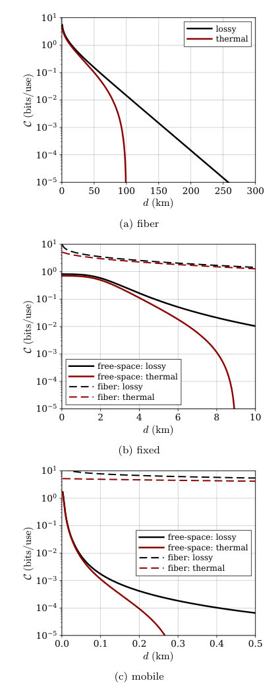
<figcaption class="paper-figure-caption"><b>Fig 1.</b> FIG. 1. Capacity bounds for fiber and free-space quan- tum channels. In each panel, black refers to the capacity bound of a pure-loss channel (“lossy”), while red refers to the capacity bound of a thermal-loss channel (“thermal”). In (a), we show the results for fiber. We plot Eq. (4) for pure loss and Eq. (1) for thermal-loss, assuming ¯n = 0.01. In (b), we consider fixed (long-range) free-space devices. We plot Eqs. (4) and (1) combined with Eqs. (11) and (21). In (c), we consider mobile (short-range) free-space devices. Here, we plot the pure-loss formula in Eq. (24) and the thermal-loss expression in Eq. (26). Note that, in (b) and (c), the dashed lines reproduce the fiber-based bounds...</figcaption>
</figure>
<figure class="paper-figure-card">
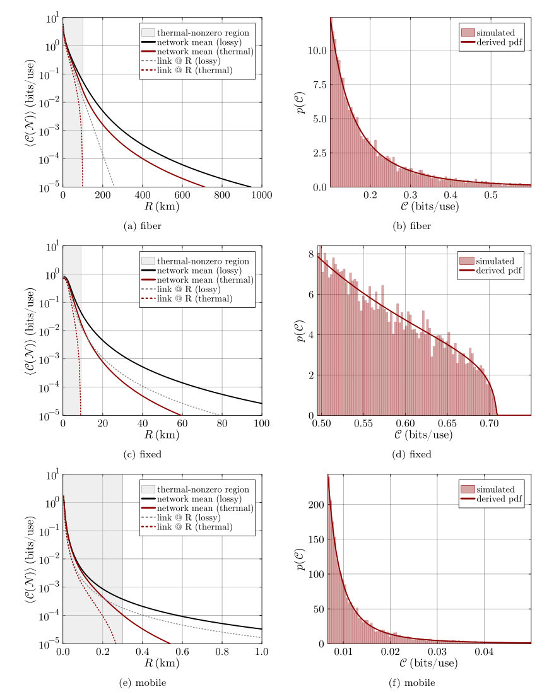
<figcaption class="paper-figure-caption"><b>Fig 2.</b> FIG. 2. Router-centered star networks. The left column shows the mean network capacity bound as a function of the router radius R for (a) fiber-connected devices, (c) fixed free-space devices, and (e) mobile free-space devices. Since a router-centered star network has no independent nodal-density parameter, its geometry is characterized solely by R. Solid curves show the mean network capacity bound ⟨C(N)⟩, obtained by numerical integration of Eq. (42), for lossy channels (black) and thermal-loss channels (red). The free-space channels are modeled using the parameters specified in Table I while for fibers we assume ¯n = 1. Dotted curves show the corresponding single-link capacity evaluated...</figcaption>
</figure>
<figure class="paper-figure-card">
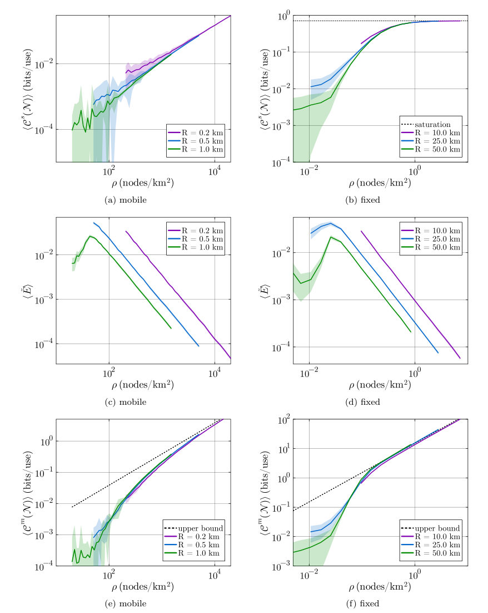
<figcaption class="paper-figure-caption"><b>Fig 3.</b> FIG. 3. Free-space Waxman networks. Left column: mobile users. Right column: fixed users. (a) Mobile single-path capacity. (b) Fixed single-path capacity. (c) Mobile single-path edge consumption. (d) Fixed single-path edge consumption. (e) Mobile multi-path capacity. (f) Fixed multi-path capacity. Shaded bands show ±1 standard error of the mean across network instances. In the capacity panel (b), the black dotted line is the saturation value: the maximal fixed free-space capacity (computed at zero distance between two nodes). In the multi-path panels (e,f) the dotted line is the flooding common upper bound obtained from end-user neighbourhood cuts [see Eq. (44)]. The free-space channels are...</figcaption>
</figure>
<figure class="paper-figure-card">
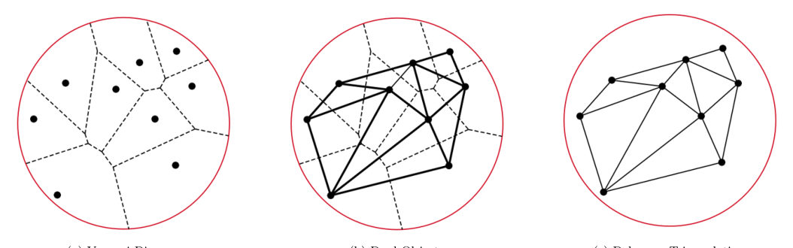
<figcaption class="paper-figure-caption"><b>Fig 4.</b> FIG. 4. Voronoi Diagram and Delaunay Triangulation. A circular region is depicted with backbone node plotted as black points. The corresponding Voronoi diagram to these points is shown in (a). In (c) the Delaunay triangulation of the points is shown. The duality between these objects is shown in (b). Points in neighbouring Voronoi regions are connected by an edge in the triangulation.</figcaption>
</figure>
<figure class="paper-figure-card">
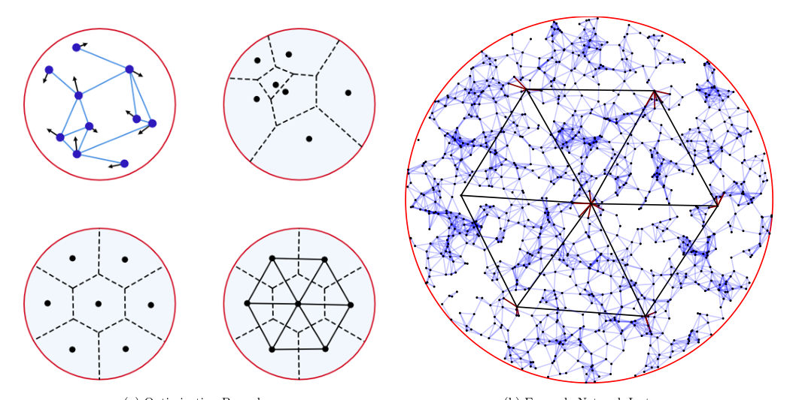
<figcaption class="paper-figure-caption"><b>Fig 5.</b> FIG. 5. Optimization of fiber backbone for mobile user free-space quantum network. The left panel (clockwise from top left) shows the optimization procedure for the fiber backbone. The first image shows a snapshot of the network of mobile users connecting via free-space edges; in the second image, the random positions of the user nodes are replaced with a constant density ρ represented by the light blue background. A fixed number of backbone nodes (shown in black) are generated with random positions in the network region RN and the corresponding Voronoi diagram is calculated. In image three the positions of the backbone nodes are relaxed to optimal positions via Lloyd’s algorithm, resulting...</figcaption>
</figure>

**Summary.** This paper analyzes large-scale quantum networks connecting users via challenging free-space channels. It derives capacity limits based on atmospheric and diffraction losses, demonstrating that integrating an optimally placed fiber backbone—determined by a Voronoi tessellation—significantly boosts overall network performance and connectivity compared to purely free-space links.

**Why it may be interesting.** This work provides crucial theoretical frameworks for scaling quantum internet infrastructure by quantifying the synergistic benefits of combining free-space links with high-fidelity fiber backbones, which is vital for practical quantum networking design.

Detailed structure

**Main problem.** The study focuses on maximizing the end-to-end capacity of large-scale quantum communication networks operating in free space, while optimizing performance by integrating fiber-based backbone links.

**Main result.** Optimal network reinforcement requires placing backbone nodes according to a capacity-maximizing Voronoi tessellation, which substantially improves both end-to-end capacity and reduces edge consumption for both mobile and fixed users.

**Method.** The authors derive mean network capacity, analyze connectivity phase transitions using graph theory models (Waxman graphs), and employ geometric optimization techniques like the centroidal Voronoi tessellation.

**Model / system.** The system is a quantum communication network connecting randomly distributed nodes (fixed or mobile) via free-space links susceptible to diffraction and atmospheric loss, augmented by high-capacity fiber backbone segments.

**Key observables.** Network capacity ($	ext{Q}_2$, $	ext{D}_2$, $	ext{K}_2$), edge consumption, connectivity phase transitions, and end-to-end capacity as a function of backbone node placement.

**Important parameters / regimes.** Diffraction length ($R_0$), atmospheric attenuation coefficient ($\alpha(h)$), pointing error variance ($\sigma_{pe}^2$), nodal density ($
ho$), and the number/placement of backbone nodes ($n_b$).

**Assumptions / limitations.** The optimal backbone configuration must correspond to a capacity-maximizing Voronoi tessellation, which is approximated by Lloyd's algorithm; analysis distinguishes between fixed (turbulence dominant) and mobile (pointing error dominant) user regimes.

**Figures summary.** Figures compare capacity bounds versus distance for fiber vs. free-space links, and illustrate the improvement in multi-path capacity when a fiber backbone is introduced across varying nodal densities.

**Paper structure.** The paper systematically analyzes link loss mechanisms (diffraction, atmosphere) leading to capacity bounds; it then models network performance using random graph theory, culminating in the proof that Voronoi tessellation dictates optimal backbone placement for capacity maximization.

Abstract

Free-space quantum communication provides a flexible complement to fiber-based quantum networks, but its point-to-point capacity is fundamentally limited by diffraction, atmospheric extinction and beam wandering induced by turbulence. In this work, we study the end-to-end performance of large-scale free-space quantum networks connecting randomly distributed fixed or mobile users, modelled as Waxman random graphs. We derive the mean network capacity, edge consumption and connectivity phase transitions for both single-path and multi-path (flooding) routing. We also study router-centered star networks, deriving the full distribution of end-to-end capacities as a function of the router's coverage radius. We then consider how performance may be improved by reinforcing free-space networks with a small number of optimally placed fiber-based backbone nodes. We prove that any optimal backbone configuration must correspond to a capacity-maximizing Voronoi tessellation of the network region, and show that this can be efficiently approximated by a centroidal Voronoi tessellation via Lloyd's algorithm, with backbone nodes connected according to a Delaunay triangulation. Numerical results show that even a modest number of backbone nodes substantially improves end-to-end capacity and reduces edge consumption for both mobile and fixed users.

[↑ back to top](#top)

### [Hidden Dyson Universality in Inverse-Spectral Geometry](http://arxiv.org/abs/2608.13475v1)

**Authors:** Momo Hayashi, Kazumitsu Sakai  
**Type:** theory · **Category:** statistical mechanics · **PDF:** <https://arxiv.org/pdf/2608.13475v1>  
**Analysis basis:** full PDF text, analyzed in chunks

↔ Scroll figures horizontally

<figure class="paper-figure-card">
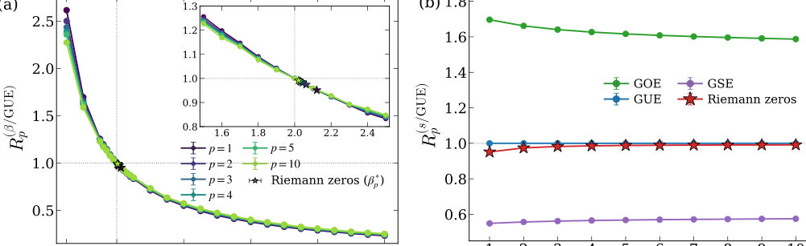
<figcaption class="paper-figure-caption"><b>Fig 1.</b> FIG. 1. Dyson universality in the reconstructed operator. (a) GUE-normalized ratios R(β/GUE) p as functions of β; stars mark the effective indices β∗ p obtained by piecewise-linear inversion at the high-height Riemann-zero ratios. (b) R(s/GUE) p as functions of p for the GOE, GUE, GSE, and Riemann-zero inputs. Error bars denote bootstrap uncertainties.</figcaption>
</figure>
<figure class="paper-figure-card">
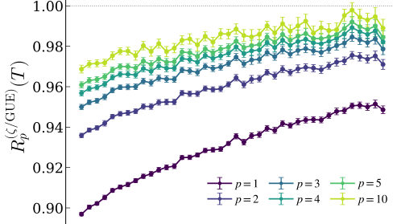
<figcaption class="paper-figure-caption"><b>Fig 2.</b> FIG. 2. Height dependence of the inverse-spectral GUE signature R(ζ/GUE) p (T). Each point averages 16 consecutive, nonoverlapping windows, with T defined as the center of their total ordinate interval. The horizontal dotted line marks the GUE normalization. Error bars denote bootstrap uncertain- ties.</figcaption>
</figure>
<figure class="paper-figure-card">
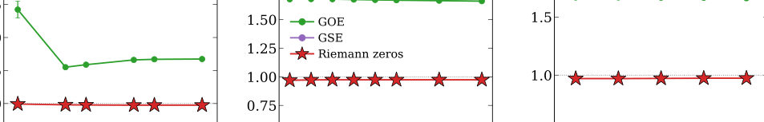
<figcaption class="paper-figure-caption"><b>Fig 3.</b> FIG. 4. Numerical robustness of the representative ratio R(s/GUE) 2 for the GOE, GSE, and Riemann-zero inputs. (a) Dependence on the dressing-grid spacing hx at fixed Nb and Nlev. (b) Dependence on the oscillator-basis size Nb at fixed hx and Nlev. (c) Joint finite-size scan with Nb = Nlev at fixed hx. Panel (a) uses 50 realizations or windows, whereas panels (b) and (c) use 100. Error bars denote bootstrap uncertainties.</figcaption>
</figure>
<figure class="paper-figure-card">
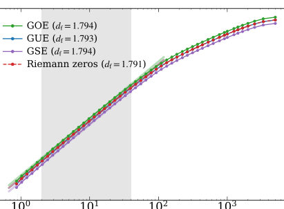
<figcaption class="paper-figure-caption"><b>Fig 4.</b> FIG. 5. Box-counting control for the reconstructed defor- mation potentials. Mean box counts N (s) box(ℓ) for the GOE, GUE, GSE, and Riemann-zero inputs on the common inter- val x ∈[0, 10]. The shaded region indicates the fitting range ℓ∈[0.025, 0.5], yielding effective intermediate-scale exponents df ≃1.79 for all four cases. The curves exhibit a common crossover near ℓ∼10−2, with no robust Dyson-class separa- tion. the observed crossover scale.</figcaption>
</figure>

**Summary.** The paper develops a novel method to test Dyson universality by reconstructing an effective Hamiltonian from known spectra. By analyzing the matrix elements in shells corresponding to energy transfer distances, the authors show that the GUE nature of Riemann zeros is revealed through this geometric structure rather than direct level spacing analysis. This suggests that global spectral geometry can encode deep physical symmetries.

**Why it may be interesting.** This work provides a powerful, non-local diagnostic tool for classifying quantum systems based purely on spectral data, suggesting that global geometric properties (like shell moments) can encode fundamental symmetries (Dyson index) even when local statistics are insufficient or obscured.

Detailed structure

**Main problem.** The study investigates whether Dyson universality, typically seen in local eigenvalue statistics, can be recovered by analyzing the global geometry of an operator reconstructed from a given spectrum.

**Main result.** The GUE character of the Riemann zeta function zeros is recovered not from direct level spacing statistics, but from the distance-resolved matrix element geometry of the reconstructed Hamiltonian operator.

**Method.** The authors use an inverse-spectral reconstruction technique involving a dressing transformation to map input spectra (like those from Gaussian ensembles or zeta zeros) onto a deformed harmonic oscillator potential. The resulting operator is then analyzed by resolving its matrix elements into shells based on energy transfer distance.

**Model / system.** The analysis compares spectral data from three types of Gaussian $\beta$-ensembles (GOE, GUE, GSE) against the nontrivial zeros of the Riemann zeta function. A fixed reference harmonic oscillator serves as the basis for reconstructing the effective Hamiltonian $H(s)$.

**Key observables.** Distance-shell moments ($M^{(s)}_p$) and normalized ratios comparing these moments to the GUE expectation ($R(s/	ext{GUE})_p$).

**Important parameters / regimes.** The Dyson index $\beta$, the moment order $p$ (up to 10), and the height $T$ of the Riemann zeros.

**Assumptions / limitations.** The analysis assumes that resolving the matrix element weight into distance shells provides a robust diagnostic tool, and it notes that the residual deviation from GUE decreases with increasing height $T$.

**Figures summary.** Figures show the continuous variation of moment ratios with $\beta$ (Fig. 1a), compare these ratios for GOE/GUE/GSE vs Riemann zeros (Fig. 1b), and demonstrate that the residual deviation from GUE approaches unity as height $T$ increases (Fig. 2).

**Paper structure.** The paper first establishes the diagnostic using Gaussian $\beta$-ensembles, showing continuous resolution of $\beta$. It then applies this method to Riemann zeros, demonstrating recovery of the GUE sector via distance-resolved geometry. Finally, it performs consistency checks on parameter variations and fractal structure analysis.

Abstract

Dyson universality typically manifests itself in local eigenvalue statistics. Here we show that its signature survives a nonlinear inverse-spectral reconstruction and reappears in the matrix geometry of the reconstructed operator. Using a dressing transformation, we map each unfolded spectrum to a deformation $f(x)$ of a fixed harmonic oscillator and represent it in the common oscillator basis by $F_{mn}=\bra m|f|n\ket$. We resolve the matrix-element weight into shells of fixed distance $d=|m-n|$, corresponding to the energy-transfer channels of the reference oscillator, and characterize the resulting distribution by distance-shell moments. Independently calibrated on Gaussian $β$-ensembles, these moments vary smoothly with $β$ and distinguish the GOE, GUE, and GSE. With this calibration fixed, applying the same diagnostic to the nontrivial zeros of the Riemann zeta function places the reconstructed operators in the GUE sector. Thus, the GUE character of the zeros is recovered not through direct statistics of the input levels, but from the distance-resolved geometry of the reconstructed operator.

[↑ back to top](#top)

### [Strong unitary designs in optimal depth and space](http://arxiv.org/abs/2608.13491v1)

**Authors:** Teodor Parella-Dilmé, Júlia Barberà-Rodríguez, Salvatore F. E. Oliviero, Antonio A. Mele  
**Type:** theory · **Category:** quantum information and computing · **PDF:** <https://arxiv.org/pdf/2608.13491v1>  
**Analysis basis:** full PDF text, analyzed in chunks

↔ Scroll figures horizontally

<figure class="paper-figure-card">
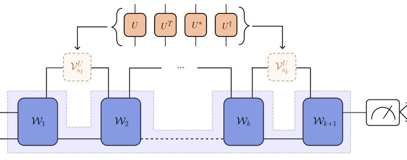
<figcaption class="paper-figure-caption"><b>Fig 1.</b> FIG. 1: A mixed-query distinguisher represented as a quantum comb W. A single unitary U is sampled once from an ensemble and used throughout the experiment: in each of the k slots, the adversary may place an oracle query of U, U †, U T , or U ∗. The comb models the arbitrary operations W1 · · · Wk+1 the distinguisher may apply between queries, and arbitrary retention of quantum memory.</figcaption>
</figure>
<figure class="paper-figure-card">
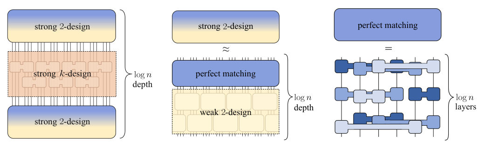
<figcaption class="paper-figure-caption"><b>Fig 2.</b> FIG. 2: Architecture of our realization for approximate strong k-designs in measurable error. Each panel resolves a component of the previous one. (a) The strong gluing Lemma 1 upgrades two brickwork macro-layers of local strong k-designs into an extensive strong k-design, after being sandwiched between two global strong 2-design shells (Theorem 3). (b) The strong 2-design shell is realized as a perfect-matching circuit composed with an independent weak relative-error 2-design (Theorem 2). The former controls the mixed-sign query sector, while the latter controls the same-sign sector, both in depth O(log n) for constant error. (c) Example of a perfect-matching circuit: each layer pairs all...</figcaption>
</figure>
<figure class="paper-figure-card">
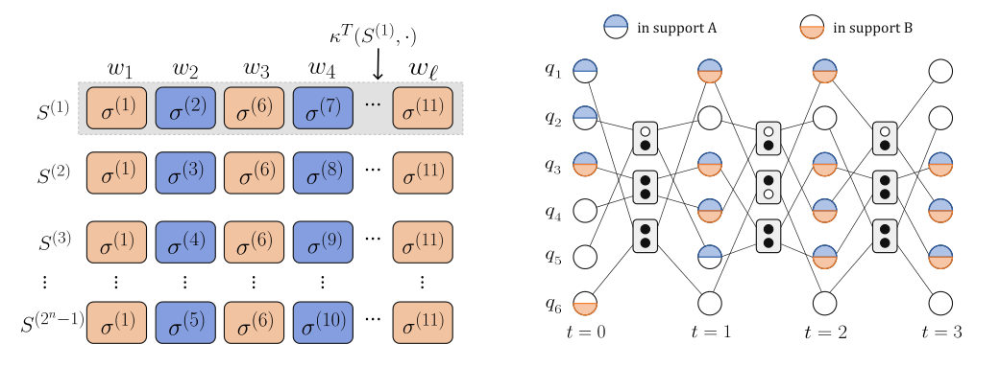
<figcaption class="paper-figure-caption"><b>Fig 3.</b> FIG. 3: (a) Schematic of the grand coupling. Each row is indexed by one of the 2n −1 supports S(i) ∈Sn, while each column corresponds to a realization wj = {Mt, (Yt,e)e∈Mt}0≤t&lt;T of the shared randomness. The entry σ(i) is the support obtained by evolving the initial row-index support S(i) under the column-index deterministic process wj. Instead of comparing the probability distributions of each support after going through T-steps of the Markov chain (rows), we fix the possible random deterministic instances w of the chain, and study the deterministic evolution of all supports under such realization (columns). By showing that outside an exponentially small fraction of columns all the...</figcaption>
</figure>
<figure class="paper-figure-card">
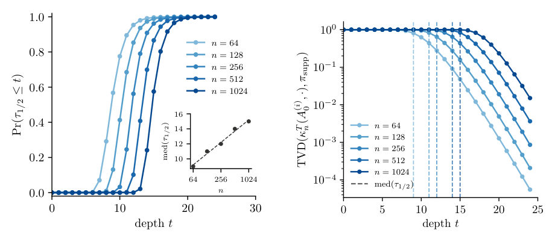
<figcaption class="paper-figure-caption"><b>Fig 4.</b> FIG. 4: (a) Mixing of the support chain induced by the perfect-matching circuit, exemplified numerically for n = 64. An initial singleton evolves towards the uniform support distribution πsupp after O(log n) steps. (b) Starting from a singleton of support size H0 = 1, the support density grows at each step. The figure shows the cumulative probability Pr(τ1/2 ≤t) of achieving the hitting time after t steps in Lemma 14. After O(log n) steps, the cumulative probability contracts geometrically towards 1 with further steps. The inset, which has the x axis in log scale, shows the O(log n) scaling of the median hitting time med(τ1/2), approximately equal to the first t when Pr(τ1/2 ≤t) &gt; 1/2. (c)...</figcaption>
</figure>

**Summary.** This theoretical paper addresses the challenge of creating highly accurate approximations of truly random quantum unitaries. By introducing a new Pauli-mixing bound, the authors achieve strong unitary $k$-designs in optimal logarithmic depth ($\Theta(\log n)$). This result is critical for simulating complex physical phenomena like scrambling using limited quantum resources.

**Why it may be interesting.** This work provides fundamental tools (strong unitary designs) that are essential benchmarks for simulating complex quantum dynamics, such as scrambling rates measured via OTOCs, within realistic circuit constraints.

Detailed structure

**Main problem.** The primary goal is constructing strong unitary designs that accurately approximate Haar-random unitaries while achieving optimal, low circuit depth.

**Main result.** The authors successfully construct approximate strong unitary $k$-designs in optimal $\Theta(\log n)$ all-to-all circuit depth using only the original system qubits.

**Method.** The construction relies on a novel logarithmic-depth Pauli-mixing bound for the perfect-matching ensemble, which is combined with existing design and gluing techniques to build high-order designs layer by layer.

**Model / system.** The context involves unitary evolution in quantum systems, where strong unitary designs are used as finite-moment approximations to Haar randomness. These designs are crucial for simulating physical processes like scrambling and black-hole dynamics.

**Key observables.** Measurable error ($	ext{Err}_{	ext{full}}^k(E)$), design order $k$, and the required circuit depth scaling $\Theta(\log n)$.

**Important parameters / regimes.** Design order $k$ and measurable-error tolerance $\epsilon$. The optimal depth scales logarithmically with system size $n$.

**Assumptions / limitations.** The construction assumes that a logarithmic-depth Pauli-mixing bound can be established for the perfect-matching ensemble, which controls the mixed forward-reverse two-query case.

**Figures summary.** Figures illustrate the quantum comb formalism used to model mixed-query experiments and show the circuit architecture for achieving approximate strong $k$-designs through gluing protocols involving local patches and global shells.

**Paper structure.** The paper builds upon previous work by first establishing a logarithmic-depth Pauli-mixing bound. It then uses this bound in conjunction with strong gluing lemmas to construct higher-order designs, culminating in the optimal $\Theta(\log n)$ depth result for strong $k$-designs.

Abstract

Unitary designs provide finite-moment approximations to Haar-random unitaries, with wide-ranging applications across physics and quantum information, from scrambling and black-hole dynamics to foundational primitives in quantum algorithms. Strong unitary designs capture a more demanding operational notion of approximation, requiring indistinguishability from Haar randomness even for quantum algorithms that may access a unitary not only in the forward direction, but also through its inverse, transpose, and complex conjugate. Motivated by the physical requirement that scrambling arise within the system itself, Schuster, Ma, Lombardi, Brandão, and Huang (arXiv:2509.26310) left open whether strong unitary designs can be generated in logarithmic depth using only the system qubits. For every fixed design order $k$ and measurable-error tolerance, we construct strong approximate unitary $k$-designs in optimal $Θ(\log n)$ all-to-all circuit depth using only the $n$ original system qubits. Our new ingredient is a logarithmic-depth Pauli-mixing bound for the perfect-matching ensemble, whose layers pair the qubits uniformly at random and apply independent random two-qubit gates. This bound controls the mixed forward-reverse two-query case, which we combine with existing design and gluing results to obtain strong unitary designs of arbitrary fixed order.

[↑ back to top](#top)

## Secondary cond-mat archives

*Papers from cond-mat.mtrl-sci, mes-hall, other, soft, supr-con. These archives are de-prioritized — they appear at the end regardless of relevance score.*

### Relevant in secondary archives (18)

### [Steady states and oscillation modes of two driven dissipative oscillators with non-Hermitian coupling](http://arxiv.org/abs/2608.12799v1)

**Authors:** Sahel Ashhab, Aakanksha Sud, Shunsuke Fukami  
**Type:** theory · **Category:** other · **PDF:** <https://arxiv.org/pdf/2608.12799v1>  
**Analysis basis:** full PDF text, analyzed in chunks
**Topic relevance:** 🔥 `driven-dissipative phase transition` **4/5** · 🔥 `methods for driven-dissipative` **4/5** · `Keldysh / 2PI / non-Gaussian methods` **3/5** · `correlated / nonlocal dissipation` **3/5** · `analog quantum simulation` **2/5** · `non-equilibrium universality` **2/5** · `Tavis-Cummings & cavity-many-emitter` **1/5** · `scars & prethermalization` **1/5**

↔ Scroll figures horizontally

<figure class="paper-figure-card">
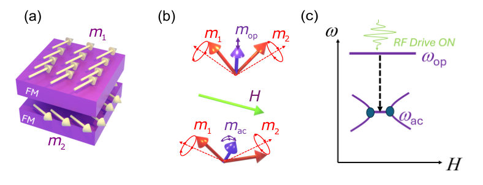
<figcaption class="paper-figure-caption"><b>Fig 1.</b> FIG. 1: Schematic diagram of synthetic antiferromagnet. (a) Two ferromagnetic (FM) layers (with</figcaption>
</figure>
<figure class="paper-figure-card">
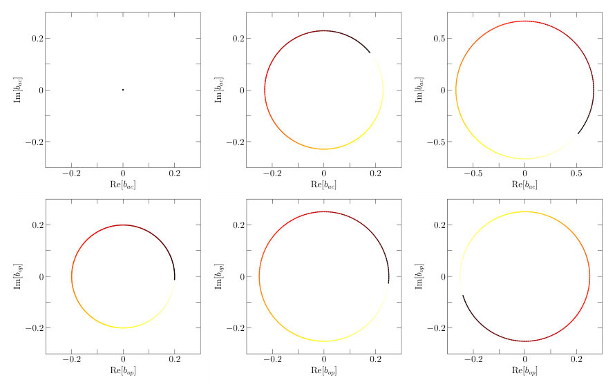
<figcaption class="paper-figure-caption"><b>Fig 2.</b> FIG. 2: Existence of three steady-state solutions. Each panel is a parametric plot showing the real</figcaption>
</figure>
<figure class="paper-figure-card">
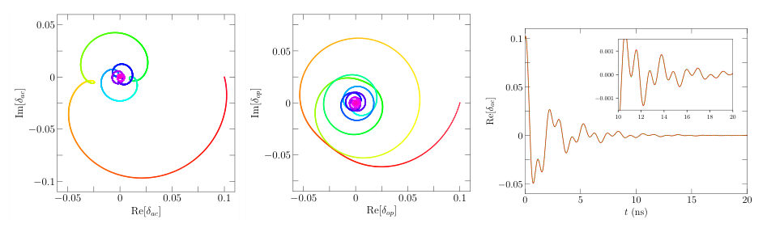
<figcaption class="paper-figure-caption"><b>Fig 3.</b> FIG. 3: Dynamics of small deviation from the steady state. Panels (a) and (b) are parametric</figcaption>
</figure>
<figure class="paper-figure-card">
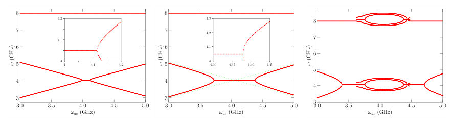
<figcaption class="paper-figure-caption"><b>Fig 4.</b> FIG. 4: Spectra of normal mode frequencies as functions of acoustic mode frequency (ωac), with</figcaption>
</figure>
<figure class="paper-figure-card">
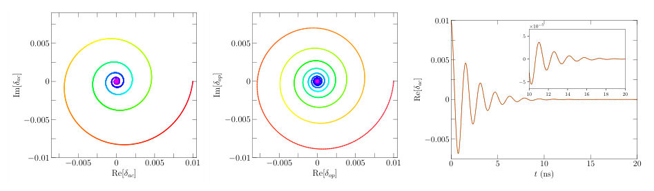
<figcaption class="paper-figure-caption"><b>Fig 5.</b> FIG. 5: Dynamics of small deviation from the steady state when the driving field is applied to the</figcaption>
</figure>

**Summary.** This paper theoretically investigates two coupled nonlinear oscillators modeling a synthetic antiferromagnet. It determines the system's stable steady states and analyzes small deviations to find characteristic oscillation modes. The findings predict distinct spectral behaviors, such as level-attraction versus level-repulsion, providing guidance for interpreting spectroscopic measurements in these complex quantum magnetic systems.

**Why it may be interesting.** This work directly addresses open quantum systems and non-Hermitian physics, which are central topics in modern AMO physics, particularly concerning driven cavity QED or magnetic resonance experiments where dissipation is key.

Detailed structure

**Main problem.** The study analyzes the dynamics, steady states, and oscillation modes of two coupled, driven, dissipative nonlinear oscillators exhibiting non-Hermitian coupling.

**Main result.** The system exhibits multistability, and the spectral response can display distinct level-attraction or level-repulsion patterns depending on which mode is driven and the driving strength.

**Method.** The analysis involves determining steady states by solving nonlinear equations and then linearizing the dynamics around these points to find normal modes via stability analysis.

**Model / system.** The model describes a synthetic antiferromagnet composed of two ferromagnetic layers, whose coupled oscillation modes (acoustic and optical) are governed by driven, dissipative, non-Hermitian differential equations.

**Key observables.** Steady states, normal mode frequencies, spectral patterns (level-attraction/repulsion), and multi-frequency normal modes.

**Important parameters / regimes.** Driving field amplitude and frequency ($\omega_d$), detuning parameters ($\omega_{ac}, \omega_{op}$), and coupling strengths ($g_3$).

**Assumptions / limitations.** The analysis relies on approximations such as assuming purely exponential time dependence for the steady state, neglecting certain counter-rotating field components, and linearizing deviations around the found steady states.

**Figures summary.** Figures illustrate the schematic of the synthetic antiferromagnet, parametric plots showing the existence and stability of multiple steady states (up to three), and spectra mapping normal mode frequencies versus system parameters for different driving regimes.

**Paper structure.** The paper progresses by first setting up the coupled nonlinear equations, then analyzing the conditions for stable steady states through algebraic solutions, followed by linearizing these equations to derive the spectrum of small oscillations (normal modes) under various driving conditions.

Abstract

We analyze the dynamics of two harmonic oscillators with nonlinear, non-Hermitian coupling between them. Specifically, we consider a synthetic antiferromagnet composed of two ferromagnetic layers with antiferromagnetic interactions between the two layers, leading to the emergence of two oscillation modes of the combined system. We analyze the response of this system to external driving fields. We determine the allowed steady states under various driving conditions. We then analyze the dynamics of small deviations away from the different steady states, which reveals the normal modes that can be probed using spectroscopic techniques in experiment. As expected, the nonlinear system exhibits multistability, in which multiple steady states can exist for the same driving conditions. We find that the dynamical response can be drastically different depending on which one of the two modes is driven and on the strength of the driving. Specifically, we can obtain level-repulsion or level-attraction patterns in the spectrum. In addition to the rich variety of spectra, we find that some steady states exhibit normal modes that contain multiple frequencies. Our results explain recent experiments on synthetic antiferromagnets and provide guidance for designing experiments that can explore previously unseen phenomena in these systems.

[↑ back to top](#top)

### [Spin Vector Control for Heisenberg-Inspired Probabilistic Computing](http://arxiv.org/abs/2608.12568v1)

**Authors:** Yuanqiu Tan, Rahul Tripathi, Saleh Bunaiyan, Ryan Wagner, Neil Dilley, Kerem Camsari, Joerg Appenzeller, Zhihong Chen  
**Type:** both · **Category:** quantum information and computing · **PDF:** <https://arxiv.org/pdf/2608.12568v1>  
**Analysis basis:** full PDF text, analyzed in chunks
**Topic relevance:** 🔥 `QC/QI experiment` **4/5** · 🔥 `analog quantum simulation` **4/5** · `quantum measurements` **3/5** · `Keldysh / 2PI / non-Gaussian methods` **2/5** · `driven-dissipative phase transition` **2/5** · `correlated / nonlocal dissipation` **1/5** · `methods for driven-dissipative` **1/5** · `non-equilibrium universality` **1/5**

↔ Scroll figures horizontally

<figure class="paper-figure-card">
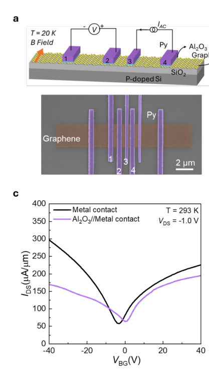
<figcaption class="paper-figure-caption"><b>Fig 1.</b> Fig. 1. Statistics of non-local spin valve signals and electrical characteristics with monolayer graphene. a. Schematic and scanning electron microscope (SEM) of a lateral non-local spin valve device, showing ferromagnetic permalloy (Py) spin injector and detector electrodes 2 and 3 on top of a patterned graphene channel. An Al2O3 tunneling barrier is used between the ferromagnets and the graphene channel. b. Non-local spin valve signal of a representative device with diffusion length of 500 nm, measured at 20 K with back-gate of 15 V. c. Transfer characteristics of representative monolayer graphene devices with/without Al2O3 tunneling barrier, at VDS = -1.0 V. d. Statistical correlation...</figcaption>
</figure>
<figure class="paper-figure-card">
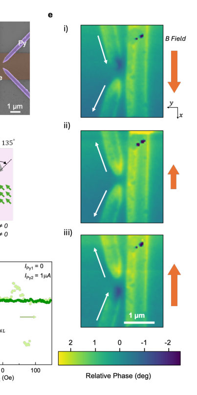
<figcaption class="paper-figure-caption"><b>Fig 2.</b> Fig. 2. Spin vector injection in a graphene spin valve with tilted dual ferromagnetic electrodes. a. Schematic and SEM of a lateral monolayer graphene NLSV device, with Py FM electrodes and Al2O3 tunneling barrier. The dual injection electrodes are tilted to 45º/135º with respect to the detector electrode, Py4. b. Schematic illustrations of spin vector addition, where the final spin polarization angle is determined by the injection currents from the dual injectors (Py1 and Py2). c. Spin signal with only current injection through Py1, at T = 20 K and VBG = 15 V. The ∆𝑅!&quot; associated with the magnetization reversal of Py1 corresponds to the transition between the and resistance states. The...</figcaption>
</figure>
<figure class="paper-figure-card">
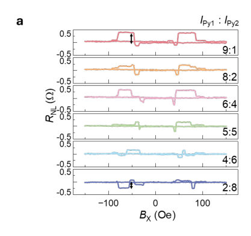
<figcaption class="paper-figure-caption"><b>Fig 3.</b> Fig. 4. Non-collinear detection and signal dependence on injection ratio. a. Non-local spin valve signals measured by varying the relative current contributions from Py1 and Py2, with the total injection current held constant. The resultant spin accumulation vector evolves continuously as a function of injection ratio (values labeled). b, Corresponding non-local spin signal ∆𝑅𝑁𝐿 (squares) plotted as a function of the spin vector angle ∅, extracted from the data in panel a, illustrating the angular tunability of the accumulated spin under fixed total current. The solid line shows analytical calculations. The orange dots show the HSPICE-simulated non-local spin signal responses ∆𝑅!&quot; (dots) as...</figcaption>
</figure>
<figure class="paper-figure-card">
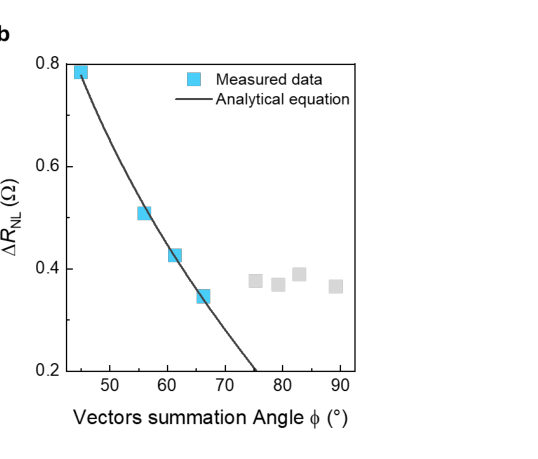
<figcaption class="paper-figure-caption"><b>Fig 4.</b> Fig. 5. Non-collinear detection and signal dependence on injection ratio and total magnitude. a. Non-local spin valve signals obtained by varying the injection current into Py2 (IPy2) while keeping the Py1 current fixed (IPy1 = 1 µA). This configuration enables independent tuning of both the magnitude and orientation of the resultant spin vector (currents labeled). b, Corresponding non-local spin signal ∆𝑅!&quot; (squares) plotted as a function of the spin vector angle ∅, extracted from the data in panel a. The solid line presents the calculated non-local spin signals from analytical equations. Grey points were excluded from the comparison; see Supplementary Fig. S3 for a detailed discussion....</figcaption>
</figure>

**Summary.** The paper presents a method to implement vector spin summation in a graphene spintronic platform, crucial for developing advanced probabilistic computers. By using dual ferromagnetic injectors, the authors achieve continuous electrical control over the resultant spin vector's direction and magnitude. This work combines novel experimental measurements with sophisticated circuit modeling to build a scalable pathway for non-Boolean computing architectures.

**Why it may be interesting.** This work directly addresses hardware implementations for quantum/probabilistic computation by mapping abstract Hamiltonian models (Heisenberg) onto solid-state spintronic devices, which is highly relevant to physical realization of quantum information processing concepts.

Detailed structure

**Main problem.** The challenge is advancing probabilistic computing beyond simple binary bits by realizing and controlling vector spin information, which is necessary for modeling complex energy-based systems like the Heisenberg Hamiltonian.

**Main result.** The authors demonstrated a spintronic platform capable of performing real-space vector summation of two spin vectors using dual ferromagnetic injections into graphene, enabling continuous control over the resultant spin state's magnitude and direction.

**Method.** The work combines electrical measurements (Non-Local Spin Valve techniques) with advanced theoretical modeling, employing a generalized 'spin-circuit approach' to simulate spin transport in graphene channels.

**Model / system.** The physical system is a spintronic device built on monolayer graphene using ferromagnetic contacts. The model generalizes charge circuits by representing nodes with four components (charge + three spins) and uses $4 	imes 4$ matrices for conductance elements to describe spin-dependent transport.

**Key observables.** Non-local resistance ($\Delta R_{NL}$), resultant spin polarization angle, total electrical resistance ($R_{total}$), and spatial profiles of electrochemical potentials ($\mu$).

**Important parameters / regimes.** Operating temperature (20 K), current injection ratios ($I_5/I_6$), and the ratio of spin-diffusion length to channel length ($\lambda_s/L \approx 1$).

**Assumptions / limitations.** The analytical derivation relies on approximations such as low interface conductance ($G_< \ll 1$) and specific forms for charge and spin transport matrices.

**Figures summary.** Figures illustrate the NLSV setup, showing schematic diagrams of dual injection, non-local resistance measurements ($\Delta R_{NL}$ vs $R_{total}$), and simulated/measured rotations of the resultant spin vector angle based on current control.

**Paper structure.** The paper progresses from identifying the need for vector spin control in probabilistic computing to detailing the physical graphene spintronic platform, presenting experimental results showing continuous vector summation via dual injection, and finally validating these findings using a comprehensive $4 	imes 4$ matrix spin-circuit simulation model.

Abstract

Probabilistic bits (p-bits) have emerged as a cornerstone of probabilistic computing, enabling energy-efficient hardware implementation for probabilistic inference and combinatorial optimization. A critical challenge in advancing this field beyond binary p-bits lies in realizing and manipulating vector spin information, essential for mapping complex energy-based models such as the Heisenberg Hamiltonian.Here, we demonstrate a spintronic platform capable of real-space vector summation by using dual ferromagnetic spin injections into a monolayer graphene channel. By electrically tuning the spin polarization through independently controlled injection currents, we achieve continuous control over the magnitude and direction of the resulting spin accumulation vector. Experimental observations, supported by theoretical vector summation models and spin-circuit simulations, reveal coherent vector interactions and angular tunability of the spin state. This approach enables direct implementation of vector-based spin logic and lays the groundwork for mapping classical Heisenberg models using stochastic low-barrier magnets. Our results establish a scalable pathway for realizing probabilistic spin circuits based on two-dimensional materials, offering new opportunities for low-power, non-Boolean computing architectures.

[↑ back to top](#top)

### [Thermal transport in crystals: from the quantum Dyson equation to mesoscopic phonon hydrodynamics](http://arxiv.org/abs/2608.13339v1)

**Authors:** Enrico Di Lucente, Michele Simoncelli, Nicola Marzari  
**Type:** theory · **Category:** statistical mechanics · **PDF:** <https://arxiv.org/pdf/2608.13339v1>  
**Analysis basis:** full PDF text, analyzed in chunks
**Topic relevance:** 🔥 `Keldysh / 2PI / non-Gaussian methods` **4/5** · `methods for driven-dissipative` **3/5** · `non-equilibrium universality` **3/5** · `driven-dissipative phase transition` **2/5** · `analog quantum simulation` **1/5** · `correlated / nonlocal dissipation` **1/5** · `quantum measurements` **1/5** · `scars & prethermalization` **1/5**

↔ Scroll figures horizontally

<figure class="paper-figure-card">
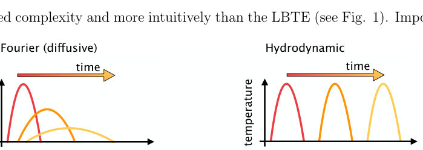
<figcaption class="paper-figure-caption"><b>Fig 1.</b> Figure 1: Qualitative difference between diffusive and hydrodynamic thermal transport. (Left panel) Schematic representation of the temporal evolution of a temperature perturbation in the diffusive regime, where Fourier’s equation is accurate. (Right panel) Schematic representation of heat propagation in the form of “second sound” in the hydrodynamic regime of thermal transport, where Fourier’s equation fails. The color here is related to time, with red representing a time instant happened earlier than yellow (orange represents an intermediate time instant).</figcaption>
</figure>
<figure class="paper-figure-card">
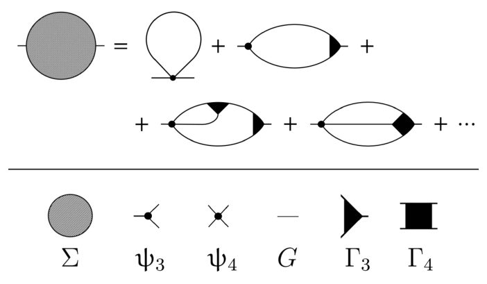
<figcaption class="paper-figure-caption"><b>Fig 2.</b> Figure 2: Diagrammatic representation of the leading contributions to the phonon self- energy expressed through Feynman diagrams. The two lowest-order terms proportional to the two-point correlation function G correspond to the standard “loop” (ψ4G) and “bubble” (ψ3GΓ3G) diagrams. The meaning of the symbols and line styles are also clarified: the symbol Γ denotes interaction vertices that should, in principle, be renormalized and dressed by higher-order processes (see Fig. 3 and Eq. (66)), whereas the symbol ψ represents the bare interaction. See also Fig. 29 in appendix A and Eqs. (385) and (386).</figcaption>
</figure>
<figure class="paper-figure-card">
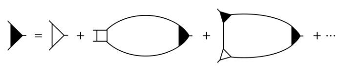
<figcaption class="paper-figure-caption"><b>Fig 3.</b> Figure 3: Diagrammatic illustration of the nonlinear integral (Bethe-Salpeter–type) equation (66)) for the vertex function. The diagram emphasizes the ladder corrections that renormalize, or “dress” the vertex Γ3 appearing in the bubble contribution of Fig. 2. The meaning of all symbols and lines is identical to that used in Fig. 2.</figcaption>
</figure>
<figure class="paper-figure-card">
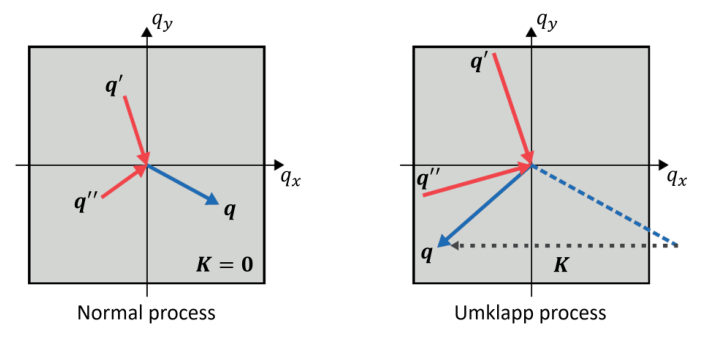
<figcaption class="paper-figure-caption"><b>Fig 4.</b> Figure 4: Normal and Umklapp phonon scattering processes. Normal and Umklapp processes during a coalescence event involving two phonons with wave vectors q′ and q′′ merging into a phonon with wave vector q. In a normal process (left), the sum of the initial momenta lies inside the first Brillouin zone (shaded square). In an Umklapp process (right), the sum lies outside the first Brillouin zone but can be folded back inside by subtracting a reciprocal lattice vector.</figcaption>
</figure>
<figure class="paper-figure-card">
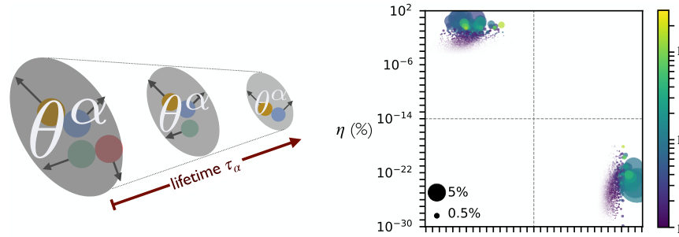
<figcaption class="paper-figure-caption"><b>Fig 5.</b> Figure 5: Relaxon picture of lattice thermal transport. (Left panel) Schematic of lattice-vibration equilibration following a thermal perturbation. Each relaxon is a collective phonon excitation that evolves independently and relaxes exponentially toward equilibrium with a characteristic lifetime. (Right panel) Contributions of individual relaxons to the bulk thermal conductivity and thermal viscosity of graphite (in-plane components) at 300 K. Each point represents a relaxon; its color denotes the relaxation time, and its area is proportional to its combined contribution to conductivity and viscosity. Odd relaxons govern thermal conductivity and contribute negligibly to viscosity, while...</figcaption>
</figure>

**Summary.** This review provides a comprehensive theoretical roadmap for understanding thermal transport in crystals by connecting disparate physical descriptions. It bridges quantum phonon theories, like the Dyson equation, down to mesoscopic hydrodynamic models that predict complex heat flow behaviors beyond simple Fourier's law. The work is crucial for guiding experimental detection and control of non-diffusive heat transfer phenomena.

**Why it may be interesting.** While focused on phonons, the methodology—bridging quantum field theory (Green's functions) to continuum hydrodynamics—is highly relevant to open quantum systems where dissipation and non-equilibrium dynamics are key.

Detailed structure

**Main problem.** The paper addresses how thermal transport occurs in crystalline solids when driven out of equilibrium by a temperature gradient, requiring theoretical descriptions across multiple physical scales.

**Main result.** It demonstrates that advanced hydrodynamic models predict not only standard heat flow (Poiseuille flow) but also exotic non-diffusive phenomena like negative thermal resistance and vortices.

**Method.** The review rigorously connects several theoretical frameworks: fully quantum approaches (Dyson/Kadanoff-Baym equations), semiclassical methods (Boltzmann transport), and coarse-grained mesoscopic continuum models (viscous heat equations).

**Model / system.** The system is dielectric, non-magnetic crystals where heat is carried by quantized lattice vibrations (phonons). The theoretical modeling spans from the quantum Dyson equation down to macroscopic viscous heat equations.

**Key observables.** Heat flux, local temperature profile, thermal conductivity tensor, and signatures of non-diffusive flow like vortices or backflow.

**Important parameters / regimes.** Temperature gradient ($
abla T$), length scales (mesoscopic/nanoscale), and the transition between quantum and classical transport regimes.

**Assumptions / limitations.** The primary approximations involve coarse-graining procedures to derive continuum equations, and treating phonon interactions within specific theoretical limits (e.g., linear response).

**Paper structure.** The paper follows a progression from fully quantum descriptions (Dyson/Kadanoff-Baym) through semiclassical approximations (Boltzmann equation) to the derivation and analysis of mesoscopic viscous heat equations, concluding with generalizations for other quasiparticles.

Abstract

Thermal transport in dielectric, non-magnetic crystals is mediated by quantized lattice vibrations, which drift and interact when driven out of equilibrium by a temperature gradient. This phenomenon can be described at multiple theoretical levels, ranging from fully quantum descriptions to semiclassical and mesoscopic continuum approaches. This review rigorously discusses the theoretical steps and approximations connecting these levels, bridging quantum phonon Dyson and Kadanoff-Baym equations and semiclassical Boltzmann transport formalism, and discussing the coarse-graining procedures that yield mesoscopic viscous heat equations for non-diffusive, hydrodynamic heat transport in devices. We show how the Guyer-Krumhansl and dual-phase-lag equations emerge as special linear-isotropic-band and inviscid limits of the viscous heat equations, respectively; most importantly, we demonstrate that these equations predict not only Poiseuille flow and second sound, but also more exotic effects such as negative thermal resistance, steady-state thermal backflow and vortices. We highlight how combining these frameworks with first-principles simulations connects microscopic phonon physics to observable non-diffusive heat-transport phenomena and guides their detection, amplification, and control. We recast the viscous heat equations in terms of Helmholtz and biharmonic equations solved analytically, and use this to discuss similarities and differences between the macroscopic behavior of the phonon fluid and other hydrodynamic systems, such as classical and electron fluids, focusing on compressibility, vorticity, and their influence on phonon hydrodynamics. We conclude with a roadmap to generalize the tools used to describe phonon hydrodynamics to other quasiparticles, motivating future advances in collective quantum transport phenomena in solids.

[↑ back to top](#top)

### [Quantum Divergence and Topological Edge Diagnostics via Levitov Full Counting Statistics](http://arxiv.org/abs/2608.12726v1)

**Authors:** Maolin Bo, Xiang Chen, Siyu Liu, Han Lu, Yunhu Zhu, Zhongkai Huang, Chuang Yao  
**Type:** theory · **Category:** statistical mechanics · **PDF:** <https://arxiv.org/pdf/2608.12726v1>  
**Analysis basis:** full PDF text, analyzed in chunks
**Topic relevance:** 🔥 `Full counting statistics` **4/5** · `quantum measurements` **3/5** · `driven-dissipative phase transition` **2/5** · `non-equilibrium universality` **2/5** · `Keldysh / 2PI / non-Gaussian methods` **1/5** · `analog quantum simulation` **1/5** · `correlated / nonlocal dissipation` **1/5** · `methods for driven-dissipative` **1/5**

↔ Scroll figures horizontally

<figure class="paper-figure-card">
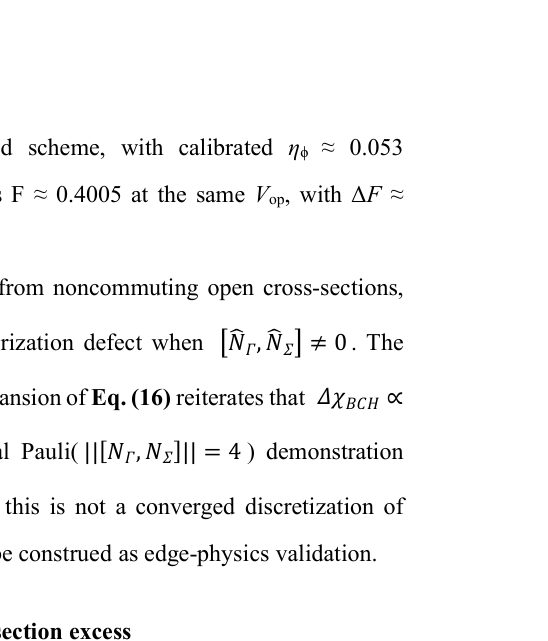
<figcaption class="paper-figure-caption"><b>Fig 1.</b> Figure 1 shows the implementation of the hybrid pipeline above. At the operating</figcaption>
</figure>
<figure class="paper-figure-card">
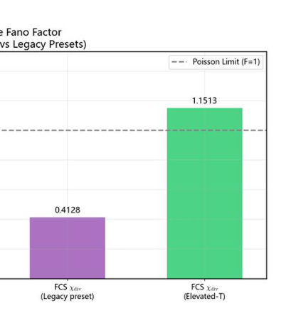
<figcaption class="paper-figure-caption"><b>Fig 2.</b> Figure 1: Fano factors from Levitov–Lesovik generating function. Classical shot noise</figcaption>
</figure>
<figure class="paper-figure-card">

<figcaption class="paper-figure-caption"><b>Fig 3.</b> Figure 2. (a) Open-terminal χΓ(λ) vs. closed-boundary χdiv(λ) for C chiral modes (solid:</figcaption>
</figure>
<figure class="paper-figure-card">
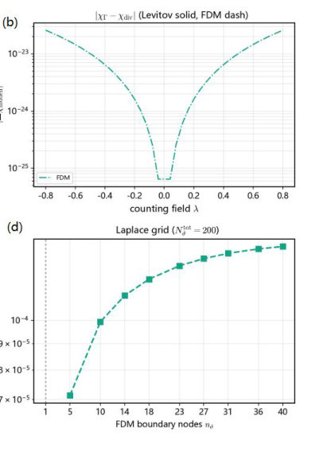
<figcaption class="paper-figure-caption"><b>Fig 4.</b> Figure 3 illustrates the change in ��ℎ������, �� relative to the monitored- mode</figcaption>
</figure>
<figure class="paper-figure-card">
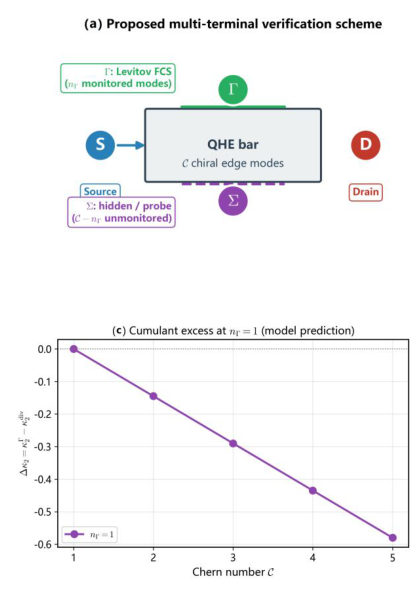
<figcaption class="paper-figure-caption"><b>Fig 5.</b> Figure 3: (a) Four-terminal quantum Hall bar: source S, drain D, Levitov-counted terminal Γ, and</figcaption>
</figure>

**Summary.** The paper introduces a differential Full Counting Statistics protocol to analyze charge transport in mesoscopic conductors. It moves beyond measuring bulk divergence by comparing terminal counting statistics against a model reference state. This methodology allows for the robust extraction of physical information, such as sub-Poissonian noise signatures, even when absolute measurements are difficult.

**Why it may be interesting.** This work is highly relevant as it develops advanced diagnostic tools for open quantum systems by focusing on relative changes (differential noise) rather than absolute quantities, which is crucial when dealing with complex boundary conditions in mesoscopic physics.

Detailed structure

**Main problem.** The authors aim to develop a robust measurement-domain language within Full Counting Statistics (FCS) to distinguish between bulk divergence measurements and open terminal quantities in mesoscopic charge transport.

**Main result.** They propose that the key diagnostic is comparing measured terminal counting statistics ($\chi_{\Gamma}$) against a model reference ($\chi_{ref}$), rather than relying on inferring the absolute bulk divergence from a single measurement. The framework successfully predicts sub-Poissonian Fano factors in topological systems.

**Method.** The study utilizes Levitov's FCS formalism, extending it to differential protocols that compare noise cumulants across different gate configurations at matched parameters.

**Model / system.** The theoretical analysis is applied to mesoscopic conductors, including quantum point contacts and topological systems modeled using the Dirac field. Microscopic calculations are performed using Non-Equilibrium Green's Functions (NEGF) on lattice structures.

**Key observables.** Fano factors ($F$), terminal counting statistics ($\chi_{\Gamma}$), bulk flux functionals ($\chi_{div}$), and the differential excess quantity ($\Delta\chi_{hidden}$).

**Important parameters / regimes.** Low temperature, specific gate configurations at matched $|\kappa_1|$, and operating bias voltages.

**Assumptions / limitations.** The identity $\chi_{\partial V} = \chi_{div}$ is treated as a consistency check under current conservation, not a universal theorem for all chiral edge systems.

**Figures summary.** Figures compare Fano factors derived from various theoretical models (e.g., 2D lattice NEGF vs. QPC calibration) and illustrate the comparison between open-terminal ($\chi_\Gamma$) and closed-boundary ($\chi_{div}$) excess quantities using different mathematical methods.

**Paper structure.** The paper establishes the need for a measurement language in FCS, details the differential protocol comparing terminal measurements to a reference state, provides theoretical derivations linking these observables, and validates the approach using NEGF calculations on lattice models.

Abstract

We propose a differential full counting statistics protocol for mesoscopic transport. Additionally, we compare terminal Fano factors and noise cumulants between gate configurations at matched k1, instead of inferring a bulk divergence sensor from a single absolute F. it is illustrated analytically for a two channel factorization via a zero temperature geometry scan. Secondary benchmarks show that a two dimensional lattice non equilibrium Greens function calculation yields sub Poissonian Fano factors, whereas Kumars low temperature quantum point contact calibration validates the numerical implementation.

[↑ back to top](#top)

### [Finite-momentum coupling of Higgs and Bardasis--Schrieffer modes in superconductors with competing pairing channels](http://arxiv.org/abs/2608.12461v1)

**Authors:** Samuel Awelewa, Yafis Barlas, Maxim Dzero  
**Type:** theory · **Category:** strongly correlated electrons · **PDF:** <https://arxiv.org/pdf/2608.12461v1>  
**Analysis basis:** full PDF text, analyzed in chunks
**Topic relevance:** 🔥 `Keldysh / 2PI / non-Gaussian methods` **4/5** · `methods for driven-dissipative` **3/5** · `driven-dissipative phase transition` **2/5** · `correlated / nonlocal dissipation` **1/5** · `quantum measurements` **1/5**

↔ Scroll figures horizontally

<figure class="paper-figure-card">
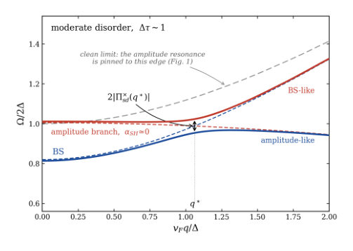
<figcaption class="paper-figure-caption"><b>Fig 1.</b> FIG. 2. Schematic of the anticipated moderate-disorder scenario, ∆τ ∼1; this figure is illustrative and not a result of the present calculation. Disorder detaches the amplitude resonance from the pair-breaking edge and softens its dispersion through zero, so that αSH ≃0 (dashed red) while the BS continues to disperse upward (dashed blue). The crossing condition (4) then has a solution at q∗, and the coupling computed in this work opens a gap 2|Π× sd(q∗)| between the hybridized branches (solid), which exchange character across it. For contrast, the grey dashed curve is the clean-limit pair- breaking edge of Eq. (1): in that limit the amplitude resonance is pinned to it, αSH = 1 (i.e. αSH &gt;...</figcaption>
</figure>
<figure class="paper-figure-card">
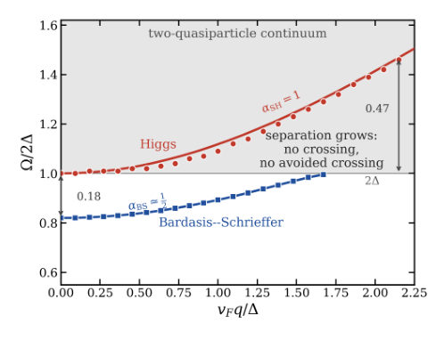
<figcaption class="paper-figure-caption"><b>Fig 2.</b> FIG. 1. Computed dispersion of the Higgs and Bardasis–Schrieffer (BS) branches in a clean superconductor with a dominant s-wave (A1g) and a subdominant d-wave (B1g) pairing channel, for q along the antinodal direction (Ba-122 calibration of λd, see Sec. IV, was used). Red points are the maxima of the amplitude spectral weight A11 obtained from inverting matrix ˆ M defined by (29); blue squares are the sharp sub-gap BS pole obtained from det ˆ M = 0 (below 2∆ every entry of ˆ M is real, so the pole position coincides with the δ-function line of A44, and there is no linewidth to display). The grey region is the two-quasiparticle continuum, whose bottom lies at 2∆for every q. A1 carries no...</figcaption>
</figure>
<figure class="paper-figure-card">
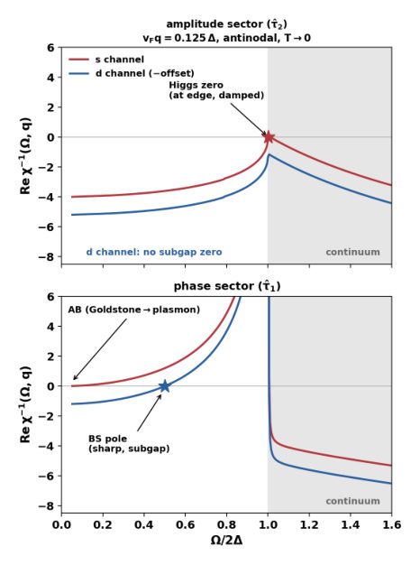
<figcaption class="paper-figure-caption"><b>Fig 3.</b> FIG. 3. Collective-mode classification of an s-wave supercon- ductor with a subdominant d-wave channel, from the computed inverse pair susceptibilities at vF q = 0.125 ∆(antinodal prop- agation, T →0; the d-channel curves are shifted by the off- set 1/λd −1/λs = 1.2). Shown are the diagonal elements of each sector’s 2 × 2 channel matrix. The intra-sector coupling ∝(vF q)2 cos 2ϕq shifts the displayed zeros only at O((vF q)4), in- visible at this momentum, while the cross-sector elements vanish identically in the particle-hole symmetric theory. Top: amplitude (ˆτ2) sector. The s-channel zero—the Higgs mode—sits at the pair- breaking edge, where it is degenerate with the two-quasiparticle...</figcaption>
</figure>
<figure class="paper-figure-card">
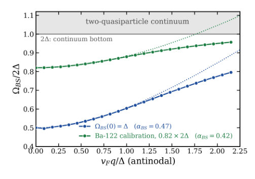
<figcaption class="paper-figure-caption"><b>Fig 4.</b> FIG. 4. Dispersion of the bare Bardasis-Schrieffer (BS) mode along the antinodal direction, obtained from the zeros of the computed phase-sector susceptibility for two calibrations of the subdominant coupling: ΩBS(0) = ∆(offset 1/λd −1/λs = 1.20; blue) and the Ba0.6K0.4Fe2As2 calibration ΩBS(0) = 0.82×2∆(offset 5.46, fixed by the Raman mode energy of Refs. [20, 21]; green). Dotted curves show the small-q law Ω2 = Ω2 0+αBS(vF q)2 fitted on vF q ≤∆, with the coefficient αBS = 0.47 (0.42) for the blue (green) branch. At larger momenta the branches fall below the quadratic law as they are repelled by the flat bottom of the two-quasiparticle continuum at 2∆, which they approach without crossing:...</figcaption>
</figure>
<figure class="paper-figure-card">
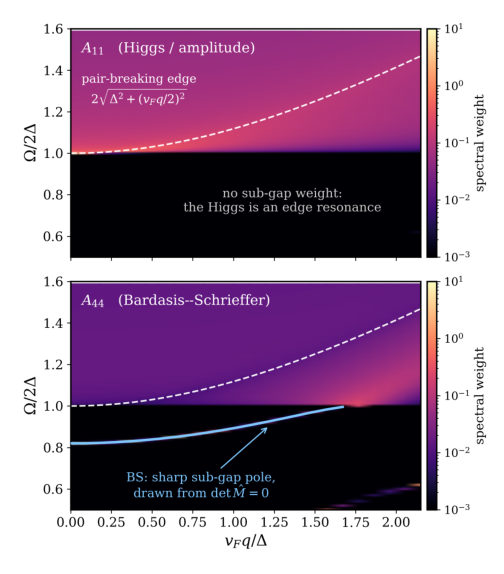
<figcaption class="paper-figure-caption"><b>Fig 5.</b> FIG. 5. Channel-resolved spectral weights, Eq. (30), in the (q, Ω) plane for ϕq = 0, on a logarithmic scale. Upper panel: the am- plitude channel A11, which is identically zero below Ω= 2∆— the Higgs possesses no sub-gap pole and exists only as a thresh- old resonance riding the pair-breaking edge (dashed). Lower panel: the Bardasis–Schrieffer channel A44. Below 2∆the corrected A44 is a δ-function line that no finite frequency grid resolves — the faint glow beneath the overlay marks grid points that happen to land on the pole — so the branch is drawn (solid line) from the roots of det ˆ M = 0. Above 2∆a weak resonance remnant is visible inside the continuum at the largest momenta. The two...</figcaption>
</figure>

**Summary.** This theoretical paper analyzes the coupling between the Higgs mode and the Bardasis–Schrieffer exciton in superconductors with competing pairing symmetries. Using a quasiclassical approach, it finds that while symmetry forbids mixing at zero momentum, finite momentum allows coupling. Crucially, the ability to observe a resonance crossing depends critically on whether the system is clean or disordered.

**Why it may be interesting.** This work is highly relevant because it tackles collective excitations and symmetry breaking in unconventional superconductors, which are central topics in strongly correlated electron physics, often requiring advanced many-body techniques similar to those used in AMO or quantum optics for complex interacting systems.

Detailed structure

**Main problem.** The study investigates the finite-momentum coupling between two distinct collective excitations—the Higgs mode (from $s$-wave pairing) and the Bardasis–Schrieffer (BS) exciton (from $d$-wave pairing)—in superconductors with competing pairing channels.

**Main result.** In the clean limit, kinematic differences cause the Higgs and BS branches to separate rather than cross. However, in the dirty limit, disorder can detach the resonance from the edge, potentially allowing for an avoided crossing set by the coupling strength $\Pi_{sd}(q, \Omega)$.

**Method.** The analysis employs a Nambu–Keldysh quasiclassical framework extended to leading $1/\epsilon_F$ corrections and incorporates self-consistently screened Coulomb potential effects.

**Model / system.** The system is modeled as a superconductor exhibiting competing pairing channels ($s$-wave and $d$-wave). The theoretical machinery involves analyzing coupled order-parameter fluctuations within the quasiclassical framework.

**Key observables.** Higgs mode dispersion, BS exciton dispersion, the coupling function $\Pi_{sd}(q, \Omega)$, and spectral weight distribution in amplitude/phase channels.

**Important parameters / regimes.** Momentum ($q$), frequency ($\Omega$), clean limit vs. dirty limit (disorder strength), and the ratio of pairing gaps to Fermi energy ($\Delta/\epsilon_F$).

**Assumptions / limitations.** The analysis distinguishes sharply between the clean limit (where kinematics forbid crossing) and the dirty limit (where disorder modifies dispersion relations).

**Figures summary.** Figure 1 illustrates the separation of branches in the clean limit due to differing momentum dispersions ($\alpha_{SH}=1$ vs. $\alpha_{BS} < 1$). Figure 2 schematically shows how moderate disorder can induce an avoided crossing.

**Paper structure.** The paper first establishes the physical context and symmetry constraints (zero momentum). It then develops the theoretical framework using quasiclassical methods to calculate the coupling term in closed form. Finally, it analyzes the resulting dispersion relations by comparing the clean limit results against those modified by disorder effects.

Abstract

In superconductors with competing pairing channels, two well defined excitations exist below the pair-breaking edge: the Higgs mode of the condensed $s$-wave channel and the Bardasis--Schrieffer (BS) exciton of the subdominant $d$-wave channel. Their mixing is doubly forbidden --- by point-group symmetry at zero momentum and because the two reside in the amplitude and phase sectors of the order parameter respectively, by particle--hole symmetry at every momentum. Working in a Nambu--Keldysh quasiclassical framework extended to leading $1/\varepsilon_F$ corrections and including the self-consistently screened Coulomb potential, we show that finite momentum combined with particle--hole asymmetry generates a direct coupling which we obtain in closed form. Whether this coupling produces an avoided crossing is decided, however, not by its magnitude but by kinematics. In the clean limit the Higgs is not a sub-gap pole but a resonance pinned to the pair-breaking edge, which disperses with coefficient unity in $(v_Fq)^2$, while the bound BS mode disperses more slowly: the two branches therefore separate rather than converge and never become degenerate. The obstruction is specific to the clean limit: exact dirty-limit results show that disorder detaches the amplitude resonance from the edge and reverses its dispersion, which can result in an avoided crossing with the BS mode at intermediate scattering. In that regime, the coupling computed here would set the splitting between the hybridized branches. We discuss the experimental implications of these results.

[↑ back to top](#top)

### [Gate Control of g-factor in Germanium Quantum Dots: A Strain-Based Explanation](http://arxiv.org/abs/2608.12718v1)

**Authors:** Mu Niu, Adrian Culver, Johnathan Bryan, Chris Anderson, Mark Gyure, HongWen Jiang  
**Type:** both · **Category:** quantum information and computing · **PDF:** <https://arxiv.org/pdf/2608.12718v1>  
**Analysis basis:** full PDF text, analyzed in chunks
**Topic relevance:** 🔥 `QC/QI experiment` **4/5** · `quantum measurements` **1/5**

↔ Scroll figures horizontally

<figure class="paper-figure-card">
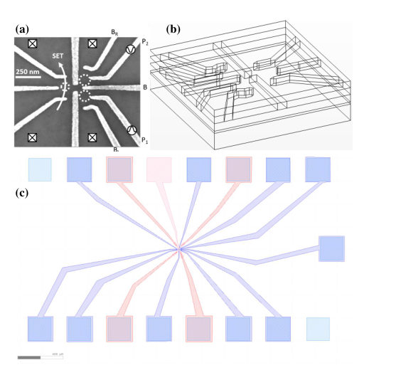
<figcaption class="paper-figure-caption"><b>Fig 1.</b> FIG. 1. (a) SEM image of lithographically defined gates identical to the geometry used in this study. BL and BR are confinement gates, P1, P2, and B, as a shorthand for Brm, are control gates, SET refers to single electron transistor which is responsible for readout. (b) View of the simulation geometry in Gmsh, detailing the layer structure of the device. From bottom to top: a 120 nm thick Ge0.8Si0.2 layer, a 16 nm thick Ge layer, a 55 nm thick Ge0.8Si0.2 layer, a 50 nm thick Al gate layer, and a 50 nm thick Al2O3 cap layer. Areas not occupied by gates within the gate layer are also filled with Al2O3. (c) View of the entire device in Klayout, which has a length scale of approximately 102...</figcaption>
</figure>
<figure class="paper-figure-card">
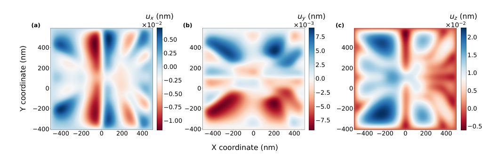
<figcaption class="paper-figure-caption"><b>Fig 2.</b> FIG. 2. Simulated distribution of the three components of the displacement vector as the device is cooled from the unstrained temperature T0 = 300 K to the operating temperature T = 20 K. The displacement vector at each point indicates how much it moves when the device is cooled down. The strain tensor can be written as a function of only the displacement vector, so we will use the displacement values to calculate strain. The graph shows the distribution on a cross-section through the middle of the germanium layer. (a) x-component of the displacement. (b) y-component of the displacement. (c) z-component of the displacement.</figcaption>
</figure>
<figure class="paper-figure-card">
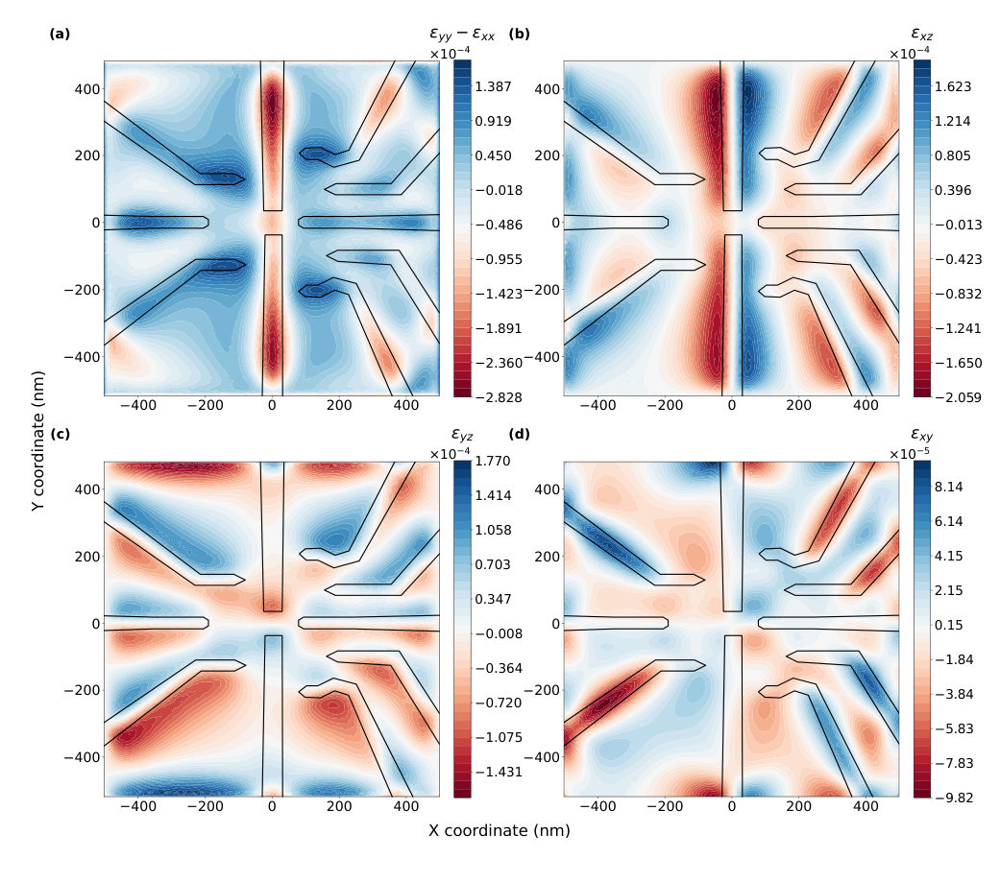
<figcaption class="paper-figure-caption"><b>Fig 3.</b> FIG. 3. Simulated distribution of selected components of the strain tensor as the device is cooled from the unstrained temperature T0 = 300 K to the operating temperature T = 20 K. The graph shows the distribution on a cross-section at the middle of the germanium layer. Dark lines indicate the locations of the electric gates defining the quantum dot. The strain distribution is highly inhomogeneous and reflects the symmetry of the gate structure, suggesting a strong correlation between the strain pattern and gate design. (a) Difference between the ϵyy and ϵxx components of the strain. (b) ϵxz component of the strain. (c) ϵyz component of the strain. (d) ϵxy component of the strain.</figcaption>
</figure>
<figure class="paper-figure-card">
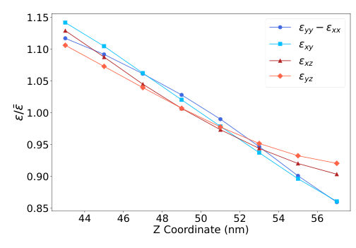
<figcaption class="paper-figure-caption"><b>Fig 4.</b> FIG. 4. Average magnitude of strain in each of eight horizontal subsets of the germanium well, divided by the overall average magnitude of that strain component in the entire germanium well. The subsets are equally spaced in the z-direction. The strain is larger at lower z-values, indicating that it builds up as it approaches the gates. The variation in each strain component is about 30% of the overall average, showing that strain varies significantly with depth.</figcaption>
</figure>
<figure class="paper-figure-card">
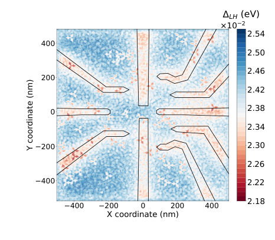
<figcaption class="paper-figure-caption"><b>Fig 5.</b> FIG. 5. Graph of the HH-LH band gap ∆LH at a cross-section in the middle of the germanium layer of our device. The x and y coordinates correspond to the spatial extent in the x and y directions of the cross-section. It can be observed that the strain term bv (⟨ϵxx⟩+ ⟨ϵyy⟩−2⟨ϵzz⟩) is small compared to the constant term in ∆LH.</figcaption>
</figure>

**Summary.** This paper develops a comprehensive model to explain the tunability of g-factors in Germanium spin qubits. By integrating finite element simulations of strain with quantum calculations, the authors show that device geometry induces inhomogeneous strain fields. This strain modulates the effective g-tensor, providing a direct link between mechanical stress and qubit performance.

**Why it may be interesting.** This work provides a concrete physical mechanism (strain coupling) that directly controls a critical parameter (g-factor) in solid-state qubits, which is highly relevant for designing robust quantum computing hardware.

Detailed structure

**Main problem.** The study aims to quantitatively explain large, gate-voltage dependent variations in the g-factor of Germanium quantum dots by linking these changes directly to strain effects.

**Main result.** The research demonstrates that device-induced inhomogeneous strain causes spatially varying g-tensors, and shifting the dot within this strain landscape via gate voltages explains the observed tunability.

**Method.** It combines finite-element simulations of thermal elasticity (to map strain) with quantum calculations of hole wavefunctions to determine the resulting g-tensor modulation.

**Model / system.** The physical system is a Germanium quantum dot spin qubit integrated into a multi-layered semiconductor structure ($	ext{Ge}_{0.8}	ext{Si}_{0.2}$, Ge, Al gates). The theoretical framework involves solving thermal elasticity equations and calculating the g-tensor correction based on strain components.

**Key observables.** Effective g-factor, strain tensor components ($\epsilon_{ij}$), displacement vector components ($\delta$), and hole probability density distribution ($
ho$).

**Important parameters / regimes.** Cryogenic operating temperature ($T=20 	ext{ K}$) versus room temperature assembly ($T_0 = 300 	ext{ K}$); Lamé parameters ($\lambda, \mu$) at low T.

**Assumptions / limitations.** The weak coupling assumption is used in the mechanical modeling, decoupling temperature and strain fields; small strain approximation is employed for the geometry.

**Figures summary.** Figures illustrate SEM images of the device structure, cross-sections showing simulated displacement and strain distributions (Fig. 2, Fig. 3), band gap variations (Fig. 5), and the resulting g-tensor correction components (Fig. 6).

**Paper structure.** The paper progresses from establishing the need for an explanation of g-factor tunability to deriving the necessary strain/stress equations using FEM principles, calculating the resultant strain map, and finally applying this map via quantum calculations to predict the observable g-tensor modulation.

Abstract

The g-factor is a key parameter governing the behavior of semiconductor spin qubits, as it directly determines the qubit frequency and its sensitivity to electrical and magnetic noise. Recent experiments in germanium quantum dots have revealed large g-factor variations under small gate voltage changes, indicating a strong coupling between electrostatics and spin properties. Here, we present a quantitative explanation based on strain-induced g-tensor modulation. By combining finite-element simulations of inhomogeneous strain with quantum calculations of hole wavefunctions, we show that device-induced strain produces spatially varying g-tensors. Gate voltages shift the quantum dot within this landscape, leading to substantial changes in the effective g-factor. Our results may account for the experimentally observed tunability and highlight the importance of in-plane g-tensor variations. This work establishes a direct link between strain, electrostatic control, and qubit performance in germanium spin qubits.

[↑ back to top](#top)

### [Blinking membrane patterns induced by protein binding/unbinding](http://arxiv.org/abs/2608.13016v1)

**Authors:** Hiroshi Noguchi  
**Type:** theory · **Category:** statistical mechanics · **PDF:** <https://arxiv.org/pdf/2608.13016v1>  
**Analysis basis:** full PDF text, analyzed in chunks
**Topic relevance:** `driven-dissipative phase transition` **3/5** · `methods for driven-dissipative` **3/5** · `non-equilibrium universality` **3/5** · `Keldysh / 2PI / non-Gaussian methods` **2/5** · `analog quantum simulation` **2/5** · `correlated / nonlocal dissipation` **2/5** · `scars & prethermalization` **2/5** · `Frenkel-Kontorova` **1/5** · `quantum measurements` **1/5**

↔ Scroll figures horizontally

<figure class="paper-figure-card">
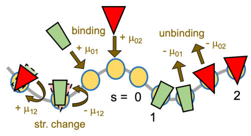
<figcaption class="paper-figure-caption"><b>Fig 1.</b> FIG. 1. Schematic of the binding and unbinding of curvature- inducing proteins with two states. The gray curve and yellow circles represent the membrane and its binding sites, respec- tively. The proteins have two shapes (green trapezoids and red triangles) and bind to the membrane with the binding chemical potentials µ01 and µ02, respectively. The unbound state is s = 0, and the bound states are s = 1 and 2 with spontaneous curvatures C0 = 0.05 and 0.1, respectively. The chemical potential from s = 1 to s = 2 is µ12.</figcaption>
</figure>
<figure class="paper-figure-card">
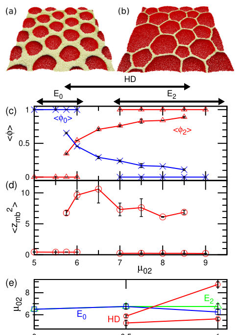
<figcaption class="paper-figure-caption"><b>Fig 2.</b> FIG. 2. Binding of proteins of the s = 2 state under thermal equilibrium. (a)–(b) Snapshots of the HD phase for (a) µ02 = 6 and (b) µ02 = 8 at the surface tension γ = 1. Red (dark gray) and yellow (light gray) spheres represent the bound and unbound membrane particles (s = 2 and s = 0), respectively. The s = 2 convex domains are hexagonally aligned. (c)–(d) Dependence on µ02 at γ = 1. (c) Mean density ⟨ϕ⟩of the s = 0 and s = 2 states. (d) Mean membrane vertical span ⟨zmb 2⟩. The bidirectional arrows at the top of (c) represent the ranges of the membrane phases. (e) Phase diagram for γ vs. µ02. The blue squares and green triangles represent the upper and lower limits of the s = 0 and s = 2...</figcaption>
</figure>
<figure class="paper-figure-card">
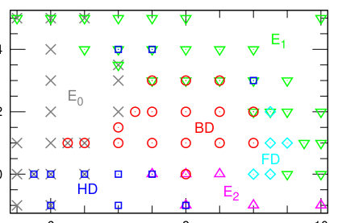
<figcaption class="paper-figure-caption"><b>Fig 3.</b> FIG. 3. Dynamic phase diagram at γ = 1. The gray crosses and green down-pointing and magenta up-pointing triangles represent the homogeneous phases of the states s = 0, 1, and 2 (E0, E1, and E2), respectively. The red circles, blue squares, and cyan diamonds represent the BD, HD, and FD patterns, respectively. The symbols overlap when two modes coexist through hysteresis.</figcaption>
</figure>
<figure class="paper-figure-card">
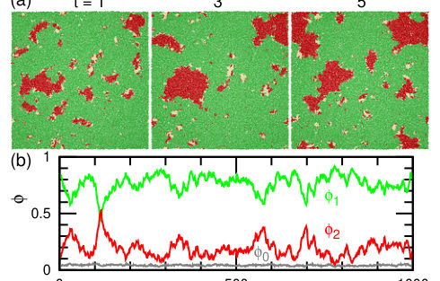
<figcaption class="paper-figure-caption"><b>Fig 4.</b> FIG. 5. FD pattern at µ01 = 0, µ02 = 9.25, and γ = 1. (a) Sequential snapshots. Flat s = 2 (red) domains move like amoebas. (b) Time evolution of the densities ϕ of the three states, corresponding to the snapshots in (a).</figcaption>
</figure>
<figure class="paper-figure-card">
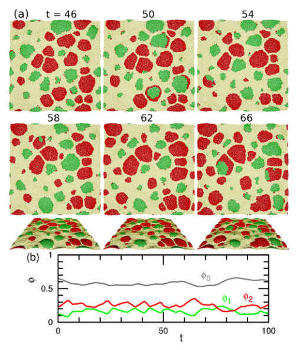
<figcaption class="paper-figure-caption"><b>Fig 5.</b> FIG. 4. BD pattern at µ01 = 2, µ02 = 8, and γ = 1. (a) Sequential snapshots. Green (medium gray) and red (dark gray) spheres represent the bound membrane particles (s = 1 and s = 2), respectively. Yellow (light gray) spheres represent the unbound particles s = 0. Side views are also displayed for the last three snapshots. Convex s = 2 (red) domains grow and subsequently change their state to s = 1 (green), resulting in domain shrinkage. (b) Time evolution of the densities ϕ of the three states, corresponding to the snapshots in (a).</figcaption>
</figure>

**Summary.** This work simulates how cyclic protein binding/unbinding drives dynamic, oscillating patterns called 'blinking domains' on lipid membranes. Using an active Potts model, the authors show that these non-equilibrium dynamics create stable patterns even when thermal equilibrium predicts different structures. This highlights the rich pattern formation possible in driven soft matter systems.

**Why it may be interesting.** While focused on soft matter physics, the use of active Potts models and non-equilibrium statistical mechanics principles for pattern formation shares conceptual overlap with driven quantum many-body systems or open quantum systems exhibiting persistent non-equilibrium steady states.

Detailed structure

**Main problem.** The study investigates non-equilibrium membrane pattern formation driven by cyclic protein binding and unbinding events.

**Main result.** Cyclic binding/unbinding induces 'blinking domains' (BD) with oscillating sizes, a standing-wave pattern robustly observed even in tensionless membranes where equilibrium patterns fail.

**Method.** The research employs meshless membrane simulations coupled with an off-lattice active Potts model to track state changes and resulting membrane deformations.

**Model / system.** The system models lipid membranes decorated with proteins that can occupy multiple states (s=0, 1, 2), each imparting a different spontaneous curvature. Dynamics are governed by Metropolis Monte Carlo updates driven by chemical potential differences ($\Delta H = \Delta U - \mu_{\alphaeta}$).

**Key observables.** Blinking domain patterns, mean cluster sizes ($\chi_s$), membrane vertical span ($\langle z_{mb}^2 
angle$), and the time fraction characterizing dynamic modes.

**Important parameters / regimes.** Chemical potentials ($\mu_{01}, \mu_{02}$), surface tension ($\gamma$), and bending rigidity ($\kappa_u/k_B T$).

**Assumptions / limitations.** The model assumes specific values for bending rigidity typical of lipid membranes, and the analysis distinguishes between equilibrium (HD) and non-equilibrium (BD/FD) regimes.

**Figures summary.** Figures illustrate schematic protein states, hexagonal alignment at equilibrium, and a dynamic phase diagram mapping regions for homogeneous phases (E0, E1, E2) versus pattern formations (BD, HD, FD).

**Paper structure.** The paper develops the model by defining the Hamiltonian and dynamics, analyzes the system across varying chemical potentials and surface tensions to map out distinct dynamical phases, and highlights the unique characteristics of blinking domains compared to equilibrium states.

Abstract

Nonequilibrium membrane pattern formation is studied using meshless membrane simulation. Bound proteins are considered to have two states that generate different membrane spontaneous curvatures. Protein binding and unbinding occur cyclically owing to chemical potential differences, as an off-lattice active Potts model. It is found that this cyclic binding/unbinding can induce blinking domains, with oscillating size: convex domains of the proteins with a higher spontaneous curvature grow, and subsequently, the proteins change to the other state with a lower spontaneous curvature, resulting in domain shrinkage. These processes repeat. In thermal equilibrium, hexagonal convex domains are formed by the competition between bending and surface tension energies, so that they are stably formed only under positive surface tension. However, blinking domains can form even in tensionless membranes.

[↑ back to top](#top)

### [The principle of stationary action and Lagrangian for dissipative dynamics with velocity-proportional frictional force](http://arxiv.org/abs/2608.13413v1)

**Authors:** Georgii Koniukov, Dmitry Nerukh  
**Type:** theory · **Category:** other · **PDF:** <https://arxiv.org/pdf/2608.13413v1>  
**Analysis basis:** full PDF text, analyzed in chunks
**Topic relevance:** `Keldysh / 2PI / non-Gaussian methods` **3/5** · `correlated / nonlocal dissipation` **3/5** · `methods for driven-dissipative` **3/5** · `driven-dissipative phase transition` **2/5** · `non-equilibrium universality` **2/5** · `Frenkel-Kontorova` **1/5** · `analog quantum simulation` **1/5** · `quantum measurements` **1/5**

↔ Scroll figures horizontally

<figure class="paper-figure-card">
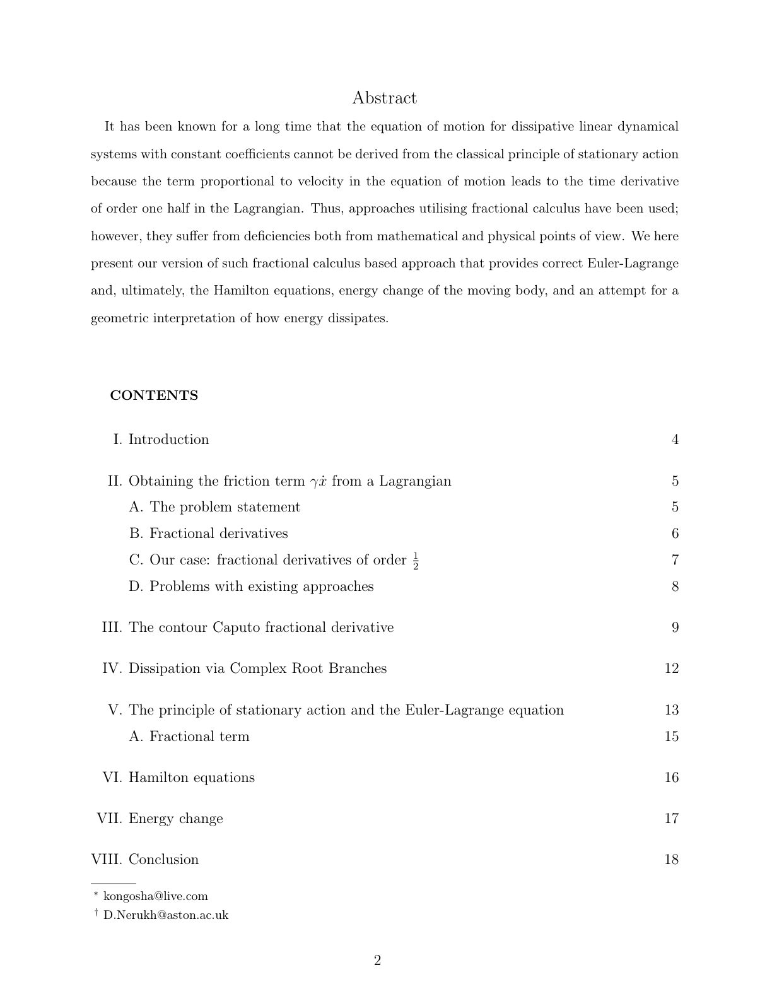
<figcaption class="paper-figure-caption"><b>Fig 1.</b> Low-resolution page preview, page 2</figcaption>
</figure>
<figure class="paper-figure-card">

<figcaption class="paper-figure-caption"><b>Fig 2.</b> Low-resolution page preview, page 3</figcaption>
</figure>
<figure class="paper-figure-card">
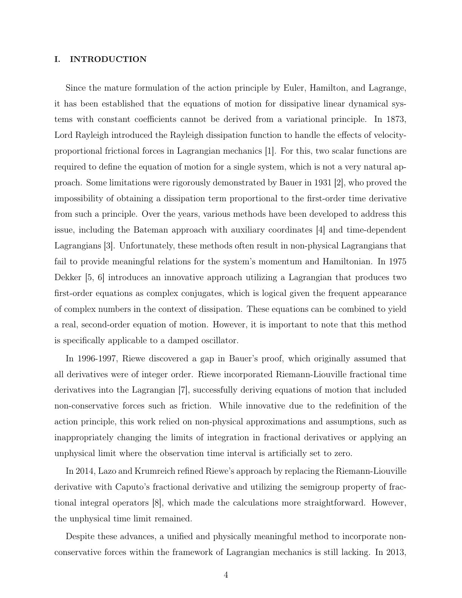
<figcaption class="paper-figure-caption"><b>Fig 3.</b> Low-resolution page preview, page 4</figcaption>
</figure>
<figure class="paper-figure-card">
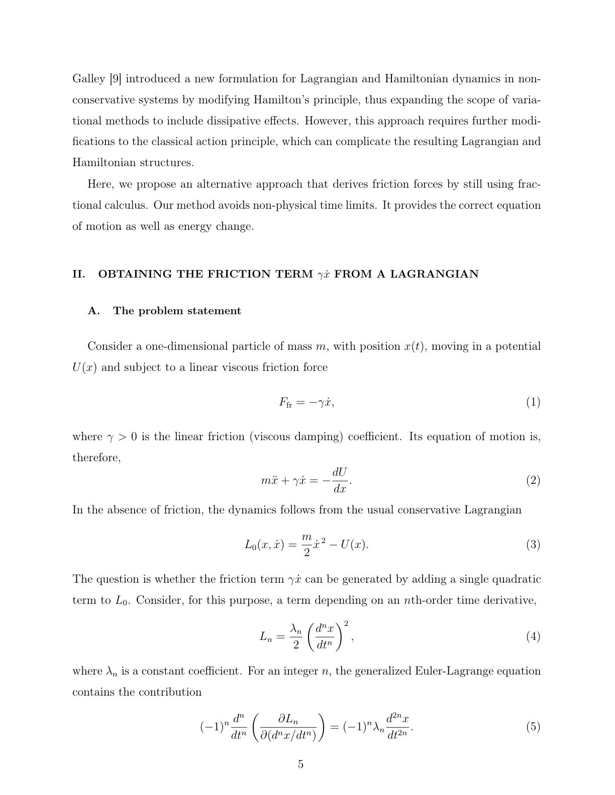
<figcaption class="paper-figure-caption"><b>Fig 4.</b> Low-resolution page preview, page 5</figcaption>
</figure>
<figure class="paper-figure-card">
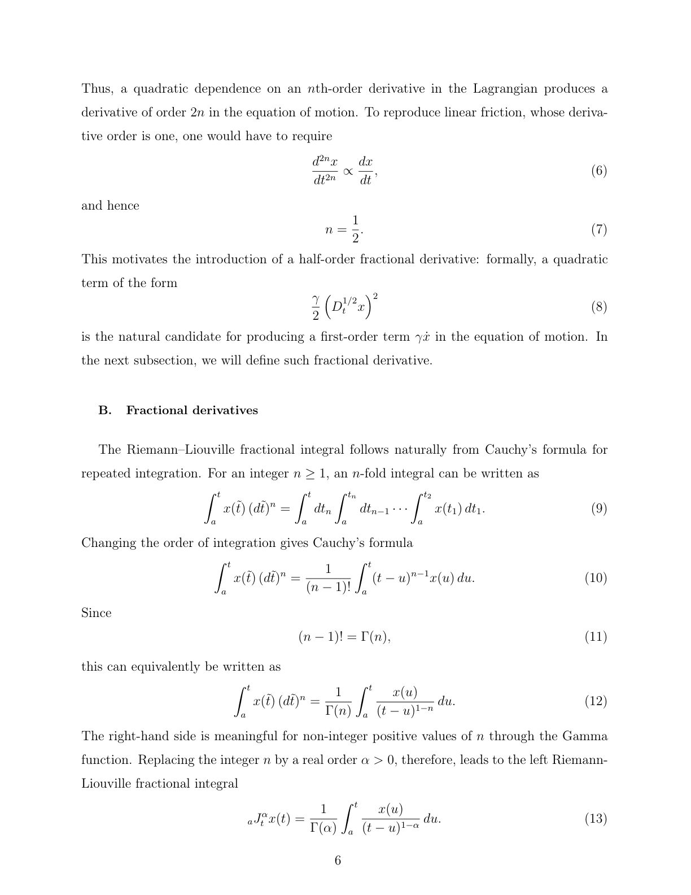
<figcaption class="paper-figure-caption"><b>Fig 5.</b> Low-resolution page preview, page 6</figcaption>
</figure>

**Summary.** This paper addresses the long-standing problem of formulating dissipative dynamics using variational principles. The authors propose a sophisticated method utilizing complex contour integration and fractional calculus to correctly derive the equation of motion for frictionally damped oscillators. This successfully recovers the expected energy dissipation rate, providing a mathematically rigorous framework for non-conservative systems.

**Why it may be interesting.** While not directly about quantum information, the rigorous mathematical treatment of non-conservative forces (dissipation) within an action principle is fundamental to open quantum systems theory, where deriving correct dynamics from generalized Lagrangians is crucial.

Detailed structure

**Main problem.** The primary challenge is deriving the equation of motion for dissipative systems with velocity-proportional friction from a variational principle, as standard Lagrangian mechanics fails due to fractional time derivatives.

**Main result.** The authors successfully derive the expected energy dissipation law (dE/dt = -gamma * dot(q)^2) by employing a novel approach using complex contour integration within the action functional.

**Method.** The method involves extending variational principles using specialized fractional calculus, specifically introducing and manipulating the Contour Caputo Fractional Derivative ($	ext{CD}^{1/2}_{\Gamma\epsilon}$) in the Lagrangian formulation.

**Model / system.** The model is a one-dimensional particle of mass m moving in a potential U(x) subject to linear viscous friction ($F_{fr} = -\gamma \dot{x}$). The dynamics are analyzed via an action functional incorporating complex fractional terms.

**Key observables.** Energy dissipation rate (dE/dt), Hamiltonian H, and the generalized equation of motion for position q(t).

**Important parameters / regimes.** The friction coefficient $\gamma$, mass $m$, and the order of the derivative ($\alpha=1/2$).

**Assumptions / limitations.** The derivation relies on complex variable techniques (contour integration) to handle irreversible energy loss, and assumes specific boundary conditions for variational principles.

**Figures summary.** Figure 1 illustrates the complex integration contour $\Gamma_\epsilon$ used in defining the specialized Caputo fractional derivative.

**Paper structure.** The paper reviews existing failures of standard fractional calculus approaches before introducing a novel framework. It constructs a modified Lagrangian and Hamiltonian using complex fractional derivatives, derives the equations of motion via variation, and finally computes dH/dt to recover the known energy dissipation law.

Abstract

It has been known for a long time that the equation of motion for dissipative linear dynamical systems with constant coefficients cannot be derived from the classical principle of stationary action because the term proportional to velocity in the equation of motion leads to the time derivative of order one half in the Lagrangian. Thus, approaches utilising fractional calculus have been used; however, they suffer from deficiencies both from mathematical and physical points of view. We here present our version of such fractional calculus based approach that provides correct Euler-Lagrange and, ultimately, the Hamilton equations, energy change of the moving body, and an attempt for a geometric interpretation of how energy dissipates.

[↑ back to top](#top)

### [Acoustic Tweezers for Magnetic Skyrmions](http://arxiv.org/abs/2608.13055v1)

**Authors:** Chongzhou Wang, Weichao Yu  
**Type:** theory · **Category:** other · **PDF:** <https://arxiv.org/pdf/2608.13055v1>  
**Analysis basis:** full PDF text, analyzed in chunks
**Topic relevance:** `Keldysh / 2PI / non-Gaussian methods` **3/5** · `analog quantum simulation` **3/5** · `driven-dissipative phase transition` **2/5** · `interference shaping light` **2/5** · `methods for driven-dissipative` **2/5** · `correlated / nonlocal dissipation` **1/5** · `non-equilibrium universality` **1/5** · `quantum measurements` **1/5**

↔ Scroll figures horizontally

<figure class="paper-figure-card">
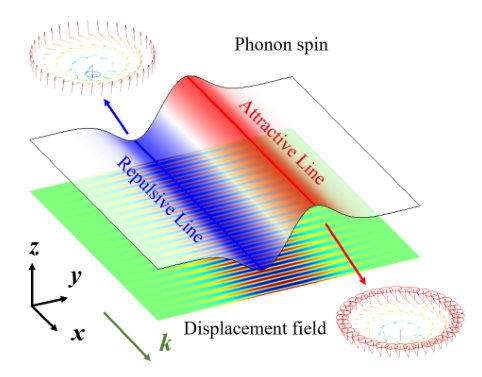
<figcaption class="paper-figure-caption"><b>Fig 1.</b> Figure 1. Schematic of phonon-spin-mediated skyrmion interaction. A longitudinally polarized Gaussian acoustic beam propagates along +ˆx (light blue arrow). Transverse amplitude decay induces local- ized phonon spin angular momentum along ˆz (gradient-colored iso- surfaces), forming an attractive line (red, positive phonon spin) on the upper side and a repulsive line (blue, negative phonon spin) on the lower side. A Bloch skyrmion (Q = −1) exhibits polarity-selective responses: it is attracted toward the attractive line and repelled from the repulsive line, dictated by the signed coupling between skyrmion polarity and phonon spin orientation.</figcaption>
</figure>
<figure class="paper-figure-card">
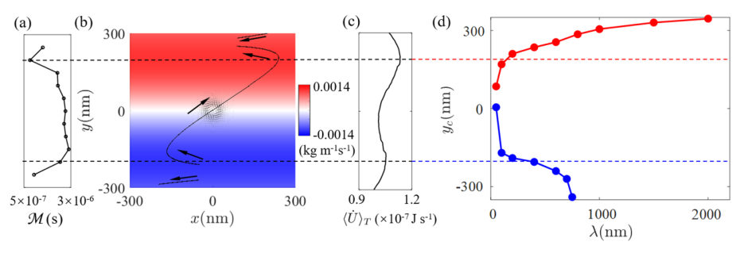
<figcaption class="paper-figure-caption"><b>Fig 2.</b> Figure 2. Skyrmion dynamics under a single Gaussian longitudinal acoustic beam propagating along +ˆx. (a) Position-dependent effective mass M, reaching a minimum near the attractive line (red) where skyrmion deformation is minimal, and increasing near the repulsive line (blue) and spin extrema due to maximal deformation. (b) Skyrmion trajectory in the phonon spin landscape (color map) showing quasi-static migration toward the attractive line (positive phonon spin region on the upper y-axis, red) and away from the repulsive line (negative phonon spin region on the lower y-axis, blue). (c) Rayleigh dissipation rate distribution exhibiting extrema that coincide precisely with the phonon spin...</figcaption>
</figure>
<figure class="paper-figure-card">
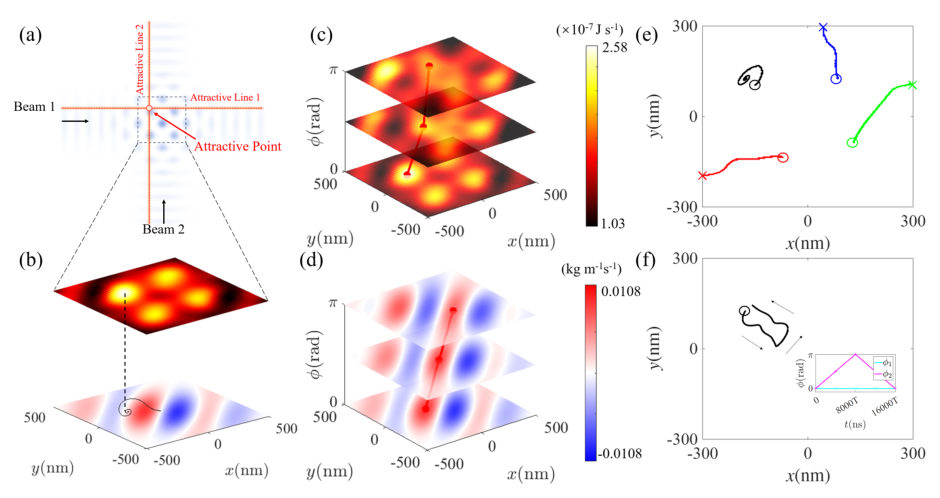
<figcaption class="paper-figure-caption"><b>Fig 3.</b> Figure 3. Two-dimensional trapping and routing via orthogonal acoustic tweezers. The acoustic period is T = λ/cl ≈83.2 ps. (a) Schematic of the tweezer architecture employing two orthogonally propagating Gaussian beams (λ = 600 nm, δ = 400 nm) along +ˆx and +ˆy directions. Each beam possesses its own attractive line (red); the two attractive lines intersect to form an attractive point (red dot) that serves as the stable trapping site. (b) Zoomed view of the beam overlap region showing the Rayleigh dissipation rate (upper panel) and phonon spin distribution (lower panel). A skyrmion initialized at the origin migrates to and stabilizes at the attractive point over 7600 acoustic periods. (c)...</figcaption>
</figure>

**Summary.** This paper introduces an 'acoustic tweezer' technique to deterministically manipulate individual magnetic skyrmions by exploiting magnetoelastic coupling with acoustic waves. By showing that confined longitudinal acoustic beams carry phonon spin, they generate a polarity-selective radiation force. This allows for the precise, non-destructive routing of topological magnetic textures on an chip.

**Why it may be interesting.** This work bridges concepts from acoustics/optics (tweezers) with condensed matter magnetism (skyrmions), providing a clear physical analogy for controlling quantum-like excitations in solid-state systems using external fields. The rigorous derivation of the radiation force component is particularly valuable for understanding non-conservative driving forces.

Detailed structure

**Main problem.** The primary challenge addressed is developing a method for deterministic, single-particle trapping and routing of magnetic skyrmions, overcoming limitations in current ensemble-based manipulation techniques.

**Main result.** The authors propose an 'acoustic tweezer' mechanism that uses the phonon spin carried by acoustic beams to generate polarity-selective radiation forces, enabling high-precision, non-destructive control over individual skyrmions.

**Method.** The analysis involves deriving the magnetoelastic force ($\mathbf{F}_{	ext{mec}}$) from first principles, decomposing it into gradient and radiation components, and modeling the resulting dynamics using a generalized Thiele equation.

**Model / system.** The system consists of magnetic skyrmions interacting with spatially extended longitudinal acoustic beams. The interaction is mediated by magnetoelastic coupling, which generates an effective field whose chirality is locked to the acoustic phonon spin texture.

**Key observables.** Polarity-selective radiation force; time-averaged force ($\langle \mathbf{F}_{	ext{mec}} 
angle_T$); Rayleigh dissipation rate ($\langle\dot{\mathcal{U}}
angle_T$).

**Important parameters / regimes.** Acoustic wavelength ($\lambda$) comparable to skyrmion size ($R_{sk}$); the topological charge ($Q$) of the skyrmion.

**Assumptions / limitations.** The analysis relies on a one-way coupling scheme, assuming the skyrmion drift velocity is much lower than the speed of sound; it also uses approximations like linear response theory and boundary condition assumptions for force integration.

**Figures summary.** Figures illustrate that positive phonon spin creates an attractive trapping line (red) while negative spin creates a repulsive line (blue), demonstrating polarity-selective attraction toward regions of maximum energy dissipation.

**Paper structure.** The paper progresses from identifying the need for single-particle control, deriving the magnetoelastic force based on phonon spin angular momentum, establishing the radiation force mechanism via susceptibility analysis, and finally simulating deterministic trapping using intersecting beams to create reconfigurable points.

Abstract

Current methods for driving magnetic skyrmions predominantly translate ensembles as a whole, lacking single-particle selectivity. Here, we propose an "acoustic tweezer" that deterministically traps and routes individual skyrmions using spatially extended acoustic beams. We reveal that spatially confined longitudinal waves carry nontrivial phonon spin, inducing a magnetoelastic field whose chirality is locked to the acoustic spin texture. This generates polarity-selective radiation forces, distinct from conservative gradient forces, that attract skyrmions to local phonon spin maxima. Intersecting orthogonal beams create reconfigurable attractive points for adiabatic, deterministic manipulation. Our global-field-local-interaction paradigm establishes a non-destructive, on-chip route for high-precision topological spintronics.

[↑ back to top](#top)

### [Edge physics and the Casimir interaction in Maxwell--Chern--Simons theory on a strip](http://arxiv.org/abs/2608.12622v1)

**Authors:** Nicola Maggiore  
**Type:** theory · **Category:** other · **PDF:** <https://arxiv.org/pdf/2608.12622v1>  
**Analysis basis:** full PDF text, analyzed in chunks
**Topic relevance:** `Keldysh / 2PI / non-Gaussian methods` **3/5** · `methods for driven-dissipative` **3/5** · `driven-dissipative phase transition` **2/5** · `non-equilibrium universality` **2/5** · `analog quantum simulation` **1/5** · `correlated / nonlocal dissipation` **1/5** · `quantum measurements` **1/5**

↔ Scroll figures horizontally

<figure class="paper-figure-card">
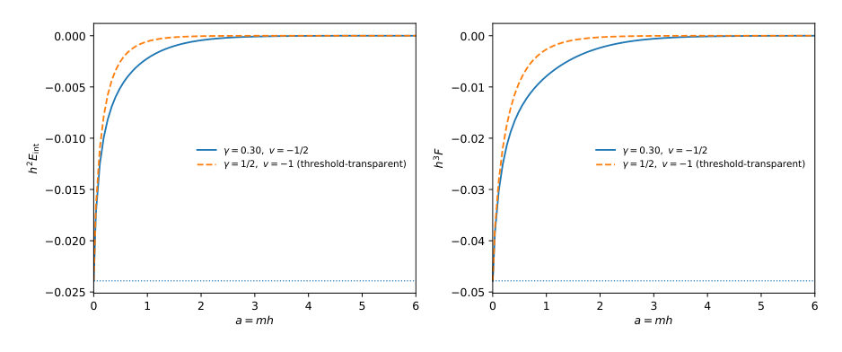
<figcaption class="paper-figure-caption"><b>Fig 1.</b> Figure 1: Numerical evaluation of the pole-free flip-symmetric family. Left: h2Eint as a function of a = mh. Right: h3F. The solid curve is the generic point (γ, v) = (0.30, −1/2) and the dashed curve is the threshold-transparent point (1/2, −1). The horizontal dotted lines are the one-channel Maxwell limits −ζ(3)/(16π) and −ζ(3)/(8π), respectively.</figcaption>
</figure>
<figure class="paper-figure-card">
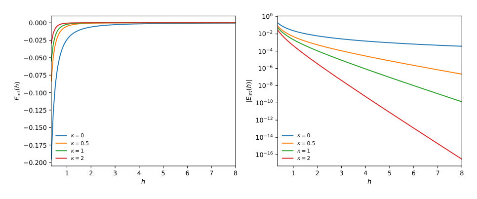
<figcaption class="paper-figure-caption"><b>Fig 2.</b> Figure 2: Unrescaled interaction energy for g2 = 1 and (γ, v) = (0.30, −1/2), with κ = 0, 0.5, 1, 2. Left: Eint(h). Right: |Eint(h)| on a logarithmic scale. All curves have the same short-distance coefficient −ζ(3)/(16πh2); the nonzero-κ curves are Yukawa screened at large separation.</figcaption>
</figure>

**Summary.** This paper analyzes the Casimir interaction and edge physics in Maxwell--Chern-Simons theory on a finite strip. Using advanced field theory techniques, it derives that the vacuum energy exhibits distinct asymptotic behaviors depending on whether the topological mass term (from the Chern-Simons part) is zero or non-zero. This work provides a rigorous framework for understanding how boundary topology modifies bulk quantum interactions.

**Why it may be interesting.** While focused on gauge theory, the explicit calculation of vacuum energy (Casimir effect) in a confined geometry provides a concrete example of how topological terms modify standard QFT results, which is relevant for understanding boundary effects in quantum systems.

Detailed structure

**Main problem.** The study investigates edge physics and the resulting Casimir interaction within Maxwell--Chern-Simons (MCS) theory defined on a strip geometry.

**Main result.** The analysis derives a closed determinant representation for the finite vacuum interaction energy, showing that the force transitions from a power-law decay in the pure Maxwell limit to an exponentially screened Yukawa potential when topological mass is present.

**Method.** The authors employ the Symanzik framework for quantum field theory with boundaries, deriving boundary conditions via variational principles and analyzing the resulting scattering determinant structure.

**Model / system.** The system is MCS theory on a strip $\mathbb{R}_{1,1} 	imes [0, h]$, characterized by both Maxwell and Chern-Simons terms. The bulk supports one massive physical helicity, while boundary physics involves two coupled $U(1)$ current algebras.

**Key observables.** The Casimir interaction energy ($E_{	ext{int}}$), reflection coefficients, and the structure of the secular determinant governing vacuum fluctuations.

**Important parameters / regimes.** Strip width ($h$), Chern-Simons coupling ($\kappa$), and the resulting topological mass ($m = \kappa g^2$).

**Assumptions / limitations.** The analysis relies on retaining terms up to one tangential derivative in the boundary functional and assumes a specific 'edge-active' choice for boundary conditions.

**Paper structure.** The paper follows a structured derivation: establishing boundary equations from local functionals, deriving conserved currents via Ward identities, reducing the problem to physical modes, and finally calculating the interaction energy using scattering determinants.

Abstract

We study Maxwell--Chern--Simons theories on a strip $\mathcal M=\mathbb R^{1,1}\times[0,h]$ within the Symanzik framework for quantum field theory with boundaries. We add the most general local boundary functional within the quadratic one-tangential-derivative truncation adopted throughout the paper and derive the admissible boundary conditions from locality and the variational principle, with gauge symmetry implemented through boundary Ward identities. The strip supports two boundary $U(1)$ current algebras, with opposite levels fixed by the Chern--Simons coupling $κ$ and by boundary orientation, while edge velocities depend on local boundary couplings. They are equal and opposite on the flip-symmetric branch, which is the natural choice for a spatially symmetric strip. The same boundary data determine the reflection coefficients for bulk modes and yield a closed determinant (scattering) representation of the finite interaction energy. In the Maxwell limit ($κ=0$) the inter-edge interaction is long-ranged and produces a power-law Casimir force, whereas in Maxwell--Chern--Simons theory the topological mass $m=κg^2$ generates Yukawa suppression at large separations $mh\gg1$. The determinant form also gives analytic control of the asymptotic regimes and separates topological boundary data (levels and anomaly inflow) from dynamical bulk effects (dispersion, boundary mixing and Casimir interaction).

[↑ back to top](#top)

### [A Unified Description of Electron-Phonon Coupling and Ion Migration in Metal Halide Perovskites](http://arxiv.org/abs/2608.12765v1)

**Authors:** Bo Cai, Yan Yang, Yoshiki Sugai, Maddison Wiles, Dongxu He, Yang Yang, Junmin Xia, Shufen Chen, Carla Verdi, Siyu Chen, Nan Zhang, Ming-Gang Ju, Chao Liang, Julian A. Steele  
**Type:** theory · **Category:** other · **PDF:** <https://arxiv.org/pdf/2608.12765v1>  
**Analysis basis:** full PDF text, analyzed in chunks
**Topic relevance:** `Keldysh / 2PI / non-Gaussian methods` **3/5** · `analog quantum simulation` **2/5** · `driven-dissipative phase transition` **2/5** · `methods for driven-dissipative` **2/5** · `correlated / nonlocal dissipation` **1/5** · `non-equilibrium universality` **1/5** · `quantum measurements` **1/5**

↔ Scroll figures horizontally

<figure class="paper-figure-card">
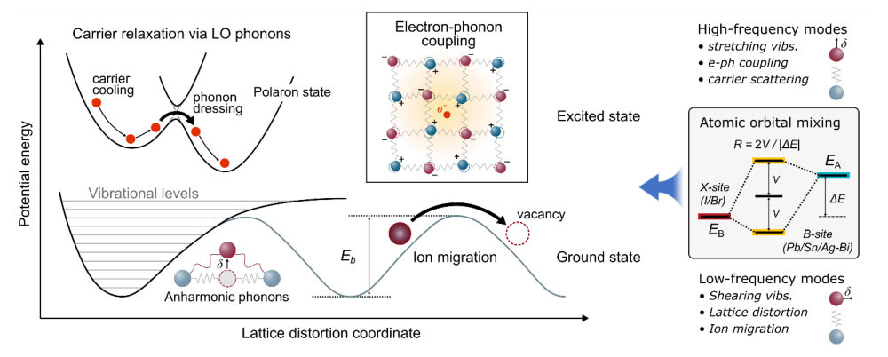
<figcaption class="paper-figure-caption"><b>Fig 1.</b> Fig. 1 | Unified conceptual framework for electron–phonon coupling and ion migration.</figcaption>
</figure>
<figure class="paper-figure-card">
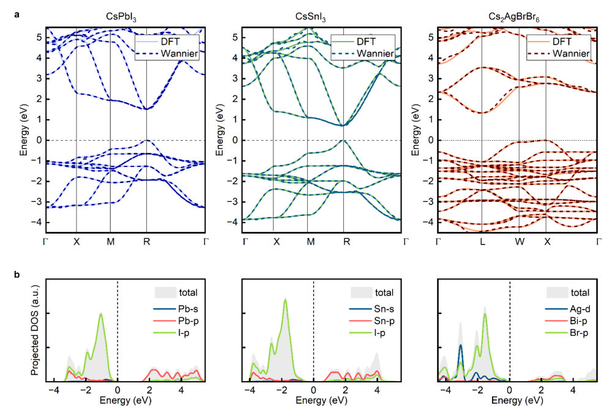
<figcaption class="paper-figure-caption"><b>Fig 2.</b> Fig. 2 | Electronic structures of representative halide perovskites. a, Electronic band structures of CsPbI3, CsSnI3 and Cs2AgBiBr6 calculated using density functional theory (solid lines) and Wannier interpolation (dashed lines). b, Corresponding projected densities of states</figcaption>
</figure>
<figure class="paper-figure-card">
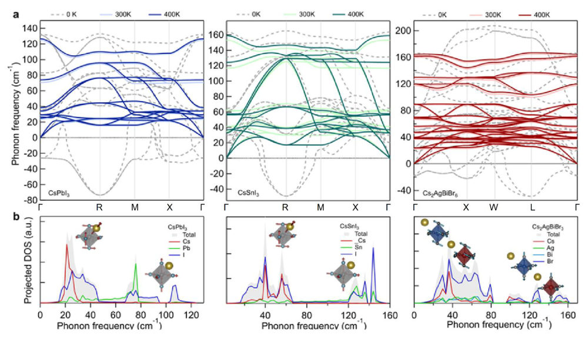
<figcaption class="paper-figure-caption"><b>Fig 3.</b> Fig. 3 | Anharmonic lattice dynamics in representative halide perovskites. a, Temperature- dependent phonon dispersions of CsPbI3, CsSnI3 and Cs2AgBiBr6 at 0 K (black dashed lines), 300 K (blue solid lines) and 400 K (red solid lines), highlighting the anharmonic renormalization of the phonon spectra. b, Corresponding phonon projected densities of states (PDOS) at 300 K.</figcaption>
</figure>
<figure class="paper-figure-card">
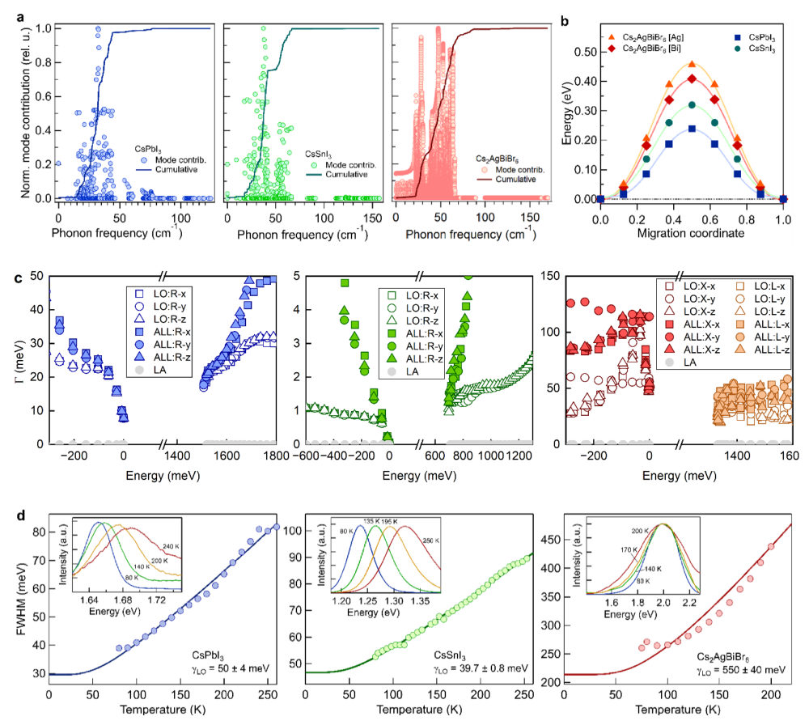
<figcaption class="paper-figure-caption"><b>Fig 4.</b> Fig. 4 | Phonon-mode-resolved ion migration and electron–phonon coupling in halide perovskites. a, Scatter plots and cumulative contribution plots of halogen migration contributions from different phonon modes (including all q-space phonons) in CsPbI3, CsSnI3, and Cs2AgBiBr6. b, Calculated migration barriers of different halogen atoms in these compositions. c, Electron–phonon interaction induced energy-dependent electronic linewidths (Γe-ph) at the lowest conduction band (LCB) and the highest valence band (HVB). The energy is referenced to the matching band edge. Filled symbols represent the total linewidth, open symbols denote the polar longitudinal optical (LO) phonon contribution to the...</figcaption>
</figure>

**Summary.** This work unifies the seemingly separate phenomena of ion migration and electron-phonon coupling in metal halide perovskites using an orbital hybridization descriptor, $R$. By showing that both processes are governed by the same underlying electronic structure parameter, the authors propose a generalized mechanism for designing soft semiconductors with optimized charge and ionic transport simultaneously.

**Why it may be interesting.** While not directly focused on quantum information, the rigorous theoretical coupling of lattice vibrations (phonons) to electronic structure parameters ($R$) provides a powerful model for understanding strongly coupled open quantum systems where environment interaction dictates transport properties.

Detailed structure

**Main problem.** The research aims to develop a unified microscopic description linking lattice dynamics, electron-phonon coupling (EPC), and ion migration in metal halide perovskites.

**Main result.** A single orbital hybridization descriptor ($R$) was introduced to show that both ionic transport barriers and EPC strengths arise from the same underlying electronic structure framework. This suggests a cooperative mechanism for optimizing charge and ionic transport simultaneously.

**Method.** The study employs Density Functional Theory (DFT) calculations, utilizing an orbital hybridization descriptor derived from a dual-atom model to quantify how lattice displacements modulate electronic coupling.

**Model / system.** The physical system is Metal Halide Perovskites ($	ext{CsPbI}_3$, $	ext{CsSnI}_3$, and double perovskites). The theoretical framework uses an orbital hybridization descriptor $R = 2V / |\Delta E|$ to model the coupling between metal and halide orbitals.

**Key observables.** Electron-phonon coupling strength ($\Gamma_{e-	ext{ph}}$), ion migration barrier energies ($E_b$), and the orbital hybridization descriptor ($R$).

**Important parameters / regimes.** The relative values of $R$ across different perovskite compositions (e.g., $	ext{Cs}_2	ext{AgBiBr}_6 > 	ext{Sn-I} > 	ext{Pb-I}$), and the dependence of $R$ on specific phonon modes (stretching vs. shearing).

**Assumptions / limitations.** The analysis assumes that the descriptor $R$ acts as a universal electronic parameter governing both lattice restoring forces (migration) and dielectric screening (EPC). Calculations are often performed on archetypal cubic phases.

**Figures summary.** Figures conceptually link the hybridization descriptor $R$ to phonon modes: low-frequency shearing modes govern ion migration, while high-frequency stretching modes govern carrier scattering via the Fröhlich interaction. Supplementary figures detail how $R$ changes under specific atomic displacements (shortening/elongating bonds).

**Paper structure.** The paper establishes a conceptual framework linking bonding to dynamics using $R$. It then systematically calculates and analyzes how perturbing bond lengths or angles modulates $R$, which in turn dictates both the ion migration barrier and the EPC strength across multiple perovskite types.

Abstract

The remarkable optoelectronic properties of metal halide perovskites are closely linked to their unusually soft and polar chemical bonds that enable both strong electron-phonon interactions and ion migration. Yet these two defining characteristics have largely been treated as independent consequences of the same underlying chemical bonding. Here we show that they originate from a common electronic-structure framework by developing a general description linking lattice dynamics, electron-phonon coupling, and halide ion migration across representative Pb-based, Sn-based, and double perovskites. Spectrally resolved phonon-mode contributions demonstrate that the low-frequency shearing modes dominate halide migration, whereas high-frequency stretching modes govern carrier scattering through the Fröhlich interaction in all three compositions. We introduce an orbital hybridization descriptor to unify these findings, which connects metal-halide bonding characteristics with the migration barrier energies and Fröhlich coupling strengths, indicating a cooperative evolution of these two properties. These findings provide a generalized microscopic mechanism for simultaneously optimizing charge and ionic transport in soft semiconductors.

[↑ back to top](#top)

### [Asymmetric Textured Image Sensors Based on Antenna Theory as Designed by Nature](http://arxiv.org/abs/2608.12729v1)

**Authors:** Julian Juhi-Lian Ting  
**Type:** theory · **Category:** other · **PDF:** <https://arxiv.org/pdf/2608.12729v1>  
**Analysis basis:** full PDF text, analyzed in chunks
**Topic relevance:** `interference shaping light` **3/5** · `driven-dissipative phase transition` **2/5** · `methods for driven-dissipative` **2/5** · `Keldysh / 2PI / non-Gaussian methods` **1/5** · `analog quantum simulation` **1/5** · `correlated / nonlocal dissipation` **1/5** · `non-equilibrium universality` **1/5** · `quantum measurements` **1/5**

↔ Scroll figures horizontally

<figure class="paper-figure-card">
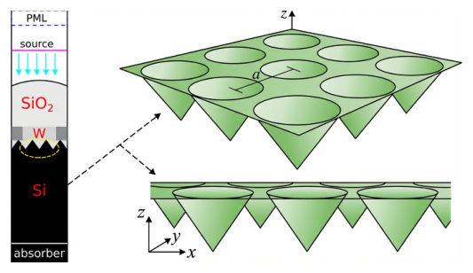
<figcaption class="paper-figure-caption"><b>Fig 1.</b> FIG. 1. The geometry used in MEEP Project 4 for calculating the CMOS image sensor [20]. A silicon dioxide glass microlens with a 0.85µm radius of curvature is atop the image sensor to focus incident light into individual pixels. Surrounding each pixel is a metal aperture grid composed of tungsten wire (0.1µm wide and 0.2µm high), which sits on a 3 µm thick crystalline-silicon substrate. Furthermore, deep-trench isolation-implemented as a 0.1µm wide and 2µm thick silicon-dioxide trench-surrounds the pixel to mitigate electrical crosstalk and trap photons via index guiding.</figcaption>
</figure>
<figure class="paper-figure-card">
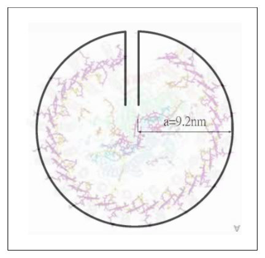
<figcaption class="paper-figure-caption"><b>Fig 2.</b> FIG. 2. According to experimental data, the major axis of Rhodopseudomonas palustris has length 110 ˚A and the minor axis is 95 ˚A; the largest dimension of the inner LH1 is 78 ˚A [22]. The elliptical symmetry is visualized by superimposing our model onto the schematic representation based on X-ray data.</figcaption>
</figure>
<figure class="paper-figure-card">
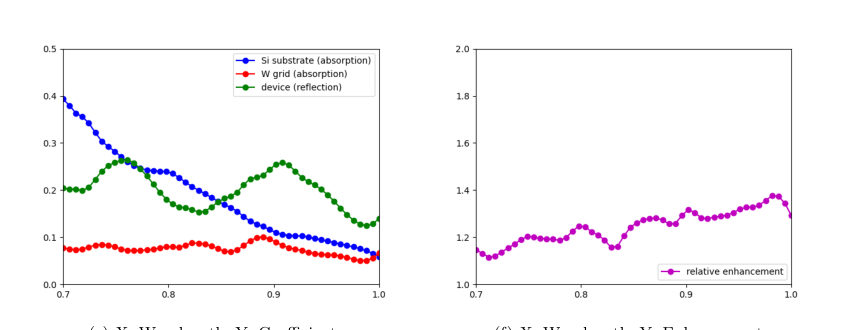
<figcaption class="paper-figure-caption"><b>Fig 3.</b> FIG. 3. (a)-(b) Original circular cone from MEEP project 4, (c)-(d) modified circular cone, and (e)-(f) proposed asymmetric elliptical cone. For all subfigures, the horizontal (X) axis represents the optical wavelength ranging from 0.7 to 1.0 µm. The vertical (Y) axis represents the absolute coefficient value (absorption and reflection) for the left column [subfigures (a), (c), (e)] and the relative enhancement factor for the right column [subfigures (b), (d), (f)].</figcaption>
</figure>
<figure class="paper-figure-card">
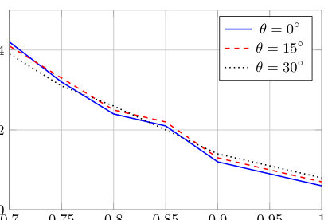
<figcaption class="paper-figure-caption"><b>Fig 4.</b> FIG. 4. Calculated silicon substrate optical absorption curves under oblique incident illumination (θ = 0◦, 15◦, 30◦) for the asymmetric elliptical base cone texture array.</figcaption>
</figure>

**Summary.** This paper explores inducing passive non-reciprocal scattering in textured image sensors by introducing structural asymmetry at sub-wavelength scales. Using antenna theory and FDTD simulations, the authors find that while theory predicts significant enhancement, actual measurements show this effect is suppressed by field concentration at sharp apices. Future designs must focus on asymmetric modifications directly at these high-field regions.

**Why it may be interesting.** Although focused on classical optics/photonics, the investigation into symmetry breaking to induce non-reciprocity at nanoscale boundaries touches upon concepts relevant to topological photonics or engineered quantum light-matter interactions where boundary conditions are paramount.

Detailed structure

**Main problem.** The work investigates whether structural asymmetry at sub-wavelength scales can induce passive non-reciprocal scattering in linear, time-invariant systems, moving beyond traditional macroscopic continuum assumptions.

**Main result.** While theory predicts a potential 5%-15% efficiency enhancement via symmetry breaking, numerical simulations reveal that intense local field concentration at the apex shields this effect, suggesting asymmetry must be engineered directly at the field-concentrating point to observe non-reciprocity.

**Method.** The study combines theoretical development using perturbation theory with detailed numerical simulations performed on the MEEP finite-difference time-domain (FDTD) platform.

**Model / system.** The physical system is a CMOS image sensor modified with an asymmetrically textured surface, inspired by bacterial photosynthetic light harvesters. The model analyzes wave scattering properties at the sub-wavelength scale using antenna theory principles.

**Key observables.** Non-reciprocal susceptibility ($\chi^{(2)}$), DC current ($\langle J(t) 
angle$), and relative change in average optical absorption (measured via FDTD flux data).

**Important parameters / regimes.** Sub-wavelength scales, eccentricity parameter ($\delta \approx 13.6\%$), and incidence angles ($	heta = 0^\circ$ to $30^\circ$).

**Assumptions / limitations.** The analysis assumes that macroscopic continuum models are invalid at the sub-wavelength scale, and that geometric configuration dictates the electromagnetic response.

**Figures summary.** Figures compare absorption performance for circular versus elliptical cone shapes across different lattice spacings and show optical absorption curves under oblique illumination angles ($	heta = 0^\circ$ to $30^\circ$).

**Paper structure.** The paper progresses from establishing the theoretical framework based on bio-inspiration and perturbation theory, through numerical validation using MEEP/FDTD simulations comparing various geometries (circular vs. elliptical), culminating in a discussion of the discrepancy between predicted enhancement and measured results.

Abstract

This work numerically validates the application of bio-inspired concepts on CMOS derived from bacterial photosynthetic light harvesters. We investigate a modification of symmetric inverted pyramid array CMOS image sensors into an asymmetrically shaped texture to explore the structural boundary of passive non-reciprocity. Diverging from traditional macroscopic continuum assumptions, we analyze whether structural asymmetry at sub-wavelength scales can induce non-reciprocal scattering under passive, linear, and time-invariant conditions. A theoretical framework based on perturbation theory is developed, estimating a potential efficiency enhancement of 5\% to 15\%. Numerical simulations performed via the MEEP finite-difference time-domain (FDTD) platform reveal that the linear response is highly localized, showing a subtle 0.02\% change. This suggests that macroscopic Lorentz reciprocity remains robust at the investigated scale due to apex field concentration, defining a clear geometric threshold for microscopic non-reciprocity.

[↑ back to top](#top)

### [Emergence of moiré magnetic chaos in twisted bilayer CrI3](http://arxiv.org/abs/2608.13062v1)

**Authors:** Gyuyoung Park, OukJae Lee, Kyoung-Min Kim  
**Type:** theory · **Category:** other · **PDF:** <https://arxiv.org/pdf/2608.13062v1>  
**Analysis basis:** full PDF text, analyzed in chunks
**Topic relevance:** `non-equilibrium universality` **3/5** · `analog quantum simulation` **2/5** · `driven-dissipative phase transition` **2/5** · `Frenkel-Kontorova` **1/5** · `methods for driven-dissipative` **1/5** · `scars & prethermalization` **1/5**

↔ Scroll figures horizontally

<figure class="paper-figure-card">
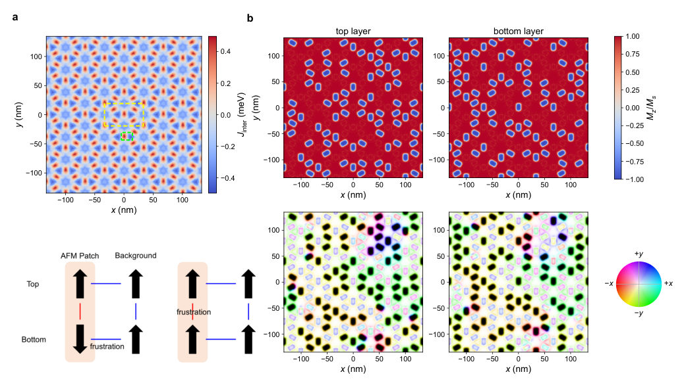
<figcaption class="paper-figure-caption"><b>Fig 1.</b> FIG. 1. Moir´e magnetic textures in twisted bilayer CrI3. a, Interlayer exchange coupling map Jinter(r) used in the simulations, tiled across the moir´e superlattice. Blue (red) marks ferromagnetic (antiferromagnetic) coupling, Jinter &lt; 0 (Jinter &gt; 0). The yellow dashed box outlines one moir´e unit cell at the centre of the map; the small green dashed box just below it isolates a single AFM patch (red) next to the surrounding FM background (blue). b, A representative metastable configuration obtained by relaxing a random initial state (a uniformly out-of-plane-polarised background carrying random in-plane fluctuations; see Methods). This configuration is the unperturbed (ε = 0) reference...</figcaption>
</figure>
<figure class="paper-figure-card">
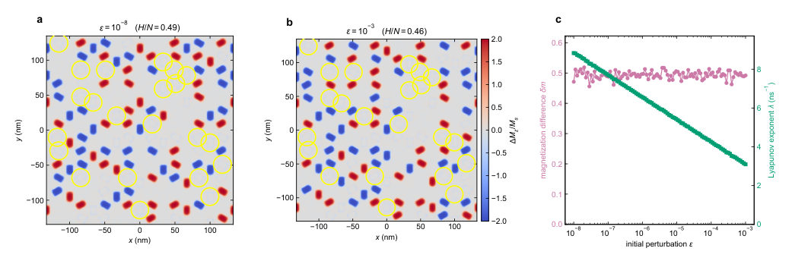
<figcaption class="paper-figure-caption"><b>Fig 2.</b> FIG. 2. Damage spreading and structural chaos. a, Spatial map of the signed top-layer magnetization difference ∆Mz(r)/Ms = M pert z −M ref z between a perturbed and the reference trajectory at t = 2 ns, for the smallest perturbation ε = 10−8. Red and blue mark domains that have flipped relative to the reference, with the sign giving the flip direction; white marks the remaining unchanged region (Hamming fraction H/Nd = 0.49, where Nd = 89 is the number of reference domains). Yellow circles mark the pinned domains that stay locked to the reference for every ε in the sweep. b, The same map for the largest perturbation ε = 10−3 (H/Nd = 0.46). The decorrelation pattern is fully reorganised, yet...</figcaption>
</figure>
<figure class="paper-figure-card">

<figcaption class="paper-figure-caption"><b>Fig 3.</b> Figure 2a,b maps the local magnetization difference |∆m(r)| between a perturbed and the reference trajectory at t = 2 ns. Even at ε = 10−8, a single-spin tilt of less than 10−6 degrees, about half of the reference domains have reversed their binary state, giving a Hamming fraction H/Nd = 0.49, where H counts the domains whose state differs between the perturbed and reference trajectories and Nd = 89 is the total number of reference domains (a subset of the N = 157 AFM patches). The value H/Nd = 0.5 is the maximal-decorrelation limit: two statistically independent binary configurations differ, on average, in exactly half of their bits, so reaching it under an infinitesimal perturbation means...</figcaption>
</figure>
<figure class="paper-figure-card">
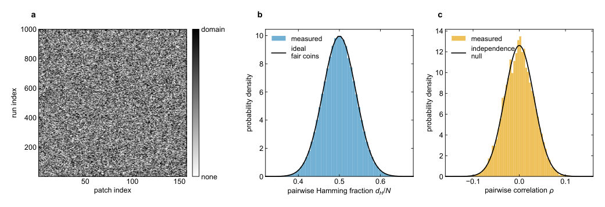
<figcaption class="paper-figure-caption"><b>Fig 4.</b> FIG. 3. Random, uncorrelated bits from deterministic dynamics. a, Raw ensemble raster. Each of the 1000 rows is the 157-bit string produced by one deterministic relaxation from a random initial state (black, a reversed domain forms at that AFM patch; white, none). The raster is visually indistinguishable from random noise. b, Distribution of the pairwise Hamming fraction dH/N over all pairs of runs (bars) versus that of N ideal fair coins, Bin(N, 1/2) (line). The two coincide (measured mean and standard deviation 0.500 and 0.040 versus ideal 0.500 and 0.040), so any two runs differ in half of their patches. c, Distribution of the Pearson correlation coefficient ρ over all 12,246 patch pairs...</figcaption>
</figure>
<figure class="paper-figure-card">
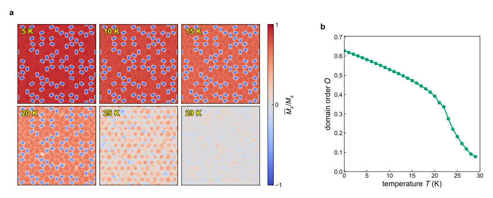
<figcaption class="paper-figure-caption"><b>Fig 5.</b> FIG. 4. Thermal robustness and melting of the chaotically selected moir´e domain pattern. a, Time-averaged top- layer magnetization M z/Ms [Eq. (6)], averaged over the steady-state window t ∈[1, 2] ns after discarding the ∼1 ns nucleation transient, at representative temperatures T = 5, 10, 15, 20, 25, and 29 K, obtained by heating a single chaotically selected configuration from T = 0. The reversed domains (mz ≈−1, blue) remain sharply resolved up to ∼20 K and progressively dissolve into the ferromagnetic background (mz ≈+1, red) at higher temperature. b, Domain order O versus temperature. O stays close to its T = 0 value (≈0.63) below ∼10 K, where the chaotically selected pattern is...</figcaption>
</figure>

**Summary.** This work investigates 'moiré magnetic chaos' in twisted bilayer CrI3, demonstrating that the inherent interlayer exchange frustration generates chaotic dynamics without external driving. Using micromagnetic simulations, the authors quantify this chaos via Lyapunov exponents and analyze the resulting domain patterns, showing they are statistically random yet governed by underlying topological constraints.

**Why it may be interesting.** The study bridges concepts from nonlinear dynamics (chaos theory) into condensed matter magnetism, providing a concrete physical realization of autonomous chaos in a solid-state system, which is highly relevant for understanding complex magnetic switching and memory effects.

Detailed structure

**Main problem.** To demonstrate a new type of magnetic chaos, termed 'moiré magnetic chaos,' arising from mesoscopic domain variables in twisted bilayer CrI3 without external driving.

**Main result.** The system exhibits intrinsic, undriven chaos characterized by extreme sensitivity to initial conditions and stochastic domain configurations due to interlayer exchange frustration. This identifies a microscopic mechanism for nonlinear magnetism beyond conventional driven regimes.

**Method.** Micromagnetic simulations are used extensively, employing techniques like calculating finite-time Lyapunov exponents, analyzing damage spreading from perturbations, and performing statistical ensemble characterization.

**Model / system.** The system is twisted bilayer CrI3, modeled by a Heisenberg spin Hamiltonian incorporating interlayer exchange coupling ($J_{	ext{inter}}$). The moiré superlattice structure creates regions of frustration (AFM patches) that provide multiple dynamical degrees of freedom necessary for autonomous chaos.

**Key observables.** Finite-time Lyapunov exponents ($\lambda$), Hamming Fraction ($H/N_d$), Shannon entropy ($\langle H_n 
angle$), and topological charge ($Q$) of reversed domains.

**Important parameters / regimes.** Twist angle ($	heta = 1.61^\circ$); characteristic energy gap $\Delta E/|E| \approx 1.8 	imes 10^{-4}$; Lyapunov exponent scales (e.g., $9 	ext{ ns}^{-1}$ vs. $290.8 	ext{ ns}^{-1}$).

**Assumptions / limitations.** The analysis assumes weak coupling between neighboring AFM patches, allowing for quasi-independent polarization selection in each patch; the chaotic behavior is understood as transient sensitivity rather than sustained attractor dynamics.

**Figures summary.** Figures illustrate interlayer exchange maps showing FM/AFM patterns (Fig. 1a), representative metastable domain configurations (Fig. 1b), damage spreading evolution ($\delta m(t)$) confirming chaos, and topological charge distributions classifying domains as skyrmion-like or bubble-like.

**Paper structure.** The paper progresses from establishing the physical platform (twisted CrI3) and the mechanism for frustration to quantifying chaos using Lyapunov exponents and perturbation analysis. It then characterizes the resulting domain states statistically (entropy, correlations) and topologically (skyrmions vs. bubbles), concluding with a refined understanding of transient versus sustained chaotic dynamics.

Abstract

The study of magnetic chaos has traditionally focused on macroscopic variables under external driving. Here we demonstrate a new type of magnetic chaos, termed moiré magnetic chaos, associated with mesoscopic magnetic domain variables in twisted bilayer CrI3 without external driving. The domains are stabilized by a characteristic interlayer exchange frustration, which supplies the multiple dynamical degrees of freedom required for autonomous chaos. Through micromagnetic simulations, we show that relaxation toward moiré magnetic textures is extremely sensitive to minute local perturbations of the initial state, characterized by substantial finite-time Lyapunov exponents and a final-state sensitivity that persists over five decades of perturbation amplitude. Statistical analysis further reveals that the resulting domain configurations are stochastic and pairwise uncorrelated. Our results identify a form of microscopic, undriven chaos in twisted magnets that extends nonlinear magnetism beyond the conventional driven regime.

[↑ back to top](#top)

### [Adiabatic perturbation theory of energy transfer and charge transport in condensed matter](http://arxiv.org/abs/2608.13066v1)

**Authors:** Ryan Requist, Fran Dabo  
**Type:** theory · **Category:** other · **PDF:** <https://arxiv.org/pdf/2608.13066v1>  
**Analysis basis:** full PDF text, analyzed in chunks
**Topic relevance:** `Keldysh / 2PI / non-Gaussian methods` **3/5** · `methods for driven-dissipative` **3/5** · `correlated / nonlocal dissipation` **1/5** · `quantum measurements` **1/5**

↔ Scroll figures horizontally

<figure class="paper-figure-card">
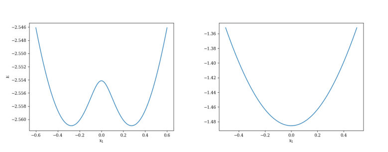
<figcaption class="paper-figure-caption"><b>Fig 1.</b> FIG. 1. Ground state potential energy surfaces along coordinate x1 for systems with Ne = 4 and Ne = 6 electrons. (a) For Ne = 4, N = 4, and z = 1.1 the potential energy surface has a maximum at the high symmetry point and two degenerate minima corresponding to dimerized configurations. (b) For Ne = 6, N = 4, and z = 1.5, the potential energy surface has a single minimum at the high symmetry point. The other parameters are kmax = 8 and ϵ = 1/2000.</figcaption>
</figure>
<figure class="paper-figure-card">
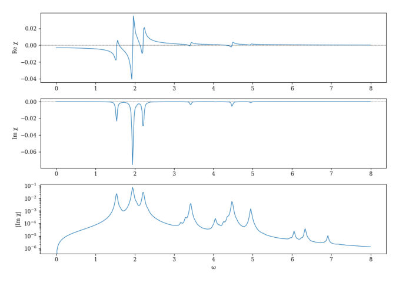
<figcaption class="paper-figure-caption"><b>Fig 2.</b> FIG. 2. The frequency dependence of the response function χjpjp(ω) with η = 0.02 for the model of Sec. V with 6 electrons and 4 ions and parameters kmax = νmax = 3, ϵ = 1/2000 and z = 1.5.</figcaption>
</figure>
<figure class="paper-figure-card">
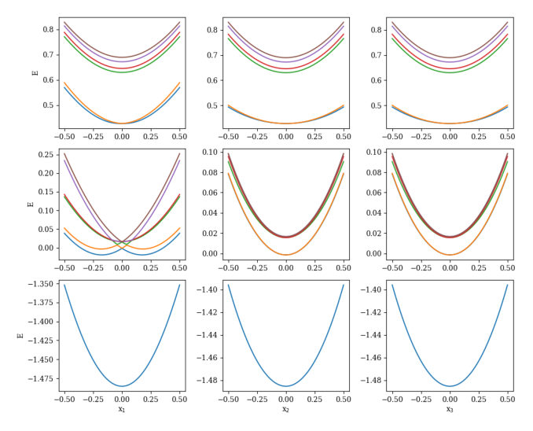
<figcaption class="paper-figure-caption"><b>Fig 3.</b> FIG. 3. The first 14 potential energy surfaces for the model of Sec. V with 6 electrons and 4 ions as functions of the ionic vibrational coordinates; parameters kmax = 8, ϵ = 1/2000 and z = 1.5.</figcaption>
</figure>
<figure class="paper-figure-card">
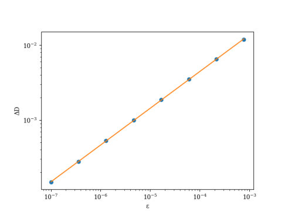
<figcaption class="paper-figure-caption"><b>Fig 4.</b> FIG. 4. The difference of Drude weights for the full electron-ion system and for the electron-only system. Drude weights were calculated using Kohn’s formula for the model of Sec. V with six electrons and four ions and parameters kmax = νmax = 3 and z = 1.5. The figure shows the error caused by neglecting the ionic degrees of freedom. The linear fit to the data is −0.89 + 0.49 ln ϵ.</figcaption>
</figure>

**Summary.** This paper introduces Adiabatic Perturbation Theory (APT) to accurately model energy and charge transfer in electron-ion systems. It systematically derives corrections beyond the standard Born-Oppenheimer approximation by treating the small parameter $\epsilon$ (electron-to-nucleus mass ratio) perturbatively. The resulting framework allows for calculating advanced transport properties like nonadiabatic conductivity with controlled accuracy.

**Why it may be interesting.** This work provides rigorous, high-order theoretical tools for treating nonadiabatic coupling effects in condensed matter systems, which is crucial for understanding energy and charge flow where electronic and nuclear motions are strongly coupled.

Detailed structure

**Main problem.** The core problem is quantifying energy transfer and charge transport in condensed matter systems with controlled accuracy concerning the adiabatic small parameter ($\epsilon$, the electron-to-nucleus mass ratio). This requires going beyond standard approximations like the harmonic approximation.

**Main result.** The authors develop Adiabatic Perturbation Theory (APT) to systematically derive effective Hamiltonians and calculate nonadiabatic corrections to transport properties, such as frequency-dependent conductivity and Drude weight, to any desired order in $\epsilon$.

**Method.** The primary method is Adiabatic Perturbation Theory (APT), which treats the electron-ion Schrödinger equation as a singularly perturbed differential equation in $\epsilon$ by employing near-identity unitary transformations to decouple electronic and nuclear degrees of freedom.

**Model / system.** The model is an electron-ion system described by a full nonrelativistic Hamiltonian. The theory analyzes how coupling between fast electronic motion and slow, heavy ionic motion (nuclei) affects transport properties.

**Key observables.** Rate of change of the nuclear kinetic energy (energy transfer formula), nonadiabatic frequency-dependent conductivity, and Drude weight.

**Important parameters / regimes.** The adiabatic small parameter $\epsilon$ (electron-to-nucleus mass ratio); the bare nuclear mass tensor $M_0$.

**Assumptions / limitations.** The theory systematically improves upon approximations by controlling errors in powers of $\epsilon$, avoiding assumptions inherent to the harmonic approximation or standard Born-Oppenheimer treatments.

**Paper structure.** The paper builds from identifying the failure points of simpler models (like the Harmonic Approximation) to introducing APT as a systematic, order-by-order expansion in $\epsilon$ via unitary transformations to derive an effective Hamiltonian for transport calculations.

Abstract

Energy and charge transfer in condensed matter systems are often described in terms of quasiparticles. The order of accuracy of the results in terms of the electron-to-nucleus mass ratio $ε$, an adiabatic small parameter, is usually not known. To quantify energy transfer with controlled accuracy in $ε$, we use adiabatic perturbation theory to derive a formula for the rate of change of the nuclear kinetic energy. Applying a sequence of near-identity unitary transformations decouples the electronic and nuclear degrees of freedom to higher and higher order and produces an effective Hamiltonian. In the special case that the nuclei are treated classically, the energy transfer formula reduces to the usual formula for the rate of work done on a classical particle but the mass of the particle is enhanced by the factor $M_0^{-1}(M_0+εM_1)$, where $M_1$ is a nonadiabatic correction to the bare nuclear mass tensor $M_0$. Additional quantum geometric corrections appear at higher orders. Adiabatic perturbation theory is further used to incorporate, order-by-order in $ε$, nonadiabatic transitions into linear response calculations. The nonadiabatic frequency-dependent conductivity and Drude weight of an electron-ion system are calculated.

[↑ back to top](#top)

### [Emergent trans-moiré orbitals and topology in rhombohedral graphene](http://arxiv.org/abs/2608.12478v1)

**Authors:** Yuqin Wang, Jian Xie, Yi-Jie Wang, Jiajun Zhang, Yiting Gao, Zaizhe Zhang, Da Yi, Yan Xie, Jingjing Shi, Guanqin Zhao, Chengyu Xiong, Kenji Watanabe, Takashi Taniguchi, Zhi-Da Song, Xiaobo Lu, Yi Chen  
**Type:** both · **Category:** strongly correlated electrons · **PDF:** <https://arxiv.org/pdf/2608.12478v1>  
**Analysis basis:** full PDF text, analyzed in chunks
**Topic relevance:** `analog quantum simulation` **3/5** · `quantum measurements` **2/5** · `Keldysh / 2PI / non-Gaussian methods` **1/5** · `driven-dissipative phase transition` **1/5** · `methods for driven-dissipative` **1/5**

↔ Scroll figures horizontally

<figure class="paper-figure-card">
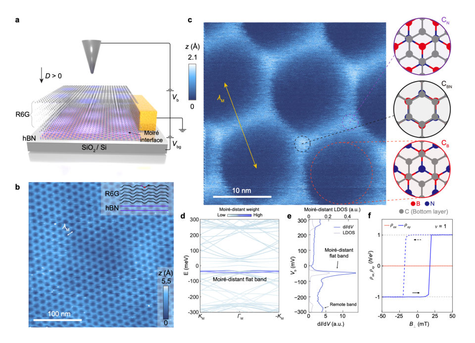
<figcaption class="paper-figure-caption"><b>Fig 1.</b> Fig. 1. Atomically resolved moiré structure in R6G/hBN. a, Schematic of our gate-tunable</figcaption>
</figure>
<figure class="paper-figure-card">
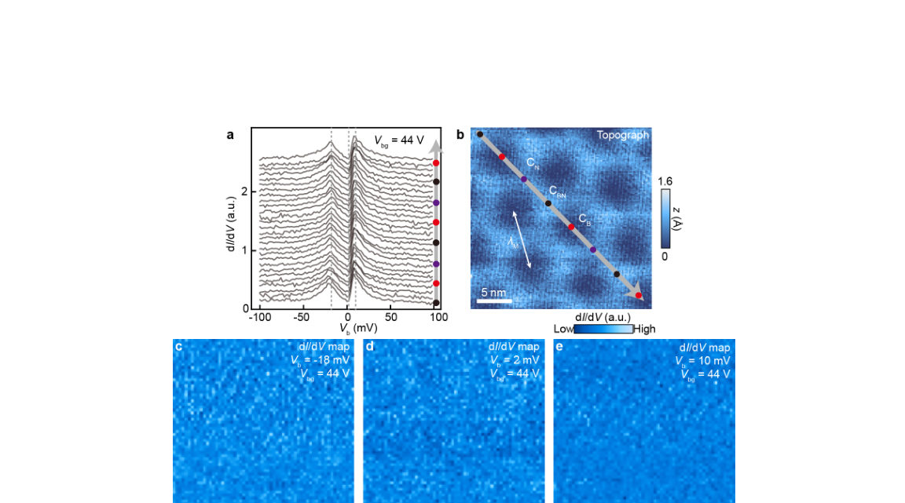
<figcaption class="paper-figure-caption"><b>Fig 2.</b> Fig. 2. Absence of moiré-distant electronic modulations in R6G/hBN D3 with θ = 1.40°. a,</figcaption>
</figure>
<figure class="paper-figure-card">
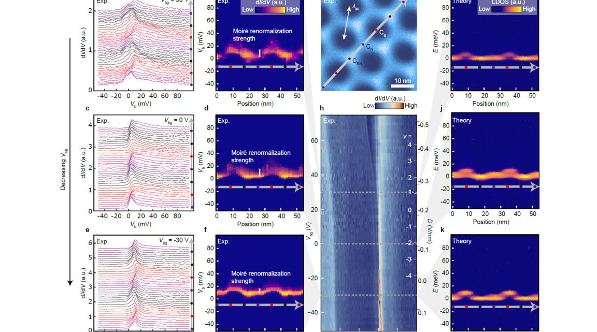
<figcaption class="paper-figure-caption"><b>Fig 3.</b> Fig. 3. Emergent flat-band renormalization in R6G/hBN D1 with θ = 0.28°. a, c &amp; e, Spatially</figcaption>
</figure>
<figure class="paper-figure-card">
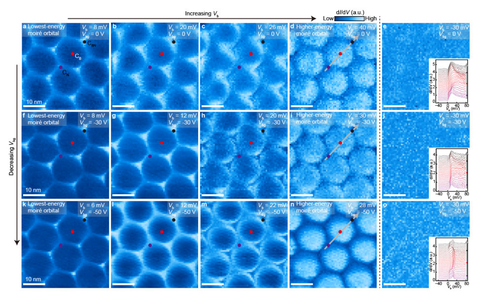
<figcaption class="paper-figure-caption"><b>Fig 4.</b> Fig. 4. Emergent trans-moiré orbitals in R6G/hBN D1 with θ = 0.28°, all taken in the same</figcaption>
</figure>
<figure class="paper-figure-card">
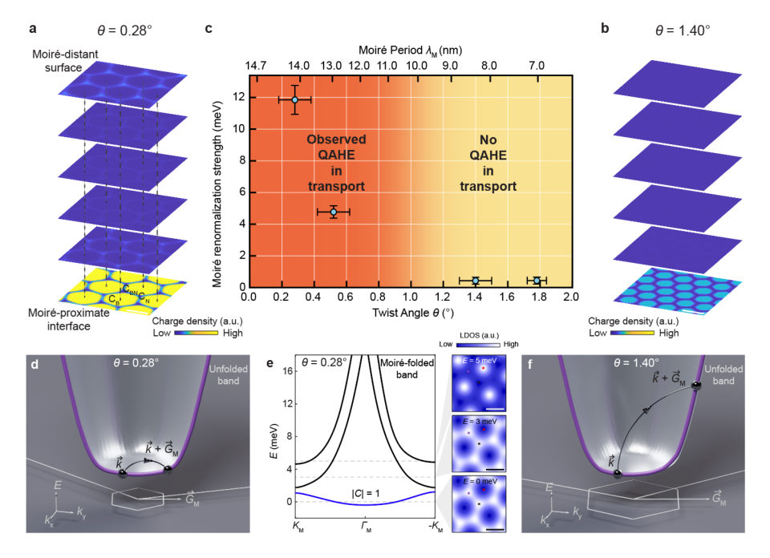
<figcaption class="paper-figure-caption"><b>Fig 5.</b> Fig. 5. Mechanism of trans-moiré-orbital and Chern-miniband formation at small θ. a-b,</figcaption>
</figure>

**Summary.** The paper reports the discovery of 'trans-moiré orbitals' in rhombohedral graphene/hBN moiré superlattices. These orbitals emerge on the side distant from the primary moiré interface and are responsible for stabilizing topological features like the FQAHE. The findings resolve a long-standing paradox by showing that electron interactions force the system into these specific, topologically active orbital states.

**Why it may be interesting.** This work directly addresses emergent topological phases in moiré systems using spectroscopic measurements, which is highly relevant for understanding correlated electron behavior in engineered quantum materials.

Detailed structure

**Main problem.** The study aims to resolve the microscopic mechanism behind the Fractional Quantum Anomalous Hall Effect (FQAHE) in rhombohedral graphene moiré superlattices, specifically addressing the paradox of observing a small-twist-angle interface only when electrons are kept distant from it.

**Main result.** The authors discovered emergent 'trans-moiré orbitals' on the moiré-distant surface, which enforce moiré periodicity and vanish at critical twist angles ($	heta \sim 1^\circ$), providing a microscopic explanation for the topological effects observed.

**Method.** The research combines Scanning Tunneling Microscopy/Spectroscopy (STM/STS) measurements with self-consistent mean-field calculations to map out the electronic structure reshaping.

**Model / system.** The physical system is rhombohedral hexalayer graphene ($	ext{R6G}$) stacked on hexagonal boron nitride ($	ext{hBN}$), forming a moiré superlattice. The electronic properties are tuned by gate voltage and controlled by the moiré twist angle ($	heta$).

**Key observables.** Trans-moiré orbitals (e.g., hollow-cage shape), flat-band renormalization strength, Chern minibands, and quantized Hall plateaus.

**Important parameters / regimes.** Moiré twist angle ($	heta$), filling factor ($v$), and gate voltage ($V_{	ext{bg}}$).

**Assumptions / limitations.** The mechanism is attributed to an interaction-driven charge-redistribution across layers, forcing electrons into these topological orbitals.

**Figures summary.** Figures illustrate STM topographies and dI/dV spectra showing moiré renormalization on the distant surface for small $	heta$, contrasting with null results at large $	heta$. Simulations map these emergent orbitals to theoretical Chern minibands.

**Paper structure.** The paper establishes the problem (FQAHE mechanism), presents experimental evidence via STM mapping of trans-moiré orbitals under specific twist angles, explains this emergence through interaction-driven charge redistribution, and concludes by linking this finding to a general platform for synthetic FQAHE realization.

Abstract

The fractional quantum anomalous Hall effect (FQAHE) exhibited in fractional Chern insulators has recently been demonstrated in twisted MoTe2 and rhombohedral graphene/hBN moiré superlattices, promising new routes toward topological quantum computation. Central to realizing this promise is the understanding of the underlying microscopic mechanism. This, however, remains elusive in the case of rhombohedral graphene, with the crux being its two seemingly paradoxical conditions: a pronounced small-twist-angle (θ) moiré interface, yet only when electrons are kept distant from it. Here, by scanning tunnelling microscopic imaging with both conditions fulfilled, we capture dramatic electronic structure reshaping in rhombohedral hexalayer graphene by unforeseen 'trans-moiré orbitals', which emerge on the other, distant side of the moiré interface but nevertheless enforce the moiré periodicity at all measured fillings. We visualize a hierarchy of spatially and energetically distinct trans-moiré orbitals which doped electrons must sequentially occupy--the lowest-energy orbital, expectedly responsible for the FQAHE at small fillings, carries a hollow-cage-like shape. Remarkably, these trans-moiré orbitals vanish at θ {\gtrsim} 1°, and so do QAHE plateaus in similar devices. Simulations reveal an interaction-driven charge-redistribution mechanism which shapes the trans-moiré orbitals and corresponding Chern minibands. With our findings providing the missing microscopic link, the paradoxical conditions find a natural explanation: electrons are not simply kept distant from a small-θ moiré interface; they are forced into topological trans-moiré orbitals, forged precisely under such conditions. Our microscopic diagnostics unlocks a wide range of possible 'synthetic' FQAHE platforms.

[↑ back to top](#top)

### [Phase Space Reorganization and Travelling Wave Emergence Driven by Non-Kerr Effects in Nonparaxial Optical Media](http://arxiv.org/abs/2608.12856v1)

**Authors:** Naresh Saha, Nirmoy Kumar Das, Ashoke Das, Arnob Ray  
**Type:** theory · **Category:** other · **PDF:** <https://arxiv.org/pdf/2608.12856v1>  
**Analysis basis:** full PDF text, analyzed in chunks
**Topic relevance:** `driven-dissipative phase transition` **2/5** · `non-equilibrium universality` **2/5** · `Frenkel-Kontorova` **1/5** · `Keldysh / 2PI / non-Gaussian methods` **1/5** · `methods for driven-dissipative` **1/5**

↔ Scroll figures horizontally

<figure class="paper-figure-card">
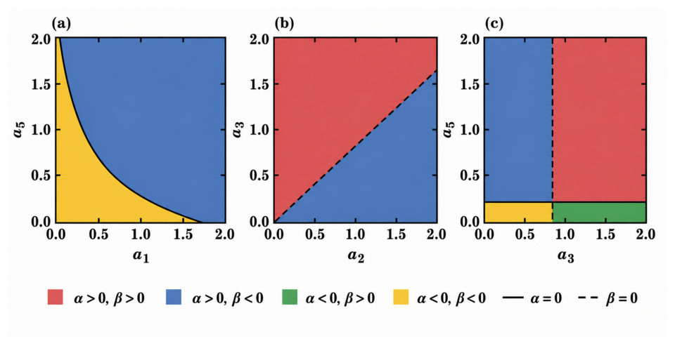
<figcaption class="paper-figure-caption"><b>Fig 1.</b> Figure 1: Parameter space diagrams illustrating the influence of the physical coefficients on the reduced Hamiltonian dynamics.</figcaption>
</figure>
<figure class="paper-figure-card">
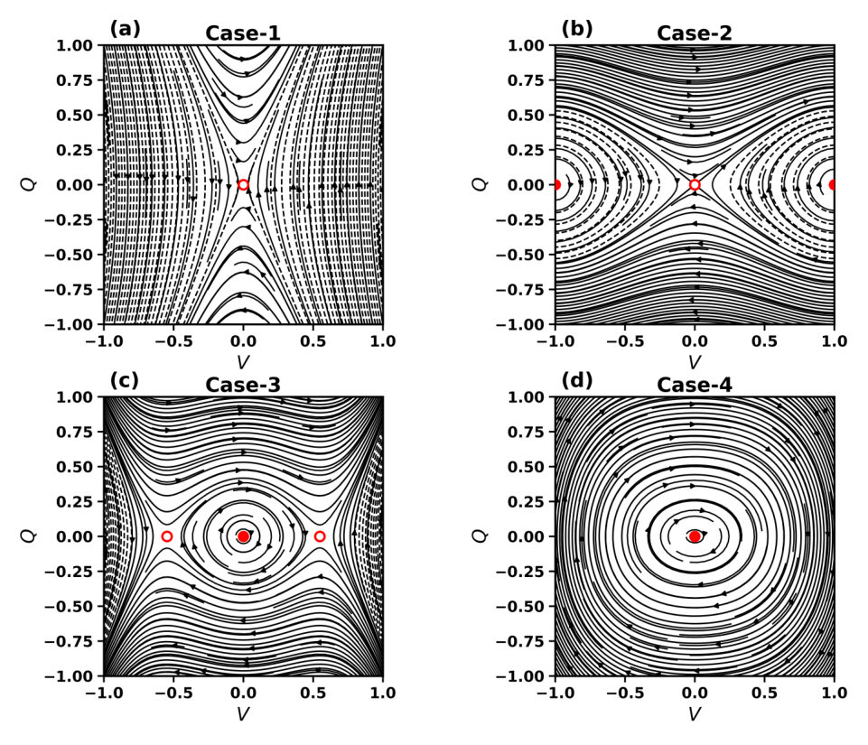
<figcaption class="paper-figure-caption"><b>Fig 2.</b> Figure 2: Representative phase portraits of the reduced planar system Eq. (6) for four sign combinations of (α, β). Each trajectory lies on an invariant Hamiltonian level set H(V, Q) = h. Saddles (red open circle) generate separatrices and organize global transitions between orbit classes, whereas centers (red filled circle) are surrounded by closed invariant curves corresponding to bounded oscillatory wave states. The representative reduced parameters are (a) α = 5.45, β = 0.4; (b) α = 0.64, β = −0.64; (c) α = −0.952, β = 3.17; (d) α = −0.55, β = −1.2.</figcaption>
</figure>
<figure class="paper-figure-card">
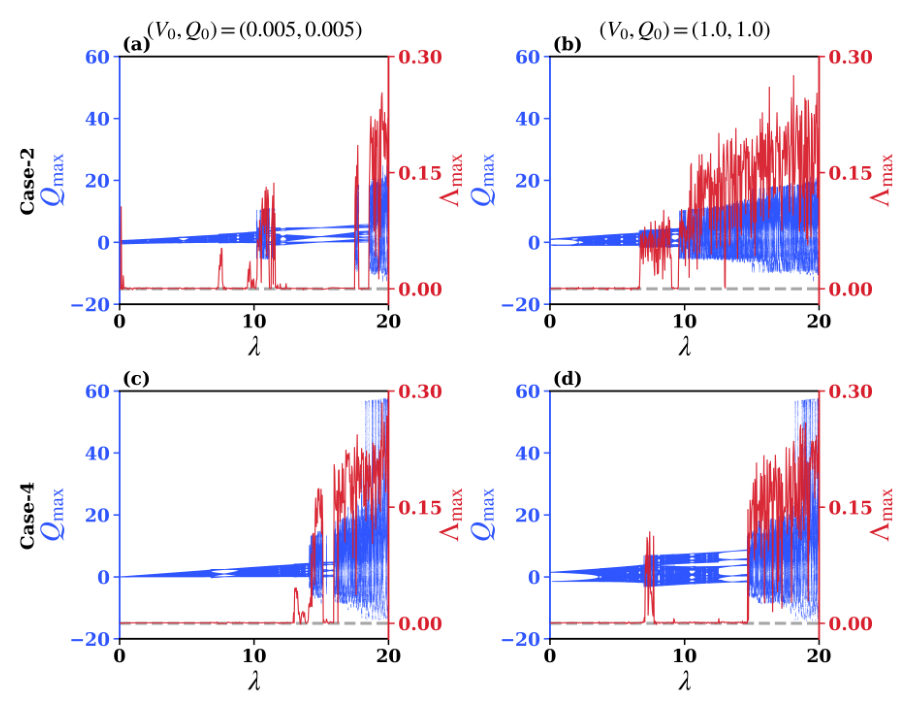
<figcaption class="paper-figure-caption"><b>Fig 3.</b> Figure 3: Bifurcation diagrams and largest Lyapunov exponent of the forced reduced system. Peak values Qmax (blue) and largest Lyapunov exponent Λmax (red) are plotted as a function of forcing amplitude λ for two representative unforced regimes, Case 2 (α = 0.64, β = −0.64, panels (a, b) and Case 4 (α = −0.55, β = −1.2, panels (c, d), with forcing frequency Γ = 2π. Panels (a, c) use the initial condition (V0, Q0) = (0.005, 0.005), while panels (b, d) use (V0, Q0) = (1.0, 1.0). The transition between regular quasiperiodic motion and irregular chaotic dynamics is identified in the bifurcation structure and confirmed by the largest Lyapunov exponent.</figcaption>
</figure>
<figure class="paper-figure-card">
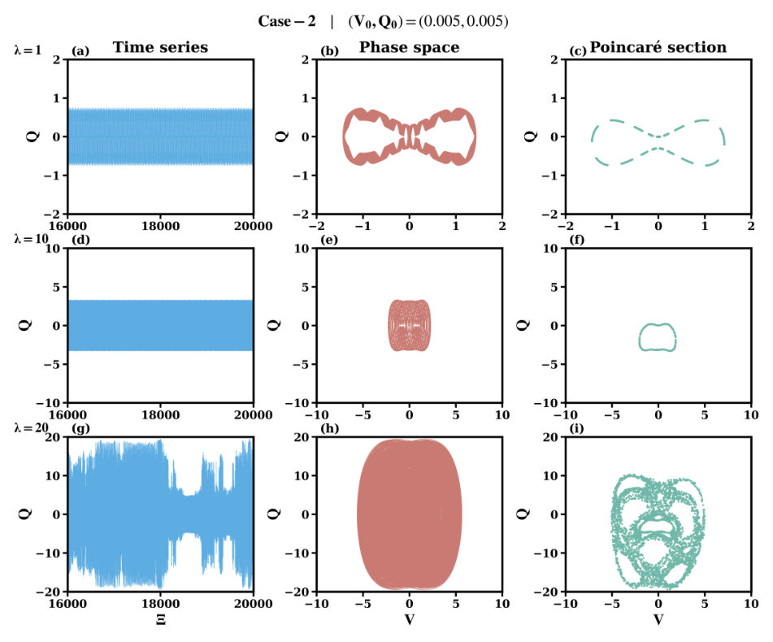
<figcaption class="paper-figure-caption"><b>Fig 4.</b> Figure 4: Panels (a), (d), and (g) show the time evolution of Q(Ξ), panels (b), (e), and (h) present the corresponding phase space projections onto the (V, Q) plane, and panels (c), (f), and (i) display the associated stroboscopic Poincaré sections. The upper, middle, and lower rows correspond to λ = 1, 10, and 20, respectively, with α = 0.64, β = −0.64, and Γ = 2π. The initial condition is (V0, Q0) = (0.005, 0.005). At low forcing amplitudes, the response remains bounded and smoothly modulated, with the phase space projections forming coherent torus-like bands. As the forcing strength increases, the oscillations become progressively irregular and the projected trajectories spread over a...</figcaption>
</figure>
<figure class="paper-figure-card">
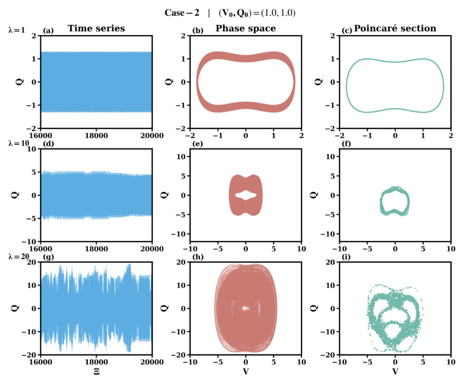
<figcaption class="paper-figure-caption"><b>Fig 5.</b> Figure 5: Panels (a), (d), and (g) show the time evolution of Q(Ξ), panels (b), (e), and (h) present the corresponding phase space projections onto the (V, Q) plane, and panels (c), (f), and (i) display the associated stroboscopic Poincaré sections. The upper, middle, and lower rows correspond to λ = 1, 10, and 20, respectively, with α = 0.64, β = −0.64, and Γ = 2π. The initial condition is (V0, Q0) = (1, 1). The same qualitative progression from regular to increasingly irregular forced dynamics is observed, although the amplitude range and geometric spread differ from Fig. 4, reflecting the influence of the initial location relative to the underlying center–saddle–center structure of the...</figcaption>
</figure>

**Summary.** This paper analyzes pulse propagation in nonparaxial optical media by reducing the governing equation to a Hamiltonian system. It demonstrates that incorporating non-Kerr nonlinearities (Self Steepening and Self Frequency Shift) fundamentally alters the phase space structure of the traveling waves. Furthermore, it characterizes the transition from regular to chaotic wave dynamics when the system is subjected to external periodic forcing.

**Why it may be interesting.** This work applies advanced dynamical systems tools (Hamiltonian mechanics, bifurcation theory) to model complex wave phenomena in nonlinear optics, providing a rigorous mathematical framework for understanding how higher-order physical effects alter stable wave solutions.

Detailed structure

**Main problem.** The study investigates how non-Kerr nonlinear effects, specifically self steepening (SS) and self frequency shift (SFS), fundamentally reorganize the phase space geometry and traveling wave structure in nonparaxial optical media.

**Main result.** These non-Kerr effects reshape the underlying Hamiltonian dynamics; SS directly renormalizes the effective nonlinearity, while SFS constrains the admissible real travelling wave manifold. The system can also exhibit complex quasiperiodic or chaotic responses under external forcing.

**Method.** The analysis involves reducing the nonlinear Helmholtz equation via a traveling wave ansatz to a planar Hamiltonian dynamical system. This is followed by phase space analysis, bifurcation theory for forced systems, and chaos diagnostics like Lyapunov exponents.

**Model / system.** The model is based on the Nonlinear Helmholtz Equation (NLH) describing pulse propagation in nonparaxial optical media. The dynamics are reduced to a conservative Hamiltonian $H(V, Q)$ governing the envelope amplitude $V$ and its derivative $Q$.

**Key observables.** Localized/periodic wave existence, phase space geometry (separatrices, equilibria), Largest Lyapunov Exponent ($\Lambda_{\max}$), and Poincaré section structure.

**Important parameters / regimes.** The effective nonlinear coefficients $\alpha$ and $eta$, which depend on physical parameters like dispersion, nonparaxiality, Kerr nonlinearity, SS, and SFS terms.

**Assumptions / limitations.** The analysis relies on applying a symmetry-guided traveling wave ansatz to reduce the NLH equation to a planar Hamiltonian system. The study also examines periodically forced extensions of this reduced system.

**Figures summary.** Figures illustrate parameter space diagrams showing how varying physical coefficients determine the signs of the effective nonlinear coefficients $\alpha$ and $eta$, which govern the phase plane topology.

**Paper structure.** The paper first establishes the reduction to a Hamiltonian system using traveling wave transformations. It then analyzes the resulting planar dynamics via equilibrium point classification and phase space analysis, detailing how SS and SFS modify the conserved Hamiltonian structure. Finally, it extends this analysis to periodically forced systems, employing Lyapunov exponents and Poincaré sections to map out transitions to chaos.

Abstract

In this article, the nonlinear Helmholtz equation with non-Kerr nonlinearity, such as self steepening and self frequency shift, is considered. A travelling wave transformation is applied, and the extended nonlinear Helmholtz equation is reduced to a Hamiltonian dynamical system. Then, the reduced Hamiltonian system is analyzed by classification of equilibrium points, phase space analysis, and the construction of exact wave solutions. The relationship between the reduced dynamical coefficients and the original physical parameters is further established through a parameter space analysis. It is shown that self steepening directly modifies the reduced dynamics, whereas self frequency shift acts through the compatibility condition for the real travelling wave reduction. Together, these non-Kerr effects reshape the phase space geometry and travelling wave structure. Localized and periodic travelling waves are obtained, with their existence determined by the balance among dispersion, nonparaxiality, Kerr nonlinearity, and non-Kerr effects. Furthermore, a periodically forced version of the reduced system is examined to study the transition from regular to irregular dynamics. It has been observed that external forcing can induce complex oscillatory behavior. Bifurcation analysis, time series evolution, phase space analysis, largest Lyapunov exponent, and Poincaré section demonstrate the emergence of quasiperiodic and chaotic responses under sufficiently strong forcing. All analytical branches are verified through full-equation residual evaluation, while a few selected branches are additionally examined through direct numerical propagation and robustness tests under complex Gaussian perturbations. The results show that self steepening directly renormalizes the effective nonlinear dynamics, whereas self frequency shift restricts the admissible real-envelope travelling wave manifold.

[↑ back to top](#top)

### [Topological Superconductors in Doubly-Coupled Nanowires with Altermagnetism](http://arxiv.org/abs/2608.13265v1)

**Authors:** Hongfa Pan, Haoyang Wang, Wenguang Zhu, Zhenhua Qiao  
**Type:** theory · **Category:** other · **PDF:** <https://arxiv.org/pdf/2608.13265v1>  
**Analysis basis:** full PDF text, analyzed in chunks
**Topic relevance:** `Keldysh / 2PI / non-Gaussian methods` **1/5** · `analog quantum simulation` **1/5** · `quantum measurements` **1/5**

↔ Scroll figures horizontally

<figure class="paper-figure-card">
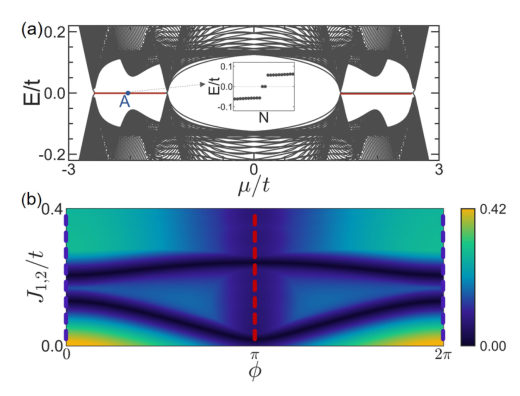
<figcaption class="paper-figure-caption"><b>Fig 1.</b> FIG. 2: (a) Energy eigenvalues as a function of chemical potential µ. Point A marks a twofold-degenerate zero-energy state, with an inset showing the eigenvalue distribution near zero energy. (b) Phase diagram in the plane of phase difference φ vs altermagnetism J1,2. Parameters are set to be t = 1, α1,2 = 0.35, ∆1 = 0.3, ∆2 = 0.15, t0 = 0.25. Additional parameters: (a) J1,2 = 0.2, φ = 0.6π, and nanowire length Nw = 200; (b) µ = −2. .</figcaption>
</figure>
<figure class="paper-figure-card">
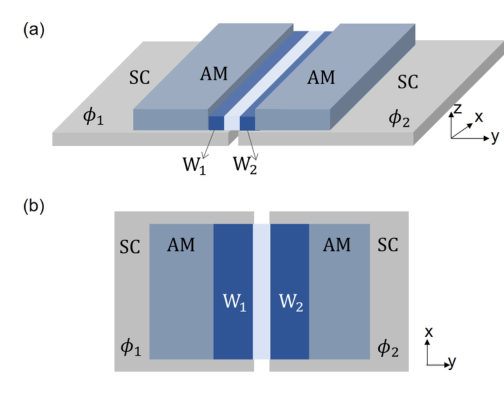
<figcaption class="paper-figure-caption"><b>Fig 2.</b> FIG. 1: (a) Side-view and (b) top-view schematics of the doubly-coupled semiconducting nanowire platform with inter-wire coupling. Two superconducting (SC) regions exhibit superconducting phases φ1 and φ2, and two altermagnetic (AM) regions are labeled accordingly. .</figcaption>
</figure>
<figure class="paper-figure-card">
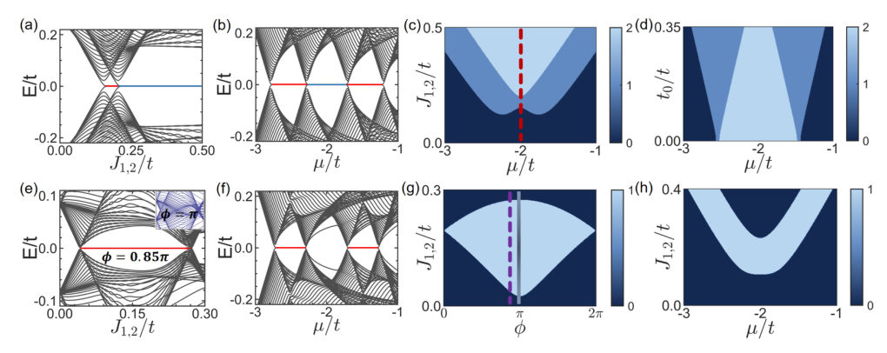
<figcaption class="paper-figure-caption"><b>Fig 3.</b> FIG. 3: (a)-(d) BDI TSCs with φ = 0: (a) Energy eigenvalues as a function of altermagnetism J1,2. (b) Energy eigenvalues as a function of the chemical potential µ. (c) The phase diagram as the function of µ and J1,2. (d) The phase diagram as the function of µ and t0. Parameters used in all calculations: t = 1, α1,2 = 0.35, ∆1 = 0.3, ∆2 = 0.2. Additional parameters: (a) µ = −2, t0 = 0.25 and nanowire length Nw = 100. (b) J1,2 = 0.3, t0 = 0.25 and nanowire length Nw = 100. (c) t0 = 0.25; (d) J1,2 = 0.3. (e)-(h) BDI TSCs with φ ̸= mπ (m = 0, 1, 2): (e) Energy eigenvalues as a function of the altermagnetism J1,2. (f) Energy eigenvalues as a function of the chemical potential µ. (g) Phase...</figcaption>
</figure>
<figure class="paper-figure-card">
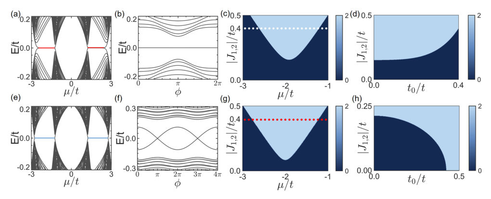
<figcaption class="paper-figure-caption"><b>Fig 4.</b> FIG. 4: (a)-(d) spin-group symmetry protected TSCs: (a) Energy eigenvalues as a function of the chemical potential µ. (b) Energy eigenvalues as a function of the phase difference φ. (c) Phase diagram as a function of µ and J1,2. (d) Phase diagram as a function of t0 and J1,2. Parameters used in all calculations: t = 1 and ∆1,2 = 0.3. Additional parameters: (a) α1,2 = 0.35, J1,2 = ±0.4, t0 = 0.2, φ = 0 and nanowire length Nw = 100; (b) µ = −2 and the other fixed parameters are same as those in (a); (c) J1 = −J2 and the fixed parameters are same as those in (a); (d) J1 = −J2, α1,2 = 0.3, µ = −2 and φ = 0. (e)-(h) Magnetic point-group symmetry protected TSCs: (e) Energy eigenvalues as a function...</figcaption>
</figure>

**Summary.** This paper theoretically explores engineering topological superconductors in doubly-coupled nanowires that combine proximity superconductivity and altermagnetism. By tuning parameters like the superconducting phase difference ($\varphi$) and magnetic couplings ($J_{1,2}$), the authors demonstrate the realization of multiple robust TSC phases, including those hosting protected Majorana zero modes. This work provides a versatile platform for designing topological quantum materials.

**Why it may be interesting.** This work provides a concrete theoretical blueprint for realizing exotic superconducting states by combining magnetic order (altermagnetism) with superconductivity in low-dimensional structures, which is highly relevant to condensed matter theory involving symmetry protection.

Detailed structure

**Main problem.** The study theoretically investigates how topological superconductivity (TSC) can be engineered in a novel platform: doubly-coupled nanowires that integrate proximity-induced superconductivity and altermagnetism.

**Main result.** The system was shown to host four distinct TSC phases, including classes D and BDI, with the ability to realize robust Majorana zero modes protected by specific spin-group or magnetic point-group symmetries.

**Method.** The analysis uses a tight-binding model Hamiltonian solved via Bogoliubov–de Gennes formalism in momentum space, characterizing topological states using symmetry classes and winding numbers.

**Model / system.** The physical system is a doubly-coupled semiconducting nanowire platform incorporating superconducting (SC) regions and altermagnetic (AM) regions. The model Hamiltonian $H = H_{w1} + H_{w2} + H_{int}$ describes the coupled two-band superconductor.

**Key observables.** Topological phase transitions marked by bulk gap closing, the presence of Majorana zero modes (MZMs) at boundaries, and the topological invariant Z.

**Important parameters / regimes.** Tunable parameters include the superconducting phase difference ($\varphi$), inter-wire coupling ($t_0$), chemical potential ($\mu$), and altermagnetism strengths ($J_{1,2}$).

**Assumptions / limitations.** The analysis assumes proximity coupling to superconductors and altermagnets, and relies on controlling multiple symmetry parameters.

**Figures summary.** Figures illustrate schematics of the coupled nanowire platform, energy eigenvalues showing zero-energy states (MZMs), and phase diagrams mapping out topological regimes based on $\varphi$ and $J_{1,2}$.

**Paper structure.** The paper progresses from identifying the physical challenge to deriving the Hamiltonian, analyzing how symmetry dictates the topological class (D vs BDI), and finally detailing the tunability of these phases using specific parameter controls.

Abstract

We theoretically investigate the possibility of engineering topological superconductivity in doubly coupled nanowires integrating proximity-induced superconductivity and altermagnetism. By tuning experimentally accessible parameters, we find four distinct topological superconducting phases: class D, class BDI, and two phases hosting two Majorana zero modes per end, protected respectively by spin-group and magnetic point-group symmetries. Beyond inheriting the advantages of alternating?magnetism induced topological superconductivity, our system provides multiple tuning knobs (e.g., superconducting phase difference and inter-wire coupling) to control topological properties.

[↑ back to top](#top)

### [Insight into SRF cavity performance from simulations of Nb's surface oxide dissolution and diffusion](http://arxiv.org/abs/2608.13540v1)

**Authors:** Ryan M. L. McFadden, Rowan Becker, Tobias Junginger  
**Type:** theory · **Category:** other · **PDF:** <https://arxiv.org/pdf/2608.13540v1>  
**Analysis basis:** full PDF text, analyzed in chunks
**Topic relevance:** `Keldysh / 2PI / non-Gaussian methods` **1/5**

↔ Scroll figures horizontally

<figure class="paper-figure-card">
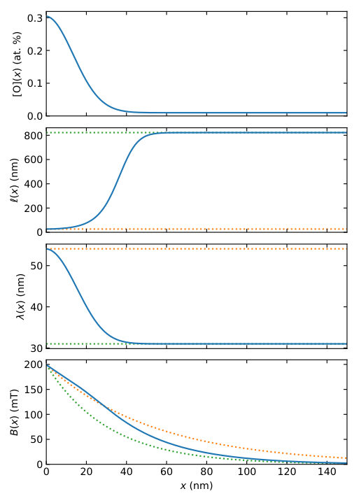
<figcaption class="paper-figure-caption"><b>Fig 1.</b> FIG. 1. Simulated oxygen defect profile [O] as a function of depth 𝑥for a vacuum annealing treatment at 125 ◦C for 8 h. The simulations and derived quantities make use of the parameters tabulated in Table I. The spatial form of the corresponding electron mean-free-path ℓ[Equa- tions (21) and (22)], magnetic penetration depth 𝜆[Equations (23) to (25)], and Meissner screening profile 𝐵(𝑥) [Equation (30)] are also shown, revealing surface-localized inhomogeneities resulting from [O](𝑥). For comparison, “clean” and “dirty” limits for the latter quantities, identified from ℓ’s asymptotic limits, are shown as dotted green and orange lines, respectively.</figcaption>
</figure>
<figure class="paper-figure-card">
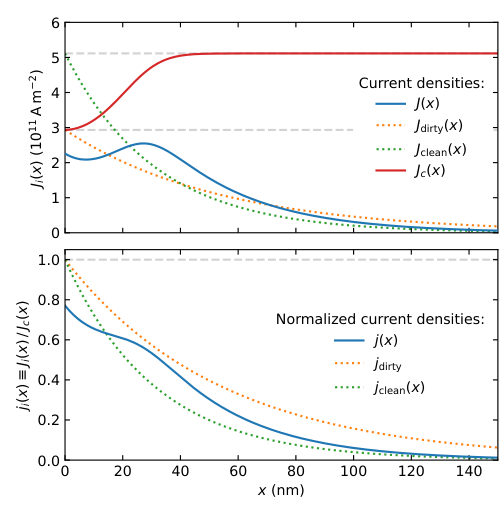
<figcaption class="paper-figure-caption"><b>Fig 2.</b> FIG. 2. Supercurrent density 𝐽as a function of depth 𝑥, derived from simulations of a vacuum annealing treatment at 125 ◦C for 8 h (see Figure 1) using Equation (31). For comparison, the spatial form for both “clean” and “dirty” limits are shown as dotted green and orange lines, respectively, as well as Nb’s critical current density 𝐽𝑐 [Equation (32)], which sets the limit for maintaining the Meissner state. Notice that this baking treatment modifies 𝐽so that its maximum coincides with the increase in 𝐽𝑐deeper below the surface. The fractional reduction in 𝐽relative to 𝐽𝑐, represented by the quantity 𝑗, is shown on the bottom panel to emphasize the benefit of the treatment.</figcaption>
</figure>
<figure class="paper-figure-card">
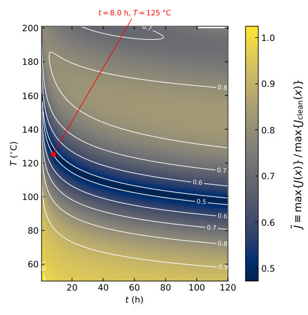
<figcaption class="paper-figure-caption"><b>Fig 3.</b> FIG. 3. Ratio of the maximum supercurrent density in treated Nb relative to its “clean” value ˜𝐽[Equation (33)], shown for different annealing temperatures 𝑇and times 𝑡. ˜𝐽varies strongly with 𝑡and 𝑇, revealing a “valley” where it is minimized. The position of the 8 h, 125 ◦C treatment used in Figures 1 and 2 is indicated, appearing near the bottom of the “valley.”</figcaption>
</figure>
<figure class="paper-figure-card">
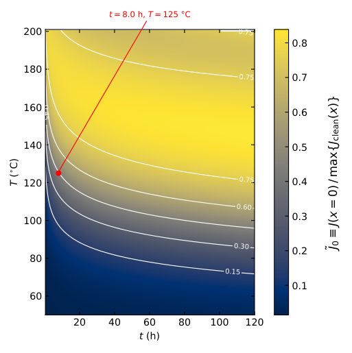
<figcaption class="paper-figure-caption"><b>Fig 4.</b> FIG. 4. Ratio of the maximum surface supercurrent density in treated Nb relative to its “clean” value ˜𝐽0 [Equation (34)], shown for different annealing temperatures 𝑇and times 𝑡. ˜𝐽0 varies systematically with 𝑡 and 𝑇, generally increasing for ascending 𝑡and 𝑇values. The position of the 8 h, 125 ◦C treatment used in Figures 1 and 2 is indicated.</figcaption>
</figure>
<figure class="paper-figure-card">
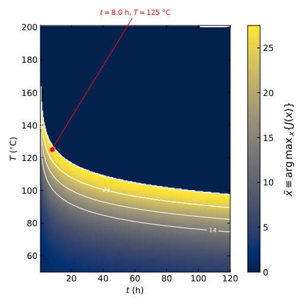
<figcaption class="paper-figure-caption"><b>Fig 5.</b> FIG. 5. Position of the maximum supercurrent density in treated Nb ˜𝑥[Equation (35)], shown for different annealing temperatures 𝑇 and times 𝑡. ˜𝑥varies strongly with 𝑡and 𝑇, revealing a “cliff” where it is maximized. The position of the 8 h, 125 ◦C treatment used in Figures 1 and 2 is indicated, appearing near the top of the “cliff”.</figcaption>
</figure>

**Summary.** The research simulates how oxygen diffusing into Niobium's surface layer during vacuum annealing affects its superconducting properties. By solving reaction-diffusion equations, the authors predict that this doping profile alters the magnetic screening current distribution. This establishes a quantitative framework linking controlled surface chemistry to the operational performance of critical SRF cavity components.

**Why it may be interesting.** This work provides a crucial quantitative bridge between solid-state chemistry (defect diffusion) and applied superconductivity physics relevant for accelerator technology, which is highly valuable for understanding material limitations in quantum hardware components.

Detailed structure

**Main problem.** The primary goal is to quantitatively link oxygen doping, resulting from surface oxide dissolution and diffusion in Niobium (Nb), to the superconducting performance of Nb Superconducting Radio Frequency (SRF) cavities.

**Main result.** Oxygen doping significantly modifies the near-surface current distribution by reducing the surface screening current and shifting its maximum several nanometers into the bulk material.

**Method.** The study uses numerical simulation of a 1D reaction-diffusion process, solving for oxygen concentration profiles over time and temperature ranges. These profiles are then used to calculate resulting superconducting properties like the Meissner screening current and critical supercurrent density.

**Model / system.** The physical system is Nb metal undergoing chemical doping by interstitial oxygen during vacuum annealing treatments. The modeling involves a reaction-diffusion equation coupled with electrodynamics (London/Ginzburg-Landau theory) to predict macroscopic superconducting response from microscopic defect profiles.

**Key observables.** Oxygen concentration profile [O](x, t), Meissner screening current distribution J(x), magnetic penetration depth $\lambda(T, x, B_0)$, and critical supercurrent density $J_c$.

**Important parameters / regimes.** Treatment temperatures ($50^\circ	ext{C}$ to $200^\circ	ext{C}$) and times ($0.5 	ext{h}$ to $120 	ext{h}$). The diffusion coefficient $D$ and rate constants follow Arrhenius dependencies.

**Assumptions / limitations.** The dissolution process is treated as irreversible, step-wise reactions, and the oxygen source term for diffusion is approximated as a localized surface plane source.

**Figures summary.** Figures illustrate simulated profiles of $[	ext{O}](x)$, $\ell$, $B(x)$, and $J(x)$ across various annealing times and temperatures, comparing results to idealized 'clean' and 'dirty' limits.

**Paper structure.** The paper follows a logical progression: first modeling the chemical process (dissolution via rate equations), then simulating the resulting diffusion profile using reaction-diffusion equations, and finally calculating the macroscopic electromagnetic response (Meissner screening/supercurrent) based on that profile.

Abstract

We report simulations of the dissolution and diffusion of Nb's surface oxide layer in vacuum. While this chemical doping process is important for the surface preparation of Nb superconducting radio frequency (SRF) cavities - common components of particle accelerators - quantitatively linking the resulting oxygen distributions to superconducting performance remains challenging. In this work, we simulate the reaction-diffusion process numerically for treatment temperatures $T = 50^{\circ}$C to $200^{\circ}$C and times $t = 0.5$ h to $120$ h, and calculate the effect of the spatially inhomogeneous oxygen doping on Nb's superconducting properties. We find that oxygen doping redistributes the Meissner screening current, reducing its value at the surface and shifting its maximum several nanometres into the material. These results provide a microscopic link between oxygen diffusion profiles and the electromagnetic response of Nb relevant for SRF cavity operation. This work provides a quantitative framework linking oxygen diffusion profiles to superconducting performance and establishes a foundation for future studies involving time-dependent and multi-step heat treatment protocols.

[↑ back to top](#top)

### Other secondary papers (1)

Show other secondary papers

### [Exploring the unknown territory of Dromions of (2+1) dimensional Generalized Nonlinear Schrodinger Equation](http://arxiv.org/abs/2608.13011v1)

**Authors:** C. Senthil Kumar, R. Radha  
**Type:** theory · **Category:** other · **PDF:** <https://arxiv.org/pdf/2608.13011v1>  
**Analysis basis:** full PDF text, analyzed in chunks

↔ Scroll figures horizontally

<figure class="paper-figure-card">
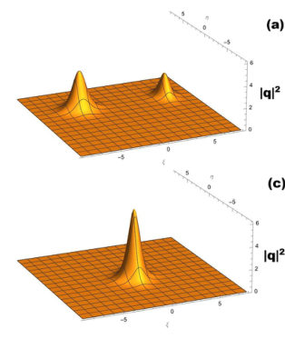
<figcaption class="paper-figure-caption"><b>Fig 1.</b> Fig. 1: Snapshots of two dromion solution at (a) t=-4 (b) t=-2 (c) t=0 (d) t=4 indicating a firewall at the boundary and reflection at the origin undergoing inelastic collision</figcaption>
</figure>
<figure class="paper-figure-card">
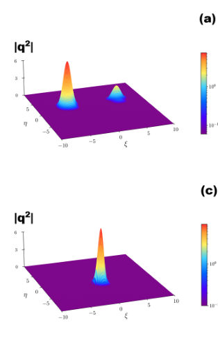
<figcaption class="paper-figure-caption"><b>Fig 2.</b> Fig. 2: Numerically simulated density profile of two dromions at (a) t=-4 (b) t=-2 (c) t=0 (d) t=4 indicating a firewall at the boundary and reflection at the origin besides undergoing inelastic collision</figcaption>
</figure>
<figure class="paper-figure-card">
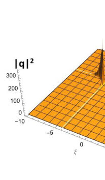
<figcaption class="paper-figure-caption"><b>Fig 3.</b> Fig. 3: Snapshot of the singular solution for the choice c1 = −2; l1 = 1; a1 = 1; n1 = −1; d1 = 0; l2 = 1; a2 = 1.5; n2 = 2; d2 = 0; m2 = 1; l4 = 1; b = 1; p1 = 1; r1 = 1; λ = 1</figcaption>
</figure>
<figure class="paper-figure-card">
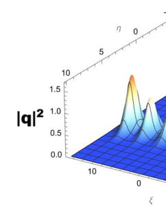
<figcaption class="paper-figure-caption"><b>Fig 4.</b> Fig. 4: Uneven distribution of energy of dromions by giving equal inputs to all the bound states, l1 = 1; a1 = 1; n1 = 1; d1 = 0; l2 = 1; a2 = 1; n2 = 2; d2 = 0; l3 = 1; a3 = 1; n3 = 3; d3 = 0; l4 = 1; a4 = 1; n4 = −1; d4 = 0; l5 = 1; a5 = 1; n5 = −2; d5 = 0; l6 = 1; a6 = 1; n6 = −3; d6 = 0; l7 = 1; a7 = 1; n7 = −4; d7 = 0; k1 = 1; m1 = 1; b1 = 1; p1 = 1; r1 = 1; λ = 0.01; t = −4; c1 = −15</figcaption>
</figure>
<figure class="paper-figure-card">
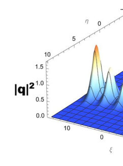
<figcaption class="paper-figure-caption"><b>Fig 5.</b> Fig. 5: Energy distribution by giving equal inputs except for one bound state, l1 = 1; a1 = 1; n1 = 1; d1 = 0; l2 = 1; a2 = 1; n2 = 2; d2 = 0; l3 = 1; a3 = 1; n3 = 3; d3 = 0; l4 = 1; a4 = 1; n4 = −1; d4 = 0; l5 = 2; a5 = 1; n5 = −2; d5 = 0; l6 = 1; a6 = 1; n6 = −3; d6 = 0; l7 = 1; a7 = 1; n7 = −4; d7 = 0; k1 = 1; m1 = 1; b1 = 1; p1 = 1; r1 = 1; λ = 0.01; t = −4; c1 = −15</figcaption>
</figure>

**Summary.** This paper investigates dromion solutions for a generalized nonlinear Schrödinger equation in two spatial dimensions, utilizing the Painlevé expansion method. It uncovers several novel, universal attributes of these localized structures, such as boundary reflections and non-uniform energy sharing among multiple interacting solitons. These findings suggest deep underlying physics applicable to fields like nonlinear optics and plasma dynamics.

**Why it may be interesting.** The study's focus on robust, universal physical signatures (like firewalls or non-uniform energy sharing) in integrable PDEs is highly relevant to theoretical physics exploring complex wave phenomena in optics and plasma physics. The connection to soliton interactions provides a rich mathematical framework for modeling many-body quantum dynamics.

Detailed structure

**Main problem.** The paper aims to explore novel properties of dromion solutions by investigating a generalized (2+1) dimensional Nonlinear Schrödinger Equation (GNLS). It seeks to uncover attributes beyond those previously documented for these localized wave structures.

**Main result.** The study reveals universal properties of dromions, including the existence of 'firewall' and reflection at boundaries, uneven energy distribution among bound states, and amplitude dependence on neighboring dromions. These effects are confirmed across multiple nonlinear systems.

**Method.** The primary mathematical tool employed is the Truncated Painlevé Expansion method to derive closed-form solutions for the complex partial differential equation. Numerical simulations were used extensively to corroborate analytical findings.

**Model / system.** The core model is a generalized (2+1) dimensional Nonlinear Schrödinger Equation, which integrates aspects of Davey-Stewartson equations. The analysis focuses on finding and characterizing dromion solutions within this framework.

**Key observables.** Dromion density profile ($|q|^2$), energy distribution among bound states, phase shifts during collision, and amplitude changes upon removal of neighboring components.

**Important parameters / regimes.** The coupling constant $\lambda$, and parameters controlling the functional forms derived from the Painlevé analysis ($\phi_1, \phi_2$).

**Assumptions / limitations.** The method relies on the assumption that the system can be analyzed via the Truncated Painlevé approach, which is limited to integrable (2+1) dimensional PDEs.

**Figures summary.** Figures illustrate snapshots and density profiles confirming inelastic collisions, firewall effects, and reflection for two dromions. Other figures demonstrate how removing specific dromion components causes a measurable decrease in the overall cluster amplitude, suggesting nonlinear coupling.

**Paper structure.** The paper first introduces the generalized GNLS equation and applies the Painlevé approach to derive general solution forms. It then analyzes multi-dromion solutions (two-dromion, seven-dromion) by setting specific functional forms for the components. Finally, it systematically demonstrates the universal nature of observed properties—such as energy distribution control and amplitude dependence—by comparing results across various nonlinear systems.

Abstract

In this paper, we travel through an unknown territory of dromions, to unearth and show the new properties/attributes of dromions which have never been brought to the fore since they were first discovered by Boiti etal [1]. These new attributes are brought out by investigating a generalized (2+1) dimensional Nonlinear Schrodinger (NLS) equation by exploiting Truncated Painleve approach. The signatures that can be attributed to dromions include existence of firewall and reflection at the boundary, uneven distribution of energy among different bound states, amplitude dependence on adjacent dromions, etc. We have corroborated the main analytical results with numerical simulations also. We categorically state that these properties are universal and can be extracted in any (2+1) dimensional nonlinear partial differential equation. We do believe that these properties which shed more light on the behaviour of dromions may have wider repercussions in nonlinear optics, Bose-Einstein condensates and plasma physics.

[↑ back to top](#top)

