
# arxiv digest (quant-ph + cond-mat) — 2026-08-18

*93 papers · 25 relevant · 2 highlighted*

## 🔥 Most relevant (25)

*Every paper with at least one nonzero topic score, sorted by best-matching score. 🔥 marks scores ≥4/5. Click the title to jump to the full entry below; click [arXiv] to open the paper page. `(secondary)` marks papers from de-prioritized cond-mat archives.*

Show 25 relevant papers

- ⭐ [Far-from-equilibrium topological phase transition in one dimension](#paper-2608.13658) [[arXiv]](http://arxiv.org/abs/2608.13658v1) — 🔥 `non-equilibrium universality` **5/5** · 🔥 `driven-dissipative phase transition` **4/5** · `Keldysh / 2PI / non-Gaussian methods` **3/5** · `methods for driven-dissipative` **3/5** · `Frenkel-Kontorova` **2/5** · `analog quantum simulation` **1/5** · `correlated / nonlocal dissipation` **1/5** · `quantum measurements` **1/5**
- [Open system probes of renormalization group flow](#paper-2608.13664) [[arXiv]](http://arxiv.org/abs/2608.13664v1) — 🔥 `analog quantum simulation` **4/5** · 🔥 `driven-dissipative phase transition` **4/5** · 🔥 `methods for driven-dissipative` **4/5** · 🔥 `non-equilibrium universality` **4/5** · `Keldysh / 2PI / non-Gaussian methods` **3/5** · `correlated / nonlocal dissipation` **3/5** · `quantum measurements` **3/5** · `Tavis-Cummings & cavity-many-emitter` **1/5** · `scars & prethermalization` **1/5**
- [Sharp Coherence Crossover and Multimode Phase Control in Coupled Exciton-Polariton Condensates](#paper-2608.14100) [[arXiv]](http://arxiv.org/abs/2608.14100v1) `(secondary)` — 🔥 `analog quantum simulation` **4/5** · `driven-dissipative phase transition` **3/5** · `interference shaping light` **3/5** · `quantum optics experiment` **3/5** · `Tavis-Cummings & cavity-many-emitter` **2/5** · `methods for driven-dissipative` **2/5** · `non-equilibrium universality` **2/5** · `Keldysh / 2PI / non-Gaussian methods` **1/5** · `correlated / nonlocal dissipation` **1/5** · `quantum measurements` **1/5**
- [Information Spreading in Diffusion Models from Effective Field Theory](#paper-2608.14308) [[arXiv]](http://arxiv.org/abs/2608.14308v1) — 🔥 `non-equilibrium universality` **4/5** · `Keldysh / 2PI / non-Gaussian methods` **3/5** · `driven-dissipative phase transition` **3/5** · `methods for driven-dissipative` **3/5** · `analog quantum simulation` **2/5** · `correlated / nonlocal dissipation` **2/5** · `quantum measurements` **2/5** · `scars & prethermalization` **1/5**
- [Extinction drives emergent metastability in complex ecosystems](#paper-2608.14416) [[arXiv]](http://arxiv.org/abs/2608.14416v1) — 🔥 `Keldysh / 2PI / non-Gaussian methods` **4/5** · `correlated / nonlocal dissipation` **3/5** · `methods for driven-dissipative` **3/5** · `non-equilibrium universality` **3/5** · `driven-dissipative phase transition` **2/5** · `quantum measurements` **2/5** · `Frenkel-Kontorova` **1/5** · `analog quantum simulation` **1/5**
- [Measurement-Feedback Quantum Information Engine: Coherence-Transition Interference and Correlated Work Statistics](#paper-2608.14493) [[arXiv]](http://arxiv.org/abs/2608.14493v1) — 🔥 `Full counting statistics` **4/5** · 🔥 `quantum measurements` **4/5** · `methods for driven-dissipative` **3/5** · `non-equilibrium universality` **3/5** · `driven-dissipative phase transition` **2/5** · `Keldysh / 2PI / non-Gaussian methods` **1/5** · `correlated / nonlocal dissipation` **1/5** · `interference shaping light` **1/5**
- [Current fluctuations in a non-additive open quantum system: breakdown of the quantum-jump approach](#paper-2608.14469) [[arXiv]](http://arxiv.org/abs/2608.14469v1) — 🔥 `methods for driven-dissipative` **4/5** · `correlated / nonlocal dissipation` **3/5** · `quantum measurements` **3/5** · `Full counting statistics` **2/5** · `Keldysh / 2PI / non-Gaussian methods` **2/5** · `driven-dissipative phase transition` **2/5** · `analog quantum simulation` **1/5** · `non-equilibrium universality` **1/5**
- [To $\mathcal{PT}$ or not to $\mathcal{PT}$: Noise-induced escape and nonlinear-damping stabilization in a parity-time dimer](#paper-2608.14468) [[arXiv]](http://arxiv.org/abs/2608.14468v1) — 🔥 `Keldysh / 2PI / non-Gaussian methods` **4/5** · `driven-dissipative phase transition` **3/5** · `methods for driven-dissipative` **3/5** · `Tavis-Cummings & cavity-many-emitter` **2/5** · `non-equilibrium universality` **2/5** · `analog quantum simulation` **1/5** · `correlated / nonlocal dissipation` **1/5** · `quantum measurements` **1/5** · `scars & prethermalization` **1/5**
- [Dual-species alkali and alkaline-earth-like optical tweezer arrays via interferometrically aligned high-NA objectives](#paper-2608.13646) [[arXiv]](http://arxiv.org/abs/2608.13646v1) — 🔥 `analog quantum simulation` **4/5** · `QC/QI experiment` **3/5** · `interference shaping light` **3/5** · `Rydberg arrays` **2/5** · `quantum measurements` **2/5** · `driven-dissipative phase transition` **1/5** · `methods for driven-dissipative` **1/5** · `quantum optics experiment` **1/5**
- [Quantum Snapshots Reveal a Compact Conformal Boundary Mode](#paper-2608.14327) [[arXiv]](http://arxiv.org/abs/2608.14327v1) — 🔥 `quantum measurements` **4/5** · `Full counting statistics` **3/5** · `non-equilibrium universality` **3/5** · `driven-dissipative phase transition` **2/5** · `Frenkel-Kontorova` **1/5** · `Keldysh / 2PI / non-Gaussian methods` **1/5** · `analog quantum simulation` **1/5** · `correlated / nonlocal dissipation` **1/5** · `methods for driven-dissipative` **1/5**
- [Generalizing the multidimensional thermodynamic uncertainty relation to combinations of arbitrary counting variables](#paper-2608.14276) [[arXiv]](http://arxiv.org/abs/2608.14276v1) — 🔥 `Full counting statistics` **4/5** · `methods for driven-dissipative` **3/5** · `non-equilibrium universality` **3/5** · `Keldysh / 2PI / non-Gaussian methods` **2/5** · `driven-dissipative phase transition` **2/5** · `correlated / nonlocal dissipation` **1/5** · `quantum measurements` **1/5**
- [Tuning crystal-fields by He-irradiation and orbital Widom line in SrVO$_3$ films](#paper-2608.14362) [[arXiv]](http://arxiv.org/abs/2608.14362v1) — 🔥 `analog quantum simulation` **4/5** · `Keldysh / 2PI / non-Gaussian methods` **3/5** · `driven-dissipative phase transition` **2/5** · `methods for driven-dissipative` **2/5** · `non-equilibrium universality` **2/5** · `correlated / nonlocal dissipation` **1/5** · `quantum measurements` **1/5** · `scars & prethermalization` **1/5**
- ⭐ [Far-from-equilibrium scaling of non-abelian Goldstone modes](#paper-2608.13666) [[arXiv]](http://arxiv.org/abs/2608.13666v1) — 🔥 `non-equilibrium universality` **4/5** · `Keldysh / 2PI / non-Gaussian methods` **3/5** · `driven-dissipative phase transition` **3/5** · `methods for driven-dissipative` **2/5** · `analog quantum simulation` **1/5** · `correlated / nonlocal dissipation` **1/5** · `scars & prethermalization` **1/5**
- [Maximizing Nonclassicality of Massive Objects via Quantum Zeno Effect](#paper-2608.13942) [[arXiv]](http://arxiv.org/abs/2608.13942v1) — 🔥 `quantum measurements` **4/5** · `quantum optics experiment` **3/5** · `driven-dissipative phase transition` **2/5** · `Keldysh / 2PI / non-Gaussian methods` **1/5** · `correlated / nonlocal dissipation` **1/5** · `methods for driven-dissipative` **1/5**
- [Disorder signatures emerging at millikelvin temperatures in Si/SiGe field-effect stacks](#paper-2608.14224) [[arXiv]](http://arxiv.org/abs/2608.14224v1) `(secondary)` — 🔥 `QC/QI experiment` **4/5** · `driven-dissipative phase transition` **2/5** · `analog quantum simulation` **1/5** · `correlated / nonlocal dissipation` **1/5** · `non-equilibrium universality` **1/5** · `quantum measurements` **1/5** · `scars & prethermalization` **1/5**
- [GPU implementation of mixed quantum-classical Liouville molecular dynamics without momentum jump](#paper-2608.14544) [[arXiv]](http://arxiv.org/abs/2608.14544v1) — 🔥 `methods for driven-dissipative` **4/5** · `quantum measurements` **3/5** · `driven-dissipative phase transition` **2/5** · `Keldysh / 2PI / non-Gaussian methods` **1/5** · `correlated / nonlocal dissipation` **1/5**
- [SymQuPS: Symbolic Quantum Phase Space Algebra in Python](#paper-2608.14263) [[arXiv]](http://arxiv.org/abs/2608.14263v1) — 🔥 `methods for driven-dissipative` **4/5** · `Keldysh / 2PI / non-Gaussian methods` **3/5** · `driven-dissipative phase transition` **2/5** · `correlated / nonlocal dissipation` **1/5** · `quantum measurements` **1/5**
- [The Organization of Environmental Coupling Shapes What Quantum Reservoirs Remember](#paper-2608.14181) [[arXiv]](http://arxiv.org/abs/2608.14181v1) — 🔥 `correlated / nonlocal dissipation` **4/5** · `methods for driven-dissipative` **3/5** · `quantum measurements` **2/5** · `analog quantum simulation` **1/5** · `driven-dissipative phase transition` **1/5**
- [Analytical Theory of Higher-Order Collective Spin Interactions in Cavity Quantum Electrodynamics](#paper-2608.14343) [[arXiv]](http://arxiv.org/abs/2608.14343v1) — 🔥 `analog quantum simulation` **4/5** · `Tavis-Cummings & cavity-many-emitter` **3/5** · `Dicke superradiance` **1/5** · `Keldysh / 2PI / non-Gaussian methods` **1/5** · `superradiant laser` **1/5**
- [Synthesizing In-Bulk Topological Corner States via Giant Atoms](#paper-2608.14206) [[arXiv]](http://arxiv.org/abs/2608.14206v1) — 🔥 `analog quantum simulation` **4/5** · `driven-dissipative phase transition` **2/5** · `correlated / nonlocal dissipation` **1/5** · `methods for driven-dissipative` **1/5** · `quantum measurements` **1/5**
- [Scalable Test of Genuine Multipartite Entanglement via Partially Randomized Measurements](#paper-2608.13725) [[arXiv]](http://arxiv.org/abs/2608.13725v1) — 🔥 `QC/QI experiment` **4/5** · `quantum measurements` **3/5** · `analog quantum simulation` **1/5**
- [Single-impurity polarons in hard-core lattice bosons at low and intermediate fillings](#paper-2608.13988) [[arXiv]](http://arxiv.org/abs/2608.13988v1) — 🔥 `analog quantum simulation` **4/5** · `Frenkel-Kontorova` **1/5** · `Keldysh / 2PI / non-Gaussian methods` **1/5** · `methods for driven-dissipative` **1/5**
- [Chiral spin liquid and chiral antiferromagnetism in half-filled moiré Hubbard model: possible applications to twisted bilayer TMDs](#paper-2608.14503) [[arXiv]](http://arxiv.org/abs/2608.14503v1) — 🔥 `analog quantum simulation` **4/5** · `Frenkel-Kontorova` **1/5** · `methods for driven-dissipative` **1/5**
- [Qu-Trefoil: Large-Scale Quantum Circuit Simulator Working on FPGA With SATA Storages](#paper-2608.14285) [[arXiv]](http://arxiv.org/abs/2608.14285v1) — 🔥 `QC/QI experiment` **4/5** · `analog quantum simulation` **1/5** · `quantum measurements` **1/5**
- [Native multi-qubit gates on a single-junction unimon circuit](#paper-2608.14357) [[arXiv]](http://arxiv.org/abs/2608.14357v1) — 🔥 `QC/QI experiment` **4/5** · `quantum measurements` **1/5**

## ⭐ Highlighted (2)

*Papers by authors on your watch list. Click the title to jump to the full entry below; click [arXiv] to open the paper page.*

Show 2 highlighted papers

- ⭐ [Far-from-equilibrium topological phase transition in one dimension](#paper-2608.13658) [[arXiv]](http://arxiv.org/abs/2608.13658v1) — Sebastian Diehl
- ⭐ [Far-from-equilibrium scaling of non-abelian Goldstone modes](#paper-2608.13666) [[arXiv]](http://arxiv.org/abs/2608.13666v1) — Sebastian Diehl

## All papers (73, sorted by relevance)

*Papers from quant-ph and your primary cond-mat archives (quant-gas, stat-mech, str-el, dis-nn). Highlighted papers (⭐) come first, then everything else sorted by topic-relevance score, highest first.*

### ⭐ [Far-from-equilibrium topological phase transition in one dimension](http://arxiv.org/abs/2608.13658v1)

**Highlighted author(s):** Sebastian Diehl  
**Authors:** Ze-Min Huang, Gustav John, Sebastian Diehl  
**Type:** theory · **Category:** statistical mechanics · **PDF:** <https://arxiv.org/pdf/2608.13658v1>  
**Analysis basis:** full PDF text, analyzed in chunks
**Topic relevance:** 🔥 `non-equilibrium universality` **5/5** · 🔥 `driven-dissipative phase transition` **4/5** · `Keldysh / 2PI / non-Gaussian methods` **3/5** · `methods for driven-dissipative` **3/5** · `Frenkel-Kontorova` **2/5** · `analog quantum simulation` **1/5** · `correlated / nonlocal dissipation` **1/5** · `quantum measurements` **1/5**

↔ Scroll figures horizontally

<figure class="paper-figure-card">
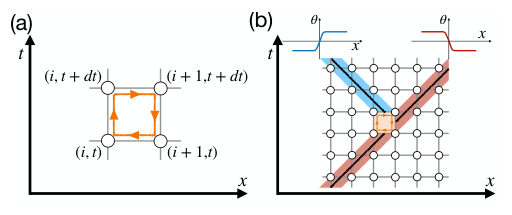
<figcaption class="paper-figure-caption"><b>Fig 1.</b> FIG. 1. Schematic illustration of (a) the definition of a space- time vortex and (b) its multiplicative character and disorder- ing effect on the phase field. (a) The vortex charge on a pla- quette is defined as the oriented sum of the link field [Dµθ]2π along its boundary, where µ = x, t and [· · · ]2π denotes reduc- tion to the principal branch (−π, π]. (b) A spacetime vortex can occur only when the phase field is inhomogeneous; across the event, the local spatial winding carried by a kink changes by the vortex charge, enabling kink branching.</figcaption>
</figure>
<figure class="paper-figure-card">
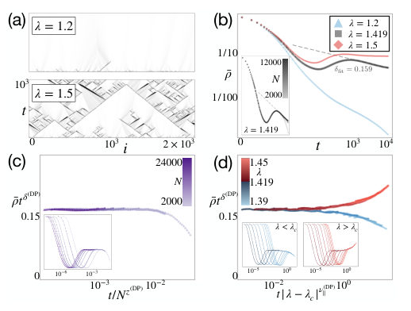
<figcaption class="paper-figure-caption"><b>Fig 2.</b> FIG. 2. Numerical results for the discrete KPZ model us- ing D = 1 2 and dt = 1 4. (a) Spacetime profiles of the lo- cal observable ρ(i, t). At late times, the system either ap- proaches the u = 0 state, or remains spatially inhomoge- neous, with branching structures reminiscent of DP. Pan- els (b)-(d) are averaged over 104 random initial conditions. (b) Log-log plot of ¯ρ(t). For λ ≪λc, ¯ρ decays rapidly, whereas for λ ≫λc it approaches a long-lived active state. At λc ≃1.419, ¯ρ exhibits algebraic decay with fitted expo- nent δfit = 0.159 (over t ∈  103, 104 ), consistent with the DP value δ(DP) = 0.159464. The inset shows the system- size dependence at λ = λc. (c) Finite-size scaling...</figcaption>
</figure>
<figure class="paper-figure-card">
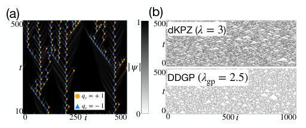
<figcaption class="paper-figure-caption"><b>Fig 3.</b> FIG. 3. Spacetime profiles of (a) the amplitude |ψ| and asso- ciated vortices in the DDGP model at λgp = 1.4, and (b) the order parameter ρ, for the discrete KPZ model at λ = 3 (top) and the DDGP model at λgp = 2.5 (bottom).</figcaption>
</figure>
<figure class="paper-figure-card">
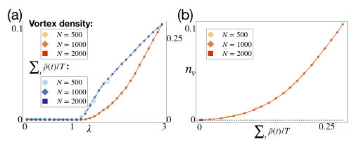
<figcaption class="paper-figure-caption"><b>Fig 4.</b> FIG. 4. Numerical results for (a) the vortex density and spacetime-averaged ρ as functions of λ, and (b) the vortex density as a function of the spacetime-averaged ρ.</figcaption>
</figure>
<figure class="paper-figure-card">
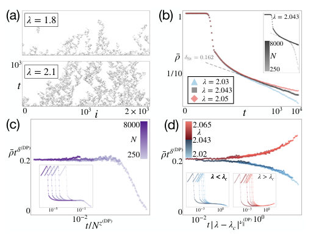
<figcaption class="paper-figure-caption"><b>Fig 5.</b> FIG. 5. Numerical results for the continuous-time limit of the discrete KPZ model with D = 1/2. As a stringent test, we choose the noise ⟨ξ (i, t) ξ (i′, t′)⟩= sin2 [u(i, t)] δ(t −t′)δi,i′: Its variance vanishes at the targeted configuration u = 0, and also at the additional u = π configuration. Nevertheless, the resulting critical scaling remains consistent with DP. The re- sults are averaged over 500 trajectories with fully activated initial conditions [i.e., u (i, t) = π + 10−5]. (a) Spacetime pro- file of ρ(i, t). (b)-(d) Critical scaling analyses showing agree- ment with the DP critical exponents. The data-collapse anal- yses are performed over the time window t ∈[200, 9000]. The...</figcaption>
</figure>

**Summary.** This work establishes a novel mechanism where topological defects in a 1D compact phase model drive the system through a continuous, non-equilibrium phase transition. By analyzing the resulting effective field theory, the authors prove that this critical behavior belongs to the Directed Percolation (DP) universality class. This provides a powerful new theoretical framework for understanding criticality driven by defect proliferation.

**Why it may be interesting.** The finding that deterministic, symmetry-driven dynamics can generate emergent non-equilibrium critical behavior belonging to a known universality class like DP is highly relevant for understanding complex many-body systems far from equilibrium.

Detailed structure

**Main problem.** The authors aim to uncover a fundamental mechanism for far-from-equilibrium topological phase transitions, distinct from equilibrium critical points.

**Main result.** They demonstrate that the competition between vortex-induced disordering and relaxation drives a continuous non-equilibrium transition belonging robustly to the Directed Percolation (DP) universality class.

**Method.** The analysis involves constructing an effective field theory via the Martin-Siggia-Rose formalism, followed by coarse-graining and numerical simulation of continuum limits derived from discrete models.

**Model / system.** The study uses a one-dimensional compact phase model whose dynamics are governed by deterministic evolution but generate stochasticity through topological defects (vortices). Specific mathematical realizations include the KPZ equation and the driven-dissipative Gross-Pitaevskii equation.

**Key observables.** Vortex density ($n_v$), spacetime-averaged order parameter ($ar{
ho}$), and critical exponents ($\delta, z, 
u$).

**Important parameters / regimes.** The coupling constants (e.g., $\lambda$ in the KPZ model) that tune the system across the critical point ($\lambda_c$).

**Assumptions / limitations.** The analysis relies on the vortex-gas approximation and assumes independent Poisson statistics for topological vortices, which generate an effective multiplicative noise term.

**Figures summary.** Figures illustrate numerical data collapse showing that observables like $ar{
ho}$ decay according to exponents characteristic of Directed Percolation (DP) across different models (KPZ, DDGP).

**Paper structure.** The paper progresses from defining the physical mechanism involving topological defects and disordering ($	ext{Chunk 1}$) to deriving effective continuum theories (Langevin equations) ($	ext{Chunk 2}$), culminating in numerical verification of DP scaling across multiple related models ($	ext{Chunk 3}$).

Abstract

We uncover a mechanism for far-from-equilibrium topological phase transitions, via a one-dimensional compact phase model evolving deterministically from random initial conditions. It rests on topology and symmetry rather than on phenomenological postulates: phase compactness permits vortices, and a homogeneous fixed point suppresses their nucleation, with the fixed point itself implied by phase-shift symmetry. The competition between vortex-induced disordering and relaxation toward homogeneity drives a continuous nonequilibrium transition, whose universality class we identify as directed percolation (DP). We demonstrate this by constructing the corresponding effective field theory and numerically confirming DP critical scaling through dynamical-scaling analysis.

[↑ back to top](#top)

### ⭐ [Far-from-equilibrium scaling of non-abelian Goldstone modes](http://arxiv.org/abs/2608.13666v1)

**Highlighted author(s):** Sebastian Diehl  
**Authors:** Carl Philipp Zelle, Gustav John, Orla Supple, Romain Daviet, Sebastian Diehl  
**Type:** theory · **Category:** statistical mechanics · **PDF:** <https://arxiv.org/pdf/2608.13666v1>  
**Analysis basis:** full PDF text, analyzed in chunks
**Topic relevance:** 🔥 `non-equilibrium universality` **4/5** · `Keldysh / 2PI / non-Gaussian methods` **3/5** · `driven-dissipative phase transition` **3/5** · `methods for driven-dissipative` **2/5** · `analog quantum simulation` **1/5** · `correlated / nonlocal dissipation` **1/5** · `scars & prethermalization` **1/5**

↔ Scroll figures horizontally

<figure class="paper-figure-card">
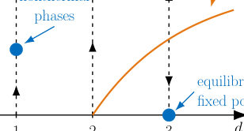
<figcaption class="paper-figure-caption"><b>Fig 1.</b> FIG. 1: Schematic renormalization group flow for the Goldstone modes of the non-Abelian time crystal in various dimensions. In one and two dimensions, the equilibrium axis is unstable: arbitrarily weak nonequilibrium couplings drive the system toward a strongly interacting nonequilibrium fixed point, and no emergent equilibrium exists. In three dimensions, by contrast, the equilibrium line is stable, such that weak nonequilibrium perturbations fade out under coarse graining and effective equilibrium is restored. Above a critical coupling strength, the system undergoes a nonequilibrium phase transition generalizing the three-dimensional KPZ transition to the non-Abelian setting.</figcaption>
</figure>
<figure class="paper-figure-card">
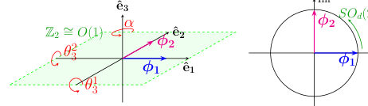
<figcaption class="paper-figure-caption"><b>Fig 2.</b> FIG. 2: Rotating phase Goldstone modes for N = 3. (a) depicts how the Goldstone modes in O(3)/O(1) act on the ground state ψ0 = eiω0t(ϕ1 + iϕ2). The unbroken O(1) symmetry acts as reflection in the ˆe1-ˆe2 plane. A rotation by α in combination with an opposite rotation in the real-imaginary plane (b) leave the ground state invariant and hence form the unbroken symmetry group SOd(2). Additionally, the time dependence eiω0t rotates Re(ψ0) around the ˆe1-ˆe2 plane and hence the phase is referred to as rotating.</figcaption>
</figure>
<figure class="paper-figure-card">
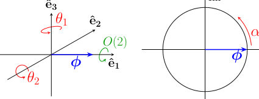
<figcaption class="paper-figure-caption"><b>Fig 3.</b> FIG. 3: Oscillating phase Goldstone modes for N = 3. (a) illustrates how the Goldstone modes in SO(2) × O(3)/O(2) act on the ground state ψ0 = eiωtϕ. The unbroken O(2) symmetry acts as an SO(2) rotation around ˆe1 and a Z2 reflection in the ˆe2-ˆe3 plane. The Goldstone mode α (b) parametrizes the broken SO(2) symmetry equivalent to rotation in the real-imaginary plane. A rotation by α in combination with an opposite rotation in the real-imaginary plan (b) leave the ground state invariant and hence form the unbroken symmetry group SOd(2). Additionally, the time dependence makes Re(ψ0) oscillate in magnitude along the ˆe1 direction and hence is named the oscillating phase.</figcaption>
</figure>
<figure class="paper-figure-card">
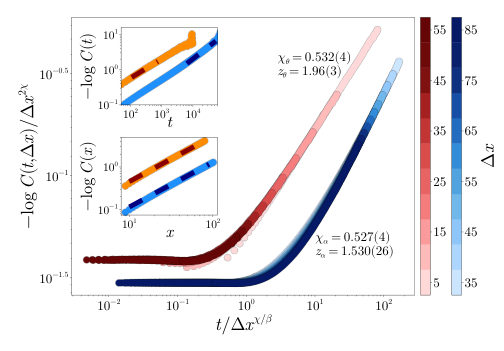
<figcaption class="paper-figure-caption"><b>Fig 4.</b> FIG. 4: Scaling results of the functions Cψ (blue) and Cθ (red) in the rotating phase for N = 3. Extracted exponents are listed in Table I. The main panel shows temporal correlations for spatial separations ∆x, measured in units of the lattice spacing, in steps of 5. The collapse exponents are obtained from the insets: the upper inset shows the time correlation at ∆x = 0, the lower inset the equal-time correlation. We observe weak scaling, here for couplings Zd = 1, Zc = −1, rd = −1, ud = 1, κd = 0.5, uc = −0.2, κc = −0.5, rc = −0.3, and Γ0 = 0.035 with a system size L = 1000. The average is over 15,801 trajectories.</figcaption>
</figure>
<figure class="paper-figure-card">
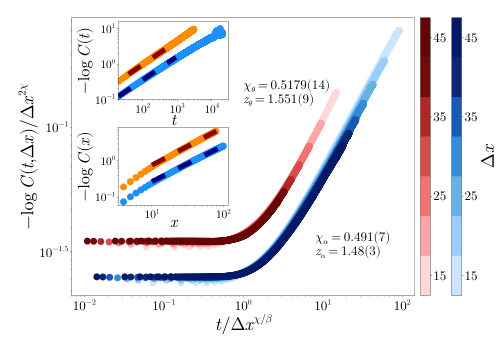
<figcaption class="paper-figure-caption"><b>Fig 5.</b> FIG. 5: Scaling results of the functions Cα (blue) and Cθ (red) in the oscillating phase for N = 3. The presentation and extraction procedure are analogous to Fig. 4; extracted exponents are listed in Table I. Couplings are Zd = 1, Zc = 0, rd = −1, ud = 1, κd = −0.25, uc = 1.6, κc = −0.4, rc = −2.1, and Γ0 = 0.02 in a system with L = 10, 000 sites. The average is over 9,501 trajectories.</figcaption>
</figure>

**Summary.** This paper develops a theoretical framework to study non-Abelian Goldstone modes in far-from-equilibrium phases using nonlinear sigma models. By applying renormalization group analysis, the authors show that low dimensions exhibit novel nonthermal fixed points, characterized by distinct universal scaling exponents for different symmetry components.

**Why it may be interesting.** The work provides a powerful extension of KPZ universality into non-Abelian symmetry breaking regimes, which is crucial for understanding universal dynamics in driven quantum systems beyond simple $	ext{SO}(2)$ models.

Detailed structure

**Main problem.** The research aims to extend Kardar-Parisi-Zhang (KPZ) physics to describe non-Abelian Goldstone modes arising from continuous symmetry breaking in far-from-equilibrium systems.

**Main result.** In low dimensions ($d=1, 2$), weak nonequilibrium driving destabilizes equilibrium and generates strongly coupled nonthermal fixed points; furthermore, the system exhibits unconventional weak dynamic scaling for different Goldstone sectors.

**Method.** The study employs non-linear sigma models (NLSMs) derived from open-system path integrals, analyzed using one-loop renormalization group (RG) techniques and corroborated by direct numerical simulations in $1+1$ dimensions.

**Model / system.** The model describes non-Abelian time crystals characterized by an SO(2) x O(N) symmetry structure, relevant to driven quantum materials and active matter. The dynamics are analyzed via a Keldysh path integral formulation.

**Key observables.** Dynamical critical exponents ($z$), scaling functions for correlation $	ext{C}_{\alpha,	heta}(t, r)$, and the stability of fixed points under RG flow.

**Important parameters / regimes.** Dimensionality ($d=1, 2$ vs $d>2$), coupling constants ($u_c$), and the nature of the driving (rotating vs. oscillating phases).

**Assumptions / limitations.** The analysis assumes an expansion in Goldstone fields and focuses on the deeply ordered limit where curvature fluctuations are negligible.

**Figures summary.** Figures schematically illustrate RG flow: weak couplings drive $d=1, 2$ systems to nonthermal fixed points, while $d \geq 3$ restores equilibrium. Simulations confirm distinct scaling laws for $\alpha$ and $	heta$ modes in the rotating phase.

**Paper structure.** The paper systematically constructs nonequilibrium NLSMs for different symmetry breaking patterns (rotating/oscillating). It then applies RG analysis to determine dimensional dependence ($d=1, 2$ vs $d>2$) and characterizes the resulting unconventional weak dynamic scaling laws through analytical derivations and numerical verification.

Abstract

We identify a broad class of nonthermal phases generated by the interplay of continuous symmetry breaking and weak nonequilibrium driving. Extending Kardar-Parisi-Zhang (KPZ) physics beyond the single $SO(2)$ chronon associated with periodically broken time translations, we construct nonequilibrium nonlinear sigma models for $SO(2)\times O(N)$ symmetry, describing non-Abelian time crystals with coexisting temporal and internal order. This symmetry structure arises naturally in driven quantum materials, active matter, and optically induced periodic states. For rotating and oscillating phases, we derive the Goldstone theories and show that chronon-$O(N)$ couplings remain finite deep in the ordered regime. One-loop renormalization group analysis reveals a KPZ-like dimensional structure: in $d=1,2$, arbitrarily weak nonequilibrium perturbations destabilize the equilibrium fixed point and generate strongly coupled nonthermal fixed points, realizing emergent equilibrium breaking. By contrast, for $d > 2$, weak perturbations are irrelevant and effective equilibrium is restored. A central result is unconventional weak dynamic scaling in the rotating phase: strongly coupled Goldstone sectors acquire distinct universal dynamical exponents despite belonging to the same order parameter. We characterize this scaling analytically and corroborate it through direct simulations in $1+1$ dimensions. In the oscillating phase, we recover and extend weak-scaling regimes known from drifting polymers. Finally, compactness and topological defects ultimately destroy long-range order but leave experimentally accessible nonthermal scaling windows. Together, these results extend KPZ universality to non-Abelian symmetry breaking.

[↑ back to top](#top)

### [Open system probes of renormalization group flow](http://arxiv.org/abs/2608.13664v1)

**Authors:** Andrew Keefe, Brenden Bowen, Saptarshi Biswas, Albion Lawrence, Nishant Agarwal, Archana Kamal  
**Type:** theory · **Category:** statistical mechanics · **PDF:** <https://arxiv.org/pdf/2608.13664v1>  
**Analysis basis:** full PDF text, analyzed in chunks
**Topic relevance:** 🔥 `analog quantum simulation` **4/5** · 🔥 `driven-dissipative phase transition` **4/5** · 🔥 `methods for driven-dissipative` **4/5** · 🔥 `non-equilibrium universality` **4/5** · `Keldysh / 2PI / non-Gaussian methods` **3/5** · `correlated / nonlocal dissipation` **3/5** · `quantum measurements` **3/5** · `Tavis-Cummings & cavity-many-emitter` **1/5** · `scars & prethermalization` **1/5**

↔ Scroll figures horizontally

<figure class="paper-figure-card">
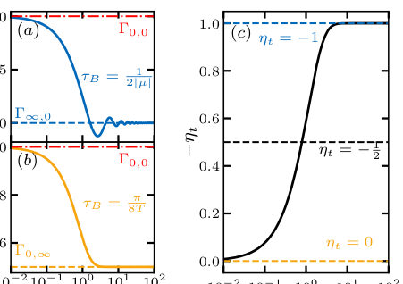
<figcaption class="paper-figure-caption"><b>Fig 1.</b> FIG. 1. Time-dependent dephasing rates on the probe qubit coupled to the TFIM environment varied along the (a) gap (µ) and (b) temperature (T) axes. In both cases, the rate flows from the unstable QCP to the respective stable fixed point along each axis. (c) Exponent determining relative weights of the gap and temperature in the bulk TFIM cor- relator timescale τB.</figcaption>
</figure>
<figure class="paper-figure-card">
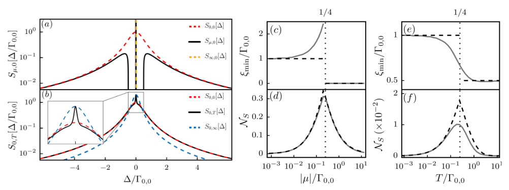
<figcaption class="paper-figure-caption"><b>Fig 2.</b> FIG. 2. Steady-state emission spectrum of the probe qubit along the (a) gap and (b) temperature axes. The corresponding spectral measure NS of the probe qubit calculated along the gap (d) and temperature (f) using the Lorentzian spectra at the three fixed points (dashed-black), with ξ ∈{Γ0,0, Γ∞,0, Γ0,∞} in eq. (11), and an arbitrary Lorentzian profile (solid-grey) as reference Markovian spectra, respectively. Panels (c) and (e) show the zero-frequency widths, ξmin, that minimize the JSD used for calculating the NS shown in panels (d) and (f), respectively.</figcaption>
</figure>
<figure class="paper-figure-card">

<figcaption class="paper-figure-caption"><b>Fig 3.</b> FIG. 3. Directional derivative field Fu,2(µ, T) over a rectangular region in phase space spanned by µ ∈[0, 0.4], T ∈[0, 1.8], while setting g = 1. The inset shows the global structure with the fixed points. The flow in the selected region captures all the non-trivial trends with trivial extrapolation to the fixed points at infinities.</figcaption>
</figure>
<figure class="paper-figure-card">
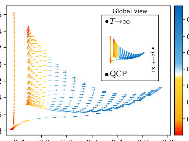
<figcaption class="paper-figure-caption"><b>Fig 4.</b> Figure 3 shows the 2D flow over a rectangular region of the phase diagram, with the flow along the µ-axis (T- axis) shown along the lowest line of arrows (left-most line of arrows). The color of the arrows denotes the magnitude of the flow or change in non-Markovianity. How a linear flow β begets a highly inhomogeneous and anisotropic flow of Fu,2 through the bulk region can be inferred from the dominant eigenvalue of the Jaco- bian J2 [36]: Fu,2 ≈|λ1c1|v1, where J2v1 = λ1v1 with c1 = u · v1. Thus the direction and speed (color) of the flow field are set by v1 and |c1λ1|, respectively. We find that Fu,2(µ, T) captures the off-axis flow away from the QCP, while emphasizing the overall flow...</figcaption>
</figure>
<figure class="paper-figure-card">
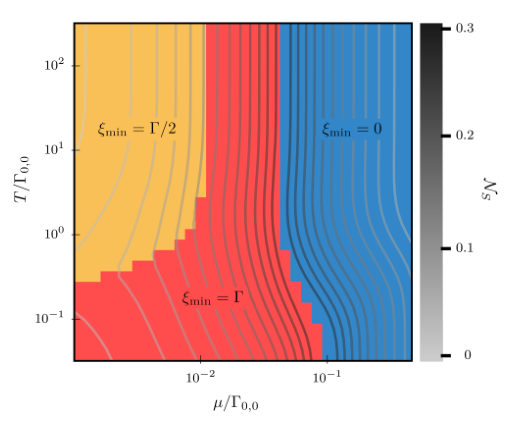
<figcaption class="paper-figure-caption"><b>Fig 5.</b> FIG. 4. Plot showing NS (Contours) using only the spectra at the fixed points as the Markovian ansatz and the corre- sponding ξ (Shading).</figcaption>
</figure>

**Summary.** The authors demonstrate how coupling a simple quantum qubit (probe) to a complex environment (like the TFIM) allows one to map the Renormalization Group flow of the bath. By analyzing non-Markovian dynamics and spectral properties, they show that measurable quantities like dephasing rates or emission spectra encode information about critical exponents and the underlying phase diagram structure.

**Why it may be interesting.** This work provides a powerful, measurable diagnostic tool—the probe's dynamics—to access universal properties like critical exponents and RG trajectories that are otherwise difficult to calculate directly in the bulk many-body system.

Detailed structure

**Main problem.** The study aims to characterize the Renormalization Group (RG) flow of complex quantum many-body systems by coupling them to a simple, engineered quantum probe.

**Main result.** The non-Markovian dynamics and spectral properties of the probe provide a direct, quantitative measure that mirrors the RG flow parameters, allowing for the inference of scaling dimensions near critical points.

**Method.** The analysis involves deriving time-dependent master equations (e.g., Redfield or memory kernel approaches) for the probe qubit coupled to an environment modeled by the Transverse Field Ising Model (TFIM).

**Model / system.** The system consists of a simple quantum probe (qubit) coupled to a complex, interacting many-body bath (the TFIM), analyzed across its phase diagram parameterized by magnetic field ($\mu$) and temperature ($T$).

**Key observables.** Induced dephasing rate $\Gamma_{\mu,T}(t)$, normalized emission spectrum $S[\Delta]$, spectral distances $D(v)$, and the flow vector $F_{u,2}(v)$.

**Important parameters / regimes.** The critical point (QCP) of the TFIM, temperature ($T$), magnetic field ($\mu$), and characteristic timescales ($	au_B$).

**Assumptions / limitations.** Approximations include using Redfield equations or assuming Gaussian environment states; analyses are performed in various limits like zero-temperature or Statistical Field Theory (SFT).

**Figures summary.** Figures illustrate the time evolution of dephasing rates, the 2D flow field $F_{\mu,2}(\mu, T)$ mapping RG trajectories, and steady-state emission spectra compared to Markovian ansatzes.

**Paper structure.** The paper progresses by first establishing the dynamics via rate equations (Chunk 1), then generalizing the diagnostics using spectral measures and Principal Component Analysis (PCA) to map flow in parameter space (Chunk 2), followed by detailed frequency-domain analysis of spectra and RG scaling derivations (Chunks 3 & 4).

Abstract

Open system probes can provide an efficient means to characterize quantum many-body systems by employing them as engineered environments. The key idea is to map long-range spatial correlations of the environment onto dynamical correlations in the evolution of a simple quantum probe. Using the example of a qubit coupled to a transverse-field Ising model, we show how the non-Markovian rate or spectral flow can be used to identify stable and unstable fixed points, infer scaling dimensions of relevant fields, and deduce the renormalization group flow induced by deformations around any fixed point.

[↑ back to top](#top)

### [Information Spreading in Diffusion Models from Effective Field Theory](http://arxiv.org/abs/2608.14308v1)

**Authors:** Navonil Neogi, Nabil Iqbal  
**Type:** theory · **Category:** statistical mechanics · **PDF:** <https://arxiv.org/pdf/2608.14308v1>  
**Analysis basis:** full PDF text, analyzed in chunks
**Topic relevance:** 🔥 `non-equilibrium universality` **4/5** · `Keldysh / 2PI / non-Gaussian methods` **3/5** · `driven-dissipative phase transition` **3/5** · `methods for driven-dissipative` **3/5** · `analog quantum simulation` **2/5** · `correlated / nonlocal dissipation` **2/5** · `quantum measurements` **2/5** · `scars & prethermalization` **1/5**

↔ Scroll figures horizontally

<figure class="paper-figure-card">
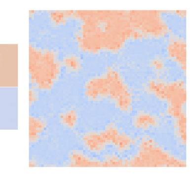
<figcaption class="paper-figure-caption"><b>Fig 1.</b> Figure 1: Images generated at end of reverse process by analytical ELS machine (left) and trained ConvNet model (right). The training images are simply two homogenous grids of ±1 (centre).</figcaption>
</figure>
<figure class="paper-figure-card">
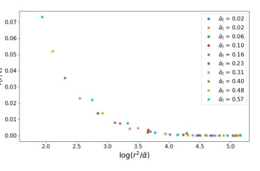
<figcaption class="paper-figure-caption"><b>Fig 2.</b> Figure 2: Verification of diffusive behaviour of ELS machine with 5 × 5 kernel size during reverse process.</figcaption>
</figure>
<figure class="paper-figure-card">
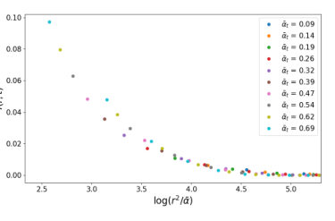
<figcaption class="paper-figure-caption"><b>Fig 3.</b> Figure 3: Verification of diffusive behaviour of learned model during reverse process.</figcaption>
</figure>
<figure class="paper-figure-card">
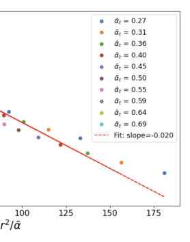
<figcaption class="paper-figure-caption"><b>Fig 4.</b> Figure 4: Spatial dependence of C(r, t); straight line with fixed slope D illustrates Gaussian depen- dence.</figcaption>
</figure>
<figure class="paper-figure-card">
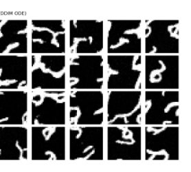
<figcaption class="paper-figure-caption"><b>Fig 5.</b> Figure 5: Images generated by ConvNet with circular padding trained on MNIST dataset.</figcaption>
</figure>

**Summary.** This work bridges generative AI and theoretical physics by treating diffusion model denoising as a physical process described by Effective Field Theory. By applying EFT, the authors derive simplified equations governing how information spreads during sample generation. This provides a powerful, physically grounded framework for analyzing deep learning models.

**Why it may be interesting.** While applied to deep learning, the core methodology—using EFT to simplify complex non-equilibrium dynamics governed by local interactions—is highly relevant to understanding relaxation processes in many-body quantum systems or open quantum systems far from equilibrium.

Detailed structure

**Main problem.** The paper applies Effective Field Theory (EFT) principles to analyze how information spreads during the reverse denoising process of score-matching diffusion models.

**Main result.** The mutual information between two points in the generated data is shown to grow according to a simple effective field theory prediction derived from Brownian motion dynamics at long times/distances.

**Method.** The authors use systematic derivative expansions (EFT) on the score function's evolution equation, simplifying complex dynamics by exploiting locality and symmetry constraints.

**Model / system.** The system is a convolutional diffusion model trained to generate data samples from a distribution p(phi). The analysis focuses on the stochastic differential equation governing the reverse denoising process.

**Key observables.** Mutual information between two points (MI), the score function $\pi(\phi, t)$, and the correlation function $G(z, t)$.

**Important parameters / regimes.** The noise schedule parameter ($ar{\alpha}_t$), spatial separation ($r$ or $z$), and time scale ($t$).

**Assumptions / limitations.** The EFT approach assumes that long-distance/long-time dynamics are governed by a low-order derivative expansion, which is rigorously tested in the scaling limit $\lambda 	o \infty$.

**Figures summary.** Not specified.

**Paper structure.** The paper progresses from establishing the physical analogy between diffusion dynamics and field theory to deriving simplified evolution equations via systematic expansions (EFT), culminating in solving the resulting diffusion equation for correlation functions.

Abstract

We study score-matching diffusion models with a convolutional architecture. We argue that the inductive bias of locality means that the machinery of effective field theory from physics can be usefully applied to describe the denoising dynamics. We apply this formalism first to a simple toy example which permits an analytical description, and thereafter to MNIST, and show that in both cases, the mutual information between two points grows in a manner predicted by a simple effective field theory of Brownian motion.

[↑ back to top](#top)

### [Extinction drives emergent metastability in complex ecosystems](http://arxiv.org/abs/2608.14416v1)

**Authors:** Jong Il Park, Tim Rogers, Joseph W. Baron  
**Type:** theory · **Category:** disordered systems and neural networks · **PDF:** <https://arxiv.org/pdf/2608.14416v1>  
**Analysis basis:** full PDF text, analyzed in chunks
**Topic relevance:** 🔥 `Keldysh / 2PI / non-Gaussian methods` **4/5** · `correlated / nonlocal dissipation` **3/5** · `methods for driven-dissipative` **3/5** · `non-equilibrium universality` **3/5** · `driven-dissipative phase transition` **2/5** · `quantum measurements` **2/5** · `Frenkel-Kontorova` **1/5** · `analog quantum simulation` **1/5**

↔ Scroll figures horizontally

<figure class="paper-figure-card">
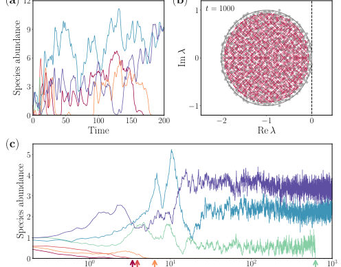
<figcaption class="paper-figure-caption"><b>Fig 1.</b> FIG. 1. Distinct dynamical behaviours and eigen- value spectra of the surviving species. (a) Determinis- tic (V →∞) grLV [see Eq. (10)] (c) rule-based dynamics [see Eq. (6)] for six representative species. Both models are simu- lated with an identical interaction matrix J, with consistent colour-coding across panels for each species. (b) Eigenvalue spectrum of the reduced interaction matrices J⋆(see text for definition) for the surviving communities at time t = 1000. System parameters are chosen such that May’s stability cri- terion predicts chaotic behaviour. While the spectrum of the deterministic model (grey circles) reaches the stability bound- ary (zero), the rule-based model (red...</figcaption>
</figure>
<figure class="paper-figure-card">
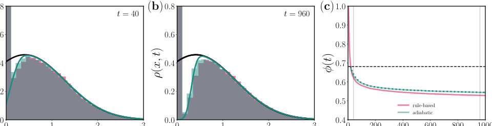
<figcaption class="paper-figure-caption"><b>Fig 2.</b> FIG. 2. Abundance distributions and survival probabilities over time. Abundance distributions ρ(x, t) obtained from rule-based (red) and adiabatic (green) dynamics at (a) t = 40 and (b) t = 960. Histograms are computed from the numerical simulations of the rule-based [see Eq. (6)] and adiabatic [see Eq. (17)] dynamics. Solid lines represent theoretical predictions from the deterministic fixed point (black) [see Eq. (16)] and adiabatic approximation (green) [see Eq. (3)]. (c) Survival probabilities ϕ(t) as a function of time. Shaded areas indicate the time windows corresponding to the distributions in (a) and (b). Dashed and dotted lines are predictions from deterministic and adiabatic...</figcaption>
</figure>
<figure class="paper-figure-card">
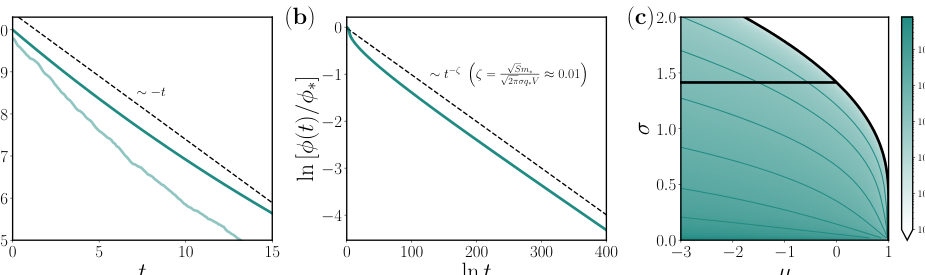
<figcaption class="paper-figure-caption"><b>Fig 3.</b> FIG. 3. Asymptotic behaviours of extinction dynamics and decay exponents. Survival probabilities ϕ(t) at (a) short and (b) long timescales. The green transparent line represents results from the adiabatic simulation [see Eq. (17)], while the green solid lines indicate numerical solutions of the theoretical prediction [see Eq. (3)]. Black dashed lines denote the predicted asymptotic limits. (c) Decay exponents scaled by √</figcaption>
</figure>
<figure class="paper-figure-card">
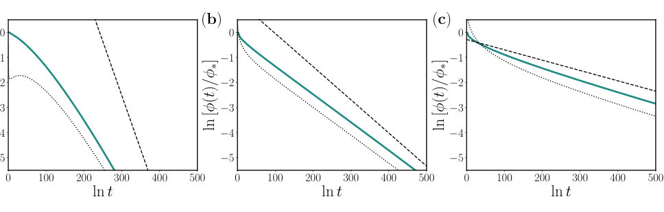
<figcaption class="paper-figure-caption"><b>Fig 4.</b> FIG. 4. Survival probabilities and asymptotes with corrections. Survival probabilities are shown for different parameter sets: (a) (µ, σ) = (−1.6, 0.4), (b) (µ, σ) = (−0.6, 0.8), and (c) (µ, σ) = (0.4, 1.2). Solid green lines represents numerical solutions derived from the adiabatic theory. Dashed lines denote power-law asymptotes with the leading-order decay exponent ζ from Eq. (5), while dotted lines including subleading corrections within ζ(t).</figcaption>
</figure>

**Summary.** This paper analyzes how intrinsic demographic noise stabilizes complex ecosystems by causing the extinction of low-abundance species. Using advanced theoretical tools like field theory, the authors show that this process leads to a robust metastability characterized by a power-law decay in community diversity over time. This demonstrates that stochastic fluctuations can stabilize systems predicted to be chaotic deterministically.

**Why it may be interesting.** The mathematical techniques used—such as deriving effective stochastic equations and analyzing non-equilibrium relaxation via field theory—are highly relevant to understanding open quantum systems where environmental noise drives slow decoherence or escape from metastable states.

Detailed structure

**Main problem.** The study investigates how intrinsic demographic stochasticity affects the stability of large complex ecosystems, challenging conventional deterministic stability criteria.

**Main result.** Stochastic fluctuations cause low-abundance species to rapidly go extinct, leading to higher systemic stability and an emergent metastability characterized by a power-law decay in surviving species fraction.

**Method.** The authors employ field theory techniques, including the Martin-Siggia-Rose-De Dominicis-Janssen formalism and WKB ansatz, applied to derive effective stochastic differential equations for the system's dynamics.

**Model / system.** The model is a rule-based simulation of complex ecosystems with species abundances governed by generalized Lotka-Volterra type interactions. The analysis compares this stochastic system against its deterministic limit.

**Key observables.** Fraction of surviving species over time ($\phi(t)$), abundance distributions ($
ho(x, t)$), and the eigenvalue spectrum of reduced interaction matrices ($J^\star$).

**Important parameters / regimes.** The ratio controlling noise magnitude ($\sqrt{S}/V$), system size ($V$), and the decay exponent $\zeta$ governing long-time behavior.

**Assumptions / limitations.** Key assumptions include using a mean-field reduction for the many-species system and employing an adiabatic approximation, assuming fast relaxation to deterministic equilibrium before slow stochastic extinction occurs.

**Figures summary.** Figures compare dynamical behaviors between deterministic and rule-based models, highlighting the power-law decay of survival probability ($\phi(t)$) in the stochastic case compared to other theoretical predictions.

**Paper structure.** The paper progresses from establishing the problem (stochasticity vs. determinism) to developing advanced field-theoretic tools (MSRDJ formalism, WKB ansatz) to derive an effective single-species dynamics equation, culminating in the analysis of long-time asymptotic decay laws for survival probability.

Abstract

Extinction is inevitable; every species eventually dies out, impacting the ecosystem it is part of. Over the past few decades, extensive research stemming from the stability-diversity debate has addressed how species diversity contributes to the stability of large ecosystems. However, conventional stability criteria often rely on deterministic frameworks, overlooking the intrinsic population fluctuations that allow any species to go extinct by chance. In this paper, we incorporate demographic stochasticity into large complex ecosystems with a rule-based model. We demonstrate that such demographic fluctuations rapidly prune the low-abundance species from the ecological community, thereby securing higher systemic stability. By developing a bottom-up theory to characterise the statistics of extinction dynamics, we discover that the fraction of surviving species exhibits an anomalous heavy-tailed decay over time, revealing the emergence of remnant communities with robust metastability. Our results highlight that when demographic fluctuations are accounted for, ecosystems self-stabilise by reducing their diversity even when they are predicted to be chaotic in the deterministic limit.

[↑ back to top](#top)

### [Measurement-Feedback Quantum Information Engine: Coherence-Transition Interference and Correlated Work Statistics](http://arxiv.org/abs/2608.14493v1)

**Authors:** Yingying Hong, Dehua Liu, Jinfeng Wei, Leilei Yan, Jianhui Wang  
**Type:** theory · **Category:** statistical mechanics · **PDF:** <https://arxiv.org/pdf/2608.14493v1>  
**Analysis basis:** full PDF text, analyzed in chunks
**Topic relevance:** 🔥 `Full counting statistics` **4/5** · 🔥 `quantum measurements` **4/5** · `methods for driven-dissipative` **3/5** · `non-equilibrium universality` **3/5** · `driven-dissipative phase transition` **2/5** · `Keldysh / 2PI / non-Gaussian methods` **1/5** · `correlated / nonlocal dissipation` **1/5** · `interference shaping light` **1/5**

↔ Scroll figures horizontally

<figure class="paper-figure-card">
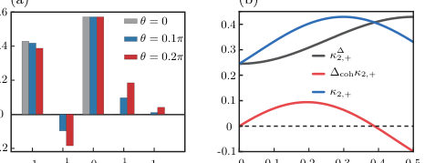
<figcaption class="paper-figure-caption"><b>Fig 1.</b> FIG. 2. Mechanism-resolved symmetric FCS statistics for the unitary branch. (a) The five weights at three measurement angles. Integer-quantum peaks are produced by population transfer through the nonadiabatic channel; the equal-and- opposite half-quantum pair is the measurement-coherence interference. (b) Dephased second-cumulant baseline κ∆ 2,+, signed coherent correction ∆cohκ2,+, and their sum. The sign change of the coherent correction demonstrates that coher- ence can either enhance or suppress work fluctuations. Pa- rameters are τc = 0.1, τe = 0.01, ωc = 20π, ωh = 30π, and ℏ= 1.</figcaption>
</figure>
<figure class="paper-figure-card">
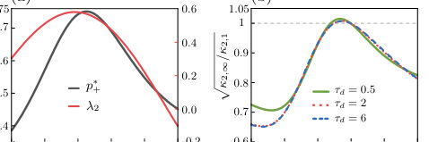
<figcaption class="paper-figure-caption"><b>Fig 2.</b> FIG. 3. Outcome memory and accumulated-work fluctu- ations. (a) Stationary driven-branch probability p∗ + and subleading memory eigenvalue λ2 for τd = 6. (b) Ratio √</figcaption>
</figure>
<figure class="paper-figure-card">
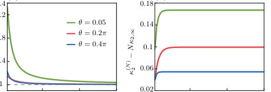
<figcaption class="paper-figure-caption"><b>Fig 3.</b> FIG. 4. Exact finite-cycle convergence at τd = 2 for sta- tionary initialization. (a) Per-cycle second FCS cumulant normalized by its long-cycle value. (b) Boundary difference κ(N) 2 −Nκ2,∞. The plateau is the boundary contribution; the remaining memory contribution decays exponentially. Work is measured in units of ℏωc.</figcaption>
</figure>
<figure class="paper-figure-card">
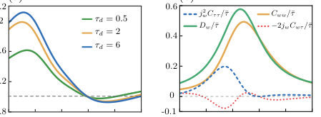
<figcaption class="paper-figure-caption"><b>Fig 4.</b> FIG. 5. Fixed-time symmetric-FCS second-cumulant rate. (a) Exact Dw divided by the naive completed-cycle rescaling κ2,∞/¯τ for τd = 0.5, 2, and 6. The horizontal dashed line denotes equality. (b) Completed-cycle, work–duration, and duration contributions in Eq. (45) at τd = 2. Work and time are measured in units of ℏωc and γ−1, respectively.</figcaption>
</figure>
<figure class="paper-figure-card">
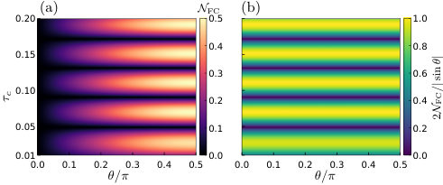
<figcaption class="paper-figure-caption"><b>Fig 5.</b> FIG. 6. Coherence–transition interference landscape. (a) Symmetric-FCS negativity versus measurement angle and compression duration at fixed τe = 0.01. (b) Ratio to the maximal coherence-only bound, 2NFC/| sin θ| = 2| Re(UegU ∗ ee)| ≤1. At θ = 0, the displayed ratio is defined by its continuous limit. The remaining parameters are ωc = 20π, ωh = 30π, and ℏ= 1.</figcaption>
</figure>

**Summary.** This work develops a detailed theory of work statistics in measurement-feedback quantum engines. By using Full Counting Statistics, the authors reveal that initial system coherence generates measurable interference terms in the work distribution and its fluctuations. The findings establish a direct link between coherent dynamics, memory effects from feedback, and fundamental thermodynamic quantities like the entropy rate.

**Why it may be interesting.** It provides a rigorous framework connecting non-equilibrium thermodynamics (work fluctuations) with quantum control mechanisms (measurement/feedback), which is highly relevant for understanding energy extraction in open quantum systems.

Detailed structure

**Main problem.** The paper develops a mechanism-resolved theory for work statistics and temporal correlations in quantum information engines that utilize measurement and feedback.

**Main result.** It shows that the conditional work separates into population transfer and a phase-sensitive coherence–transition interference term, linking coherent work statistics to entropy rate reduction via memory effects.

**Method.** The analysis employs Symmetric Full Counting Statistics (FCS) and Markov chain theory applied to outcome records to calculate cumulants and entropy costs.

**Model / system.** The system is a quantum information engine modeled by a qubit undergoing cycles involving projective measurements and time evolution through driven strokes and cold contacts. The dynamics are governed by specific Hamiltonians ($H_0, H_h$).

**Key observables.** Work statistics (mean work, variance, cumulants), temporal correlations ($	ext{Cov}(I_n, I_{n+\ell})$), and reversible reset costs (entropy rate).

**Important parameters / regimes.** Initial energy coherence ($
ho_{ge}$), cycle number ($N$), fixed laboratory time ($T$), and the nonstationary eigenvalue ($\lambda_2$).

**Assumptions / limitations.** The outcome record is assumed to form an exact time-homogeneous first-order Markov chain, and asymptotic limits are taken for entropy calculations.

**Figures summary.** Figures illustrate the five-point quasiprobability weights generated by coherence interference (Figure 2a) and show how this interference can suppress work fluctuations (Figure 2b).

**Paper structure.** The paper progresses from defining the physical process using measurement feedback, to calculating mean work via decomposition into population and coherence terms, then applying FCS to resolve higher-order statistics, and finally deriving memory corrections and entropy rate limits.

Abstract

Measurement and feedback jointly prepare coherence and select finite-time dynamics in quantum information engines. Complementing a companion experimental realization, we develop a mechanism-resolved theory of the resulting work statistics and temporal correlations. The con?ditional work separates into population transfer and a phase-sensitive coherence-transition inter?ference term. Symmetric full counting statistics maps this interference to an equal-and-opposite half-quantum pair in the work quasiprobability, entering odd moments while leaving even moments fixed by endpoint mixing. An outcome-resolved tilted kernel then propagates these statistics through the correlated measurement record, yielding finite-cycle and fixed-time fluctuation corrections. The same memory reduces the reversible record-reset cost from the one-symbol entropy to the entropy rate. Our results link coherent work statistics, feedback memory, and information thermodynamics

[↑ back to top](#top)

### [Current fluctuations in a non-additive open quantum system: breakdown of the quantum-jump approach](http://arxiv.org/abs/2608.14469v1)

**Authors:** Ilia Khomchenko, Saulo V. Moreira, Emanuel Schwarzhans, Mark T. Mitchison, Tony J. G. Apollaro  
**Type:** theory · **Category:** statistical mechanics · **PDF:** <https://arxiv.org/pdf/2608.14469v1>  
**Analysis basis:** full PDF text, analyzed in chunks
**Topic relevance:** 🔥 `methods for driven-dissipative` **4/5** · `correlated / nonlocal dissipation` **3/5** · `quantum measurements` **3/5** · `Full counting statistics` **2/5** · `Keldysh / 2PI / non-Gaussian methods` **2/5** · `driven-dissipative phase transition` **2/5** · `analog quantum simulation` **1/5** · `non-equilibrium universality` **1/5**

↔ Scroll figures horizontally

<figure class="paper-figure-card">
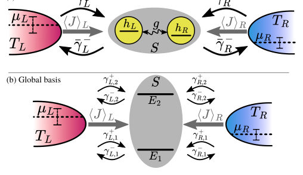
<figcaption class="paper-figure-caption"><b>Fig 1.</b> FIG. 1. Double quantum dot connected to two fermionic reservoirs, denoted as a system S. Each dot contains only one energy level hL,R and the dots are coherently coupled with tunnel coupling g. Both dots can exchange particles independently with reservoirs (L, R) at temperatures TL,R and chemical potentials µL,R, respectively. The double-dot quantum system is coupled to the two thermal baths, which ensures stationary-state currents ⟨J⟩L,R flowing through the system. The upper panel sketches the setup in the local ba- sis and the lower panel in the global basis. The rates ¯γ± α , in the upper panel, characterise the jump processes between the reservoirs and the individual site α; whereas, in...</figcaption>
</figure>
<figure class="paper-figure-card">
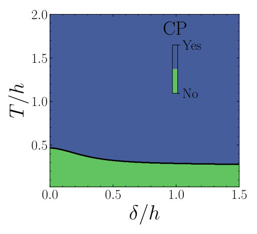
<figcaption class="paper-figure-caption"><b>Fig 2.</b> FIG. 2. Complete positivity (CP) of the quantum map Mc,j 0 in the site basis as a function of the local energy levels de- tuning δ/h and temperature T = TL = TR. Parameters: h = 1, g = 0.5, Γ = 0.02, Ω= 100, µL/h = 0.7, µR/h = 0.0. The blue colour denotes that the quantum map is CP and the obtained rates ˜γ± α are smaller than the actual rates ¯γ± α , i.e. ¯γ± α &gt; ˜γ± α (“Yes”), while the green one corresponds to a non-CP quantum map (“No”) with positive or nega- tive obtained rates. This plot is invariant with respect to time between jumps ∆t, which we verified for 1001 values of ∆t ∈[10−3, 103].</figcaption>
</figure>
<figure class="paper-figure-card">
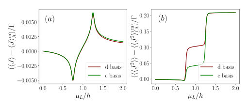
<figcaption class="paper-figure-caption"><b>Fig 3.</b> FIG. 4. Difference in steady-state current (⟨J⟩−⟨J⟩m A)/Γ (left) and its fluctuations (⟨⟨J2⟩⟩−⟨⟨J2⟩⟩m A)/Γ (right) in the non-additive picture with the variable chemical potential µL. The parameters are the same as in Fig. 3.</figcaption>
</figure>
<figure class="paper-figure-card">
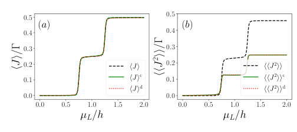
<figcaption class="paper-figure-caption"><b>Fig 4.</b> FIG. 3. Average steady-state current ⟨J⟩/Γ (a) and its fluc- tuations ⟨⟨J2⟩⟩/Γ (b) through the double quantum dot with the variable chemical potential of the left reservoir µL/h. The the subscript c and d refers to the site and energy eigen- basis, respectively. Parameters: h = 1, δ = 0.0, g = 0.5, ∆= p</figcaption>
</figure>
<figure class="paper-figure-card">
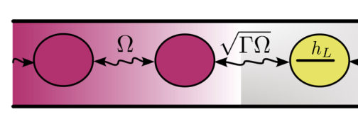
<figcaption class="paper-figure-caption"><b>Fig 5.</b> FIG. 5. Model of reservoirs as 1D tight-binding chains, where Ωand √</figcaption>
</figure>

**Summary.** The paper investigates current fluctuations in an open quantum system where reservoir coupling introduces non-additive dynamics. It finds that standard quantum jump techniques fail under perfect measurement conditions due to the nature of the cross-dissipative terms. However, by considering imperfect detection, the authors demonstrate a consistent framework that successfully reproduces established results from the Landauer-Büttiker theory.

**Why it may be interesting.** This work is highly relevant to AMO physics and open quantum systems as it rigorously defines the limitations of common theoretical tools (like QJA) when modeling complex, interacting environments that lead to non-Markovian or non-additive dissipation.

Detailed structure

**Main problem.** The paper assesses the validity of the quantum-jump formalism for calculating current fluctuations in open quantum systems whose dynamics are governed by non-additive master equations.

**Main result.** While perfect jump detection fails to reproduce a completely positive evolution, allowing for imperfect jump detection enables an additive unravelling that successfully reproduces results from the Landauer-Büttiker formalism.

**Method.** The study compares theoretical predictions derived from the quantum master equation (QME) with those from the Landauer-Büttiker (LB) approach, focusing on analyzing the complete positivity of associated quantum maps.

**Model / system.** The model is a double quantum dot system coupled to two fermionic reservoirs (Left and Right), whose dynamics are described by a non-additive Lindblad master equation incorporating cross-dissipative terms.

**Key observables.** Average steady-state current ($\langle J 
angle$) and associated current fluctuations ($\langle\langle J^2 
angle
angle$).

**Important parameters / regimes.** Tunnel coupling ($g$), detuning ($\delta$), chemical potentials ($\mu_{L/R}$), and the regime of detection (perfect vs. imperfect).

**Assumptions / limitations.** The analysis assumes asymptotic dynamics, compares results across different bases (local vs. global), and crucially distinguishes between perfect and imperfect quantum jump detection.

**Figures summary.** Figures illustrate the dependence of current and fluctuations on detuning ($\delta$) and tunnel coupling ($g$), and show diagnostics related to the complete positivity (CP) of quantum maps under various conditions.

**Paper structure.** The paper establishes the non-additive QME, compares it against the LB formalism for currents/fluctuations, tests the applicability of the standard quantum jump approach by checking CP criteria in both perfect and imperfect detection limits, and concludes with a successful framework for reproducing observables via additive unravellings.

Abstract

Open quantum system dynamics is efficiently described by the quantum master equation formalism. Therein, quantum master equations in Lindblad form constitute an important subclass describing Markovian dynamics. When an open quantum system is in an out-of-equilibrium state, an exchange of particles between the open system and reservoirs takes place yielding to a non-zero average net current and associated current fluctuations, which can be characterised with the quantum jump formalism for quantum master equations expressed in Lindblad form. However, a large class of quantum master equations cannot be described by Lindblad dynamics. Here we assess the validity and the effectiveness of the quantum jump formalism when the dissipators in the quantum master equation describe a non-additive, open quantum system dynamics. We find that an additive unravelling of the non-additive quantum master equation does not generate a completely-positive dynamics in the scenario of perfect jump detection. Nevertheless, allowing for an imperfect jump detection scenario, we find that an additive unravelling is possible that reproduces the current and the fluctuations obtained via the Landauer-Büttiker formalism.

[↑ back to top](#top)

### [To $\mathcal{PT}$ or not to $\mathcal{PT}$: Noise-induced escape and nonlinear-damping stabilization in a parity-time dimer](http://arxiv.org/abs/2608.14468v1)

**Authors:** Richelle Jade L. Tuquero, Kilian Seibold, Oded Zilberberg  
**Type:** theory · **Category:** other · **PDF:** <https://arxiv.org/pdf/2608.14468v1>  
**Analysis basis:** full PDF text, analyzed in chunks
**Topic relevance:** 🔥 `Keldysh / 2PI / non-Gaussian methods` **4/5** · `driven-dissipative phase transition` **3/5** · `methods for driven-dissipative` **3/5** · `Tavis-Cummings & cavity-many-emitter` **2/5** · `non-equilibrium universality` **2/5** · `analog quantum simulation` **1/5** · `correlated / nonlocal dissipation` **1/5** · `quantum measurements` **1/5** · `scars & prethermalization` **1/5**

↔ Scroll figures horizontally

<figure class="paper-figure-card">
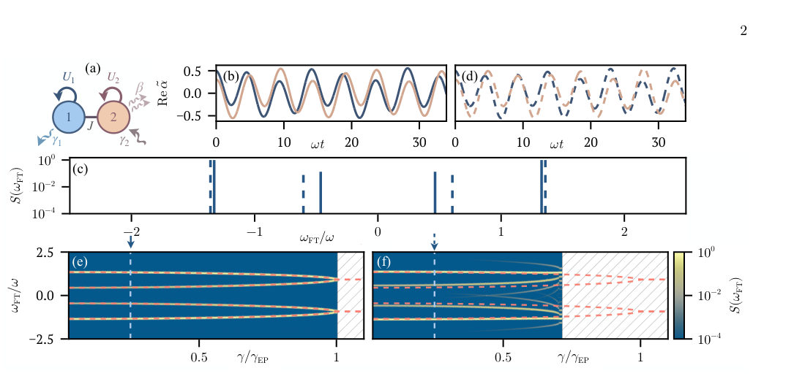
<figcaption class="paper-figure-caption"><b>Fig 1.</b> FIG. 1. Linear versus nonlinear gain–loss dimer. (a) Schematic of the dimer described by Eqs. (1) and (2); Hamiltonian couplings and dissipative channels are indicated by solid and wiggly lines, respectively. (b) Time evolution of the quadratures Re(˜αj) in the linear model (U1 = U2 = 0). (c) Corresponding power spectral densities for the linear [solid, from (b)] and nonlinear [dashed, from (d)] dynamics, with the linear peaks occurring at ±ω± [cf. Eq. (3)]. (d) Same as (b) for finite Duffing nonlinearities U1 = U2 = 0.1 and β = 0. (e) Power spectral density versus the gain–loss rate γ for the linear model, with the analytical eigenfrequencies ±ω± overlaid as red dashed lines up to the...</figcaption>
</figure>
<figure class="paper-figure-card">
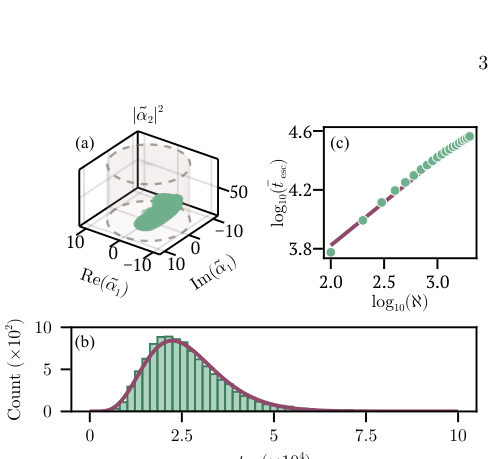
<figcaption class="paper-figure-caption"><b>Fig 2.</b> FIG. 2. Deterministic confinement and noise-induced first- passage escape. (a) Projection of the initial-condition space onto (Re(˜α1), Im(˜α1), |˜α2|2), showing initial conditions that yield bounded deterministic trajectories (green), together with the escape threshold |˜αj|2 = 102 (cylinder). (b) Dis- tribution of first-passage escape times, tesc, for Ntraj = 104</figcaption>
</figure>
<figure class="paper-figure-card">
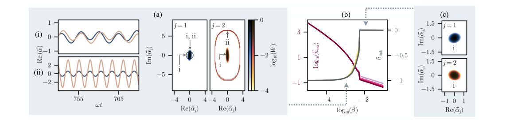
<figcaption class="paper-figure-caption"><b>Fig 3.</b> FIG. 3. Restoring stability via nonlinear damping. (a, left) At nonlinear damping strength ˜β = 1.7 × 10−3, the long-time dynamics evolve into either (i) a low-amplitude PT -like limit cycle or (ii) a high-amplitude, population-imbalanced limit cycle, for representative initial conditions (˜α1, ˜α2) = (0.5+0.2i, 0.3+0.1i) and (2.2+0.2i, 2.0+0.2i), respectively. (a, right) Long-time single-mode phase-space distributions at ˜β = 1.7×10−3, with gain–loss noise retained, showing probability localized around two coexisting limit-cycle attractors (marked by symbols). (b) Macroscopic observables, namely the total rescaled intensity ˜ntot and normalized population imbalance ˜nimb, as functions of...</figcaption>
</figure>

**Summary.** The paper investigates the robustness of Parity-Time ($\mathcal{PT}$) symmetric systems against real-world imperfections like nonlinearity and noise. It demonstrates that these factors cause excitations to escape transiently, invalidating the simple reliance on spectral $\mathcal{PT}$ symmetry for stability. True long-term stochastic stability is achieved only by introducing a genuine restoring dissipation mechanism.

**Why it may be interesting.** This work provides a crucial theoretical refinement for open quantum systems, showing that simple spectral conditions (like $\mathcal{PT}$ symmetry) are insufficient predictors of long-term physical stability when realistic noise and nonlinearities are present.

Detailed structure

**Main problem.** The study reevaluates the global long-time dynamics of Parity-Time ($\mathcal{PT}$) symmetric systems when realistic nonlinearities and noise are introduced, challenging the assumption that spectral $\mathcal{PT}$ symmetry guarantees stability.

**Main result.** Linear $\mathcal{PT}$-unbroken phases are purely transient due to noise-induced escape; global stochastic stability is recovered by introducing a non-Hermitian restoring dissipation (like two-photon loss), which governs attraction rather than spectral symmetry.

**Method.** The analysis uses the Truncated Wigner Approximation (TWA) to map the Lindblad master equation onto stochastic phase-space equations, analyzing deterministic flow and first-passage escape statistics.

**Model / system.** The system is a nonlinear dimer of coupled resonators exhibiting gain and loss ($\mathcal{PT}$ symmetry). The dynamics are governed by a Lindblad master equation incorporating Duffing nonlinearity and various damping channels (single/two-photon loss).

**Key observables.** Phase-space trajectories, first-passage escape time distribution ($p(t)$), spectral eigenfrequencies, and the existence of phase-space attractors.

**Important parameters / regimes.** Gain-loss rate ($\gamma$), nonlinear coupling strength (Duffing $U_j$), and two-photon loss coefficient ($eta$).

**Assumptions / limitations.** The analysis relies on mapping to stochastic equations via TWA, and the distinction is made between local spectral stability and global stochastic attraction.

**Figures summary.** Figures compare linear vs. nonlinear dynamics, show first-passage escape time scaling laws (algebraic dependence on system size $\mathcal{N}$), and illustrate the stabilization into coexisting limit cycles when two-photon loss is active.

**Paper structure.** The paper progresses by first establishing that noise causes escape in the linearly $\mathcal{PT}$-unbroken phase. It then introduces nonlinear damping ($eta 
eq 0$) to achieve genuine phase-space attraction, concluding that stability must derive from dissipation rather than spectral symmetry.

Abstract

Parity-time ($\mathcal{PT}$) symmetric systems exhibit long-lived excitations by balancing gain and loss in coupled resonators, driving extensive theoretical interest and diverse experimental realizations. Realistic physical implementations, however, inevitably introduce nonlinearities and noise. This mandates a rigorous reevaluation of their global long-time dynamics. In this work, we show that Hamiltonian Duffing nonlinearity restricts the $\mathcal{PT}$-unbroken phase to a finite, nonattracting region of phase space. Consequently, unavoidable fluctuations drive first-passage escape into runaway trajectories. This renders the linearly $\mathcal{PT}$-unbroken phase a purely transient phenomenon. We then recover global stochastic stability by introducing two-photon loss on the gain oscillator. This nonlinear damping explicitly breaks exact $\mathcal{PT}$ symmetry while supplying genuine phase-space attraction, generating a bistable regime where a low-amplitude orbit mimicking the original linear state coexists with a high-amplitude limit cycle. Thus, we establish a revised origin for stability in non-Hermitian experiments: the observed long-time stochastic stability is governed by inherent restoring dissipation rather than the spectral $\mathcal{PT}$ symmetry itself.

[↑ back to top](#top)

### [Dual-species alkali and alkaline-earth-like optical tweezer arrays via interferometrically aligned high-NA objectives](http://arxiv.org/abs/2608.13646v1)

**Authors:** K. Weber, M. McMaster, M. Anderson, J. Tu, S. E. Eustice, N. A. Schine, I. B. Spielman, J. V. Porto, S. L. Rolston, S. Subhankar  
**Type:** experiment · **Category:** other · **PDF:** <https://arxiv.org/pdf/2608.13646v1>  
**Analysis basis:** full PDF text, analyzed in chunks
**Topic relevance:** 🔥 `analog quantum simulation` **4/5** · `QC/QI experiment` **3/5** · `interference shaping light` **3/5** · `Rydberg arrays` **2/5** · `quantum measurements` **2/5** · `driven-dissipative phase transition` **1/5** · `methods for driven-dissipative` **1/5** · `quantum optics experiment` **1/5**

↔ Scroll figures horizontally

<figure class="paper-figure-card">
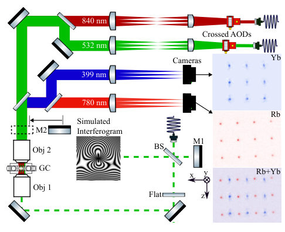
<figcaption class="paper-figure-caption"><b>Fig 1.</b> FIG. 1. Optical system overview. Laser light for the opti- cal tweezers (maroon and green) is delivered via optical fiber, sent through independent AODs, and via Objective-2 (Obj- 2), demagnified and sent to the vacuum system. Atomic flo- rescence from both Rb and Yb (red and blue) is collected through Objective-2, separated by a dichroic beamsplitter, and independently imaged. The main TGF interferometer beam (green-dashed) travels in the opposite direction, is re- flected by a insertable mirror (M2) before creating an inter- ferogram, as pictured.</figcaption>
</figure>
<figure class="paper-figure-card">
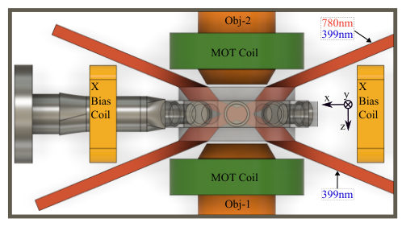
<figcaption class="paper-figure-caption"><b>Fig 2.</b> FIG. 2. Apparatus side view including four shallow-angle MOT beams. The glass cell (translucent) is mounted via stan- dard vacuum fittings (left). Shallow-angle MOT beams (red) narrowly avoid the objectives (orange) and MOT quadrupole coils (green) before entering through the top and bottom viewports. While 3D control of the magnetic field is pro- vided by three pairs of bias coils, only the x-bias coils (yel- low) are shown. Not shown are the out-of-plane MOT beams and through-objective beams at 532 nm, 556 nm and 840 nm beams.</figcaption>
</figure>
<figure class="paper-figure-card">
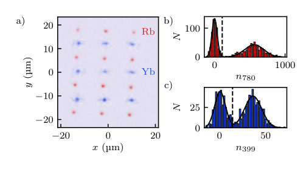
<figcaption class="paper-figure-caption"><b>Fig 3.</b> FIG. 3. Simultaneous trapping and single-site-resolved imag- ing of 87Rb and 174Yb in co-aligned 4 × 3 and 3 × 3 tweezer arrays. (a) Composite fluorescence image. We average im- ages of simultaneously loaded 87Rb and 174Yb arrays over 100 repetitions of the experiment, and combine them into the displayed two-channel color image. (b) and (c) Histograms demonstrating sub-Poissonian loading statistics for 87Rb and 174Yb respectively. These histograms are compiled for the whole tweezer array, and are broadened from spatial inhomo- geneities. In both cases, the horizontal axis plots the photon counts per trap. The solid lines shows a fit of the histogram to two displaced Gaussian distributions,...</figcaption>
</figure>

**Summary.** The researchers developed an advanced optical tweezer array capable of simultaneously trapping and manipulating two different types of atoms, $^{87}	ext{Rb}$ and $^{174}	ext{Yb}$. They overcame major technical challenges in multi-wavelength alignment using a specialized interferometer. This platform significantly enhances capabilities for building hybrid quantum registers by enabling controlled interactions between distinct atomic species.

**Why it may be interesting.** This work directly addresses a major engineering hurdle in quantum simulation: integrating multiple distinct atomic species into one controllable platform. The use of advanced interferometry to solve the alignment problem across widely separated wavelengths is technically significant for building scalable quantum hardware.

Detailed structure

**Main problem.** The primary goal is to establish a robust platform for quantum simulation and computation by trapping and controlling two different species of neutral atoms simultaneously.

**Main result.** The authors successfully demonstrated simultaneous single-site resolved imaging, high-fidelity state detection, and controlled transfer between $^{87}	ext{Rb}$ (alkali) and $^{174}	ext{Yb}$ (alkaline-earth-like) atoms in co-aligned optical tweezer arrays.

**Method.** The experiment utilizes a permanent hybrid Twyman-Green–Fizeau interferometer to achieve the necessary precision co-alignment of multiple high-NA objectives required for trapping and imaging two distinct atomic species at widely separated wavelengths.

**Model / system.** The platform consists of dual-species optical tweezer arrays containing $^{87}	ext{Rb}$ (trapped via 840 nm light) and $^{174}	ext{Yb}$ (trapped via 532 nm light). The system is designed to support hybrid quantum register operations, including mid-circuit measurements and controlled inter-species interactions.

**Key observables.** Single-site resolved fluorescence imaging, two-way atom transfer efficiency ($\sim 85\%$), detection fidelity ($>99.97\%$ for $	ext{Rb}$), and survival probability after imaging.

**Important parameters / regimes.** Wavelengths used include $840 	ext{ nm}$ ($	ext{Rb}$) and $532 	ext{ nm}$ ($	ext{Yb}$). Alignment precision is demonstrated to be better than $1\ \mu	ext{m}$ displacement sensitivity. Temperatures achieved are in the microkelvin regime.

**Assumptions / limitations.** The alignment relies on the interferometer's ability to maintain precise optical paths across a large spectral range, and the loading process must be sequential due to potential photoionization issues when mixing MOT light sources.

**Figures summary.** Figures illustrate the complex optical system using the TGF interferometer for co-alignment of multiple objectives. Other figures show composite fluorescence images confirming the successful simultaneous trapping and imaging of single atoms from both species in an array format.

**Paper structure.** The paper first introduces the need for dual-species platforms, details the technical challenge of multi-wavelength alignment using the interferometer, presents the experimental setup and loading/imaging procedures for both $	ext{Rb}$ and $	ext{Yb}$, and concludes with measurements demonstrating high control fidelity and transfer efficiency.

Abstract

We have developed a dual-species optical tweezer array apparatus combining $^{87}\text{Rb}$ and $^{174}\text{Yb}$ atoms with a permanent hybrid Twyman-Green--Fizeau interferometer, which provides precision co-alignment of two opposing 0.6-numerical aperture (NA) objectives and the high NA beams that pass through the system. This technique is extensible to other tweezer platforms operating at high numerical aperture across widely-separated wavelengths. Here we present simultaneous trapping and single-site resolved imaging of both species in co-aligned tweezer arrays with $^{87}\text{Rb}$ confined at $840\ \rm{nm}$ and $^{174}\text{Yb}$ at $532\ \rm{nm}$. The platform provides a foundation for hybrid quantum register operation, including mid-circuit measurements and asymmetric intra- and inter-species interactions, greatly expanding the capabilities of neutral atom arrays.

[↑ back to top](#top)

### [Quantum Snapshots Reveal a Compact Conformal Boundary Mode](http://arxiv.org/abs/2608.14327v1)

**Authors:** M. A. Rajabpour  
**Type:** theory · **Category:** statistical mechanics · **PDF:** <https://arxiv.org/pdf/2608.14327v1>  
**Analysis basis:** full PDF text, analyzed in chunks
**Topic relevance:** 🔥 `quantum measurements` **4/5** · `Full counting statistics` **3/5** · `non-equilibrium universality` **3/5** · `driven-dissipative phase transition` **2/5** · `Frenkel-Kontorova` **1/5** · `Keldysh / 2PI / non-Gaussian methods` **1/5** · `analog quantum simulation` **1/5** · `correlated / nonlocal dissipation` **1/5** · `methods for driven-dissipative` **1/5**

↔ Scroll figures horizontally

<figure class="paper-figure-card">
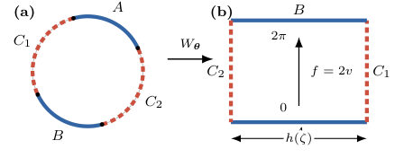
<figcaption class="paper-figure-caption"><b>Fig 1.</b> FIG. 1. Geometry and conformal coordinate. The measured arcs C1, C2 (dashed red) and unmeasured arcs A, B (solid blue) map to the vertical and horizontal sides of the rectangle Rh, respectively. The boundary coordinate f = 2 Im W = 2v equals 0 on A, 2π on B, and winds once with opposite orientations along the two measured sides.</figcaption>
</figure>

**Summary.** This work establishes that the information contained in partial quantum measurements of critical many-body systems is sufficient to determine universal continuum quantities. By analyzing a specific compact coordinate $\delta_L$, the authors prove its scaling limit follows a Gaussian distribution whose width is dictated by the system's geometry via conformal field theory moduli.

**Why it may be interesting.** It provides a rigorous link between highly non-local, continuous field theory concepts (like boundary modes and Dirichlet energy) and local, measurable quantum data obtained from partial measurements on simple lattice models.

Detailed structure

**Main problem.** To determine if a universal field-theory coordinate can be decoded directly from individual microscopic quantum snapshots (partial measurements) of many-body states at critical points.

**Main result.** The scaling limit of the free-fermion statistics converges to a Gaussian distribution whose variance is determined by the relative Dirichlet phase, establishing an exact microscopic foundation for this boundary mode.

**Method.** The authors use projective measurement on the XX chain ground state, mapping it to determinantal processes, and analyzing the Fourier moments of the resulting compact coordinate $\delta_L$.

**Model / system.** The analysis focuses on the half-filled critical XX chain (a free-fermion system) with periodic boundary conditions. The physics is connected to conformal field theory via boundary conditions defined by a cross-ratio $\zeta$.

**Key observables.** The compact variable $\delta_L$, its characteristic function $\langle e^{iq\delta_L} \rangle$, and the resulting Gaussian distribution $e^{-h(\zeta)q^2}$.

**Important parameters / regimes.** The conformal cross-ratio $\zeta$ and the associated rectangle modulus $h(\zeta)$, which govern the limiting variance.

**Assumptions / limitations.** The result is proven exactly for the free-fermion point; extension to interacting systems requires a non-trivial 'outcome-level decoder'.

**Figures summary.** Figures illustrate the geometry of the measured/unmeasured arcs forming a conformal quadrilateral, and tables summarize the equivalence between continuum boundary phases and microscopic lattice measurements.

**Paper structure.** The paper builds from defining the partial measurement process on the XX chain to constructing the compact coordinate $\delta_L$. It then uses determinantal calculations to find the scaling limit of its moments, finally equating this result to known continuum results in BCFT.

Abstract

A projective measurement of a many-body state produces a microscopic snapshot, usually viewed as random classical data. We show that partial occupation snapshots of the critical XX chain contain a universal angle with a precise conformal meaning. Dividing the ring into two measured and two unmeasured arcs, we assign geometry-dependent conformal side weights to the observed occupations and obtain a compact variable $δ_L$. At every finite size, $δ_L$ is fixed by the measured sites alone; the particular complete-configuration lift $X_L$ used in the proof additionally depends on unobserved particles. This angle is an exact microscopic compact coordinate whose scaling-limit law is that of the relative Dirichlet phase of the associated conformal quadrilateral---the boundary coordinate conjugate to charge in continuum post-measurement descriptions. Exact free-fermion determinants yield all of its Fourier moments. We prove that the lift becomes Gaussian with variance $2h(ζ)$, where $h(ζ)$ is the rectangle modulus, and hence $\langle e^{\ii qδ_L}\rangle\to e^{-h(ζ)q^2}$. Thus raw quantum snapshots realize the heat kernel on a circle and provide an outcome-level microscopic foundation for the compact zero-mode sector of Born averages over fluctuating conformal boundary conditions.

[↑ back to top](#top)

### [Generalizing the multidimensional thermodynamic uncertainty relation to combinations of arbitrary counting variables](http://arxiv.org/abs/2608.14276v1)

**Authors:** Niklas Buschmann, Udo Seifert, Alexander M. Maier  
**Type:** theory · **Category:** statistical mechanics · **PDF:** <https://arxiv.org/pdf/2608.14276v1>  
**Analysis basis:** full PDF text, analyzed in chunks
**Topic relevance:** 🔥 `Full counting statistics` **4/5** · `methods for driven-dissipative` **3/5** · `non-equilibrium universality` **3/5** · `Keldysh / 2PI / non-Gaussian methods` **2/5** · `driven-dissipative phase transition` **2/5** · `correlated / nonlocal dissipation` **1/5** · `quantum measurements` **1/5**

↔ Scroll figures horizontally

<figure class="paper-figure-card">
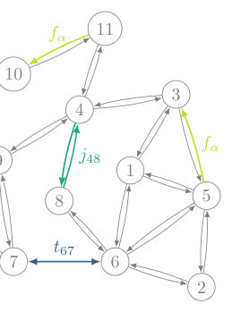
<figcaption class="paper-figure-caption"><b>Fig 1.</b> Figure 1. Partially observable Markov network with 13 discrete states. Gray transitions and states are hidden, whereas an observer may register the flow f13 12 (purple), the traffic t67 (blue), the flows of the net current j48 (green), the coarse-grained flow fα = f53 + f11 10 (yellow), or a combination of these.</figcaption>
</figure>
<figure class="paper-figure-card">
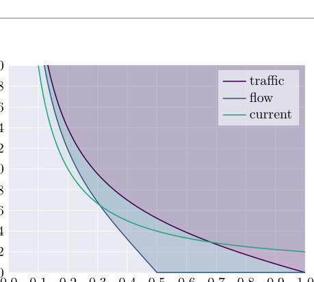
<figcaption class="paper-figure-caption"><b>Fig 2.</b> Figure 2. Comparison of the lower bounds (39) to (41) for one observed color per rate r ∈{t, f, j}. For the traffic t (purple), the flow f (blue) and the current j (green), the respective shaded region indicates permissible values of the steady-state entropy production rate σ in units of the corresponding mean rate ⟨r⟩as a function of the Fano factor F as defined in (38).</figcaption>
</figure>
<figure class="paper-figure-card">
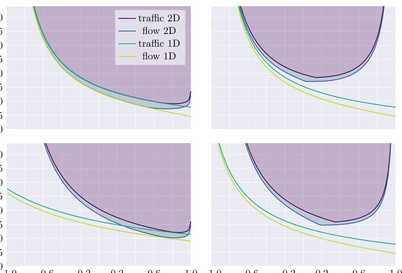
<figcaption class="paper-figure-caption"><b>Fig 3.</b> Figure 3. Comparison of bounds on the steady-state entropy production rate σ based on one (1D) or two (2D) colors of traffic or flow. Bound (26) depends on five variables in the 2D case, of which we fix the mean rate ⟨rα⟩and the standard deviation σα of the fluctuating traffic or flow of color α ∈{1, 2} and vary the correlation ρ ≡σ1σ2/Σ12 between r1 and r2 in each of the graphs. The fixed values (⟨r1⟩, ⟨r2⟩, σ1, σ2) are (0.5, 0.5, 0.3, 0.3) in the upper left panel, (0.2, 0.8, 0.3, 0.3) in the upper right panel, (0.2, 0.8, 0.1, 0.4) in the lower left panel and (0.5, 0.5, 0.2, 0.4) in the lower right panel, respectively. In all panels, the bounds labeled 1D are based on the combined rate r1...</figcaption>
</figure>
<figure class="paper-figure-card">
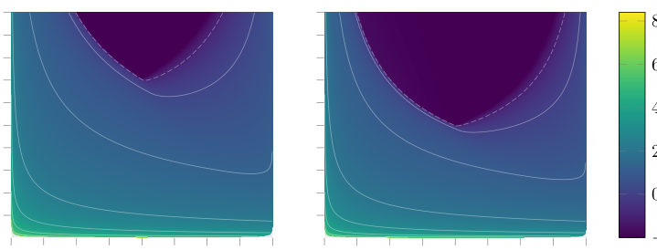
<figcaption class="paper-figure-caption"><b>Fig 4.</b> Figure 4. Bound on the steady-state entropy production rate σ per unit time for two traffic observables (left) and for two flow observables (right). The bound (26) depends on five variables in the case with rates of two colors, of which we fix ⟨r1⟩= ⟨r2⟩= 0.5 and set the two variances per unit time of the fluctuating rates equal, σ2 1 = σ2 2. In both cases, we vary σ1 and the correlation ρ ≡σ1σ2/Σ12 = σ2 1/Σ12 between r1 and r2. In the darkest regions where the entropy production vanishes, σ = 0, the values of σ1, σ2 and ρ can be realized in equilibrium.</figcaption>
</figure>

**Summary.** The authors generalize the Thermodynamic Uncertainty Relation (TUR) to create a universal lower bound on entropy production rate ($\sigma$). They achieve this by applying the Cramér-Rao bound to arbitrary combinations of fluctuating counting variables—including currents, traffics, and flows—in time-dependent Markov processes. This provides a powerful, model-independent diagnostic tool for characterizing non-equilibrium physics using only measured statistical moments.

**Why it may be interesting.** This work provides a powerful, general mathematical tool connecting fundamental thermodynamic quantities ($\sigma$) directly to measurable statistical fluctuations (covariances), which is crucial for characterizing non-equilibrium steady states in complex systems like molecular motors or biological networks.

Detailed structure

**Main problem.** The paper generalizes the multidimensional thermodynamic uncertainty relation (MTUR) to provide model-independent lower bounds on the entropy production rate ($\sigma$) for time-dependently driven processes.

**Main result.** A generalized MTUR is established using a matrix inequality ($M' \succeq 0$), which provides a fundamental, mathematically rigorous lower bound on $\sigma$ based solely on measured mean rates and covariances of arbitrary counting variables (currents, traffics, or flows).

**Method.** The derivation relies heavily on the multivariate Cramér-Rao bound applied to Fisher information derived from perturbing the system's transition rates within a continuous-time Markov jump process framework.

**Model / system.** The analysis is based on stochastic processes governed by master equations, applicable to any partially accessible Markov network. The dynamics are characterized by transition rates ($k_{ij}$) and observable quantities like flows ($f_{ij}$), traffics ($t_{ij}$), or net currents ($j_{ij}$).

**Key observables.** Entropy Production Rate ($\sigma$), Mean Rates ($\langle r_\alpha 
angle$, $\langle t_\alpha 
angle$, $\langle f_\alpha 
angle$), Covariances ($\Sigma_{\alphaeta}$), and the Fisher Information matrix $I(	heta)$.

**Important parameters / regimes.** Time-dependent driving protocols, arbitrary initial states, measurement duration ($T$), and the perturbation parameter $	heta$.

**Assumptions / limitations.** The derivation assumes that the mean values and covariances of the generalized rates are known exactly; it also uses a perturbation approach based on an auxiliary process.

**Figures summary.** Figures compare derived lower bounds for $\sigma/\langle r 
angle$ vs. Fano factor $F$ for single, two-observable combinations (currents, traffics, flows), and show the dependence of these bounds on correlation coefficients ($
ho$).

**Paper structure.** The paper builds from the standard TUR to the MTUR, generalizing it first to time-dependent processes. It systematically derives bounds for one observable type (current/traffic/flow) and then extends this to combinations of two or more observables using matrix inequalities derived from Cramér-Rao theory.

Abstract

Uncertainty relations provide lower bounds for otherwise hidden quantities of a partially accessible Markov network like the mean entropy production rate and the total dynamical activity. The thermodynamic uncertainty relation (TUR) is arguably the most prominent one and involves the precision of a fluctuating net current. One of its major generalizations is the multidimensional TUR (MTUR), which yields a tighter bound by using covariances of a set of observed net currents. We generalize this latter bound to time-dependently driven processes with arbitrary initial state and arbitrary measurement duration. Furthermore, this bound can be used with a set of fluctuating counting observables each of which can be time-antisymmetric, time-symmetric or time-asymmetric, i.e., a net current, a traffic or a flow. We can even allow for coarse-grained observations in which each counting observable could consist of multiple indiscernable observed transitions of the underlying system. Thus, we generalize the MTUR, extensions of the TUR for time-dependent processes based on one current, and an estimator based on one flux or on one traffic in a unifying way. We illustrate this general uncertainty relation with simple examples.

[↑ back to top](#top)

### [Tuning crystal-fields by He-irradiation and orbital Widom line in SrVO$_3$ films](http://arxiv.org/abs/2608.14362v1)

**Authors:** Matthias Pickem, Karsten Held, Jan M. Tomczak  
**Type:** theory · **Category:** strongly correlated electrons · **PDF:** <https://arxiv.org/pdf/2608.14362v1>  
**Analysis basis:** full PDF text, analyzed in chunks
**Topic relevance:** 🔥 `analog quantum simulation` **4/5** · `Keldysh / 2PI / non-Gaussian methods` **3/5** · `driven-dissipative phase transition` **2/5** · `methods for driven-dissipative` **2/5** · `non-equilibrium universality` **2/5** · `correlated / nonlocal dissipation` **1/5** · `quantum measurements` **1/5** · `scars & prethermalization` **1/5**

↔ Scroll figures horizontally

<figure class="paper-figure-card">
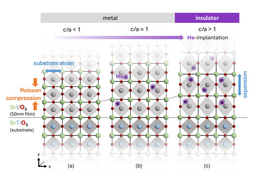
<figcaption class="paper-figure-caption"><b>Fig 1.</b> FIG. 1. Schematics of Wang et al.’s experiment [16]: (a) When grown on SrTiO3, the in-plane lattice constants a = b of SrVO3 are locked by the substrate constraint, leading to a tetragonal compression c/a &lt; 1. (b) The compression is consecutively overcome by He-ion implantation that acts as chemical pressure; (c) above a critical c/a &gt; 1 ratio, the system undergoes a metal-insulator transition.</figcaption>
</figure>
<figure class="paper-figure-card">
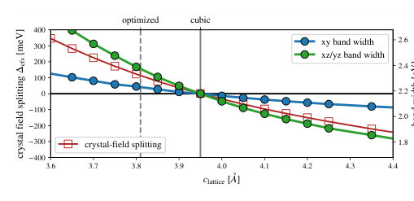
<figcaption class="paper-figure-caption"><b>Fig 2.</b> FIG. 2. Crystal-field splitting ∆cfs = Exz/yz −Exy (red line, left y-axis) and band widths of the dxy and dxz/dyz orbitals (blue and green lines, right y-axis) of tetragonally deformed bulk SrVO3 using DFT. The in-plane lattice constant is con- strained to a = b = 3.95˚A of the substrate while the per- pendicular c axis is varied. For c &lt; 3.95˚A the dxy-orbital is energetically favored (∆cfs &gt; 0), for c &gt; 3.95˚A the dxz/dyz- orbitals are favored (∆cfs &lt; 0).</figcaption>
</figure>
<figure class="paper-figure-card">
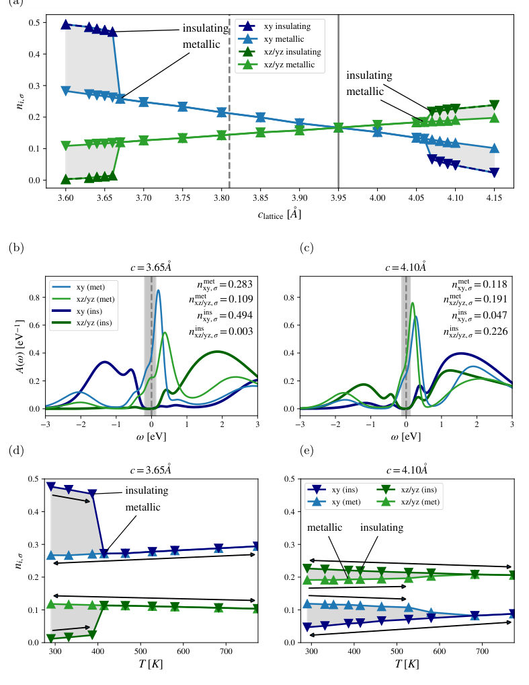
<figcaption class="paper-figure-caption"><b>Fig 3.</b> FIG. 3. Dynamical mean-field theory (DMFT) results. (a) Orbital and spin resolved occupations at room temperature (T = 290 K, β = 40 eV−1). The sudden jump in orbital polarization for small and large c-axis parameters signals polarized insulating solutions. (b,c) Orbital resolved local spectral functions in the coexistence region of uniaxially compressed (c = 3.65˚A; panel b) and elongated (c = 4.10˚A; panel c) bulk SrVO3 with an in-plane lock to a = b = 3.95˚A, at room temperature, T = 290K. The insulating solutions, with spectral gaps marked in gray, are characterized by a nearly half-filled dxy orbital [nxy,σ ≈0.5; panel (b)] and a quarter-filled dxz/dyz doublet [nxz/yz,σ ≈0.25; panel...</figcaption>
</figure>
<figure class="paper-figure-card">
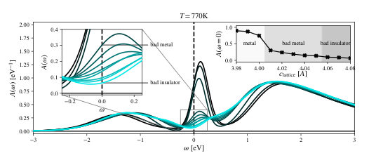
<figcaption class="paper-figure-caption"><b>Fig 4.</b> FIG. 4. Detailed evolution of the spectral function across the metal-insulator crossover as a function of the clattice parame- ter (at the 11 values given by the inset) at T = 770K. Beyond a crystal-field splitting threshold, the metal morphs into a badly metal phase (quasi-particle peak is suppressed but re- mains finite and convex in ω). Beyond c ≳4.06˚A, the spectral function is indicative of a bad insulator (spectral weight at the Fermi level is finite but concave in ω).</figcaption>
</figure>
<figure class="paper-figure-card">
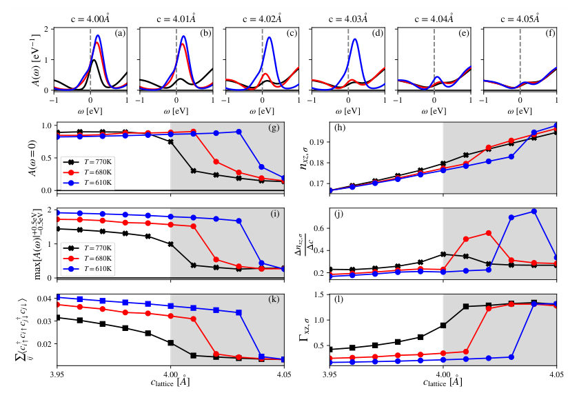
<figcaption class="paper-figure-caption"><b>Fig 5.</b> FIG. 5. (a-f) Evolution of the spectral function along the metal to bad metal/insulator crossover from c = 4.00 →4.05˚A. We show the crossover for the temperatures T = 770K, T = 680K and T = 610K. (g) Spectral weight at the Fermi level A(ω = 0) and (i) height of the quasi particle peak max[A(ω)|+0.5eV −0.5eV]. Cooling the system boosts the quasi-particle peak and a larger crystal-field splitting (larger c values) is necessary to turn the system insulating. The crossover is characterized by a sudden change in orbital occupation nxy,σ (panel h), and the resulting maximum of the (symmetric) numerical derivative thereof (panel j). Further, the metal-insulator crossover is accompanied by a drop...</figcaption>
</figure>

**Summary.** This work investigates the mechanism behind a metal-insulator transition in SrVO3 films induced by Helium irradiation. Using advanced DFT+DMFT calculations, the authors argue that the transition is governed not by electron-electron interactions (Mott physics) but by crystal-field splitting driven by lattice strain. This establishes ion implantation as a powerful tool to tune correlated electronic states.

**Why it may be interesting.** While focused on correlated oxides, the methodology—using lattice parameters (strain) to tune orbital degrees of freedom and map out phase diagrams involving quantum critical points—is highly relevant for understanding tunable quantum materials in AMO or open quantum systems contexts.

Detailed structure

**Main problem.** To determine whether the metal-insulator transition (MIT) in He-irradiated SrVO3 films is driven by Mott localization or crystal-field splitting.

**Main result.** The MIT is shown to be driven by the crystal-field splitting generated by irradiation-induced tetragonal expansion, leading to an orbital Widom line rooted in anomalous orbital compressibility.

**Method.** Density-Functional Theory combined with Dynamical Mean-Field Theory (DFT+DMFT) calculations are used to model electronic structure and phase transitions.

**Model / system.** The study focuses on epitaxial SrVO3/SrTiO3 thin films, where He-ion irradiation acts as a chemical pressure tuning the lattice parameters and crystal fields.

**Key observables.** Crystal-field splitting (Delta cfs), orbital band widths, spectral functions A(omega), and orbital occupations.

**Important parameters / regimes.** Lattice strain/c-axis parameter (compression vs. expansion), temperature (T), and interaction strength (U).

**Assumptions / limitations.** The analysis assumes that He-implantation can be modeled as chemical pressure, allowing the study of expanded structures; tetrahedral symmetry is assumed to be maintained.

**Figures summary.** Figures illustrate lattice changes due to irradiation, show spectral function evolution across varying c-axis parameters (indicating MIT), and map out phase diagrams related to orbital order.

**Paper structure.** The paper first establishes the experimental context of strain tuning in SrVO3. It then uses DFT+DMFT calculations to analyze how crystal-field splitting dictates electronic behavior, predicting an orbital Widom line as the key diagnostic feature distinguishing it from simple charge localization models.

Abstract

Helium-ion irradiation of epitaxial SrVO$_3$/SrTiO$_3$ films causes a metal-insulator transition, so far attributed to a Mott localization driven by a reduced kinetic energy. Using density-functional theory plus dynamical mean-field theory, we show that the driving mechanism is instead the crystal-field splitting generated by the irradiation-induced tetragonal expansion, not the interaction-to-bandwidth ratio. The resulting $c$-axis vs. temperature phase diagram mirrors that of the one-band Hubbard model, but its critical end-point spawns an orbital Widom line, rooted in an anomalous compressibility of orbital, rather than charge occupation. At an effectively quarter filling, superexchange-like processes favor orbital over magnetic long-range order. Our results semi-quantitatively reproduce the fluence-dependent spectral gaps and transition thresholds reported experimentally, establishing ion implantation as a route to chemically expand correlated materials.

[↑ back to top](#top)

### [Maximizing Nonclassicality of Massive Objects via Quantum Zeno Effect](http://arxiv.org/abs/2608.13942v1)

**Authors:** Debarshi Das, Pritam Roy, Marko Toroš, Hendrik Ulbricht, Dipankar Home, Sougato Bose  
**Type:** both · **Category:** other · **PDF:** <https://arxiv.org/pdf/2608.13942v1>  
**Analysis basis:** full PDF text, analyzed in chunks
**Topic relevance:** 🔥 `quantum measurements` **4/5** · `quantum optics experiment` **3/5** · `driven-dissipative phase transition` **2/5** · `Keldysh / 2PI / non-Gaussian methods` **1/5** · `correlated / nonlocal dissipation` **1/5** · `methods for driven-dissipative` **1/5**

↔ Scroll figures horizontally

<figure class="paper-figure-card">
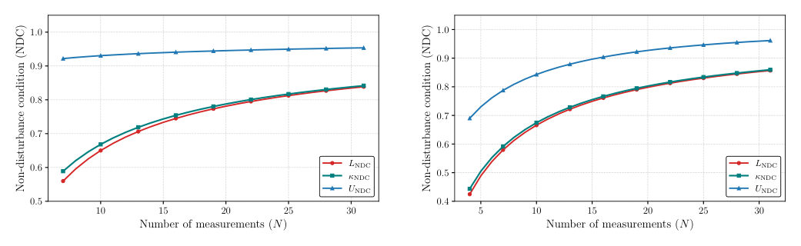
<figcaption class="paper-figure-caption"><b>Fig 1.</b> Figure 1: The blue curve shows the upper limit UNDC, the red curve shows the lower limit LNDC, and the green curve shows the numerically computed value of κNDC. Panels (a) and (b) correspond to: (a) Ωmt f = π</figcaption>
</figure>
<figure class="paper-figure-card">

<figcaption class="paper-figure-caption"><b>Fig 2.</b> Figure 2: Levitated and suitably trapped mechanical mass m, trapped in a harmonic potential with mechanical frequency Ωm, is placed inside a cavity of frequency ωc, driven by input laser of state |α⟩o and frequency ωL. The output from cavity is subjected to an optical displacement Do(−α), followed by a on/off photon detector (D). Here, g denotes the optomechanical coupling, κo is the optical cavity decay rate, and Γm denotes the mechanical damping rate. The cavity is red-detuned by setting ωL −ωc = −Ωm, the resulting linearized optomechanical interaction realizes a beam-splitter Hamiltonian.</figcaption>
</figure>
<figure class="paper-figure-card">

<figcaption class="paper-figure-caption"><b>Fig 3.</b> Fig. 2 illustrates how our proposed setup works. Let the mechnaical oscillator be in an arbitrary coherent state |β⟩m. The optical ancilla is initialized in the coherent state |α⟩o and interacts with the mechanical mode for tswap = π/(2g). In the strong-coupling regime g ≫κo, Γm (Γm be- ing the mechanical damping rate), this realizes a coherent state swap. In the ideal dissipation-free limit one obtains an ideal swap: |α⟩o|β⟩m →|β⟩o|α⟩m. Including weak dissip- ation, the swap becomes |α⟩o|β⟩m →|Aβ⟩o|Aα⟩m, where</figcaption>
</figure>
<figure class="paper-figure-card">

<figcaption class="paper-figure-caption"><b>Fig 4.</b> Figure 3: Non-Disturbance Condition (NDC) lower bound LNDC enhancement under sequential operations as a function of the number of operations N. (a) For experimentally realized optomechanical parameter regimes with m ∼10−18 kg and m ∼10−10 kg: de los Ríos et al. (dLR) [41] and Gröblacher et al. (Gr) [42]. (b) Performance in optimistic parameter regimes (Opt-I and Opt-II) with a moderate improvement over the experimentally demonstrated optomechanical coupling (g)-to-optical cavity decay rate (κo) ratio, while keeping all other parameters in the experimentally realizable regime [41, 42]. Solid and dashed curves correspond to coherent amplitudes |α| = 0.5 and |α| = 0.7, respectively. The ideal...</figcaption>
</figure>
<figure class="paper-figure-card">

<figcaption class="paper-figure-caption"><b>Fig 5.</b> Figure 4: Log-scale comparison between the numerical and analytical survival probabilities for repeated coherent-state measurements under harmonic-oscillator evolution. The plotted quantity is the absolute deviation ∆as a function of the number of measurements N. Different marker styles and line types correspond to different coherent-state amplitudes α and truncation thresholds ϵ.</figcaption>
</figure>

**Summary.** The paper proposes using the Quantum Zeno Effect (QZE) to amplify subtle, nonclassical signatures of massive objects that are otherwise lost to decoherence. By implementing a loophole-free measurement protocol within an optomechanical cavity setup, the authors show that this enhanced quantum disturbance remains measurable even when considering realistic damping effects.

**Why it may be interesting.** This work directly bridges fundamental quantum foundations (QZE) with cutting-edge experimental platforms (optomechanics), providing concrete, testable protocols for observing nonclassical effects in macroscopic systems while accounting for realistic environmental losses.

Detailed structure

**Main problem.** The primary challenge addressed is enhancing observable nonclassical signatures of massive objects against environmental decoherence by utilizing the Quantum Zeno Effect (QZE). The goal is to devise a loophole-free scheme to quantify this measurement-induced quantum disturbance.

**Main result.** The analysis demonstrates that the measurable quantity, $\kappa_{NDC}$, which quantifies QZE-enhanced nonclassicality, remains appreciably observable even in realistic regimes incorporating optomechanical damping for sufficiently large masses.

**Method.** The authors formulate a testable scheme using repetitive measurements (QZE) on a massive oscillator coupled to an optical field. They derive analytical bounds and analyze the limit where repeated measurements freeze the system's evolution.

**Model / system.** The physical platform is a massive quantum harmonic oscillator, requiring ground-state cooling. The measurement interaction is realized via a beam-splitter-type coupling between the mechanical mode and an optical field in an optomechanical setup.

**Key observables.** No-Disturbance Condition Violation ($\kappa_{	ext{NDC}}$), Survival Probability ($P_{	ext{with}}^0(t_f)$), and comparison against $P_{	ext{without}}^0(t_f)$.

**Important parameters / regimes.** Number of measurements ($N$), total time ($t_f$), optomechanical damping rates ($\kappa_o, \Gamma_m$), and the mass parameter.

**Assumptions / limitations.** The scheme requires trapping and cooling the massive object to its ground state. Later analyses assume strong-coupling regimes for simplifying the dynamics in the presence of dissipation.

**Figures summary.** Figures illustrate numerical computations of $\kappa_{NDC}$ against derived analytical bounds, schematic diagrams of the optomechanical setup, and plots showing how the lower bound $L_{NDC}$ enhances under sequential operations across various damping regimes.

**Paper structure.** The paper progresses from establishing the theoretical framework using QZE to define a measurable witness ($\kappa_{NDC}$). It then details the physical realization using an optomechanical cavity system, analyzing both the ideal and damped limits of the measurement protocol.

Abstract

For testing quantum mechanics in the macroscopic domain, a major challenge is to devise effective means for enhancing the observable nonclassical signatures despite the ubiquitous presence of environmental decoherence. Toward this goal, we invoke the Quantum Zeno Effect (QZE) for achieving a tunable amplification of an inherently nonclassical quantum disturbance induced by any measurement. Such an enhancement of otherwise small and decoherence-suppressed nonclassicality can arise from the cumulative quantum disturbances generated by repetitive measurements, with the tunability of amplification controlled by the number of measurements. To evidence this, we formulate a testable loophole-free scheme using a massive oscillator, where the system preparation requires trapping and ground-state cooling of a massive object. The required measurements can be realized through a beam-splitter-type interaction between the mechanical oscillator and an optical field, followed by photon detection. Our analysis shows that such amplification, suitably quantified in terms of a testable witness, remains appreciably observable even in the realistic regimes of optomechanical damping, and for sufficiently large masses, thus enabling the demonstration of QZE in the macroscopic domain.

[↑ back to top](#top)

### [GPU implementation of mixed quantum-classical Liouville molecular dynamics without momentum jump](http://arxiv.org/abs/2608.14544v1)

**Authors:** Koji Ando  
**Type:** theory · **Category:** numerical methods · **PDF:** <https://arxiv.org/pdf/2608.14544v1>  
**Analysis basis:** full PDF text, analyzed in chunks
**Topic relevance:** 🔥 `methods for driven-dissipative` **4/5** · `quantum measurements` **3/5** · `driven-dissipative phase transition` **2/5** · `Keldysh / 2PI / non-Gaussian methods` **1/5** · `correlated / nonlocal dissipation` **1/5**

↔ Scroll figures horizontally

<figure class="paper-figure-card">

<figcaption class="paper-figure-caption"><b>Fig 1.</b> FIG. 1: Adiabatic excited state population P ad (t) for three- mode spin-boson model, comparing results from GPU with- out trajectory spawning, CPU with trajectory spawning, and quantum reference calculation.</figcaption>
</figure>
<figure class="paper-figure-card">

<figcaption class="paper-figure-caption"><b>Fig 2.</b> Figure 1 displays the adiabatic excited state popula- tion P ad (t) for the three-mode spin-boson model. The CPU simulation started with 50,000 walkers and the spawning generated 2.87 × 107 walkers in total. Accord- ingly, we allocated 2.8 × 107 walkers in the GPU simu- lation without spawning. The figure indicates that the accuracy is comparable between the CPU and GPU sim- ulations. The computation time measured by the @time macro (excluding the compilation time) were 1860 sec- onds on CPU and 80 seconds on GPU. Figure 2 displays the corresponding results for pyrazine S2 →S1 internal conversion. The CPU simulation started with 50,000 walkers and generated 1.40 × 107</figcaption>
</figure>
<figure class="paper-figure-card">

<figcaption class="paper-figure-caption"><b>Fig 3.</b> FIG. 2: Adiabatic excited state population P ad (t) for three- mode model of pyrazine S2 →S1 internal conversion, com- paring results from GPU without trajectory spawning, CPU with trajectory spawning, and quantum reference calculation.</figcaption>
</figure>
<figure class="paper-figure-card">

<figcaption class="paper-figure-caption"><b>Fig 4.</b> FIG. 3: Adiabatic excited state population P ad (t) for three- mode spin-boson model from GPU simulation without trajec- tory spawning, comparing results with the number of walkers N = 106, 107, and 108.</figcaption>
</figure>
<figure class="paper-figure-card">

<figcaption class="paper-figure-caption"><b>Fig 5.</b> FIG. 4: Adiabatic excited state population P ad (t) for three- mode model of pyrazine S2 →S1 internal conversion, from GPU simulation without trajectory spawning, comparing re- sults with the number of walkers N = 106, 107, and 108.</figcaption>
</figure>

**Summary.** The authors developed and implemented a mixed quantum-classical Liouville molecular dynamics simulation on a GPU to study nonadiabatic processes. By adopting a momentum-jump-free theory and optimizing the code to eliminate CPU-bound trajectory spawning, they achieved significant speedups. This makes complex simulations of chemical reactions computationally feasible for larger systems.

**Why it may be interesting.** This work provides a highly efficient, parallelized numerical framework for simulating open quantum systems undergoing nonadiabatic dynamics, which is crucial for modeling energy transfer in molecular physics and quantum chemistry.

Detailed structure

**Main problem.** Simulating nonadiabatic processes involving non-radiative transitions, such as redox or photochemical reactions.

**Main result.** The GPU implementation achieved an order of magnitude speedup compared to CPU computations with trajectory spawning, while maintaining linear scaling with the number of sampling trajectories.

**Method.** A mixed quantum-classical Liouville molecular dynamics simulation was implemented on a GPU using Julia and CUDA.jl, employing a momentum-jump-free theory derived from first principles.

**Model / system.** The simulations tested include the three-dimensional spin-boson model and a two-state three-mode model for internal conversion in pyrazine.

**Key observables.** Adiabatic excited state population $P_{ad}(t)$.

**Important parameters / regimes.** Number of sampling trajectories (walkers), ranging up to $10^8$.

**Assumptions / limitations.** The method omits trajectory spawning to avoid GPU overheads like thread divergence, which requires pre-allocating state variables for a fixed number of walkers.

**Figures summary.** Figures show the adiabatic excited state population $P_{ad}(t)$ comparing results from varying walker numbers ($10^6$ to $10^8$) for two different models. A final figure plots computation time scaling linearly with the number of walkers on the GPU.

**Paper structure.** The paper details the implementation of the momentum-jump-free Liouville dynamics on a GPU, presents results comparing population dynamics across varying walker numbers for specific chemical models, and concludes by analyzing the computational scalability.

Abstract

We implemented on GPU a mixed quantum-classical Liouville molecular dynamics simulation based on a momentum-jump-free theory. The trajectory spawning that was previously implemented on CPU for sampling enhancement was eliminated to avoid the overhead of thread divergence and dynamic memory allocation on the GPU. This achieved a speedup of an order of magnitude compared to the CPU computation with spawning, as well as a linear scaling with respect to the number of sampling trajectories.

[↑ back to top](#top)

### [SymQuPS: Symbolic Quantum Phase Space Algebra in Python](http://arxiv.org/abs/2608.14263v1)

**Authors:** Hendry M. Lim, Donny Dwiputra, Ahmad R. T. Nugraha  
**Type:** theory · **Category:** other · **PDF:** <https://arxiv.org/pdf/2608.14263v1>  
**Analysis basis:** full PDF text, analyzed in chunks
**Topic relevance:** 🔥 `methods for driven-dissipative` **4/5** · `Keldysh / 2PI / non-Gaussian methods` **3/5** · `driven-dissipative phase transition` **2/5** · `correlated / nonlocal dissipation` **1/5** · `quantum measurements` **1/5**

↔ Scroll figures horizontally

<figure class="paper-figure-card">

<figcaption class="paper-figure-caption"><b>Fig 1.</b> Figure 1: Performance benchmark for SymQuPS. We record the aver- age time it takes to run the functions indicated in the figure legend 100 times. Here, f is a random monomial in  ˆa, ˆa† for HattedStar , and (α, α∗) for Star and iCGTransform , with unit coefficient. In “Benchmark 1”, the degree of the monomial is varied and only one subsystem is considered. In “Benchmark 2”, the degree of monomial is fixed at 6, while the number of subsystems is varied. The random monomials are generated using get_random_poly , which does not support randomizer seeds, so repeated benchmarks may slightly dif- fer from each other.</figcaption>
</figure>

**Summary.** The paper presents SymQuPS, a Python library designed to perform symbolic algebra in the quantum phase space using the Cahill-Glauber correspondence. It allows researchers to translate complex quantum dynamics, such as those described by Lindblad master equations, into solvable differential equations within the $(\alpha, \alpha^*)$ phase space. This tool significantly aids theoretical work in quantum optics and open systems by automating difficult symbolic calculations.

**Why it may be interesting.** This work is highly relevant as it provides a powerful, symbolic computational engine for analyzing open quantum systems and non-classical light fields within the phase space formalism, bridging advanced mathematical physics with practical computation.

Detailed structure

**Main problem.** The core problem addressed is developing a symbolic computational tool to handle the complex, error-prone algebraic calculations arising from the phase space representation of quantum mechanics.

**Main result.** The authors introduce SymQuPS, a Python package that successfully implements the Cahill-Glauber formalism, allowing for the symbolic evaluation of star products and the derivation of phase space equations of motion from Lindblad master equations.

**Method.** The method relies on implementing the Cahill-Glauber transform ($\mathcal{W}_s$) to map quantum operators into functions in phase space $(\alpha, \alpha^*)$, enabling the use of star products ($\star_s$) for algebraic manipulation.

**Model / system.** The system is general quantum mechanics, focusing on open quantum systems whose dynamics are governed by Lindblad master equations. The formalism uses the phase space representation via quasi-probability distributions (Wigner, P, Q).

**Key observables.** Phase space functions ($\mathcal{W}_s$), star products ($\star_s$), and the evolution of these functions derived from the Lindblad equation.

**Important parameters / regimes.** The parameter $s$ controls the specific quasi-probability representation ($s=-1, 0, 1$). The quantum constant $\hbar$ is treated as a fixed number for simplification.

**Assumptions / limitations.** The formalism assumes that the phase space description via the Cahill-Glauber correspondence is applicable and provides an accurate algebraic framework for quantization.

**Figures summary.** Not specified in the notes, but the paper details mathematical derivations involving star products, transform equations (e.g., Eq. 17), and master equation evolution (Eq. 31).

**Paper structure.** The paper introduces SymQuPS, details the Cahill-Glauber formalism for unipartite systems, derives the algebraic rules for star products using $\hat{s}$-ordering, applies this to open quantum dynamics via Lindblad equations, and discusses implementation specifics.

Abstract

We present \texttt{SymQuPS}, a SymPy-based algebra system in Python mainly aimed toward the phase space representation of quantum mechanics within the Cahill-Glauber formalism (including the Glauber-Sudarshan $P$, Wigner, and Husimi $Q$ representations). By extension, the package serves as an algebraic venue for canonical quantization. A key feature is the phase space representation of an arbitrary Lindblad master equation, which gives the phase space equation of motion of the quantum system. We describe the core functionalities of the package, consisting of $s$-ordered operators, the star products, and the phase space representation. Some examples of use are given to illustrate the application of the package, and the package's performance in typical use cases is discussed.

[↑ back to top](#top)

### [The Organization of Environmental Coupling Shapes What Quantum Reservoirs Remember](http://arxiv.org/abs/2608.14181v1)

**Authors:** Markus Baumann, Itamar Fink, Johannes Wittmann, Claudia Linnhoff-Popien, Jonas Stein  
**Type:** theory · **Category:** quantum information and computing · **PDF:** <https://arxiv.org/pdf/2608.14181v1>  
**Analysis basis:** full PDF text, analyzed in chunks
**Topic relevance:** 🔥 `correlated / nonlocal dissipation` **4/5** · `methods for driven-dissipative` **3/5** · `quantum measurements` **2/5** · `analog quantum simulation` **1/5** · `driven-dissipative phase transition` **1/5**

↔ Scroll figures horizontally

<figure class="paper-figure-card">

<figcaption class="paper-figure-caption"><b>Fig 1.</b> Figure 1: Environmental coupling has two complementary design coordinates. (a) Previous work primarily varies the overall strength of uniform local relaxation [10]. (b) The jump family changes which system combinations couple directly to the environment. (c) Within collective relaxation, alternative rate profiles illustrate how redistributing the coupling weight can raise or lower STM capacity relative to the reference profile. (d) Highlighted cells mark the two principal coordinate slices. Pale-gray cells show other combinations. Panels (a) through (c) show illustrative STM capacity trends, not fitted task data.</figcaption>
</figure>
<figure class="paper-figure-card">

<figcaption class="paper-figure-caption"><b>Fig 2.</b> Figure 2: Different environmental couplings favor different computations. Scores are shown for continuously driven N = 5 reservoirs. Each row represents one dissipative design. Pale circles show individual reservoirs, large symbols show the mean, and horizontal bars show pointwise 95% intervals. The gray diamond and dashed line mark uniform local relaxation as the reference. Colored symbols and matching dotted lines identify every design whose mean outperforms that reference. Higher values are better for STM and parity, whereas lower values are better for NARMA-10 and MG-150. The broken axes in (c,d) enlarge the region where the designs differ while retaining all observations. All designs...</figcaption>
</figure>
<figure class="paper-figure-card">

<figcaption class="paper-figure-caption"><b>Fig 3.</b> Figure 3: Collective relaxation preserves more usable input memory than uniform local relaxation. (a) STM gains under the main protocol and targeted controls. Values above zero favor collective relaxation. (b,c) STM capacity and NARMA-10 error across the tested reservoir sizes. Collective relaxation retains more memory and gives lower error. (d) Memory from each previous input. The slower purple decline shows that older inputs remain accessible for longer. Pale marks show individual reservoirs. Large symbols, lines, bars, and bands show means and 95% intervals.</figcaption>
</figure>
<figure class="paper-figure-card">

<figcaption class="paper-figure-caption"><b>Fig 4.</b> Figure 4: Rate profiles tune memory within a relax- ation family. (a) STM change relative to uniform local rates. Positive values favor the alternative profile. (b) Learning raises STM for both families, more strongly for local relaxation, while collective relaxation remains higher overall. Pale marks and lines show reservoirs. Large sym- bols and bars show means and 95% intervals.</figcaption>
</figure>
<figure class="paper-figure-card">

<figcaption class="paper-figure-caption"><b>Fig 5.</b> Figure 4(a) shows that rate redistribution changes STM without changing the local- relaxation family. Random unequal rates improve on the uniform-local reference, and reservoir- specific learning improves further. The learned- minus-uniform gain is 1.34 units, with an interval of [1.13, 1.55] and 32/32 wins. The adaptive pro- file gives only a marginal additional gain under the matched restart and evaluation limits. This ordering does not establish a general superiority of static profiles because the static and adaptive pa- rameterizations differ in dimension and stopping behavior. Within-family tuning redistributes the diago- nal rates in the local family, whereas in the col- lective...</figcaption>
</figure>

**Summary.** This paper demonstrates that in open quantum reservoirs, the specific pattern of environmental coupling—whether dissipation is local or shared across multiple qubits—fundamentally determines which aspects of past input data remain accessible for computation. By comparing collective versus local relaxation channels, the authors show that structured, shared decay mechanisms significantly enhance memory capacity compared to simple independent damping. This suggests that designing the environment's structure is as critical as designing the system Hamiltonian itself.

**Why it may be interesting.** This work provides a deep insight into open quantum systems by treating the environment not just as noise, but as an active, tunable component that shapes computational memory capacity, relevant to designing robust quantum processors.

Detailed structure

**Main problem.** The study investigates whether the structural pattern of environmental coupling (local vs. shared/collective) dictates which parts of an input history remain accessible to a quantum reservoir, rather than merely controlling the rate of forgetting.

**Main result.** Collective relaxation patterns consistently improve memory retention and information accessibility compared to independent local dissipation, demonstrating that environment design is a crucial computational resource.

**Method.** The authors use paired numerical simulations comparing different environmental coupling structures (e.g., uniform local vs. shared/collective channels) while keeping the Hamiltonian, inputs, measurements, and readout fixed.

**Model / system.** The system is modeled as finite spin reservoirs of interacting qubits governed by a Lindblad master equation incorporating both unitary evolution and dissipative terms derived from various coupling patterns.

**Key observables.** Short-Term Memory (STM) capacity, Normalized Mean Squared Error (NMSE) for tasks like NARMA-10, and the decay profile of information about past inputs.

**Important parameters / regimes.** The structure of the environmental coupling matrix $C$, the relative phases contributing to shared decay channels, and system size ($N$).

**Assumptions / limitations.** The comparison is made under fixed protocols (e.g., fixed total jump weight $B$), which provides structural bookkeeping rather than proving physical equivalence.

**Figures summary.** Figures compare STM capacity and task performance across different coupling designs, showing quantitative advantages for collective relaxation over local relaxation in several metrics.

**Paper structure.** The paper systematically compares computational tasks (STM, NARMA-10) under various environmental couplings, contrasting the effects of local versus shared/collective dissipation while controlling for other system parameters.

Abstract

For an open quantum reservoir, how the system forgets is part of how it computes. Quantum reservoir computing processes input streams with fixed quantum dynamics and trains only a linear readout. Dissipation can make old inputs fade, but prior studies commonly fix the environmental process and tune only its strength. Here we show numerically that the coupling pattern, meaning whether transitions connect to separate or shared environmental channels, changes which parts of the input history remain accessible. Paired simulations of finite spin reservoirs keep the Hamiltonian, inputs, measurements, and readout fixed. The tested patterns produce distinct task profiles, with no universal winner. Shared relaxation preserves more recent input history than independent local loss, and the retained memory changes when the qubits contribute with different relative phases to the shared decay channel. This ordering recurs across system sizes, Hamiltonians, input protocols, and targeted controls. Environmental coupling is therefore more than a damping parameter: it is a design layer that shapes not only how quickly information fades, but which input history remains available for computation.

[↑ back to top](#top)

### [Analytical Theory of Higher-Order Collective Spin Interactions in Cavity Quantum Electrodynamics](http://arxiv.org/abs/2608.14343v1)

**Authors:** Leilani Ainsworth, Chase Gomes, Joseph Prescott, Kaley Wilcox, Jack Sullivan, Esteban Teran, Manav Bilakhia, Simone Colombo  
**Type:** theory · **Category:** other · **PDF:** <https://arxiv.org/pdf/2608.14343v1>  
**Analysis basis:** full PDF text, analyzed in chunks
**Topic relevance:** 🔥 `analog quantum simulation` **4/5** · `Tavis-Cummings & cavity-many-emitter` **3/5** · `Dicke superradiance` **1/5** · `Keldysh / 2PI / non-Gaussian methods` **1/5** · `superradiant laser` **1/5**

↔ Scroll figures horizontally

<figure class="paper-figure-card">

<figcaption class="paper-figure-caption"><b>Fig 1.</b> FIG. 1. Cavity-mediated nonlinear dynamics of a collective atomic spin. a) Schematic of the atom–cavity system and relevant energy levels. An ensemble of N three-level atoms is collectively coupled, through the transition |↑⟩↔|e⟩and with coupling stregth g, to a single-mode cavity. The system is driven by a laser field with frequency ωl, with δ = ωl −ωc and ∆ac = ωa −ωc denoting the laser–cavity and atom–cavity detunings, respectively. Γ is the loss channel due to the incoherent scattering of a photon into free space by an atom, while κ denotes the cavity loss. b) Spin-dependent cavity response arising in two distinct experimental regimes: resonant atom-cavity and dispersive cavity regimes....</figcaption>
</figure>
<figure class="paper-figure-card">

<figcaption class="paper-figure-caption"><b>Fig 2.</b> FIG. 2. Higher-order nonlinear interaction strengths χk as a function of the drive detuning in the atom–cavity resonant regime ∆ac = 0. For visualization, the parameters are chosen as N = 100, κ = Γ = 1, and η = 5. The progressively oscillatory structure with increasing order reflects the Chebyshev-polynomial hierarchy χk ∝Uk−1(x). Since Uk−1(x) has k −1 zeros within |x| &lt; 1, the detuning dependence of the kth-order interaction contains k −1 nodes separating k distinct lobes. Higher- order nonlinearities exhibit increasingly structured detuning dependence, with specific detunings at which individual interaction orders are suppressed or enhanced.</figcaption>
</figure>
<figure class="paper-figure-card">

<figcaption class="paper-figure-caption"><b>Fig 3.</b> FIG. 3. Higher-order contributions to the generation of transverse spin correlations. We set κ = Γ and N = 1000. The plotted quantity Rk characterizes the rate at which the kth-order nonlinear term generates transverse spin correlations. The upper row corresponds to operation near atom-cavity resonance (∆ac = 0), while the lower row shows the far-detuned dispersive regime (∆ac ≫√κΓNη). Each column corresponds to a different drive detuning δR relative to the dressed cavity resonance. The dashed lines indicate the boundary of validity of the expansion given by Eq. (3); for larger η, the expansion no longer converges over the relevant spin-state support. The results illustrate that...</figcaption>
</figure>
<figure class="paper-figure-card">

<figcaption class="paper-figure-caption"><b>Fig 4.</b> FIG. 4. Validation of the closed-form Hamiltonian expansion against the full cavity-mediated dynamics, for N = 1000 atoms initialized in a coherent spin state on the equator of the generalized Bloch sphere. Without loss of generality, we chose here Γ = κ. Top Infidelity between the full Hamiltonian and its truncation at second order (quadratic, purple dashed) or eighth order (black solid), as a function of the reduced evolution time ncχ2, for (η, δR/κ) = (5, 13) (left) and (10, 3) (right). The eighth-order expansion remains accurate over several decades in ncχ2 where the quadratic truncation has already failed. The normalized QFI FQ/N of the exact evolution (gray dashed-dotted, right axis)...</figcaption>
</figure>
<figure class="paper-figure-card">

<figcaption class="paper-figure-caption"><b>Fig 5.</b> FIG. 5. Comparison of the metrological performance predicted by the quadratic one-axis-twisting Hamiltonian (gray) and the complete cavity-mediated Hamiltonian (red) for N = 100 atoms, η = 20, ∆ac = 0, and δR = 4 √</figcaption>
</figure>

**Summary.** The paper develops a general theoretical framework for understanding all orders of collective spin interaction mediated by an optical cavity. By utilizing Chebyshev polynomials, it derives closed-form expressions for nonlinear coupling strengths ($\chi_k$). This is crucial because these higher-order terms dictate when the simple quadratic approximation breaks down, offering deeper insights into quantum correlation generation in cQED.

**Why it may be interesting.** This work provides a powerful, systematic analytical tool to model complex many-body interactions in cQED that are often truncated at the quadratic level, revealing how higher-order terms can enhance entanglement and sensing capabilities.

Detailed structure

**Main problem.** The primary goal is deriving a closed-form analytical expression for the complete hierarchy of cavity-mediated collective-spin interactions, extending beyond the standard quadratic approximation.

**Main result.** The nonlinear interaction coefficients ($\chi_k$) are shown to be governed by Chebyshev polynomials and exhibit a universal scaling $\chi_k \propto \eta^k$. This framework allows determining when higher-order terms significantly modify spin dynamics.

**Method.** The analysis involves expanding the normalized photon number operator using Chebyshev polynomials of the second kind, leading to an infinite series representation for the effective Hamiltonian coefficients.

**Model / system.** The system is Cavity Quantum Electrodynamics (cQED) involving an ensemble of $N$ identical two-level atoms coupled to a single optical cavity mode. The dynamics are described by an effective spin Hamiltonian $\hat{H} = -\hbar n_0 \sum_{k=1}^{\infty} \chi_k \hat{S}_k^z$.

**Key observables.** Nonlinear interaction strengths ($\chi_k$), Correlation Generation Rate ($R_k$), and Transverse Variance ($	ilde{\Sigma}_{\perp}$).

**Important parameters / regimes.** Single-atom cooperativity ($\eta$), cavity detuning, and the dimensionless interaction time ($n_c$).

**Assumptions / limitations.** The derivation relies on eliminating the cavity field in the steady-state limit and assumes validity within specific bounds related to the collective spin projection $\hat{S}_z$.

**Figures summary.** Figures illustrate the schematic of the atom–cavity system, show the evolution of a collective spin state deviating from the quadratic description due to nonlinear interactions, and plot the oscillatory structure of coefficients ($\chi_k$) versus detuning.

**Paper structure.** The paper systematically derives the general Hamiltonian by expanding the photon number operator using Chebyshev polynomials. It then analyzes how these higher-order terms affect correlation generation rates ($R_k$) and quantum metrology metrics, comparing different physical regimes (resonant vs. far-detuned).

Abstract

Cavity-mediated collective-spin interactions are commonly described by a quadratic one-axis twisting Hamiltonian. However, the underlying atom-light interaction naturally generates nonlinearities to arbitrary order. Here, we derive a closed-form analytical expression for the complete hierarchy of cavity-mediated collective-spin interactions. We show that the nonlinear coefficients $χ_k$ are governed by Chebyshev polynomials, with $k$ the order of nonlinearity. This yields a universal scaling $χ_k\proptoη^k$ with the single-atom cooperativity $η$ and a description of their dependence on cavity detuning. The result provides a systematic framework for determining when higher-order nonlinearities become relevant and when the quadratic approximation breaks down. We identify experimentally relevant regimes in which higher-order terms substantially modify collective-spin dynamics, accelerating the generation of quantum correlations and quantum Fisher information, and demonstrate that finite-order expansions can accurately reproduce the full cavity-mediated evolution. Our results establish a general framework for understanding higher-order nonlinearities in cavity quantum electrodynamics and their role in collective entanglement and quantum-enhanced sensing.

[↑ back to top](#top)

### [Synthesizing In-Bulk Topological Corner States via Giant Atoms](http://arxiv.org/abs/2608.14206v1)

**Authors:** Zhao-Min Gao, Xin Wang  
**Type:** theory · **Category:** quantum information and computing · **PDF:** <https://arxiv.org/pdf/2608.14206v1>  
**Analysis basis:** full PDF text, analyzed in chunks
**Topic relevance:** 🔥 `analog quantum simulation` **4/5** · `driven-dissipative phase transition` **2/5** · `correlated / nonlocal dissipation` **1/5** · `methods for driven-dissipative` **1/5** · `quantum measurements` **1/5**

↔ Scroll figures horizontally

<figure class="paper-figure-card">

<figcaption class="paper-figure-caption"><b>Fig 1.</b> FIG. 1. Schematic diagram of two-dimensional SSH model. Each unit cell (shaded region) contains four sublattices labeled a, b, c, and d. Intracell (intercell) coupling strengths along x and y directions are denoted as wx,y (vx,y), represented by solid (dashed) lines.</figcaption>
</figure>
<figure class="paper-figure-card">

<figcaption class="paper-figure-caption"><b>Fig 2.</b> FIG. 2. Bulk band structure of the 2D SSH model under periodic boundary conditions (PBC). The parameters are set to wx = 0.5, wy = 0.1, vx = 2.0, and vy = 0.4.</figcaption>
</figure>
<figure class="paper-figure-card">

<figcaption class="paper-figure-caption"><b>Fig 3.</b> FIG. 3. Energy spectrum under different boundary conditions. (a) OBC along x-direction (PBC along y): Two isolated bands appear within the bulk gap. (b) OBC along y-direction (PBC along x): Edge states merge into the bulk continuum. Blue lines highlight the edge states. Parameters are the same as in Fig. 2.</figcaption>
</figure>
<figure class="paper-figure-card">

<figcaption class="paper-figure-caption"><b>Fig 4.</b> FIG. 4. (a) Energy spectrum of the 2D SSH model for a 120 × 120 lattice with OBC in both directions. Four degenerate zero-energy states (marked by red arrows) appear at E = 0. (b) Spatial probability distribution of four zero-energy corner states, localized at the four corners of the lattice. Parameters are identical to those in Fig. 2.</figcaption>
</figure>
<figure class="paper-figure-card">

<figcaption class="paper-figure-caption"><b>Fig 5.</b> FIG. 5. Numerical (symbols) and analytical (curve) corner state wavefunctions. Inset: Sublattice weight distribution showing the corner state predominantly occupies sublattice a. Parameters are same as in Fig. 2.</figcaption>
</figure>

**Summary.** The paper presents a novel theoretical scheme to overcome the geometric limitations of higher-order topological insulators. By coupling a 2D SSH lattice to giant atoms using the VDS mechanism, researchers can synthesize robust zero-energy corner states anywhere in the bulk. This establishes a highly reconfigurable platform for building scalable topological quantum networks.

**Why it may be interesting.** This work directly addresses hardware realization challenges by providing a highly reconfigurable platform to embed topological features where they are needed, which is critical for building scalable quantum network components.

Detailed structure

**Main problem.** Topological corner states, crucial for quantum information processing, are naturally confined to physical geometric corners, limiting scalability.

**Main result.** The authors propose a method using giant atoms coupled via the Vacancy-Like Dressed State (VDS) mechanism to synthesize robust zero-energy corner states at arbitrary positions within the bulk of a 2D lattice.

**Method.** They engineer artificial boundaries by designing multi-point couplings that force the photonic wavefunction to vanish at specific sites, mimicking structural vacancies.

**Model / system.** The system is based on a two-dimensional Su-Schrieffer-Heeger (SSH) lattice. The coupling mechanism involves 'giant atoms' interacting with this lattice via the VDS condition, allowing for precise control over topological boundary modes.

**Key observables.** Zero-energy corner states, high fidelity ($F$), Inverse Participation Ratio (IPR), and multi-channel control capability demonstrated by a quantum switch.

**Important parameters / regimes.** The coupling geometry (L-shaped or complex networks) and the degree of disorder ($\sigma_g, \sigma_{lattice}$) are key parameters tested for robustness.

**Assumptions / limitations.** The method assumes that the target state is the zero-energy eigenstate of the unperturbed SSH lattice; the VDS condition dictates the required coupling strengths.

**Figures summary.** Figures illustrate the 2D SSH model, the energy spectrum showing localized corner states, and spatial probability distributions confirming field trapping at engineered bulk locations. Later figures show robustness against disorder.

**Paper structure.** The paper first establishes the limitations of physical corner confinement in topological insulators. It then introduces the VDS mechanism using giant atoms to create artificial boundaries, demonstrating single-site synthesis. Finally, it extends this concept to multi-atom networks for quantum switching and controlled interactions.

Abstract

Corner states in higher-order topological insulators are typically confined to geometric corners, limiting their flexibility for scalable quantum information processing. We propose a scheme to synthesize topological corner states at arbitrary positions within the bulk of a two-dimensional Su-Schrieffer-Heeger (SSH) lattice by coupling it to giant atoms. By engineering an L-shaped multi-point coupling that satisfies the vacancy-like dressed state (VDS) condition, where the photonic wavefunction vanishes at the coupling sites to form an artificial bulk boundary, we derive the conditions for synthesizing a zero-energy corner state at any target position. We demonstrate that the engineered corner state exhibits high fidelity and spatial localization, remaining robust against realistic disorder. Extending to multi-atom networks, we realize a versatile quantum switch via a giant superatom, enabling multi-channel control over 0D corner states and 1D edge states through the dual-resonance condition. Furthermore, we demonstrate the coherent interactions between two giant atoms mediated by VDS-engineered corner states. Governed by a sublattice selection rule, the coupling activates exclusively in intersecting configurations and decays exponentially with distance. Our work establishes a highly reconfigurable platform for embedding topological boundary modes within the bulk, offering a robust pathway for scalable topological quantum networks.

[↑ back to top](#top)

### [Scalable Test of Genuine Multipartite Entanglement via Partially Randomized Measurements](http://arxiv.org/abs/2608.13725v1)

**Authors:** Jan Wojcik, Pawel Chrabkowski, Wieslaw Laskowski  
**Type:** both · **Category:** quantum information and computing · **PDF:** <https://arxiv.org/pdf/2608.13725v1>  
**Analysis basis:** full PDF text, analyzed in chunks
**Topic relevance:** 🔥 `QC/QI experiment` **4/5** · `quantum measurements` **3/5** · `analog quantum simulation` **1/5**

↔ Scroll figures horizontally

<figure class="paper-figure-card">

<figcaption class="paper-figure-caption"><b>Fig 1.</b> FIG. 2. The maximal value of R(2) (18) as a function of α, with the red line indicating the threshold above which our criterion certifies genuine four-partite entanglement. The marked points α = 0, α = 1/3, α = 2/3, and α = 1 corre- spond to the states |ψ+⟩⊗|ψ+⟩, the Dicke state D(2) 4 , ψ(2/3), and the GHZ state, respectively.</figcaption>
</figure>
<figure class="paper-figure-card">

<figcaption class="paper-figure-caption"><b>Fig 2.</b> FIG. 1. The value of −log2 R(2) xz for different Dicke states |D(e) N ⟩, with the highlighted intervals corresponding to the entanglement levels detected by our criterion.</figcaption>
</figure>
<figure class="paper-figure-card">

<figcaption class="paper-figure-caption"><b>Fig 3.</b> FIG. 3. Scheme of the circuit. First, Hadamard and CNOT gates are applied to prepare the GHZ state. The stan- dard subsector-length approach of (7) and the randomized- measurement approach of (11) are then implemented, as in- dicated by the blue and red branches, respectively. The ad- ditional gates S† = ( √</figcaption>
</figure>

**Summary.** This paper presents a scalable criterion to test for genuine multipartite entanglement by analyzing correlation tensors using partially randomized measurements. By avoiding exponential measurement overheads, the method provides a practical diagnostic tool demonstrated successfully on an ion-trap quantum computer. It significantly advances the field by offering polynomial-time resource estimates for certifying complex quantum states.

**Why it may be interesting.** This work directly addresses resource scaling in quantum characterization tasks, providing a polynomial-time diagnostic tool for entanglement that is highly relevant to near-term quantum hardware limitations.

Detailed structure

**Main problem.** The primary challenge is developing a scalable method to certify genuine multipartite entanglement (GME) in quantum systems, as traditional methods require an exponentially growing number of measurements.

**Main result.** The authors introduce a criterion based on correlation-tensor subsector lengths evaluated using partially randomized measurements, which scales polynomially with system size and successfully certified five-partite entanglement experimentally.

**Method.** The method involves deriving bounds for $k$-separable states using the average squared correlation ($R^{(2)}_{P_1...P_N}$) estimated via partial randomization. This approach avoids explicit exponential dependence on the number of qubits ($N$).

**Model / system.** The analysis is performed on N-qubit quantum states ($
ho$), with practical demonstrations using representative families like GHZ and Dicke states, culminating in a test on an ion-trap quantum computer.

**Key observables.** Subsector length ($\|T\|^2_{P_1...P_N}$) and the average squared correlation ($R^{(2)}_{P_1...P_N}$), with thresholds derived for $k$-separability (e.g., $R^{(2)} > 2^{-k}$).

**Important parameters / regimes.** The scaling of measurements required is key: the randomized criterion scales polynomially ($\sim 1/\epsilon^2$) in resources, unlike traditional methods.

**Assumptions / limitations.** The derived criterion is sufficient but not necessary; states that saturate the established bounds may evade detection by this method.

**Figures summary.** Figure 1 illustrates entanglement levels for Dicke states using $-\log_2 R^{(2)}_{xz}$, while Figure 2 maps $R^{(2)}$ against a parameter $\alpha$ to delineate thresholds for genuine four-partite entanglement.

**Paper structure.** The paper first introduces the exponentially hard problem of GME certification, then develops and analyzes the correlation-tensor subsector length criterion using partially randomized measurements. It derives theoretical bounds, compares measurement overheads (subsector vs. randomized), and concludes with practical demonstrations on trapped ions.

Abstract

Certifying genuine multipartite entanglement in quantum systems can require a number of measurements that grows exponentially with the system size. Here we introduce a criterion based on correlation-tensor subsector lengths restricted to local measurement planes and show that it can be evaluated using partially randomized measurements without an explicit exponential dependence on the number of qubits. We derive the corresponding bounds for $k$-separable states and illustrate the criterion using representative families of multipartite entangled states. Finally, we demonstrate the practical applicability of the method on an ion-trap quantum computer by certifying genuine five-partite entanglement.

[↑ back to top](#top)

### [Single-impurity polarons in hard-core lattice bosons at low and intermediate fillings](http://arxiv.org/abs/2608.13988v1)

**Authors:** Chao Zhang  
**Type:** theory · **Category:** quantum gases · **PDF:** <https://arxiv.org/pdf/2608.13988v1>  
**Analysis basis:** full PDF text, analyzed in chunks
**Topic relevance:** 🔥 `analog quantum simulation` **4/5** · `Frenkel-Kontorova` **1/5** · `Keldysh / 2PI / non-Gaussian methods` **1/5** · `methods for driven-dissipative` **1/5**

↔ Scroll figures horizontally

<figure class="paper-figure-card">

<figcaption class="paper-figure-caption"><b>Fig 1.</b> FIG. 1. Schematic of a repulsive impurity in a low- filling hard-core bath. A single mobile impurity (red sphere) moves by nearest-neighbor hopping timp on a square lattice and interacts repulsively with a hard-core Bose– Hubbard bath (Uib &gt; 0). Blue dots schematically encode the local bath density at nb &lt; 1; bath particles hop be- tween neighboring lattice sites with amplitude tb. The im- purity expels nearby bath particles, producing a depletion cloud around its trajectory.</figcaption>
</figure>
<figure class="paper-figure-card">

<figcaption class="paper-figure-caption"><b>Fig 2.</b> FIG. 2. Quasiparticle properties of a single impurity in a hard-core bosonic bath at incommensurate filling for timp = tb = 1.0. Shown as functions of the bath filling nb for several values of the impurity–bath coupling strength Uib/tb. (a) Ground-state energy Ep(0) of the impurity. (b) Effective mass ratio m∗/m0, extracted from the curvature of the impurity dispersion at small momentum. (c) Quasiparticle residue Z0 at zero momentum.</figcaption>
</figure>
<figure class="paper-figure-card">

<figcaption class="paper-figure-caption"><b>Fig 3.</b> FIG. 3. Real-space dressing cloud at strong but finite repulsion Uib/tb = 10.0 for timp = tb = 1.0. Data are shown for bath fillings 0.06 ≤nb ≤0.72. All panels are constructed from the impurity-centered correlator Cib(r) and its radially averaged correlator Cib(R). (a) Cumulative bath-density deformation ∆N(R). (b) Radially averaged impurity-centered correlator Cib(R). (c,d) The location R(∆Nmin) of the minimum of ∆N(R) and the corresponding minimum value ∆Nmin. (e) On-site contrast Cib(0) as a function of bath filling nb.</figcaption>
</figure>
<figure class="paper-figure-card">

<figcaption class="paper-figure-caption"><b>Fig 4.</b> Figure 4(e) plots Cib(0) as a function of nb. As de- fined in Sec. III B, this is an imaginary-time-averaged impurity-centered correlator, not an equal-time double- occupancy correlator. It can therefore be small and nonzero even in the two-component hard-core limit. Its magnitude increases from roughly 0.02 to 0.04 across the plotted fillings, consistent with the stronger near-core re- sponse in the other panels.</figcaption>
</figure>
<figure class="paper-figure-card">

<figcaption class="paper-figure-caption"><b>Fig 5.</b> FIG. 4. Real-space dressing cloud in the two-component hard-core limit for timp = tb = 1.0. Data are shown for Uib/tb →∞(both species hard-core) at bath fillings nb = 0.09, 0.16, 0.28, and 0.39. All panels are constructed from the impurity-centered correlator Cib(r) and its radially averaged correlator Cib(R). (a) Cumulative bath-density deformation ∆N(R). (b) Radially averaged impurity-centered correlator Cib(R). (c,d) Location of the minimum R(∆Nmin) and the minimum value ∆Nmin. (e) On-site contrast Cib(0) as a function of bath filling nb.</figcaption>
</figure>

**Summary.** This paper uses advanced Quantum Monte Carlo methods to characterize single-impurity polarons immersed in a hard-core bosonic bath. It demonstrates that both increasing the background particle density and reducing impurity mobility enhance the effective mass renormalization of the polaron while confining its dressing cloud more tightly around the impurity core.

**Why it may be interesting.** This work provides quantitative insights into how local interactions modify quasiparticle behavior in strongly correlated quantum gases, which is crucial for understanding transport properties in ultracold atomic systems or optical lattice simulations.

Detailed structure

**Main problem.** The study investigates how the polaronic dressing of a single mobile impurity changes as a function of bath filling and coupling strength in a hard-core lattice boson environment.

**Main result.** Increasing bath filling enhances mass renormalization and suppresses quasiparticle residue, while reducing impurity mobility (e.g., by lowering hopping) leads to more localized real-space dressing clouds.

**Method.** The research employs large-scale, sign-problem-free worm-algorithm Quantum Monte Carlo simulations to calculate both momentum-space and real-space correlators.

**Model / system.** The model consists of a single mobile impurity interacting repulsively with a two-dimensional hard-core Bose–Hubbard bath on a square lattice. The system is analyzed across varying bath fillings ($n_b$) and coupling regimes, including the strong-coupling limit.

**Key observables.** Polaron energy ($E_p(\mathbf{k})$), quasiparticle residue ($Z_{\mathbf{k}}$), effective mass ratio ($m^*/m_0$), impurity-centered bath-density profile ($\Delta N(R)$), and polaron radius ($\xi_{pol}$).

**Important parameters / regimes.** Bath filling ($n_b$) (low to intermediate range), impurity hopping ($t_{	ext{imp}}$), and the ratio of coupling strength ($U_{ib}/t_b$).

**Assumptions / limitations.** The analysis focuses on low and intermediate fillings, explicitly avoiding the asymptotic near-unit-filling regime.

**Figures summary.** Figures illustrate the evolution of polaron energy, effective mass, and quasiparticle residue with bath filling, alongside real-space diagnostics showing depletion cloud formation ($\Delta N_{\min}$) whose amplitude increases with $n_b$ but whose radius remains stable.

**Paper structure.** The paper systematically analyzes momentum-space properties (Green's function analysis) to determine polaron renormalization and then complements this with detailed real-space correlator measurements to map the spatial extent of the dressing cloud, comparing results across different filling levels and mobility regimes.

Abstract

We investigate a single mobile impurity in a two-dimensional hard-core Bose--Hubbard bath at low and intermediate fillings and determine how polaronic dressing evolves with bath filling for impurity--bath couplings ranging from weak to strong and ultimately to the two-component hard-core limit. Using large-scale, sign-problem-free worm-algorithm quantum Monte Carlo simulations, we extract momentum-space quasiparticle properties from the impurity Green's function and resolve the accompanying real-space bath rearrangement from an imaginary-time-averaged impurity-centered correlator. We also vary the impurity hopping $t_{\rm imp}$ to assess how reduced mobility modifies dressing in the strong-coupling regime. For the fillings accessible at each coupling, the impurity remains a dressed quasiparticle whose ground-state energy, effective mass, and residue vary smoothly with filling $n_{\rm b}$. In real space, increasing $n_{\rm b}$ strengthens the short-range depletion while shifting the dominant response toward the impurity. In the two-component hard-core limit $U_{\rm ib}/t_{\rm b}\!\to\!\infty$, the large-distance recovery of the cumulative density deformation exhibits only weak filling dependence over the range considered here, whereas short-range core indicators continue to evolve. Our results quantitatively characterize strongly dressed polarons in a correlated, compressible lattice bath and resolve how filling and impurity mobility modify the near-core response and spatial extent of the dressing cloud.

[↑ back to top](#top)

### [Chiral spin liquid and chiral antiferromagnetism in half-filled moiré Hubbard model: possible applications to twisted bilayer TMDs](http://arxiv.org/abs/2608.14503v1)

**Authors:** Chuyi Tuo, Hong Yao  
**Type:** theory · **Category:** strongly correlated electrons · **PDF:** <https://arxiv.org/pdf/2608.14503v1>  
**Analysis basis:** full PDF text, analyzed in chunks
**Topic relevance:** 🔥 `analog quantum simulation` **4/5** · `Frenkel-Kontorova` **1/5** · `methods for driven-dissipative` **1/5**

↔ Scroll figures horizontally

<figure class="paper-figure-card">

<figcaption class="paper-figure-caption"><b>Fig 1.</b> FIG. 1. (a) Ground state phase diagram of the half-filled moir´e Hubbard model in the strongly correlated regime, ob- tained by DMRG simulations on YC-48 × 4 cylinders. Black dots denote the simulated data points. The CSL to chiral AFM transition appears to be continuous within our numer- ical resolution. Additional Ly = 6 simulations are performed to assess finite-circumference effects. (b) Schematic illustra- tion of the staggered hopping flux pattern for spin up (σ =↑); the flux pattern is reversed for spin down (σ =↓) by time- reversal symmetry T . (c) Half-filled Fermi surfaces for both spins σ =↑, ↓at two representative displacement fields ϕ = 0 and ϕ = 0.04π, respectively.</figcaption>
</figure>
<figure class="paper-figure-card">

<figcaption class="paper-figure-caption"><b>Fig 2.</b> FIG. 2. Numerical evidence of the CSL phase on Ly = 4 cylin- ders along the parameter line cut indicated in the legends. (a) Scalar chirality correlation ⟨χiχj⟩. (b) Single-particle Green’s function ⟨c† iσcjσ⟩. (c) Spin correlation function ⟨Si · Sj⟩.</figcaption>
</figure>
<figure class="paper-figure-card">

<figcaption class="paper-figure-caption"><b>Fig 3.</b> FIG. 3. Characterization of the strong-coupling chiral AFM phase at U/t = 12 for different displacement fields ϕ on Ly = 4 cylinders. (a, b) Spin structure factors S+−(q) and Szz(q). (c) Peak values of S+−(q) and Szz(q) as a function of ϕ. (d) Scalar chirality correlation ⟨χiχj⟩.</figcaption>
</figure>
<figure class="paper-figure-card">

<figcaption class="paper-figure-caption"><b>Fig 4.</b> FIG. 4. Metal-insulator transition and IC-SDW phases at finite displacement field ϕ = 0.04π for different interaction strengths U/t on Ly = 4 cylinders. (a) Single-particle Green’s function ⟨c† iσcjσ⟩. (b) Spin structure factor S(q) at represen- tative values of U/t = 7, 8, and 8.5. (c) Peak values of S(q) as a function of U/t for two different system sizes.</figcaption>
</figure>

**Summary.** The authors use DMRG simulations to study the moiré Hubbard model, focusing on how a displacement field alters the electronic ground state. They find that this field suppresses the Chiral Spin Liquid phase while stabilizing a chiral antiferromagnetic order characterized by long-range chirality. The results offer crucial theoretical insights into correlated physics in twisted 2D materials.

**Why it may be interesting.** This work models complex many-body physics in tunable solid-state platforms (TMDs), providing theoretical guidance on how external fields can drive transitions between exotic quantum states like CSLs and ordered magnetic phases.

Detailed structure

**Main problem.** The study investigates how a displacement field affects the competing electronic phases, specifically the Chiral Spin Liquid (CSL) and chiral antiferromagnetism, in moiré superlattices.

**Main result.** The displacement field destabilizes the CSL phase rapidly but induces pronounced chiral correlations, leading to a continuous transition into a chiral AFM state. The model also predicts an Incommensurate Spin-Density Wave (IC-SDW) Metal-Insulator Transition at intermediate couplings.

**Method.** Large-scale Density Matrix Renormalization Group (DMRG) simulations are employed on cylinder geometries to map the phase diagram and characterize magnetic correlations.

**Model / system.** The system is a half-filled moiré Hubbard model applied to twisted transition metal dichalcogenides (TMDs). The Hamiltonian includes terms capturing hopping modulated by a spin-dependent staggered flux representing the displacement field effect.

**Key observables.** Scalar chirality correlation function, single-particle Green’s function, and various spin structure factors ($S^{+-}(\mathbf{q})$, $S_{zz}(\mathbf{q})$).

**Important parameters / regimes.** Displacement field ($\phi$), interaction strength ratio ($U/t$), and lattice geometry (triangular lattice on moiré superlattice).

**Assumptions / limitations.** The study relies on DMRG simulations, which have limitations in resolving very long-distance correlations, especially in metallic regimes.

**Figures summary.** Figures illustrate the ground state phase diagram showing CSL to chiral AFM transitions; other figures provide numerical evidence of chirality correlation evolution and magnetic structure factors at different coupling strengths and flux values.

**Paper structure.** The paper systematically analyzes the effect of the displacement field on the Hubbard model, first establishing the general phase diagram, then detailing the continuous transition between CSL and chiral AFM, and finally investigating the IC-SDW Metal-Insulator Transition across varying parameters.

Abstract

Twisted transition metal dichalcogenides offer an exceptionally tunable moiré platform for studying correlation physics beyond conventional condensed matter systems. In particular, the intriguing interplay between the displacement field and the twist angle remains to be fully resolved. In this paper, we use large-scale density matrix renormalization group simulations to study the minimal moiré Hubbard model on a triangular lattice at half-filling, where the displacement field effect is captured by a spin-dependent staggered flux. We find that the displacement field significantly enriches the triangular Hubbard phase diagram in several qualitative ways. It rapidly destabilizes the chiral spin liquid phase beyond a narrow weak-field regime, induces pronounced chiral correlations in the strong-coupling $120^\circ$-antiferromagnetic phase, and stabilizes incommensurate spin-density wave phases at weaker coupling. We further find signatures of a continuous transition between the chiral spin liquid and chiral antiferromagnetic phases at a finite displacement field, potentially driven by spinon condensation. Our results uncover rich displacement-field-driven many-body physics and provide useful guidance for future experiments in moiré superlattice systems.

[↑ back to top](#top)

### [Qu-Trefoil: Large-Scale Quantum Circuit Simulator Working on FPGA With SATA Storages](http://arxiv.org/abs/2608.14285v1)

**Authors:** Kaijie Wei, Hideharu Amano, Ryohei Niwase, Yoshiki Yamaguchi, Takefumi Miyoshi  
**Type:** experiment · **Category:** quantum information and computing · **PDF:** <https://arxiv.org/pdf/2608.14285v1>  
**Analysis basis:** full PDF text, analyzed in chunks
**Topic relevance:** 🔥 `QC/QI experiment` **4/5** · `analog quantum simulation` **1/5** · `quantum measurements` **1/5**

↔ Scroll figures horizontally

<figure class="paper-figure-card">

<figcaption class="paper-figure-caption"><b>Fig 1.</b> Fig. 1. Trefoil’s main system connecting to eight storage subsystems, offering 1.2 Tbps network access, 192GB/s storage throughput, and a total capacity of 2 PBytes using 8 TB SATA disks; Each storage subsystem equipped with an embedded Qu-Trefoil system</figcaption>
</figure>
<figure class="paper-figure-card">

<figcaption class="paper-figure-caption"><b>Fig 2.</b> Fig. 2. Trefoil’s storage subsystem phototype</figcaption>
</figure>
<figure class="paper-figure-card">

<figcaption class="paper-figure-caption"><b>Fig 3.</b> Fig. 3. Sample design for LiteSATA working on multiple LiteSATACores</figcaption>
</figure>
<figure class="paper-figure-card">

<figcaption class="paper-figure-caption"><b>Fig 4.</b> Fig. 4. User signal specifications for transceiver and receiver</figcaption>
</figure>
<figure class="paper-figure-card">

<figcaption class="paper-figure-caption"><b>Fig 5.</b> Fig. 6. 𝐻_0 implementation with pipelining the reading and computation</figcaption>
</figure>

**Summary.** This paper introduces Qu-Trefoil, a novel, cost-effective hardware simulator built on FPGAs and massive SATA storage arrays. It overcomes the exponential memory bottleneck of state-vector simulation by distributing the required petabytes of data across external disks. This allows researchers to simulate quantum circuits with over 43 qubits, making large-scale quantum computation accessible outside of dedicated supercomputing facilities.

**Why it may be interesting.** While focused on hardware, the ability to simulate complex quantum dynamics up to 43 qubits provides crucial benchmarks and feasibility studies for theoretical models involving large Hilbert spaces that might be relevant to open quantum systems or many-body physics simulations.

Detailed structure

**Main problem.** State-vector simulation of quantum circuits suffers from exponential memory requirements ($2^n$ bytes), limiting simulations to small numbers of qubits without supercomputers.

**Main result.** The Qu-Trefoil system successfully simulated quantum circuits with over 43 qubits, requiring $>128$ TB of memory, demonstrating a significant milestone in accessible large-scale simulation.

**Method.** The authors designed and implemented a specialized hardware platform using FPGAs connected to massive SATA disk arrays to store the exponentially growing state vectors during circuit evolution.

**Model / system.** The system is Qu-Trefoil, built on an FPGA-based Trefoil platform utilizing multiple SATA SSDs for storage. It simulates quantum circuits using state-vector representation and implements universal gates like H, Z, S, CNOT, and T via HLS/HDL.

**Key observables.** Simulation time (3.72 to 13.06 hours on a single subsystem), qubit count (over 43 qubits), and total memory capacity (up to 2 PBytes).

**Important parameters / regimes.** Qubit number ($n$), required memory ($\propto 2^n$), storage throughput (e.g., $192 	ext{ GB/s}$ for a full system).

**Assumptions / limitations.** The primary bottleneck is the slow data access speed of SATA disks compared to high-performance memories, and the simulation relies on state-vector representation.

**Figures summary.** Figures detail the prototype architecture (Trefoil subsystem) and performance comparisons against state-of-the-art simulators across various qubit counts.

**Paper structure.** The paper follows a standard scientific structure: background/problem definition, detailed platform description (Qu-Trefoil/Trefoil), methodology for gate implementation, experimental evaluation of performance metrics, and conclusion.

Abstract

Quantum circuits are fundamental components of quantum computing, and state-vector-based quantum circuit simulation is a widely used technique for tracking qubit behavior throughout circuit evolution. However, simulating a circuit with $n$ qubits requires $2^{n+4}$ bytes of memory, making simulations of more than 40 qubits feasible only on supercomputers. To address this limitation, we propose the Qu-Trefoil, a system designed for large-scale quantum circuit simulations on an FPGA-based platform called Trefoil. Trefoil is a multi-FPGA system connected to eight storage subsystems, each equipped with 32 SATA disks. Qu-Trefoil integrates a suite of HLS-based universal quantum gates, including Clifford gates (Hadamard (H), Pauli-Z (Z), Phase (S), Controlled-NOT (CNOT)), the T gate, and unitary matrix computation, along with HDL-designed modules for system-wide integration. Our extensive evaluation demonstrates the system's robustness and flexibility, covering quantum gate performance, chunk size, disk extensibility, and efficiency across different SATA generations. We successfully simulated quantum circuits with over 43 qubits, which required more than 128 TB of memory, in approximately 3.72 to 13.06 hours on a single storage subsystem equipped with one FPGA. This achievement represents a significant milestone in the advancement of quantum computing simulations. Furthermore, thanks to its unique architecture, Qu-Trefoil is more accessible, flexible, and cost-efficient than other existing simulators for large-scale quantum circuit simulations, making it a viable option for researchers with limited access to supercomputers.

[↑ back to top](#top)

### [Native multi-qubit gates on a single-junction unimon circuit](http://arxiv.org/abs/2608.14357v1)

**Authors:** Sasu Tuohino, Mikko Möttönen, Matti Silveri  
**Type:** theory · **Category:** quantum information and computing · **PDF:** <https://arxiv.org/pdf/2608.14357v1>  
**Analysis basis:** full PDF text, analyzed in chunks
**Topic relevance:** 🔥 `QC/QI experiment` **4/5** · `quantum measurements` **1/5**

↔ Scroll figures horizontally

<figure class="paper-figure-card">

<figcaption class="paper-figure-caption"><b>Fig 1.</b> FIG. 1. (a) Schematic top view of a single-junction multiunimon device with a capacitively coupled drive line. Blue color denotes thin-film superconducting metal and white the regions the absence of metal. The cross at (xJ, yb) denotes the Josephson junction. (b) Bare mode structure of the auxiliary-mode model. The auxiliary modes couple to the nonlinear mode but not to each other, while the microwave drive couples to all modes. The coupling decreases for higher-frequency modes. (c) Potential landscape of the nonlinear mode in different regimes of the Josephson-to-inductive energy ratio EJ/EL. (d) Eigenenergies and drive matrix elements as a function of EJ/EL. The gray area highlights the...</figcaption>
</figure>
<figure class="paper-figure-card">

<figcaption class="paper-figure-caption"><b>Fig 2.</b> FIG. 2. (a) Three-qubit computational subspace of the multiunimon and the twelve native CCR gate connections within it. The computational states form a cube, with vertices corresponding to computational states and edges to transitions activated by native gates. Edges are color-coded by the target qubit; each target qubit has four edges, one per control-qubit configuration. Faint dashed arrows indicate possible leakage out of the computational subspace. (b) A microwave pulse at frequency ω11C rotates the target qubit only if both control qubits are in state |1⟩. This corresponds to a single CCR gate. (c) Adding a drive at frequency ω01C removes the conditionality on one of the control...</figcaption>
</figure>
<figure class="paper-figure-card">

<figcaption class="paper-figure-caption"><b>Fig 3.</b> FIG. 3. Full workflow for multiunimon optimization and gate simulation. The workflow consists of three distinct parts: preparation, optimization, and simulation. In the preparation part, we choose the circuit architecture and model parameters, and derive the corresponding Hamiltonian. The optimization loop searches for the optimal parameters and encoding using the leakage-aware metric. Once a suitable candidate is found, the properties of the optimized multiunimon are passed to full simulations, where the phase-corrected average gate infidelities are calculated for a chosen pulse shape.</figcaption>
</figure>
<figure class="paper-figure-card">

<figcaption class="paper-figure-caption"><b>Fig 4.</b> FIG. 4. (a) Energy-level diagram of the computational states, drawn to scale, with the native gate transition frequencies indicated. The three rightmost transitions are the extended gate-set transitions enabled by the leakage-aware encoding. (b) Bare- component contributions to each computational eigenstate. The bare components are the product states of the nonlinear and linear auxiliary modes [Eqs. (2) and (3)], denoted as |n; i, j⟩, where n is the excitation number of the nonlinear mode and {i, j} are the excitation numbers of the two lowest-frequency auxiliary modes. The overlaps |⟨n; i, j|k⟩|2 with each computational eigenstate |k⟩are shown as percentages, with values below 1% omitted.</figcaption>
</figure>
<figure class="paper-figure-card">

<figcaption class="paper-figure-caption"><b>Fig 5.</b> FIG. 5. (a)–(c) Simulated average gate infidelities (AGI) for π rotations as functions of gate time. (a) AGIs for the indicated native CCNOT gates each corresponding to an edge of the cube shown in the inset; the mean across all twelve CCNOTs is shown as a black curve. (b) AGIs for the three transitions corresponding to the indicated diagonals of the cube shown in the inset. (c) Mean AGI over the twelve CCNOT gates considered in (a) as a function of gate time, with (black color) and without (red color) incoherent errors. The black curve corresponds to that in (a), and the red curve includes only coherent errors such as leakage (see inset) and crosstalk from off-resonant driving. (d)–(f)...</figcaption>
</figure>

**Summary.** This paper introduces the 'multiunimon,' a novel superconducting circuit built from a single Josephson junction capable of hosting multiple qubits. By employing advanced encoding and simulation techniques, the authors demonstrate that this device can natively implement high-fidelity three-qubit gates like CCNOTs. This work advances the feasibility of building highly connected quantum processors using minimal physical components.

**Why it may be interesting.** The work provides a concrete physical realization (single junction) for achieving complex, native three-qubit gates, which is highly relevant to superconducting circuit QED research in quantum information.

Detailed structure

**Main problem.** The primary goal is developing quantum processors capable of executing near-term quantum algorithms efficiently by incorporating native multi-qubit gates.

**Main result.** The proposed multiunimon circuit successfully simulates all twelve required controlled-controlled-NOT (CCNOT) gates with a high mean fidelity of 99.5%, demonstrating its potential as a highly connected unit.

**Method.** The authors utilized Hamiltonian simulation and iterative diagonalization techniques, employing a leakage-aware encoding scheme to map physical states onto computational qubits.

**Model / system.** The system is the 'multiunimon,' a superconducting multimode circuit built around a single Josephson junction embedded in a coplanar waveguide structure. The physics is governed by a total Hamiltonian combining nonlinear junction, CPW linear modes, and coupling terms.

**Key observables.** Mean fidelity of multi-qubit gates (e.g., 99.56% for $\pi$-rotations), single-step GHZ state preparation fidelity (99.74%).

**Important parameters / regimes.** The design is optimized in the intermediate 'shallow double-well' regime ($E_J/EL > 1$), and performance is limited by dielectric loss.

**Assumptions / limitations.** The primary limitation noted is dielectric loss, though simulations suggest fidelities approaching 99.99% are achievable with improved noise protection and pulse shaping.

**Figures summary.** Figures illustrate the device schematic (single junction on CPW), the bare mode structure of the auxiliary modes, and the potential energy landscape dependence on the Josephson-to-inductive energy ratio ($E_J/EL$).

**Paper structure.** The paper introduces the multiunimon concept to address native gate requirements. It details the Hamiltonian decomposition ($\hat{H}_{JJ} + \hat{H}_{CPW} + \hat{H}_{int} + \hat{H}_d(t)$), explains the use of leakage-aware encoding, and presents simulation results demonstrating high-fidelity multi-qubit gate operations.

Abstract

Quantum processors with native multi-qubit gates may offer very efficient implementations of near-term quantum algorithms on noisy hardware. Here, we introduce the multiunimon, a superconducting multimode circuit that encodes multiple qubits and enables native multi-qubit gates in a device consisting of a single Josephson junction embedded in a coplanar waveguide structure. Closely related to the unimon qubit, it inherits properties such as high anharmonicity, full protection against low-frequency charge noise, and partial protection against flux noise. By designing such a three-qubit device with Josephson-to-inductive energy ratio above unity and using a leakage-aware encoding scheme for the computational states, we simulate all twelve different controlled-controlled-NOT gates with a mean fidelity of 99.5% with simple sine-squared pulses of comparable length to single-qubit gates. The performance is limited by incoherent errors dominated by dielectric loss. With improvements in noise protection, design, and pulse shaping, the simulations suggest that fidelities approaching 99.99% are within reach. Our results demonstrate the potential of the multiunimon as a highly connected multi-qubit unit for larger superconducting quantum processors.

[↑ back to top](#top)

### [Topological phases and quantum criticality from $SU(2)$ Chern-Simons-matter theories](http://arxiv.org/abs/2608.14180v1)

**Authors:** Yunchao Hao, Yingcheng Li, Kangle Li, Liujun Zou  
**Type:** theory · **Category:** strongly correlated electrons · **PDF:** <https://arxiv.org/pdf/2608.14180v1>  
**Analysis basis:** full PDF text, analyzed in chunks
**Topic relevance:** `Keldysh / 2PI / non-Gaussian methods` **3/5** · `analog quantum simulation` **3/5** · `driven-dissipative phase transition` **2/5** · `methods for driven-dissipative` **2/5** · `non-equilibrium universality` **2/5** · `correlated / nonlocal dissipation` **1/5** · `quantum measurements` **1/5**

↔ Scroll figures horizontally

<figure class="paper-figure-card">

<figcaption class="paper-figure-caption"><b>Fig 1.</b> FIG. 1. (a) Symmetry generators of the p4 space group, where T1 and T2 are translation vectors along two orthogonal directions, and C4 is a 4-fold rotation. (b) The irreducible Wyckoff positions of a p4 symmetric lattice. a, b and c can be viewed as the rotation centers of C4, T1C4, and T1C2 4 (also T2C2 4), respectively. Alternatively, a can be viewed as the vertices of a square lattice, b can be viewed as the plaquette centers of a square lattice, and c can be viewed as the edge centers of a square lattice.</figcaption>
</figure>
<figure class="paper-figure-card">

<figcaption class="paper-figure-caption"><b>Fig 2.</b> FIG. 2. O(1/Nf) Feynman graphs contributing to ⟨˜σ(p)˜σ(−p)⟩(left) and ⟨O† m(p)Om(p)⟩(right). Here blue solid lines represent G0(p) = 1/p2, red dashed lines represent the propagator of ˜σ in Eq. (C25) and red wavy lines represent the propagator of the gauge field in Eq. (C26). Gauge-parameter (ξ) dependence cancels between B and C (B′ and C′). In the above, only the logarithmically divergent parts are retained.</figcaption>
</figure>
<figure class="paper-figure-card">

<figcaption class="paper-figure-caption"><b>Fig 3.</b> FIG. 3. Feynman diagrams contributing to the two-point functions of the flavor-singlet mass operator OS and the antisymmetric-traceless mass operator OA0 in the fermionic matter theory. Diagram A is the leading-order contribution, while B and C give the single-trace corrections at order O(1/Nf). The diagram B also has a reflected counterpart with the same value. Diagram D is the double-trace contribution and occurs only for OS; it vanishes for OA0 because the corresponding flavor generator is traceless. Green solid lines represent free fermion propagators, red wavy lines represent the effective gauge-field propagator in Eq. (D10), and black dots denote mass-operator insertions. Only the...</figcaption>
</figure>

**Summary.** This paper provides a comprehensive theoretical study of topological phases and quantum critical points in 2D systems governed by SU(2) Chern-Simons theories. It classifies symmetry-protected topological orders based on lattice symmetries and calculates the scaling dimensions of key operators using advanced field theory techniques. The results guide the understanding of emergent exotic states in strongly correlated matter.

**Why it may be interesting.** The detailed analysis of topological order, quantum criticality, and emergent symmetries in low-dimensional strongly correlated systems is highly relevant to understanding exotic phases found in materials science.

Detailed structure

**Main problem.** The study analytically investigates topological phases and quantum criticality arising in two-dimensional systems described by SU(2) Chern-Simons-matter theories.

**Main result.** The paper provides detailed classifications of symmetry-enriched topological (SET) phases based on the Chern-Simons level k, and calculates scaling dimensions for various operators in the large-$N_f$ and large-$k$ limits.

**Method.** Methods include classifying topological orders using symmetry data (U-symbols, $\eta$-symbols), applying anomaly matching principles, and performing perturbative calculations of correlation functions up to $1/N_f$.

**Model / system.** The models involve two-dimensional lattice spin systems with p4 x SO(3) symmetry exhibiting SU(2)_k topological order, coupled to gapless bosonic or fermionic matter fields described by Chern-Simons theories.

**Key observables.** Scaling dimensions of bilinear operators ($\Delta_{\sigma}, \gamma_{O_m}$), correlation functions like $\langle OS(p)OS(-p) 
angle$, and the number/type of SET phases.

**Important parameters / regimes.** The Chern-Simons level k (odd vs. even), the number of matter flavors $N_f$, and the ratio $N_f/k$ in the large limit.

**Assumptions / limitations.** Calculations are performed perturbatively up to order $1/N_f$; the classification relies on mapping lattice systems to specific homotopy classes; some results assume a joint large-$N_f$ and large-$k$ limit.

**Figures summary.** Figure 1 illustrates symmetry generators for the p4 space group. Figures 2 and 3 show Feynman diagrams contributing to correlation functions of various operators ($	ilde{\sigma}, O_S, O_{A0}$).

**Paper structure.** The paper proceeds by first classifying SET phases based on symmetry constraints (Chunk 2), then analyzing the critical theory via perturbative calculations of scaling dimensions for bosonic and fermionic matter couplings (Chunks 3 & 4).

Abstract

Motivated by recent numerical studies where various $SU(2)$ Chern-Simons-matter theories emerge, we analytically study topological phases and quantum criticality in two-dimensional systems described by such theories. First, we classify $SU(2)_k$ topological orders in all lattice spin systems with a $p4\times SO(3)$ symmetry, where $k$ is an arbitrary nonzero integer. We find that for each odd $k$, the topological order can emerge in systems with an arbitrary Lieb-Schultz-Mattis (LSM) anomaly, and the symmetry cannot permute anyons. If the system has a nontrivial (respectively, trivial) LSM anomaly, then there is exactly one (respectively, nine) symmetry-enriched topological (SET) phases. On the other hand, $SU(2)_k$ topological order with any even $k$ can only emerge in systems with a trivial LSM anomaly. If $k\notin\{6, 10, 14, \cdots\}$, the symmetry cannot permute anyons, and there are 16 SET phases. If $k\in\{6, 10, 14, \cdots\}$, there are 4 different ways how the symmetry can permute anyons, and there are 64 SET phases. Next, we analyze the $SU(2)_k$ Chern-Simons theories coupled to $N_f$ flavors of gapless matter fields that can be either bosonic or fermionic. For both types of theories, we consider a joint large-$N_f$ and large-$k$ limit with $N_f/k$ fixed, and compute the scaling dimensions of the bilinear operators of the bosons or fermions to the order of $1/N_f$. These results sharpen our understanding of these emergent exotic topological phases and quantum criticality, and provide useful guidance to explore them further.

[↑ back to top](#top)

### [de Broglie-Bohm Dynamics with Schrödinger Source Fields: A Framework for Subquantum Theory](http://arxiv.org/abs/2608.13894v1)

**Authors:** Said Mikki  
**Type:** theory · **Category:** statistical mechanics · **PDF:** <https://arxiv.org/pdf/2608.13894v1>  
**Analysis basis:** full PDF text, analyzed in chunks
**Topic relevance:** `methods for driven-dissipative` **3/5** · `non-equilibrium universality` **3/5** · `driven-dissipative phase transition` **2/5** · `quantum measurements` **2/5** · `Keldysh / 2PI / non-Gaussian methods` **1/5** · `correlated / nonlocal dissipation` **1/5** · `scars & prethermalization` **1/5**

↔ Scroll figures horizontally

<figure class="paper-figure-card">

<figcaption class="paper-figure-caption"><b>Fig 1.</b> Low-resolution page preview, page 2</figcaption>
</figure>
<figure class="paper-figure-card">

<figcaption class="paper-figure-caption"><b>Fig 2.</b> Low-resolution page preview, page 3</figcaption>
</figure>
<figure class="paper-figure-card">

<figcaption class="paper-figure-caption"><b>Fig 3.</b> Low-resolution page preview, page 4</figcaption>
</figure>
<figure class="paper-figure-card">

<figcaption class="paper-figure-caption"><b>Fig 4.</b> Low-resolution page preview, page 5</figcaption>
</figure>
<figure class="paper-figure-card">

<figcaption class="paper-figure-caption"><b>Fig 5.</b> Low-resolution page preview, page 6</figcaption>
</figure>

**Summary.** This paper develops an advanced subquantum theory by modifying de Broglie-Bohm pilot-wave mechanics with a complex source field. It rigorously derives new transport equations governing probability density and entropy production in this non-equilibrium setting. The framework unifies studies of controlled relaxation, thermodynamic irreversibility, and the mechanism for achieving classical particle behavior from quantum guiding waves.

**Why it may be interesting.** This work provides a rigorous theoretical extension to Bohmian mechanics that incorporates non-equilibrium thermodynamics principles. The connection between engineered sources, entropy flow, and the quantum-to-classical transition is highly relevant for understanding open quantum systems dynamics beyond standard Lindblad approaches.

Detailed structure

**Main problem.** The paper extends de Broglie-Bohm (dBB) pilot-wave theory by introducing a complex source field into the Schrödinger equation to study its effects on quantum equilibrium and non-equilibrium dynamics.

**Main result.** It derives a framework showing that the source can drive controlled relaxation toward quantum equilibrium, establish subquantum thermodynamics with entropy production, or induce classicalization by canceling the Bohmian quantum potential.

**Method.** The methodology involves deriving modified Hamilton-Jacobi and continuity equations for the source-driven system, analyzing the transport equation for the nonequilibrium ratio $f=P/|\psi|^2$, and formulating an exact entropy-production formula.

**Model / system.** The model is the de Broglie-Bohm pilot-wave theory, modified by adding a complex source field $J(x, t)$ to the Schrödinger equation. The system involves tracking both the physical particle distribution $P$ and the Born density $|\psi|^2$.

**Key observables.** Physical particle distribution $P$, Born density $|\psi|^2$, nonequilibrium ratio $f=P/|\psi|^2$, and the entropy production rate.

**Important parameters / regimes.** The source field $J(x, t)$ is the primary external parameter driving non-equilibrium effects; relaxation timescales ($	au$) are also key.

**Assumptions / limitations.** It assumes that the physical particle distribution $P$ remains conserved in its continuity equation even when $|\psi|^2$ is modified by the source term $J$.

**Figures summary.** Not specified, but the notes detail derivations of modified continuity equations (Eq. B.12) and the transport equation for $f$ (Eq. C.5).

**Paper structure.** The paper first introduces the modification to dBB theory using a source field $J$. It then derives the necessary modified conservation laws, including the evolution of the ratio $f$, followed by three distinct applications: relaxation dynamics, entropy production analysis (Prigogine-type form), and source-induced classicalization.

Abstract

We extend de Broglie--Bohm (dBB) pilot-wave theory by introducing a complex source field into the Schrödinger equation and examining its effects on quantum equilibrium and nonequilibrium dynamics. In dBB theory, the physical particle distribution P, rather than the Born density $|ψ|^2$, carries the ensemble probability, so a source term may modify the pilot wave without violating conservation of total particle probability. We derive the source-modified Hamilton--Jacobi and continuity equations, the transport equation for the nonequilibrium ratio $f=P/|ψ|^2$, and an exact entropy-production formula. Three applications follow. First, suitably designed sources can drive exponential relaxation toward quantum equilibrium. Second, the entropy-production rate admits a Prigogine-type bilinear form, providing a basis for a subquantum thermodynamics with entropy-producing and entropy-extracting regimes. Third, a tuned source can exactly cancel the Bohmian quantum potential, yielding classical particle trajectories while the guiding wave retains nontrivial structure and the nonequilibrium ratio remains conserved. The resulting framework provides a unified setting for studying source-driven quantum nonequilibrium, entropy exchange, and classicalization, and motivates further investigation of the physical and ontological status of the source field.

[↑ back to top](#top)

### [Tracking real-space quantum state breathing through Floquet-projector geometry](http://arxiv.org/abs/2608.13649v1)

**Authors:** Arpit Raj, Johannes Mitscherling, Björn Trauzettel  
**Type:** theory · **Category:** other · **PDF:** <https://arxiv.org/pdf/2608.13649v1>  
**Analysis basis:** full PDF text, analyzed in chunks
**Topic relevance:** `analog quantum simulation` **3/5** · `driven-dissipative phase transition` **2/5** · `methods for driven-dissipative` **2/5** · `non-equilibrium universality` **2/5** · `quantum measurements` **2/5** · `Frenkel-Kontorova` **1/5** · `Keldysh / 2PI / non-Gaussian methods` **1/5**

↔ Scroll figures horizontally

<figure class="paper-figure-card">

<figcaption class="paper-figure-caption"><b>Fig 1.</b> FIG. 1. The Floquet-projector quantum metric associated with a single or multiple Floquet bands (a) enables a refined characterization of Floquet-Bloch states in periodically driven lattice systems. In particular, the intraperiod evolution of the integrated quantum metric associated with the chiral sub- space constrains the set of allowed Floquet topological invari- ants ν0 and νπ at symmetry-selected times 0 and τ (b). The band-resolved integrated quantum metric captures the oscil- latory real-space spread of the associated Wannier state (c), which becomes the dominant real-space motion for localized eigenstates of a Floquet flat band (d).</figcaption>
</figure>
<figure class="paper-figure-card">

<figcaption class="paper-figure-caption"><b>Fig 2.</b> FIG. 2. (a) Sketch of driven spin chain (7) and its Floquet cycle. The chain has a two-site unit cell with a longitudinal static field on site A (blue) and a square-wave-modulated field on site B (orange). The drive decomposes into half-period evolutions U1 and U2. (b) Upper panel shows Gch(0) (solid) and Gch(T/2) (dashed) versus driving frequency ω for the respective two symmetric time frames U2U1 and U1U2. Lower panel shows the corresponding gap-resolved windings ν0, νπ. The shaded region is the range allowed by Eq. (6).</figcaption>
</figure>
<figure class="paper-figure-card">

<figcaption class="paper-figure-caption"><b>Fig 3.</b> FIG. 3. (a) Flat and nearly-flat quasienergy spectrum. (b) For a flat band, Gkk n (t) (lines) coincides with the real-space variance Var[xn](t) (dots). The dashed gray line is Gch(t). (c) Site-resolved density plot shows the corresponding real-space breathing of the localized flat-band state at and off the flat- band frequency.</figcaption>
</figure>

**Summary.** The paper introduces the Floquet-projector quantum metric to create a unified geometric framework for analyzing periodically driven quantum systems. This metric successfully links global topological properties, calculated over the Brillouin zone, to local, measurable quantities like the real-space breathing variance of localized quantum states. It offers a systematic tool for understanding dynamics in time-periodic lattices.

**Why it may be interesting.** This work provides a powerful mathematical bridge between abstract topological invariants derived from momentum space (Bloch theory) and concrete, time-dependent physical measurements of particle localization in driven quantum matter.

Detailed structure

**Main problem.** The goal is to develop a unified quantum geometric theory characterizing Floquet-Bloch states, simultaneously addressing both stroboscopic time measurements and continuous micromotion dynamics in periodically driven systems.

**Main result.** The authors introduce the Floquet-projector quantum metric, which serves as a diagnostic tool linking momentum-space topological invariants (like winding numbers) to measurable real-space observables such as the variance of localized states.

**Method.** The framework utilizes time-evolved Floquet projectors and defines a generalized quantum geometric tensor that decomposes into a metric and Berry curvature, allowing for systematic analysis across different time scales.

**Model / system.** The theory is applied to periodically driven spatially periodic quantum systems, exemplified by chiral-symmetric integrable spin chains or general lattice models described by time-periodic Hamiltonians.

**Key observables.** Floquet-projector quantum metric ($g_{\alphaeta}^n$), momentum-integrated metric ($\mathcal{G}_{ab}^n$), and the real-space variance of localized states ($	ext{Var}[x_n](t)$).

**Important parameters / regimes.** Driving period ($T$), Brillouin zone integration, symmetry-selected times ($t_0$).

**Assumptions / limitations.** The analysis often focuses on non-degenerate Floquet bands for simplicity, though the method is designed to be generalizable.

**Figures summary.** Figures illustrate the quantum metric characterizing Bloch states, constraints imposed by topological invariants at symmetry points, and direct comparisons showing how the calculated metric matches the measured real-space breathing of localized eigenstates.

**Paper structure.** The paper builds from defining the time-evolving Floquet projector to constructing the quantum geometric tensor. It then applies this formalism to derive measurable quantities like the integrated metric, establishing bounds related to topology and demonstrating its equivalence to real-space variance for flat bands.

Abstract

Periodic driving of spatially periodic quantum systems generates band structures that are absent in static crystals. We present a quantum geometric theory to characterize the Floquet-Bloch states at stroboscopic times and during micromotion on equal footing. Our framework builds upon time-evolved Floquet projectors that connect static quantum geometry, micromotion-operator geometry, and Floquet topology. To illustrate the formalism, we introduce the Floquet-projector quantum metric, which we employ to characterize the real-space breathing of localized states in a driven chiral-symmetric integrable spin chain. The Floquet-projector quantum metric, integrated over the Brillouin zone, captures the oscillatory variance during micromotion and, at symmetry-selected times, is bounded below by Floquet topological invariants. We further describe how the Floquet projector geometry enables a systematic investigation of micromotion dynamics in periodically driven lattice systems.

[↑ back to top](#top)

### [Learning Spin Hamiltonians from Terahertz Two-Dimensional Coherent Spectroscopy](http://arxiv.org/abs/2608.14460v1)

**Authors:** Martin Mootz, Chuankun Huang, Liang Luo, Jigang Wang, Yong-Xin Yao  
**Type:** both · **Category:** strongly correlated electrons · **PDF:** <https://arxiv.org/pdf/2608.14460v1>  
**Analysis basis:** full PDF text, analyzed in chunks
**Topic relevance:** `methods for driven-dissipative` **3/5** · `driven-dissipative phase transition` **2/5** · `quantum optics experiment` **2/5** · `Keldysh / 2PI / non-Gaussian methods` **1/5** · `analog quantum simulation` **1/5** · `correlated / nonlocal dissipation` **1/5** · `interference shaping light` **1/5** · `quantum measurements` **1/5**

↔ Scroll figures horizontally

<figure class="paper-figure-card">

<figcaption class="paper-figure-caption"><b>Fig 1.</b> FIG. 1. Schematic of THz two-dimensional coherent spec- troscopy in transmission geometry. The sample is excited by two collinear, phase-locked few-cycle incident THz electric- field pulses. The first pulse, E1 (red), is centered at t1 = −τ, while the second pulse, E2 (blue), is centered at t2 = 0, defining the inter-pulse delay τ = t2 −t1. With this con- vention, positive τ corresponds to pulse 1 arriving before pulse 2. The field E12(t, τ) (cyan) denotes the transmit- ted electric field measured after excitation with both pulses present. The nonlinear THz response is obtained by subtract- ing the corresponding single-pulse transmitted reference fields, ENL(t, τ) = E12(t, τ) −E1(t, τ)...</figcaption>
</figure>
<figure class="paper-figure-card">

<figcaption class="paper-figure-caption"><b>Fig 2.</b> FIG. 2. Workflow for machine-learning-based Hamiltonian inference from THz-2DCS. The upper box shows the training stage based on simulated nonlinear spectra. Hamiltonian parameters θ = (θ1, . . . , θN) are combined with known experimental and modeling inputs η = (η1, . . . , ηM), such as the pulse shapes, excitation geometry, decay rates, collective-mode energies, and analysis time window. These inputs define the forward model F(θ; η), which includes construction of the equilibrium state, propagation of the driven dynamics, and extraction of the nonlinear THz-2DCS response SNL(ωt, τ). The delay argument τ may denote either a single selected inter-pulse delay or a finite set of delays T =...</figcaption>
</figure>
<figure class="paper-figure-card">

<figcaption class="paper-figure-caption"><b>Fig 3.</b> FIG. 3. Spin-dynamics forward model and spectral preprocessing for machine learning. (a) Schematic magnetic unit cell of the rare-earth orthoferrite structure motivating the model. The magnetic unit cell contains four Fe sublattices, with the colored arrows indicating the local Fe spin moments. The dominant nearest-neighbor exchange interaction J and the Dzyaloshinskii–Moriya interaction D between neighboring Fe spin moments are indicated schematically. Exchange stabilizes the nearly antiferromagnetic arrangement, while the DM interaction, taken along the crystallographic b axis, induces weak canting and produces a small net magnetization along the c axis. The simulations reduce the...</figcaption>
</figure>
<figure class="paper-figure-card">

<figcaption class="paper-figure-caption"><b>Fig 4.</b> FIG. 4. One-dimensional CNN architecture for Hamiltonian inference. The input is a standardized nonlinear spectrum represented as an array of size Nω × Nch, where Nω is the number of retained frequency points and Nch is the number of spectral channels. For single-delay, single-component inputs, Nch = 1; for multi-delay or multi-component inputs, the corresponding standardized spectra are stacked along the channel dimension. Two Conv1D–MaxPool blocks extract local spectral patterns along the frequency axis. The kernel sizes k1 and k2 specify the number of neighboring spectral points used by each learned filter, with the second convolution using dilation to enlarge the effective receptive...</figcaption>
</figure>
<figure class="paper-figure-card">

<figcaption class="paper-figure-caption"><b>Fig 5.</b> FIG. 5. Parameter sensitivity of synthetic nonlinear spectra. One-at-a-time parameter sweeps for two pulse configurations. In all panels, the plotted signal is the z-component nonlinear magnetization spectrum. The plotted quantity is the log- compressed normalized nonlinear spectrum XNL,z(ωt, τ) defined in Eq. (25), evaluated at τ = 4.8 ps for equal pulse amplitudes H(0) 1 = H(0) 2 = 1 T. Panels (a)–(d) correspond to z-polarized excitation, ˆe1 = ˆe2 = ˆz, while panels (e)–(h) show equal y–z-polarized excitation, ˆe1 = ˆe2 = (ˆy + ˆz)/ √</figcaption>
</figure>

**Summary.** The paper presents a novel machine learning framework to solve the inverse problem of determining effective spin Hamiltonian parameters from nonlinear terahertz two-dimensional coherent spectroscopy ($	ext{THz-2DCS}$). By training a neural network on simulated data, it maps complex spectral fingerprints directly to physical coupling constants. This establishes $	ext{THz-2DCS}$ as a powerful tool for experimentally guiding the understanding and refinement of quantum material models.

**Why it may be interesting.** This work bridges advanced quantum optics/spectroscopy techniques (THz-2DCS) with modern AI methods to tackle fundamental problems in condensed matter physics—the direct, non-perturbative determination of microscopic interactions.

Detailed structure

**Main problem.** The core challenge is solving an inverse problem: determining the microscopic parameters of a quantum Hamiltonian directly from complex, nonlinear experimental spectroscopic measurements.

**Main result.** The proposed machine-learning framework successfully infers physically reasonable Hamiltonian parameters by mapping high-dimensional THz-2DCS spectral fingerprints back to model inputs for rare-earth orthoferrites.

**Method.** A supervised ML approach is used where a neural network learns the inverse map from preprocessed nonlinear terahertz spectra (the fingerprint) to the underlying physical coupling constants of the Hamiltonian.

**Model / system.** The study models spin dynamics in rare-earth orthoferrites using an effective two-sublattice Landau–Lifshitz–Gilbert (LLG) spin model. This model incorporates key interactions like exchange, Dzyalinskii–Moriya (DM), and various anisotropies.

**Key observables.** The nonlinear terahertz response $	ext{ENL}(t, 	au)$ measured via Two-Dimensional Coherent Spectroscopy ($	ext{THz-2DCS}$), which acts as a high-dimensional spectral fingerprint.

**Important parameters / regimes.** Hamiltonian parameters including exchange coupling, DM interaction strength, anisotropy coefficients, and damping rates.

**Assumptions / limitations.** The primary assumption is that the nonlinear spectrum contains enough information to uniquely constrain the Hamiltonian parameters; discrepancies reveal limitations of the reduced model used.

**Figures summary.** Figure 1 illustrates the $	ext{THz-2DCS}$ setup using two phase-locked pulses and defines the measured nonlinear response. Figure 2 (implied) details the full workflow: training the ML inverse map using simulated data, and applying it to experimental measurements for parameter inference.

**Paper structure.** The paper establishes the problem of Hamiltonian inversion, introduces the $	ext{THz-2DCS}$ measurement as a rich observable, develops a supervised machine learning pipeline (forward model $	o$ preprocessing $	o$ inverse NN), validates this approach using synthetic benchmarks, and finally applies it to real experimental data from $	ext{Sm}_{0.4}	ext{Er}_{0.6}	ext{FeO}_3$.

Abstract

Effective Hamiltonians connect microscopic interactions to measurable collective behavior in quantum materials, but determining their parameters directly from experiment remains a challenging inverse problem. We introduce a supervised machine-learning framework that infers Hamiltonian parameters from nonlinear terahertz two-dimensional coherent spectra. A calibrated forward model generates spectra from candidate Hamiltonians, a common preprocessing pipeline maps simulated and experimental spectra into the same representation, and a neural network learns the inverse map from spectral fingerprints to microscopic parameters. We demonstrate the approach for rare-earth orthoferrites using a two-sublattice Landau--Lifshitz--Gilbert spin model with exchange, Dzyaloshinskii--Moriya interaction, anisotropies, and damping. Synthetic benchmarks show that nonlinear spectra encode parameters beyond those fixed by the linear response, with inference accuracy tracking the physical spectral sensitivity and robustness against noise improved by using multiple inter-pulse delays. Applied to experimental THz-2DCS data from Sm$_{0.4}$Er$_{0.6}$FeO$_3$, the inferred parameters yield physically reasonable forward simulations, while remaining discrepancies identify limitations of the reduced model. These results establish THz-2DCS as a data-rich platform for effective-Hamiltonian inference and model refinement, enabling experimentally driven identification of microscopic interactions while providing a foundation for understanding, predicting, and ultimately controlling the emergent properties of quantum materials.

[↑ back to top](#top)

### [Thermal effect on the anomaly-induced electromechanical response in gapped graphene](http://arxiv.org/abs/2608.13912v1)

**Authors:** A. Sedrakyan, K. Ziegler  
**Type:** theory · **Category:** other · **PDF:** <https://arxiv.org/pdf/2608.13912v1>  
**Analysis basis:** full PDF text, analyzed in chunks
**Topic relevance:** `Keldysh / 2PI / non-Gaussian methods` **3/5** · `driven-dissipative phase transition` **2/5** · `methods for driven-dissipative` **2/5** · `non-equilibrium universality` **2/5** · `analog quantum simulation` **1/5** · `correlated / nonlocal dissipation` **1/5** · `quantum measurements` **1/5**

↔ Scroll figures horizontally

<figure class="paper-figure-card">

<figcaption class="paper-figure-caption"><b>Fig 1.</b> FIG. 1. Dimensionless one-cone coefficient CT (m, µ, T) as a function of gate position. Dashed vertical lines mark |µ| = |m|. The T = 0 curve is the plateau-to-m/|µ| result. Finite temperature rounds the band-edge nonanalyticity.</figcaption>
</figure>
<figure class="paper-figure-card">

<figcaption class="paper-figure-caption"><b>Fig 2.</b> Figure 2 gives the same information as a gate- temperature map. This plot is useful for fitting data. A temperature sweep at fixed gate and a gate sweep at fixed temperature probe the same universal function, up</figcaption>
</figure>
<figure class="paper-figure-card">

<figcaption class="paper-figure-caption"><b>Fig 3.</b> FIG. 4. Doped-regime Sommerfeld correction at µ/|m| = 2. The difference CT −m/|µ| is quadratic in T at low temperature and approaches Eq. (16).</figcaption>
</figure>
<figure class="paper-figure-card">

<figcaption class="paper-figure-caption"><b>Fig 4.</b> FIG. 2. Gate-temperature map of CT for m &gt; 0. The crossover width near |µ| = |m| is set by T. The high-doping tail keeps the Berry-curvature scaling.</figcaption>
</figure>
<figure class="paper-figure-card">

<figcaption class="paper-figure-caption"><b>Fig 5.</b> FIG. 5. Normalized transverse current j2ω y /j∗for a flexural wave at T/|m| = 0.12, where j∗= (egph/4π)ωq3h2 0/2 for one cone. The charge-adding graphene response multiplies the plotted coefficient by four. Gate voltage changes the ampli- tude through CT but does not change the second-harmonic spatial phase.</figcaption>
</figure>

**Summary.** This theoretical work analyzes the electromechanical response in gapped graphene driven by mechanical strain, which generates an anomaly-induced current via a mixed Chern-Simons term. The key finding is that finite temperature smooths out sharp zero-temperature features into universal crossovers. This provides experimental protocols to isolate and measure this topological electronic response.

**Why it may be interesting.** The concept of emergent gauge fields coupled to electronic properties, leading to quantized or near-quantized responses dependent on temperature crossovers, is highly relevant for understanding topological phenomena in solid-state devices.

Detailed structure

**Main problem.** The study investigates how finite temperature affects the anomaly-induced electromechanical response in gapped graphene when subjected to mechanical strain.

**Main result.** Finite temperature replaces the sharp, nonanalytic zero-temperature cusp at the band edge with a universal smooth crossover controlled by ratios of T, gap, and chemical potential. This allows for diagnostic separation of the anomalous current from background effects using different excitation protocols.

**Method.** The authors use theoretical derivations based on the mixed Chern-Simons response derived from coupling mechanical deformation (emergent gauge field) to the electromagnetic field in a massive Dirac fermion model.

**Model / system.** The system is gapped graphene, modeled by a massive Dirac cone Hamiltonian. The physics relies on the parity anomaly leading to a mixed electromechanical Chern-Simons term in the effective action.

**Key observables.** Anomalous transverse electrical current ($\propto \omega q^3 h_0^2$ for second harmonic; linear in $\delta h$ for fundamental mixing), and the finite-temperature coefficient $\mathcal{C}_T(m, \mu)$.

**Important parameters / regimes.** Temperature ($T$), gap ($m$), chemical potential ($\mu$), and wave vector/frequency components of the mechanical drive.

**Assumptions / limitations.** The analysis is performed in the low-frequency lock-in limit (adiabatic regime) and assumes no dissipative absorption from particle-hole continua.

**Figures summary.** Figures illustrate the universal thermal rounding of the anomaly coefficient $C_T$ near the band edge, showing characteristic functional forms for insulating and doped regimes.

**Paper structure.** The paper develops the theory by first establishing the mixed Chern-Simons response. It then analyzes two experimental protocols—second-harmonic generation from flexural waves and fundamental-frequency signals from mixed phonon drives—to show that both are governed by the same universal thermal coefficient $C_T$.

Abstract

Mechanical deformation of gapped graphene can act on Dirac quasiparticles as an emergent gauge field. When this deformation field couples to the same current as the electromagnetic field, the parity anomaly produces a mixed electromechanical Chern-Simons response: a phonon electric field drives a transverse electrical current, and a phonon magnetic field binds charge. Previous zero-temperature results predict a sharp change in the response when the chemical potential crosses the band edge. We show that finite temperature replaces this sharp feature by a universal smooth crossover controlled only by the ratios of temperature, gap, and chemical potential. The response remains almost quantized in the insulating regime, is rounded over a gate window of order temperature near the band edge, and approaches the doped Berry-curvature result with a controlled Sommerfeld correction. We apply the result to two experimentally useful drives: a traveling flexural wave, which produces a transverse second-harmonic current, and a dynamic phonon mixed with a static ripple, which produces a fundamental-frequency signal. The same gate-temperature line shape controls both signals. This gives a direct way to separate the anomaly-induced current from ordinary electromechanical backgrounds and to extract the effective gap and electronic temperature in graphene devices.

[↑ back to top](#top)

### [Angular displacement readout of a mechanical oscillator with a guided mode resonance](http://arxiv.org/abs/2608.14447v1)

**Authors:** Diego Torres-Barajas, Oscar Angulo, Aman R. Agrawal, Mohamed ElKabbash, Dalziel J. Wilson  
**Type:** experiment · **Category:** other · **PDF:** <https://arxiv.org/pdf/2608.14447v1>  
**Analysis basis:** full PDF text, analyzed in chunks
**Topic relevance:** `quantum measurements` **3/5** · `quantum optics experiment` **3/5** · `interference shaping light` **2/5** · `QC/QI experiment` **1/5** · `driven-dissipative phase transition` **1/5** · `methods for driven-dissipative` **1/5**

↔ Scroll figures horizontally

<figure class="paper-figure-card">

<figcaption class="paper-figure-caption"><b>Fig 1.</b> Figure 1. Optomechanical coupling of a Si3N4 membrane to a guided mode resonance (GMR). (a) Membrane displacement modifies the local angle of incidence θ of a laser beam incident on an embedded grating slab structure, altering the transmittivity T of a GMR. Inset: Orientation of the grating relative to the mechanical mode. (b) Grat- ing geometry: period Λ, duty cycle D, grating thickness dg, waveg- uide thickness dwg. (c) Photo of 2.5 mm Si3N4 membrane with em- bedded grating. Inset: scanning electron micrograph of the grating.</figcaption>
</figure>
<figure class="paper-figure-card">

<figcaption class="paper-figure-caption"><b>Fig 2.</b> Figure 2. Optical characterization of guided mode resonance (GMR) device. (a) Experimental setup for measuring wavelength λ and incidence- angle θ dependent membrane transmittance T(λ,θ) using broadband (supercontinuum) and wavelength-tunable narrowband (external cavity diode) laser light. A half-wave plate (HWP) controls the laser polarization. Lens L1 forms a 4f system for spatial filtering with a pinhole. Lenses L2-L4 reimage the laser onto a CCD camera, spectrometer (Spec), or avalanche photodiode (APD). (b) Broadband measurement of T(λ,θ) using the spectrometer, revealing several GMRs and avoided crossings. (c) Simulated and measured T(λ,θ) at normal incidence, θ = 0, for different...</figcaption>
</figure>
<figure class="paper-figure-card">

<figcaption class="paper-figure-caption"><b>Fig 3.</b> Figure 3. Angular displacement measurements and validation of optomechanical coupling. (a) Driven angular displacement spectra for various detected powers P. The two peaks corresponding to degenerate mechanical modes of the square membrane. (b) Noise floor in raw voltage units versus P, showing shot-noise scaling for P &gt;∼100 nW. (c) Driven angular displacement spectra for different linear polarizaion orientations of the incident field, varied with a rotatable half waveplate (HWP). (d) RMS displacement versus HWP angle. (e) Detector optical power (black) and RMS displacement versus probe laser wavelength. (f) Spectrograph of displacement spectra (panel a) versus probe laser wavelength.</figcaption>
</figure>
<figure class="paper-figure-card">

<figcaption class="paper-figure-caption"><b>Fig 4.</b> Figure 4. GMR readout of a nanomechanical torsion oscillator. (a) Microscope image of the device: a 100-nm-thick, 0.4-mm-wide, 7- mm-long Si3N4 nanoribbon [30] with embedded grating similar to that in Fig. 1. (b) Thermal-noise-limited readout of the fundamental torsion mode via GMR transmission and optical lever (OL) methods with varying detected power P. (c) Detected power and raw signal variance (area under thermal noise peak) versus wavelength, used to optimize the signal-to-noise ratio in (b). (d) Simulated nanoribbon mechanicaal modeshapes. (e) Broadband measurements for the data in (b). Inset: Ringdown measurement of torsion mode.</figcaption>
</figure>

**Summary.** The paper presents a novel method for ultra-sensitive angular displacement measurement by integrating a Guided Mode Resonance (GMR) structure onto $	ext{Si}_3	ext{N}_4$ membranes. By exploiting the sharp spectral features of the GMR, they achieve shot-noise-limited sensitivity in the nrad/$\sqrt{	ext{Hz}}$ range using minimal optical power. This establishes GMR as a powerful, on-chip platform for quantum optomechanical sensing.

**Why it may be interesting.** This work directly addresses quantum sensing limitations in optomechanics. The use of GMR provides an integrated, chip-scale enhancement mechanism that surpasses standard free-space readout methods, making it highly relevant to developing next-generation quantum transducers and sensors.

Detailed structure

**Main problem.** The challenge is achieving high-sensitivity, coherent readout of angular displacement from a mechanical oscillator, which is complicated by the multimode nature of optomechanical coupling.

**Main result.** The authors successfully demonstrated that using an integrated Guided Mode Resonance (GMR) structure enables shot-noise-limited angular displacement imprecision down to $	ext{nrad}/\sqrt{	ext{Hz}}$ using nanowatts of optical power.

**Method.** They fabricated subwavelength gratings into $	ext{Si}_3	ext{N}_4$ membranes and measured the change in transmitted light intensity (transmittance $T$) as the membrane undergoes angular displacement ($	heta$).

**Model / system.** The system involves coupling a mechanical oscillator (like a torsion mode) to an optical cavity enhanced by a GMR structure etched into $	ext{Si}_3	ext{N}_4$. The readout relies on how mechanical strain modifies the local angle of incidence, thereby altering the Fano-shaped GMR transmission spectrum.

**Key observables.** Angular displacement imprecision ($	ext{S}_	heta$), transmitted power ($T$), and spectral features like the GMR linewidth ($\kappa$).

**Important parameters / regimes.** Shot-noise limit, $	ext{nrad}/\sqrt{	ext{Hz}}$ sensitivity, $Q \approx 10^6$ for thermal motion resolution, and low optical power (nanowatts).

**Assumptions / limitations.** The measurement assumes the signal is dominated by GMR-mediated transduction, confirmed via polarization and wavelength detuning control experiments.

**Figures summary.** Figures illustrate the optomechanical coupling mechanism using grating structures; Figure 2 shows broadband/narrowband characterization of Fano resonances; Figure 3 presents angular displacement spectra showing shot-noise scaling and dependence on input parameters.

**Paper structure.** The paper first introduces the challenge of multimode readout, details the GMR structure as a solution, presents experimental measurements confirming high sensitivity (shot-noise limited), and concludes by establishing GMR as a robust on-chip sensor platform for angular displacement.

Abstract

Measuring the angular displacement of a mechanical oscillator is a ubiquitous task; however, the multimode nature of angular optomechanical coupling makes coherent signal enhancement challenging. Here we demonstrate coherently enhanced angular displacement readout with an integrated guided mode resonance (GMR) structure, applying it to precision readout of a nanomechanical oscillator. Specifically, we fabricate subwavelength gratings into 100-nm-thick Si$_3$N$_4$ membranes and record their vibration by direct transmission measurements. The narrow linewidth $\approx 2.5\;\text{mrad}$ of the GMR enables a shot-noise-limited displacement imprecision of $ 10^{-9}\;\text{rad}/\sqrt{\text{Hz}}$ with nanowatts of optical power, sufficient to resolve the thermal motion of a $Q\approx 10^6$ torsion mode with a signal-to-noise ratio of 47 dB. Control experiments based on polarization and wavelength detuning confirm that the measured signal arises from GMR-mediated transduction. These results establish guided-mode resonance as an on-chip approach to angular displacement readout in quantum optomechanical sensors.

[↑ back to top](#top)

### [Certified coherent, informative, and non-entanglement-breaking fixed points of future-referential quantum feedback](http://arxiv.org/abs/2608.13764v1)

**Authors:** Eran Kopel  
**Type:** theory · **Category:** quantum information and computing · **PDF:** <https://arxiv.org/pdf/2608.13764v1>  
**Analysis basis:** full PDF text, analyzed in chunks
**Topic relevance:** `quantum measurements` **3/5** · `Keldysh / 2PI / non-Gaussian methods` **2/5** · `driven-dissipative phase transition` **2/5** · `correlated / nonlocal dissipation` **1/5** · `methods for driven-dissipative` **1/5** · `non-equilibrium universality` **1/5**

↔ Scroll figures horizontally

<figure class="paper-figure-card">

<figcaption class="paper-figure-caption"><b>Fig 1.</b> FIG. 1. Exact two-parameter family of Sec. V (θ = 0, ϕ = π/2). Left: stability gap 1−sin β sin κ. Center: stationary coherence |x∗| from Eq. (12), vanishing on the diagonal β = κ. Right: quantum mutual information I(F :L) of the pre-feedback probe– event state at the stationary message; for this full-swap family the orthogonal future records give I(F : L) = S(ρL) = S(ρ∗ M), an equality that uses the orthogonality of the future records and the resulting purity of the conditional probe states at θ = 0, and that is special to this full-swap slice. It too vanishes on β = κ, where ∥v∗∥2 = 1 and the stationary message is pure.</figcaption>
</figure>
<figure class="paper-figure-card">

<figcaption class="paper-figure-caption"><b>Fig 2.</b> FIG. 2. Numerical maps of the partial-swap family on the (θ, ϕ) slice with κ = κ0, β = β0: stability gap (spectral-radius convention, Sec. II B), fixed-point coherence, pre-feedback information I(F :L), and Choi negativity. A positive-negativity region (non-entanglement-breaking witness) overlaps with stability, coherence, and information; the white marker is the reference point (13).</figcaption>
</figure>
<figure class="paper-figure-card">

<figcaption class="paper-figure-caption"><b>Fig 3.</b> FIG. 3. Certified Choi-NPT region in the (θ, ϕ) slice. The background is the directly evaluated minimum eigenvalue λmin[H(θ, ϕ)] on a diverging color scale, changing sign where the color passes from blue (NPT) through white to red (PPT). The yellow diamond is the analytic certificate 4s &lt; µ−of Proposition 3; it lies strictly inside the true NPT region, as it must.</figcaption>
</figure>
<figure class="paper-figure-card">

<figcaption class="paper-figure-caption"><b>Fig 4.</b> Figure 4 shows the four analytic thresholds (22) con- verted to symmetric half-widths, together with the cho- sen square (23). Direct (nonrigorous) evaluation of the channel on and beyond the certified square indicates that all four properties in fact persist over a much larger region—e.g., at the corners of the square of half-width 0.0034π the directly computed values are 1 −∥A∥2 ≥ 0.278, Cℓ1 ≥0.554, I ≥1.548 bits, and −λmin ≥0.195— so the certified square reflects the conservatism of the generic perturbation bounds, not a physical boundary.</figcaption>
</figure>
<figure class="paper-figure-card">

<figcaption class="paper-figure-caption"><b>Fig 5.</b> FIG. 4. Nested analytic certificates in the fixed (θ, ϕ) slice, as symmetric half-widths about the reference point: NPT (0.01632π), stability (0.00760π), coherence (0.00365π), infor- mation with input drift (0.00150π), and the chosen combined square (0.0013π) of Proposition 4.</figcaption>
</figure>

**Summary.** This paper rigorously analyzes 'future-referential' quantum feedback mechanisms by classifying the fixed points of associated quantum channels. Using advanced interval arithmetic, it proves the existence of a parameter regime where the channel is simultaneously stable, coherent, informative, and non-entanglement-breaking. This advances the theoretical understanding of information processing in time-delayed or retrocausal quantum systems.

**Why it may be interesting.** This work provides highly technical, mathematically rigorous tools for analyzing complex quantum feedback loops that touch upon causality and information flow, which are central themes in advanced open quantum systems theory.

Detailed structure

**Main problem.** The paper classifies fixed points of quantum processes that incorporate 'future-referential' feedback, where information from a simulated future is fed back into an earlier internal time.

**Main result.** It certifies an explicit parameter region where the feedback channel simultaneously exhibits strict contractivity, coherence, informativeness about the future variable, and non-entanglement-breaking properties.

**Method.** The analysis uses advanced mathematical tools including outward-rounded interval enclosures and perturbation bounds tracking to rigorously certify the existence of a stable operational regime for these complex quantum channels.

**Model / system.** The model involves quantum processes described by process tensors ($\Upsilon$) acting on a message register, analyzed via an induced completely positive trace-preserving map $\Phi$. The system is characterized by its internal time evolution and external causal circuit structure.

**Key observables.** Stability gap, coherence ($C_{\ell_1}$), quantum mutual information (informativeness $I(F:L)$), and the preservation of quantum correlations (non-entanglement-breaking property).

**Important parameters / regimes.** The analysis depends on parameters governing the unitary evolution family, such as $	heta$ and $\phi$, which define the specific feedback channel.

**Assumptions / limitations.** The protocol is externally causally ordered but internally future-referential. The results are certified within a small, explicit parameter square, serving as a proof of principle rather than mapping the entire phase space.

**Figures summary.** Figures illustrate stability gaps, coherence measures, and mutual information across parameter slices for specific unitary families, comparing analytic certificates against zero-negativity boundaries.

**Paper structure.** The paper develops results sequentially: first showing a coherent but entanglement-breaking fixed point (Prop 1), then establishing the existence of an open non-entanglement-breaking region (Prop 2 & 3), culminating in the rigorous certification of all four desired properties simultaneously (Prop 4).

Abstract

We study quantum processes in which information extracted from a forward simulation is returned as input to an earlier internal time of the simulated dynamics: externally the protocol is an ordinary causally ordered circuit, but internally it is future-referential. Contracting a process tensor with a leakage instrument and a controller induces a completely positive trace-preserving map on a message register, and we classify its fixed points by five operational properties: stability, informativeness, feedability, coherence, and preservation of quantum correlations. Four results separate notions that informal discussions of "information from the future" often conflate. A two-parameter unitary-dilation family yields a closed-form, globally attractive, coherent fixed point (Proposition 1), yet is entanglement breaking whenever future records are perfectly distinguishable (Lemma 1). Releasing that orthogonality, a four-parameter partial-swap family admits a nonempty open non-entanglement-breaking region (Proposition 2), with an explicit Choi partial-transpose neighborhood of half-width $0.0163π$ (Proposition 3). Combining outward-rounded interval enclosures with perturbation bounds tracking the channel and its stationary-state drift, we certify an explicit parameter square of half-width $0.0013π$ on which the feedback channel is simultaneously strictly contractive (margin $\ge 0.237$), coherent ($\ge 0.416$), informative about the designated future variable ($\ge 0.172$ bits), and non-entanglement-breaking (NPT margin $\ge 0.188$) (Proposition 4). Direct evaluation shows all four properties persisting over a region an order of magnitude larger, so the certified square is a proof of principle rather than a phase boundary. All enclosures and margins are confirmed by a machine-verified ball-arithmetic certificate, and the complete code and certificate accompany the paper.

[↑ back to top](#top)

### [Designing robust molecular spins for quantum technologies with theoretical chemistry](http://arxiv.org/abs/2608.13744v1)

**Authors:** Timothy J. Krogmeier, Pranay Venkatesh, Mikayla Z. Fahrenbruch, Anthony W. Schlimgen, Andres Montoya-Castillo, Kade Head-Marsden  
**Type:** theory · **Category:** quantum information and computing · **PDF:** <https://arxiv.org/pdf/2608.13744v1>  
**Analysis basis:** full PDF text, analyzed in chunks
**Topic relevance:** `methods for driven-dissipative` **3/5** · `Keldysh / 2PI / non-Gaussian methods` **2/5** · `driven-dissipative phase transition` **2/5** · `correlated / nonlocal dissipation` **1/5** · `quantum measurements` **1/5**

↔ Scroll figures horizontally

<figure class="paper-figure-card">

<figcaption class="paper-figure-caption"><b>Fig 1.</b> FIG. 1. A schematic representation of the DiVincenzo (blue) and Degen (red) criteria for a quantum system</figcaption>
</figure>
<figure class="paper-figure-card">

<figcaption class="paper-figure-caption"><b>Fig 2.</b> FIG. 2. (a) Phase and population relaxation represented on a Bloch sphere of a qubit. (b) A molecular qubit</figcaption>
</figure>
<figure class="paper-figure-card">

<figcaption class="paper-figure-caption"><b>Fig 3.</b> FIG. 3. Electronic structure parameters required to understand and predict molecular properties necessary</figcaption>
</figure>
<figure class="paper-figure-card">

<figcaption class="paper-figure-caption"><b>Fig 4.</b> FIG. 4. Schematic of spin relaxation regimes and primary theoretical methods as a function of spin-flip and</figcaption>
</figure>
<figure class="paper-figure-card">

<figcaption class="paper-figure-caption"><b>Fig 5.</b> FIG. 5. (a) Representation of [Ni(mnt)2]−molecule solvated in CS2 where cyan indicates 13C atoms and</figcaption>
</figure>

**Summary.** This theoretical chapter provides a comprehensive guide to rationally designing molecular qubits by connecting fundamental electronic structure theory with open quantum system dynamics. It details how parameters like g-tensors and hyperfine couplings are calculated from first principles, which then feed into models predicting decoherence times ($T_1$ and $T_2$). The ultimate goal is to provide actionable design rules for improving qubit coherence.

**Why it may be interesting.** This work is highly relevant as it bridges high-level *ab initio* electronic structure calculations directly into the framework of open quantum system dynamics necessary for designing practical solid-state qubits.

Detailed structure

**Main problem.** The primary goal is designing robust molecular spins for quantum technologies by understanding and mitigating environmental decoherence.

**Main result.** The paper establishes theoretical design principles, such as isotopic substitution or spatial spin delocalization, to extend the coherence lifetimes of molecular qubits.

**Method.** It employs a combination of advanced theoretical chemistry methods (like multi-reference calculations) to parameterize effective Hamiltonians, which are then analyzed using open quantum system dynamics models.

**Model / system.** The physical platform is molecular spins acting as addressable qubits. The model incorporates the full Hamiltonian describing the qubit, surrounding spin bath, qubit-bath interaction, and phonon coupling ($\hat{H}_T$).

**Key observables.** Coherence times ($T_1$ and $T_2$), population relaxation, and pure dephasing are the key metrics used to assess qubit robustness.

**Important parameters / regimes.** Key parameters derived include g-tensors, zero-field splitting (D), hyperfine tensors (A), and coupling strengths for spin-phonon and spin-spin interactions.

**Assumptions / limitations.** The analysis requires modeling the system as an open quantum system, necessitating approximations like the Spin-Boson model or specific limits (e.g., pure dephasing limit) to manage computational complexity.

**Figures summary.** Figure 1 schematically compares DiVincenzo and Degen criteria for qubits/sensors, while Figure 2 illustrates the relationship between phase ($	ext{T}_2$) and population ($	ext{T}_1$) relaxation on a Bloch sphere.

**Paper structure.** The chapter progresses from defining the need for quantum systems to detailing the full Hamiltonian components (qubit, bath, coupling) and concludes by evaluating a hierarchy of dynamical methods (factorization, MPS) to predict decoherence dynamics.

Abstract

Molecular spins represent a versatile platform for quantum information science, with the potential to offer chemically tunable, addressable qubits. However, achieving this requires understanding and mitigating quantum decoherence. This Chapter provides a theoretical overview of current state-of-the-art chemical theory connecting ab initio electronic structure with open quantum system dynamics to guide the rational design of long-lived molecular qubits. Beginning at the electronic level, multi-reference and relativistic electronic structure methods to parameterize effective spin Hamiltonians are discussed, with a primary focus on accurately capturing $g$-tensors, zero-field splitting, and hyperfine interactions. These parameters feed into models of spin-phonon and spin-spin coupling to quantify $T_1$ and $T_2$ relaxation across various environmental regimes. This Chapter evaluates a hierarchy of dynamical methods, ranging from factorization to matrix product state approaches, balancing computational cost against accuracy and generalizability. Ultimately, mapping these theoretical models to molecular architecture can establish design principles, such as isotopic substitution and spatial spin delocalization, to understand and extend coherence lifetimes.

[↑ back to top](#top)

### [Entanglement certification via causal-order interferometry in a quantum switch](http://arxiv.org/abs/2608.14110v1)

**Authors:** Haojie Wang, Shuheng Liu, Qiongyi He  
**Type:** theory · **Category:** quantum information and computing · **PDF:** <https://arxiv.org/pdf/2608.14110v1>  
**Analysis basis:** full PDF text, analyzed in chunks
**Topic relevance:** `interference shaping light` **3/5** · `driven-dissipative phase transition` **2/5** · `methods for driven-dissipative` **2/5** · `correlated / nonlocal dissipation` **1/5** · `quantum measurements` **1/5**

↔ Scroll figures horizontally

<figure class="paper-figure-card">

<figcaption class="paper-figure-caption"><b>Fig 1.</b> FIG. 1. Schematic of the preprocessing strategies compared for entanglement certification. (a) In the definite causal order (DCO) benchmark, the target state undergoes the two noisy channels sequen- tially, with a local unitary inserted between them. (b) In the indefinite causal order (ICO) protocol, a control qubit coherently controls the two channel orders. Measuring the control selects a conditional tar- get output, on which the same entanglement measurement is then performed.</figcaption>
</figure>
<figure class="paper-figure-card">

<figcaption class="paper-figure-caption"><b>Fig 2.</b> FIG. 2. Conditional-state negativity gain ∆U N and NPT-certifiable re- gions under two global depolarizing channels on AB. (a) U = I. (b) U = σz ⊗σz. The horizontal and vertical axes denote the depolar- izing parameters λ1 and λ2 of the two channels, and the color scale gives ∆U N. The yellow and black dashed curves mark the ICO and DCO NPT boundaries, respectively; only the ICO protocol certifies NPT entanglement in the region between them.</figcaption>
</figure>
<figure class="paper-figure-card">

<figcaption class="paper-figure-caption"><b>Fig 3.</b> FIG. 3. Postselection probability for the optimal conditional output state under two global depolarizing channels on AB. The probability is plotted as a function of the channel parameters λ1 and λ2. Panels (a) and (b) correspond to the cases without local operations and with the local operation σz ⊗σz, respectively. The blue-to-red color scale indicates an increasing probability for the control outcome that at- tains NU ICO.</figcaption>
</figure>
<figure class="paper-figure-card">

<figcaption class="paper-figure-caption"><b>Fig 4.</b> FIG. 4. Dependence of the negativity of the conditional state on local unitary operations under two depolarizing channels. We take equal identity Kraus weights p1 = p2 = 0.8, corresponding to λ1 = λ2 ≈ 0.787, and α(A) = α(B) = α, θ(A) = θ(B) = θ, ϕ(A) = ϕ(B) = ϕ0. Panels (a)–(b) show the dependence of negativity on θ and α, respectively, with the remaining two parameters fixed at π/4. Orange and blue curves denote the DCO output and the (+) ICO conditional output, respectively. The (+) outcome attains NU ICO and has larger negativity than the DCO output throughout the plotted parameter ranges.</figcaption>
</figure>
<figure class="paper-figure-card">

<figcaption class="paper-figure-caption"><b>Fig 5.</b> FIG. 5. Conditional-state negativity gain versus path difference under local unitary operations. The blue curves denote the negativity gain ∆U N, and the orange curves denote I(U). We set equal identity Kraus weights p1 = p2 = p = 0.8, corresponding to λ1 = λ2 ≈0.787, and α(A) = α(B) = α, θ(A) = θ(B) = θ, ϕ(A) = ϕ(B) = ϕ0. Panels (a)–(b) show the dependence on θ and α, respectively, with the remaining two angular parameters fixed at π/4.</figcaption>
</figure>

**Summary.** This paper investigates using causal-order interferometry (ICO) to certify entanglement in noisy quantum channels. By coherently controlling the sequence of operations via a quantum switch, the authors show that the resulting postselected state can possess significantly more entanglement than any classical mixture of definite order outcomes. This identifies ICO as a superior resource for robust entanglement diagnostics.

**Why it may be interesting.** For AMO/open quantum systems researchers, this work provides a theoretical framework showing how coherent control over temporal order can fundamentally enhance diagnostic capabilities for fragile quantum resources like entanglement, going beyond simple averaging over possible orders.

Detailed structure

**Main problem.** The core problem is enhancing entanglement certification when quantum states are subjected to noise, especially by leveraging the principles of indefinite causal order (ICO).

**Main result.** Postselected ICO outputs can maintain non-zero entanglement negativity in regimes where all classical mixtures of definite causal orders have vanished. This demonstrates that causal-order interferometry is a powerful strategy for robust entanglement certification.

**Method.** The authors model the quantum switch as a causal-order interferometer, comparing entanglement measures (like negativity) derived from sequential application (DCO), classical mixing, and postselected coherent interference (ICO).

**Model / system.** The study utilizes the quantum switch realizing ICO, treating two noisy channels ($E_1, E_2$) as arms of an interferometer. The analysis is applied to various noise models, including Pauli and amplitude-damping noise.

**Key observables.** Entanglement negativity, entanglement witness detection (specifically nondecomposable witnesses for PPT states), and the comparison between ICO, classical mixture, and definite order outputs.

**Important parameters / regimes.** The local unitary $U$ inserted between channel uses is a key tunable parameter that controls interference and enlarges the certifiable region. Noise parameters ($\lambda$) are also critical.

**Assumptions / limitations.** Each noisy channel is assumed to admit Kraus operators that are product operators with respect to A|B, meaning neither channel generates entanglement from an A|B-separable input.

**Figures summary.** Figure 1 schematically compares DCO vs. ICO using a control qubit. Figure 2 and 3 compare the gain in negativity ($\Delta_U^N$) and the size of the ICO-only certifiable region for different local unitaries $U$.

**Paper structure.** The paper first establishes the theoretical framework by comparing entanglement measures across DCO, classical mixtures, and postselected ICO outputs. It then quantifies the advantage using specific noise models (Pauli) and demonstrates this enhancement persists in higher dimensions and under other noise types.

Abstract

Entanglement certification is often performed on states that have already undergone noisy transmission or processing. Noise can reduce the surviving entanglement and can also cause a given criterion to fail even when entanglement remains. In this context, the quantum switch, a paradigmatic realization of indefinite causal order (ICO), coherently controls the orders in which two channels act and has been shown to offer advantages across a range of quantum information-processing tasks. Here we ask whether this coherent control enlarges the noise-parameter region in which entanglement remains certifiable. We regard the two order branches as the arms of a causal-order interferometer and insert a local unitary between the channel uses to tune their interference. For stochastic Pauli noise, a postselected ICO output can exhibit greater entanglement negativity than any classical mixture of the two definite orders; in particular, we identify regimes where its negativity remains nonzero while that of every classical mixture vanishes. A suitable local Pauli unitary substantially enlarges this ICO-only region, while an input-dependent path-difference indicator qualitatively links operator noncommutativity to the postselected negativity gain. Numerical examples extend the advantage to local amplitude-damping noise and two-qutrit Weyl noise. At a representative Weyl-noise point for the $3\times 3$ positive-partial-transpose (PPT) Tiles bound-entangled state, a nondecomposable witness detects the postselected ICO output, whereas an analytic bound excludes detection of the definite-order outputs and their mixtures by the entire locally rotated witness family. These results identify causal-order interferometry as a strategy for enhancing entanglement certification across distinct noise models and dimensions.

[↑ back to top](#top)

### [Universal aspects of bulk density of states in non-Hermitian lattices](http://arxiv.org/abs/2608.14508v1)

**Authors:** Mykhailo Pavliuk, Askar Iliasov, Emil J. Bergholtz, Tomáš Bzdušek  
**Type:** theory · **Category:** other · **PDF:** <https://arxiv.org/pdf/2608.14508v1>  
**Analysis basis:** full PDF text, analyzed in chunks
**Topic relevance:** `Keldysh / 2PI / non-Gaussian methods` **3/5** · `driven-dissipative phase transition` **2/5** · `analog quantum simulation` **1/5** · `correlated / nonlocal dissipation` **1/5** · `methods for driven-dissipative` **1/5** · `non-equilibrium universality` **1/5**

↔ Scroll figures horizontally

<figure class="paper-figure-card">

<figcaption class="paper-figure-caption"><b>Fig 1.</b> FIG. 1. Reconstruction of the OBC spectrum from the PBC spectrum. The horizontal (vertical) axis correspond to the real (imaginary) part of 𝑧. Assuming the limiting OBC spectrum is confined to a known codimension-1 subset of C (thick blue curve), the corresponding OBC Green’s function can be obtained by taking the PBC Green’s function in the far-field region (the exterior of the dashed disk) and analytically continuing it into the small-|𝑧| region. The OBC density of states is then recovered from the boundary values of the Green’s function.</figcaption>
</figure>
<figure class="paper-figure-card">

<figcaption class="paper-figure-caption"><b>Fig 2.</b> FIG. 2. Unidirectional Hatano–Nelson model. (a) PBC: 𝐺PBC(𝑧, ¯𝑧) is equal to 1/𝑧outside the unit circle, |𝑧| &gt; 1, and vanishes in- side it. (b) OBC: 𝐺OBC(𝑧, ¯𝑧) is given by 1/𝑧everywhere in the complex plane. The corresponding spectral distributions are schematically illustrated by a blue circle and a blue point, respec- tively. The Green’s functions are represented by the vector fields G(𝑧) = (Re 𝐺(𝑧), −Im 𝐺(𝑧)). The color saturation of the vectors encodes the magnitude of the vector field.</figcaption>
</figure>
<figure class="paper-figure-card">

<figcaption class="paper-figure-caption"><b>Fig 3.</b> FIG. 3. Bidirectional Hatano–Nelson model. For convenience, its “electrostatic potential” Φ(𝑧) is shown, with Φ(𝑧) satisfying 𝐺(𝑧) = 𝜕Φ(𝑧)/𝜕𝑧. Along with the potential, the corresponding spectral functions are depicted in terms of the line charge density per unit arclength, which serve as the sources of the potential. For both the PBC and the OBC systems, we have set 𝑡𝑅= 1, 𝑡𝐿= 0.25. (a) For OBC, the potential is Φ(𝑧) = Re cosh−1(𝑧/𝑐). (b) For PBC, the potential is the same outside the elliptic spectral region, while it is constant inside it. The inset figure shows the difference ΦOBC − ΦPBC, which is exactly zero outside the PBC elliptic spectrum.</figcaption>
</figure>
<figure class="paper-figure-card">

<figcaption class="paper-figure-caption"><b>Fig 4.</b> FIG. 4. Pictorial representation of the Hermitian double of the unidi- rectional Hatano-Nelson model, Eq. (41). Blue and grey sites denote the sublattice degree of freedom introduced by the Hermitian dou- bling. Single-line bonds represent (reciprocal) hopping amplitudes 𝑡1 = 1, while double-line bonds correspond to 𝑡2 = |𝑧|.</figcaption>
</figure>
<figure class="paper-figure-card">

<figcaption class="paper-figure-caption"><b>Fig 5.</b> FIG. 5. Two regimes of the Hermitized Hatano-Nelson model dis- cussed in the main text: for |𝑧| &gt; 1, the Hermitized OBC system is a trivial insulator. In this regime, the absence of zero modes guar- antees that 𝐺OBC𝑁(𝑧) →𝐺B(𝑧, ¯𝑧) = 1/𝑧. For |𝑧| &lt; 1, however, the presence of zero modes prevents one from using strong resolvent convergence to conclude that 𝐺OBC𝑁(𝑧) →𝐺B(𝑧, ¯𝑧); in fact, in this regime 𝐺B(𝑧, ¯𝑧) = 0, while 𝐺OBC𝑁(𝑧) →1/𝑧.</figcaption>
</figure>

**Summary.** This theoretical paper resolves the long-standing ambiguity concerning the definition of the bulk Density of States (DOS) in non-Hermitian lattices. By employing analogies to electrostatics and analyzing the thermodynamic limit, the authors prove that most definitions converge to a single canonical measure called the Brown measure. This provides a robust mathematical framework for understanding spectral properties in open quantum systems.

**Why it may be interesting.** This work provides fundamental mathematical rigor to spectral theory in non-Hermitian systems, offering a systematic way to define bulk properties independent of boundary artifacts—a crucial tool for modeling open quantum systems or lattice simulations where boundaries are unavoidable.

Detailed structure

**Main problem.** The paper addresses the apparent ambiguity regarding a unique bulk Density of States (DOS) in non-Hermitian lattices caused by strong boundary sensitivity between different boundary conditions.

**Main result.** It establishes that this ambiguity is largely illusory, identifying the Brown measure as the canonical bulk DOS and showing that point-gap topology imposes universal constraints on boundary-dependent Green's functions.

**Method.** The analysis uses techniques analogous to 2D electrostatics (Gauss' law) applied to the resolvent of non-Hermitian Hamiltonians in the thermodynamic limit, comparing local and global Green's functions.

**Model / system.** The study focuses on finite-range tight-binding Hamiltonians defined on lattices, which are analyzed as they approach an infinite lattice Hamiltonian. The comparison is drawn between Open Boundary Conditions (OBC) and Periodic Boundary Conditions (PBC).

**Key observables.** Bulk Density of States ($
ho$), Green's function ($G(z)$), multipole moments ($q_m$), and the spectral accumulation behavior inside point gaps.

**Important parameters / regimes.** The thermodynamic limit ($N 	o \infty$) and large complex frequencies ($|z|$).

**Assumptions / limitations.** Convergence of Green's functions and spectral densities in the distributional sense when taking the thermodynamic limit, particularly for $|z|$ outside a certain range $M$.

**Figures summary.** Not specified.

**Paper structure.** The paper progresses by first establishing the apparent conflict between boundary conditions, then showing that physical observables (like multipole moments) are invariant in the TL. It culminates by identifying the canonical DOS measure and deriving constraints from point-gap topology.

Abstract

Non-Hermitian lattice Hamiltonians generally exhibit strong boundary sensitivity, with periodic and open boundary conditions producing distinct density of states (DOS) in the complex-energy plane. This has led to the view that extended non-Hermitian systems lack a unique bulk DOS, with different prescriptions representing inequivalent bulk physics. Here, we show that this apparent ambiguity is largely illusory. For any finite-range tight-binding Hamiltonian, we establish a universal bulk structure: all DOS definitions arising as thermodynamic limits of finite systems share identical multipole moments and generate identical bulk dynamics at finite times and for observables measured far from boundaries. This universality is intimately tied to the thermodynamic Green's functions, which we show to be independent of the boundary condition for large enough complex frequencies. Among all equivalent descriptions, we identify the Brown measure - obtained via Hermitization and resolvent analysis - as a canonical and convenient representative of the bulk DOS, defined directly from the infinite-volume Hamiltonian. We further show that point-gap topology imposes additional universal constraints: boundary-dependent Green's functions are forced to coincide throughout topologically trivial point gaps. This, in particular, provides a systematic criterion, valid in arbitrary dimension, for determining where and how eigenvalues of different boundary truncations can accumulate in the complex plane, and precisely delineates the regime in which the DOS ambiguity retains physical significance.

[↑ back to top](#top)

### [Entanglement spectrum ordering and flavor polarization in the two-flavor Schwinger model at vacuum angle $θ= π$](http://arxiv.org/abs/2608.14296v1)

**Authors:** Boliang Yu, Ruixin Zhou, Meisen Gao  
**Type:** theory · **Category:** statistical mechanics · **PDF:** <https://arxiv.org/pdf/2608.14296v1>  
**Analysis basis:** full PDF text, analyzed in chunks
**Topic relevance:** `analog quantum simulation` **3/5** · `methods for driven-dissipative` **3/5** · `correlated / nonlocal dissipation` **1/5** · `quantum measurements` **1/5**

↔ Scroll figures horizontally

<figure class="paper-figure-card">

<figcaption class="paper-figure-caption"><b>Fig 1.</b> Figure 1. Open-boundary link convention, the four-state two-flavor local basis, site-major fermion ordering, the natural staggered unit cell (2j, 2j + 1), and the intra-cell and unit-cell-boundary cut classes. The symbols n, j, and ℓ are integer lattice indices; a is the lattice spacing, and z is a length coordinate with the chain endpoints shown as 0 and Nsa.</figcaption>
</figure>
<figure class="paper-figure-card">

<figcaption class="paper-figure-caption"><b>Fig 2.</b> Figure 2. Bond-resolved (a) entropy and (b) global entanglement-energy gap for the Ns = 24, x = 9, r = 1, χ = 256 state. Intra-cell and unit-cell-boundary cuts are distinguished, and the dotted line marks the central unit-cell boundary ℓ= 12. Both quantities are dimensionless; entropy is reported in nats and ℓis an integer cut index.</figcaption>
</figure>
<figure class="paper-figure-card">

<figcaption class="paper-figure-caption"><b>Fig 3.</b> Figure 3. Representative low-lying entanglement spectrum for the x = 9, Ns = 24, r = 1.5, χ = 256 state at (a) the left adjacent intra-cell cut, (b) the selected unit-cell boundary, and (c) the right adjacent intra-cell cut. Each panel shows the first ten global levels on identical axes. The selected boundary has the leading QA = 0 ↔−1 pair, whereas both adjacent cuts have QA = 0 ↔+1; the tracked QA = −1, FA = ±1 levels remain identifiable at higher ranks. Entanglement energies are dimensionless, and global rank is an ordinal index.</figcaption>
</figure>
<figure class="paper-figure-card">

<figcaption class="paper-figure-caption"><b>Fig 4.</b> Figure 4. Reference-subtracted reorganization of the joint Schmidt-probability distribution at gLphys = 8. Panel (a) shows the selected unit-cell boundary and panel (b) the mirror-combined adjacent intra-cell cut class. The plotted quantities are the changes from the equal-mass state at the same x: the two complementary pair weights and the total non-neutral probability pQA̸=0 = 1 −pQA=0. Lines show the pointwise median over x = 4, 6.25, 9, 12.25, shaded envelopes show their deterministic minimum–maximum range, and faint markers show all four values. The envelopes describe lattice-spacing dependence and are not statistical uncertainties. All plotted quantities, x, r, and gLphys are...</figcaption>
</figure>
<figure class="paper-figure-card">

<figcaption class="paper-figure-caption"><b>Fig 5.</b> Figure 5. State-matched intra-to-boundary ratios versus mass ratio. Panel (a) shows RW = W (−1) F,intra/W (−1) F,boundary for all 42 states, including equal mass. Panel (b) shows RP = P(−1) F,intra/P(−1) F,boundary for the 32 unequal-mass states.</figcaption>
</figure>

**Summary.** This work investigates how entanglement structure reveals underlying physical properties in the two-flavor Schwinger model at $	heta=\pi$. By analyzing the joint Schmidt distribution, the authors successfully separate gauge-sector ordering from flavor polarization effects. The results show that changing the spatial cut fundamentally alters which gauge sector dominates the entanglement spectrum.

**Why it may be interesting.** While focused on lattice gauge theory, the use of entanglement spectra as a diagnostic tool to resolve complex symmetries (like charge conjugation) is highly relevant for understanding topological order in quantum many-body systems simulated via tensor networks or MPS.

Detailed structure

**Main problem.** The study aims to disentangle three intertwined physical quantities—gauge-charge marginals, pair weights, and flavor asymmetry—encoded within the entanglement spectrum of a gauge theory.

**Main result.** The analysis reveals that changing the spatial cut location switches the dominant non-neutral Schmidt pair between $Q_A = -1$ and $Q_A = +1$, while mass imbalance induces measurable flavor polarization away from zero.

**Method.** The research employs symmetry-resolved entanglement spectrum analysis using Matrix Product States (MPS) applied to a lattice Hamiltonian formulation.

**Model / system.** The system is the two-flavor Schwinger model analyzed on a lattice with open boundary conditions. The Hamiltonian includes hopping, mass, and electric energy terms, focusing calculations on the zero-charge and flavor-neutral canonical sector.

**Key observables.** Joint Schmidt distribution $p_{Q_A, F_A}$, gauge-charge marginals ($p_{Q_A}$), conditional polarization ($\mathcal P_F^{(q)}$), and combined pair weights ($W_F^{(q)}$).

**Important parameters / regimes.** Vacuum angle $	heta = \pi$, lattice cut location (unit-cell boundary vs. intra-cell cut), and mass imbalance.

**Assumptions / limitations.** The analysis is performed on a finite chain realization using open boundary conditions, which may break invariance under staggered charge-conjugation compared to the infinite volume theory.

**Figures summary.** Figure 1 illustrates the OBC link convention, local basis construction, and different cut classes used for entanglement measurements.

**Paper structure.** The paper systematically analyzes the joint Schmidt distribution by comparing results obtained at unit-cell boundaries versus intra-cell cuts to separate the contributions of gauge sector ordering, pair weight changes, and flavor polarization induced by mass terms.

Abstract

Entanglement spectra in gauge theories can encode both symmetry breaking and the organization of gauge sectors. In the two-flavor Schwinger model at vacuum angle $θ=π$, we find that the joint Schmidt distribution $p_{Q_A,F_A}$, labeled by the subsystem gauge charge $Q_A$ and flavor imbalance $F_A$, reveals a cut-dependent gauge-sector hierarchy and a mass-induced flavor asymmetry: changing the staggered cut reorganizes the gauge-charge distribution $p_{Q_A}$, while mass imbalance breaks the $F_A\leftrightarrow-F_A$ symmetry of the conditional flavor distribution $p_{F_A|Q_A}$. Defining the combined weight $W_F^{(q)}=p_{q,+1}+p_{q,-1}$ and conditional polarization $\mathcal P_F^{(q)}=(p_{q,+1}-p_{q,-1})/W_F^{(q)}$, we find that changing the cut reverses the weight hierarchy, $W_F^{(-1)}>W_F^{(+1)}$ at unit-cell boundaries but $W_F^{(+1)}>W_F^{(-1)}$ at intra-cell cuts, while mass imbalance drives $\mathcal P_F^{(q)}$ away from zero with a $q$-dependent cut response. Symmetry resolution therefore separates gauge-sector ordering, sector weight, and flavor polarization that are mixed in the globally ordered entanglement spectrum.

[↑ back to top](#top)

### [Fast classical simulation of `Fast, accurate, high-resolution simulation of large-scale Fermi-Hubbard models on a digital quantum processor'](http://arxiv.org/abs/2608.13805v1)

**Authors:** Xiao-Yu Ouyang, Runze Chi, Garnet Kin-Lic Chan  
**Type:** both · **Category:** numerical methods · **PDF:** <https://arxiv.org/pdf/2608.13805v1>  
**Analysis basis:** full PDF text, analyzed in chunks
**Topic relevance:** `methods for driven-dissipative` **3/5** · `non-equilibrium universality` **2/5** · `analog quantum simulation` **1/5** · `quantum measurements` **1/5** · `scars & prethermalization` **1/5**

↔ Scroll figures horizontally

<figure class="paper-figure-card">

<figcaption class="paper-figure-caption"><b>Fig 1.</b> FIG. 1. Transverse contraction of the spacetime tensor net- work (TN) for a 1D fermionic chain. (a) TN diagram of a non- local two-point observable expecation value ⟨ˆQi(t) ˆOj(t)⟩= ⟨ψ0|U †(T) ˆQi ˆOjU(T)|ψ0⟩. (b) The spacetime TN after fold- ing along the dashed line in (a), here the grey shaded part</figcaption>
</figure>
<figure class="paper-figure-card">

<figcaption class="paper-figure-caption"><b>Fig 2.</b> FIG. 2. MPO Heisenberg evolution of an observable in a 1D chain. (a) TN diagram to obtain MPO ˆO(t + dt) from U †(dt) ˆO(t)U(dt). χ is the virtual bond dimension of the op- erator MPO, D is the virtual bond dimension of the unitary MPO, and d is the physical bond dimension of each MPO. (b) Successive randomized compression for the MPO-MPOs product on the most right site, starting from applying ran- dom sketched matrices (green) on the open indices.</figcaption>
</figure>
<figure class="paper-figure-card">

<figcaption class="paper-figure-caption"><b>Fig 3.</b> FIG. 3. Cost-accuracy diagram for the three density ob- servables of the L = 60 Fermi-Hubbard N´eel quench at U/th = −2. Cost is defined by the total runtime to ob- tain the observable dynamics in t ∈[0, 6] with Trotter step dt = 0.2 on one QPU/H200 GPU. Accuracy is defined by the RMSE (Eq. 11) comparing with TDVP χ = 4096 data in t ∈[0, 5.2]. Bond dimension is encoded by color, light to dark as χ grows: blue crosses denote tMPS + RTM with χt = 24, 32, 48, 64, 100, 128, red diamonds denote MPO + SRC with χ = 32, 48, 64, 96, 128, 160, 192, 256, and green tri- angles denote tMPS + SRC with χt = 64, 128, 256, 512. Black squares highlight the MPO + SRC point at χ = 128 and the tMPS + RTM point...</figcaption>
</figure>
<figure class="paper-figure-card">

<figcaption class="paper-figure-caption"><b>Fig 4.</b> FIG. 4. Dynamics of 3 observables from classical and quan- tum simulation. Blue squares are tMPS w/ RTM at χt = 32 and red diamonds are MPO w/ SRC at χ = 128 from t = 0.2 to 6.0; lines connecting their sampling points are guides to the eye. Grey dashed squares are the TDVP χ = 4096 reference [1], the black curve in panel (a) is the TDVP at χeff ≈62 000 from [22], and open purple triangles are HW (decay recov- ery) data, with readout error mitigation and decay recovery applied. (a) Dynamics of one-site observable ⟨n46↑(t)⟩. (b) Dynamics of local two-site observable ⟨n45↓(t)n46↑(t)⟩. (c) Dynamics of nonlocal two-site observable ⟨n30↓(t)n46↑(t)⟩.</figcaption>
</figure>
<figure class="paper-figure-card">

<figcaption class="paper-figure-caption"><b>Fig 5.</b> Figure 3 reports the cumulative wall-clock time re- quired to obtain each observable’s dynamics over 0 &lt; t ≤ 6 with dt = 0.2 on one H200 GPU, with accuracy quanti- fied by the RMSE against the TDVP χ = 4096 reference, with the error measured over the range 0 &lt; t ≤5.2 (i.e. following the methodology in Ref. [1] to define the hard- ware error)</figcaption>
</figure>

**Summary.** The authors developed and benchmarked an efficient tensor network method—transverse contraction—to simulate the time evolution of large Fermi-Hubbard models. They show this classical approach can calculate complex observables faster than current quantum hardware benchmarks while maintaining high accuracy using modest computational resources. This work significantly advances the feasibility of simulating strongly correlated quantum systems on classical supercomputers.

**Why it may be interesting.** This work is highly relevant as it provides a concrete demonstration of how advanced numerical techniques can achieve or surpass current quantum simulation capabilities for many-body dynamics, pushing the boundaries of classical computation in condensed matter physics.

Detailed structure

**Main problem.** To demonstrate that classical tensor network simulation can simulate quantum quench dynamics of large-scale Fermi-Hubbard models faster and more accurately than the actual quantum processing time.

**Main result.** The developed transverse tensor network contraction method can obtain complex observable trajectories in significantly less wall-clock time (e.g., <166s) compared to current hardware benchmarks, using only a modest bond dimension ($\chi=32$).

**Method.** The core technique involves simulating time evolution and observables via tensor network contractions, specifically utilizing transverse contraction combined with advanced compression schemes like Successive Randomized Compression (SRC) and Reduced Transition Matrix (RTM).

**Model / system.** The study focuses on the Néel quench dynamics of a 1D Fermi-Hubbard model defined by $H = -\sum_{i=0}^{L-2} (c^\dagger_{i\sigma} c_{i+1,\sigma} + 	ext{h.c.}) + U \sum_{i=0}^{L-1} n_{i\uparrow}n_{i\downarrow}$ on a chain of $L=60$ sites.

**Key observables.** One- and two-point density correlators, including single-site densities ($\langle n_{i\mu} 
angle$), nearest-neighbor correlations ($\langle n_{i\mu}n_{i+1,\mu'} 
angle$), and all pairs ($\langle n_{i\mu}n_{j\mu'} 
angle$).

**Important parameters / regimes.** The simulation uses parameters $t_h = 1$ and $U = -2$, with the key computational parameter being a sufficient bond dimension of $\chi=32$.

**Assumptions / limitations.** Accuracy relies on approximations such as transverse contraction and specific compression algorithms (SRC/RTM); the multi-GPU runtime estimate is noted to be a conservative upper bound.

**Figures summary.** Figures illustrate the mechanics of Transverse contraction of the spacetime TN, detailing folding and compression steps. Other figures show time evolution plots for local density observables ($\langle n_{46\uparrow} 
angle$) over extended time scales.

**Paper structure.** The paper compares multiple classical simulation approaches (MPO+SRC vs. tMPS+RTM vs. Transverse Contraction) against quantum hardware benchmarks, detailing the computational cost and accuracy for calculating various density observables across different timescales.

Abstract

We study the Néel quench dynamics of a 1D Fermi-Hubbard model which has recently been simulated on quantum hardware. We demonstrate that the set of 7260 observable trajectories measured in the quantum experiment can be obtained more quickly and accurately through classical tensor network simulation using modest computation. Our result relies on transverse tensor network contraction, where a bond dimension of 32 is already sufficient to reproduce the quantum experiment. We further extend the converged observable trajectories to longer times than in the hardware simulation and in other recent classical simulations.

[↑ back to top](#top)

### [Anomalous Orbital Reconstruction Controlled by Interorbital Correlations and Hund's Coupling](http://arxiv.org/abs/2608.13892v1)

**Authors:** Yu Ni, Lvjin Wang, Jinfeng Wang, Yunkun Niu, Zhaoming Fu, Yun Song  
**Type:** theory · **Category:** strongly correlated electrons · **PDF:** <https://arxiv.org/pdf/2608.13892v1>  
**Analysis basis:** full PDF text, analyzed in chunks
**Topic relevance:** `Keldysh / 2PI / non-Gaussian methods` **3/5** · `analog quantum simulation` **2/5** · `driven-dissipative phase transition` **1/5** · `methods for driven-dissipative` **1/5**

↔ Scroll figures horizontally

<figure class="paper-figure-card">

<figcaption class="paper-figure-caption"><b>Fig 1.</b> FIG. 1. Orbital reconstruction in the quarter-filled system with JH = 0.05U. (a) Orbital-resolved occupations as a function of the Coulomb interaction strength U. In the weakly correlated regime, the occupation difference is mainly determined by the crystal-field splitting. The occupation of the out-of-plane orbital remains dominant at weak coupling, followed by a sudden transfer of electrons into the in-plane orbital at U ≈6.6, leading to anomalous orbital polarization. (b) Orbital polarization order parameter P as a function of U. The rapid increase and sign change of P indicates the emergence of a correlation-driven orbital-reconstruction transition.</figcaption>
</figure>
<figure class="paper-figure-card">

<figcaption class="paper-figure-caption"><b>Fig 2.</b> FIG. 2. Microscopic origin of correlation-driven orbital reconstruction at quarter filling with JH = 0.05U. (a) Evolution of intraorbital and interorbital double occupancies. D12 denotes the probability of simultaneous occupation of the two orbitals, while D1 and D2 represent intraorbital double occupancies of the in-plane and out-of-plane orbitals, respectively. The suppression of D12 with increasing U indicates enhanced interorbital charge competition. (b) Interorbital charge correlation function C12. The increasing negative correlation before the transition reveals strengthened interorbital charge competition associated with U ′, which drives orbital redistribution.</figcaption>
</figure>
<figure class="paper-figure-card">

<figcaption class="paper-figure-caption"><b>Fig 3.</b> FIG. 3. Correlation-driven evolution from an OP correlated metal to an OP Mott insulator at quarter filling for JH = 0.05U. (a) Orbital-resolved quasiparticle weights Zl as functions of U. The inset highlights that Zl remains finite after orbital polarization emerges, demonstrating that orbital reconstruction precedes Mott localization and produces an orbital-polarized (OP) correlated metallic phase. The vanishing of Zl near U = 8.0 signals the Mott transition. (b) Orbital-resolved spectral functions at U = 7.0, corresponding to the OP correlated metal. (c) Orbital-resolved spectral functions at U = 8.0, corresponding to the OP Mott insulator.</figcaption>
</figure>
<figure class="paper-figure-card">

<figcaption class="paper-figure-caption"><b>Fig 4.</b> FIG. 4. Hund’s coupling dependence of orbital reconstruction and quasiparticle coherence in the quarter-filled system. (a) Orbital polarization order parameter P as a function of U for JH = 0. The orbital-reconstruction transition occurs at U ≈6.0, where P rapidly increases from a weakly polarized metallic state to an OP state. (b) Evolution of P for strong Hund’s coupling (JH = 0.20U). The orbital polarization is strongly suppressed and remains nearly absent over the whole interaction range. (c) Quasiparticle weights Zl for JH = 0. The vanishing of Zl identifies the transition from an OP correlated metal phase to an OP Mott insulating phase. The inset highlights the finite quasiparticle...</figcaption>
</figure>
<figure class="paper-figure-card">

<figcaption class="paper-figure-caption"><b>Fig 5.</b> FIG. 5. Phase diagram of the quarter-filled system in the U–JH/U plane. The phase boundaries are determined from the evolution of orbital polarization parameter order and quasiparticle weights. Three different phases are identified: metallic phase, OP correlated metal phase, and OP Mott insulating phase. Increasing Hund’s coupling systematically shifts the orbital-polarization and localization boundaries toward larger interaction strengths and eventually suppresses all OP phases.</figcaption>
</figure>

**Summary.** This work uses DMFT on a two-orbital Hubbard model to explain how electronic correlations drive anomalous orbital polarization in low-dimensional oxides. The key finding is that interorbital charge competition dictates this reconstruction, while Hund's coupling fine-tunes the stability of these correlated phases based on electron filling.

**Why it may be interesting.** While focused on solids, the mechanism of correlation-driven spectral weight redistribution and phase transitions (metal to insulator) using advanced many-body techniques is highly relevant for understanding strongly correlated quantum systems in general.

Detailed structure

**Main problem.** The study addresses the unresolved microscopic origin of anomalous orbital polarization in low-dimensional correlated oxides, stemming from the competition between crystal-field effects, electronic correlations, and orbital dimensionality.

**Main result.** Anomalous orbital polarization is driven by interorbital Coulomb interaction-induced charge competition, leading to an orbital-polarized metal that can transition into a Mott insulator. Hund's coupling acts as a filling-dependent regulator, suppressing this polarization at half-filling.

**Method.** The research employs Dynamical Mean-Field Theory (DMFT) applied to a two-orbital Hubbard model to analyze the system's electronic structure and phase transitions.

**Model / system.** The model uses a two-orbital Hubbard Hamiltonian capturing essential physics of quasi-two-dimensional oxides. It includes orbital-dependent hopping, on-site energies, and interaction terms ($U, U', J_H$).

**Key observables.** Orbital polarization parameter (P), quasiparticle weight ($Z_l$), local charge correlations (e.g., $D_{12}$), and spectral functions $A_l(\omega)$.

**Important parameters / regimes.** Interaction strengths ($U, U', J_H$), filling level (quarter vs. half filling), and orbital-dependent dimensionality.

**Assumptions / limitations.** The two-orbital reduction is assumed sufficient to capture the key physics of orbital competition; DMFT approximations are used throughout the calculations.

**Figures summary.** Figures illustrate the evolution of polarization ($P$) and occupation with interaction strength ($U$), showing sign changes indicating correlation-driven transitions. They also compare spectral weight redistribution in different dimensional models.

**Paper structure.** The paper establishes the physical problem, details the two-orbital Hubbard model Hamiltonian, applies DMFT calculations to track observables like polarization and double occupancy as interactions increase, and finally analyzes the specific role of Hund's coupling at different fillings.

Abstract

The microscopic origin of anomalous orbital polarization in a class of low-dimensional correlated oxides remains unresolved due to the competition among crystal-field effects, electronic correlations, and orbital-dependent dimensionality. Using dynamical mean-field theory, we investigate a two orbital Hubbard model with orbital-dependent dimensionality and reveal the mechanism for anomalous orbital polarization through orbital reconstruction beyond the bare crystal-field picture. We identify interorbital Coulomb interaction-induced charge competition as a key microscopic mechanism responsible for the orbital redistribution, which leads first to an orbital-polarized correlated metal and subsequently to an orbital-polarized Mott insulator. We further find that Hund's coupling acts as a filling-dependent regulator of orbital reconstruction. It weakens the correlation-induced orbital redistribution at quarter filling by competing with interorbital charge fluctuations, while at half filling it completely suppresses the orbital-polarized state by stabilizing high-spin orbital-balanced configurations. These results provide a unified picture of correlation driven orbital reconstruction and highlight the relevance of interorbital interactions and Hund's coupling for understanding orbital phenomena in low-dimensional transition-metal oxides.

[↑ back to top](#top)

### [Classical Limits of Spectral Filtering in Quantum Generative Models](http://arxiv.org/abs/2608.14169v1)

**Authors:** Marco Roth  
**Type:** theory · **Category:** quantum information and computing · **PDF:** <https://arxiv.org/pdf/2608.14169v1>  
**Analysis basis:** full PDF text, analyzed in chunks
**Topic relevance:** `interference shaping light` **3/5** · `quantum measurements` **2/5** · `driven-dissipative phase transition` **1/5** · `methods for driven-dissipative` **1/5**

↔ Scroll figures horizontally

<figure class="paper-figure-card">

<figcaption class="paper-figure-caption"><b>Fig 1.</b> FIG. 1. Overview of this work. (a) The two routes from the same quantum generative model Eq. (1). Coherent route (left): a QFT exposes the amplitude spectrum, a spectral filter attenuates it, ˆa(k) 7→g(k)ˆa(k) (dashed: Gaussian low-pass at matched cost psucc ≥p⋆), and measuring after the inverse QFT yields the filtered distribution pg. Classical route (right): measuring first yields samples of p(x) = |ax|2, which are convolved with a classical kernel K. The gap Φg, Eq. (9), measures what the coherent route achieves beyond classical smoothing. The example shows the optimal kernel (TV = 0.17). (b) The resulting classification. At matched cost, a magnitude filter (|g(k)| ≤1) either returns an...</figcaption>
</figure>
<figure class="paper-figure-card">

<figcaption class="paper-figure-caption"><b>Fig 2.</b> FIG. 2. (a) Geometry of the coherent residual Rg [Eq. (10)] at a fixed lag m. For a given input distribution ˆp(m), the coherent filter can rotate the modes pg(m) [Eq. (5)], while classical smoothing can only rescale each mode by the real factor ˆK(m), resulting in ˆpG(m) [Eq. (4)]. All modes reachable by classical smoothing are thus on a line Lm = {hˆp(m) : h ∈R} through the origin. The best classical value h⋆(m)ˆp(m) is the orthogonal projection of ˆpg(m) onto the line Lm. The coherent residual Rg is the perpendicular component, which cannot be removed by a kernel. The rotation of ˆpg(m) off Lm is set by arg⟨Wm⟩ρm, with Rg(m) ∝Im⟨Wm⟩ρm. (b) Relationship between the filter Fourier...</figcaption>
</figure>
<figure class="paper-figure-card">

<figcaption class="paper-figure-caption"><b>Fig 3.</b> FIG. 3. Input families for a Gaussian low-pass filter Eq. (24) at the affordable passband scale σ⋆(n) [Eq. (13)] at p⋆= 0.1. (a) The affordable passband scale for the constructed families and quantum circuits [cf. Sec. II A] with random and with trained parameters. The closed form solution for Gaussian input spectra Eq. (27) is shown as dotted (black). (b) The phase certificate Cg [Eq. (19)] as a function of the modes M ⋆[Eq. (14)] required to achieve an error of ϵ = 0.05. Each family is a track parametrised by n. The arrows point towards large n. For the coherent chirp and the spectrally incoherent input, the Gaussian-kernel upper bound on Φg is shown as a dashed line with the enclosed...</figcaption>
</figure>

**Summary.** This work analyzes spectral filtering in quantum generative models to determine if it offers a true quantum advantage over classical data processing. The authors find that most magnitude filters are simulable classically, suggesting the quantum benefit is subtle. Any remaining separation relies critically on the initial phase structure of the input state.

**Why it may be interesting.** It provides a rigorous mathematical framework for determining when quantum amplitude manipulation yields non-classical information inaccessible through simple measurement statistics or post-processing kernels.

Detailed structure

**Main problem.** The paper investigates whether applying coherent spectral filtering in quantum generative models provides a true advantage over classical post-processing of samples from the unfiltered model.

**Main result.** A significant quantum-classical separation is generally not created by magnitude filters; any surviving gap must be inherited from the initial spectral phase. Pure phase filters are identified as the only operations exempt from these constraints.

**Method.** The analysis compares coherent filtering (via QFT and diagonal filtering in the frequency domain) against classical smoothing, quantified using the Total Variation distance ($\Phi_g$).

**Model / system.** The model is a quantum circuit Born machine generating probability distributions $p(x; 	heta)$ from an underlying state $|\psi(	heta)
angle$. The analysis focuses on manipulating the amplitude spectrum $\hat{a}(k)$.

**Key observables.** Total Variation distance ($\Phi_g$), spectral phase of the input state, and the complex weight average $\langle W_m 
angle_{
ho_m}$.

**Important parameters / regimes.** The affordability threshold for filtering; the structure of the filter $g(k)$ (magnitude vs. pure phase).

**Assumptions / limitations.** The comparison is made at matched sampling cost, and the classical competitor only has access to the measured distribution $p(x)$.

**Figures summary.** Figure 1 contrasts coherent filtering with classical convolution; Figure 2 visualizes the residual coherence showing how classical smoothing restricts the possible outcomes.

**Paper structure.** The paper establishes the problem by comparing two spectral manipulation routes, derives necessary and sufficient conditions for equivalence to classical methods (Proposition 1), classifies filters based on magnitude/phase properties, and concludes with numerical confirmation of these theoretical bounds.

Abstract

Spectral filtering has been proposed as a route to regularization in quantum generative models: the quantum Fourier transform exposes the amplitude spectrum of a quantum circuit Born machine, and a diagonal filter suppresses the high frequencies associated with finite-sample noise, an operation whose classical counterpart seemingly requires manipulating an exponentially long amplitude vector. We examine whether this coherent operation produces anything that classical post-processing of samples from the unfiltered model cannot match. Measuring the filter against convolution with a symmetric probability kernel at matched sampling cost, which accounts for the post-selection overhead of attenuation, we derive necessary and sufficient conditions for the gap between the two to vanish. Magnitude (attenuating) filters obey a dichotomy: at a fixed affordability threshold, the filtered output is either a constant-size Fourier object with an efficient classical sampler, or the passband must widen until no fixed frequency is attenuated and the filter no longer smooths. In neither case does the filter create a quantum-classical separation. Whatever separation survives is inherited from the spectral phase of the input state. Numerical experiments on trained circuit Born machines confirm the classification and show that the deciding phases are invisible to the Born-rule training loss and set by the initialization. Within the diagonal family, pure phase filters remain the only spectral operations exempt from these constraints.

[↑ back to top](#top)

### [Exchange-only qubit stabilized by a single-spin qubit](http://arxiv.org/abs/2608.14214v1)

**Authors:** Irina Heinz, Mira Sharma, Joris Kattemölle  
**Type:** theory · **Category:** quantum information and computing · **PDF:** <https://arxiv.org/pdf/2608.14214v1>  
**Analysis basis:** full PDF text, analyzed in chunks
**Topic relevance:** `quantum measurements` **3/5** · `QC/QI experiment` **2/5** · `correlated / nonlocal dissipation` **1/5** · `methods for driven-dissipative` **1/5**

↔ Scroll figures horizontally

<figure class="paper-figure-card">

<figcaption class="paper-figure-caption"><b>Fig 1.</b> Figure 1. Schematic of a shuttling-based hybrid spin qubit ar- chitecture to implement quantum error correction with a high- level code, e.g. the surface code, where data and auxiliary qubits of the surface code are (singlet-only) exchange-only qubits. The blue double-headed arrows indicate exchange in- teractions between spins. (SO)EO qubits can travel across the chip via shuttling lines. In fact, any spin can be shuttled across the chip, enabling arbitrary connectivity. Additional auxiliary Loss-DiVincenzo (LD) qubits can be used for er- ror detection in the (SO)EO encoding via shuttling between (SO)EO qubits and LD control zones where single-spin rota- tions are possible.</figcaption>
</figure>
<figure class="paper-figure-card">

<figcaption class="paper-figure-caption"><b>Fig 2.</b> Figure 2. (a) Simultaneous exchange pulse between each EO qubit spin (1, 2 and 3) and one LD qubit (4) leads to an ex- change between the gauge information and the LD spin pro- jection. (b) Measurement probability of states |0+⟩|↓⟩and |0−⟩|↑⟩for the initial state |0+⟩|↓⟩evolving in time accord- ing to Eq. (1). The red vertical line in the middle corresponds to the gate time tg = π/J, where J = 100 MHz. (c) Infi- delity depending on relative noise on the exchange interaction strength for the gate U(tg) in Eq. (2). (d) Error probability p after k repetitions of performing the unitary U(tg) with rel- ative gate noise σ/J followed by a measurement of the LD qubit in the z-basis. The error is...</figcaption>
</figure>
<figure class="paper-figure-card">

<figcaption class="paper-figure-caption"><b>Fig 3.</b> Figure 3. (a) SOEO qubit with exchange couplings Jij. (b) Error model for circuit components. (c) Fault-tolerant ZZZZ and (d) XXXX measurements using the relations in Fig. 8.</figcaption>
</figure>
<figure class="paper-figure-card">

<figcaption class="paper-figure-caption"><b>Fig 4.</b> Figure 4. State simulation of the fault-tolerant error detection circuit in Fig. 3c and d averaged over the X, Y , and Z eigenstates of the encoded qubit. Noise is modeled as depolarizing noise on the gates plus an incoming weight-one (red tones) or weight-four (blue tones) fault followed by a noiseless round of error detection. The circuit was simulated with and without the lower flag qubit and the respective gates. (a) Acceptance rates with and without flag. (b) Success probabilities depending on the spin error pspin for incoming weight-one faults which correspond to the acceptance after the noiseless detection step. The error probability is shown without QED in light red, with QED...</figcaption>
</figure>
<figure class="paper-figure-card">

<figcaption class="paper-figure-caption"><b>Fig 5.</b> Figure 5. Memory experiment simulation over a varying num- ber of quantum error detection cycles. (a) The two types of idling probability decay (i) pidle(t) = 3(1 −e−(t/T )2)/4, and (ii) pidle(t) = 3(1 −e−t/T )/4. (b) Acceptance rate for type-(i) decay without QED (blue) and with QED (red), and similarly for type-(ii) decay in cyan and pink. (c) Qubit error rate over a varying number of QED cycles for type-(i) decay. The sim- ulations including the QED cycles are shown in red and are fitted as described in the main text. Note that although the error model is type-(i), the fit is to an effective type-(ii) error model in the number of cycles. The comparable idling experi- ment, without QED...</figcaption>
</figure>

**Summary.** This paper proposes utilizing exchange-only (EO) and singlet-only EO ((SO)EO) qubits within a hybrid architecture to achieve fault tolerance for spin qubits. By implementing error detection at the lowest encoding level, the method converts environmental noise into detectable erasures, significantly enhancing quantum computation reliability. The results establish the SOEO qubit as a promising logical encoding for future solid-state quantum processors.

**Why it may be interesting.** This work directly addresses hardware limitations in quantum computing by proposing novel encoding schemes and error detection mechanisms that are physically realizable using spin interactions in solid-state platforms.

Detailed structure

**Main problem.** The primary goal is developing fault-tolerant quantum computation protocols for spin qubits by leveraging the extra degrees of freedom in exchange-only (EO) and singlet-only EO ((SO)EO) qubits to enable error detection at the lowest encoding level.

**Main result.** The proposed approach effectively converts charge and nuclear noise into erasures through low-level error detection, establishing the SOEO qubit as a viable logical encoding for fault-tolerant gate constructions.

**Method.** The work involves theoretical analysis of quantum gates (like iSWAP transitions) and simulating error correction cycles using protocols that measure auxiliary qubits to project the state onto an error-free subspace.

**Model / system.** The system is based on semiconductor-based spin qubits, utilizing a hybrid architecture combining Loss–DiVincenzo (LD) qubits with EO/SOEO qubits. The interactions are governed by exchange coupling ($J$) between multiple spins.

**Key observables.** Gate fidelity, error probability ($p$), acceptance rates, and the scaling of error probability under different noise models.

**Important parameters / regimes.** Noise parameters ($\sigma/J$, $p_{	ext{spin}}$), gate time ($t_g = \pi/J$), and the relative strength of coupling to noise sources.

**Assumptions / limitations.** The analysis assumes independent fluctuation of exchange interactions for initial error modeling, and that measurement on auxiliary qubits can project the state effectively.

**Figures summary.** Figures illustrate the hybrid qubit architecture (Surface Code example), the mechanism of gauge information swapping via simultaneous exchange pulses, and quantitative comparisons of gate fidelity vs. noise ($\sigma/J$) and error probability scaling with fault detection mechanisms.

**Paper structure.** The paper progresses from establishing the physical system (hybrid spin qubits) to demonstrating a specific protocol for error detection using LD measurement on EO qubits. It then extends this analysis to the SOEO qubit, proving its fault-tolerant readout capability by comparing performance under single-spin vs. worst-case multi-spin noise.

Abstract

Hybrid approaches that combine different spin qubit encodings offer promising advantages. In particular, the additional degrees of freedom available in exchange-only qubits and their extensions enable enhanced spin lifetimes and facilitate error detection through the use of auxiliary spins. We show that integrating Loss-DiVincenzo with exchange-only qubits provides a practical route to realizing these benefits while remaining compatible with spin-shuttling architectures. We further demonstrate how the singlet-only exchange-only qubit can be employed for error detection, and we present a fault-tolerant $π$-rotation about each of the three control axes of the (singlet-only) exchange-only qubit. By enabling error detection at the lowest encoding level, our approach effectively converts charge and nuclear noise into erasures, thereby suppressing error propagation and potentially enhancing the performance of quantum error-correction schemes. More broadly, our work establishes a new perspective on the singlet-only exchange-only qubit as a logical encoding, opening the door to fault-tolerant gate constructions and spin-tailored quantum error-correction protocols for semiconductor-based quantum computing.

[↑ back to top](#top)

### [Foundation Neural Effective Hamiltonian for Strongly Correlated Quantum Materials](http://arxiv.org/abs/2608.14208v1)

**Authors:** Lixing Zhang, Hongjie Jiang, Di Luo  
**Type:** theory · **Category:** strongly correlated electrons · **PDF:** <https://arxiv.org/pdf/2608.14208v1>  
**Analysis basis:** full PDF text, analyzed in chunks
**Topic relevance:** `analog quantum simulation` **3/5** · `methods for driven-dissipative` **3/5** · `Keldysh / 2PI / non-Gaussian methods` **1/5**

↔ Scroll figures horizontally

<figure class="paper-figure-card">

<figcaption class="paper-figure-caption"><b>Fig 1.</b> FIG. 1. Schematic of the FNEH method. For a multi-parameter Hamiltonian, the parameters λ are embedded into an FNQS, which outputs parameter-dependent wavefunction amplitudes. By sampling FNQS wavefunctions at different locations in parameter space, an effective Hamiltonian that depends linearly on λ is constructed. The effective Hamiltonian can then be rapidly reconstructed and solved across parameter space, generating a manifold of approximate ground-state wavefunctions.</figcaption>
</figure>
<figure class="paper-figure-card">

<figcaption class="paper-figure-caption"><b>Fig 2.</b> FIG. 2. Ground-state energies predicted by different meth- ods. The system parameters are Nsite = 27, Ne = 18 (2/3 filling), V = 15meV, and ϵ = 10. (a) Per-particle energy differences relative to the optimal reference for the FNQS, FNEH, Hartree-Fock (HF), and exact diagonalization (ED). Background colors indicate the different phases. The left and right dashed lines indicate the phase boundaries predicted by the optimal reference and FNQS, respectively. (b) Illustra- tion of the basis-state selection used to construct the FNEH. (c) Charge densities predicted by the FNQS and FNEH at ϕ = 40.75◦.</figcaption>
</figure>
<figure class="paper-figure-card">

<figcaption class="paper-figure-caption"><b>Fig 3.</b> FIG. 3. PESs in the V –ϕ plane predicted by the FNEH. The system parameters are Nsite = 36, Ne = 12 (1/3 filling), and ϵ = 10. Gray triangles indicate the basis states used to con- struct the FNEH. (a) Coulomb-energy PES, Ecoul, predicted by FNEH over V ∈[9meV, 11meV] and ϕ ∈[35◦, 45◦]. (b) Cross-section of (a) along the ϕ direction at fixed V = 10meV, compared with the FNQS and optimal reference energies eval- uated at 1◦intervals. (c,d) FNEH-predicted PESs of the total energy, Etot, and kinetic energy, Ekin, respectively.</figcaption>
</figure>
<figure class="paper-figure-card">

<figcaption class="paper-figure-caption"><b>Fig 4.</b> FIG. 4. FNEH captures the phase transition across ϵ while demonstrating high computational efficiency. (a) Total- energy differences relative to the optimal reference predicted by FNEH and the FNQS as a function of ϵ. The system pa- rameters are Nsite = 36, Ne = 12 (1/3 filling), V = 11meV, and ϕ = 40◦. (b) Energy components predicted by optimal reference, FNEH, and FNQS across ϵ. FNEH energies are evaluated at intervals of 0.1 in ϵ, whereas the FNQS and op- timal reference energies are evaluated at intervals of 1. (c) Optimal weights of the FNEH basis states as a function of ϵ. (d) Radially averaged pair-correlation functions predicted by the optimal reference, FNQS, and FNEH. (e)...</figcaption>
</figure>

**Summary.** This paper introduces the Foundation Neural Effective Hamiltonian (FNEH), an advanced technique to simulate quantum materials across families of Hamiltonians. FNEH projects the full Hamiltonian onto a compact subspace derived from pre-trained neural network states, allowing for accurate and computationally cheap mapping of phase diagrams. This represents a significant step toward systematically exploring complex parameter spaces in strongly correlated condensed matter physics.

**Why it may be interesting.** The development provides a powerful, scalable tool for mapping out complex phase diagrams in strongly correlated systems where traditional diagonalization or single-point NQS calculations fail due to computational cost or insufficient coverage of the parameter space.

Detailed structure

**Main problem.** Developing a scalable method to simulate strongly correlated quantum materials whose ground states evolve across a continuous family of experimentally tunable Hamiltonians.

**Main result.** The proposed Foundation Neural Effective Hamiltonian (FNEH) accurately resolves competing quantum phases and enables high-resolution phase scans while drastically reducing computational cost compared to previous methods.

**Method.** FNEH projects the full Hamiltonian family onto a compact subspace spanned by pre-trained Foundation Neural Quantum States (FNQS), allowing for efficient, parameter-dependent reconstruction of the effective Hamiltonian matrix elements.

**Model / system.** The study uses strongly correlated moiré materials as a testbed, governed by a tunable Hamiltonian $\hat{H}(\lambda)$ involving kinetic and Coulomb interaction terms. The methodology builds upon FNQS to create a variational framework over parameter space.

**Key observables.** Ground-state energies ($E_{	ext{tot}}$), charge densities ($
ho$), Potential Energy Surfaces (PES) of Coulomb energy, and identification of quantum phase boundaries (e.g., CDW to FL transitions).

**Important parameters / regimes.** Tunable couplings $\lambda$ (e.g., moiré potential strength $V_0$, phase $\phi$, dielectric constant $\epsilon$).

**Assumptions / limitations.** The method relies on the initial training of FNQS over a parameter manifold and assumes that projecting onto the subspace spanned by these states provides sufficient variational accuracy.

**Figures summary.** Figures compare ground-state energies predicted by various methods (FNQS, FNEH, HF, ED) for moiré systems, demonstrating FNEH's ability to correctly locate phase boundaries across parameter space.

**Paper structure.** The paper introduces the limitations of FNQS for sweeping Hamiltonian families. It then details the FNEH construction by projecting $\hat{H}(\lambda)$ onto a compact subspace defined by sampled FNQS states, followed by demonstrations on moiré materials showing improved accuracy and efficiency over conventional methods.

Abstract

Simulating strongly correlated quantum materials often involves not a single Hamiltonian, but a family of Hamiltonians whose ground states evolve across experimentally tunable couplings. Foundation neural quantum states (FNQS) offer a promising route to amortizing many-body calculations across such families, but can lose accuracy near phase transitions and still incur non-negligible sampling costs that grow with the number of target couplings. We introduce the Foundation Neural Effective Hamiltonian (FNEH), which projects a Hamiltonian family onto a compact subspace spanned by FNQS sampled at selected couplings. By variationally combining FNQS across parameter space, FNEH systematically improves their ground-state approximation and can recover phase boundaries that the foundation model misidentifies. Once the required operator matrix elements are sampled, FNEH enables sweeps over couplings, observables, and phase boundaries at a cost governed by the small effective-Hamiltonian dimension, without repeated neural-network sampling at every target coupling. We demonstrate FNEH in strongly correlated moiré materials, where it accurately resolves competing phases, enables high-resolution multidimensional phase scans, and substantially reduces the computational cost of exploring many target Hamiltonians. The results open a new avenue for studying strongly correlated quantum materials with foundation models.

[↑ back to top](#top)

### [Posterior Inference of Hamiltonian Parameters from RIXS Spectroscopy](http://arxiv.org/abs/2608.13848v1)

**Authors:** Samuel Klein, Thomas M. Linker, Louis Conreux, Daniel Ratner, Apurva Mehta, Makoto Tachibana, Jiemin Li, Jonathan Pelliciari, Valentina Bisogni, Wei He, Xiangpeng Luo, Mark P. M. Dean, Marton K. Lajer, Michael Kagan, Joshua J. Turner, Yongqiang Cheng, Sean Gasiorowski  
**Type:** both · **Category:** strongly correlated electrons · **PDF:** <https://arxiv.org/pdf/2608.13848v1>  
**Analysis basis:** full PDF text, analyzed in chunks
**Topic relevance:** `methods for driven-dissipative` **3/5** · `quantum measurements` **2/5** · `Keldysh / 2PI / non-Gaussian methods` **1/5** · `analog quantum simulation` **1/5**

↔ Scroll figures horizontally

<figure class="paper-figure-card">

<figcaption class="paper-figure-caption"><b>Fig 1.</b> FIG. 1. Overview of the experimental and inference pipeline. An incident X-ray photon resonantly excites a 2p core electron into an unoccupied valence state, creating a core-hole intermediate state that decays as a valence electron refills the hole and a scattered photon is emitted, leaving the system in a dd-excited final state. The energy loss of the scattered photon encodes the excitation energy, and scanning over incident energies builds up the observed 2D spectrum xobs. The column-ViT encoder divides xobs into column-wise patches along the incident-energy axis, embeds each patch with a shared Multi-Layer Perceptron (MLP), and passes the resulting tokens together with a learnable CLS...</figcaption>
</figure>
<figure class="paper-figure-card">

<figcaption class="paper-figure-caption"><b>Fig 2.</b> FIG. 2. Far left: the experimentally measured NiPS3 RIXS spectrum. Center left: the simulated spectrum at the by-hand reference values. Center: the simulated spectrum at the Lajer et al. [9] reference parameter values after fine-tuning. Center right: the posterior predictive spectral mean. Far right: the simulated spectrum evaluated at the posterior mean of the SBI posterior.</figcaption>
</figure>
<figure class="paper-figure-card">

<figcaption class="paper-figure-caption"><b>Fig 3.</b> FIG. 3. Posterior predictive check for NiPS3. Parameter sets drawn from the posterior are forward-simulated with EDRIXS and projected onto one-dimensional slices. Left panels show three non-overlapping ∆ωin bins of width 4 eV ([0, 4], [4, 8], and [8, 12] eV, left to right); the right panel shows summed intensity over all ℏΩas a function of ∆ωin. Shaded bands span the 95% credible interval of the predictive distribution, the solid black curve is the observed data, and the dashed green line is the Bayesian optimization result [9].</figcaption>
</figure>
<figure class="paper-figure-card">

<figcaption class="paper-figure-caption"><b>Fig 4.</b> FIG. 4. Marginal posterior distributions for all parameters inferred from the observed NiPS3 data. Each panel shows the SBI posterior as a solid blue curve alongside two reference values. The point estimate from Lajer et al. [9] is a green dashed line, and a by-hand reference value of He et al. [27] is shown as an orange dotted line. The horizontal axis of each panel spans the full prior range, making the degree of posterior concentration directly visible. The Hund’s coupling JH = F (2) dd + F (4) dd /14 is not a free parameter of the model but is derived from the posterior samples of the Slater integrals. The Hund’s coupling describes the energy separation between spin multiplicities, e.g....</figcaption>
</figure>
<figure class="paper-figure-card">

<figcaption class="paper-figure-caption"><b>Fig 5.</b> FIG. 5. Joint posterior densities for two representative pa- rameter pairs. The intensity encodes the posterior probability density p(θ|xobs). Left: Core spin-orbit coupling ζc versus inci- dent energy offset ∆ωin, showing that the RIXS data constrain a linear combination of these two quantities more tightly than either individually. Right: The Slater integrals F 2 dd and F 4 dd, whose joint density shows some correlation and is shifted from the atomic ratio F 4 dd/F 2 dd ≈0.625.</figcaption>
</figure>

**Summary.** The paper introduces an advanced statistical inference technique using Simulation-Based Inference (SBI) to determine the full probability distribution of Hamiltonian parameters governing quantum materials. By applying this method to RIXS spectroscopy data from NiPS3 and K2NiF4, the authors overcome limitations of single-point fitting, revealing crucial parameter correlations and enabling sophisticated uncertainty quantification for condensed matter physics.

**Why it may be interesting.** This work provides a powerful, statistically rigorous framework (SBI) to extract full parameter uncertainty distributions from complex spectroscopic measurements, which is highly valuable for understanding correlated electronic structures in materials science.

Detailed structure

**Main problem.** The core challenge is performing posterior inference of Hamiltonian parameters from RIXS spectra, which is a difficult inverse problem due to the nonlinear and expensive forward mapping.

**Main result.** The developed method successfully recovers joint posteriors revealing parameter correlations invisible to traditional point estimators, and the predictive distribution matches observed experimental data for NiPS3 and K2NiF4.

**Method.** It employs Simulation-Based Inference (SBI) using Truncated Marginal Neural Ratio Estimation (TMNRE) followed by training a conditional flow matching model to approximate the full multivariate posterior.

**Model / system.** The system is modeled via the single-ion Hamiltonian ($\hat{H} = \hat{H}_{	ext{cf}} + \hat{H}_{	ext{soc}} + \hat{H}_{	ext{Coul}}$) applied to quantum materials like NiPS3 and K2NiF4. The RIXS cross section is calculated using the Kramers-Heisenberg equation.

**Key observables.** The joint posterior distribution over Hamiltonian parameters ($	heta$) and the resulting posterior predictive spectrum matching the observed RIXS map ($x_{	ext{obs}}$).

**Important parameters / regimes.** Hamiltonian parameters including Slater integrals, spin-orbit coupling constants ($\zeta_{v,i}$), crystal field parameter ($10Dq$), and energy-loss broadening ($\sigma$).

**Assumptions / limitations.** The analysis assumes that the data should not update the energy-loss broadening $\sigma$, leading to marginalization over its prior $p(\sigma)$.

**Figures summary.** Figures demonstrate parameter insensitivity when conditioning on fixed values of the broadening $\sigma$ (FIG. 12, FIG. 13), and Figure 1 outlines the entire experimental and inference pipeline using a column-ViT encoder.

**Paper structure.** The paper details the limitations of point estimation in RIXS analysis, introduces SBI via TMNRE for parameter restriction, trains a conditional flow matching model on restricted simulations, and validates the method by applying it to real NiPS3 and K2NiF4 data while addressing nuisance parameters like broadening.

Abstract

We present the first application of simulation-based inference to resonant inelastic X-ray scattering spectroscopy. Using truncated marginal neural ratio estimation to efficiently restrict the prior and conditional flow matching as the joint density estimator, we infer full posteriors with a modest simulation budget for two Ni$^{2+}$ compounds---NiPS$_3$ as a representative covalent case and K$_2$NiF$_4$ as a more atomic one. We demonstrate that a vision transformer encoder whose tokenization matches the physical layout of the RIXS map yields better-covered and sharper posteriors than generic image encoders. Applying the validated method to experimental NiPS$_3$ and K$_2$NiF$_4$ data, we recover a joint posterior that reveals parameter correlations invisible to point estimators, and a posterior predictive distribution that closely matches the observed spectrum. The amortized posterior unlocks a class of analyses not previously available to the field such as nuisance-marginalized uncertainty quantification, multi-measurement posterior fusion and active experimental design.

[↑ back to top](#top)

### [Linear response across interaction regimes in two-dimensional ferromagnets](http://arxiv.org/abs/2608.14477v1)

**Authors:** Aaron Müller, Pavel E. Dolgirev, Oleksii Malyshev, Eugene Demler  
**Type:** theory · **Category:** statistical mechanics · **PDF:** <https://arxiv.org/pdf/2608.14477v1>  
**Analysis basis:** full PDF text, analyzed in chunks
**Topic relevance:** `Keldysh / 2PI / non-Gaussian methods` **3/5** · `methods for driven-dissipative` **1/5** · `non-equilibrium universality` **1/5**

↔ Scroll figures horizontally

<figure class="paper-figure-card">

<figcaption class="paper-figure-caption"><b>Fig 1.</b> FIG. 1. Spin transport regimes of a 2D ferromagnet. (a) Schematic of the setup. A spin qubit (red), such as an NV center in diamond, probes the magnetic noise from thermal spin fluctuations in the sample via spin-echo-like measurements. (b) A key microscopic feature of magnons—elementary spin-flip excitations on top of the ferromagnetic state—is that the exchange-driven magnon–magnon interaction vertex depends on the momenta of the scattering particles, Tex ∝−k·p (left). As a result, high-momentum modes scatter strongly and can exhibit collective hydrodynamic behavior, whereas low-momentum modes interact only weakly. This is reflected in the momentum-dependent magnon decay rate, which...</figcaption>
</figure>
<figure class="paper-figure-card">

<figcaption class="paper-figure-caption"><b>Fig 2.</b> FIG. 2. Non-interacting and hydrodynamic reference limits. Dimensionless density–density response Im ˜χ(˜q, ˜ω) as a function of dimensionless probe momentum ˜q, evaluated at a fixed frequency ˜ω = 0.01, in the non-interacting limit (a) and hydrodynamic limit (b). The non-interacting response in (a) exhibits a broad incoherent single-particle continuum. By contrast, in the hydrodynamic limit in (b), the response develops a sharp peak at ˜q = ˜ω/˜c, corresponding to the emergence of a sound mode with velocity ˜c, and approaches a plateau as ˜q →∞.</figcaption>
</figure>
<figure class="paper-figure-card">

<figcaption class="paper-figure-caption"><b>Fig 3.</b> FIG. 3. Magnon transport in the dilute (z = 0.1) (a) and dense (z = 0.9) (b) regimes. The density–density linear response Im ˜χ(˜ω, ˜q), computed by solving the full QBE, is shown as a function of ˜q at the fixed frequency ˜ω = 0.01. As the dimensionless interaction strength ˜g increases, the response evolves from a broad, featureless ballistic spectrum to a spectrum with a sharp collective sound mode centered near the isentropic sound momentum, ˜qS = ˜ω/˜cS. The inset in (b) highlights the emergence of the sound peak and its convergence toward the isentropic prediction ˜qS.</figcaption>
</figure>
<figure class="paper-figure-card">

<figcaption class="paper-figure-caption"><b>Fig 4.</b> FIG. 4. Full frequency- and momentum-resolved linear response of a 2D ferromagnet in dilute (top row, z = 0.1) and dense (bottom row, z = 0.9) regimes. Panels (a) and (c) show the full QBE solution for Im ˜χ(˜ω, ˜q), reconstructed from the data in Fig. 3 using the scaling relation (17). Panels (b) and (d) show the corresponding best fits of the hydrodynamic response (27) to the QBE solution, with ˜µ and ˜κ as the only fitting parameters [see Appendix C for details]. The fitted response well captures the QBE one, including the emergence of the sound mode and the enhanced dissipation in the dense regime.</figcaption>
</figure>
<figure class="paper-figure-card">

<figcaption class="paper-figure-caption"><b>Fig 5.</b> FIG. 5. Qubit signatures of exchange and contact Bose fluids. (a,b) Temperature evolution of the dimensionless momentum-resolved susceptibility Im ˜χ(q, ω) evaluated at ω/2π = 0.1 MHz and B = 4 mT for (a) exchange and (b) contact fluids. The dashed gray curves represent the qubit momentum filtering function [Eq. (32)]. (a) In the exchange fluid, this filtering function predominantly weights high momenta, where the susceptibility approaches a viscosity-dependent plateau [Eq. (34)]. (b) The contact fluid likewise exhibits a pronounced low-q sound peak. Unlike in the exchange fluid, however, the high-momentum tail, rather than saturating, decays rapidly and merges with the non-interacting...</figcaption>
</figure>

**Summary.** The paper introduces a novel mathematical technique using Gaussian function expansions to solve the complex Quantum Boltzmann Equation governing spin transport in 2D ferromagnets. This allows researchers to accurately model the crossover between low-temperature ballistic magnon behavior and high-temperature hydrodynamic flow. The results provide crucial microscopic insights into anomalous magnetic noise observed in real materials like CrCl3.

**Why it may be interesting.** This work provides a sophisticated kinetic theory framework applicable to strongly interacting quantum many-body systems where simple approximations fail, offering tools for analyzing non-equilibrium dynamics in condensed matter magnets.

Detailed structure

**Main problem.** The central problem is developing a microscopic theory capable of accurately describing spin transport in 2D ferromagnets across vastly different interaction regimes, specifically bridging ballistic and hydrodynamic behaviors.

**Main result.** The authors successfully developed a method to solve the linearized Quantum Boltzmann Equation (QBE) that resolves a temperature-driven crossover from weakly interacting low-momentum magnons (ballistic) to strongly interacting high-momentum modes (hydrodynamic).

**Method.** They employ an efficient representation of distribution functions as sums of Gaussians (GMM) to render the complex, multidimensional collision integrals in the QBE tractable for calculation.

**Model / system.** The system is 2D ferromagnets modeled by an effective bosonic Hamiltonian describing magnon excitations. Dynamics are governed by the Quantum Boltzmann Equation (QBE), which accounts for momentum-dependent magnon-magnon interactions.

**Key observables.** Linear response function $\chi(\mathbf{q}, \omega)$, magnetic noise ($1/T_2$ relaxation rate), and transport coefficients ($\mu, \kappa$).

**Important parameters / regimes.** Temperature (driving the crossover), momentum transfer ($\mathbf{q}$), frequency ($\omega$), and interaction strength (contact vs. exchange).

**Assumptions / limitations.** The primary assumption is that representing the distribution function as a sum of Gaussians allows for an accurate solution to the QBE, although the hydrodynamic limit requires low-frequency/long-wavelength approximations.

**Figures summary.** Figures illustrate the schematic setup using NV centers and show the nonmonotonic temperature dependence of magnetic noise, confirming the crossover between transport regimes.

**Paper structure.** The paper establishes the need for a QBE approach, develops the Gaussian representation method to solve the collision integrals, calculates linear response across different interaction types (contact vs. exchange), and finally compares the full QBE results against the formal hydrodynamic limit via global fitting.

Abstract

Recent discoveries of two-dimensional (2D) ferromagnets have stimulated intense interest in understanding and controlling their spin transport properties. A central microscopic feature of these systems is that exchange-driven magnon--magnon interactions are strongly momentum dependent: low-momentum magnons interact weakly, while high-momentum ones can scatter strongly and exhibit collective hydrodynamic behavior. Understanding transport in such systems therefore requires a microscopic description capable of capturing ballistic and hydrodynamic regimes on equal footing. The natural framework is the quantum Boltzmann equation (QBE), whose solution is notoriously difficult because of the multidimensional collision integrals. Here, we develop a method based on an efficient representation of distribution functions as sums of Gaussians, which renders the collision integrals tractable. This approach enables accurate solution of the linearized QBE and computation of momentum- and frequency-resolved linear response in 2D ferromagnets across a broad range of temperatures and magnetic fields. In particular, we resolve a temperature-driven crossover from a ballistic regime dominated by weakly interacting low-momentum magnons to a collective hydrodynamic regime governed by strongly interacting high-momentum modes. Applying this method to monolayer CrCl$_3$, we obtain good agreement with recent nitrogen-vacancy-center dephasing experiments that reported anomalous magnetic noise consistent with magnon sound. More broadly, our work establishes a general framework for computing momentum- and frequency-resolved linear response in interacting 2D quantum systems describable within quantum Boltzmann kinetics.

[↑ back to top](#top)

### [Neural decoders for subsystem many-hypercube codes](http://arxiv.org/abs/2608.13975v1)

**Authors:** Ryota Nakai, Hayato Goto  
**Type:** theory · **Category:** quantum information and computing · **PDF:** <https://arxiv.org/pdf/2608.13975v1>  
**Analysis basis:** full PDF text, analyzed in chunks
**Topic relevance:** `methods for driven-dissipative` **3/5** · `quantum measurements` **1/5**

↔ Scroll figures horizontally

<figure class="paper-figure-card">

<figcaption class="paper-figure-caption"><b>Fig 1.</b> FIG. 1. (a) The instantaneous stabilizer groups (ISGs) in the level-2 code are shown with the corresponding measured check operators and detectors. The first two sets of the measurements are used to encode the logical-|0⟩state and the subsequent sets are used for syndrome measurements. The figure corresponds to the measurement sequence ˆ𝑦ˆ𝑥ˆ𝑥ˆ𝑦· · · . The arrows indicate the flow that the detectors are defined from the measurement outcomes of the check operators. Only the detectors from the 𝑍check measurements are shown. (b) The ISGs in the level-3 code after the logical-|0⟩state encoding are shown for the measurement sequence ˆ𝑥ˆ𝑦ˆ𝑧. Only some of the ISG generators are shown while the...</figcaption>
</figure>
<figure class="paper-figure-card">

<figcaption class="paper-figure-caption"><b>Fig 2.</b> FIG. 2. Relative logical error rates per round of the MLP decoders compared with (a) ( ˆ𝑥ˆ𝑦)6 for the level-2 code, and (b) with ( ˆ𝑥ˆ𝑦ˆ𝑧)6</figcaption>
</figure>
<figure class="paper-figure-card">

<figcaption class="paper-figure-caption"><b>Fig 3.</b> FIG. 3. Logical error rates per round after the postselection based on the mean entropy of the decoder’s predictions for (a) the level-2 and (b) level-3 codes. The same decoders as Fig. 2 are used. The percentage shown in the plot indicates the proportion of the discarded samples that have larger mean entropy (less confident). The dashed lines are the performance without postselection. The insets show the performance at physical error rate 𝑝= 0.001 as a function of the discard ratio.</figcaption>
</figure>
<figure class="paper-figure-card">

<figcaption class="paper-figure-caption"><b>Fig 4.</b> FIG. 4. The neural-network architecture of the LSTM decoders. The embedding layer consists of three types of linear mappings followed by ReLU. The outputs from the syndrome-measurements except the first are processed by two LSTM layers and then fed into the MLP layer after concatenated with the first and last outputs of the embedding layer. Circles with C represent the concatenation.</figcaption>
</figure>
<figure class="paper-figure-card">

<figcaption class="paper-figure-caption"><b>Fig 5.</b> FIG. 5. Performance of the LSTM decoders for the (a) level-2 and (b) -3 codes. The inset shows the relative logical error rate per round for physical error rates 𝑝= 10−3 and 10−4 compared with the MLP decoder’s performance for six rounds. The shaded regions indicate the rounds that are used in training. The red points show the performance of the MLP decoders shown in Sec. III.</figcaption>
</figure>

**Summary.** This paper introduces neural network decoders (MLP and LSTM) to improve the decoding of subsystem many-hypercube quantum error-correcting codes. By analyzing syndrome measurements in a circuit-level noise model, the authors demonstrate that LSTMs significantly outperform simpler models, especially when generalizing to longer measurement sequences. The results highlight how advanced machine learning techniques can enhance fault tolerance for complex quantum hardware.

**Why it may be interesting.** This work directly addresses fault tolerance and error correction in complex quantum codes, which is foundational knowledge for any theoretical physicist working on open quantum systems or quantum computation architectures.

Detailed structure

**Main problem.** Developing high-performance decoders for subsystem many-hypercube (MHC) codes, which are complicated by gauge degrees of freedom.

**Main result.** The authors show that LSTM neural network decoders outperform simple fully connected models and can generalize to decode syndrome measurement sequences longer than those used in training.

**Method.** They employ deep learning architectures (MLP and LSTM) trained on circuit-level noise simulations to map syndrome measurements to error syndromes, incorporating postselection based on Shannon entropy.

**Model / system.** The study focuses on subsystem MHC codes (Level-2 and Level-3 versions), analyzed within a detailed circuit-level noise model that includes single-qubit and two-qubit depolarizing errors.

**Key observables.** Logical error rate per round, mean Shannon entropy ($\mathcal{S}$), and the evolution of the Instantaneous Stabilizer Group (ISG).

**Important parameters / regimes.** Physical error rate ($p$), code level (2 or 3), and the length/sequence of syndrome measurements.

**Assumptions / limitations.** The analysis assumes a circuit-level noise model, and performance improvements rely on postselecting samples with low mean Shannon entropy to ensure prediction reliability.

**Figures summary.** Figures illustrate the evolution of ISGs based on measurement sequences (Fig. 1), compare logical error rates using different measurement sequences (Fig. 2), demonstrate performance gains via postselection (Fig. 3), and detail the LSTM decoder architecture (Fig. 4).

**Paper structure.** The paper progresses by first defining the challenge posed by MHC codes, then detailing the use of MLPs for sequence optimization, followed by introducing LSTMs to test generalization capabilities over longer decoding sequences.

Abstract

To maximize the potential of quantum error-correcting codes, it is essential to develop high-performance decoders. The subsystem many-hypercube (MHC) codes have been developed to achieve both high encoding rates and low-weight syndrome-measurements, but the introduction of gauge degrees of freedom makes decoding more challenging. In this work, we develop neural-network-based decoders for the subsystem MHC codes in a circuit-level noise model. We demonstrate that even the gauge-measurement information can be utilized for decoding by carefully arranging the syndrome-measurement sequence, improving the decoding performance. We further show that recurrent neural decoders outperform simple fully connected neural decoders, and can decode syndrome-measurement sequences longer than those used during training.

[↑ back to top](#top)

### [Orbital Hall Effect in Weyl Semimetals from quantum geometric band interference](http://arxiv.org/abs/2608.14353v1)

**Authors:** Chiara Pacella, Maximilian Ünzelmann, Ahmed Osman, Tim Figgemeier, Friedrich Reinert, Angel Rubio, Domenico Di Sante  
**Type:** theory · **Category:** other · **PDF:** <https://arxiv.org/pdf/2608.14353v1>  
**Analysis basis:** full PDF text, analyzed in chunks
**Topic relevance:** `Keldysh / 2PI / non-Gaussian methods` **3/5** · `quantum measurements` **1/5**

↔ Scroll figures horizontally

<figure class="paper-figure-card">

<figcaption class="paper-figure-caption"><b>Fig 1.</b> FIG. 1: a) Illustration of the orbital Hall effect, where an external electric field ⃗E produces a transverse, charge-neutral flow of orbital angular momenta. Opposite OAM-polarized electrons move in opposite directions. b) Conventional unit cell of TaAs. The TaAs family (TaAs, TaP, NbAs, NbP) crystallizes in space group I41md (point group C4v), that lacks inversion symmetry. The blue spheres represent the Ta/Nb atoms, the green ones the As/P atoms. c) Brillouin zone of TaAs with Weyl nodes. This family of materials hosts 12 pairs of symmetry-robust Weyl nodes and associated surface Fermi arcs [31–34]. The presence of time-reversal symmetry prescribes that for each Weyl point at k0 there is...</figcaption>
</figure>
<figure class="paper-figure-card">

<figcaption class="paper-figure-caption"><b>Fig 2.</b> FIG. 2: a) Chemical potential dependence of the orbital Hall conductivity for the TaAs family of Weyl semimetals. The Fermi energy is set to zero at the charge neutral point.</figcaption>
</figure>
<figure class="paper-figure-card">

<figcaption class="paper-figure-caption"><b>Fig 3.</b> FIG. 3: k-space texture of the orbital Berry curvature of TaAs projected on the a) ky −kz plane and the b) kx −ky plane. The projections were obtained by summing all the contributions along the a) kz and b) kx directions, respectively. The black contours indicate the first BZ boundaries.</figcaption>
</figure>
<figure class="paper-figure-card">

<figcaption class="paper-figure-caption"><b>Fig 4.</b> FIG. 4: Orbital Hall conductivity of TaAs as a function of Fermi energy, decomposed into diagonal and non-diagonal contributions. Red curves show the diagonal terms, while black curves show the non-diagonal terms for different orbital-current tensor components.</figcaption>
</figure>

**Summary.** This theoretical work investigates how Orbital Angular Momentum (OAM) is transported in Weyl semimetals, finding that the OHE mechanism is strongly governed by band geometry. By decomposing the conductivity into diagonal and non-diagonal parts, the authors prove that interband hybridization effects are responsible for the dominant contribution to this topological transport phenomenon.

**Why it may be interesting.** While focused on condensed matter topology, the mathematical framework of calculating induced responses (like $\delta\langle \hat{L}_\gamma 
angle$) using time-dependent perturbation theory in a gapped/degenerate system shares conceptual links with open quantum systems dynamics and response functions.

Detailed structure

**Main problem.** The primary goal is to understand the microscopic mechanisms governing Orbital Angular Momentum (OAM) transport, specifically its connection to band geometry in topological materials.

**Main result.** A direct link is established showing that the non-diagonal contribution ($\sigma^{ND}$) arising from interband hybridization is dominant and significantly enhances the Orbital Hall Effect (OHE) in Weyl semimetals.

**Method.** The study employs ab initio Density Functional Theory (DFT) combined with a minimal Weyl model analyzed via linear response theory and Kubo formalism to calculate orbital/spin conductivities.

**Model / system.** The research focuses on the TaAs family of Weyl semimetals, using both full DFT calculations and simplified two-band Weyl toy models to isolate key physical mechanisms.

**Key observables.** Orbital Hall Conductivity ($\sigma^{\gamma;L}$), Spin Hall Conductivity ($\sigma^{\gamma;S}$), and their decomposition into diagonal ($\sigma^D$) and non-diagonal ($\sigma^{ND}$) contributions.

**Important parameters / regimes.** The analysis is performed at charge neutrality ($\mu=0, T=0	ext{ K}$); the relative magnitude of OHE vs. SHE (OHE being $\sim 10$ times larger).

**Assumptions / limitations.** Calculations are limited to the independent-particle approximation and use specific forms for projected Berry curvature within the Kubo formula.

**Figures summary.** Figures illustrate crystal structures, Weyl nodes in TaAs, band structure comparisons (ARPES vs. DFT), and crucially, plots decomposing the OHE into dominant non-diagonal and smaller diagonal components across varying Fermi energies.

**Paper structure.** The paper progresses from establishing the general problem of OAM transport to applying DFT on specific materials, developing a minimal Weyl model to analytically decompose the conductivity ($\sigma = \sigma^D + \sigma^{ND}$), and finally demonstrating that topology enhances transport via interband mixing terms.

Abstract

Orbital angular momentum (OAM) transport in solids, prominently manifested in the orbital Hall effect, has emerged as a fundamental phenomenon that can decisively exceed its spin-based counterparts. However, the microscopic mechanisms governing OAM dynamics remain only partially understood. In particular, the role of band geometry in orbital transport is still largely unresolved. Here we address this question in the TaAs family of Weyl semimetals, TaAs, TaP, NbAs, and NbP, whose well-established topology and associated OAM textures make them an ideal platform in this context. Using ab initio density functional theory, complemented by a minimal Weyl model based on adiabatic perturbation theory, we establish --- both numerically and analytically --- a direct link between OAM transport, band geometry, and topological electronic structure.

[↑ back to top](#top)

### [Cold-atom comagnetometry via optical control of spin states](http://arxiv.org/abs/2608.13936v1)

**Authors:** J. -L. Zhang, W. -T. Luo, Y. A. Yang, Y. -Q. Wang, T. Xia, Z. -T. Lu  
**Type:** experiment · **Category:** other · **PDF:** <https://arxiv.org/pdf/2608.13936v1>  
**Analysis basis:** full PDF text, analyzed in chunks
**Topic relevance:** `analog quantum simulation` **2/5** · `quantum measurements` **2/5** · `QC/QI experiment` **1/5** · `interference shaping light` **1/5** · `quantum optics experiment` **1/5**

↔ Scroll figures horizontally

<figure class="paper-figure-card">

<figcaption class="paper-figure-caption"><b>Fig 1.</b> Fig. 1 171Yb-173Yb cold-atom comagnetometer. (a) Atoms of 171Yb and 173Yb are mixed and confined together in the optical lattice. A uniform field of 10-100 mG is applied to define the quantization axis in the vertical Z-direction. While 171Yb (I = 1/2) naturally has no tensor light shifts, 173Yb (I = 5/2) is prepared into the cat state, which is immune to decoherence caused by the tensor shifts in the optical lattice. (b) Measurement sequence of the simultaneous Ramsey interferometry. The arrangement of the 399 nm pump pulses (solid purple), 556 nm Rabi pulses (solid dark green), and 556 nm probe pulses (hatched light green) are explained in details in the main text. (c) Ramsey signals at...</figcaption>
</figure>
<figure class="paper-figure-card">

<figcaption class="paper-figure-caption"><b>Fig 2.</b> Fig. 2 The combined effect of Zeeman and tensor shifts on the Larmor frequency (ω173) of the cat state of 173Yb, and on the comagnetometer ratio RL = ω171/ω173. 173Yb atoms are populated in |5/2, ±5/2⟩g (green dots). (a) At ΩB/ΩT = 2.2, where |5/2, −5/2⟩g is shifted higher than |5/2, −3/2⟩g, the σx term mixes the two states in the rectangle and pushes |5/2, −5/2⟩g further up. This results in a lower frequency ω173, and a higher RL value. (b) Under 50 mG, corresponding to ΩB/ΩT = 2.2, RL is mapped as the magnetic- field orientation is scanned around the Z-direction. The higher RL values in (a) results in a surface with positive curvatures. (c) At ΩB/ΩT = 4.3, where |5/2, −5/2⟩g is shifted...</figcaption>
</figure>
<figure class="paper-figure-card">

<figcaption class="paper-figure-caption"><b>Fig 3.</b> Fig. 3 Investigating possible systematic effects. (a) In a magnetic field of 100 mG, the lattice beam power is varied. (b) With both the magnetic field and lattice parameters fixed, the density ratio between 171Yb and 173Yb is varied. No dependences on these experimental parameters are observed. Error bars: one standard deviation (1-σ) derived from 50 repeated measurements; solid lines: weighted averages.</figcaption>
</figure>
<figure class="paper-figure-card">

<figcaption class="paper-figure-caption"><b>Fig 4.</b> Fig. 4 Precession of a coherent spin state of 173Yb under Bx = 23.5 mG and 8 W lattice power. Error bars: one standard deviation (1-σ) derived from 3 repeated measurements. The solid curve represents simulation results.</figcaption>
</figure>
<figure class="paper-figure-card">

<figcaption class="paper-figure-caption"><b>Fig 5.</b> Fig. 5 Transitions used to measure spin-state populations in 171Yb (a) and 173Yb (b). The arrow of solid line indicates a cycling transition used for population measurements; the arrow of dashed line indicates a spin-flip transition suppressed by large detunings.</figcaption>
</figure>

**Summary.** The authors report on a high-precision cold-atom comagnetometer using $^{171}	ext{Yb}$ and $^{173}	ext{Yb}$ trapped in an optical lattice. By employing techniques like Schrödinger cat states to suppress systematic light shifts, they achieved long coherence times ($60 	ext{ s}$) and measured the ratio of nuclear magnetic moments with $4 	ext{ ppm}$ precision. This establishes a robust quantum platform for fundamental physics tests.

**Why it may be interesting.** This work exemplifies cutting-edge experimental AMO physics by combining multiple advanced techniques—optical lattice trapping, multi-isotope spin manipulation, and sophisticated error suppression via quantum state engineering—to push the limits of precision measurement.

Detailed structure

**Main problem.** To develop a highly sensitive cold-atom comagnetometer for precision sensing of magnetic fields and fundamental constants, overcoming limitations in coherence time and systematic shifts.

**Main result.** The system achieved a spin coherence time of 60 s and determined the ratio of nuclear magnetic moments with $4 	ext{ ppm}$ precision, establishing a new platform for quantum-enhanced measurements.

**Method.** Simultaneous Ramsey interferometry on two isotopes ($^{171}	ext{Yb}$ and $^{173}	ext{Yb}$) trapped in an optical lattice, utilizing advanced light shift suppression techniques like Schrödinger cat states.

**Model / system.** The platform uses the nuclear spins of $^{171}	ext{Yb}$ ($	ext{spin-}1/2$) and $^{173}	ext{Yb}$ ($	ext{spin-}5/2$) in an optical lattice. Systematic shifts are managed by enforcing linear polarization to suppress vector light shifts, and using cat states for $^{173}	ext{Yb}$ to suppress tensor shifts.

**Key observables.** Spin coherence time ($60 	ext{ s}$), Magnetic Noise Suppression Factor ($> 3 	imes 10^4$), Ratio of Nuclear Magnetic Moments ($\mu_{171}/\mu_{173}$).

**Important parameters / regimes.** Larmor frequencies ($\omega_{171}, \omega_{173}$); the ratio $R_L = \omega_{171}/\omega_{173}$.

**Assumptions / limitations.** The coherence time is limited by interspecies collisions, and residual light shifts must be carefully accounted for in the analysis.

**Figures summary.** Figures illustrate the experimental setup (mixed atoms in a lattice), the Ramsey interferometry sequence, resulting fringe decay curves showing $60 	ext{ s}$ coherence, and plots mapping the dependence of the measured ratio on magnetic field orientation.

**Paper structure.** The paper details the physical system and measurement protocol, focusing heavily on mitigating systematic errors (light shifts) through quantum state preparation (cat states) to achieve high precision in measuring the frequency ratio $R_L$ and subsequently the nuclear moment ratio.

Abstract

Atomic spin-based comagnetometers are powerful tools for precision sensing and tests of fundamental physics. Compared with the widely used gas-cell comagnetometer systems, cold-atom systems offer access to much shorter distance scales and allow implementation of {optical} quantum control techniques. However, in order to realize long spin coherence times with cold atoms, it is necessary to employ diamagnetic atoms and overcome decoherence induced by light shifts. Here we demonstrate a cold-atom comagnetometer based on the nuclear spins of $^{171}$Yb (spin-1/2) and $^{173}$Yb (spin-5/2), jointly trapped in an optical lattice. Vector light shifts are suppressed by enforcing linear polarization of the lattice, while tensor shifts in $^{173}$Yb are suppressed via the use of a Schrödinger cat state. This enables simultaneous Ramsey interferometry on both isotopes with a spin coherence time of 60 s. We achieve a magnetic noise suppression factor exceeding $3\times10^4$, and determine the ratio of nuclear magnetic moments to 4 ppm precision. Our results establish a new cold-atom platform for spin-based sensing and open pathways toward quantum-enhanced searches for physics beyond the Standard Model.

[↑ back to top](#top)

### [Dispersive-phonon-driven room-temperature Ni1+-Ni2+ polaron hopping in spin-charge coupled rutile niobate](http://arxiv.org/abs/2608.14234v1)

**Authors:** Gourab Roy, Mohit Kumar, Sayan Ghosh, Ekta Kushwaha, Manh Duc Le, Devashibhai T. Adroja, Tathamay Basu  
**Type:** both · **Category:** strongly correlated electrons · **PDF:** <https://arxiv.org/pdf/2608.14234v1>  
**Analysis basis:** full PDF text, analyzed in chunks
**Topic relevance:** `driven-dissipative phase transition` **2/5** · `Keldysh / 2PI / non-Gaussian methods` **1/5** · `analog quantum simulation` **1/5** · `correlated / nonlocal dissipation` **1/5** · `methods for driven-dissipative` **1/5** · `non-equilibrium universality` **1/5**

↔ Scroll figures horizontally

<figure class="paper-figure-card">

<figcaption class="paper-figure-caption"><b>Fig 1.</b> Figure 1: (a) Crystal structure of NiNb2O6 crystallizing in the tetragonal P42/mnm space group. Violet and green spheres represent Nb and Ni atoms, respectively, while grey spheres denote oxygen atoms. (b) Enlarged view of the local octahedral environment showing the M–O bond lengths and M–O–M bond angles.</figcaption>
</figure>
<figure class="paper-figure-card">

<figcaption class="paper-figure-caption"><b>Fig 2.</b> Figure 2: (a-c) Color contour plots for Ei = 180 meV, revealing energy excitations at 6, 100, and 300 K, respectively. (d) Comparison of phonon excitations (Intensity(I) vs. Energy Transfer) at 6, 100 and 300 K in the higher Q region 8 to 16 Å−1.</figcaption>
</figure>
<figure class="paper-figure-card">

<figcaption class="paper-figure-caption"><b>Fig 3.</b> Figure 3: (a) Color contour plots for Ei = 29.7 meV, showing energy excitations at 6 K. (b) Comparison of magnetic excitations at 6 K, 100 K, and 300 K in the low-Q region (0.4–0.8 Å−1). (c) Comparison of phonon excitations at 6 K, 100 K, and 300 K in the high-Q region (3.5– 5.2 Å−1).</figcaption>
</figure>
<figure class="paper-figure-card">

<figcaption class="paper-figure-caption"><b>Fig 4.</b> Figure 4: (a) Calculated phonon modes based upon pre-trained machine learning force fields. The vertical axis represents the phonon energy in units of THz. Panels indicate wave-vector dependence in reciprocal space using standard reciprocal-space notation. (b) Calculated phonon scattering intensity at 300 K.</figcaption>
</figure>
<figure class="paper-figure-card">

<figcaption class="paper-figure-caption"><b>Fig 5.</b> Figure 5: (a) Schematic illustration of polaron hopping dynamics between Ni1+ and Ni2+ sites mediated by coupled charge–spin–phonon interactions. The hopping electron locally distorts neighbouring NiO6 octahedra, facilitating distortion propagation during charge transport. (b) Illustration of virtual electron hopping between Ni1+ and Ni2+ sites, which assists the polaron hopping mechanism through spin-dependent electronic exchange pathways.</figcaption>
</figure>

**Summary.** This work investigates polaron hopping in rutile niobate by demonstrating that the process is mediated by a coupled charge-spin-phonon mechanism. Using inelastic neutron scattering and machine learning simulations, the authors identified dispersive phonon modes and low-energy magnetic excitations. The findings establish a clear microscopic pathway for delocalized charge transport driven by lattice dynamics at room temperature.

**Why it may be interesting.** The explicit coupling between electronic degrees of freedom (charge/spin) and lattice vibrations (phonons) is central to understanding emergent quantum phenomena in strongly correlated materials, which has parallels with open quantum systems dynamics.

Detailed structure

**Main problem.** The study aims to understand how lattice dynamics mediate polaron hopping in correlated oxides, specifically focusing on the $	ext{Ni}^{1+}-	ext{Ni}^{2+}$ mechanism and spin-charge coupling.

**Main result.** The research provides microscopic evidence that delocalized polaron propagation is mediated by dispersive phonon excitations arising from coupled charge-spin-phonon interactions at room temperature.

**Method.** A combination of inelastic neutron scattering (INS) experiments, machine-learning-based phonon calculations, and theoretical analysis using magnetic Hamiltonians was employed.

**Model / system.** The physical system is polycrystalline rutile $	ext{NiNb}_2	ext{O}_6$, a mixed-valence magnetodielectric material exhibiting $	ext{Ni}^{1+}/	ext{Ni}^{2+}$ charge fluctuations and associated local lattice distortions ($	ext{NiO}_6$ octahedra).

**Key observables.** Dispersive phonon excitations observed at 21, 33, and 47 meV via INS; low-energy magnetic excitations at 4 and 8 meV.

**Important parameters / regimes.** Room temperature (300 K) operation; lattice distortion parameters like bond lengths ($\sim 1.87 	ext{ Å}$ to $2.46 	ext{ Å}$) and angles ($\approx 99.1^\circ$).

**Assumptions / limitations.** The polaron hopping mechanism is governed by a coupled charge-spin-phonon interaction, and the high-symmetry structure may be dynamically unstable.

**Figures summary.** Figures show energy excitation spectra (INS) at various temperatures, comparing experimental data with MLFF calculations; structural details illustrate local octahedral distortions.

**Paper structure.** The paper establishes the problem by reviewing the need to understand lattice mediation in correlated oxides. It presents INS results showing dispersive phonons and low-energy magnetic signals. The core argument links these observations via coupled charge-spin-phonon interactions, supported by MLFF calculations confirming phonon origins and structural instability.

Abstract

Understanding how lattice dynamics mediate polaron hopping is essential for designing multifunctional correlated oxides. Here, we demonstrate room-temperature dispersive phonon excitations and elucidate the Ni1+-Ni2+ polaron-hopping mechanism and the presence of rare spin-charge-phonon coupling even in a magnetically short-range-ordered state in rutile niobate, a rare room-temperature magnetodielectric system. We reveal room-temperature dispersive phonon excitations using inelastic neutron scattering (INS), complemented by machine-learning-based phonon calculations, to establish the microscopic origin of the polaron-hopping mechanism. Experimental evidence of dispersive phonon-driven polaron hopping is scarce. INS measurements show significant dispersive phonon excitations at 21, 33, and 47 meV, implying collective lattice dynamics that enable delocalized polaron propagation via coupled charge-spin-phonon interactions. Dispersive phonons couple to charge carriers and promote correlated NiO6 lattice distortions, facilitating delocalized polaron hopping. Low-energy magnetic excitations at 4 and 8 meV indicate the presence of local short-range magnetic correlations or spin-orbit-coupling-induced anisotropy in deformed NiO6 octahedra, which are thoroughly discussed. Machine-learning phonon calculations replicate the experimentally observed phonon excitations and demonstrate lattice instability, which is compatible with dynamic local distortions caused by polaron production. These findings provide microscopic evidence for a coupled charge-spin-phonon mechanism that mediates polaron hopping in rutile oxide systems.

[↑ back to top](#top)

### [Entanglement asymmetry characterization of the Chiral Anomaly](http://arxiv.org/abs/2608.13781v1)

**Authors:** Alfred Benedito German Sierra  
**Type:** theory · **Category:** statistical mechanics · **PDF:** <https://arxiv.org/pdf/2608.13781v1>  
**Analysis basis:** full PDF text, analyzed in chunks
**Topic relevance:** `analog quantum simulation` **2/5** · `driven-dissipative phase transition` **2/5** · `correlated / nonlocal dissipation` **1/5** · `non-equilibrium universality` **1/5** · `quantum measurements` **1/5**

↔ Scroll figures horizontally

<figure class="paper-figure-card">

<figcaption class="paper-figure-caption"><b>Fig 1.</b> FIG. 1: Majoranas associated with site and link-fermions cj and fj.</figcaption>
</figure>
<figure class="paper-figure-card">

<figcaption class="paper-figure-caption"><b>Fig 2.</b> FIG. 2: Numerical decomposition of Z2 2[α] for the GS in the TL: det [T ]ℓ(α) in the inset and oℓ(α) in the main panel. The dependence on ℓarises almost entirely from oℓ(α) near the saddle points α = ±π/3. Symbols denote exact numerical results, while lines show the corresponding fits.</figcaption>
</figure>
<figure class="paper-figure-card">

<figcaption class="paper-figure-caption"><b>Fig 3.</b> FIG. 4: Axial EA of the GS for N = 110 and n = 2. For M = 1, 2, the even- and odd-ℓ branches cross at ℓ/N = 1/4 and 3/4. No such crossings occur for M = 0, 3 (inset).</figcaption>
</figure>
<figure class="paper-figure-card">

<figcaption class="paper-figure-caption"><b>Fig 4.</b> FIG. 3: Axial EA of the GS in the TL. Symbols denote numerical data, while lines in the upper panels show fits to (17) and (18). The lower panels display the finite differences Dn(ℓ| p, ∞) obtained from the fitted curves. For n = 4, 5, ℓ0 ∼12, 11.</figcaption>
</figure>
<figure class="paper-figure-card">

<figcaption class="paper-figure-caption"><b>Fig 5.</b> FIG. 5: Axial EA of the state |Z = 0⟩at N = 80 and n = 2 for ∆∈[0.001, 3]. The analytical prediction is shown for ∆≥0.2 only for the values of ℓsuch that pℓ&gt; 1.5.</figcaption>
</figure>

**Summary.** This theoretical work uses entanglement asymmetry ($\Delta S_n$) to characterize the chiral anomaly in a lattice fermion model. The authors demonstrate that $\Delta S_n$ remains non-zero in the thermodynamic limit despite vanishing classical commutators, providing an entanglement signature for the anomaly. This methodology offers a robust tool for probing subtle symmetry breaking in strongly correlated quantum systems.

**Why it may be interesting.** While focused on QFT anomalies, the use of entanglement measures like $\Delta S_n$ to probe subtle ground state properties (like anomalous symmetries) is a powerful technique applicable to understanding quantum phases in many interacting systems studied in AMO physics.

Detailed structure

**Main problem.** The study characterizes the entanglement asymmetry ($\Delta S_n$) as a tool to detect and quantify the chiral anomaly in lattice quantum field theories.

**Main result.** The entanglement asymmetry remains non-zero in the thermodynamic limit (TL) even when the classical commutator of the relevant charges vanishes, indicating a persistent local remnant of the chiral anomaly.

**Method.** The analysis employs the entanglement asymmetry ($\Delta S_n$) calculated using $n$-th Rényi entropy applied to correlation matrices derived from lattice Hamiltonians.

**Model / system.** The system is modeled by staggered spinless fermions on a chain with periodic boundary conditions, incorporating an explicit symmetry-breaking staggered mass term ($\Delta$).

**Key observables.** Entanglement Asymmetry ($\Delta S_n$), scaling exponents ($q_B^{n,p}, q_A^{n,p}$), and finite-size corrections $R_n(\ell, N)$.

**Important parameters / regimes.** Rényi index ($n$), subsystem length ($\ell$), system size ($N$), staggered mass term ($\Delta$), and the thermodynamic limit (TL).

**Assumptions / limitations.** The calculations rely on approximating matrix elements using block-Toeplitz symbol product approximations and analyzing finite-size corrections via specific ansätze.

**Figures summary.** Figures illustrate numerical decompositions of charge operators, axial EA in the TL showing novel scaling behavior, and fits to finite-size corrections $R_n(\ell, N)$ demonstrating algebraic decay with system size $N$.

**Paper structure.** The paper progresses from defining the anomaly using lattice charges to applying entanglement asymmetry ($\Delta S_n$). It then analyzes the asymptotic behavior in the TL, contrasting results for different boundary conditions and symmetry-breaking regimes.

Abstract

Shao et al. recently showed that the 1+1D staggered fermion Hamiltonian admits a whole algebra of lattice operators that flow to the same axial charge in the thermodynamic limit (TL). On the lattice the principal axial charge does not commute with the vector charge, although their commutator is expected to vanish in the TL, providing a lattice realization of the chiral anomaly. We investigate the effect of this anomaly on the ground state(s) using the entanglement asymmetry. Unexpectedly, the asymmetry remains nonzero in the TL, despite the vanishing of the commutator, and exhibits a novel scaling behavior.

[↑ back to top](#top)

### [Small-world structure of quantum computer hardware](http://arxiv.org/abs/2608.13855v1)

**Authors:** S. J. da Silva Junior, D. L. Shepelyansky, J. Lages  
**Type:** theory · **Category:** statistical mechanics · **PDF:** <https://arxiv.org/pdf/2608.13855v1>  
**Analysis basis:** full PDF text, analyzed in chunks
**Topic relevance:** `analog quantum simulation` **2/5** · `scars & prethermalization` **2/5** · `driven-dissipative phase transition` **1/5** · `methods for driven-dissipative` **1/5** · `non-equilibrium universality` **1/5**

↔ Scroll figures horizontally

<figure class="paper-figure-card">

<figcaption class="paper-figure-caption"><b>Fig 1.</b> FIG. 1. Distribution f(NE) of quantum register Erd˝os num- bers NE for a quantum computer with nq = 24 qubits. The vertical axis gives the fraction of quantum register states hav- ing Erd˝os number NE. Results are shown for A = 0 (■), A = 0.3 with C = 2 (■), and A = 0.3 with C = 6 (■). The Erd˝os quantum register state (hub) is defined as the state whose energy is closest to the center of the central noninter- acting band (total spin Sz = 0). An Erd˝os number (possibly infinite) is assigned to each of the 2 704 156 quantum register states in the band. The column labeled ∞corresponds to register states not connected to the Erd˝os register state. The results are shown for one disorder...</figcaption>
</figure>
<figure class="paper-figure-card">

<figcaption class="paper-figure-caption"><b>Fig 2.</b> FIG. 2. Mean reachable cluster size ⟨s⟩as a function of the quantum register state energy E for fixed A = 0.3 and differ- ent interaction strengths: C = 2 (•), C = 2.5 (•), C = 3 (•), C = 3.5 (•), C = 4 (•), and C = 6 (•). The data correspond to the central noninteracting band (total spin Sz = 0) of a quantum register network with nq = 24 qubits. The band is divided into 20 energy bins, and the average cluster size ⟨s⟩is computed over all quantum register states belonging to each bin. The lines are drawn only as guides to the eye.</figcaption>
</figure>
<figure class="paper-figure-card">

<figcaption class="paper-figure-caption"><b>Fig 3.</b> FIG. 4. Giant connected component fraction ϕ and suscepti- bility χ as a function of the coupling constant C for an ˚Aberg criterion A = 0.3. The quantum register network corresponds to the central noninteracting band of a quantum computer with nq = 24 qubits. The percolation threshold is estimated as Cc ≃7.4, corresponding to the smallest value of C for which χ reaches its maximum.</figcaption>
</figure>
<figure class="paper-figure-card">

<figcaption class="paper-figure-caption"><b>Fig 4.</b> FIG. 3. Melting of the quantum computer core for nq = 5 × 6 = 30 qubits. Color scale represents the logarithm of the mean reachable cluster size ⟨s⟩varying from dark blue (log10 ⟨s⟩= 0), which represents clusters of size 1, to deep red (log10 ⟨s⟩∼8) which represents clusters of size above 108 (total Hilbert size is 155 117 520). Horizontal axis is the central band energy E/δ. Vertical axis is the value of J/Jc, where Jc is the critical coupling J for which a giant component of the ˚Aberg network contains at least half of all the quantum register states, here Jc ≃0.42 δ. See Fig. S3 and Fig. S4 for critical values for other system sizes and the scaling of Cc vs nq. Results are shown for the...</figcaption>
</figure>
<figure class="paper-figure-card">

<figcaption class="paper-figure-caption"><b>Fig 5.</b> FIG. 5. Visualization of the connected cluster containing the Erd˝os quantum register (yellow node) in the quantum register network associated with the central noninteracting band of a quantum computer with nq = 16 qubits. The Erd˝os quantum register state is chosen as the one whose energy is closest to zero. The coupling constant is fixed at C = 4. Panels (a)–(d) show the evolution of this cluster as the ˚Aberg criterion in- creases A = 0.1, 0.26, 0.3, and 0.5, respectively. Quantum register states belonging to the connected cluster are shown as red nodes, whereas all other quantum register states are shown in gray. Interactions between quantum register states within the cluster are...</figcaption>
</figure>

**Summary.** This work analyzes the connectivity structure of a quantum computer's state space by modeling it as a network. By applying graph theory concepts, particularly percolation analysis using an $\acute{A}$berg criterion, the authors show that the transition to chaotic thermalization can be predicted by observing when this network forms a giant connected component. This offers a scalable alternative to computationally intensive methods for studying quantum many-body dynamics.

**Why it may be interesting.** It provides a powerful, computationally tractable graph-theoretic tool (the $\acute{A}$berg criterion) to locate the onset of complex many-body physics like quantum chaos, which is usually reserved for costly exact diagonalization methods.

Detailed structure

**Main problem.** To investigate if the network of quantum register states exhibits small-world properties and how these properties relate to key physical transitions like quantum chaos and dynamical thermalization.

**Main result.** The effective $\acute{A}$berg network percolates into a giant component above a critical coupling strength, which successfully marks the onset of many-body quantum chaos and thermalization without expensive exact diagonalization.

**Method.** The study uses graph theory metrics (small-world properties, percolation analysis) applied to an effective network defined by retaining interactions exceeding a local energy spacing ($\acute{A}$berg criterion).

**Model / system.** The system is a quantum computer hardware modeled by $n_q$ qubits on a lattice, governed by a Hamiltonian with random couplings. The connectivity analysis focuses on the resulting state-space network.

**Key observables.** Small-world properties (Erdős number), percolation transition ($\phi$, $\chi$), and mean reachable cluster size ($\langle s \rangle$).

**Important parameters / regimes.** Critical coupling strength ($J_c$ or $C_c$), the $\acute{A}$berg parameter ($A$), and system size ($n_q$).

**Assumptions / limitations.** The analysis relies on approximating the complex quantum dynamics using a simplified, effective network structure defined by the $\acute{A}$berg criterion.

**Figures summary.** Figures illustrate the distribution of Erdős numbers, the growth of mean reachable cluster size ($\langle s \rangle$) indicating chaos onset, and linear fits showing the critical coupling $C_c$ scales linearly with $n_q$.

**Paper structure.** The paper establishes the physical model, introduces the $\acute{A}$berg network construction, analyzes small-world metrics, determines the percolation transition point by comparing cluster growth to known chaos markers, and concludes by relating this structural boundary to quantum thermalization.

Abstract

We show that the network of quantum register states of a quantum computer (QC), coupled through residual two-body interactions between qubits, exhibits small-world properties analogous to those of complex networks found in human society. The most probable Erdős number between any two states is about 9, comparable to the six degrees of separation reported by Milgram for social networks. Using the $\mathring{A}$berg criterion, which retains only interactions exceeding the local energy spacing, we construct an effective ($\mathring{A}$berg) network and show that, above a critical coupling strength, this network percolates into a giant component spanning nearly the whole quantum register space. This percolation transition closely matches the onset of quantum chaos and dynamical thermalization established previously via costly exact diagonalization, while our approach extends the accessible system size up to $n_q=30$ qubits.

[↑ back to top](#top)

### [Strong photoresponse of edge two-dimensional electrons in a magnetic field](http://arxiv.org/abs/2608.13811v1)

**Authors:** Sergey A. Mikhailov, Wladislaw Michailow  
**Type:** theory · **Category:** other · **PDF:** <https://arxiv.org/pdf/2608.13811v1>  
**Analysis basis:** full PDF text, analyzed in chunks
**Topic relevance:** `Keldysh / 2PI / non-Gaussian methods` **2/5** · `quantum measurements` **2/5** · `driven-dissipative phase transition` **1/5** · `methods for driven-dissipative` **1/5**

↔ Scroll figures horizontally

<figure class="paper-figure-card">

<figcaption class="paper-figure-caption"><b>Fig 1.</b> FIG. 1. The geometry (a) of the IPPE experiment and (b,c) of the experiment in the magnetic field proposed</figcaption>
</figure>
<figure class="paper-figure-card">

<figcaption class="paper-figure-caption"><b>Fig 2.</b> FIG. 2. (a) The spectrum of electrons Enk, in units ℏωc, and (b) their velocity (dEnk/dk)/ℏ, in units lωc,</figcaption>
</figure>
<figure class="paper-figure-card">

<figcaption class="paper-figure-caption"><b>Fig 3.</b> FIG. 3. (a) The model ac electric field (32) and (b) the corresponding potential energy (33) in the gap</figcaption>
</figure>
<figure class="paper-figure-card">

<figcaption class="paper-figure-caption"><b>Fig 4.</b> FIG. 4. (a)–(d) The photocurrent factor Jph,edge defined in Eq. (39) as a function of frequency ω/ωc at</figcaption>
</figure>
<figure class="paper-figure-card">

<figcaption class="paper-figure-caption"><b>Fig 5.</b> FIG. 5. The vertical transitions between the nearest Landau levels n →n + 1 for (a) µ/ℏωc = 1.1 and (b)</figcaption>
</figure>

**Summary.** The paper develops a quantum theory demonstrating that edge electrons in 2DES under a magnetic field can exhibit a strong photoresponse to incident THz radiation. By analyzing the interaction with Edge Magnetoplasmons (EMPs), it proposes a highly efficient mechanism for sensitive radiation detection, particularly favoring III-V semiconductors over graphene.

**Why it may be interesting.** This work provides a concrete quantum electrodynamics framework for designing highly sensitive THz detectors using solid-state systems, bridging concepts from quantum optics and condensed matter transport theory.

Detailed structure

**Main problem.** To develop a detailed quantum theory for the photocurrent generated by incident electromagnetic radiation in edge two-dimensional electron systems (2DES) under a perpendicular magnetic field.

**Main result.** The strong photoresponse is predicted to arise from edge magnetoplasmons interacting with THz radiation, yielding efficiencies orders of magnitude higher than those predicted by standard plasmonic mixing theories or observed in graphene.

**Method.** The theory uses a quantum mechanical approach involving the density matrix and perturbation expansion to calculate current response based on electron eigenstates derived from the Hamiltonian.

**Model / system.** The system is a 2DEG confined to an edge geometry within a Hall bar setup, subjected to an out-of-plane magnetic field B. The physics is governed by Landau quantization leading to Edge Magnetoplasmons (EMPs).

**Key observables.** Photocurrent magnitude and photoresponse efficiency ($I(0)/S$), resonance frequencies ($\omega_{mp}$), and the dependence on incident microwave/THz frequency.

**Important parameters / regimes.** Magnetic field strength (B), Fermi energy ($\mu$), photon frequency ($\omega$), and material type (e.g., III-V semiconductors vs. graphene).

**Assumptions / limitations.** The theory assumes that strong photoresponse is achieved via radiation confinement structures, and it models the system using a master equation approach while neglecting Coulomb interaction effects near the edge.

**Figures summary.** Figure 1 illustrates the geometry for both In-Plane Photoelectric Effect (IPPE) experiments and the proposed setup in a magnetic field. Figure 2 shows the energy spectrum and eigenfunctions of the confined electrons, highlighting bending upwards near the edge.

**Paper structure.** The paper builds from background context on plasmons to introducing the IPPE mechanism, then extends this theory by incorporating an external magnetic field to focus on low-damping Edge Magnetoplasmons (EMPs) as the primary detection pathway.

Abstract

Electrons in two-dimensional electron gases in the presence of an out-of-plane magnetic field propagate along the edge with a high velocity of the order of the Fermi velocity. Under microwave and terahertz radiation, photon absorption by these electrons provides a pathway to realising sensitive radiation detection. Here, we develop a detailed quantum theory of the photocurrent generated in such a system by an incident electromagnetic wave and propose an experimental geometry for observing the predicted phenomenon. By using suitably arranged radiation confinement structures, a strong photocurrent generation efficiency can be obtained. We also demonstrate that the resulting photoresponse in III-V semiconductor structures can be orders of magnitude higher than that measured in graphene.

[↑ back to top](#top)

### [Information-Calibrated Quantum Diffusion: Aligning Forward Noise with Reverse Recoverability](http://arxiv.org/abs/2608.14083v1)

**Authors:** Qipeng Qian, Yuntao Qian  
**Type:** theory · **Category:** quantum information and computing · **PDF:** <https://arxiv.org/pdf/2608.14083v1>  
**Analysis basis:** full PDF text, analyzed in chunks
**Topic relevance:** `driven-dissipative phase transition` **2/5** · `correlated / nonlocal dissipation` **1/5** · `quantum measurements` **1/5**

↔ Scroll figures horizontally

<figure class="paper-figure-card">

<figcaption class="paper-figure-caption"><b>Fig 1.</b> Figure 1: Cross-scale calibration mechanism. (a) Information-loss alignment on unconstrained A/E runs. (b) Budget enforcement reduces maximum excess. (c) Excess remains associated with local error, whereas its endpoint association is task-dependent.</figcaption>
</figure>
<figure class="paper-figure-card">

<figcaption class="paper-figure-caption"><b>Fig 2.</b> Figure 2: Primary four-qubit calibration–generation comparison. Lower maximum excess is better to the left and lower endpoint W1,tr is better downward. D has the lowest mean excess and endpoint error among the five variants.</figcaption>
</figure>
<figure class="paper-figure-card">

<figcaption class="paper-figure-caption"><b>Fig 3.</b> Figure 3: Numerical two-qubit continuity-recovery sandwich. The Holevo-continuity lower bound, numerical common-channel optimum, and universal upper bound are shown for nine de- duplicated target/grid objects.</figcaption>
</figure>
<figure class="paper-figure-card">

<figcaption class="paper-figure-caption"><b>Fig 4.</b> Figure 4: Constraint effects on the defining residual and a non-optimized local outcome. Negative values indicate improvement.</figcaption>
</figure>
<figure class="paper-figure-card">

<figcaption class="paper-figure-caption"><b>Fig 5.</b> Figure 5: Additional one-qubit sanity checks. The one-qubit subset reproduces the calibration mechanism: strong information–loss alignment and reduced excess under the constraints. These runs are reported separately from the main two-/four-qubit statistics.</figcaption>
</figure>

**Summary.** The paper proposes an information-calibrated approach to quantum diffusion models where the forward noise process is governed by the intrinsic rate of information loss ($\Delta t$). This $\Delta t$ simultaneously dictates the optimal noise schedule and sets a quantifiable budget for how well the reverse recovery channel can reconstruct the state. By showing that local fidelity matching is insufficient, they introduce global distribution control methods, achieving superior performance on quantum simulation benchmarks.

**Why it may be interesting.** This work provides a rigorous information-theoretic constraint for designing quantum generative models, moving beyond simple channel parameterizations by tying noise corruption directly to measurable physical quantities like mutual information loss.

Detailed structure

**Main problem.** To develop an 'information-calibrated' quantum diffusion model that parameterizes forward noise corruption using intrinsic information loss rather than raw channel strength.

**Main result.** The information decrement $\Delta t$ serves as a unique, common coordinate for both the forward noise schedule and the attainable expected log-fidelity budget for the reverse recovery process.

**Method.** The authors introduce the classical--quantum information decrement $\Delta t = I(X:Q_{t-1}) - I(X:Q_t)$ to govern the diffusion path, establishing theoretical bounds linking this information loss to achievable quantum state recovery fidelity.

**Model / system.** The analysis is performed on quantum ensembles $\{p_x, 
ho_x\}$ evolving via depolarization along a general Hilbert space. The framework extends to noncommuting two-qubit systems and is tested on four-qubit TFIM circuits.

**Key observables.** Classical--quantum information decrement ($\Delta t$), root fidelity ($	ext{Fr}$), trace distance ($	ext{dtr}$), and the trace-cost Wasserstein distance ($W_{1, 	ext{tr}}$).

**Important parameters / regimes.** The diffusion time steps $t$, the number of qubits (e.g., four-qubit TFIM), and the trainable parameters defining the recovery channel.

**Assumptions / limitations.** Local calibration is fundamentally insufficient for stochastic generation, necessitating a global control mechanism based on distribution matching and theorem-scaled recovery constraints.

**Figures summary.** The notes refer to comparisons of $W_{1,	ext{tr}}$ across different model depths (Depth 8 vs. Depth 128) showing improved performance with more expressive shared channels, and tables comparing calibration mechanisms.

**Paper structure.** The paper establishes the information-theoretic foundation ($\Delta t$ as coordinate), proves its equivalence to recovery budgets (Theorem 2), demonstrates the separation between local fidelity and global coverage (Theorem 6), and applies this framework to improve generative models on specific quantum hardware simulations (TFIM).

Abstract

Quantum diffusion models typically parameterize forward corruption by raw channel strength, even though equal parameter increments need not erase equal information or induce comparable inverse problems. We introduce the classical--quantum information decrement $Δ_t=I(X{:}Q_{t-1})-I(X{:}Q_t)$ as an intrinsic diffusion coordinate for labeled quantum ensembles. Along depolarization, equalizing $Δ_t$ yields the unique minimax discretization of the forward path, while universal recoverability gives the same quantity an operational reverse interpretation as an attainable expected log-fidelity budget for a label-independent CPTP recovery channel. Complementary continuity and pairwise-geometric converses lower-bound the optimal common-channel recovery error. We further show that local calibration is fundamentally insufficient for stochastic generation: even in a fixed noncommuting two-qubit system, identical local-fidelity laws and budget-feasible risks can coexist with macroscopically different output distributions. This motivates a stochastic learner combining theorem-scaled recovery constraints with distribution matching, for which we establish finite-sample calibration and compositional trace-Wasserstein control. On four-qubit TFIM, a controlled capacity extension reduces endpoint $\Wtr$ from $.622$ to $.424$ on all ten matched seeds and achieves lower $\Wtr$ than official QuDDPM ($.498$) with fewer trainable parameters.

[↑ back to top](#top)

### [Nonorthogonal-state erasure as the resource behind apparent second-law violations](http://arxiv.org/abs/2608.13881v1)

**Authors:** Xinshu Xia, Hui Hui Qin, Yu-Han Ma, Chang-Pu Sun, Hui Dong  
**Type:** theory · **Category:** statistical mechanics · **PDF:** <https://arxiv.org/pdf/2608.13881v1>  
**Analysis basis:** full PDF text, analyzed in chunks
**Topic relevance:** `quantum measurements` **2/5** · `Keldysh / 2PI / non-Gaussian methods` **1/5** · `correlated / nonlocal dissipation` **1/5**

↔ Scroll figures horizontally

<figure class="paper-figure-card">

<figcaption class="paper-figure-caption"><b>Fig 1.</b> Figure 1. The relation between entropy change and non- orthogonal state distinguishing (erasure). NOSD(E): Non- orthogonal-state distinguishing (erasure).</figcaption>
</figure>
<figure class="paper-figure-card">

<figcaption class="paper-figure-caption"><b>Fig 2.</b> Figure 2. Modified Peres’ model of the second law violation with non-orthogonal erasure. (a) The initial state of the setup. A single spin-1/2 atom with spin states |↑⟩and |→⟩is trapped in a one-dimension chamber with equal probability in the left and right compartments, illustrated as gray regions. A single register with initial state |g⟩is included as the memory for the measurement to avoid any Maxwell-demon type second law violation. (a→b) Isothermal expansion. The pistons on the two sides are moved to double the widths. (b→c) Measurement. The register state is flipped to its excited state |e⟩if the single atom is in the right compartment, and remains on the ground state if the atom is...</figcaption>
</figure>

**Summary.** The paper re-evaluates apparent violations of the second law arising from nonorthogonal quantum states. It proves that the true resource is not state distinguishability but its inverse operation, nonorthogonal-state erasure (NOSE). By analyzing a modified Szilard engine, it shows that any extracted work must be paid for by the thermodynamic cost associated with performing this NOSE.

**Why it may be interesting.** This work directly addresses fundamental thermodynamic constraints in quantum mechanics, providing a rigorous framework for identifying which physical operations constitute genuine free energy resources versus those that merely mask underlying entropy costs.

Detailed structure

**Main problem.** The paper investigates the resource underlying apparent violations of the second law of thermodynamics when nonorthogonal quantum states are involved.

**Main result.** It proves that the apparent work extraction is supplied not by nonorthogonal-state distinguishing, but by a thermodynamic cost associated with the inverse process: nonorthogonal-state erasure (NOSE).

**Method.** The analysis compares entropy changes ($\Delta S$) for state distinguishing versus its inverse operation (erasure), applying these concepts to reanalyze a Peres-type Szilard engine.

**Model / system.** The core model is the theoretical framework of nonorthogonal quantum state manipulation, applied specifically to an idealized Peres-type Szilard engine involving spin states and spatial degrees of freedom.

**Key observables.** Joint entropy change ($\Delta S$), extracted work ($W_{\mathrm{ext}}$), and the thermodynamic cost associated with erasure ($W_{cost}$).

**Important parameters / regimes.** Temperature ($T$) and Boltzmann constant ($k_B$); for the engine, initial/final box sizes ($l_1, l_2$).

**Assumptions / limitations.** The analysis assumes that any entropy-decreasing resource must be paid for by a corresponding thermodynamic cost.

**Figures summary.** Figure 1 illustrates the relationship between entropy change and nonorthogonal state distinguishing versus erasure. Figure 2 details the modified Peres' engine cycle, explicitly including the Non-orthogonal State Erasure step.

**Paper structure.** The paper first establishes that deterministic distinguishing of nonorthogonal states increases joint entropy ($\Delta S_{Dist} \ge 0$). It then identifies the inverse process, NOSE, as the true entropy-decreasing resource. Finally, it applies this understanding to reanalyze a Peres-type Szilard engine cycle, showing the work extraction is balanced by the cost of NOSE.

Abstract

Perfect deterministic distinguishing of nonorthogonal quantum states is forbidden by the linear and unitary structure of quantum mechanics. It has often been assumed that, if such distinguishing were available, it would be the resource enabling work extraction from a single heat bath. We show that this expectation identifies the wrong thermodynamic operation and prove such hypothetical operation increases, rather than decreases, the joint entropy of system and detector. The entropy-decreasing resource is instead the inverse operation, which we call nonorthogonal-state erasure. Reanalyzing a Peres-type Szilard engine, we show that the apparent extracted work $W_{\mathrm{ext}}=0.2766k_{\mathrm{B}}T$ for an equal mixture of an atomic ensemble with spin state $\left|\uparrow\right\rangle $ and $\left|\rightarrow\right\rangle $. Thus the apparent second-law violation is supplied not by nonorthogonal-state distinguishing, but by a nonorthogonal quantum state erasure.

[↑ back to top](#top)

### [A groupoidal approach to quantum reference frames](http://arxiv.org/abs/2608.14133v1)

**Authors:** Samuel Fedida, Alberto Ibort, Arnau Mas-Dorca  
**Type:** theory · **Category:** other · **PDF:** <https://arxiv.org/pdf/2608.14133v1>  
**Analysis basis:** full PDF text, analyzed in chunks
**Topic relevance:** `quantum measurements` **2/5** · `Keldysh / 2PI / non-Gaussian methods` **1/5**

↔ Scroll figures horizontally

<figure class="paper-figure-card">

<figcaption class="paper-figure-caption"><b>Fig 1.</b> Figure 2: The groupoid Γ ⇒M, its arrows and associated spaces. When endowed with a continuous left Haar system ν = {νx}x∈M, we have that νx : Bor(Γx) →[0, ∞] takes Borel subsets of the target fiber Γx.</figcaption>
</figure>
<figure class="paper-figure-card">

<figcaption class="paper-figure-caption"><b>Fig 2.</b> Figure 3: Space of inertial frames for which every point represent a different viewpoint from which physical systems can be described. A classical inertial reference frame can be thought of as a Dirac delta distribution over this space, while an oriented relativistic quantum reference frame gives a Born probability distribution over it. The measure projected to M is a Born probability measure of the marginal POVM FR.</figcaption>
</figure>
<figure class="paper-figure-card">

<figcaption class="paper-figure-caption"><b>Fig 3.</b> Figure 4: Pictorial representations of the frame resolutions and of σ(SR)-spacelike separation of regions in flat spacetime [22].</figcaption>
</figure>
<figure class="paper-figure-card">

<figcaption class="paper-figure-caption"><b>Fig 4.</b> Figure 5: Spacetime localization of the QRF (given a measurable projection π) prepared in state ω = (ωx) ∈S (HR) as the union of the spacetime localization of the preparations at different x ∈M of the QRF. Here, only two frame ωx1 and ωx2 are displayed, and for a single ω = (ωx), for clarity of the representation.</figcaption>
</figure>
<figure class="paper-figure-card">

<figcaption class="paper-figure-caption"><b>Fig 5.</b> Figure 6: Pictorial representations of the frame resolutions and of σ(SR, π)-spacelike separation of regions on curved spacetime.</figcaption>
</figure>

**Summary.** This paper introduces a novel groupoid-based framework to construct Quantum Reference Frames (QRFs) and Relational Quantum Field Theories (RQFT) applicable on curved spacetimes. It overcomes the limitations of traditional group-based methods by replacing symmetry groups with appropriate spacetime groupoids, including the Poincaré groupoid and Atiyah groupoids for gauge theories. This provides a mathematically rigorous path toward formulating quantum physics in general relativistic settings.

**Why it may be interesting.** This work provides a powerful mathematical generalization of quantum field theory that is crucial for modern research in general relativity and quantum gravity, where local structures dominate over global symmetries.

Detailed structure

**Main problem.** The primary challenge is developing a rigorous quantum field theory framework for curved spacetimes where standard global symmetry groups are unavailable, necessitating the use of groupoids.

**Main result.** The authors establish a comprehensive groupoid-based formalism for Quantum Reference Frames (QRFs) and Relational Quantum Field Theory (RQFT), successfully extending concepts from Minkowski spacetime to general curved backgrounds.

**Method.** The approach involves developing kinematical and operator-algebraic foundations using continuous groupoids, replacing the standard Poincaré group with the appropriate spacetime groupoid structure.

**Model / system.** The theory applies to quantum fields on generic curved Lorentzian spacetimes $(M, g)$, utilizing mathematical structures like groupoids (Poincaré groupoid, Atiyah groupoid) to encode local symmetries where global ones fail.

**Key observables.** Relational observables, covariant POVMs, and the structure of relational gauge-covariant quantum field theories.

**Important parameters / regimes.** Curved spacetime metric $g$, quasi-invariant $\sigma$-finite positive Borel measures $\mu$, and the groupoid structure itself.

**Assumptions / limitations.** The formalism assumes that when global symmetries fail, the appropriate mathematical generalization is provided by a continuous groupoid structure.

**Paper structure.** The paper reviews RQFT foundations in Minkowski spacetime (linking to Wightman QFT) before developing the core groupoidal framework. It then applies this machinery to curved spacetimes, extending the formalism to include internal gauge symmetries via Atiyah groupoids.

Abstract

We develop the kinematical and operator-algebraic foundations of a groupoid-based relational quantum field theory (RQFT) on curved spacetimes. Indeed, the usual group-based quantum reference frame (QRF) formalism is not directly suited to generic curved Lorentzian backgrounds as global symmetry groups are typically absent or too small. We formulate a notion of QRF for a continuous groupoid. This yields a groupoid relativization map and relational observables. We show that a localization limit recovers the ordinary non-relational description. We construct canonical sharp groupoid QRFs, which form the groupoidal counterpart of the ideal group QRFs based on $L^2(G)$. We further prove that the groupoid QRF construction reduces to the standard operational QRF formalism for locally compact groups. The action groupoid QRFs are torsor QRFs only for specific classes of fields of positive operator-valued measures (POVMs), and the torsor relativization map only applies to constant operator fields of system observables.   We review the foundations of RQFT in Minkowski spacetime. We prove new results that further link RQFT to Wightman QFT. We show that covariant POVMs are $μ$-continuous with respect to quasi-invariant $σ$-finite positive Borel measures $μ$. Thus, relational quantum fields can be understood as the smearing of pointwise-defined kernels with respect to the QRF's statistics. We develop RQFT in curved spacetime, where we argue that the correct replacement for the Poincaré group is the Poincaré groupoid of the spacetime. We also indicate how the framework extends further to internal gauge symmetry and relational gauge-covariant quantum field theory via Atiyah groupoids, providing a first step towards formulating a relational quantum Yang-Mills field theory.

[↑ back to top](#top)

### [Linearised quantum signal processing](http://arxiv.org/abs/2608.14387v1)

**Authors:** Marek Arsenault, Hlér Kristjánsson  
**Type:** theory · **Category:** quantum information and computing · **PDF:** <https://arxiv.org/pdf/2608.14387v1>  
**Analysis basis:** full PDF text, analyzed in chunks
**Topic relevance:** `analog quantum simulation` **2/5** · `quantum measurements` **1/5**

↔ Scroll figures horizontally

<figure class="paper-figure-card">

<figcaption class="paper-figure-caption"><b>Fig 1.</b> Figure 1: Conceptual “map” of the different functional programming schemes and their relations to harmonic analysis. We show that the Universal Hamiltonian Eigenvalue Transformation (UHET) [OKTM25] is a (randomised) linearised version of Generalised Quantum Signal Processing (GQSP) [MW24]. Using this understanding, we lift the intuition to construct a new quantum functional programming algorithm called Universal Hamiltonian Singular Value Transformation (UHSVT), which can be conceptualised as a linearisation of (the Hamiltonian formulation [LKA+; KS25] of) the Quantum Singular Value Transformation (QSVT) [GSLW19]. This linearisation mapping is analogous to that between the Fourier series...</figcaption>
</figure>
<figure class="paper-figure-card">

<figcaption class="paper-figure-caption"><b>Fig 2.</b> Figure 2: Two circuits for Hamiltonian simulation approximating the unitary channel associated to e−iHt. On the left is the standard first-order Trotter-Suzuki approach with a deterministic sequence. On the right is the qDRIFT circuit, where the unitary e−isign(αj)Hjt is randomly applied according to the distribution pj ∝|αj|, corresponding to the decomposition H = PL j=0 αjHj.</figcaption>
</figure>
<figure class="paper-figure-card">

<figcaption class="paper-figure-caption"><b>Fig 3.</b> Figure 3: Randomised (top) and deterministic (bottom) UHET algorithms for transforming the eigenvalues of a traceless black-box Hamiltonian H, given access to its controlled evolution operator ctrl0  e−iHτ for arbitrary time τ, via a sufficiently differentiable function f (here assumed periodic, for simplicity). Here ck = |ck|eiϕk and β = PK k=−K |ck|. The randomised algorithm proceeds by sampling the Fourier mode e−ikH of f according to a probability distribution determined by the size of the Fourier coefficients of f.</figcaption>
</figure>
<figure class="paper-figure-card">

<figcaption class="paper-figure-caption"><b>Fig 4.</b> Figure 5: Transformation from an XY-GQSP protocol with processing angles (Θ, Φ) to the UHET algorithm. Here, Rx(θ) := e−iθX = Rxy(θ, 0). The first step consists of rewriting the signal operator as ctrl0(U) −→ ctrl0(U −k+1) ctrl0(U k). Next, we take the small-angle approximation by rescaling the phase parameters Θ −→ Θt/N, with t/N ≪1, (linerisation) so that the sequence approaches a continuous time evolution via Trotterisation, which is equivalent to deterministic UHET (with controlled-Hamiltonian access). Finally, the resulting procedure is randomised using the qDRIFT protocol to obtain the original randomised UHET (with controlled-Hamiltonian access). (Note that for simplicity, in...</figcaption>
</figure>
<figure class="paper-figure-card">

<figcaption class="paper-figure-caption"><b>Fig 5.</b> Figure 6: Sine Fourier series simulation for the singular values of A block-encoded into a (control-free) Hamiltonian evolution H[A]. By choosing the frequency k ∈{1, 2, ..., K} and bit s ∈{0, 1} with probability pk,s related to the sine-Fourier coefficients of the odd extension ˜fodd of any sufficiently differentiable function f satisfying f(0) = 0, one can achieve a functional transformation A →fSV(A) of the singular values of A in the form of a truncated sine Fourier series up to order K. Note that the qubitised subspace HQ is not realised by any physical qubit, but the Z-rotations on this Hilbert space can be implemented with an additional auxiliary qubit, as shown in Figure 4.</figcaption>
</figure>

**Summary.** This paper advances the theory of quantum functional programming by connecting disparate algorithms like QSP and UHET. It introduces the Universal Hamiltonian Singular Value Transformation (UHSVT), an algorithm that efficiently computes functions of singular values encoded in a Hamiltonian using only black-box dynamics access. This overcomes limitations of prior methods by removing strict requirements on the system's spectrum or available gates.

**Why it may be interesting.** This work provides powerful algorithmic tools (UHSVT) that generalize existing quantum simulation techniques by relaxing restrictive assumptions (like requiring specific gate sets or bounds on eigenvalues), making them applicable to a wider range of physical Hamiltonians in black-box settings.

Detailed structure

**Main problem.** The primary goal is to develop a complete theory of quantum functional programming by establishing structural connections between various advanced quantum algorithms like QSP and UHET.

**Main result.** The authors establish that the Universal Hamiltonian Eigenvalue Transformation (UHET) can be interpreted as a linearisation of Generalised QSP (GQSP), leading to the introduction of UHSVT for black-box singular value transformations.

**Method.** The work employs structural analysis and linearization techniques, building upon Quantum Signal Processing (QSP) frameworks to derive new algorithms applicable in restricted computational settings.

**Model / system.** The focus is on quantum computation involving functional transformations of matrices encoded within the dynamics of a Hamiltonian ($H$), accessible as a black box. The core mathematical tools involve QSP, QSVT, and UHET.

**Key observables.** Functional transformations of singular values ($	ext{A}$) or eigenvalues ($H$); approximation error ($\epsilon$).

**Important parameters / regimes.** The function $f$ used for transformation (requiring $f(0)=0$ for UHSVT); the desired accuracy $\epsilon$.

**Assumptions / limitations.** Previous QSVT methods often required either a lower bound on singular values or X-rotation gates, which UHSVT overcomes by operating in a true black-box setting.

**Figures summary.** Figure 1 conceptually maps the relationships between functional programming schemes (e.g., UHET $\approx$ linearisation of GQSP; UHSVT $\approx$ linearisation of QSVT).

**Paper structure.** The paper first establishes the structural link between UHET and GQSP, then builds upon this to introduce UHSVT as a generalized, black-box method for singular value transformation. Subsequent sections detail the polynomial approximations required for implementing H-QSVT.

Abstract

Quantum functional programming has been developed through two distinct paradigms in the last few years: Quantum Signal Processing (QSP)-based methods, including the Quantum Singular Value Transformation (QSVT), and methods based on higher-order quantum transformations, such as the Universal Hamiltonian Eigenvalue Transformation (UHET). While UHET performs functional transformations of Hamiltonian dynamics, its relationship to QSP-based techniques has remained unclear despite evident structural similarities. In this work, we resolve this gap by establishing a connection between UHET and QSP-based frameworks; specifically, we show that UHET can be interpreted as a (randomised) linearisation of Generalised QSP (GQSP). Building on this result, we introduce a linearised variant of (Hamiltonian-based) QSVT, which we call Universal Hamiltonian Singular Value Transformation (UHSVT), that enables the efficient transformation of the singular values of any arbitrary matrix $A$ encoded in a block of a Hamiltonian, whose dynamics is accessible as a black box, by any sufficiently differentiable complex-valued function $f$. Our algorithm requires the sole condition that $f$ vanishes at the origin, in contrast to previous QSVT-based approaches that assumed either a lower bound on the singular values of $A$ or the ability to perform $X$-rotation gates on the induced two-dimensional 'qubitised' subspace.

[↑ back to top](#top)

### [Photonic Quantum Computing vs. Classical Solvers in Constrained Factor Portfolio Optimization](http://arxiv.org/abs/2608.14134v1)

**Authors:** Nirvik Sahoo, Chyng Wen Tee, Paul Robert Griffin  
**Type:** experiment · **Category:** other · **PDF:** <https://arxiv.org/pdf/2608.14134v1>  
**Analysis basis:** full PDF text, analyzed in chunks
**Topic relevance:** `analog quantum simulation` **2/5** · `QC/QI experiment` **1/5**

↔ Scroll figures horizontally

<figure class="paper-figure-card">

<figcaption class="paper-figure-caption"><b>Fig 1.</b> Low-resolution page preview, page 2</figcaption>
</figure>
<figure class="paper-figure-card">

<figcaption class="paper-figure-caption"><b>Fig 2.</b> Low-resolution page preview, page 3</figcaption>
</figure>
<figure class="paper-figure-card">

<figcaption class="paper-figure-caption"><b>Fig 3.</b> Low-resolution page preview, page 4</figcaption>
</figure>
<figure class="paper-figure-card">

<figcaption class="paper-figure-caption"><b>Fig 4.</b> Low-resolution page preview, page 5</figcaption>
</figure>
<figure class="paper-figure-card">

<figcaption class="paper-figure-caption"><b>Fig 5.</b> Low-resolution page preview, page 6</figcaption>
</figure>

**Summary.** This paper empirically compares photonic quantum computing against classical and deep reinforcement learning methods for optimizing financial portfolios. It finds that while quantum annealers can achieve high peak performance, deterministic classical solvers provide superior stability and risk control necessary for real-world fiduciary mandates.

**Why it may be interesting.** Although applied to finance, the core methodology involves mapping complex combinatorial optimization problems onto physical computational models (QUBO) for quantum annealing hardware, which is relevant to understanding resource constraints in quantum computation.

Detailed structure

**Main problem.** The paper compares three optimization paradigms—photonic quantum annealing, classical MIP solving, and deep reinforcement learning—for constrained factor portfolio construction in institutional finance.

**Main result.** While photonic hardware can achieve superior peak risk-return metrics under ideal calibration, the classical MIP solver remains superior for mandates requiring stable tail-risk control and cross-seed reliability.

**Method.** The authors conducted a rigorous empirical evaluation across 48 hyperparameter configurations over a 164-month test window, comparing performance against established financial benchmarks.

**Model / system.** The optimization problem is formulated as minimizing a QUBO (Quadratic Unconstrained Binary Optimization) derived from balancing expected return, volatility penalties ($eta_1$), and skewness incentives ($eta_2$). The platforms tested are the Dirac-3 photonic quantum annealer, Gurobi MIP solver, and SAC RL agent.

**Key observables.** Sharpe ratio, Calmar ratio, Conditional Value-at-Risk (CVaR), and factor concentration measured by the Herfindahl Index (HHI).

**Important parameters / regimes.** The evaluation sweeps over 48 hyperparameter configurations governing return/volatility/skewness trade-offs; key parameters include $eta_1$ and $eta_2$.

**Assumptions / limitations.** The study assumes the historical 164-month backtest is representative, but notes that out-of-sample stability across different macro-regimes needs further testing.

**Figures summary.** Exhibits detail the six-stage data-to-portfolio pipeline; specific figures show HHI and CR-5 profiles across hyperparameter sweeps, contrasting solver performance.

**Paper structure.** The paper establishes the complex optimization objective (Eq. 1), maps it to a QUBO format for quantum hardware (Eq. 2), details the six-stage data processing pipeline, compares results across solvers/hyperparameters, and concludes with mandate-specific operational guidelines.

Abstract

The authors present a rigorous empirical evaluation of three distinct optimization paradigms for institutional factor portfolio construction: an entropy-based photonic quantum annealer (Dirac-3, Quantum Computing Inc.), a commercial mixed-integer programming solver (Gurobi), and a model-free deep reinforcement learning agent (SAC). Evaluating these pipelines on the Jensen-Kelly-Pedersen 13-factor equity library across 164 months test window, we implement a full factorial penalty sweep comprising 48 hyperparameter configurations that govern return, volatility, and skewness trade-offs. Our findings demonstrate that while photonic hardware can locate superior risk-return topologies within a narrow operating range, classical mixed-integer programming remains superior for risk-constrained mandates requiring tight tail-risk control and cross-seed stability. Furthermore, we document structural failure modes in reinforcement learning factor allocators under unanchored higher-moment shaping. We translate these empirical results into actionable, mandate-specific guidelines for quantitative portfolio managers deploying advanced optimization engines.

[↑ back to top](#top)

### [Heuristic Lookahead Distillation Protocol Search](http://arxiv.org/abs/2608.13644v1)

**Authors:** Matthew Barber, Stefano Pirandola  
**Type:** theory · **Category:** quantum information and computing · **PDF:** <https://arxiv.org/pdf/2608.13644v1>  
**Analysis basis:** full PDF text, analyzed in chunks
**Topic relevance:** `quantum measurements` **2/5**

↔ Scroll figures horizontally

<figure class="paper-figure-card">

<figcaption class="paper-figure-caption"><b>Fig 1.</b> FIG. 1. The average yield of our search-based protocol (green), compared to that of the asymptotic protocols of Ref. [10] (blue) and Ref. [15] (orange), when applied to the Choi state of a qubit depolarising channel. The receding hori- zon search was conducted with (n, r, d) = (4, 2, 3). In the lan- guage of Ref. [15], we used q = 6 for their protocol or, in our language, n = 64. An upper bound on the achievable yield, the relative entropy of entanglement [20] of ρ, is shown in red. The dotted lines are linear interpolations between neighbour- ing points.</figcaption>
</figure>
<figure class="paper-figure-card">

<figcaption class="paper-figure-caption"><b>Fig 2.</b> FIG. 2. The average yield of our search-based protocol (green), compared to that of the asymptotic protocols of Ref. [10] (blue), Ref. [14] (brown) and Ref. [15] (purple and orange), when applied to the output of a qubit depolarising channel. Each application of an asymptotic protocol was pre- ceded by an optimal number of iterations of the DEJMPS protocol. The results of the receding horizon protocol were found using (n, r, d) ∈{(2, 2, 3) , (4, 2, 3)}, using the parame- ters that gave the better yield for each depolarising probabil- ity. In the language of Ref. [15], we used q = 2 and q = 6 for their protocol or, in our language, n = 4 and n = 64. An upper bound on the achievable yield,...</figcaption>
</figure>
<figure class="paper-figure-card">

<figcaption class="paper-figure-caption"><b>Fig 3.</b> FIG. 3. The average yield of our search-based protocol with (r, d) = (1, 1) and n ∈{2, 3, . . . , 6, 7} when applied to Werner states with Bell fidelity in {0.55, 0.6, 0.65, . . . , 0.95}. The per- formance of the asymptotic protocol of Ref. [10], which is equivalent to our protocol with (n, r) = (1, 1), is also shown. All asymptotic protocols are preceded by an optimal number of iterations of the protocol of Ref. [16]. An upper bound, the relative entropy of entanglement of the state to be distilled is shown in red. The dotted lines interpolate linearly between neighbouring points. The value of the depolarising probabil- ity on the x-axis is given by Eq. (46).</figcaption>
</figure>
<figure class="paper-figure-card">

<figcaption class="paper-figure-caption"><b>Fig 4.</b> FIG. 4. The average yield of our search-based protocol with (n, r, d) ∈{(2, 1, 1) , (4, 1, 2)} when applied to Werner states with Bell fidelity in {0.55, 0.6, 0.65, . . . , 0.95}. The perfor- mance of the asymptotic protocol of Ref. [10] is also shown. All asymptotic protocols are preceded by an optimal number of iterations of the protocol of Ref. [16]. An upper bound, the relative entropy of entanglement of the state to be distilled is shown in red. The dotted lines interpolate linearly between neighbouring points. The value of the depolarising probabil- ity on the x-axis is given by Eq. (46).</figcaption>
</figure>
<figure class="paper-figure-card">

<figcaption class="paper-figure-caption"><b>Fig 5.</b> Fig. 7 shows the effect of varying r with (n, d) = (4, 3). Of our three parameters, r seems to be the least signifi- cant when it comes to determining the average yield. For</figcaption>
</figure>

**Summary.** This paper introduces a novel heuristic lookahead search protocol designed to optimize the process of distilling entanglement from noisy qubit Werner states. By systematically searching sequences of parity checks using AEMs and BPMs, the authors achieve higher distillation rates than previous methods. This advances theoretical understanding of quantum channel capacities essential for quantum networking.

**Why it may be interesting.** This work directly tackles fundamental limits of quantum communication by providing an advanced algorithmic approach to resource distillation, which is crucial for building long-distance quantum networks.

Detailed structure

**Main problem.** The primary goal is to develop and analyze a systematic search protocol for efficient entanglement distillation of noisy qubit Werner states.

**Main result.** The proposed heuristic lookahead search method can distill entangled pairs at rates exceeding those achievable with previously known protocols, improving bounds on quantum channel capacities.

**Method.** The authors employ a 'Receding Horizon Search' strategy that recursively estimates the minimum average parity check count by optimizing sequences of Alternating Entanglement Measurements (AEMs) and Bipartite Pauli Measurements (BPMs).

**Model / system.** The system involves bipartite qubits whose entanglement is degraded into noisy Werner states. The process relies on performing local operations and classical communication (LOCC) via parity checks to purify the state.

**Key observables.** Average yield of the distillation protocol, estimated average parity check count ($C$), and the resulting probability distribution ($\sigma$) over equivalence classes.

**Important parameters / regimes.** The search is controlled by parameters such as the depth ($d$), replication factor ($r$), and the number of pairs used for checks ($n$).

**Assumptions / limitations.** The optimization relies on estimating future parity check counts using upper bounds ($	ilde{C}$), and mathematical tractability sometimes requires assuming uniform probability distributions.

**Figures summary.** Figures illustrate how the average yield varies by changing parameters like $n$, $d$, and $r$ for Werner states, demonstrating parameter dependence for optimal distillation rates.

**Paper structure.** The paper introduces the problem, details the mathematical framework using AEMs/BPMs (defining update functions $f$ and $g$), formalizes the optimization via recursive estimates ($D$ and $E$) in a receding horizon search, and concludes with performance comparisons against existing protocols.

Abstract

Bipartite qubit entanglement distillation is the process of converting noisy ebits into pure ebits using only local operations and classical communication. This is a core operation for quantum repeaters, enabling such crucial tasks as long-distance quantum communication and distributed quantum computing. In this work, we introduce a method for searching for entanglement distillation protocols and, using this technique, distil qubit Werner states at a higher rate than could be achieved using previously discovered protocols. In particular, we demonstrate the advantage of our new distillation strategy by improving the best-known lower bound for the two-way-assisted quantum capacity of the qubit depolarising channel across a wide range of channel parameters, making progress in one of the long-standing problems of quantum information theory.

[↑ back to top](#top)

### [Quantum Multi-Armed Bandits and Linear Bandits: Lower Bounds and Algorithms](http://arxiv.org/abs/2608.14319v1)

**Authors:** Maoli Liu, Zhuohua Li, John C. S. Lui  
**Type:** theory · **Category:** quantum information and computing · **PDF:** <https://arxiv.org/pdf/2608.14319v1>  
**Analysis basis:** full PDF text, analyzed in chunks
**Topic relevance:** `quantum measurements` **2/5**

↔ Scroll figures horizontally

<figure class="paper-figure-card">

<figcaption class="paper-figure-caption"><b>Fig 1.</b> Low-resolution page preview, page 2</figcaption>
</figure>
<figure class="paper-figure-card">

<figcaption class="paper-figure-caption"><b>Fig 2.</b> Low-resolution page preview, page 3</figcaption>
</figure>
<figure class="paper-figure-card">

<figcaption class="paper-figure-caption"><b>Fig 3.</b> Low-resolution page preview, page 4</figcaption>
</figure>
<figure class="paper-figure-card">

<figcaption class="paper-figure-caption"><b>Fig 4.</b> Low-resolution page preview, page 5</figcaption>
</figure>
<figure class="paper-figure-card">

<figcaption class="paper-figure-caption"><b>Fig 5.</b> Low-resolution page preview, page 6</figcaption>
</figure>

**Summary.** This paper rigorously analyzes the performance limits and develops algorithms for Quantum Multi-Armed Bandits and Linear Bandits. By deriving new minimax lower bounds, it proves that achieving regret independent of time horizon $T$ is impossible in this model. The authors also provide a near-optimal algorithm for QLB, significantly improving prior dimension dependencies.

**Why it may be interesting.** This work pushes the boundaries of theoretical quantum information by applying rigorous complexity theory (lower bounds) to resource allocation problems in quantum machine learning settings. The techniques used—like Remez-type inequalities for quantum testing—are highly relevant to understanding fundamental limits in quantum estimation.

Detailed structure

**Main problem.** The paper analyzes the fundamental limits (lower bounds) and develops advanced algorithms for decision-making processes in quantum multi-armed bandits (QMAB) and quantum linear bandits (QLB). It aims to determine if prior upper bounds on regret are optimal.

**Main result.** It establishes minimax lower bounds of $\Omega(K \log(T/K))$ for QMAB and $\Omega(d \log(T/d))$ for finite-action QLB, resolving open questions about the dependence on time horizon $T$ and dimension $d$.

**Method.** The methodology involves reducing the bandit problem to a single-arm quantum testing lower bound using the polynomial method and Remez-type inequalities. For upper bounds, it proposes an algorithm coupling low-bias/low-variance estimators with G-optimal designs.

**Model / system.** The study is situated in the model of Wan et al. [2023], where arms are queried via a quantum reward oracle or its inverse. The models involve $K$ arms (QMAB) and linear actions $\mu(x) = x^	op	heta$ (QLB).

**Key observables.** Regret $R(T)$, which measures the cumulative loss compared to the best possible action.

**Important parameters / regimes.** Number of arms ($K$), dimension ($d$), time horizon ($T$), and confidence parameters ($\delta$).

**Assumptions / limitations.** The quantum bounds assume bounded rewards. The lower bound argument critically relies on the structure provided by an 'interval of alternatives' for the testing problem.

**Figures summary.** Table 1 compares classical and quantum regret bounds (UB/LB) across different bandit settings, highlighting the derived $\Omega(K \log(T/K))$ and $\Omega(d \log(T/d))$ results.

**Paper structure.** The paper first establishes the theoretical lower bounds for both QMAB and QLB using quantum testing techniques. It then complements this with an advanced design-based elimination algorithm for finite-action QLB, which achieves a regret matching the derived lower bound up to polylogarithmic factors.

Abstract

We study quantum multi-armed bandits (QMAB) and quantum linear bandits (QLB) in the model of Wan et al. [2023], where the learner queries each arm or action through a quantum reward oracle or its inverse. Prior work gives algorithms over horizon $T$ with regret $O(K\log T)$ for QMAB with $K$ arms and $O(d^2\operatorname{polylog} T)$ for $d$-dimensional QLB. This leaves open whether the $K\log T$ scale is unavoidable and whether the $d^2$ dependence can be improved. We prove the first minimax lower bounds of $Ω(K\log(T/K))$ for QMAB and $Ω(d\log(T/d))$ for finite-action QLB, resolving the question raised by Wan et al. [2023] of whether regret independent of $T$ is achievable. At the heart of our argument is a high-confidence single-arm quantum testing lower bound for distinguishing a fixed reward mean from an interval of alternatives, proved by the polynomial method and a Remez-type inequality for trigonometric polynomials. A bandit-to-testing reduction then lifts it to the QMAB lower bound, while a linear embedding gives the finite-action QLB lower bound. Complementing the lower bounds, we give a design-based elimination algorithm for finite-action QLB. When the action set has size $\operatorname{poly}(d)$, its regret is linear in $d$, improving the prior $d^2$ dependence and matching our lower bound up to polylogarithmic factors. The algorithm couples a low-bias low-variance quantum mean estimator with a small-support $G$-optimal design through a query allocation matched to the design weights. The design-based elimination reduces the dimension dependence from $d^2$ to $d^{3/2}$ when using Quantum Monte Carlo estimates. The low-variance estimator then makes reconstruction error aggregate through variance rather than worst-case absolute error, removing the remaining $\sqrt d$ factor.

[↑ back to top](#top)

### [Resource-efficient quantum eigenvalue transform with commutator scaling](http://arxiv.org/abs/2608.13862v1)

**Authors:** Arul Rhik Mazumder, James D. Watson, Samson Wang  
**Type:** theory · **Category:** quantum information and computing · **PDF:** <https://arxiv.org/pdf/2608.13862v1>  
**Analysis basis:** full PDF text, analyzed in chunks
**Topic relevance:** `quantum measurements` **2/5**

↔ Scroll figures horizontally

<figure class="paper-figure-card">

<figcaption class="paper-figure-caption"><b>Fig 1.</b> Figure 1: Schematic of Randomized Extrapolation Trotterization. Given any user-defined Fourier series approximation of 𝑓on the domain of the eigenspectrum of 𝐻, given any extrapolation schedule, and given any product formula (PF), Randomized Extrapolation Trotterization enables algorithms that return an estimate of various properties of 𝑓(𝐻). Our algorithms randomly sample the product formula at different Trotter step sizes according to a carefully constructed distribution, implement each of them in a Hadamard test, and postprocess the measurement statistics classically.</figcaption>
</figure>
<figure class="paper-figure-card">

<figcaption class="paper-figure-caption"><b>Fig 2.</b> Figure 2: Summary of numerical results. (a): Bounds. For an electronic structure problem we plot the best available bounds on (a quantity proportional to and smaller than) the gate depth for regular Suzuki-Trotter circuits against Randomized Extrapolation Trotterization across orders 𝑝∈1, 2, 4, 6. Here, all extrapolated data requires a multiplicative sample overhead increase of factor 10. (b): Empirical Error. For a spin chain physics problem on 8 qubits we extract the exact precision for 𝑝= 2. In both plots we use the color of the data points to indicate the multiplicative sample amplification factor required of Randomized Extrapolation Trotterization for Task 1(i).</figcaption>
</figure>
<figure class="paper-figure-card">

<figcaption class="paper-figure-caption"><b>Fig 3.</b> Figure 3: (a): Hadamard test circuit. Measuring the expectation value of 𝑍on the first register returns Re(⟨𝜓| 𝑈|𝜓⟩) and Im(⟨𝜓| 𝑈|𝜓⟩) for choices of 𝐺= 𝐼and 𝐺= 𝑆† := |0⟩⟨0| −𝑖|1⟩⟨1| respectively. (b): Generalized Hadamard test circuit. Applying controlled-𝑈and anticontrolled-𝑉, followed by measurement corresponding to the observable 𝑍⊗𝑂returns 1</figcaption>
</figure>
<figure class="paper-figure-card">

<figcaption class="paper-figure-caption"><b>Fig 4.</b> Figure 4: Bounds on maximum number of Trotter steps. We plot our best known bounds on the maximum required Trotter step number to attain a given additive error for the time signal task. The number we plot at each target precision is proportional to the true Trotter step number, where the true value contains a factor dependent on the target simulation time and problem size.</figcaption>
</figure>
<figure class="paper-figure-card">

<figcaption class="paper-figure-caption"><b>Fig 5.</b> Figure 5: Bounds on gate depth. We plot best available bounds on (a quantity proportional to) the gate depth for a plane-wave dual basis Hamiltonian with 100 basis functions. Left: Superposed data taken from Figure 4 where we have selected only brute-force optimized extrapolation schedules with sample overhead factor 10. Right: We highlight the best curve across all orders from the plot on the left.</figcaption>
</figure>

**Summary.** This work presents novel, resource-efficient quantum algorithms for calculating functions of Hermitian matrices. By introducing Randomized Extrapolation Trotterization (RET), the authors achieve improved circuit depth scaling while maintaining desirable commutator scaling properties. This advances the practical feasibility of simulating complex quantum systems on near-term quantum hardware.

**Why it may be interesting.** It provides concrete algorithmic advancements for simulating quantum dynamics by improving resource scaling bounds compared to established methods like standard Trotterization or Product Formulae.

Detailed structure

**Main problem.** Developing resource-efficient quantum algorithms for estimating properties of general matrix functions of Hermitian matrices.

**Main result.** The proposed methods achieve commutator scaling in matrix parameters while exhibiting lower circuit depth than standard product formulae, requiring only a single ancillary qubit.

**Method.** The core technique is Randomized Extrapolation Trotterization (RET), which uses classical postprocessing on randomly chosen product formula circuits to approximate Richardson extrapolation.

**Model / system.** The algorithms target general Hermitian matrices H and their functions f(H). Applications include phase estimation, Green's function evaluation, and estimating measurement distributions of time-evolved states.

**Key observables.** Estimation accuracy ($\epsilon$), gate complexity bounds, spectral information about H, and measurement probability vectors $\vec{p}$.

**Important parameters / regimes.** Commutator scaling dependence on Hamiltonian parameters, ancillary qubit count (single), and target precision $\epsilon$.

**Assumptions / limitations.** The algorithms are designed for early fault-tolerant settings; the efficiency relies on approximating quantities in the $\ell_2$-norm.

**Figures summary.** Figures schematically illustrate Randomized Extrapolation Trotterization, comparing gate complexity scaling across various quantum simulation methods (e.g., Qubitization vs RET).

**Paper structure.** The paper introduces the general problem of matrix function estimation, details the central primitive (RET), applies it to specific tasks like state measurement distribution approximation, and concludes with complexity analysis showing improvements over prior product formulae.

Abstract

We develop quantum algorithms for estimating properties of general matrix functions of Hermitian matrices, with applications to phase estimation, Green's function evaluation, and estimating measurement distributions of time-evolved states. The resulting methods exhibit commutator scaling in matrix parameters similar to that usually found for product formulae, lower circuit depth in other parameters, and require only a single ancillary qubit. Our central primitive consists of classically postprocessing randomly chosen product formulae circuits, which mathematically corresponds to an approximation of a Richardson extrapolation. Within our framework, we introduce a protocol for approximating the measurement distributions of quantum states, extending beyond standard observable estimation. We also provide tightened gate complexity bounds for practically relevant systems, including those with k-local interactions, long-tailed matrix ensembles, and conserved quantities. Finally, numerical experiments confirm that our method can achieve significantly shallower circuit depths than standard product formulae in certain parameter regimes, and highlight the potential of their heuristic application.

[↑ back to top](#top)

### [Quantum Geometric Kondo Cloud](http://arxiv.org/abs/2608.14072v1)

**Authors:** Grant Z. X. Yang, K. T. Law  
**Type:** theory · **Category:** strongly correlated electrons · **PDF:** <https://arxiv.org/pdf/2608.14072v1>  
**Analysis basis:** full PDF text, analyzed in chunks
**Topic relevance:** `Keldysh / 2PI / non-Gaussian methods` **1/5** · `analog quantum simulation` **1/5** · `correlated / nonlocal dissipation` **1/5** · `interference shaping light` **1/5** · `quantum measurements` **1/5**

↔ Scroll figures horizontally

<figure class="paper-figure-card">

<figcaption class="paper-figure-caption"><b>Fig 1.</b> FIG. 1. (a) Band dispersions εn(k) of the one-dimensional Lieb lattice at m/t = 0.5, with color indicating the band quantum metric gn(k). The flat band is isolated from disper- sive bands with a large band gap ∆gap ≫Jf. (b) Schematic illustration of the quantum geometric Kondo cloud. The mag- netic impurity couples to an active bath mode f, a coherent superposition of flat-band Bloch states weighted by v(k). The spatial extent of the Kondo cloud is lower bounded by the hybridization-weighted quantum metric.</figcaption>
</figure>
<figure class="paper-figure-card">

<figcaption class="paper-figure-caption"><b>Fig 2.</b> FIG. 2. Phase control of the screening energy and length. (a) Projected hybridization strength V2/|V0|2 and (b) Kondo- cloud length ξK for equal-amplitude impurity couplings Vα = |V0|eiθα at m/t = 0.5. The redundant global hybridization phase is fixed by θB = 0. Both quantities depend only on the remaining relative phases. The projected hybridization is maximal for θC −θA = π and θC = θB modulo 2π, demon- strating coherent control of the screening gap and spatial cloud through orbital interference.</figcaption>
</figure>
<figure class="paper-figure-card">

<figcaption class="paper-figure-caption"><b>Fig 3.</b> FIG. 3. Orbital-selective quantum-geometric Kondo cloud. (a) One-dimensional Lieb lattice and four impurity channels: VB = V0 (blue); VB = VC = V0, VA = −V0 (green); VC = −VA = V0, VB = 0 (red); and VA = VC = V0, VB = 0 (black). The last choice is dark because its projected form factor vanishes identically. (b) Normalized distributions Nρ(k) of the three non-dark channels (left axis) and flat-band metric g0(k) (black dashed, right axis) at m/t = 0.5. The inset schematically compares the corresponding cloud radii ξK/a = 2.02, 0.94, and 0.93. (c) Cloud length ξK/a (solid) and metric lower bound ξK,lb/a (dashed) versus m/t, on a logarithmic vertical scale. The vertical dashed line marks m/t =...</figcaption>
</figure>

**Summary.** This work develops a quantum geometric theory for the Kondo effect in flat band metals. It shows that when Fermi surface kinematics vanish, the screening cloud size and energy scale are dictated by the underlying quantum geometry of the Bloch states rather than simple kinematic arguments. This provides a new understanding of correlated electron physics in engineered lattice structures.

**Why it may be interesting.** It provides a powerful geometric framework (quantum metric, Berry connection) to describe many-body correlations in strongly correlated systems where standard continuum approximations fail, offering insights applicable to topological materials.

Detailed structure

**Main problem.** The paper addresses how Kondo screening occurs when the conventional Fermi-surface kinematics, which rely on a finite Fermi velocity ($v_F$), break down in flat band systems.

**Main result.** Kondo screening in flat bands is governed by quantum geometry and the interference structure of the impurity-selected Bloch wave packet, leading to an algebraic Kondo scale rather than a logarithmic one.

**Method.** The analysis uses projection techniques (Schrieffer-Wolff transformation) onto isolated flat bands and derives gauge-invariant decompositions for the real-space spin correlation tensor.

**Model / system.** The system models a magnetic impurity coupled to a bath described by an isolated flat band, such as those found in Lieb lattices. The effective Hamiltonian is treated via projection onto this single active bath mode.

**Key observables.** Quantum Geometric Kondo Cloud size ($\xi_K$), Kondo Temperature Scale ($T_K$), and the cloud-size tensor $\xi^2_{K,\mu
u}$.

**Important parameters / regimes.** The total projected hybridization strength ($V_2$), the ratio of bandwidth to molecular gap ($W_b/\Delta_{	ext{mol}}$), and the quantum metric $g(\mathbf{k})$.

**Assumptions / limitations.** Assumes an energy hierarchy ($J_f \ll \Delta_{gap} \ll E_0, E_2$) and restricts analysis to a minimal molecular sector where orthogonal flat-band modes are 'dark'.

**Figures summary.** Figure 1 illustrates band dispersions and the quantum metric for a Lieb lattice. Figure 2 schematically shows phase control over the projected hybridization strength, demonstrating geometric control over screening.

**Paper structure.** The paper first establishes the failure of conventional Kondo theory in flat bands, then derives an effective Hamiltonian by projecting onto the active bath mode. It proceeds to calculate the real-space spin correlation tensor and its gauge-invariant lower bound, concluding with a discussion on crossover regimes.

Abstract

A magnetic impurity embedded in a metal is collectively screened by Fermi-surface quasiparticles into a many-body spin-singlet ground state, forming a Kondo cloud of size $ξ_{\rm K}\sim\hbar v_F/(k_B T_{\rm K})$. This kinematic picture collapses in flat bands, where $v_F=0$ and the hierarchy of dispersive energy shells is absent. Here we show that the missing organizing principle is quantum geometry. A magnetic impurity coupled to an isolated flat band selects a single active bath mode: a coherent superposition of flat-band Bloch states weighted by the hybridization factor $v(\mathbf{k})$, while all orthogonal flat-band modes remain dark. The resulting flat-band Kondo problem is a quantum geometric molecule, with an algebraic Kondo scale set by the total projected hybridization strength rather than a logarithmic-renormalization scale. In real space, the impurity-bath spin correlation defines a quantum geometric Kondo cloud. Its cloud-size tensor admits a gauge-invariant decomposition into a hybridization-weighted quantum metric, a dressed Berry-connection covariance, and a positive hybridization-gradient term, yielding the lower bound $ξ_{\rm K}^2\geq \sum_{\mathbf{k}}ρ(\mathbf{k}){\rm Tr}\,g(\mathbf{k})$, where $ρ(\mathbf{k})=|v(\mathbf{k})|^2/\sum_{\mathbf{k}}|v(\mathbf{k})|^2$. Our result reveals that, in flat bands, Kondo screening is governed by the quantum geometry and interference structure of the impurity-selected Bloch wave packet, rather than Fermi-surface kinematics.

[↑ back to top](#top)

### [Universal Thermodynamic Interatomic Potentials for Crystalline Materials](http://arxiv.org/abs/2608.14502v1)

**Authors:** Juno Nam, Bowen Deng, Xiaochen Du, Luis Barroso-Luque, Benjamin Kurt Miller, Rafael Gómez-Bombarelli  
**Type:** theory · **Category:** statistical mechanics · **PDF:** <https://arxiv.org/pdf/2608.14502v1>  
**Analysis basis:** full PDF text, analyzed in chunks
**Topic relevance:** `Keldysh / 2PI / non-Gaussian methods` **1/5** · `analog quantum simulation` **1/5** · `driven-dissipative phase transition` **1/5** · `methods for driven-dissipative` **1/5** · `non-equilibrium universality` **1/5**

↔ Scroll figures horizontally

<figure class="paper-figure-card">

<figcaption class="paper-figure-caption"><b>Fig 1.</b> Fig. 1. Free energy adaptation with a thermodynamic interatomic potential (TIP). (a) A TIP combines three established routes to solid-state thermodynamics: the chemical transferability of MLIPs, the configurational phase stability formalism of the cluster expansion, and the analytic, experiment-aligned free energy representation of CALPHAD. (b) A TIP augments a pre-trained MLIP with a thermodynamic adapter: for each locally relaxed branch representative x◦, the frozen MLIP encodes x◦, and the adapter combines those features with (T, P) to predict the branch Gibbs free energy ˆG(T, P). (c) Architecture: the MLIP backbone’s energy head returns the static reference U ◦:= U(x◦) and its per-atom...</figcaption>
</figure>
<figure class="paper-figure-card">

<figcaption class="paper-figure-caption"><b>Fig 2.</b> Fig. 2. Multi-fidelity Gibbs free energy dataset. (a) Data-generation workflow. Structures from a materials database are filtered and relaxed with the base potential Ubase (UMA [41]); the quasi-harmonic approximation (QHA) on each yields the low-fidelity QHA Gibbs dataset GQHA(T, P). Clustering selects representatives, which are equilibrated under NPT dynamics with a fast potential Ufast (Orb-v3 [42]) and then processed by NV T Frenkel–Ladd switching [24] (absolute free energy against a harmonic Einstein crystal reference) and NPT alchemical switching (transfer from the fast to the base Hamiltonian); combining the two contributions gives the high-fidelity MD Gibbs dataset GMD(T, P). (b)...</figcaption>
</figure>
<figure class="paper-figure-card">

<figcaption class="paper-figure-caption"><b>Fig 3.</b> Fig. 3. Validation error analysis. (a) Element-wise val- idation error. Periodic-table map of the median absolute Gibbs error for each element, computed over the filtered val- idation data points that contain that element; elements rep- resented by fewer than 20 validation state points are shown in gray. The black tick on the colorbar marks the global median absolute error. (b) Thermodynamic and dissipation trends. Signed Gibbs error distributions as functions of tem- perature, pressure, and Frenkel–Ladd (FL) dissipation for the filtered validation set. Left panels show two-dimensional count histograms of the mid-trained model on a logarithmic color scale; right panels show the binned...</figcaption>
</figure>
<figure class="paper-figure-card">

<figcaption class="paper-figure-caption"><b>Fig 4.</b> Fig. 4. Thermodynamics of ordered crystalline phases from a learned free energy surface. (a) Mid-trained mean absolute error in heat capacity CP and standard entropy S(298 K) across the NIST–JANAF benchmark of 255 stoichiometric solids, with medians of 1.94 (CP ) and 2.28 (S) J K−1 (mol atoms)−1. (b) Mid-trained heat capacity CP (T) (solid lines) against NIST–JANAF values [44] (open circles). The larger deviations for Cr2O3 and Fe3O4 occur near magnetic λ-anomalies (N´eel and Curie transitions) outside the model’s vibrational scope. (c) Isothermal compression V (P) at 300 K and (d) thermal expansion V (T) at P ≈0 for forsterite Mg2SiO4, comparing experiment (Holland–Powell [45]), the UMA...</figcaption>
</figure>
<figure class="paper-figure-card">

<figcaption class="paper-figure-caption"><b>Fig 5.</b> Fig. 5. Calibration of TIP[UMA] for disordered phases using computational and experimental references. Lightweight fine-tuning fits the frozen free energy surrogate to a chosen reference and extends it from ordered branches to configurationally disordered solid solutions, preserving thermodynamic consistency. (a) Dilute Sc solubility in fcc Al versus temperature, obtained from the dissolution free energy relative to the adjacent Al–Al3Sc convex hull (Section IV). By accounting for vibrational entropy, TIP[UMA] predicts the measured order of magnitude and tracks the quasi-harmonic UMA reference (UMA QHA), whereas the 0 K static estimate falls about an order of magnitude below the measured...</figcaption>
</figure>

**Summary.** This paper introduces the Thermodynamic Interatomic Potential (TIP), a novel ML approach that extends standard interatomic potentials from static energy to full Gibbs free energy. By combining MLIPs with thermodynamic modeling principles, TIP allows researchers to calculate phase stability and equation of state across varying temperature and pressure conditions efficiently. This opens up high-throughput computational materials discovery by making finite-temperature thermodynamics as accessible as potential energy.

**Why it may be interesting.** While focused on condensed matter, the core methodology—using differentiable ML models to embed complex physical constraints (thermodynamics) into a machine learning framework—is highly relevant for developing general-purpose simulation tools in quantum many-body physics.

Detailed structure

**Main problem.** Computational materials discovery requires calculating free energies for phase stability, but existing methods are computationally expensive or lack thermodynamic consistency across varying temperature and pressure.

**Main result.** The proposed Thermodynamic Interatomic Potential (TIP) provides a single, differentiable framework to calculate the Gibbs free energy surface of crystalline materials across $(T, P)$, enabling high-throughput prediction of phase transitions.

**Method.** TIP combines Machine Learning Interatomic Potentials (MLIPs) for static energy with an adapter model that learns the temperature and pressure dependent residual free energy ($\hat{G}_\delta$). This structure ensures thermodynamic consistency via automatic differentiation.

**Model / system.** The model is designed for crystalline materials, predicting the Gibbs free energy $\hat{G} = U^\circ + \hat{G}_\delta$. It integrates concepts from Cluster Expansion and CALPHAD to model phase stability across various compositions and conditions.

**Key observables.** Gibbs free energy ($\hat{G}$), equation of state, heat capacity ($C_v$), bulk modulus ($B_0$), and phase transition points (e.g., miscibility gaps).

**Important parameters / regimes.** Temperature ($T$) and Pressure ($P$); the model is calibrated using multi-fidelity data combining quasi-harmonic dynamics and molecular dynamics simulations.

**Assumptions / limitations.** The model assumes that the free energy can be decomposed into a static MLIP component and a smooth, analytically parameterized residual component. It only identifies transitions among supplied candidate branches.

**Figures summary.** Figures illustrate the conceptual integration of MLIPs, cluster expansion, and CALPHAD into TIP's architecture (Fig 1a/c). Other figures detail multi-fidelity dataset generation and validation error analysis.

**Paper structure.** The paper introduces the TIP framework by identifying the limitations of current methods. It details the mathematical decomposition ($\hat{G} = U^\circ + \hat{G}_\delta$), describes the three-stage training process (QHA $
ightarrow$ MD $
ightarrow$ Experiment), and validates its ability to predict thermodynamic responses efficiently.

Abstract

Free energies govern solid-state phase stability, yet computational materials discovery still relies largely on ground-state energies because free energy calculations require ensemble averages. We introduce the thermodynamic interatomic potential (TIP), which extends an interatomic potential from its static energy to a thermodynamically consistent Gibbs free energy model, with thermodynamic responses following from temperature and pressure by automatic differentiation. We implement TIP[UMA] using the universal potential UMA, train it on free energies from quasi-harmonic to molecular dynamics fidelity, and calibrate it to higher-resolution calculations or experiment. From a single evaluation, it returns the equation of state of a crystal and locates phase transitions among competing branches, including dynamically stabilized phases. Fine-tuning extends the model to alloy solubility limits and miscibility gaps. TIP makes the free energy as accessible as the potential energy, opening finite-temperature phase stability to high-throughput discovery.

[↑ back to top](#top)

### [Non-Shattering at and Above the Dynamical Temperature in the Spherical Pure p-Spin Model](http://arxiv.org/abs/2608.14369v1)

**Authors:** Taegyun Kim  
**Type:** theory · **Category:** disordered systems and neural networks · **PDF:** <https://arxiv.org/pdf/2608.14369v1>  
**Analysis basis:** full PDF text, analyzed in chunks
**Topic relevance:** `Keldysh / 2PI / non-Gaussian methods` **1/5** · `analog quantum simulation` **1/5** · `driven-dissipative phase transition` **1/5** · `non-equilibrium universality` **1/5**

↔ Scroll figures horizontally

<figure class="paper-figure-card">

<figcaption class="paper-figure-caption"><b>Fig 1.</b> Low-resolution page preview, page 2</figcaption>
</figure>
<figure class="paper-figure-card">

<figcaption class="paper-figure-caption"><b>Fig 2.</b> Low-resolution page preview, page 3</figcaption>
</figure>
<figure class="paper-figure-card">

<figcaption class="paper-figure-caption"><b>Fig 3.</b> Low-resolution page preview, page 4</figcaption>
</figure>
<figure class="paper-figure-card">

<figcaption class="paper-figure-caption"><b>Fig 4.</b> Low-resolution page preview, page 5</figcaption>
</figure>
<figure class="paper-figure-card">

<figcaption class="paper-figure-caption"><b>Fig 5.</b> Low-resolution page preview, page 6</figcaption>
</figure>

**Summary.** This theoretical paper analyzes when the free energy landscape of the spherical pure $p$-spin model is 'shattered,' a property indicating extreme complexity. Using advanced tools like marked Kac–Rice identities, the authors establish rigorous conditions under which non-shattering occurs, particularly proving that for the 3-spin case, the system avoids shattering at and above its dynamical temperature.

**Why it may be interesting.** While focused on spin glasses, the techniques involving high-dimensional geometry, spectral analysis (Kac-Rice), and phase transition characterization are highly relevant to understanding complex energy landscapes in quantum systems.

Detailed structure

**Main problem.** The paper investigates the notion of 'shattering' in high-dimensional energy landscapes associated with spin glass models, aiming to prove non-shattering above a dynamical temperature.

**Main result.** For the spherical pure 3-spin model, the landscape is proven not to be shattered for any fixed overlap and at all temperatures $T \ge T_{sh}$.

**Method.** The proof combines deterministic bounds (e.g., $N+1$ bound), general-$p$ sign laws derived from marked Kac–Rice identities, and obstructions based on spherical codes and Hölder's inequality.

**Model / system.** The system studied is the spherical pure $p$-spin model ($	ext{SN} = S^{N-1}(\sqrt{N})$), whose energy landscape is analyzed via its Gibbs free energy. The analysis depends critically on the spin order $p$ and the inverse temperature $eta$.

**Key observables.** Shattering property, overlap ($q$), normalized log measure of disjoint bands ($m_N$), and the sign law determined by $\Delta_{p,eta}(s)$.

**Important parameters / regimes.** $p \ge 3$ (spin order), inverse temperature $eta$, and the overlap $q$. Key thresholds include $T_{sh}$ and specific bounds on $q$ related to $2^{-1/2}$.

**Assumptions / limitations.** The analysis often relies on asymptotic limits ($N	o\infty$) and focuses primarily on fixed-overlap scenarios, leaving some interior regimes unresolved for general $p$.

**Figures summary.** Not specified in the notes.

**Paper structure.** The paper progresses by first establishing necessary conditions for shattering using geometric bounds (spherical codes) and then applying advanced tools like marked Kac–Rice formulas to derive sign laws that contradict the existence of exponentially many disjoint bands, culminating in specific proofs for $p=3$.

Abstract

We consider the notion of shattering introduced by Ben Arous and Jagannath for spherical pure $p$-spin glasses with overlap $q$. For every $p\geq 3$ and $0<β\leqβ_{\mathrm{sh}}(p)$, we rule out shattering whenever $q\leq2^{-1/2}$ or $q>\sqrt{(p-2)/(p-1)}$. The proof combines a deterministic $N+1$ bound for disjoint bands in the first range with a general-$p$ sign law showing that their total marked weight has subdominant free energy in the second. A spherical-code bound and Hölder's inequality give an additional $q$-dependent obstruction; in particular, they rule out every fixed overlap for $0<β\leq\sqrt{\log2}$. For $p=3$, the first two ranges already exhaust every fixed $q\in(0,1)$, so the landscape is not shattered at any $T\geq T_{\mathrm{sh}}$. For $p\geq4$, the cases not covered by our criteria are confined to $2^{-1/2}<q\leq\sqrt{(p-2)/(p-1)}$ and $\sqrt{\log2}<β\leqβ_{\mathrm{sh}}(p)$. In particular, this paper partially resolves Conjecture 1 of the paper above and also suggests new methods to show non-shattering.

[↑ back to top](#top)

### [Microscopic investigation of spin dynamics in the single-chain magnet Sr4Mn2CoO9](http://arxiv.org/abs/2608.14222v1)

**Authors:** G. Roy, S. Ghosh, M. Kumar, E. Kushwaha, J. Sannigrahi, V. Caignaert, W. Prellier, D. T. Adroja, D. Voneshen, V. Hardy, T. Basu  
**Type:** both · **Category:** strongly correlated electrons · **PDF:** <https://arxiv.org/pdf/2608.14222v1>  
**Analysis basis:** full PDF text, analyzed in chunks
**Topic relevance:** `correlated / nonlocal dissipation` **1/5** · `driven-dissipative phase transition` **1/5** · `methods for driven-dissipative` **1/5**

↔ Scroll figures horizontally

<figure class="paper-figure-card">

<figcaption class="paper-figure-caption"><b>Fig 1.</b> FIG. 1. (a) Crystal structure of Sr4Mn2CoO9 (Space group P321). The spin chains are formed by alternating MnO6 octa- hedra (grey polyhedra) and CoO6 trigonal prisms (cyan poly- hedra). Sr atoms are omitted for clarity. The schematic il- lustrates the body-diagonal arrangement of the A and B spin chains within the unit cell. (b) View of the ab plane, showing the A and B spin chains arranged in a triangular lattice.</figcaption>
</figure>
<figure class="paper-figure-card">

<figcaption class="paper-figure-caption"><b>Fig 2.</b> FIG. 2. (a,b) Colour contour maps of the inelastic neutron scattering (INS) intensity measured using the LET spectrometer with an incident energy of Ei = 12 meV at 2 K and 12.5 K, respectively. (c) Energy dependence of the INS intensity integrated over the Q range of 1.4–3.0 ˚A−1 at various temperatures.</figcaption>
</figure>
<figure class="paper-figure-card">

<figcaption class="paper-figure-caption"><b>Fig 3.</b> FIG. 3. (a–c) Colour contour maps of the inelastic neutron scattering (INS) intensity measured using the MERLIN spectrometer with an incident energy of Ei = 30 meV at 7 K, 28 K, and 300 K, respectively. (d,e) INS intensity as a function of energy transfer, integrated over the Q ranges of 1–4 and 4–5.7 ˚A−1, respectively, at various temperatures.</figcaption>
</figure>
<figure class="paper-figure-card">

<figcaption class="paper-figure-caption"><b>Fig 4.</b> FIG. 4. (a–c) Colour contour maps of the inelastic neutron scattering (INS) intensity measured using the MERLIN spectrometer with using an incident energy of Ei = 82.1 meV at 7 K, 28 K, and 300 K, respectively. (d,e) INS intensity as a function of energy transfer, integrated over the Q ranges of 1.6–3.5 and 5–10 ˚A−1, respectively, at various temperatures.</figcaption>
</figure>
<figure class="paper-figure-card">

<figcaption class="paper-figure-caption"><b>Fig 5.</b> FIG. 5. (a) Colour contour map of the simulated powder- averaged spin-wave intensity as a function of momentum transfer (Q) and energy transfer, calculated using SpinW. (b) Simulated spin-wave intensity as a function of energy trans- fer, integrated over the low-Q region.</figcaption>
</figure>

**Summary.** This work provides a comprehensive microscopic analysis of spin dynamics in the single-chain magnet Sr4Mn2CoO9 by integrating inelastic neutron scattering data with advanced theoretical modeling. The authors successfully map out how crystal-field anisotropy and magnetic exchange interactions combine to create low-energy excitations, suggesting that phonon coupling mediates thermal relaxation pathways crucial for understanding its magnetic behavior.

**Why it may be interesting.** The detailed quantitative link established between the magnetic exchange parameters (derived from Hamiltonian projection) and measurable low-energy excitations via INS is highly valuable for understanding quantum magnetism in real materials.

Detailed structure

**Main problem.** The study aims to microscopically elucidate the complex interplay between crystal-field effects, magnetic exchange interactions, and lattice dynamics governing spin excitations in low-dimensional single-chain magnets.

**Main result.** The combined theoretical modeling successfully explains the observed low-energy spin excitations via an exchange-induced splitting derived from projecting the Hamiltonian onto CEF ground-state doublets. This reveals that phonon-assisted relaxation provides a microscopic pathway for thermal spin dynamics.

**Method.** The research combines inelastic neutron scattering (INS) experiments with advanced theoretical techniques, including Crystal-Field modeling using Stevens operators, Spin Wave simulations (SpinW), and machine-learning lattice dynamics calculations.

**Model / system.** The system is the single-chain magnet Sr4Mn2CoO9, which features two distinct one-dimensional spin chains. The physics is modeled by projecting a general magnetic Hamiltonian onto the low-energy Kramers ground-state doublets of the Co2+ ions.

**Key observables.** Low-energy magnetic excitations observed via INS at 4 and 7 meV, higher-energy CEF excitations (e.g., 33, 55 meV), and phonon spectra confirmed by MLFFs.

**Important parameters / regimes.** The exchange interactions ($J_{ij}$) and the uniaxial anisotropy parameter ($D$) are crucial; low-temperature measurements reveal dynamic correlations persisting up to room temperature.

**Assumptions / limitations.** Key approximations include assuming an Ising-like nature for the Co2+ ground doublet when projecting the Hamiltonian, simplifying the exchange interaction term accordingly.

**Figures summary.** Figure 1 illustrates the crystal structure of Sr4Mn2CoO9 in the P321 space group, providing the structural basis for the magnetic chains.

**Paper structure.** The paper proceeds by first presenting experimental INS data across various energy and temperature ranges. It then develops theoretical models—CEF fitting, Spin Wave theory, and lattice dynamics—to interpret these spectra. Finally, it synthesizes these results to derive a unified understanding of spin-lattice-exchange coupling.

Abstract

One-dimensional single-chain magnets offer a unique platform for studying the interplay of crystal-field effects, exchange interactions, and lattice dynamics. Here, we investigate spin excitations in Sr4Mn2CoO9 using inelastic neutron scattering (INS) and theoretical modelling. INS reveals two low-energy magnetic excitations at 4 and 7 meV from Mn-Co-Mn spin chains, alongside higher-energy crystal-electric-field (CEF) excitations from two crystallographically inequivalent Co2+ sites. Interestingly, these spin excitations persist at room temperature, demonstrating dynamic magnetic correlations in the absence of long-range order. Furthermore, the crystal-field modelling, based on Stevens operator formalism, reproduces well the CEF spectra, establishing Ising-like Kramers ground-state doublets with strong uniaxial magnetic anisotropy for both Co2+ ions. In addition, the spin wave simulation using SpinW reproduces the spin excitation spectrum and reveals microscopic exchange interactions in two non-interacting Mn-Co-Mn spin chains. Finally, machine-learning lattice-dynamics calculations confirm the phonon spectrum and spin-phonon coupling. By projecting the exchange Hamiltonian onto CEF ground-state doublets, we estimate exchange-induced splittings matching the observed excitations. Thus, our results elucidate low-energy spin dynamics arising from combined crystal-field anisotropy and exchange interactions, with the persistent low-energy excitation providing a microscopic pathway for thermally activated spin relaxation. Furthermore, this work delivers a unified microscopic understanding of the interplay between crystal-field effects, magnetic exchange, and lattice dynamics in Sr4Mn2CoO9, advancing insights into spin dynamics in low-dimensional transition-metal oxides.

[↑ back to top](#top)

### [Circuit Depth Compression via Spectral Gap Amplification in Quantum Phase Estimation](http://arxiv.org/abs/2608.14002v1)

**Authors:** Sk Mujaffar Hossain, Satadeep Bhattacharjee  
**Type:** theory · **Category:** quantum information and computing · **PDF:** <https://arxiv.org/pdf/2608.14002v1>  
**Analysis basis:** full PDF text, analyzed in chunks
**Topic relevance:** `analog quantum simulation` **1/5** · `quantum measurements` **1/5**

↔ Scroll figures horizontally

<figure class="paper-figure-card">

<figcaption class="paper-figure-caption"><b>Fig 1.</b> Figure 1: Three filtered QPE approaches: conceptual comparison. (a) Our approach: sigmoid filter applied to operator spectrum before QPE, reducing m to mf and compressing depth by 2α∆m. (b) Lee et al. [1]: classical filter applied to measurement outcomes after QPE, improving resolution at fixed depth. (c) Sakuma et al. [2]: filter applied to initial state before QPE, amplifying ground-state overlap. The three approaches are structurally orthogonal and composable.</figcaption>
</figure>
<figure class="paper-figure-card">

<figcaption class="paper-figure-caption"><b>Fig 2.</b> Figure 2: End-to-end resource analysis (Theorem 1). (a) Net advantage map log10(Craw/Cfiltered) over (∆λ, w) space. Green = filtered wins; red = raw wins. Black con- tour: crossover boundary of Eq. (3). Experimental systems (symbols) all lie in the advantage regime. (b) Bit saving ∆m with crossover boundary (red dashed). (c) Cost ratio vs gap for fixed widths; near-degenerate systems gain 102–103× net savings.</figcaption>
</figure>
<figure class="paper-figure-card">

<figcaption class="paper-figure-caption"><b>Fig 3.</b> Figure 3: Universal width-dependent precision reduction. Bit saving ∆m vs filter width w for all four systems. Decreasing w monotonically increases ∆m as predicted by ∆f ≈∆λ/(4w). Near-degenerate regimes (Stress Test, LiH) exhibit the largest compressions.</figcaption>
</figure>
<figure class="paper-figure-card">

<figcaption class="paper-figure-caption"><b>Fig 4.</b> Figure 4: Empirical verification of depth scaling (Theorem 2). log2(Depth) vs precision bits m for all four systems. Linear fits confirm α ∈[0.11, 0.42] and R2 &gt; 0.94. The variation in α reflects QFT-dominated depth O(m2) with system-dependent fitting ranges (see Table S5); the Stress Test’s smaller α = 0.114 arises from fitting over m ∈[6, 12] where the quadratic QFT depth appears nearly linear.</figcaption>
</figure>
<figure class="paper-figure-card">

<figcaption class="paper-figure-caption"><b>Fig 5.</b> Figure 5: Two-qubit (CX) gate count reduction. Raw vs filtered CX counts for the width yielding maximal precision reduction (w = 0.005 for all systems). Reductions: 21× (LiH), 3× (Breast Cancer), 6× (Digits), 3.1× (Stress Test).</figcaption>
</figure>

**Summary.** The paper introduces spectral preconditioning as a method to compress the circuit depth of Quantum Phase Estimation (QPE) circuits. By applying a sigmoid filter to the operator spectrum, it artificially amplifies the effective spectral gap. This results in significant reductions in required qubits and gate count, making quantum simulations feasible on near-term noisy hardware.

**Why it may be interesting.** This work directly addresses resource scaling in quantum simulation algorithms like QPE, providing a concrete, implementable technique to mitigate hardware limitations imposed by small spectral gaps in chemistry and materials science simulations.

Detailed structure

**Main problem.** The primary goal is to significantly compress the circuit depth required for Quantum Phase Estimation (QPE) circuits, especially when dealing with quantum systems exhibiting small spectral gaps.

**Main result.** The authors demonstrate that applying a sigmoid spectral filter before QPE amplifies the effective spectral gap, leading to an exact and substantial reduction in required precision qubits and overall circuit depth (up to 27x).

**Method.** The technique involves preprocessing the input operator spectrum by applying a monotone sigmoid spectral filter $f(\lambda; 	au, w)$ before running the standard QPE algorithm.

**Model / system.** The method is applied theoretically to general quantum systems, with concrete validation cases including molecular bond-stretch calculations (LiH, BeH2) and various Quantum Machine Learning datasets.

**Key observables.** Depth compression factor ($	ext{DC}$), bit saving ($\Delta m$), output fidelity ($F$), and the required minimum gate fidelity for successful computation.

**Important parameters / regimes.** The spectral gap ($\Delta\lambda$), filter width ($w$), and the initial precision qubits ($m$) are critical parameters determining the resource advantage.

**Assumptions / limitations.** The compression is proven exact but fails for exactly degenerate spectra; the method requires $\Delta\lambda > 0$ and $m_{	ext{raw}} \ge 2$.

**Figures summary.** Figures illustrate the comparison of raw vs. filtered QPE performance, showing depth scaling laws ($\log_2(	ext{Depth})$ vs $m$), fidelity improvements at fixed error rates, and resource advantage maps.

**Paper structure.** The paper establishes the theoretical basis for spectral gap amplification, derives the compression bounds, proves the method's exactness, validates it across multiple physical systems (molecules/ML), and concludes with operational guidelines based on noise analysis.

Abstract

We show that quantum phase estimation (QPE) circuits can be significantly compressed in depth by preprocessing the input operator with a sigmoid spectral filter before estimation. For systems with small spectral gaps Delta_lambda, standard QPE requires m = ceil(log2(1/Delta_lambda)) precision qubits and depth Theta(2^m). Applying a soft-step transformation f(lambda; tau,w) amplifies the effective gap to Delta_f > Delta_lambda (for w < 1/4), reducing the required precision to m_f = ceil(log2(1/Delta_f)) and compressing circuit depth by 2^(alpha Delta_m), where alpha = 1 for the LMR density-matrix exponentiation framework and alpha is in [0.11,0.42] for controlled-phase-gate circuits. We prove that this compression is exact, bounded above by log2(1/(4w Delta_lambda)) + 1, and impossible for exactly degenerate spectra. We further show that the threshold parameter tau requires only O(w) accuracy, so classical preprocessing such as covariance diagonalisation or CASSCF avoids circularity. A net resource advantage occurs when 4w^2(2^Delta_m - 1) > Delta_lambda log(1/epsilon). Validation on LiH and BeH2 bond-stretch calculations, classical covariance datasets, and synthetic near-degenerate cases demonstrates depth reductions of up to 27x and CX-gate reductions of up to 21x. For LiH, QPE output fidelity improves from 0.66 to 0.98 at a 1% hardware error rate. The method preserves the principal subspace to machine precision, requires no modification of QPE, and can be combined with readout-stage and state-preparation filtering. Negative-control tests establish the benefit condition: m_raw >= 2 and Delta_lambda > 0.

[↑ back to top](#top)

### [Efficient Hamiltonian Truncation: Fast Matrix Construction and Quantum Krylov Diagonalization](http://arxiv.org/abs/2608.13691v1)

**Authors:** Rachel Houtz, Marco Knipfer, Konstantin Matchev, Alexander Roman, Mia West  
**Type:** theory · **Category:** numerical methods · **PDF:** <https://arxiv.org/pdf/2608.13691v1>  
**Analysis basis:** full PDF text, analyzed in chunks
**Topic relevance:** `analog quantum simulation` **1/5** · `quantum measurements` **1/5**

↔ Scroll figures horizontally

<figure class="paper-figure-card">

<figcaption class="paper-figure-caption"><b>Fig 1.</b> Figure 1: Scaling of the basis size with Emax. This plot is generated with the parameters mQ = 1 and R = 1, and includes both odd- and even-occupation number states.</figcaption>
</figure>
<figure class="paper-figure-card">

<figcaption class="paper-figure-caption"><b>Fig 2.</b> Figure 2: Occupancy-vector representation of truncated basis states for the case of mQ = 2, R = 2, and Emax = 7. Each row represents a momentum mode ℓ, while each column corresponds to a basis state labeled by the occupancy vector {nℓ}. The values of nℓare color-coded and printed in the respective boxes. The structure reflects energy constraints and conserved quantum numbers (zero net momentum).</figcaption>
</figure>
<figure class="paper-figure-card">

<figcaption class="paper-figure-caption"><b>Fig 3.</b> Figure 3: The same as Fig. 2, but for mQ = 1, R = 1, Emax = 7 (top panel) and mQ = 1, R = 1.5, Emax = 10 (bottom panel). This illustrates how the truncated Hilbert space expands and how sparsity and structure evolve with truncation. This representation motivates constraint-aware enumeration strategies and structured matrix construction.</figcaption>
</figure>
<figure class="paper-figure-card">

<figcaption class="paper-figure-caption"><b>Fig 4.</b> Figure 4: Timing comparison between the basis generation code used in [22] (red) as the “Bench- mark Method” and the “Integer Partition Method” described in this work (blue). This plot is generated with parameters mQ = 1, R = 1, for varied Emax. The scaling of the number of states in the basis with Emax can be seen in Fig. 5. Note that for comparison, we re-generate all integer partitions for each data point. A linear fit for Emax ∈[25, 40) to the “Benchmark Method” has the form log( t</figcaption>
</figure>
<figure class="paper-figure-card">

<figcaption class="paper-figure-caption"><b>Fig 5.</b> Figure 5: The sparsity scaling, specifically fraction of allowed transitions, with the basis size (left) and Emax (right). This plot is generated with the parameters mQ = 1.0 and R = 1.0, and includes both odd- and even-occupation number states.</figcaption>
</figure>

**Summary.** This paper tackles the computational bottleneck in Hamiltonian truncation, a nonperturbative method for quantum field theory. It introduces an efficient classical pipeline using integer partitions and symmetry rules to build sparse effective Hamiltonians. Finally, it proposes leveraging quantum Krylov diagonalization techniques to extract physical spectra from these massive matrices.

**Why it may be interesting.** The combination of advanced combinatorial methods (integer partitions) with modern numerical linear algebra techniques (Krylov methods) provides a powerful blueprint for simulating complex many-body Hamiltonians that are intractable via direct diagonalization.

Detailed structure

**Main problem.** The primary challenge is overcoming the exponential growth of computational cost associated with Hamiltonian truncation when simulating quantum field theories in strongly interacting regimes.

**Main result.** The authors propose and demonstrate a hybrid strategy combining an efficient basis generation scheme based on integer partitions, symmetry-aware matrix construction, and quantum Krylov diagonalization to significantly improve computational efficiency.

**Method.** The approach involves developing specialized classical algorithms (integer partition method) for constructing the sparse effective Hamiltonian matrix ($	ext{H}_{	ext{eff}}$), followed by using quantum Krylov subspace methods to extract low-lying energy spectra without full diagonalization.

**Model / system.** The work applies to lattice field theories, specifically benchmarking against the free massive scalar and $\phi^4$ theories in two spacetime dimensions. The Hamiltonian is constructed via truncation based on an energy cutoff ($E_{	ext{max}}$).

**Key observables.** The low-lying energy spectrum (eigenvalues) of the effective Hamiltonian ($	ext{H}_{	ext{eff}}$), and the computational time required for construction.

**Important parameters / regimes.** Energy cutoff ($E_{	ext{max}}$), mass parameters ($m_Q, m_V$), coupling constants ($\lambda$), and momentum modes ($\ell$).

**Assumptions / limitations.** The accuracy relies on the assumption that the effect of discarded high-energy states is small. The analysis also exploits symmetries (e.g., $\mathbb{Z}_2$-parity) to reduce redundant calculations.

**Figures summary.** Figures illustrate the exponential scaling of basis size with $E_{	ext{max}}$, compare the construction time of new vs. benchmark methods, and show the sparsity pattern of the transition matrix separated into even- and odd-occupancy sectors.

**Paper structure.** The paper first addresses the classical bottleneck by introducing an efficient integer partition method for basis generation and symmetry-aware techniques for sparse matrix filling. It then proposes using quantum Krylov diagonalization to solve the resulting large eigenvalue problem, benchmarking these improvements on known scalar field theories.

Abstract

Hamiltonian truncation offers a nonperturbative route to quantum field theory, yet its accuracy is limited by the rapid expansion of the truncated Hilbert space, which drives up computational cost. We tackle this bottleneck with a hybrid strategy that pairs classical and quantum algorithms: 1) we develop an efficient basis-generation scheme built on integer partitions; 2) we speed up the construction of the sparse Hamiltonian matrix using symmetry-aware algorithms; and 3) we explore quantum Krylov diagonalization as a route to the low-lying spectrum. Benchmarking against the free massive scalar and $φ^4$ theories in two spacetime dimensions, we achieve substantial gains in the computational efficiency of Hamiltonian truncation and chart a path toward future quantum implementations.

[↑ back to top](#top)

### [Entanglement Negativity in Noisy Quantum Volume Sampling](http://arxiv.org/abs/2608.13654v1)

**Authors:** Elijah Pelofske, Stephan Eidenbenz  
**Type:** theory · **Category:** quantum information and computing · **PDF:** <https://arxiv.org/pdf/2608.13654v1>  
**Analysis basis:** full PDF text, analyzed in chunks
**Topic relevance:** `correlated / nonlocal dissipation` **1/5** · `quantum measurements` **1/5**

↔ Scroll figures horizontally

<figure class="paper-figure-card">

<figcaption class="paper-figure-caption"><b>Fig 1.</b> FIG. 1: Tradeoff between depolarizing noise error rate, entanglement negativity, and heavy output probabil- ity, for one Quantum Volume circuit of 12 qubits. The two right-most subplots report HOP and N(ρ) as a function of the depolarizing noise error rate. The top-left subplot then shows HOP as a function of N(ρ), which notably shows that there can be some entanglement even when the heavy output probability is 0.5, and importantly shows that there is a dis- tinct separation between numerical floating point error accumulation and “physical” entanglement which has a minimum of N(ρ) ≈10−5. Combined, the top left and bottom right plots show that there is a clear separation between numerical...</figcaption>
</figure>
<figure class="paper-figure-card">

<figcaption class="paper-figure-caption"><b>Fig 2.</b> FIG. 2: Non-entanglement HOP threshold: largest HOP distribution whose quantum state has no of physical (bipartite negativity) entanglement. Each cyan dot corresponds to a single, random, quantum volume circuit, and each distribution at each n has an error bar reported of one standard deviation (red).</figcaption>
</figure>
<figure class="paper-figure-card">

<figcaption class="paper-figure-caption"><b>Fig 3.</b> FIG. 3: Aggregated negativity, normalized by system size, and HOP as a function of the depolarizing error rate λ. The negativity is averaged over all random QV instances per n. The HOP distribution (right) is of 10 QV circuits per n, where each individual HOP distribution is plotted for each circuit. At small system sizes, the HOP observable at high depolarizing error rates can dip slightly below 0.5, which can be seen in one of the blue lines in the right sub-plot.</figcaption>
</figure>

**Summary.** This paper investigates how noise affects the relationship between entanglement and benchmark performance in Quantum Volume circuits. By simulating depolarizing noise, the authors show that high benchmark scores can be achieved even if global quantum entanglement is lost. This highlights a potential flaw or limitation in using QV as an absolute measure of computational quality for noisy devices.

**Why it may be interesting.** It provides critical theoretical insight into the limitations of current quantum hardware benchmarks by quantifying when passing a test metric (like QV) no longer guarantees underlying physical coherence or entanglement.

Detailed structure

**Main problem.** The study aims to numerically quantify the relationship between entanglement (measured by bipartite negativity) and performance metrics like Heavy Output Probability (HOP) in Quantum Volume circuits under depolarizing noise.

**Main result.** The research reveals that, for small systems, a quantum computer can potentially pass the QV benchmark threshold even when its underlying global entanglement has been destroyed by noise. Furthermore, it establishes a clear separation between numerical error accumulation and genuine physical entanglement loss.

**Method.** The authors simulate random Quantum Volume circuits using depolarizing error channels ($\lambda$) and calculate both the bipartite negativity of the resulting state and the HOP from the measured probability distribution.

**Model / system.** The model is based on the Quantum Volume (QV) protocol, which uses scrambling random circuits to benchmark NISQ devices. The noise applied is a depolarizing error channel acting on the quantum state.

**Key observables.** Heavy Output Probability (HOP), Bipartite Negativity ($N(
ho)$), and the Depolarizing Error Rate ($\lambda$).

**Important parameters / regimes.** Circuit size ($n$), Depolarizing Error Rate ($\lambda$), and specific thresholds like HOP $\approx 0.5$ or $2/3$.

**Assumptions / limitations.** The noise is modeled solely by a depolarizing error channel, neglecting state preparation or measurement errors.

**Figures summary.** Figure 1 illustrates the trade-off between $\lambda$, negativity, and HOP for $n=12$. Figure 2 plots the maximum HOP achievable when entanglement negativity is zero. Figure 3 shows how both HOP and negativity decrease as the error rate $\lambda$ increases.

**Paper structure.** The paper numerically studies the interplay of noise ($\lambda$), entanglement ($N(
ho)$), and benchmark performance (HOP) in QV circuits, culminating in identifying conditions where high HOP can occur without global entanglement.

Abstract

The Quantum Volume protocol uses scrambling random circuits to benchmark NISQ computers. Quantum Volume is generally well-regarded as a benchmark for small, noisy, quantum computers because it requires the quantum computer to implement many non-local entangling gates within a square-shaped circuit, which incentivizes high qubit count, long qubit coherence times, and low error rates on all hardware gates. Quantum Volume circuits inherently produce high-entanglement states that are fragile to errors and decoherence. The Quantum Volume benchmark measures an observable called heavy-output-probability (HOP), where an HOP of $0.5$ corresponds to complete loss of coherence, and in the limit of system size an HOP $\approx 0.84$ for a fully coherent quantum processor. Here, we numerically study the tradeoff between depolarizing noise, entanglement as quantified by the bipartite negativity measure, and HOP in quantum volume circuits. Our results contextualize prior small scale quantum volume demonstrations on quantum computers and highlight that under depolarizing noise, due to finite system size effects heavy output probabilities can be greater than $0.5$ while the bipartite negativity entanglement has been destroyed. This implies, although improbable, that a NISQ computer could pass the Quantum Volume benchmark test threshold of $2/3$ while the underlying quantum computation has no global entanglement -- albeit only for small $n$.

[↑ back to top](#top)

### [Krylov complexity and Berry phase in quantum adiabatic dynamics](http://arxiv.org/abs/2608.14325v1)

**Authors:** Han-Qi Zheng, Peng-Zhang He, Lei-Hua Liu, Hai-Qing Zhang  
**Type:** theory · **Category:** other · **PDF:** <https://arxiv.org/pdf/2608.14325v1>  
**Analysis basis:** full PDF text, analyzed in chunks
**Topic relevance:** `analog quantum simulation` **1/5** · `quantum measurements` **1/5**

↔ Scroll figures horizontally

<figure class="paper-figure-card">

<figcaption class="paper-figure-caption"><b>Fig 1.</b> FIG. 1. Numerical results of the time evolution of Krylov complexity in a single qubit system with various time- dependent parameters.</figcaption>
</figure>
<figure class="paper-figure-card">

<figcaption class="paper-figure-caption"><b>Fig 2.</b> FIG. 2. Time evolution of Krylov complexity with vari- ous constant parameters in a single qubit system. In this case, they perform harmonic oscillation behaviors. Numeri- cal results (colorful circles) match theoretical predictions from Eq.(13) (solid lines) very well.</figcaption>
</figure>

**Summary.** This theoretical paper connects Krylov complexity to the Berry phase by studying adiabatic evolution in a single spin system. The authors show that non-eigenstate initial conditions keep the complexity non-zero, and they derive an explicit formula proving this complexity oscillates at a frequency determined by both the external field strength and the geometric Berry phase.

**Why it may be interesting.** This work provides a concrete, quantifiable link between two advanced concepts—quantum complexity measures (Krylov) and geometric phases (Berry)—using a simple yet powerful model (qubits), which is highly relevant for understanding decoherence or entanglement dynamics in controlled quantum systems.

Detailed structure

**Main problem.** The paper investigates the fundamental connection between Krylov complexity, a measure of quantum state evolution spread, and the Berry phase within the context of quantum adiabatic dynamics.

**Main result.** It demonstrates that while adiabatic evolution causes Krylov complexity to vanish if the initial basis is an eigenstate, it remains non-zero when the initial basis is a superposition state. Furthermore, for a single qubit, this complexity oscillates harmonically with a frequency directly related to the geometric Berry phase.

**Method.** The analysis involves constructing and analyzing the time evolution of Krylov subspaces using Lanczos tridiagonalization on a slowly evolving spin system Hamiltonian. A key step is transforming the basis to simplify the resulting differential equations.

**Model / system.** The primary model is a single spin system governed by a time-dependent Hamiltonian, $\hat{H}(t) = h(t)\hat{S} \cdot \mathbf{n}(t)$, analyzed specifically in the context of a two-level (single qubit) subspace.

**Key observables.** Krylov complexity $K(t)$ and the geometric Berry phase ($\gamma_B$).

**Important parameters / regimes.** External field strength ($h$), time evolution parameters defining $\mathbf{n}(t)$, and the frequency of oscillation $
u$.

**Assumptions / limitations.** The analysis is significantly simplified by assuming constant controlling parameters to derive a closed-form solution for $K(t)$. The initial state must be chosen as a superposition rather than an eigenstate.

**Figures summary.** Figure 1 shows numerical results of $K(t)$ exhibiting harmonic, dense, and quasi-periodic behavior based on time-dependent parameters. Figure 2 confirms the theoretical prediction for $K(t)$ showing clear harmonic oscillation matching the derived closed form.

**Paper structure.** The paper first establishes the problem by contrasting the zero complexity in eigenstate bases versus non-zero complexity in superposition bases. It then develops the mathematical framework using transformed Krylov operators and solves the resulting differential equation under constant parameter assumptions to derive a closed-form expression linking $K(t)$ directly to the Berry phase frequency.

Abstract

The connection between Krylov complexity and Berry phase in adiabatic dynamics is investigated under the instantaneous eigenstate basis of a slowly evolving spin system. Adiabatic dynamics force the Krylov complexity to vanish if the initial Krylov basis is an instantaneous eigenstate of the Hamiltonian. Nevertheless, we demonstrate that the Krylov complexity will be nonvanishing if the initial Krylov basis is a superposition state rather than an eigenstate. Time evolution of Krylov complexity will behave periodically or quasi-periodically depending on the controlling parameters. In particular, for a single qubit system with constant parameters, the Krylov complexity will oscillate harmonically in time with the frequency relevant to the combination of the strength of the external field and the geometric Berry phase.

[↑ back to top](#top)

### [Skyrmion Fractional Chern Insulator: An Intrinsically Multiband Route to Fractionalization in Rhombohedral Graphene](http://arxiv.org/abs/2608.14535v1)

**Authors:** Julian May-Mann, Tixuan Tan, Patrick J. Ledwith, Zhengyan Darius Shi, Trithep Devakul  
**Type:** theory · **Category:** strongly correlated electrons · **PDF:** <https://arxiv.org/pdf/2608.14535v1>  
**Analysis basis:** full PDF text, analyzed in chunks
**Topic relevance:** `Keldysh / 2PI / non-Gaussian methods` **1/5** · `analog quantum simulation` **1/5**

↔ Scroll figures horizontally

<figure class="paper-figure-card">

<figcaption class="paper-figure-caption"><b>Fig 1.</b> FIG. 1. A. The realistic R5G dispersion. B. (i.) The state at ν = 1 electrons per moir´e unit cell of R5G/hBN can be understood as a filled interaction-generated C = 1 band in the folded zone, corresponding to a layer-pseudospin skyrmion lattice in real-space. At ν &lt; 1, two possibilities are (ii.) holes in the Chern band, or (iii.) skyrmion vacancies (SkVs), which involves mixing into higher bands when viewed in the ν = 1 band basis. C. Illustration (using R2G) of the real-space texture of a SkV, which carries +e charge. White crosses mark the skyrmion cores, zeros of χ0. D. The band weight, defined as the fraction of the density in the lowest ν = 1 band, is plotted for ν &lt; 1 as holes or...</figcaption>
</figure>
<figure class="paper-figure-card">

<figcaption class="paper-figure-caption"><b>Fig 2.</b> FIG. 2. A. Two routes to realizing the ν = 2</figcaption>
</figure>
<figure class="paper-figure-card">

<figcaption class="paper-figure-caption"><b>Fig 3.</b> FIG. 3. A. Energy of the FCI and SkFCI trial wavefunc- tions (Eq 19) as functions of the variational parameter ξ. Dashed line is the result of single-band HF-ED for the exact same system. Energies are shown relative to the minimum. B. Parent band momentum distribution n(k) for the unop- timized (solid) and ξ-optimized (dashed) trial wavefunctions. The angle-averaged R5G dispersion E(k) is also shown. C. The angle-averaged pair correlation function g(r) is shown for the trial wavefunctions. Inset shows a zoomed-in view of the short-range correlations. D. Solid lines show the in- terlayer pair correlation functions (defined in Eq 20), for the ξ-optimized trial states and HF-ED. Dashed line...</figcaption>
</figure>
<figure class="paper-figure-card">

<figcaption class="paper-figure-caption"><b>Fig 4.</b> FIG. 1. Layer-resolved charge density of (a,b) the full ν = 1 skyrmion-lattice state Ψν=1,SkL {ℓ} , and (c,d) the skyrmion vacancy state ΨSkV {ℓ} for a particular two-vacancy configuration. The system is placed on an N1 = N2 = 4 torus, whose boundary is indicated by the white dashed line. The wavefunctions are constructed for NL = 5 and skyrmion-lattice period |aµ| = 11 nm.</figcaption>
</figure>
<figure class="paper-figure-card">

<figcaption class="paper-figure-caption"><b>Fig 5.</b> FIG. 2. Many-body Berry curvature F(θ1, θ2) for the trial wavefunctions (a) Ψfrac-SkV,(s) {ℓ},1 , (b) exp P</figcaption>
</figure>

**Summary.** This paper introduces the Skyrmion Fractional Chern Insulator (SkFCI) as a novel, multiband route to understanding the FQAH effect in graphene. By modeling the system using skyrmion vacancies instead of simple hole doping, the authors demonstrate that this approach is energetically favorable and provides a robust theoretical framework for realizing fractionalization from collective texture fluctuations.

**Why it may be interesting.** This work provides a concrete theoretical mechanism for realizing exotic topological states (FQAH) in solid-state systems like graphene moiré heterostructures, moving beyond simplified single-band models common in the field.

Detailed structure

**Main problem.** The paper proposes an unconventional, intrinsically multiband mechanism—the skyrmion fractional Chern insulator (SkFCI)—to explain the Fractional Quantum Anomalous Hall (FQAH) effect in rhombohedral graphene moiré superlattices.

**Main result.** The SkFCI state is shown to be energetically favored over conventional FCI states because it arises from the fractionalization of collective pseudospin textures, rather than relying on a partially filled single Chern band.

**Method.** The authors employ effective field theory, variational wavefunction construction, and Hartree-Fock/Exact Diagonalization calculations to compare different topological phases.

**Model / system.** The system is rhombohedral graphene moiré superlattices ($	ext{R5G/hBN}$) studied at filling factors $
u < 1$. The model treats the state as arising from skyrmion vacancies ($	ext{SkVs}$), which are intrinsically multiband objects.

**Key observables.** Fractional Hall conductivity ($\sigma_H = 2e^2/(3h)$), band weight (quantifying multi-band character), and energy expectation values ($E_{	ext{SkFCI}}$ vs $E_{	ext{FCI}}$).

**Important parameters / regimes.** Filling factor $
u=2/3$; the presence or absence of a periodic scalar potential ($H_{	ext{PE}}$); variational parameter $\xi$.

**Assumptions / limitations.** The analysis relies on developing an effective field theory for skyrmion vacancies and comparing projected Hamiltonians derived from Hartree-Fock calculations.

**Figures summary.** Figures illustrate the comparison between different physical scenarios ($	ext{SkL}$ vs. holes vs. $	ext{SkVs}$), quantify band mixing, and show energy spectra/spectral flow under flux threading for both FCI types.

**Paper structure.** The paper progresses from establishing the conceptual framework of $	ext{SkV}$s as multiband excitations to developing an effective field theory, performing variational calculations comparing SkFCI vs. FCI energies, and finally using advanced diagonalization techniques to confirm the multi-band nature of the proposed state.

Abstract

We propose an unconventional microscopic origin for the fractional quantum anomalous Hall (FQAH) effect in rhombohedral graphene moiré superlattices: skyrmion fractionalization. We view the state at filling $ν<1$ as a metal of skyrmion vacancies, charge $+e$ objects formed by removing layer-pseudospin skyrmions from the interaction-generated skyrmion lattice Chern insulator at $ν=1$. These vacancies are intrinsically multiband degrees of freedom, absent in single Chern band-projected studies. Building on a recently proposed ideal limit, we first develop an effective field theory showing that skyrmion vacancies can themselves fractionalize, thereby inducing charge fractionalization. Focusing on $ν=\frac{2}{3}$, we then construct explicit variational trial wavefunctions for the resulting skyrmion fractional Chern insulator and provide numerical evidence, together with general arguments, showing that this process is energetically favored. Our results establish a realistic route to the FQAH that does not rely on a partially filled Chern band, but instead arises from fractionalization of collective pseudospin textures.

[↑ back to top](#top)

### [Strong-field Herman-Kluk propagator method for high-harmonic generation in molecules](http://arxiv.org/abs/2608.13686v1)

**Authors:** Phi-Hung Tran, Hao Quan Truong, R. Esteban Goetz, Anh-Thu Le  
**Type:** theory · **Category:** other · **PDF:** <https://arxiv.org/pdf/2608.13686v1>  
**Analysis basis:** full PDF text, analyzed in chunks
**Topic relevance:** `Keldysh / 2PI / non-Gaussian methods` **1/5** · `methods for driven-dissipative` **1/5**

↔ Scroll figures horizontally

<figure class="paper-figure-card">

<figcaption class="paper-figure-caption"><b>Fig 1.</b> FIG. 1. (a) Comparison of HHG spectra from the SFHK (red curve) and the TDSE (black curve) for H2 at the alignment angle θ = 40◦. The vertical black dashed line shows the posi- tion of the threshold near 15.4 eV. The HHG yields are shown in the logarithm scale. (b) The same as (a), but for θ = 80◦. For laser parameters, see text.</figcaption>
</figure>
<figure class="paper-figure-card">

<figcaption class="paper-figure-caption"><b>Fig 2.</b> FIG. 2. Upper (or lower) panel of (a)-(d): Comparison of HHG yield (or phase) vs alignment angle from the SFHK (red curve) and the TDSE (black curve) for H2 for different harmonics H37, H45, H57, and H77. The laser parameters are the same as in Fig. 1.</figcaption>
</figure>
<figure class="paper-figure-card">

<figcaption class="paper-figure-caption"><b>Fig 3.</b> FIG. 3. (a) Comparison of HHG spectra from the SFHK (red curve) and the TDSE (black curve) for N2 at the alignment angle θ = 40◦. The vertical black dashed line shows the posi- tion of the threshold near 15.5 eV. The HHG yields are shown in the logarithm scale. (b) The same as (a), but for θ = 80◦. The laser parameters are the same as in Fig. 1.</figcaption>
</figure>
<figure class="paper-figure-card">

<figcaption class="paper-figure-caption"><b>Fig 4.</b> FIG. 4. Upper (or lower) panel of (a)-(d): Comparison of HHG yield (or phase) vs alignment angle from the SFHK (red curve) and the TDSE (black curve) for N2 for different harmonics H27, H43, H55, and H75. The laser parameters are the same as in Fig. 1.</figcaption>
</figure>
<figure class="paper-figure-card">

<figcaption class="paper-figure-caption"><b>Fig 5.</b> FIG. 6. (a) Comparison of HHG spectra from the SFHK (red curve) and the TDSE (black curve) for isotropically dis- tributed H2. The SFHK result obtained with the Monte-Carlo integration over the Euler angles is also shown (green dashed curve). The vertical black dashed line shows the position of the threshold near 15.4 eV. The HHG yields are shown in the logarithm scale. (b) The same as (a), but for the induced dipole phase. The laser parameters are the same as in Fig. 1.</figcaption>
</figure>

**Summary.** The paper introduces and validates an advanced semiclassical technique, the Strong-Field Herman-Kluk propagator method (SFHK), for calculating High-Order Harmonic Generation in molecules. By comparing its results against exact TDSE solutions, the authors demonstrate that SFHK is highly accurate while offering significant computational advantages, especially when averaging over molecular orientations.

**Why it may be interesting.** This work is highly relevant as it pushes semiclassical methods to model complex quantum phenomena (HHG) in molecular systems, providing a computationally efficient alternative to solving the full time-dependent Schrödinger equation for alignment averaging.

Detailed structure

**Main problem.** The primary goal is calculating High-Order Harmonic Generation (HHG) from diatomic molecules when driven by intense, few-cycle laser fields.

**Main result.** The developed Strong-Field Herman-Kluk (SFHK) propagator method provides highly accurate results for both HHG yield and phase in molecules, matching exact Time-Dependent Schrödinger Equation (TDSE) solutions.

**Method.** The method combines the semiclassical strong-field approximation with the Herman-Kluk propagator to propagate electron wave packets, utilizing Monte Carlo sampling for molecular orientation averaging.

**Model / system.** The study focuses on diatomic molecules like H2 and N2. The calculation is performed within a Single-Active-Electron (SAE) approximation using specific basis sets (e.g., 6-311G, cc-pV5Z).

**Key observables.** HHG yield and phase, obtained via the Fourier transform of the dipole velocity or acceleration.

**Important parameters / regimes.** Laser parameters include $\lambda = 1200	ext{-nm}$ and peak intensities around $1.5 	imes 10^{14} 	ext{ W/cm}^2$. The process operates in the tunneling regime (Keldysh parameter near 0.6).

**Assumptions / limitations.** Key assumptions include neglecting ground state depletion, Stark shifts, and assuming that bound-bound transitions are insignificant for HHG yield calculations.

**Figures summary.** Figures compare calculated HHG spectra from SFHK against TDSE results across various alignment angles ($	heta=0^\circ$ vs $	heta=90^\circ$), showing agreement but also highlighting discrepancies in specific energy ranges.

**Paper structure.** The paper develops the SFHK method, compares its results quantitatively to full TDSE simulations for molecular targets (H2, N2), discusses computational efficiencies like ensemble averaging, and proposes refinements ($	ext{SFHK}2$) to address known limitations in the ionization step approximation.

Abstract

We extend our recently developed semiclassical strong-field Herman-Kluk (SFHK) propagator method to calculate high-order harmonic generation (HHG) in diatomic molecules driven by few-cycle intense laser fields. On the example of applications to H2 and N2, we show that our method, based on a combination of the Herman-Kluk propagator and the strong-field approximation, can provide very accurate results for both HHG yield and phase, nearly identical to those from the exact numerical solutions of the time-dependent Schrodinger equation. To compare with experimental measurements, averaging over molecular orientations must be performed. Here we demonstrate a distinct and powerful advantage of the SFHK, as its Monte Carlo sampling for the integration over the alignment distribution can be efficiently combined with the integration over the initial momentum distributions of electron wave-packet right after the tunnel exit. Therefore, the total number of trajectories used for the alignment-averaged HHG spectrum does not increase much compared to that for a single fixed alignment. Similar to atomic targets, the main computational task in the SFHK is to solve the classical Hamiltonian equations for the active electron in the combined electron-target ion potential and electron-laser interaction. The motion of the center of each electron wave packet in the continuum, represented by a coherent state, is governed by an independent classical trajectory so that the computation can be parallelized very efficiently.

[↑ back to top](#top)

### [Universal Signature of Hundness and Its Quantification](http://arxiv.org/abs/2608.14480v1)

**Authors:** Dongwook Kim, Ina Park, Bo Gyu Jang, Ji Hoon Shim  
**Type:** theory · **Category:** strongly correlated electrons · **PDF:** <https://arxiv.org/pdf/2608.14480v1>  
**Analysis basis:** full PDF text, analyzed in chunks
**Topic relevance:** `Keldysh / 2PI / non-Gaussian methods` **1/5** · `analog quantum simulation` **1/5**

↔ Scroll figures horizontally

<figure class="paper-figure-card">

<figcaption class="paper-figure-caption"><b>Fig 1.</b> Figure 1. (a,b) Schematic quasiparticle density of states with (a) J = 0 and (b) J ̸= 0. W is renormalized quasiparticle bandwidth. (c,d) Density of states, (e,f) real part of the self-energies, and (g,h) probability histogram of electron occupancies for the half-filled two-orbital systems. Upper panel is for the same renormalization factor zL = 0.2, and lower panel is for the same P(2). In (c,d), grey fills denote the bare DOS.</figcaption>
</figure>
<figure class="paper-figure-card">

<figcaption class="paper-figure-caption"><b>Fig 2.</b> Figure 2. (a) zH vs zL and (b) χC (χ−1 S ) vs ∆/∆MIT across the MIT with different J/U ratios in half-filled two-orbital systems. ∆MIT = 10.5, 6.555, 5.76 for J/U = 0.0, 0.1 and 0.2 respectively. (c) χC vs zH in the metallic regime and (d) χ−1 S |Seff|2 vs zL with and without J in half-filled two-orbital systems.</figcaption>
</figure>
<figure class="paper-figure-card">

<figcaption class="paper-figure-caption"><b>Fig 3.</b> Figure 3. Real materials in zH vs zL phase diagram based on DFT+DMFT results with various number of orbitals and electron occupancies. Triangles are iron-based high-Tc super- conductors (Fe-SC), squares are NiS2 under P = 5.9 GPa with different interaction parameters, and circles are stron- tium transition-metal (TM) oxides (STO) with chemical for- mula of Sr(TM)O3. The dashed line marks the zH = zL line.</figcaption>
</figure>

**Summary.** This work introduces a quantitative framework using two correlation factors, $z_L$ and $z_H$, to measure the signature of Hund's coupling in correlated electron systems. The deviation between these two factors quantifies 'low-energy effectiveness,' showing that this effect is fundamentally linked to spin fluctuations rather than just charge interactions. This provides a universal diagnostic tool for understanding materials exhibiting complex electronic correlations.

**Why it may be interesting.** The concept of quantifying correlation effects via distinct low-energy ($z_L$) and high-energy ($z_H$) renormalization scales provides a powerful, quantitative diagnostic tool for understanding complex many-body physics beyond simple Mott or BCS descriptions.

Detailed structure

**Main problem.** To develop a quantitative framework to characterize Hundness and the associated 'low-energy effectiveness (LEE)' of correlation effects, which causes deviations from the standard Brinkman–Rice picture in multi-orbital systems.

**Main result.** The discrepancy between two newly defined correlation factors, $z_L$ (low-energy) and $z_H$ (high-energy), provides a universal measure of Hundness; deviation ($z_H 
eq z_L$) signifies LEE, which is microscopically linked to the spin-degree-of-freedom effectiveness.

**Method.** Theoretical analysis using Dynamical Mean-Field Theory (DMFT) applied to multi-orbital Hubbard models, supplemented by quantum Monte Carlo calculations for benchmarking.

**Model / system.** The study focuses on the multiorbital Hubbard model, analyzing both half-filled two-orbital and $1/3$-filled three-orbital systems. Calculations are validated against real materials like Fe-SC and Sr(TM)O$_3$.

**Key observables.** $z_L$ (low-energy renormalization factor), $z_H$ (high-energy charge fluctuation factor), spin and charge susceptibilities ($\chi_S, \chi_C$), and the ratio $z_H/z_L$.

**Important parameters / regimes.** Hund's coupling ($J$) relative to Coulomb repulsion ($U$), filling fraction (e.g., 1/3-filled), and characteristic energy scales.

**Assumptions / limitations.** The framework is proposed as a universal measure of Hundness beyond the limitations of the Brinkman-Rice picture, though its strict validity is noted only in the metallic phase.

**Figures summary.** Figures compare DOS and self-energies for Hundless vs. Hund-correlated systems (illustrating LEE), and plot $z_H$ vs. $z_L$ to show deviation increasing with finite $J/U$.

**Paper structure.** The paper establishes the physical problem by contrasting Hubbard U effects with Hund J effects, introduces the quantitative framework using $z_L$ and $z_H$, derives the connection between these factors and susceptibilities ($\chi_C \leftrightarrow z_H$), and validates this universal measure across various multiorbital models and real materials.

Abstract

Hund's coupling $J$ induces fundamentally different correlation effects from Hubbard $U$. This leads to a violation of the Brinkman--Rice scenario and the emergence of a Janus-faced phase owing to its low-energy effectiveness, in which band renormalization is confined below a characteristic energy scale. We propose a quantitative framework to capture low-energy effectiveness through two correlation factors: $z_L$ for low-energy quasiparticle renormalization and $z_H$ for high-energy charge fluctuations, newly introduced in this study. The discrepancy between $z_L$ and $z_H$ reflects the Hund character of the correlation. By establishing a one-to-one correspondence between correlation factors and the spin and charge susceptibilities, we identify the spin-degree-of-freedom effectiveness as the microscopic origin of low-energy effectiveness. Our framework, validated across multiorbital models and real materials, provides a universal and quantitative measure of Hundness.

[↑ back to top](#top)

### [A Fixed Universal Determinant is Variationally Complete for Continuum Fermions](http://arxiv.org/abs/2608.14476v1)

**Authors:** Giuseppe Carleo, Riccardo Rossi  
**Type:** theory · **Category:** strongly correlated electrons · **PDF:** <https://arxiv.org/pdf/2608.14476v1>  
**Analysis basis:** full PDF text, analyzed in chunks
**Topic relevance:** `Keldysh / 2PI / non-Gaussian methods` **1/5**

↔ Scroll figures horizontally

<figure class="paper-figure-card">

<figcaption class="paper-figure-caption"><b>Fig 1.</b> FIG. 1. Why one fixed complex determinant is variationally complete in d &gt; 1, and generalized Slater-Jastrow representation. In panels (a) and (b), the heat maps show the calculated kinetic-energy cost |∇χϵ|2 for a particular choice of χϵ, and the shaded region is the deleted set where χϵ = 0. (a) A real determinant (see Eq. (3)) has a codimension-one nodal surface: erasing it forces the cutoff χϵ across a shrinking strip, at divergent kinetic energy cost ∥∇χϵ∥2 2 →∞. (b) A complex determinant (see Eq. (4)) imposes two real equations, so the nodal surface has codimension two and admits the insertion of the cutoff at vanishing kinetic energy cost ∥∇χϵ∥2 2 ∼| log ϵ|−1 →0. (c) The resulting...</figcaption>
</figure>
<figure class="paper-figure-card">

<figcaption class="paper-figure-caption"><b>Fig 2.</b> FIG. 2. Why two fixed determinants suffice in H2 for d = 3. The background shade intensity represents |ψ| for a generic smooth target in a two-dimensional slice of configuration space. (a) A single complex determinant D(3) 1 has an off-collision nodal set of codimension two on which a generic ψ ∈H2 does not vanish, so the deletion lemma cannot be applied. (b) The nodal surface of a second complex determinant D(3) 2 , N (3) 2 , shares with N (3) 1 only a codimension-three collision nodal surface and a codimension-four set; both are deleted by the cutoff at vanishing H2 cost (dashed disk); we can the safely approximate ψ ≈ H2 D(3) 1 ϕ1 + D(3) 2 ϕ2 with smooth bosonic ϕα.</figcaption>
</figure>

**Summary.** The paper rigorously proves that approximating continuum fermionic wave functions in Sobolev spaces requires only a small, fixed number of universal Slater determinants. This result establishes a fundamental theoretical limit on the expressiveness needed by advanced quantum state ansatzes like generalized Slater-Jastrow forms.

**Why it may be interesting.** This work provides rigorous mathematical bounds on the complexity required by modern variational quantum methods (like NQS) to accurately capture fermionic correlations, which is crucial for simulating strongly correlated materials.

Detailed structure

**Main problem.** To determine the minimum number of universal Slater determinants required for a variational description of interacting continuum fermions in Sobolev norms.

**Main result.** The authors prove that at most two fixed, universal Slater determinants are needed to approximate any fermionic wave function variationally complete up to the second-order Sobolev norm in three dimensions.

**Method.** The proof uses advanced functional analysis techniques involving logarithmic cutoffs and analyzing the codimension of nodal surfaces associated with determinants within Sobolev spaces ($H^1$ and $H^2$).

**Model / system.** The system models interacting fermions (like electrons) in continuous space, governed by a Hamiltonian including a two-body Coulomb interaction. The wave function is approximated using generalized Slater-Jastrow forms.

**Key observables.** Variational energy controlled by the first-order Sobolev norm ($H^1$), and local energy variance controlled by the second-order Sobolev norm ($H^2$).

**Important parameters / regimes.** The dimensionality of space ($d \le 3$) and the particle number ($N$); results are independent of $N$ and target accuracy $\epsilon$.

**Assumptions / limitations.** The analysis assumes spinless fermions (though extension to spinful is noted as straightforward) and relies on advanced theorems regarding function spaces and nodal geometry.

**Figures summary.** Figure 1 illustrates the representation using a single universal determinant multiplied by bosonic factors. Figure 2 details how two fixed determinants suffice in $H^2$ for $d=3$ by analyzing intersections of nodal surfaces.

**Paper structure.** The paper builds from establishing density results in Sobolev spaces, proving exact factorization in $d=1$, and then constructing the necessary smooth bosonic factors ($\Phi$) using Hadamard factorization to show that a sum involving at most two universal determinants is variationally complete for $H^s$ norms.

Abstract

How many Slater determinants does an accurate variational description of interacting fermions require? Exact expansions in a finite basis need combinatorially many, and state-of-the-art fermionic neural quantum states stack growing numbers of them. We prove that, in the norms that govern variational calculations, at most two are needed, independently of the number of particles and of the target accuracy. A single universal Slater determinant-specified in advance, independent of both the system and the state-multiplied by a smooth bosonic wave function approximates any fermionic wave function in up to three spatial dimensions in the first-order Sobolev norm, which controls the variational energy. Reaching the second-order Sobolev norm-for Coulomb interactions, the domain of the Hamiltonian, which bounds the variance of the local energy at the core of variational Monte Carlo-requires at most one additional fixed determinant, and only in three dimensions. Antisymmetry therefore costs at most two universal determinants and no expressiveness: generalized Slater-Jastrow neural quantum states are variationally complete.

[↑ back to top](#top)

### [Equivalence Between Average-Case Hardness of Learning and Cryptography for Mixed Quantum States](http://arxiv.org/abs/2608.14331v1)

**Authors:** Alexandru Cojocaru, Laura Lewis  
**Type:** theory · **Category:** quantum information and computing · **PDF:** <https://arxiv.org/pdf/2608.14331v1>  
**Analysis basis:** full PDF text, analyzed in chunks
**Topic relevance:** `quantum measurements` **1/5**

↔ Scroll figures horizontally

<figure class="paper-figure-card">

<figcaption class="paper-figure-caption"><b>Fig 1.</b> Low-resolution page preview, page 2</figcaption>
</figure>
<figure class="paper-figure-card">

<figcaption class="paper-figure-caption"><b>Fig 2.</b> Low-resolution page preview, page 3</figcaption>
</figure>
<figure class="paper-figure-card">

<figcaption class="paper-figure-caption"><b>Fig 3.</b> Low-resolution page preview, page 4</figcaption>
</figure>
<figure class="paper-figure-card">

<figcaption class="paper-figure-caption"><b>Fig 4.</b> Low-resolution page preview, page 5</figcaption>
</figure>
<figure class="paper-figure-card">

<figcaption class="paper-figure-caption"><b>Fig 5.</b> Low-resolution page preview, page 6</figcaption>
</figure>

**Summary.** This paper proves a deep equivalence showing that the difficulty of learning mixed quantum states on average (AHL) is mathematically equivalent to the existence of specific cryptographic primitives called Inefficiently Verifiable One-Way State Generators (IV-OWSGs). It also establishes a crucial separation result, demonstrating that this weaker assumption (IV-OWSG) does not imply the stronger standard OWSG, thereby refining our understanding of quantum computational hardness.

**Why it may be interesting.** This work connects fundamental concepts in quantum computation (state distinguishability) directly to the foundations of quantum cryptography, providing new tools for assessing the computational hardness inherent in quantum information processing.

Detailed structure

**Main problem.** The paper establishes a fundamental equivalence between the average-case hardness of learning (AHL) for mixed quantum states and the existence of inefficiently verifiable one-way state generators (IV-OWSGs). It also explores the separation between IV-OWSGs and standard OWSGs.

**Main result.** The core result is that mixed-state AHL is equivalent to the existence of IV-OWSGs, providing a quantum information-theoretic characterization for this hardness assumption. Furthermore, it proves an oracle separation showing that IV-OWSGs can exist without corresponding standard OWSGs.

**Method.** The authors use proof techniques involving cryptographic reductions and quantum hypothesis selection algorithms to construct the necessary implications ($	ext{AHL} \iff 	ext{IV-OWSG}$).

**Model / system.** The analysis is conducted in the abstract setting of quantum information theory, dealing with mixed quantum states ($
ho_x$) on $n$-qubits and cryptographic primitives like One-Way State Generators (OWSGs) and their inefficiently verifiable counterparts (IV-OWSGs).

**Key observables.** Trace distance ($d_{	ext{tr}}$), security parameters ($\lambda$), and the existence/non-existence of specific quantum generators.

**Important parameters / regimes.** Security parameter $\lambda$, number of qubits $n = 	ext{poly}(\lambda)$, accuracy $\epsilon(\lambda)$, and failure probability $\delta(\lambda)$.

**Assumptions / limitations.** The equivalence holds for mixed states, which is a generalization beyond previously studied pure state cases. The separation results are established relative to the SWAP oracle.

**Paper structure.** The paper proceeds by defining AHL and IV-OWSGs, then proving the $	ext{AHL} \implies 	ext{IV-OWSG}$ direction using quantum hypothesis selection. It subsequently proves the reverse implication ($	ext{IV-OWSG} \implies 	ext{AHL}$) via a contradiction argument involving learning adversaries breaking OWSG security. Finally, it establishes an oracle separation between IV-OWSGs and OWSGs.

Abstract

The relationship between cryptography and learning theory has long been a central theme in the foundations of theoretical computer science: cryptographic primitives can imply hardness of learning, while hardness of learning can in turn be used to construct cryptographic schemes. Recent works have begun exploring analogous connections in the quantum setting, relating the average-case hardness of learning quantum states (AHL) to cryptographic primitives such as one-way state generators (OWSG). Despite recent progress exploring this for pure states, the relationship for mixed states has remained an open question.   In this work, we prove that the existence of AHL for mixed quantum states is equivalent to the existence of inefficiently verifiable one-way state generators (IV-OWSGs). As a consequence, this relates mixed-state AHL to EFI pairs. Moreover, as a corollary of existing results, we obtain a separation between IV-OWSGs and OWSGs relative to the SWAP oracle.

[↑ back to top](#top)

### [Hybrid Quantum-inspired Kolmogorov-Arnold Networks for Privacy-Aware Federated Biosignal Learning](http://arxiv.org/abs/2608.13914v1)

**Authors:** Chun-Hua Lin, Samuel Yen-Chi Chen, Yu-Chao Hsu, Kuo-Chung Peng, Jiun-Cheng Jiang, Chi-Sheng Chen, Tai-Yue Li, Nan-Yow Chen, En-Jui Kuo, Hsi-Sheng Goan  
**Type:** experiment · **Category:** other · **PDF:** <https://arxiv.org/pdf/2608.13914v1>  
**Analysis basis:** full PDF text, analyzed in chunks
**Topic relevance:** `quantum measurements` **1/5**

↔ Scroll figures horizontally

<figure class="paper-figure-card">

<figcaption class="paper-figure-caption"><b>Fig 1.</b> Fig. 1. ROC curves (a) and precision-recall curves (b) for the three minority classes (S, V, F) under IID and non-IID federated partitions on MIT-BIH, comparing the MLP baseline against HQKAN. Curves are averaged over five random seeds.</figcaption>
</figure>
<figure class="paper-figure-card">

<figcaption class="paper-figure-caption"><b>Fig 2.</b> Fig. 2. ROC curves (a) and precision-recall curves (b) for the majority class N and minority classes S and V under IID and non-IID federated partitions on INCART, comparing the MLP baseline with HQKAN. Curves are averaged over five random seeds.</figcaption>
</figure>
<figure class="paper-figure-card">

<figcaption class="paper-figure-caption"><b>Fig 3.</b> Fig. 4. Robustness to client label heterogeneity at 32 clients and 5 local epochs of INCART dataset. The x-axis uses Hellinger distance to summarize label skew, with larger values indicating stronger non-IID partitions. The y- axis reports AUROC or AUPRC of different models. Each point corresponds to one Dirichlet concentration α.</figcaption>
</figure>
<figure class="paper-figure-card">

<figcaption class="paper-figure-caption"><b>Fig 4.</b> Fig. 3. Robustness to client label heterogeneity at 32 clients and 5 local epochs of MIT-BIH dataset. The x-axis uses Hellinger distance to summarize label skew, with larger values indicating stronger non-IID partitions. The y- axis reports AUROC or AUPRC of different models. Each point corresponds to one Dirichlet concentration α.</figcaption>
</figure>

**Summary.** This paper introduces a Hybrid Quantum-inspired Kolmogorov-Arnold Network (HQKAN) as an advanced solution for federated learning on sensitive ECG biosignals. It addresses key challenges like data privacy and non-IID distribution shifts inherent in multi-site medical data sharing. HQKAN proves to be superior to standard MLPs by maintaining high accuracy while drastically reducing model size and communication overhead.

**Why it may be interesting.** While the application is in AI/ML, the use of 'quantum-inspired' networks (HQKAN) for complex pattern recognition tasks like biosignal analysis connects advanced computational models to physical data streams, which can be relevant for quantum machine learning applications in diagnostics.

Detailed structure

**Main problem.** The core problem is developing a communication-efficient and robust classifier for privacy-aware federated learning on sensitive biosignal data like ECG recordings.

**Main result.** The proposed Hybrid Quantum-inspired Kolmogorov-Arnold Network (HQKAN) significantly outperforms the MLP baseline across multiple metrics, while also achieving substantial reductions in trainable parameters and communication costs.

**Method.** The authors implemented HQKAN within a Federated Averaging (FedAvg) framework to classify arrhythmias on ECG datasets under varying degrees of data heterogeneity (non-IID settings).

**Model / system.** The system involves training deep learning models (HQKAN vs. MLP) on Electrocardiogram (ECG) recordings from the MIT-BIH and INCART datasets, simulating a decentralized hospital/wearable device network.

**Key observables.** Macro-F1 score, Cohen’s $\kappa$, Brier score, AUROC, AUPRC, trainable parameters count, and communication cost reduction percentage.

**Important parameters / regimes.** Number of clients ($K \in \{8, 16, 32\}$), local epochs ($E=5$), Dirichlet concentration ($\alpha$) controlling label skew (Hellinger distance).

**Assumptions / limitations.** The evaluation assumes that retaining the global checkpoint maximizing validation AUPRC is optimal for performance.

**Figures summary.** Figures compare model performance (ROC/PR curves) and robustness (AUROC/AUPRC vs. Hellinger distance) between HQKAN and MLP under increasing data heterogeneity levels.

**Paper structure.** The paper structure involves setting up the federated learning challenge on biosignals, proposing the HQKAN architecture as an improvement over MLPs, rigorously testing its performance against varying client numbers and non-IID label distributions, and quantifying efficiency gains.

Abstract

Electrocardiogram (ECG) recordings are sensitive biomedical data, limiting the ability of hospitals and wearable devices to share raw signals for centralized model training. Federated learning addresses this practical privacy constraint by enabling collaborative model training while keeping raw biosignal data at their respective sources. However, federated ECG classification remains challenging due to limited client-side samples, imbalanced arrhythmia labels, and non-independent and identically distributed (non-IID) data across clients. These constraints require classifiers that are both communication-efficient and robust to cross-client distribution shifts. In this work, we evaluate a hybrid quantum-inspired Kolmogorov-Arnold network (HQKAN) against a multilayer perceptron (MLP) for five-class arrhythmia classification on the MIT-BIH dataset and three-class classification on the INCART dataset under federated averaging (FedAvg). Across multiple client configurations, HQKAN improves most aggregate and minority-class metrics while using 37.35% fewer trainable parameters and reducing communication cost by 24.89% on MIT-BIH; on INCART, it achieves corresponding reductions of 44.81% and 36.41%. These results indicate that HQKAN offers a compact, communication-efficient and robust alternative to the MLP baseline for privacy-aware federated learning on biosignal data.

[↑ back to top](#top)

### [Limits of independent and identical measurements for quantum illumination with an unknown return phase](http://arxiv.org/abs/2608.13997v1)

**Authors:** Ko Shiraiwa, Shingo Kukita  
**Type:** theory · **Category:** quantum information and computing · **PDF:** <https://arxiv.org/pdf/2608.13997v1>  
**Analysis basis:** full PDF text, analyzed in chunks
**Topic relevance:** `quantum measurements` **1/5**

↔ Scroll figures horizontally

<figure class="paper-figure-card">

<figcaption class="paper-figure-caption"><b>Fig 1.</b> FIG. 1. Schematic of quantum illumination. The transmitter prepares an entangled state of a signal and an idler, radiates the signal toward the region to be interrogated, and passes the idler to the receiver. If a target is present, part of the signal is reflected back to the receiver (blue). The receiver also collects thermal radiation from the background (red) in either case. Measuring the returned light together with the idler, the receiver decides whether a target is present.</figcaption>
</figure>

**Summary.** This paper analyzes the performance limits of quantum illumination when the phase shift imparted by a target is unknown. By restricting receivers to independent and identical measurements, the authors prove that entanglement offers no leading-order advantage over classical coherent light detection in this worst-case scenario. This result constrains the practical realization of quantum sensing advantages.

**Why it may be interesting.** This work provides crucial theoretical limitations on quantum sensing protocols, particularly highlighting that practical constraints (like unknown phases) can negate predicted quantum advantages derived from idealized models.

Detailed structure

**Main problem.** The study investigates whether quantum illumination (QI) retains its theoretical advantage when the unknown return phase from a target is considered, specifically for receivers limited to independent and identical measurements (IIM).

**Main result.** The analysis shows that when the return phase is unknown, the worst-case error exponent for IIMs cannot exceed that achieved by unentangled coherent light using heterodyne detection. Consequently, entanglement provides no leading-order quantum advantage in this specific scenario.

**Method.** The authors bounded the worst-case error exponent ($\Xi_C$) for distinguishing target presence ($H_1$) from absence ($H_0$) under unknown phase $	heta$, comparing it to known bounds derived using Chernoff information techniques.

**Model / system.** The system models quantum illumination using entanglement between a signal and an idler, where the reflected light introduces an unknown return phase ($	heta$). The detection process is treated as a composite hypothesis test restricted to IIMs.

**Key observables.** Error exponent ($\Xi_C$), which quantifies the decay rate of the error probability in distinguishing hypotheses.

**Important parameters / regimes.** Reflectivity ($\kappa$) of the target beam splitter, unknown return phase ($	heta$), and background noise photon number ($N_B$).

**Assumptions / limitations.** The analysis assumes the return phase $	heta$ is an unknown *constant* common to all trials, and that the receiver employs Independent and Identical Measurements (IIMs).

**Paper structure.** The paper establishes the problem by noting the dependence of QI advantage on a known phase. It then derives an upper bound for the error exponent under unknown $	heta$ using IIM constraints, culminating in a comparison showing saturation by classical, unentangled detection schemes.

Abstract

Quantum illumination exploits entanglement between a transmitted signal and a retained idler to improve the error-probability exponent of target detection by roughly a factor of four (6 dB) over that with a coherent state of the same transmitted energy. This advantage presumes a known return phase. In practice, the phase is set by the range to the target and the condition of its surface, and is difficult to know in advance. Whether the advantage survives when this phase is unknown is not obvious. Here, we cast target detection as a composite hypothesis test in which the return phase is an unknown constant common to all trials, and we restrict the receiver to independent and identical measurements on each copy. We bound the worst-case error exponent at low reflectivity for every such measurement and every input state of a single signal mode and an idler of any dimension. We then show that unentangled coherent light with heterodyne detection already saturates this bound, for every value of the phase. Entanglement therefore confers no advantage in this setting. The class of independent and identical measurements contains many implementable quantum-illumination receivers, including the optical parametric amplifier and phase-conjugate receivers. Our result shows that none of them can offer a quantum advantage in the worst case over the phase, to leading order in the reflectivity.

[↑ back to top](#top)

### [Non-Abelian geometry and globally inequivalent symmetry reductions of the cylindrical Dirac doublet](http://arxiv.org/abs/2608.14041v1)

**Authors:** Zhongze Guo, Bei Xu, Qiang Gu  
**Type:** theory · **Category:** other · **PDF:** <https://arxiv.org/pdf/2608.14041v1>  
**Analysis basis:** full PDF text, analyzed in chunks
**Topic relevance:** `quantum measurements` **1/5**

↔ Scroll figures horizontally

<figure class="paper-figure-card">

<figcaption class="paper-figure-caption"><b>Fig 1.</b> Low-resolution page preview, page 2</figcaption>
</figure>
<figure class="paper-figure-card">

<figcaption class="paper-figure-caption"><b>Fig 2.</b> Low-resolution page preview, page 3</figcaption>
</figure>
<figure class="paper-figure-card">

<figcaption class="paper-figure-caption"><b>Fig 3.</b> Low-resolution page preview, page 4</figcaption>
</figure>
<figure class="paper-figure-card">

<figcaption class="paper-figure-caption"><b>Fig 4.</b> Low-resolution page preview, page 5</figcaption>
</figure>
<figure class="paper-figure-card">

<figcaption class="paper-figure-caption"><b>Fig 5.</b> Low-resolution page preview, page 6</figcaption>
</figure>

**Summary.** This paper analyzes the Dirac equation for a fermion exhibiting cylindrical symmetry, focusing on three distinct ways to simplify or 'reduce' the system using conserved symmetries. Although these reductions are mathematically equivalent in any small region (locally), the authors prove they possess fundamentally different global topological structures, as evidenced by their differing Chern numbers. This highlights that local physics descriptions can mask profound global differences in quantum field theories.

**Why it may be interesting.** This work provides a rigorous example in condensed matter theory showing that local symmetry preservation (local basis equivalence) is insufficient to guarantee global physical equivalence when dealing with topologically non-trivial quantum systems.

Detailed structure

**Main problem.** The study investigates whether different symmetry reductions of a cylindrical Dirac doublet, which are locally equivalent, maintain global equivalence when analyzed over momentum space.

**Main result.** The three distinct symmetry reductions (transverse-helicity, mass-dressed integral, and helicity) are found to be globally inequivalent despite being locally related by a Pauli algebra structure.

**Method.** The authors analyze the geometry using concepts from differential geometry, specifically comparing line bundle topologies via Chern numbers derived from calculating Berry curvatures and azimuthal Wilson loops for each reduction.

**Model / system.** The system is modeled by the free massive Dirac Hamiltonian describing a fermion in a background leading to cylindrical solutions. The analysis treats the positive-energy solution space as a rank-two bundle over momentum space.

**Key observables.** Transverse helicity, mass-dressed transverse integral, and standard helicity operators; Chern numbers characterizing the global topology of the associated line bundles; azimuthal Wilson-loop spectrum.

**Important parameters / regimes.** Mass ($m>0$), transverse momentum ($\kappa$), and longitudinal momentum ($k_z$).

**Assumptions / limitations.** The analysis assumes $m > 0$ and focuses on comparing physical projectors derived from the symmetry reductions rather than just local algebraic structures.

**Paper structure.** The paper establishes the existence of three conserved operators defining local symmetries, calculates their associated Berry curvatures on a meridional slice, and then proceeds to calculate the global azimuthal holonomy (Wilson loop) spectrum and Chern numbers for each reduction to prove topological inequivalence.

Abstract

Different exact cylindrical Dirac constructions are locally related within the same two-dimensional positive-energy sector, suggesting that they might be merely alternative choices of basis. We show that this equivalence can fail globally. Treating the cylindrical Dirac doublet as a rank-two bundle over momentum space, we identify transverse helicity, a mass-dressed transverse integral, and helicity as distinct symmetry-selected rank-one reductions, whose normalized restrictions organize the internal doublet through a Pauli algebra. The positive-energy Dirac $SU(2)$ connection Abelianizes exactly on fixed-azimuth meridians in the transverse-helicity basis, while its full three-dimensional curvature remains genuinely non-Abelian for nonzero mass. We derive the corresponding azimuthal Wilson-loop spectrum in closed form. The three reductions then display sharply different global structures: the transverse-helicity splitting terminates on the momentum axis, the mass-dressed splitting extends smoothly and is Chern trivial for $m>0$, whereas helicity defines line bundles with opposite unit Chern numbers. Thus a single Dirac doublet admits symmetry resolutions that are locally equivalent but globally inequivalent.

[↑ back to top](#top)

### [Observation of in-plane anomalous Nernst effect](http://arxiv.org/abs/2608.14060v1)

**Authors:** Tadashi Yoneda, Shinichi Nishihaya, Markus Kriener, Haruto Kaminakamura, Ming-Chun Jiang, Naohiro Tezuka, Yoshiya Murakami, Ryotaro Arita, Hiroaki Ishizuka, Masaki Uchida  
**Type:** experiment · **Category:** other · **PDF:** <https://arxiv.org/pdf/2608.14060v1>  
**Analysis basis:** full PDF text, analyzed in chunks
**Topic relevance:** `Keldysh / 2PI / non-Gaussian methods` **1/5**

↔ Scroll figures horizontally

<figure class="paper-figure-card">

<figcaption class="paper-figure-caption"><b>Fig 1.</b> Figure 1| Out-of-plane and in-plane anomalous Nernst effects. a, Schematic illustration of the</figcaption>
</figure>
<figure class="paper-figure-card">

<figcaption class="paper-figure-caption"><b>Fig 2.</b> Figure 2| In-plane anomalous Nernst effect in a SrRuO3 film. a, Experimental setup for mea-</figcaption>
</figure>
<figure class="paper-figure-card">

<figcaption class="paper-figure-caption"><b>Fig 3.</b> Figure 3| Azimuthal and polar angle dependence. a, Nernst signal at zero magnetic field Syx,0 T,</figcaption>
</figure>
<figure class="paper-figure-card">

<figcaption class="paper-figure-caption"><b>Fig 4.</b> Figure 4| Temperature dependence of in-plane ANE. a, In-plane field dependence of transverse</figcaption>
</figure>
<figure class="paper-figure-card">

<figcaption class="paper-figure-caption"><b>Fig 5.</b> Figure 5| Thermopile based on the in-plane ANE. Schematic illustration of thermopile struc-</figcaption>
</figure>

**Summary.** The research reports the observation of an anomalous Nernst effect using ultrathin ferromagnetic oxide films where the applied magnetic field is parallel to the temperature gradient. This finding overcomes a long-standing orthogonality constraint in magnetothermoelectric physics by showing that intrinsic coupling between in-plane spin magnetization and out-of-plane orbital magnetization can generate a robust transverse voltage signal.

**Why it may be interesting.** This work provides a concrete demonstration of how fundamental symmetries can be circumvented in condensed matter transport phenomena by exploiting specific material anisotropies (like trigonal distortion), which has implications for designing novel thermoelectric materials.

Detailed structure

**Main problem.** The study addresses the anomalous Nernst effect (ANE) under conditions where the applied magnetic field is in-plane, challenging the conventional orthogonality constraint that limits ANE measurements.

**Main result.** The authors report observing a pronounced ANE signal arising from intrinsic coupling to spontaneous in-plane spin magnetization, demonstrating that the effect is no longer limited by the strict orthogonality condition.

**Method.** Magnetothermoelectric measurements were performed using systematic spherical rotations of the magnetic field on ultrathin films, coupled with data analysis techniques like antisymmetrization and subtraction of extrinsic components.

**Model / system.** The experiment uses prototypical ferromagnetic oxide thin films, specifically (111) SrRuO3 grown on (111) SrTiO3, which exhibits trigonal symmetry and strong spin-orbit coupling effects.

**Key observables.** Nernst signal ($S_{yx}$), Hall resistivity ($
ho_{yx}$), transverse thermoelectric conductivity ($\alpha_{xy}$), and the dependence of these signals on magnetic field angle ($\phi$) and temperature (T).

**Important parameters / regimes.** In-plane vs. out-of-plane magnetic fields, azimuthal angles ($\phi = 0^\circ, 60^\circ$), and temperatures ranging from cryogenic to above room temperature.

**Assumptions / limitations.** The analysis assumes that the observed in-plane ANE is intrinsic, driven by orbital magnetization ($M_{	ext{orb}}$) coupled to in-plane spin magnetization ($M_{	ext{spin}}$), thereby bypassing the conventional geometric constraints.

**Figures summary.** Figures illustrate schematic comparisons of out-of-plane vs. in-plane ANE; experimental results show angle and field dependence of $S_{yx}$ and $
ho_{yx}$; temperature sweeps map $\alpha_{xy}$ behavior; and calculations confirm the link between $M_{	ext{spin}}$ and $M_{	ext{orb}}$.

**Paper structure.** The paper progresses from establishing the physical problem (orthogonality constraint) to presenting experimental measurements across various field orientations, confirming three-fold symmetry in the response, and finally linking these findings theoretically via orbital magnetization derived from DFT calculations.

Abstract

The Nernst effect, which enables the conversion of a heat current into a transverse voltage under magnetic field or spin magnetization, holds significant promise for energy harvesting and thermal management in future electronics. However, the conventional Nernst effect is fundamentally constrained by the orthogonality requirement that the applied field or spontaneous magnetization must be perpendicular to the plane defined by the temperature gradient and the induced voltage. Here we report that symmetry-tailored ultrathin films of a prototypical ferromagnetic oxide exhibit anomalous Nernst effect arising from intrinsic coupling to spontaneous in-plane spin magnetization. Systematic magnetothermoelectric measurements under spherical rotations of the magnetic field reveal that a pronounced Nernst signal, comparable in magnitude to the out-of-plane response, emerges robustly associated with out-of-plane orbital magnetization. Our findings demonstrate that the anomalous Nernst effect is no longer limited by the orthogonality condition, opening new opportunities for more flexible designs of magnetothermoelectric materials and devices.

[↑ back to top](#top)

## Other papers (5)

*Papers from primary archives without highlighted authors or any topic match. Click to expand.*

Show other papers

### [Choi--Jamiołkowski-type isomorphisms for von Neumann algebras](http://arxiv.org/abs/2608.13750v1)

**Authors:** Marcin Marciniak, Michał Cholewiak  
**Type:** theory · **Category:** other · **PDF:** <https://arxiv.org/pdf/2608.13750v1>  
**Analysis basis:** full PDF text, analyzed in chunks

↔ Scroll figures horizontally

<figure class="paper-figure-card">

<figcaption class="paper-figure-caption"><b>Fig 1.</b> Low-resolution page preview, page 2</figcaption>
</figure>
<figure class="paper-figure-card">

<figcaption class="paper-figure-caption"><b>Fig 2.</b> Low-resolution page preview, page 3</figcaption>
</figure>
<figure class="paper-figure-card">

<figcaption class="paper-figure-caption"><b>Fig 3.</b> Low-resolution page preview, page 4</figcaption>
</figure>
<figure class="paper-figure-card">

<figcaption class="paper-figure-caption"><b>Fig 4.</b> Low-resolution page preview, page 5</figcaption>
</figure>
<figure class="paper-figure-card">

<figcaption class="paper-figure-caption"><b>Fig 5.</b> Low-resolution page preview, page 6</figcaption>
</figure>

**Summary.** This work generalizes the Choi--Jamiołkowski isomorphism to von Neumann algebras modeling infinite quantum systems. It finds that a natural correspondence requires the algebra to possess an anti-automorphism, a condition that fails for physically relevant type III factors. This failure highlights fundamental structural differences in quantum correlations compared to finite-dimensional models.

**Why it may be interesting.** It provides deep structural constraints on how quantum correlations (represented by maps) must behave when moving from finite systems to infinite ones, impacting theories like algebraic QFT.

Detailed structure

**Main problem.** The paper reformulates the Choi--Jamiołkowski isomorphism, a fundamental tool in quantum information theory, for systems with infinite degrees of freedom modeled by von Neumann algebras.

**Main result.** A natural C-J correspondence exists only if the underlying algebra possesses an anti-automorphism; this fails for type III factors constructed by Connes, suggesting structural differences in quantum correlations for such systems.

**Method.** The authors establish a canonical order isomorphism between completely bounded normal maps and functionals on tensor products involving the opposite algebra of the system's von Neumann algebras.

**Model / system.** The theoretical framework involves general von Neumann algebras ($\mathcal{M}, \mathcal{N}$), particularly focusing on type III factors relevant to algebraic quantum field theory and quantum statistical mechanics.

**Key observables.** Complete positivity of a map, the existence of an anti-automorphism ($	au$), and the resulting canonical isomorphism structure.

**Important parameters / regimes.** The distinction between finite vs. infinite dimensions; the requirement of complete boundedness versus mere normality for maps.

**Assumptions / limitations.** The necessity of assuming naturality in one of the algebras to derive the strongest structural results, which leads to the anti-isomorphism condition.

**Paper structure.** The paper builds from the known finite-dimensional case to generalize the isomorphism using $	ext{CB}_{\sigma}(M, N^*)$ and demonstrates that the natural generalization requires an anti-automorphism ($	au$), leading to a necessary condition for the correspondence's existence.

Abstract

The Choi--Jamiołkowski isomorphism identifies completely positive maps with bipartite states and underlies much of finite-dimensional quantum information theory. For systems with infinitely many degrees of freedom, modelled by von Neumann algebras of type III, neither traces nor density matrices are available, and the isomorphism has to be reformulated. We show that for arbitrary von Neumann algebras $\mathcal{M}$ and $\mathcal{N}$ there is a canonical order isomorphism between the space of normal completely bounded maps from $\mathcal{M}$ into the predual of $\mathcal{N}$ and the predual of the spatial tensor product of $\mathcal{M}$ with the \emph{opposite} algebra of $\mathcal{N}$; under this identification complete positivity corresponds to positivity. Replacing the opposite algebra by $\mathcal{N}$ itself requires an anti-isomorphism of $\mathcal{N}$ with itself, and we prove that this condition is not only sufficient but also necessary, provided the identification is required to be natural in $\mathcal{M}$. Some such requirement is unavoidable, since for every $\mathcal{M}$ anti-isomorphic to itself an isomorphism exists for trivial reasons. Consequently no Choi--Jamiołkowski correspondence exists for the type III factors constructed by Connes. Along the way we show that the space of all normal maps, taken with the operator norm, is strictly too large for this purpose, and that complete positivity does not force complete boundedness in this setting.

[↑ back to top](#top)

### [Local geometry for Schmidt number witnesses](http://arxiv.org/abs/2608.14199v1)

**Authors:** Young-Hoon Kiem, Seung-Hyeok Kye  
**Type:** theory · **Category:** quantum information and computing · **PDF:** <https://arxiv.org/pdf/2608.14199v1>  
**Analysis basis:** full PDF text, analyzed in chunks

↔ Scroll figures horizontally

<figure class="paper-figure-card">

<figcaption class="paper-figure-caption"><b>Fig 1.</b> Low-resolution page preview, page 2</figcaption>
</figure>
<figure class="paper-figure-card">

<figcaption class="paper-figure-caption"><b>Fig 2.</b> Low-resolution page preview, page 3</figcaption>
</figure>
<figure class="paper-figure-card">

<figcaption class="paper-figure-caption"><b>Fig 3.</b> Low-resolution page preview, page 4</figcaption>
</figure>
<figure class="paper-figure-card">

<figcaption class="paper-figure-caption"><b>Fig 4.</b> Low-resolution page preview, page 5</figcaption>
</figure>
<figure class="paper-figure-card">

<figcaption class="paper-figure-caption"><b>Fig 5.</b> Low-resolution page preview, page 6</figcaption>
</figure>

**Summary.** This theoretical paper uses convex geometry to map out the local structure of sets defining Schmidt number witnesses for bipartite quantum states. It establishes critical thresholds ($\kappa$) that determine when such witnesses exist outside certain faces or around specific projection states. The work provides deep insights into the geometric characterization of entanglement measures.

**Why it may be interesting.** It provides rigorous geometric tools to characterize entanglement measures (Schmidt number witnesses) by analyzing the boundaries and local structure of state sets, which is fundamental to understanding quantum correlations.

Detailed structure

**Main problem.** The paper investigates the local geometry of convex sets related to Schmidt number witnesses for bipartite quantum states.

**Main result.** For generic subspaces, the authors determine specific thresholds ($\kappa$) governing the existence of Schmidt number $\ell$-witnesses outside certain faces and around projection states.

**Method.** The analysis heavily employs concepts from convex geometry, including supporting hyperplanes and analyzing the local structure of sets like $BP_k$ using dimension theory in projective spaces.

**Model / system.** The system under study involves bipartite quantum states ($\mathbb{M}_m \otimes \mathbb{M}_n$) and their associated convex sets defined by block-positivity conditions ($BP_k$).

**Key observables.** Schmidt number ($\ell$), existence of $\ell$-witnesses, local distinguishability of set inclusions ($	ext{BP}_\ell \subseteq 	ext{BP}_{\ell+1}$), and the dimension of specific subspaces.

**Important parameters / regimes.** The dimension ($d$) of the subspace $E$, and the derived critical number $\kappa$ which depends on $d$.

**Assumptions / limitations.** The results are primarily established for 'generic' subspaces $E$; non-generic cases require separate analysis.

**Figures summary.** Figures illustrate the geometric location of witnesses relative to faces ($FE$) and demonstrate local distinguishability using principal supporting hyperplanes in both two-qubit and bi-qutrit systems.

**Paper structure.** The paper builds from general convex geometry theorems (Proposition 2.1) to analyze the local shape of $BP_k$ around projection states, culminating in specific results about witness existence thresholds ($\kappa$) for generic subspaces.

Abstract

Suppose that $F_E$ is the face of the convex set of all $m\otimes n$ bi-partite states which consists of states with ranges contained in a subspace $E$. For generic subspaces $E$ with a specific dimension, we use the result in [Phys. Rev. A 112 (2025), 032426] to see that there exists a number $κ$, depending only on the dimension of $E$, such that there exist Schmidt number $\ell$ witnesses outside of $F_{E^\perp}$ if and only if $\ell\leκ$. In this generic case, we show in this paper that there exist Schmidt number $\ell$ witnesses for $\ell>κ$ around the projection states located at the center of $F_{E^\perp}$.

[↑ back to top](#top)

### [Periodicity-driven revision of the phase diagram of the generalized Baxter-Wu model with asymmetric complex couplings](http://arxiv.org/abs/2608.14030v1)

**Authors:** Yuting Wang, Ye Ling, Haihong Li, Yuhai Liu  
**Type:** theory · **Category:** statistical mechanics · **PDF:** <https://arxiv.org/pdf/2608.14030v1>  
**Analysis basis:** full PDF text, analyzed in chunks

↔ Scroll figures horizontally

<figure class="paper-figure-card">

<figcaption class="paper-figure-caption"><b>Fig 1.</b> FIG. 1. Schematic of phase-diagram analysis. (a) Con- ventional self-dual phase diagram of the GBW model from Eq. (2). (b) For K = 0.3, the complex-coupled GBW model (orange) has a partition-function period of π/4, while the ref- erence system (purple) has a period of π/8. (c) Complete phase diagram after incorporating periodicity: newly identi- fied self-dual lines (SDB) in red, conventional ones (SDA) in blue. (d) Monte Carlo validation: solid segments are genuine critical boundaries; dashed segments are excluded. (e) Final revised phase diagram of the complex-coupled GBW model.</figcaption>
</figure>
<figure class="paper-figure-card">

<figcaption class="paper-figure-caption"><b>Fig 2.</b> FIG. 3. (a),(c) Binder ratio Q and squared order parameter ⟨m2⟩as functions of inverse temperature β along the temper- ature path (K, ϕ) = β(0.41222, 0.2), which intersects the SDA line at β = 1. The insets in (a) and (c) show the data col- lapse with η = 1/4 and ν = 2/3. (b),(d) Comparison of ⟨m2⟩ and Q at L = 18 between the complex-coupled GBW model (ϕ = 0.2) and the pure Baxter–Wu model (ϕ = 0), showing milder temperature dependence in the former.</figcaption>
</figure>
<figure class="paper-figure-card">

<figcaption class="paper-figure-caption"><b>Fig 3.</b> FIG. 4. (a),(b) Q and ⟨m2⟩vs β along (K, ϕ) = β(0.40788, 1.0). (c),(e) Q and (d),(f) ⟨m2⟩vs K at ϕ = 1 and ϕ = π/8. For ϕ = 1 [(c),(d)], a transition appears only on the solid segments of the self-dual lines in Fig. 1(d); data collapse gives ν = 2/3, η = 1/4, consistent with the 4-state Potts class. For ϕ = π/8 [(e),(f)], Q crossings appear near the intersection of SDA and SDB, but the L = 12 data are too noisy; in contrast, the scaled quantity ⟨m2⟩Lη clearly locates Kc.</figcaption>
</figure>
<figure class="paper-figure-card">

<figcaption class="paper-figure-caption"><b>Fig 4.</b> FIG. 5. (a),(b) Second derivative of the free energy, ∂2F/∂K2, from the WL algorithm at ϕ = 1 (a) and at ϕ = π/8 (b). In (a), the negative peak shifts toward the transition point with L; in (b), where the sign problem is most severe and logarithmic corrections are largest, the peak converges much more slowly. (c) Kmin denotes the location of the minimum of ∂2F/∂K2 at L = 12, while K∗corresponds to the Binder- ratio crossings for (L1, L2) = (12, 18), (9, 12) (twice), and (6, 9), ordered from left to right in the interval (0, π/8]; both sets agree with the inferred transition line. (d) lg⟨S⟩+ at ϕ = π/8 as a function of K.</figcaption>
</figure>
<figure class="paper-figure-card">

<figcaption class="paper-figure-caption"><b>Fig 5.</b> FIG. 6. From WL simulations with system sizes L = 3 to 15, we study the average sign and its derivatives, as well as the free energy and its second derivative, as functions of β. Along the temperature path (K, ϕ) = β(0.41222, 0.2): (a) The minimum of ⟨S⟩+ converges to β ≃1, signaling the transition of Z. (c) The minimum of d2F/dT 2 converges to β ≃1, locating the transition of Z. (e) The maximum of ∆F = F − F+ (left axis) at β ≃1 corresponds to the minimum of ⟨S⟩+; the right axis shows F and F+, with Z+ transitioning at larger β. (b) The minimum of d⟨S⟩+/dT occurs at β ≃1.05, shifted from the critical point of Z. (d) The minimum of d2F+/dT 2</figcaption>
</figure>

**Summary.** This work revises the phase diagram of the GBW model by incorporating periodicity into its partition function, yielding new self-dual lines. The authors use advanced Monte Carlo methods to test these boundaries, ultimately clarifying that many observed features are numerical artifacts rather than true physical phase transitions.

**Why it may be interesting.** The rigorous analysis of computational limitations (sign problem barriers) in complex statistical models is highly relevant for developing robust numerical techniques applicable across condensed matter physics, including quantum simulation approaches.

Detailed structure

**Main problem.** To revise the phase diagram of the generalized Baxter-Wu (GBW) model by correctly accounting for the periodicity introduced into the partition function due to asymmetric complex couplings.

**Main result.** The analysis reveals additional self-dual lines, $\sinh(2K)=\pm \sin(2\phi)$, beyond the conventional ones. Furthermore, it clarifies that observed features like local peaks or negative average sign extrema are often finite-size artifacts and do not necessarily signal genuine phase transitions.

**Method.** A combination of theoretical analysis (self-duality arguments incorporating periodicity) and advanced computational techniques, including brute-force reweighting and the Wang-Landau algorithm, was employed to study the model's partition function.

**Model / system.** The system is the Generalized Baxter-Wu (GBW) model, which describes three-spin interactions on a triangular lattice. The complexity arises from asymmetric complex couplings ($K_{up}, K_{down}$) leading to a cosine factor in the Boltzmann weight and a partition function $Z(T)$ periodic in $\phi$ with period $\pi/4$.

**Key observables.** Self-dual lines, average sign ($\langle S 
angle_+$), Binder ratio ($Q$), order parameter ($\langle m^2 
angle$), and the location of phase transition boundaries.

**Important parameters / regimes.** The critical threshold for genuine self-dual lines is $|K| \geq rac{1}{2}\operatorname{arsinh}(\cos(\pi/4)) \approx 0.32924$. The periodicity factor $\pi/4$ is crucial to the analysis.

**Assumptions / limitations.** The primary limitations discussed are the exponential computational barrier faced by both reweighting and Wang-Landau methods when dealing with the sign problem, and that local extrema in average sign do not guarantee phase transitions.

**Figures summary.** Figures schematically compare conventional self-dual lines to those incorporating periodicity. One figure illustrates lattice symmetry breaking ($C_6 	o C_3$) used to derive the bundled weight.

**Paper structure.** The paper first establishes the model and notes the discrepancy in expected vs. observed periodicity ($\pi/2$ vs $\pi/4$). It then derives the full set of self-dual candidates, performs Monte Carlo simulations using reweighting and WL methods to test these lines, and finally analyzes the limitations of sign-based probes.

Abstract

The conventional self-dual lines of the generalized Baxter-Wu (GBW) model with asymmetric complex couplings are known to be $\sinh(2K)=\pm \cos(2φ)$, where $K$ and $φ$ are the real and imaginary parts of the coupling. We demonstrate that these lines are incomplete: the periodicity of the partition function, encoded in the cosine factor of the bundled Boltzmann weight, generates additional self-dual lines $\sinh(2K)=\pm \sin(2φ)$. Guided by the complete set of self-dual candidates, we perform Monte Carlo simulations using brute-force reweighting (Metropolis) and the Wang-Landau methods. Simulations indicate that the self-dual lines at the partition-function minima $φ_{\mathcal{Z}_{\min}}=(2n+1)π/8$ constitute a critical threshold. They are genuine critical boundaries for $|K| \ge \frac{1}{2}\operatorname{arsinh}(\cos(π/4)) \approx 0.32924$, while for smaller $|K|$ they are not. At $φ_{\mathcal{Z}_{\min}}$, the sign problem is most severe and finite-size scaling corrections are largest; the local peak observed below the phase boundary in the temperature scan is thus a finite-size artifact, not a genuine new phase. We further clarify the capability and limitations of the average sign and its derivatives for detecting phase transitions. In particular, the negative peak of the average sign at $φ_{\mathcal{Z}_{\min}}$ does not correspond to a genuine phase transition. We also evaluate the Wang-Landau method, which, despite formally circumventing the sign problem, still faces the exponential barrier.

[↑ back to top](#top)

### [Systematic extinctions in inelastic neutron scattering from molecular spin clusters](http://arxiv.org/abs/2608.13795v1)

**Authors:** Shadan Ghassemi Tabrizi  
**Type:** theory · **Category:** strongly correlated electrons · **PDF:** <https://arxiv.org/pdf/2608.13795v1>  
**Analysis basis:** full PDF text, analyzed in chunks

↔ Scroll figures horizontally

<figure class="paper-figure-card">

<figcaption class="paper-figure-caption"><b>Fig 1.</b> FIG. 1. Clusters treated in this work: (a) ring of six sites of Sec. III A, (b) trigonal prism of Sec. III B, (c) centered hexagon and (d) centered bipyramid of Sec. III C, (e) ring of eight equal sites and (f) ring of two alternating sites of Sec. III D, (g) hexagonal bipyramid of Sec. III E, (h) alternating cube of the Supplemental Material [22], and (i) butterfly arrangement, also of Sec. III D. Colors distinguish orbits of symmetry-equivalent sites. Dark sticks are the bonds that define the shape, light sticks the links to the central site in (c) and (d) and within each tetrahedron in (h).</figcaption>
</figure>
<figure class="paper-figure-card">

<figcaption class="paper-figure-caption"><b>Fig 2.</b> Figure 2 shows two E1–E2 transitions, computed for the nearest-neighbor s = 1/2 Heisenberg ring with J = 1 (ground-state energy E0 = −2.8027756), ring radius R = 3 and all scattering amplitudes equal to unity. The two transitions connect the E1 level at E = −1 (S = 1) with the two lowest E2 levels, at E = −1.2808 (S = 1) and at E = 0 (S = 2). Both transitions are dark on the extinction lattice of Eq. (34), and elsewhere they differ. On one quarter of the lines, those with Q · Rj ∈ 2πZ at every site, every phase factor equals unity. The amplitude vector is then uniform and lies entirely in the discarded channel A1, so every transition of the ring is dark on these lines.</figcaption>
</figure>
<figure class="paper-figure-card">

<figcaption class="paper-figure-caption"><b>Fig 3.</b> FIG. 2. Computed intensity of two E1–E2 transitions of the ring of six equal sites specified in the text, from the E1 level at E = −1 (S = 1) to the two lowest E2 levels. Panel (a) is the transition to the E2 level at E = −1.2808 (S = 1), panel (b) that to the E2 level at E = 0 (S = 2), both in the plane Qz = 0 (two opposite sites lie on the x axis). Panel (c) shows the transition of panel (a) in the vertical plane that contains the sixfold axis and a shortest translation vector of the triangular lattice of Eq. (34), so that it cuts a row of the extinction lines. Circles and dashed lines mark the extinction lattice of Eq. (34).</figcaption>
</figure>
<figure class="paper-figure-card">

<figcaption class="paper-figure-caption"><b>Fig 4.</b> FIG. 3. Computed intensity of two pairs of levels of the trigonal prism specified in the text, in the plane Qy = 0, which contains the threefold axis. Panel (a) is the pair of the E′ level at E = −1.4297 (S = 1) and the E′′ level at E = −0.4583 (S = 1), dark on the planes of Eq. (38). Panel (b) is the pair of the two lowest E′ levels at E = −1.4297 and E = −0.4869 (both S = 1), dark on the shifted planes of Eq. (40) and on the lattice of lines of equal triangle phases. Dashed and dash-dotted lines mark these extinctions.</figcaption>
</figure>
<figure class="paper-figure-card">

<figcaption class="paper-figure-caption"><b>Fig 5.</b> FIG. 4. Computed intensity of the transition between the two lowest A1g levels of the centered bipyramid specified in the text, in the plane Qy = 0. In (a) the scattering amplitudes are the constants (1, 0.8, 0.5) for ring, apexes and center. Dashed lines mark the planes cos(hQz) = Fc/Fa, and circles their crossings with Fr¯cr = Fa cos(hQz), the extinctions of Eq. (42). The other dark curves of panel (a) are accidental zeros of this Hamiltonian. In (b) the amplitudes are the constants (1, 0.618, 0.8), so that Fc &gt; Fa: the condition cos(hQz) = Fc/Fa has no solution, no extinction exists, and the dark rings are accidental zeros of this particular Hamiltonian.</figcaption>
</figure>

**Summary.** This paper develops a symmetry-based theory to predict systematic extinctions—momentum transfers where neutron scattering intensity vanishes—in molecular spin clusters. By applying point group theory to the scattering amplitudes, the authors derive general conditions that hold true for any Hamiltonian respecting the cluster's symmetry. This allows researchers to map out 'dark spots' in the excitation spectrum based purely on geometry and symmetry.

**Why it may be interesting.** This work provides a rigorous theoretical framework using group theory to predict fundamental selection rules in magnetic excitations, which is highly relevant for understanding quantum dynamics in solid-state or molecular magnets.

Detailed structure

**Main problem.** To determine systematic momentum transfers (Q) where the intensity of a magnetic transition vanishes (extinctions) in inelastic neutron scattering from molecular spin clusters.

**Main result.** The point group symmetry fixes these extinction conditions even when ideal theoretical conditions for universal Q dependence are not met, providing closed-form equations based on site and level symmetries.

**Method.** The analysis employs advanced group theory, decomposing scattering amplitudes into irreducible representations of the cluster's point group to derive necessary vanishing conditions for transition matrix elements.

**Model / system.** The system is molecular spin clusters whose magnetic interactions are governed by a Hamiltonian respecting the crystal's point group symmetry. The observable is the inelastic neutron scattering intensity, which depends on the Fourier transform of local spin operators.

**Key observables.** Transition intensity $I_{n'm'}(Q)$, extinction indicators ($E_{	ext{iso}nm}(Q)$ and $E_{	ext{aniso}nm}(Q)$), and specific momentum transfers $\mathbf{Q}$ where these intensities vanish.

**Important parameters / regimes.** The point group symmetry ($G$), the site amplitudes ($F_i(\mathbf{Q})$), and the local spin operators ($\hat{s}_{i\alpha}$) are crucial parameters determining the extinction sets.

**Assumptions / limitations.** The analysis assumes that the Hamiltonian respects the full point group symmetry of the cluster geometry, regardless of whether isotropic or anisotropic exchange interactions dominate.

**Figures summary.** Figures illustrate computed intensities for specific magnetic transitions in momentum space ($\mathbf{Q}$), marking predicted zeros corresponding to systematic extinctions.

**Paper structure.** The paper builds from defining the observable intensity via spin operators and Fourier transforms, establishing the role of point group symmetry, deriving general extinction indicator equations (both isotropic and anisotropic forms), and finally presenting closed-form solutions for specific geometric cases.

Abstract

Inelastic neutron scattering on a single crystal resolves how the intensity of a magnetic transition of a molecular spin cluster varies with the momentum-transfer vector $\mathbf{Q}$. The point group fixes that dependence completely when a single symmetry species mediates the transition and the local spin operators contain only one occurrence of that species. Functions for such universal $\mathbf{Q}$ dependences have been tabulated. As we show here, even when these conditions are not fulfilled, the point group still fixes, at a given geometry, momentum transfers at which the intensity vanishes for every Hamiltonian that has the symmetry of the cluster. We call such momentum transfers extinctions and derive an equation whose every zero is an extinction, built from the symmetry species of the two levels and from the positions and scattering amplitudes of the magnetic sites. The extinctions follow in closed form in two cases: when each orbit of symmetry-equivalent sites contributes a single occurrence of the mediating species, and when the site phases recur under a subgroup up to one common factor.

[↑ back to top](#top)

### [The Capacity Region of the Multiple Access Channel with Non-Signaling Assistance](http://arxiv.org/abs/2608.13860v1)

**Authors:** Yuhang Yao, Syed A. Jafar  
**Type:** theory · **Category:** other · **PDF:** <https://arxiv.org/pdf/2608.13860v1>  
**Analysis basis:** full PDF text, analyzed in chunks

↔ Scroll figures horizontally

<figure class="paper-figure-card">

<figcaption class="paper-figure-caption"><b>Fig 1.</b> Figure 1: NS-assisted coding scheme Z for the K-sender multiple access channel. ‘Txk’ denotes Transmitter k for each k ∈[K].</figcaption>
</figure>

**Summary.** This paper rigorously characterizes the achievable rate region of a $K$-sender Multiple Access Channel when non-signaling resources are available. It proves that this assisted capacity region is fundamentally different from the classical one, demonstrating an extremal gain proportional to the number of senders ($K$). The work establishes key theoretical bounds for multi-user communication channels.

**Why it may be interesting.** While focused on classical communication theory, the rigorous mathematical framework for characterizing capacity under generalized correlations (like NS assistance) shares deep structural parallels with resource constraints in quantum information processing.

Detailed structure

**Main problem.** The paper aims to fully characterize the capacity region of a $K$-sender discrete memoryless Multiple Access Channel (MAC) when Non-Signaling (NS) assistance is available.

**Main result.** It establishes that the NS-assisted capacity region matches the classical MAC capacity form but allows for arbitrary input dependence, and proves that the multiplicative gain from NS-assistance can reach an extremal value of $K$.

**Method.** The analysis combines theoretical characterization using information theory bounds (converse) with achievability proofs based on probability limits and advanced graph theory results.

**Model / system.** The model is a $K$-sender discrete memoryless MAC, defined by the conditional PMF $N_{Y|X_1\dots X_K}$. The core concept involves incorporating Non-Signaling (NS) assistance into the coding scheme $\mathcal{Z}$.

**Key observables.** Capacity region ($	ext{CNS}$), sum-rate capacity ($	ext{CNS}_{\Sigma}$), and the multiplicative gain in capacity from NS-assistance.

**Important parameters / regimes.** $K$ (number of senders), $q$ (alphabet size), and the block length $n$.

**Assumptions / limitations.** The analysis relies on advanced tools including the Law of Large Numbers, specific non-signaling conditions ($	ext{C0}$ and $	ext{Ck}$), and graph theory theorems like the KST theorem.

**Figures summary.** Figure 1 illustrates an NS-assisted coding scheme for the $K$-sender MAC, showing transmitters, receivers, and channel uses. Other figures detail the structure of the coding scheme $\mathcal{Z}$.

**Paper structure.** The paper proceeds by defining the problem (NS-MAC capacity), establishing achievability bounds using probability limits, deriving converse bounds via information theory, and finally proving the extremal gain $K$ through specific constructions and upper bounding techniques.

Abstract

The capacity region of the $K$-sender discrete memoryless multiple access channel (MAC) is fully characterized when non-signaling (NS) assistance is available to all $K$ transmitters and the receiver. It is shown to have the same form as the classical capacity region of the MAC, except that the input distribution is allowed to be arbitrarily dependent across the senders. In particular, the NS-assisted capacity region matches the natural generalization to $K$ senders of an outer bound that was previously established by Fawzi and Fermé for $K=2$ senders. Additionally, we provide examples of $K$-sender MACs where the multiplicative gain in capacity from NS-assistance is arbitrarily close to $K$. Combined with an upper bound from prior work, this establishes $K$ as the extremal value of the multiplicative gain from NS-assistance across all $K$-sender MAC settings.

[↑ back to top](#top)

## Secondary cond-mat archives

*Papers from cond-mat.mtrl-sci, mes-hall, other, soft, supr-con. These archives are de-prioritized — they appear at the end regardless of relevance score.*

### Relevant in secondary archives (14)

### [Sharp Coherence Crossover and Multimode Phase Control in Coupled Exciton-Polariton Condensates](http://arxiv.org/abs/2608.14100v1)

**Authors:** R. V. Cherbunin, A. D. Liubomirov, M. A. Chukeev, E. S. Sedov, A. V. Kavokin  
**Type:** both · **Category:** other · **PDF:** <https://arxiv.org/pdf/2608.14100v1>  
**Analysis basis:** full PDF text, analyzed in chunks
**Topic relevance:** 🔥 `analog quantum simulation` **4/5** · `driven-dissipative phase transition` **3/5** · `interference shaping light` **3/5** · `quantum optics experiment` **3/5** · `Tavis-Cummings & cavity-many-emitter` **2/5** · `methods for driven-dissipative` **2/5** · `non-equilibrium universality` **2/5** · `Keldysh / 2PI / non-Gaussian methods` **1/5** · `correlated / nonlocal dissipation` **1/5** · `quantum measurements` **1/5**

↔ Scroll figures horizontally

<figure class="paper-figure-card">

<figcaption class="paper-figure-caption"><b>Fig 1.</b> Figure 1 Control of multimode polariton condensates in coupled optical traps. a, Schematic of two adjacent optical traps formed in a semiconductor microcavity by a patterned nonresonant CW pump. A synchronized pulse train reinforces the multimode condensate oscillations, while a spatially localized control pulse manipulates their phase evolution. b, Schematic of the optical setup comprising a CW excitation branch with an SLM for forming the coupled traps, a pulsed branch with an adjustable delay line and a pulse generator for synchronized excitation and phase control, as well as interferometric, time-integrated, and time-resolved detection channels. Further details of the optical setup are...</figcaption>
</figure>
<figure class="paper-figure-card">

<figcaption class="paper-figure-caption"><b>Fig 2.</b> Fig. 6</figcaption>
</figure>
<figure class="paper-figure-card">

<figcaption class="paper-figure-caption"><b>Fig 3.</b> Fig. 4</figcaption>
</figure>
<figure class="paper-figure-card">

<figcaption class="paper-figure-caption"><b>Fig 4.</b> Figure 2 Sharp crossover of mutual coherence in coupled polariton condensates. a, Definition of the control parameter L used to tune the intertrap coupling. The black contours show the binary ring patterns imposed on the SLM for two center-to-center separations d. When the two rings intersect, the segment of the pattern between their intersection points is removed, and the separation between these points defines the channel width L. The green shading schematically indicates the corresponding smooth pump profile on the sample. b, Delay dependences of the first-order coherence g(1)(τ) for five channel widths L. c, Zero-delay coherence g(1)(0) as a function of channel width L. The line connecting...</figcaption>
</figure>
<figure class="paper-figure-card">

<figcaption class="paper-figure-caption"><b>Fig 5.</b> Figure 3 Construction of a basis of states for describing polariton condensates in coupled optical traps. a, Representative orthogonal dipole-like states ˜ψ(j) 1 (r) and ˜ψ(j) 2 (r) of an isolated elliptic trap.</figcaption>
</figure>

**Summary.** The paper explores the coherence dynamics of exciton-polariton condensates confined in coupled optical traps. Researchers observe a sharp transition to high coherence as the coupling between traps increases, followed by demonstrating precise, deterministic control over the relative phases of multiple condensate modes using an external light pulse. This work provides a platform for realizing controlled quantum states in solid-state cavity systems.

**Why it may be interesting.** This work directly addresses coherent quantum control in an open, driven-dissipative system (polaritons), which is highly relevant to cavity QED and quantum optics research concerning engineered quantum states and information processing.

Detailed structure

**Main problem.** The research investigates how mutual coherence develops and how deterministic phase control can be achieved in multimode exciton-polariton systems confined within coupled optical traps.

**Main result.** A sharp, threshold-like crossover is observed in the mutual coherence as trap coupling increases, and deterministic phase control over multiple polariton modes is demonstrated using a localized nonresonant pulse.

**Method.** The study combines experimental techniques like time-resolved interferometry with theoretical modeling using reduced multi-mode descriptions to simulate field evolution under external pulses.

**Model / system.** The system uses exciton-polariton condensates in a planar microcavity featuring two adjacent, optically induced traps whose coupling strength is tunable. The dynamics are modeled via effective Schrödinger equations for the coupled field amplitudes.

**Key observables.** Mutual first-order coherence ($g^{(1)}$), relative phase relations between selected polariton modes, and time-resolved interferogram signals.

**Important parameters / regimes.** Intertrap coupling strength (tunable by trap separation $L$), control pulse characteristics (localized, nonresonant), and the reduced four-mode description parameters.

**Assumptions / limitations.** The analysis relies on a reduced four-mode description for phase control implementation, which is an approximation of the full driven-dissipative dynamics.

**Figures summary.** Figures illustrate the experimental setup using patterned pump beams (SLM), show PL patterns confirming trap profiles, and plot coherence ($g^{(1)}$) versus channel width $L$ to demonstrate the sharp crossover.

**Paper structure.** The paper first establishes the physical platform and measurement techniques for coherence. It then analyzes the development of mutual coherence across different coupling regimes, culminating in a demonstration of deterministic phase control using pulsed excitation within a reduced multi-mode theoretical framework.

Abstract

We investigate the formation of mutual coherence and deterministic phase control in a multimode exciton-polariton system realized in two optically induced traps with tunable intertrap coupling. As the coupling channel between the traps is progressively opened, the mutual first-order coherence rises sharply from nearly zero to values close to unity, revealing a threshold-like crossover from weakly correlated to highly coherent dynamics. We demonstrate deterministic multimode phase control with a short spatially localized nonresonant pulse, which allows the phase relations between selected polariton condensate modes to be set while keeping their amplitudes nearly unchanged. The induced phase transformation is read out directly from time-resolved interferograms and realized for different sets of modes in both intermediate- and high-coherence regimes. Within a reduced four-mode description, the control pulse implements an effective phase operator on the coherent multimode field with a fidelity exceeding 0.995. The same approach can be extended to larger networks of coupled traps, offering a route to optical control over phase relations in increasingly complex multimode polariton states.

[↑ back to top](#top)

### [Disorder signatures emerging at millikelvin temperatures in Si/SiGe field-effect stacks](http://arxiv.org/abs/2608.14224v1)

**Authors:** Lino Visser, Alberto Mistroni, Yuji Yamamoto, Fabian Fidorra, Oksana Fursenko, Steffen Marschmeyer, Marvin H. Zoellner, Giovanni Capellini, Dominique Bougeard, Vincent Mourik, Marco Lisker, Felix Reichmann  
**Type:** experiment · **Category:** disordered systems and neural networks · **PDF:** <https://arxiv.org/pdf/2608.14224v1>  
**Analysis basis:** full PDF text, analyzed in chunks
**Topic relevance:** 🔥 `QC/QI experiment` **4/5** · `driven-dissipative phase transition` **2/5** · `analog quantum simulation` **1/5** · `correlated / nonlocal dissipation` **1/5** · `non-equilibrium universality` **1/5** · `quantum measurements` **1/5** · `scars & prethermalization` **1/5**

↔ Scroll figures horizontally

<figure class="paper-figure-card">

<figcaption class="paper-figure-caption"><b>Fig 1.</b> FIG. 1. Temperature-dependent transport of the pristine ref- erence Si/SiGe field-effect stack with a 37 nm deep and 10 nm thick QW. a) Hall mobility µ as a function of carrier density n, measured at 1.5 K, 1.2 K, 0.8 K and 0.3 K. b) Fractional mobility gain ∆µfrac(n) upon cooling from 1.5 K to 0.3 K. c) Calculated ratio T/TF as a function of density for the measured temperatures, using the same color code as in b). d) Longitudinal conductivity σxx as a function of density at 0.3 K. The red line is the percolation fit, used to extract the percolation threshold np. The inset shows extracted np values at 1.5 K, 1.2 K, 0.8 K and 0.3 K (same color code as a) and c)).</figcaption>
</figure>
<figure class="paper-figure-card">

<figcaption class="paper-figure-caption"><b>Fig 2.</b> FIG. 2. Charge-history-dependent mobility in two HB-FETs (HB1 and HB2) from the 37 nm-deep QW reference stack. a) Mobility as a function of carrier density for HB1 (orange) and HB2 (grey) in the pristine state, measured at 1.5 K (dotted lines), 0.8 K (dashed lines), and 0.02 K (solid lines). b) Comparison of pristine and charged-state mobility curves for HB1. Pristine curves are labeled “p” and shown in orange, while charged-state curves are labeled “c” and shown in red. The line styles denote the measurement temperature as in panel a). c) Comparison of HB1 and HB2 at 0.02 K before and after charging. Pristine states are labeled HB1 p and HB2 p and shown in orange and grey, respectively,...</figcaption>
</figure>
<figure class="paper-figure-card">

<figcaption class="paper-figure-caption"><b>Fig 3.</b> FIG. 3. QW-depth dependence of the 1.5 K mobility benchmark and millikelvin mobility response. a) Maximum mobility µmax, extracted from 1.5 K mobility traces, as a function of QW depth for 37 nm (orange, 10 samples measured), 55 nm (green, 5 samples measured), 110 nm (cyan, 5 samples measured), and 160 nm (purple, 5 samples measured) stacks. Each dot represents the mean, while the error bar indicates the standard deviation. b) Hall mobility µ as a function of carrier density n for representative devices from the 55 nm (green), 110 nm (cyan), and 160 nm (purple) stacks, measured at 1.5 K (dots) and 0.3 K (crosses). c) Fractional mobility gain ∆µfrac(n) upon cooling from 1.5 K to 0.3 K for...</figcaption>
</figure>

**Summary.** This work uses temperature-dependent magnetotransport measurements on Si/SiGe stacks to probe disorder effects relevant for electron spin qubits. The key finding is that millikelvin characterization reveals crucial, density-dependent disorder signatures missed at higher temperatures. This emphasizes the necessity of ultra-low temperature measurements for optimizing quantum device performance.

**Why it may be interesting.** While focused on solid-state devices, the detailed study of how low-temperature quantum coherence/transport is limited by environmental disorder provides valuable insights applicable to controlling decoherence in superconducting or semiconductor qubits.

Detailed structure

**Main problem.** The study investigates disorder signatures affecting electron spin qubits in Si/SiGe field-effect stacks, specifically focusing on how these signatures emerge at millikelvin temperatures.

**Main result.** Magnetotransport characterization at millikelvin temperatures reveals disorder differences that are underestimated by measurements taken at higher temperatures (e.g., 1.5 K), especially in the low-density regime.

**Method.** Temperature-dependent magnetotransport measurements were performed on Hall bar shaped field-effect transistors, ranging from 1.5 K down to the millikelvin regime, while controlling electrostatic charge history.

**Model / system.** The physical system is an undoped Si/SiGe heterostructure used for gate-defined quantum dots and electron spin qubits. The analysis probes transport in a two-dimensional electron gas (2DEG) confined within the structure.

**Key observables.** Hall mobility ($\mu$) vs. carrier density ($n$), fractional mobility gain ($\Delta\mu_{frac}(n)$), and longitudinal conductivity ($\sigma_{xx}$).

**Important parameters / regimes.** Quantum-well depth, electron density regime (low vs. high), temperature (especially the transition to millikelvin).

**Assumptions / limitations.** The analysis uses the effective-mass approximation for a parabolic 2D electron system; thermal resetting is assumed to remove charge state memory between measurements.

**Figures summary.** Figures show $\mu(n)$ vs. T, $\Delta\mu_{frac}(n)$, and comparisons of mobility in pristine versus charged states across varying QW depths and temperatures.

**Paper structure.** The paper systematically compares transport measurements across different temperature ranges (1.5 K down to mK) and device charge histories, analyzing the density dependence of mobility enhancement to isolate intrinsic disorder effects.

Abstract

The performance and scalability of electron spin qubits based on gate-defined quantum-dots in undoped Si/SiGe field-effect stacks remain constrained by disorder originating from the gate stack. Its coupling to the quantum well can be reduced by increasing the Si quantum well depth, while electrostatic charge history, for example through interface-trap filling, can further modify the effective disorder landscape. Although such disorder is commonly benchmarked through mobility measurements using magnetotransport and Hall bar devices, dedicated investigations at millikelvin temperatures relevant for quantum-dot operation remain limited. Here, we use temperature-dependent magnetotransport on Hall bar shaped field-effect transistors to investigate how mobility-based disorder signatures depend on quantum-well depth and charge history from \(1.5~\mathrm{K}\) down to the millikelvin regime. We show that magnetotransport characterization at \(1.5~\mathrm{K}\) captures the dominant mobility improvement associated with reduced dielectric-interface coupling, but can underestimate disorder differences that emerge at millikelvin temperatures, particularly in the low-density regime. Our results therefore highlight that millikelvin magnetotransport characterization of Hall bar devices can provide additional insight for optimizing Si/SiGe field-effect stacks, particularly in the context of gate-defined quantum dot spin qubits.

[↑ back to top](#top)

### [Quasi-periodicity enforces Berry phase discontinuity in crystals](http://arxiv.org/abs/2608.14489v1)

**Authors:** Emanuele Maggio  
**Type:** theory · **Category:** other · **PDF:** <https://arxiv.org/pdf/2608.14489v1>  
**Analysis basis:** full PDF text, analyzed in chunks
**Topic relevance:** `Keldysh / 2PI / non-Gaussian methods` **3/5** · `analog quantum simulation` **2/5** · `driven-dissipative phase transition` **2/5** · `methods for driven-dissipative` **2/5** · `non-equilibrium universality` **2/5** · `correlated / nonlocal dissipation` **1/5** · `quantum measurements` **1/5** · `scars & prethermalization` **1/5**

↔ Scroll figures horizontally

<figure class="paper-figure-card">

<figcaption class="paper-figure-caption"><b>Fig 1.</b> FIG. 2. Regularised component of the dispersive Berry phase as a function of the GTO broadening β in units of 2πi. The winding number m and the lattice constant a have been set equal to 1.</figcaption>
</figure>
<figure class="paper-figure-card">

<figcaption class="paper-figure-caption"><b>Fig 2.</b> FIG. 1. Regularised component of the dispersive Berry phase as a function of the winding number m in units of 2πi. The system is defined by the GTO broadening β = 1</figcaption>
</figure>
<figure class="paper-figure-card">

<figcaption class="paper-figure-caption"><b>Fig 3.</b> FIG. 3. Absolute value of the functions f2(z) and g2(z) along the real axis at increasing values from left to right of the GTO broadening β.</figcaption>
</figure>
<figure class="paper-figure-card">

<figcaption class="paper-figure-caption"><b>Fig 4.</b> FIG. 1. Real and imaginary component of f1, β = 0.5, ω = 1</figcaption>
</figure>
<figure class="paper-figure-card">

<figcaption class="paper-figure-caption"><b>Fig 5.</b> FIG. 2. Fundamental domain D(1) ε in the complex plane, with deformed boundary to avoid zeros</figcaption>
</figure>

**Summary.** This theoretical paper analyzes how quasi-periodicity dictates discontinuities in the Berry phase for electronic states in crystals. By employing advanced complex analysis techniques involving Jacobi theta functions, the authors show that these jumps are fundamentally linked to topological invariants and structural parameters like GTO broadening. The work provides a deep mathematical understanding of geometric phases in periodic quantum systems.

**Why it may be interesting.** Although focused on solid-state topology, the rigorous mathematical techniques involving path dependence, regularization, and functional identities derived from periodicity are highly relevant to understanding topological phases in open quantum systems or lattice models where boundary conditions induce non-trivial global properties.

Detailed structure

**Main problem.** The paper investigates the Berry phase discontinuity that is enforced by quasi-periodicity when calculating electronic states in crystalline materials.

**Main result.** Non-analytical jumps in the Berry phase are shown to arise from the quasi-periodicity of the scaled overlap function, which links structural parameters (like GTO broadening) to topological invariants.

**Method.** The analysis employs complex contour integration techniques, utilizing properties of Jacobi theta functions and exploiting quasi-symmetries to regularize the calculation of the Berry connection.

**Model / system.** The study models electronic states in crystals using Riemann-Bloch states constructed from Gaussian-type atomic orbitals (GTOs). The analysis considers paths over both open and non-contractible closed loops in reciprocal space.

**Key observables.** Berry phase ($\gamma$), position expectation value $\langle\hat{E}_2(\xi)
angle$, and the dispersive component of the Berry connection.

**Important parameters / regimes.** Winding number ($m$), GTO broadening ($eta$), and the periodicity parameter ($\omega$).

**Assumptions / limitations.** The analysis assumes spatial separability of electronic states and lacks spin polarization; care must be taken regarding the fragility of relating the exponential of the Berry phase to $|\langle Z(0)|\dots
angle|$.

**Figures summary.** Figures illustrate the regularized dispersive Berry phase dependence on winding number ($m$) and GTO broadening ($eta$), and show the real/imaginary components of key functions like $f_1$ and $f_2$ in the complex plane.

**Paper structure.** The paper progresses by first establishing the general framework using RBSs, then applying complex analysis (Argument Principle) to derive closed forms for the Berry phase using theta functions, and finally analyzing the quasi-periodic recurrence relations governing these functions.

Abstract

The Berry phase of an isolated electronic state is evaluated for different integration paths in reciprocal space, thanks to Riemann-Bloch states providing a consistent description in the whole Brillouin zone.   The relationship with the bounded position operator is investigated for the open-path Berry phase and with different form factors of the constituent Gaussian type atomic orbitals (GTOs).   When the Berry phase is evaluated over a closed loop in reciprocal space, a regularisation procedure in the complex plane is adopted and additional \textit{quasi}-symmetries are exploited here for the first time in order to rationalise the occurrence of non-analytical jumps as a function of the winding number or of the GTO broadening.

[↑ back to top](#top)

### [Floquet Superlattices and Edge States in Graphene Nanoribbons](http://arxiv.org/abs/2608.14383v1)

**Authors:** Siam Sarower, Jonathon Dvorscak, Nancy P. Sandler, Mahmoud M. Asmar  
**Type:** theory · **Category:** other · **PDF:** <https://arxiv.org/pdf/2608.14383v1>  
**Analysis basis:** full PDF text, analyzed in chunks
**Topic relevance:** `analog quantum simulation` **3/5** · `interference shaping light` **3/5** · `Keldysh / 2PI / non-Gaussian methods` **2/5** · `driven-dissipative phase transition` **2/5** · `Frenkel-Kontorova` **1/5** · `methods for driven-dissipative` **1/5** · `non-equilibrium universality` **1/5**

↔ Scroll figures horizontally

<figure class="paper-figure-card">

<figcaption class="paper-figure-caption"><b>Fig 1.</b> FIG. 1. Optical profiles produced by two coherent tilted beams incident on a zigzag graphene nanoribbon for θ1 = −θ2 = 70◦and ϕ1 = ϕ2 −π = 0. (a) Schematic of the driven ribbon, showing the spatially modulated in-plane intensity I(y) and the beam geometry. (b) Normalized handedness χ(y); the dashed line marks locally linear polarization, χ = 0, while blue and red indicate opposite handedness. (c) Normal- ized in-plane intensity profile I(y). The polarization ellipses above (b) and (c) illustrate the local polarization state across one optical period.</figcaption>
</figure>
<figure class="paper-figure-card">

<figcaption class="paper-figure-caption"><b>Fig 2.</b> FIG. 2. (a) Mass contrast ∆max −∆min as a function of ϕ1, with ϕ2 = π kept fixed; blue dots indicate the phases used in (b)–(d). (b) Normalized mass profiles ∆(y)/∆0 for ϕ1 = 0 and ϕ1 = 3π/4. (c),(d) Corresponding real-space mass domains.</figcaption>
</figure>
<figure class="paper-figure-card">

<figcaption class="paper-figure-caption"><b>Fig 3.</b> FIG. 3. Boundary matching of the Floquet mass profile ∆(y) in a finite zigzag graphene nanoribbon. The black curve shows ∆(y), the gray dashed line marks ∆= 0, and the bound- aries are at y = 0 and y = W. (a) Integer edge matching, W/Λ = N, with both boundaries at equivalent mass nodes. (b) Half-integer edge matching, W/Λ = N + 1/2, where the right boundary also lies at a mass node. (c) Edge mismatch, W/Λ ̸= N and W/Λ ̸= N + 1/2, where the right boundary samples a finite local mass. Here N ∈Z+.</figcaption>
</figure>
<figure class="paper-figure-card">

<figcaption class="paper-figure-caption"><b>Fig 4.</b> FIG. 5. Floquet spectra and edge-state profiles for irradiated zigzag graphene nanoribbons with W = 3Λ (a)–(d) and W = 9Λ (e)–(h). The results are for the K valley (τ = +1) and the symmetric two-beam configuration θ1 = −θ2 = 70◦, ϕ1 = 0, and ϕ2 = π, with ℏvF = 0.66 eV nm, Λ = 66 nm, and ∆0 = 4.0 meV, as defined in Eq. (21). (a),(e) Quasienergy spectra; the colored vertical markers indicate kx = −0.005, −0.010, and −0.025 nm−1. (b)–(d),(f)–(h) Sublattice-resolved and total probability densities, |ΦA|2, |ΦB|2, and |Ψ|2.</figcaption>
</figure>
<figure class="paper-figure-card">

<figcaption class="paper-figure-caption"><b>Fig 5.</b> FIG. 4. Equilibrium energy spectra and edge-state profiles of undriven zigzag graphene nanoribbons with W = 3Λ (a)– (d) and W = 9Λ (e)–(h), where Λ = 66 nm is used as a reference length for comparison with the irradiated sys- tem. (a),(e) Energy spectra at the K valley (τ = +1); the colored vertical markers indicate kx = −0.005, −0.010, and −0.025 nm−1. (b)–(d),(f)–(h) Corresponding sublattice- resolved densities |ΦA|2 and |ΦB|2 and total density |Ψ|2.</figcaption>
</figure>

**Summary.** The paper analyzes how structured light can imprint periodic potentials (superlattices) onto graphene nanoribbons. By modeling the system using Floquet theory and continuum Hamiltonians, the authors show that the resulting optical potential can selectively split the energy levels of edge states in a way that depends on the ribbon's width relative to the light pattern period. This demonstrates a powerful, tunable method for valley-selective control in nanoscale Dirac materials.

**Why it may be interesting.** This work directly bridges quantum optics (Floquet engineering) with condensed matter physics (graphene edge states), providing a concrete mechanism for controlling electronic properties via external light fields, which is highly relevant to AMO/quantum photonics interfaces.

Detailed structure

**Main problem.** The study investigates how light-induced periodic potentials, forming Floquet superlattices, modify the edge states of finite graphene nanoribbons.

**Main result.** The work establishes that light-induced superlattices provide a tunable method for achieving valley selectivity by controlling the quasienergy splitting of edge states based on the matching between optical periodicity and ribbon width.

**Method.** The analysis uses continuum Hamiltonian models, deriving an effective time-independent Hamiltonian in the off-resonant Floquet limit via perturbation theory and solving boundary value problems for finite ribbons.

**Model / system.** The system is a zigzag graphene nanoribbon driven by two coherent, tilted laser beams, creating a photo-induced superlattice potential. The physics is modeled using valley-resolved continuum Hamiltonians near the K and K' valleys.

**Key observables.** Quasienergy spectrum splitting ($\delta_{	ext{edge}}$), local intensity ($I(y)$), and normalized handedness ($\chi(y)$).

**Important parameters / regimes.** Optical drive frequency ($\Omega$), ribbon width ($W$), optical superlattice period ($\Lambda$), and the ratio $W/\Lambda$.

**Assumptions / limitations.** The analysis relies on the off-resonant approximation for the Floquet Hamiltonian, treating the system as a continuum model near the Dirac points, and employing specific limit procedures (finite mass $	o$ regulator removal $	o$ hard-wall limit).

**Figures summary.** Figures illustrate the optical profiles ($I(y)$ and $\chi(y)$) for the driven ribbon and show numerical results of the signed quasienergy splitting ($\delta_{	ext{edge}}$) as a function of $W/\Lambda$.

**Paper structure.** The paper progresses by first characterizing the optical field profile, then deriving the effective Hamiltonian in the Floquet regime using perturbation theory, and finally applying this to model the edge state hybridization within the finite ribbon geometry.

Abstract

Structured light provides a route to imprint spatially patterned Floquet potentials onto quantum materials. As a particular example, we study a zigzag graphene nanoribbon driven by two coherent tilted beams, whose interference creates a periodic polarization pattern that gives rise to a photo-induced superlattice. The matching between the periodicity of the optical field and the nanoribbon width leads to two regimes in the quasienergy spectrum: matched profiles preserve degenerate edge branches, while mismatched profiles yield a boundary-induced gap that survives in wide ribbons. We propose a two-edge model that captures this splitting through residual hybridization and the boundary-sampled optical field. The quasienergy gap reverses between valleys, leading to a valley-selective boundary response. Our results establish light-induced superlattices as a flexible method for valley selectivity in finite-size Dirac-like materials through tunable edge-state quasienergy splitting.

[↑ back to top](#top)

### [Nonlinear wave dynamics in photonic time crystals](http://arxiv.org/abs/2608.13743v1)

**Authors:** Fabio Biancalana  
**Type:** theory · **Category:** other · **PDF:** <https://arxiv.org/pdf/2608.13743v1>  
**Analysis basis:** full PDF text, analyzed in chunks
**Topic relevance:** `driven-dissipative phase transition` **3/5** · `methods for driven-dissipative` **3/5** · `interference shaping light` **2/5** · `non-equilibrium universality` **2/5** · `analog quantum simulation` **1/5** · `correlated / nonlocal dissipation` **1/5** · `scars & prethermalization` **1/5**

↔ Scroll figures horizontally

<figure class="paper-figure-card">

<figcaption class="paper-figure-caption"><b>Fig 1.</b> FIG. 1: Hamiltonian phase portrait of the autonomous first gap reduction for ∆= 0.4 and a = a0 ≡4/(4 −∆2) ≃1.041¯6, the point of maximum linear gain. The black square at the origin is the hyperbolic saddle, and the yellow circles are the two nonlinear centres of Eq. (29). Blue solid contours are the two disconnected families of periodic trajectories with 0 &lt; H &lt; Hc, each surrounding one centre. The thick red ‘figure of eight’ is the exact zero-Hamiltonian separatrix; its upper and lower lobes are the symmetry-related homoclinic temporal gap solitons M(τ) and −M(τ). Black dashed contours are the closed outer periodic trajectories with H &lt; 0, which enclose both centres and the saddle point.</figcaption>
</figure>
<figure class="paper-figure-card">

<figcaption class="paper-figure-caption"><b>Fig 2.</b> FIG. 2: Nonlinear fragmentation of the weak forward-only Gaussian input in Eq. (54), with A0 = 0.1 and w0 = 5, at the final observation time t = T = 15. The blue and red solid curves show the forward and backward envelope intensities |F(z, T)|2</figcaption>
</figure>
<figure class="paper-figure-card">

<figcaption class="paper-figure-caption"><b>Fig 3.</b> FIG. 3: Spatiotemporal evolution of the cycle-averaged field intensity Iav(z, t) = |F(z, t)|2 + |B(z, t)|2 for the weak forward- only Gaussian input of Eq. (54). The initially smooth pulse is first amplified by the unstable modes of the fundamental momentum gap while the backward component is generated from zero. Nonlinear phase accumulation subsequently makes the evolution spatially nonuniform and nucleates multiple spatiotemporal gap solitons, with prominent structures propagating in both directions consistently with the conserved momentum P. Input parameters are identical to those of Fig. 2.</figcaption>
</figure>
<figure class="paper-figure-card">

<figcaption class="paper-figure-caption"><b>Fig 4.</b> FIG. 4: Momentum supercontinuum generation from the weak forward-only Gaussian input of Eq. (54). The plotted quantity is the envelope momentum spectrum defined in Eq. (55). The black dashed and blue solid curves are the initial and final spectra, respectively. The two red dashed vertical lines mark the edges ∆k = ±1 of the fundamental momentum gap. The narrow input spectrum lies predominantly inside the gap, whereas the final envelope spectrum goes well beyond both edges as a result of nonlinear localisation and spatiotemporal gap soliton formation. Input parameters are identical to those of Fig. 2.</figcaption>
</figure>
<figure class="paper-figure-card">

<figcaption class="paper-figure-caption"><b>Fig 5.</b> FIG. 5: Evolution of the momentum spectrum Eq. (55) for the same weak forward-only Gaussian input as in Fig. 4. The dashed vertical lines mark the fundamental gap edges ∆k = ±1. The initially narrow distribution broadens progressively beyond the gap and develops distinct spectral ‘fingers’ associated with the nucleated spatiotemporal gap solitons. Input parameters are identical to those of Fig. 2.</figcaption>
</figure>

**Summary.** This paper analyzes nonlinear wave propagation in Photonic Time Crystals by reducing the governing equations to a nonlinear Mathieu form. It analytically characterizes gap solitons using Hamiltonian phase portraits and then simulates how localized pulses generate broad momentum supercontinua due to nonlinear saturation effects. This work provides a theoretical framework linking parametric gain, soliton dynamics, and spectral broadening in time-varying optical media.

**Why it may be interesting.** This work is highly relevant as it applies advanced concepts from Hamiltonian mechanics and dynamical systems (homoclinics) to model complex wave phenomena like spectral broadening in engineered optical media, bridging classical optics with nonlinear dynamics theory.

Detailed structure

**Main problem.** The paper aims to develop a unified description of nonlinear wave dynamics, particularly focusing on gap solitons and supercontinuum generation in Photonic Time Crystals (PTCs).

**Main result.** It establishes a direct connection between Floquet amplification, nonlinear saturation, homoclinic dynamics, and momentum space spectral broadening in these nonlinear photonic systems.

**Method.** The analysis combines analytical techniques like Hamiltonian phase portrait mapping for reduced equations with numerical simulations of coupled wave envelopes to track spectral evolution.

**Model / system.** The system is a PTC governed by Maxwell's equations with cubic nonlinearity and time-periodic refractive index. For monochromatic waves, this reduces to a nonlinear Mathieu equation; for localized pulses, it involves forward/backward coupled-mode descriptions.

**Key observables.** Momentum supercontinuum spectrum ($	ext{Senv}(\Delta k, t)$), temporal gap soliton solutions, and the point of maximum linear parametric gain.

**Important parameters / regimes.** The modulation depth ($\Delta$), nonlinearity strength ($\chi^{(3)}$), and the wave number relative to the Bragg gap edges ($a$ vs $\Delta$).

**Assumptions / limitations.** Key approximations include assuming an instantaneous Kerr response and using shallow modulation depth expansions to derive the core nonlinear Mathieu equation.

**Figures summary.** Figures illustrate the spectral broadening (supercontinuum generation) for both weak and strong input seeds, showing abrupt spectral tails correlated with extreme localization events.

**Paper structure.** The paper progresses from deriving the master nonlinear Mathieu equation for monochromatic waves to analytically solving its homoclinic dynamics. It then extends this analysis to spatially localized pulses, culminating in simulations demonstrating momentum supercontinuum generation via nonlinear coupling.

Abstract

Maxwell's wave equation in the presence of a cubic nonlinearity and a periodically time-varying refractive index (a photonic time crystal) is reduced, for spatially monochromatic waves, to a nonlinear Mathieu equation. Near the principal momentum gap this equation admits an autonomous two-dimensional reduction whose complete Hamiltonian phase portrait can be obtained analytically. We derive the two homoclinic separatrices corresponding to temporally localised momentum gap solitons, identify the nonlinear centres and the critical Hamiltonian value $H_c$, and calculate the point of maximum linear parametric gain. We then consider spatially localised pulses and show how the nucleation of multiple spatiotemporal gap solitons can produce a broad supercontinuum in momentum space; for stronger seeds, transient extreme nonlinear localisation can accompany an abrupt additional broadening of this momentum spectrum. These results establish a direct connection between Floquet amplification, nonlinear saturation, homoclinic dynamics, and momentum space spectral broadening in nonlinear photonic time crystals.

[↑ back to top](#top)

### [Spectral stability and slow--fast structure of traveling waves in a regularized sine--Gordon equation](http://arxiv.org/abs/2608.14108v1)

**Authors:** Vassilios M Rothos  
**Type:** theory · **Category:** other · **PDF:** <https://arxiv.org/pdf/2608.14108v1>  
**Analysis basis:** full PDF text, analyzed in chunks
**Topic relevance:** `Keldysh / 2PI / non-Gaussian methods` **3/5** · `Frenkel-Kontorova` **2/5** · `analog quantum simulation` **2/5** · `driven-dissipative phase transition` **2/5** · `methods for driven-dissipative` **2/5** · `correlated / nonlocal dissipation` **1/5** · `non-equilibrium universality` **1/5**

↔ Scroll figures horizontally

<figure class="paper-figure-card">

<figcaption class="paper-figure-caption"><b>Fig 1.</b> Figure 1. Comparison between reduced collective–coordinate dynamics and direct PDE simulations for kink and antikink propagation.</figcaption>
</figure>
<figure class="paper-figure-card">

<figcaption class="paper-figure-caption"><b>Fig 2.</b> Figure 2. Representative kink and antikink profiles at selected times, showing coher- ent propagation with only weak radiative shedding.</figcaption>
</figure>
<figure class="paper-figure-card">

<figcaption class="paper-figure-caption"><b>Fig 3.</b> Figure 3. Heatmap of the Melnikov error c∞−cM for the kink branch in the (δ, d) plane. The error remains bounded and varies smoothly across the parameter domain.</figcaption>
</figure>
<figure class="paper-figure-card">

<figcaption class="paper-figure-caption"><b>Fig 4.</b> Figure 4. Pointwise error in the final profile relative to the finest grid (N = 2048, ∆t = 0.0125), shown on a logarithmic scale. The error decreases substantially under refine- ment and is largest near the steep kink and antikink fronts.</figcaption>
</figure>
<figure class="paper-figure-card">

<figcaption class="paper-figure-caption"><b>Fig 5.</b> Figure 5. Zoomed comparison of the final profile u(x, T) in the interaction region for the three resolutions (N, ∆t) = (512, 0.05), (1024, 0.025), and (2048, 0.0125). The curves are visually indistinguishable, indicating that the final profile is numerically converged.</figcaption>
</figure>

**Summary.** This paper analyzes the stable propagation speeds and spectral stability of kinks in a highly regularized sine-Gordon equation modeling Josephson junctions. It combines geometric reduction techniques with advanced mathematical tools like the Evans function to prove that the solutions are spectrally stable under various physical perturbations.

**Why it may be interesting.** While focused on classical nonlinear PDEs, the rigorous application of spectral stability tools (Evans functions) and singular perturbation methods mirrors techniques used to analyze quantum field theories or effective Hamiltonians derived from complex many-body systems.

Detailed structure

**Main problem.** The study investigates the dynamics, speed selection, and spectral stability of traveling kink and antikink solutions within a regularized sine-Gordon equation.

**Main result.** The analysis confirms that for the considered parameter regime, no additional unstable point spectrum bifurcates from either the origin or the essential spectrum edges, indicating robust spectral stability.

**Method.** The work employs a combination of collective-coordinate reduction (Melnikov analysis) and advanced spectral theory using Evans function techniques adapted for slow-fast systems.

**Model / system.** The model is a dissipative and regularized sine-Gordon equation, motivated by describing fluxon dynamics in long Josephson junctions. It includes damping, bias forcing, and two distinct fourth-order regularization terms (inertial and elliptic).

**Key observables.** Asymptotic propagation speeds ($c$), spectral stability eigenvalues ($\lambda$), Melnikov function values, and the winding number/argument variation of the Evans function.

**Important parameters / regimes.** The small parameter $\varepsilon$, and the regularization parameters $(\alpha, eta, \gamma, \delta, d)$ are crucial; analysis is performed in the limit $\varepsilon 	o 0$.

**Assumptions / limitations.** Key assumptions include assuming nondegeneracy conditions (e.g., $\delta c^2 - d 
eq 0$) and relying on small-$\varepsilon$ approximations derived from Fenichel theory.

**Figures summary.** Figures compare wave-speed relaxation predicted by reduced ODEs against full PDE simulations, show representative kink profiles, map the Melnikov error across parameter space, and display numerical evidence (winding numbers/argument variations) confirming spectral stability near $\lambda=0$ and essential spectrum edges.

**Paper structure.** The paper proceeds by first deriving a slow-fast reduced system via collective coordinates to predict speeds. It then applies Evans function theory, using specialized techniques like square-root transformations for edge analysis, to rigorously prove the absence of unstable eigenvalues in both spectral regimes.

Abstract

We investigate the dynamics and spectral stability of traveling kink and antikink solutions in a dissipative sine--Gordon equation with two distinct fourth--order regularization mechanisms: a mixed space--time (inertial) term and a purely spatial (elliptic) term. The model includes damping, bias forcing, and higher--order dissipative effects, and is motivated by refined descriptions of fluxon dynamics in long Josephson junctions. Using a collective--coordinate reduction, we derive a Melnikov--type condition for speed selection, yielding explicit predictions for asymptotic propagation speeds, which are validated by direct numerical simulations of the full partial differential equation. Spectral stability is analyzed using Evans function techniques adapted to the singular slow--fast structure induced by the regularization. By formulating the linearized problem on a consistent--splitting domain, we show that no additional point spectrum bifurcates from the origin. Near the edges of the essential spectrum, a square--root transformation is used to resolve branch singularities and establish analyticity in a lifted spectral variable. Numerical Evans function computations near $λ=0$ and near the essential spectrum edges confirm the analytical results, indicating absence of unstable eigenvalues for both kink and antikink solutions.

[↑ back to top](#top)

### [Asynchronous Breathers in Hamiltonian SQUID Metamaterials](http://arxiv.org/abs/2608.14295v1)

**Authors:** N. Lazarides  
**Type:** theory · **Category:** disordered systems and neural networks · **PDF:** <https://arxiv.org/pdf/2608.14295v1>  
**Analysis basis:** full PDF text, analyzed in chunks
**Topic relevance:** `Frenkel-Kontorova` **3/5** · `analog quantum simulation` **2/5** · `scars & prethermalization` **2/5** · `driven-dissipative phase transition` **1/5** · `methods for driven-dissipative` **1/5** · `non-equilibrium universality` **1/5**

↔ Scroll figures horizontally

<figure class="paper-figure-card">

<figcaption class="paper-figure-caption"><b>Fig 1.</b> FIG. 2. (Color online) Schematic of a one-dimensional SQUID metamaterial in a planer configuration.</figcaption>
</figure>
<figure class="paper-figure-card">

<figcaption class="paper-figure-caption"><b>Fig 2.</b> FIG. 1. (Color online) (a) Schematic of an rf SQUID in a field H, which can be composed by dc (constant) and/or ac (time-periodic) components, and (b) equivalent electrical cir- cuit. The real Josephson junction is represented by the circuit elements within the brown-dashed box.</figcaption>
</figure>
<figure class="paper-figure-card">

<figcaption class="paper-figure-caption"><b>Fig 3.</b> FIG. 4. (Color online) (a) Linear (black curves) and nonlinear (red curves, A = 0.1) frequency band edges as a function of the SQUID parameter βL for λ = −0.05. (b) Linear (blue curves) and nonlinear (green curves, A = 0.1) frequency band edges as a function of the coupling coefficient λ for βL = 0.9.</figcaption>
</figure>
<figure class="paper-figure-card">

<figcaption class="paper-figure-caption"><b>Fig 4.</b> FIG. 3. (Color online) (a) Linear (black curve) and nonlinear (red curve) frequency dispersion of the SQUID metamaterial as a function of the normalized wavenumber κ, plotted using Eqs. (11) and (17), respectively, for λ = −0.05, βL = 0.9, and A = 0.1. (b) The corresponding group velocity dispersion vg as a function of κ, and (c) the corresponding phase velocity dispersion vp as a function of κ.</figcaption>
</figure>
<figure class="paper-figure-card">

<figcaption class="paper-figure-caption"><b>Fig 5.</b> FIG. 5. (Color online) The SQUID (on-site) potential USQ as a function of the flux ϕ through the SQUID loop for (a) ϕdc = 0; (b) ϕdc = 0.2. In both figures, the SQUID parameter takes the values βL = 0.9 (black curves), βL = 1.8 (red curves), βL = 3.6 (blue curves), and βL = 7.2 (green curves).</figcaption>
</figure>

**Summary.** This paper numerically investigates the formation and properties of asynchronous discrete breathers in a 1D array of SQUIDs acting as a metamaterial. By analyzing nonlinear localization using the energetic participation ratio, the authors confirm the existence of these novel localized modes. The work provides insights into how nonlinearity and external bias govern energy confinement in superconducting quantum structures.

**Why it may be interesting.** The study bridges concepts from nonlinear wave physics (discrete breathers) with superconducting circuits, providing a concrete physical platform for studying energy localization in structured media, which is relevant to understanding complex dynamics in many-body systems.

Detailed structure

**Main problem.** The study investigates nonlinear localization properties, specifically the existence and nature of asynchronous discrete breathers (DBs), in a Hamiltonian SQUID metamaterial array.

**Main result.** The authors found evidence for a new type of asynchronous DB that was previously overlooked, and they characterized transitions between delocalized and localized states using the energetic participation ratio.

**Method.** Numerical investigation using time evolution simulations (Runge-Kutta) initialized with single-site excitations, coupled with analytical approximations like linearization and plane wave solutions to derive dispersion relations.

**Model / system.** The system is a one-dimensional array of SQUIDs acting as a metamaterial. The dynamics are governed by a nonlinear, conservative Hamiltonian equation derived from the RCSJ model, allowing for a DC flux bias ($\Phi_{dc}$).

**Key observables.** Energetic participation ratio (epr), breather oscillation frequency ($\omega_{br}$), and linear/nonlinear frequency dispersion relations.

**Important parameters / regimes.** DC flux bias ($\phi_{dc}$), coupling coefficient ($\lambda$), single-site initial excitation amplitude ($\phi_{in}$), and the SQUID nonlinearity parameter ($eta_L$).

**Assumptions / limitations.** The analysis assumes nearest-neighbor coupling dominates, and nonlinear approximations are used for the sine term in the governing equation.

**Figures summary.** Figures illustrate schematic circuits (SQUID), frequency dispersion relations comparing linear vs. nonlinear regimes, and power spectra showing localized modes at frequencies distinct from the linear band edges.

**Paper structure.** The paper progresses by defining the physical model (SQUID array) and its governing equations; it then analyzes the system's linear spectrum; subsequently, it introduces nonlinearity via approximations to find nonlinear dispersion relations; finally, it numerically investigates localization using initial excitations and measures like epr to confirm DB existence.

Abstract

A one-dimensional SQUID (superconducting quantum interference device) array/metamaterial is investigated numerically with respect to its localization properties due to nonlinearity in the absence of dissipation and periodic driving. The system possesses a conserved Hamiltonian function representing its energy, and supports localized modes of the discrete breather type even in the presence of a moderately high dc flux bias. The appearance of discrete breathers in that system has been largely overlooked in literature. We find a new type of discrete breather that is asynchronous, meaning that the frequency of oscillation of the SQUID at the central breather site is different than that of the SQUIDs at the other sites of the metamaterial. Nonlinear localization is investigated by initializing the system with a single-site excitation of given amplitude (initial amplitude) for a fixed value of the coupling coefficient, while parameters such as the dc flux bias, the single-site initial excitation amplitude, and/or the SQUID can vary independently. Using the energetic participation ratio as a measure of the degree of localization, the existence of asynchronous highly localized modes and transitions between delocalized (extended) and localized modes re identified.

[↑ back to top](#top)

### [Properties of holographic superconductors from Machine Learning](http://arxiv.org/abs/2608.13731v1)

**Authors:** Aliou Togo, Yang Yu, Kaniba Mady Keita, Jian-Pin Wu, Younouss Ham`eye Dicko  
**Type:** theory · **Category:** other · **PDF:** <https://arxiv.org/pdf/2608.13731v1>  
**Analysis basis:** full PDF text, analyzed in chunks
**Topic relevance:** `Keldysh / 2PI / non-Gaussian methods` **3/5** · `methods for driven-dissipative` **3/5** · `quantum measurements` **2/5** · `analog quantum simulation` **1/5** · `driven-dissipative phase transition` **1/5**

↔ Scroll figures horizontally

<figure class="paper-figure-card">

<figcaption class="paper-figure-caption"><b>Fig 1.</b> Figure 1: Tc/√ρ versus ∆obtained from the cosine ansatz F(z) = cos(az). The values at ∆= 1 and ∆= 2 are marked with red stars and numerical annotations.</figcaption>
</figure>
<figure class="paper-figure-card">

<figcaption class="paper-figure-caption"><b>Fig 2.</b> Figure 2: Optimal parameter a as a function of ∆for the cosine ansatz. The values at ∆= 1 and ∆= 2 are marked with blue stars.</figcaption>
</figure>
<figure class="paper-figure-card">

<figcaption class="paper-figure-caption"><b>Fig 3.</b> Figure 3: Optimal F(z) = cos(az) for selected values of ∆: 0.75, 1.0, 1.5, 2.0, and 2.5.</figcaption>
</figure>
<figure class="paper-figure-card">

<figcaption class="paper-figure-caption"><b>Fig 4.</b> Figure 4 shows the corresponding minimal λ2 as a function of ∆for the cosine ansatz. The monotonic increase reflects the growing difficulty for the condensate to form for larger operator dimensions.</figcaption>
</figure>
<figure class="paper-figure-card">

<figcaption class="paper-figure-caption"><b>Fig 5.</b> Figure 4: Minimised λ2 versus ∆from the cosine ansatz. The values at ∆= 1 and ∆= 2 are marked with red stars.</figcaption>
</figure>

**Summary.** This work applies sophisticated numerical optimization techniques, inspired by machine learning principles, to calculate the critical temperature of holographic superconductors. By minimizing a variational functional derived from a Sturm–Liouville problem using flexible polynomial trial functions, the authors achieve high accuracy matching known theoretical results. This demonstrates a powerful computational framework for studying strongly coupled quantum systems.

**Why it may be interesting.** While the core physics is condensed matter/gravity, the methodology—using machine learning-inspired optimization and flexible functional forms (polynomial ansatzes)—is highly relevant for solving complex many-body Hamiltonians or finding ground states in quantum systems where exact solutions are intractable.

Detailed structure

**Main problem.** The study investigates holographic superconductors by determining their critical temperature ($T_c$) using advanced variational techniques.

**Main result.** The combination of analytic trial functions and modern global optimization methods provides a robust, flexible, and highly accurate tool for calculating superconducting properties in these strongly coupled systems.

**Method.** A variational approach is employed by minimizing an eigenvalue ($\lambda^2$) derived from reducing the field equation to a Sturm–Liouville problem. Optimization utilizes techniques like L-BFGS-B with multi-start sampling on flexible polynomial ansatzes.

**Model / system.** The system modeled is a holographic superconductor, described within the AdS/CFT correspondence framework using a background geometry of an AdS-Schwarzschild planar black hole. The core physics involves solving for the eigenvalue $\lambda$ related to $T_c$.

**Key observables.** Critical temperature ($T_c$), the ratio $T_c/\sqrt{
ho}$, and the eigenvalue $\lambda^2(\Delta)$.

**Important parameters / regimes.** The conformal dimension ($\Delta$) of the condensing operator, and variational parameters (e.g., coefficients $a_n$ for the polynomial ansatz).

**Assumptions / limitations.** The analysis is performed in the 'probe limit' (linearized eigenvalue problem), and accuracy relies on the functional form chosen for the trial functions.

**Figures summary.** Figures illustrate the calculated values of $T_c/\sqrt{
ho}$ versus $\Delta$ using both cosine and polynomial ansatzes, demonstrating convergence towards known exact results.

**Paper structure.** The paper establishes the variational formulation via a Sturm–Liouville problem for $\lambda^2$. It then applies two increasingly complex trial functions (cosine vs. exponential polynomial) optimized using advanced numerical routines to calculate $T_c/\sqrt{
ho}$ across various values of $\Delta$, confirming consistency with literature.

Abstract

We investigate holographic superconductors using modern optimisation techniques inspired by machine learning. The critical temperature is obtained by minimising the variational functional for the eigenvalue $λ^2$ with two complementary trial functions: a simple cosine ansatz $F(z)=\cos(a z)$ and a flexible exponential polynomial $F(z)=\exp(\sum_{n=2}^{N} a_n z^n)$, both of which automatically satisfy the standard boundary conditions. For the cosine ansatz, we perform a one-parameter minimisation and obtain $λ^2(Δ)$ and $T_c/\sqrtρ$ over a wide range of $Δ$, including the exact values at $Δ=1$ and $Δ=2$ to high accuracy. The exponential polynomial ansatz, with up to 19 coefficients, is optimised using a multi-start L-BFGS-B algorithm with warm-starting, yielding even better agreement with known exact results. Our numerical data for $λ^2(Δ)$ and $T_c/\sqrtρ$ match the analytical predictions from the literature, confirming the robustness of the variational approach. This work; therefore, demonstrates that a combination of analytic trial functions and modern numerical optimisation provides a powerful, flexible, and efficient tool for exploring holographic superconductors, and can be readily extended to include backreaction or other sectors in this field.

[↑ back to top](#top)

### [Rapid Kirigami Simulation using the Bar & Hinge Approach](http://arxiv.org/abs/2608.13770v1)

**Authors:** Raj Pradip Khawale, Elaheh Mehdizadeh, John Brigham, Evgueni T. Filipov  
**Type:** both · **Category:** numerical methods · **PDF:** <https://arxiv.org/pdf/2608.13770v1>  
**Analysis basis:** full PDF text, analyzed in chunks
**Topic relevance:** `methods for driven-dissipative` **3/5** · `Keldysh / 2PI / non-Gaussian methods` **2/5** · `analog quantum simulation` **2/5** · `quantum measurements` **1/5**

↔ Scroll figures horizontally

<figure class="paper-figure-card">

<figcaption class="paper-figure-caption"><b>Fig 1.</b> Figure 1: Representation of the bar and hinge model for a kirigami structure. (a) Representation for a three dimensional kirigami analysis for a rectangular structure with a single cut. Each black line represents a bar for in-plane deformation. Each thick gray line represents a bending hinge. Two triangles can bend along their common edge, as shown by the red marking. (b) Representation for a two dimensional kirigami analysis. Each black line represents a bar for in-plane deformation. Each red dot denotes node torsional spring. Two red bars can rotate along the common red dot, as shown in (3).</figcaption>
</figure>
<figure class="paper-figure-card">

<figcaption class="paper-figure-caption"><b>Fig 2.</b> Figure 2: Bar and hinge element definition. (a) Representation of a bar with a cuboid. 𝐿and 𝑏𝑒𝑓𝑓are the length and the breadth of the bar, respectively, and 𝑡is the thickness of the structure. (b) Discretized kirigami structure. (c) Hinge representation with continuous curvature.</figcaption>
</figure>
<figure class="paper-figure-card">

<figcaption class="paper-figure-caption"><b>Fig 3.</b> Figure 3: (a) Bar and hinge descretization process. (b, c) Applied boundary conditions for stretching simulations of circular and rectangular kirigami structures.</figcaption>
</figure>
<figure class="paper-figure-card">

<figcaption class="paper-figure-caption"><b>Fig 4.</b> Figure 4: Effect of mesh size and initial perturbation on the deformed shapes and stiffness of kirigami. (a) Mesh size effect on the deformed shape of the kirigami. 𝐿𝑚𝑎𝑥is the mesh control parameter that defines maximum allowable length. (b) Force-displacement plot for six different mesh size. We observe a convergence in deformed shape and stiffness after a certain mesh size. (c) computational time and total elements details for six different mesh sizes. (d) Effect of initial geometry/perturbation on the deformed shape. Initial geometry is only perturbed in z-direction with maximum of 10−2</figcaption>
</figure>
<figure class="paper-figure-card">

<figcaption class="paper-figure-caption"><b>Fig 5.</b> Figure 5: The deformed shapes and stiffness comparison between the bar and hinge model and the shell-element Abaqus model. (a) Initial and deformed geometries of four different cellular structures. Unit cells are indicated by red dashed lines. (b) Total open area versus strain for the structures shown above. (c) Reaction force versus strain for the same structures. Dashed and solid lines represent the Abaqus and bar and hinge models, respectively. Colors represent different number of cells.</figcaption>
</figure>

**Summary.** This paper introduces a generalized, computationally efficient reduced-order model for analyzing kirigami structures using a bar and hinge approach. This method significantly outperforms conventional Finite Element simulations by achieving massive speedups while maintaining high accuracy in predicting large deformations. It provides a powerful tool for rapid design exploration of reconfigurable mechanical systems.

**Why it may be interesting.** While focused on mechanical engineering, the development of highly efficient, physics-informed reduced-order models (ROMs) is a core concept in computational physics applicable to simulating complex quantum many-body dynamics or open quantum systems where full diagonalization is intractable.

Detailed structure

**Main problem.** To develop a computationally efficient, generalizable, and robust simulation framework for analyzing kirigami structures, overcoming the limitations of standard Finite Element (FE) methods.

**Main result.** The proposed model achieves less than 5% difference in deformation predictions compared to FE analysis while providing at least a tenfold computational speedup.

**Method.** A reduced-order model based on the bar and hinge approach is used, representing the structure with truss bars for stretching, bending hinges for out-of-plane bending, and torsional springs for rotational resistance.

**Model / system.** The system analyzed is kirigami structures—sheets cut precisely to create transformable 2D/3D configurations. The model discretizes this into elements representing axial stiffness (bars), bending resistance (hinges), and in-plane rotation (torsional springs).

**Key observables.** Deformation predictions, internal forces, global deformation modes, and stiffness.

**Important parameters / regimes.** Stiffness expressions derived for stretching/out-of-plane bending and pure in-plane stretching/rotation regimes.

**Assumptions / limitations.** The model assumes that the structure can be accurately represented by discrete bars and hinges; it may overestimate shear stiffness and cannot capture highly localized stress concentrations near vertices.

**Figures summary.** Figure 1 illustrates the bar and hinge model representation for both 3D (bars=black, hinges=thick gray) and 2D (bars=black, torsional springs=red dot) analyses. Figure 2 details element definitions like cross-sections and discretized structures.

**Paper structure.** The paper introduces the problem gap between FE methods and simple analytical models, proposes the generalized bar/hinge reduced-order model, derives necessary stiffness expressions for different deformation types, validates the model against FE analysis and experiments, and demonstrates its application to complex scenarios like crawlers.

Abstract

Kirigami, the art of cutting sheets, offers unique characteristics such as shape morphing, stretchability, and adaptability, with applications in deployable and reconfigurable structures. While Finite Element (FE) approaches are widely used to analyze kirigami structures, they are computationally intensive and prone to convergence issues. On the other hand, existing simplified and theoretical models for evaluating kirigami are typically restricted to specific designs and analytical scenarios. This paper proposes a generalized, computationally efficient reduced-order model based on the bar and hinge approach for analyzing any kirigami system. The model represents the entire kirigami structure using truss bars, bending hinges, and torsional springs, capturing both the deformation and internal forces of the system. We derive stiffness expressions for kirigami structures that experience stretching and out-of-plane bending deformations, as well as for structures that experience only in-plane stretching and rotations. The accuracy and robustness of the model are validated through comparisons with FE analysis and experimental data on both single-cut kirigami designs and more complex designs with multiple cuts. Our results demonstrate less than 5% difference in deformation predictions and achieve at least a tenfold computational speedup compared to FE simulations. Additionally, we demonstrate the model's capabilities through simulating complex scenarios, including kirigami-skinned crawlers, high-throughput property-space exploration, and in-plane kirigami-inspired metamaterials. These examples demonstrate computational capabilities that enable large-deformation structural simulations and high-throughput design exploration beyond the practical limits of conventional FE methods.

[↑ back to top](#top)

### [Adiabatic perturbation theory for the $F=1$ spinor nonlinear Schrödinger equation with nonvanishing boundary conditions](http://arxiv.org/abs/2608.14124v1)

**Authors:** Vassilios M Rothos  
**Type:** theory · **Category:** quantum gases · **PDF:** <https://arxiv.org/pdf/2608.14124v1>  
**Analysis basis:** full PDF text, analyzed in chunks
**Topic relevance:** `analog quantum simulation` **2/5** · `driven-dissipative phase transition` **2/5** · `Keldysh / 2PI / non-Gaussian methods` **1/5** · `correlated / nonlocal dissipation` **1/5** · `methods for driven-dissipative` **1/5** · `non-equilibrium universality` **1/5** · `scars & prethermalization` **1/5**

↔ Scroll figures horizontally

<figure class="paper-figure-card">

<figcaption class="paper-figure-caption"><b>Fig 1.</b> Low-resolution page preview, page 2</figcaption>
</figure>
<figure class="paper-figure-card">

<figcaption class="paper-figure-caption"><b>Fig 2.</b> Low-resolution page preview, page 3</figcaption>
</figure>
<figure class="paper-figure-card">

<figcaption class="paper-figure-caption"><b>Fig 3.</b> Low-resolution page preview, page 4</figcaption>
</figure>
<figure class="paper-figure-card">

<figcaption class="paper-figure-caption"><b>Fig 4.</b> Low-resolution page preview, page 5</figcaption>
</figure>
<figure class="paper-figure-card">

<figcaption class="paper-figure-caption"><b>Fig 5.</b> Low-resolution page preview, page 6</figcaption>
</figure>

**Summary.** This paper develops an advanced adiabatic perturbation theory for the $F=1$ spinor NLS equation under nonvanishing boundary conditions. It reformulates the problem using the Riemann-Hilbert method to derive a closed set of differential equations governing the slow evolution of soliton parameters. This provides a fully computable description of how localized spin excitations evolve when subjected to small perturbations in systems like Bose-Einstein condensates.

**Why it may be interesting.** This work provides a rigorous mathematical framework (RHP-based adiabatic theory) to study the stability and slow dynamics of nonlinear excitations in spinor BECs, which is crucial for understanding spin mixing and coherence evolution.

Detailed structure

**Main problem.** To develop a systematic adiabatic perturbation theory for the $F=1$ spinor nonlinear Schrödinger equation under nonvanishing boundary conditions.

**Main result.** The slow evolution of localized soliton parameters is governed by a closed, finite-dimensional dynamical system derived entirely from the Riemann-Hilbert problem formulation.

**Method.** The analysis uses adiabatic perturbation theory applied to the spectral problem associated with the NLS equation, formulated within the framework of the Riemann-Hilbert problem (RHP).

**Model / system.** The model is the integrable $F=1$ spinor nonlinear Schrödinger (NLS) equation, which describes nonlinear wave propagation coupled to internal spin degrees of freedom, relevant for Bose-Einstein condensates.

**Key observables.** Effective soliton parameters including spectral variables ($\xi, \eta$), center ($x_c$), phase ($\phi$), amplitude ($
ho$), and the polarization vector ($\mathbf{p}$).

**Important parameters / regimes.** Small perturbation strength ($\epsilon$), nonvanishing boundary conditions (NZBC), and the one-soliton sector approximation.

**Assumptions / limitations.** The perturbations are assumed to be small, localized, and preserve the asymptotic background state; the analysis is detailed in the one-soliton adiabatic regime.

**Paper structure.** The paper builds from reformulating the problem into an RHP framework for NZBCs, deriving the evolution of scattering data at the RHP level, and finally reducing this to explicit modulation equations governing soliton parameters via weighted overlap integrals.

Abstract

We develop a systematic adiabatic perturbation theory for the integrable $F=1$ spinor nonlinear Schrödinger equation under nonvanishing boundary conditions, formulated entirely within the framework of the associated Riemann--Hilbert problem. In this setting, localized nonlinear excitations are characterized by discrete spectral data consisting of a complex eigenvalue and an associated polarization vector. For a general class of small perturbations preserving the background, we derive the perturbation-induced evolution of the scattering data directly at the level of the Riemann--Hilbert problem. In the one-soliton sector, this yields a closed finite-dimensional dynamical system governing the slow evolution of the effective soliton parameters, including the spectral variables, the soliton center and phase, the residue amplitude, and the internal polarization state. The latter evolves according to a constrained dynamical equation with no scalar analogue. For localized perturbations, the modulation equations are expressed in explicit integral form in terms of the one-soliton eigenfunctions, providing a fully computable description of the dynamics. In the limit of vanishing boundary conditions, the resulting system reduces to the perturbation theory obtained by E. V. Doktorov, et al, Phys. Rev. A 77 (2008), no. 4, 043617.

[↑ back to top](#top)

### [Complete Suppression of Thermomagnetic Instabilities in Nb Superconducting Films by Combined Metallic Layers and Ion Irradiation](http://arxiv.org/abs/2608.13699v1)

**Authors:** D. Carmo, A. M. H. de Andrade, R. Giulian, A. A. M. Oliveira, W. A. Ortiz, F. Colauto  
**Type:** experiment · **Category:** other · **PDF:** <https://arxiv.org/pdf/2608.13699v1>  
**Analysis basis:** full PDF text, analyzed in chunks
**Topic relevance:** `driven-dissipative phase transition` **2/5** · `non-equilibrium universality` **2/5** · `analog quantum simulation` **1/5** · `correlated / nonlocal dissipation` **1/5** · `quantum measurements` **1/5** · `scars & prethermalization` **1/5**

↔ Scroll figures horizontally

<figure class="paper-figure-card">

<figcaption class="paper-figure-caption"><b>Fig 1.</b> FIG. 2. Temperature dependence of the real part of the ac magnetic moment for the pristine Nb-2.5 film and the corre- sponding Ar+-irradiated samples at different fluences. Inset: superconducting transition temperature as a function of ion fluence, obtained from the main-panel data.</figcaption>
</figure>
<figure class="paper-figure-card">

<figcaption class="paper-figure-caption"><b>Fig 2.</b> FIG. 1. Temperature dependence of the real part of the ac magnetic moment for the uncovered Nb-2.0 film and the cor- responding samples with Cu, Ag, and Au overlayers. Inset: electrical resistivity as a function of temperature for the Nb film and for the metallic layers deposited on Si substrates.</figcaption>
</figure>
<figure class="paper-figure-card">

<figcaption class="paper-figure-caption"><b>Fig 3.</b> Figure 3 shows top-view SEM images of the pristine and Ar+-irradiated Nb-2.5 films. The pristine sample, Fig. 3(a), exhibits a continuous and homogeneous sur- face with a fine granular morphology, characteristic of a well-coalesced polycrystalline Nb film. The grains have a typical lateral size in the range of 50 to 100 nm. After ir- radiation at a fluence of 1×1015 ions/cm2, Fig. 3(b), the surface morphology remains very similar to that of the pristine film, indicating that the continuity of the film is preserved and that only minor surface modifications are introduced at this fluence. As the fluence increases to 5 × 1015 and 1 × 1016 ions/cm2, Figs. 3(c) and 3(d), the surface texture...</figcaption>
</figure>
<figure class="paper-figure-card">

<figcaption class="paper-figure-caption"><b>Fig 4.</b> FIG. 4. Magnetic moment as a function of applied mag- netic field for the Nb-2.0 film and the corresponding samples coated with Cu, Ag, and Au, measured after zero-field cool- ing to 3.0 K. Panel (a) is plotted on a logarithmic field scale to accommodate the magnetization over a broad field range. Panel (b) shows an enlarged view of the field interval used for the statistical analysis of the magnetization jumps shown in panel (c).</figcaption>
</figure>
<figure class="paper-figure-card">

<figcaption class="paper-figure-caption"><b>Fig 5.</b> FIG. 3. Top-view SEM images of the pristine Nb film and the corresponding Ar+-irradiated films: (a) Nb-2.5, (b) Nb- I1E15-2.5, (c) Nb-I5E15-2.5, (d) Nb-I1E16-2.5, (e) Nb-I5E16- 2.5, and (f) Nb-I1E17-2.5.</figcaption>
</figure>

**Summary.** This work investigates methods to stabilize superconducting Nb thin films against destructive thermomagnetic instabilities caused by flux avalanches. By combining the addition of normal-metal overlayers with controlled Ar ion irradiation, the researchers achieved complete suppression of these instabilities. This provides a practical engineering route for improving the reliability of superconducting devices.

**Why it may be interesting.** While focused on classical superconductivity phenomena, the study involves non-equilibrium dynamics (flux avalanches) and material modification techniques (irradiation/coating) that are relevant to understanding energy dissipation and stability in quantum systems near phase transitions.

Detailed structure

**Main problem.** The study addresses thermomagnetic instabilities, which manifest as flux avalanches in superconducting films, leading to performance degradation in superconducting devices.

**Main result.** Combining normal-metal overlayers (like Cu) and Ar ion irradiation leads to the complete suppression of these detrimental thermomagnetic instabilities, restoring stable critical-state behavior.

**Method.** The researchers used magnetization measurements, magneto-optical imaging, and electrical resistivity tests on modified Nb thin films to diagnose and quantify instability suppression.

**Model / system.** The physical system is Niobium (Nb) superconducting thin films deposited on substrates. The modifications involve coating with normal metals ($	ext{Cu}$, $	ext{Ag}$, $	ext{Au}$) or subjecting the film to controlled Ar ion irradiation.

**Key observables.** Magnetization curves ($M$ vs $H$), magneto-optical images showing flux penetration patterns, and the stability region mapped in an $H$-$T$ diagram.

**Important parameters / regimes.** Ion fluence (e.g., $5	imes10^{16} 	ext{ ions/cm}^2$), thickness of metallic layers ($\sim 1 \mu	ext{m}$), and applied magnetic field strength ($H$).

**Assumptions / limitations.** The stabilization mechanism is attributed to a combination of enhanced thermal conductivity (heat sinking) from the metal layer and electromagnetic braking effects.

**Figures summary.** Figures show magnetization curves comparing pristine, coated, irradiated, and combined samples, demonstrating smooth vs. abrupt flux jumps; MOI panels illustrate the transition from dendritic avalanches to uniform flux penetration upon combined treatment.

**Paper structure.** The paper systematically investigates stabilization using metallic coatings first (showing partial suppression), then ion irradiation alone (reducing high-field instability), culminating in the combination of both treatments, which achieves full suppression.

Abstract

Thermomagnetic instabilities in superconducting films can trigger flux avalanches that disrupt the critical state and impair the performance of superconducting devices. Here we investigate the stabilization of Nb thin films subjected to a perpendicular magnetic field by two complementary approaches: the addition of normal-metal overlayers and Ar ion irradiation. Magnetization measurements and magneto-optical imaging show that the metallic layers suppress the onset of avalanches at low applied fields, whereas ion irradiation reduces the high-field portion of the instability region by shifting the upper threshold for avalanche activity to lower fields. When combined in the same sample, these two partial stabilization effects lead to complete suppression of thermomagnetic instabilities. In particular, a Nb film coated with a 1~\(μ\)m-thick Cu layer after irradiation at a fluence of \(5\times10^{16}\)~ions/cm\(^2\) exhibits smooth magnetization curves and avalanche-free flux penetration. This combined treatment restores stable critical-state behavior and provides a practical route for stabilizing Nb superconducting films in thin-film superconducting technologies.

[↑ back to top](#top)

### [Classification of Intracellular Protein Patterns from Reactive Equilibria](http://arxiv.org/abs/2608.13821v1)

**Authors:** Henrik Weyer, Ching Yee Leung, Erwin Frey  
**Type:** theory · **Category:** statistical mechanics · **PDF:** <https://arxiv.org/pdf/2608.13821v1>  
**Analysis basis:** full PDF text, analyzed in chunks
**Topic relevance:** `driven-dissipative phase transition` **2/5** · `Keldysh / 2PI / non-Gaussian methods` **1/5** · `analog quantum simulation` **1/5** · `correlated / nonlocal dissipation` **1/5** · `methods for driven-dissipative` **1/5** · `non-equilibrium universality` **1/5**

↔ Scroll figures horizontally

<figure class="paper-figure-card">

<figcaption class="paper-figure-caption"><b>Fig 1.</b> FIG. 1. Schematic of a two-species membrane–cytosol re- action network exemplifying the multi-component systems considered in this work. Species A (left, magenta circles) and species B (right, cyan squares) each comprise membrane- bound states m (top, shaded region) and cytosolic states c (bottom). Vertical arrows indicate attachment to and detach- ment from the membrane; horizontal arrows indicate inter- conversion among membrane-bound states (m1 ↔m2 ↔m3) and among cytosolic states (e.g., cA 2 →cA 1 ). For each species, a single cytosolic state (cA 1 , cB 1 ) is binding-competent, i.e., capable of attaching to the membrane; all other cytosolic states are binding-incompetent. The...</figcaption>
</figure>
<figure class="paper-figure-card">

<figcaption class="paper-figure-caption"><b>Fig 2.</b> FIG. 2. Illustration of the mass-redistribution instabil- ity in two-component mass-conserving reaction-diffusion sys- tems; redrawn from Ref. [23]. (a) The homogeneous steady state has uniform cytosolic density c(x, t) and membrane den- sity m(x, t). We consider a small perturbation that increases the membrane density on the left side of the system and re- duces it on the right side. (b) If the reactive equilibrium between attachment and detachment shifts in favor of attach- ment with an increased total density of the proteins, the cy- tosolic density decreases on the left and increases on the right (red vertical arrows). The resulting gradient in the cytosolic density redistributes...</figcaption>
</figure>
<figure class="paper-figure-card">

<figcaption class="paper-figure-caption"><b>Fig 3.</b> FIG. 3. Illustration of a minimal McRD system with one species and two cytosolic components. (a) We consider a single protein species with two cytosolic states: a binding- competent state c1 (blue with outline) and a non-binding (purely cytosolic) state c2 (blue without outline). (b) Af- ter detaching (upward arrow), proteins enter the non-binding cytosolic state and diffuse (black, zigzag arrow) until they re- gain binding competence at rate λ; the typical distance cov- ered before reactivation is ℓc = p</figcaption>
</figure>
<figure class="paper-figure-card">

<figcaption class="paper-figure-caption"><b>Fig 4.</b> FIG. 4. Long- and short-wavelength instabilities of the three-component McRD model introduced in Fig. 3. In both panels, the lower black curve shows the membrane profile m, and the upper two curves show the cytosolic profiles c1 (binding-competent, dark blue) and c2 (non-binding, light blue); arrows indicate attachment (upward), detachment (downward), and conversion (c2 →c1, black thin). The length scale of diffusive averaging in the c2 component is indicated by the light blue diffusion kernel shown in the background of the attachment and detachment arrows. (a) In the long-wavelength limit (qℓc ≪1), the spatial separation between detachment and attachment is negligible. Attachment,...</figcaption>
</figure>
<figure class="paper-figure-card">

<figcaption class="paper-figure-caption"><b>Fig 5.</b> FIG. 5. Geometric interpretation of marginal stability in the (m, c1, c2) phase space. The nullcline u∗(ρ) (thick solid curve, blue) projects onto the (m, c1)–plane as the line of membrane equilibria Rm(m, c1) = 0 (blue-shaded manifold and thin solid curve, orange), with projected tangent τ (dashed arrow). The null space of the membrane-reaction Jacobian is shown as the shaded plane (dark green shading). Inset: vicinity of the homogeneous steady state u∗(gray dot). For q →0, the marginal eigenvector δu(q =0) is tangent to the nullcline (black arrow); for q →∞, the c2–component is suppressed and δu(q =∞) lies in a plane parallel to the (m, c1)–plane (red horizontal arrow).</figcaption>
</figure>

**Summary.** This paper introduces a novel geometric classification method to predict pattern formation instabilities in complex biochemical reaction-diffusion systems. By exploiting mass conservation laws, it reduces the stability analysis from an intractable high-dimensional kinetic space to a manageable subspace defined by conserved species. This provides a robust and experimentally accessible framework for understanding self-organized patterns in cell biology.

**Why it may be interesting.** While focused on classical chemical kinetics, the mathematical machinery of dimensionality reduction using conservation laws echoes concepts used in analyzing effective Hamiltonians or reduced descriptions in open quantum systems where constraints simplify the state space.

Detailed structure

**Main problem.** The primary challenge is locating instabilities (onset of pattern formation) in complex, multi-component reaction-diffusion networks without relying on fully constrained kinetic knowledge.

**Main result.** The authors develop a geometric classification that predicts pattern-forming instabilities by reducing the stability analysis from the full component space to the lower-dimensional space spanned by conserved species.

**Method.** They employ a geometric approach based on analyzing 'slope matrices' derived from the reactive-equilibrium manifold, treating pattern formation as a mass-redistribution instability.

**Model / system.** The study focuses on intracellular protein patterns governed by mass-conserving reaction-diffusion (McRD) networks, coupling bulk cytosolic dynamics with membrane reactions. Examples include the E. coli Min system and C. elegans polarity mechanisms.

**Key observables.** Slope matrices describing changes in equilibrium cytosolic densities; pattern formation itself is diagnosed as a 'mass-redistribution instability'.

**Important parameters / regimes.** The analysis depends on mass conservation laws, the structure of reaction kinetics, and the separation between membrane-bound and cytosolic components.

**Assumptions / limitations.** Key assumptions include exploiting the mass-conserving nature of protein reactions, confining nonlinear feedback to membranes, and using a thin layer approximation for mixed-dimensional dynamics.

**Paper structure.** The paper builds from identifying the difficulty in standard stability analysis (LSA) to proposing a geometric classification. It details how mass conservation reduces the problem space to conserved species, develops criteria based on nullcline slopes, and applies this framework to known biological systems.

Abstract

Self-organized spatial patterns are central to nonequilibrium physics and cell biology, yet locating instabilities in multi-component, reaction-diffusion networks remains challenging because standard eigenvalue analyses scale with the number of biochemical states and rely on reaction kinetics often poorly constrained by experiments. Exploiting the common mass-conserving structure of protein reaction kinetics and the fact that nonlinear feedback is typically confined to membrane reactions while lateral membrane diffusion is negligible, we develop a geometric classification that predicts stationary, and approximately also oscillatory, pattern-forming instabilities from reactive equilibria. The developed criteria reduce the stability analysis from the full component space to the space of conserved species. On this reduced space, slope matrices---describing the change of equilibrium cytosolic densities with respect to total species densities---govern onset. Based on densities in chemical equilibrium, this approach eliminates the requirement of comprehensive kinetic knowledge frequently lacking in experimental systems. Thus, a broad range of instabilities can be understood as mass-redistribution instabilities---self-amplifying mass redistribution caused by shifting local equilibria. We apply these criteria to models for the Escherichia coli Min system and the Caenorhabditis elegans polarity system and show that the reduction extends to the mixed-dimensional dynamics in systems coupling bulk cytosolic dynamics with membrane dynamics on the boundary. Together, these results provide an interpretable, broadly applicable, and experimentally accessible framework for diagnosing and designing pattern formation in multicomponent nonequilibrium systems on the basis of conservation laws.

[↑ back to top](#top)

### [Large lumps](http://arxiv.org/abs/2608.14384v1)

**Authors:** D. Bazeia, I. Bezerra, M. A. Marques, R. Menezes  
**Type:** theory · **Category:** other · **PDF:** <https://arxiv.org/pdf/2608.14384v1>  
**Analysis basis:** full PDF text, analyzed in chunks
**Topic relevance:** `analog quantum simulation` **2/5** · `Frenkel-Kontorova` **1/5** · `Keldysh / 2PI / non-Gaussian methods` **1/5** · `correlated / nonlocal dissipation` **1/5**

↔ Scroll figures horizontally

<figure class="paper-figure-card">

<figcaption class="paper-figure-caption"><b>Fig 1.</b> FIG. 1. A pictorial illustration of the potential Vk(φ) (top), V a l (φ) with the right minimum shifted down (middle) and V a l (φ) with the left minimum shifted down (bottom).</figcaption>
</figure>
<figure class="paper-figure-card">

<figcaption class="paper-figure-caption"><b>Fig 2.</b> FIG. 2. A pictorial illustration of the potential V a l (φ) showing that, as a gets larger, the minimum on the right goes up and the slope of the potential at the zero (return point of φl(x)) decreases.</figcaption>
</figure>
<figure class="paper-figure-card">

<figcaption class="paper-figure-caption"><b>Fig 3.</b> FIG. 3. The solution (15) (left) depicted for a = 0.5, 0.7, 0.9, 1.2, 2, 4, 6, 8 and 10 and the energy density (16) (right), for a = 0.5, 4 and 10. The colors get lighter as a gets larger.</figcaption>
</figure>
<figure class="paper-figure-card">

<figcaption class="paper-figure-caption"><b>Fig 4.</b> FIG. 4. The potential (17) depicted for a = 0.5, 0.7, 0.9, 1.2, 2, 4, 6, 8 and 10. The colors get lighter as a gets larger. The curves for a ≥2 become indistinguishable, appearing as the curve with the lightest color.</figcaption>
</figure>
<figure class="paper-figure-card">

<figcaption class="paper-figure-caption"><b>Fig 5.</b> FIG. 5. The potential (21) depicted for a = 0.5, 0.7, 0.9, 1.2, 2, 4, 6, 8 and 10. The shades of green follow the previous figures. For a ≥2, the lines become indis- tinguishable, appearing as the curve with the lightest color, which approaches Vk(φ) = (1 −φ2)2/2.</figcaption>
</figure>

**Summary.** This paper introduces a rigorous mathematical procedure to generate 'large lump' solutions by superimposing kink and anti-kink pairs in scalar field theories. The method allows for the construction of novel localized energy configurations, demonstrating how these lumps inherit asymptotic properties from their parent kinks. It is significant because it provides both constructive techniques and diagnostic tools to test the limits of this superposition approach.

**Why it may be interesting.** While focused on classical field theory solitons rather than quantum systems directly, the study of stable/unstable localized structures (lumps) and their stability analysis using linear perturbation theory is highly relevant to understanding topological defects in condensed matter or Bose-Einstein condensate dynamics.

Detailed structure

**Main problem.** The research develops a systematic procedure to construct 'large lump' solutions in scalar field theories by analyzing the superposition of kink-antikink pairs.

**Main result.** The method successfully generates novel lump solutions, including a previously unobtained 'vacuumless lump,' and provides diagnostic tests to verify if an arbitrary lump profile can be generated this way.

**Method.** Lump solutions are constructed by superimposing shifted kink ($\phi_k(x+a)$) and anti-kink ($\phi_{ak}(x-a)$) profiles, which allows for the investigation of asymptotic decay rates (exponential vs. power-law).

**Model / system.** The study focuses on classical field theories described by a Lagrangian density involving a potential $V(\phi)$, particularly those supporting topological kink solutions in $(1+1)$ dimensions.

**Key observables.** Lump energy density ($
ho(x)$), total energy ($E$), and the asymptotic decay profile of the solution tails.

**Important parameters / regimes.** The separation distance parameter $a$, which controls the width of the lump plateau, and the parameters defining the parent kink solutions.

**Assumptions / limitations.** The primary assumption is that lumps can be constructed via the superposition principle; however, the authors test this by finding cases where it fails for an arbitrary solution.

**Figures summary.** Figures illustrate potential energy landscapes ($V(\phi)$) showing minimum shifts due to parameter $a$, and display the resulting lump solutions $\varphi_l(x)$ and their localized energy densities $
ho_l(x)$ as $a$ increases.

**Paper structure.** The paper proceeds by defining the physical context (kinks vs. lumps), establishing the superposition method using a separation parameter $a$, applying this to known models ($\phi^4$, sine-Gordon), and concluding with advanced tests for general lump construction, including vacuumless cases.

Abstract

We introduce a procedure to obtain lump solutions via the formation of a kink-antikink pair, consisting of the superposition of kinks whose distance from the origin is controlled by a single parameter $a$. For large values of $a$, a wide plateau appears in the solution, which we call a large lump. The procedure involves the use of a first-order equation that allows the construction of the potential associated with the lump solution. We then investigate several known scalar field models where the parent kinks are capable of giving rise to novel lumps. The lump inherits the tails of the parent kink, allowing for either short-range exponential profiles or long-range profiles characterized by distinct power-law decays. We also show how to verify if an arbitrary lump solution can be obtained via our method and illustrate this possibility with a novel vacuumless lump.

[↑ back to top](#top)

### [Simplified Silicon Nitride Nanomembrane Circuits for van der Waals Integration](http://arxiv.org/abs/2608.14158v1)

**Authors:** Tommaso Confalone, Vasilisa Gerega, Flavia Lo Sardo, Shreya Kumbhakar, Davide Massarotti, Francesco Tafuri, Shigeyuki Ishida, Hiroshi Eisaki, Kornelius Nielsch, Golam Haider, Nicola Poccia  
**Type:** experiment · **Category:** strongly correlated electrons · **PDF:** <https://arxiv.org/pdf/2608.14158v1>  
**Analysis basis:** full PDF text, analyzed in chunks
**Topic relevance:** `QC/QI experiment` **1/5**

↔ Scroll figures horizontally

<figure class="paper-figure-card">

<figcaption class="paper-figure-caption"><b>Fig 1.</b> FIG. 1: SiNx nanomembrane circuits fabrication process. Top: Schematic cross-sectional illustrations of the fabrication process, showing (I) backside array definition, (II) front-side SiNx etching and metallization, (III) membrane release by KOH etching, and (IV) contact exposure by Ar etching. Bottom: Corresponding optical images for each fabrication step. White scale bars correspond to 100 µm, and red dotted lines indicate the cross-sectional locations shown in the schematics above.</figcaption>
</figure>
<figure class="paper-figure-card">

<figcaption class="paper-figure-caption"><b>Fig 2.</b> FIG. 2: Schematic comparison of the fabrication workflows for the bottom-up and top-down approaches. The process flows are divided into four conceptual categories, with the required fabrication tools listed for each category on both sides. MLA = maskless aligner; (D)RIE = (deep) reactive ion etching; SPT = sputtering tool; ALD = atomic layer deposition; XFE = XeF2 etcher; CPD = critical point dryer; PECVD = plasma-enhanced chemical vapor deposition; c.a. LPCVD = commercially available low-pressure chemical vapor deposition.</figcaption>
</figure>
<figure class="paper-figure-card">

<figcaption class="paper-figure-caption"><b>Fig 3.</b> FIG. 3: SEM and AFM characterization of the contact engineering process. (a) SEM images comparing SiNx etching with and without microtrenching. (b) AFM image of the via after optimized SiNx etching. (c) AFM image of a contact after over-etching in KOH, showing holes and surface non-uniformity caused by partial detachment of the Au/Cr layer. (d) AFM image of a contact after Ar etching to remove the Cr layer. The etching conditions were optimized to maintain a surface roughness comparable to that before Cr removal.</figcaption>
</figure>
<figure class="paper-figure-card">

<figcaption class="paper-figure-caption"><b>Fig 4.</b> FIG. 4: Electrical contact integration of a four-unit-cell-thick, optimally doped Bi2201 flake. (a) Optical image of the device. Inset: Magnified view of the flake (red dotted line) and contacts (black dotted lines). (b) Temperature dependence of the resistance, R(T), and its derivative, dR/dT, from 300 K to 3 K. The superconducting transition temperatures defined from the inflection point of R(T), T inf c , and from the onset of zero resistance, T zero c , are indicated.</figcaption>
</figure>

**Summary.** The paper introduces a simplified top-down fabrication technique using Silicon Nitride nanomembranes to create circuits for van der Waals integration. This method successfully allowed the electrical contact and measurement of superconductivity in ultrathin cuprate superconductors ($	ext{Bi2201}$) without damaging the material's intrinsic properties. It provides a versatile, less complex platform for future quantum device prototyping.

**Why it may be interesting.** This work directly addresses the physical realization aspect of studying strongly correlated superconductors (cuprates) in novel geometries, which is crucial for understanding their electronic behavior at interfaces.

Detailed structure

**Main problem.** The primary challenge is achieving electrical integration of highly sensitive, atomically thin two-dimensional (2D) materials and van der Waals (vdW) heterostructures without damaging their pristine electronic properties.

**Main result.** The authors successfully demonstrated that a simplified top-down SiNx nanomembrane circuit platform can electrically integrate superconducting cuprate flakes ($	ext{Bi2201}$), preserving superconductivity ($T_{c} \sim 32	ext{ K}$) close to the bulk material value.

**Method.** They developed and utilized a streamlined, top-down nanofabrication process involving backside patterning, frontside metallization, membrane release via KOH etching, and final contact exposure.

**Model / system.** The study focuses on integrating superconducting cuprates ($	ext{Bi}_2	ext{Sr}_{2-x}	ext{La}_x	ext{CuO}_{6+\delta}$) into circuits built from $	ext{SiN}_x$ nanomembranes. This platform is designed to connect fragile vdW heterostructures, including potential moiré materials.

**Key observables.** Superconducting transition temperature ($T_{c}$), measured via resistance $R(T)$, and the preservation of superconductivity after electrical contact.

**Important parameters / regimes.** Four-unit-cell thickness ($\sim 9–10 	ext{ nm}$) for the active superconductor; comparison between top-down vs. bottom-up process complexity.

**Assumptions / limitations.** The simplified top-down approach is assumed to reduce fabrication complexity and specialized tool requirements compared to previous methods, though interface roughness remains a consideration.

**Figures summary.** Figures illustrate the four-step schematic cross-section of the SiNx NMB circuit fabrication process. Other figures compare SEM/AFM characterizations across etching steps (RIE, KOH, Ar plasma) to validate contact quality.

**Paper structure.** The paper first establishes the problem of integrating 2D materials. It then details the simplified top-down nanofabrication methodology for SiNx NMB circuits, comparing it favorably against bottom-up methods. Finally, the method is validated by electrically contacting and measuring the superconducting properties of $	ext{Bi2201}$ flakes.

Abstract

Two-dimensional (2D) materials and van der Waals (vdW) heterostructures provide an exceptional platform for engineering quantum devices, yet realizing their potential requires electrical integration without compromising the pristine properties of atomically thin crystals through conventional nanofabrication. Transferable circuitry addresses this challenge by decoupling circuit fabrication from device assembly, enabling electrical contacting without directly processing the active material. Here, we introduce SiN$_x$ nanomembrane (NMB) circuits realized through a simplified top-down strategy that reduces fabrication complexity, processing steps and specialized tools required by our previous bottom-up approach. As a stringent benchmark of material preservation, we electrically integrate a four-unit-cell-thick, optimally doped Bi$_2$Sr$_{2-x}$La$_x$CuO$_{6+δ}$ (Bi2201) flake and observe a superconducting transition at T$_c^{inf}$~32K, close to the T$_c^{onset}$~34K measured by susceptibility in the parent crystals. The preservation of superconductivity demonstrates electrical integration of fragile layered materials without direct exposure to conventional cleanroom procedures, providing a versatile platform for integrating increasingly complicated vdW heterostructures, moiré materials, and hybrid quantum architectures.

[↑ back to top](#top)

### Other secondary papers (1)

Show other secondary papers

### [Superconductivity in strongly overdoped cuprates: beyond the single-band model](http://arxiv.org/abs/2608.14090v1)

**Authors:** Ruichao Chen, Linda Sederholm, Yannick Klein, Ludovic Delbes, Benoît Baptiste, Paraskevas Parisiades, Emmanuel Maisonhaute, Davide Delmonte, Edmondo Gilioli, Maarit Karppinen, Ronald I. Smith, David A. Keen, Yann Le Godec, Andrea Gauzzi  
**Type:** experiment · **Category:** strongly correlated electrons · **PDF:** <https://arxiv.org/pdf/2608.14090v1>  
**Analysis basis:** full PDF text, analyzed in chunks

↔ Scroll figures horizontally

<figure class="paper-figure-card">

<figcaption class="paper-figure-caption"><b>Fig 1.</b> FIG. 1. Left: crystal structure of YBa2Cu3O𝑦. Site labels follow Ref. [13]. Right: occupancy of the O4 and O5 sites in the limiting cases 𝑦= 7, i.e. slightly above optimal doping 𝑦∗= 6.9, and 𝑦= 8. In the present work we achieved overdoping levels up to 𝑦= 7.4.</figcaption>
</figure>
<figure class="paper-figure-card">

<figcaption class="paper-figure-caption"><b>Fig 2.</b> FIG. 2. Observed and calculated diffraction profiles of sample N1 (𝑦= 0.33) and their difference. See the refined structure in Table III. The data were collected by Bank 5 of the POLARIS diffractometer (see text). Blue and red ticks mark the Bragg peaks of YBa2Cu3O𝑦 and KCl, respectively. Inset: detail of the (200) and (020) peaks.</figcaption>
</figure>
<figure class="paper-figure-card">

<figcaption class="paper-figure-caption"><b>Fig 3.</b> FIG. 3. Dependence of the 𝑎-, 𝑏- and 𝑐-lattice parameters of the YBa2Cu3O𝑦HPO samples studied in this work on oxygen concen- tration, 𝑦. Broken lines interpolate the data by Okai [6].</figcaption>
</figure>
<figure class="paper-figure-card">

<figcaption class="paper-figure-caption"><b>Fig 4.</b> FIG. 4. Raman shift of the A1𝑔Raman mode of YBa2Cu3O𝑦(see top-left figure) as a function of 𝑦. Open and full squares refer to the underdoped region, 𝑦&lt; 𝑦∗= 6.9 (data taken from Ref. [26]), and to the overdoped (𝑦&gt; 𝑦∗) HPO samples studied in the present work, where 𝑦was determined by structure refinement or estimated from the lattice parameters. Inset: room temperature Raman spectra of three representative samples: optimally doped YBa2Cu3O6.9 (P); sample P submitted to the HP treatment with no oxidizing agent (R); HPO sample N1. Note the main Raman modes of YBa2Cu3O6.9 at 154, 334, 438 and 502 cm−1 (marked by a broken vertical line).</figcaption>
</figure>
<figure class="paper-figure-card">

<figcaption class="paper-figure-caption"><b>Fig 5.</b> FIG. 5. Cu2- and Cu1-O1 bond lengths and Ba position, 𝑓, of YBa2Cu3O𝑦as a function of 𝑦. 𝑓is the distance in reduced lattice units from the O4/O5 plane at 𝑧= 0 to the average position of the Cu2- O2/O3 plane. Open and full symbols refer to underdoped samples (data from Jorgensen et al. [21]) and to the overdoped N1-N4 samples studied in the present work. Error bars are taken from Table I.</figcaption>
</figure>

**Summary.** The authors investigated superconducting cuprates under extreme oxygen over-doping conditions to resolve discrepancies with the standard doping 'dome' theory. By analyzing crystal structures and electronic properties across highly doped YBa2Cu3O_y, they show that $T_c$ remains high despite excessive hole doping. This suggests that superconductivity requires a theoretical framework beyond the simple single-band model.

**Why it may be interesting.** This work provides crucial experimental constraints on the doping dependence of high-$T_c$ superconductivity, directly challenging established theoretical models (like the dome scenario) using advanced structural probes.

Detailed structure

**Main problem.** The study aims to explain the extended superconducting region observed in strongly overdoped cuprates, which contradicts the conventional doping-dependent dome scenario.

**Main result.** The critical temperature ($T_c$) remains constant even at high oxygen doping levels (up to $p=0.27$ hole/Cu), suggesting that extra holes occupy different symmetry states than previously assumed.

**Method.** The research combines structural characterization using neutron and synchrotron X-ray diffraction with electronic analysis via Bond Valence Sums and Raman spectroscopy on YBa2Cu3O_y samples synthesized under high pressure.

**Model / system.** The physical system is the cuprate superconductor YBa2Cu3O_y. The theoretical context involves comparing the single-band Zhang-Rice singlet model with a proposed two-band scenario to account for doping effects beyond the standard dome prediction.

**Key observables.** Superconducting critical temperature ($T_c$), oxygen doping level ($y$), hole density in $	ext{CuO}_2$ planes ($p$), and structural parameters like bond lengths ($	ext{Cu}1-	ext{O}1$, $	ext{Cu}2-	ext{O}1$) and site occupancy factors.

**Important parameters / regimes.** High doping levels up to $y=7.4$ (corresponding to $p=0.27$), which extends beyond the expected superconducting dome limit.

**Assumptions / limitations.** The structural analysis assumes specific crystal symmetries ($Pmmm$) and relies on extrapolating trends from underdoped regions, while the electronic interpretation suggests a shift in hole orbital character ($	ext{a}_1$ vs $b_1$).

**Figures summary.** Figures illustrate the dependence of lattice parameters, Raman shifts, and bond lengths on oxygen doping ($y$), comparing structural data across various overdoped samples (S1-S4).

**Paper structure.** The paper systematically presents multiple independent measurements (XRD, neutron diffraction, Raman spectroscopy) to determine the precise oxygen stoichiometry ($y$) in highly doped YBCO. It then uses these structural findings to argue that the electronic structure must be described by a two-band model rather than the standard single-band approximation.

Abstract

In order to explain the observation of an extended superconducting region in several overdoped cuprates, which contrasts the dome scenario, by means of neutron and synchrotron x-ray powder diffraction we study the crystal structure of YBa$_2$Cu$_3$O$_{y}$, where strong oxygen overdoping up to $y = 7.4$ is achieved under high-pressure. A bond valence sum analysis indicates that 1/5 of the extra holes created by the excess oxygen are transferred to the CuO$_2$ planes, thus increasing the hole density up to $p=0.27$ hole/Cu, where superconductivity is expected to vanish according to the dome scenario. Instead, our data confirm a previous observation [Okai, Ono and Mitsuhashi, Physica C: Superconductivity {\bf 366}, 164 (2002)] that the superconducting critical temperature, $T_c$, remains constant with $y$. Our data analysis accounts for this discrepancy in terms of the much shorter bond between the apical oxygen and the planar Cu ion, which suggests that the extra holes occupy the $a_1$-symmetry states formed by $d_{3z^2-r^2}$ orbitals, instead of the usual $b_1$-symmetry Zhang-Rice singlet states formed by $d_{x^2-y^2}$ orbitals. Suitable spectroscopic measurements on single crystals may support such a two-band scenario, which would require a totally different theoretical approach to explain superconductivity in cuprates.

[↑ back to top](#top)

