
# arxiv digest (quant-ph + cond-mat) — 2026-08-19

*184 papers · 41 relevant · 1 highlighted*

## 🔥 Most relevant (41)

*Every paper with at least one nonzero topic score, sorted by best-matching score. 🔥 marks scores ≥4/5. Click the title to jump to the full entry below; click [arXiv] to open the paper page. `(secondary)` marks papers from de-prioritized cond-mat archives.*

Show 41 relevant papers

- [Transitions to super-radiance in ensembles of incoherently pumped emitters](#paper-2608.15329) [[arXiv]](http://arxiv.org/abs/2608.15329v1) — 🔥 `Dicke superradiance` **5/5** · 🔥 `driven-dissipative phase transition` **4/5** · 🔥 `superradiant laser` **4/5** · `Tavis-Cummings & cavity-many-emitter` **3/5** · `correlated / nonlocal dissipation` **3/5** · `methods for driven-dissipative` **3/5** · `non-equilibrium universality` **2/5** · `Keldysh / 2PI / non-Gaussian methods` **1/5** · `analog quantum simulation` **1/5** · `free-space correlated emission` **1/5** · `quantum measurements` **1/5**
- [Scarred discrete time crystal in a periodically driven dimerized spin chain](#paper-2608.16616) [[arXiv]](http://arxiv.org/abs/2608.16616v1) — 🔥 `scars & prethermalization` **5/5** · `analog quantum simulation` **3/5** · `driven-dissipative phase transition` **3/5** · `methods for driven-dissipative` **2/5** · `non-equilibrium universality` **2/5** · `Frenkel-Kontorova` **1/5** · `Keldysh / 2PI / non-Gaussian methods` **1/5** · `correlated / nonlocal dissipation` **1/5**
- [Quantum Many-Body Scars, Magnon-Pair Condensation, and Hilbert Space Fragmentation in an Anisotropic Heisenberg Model](#paper-2608.15017) [[arXiv]](http://arxiv.org/abs/2608.15017v1) — 🔥 `scars & prethermalization` **5/5** · `analog quantum simulation` **3/5** · `non-equilibrium universality` **1/5**
- [Discretisation of quantum feedback networks for implementation on a quantum computer](#paper-2608.16608) [[arXiv]](http://arxiv.org/abs/2608.16608v1) — 🔥 `quantum measurements` **4/5** · `Tavis-Cummings & cavity-many-emitter` **3/5** · `driven-dissipative phase transition` **3/5** · `methods for driven-dissipative` **3/5** · `analog quantum simulation` **2/5** · `correlated / nonlocal dissipation` **2/5** · `non-equilibrium universality` **2/5** · `Dicke superradiance` **1/5** · `Keldysh / 2PI / non-Gaussian methods` **1/5**
- [Tunable Fano Resonance and Frequency Locking in a Graphene-SiNx Hybrid Nanomechanical Resonator](#paper-2608.16372) [[arXiv]](http://arxiv.org/abs/2608.16372v1) `(secondary)` — 🔥 `interference shaping light` **4/5** · `driven-dissipative phase transition` **3/5** · `methods for driven-dissipative` **3/5** · `analog quantum simulation` **2/5** · `correlated / nonlocal dissipation` **2/5** · `non-equilibrium universality` **2/5** · `quantum measurements` **2/5** · `Frenkel-Kontorova` **1/5** · `Keldysh / 2PI / non-Gaussian methods` **1/5** · `quantum optics experiment` **1/5**
- [Collectively Enhanced Universal Photon Blockade](#paper-2608.15534) [[arXiv]](http://arxiv.org/abs/2608.15534v1) — 🔥 `Tavis-Cummings & cavity-many-emitter` **4/5** · `driven-dissipative phase transition` **3/5** · `methods for driven-dissipative` **3/5** · `correlated / nonlocal dissipation` **2/5** · `non-equilibrium universality` **2/5** · `Dicke superradiance` **1/5** · `Keldysh / 2PI / non-Gaussian methods` **1/5** · `analog quantum simulation` **1/5** · `quantum measurements` **1/5** · `superradiant laser` **1/5**
- [Nonlinear Landau-Zener Tunneling with Heat-Bath Colored Noise](#paper-2608.15604) [[arXiv]](http://arxiv.org/abs/2608.15604v1) — 🔥 `methods for driven-dissipative` **4/5** · `Keldysh / 2PI / non-Gaussian methods` **3/5** · `analog quantum simulation` **3/5** · `driven-dissipative phase transition` **3/5** · `correlated / nonlocal dissipation` **2/5** · `quantum measurements` **2/5** · `Tavis-Cummings & cavity-many-emitter` **1/5** · `non-equilibrium universality` **1/5**
- [Josephson network as a~model for high-temperature superconductor and beyond: Macroscopic quantum coherence probed by microwave absorption](#paper-2608.15441) [[arXiv]](http://arxiv.org/abs/2608.15441v1) `(secondary)` — 🔥 `analog quantum simulation` **4/5** · `driven-dissipative phase transition` **3/5** · `methods for driven-dissipative` **3/5** · `Keldysh / 2PI / non-Gaussian methods` **2/5** · `non-equilibrium universality` **2/5** · `Frenkel-Kontorova` **1/5** · `correlated / nonlocal dissipation` **1/5** · `quantum measurements` **1/5** · `scars & prethermalization` **1/5**
- [Quench Spectroscopy for Two-Dimensional Spin Models with Power-Law Interactions](#paper-2608.16631) [[arXiv]](http://arxiv.org/abs/2608.16631v1) — 🔥 `analog quantum simulation` **4/5** · 🔥 `non-equilibrium universality` **4/5** · `Keldysh / 2PI / non-Gaussian methods` **2/5** · `Rydberg arrays` **2/5** · `driven-dissipative phase transition` **2/5** · `methods for driven-dissipative` **2/5** · `correlated / nonlocal dissipation` **1/5** · `scars & prethermalization` **1/5**
- [Floquet-Liouville Theory for Strongly Driven Open Quantum Systems](#paper-2608.14966) [[arXiv]](http://arxiv.org/abs/2608.14966v1) — 🔥 `methods for driven-dissipative` **4/5** · `Keldysh / 2PI / non-Gaussian methods` **3/5** · `correlated / nonlocal dissipation` **3/5** · `Tavis-Cummings & cavity-many-emitter` **2/5** · `driven-dissipative phase transition` **2/5** · `analog quantum simulation` **1/5** · `non-equilibrium universality` **1/5** · `quantum measurements` **1/5**
- [Driven Time Crystal in Low-Symmetry ENZ Conductors](#paper-2608.15208) [[arXiv]](http://arxiv.org/abs/2608.15208v1) `(secondary)` — 🔥 `driven-dissipative phase transition` **4/5** · `interference shaping light` **3/5** · `Keldysh / 2PI / non-Gaussian methods` **2/5** · `methods for driven-dissipative` **2/5** · `non-equilibrium universality` **2/5** · `analog quantum simulation` **1/5** · `correlated / nonlocal dissipation` **1/5** · `quantum measurements` **1/5**
- [Effective field equations with stochastic initial conditions](#paper-2608.16486) [[arXiv]](http://arxiv.org/abs/2608.16486v1) — 🔥 `Keldysh / 2PI / non-Gaussian methods` **4/5** · `methods for driven-dissipative` **3/5** · `analog quantum simulation` **2/5** · `driven-dissipative phase transition` **2/5** · `non-equilibrium universality` **2/5** · `correlated / nonlocal dissipation` **1/5** · `quantum measurements` **1/5** · `scars & prethermalization` **1/5**
- [General Lindblad equation for quarkonium evolution in a quark-gluon plasma](#paper-2608.15347) [[arXiv]](http://arxiv.org/abs/2608.15347v1) — 🔥 `methods for driven-dissipative` **4/5** · `Keldysh / 2PI / non-Gaussian methods` **3/5** · `correlated / nonlocal dissipation` **3/5** · `quantum measurements` **3/5** · `driven-dissipative phase transition` **2/5** · `non-equilibrium universality` **1/5**
- [Quantum Boltzmann Equation Self-Consistent-Field for the Entropic Regularization of Mean-Field Singularities](#paper-2608.14979) [[arXiv]](http://arxiv.org/abs/2608.14979v1) — 🔥 `Keldysh / 2PI / non-Gaussian methods` **4/5** · `methods for driven-dissipative` **3/5** · `quantum measurements` **3/5** · `driven-dissipative phase transition` **2/5** · `non-equilibrium universality` **2/5** · `correlated / nonlocal dissipation` **1/5** · `scars & prethermalization` **1/5**
- [Transport-Noise Witnesses of Electronic Multipartite Entanglement](#paper-2608.16028) [[arXiv]](http://arxiv.org/abs/2608.16028v1) — 🔥 `analog quantum simulation` **4/5** · `quantum measurements` **3/5** · `Full counting statistics` **2/5** · `Keldysh / 2PI / non-Gaussian methods` **2/5** · `driven-dissipative phase transition` **2/5** · `correlated / nonlocal dissipation` **1/5** · `methods for driven-dissipative` **1/5** · `non-equilibrium universality` **1/5**
- [A scalable chip-integrated single-photon source array based on 50 individually addressable neutral atoms](#paper-2608.15637) [[arXiv]](http://arxiv.org/abs/2608.15637v1) — 🔥 `QC/QI experiment` **4/5** · `analog quantum simulation` **3/5** · `quantum optics experiment` **3/5** · `Rydberg arrays` **2/5** · `Tavis-Cummings & cavity-many-emitter` **1/5** · `interference shaping light` **1/5** · `quantum measurements` **1/5**
- [Evidence for cavity-induced metallic phase from entropic electron correlation effects](#paper-2608.16593) [[arXiv]](http://arxiv.org/abs/2608.16593v1) — 🔥 `analog quantum simulation` **4/5** · `Tavis-Cummings & cavity-many-emitter` **3/5** · `driven-dissipative phase transition` **3/5** · `non-equilibrium universality` **2/5** · `Keldysh / 2PI / non-Gaussian methods` **1/5** · `correlated / nonlocal dissipation` **1/5** · `methods for driven-dissipative` **1/5**
- [Non-Equilibrium Instantaneous Approximation and Dipole Forbidden d-d Transitions](#paper-2608.16219) [[arXiv]](http://arxiv.org/abs/2608.16219v1) — 🔥 `Keldysh / 2PI / non-Gaussian methods` **4/5** · `methods for driven-dissipative` **3/5** · `non-equilibrium universality` **3/5** · `driven-dissipative phase transition` **2/5** · `correlated / nonlocal dissipation` **1/5** · `quantum measurements` **1/5** · `scars & prethermalization` **1/5**
- [Optimized EIT-Based Multi-Target CNOT^k Gates in Heteronuclear Rydberg Atom Arrays](#paper-2608.15033) [[arXiv]](http://arxiv.org/abs/2608.15033v1) — 🔥 `Rydberg arrays` **4/5** · `methods for driven-dissipative` **3/5** · `QC/QI experiment` **2/5** · `driven-dissipative phase transition` **2/5** · `Keldysh / 2PI / non-Gaussian methods` **1/5** · `analog quantum simulation` **1/5** · `correlated / nonlocal dissipation` **1/5** · `quantum measurements` **1/5**
- [Postselection-Free Reconstruction of Monitored SPT Flux-Charge Responses](#paper-2608.15477) [[arXiv]](http://arxiv.org/abs/2608.15477v1) — 🔥 `quantum measurements` **4/5** · `methods for driven-dissipative` **3/5** · `analog quantum simulation` **2/5** · `driven-dissipative phase transition` **2/5** · `Full counting statistics` **1/5** · `Keldysh / 2PI / non-Gaussian methods` **1/5** · `correlated / nonlocal dissipation` **1/5** · `non-equilibrium universality` **1/5**
- [Anomalous radiation pressure in strong-field ionization driven by quantum light](#paper-2608.15859) [[arXiv]](http://arxiv.org/abs/2608.15859v1) — 🔥 `interference shaping light` **4/5** · `Full counting statistics` **3/5** · `Keldysh / 2PI / non-Gaussian methods` **3/5** · `quantum measurements` **2/5** · `methods for driven-dissipative` **1/5** · `quantum optics experiment` **1/5**
- [Geometric signatures of the onset of many-body ergodicity](#paper-2608.14818) [[arXiv]](http://arxiv.org/abs/2608.14818v1) — 🔥 `scars & prethermalization` **4/5** · `analog quantum simulation` **3/5** · `non-equilibrium universality` **3/5** · `driven-dissipative phase transition` **2/5** · `correlated / nonlocal dissipation` **1/5** · `quantum measurements` **1/5**
- [Krylov complexity of anyons](#paper-2608.16595) [[arXiv]](http://arxiv.org/abs/2608.16595v1) — 🔥 `scars & prethermalization` **4/5** · `analog quantum simulation` **3/5** · `non-equilibrium universality` **3/5** · `quantum measurements` **2/5** · `driven-dissipative phase transition` **1/5** · `methods for driven-dissipative` **1/5**
- [Longitudinal-Field-Driven Transition in a non-integrable Non-Hermitian Transverse-Field Ising Chain via RBMs](#paper-2608.15806) [[arXiv]](http://arxiv.org/abs/2608.15806v1) — 🔥 `methods for driven-dissipative` **4/5** · `driven-dissipative phase transition` **3/5** · `Keldysh / 2PI / non-Gaussian methods` **2/5** · `non-equilibrium universality` **2/5** · `analog quantum simulation` **1/5** · `correlated / nonlocal dissipation` **1/5** · `quantum measurements` **1/5**
- [Rare-event sampling for stochastic dynamics in network systems using cluster updates](#paper-2608.16171) [[arXiv]](http://arxiv.org/abs/2608.16171v1) — 🔥 `methods for driven-dissipative` **4/5** · `quantum measurements` **3/5** · `driven-dissipative phase transition` **2/5** · `non-equilibrium universality` **2/5** · `analog quantum simulation` **1/5** · `correlated / nonlocal dissipation` **1/5** · `scars & prethermalization` **1/5**
- [Tunable Statistics-Induced Caging in the Anyon-Hubbard Model](#paper-2608.15739) [[arXiv]](http://arxiv.org/abs/2608.15739v1) — 🔥 `analog quantum simulation` **4/5** · `methods for driven-dissipative` **3/5** · `driven-dissipative phase transition` **2/5** · `correlated / nonlocal dissipation` **1/5** · `non-equilibrium universality` **1/5** · `quantum measurements` **1/5** · `scars & prethermalization` **1/5**
- [Experimental High-Dimensional Quantum Overlapping Tomography](#paper-2608.15795) [[arXiv]](http://arxiv.org/abs/2608.15795v1) — 🔥 `QC/QI experiment` **4/5** · `quantum measurements` **3/5** · `quantum optics experiment` **3/5** · `analog quantum simulation` **1/5** · `interference shaping light` **1/5**
- [Continuous Quantum Feedback Control via Kraus-Parameterized Belief Reinforcement Learning](#paper-2608.15715) [[arXiv]](http://arxiv.org/abs/2608.15715v1) — 🔥 `quantum measurements` **4/5** · `methods for driven-dissipative` **3/5** · `driven-dissipative phase transition` **2/5** · `Keldysh / 2PI / non-Gaussian methods` **1/5** · `correlated / nonlocal dissipation` **1/5**
- [Negative quasiprobability trajectories for Bell-diagonal states under local decoherence](#paper-2608.16358) [[arXiv]](http://arxiv.org/abs/2608.16358v1) — 🔥 `quantum measurements` **4/5** · `methods for driven-dissipative` **3/5** · `driven-dissipative phase transition` **2/5** · `Keldysh / 2PI / non-Gaussian methods` **1/5** · `correlated / nonlocal dissipation` **1/5**
- [Resolving and resetting the charge environment of single T-centers in silicon p-i-n waveguides](#paper-2608.15993) [[arXiv]](http://arxiv.org/abs/2608.15993v1) — 🔥 `QC/QI experiment` **4/5** · `quantum optics experiment` **3/5** · `quantum measurements` **2/5** · `correlated / nonlocal dissipation` **1/5** · `interference shaping light` **1/5**
- [Hundred-hertz quantum circuit iteration rate in a reusable neutral-atom array](#paper-2608.16815) [[arXiv]](http://arxiv.org/abs/2608.16815v1) — 🔥 `QC/QI experiment` **4/5** · `analog quantum simulation` **2/5** · `quantum measurements` **2/5** · `methods for driven-dissipative` **1/5** · `quantum optics experiment` **1/5**
- [Individual Vanadium Dopants Form Deep In-Gap States in Monolayer WS2](#paper-2608.15551) [[arXiv]](http://arxiv.org/abs/2608.15551v1) `(secondary)` — 🔥 `QC/QI experiment` **4/5** · `quantum measurements` **2/5** · `analog quantum simulation` **1/5** · `driven-dissipative phase transition` **1/5** · `methods for driven-dissipative` **1/5**
- [Sub-cycle metrology of bright quantum light](#paper-2608.16027) [[arXiv]](http://arxiv.org/abs/2608.16027v1) — 🔥 `quantum optics experiment` **4/5** · `quantum measurements` **2/5** · `Full counting statistics` **1/5** · `QC/QI experiment` **1/5** · `interference shaping light` **1/5**
- [TIDE: An FPGA quantum-control processor for deterministic adaptive execution with guarded runtime program revision](#paper-2608.15173) [[arXiv]](http://arxiv.org/abs/2608.15173v1) — 🔥 `QC/QI experiment` **4/5** · `quantum measurements` **3/5** · `methods for driven-dissipative` **1/5**
- [Raman-detected quantum dot microscopy for nanoscale electrostatic potential imaging](#paper-2608.16446) [[arXiv]](http://arxiv.org/abs/2608.16446v1) `(secondary)` — 🔥 `quantum measurements` **4/5** · `quantum optics experiment` **2/5** · `driven-dissipative phase transition` **1/5**
- [The Unidirectional Current as First Arrival-Time POVM: An MS-Kijowski Identity, Physical Interpretation, and Mathematical Applications](#paper-2608.16510) [[arXiv]](http://arxiv.org/abs/2608.16510v1) — 🔥 `quantum measurements` **4/5** · `Full counting statistics` **1/5** · `Keldysh / 2PI / non-Gaussian methods` **1/5** · `correlated / nonlocal dissipation` **1/5**
- [Anomalous Weak Pointer Shifts as Postselected Interference among Coarse-Grained Histories](#paper-2608.15209) [[arXiv]](http://arxiv.org/abs/2608.15209v1) — 🔥 `quantum measurements` **4/5** · `Keldysh / 2PI / non-Gaussian methods` **1/5** · `interference shaping light` **1/5**
- [Enabling Hybrid HPCQC Workflows with a Heterogeneous Software Stack](#paper-2608.14827) [[arXiv]](http://arxiv.org/abs/2608.14827v1) — 🔥 `QC/QI experiment` **4/5** · `quantum measurements` **1/5**
- [Engineering two-qubit gates via anisotropic exchange in germanium spin qubits](#paper-2608.16716) [[arXiv]](http://arxiv.org/abs/2608.16716v1) — 🔥 `QC/QI experiment` **4/5** · `quantum measurements` **1/5**
- [Global Minimax Readout of a Qubit Direction](#paper-2608.16840) [[arXiv]](http://arxiv.org/abs/2608.16840v1) — 🔥 `quantum measurements` **4/5**
- [Quantum Advantage with Adaptive Shallow Circuits](#paper-2608.15545) [[arXiv]](http://arxiv.org/abs/2608.15545v1) — 🔥 `quantum measurements` **4/5**

## ⭐ Highlighted (1)

*Papers by authors on your watch list. Click the title to jump to the full entry below; click [arXiv] to open the paper page.*

Show 1 highlighted papers

- ⭐ [Global precision bounds and success-probability guarantees in quantum parameter learning](#paper-2608.15528) [[arXiv]](http://arxiv.org/abs/2608.15528v1) — Aashish A. Clerk

## All papers (140, sorted by relevance)

*Papers from quant-ph and your primary cond-mat archives (quant-gas, stat-mech, str-el, dis-nn). Highlighted papers (⭐) come first, then everything else sorted by topic-relevance score, highest first.*

### ⭐ [Global precision bounds and success-probability guarantees in quantum parameter learning](http://arxiv.org/abs/2608.15528v1)

**Highlighted author(s):** Aashish A. Clerk  
**Authors:** Federico Belliardo, James W. Gardner, Liang Jiang, Aashish A. Clerk  
**Type:** theory · **Category:** quantum information and computing · **PDF:** <https://arxiv.org/pdf/2608.15528v1>  
**Analysis basis:** full PDF text, analyzed in chunks
**Topic relevance:** `analog quantum simulation` **2/5** · `quantum measurements` **2/5** · `Tavis-Cummings & cavity-many-emitter` **1/5** · `driven-dissipative phase transition` **1/5**

↔ Scroll figures horizontally

<figure class="paper-figure-card">
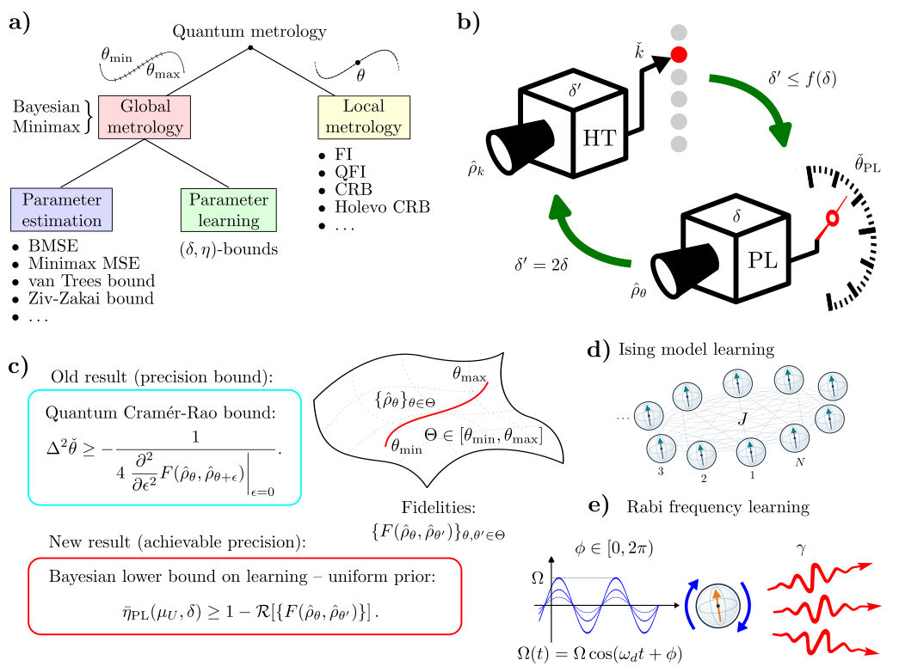
<figcaption class="paper-figure-caption"><b>Fig 1.</b> Figure 1: (a) Taxonomy of quantum metrology illustrating two distinctions: that between local and global metrology, determined by the prior information available about the parameter, and that between estimation and learning, deter- mined by the choice of figure of merit. More details on this taxonomy are presented in Appendix A. (b) An algorithm that solves parameter learning with precision δ can be used to construct a multi-hypothesis-testing algorithm with hypothesis spacing δ′ = 2δ. Conversely, an algorithm that solves multi-hypothesis testing with hypothesis spacing 0 &lt; δ′ ≤f(δ) ≡min{2δ, 0.1/L} can be used to construct a parameter-learning algorithm with precision δ. See Sec. II D for...</figcaption>
</figure>
<figure class="paper-figure-card">

<figcaption class="paper-figure-caption"><b>Fig 2.</b> Figure 2: Representation of the matrix of outcome prob- abilities in Eq. (49). (a) Success probability with toler- ance, as appearing in Eq. (29). (b) Block success proba- bility, with blocks of at most ℓ= a + 1 elements, defined in Eq. (48).</figcaption>
</figure>
<figure class="paper-figure-card">
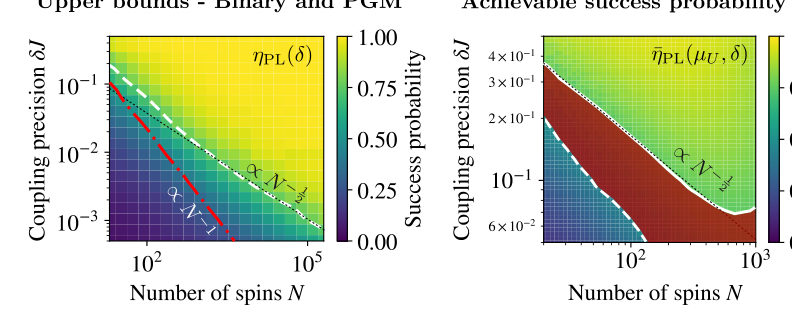
<figcaption class="paper-figure-caption"><b>Fig 3.</b> Figure 3: Success-probability bounds for single-shot learning of the coupling J in Eq. (53), for the input |+⟩⊗N and evolution time t = 0.1/Jmax. (a) The heat map shows the PGM-based multi-hypothesis upper bound in Eq. (44) on the minimax success probability, evaluated from the exact Gram matrix constructed from the overlaps in Eq. (H6). The dashed white curve is its 3/4 contour, and the red dot-dashed curve is the 3/4 contour of the binary hypothesis- testing bound in Eq. (34). Below either curve, the corresponding bound rules out successful minimax learning. The binary contour is compatible with δJ ∝N −1, whereas the PGM-based exclusion contour approximately follows the black dotted δJ ∝N...</figcaption>
</figure>
<figure class="paper-figure-card">
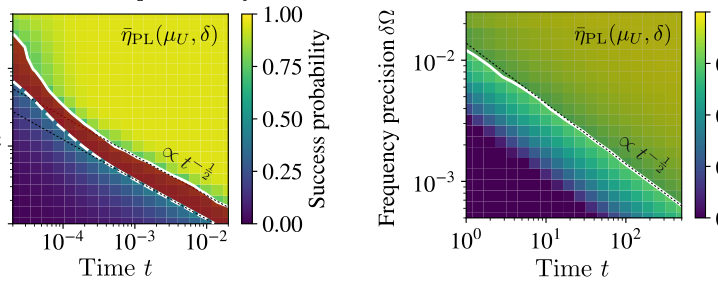
<figcaption class="paper-figure-caption"><b>Fig 4.</b> Figure 4: Uniform-prior Bayesian success-probability bounds for dissipative Rabi-frequency learning as functions of the observation time t and target precision δΩ. In both panels, the heat map shows a PGM-based lower bound (achievable probability), the solid white curve is its 3/4 contour, and the black dotted line indicates the reference scaling δΩ∝t−1/2. (a) Learning with a known drive phase for Ω∈[0, 10γ], for which the joint spin–field output is pure. The lower bound is given by Eq. (46). The dashed white curve is the 3/4 contour of the PGM-based upper bound obtained from Eqs. (27) and (22), using the Gram matrix determined by Eq. (60). The red shaded region between the two contours...</figcaption>
</figure>
<figure class="paper-figure-card">
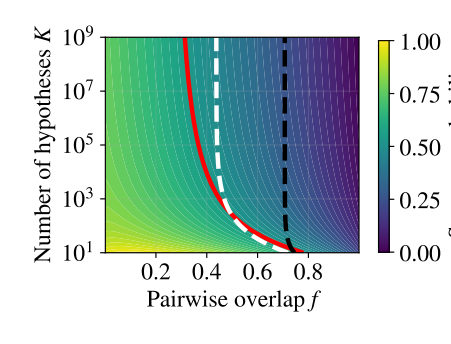
<figcaption class="paper-figure-caption"><b>Fig 5.</b> Figure 6: Exact finite-K Fano upper bound on the suc- cess probability of the learning task in Eq. (F34), as a function of the number of hypotheses K(δ′) and the common off-diagonal fidelity f. The red line is the Fano threshold. The dashed white and black curves are the exact PGM and Montanaro thresholds in Eqs. (F28) and (F31), respectively.</figcaption>
</figure>

**Summary.** This paper develops rigorous global bounds and success-probability guarantees for single-shot quantum parameter learning. By moving beyond local estimation techniques, it establishes new theoretical benchmarks that can certify achievable precision unattainable by classical or standard quantum information methods. This is vital for advancing the field of quantum metrology.

**Why it may be interesting.** It provides advanced theoretical tools for quantifying the limits of quantum sensing beyond standard metrics like QFI, which is crucial for designing next-generation quantum sensors in AMO physics.

Detailed structure

**Main problem.** The paper tackles two open problems in single-shot quantum parameter learning: constructing global upper bounds on estimation precision and providing rigorous lower bounds on the success probability of parameter recovery.

**Main result.** They provide new, practical global bounds and success-probability guarantees that surpass standard Fisher information analysis or binary hypothesis testing limits, allowing for a more accurate characterization of attainable quantum metrology performance.

**Method.** The approach moves beyond local estimation by framing the problem in terms of parameter learning theory (PAC-metrology), relating it to multi-hypothesis discrimination and deriving bounds based on pure-state overlaps or pairwise fidelities.

**Model / system.** The analysis is general for quantum metrology but applies specifically to a Rabi-frequency-learning example involving a driven qubit coupled to a bosonic environment, and a collective-spin Hamiltonian learning problem (Ising model).

**Key observables.** Mean-squared estimation error, success probability, global upper bounds on precision, pairwise fidelities.

**Important parameters / regimes.** The unknown parameter $	heta$, the required precision $\delta$, and system parameters like coupling strengths ($\Omega$) or interaction constants ($J$).

**Assumptions / limitations.** The work establishes rigorous connections between learning theory and quantum state discrimination, assuming certain regularity conditions for the minimax theorem.

**Figures summary.** Figure 1 provides a taxonomy comparing local vs. global metrology; subsequent figures compare the new bounds against standard Cramér–Rao bounds in specific examples like Rabi frequency learning.

**Paper structure.** The paper builds from background theory (local vs. global estimation) to deriving main results concerning global upper bounds and success-probability guarantees, followed by detailed applications to Ising models and dissipative/Rabi frequency learning scenarios.

Abstract

Quantum metrology offers the possibility of quantum enhancements of the precision of various sensing tasks. In this manuscript, we tackle two open problems in the theory of single-shot quantum parameter learning, going beyond the usual setting of local parameter estimation via repeated measurements. The first concerns the construction of global upper bounds on the learning precision. The second concerns rigorous guarantees on the success probability of parameter learning, namely, lower bounds on the probability of learning a parameter with a certain precision, given the constraints on the resources used for the quantum metrology task. We provide rigorous, practical, and global upper bounds and success-probability guarantees for quantum parameter learning. We demonstrate their versatility in a Rabi-frequency-learning example involving a driven qubit coupled to a bosonic environment and a collective-spin Hamiltonian learning problem. Together, the new global bounds and success-probability guarantees allow us to rule out unattainable precision and to certify attainable precision beyond what is possible via standard Fisher-information analysis or binary hypothesis testing bounds. They also allow one to tractably characterize the performance of various learning schemes, without the overhead of an explicit simulation.

[↑ back to top](#top)

### [Transitions to super-radiance in ensembles of incoherently pumped emitters](http://arxiv.org/abs/2608.15329v1)

**Authors:** Laszlo Rassaert, Tommaso Roscilde  
**Type:** theory · **Category:** statistical mechanics · **PDF:** <https://arxiv.org/pdf/2608.15329v1>  
**Analysis basis:** full PDF text, analyzed in chunks
**Topic relevance:** 🔥 `Dicke superradiance` **5/5** · 🔥 `driven-dissipative phase transition` **4/5** · 🔥 `superradiant laser` **4/5** · `Tavis-Cummings & cavity-many-emitter` **3/5** · `correlated / nonlocal dissipation` **3/5** · `methods for driven-dissipative` **3/5** · `non-equilibrium universality` **2/5** · `Keldysh / 2PI / non-Gaussian methods` **1/5** · `analog quantum simulation` **1/5** · `free-space correlated emission` **1/5** · `quantum measurements` **1/5**

↔ Scroll figures horizontally

<figure class="paper-figure-card">
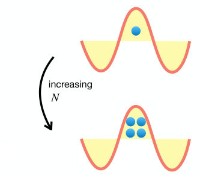
<figcaption class="paper-figure-caption"><b>Fig 1.</b> Figure 1: Coupling schemes of emitters to light considered in this work: (a) fixed den- sity: when increasing the number of emitters, the coupling strength to the common emission mode decreases, so that the collective emission rate decreases as ΓN = Γ/N; (b) fixed coupling: when increasing the number of emitters, the coupling to the com- mon emission mode remains the same, ΓN = Γ.</figcaption>
</figure>
<figure class="paper-figure-card">
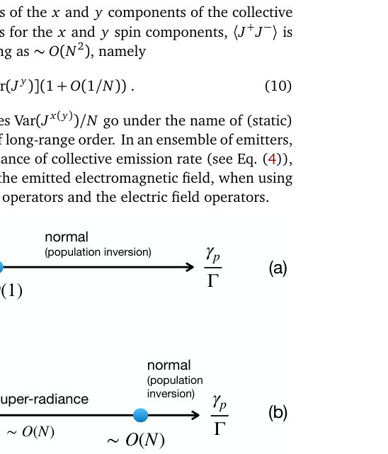
<figcaption class="paper-figure-caption"><b>Fig 2.</b> Figure 2: Steady-state phase diagrams within the two coupling schemes of the emit- ters to the common emission mode: (a) fixed-density scheme; (b) fixed-coupling scheme.</figcaption>
</figure>
<figure class="paper-figure-card">
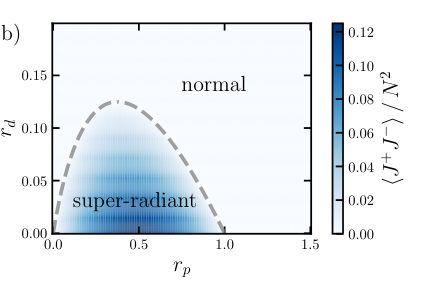
<figcaption class="paper-figure-caption"><b>Fig 3.</b> Figure 3: Steady-state phase diagram in the pumping vs. dephasing plane (a), and in the pumping vs. individual decay plane (b). The phases are characterized by the order parameter 〈J+J−〉/N 2 obtained with the TCE1 approximation. The grey dashed line is the critical line given in Eq. (14)).</figcaption>
</figure>
<figure class="paper-figure-card">
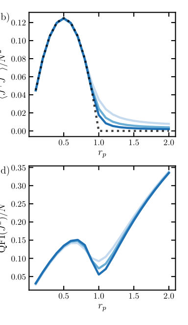
<figcaption class="paper-figure-caption"><b>Fig 4.</b> Figure 4: Steady-state phase transition from super-radiance to normal emission upon increasing the pumping rate rp: (a) 〈Jz〉/N related to the average density of excited emitters; (b) integrated, normalized dipole-dipole correlations 〈J+J−〉/N 2, (c) von- Neumann entropy per emitter S(ρ)/N = −Tr(ρ lnρ)/N and (d) quantum Fisher information density for the operator J x. All solid lines correspond to exact results. The black dashed lines correspond to TCE1 predictions, Eqs. (11) and (15), and are independent of N.</figcaption>
</figure>
<figure class="paper-figure-card">
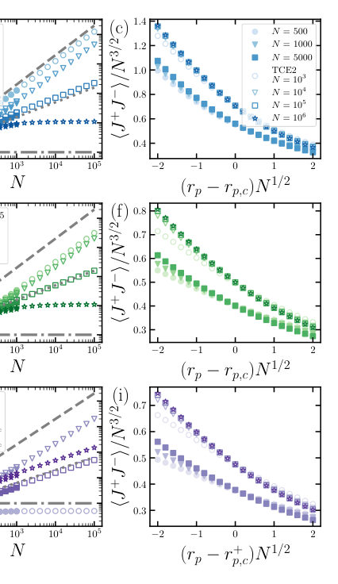
<figcaption class="paper-figure-caption"><b>Fig 5.</b> Figure 5: Exact numerical results, as well as TCE results, for the steady state cor- relations across the super-radiant to normal phase transition. Panels (a,d,g) show the exact integrated correlations for three sizes (N = 250,500,1000, from lighter to darker), and for (a) rφ = 0, rd = 0, (d) rφ ̸= 0, rd = 0, (g) rφ = 0, rd ̸= 0. Black dotted lines are TCE1 predictions, Eqs. (11) and (13). Panels (b,e,h) show the scal- ing of the integrated correlations per emitter 〈J+J−〉/N for different values rp on both sides of the phase transition and at the critical point for (b) rφ = 0, rd = 0 (e) rφ = 0.5, rd = 0 (h) rφ = 0, rd = 0.1. Filled symbols are exact numerical results, whereas empty symbols...</figcaption>
</figure>

**Summary.** The paper rigorously analyzes the super-radiant transition in ensembles of emitters facing environmental noise. By using exact solutions and cumulant expansions, it establishes that collective emission remains robust to dephasing but faces limitations from individual decay rates. This work provides quantitative scaling laws for this non-equilibrium many-body phase relevant for solid-state quantum optics.

**Why it may be interesting.** This work provides crucial quantitative insights into non-equilibrium many-body physics, specifically characterizing a distinct dissipative phase transition (super-radiance) in realistic solid-state environments where decoherence is unavoidable.

Detailed structure

**Main problem.** The work investigates the conditions under which super-radiance, a collective quantum emission phenomenon, can occur in ensembles of emitters subjected to environmental decoherence mechanisms like dephasing and individual decay.

**Main result.** Super-radiance is shown to be fundamentally robust against sizable dephasing rates, particularly when considering fixed coupling regimes; however, individual decay introduces critical size limitations for observing asymptotic scaling.

**Method.** The authors employ an exact solution exploiting permutational invariance for small systems and benchmark this against a truncated cumulant expansion approach for larger sizes.

**Model / system.** The system models ensembles of identical emitters coupled to a common light mode, described by dynamics governed by a Lindblad master equation incorporating pumping, collective emission, individual decay, and dephasing terms.

**Key observables.** Average values of collective spin operators ($\langle J_z 
angle$, $\langle J^+J^- 
angle$), super-radiant emission intensity scaling, and Quantum Fisher Information (QFI).

**Important parameters / regimes.** Dephasing rate ($\gamma_\phi$), individual decay rate ($\gamma_d$), system size ($N$), and the coupling scheme (fixed density vs. fixed coupling).

**Assumptions / limitations.** The primary assumption is the permutational invariance of the emitters, which allows for simplification into collective spin variables.

**Figures summary.** Figures illustrate the scaling of collective emission rates under different coupling schemes and show time evolution trajectories in the Dicke manifold $(J, M)$ plane, alongside the evolution of quantum coherence measures like QFI during super-radiant bursts.

**Paper structure.** The paper systematically analyzes the dynamics by first establishing the theoretical framework using master equations, then solving it exactly for small $N$, extending to large $N$ via cumulant expansions, and finally comparing the robustness of super-radiance under different environmental couplings (dephasing vs. decay).

Abstract

Super-radiance is a striking phenomenon resulting from the collective interaction of emitters with light, and it is fundamentally related to the appearance of long-range correlations between the dipole moments of the emitters. As such, it represents a distinct phase of dissipative many-body systems compared to the case of independent emitters, similarly to how ferromagnetism stands out in magnetic materials in contrast to paramagnetism. In this work we address the conditions under which the transition to super-radiance can occur in ensembles of emitters subject to dephasing and individual decay -- a situation which is particularly relevant to the case of emitters in the solid state. The simplifying assumption of an ensemble of permutationally invariant emitters allows for the efficient solution of both the dissipative dynamics after a pulsed excitation, as well as of the steady state under incoherent pumping. This exact solution allows us to benchmark a truncated cumulant expansion approach, which can give predictions for arbitrarily big system sizes. We show that super-radiance is fundamentally robust to sizable dephasing and non-radiative decay rates, both under a pulsed excitation, as well as under continuous pumping. This robustness is the result of the collective acceleration effect of super-radiant emission with respect to the individual coupling to a local environment. We establish the universal critical scaling laws at the transition between normal radiance and super-radiance; and we show that, in the super-radiant phase, significant finite-size crossovers can be observed before reaching the asymptotic scaling regime. Our results pave the way for future experiments to provide a quantitative characterization of the scaling properties of super-radiance, seen as a distinct non-equilibrium many-body phase in ensembles of incoherently pumped emitters.

[↑ back to top](#top)

### [Scarred discrete time crystal in a periodically driven dimerized spin chain](http://arxiv.org/abs/2608.16616v1)

**Authors:** Davood Marripour, Saeed S. Jahromi, Jahanfar Abouie  
**Type:** theory · **Category:** other · **PDF:** <https://arxiv.org/pdf/2608.16616v1>  
**Analysis basis:** full PDF text, analyzed in chunks
**Topic relevance:** 🔥 `scars & prethermalization` **5/5** · `analog quantum simulation` **3/5** · `driven-dissipative phase transition` **3/5** · `methods for driven-dissipative` **2/5** · `non-equilibrium universality` **2/5** · `Frenkel-Kontorova` **1/5** · `Keldysh / 2PI / non-Gaussian methods` **1/5** · `correlated / nonlocal dissipation` **1/5**

↔ Scroll figures horizontally

<figure class="paper-figure-card">
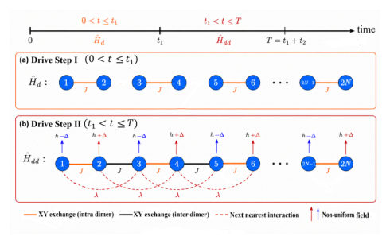
<figcaption class="paper-figure-caption"><b>Fig 1.</b> FIG. 1: Schematic representation of the periodically driven dimerized spin chain. The driving cycle T = t1 + t2 consists of two distinct phases: during t1, the dimers evolve as non- interacting units, while during t2, a dimer-dimer interaction and an external magnetic field are introduced.</figcaption>
</figure>
<figure class="paper-figure-card">
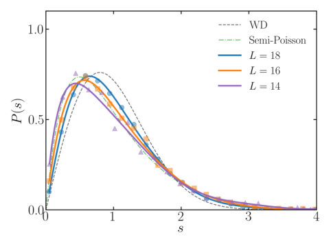
<figcaption class="paper-figure-caption"><b>Fig 2.</b> FIG. 3: Level spacing distribution P(s) for system sizes L = 14, 16, and 18 in the weakly non-ergodic regime. Here, ˜∆= 0.11, ˜J = 0.15, ˜h = 1 and λt2 = 0.9. The green dash-dotted and red dashed curves denote the analytical predictions for semi-Poisson and WD statistics, respectively. The observed finite-size flow indicates that as L increases, the numerical data systematically depart from the semi-Poissonian regime toward the WD distribution, signaling an eventual crossover to thermalization in the thermodynamic limit.</figcaption>
</figure>
<figure class="paper-figure-card">
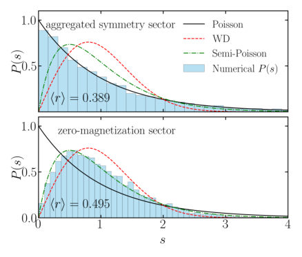
<figcaption class="paper-figure-caption"><b>Fig 3.</b> FIG. 2: (Top): Level spacing distribution P(s) obtained from the aggregated symmetry sectors. The resulting Pois- sonian statistics highlight the necessity of partitioning the global U(1) symmetry to avoid spurious non-ergodic signa- tures. (Bottom): Level spacing distribution P(s) for the driven dimer chain with ˜∆= 0.11, ˜J = 0.15, ˜h = 1 and λt2 = 0.9, and L = 16. The numerical results in the { ˜J, ˜∆} &lt; 1 regime exhibit semi-Poisson statistics, signal- ing constrained dynamics and many-body scars. Theoretical Poisson and WD distributions are shown for comparison.</figcaption>
</figure>
<figure class="paper-figure-card">
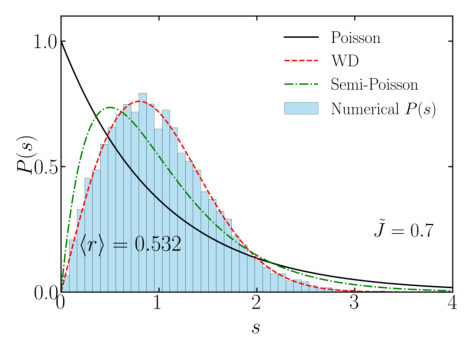
<figcaption class="paper-figure-caption"><b>Fig 4.</b> FIG. 4: Level spacing distribution P(s) for the periodically driven chain of length L = 16, with ˜∆= 0.11, ˜h = 1 and λt2 = 0.9, evaluated at the larger coupling ˜J = 0.7. At this value of ˜J the statistics shift from the semi-Poissonian regime toward the WD distribution, indicating a transition into the fully ergodic thermal phase.</figcaption>
</figure>
<figure class="paper-figure-card">
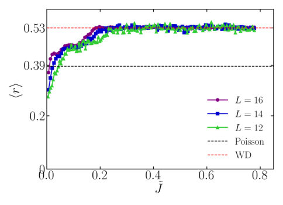
<figcaption class="paper-figure-caption"><b>Fig 5.</b> FIG. 6: Average level-spacing ratio ⟨r⟩versus the coupling ˜J for system sizes L = 12, 14, and 16, with ˜∆= 0.11 and λt2 = 0.9. The black and red dashed lines denote the theoretical Poisson (≈0.39) and WD (≈0.53) limits, respectively. The increasing sharpness of the crossover with L is a signature of the transition from the constrained regime to a fully ergodic thermal phase.</figcaption>
</figure>

**Summary.** The paper investigates Scarred Discrete Time Crystals (SDTCs) in a dimerized spin chain under periodic driving. It demonstrates that the system enters a weakly ergodic regime characterized by quantum many-body scars, evidenced by semi-Poisson level statistics and subharmonic oscillations. The authors conclude that this SDTC is a long-lived metastable state whose stability can be mapped against the onset of full thermalization.

**Why it may be interesting.** This work provides a detailed theoretical framework for understanding how structured quantum dynamics (scars) can resist thermalization in clean, periodically driven systems, which is highly relevant to Floquet engineering applications in AMO physics.

Detailed structure

**Main problem.** The study investigates the emergence of a Scarred Discrete Time Crystal (SDTC) phase in a periodically driven dimerized spin chain, specifically addressing how weak ergodicity breaking occurs relative to full thermalization.

**Main result.** The system exhibits QMBS leading to robust subharmonic oscillations, confirming SDTC behavior; this regime is characterized as a long-lived metastable dynamical state rather than a stable thermodynamic phase.

**Method.** Analysis involves calculating Floquet level statistics (comparing semi-Poisson vs. Wigner-Dyson), measuring entanglement entropy, and performing finite-size scaling on the time-crystalline lifetime.

**Model / system.** The model is a periodically driven antiferromagnetic dimerized spin chain governed by a two-step Floquet cycle ($U = e^{-i H_{dd}t_2}e^{-i H_d t_1}$). The Hamiltonian includes XY coupling within dimers and inter-dimer interactions ($\lambda, h, \Delta$).

**Key observables.** Semi-Poisson level statistics (signature of QMBS), subharmonic oscillations with period doubling (SDTC signature), Wigner-Dyson statistics (thermal limit), and time-crystalline lifetime.

**Important parameters / regimes.** The primary control parameters are the dimer coupling ($J$), inter-dimer interaction ($\lambda$), and magnetic fields ($h, \Delta$). The crossover is driven by varying $	ilde{J}$ relative to a critical value.

**Assumptions / limitations.** The analysis focuses on the zero-magnetization sector and treats the SDTC as a long-lived metastable regime whose lifetime is expected to saturate due to hybridization with the thermal continuum at large sizes.

**Figures summary.** Figures illustrate the crossover of spectral statistics from semi-Poisson (small $	ilde{J}$, scarred) towards Wigner-Dyson (large $	ilde{J}$, thermalized), and show finite-size scaling confirming this transition flow.

**Paper structure.** The paper establishes the physical model, details diagnostic tools like level spacing analysis, presents results mapping the crossover between non-ergodic/scarred dynamics and ergodic/thermal dynamics, and concludes by framing the SDTC as a metastable phenomenon.

Abstract

We investigate the emergence of a scarred discrete time crystal (SDTC) phase in a periodically driven dimerized spin chain. While generic interacting Floquet systems are expected to thermalize according to the eigenstate thermalization hypothesis (ETH), we demonstrate that this system hosts quantum many-body scars (QMBS) that induce a regime of weak ergodicity breaking. Through an analysis of Floquet level statistics, entanglement entropy, and eigenstate fidelity, we identify a manifold of low-entanglement states characterized by semi-Poisson statistics embedded within an otherwise thermal spectrum. These scarred states support robust subharmonic oscillations with period doubling, signaling the spontaneous breaking of discrete time-translation symmetry. We show that the SDTC response is robust against a variety of initial state configurations, demonstrating its stability beyond fine-tuned conditions. A finite-size scaling analysis reveals that the time-crystalline lifetime grows with system size within the range accessible to our exact-diagonalization calculations. However, drawing on the general phenomenology of approximate many-body scars, we expect that hybridization between Floquet scars and the thermal continuum will eventually curtail this growth, causing the lifetime to saturate at system sizes beyond our current numerical reach. This characterizes the SDTC as a long-lived metastable dynamical regime rather than a strictly stable thermodynamic phase, providing a comprehensive framework for understanding the interplay between periodic driving and constrained many-body dynamics in disorder-free systems.

[↑ back to top](#top)

### [Quantum Many-Body Scars, Magnon-Pair Condensation, and Hilbert Space Fragmentation in an Anisotropic Heisenberg Model](http://arxiv.org/abs/2608.15017v1)

**Authors:** J. Y. Liu-Sun, Z. Song  
**Type:** theory · **Category:** other · **PDF:** <https://arxiv.org/pdf/2608.15017v1>  
**Analysis basis:** full PDF text, analyzed in chunks
**Topic relevance:** 🔥 `scars & prethermalization` **5/5** · `analog quantum simulation` **3/5** · `non-equilibrium universality` **1/5**

↔ Scroll figures horizontally

<figure class="paper-figure-card">
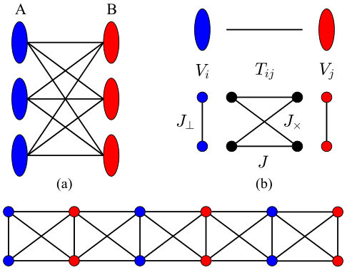
<figcaption class="paper-figure-caption"><b>Fig 1.</b> FIG. 1. Schematic illustration of the anisotropic Heisenberg model on a lattice composed of two identical sublattices. (a) Generic bipartite lattice geometry. The intra-dimer coupling Vj acts on the two spins within each dimer, while the inter- dimer coupling Tij connects dimers belonging to different sub- lattices A and B. (b) Local dimer structure with anisotropic couplings J⊥and Jz, given in Eqs. (2). (c) Spin-ladder as an example of the model, given in Eqs. (6 ), where the inter-rung couplings are XY-type, denoted by J and J×, respectively.</figcaption>
</figure>
<figure class="paper-figure-card">
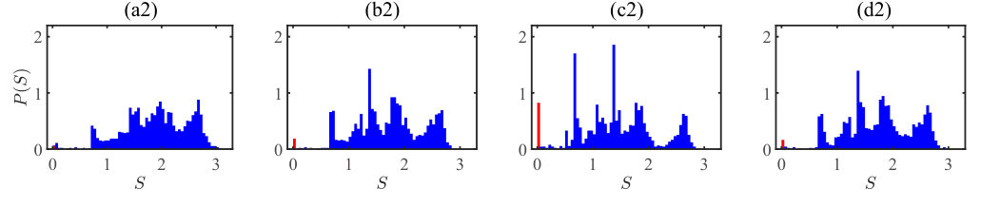
<figcaption class="paper-figure-caption"><b>Fig 2.</b> FIG. 2. Plots of bipartite entanglement entropy of all eigenstates in the sector with PN j=1 sz j = 4 and the corresponding probability distribution for the ladder system [given by Eq. (6)] with N = 8, J⊥= 5, and Jz = J = 1. Panels (a1)–(d1) show the entanglement entropy S(E) as a function of eigenenergy, while panels (a2)–(d2) display the corresponding probability distribution P(S). From left to right, the inter-sublattice coupling J× is tuned across the resonance condition J× = J. The plots with S ≈0 are indexed by red. A pronounced accumulation of eigenstates with nearly vanishing entanglement entropy emerges at resonance, signaling strong Hilbert-space fragmentation. Away from...</figcaption>
</figure>

**Summary.** This work analyzes an anisotropic Heisenberg model to demonstrate the simultaneous occurrence of three complex quantum phenomena: quantum many-body scars, magnon-pair condensation with long-range order, and Hilbert space fragmentation. By utilizing the RSGA, the authors establish an exactly solvable framework that connects these concepts through a resonant mapping to a mixed spin system.

**Why it may be interesting.** The paper provides a concrete, exactly solvable platform linking several advanced topics—scarring, condensation, and fragmentation—which are crucial for understanding non-equilibrium dynamics in quantum many-body systems relevant to AMO physics.

Detailed structure

**Main problem.** The study investigates the simultaneous existence of quantum many-body scars (QMBS), magnon-pair condensation, and emergent Hilbert space fragmentation in a unified theoretical framework.

**Main result.** The authors establish an exactly solvable model where these three distinct phenomena coexist: scar states are shown to be magnon-pair condensates exhibiting off-diagonal long-range order, while resonance conditions induce kinetic constraints leading to HSF.

**Method.** The research employs the Restricted Spectrum Generating Algebra (RSGA) to generate exact eigenstates and analyzes entanglement entropy scaling laws for diagnostics.

**Model / system.** The system is a spin-1/2 anisotropic Heisenberg model defined on two coupled bipartite sublattices. Under specific resonance conditions, it maps exactly onto a mixed spin-1 and spin-0 XY model.

**Key observables.** Subextensive entanglement entropy (subvolume law), Off-Diagonal Long-Range Order (ODLRO), and the presence of dynamically isolated subspaces signaling Hilbert Space Fragmentation (HSF).

**Important parameters / regimes.** The inter-sublattice coupling strength ($J_	imes$) relative to other couplings, particularly at the resonance point where $J_	imes = J$.

**Assumptions / limitations.** The analysis relies on using the RSGA to construct exact eigenstates and assumes the applicability of mapping techniques under resonant conditions.

**Figures summary.** Figure 2 illustrates how entanglement entropy $S(E)$ and its probability distribution $P(S)$ accumulate near zero at resonance, visually confirming strong Hilbert-space fragmentation in a ladder system.

**Paper structure.** The paper introduces the general anisotropic Heisenberg model, uses RSGA to find scar states characterized by subextensive entanglement and ODLRO. It then analyzes the resonant point where the model simplifies to an XY type, demonstrating how local spin conservation leads directly to HSF alongside the established QMBS features.

Abstract

We investigate a spin-$1/2$ anisotropic Heisenberg model on a lattice consisting of two identical bipartite sublattices. A family of exact eigenstates generated by the restricted spectrum generating algebra (RSGA) constitutes quantum many-body scar states, characterized by subextensive entanglement entropy and supporting. These scar states are magnon-pair condensates exhibiting off-diagonal long-range order (ODLRO). At the resonance point of the inter-sublattice interaction, the model exactly maps onto a mixed spin-$1$ and spin-$0$ XY model on a bipartite lattice, which decomposes into independent sub-Hamiltonians labeled by all possible spin configurations. Each spin-$0$ particle is dynamically isolated from its neighbors and acts as a kinetic constraint, giving rise to emergent Hilbert space fragmentation (HSF). Our work establishes an exactly solvable platform in which quantum many-body scars, magnon-pair condensation exhibiting off-diagonal long-range order, and Hilbert space fragmentation naturally coexist.

[↑ back to top](#top)

### [Discretisation of quantum feedback networks for implementation on a quantum computer](http://arxiv.org/abs/2608.16608v1)

**Authors:** Luc Bouten, John Gough  
**Type:** theory · **Category:** quantum information and computing · **PDF:** <https://arxiv.org/pdf/2608.16608v1>  
**Analysis basis:** full PDF text, analyzed in chunks
**Topic relevance:** 🔥 `quantum measurements` **4/5** · `Tavis-Cummings & cavity-many-emitter` **3/5** · `driven-dissipative phase transition` **3/5** · `methods for driven-dissipative` **3/5** · `analog quantum simulation` **2/5** · `correlated / nonlocal dissipation` **2/5** · `non-equilibrium universality` **2/5** · `Dicke superradiance` **1/5** · `Keldysh / 2PI / non-Gaussian methods` **1/5**

↔ Scroll figures horizontally

<figure class="paper-figure-card">
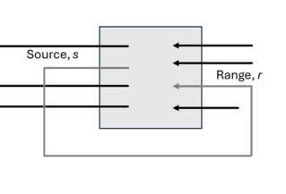
<figcaption class="paper-figure-caption"><b>Fig 1.</b> Figure 1: On the left, we have a multiple-input multiple-output system. There are the same number m of inputs as outputs. An SLH network is then formed by feeding some of the outputs back in as inputs. Each connection reduces the total number of external inputs (and outputs) by 1. We take s to denote the label of an output (source) and r to denote the label of an input (range).</figcaption>
</figure>

**Summary.** This paper presents a rigorous mathematical framework for discretizing Quantum Feedback Networks, which are fundamental tools in quantum optics. By proving strong convergence of discrete approximations to the continuous evolution governed by QSDEs, it provides a pathway to simulate complex quantum optical systems on actual quantum computers.

**Why it may be interesting.** This work provides the necessary theoretical guarantees (strong convergence) to translate complex quantum optical models into algorithms executable on near-term quantum hardware.

Detailed structure

**Main problem.** The primary goal is developing a rigorous method to discretize Quantum Feedback Networks (SLH-networks) so that their time evolution can be accurately simulated on a quantum computer.

**Main result.** The authors establish strong convergence, uniformly on compact time intervals, showing that the discrete approximation converges to the continuous SLH-network as the discretization mesh approaches zero.

**Method.** The work utilizes quantum stochastic calculus (Hudson-Parthasarathy) and establishes convergence by relating the discrete evolution operator to the continuous unitary co-cycle governing the network dynamics.

**Model / system.** The model is based on Quantum Feedback Networks, which are described by coefficients $(S, L, H)$ derived from a quantum stochastic differential equation (QSDE). These networks are relevant for modeling complex systems in quantum optics, such as cavity QED.

**Key observables.** The network time evolution operator $\hat{U}_t$, and the convergence of discrete approximations $M_k(l)$ to this continuous limit.

**Important parameters / regimes.** The discretization mesh size ($\sigma$ or related parameters), and the structure defined by the SLH-triple $(S, L, H)$.

**Assumptions / limitations.** Convergence theorems rely on assumptions regarding the boundedness of coefficients in the QSDE and the properties of cocycles.

**Paper structure.** The paper builds from defining the continuous dynamics via QSDEs to constructing a discrete approximation using recursive generators, culminating in convergence proofs based on established theorems for semigroups.

Abstract

Quantum Feedback Network Theory (also known colloquially as the SLH-framework) is a powerful tool for modeling systems in quantum optics. This paper describes a method for discretising SLH-networks such that they can be implemented on a quantum computer. Building on a discretisation theorem for quantum stochastic differential equations, we establish strong convergence, uniformly on compact time intervals, of the discretised system to the continuous SLH-network as the discretisation mesh goes to zero.

[↑ back to top](#top)

### [Collectively Enhanced Universal Photon Blockade](http://arxiv.org/abs/2608.15534v1)

**Authors:** Guohao Chang, Ahmad Abliz  
**Type:** theory · **Category:** other · **PDF:** <https://arxiv.org/pdf/2608.15534v1>  
**Analysis basis:** full PDF text, analyzed in chunks
**Topic relevance:** 🔥 `Tavis-Cummings & cavity-many-emitter` **4/5** · `driven-dissipative phase transition` **3/5** · `methods for driven-dissipative` **3/5** · `correlated / nonlocal dissipation` **2/5** · `non-equilibrium universality` **2/5** · `Dicke superradiance` **1/5** · `Keldysh / 2PI / non-Gaussian methods` **1/5** · `analog quantum simulation` **1/5** · `quantum measurements` **1/5** · `superradiant laser` **1/5**

↔ Scroll figures horizontally

<figure class="paper-figure-card">
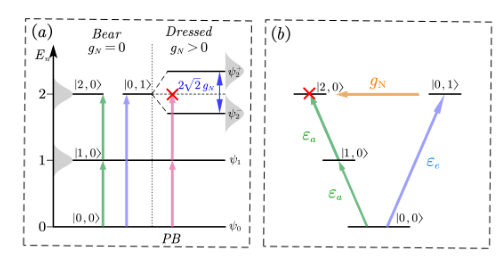
<figcaption class="paper-figure-caption"><b>Fig 1.</b> FIG. 1. Energy-level structure and interference mech- anism. (a) Conventional photon blockade (CPB) produced by the single-photon resonance and the anharmonic spectrum of the two-photon Tavis–Cummings model. (b) Two excita- tion pathways leading to the two-photon state |2, 0⟩and their destructive interference.</figcaption>
</figure>
<figure class="paper-figure-card">
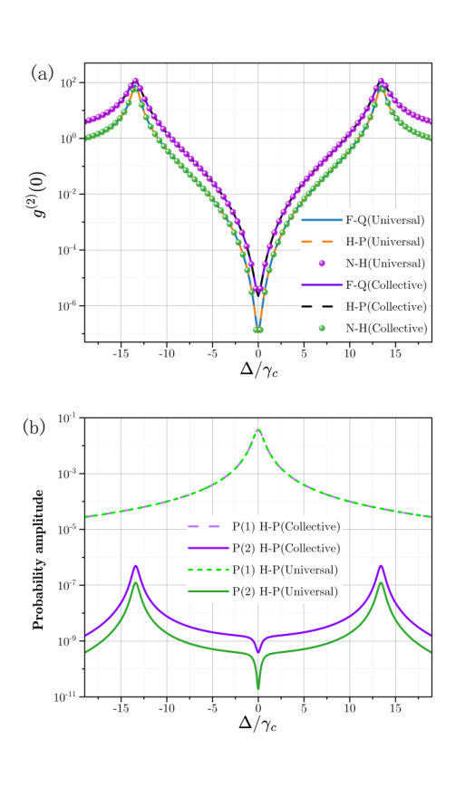
<figcaption class="paper-figure-caption"><b>Fig 2.</b> FIG. 2. Comparison between collectively enhanced universal photon blockade (universal PB) and purely collective photon blockade (purely collective PB). (a) Equal-time second-order correlation function g(2)(0) as a func- tion of the detuning ∆c/γc. Results from the Holstein– Primakoff approximation, full-quantum simulations, and the non-Hermitian probability-amplitude method agree closely. (b) Single- and two-photon populations as functions of detun- ing. The parameters are g/γc = 6, εa/γc = 0.1, εe = −ε2 a/gN, γc = γe, and N = 10.</figcaption>
</figure>
<figure class="paper-figure-card">
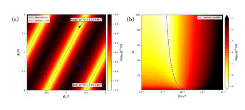
<figcaption class="paper-figure-caption"><b>Fig 3.</b> FIG. 3. Control of universal photon blockade (univer- sal PB) through the drive phases and amplitudes. (a) Two-dimensional distribution of g(2)(0) as a function of the drive phases ϕa and ϕe. The dashed and dotted lines indicate the two phase-matching conditions shown in the panel. (b) g(2)(0) as a function of the emitter number N and emitter- drive strength |εe|. The blue dashed curve marks the optimal condition |εe| = ε2 a/gN. The fixed parameters are ∆c = 0, g = 6γc, εa = 0.1γc, and γe = γc.</figcaption>
</figure>
<figure class="paper-figure-card">
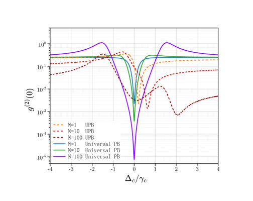
<figcaption class="paper-figure-caption"><b>Fig 4.</b> FIG. 4. Comparison between universal photon block- ade (universal PB) and unconventional photon block- ade (UPB). Within the Holstein–Primakoff approximation, g(2)(0) is plotted as a function of ∆c/γc for universal PB (solid curves) and UPB (dashed curves), with N = 1, 10, and 100. The fixed parameters are g/γc = 0.2, εa/γc = 0.01, γe = γc, and ϕa = 0. For universal PB, εe = −ε2 a/gN and ϕe = 0, with the optimum occurring at ∆c = 0. For UPB, n = 1, and the drive amplitude and phase are determined numerically from the condition C20 = 0.</figcaption>
</figure>
<figure class="paper-figure-card">
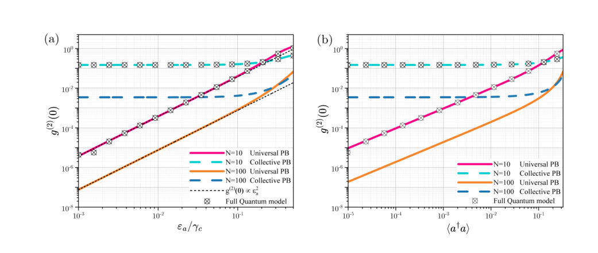
<figcaption class="paper-figure-caption"><b>Fig 5.</b> FIG. 5. Control of photon blockade by the drive strength. (a) g(2)(0) as a function of εa/γc. The black dashed line indicates the reference scaling g(2)(0) ∝ε2 a. (b) g(2)(0) as a function of the mean intracavity photon number ⟨a†a⟩, illustrating the purity–brightness trade-off. Solid and dashed curves correspond to N = 100 and N = 10, respectively, and the symbols are full-quantum simulation results. The fixed parameters are g/γc = 0.2 and γe = γc, with the drives satisfying the optimal interference condition.</figcaption>
</figure>

**Summary.** The paper proposes a novel 'collectively enhanced universal photon blockade' scheme for generating single photons in multi-emitter cavity QED. By combining two-photon resonance effects with destructive interference pathways, the scheme achieves strong antibunching ($g^{(2)}(0) \propto N^{-2}$) while preserving high single-photon brightness. The theoretical analysis uses advanced master equation techniques to establish a scalable and tunable route for quantum light sources.

**Why it may be interesting.** This work provides a detailed theoretical framework for controlling photon emission purity in complex, driven open quantum systems, directly relevant to cavity QED research.

Detailed structure

**Main problem.** The goal is to develop a scalable method for generating bright, high-purity single photons using multi-emitter cavity quantum electrodynamics (cavity QED) systems.

**Main result.** A proposed 'collectively enhanced universal photon blockade' scheme achieves superior antibunching scaling ($g^{(2)}(0) \propto N^{-2}$) compared to conventional methods, while maintaining high single-photon brightness.

**Method.** The analysis employs full-quantum master equation simulations, the Holstein–Primakoff approximation, and non-Hermitian probability-amplitude techniques for cross-validation.

**Model / system.** The system is a two-photon Tavis–Cummings model involving $N$ identical emitters coupled to a single optical cavity mode. The dynamics are governed by a Lindblad master equation incorporating coherent drives on both the cavity and emitter ensembles.

**Key observables.** Second-order correlation function, $g^{(2)}(0)$, which quantifies photon antibunching; single-photon population ($P_1$).

**Important parameters / regimes.** Emitter number ($N$), detunings ($\Delta_c$, $\Delta_e$), and drive strengths ($\epsilon_a$, $\epsilon_e$); the weak-drive regime is particularly important for scaling analysis.

**Assumptions / limitations.** The analysis relies on exploiting permutation symmetry to simplify Hilbert space calculations, and in some derivations, truncating the wavefunction up to a certain excitation number ($N_{ex} \le 3$).

**Figures summary.** Figures compare $g^{(2)}(0)$ for universal PB versus purely collective blockade schemes, demonstrating phase control over antibunching and showing scaling behavior with emitter number $N$.

**Paper structure.** The paper establishes the physical model using the Tavis-Cummings Hamiltonian, derives dynamics via the master equation, compares the proposed universal blockade mechanism against existing ones (CPB/UPB), analyzes the collective scaling ($N^{-2}$ vs. detuning shift), and details the weak-drive regime dependence ($\propto \epsilon_a^2$).

Abstract

High-purity and bright single-photon sources are important for quantum information processing and precision measurement. We propose a collectively enhanced universal photon-blockade scheme in a multi-emitter two-photon Tavis--Cummings system. Independent coherent drives of the cavity and collective emitter enable destructive interference between two-photon excitation pathways, while collective coupling supplies level anharmonicity. Full-quantum master-equation simulations, the Holstein--Primakoff approximation, and a non-Hermitian probability-amplitude analysis yield the optimal conditions: cavity resonance together with phase and amplitude matching. Compared with a purely collective blockade, the proposed scheme lowers \(g^{(2)}(0)\), and essentially preserves the single-photon population. As the emitter number \(N\) increases, the optimal point remains at \(Δ_c=0\), while the minimum correlation follows \(g_{\min}^{(2)}(0)\propto N^{-2}\). By contrast, unconventional photon blockade shifts away from resonance as \(N\) increases, limiting its purity improvement and brightness. In the weak-drive regime, universal blockade obeys \(g^{(2)}(0)\propto\varepsilon_a^2\), owing to a higher-order bypass through the three-excitation manifold. The drive strength therefore provides an additional purity--brightness control, although the interference mechanism makes the scheme more sensitive to dissipation-rate mismatch. Our results establish a scalable route to bright, high-purity, and tunable single-photon emission in multi-emitter cavity-QED systems.

[↑ back to top](#top)

### [Nonlinear Landau-Zener Tunneling with Heat-Bath Colored Noise](http://arxiv.org/abs/2608.15604v1)

**Authors:** Yi Cao, Jie Liu  
**Type:** theory · **Category:** other · **PDF:** <https://arxiv.org/pdf/2608.15604v1>  
**Analysis basis:** full PDF text, analyzed in chunks
**Topic relevance:** 🔥 `methods for driven-dissipative` **4/5** · `Keldysh / 2PI / non-Gaussian methods` **3/5** · `analog quantum simulation` **3/5** · `driven-dissipative phase transition` **3/5** · `correlated / nonlocal dissipation` **2/5** · `quantum measurements` **2/5** · `Tavis-Cummings & cavity-many-emitter` **1/5** · `non-equilibrium universality` **1/5**

↔ Scroll figures horizontally

<figure class="paper-figure-card">
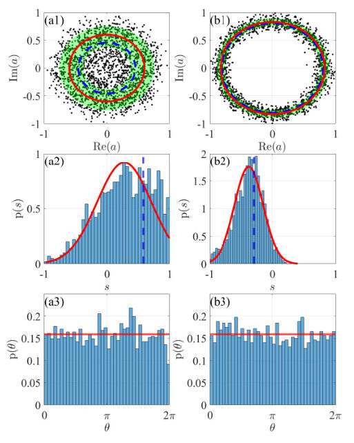
<figcaption class="paper-figure-caption"><b>Fig 1.</b> FIG. 1. Long-time ensemble statistics of the probability am- plitude a, population difference s, and relative phase θ in the linear [panels (a1)–(a3), c = 0] and nonlinear [panels (b1)– (b3), c = 5] systems. (a1, b1) Black dots show the long-time values of a for the individual noise realizations in the complex- a plane; the red solid line and shaded band indicate the en- semble mean and its statistical fluctuations, respectively. (a2, b2) Probability densities of s, with red solid curves denoting Gaussian fits. (a3, b3) Probability densities of θ, with red solid curves denoting the uniform distribution with ampli- tude 1/(2π). Blue solid lines in (a1, b1) and (a2, b2) show the noiseless...</figcaption>
</figure>
<figure class="paper-figure-card">
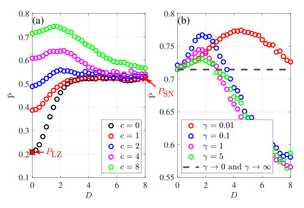
<figcaption class="paper-figure-caption"><b>Fig 2.</b> FIG. 2. Ensemble-averaged tunneling probability ¯P as a func- tion of D for α = 1. (a) We choose a typical correlation time parameter γ = 5 and show nonmonotonic LZ tunneling prob- ability vs. D when c ̸= 0; (b) We set the nonlinear parameter c = 8 and show the correlation time dependence of the tun- neling probability peaks. When γ →0 and γ →∞, the tunneling probabilities turn to be independent of the noise and the tunneling peaks completely disappear.</figcaption>
</figure>
<figure class="paper-figure-card">
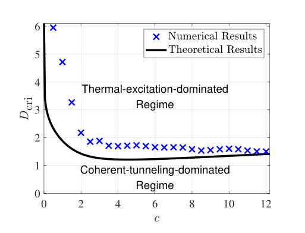
<figcaption class="paper-figure-caption"><b>Fig 3.</b> FIG. 3. The critical noise amplitudes Dcri delineate the boundary between the coherent-quantum-tunneling- dominated and thermal-excitation-dominated regimes of non- linear LZ tunneling. The black solid line represents the theo- retical prediction, and the blue markers denote the numerical results. Here, we choose the typical parameters α = 1 and γ = 5.</figcaption>
</figure>

**Summary.** This paper analyzes nonlinear Landau-Zener tunneling when subjected to heat-bath induced colored noise. It demonstrates that the system's tunneling probability does not simply increase with noise but instead shows a nonmonotonic dependence, peaking at an intermediate noise level due to nonlinearity. The findings clarify this mechanism and distinguish it from other noise-induced phenomena.

**Why it may be interesting.** This work is highly relevant as it tackles open quantum systems dynamics (LZ tunneling) under realistic colored noise sources, providing a detailed understanding of how nonlinearity fundamentally alters thermal excitation mechanisms compared to standard linear models.

Detailed structure

**Main problem.** The study investigates how colored noise originating from a heat bath affects nonlinear Landau-Zener (LZ) tunneling dynamics.

**Main result.** Unlike the linear case where tunneling increases monotonically with noise, nonlinearity causes the tunneling probability to exhibit nonmonotonic behavior: it peaks at a finite noise amplitude before decreasing.

**Method.** The analysis employs numerical simulations of the stochastic Schrödinger equation and utilizes the Wiener-Hermite expansion for analytical elucidation.

**Model / system.** The model is a nonlinear LZ system coupled to a bosonic heat bath, applicable to systems like BECs or Kerr nonlinear optical waveguides. The dynamics are governed by an effective stochastic Hamiltonian derived from the coupling to the bath.

**Key observables.** Ensemble-averaged tunneling probability ($ar{P}$), which depends on noise amplitude and nonlinearity strength.

**Important parameters / regimes.** Noise amplitude ($D$), nonlinear parameter ($c$), noise correlation time ($\gamma$), and sweep rate ($\alpha$).

**Assumptions / limitations.** The analysis relies on the Markovian approximation for the bath coupling and uses approximations like moment-closure or specific limits (weak/strong noise).

**Figures summary.** Figures illustrate the nonmonotonic dependence of $ar{P}$ vs. $D$ for nonlinear systems, contrasting it with the monotonic behavior of linear systems.

**Paper structure.** The paper establishes the model Hamiltonian and dynamics under colored noise, uses numerical simulations to observe nonmonotonicity, and employs analytical tools like the Wiener-Hermite expansion to explain the underlying physical mechanism distinguishing this from stochastic resonance.

Abstract

In this work, we investigate the influence of colored noise originating from a heat bath on nonlinear Landau-Zener (LZ) tunneling. The nonlinearity might arise intrinsically from many-body mean-field atomic self-interactions or Kerr nonlinearities in optical systems. Contrary to the well-established picture of thermally enhanced quantum tunneling within the linear LZ paradigm, ensemble statistics of our numerical simulations demonstrate that nonlinearity can give rise to thermally suppressed LZ tunneling: the tunneling probability of the nonlinear LZ system decreases as the amplitude of the colored noise increases beyond a critical value. Analytically, the Wiener-Hermite expansion facilitates elucidation of the intrinsic mechanism accounting for the nonmonotonic dependence of tunneling probability on noise amplitude. We compare these behaviors with stochastic resonance responses and clarify that the two phenomena stem from distinct physical mechanisms. In addition, we obtain approximate solutions in the weak- and strong-noise limits and discuss the implications of our theory.

[↑ back to top](#top)

### [Quench Spectroscopy for Two-Dimensional Spin Models with Power-Law Interactions](http://arxiv.org/abs/2608.16631v1)

**Authors:** Katharina Brechtelsbauer, Hans Peter Büchler  
**Type:** theory · **Category:** statistical mechanics · **PDF:** <https://arxiv.org/pdf/2608.16631v1>  
**Analysis basis:** full PDF text, analyzed in chunks
**Topic relevance:** 🔥 `analog quantum simulation` **4/5** · 🔥 `non-equilibrium universality` **4/5** · `Keldysh / 2PI / non-Gaussian methods` **2/5** · `Rydberg arrays` **2/5** · `driven-dissipative phase transition` **2/5** · `methods for driven-dissipative` **2/5** · `correlated / nonlocal dissipation` **1/5** · `scars & prethermalization` **1/5**

↔ Scroll figures horizontally

<figure class="paper-figure-card">
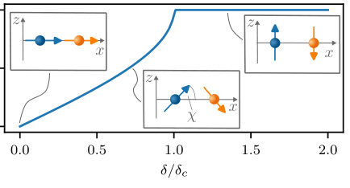
<figcaption class="paper-figure-caption"><b>Fig 1.</b> Figure 1. Illustration of the model (panel (a)) and the spin expectation values of the variational mean-field states (panel (b)). In this paper we derive how the mean-field states in (b) evolve under the model in (a). (a) We consider spin-1/2 particles on a 2-dimensional square lattice with lattice constant a, that interact via power-law exchange interaction. The spins are exposed to a staggered magnetic field with strength δ perpendicular to the lattice. The different colors label the sign of the magnetic field. (b) For the quench dynamics we analyze the time-evolution of mean-field states. These states are simple product states that minimize the energy expectation value. As variational...</figcaption>
</figure>
<figure class="paper-figure-card">
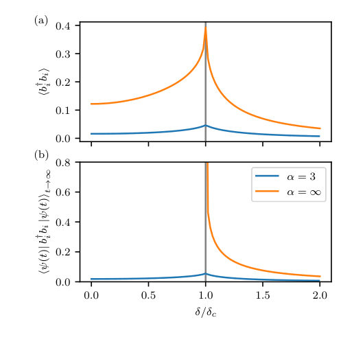
<figcaption class="paper-figure-caption"><b>Fig 2.</b> Figure 2. Numerical results for the expressions in Eq. (7) and Eq. (8). Panel (a) shows the number of Holstein-Primakoff (HP) bosons in the ground state and panel (b) the number of HP-bosons in the time evolved initial state in the limit for t →∞for different magnetic field strengths. The case with α = 3 represents the weak long-range regime, while α = ∞corresponds to short-range interactions.</figcaption>
</figure>
<figure class="paper-figure-card">
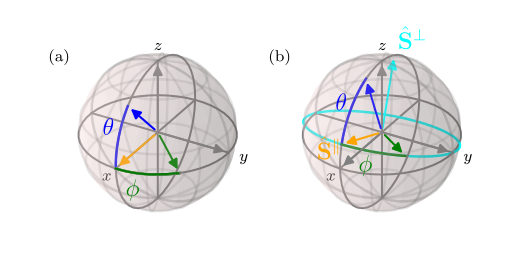
<figcaption class="paper-figure-caption"><b>Fig 3.</b> Figure 3. Visualization of the spin expectation values of the spin coherent states |θi, ϕi⟩for (a) δ = 0 and (b) 0 &lt; δ &lt; δc. The orange arrow corresponds to the mean-field state |ψi⟩= |ϕi = 0, θi = 0⟩. The green and blue arrows illustrate spin expectation values for ϕ ̸= 0 and θ ̸= 0 respectively. The cyan arrow labels the direction perpendic- ular to the mean-field spin and the y-direction. ϕ describes deflections of the mean-field spin in the plane perpendicular to this vector.</figcaption>
</figure>
<figure class="paper-figure-card">
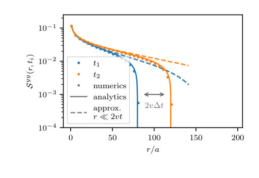
<figcaption class="paper-figure-caption"><b>Fig 4.</b> Figure 4. Correlations for nearest neighbor interactions at vt1 = 40a and vt2 = 60a for Λ = 1/a. The dots are numerically calculated by integrating the exact expressions respecting the angular dependence in ωk. The solid blue line corresponds to the analytical result in Eq. (17) and the dashed line corresponds to a small r expansion given by ((r/a)−βq/4 − ar/(4vt)2βq/4)/8.</figcaption>
</figure>

**Summary.** This paper develops an analytical theory for studying how quantum correlations evolve (quench dynamics) in 2D spin models with power-law interactions and a staggered magnetic field. By combining linear spin-wave theory with a low-energy effective theory, the authors overcome limitations encountered when modeling short-range interactions near critical points. The results offer quantitative predictions for observable quantities like correlation functions, guiding experimental efforts using platforms such as Rydberg atoms.

**Why it may be interesting.** This work is highly relevant to AMO physics as it models spin systems whose dynamics can be realized using Rydberg atoms or polar molecules. The ability to analytically handle quench dynamics near criticality provides powerful tools for interpreting experimental measurements of excitation gaps.

Detailed structure

**Main problem.** The paper analytically computes the quench dynamics of a spin-1/2 XY model with power-law interactions subjected to a staggered magnetic field.

**Main result.** It provides analytic expressions for phase-type correlations, successfully extending results beyond the limitations of linear spin-wave theory near criticality. The analysis confirms that density-type correlation dynamics are consistent between different theoretical approaches.

**Method.** The authors employ a combination of linear spin-wave theory and a low-energy effective theory accounting for strong phase fluctuations via Holstein-Primakoff transformations. Quench spectroscopy formalism is used to calculate time-dependent structure factors.

**Model / system.** The system is a 2D spin-1/2 XY model on a square lattice with Hamiltonian including power-law interactions ($J \alpha^{|r_i - r_j|^\alpha}$) and a staggered magnetic field ($\delta$). The dynamics are studied following an initial quench from a product state.

**Key observables.** Quench dynamics of phase-type correlations ($S_{yy}(r, t)$) and density-type correlations ($S_{\perp\perp}(r, t)$); excitation gaps and critical behavior.

**Important parameters / regimes.** Interaction decay exponent $\alpha$ (ranging from nearest-neighbor to long-range), staggered magnetic field strength $\delta$, and the correlation length/time scales $r, t$.

**Assumptions / limitations.** The low-energy theory is necessary because linear spin-wave theory fails for short-range interactions due to infrared divergences. Approximations are made in the continuum limit and small-$k$ expansions.

**Figures summary.** Figures illustrate the model setup on a 2D lattice, show spin expectation values of variational mean-field states, and compare numerical results with analytical expressions for correlation functions like $S_{yy}(r, t)$ for nearest neighbor interactions.

**Paper structure.** The paper progresses by first defining the Hamiltonian and the physical regimes based on $\alpha$. It then develops the theoretical framework using spin wave theory and low-energy effective Hamiltonians. The core of the work involves deriving explicit analytical expressions for time-dependent correlation functions ($S_{yy}, S_{\perp\perp}$) in different interaction limits, culminating in asymptotic analyses.

Abstract

In this paper, we analytically compute the quench dynamics of simple product states that evolve under a spin-1/2 XY-model with power-law interactions in a staggered magnetic field. We use linear spin-wave theory as well as a low-energy theory that accounts for strong phase fluctuations. This allows us to provide an analytic expression for the dynamics of phase-type correlations with short-range interactions, where the linear spin-wave theory is known to fail. For density-type correlations the low-energy theory and the linear spin-wave theory give the same result. Our analysis is valid for arbitrary magnetic field strength and in particular provides an analytical understanding of the quench dynamics near criticality. Our results can thus provide useful tools for the experimental observation of excitation gaps and critical behavior.

[↑ back to top](#top)

### [Floquet-Liouville Theory for Strongly Driven Open Quantum Systems](http://arxiv.org/abs/2608.14966v1)

**Authors:** Kamran Akbari, Stephen Hughes  
**Type:** theory · **Category:** other · **PDF:** <https://arxiv.org/pdf/2608.14966v1>  
**Analysis basis:** full PDF text, analyzed in chunks
**Topic relevance:** 🔥 `methods for driven-dissipative` **4/5** · `Keldysh / 2PI / non-Gaussian methods` **3/5** · `correlated / nonlocal dissipation` **3/5** · `Tavis-Cummings & cavity-many-emitter` **2/5** · `driven-dissipative phase transition` **2/5** · `analog quantum simulation` **1/5** · `non-equilibrium universality` **1/5** · `quantum measurements` **1/5**

↔ Scroll figures horizontally

<figure class="paper-figure-card">
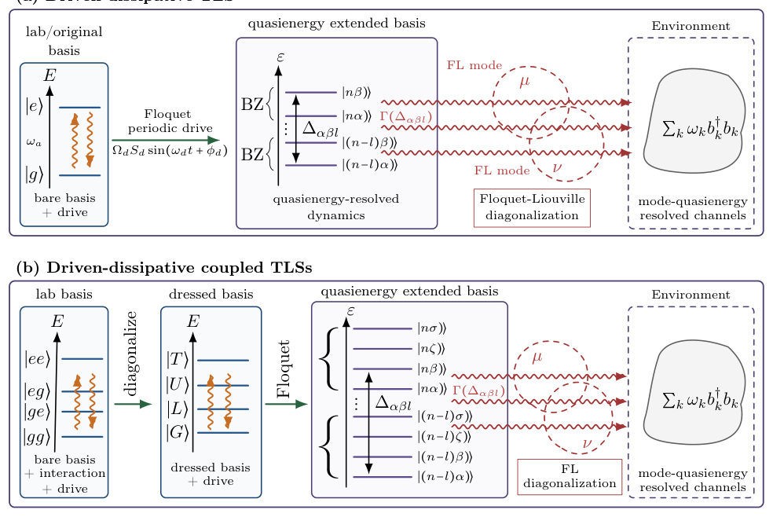
<figcaption class="paper-figure-caption"><b>Fig 1.</b> Figure 1. Schematic illustration of the driven-dissipative single-TLS (a) and coupled-TLS models (b), for example, two dipole-dipole coupled TLSs. In panel (a), the periodically driven two-level system is mapped to the Floquet extended basis, where dissipative processes are resolved through rates Γ(∆αβl), and then spectrally decomposed into FL modes. In panel (b), the coupled-TLS model (two interacting TLSs) is first transformed from the bare basis {∣gg⟩, ∣ge⟩, ∣eg⟩, ∣ee⟩}, where e.g., ∣ge⟩= ∣g⟩1⊗∣e⟩2, to the dressed basis {∣G⟩, ∣L⟩, ∣U⟩, ∣T⟩} and then lifted to the Floquet extended basis, with α, β, ζ, σ ∈{G, L, U, T}, where dissipation is resolved in terms of quasienergy transitions, and...</figcaption>
</figure>
<figure class="paper-figure-card">
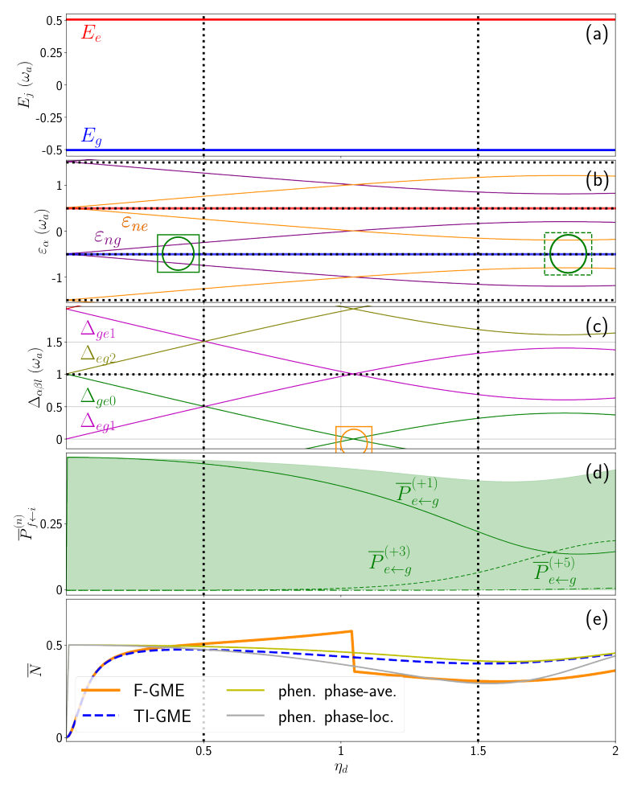
<figcaption class="paper-figure-caption"><b>Fig 2.</b> Figure 2. Driven-dissipative TLS: drive-amplitude dependence of the quantum processes. (a) Static energy levels Eg and Ee of the undriven TLS. (b) Floquet quasienergies εα in the primary BZ. (c) Quasienergy-resolved transition frequencies</figcaption>
</figure>
<figure class="paper-figure-card">
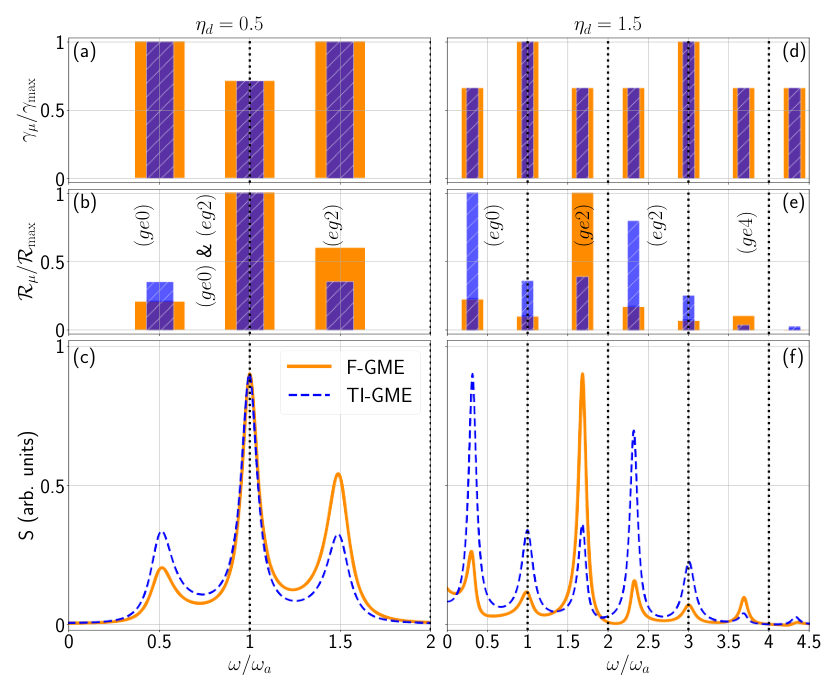
<figcaption class="paper-figure-caption"><b>Fig 3.</b> Figure 3. Driven-dissipative TLS: incoherent spectra. Comparison of the incoherent emission spectra obtained from the F-GME (solid orange) and TI-GME (dashed blue) for a resonantly driven TLS, ωd = ωa, coupled to a flat bath with γ = 0.1ωa. The left column corresponds to ηd = 0.5, and the right column to ηd = 1.5. Panels (c) and (f) show the spectra. Panels (a),(d) show the normalized effective linewidths γµ/γmax of the dominant FL modes, while panels (b),(e) show the corresponding normalized peak-strength measure Rµ/Rmax, with Rµ = Re(Wµ)/γµ (see text). The orange and blue bars use the same convention as the spectra: thick solid bars for the F-GME and thinner dashed bars for the TI-GME....</figcaption>
</figure>
<figure class="paper-figure-card">
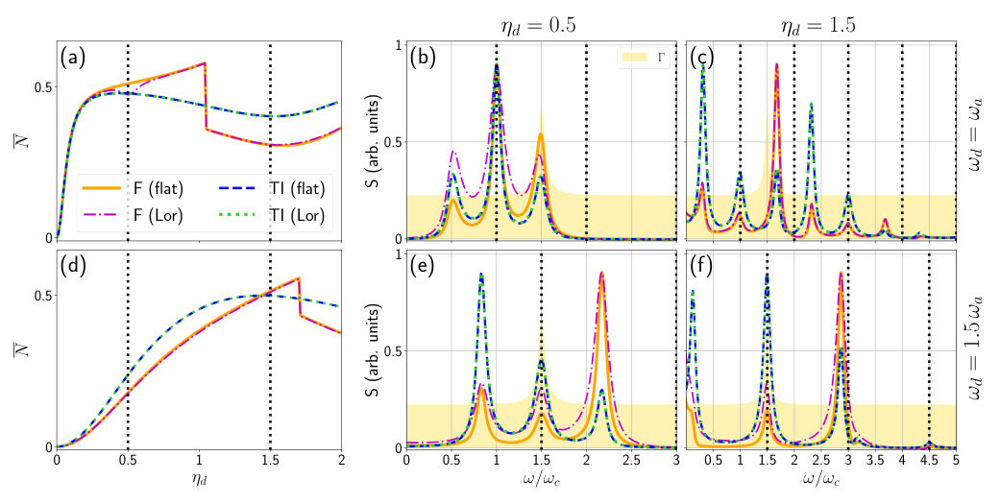
<figcaption class="paper-figure-caption"><b>Fig 4.</b> Figure 4. Driven-dissipative TLS: the effect of a structured bath. (a,d) Long-time averaged excitation population versus ηd, and (b,c,e,f) incoherent emission spectra of a driven-dissipative TLS. The results with a Lorentzian bath (red dash- dotted curves from the F-GME and dotted green curves for the TI-GME) centered at ω0 = 1.5ωa with linewidth and amplitude parameter γ = 0.1ωa are compared with those of with the reference flat bath curves. Here, for the top panels ωd = ωa and the bottom panels ωd = 1.5ωa. The spectra are obtained for the strong drive of ηd = 0.5 (b,e) and deep-strong drive of ηd = 1.5 (c,f). The vertical dotted black lines represent the drive’s specifics, i.e., in panels...</figcaption>
</figure>
<figure class="paper-figure-card">
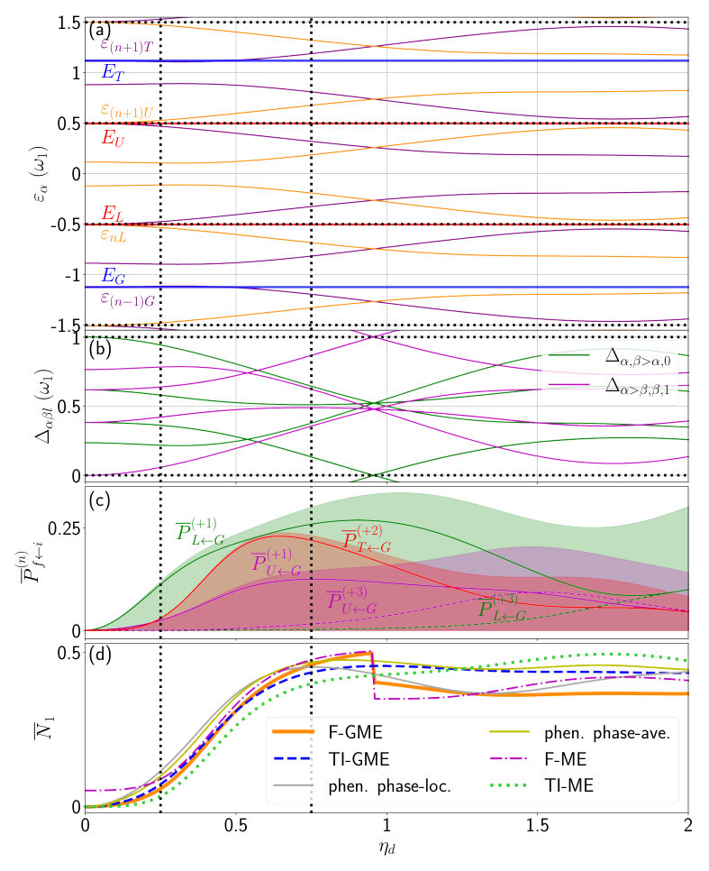
<figcaption class="paper-figure-caption"><b>Fig 5.</b> Figure 5. Driven-dissipative coupled-TLS: drive amplitude dependence of the dynamics. (a) Energy basis; shown are the static eigenenergies by the thick horizontal lines distinguished by their parities (blue: even, red:odd) and thin solid Floquet quasienergies lines distinguished by their generalized parities (purple:even, orange:odd), (b) extended space quasienergy gaps, (c) excitation transition probability when σ(1) x is driven, and (d) long-time average number of excitation for γ = 0.1ωa. For all panels, ωd = ωa is the drive frequency which are shown by the vertical black dotted lines to mark BZs. The sudden dip (discontinuous features) in (d) for the F-GME theory occurs when the same...</figcaption>
</figure>

**Summary.** This paper develops the Floquet-Markov generalized master equation (F-GME) to provide a self-consistent theory for open quantum systems driven periodically. It demonstrates that traditional time-independent descriptions incorrectly treat dissipation by collapsing complex quasienergy decay pathways into static energy gaps. The F-GME correctly accounts for drive-assisted sideband processes, providing essential guidance for modeling strongly driven quantum emitters.

**Why it may be interesting.** This work provides a crucial theoretical diagnostic for researchers working on quantum optics or cavity QED who model dissipation under strong driving fields, clarifying when standard master equation approximations break down.

Detailed structure

**Main problem.** The standard methods for modeling dissipation in periodically driven quantum systems fail because they incorrectly assume environmental coupling only to static energy transitions, neglecting the full nonperturbative dressing from the drive.

**Main result.** The authors introduce a Floquet-Markov generalized master equation (F-GME) that correctly resolves dissipation into drive-assisted sideband processes decaying through quasienergy channels, showing time-independent methods yield qualitatively incorrect results.

**Method.** The paper formulates and compares the novel nonsecular F-GME in the quasienergy basis against traditional time-independent master equation approaches for open quantum systems.

**Model / system.** The analysis is performed on minimal driven open quantum systems, specifically a harmonically driven two-level system and a coupled two-level system, both weakly coupled to a Markovian bath.

**Key observables.** Steady-state populations and emission spectra are used to diagnose the failure of approximate master equations.

**Important parameters / regimes.** The key regimes involve strong driving fields, weak dissipation coupling ($\gamma$), and the comparison between internal (interaction) and external (drive) nonperturbative dressing effects.

**Assumptions / limitations.** All formalisms rely on the Born-Markov approximation; the core assumption tested is whether the system dynamics can be accurately captured by time-independent approximations when strong driving is present.

**Paper structure.** The paper introduces the problem with existing master equation limitations, develops the F-GME framework in the quasienergy basis, applies it to minimal driven systems (TLSs), and compares its results against simpler time-independent models to demonstrate where Floquet consistency is essential.

Abstract

Periodically driven quantum systems are commonly modeled using master equations constructed in the eigenbasis of an undriven Hamiltonian, implicitly assuming that environmental dissipation couples to static energy transitions even under strong time-periodic driving. The validity of this approximation beyond weak or near-resonant driving remains poorly understood. To address the need for a more self-consistent quantum theory approach, we formulate a nonsecular Floquet--Markov generalized master equation (F-GME) in the quasienergy basis, treating interaction-induced (internal) and drive-induced (external) nonperturbative dressing on an equal footing. We subsequently investigate dissipation in two minimal driven open quantum systems---a harmonically driven two-level system and a harmonically driven coupled-two-level-system---each weakly coupled to a Markovian bath. Comparing the F-GME to a time-independent dressed-basis master equation, we show that even for a flat-bath spectral density and weak dissipation, the two approaches can yield qualitatively different steady-state populations and emission spectra. We resolve dissipation into drive-assisted sideband processes decaying via Floquet extended-space quasienergy channels, and show these channels can hybridize through nonsecular couplings into collective Floquet--Liouville modes governing observable spectral resonances. This analysis demonstrates that time-independent dissipative descriptions can incorrectly weight multiphoton Floquet transitions by collapsing quasienergy-resolved decay pathways into static energy gaps. The F-GME framework provides a systematic diagnostic for identifying regimes where Floquet-consistent dissipation is essential and clarifies the physical origin of discrepancies between commonly used master-equation approaches.

[↑ back to top](#top)

### [Effective field equations with stochastic initial conditions](http://arxiv.org/abs/2608.16486v1)

**Authors:** Ian G. Moss  
**Type:** theory · **Category:** quantum gases · **PDF:** <https://arxiv.org/pdf/2608.16486v1>  
**Analysis basis:** full PDF text, analyzed in chunks
**Topic relevance:** 🔥 `Keldysh / 2PI / non-Gaussian methods` **4/5** · `methods for driven-dissipative` **3/5** · `analog quantum simulation` **2/5** · `driven-dissipative phase transition` **2/5** · `non-equilibrium universality` **2/5** · `correlated / nonlocal dissipation` **1/5** · `quantum measurements` **1/5** · `scars & prethermalization` **1/5**

↔ Scroll figures horizontally

<figure class="paper-figure-card">
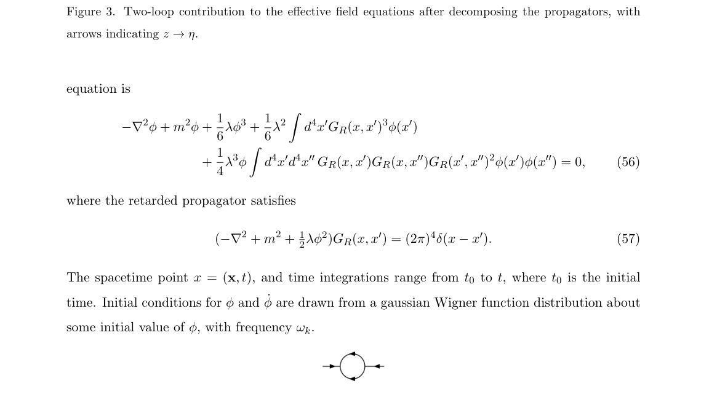
<figcaption class="paper-figure-caption"><b>Fig 1.</b> Figure 4. One-loop contribution to the symmetric function F after decomposing the propagators, with</figcaption>
</figure>
<figure class="paper-figure-card">

<figcaption class="paper-figure-caption"><b>Fig 2.</b> Figure 5. The integral for the first two-loop correction to Truncated Wigner plotted as a function of time</figcaption>
</figure>
<figure class="paper-figure-card">
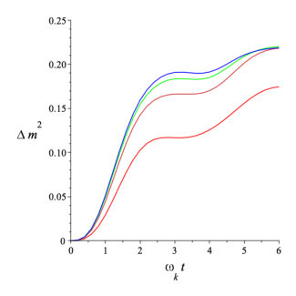
<figcaption class="paper-figure-caption"><b>Fig 3.</b> Fig. 6, at a rate depending on the momentum. There is no sign of saturation, though this may</figcaption>
</figure>
<figure class="paper-figure-card">
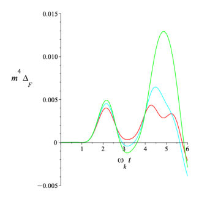
<figcaption class="paper-figure-caption"><b>Fig 4.</b> Figure 6. The integral for the loop correction to the equal time correlator using the most basic approxi-</figcaption>
</figure>

**Summary.** This paper develops an advanced method to calculate the evolution of quantum fields starting from non-equilibrium states by extending the Truncated Wigner Approximation. It systematically incorporates quantum loop corrections into effective field equations, providing theoretical tools for studying phenomena like vacuum decay beyond simple classical approximations.

**Why it may be interesting.** It provides a rigorous theoretical framework to bridge classical stochastic methods (TWA) with full quantum field theory loop corrections, which is crucial for accurately modeling non-equilibrium dynamics in many-body systems like BECs.

Detailed structure

**Main problem.** The primary goal is to extend the Truncated Wigner technique into a fully fledged effective field equation approach by systematically incorporating quantum loop corrections.

**Main result.** The authors show that the naive TWA is valid at one loop, and higher-order corrections are non-local and difficult to implement, suggesting a systematic but challenging path toward full quantum treatment.

**Method.** The work combines the Truncated Wigner Approximation (TWA) with the effective action formalism derived from the Schwinger-Keldysh path integral, allowing for loop expansion calculations.

**Model / system.** The analysis uses a general Klein-Gordon scalar field $\phi$ with an interaction potential $V(\phi)$, applicable to systems like Bose-Einstein condensates (BEC) and modeling phenomena such as false vacuum decay.

**Key observables.** Field expectation values ($\langle \hat{\phi} 
angle$), the Wigner functional, and loop-corrected effective actions $\Gamma[\phi_1, \phi_2]$.

**Important parameters / regimes.** The analysis depends on initial state widths ($\Omega_k$ vs. $\omega_k$) and involves comparing results across different loop orders (one-loop, two-loop).

**Assumptions / limitations.** The TWA is an approximation valid only for Gaussian initial states; higher-order corrections are non-local and computationally demanding.

**Figures summary.** Figures illustrate the structure of two-loop diagrams contributing to the effective action and show how loop correction integrals exhibit oscillatory or saturating behavior over time.

**Paper structure.** The paper progresses from establishing the TWA for non-equilibrium evolution, deriving the one-loop corrected field equation, and then analyzing the complexity and results of incorporating higher (two-loop) quantum corrections systematically.

Abstract

The evolution of quantum field expectation values from an initial non-equilibrium quantum state can be followed numerically using the Truncated Wigner technique. It can track non-perturbative quantum phenomena, such as false vacuum decay, in real time with promising results. Nevertheless, it is an approximate method subject to quantum loop corrections. The extension of Truncated Wigner into a fully fledged effective field equation approach is discussed here, including corrections from higher loops and higher momenta.

[↑ back to top](#top)

### [General Lindblad equation for quarkonium evolution in a quark-gluon plasma](http://arxiv.org/abs/2608.15347v1)

**Authors:** Aoumeur Daddi Hammou, Jean-Paul Blaizot, Pol Bernard Gossiaux, Thierry Gousset  
**Type:** theory · **Category:** statistical mechanics · **PDF:** <https://arxiv.org/pdf/2608.15347v1>  
**Analysis basis:** full PDF text, analyzed in chunks
**Topic relevance:** 🔥 `methods for driven-dissipative` **4/5** · `Keldysh / 2PI / non-Gaussian methods` **3/5** · `correlated / nonlocal dissipation` **3/5** · `quantum measurements` **3/5** · `driven-dissipative phase transition` **2/5** · `non-equilibrium universality` **1/5**

↔ Scroll figures horizontally

<figure class="paper-figure-card">
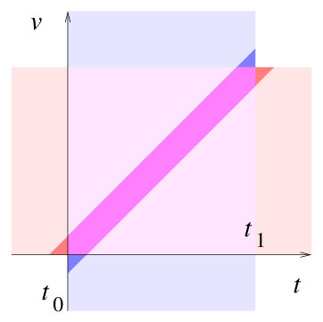
<figcaption class="paper-figure-caption"><b>Fig 1.</b> Figure 1. Domains of integration corresponding to Eqs. (2.10) [blue] and (2.11) [red]. The band corresponding to |t −v| &lt; τE is shown with darker colours.</figcaption>
</figure>
<figure class="paper-figure-card">
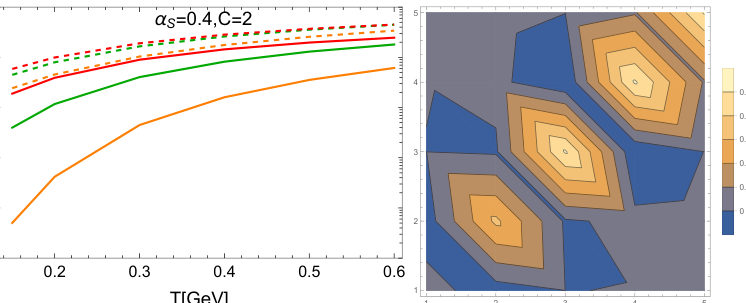
<figcaption class="paper-figure-caption"><b>Fig 2.</b> Figure 2. Left: Plain curves illustrate the diagonal elements ⟨n|Γs|n⟩as a function of the QGP temperature T for the bound c¯c vacuum-states: J/ψ (orange), χc (green) and ψ′ (red); the correlator is evaluated with mD taken as 2T and αs = 0.4. Dashed curves represent the same quantities neglecting the effect of energy gaps (imaginary potential approximation). Right: Contour plot of the elements ⟨m|Γs|n⟩for T = 0.4 GeV, and n, m ≤5. Same choice for αs and mD/T as in the left panel.</figcaption>
</figure>
<figure class="paper-figure-card">
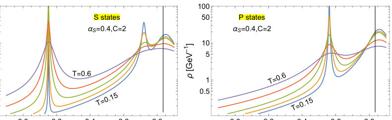
<figcaption class="paper-figure-caption"><b>Fig 3.</b> Figure 3. Left: Spectral density according to Eq. (3.8) for T = 0.15, 0.2, 0.3, 0.4 and 0.6 GeV (S states). Right: same for P states.</figcaption>
</figure>
<figure class="paper-figure-card">
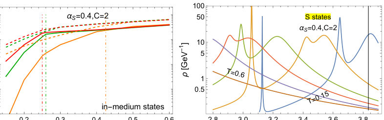
<figcaption class="paper-figure-caption"><b>Fig 4.</b> Figure 4. Left: same as Fig. 4 (left) for in-medium eigenstates of the effective T-dependent real- potential defined in [62]; the dot-dashed vertical lines represent, for each state, the T beyond which it ceases to be bound, namely Tdiss(J/ψ) ≈0.41 GeV, Tdiss(χc) ≈0.26 GeV, and Tdiss(ψ′) ≈0.25 GeV. Right: same as Fig. 3 (left) for in-medium states, for T = 0.15 (blue), 0.2 (orange), 0.25 (green), 0.3 (red), 0.4 (purple) and 0.6 (brown) GeV.</figcaption>
</figure>
<figure class="paper-figure-card">
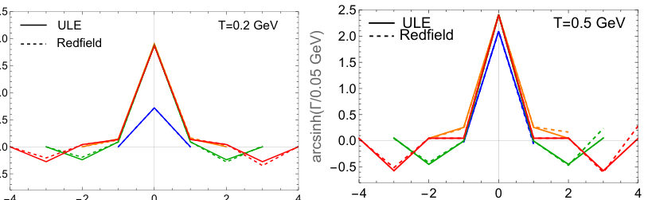
<figcaption class="paper-figure-caption"><b>Fig 5.</b> Figure 5. Left: Comparison between ⟨m|ΓBE s |n⟩(dashed lines) and ⟨m|ΓULE s |n⟩(plain lines) in the s-channel for mD = 2T and T = 0.2 GeV. Each line correspond to given fixed sum m+n: 4 (blue), 6 (orange), 8 (green) and 10 (red); Using the arcsinh allows to compress the large values of ⟨m|Γs|n⟩, making the small value more visible, while preserving the sign. Right: same for T = 0.5 GeV.</figcaption>
</figure>

**Summary.** The paper addresses the challenge of modeling quarkonium evolution in a QGP by deriving a universal Lindblad master equation. This new formalism overcomes limitations of previous models that could only describe specific temperature regimes. It provides a unified, quantum description for $ar{Q}Q$ pair dynamics across the entire cooling history of the plasma.

**Why it may be interesting.** This work is highly relevant as it applies advanced open quantum system techniques (Lindblad master equations) to a strongly interacting, non-equilibrium many-body system (QGP), bridging concepts from quantum optics/dissipation theory into high-energy nuclear physics.

Detailed structure

**Main problem.** Developing a quantum mechanical formalism to accurately model quarkonium ($ar{Q}Q$) evolution within the Quark-Gluon Plasma (QGP) that remains valid across all temperature regimes.

**Main result.** The authors derive a general, non-abelian Lindblad master equation (ULE) that unifies descriptions previously restricted to separate Quantum Brownian Motion and Quantum Optical regimes.

**Method.** The derivation uses the Open Quantum System approach, starting from the reduced density matrix evolution and transforming it into a Lindblad form via approximations like Born-Markov.

**Model / system.** The system models heavy quark-antiquark pairs interacting with a QGP. The dynamics are governed by a generalized Lindblad master equation that incorporates non-unitary dissipation terms derived from plasma correlators.

**Key observables.** Quarkonium suppression, spectral functions, and the coupled singlet-octet dynamics of the $ar{Q}Q$ pair.

**Important parameters / regimes.** The temperature ($T$) relative to the energy gap ($\Delta E$), which dictates the transition between QBM ($T \gtrsim \Delta E$) and QO ($\Delta E \gtrsim T$) regimes.

**Assumptions / limitations.** The derivation relies on the Born-Markov approximation, and some intermediate steps assume thermal equilibrium (KMS boundary conditions) or non-relativistic treatment of the heavy quarks.

**Figures summary.** Not specified in the notes; the focus is on deriving equations and illustrating key quantities like decay rates and spectral density using the derived framework.

**Paper structure.** The paper progresses from identifying the limitations of existing QME approaches (restricted by $T$ vs $\Delta E$) to deriving the general Lindblad form, showing how it unifies descriptions across different physical regimes, and finally illustrating its application via key observables.

Abstract

Accurate modelling and understanding of quarkonium production in ultrarelativistic heavy ion collisions requires a formalism that preserves the quantum properties of microscopic $\bar{Q}Q$ systems while treating the interaction of such pairs with the quark-gluon plasma (QGP). The open quantum system approach has recently emerged as one of the most fruitful schemes to meet such requirements. However, the quantum master equations obtained so far in this context are derived assuming a strict ordering between the QGP temperature $T$ and the $\bar{Q}Q$ energy gaps ($ΔE$) of the quarkonia bound states. This limits their predictive power since, as the QGP expands and cools down, the system traverse all regimes between the quantum Brownian motion (QBM) regime for $T\gtrsim ΔE$ to the quantum optical (QO) regime for $ΔE\gtrsim T$. In this paper, we derive and present a more general non-abelian quantum master equation of the Lindblad type, which does not suffer from these limitations and thus allows to faithfully describe the quantum evolution of the $Q\bar{Q}$ pairs during the whole QGP-evolution. We also provide some illustration of the key quantities governing this equation.

[↑ back to top](#top)

### [Quantum Boltzmann Equation Self-Consistent-Field for the Entropic Regularization of Mean-Field Singularities](http://arxiv.org/abs/2608.14979v1)

**Authors:** Romit Chakraborty  
**Type:** theory · **Category:** strongly correlated electrons · **PDF:** <https://arxiv.org/pdf/2608.14979v1>  
**Analysis basis:** full PDF text, analyzed in chunks
**Topic relevance:** 🔥 `Keldysh / 2PI / non-Gaussian methods` **4/5** · `methods for driven-dissipative` **3/5** · `quantum measurements` **3/5** · `driven-dissipative phase transition` **2/5** · `non-equilibrium universality` **2/5** · `correlated / nonlocal dissipation` **1/5** · `scars & prethermalization` **1/5**

↔ Scroll figures horizontally

<figure class="paper-figure-card">
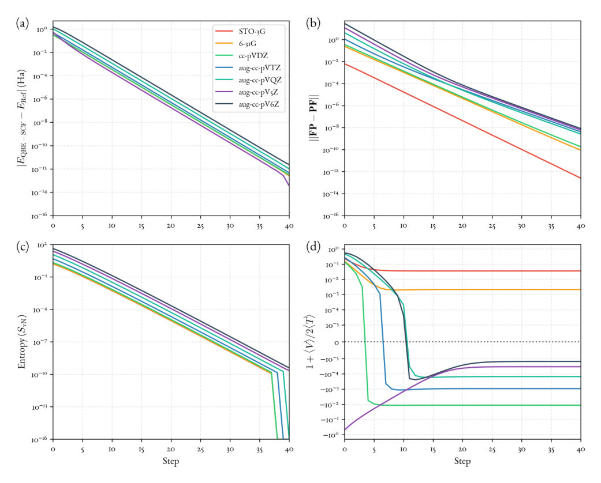
<figcaption class="paper-figure-caption"><b>Fig 1.</b> FIG. 1. H2 at Equilibrium. QBE-SCF relaxes a perturbed SAD guess across a hierarchy of basis sets. We see the monotonic decay of energy error w.r.t Restricted Hartree-Fock in (a), the commutator norm ∥FP−PF∥in (b). Purification of the density matrix is shown in (c), and (d) confirms restoration of the virial theorem at equilibrium.</figcaption>
</figure>
<figure class="paper-figure-card">
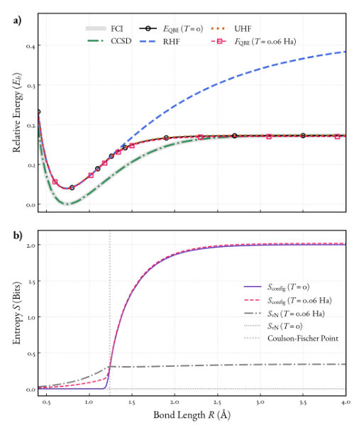
<figcaption class="paper-figure-caption"><b>Fig 2.</b> FIG. 2. Dissociation of H2. (a) Potential energy curves (cc-pVTZ). Zero-temperature QBE energy (EQBE) recovers the UHF asymptote. (b) Configurational entropy (Sconfig) shows the transition from a closed-shell singlet (0.0 bits) to the perfect-pairing diradical ( 1 √</figcaption>
</figure>
<figure class="paper-figure-card">
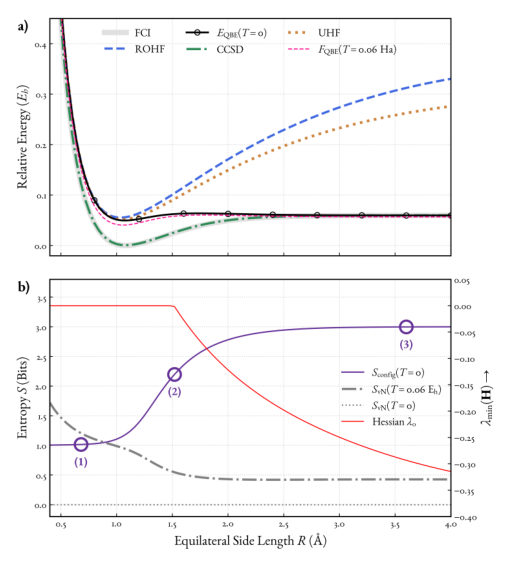
<figcaption class="paper-figure-caption"><b>Fig 3.</b> FIG. 3. H3 dissociation under D3h at cc-pVDZ. (a) EQBE(T) = 0 converges to FCI in the dissociative limit as SvN stays pinned to 0.0 in (b). Sconfig(T) = 0 maintains a 1.0-bit baseline for the unpaired radical (1) before instability in the Aufbau-projected density (λmin(H) &lt; 0) (2) triggers a fractionalization that saturates at 3.0 bits to recover the Mott insulator limit (3). Natural orbitals at (1), (2), and (3) are shown in Figure. 4</figcaption>
</figure>
<figure class="paper-figure-card">
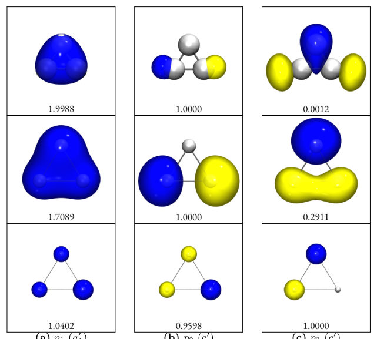
<figcaption class="paper-figure-caption"><b>Fig 4.</b> FIG. 4. Evolution of the QBE-SCF spatial natural orbitals at T = 0 during H3 dissociation. In the tightly bound molecular regime (1), the spatial natural orbitals reflect a delocalized closed-shell configuration with a strongly dominant core pair. As internuclear separation increases in (2), the primary bonding orbital polarizes as macroscopic occupation shifts into the antibonding state, transiently breaking the D3h symmetry. Upon reaching the asymptotic Mott limit in (3), the spatial natural orbitals localize into non-interacting atomic spheres with exact integer occupations.</figcaption>
</figure>
<figure class="paper-figure-card">
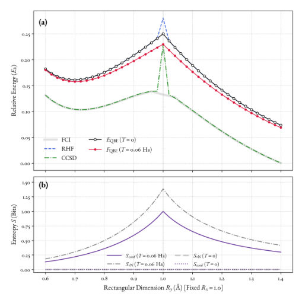
<figcaption class="paper-figure-caption"><b>Fig 5.</b> FIG. 5. Energy and entropy profiles for H4 rectangu- lar distortion in 6-31g. (a) QBE-SCF at T = 0 bypasses the RHF discontinuity at Ry = 1.0 ˚A. (b) The entropy is zero at T = 0. A temperature of T = 0.06 Ha induces frac- tionalization at the crossing, lowering the free energy.</figcaption>
</figure>

**Summary.** The authors introduce a Quantum Boltzmann Equation Self-Consistent-Field method that treats molecular electronic structure via kinetic relaxation in phase space. This approach regularizes mean-field singularities—such as those found at bond dissociation or conical intersections—by incorporating entropy, allowing the recovery of highly correlated physics using only single-reference methods.

**Why it may be interesting.** This work provides a powerful, physically motivated extension of electronic structure theory by merging quantum statistical mechanics (entropy/thermalization) directly into the SCF cycle to handle strongly correlated regimes.

Detailed structure

**Main problem.** The paper addresses mean-field singularities encountered in electronic structure theory, particularly at degeneracies like bond dissociation or conical intersections, which standard methods struggle with.

**Main result.** By implementing a kinetic relaxation approach, the method successfully regularizes these singularities, recovering correlated adiabatic surfaces and approaching the Full CI limit without relying on multi-reference wavefunctions.

**Method.** It employs a Quantum Boltzmann Equation (QBE) Self-Consistent-Field (SCF) formulation, using a Bhatnagar-Gross-Krook (BGK) collision operator to drive the system toward equilibrium in phase space.

**Model / system.** The theory is applied to molecular electronic structure calculations ($	ext{H}_3$, $	ext{BeH}_2$, $	ext{H}_4$), treating the electron cloud via a Wigner quasi-probability distribution. The evolution is governed by a modified QBE that incorporates kinetic relaxation.

**Key observables.** Configurational spin entropy ($S_{	ext{config}}$), Von Neumann entropy, and the commutator norm ($\|F P - P F\|$).

**Important parameters / regimes.** Collision frequency ($\omega$), electronic temperature parameter ($	ext{Telec}$ or $T$), and basis set hierarchy.

**Assumptions / limitations.** The method assumes that the system dynamics can be effectively described by a single-particle Fock operator ($F$) and utilizes kinetic relaxation to bypass strict idempotency constraints inherent in standard SCF methods.

**Figures summary.** Figures illustrate $	ext{H}_2$ dissociation tracking energy error across basis sets, showing $S_{	ext{config}}$ transition; they also show entropic regularization of the $	ext{BeH}_2$ conical intersection and the convergence to FCI for $	ext{H}_3$.

**Paper structure.** The paper develops the QBE-SCF framework by first establishing its mathematical foundation using BGK relaxation. It then applies this formalism sequentially to resolve specific physical problems: zero-temperature kinetic ergodicity for degeneracies ($	ext{H}_3$), and finite-temperature entropic regularization for avoided crossings ($	ext{BeH}_2$).

Abstract

We present a Quantum Boltzmann Equation self-consistent-field (QBE-SCF) formulation for molecular electronic structure in which the one-electron reduced density matrix is propagated in a fixed Gaussian orbital basis and relaxed by a Bhatnagar-Gross-Krook collision operator toward a Fermi-Dirac equilibrium defined by the instantaneous Fock matrix. At stationarity, the converged density and Fock matrices satisfy $[\mathbf{F},\mathbf{P}]=0$, the Hartree-Fock condition. While the zero-temperature equilibrium target reduces to the integer Aufbau projector, the damped collision operator ensures the steady-state density matrix is not necessarily idempotent. This kinetic property affords a dual capacity to resolve mean-field singularities. For spatial degeneracies, such as H$_3$ symmetric dissociation, zero-temperature kinetic ergodicity fractionalizes the active space to recover the GVB limit. For the conical intersection in BeH$_2$ and the H$_4$ structural distortion ($D_{2h} \rightarrow D_{4h} \rightarrow D_{2h}$), finite-temperature entropic regularization recovers correlated adiabatic surfaces from a real-valued single-reference density. By maintaining stable numerical convergence across basis-set hierarchies and resolving static correlation without multi-reference wavefunctions, these results establish kinetic relaxation as a synthesis of single-reference electronic structure and quantum statistical mechanics.

[↑ back to top](#top)

### [Transport-Noise Witnesses of Electronic Multipartite Entanglement](http://arxiv.org/abs/2608.16028v1)

**Authors:** Shuhan Ding, Prakash Sharma, Zecheng Shen, Jiang-Xiazi Lin, Sergei Urazhdin, Yao Wang  
**Type:** theory · **Category:** strongly correlated electrons · **PDF:** <https://arxiv.org/pdf/2608.16028v1>  
**Analysis basis:** full PDF text, analyzed in chunks
**Topic relevance:** 🔥 `analog quantum simulation` **4/5** · `quantum measurements` **3/5** · `Full counting statistics` **2/5** · `Keldysh / 2PI / non-Gaussian methods` **2/5** · `driven-dissipative phase transition` **2/5** · `correlated / nonlocal dissipation` **1/5** · `methods for driven-dissipative` **1/5** · `non-equilibrium universality` **1/5**

↔ Scroll figures horizontally

<figure class="paper-figure-card">
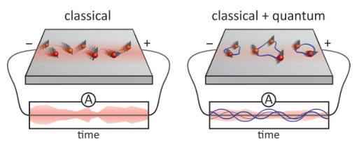
<figcaption class="paper-figure-caption"><b>Fig 1.</b> FIG. 1. Schematic illustrating current noise from classical and quantum sources. Left: Thermal current fluctuations in a classical system, where the low-frequency Johnson noise is set by the thermal distribution of electronic velocities. Right: Quantum fluctuations in a quantum system, whose two-time current correlation contains par- ticular dynamical structures generated by entanglement.</figcaption>
</figure>
<figure class="paper-figure-card">
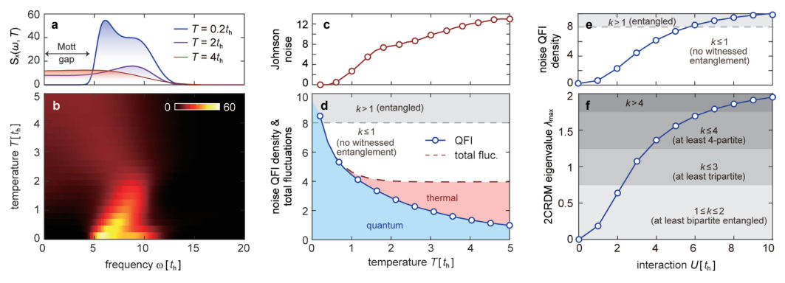
<figcaption class="paper-figure-caption"><b>Fig 2.</b> FIG. 2. Noise spectrum and entanglement witness in the Hubbard model. a, Symmetrized current-noise spectrum S(ω, T) of the half- filled 1D Hubbard model, calculated by DQMC for three representative temperatures: T = 0.2th (blue), 2th (purple), and 4th (red). b, Full temperature evolution of the noise spectrum shown as a false-color map. c, Johnson noise extracted from the ω = 0 spectral intensity in b. d, Temperature dependence of the noise-based QFI density FQ[ ˆJx]/A (dots and solid line) together with the normalized total current fluctuation 4⟨δ ˆJ2 α⟩/A (dashed), with their difference representing the thermal fluctuation. e, f, Zero-temperature interaction dependence of the...</figcaption>
</figure>
<figure class="paper-figure-card">
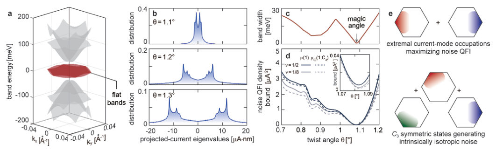
<figcaption class="paper-figure-caption"><b>Fig 3.</b> FIG. 3. Projected active space and isotropic noise in twisted bilayer graphene (TBG). a, Low-energy band structure of TBG (twist angle θ = 1.2◦), where the two red-highlighted bands identify the flat-band manifold effectively separated from remote bands. b, Distributions of projected-current eigenvalues at θ = 1.1◦, 1.2◦, and 1.3◦. c, Twist-angle dependence of bandwidth. d, Twist-angle dependence of the bounds for noise QFI (solid) and C3-symmetric isotropic noise (dashed) at ν = 1/8 and 1/2 per spin and valley. The inset shows the region near the magic angle. e, Schematic illustration of the extremal current-mode occupations (upper) that maximize the noise QFI and define the supremum in...</figcaption>
</figure>
<figure class="paper-figure-card">
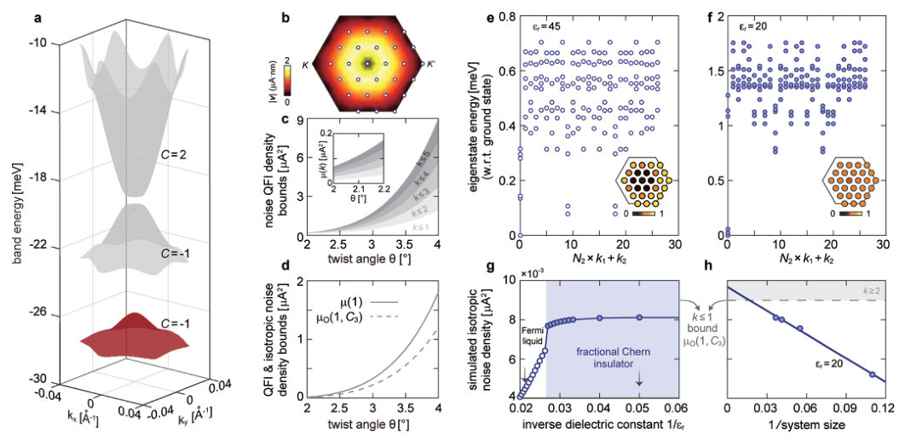
<figcaption class="paper-figure-caption"><b>Fig 4.</b> FIG. 4. Entanglement witness in twisted bilayer MoTe2 (tMoTe2) and fractional Chern insulator (FCI). a, Low-energy band structure of tMoTe2, with the projected Chern band highlighted. b, Projected current magnitude over the mini-Brillouin zone; circles denote the 27 momenta included in ED simulations. c, Twist-angle dependence of the upper bounds µ(k) for the noise QFI density at ν = 2/3 hole filling per moir´e unit cell, with the inset highlighting the region near the magic angle. d, Comparison between the k = 1 noise-QFI bound (solid line, same as in c) and the isotropic-noise bound (dashed line). e,f, Momentum-resolved eigenspectra, labeled by the linearized momentum index N2 × k1 + k2,...</figcaption>
</figure>

**Summary.** The paper introduces a novel method to detect multipartite entanglement in interacting electrons within solid-state materials by analyzing the equilibrium current noise spectrum. By comparing measured quantum fluctuations against theoretically derived upper bounds, the authors certify entanglement in complex systems like twisted bilayer graphene and $	ext{tMoTe}_2$. This provides an experimentally relevant diagnostic tool for characterizing exotic quantum states of matter.

**Why it may be interesting.** This work provides a concrete, measurable link between fundamental quantum information concepts (entanglement) and observable transport properties in solid-state materials, which is highly relevant for understanding correlated electron physics beyond simple mean-field theories.

Detailed structure

**Main problem.** The goal is to develop a transport-based protocol to certify intrinsic multipartite entanglement among interacting electrons in solid-state quantum materials.

**Main result.** The authors successfully benchmarked the method on systems like twisted bilayer graphene and $	ext{tMoTe}_2$, showing that noise measurements can detect entanglement when exceeding theoretical upper bounds derived from microscopic parameters.

**Method.** The protocol utilizes the equilibrium current noise spectrum, transforming it to isolate quantum fluctuations (QFI) which are then compared against a basis-independent upper bound ($\mu(k)$).

**Model / system.** The framework is applied to paradigmatic strongly correlated systems including the Hubbard model, twisted bilayer graphene (TBG), and $	ext{tMoTe}_2$ exhibiting Fractional Chern Insulating states.

**Key observables.** Equilibrium noise spectrum $S_{\alpha}(\omega, T)$, Quantum Fisher Information (QFI) extracted from noise, and symmetry-constrained isotropic noise ($	ilde{G}_{igcirc}(T)$).

**Important parameters / regimes.** Low temperatures ($T 	o 0$), the number of entangled particles ($k+1$), and material parameters like bond lengths and tunneling amplitudes.

**Assumptions / limitations.** The method assumes that current noise measurements are experimentally accessible observables, allowing the extension of entanglement witnesses from quantum optics to macroscopic solid-state systems.

**Figures summary.** Figures illustrate the evolution of the noise spectrum in the Hubbard model across temperatures, and show comparisons between various theoretical bounds (QFI vs. isotropic) for TBG and $	ext{tMoTe}_2$.

**Paper structure.** The paper introduces the general transport-noise witness based on current noise, derives the necessary upper bound, and then benchmarks this method sequentially across three distinct physical models: Hubbard model, TBG, and $	ext{tMoTe}_2$, refining the witness using symmetry constraints.

Abstract

Entanglement among particles is a defining feature of strongly correlated quantum materials, distinguishing them from conventional metals and semiconductors. The ability to certify intrinsic entanglement among interacting electrons in solid-state materials is important not only for classifying quantum states of matter, but also for developing material-based quantum technologies. Here, we introduce a transport-based protocol for witnessing multipartite entangled electronic states, based on the equilibrium noise spectrum as an experimentally accessible observable. The appropriately integrated, symmetrized, and projected current noise obeys an upper bound that can be derived from microscopic model parameters and is invariant with respect to the choice of electronic basis. We benchmark this framework in several paradigmatic systems, including twisted bilayer graphene, twisted bilayer MoTe$_2$, and Hubbard models, certifying entanglement in the fractional Chern insulating state. The method extends recently developed scattering-based entanglement witnesses to ultralow-temperature materials, where conventional spectroscopic probes are inaccessible but candidate entangled states are expected to arise.

[↑ back to top](#top)

### [A scalable chip-integrated single-photon source array based on 50 individually addressable neutral atoms](http://arxiv.org/abs/2608.15637v1)

**Authors:** Ya-Dong Hu, Tian-Yang Zhang, Dong-Qi Ma, Yi-Chen Zhang, Liang Chen, Wen-Yi Zhu, Hong-Jie Fan, Yan-Lei Zhang, Zhu-Bo Wang, Gang Li, Xi-Feng Ren, Guang-Can Guo, Chang-Ling Zou  
**Type:** experiment · **Category:** quantum information and computing · **PDF:** <https://arxiv.org/pdf/2608.15637v1>  
**Analysis basis:** full PDF text, analyzed in chunks
**Topic relevance:** 🔥 `QC/QI experiment` **4/5** · `analog quantum simulation` **3/5** · `quantum optics experiment` **3/5** · `Rydberg arrays` **2/5** · `Tavis-Cummings & cavity-many-emitter` **1/5** · `interference shaping light` **1/5** · `quantum measurements` **1/5**

↔ Scroll figures horizontally

<figure class="paper-figure-card">
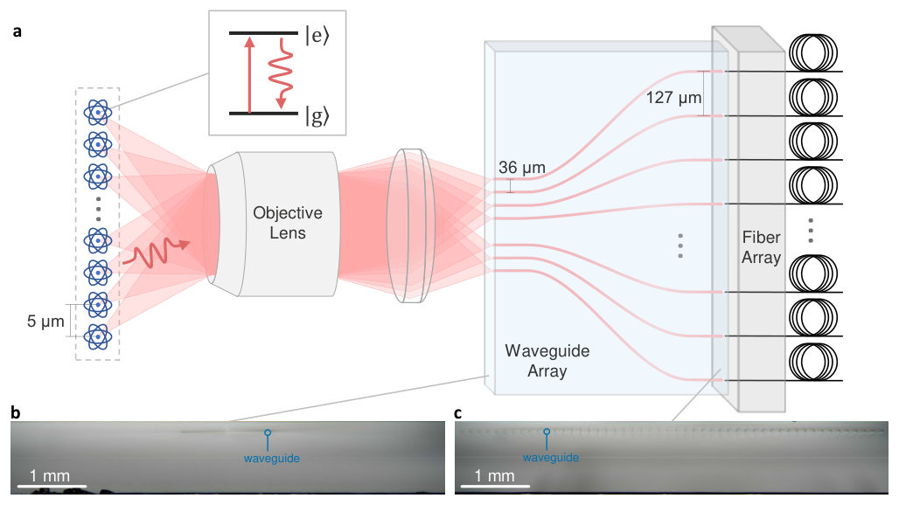
<figcaption class="paper-figure-caption"><b>Fig 1.</b> FIG. 1. A chip-interfaced waveguide fan-out for neutral-atom single-photon source arrays. a, Optical layout. A one-dimensional array of 87Rb atoms (left) is held in optical tweezers; each atom acts as a two-level emitter (|𝑒⟩→|𝑔⟩). Their fluorescence is collected by an objective and relayed onto the input facet of the waveguide array, where the magnified atom spacing matches the 36 µm waveguide pitch. The chip then fans the channels out to a 127 µm pitch at the output facet, matching a commercial fiber array. b&amp;c, Micrographs of the input (b) and output (c) facets of the chip, recorded at the same magnification. The blue circle marks a single waveguide. Waveguides across the row differ in...</figcaption>
</figure>
<figure class="paper-figure-card">
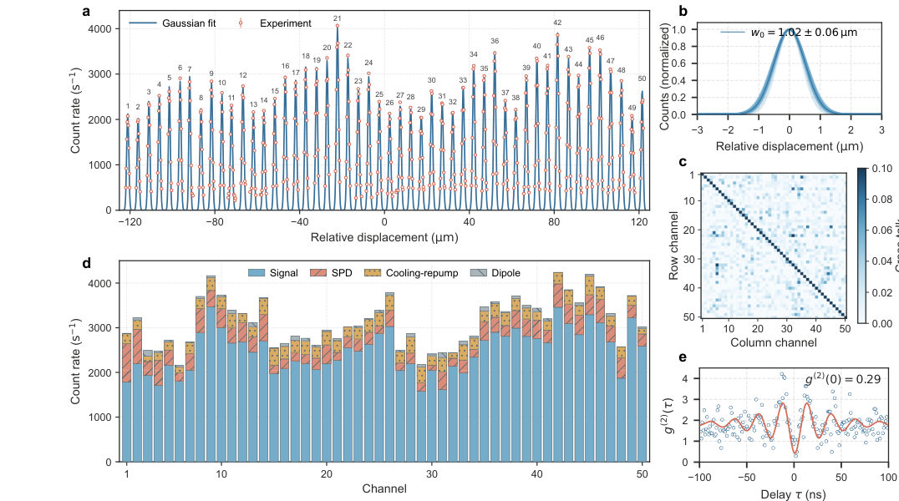
<figcaption class="paper-figure-caption"><b>Fig 2.</b> FIG. 2. One-to-one channel mapping and simultaneous operation of 50 neutral-atom single-photon sources. a, Fluorescence collected by each of the 50 channels as a single atom is translated across the focal plane, the displacement being controlled by the radio-frequency (RF) drive of the tweezer acousto-optic deflector (AOD). The scan resolves 50 peaks, each corresponding to one waveguide channel (labeled 1-50). b, Collection mode line shape. After removing their relative offsets and normalizing, the individual peaks (light blue) overlap; the averaged response (dark blue) is Gaussian with a waist 𝑤0 = 1.02 µm, set by the fluorescence collection mode at the atom plane. c, Measured 50 × 50...</figcaption>
</figure>
<figure class="paper-figure-card">
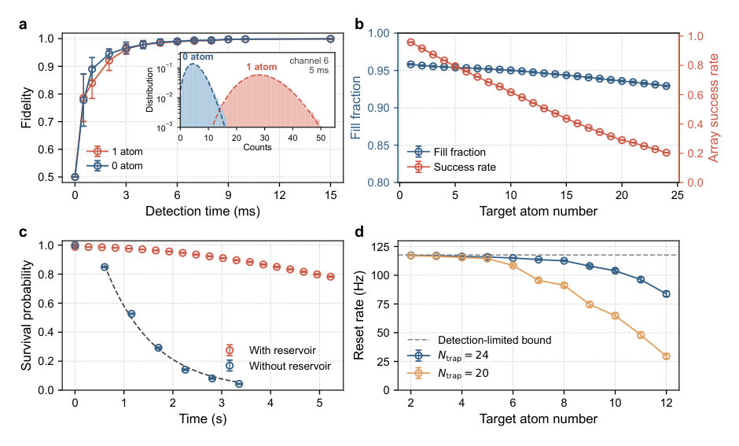
<figcaption class="paper-figure-caption"><b>Fig 3.</b> FIG. 3. State readout, deterministic loading, and stable operation of the source array. a, Single-atom readout fidelity versus detection time, approaching near-unity at longer integration. The inset shows the normalized photon-count distribution for channel 6 over a 5 ms window, resolving the 0-atom and 1-atom states with a readout fidelity of 98.6%. b, Average single-trap fill fraction after rearrangement (left axis, blue) and whole-array preparation success rate (right axis, red) as a function of the target atom number 𝑁, starting from an initial array of 48 traps. c, Single-atom survival probability versus holding time. The red data were obtained with 10 target atoms prepared by...</figcaption>
</figure>
<figure class="paper-figure-card">
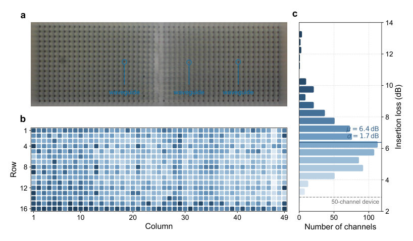
<figcaption class="paper-figure-caption"><b>Fig 4.</b> FIG. 4. Insertion-loss characterization of a 784-channel waveguide array. a, Optical micrograph of the input facet, where the channels form a 16-row by 49-column array with a 36 µm pitch. At the opposite facet, the channels are rearranged into a 4 × 196 array with a 127 µm pitch, matching a two-dimensional fiber array. The blue circles mark three individual waveguides. Variations in the apparent brightness and contrast of the channels across the micrograph arise from non-uniform illumination during imaging. b, Spatial map of the insertion loss of all 784 channels (196 groups of four waveguides), arranged according to their physical positions in a. Each rounded square represents one channel...</figcaption>
</figure>

**Summary.** The research presents a breakthrough in creating scalable, chip-integrated single-photon source arrays using individually trapped neutral atoms. By employing a waveguide fan-out structure, the authors successfully connect the atomic array to standard fiber optics while maintaining high performance metrics like low cross-talk and confirmed single-photon emission. This establishes a robust, fiber-native platform crucial for advancing quantum information processing.

**Why it may be interesting.** This work directly addresses a critical engineering bottleneck—the physical interface between quantum emitters and classical photonics infrastructure—which is essential for realizing scalable quantum networks based on neutral atoms.

Detailed structure

**Main problem.** The central challenge is developing a scalable, chip-integrated platform to generate arrays of identical single-photon sources using neutral atoms for quantum networking and computation.

**Main result.** The authors successfully demonstrated an architecture that maps 50 individually addressable neutral atom sources onto a commercial fiber array with low cross-talk (0.4%) and loss (2.9 dB).

**Method.** They utilized a glass waveguide fan-out chip interface to bridge the gap between the microscopic atomic tweezer pitch ($	ext{5 } \mu	ext{m}$) and standard optical fiber pitches ($	ext{127 } \mu	ext{m}$).

**Model / system.** The system uses $^{87}	ext{Rb}$ neutral atoms trapped in an optical tweezer array. The platform is characterized by its ability to maintain high fidelity (low cross-talk, $g^{(2)}(0)=0.29$) while supporting active reservoir replenishment for sustained operation.

**Key observables.** Second-order correlation function ($g^{(2)}(0) = 0.29$), average nearest-neighbor cross-talk ($	ext{0.4\%}$), uniform insertion loss ($	ext{2.9 dB}$), and array reset rate ($	ext{118 Hz}$).

**Important parameters / regimes.** Scalability demonstrated up to $	ext{784}$ channels; source subarrays prepared with $>93\%$ fill fraction.

**Assumptions / limitations.** The single-photon emission characterization is currently limited by detector dark counts and residual cooling-light scattering.

**Figures summary.** Figures illustrate the chip-interfaced waveguide fan-out, cross-talk matrices for 50 channels, confirmation of antibunching via $g^{(2)}(	au)$ measurements, and details on array preparation success rates and reset dynamics.

**Paper structure.** The paper progresses by first establishing the necessity of scalable interfaces, detailing the chip fabrication and characterization (cross-talk, loss), confirming single-photon purity ($g^{(2)}$), and finally demonstrating active control mechanisms like reservoir replenishment to ensure sustained operation across large arrays.

Abstract

Scalable arrays of identical single-photon sources are a central resource for photonic quantum information processing, quantum networks and quantum metrology. Neutral atoms provide intrinsically identical emitters that can be assembled and rearranged in optical tweezers, but a many-channel fiber interface to individually trapped atoms has remained a major technical challenge. Here we demonstrate a chip-interfaced single-photon source array based on 50 individually addressable $^{87}\mathrm{Rb}$ atoms. A glass waveguide fan-out converts the \SI{5}{\micro m} pitch of the optical-tweezer array to the \SI{127}{\micro m} pitch of a commercial fiber array, mapping each atom to its own waveguide, fiber and single-photon detector. We resolve all 50 channels with an average nearest-neighbor cross-talk of $0.4\%$ and a uniform insertion loss of \SI{2.9}{dB}, and verify single-photon emission with $g^{(2)}(0)=0.29$, presently limited by detector dark counts and residual cooling-light scattering. Combining per-channel atom discrimination, rearrangement and reservoir replenishment, we prepare source subarrays of up to 24 atoms with a $93\%$ fill fraction. For small target numbers, atom loss is repaired from the reservoir at the detection-limited rate of \SI{118}{Hz}. We further fabricate a 784-channel waveguide chip, showing that the photonic interface can be extended well beyond the present number. This architecture establishes a fiber-native neutral-atom platform for larger arrays of identical single-photon sources.

[↑ back to top](#top)

### [Evidence for cavity-induced metallic phase from entropic electron correlation effects](http://arxiv.org/abs/2608.16593v1)

**Authors:** Jacob Horak, Dominik Sidler  
**Type:** theory · **Category:** statistical mechanics · **PDF:** <https://arxiv.org/pdf/2608.16593v1>  
**Analysis basis:** full PDF text, analyzed in chunks
**Topic relevance:** 🔥 `analog quantum simulation` **4/5** · `Tavis-Cummings & cavity-many-emitter` **3/5** · `driven-dissipative phase transition` **3/5** · `non-equilibrium universality` **2/5** · `Keldysh / 2PI / non-Gaussian methods` **1/5** · `correlated / nonlocal dissipation` **1/5** · `methods for driven-dissipative` **1/5**

↔ Scroll figures horizontally

<figure class="paper-figure-card">
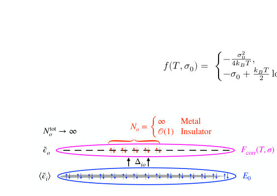
<figcaption class="paper-figure-caption"><b>Fig 1.</b> FIG. 1. Simplified collective 2-level model to qualitatively in- vestigate the formation of metallic transversal electron cor- relation phases under collective SC in the thermodynamic limit, as introduced in Ref. 23. Mean Hartree-Fock orbital energies are labeled ⟨̃𝜖𝑖⟩which jointly accumulate to the en- semble Hartree-Fock energy 𝐸0 (blue). The cavity-induced 𝑁tot 𝑜 -fold degenerate space is occupied 𝑁𝑜-times with excita- tion energy Δ𝑖𝑜= ̃𝜖𝑜−⟨̃𝜖𝑖⟩&gt; 0. Depending on the chemi- cal ensemble, exciting 𝑁𝑜orbitals can lower the transversal correlation free-energy 𝐹corr entropically, and thus becoming energetically favorable. Two qualitatively different cases can be distinguished in the...</figcaption>
</figure>
<figure class="paper-figure-card">
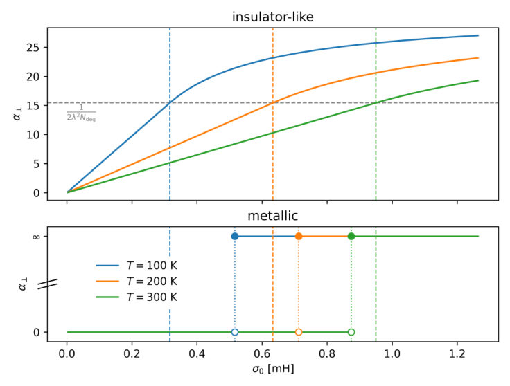
<figcaption class="paper-figure-caption"><b>Fig 2.</b> FIG. 2. Polarizability from transversal correlations for insulator-like (top) and metallic regime (bottom) given by Eqs. (14) and (15), respectively for three different temperature 𝑇choices. Phase transitions are indicated by dashed vertical lines. The critical point 𝜎0 = 𝑘𝐵𝑇of the para- to spin glass phase transition remains the same for both cases and is indicated by long dashed lines. However, in the metallic case (bottom) the transversal polarizability diverges and we cannot observe the change from the para to spin glass correlated phase. Instead, we can identify the critical points for the uncorrelated to correlated phase transition. As we see from the long dashed lines, we either...</figcaption>
</figure>

**Summary.** The paper develops a theoretical framework showing that collective strong coupling in molecular ensembles within optical cavities can induce electron correlation effects analogous to spin glass physics. By analyzing the free energy landscape, the authors predict that entropic effects can drive a phase transition, potentially causing the system to become metallic by ionizing degenerate orbitals. This provides a major step toward understanding cavity-mediated electronic correlations.

**Why it may be interesting.** This work bridges concepts from cavity QED/molecular physics with advanced statistical mechanics models (spin glasses) to predict novel electronic phases (metallization) driven purely by entropy, which is highly relevant for understanding strongly coupled quantum systems.

Detailed structure

**Main problem.** The work aims to elucidate the underlying physical mechanism behind collective strong coupling effects in optical cavities that can induce abrupt phase transitions in molecular ensembles.

**Main result.** Entropic electron correlations, modeled via a spin glass analogy, can trigger a phase transition that potentially renders the molecular ensemble metallic by entropically ionizing degenerate molecular orbitals.

**Method.** The authors derive analytic expressions for correlation-induced polarizability changes by mapping the problem onto the Sherrington-Kirkpatrick (SSK) model and analyzing free energy minimization.

**Model / system.** The system involves molecular ensembles strongly coupled to optical cavities, modeled using an effective Hamiltonian whose correlation energy resembles that of a spin glass. The analysis is performed in the thermodynamic limit ($N_{	ext{deg}} 	o \infty$).

**Key observables.** Transversal polarizability ($\alpha_{\perp}$), which diverges in the metallic regime and remains finite otherwise.

**Important parameters / regimes.** Temperature ($T$), correlation strength ($\sigma_0$), and the condition $f(T, \sigma_0) < -\Delta_{io}$ for entering the correlated phase.

**Assumptions / limitations.** The analysis relies on approximating the correlation energy using a CIS ansatz and mapping it to the SSK model; specific approximations are made regarding random interaction variances and limits like $E_{	ext{loc}} 	o 0$.

**Figures summary.** Figure 2 illustrates how polarizability ($\alpha_{\perp}$) behaves across different temperatures, showing distinct curves for insulator-like and metallic regimes.

**Paper structure.** The paper establishes the physical problem (strong coupling in cavities), develops a theoretical framework linking it to spin glass physics via correlation energy minimization, derives expressions for observables like $\alpha_{\perp}$, and finally analyzes the conditions under which metallicity arises from entropic effects.

Abstract

Experiments have revealed that collective strong coupling in optical cavities can drastically alter the conductivity and dielectric properties of molecular ensembles, or even trigger abrupt phase transitions (in Rayleigh scattering or dispersion force driven conformational equilibrium). Until now, the underlying physical mechanism has remained unknown. A recently proposed theory attributes these collective effects to cavity-induced electron correlations that share properties of the known spherical Sherrington-Kirkpatrick model of a spin glass. As a consequence, entropic effects can trigger a phase transition in the inter-molecular electron correlations that could potentially explain the above experiments. In the following work, we derive analytic expressions for the correlation (free-)energy-induced polarizability changes, which reveal that under certain conditions collective strong coupling can even render our molecular ensemble metallic by entropically ionizing collectively degenerate molecular orbitals. Our results are a first major step towards a holistic theory of cavity-mediated electron correlation effects.

[↑ back to top](#top)

### [Non-Equilibrium Instantaneous Approximation and Dipole Forbidden d-d Transitions](http://arxiv.org/abs/2608.16219v1)

**Authors:** Marco Marino, Lasse Sternemann, Mirko Cinchetti, Frithjof B. Anders  
**Type:** theory · **Category:** strongly correlated electrons · **PDF:** <https://arxiv.org/pdf/2608.16219v1>  
**Analysis basis:** full PDF text, analyzed in chunks
**Topic relevance:** 🔥 `Keldysh / 2PI / non-Gaussian methods` **4/5** · `methods for driven-dissipative` **3/5** · `non-equilibrium universality` **3/5** · `driven-dissipative phase transition` **2/5** · `correlated / nonlocal dissipation` **1/5** · `quantum measurements` **1/5** · `scars & prethermalization` **1/5**

↔ Scroll figures horizontally

<figure class="paper-figure-card">
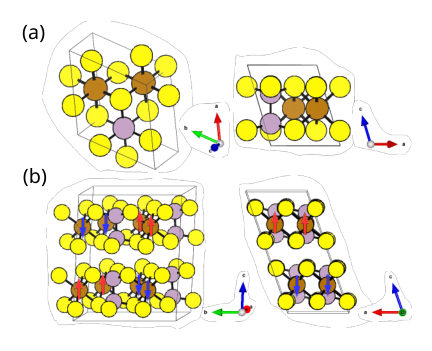
<figcaption class="paper-figure-caption"><b>Fig 1.</b> FIG. 1. (a) Top view and side-view respectively of the prim- itve cell of FePS3.(b) Side view of the (zig-zag) antiferromag- netic super-cell of FePS3. Color scheme: brown, Fe; purple, P; yellow, S. Blue and Red arrows in the super-cell of FePS3 indicate the spin orientation of the Fe atoms.</figcaption>
</figure>
<figure class="paper-figure-card">
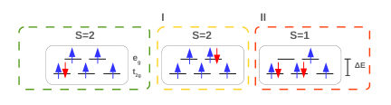
<figcaption class="paper-figure-caption"><b>Fig 2.</b> FIG. 2. Graph of the main Fe 3d6 excitations. First quadrant: ground-state atomic configuration; Second quadrant (Yellow): first atomic excitation (at ≃0.7 eV). Third quadrant (Or- ange): second atomic excitation (at ≃2.0 eV). The black horizontal lines represent the atomic orbitals.</figcaption>
</figure>
<figure class="paper-figure-card">
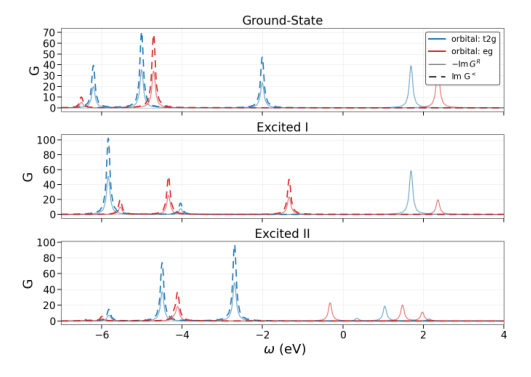
<figcaption class="paper-figure-caption"><b>Fig 3.</b> FIG. 3. Retarded and lesser atomic Green’s functions (spin- summed), for the ground-state, first excited (≃0.7 eV) and second excited (≃2.0 eV) paramagnetic atomic configura- tions (U = 5.50, J = 0.60 and ∆E ≃0.7 eV). The pa- rameters considered in the evaluation are frequency grid of ∆ω ≃0.01 eV, Lorentzian broadening η = 0.05 and relative temperature β = 600.</figcaption>
</figure>
<figure class="paper-figure-card">
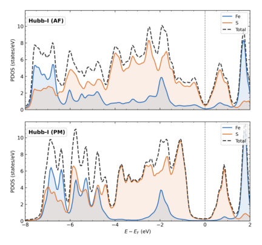
<figcaption class="paper-figure-caption"><b>Fig 4.</b> FIG. 4. Projected density of states obtained from Hubbard I, in the antiferromagnetic (top) and paramagnetic phase (bot- tom). Color scheme: Blue Fe d orbitals projection; Orange: S p orbitals projection. The dotted line corresponds to the total of the two projections.</figcaption>
</figure>
<figure class="paper-figure-card">
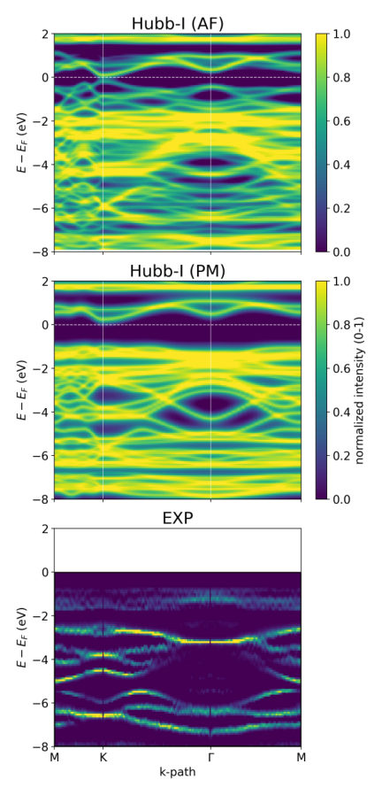
<figcaption class="paper-figure-caption"><b>Fig 5.</b> FIG. 5. Band structure obtained from DFT + Hubbard I calculations, in the antiferromagnetic (top) and paramag- netic phases (center). The experimental results obtained from ARPES measurements (curvature-ARPES [30]) of the param- agnetic phase are reported (bottom). To increase the contrast in the calculated image, we select the data in the intensity window from 0.1 to 0.9.</figcaption>
</figure>

**Summary.** The paper addresses the challenge of simulating time-resolved photoemission spectroscopy on correlated materials by introducing an Instantaneous Approximation combined with a one-shot Hubbard I approach. This method successfully incorporates local electronic correlations while retaining momentum resolution. The framework is validated using $	ext{FePS}_3$, demonstrating its ability to reproduce key features of experimentally observed d-d excitations.

**Why it may be interesting.** This work provides a computationally tractable yet physically rigorous theoretical tool (IAP + DMFT) to model ultrafast dynamics in strongly correlated systems, which is crucial for understanding light-matter interaction in quantum materials.

Detailed structure

**Main problem.** The theoretical description of time- and angle-resolved photoemission spectroscopy (trARPES) on correlated materials following optical excitation is computationally demanding.

**Main result.** The proposed Non-Equilibrium Instantaneous Approximation successfully reproduces the main qualitative features observed in experimental momentum-resolved spectra for d-d excitations in $	ext{FePS}_3$.

**Method.** The authors introduce an instantaneous approximation (IAP) combined with a one-shot Dynamical Mean-Field Theory (DMFT) construction at the Hubbard I level to handle non-equilibrium dynamics.

**Model / system.** The study focuses on correlated materials like $	ext{FePS}_3$, modeled using DFT derived tight-binding Hamiltonians incorporating local Coulomb interactions. The formalism is built upon the Keldysh-Kadanoff-Baym (KB) equations.

**Key observables.** Momentum-resolved electronic structure, spectral function $
ho(\omega, \vec{k})$, and signatures of first and second d-d excitations.

**Important parameters / regimes.** The approximation is valid when electron dynamics are much faster than the pulse duration ($	au_p > 100 	ext{fs}$); the Hubbard I approach is used to treat local correlations.

**Assumptions / limitations.** The core assumption is the Instantaneous Approximation (IAP), which separates time scales, allowing for a one-shot calculation instead of full non-equilibrium self-consistency.

**Figures summary.** Figures compare calculated K-maps and band structures from DFT + Hubbard I + $\Lambda$ using both standard methods and the proposed IAP approximation against experimental ARPES data for paramagnetic $	ext{FePS}_3$.

**Paper structure.** The paper develops the NEQ-IAP framework, applies it to the correlated system ($	ext{FePS}_3$), derives an effective coupling for forbidden transitions, and validates the method by comparing calculated momentum-resolved spectra against existing time-resolved photoemission experiments.

Abstract

Time- and angle-resolved photoemission spectroscopy provides direct access to pump-induced changes in the electronic structure of correlated materials, but its theoretical description generally requires computationally demanding two-time non-equilibrium calculations. We introduce an instantaneous approximation for pump-driven correlated systems, based on a separation between the rapid decay of the Green's functions in the relative time variable and their slower evolution in the average time. Combined with a one-shot dynamical mean-field construction at the Hubbard I level, the method incorporates the driven dynamics of the local correlated shell into the lattice Green's function while retaining momentum resolution. We also derive an effective coupling for nominally dipole-forbidden d-d excitations. It arises from a dipole-allowed d-p transition followed by p-d hybridization; beyond the instantaneous limit, the same process produces an energy-dependent vertex correction to the optical response. As a proof of principle, we apply the framework to paramagnetic and antiferromagnetic FePS3, using a density-functional theory derived tight-binding model together with a supercell unfolding procedure. The calculated momentum-resolved spectra reproduce the main qualitative features observed after excitation of the first and second d-d transitions in recent time-resolved photoemission experiments.

[↑ back to top](#top)

### [Optimized EIT-Based Multi-Target CNOT^k Gates in Heteronuclear Rydberg Atom Arrays](http://arxiv.org/abs/2608.15033v1)

**Authors:** Zeyu Zhou, Xian-Lei Sheng, Peng Xu, Jian Cui  
**Type:** theory · **Category:** quantum information and computing · **PDF:** <https://arxiv.org/pdf/2608.15033v1>  
**Analysis basis:** full PDF text, analyzed in chunks
**Topic relevance:** 🔥 `Rydberg arrays` **4/5** · `methods for driven-dissipative` **3/5** · `QC/QI experiment` **2/5** · `driven-dissipative phase transition` **2/5** · `Keldysh / 2PI / non-Gaussian methods` **1/5** · `analog quantum simulation` **1/5** · `correlated / nonlocal dissipation` **1/5** · `quantum measurements` **1/5**

↔ Scroll figures horizontally

<figure class="paper-figure-card">
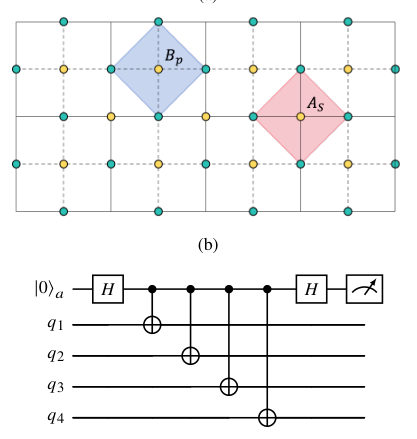
<figcaption class="paper-figure-caption"><b>Fig 1.</b> FIG. 1 From four-body stabilizers to ancilla-assisted syndrome ex- traction. (a) The Toric Code on a square lattice is defined by weight-4 star and plaquette stabilizers. Yellow circles denote ancillary qubits, and green circles denote data qubits. (b) Standard circuit for measur- ing an 𝑋-type four-body stabilizer using an ancillary qubit and four CNOT gates. A native shared-control multi-target gate may compress this sequential entangling layer into a constant-depth block.</figcaption>
</figure>
<figure class="paper-figure-card">
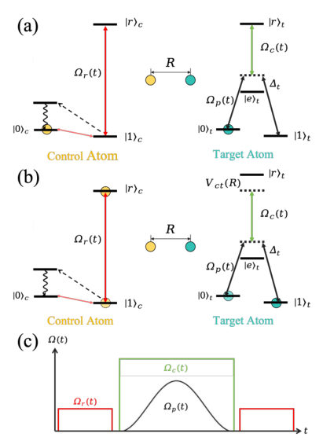
<figcaption class="paper-figure-caption"><b>Fig 2.</b> FIG. 2 EIT-based CNOT protocol proposed by Müller et al. [33]. (a) Energy-level structure when the control and target atoms are initially in |0⟩𝑐and |0⟩𝑡, respectively, with separation 𝑅. (b) Conditional branch for initial state |1⟩𝑐|0⟩𝑡. A 𝜋pulse excites the control atom to |𝑟⟩𝑐, and the resulting Rydberg blockade breaks the target EIT resonance, producing the conditional transformation |0⟩𝑡→|1⟩𝑡. (c) Pulse sequence for Ω𝑝(𝑡), Ω𝑐(𝑡), and Ω𝑟(𝑡). The control pulse satisfies ∫ Ω𝑟(𝑡)𝑑𝑡= 𝜋, while the target adiabatic pulse satisfies ∫ Ω2𝑝(𝑡)𝑑𝑡/Δ = 𝜋.</figcaption>
</figure>
<figure class="paper-figure-card">
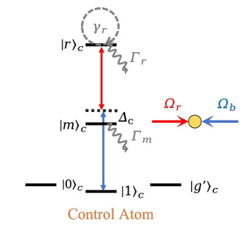
<figcaption class="paper-figure-caption"><b>Fig 3.</b> FIG. 3 Five-level model for the control atom used in the Lindblad simulation. The computational states |0⟩𝑐and |1⟩𝑐are coupled to the intermediate state |𝑚⟩𝑐and the Rydberg state |𝑟⟩𝑐by the two STI- RAP fields Ω𝑏and Ω𝑟. The intermediate state decays at rate Γ𝑚(de- noted by Γ in the Lindblad model) into the computational manifold and the loss state |𝑔′⟩𝑐, while 𝛾𝑟denotes Rydberg-state dephasing. The target-atom model has the same dissipative structure, with |𝑚⟩𝑐 replaced by |𝑒⟩𝑡.</figcaption>
</figure>
<figure class="paper-figure-card">
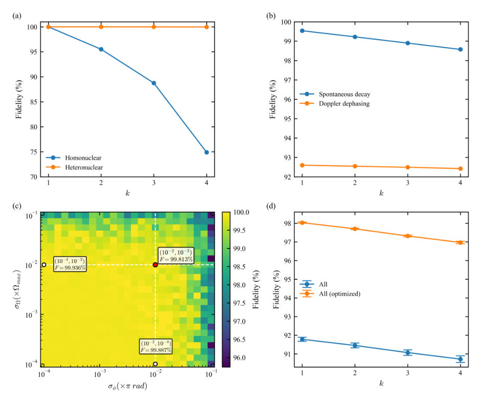
<figcaption class="paper-figure-caption"><b>Fig 4.</b> FIG. 4 Summary of the dominant error sources and their scaling with the number of target qubits 𝑘. (a) Ideal gate fidelity versus 𝑘for homonuclear and heteronuclear implementations, showing the strong suppression of errors induced by interactions between target atoms in the heteronuclear array. (b) Fidelity scaling under spontaneous decay and Doppler dephasing in the heteronuclear setting. (c) Fidelity map for the 𝑘= 1 gate under combined technical amplitude and phase noise. The vertical and horizontal dashed lines indicate the technical-noise working point 𝜎𝜙= 10−2𝜋rad and 𝜎Ω = 10−2Ωmax used later in the full-noise simulations. The marked points correspond to (10−2, 10−2) with 𝐹= 99.813%,...</figcaption>
</figure>
<figure class="paper-figure-card">
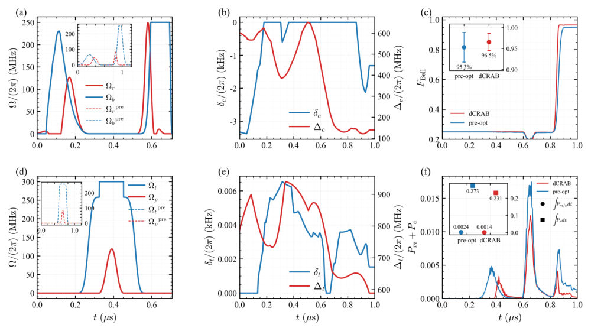
<figcaption class="paper-figure-caption"><b>Fig 5.</b> FIG. 6 dCRAB waveform control and all-noise dynamical validation for the heteronuclear C1NOT4 operation. (a) dCRAB control-atom Rabi frequencies Ω𝑟and Ω𝑏. (b) Corresponding control-atom effective detunings 𝛿𝑐and Δ𝑐. (c) Phase-corrected Bell-state fidelity during the all-noise 𝑘= 4 operation. (d) dCRAB target-atom Rabi frequencies Ω𝑡and Ω𝑝. (e) Corresponding target-atom effective detunings 𝛿𝑡and Δ𝑡. Insets in (a) and (d) show the pre-optimized reference envelopes. This reference already includes optimization of the peak optical resources and gate duration. (f) Corresponding total intermediate-manifold population, 𝑃𝑚+ 𝑃𝑒. In (c) and (f), blue and red curves denote the pre-optimized and dCRAB...</figcaption>
</figure>

**Summary.** This paper details the optimization of multi-target CNOT gates within heteronuclear Rydberg atom arrays to serve as a practical building block for quantum error correction. By employing EIT and advanced control techniques like STIRAP, the authors mitigate crosstalk and noise effects. The resulting high fidelities demonstrate a viable path toward scaling up complex quantum computations using atomic arrays.

**Why it may be interesting.** This work provides concrete, high-fidelity gate benchmarks for implementing complex quantum circuits (like those needed for QEC) using solid-state or atomic platforms, directly addressing scalability issues in quantum computation hardware.

Detailed structure

**Main problem.** The primary challenge addressed is overcoming the bottleneck of efficient stabilizer readout required for quantum error correction, which necessitates complex multi-qubit coupling.

**Main result.** The authors successfully optimized an EIT-based protocol to achieve high fidelities (e.g., 98.03% for C1NOT^1 and 96.54% for C1NOT^4) for multi-target gates, even when considering multiple noise sources.

**Method.** The optimization involved combining two-photon STIRAP control, engineering heteronuclear interactions, and applying optimal-control techniques to the gate sequence.

**Model / system.** The physical platform is a heteronuclear Rydberg atom array utilizing Electromagnetically Induced Transparency (EIT) and Rydberg blockade mechanisms. The dynamics are modeled using an open-system approach governed by the Lindblad master equation.

**Key observables.** Average Gate Fidelity ($F_{	ext{avg}}$), Bell-state fidelity, and gate operation factorizing into controlled-$X$ operations on multiple targets.

**Important parameters / regimes.** The scaling of error contributions ($\epsilon_{ctrl} + k\epsilon_{tgt} + \epsilon_{corr}(k)$) with the number of target qubits ($k$), and the requirement for $T_g$ to be nearly independent of $k$.

**Assumptions / limitations.** Adiabatic elimination of intermediate states in the EIT process is assumed, and spontaneous emission/Doppler dephasing are treated as primary noise sources.

**Figures summary.** Figure 1 compares standard sequential CNOT circuits versus the depth-reducing native multi-target gate for stabilizer measurement. Figure 2 illustrates the underlying EIT-based CNOT protocol energy levels and pulse sequences.

**Paper structure.** The paper systematically analyzes the required controlled-$U$ gates, models the system Hamiltonian using a microscopic open-system approach, details error analysis based on dissipation parameters, and concludes with an optimized protocol derivation.

Abstract

Efficient stabilizer readout requiring multi-qubit coupling is a core bottleneck for quantum error correction. One feasible method is direct implementation of the controlled-U gate between one ancilla qubit and the data qubits assigned to stabilizer U measurements. We systematically analyze the native multi-target $\mathrm{C}^1\mathrm{NOT}^k$ gates proposed by Müller et al., which is realized via electromagnetically induced transparency (EIT) and Rydberg blockade mechanisms. Using a microscopic open-system model, we analyze the gate's scaling with target number k and identify spontaneous emission, Doppler dephasing, target atom inter-coupling, and technical noise as major error contributions. We further optimize the protocol combining two-photon STIRAP control, heteronuclear interaction engineering, and waveform optimization. Our optimized heteronuclear protocol reaches fidelities of 98.03% ($\mathrm{C}^1\mathrm{NOT}^{1}$) and 96.54% ($\mathrm{C}^1\mathrm{NOT}^{4}$), in the presence of all primary noise sources and realistic experimental parameters. These results demonstrate that EIT-based multi-target gates serve as a practical building block for low-depth stabilizer readout.

[↑ back to top](#top)

### [Postselection-Free Reconstruction of Monitored SPT Flux-Charge Responses](http://arxiv.org/abs/2608.15477v1)

**Authors:** Shuai Zeng  
**Type:** theory · **Category:** other · **PDF:** <https://arxiv.org/pdf/2608.15477v1>  
**Analysis basis:** full PDF text, analyzed in chunks
**Topic relevance:** 🔥 `quantum measurements` **4/5** · `methods for driven-dissipative` **3/5** · `analog quantum simulation` **2/5** · `driven-dissipative phase transition` **2/5** · `Full counting statistics` **1/5** · `Keldysh / 2PI / non-Gaussian methods` **1/5** · `correlated / nonlocal dissipation` **1/5** · `non-equilibrium universality` **1/5**

↔ Scroll figures horizontally

<figure class="paper-figure-card">
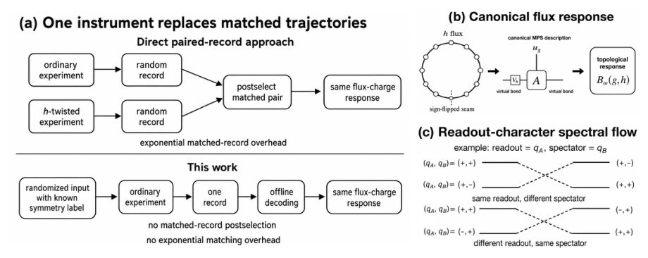
<figcaption class="paper-figure-caption"><b>Fig 1.</b> FIG. 1. Single-instrument reconstruction and its topological protection. (a) Direct ordinary/h-twisted estimation postselects matched record pairs and incurs exponential matching overhead. The randomized protocol uses known-charge inputs, one ordinary record, and offline decoding to reconstruct the same quantized flux–charge response. (b) A background h flux is gauge fixed to a sign-flipped seam and, in the canonical MPS description, to a virtual Vh insertion carrying Bω(g, h). (c) For readout qA and spectator qB, spectator exchange leaves the response unchanged, whereas a net readout-character exchange changes it.</figcaption>
</figure>
<figure class="paper-figure-card">
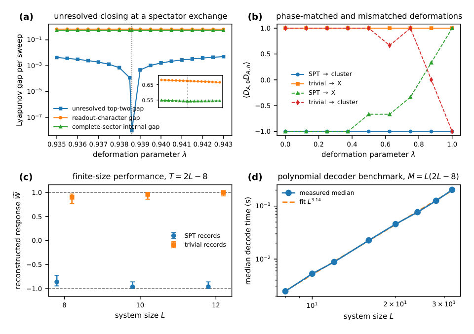
<figcaption class="paper-figure-caption"><b>Fig 2.</b> FIG. 2. Character-resolved protection and interacting reconstruction. (a) Selected L = 8 SPT record: the unresolved top-two gap closes at a spectator-charge exchange while the readout-character and complete-sector internal gaps remain finite. Inset: the two finite gaps on a linear scale. (b) Phase-matched deformations preserve the fixed-point response; mismatched paths require nontrivial net readout-character flow. (c) Reconstructed response for T = 2L −8 with 100 interacting records per phase. Error bars are exact 95% Clopper–Pearson intervals; dashed lines mark the quantized values. (d) Median decoding time for M = L(2L −8); the dashed line is the fitted L3.14 dependence.</figcaption>
</figure>

**Summary.** This paper introduces a postselection-free method to measure topological invariants, such as flux-charge responses, in monitored SPT phases. It replaces difficult direct measurements by utilizing randomized symmetry eigenstates and an offline decoder. This breakthrough removes an exponential sampling bottleneck, allowing for the finite-time determination of robust topological properties.

**Why it may be interesting.** This work provides a powerful theoretical framework for experimentally accessing robust topological properties in quantum matter using realistic measurement protocols that bypass exponential resource requirements associated with direct comparison of complex quantum histories.

Detailed structure

**Main problem.** The primary challenge is reconstructing monitored topological invariants, specifically flux-charge responses in SPT phases, without relying on exponentially costly postselection from comparing ordinary and symmetry-twisted quantum trajectories.

**Main result.** A randomized protocol replaces the direct comparison with an offline decoder applied to measurements from uniformly randomized symmetry eigenstates, yielding an exact finite-time response identity for the topological invariant.

**Method.** The method involves replacing the difficult measurement process with a sequence of ordinary boundary monitoring followed by an offline 'twist decoder' that utilizes basis completeness and charge sharpening techniques.

**Model / system.** The work analyzes monitored quantum systems exhibiting Symmetry-Protected Topological (SPT) phases, often modeled using concepts related to cluster circuits and projective symmetry actions. The analysis is generalized but grounded in lattice models.

**Key observables.** Flux-charge response ($	ext{B}_{\omega}(g, h)$), readout-character ($	ext{Deig}_{g,a}$), and the group-valued topological invariant determined by generator-pair responses.

**Important parameters / regimes.** The reconstruction is shown to be exact in the Gaussian limit and polynomial in complexity; stability bounds are set by measurement deviations ($\delta$).

**Assumptions / limitations.** Key assumptions include the ability to use randomized symmetry eigenstates, the applicability of charge sharpening to reach the quantized limit, and that the response only changes when there is a nontrivial net readout-character flow.

**Figures summary.** Figures illustrate the comparison between direct (postselection) vs. randomized protocols; they show how spectator crossings do not alter the topological response, and one figure benchmarks the reconstructed response against quantized values across system sizes.

**Paper structure.** The paper progresses by first identifying the bottleneck of postselection, then introducing the randomized protocol with an offline decoder, deriving finite-time bounds on the reconstruction error, and finally validating the results numerically for both SPT and trivial phases while analyzing computational scaling.

Abstract

A class of monitored topological invariants compares ordinary and symmetry-twisted quantum trajectories with identical stochastic records, so direct estimation requires exponentially costly matched-record postselection. We replace the twisted quantum experiment by uniformly randomized symmetry eigenstates with known charges, ordinary-boundary monitoring, and an offline twist decoder. Their correlation yields an exact finite-time response identity and removes this experimental sampling bottleneck. When the ordinary charge sharpens and the ordinary-to-flux deformation has trivial net readout-character flow, the response converges to the projective commutator of the symmetry-protected-topological phase; generator-pair responses then determine its finite-Abelian cohomology class. Spectator-sector crossings may close the global Lyapunov gap without changing this character-valued response. In monitored cluster circuits, the decoder is exact and polynomial in the Gaussian limit, while Gaussian-drop reconstruction treats interacting records; independent joint-sector spectroscopy and effect-state diagnostics validate the topological deformation.

[↑ back to top](#top)

### [Anomalous radiation pressure in strong-field ionization driven by quantum light](http://arxiv.org/abs/2608.15859v1)

**Authors:** Xiaodan Mao, Feng He, Pei-Lun He  
**Type:** theory · **Category:** other · **PDF:** <https://arxiv.org/pdf/2608.15859v1>  
**Analysis basis:** full PDF text, analyzed in chunks
**Topic relevance:** 🔥 `interference shaping light` **4/5** · `Full counting statistics` **3/5** · `Keldysh / 2PI / non-Gaussian methods` **3/5** · `quantum measurements` **2/5** · `methods for driven-dissipative` **1/5** · `quantum optics experiment` **1/5**

↔ Scroll figures horizontally

<figure class="paper-figure-card">
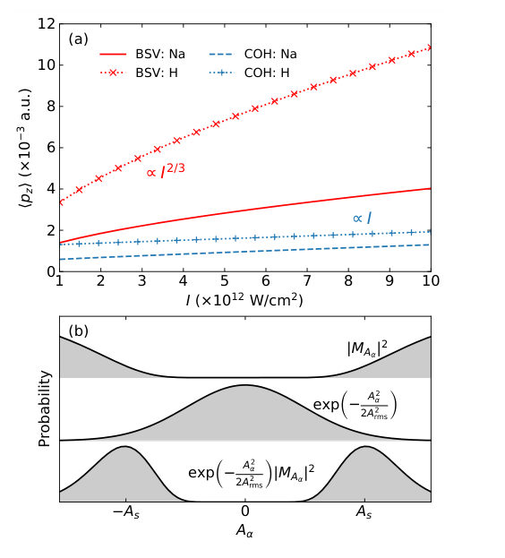
<figcaption class="paper-figure-caption"><b>Fig 1.</b> FIG. 1. Anomalous radiation pressure and field-amplitude selection. (a) Mean longitudinal photoelectron momentum versus the mean incident intensity for H and Na, showing the linear coherent-state response and the I2/3 scaling for BSV in the tunneling regime. The laser frequency is ω = 0.0288 a.u. (1580 nm) and the pulse duration is L = 10T, with T = 2π/ω. (b) Schematic of the field-amplitude selection mechanism. The BSV-weighted ionization probability devel- ops two maxima at the dominant field-amplitude saddles ±As. The curves are vertically offset for clarity.</figcaption>
</figure>
<figure class="paper-figure-card">
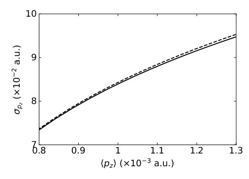
<figcaption class="paper-figure-caption"><b>Fig 2.</b> FIG. 2. Longitudinal momentum width versus the mean propagation-direction momentum for Na. The BSV (solid) and coherent-state (dashed) results nearly overlap. The re- maining parameters are the same as in Fig. 1.</figcaption>
</figure>
<figure class="paper-figure-card">
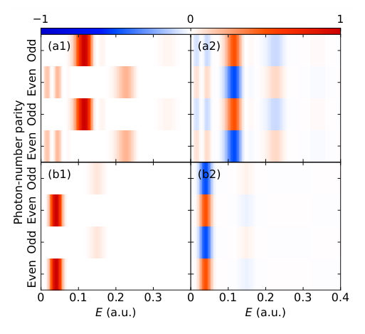
<figcaption class="paper-figure-caption"><b>Fig 3.</b> FIG. 4. Saddle-point interference underlying the parity- dependent response described by Eq. (10). (a1) Conditional photoelectron spectrum Pn(p) and (a2) the corresponding interference contribution Pn(p) −P inc n (p), both normalized to the maximum of Pn(p), for higher-n channels around n ∼1013, corresponding to Ieff n = 9 × 1013 W/cm2. (b1,b2) The same quantities as in (a1,a2), but for lower-n channels around n ∼1012, corresponding to Ieff n = 1 × 1013 W/cm2. The remaining parameters are the same as in Fig. 3.</figcaption>
</figure>
<figure class="paper-figure-card">
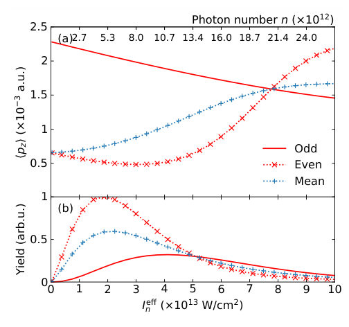
<figcaption class="paper-figure-caption"><b>Fig 4.</b> FIG. 3. Photon-number-resolved anomalous radiation pres- sure for Na. (a) Mean longitudinal momentum ⟨pz⟩n re- solved by photon-number parity, versus the effective intensity Ieff n associated with the final n-photon channel. (b) Corre- sponding photon-number-resolved ionization probability. The laser wavelength is 400 nm, with pulse duration L = 10T, ϵV = 3.2×10−8 a.u., and mean intensity I = 1×1013 W/cm2.</figcaption>
</figure>
<figure class="paper-figure-card">
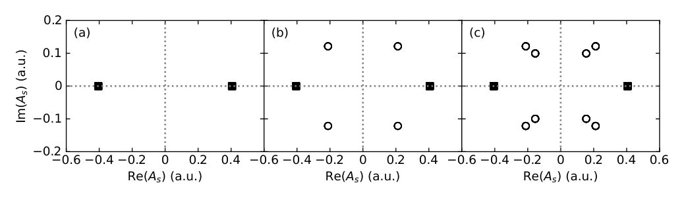
<figcaption class="paper-figure-caption"><b>Fig 5.</b> FIG. 5. Field saddles in the complex-As plane for the representative momentum (px, py, pz) = (Arms, 0, A2 rms/2c + Ip/3c), with Arms = 0.3 a.u. Panels (a)–(c) show saddle pairs satisfying |Re η1,s −Re η2,s| &lt; mT, with m = 1, 2, and 3, respectively. Squares denote self-conjugate saddles, and circles denote genuinely complex saddles. The remaining parameters are the same as in Fig. 1.</figcaption>
</figure>

**Summary.** This paper theoretically analyzes the momentum transfer in strong-field ionization driven by quantum light, finding an anomalous $I^{2/3}$ scaling when photon phase information is lost. Crucially, resolving the final photon number reveals a distinct interference pattern dependent on parity, establishing longitudinal momentum as a sensitive probe of both field coherence and photon statistics.

**Why it may be interesting.** This work is highly relevant to quantum optics and AMO physics because it demonstrates how fundamental quantum properties of light (like squeezing or number statistics) can fundamentally alter macroscopic measurable quantities like radiation pressure during intense field interactions.

Detailed structure

**Main problem.** The research investigates the anomalous scaling of radiation pressure during strong-field ionization when driven by quantum light, contrasting this with conventional linear scaling observed under coherent driving.

**Main result.** When photon statistics are traced out, the mean longitudinal momentum exhibits an anomalous $I^{2/3}$ scaling due to a field-amplitude saddle-point structure. However, resolving the final photon number reveals parity-dependent modulations via time-domain double-slit interference.

**Method.** The analysis employs advanced theoretical techniques including joint light-front saddle-point methods and path integrals, comparing results obtained by tracing over the final photon state versus resolving it.

**Model / system.** The physical system is strong-field ionization driven by quantum light, specifically utilizing a Bright Squeezed Vacuum (BSV) field. The theoretical framework involves analyzing the ionization amplitude using leading-order non-dipole approximations.

**Key observables.** Mean longitudinal photoelectron momentum ($\langle p_z 
angle$), longitudinal momentum width ($\sigma_{p_z}$), and parity-dependent modulations of momentum transfer resolved by final photon number ($n$).

**Important parameters / regimes.** Incident intensity ($I$), field amplitude saddle points ($\pm A_s$), and the ratio between coherent vs. quantum light driving.

**Assumptions / limitations.** The analysis relies on the leading-order light-front non-dipole strong-field approximation, and distinguishes between phase-insensitive (traced) and coherence-preserving (resolved) measurements.

**Figures summary.** Figures illustrate the comparison of $\langle p_z 
angle$ scaling ($I^{2/3}$ vs. linear), the field-amplitude saddle selection mechanism ($\pm A_s$), and the parity-dependent modulation of momentum transfer resolved by photon number $n$.

**Paper structure.** The paper develops the theory by first establishing the anomalous $\langle p_z 
angle \propto I^{2/3}$ scaling from the phase-insensitive saddle analysis. It then deepens the understanding by introducing photon-number resolution, revealing underlying two-branch interference structures that manifest as parity oscillations in observables.

Abstract

We show that in strong-field ionization driven by bright squeezed vacuum, the mean longitudinal photoelectron momentum scales with the mean incident intensity $I$ as $I^{2/3}$, rather than linearly as under coherent-light driving. This anomalous scaling originates from a field-amplitude saddle-point structure: nonlinear tunneling selects two dominant field amplitudes of equal magnitude and opposite sign from the broad quantum fluctuations. Tracing over the final photon state erases their relative-phase information, leaving their common magnitude to determine the field-dependent longitudinal momentum shift and its $I^{2/3}$ scaling. Photon-number resolution instead preserves this coherence, producing parity-dependent modulations of the longitudinal momentum transfer through time-domain double-slit interference between two field pathways separated by half a cycle. These results establish longitudinal momentum transfer as a distinct observable in strong-field quantum optics that encodes both the photon statistics and the field coherence of intense quantum light.

[↑ back to top](#top)

### [Geometric signatures of the onset of many-body ergodicity](http://arxiv.org/abs/2608.14818v1)

**Authors:** Chris Ventura-Meinersen, Edmondo Valvo, Stefano Bosco, Francisco Machado, Maximilian Rimbach-Russ  
**Type:** theory · **Category:** statistical mechanics · **PDF:** <https://arxiv.org/pdf/2608.14818v1>  
**Analysis basis:** full PDF text, analyzed in chunks
**Topic relevance:** 🔥 `scars & prethermalization` **4/5** · `analog quantum simulation` **3/5** · `non-equilibrium universality` **3/5** · `driven-dissipative phase transition` **2/5** · `correlated / nonlocal dissipation` **1/5** · `quantum measurements` **1/5**

↔ Scroll figures horizontally

<figure class="paper-figure-card">
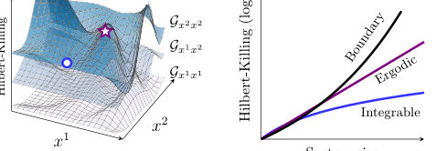
<figcaption class="paper-figure-caption"><b>Fig 1.</b> FIG. 1. Geometry of many-body ergodicity. (a) A system Hamiltonian is defined by a set of parameters, here (x1, x2), which corresponds to a possible subset of n param- eters. (b) All points in the parameter space Rn, define the space of parametrized quantum states D. At a specific point, we can define a tangent space TρD that is spanned by the generators of the parallel transport operator Aµ. The differ- ence between two parallel transports induces a metric struc- ture, which we call the Hilbert-Killing metric Gµν. (c) In this example, we have two parameters, which induce three com- ponents of the Hilbert-Killing metric, which change at each point in the parameter space and can depend on...</figcaption>
</figure>
<figure class="paper-figure-card">
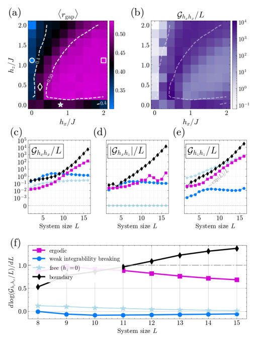
<figcaption class="paper-figure-caption"><b>Fig 2.</b> FIG. 2. Hilbert-Killing metric for the Ising spin chain. The Ising model in Eqn. (6) is parametrized by the fields (hx/J, hz/J). In (a,b) we compute the mean gap ratio ⟨rgap⟩ and the HK component Ghxhx for L = 15 as a function of the parameters (hx/J, hz/J), where hx,z/J ∈[0.01, 2]. We identify that the biggest response of the HK metric is given precisely at the phase boundary between the integrable and ergodic limits. Given the multi-directionality of the HK met- ric, we can also see how different directions of the pertur- bations act on the averaged eigenstate deformations. For instance, while the Ghxhx component (c) demonstrates clear distinction between all three regions, the...</figcaption>
</figure>
<figure class="paper-figure-card">
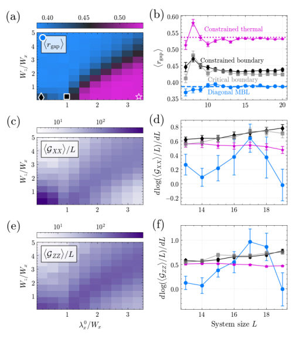
<figcaption class="paper-figure-caption"><b>Fig 3.</b> FIG. 3. Hilbert-Killing metric for locally constrained systems. We analyze the phase diagrams (λ0 x/Wx, Wz/Wx) (a,c,e) for fixed system size L = 17 and the corresponding scaling behavior (b,d,f) for the PXP model in Eqn. (7). Sim- ilar to the Ising model analysis, we find that the largest HK response occurs between the integrable and ergodic phases. Studying the scaling behaviour for the constrained thermal (purple stars), constrained boundary (black diamonds), criti- cal boundary (black transparent squares), and diagonal MBL (blue circles), we observe a robust scaling signature at the ergodic-integrable boundary. For each point in the phase dia- gram and in the scaling analysis, we average...</figcaption>
</figure>
<figure class="paper-figure-card">
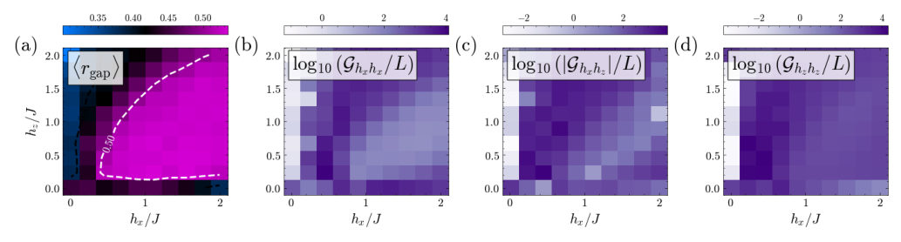
<figcaption class="paper-figure-caption"><b>Fig 4.</b> FIG. 4. The HK metric Gµν in Eq. (4) captures average eigenstate sensitivities with respect to all parameters in the Hamil- tonian. (a-d) We study the phase space (hx/J, hz/J) of the Ising model in Eqn. (6) in terms of the mean gap ratio and the HK metric components.</figcaption>
</figure>
<figure class="paper-figure-card">
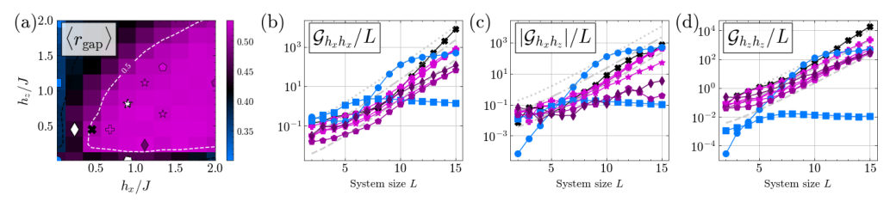
<figcaption class="paper-figure-caption"><b>Fig 5.</b> FIG. 5. Further numerical analysis of Hilbert-Killing response for the Ising model in Eqn. (6). Note that at the integrable points the HK metric components reach a plateau in their growth. Similar to the main text, for the points in the crossover regime we find the largest response as the system size L increases.</figcaption>
</figure>

**Summary.** The paper introduces the Hilbert-Killing metric, an emergent quantum geometry derived from generalizing the adiabatic gauge potential. This metric serves as a sensitive diagnostic tool to locate the boundary between integrable and ergodic regimes in many-body quantum systems like the Ising model. Its robust scaling behavior at this phase transition makes it a powerful theoretical signature for studying quantum thermalization.

**Why it may be interesting.** This work provides a powerful geometric tool to diagnose thermalization dynamics, which is crucial for understanding quantum chaos and non-equilibrium steady states relevant to AMO physics.

Detailed structure

**Main problem.** The central challenge is finding universal, robust, and interpretable geometric signatures that mark the precise onset of many-body ergodicity in quantum systems.

**Main result.** The derived Hilbert-Killing (HK) metric successfully probes this boundary, showing its maximum response precisely where the system transitions between integrable and ergodic regimes for both Ising and PXP models.

**Method.** The authors generalize the adiabatic gauge potential to multi-parameter perturbations, constructing the HK metric tensor which quantifies total eigenstate variation across parameter space.

**Model / system.** The study uses general quantum many-body systems, specifically analyzing the spin-1/2 one-dimensional mixed field Ising model and a constrained PXP model, parameterized by external fields ($h_x, h_z$).

**Key observables.** Hilbert-Killing (HK) metric components ($G_{\mu
u}$), spectrum-averaged variance of the AGP ($\sigma^2_{A_\mu}$), and the Casimir invariant ($\Omega$).

**Important parameters / regimes.** The system parameters defining the Hamiltonian, particularly investigating the crossover region between integrable and ergodic limits.

**Assumptions / limitations.** Previous metrics are often ill-behaved near the boundary; the HK metric is proposed to overcome this by providing a comprehensive geometric measure.

**Figures summary.** Figures illustrate the concept of the HK metric defining geometry in parameter space, showing maximum scaling response at the ergodic/integrable phase boundary for both Ising and PXP models.

**Paper structure.** The paper develops the HK metric from the adiabatic gauge potential, applies it to analyze the Ising model across different phases (Fig. 1, 2), confirms universality using the PXP model (Fig. 3), and explores deeper connections via entanglement fidelity and Casimir invariants in random matrix models (Fig. 4-8).

Abstract

Identifying universal, robust, and interpretable signatures of the onset of ergodicity remains a major challenge. The adiabatic gauge potential has been noted to act as a sensitive probe of quantum chaos. In this work, we generalize the features of the adiabatic gauge potential to multi-parameter perturbations, yielding an emergent quantum geometry. We dub this geometry the Hilbert-Killing metric, which allows us to study the onset of ergodicity in many-body quantum systems. Our Hilbert-Killing metric sensitively probes the boundary between ergodic and integrable regimes across all investigated geometric components. This boundary is uniquely identified by the presence of the consistently fastest growth with system size, which is corroborated by extensive numerical investigations of the Ising and PXP models.

[↑ back to top](#top)

### [Krylov complexity of anyons](http://arxiv.org/abs/2608.16595v1)

**Authors:** Ya-Nan Wang, Qing-Min Hu, Wen-Long You, Gaoyong Sun  
**Type:** theory · **Category:** strongly correlated electrons · **PDF:** <https://arxiv.org/pdf/2608.16595v1>  
**Analysis basis:** full PDF text, analyzed in chunks
**Topic relevance:** 🔥 `scars & prethermalization` **4/5** · `analog quantum simulation` **3/5** · `non-equilibrium universality` **3/5** · `quantum measurements` **2/5** · `driven-dissipative phase transition` **1/5** · `methods for driven-dissipative` **1/5**

↔ Scroll figures horizontally

<figure class="paper-figure-card">
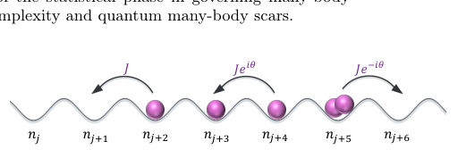
<figcaption class="paper-figure-caption"><b>Fig 1.</b> FIG. 1. Schematic illustration of the anyon-Hubbard model. The hopping amplitude depends on the particle occupation number of the left site.</figcaption>
</figure>
<figure class="paper-figure-card">
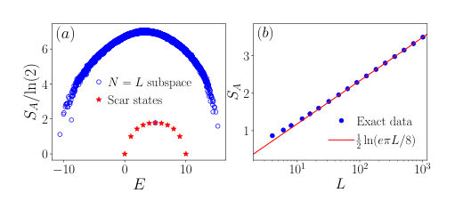
<figcaption class="paper-figure-caption"><b>Fig 2.</b> FIG. 2. Distribution and finite-size scaling of the entangle- ment entropy SA. (a) SA as a function of the eigenenergy E for L = 10. The blue open circles represent highly entangled states in the N = L subspace, while the red stars denote the exact scar states in the M = 0, 1, · · · , L subspace, with the circle-star symbol indicating the scar state that lies in the N = L subspace. (b) Scaling of SA of the scar states (circle- star symbols in (a)) at filling N/L = 1 as a function of the system size L. SA does not grow linearly with increasing L, but instead follows a logarithmic scaling relation. The red line shows the asymptotic analytical curve 1</figcaption>
</figure>
<figure class="paper-figure-card">
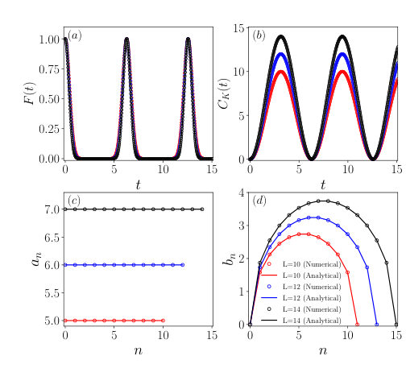
<figcaption class="paper-figure-caption"><b>Fig 3.</b> FIG. 3. Time evolution of scar states in Krylov space for dif- ferent lattice sizes L = 10, 12, 14. Panels (a) and (b) show the fidelity F(t) and Krylov complexity CK(t), respectively, while panels (c) and (d) display the Lanczos coefficients an and bn. Open circles denote the numerical results obtained from exact diagonalization, while solid lines represent the an- alytical predictions. The hopping amplitude and interaction strength are set to J = 1 and U = 1, respectively.</figcaption>
</figure>
<figure class="paper-figure-card">
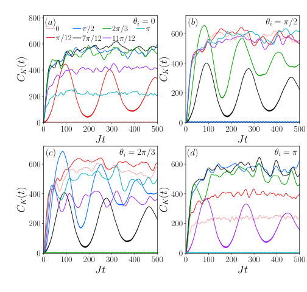
<figcaption class="paper-figure-caption"><b>Fig 4.</b> FIG. 4. Quench dynamics of the Krylov complexity CK(t). The four panels correspond to different initial-state statisti- cal phases: (a) θi = 0; (b) θi = π/2; (c) θi = 2π/3; and (d) θi = π. In each panel, the statistical phase is quenched to θf = sπ/12 (s = 0, 1, 6, 7, 8, 11, 12). In the absence of a quench, i.e., when θf = θi throughout the time evolution, CK(t) remains very small over long times and exhibits os- cillations, characteristic of perfect scar dynamics. When θf is close to θi, CK(t) increases with time while retaining pro- nounced oscillations, signaling approximate scar dynamics. The system size is L = 8, with J = 0.1 and U = 1.</figcaption>
</figure>
<figure class="paper-figure-card">
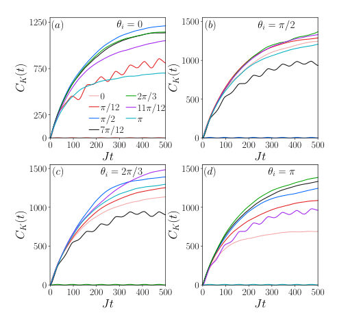
<figcaption class="paper-figure-caption"><b>Fig 5.</b> FIG. 5. Time evolution of the Krylov complexity CK(t) in the regime J = 10 and U = 1. Panels (a)-(d) cor- respond to the initial-state statistical phases θi = 0, π/2, 2π/3, and π, respectively. In each panel, the statistical phase of the post-quench Hamiltonian is set to θf = sπ/12 (s = 0, 1, 6, 7, 8, 11, 12). CK(t) increases over a short time scale and saturates to a high plateau for all quenches, except for the exact scar case without a quench, θf = θi. The system size is L = 8.</figcaption>
</figure>

**Summary.** The paper analyzes the anyon-Hubbard model to understand how fractional statistics influence quantum state complexity. Using Krylov complexity, the authors show that while scarred dynamics exhibit phase-independent revivals, quench dynamics are highly sensitive to the statistical phase and interaction strength. This highlights the central role of exotic statistics in governing many-body non-equilibrium behavior.

**Why it may be interesting.** This work provides a sophisticated tool (Krylov complexity) to probe non-equilibrium dynamics in systems with exotic statistics, linking topological properties (anyons) directly to quantum information measures of complexity.

Detailed structure

**Main problem.** The work investigates how anyonic statistics govern quantum-state complexity by studying the interplay between statistical phase and on-site interactions in the anyon-Hubbard model.

**Main result.** Krylov complexity shows perfect periodic revivals during scarred dynamics, but its behavior after a quench depends critically on both the initial and final statistical phases and interaction strength.

**Method.** The study employs Krylov complexity analysis ($C_K(t)$) and entanglement entropy ($S_A$) to characterize state spreading and distinguish between thermal and scar states in time evolution.

**Model / system.** The system is modeled by the one-dimensional anyon-Hubbard model, characterized by a Hamiltonian involving hopping terms and an on-site interaction $U$, with statistical phase $	heta$ governing particle statistics (bosonic, fermionic, or fractional).

**Key observables.** Krylov Complexity ($C_K(t)$), Entanglement Entropy ($S_A$), Fidelity ($F(t)$), and the saturation plateau value of complexity.

**Important parameters / regimes.** Statistical phase ($	heta$), on-site interaction strength ($U$), hopping amplitude ($J$), and system size ($L$).

**Assumptions / limitations.** The analysis involves constructing exact many-body scar eigenstates and analyzing dynamics in different regimes (strong vs. weak interaction).

**Figures summary.** Figures illustrate the scaling of entanglement entropy for thermal versus scar states, and show time evolution plots of $C_K(t)$ confirming perfect revivals or saturation depending on quench parameters.

**Paper structure.** The paper introduces the anyon-Hubbard model and its Hamiltonian. It then develops diagnostics like Krylov complexity and scar state construction. Key results are presented by analyzing dynamics under different conditions, such as no quench vs. quench, and varying interaction strengths.

Abstract

Anyons obey fractional statistics that lie between bosonic and fermionic statistics, giving rise to a broad range of intriguing phenomena. However, how anyonic statistics govern quantum-state complexity is still largely unexplored. In this work, we investigate the interplay between the statistical phase and on-site interactions in the anyon-Hubbard model, identifying exact quantum many-body scar eigenstates and novel quench dynamics. The Krylov complexity exhibits perfect periodic revivals independent of the statistical phase in the scarred dynamics, whereas after a quench it depends on both the statistical phase and the interaction strength. In the strong-interaction regime, we find approximate scarred dynamics, while in the weak-interaction regime the state spreads over Krylov space and the complexity ultimately saturates. Moreover, for the bosonic initial state, the complexity of fermions exhibits the lowest saturation value, and vice versa. For fractional statistics, the saturation plateau is minimized when the post-quench statistical phase is close to that of the initial state. Our results demonstrate the central role of the statistical phase in governing many-body dynamics and provide new insights into Krylov complexity and quantum many-body scars.

[↑ back to top](#top)

### [Longitudinal-Field-Driven Transition in a non-integrable Non-Hermitian Transverse-Field Ising Chain via RBMs](http://arxiv.org/abs/2608.15806v1)

**Authors:** M. E. Ateuafack, M. R. Kamsap, J. T. Diffo, L. C. Fai, M. N. Jipdi  
**Type:** theory · **Category:** numerical methods · **PDF:** <https://arxiv.org/pdf/2608.15806v1>  
**Analysis basis:** full PDF text, analyzed in chunks
**Topic relevance:** 🔥 `methods for driven-dissipative` **4/5** · `driven-dissipative phase transition` **3/5** · `Keldysh / 2PI / non-Gaussian methods` **2/5** · `non-equilibrium universality` **2/5** · `analog quantum simulation` **1/5** · `correlated / nonlocal dissipation` **1/5** · `quantum measurements` **1/5**

↔ Scroll figures horizontally

<figure class="paper-figure-card">
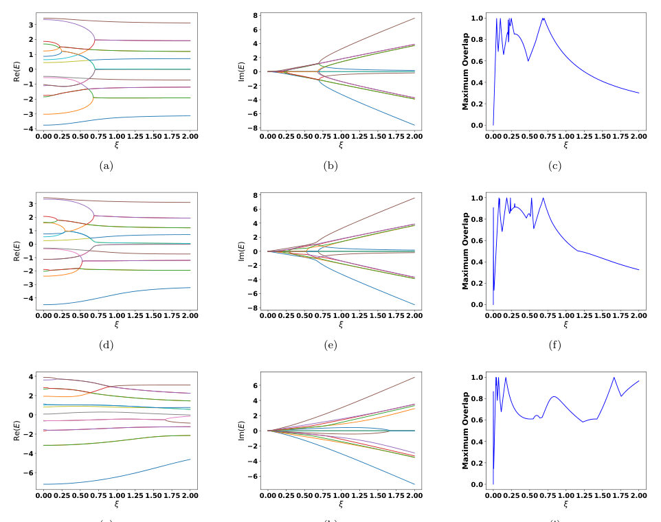
<figcaption class="paper-figure-caption"><b>Fig 1.</b> FIG. 1: Symmetry breaking and exceptional points obtained with the ED. Energy spectrum of the system for varying longitudinal fields h, illustrating the emergence of exceptional points (EPs). Columns display the real parts (a, d, g), imaginary parts (b, e, h), and the maximum overlap (c, f, i), respectively. Parameters are fixed at N = 4 and η = 0.5, with rows tracking field strengths of h = 0.1 (a–c), h = 0.3 (d–f), and h = 1.0 (g–i).</figcaption>
</figure>
<figure class="paper-figure-card">
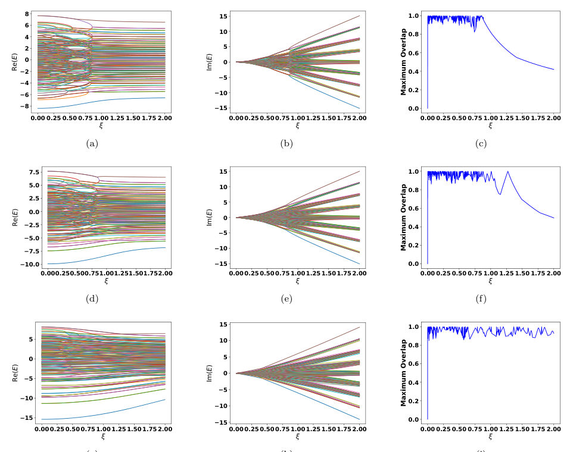
<figcaption class="paper-figure-caption"><b>Fig 2.</b> FIG. 2: Symmetry breaking and exceptional points. Energy spectrum of the system for varying longitudinal fields h, illustrating the emergence of exceptional points (EPs). Columns display the real parts (a, d, g), imaginary parts (b, e, h), and the maximum overlap (c, f, i), respectively. Parameters are fixed at N = 8 and η = 0.5, with rows tracking field strengths of h = 0.1 (a–c), h = 0.3 (d–f), and h = 1.0 (g–i). Band coloring corresponds to their chronological order of appearance.</figcaption>
</figure>
<figure class="paper-figure-card">
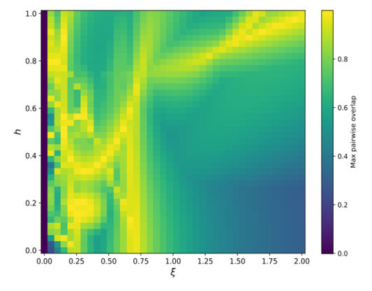
<figcaption class="paper-figure-caption"><b>Fig 3.</b> FIG. 3: Maximum-overlap phase diagram in the (h) −(ξ) parameter space. The yellow regions identify the parameter regimes where exceptional points (EPs) occur, characterized by the coalescence of eigenstates and a maximum overlap equal to unity. The remaining parameters are fixed at N = 4 and η = 0.5.</figcaption>
</figure>
<figure class="paper-figure-card">
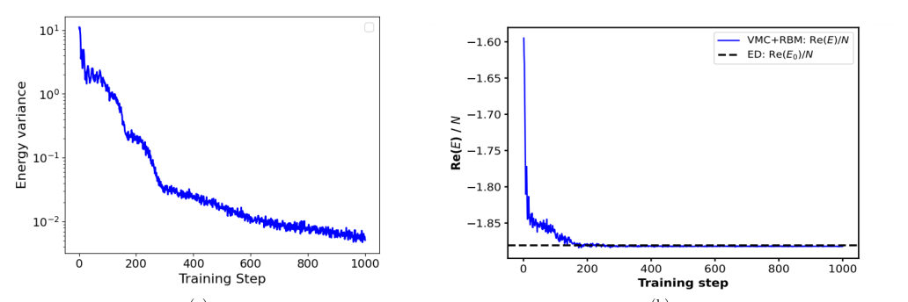
<figcaption class="paper-figure-caption"><b>Fig 4.</b> FIG. 4: RBM vs. exact diagonalisation. (a) Energy variance of the real part of the local energy, and (b) the corresponding ground-state energy of the system as a function of training steps. The Restricted Boltzmann Machine (RBM) successfully converges to the exact ground-state energy predicted by exact diagonalization (indicated by the black dashed line). The variance curve demonstrates that convergence initiates around 200 training steps. The fixed parameters for this simulation are N = 10 , η = 0.5, ξ = 0.05 and h = 0.1.</figcaption>
</figure>
<figure class="paper-figure-card">
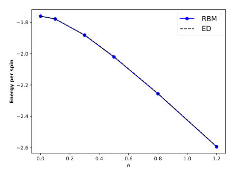
<figcaption class="paper-figure-caption"><b>Fig 5.</b> FIG. 6: ground state energy vs. h.The ground state energy provided by the RBM capture exactly ED architecture for different values of the longitudinal field h.Parameter of the simulation are N = 10 , η = 1.6,and ξ = 0.16.</figcaption>
</figure>

**Summary.** The authors apply Restricted Boltzmann Machines within a Variational Monte Carlo framework to study a non-Hermitian Ising chain. They successfully map out a longitudinal-field-driven quantum phase transition characterized by spontaneous PT-symmetry breaking and magnetic ordering. This establishes RBMs as an efficient tool for analyzing critical phenomena in complex, interacting open quantum systems.

**Why it may be interesting.** This work demonstrates a powerful, scalable numerical technique (RBMs) to analyze complex non-Hermitian dynamics, which is highly relevant for open quantum systems where gain/loss mechanisms are present.

Detailed structure

**Main problem.** Investigating the ground-state properties and quantum critical behavior of a non-Hermitian transverse-field Ising chain subjected to longitudinal and complex transverse magnetic fields.

**Main result.** The RBM approach successfully characterizes the PT-symmetry-breaking transition and the emergence of magnetic order in this challenging, interacting non-Hermitian system.

**Method.** The study employs real-valued neural quantum states (NQSs) based on Restricted Boltzmann Machines (RBMs), optimized using Variational Monte Carlo (VMC) sampling to tackle the many-body problem.

**Model / system.** The model is a 1D non-Hermitian Transverse-Field Ising Chain governed by a Hamiltonian incorporating transverse, longitudinal ($h$), and complex transverse fields ($\xi$). The system becomes non-integrable due to the longitudinal field.

**Key observables.** Ground-state energy (real part), magnetization ($M_z$), spin-spin correlation function ($C_{zz}(r)$), and detection of exceptional points (EPs).

**Important parameters / regimes.** Longitudinal field strength ($h$) and the imaginary transverse field parameter ($\xi$). Critical transition occurs around $h_c \approx 0.3$.

**Assumptions / limitations.** The use of RBMs as a variational ansatz to approximate the ground state, which is necessary because exact diagonalization fails for large systems.

**Figures summary.** Figures show energy spectra revealing exceptional points (EPs) and track the evolution of the ground-state energy and magnetization across varying longitudinal fields ($h$), confirming phase transitions.

**Paper structure.** The paper systematically analyzes the Hamiltonian, develops the RBM-VMC framework for non-Hermitian systems, benchmarks results against ED, and then maps out quantum phase transitions by tracking symmetry breaking (PT) and magnetic order using multiple observables like $C_{zz}(r)$.

Abstract

We investigate the ground-state properties and quantum critical behavior of a non-Hermitian transverse-field Ising chain subjected to longitudinal and complex transverse magnetic fields. To address this interacting many-body problem, we employ real-valued neural quantum states based on Restricted Boltzmann Machines (RBMs), optimized using Variational Monte Carlo (VMC) sampling. Spectral analysis of finite chains reveals exceptional points associated with spontaneous parity-time (PT) symmetry breaking. A real-valued RBM framework is developed to reconstruct the ground-state eigenstates of the non-Hermitian Hamiltonian. Benchmark comparisons with exact diagonalization demonstrate that the RBM approach accurately reproduces the ground-state energy, magnetization, and spin-spin correlations. Extending the analysis to larger system sizes, we identify a non-Hermitian quantum phase transition characterized by PT-symmetry breaking and the emergence of magnetic order. Our results establish real-valued neural quantum states as an efficient and scalable framework for investigating critical phenomena in interacting non-Hermitian quantum systems.

[↑ back to top](#top)

### [Rare-event sampling for stochastic dynamics in network systems using cluster updates](http://arxiv.org/abs/2608.16171v1)

**Authors:** Jiazheng Sun, James Moody, Thomas Barthel  
**Type:** theory · **Category:** statistical mechanics · **PDF:** <https://arxiv.org/pdf/2608.16171v1>  
**Analysis basis:** full PDF text, analyzed in chunks
**Topic relevance:** 🔥 `methods for driven-dissipative` **4/5** · `quantum measurements` **3/5** · `driven-dissipative phase transition` **2/5** · `non-equilibrium universality` **2/5** · `analog quantum simulation` **1/5** · `correlated / nonlocal dissipation` **1/5** · `scars & prethermalization` **1/5**

↔ Scroll figures horizontally

<figure class="paper-figure-card">
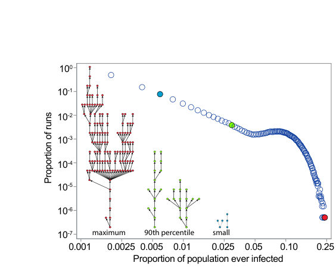
<figcaption class="paper-figure-caption"><b>Fig 1.</b> FIG. 1. Case study of epidemic outbreak sizes. For the real-world contact network of a village in rural India with N = 519 nodes (ver- tex degree average 9.7 and standard deviation 7.0) [43], we simulate a susceptible-infectious-recovered (SIR) model with synchronous up- dates, infection probability 0.015, and a fixed recovery time of 13 rounds (days). The figure shows the distribution of the outbreak sizes and exemplary transmission trees. In the vast majority of cases, the epidemic fades, reaching fewer than five households. In rare cases, however, the transmission proceeds to well-connected nodes which then spread to many, reaching more than 20% of the households.</figcaption>
</figure>
<figure class="paper-figure-card">
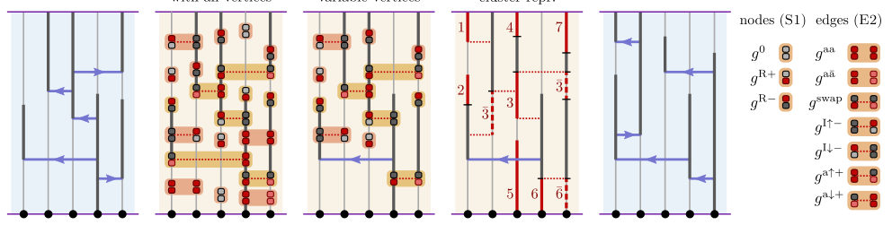
<figcaption class="paper-figure-caption"><b>Fig 2.</b> FIG. 2. Example for a cluster update in SIS dynamics. (a) A trajectory σ on five nodes with node 4 as patient zero and three infected nodes at the final time. (b) A compatible graph g. Vertices at state-changing events in σ are indicated by orange boxes and background vertices are indicated by red boxes. (c) To simplify cluster identification for the human eye, we have removed all vertices that ultimately have no free state. (d) Cluster representation of the graph g, where each red solid time segment with label “k” carries the state ak = 0, 1 of a free cluster Ck and each red dashed time segment with label “¯k” carries the negated state ¯ak = 1, 0 of cluster Ck. (e) Flipping the states of...</figcaption>
</figure>
<figure class="paper-figure-card">
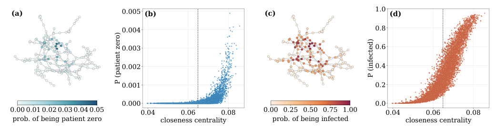
<figcaption class="paper-figure-caption"><b>Fig 3.</b> FIG. 3. Risk factor analysis for rare SIS outbreaks. CPMC samples SIS trajectories conditioned on a single infected node at t = 0 and outbreak size N I(T) ≥N I min, where N I(t) is the number of infected nodes. (a) The 185-node kinship network A, with nodes colored according to the probability p0 i [Eq. (7a)] of being patient zero. (b) p0 i versus the closeness centrality ci [Eq. (8)] for the 8623-node network B, each point representing one node. (c) Network A colored according to the probability pI i [Eq. (7b)] for getting infected during the outbreak. (d) pI i versus ci for network B. The model parameters are γ = 1 and (α, T, N I min) = (0.35, 10, 30) for network A [panels (a) and (c)]...</figcaption>
</figure>
<figure class="paper-figure-card">
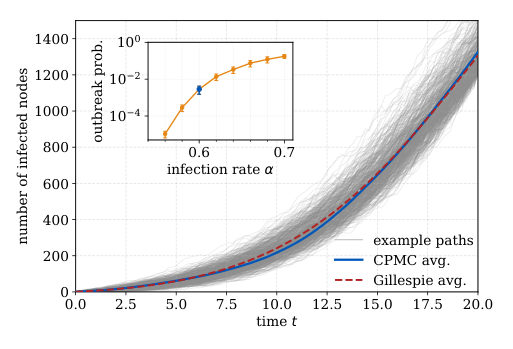
<figcaption class="paper-figure-caption"><b>Fig 4.</b> FIG. 4. Validation of CPMC against Gillespie simulations on the 8623-node kinship network. Gray curves show representative tra- jectories satisfying the outbreak condition N I(T) ≥N I min = 1200. The mean ⟨N I(t)⟩obtained from CPMC (solid blue) agrees well with the SSA Gillespie simulations (dashed red). Here γ = 1, α = 0.6, and T = 20. Inset: unconditioned outbreak probability Pr  N I(T) ≥N I min | N I(0) = 1  as a function of the infection rate. The blue point marks the rate used in the main panel. Error bars indicate one standard deviation, and results are averaged over 105 samples.</figcaption>
</figure>

**Summary.** This paper introduces Conditional-Path Monte Carlo (CPMC), an advanced simulation technique designed to overcome the severe inefficiencies of standard methods when studying rare events in stochastic network dynamics. By performing non-local updates across entire spacetime clusters, CPMC accurately samples trajectories that satisfy complex macroscopic constraints without suffering from vanishing acceptance rates. This provides a powerful tool for analyzing critical risk factors in fields ranging from epidemiology to finance.

**Why it may be interesting.** While focused on classical stochastic processes, the methodology draws explicit inspiration from loop algorithms used in quantum Monte Carlo (QMC) for equilibrium physics. The development of a non-local update scheme that bypasses rejection sampling is highly relevant to simulating complex dynamics in many-body or open quantum systems where rare transitions are key.

Detailed structure

**Main problem.** The central challenge is efficiently simulating stochastic evolution in complex networks when investigating rare macroscopic events, such as large-scale epidemic outbreaks or cascading failures.

**Main result.** The proposed Conditional-Path Monte Carlo (CPMC) method successfully generates trajectories respecting hard macroscopic boundary conditions without suffering from the catastrophic rejection rates or critical slowing down inherent to standard simulation techniques.

**Method.** CPMC is a novel rare-event sampling technique inspired by loop algorithms, employing non-local updates on spacetime clusters of the entire trajectory rather than step-by-step local integration.

**Model / system.** The study focuses on stochastic dynamics modeled using the Susceptible-Infectious-Susceptible (SIS) model applied to complex network structures, such as kinship networks. The general framework applies to any system exhibiting rare, constrained macroscopic transitions.

**Key observables.** Macroscopic boundary conditions (e.g., minimum outbreak size $N_{I}^{\min}$), conditional probabilities like the probability of being patient zero ($p_0^i$), and mean infection counts $\langle N_I(t) 
angle$.

**Important parameters / regimes.** Infection rate ($\alpha$) relative to recovery/removal rates, network structure metrics like closeness centrality ($c_i$).

**Assumptions / limitations.** The method assumes that the trajectory can be mapped effectively onto an intermediate graph configuration $g$ using Swendsen-Wang-like updates for cluster identification.

**Figures summary.** Figure 1 motivates the work by showing rare, large outbreaks on a contact network. Figure 2 illustrates the core mechanism: mapping a trajectory $\sigma$ to a compatible graph $g$ and identifying spacetime clusters $\{C_k\}$. Figure 3 analyzes risk factors using centrality measures. Figure 4 compares mean infection counts from CPMC against standard SSA simulations.

**Paper structure.** The paper first establishes the physical problem (rare events in networks) and critiques existing methods (Gillespie, TPS, etc.). It then introduces the theoretical framework of CPMC, detailing its non-local cluster updates. The bulk of the work applies this method to the SIS model on real-world networks, validating it by comparing results against known simulations and performing risk factor analysis.

Abstract

Understanding the stochastic evolution in complex networks is a central challenge across physics, biology, engineering, social science, and finance. The most consequential macroscopic events, like cascading failures in communication networks, widespread epidemic outbreaks, and rapid shifts in societal opinions, often emerge from a confluence of rare, localized stochastic processes and need to pass certain bottlenecks. Standard forward-time simulation algorithms like the Gillespie method are inefficient for the investigation of such phenomena due to catastrophic rejection rates. Advanced rare-event techniques like splitting methods and transition-path sampling often suffer from kinetic trapping, path degeneracy, genealogical correlations, or critical slowing down when applied to complex heterogeneous networks. We propose to overcome this challenge by establishing a novel technique called conditional-path Monte Carlo (CPMC), inspired by loop algorithms from equilibrium condensed-matter physics. By employing non-local updates on spacetime clusters without rejections, CPMC generates a Markov chain of trajectories that all strictly respect the targeted macroscopic boundary conditions like the occurrence of a massive network failure. We demonstrate the framework's potential by performing a simple risk factor analysis for rare large-scale epidemic outbreaks in SIS dynamics on kinship networks.

[↑ back to top](#top)

### [Tunable Statistics-Induced Caging in the Anyon-Hubbard Model](http://arxiv.org/abs/2608.15739v1)

**Authors:** Zenong Zhou, Chaorong Guo, Hongzheng Wu, Qianglin Hu, Xiaobing Luo  
**Type:** theory · **Category:** other · **PDF:** <https://arxiv.org/pdf/2608.15739v1>  
**Analysis basis:** full PDF text, analyzed in chunks
**Topic relevance:** 🔥 `analog quantum simulation` **4/5** · `methods for driven-dissipative` **3/5** · `driven-dissipative phase transition` **2/5** · `correlated / nonlocal dissipation` **1/5** · `non-equilibrium universality` **1/5** · `quantum measurements` **1/5** · `scars & prethermalization` **1/5**

↔ Scroll figures horizontally

<figure class="paper-figure-card">
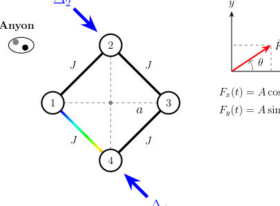
<figcaption class="paper-figure-caption"><b>Fig 1.</b> FIG. 1. Schematic of the diamond-shaped four-site plaque- tte with nearest-neighbor hopping amplitude J and center- to-vertex distance a. The top-left inset illustrates the two anyons. The link between sites 1 and 4, highlighted with a color gradient, represents the twisted boundary condition in- duced by the anyon-to-boson mapping. Blue arrows indicate the static energy detunings ∆2 and ∆4. The right inset de- fines the driving field ⃗F(t) with amplitude A, frequency ω, and polarization angle θ.</figcaption>
</figure>
<figure class="paper-figure-card">
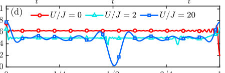
<figcaption class="paper-figure-caption"><b>Fig 2.</b> FIG. 2. Quantum dynamics of the target site occupation ⟨ˆn3(t)⟩governed by Eq. (7). (a)–(c) Real-time evolution for various statistical parameters κ at interaction strengths U/J = 0, 2, and 20, respectively. (d) Long-time-averaged oc- cupation ⟨ˆn3⟩as a function of κ. Here and in all subsequent figures, time t is expressed in units of ℏ/J, and the system is initially prepared with both particles localized at site 1, de- noted as |ψ(0)⟩= |1, 1⟩.</figcaption>
</figure>
<figure class="paper-figure-card">
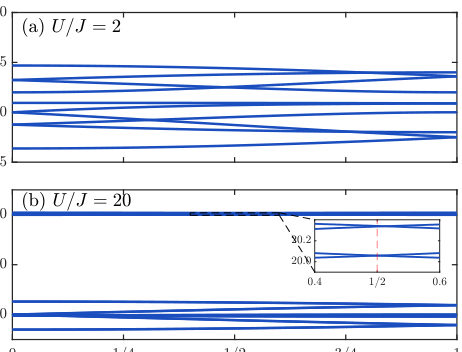
<figcaption class="paper-figure-caption"><b>Fig 3.</b> FIG. 3. Energy spectra of the undriven two-anyon system governed by ˆHstatic as a function of the statistical parameter κ for interaction strengths (a) U/J = 2 and (b) U/J = 20. In (b), the energy levels separate into a lower scattering mani- fold and an upper doublon band. The inset resolves the fine structure of the doublon band, revealing an exact degeneracy at κ = 1/2 (red dashed line).</figcaption>
</figure>
<figure class="paper-figure-card">
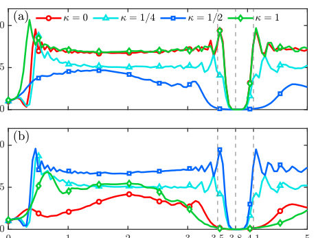
<figcaption class="paper-figure-caption"><b>Fig 4.</b> FIG. 5. Long-time-averaged occupation ⟨ˆn3⟩governed by ˆHB AHM(t) [Eqs. (6) and (20)] as a function of the dimensionless driving strength Aa/ω at U/J = 2 and ω/J = 40. Results are shown for polarization angles (a) θ = 0 and (b) θ = π/8. The κ-dependent dips within the range Aa/ω ∈[3.5, 4.1], marked by vertical dashed lines, signify dynamical caging, while the κ-independent dip at Aa/ω ≈3.8 corresponds to coherent de- struction of tunneling (CDT).</figcaption>
</figure>
<figure class="paper-figure-card">
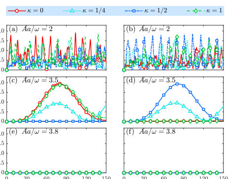
<figcaption class="paper-figure-caption"><b>Fig 5.</b> FIG. 4. Quantum dynamics of the target site occupation ⟨ˆn3(t)⟩governed by ˆHB AHM(t) [Eqs. (6) and (20)]. The real-time evolution is calculated for an interaction strength U/J = 2, a driving frequency ω/J = 40, and static detun- ings ∆2 = ∆4 = ω. Results are displayed for dimensionless driving amplitudes Aa/ω = 2 [(a), (b)], 3.5 [(c), (d)], and 3.8 [(e), (f)]. The left and right columns correspond to polariza- tion angles θ = 0 and θ = π/8, respectively. Different curves within each panel represent various statistical parameters κ.</figcaption>
</figure>

**Summary.** The paper explores tunable statistics-induced caging in the Anyon-Hubbard Model by applying Floquet engineering. It shows that while intrinsic interactions can cause caging only under specific conditions (strong coupling), external high-frequency driving can dynamically restore this effect even when interactions are weak. This provides a powerful tool for selectively controlling anyonic behavior based on their underlying statistical phase.

**Why it may be interesting.** This work directly addresses coherent control of quantum many-body states using time-periodic driving, a central theme in AMO physics and open quantum systems research.

Detailed structure

**Main problem.** The study investigates how quantum statistics can induce a controllable 'caging' effect for interacting anyons within the Anyon-Hubbard Model.

**Main result.** Dynamical control via Floquet engineering allows the restoration of this caging effect into the weakly interacting regime, enabling selective manipulation based on the statistical phase ($\kappa$).

**Method.** The analysis employs mapping to a Bose-Hubbard model and utilizes high-frequency expansion methods (Floquet theory) combined with perturbation theory to derive effective Hamiltonians.

**Model / system.** The system is the Anyon-Hubbard Model on a four-site plaquette, which is exactly mapped to a Bose-Hubbard type Hamiltonian. The dynamics are governed by time-dependent Schrödinger equations solved via Floquet engineering techniques.

**Key observables.** Target site occupation $\langle \hat{n}_3(t) 
angle$ and its long-time average $\langle \hat{n}_3 
angle$, which quantifies the degree of caging (suppression to zero).

**Important parameters / regimes.** Statistical phase ($\kappa$), hopping amplitude ($J$), interaction strength ($U$), and external drive parameters (amplitude $A$, frequency $\omega$, polarization angle $	heta$).

**Assumptions / limitations.** The analysis relies on mapping the anyonic system to a bosonic model and employing high-frequency approximations for the time evolution.

**Figures summary.** Figures illustrate the suppression of site occupation ($\langle \hat{n}_3 
angle$) showing caging at specific parameter points, comparing results from effective Hamiltonians against full time-dependent simulations.

**Paper structure.** The paper progresses by first establishing static caging in the strong interaction limit, then demonstrating its breakdown in weak coupling. The core contribution involves using Floquet engineering to dynamically restore this caging across all statistical regimes via an effective Hamiltonian approach.

Abstract

We study the quantum dynamics of two interacting anyons in the Anyon-Hubbard model on a four-site plaquette, a system that is exactly mappable to a Bose-Hubbard model. We reveal that static Aharonov-Bohm (AB) caging, induced by only specific statistical phases, emerges in the strongly interacting limit but breaks down under weak interparticle interactions. To address this, we demonstrate that statistical-factor-induced AB caging can be dynamically restored via Floquet engineering. This dynamical mechanism, governed by the synthetic Floquet flux and the anyonic statistical phase, extends the caging effect into the weakly interacting regime across the full spectrum of statistical phases. Furthermore, we show that the external drive enables the selective caging of anyons, providing an efficient approach for manipulating anyons and identifying statistical phases.

[↑ back to top](#top)

### [Experimental High-Dimensional Quantum Overlapping Tomography](http://arxiv.org/abs/2608.15795v1)

**Authors:** Haifei Wang, Rui Qu, Zhengning Yang, Xiaodan Lyu, Haotao Zhu, Zitong Xu, Lianzhen Cao, Joel Yang, Otfried Gühne, Weibo Gao  
**Type:** experiment · **Category:** quantum information and computing · **PDF:** <https://arxiv.org/pdf/2608.15795v1>  
**Analysis basis:** full PDF text, analyzed in chunks
**Topic relevance:** 🔥 `QC/QI experiment` **4/5** · `quantum measurements` **3/5** · `quantum optics experiment` **3/5** · `analog quantum simulation` **1/5** · `interference shaping light` **1/5**

↔ Scroll figures horizontally

<figure class="paper-figure-card">
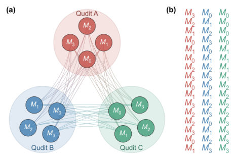
<figcaption class="paper-figure-caption"><b>Fig 1.</b> FIG. 1. Schematic for high-dimensional overlapping tomography. (a) Complete multipartite graph K4,4,4 for three qutrits, where each qutrit is associated with four vertices representing its MUB settings M0, M1, M2, M3. Edges repre- sent tensor products of two MUB projectors. Cliques (trian- gles) correspond to three-body measurement settings (tensor products of three MUB projectors). (b) The 16 cliques that cover all 48 edges of the graph. The corresponding MUB settings are thus informationally complete for extracting all two-body marginals.</figcaption>
</figure>
<figure class="paper-figure-card">
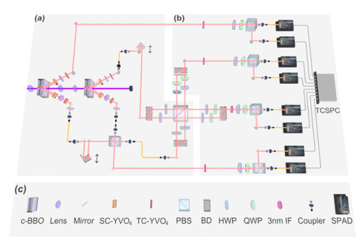
<figcaption class="paper-figure-caption"><b>Fig 2.</b> FIG. 2. Experimental setup. (a) Preparation of the target state |Λ⟩. Ultraviolet femtosecond pulses (390 nm, 80 MHz repetition rate, 230 mW average power) are focused onto two sandwich-like BBO–HWP–BBO combinations (c-BBO) to generate two polarization-entangled photon pairs at 780 nm via spontaneous parametric down-conversion. Spatial and temporal walk-off in the BBO crystals is compensated by yt- trium orthovanadate (YVO4) crystals. The BDs displace ver- tically polarized photons into the upper path while leaving horizontally polarized photons in the lower path. Narrow- band interference filters (IF) with a 3 nm passband are used to suppress unwanted frequency correlations between the sig-...</figcaption>
</figure>
<figure class="paper-figure-card">
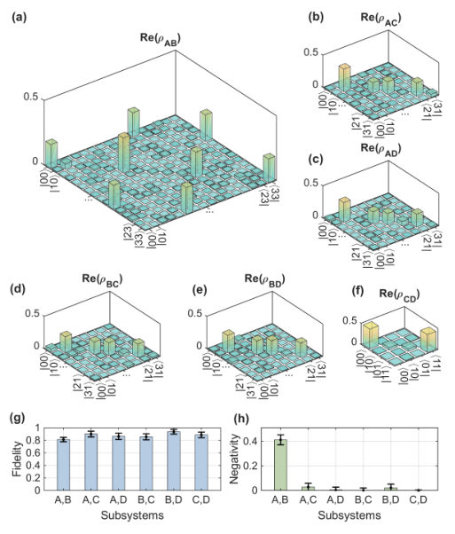
<figcaption class="paper-figure-caption"><b>Fig 3.</b> FIG. 3. Experimental results of high-dimensional overlapping tomography. (a-f) Real parts of the six two-body marginals reconstructed by high-dimensional overlapping tomography. (g) The fidelities of the six two-body marginals. Error bars are obtained by Monte Carlo sampling with 1000 samples fol- lowing Poisson distribution and represent 99% confidence in- tervals. (h) Negativities of the two-body marginals. Only ρAB has a non-zero negativity with statistical significance, indicat- ing its entanglement, whereas the other two-body marginals do not.</figcaption>
</figure>
<figure class="paper-figure-card">
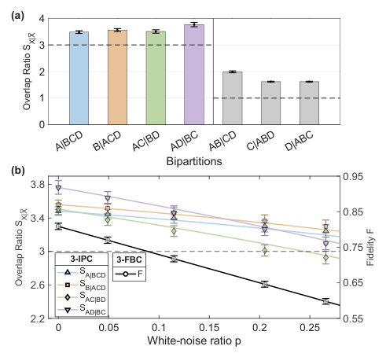
<figcaption class="paper-figure-caption"><b>Fig 4.</b> FIG. 4. Certification of the entanglement dimensionality vec- tor. (a) The global-to-local overlap ratios S for all seven bipartitions. Error bars represent one standard deviation. These values lower-bound the Schmidt number vector of our experimental state as rA|BCD, rB|ACD, rAC|BD, rAD|BC &gt; 3 and rAB|CD, rC|ABD, rD|ABC &gt; 1. (b) Comparison between the r-inner-product criterion (r-IPC) and the r-fidelity-based criterion (r-FBC) for detecting the Schmidt number greater than r, under different levels of white noise. Here p is the ratio of the additional white noise sample counts to the total sample counts, obtained from postprocessing.</figcaption>
</figure>

**Summary.** This work introduces High-Dimensional Quantum Overlapping Tomography (QOT) to overcome the measurement complexity barrier in characterizing large, high-dimensional quantum states. Experimentally realized with photons, it efficiently reconstructs crucial two-body marginals using far fewer measurements than standard methods. The findings establish a scalable framework and demonstrate that this approach offers superior noise resilience for certifying multipartite entanglement.

**Why it may be interesting.** The development of scalable tomography techniques is crucial for validating quantum network components and understanding complex multi-partite correlations in high-dimensional photonic systems.

Detailed structure

**Main problem.** Characterizing large-scale, high-dimensional multipartite quantum systems is computationally prohibitive due to increasing local dimensionality and particle number.

**Main result.** The authors successfully demonstrated a scalable technique using High-Dimensional Quantum Overlapping Tomography (QOT) that reconstructs all two-body marginals with significantly fewer measurements than independent tomography. Furthermore, they showed this method provides more noise-resilient entanglement certification than fidelity-based criteria.

**Method.** They propose and experimentally implement QOT based on a graph-theoretic formulation, utilizing mutually unbiased bases (MUBs) to efficiently cover the necessary measurement settings required for marginal reconstruction.

**Model / system.** The experiment was performed on a photonic four-party entangled state in a $4 	imes 4 	imes 2 	imes 2$ system. The theoretical framework applies to general multipartite high-dimensional quantum systems.

**Key observables.** Two-body marginals ($
ho_{XY}$), reconstruction fidelity ($0.876 \pm 0.014$), negativity, and global-to-local overlap ratios ($S$).

**Important parameters / regimes.** The number of measurement settings required (25 vs. 94/225 for full tomography); the noise parameter $p$ used in simulating white noise contamination.

**Assumptions / limitations.** The theoretical formulation is simplified for prime-power dimensions and relies on MUB measurements; entanglement certification comparisons assume a depolarizing channel model.

**Figures summary.** Figures illustrate the experimental setup using photonics, schematics of the underlying complete multipartite graph, reconstructed marginals (real parts, fidelities, negativities), and a comparison of entanglement criteria under noise.

**Paper structure.** The paper introduces the problem of high-dimensional characterization, details the graph-theoretic QOT approach, presents the experimental realization on photonic states using MUB measurements, analyzes the reconstructed marginals for structure (e.g., layered entanglement), and concludes by comparing different entanglement certification methods under noise.

Abstract

Large-scale quantum systems have advanced rapidly via the exploration of more particles and higher dimensions, offering great potential for developing quantum technologies. However, their characterization becomes prohibitive with increasing local dimensionality and particle number. Here we propose high-dimensional quantum overlapping tomography based on a graph-theoretic formulation, which allows one to efficiently reconstruct few-body marginals of multipartite high-dimensional quantum systems. We experimentally realize it on a photonic four-party entangled state in a $4 \times 4 \times 2 \times 2$ system. Using measurements in mutually unbiased bases, we reconstruct all six two-body marginals with only 25 projective measurement settings, compared with 94 and 225 settings for independent tomography of all two-body reduced states and full state tomography, respectively. The reconstructed marginals reveal a layered entanglement structure vital for high-dimensional quantum networks. We further show that these marginals enable more noise-resilient certification of multipartite high-dimensional entanglement than the fidelity-based criterion. Our work thus offers a scalable route for learning multidimensional quantum systems.

[↑ back to top](#top)

### [Continuous Quantum Feedback Control via Kraus-Parameterized Belief Reinforcement Learning](http://arxiv.org/abs/2608.15715v1)

**Authors:** Priyanshi Singh, Krishna Bhatia  
**Type:** theory · **Category:** quantum information and computing · **PDF:** <https://arxiv.org/pdf/2608.15715v1>  
**Analysis basis:** full PDF text, analyzed in chunks
**Topic relevance:** 🔥 `quantum measurements` **4/5** · `methods for driven-dissipative` **3/5** · `driven-dissipative phase transition` **2/5** · `Keldysh / 2PI / non-Gaussian methods` **1/5** · `correlated / nonlocal dissipation` **1/5**

↔ Scroll figures horizontally

<figure class="paper-figure-card">
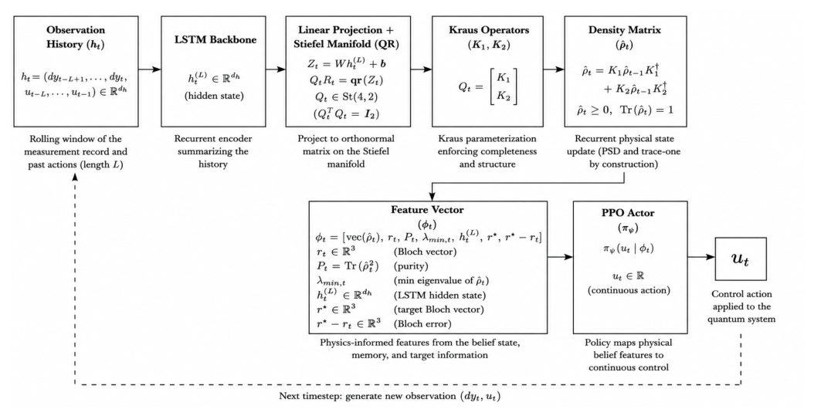
<figcaption class="paper-figure-caption"><b>Fig 1.</b> Fig. 1. Kraus-belief PPO pipeline. The observation history ht passes through a frozen pretrained Kraus encoder (via a Stiefel manifold projection) to produce a physically valid density-matrix belief ˆρt. Explicit physical features ϕt are then passed to the PPO actor. The LSTM baseline replaces this entire belief stage with a plain recurrent encoder.</figcaption>
</figure>

**Summary.** The paper introduces Kraus-Parameterized Belief Reinforcement Learning for controlling open quantum systems based only on noisy measurements. By constraining the learned belief state ($\hat{
ho}_t$) to maintain physical validity (PSD and trace normalization), the method ensures reliable control policies. This approach proves more stable than standard deep learning baselines, particularly when system dynamics change unexpectedly.

**Why it may be interesting.** This work directly addresses the practical implementation gap in quantum control theory by embedding fundamental physical constraints (like PSD) into the learning architecture, making RL policies applicable to real-world open quantum systems.

Detailed structure

**Main problem.** The core challenge is achieving continuous quantum feedback control when only noisy measurement records are available, without direct access to the true underlying quantum state.

**Main result.** The proposed Kraus-Belief PPO method achieves stable feedback control with significantly lower return variance than unconstrained baselines, especially under out-of-distribution conditions.

**Method.** It uses a two-stage pipeline: a Kraus-constrained recurrent encoder estimates the density matrix ($\hat{
ho}_t$), which is then fed into a Proximal Policy Optimization (PPO) actor for action selection.

**Model / system.** The system modeled is a continuously monitored open quantum qubit, whose dynamics are governed by a stochastic master equation. Control involves applying a continuous scalar field $u_t$ to steer the state towards a target pure state $
ho^\star$.

**Key observables.** Measurement-conditioned belief fidelity ($\sim 0.77–0.80$), return variance, mean episodic return, and physical validity metrics (PSD check, trace error).

**Important parameters / regimes.** Control action bounds ($u_t \in [-4, 4]$), measurement efficiency ($\eta$), and the PPO hyperparameters.

**Assumptions / limitations.** The primary assumption is that enforcing physics-informed neural memory via the Kraus constraint acts as a practical inductive bias for reliable quantum feedback control.

**Figures summary.** Figure 1 illustrates the comparison between the Kraus-belief PPO pipeline and the LSTM baseline, highlighting how the Stiefel manifold projection enforces physical state constraints.

**Paper structure.** The paper defines the problem in terms of a POMDP, proposes the two-stage Kraus-Belief PPO method (encoder pretraining followed by RL control), compares it against an unconstrained LSTM baseline across nominal and OOD conditions, and analyzes performance metrics like variance stability.

Abstract

Quantum feedback control requires acting on noisy continuous measurement records without direct access to the underlying quantum state. We propose Kraus-Parameterized Belief Reinforcement Learning, a pipeline in which a recurrent encoder, constrained to the Stiefel manifold, produces density-matrix estimates that are guaranteed positive-semidefinite and trace-normalized by construction, embedding quantum state geometry directly into the learning loop. A Proximal Policy Optimization (PPO) actor then maps these physically valid belief states to continuous control actions. On a simulated continuously monitored qubit, the resulting policy achieves stable feedback control, maintaining a measurement-conditioned belief fidelity of approximately 0.77-0.80 and exhibiting substantially lower return variance than a parameter-matched LSTM-history baseline across both nominal and out-of-distribution conditions. Although gains in raw target fidelity are modest, the geometric constraint guarantees a physically valid, interpretable belief representation and yields markedly more stable control under measurement inefficiency and abrupt dynamics switches. These results indicate that physics-informed neural memory is a practical inductive bias for reliable quantum feedback control.

[↑ back to top](#top)

### [Negative quasiprobability trajectories for Bell-diagonal states under local decoherence](http://arxiv.org/abs/2608.16358v1)

**Authors:** Qing Yu, Kun Zhang, Yang-Yang Chen, Xiao-Hui Wang  
**Type:** theory · **Category:** quantum information and computing · **PDF:** <https://arxiv.org/pdf/2608.16358v1>  
**Analysis basis:** full PDF text, analyzed in chunks
**Topic relevance:** 🔥 `quantum measurements` **4/5** · `methods for driven-dissipative` **3/5** · `driven-dissipative phase transition` **2/5** · `Keldysh / 2PI / non-Gaussian methods` **1/5** · `correlated / nonlocal dissipation` **1/5**

↔ Scroll figures horizontally

<figure class="paper-figure-card">
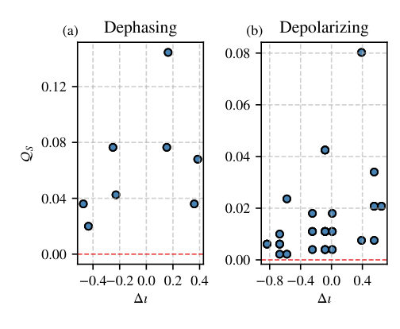
<figcaption class="paper-figure-caption"><b>Fig 1.</b> FIG. 1. The quasiprobability distribution QS[γ] of stochastic mutual information change ∆ι[γ] for initial Bell-diagonal states with corre- lation coefficients c1 = −0.3, c2 = −0.1, and c3 = −0.3. The dynamics of each qubit is described by (a) dephasing with λ = 0.6 and (b) depolarization with η = 7/15. The red dashed line marks zero.</figcaption>
</figure>
<figure class="paper-figure-card">
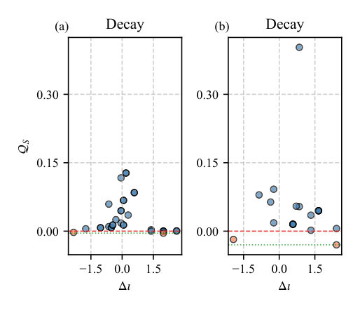
<figcaption class="paper-figure-caption"><b>Fig 2.</b> FIG. 2. The reduced KD quasiprobability distribution QS[γ] of the stochastic mutual information change ∆ι[γ] for Bell-diagonal states under local amplitude damping. In both panels, the damping param- eter is µ = 0.4. Orange points identify negative trajectory weights, and the green dotted line in each panel marks the corresponding minimum trajectory weight. Panel (a) uses the representative state c1 = c3 = −0.3 and c2 = −0.1. Panel (b) uses the v &gt; 0 minimiz- ing family in Theorem 2, with c3 = 1 and c1 = −c2 ≃0.49201.</figcaption>
</figure>
<figure class="paper-figure-card">
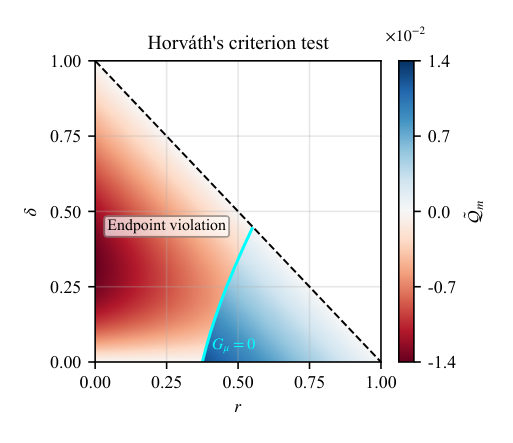
<figcaption class="paper-figure-caption"><b>Fig 3.</b> FIG. 3. Grouped quasiprobability weight ˜Qm at the smallest support value of ∆ι[γ] in the (r, δ) plane for the structured parameters in Eq. (65) with µ = 0.2. Red and blue denote negative and positive values, respectively. The cyan curve is the boundary Gµ(r, δ) = 0. The analytic endpoint-violation region is defined by Gµ(r, δ) &gt; 0. Only the physical region 0 &lt; r &lt; 1 −δ is considered.</figcaption>
</figure>

**Summary.** This paper analyzes how quantum information changes during local decoherence by examining quasiprobability trajectories. It demonstrates that these distributions can exhibit negative weights, leading to violations of certain mathematical criteria (Horváth's criterion). This highlights a fundamental difference between the full quantum trajectory description and what is observable only through average measurements.

**Why it may be interesting.** This work provides a rigorous, trajectory-level diagnostic tool that distinguishes quantum dynamics from classical stochastic processes, which is crucial for understanding open quantum systems beyond simple average measurements.

Detailed structure

**Main problem.** The study investigates negative quasiprobability trajectories for Bell-diagonal quantum states undergoing local decoherence, contrasting trajectory-level dynamics with average-level inequalities.

**Main result.** Negative quasiprobabilities can violate Horváth's criterion for the Jensen-Steffensen inequality to hold, revealing a unique feature of quantum information dynamics invisible when only average quantities are considered.

**Method.** The authors use quasiprobability trajectories (Kirkwood-Dirac distribution) derived from fluctuation theorems applied to quantum mutual information change ($\Delta I$).

**Model / system.** The system consists of two qubits initialized in Bell-diagonal states and subjected to local decoherence channels, including dephasing, depolarizing, and amplitude damping.

**Key observables.** Quantum Mutual Information change ($\Delta I$), stochastic mutual information change ($\Delta\iota[\gamma]$), and the negativity of the quasiprobability distribution $Q[	ilde{\gamma}]$.

**Important parameters / regimes.** Decoherence parameters such as $\lambda$ (dephasing) or $\eta$ (depolarizing noise); the analysis also depends on initial state populations ($p_k$) and environmental coupling strengths ($\mu$).

**Assumptions / limitations.** The use of the Kirkwood-Dirac quasiprobability distribution is necessary because spectral projectors for global and local states do not commute due to entanglement.

**Figures summary.** Figure 1 illustrates that for initial Bell-diagonal states under dephasing or depolarization, the reduced trajectory weights $Q_S[\gamma]$ remain non-negative relative to the zero line.

**Paper structure.** The paper establishes the framework using fluctuation theorems and quasiprobabilities. It then analyzes specific decoherence channels (dephasing/depolarizing) showing non-negativity in reduced distributions, before focusing on amplitude damping to analytically determine minimum support values and prove the violation of Horváth's criterion.

Abstract

The fluctuation theorem (FT) relates microscopic trajectory distributions to macroscopic averages. Using quasiprobability trajectories, this framework has recently been extended to quantum information dynamics. Despite sharing the form of conventional thermodynamic FTs, information FTs involve quasiprobabilities whose negativity and statistical properties remain poorly understood. We analytically determine the properties of negative distributions based on the two-qubit Bell-diagonal states evolving under local dephasing, depolarizing, and amplitude-damping channels. We show that the occurrence of negative quasiprobabilities is not determined by the entanglement or Bell nonlocality of the initial state. Instead, a diagonal-interference decomposition of the transition quasiprobability provides a sufficient condition for negativity. More importantly, we prove that quasiprobability distributions containing negative weights can violate Horváth's necessary and sufficient criterion for the Jensen-Steffensen inequality to hold for every continuous convex function, even though the specific exponential Jensen-like relation enforced by the FT and the quantum data-processing inequality remains valid. This trajectory-level contrast with classical stochastic descriptions reveals a distinctive feature of quantum information dynamics that is invisible when only the corresponding average-level information inequalities are considered.

[↑ back to top](#top)

### [Resolving and resetting the charge environment of single T-centers in silicon p-i-n waveguides](http://arxiv.org/abs/2608.15993v1)

**Authors:** Chaoshen Zhang, Hanbin Song, Lukasz Komza, Aaron M. Day, Enrique Garcia, Donald Witt, Mihir K. Bhaskar, Alp Sipahigil, Evelyn L. Hu  
**Type:** experiment · **Category:** quantum information and computing · **PDF:** <https://arxiv.org/pdf/2608.15993v1>  
**Analysis basis:** full PDF text, analyzed in chunks
**Topic relevance:** 🔥 `QC/QI experiment` **4/5** · `quantum optics experiment` **3/5** · `quantum measurements` **2/5** · `correlated / nonlocal dissipation` **1/5** · `interference shaping light` **1/5**

↔ Scroll figures horizontally

<figure class="paper-figure-card">
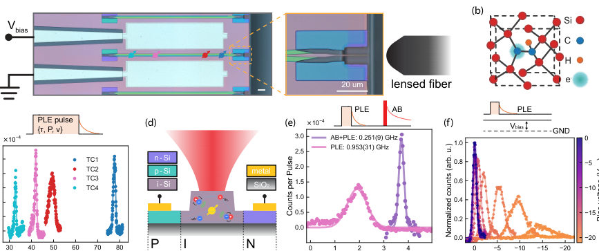
<figcaption class="paper-figure-caption"><b>Fig 1.</b> Fig. 1: Electrical and optical control of individual T-centers (a) Optical micrograph of the device (true color). The partially etched ridge waveguide crosses the 7 µm intrinsic gap of a lateral p–i–n junction, giving the biased electrodes continuous field access to emitters along the device. Colored markers indicate the four T-centers (TC1–4) studied here. Photons are collected through a fully etched and released inverse taper at the right-hand facet (inset) into a lensed single-mode fiber, with a Bragg grating at the left end back-reflecting into the same path. Scale bars: 20 µm. (b) Atomic structure of a T-center. (c) Pulse sequence for PLE measurement; the exponential tail indicates the...</figcaption>
</figure>
<figure class="paper-figure-card">
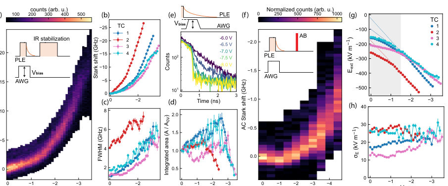
<figcaption class="paper-figure-caption"><b>Fig 2.</b> Fig. 2: Electric-field tuning and charge-noise readout with pulsed biasing In (a)–(e) the junction is driven by a square wave with an off-resonant (1325 nm) IR stabilization pulse at 0 V; (f) replaces the IR stabilization pulse with an (640 nm) AB reset pulse. (a) AWG-bias pulse sequence (inset) and voltage-resolved PLE spectrogram of TC3: the ZPL shifts parabolically and broadens with |V |. (b) Relative Stark shift for TC1–4. (c) Gaussian-fit linewidth for TC1– 4, steadily increasing with |V |. (d) Normalized integrated area for TC1–4: all show initial rise (with TC1 approaching 1.9 times original area near −2.5 V) followed by a sharp decrease at high bias (ionization). (e) Ramped-bias...</figcaption>
</figure>
<figure class="paper-figure-card">
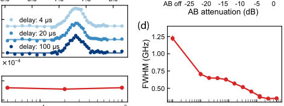
<figcaption class="paper-figure-caption"><b>Fig 3.</b> Fig. 3: Above-band pulse-parameter dependence (a) AB-PLE pulse sequence, real time span not to scale. (b) TC1 AB-PLE spectra versus AB-probe delay (background subtracted); the linewidth is flat from 4 to 100 µs with a maximum variation of 15(17) MHz, no meaningful center wavelength drift is measured. (c) TC1 AB-PLE center wavelength and linewidth drifting toward the PLE (AB-off) values as the AB power is attenuated. (d) TC1 AB-PLE linewidth narrowing with AB-pulse repetition, saturating near 350(13) MHz at 256 pulses (25 dB attenuation).</figcaption>
</figure>
<figure class="paper-figure-card">
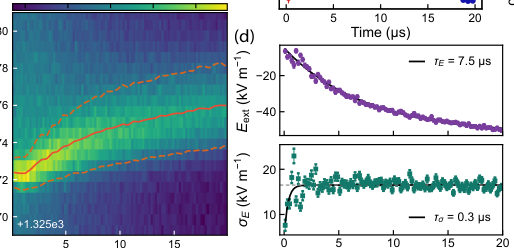
<figcaption class="paper-figure-caption"><b>Fig 4.</b> Fig. 4: Time-resolved charge-environment recovery (a) Pseudo-CW-PLE sequence: five AB pulses reset the environment, then a 20 µs resonant pulse probes while photons are registered (SNR &gt;5 for TC3). (b) Fitted center frequency and linewidth versus probe time after reset. (c) Time- resolved spectrogram of TC3 under 100 µW resonant illumination. (d) Model-extracted recovery of the external field Eext(t) and the charge-noise amplitude σE(t), on markedly different timescales.</figcaption>
</figure>
<figure class="paper-figure-card">
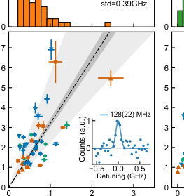
<figcaption class="paper-figure-caption"><b>Fig 5.</b> Fig. 5: Emitters statistics of the reset (a) AB-PLE linewidth histogram over 46 isolated T- centers (top) and AB-PLE versus PLE linewidth correlation (bottom), data taken across 5 devices with 3 junction width (color-coded). Median linewidth reduced from 1.99 to 0.57 GHz, a 71 % reduction. 20 µW, 50 ns pulse on a selected emitter yields 128(22) MHz fitted linewidth (inset). (b) AB-to-PLE frequency-shift histogram (top) and its correlation with PLE linewidth (bottom); PLE linewidth histogram (right). (c) Model derived Eext versus σE correlation (left), σE histogram. Correlation shows -0.9 kV/m in σE per 100 kV/m Eext increase, with median σE of 25.3 kV/m.</figcaption>
</figure>

**Summary.** The research tackles charge noise broadening in silicon T-centers, a major hurdle for quantum networking. By implementing an above-band optical pulse sequence, the authors successfully reset the local charge environment, dramatically narrowing the spectral linewidth. This demonstrates a robust, scalable method to create high-quality quantum emitters for integrated photonic circuits.

**Why it may be interesting.** This work directly addresses a critical bottleneck in solid-state quantum photonics by providing an active method to suppress spectral diffusion noise, which is crucial for scaling up quantum interconnects based on spin-photon interfaces.

Detailed structure

**Main problem.** The optical linewidth of single T-centers in silicon waveguides is broadened by fluctuating charge environments, which severely limits their use for high-fidelity quantum networking.

**Main result.** Above-band illumination provides an unheralded method to reset the local charge environment, narrowing the median linewidth by up to 3.5 times and achieving a narrowest reported linewidth of 128 MHz.

**Method.** The authors characterized the charge environment using pulsed photoluminescence excitation (PLE) measurements combined with electrical biasing and optical resetting techniques.

**Model / system.** The system involves single T-centers embedded in lateral p-i-n waveguides on silicon. The analysis models the measured spectral lineshape by decomposing the effective field into a deterministic external field ($E_{ext}$) and Gaussian charge noise ($\sigma_E$).

**Key observables.** Optical linewidth (FWHM), Rabi oscillation coherence time, local electric field shift (Stark effect), and charge-noise width ($\sigma_E$).

**Important parameters / regimes.** Base temperature of 15 mK; initial linewidths in the GHz range; final narrowest linewidth of 128 MHz.

**Assumptions / limitations.** The analysis assumes that the measured lineshape can be modeled by averaging a Lorentzian over the charge noise distribution, and that the T-center transition frequency follows a quadratic Stark map.

**Figures summary.** Figures illustrate device schematics, pulse sequences (PLE/AB-PLE), voltage-resolved PLE spectrograms showing linewidth narrowing upon AB reset, and time-resolved measurements tracking charge environment recovery dynamics.

**Paper structure.** The paper progresses from defining the problem (charge noise limiting indistinguishability) to presenting the novel measurement technique (AB-PLE resetting), quantifying the improvement across many emitters, and finally validating the underlying physics using Stark shift tuning and analytical modeling of the local field.

Abstract

The silicon T-center is a telecom-band spin-photon interface in a manufacturable photonics platform. In nanophotonic devices, however, its optical linewidth is broadened by a fluctuating charge environment, limiting photon indistinguishability for quantum networking. Here, we address this challenge through characterization and suppression of the local charge-noise of single T-centers in lateral p-i-n waveguides, demonstrating an unheralded method of T-center optical linewidth narrowing. Above-band illumination resets the charge environment, neutralizing the local field and suppressing spectral diffusion. Across 46 emitters this reset narrows the median linewidth 3.5-fold to 0.57(11) GHz, and an optimized emitter reaches 128(22) MHz, the narrowest unheralded linewidth reported for an integrated T-center. The narrowed transition supports coherent optical Rabi oscillations with a coherence time of 20(2) ns. Finally, we perform Stark-shift tuning using the p-i-n junction, and read out the local electric field and the charge-noise width at 15 mK. An analytical model of proximal surfaces, bulk, and junction field effects provides good agreement with our findings. Our multi-pronged characterization of the nanophotonic-integrated T-center charge environment enables future device optimization toward scalable quantum interconnects.

[↑ back to top](#top)

### [Hundred-hertz quantum circuit iteration rate in a reusable neutral-atom array](http://arxiv.org/abs/2608.16815v1)

**Authors:** Liang Chen, Wen-Yi Zhu, Dong-Qi Ma, Tian-Yang Zhang, Zi-Jie Chen, Yi-Chen Zhang, Hong-Jie Fan, Guang-Jie Chen, Qing-Xuan Jie, Wei-Zhou Cai, Tian-Cai Zhang, Luyan Sun, Yan-Lei Zhang, Xi-Feng Ren, Guang-Can Guo, Zhu-Bo Wang, Ya-Dong Hu, Gang Li, Chang-Ling Zou  
**Type:** experiment · **Category:** quantum information and computing · **PDF:** <https://arxiv.org/pdf/2608.16815v1>  
**Analysis basis:** full PDF text, analyzed in chunks
**Topic relevance:** 🔥 `QC/QI experiment` **4/5** · `analog quantum simulation` **2/5** · `quantum measurements` **2/5** · `methods for driven-dissipative` **1/5** · `quantum optics experiment` **1/5**

↔ Scroll figures horizontally

<figure class="paper-figure-card">
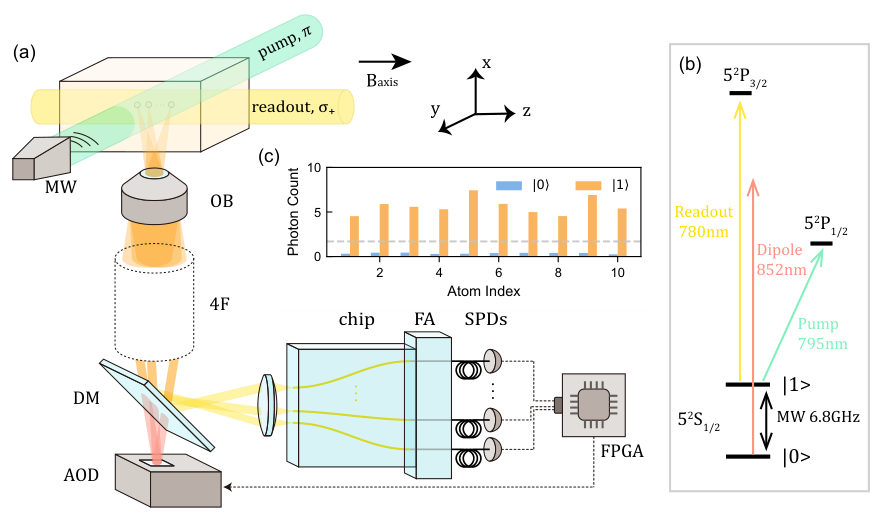
<figcaption class="paper-figure-caption"><b>Fig 1.</b> FIG. 1. Photonic-chip-enabled parallel site-resolved readout architecture for a neutral-atom array. (a) Experimental configuration. Ten 87Rb atoms are trapped in a one-dimensional tweezer array generated by an acousto-optic deflector (AOD). Global π-polarized microwave (MW), π-polarized optical-pumping, and σ+-polarized readout fields are used for qubit state initialization, gate operation, and readout. Atomic fluorescence collected by the objective (OB) is routed through a laser-written three-dimensional (3D) optical mapping chip, whose output pitch is matched to a fiber array (FA), and detected by independent single-photon detectors (SPDs). Detection events are processed in real time by a...</figcaption>
</figure>
<figure class="paper-figure-card">
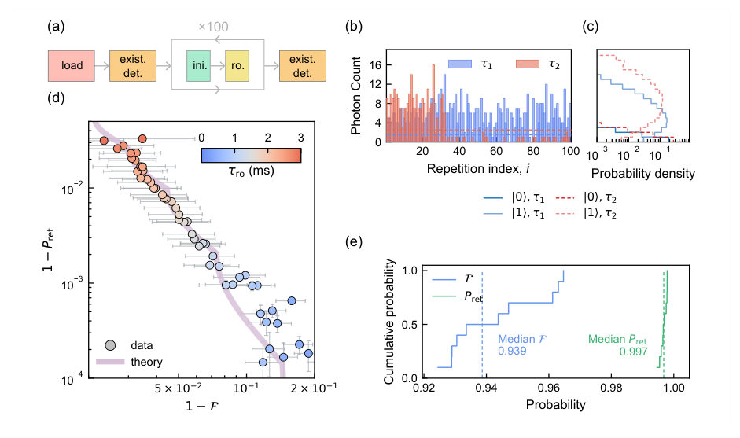
<figcaption class="paper-figure-caption"><b>Fig 2.</b> FIG. 2. Non-destructive readout and atom reuse. (a) Benchmark sequence of non-destructive readout. After atom loading and an initial fluorescence-based existence detection (exist. det.), qubit initialization (ini.) including cooling and qubit state initialization and readout (ro.) are repeated 100 times, followed by a final existence detection. The loading time, each existence-detection time, and the duration of one repeated cycle are 200ms, 45ms, and 7ms, respectively. (b) Representative readout signal datasets over 100 repetitions for two readout durations, τ1 = 1.5ms and τ2 = 2.5ms. (c) Corresponding readout signal distributions for |1⟩and |0⟩states. (d) Trade-off between the...</figcaption>
</figure>
<figure class="paper-figure-card">
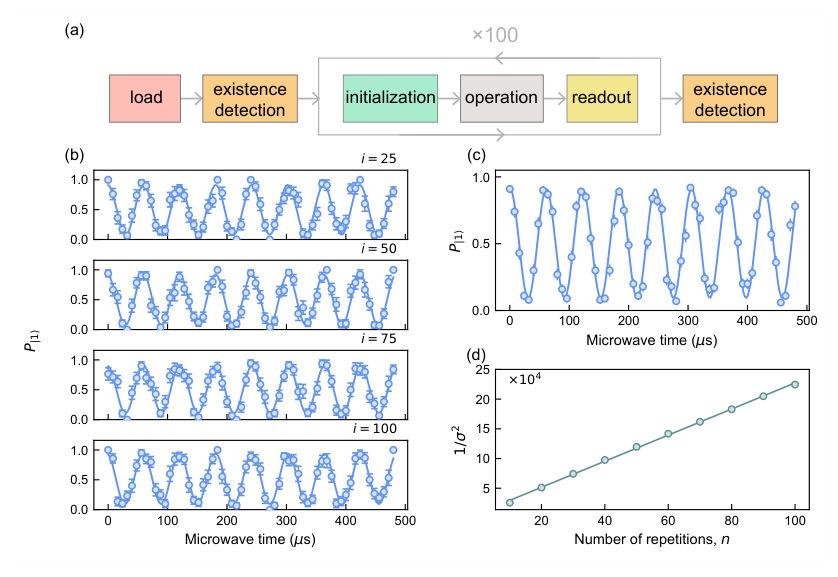
<figcaption class="paper-figure-caption"><b>Fig 3.</b> FIG. 3. Stable information accumulation during repeated circuit execution. (a) Sequence used for Rabi-oscillation sampling. A microwave- driven single-qubit gate operation (op.) is inserted between qubit initialization and readout in each of the 100 reuse cycles. (b) Rabi oscillations reconstructed separately from the 25th, 50th, 75th, and 100th repetitions. Points show the measured |1⟩state population P|1⟩, and solid curves are independent fits to a sinusoid function. Error bars represent one standard error. (c) Rabi oscillation obtained by combining data from all 100 repetitions. Points show the measured |1⟩state population P|1⟩, and solid curve is a fit to a sinusoid function. Each data...</figcaption>
</figure>
<figure class="paper-figure-card">
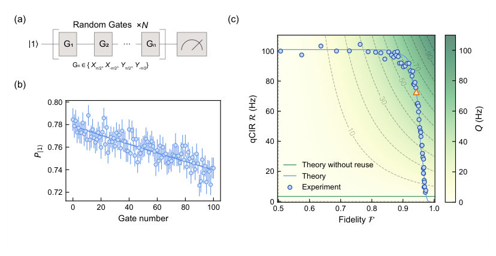
<figcaption class="paper-figure-caption"><b>Fig 4.</b> FIG. 4. Rapid single-qubit randomized benchmarking and optimization of the normalized Fisher information rate. (a) Single-qubit randomized- benchmarking circuit. The atom is prepared in |1⟩and then subjected to n randomly sampled gates Gn ∈{Xπ/2,X−π/2,Yπ/2,Y−π/2} including 1 or 2 recovery gates chosen such that the ideal final state is |1⟩, before state readout. (b) Measured |1⟩state probability P|1⟩as a function of gate number n. Each data point is sampled over 593 random sequences, and averaged over 10 atoms. Error bars represent one standard error, and the solid curve is an exponential fit, yielding an average fidelity of 99.93%. (c) Measured quantum circuit iteration rate after post-...</figcaption>
</figure>

**Summary.** This paper reports an experimental demonstration achieving high-throughput operation in a neutral-atom quantum processor by implementing non-destructive readout and atom reuse techniques. By integrating a photonic chip interface, the authors surpassed previous limitations to achieve a post-selected circuit iteration rate of 74.8 Hz. This work establishes a practical pathway toward building scalable, fast quantum computing hardware.

**Why it may be interesting.** This work directly addresses a critical engineering hurdle in quantum computing—the speed of operations. The focus on throughput optimization via resource management (atom reuse) is highly relevant for scaling up any physical qubit modality.

Detailed structure

**Main problem.** The practical performance of neutral-atom quantum processors is limited by low quantum circuit iteration rates (qCIRs) and overall information throughput.

**Main result.** The authors achieved a post-selected qCIR of 74.8 Hz, significantly improving throughput via an optimized methodology that utilized non-destructive readout and atom reuse.

**Method.** They implemented a high-throughput system using a chip-based photonic interface to enable fast, state-resolved, non-destructive readout and designed a benchmark sequence incorporating atom reuse between circuits.

**Model / system.** The platform is a neutral-atom array (using ${}^{87}	ext{Rb}$ atoms) integrated with an optical channel mapping (OCM) chip for parallel site-resolved readout. The core innovation lies in the ability to rapidly cycle qubits without full reloading.

**Key observables.** Raw qCIR (101 Hz), post-selected qCIR (74.8 Hz), and normalized Fisher information rate (57.7 Hz).

**Important parameters / regimes.** Retention probability of 99.7%; the cycle time is dominated by a $7	ext{ms}$ benchmark cycle.

**Assumptions / limitations.** The improvement relies on establishing a direct qubit-to-detector correspondence via the OCM chip, enabling non-destructive and fast readout.

**Figures summary.** Figures illustrate the experimental setup using the photonic chip (Fig. 1), detail the atom reuse benchmark sequence (Fig. 2), and show trade-offs between fidelity/retention probability versus readout duration (Fig. 2(d)).

**Paper structure.** The paper progresses by first identifying the throughput bottleneck, then detailing the OCM chip integration for non-destructive readout, demonstrating the atom reuse protocol to achieve high raw qCIRs, and finally optimizing performance using the Fisher information rate.

Abstract

Neutral-atom quantum processors have rapidly advanced in scale and coherence, yet their practical performance remains constrained by limited quantum circuit iteration rates (qCIRs) and information throughput. Here we experimentally demonstrate a high-throughput neutral-atom system based on non-destructive readout and atom reuse. By integrating a chip-based photonic interface with a 10-qubit array, we implement non-destructive readout with a retention probability of 99.7%, and further achieve a raw qCIR of 101Hz and a post-selected qCIR of 74.8Hz. More importantly, we verify a general throughput optimization methodology and obtain a normalized Fisher information rate of 57.7Hz, improving the achievable throughput by more than one order of magnitude compared with conventional methods. Our results establish a practical route toward high-throughput neutral-atom quantum processors.

[↑ back to top](#top)

### [Sub-cycle metrology of bright quantum light](http://arxiv.org/abs/2608.16027v1)

**Authors:** Shima Gholam-Mirzaei, Michael T. Weil, David N. Purschke, Katarzyna M. Kowalczyk, André Staudte, David M. Villeneuve, Paul B. Corkum, Jeff S. Lundeen, T. J. Hammond, Giulio Vampa  
**Type:** experiment · **Category:** quantum information and computing · **PDF:** <https://arxiv.org/pdf/2608.16027v1>  
**Analysis basis:** full PDF text, analyzed in chunks
**Topic relevance:** 🔥 `quantum optics experiment` **4/5** · `quantum measurements` **2/5** · `Full counting statistics` **1/5** · `QC/QI experiment` **1/5** · `interference shaping light` **1/5**

↔ Scroll figures horizontally

<figure class="paper-figure-card">
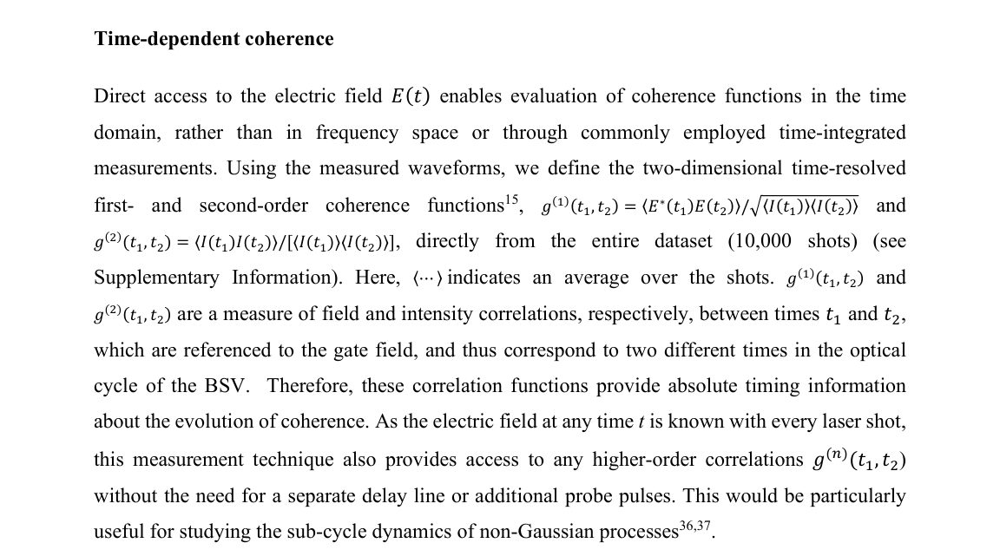
<figcaption class="paper-figure-caption"><b>Fig 1.</b> Figure 4a shows ห𝑔𝑔(1)(𝑡𝑡1, 𝑡𝑡2)ห. The width of the distribution along any vertical or horizontal lineout</figcaption>
</figure>
<figure class="paper-figure-card">
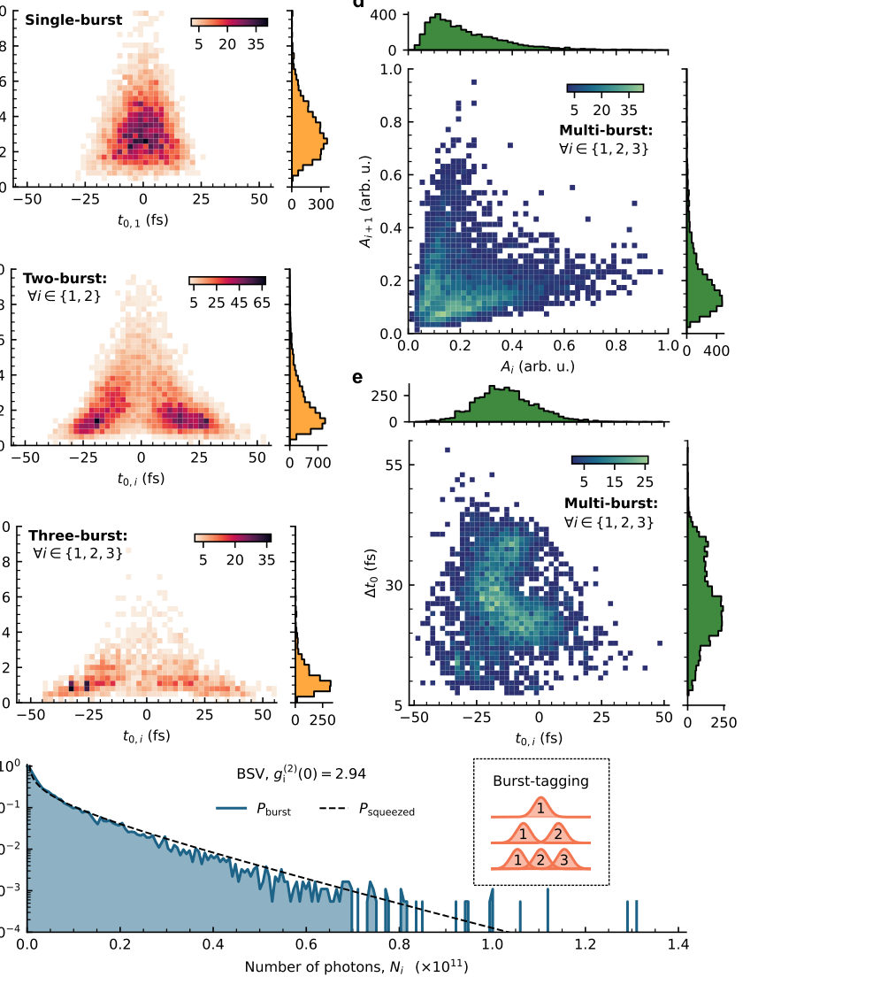
<figcaption class="paper-figure-caption"><b>Fig 2.</b> Fig. 2: Modal analysis of BSV. a-c, Amplitude vs. emission time distributions for single-burst, two-burst, and three-burst BSV, respectively. d, Distribution of the amplitudes of adjacent burst pairs. e, Distribution of emission times of adjacent burst pairs (i.e., bursts i and i+1 of the i-th burst pair in each shot). The emission time of the first burst in each pair (t0,i) is plotted against the time-delay of each pair</figcaption>
</figure>
<figure class="paper-figure-card">
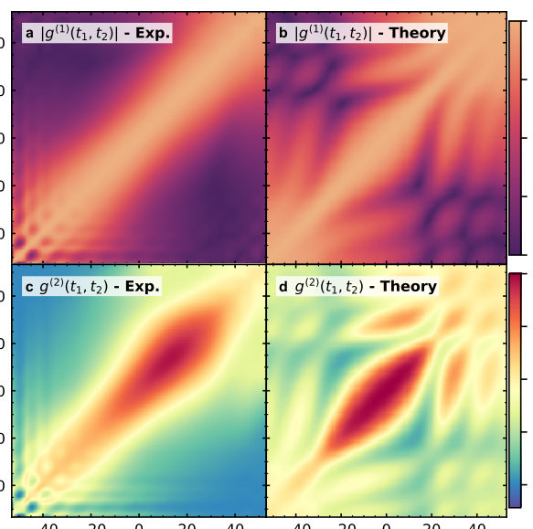
<figcaption class="paper-figure-caption"><b>Fig 3.</b> Fig. 4: Time-resolved quantum coherence functions. a, The absolute value of the measured first-order coherence function ห𝑔𝑔(1)(𝑡𝑡1, 𝑡𝑡2)ห of the generated femtosecond BSV. b, The theoretical ห𝑔𝑔(1)(𝑡𝑡1, 𝑡𝑡2)ห calculated using the Whittaker-Shannon decomposition. c, The measured second-order coherence function 𝑔𝑔(2)(𝑡𝑡1, 𝑡𝑡2) of the generated BSV. d, The theoretical 𝑔𝑔(2)(𝑡𝑡1, 𝑡𝑡2) calculated using the Whittaker-Shannon decomposition.</figcaption>
</figure>

**Summary.** The research overcomes the limitation of cycle-averaging in quantum light measurements by employing sub-cycle resolution metrology on bright squeezed vacuum. This technique reveals that the quantum state consists of stochastic, time-localized bursts whose relative phases are randomly distributed between two values separated by $\pi$. These random phase flips are then harnessed to generate high-rate quantum random number sequences approaching petahertz frequencies.

**Why it may be interesting.** This work directly bridges advanced quantum optics metrology (attosecond techniques) with quantum information processing by providing a physical mechanism to generate certified random numbers at extremely high bandwidths.

Detailed structure

**Main problem.** To measure the electric-field evolution of quantum light (femtosecond bright squeezed vacuum) with sub-cycle precision, overcoming limitations where conventional measurements average over multiple field cycles.

**Main result.** The study successfully characterized stochastic, time-localized bursts in the BSV and demonstrated that the random phase flips between adjacent bursts can be exploited to generate quantum random bit sequences at petahertz frequencies.

**Method.** Attosecond metrology techniques are adapted using nonlinear absorption on a silicon CMOS sensor to map the electric field $E(t)$ with sub-cycle resolution, followed by statistical analysis of phase differences.

**Model / system.** The system uses Bright Squeezed Vacuum (BSV) generated via spontaneous parametric down-conversion. The temporal structure is modeled using Whittaker–Shannon time-limited modes, which are localized in time and distinct from conventional Schmidt modes.

**Key observables.** Time-resolved coherence functions ($g^{(1)}(t_1, t_2)$, $g^{(2)}(t_1, t_2)$), burst statistics (number, duration), and the bimodal distribution of relative phase differences ($\Delta\phi$).

**Important parameters / regimes.** Sub-cycle precision; petahertz generation rates; femtosecond burst widths ($\sim 17$ fs); $\pi$-separated phases.

**Assumptions / limitations.** The random phase flips are assumed to reflect spontaneous symmetry breaking, and the analysis relies on fitting procedures derived from theoretical models of joint spectral amplitudes.

**Figures summary.** Figures illustrate experimental setups (Fig. 1a), pulse energy/signal histograms (Figs. 1b, 1c), representative burst waveforms (Fig. 1d), coherence function measurements (Fig. 4a/c), and the final NIST test results for randomness (Fig. S10).

**Paper structure.** The paper progresses from describing the fundamental limitation of cycle-averaged quantum optics to detailing the experimental measurement technique, characterizing the stochastic burst structure, and finally demonstrating the application of phase randomness for high-rate QRNG.

Abstract

In quantum optics, quantization of the electromagnetic field typically occurs in a finite volume - a cavity - which results in discrete frequency modes where photons are created, annihilated and exchanged between such modes. As a result, evolution of quantum optical states is periodic in the carrier wave of the field, measurement protocols return cycle-averaged information, and any sub-cycle evolution that is foundational to many light-matter interactions, especially at high field strengths, remains hidden. Adapting an attosecond technique, here we capture the electric-field evolution of a quantum optical state, femtosecond bright squeezed vacuum, with sub-cycle precision. We find that it consists of many stochastic, time-localized bursts within each pump pulse whose phase randomly switches between two values. We exploit the random phase flips to generate quantum random bit sequences with a generation rate that can reach petahertz frequencies. In addition, the sub-cycle resolution allows us to measure coherence functions of the waveforms between any two times, which we explain with a superposition of time-limited modes. These results bridge attosecond metrology and quantum optics and pave the way to measuring quantum light-matter interactions as they evolve on a few-femtosecond time scale, and integrate quantum randomness in petahertz electronics.

[↑ back to top](#top)

### [TIDE: An FPGA quantum-control processor for deterministic adaptive execution with guarded runtime program revision](http://arxiv.org/abs/2608.15173v1)

**Authors:** Xiaoqin Luo, Jiayun Song, Xiaolu Su  
**Type:** experiment · **Category:** quantum information and computing · **PDF:** <https://arxiv.org/pdf/2608.15173v1>  
**Analysis basis:** full PDF text, analyzed in chunks
**Topic relevance:** 🔥 `QC/QI experiment` **4/5** · `quantum measurements` **3/5** · `methods for driven-dissipative` **1/5**

↔ Scroll figures horizontally

<figure class="paper-figure-card">
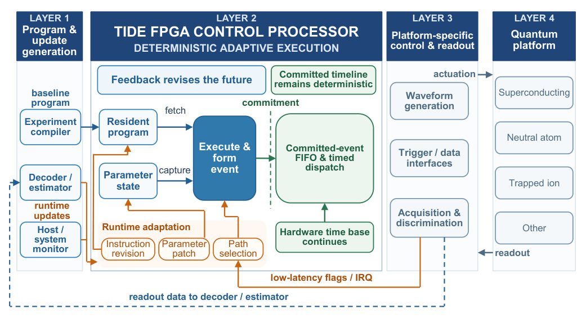
<figcaption class="paper-figure-caption"><b>Fig 1.</b> FIG. 1. Deterministic adaptive execution in the TIDE quantum-control stack. An experiment compiler supplies the resident program, while decoder, estimator, or host logic provides runtime updates after execution begins. Within TIDE, parameter and instruction states associated with future operations remain revisable before the corresponding capture or fetch-visibility boundary. Complete event descriptors that cross the commitment boundary enter an independent hardware-timed dispatch path. TIDE exposes registered digital transactions to platform-specific control and readout electronics, with measurement results returning through external processing or low-latency feedback paths.</figcaption>
</figure>
<figure class="paper-figure-card">
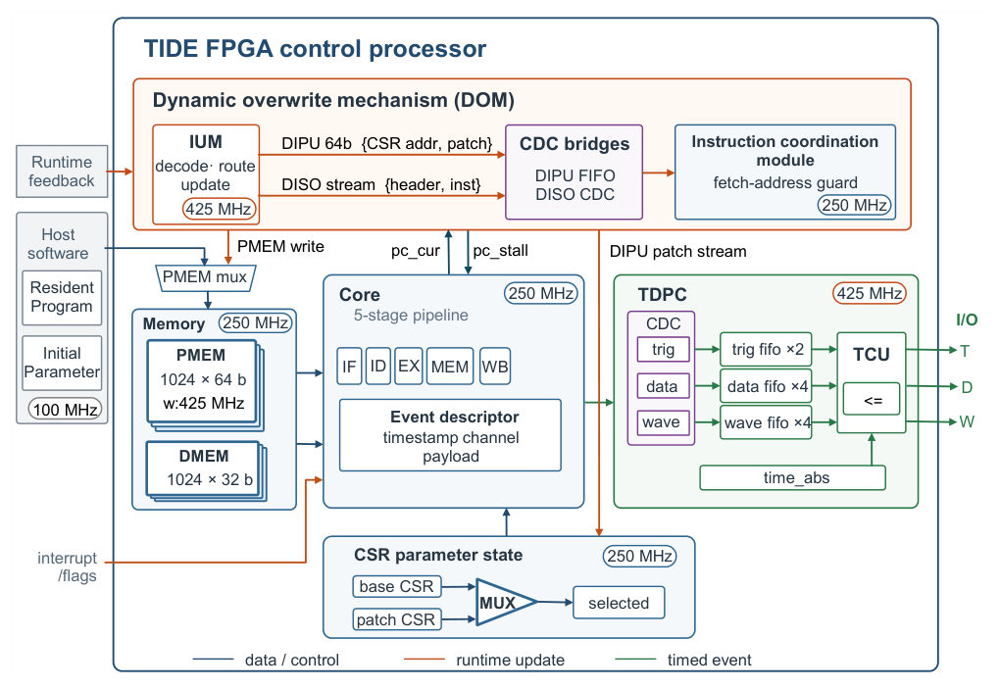
<figcaption class="paper-figure-caption"><b>Fig 2.</b> FIG. 2. Architecture and clock-domain organization of TIDE. Runtime DIPU and DISO transactions enter the Instruction Update Module (IUM), while the Instruction Coordination Module (ICM) guards program-memory visibility and locally stalls fetch when required. The 250 MHz control core forms complete timestamped descriptors from resident instructions and selected CSR values. Valid–ready acceptance into a per-channel TDPC FIFO marks event commitment, after which the 425 MHz Timing Control Unit dispatches registered trigger, data-control, and waveform-parameter transactions against the free-running time_abs counter. Clock tags indicate the 100, 250, and 425 MHz domains.</figcaption>
</figure>
<figure class="paper-figure-card">
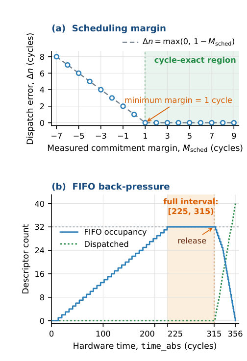
<figcaption class="paper-figure-caption"><b>Fig 3.</b> FIG. 3. Measured committed-event timing and FIFO back- pressure. (a) Dispatch error versus event-commitment mar- gin. Fifteen repetitions were recorded at each of 17 margin settings; coincident records overlap. All 255 records follow ∆n = max(0, 1 −Msched), with programmed-cycle dispatch for Msched ≥1. (b) Occupancy and cumulative dispatch for 40 descriptors traversing a 32-entry TDPC FIFO. Thirty-two descriptors commit before the FIFO reaches capacity, while the remaining eight are retained upstream as the FIFO re- mains full over 225 ≤time_abs &lt; 315. After release, the remaining eight descriptors commit as space becomes avail- able, and all 40 descriptors dispatch in order without loss,...</figcaption>
</figure>
<figure class="paper-figure-card">
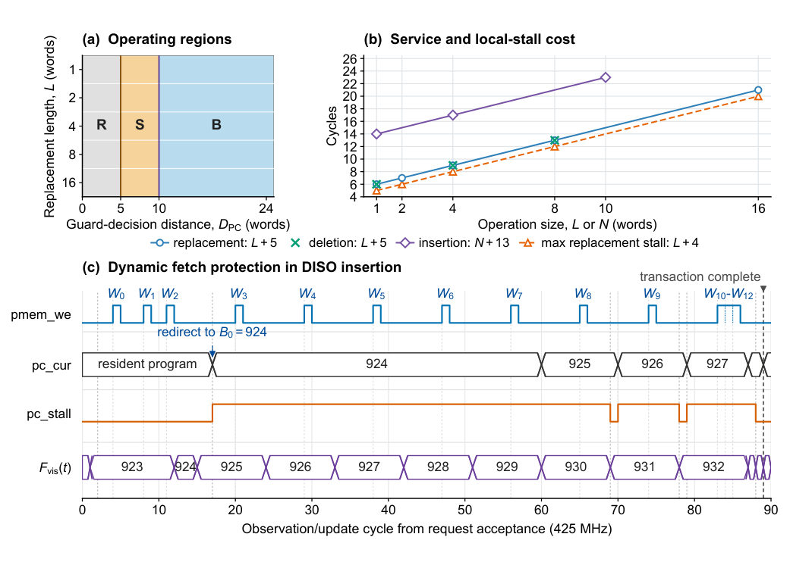
<figcaption class="paper-figure-caption"><b>Fig 4.</b> FIG. 4. Measured guarded runtime instruction revision. (a) Operating-region summary for 125 replacement cases over L ∈ {1, 2, 4, 8, 16} and DPC = 0, . . . , 24. All 125 measured cases matched rejection for DPC &lt; 5, immediate local fetch protection for 5 ≤DPC &lt; 10, and background start for DPC ≥10. (b) Measured service latency and maximum local-fetch stall under continuous payload delivery. Replacement follows L+5 for L ∈{1, 2, 4, 8, 16}; deletion data at L ∈{1, 4, 8} follow the same law. Insertion follows N +13 cycles for the tested sizes, and the maximum observed replacement stall follows L+4. (c) Gap-injected insertion with N = 10 and DPC = 10. Slowed payload delivery causes an initially...</figcaption>
</figure>
<figure class="paper-figure-card">
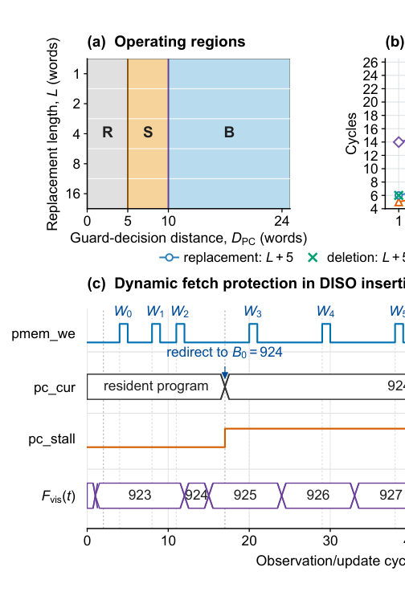
<figcaption class="paper-figure-caption"><b>Fig 5.</b> Figure 4(a) shows the characterized operating map. The configured boundaries were reproduced for every tested block length:</figcaption>
</figure>

**Summary.** The paper introduces TIDE, an FPGA processor designed for quantum control that enables adaptive execution by allowing runtime modification of future instructions and parameters. It achieves this determinism by strictly separating the revisable program state from a hardware-timed FIFO queue of committed events. This breakthrough allows complex, measurement-driven quantum experiments to be programmed reliably in real time.

**Why it may be interesting.** This work directly addresses the critical bottleneck in scaling quantum computation: building classical control electronics fast enough to handle mid-circuit measurement feedback. The deterministic separation of concerns is vital for realizing fault-tolerant quantum algorithms.

Detailed structure

**Main problem.** The core challenge is designing quantum control programs that can adapt their future operations based on real-time measurement outcomes without disrupting the timing of events already committed to hardware execution.

**Main result.** TIDE successfully implements a processor architecture that allows runtime revision of both parameters and instruction structure while guaranteeing deterministic, immutable service for all previously committed quantum control events.

**Method.** The system uses an FPGA-based processor (TIDE) that separates the program's revisable future from a hardware-timed, committed event stream using specialized update mechanisms.

**Model / system.** The physical platform is TIDE, an FPGA quantum-control processor implemented on a Xilinx ZCU102. It features a control core and a Time-Deterministic Peripheral-Control (TDPC) engine that manages the immutable dispatch of committed events.

**Key observables.** Committed descriptors remaining unchanged under subsequent perturbations; successful execution of revised sequences via DIPU/DISO; timing margins measured in clock cycles (e.g., 4 cycles for DIPU).

**Important parameters / regimes.** Control core frequency (250 MHz) and timing/update domain frequency (425 MHz); the size of the revision window (L-word overwrite length).

**Assumptions / limitations.** The system assumes that successful FIFO acceptance marks event commitment, making descriptors immutable; it also relies on statically allocated extension regions for structural overwrites.

**Figures summary.** Figure 1 illustrates the TIDE quantum-control stack, showing how runtime feedback revises the future while the committed timeline remains deterministic. Figure 2 details the architecture, showing data flow between components like the control core and TDPC FIFOs.

**Paper structure.** The paper introduces the problem of measurement-responsive quantum control, presents the TIDE architecture which separates revision from commitment via DIPU (parameter patch) and DISO (structural overwrite), validates its timing performance on hardware, and demonstrates that committed events are protected from subsequent runtime updates.

Abstract

Measurement-responsive quantum experiments require control programs that can revise future operations after execution has begun without disturbing events already committed to precise timing. We present Time-Deterministic and Instruction-Dynamic Execution (TIDE), an FPGA quantum-control processor that separates a runtime-revisable future from a hardware-timed committed-event stream. TIDE provides two complementary update paths: Dynamic Instruction Parameter Update (DIPU) applies a one-shot patch to the next matching event before parameter capture, while Dynamic Instruction Stream Overwrite (DISO) performs guarded replacement, logical deletion, and out-of-line insertion in future resident-program regions. Per-channel committed-event FIFOs isolate accepted descriptors from subsequent control-core and update activity. The implemented Xilinx ZCU102 design meets timing at 250 MHz for the control core and 425 MHz for the timing/update domain. With downstream ready, every tested descriptor committed at least one timing-domain cycle before its programmed timestamp was dispatched in the programmed cycle at the registered output interfaces. In separate post-commit tests, committed timestamps and payloads remained unchanged under the applied perturbations. The minimum all-success mapped DIPU margin was four 250 MHz control-domain cycles. Under continuous payload delivery, an L-word contiguous overwrite completed in L+5 update-domain cycles. Within the characterized guard-distance range, rejected DISO requests preserved the resident path, whereas all admitted replacement, deletion, and insertion transactions exercised here executed a complete revised sequence. TIDE therefore enables runtime adaptation of both parameters and instruction structure while preserving deterministic service of committed quantum-control events.

[↑ back to top](#top)

### [The Unidirectional Current as First Arrival-Time POVM: An MS-Kijowski Identity, Physical Interpretation, and Mathematical Applications](http://arxiv.org/abs/2608.16510v1)

**Authors:** Avi Marchewka  
**Type:** theory · **Category:** other · **PDF:** <https://arxiv.org/pdf/2608.16510v1>  
**Analysis basis:** full PDF text, analyzed in chunks
**Topic relevance:** 🔥 `quantum measurements` **4/5** · `Full counting statistics` **1/5** · `Keldysh / 2PI / non-Gaussian methods` **1/5** · `correlated / nonlocal dissipation` **1/5**

↔ Scroll figures horizontally

<figure class="paper-figure-card">
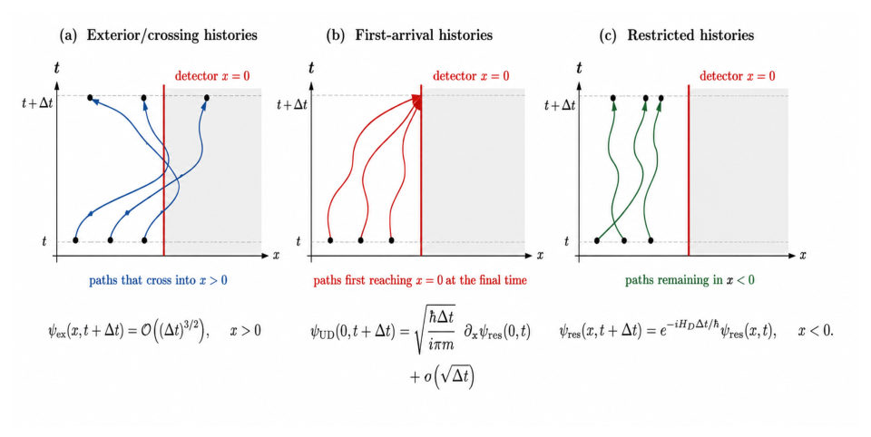
<figcaption class="paper-figure-caption"><b>Fig 1.</b> Figure 1: Path decomposition relative to the detector boundary at x = 0. (a) Histories that reach the boundary and propagate into the exterior region. (b) Histories whose first arrival at the boundary occurs at t + ∆t. (c) Restricted histories that remain in x &lt; 0 throughout the interval [t, t + ∆t].</figcaption>
</figure>

**Summary.** This paper reinterprets the unidirectional current from the MS formalism as a proper Positive Operator Valued Measure (POVM) for measuring first arrival time. By enforcing mathematical consistency via the resolution of the identity, the authors derive the required spectral response function $\lambda(k)$. This work establishes a deep connection between the MS approach and Kijowski's established framework, providing a unified theoretical description of quantum arrival-time statistics.

**Why it may be interesting.** It provides a rigorous, operator-based framework (POVM) for calculating time-of-arrival probabilities, resolving ambiguities in older interpretations like hazard rates, which is crucial for understanding measurement processes in quantum dynamics.

Detailed structure

**Main problem.** The paper addresses the quantum time-of-arrival (TOA) problem, which lacks a universally accepted observable in quantum mechanics.

**Main result.** It establishes that the unidirectional current derived from the MS formulation can be rigorously interpreted as a Positive Operator Valued Measure (POVM), and this POVM structure is shown to mathematically match Kijowski's arrival-time distribution.

**Method.** The authors construct an arrival-time POVM by generalizing the MS unidirectional current using a spectral response function $\lambda(k)$ and enforcing the resolution of the identity condition for free particles.

**Model / system.** The analysis focuses on a one-dimensional free particle confined to the negative half-line ($x<0$) with a Dirichlet boundary condition at the detector location ($x=0$).

**Key observables.** Unidirectional first-arrival current ($J_{UD}(t)$), arrival-time POVM ($	ext{E}(\Delta)$), and Kijowski's arrival-time distribution ($\Pi_K(t)$).

**Important parameters / regimes.** The spectral response function $\lambda(k) = \pi/(4k)$, the free particle dispersion relation, and time $t$.

**Assumptions / limitations.** The analysis assumes a phenomenological detector model with a diagonal, phase-free spectral response ($\lambda(k)$), and relies on the free-particle Hamiltonian.

**Figures summary.** Figure 1 illustrates the path decomposition of Feynman paths relative to the detector boundary at $x=0$.

**Paper structure.** The paper first introduces the MS unidirectional current, then generalizes it by treating the detection parameter $\lambda$ as a spectral function $\lambda(k)$. It derives the POVM from normalization constraints and finally establishes the mathematical equivalence between this POVM and Kijowski's two-sided arrival-time distribution.

Abstract

Detector-based first-arrival models and operator-based arrival-time observables provide two conceptually distinct approaches to the quantum time-of-arrival problem. Here we connect these approaches by using the positive unidirectional first-arrival current of Marchewka and Schuss (MS) as the basis for constructing a family of positive arrival-time operators and, after normalization, an arrival-time POVM. The first-arrival character is inherited from the dynamics with a Dirichlet boundary, while the detector response is introduced at the amplitude level through a non-negative spectral function $λ(k)$.   For a one-dimensional free particle, resolution of the identity uniquely selects $λ(k)=\fracπ{4k}$, yielding an arrival-time POVM. The normalized unidirectional current can therefore be interpreted as a generalized Born-rule probability density rather than as a hazard rate, as in the original MS formulation.   We further show that the normalized one-sided MS amplitude coincides, up to an irrelevant phase, with the corresponding momentum-sector amplitude in Kijowski's arrival-time distribution. Consequently, the two directional contributions in Kijowski's distribution can be reproduced by two first-arrival problems defined on opposite sides of the boundary. This establishes an equivalence between the resulting arrival-time statistics while emphasizing the different physical interpretations: MS describes a first-arrival process with coherent momentum components, whereas Kijowski's POVM treats the two momentum sectors as separate directional contributions.   Thus, the normalized unidirectional current provides a POVM description of first arrival at a point, combining detector-based dynamics with a positive-operator measurement structure.

[↑ back to top](#top)

### [Anomalous Weak Pointer Shifts as Postselected Interference among Coarse-Grained Histories](http://arxiv.org/abs/2608.15209v1)

**Authors:** Cody Charles Payne, Eliahu Cohen  
**Type:** theory · **Category:** other · **PDF:** <https://arxiv.org/pdf/2608.15209v1>  
**Analysis basis:** full PDF text, analyzed in chunks
**Topic relevance:** 🔥 `quantum measurements` **4/5** · `Keldysh / 2PI / non-Gaussian methods` **1/5** · `interference shaping light` **1/5**

↔ Scroll figures horizontally

<figure class="paper-figure-card">
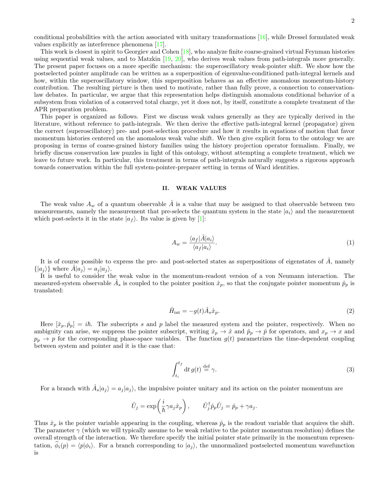
<figcaption class="paper-figure-caption"><b>Fig 1.</b> Low-resolution page preview, page 2</figcaption>
</figure>
<figure class="paper-figure-card">
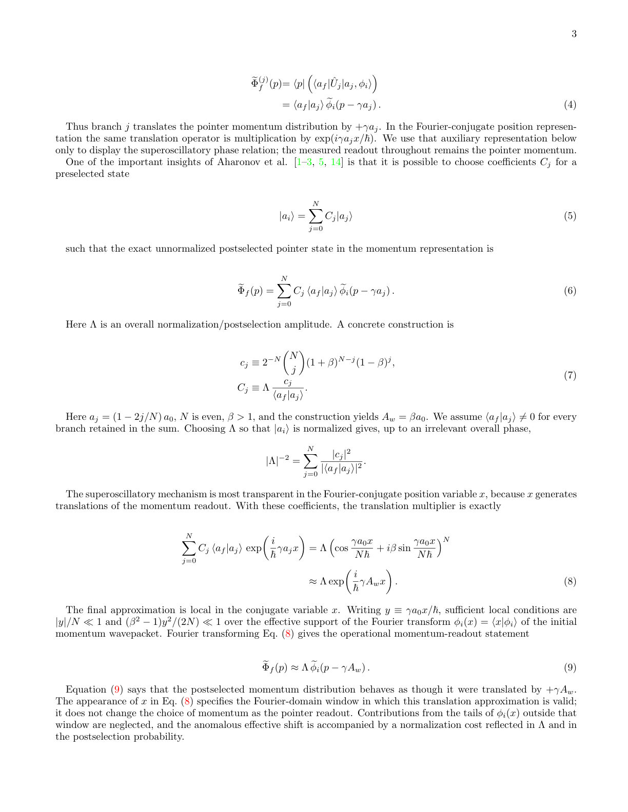
<figcaption class="paper-figure-caption"><b>Fig 2.</b> Low-resolution page preview, page 3</figcaption>
</figure>
<figure class="paper-figure-card">
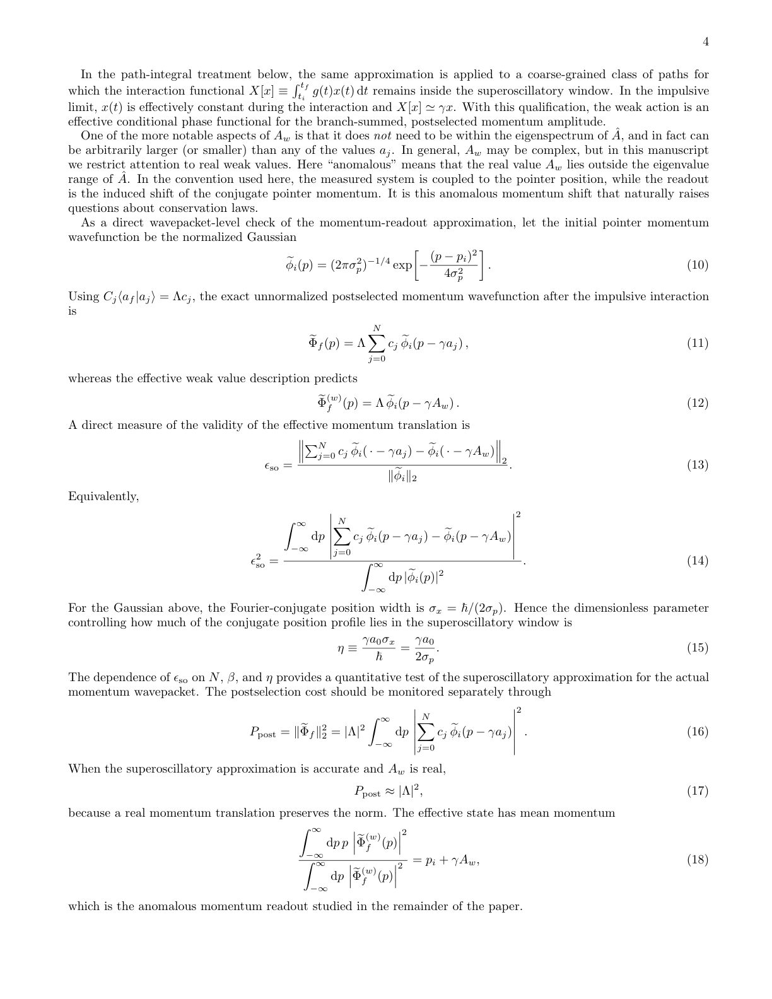
<figcaption class="paper-figure-caption"><b>Fig 3.</b> Low-resolution page preview, page 4</figcaption>
</figure>
<figure class="paper-figure-card">
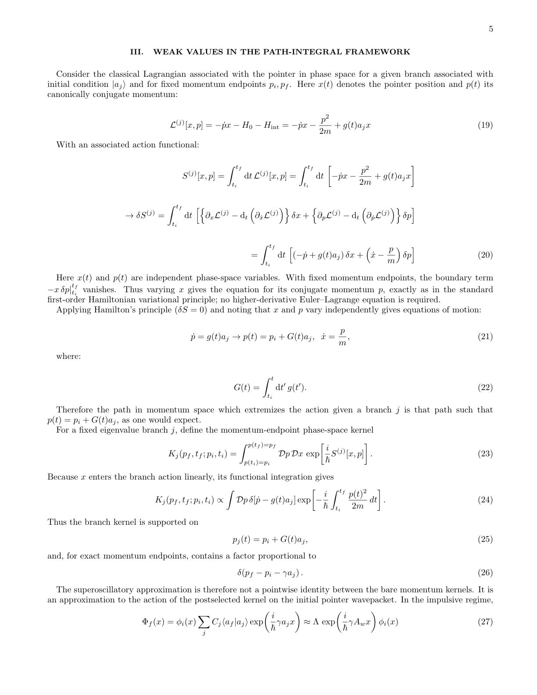
<figcaption class="paper-figure-caption"><b>Fig 4.</b> Low-resolution page preview, page 5</figcaption>
</figure>
<figure class="paper-figure-card">
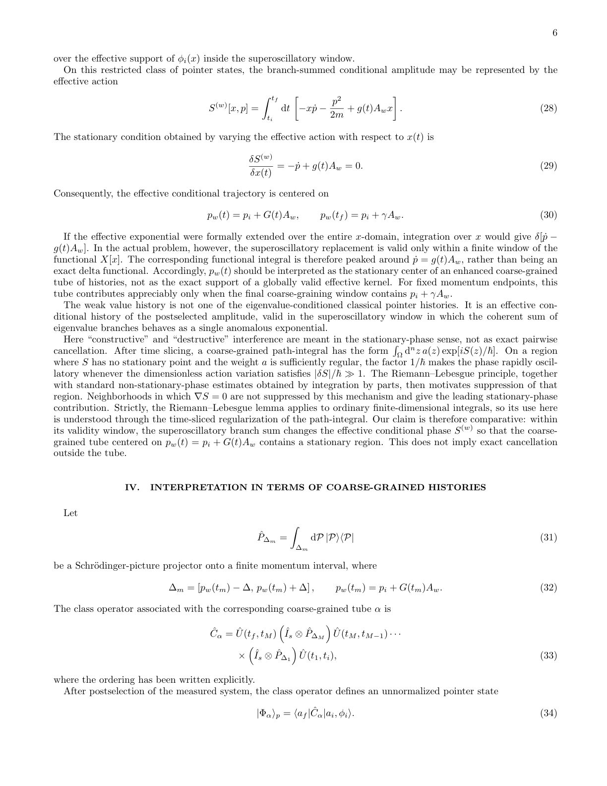
<figcaption class="paper-figure-caption"><b>Fig 5.</b> Low-resolution page preview, page 6</figcaption>
</figure>

**Summary.** This paper develops a phase-space path-integral formalism to explain anomalous weak pointer shifts. It shows that these seemingly unusual shifts are mathematically equivalent to constructive interference among multiple coarse-grained quantum histories. This offers a powerful, intuitive picture of measurement outcomes while maintaining consistency with fundamental conservation laws in the full closed system.

**Why it may be interesting.** It provides a deep theoretical interpretation of weak measurements and pointer shifts within the framework of quantum histories, connecting non-classical measurement outcomes to fundamental concepts like interference and conservation laws in a path-integral setting.

Detailed structure

**Main problem.** The paper reformulates anomalous weak pointer shifts, which allow effective measurements outside an observable's eigenvalue range, by interpreting them as interference among coarse-grained histories.

**Main result.** The postselected momentum distribution behaves as if it were translated by an effective shift $\gamma A_w$, providing a path-integral representation of the anomalous weak value effect via history interference.

**Method.** The analysis uses phase-space path integrals, applying superoscillatory approximations to sum over branch-conditioned amplitudes derived from measurement coupling.

**Model / system.** The model involves a quantum system ($\hat{A}_s$) coupled weakly to a pointer observable ($\hat{x}_p$), analyzed using path integral techniques and focusing on the resulting momentum readout.

**Key observables.** Anomalous weak value ($A_w$), effective mean momentum shift $\langle p 
angle = p_i + \gamma A_w$, and the total conserved generator $Q_{	ext{tot}}$.

**Important parameters / regimes.** The coupling constant ($\gamma$) and the window size defining the superoscillatory approximation.

**Assumptions / limitations.** The analysis relies on satisfying a finite superoscillatory-window condition for the initial momentum wavepacket, and it is explicitly noted not to be a complete resolution of all conservation law puzzles.

**Paper structure.** The paper progresses by introducing the anomalous shift, reformulating it in path integrals using branch conditioning, applying superoscillatory approximations to derive an effective momentum translation, and finally analyzing how this structure relates to symmetry constraints via Ward identities.

Abstract

Anomalous weak values and superoscillations allow a pointer to exhibit an effective shift outside the eigenvalue range of the measured observable. We reformulate this effect in a phase-space path-integral language. For each eigenvalue branch $a_j$ of the measured observable, {the interaction couples $a_j$ to the pointer position $\hat{x}_p$ and thereby translates the conjugate pointer momentum by $γa_j$.} After postselection, {the branch-conditioned amplitudes are coherently superposed with coefficients chosen to produce a superoscillatory approximation. When this conditional amplitude acts on an initial pointer momentum wavepacket for which the finite superoscillatory-window condition is satisfied, the resulting momentum wavefunction behaves as if it had been translated by $γA_w$, rather than by any of the eigenvalue-conditioned shifts $γa_j$. This yields an effective path-integral representation of anomalous weak pointer shifts and motivates their interpretation in terms of interference among finite coarse-grained histories.} We discuss how this picture bears on conservation-law questions.

[↑ back to top](#top)

### [Enabling Hybrid HPCQC Workflows with a Heterogeneous Software Stack](http://arxiv.org/abs/2608.14827v1)

**Authors:** Muhammad Nufail Farooqi, Minh Chung, Burak Mete, Eric Mansfield, Bernd Hoffmann, Teemu Mattsson, Laura Schulz, Jorge Echavarria  
**Type:** experiment · **Category:** quantum information and computing · **PDF:** <https://arxiv.org/pdf/2608.14827v1>  
**Analysis basis:** full PDF text, analyzed in chunks
**Topic relevance:** 🔥 `QC/QI experiment` **4/5** · `quantum measurements` **1/5**

↔ Scroll figures horizontally

<figure class="paper-figure-card">
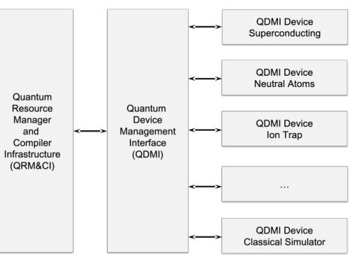
<figcaption class="paper-figure-caption"><b>Fig 1.</b> Figure 1: MQSS architecture showing Front-end adapters, QRM&amp;CI, and QDMI-connected quantum devices.</figcaption>
</figure>
<figure class="paper-figure-card">
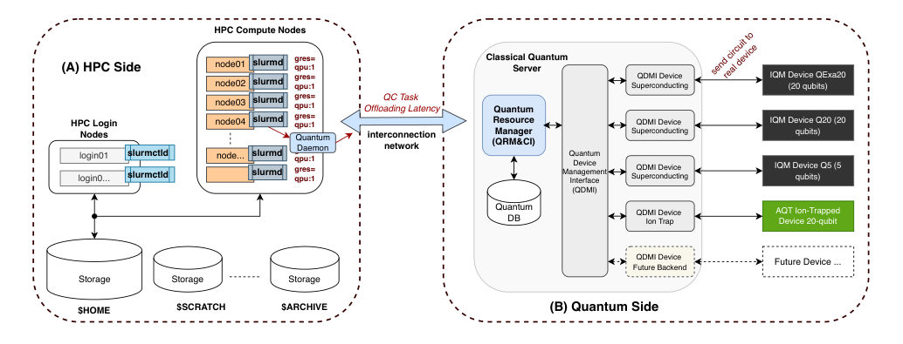
<figcaption class="paper-figure-caption"><b>Fig 2.</b> Figure 2: An illustration of HPCQC integration with MQSS, in which (A) shows the HPC side, and (B) shows the quantum side.</figcaption>
</figure>
<figure class="paper-figure-card">
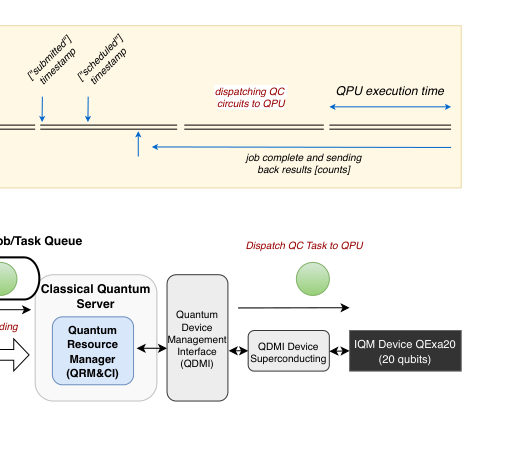
<figcaption class="paper-figure-caption"><b>Fig 3.</b> Figure 3: An illustration of a hybrid HPCQC job and the working pipeline between HPC and QC with MQSS.</figcaption>
</figure>
<figure class="paper-figure-card">
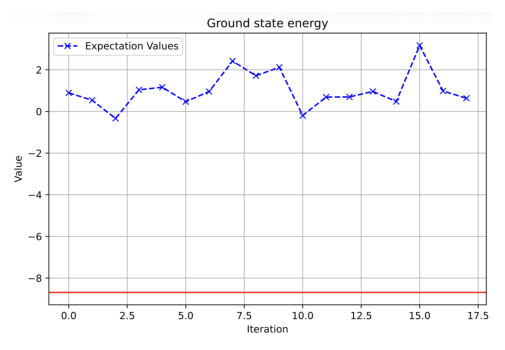
<figcaption class="paper-figure-caption"><b>Fig 4.</b> Figure 4: The energy-convergence results for the VQE bench- mark performed on the Q-Exa 20-qubit device.</figcaption>
</figure>
<figure class="paper-figure-card">
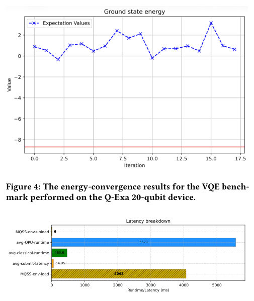
<figcaption class="paper-figure-caption"><b>Fig 5.</b> Figure 5: Latency of the hybrid VQE-execution pipeline on the HPCQC integrated system at LRZ.</figcaption>
</figure>

**Summary.** This paper presents an architecture to enable hybrid High Performance Computing and Quantum Computing (HPCQC) workflows on large-scale supercomputers. It achieves this using a heterogeneous software stack that integrates the QPU into existing schedulers like SLURM by treating it as a managed accelerator. The successful demonstration proves that quantum resources can be incorporated with minimal performance overhead, paving the way for practical quantum acceleration in national labs.

**Why it may be interesting.** While focused on software infrastructure rather than fundamental physics, the work directly addresses the operationalization of quantum hardware by providing a robust, standardized interface layer necessary for any future experimental study in AMO or open quantum systems.

Detailed structure

**Main problem.** The core challenge is integrating Quantum Processing Units (QPUs) into existing, established High Performance Computing (HPC) supercomputing workflows.

**Main result.** The authors successfully demonstrated hybrid HPCQC workflows on a production petascale system with negligible latency overhead compared to purely classical workloads.

**Method.** They developed and implemented a heterogeneous software stack featuring a two-level scheduling model orchestrated by an open-source SLURM Plugin Suite.

**Model / system.** The system combines the SuperMUC-NG supercomputer, a 20-qubit superconducting QPU from IQM, and the Munich Quantum Software Stack (MQSS). This architecture treats QPUs as scheduler-managed accelerators.

**Key observables.** Latency overhead for hybrid jobs, average circuit runtimes for QAOA/VQE benchmarks, and real-time QPU status metrics like fidelity and calibration status.

**Important parameters / regimes.** The system operates on a petascale scale, utilizing 20 superconducting qubits, and employs SLURM's GRES mechanism for resource reservation.

**Assumptions / limitations.** The approach assumes that treating QPUs as scheduler-managed Generic Resources (GRES) is feasible without modifying the core scheduler logic. It also notes limitations regarding joint optimization of classical/quantum resources.

**Figures summary.** Figures illustrate the MQSS architecture, detailing the flow from front-end adapters through the QRM&CI to the quantum device, and show job pipeline examples within SLURM context.

**Paper structure.** The paper details the necessity for integration, presents the two-level scheduling model (SLURM at Level 1, QRM&CI at Level 2), describes the implementation via plugins, and validates performance using benchmark measurements.

Abstract

In this work, we demonstrate hybrid High Performance Computing-Quantum Computing (HPCQC) workflows on a production petascale system. The demonstration combines three components: the SuperMUC-NG supercomputer at the Leibniz Supercomputing Centre (LRZ), a 20-qubit superconducting quantum processor provided by IQM Quantum Computers (IQM), and Munich Quantum Valley (MQV)'s Munich Quantum Software Stack (MQSS).   Integrating quantum processors into High Performance Computing (HPC) systems requires a heterogeneous software stack capable of orchestrating classical and quantum resources within established supercomputing workflows. MQSS treats Quantum Processing Units (QPUs) as scheduler-managed accelerators and it performs resource coordination following a two-level scheduling scheme. Slurm performs system-level allocation by exposing QPUs as Generic RESources (GRES), while the MQSS Quantum Resource Manager & Compiler Infrastructure (QRM&CI) performs just-in-time compilation and subsequent dispatch of quantum circuits.   To integrate with existing HPC operations without modifying the scheduler core, MQSS introduces an open-source SLURM Plugin Suite based on Prolog/Epilog scripts and SPANK modules. Experimental results show that hybrid HPCQC workflows can be executed without significant latency overhead compared to conventional workloads.   The presented architecture provides a portable integration model for quantum accelerators on large-scale HPC systems and is directly applicable to next-generation Hewlett Packard Enterprise (HPE) Cray platforms, including LRZ's upcoming 'Blue Lion' supercomputer.

[↑ back to top](#top)

### [Engineering two-qubit gates via anisotropic exchange in germanium spin qubits](http://arxiv.org/abs/2608.16716v1)

**Authors:** Leonardo Massai, Bence Hetényi, Eoin G. Kelly, Inga Seidler, Konstantinos Tsoukalas, Michele Aldeghi, Alexei Orekhov, Lisa Sommer, Marta Pita-Vidal, Uwe von Lüpke, Stephan Paredes, Stephen W. Bedell, Felix J. Schupp, Matthias Mergenthaler, Gian Salis, Andreas Fuhrer, Patrick Harvey-Collard  
**Type:** experiment · **Category:** quantum information and computing · **PDF:** <https://arxiv.org/pdf/2608.16716v1>  
**Analysis basis:** full PDF text, analyzed in chunks
**Topic relevance:** 🔥 `QC/QI experiment` **4/5** · `quantum measurements` **1/5**

↔ Scroll figures horizontally

<figure class="paper-figure-card">
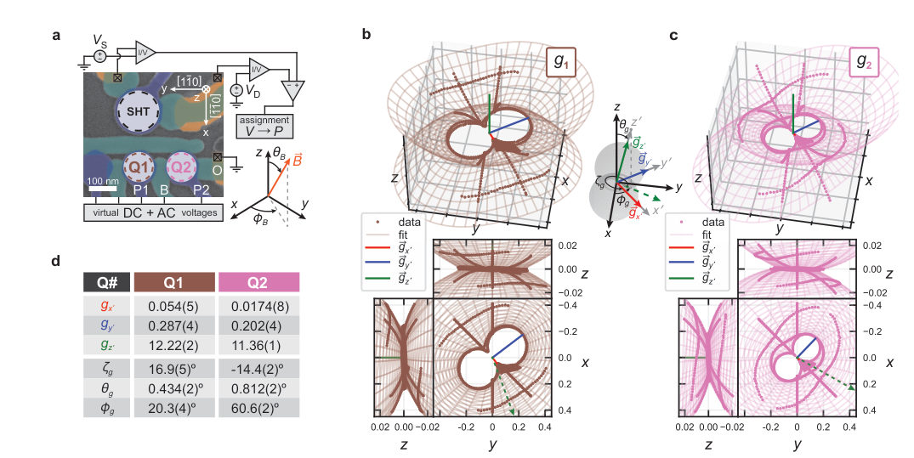
<figcaption class="paper-figure-caption"><b>Fig 1.</b> Figure 1. Device and single-qubit g-tensor characterisation: a, False-coloured SEM image of the device comprising a DQD and SHT. The panel includes a scheme of the control/readout setup, the orientation of the external magnetic field ⃗B and the crystallographic direction in the (x, y, z) lab frame. b and c, Extracted g-tensors of qubit Q1 and Q2 measured at fixed magnetic field magnitude B = 60 mT plotted in 3D (top panels) and 2D-projections (bottom panels). The red, blue, and green solid lines represent the directions of the three g-tensor eigenvectors (⃗gx′, ⃗gy′, ⃗gz′). The dashed green line in the xy-projections represent the tilt direction (projection of ⃗gz′ onto the xy-plane). d,...</figcaption>
</figure>
<figure class="paper-figure-card">
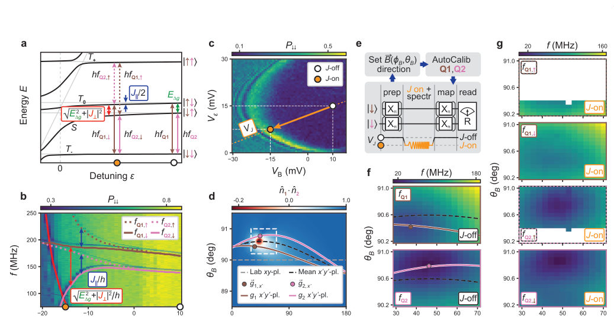
<figcaption class="paper-figure-caption"><b>Fig 2.</b> Figure 2. Spectroscopy of the transition frequencies of the two exchange-coupled qubits: a, Energy diagram of the two- spin system as a function of the interdot detuning ε in the (1,1) region. The brown(pink) solid and dashed double-arrows represent the transition frequencies of Q1(Q2) to either |↓↓⟩or |↑↑⟩, for exchange off (white dot) and exchange on (orange dot). The red(blue) arrow represents the energy splitting caused by the transverse J⊥(longitudinal J∥) exchange components. b, Exchange fans as a function of interdot barrier voltage VB. The solid and dashed lines indicate the transitions shown in panel a, shifted by 5 MHz for better visibility of the background measurement. The red...</figcaption>
</figure>
<figure class="paper-figure-card">
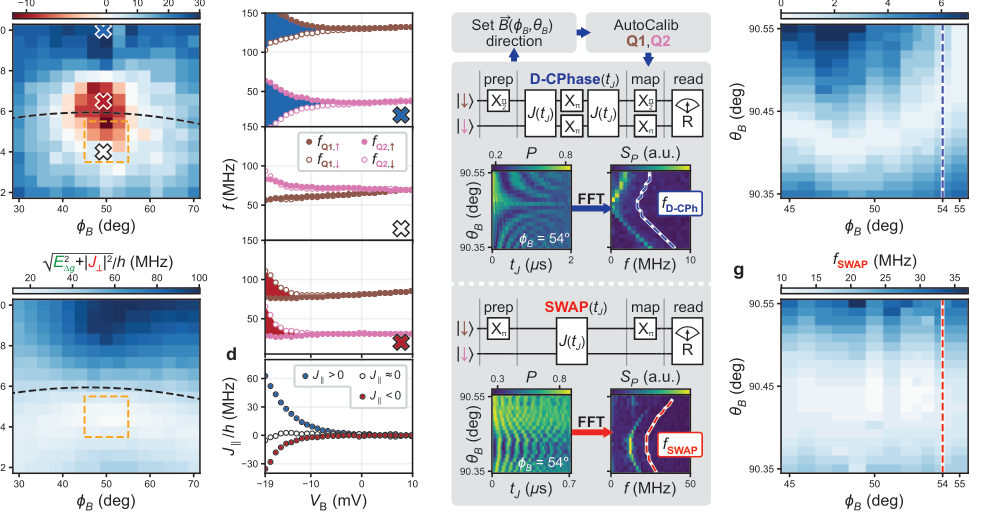
<figcaption class="paper-figure-caption"><b>Fig 3.</b> Figure 3. Anisotropic exchange components and two-qubit gate oscillations: a and b, Longitudinal exchange and quadrature sum of the Zeeman energy detuning and the transverse exchange as a function of magnetic field direction, (ϕB, θB), in the selected 2D angular region shown in Fig. 2d. The black dashed line represent the mean x′y′-plane of the two g-tensors. The positive and negative sides of the colour map in a have different scales for better visibility. c, Exchange spin-fans as a function of the interdot barrier voltage, VB, for three ⃗B directions indicated in a by the blue, white, and red crosses (top, mid, and bottom panel, respectively). d, Longitudinal exchange as a function of VB...</figcaption>
</figure>
<figure class="paper-figure-card">
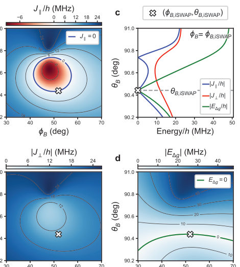
<figcaption class="paper-figure-caption"><b>Fig 4.</b> Figure 4. Simulated anisotropic exchange components from best fitting parameters: a, b, and d, Separate sim- ulations of the longitudinal exchange J∥, the perpendicular ex- change J⊥and the Zeeman energy detuning E∆g, respectively, as a function of the ⃗B field directions (ϕB, θB) using the best fitting parameters reported in Supp. Tab. II. The white cross in- dicates the magnetic field direction (ϕB,iSWAP, θB,iSWAP) where the baseband iSWAP gate is implemented. c, Modules of the exchange components and Zeeman energy detuning at fixed ϕB = ϕB,iSWAP showing the simultaneous zeros (J∥= E∆g = 0) at θB = θB,iSWAP.</figcaption>
</figure>
<figure class="paper-figure-card">
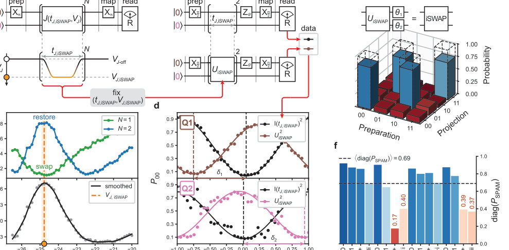
<figcaption class="paper-figure-caption"><b>Fig 5.</b> Figure 5. Calibration and process tomography of the baseband iSWAP: a, Gate sequence for exchange-amplitude cali- bration: after preparing |↑↓⟩, N identical exchange pulses (duration tJ,iSWAP, amplitude VJ, Tukey-windowed) are applied before mapping and readout. b, Top: Measured probability P00 versus exchange amplitude VJ for N = 1 (green) and N = 2 (blue); a calibrated single pulse swaps the antiparallel spin populations while a doubled pulse restores them. Bottom: their contrast P N=2 00 −P N=1 00 (grey) and smoothed envelope (black); the peak (orange) sets VJ,iSWAP. c, Gate sequence for single-qubit phase calibration (Q1): U 2 iSWAP (or an idle reference of matched duration) is followed...</figcaption>
</figure>

**Summary.** The researchers engineered two-qubit gates in germanium hole spin qubits by exploiting the anisotropic nature of the exchange interaction, which arises from strong spin-orbit coupling. By controlling the external magnetic field direction, they achieved continuous tuning of the exchange Hamiltonian, enabling novel gate operations like a baseband iSWAP. This work demonstrates how material physics can be leveraged for precise quantum control in solid-state quantum computing.

**Why it may be interesting.** This work provides a concrete experimental realization of native Hamiltonian engineering in solid-state qubits, showing how material properties (g-tensors) dictate controllable quantum gates, which is highly relevant for building scalable quantum processors.

Detailed structure

**Main problem.** The goal is to engineer high-fidelity two-qubit quantum gates (like CPhase and iSWAP) by precisely controlling the anisotropic exchange interaction in germanium spin qubits.

**Main result.** They demonstrated continuous control over the exchange coupling Hamiltonian by reorienting the external magnetic field, achieving a single-pulse baseband iSWAP gate unattainable with isotropic coupling.

**Method.** The study uses state spectroscopy (ARP) and Quantum Process Tomography (QPT) to map out the energy spectrum and characterize the fidelity of implemented quantum gates.

**Model / system.** The platform is hole spin qubits in a strained-germanium quantum well. The interaction Hamiltonian is modeled as an anisotropic exchange tensor, decomposed into longitudinal ($J_{\|}$) and transverse ($J_{\perp}$) components, which are tunable by the magnetic field orientation ($\vec{B}$).

**Key observables.** CPhase oscillation frequency ($f_{C	ext{Phase}}$), SWAP-like oscillation frequency ($f_{	ext{SWAP}}$), coherence times ($T_2^*$, $T_H$), and process fidelity ($F_{	ext{iSWAP}}$).

**Important parameters / regimes.** The ability to tune the sign of the longitudinal exchange coupling ($J_{\|}$) from positive through zero to effectively negative is a key parameter control.

**Assumptions / limitations.** The fidelity estimate relies on assuming depolarizing error channels and ignoring coherent error components during the SPAM sequence analysis.

**Figures summary.** Figures illustrate device structure, single-qubit g-tensors vs. B field, energy level diagrams showing $J_{\|}$ (Ising) and $J_{\perp}$ (XY) coupling, and measurements of gate fidelity via QPT/iSWAP characterization.

**Paper structure.** The paper progresses from establishing the physical system and Hamiltonian components derived from g-tensor anisotropy to measuring these couplings using spectroscopy, culminating in the demonstration and quantification of two-qubit gate fidelities.

Abstract

Germanium hole spin qubits are a promising and versatile platform for quantum computation and simulation. In this system, strong spin-orbit interaction (SOI) renders the single-qubit $g$-tensor anisotropic and electrically tunable, enabling operational sweet spots with reduced noise sensitivity. SOI also transforms the isotropic two-qubit exchange coupling into an anisotropic tensor whose geometry is inherited from the single-qubit $g$-tensors and spin-flip tunnelling. Here, using two hole spin qubits in a strained-germanium quantum well and full vector control of the magnetic field, we map this exchange tensor, separate it into longitudinal and transverse components, and show that they govern controlled-phase and SWAP-like dynamics, respectively. We find that the longitudinal exchange can be tuned via the magnetic field orientation from a conventional positive value, through zero, to an effectively negative one, as measured by inverted exchange-split spin transitions. The magnetic field direction thus provides continuous control over the interaction Hamiltonian: at a point of purely transverse exchange, we engineer a single-pulse baseband iSWAP, unattainable under isotropic exchange. Linking $g$-tensor geometry to exchange anisotropy establishes native Hamiltonian engineering, enabling spin-based quantum simulation and gate sets selected by the global field orientation alone.

[↑ back to top](#top)

### [Global Minimax Readout of a Qubit Direction](http://arxiv.org/abs/2608.16840v1)

**Authors:** Abbas Taherpour, Amirhossein Taherpour, Tamer Khattab  
**Type:** theory · **Category:** quantum information and computing · **PDF:** <https://arxiv.org/pdf/2608.16840v1>  
**Analysis basis:** full PDF text, analyzed in chunks
**Topic relevance:** 🔥 `quantum measurements` **4/5**

↔ Scroll figures horizontally

<figure class="paper-figure-card">
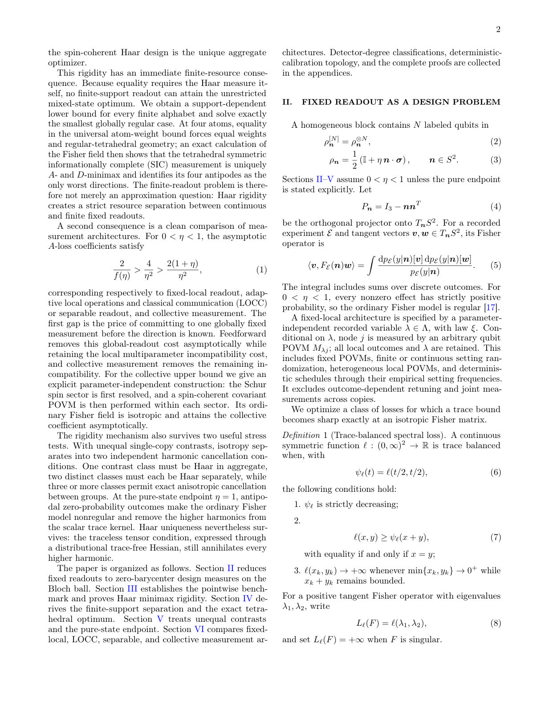
<figcaption class="paper-figure-caption"><b>Fig 1.</b> Low-resolution page preview, page 2</figcaption>
</figure>
<figure class="paper-figure-card">
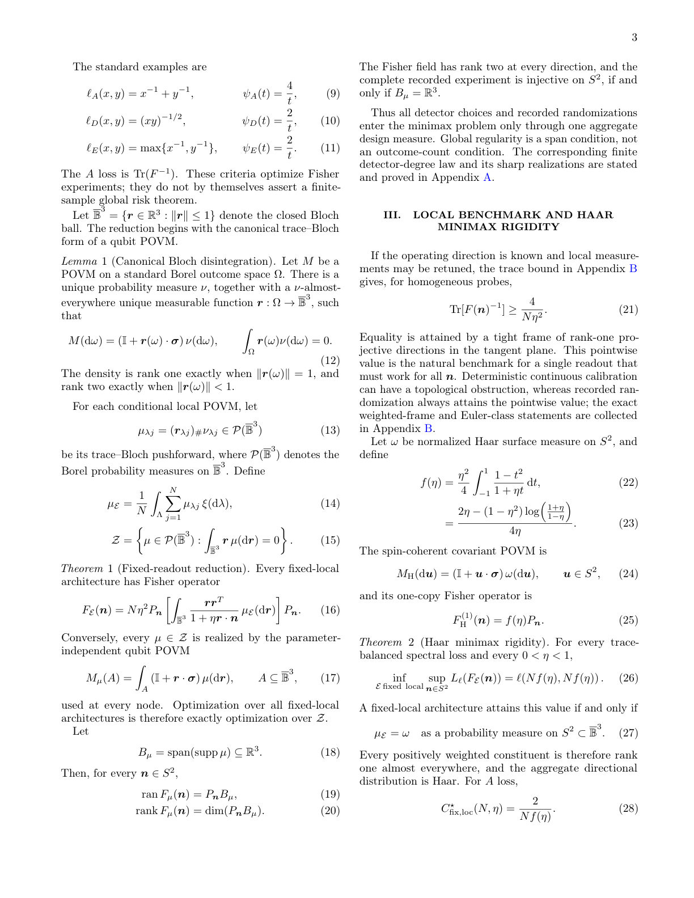
<figcaption class="paper-figure-caption"><b>Fig 2.</b> Low-resolution page preview, page 3</figcaption>
</figure>
<figure class="paper-figure-card">
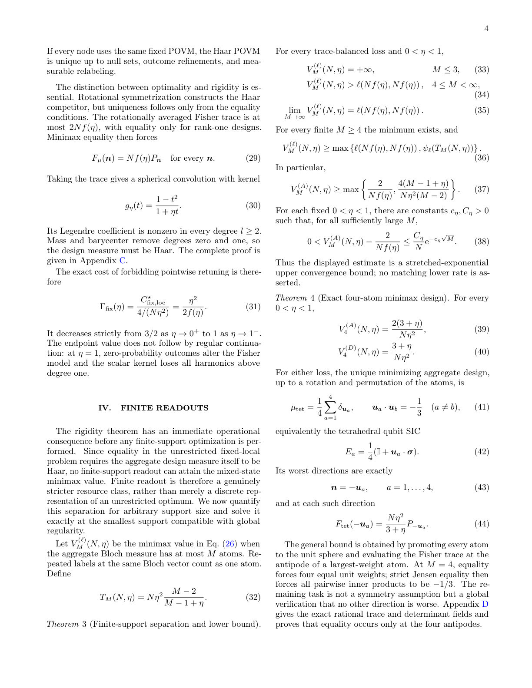
<figcaption class="paper-figure-caption"><b>Fig 3.</b> Low-resolution page preview, page 4</figcaption>
</figure>
<figure class="paper-figure-card">
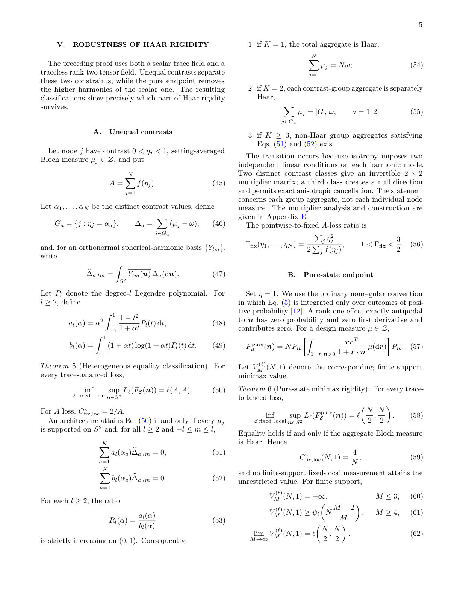
<figcaption class="paper-figure-caption"><b>Fig 4.</b> Low-resolution page preview, page 5</figcaption>
</figure>
<figure class="paper-figure-card">
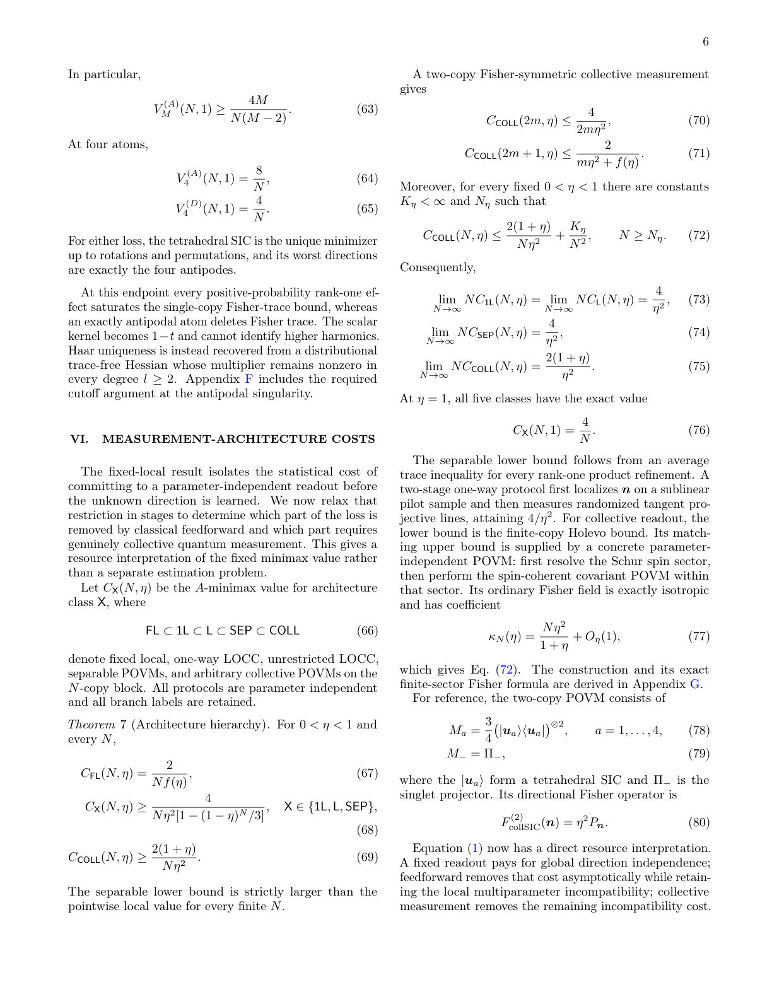
<figcaption class="paper-figure-caption"><b>Fig 5.</b> Low-resolution page preview, page 6</figcaption>
</figure>

**Summary.** This work rigorously calculates the ultimate performance limit (minimax cost) for estimating an unknown qubit direction. It proves that the optimal measurement strategy must be Haar random and establishes a strict hierarchy showing how restricting measurements (e.g., to local operations) degrades achievable precision compared to ideal collective measurements.

**Why it may be interesting.** It provides rigorous, quantitative bounds on quantum estimation precision, which is fundamental to understanding the limits of quantum sensing protocols in both theory and experimental realization.

Detailed structure

**Main problem.** The paper determines the exact worst-direction Fisher-information cost for estimating an unknown qubit direction using a parameter-independent readout.

**Main result.** It proves that the optimal aggregate measurement design is uniquely the spin-coherent Haar POVM, and it establishes strict resource separation between different types of local measurements (e.g., fixed-local vs. collective).

**Method.** The analysis involves solving a minimax optimization problem by reducing the readout process to optimizing over zero-barycenter probability measures on the Bloch ball.

**Model / system.** The system is a qubit whose state is parameterized by an unknown direction $\mathbf{n}$ on the Bloch sphere $S^2$, with a known fixed length $\eta$. The measurement process involves comparing different readout architectures (fixed-local, LOCC, collective POVMs).

**Key observables.** Worst directional Fisher loss, A-loss coefficient, and the aggregate design measure $\mu$ on the Bloch ball.

**Important parameters / regimes.** Bloch-vector length $\eta$, number of copies $N$.

**Assumptions / limitations.** The analysis assumes fixed-local architectures are equivalent to zero-barycenter probability measures, and it compares performance across various measurement constraints (LOCC vs. unrestricted).

**Paper structure.** The paper proceeds by establishing the equivalence between physical readout schemes and mathematical optimization over aggregate design measures, deriving explicit formulas for the minimax loss under different assumptions, and finally comparing these bounds to show resource separation.

Abstract

We determine the exact worst-direction Fisher-information cost of using a parameter-independent readout to estimate an unknown qubit direction at known Bloch-vector length $η$. Every fixed-local architecture, including recorded classical randomization, heterogeneous single-copy measurements, and arbitrary outcome spaces, reduces exactly to a zero-barycenter probability measure on the Bloch ball. For every full-rank qubit and every trace-balanced spectral Fisher loss, the resulting minimax problem is rigid: the unique optimal aggregate design is the spin-coherent Haar positive-operator-valued measure (POVM). For $N$ copies, inverse-Fisher $A$ loss has the exact value $2/[Nf(η)]$, where $   f(η)=   \frac{2η-(1-η^2)\log[(1+η)/(1-η)]}{4η}$. This uniqueness has an immediate finite-readout consequence. No finite-support measurement attains the unrestricted mixed-state optimum, while at the smallest globally regular support the tetrahedral symmetric informationally complete (SIC) measurement is uniquely $A$- and $D$-minimax, with exact worst-direction values. Relaxing the fixed-readout constraint separates the asymptotic resources: one-way local operations and classical communication (LOCC), unrestricted LOCC, and separable measurements have $A$-loss coefficient $4/η^2$, whereas collective measurements attain $2(1+η)/η^2$. We further classify the rigidity conditions for unequal contrasts and show that Haar uniqueness survives at the nonregular pure-state endpoint.

[↑ back to top](#top)

### [Quantum Advantage with Adaptive Shallow Circuits](http://arxiv.org/abs/2608.15545v1)

**Authors:** Yusen Wu, Yukun Zhang, XIaoming Zhang, Chuan Wang, Xiao Yuan  
**Type:** theory · **Category:** quantum information and computing · **PDF:** <https://arxiv.org/pdf/2608.15545v1>  
**Analysis basis:** full PDF text, analyzed in chunks
**Topic relevance:** 🔥 `quantum measurements` **4/5**

↔ Scroll figures horizontally

<figure class="paper-figure-card">
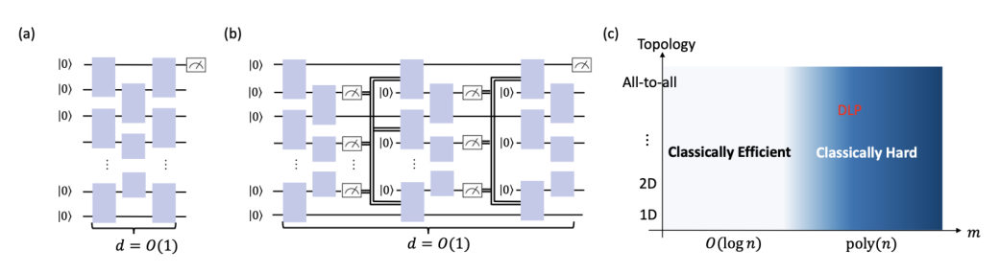
<figcaption class="paper-figure-caption"><b>Fig 1.</b> FIG. 1. (a) In a non-adaptive constant-depth circuit, the expectation value of a fixed local observable is determined by a bounded backward light cone and is therefore classically computable. (b) Mid-circuit measurements and feedforward change the causal structure: measurement outcomes generated across the system are collected by a classical controller, processed globally, and used to determine later operations. The final output is determined by a local observable. (c) The figure provides a high-level overview of our main results. Theorem 1 establishes a strict hierarchy of computational power as the amount of classical feedback m increases. Theorem 2 establishes worst-case classical...</figcaption>
</figure>
<figure class="paper-figure-card">
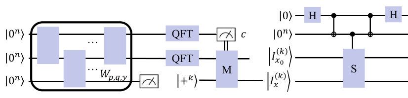
<figcaption class="paper-figure-caption"><b>Fig 2.</b> FIG. 2. The figure depicts a high-level quantum circuit diagram for encoding the DLP into the CRAS model. The model consists of a constant number of quantum rounds, each with O(1) coherent depth, followed by mid-circuit measurements and polynomial-time classical feedforward. The illustrated CRAS construction starts from a quantum circuit Wp,g,y that generates the quantum state |ϕ⟩in Eq. (E1), followed by measuring the last register. Then applying QFT circuits and measure the first register. The M represents the multiplication gate such that |d⟩|i⟩7→|d⟩|i −c−1d⟩. Finally the quantum circuit ends up with the generalized swap-test.</figcaption>
</figure>
<figure class="paper-figure-card">
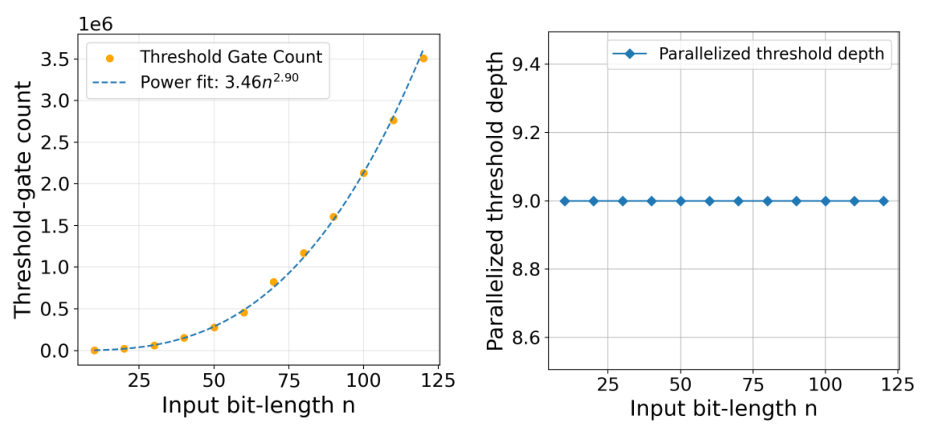
<figcaption class="paper-figure-caption"><b>Fig 3.</b> FIG. 3. Threshold gate count and depth estimation: We evaluated the threshold-gate count (depth) for 10 ≤n ≤120. A least-squares fit of the gate count indicates an approximately O(n3) scaling. Moreover, assuming sufficiently many ancilla qubits, the threshold gates in each stage can be evaluated in parallel, so the resulting circuit depth remains constant.</figcaption>
</figure>
<figure class="paper-figure-card">
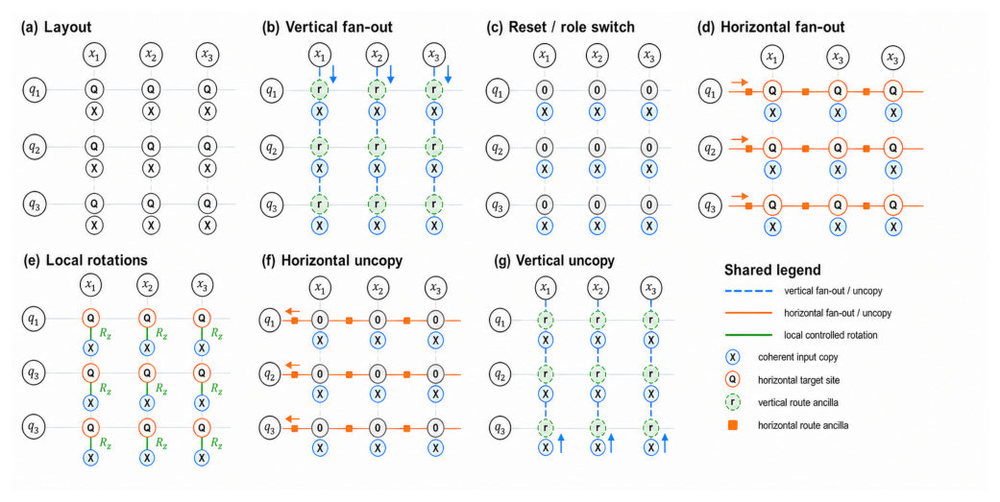
<figcaption class="paper-figure-caption"><b>Fig 4.</b> FIG. 4. Seven-stage two-dimensional crossbar implementation of one parallel Hamming-weight-rotation layer. (a) The crossbar contains adjacent sites Qik and Xik at each cell. (b) Vertical fan-out coherently copies xi to all Xik while the Qik sites serve as route ancillas. (c) Every Qik is reset before changing roles. (d) Horizontal fan-out expands each target qk into a cat state on Q1k, . . . , Qmk. (e) The disjoint nearest-neighbour cell edges apply controlled Rz(θik)Qik in parallel. (f) Horizontal uncopy returns the Qik sites to zero and leaves the accumulated rotation on qk. (g) Vertical uncopy erases the Xik copies. Blue dashed rails represent vertical fan-out, orange solid rails...</figcaption>
</figure>

**Summary.** This work analyzes quantum computation using shallow circuits that incorporate mid-circuit measurements and classical feedforward. It proves a strict hierarchy of computational power based on the amount of classical information fed back into the circuit. Crucially, it demonstrates that polynomial feedback allows these local measurements to solve classically hard problems like DLP, opening a new pathway for achieving quantum advantage with resource-efficient circuits.

**Why it may be interesting.** It provides concrete, resource-aware benchmarks for quantum advantage by showing how adaptive measurement feedback fundamentally changes the complexity landscape compared to static entanglement measures.

Detailed structure

**Main problem.** The research addresses determining the minimal resource requirements for achieving quantum advantage when measurements are restricted to local observables rather than full state sampling.

**Main result.** Increasing the amount of classical feedback in adaptive shallow circuits strictly increases computational power, enabling the encoding of classically hard problems like DLP into a single local expectation value with polynomial feedback.

**Method.** The authors establish computational hierarchies by analyzing the class of functions accessible via local expectation values ($\langle O 
angle$) based on the complexity of the classical feedforward mechanism ($m$).

**Model / system.** The model is Adaptive Shallow Circuits (CRAS) featuring constant coherent depth layers interleaved with mid-circuit measurements and classical feedforward, culminating in a single fixed local observable measurement.

**Key observables.** Local expectation value ($\langle O 
angle$) of a fixed single-qubit observable; the required amount of classical feedback ($m$).

**Important parameters / regimes.** The scaling of classical feedback $m$ (e.g., $O(\log n)$ vs. polynomial in $n$); computational depth ($d$).

**Assumptions / limitations.** The hardness results are conditional on the standard worst-case classical hardness of the Discrete Logarithm Problem (DLP).

**Figures summary.** Figure 1 illustrates the transition from non-adaptive to adaptive circuits, showing how feedback enables global processing. Other figures detail the construction of complex gates like controlled rotations and Threshold gates on a 2D lattice.

**Paper structure.** The paper first establishes the computational hierarchy using DLP hardness for local readout (Chunk 1 & 2). It then provides detailed constructions demonstrating that complex logical operations, including arithmetic circuits, can be implemented efficiently in terms of depth and rounds on a 2D nearest-neighbor architecture (Chunk 3 & 4).

Abstract

Quantum advantage is widely expected to require sufficiently deep circuits, where correlations and global computational structure can grow beyond the reach of efficient classical simulation. This expectation is especially stark for constant-depth circuits with local readout: the expectation value of any fixed local observable lies within a bounded backward lightcone and is therefore classically tractable. Here we show that measurement feedback changes this picture. We establish a strict hierarchy of computational power: at fixed coherent depth, increasing the number of feedback outcomes strictly enlarges the class of functions accessible through a local expectation value. The two ends of this hierarchy exhibit distinct computational regimes. With logarithmic feedback, local expectation values for product-state inputs are efficiently classically simulable. Polynomial feedback, by contrast, enables an explicit family of adaptive shallow circuits to encode prime-field discrete logarithm problem~(DLP) into a fixed single-qubit expectation. Assuming the standard worst-case classical hardness of DLP, estimating this expectation value is classically hard. These results reveal a feedback-driven complexity transition, with further implications for resource lower bounds on DLP and the complexity of local-observable estimation under area-law entanglement. Our results open a new route to quantum advantage with shallow quantum circuits.

[↑ back to top](#top)

### [Chiral Nonlinear Optics and Optical Control](http://arxiv.org/abs/2608.14871v1)

**Authors:** Cedric Dufresne, Annabelle Makowski, Nir Rotenberg  
**Type:** theory · **Category:** quantum information and computing · **PDF:** <https://arxiv.org/pdf/2608.14871v1>  
**Analysis basis:** full PDF text, analyzed in chunks
**Topic relevance:** `Tavis-Cummings & cavity-many-emitter` **3/5** · `driven-dissipative phase transition` **3/5** · `interference shaping light` **3/5** · `methods for driven-dissipative` **3/5** · `analog quantum simulation` **2/5** · `correlated / nonlocal dissipation` **2/5** · `quantum measurements` **2/5** · `Keldysh / 2PI / non-Gaussian methods` **1/5** · `non-equilibrium universality` **1/5**

↔ Scroll figures horizontally

<figure class="paper-figure-card">
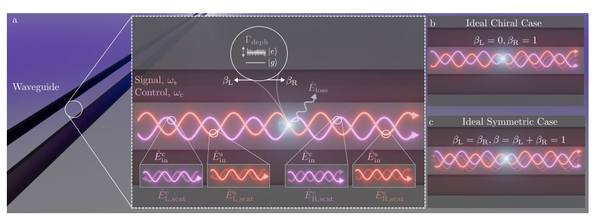
<figcaption class="paper-figure-caption"><b>Fig 1.</b> Figure 1. a) The TLE coupled to the waveguide interacting with the signal and control light fields. b) The ideal chiral case where only one mode will couple to the TLE, leading to directional emission. c) The ideal symmetric case where the TLE couples to both directions, leading to equal emission in either direction.</figcaption>
</figure>
<figure class="paper-figure-card">
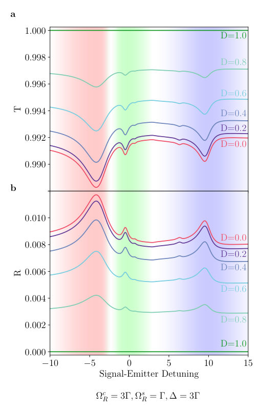
<figcaption class="paper-figure-caption"><b>Fig 2.</b> Figure 2. The transmission and reflection spectra when both the signal and control beams are interacting with the TLE. This is considering a perfect system with unity coupling and assuming no scattering losses or noise. Signatures of the TLE dressed state interaction can be observed at different signal- emitter detunings: three photon amplification is shown in red, energy transfer between the signal and control beams is shown in green, and the AC-Stark effect is shown in blue. These effects are discussed in more detail in Sec. IV B below.</figcaption>
</figure>
<figure class="paper-figure-card">
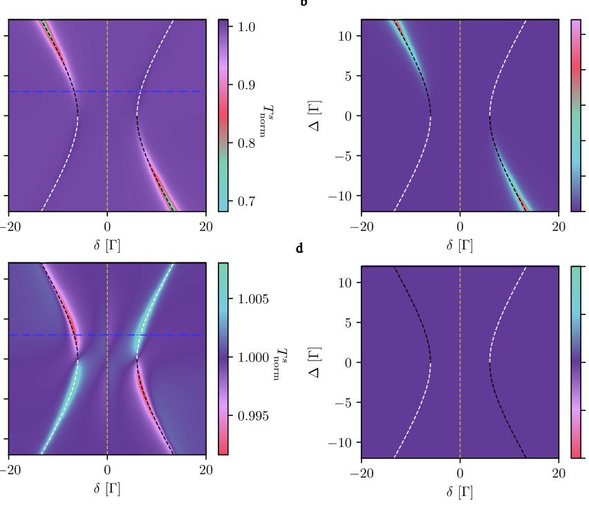
<figcaption class="paper-figure-caption"><b>Fig 3.</b> Figure 3. Frequency dependence of T s norm and Rs norm for symmetric (a,b) and chiral (c,d) geometries. The control power is set to Ωc R = 3Γ and signal power Ωs R = 0.1Γ. The dashed blue line is the line cut plotted below in Fig. 4.</figcaption>
</figure>
<figure class="paper-figure-card">
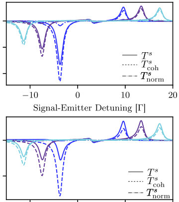
<figcaption class="paper-figure-caption"><b>Fig 4.</b> Figure 4. Line cut spectra of T s (solid), T s coh (dashed), and T s norm (dot dashed) with Ωc R = 3Γ, 5Γ, 7Γ (blue, purple, teal), ∆= 3Γ, and Ωs R = 0.1Γ for a) symmetric geometry and b) chiral geometry.</figcaption>
</figure>
<figure class="paper-figure-card">
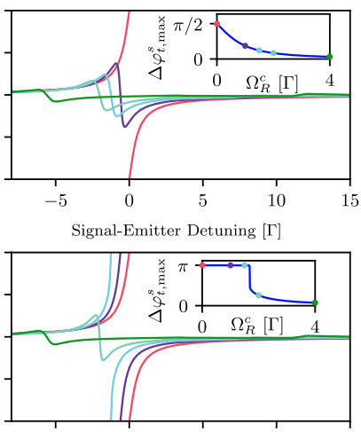
<figcaption class="paper-figure-caption"><b>Fig 5.</b> Figure 6. Signal phase as the signal frequency is swept over emitter resonance in the a) symmetric and b) chiral geome- tries. The control detuning is fixed (∆= 3Γ) and the con- trol power is swept Ωc R = 0Γ, 1Γ, 1.5Γ, 2Γ, 4Γ denoted by red, purple, teal, mint, and green respectively for weak signal Ωs R = 0.001Γ. The insets show the maximum attainable phase as the control power is increased.</figcaption>
</figure>

**Summary.** This theoretical study models chiral nonlinear optics in waveguides using a two-level emitter coupled to multiple optical fields. By employing the Green's Tensor formalism, the authors show that chirality enables superior control over photon dynamics compared to symmetric setups. The results predict highly efficient all-optical switching and amplification crucial for quantum networking applications.

**Why it may be interesting.** This work directly addresses quantum network protocols by demonstrating highly controllable, non-reciprocal nonlinear light-matter interactions necessary for advanced photonic quantum devices.

Detailed structure

**Main problem.** The work investigates chiral nonlinear interactions between light (signal and control beams) and a quantum emitter in photonic waveguides to achieve all-optical control of photons.

**Main result.** Chiral geometries enable robust, tunable $0-\pi$ phase shifts and significantly enhance signal amplification ($\sim 100	imes$) compared to standard predictions.

**Method.** The authors develop a model using the Green's Tensor formalism and solve the emitter dynamics via the Lindblad master equation in the rotating frame.

**Model / system.** The system involves a two-level quantum emitter coupled to a waveguide, driven by both signal ($\omega_s$) and control ($\omega_c$) beams. The theory incorporates chirality through directional coupling parameters ($D$).

**Key observables.** Transmission ($T$), reflection ($R$), coherent transmission ($T_{	ext{coh}}$), and the phase shift of the transmitted signal beam.

**Important parameters / regimes.** Few-photon regime ($ar{n}_c < 1$), chirality parameter ($D$), detunings ($\delta$), and Rabi frequencies ($\Omega_{s/c}^R$).

**Assumptions / limitations.** The analysis relies on time averaging to remove oscillatory terms, and approximations are used for calculating relative population contributions.

**Figures summary.** Figures illustrate the setup comparing symmetric vs. chiral coupling; spectra show TLE interaction signatures in $T$ and $R$; other figures compare normalized transmission under different control powers.

**Paper structure.** The paper builds from first principles using a Green's Tensor formalism to model the Hamiltonian, derives equations of motion for the density matrix, calculates time-averaged observables like transmission, and finally compares results between symmetric and chiral geometries.

Abstract

Chiral light-matter interactions lie at the heart of emerging technologies such as quantum network protocols and quantum logic gates. In the few photon regime, it has been shown that chiral interactions between photons and a waveguide-embedded two-level quantum emitter can break reciprocity and impart a directional $π$ phase shift while the transmission remains intact. In this work, we present a model for multicolor, chiral nonlinear interactions in waveguides using a Green's Tensor formalism. We challenge previously held notions and demonstrate the complex photon dynamics hidden in multicolor light-matter interactions in the few photon regime. By modulating a stronger control beam, we can manipulate a weaker signal beam that contains much less than a single photon per emitter lifetime, on average. We develop equations for the transmission of the signal photons and removing the control photons to uncover the true strength of these nonlinearities, which we show is stronger than what is possible in symmetric geometries. The model predicts tunable unity extinction and up to 30% amplification in the signal, a $\sim$100x increase from standard predictions in which control photons are present. We also predict a tunable 0-$π$ phase shift via control modulation with significant robustness to emitter imperfections. Our model opens a new regime of directional nonlinear quantum light-matter interactions for study, providing a route to efficient all-optical control of photons.

[↑ back to top](#top)

### [Charging of a Quantum Battery by a Two-Photon Quantum Pulse](http://arxiv.org/abs/2608.15653v1)

**Authors:** Elnaz Darsheshdar, Seyed Mostafa Moniri, Mikayel Khanbekyan  
**Type:** theory · **Category:** other · **PDF:** <https://arxiv.org/pdf/2608.15653v1>  
**Analysis basis:** full PDF text, analyzed in chunks
**Topic relevance:** `analog quantum simulation` **3/5** · `driven-dissipative phase transition` **3/5** · `methods for driven-dissipative` **3/5** · `Keldysh / 2PI / non-Gaussian methods` **2/5** · `Tavis-Cummings & cavity-many-emitter` **2/5** · `non-equilibrium universality` **2/5** · `correlated / nonlocal dissipation` **1/5** · `interference shaping light` **1/5** · `quantum measurements` **1/5**

↔ Scroll figures horizontally

<figure class="paper-figure-card">
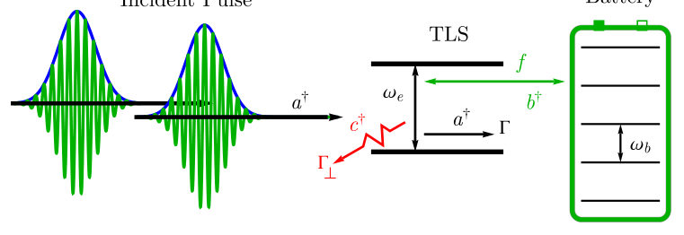
<figcaption class="paper-figure-caption"><b>Fig 1.</b> Figure 1. Schematic of the two-photon quantum-battery charging Protocol. A propagating two-photon wave</figcaption>
</figure>
<figure class="paper-figure-card">
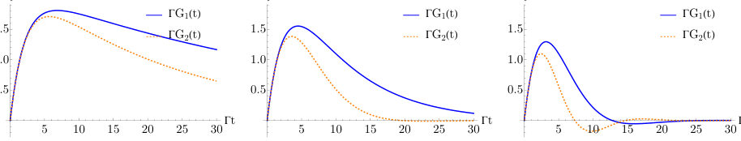
<figcaption class="paper-figure-caption"><b>Fig 2.</b> Figure 2. Single- and two-excitation response functions in the three dynamical regimes. The solid curves</figcaption>
</figure>
<figure class="paper-figure-card">

<figcaption class="paper-figure-caption"><b>Fig 3.</b> Figure 2 illustrates the qualitative change of the internal charging response across the two critical</figcaption>
</figure>
<figure class="paper-figure-card">
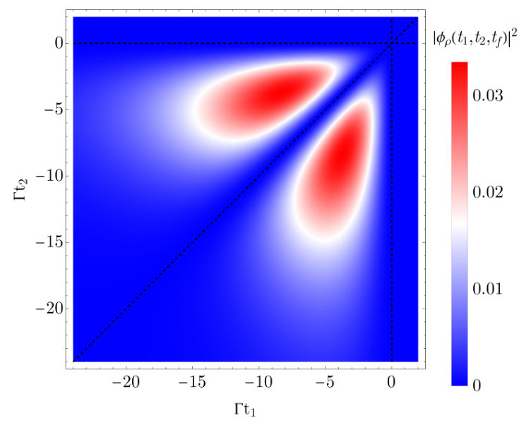
<figcaption class="paper-figure-caption"><b>Fig 4.</b> Figure 3. Optimal two-photon temporal probability density |ϕopt(t1, t2; tf)|2 for f/Γ = 0.20 and Γtf = 0.</figcaption>
</figure>
<figure class="paper-figure-card">
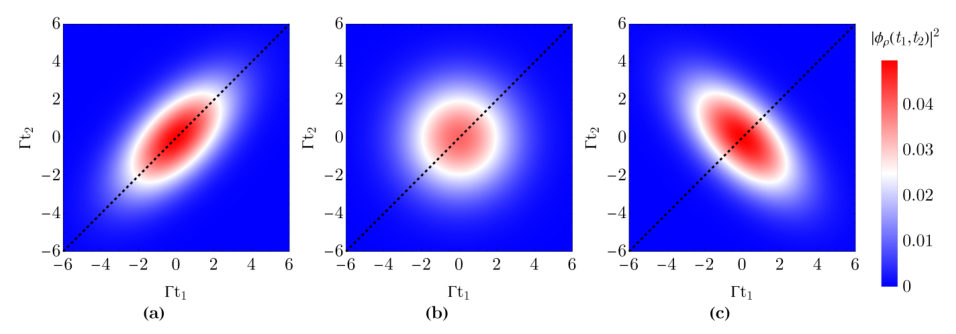
<figcaption class="paper-figure-caption"><b>Fig 5.</b> Figure 4. Joint temporal probability densities |ϕρ(t1, t2)|2 for ΓT = 2 and (a) ρ = +0.6, (b) ρ = 0, and</figcaption>
</figure>

**Summary.** The paper theoretically models the charging of a quantum battery using two-photon pulses coupled via a TLS. It shows that achieving maximum charging efficiency requires careful temporal engineering of the input pulse correlations, rather than just maximizing energy coupling. This highlights that the timing structure of the photon arrival is crucial for optimal quantum resource utilization.

**Why it may be interesting.** This work is highly relevant as it uses concepts from open quantum systems (non-Hermitian generators, exceptional points) to control energy transfer in a quantum optical setting, directly applicable to cavity QED or superconducting circuit analogues.

Detailed structure

**Main problem.** The study investigates how charging efficiency of a quantum battery, modeled by a harmonic oscillator, is controlled by the temporal correlations and delays within an incident two-photon quantum pulse.

**Main result.** Optimal charging requires engineering the input pulse's temporal mode to match the system's sequential response kernel; moderate anticorrelation or finite delay enhances performance over simultaneous arrival.

**Method.** The analysis derives exact full-charging amplitudes using sequential convolution of single and two-excitation response functions, analyzing dynamics via effective non-Hermitian generators.

**Model / system.** The system comprises a Two-Level-System (TLS) charger coherently coupled to a Harmonic Oscillator (HO) quantum battery. The charging is driven by an incident two-photon pulse mediated through the TLS.

**Key observables.** Full-charging probability ($P_2(t)$), mean-squared deviation from the target state ($D_2(t)$), and the optimal charging amplitude ($\alpha_g(t)$).

**Important parameters / regimes.** Coupling strengths ($f$), decay rates ($\Gamma$), temporal correlation/delay parameters, and the system's dynamical regimes defined by exceptional points.

**Assumptions / limitations.** The analysis often assumes exact resonance ($\omega_e = \omega_b$) and relies on white-noise approximations for simplicity in deriving key results.

**Figures summary.** Figures schematically illustrate the charging protocol, showing single- and two-excitation response functions across different dynamical regimes (overdamped, mixed, underdamped).

**Paper structure.** The paper develops theory by reducing dynamics to sequential responses ($G_1$ and $G_2$), derives optimal temporal modes using ordered kernels, analyzes charging quality via deviation measures ($D_2(t)$), and discusses the impact of environmental loss.

Abstract

We investigate the charging of a harmonic-oscillator quantum battery by a propagating two-photon quantum pulse coupled through a two-level-system charger. Excitation-number conservation reduces the dynamics to a sequential response of the first and second excitation sectors, whose effective non-Hermitian generators exhibit two exceptional points separating overdamped, mixed, and underdamped regimes. We derive the exact full-charging amplitude and the response-matched two-photon temporal mode that achieves perfect charging in the ideal resonant single-channel model. For experimentally accessible Gaussian pulses, moderate temporal anticorrelation or a finite photon delay can enhance charging, whereas positive correlations generally suppress it. States with equal Schmidt number can nevertheless show different charging efficiencies, demonstrating that temporal-mode structure and response matching, rather than nonseparability alone, determine charging performance.

[↑ back to top](#top)

### [Quantum Rabi oscillations of a qubit strongly coupled to a one-dimensional waveguide](http://arxiv.org/abs/2608.16077v1)

**Authors:** Ya. S. Greenberg, A. A. Shtygashev, O. A. Chuikin, A. G. Moiseev, O. V. Kibis  
**Type:** theory · **Category:** other · **PDF:** <https://arxiv.org/pdf/2608.16077v1>  
**Analysis basis:** full PDF text, analyzed in chunks
**Topic relevance:** `analog quantum simulation` **3/5** · `correlated / nonlocal dissipation` **3/5** · `methods for driven-dissipative` **3/5** · `Tavis-Cummings & cavity-many-emitter` **2/5** · `driven-dissipative phase transition` **2/5** · `Dicke superradiance` **1/5** · `Keldysh / 2PI / non-Gaussian methods` **1/5** · `free-space correlated emission` **1/5** · `non-equilibrium universality` **1/5** · `superradiant laser` **1/5**

↔ Scroll figures horizontally

<figure class="paper-figure-card">
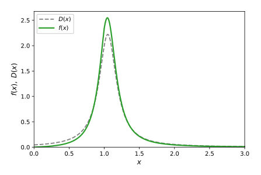
<figcaption class="paper-figure-caption"><b>Fig 1.</b> FIG. 1. The comparison of the function f(x) = f(ω)/g2(Ω), solid line) with the Lorentzian D(ω) (dashed line). x = ω/Ω, Γ/Ω= 0.15, ω0/Ω= 1.05, p = 0.5, normalization provides Λ = g2(Ω)/0.39, average frequency ω/Ω= 1.17.</figcaption>
</figure>
<figure class="paper-figure-card">
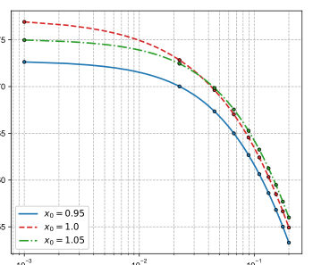
<figcaption class="paper-figure-caption"><b>Fig 2.</b> FIG. 2. The dependence of the effective coupling √</figcaption>
</figure>
<figure class="paper-figure-card">
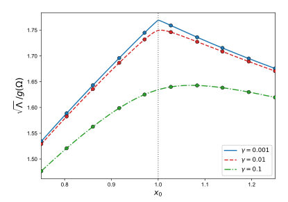
<figcaption class="paper-figure-caption"><b>Fig 3.</b> FIG. 3. The dependence of the effective coupling √</figcaption>
</figure>
<figure class="paper-figure-card">
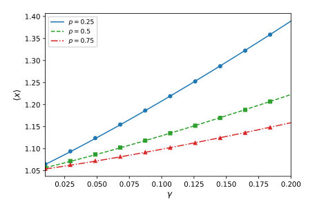
<figcaption class="paper-figure-caption"><b>Fig 4.</b> FIG. 4. The dependence of the average frequency ⟨x⟩= ω/Ω on the halfwidth γ = Γ/Ωof the function f(ω). Solid (blue) line p = 0.25; dashed (green) line p = 0.5; dot-dashed (red) line p = 0.75. The line values are numerically calculated from integrals in the expression (43) while the markers on these lines are calculated from the polynomial expression (45).</figcaption>
</figure>
<figure class="paper-figure-card">
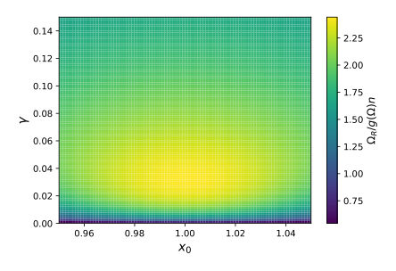
<figcaption class="paper-figure-caption"><b>Fig 5.</b> FIG. 5. Color map of the dependence of the Rabi frequency ΩR/g(Ω)n on the photon loss rate γ = Γ/Ωand the detuning x0 = ω0/Ω. ωa = Ω.</figcaption>
</figure>

**Summary.** This paper theoretically analyzes how a qubit undergoes Rabi oscillations when strongly coupled to the continuum modes of an open waveguide, moving beyond standard cavity QED models. The key finding is that the oscillation frequency depends critically on the spectral profile and loss rate of the waveguide environment. This highlights the fundamental role of dissipation in shaping coherent quantum dynamics.

**Why it may be interesting.** This work provides crucial theoretical insight into open quantum systems where dissipation is inherent. The sensitivity of Rabi oscillations to the spectral density moves beyond simple cavity models, which is vital for designing realistic quantum devices using waveguides or photonic structures.

Detailed structure

**Main problem.** The study investigates quantum Rabi oscillations of a qubit strongly coupled to the continuum modes of an open one-dimensional waveguide, contrasting this behavior with conventional cavity QED.

**Main result.** Rabi oscillations are shown to be collective phenomena whose frequency is highly sensitive to the spectral profile and loss rate ($\gamma$) of the continuous waveguide spectrum, especially when initialized in a coherent state.

**Method.** The analysis uses theoretical Hamiltonian methods, employing the rotating-wave approximation and diagonalizing the system's dynamics within specialized subspaces (single-excitation or collective operators).

**Model / system.** The physical system is a two-level atom (qubit) coupled to a 1D waveguide continuum. The dynamics are governed by a multimode Jaynes-Cummings Hamiltonian, which allows for exact diagonalization in certain subspaces.

**Key observables.** Rabi frequency ($\Omega_R$), probability of qubit excitation ($P_e(t)$), and the average oscillation frequency $\langle\omega
angle$.

**Important parameters / regimes.** Mode loss rate ($\gamma = \Gamma/\Omega$) and detuning between qubit and mode frequencies ($x_0 = \omega_0/\Omega$).

**Assumptions / limitations.** The analysis relies on the rotating-wave approximation (RWA) and assumes specific functional forms for spectral profiles, such as Lorentzian or Gaussian shapes.

**Figures summary.** Figures illustrate the dependence of the average frequency $\langle\omega
angle$ and the Rabi frequency ($\Omega_R$) on the loss rate ($\gamma$) and detuning ($x_0$), demonstrating strong spectral dependence.

**Paper structure.** The paper progresses from establishing the Hamiltonian and integrals of motion, analyzing single-photon exchange dynamics, extending to multimode Fock states, and culminating in a detailed analysis of coherent state coupling in the continuum limit.

Abstract

We theoretically investigate quantum Rabi oscillations in a system consisting of a two-level atom (qubit) strongly coupled to a one-dimensional open waveguide. In contrast to conventional cavity quantum electrodynamics, the qubit interacts with a continuum of propagating modes, which gives rise to fundamentally different dynamical behavior. Within the rotating-wave approximation, we express the multimode Jaynes-Cummings Hamiltonian in terms of collective bosonic operators and show that the system possesses two integrals of motion, enabling an exact diagonalization of the Hamiltonian in the single-excitation subspace. Considering the initially excited qubit and field states described by multiphoton Fock-like states, we demonstrate that the Rabi oscillations represent a collective phenomenon corresponding to oscillations between multiphoton states differing by a single photon. We then extend our analysis to multiphoton processes in which the initial field is a multimode coherent state in a continuous spectrum. In this case, the Rabi frequency is shown to be sensitive to the spectral profile of the function that generates the coherent state.

[↑ back to top](#top)

### [Two-Photon Bound States in the Continuum: A No-Go Theorem and Long-Lived Quasi-Bound States](http://arxiv.org/abs/2608.16527v1)

**Authors:** Yue Chang  
**Type:** theory · **Category:** other · **PDF:** <https://arxiv.org/pdf/2608.16527v1>  
**Analysis basis:** full PDF text, analyzed in chunks
**Topic relevance:** `Keldysh / 2PI / non-Gaussian methods` **3/5** · `correlated / nonlocal dissipation` **3/5** · `methods for driven-dissipative` **3/5** · `Tavis-Cummings & cavity-many-emitter` **2/5** · `driven-dissipative phase transition` **2/5** · `interference shaping light` **2/5** · `analog quantum simulation` **1/5** · `non-equilibrium universality` **1/5**

↔ Scroll figures horizontally

<figure class="paper-figure-card">
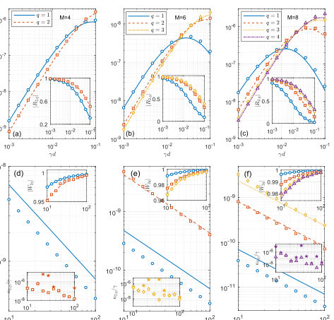
<figcaption class="paper-figure-caption"><b>Fig 1.</b> FIG. 2. Two-photon quasi-BICs in the weak-nonlinearity limit. (a)–(c) Decay rate κ2 in the small-d regime. Lines show the analytical results, while circles, squares, diamonds, and triangles denote the numerical results for q = 1, 2, 3, 4, re- spectively. The same symbols are used in the insets. (d)–(f) Decay rate κ2 in the large-d regime. The notation is the same as in (a)–(c), except for the q = M/2 results shown in the lower insets, where pentagrams denote the analytical results.</figcaption>
</figure>
<figure class="paper-figure-card">
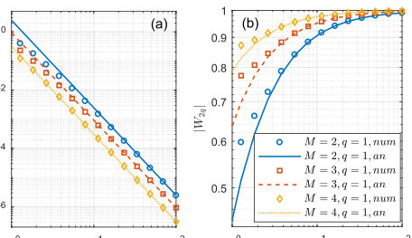
<figcaption class="paper-figure-caption"><b>Fig 2.</b> FIG. 3. Two-photon quasi-BICs in hard-core limit. (a) De- cay rate κ2 of the two-photon quasi-BIC in the hard-core limit U →+∞. Markers show the numerical results obtained from the pole condition Π(z) = 0, while solid lines denote the an- alytical results. The symmetry κ2(q) = κ2(M −q) has been used. (b) Corresponding two-waveguide-photon weight W2q within the interaction region.</figcaption>
</figure>
<figure class="paper-figure-card">
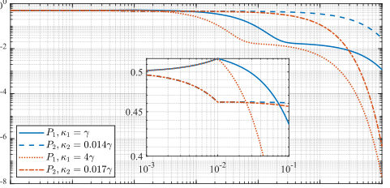
<figcaption class="paper-figure-caption"><b>Fig 3.</b> FIG. 4. Decay of the single- and two-photon populations P1 and P2 of the a mode. Solid and dashed lines correspond to U = −δ0 = 107γ, while dotted and dash-dotted lines corre- spond to U = −δ0 = 287γ.</figcaption>
</figure>

**Summary.** This theoretical paper proves a no-go theorem forbidding exact two-photon Bound States in the Continuum when photon-photon interactions are active. Crucially, it shows that while exact states are forbidden, long-lived quasi-bound states can be engineered by coupling nonlinear modes to continua. This opens pathways for controlling few-photon quantum dynamics beyond single-excitation limits.

**Why it may be interesting.** This work is highly relevant as it pushes the boundaries of controlling light-matter interactions in open quantum systems, demonstrating how nonlinearities can be used to engineer coherence and extend confinement times beyond what simple single-photon analysis predicts.

Detailed structure

**Main problem.** The research investigates the existence of exact two-photon Bound States in the Continuum (BICs) when photon-photon interactions are present, and explores conditions for realizing long-lived quasi-bound states.

**Main result.** A no-go theorem proves that interaction-active two-photon BICs cannot exist under standard regularity conditions. However, long-lived quasi-bound states can be engineered, potentially achieving lifetimes much longer than single-photon excitations.

**Method.** The analysis relies on solving the BIC condition using Green's functions and pair bubble propagators ($\Pi(z)$), analyzing decay rates ($\kappa^2$) in weak and strong nonlinearity limits.

**Model / system.** The model consists of a single nonlinear bosonic mode coupled linearly to a noninteracting bosonic continuum (e.g., a waveguide). Specific examples include giant Kerr cavities coupled to waveguides.

**Key observables.** Two-photon decay rates ($\kappa_2$), the ratio $\kappa_1/\kappa_2$, and the spectral density properties of the continuum.

**Important parameters / regimes.** Nonlinearity strength ($U$), coupling point separation ($d$), detuning ($\delta_0$), and the nature of the local spectral density.

**Assumptions / limitations.** The no-go theorem assumes that the local one-photon spectral density vanishes only at isolated energies. Quasi-BIC analysis often focuses on limits like weak nonlinearity or large/small coupling separations.

**Figures summary.** Figure 1 schematically classifies two-photon BICs based on interaction activity. Figure 2 compares calculated decay rates ($\kappa^2$) for quasi-BICs in small-$d$ and large-$d$ regimes, while Figure 3 shows the scaling of these rates in the hard-core limit.

**Paper structure.** The paper establishes the Hamiltonian and BIC condition using Green's functions. It first proves the no-go theorem for interaction-active states. Subsequently, it analyzes the possibility of quasi-BICs by examining decay rate scaling ($\kappa^2$) across different coupling regimes (weak vs. strong nonlinearity) to demonstrate lifetime engineering.

Abstract

Two-photon bound states in the continuum provide a stringent setting in which quantum interference must suppress radiative decay despite photon--photon interactions. Here, we prove a no-go theorem showing that a single nonlinear mode linearly coupled to a noninteracting bosonic continuum cannot support an interaction-active two-photon bound state in the continuum, provided the local spectral density vanishes only at isolated energies. Apart from this regularity condition, the result is independent of the continuum dispersion and the frequency-dependent coupling. Although such an exact bound state is forbidden, long-lived two-photon quasi-bound states remain possible. For a giant Kerr cavity nonlocally coupled to a waveguide, we derive the asymptotic scaling of the two-photon decay rate with the coupling-point separation from weak nonlinearity to the hard-core limit. We further identify a regime in which the two-photon resonance is substantially longer lived than the single-photon excitation. Our work establishes the limits of exact multiphoton confinement while opening a route to engineering long-lived interacting few-photon states.

[↑ back to top](#top)

### [Imaginary Barrier, Real Transfer: Non-Hermitian Dynamical Tunnelling](http://arxiv.org/abs/2608.16545v1)

**Authors:** Eva-Maria Graefe  
**Type:** both · **Category:** other · **PDF:** <https://arxiv.org/pdf/2608.16545v1>  
**Analysis basis:** full PDF text, analyzed in chunks
**Topic relevance:** `correlated / nonlocal dissipation` **3/5** · `driven-dissipative phase transition` **3/5** · `methods for driven-dissipative` **3/5** · `analog quantum simulation` **2/5** · `non-equilibrium universality` **2/5** · `quantum measurements` **1/5** · `quantum optics experiment` **1/5** · `scars & prethermalization` **1/5**

↔ Scroll figures horizontally

<figure class="paper-figure-card">
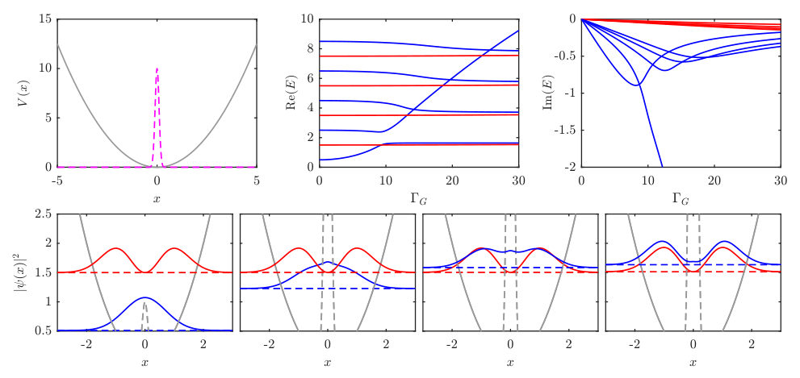
<figcaption class="paper-figure-caption"><b>Fig 1.</b> FIG. 1. Harmonic trap with a central Gaussian imaginary barrier. Top row: left: Real confining potential V (x) (solid grey) and imaginary barrier Γ(x) (dashed magenta), for ΓG = 10 and σ = 0.1; middle and right: real parts Re(E) (middle) and imaginary parts Im(E) (right) of the nine complex eigenvalues with the lowest real parts as functions of the peak absorption strength ΓG, symmetric modes are plotted in blue, antisymmetric ones in red. Bottom row: Probability distributions in the two eigenstates with the lowest real part of the energy (even in blue, odd in red) depicted within the potential (dashed grey) for different values of ΓG, from left to right: ΓG = 1, 8, 10, 20.</figcaption>
</figure>
<figure class="paper-figure-card">
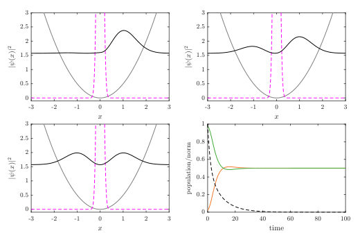
<figcaption class="paper-figure-caption"><b>Fig 2.</b> FIG. 2. Non-Hermitian tunnelling in a harmonic trap with a central Gaussian imaginary barrier. Snapshots of the (nor- malised) probability distribution plotted at the height of the expected value of the real energy in the external potential for σ = 0.1 and ΓG = 20 for three different times (t = 0 (top left), t = 5 (top right), and t = 100 (bottom left)); bottom right: time evolution of the probability in the right (green) and left (orange) half of the potential and total norm (dashed black).</figcaption>
</figure>
<figure class="paper-figure-card">
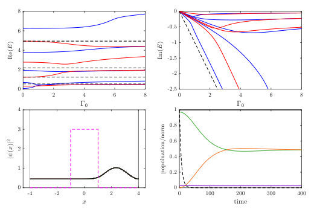
<figcaption class="paper-figure-caption"><b>Fig 3.</b> FIG. 3. Non-Hermitian tunnelling in a box of size 2L = 8 with a central rectangular imaginary barrier of width 2a = 2. Top: Real (left) and imaginary (right) parts of eigenvalues as functions of Γ0, dashed black lines indicate the asymptotic eigenvalues for large Γ0; bottom left: Equal superposition of the doublet states, localised in the right half of the effective double well for Γ0 = 3. The box boundaries are indicated by grey lines, and the absorption profile by a dashed magenta line; bottom right: time evolution of the probability in the right (green) and left (orange) wells, and in the absorbing region (purple), and total norm (dashed black).</figcaption>
</figure>
<figure class="paper-figure-card">
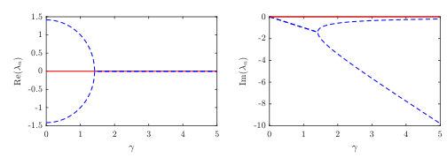
<figcaption class="paper-figure-caption"><b>Fig 4.</b> FIG. 4. Real (left) and imaginary (right) parts of the eigen- values of the minimal matrix model as functions of the loss parameter γ, for unit coupling v = 1. The energies of the two symmetric states are displayed as dashed blue lines, that of the antisymmetric state as solid red line.</figcaption>
</figure>
<figure class="paper-figure-card">
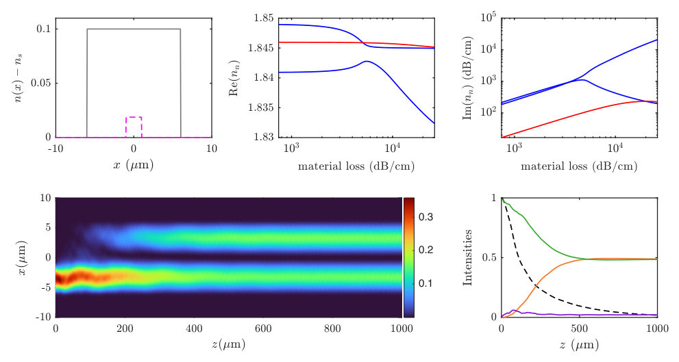
<figcaption class="paper-figure-caption"><b>Fig 5.</b> FIG. 5. Model of multimode waveguide with central absorbing region. Top row: left: Real (solid grey) and imaginary part (dashed magenta) of the refractive index profile; middle and right: real parts (middle) and imaginary parts (right) of the TE mode refractive indices as functions of absorption for λ = 1.55µm, for the three modes connected to the three lowest TE modes in the non-absorbing case. Symmetric modes are plotted in blue, antisymmetric ones in red. Bottom row: Propagation of an initial mode corresponding to the fundamental mode of a waveguide in the region [−6, −1] for Im(n) = −1.78×10−2 ≈7×103 dB/cm in the absorbing region. Left panel: False colour plot of the normalised square...</figcaption>
</figure>

**Summary.** This paper explores non-Hermitian dynamical tunnelling caused by localized absorbing regions within a confining potential. It shows that this process leads to a slow relaxation towards equal population on both sides, contrasting sharply with the periodic oscillations seen in standard quantum tunneling. The findings are demonstrated using analytical models and proposed for experimental observation in optical waveguides.

**Why it may be interesting.** This work is highly relevant for AMO physics and quantum optics as it deals with open quantum systems dynamics, engineered dissipation, and non-Hermitian Hamiltonians, which are key areas in modern photonics and cavity QED.

Detailed structure

**Main problem.** The paper investigates non-Hermitian dynamical tunnelling, which is the counterpart of standard quantum tunneling when the potential barrier is absorptive (imaginary) rather than real.

**Main result.** Instead of periodic oscillations seen with a real barrier, the system slowly relaxes towards an equal population on both sides separated by the imaginary absorbing region.

**Method.** The analysis uses numerical propagation methods for continuous potentials and derives an effective $3 	imes 3$ matrix model to capture the core physics analytically.

**Model / system.** The models include a particle in a harmonic trap with Gaussian absorption, or an infinite square well with a rectangular imaginary barrier. The phenomenon is also mapped onto coupled waveguides for experimental realization.

**Key observables.** Population distribution over time (relaxation to equal population), eigenvalues/eigenvectors of the effective Hamiltonian, and spatial intensity profiles in optical waveguides.

**Important parameters / regimes.** Absorption strength ($\Gamma G$ or $\Gamma_0$), coupling constant ($v$), and waveguide parameters like wavelength ($\lambda$) and refractive index $n(x)$.

**Assumptions / limitations.** The analysis assumes natural units ($\hbar=m=\omega=1$) for the initial models, and the overall probability decay is noted due to the finite nature of the absorbing barrier.

**Figures summary.** Figures illustrate potential profiles and eigenvalue spectra vs. absorption strength; time evolution snapshots show relaxation to equal population in two halves of a trap or waveguide structure.

**Paper structure.** The paper progresses from analyzing simple continuous potentials (harmonic/infinite well) to deriving an effective $3 	imes 3$ matrix model, culminating in the proposal and simulation of an experimental setup using optical waveguides.

Abstract

We identify a non-Hermitian counterpart of dynamical tunnelling induced by a localised absorbing region in a symmetric confining potential. The absorbing region, described by an imaginary potential barrier, induces an effective double-well structure with a pair of long-lived states that have little population in the barrier. In contrast to the periodic tunnel oscillations through a real barrier, the system slowly evolves towards equal population of the two sides, while the absorbing region remains only weakly populated. We demonstrate this generic mechanism in two continuous potentials, and capture its essence analytically in a minimal $3\times 3$ matrix model. We propose a realistic optical waveguide setup for the experimental observation of the effect.

[↑ back to top](#top)

### [Casimir force between plane-layered structures: van Kampen-Schram approach for finite temperature](http://arxiv.org/abs/2608.16567v1)

**Authors:** Michael V. Davidovich  
**Type:** theory · **Category:** statistical mechanics · **PDF:** <https://arxiv.org/pdf/2608.16567v1>  
**Analysis basis:** full PDF text, analyzed in chunks
**Topic relevance:** `Keldysh / 2PI / non-Gaussian methods` **3/5** · `correlated / nonlocal dissipation` **3/5** · `Tavis-Cummings & cavity-many-emitter` **2/5** · `driven-dissipative phase transition` **2/5** · `methods for driven-dissipative` **2/5** · `analog quantum simulation` **1/5** · `non-equilibrium universality` **1/5** · `quantum measurements` **1/5**

↔ Scroll figures horizontally

<figure class="paper-figure-card">
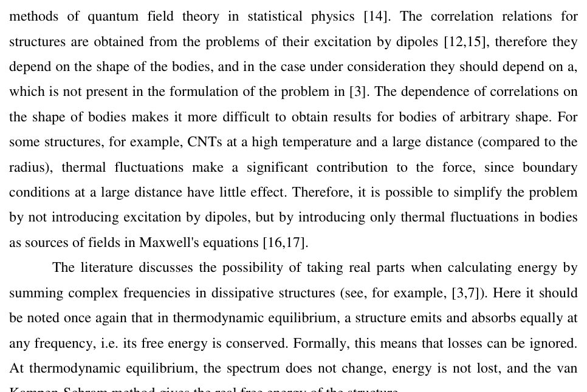
<figcaption class="paper-figure-caption"><b>Fig 1.</b> Figure 1 shows the results of calculating the force (1) for thick metal plates using the</figcaption>
</figure>
<figure class="paper-figure-card">
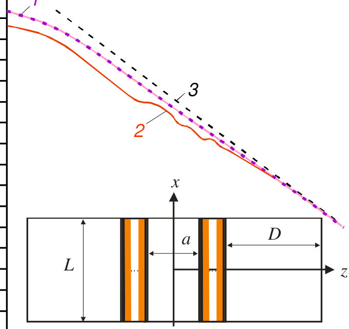
<figcaption class="paper-figure-caption"><b>Fig 2.</b> Fig. 1. Configuration of the structure (insert) and the external Casimir pressure P (N/m2) depending on the size a (nm) for thick metal plates (Drude model, silver, p=1.57×1016 Hz, c=3.2×1013 Hz, L=9.6), separated by a vacuum gap a (curve 1) and approximated by L by three Lorentz terms with frequencies of 2×1017, 5×1017 and 1018 Hz (2). Casimir&#x27;s result is shown by dashed line 3</figcaption>
</figure>
<figure class="paper-figure-card">
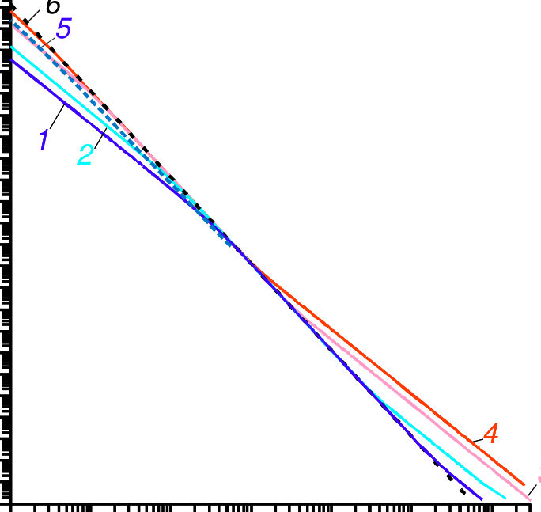
<figcaption class="paper-figure-caption"><b>Fig 3.</b> Fig. 2. External Casimir pressure P (N/m2) on two ideally conductive metal layers depending on</figcaption>
</figure>

**Summary.** This paper develops a generalized formula for calculating the Casimir force between layered structures at finite temperatures by employing the van Kampen-Schram method. It critically analyzes discrepancies found when comparing this result to standard Lifshitz formulas, particularly highlighting that the contour integral contribution is significant at low temperatures. The work provides a more accurate theoretical framework for understanding thermal boundary interactions.

**Why it may be interesting.** While focused on electrodynamics, the rigorous treatment of finite-temperature correlations and boundary effects using advanced summation/integration techniques is highly relevant for understanding thermalization and dissipation in open quantum systems or cavity QED setups.

Detailed structure

**Main problem.** The primary goal is deriving a precise formula for the Casimir force between plane-layered structures at finite temperature.

**Main result.** The van Kampen-Schram approach yields a generalized form that accounts for contributions missed by standard Lifshitz formulas, especially at low temperatures where the simple transformation to $T=0$ fails.

**Method.** The calculation employs advanced techniques involving summing over complex frequencies and transforming these sums into contour integrals along the imaginary frequency axis using methods like the residue theorem.

**Model / system.** The study models the interaction between two plane-layered structures, exemplified by metal plates. The analysis considers both zero vacuum fluctuations and thermal fluctuations.

**Key observables.** Casimir force (pressure) and free energy of the resonator.

**Important parameters / regimes.** Temperature ($T$), separation distance ($a$), dielectric properties ($\epsilon$, $\sigma$). Key regimes include high-temperature and low-temperature limits.

**Assumptions / limitations.** The analysis relies on generalizing existing formulas, noting that ideal conductivity assumptions can lead to infinities. The method aims to calculate the real free energy at thermodynamic equilibrium.

**Figures summary.** Figures compare calculated Casimir pressure versus separation distance for various temperatures and models (Drude vs. Lorentz corrections), contrasting results with the standard Casimir prediction.

**Paper structure.** The paper builds upon existing literature by applying the van Kampen-Schram method to derive a generalized formula, comparing this result against established Lifshitz formulas and analyzing its behavior in different temperature regimes.

Abstract

Based on the van Kampen-Schram method, a formula for the Casimir force between two plane-layered structures is obtained, which includes the sum of the Matsubara frequencies and a contour integral. It is shown that the contour integral is not taken into account in the Lifshitz formula. Taking it into account gives a small contribution at high temperatures when the Lifshitz formula is approximately correct. However, at low temperatures, its contribution is significant, and the Lifshitz formula for the finite temperature does not transform into the Lifshitz formula at zero temperature. An example of interaction of metal plates is considered.1

[↑ back to top](#top)

### [In-situ adjoint protocols for nonlinear PT-symmetric self-optimizing machines](http://arxiv.org/abs/2608.16056v1)

**Authors:** Zheming Li, Lucas J. Fernández-Alcázar, Zin Lin, Tsampikos Kottos  
**Type:** theory · **Category:** disordered systems and neural networks · **PDF:** <https://arxiv.org/pdf/2608.16056v1>  
**Analysis basis:** full PDF text, analyzed in chunks
**Topic relevance:** `driven-dissipative phase transition` **3/5** · `methods for driven-dissipative` **3/5** · `analog quantum simulation` **2/5** · `non-equilibrium universality` **2/5** · `quantum measurements` **2/5** · `Frenkel-Kontorova` **1/5** · `Keldysh / 2PI / non-Gaussian methods` **1/5** · `correlated / nonlocal dissipation` **1/5**

↔ Scroll figures horizontally

<figure class="paper-figure-card">
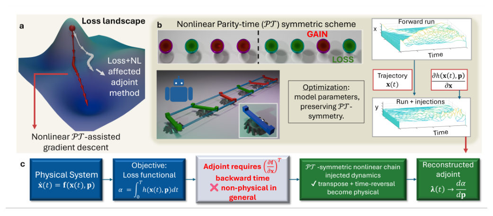
<figcaption class="paper-figure-caption"><b>Fig 1.</b> FIG. 1. PT-assisted physical adjoint optimization protocol for nonlinear nonreciprocal/ lossy systems. Conceptual overview of the PT -assisted in-situ adjoint method. A nonlinear physical system is first evolved forward in time to evaluate the objective functional. While the adjoint problem formally requires backward-time evolution and the transpose Jacobian, these operations are not physically accessible in generic non-reciprocal or lossy systems. By exploiting PT -symmetry and controlled injections in a PT -nonlinear resonator chain, the adjoint dynamics can be mapped onto a forward, experimentally accessible evolution, enabling in-situ evaluation of the gradient with minimal processing.</figcaption>
</figure>
<figure class="paper-figure-card">
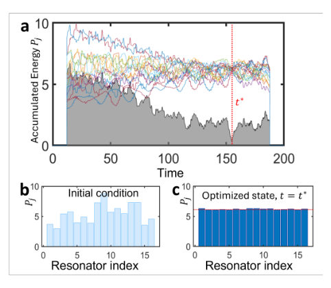
<figcaption class="paper-figure-caption"><b>Fig 2.</b> FIG. 2. a, Time-resolved accumulated energy Pj(t; p) = ´ T 0 dt′ wt(t′) |ψj(t′; p)|2 for all 2N = 16 res- onators (coloured lines). The gray shaded region represents the time-windowed spread ∆P(t; p⋆) = max1≤j≤N Pj(t; p⋆)− min1≤j≤N Pj(t; p⋆). The optimization minimizes this spread at the target time t∗= 155 (red dashed line). b, Initial accumulated energy showing a non-uniform distribution. c, Optimized state at t∗exhibiting uniform energy distribution (red dashed line is a guide to the eye).</figcaption>
</figure>
<figure class="paper-figure-card">
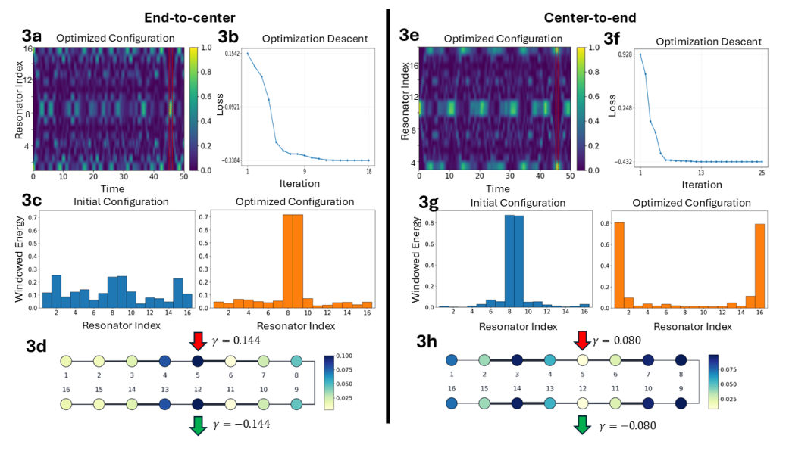
<figcaption class="paper-figure-caption"><b>Fig 3.</b> FIG. 3. Temporal heatmaps and energy distributions for the nonlinear transport tasks. Figure 3 shows the end-to-center task, where energy initialized at the ends is concentrated near the middle of the chain. Figure 4 shows the center-to-end task, where energy initialized near the middle is transported toward and concentrated at the ends of the chain. 3 a,e. Temporal evolution of the resonator intensities for the optimized configuration. The shaded red region indicates the target time window. 3 b,f. Descent of the optimization objective during the gradient descent trial that produced the optimized configuration. 3 c,g. Energy distribution within the target time window for the initial and...</figcaption>
</figure>
<figure class="paper-figure-card">
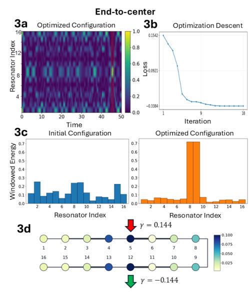
<figcaption class="paper-figure-caption"><b>Fig 4.</b> Fig. 3g further confirms the performance of the op- timization scheme. Whereas the initial configuration is unable to efficiently route energy toward the target sites, the optimized dynamics redirects approximately 77% of the total energy to the two edge resonators within the prescribed time window, demonstrating highly efficient center-to-end transport. Figure 3h displays the cor- responding optimized parameter landscape, revealing a markedly different arrangement of couplings and nonlin-</figcaption>
</figure>
<figure class="paper-figure-card">
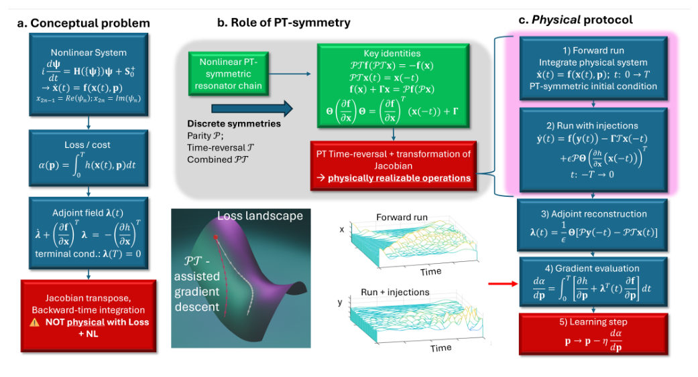
<figcaption class="paper-figure-caption"><b>Fig 5.</b> FIG. 4. Graphical summary of the PT -assisted physical adjoint optimization protocol. (a) Conceptual obstructions that prevent the direct physical implementation of conventional adjoint optimization in nonlinear, lossy, and nonreciprocal systems. (b) In PT -symmetric structures, key identities imposed by the antilinear symmetry map the adjoint dynamics onto physically realizable operations, enabling the adjoint field to be reconstructed from two physical evolutions: a forward run and an injection-driven run. (c) Schematic of the resulting physical protocol, consisting of forward evolution, injection-driven evolution, adjoint reconstruction, gradient evaluation, and the subsequent learning...</figcaption>
</figure>

**Summary.** The paper develops a novel optimization technique for nonlinear quantum systems by leveraging Parity-Time ($	ext{PT}$) symmetry. It solves the fundamental problem of calculating gradients in non-Hermitian physics, which usually requires unphysical backward time evolution. By mapping this adjoint calculation onto an accessible forward-time protocol, it enables physical machines to self-optimize their parameters for desired spatio-temporal functions.

**Why it may be interesting.** This work provides a powerful theoretical framework for designing self-optimizing physical hardware (nonlinear machines) by turning an abstract mathematical requirement (adjoint gradient calculation) into a physically realizable measurement protocol using symmetry principles.

Detailed structure

**Main problem.** The primary challenge is physically implementing adjoint-based gradient calculations for optimization in nonlinear, non-Hermitian physical systems.

**Main result.** PT symmetry provides the necessary structural identities to map the mathematically required backward-time adjoint dynamics onto an entirely forward-time evolution protocol using controlled injections.

**Method.** The authors exploit specific symmetries inherent to PT-symmetric Hamiltonians to bypass the need for explicit Jacobian transposition and time reversal in gradient computation.

**Model / system.** The system is a one-dimensional chain of coupled nonlinear resonators whose dynamics are governed by a non-Hermitian Hamiltonian exhibiting PT symmetry. The nonlinearity is Kerr-type, and the structure includes controlled gain/loss elements.

**Key observables.** Energy accumulation profiles ($P_j(t; p)$), spatial energy distribution uniformity ($\Delta P$), and engineered wave transport efficiency.

**Important parameters / regimes.** The system parameters must maintain PT symmetry (e.g., $\gamma_j = -\gamma_{2N-j+1}$) for the protocol to remain valid.

**Assumptions / limitations.** The method critically relies on the existence of and maintenance of PT symmetry throughout the optimization process; it is not generally applicable.

**Figures summary.** Figures conceptually illustrate the three stages of the PT-assisted in-situ adjoint method: forward evolution, mapping the adjoint problem via symmetry, and the final physical protocol for gradient evaluation.

**Paper structure.** The paper first establishes the theoretical difficulty of adjoint methods (requiring backward time/transposition). It then introduces nonlinear PT-symmetric systems as a solution space. The core contribution is deriving the forward-time evolution equation that mimics the adjoint field, leading to concrete applications in energy redistribution and wave steering.

Abstract

Adjoint methods provide a powerful route for gradient-based optimization, but their physical implementation is obstructed in generic nonlinear systems because the adjoint dynamics requires backward-time evolution, Jacobian transposition, and terminal-value constraints. Here we show that nonlinear parity-time ($\mathcal{PT}$)-symmetric systems overcome this obstruction. Using a class of nonlinear non-Hermitian resonator networks, we establish symmetry relations that map the formal adjoint dynamics onto experimentally accessible forward-time evolutions supplemented by controlled injections. This construction enables exact in-situ evaluation of adjoint gradients without requiring explicit backward propagation or matrix transposition. We demonstrate the approach in nonlinear $\mathcal{PT}$-symmetric resonator chains, where the resulting optimization protocol autonomously discovers parameter configurations that realize prescribed spatio-temporal functionalities, including uniform energy redistribution and targeted wave transport at predefined time windows. Our results identify $\mathcal{PT}$ symmetry as a resource for implementing computational sensitivities within physical systems and establish a route toward self-optimizing nonlinear machines.

[↑ back to top](#top)

### [Anti-Zeno boost in an autonomous quantized-piston thermal machine](http://arxiv.org/abs/2608.15899v1)

**Authors:** M. Tahir Naseem  
**Type:** theory · **Category:** statistical mechanics · **PDF:** <https://arxiv.org/pdf/2608.15899v1>  
**Analysis basis:** full PDF text, analyzed in chunks
**Topic relevance:** `driven-dissipative phase transition` **3/5** · `methods for driven-dissipative` **3/5** · `Keldysh / 2PI / non-Gaussian methods` **2/5** · `non-equilibrium universality` **2/5** · `quantum measurements` **2/5** · `correlated / nonlocal dissipation` **1/5** · `scars & prethermalization` **1/5**

↔ Scroll figures horizontally

<figure class="paper-figure-card">
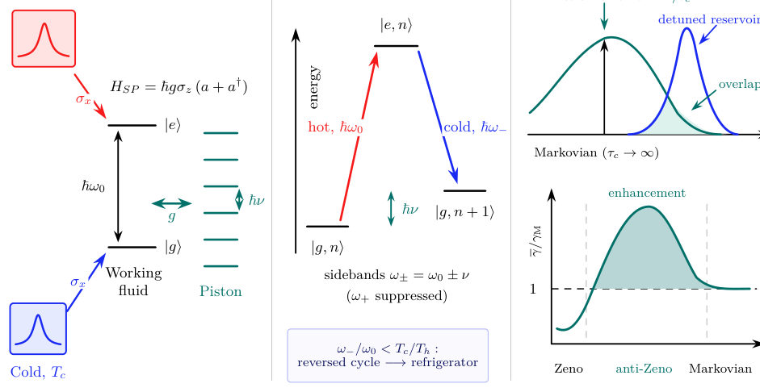
<figcaption class="paper-figure-caption"><b>Fig 1.</b> FIG. 1. Schematic of the autonomous quantum thermal machine. (a) A two-level working fluid, with states |g⟩and |e⟩ separated by ℏω0, is coupled longitudinally to a quantized harmonic piston of frequency ν through HSP = ℏgσz(a + a†), and transversely through σx to hot and cold structured reservoirs at temperatures Th and Tc. (b) Joint working-fluid–piston energy levels in the engine regime. The hot reservoir drives the carrier transition |g, n⟩→|e, n⟩at energy ℏω0, while the cold reservoir drives the lower-sideband transition |e, n⟩→|g, n + 1⟩at energy ℏω−. Each completed cycle adds one piston quantum ℏν, with ℏω0 = ℏω−+ ℏν. The sidebands are ω± = ω0 ± ν, and the upper sideband ω+ is...</figcaption>
</figure>
<figure class="paper-figure-card">
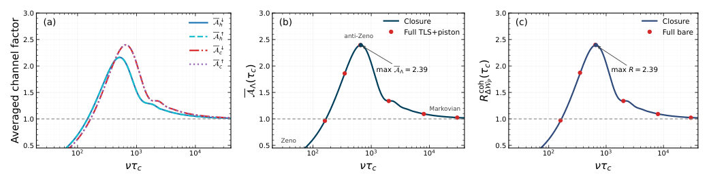
<figcaption class="paper-figure-caption"><b>Fig 2.</b> FIG. 2. Anti-Zeno enhancement of coherent piston ergotropy in the heat-engine regime. The horizontal dashed line marks the Markovian reference value of unity, and the horizontal axis is the dimensionless coupling time ντc on a logarithmic scale. (a) Coupling-averaged retained-channel factors A ↓,↑ h and A ↓,↑ c , defined in Eq. (51). (b) Coupling-averaged net gain factor AΛ(τc), defined in Eq. (47), with max AΛ ≃2.39 near ντc ≃662. (c) Generated coherent ergotropy ratio Rcoh ∆WP (τc), defined in Eq. (48), with maximum ≃2.39. The markers in panels (b) and (c) are obtained by numerically solving the full joint TLS–piston master equation (23). In panel (c), the markers use the bare-frame...</figcaption>
</figure>
<figure class="paper-figure-card">
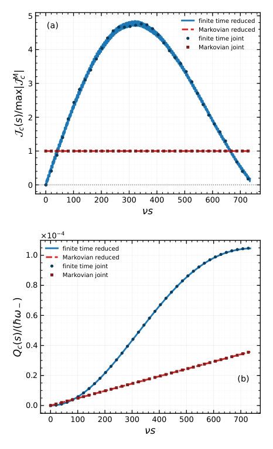
<figcaption class="paper-figure-caption"><b>Fig 3.</b> FIG. 3. Anti-Zeno enhancement of finite-resource refrigerator operation. Solid blue curves are obtained by jointly solving the reduced piston-number and TLS- population equations, Eqs. (34) and (57), using the instantaneous finite-time rates γj(ω, s). The red dashed curves show the corresponding Markovian results. Markers are obtained by independently propagating the retained joint TLS–piston master equation (23) without the product-state reduction, using a piston cutoff NP = 40. Panel (a) shows the cold current from Eq. (58), normalized by maxs |J M c (s)|. Panel (b) shows the cumulative extracted cold heat Qc(s)/(ℏω−), defined in Eq. (64). The largest current enhancement occurs near νs...</figcaption>
</figure>
<figure class="paper-figure-card">
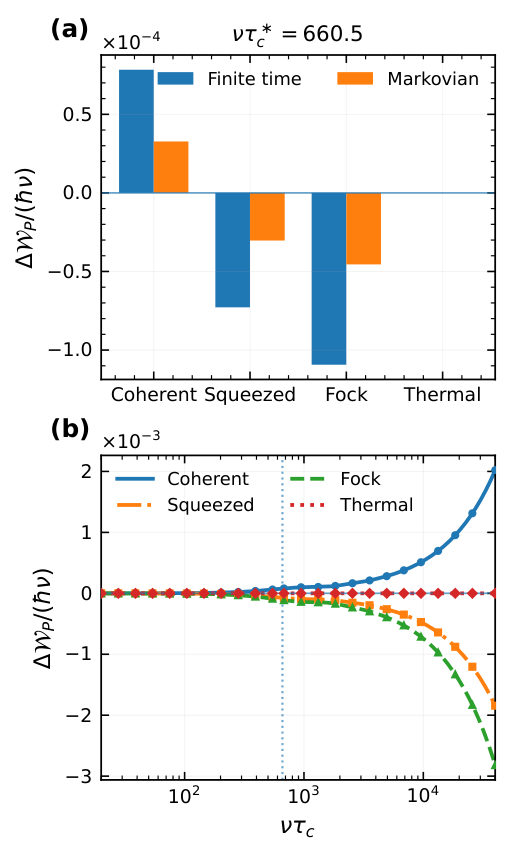
<figcaption class="paper-figure-caption"><b>Fig 4.</b> FIG. 4. State-resolved piston ergotropy change ∆WP (τc) = WP (τc) −WP (0) for coherent (|α0|2 = 1), squeezed-vacuum (sinh2 r = 1), Fock (m = 1), and thermal (¯nth = 1) inputs. The microscopic reservoir parameters are identical to those of Fig. 2. (a) Finite-time and Markovian ergotropy changes near the anti-Zeno gain maximum, ντ ∗ c ≃6.6 × 102. (b) Finite- time ergotropy change versus ντc at the physical reservoir scale. Solid curves show the analytical results, while markers denote independent numerical verification obtained from direct density-matrix propagation of the gain–loss master equation Eq. (28). The vertical dotted line marks τ ∗ c .</figcaption>
</figure>

**Summary.** This paper analyzes an autonomous thermal machine driven by a quantized piston instead of an external field. By utilizing the anti-Zeno effect within a finite-time framework, the authors demonstrate that the engine's ability to generate useful work (ergotropy) is enhanced beyond classical predictions. This establishes finite-time reservoir sampling as a novel mechanism for improving quantum heat engine and refrigerator performance.

**Why it may be interesting.** This work directly tackles non-equilibrium quantum thermodynamics by extending known effects (like Zeno/Anti-Zeno) into complex mechanical systems, providing a mechanism for enhancing energy conversion efficiency in fundamental quantum engines.

Detailed structure

**Main problem.** The study investigates whether the quantum advantage provided by the anti-Zeno effect persists when a classical drive in a thermal machine is replaced by a quantized piston, enabling autonomous operation.

**Main result.** Finite-time reservoir sampling enhances ergotropy generation in the engine mode beyond Markovian limits, and this mechanism can be reversed to achieve enhanced quantum refrigeration without external modulation.

**Method.** The authors derive and analyze a finite-time master equation for the system dynamics, comparing results across Zeno, anti-Zeno, and Markovian regimes.

**Model / system.** The model is an autonomous thermal machine comprising a two-level working fluid coupled to a quantized harmonic piston and interacting with two spectrally separated thermal reservoirs (hot and cold).

**Key observables.** Ergotropy (useful work content), energy balance equations ($\dot{E}_{	ext{TLS}} + \dot{E}_P = \dot{Q}_h + \dot{Q}_c$), and channel-energy ratios.

**Important parameters / regimes.** Coupling time ($	au_c$), reservoir temperatures ($T_h, T_c$), and the characteristic timescales defining the operational regimes ($\Delta_{sb}^{-1} \ll 	au_c \lesssim 	au_B$).

**Assumptions / limitations.** The analysis is performed without external modulation of the system parameters.

**Figures summary.** Figure 1 schematically illustrates the setup, showing the TLS coupled to the piston and reservoirs, and depicts the anti-Zeno mechanism enhancing rates compared to Markovian sampling.

**Paper structure.** The paper establishes the physical model (Hamiltonians), derives the finite-time master equation using TCL2 methods, analyzes energy conservation for both engine and refrigerator cycles, and compares the resulting performance metrics (ergotropy) against long-time Markovian limits.

Abstract

Anti-Zeno enhancement of quantum heat machines has been established for working fluids driven by an external classical field, but whether the same quantum advantage survives when a quantized piston replaces the classical drive has remained open. Here we study an autonomous thermal machine in which a two-level working fluid is coupled to a quantized harmonic piston and to two spectrally separated reservoirs, without external modulation. We derive a finite-time master equation for the resulting carrier and sideband channels, whose rates interpolate between the Zeno, anti-Zeno, and Markovian regimes as the coupling time is varied. For an initially coherent piston, the machine charges the piston and generates more ergotropy than the Markovian reference in the anti-Zeno window. Reversing the same retained channels turns the device into a finite-resource refrigerator with enhanced cooling. The anti-Zeno effect therefore increases the rate of operation while leaving the underlying carrier and sideband energy ratios unchanged. These channel ratios remain consistent with the usual Carnot bounds over the operating regimes considered here. Our results establish finite-time reservoir sampling as a mechanism for enhancing autonomous thermal-machine operation with a quantized piston, without external modulation.

[↑ back to top](#top)

### [No-Go Theorem and Routes towards Cavity-Enhanced Superconductivity](http://arxiv.org/abs/2608.14784v1)

**Authors:** Qing-Dong Jiang  
**Type:** theory · **Category:** other · **PDF:** <https://arxiv.org/pdf/2608.14784v1>  
**Analysis basis:** full PDF text, analyzed in chunks
**Topic relevance:** `analog quantum simulation` **3/5** · `Keldysh / 2PI / non-Gaussian methods` **2/5** · `Tavis-Cummings & cavity-many-emitter` **2/5** · `driven-dissipative phase transition` **2/5** · `methods for driven-dissipative` **2/5** · `correlated / nonlocal dissipation` **1/5** · `interference shaping light` **1/5** · `quantum measurements` **1/5**

↔ Scroll figures horizontally

<figure class="paper-figure-card">
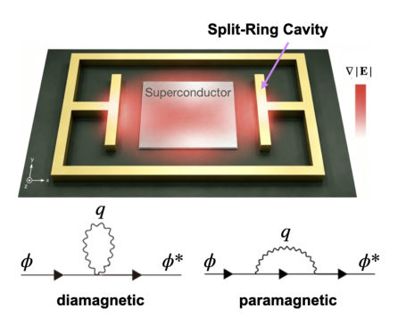
<figcaption class="paper-figure-caption"><b>Fig 1.</b> FIG. 1: (Top) A superconducting sample (gray) embedded in a metallic split-ring cavity (yellow). The spatially nonuni- form vacuum electromagnetic mode of the cavity plays a cen- tral role in the cavity-induced renormalization of supercon- ductivity. (Bottom) Leading Feynman diagrams describing the renormalization of the superconducting order parameter by cavity vacuum fields.</figcaption>
</figure>
<figure class="paper-figure-card">
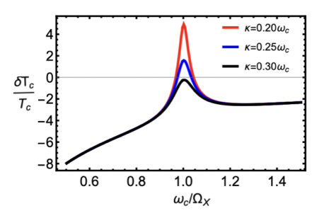
<figcaption class="paper-figure-caption"><b>Fig 2.</b> FIG. 2: Cavity-induced shift of the superconducting transi- tion temperature, δTc, as a function of the cavity frequency for different cavity or X-mode damping rates. The enhance- ment peaks near the resonance condition ωc = ΩX and is reduced as the dissipation κ increases. Other parameters are set to α0 = 1 µeV, 2mΩXL2 c = 10, Vc = 100 (µm)3, and Λ0gX = 0.1 ω2 c.</figcaption>
</figure>
<figure class="paper-figure-card">
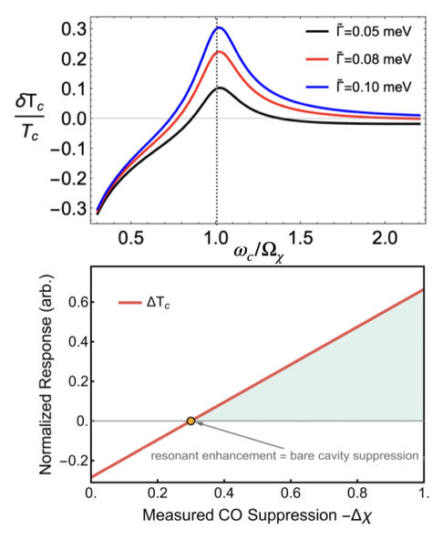
<figcaption class="paper-figure-caption"><b>Fig 3.</b> FIG. 3: (Top) Cavity-modified superconducting transition temperature Tc versus cavity frequency ωc for various cou- pling strengths ˜Γ ≡ηλ0/(2uχϵωc). (Bottom) The enhance- ment of Tc is accompanied by a suppression of the CO.</figcaption>
</figure>

**Summary.** This theoretical paper investigates how coupling superconductors to electromagnetic cavities affects their critical temperature ($T_c$). It first proves that simple vacuum fluctuations suppress superconductivity (a no-go theorem). To achieve enhancement, the authors show that one must introduce additional coupled material modes—either through a collective excitation or by suppressing a competing order—making it a guide for designing superconducting devices using cavity QED principles.

**Why it may be interesting.** This work directly bridges superconducting physics with cavity quantum electrodynamics (Cavity QED) by treating vacuum fluctuations as a tunable parameter. The identification of necessary additional coupled modes provides concrete design principles for enhancing superconductivity using optical cavities, which is highly relevant to AMO/Quantum Optics.

Detailed structure

**Main problem.** The primary question is determining the conditions under which vacuum electromagnetic fluctuations, mediated by a cavity, can enhance superconductivity (increase $T_c$).

**Main result.** A no-go theorem proves that minimal coupling to passive cavity modes suppresses superconductivity; enhancement requires introducing additional coupled material degrees of freedom.

**Method.** The authors derive the effective superconducting free energy by integrating out the quantized cavity mode, leading to corrections involving diamagnetic and paramagnetic terms.

**Model / system.** The system is a bulk superconductor described by Ginzburg-Landau theory ($\phi$), minimally coupled to quantized cavity modes ($A$). Enhancement mechanisms involve coupling to additional collective excitations or competing order parameters ($\chi$).

**Key observables.** Superconducting transition temperature shift ($\delta T_c$); the balance between diamagnetic and paramagnetic energy corrections.

**Important parameters / regimes.** Cavity frequency ($\omega_c$), material mode frequencies ($\Omega_X$), and the coupling strength of the additional degrees of freedom.

**Assumptions / limitations.** The initial analysis assumes minimal coupling to a passive cavity. Circumvention requires introducing additional coupled modes (collective or competing order).

**Figures summary.** Figure 1 illustrates renormalization diagrams; Figure 2 shows $\delta T_c$ dependence on cavity frequency, peaking at resonance for the collective-mode route; Figure 3 shows enhancement/suppression for the competing order.

**Paper structure.** The paper first establishes the no-go theorem using minimal coupling. It then systematically explores two routes beyond this constraint: the collective-mode route and the competing-order route, showing how each can lead to enhanced $T_c$ near resonance.

Abstract

Recent experiments reporting cavity-vacuum-modified superconductivity raise a fundamental question: under what conditions can vacuum electromagnetic fluctuations increase a superconducting transition temperature? Starting from a Ginzburg--Landau theory minimally coupled to a quantized cavity mode, we derive the cavity-induced renormalization of the superconducting free energy. This correction comprises a positive diamagnetic contribution and a negative paramagnetic exchange contribution. We prove that, in a passive cavity, the latter cannot exceed the former, establishing a no-go theorem: within minimal cavity electrodynamics, vacuum fluctuations suppress, rather than enhance, superconductivity. We then identify two routes beyond this constraint, both involving additional collective degrees of freedom. In the collective-mode route, a cavity-active excitation amplifies the attractive paramagnetic contribution. In the competing-order route, the cavity weakens an order that competes with superconductivity, thereby indirectly enhancing superconductivity. Together, these results turn the no-go theorem into a practical design principle: cavity superconductivity enhancement requires an additional cavity-coupled material mode that either strengthens paramagnetic exchange or suppresses a competing order.

[↑ back to top](#top)

### [Dynamic critical exponent of the Yang--Lee edge singularity at three loops](http://arxiv.org/abs/2608.15887v1)

**Authors:** Loran Ts. Adzhemyan, Diana A. Davletbaeva, Daniil A. Evdokimov, Mikhail V. Kompaniets  
**Type:** theory · **Category:** statistical mechanics · **PDF:** <https://arxiv.org/pdf/2608.15887v1>  
**Analysis basis:** full PDF text, analyzed in chunks
**Topic relevance:** `Keldysh / 2PI / non-Gaussian methods` **3/5** · `non-equilibrium universality` **3/5** · `driven-dissipative phase transition` **2/5** · `methods for driven-dissipative` **2/5** · `analog quantum simulation` **1/5** · `correlated / nonlocal dissipation` **1/5** · `scars & prethermalization` **1/5**

↔ Scroll figures horizontally

<figure class="paper-figure-card">
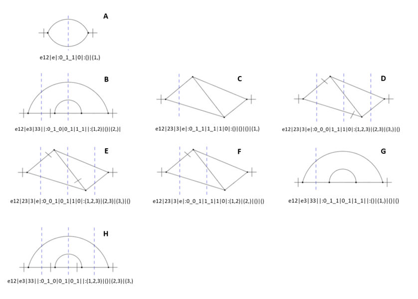
<figcaption class="paper-figure-caption"><b>Fig 1.</b> Figure 1. The list of all one- and two-loop time versions with their corresponding Nickel-like indices after performing the diagram reduction. The assignment of indices to dynamic diagrams with time cuts is described in [36].</figcaption>
</figure>

**Summary.** This paper calculates the dynamic critical exponent for the Yang–Lee edge singularity using high-order perturbative renormalization group theory. The methodology is highly technical, involving diagram reduction and multi-loop integration techniques like Sector Decomposition. It provides a robust estimate of $z$ by resumming the perturbative series to three loops, confirming consistency with established theoretical benchmarks.

**Why it may be interesting.** While focused on critical dynamics rather than AMO systems directly, the sophisticated use of RG theory, diagrammatic techniques, and advanced summation methods (hyperlogarithms) represents state-of-the-art theoretical physics applicable to analyzing non-equilibrium quantum many-body systems.

Detailed structure

**Main problem.** The primary goal is computing the dynamic critical exponent ($z$) associated with the Yang–Lee edge singularity (YLES) in relaxational dynamics.

**Main result.** The authors obtain a three-loop estimate for $z$ using advanced resummation techniques, finding results consistent with previous perturbative and functional renormalization group calculations across various spatial dimensions.

**Method.** The calculation employs perturbative Renormalization Group (RG) methods, combining diagram reduction, analytic two-loop evaluation via parametric integration with hyperlogarithms, and numerical three-loop integral evaluation using Sector Decomposition.

**Model / system.** The study models critical dynamics using a scalar field theory exhibiting an imaginary coupling constant ($i g_0$), described by a Langevin-type formulation (Model A in Hohenberg-Halperin classification).

**Key observables.** Dynamic critical exponent ($z$), renormalization constants ($Z_i$), and the running coupling constant $u$.

**Important parameters / regimes.** Spatial dimensions ($d$), loop order (up to three loops), and tuning parameters for resummation techniques.

**Assumptions / limitations.** The analysis assumes that an imaginary fixed point can control real infrared asymptotic scaling behavior, and it relies on advanced mathematical tools like hyperlogarithms and sector decomposition for convergence.

**Figures summary.** Figure 1 illustrates the indices of one- and two-loop time versions after diagram reduction; Table II summarizes the final resummed estimates for $z$ across dimensions $d=1$ to $d=5$.

**Paper structure.** The paper systematically develops the formalism by first addressing the complexity of dynamic diagrams, applying advanced renormalization techniques (BPHZ-like schemes), and finally presenting the results through multi-loop calculations followed by rigorous resummation using Padé and PBL methods.

Abstract

We compute the dynamic critical exponent $z$ of the Yang--Lee edge singularity in relaxational dynamics using perturbative renormalization-group methods to the three-loop order. The calculation combines diagram reduction, analytic two-loop evaluation via parametric integration with hyperlogarithms, and numerical evaluation of three-loop integrals using the Sector Decomposition method. The perturbative series obtained is resummed using Padé and Padé-Borel-Leroy methods to produce estimates of $z$ in various spatial dimensions. The resulting values are consistent with previous perturbative and functional renormalization-group calculations.

[↑ back to top](#top)

### [On Casimir force between two real metallic plates](http://arxiv.org/abs/2608.16619v1)

**Authors:** Michael V. Davidovich  
**Type:** theory · **Category:** other · **PDF:** <https://arxiv.org/pdf/2608.16619v1>  
**Analysis basis:** full PDF text, analyzed in chunks
**Topic relevance:** `Keldysh / 2PI / non-Gaussian methods` **3/5** · `driven-dissipative phase transition` **2/5** · `methods for driven-dissipative` **2/5** · `non-equilibrium universality` **2/5** · `analog quantum simulation` **1/5** · `correlated / nonlocal dissipation` **1/5** · `quantum measurements` **1/5** · `scars & prethermalization` **1/5**

↔ Scroll figures horizontally

<figure class="paper-figure-card">
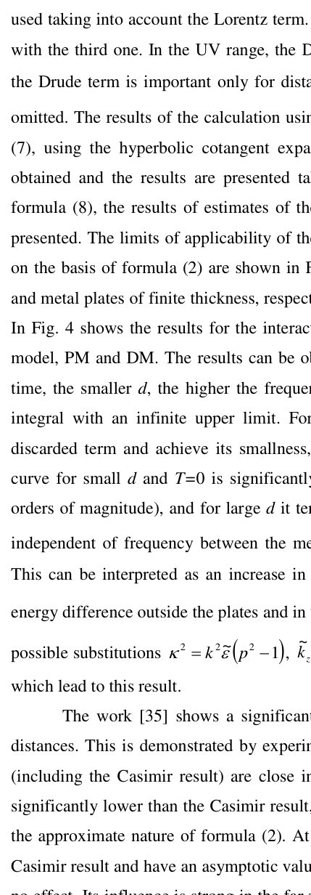
<figcaption class="paper-figure-caption"><b>Fig 1.</b> Fig. 1.</figcaption>
</figure>
<figure class="paper-figure-card">
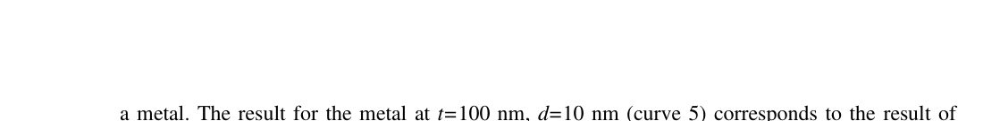
<figcaption class="paper-figure-caption"><b>Fig 2.</b> Fig. 2 at d=10 nm. The choice of DP model is essential. Most of the results in the literature are</figcaption>
</figure>
<figure class="paper-figure-card">
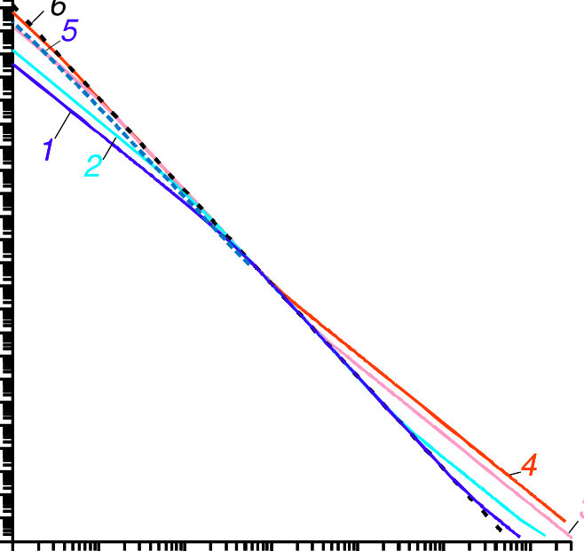
<figcaption class="paper-figure-caption"><b>Fig 3.</b> Fig. 1. External Casimir pressure P (N/m2) on two ideally conductive metal layers depending on</figcaption>
</figure>
<figure class="paper-figure-card">
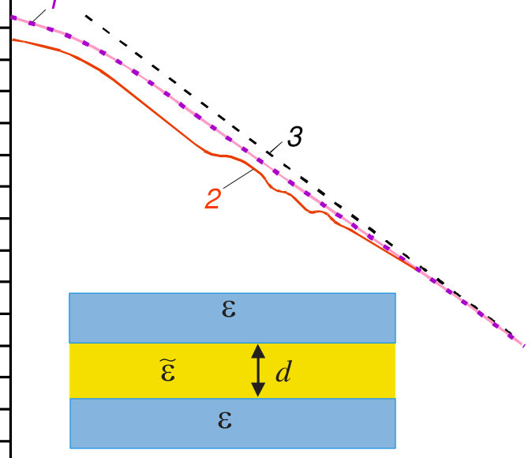
<figcaption class="paper-figure-caption"><b>Fig 4.</b> Fig. 2. External Casimir pressure P (N/m2) as a function of thickness d (nm) for thick metal plates (silver, p=1.57×1016 Hz, c=3.2×1013 Hz, L=9.6) separated by a vacuum gap d (curve 1) and approximation L by three Lorentz terms with frequencies with frequencies of 2×1017, 5×1017 and 1018 Hz (2). The result of Casimir is shown by line 3</figcaption>
</figure>
<figure class="paper-figure-card">
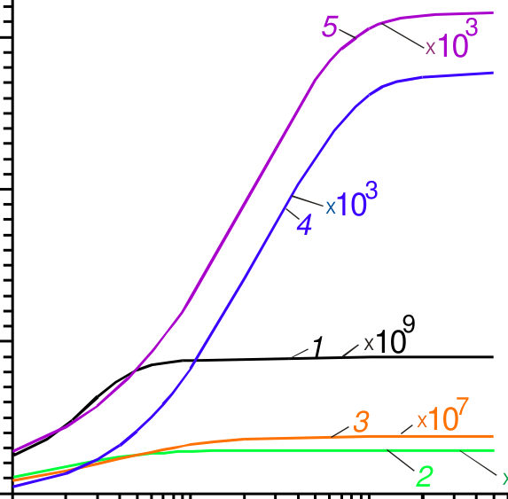
<figcaption class="paper-figure-caption"><b>Fig 5.</b> Fig. 3. External Casimir pressure P=F/L2 (N/m2) on two dielectric layers L=20 depending on the</figcaption>
</figure>

**Summary.** This theoretical paper calculates the Casimir force between real metal plates by incorporating finite temperature and conductivity effects using advanced dielectric models. The authors critically analyze existing literature formulas, demonstrating mathematical inconsistencies that necessitate including dissipation terms for physically accurate results. It provides a detailed comparison of various physical regimes and material approximations.

**Why it may be interesting.** While focused on electrodynamics, the rigorous treatment of boundary conditions, dissipation ($\epsilon''$), and temperature corrections to vacuum forces touches upon open quantum system dynamics where environmental coupling is crucial for energy renormalization.

Detailed structure

**Main problem.** The paper investigates corrections to the Casimir force between two real metallic plates, accounting for finite temperature and conductivity effects.

**Main result.** The authors show that several published formulas for the correction terms are inconsistent due to mathematical divergences, requiring the inclusion of dissipation ($\propto \epsilon''(\omega)$) in the frequency integral for consistency.

**Method.** The analysis relies on the Lifshitz formula, involving complex contour integration over frequency and wave vector, comparing results derived from various dielectric models (Drude, Plasma, etc.).

**Model / system.** The system is two parallel metallic plates separated by a distance $d$. The material response is modeled using several dielectric functions ($\epsilon(\omega)$), including the Drude model, which captures frequency-dependent conductivity and temperature effects.

**Key observables.** Casimir pressure ($P$) and force density ($F$), showing dependence on separation distance ($d$) and temperature ($T$).

**Important parameters / regimes.** Separation distance $d$, Temperature $T$ (e.g., 5 K to 900 K), plasma frequency ($\omega_p$), collision frequency ($\omega_c$).

**Assumptions / limitations.** The analysis critically examines the mathematical consistency of existing literature formulas, particularly regarding how dissipation terms are handled in the integration process.

**Figures summary.** Figures illustrate the external Casimir pressure $P$ for various conditions: dependence on separation distance ($d$) and temperature ($T$), and comparison between different material models (Plasma vs. Drude-Smith).

**Paper structure.** The paper progresses by establishing the theoretical framework using the Lifshitz formula, comparing results from multiple dielectric models across different physical regimes (near/far zones), and rigorously analyzing mathematical inconsistencies in prior literature.

Abstract

The corrections to Casimir pressure (force) on two plates of real metal described by the dielectric constant of the Drude, Drude-Lorentz, Drude-Smith and plasma models at the finite temperature and conductivity are considered. We consider the contour integral lost in the Lifshitz formula and discuss inconsistencies for the corrections to the Casimir force given in the literature. Numerical and analytical results in the near and far zones are presented. The two first-order correction obtained due to the actual dielectric constant of the metal coincided with the literature data.

[↑ back to top](#top)

### [Quantum Mpemba Speedups in the Thermodynamics of Landauer Erasure](http://arxiv.org/abs/2608.16254v1)

**Authors:** Pritam Chattopadhyay  
**Type:** theory · **Category:** statistical mechanics · **PDF:** <https://arxiv.org/pdf/2608.16254v1>  
**Analysis basis:** full PDF text, analyzed in chunks
**Topic relevance:** `driven-dissipative phase transition` **3/5** · `methods for driven-dissipative` **3/5** · `Keldysh / 2PI / non-Gaussian methods` **2/5** · `non-equilibrium universality` **2/5** · `correlated / nonlocal dissipation` **1/5** · `quantum measurements` **1/5** · `scars & prethermalization` **1/5**

↔ Scroll figures horizontally

<figure class="paper-figure-card">
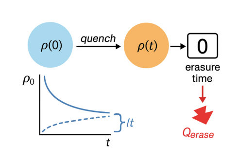
<figcaption class="paper-figure-caption"><b>Fig 1.</b> FIG. 1. A general setup of quantum Mpemba–enhanced Landauer erasure. A quantum memory is encoded in a finite-dimensional Hilbert space with logical-zero subspace, and logical-one is stored in the orthogonal complement. The system is initially prepared in a thermal state ρth(Tprep) of an input Hamiltonian, then quenched to an erasure Hamiltonian and weakly coupled to a bath at temperature Tb, generating Lindblad dynamics that drive the memory toward the logical zero subspace.</figcaption>
</figure>
<figure class="paper-figure-card">
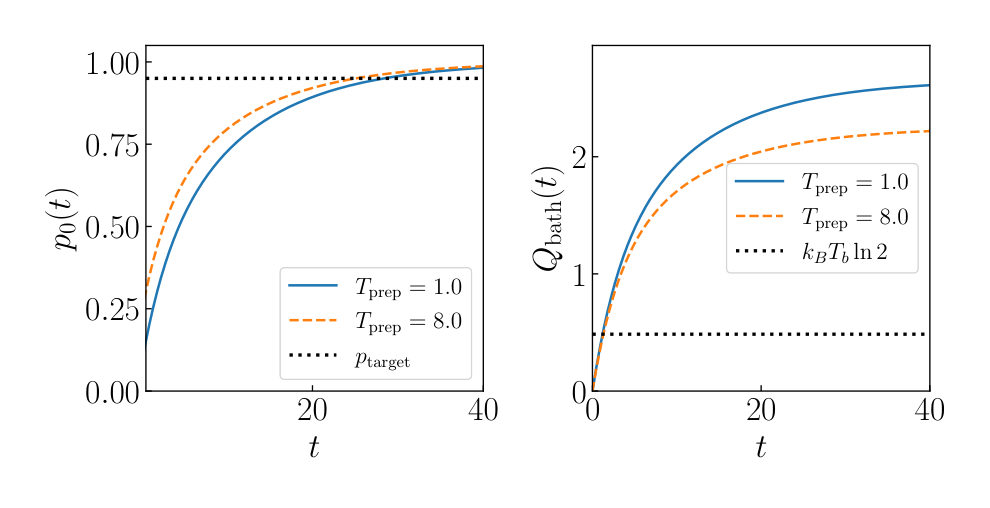
<figcaption class="paper-figure-caption"><b>Fig 2.</b> FIG. 2. Finite-time Landauer cost and Mpemba advantage in a qutrit memory. Erasure dynamics for a minimal three-level model coupled to a thermal bath at temperature Tb = 0.6. The population p0(t) of the logical-zero level is shown for two thermal preparations at different temperatures T (c) prep (cold in blue solid line) and T (h) prep &gt; T (c) prep (hot in orange dashed line), evolving under the same Davies generator. The hotter preparation reaches the target fidelity ptarget at a shorter erasure time τ(h) erase &lt; τ(c) erase, while the accumulated dissipated heat at erasure satisfies Q(h) bath(τ(h) erase) &lt; Q(c) bath(τ(c) erase), thereby realizing a genuine quantum Mpemba–enhanced Landauer...</figcaption>
</figure>
<figure class="paper-figure-card">
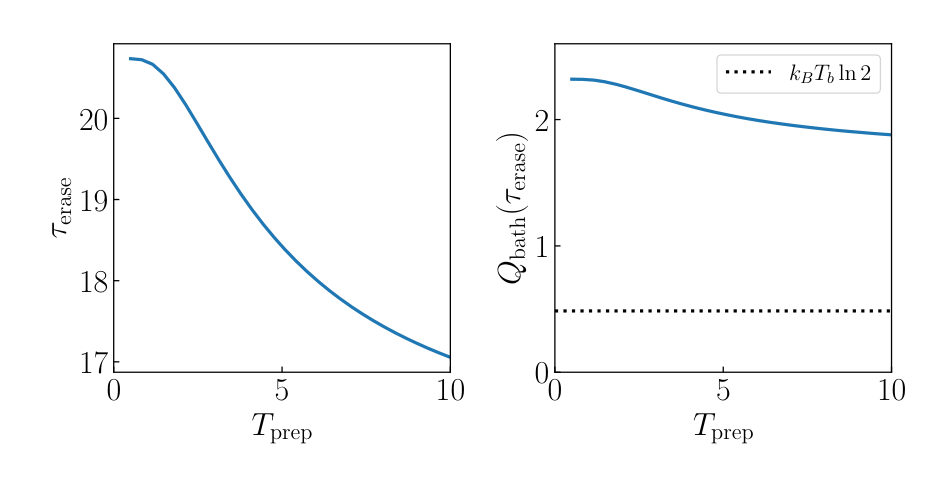
<figcaption class="paper-figure-caption"><b>Fig 3.</b> FIG. 3. Erasure time and finite-time thermodynamic cost as a function of the preparation temperature in the qutrit memory of Fig. 2. Left: operational erasure time τerase versus Tprep for bath temperature Tb = 0.6 and erasure Hamiltonian. Right: total dissipated heat at erasure Qbath(τerase), with the dotted line indicating the quasistatic LB kBTb ln 2. Both quantities show a strong dependence on Tprep and exhibit broad parameter regimes in which hotter preparations simultaneously reduce τerase and Qbath, realizing Mpemba–enhanced Landauer erasure for many hot–cold pairs. The Hamiltonian parameters are the same as Fig. 2.</figcaption>
</figure>

**Summary.** The paper explores how preparing a quantum memory in a non-equilibrium, hot state can accelerate the erasure process and reduce the minimum heat dissipated compared to standard cold preparations. It achieves this by leveraging the spectral properties of the system's Liouvillian evolution, establishing a quantifiable 'Mpemba–Landauer condition' for such speedups.

**Why it may be interesting.** This work directly connects non-equilibrium thermodynamics (Mpemba effect) to fundamental quantum information processing limits (Landauer principle), providing concrete physical mechanisms for improving computational efficiency in open quantum systems.

Detailed structure

**Main problem.** The research investigates how non-equilibrium quantum initial states can reduce the finite-time thermodynamic cost associated with Landauer erasure.

**Main result.** A modified Landauer bound is derived showing excess dissipation scales quadratically with the slow mode projection, and a 'Mpemba–Landauer condition' proves that hotter states can erase faster and dissipate less heat than colder ones without violating Landauer's principle.

**Method.** The analysis utilizes Liouvillian spectral theory to decompose time evolution into relaxation modes, focusing on the single slowest mode approximation for thermodynamic cost calculations.

**Model / system.** The system is a general finite-dimensional quantum memory coupled to a thermal reservoir via a Davies generator. Illustrations use a minimal qutrit model, and practical applications are suggested for superconducting circuits or trapped ions.

**Key observables.** Dissipated heat into the bath (Q_bath), operational erasure time ($	au_{erase}$), and the overlap coefficients ($c_j$) quantifying initial state relaxation modes.

**Important parameters / regimes.** Preparation temperature ($T_{prep}$), fidelity target ($p_{target}$), and the spectral gap defined by the slowest Liouvillian eigenvalue ($\lambda_1$).

**Assumptions / limitations.** The analysis relies heavily on controlled approximations, specifically assuming that higher-order Liouvillian modes decay much faster than the single slowest mode.

**Figures summary.** Figures illustrate the general setup of Mpemba-enhanced erasure, showing population dynamics ($p_0(t)$) for hot vs. cold preparations, and plotting $	au_{erase}$ and $Q_{bath}(	au_{erase})$ versus preparation temperature to confirm speedup/cooling effects.

**Paper structure.** The paper builds from establishing the general Liouvillian framework (eigenmodes, spectral decomposition), deriving the modified Landauer bound using slow-mode approximations, proving the Mpemba–Landauer condition via comparison of hot vs. cold protocols, and concluding with practical control knobs for implementation.

Abstract

We investigate how nonequilibrium quantum initial states can reduce the finite-time thermodynamic cost of Landauer erasure. Considering a general finite-dimensional quantum memory coupled to a thermal reservoir via a Davies generator, we show that the dissipated heat at a fixed operational erasure fidelity is largely controlled by the overlap of the initial state with the slowest Liouvillian relaxation mode. We derive a modified finite-time Landauer bound in which the excess dissipation above the quasistatic limit scales quadratically with this slow mode projection, and we prove a sufficient Mpemba Landauer condition under which a hotter state can erase faster and dissipate less heat than a colder preparation, without violating Landauer's principle. A minimal qutrit model illustrates these quantum Mpemba speedups and reveals broad parameter regimes where coherence and Hamiltonian-induced modes conspire to suppress finite-time entropy production. We further identify practical control knobs, including temperature tuning, coherence engineering, and Hamiltonian shaping of Liouvillian spectra, which enable Mpemba-enhanced erasure to be directly tested on platforms such as superconducting circuits, trapped ions, semiconductor quantum dots, and solid-state spins.

[↑ back to top](#top)

### [Renormalization-group locking of finite anisotropic propagation cones in Yukawa networks](http://arxiv.org/abs/2608.15661v1)

**Authors:** Shuai Zeng  
**Type:** theory · **Category:** statistical mechanics · **PDF:** <https://arxiv.org/pdf/2608.15661v1>  
**Analysis basis:** full PDF text, analyzed in chunks
**Topic relevance:** `Keldysh / 2PI / non-Gaussian methods` **3/5** · `analog quantum simulation` **2/5** · `driven-dissipative phase transition` **2/5** · `methods for driven-dissipative` **2/5** · `non-equilibrium universality` **2/5** · `correlated / nonlocal dissipation` **1/5** · `scars & prethermalization` **1/5**

↔ Scroll figures horizontally

<figure class="paper-figure-card">
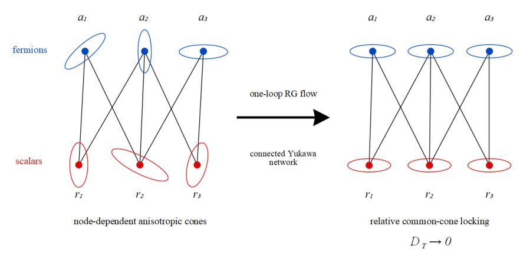
<figcaption class="paper-figure-caption"><b>Fig 1.</b> Figure 1. Conceptual overview of common-cone locking in a connected Yukawa network. Left: fermion and scalar nodes carry node-dependent anisotropic spatial propagation cones. Middle: the one-loop RG acts on the connected bipartite interaction graph. Right: persistent connected interactions drive relative common-cone locking, quantified by DT →0. Connectivity underlies the global-locking theorem, while graph distance controls the onset order in the topology-sensitive short-time law.</figcaption>
</figure>
<figure class="paper-figure-card">
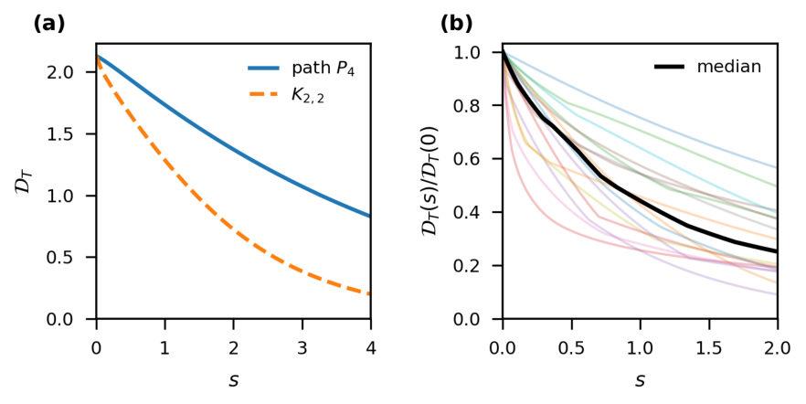
<figcaption class="paper-figure-caption"><b>Fig 2.</b> Figure 2. Representative locking trajectories of the normalized finite-matrix flow. (a) Thompson diameter DT for the same four initial SPD cones on the path P4 and the complete bipartite graph K2,2, with bαe = bβe = 1. (b) Normalized diameter for sixteen random connected 2 + 3 bipartite networks with positive rates in the interval eq. (4.28); the black curve is the pointwise median. The horizontal variable s is accumulated interaction time.</figcaption>
</figure>
<figure class="paper-figure-card">
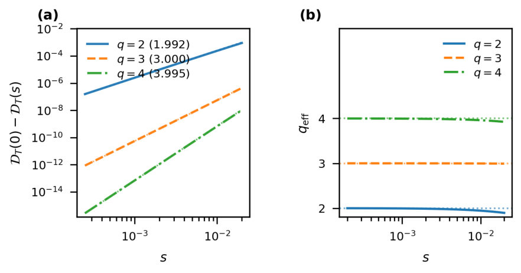
<figcaption class="paper-figure-caption"><b>Fig 3.</b> Figure 3. Topology-sensitive onset for symmetric two-plateau data on path graphs. (a) Diameter decrease DT (0) −DT (s) for P4, P6, P8, together with the predicted sq scaling; the parenthetical values in the legend are fitted powers over eq. (5.21). (b) Effective exponent qeff(s), approaching 2, 3, 4 toward short accumulated interaction time.</figcaption>
</figure>

**Summary.** This theoretical paper analyzes how local Yukawa interactions on a network can force disparate physical fields into sharing a single common infrared propagation cone. By deriving nonlinear matrix flow equations, the authors prove that renormalization group dynamics drive this geometric locking across the entire connected system. This demonstrates that global structure can emerge from local interactions via RG evolution.

**Why it may be interesting.** While focused on field theory, the use of RG flow dynamics, geometric invariants (Thompson diameter), and convergence proofs for coupled systems provides powerful mathematical tools applicable to analyzing complex many-body relaxation or synchronization in quantum systems.

Detailed structure

**Main problem.** The study investigates whether local Yukawa interactions on a finite graph can force different field species to share a single common infrared spatial propagation cone, even when the interactions driving this locking are marginally irrelevant.

**Main result.** Renormalization-group dynamics can collectively select and enforce a common relative propagation geometry (common-cone locking) across all interacting sectors in the network.

**Method.** The analysis involves deriving one-loop nonlinear matrix flow equations for the kinetic matrices, utilizing concepts from differential geometry like the Thompson diameter to quantify geometric mismatch.

**Model / system.** The model is a multichannel Dirac–scalar Yukawa theory defined on a finite bipartite graph. Fields possess anisotropic propagation geometries described by positive-definite spatial kinetic matrices.

**Key observables.** Thompson diameter (DT), which quantifies the mismatch in relative propagation geometry; the evolution of the relative matrix R.

**Important parameters / regimes.** One-loop approximation, weak coupling regime, finite graph connectivity, and graph distance controlling onset order.

**Assumptions / limitations.** The analysis assumes positive-definite spatial kinetic matrices and requires persistent normalized edge activity to achieve full contraction.

**Figures summary.** Figures conceptually illustrate the transition from initial anisotropic cones to a common-cone locked state driven by RG flow, with connectivity determining the asymptotic fate.

**Paper structure.** The paper develops the one-loop nonlinear matrix flow equations for relative kinetic matrices. It proves that this flow leads to global nonexpansion and, under persistent activity, a finite-window contraction of the Thompson diameter, demonstrating common-cone locking.

Abstract

Different field species can begin with finite anisotropic propagation geometries whose principal axes need not coincide. We ask whether local Yukawa interactions on a finite graph can nevertheless generate one common infrared spatial cone, even when the interactions that drive the locking become marginally irrelevant. Retaining the full finite mismatch between positive-definite spatial kinetic matrices, we derive the one-loop nonlinear matrix flow and show that its Thompson diameter is globally nonexpansive. On a connected graph, persistent normalized edge activity upgrades this to a uniform finite-window contraction, so all interacting sectors asymptotically share one relative propagation geometry. An explicit two-channel Pauli-Dirac Yukawa-quartic completion realizes the persistence conditions on an open weak-coupling set of finite-mismatch initial data. In four dimensions the Yukawa couplings vanish in the infrared, yet their accumulated interaction time diverges, leaving a Gaussian endpoint with a common spatial cone. For a controlled two-plateau extremal class, graph distance also fixes the first nonzero short-time order of the diameter decrease. Thus a common cone can be collectively selected by renormalization-group dynamics rather than imposed as a microscopic common structure.

[↑ back to top](#top)

### [Stochastic Liouville-transport theory of light-atom interaction noise in thermal atomic vapors](http://arxiv.org/abs/2608.15130v1)

**Authors:** Shaoxin Yuan, Bin Wu, Mingyong Jing, Chaoyang Hu, Yan Peng, Tingting Li, Xingya Li, Wenguang Yang, Junyao Xie, Zongkai Liu, Hao Zhang, Linjie Zhang, Liantuan Xiao, Suotang Jia  
**Type:** both · **Category:** other · **PDF:** <https://arxiv.org/pdf/2608.15130v1>  
**Analysis basis:** full PDF text, analyzed in chunks
**Topic relevance:** `Keldysh / 2PI / non-Gaussian methods` **3/5** · `methods for driven-dissipative` **3/5** · `correlated / nonlocal dissipation` **2/5** · `quantum measurements` **2/5** · `driven-dissipative phase transition` **1/5** · `interference shaping light` **1/5** · `quantum optics experiment` **1/5**

↔ Scroll figures horizontally

<figure class="paper-figure-card">
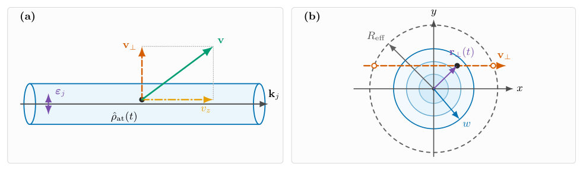
<figcaption class="paper-figure-caption"><b>Fig 1.</b> FIG. 1. Single-atom Liouville–transport dynamics. (a) Longitudinal excitation for a representative drive channel j and decomposition of the atomic velocity. (b) Transverse ballistic trajectory through the circular Gaussian mode and open renewal boundary.</figcaption>
</figure>
<figure class="paper-figure-card">
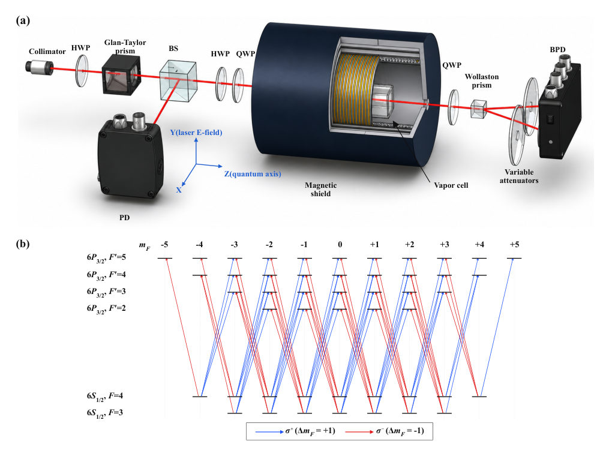
<figcaption class="paper-figure-caption"><b>Fig 2.</b> FIG. 2. Experimental apparatus and Cs D2 coupling scheme. (a) Optical layout for single-arm and balanced detection of the circular components. HWP, half-wave plate; QWP, quarter-wave plate; BS, beam splitter; PD, photodetector; BPD, balanced photodetector. (b) Hyperfine manifolds retained in the 48-state model. Blue and red arrows indicate the allowed ∆mF = +1 and −1 couplings, respectively.</figcaption>
</figure>
<figure class="paper-figure-card">
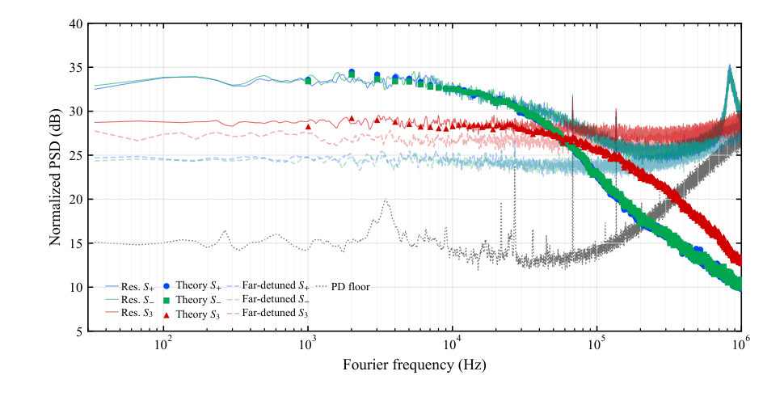
<figcaption class="paper-figure-caption"><b>Fig 3.</b> FIG. 3. Near-zero-field one-sided PSDs of S+, S−, and S3. Solid and pale dashed curves show the corrected resonant measure- ments and far-detuned baselines, respectively; blue circles (S+), green squares (S−), and red triangles (S3) show the atom-only calculations. The gray dotted curve is the photodetector noise floor.</figcaption>
</figure>
<figure class="paper-figure-card">
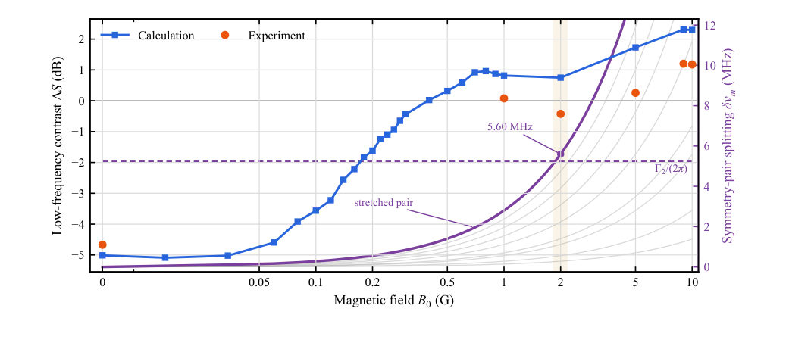
<figcaption class="paper-figure-caption"><b>Fig 4.</b> FIG. 4. Low-frequency contrast ∆S (left axis) and relative Zeeman splitting between symmetry-related q = +1 (σ+) and q = −1 (σ−) transitions (right axis). The purple curve denotes the stretched-state pair, and the dashed line marks Γ2/(2π).</figcaption>
</figure>

**Summary.** The authors develop a stochastic Liouville-transport theory to accurately model light-atom interaction noise in thermal atomic vapors. By jointly treating internal state evolution, finite-mode motion, and boundary renewal, the theory explains observed spectral features in Cs D2 spectra. This framework is crucial for advancing quantum sensing by providing a comprehensive understanding of noise sources beyond simple approximations.

**Why it may be interesting.** This work provides a rigorous, unified theoretical framework for noise characterization in quantum sensors operating in realistic thermal environments, explicitly coupling spatial dynamics (transport) with internal quantum coherence (Liouville evolution).

Detailed structure

**Main problem.** Atom-light interaction noise limits quantum sensing in thermal atomic vapors, and existing theories fail to account for the coupled effects of internal dynamics, motion, and renewal.

**Main result.** The theory successfully models how ballistic motion causes common-mode noise, while boundary renewal introduces differential fluctuations; it also reproduces field-dependent spectral changes observed in Cs D2 spectra.

**Method.** A general stochastic Liouville-transport theory is developed to model the open quantum dynamics of atoms moving through a sensing region.

**Model / system.** The system uses thermal atomic vapors (Cs D2) and models the evolution using an operator-valued phase-space density governed by a master equation incorporating Hamiltonian terms for hyperfine-Zeeman structure, detuning, and coupling, alongside transport and renewal terms.

**Key observables.** Polarization-resolved Power Spectral Densities (PSDs), specifically $S_+$, $S_-$, and the balanced difference $S_3(f)$, and the common-mode suppression factor $\Delta S$.

**Important parameters / regimes.** Noise frequency regime ($\approx 100$ kHz threshold), longitudinal magnetic field strength ($B_0$), and atomic constants related to hyperfine structure.

**Assumptions / limitations.** The theory adopts a collisionless, recoil-free ballistic limit for transport and utilizes the Rotating-Wave Approximation (RWA) for Hamiltonian evaluation.

**Figures summary.** Figures illustrate the optical setup for $\sigma^+$ and $\sigma^-$ detection, the hyperfine manifolds retained in the model, and plots showing the measured one-sided PSDs ($S_+$, $S_-$, $S_3$) across different magnetic fields.

**Paper structure.** The paper introduces the coupled stochastic Liouville theory, details the Hamiltonian and master equation governing dynamics (including transport/renewal), presents analysis of key observables like PSDs, and validates the model by reproducing experimental measurements for Cs D2 spectra under varying magnetic fields.

Abstract

Atom-light interaction noise can limit thermal-vapor sensing. Existing theories often treat internal-state dynamics, finite-mode atomic motion, and stochastic renewal separately, obscuring their coupled contributions to measured noise. We develop a general stochastic Liouville-transport theory, tested against polarization-resolved resonant Cs D$_2$ spectra. Joint experiment-theory analysis identifies atom-light noise below approximately 100 kHz as transit-dominated. Ballistic motion through the finite Gaussian mode modulates both the coupling-weighted effective atom number and trajectory-dependent Rabi coupling, producing predominantly common-mode noise. Boundary renewal introduces atoms with independently sampled ground-state sublevels, generating differential population fluctuations with opposite effects on the circular channels. Under an applied longitudinal magnetic field, experiment and theory show the same qualitative nonmonotonic change in common-mode suppression, supporting Zeeman redistribution of the channel responses. The framework can analyze noise in other thermal-atom sensors, including Rydberg-atom electric-field measurements.

[↑ back to top](#top)

### [Topologically Protected Learning from Exceptional Point Braiding: Toward Braid Programming](http://arxiv.org/abs/2608.15829v1)

**Authors:** M. N. Jipdi, C. Avomo Mba, A. B. Moubissi, L. C. Fai, M. E. Ateuafack  
**Type:** theory · **Category:** quantum information and computing · **PDF:** <https://arxiv.org/pdf/2608.15829v1>  
**Analysis basis:** full PDF text, analyzed in chunks
**Topic relevance:** `driven-dissipative phase transition` **3/5** · `methods for driven-dissipative` **3/5** · `analog quantum simulation` **2/5** · `non-equilibrium universality` **2/5** · `correlated / nonlocal dissipation` **1/5** · `quantum measurements` **1/5** · `scars & prethermalization` **1/5**

↔ Scroll figures horizontally

<figure class="paper-figure-card">
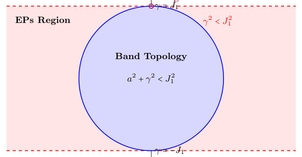
<figcaption class="paper-figure-caption"><b>Fig 1.</b> FIG. 1: Phase diagram in the (a,γ) plane for fixed J1. The blue circle a2 + γ2 = J2 1 bounds the topological region. The red dashed lines γ = ±J1 mark regions where EPs occur at k = 0,π. The purple circle illustrates an encirclement path around an EP within the band topological region.</figcaption>
</figure>
<figure class="paper-figure-card">
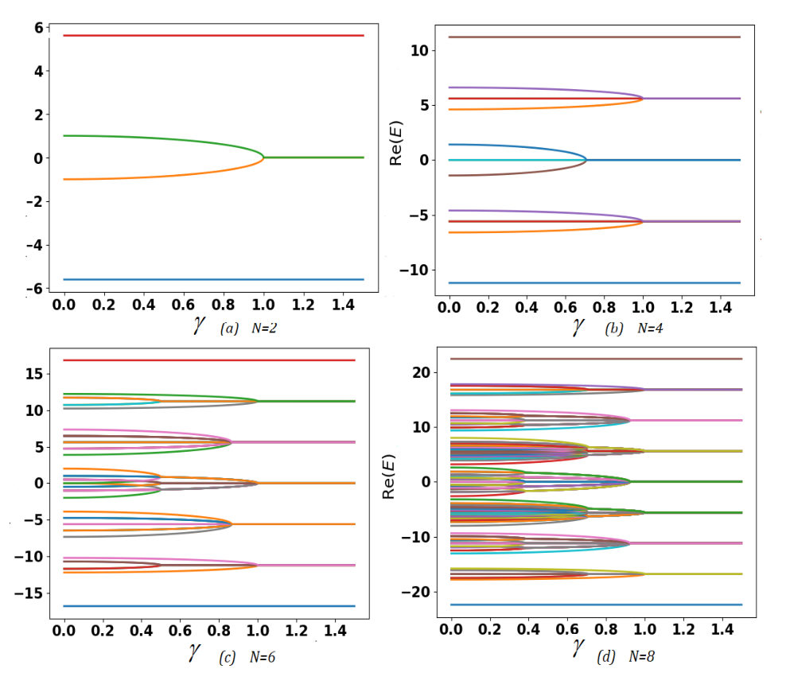
<figcaption class="paper-figure-caption"><b>Fig 2.</b> FIG. 2: Eigenvalue coalescence and exceptional point detection in real space for a = 3.5J1, J2 = 0.3J1, J1 = 1. (a) System with N = 2 spins. (b) System with N = 4 spins. (c) System with N = 6 spins. (d) System with N = 8 spins.</figcaption>
</figure>
<figure class="paper-figure-card">
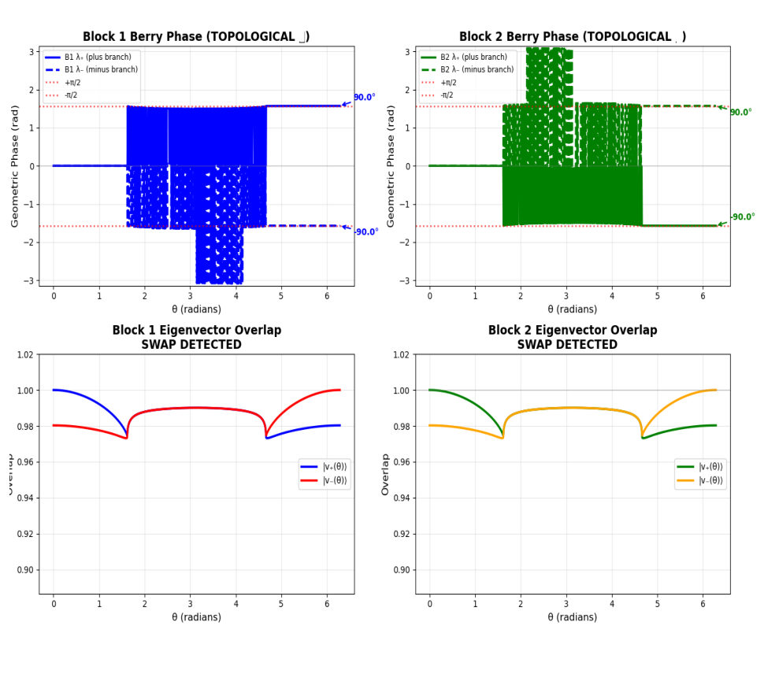
<figcaption class="paper-figure-caption"><b>Fig 3.</b> FIG. 3: Dynamics of eigenvectors around the exceptional point at k = π, γ = J1, for parameters a = 0.5J1, J2 = 0.3J1. (a) Berry phase accumulated during encirclement-Block 1. (b) Berry phase accumulated-Block 2. (c) Eigenvector overlap tracing state swap after encirclement-Block 1. (d) Eigenvector overlap tracing state swap after encirclement-Block 2.</figcaption>
</figure>
<figure class="paper-figure-card">
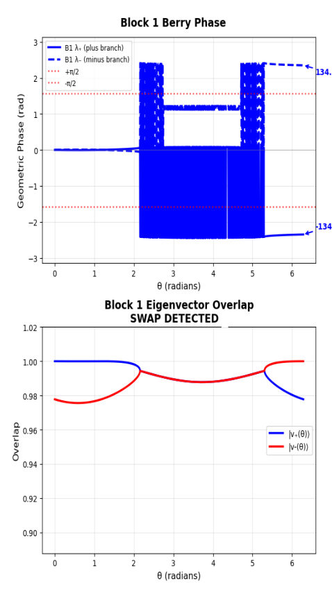
<figcaption class="paper-figure-caption"><b>Fig 4.</b> FIG. 4: Dynamics of eigenvectors around the exceptional point at k = π</figcaption>
</figure>
<figure class="paper-figure-card">
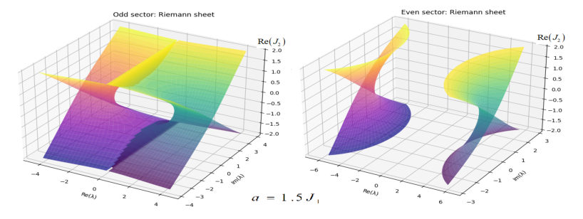
<figcaption class="paper-figure-caption"><b>Fig 5.</b> FIG. 5: Riemann sheets around the EP for a = 2.5J1, J2 = 0.3J1, γ = J1. (a) Odd sector (Block 1). (b) Even sector (Block 2).</figcaption>
</figure>

**Summary.** This paper proposes using the topology of Exceptional Points (EPs) in non-Hermitian Hamiltonians to create a robust computational substrate. By mapping learning onto 'braid programming' over the braid group, it replaces continuous gradient descent with discrete, topologically protected operations. This offers inherent noise immunity and is presented as a promising route for neuromorphic computing.

**Why it may be interesting.** This work directly connects non-Hermitian physics (EPs) with quantum computation primitives (braid gates), offering a novel physical realization pathway for topological quantum information processing relevant to AMO systems.

Detailed structure

**Main problem.** The work aims to overcome limitations of gradient-based optimization in deep learning by developing a topologically protected learning paradigm.

**Main result.** EP braiding provides a substrate for robust, interpretable neuromorphic computation by reformulating learning as a discrete search over the braid group.

**Method.** The authors derive topological invariants and use adiabatic encirclements around Exceptional Points (EPs) to generate a universal set of quantum gates.

**Model / system.** The framework utilizes a non-Hermitian Bogoliubov-de Gennes Hamiltonian, which is analyzed by mapping the system dynamics onto quasiparticle excitations.

**Key observables.** State-swap fidelity and normalized Berry phase are used as quantized topological invariants characterizing EPs.

**Important parameters / regimes.** The topological region $R_{Topo} = \{(\gamma, J_1, a) \mid \gamma^2 < J_2 1 \vee a = 0\}$ defines the operational regime for robust computation.

**Assumptions / limitations.** The core assumption is that non-Abelian holonomies generated by EP braiding provide inherent noise immunity and prevent catastrophic forgetting.

**Figures summary.** Not specified, but the notes mention a table summarizing braid words discovered by genetic search, linking target gates to specific braid words and fidelities.

**Paper structure.** The paper progresses from identifying the limitations of classical optimization to introducing EP braiding as a physical mechanism. It derives the topological map, establishes the universal gate set via adiabatic processes, and finally reformulates learning as braid programming using genetic search proof-of-concept results.

Abstract

We present a framework for topological learning based on exceptional point (EP) braiding in a non-Hermitian Bogoliubov-de Gennes Hamiltonian. A closed algebraic equation for the EP super-surface is derived; through momentum quantisation in finite systems, it predicts the exact number and parameter positions of all EPs in real space, irrespective of system size. The EP topology is characterised by two quantised invariants the state-swap fidelity and the normalised Berry phase which cannot both be zero for a topological EP. A complete topological map shows that all EPs lie within a specefic region. Adiabatic encirclements confirm robust state swapping and yield a universal set of braid gates, including Pauli-X, Pauli-Y, Pauli-Z, a Hadamard-like gate, the T-gate, and a SWAP operation, with the special case where a is 0, providing additional phase gates. Building on these generators, we reformulate learning as braid programming a discrete search over the braid group that replaces gradient descent on continuous weights with combinatorial optimisation. A proof-of-concept genetic search successfully discovers short braid words that reproduce the standard Hadamard gate and the H.Z gate with perfect fidelity. This paradigm offers inherent noise immunity, catastrophic-forgetting prevention through compositional concatenation, and guaranteed generalisation by mathematical construction, establishing EP braiding as a promising substrate for robust, interpretable, and topologically protected neuromorphic computation.

[↑ back to top](#top)

### [Degeneracy Counting Quantum Algorithm using Decoherence](http://arxiv.org/abs/2608.14941v1)

**Authors:** Malay Marut Das, Mark A. Novotny, Yaroslav Koshka  
**Type:** theory · **Category:** quantum information and computing · **PDF:** <https://arxiv.org/pdf/2608.14941v1>  
**Analysis basis:** full PDF text, analyzed in chunks
**Topic relevance:** `quantum measurements` **3/5** · `driven-dissipative phase transition` **2/5** · `methods for driven-dissipative` **2/5** · `Full counting statistics` **1/5** · `Keldysh / 2PI / non-Gaussian methods` **1/5** · `analog quantum simulation` **1/5** · `correlated / nonlocal dissipation` **1/5** · `non-equilibrium universality` **1/5**

↔ Scroll figures horizontally

<figure class="paper-figure-card">
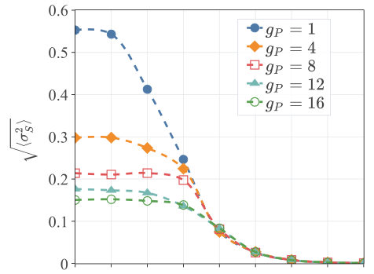
<figcaption class="paper-figure-caption"><b>Fig 1.</b> Fig. 1. The temperature dependence of the degree of decoherence 𝜎𝑆 of the Probe system 𝑆, shown for a few different values of the degeneracy of the problem 𝑔𝑃. Curves from the top to bottom correspond to 𝑔𝑃=1, 4, 8, 12, and 16, for the case when 𝑁𝑃= 20 (the largest NP investigated in this work). The low-temperature region of constant 𝜎𝑆, corresponding to when the state of the entirety 𝑆+ 𝑃 approaches the ground state, is used to calculate 𝑔𝑃,𝑀𝑒𝑎𝑠 in this work. In this and other figures, the dashed lines are guides to the eye.</figcaption>
</figure>
<figure class="paper-figure-card">
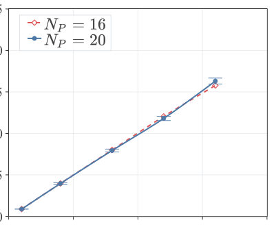
<figcaption class="paper-figure-caption"><b>Fig 2.</b> Fig. 3. The value of the degeneracy of the problem 𝑔𝑃,𝑀𝑒𝑎𝑠 determined using CTPQsd# versus the actual degeneracy 𝑔𝑃. The two curves are for the two cases of the biggest numbers of qubits in 𝑃 investigated in this work: 𝑁𝑃= 20 and 𝑁𝑃= 16. 𝑔𝑃 was extracted from the value of the decoherence at 𝑇= 10−8. For both 𝑁𝑃= 16 and 𝑁𝑃= 20, 350 averages with different random 𝛹0 were used. The error bars show the standard error of the mean (SEM) over the 350 realizations for 𝑁𝑃= 20. Although individual single-shot realizations exhibit a much larger spread, the ensemble mean 𝑔𝑃,𝑀𝑒𝑎𝑠 is determined precisely, as reflected by the small SEM, and aligns closely with the true values.</figcaption>
</figure>
<figure class="paper-figure-card">
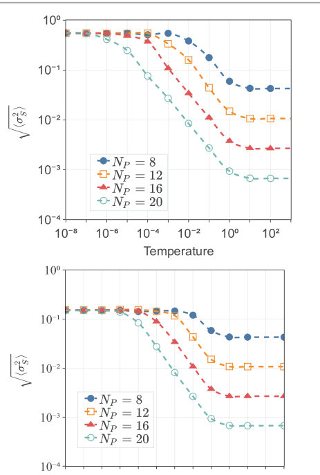
<figcaption class="paper-figure-caption"><b>Fig 3.</b> Fig. 2. The temperature dependence of the degree of decoherence 𝜎𝑆 of the Probe 𝑆, shown for a few different values of the 𝑁𝑃: (a) for 𝑔𝑃= 1 and (b) for 𝑔𝑃= 16. Curves from the top to bottom correspond to 𝑁𝑃= 8, 12, 16 and 20. An increasing number of qubits 𝑁𝑃requires lower T for reaching the required low-temperature region of constant 𝜎𝑆.</figcaption>
</figure>
<figure class="paper-figure-card">
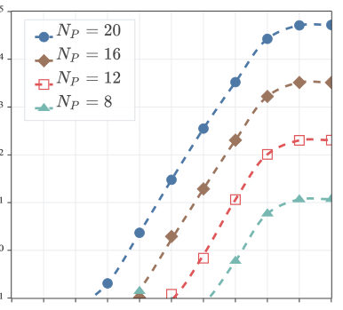
<figcaption class="paper-figure-caption"><b>Fig 4.</b> Fig. 4. The temperature dependence of the relative error |𝑔𝑃,𝑀𝑒𝑎𝑠−𝑔𝑃|/𝑔𝑃 in determining the degeneracy 𝑔𝑃,𝑀𝑒𝑎𝑠, shown for a few different values of the number of qubits in the problem 𝑁𝑃. The actual degeneracy in this figure 𝑔𝑃 is 16. Curves from the bottom to top correspond to the growing number of qubits in the problem: 𝑁𝑃= 8, 12, 16 and 20. The results indicate that an increasing number of qubits 𝑁𝑃 requires lower T for a correct determination of 𝑔𝑃 when other conditions are similar.</figcaption>
</figure>
<figure class="paper-figure-card">
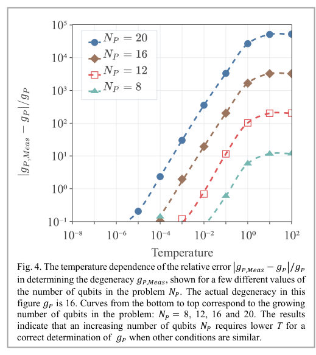
<figcaption class="paper-figure-caption"><b>Fig 5.</b> Fig. 5 examines the complementary question of whether the low-temperature regime 𝑇&lt; 𝑇1 depends on the problem degeneracy 𝑔𝑃. Fig. 5 plots ∣𝑔𝑃,𝑀𝑒𝑎𝑠−𝑔𝑃∣/𝑔𝑃 as a function of temperature for several degeneracy values 𝑔𝑃=1, 4, 8, 12, and 16, for fixed problem size 𝑁𝑃= 20. In contrast to the strong dependence on 𝑁𝑃 reported in Fig. 4, the threshold temperature 𝑇1 required for accurate degeneracy extraction shows only a weak dependence on 𝑔𝑃. Problems with lower 𝑔𝑃 may require somewhat lower T for a correct determination of 𝑔𝑃 when other conditions are similar.</figcaption>
</figure>

**Summary.** The paper introduces a novel quantum algorithm to count the number of global minima in hard optimization problems without needing to find any individual minimum. It achieves this by measuring only a small probe system's decoherence, leveraging a theoretical link between this measure and the problem's degeneracy. The results demonstrate its feasibility on random-energy Hamiltonians, offering a scalable approach for quantum computation.

**Why it may be interesting.** This work provides a concrete, resource-efficient quantum protocol that bypasses the exponential scaling of full system tomography by encoding complex combinatorial counts into measurable decoherence properties of a small ancillary system.

Detailed structure

**Main problem.** The core problem is determining the degeneracy (number of global optima) of a classical optimization problem, which is known to be \#P-hard.

**Main result.** A novel algorithm ($	ext{CTPQ}_{	ext{sd}\#}$) was developed that estimates this degeneracy by measuring only a small probe system ($S$), circumventing the need for full Hilbert space tomography.

**Method.** The method exploits a perturbative relationship between the decoherence measure of the small probe $S$ and the ground-state degeneracy of the large problem Hamiltonian $H_P$, when the combined system is prepared in a Canonical Thermal Pure Quantum (CTPQ) state.

**Model / system.** The algorithm applies to classical optimization problems encoded by diagonal random-energy Hamiltonians, modeled as an interaction between a small probe ($S$) and the large problem environment ($P$).

**Key observables.** Decoherence measure ($\sigma_S$), thermalization measure ($\delta_S$), and the estimated ground-state degeneracy ($g_{P,	ext{Meas}}$).

**Important parameters / regimes.** Temperature ($T$), energy range ($R$), problem size ($N_P$), and a user-defined energy tolerance ($\Delta g_P$).

**Assumptions / limitations.** The method relies on the existence of a perturbative relation in the low-temperature limit, and simulations are restricted to classical (diagonal) Hamiltonians.

**Figures summary.** Figures illustrate the temperature dependence of the absolute error for approximate degeneracy counting, revealing a two-threshold regime ($T_2 < T < T_1$), alongside plots showing decoherence ($\sigma_S$) vs. temperature.

**Paper structure.** The paper introduces the $	ext{CTPQ}_{	ext{sd}\#}$ algorithm based on theoretical relations derived from open quantum systems, demonstrates its application to diagonal random-energy Hamiltonians via numerical simulation, and systematically analyzes parameter dependence (temperature, energy range) to establish operational thresholds for counting.

Abstract

Counting the global optima of a classical optimization problem is a #P-hard task. We develop the canonical thermal pure quantum (CTPQ) state-based degeneracy counting (CTPQsd#) algorithm that determines the number of global optima of a classical optimization problem P by measuring only a small probe S, without finding individual minima. The method exploits a perturbative relation between the decoherence measure of S and the degeneracy of P when S and P are together in a CTPQ state. We provide the first numerical demonstration that this relation can be used to count the global minima, applying it to problems encoded by diagonal random-energy Hamiltonians as a maximally unstructured testbed for classical binary optimization problems. Classical simulations of up to 20 problem qubits quantify the algorithm's sensitivity to variations in the temperature of the CTPQ state, the Hamiltonian energy range, the problem size, and degeneracy. We establish the temperature threshold for determining the exact degeneracy and identify a second, lower threshold that provides a temperature window to count near-degenerate minima within a user-defined energy tolerance. By confining measurement to S, the protocol replaces tomography over the exponentially large problem Hilbert space with tomography over a small probe represented by only four qubits.

[↑ back to top](#top)

### [Equivalence of quantum resources under ergodic dynamics](http://arxiv.org/abs/2608.15197v1)

**Authors:** Sreemayee Aditya, Xhek Turkeshi, Piotr Sierant  
**Type:** theory · **Category:** statistical mechanics · **PDF:** <https://arxiv.org/pdf/2608.15197v1>  
**Analysis basis:** full PDF text, analyzed in chunks
**Topic relevance:** `methods for driven-dissipative` **3/5** · `non-equilibrium universality` **3/5** · `driven-dissipative phase transition` **2/5** · `analog quantum simulation` **1/5** · `correlated / nonlocal dissipation` **1/5** · `quantum measurements` **1/5** · `scars & prethermalization` **1/5**

↔ Scroll figures horizontally

<figure class="paper-figure-card">
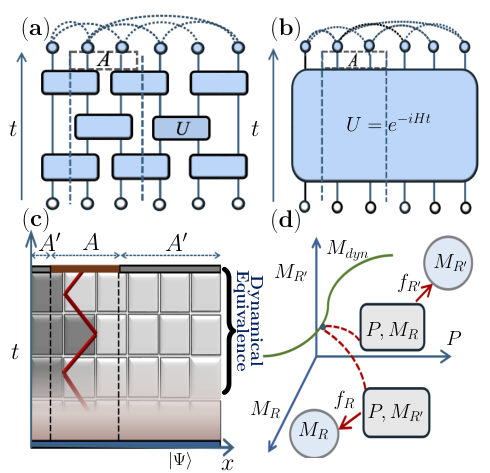
<figcaption class="paper-figure-caption"><b>Fig 1.</b> Figure 1. Dynamical equivalence of resources. Er- godic dynamics generated by a local brick-wall circuit (a) or a global Hamiltonian dynamics (b) for a subsystem (A). (c) Resource measures that are quadratic in state correspond to distinct boundary states of the same replicated dynamics. To leading order, their evolution is governed by the uniform zero-wall configurations, fixed by the purity P, and a common one-wall mode (red trajectory) of the replica statistical me- chanics. (d) The pair (P, MR) determines a second resource MR′ through fR′, while (P, MR′) determines MR through fR, thus leading to dynamical equivalence between resources un- der generic ergodic evolution. Mdyn: the...</figcaption>
</figure>
<figure class="paper-figure-card">
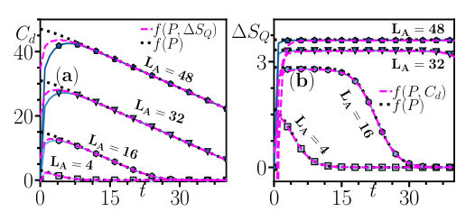
<figcaption class="paper-figure-caption"><b>Fig 2.</b> Figure 2. Dynamical equivalence in Haar-random circuits. (a) Annealed second-R´enyi coherence Cd recon- structed using the charge asymmetry ∆SQ as a witness; (b) the reconstruction of ∆SQ using Cd. We consider a ran- dom brick-wall circuit with L = 256 and LA = 4, 16, 32, 48. Markers denote numerical data obtained within the tensor- network converged time window. Black dotted lines show the purity-only prediction fR(P); magenta dashed lines show the first-order prediction fR(P, R′) from Eq. (14).</figcaption>
</figure>
<figure class="paper-figure-card">
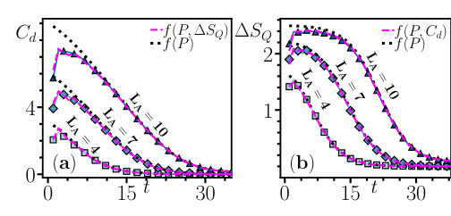
<figcaption class="paper-figure-caption"><b>Fig 3.</b> Figure 3. Dynamical equivalence in the kicked Ising model. Same analysis as Fig. 2 in KIM (a) relative entropy of coherence Cd reconstructed from ∆SQ; (b) charge asymmetry ∆SQ reconstructed from Cd. In this case, we consider L = 24 and LA = 4, 7, 10. Notations as in Fig. 2.</figcaption>
</figure>
<figure class="paper-figure-card">
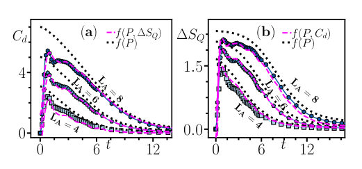
<figcaption class="paper-figure-caption"><b>Fig 4.</b> Figure 4. Dynamical equivalence of resources in er- godic Hamiltonian dynamics: An identical diagnostics as in Figs. 2 and 3 for continuous-time evolution under the MFIM for L = 20 and LA = 4, 6, 8. Markers are annealed- averaged data obtained from an exact state vector simulation. Line conventions are identical to Figs. 2 and 3.</figcaption>
</figure>
<figure class="paper-figure-card">
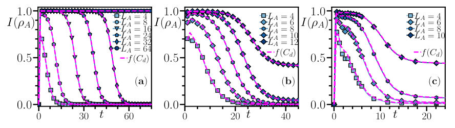
<figcaption class="paper-figure-caption"><b>Fig 5.</b> Figure 5. Cd and I(ρA) relation across ergodic dynamics: Test of the relation between Cd and I(ρA) in (a) Haar- random circuits (L = 256), (b) the Floquet kicked Ising model (L = 24), and (c) ergodic Hamiltonian dynamics (L = 20), for several subsystem sizes (LA). In all three panels, markers denote the numerically obtained I(ρA), while dotted lines show its prediction from Cd. The relation is exact for the Haar-random circuit in (a) and remains remarkably accurate for the Floquet and Hamiltonian dynamics in (b) and (c), respectively.</figcaption>
</figure>

**Summary.** The paper proves a profound 'dynamical resource equivalence' principle, demonstrating that various measures of nonclassicality are not independent under chaotic or random unitary evolution. By analyzing diagnostics quadratic in the state, the authors show that these resources can be largely reconstructed from just a few common dynamical variables, revealing an emergent simplification in complex quantum dynamics.

**Why it may be interesting.** This work provides deep insight into how complex many-body dynamics simplify; the finding that seemingly distinct quantum resources collapse onto a few common dynamical degrees of freedom is highly relevant for understanding scrambling in strongly interacting systems.

Detailed structure

**Main problem.** The research investigates whether distinct quantum resource measures, which characterize nonclassicality, evolve independently under generic ergodic dynamics.

**Main result.** It is shown that these different resource measures become mutually interdependent and are governed by a few common dynamical degrees of freedom when considering quadratic state diagnostics. This equivalence extends from random circuits to chaotic Hamiltonian evolution.

**Method.** The analysis uses the R\'enyi-2 relative-entropy formalism applied to various quantum resources (coherence, asymmetry) under dynamics simulated by Haar-random circuits, Floquet operators, and continuous Hamiltonians.

**Model / system.** The study considers a chain of L qubits evolving via three ergodic dynamics: Haar-random brick-wall circuits, the Kicked Ising Model (KIM), and the Mixed-Field Ising Model (MFIM) Hamiltonian. The diagnostics are applied to subsystem A.

**Key observables.** Purity ($P$), Coherence ($C_d$), Imaginarity ($I(
ho_A)$), and various Asymmetries ($\Delta S_G$).

**Important parameters / regimes.** The analysis is sensitive to the strength of scrambling, which dictates the emergence of dynamical equivalence.

**Assumptions / limitations.** Key derivations rely on approximating the full spectral dynamics by its leading one-wall mode component, particularly in the context of Haar randomness.

**Figures summary.** Figures illustrate 'Dynamical Equivalence' showing how different resource measures are linked through common trajectories in state space for random circuits and Hamiltonian systems. Figure 7 specifically shows reconstruction across three ergodic dynamics.

**Paper structure.** The paper establishes a general framework by analyzing the evolution of quadratic diagnostics under various ergodic settings (random, Floquet, continuous). It derives specific mathematical relations showing that multiple resource measures can be reconstructed from just two or three fundamental quantities like purity and one other witness.

Abstract

Quantum resource theories characterize distinct forms of nonclassicality in many-body quantum states, raising the question of whether these resources evolve independently under generic ergodic dynamics. Considering diagnostics quadratic in the state, we show that the dynamics of different resource measures become mutually interdependent and are governed by a few common degrees of freedom. For Haar-random circuits, the purity together with a single resource witness suffices to reconstruct the remaining resource measures, as we demonstrate for coherence, various asymmetries, and number entropies. The same relations hold, to a good approximation, under chaotic Floquet and continuous-time Hamiltonian dynamics, establishing that this dynamical resource equivalence extends beyond random circuits. We further derive an exact coherence--imaginarity relation, remarkably accurate also beyond Haar-random circuits. Our results reveal an emergent simplification of many-body dynamics, in which sufficiently strong scrambling reduces seemingly distinct quantum resources to a few common dynamical degrees of freedom.

[↑ back to top](#top)

### [Interaction driven charge transfer transitions in closely spaced graphene double layers](http://arxiv.org/abs/2608.14805v1)

**Authors:** Kenneth A. Lin, Unmesh Ghorai, Kenji Watanabe, Takashi Taniguchi, Emanuel Tutuc, Rafi Bistritzer  
**Type:** both · **Category:** strongly correlated electrons · **PDF:** <https://arxiv.org/pdf/2608.14805v1>  
**Analysis basis:** full PDF text, analyzed in chunks
**Topic relevance:** `Keldysh / 2PI / non-Gaussian methods` **3/5** · `analog quantum simulation` **2/5** · `driven-dissipative phase transition` **2/5** · `methods for driven-dissipative` **2/5** · `correlated / nonlocal dissipation` **1/5** · `non-equilibrium universality` **1/5** · `quantum measurements` **1/5**

↔ Scroll figures horizontally

<figure class="paper-figure-card">
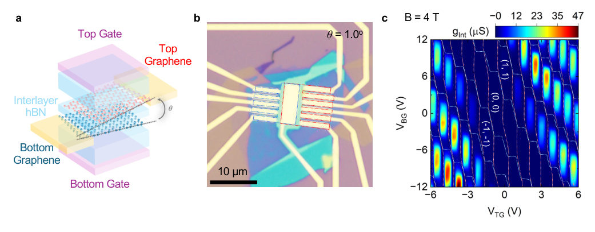
<figcaption class="paper-figure-caption"><b>Fig 1.</b> FIG. 1. Graphene double layer and tunneling in the quantum Hall regime. a, Schematic of the dual-gated graphene double layer heterostructure consisting of two independently contacted graphene monolayers separated by a four-layer hBN tunnel barrier. The graphene layers have a relative twist angle θ = 1.0◦. b, Optical micrograph of the graphene double layer heterostructure. The independently contacted top (bottom) graphene electrodes are outlined in red (blue). c, gInt = dIInt/dVInt versus VTG and VBG at VInt = 0, B = 4 T and T = 1.5 K. The red (blue) dashed lines indicate boundaries of the orbital Landau level (LL) sectors of the top (bottom) graphene layer. The orbital LL sectors (NT, NB) =...</figcaption>
</figure>
<figure class="paper-figure-card">
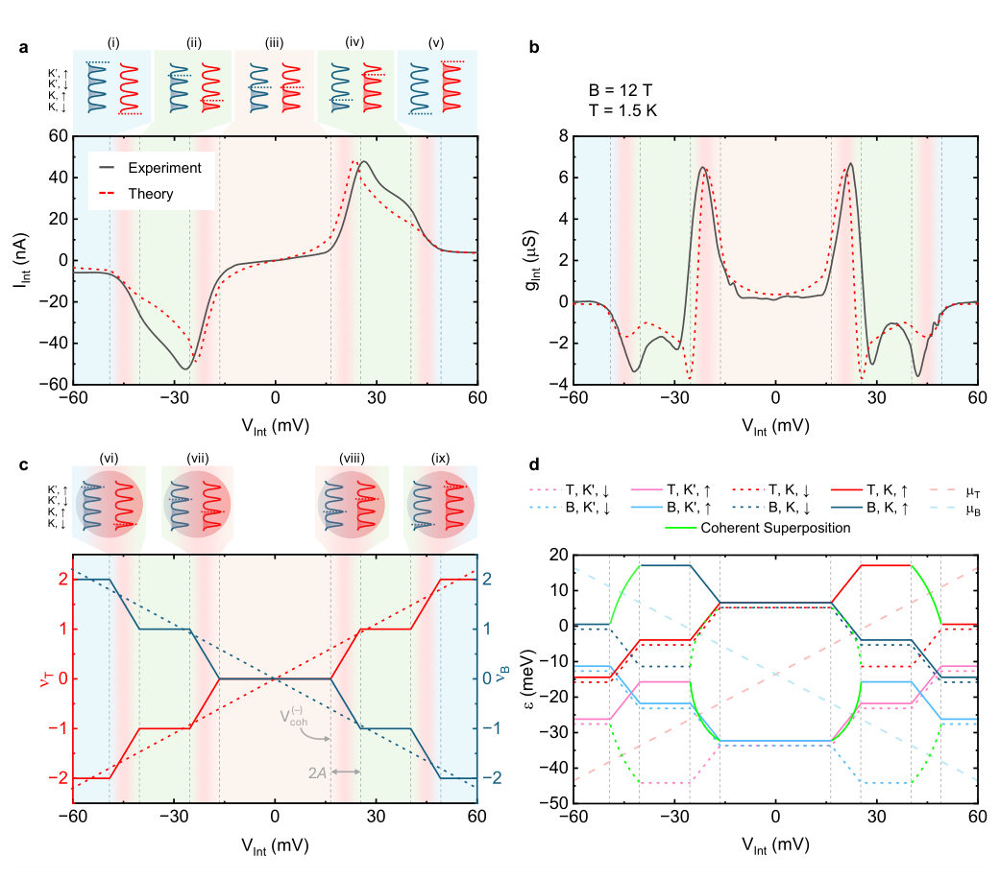
<figcaption class="paper-figure-caption"><b>Fig 2.</b> FIG. 2. Tunneling spectroscopy of interaction driven charge transfer. a–b, Measured (solid) and calculated (dashed) interlayer tunneling current IInt and differential conductance gInt = dIInt/dVInt versus interlayer bias VInt at B = 12 T and T = 1.5 K. At the bias-driven phase transitions, the reconstruction of the quasiparticle spectrum gives rise to kinks in IInt and corresponding extrema in gInt. The agreement between theory and experiment demonstrates that tunneling spectroscopy directly probes the interaction-reconstructed quasiparticle spectrum. c, Calculated top (red) and bottom (blue) layer filling factors νT and νB as a function of VInt. Solid lines show the interacting ground...</figcaption>
</figure>
<figure class="paper-figure-card">
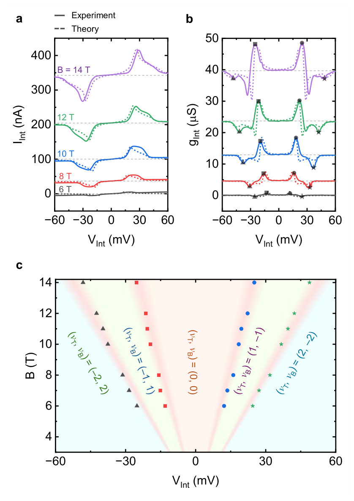
<figcaption class="paper-figure-caption"><b>Fig 3.</b> FIG. 3. Magnetic field evolution of interaction driven charge transfer. a–b, Measured (solid) and calculated (dashed) IInt and gInt versus VInt for magnetic fields between B = 6 and 14 T at T = 1.5 K. The curves are offset for clarity. The positions of the conductance peaks, marked by symbols, track the evolution of the interaction driven charge transfer transitions with magnetic field. c, Phase diagram mapping the calculated top and bottom layer filling factor (νT, νB) as functions of VInt and B. The red shaded regions indicate the coherent phases connecting subband-polarized quantum Hall ferromagnets. The symbols mark the conductance peak positions from panel b and coincide with the...</figcaption>
</figure>
<figure class="paper-figure-card">
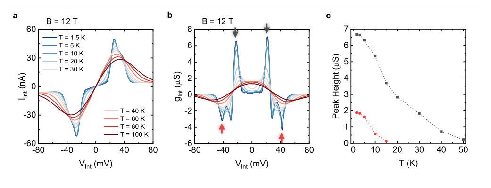
<figcaption class="paper-figure-caption"><b>Fig 4.</b> FIG. 4. Temperature dependence of the tunneling characteristics. a–b, Measured IInt and gInt versus VInt at B = 12 T for temperatures between T = 1.5 K and 100 K. c, Peak heights of the symmetric conductance features marked by the gray and red arrows in b. As the temperature increases, the sharp conductance peaks associated with the charge transfer transitions broaden and gradually disappear. The persistence of these tunneling signatures to temperatures of several tens of kelvin reflects the large interaction energy scales driving the charge transfer transitions.</figcaption>
</figure>

**Summary.** This work demonstrates that charge transfer in closely spaced graphene double layers is a complex many-body process driven by the interplay between capacitive charging and various exchange interactions. By analyzing tunneling spectroscopy, the authors identify spectroscopic signatures corresponding to phase transitions where interlayer coherence allows for gradual, rather than abrupt, electronic rearrangement. This establishes interlayer tunneling as a sensitive probe of interacting quantum systems.

**Why it may be interesting.** The concept of charge transfer being mediated by coherent intermediate phases stabilized by interlayer exchange is highly relevant for understanding correlated electron behavior in nanoscale heterostructures, bridging concepts from quantum optics/open systems into solid-state physics.

Detailed structure

**Main problem.** The study investigates how charge transfer occurs in closely spaced graphene double layers, arguing that it is governed by interaction-driven phase transitions rather than simple single-particle physics.

**Main result.** Interlayer tunneling reveals a competition between capacitive charging and exchange interactions; specifically, interlayer exchange stabilizes coherent intermediate phases enabling gradual charge transfer, while intralayer exchange favors abrupt polarization.

**Method.** The authors combine theoretical minimization of an effective Hamiltonian (Hartree-Fock approximation) with the analysis of experimental tunneling spectroscopy data ($dI/dV$).

**Model / system.** The system is a closely spaced graphene double layer quantum Hall ferromagnet. The physics is modeled by minimizing an energy functional that includes terms for electrostatic charging, intralayer exchange ($\Gamma_A$), and interlayer exchange ($\Gamma_m^2$).

**Key observables.** Tunneling conductance ($g_{Int}$) as a function of interlayer bias ($V_{Int}$), which exhibits non-monotonic behavior marking phase transitions.

**Important parameters / regimes.** Interlayer separation ($d \approx 1.8$ nm); the competition between charging, intralayer exchange, and interlayer exchange energies; applied interlayer bias ($V_{Int}$).

**Assumptions / limitations.** The analysis relies on the Hartree-Fock approximation for determining ground state occupations and uses a perturbative approach for calculating tunneling current in coherent sectors.

**Figures summary.** Figures show $g_{Int}$ vs. gate voltages indicating LL filling oscillations, and critically, non-monotonic kinks in $I_{Int}/g_{Int}$ vs. $V_{Int}$ at $	ext{V}_{Int} \approx \pm 20 	ext{ mV}$, which signal the interaction-driven transitions.

**Paper structure.** The paper develops the theoretical framework by defining the energy functional based on competing interactions, analyzes the ground state evolution through different bias regimes (coherent vs. polarized), and uses this theory to interpret spectroscopic signatures observed in tunneling measurements.

Abstract

Charge transfer between two conductors is conventionally viewed as a single-particle process governed by electrostatics and band alignment. Using tunneling spectroscopy, we show that charge transfer in closely spaced graphene double layer quantum Hall ferromagnets instead proceeds through a sequence of interaction driven phase transitions governed by the competition between capacitive charging and Coulomb exchange interactions. A comparison of experimental data and theoretical calculations identifies spectroscopic signatures of the interaction driven charge transfer transitions, and reveals that this charge transfer reconstructs the quasiparticle spectrum. While intralayer exchange favors abrupt transfer of entire spin-valley subbands between the layers, interlayer exchange stabilizes coherent intermediate phases that enable gradual charge transfer. Our results establish interlayer tunneling as a powerful probe of interacting electronic systems whose quasiparticle spectrum is itself bias dependent.

[↑ back to top](#top)

### [Universal Frame Potential Hierarchy in Critical Projected Ensembles](http://arxiv.org/abs/2608.15467v1)

**Authors:** Hui-Huang Chen  
**Type:** theory · **Category:** statistical mechanics · **PDF:** <https://arxiv.org/pdf/2608.15467v1>  
**Analysis basis:** full PDF text, analyzed in chunks
**Topic relevance:** `non-equilibrium universality` **3/5** · `driven-dissipative phase transition` **2/5** · `quantum measurements` **2/5** · `Full counting statistics` **1/5** · `analog quantum simulation` **1/5** · `correlated / nonlocal dissipation` **1/5** · `methods for driven-dissipative` **1/5** · `scars & prethermalization` **1/5**

↔ Scroll figures horizontally

<figure class="paper-figure-card">
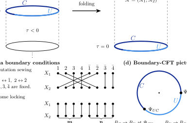
<figcaption class="paper-figure-caption"><b>Fig 1.</b> FIG. 1. Replica geometry for a single unmeasured interval U. (a) The seam at τ = 0 carries different gluings on U and its measured complement C. (b) Folding turns the seam into a boundary for doubled fields. (c) U carries partial permutation sewing, while outcome locking on C forces replicas in each group to share one measurement record. (d) Mapping to the disk produces boundary condition changing (BCC) insertions ΨCU and ΨUC at the endpoints of U.</figcaption>
</figure>
<figure class="paper-figure-card">
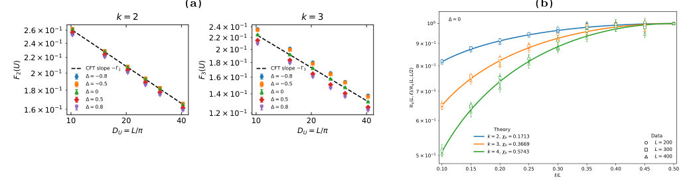
<figcaption class="paper-figure-caption"><b>Fig 2.</b> FIG. 2. Two complementary tests of distinct predictions. (a) Interacting periodic XXZ data for k = 2, 3 and five anisotropies test the predicted independence of Γk from the Luttinger parameter K across the TLL phase. Dashed lines have the parameter-free CFT slopes −Γk from Eq. (20) and are anchored only in vertical position to the largest size ∆= 0 datum. (b) The free fermion calculation tests the nonlinear hierarchy and conformal distance dependence for k = 2, 3, 4 and L = 200, 300, 400. Solid curves are the parameter-free prediction in Eq. (24). Statistical error bars are shown in both panels.</figcaption>
</figure>
<figure class="paper-figure-card">
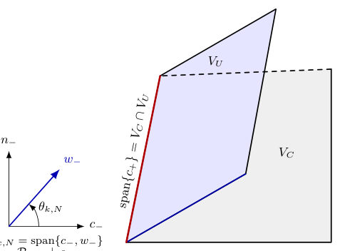
<figcaption class="paper-figure-caption"><b>Fig 3.</b> FIG. 1. Principal-angle geometry of the folded Neumann subspaces for 0 &lt; k &lt; N. The measured-boundary Neumann space VC and the unmeasured-boundary Neumann space VU share the common NN direction c+. Restricting to the three-dimensional subspace span{c+, c−, w−} makes them appear as two planes meeting along VC ∩VU = span{c+}. The section perpendicular to c+ is the nontrivial principal plane Pk,N = span{c−, w−}, where c−∈VC and w−∈VU meet at the principal angle θk,N; equivalently, w−= cos θk,N c−+ sin θk,N n−. The additional 2N −2 directions in VU ∩V ⊥ C are genuine ND/DN mismatch sectors and are not visible in this three-dimensional schematic.</figcaption>
</figure>

**Summary.** This theoretical work investigates how local measurements project a complex many-body wavefunction into statistical ensembles at quantum critical points. The authors derive that the resulting overlap moments follow a universal nonlinear hierarchy whose scaling exponents are surprisingly independent of system parameters like the Luttinger constant. This is achieved by mapping the problem onto Boundary Conformal Field Theory, providing deep structural insights into quantum state randomness.

**Why it may be interesting.** The discovery of parameter-independent scaling exponents ($\Gamma_k$) for higher moments provides a powerful diagnostic tool for characterizing quantum criticality in interacting systems, linking local measurements to deep CFT structures.

Detailed structure

**Main problem.** To determine the universal structure of higher overlap moments (frame potentials) within the projected ensemble generated by local measurements on a quantum many-body state at equilibrium quantum criticality.

**Main result.** The higher overlap moments form a universal nonlinear hierarchy whose leading scaling exponent is independent of the continuously varying Luttinger parameter, suggesting deep underlying universality.

**Method.** The analysis employs advanced Conformal Field Theory (CFT) techniques in replica space, combined with numerical verification using Matrix Product States (MPS) and free fermion calculations.

**Model / system.** The study focuses on the Tomonaga-Luttinger liquid (TLL) at quantum criticality, modeled by a compact boson CFT. The results are tested against the XXZ spin chain Hamiltonian in its critical phase.

**Key observables.** Frame potential scaling exponents ($\Gamma_k$), overlap moments ($F_k(U)$), and conformal weights derived from replica boundary conditions (BC/BU).

**Important parameters / regimes.** Luttinger parameter ($K$), moment order ($k$), system size ($L$), and anisotropy ($\Delta$) of the XXZ chain.

**Assumptions / limitations.** The analysis relies on CFT methods, assuming a low-energy description by the compact boson CFT. The full potential calculation requires determining remaining compact contributions.

**Figures summary.** Figures illustrate replica geometry (seams, folding) and map the problem to Boundary Conformal Field Theory (BCFT) insertions, while other figures show numerical confirmation of scaling laws derived from ratios $R_k$.

**Paper structure.** The paper progresses by defining the moment operator, mapping the problem onto a folded half-cylinder geometry in BCFT, calculating the resulting spectrum via principal angles and monodromy analysis, and finally confirming the universal exponent $\Gamma_k$ using both analytical continuation and numerical simulations on the XXZ chain.

Abstract

Local measurements transform a many body wavefunction into a statistical ensemble of conditional quantum states. In chaotic systems, the higher moments of such ensembles diagnose the emergence of quantum state randomness, but their structure at equilibrium quantum criticality is largely unknown. Here we show that the projected ensemble of a Tomonaga-Luttinger liquid exhibits a universal nonlinear hierarchy of state overlap moments. Remarkably, the leading scaling exponents are independent of the continuously varying Luttinger parameter. Replica boundary conformal field theory reveals a geometric origin: outcome locking combines the active replica swaps into a single collective rotated sector, while intersecting compact replica branes eliminate the leading interaction dependent zero mode contribution. Matrix product state calculations across the interacting XXZ critical phase and direct free fermion calculations independently confirm the interaction independence and nonlinear hierarchy.

[↑ back to top](#top)

### [Monolithic high density integrated photonics on bulk lithium niobate](http://arxiv.org/abs/2608.15936v1)

**Authors:** Zizheng Li, Harmen Smedes, Bruno Lopez-Rodriguez, Thomas Scholte, Simon Groeblacher, Iman Esmaeil Zadeh  
**Type:** experiment · **Category:** other · **PDF:** <https://arxiv.org/pdf/2608.15936v1>  
**Analysis basis:** full PDF text, analyzed in chunks
**Topic relevance:** `interference shaping light` **3/5** · `quantum optics experiment` **3/5** · `analog quantum simulation` **2/5** · `QC/QI experiment` **1/5** · `driven-dissipative phase transition` **1/5** · `methods for driven-dissipative` **1/5**

↔ Scroll figures horizontally

<figure class="paper-figure-card">
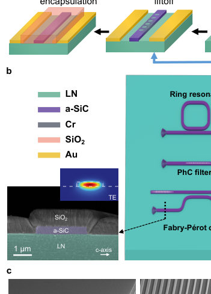
<figcaption class="paper-figure-caption"><b>Fig 1.</b> Fig. 1 Monolithic integration of a-SiC on bulk LN photonics. a, Fabrication processes. b, Schematic representation of a-SiC/LN functional devices: Passive microring resonator (top left), tunable racetrack resonator (top right), PhC filter (mid left), PhC Fabry-P´erot cavity (bottom left), and PhC slow-light MZI (bottom right). The inset on the left is an SEM image showing the cross- section of a-SiC/LN waveguide, with a simulated profile of the fundamental TE mode. c, Close-up SEM images of a waveguide bend, grating coupler, and PhC holes.</figcaption>
</figure>
<figure class="paper-figure-card">
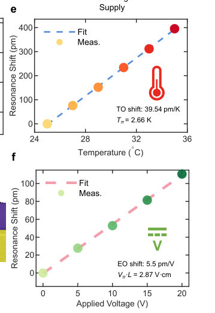
<figcaption class="paper-figure-caption"><b>Fig 2.</b> Fig. 2 Optical property and tunability of a-SiC/LN platform. a, Optical microscopy image of a fabricated a-SiC/LN microring resonator. b, Schematic representing the experimental setup used to characterize the a-SiC/LN devices. c, Measured resonance dip of the microring resonator at around 1549.16 nm, and the corresponding Lorentzian fit. d, Optical microscope image of a fabricated a- SiC/LN racetrack ring resonator, and a false colored SEM image showing a close-up view of the a-SiC waveguide between the Au electrodes. The electrodes are separated by a gap of g1 = 3.6 µm, with the same length of L1 = 0.15 cm. e, Thermo-optical response measured on the a-SiC/LN racetrack ring resonator,...</figcaption>
</figure>
<figure class="paper-figure-card">
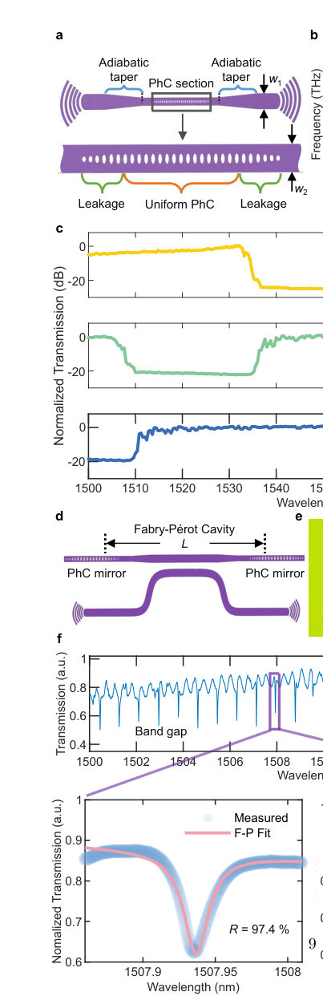
<figcaption class="paper-figure-caption"><b>Fig 3.</b> Fig. 3 Photonic crystal structures on a-SiC/LN platform. a, Schematic of an a-SiC/LN PhC waveguide filter, with a magnified view of the photonic crystal structure region. The photonic crys- tal structure comprises a central section of uniform periodic holes (PhC) and size-tapered leakage holes (Leakage) on both sides. The input-and-output waveguides are adiabatically tapered from width w1 = 2.1 µm down to w2 = 1.35 µm. b, Simulated bandstructure of the PhC structure. c, Measured transmission spectra of three a-SiC/LN PhC waveguide filters with lattice constants of a = 342 nm, a = 347 nm, a = 352 nm, respectively. d, Schematic of an a-SiC/LN Fabry-P´erot cavity constructed using two PhC...</figcaption>
</figure>
<figure class="paper-figure-card">
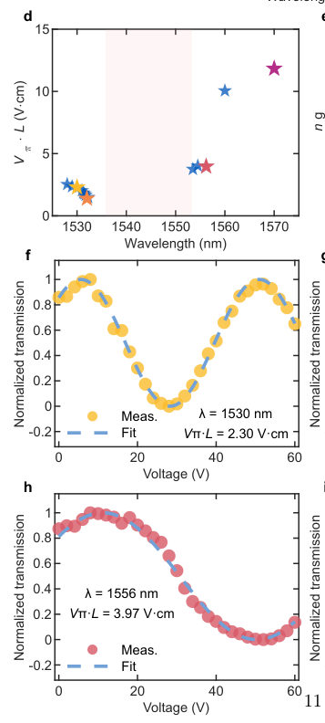
<figcaption class="paper-figure-caption"><b>Fig 4.</b> Fig. 4 Slow-light enhanced electro-optic tuning. a, Schematic of an a-SiC/LN PhC slow-light MZI, with an electrode length L2 = 0.06 cm and a gap g2 = 4.0 µm. b, Optical microscopy image of the fabricated slow-light MZI. c, Measured transmission spectrum of the slow-light MZI when zero voltage is applied. d, Measured half-wave voltage-length products of the slow-light MZI. e, Corre- sponding effective group indices extracted from the EO measurements, together with the estimation given by simulations. Normalized transmission of the slow-light MZI when sweeping voltages at f, 1530 nm, g, 1532 nm, h, 1556 nm, and i, reference at 1570 nm.</figcaption>
</figure>

**Summary.** This work introduces a breakthrough monolithic platform by integrating amorphous silicon carbide ($	ext{a-SiC}$) waveguides onto bulk lithium niobate ($	ext{LiNbO}_3$). This approach bypasses the high cost and complexity of traditional thin-film $	ext{LiNbO}_3$ processing, enabling scalable, low-loss photonic circuits. The platform achieves record electro-optic tuning efficiency and demonstrates advanced control over light dispersion using Photonic Crystal structures.

**Why it may be interesting.** While the core topic is photonics engineering rather than fundamental quantum theory, the precise control over light confinement, dispersion engineering (via PhCs), and electro-optic modulation efficiency ($	ext{V}_\pi	ext{L}$) are crucial enabling technologies for future quantum photonic circuits and quantum information processing.

Detailed structure

**Main problem.** The primary challenge is developing scalable, cost-effective, high-density photonic integrated circuits using lithium niobate while circumventing the fabrication difficulties and high costs associated with traditional thin-film $	ext{LiNbO}_3$ processing.

**Main result.** The authors demonstrate a fully monolithic platform ($	ext{a-SiC}$ on bulk $	ext{LiNbO}_3$) that achieves record high electro-optic tuning efficiency ($	ext{V}_\pi	ext{L} = 2.87 	ext{ V}\cdot	ext{cm}$) and shows an $8.5$-fold enhancement via slow-light effects.

**Method.** The approach involves depositing amorphous silicon carbide ($	ext{a-SiC}$) onto a bulk $	ext{LiNbO}_3$ substrate using CMOS-compatible processes, allowing for the patterning of waveguides and photonic crystal structures in $	ext{a-SiC}$ while retaining high performance from the underlying bulk crystal.

**Model / system.** The physical system is an integrated photonics chip built on a bulk lithium niobate ($	ext{LiNbO}_3$) substrate, utilizing amorphous silicon carbide ($	ext{a-SiC}$) for patterning and light guiding. The platform supports various devices including microring resonators, racetrack resonators, and Photonic Crystal (PhC) structures.

**Key observables.** Electro-optic tuning efficiency ($	ext{V}_\pi	ext{L}$), propagation loss ($1.3 	ext{ dB/cm}$), thermo-optic tuning slope ($39.54 	ext{ pm/K}$), and the achievable slow-light enhancement factor.

**Important parameters / regimes.** The process operates below $300^\circ	ext{C}$, ensuring CMOS compatibility; key parameters include waveguide dimensions, lattice constants for PhCs, and the electro-optic coefficients of $	ext{LiNbO}_3$.

**Assumptions / limitations.** The fabrication process assumes that patterning in $	ext{a-SiC}$ does not significantly degrade the optical properties or structure of the underlying bulk $	ext{LiNbO}_3$ crystal.

**Figures summary.** Figures detail the multi-step, CMOS-compatible fabrication flow ($	ext{a-SiC}$ deposition, RIE patterning, metal liftoff) and show SEM cross-sections of the resulting waveguides. Other figures illustrate characterization results for resonance dips, thermal tuning, and electro-optic responses.

**Paper structure.** The paper details the novel monolithic $	ext{a-SiC}/	ext{LN}$ fabrication flow, presents measurements of passive components (resonators) showing low loss, characterizes active devices like PhC-based MZIs for high EO tunability, and discusses leveraging slow-light effects via PhCs.

Abstract

Functional electro-optic (EO) tunable photonic integrated circuits are crucial to next-generation information processing and advanced computing, where ferroelectric materials such as lithium niobate (LiNbO3) provide outstanding optical properties and versatile tuning mechanisms. However, beyond achieving high-performance devices, practical deployment of LiNbO3 photonic integrated circuits requires rapid and cost-effective scale-up, which remains challenging because of the fabrication complexity and high costs of ion-sliced thin-film lithium niobate and wafer bonding processes. To address this gap, we demonstrate a fully monolithic photonic platform, amorphous silicon carbide (a-SiC) on bulk LiNbO3 crystal substrate, enabling scalable, CMOS-compatible, low-cost, and high-density photonic integrated circuits without relying on thin-film LiNbO3. This integration approach breaks the long-standing cost-performance-scalability tradeoff, and intrinsically eliminates the need for sophisticated fabrication processes, including ion slicing, wafer bonding, and LiNbO3 etching. It realizes high-density, low-loss, and record high EO tuning efficiency of VpiL = 2.87 Vcm on bulk LiNbO3 crystal substrate. Furthermore, leveraging slow-light effect near photonic crystal bandgap, an 8.5-fold EO tuning efficiency enhancement is achieved, highlighting the platform's capability in confinement control and dispersion engineering.

[↑ back to top](#top)

### [Neural-Embedded Graphical Model for Self-Consistent Hierarchical Upscaling of Complex Composites](http://arxiv.org/abs/2608.15570v1)

**Authors:** Nuo Xu, Shaohua Chen  
**Type:** theory · **Category:** disordered systems and neural networks · **PDF:** <https://arxiv.org/pdf/2608.15570v1>  
**Analysis basis:** full PDF text, analyzed in chunks
**Topic relevance:** `methods for driven-dissipative` **3/5** · `Keldysh / 2PI / non-Gaussian methods` **2/5** · `analog quantum simulation` **2/5** · `quantum measurements` **2/5** · `driven-dissipative phase transition` **1/5** · `non-equilibrium universality` **1/5**

↔ Scroll figures horizontally

<figure class="paper-figure-card">
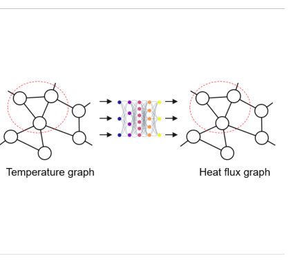
<figcaption class="paper-figure-caption"><b>Fig 1.</b> Figure 1. (a) a triangular mesh of a small domain. (b) the binarized thermal conduction</figcaption>
</figure>
<figure class="paper-figure-card">
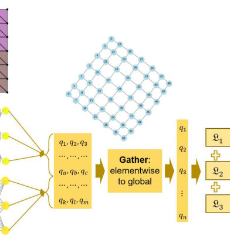
<figcaption class="paper-figure-caption"><b>Fig 2.</b> Figure 2. The work flow of NEGM. First, it dispatches the global temperature field to</figcaption>
</figure>
<figure class="paper-figure-card">
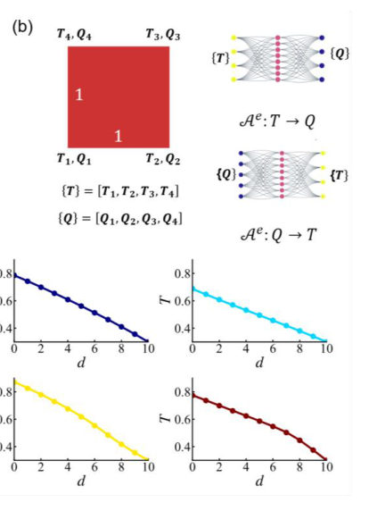
<figcaption class="paper-figure-caption"><b>Fig 3.</b> Figure 3. Validation of NEGM on 2D simulation domains of nonlinear materials. (a)</figcaption>
</figure>
<figure class="paper-figure-card">
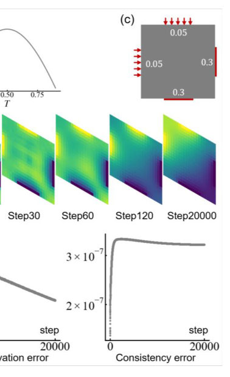
<figcaption class="paper-figure-caption"><b>Fig 4.</b> Figure 4. (a) the simulation domain to investigate the evolution of loss components</figcaption>
</figure>
<figure class="paper-figure-card">
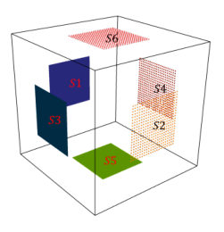
<figcaption class="paper-figure-caption"><b>Fig 5.</b> Figure 6. The microstructure configuration of the 3D composite domain and the mixed</figcaption>
</figure>

**Summary.** This paper introduces a Neural-Embedded Graphical Model (NEGM) to solve multiscale problems in composite materials. NEGM unifies disparate modeling approaches by encoding local physics into neural networks organized on a graph structure. This allows for seamless, progressive upscaling from microscale to macroscale without complex interfacing protocols.

**Why it may be interesting.** While focused on classical solid mechanics, the core methodology—using ANNs to create scale-invariant surrogates for complex physics—is highly relevant to developing machine learning tools for quantum many-body simulations or open quantum system dynamics where traditional solvers struggle with scale separation.

Detailed structure

**Main problem.** The primary challenge is bridging the vast disparity between microstructural length scales and macroscopic component sizes in computational physical modeling.

**Main result.** The proposed Neural-Embedded Graphical Model (NEGM) provides a unified, scale-invariant framework for progressive upscaling of complex composites by relying solely on neural network inference.

**Method.** It reformulates multiscale PDE solving by encoding local physics into small, trainable neural network blocks organized within a global hypergraph structure.

**Model / system.** The model targets highly heterogeneous composite materials exhibiting strong nonlinearity and arbitrary boundary conditions. It simulates physical responses governed by PDEs like the Poisson equation for heat conduction.

**Key observables.** Physical responses such as temperature fields (T) and heat flux vectors (q).

**Important parameters / regimes.** Material properties, conductivity tensor lambda(x), and characteristic length scales.

**Assumptions / limitations.** The model assumes that the physical behavior can be accurately approximated by constituent neural network blocks trained on local data.

**Figures summary.** Figures illustrate the process flow from a triangular mesh to a graph structure, detailing how elementary ANNs map temperature to heat flux within each element.

**Paper structure.** The paper introduces NEGM as a unified framework that decouples geometry (graph) from constitutive behavior (ANNs). It details the loss function combining BC enforcement, energy conservation, and physical consistency checks for training.

Abstract

A persistent challenge in computational physical modeling is the substantial disparity between the characteristic length scales of microstructures and macroscopic structural components. Multiscale modeling has been widely adopted to bridge this gap by coupling methodologies tailored to different scales. However, conventional approaches, such as asymptotic homogenization (bottom-up) and submodeling (top-down), often entail rigorous mathematical prerequisites or intricate interfacing procedures. To address these limitations, we introduce a fully scalable neural-embedded graphical model (NEGM) that provides a unified framework for the progressive upscaling of highly heterogeneous composite materials. Specifically, NEGM encodes all microstructure- and material-related complexities into constituent neural network blocks, which are then organized into a hypergraph to simulate progressively larger domains. Extensive numerical benchmarks demonstrate that NEGM reliably predicts the physical responses of 2D and 3D composites exhibiting strong material nonlinearity, arbitrary boundary conditions, and irregular geometries. Crucially, because NEGM relies solely on neural network training and inference, it offers a scale-invariant formulation. This enables iterative application of NEGM to upscale from the microscale to arbitrarily large scales, circumventing the need for complex interfacing protocols between disparate modeling frameworks. We validate this progressive upscaling strategy on a large mosaic composite domain, showing that the accumulated error can be effectively contained provided the constituent blocks achieve sufficiently high prediction accuracy. Our findings suggest that artificial neural networks not only enhance the efficiency of direct single-scale simulations, as previously demonstrated, but also provide a clean and elegant pathway toward streamlined multiscale modeling.

[↑ back to top](#top)

### [Nonequilibrium Maxwell-Demon NEMD simulations of transport: I. Extrapolating shear viscosity to the hydrodynamic limit](http://arxiv.org/abs/2608.15371v1)

**Authors:** Hesam Arabzadeh, Brad Lee Holian  
**Type:** theory · **Category:** statistical mechanics · **PDF:** <https://arxiv.org/pdf/2608.15371v1>  
**Analysis basis:** full PDF text, analyzed in chunks
**Topic relevance:** `methods for driven-dissipative` **3/5** · `non-equilibrium universality` **3/5** · `driven-dissipative phase transition` **2/5** · `Keldysh / 2PI / non-Gaussian methods` **1/5** · `correlated / nonlocal dissipation` **1/5** · `scars & prethermalization` **1/5**

↔ Scroll figures horizontally

<figure class="paper-figure-card">
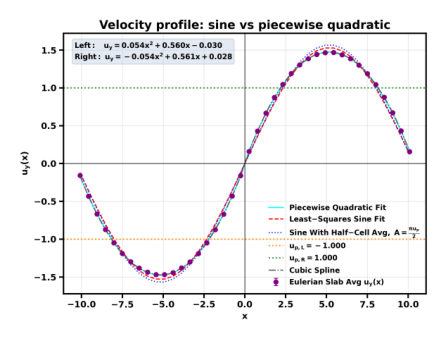
<figcaption class="paper-figure-caption"><b>Fig 1.</b> Figure 1: Time-averaged velocity profile ⟨uy(x)⟩for the representative Maxwell-Demon shear sim- ulation. The imposed regional averages are ⟨uy⟩−= −up and ⟨uy⟩+ = +up, shown by the dotted horizontal lines. Eulerian slab averages are compared with a cubic-spline interpolation, a least- squares sinusoidal fit, and a piecewise quadratic fit on the left and right halves of the cell. Both functional forms describe the data well, but the piecewise quadratic fit provides the more accurate representation of the steady NESS profile.</figcaption>
</figure>
<figure class="paper-figure-card">
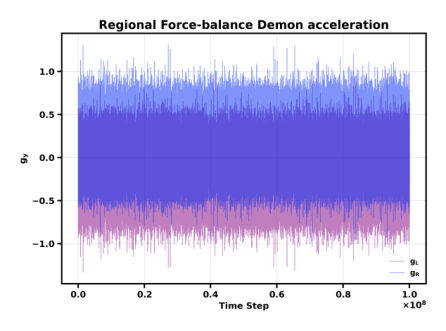
<figcaption class="paper-figure-caption"><b>Fig 2.</b> Figure 2: Time series of the regional force-balance Demon accelerations applied to the two halves of the periodic cell. These plotted accelerations correspond to the continuous force-balance contribu- tion, M±g±,y = −P i∈± Fiy. They fluctuate because they balance instantaneous force fluctuations in each region, but their long-time averages are equal and opposite. For the representative run, ⟨g−,y⟩= −0.148 and ⟨g+,y⟩= 0.148, giving gforce = 0.148. The mechanical work balance uses the total acceleration gtotal = gforce + gcorr.</figcaption>
</figure>
<figure class="paper-figure-card">
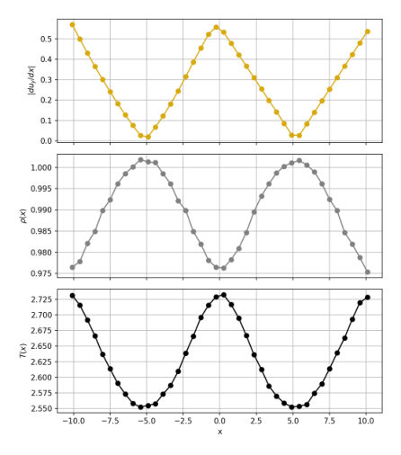
<figcaption class="paper-figure-caption"><b>Fig 3.</b> Figure 3: Eulerian slab profiles for the representative Maxwell-Demon shear simulation. The upper panel shows the magnitude of the local strain rate obtained from the velocity profile. The measured strain-rate profile follows the parabolic NESS geometry used in the viscosity estimation. The middle and lower panels show the Eulerian density and local temperature profiles, respectively.</figcaption>
</figure>
<figure class="paper-figure-card">
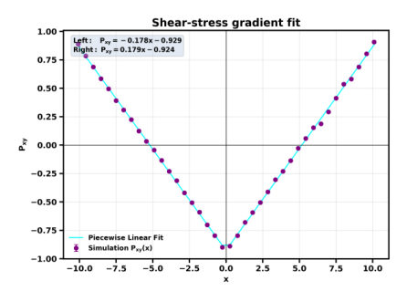
<figcaption class="paper-figure-caption"><b>Fig 4.</b> Figure 4: Time-averaged Eulerian profile of the shear stress Pxy(x) for the representative Maxwell- Demon shear simulation. The data are compared with piecewise linear fits on the two half-cells. For the parabolic NESS velocity profile, duy/dx is linear within each half-cell, so the constitutive relation Pxy(x) = −ηduy/dx predicts an approximately piecewise linear shear-stress profile.</figcaption>
</figure>
<figure class="paper-figure-card">
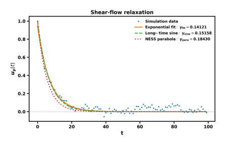
<figcaption class="paper-figure-caption"><b>Fig 5.</b> Figure 5: Relaxation of the shear amplitude after the Maxwell-Demon driving acceleration is re- moved at t = 0. The decay is fitted by an exponential form Ae−γt, giving the sinusoidal eigenmode relaxation rate. This late-time relaxation check confirms transverse momentum diffusion. The comparison with the work route depends on the velocity-profile geometry: the sine profile gives the factor π2/8 between relaxation and work estimates, while the observed NESS parabolic profile gives νrelax,para = νwork,para.</figcaption>
</figure>

**Summary.** The paper details the use of a novel Nonequilibrium Molecular Dynamics (NEMD) technique, called the Maxwell-Demon method, to measure shear viscosity in a fluid. By analyzing the balance between mechanical work supplied by the driving force and heat removed by the thermostat, the authors confirm consistency across multiple theoretical routes. The methodology is robustly validated through finite-size scaling, allowing for reliable extrapolation of transport properties to the true hydrodynamic limit.

**Why it may be interesting.** This work provides a sophisticated computational tool—the Maxwell-Demon method—for calculating transport coefficients in non-equilibrium regimes, which is highly relevant for understanding energy dissipation and irreversible processes in complex quantum or classical many-body systems.

Detailed structure

**Main problem.** The primary goal is to accurately measure the shear viscosity of a fluid using Non-Equilibrium Molecular Dynamics (NEMD) simulations.

**Main result.** The Maxwell-Demon method successfully establishes a consistent, direct route for calculating shear viscosity by comparing estimates derived from momentum diffusion, mechanical work balance, and entropy production. Furthermore, the simulation demonstrates that the calculated viscosity approaches an asymptote in the hydrodynamic limit with system size scaling as $1/\sqrt{N}$.

**Method.** The authors employ a Maxwell-Demon technique to drive the fluid into a Non-Equilibrium Steady State (NESS) by maintaining opposing average particle velocities across two regions. Viscosity is then calculated by analyzing energy/momentum balance equations derived from this non-equilibrium driving.

**Model / system.** The study uses a Lennard-Jones (LJ) fluid simulated in a periodic cell geometry, which is divided into two distinct regions to impose the shear flow necessary for the NEMD simulation.

**Key observables.** Shear viscosity ($
u$ or $\eta$), mechanical work done by the Demon, heat removed by the thermostat, and the time/space evolution of the velocity profile (parabolic vs. sinusoidal).

**Important parameters / regimes.** The system size ($N$) is varied to extrapolate results to the hydrodynamic limit; the imposed driving velocity amplitude ($u_p$) and cell width ($w$) are key parameters.

**Assumptions / limitations.** Key assumptions include that the NESS profile can be accurately modeled by a piecewise parabolic form, and that the relaxation dynamics follow simple exponential decay modes for comparison.

**Figures summary.** Figures illustrate the consistency between work-derived and entropy-derived viscosity estimates (e.g., within 0.6%), show the dependence of $
u(0)$ on system size ($1/\sqrt{N}$ scaling), and plot the strain rate dependence ($
u(\gamma)$) to confirm shear thinning.

**Paper structure.** The paper introduces the Maxwell-Demon NEMD framework for calculating transport coefficients, details the methodology by comparing work/entropy routes, presents results showing consistency across different profile assumptions (parabolic vs. sinusoidal), and concludes with finite-size scaling analysis to extrapolate to the true hydrodynamic limit.

Abstract

We present a Maxwell-Demon nonequilibrium molecular dynamics method for measuring the shear viscosity of a Lennard-Jones fluid. The simulation cell is divided into two regions of width $w$ in the $x$-direction, with particles free to move between the two sides. The Demon maintains equal and opposite regional average particle velocities in the $y$-direction ($\pm u_p$), by applying an acceleration $g_{total}$ that includes both total force balance and a correction for diffusion of particles across boundaries. The momentum relaxation rate needed to sustain the nonequilibrium steady state (NESS) is $γ=g_{total}/u_p$. We show that the driven velocity profile is not imposed point-wise in $x$ by the constraint, but is selected by the regional hydrodynamic response of the fluid. For this shear geometry, the measured NESS profile in Eulerian slabs is well represented by a piecewise parabolic form, reminiscent of planar Poiseuille flow. The parabolic profile estimates the kinematic viscosity from work done on the shearing fluid, $ν_{para}=γ_{total}w^2/12$, as well as an entropy production estimate, derived from heat removal by the Nosé--Hoover thermostat that keeps each regional average temperature constant. For a representative run, the work and entropy routes agree to within $0.6\%$, confirming consistency between the mechanical work supplied by the Demon and the heat removed by the thermostat. Once NESS driving is removed, the parabolic velocity profile relaxes exponentially rapidly to sinusoidal, the natural transverse momentum-diffusion eigenmode. These results establish the Maxwell-Demon shear method as a direct NEMD route for obtaining shear viscosity from momentum diffusion, work, and entropy balances. Our results in 3D for increasing system size $N$ (the number of particles) demonstrate that shear viscosity approaches an asymptote (the hydrodynamic limit) as $1/\sqrt{N}$.

[↑ back to top](#top)

### [Crossover from Fast Scrambling to Operator Confinement Tuned by an Auxiliary Qubit](http://arxiv.org/abs/2608.16674v1)

**Authors:** Ryan Buechele, Joseph Szabo, Nandini Trivedi  
**Type:** theory · **Category:** quantum information and computing · **PDF:** <https://arxiv.org/pdf/2608.16674v1>  
**Analysis basis:** full PDF text, analyzed in chunks
**Topic relevance:** `analog quantum simulation` **3/5** · `scars & prethermalization` **3/5** · `non-equilibrium universality` **2/5** · `correlated / nonlocal dissipation` **1/5** · `quantum measurements` **1/5**

↔ Scroll figures horizontally

<figure class="paper-figure-card">
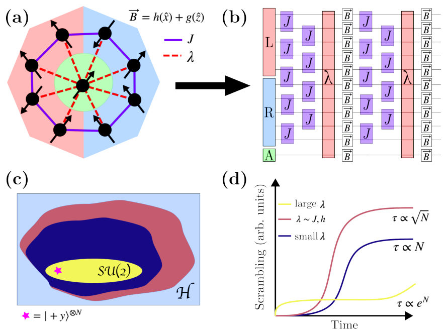
<figcaption class="paper-figure-caption"><b>Fig 1.</b> FIG. 1. (a) Schematic of the ring-ancilla system, with the left and right subsystems denoted in the blue/red background and central ancilla with green; the local Ising interaction J (solid lines) couples the left and right sites while the ancilla interaction (dashed) couples the ancilla to the local degrees of freedom of the Ising chain. (b) Schematic realization of the ring-ancilla model as a quantum circuit, with local unitary gates acting to interact the spin-1/2 qubits; such interactions may be realized through Rydberg atoms or other platforms [16, 17, 60, 61]. (c) Diagram of a snapshot of spread through Hilbert space H for an initial product state | + y⟩⊗N. In the strong ancilla...</figcaption>
</figure>
<figure class="paper-figure-card">
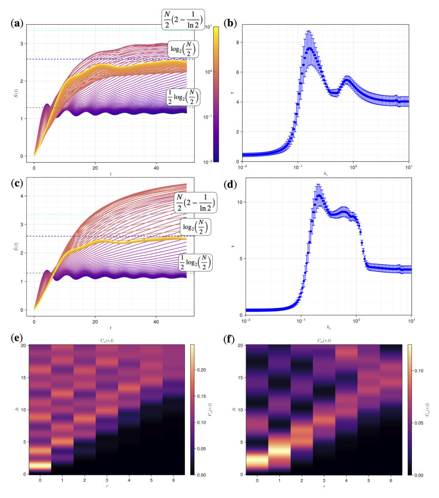
<figcaption class="paper-figure-caption"><b>Fig 2.</b> FIG. 2. von Neumann entropy and OTOCs for a bare TFIM chain in isolation from the ancilla. (a) Average entropy after a quench from |+y⟩⊗N for N = 12, J = 1, g = 0, h ∈[10−2, 10]; in the extreme limits h/J →0, ∞, the entropy saturates to a prethermal plateau determined by the underlying symmetry of the effective Hamiltonian, before eventually thermalizing to the full maximum entropy of the thermal ensemble dictated by the initial state. (b) The extracted saturation time τ for each trace in (a), plotted vs. h. (c) Average entropy after a quench from |+y⟩⊗N for N = 12, J = 1, g = 0.1, h ∈[10−2, 10]; here we see the same prethermal behavior in the limiting cases, but the intermediate regime...</figcaption>
</figure>
<figure class="paper-figure-card">
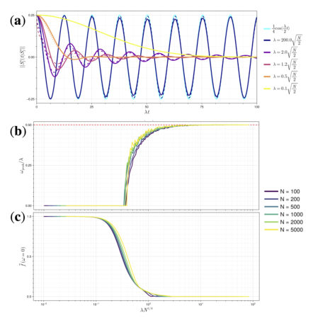
<figcaption class="paper-figure-caption"><b>Fig 3.</b> FIG. 3. Infinite temperature autocorrelation of Sx j . (a) Plot of Eq. (24) vs λt for N = 1000, hA = 1 and varying λ in multiples of p</figcaption>
</figure>
<figure class="paper-figure-card">
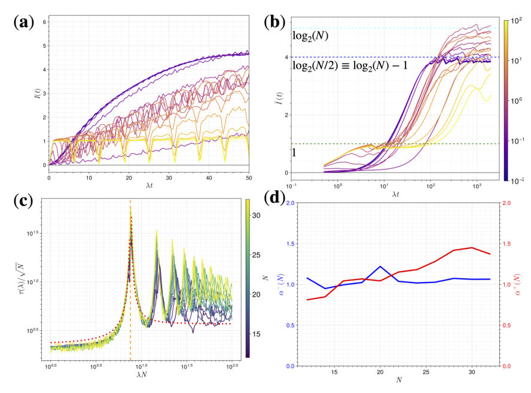
<figcaption class="paper-figure-caption"><b>Fig 4.</b> FIG. 4. Entanglement growth results for the Star-Ising model with J = 0, g = gA = 0. (a) Half-chain mutual information I(λt) for N = 32, λ ∈[10−2, 102], h = hA = 1.05. (b) Average half-chain mutual information ¯I(λt) for N = 32, λ ∈[10−2, 102], h = hA = 1.05; for Nλ ≪h, ¯I(t) saturates to I0 ≡log2(N) −1, while for Nλ ≫h, it quickly saturates to 1, before slowly fully thermalizing to I0. In the critical region, the ancilla enhances entanglement to saturate to a maximum of Imax ≡log2(N). (c) Fitting for the early-time saturation time scale τ vs. Nλ for even N ∈[12, 32], we identify the dynamic transition by the divergence (sharp maximum) in the saturation time scale, indicating critical...</figcaption>
</figure>
<figure class="paper-figure-card">
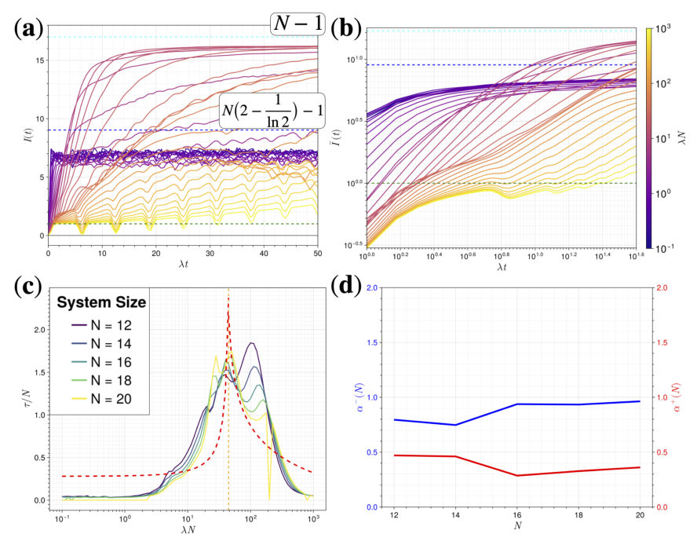
<figcaption class="paper-figure-caption"><b>Fig 5.</b> FIG. 5. Entanglement growth results for the Ring-Ancilla model with g = gA = 0. (a) Half-chain mutual information for N = 20, λ ∈[10−1, 103], h = hA = 1.05. (b) Average half-chain mutual information for N = 20, λ ∈[10−1, 103], h = hA = 1.05; for Nλ ≪J, h, we observe saturation to the same TFIM limit as before; when λ ∼J, h, we observe full spreading through the entire nonintegrable Hilbert space. Finally, for large λ ≫J, h, the ancilla confines the system to a singlet-like state with 1 bit of mutual information before slowly thermalizing to the Page limit. (c) Fitting for the early time saturation and extracting the saturation time, we plot the saturation times τ/N against λN for even N...</figcaption>
</figure>

**Summary.** The authors present a minimal spin chain model coupled to an ancilla qubit whose coupling strength ($\lambda$) acts as a control knob. By tuning $\lambda$, the system undergoes a controlled crossover from rapid, scrambling dynamics to slow operator confinement. This work is significant because it shows that such fundamentally different quantum behaviors can emerge from a single Hamiltonian structure.

**Why it may be interesting.** This work provides a clean, controllable platform to study fundamental transitions between chaotic/scrambling behavior and localized/confined dynamics using an engineered auxiliary degree of freedom, which is highly relevant for understanding quantum computation error correction or simulation protocols.

Detailed structure

**Main problem.** The study investigates how tuning an auxiliary qubit coupling can induce a crossover between fast, super-ballistic quantum scrambling and slow, sub-ballistic operator confinement in a time-independent Hamiltonian system.

**Main result.** The model successfully demonstrates this transition within a single Hamiltonian family by controlling the ancilla coupling strength ($\lambda$), revealing an effective hidden symmetry responsible for confinement at strong coupling.

**Method.** The analysis employs advanced quantum information diagnostics, including Von Neumann entropy, Mutual Information, and Out-of-Time-Order Correlators (OTOCs), alongside perturbative techniques like Feshbach-Fano projection.

**Model / system.** The system is a mixed-field Ising spin chain coupled to a single spin-1/2 ancilla qubit. The Hamiltonian includes local interactions ($J$) and the tunable coupling ($\lambda$) between the ancilla and the chain's magnetization.

**Key observables.** Von Neumann entropy, Mutual Information saturation time, Out-of-Time-Order Correlator (OTOC) growth rate ($\log \alpha$), and state spread in Hilbert space.

**Important parameters / regimes.** The dimensionless ancilla coupling strength $\lambda$ acts as the primary tuning parameter controlling the dynamics between scrambling and confinement.

**Assumptions / limitations.** The analysis contrasts emergent non-Hermitian dynamics (from tracing out the ancilla) with the closed, unitary dynamics of the isolated chain.

**Figures summary.** Figure 1 schematically shows the system and demonstrates how state spread changes from filling full space (weak $\lambda$) to being confined to specific subspaces like SU(2) Dicke states (strong $\lambda$).

**Paper structure.** The paper introduces the model, analyzes dynamics in different regimes ($\lambda$ weak vs. strong), quantifies the crossover using information measures (Mutual Information peak, OTOC suppression), and theoretically derives the confinement mechanism via symmetry arguments.

Abstract

We demonstrate a static, disorder-free spin chain Hamiltonian which, by tuning the coupling to an auxiliary qubit, realizes a crossover between super-ballistic, ancilla-accelerated scrambling and sub-ballistic operator confinement. Our minimal model is the mixed-field Ising chain with a spin-1/2 ancilla coupled to its longitudinal magnetization. The ancilla mediates an effective all-to-all interaction which accelerates operator spreading and entanglement growth when weakly coupled, but rapidly saturates its entanglement and projects spin chain operators into effectively frozen subspaces when the ancilla coupling is strong. We locate this crossover independently through both a divergent peak in the mutual-information saturation time near $λ_c N/h \approx 8$ and an exponential suppression of the late-time OTOC growth rate, $\logα\propto 1/λ$. Through a Feshbach-Fano projection and Schrieffer-Wolff transformation, we reveal an effective hidden symmetry on the chain which confines operators on the chain for a time exponential in the coupling strength. This reconciles the fast, $\log(N)$ scrambling reported for random-unitary-circuit realizations of the star geometry with the confinement previously found in its time-independent Hamiltonian analog, showing both emerge from a single Hamiltonian family as a function of one dimensionless parameter.

[↑ back to top](#top)

### [Quantum channels on duals of von Neumann algebras in the Schrödinger picture](http://arxiv.org/abs/2608.15116v1)

**Authors:** Sviatoslav V. Dzhenzher  
**Type:** theory · **Category:** other · **PDF:** <https://arxiv.org/pdf/2608.15116v1>  
**Analysis basis:** full PDF text, analyzed in chunks
**Topic relevance:** `methods for driven-dissipative` **3/5** · `Keldysh / 2PI / non-Gaussian methods` **2/5** · `driven-dissipative phase transition` **2/5** · `correlated / nonlocal dissipation` **1/5** · `non-equilibrium universality` **1/5** · `quantum measurements` **1/5**

↔ Scroll figures horizontally

<figure class="paper-figure-card">
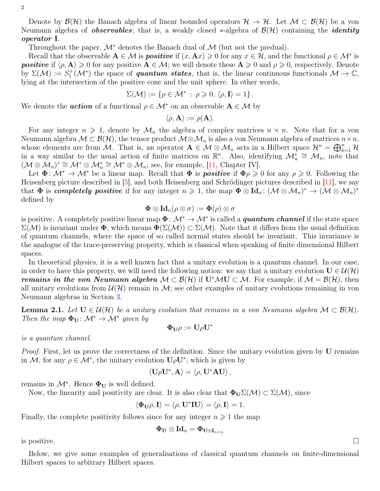
<figcaption class="paper-figure-caption"><b>Fig 1.</b> Low-resolution page preview, page 2</figcaption>
</figure>
<figure class="paper-figure-card">
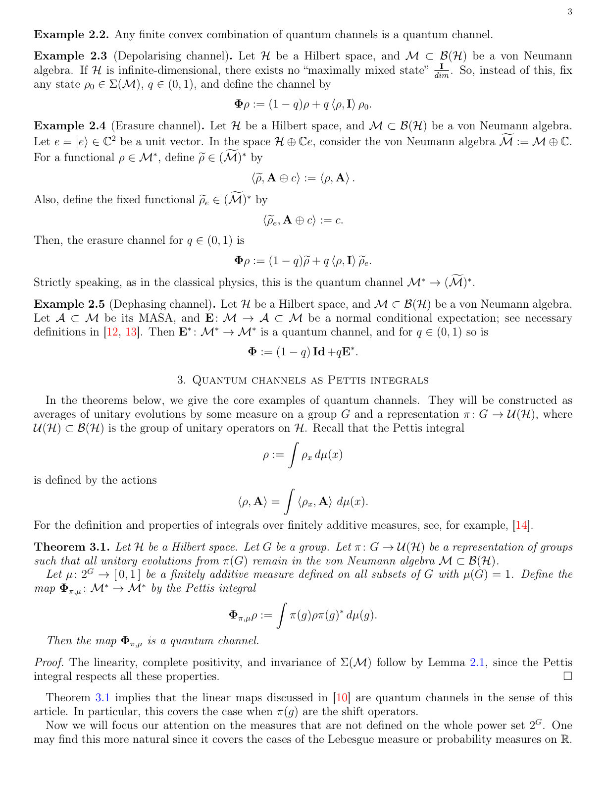
<figcaption class="paper-figure-caption"><b>Fig 2.</b> Low-resolution page preview, page 3</figcaption>
</figure>
<figure class="paper-figure-card">
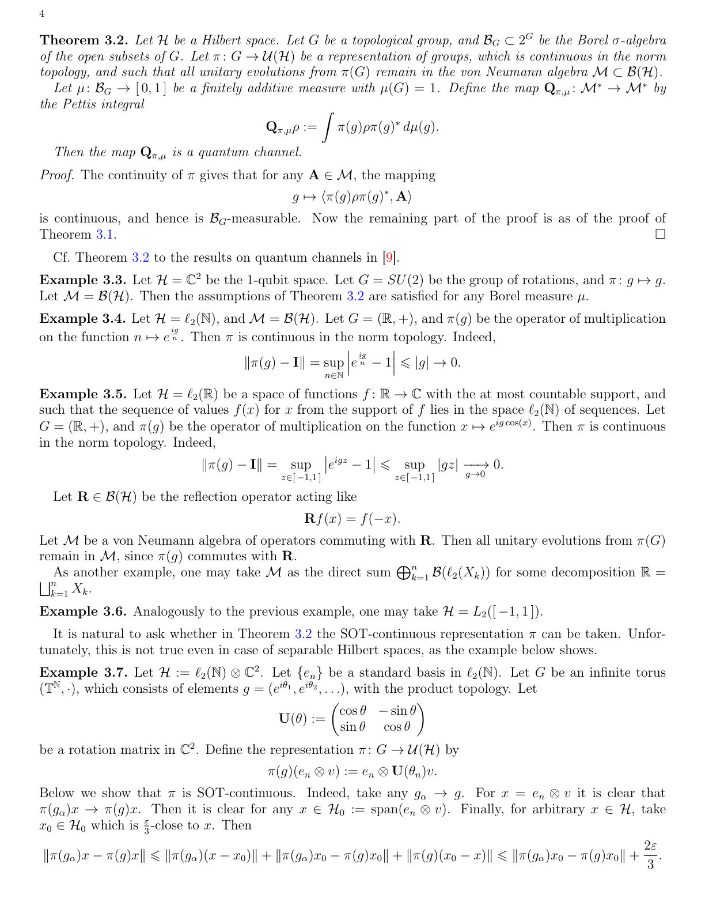
<figcaption class="paper-figure-caption"><b>Fig 3.</b> Low-resolution page preview, page 4</figcaption>
</figure>
<figure class="paper-figure-card">
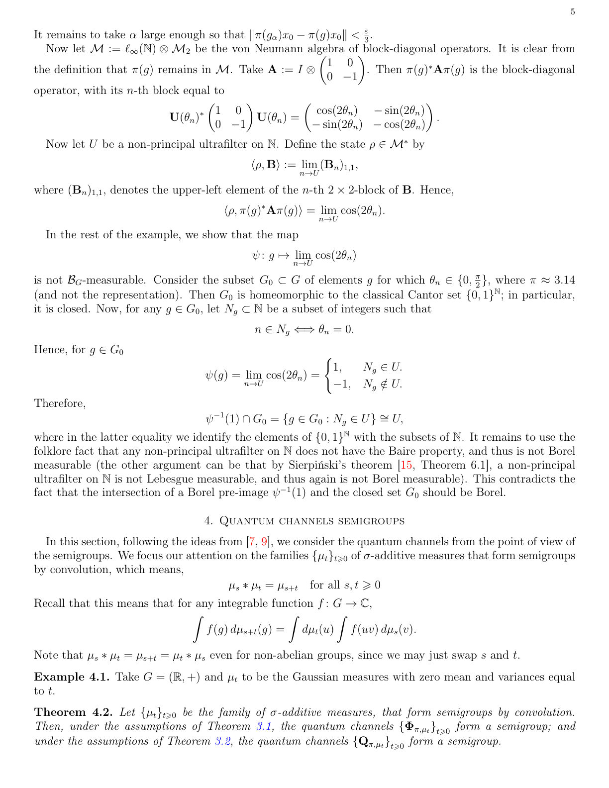
<figcaption class="paper-figure-caption"><b>Fig 4.</b> Low-resolution page preview, page 5</figcaption>
</figure>
<figure class="paper-figure-card">
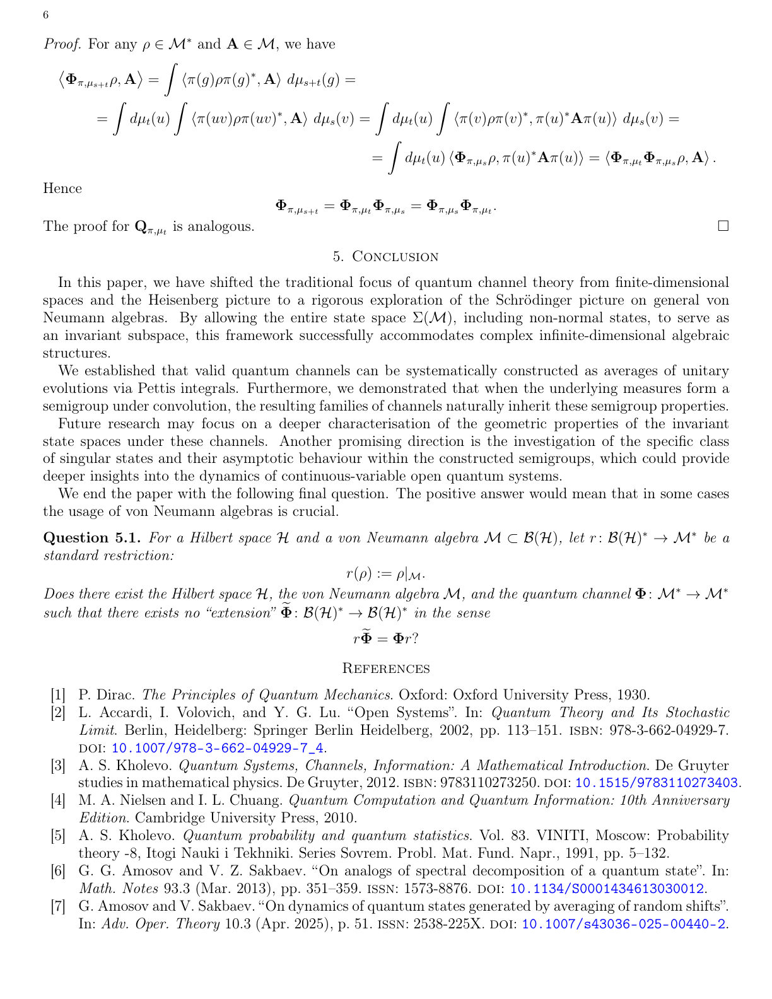
<figcaption class="paper-figure-caption"><b>Fig 5.</b> Low-resolution page preview, page 6</figcaption>
</figure>

**Summary.** This paper develops a general theory for quantum channels acting on the state spaces associated with von Neumann algebras in the Schrödinger picture. It achieves this by constructing these channels as Pettis integrals involving unitary representations over topological groups. This mathematical generalization allows the framework to handle complex, infinite-dimensional open quantum systems beyond traditional finite-dimensional models.

**Why it may be interesting.** This work provides a rigorous mathematical framework for describing open quantum system dynamics in infinite dimensions by generalizing standard channel definitions to the dual space, which is crucial for modern theoretical treatments of continuous systems.

Detailed structure

**Main problem.** The paper extends the study of quantum channels from finite-dimensional state spaces or the Heisenberg picture to the duals of general von Neumann algebras in the Schrödinger picture.

**Main result.** Quantum channels can be systematically constructed as completely positive maps on $M^*$ via Pettis integrals involving representations of topological groups, and these constructions preserve semigroup properties under convolution semigroups of measures.

**Method.** The core method involves defining quantum channels $\Phi: M^* 	o M^*$ using the integral form $\int_G \pi(g)
ho\pi(g)^* d\mu(g)$, which generalizes unitary averaging techniques to infinite dimensions.

**Model / system.** The model concerns open quantum systems whose dynamics are described by completely positive maps (quantum channels) acting on the state space $\Sigma(M)$ associated with an infinite-dimensional von Neumann algebra $M \subset B(H)$.

**Key observables.** Quantum states $
ho \in \Sigma(M)$, observables $A \in M$, and the action of the channel $\Phi$ on these elements.

**Important parameters / regimes.** The structure of the underlying topological group $G$ and the measure $\mu$ used in the Pettis integral construction are critical parameters.

**Assumptions / limitations.** The primary assumption is that the dynamics can be modeled by averaging unitaries derived from representations $\pi: G 	o U(H)$; a key limitation noted is the potential failure of SOT-continuity for such representations.

**Paper structure.** The paper builds upon known results for finite systems, introduces the general framework on $M^*$, proves that unitary evolution and Pettis integral constructions yield valid channels (Theorems 3.1 & 3.2), and then explores semigroup properties using convolution semigroups of measures.

Abstract

The theory of quantum channels is traditionally studied either on finite-dimensional state spaces or within the Heisenberg picture as completely positive maps on C^*-algebras. In this paper, we consider quantum channels as completely positive maps on the duals of general von Neumann algebras in the Schrodinger picture. We investigate the construction of such channels through Pettis integrals using representations of topological groups.

[↑ back to top](#top)

### [The preferred-time problem in the conditional interpretation of time](http://arxiv.org/abs/2608.16732v1)

**Authors:** Ovidiu Cristinel Stoica  
**Type:** theory · **Category:** other · **PDF:** <https://arxiv.org/pdf/2608.16732v1>  
**Analysis basis:** full PDF text, analyzed in chunks
**Topic relevance:** `quantum measurements` **3/5** · `driven-dissipative phase transition` **2/5** · `Keldysh / 2PI / non-Gaussian methods` **1/5** · `analog quantum simulation` **1/5** · `correlated / nonlocal dissipation` **1/5** · `methods for driven-dissipative` **1/5** · `scars & prethermalization` **1/5**

↔ Scroll figures horizontally

<figure class="paper-figure-card">
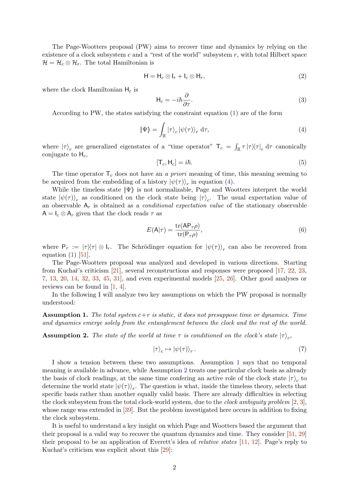
<figcaption class="paper-figure-caption"><b>Fig 1.</b> Low-resolution page preview, page 2</figcaption>
</figure>
<figure class="paper-figure-card">
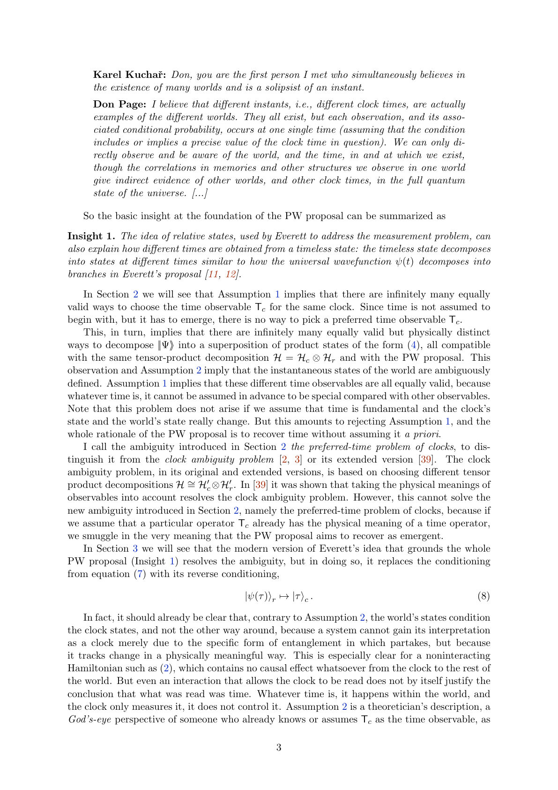
<figcaption class="paper-figure-caption"><b>Fig 2.</b> Low-resolution page preview, page 3</figcaption>
</figure>
<figure class="paper-figure-card">
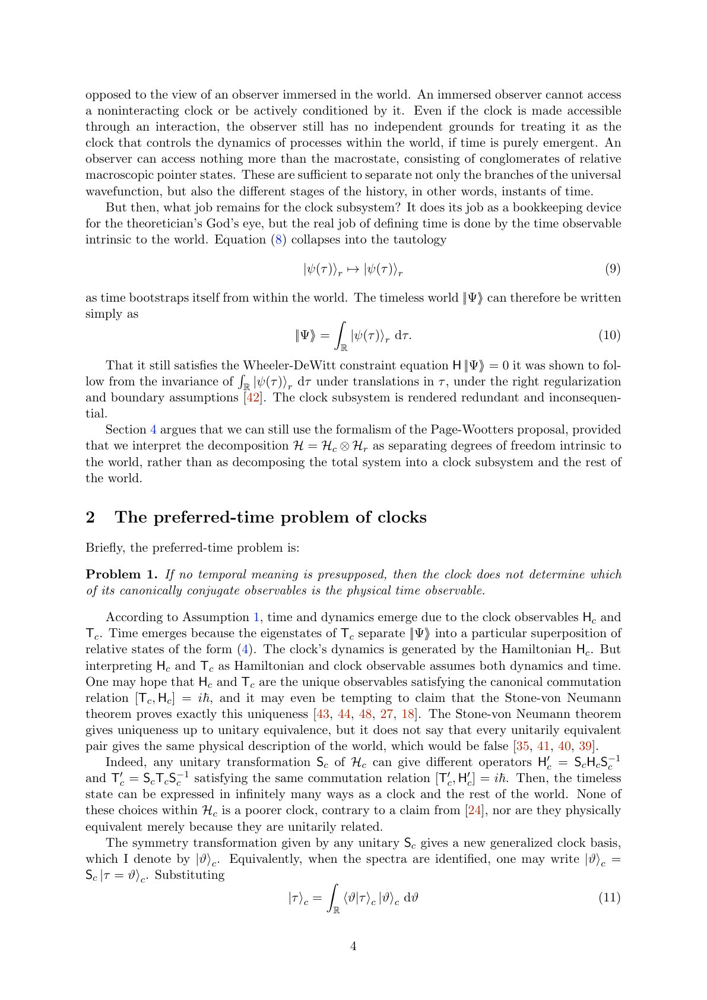
<figcaption class="paper-figure-caption"><b>Fig 3.</b> Low-resolution page preview, page 4</figcaption>
</figure>
<figure class="paper-figure-card">
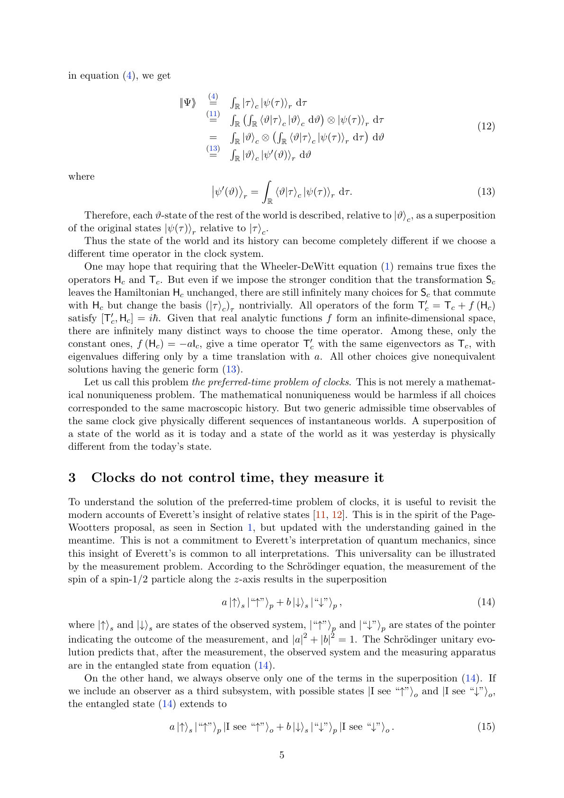
<figcaption class="paper-figure-caption"><b>Fig 4.</b> Low-resolution page preview, page 5</figcaption>
</figure>
<figure class="paper-figure-card">
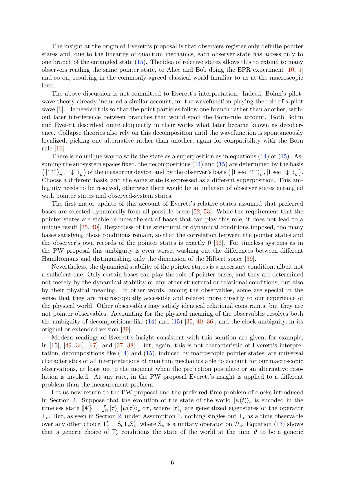
<figcaption class="paper-figure-caption"><b>Fig 5.</b> Low-resolution page preview, page 6</figcaption>
</figure>

**Summary.** This paper tackles the 'preferred-time problem' in timeless quantum formulations like the Page-Wootters proposal. It argues that assuming a separate clock system leads to ambiguity because infinitely many valid time operators exist for the entangled state. The resolution is that time must be defined intrinsically by the world's own observables, making the explicit separation of a 'clock' subsystem unnecessary.

**Why it may be interesting.** Although focused on foundational quantum gravity/time, the concept of emergent dynamics from internal degrees of freedom is highly relevant to open quantum systems theory, particularly in defining effective Hamiltonians or decoherence mechanisms where time parameters are not externally imposed.

Detailed structure

**Main problem.** The paper addresses the 'preferred-time problem' within the Page-Wootters (PW) formalism, which arises from the ambiguity in selecting a unique time operator when deriving dynamics from timeless quantum states.

**Main result.** The correct interpretation requires that time emerges from intrinsic pointer observables of the world itself, rendering the explicit separation into a separate clock subsystem redundant for defining physical time evolution.

**Method.** The analysis involves comparing mathematically valid decompositions of entangled states against physically necessary constraints, particularly by identifying which observable induces the temporal structure.

**Model / system.** The model is quantum theory formulated in a timeless manner, using the PW proposal where the total system is treated as an entanglement between a clock subsystem ($c$) and the world subsystem ($r$).

**Key observables.** Clock observable ($T_c$), global time observable ($\hat{b}T_r$), and the state decomposition $|\Psi
angle$.

**Important parameters / regimes.** The structure of the Hamiltonian $H = H_c \otimes I_r + I_c \otimes H_r$ is central, as are the continuous vs. discrete nature of time spectra.

**Assumptions / limitations.** The paper critiques two key assumptions of the standard PW interpretation: (1) that dynamics emerge solely from clock-world entanglement, and (2) that the world state is passively conditioned by a pre-selected clock basis.

**Paper structure.** The structure moves from defining the problem (PW formalism leading to ambiguity) to analyzing the mathematical source of the ambiguity (infinite time operators) and finally proposing a resolution where intrinsic world observables dictate the temporal structure, thus invalidating the need for an external clock.

Abstract

In timeless formulations of quantum theory, the Page-Wootters proposal (PW) recovers time and dynamics as relative clock-and-world states. By interpreting the total timeless system as a clock entangled with the world, the states having a definite clock reading appear to recover the temporal states of the world as relative states, and dynamics emerges. But an entangled state admits infinitely many decompositions as a superposition of product states, each decomposition corresponding to a different but equally valid time operator of the same clock system. Different valid choices of the time operator for the same clock system lead to different physical histories, where the world states in a history are superpositions of the world states from another history. Fixing one operator as "the" clock time would import the temporal meaning that the Page-Wootters proposal is meant to explain in the first place. Therefore, the interpretation of PW that the world state is passively conditioned on the clock state cannot hold. The timeless state is resolved into time-dependent states by the intrinsic pointer observables of the world, without having to outsource the role of the time operator to a separate clock. Fortunately, the formalism of PW remains valid, provided that it is interpreted in terms of intrinsic pointer observables of the world itself.

[↑ back to top](#top)

### [Carnot Meets Quantum Information: Thermal Machine Driven by Probabilistic Non-orthogonal State Discrimination](http://arxiv.org/abs/2608.16623v1)

**Authors:** Tan-Ji Zhou, Yun-Qian Lin, Yu-Han Ma, C. P. Sun  
**Type:** theory · **Category:** statistical mechanics · **PDF:** <https://arxiv.org/pdf/2608.16623v1>  
**Analysis basis:** full PDF text, analyzed in chunks
**Topic relevance:** `driven-dissipative phase transition` **3/5** · `non-equilibrium universality` **2/5** · `Keldysh / 2PI / non-Gaussian methods` **1/5** · `correlated / nonlocal dissipation` **1/5** · `methods for driven-dissipative` **1/5** · `quantum measurements` **1/5**

↔ Scroll figures horizontally

<figure class="paper-figure-card">
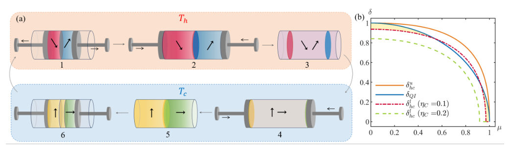
<figcaption class="paper-figure-caption"><b>Fig 1.</b> FIG. 1. (a) Schematic of the quantum information thermodynamic cycle. The cycle comprises isothermal expansion (hot reservoir, steps 1-3) and isothermal compression (cold reservoir, steps 4-6), driven by probabilistic non-orthogonal state discrimination. Red/blue regions denote gas in non-orthogonal states |𝜓1⟩(↘) and |𝜓2⟩(↗); yellow/green regions denote orthogonal states |𝜙1⟩(↑) and |𝜙2⟩(→). (b) Parameter space for positive work extraction. Discrimination accuracy 𝛿is plotted against state overlap 𝜇. Functional operation requires 𝛿to fall between the quantum information limit 𝛿𝑄𝐼(solid blue curve) and the thermodynamic lower bound 𝛿𝑙 ℎ𝑐(dashed curves). The shaded yellow area highlights the...</figcaption>
</figure>
<figure class="paper-figure-card">
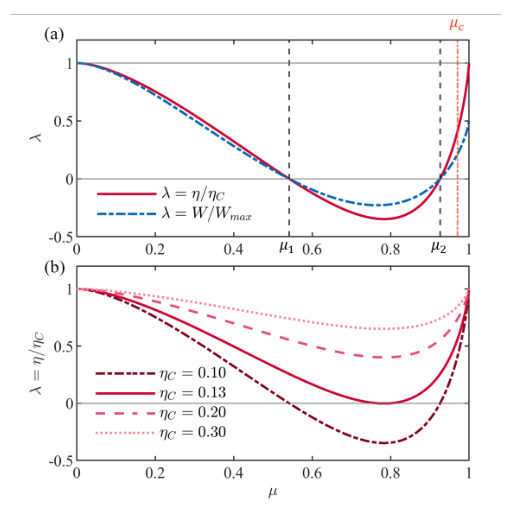
<figcaption class="paper-figure-caption"><b>Fig 2.</b> FIG. 2. Performance characteristics of the machine evaluated at 𝛿= 𝛿𝑄𝐼. (a) The normalized net work output and efficiency are plotted as functions of 𝜇for 𝜂𝐶= 0.1. (b) Normalized efficiency as a function of 𝜇with different 𝜂𝐶.</figcaption>
</figure>
<figure class="paper-figure-card">
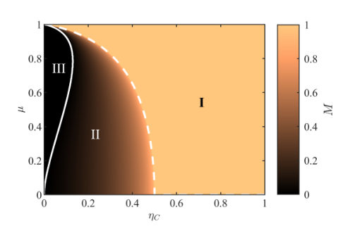
<figcaption class="paper-figure-caption"><b>Fig 3.</b> FIG. 3. Functional phase diagram of the quantum information ma- chine in the parameter space of Carnot efficiency 𝜂𝐶versus state overlap 𝜇. The color map indicates the normalized order parameter 𝑀. The diagram features three distinct regimes: I. the Pure Heat Engine Phase (𝑀= 1), II. the Mixed Phase (0 &lt; 𝑀&lt; 1), and III. the Dissipative Phase (𝑀= 0). The dashed white line denotes the analytical boundary 𝜇𝑐given by Eq. (13).</figcaption>
</figure>

**Summary.** This work analyzes a theoretical thermal machine powered by the probabilistic discrimination of non-orthogonal quantum states. It maps out the operational boundaries in the parameter space defined by the Carnot efficiency and state overlap, revealing distinct phase transitions. The findings establish how quantum information constraints fundamentally limit the maximum extractable work from heat gradients.

**Why it may be interesting.** It provides a rigorous framework connecting non-equilibrium thermodynamics (heat engines) directly with fundamental principles of quantum information theory (state distinguishability), which is highly relevant for understanding energy extraction in quantum devices.

Detailed structure

**Main problem.** The paper investigates the fundamental limits on energy conversion when a thermal machine utilizes probabilistic discrimination of non-orthogonal quantum states.

**Main result.** The system exhibits phase-transition-like switching in its performance region within the Carnot efficiency ($\eta_C$) and state overlap ($\mu$) plane, revealing anomalous reentrant transitions under weak driving.

**Method.** The analysis uses a six-step thermodynamic cycle model to derive efficiencies by jointly considering quantum information bounds (Holevo-Helstrom) and classical thermodynamics constraints.

**Model / system.** A two-reservoir quantum machine modeled using an ideal gas with internal quantum degrees of freedom, operating between hot ($T_h$) and cold ($T_c$) reservoirs.

**Key observables.** Efficiency ($\eta$), Net Work ($W_{net}$), State Overlap ($\mu$), Discrimination Accuracy ($\delta$).

**Important parameters / regimes.** Carnot Efficiency ($\eta_C = 1 - T_c/T_h$); critical thresholds like $\eta_C \ge 0.5$ and $\eta_C \lesssim 0.13$.

**Assumptions / limitations.** The analysis assumes reversible operation for the joint measurement-resetting process.

**Figures summary.** Figure 1(b) plots the required operational region for discrimination accuracy ($\delta$) between the thermodynamic lower bound ($\delta_{lhc}$) and the quantum indistinguishability limit ($\delta_{QI}$). Figure 3 maps a phase diagram showing three distinct operating phases in the $(\eta_C, \mu)$ space.

**Paper structure.** The paper establishes the physical model, derives efficiency formulas incorporating entropy terms, determines the operational constraints by comparing quantum and thermodynamic bounds, and finally maps out the resulting phase diagram to characterize functional switching.

Abstract

While the impossibility of perfectly identifying non-orthogonal states is a cornerstone of quantum information science, their probabilistic discrimination is nonetheless permissible. Here, we propose a two-reservoir quantum machine driven by this mechanism to map its functional boundaries across the parameter space of the state overlap $μ$ and the Carnot efficiency $η_C$. Within this $η_C$-$μ$ plane, the machine exhibits phase-transition-like functional switching among a pure heat-engine phase, a mixed phase, and a dissipative phase. We identify critical thresholds governing these transitions: strong thermal driving ($η_C \ge 0.5$) unconditionally guarantees positive work extraction, whereas weak driving ($η_C \lesssim 0.13$) induces an anomalous reentrant transition, where increasing $μ$ unexpectedly restores engine functionality after a purely dissipative regime. Our results explicitly demonstrate how quantum mechanics and thermodynamics jointly constrain information-to-energy conversion.

[↑ back to top](#top)

### [Jump-Diffusion Stochastic Quantization for Euclidean Lattice Field Theories](http://arxiv.org/abs/2608.16451v1)

**Authors:** Alexander Rothkopf  
**Type:** theory · **Category:** numerical methods · **PDF:** <https://arxiv.org/pdf/2608.16451v1>  
**Analysis basis:** full PDF text, analyzed in chunks
**Topic relevance:** `methods for driven-dissipative` **3/5** · `driven-dissipative phase transition` **2/5** · `Keldysh / 2PI / non-Gaussian methods` **1/5** · `analog quantum simulation` **1/5** · `correlated / nonlocal dissipation` **1/5** · `quantum measurements` **1/5**

↔ Scroll figures horizontally

<figure class="paper-figure-card">
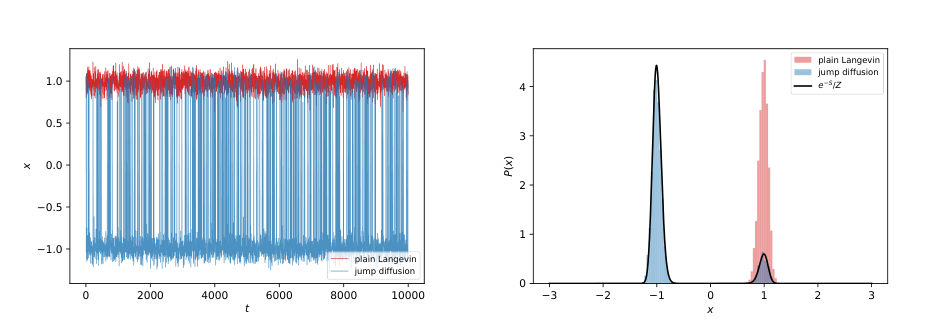
<figcaption class="paper-figure-caption"><b>Fig 1.</b> FIG. 1. (left) Individual trajectory of the stochastic process sampling the tilted double well using diffusion Langevin (red) or our novel jump-diffusion approach (blue), both initialized at x = 1. Note the frequent visits of the opposite local minima by the latter. (right) Histogram of the sampled degree of freedom for diffusive langevin (red) and the ergodical sampling by jump-diffusion (blue)</figcaption>
</figure>
<figure class="paper-figure-card">
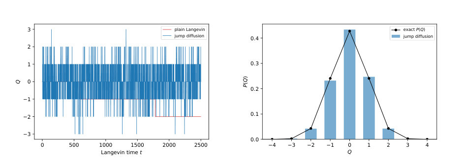
<figcaption class="paper-figure-caption"><b>Fig 2.</b> FIG. 2. Visualizations at β = 8, L = 16: (left) topological charge and its transitions from plain Langevin (red solid) and the jump-diffusion update (blue). (right) Histogram of the topological charge as sampled with jump-diffusion (blue bars) compared to the exact result from the literature.</figcaption>
</figure>
<figure class="paper-figure-card">
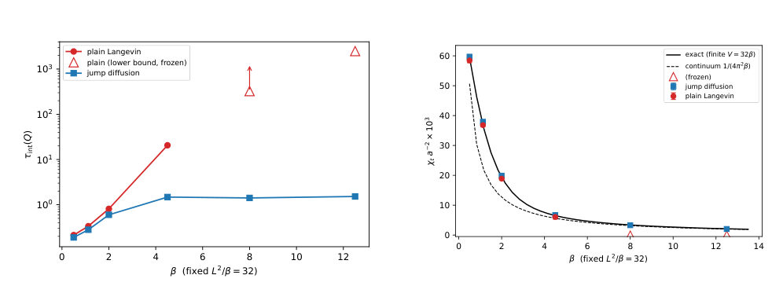
<figcaption class="paper-figure-caption"><b>Fig 3.</b> FIG. 3. (left) Topological charge autocorrelation time at various lattice couplings β, as measured for plain Langevin updates (red data) and the jump-diffusion updates (blue data). Where fewer than 20 transitions occur the estimate of autocorrelation time becomes unreliable we give its value as lower bound (open triangles). (right) The values of the topological susceptibility estimated at various β values from plain Langevin (red) and the jump-diffusion sampler (blue). The exact lattice result is given as black solid line, the continuum expression as dashed black line.</figcaption>
</figure>
<figure class="paper-figure-card">
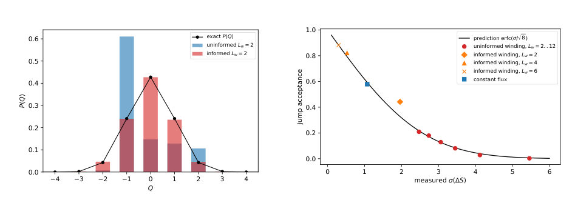
<figcaption class="paper-figure-caption"><b>Fig 4.</b> FIG. 4. (left) Histogram of topological charge sampled at β = 8, L = 16 with small Lw = 2 uninformed (A) winding jumps (blue bars) and using state informed (C) jumps (red bars). The exact result is given as black solid line. (right) Jump acceptance vs. the standard deviation of the relevant action cost. Following section II D ∆S is used for uninformed jumps and ∆Seff for informed jumps. The uninformed global constant flux update (blue data) shows higher acceptance than the local uninformed winding updates (red data). The smaller the extent Lw, the lower the acceptance. On the other hand, informed winding updates, even for small Lw = 2 (orange square) exceed the acceptance efficiency for the...</figcaption>
</figure>

**Summary.** This paper extends stochastic quantization by incorporating jump-diffusion processes, allowing simulations to overcome topological barriers that trap standard diffusion methods. By developing rigorous mathematical constructions for the jump probabilities, the authors demonstrate a powerful tool to efficiently sample complex action landscapes in lattice field theories.

**Why it may be interesting.** The rigorous mathematical development of ensuring detailed balance for non-local jumps is highly relevant to any simulation technique relying on Markov chain Monte Carlo (MCMC), including those used in quantum field theory or complex many-body systems where barriers are present.

Detailed structure

**Main problem.** To construct a natural generalization of stochastic quantization by incorporating jump-diffusion processes to efficiently explore action landscapes with barriers.

**Main result.** The framework successfully generalizes stochastic quantization by providing concrete, detailed balance preserving methods (additive proposals, invertible maps) for designing the necessary jump probabilities.

**Method.** The authors derive and apply a generalized master equation for Poisson jump-diffusion processes, ensuring convergence to the desired equilibrium distribution $P(\phi) \propto e^{-S(\phi)}$ via specific construction strategies for the jump kernel.

**Model / system.** The theory is applied to Euclidean Lattice Field Theories, using 2D U(1) gauge theory as a benchmark problem to address topological freezing. The dynamics are governed by a generalized Fokker-Planck master equation incorporating both diffusion and non-continuous jumps.

**Key observables.** Topological charge dynamics histogram, autocorrelation time reduction, and the acceptance rate of the jump process.

**Important parameters / regimes.** The jump rate ($\lambda_0$), the size/extent of the update ($L_w$), and the parameters defining the proposal distributions (e.g., $\sigma$ for Gaussian approximations).

**Assumptions / limitations.** Boundary terms are neglected in deriving the Fokker-Planck equation; certain constructions rely on assuming measure-preserving maps whose inverses are also available.

**Figures summary.** Figure 4 compares topological charge dynamics histograms, showing that state-informed jumps (red bars) restore efficient transitions between topological sectors compared to uninformed updates (blue bars).

**Paper structure.** The paper first introduces the need for jump-diffusion processes over standard diffusion. It then derives the generalized master equation and presents three construction strategies (A, B, C) to enforce detailed balance in the jump term. Finally, it applies this framework to lattice gauge theory simulations, demonstrating improved sampling efficiency.

Abstract

We construct the natural generalization of stochastic quantization (in the Markovian sense) by considering jump-diffusion processes. This class of stochastic processes exhibits non-continuous paths, so-called Lévy flights. In the presence of jumps, action landscapes with barriers can be efficiently explored, improving and even restoring ergodicity where traditional diffusion approaches become inefficient. We explore different strategies for constructing efficient jump updates, which we deploy to address the benchmark problem of topological freezing in 2d U(1) gauge theory.

[↑ back to top](#top)

### [Renormalization Group Analysis of Pairing Instabilities in Nuclear Fermi Liquids](http://arxiv.org/abs/2608.15759v1)

**Authors:** Yang Xiao, Yixin Guo, Youngman Kim  
**Type:** theory · **Category:** quantum gases · **PDF:** <https://arxiv.org/pdf/2608.15759v1>  
**Analysis basis:** full PDF text, analyzed in chunks
**Topic relevance:** `Keldysh / 2PI / non-Gaussian methods` **3/5** · `analog quantum simulation` **3/5** · `driven-dissipative phase transition` **1/5** · `methods for driven-dissipative` **1/5** · `non-equilibrium universality` **1/5**

↔ Scroll figures horizontally

<figure class="paper-figure-card">

<figcaption class="paper-figure-caption"><b>Fig 1.</b> Figure 1: Spherical channel-selection diagram for the minimal S/P- wave model.</figcaption>
</figure>
<figure class="paper-figure-card">
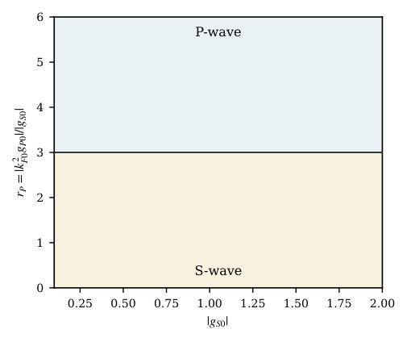
<figcaption class="paper-figure-caption"><b>Fig 2.</b> Figure 1 summarizes the spherical benchmark by com- paring the formal pole scales of the S - and P-wave cou- plings. For each point in the (|gS 0|, rP) plane, we define</figcaption>
</figure>
<figure class="paper-figure-card">
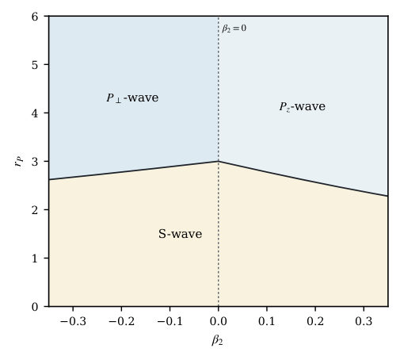
<figcaption class="paper-figure-caption"><b>Fig 3.</b> Figure 2: Schematic S/Pz/P⊥competition on an axially deformed Fermi surface, obtained from Eqs. (30)–(34). The plot uses kF0 = m = 1 and equal initial Pz and P⊥strengths.</figcaption>
</figure>
<figure class="paper-figure-card">
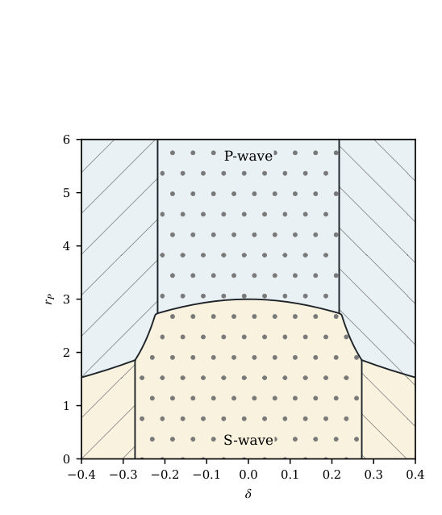
<figcaption class="paper-figure-caption"><b>Fig 4.</b> Figure 3: Dominant pairing channel in isospin-asymmetric matter as a function of the Fermi-momentum splitting δ. Pairing composition is distinguished by texture: dots denote np pairing, upward-sloping hatching (left-hand side) denotes pp pairing, and downward-sloping hatching (right-hand side) denotes nn pairing.</figcaption>
</figure>

**Summary.** This theoretical work uses Renormalization Group techniques to map out which pairing instability dominates in a nuclear Fermi liquid under varying conditions. By analyzing the pole scale of competing channels, it shows that both the geometry of the Fermi surface and the asymmetry between neutron and proton populations dictate the superconducting state formed.

**Why it may be interesting.** While focused on nuclear physics, the methodology—using RG flow to determine the instability order among competing channels based on geometry and composition—is highly relevant to understanding phase transitions in strongly interacting quantum systems like ultracold Fermi gases (e.g., superfluidity onset).

Detailed structure

**Main problem.** The study determines which competing pairing instability develops first in a nuclear Fermi liquid, considering various spin, isospin, and orbital channels.

**Main result.** The dominant pairing channel is determined by the pole scale of the Renormalization Group (RG) flow; this selection depends critically on the Fermi surface geometry and the degree of neutron-proton asymmetry.

**Method.** A Fermi-surface Renormalization Group (RG) treatment is employed, using one-loop corrections to determine the running couplings and the divergence scale ($\Lambda^*$) for different pairing channels.

**Model / system.** The system modeled is a nuclear Fermi liquid, analyzed using a minimal S/P-wave interaction model. The analysis extends to include effects of axial deformation and neutron-proton momentum splitting.

**Key observables.** Pole scale ($\Lambda^*_A$) of the RG flow; competition boundary parameter $r_P$; running coupling constants for different channels (nn, pp, np).

**Important parameters / regimes.** Isospin asymmetry $\delta = (k_{F,n} - k_{F,p}) / k_{F0}$; deformation parameter $eta_2$; initial coupling strengths ($g_A(\Lambda_0)$).

**Assumptions / limitations.** The calculations are controlled one-loop RG illustrations and not quantitative nuclear matter predictions; the analysis uses minimal S/P-wave truncations.

**Figures summary.** Figure 1 shows the spherical channel selection diagram based on $r_P$. Figure 2 illustrates competition on an axially deformed surface. Figure 3 maps the dominant pairing channel in the $(\delta, r_P)$ plane for six components.

**Paper structure.** The paper systematically analyzes the RG flow by first establishing the spherical benchmark (S vs P wave), then incorporating geometric effects via axial deformation ($eta_2$), and finally analyzing the impact of isospin asymmetry ($\delta$) which introduces finite threshold scales for $np$ pairing.

Abstract

A nuclear Fermi liquid exhibits competing pairing instabilities in different spin, isospin, and orbital channels. In a Fermi-surface renormalization group (RG) treatment, the channel that develops a pole first is determined not only by its tree-level attraction but also by its one-loop RG coefficient. We illustrate this mechanism in a minimal $S/P$-wave model. A spherical Fermi surface establishes the reference competition between the lowest even- and odd-parity interactions. Axial deformation changes the relevant Fermi-surface integrals and lifts the degeneracy between longitudinal and transverse $P$-wave components. In isospin-asymmetric matter, neutron--proton Fermi-momentum splitting restricts the simultaneous low-energy contribution of the two species and can terminate the $np$ running at finite threshold scales. Our calculations are intended as controlled one-loop RG illustrations rather than as quantitative nuclear-matter calculations. We show how the Fermi-surface geometry and composition can change the ordering of competing pairing instabilities.

[↑ back to top](#top)

### [zenDot: An LLM-integrated quantum TCAD platform for semiconductor quantum-device design and optimization automation](http://arxiv.org/abs/2608.16048v1)

**Authors:** Zeheng Wang, Yan Liu, Yue Hao, Genquan Han  
**Type:** theory · **Category:** quantum information and computing · **PDF:** <https://arxiv.org/pdf/2608.16048v1>  
**Analysis basis:** full PDF text, analyzed in chunks
**Topic relevance:** `Keldysh / 2PI / non-Gaussian methods` **3/5** · `methods for driven-dissipative` **3/5** · `quantum measurements` **2/5** · `driven-dissipative phase transition` **1/5**

↔ Scroll figures horizontally

<figure class="paper-figure-card">
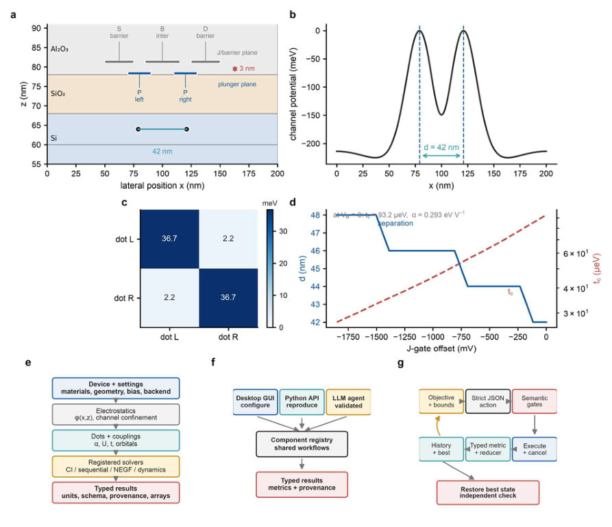
<figcaption class="paper-figure-caption"><b>Fig 1.</b> Fig. 1 | zenDot connects one device state to human and LLM-operated quantum-device simulation. a, Material-labelled Si/SiO₂ layer stack. b, Channel confinement returned by the electrostatic solution, resolving two minima 42 nm apart. c, Charging matrix derived from the same device state. d, Inter-dot gate control of separation and tunnel coupling. e, Device-to-result workflow shared across the platform. f, Desktop workbench, Python API, and LLM agent access the same component registry. g, Physics-aware LLM execution: proposed design actions are checked, executed by registered solvers, and returned as quantitative results for the next iteration.</figcaption>
</figure>
<figure class="paper-figure-card">
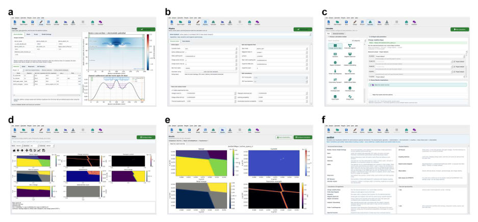
<figcaption class="paper-figure-caption"><b>Fig 2.</b> Fig. 2 | The zenDot desktop workbench. a, Device builder and derived confinement. b, Physical and solver settings. c, Registry- generated calculation components and compatible visualizations. d, Charge-stability and transport-map workspace. e, Result visualization and export. f, Integrated documentation. The same registered components are accessible through Python and the LLM Assistant.</figcaption>
</figure>
<figure class="paper-figure-card">
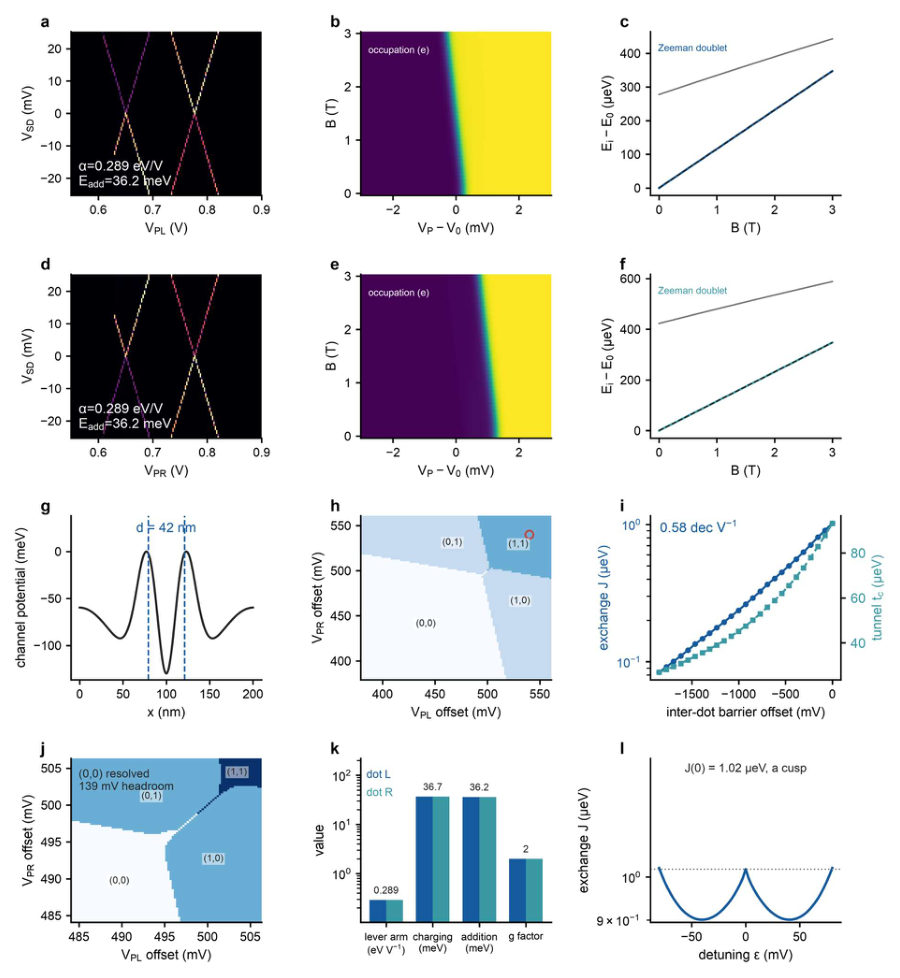
<figcaption class="paper-figure-caption"><b>Fig 3.</b> Fig. 3 | Device-level characterization generated from the reference Si/SiO₂ double dot. a-f, Coulomb diamonds, magnetospectroscopy, and Zeeman levels calculated independently for the left and right dots. g, Solved double-well confinement. h, Two-plunger charge-stability map with the selected (1,1) operating point. i, Barrier dependence of exchange and tunnel coupling. j, Empty-cell headroom below the first charging line. k, Left-right consistency of single-dot quantities. l, Even exchange J(ε) with a cusp-shaped local maximum at ε = 0.</figcaption>
</figure>
<figure class="paper-figure-card">
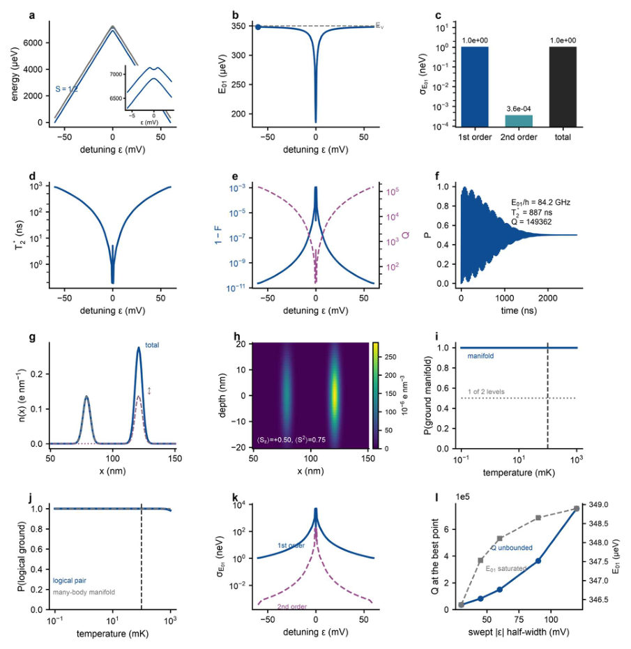
<figcaption class="paper-figure-caption"><b>Fig 4.</b> Fig. 4 | Hybrid-qubit demonstration on the calibrated device. a, Three-electron spectrum. b, Logical splitting E01 approaching the valley splitting. c-e, Noise response, dephasing time, infidelity, and quality factor. f, Dephased logical fringe. g,h, Real-space and depth-resolved density. i,j, Thermal populations and logical initialization. k, First- and second-order amplitude channels. l, Dependence of the reported quality factor on detuning window. At the reported operating point E01 = 348.1 µeV, the frequency is 84.2 GHz, T2* = 887.3 ns, and the logical initialization fidelity is 1.000 at 100 mK.</figcaption>
</figure>
<figure class="paper-figure-card">
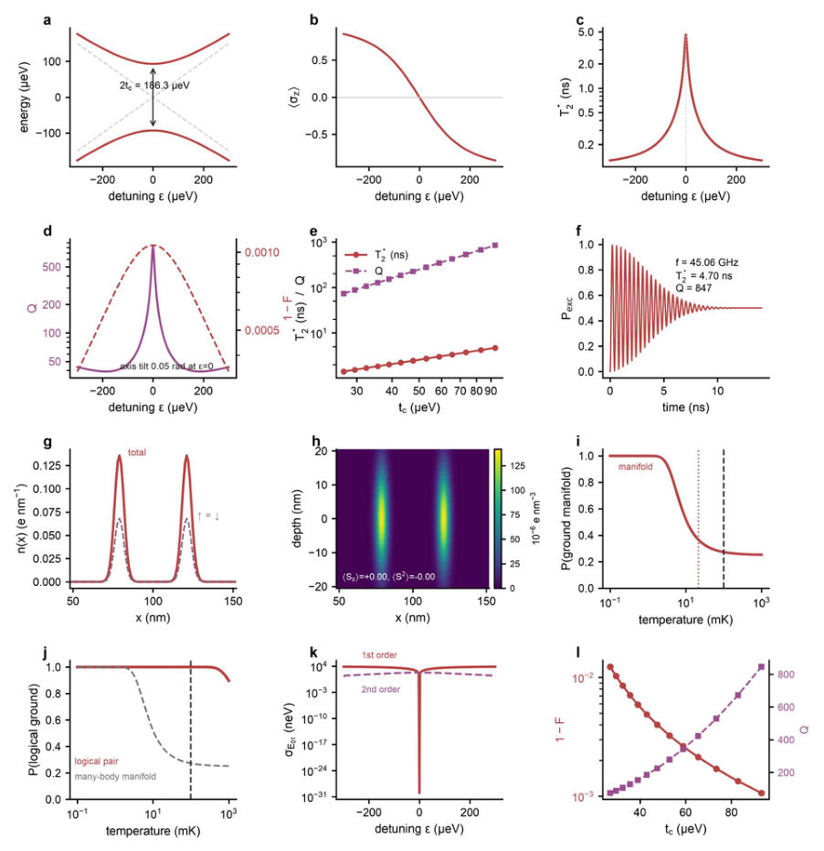
<figcaption class="paper-figure-caption"><b>Fig 5.</b> Fig. 5 | Tunnel-charge-qubit demonstration. a, Charge anticrossing with minimum splitting 2tc. b, Charge dipole. c,d, Dephasing and gate-error metrics across detuning. e, Dependence on tunnel coupling. f, Larmor fringe. g,h, Density. i,j, Many-body and logical thermal populations. k, First- and second-order amplitude channels. l, Barrier-controlled gate performance. At zero detuning, the frequency is 45.1 GHz, T2* = 4.70 ns, Q = 847 for a π/2 rotation, and the logical initialization fidelity is 1.000 at 100 mK.</figcaption>
</figure>

**Summary.** The paper presents zenDot, a novel LLM-integrated platform designed to automate the design and optimization of semiconductor quantum devices. It unifies disparate simulation tools—from electrostatics to correlated electron physics—into one cohesive workflow. By allowing an AI agent to propose changes and execute complex simulations iteratively, it drastically accelerates the discovery process for high-performance qubits.

**Why it may be interesting.** This work directly addresses the computational bottleneck in quantum device engineering by embedding complex physics simulations within an AI-driven control loop, which is highly relevant for developing scalable quantum hardware designs.

Detailed structure

**Main problem.** Semiconductor quantum-device design lacks an integrated TCAD environment connecting geometry, many-body simulation, and automated optimization.

**Main result.** The zenDot platform successfully automates the characterization and optimization of various qubit types (e.g., singlet-triplet) on a double quantum dot, achieving significant performance improvements through LLM-driven iteration.

**Method.** It introduces an LLM-integrated quantum TCAD workflow that unifies device state calculation across electrostatics, charge transport, and correlated-state physics solvers.

**Model / system.** The system is a lateral Si/SiO2 double quantum dot. The platform models the device state using electrostatics ($
abla\cdot[\epsilon(\mathbf{r})
abla\phi(\mathbf{r})] = -
ho(\mathbf{r})$) and supports multiple qubit Hamiltonians (hybrid, tunnel-charge, singlet-triplet).

**Key observables.** Gate infidelity, coherence time ($T_2^*$), Quality factor ($Q$), exchange energy ($J$), charge stability map, and device frequency ($	ext{GHz}$).

**Important parameters / regimes.** Operating temperature (100 mK), noise amplitude ($1.5 \mu	ext{eV Hz}^{-1/2}$ at 1 Hz), and gate biases controlling tunnel coupling.

**Assumptions / limitations.** The transport calculation uses the sequential-tunnelling approximation, and the LLM agent's actions are constrained to selecting and sequencing existing physics solvers.

**Figures summary.** Figures illustrate the unified workflow from device state to various physical calculations (electrostatics, charge maps) and demonstrate the closed-loop operation of the LLM agent guiding optimization sweeps for different qubit types.

**Paper structure.** The paper establishes the need for integration, introduces zenDot as the solution, details its components (electrostatics, solvers), demonstrates its capability on a Si/SiO2 double dot across multiple qubit models, and concludes by showing the LLM agent performing iterative design optimization.

Abstract

Semiconductor quantum-device design still lacks an integrated Technology Computer-Aided Design (TCAD)-like environment that connects material geometry, quantum many-body simulation, and automated design. Here we introduce zenDot, a large-language model (LLM)-integrated quantum TCAD platform that links a material-labelled device state to a unified condensed-matter physics toolbox. The device and calculation components are integrated into a desktop workbench, Python API, and an embedded LLM agent, allowing electrostatics, charge and transport characterization, correlated-state calculations, and qubit modelling to be executed within one reproducible environment. We demonstrate zenDot on a Si/SiO2 double quantum dot, where a single device state reproduces the characterization workflow and supports hybrid, tunnel-charge, and singlet-triplet qubit analyses. A platform-level universal-control scan revises the singlet-triplet operating point and reduces the predicted worst-gate infidelity by nearly 30-fold. Beyond analysis, the LLM agent directly operates the same physics environment as human users, proposing design changes, executing registered simulations, and iterating on solver-returned metrics under physics-aware validation. Across three demonstration tasks it completes 18 validated design iterations, including geometry modification followed by a full re-solve from the material stack. zenDot establishes a machine-operable quantum TCAD workflow that connects device physics with LLM-driven design exploration.

[↑ back to top](#top)

### [Dynamical spectral functions from bitstring-sampled quantum subspaces: entanglement, not one-body magic, tracks the sampling cost](http://arxiv.org/abs/2608.16436v1)

**Authors:** Nicolás Bonilla Vargas  
**Type:** both · **Category:** strongly correlated electrons · **PDF:** <https://arxiv.org/pdf/2608.16436v1>  
**Analysis basis:** full PDF text, analyzed in chunks
**Topic relevance:** `analog quantum simulation` **3/5** · `methods for driven-dissipative` **3/5** · `Keldysh / 2PI / non-Gaussian methods` **1/5** · `quantum measurements` **1/5**

↔ Scroll figures horizontally

<figure class="paper-figure-card">
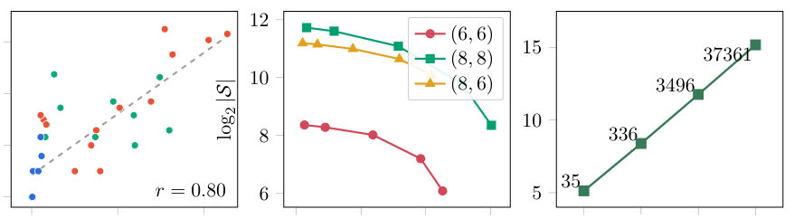
<figcaption class="paper-figure-caption"><b>Fig 1.</b> Figure 1. One-body magic F1 is decoupled from the sample-based determinant support |S|. (a) Nineteen FCI-verified molecules at equilibrium and dissociation: in the static-correlation regime F1 and |S| rise together (Pearson r = 0.80 on log2 |S|), yet F1 approaches its maximum while |S| stays a modest fraction of the active-space sector. (b) Hubbard chains at fixed filling (three representative sweeps; the full 30-point set is Fig. 2): increasing on-site repulsion U raises F1 but lowers the site-basis support |S| as the ground state localizes, inverting the sign of the correlation. (c) Free fermions (U = 0): a single Slater determinant with F1 = 0, whose site-basis support nonetheless grows...</figcaption>
</figure>
<figure class="paper-figure-card">
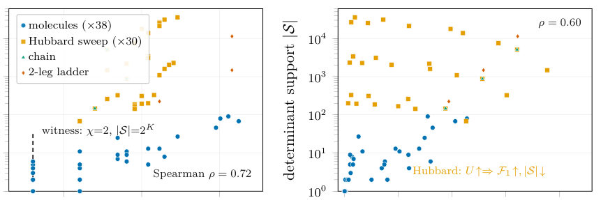
<figcaption class="paper-figure-caption"><b>Fig 2.</b> Figure 2. The resource thesis over 74 exact ground states. Nineteen molecules at equilibrium and dissociation, a Hubbard interaction sweep, and a matched chain/two-leg-ladder pair (all exact diagonalization). (a) The determinant support |S| tracks the minimal bond dimension χ in every family (pooled Spearman ρ = 0.72; the geminal witness χ=2, |S|=2K is the deliberately loose lower bound). (b) One-body magic F1 does not (pooled Spearman ρ = 0.60 for F1 vs |S| over the same 74 states): the Hubbard branch runs the wrong way (U ↑⇒F1 ↑, |S|↓) and the chain/ladder points share the same F1 at |S| differing by up to ∼2.2×. Cost is lower-bounded and tracked by the basis-dependent χ, not by the...</figcaption>
</figure>
<figure class="paper-figure-card">
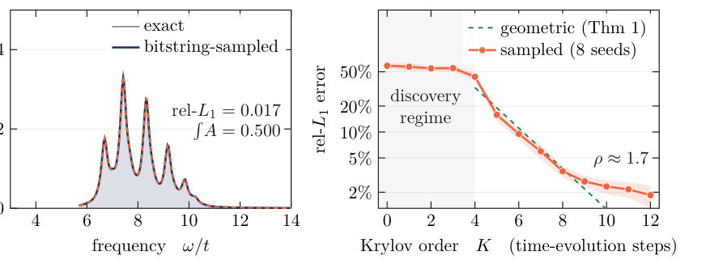
<figcaption class="paper-figure-caption"><b>Fig 3.</b> Figure 3. The method, validated—and its convergence matches the theorem. (a) The bitstring- sampled single-particle spectral function reproduces the exact A(ω) (Hubbard L = 6, U/t = 8; broadening η = 0.15 t) to relative-L1 0.017—the exact (filled) and reconstructed (dashed) curves are indistinguishable— and the reconstructed spectral weights obey the exact addition-branch sum rule R A+ dω = 0.500 = 1 −⟨np⟩ to machine precision (the panel shows the addition branch ω &gt; 0; the full A integrates to 1). (b) Convergence of the relative-L1 error with the Krylov order K (number of time-evolution steps sampled), seed-averaged over eight independent runs (band = standard deviation). Two regimes...</figcaption>
</figure>
<figure class="paper-figure-card">
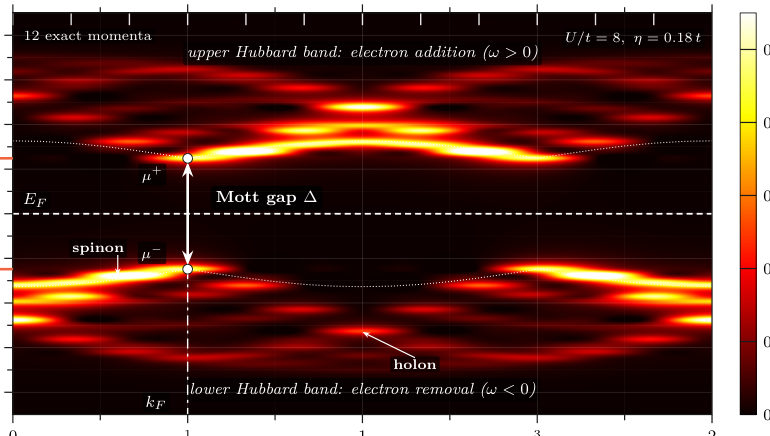
<figcaption class="paper-figure-caption"><b>Fig 4.</b> Figure 4. Momentum-resolved spectral function: the exact dynamical target. The single-particle spectral function A(k, ω) of the half-filled Hubbard chain (U/t = 8, L = 12, Lorentzian broadening η = 0.18 t), computed exactly from the resolvent ⟨ϕ|(z −ˆH)−1|ϕ⟩via the Haydock continued fraction [54] over the full (N±1) sectors (equivalent to the Lehmann sum in exact arithmetic)—the frequency- and momentum-resolved observable that sample-based diagonalization targets but its energy-only output cannot itself deliver. The two dispersing Hubbard bands—electron removal (lower, ω &lt; 0; photoemission) and electron addition (upper, ω &gt; 0; inverse photoemission)—are separated by the correlation-driven...</figcaption>
</figure>
<figure class="paper-figure-card">
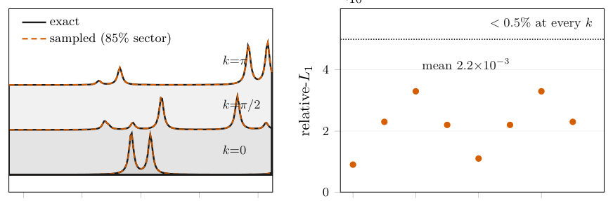
<figcaption class="paper-figure-caption"><b>Fig 5.</b> Figure 5. The momentum-resolved spectral function reconstructed from bitstring-sampled subspaces, overlaid on the exact target. (a) Bitstring-sampled A(k, ω) (dashed) versus the exact Haydock result (solid, shaded) at three representative momenta (k = 0, π/2, π; Hubbard chain, L = 8, U/t = 8, η = 0.18 t; curves offset vertically by k), reconstructed by time-evolution configuration sampling in the (N±1) sectors and the classical Lehmann assembly of Eq. (2)—not the exact target of Fig. 4, but the sampled output. (b) Relative-L1 error of the sampled reconstruction at every physical momentum, at a subspace of 85% of the (N±1) sector: below 0.5% throughout (mean 2.2 × 10−3). The reconstruction...</figcaption>
</figure>

**Summary.** This work develops a method to calculate dynamic properties, such as spectral functions, in strongly correlated electron systems using limited quantum resources. By sampling subspaces via simple measurements, the authors show that the computational cost is dictated by entanglement structure ($\chi$), not by easily measurable one-body quantities. This advances the field by providing a resource-aware roadmap for simulating complex electronic dynamics on current hardware.

**Why it may be interesting.** It provides a concrete pathway for simulating complex many-body dynamics (like spectral functions) on near-term quantum hardware by identifying the true scaling bottleneck (entanglement) rather than relying on simplified local observables.

Detailed structure

**Main problem.** To extend quantum subspace diagonalization from static ground-state energies to continuous, frequency-resolved dynamics for electronic structure calculations.

**Main result.** The sampling cost is governed by the entanglement (minimal bond dimension $\chi$), not by one-body invariants like Fermionic AntiFlatness ($F_1$).

**Method.** Reconstruct spectral functions and dynamical structure factors classically from sampled subspaces using only computational-basis measurements on a quantum processor.

**Model / system.** The methods are applied to electronic structure problems, validated against Hubbard chains and molecular systems, focusing on charged and neutral sectors of many-electron Hamiltonians.

**Key observables.** Single-particle spectral functions $A(\omega)$, momentum-resolved $A(k, \omega)$, and dynamical structure factors $S(q, \omega)$.

**Important parameters / regimes.** The resource cost is tracked by the determinant support size $|\mathcal{S}|$ and lower-bounded by entanglement ($\chi$).

**Assumptions / limitations.** The method assumes moment exactness can be achieved with a sampling bound polynomial in $|\mathcal{S}|$, independent of Hilbert-space dimension.

**Paper structure.** The paper introduces the methodology by moving the target from ground state to dynamics, details the reconstruction process using shallow measurements, and then analyzes the resource cost, contrasting one-body diagnostics with entanglement measures.

Abstract

Sample-based quantum diagonalization (SQD) and quantum-selected configuration interaction (QSCI) are the electronic-structure methods with most hardware traction, yet their canonical target -- the ground-state energy -- is where classical methods have caught up. We move the target to dynamics and the resource question. From one bitstring-sampling primitive -- computational-basis measurements of a shallow real-time circuit, with no Hadamard or controlled unitaries -- we reconstruct, from sampled subspaces, the single-particle spectral functions $A(ω)$ and $A(k,ω)$ and the neutral-sector dynamical structure factors $S(q,ω)$ and $S^{zz}(q,ω)$, each built classically in the Lehmann representation from its own subspace. The reconstruction matches exact diagonalization on Hubbard chains and, for $A(ω)$, across nineteen molecules (FCI-verified to $<10^{-5}$ Ha), and runs on the IBM Heron processor. Second, we ask which resource controls the cost -- the determinant support $|\mathcal{S}|$ the sampler must populate. On number-conserving states the fermionic AntiFlatness collapses to one 1-RDM invariant, $\mathcal{F}_1 = 4\,\mathrm{tr}[γ(1-γ)] = 2N_u$. An orbital-rotation (Gaussian) invariant while $|\mathcal{S}|$ is basis dependent, $\mathcal{F}_1$ is provably decoupled from the cost; the cost is instead lower-bounded and tracked by the entanglement -- the minimal bond dimension $χ$ (Spearman $ρ= 0.90$). One-body magic is thus a faithful multireference diagnostic but an unreliable cost predictor; any genuine advantage lives in the non-Gaussianity of the higher-body cumulants. We prove moment exactness and a sampling bound polynomial in $|\mathcal{S}|$, independent of Hilbert-space dimension. Self-consistent configuration recovery improves the subspace under device noise, while a learned generative model does not beat that classical baseline.

[↑ back to top](#top)

### [Linear response functions from inhomogeneous dynamical mean-field theory](http://arxiv.org/abs/2608.15800v1)

**Authors:** Don Rolih, Fabian B. Kugler  
**Type:** theory · **Category:** strongly correlated electrons · **PDF:** <https://arxiv.org/pdf/2608.15800v1>  
**Analysis basis:** full PDF text, analyzed in chunks
**Topic relevance:** `Keldysh / 2PI / non-Gaussian methods` **3/5** · `analog quantum simulation` **2/5** · `quantum measurements` **2/5** · `methods for driven-dissipative` **1/5**

↔ Scroll figures horizontally

<figure class="paper-figure-card">
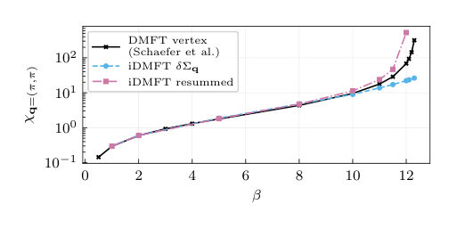
<figcaption class="paper-figure-caption"><b>Fig 1.</b> Figure 2. Lattice spin susceptibility at the AFM ordering vector q = (π, π) as a function of inverse temperature β at half-filling and U =2, computed with iDMFT via Eq. (29) (blue) and iDMFT resummation via Eq. (31) (violet). Black points are DMFT results from Ref. 24 (using the lattice BSE and a CT-INT vertex).</figcaption>
</figure>
<figure class="paper-figure-card">

<figcaption class="paper-figure-caption"><b>Fig 2.</b> Figure 1 presents our results at U = 2 and β = 5. Panels (a, b) display the real-space susceptibility obtained from iDMFT and from the standard DMFT vertex calculation; panels (c, d) show the same data in momentum space. Both methods reproduce the onset of an antiferromagnetic (AFM) instability with a checkerboard pattern in χi and a pronounced peak at the AFM ordering vector (π, π) in χq. The faint artifacts at the box boundaries in (a) are not a finite-size effect but stem from the fact that the magnitude of χi reaches the noise threshold of the impurity solver (see Appendix A for further details). Panel (e) compares χq along the Γ-X-M-Γ high-symmetry path. All curves agree very well; the...</figcaption>
</figure>
<figure class="paper-figure-card">
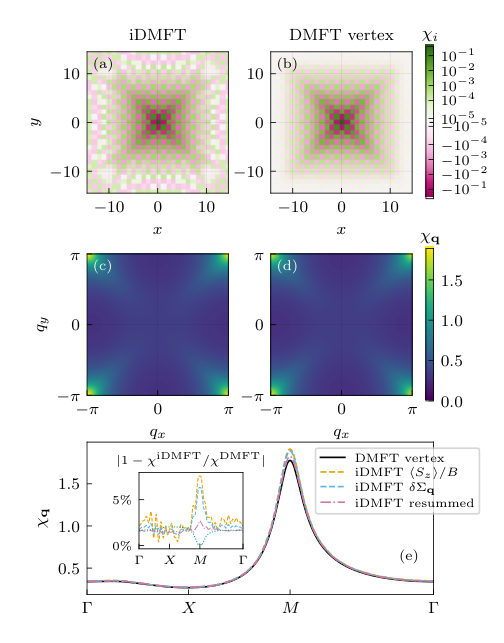
<figcaption class="paper-figure-caption"><b>Fig 3.</b> Figure 1. Lattice spin susceptibility of the half-filled 2D Hubbard model at U = 2 and β = 5 from (a, c) iDMFT and (b, d) the DMFT vertex. Panels (a, b) show χi in real space and panels (c, d) χq in momentum space. The iDMFT result in (a) is computed as ⟨Sz i ⟩/B from the expectation value of the NRG impurity solver. Panel (e) shows χq along a high-symmetry path obtained from the DMFT ver- tex, iDMFT via ⟨Sz i ⟩/B, iDMFT via δΣq [Eq. (29)], and iDMFT resummation as defined in Eq. (31). The inset shows the relative de- viation of all three iDMFT results w.r.t. the DMFT vertex result.</figcaption>
</figure>
<figure class="paper-figure-card">
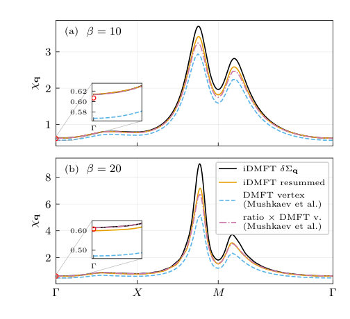
<figcaption class="paper-figure-caption"><b>Fig 4.</b> Figure 3. Lattice spin susceptibility at U = 8, t′ = 0, n = 0.78, and (a) β = 10, (b) β = 20. Results are calculated with iDMFT via Eq. (29) (black) and Eq. (31) (orange) and compared to DMFT results from Ref. 25. We rescaled their raw data (blue dashed curve) with the ratio χDMFT q=0 /χMush. q=0 , where χDMFT q=0 is the single- site DMFT result. The latter value is marked with a hollow red circle at the Γ point and enlarged in the insets.</figcaption>
</figure>
<figure class="paper-figure-card">
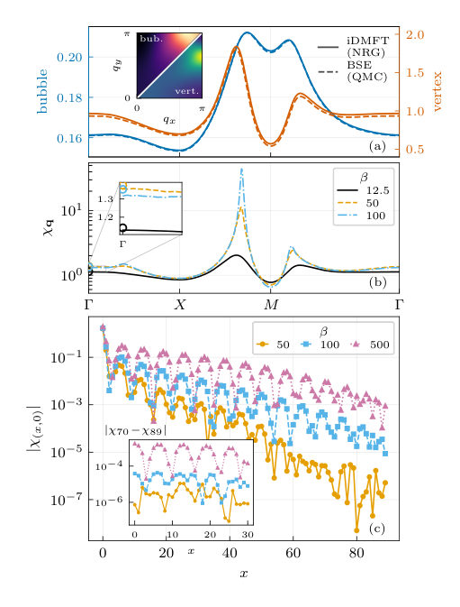
<figcaption class="paper-figure-caption"><b>Fig 5.</b> Figure 4. Lattice spin susceptibility at U = 8, t′ = −0.2, n = 0.72 and various β. (a) Bubble and vertex contributions to χq along Γ-X-M-Γ at β = 12.5 (i.e., the parameters of Ref. 26). Inset: the same decomposition as a heat map in the irreducible Brillouin zone (bubble upper-left, vertex lower-right). The solid red curve for the vertex contribution is from resummed iDMFT with NRG as the impurity solver; the dashed red curve is the BSE result from a QMC impurity solver [27]. (b) χq along the high-symmetry path for β = 12.5, 50, 100, reaching unprecedented, low temperatures. Cir- cles mark the single-site DMFT susceptibility χq=0; the inset zooms in near Γ to show that it coincides with the...</figcaption>
</figure>

**Summary.** This paper introduces an improved method using inhomogeneous Dynamical Mean-Field Theory (iDMFT) to calculate lattice susceptibilities by employing linear response theory. This approach bypasses the computationally prohibitive calculation of two-particle vertex functions inherent in standard methods. The results confirm its accuracy while significantly expanding the accessible temperature range for studying magnetic instabilities in correlated electron models.

**Why it may be interesting.** While focused on condensed matter magnetism, the use of linear response theory in strongly correlated systems is a powerful general technique for calculating susceptibilities that can inform open quantum system dynamics or magnetic responses in AMO contexts.

Detailed structure

**Main problem.** The primary goal is calculating static lattice susceptibilities ($\chi$) for strongly correlated electron systems, specifically addressing the computational difficulty of standard vertex function approaches.

**Main result.** The proposed inhomogeneous Dynamical Mean-Field Theory (iDMFT) method successfully calculates $\chi$ by utilizing linear response theory to an external field, showing good agreement with established vertex methods while enabling access to very low temperatures.

**Method.** The authors derive the susceptibility using a linear response expansion in a small applied magnetic field ($B$), which avoids explicit calculation of two-particle vertex functions and is compatible with various impurity solvers like NRG.

**Model / system.** The study focuses on the Hubbard model, typically analyzed on a 2D square lattice. The theoretical framework involves mapping the lattice problem onto an impurity problem solved via DMFT/iDMFT techniques.

**Key observables.** Static lattice magnetic susceptibility ($\chi_q$ or $\chi_i$), which measures the system's response to external magnetic perturbations.

**Important parameters / regimes.** Interaction strength ($U$), temperature ($eta^{-1}$), and doping level ($n$). The analysis compares results across different interaction regimes.

**Assumptions / limitations.** The method relies on expanding in the applied field $B$ (linear response) to circumvent complex vertex calculations. For thermodynamic limits, a specific resummation scheme is necessary for divergence.

**Figures summary.** Figures compare real-space and momentum-space susceptibility ($\chi_i, \chi_q$) across different methods (iDMFT vs. DMFT vertex) at various temperatures and interaction strengths, demonstrating convergence after applying the appropriate resummation.

**Paper structure.** The paper develops a novel iDMFT formalism for $\chi$ via linear response theory, proves its equivalence to standard approaches using Ward identities, and applies it numerically to benchmark results against established DMFT calculations across different parameter regimes.

Abstract

We present a method for calculating static lattice susceptibilities with inhomogeneous dynamical mean-field theory. The method utilizes the response of the system to an external field and thereby circumvents two-particle vertex functions. We demonstrate the success of our approach for the magnetic susceptibility of the square-lattice Hubbard model using the numerical renormalization group as an impurity solver and show that it compares well with the results obtained using the standard vertex approach. As it avoids vertex functions and is compatible with virtually any impurity solver, our method is able to reach low temperatures that are hard to access with other methods.

[↑ back to top](#top)

### [Temperature encoding rates of two-level probes in de Sitter spacetime](http://arxiv.org/abs/2608.15607v1)

**Authors:** Yao Jin  
**Type:** theory · **Category:** other · **PDF:** <https://arxiv.org/pdf/2608.15607v1>  
**Analysis basis:** full PDF text, analyzed in chunks
**Topic relevance:** `quantum measurements` **3/5** · `driven-dissipative phase transition` **2/5** · `Keldysh / 2PI / non-Gaussian methods` **1/5** · `correlated / nonlocal dissipation` **1/5** · `methods for driven-dissipative` **1/5**

↔ Scroll figures horizontally

<figure class="paper-figure-card">
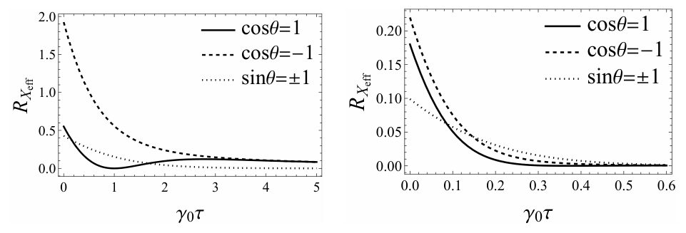
<figcaption class="paper-figure-caption"><b>Fig 1.</b> FIG. 1: RXeff as a function of γ0τ for initial states cos θ = 1, cos θ = −1, and sin θ = ±1,</figcaption>
</figure>
<figure class="paper-figure-card">
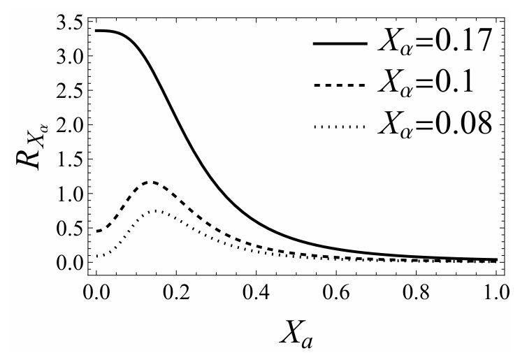
<figcaption class="paper-figure-caption"><b>Fig 2.</b> FIG. 2: RXα as function of Xa with intrinsic temperature Xα = 0.17, 0.1, 0.08 respectively.</figcaption>
</figure>
<figure class="paper-figure-card">
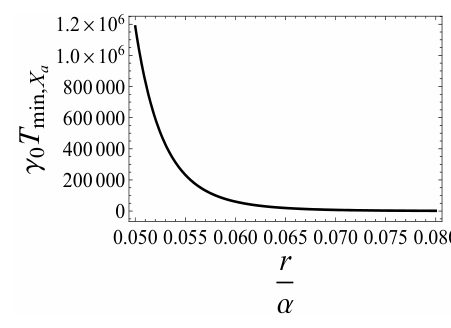
<figcaption class="paper-figure-caption"><b>Fig 3.</b> FIG. 3: γ0Tmin,Xa as function of separation r</figcaption>
</figure>

**Summary.** This theoretical paper uses quantum metrology to determine the precision limit for estimating temperature parameters encoded in two-level atoms placed in de Sitter spacetime. It finds that the total measurable temperature rate is additive from intrinsic and acceleration-induced (Unruh) sources, and crucially, it identifies an optimal inherent acceleration that maximizes the measurement of the background temperature. The results suggest these measurements remain feasible even far from the cosmological horizon.

**Why it may be interesting.** This work bridges quantum information theory (metrology) with fundamental physics in curved spacetime (de Sitter space), providing concrete predictions about how thermal effects can be measured using quantum probes, which is highly relevant to open quantum systems research.

Detailed structure

**Main problem.** The study quantifies the rate at which temperature parameters (Gibbons-Hawking and Unruh) are encoded in two-level quantum probes interacting with a fluctuating scalar field in de Sitter spacetime.

**Main result.** The total encoding rate is additive, and non-zero inherent acceleration does not suppress intrinsic temperature encoding; instead, an optimal acceleration maximizes this rate.

**Method.** Quantum metrology principles are applied by optimizing the initial state, evolution time, and measurement basis to maximize the estimation rate of temperature parameters.

**Model / system.** The system involves a two-level atom (probe) coupled to a massless scalar field in de Sitter spacetime. The dynamics are governed by an open quantum system approach using a Lindblad master equation.

**Key observables.** Temperature encoding rate ($R$), effective temperature ($T_{	ext{eff}}$), intrinsic Gibbons–Hawking temperature ($T_{GH}$), and position-dependent Unruh temperature ($T_U$).

**Important parameters / regimes.** Separation distance from the horizon, inherent acceleration ($a$), total probe time ($T$), and initial state parameters ($	heta, \phi$).

**Assumptions / limitations.** The analysis relies on a weak coupling assumption for the evolution of the reduced density matrix.

**Figures summary.** Not specified in the notes; the text describes mathematical relationships between encoding rates and dependencies on acceleration/distance.

**Paper structure.** The paper first establishes the quantum-metrological framework, deriving the effective temperature as a sum of intrinsic and Unruh components. It then calculates the encoding rate by optimizing parameters, revealing the non-monotonic dependence of $R_{X_\alpha}$ on $T_U$, and finally assessing the feasibility of measurements at large separations.

Abstract

We investigate the temperature encoding process of two-level probes in de Sitter spacetime within the framework of open quantum systems. From a quantum-metrological perspective, we quantify the temperature encoding rate, which characterizes the precision of estimating a temperature parameter with a fixed total probe time. The maximal encoding rate is obtained by optimizing the initial state, evolution time, and measurement basis of each probe. For a static probe separated by a finite distance from a freely falling observer, both the intrinsic Gibbons--Hawking temperature and the position-dependent Unruh temperature are encoded in the probe state. We find that the encoding rate of the effective temperature is equal to the sum of the encoding rates of the intrinsic temperature and the Unruh temperature associated with the probe's inherent acceleration. Interestingly, when the intrinsic temperature is sufficiently small, the encoding rate of the intrinsic temperature initially increases with the Unruh temperature, reaches a maximum, and then decreases to zero. Thus, a nonzero inherent acceleration does not necessarily suppress the encoding of the intrinsic temperature. Instead, there exists an optimal inherent acceleration at which its encoding rate is maximized. Furthermore, we investigate the encoding rate of the Unruh temperature and the minimum total probe time required to estimate it with sufficient precision as functions of the separation distance. We find that the required total probe time and the corresponding number of probes remain experimentally feasible even when the probes are located relatively far from the cosmological horizon, with a radial position as large as $0.1$ times the horizon radius.

[↑ back to top](#top)

### [Absence of critical scaling in the Schelling segregation model](http://arxiv.org/abs/2608.16557v1)

**Authors:** Sam Rifaki  
**Type:** theory · **Category:** statistical mechanics · **PDF:** <https://arxiv.org/pdf/2608.16557v1>  
**Analysis basis:** full PDF text, analyzed in chunks
**Topic relevance:** `non-equilibrium universality` **3/5** · `driven-dissipative phase transition` **2/5** · `Frenkel-Kontorova` **1/5** · `methods for driven-dissipative` **1/5**

↔ Scroll figures horizontally

<figure class="paper-figure-card">
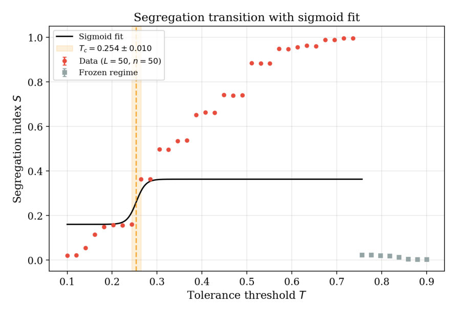
<figcaption class="paper-figure-caption"><b>Fig 1.</b> Figure 1: Segregation index S and interface density versus tolerance T for L = 80, averaged over 50 trials with per-agent noise σ = 0.02. Shaded regions show ±1 standard deviation.</figcaption>
</figure>
<figure class="paper-figure-card">
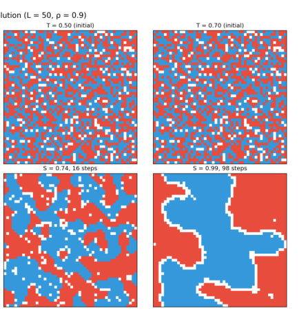
<figcaption class="paper-figure-caption"><b>Fig 2.</b> Figure 2: Equilibrium configurations on an L = 80 grid for selected tolerance values.</figcaption>
</figure>
<figure class="paper-figure-card">
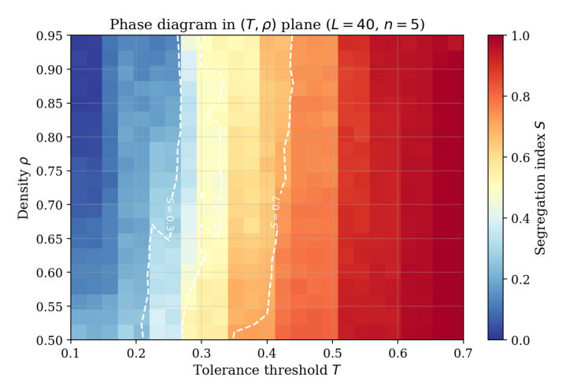
<figcaption class="paper-figure-caption"><b>Fig 3.</b> Figure 3: Phase diagram in the (T, ρ) plane. Color encodes the equilibrium segregation index. The mixed-segregated boundary is sharp across all densities.</figcaption>
</figure>
<figure class="paper-figure-card">
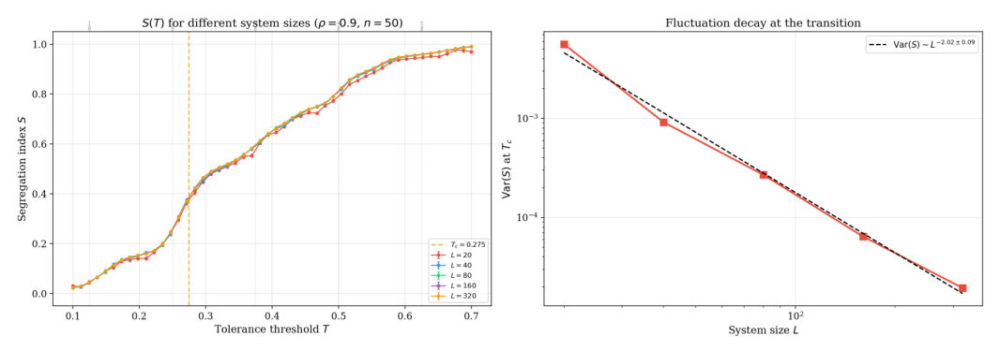
<figcaption class="paper-figure-caption"><b>Fig 4.</b> Figure 4: Left: Segregation index vs. tolerance for five system sizes. The curves steepen with L but share the same midpoint. Right: Variance of S at Tc versus system size, with a power-law fit Var(S) ∼L−α, α = 2.02 ± 0.09.</figcaption>
</figure>
<figure class="paper-figure-card">
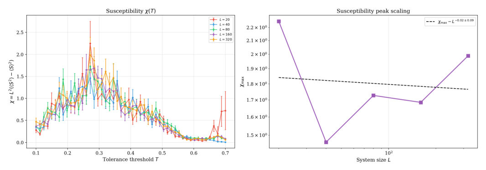
<figcaption class="paper-figure-caption"><b>Fig 5.</b> Figure 5: Left: Susceptibility χ(T) for five system sizes. Right: Peak susceptibility vs. L. The scaling exponent γ/ν = −0.015 ± 0.086 is indistinguishable from zero.</figcaption>
</figure>

**Summary.** This work investigates whether the segregation transition in the Schelling model belongs to a critical universality class. By applying extensive finite-size scaling analysis and examining various dynamic regimes, the authors conclude that the system does not exhibit critical behavior. Instead, the transition is governed by deterministic dynamics related to local satisfaction thresholds.

**Why it may be interesting.** While not quantum mechanical, the rigorous application of critical scaling theory to a classical interacting particle system provides valuable insights into when complex pattern formation transitions are governed by true phase transitions versus deterministic/mean-field crossovers.

Detailed structure

**Main problem.** To determine whether the mixed-to-segregated transition in the Schelling segregation model exhibits critical scaling behavior characteristic of a continuous phase transition.

**Main result.** The analysis strongly rules out criticality, showing that standard finite-size scaling diagnostics fail across multiple neighborhood definitions and lattice sizes. The mechanism is attributed to deterministic dynamics and lack of long-range correlation rather than critical phenomena.

**Method.** The study employs extensive numerical simulations on lattices, utilizing Finite-Size Scaling (FSS) diagnostics like variance analysis and Binder cumulants, alongside mean-field theory and cascade branching ratio calculations.

**Model / system.** The Schelling segregation model is simulated on an L x L lattice with periodic boundary conditions. Agents of two types attempt to move when local satisfaction falls below a global tolerance threshold T, leading to segregation.

**Key observables.** Segregation index (S), interface density (I), variance of S ($	ext{Var}(S)$), Binder cumulant ($U_4$), and the characteristic length scale $r^*$ for dissimilarity.

**Important parameters / regimes.** Lattice size L (up to 320), agent fraction $
ho=0.9$, neighborhood radius $r_0$ (up to 6), and tolerance threshold T.

**Assumptions / limitations.** The analysis compares empirical results against theoretical predictions for critical phenomena, and some parts rely on mean-field approximations or cascade theory assumptions.

**Figures summary.** Figures illustrate the dependence of segregation index on tolerance, phase diagrams in (T, $
ho$), and how $T_c$ shifts when agent tolerances are drawn from a Beta distribution parameterized by $\kappa$.

**Paper structure.** The paper systematically tests for criticality using FSS diagnostics across various lattice sizes and neighborhood definitions. It contrasts these results with mean-field predictions derived from the satisfaction spectrum, ultimately concluding that non-critical mechanisms govern the transition.

Abstract

We find no evidence of critical scaling in the Schelling segregation model, in either the Moore neighborhood or its dense-spectrum extension to Chebyshev radii up to $r_0 = 6$ ($k = 168$ neighbors). On periodic grids up to $L = 320$ with 50 trials per point (> 12,500 runs), every finite-size scaling diagnostic in the Moore baseline fails: the per-$L$ $T_c$ does not drift, Var$(S) \sim L^{-2.02 \pm 0.09}$ matches trivial averaging, $γ/ν\approx 0$, and the scaling collapse never reaches a finite optimum. The 8-site Moore neighborhood restricts satisfaction to ratios $j/k$ with $k \leq 8$, giving $S(T)$ a staircase structure with 23 rational thresholds; discreteness alone does not forbid criticality (cf. the Ising model), but the scaling evidence rules it out empirically. A branching-ratio calculation predicts subcritical cascades of mean size $1/(1-R)$ and is validated by perturbation experiments to within 15%; the multiscalar dissimilarity length stays finite across the transition. The dense-spectrum extension strengthens the negative verdict: across $r_0 \in {3,4,5,6}$ on $L \in {40,80,160}$ the Binder cumulant has no $L$-curve crossing and the per-$L$ $T_c$ drift is monotonic and unsaturated; at $r_0 = 4$, extending to $L = 320$ gives $α= -2.70$, below the critical boundary $α= -2$, dissolving an apparent $α= +0.81$ signal visible only on $L \in {40,80}$. The mechanism is the absence of long-range correlation in equilibrium plus deterministic high-$k$ dynamics, not the staircase structure. With a Beta-distributed heterogeneous tolerance, the intolerant tail drives segregation even at moderate population-average tolerance. The staircase theorem and cascade mechanism together account for the Schelling transition without invoking critical phenomena.

[↑ back to top](#top)

### [Hidden transverse-flow topology in partially coherent structured light](http://arxiv.org/abs/2608.14923v1)

**Authors:** Rosario Martínez-Herrero, Ángel S. Sanz  
**Type:** theory · **Category:** other · **PDF:** <https://arxiv.org/pdf/2608.14923v1>  
**Analysis basis:** full PDF text, analyzed in chunks
**Topic relevance:** `interference shaping light` **3/5** · `quantum measurements` **2/5** · `Keldysh / 2PI / non-Gaussian methods` **1/5** · `methods for driven-dissipative` **1/5**

↔ Scroll figures horizontally

<figure class="paper-figure-card">
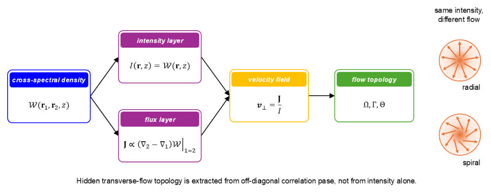
<figcaption class="paper-figure-caption"><b>Fig 1.</b> FIG. 1. Conceptual structure of the generalized flux-trajectory formulation. The cross-spectral density W(r1, r2, z) contains both the diagonal intensity content and the off-diagonal correlation-phase information. The former gives the spectral density I(r, z) = W(r, r, z), whereas the latter gives access to the generalized transverse flux J. Together, I and J define the effective velocity field v⊥= J/I. The topology of this velocity field is characterized through streamlines and diagnostics such as circulation Γ, vorticity Ω, and accumulated angular displacement Θ. The same intensity distribution can therefore support different transverse-flow topologies.</figcaption>
</figure>
<figure class="paper-figure-card">
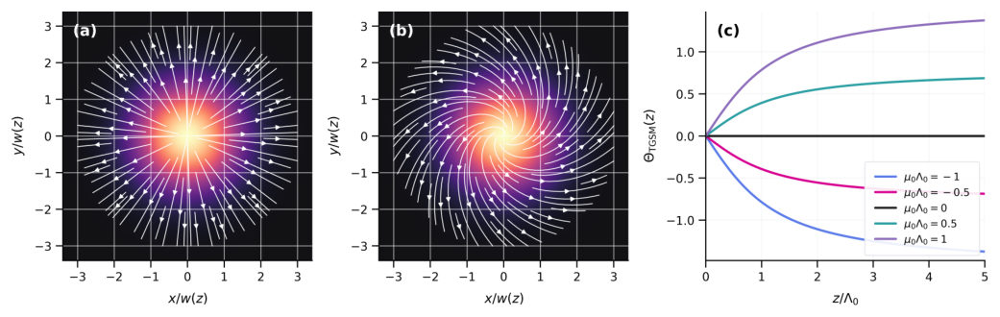
<figcaption class="paper-figure-caption"><b>Fig 2.</b> FIG. 2. Hidden rotational flow in TGSM beams. The background color represents the normalized Gaussian spectral density S(r, z), shown in coordinates scaled by the propagated beam size w(z). White curves are streamlines of the generalized transverse velocity field at z/Λ0 = 1. (a) In the untwisted case, µ0Λ0 = 0, so that µ(z)Λ0 = 0 for all z, the flow is purely radial. (b) For a twisted TGSM beam with µ0Λ0 = 1, at the displayed plane z/Λ0 = 1 one has µ(z)Λ0 = 1/2. The intensity remains Gaussian, but the nonseparable coherence phase produces an azimuthal component vφ = µ(z)r, leading to spiral streamlines. (c) Accumulated angular displacement ΘTGSM(z) = µ0Λ0 arctan (z/Λ0) for several values...</figcaption>
</figure>
<figure class="paper-figure-card">
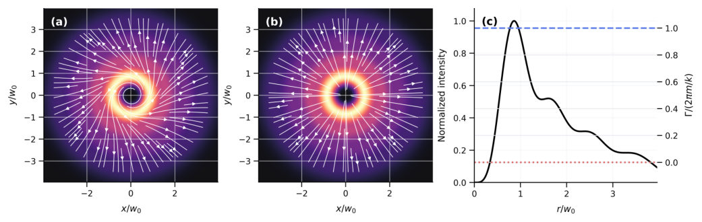
<figcaption class="paper-figure-caption"><b>Fig 3.</b> FIG. 3. Hidden transverse-flow topology in LCD beams. The background color represents the normalized intensity IN,m(r, z), which is the same in both cases. White curves show streamlines of the generalized transverse velocity field at z = zR. (a) A single-charge LCD source with topological charge +m displays spiral flow because vφ = m/(kr). (b) A balanced superposition of opposite charges +m and −m has the same intensity profile, but the azimuthal flux cancels and the flow is purely radial. (c) Radial intensity profile and circulation normalized to 2πm/k. The single-charge source has Γ+m = 2πm/k, whereas the balanced source has Γ±m = 0. Parameters: N = 3, m = 2, w0 = 1, zR = 1, k = 2, and...</figcaption>
</figure>
<figure class="paper-figure-card">
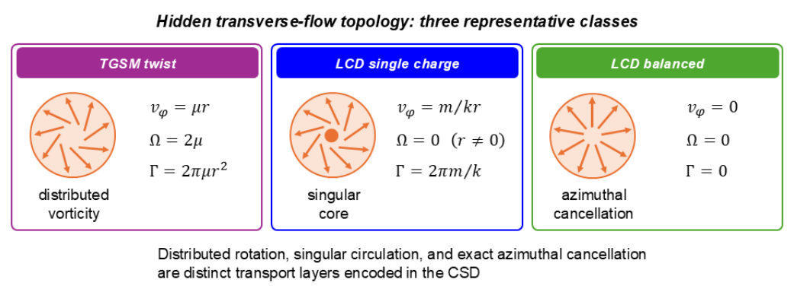
<figcaption class="paper-figure-caption"><b>Fig 4.</b> FIG. 4. Schematic classification of hidden transverse-flow topology in the analytical cases considered in this work. A TGSM beam with twist displays distributed rotational transport, with vφ = µr, circulation Γ = 2πµr2, and uniform vorticity Ω= 2µ. A single-charge LCD beam displays angular transport of topological origin, with vφ = m/(kr) and radius-independent circulation Γ = 2πm/k, while the vorticity vanishes away from the singular core. A balanced LCD source with opposite charges +m and −m has the same radial intensity profile as the single-charge case, but the azimuthal flux cancels exactly, giving vφ = 0, Γ = 0, and Ω= 0.</figcaption>
</figure>

**Summary.** The paper shows that partial coherence allows for the encoding of hidden transverse energy flow topologies invisible when only measuring light intensity. By deriving a generalized flux from the cross-spectral density, authors define an effective velocity field that maps out these flow trajectories. This proves that full physical information requires analyzing the off-diagonal phase structure of the CSD, not just its magnitude.

**Why it may be interesting.** This work extends the understanding of optical coherence beyond simple intensity measurements by introducing a transport-based diagnostic derived from higher-order correlation functions, analogous to current density in quantum field theory.

Detailed structure

**Main problem.** To demonstrate that partial coherence encodes hidden transverse-flow topology, which is invisible when analyzing only the intensity profile of structured light.

**Main result.** The generalized transverse flux derived from the cross-spectral density reveals flow structures (like vorticity or circulation) in beams—such as TGSM or LCD beams—that are entirely masked by identical intensity measurements.

**Method.** Formulating a generalized transverse flux and an effective velocity field using local differential operations on the two-point correlation function (CSD).

**Model / system.** Quasi-monochromatic, paraxial partially coherent beams, analyzed using their cross-spectral density $W(\mathbf{r}_1, \mathbf{r}_2, z)$. Specific examples include Twisted Gaussian Schell-model and Liquid Crystal Display (LCD) sources.

**Key observables.** Generalized transverse flux ($\mathbf{J}$), effective velocity field ($\mathbf{v}_\perp$), circulation ($\Gamma$), vorticity ($\Omega$), and flow trajectories (spiral vs. radial).

**Important parameters / regimes.** Partial coherence level, beam type (TGSM, LCD), propagation distance ($z$).

**Assumptions / limitations.** The beams are quasi-monochromatic and paraxial; the analysis relies on reconstructing quantities from the complex second-order coherence function.

**Figures summary.** Figures conceptually illustrate that the CSD contains both diagonal intensity content and off-diagonal correlation-phase information, which is used to extract the generalized transverse flux defining the flow field.

**Paper structure.** The paper develops a theoretical framework starting from the CSD to define a generalized flux ($\mathbf{J}$), derives an effective velocity field ($\mathbf{v}_\perp = \mathbf{J}/I$), and then applies this formalism to specific beam families (TGSM, LCD) to contrast their hidden flow topologies against their measured intensities.

Abstract

Partial coherence is commonly viewed as a mechanism that reduces contrast or smooths intensity structure. Here we show that it can also encode hidden transverse-flow topology. Starting from the cross-spectral density, we formulate a generalized transverse flux, an effective velocity field, and the associated flux trajectories for quasi-monochromatic partially coherent paraxial beams. This construction converts two-point correlation phases into local transport information and reduces to the usual coherent energy-flow picture in the single-mode limit. Because the generalized flux is obtained through a local differential operation on the cross-spectral density, the proposed trajectories can, in principle, be reconstructed from measurements of the complex second-order coherence function, without requiring direct measurement of individual optical paths. Two analytical beam families expose this hidden topology. In twisted Gaussian Schell-model beams, a Gaussian intensity hides a distributed rotational flow with nonzero vorticity. In Laguerre-Christoffel-Darboux beams, sources with identical intensity profiles can have different flux topology, producing either spiral or purely radial trajectories. Thus, intensity and coherence magnitude do not exhaust the physical information contained in the cross-spectral density: partial coherence can reorganize the hidden topology of transverse optical transport.

[↑ back to top](#top)

### [Multicolor nonlinear chiral quantum optics: beyond phase](http://arxiv.org/abs/2608.14807v1)

**Authors:** Cedric Dufresne, Annabelle Makowski, Nir Rotenberg  
**Type:** theory · **Category:** other · **PDF:** <https://arxiv.org/pdf/2608.14807v1>  
**Analysis basis:** full PDF text, analyzed in chunks
**Topic relevance:** `interference shaping light` **3/5** · `Keldysh / 2PI / non-Gaussian methods` **1/5** · `Tavis-Cummings & cavity-many-emitter` **1/5** · `driven-dissipative phase transition` **1/5** · `methods for driven-dissipative` **1/5**

↔ Scroll figures horizontally

<figure class="paper-figure-card">
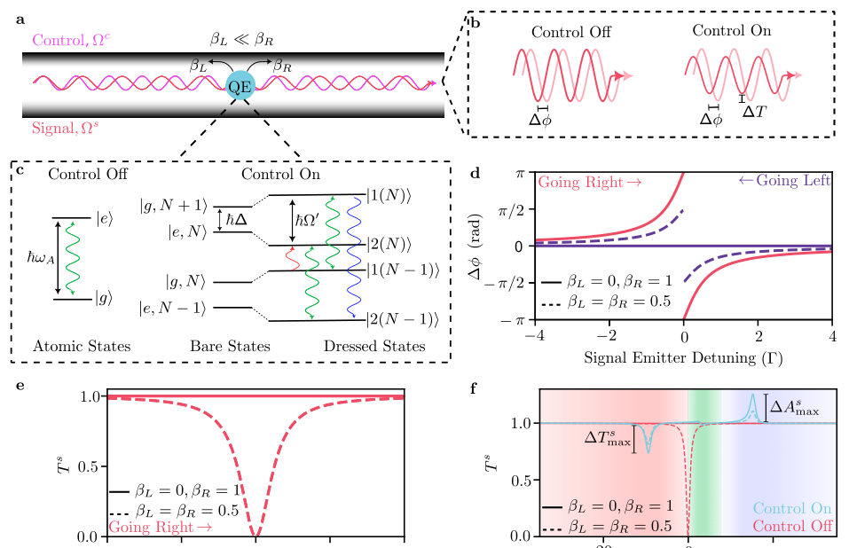
<figcaption class="paper-figure-caption"><b>Fig 1.</b> Figure 1. Multicolor quantum optics in a waveguide. a) A chirally coupled quantum emitter (QE) in a waveguide, here coupled efficiently to the right-propagating mode (βR ≫βL) interacts with a weak signal beam and a control beam that may be much stronger. b) The signal is modulated by the interaction with the QE, which results in a phase shift, ∆ϕ, with no control beam and both a modulation of the phase and amplitude, ∆T, when the control is on. c) This difference can be understood in terms of the modified energy landscape of the QE due to the control beam, the details of which depend on the control-emitter detuning ∆= ωc −ωA and the generalized Rabi frequency Ω′ = p</figcaption>
</figure>
<figure class="paper-figure-card">
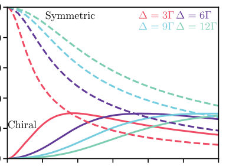
<figcaption class="paper-figure-caption"><b>Fig 2.</b> Figure 3. Maximum signal extinction for symmetric (dashed) and chiral (solid) coupling as a function of control power, for control-emitter detunings ∆= 3Γ, 6Γ, 9Γ and 12Γ. The ∆= 3Γ curves (red), for example, follow the red, dashed lines in Fig. 2a and b.</figcaption>
</figure>
<figure class="paper-figure-card">
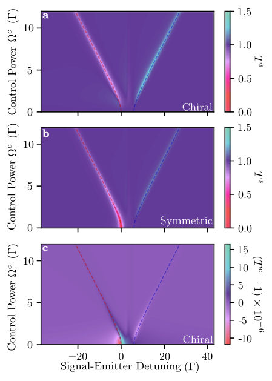
<figcaption class="paper-figure-caption"><b>Fig 3.</b> Figure 2. Control power-dependent transmission spectrum of the signal for (a) chiral and (b) symmetric scattering, and (c) of the control beam in the chiral geometry. In all cases, ∆= 3Γ and the signal-emitter detuning is scanned. In all panes, the transition corresponding to the AC Stark shift is denoted by a dashed red curve, while the three-photon am- plification is shown by a dashed blue curve. As can be seen when comparing (a) to (c), photons lost to the signal are re- covered in the control and vice versa, although the change to the control beam is about 5-orders of magnitude smaller (as this beam is much stronger than the signal (Ωs = 0.01Γ).</figcaption>
</figure>
<figure class="paper-figure-card">
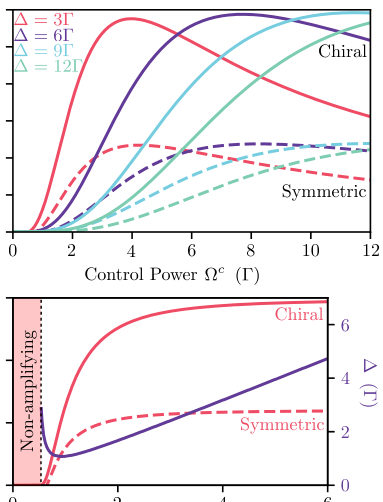
<figcaption class="paper-figure-caption"><b>Fig 4.</b> Figure 4. Three-photon amplification. (a) Maximum signal amplification for symmetric (dashed) and chiral (solid) cou- pling as a function of control power, for control-emitter de- tunings ∆= 3Γ, 6Γ, 9Γ and 12Γ. The ∆= 3Γ curves (red), for example, follow the blue, dashed lines in Fig. 2a and b. b Maximum achievable amplification (left axis, red curves) for each control power, for the symmetric and chiral configura- tions. For ease, points corresponding to curves shown in (a) are marked. The detuning, ∆, at which the optimal amplifi- cation is found is shown in the purple curve (right axis).</figcaption>
</figure>
<figure class="paper-figure-card">

<figcaption class="paper-figure-caption"><b>Fig 5.</b> Fig. 4, although in a different way from the extinction. Following ∆As max for ∆= 3Γ (i.e., blue dashed curves in Figs. 2a and b), in the red curves in Fig. 4a we ob- serve that the amplification in both the chiral (solid) and symmetric (dashed) configuration increases once Ωc in- creases beyond ≈Γ, peaks when Ωc ≈4Γ, and then decreases beyond this value. We interpret this peak as arising due to a balance between the strength of the non- linear response, power-induced decoherence, and emit- ter saturation, all of which increase with the control field. Strikingly, the chiral amplification is significantly stronger than that in the symmetric configuration, peak- ing at ∆Asym max = 11.8%...</figcaption>
</figure>

**Summary.** This theoretical paper explores nonlinear chiral quantum optics by introducing a second photon beam to control emitter interactions. The authors demonstrate that chirality allows for strong amplitude modulation, enabling coherent three-photon amplification efficiencies up to 30%. This reveals a new regime for all-optical control at few-photon energies.

**Why it may be interesting.** This work directly addresses advanced quantum optics phenomena involving light-matter interaction, specifically exploring how engineered directional coupling (chirality) can enhance non-linear optical processes like few-photon amplification beyond what is achievable with standard symmetric interactions.

Detailed structure

**Main problem.** To investigate chiral quantum nonlinear optics beyond simple phase modulation, demonstrating that adding a second photon beam enables both phase and amplitude modulation.

**Main result.** Chiral interactions allow for strong amplitude modulation via coherent energy transfer, predicting three-photon amplification efficiencies up to 30%, which is significantly higher than symmetric configurations.

**Method.** The study uses the Green function formalism and Bloch equations, approximating by separating signal and control fields when one beam is much stronger than the other.

**Model / system.** The system involves quantum emitters interacting with two counter-propagating photon beams (signal and control) in both chiral ($eta_L 
eq eta_R$) and symmetric geometries.

**Key observables.** Phase shift ($\Delta\phi$), amplitude modulation ($\Delta T$ or $\Delta A$), and three-photon amplification efficiency.

**Important parameters / regimes.** Control beam power ($\Omega_c$), signal detuning ($\Delta$), and the ratio of coupling efficiencies defining chirality.

**Assumptions / limitations.** The analysis assumes an idealized case with no losses or noise, and employs a separation approximation for the signal and control fields.

**Figures summary.** Figures compare phase shift vs. amplitude modulation (Fig 1), show signal transmission spectra dependence on control power for chiral vs. symmetric cases (Fig 2), and plot control-power-dependent maximum extinction and three-photon amplification for both geometries (Figs 3 & 4).

**Paper structure.** The paper progresses by first establishing the limitation of phase-only modulation in standard chiral setups, then introducing a second beam to enable amplitude control. It develops the theoretical framework using Green functions and Bloch equations, presenting results comparing the enhanced nonlinear effects (like three-photon amplification) found uniquely or more strongly in the chiral geometry.

Abstract

Chiral quantum nonlinearities that arise when light interacts with quantum emitters are known to modulate only the phase but not the amplitude of scattered photons, enabling the creation of non-reciprocal photonic elements, quantum logic gates, and quantum network protocols. In this work, we show that the addition of a second photon beam drastically changes this picture, enabling both phase and amplitude modulation. Surprisingly, coherent photon transfer between the different beams enables a stronger amplitude modulation than standard symmetric interactions. This is most obvious in the coherent, three-photon amplification, which we predict peaks with a 30% efficiency in a chiral geometry, 3x the efficiency of the symmetric configuration. Our results uncover a new regime of chiral quantum optics and provide a route towards more efficient all-optical control at few-photon energies.

[↑ back to top](#top)

### [Resource Analysis for Quantum Simulation of Spatially Varying Transport-Reaction Equations](http://arxiv.org/abs/2608.15827v1)

**Authors:** Benjamin Jasperson, Krishna Garikipati, Siddhartha Srivastava  
**Type:** theory · **Category:** quantum information and computing · **PDF:** <https://arxiv.org/pdf/2608.15827v1>  
**Analysis basis:** full PDF text, analyzed in chunks
**Topic relevance:** `methods for driven-dissipative` **3/5** · `analog quantum simulation` **2/5** · `correlated / nonlocal dissipation` **1/5** · `quantum measurements` **1/5**

↔ Scroll figures horizontally

<figure class="paper-figure-card">
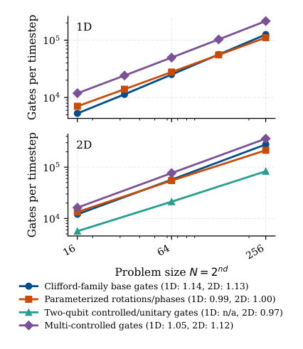
<figcaption class="paper-figure-caption"><b>Fig 1.</b> Fig. 1: Breakdown of single step gate count type (w/ slope) for 1D and 2D ADR simulations. (∆t ∝∆x−2)</figcaption>
</figure>
<figure class="paper-figure-card">
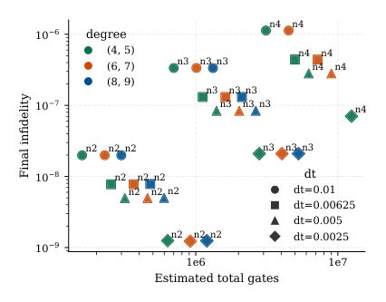
<figcaption class="paper-figure-caption"><b>Fig 2.</b> Fig. 2: Influence of polynomial degree and spatiotemporal resolution on final state infidelity for a 2D system at T = 0.1s. Final infidelity is 1 −|⟨ˆuDNS(T), ˆuimpl(T)⟩|2, where ˆu = u/∥u∥2 and uimpl(T) is obtained by repeatedly applying Uimpl.</figcaption>
</figure>

**Summary.** This paper provides a detailed resource analysis for using quantum circuits to simulate PDEs with spatially varying coefficients. It quantifies the qubit count and gate complexity required, showing that while theoretically possible, high accuracy demands an extremely deep circuit depth. The findings guide researchers toward using approximate encoding techniques to make such simulations feasible on current hardware.

**Why it may be interesting.** This work directly addresses the practical implementation challenges of simulating complex physical dynamics (like those found in AMO or open quantum systems) on near-term quantum hardware by providing concrete resource estimates.

Detailed structure

**Main problem.** The work quantifies the computational resources (qubit count, gate complexity, circuit depth) needed to simulate linear advection-diffusion-reaction equations when coefficients vary spatially.

**Main result.** The resource cost scales linearly with spatial qubits, and maintaining high accuracy requires a very large number of native gates ($10^5–10^6$), suggesting that approximate block encodings are necessary for near-term feasibility.

**Method.** It uses quantum algorithms like Quantum Singular Value Transformation (QSVT) combined with Sparse-FABLE block encodings to implement the time evolution operator derived from a Lie product splitting of the PDE.

**Model / system.** The system is governed by a linear advection-diffusion-reaction equation on a periodic domain, discretized into a semi-discrete matrix form ($d|c(t)
angle/dt = A |c(t)
angle$).

**Key observables.** Qubit count ($n_{	ext{qubits}}$), gate complexity, circuit depth, and final state infidelity.

**Important parameters / regimes.** Spatial discretization size ($d$), sparsity structure of the coefficients, polynomial degree ($r$) used in QSVT, and time step ($\Delta t$).

**Assumptions / limitations.** Assumes smooth and periodic coefficient fields; uses Gershgorin's theorem bounds for spectral norm estimation; relies on Lie product splitting and QSVT approximations.

**Figures summary.** Figure 1 shows the scaling of single-step gate counts versus problem size (N) for 1D/2D simulations. Figure 2 illustrates how polynomial degree ($r$) and time step ($\Delta t$) affect final state infidelity in a 2D system.

**Paper structure.** The paper develops theoretical resource estimates based on block encodings, analyzes the error sources from Lie splitting and QSVT approximation, and compares these theoretical bounds with scaling predictions for 1D/2D problems.

Abstract

Spatially varying coefficients are the primary source of circuit complexity in quantum simulation of linear advection-diffusion-reaction equations. This work presents a resource analysis of single-step quantum propagators constructed using sparse FABLE block encodings, Quantum Singular Value Transformation, and linear-combination-of-unitaries. We derive theoretical estimates for qubit count, gate complexity, and circuit depth in terms of the spatial discretization, sparsity, and polynomial degree, and compare these predictions with synthesized quantum circuits for one- and two-dimensional variable-coefficient problems. The resulting analysis quantifies the cost of encoding realistic transport operators and provides practical resource estimates for near-term implementations.

[↑ back to top](#top)

### [An error-mitigated quantum annealing solution for the weighted Max-Cut problem on a cubic lattice](http://arxiv.org/abs/2608.15094v1)

**Authors:** Y. S. Yang, P. Tyson, A. B Murphy  
**Type:** both · **Category:** disordered systems and neural networks · **PDF:** <https://arxiv.org/pdf/2608.15094v1>  
**Analysis basis:** full PDF text, analyzed in chunks
**Topic relevance:** `analog quantum simulation` **3/5** · `QC/QI experiment` **2/5** · `quantum measurements` **1/5**

↔ Scroll figures horizontally

<figure class="paper-figure-card">
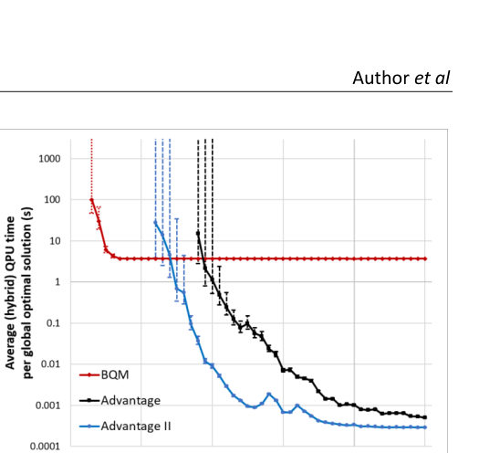
<figcaption class="paper-figure-caption"><b>Fig 1.</b> Figure 1. DW QA and BQM average solution time 𝑡̅ per global optimal solution versus 𝑤0 on a cubic lattice with 113 nodes. The error bars are based on a binomial distribution of global optimal solution success probability.</figcaption>
</figure>
<figure class="paper-figure-card">
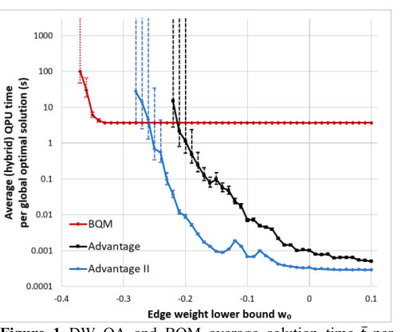
<figcaption class="paper-figure-caption"><b>Fig 2.</b> Figure 1 shows that a quantum annealer can efficiently solve the weighted Max-Cut problem within the order of milliseconds on a 113 cubic lattice for non-negative edge weights. As the lower bound of the edge weights becomes more negative, the QA solution time increases exponentially. The computation indicated that up to 100 000 reads, no reliable global optimal solution was obtained for 𝑤0 &lt; −0.22 and 𝑤0 &lt; −0.28 for the Advantage and Advantage II machines, respectively. Figure 1 also shows that the DW Advantage II quantum annealer is an order of magnitude more efficient than the Advantage machine. Compared with the Advantage II machine, the BQM solver showed some solution time advantage...</figcaption>
</figure>
<figure class="paper-figure-card">
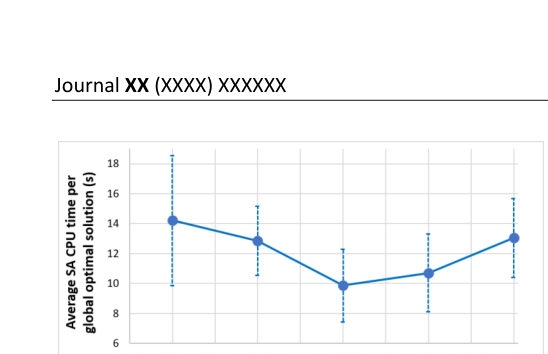
<figcaption class="paper-figure-caption"><b>Fig 3.</b> Figure 2. SA average solution time 𝑡̅ per global optimal solution versus the number of sweeps on a cubic lattice with 113 nodes and 𝑤0 = −0.35. The error bars are based on the sample standard deviation ±𝜎 between batches.</figcaption>
</figure>
<figure class="paper-figure-card">
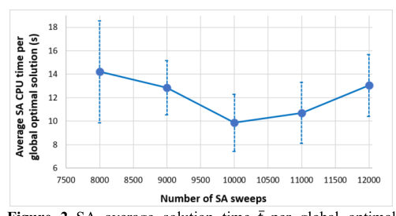
<figcaption class="paper-figure-caption"><b>Fig 4.</b> Figure 3. Classical SA and TS average solution time 𝑡̅ per global optimal solution versus 𝑤0 on a cubic lattice with 113 nodes. The error bars are based on the sample standard deviation ±𝜎 between batches.</figcaption>
</figure>
<figure class="paper-figure-card">
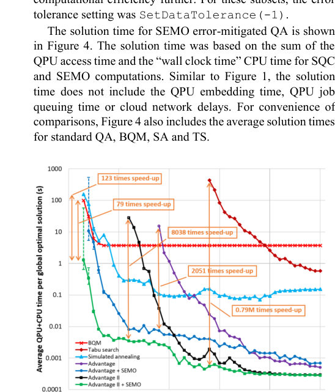
<figcaption class="paper-figure-caption"><b>Fig 5.</b> Figure 4. SEMO error-mitigated QA average solution time 𝑡̅ per global optimal solution versus 𝑤0 on a cubic lattice with 113 nodes. The error bars are based on the binomial distribution of global optimal solution success probability. The SEMO computation includes SEMO method (1,0) followed by the SEMO method (2,2). Average solution times for other methods are included for comparison.</figcaption>
</figure>

**Summary.** This work tackles the difficult weighted Max-Cut problem by mapping it onto an Ising model on a cubic lattice. The authors demonstrate that applying Spin Error Mitigation (SEMO) to quantum annealing provides substantial speedups over standard QA and classical methods, particularly when dealing with complex, mixed-sign edge weights.

**Why it may be interesting.** While focused on optimization, the underlying physics involves simulating spin glass behavior on a lattice, which connects directly to disordered systems studied in condensed matter theory.

Detailed structure

**Main problem.** The paper addresses the NP-hard weighted Max-Cut problem, which is formulated as finding the ground state of an Ising spin glass model.

**Main result.** Error-mitigated quantum annealing (SEMO) significantly outperforms standard D-Wave QA and classical solvers in terms of time-to-solution, especially when edge weights become highly negative.

**Method.** The study compares SEMO-error mitigated quantum annealing against standard QA, BQM hybrid solvers, and classical algorithms like Simulated Annealing and Tabu Search.

**Model / system.** The problem is modeled on a cubic lattice with 113 nodes, characterized by random edge weights that can be mixed-signed. The objective function maps to minimizing an Ising Hamiltonian H = sum(Jij si sj).

**Key observables.** Average solution time (t) per global optimal solution and the global optimal solution success probability (p).

**Important parameters / regimes.** The lower bound of edge weights ($w_0$) is a critical parameter, with computational difficulty increasing as $w_0$ becomes more negative.

**Assumptions / limitations.** Comparisons exclude QPU embedding time, job queuing, and network delays; the performance degradation of QA at highly negative $w_0$ is attributed to qubit errors.

**Figures summary.** Figures compare solution times ($\bar{t}$) vs. $w_0$, showing exponential increases for standard QA as weights become more negative. Figure 5 tracks the percentage of reads returning global optima across different solvers and weight regimes.

**Paper structure.** The paper establishes the Max-Cut formulation on a lattice, details multiple computational methods (QA, BQM, classical), presents quantitative comparisons of solution time vs. $w_0$, and concludes by advocating for SEMO's efficiency gains in complex optimization landscapes.

Abstract

The weighted Max-Cut problem is an NP-hard problem with application implications. It is investigated on a cubic lattice with 113 nodes and mixed-signed random edge weights. For a fixed upper bound on edge weights, it has been demonstrated that the computational difficulty increases as the lower bound on edge weights becomes more negative. The solution time for the problem using a novel error-mitigated quantum annealing approach is compared with standard D-Wave quantum annealing (QA) and BQM hybrid solvers, as well as various classical solvers. For the QPU-embeddable weighted Max-Cut instances with mixed-signed edge weights, it has been quantitatively demonstrated that the SEMO (spin-error mitigation for optimisation) error-mitigated quantum annealing achieved substantially shorter time-to solution than standard D-Wave QA, D-Wave BQM, simulated annealing and Tabu search baselines. The error-mitigated quantum annealing approach presented in this article potentially elevates the efficiency and application scope of quantum annealing and would be applicable in solving other discrete optimisation problems that can be formulated as QUBO or Ising instances. The promising solution time advantage would be particularly impactful for time-critical optimisation applications.

[↑ back to top](#top)

### [Three-body contact for fermions. II. Non-degenerate limit](http://arxiv.org/abs/2608.15324v1)

**Authors:** Xavier Leyronas, Félix Werner  
**Type:** theory · **Category:** quantum gases · **PDF:** <https://arxiv.org/pdf/2608.15324v1>  
**Analysis basis:** full PDF text, analyzed in chunks
**Topic relevance:** `Keldysh / 2PI / non-Gaussian methods` **3/5** · `analog quantum simulation` **1/5** · `methods for driven-dissipative` **1/5** · `quantum measurements` **1/5**

↔ Scroll figures horizontally

<figure class="paper-figure-card">
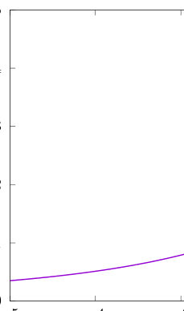
<figcaption class="paper-figure-caption"><b>Fig 1.</b> Figure 1. Adimensionalized three-body contact f3 ³ λT</figcaption>
</figure>
<figure class="paper-figure-card">
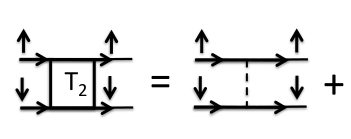
<figcaption class="paper-figure-caption"><b>Fig 2.</b> Figure 2. The two-body T-matrix T2 is given by a sum of ladder diagrams built with the bare interaction vertex.</figcaption>
</figure>
<figure class="paper-figure-card">
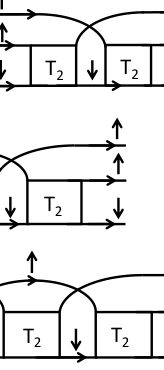
<figcaption class="paper-figure-caption"><b>Fig 3.</b> Figure 3. The three-body T-matrix T3 is given by an infinite sum of diagrams built with the two-body T-matrix T2.</figcaption>
</figure>
<figure class="paper-figure-card">
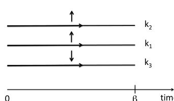
<figcaption class="paper-figure-caption"><b>Fig 4.</b> Figure 4. The two diagrams which do not contain any interaction vertex, G (1a) 3 and G (1b) 3 .</figcaption>
</figure>
<figure class="paper-figure-card">
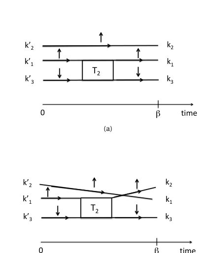
<figcaption class="paper-figure-caption"><b>Fig 5.</b> Figure 5. The four diagrams containing a single T2 vertex, G (2a) 3 , G (2b) 3 , G (2c) 3 and G (2d) 3 .</figcaption>
</figure>

**Summary.** This paper calculates the three-body contact ($C_3$) for interacting fermionic quantum gases in the non-degenerate limit. Using advanced techniques like wavefunction analysis and Feynman diagrams, the authors derive explicit dependencies of $C_3$ on temperature and interaction strength. The results are vital for accurately modeling loss processes and correlation effects in experiments involving ultracold atoms.

**Why it may be interesting.** This work provides quantitative, non-trivial results for three-body physics in ultracold Fermi gases, which is crucial for understanding loss mechanisms and universal interactions beyond simple two-body contact terms. The specific temperature scaling derived is a key theoretical prediction.

Detailed structure

**Main problem.** The paper calculates the three-body contact ($C_3$) for Fermi gases interacting via zero-range potentials, which is a fundamental quantity determining observable rates.

**Main result.** For the unitary limit ($a=\infty$), $C_3$ exhibits a slow temperature dependence proportional to $1/T^{0.22728}$. For general negative scattering lengths ($a<0$), the calculation requires non-trivial cancellations between two-body and three-body correlations.

**Method.** The authors employ both wavefunction approaches (for $a=\infty$) and diagrammatic techniques (Feynman diagrams) to analyze short-distance correlation functions, particularly focusing on the large-wavevector tail of the 3-body T-matrix.

**Model / system.** The system is a homogeneous gas of spin 1/2 fermions with zero-range interactions. The analysis focuses on the non-degenerate limit ($n\lambda_T^3 \ll 1$) and considers varying interaction strengths via the scattering length $a$.

**Key observables.** Three-body contact ($C_3$), three-body loss rate, number of nearby fermion triplets, pair momentum distribution tail ($n_P(K)$), recombination rates ($\Gamma_3$), and energy shifts ($\delta E_3$).

**Important parameters / regimes.** Scattering length ($a$), Temperature ($T$), Particle density ($n$), Thermal de Broglie wavelength ($\lambda_T$), Non-degenerate limit.

**Assumptions / limitations.** Calculations are performed in the thermodynamic limit at thermal equilibrium, and for $a<0$, the result relies on analyzing the short-distance behavior of the three-body correlation function $g_3$.

**Figures summary.** Figure 1 is mentioned to show the adimensionalized three-body contact $f_3$ as a function of an unspecified variable, likely related to temperature or density.

**Paper structure.** The paper systematically calculates $C_3$ by first addressing the unitary limit using wavefunctions and then extending the analysis to general negative scattering lengths ($a<0$) using diagrammatic techniques to capture short-distance correlations.

Abstract

A fundamental quantity characterizing Fermi gases with zero-range interactions is the three-body contact $C_3$, which determines several observables including the number of nearby triplets of fermions and the three-body loss rate in cold atom experiments, as shown in a companion article. Here, we compute $C_3$ to leading order in the non-degenerate limit for the homogeneous gas with negative or infinite scattering length $a$. At $a=\infty$, using a wavefunction approach, we obtain the analytical expression of $C_3$, which has a remarkably slow $1/T^{0.22728}$ dependence on the temperature $T$. In the Feynman diagram technique, which we use for $a<0$, the correct three-body short-distance correlations emerge only after a non-trivial cancellation between leading order two-body and three-body correlations, and the resulting power-law scaling comes from the large-wavevector tail of the 3-body T-matrix, which we derive inspired by the analytical solution of the three-body problem at the unitary limit.

[↑ back to top](#top)

### [Linear optical fan-out gates using fewer ancillary single photons with enhanced success probability](http://arxiv.org/abs/2608.15608v1)

**Authors:** Wen-Qiang Liu, Hai-Rui Wei  
**Type:** theory · **Category:** quantum information and computing · **PDF:** <https://arxiv.org/pdf/2608.15608v1>  
**Analysis basis:** full PDF text, analyzed in chunks
**Topic relevance:** `interference shaping light` **3/5** · `quantum measurements` **1/5** · `quantum optics experiment` **1/5**

↔ Scroll figures horizontally

<figure class="paper-figure-card">
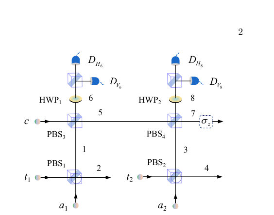
<figcaption class="paper-figure-caption"><b>Fig 1.</b> FIG. 1. Schematic diagram for implementing a post-selected photonic C3 gate in output paths 7, 2, and 4. PBS1 and PBS2 are diagonal polarizing beam splitters in the basis {|±⟩= 1 √</figcaption>
</figure>
<figure class="paper-figure-card">
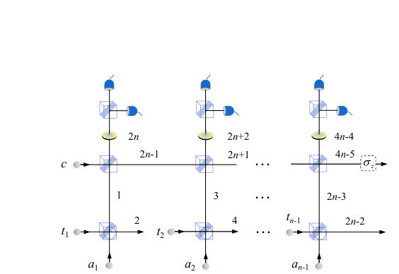
<figcaption class="paper-figure-caption"><b>Fig 2.</b> FIG. 2. Schematic diagram for implementing an n-photon Cn</figcaption>
</figure>
<figure class="paper-figure-card">
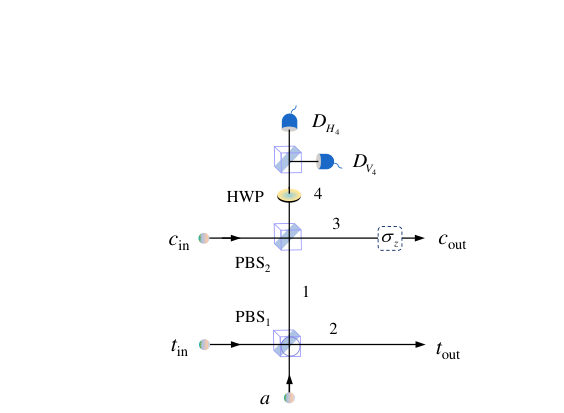
<figcaption class="paper-figure-caption"><b>Fig 3.</b> FIG. 3. Schematic diagram for implementing a two-photon Cn gate with n = 2 (i.e., CNOT gate).</figcaption>
</figure>
<figure class="paper-figure-card">
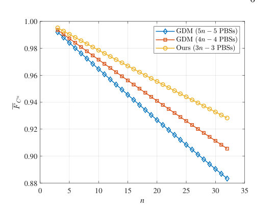
<figcaption class="paper-figure-caption"><b>Fig 4.</b> FIG. 5. Comparison of the average fidelities of the Cn (n ≥3) gate between our scheme and the conventional gate decom- position method (GDM).</figcaption>
</figure>
<figure class="paper-figure-card">
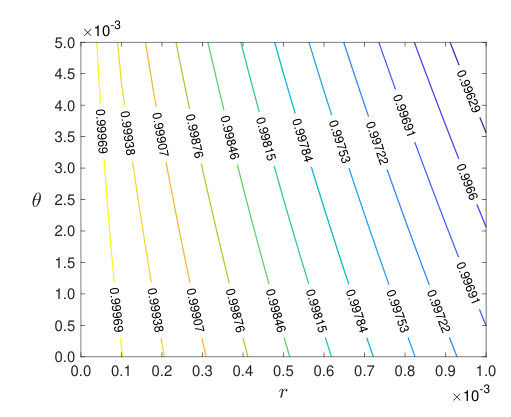
<figcaption class="paper-figure-caption"><b>Fig 5.</b> FIG. 4. The average fidelity of an imperfect PBS as a func- tion of the angular deviation θ and the polarization extinction ratio r.</figcaption>
</figure>

**Summary.** This paper presents an optimized linear-optical scheme to realize $n$-qubit fan-out quantum gates ($C_n$) using photons. The proposed method significantly reduces the required ancillary resources (photons and PBSs) compared to conventional gate decomposition techniques. This improvement leads to a higher success probability and better overall performance for photonic quantum information processing.

**Why it may be interesting.** This work is highly relevant as it pushes the boundaries of photonic quantum computation by offering a more resource-efficient architecture for complex multi-qubit gates, which are crucial building blocks for scalable quantum networks and algorithms.

Detailed structure

**Main problem.** The primary goal is to implement an efficient linear-optical quantum gate, specifically a post-selected three-qubit fan-out ($	ext{C}^3$) gate, while minimizing resource overhead and maximizing success probability.

**Main result.** The proposed scheme successfully implements the $n$-qubit fan-out gate using significantly fewer ancillary single photons and polarizing beam splitters (PBSs) compared to standard decomposition methods. This results in an improved success probability of $\left(rac{1}{4}
ight)^{n-1}$.

**Method.** The authors propose a novel linear optical scheme involving sequential interference steps at PBSs, utilizing ancillary single photons and Hadamard operations via Half-Wave Plates (HWPs). The process relies on post-selection based on coincidence measurements.

**Model / system.** The physical platform is photonic quantum information processing using polarization states ($|H
angle, |V
angle$) of single photons. The scheme uses linear optical elements like PBSs and HWPs to mediate the multi-qubit gate operation.

**Key observables.** Success Probability (SP) for $C_n$ gates; Average Fidelity ($F_{C_n}$); Resource overhead (number of ancillary photons and PBSs).

**Important parameters / regimes.** The success probability scales as $rac{1}{4^{n-1}}$ for the proposed scheme, versus $\left(rac{1}{8}
ight)^{n-1}$ for standard methods. Fidelity analysis depends on PBS imperfections ($	heta$ and $r$).

**Assumptions / limitations.** The analysis assumes that post-selection is possible, although it notes that complete heralding solely from ancillary photon detection is not guaranteed.

**Figures summary.** Figure 1 illustrates the $	ext{C}^3$ gate using two ancillas. Figure 2 shows the $n$-photon $C_n$ gate schematic. Table II compares resource requirements, fidelity, and SP across various $C_n$ schemes, highlighting the proposed method's efficiency.

**Paper structure.** The paper introduces the problem of efficient linear-optical fan-out gates, details the novel scheme for $	ext{C}^3$, generalizes it to $C_n$, provides detailed resource comparisons against existing methods (GDM), and concludes with fidelity analysis considering experimental imperfections.

Abstract

Photonic quantum gates are fundamental building blocks for a wide range of optical quantum information processing tasks. We propose an efficient linear-optical scheme for implementing a post-selected three-qubit fan-out gate (also known as a controlled-NOT-NOT gate) using only two ancillary single photons and linear optical elements. The scheme can be generalized to an $n$-qubit fan-out gate, requiring $(n-1)$ ancillary single photons and $(3n-3)$ polarizing beam splitters (PBSs), with a success probability of $\left(\frac{1}{4}\right)^{n-1}$. Compared to the standard gate decomposition approach, which requires $(2n-2)$ ancillary single photons, $(5n-5)$ PBSs, and yields a success probability of $\left(\frac{1}{8}\right)^{n-1}$. Our scheme significantly reduces the resource overhead and improves the success probability. We further evaluate the gate performance and demonstrate improved robustness compared to gate decomposition-based methods.

[↑ back to top](#top)

### [Local observable errors from truncating interaction tails in gapped quantum lattice systems](http://arxiv.org/abs/2608.15576v1)

**Authors:** Kangle Li  
**Type:** theory · **Category:** statistical mechanics · **PDF:** <https://arxiv.org/pdf/2608.15576v1>  
**Analysis basis:** full PDF text, analyzed in chunks
**Topic relevance:** `analog quantum simulation` **3/5** · `Keldysh / 2PI / non-Gaussian methods` **1/5** · `correlated / nonlocal dissipation` **1/5**

↔ Scroll figures horizontally

<figure class="paper-figure-card">
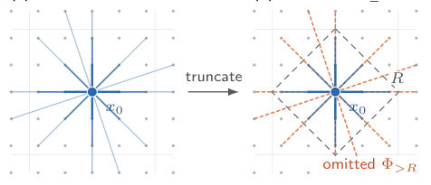
<figcaption class="paper-figure-caption"><b>Fig 1.</b> FIG. 1. Range truncation illustrated schematically for a two-body interaction in two dimensions. (a) From an arbi- trary reference site x0, the full interaction contains couplings over all distances; bond opacity represents their decreasing norms. (b) The range-R interaction Φ≤R retains bonds with dist(x0, y) ≤R, while the dashed orange bonds form the omit- ted tail Φ&gt;R. The dashed diamond is the graph-metric cutoff boundary.</figcaption>
</figure>
<figure class="paper-figure-card">
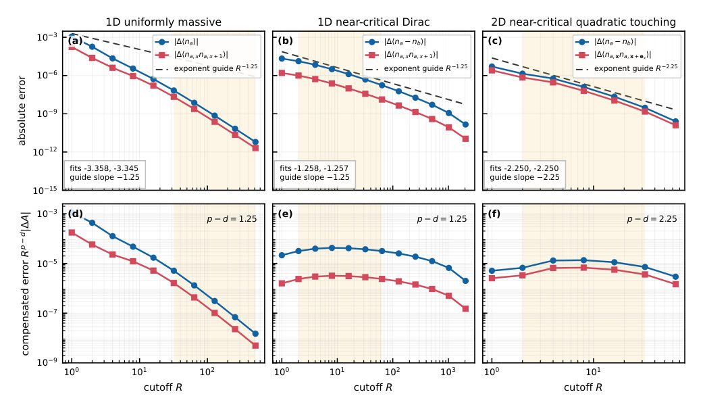
<figcaption class="paper-figure-caption"><b>Fig 2.</b> FIG. 2. Gaussian truncation benchmarks. The columns show the one-dimensional uniformly massive model, the one-dimensional near-critical Dirac model, and the two-dimensional near-critical quadratic touching. The top row gives absolute errors relative to a large-cutoff reference; the bottom row multiplies the same errors by the power Rp−d from Eq. (136). The shaded intervals are the fit windows, and the two fitted slopes in each top panel follow the legend order. In panels (a) and (d), the convergence is much faster than the general R−1.25 rate. Panels (b) and (e) approach that rate below the one-dimensional correlation length. Panels (c) and (f) are consistent with the two-dimensional R−2.25...</figcaption>
</figure>

**Summary.** This paper rigorously quantifies the error when approximating the physics of gapped quantum lattice systems by cutting off long-range interactions. It establishes that the convergence rate depends precisely on how fast the interaction tails decay, providing crucial theoretical bounds for simulating real-world materials or atomic arrays with long-range forces.

**Why it may be interesting.** This work provides rigorous quantitative tools to handle long-range interactions in quantum many-body systems, which is essential for modeling physical platforms like dipolar gases or Rydberg arrays where interactions decay slowly but are not strictly short-ranged.

Detailed structure

**Main problem.** The core problem is bounding the error incurred when approximating the ground-state expectation values of local observables in gapped quantum lattice systems by truncating the long-range spatial tails of the interaction Hamiltonian.

**Main result.** The error bound depends on the decay rate of the discarded interaction tail, yielding specific scaling laws (e.g., $O(R^{-(p-d)})$ for power-law interactions) that quantify when finite-range truncations accurately reproduce local physics.

**Method.** The analysis employs spectral flow techniques, adiabatic path arguments, and rigorous bounding using localized seminorms to compare expectations between the full and truncated Hamiltonians in various limits (finite volume, thermodynamic limit).

**Model / system.** The study concerns gapped quantum lattice systems whose interactions $\Phi$ decay spatially. The Hamiltonian is approximated by retaining only interactions within a finite range $R$, leading to the comparison between the full system and the truncated version.

**Key observables.** Error in ground-state expectation values of local observables ($\omega(A)$); Interaction Tail Mass ($T_{\Phi}(R)$).

**Important parameters / regimes.** Interaction decay rate (algebraic, superpolynomial, exponential); Truncation range $R$; System dimensionality $d$.

**Assumptions / limitations.** The system must be gapped, and the existence of suitable adiabatic paths or common separating gaps is crucial for establishing uniform bounds.

**Figures summary.** Figure 1 illustrates the decomposition of the full interaction into retained bonds ($\Phi_{\le R}$) and the omitted tail ($\Phi_{>R}$) in a 2D lattice setting.

**Paper structure.** The paper develops results across multiple theorems (III.4, III.5, III.6) covering finite-volume, thermodynamic-limit, and infinite-volume bounds, supported by detailed mathematical appendices detailing the necessary functional calculus and norm estimates.

Abstract

We bound the error in ground-state expectations of local observables caused by truncating the spatial tails of a gapped quantum lattice Hamiltonian. We show that the error is controlled by the interaction strength discarded near each site, rather than by the extensive norm of the omitted Hamiltonian. If the gap remains open along a path that removes the interaction tail, the resulting bounds are uniform in system size and extend, under suitable assumptions, to thermodynamic-limit ground states. The convergence rate reflects the decay of the interaction tail: it is algebraic for power-law interactions, superpolynomial for superpolynomial interactions, and exponential at any strictly smaller rate for exponentially decaying interactions. For superpolynomial interactions, we also derive a direct infinite-volume estimate using automorphic equivalence. The results extend to isolated low-energy sectors and parity-even fermionic systems. For two-body interactions decaying as $r^{-p}$ in $d$ dimensions, we prove an error bound $O(R^{-(p-d)})$ for $p>2d$, where $R$ is the truncation range. We construct a gapped non-translation-invariant example that saturates this scaling, showing that the bound is optimal for the general class considered. Our results quantify when finite-range truncations faithfully reproduce the local physics of gapped long-range systems.

[↑ back to top](#top)

### [Spectral filtering and crystal length as control parameters for conditional correlations in quantum imaging](http://arxiv.org/abs/2608.16524v1)

**Authors:** Hashir Kuniyil, Asad Ali, Mohammadreza Rezaee, Saif Al-Kuwari  
**Type:** theory · **Category:** other · **PDF:** <https://arxiv.org/pdf/2608.16524v1>  
**Analysis basis:** full PDF text, analyzed in chunks
**Topic relevance:** `interference shaping light` **3/5** · `quantum measurements` **1/5** · `quantum optics experiment` **1/5**

↔ Scroll figures horizontally

<figure class="paper-figure-card">
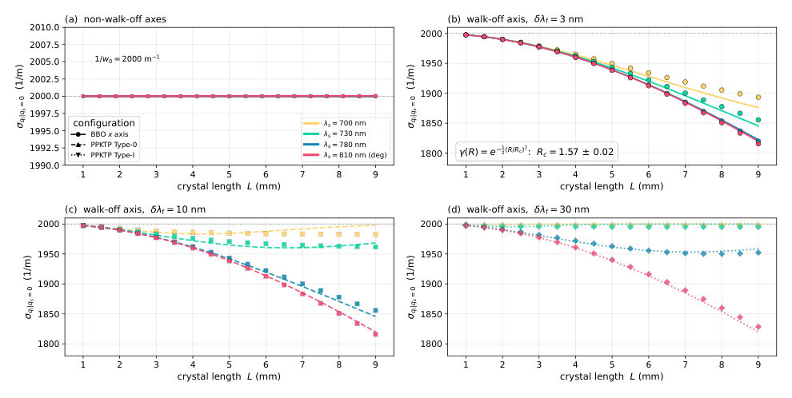
<figcaption class="paper-figure-caption"><b>Fig 1.</b> FIG. 1. Conditional momentum slice width σq|qs=0 versus crystal length L for four signal wavelengths at fixed w0 = 500 µm and signal-arm filter FWHM δλfilter = {3, 10, 30} nm. (a) No-walk-off configurations (PPKTP Type-0, circles; Type-I, squares; BBO x axis, triangles) collapse onto the pump-set plateau 1/w0 = 2000 m−1, independent of both L and δλf. (b–d) BBO walk-off (y) axis. The walk-off term in ∆kz produces an L-dependence controlled by the filter through the dimensionless ratio R [Eq. (21)] at different filter bandwidths: (b) δλf = 3 nm, (c) δλf = 10 nm, and (d) δλf = 30 nm.</figcaption>
</figure>
<figure class="paper-figure-card">
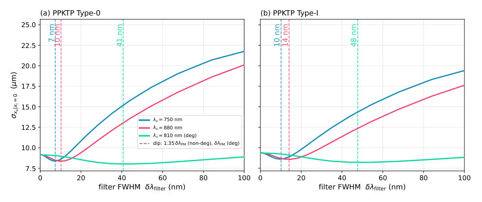
<figcaption class="paper-figure-caption"><b>Fig 2.</b> FIG. 2. Near-field conditional position uncertainty σxs|xi=0 as a function of the signal-arm spectral filter FWHM δλfilter in (a) PPKTP Type-I and (b) PPKTP Type-0, at fixed crystal length L = 3 mm, pump waist w0 = 500 µm, and pump wavelength λp = 405 nm. Three signal wavelengths are plotted in each panel; both crystals show a FDR profile at every signal wavelength, including the degenerate 810 nm case. Vertical markers in each panel illustrate the dip-position scaling Eq. (25) for the λs = 750 nm →λi = 880.4 nm conjugate pair.</figcaption>
</figure>
<figure class="paper-figure-card">
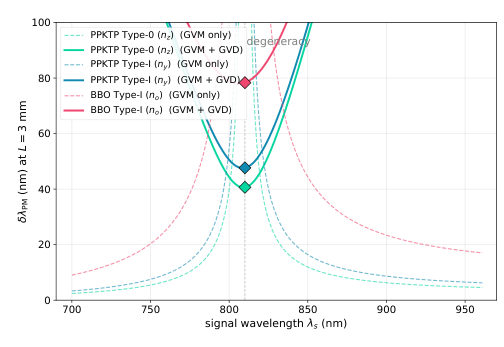
<figcaption class="paper-figure-caption"><b>Fig 3.</b> FIG. 3. Phase-matching bandwidth versus signal wave- length at L = 3 mm, λp = 405 nm. Dashed curves: leading-order GVM expression Eq. (22), which diverges as λs approaches the degenerate point 2λp = 810 nm because |ng(λs) −ng(λi)| →0. Diamond markers: leading-order GVD-only value Eq. (26) at exact degeneracy. Solid curves: full second-order expansion [Eq. (26)] that keeps both the lin- ear GVM and quadratic GVD terms and is finite at all λs. The full expression smoothly bridges the two limiting regimes and at exact degeneracy reproduces the GVD-only marker to better than 0.05 nm.</figcaption>
</figure>

**Summary.** This paper treats spectral filtering and crystal length as key controls for managing the conditional momentum and position correlations of biphotons from SPDC. It demonstrates that these parameters allow for enhanced quantum-imaging resolution by modifying correlation widths, particularly highlighting universal features like the Flat–Dip–Rise profile in position space.

**Why it may be interesting.** This work provides detailed quantitative rules for manipulating quantum correlations using spectral filtering, which is highly relevant to designing advanced quantum imaging protocols that require precise control over spatial entanglement properties.

Detailed structure

**Main problem.** The study establishes spectral filtering and crystal length as controllable parameters governing the conditional momentum and position correlations of biphotons generated via Spontaneous Parametric Down-Conversion (SPDC) for quantum imaging.

**Main result.** Spectral filtering universally induces a Flat–Dip–Rise (FDR) profile in position space, and the achievable momentum correlation uncertainty can be significantly narrowed below pump-limited scaling, especially along the walk-off axis of CPM crystals.

**Method.** The analysis uses point-to-point correlation estimation ($\sigma_{q_s|q_i=0}$) applied to the SPDC biphoton amplitude model, incorporating spectral filtering via Gaussian band-pass filters and analyzing far-field vs. near-field regimes.

**Model / system.** The system is based on SPDC generating entangled/correlated photon pairs (signal and idler). The theoretical framework models the transverse spatial correlation using a paraxial approximation for phase matching, considering different crystal types like BBO (with walk-off) and QPM crystals.

**Key observables.** Conditional momentum uncertainty ($\sigma_{q_s|q_i=0}$), conditional position profile (FDR), and the spectral-filter dependent bandwidth ($\delta\lambda_{PM}$).

**Important parameters / regimes.** Spectral filter bandwidth ($\delta\lambda_{	ext{filter}}$), crystal length ($L$), pump waist size ($w_0$), and the type of phase matching (CPM vs. QPM).

**Assumptions / limitations.** The analysis relies on the paraxial approximation for SPDC phase-matching, assumes a Gaussian pump envelope, and treats spectral filtering using Gaussian band-pass filters.

**Figures summary.** Not specified in detail, but the notes imply comparisons of $\sigma_{q|q_s=0}$ vs. $L$ (showing crossover scaling) and calculations of $\delta\lambda_{PM}$ for different crystal types and lengths.

**Paper structure.** The paper systematically analyzes how spectral filtering modifies conditional correlations in SPDC, first detailing the momentum space control via walk-off effects in CPM crystals, then establishing the universal FDR profile in position space across various crystal classes (including QPM), and finally deriving bandwidths for phase matching under degenerate vs. non-degenerate conditions.

Abstract

We establish spectral filtering as a control parameter for the conditional momentum and position correlations of SPDC biphotons used in quantum imaging. The conditional momentum uncertainty in spontaneous parametric down-conversion (SPDC) is strongly crystal-length and spectral-filter dependent along the walk-off axis; therefore, the effect is observed only in critically phase-matched (CPM) crystals such as $β$-barium borate (BBO) crystals, while quasi-phase-matched (QPM) crystals and the non-walk-off axis of BBO remain scaled strictly according to the standard pump waist size ($w_0$) dependent scaling law $1/w_0$-independent of the filter. In position space, the spectral-filter effect is universal and produces a flat-dip-rise (FDR) profile in every crystal class examined. Although this FDR profile was previously demonstrated in BBO only in the nondegenerate regime, our results establish its generality: the FDR dip is also present at exact degeneracy in QPM crystals, an unexpected feature that was previously thought to deliver a resolution advantage in the nondegenerate regime alone. Our treatment applies to all SPDC-based quantum-imaging regimes (including CPM and QPM crystals, walk-off and non-walk-off axes, degenerate and nondegenerate emission, and signal and idler filtering) and offers enhanced quantum-imaging resolution via the design rules presented-most prominently along the walk-off axis of CPM crystals (in far field) and across all transverse axes in the near field.

[↑ back to top](#top)

### [Topological Altermagnetic Insulators](http://arxiv.org/abs/2608.15811v1)

**Authors:** Jasmin Bedow, Nitin Kaushal, Marcel Franz  
**Type:** theory · **Category:** strongly correlated electrons · **PDF:** <https://arxiv.org/pdf/2608.15811v1>  
**Analysis basis:** full PDF text, analyzed in chunks
**Topic relevance:** `analog quantum simulation` **3/5** · `driven-dissipative phase transition` **1/5** · `methods for driven-dissipative` **1/5**

↔ Scroll figures horizontally

<figure class="paper-figure-card">
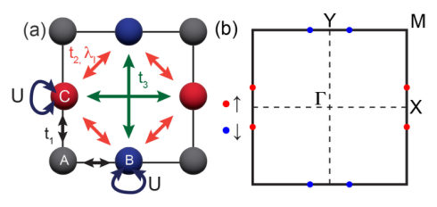
<figcaption class="paper-figure-caption"><b>Fig 1.</b> Fig. 1. (a) Schematic of the Lieb lattice Hubbard model used in this study, and (b) the Brillouin zone with the locations of the gapped Dirac points in the TAI phase marked.</figcaption>
</figure>
<figure class="paper-figure-card">
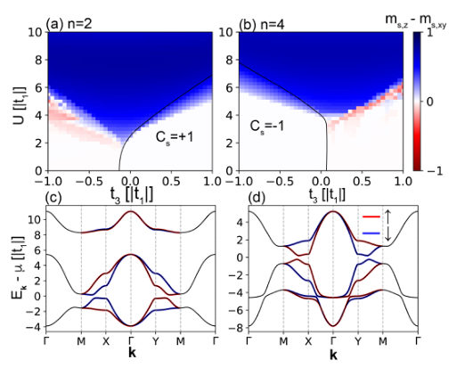
<figcaption class="paper-figure-caption"><b>Fig 2.</b> Fig. 2. (a,b) Difference in the out-of-plane and in-plane staggered magnetization, (c,d) spin-resolved band structure in the topological altermagnetic insulating phase for (a,c) 2 and (b,d) 4 electrons in the unit cell. Parameters are t1 = −1,t2 = 1.5, λI = 0.1, ϵA = 10, n = 2 in (a,c) and ϵA = 0, n = 4 in (b,d), with t3, U = 0.7, 5 in (c) and t3, U = −0.5, 5.5 in (d).</figcaption>
</figure>
<figure class="paper-figure-card">
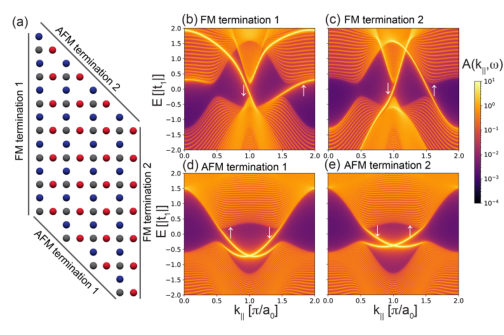
<figcaption class="paper-figure-caption"><b>Fig 3.</b> Fig. 3. (a) schematic of considered edge types with dif- ferent magnetic structures and (b) location of the massive Dirac cones in the Brillouin zone, (c-f) spectral function along (c)[(d)] ferromagnetic edges with AC [B] termination, respec- tively, along (e)[(f)] antiferromagnetic edges with A[BC] ter- mination, respectively. Parameters are t1 = −1, t2 = 1.5, t3 = −0.5, ϵA = 0, λI = 0.1, U = 5.5, n = 4.</figcaption>
</figure>
<figure class="paper-figure-card">
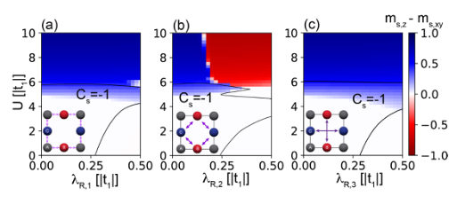
<figcaption class="paper-figure-caption"><b>Fig 4.</b> Fig. 4. Difference in the out-of-plane and in-plane staggered magnetization as a function of the strength of the Hubbard in- teraction U and the Rashba SOC λR,m between m-th nearest- neighboring sites with (a) m = 1, (b) m = 2, and (c) m = 3. Parameters are t1 = −1,t2 = 1.5, t3 = −0.5, λI = 0.1, ϵA = 10, n = 4.</figcaption>
</figure>
<figure class="paper-figure-card">
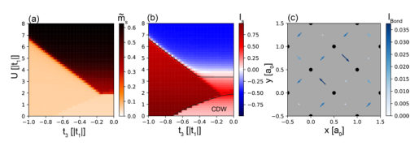
<figcaption class="paper-figure-caption"><b>Fig 5.</b> Fig. 5. (a) Staggered magnetization, (b) total and (c) bond- wise Ising correlation obtained from exact diagonalization on a 2 × 2 checkerboard cluster at half filling. Parameters are t2 = 1.5,λI = 0.1 with U = 3, t3 = −0.2 in (c).</figcaption>
</figure>

**Summary.** This work theoretically investigates topological altermagnetic insulators modeled on a Lieb lattice. Using Hartree-Fock and ED methods, the authors demonstrate that these correlated systems exhibit coexisting QSHE and altermagnetism. A key focus is analyzing how edge terminations dictate the robustness of helical edge modes against symmetry breaking perturbations.

**Why it may be interesting.** While focused on condensed matter magnetism, the study of topological protection and gap closing mechanisms under external perturbations (like Rashba SOC) shares conceptual overlap with understanding engineered quantum states in AMO systems.

Detailed structure

**Main problem.** The study investigates the emergence and robustness of topological altermagnetic phases stabilized by Ising spin-orbit coupling in correlated electron systems.

**Main result.** The authors establish that a quantum spin Hall effect can coexist with altermagnetic spin order over wide parameter regions, and they analyze how edge terminations affect the robustness of helical edge modes against symmetry breaking terms like Rashba SOC.

**Method.** Theoretical calculations utilizing Hartree-Fock theory to map phase diagrams, complemented by Exact Diagonalization (ED) techniques for validation on small clusters, and low-energy effective edge theory.

**Model / system.** The system is modeled using a prototypical Lieb lattice Hamiltonian incorporating hopping terms, local repulsion (Hubbard $U$), and an Ising spin-orbit coupling term ($H_{\lambda I}$).

**Key observables.** Spin Chern number ($C_s$), staggered magnetization ($	ilde{m}_s$), spectral function of edge modes ($A(k_\parallel, \omega)$), and bond current correlations ($I_{	ext{Bond}}$).

**Important parameters / regimes.** Electron densities (2 and 4 per unit cell), Hubbard interaction strength ($U$), Ising SOC strength ($\lambda_I$), and Rashba SOC strength ($\lambda_{R}$).

**Assumptions / limitations.** The analysis relies on mean-field Hartree-Fock theory, which is later confirmed against quantum fluctuations using ED.

**Figures summary.** Figures illustrate the spectral function of edge modes for different terminations (Fig. 3), and show the dependence of staggered magnetization and current correlations on $U$ and Rashba SOC strength (Figs. 4 and 5).

**Paper structure.** The paper first establishes the coexistence of topological phases and altermagnetism using HF theory, then develops a low-energy effective edge theory to test robustness against symmetry breaking terms like Rashba SOC, confirming results with ED simulations.

Abstract

We study the emergence of altermagnetic topological phases stabilized by Ising spin-orbit coupling in a prototypical Lieb lattice model of a correlated altermagnet. Treating the electron interactions within the Hartree-Fock and the exact diagonalization techniques, we establish the co-existence of a quantum spin Hall effect with altermagnetic spin order over a wide region of the parameter space for average electron densities of 2 and 4 per unit cell. We explore how the magnetic structure along edges influences the electronic behavior of the associated topological edge modes, demonstrating their robustness against inversion-symmetry breaking terms.

[↑ back to top](#top)

### [Beyond Local Berry Geometry: A First-Principles Finite-Momentum Theory of Electronic Position](http://arxiv.org/abs/2608.16020v1)

**Authors:** M. S. Si, Y. Q. Li, G. P. Zhang  
**Type:** theory · **Category:** other · **PDF:** <https://arxiv.org/pdf/2608.16020v1>  
**Analysis basis:** full PDF text, analyzed in chunks
**Topic relevance:** `Keldysh / 2PI / non-Gaussian methods` **3/5** · `quantum measurements` **1/5**

↔ Scroll figures horizontally

<figure class="paper-figure-card">
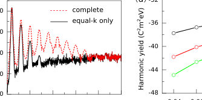
<figcaption class="paper-figure-caption"><b>Fig 1.</b> FIG. 1. Si electronic structure and low-photon-energy high- harmonic response. (a) Diamond-cubic structure and co- ordinate partition R = T + r. (b) Orbital-resolved band structure of Si. (c) HHG spectrum at Eph = 0.35 eV and E0 = 0.10 V/˚A for the full two-momentum position ma- trix (red dashed) and its equal-k-restricted form (black solid). (d) Peak-field dependence of the third-, fifth-, and seventh- harmonic yields calculated with the full two-momentum po- sition matrix.</figcaption>
</figure>
<figure class="paper-figure-card">

<figcaption class="paper-figure-caption"><b>Fig 2.</b> Figure 1 summarizes the Si electronic structure and the low-photon-energy nonlinear optical response. Panel (a) shows the decomposition R = T + r for diamond- cubic Si with lattice constant a0 = 5.43 ˚A [29], and panel (b) shows the orbital-resolved dispersion of the eight- band manifold. The indirect gap is about 0.7 eV, and the smallest direct separation along the plotted high- symmetry path is about 2.5 eV. These energies define the electronic manifold sampled by the field. Figure 1(c) reveals the central physical result. At Eph = 0.35 eV, finite-momentum coherence reorganizes the fifth and higher harmonics, enhancing some orders and suppressing others through coherent interference. This...</figcaption>
</figure>
<figure class="paper-figure-card">
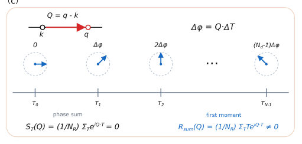
<figcaption class="paper-figure-caption"><b>Fig 3.</b> FIG. 2. Photon-energy dependence and real-space interpreta- tion. (a) HHG spectrum at Eph = 1.2 eV and E0 = 0.10 V/˚A for the full two-momentum position matrix (red dashed) and its equal-k-restricted form (black solid). (b) Peak-field depen- dence of the third-, fifth-, seventh-, and ninth-harmonic yields calculated with the full two-momentum position matrix. (c) Coherence-dipole mechanism: the phase sum of an allowed unequal-k coherence vanishes, while position weighting leaves a finite first moment.</figcaption>
</figure>
<figure class="paper-figure-card">
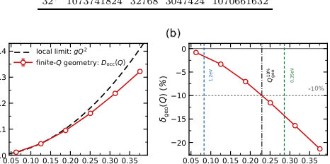
<figcaption class="paper-figure-caption"><b>Fig 4.</b> FIG. 3. Finite-momentum geometry in Si. (a) Occupied- subspace distance Docc(Q) and its local quantum-metric form gQ2. (b) Departure from local geometry. The black line marks the characteristic momentum Q10% geo = 0.229 ˚A −1; blue and green lines mark the momentum excursions of the 1.2- and 0.35-eV drives.</figcaption>
</figure>

**Summary.** This paper presents a first-principles theory extending the concept of electronic position beyond local Berry curvature by incorporating finite momentum coherence. It shows that this unequal-momentum coherence forms a 'coherence dipole' that dictates nonlinear optical responses in materials under strong fields. The work provides a general, material-specific tool to predict field-driven quantum phenomena.

**Why it may be interesting.** This work provides a rigorous quantum geometric framework for understanding non-local response mechanisms in solids driven by intense fields, connecting fundamental electronic structure theory directly to observable nonlinear optics.

Detailed structure

**Main problem.** To develop a first-principles theory of electronic position that accurately describes crystal response when electrons are driven across a finite momentum range, moving beyond the limitations of local Berry geometry.

**Main result.** The theory establishes that unequal-momentum coherence can form a 'coherence dipole,' which contributes to polarization even if it vanishes under spatial averaging. This shows that momentum-space geometry, rather than just photon energy, controls nonlinear optical responses like HHG.

**Method.** The authors derive finite-momentum matrix elements using Bloch states and PAW wavefunctions, calculating contributions from both equal-$\mathbf{k}$ and unequal-$\mathbf{k}$ momenta to quantify the deviation from local theory.

**Model / system.** The study concerns electronic structure in crystalline solids subjected to strong external fields. The theoretical framework uses a two-momentum construction applied to Bloch states defined on a finite Brillouin zone (BvK) domain.

**Key observables.** Electronic position, coherence dipole, Occupied-Subspace Distance ($	ext{Docc}(Q)$), and the geometric excursion ratio ($\chi_{	ext{geo}}$).

**Important parameters / regimes.** The material momentum scale ($Q_{10\%}^{	ext{geo}}$) compared to the field-driven momentum change ($\Delta k$).

**Assumptions / limitations.** The derivation relies on specific definitions of the finite BvK domain and maintaining consistency across different coordinate branches during basis transformations.

**Figures summary.** Figure 3 illustrates $	ext{Docc}(Q)$ vs $Q$, showing recovery near $Q=0$ but systematic departure at larger separations, quantifying the crossover point $Q_{10\%}^{	ext{geo}}$.

**Paper structure.** The paper progresses by first identifying the failure of local Berry theory in strong fields, then developing the finite-momentum matrix element calculation using PAW methods, and finally demonstrating its physical relevance through comparisons to HHG phenomena.

Abstract

Electronic position controls how a crystal polarizes and responds to an external field. In crystals, it is usually described through local changes of electronic states in momentum space. This Berry framework has reshaped modern solid-state physics, but strong fields drive electrons across a finite momentum range, where coherence between different momenta becomes part of the response. Here we establish a first-principles theory of electronic position at finite momentum that retains this missing information. We show that unequal-momentum coherence can cancel under spatial averaging and still produce polarization, forming a coherence dipole. We obtain the matrix directly from material wave functions, without model bands or fitted transition elements. In Si, the finite-momentum geometry sets a material momentum scale. Comparing this scale with the momentum change driven by the field predicts when finite-momentum physics becomes active. Crossing the scale strongly reorganizes the fifth and higher harmonics, showing that momentum-space geometry, rather than emitted photon energy alone, controls the nonlinear response. HHG is the first demonstration, but the theory applies whenever driven electrons explore a finite momentum range. It therefore extends quantum geometry beyond the local Berry limit and provides a general basis for predicting field-driven phenomena in real materials.

[↑ back to top](#top)

### [Quantum Permutations and Beyond Quantum Controlled Reference Frames](http://arxiv.org/abs/2608.16532v1)

**Authors:** Ofek Bengyat, Časlav Brukner, Marios Christodoulou  
**Type:** theory · **Category:** other · **PDF:** <https://arxiv.org/pdf/2608.16532v1>  
**Analysis basis:** full PDF text, analyzed in chunks
**Topic relevance:** `Keldysh / 2PI / non-Gaussian methods` **3/5** · `quantum measurements` **1/5**

↔ Scroll figures horizontally

<figure class="paper-figure-card">
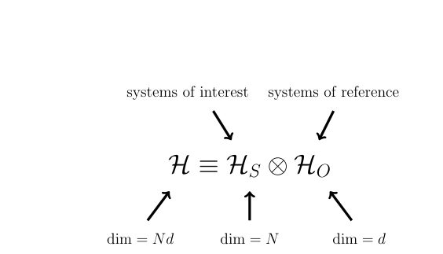
<figcaption class="paper-figure-caption"><b>Fig 1.</b> Figure 1. The names and dimensions of the Hilbert space on which magic unitaries act. We regard HX as a system of interest. It contains the eigenbasis |x⟩of the observable X. This basis is the one permuted. HO can be regarded as an external observer, as is the case in QRFs.</figcaption>
</figure>
<figure class="paper-figure-card">
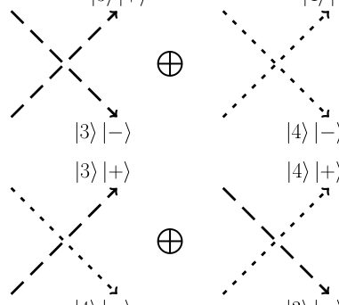
<figcaption class="paper-figure-caption"><b>Fig 2.</b> Figure 2. An illustration of the action of the BQC permutation u from (21) with π1 = |↑⟩⟨↑| , π2 = |+⟩⟨+| on the Hilbert space H = HS ⊗HO = L4 x=1 |x⟩⊗HO, with HO = C2. That is, N = 4, d = 2 and the total Hilbert space is of dimension Nd = 8. The figure illustrates how the different subspaces of each original copy of HO move from one component to the other, creating a different decomposition of H into orthogonal subspaces.</figcaption>
</figure>
<figure class="paper-figure-card">
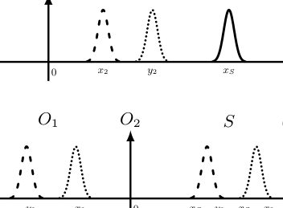
<figcaption class="paper-figure-caption"><b>Fig 3.</b> Figure 3. A simple use case for quantum controlled reference frame transformations. (a) A state from O1’s perspective: O1 is at the origin, S is at a fixed position, and O2 is in a superposition of two locations. (b) Same situation described from O2’s perspective after applying the quantum reference frame transformation: O2 is at the origin, while O1 and S are in an entangled state such that signed distances are pre- served. Dashed and dotted lines represent different superpo- sition branches.</figcaption>
</figure>
<figure class="paper-figure-card">
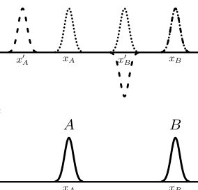
<figcaption class="paper-figure-caption"><b>Fig 4.</b> Figure 4. (a) The state (40) of the two particles with respect to observer O1 is a superposition of two terms: a term where A is localized at xA and B is in a superposition of locations xB and x′ B, and a term where A is localized at x′ A and B is in a superposition of the same two locations but now with a relative minus sign. Here, the different line patterns represent the entanglement across branches. In the O1 frame the parti- cles are also entangled with the reference fields, which are in the states |ϕ⟩O1O2 and |ϕ⊥⟩O1O2 in the respective branches. These field states are not shown in the figure. (b) From the perspective of O2, the same state is (42), with A and B at the definite...</figcaption>
</figure>

**Summary.** This paper introduces 'quantum permutations' as a necessary generalization of quantum reference frames to handle relational descriptions in physics. It proves that genuine quantum effects, specifically the non-commutativity of reference fields, mandate the use of these complex permutations rather than simpler classical transformations. This has implications for understanding covariance in quantum gravity and quantum information theory.

**Why it may be interesting.** The formalism provides a rigorous mathematical framework for understanding how physical laws must change when viewed from different, non-commuting reference frames, which is crucial for theories involving curved spacetime or quantum gravity.

Detailed structure

**Main problem.** The paper generalizes quantum reference frames by importing the mathematical tool of 'quantum permutations' to describe transformations between relational descriptions of quantum systems.

**Main result.** Genuinely quantum permutations (BQC) are necessary when non-commutativity is present in the reference fields, allowing for local superpositions that surpass the limitations of standard quantum controlled (QC) frame transformations.

**Method.** The authors use mathematical derivations comparing observables across different reference frames in both first-quantization and quantum field settings to constrain the required transformation unitaries.

**Model / system.** The analysis covers general quantum systems, discrete quantum fields, the Ising model symmetries, and a scalar field action on curved spacetime. The core mathematical tool is the 'quantum permutation' acting as the change-of-frame operator.

**Key observables.** Relative observables ($\hat{X}_2 = u \hat{X}_1 u^\dagger$), relative quantum fields ($\hat{\varphi}_i(x_\mu)$), and action invariance ($S$).

**Important parameters / regimes.** Non-commutativity of reference fields, the distinction between 'classical' (QC) vs. 'genuinely quantum' (BQC) permutations.

**Assumptions / limitations.** The standard framework assumes a 'God's eye view' for comparison, and later sections rely on differentiability conditions or specific commutation relations to analyze action invariance.

**Figures summary.** Figure 1 illustrates the Hilbert space dimensions involved in comparing descriptions from different reference frames in first-quantization settings.

**Paper structure.** The paper establishes the necessity of quantum permutations for relational descriptions, applies this concept to first-quantization systems (Section II A), extends it to quantum fields (Section II B), and finally investigates covariance and action invariance using toy models like the Ising model and scalar field theory in appendices.

Abstract

Quantum permutations, or magic unitaries, have in recent years been explored in the context of identifying `genuinely quantum' isometries of graphs. Here, we import this tool in physics, showing that quantum permutations yield a generalisation of quantum reference frames in a discrete setting that is reminiscent of the passage from special to general relativity. We show that the typical quantum reference frames framework corresponds to quantum permutations classified as `classical' in the mathematical literature, and which we demonstrate are quantum controlled transformations (superpositions of classical coordinate maps). Genuinely quantum permutations (i) allow to construct \emph{non--commuting} quantum reference frames (ii) correspond to \emph{local}, as opposed to global, superpositions of transformations. Strikingly, we find that the non-commutativity of quantum fields, when used as reference systems, is exactly what implies that the change of frame is achieved through a genuine quantum permutation. We illustrate the above with several examples in both first and second quantization formalism, which demonstrate (a) simultaneous control on non--commuting variables, (b) the existence of bipartite states that can be localized with a genuine quantum permutation and cannot be localized with the usual quantum reference frame transformations (without introducing additional degrees of freedom), (c) extension of the Ising model symmetries to genuinely quantum permutations, and (d) extension of the symmetries of a scalar field action on curved spacetime to genuinely quantum permutations. While we have in mind applications in quantum gravity, we expect our formalism to be of interest in a wide range of topics in quantum information.

[↑ back to top](#top)

### [Universal Emergence of Bosonic and Fermionic Algebras in a Deterministic Proper-Time Framework](http://arxiv.org/abs/2608.14816v1)

**Authors:** Alessio Maiezza  
**Type:** theory · **Category:** other · **PDF:** <https://arxiv.org/pdf/2608.14816v1>  
**Analysis basis:** full PDF text, analyzed in chunks
**Topic relevance:** `Keldysh / 2PI / non-Gaussian methods` **3/5** · `quantum measurements` **1/5**

↔ Scroll figures horizontally

<figure class="paper-figure-card">
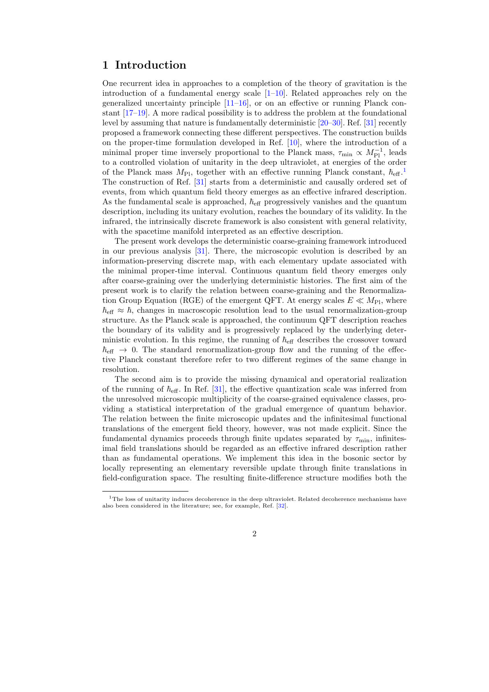
<figcaption class="paper-figure-caption"><b>Fig 1.</b> Low-resolution page preview, page 2</figcaption>
</figure>
<figure class="paper-figure-card">
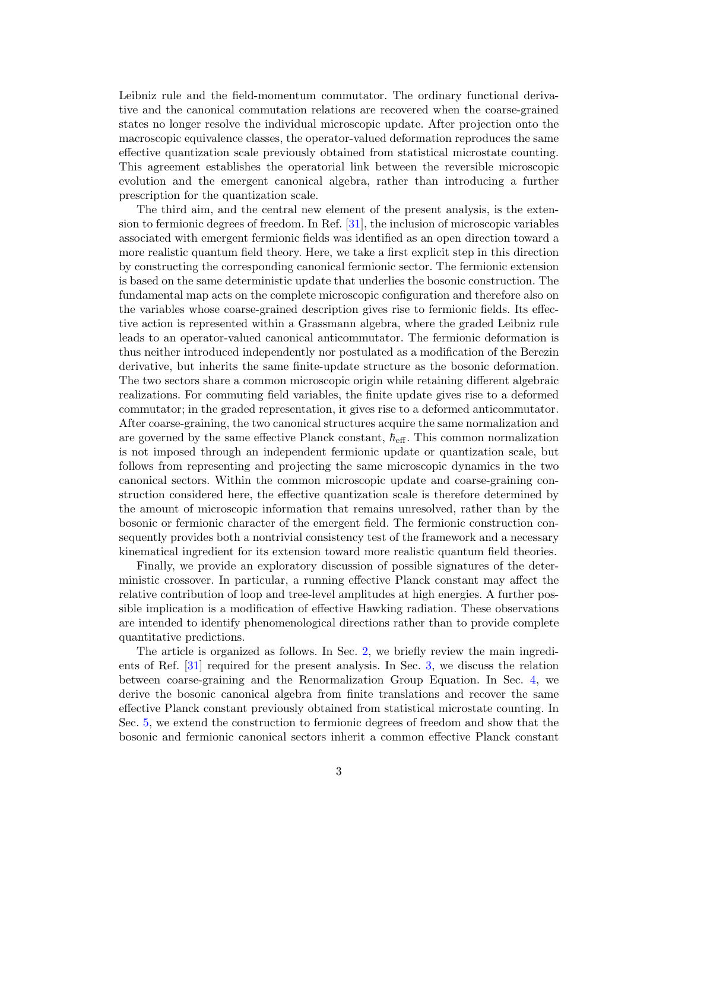
<figcaption class="paper-figure-caption"><b>Fig 2.</b> Low-resolution page preview, page 3</figcaption>
</figure>
<figure class="paper-figure-card">
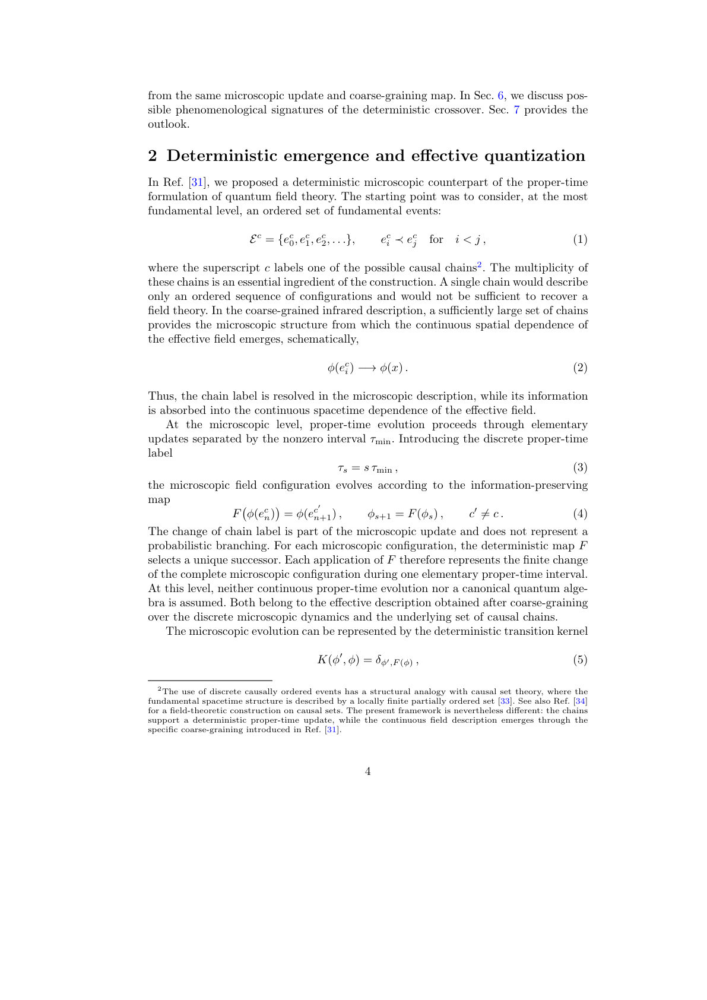
<figcaption class="paper-figure-caption"><b>Fig 3.</b> Low-resolution page preview, page 4</figcaption>
</figure>
<figure class="paper-figure-card">
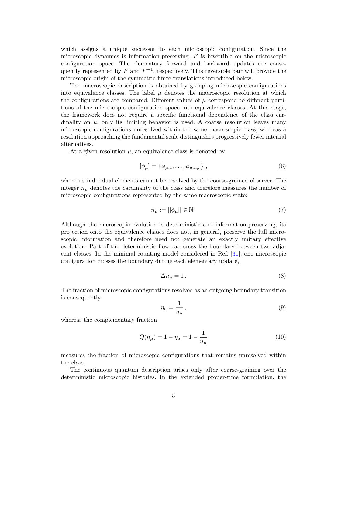
<figcaption class="paper-figure-caption"><b>Fig 4.</b> Low-resolution page preview, page 5</figcaption>
</figure>
<figure class="paper-figure-card">
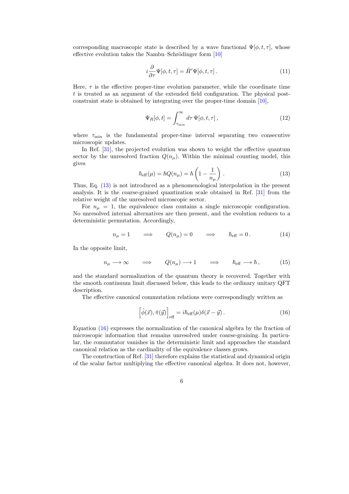
<figcaption class="paper-figure-caption"><b>Fig 5.</b> Low-resolution page preview, page 6</figcaption>
</figure>

**Summary.** This paper proposes a deterministic framework where Quantum Field Theory emerges from discrete, microscopic proper-time evolution. It rigorously constructs both bosonic and fermionic commutation/anticommutation relations using this underlying dynamics. The key achievement is demonstrating that both sectors share a common effective Planck constant, suggesting a unified origin for quantum statistics.

**Why it may be interesting.** While highly theoretical, its focus on emergent quantization scales ($\hbar_{	ext{eff}}$) and linking fundamental dynamics (deterministic updates) to established quantum structures (RGE, canonical algebras) provides a novel perspective on the foundations of QFT relevant to open systems theory.

Detailed structure

**Main problem.** The work develops a deterministic, discrete proper-time framework aiming to explain how Quantum Field Theory (QFT) emerges as an effective infrared description.

**Main result.** It successfully shows that both bosonic and fermionic sectors inherit a common effective Planck constant ($\hbar_{	ext{eff}}$) derived from the underlying microscopic dynamics, linking canonical algebra emergence to unresolved microstate counting.

**Method.** The methodology involves analyzing consistency under resolution changes to derive Renormalization Group structure, using finite-difference translations for bosons, and employing Grassmann algebras for fermions.

**Model / system.** The model is a deterministic, discrete proper-time framework built on ordered event chains. QFT emerges as the coarse-grained limit of this underlying microscopic evolution.

**Key observables.** Effective running Planck constant ($\hbar_{	ext{eff}}$), bosonic commutation relations, fermionic anticommutation relations, and Hawking radiation suppression factors.

**Important parameters / regimes.** The effective quantization scale derived from unresolved microscopic multiplicity ($n_\mu$), the minimal proper time interval ($	au_{\min}$), and the resolution parameter ($\mu$).

**Assumptions / limitations.** QFT is treated as an effective infrared description resulting from coarse-graining over fundamental deterministic histories, and the framework assumes a common underlying update mechanism for both particle types.

**Paper structure.** The paper progresses by first establishing the RGE structure via resolution changes, then deriving bosonic canonical relations using finite differences, extending this to fermions via Grassmann algebra, and finally discussing implications like Hawking radiation suppression.

Abstract

This work develops the deterministic, discrete proper-time framework introduced in our previous work, Eur.\ Phys.\ J.\ C \textbf{86} (2026) 829, in which quantum field theory emerges as an effective infrared description characterized by a running Planck constant. There, the effective quantization scale was inferred from the microscopic multiplicity unresolved by coarse-graining. Here, we provide its dynamical and operatorial realization and extend the construction to fermionic degrees of freedom. First, consistency under changes of macroscopic resolution leads to the structure of the Renormalization Group Equation, while the running Planck constant governs the crossover toward the deterministic regime. Second, we represent the reversible microscopic dynamics through finite-difference translations in field-configuration space. After coarse-graining, the resulting operator-valued canonical commutation relations reproduce the same quantization scale previously obtained from statistical microstate counting, thereby linking microscopic evolution to the emergent canonical algebra. Third, representing the same update within a Grassmann algebra yields the corresponding canonical anticommutation relations. The bosonic and fermionic sectors thus inherit a common effective Planck constant without introducing an independent fermionic update or quantization scale. Finally, we discuss possible implications for high-energy loop amplitudes and effective Hawking radiation.

[↑ back to top](#top)

### [Zero-point theorems in quantum many-body physics](http://arxiv.org/abs/2608.15542v1)

**Authors:** Yuan Yao  
**Type:** theory · **Category:** statistical mechanics · **PDF:** <https://arxiv.org/pdf/2608.15542v1>  
**Analysis basis:** full PDF text, analyzed in chunks
**Topic relevance:** `analog quantum simulation` **3/5**

↔ Scroll figures horizontally

<figure class="paper-figure-card">
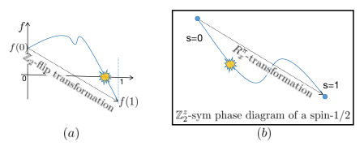
<figcaption class="paper-figure-caption"><b>Fig 1.</b> FIG. 1. (a) Zero-point theorem: the constraint is a Z2- transformation on the interval boundary; (b) Zero-point the- orem in quantum mechanics: a gap-closing point (denoted by the burst shape) is inevitable.</figcaption>
</figure>
<figure class="paper-figure-card">
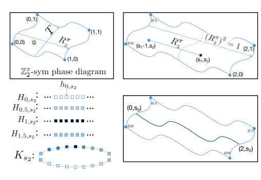
<figcaption class="paper-figure-caption"><b>Fig 2.</b> FIG. 2. Left-up: Theorem 2; Right-up: the doubling pro- cedure s1 ∈[0, 2]; Bottom: the construction of the texture Hamiltonian Ks2.</figcaption>
</figure>
<figure class="paper-figure-card">
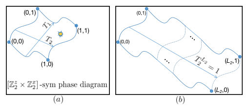
<figcaption class="paper-figure-caption"><b>Fig 3.</b> FIG. 3. (a) Theorem 3; (b) Extension s1 ∈[0, L2].</figcaption>
</figure>
<figure class="paper-figure-card">
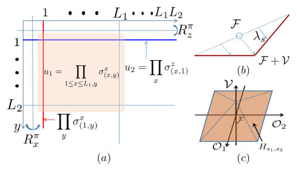
<figcaption class="paper-figure-caption"><b>Fig 4.</b> FIG. 4. (a) Ktw s2 : The links perpendicularly intersecting the horizontal line y = 1/2 are twisted by Rπ z , and Rπ x for those links intersecting the x = 1/2 line; u2 intersects Q</figcaption>
</figure>

**Summary.** This paper develops generalized zero-point theorems for quantum spin systems by analyzing the spectral gap function across multi-parameter families of Hamiltonians. By imposing only model-independent symmetry constraints on the parameter boundaries, the authors prove that the gap must close at certain points. This yields universal restrictions on the relevant operators governing critical behavior in high dimensions.

**Why it may be interesting.** This work provides universal, symmetry-based constraints on critical points that are independent of detailed low-energy Hamiltonians, offering a powerful theoretical tool applicable across various quantum phases studied in AMO and condensed matter physics.

Detailed structure

**Main problem.** To establish powerful, model-independent constraints on relevant operators governing critical phenomena in quantum spin models across arbitrary high dimensions.

**Main result.** The authors propose and generalize zero-point theorems showing that the spectral gap function must vanish at certain points within multi-parameter families of Hamiltonians under specific symmetry constraints.

**Method.** The core method generalizes mathematical zero-point arguments by applying model-independent transformation relations (like those relating boundary conditions) to the gap function $\Delta(H)$ across continuous parameter spaces.

**Model / system.** The study focuses on quantum many-body systems, specifically spin-1/2 models defined on lattices (chains and 2D square lattices), parameterized by multiple coupling constants or symmetries ($\mathbb{Z}_2 	imes \mathbb{Z}_2$, etc.).

**Key observables.** The spectral gap function $\Delta(H) = \lim_{L	o\infty} E_2(H) - E_1(H)$, which signals the presence or absence of a gap.

**Important parameters / regimes.** The dimensionality ($d$) and the number of continuous parameters ($p$) defining the Hamiltonian family, as well as symmetry constraints ($\mathbb{Z}_2$, $T$).

**Assumptions / limitations.** The theorems only require imposing model-independent transformation data on the parameter boundary, avoiding assumptions about specific low-energy dynamics or response functions.

**Figures summary.** Figures illustrate the mathematical zero-point theorem and its quantum mechanical analogues, showing gap closing. They also visualize the geometric generalization of these theorems to two parameters in 2D lattices.

**Paper structure.** The paper builds from a basic one-parameter zero-point theorem (Theorem 0) to generalizations involving multiple parameters (Theorem 2), culminating in conjectures for $p$-parameter families on $d$-dimensional lattices.

Abstract

We propose several zero-point type arguments based on the inevitable zero point(s) of a spectral gap in the quantum spin system phase diagrams in various dimensions. We consider multi-parameter families of Hamiltonian extending the conventional zero-point theorem that includes only one parameter. Analogously to the zero-point theorem, we only impose model-independent transformation relations along the parameter boundary, rather than specifying any low-energy dynamics or response. We further give a series of conjectures, which generalize our statements in a uniform way. Our results give powerful and universal model-independent constraints on the possible relevant operators for critical phenomena in quantum spin models in arbitrary high dimensions.

[↑ back to top](#top)

### [Coherent Phonon Blocking in Superlattices](http://arxiv.org/abs/2608.14880v1)

**Authors:** Anil Erol, Xiang Hua, Kirby Myers, Lawrence Friedman, Alexander Marakov, Melissa G. Loving, Joshua Shipman, Arsha Mamoozadeh, Sarah Millen, Ronald J. Warzoha, Jeremy Clark, Robert M. Young  
**Type:** theory · **Category:** statistical mechanics · **PDF:** <https://arxiv.org/pdf/2608.14880v1>  
**Analysis basis:** full PDF text, analyzed in chunks
**Topic relevance:** `Keldysh / 2PI / non-Gaussian methods` **2/5** · `driven-dissipative phase transition` **2/5** · `methods for driven-dissipative` **2/5** · `analog quantum simulation` **1/5** · `correlated / nonlocal dissipation` **1/5** · `interference shaping light` **1/5** · `non-equilibrium universality` **1/5** · `quantum measurements` **1/5**

↔ Scroll figures horizontally

<figure class="paper-figure-card">
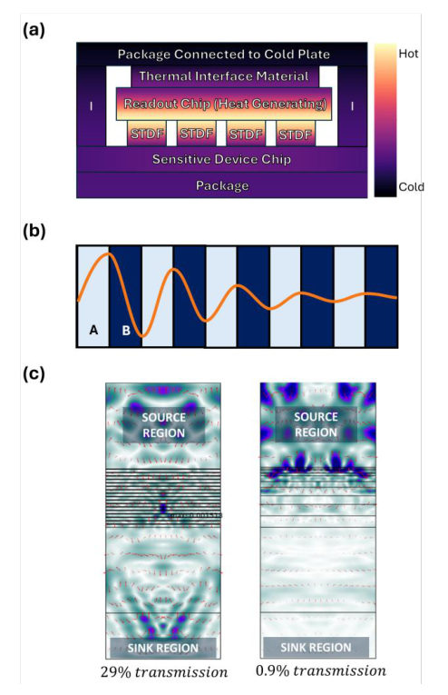
<figcaption class="paper-figure-caption"><b>Fig 1.</b> Figure 1 – (a) Sensitive devices on flip-chip assemblies can be protected by placing standoffs with large thermal resistance, e.g., superconducting bilayers that can filter phonons. (b) Phonons can be filtered with destructive interference in quarter-wave bilayers. Materials A and B must have large acoustic mismatch, interfaces must be smooth relative to phonon wavelengths and phonon coherence must be greater than thickness of the stack. (c) Reflections of a phonon, modeled as an elastic wave in COMSOL Multiphysics®1, are shown at time 𝑡1 for two cases: (left) laminate with same bilayer thicknesses; (right) laminate with varying thicknesses. While bilayers of the same thickness can reduce...</figcaption>
</figure>
<figure class="paper-figure-card">
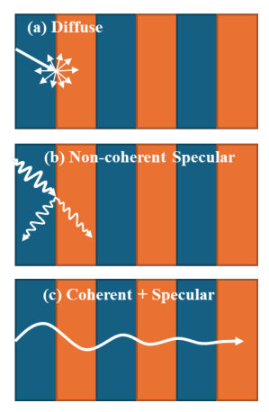
<figcaption class="paper-figure-caption"><b>Fig 2.</b> Figure 2 – Phonon propagation through layered solid media can be described as (a) diffuse scattering at interfaces with ballistic propagation through the bulk, (b) specular scattering at interfaces with ballistic bulk propagation and (c) coherent, specular scattering where phonon characteristics are elastically coupled in both the bulk and interfaces.</figcaption>
</figure>
<figure class="paper-figure-card">
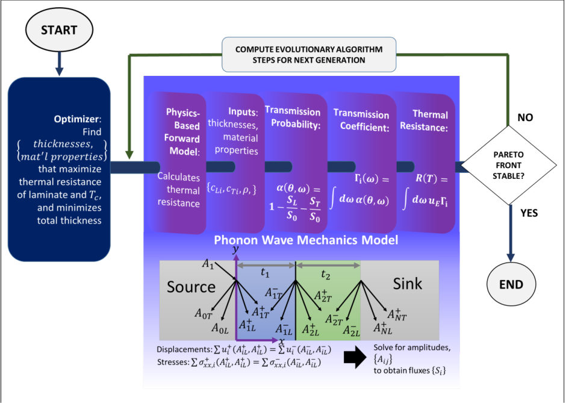
<figcaption class="paper-figure-caption"><b>Fig 3.</b> Figure 3 – A genetic algorithm was deployed for a multi-objective optimization that sought a maximum thermal resistance of the laminate 𝑅, maximum superconducting critical temperature 𝑇𝐶, and minimum total laminate thickness.</figcaption>
</figure>
<figure class="paper-figure-card">
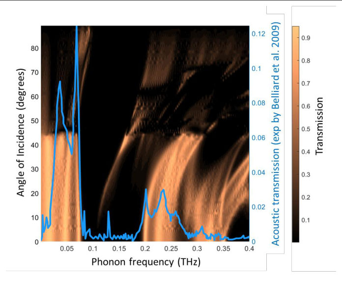
<figcaption class="paper-figure-caption"><b>Fig 4.</b> Figure 4 – The contours plot transmission probability (from 0 to 1) calculated by the model across all angles of incidence and up to 0.4 THz in phonon frequency for a 3 bilayer superlattice consisting of amorphous silicon and molybdenum. This superlattice was tested in the literature—the measured transmission spectroscopy is plotted versus frequency by the blue curve [19].</figcaption>
</figure>
<figure class="paper-figure-card">
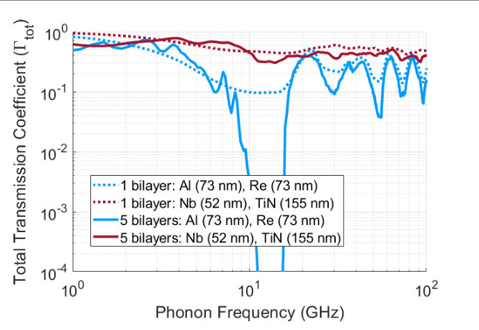
<figcaption class="paper-figure-caption"><b>Fig 5.</b> Figure 5 – Phonon transmission coefficients are plotted for two laminates made of either (1) Re and Al or (2) Nb and TiN. Each type of laminate’s transmission coefficient is plotted with 1 bilayer and 5 bilayers to show the effects of adding more bilayers.</figcaption>
</figure>

**Summary.** This work introduces a novel wave-mechanics framework to predict phonon transmission through superlattices at cryogenic temperatures. By enforcing phase coherence and optimizing layer thicknesses using a genetic algorithm, the authors designed structures achieving unprecedented thermal resistance enhancements. This has major implications for ultra-low temperature electronics and thermal management.

**Why it may be interesting.** While focused on phonons, the rigorous application of wave mechanics, coherence constraints, and complex optimization techniques mirrors challenges in modeling open quantum systems where boundary conditions and energy transport are critical.

Detailed structure

**Main problem.** Controlling phonon energy transport at cryogenic temperatures, where phonons are dominant energy carriers and exhibit ballistic behavior.

**Main result.** The authors developed a model predicting superlattices with thermal resistance up to 3000 times greater than previous reports by exploiting coherent acoustic scattering effects.

**Method.** A wave-mechanics based framework utilizing the transfer matrix method, optimized via a genetic algorithm (NSGA-II).

**Model / system.** The system is multi-layered superlattices composed of various materials. The model treats phonon propagation using coherent scattering theory, departing from standard Acoustic/Diffuse Mismatch Models.

**Key observables.** Frequency-dependent phonon transmission ($\Gamma$), total thermal resistance ($R_{	ext{CLAMM}}$), and superconducting critical temperature ($T_c$).

**Important parameters / regimes.** Cryogenic temperatures, quarter-wavelength condition matching, acoustic mismatch, and layer thicknesses.

**Assumptions / limitations.** The model enforces phase coherence (specular scattering) across layers and assumes the system can be analyzed using planar elastic wave theory.

**Figures summary.** Figure 1 illustrates phonon filtering via destructive interference in quarter-wave bilayers; Figure 2 compares diffuse, specular, and coherent phonon propagation modes.

**Paper structure.** The paper introduces the problem of cryogenic heat transport, details the CLAMM framework using transfer matrices for wave calculation, applies a multi-objective optimization (NSGA-II) to select optimal material stacks, and presents results showing massive thermal resistance enhancement.

Abstract

At cryogenic temperatures, phonons become one of the dominant energy carriers and thus can strongly influence the performance of electronic and sensing devices. In this work, we present a wave-mechanics based framework that predicts phonon transmission and thermal resistance of arbitrarily thick superlattices while retaining all acoustic branches, mode-conversion pathways, and angles of incidence. By enforcing phase coherence, our model predicts frequency-dependent transmission through arbitrary multi-layered structures.We use a genetic algorithm (NSGA-II) to efficiently select both materials and layer thicknesses. Our success criterion is that constituent layers satisfy the quarter-wavelength condition of the dominant phonon frequencies at a target temperature. This strategy identifies novel bilayer combinations that achieve thermal resistance of up to 3000 times greater than previously reported superlattices. The identified superlattices are poised to advance any technology that relies on coherent acoustic scattering, from ultra-low-temperature thermal insulation in superconducting flip-chip assemblies to phonon-blocking components in micro- and nano-electromechanical systems.

[↑ back to top](#top)

### [Information, order, complexity, and entropy in materials including biological systems: a thermodynamic theory based on state variables](http://arxiv.org/abs/2608.15462v1)

**Authors:** Koun Shirai  
**Type:** theory · **Category:** statistical mechanics · **PDF:** <https://arxiv.org/pdf/2608.15462v1>  
**Analysis basis:** full PDF text, analyzed in chunks
**Topic relevance:** `Keldysh / 2PI / non-Gaussian methods` **2/5** · `driven-dissipative phase transition` **2/5** · `methods for driven-dissipative` **2/5** · `analog quantum simulation` **1/5** · `correlated / nonlocal dissipation` **1/5** · `non-equilibrium universality` **1/5** · `quantum measurements` **1/5**

↔ Scroll figures horizontally

<figure class="paper-figure-card">
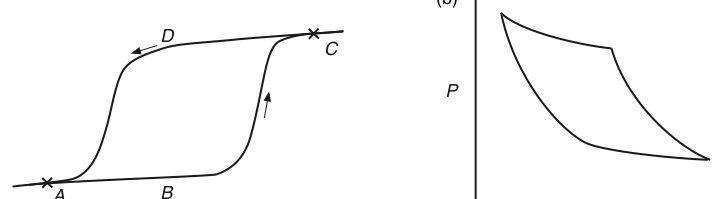
<figcaption class="paper-figure-caption"><b>Fig 1.</b> FIG. 1. (a) hysteresis loop. The input variable X and its response Y of a system return to the</figcaption>
</figure>
<figure class="paper-figure-card">
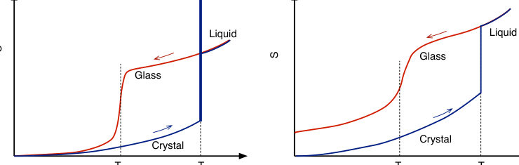
<figcaption class="paper-figure-caption"><b>Fig 2.</b> FIG. 2. Specific heat (C) and entropy (S) of a glass measured during a cooling process in calorime-</figcaption>
</figure>
<figure class="paper-figure-card">
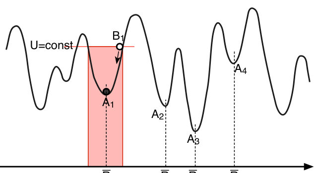
<figcaption class="paper-figure-caption"><b>Fig 3.</b> FIG. 3. Schematic potential-energy landscape of a solid. The equilibrium states Aj are specified</figcaption>
</figure>
<figure class="paper-figure-card">
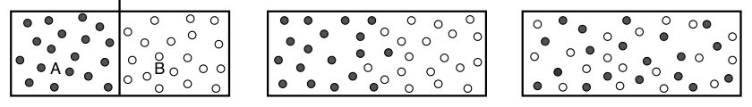
<figcaption class="paper-figure-caption"><b>Fig 4.</b> FIG. 4. Mixing of two gases, A and B, in a container. (a) Initially, the two gases are separated by</figcaption>
</figure>
<figure class="paper-figure-card">
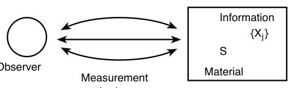
<figcaption class="paper-figure-caption"><b>Fig 5.</b> FIG. 5. (a) Information in information theory. The information data are carried through a channel</figcaption>
</figure>

**Summary.** This paper tackles the conceptual overlap between entropy from thermodynamics and information theory. It argues that by identifying time-averaged atomic positions as the true state variables for solids, it provides a unified framework that preserves the third law while distinguishing thermodynamic uncertainty (entropy) from actual stored information. This resolves long-standing ambiguities in analyzing complex materials like glasses and biological structures.

**Why it may be interesting.** While focused on classical statistical mechanics, its rigorous re-evaluation of 'state' and 'information' has implications for defining order parameters in complex quantum many-body systems or open quantum systems where environmental coupling dictates effective state variables.

Detailed structure

**Main problem.** The central issue is resolving conceptual ambiguities when applying information-theoretic concepts (like Shannon entropy) to thermodynamic quantities, especially concerning the definition of state variables for materials.

**Main result.** The paper establishes that time-averaged atom positions serve as the necessary state variables for solids, leading to a unified framework where entropy represents uncertainty rather than pure information content.

**Method.** The analysis involves comparing and reconciling definitions from classical thermodynamics, statistical mechanics, and information theory (e.g., using configurational entropy $S_c$ and complexity measures $I$).

**Model / system.** The scope covers general materials, including crystalline solids, amorphous solids (glasses), and biological systems like DNA.

**Key observables.** Entropy ($S$), Information content ($I$), Complexity, Residual entropy, and state variables ($\{ar{R}_j\}$).

**Important parameters / regimes.** Temperature ($T$) and Volume ($V$); the structural parameters $\{ar{R}_j\}$ are crucial for defining equilibrium.

**Assumptions / limitations.** The primary assumption is that identifying a set of state variables (time-averaged atom positions) can resolve inconsistencies in thermodynamic definitions across different physical regimes.

**Paper structure.** The paper develops by first highlighting the ambiguity between thermodynamic and information entropy, then proposing the identification of structural parameters as state variables to derive a consistent thermodynamic description for solids, which is then used to address biological complexity.

Abstract

Entropy plays a central role in thermodynamics, statistical mechanics, information theory, and biology. However, its interpretation becomes increasingly ambiguous when information-theoretic concepts are applied to materials, including biological systems. For example, in biology, it is common practice to evaluate the entropy of DNA by enumerating possible configurations. This configuration entropy does not vanish at $T=0$, apparently contradicting the third law. Similar conceptual difficulties also arise in relating entropy to order, randomness, complexity, and information. In thermodynamics, entropy is a state function, and hence the entropy must be uniquely determined by a given state of a material. The crucial issue is therefore to identify the state variables that uniquely specify the thermodynamic state of a material. By establishing consistent definition of equilibrium and state variable, it is found that the time-averaged atom positions serve as the state variables of a solid. This leads to the important conclusion that a solid possesses many equilibrium states even at fixed temperature and volume. Entropy is not information but uncertainty associated with the state variables. The latter quantities convey the information of a material. This framework provides a unified thermodynamic basis of entropy, information, order, complexity, hysteresis, and residual entropy while preserving the third law. Frozen configurations and their activation resolve many longstanding ambiguities the thermodynamic evaluation of entropy.

[↑ back to top](#top)

### [Localization and Transport in a Non-Hermitian Hexagonal Harper Model](http://arxiv.org/abs/2608.15078v1)

**Authors:** Akshey Rajoriya, Dibyajyoti Sahu, Suhas Gangadharaiah, Tanay Nag  
**Type:** theory · **Category:** disordered systems and neural networks · **PDF:** <https://arxiv.org/pdf/2608.15078v1>  
**Analysis basis:** full PDF text, analyzed in chunks
**Topic relevance:** `analog quantum simulation` **2/5** · `driven-dissipative phase transition` **2/5** · `non-equilibrium universality` **2/5** · `Keldysh / 2PI / non-Gaussian methods` **1/5** · `correlated / nonlocal dissipation` **1/5** · `methods for driven-dissipative` **1/5** · `scars & prethermalization` **1/5**

↔ Scroll figures horizontally

<figure class="paper-figure-card">
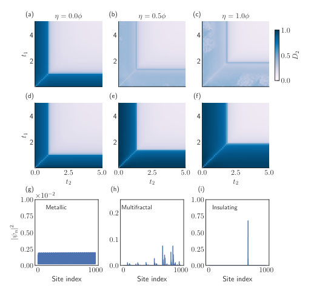
<figcaption class="paper-figure-caption"><b>Fig 1.</b> FIG. 2. Average fractal dimension D2 in the (t1, t2) plane for different non-Hermitian strengths η (in units of the golden ra- tio ϕ) with t3 = 1. Panels (a)–(c) and (d)–(f) show the phase diagrams under OBC and PBC, respectively, for η = 0, 0.5ϕ, and ϕ. Panels (g)–(i) show representative eigenstate proba- bility distributions |ψn|2 under PBC at (t1, t2) = (3.0, 0.1), (3.0, 1.81), and (3.0, 4.5), corresponding to the metallic, mul- tifractal, and insulating phases, respectively. The system size is L = 1000.</figcaption>
</figure>
<figure class="paper-figure-card">
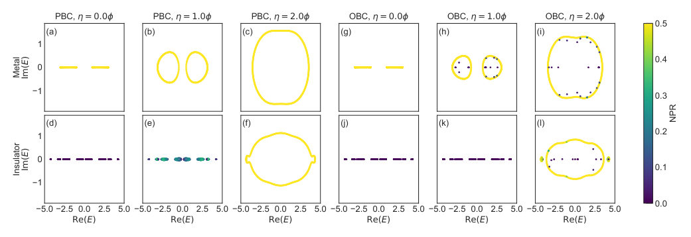
<figcaption class="paper-figure-caption"><b>Fig 2.</b> FIG. 3. Complex energy spectrum in the Re(E)–Im(E) plane, with eigenstates colored by the NPR. Panels (a)–(f) [(g)–(l)] correspond to PBC (OBC) for η = 0, ϕ, 2ϕ. Panels (a)–(c) and (g)–(i) show a metallic point (t1, t2) = (2.0, 0.1), while panels (d)–(f) and (j)–(l) show an insulating point (t1, t2) = (2.0, 1.81), with t3 = 1. In the metallic regime, the spectrum evolves from a purely real structure to complex point-gap structures, while the pronounced differences between PBC and OBC spectra indicate the emergence of the NHSE. In the insulating regime, increasing non-Hermiticity drives a transition toward extended states accompanied by boundary accumulation under OBC. The system size is L =...</figcaption>
</figure>
<figure class="paper-figure-card">
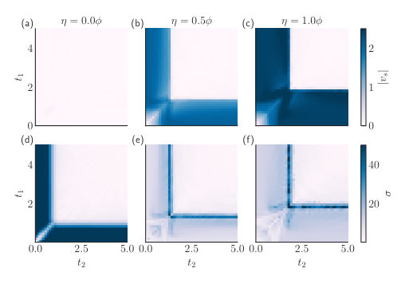
<figcaption class="paper-figure-caption"><b>Fig 3.</b> FIG. 5. Wave-packet transport under OBC. Heatmaps of the sliding velocity |vs| (a–c) and wave-packet spread σ (d–f) in the (t1, t2) plane for η = 0, 0.5ϕ, and ϕ, respectively. Finite sliding develops with increasing non-Hermiticity, while the wave-packet spread is largest in the multifractal regime. We consider t = 100. The system size is L = 1000.</figcaption>
</figure>
<figure class="paper-figure-card">
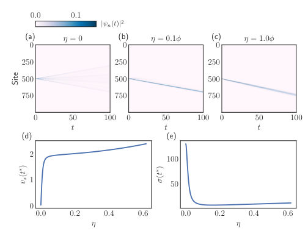
<figcaption class="paper-figure-caption"><b>Fig 4.</b> FIG. 4. Spatiotemporal evolution of a wave packet in the non-Hermitian HH model for t1 = 3.0 and t2 = 0.1. Panels (a)–(c) show the probability density |ψj(t)|2 for η = 0, 0.1ϕ, and 1.0ϕ, respectively. Panels (d) and (e) show the sliding velocity vs(t∗) and wave-packet width σ(t∗) as functions of η at t∗= 100. The system size is L = 1000.</figcaption>
</figure>
<figure class="paper-figure-card">
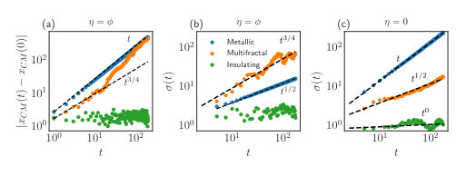
<figcaption class="paper-figure-caption"><b>Fig 5.</b> FIG. 8. Dynamic wave-packet signatures across the metal- lic (t1, t2) = (3.0, 0.1), multifractal (3.0, 1.81), and insulating (3.0, 4.5) phases under OBC. (a) Time evolution of the center- of-mass displacement |xCM(t) −xCM(0)|. (b) Time evolution of the wave-packet width σ(t) for the non-Hermitian case (η = ϕ). (c) Time evolution of the wave-packet width σ(t) for the Hermitian case (η = 0), where the multifractal phase corresponds to (t1, t2) = (3.0, 1.0). Dashed lines indicate the corresponding power-law fits. The system size is L = 1000.</figcaption>
</figure>

**Summary.** The paper analyzes transport in a non-Hermitian hexagonal Harper model featuring quasiperiodic hopping. It finds that introducing non-Hermiticity dramatically alters the system's phases, particularly highlighting a unique multifractal regime. This regime supports distinct superdiffusive dynamics for both wave-packet spreading and center-of-mass motion, which are fundamentally different from the purely ballistic or diffusive behaviors seen in other regimes.

**Why it may be interesting.** This work provides a rich theoretical framework for understanding how breaking time-reversal symmetry (non-Hermiticity) interacts with quasiperiodicity to fundamentally change quantum transport, offering insights applicable to open quantum systems and engineered lattices.

Detailed structure

**Main problem.** The study investigates localization and transport properties within a one-dimensional non-Hermitian hexagonal Harper model subjected to quasiperiodically modulated hopping amplitudes.

**Main result.** Non-Hermiticity qualitatively alters the phase diagram, establishing the multifractal regime as a key mediator of transport characterized by superdiffusive dynamics, distinct from its Hermitian counterpart.

**Method.** The analysis combines wave-packet dynamics to track center-of-mass motion and spreading, alongside spectral diagnostics like Inverse Participation Ratio (IPR) and entanglement entropy growth profiles.

**Model / system.** The system is a 1D non-Hermitian hexagonal Harper model derived from an anisotropic lattice with quasiperiodic modulation ($\phi = (\sqrt{5}-1)/2$). The Hamiltonian incorporates hopping amplitudes modulated by the parameter $\eta$, which controls non-Hermiticity.

**Key observables.** Wave-packet spreading ($\sigma(t)$), center-of-mass motion (sliding velocity $v_s$), single-particle entanglement entropy growth, and localization measures like IPR and Fractal Dimension ($D_2$).

**Important parameters / regimes.** Non-Hermiticity strength ($\eta$), quasiperiodic flux ($\phi$), and the resulting phases: Metallic, Multifractal, and Insulating.

**Assumptions / limitations.** The analysis relies on comparing results obtained under Periodic Boundary Conditions (PBC) versus Open Boundary Conditions (OBC), acknowledging the non-Hermitian skin effect in OBC calculations.

**Figures summary.** Figure 1 schematically illustrates the model's hopping structure; subsequent figures detail how wave-packet dynamics and localization measures change across different phases as $\eta$ is varied.

**Paper structure.** The paper progresses by first defining the non-Hermitian quasiperiodic model, then analyzing its phase diagram using spectral diagnostics (IPR/D2), followed by detailed dynamical studies of transport signatures (sliding vs. spreading) in each identified regime.

Abstract

We investigate a one-dimensional non-Hermitian hexagonal Harper model with quasiperiodically modulated hopping amplitudes. In the Hermitian limit, the model exhibits metallic, insulating, and multifractal phases characterized by distinct eigenstate properties. Upon introducing non- Hermiticity, the phase diagram is qualitatively altered, with an expansion of metallic regions and strong boundary sensitivity arising from the non-Hermitian skin effect. By analyzing wave-packet dynamics, we uncover qualitatively distinct transport signatures in metallic, multifractal, and in- sulating regimes. In the metallic region, nonreciprocal hopping induces finite sliding, resulting in ballistic center-of-mass motion that is absent in the Hermitian model, while wave-packet spreading is simultaneously suppressed and exhibits diffusive scaling. Interestingly, the multifractal regime emerges as a distinct dynamical phase supporting both enhanced spreading and finite sliding, both primarily of superdiffusive nature, in contrast to metallic regions where sliding (spreading) shows ballistic (diffusive) scaling. These features are markedly different from their Hermitian counterpart. On the other hand, in the insulating region, both the spreading and sliding are strongly suppressed. We reconfirm these intriguing transport characteristics by investigating the distinct growth profile of single-particle entanglement entropy where the effect of spreading of the wave-packet is clearly manifested. These results demonstrate that quasiperiodicity in hopping amplitudes, combined with non-Hermiticity, establishes the multifractal regime as a key mediator of transport.

[↑ back to top](#top)

### [The Hodge structure of Berry-phase transport: topology, geometry, and noise](http://arxiv.org/abs/2608.15789v1)

**Authors:** Zhi-Wei Wang, Samuel L. Braunstein  
**Type:** theory · **Category:** statistical mechanics · **PDF:** <https://arxiv.org/pdf/2608.15789v1>  
**Analysis basis:** full PDF text, analyzed in chunks
**Topic relevance:** `Keldysh / 2PI / non-Gaussian methods` **2/5** · `driven-dissipative phase transition` **2/5** · `Full counting statistics` **1/5** · `analog quantum simulation` **1/5** · `correlated / nonlocal dissipation` **1/5** · `methods for driven-dissipative` **1/5** · `non-equilibrium universality` **1/5** · `quantum measurements` **1/5**

↔ Scroll figures horizontally

<figure class="paper-figure-card">
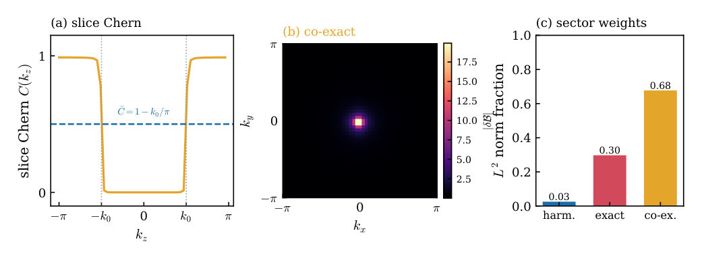
<figcaption class="paper-figure-caption"><b>Fig 1.</b> FIG. 1. Hodge decomposition of the Berry curvature in the lattice Weyl model, Eq. (5), with t = tz = 1, m = 2, k0 = π/2, on a half-offset Fourier grid of odd size N = 49, so that no node lies on a lattice point. (a) The slice Chern number C(kz) = (2π)−1 R Ωxy dkx dky (solid) steps by χn at each Weyl node; for the regularisation (5) the unit plateau occupies |kz| &gt; k0, the node separation taken through the zone boundary. Its kz-average ¯C = 1 −k0/π (dashed) is the harmonic sector, while the quantised steps are carried by the co-exact sector, because the exact (curl) part has zero flux through any closed slice. (b) The co-exact field magnitude |δB| on the kz slice adjacent to the node at +k0...</figcaption>
</figure>
<figure class="paper-figure-card">
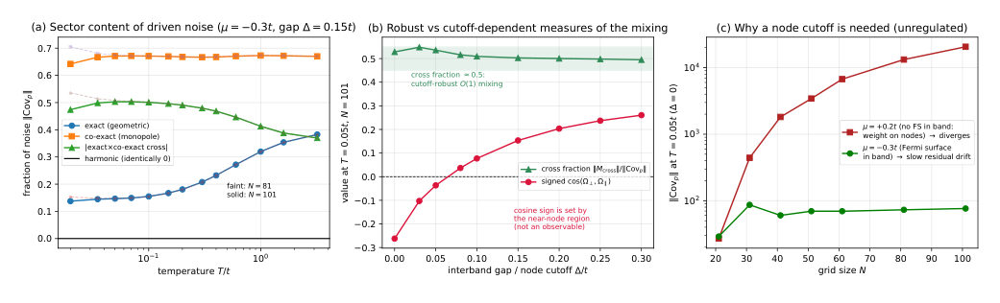
<figcaption class="paper-figure-caption"><b>Fig 2.</b> FIG. 2. Sector structure of the field-driven current noise in the lattice Weyl model, Eq. (5), at metallic filling µ = −0.3 t (valence band; by particle-hole symmetry this equals the conduction band at µ = +0.3 t). (a) Fraction of the noise-covariance norm ∥Covp∥carried by each Hodge sector versus temperature, at the physical interband gap ∆= 0.15 t that renders the curvature square-integrable; solid symbols N = 101, faint dashed N = 81 (they overlap, confirming convergence). The harmonic (topological) block is identically zero (Theorem 2); the fractions are norms of the blocks of Covp = Mex + Mco + Mcross and need not sum to one, the cross block being negative in the zz channel. (b) Robust...</figcaption>
</figure>

**Summary.** This paper uses the Hodge–de Rham decomposition to mathematically separate the contributions of topology, geometry, and monopoles within the Berry curvature governing electronic transport. By analyzing both mean currents and current noise fluctuations, the authors demonstrate a powerful separation principle allowing experimental measurement to distinguish global topological effects from local geometric ones.

**Why it may be interesting.** The rigorous mathematical framework using Hodge theory to decompose physical quantities like Berry curvature is highly generalizable and provides powerful tools for classifying topological invariants in condensed matter systems beyond standard Chern numbers.

Detailed structure

**Main problem.** To provide a unified framework for understanding Berry-phase transport by organizing the Berry curvature using the Hodge–de Rham decomposition, separating topological, geometric, and monopole contributions to both mean current response and noise fluctuations.

**Main result.** The analysis establishes that in current-noise spectroscopy, global band topology (harmonic sector) can be cleanly separated from local band geometry (exact sector), while the co-exact sector is generally not a clean observable due to lack of conservation laws.

**Method.** The core method involves applying the Hodge–de Rham decomposition ($\Omega = \gamma_{	ext{harmonic}} + dA_{	ext{exact}} + \delta B_{	ext{co-exact}}$) to the Berry curvature 2-form and analyzing transport moments using a particle-conserving stochastic Boltzmann equation constrained by the Fluctuation-Dissipation Theorem (FDT).

**Model / system.** The study analyzes Bloch bands on the Brillouin torus ($T^d$) in two and three dimensions, utilizing lattice Weyl semimetal models for concrete calculations.

**Key observables.** Anomalous Hall conductivity ($\sigma_{xy}$), Berry-curvature dipole, chiral anomaly, and zero-frequency current noise power $S(0)$.

**Important parameters / regimes.** Dimensionality ($d=2, 3$), Temperature ($T$), Node cutoffs ($\Delta$).

**Assumptions / limitations.** The analysis relies on the Hodge decomposition being applicable to $\Omega$, and that fluctuations are governed by a particle-conserving stochastic Boltzmann equation.

**Figures summary.** Figures illustrate the Hodge decomposition in lattice Weyl models, showing sector weights; Figure 2 shows noise covariance components vs. temperature, confirming the harmonic block is zero.

**Paper structure.** The paper systematically develops the Hodge dictionary for mean response (harmonic $\leftrightarrow$ AHE, exact $\leftrightarrow$ dipole, co-exact $\leftrightarrow$ chiral anomaly) and then extends this separation principle to current noise spectroscopy, proving that topology vs. geometry can be separated in fluctuations while noting limitations regarding the co-exact sector.

Abstract

We show that the Hodge-de Rham decomposition of the Berry curvature organises the transport of a Bloch band and its fluctuations within a single geometric structure. Splitting the curvature into $L^2$-orthogonal harmonic, exact, and co-exact sectors yields a dictionary for both moments of the current. In the mean response the harmonic sector carries the topological anomalous-Hall conductivity, the exact sector the Fermi-surface geometry and the antisymmetric Berry-curvature dipole of polar metals, and, in three dimensions, the co-exact sector the chiral anomaly, quantised by the Weyl-node charges. In the fluctuations, described by a particle-conserving stochastic Boltzmann equation constrained by the fluctuation-dissipation theorem (FDT), the harmonic sector is silent, so topological transport is noiseless, while the field-driven noise is sourced by the geometric sectors (solely the exact sector in two dimensions); current-noise spectroscopy therefore separates global band topology from local band geometry. We prove that the harmonic null-space protection is dimension-independent, and we settle the remaining sector: the co-exact (monopole) sector carries no conservation law and, under the thermal sampling measure, mixes with the exact sector at $\mathcal{O}(1)$, so it furnishes no clean noise observable. The separation the noise provides is therefore two-way, topology versus geometry, in both two and three dimensions.

[↑ back to top](#top)

### [Stabilizer Statistical Mechanics: A Framework for Efficient Quantification and Classification of Magic States](http://arxiv.org/abs/2608.14798v1)

**Authors:** William E. Salazar, Gaurav Saxena, Jack S. Baker, Leong Chuan Kwek, Thi Ha Kyaw  
**Type:** theory · **Category:** statistical mechanics · **PDF:** <https://arxiv.org/pdf/2608.14798v1>  
**Analysis basis:** full PDF text, analyzed in chunks
**Topic relevance:** `analog quantum simulation` **2/5** · `driven-dissipative phase transition` **2/5** · `Keldysh / 2PI / non-Gaussian methods` **1/5** · `correlated / nonlocal dissipation` **1/5** · `methods for driven-dissipative` **1/5** · `quantum measurements` **1/5** · `scars & prethermalization` **1/5**

↔ Scroll figures horizontally

<figure class="paper-figure-card">
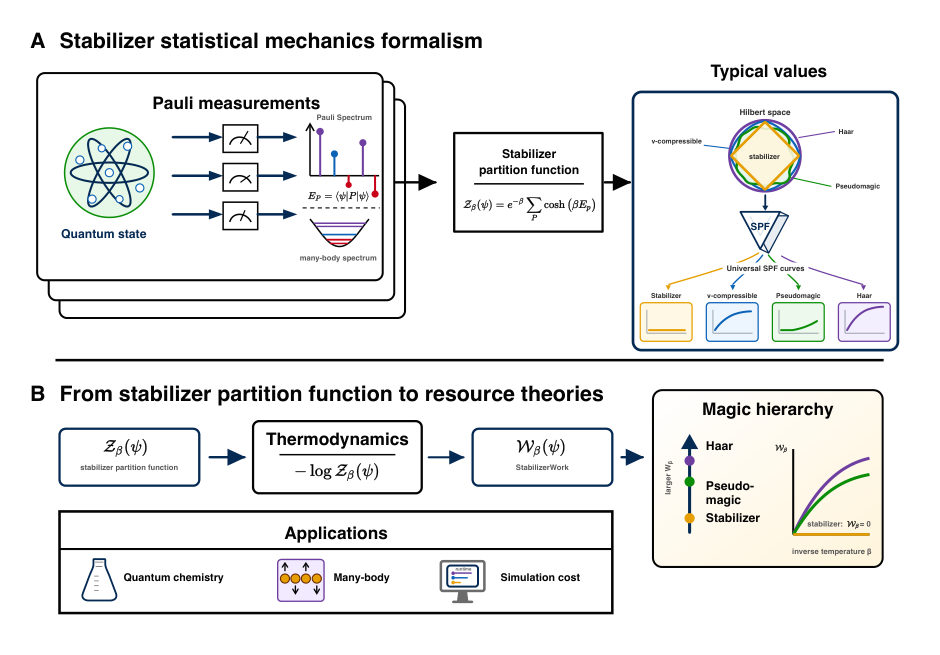
<figcaption class="paper-figure-caption"><b>Fig 1.</b> Figure 1. Overview of the stabilizer statistical mechanics framework. (A) A quantum state ψ is characterized by its Pauli spectrum, the collection of expectation values Tr[ψP] over all Pauli strings P. We reinterpret this exponentially large collection as the energy spectrum of a complex many-body system, the Pauli gas. The associated canonical partition function is the stabilizer partition function (SPF) Zβ (Definition 3), which compresses the full statistics of the Pauli spectrum into a single analytic function of an inverse-temperature-like parameter β, in the same way that a thermodynamic partition function encodes the statistics of microstates. The SPF is efficiently estimable by Bell...</figcaption>
</figure>
<figure class="paper-figure-card">
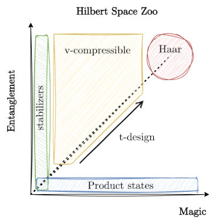
<figcaption class="paper-figure-caption"><b>Fig 2.</b> Figure 2. Stabilizer partition function across the Hilbert space zoo. For pure stabilizer states the SPF is uniquely valued and its given by Proposition 5. For separable states across every cut, their SPF is given by Proposition 8, and Theorem 6. Under generic many-body dynamics such as those present in chaotic systems or random quantum circuits, the states be- come Haar distributed with SPF given by Theorem 7. For the broad class of ν-compressible states, the SPF is given by Theorem 8. Finally, for psedudomagic states the SPF is given by Theorem 9.</figcaption>
</figure>
<figure class="paper-figure-card">
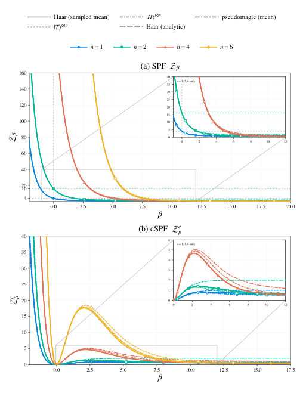
<figcaption class="paper-figure-caption"><b>Fig 3.</b> Figure 3. Plots of (a) Stabilizer Partition Function (SPF) and (b) core SPF (cSPF), for different quantum states with varying number of qubits, with respect to the real parameter β. At β = 0, the SPF’s value for any quantum state is equal to 4n. One may notice that as the number of qubits increase, the value of SPF/cSPF gets smaller than those for the lesser qubits for larger β. This is not a numerical artifact. It might be counterintuitive to see such a crossover, but since these are partition functions, it carries no meaning. When we normalize the cSPF and find the Stabilizer work, it becomes aligned with the intuition as shown later in Fig. 4.</figcaption>
</figure>
<figure class="paper-figure-card">

<figcaption class="paper-figure-caption"><b>Fig 4.</b> Figure 4. Stabilizer work as a function of the parameter β. Haar-random states form a narrowing concentration band as the number of qubits increases, reflecting the concentration of Pauli spectra in high-dimensional Hilbert spaces. Stabilizer work for pseudomagic states progressively approach that of the typical Haar states with increasing system size, making them increasingly difficult to distinguish from generic random states using coarse-grained observables. We also compare the tensor product families of |T⟩and |H⟩states where |T⟩⟨T| = (I + (X + Y )/ √</figcaption>
</figure>
<figure class="paper-figure-card">
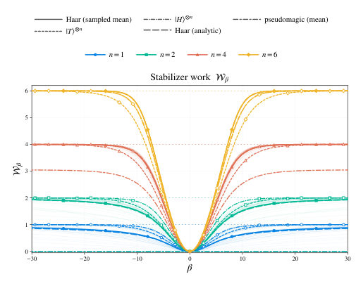
<figcaption class="paper-figure-caption"><b>Fig 5.</b> Figure 4 illustrates the dependence of stabilizer work on the parameter β for several families of quantum states. We now justify the properties listed above. Faithful- ness follows directly from the uniqueness of the cSPF for stabilizer states. Specifically, if ψ is a stabilizer state, then by construction Wβ(ψ) = 0. Conversely, if Wβ(ψ) = 0, then Zc β(ψ) must coincide with the unique stabilizer value, implying that ψ is a stabilizer state. Clif- ford invariance follows immediately from Proposition 4.</figcaption>
</figure>

**Summary.** This paper introduces Stabilizer Statistical Mechanics as a powerful resource theory framework to quantify 'magic' in quantum states. By treating the Pauli spectrum as an ensemble and constructing a canonical partition function, it derives the stabilizer work ($W_eta$). This monotone offers a unified, analytically tractable measure that surpasses single-moment diagnostics by capturing the full statistical structure of nonstabilizerness.

**Why it may be interesting.** It provides a rigorous thermodynamic toolkit to characterize quantum resources (magic) that is sensitive to the full spectral structure of the state, which is highly relevant for understanding complex many-body dynamics beyond simple entanglement measures.

Detailed structure

**Main problem.** The paper develops a statistical-mechanical framework to quantify 'magic' (nonstabilizerness) in quantum states, moving beyond single scalar measures.

**Main result.** It introduces the stabilizer work ($W_eta$), a novel magic monotone that is analytically tractable and interpolates between known resource measures like Rényi entropy and nullity.

**Method.** The core method involves mapping the Pauli spectrum of a quantum state onto an effective energy spectrum (the 'Pauli gas') and constructing a canonical partition function from it.

**Model / system.** The analysis applies to general $n$-qubit quantum states, with specific demonstrations on low-rank stabilizer simulation, molecular ground states ($	ext{H}_2$ dissociation), and pseudomagic systems.

**Key observables.** Stabilizer Partition Function ($Z_eta$), Stabilizer Work ($W_eta$), Pauli Spectrum ($	ext{Spec}(\psi)$), and various Rényi entropies ($M_\alpha$).

**Important parameters / regimes.** The inverse-temperature-like parameter $eta$ acts as a 'resolution knob' controlling the interpolation between different measures.

**Assumptions / limitations.** The framework assumes that nonstabilizerness can be captured by treating the entire Pauli spectrum as an ensemble, which is superior to single moment probes. Basis set dependence in molecular calculations is noted as a limitation.

**Figures summary.** Figures illustrate the mapping from quantum states to the Pauli gas energy spectrum and the derivation of $W_eta$. Numerical results compare theoretical ensemble averages against sampled densities for various state types.

**Paper structure.** The paper builds conceptually by first establishing the need for a distribution-sensitive measure, then constructing the SPF via statistical mechanics analogies, deriving the work monotone $W_eta$, and finally validating this framework across diverse physical examples like molecular dissociation.

Abstract

The partition function is statistical mechanics' answer to an exponentially large spectrum, distilling it into a single analytic object whose temperature dependence resolves the full structure of the underlying ensemble. We show that magic, the resource separating universal quantum computation from classically simulable stabilizer dynamics, admits precisely such a description. Mapping the Pauli spectrum of a quantum state onto the energy levels of a fictitious many-body system, the Pauli gas, we construct its canonical partition function, the stabilizer partition function, and from its associated free energy a magic monotone that we call the stabilizer work. Both these objects are analytic functions of an inverse-temperature-like parameter and are efficiently estimable via Bell sampling. The framework is analytically tractable. We derive exact ensemble-averaged partition functions for Haar-random, $ν$-compressible, and pseudomagic states, together with concentration guarantees. We show that for every value of its parameter, the stabilizer work is a faithful, Subadditive magic monotone, while remaining efficiently accessible on quantum hardware and admitting an operational interpretation. Unlike measures that probe a single moment of the Pauli distribution, the stabilizer work is intrinsically moment-generating. As the temperature is tuned from high to low, it interpolates continuously between the stabilizer 2-Rényi entropy and the stabilizer nullity, revealing two previously disconnected monotones as limiting cases of a single object. We demonstrate the framework on low-rank stabilizer simulation, resource interconversion, molecular ground states, and quantum many-body systems. A thermodynamics of magic is therefore not merely an analogy but a working toolkit, opening a statistical-mechanical route to magic properties of quantum systems that no single measure can access.

[↑ back to top](#top)

### [Time-optimal quantum gates with bang-bang control in multilevel systems](http://arxiv.org/abs/2608.16702v1)

**Authors:** Valentín Reparaz, Santiago Ferreyra, María José Sánchez, Daniel Domínguez, Leandro Tosi  
**Type:** theory · **Category:** quantum information and computing · **PDF:** <https://arxiv.org/pdf/2608.16702v1>  
**Analysis basis:** full PDF text, analyzed in chunks
**Topic relevance:** `QC/QI experiment` **2/5** · `driven-dissipative phase transition` **2/5** · `Keldysh / 2PI / non-Gaussian methods` **1/5** · `correlated / nonlocal dissipation` **1/5** · `methods for driven-dissipative` **1/5** · `quantum measurements` **1/5**

↔ Scroll figures horizontally

<figure class="paper-figure-card">
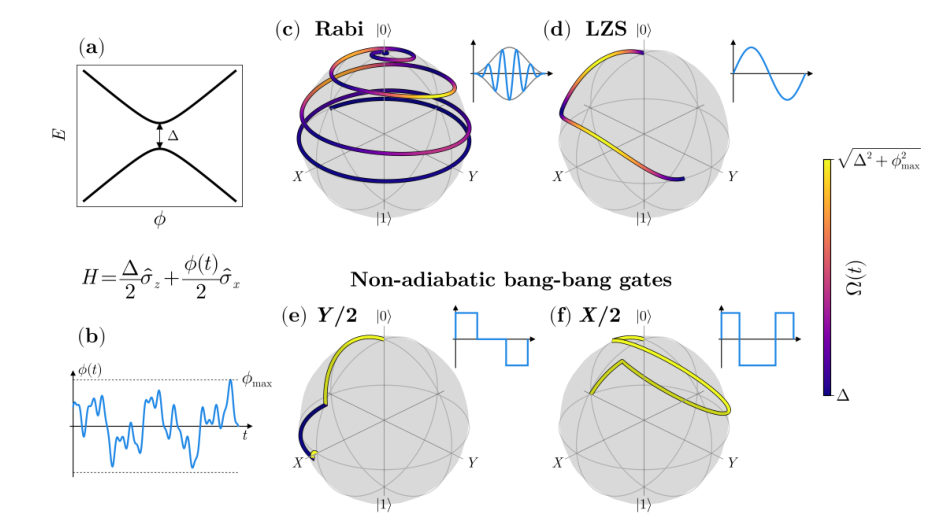
<figcaption class="paper-figure-caption"><b>Fig 1.</b> Figure 1. Single-qubit gate schemes under bounded transverse control. (a) Energy spectrum of a transversally driven two-level system with gap ∆. (b) The optimization problem: determining the time-optimal control field ϕ(t) bounded by ±ϕmax to execute a target π/2 gate. (c-f) Bloch sphere trajectories for the initial state |0⟩under different control schemes. Insets display the corresponding drive waveforms ϕ(t). The trajectory color maps the instantaneous rotation speed Ω(t) = p</figcaption>
</figure>
<figure class="paper-figure-card">
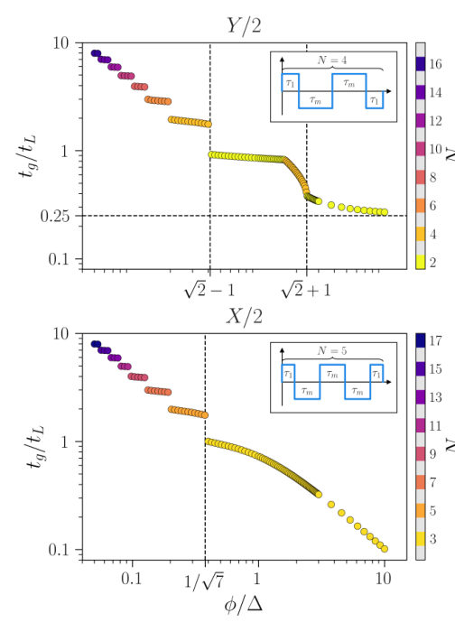
<figcaption class="paper-figure-caption"><b>Fig 2.</b> Figure 2. Time-optimal gates. Minimum gate time tg (nor- malized by the Larmor period τL = 2π/∆) as a function of drive amplitude ϕ/∆for Y/2 (top) and X/2 (bottom) rota- tions. Point color indicates the optimal number of bangs, N. For low amplitudes, N takes on higher values, recovering the resonant gate limit. Insets: Schematics of the optimal bang- bang protocols, illustrated for the specific cases of N = 4 (top) and N = 5 (bottom). Sequences alternate between am- plitudes ±ϕ, parameterized by outer bang durations τ1 and inner bang durations τm. Y/2 gates require an even N, while X/2 gates require an odd N. Dashed lines denote analyti- cally derived thresholds in the small-N regime. The...</figcaption>
</figure>
<figure class="paper-figure-card">
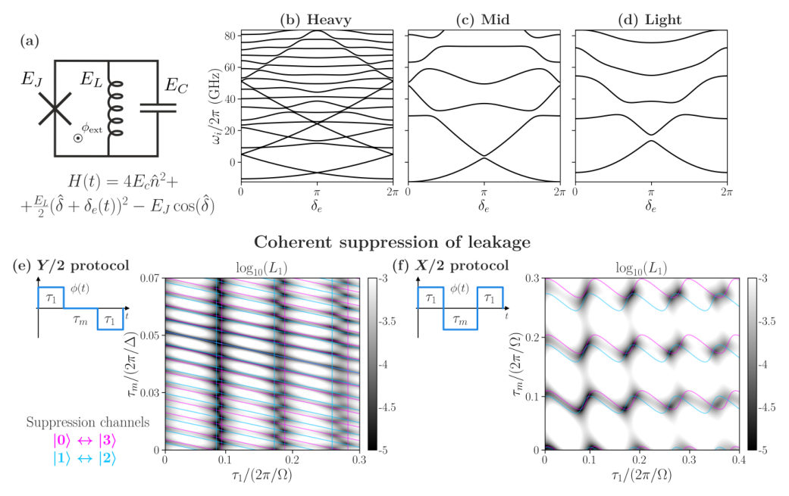
<figcaption class="paper-figure-caption"><b>Fig 3.</b> Figure 3. Beyond two levels: fluxonium regimes and coherent suppression of leakage. (a) Circuit diagram and Hamiltonian of the fluxonium qubit, controlled via an external magnetic flux parameterized as δe = 2πϕext/Φ0. (b-d) Energy spectra ωi versus external flux for three parameter regimes (EC/h, EL/h, EJ/h): (b) Heavy (0.479, 0.132, 3.395 GHz) yielding ∆/2π = 14 MHz and anharmonicity α = 214; (c) Mid (1.30, 0.59, 5.71 GHz) yielding ∆/2π = 222 MHz and α = 23; and (d) Light (1, 1, 4 GHz) yielding ∆/2π = 580 MHz and α = 5. Coherent suppression of leakage: (e-f) State-averaged leakage L1 for the heavy fluxonium under bang-bang (e) Y/2 and (f) X/2 protocols as a function of the normalized outer...</figcaption>
</figure>
<figure class="paper-figure-card">
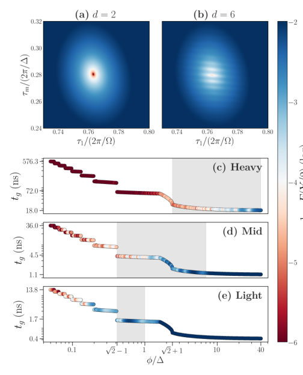
<figcaption class="paper-figure-caption"><b>Fig 4.</b> Figure 4. Effect of leakage in the optimization. (a) Color map of the Y/2 gate infidelity, log10(1 −F) as a function of τ1/(2π/Ω) and τm/(2π/∆) obtained for the unitary evolution of the Heavy fluxonium truncated to a two-level system and (b) for the full Hamiltonian, at a fixed drive amplitude of ϕ/∆= 20 and N = 2. (c-e) Optimized Y/2 total absolute gate time tg as a function of the effective transverse drive amplitude ϕ/∆across the Heavy, Mid and Light regimes of the fluxonium. The color of each point indicates the resulting fidelity. The shaded area indicates the amplitude region of interest for each fluxonium regime for the remainder of this work.</figcaption>
</figure>
<figure class="paper-figure-card">
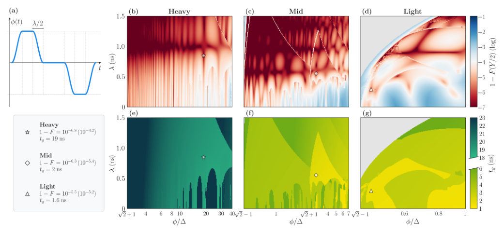
<figcaption class="paper-figure-caption"><b>Fig 5.</b> Figure 5. Smoothing and fluxonium Y/2 gates. (a) Schematic of the pulse smoothing protocol. Cosine ramps of width λ/2 are added at the bang transitions, increasing the total gate time by 2λ. (b-d) Optimized Y/2 gate infidelity, log10(1 −F), as a function of the effective transverse drive amplitude ϕ/∆and the smoothing parameter λ for the Heavy, Mid, and Light fluxonium regimes. High-fidelity solutions arise where the target coherent rotation coincides with the leakage suppression channels. (e-g) Corresponding optimal gate times tg. The numerical optimizer searches for the fastest protocol achieving an infidelity below 1−F ≤10−4; if this threshold is unreachable, it converges to the lowest...</figcaption>
</figure>

**Summary.** This paper determines the fastest possible way to execute quantum gates by employing time-optimal 'bang-bang' pulse sequences. Using advanced optimal control methods on models like the fluxonium circuit, the authors show these non-adiabatic pulses significantly outperform standard resonant controls in speed and fidelity. This is crucial for scaling up superconducting quantum processors.

**Why it may be interesting.** This work provides concrete, theoretically derived protocols that push superconducting qubit platforms toward their fundamental speed limits by rigorously applying optimal control theory.

Detailed structure

**Main problem.** The primary goal is determining the absolute quantum speed limit for implementing high-fidelity, fast single-qubit gates.

**Main result.** The time-optimal pulse sequence required to achieve these fast gates is a 'bang-bang' sequence (discrete pulses of maximum amplitude or zero).

**Method.** Optimal Control Theory (OCT) combined with Pontryagin’s Principle was used to derive the necessary control fields, which were then applied to model open system dynamics.

**Model / system.** The study models quantum gates on superconducting circuits, initially using a Two-Level System (TLS) and extending to the Fluxonium circuit. The Hamiltonian is controlled by time-dependent external flux $\phi(t)$.

**Key observables.** Gate fidelity ($F$), minimum gate duration ($t_g$), and leakage rate ($L_1$).

**Important parameters / regimes.** Drive amplitude ($\phi_{	ext{max}}$) relative to the gap ($\Delta$); noise strength ($\sigma$) for $1/f$ flux noise.

**Assumptions / limitations.** The analysis assumes that non-adiabatic control sequences are necessary for speedup, and open-system dynamics are modeled using Liouvillian evolution.

**Figures summary.** Figures illustrate Bloch sphere trajectories comparing resonant vs. time-optimal bang-bang controls; another figure compares minimum gate time versus drive amplitude ratio ($\phi/\Delta$) across different bang structures.

**Paper structure.** The paper progresses from deriving the optimal control theory for a simple TLS, extending this framework to complex multilevel systems like the fluxonium circuit, and finally simulating the performance under realistic noise models (e.g., $1/f$ flux noise).

Abstract

We determine the optimal quantum manipulation protocols for implementing high-fidelity, fast single-qubit gates. We demonstrate that the time-optimal pulse sequence is a ``bang-bang'' sequence: discrete pulses of either positive or negative maximum amplitude or zero. The non-adiabatic bang-bang pulse sequence minimizes gate duration providing a speedup for low-frequency architectures. We first derive the protocol for a transversally driven two-level system, extracting exact analytic expressions for minimum gate times. We then extend this framework to general multilevel architectures, identifying conditions that enable the coherent suppression of leakage errors. Using the fluxonium circuit as a representative case study, we optimize $X/2$ and $Y/2$ gates through a combination of discrete bang sequences and continuous waveform smoothing. This approach preserves near-optimal execution speeds while mitigating transitions outside the computational subspace. Open-system simulations demonstrate that these sequences outperform commensurate and resonant pulse schemes across different fluxonium regimes, achieving low-error manipulation significantly faster than standard resonant control, even in the presence of $1/f$ flux noise and dissipation.

[↑ back to top](#top)

### [MoMPy: automated construction of moment matrices for semidefinite programming relaxations](http://arxiv.org/abs/2608.16512v1)

**Authors:** Carles Roch i Carceller  
**Type:** theory · **Category:** quantum information and computing · **PDF:** <https://arxiv.org/pdf/2608.16512v1>  
**Analysis basis:** full PDF text, analyzed in chunks
**Topic relevance:** `analog quantum simulation` **2/5** · `quantum measurements` **2/5** · `Keldysh / 2PI / non-Gaussian methods` **1/5** · `methods for driven-dissipative` **1/5**

↔ Scroll figures horizontally

<figure class="paper-figure-card">
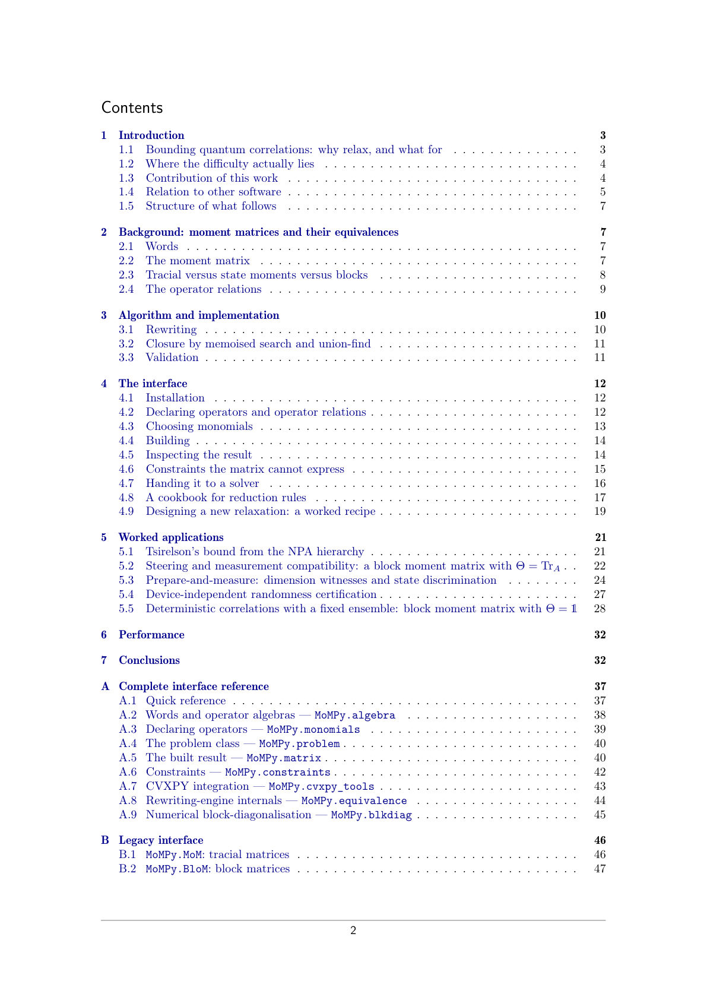
<figcaption class="paper-figure-caption"><b>Fig 1.</b> Low-resolution page preview, page 2</figcaption>
</figure>
<figure class="paper-figure-card">
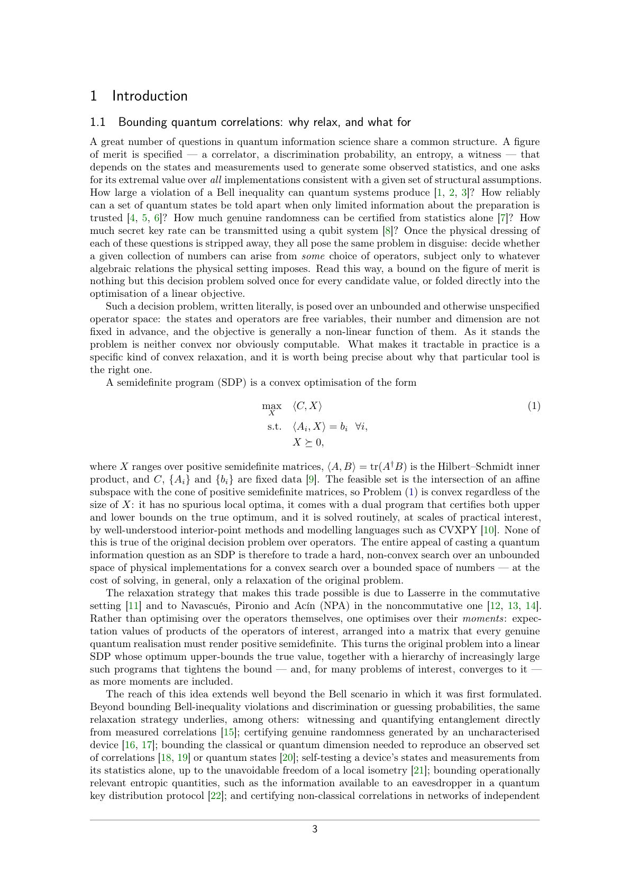
<figcaption class="paper-figure-caption"><b>Fig 2.</b> Low-resolution page preview, page 3</figcaption>
</figure>
<figure class="paper-figure-card">
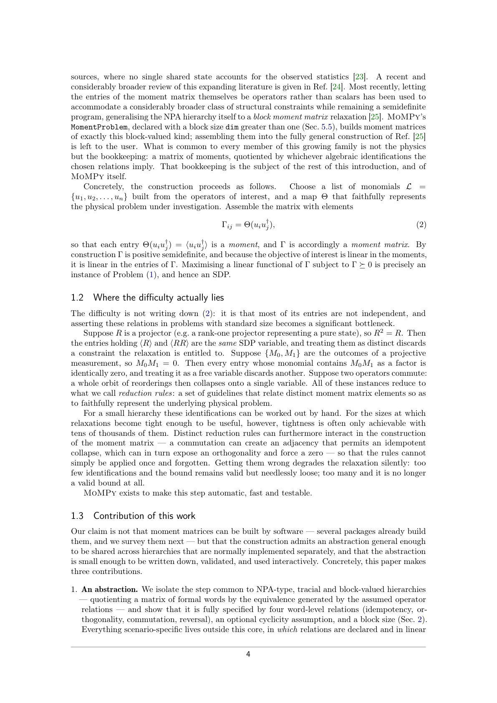
<figcaption class="paper-figure-caption"><b>Fig 3.</b> Low-resolution page preview, page 4</figcaption>
</figure>
<figure class="paper-figure-card">
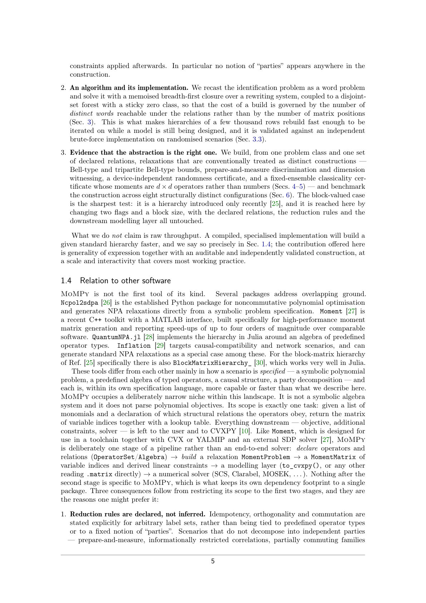
<figcaption class="paper-figure-caption"><b>Fig 4.</b> Low-resolution page preview, page 5</figcaption>
</figure>
<figure class="paper-figure-card">
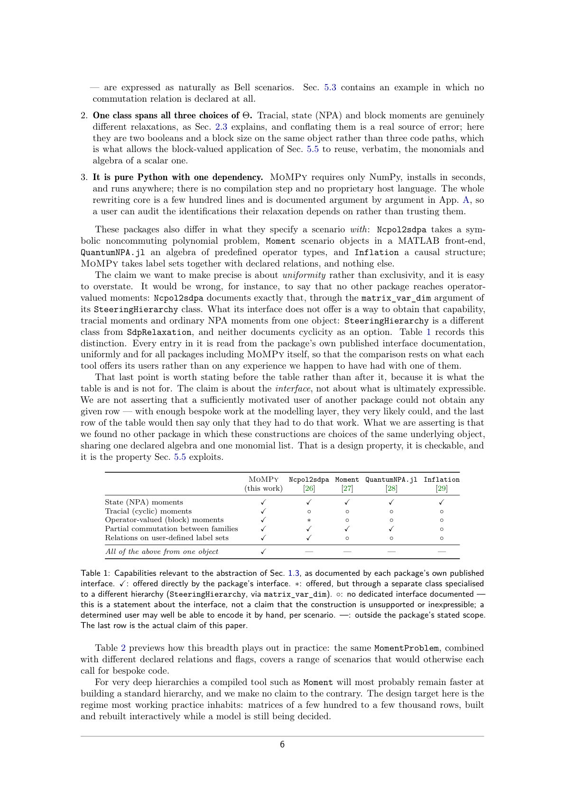
<figcaption class="paper-figure-caption"><b>Fig 5.</b> Low-resolution page preview, page 6</figcaption>
</figure>

**Summary.** This paper presents MoMPy, an open-source Python package that automates the construction of moment matrices necessary for solving quantum physics problems using Semidefinite Programming (SDP). It achieves remarkable generality by treating operator relations as a formal word-rewriting problem, allowing it to apply uniformly across diverse tasks like Bell tests and state discrimination. This provides a powerful computational tool for bounding physical quantities in quantum information theory.

**Why it may be interesting.** While focused on general algebraic structure rather than specific Hamiltonian dynamics, the rigorous framework for handling complex constraints in high-dimensional moment problems is a powerful computational tool applicable to analyzing many-body systems via moments.

Detailed structure

**Main problem.** The core problem is determining extremal values of physical quantities (like correlations or discrimination probabilities) subject to constraints derived from quantum measurements, which is formulated as an intractable decision problem.

**Main result.** The authors introduce MoMPy, a general Python package that automates the construction of moment matrices required for solving these problems via Semidefinite Programming (SDP) relaxations.

**Method.** It recasts the identification problem—handling algebraic relations between operators—as a word-rewriting system solved efficiently using memoised breadth-first closure and disjoint-set forest structures.

**Model / system.** The framework is general, handling tracial, state (NPA), and block-valued moments for various quantum information tasks, including Bell tests, state discrimination, and randomness certification. It abstracts away specific physical settings like parties or preparations.

**Key observables.** Moment matrices ($\Gamma$ or $\Theta$), the figure of merit being optimized (e.g., violation bound), and the resulting SDP variables.

**Important parameters / regimes.** The structure is defined by operator labels and a set of structural relations (algebraic identifications).

**Assumptions / limitations.** The primary assumption is that solving the problem via an SDP relaxation provides a tractable, albeit potentially looser, bound on the true physical value. The method relies on defining equivalence classes of monomials.

**Figures summary.** Not specified in the notes; the focus is on algorithmic construction and validation across multiple structural scenarios.

**Paper structure.** The paper introduces MoMPy to provide a unified, declarative way to build moment matrices for SDP relaxations. It details the underlying mathematical machinery (word-rewriting, closure) and demonstrates its generality by applying it to several distinct quantum information protocols.

Abstract

We present MoMPy, an open-source Python package that provides a unified, declarative construction of moment matrices for semidefinite programming (SDP) hierarchies. The user declares operator labels together with a small set of structural relations, and MoMPy returns a matrix of SDP variable indices in which every implied identification has already been made, ready for CVXPY or any other modelling layer. Internally, the identification problem is recast as a word-rewriting problem on tuples of integers and solved with a memoised breadth-first closure coupled to a disjoint-set forest, so that each distinct monomial is processed exactly once per build, however many matrix entries it eventually labels. The central abstraction is independent of the physical scenario: the same construction handles tracial, state (NPA), and block-valued moments, with no notion of parties, settings or preparations. We demonstrate this generality on a tripartite Mermin inequality, the bipartite CHSH inequality, measurement compatibility in a steering scenario, state discrimination and dimension witnessing in prepare-and-measure scenarios, device-independent randomness certification, and certification of deterministic correlations from known ensembles. The construction is validated against an independent brute-force implementation and benchmarked across eight structurally distinct scenarios, spanning bipartite and tripartite Bell tests, heterogeneous-outcome, steering-type, jointly-measurable and network configurations.

[↑ back to top](#top)

### [The $6-ε$ Expansion for Long-Range Lee--Yang and Percolation Criticality](http://arxiv.org/abs/2608.15120v1)

**Authors:** Zhiyi Li, Kun Chen, Zhijie Fan, Youjin Deng  
**Type:** theory · **Category:** statistical mechanics · **PDF:** <https://arxiv.org/pdf/2608.15120v1>  
**Analysis basis:** full PDF text, analyzed in chunks
**Topic relevance:** `Keldysh / 2PI / non-Gaussian methods` **2/5** · `analog quantum simulation` **1/5** · `driven-dissipative phase transition` **1/5** · `methods for driven-dissipative` **1/5** · `non-equilibrium universality` **1/5**

↔ Scroll figures horizontally

<figure class="paper-figure-card">
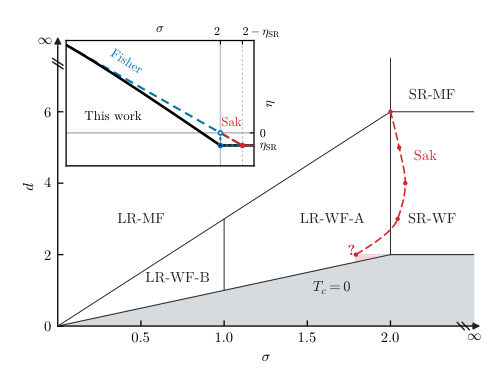
<figcaption class="paper-figure-caption"><b>Fig 1.</b> FIG. 1. Universality-class diagram for LR percolation in the (σ, d) plane. Each region denotes a universality class con- trolled by the indicated renormalization-group fixed point: LR and SR mean long-range and short-range, respectively; MF denotes mean field, and WF denotes the Wilson–Fisher fixed point. The two LR-WF sectors are separated at σ = 1: LR-WF-B is the σ &lt; 1 sector, where η = ηMF is rigorously established, and LR-WF-A is the 1 &lt; σ &lt; 2 sector. The boundaries d = 3σ, σ = 2, and d = 6 separate LR-MF from LR-WF, LR from SR, and SR-WF from SR-MF, respectively. The gray region lies below the lower critical dimension and has Tc = 0. In this scenario the LR–SR boundary is σ∗= 2 for all...</figcaption>
</figure>

**Summary.** This paper uses a $d=6-\epsilon$ renormalization group expansion on an effective $\phi^3$ field theory to study critical phenomena in percolation with long-range interactions. The authors successfully derive one-loop corrections for the critical exponents, demonstrating that the crossover between long-range and short-range universality classes occurs smoothly at $\sigma^*=2$. This resolves previous theoretical conflicts regarding the nature of this transition.

**Why it may be interesting.** While focused on classical critical phenomena, the rigorous application of advanced field theory techniques (RG flow) to establish universal crossover behavior is a cornerstone technique applicable to quantum phase transitions in many-body systems.

Detailed structure

**Main problem.** The paper addresses the long-standing theoretical problem of determining the crossover behavior between long-range (LR) and short-range (SR) criticality in percolation systems.

**Main result.** The authors derive one-loop RG corrections showing that the critical exponents vary continuously across the crossover threshold at $\sigma^*=2$, resolving apparent discontinuities found in previous analyses.

**Method.** They employ a perturbative Renormalization Group (RG) analysis using a $d = 6 - \epsilon$ expansion applied to an effective $\phi^3$ field theory.

**Model / system.** The study models the critical behavior of percolation and Lee-Yang singularities using an $n$-component $\phi^3$ field theory, incorporating long-range interactions characterized by a power-law decay $J(r) \sim r^{-(d+\sigma)}$.

**Key observables.** Critical exponents such as the anomalous dimension ($\eta$) and correlation-length exponent ($
u$).

**Important parameters / regimes.** The interaction range parameter $\sigma$, the spatial dimension $d$ (analyzed via $\epsilon$), and the crossover threshold $\sigma^*=2$.

**Assumptions / limitations.** The analysis is perturbative, valid for small $\epsilon$ and within a specific nonclassical regime ($0 < \delta < \epsilon/3$).

**Figures summary.** Figure 1 illustrates the universality-class diagram in the $(\sigma, d)$ plane, comparing various theoretical predictions for the crossover region.

**Paper structure.** The paper establishes the field-theoretic framework using an effective action involving $\phi^3$ terms. It then performs a one-loop RG analysis by calculating counterterms and deriving beta functions to determine the fixed points and exponents in the LR expansion, finally showing continuity across the SR limit.

Abstract

The crossover from long-range (LR) to short-range (SR) criticality in percolation has remained unsettled because previous renormalization-group (RG) analysis within the $ε'=3σ-d$ expansion fixes the anomalous dimension at $η=2-σ$, whereas SR percolation has $η_{\rm SR}<0$ near $d=6$. Sak's matching condition then places the crossover above $σ=2$, outside the regime in which the LR interaction dominates. In spatial dimension $d=6-ε$, we formulate a perturbative expansion for the LR $φ^3$ field theory and perform a one-loop RG analysis throughout the perturbatively accessible nonclassical regime $0<δ<ε/3$, where $δ= 2-σ$. We derive the one-loop corrections to the critical exponents $η$ and $ν$, which acquire nontrivial dependence on $ε$ and $δ$. They reduce to their mean-field values at the LR upper critical line and continuously recover the SR $6-ε$ results as $σ\to2$. These results support a crossover threshold $σ_*=2$ and remove the apparent discontinuity of $η$ between the LR and SR values within this framework. The same approach also yields the anomalous and edge exponents of the LR Lee--Yang universality class and $q$-state Potts universality classes with $q<2$.

[↑ back to top](#top)

### [Exact mobility rings in non-Hermitian quasiperiodically decorated Lieb lattices](http://arxiv.org/abs/2608.16719v1)

**Authors:** Ming-Jie Tao, Yi-Ting Wang, Jing Li, Hongsheng Hou, Xiang-Ping Jiang, Lei Pan  
**Type:** theory · **Category:** disordered systems and neural networks · **PDF:** <https://arxiv.org/pdf/2608.16719v1>  
**Analysis basis:** full PDF text, analyzed in chunks
**Topic relevance:** `driven-dissipative phase transition` **2/5** · `Frenkel-Kontorova` **1/5** · `Keldysh / 2PI / non-Gaussian methods` **1/5** · `methods for driven-dissipative` **1/5**

↔ Scroll figures horizontally

<figure class="paper-figure-card">
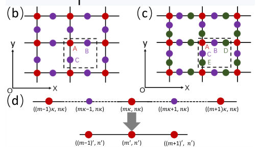
<figcaption class="paper-figure-caption"><b>Fig 1.</b> FIG. 1. Schematic illustration of the MEs, MRs and the 2D QDLL model. (a) Conceptual phase diagram in the complex energy plane. The solid red curve denotes the MR, which forms a closed boundary perfectly separating the extended states (interior) from the localized states (exterior). The dashed red lines illustrate the conventional MEs projected onto the real energy axis. (b) and (c) Structural representa- tions of the standard 2D Lieb lattice and the extended Lieb lattice, comprising three (labeled A, B, and C) and five (la- beled A through E) sub-lattices per unit cell, respectively. The complex quasiperiodic potentials are exclusively intro- duced at the vertex sites, highlighted as red...</figcaption>
</figure>
<figure class="paper-figure-card">
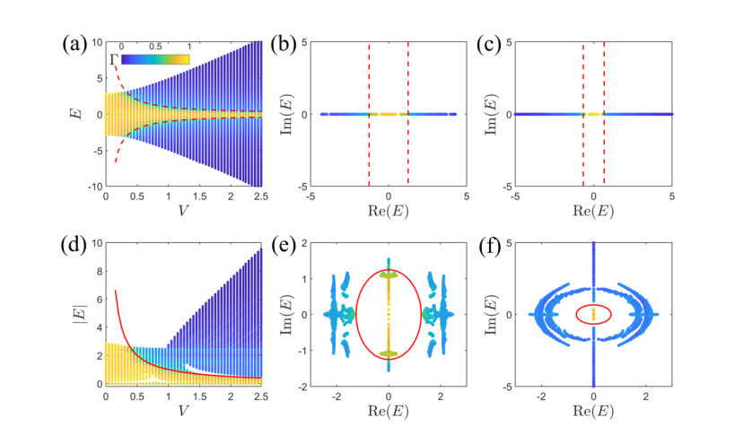
<figcaption class="paper-figure-caption"><b>Fig 2.</b> FIG. 2. Energy spectrum, mobility edges (MEs), and mobility rings (MRs) for the κ = 2 case. (a) Wavefunction fractal dimension Γ as a function of the quasiperiodic potential strength V and real eigenvalues E in the Hermitian limit (θ = 0). The red dashed lines denote the critical ME boundary |Ec| = 1/V , which separating from extended to localized states. (b), (c) Spectral distributions for V = 0.8 and V = 1.5 at θ = 0. (d) Complex energy spectrum and exact MR boundary |E| = 1/V (solid red curve) for the non-Hermitian case θ = π/2. (e), (f) Spectral phase diagrams in the complex energy plane for V = 0.8 and V = 1.5 at θ = π/2. The eigenstates within the MR are extended (Γ ≈1), while the...</figcaption>
</figure>
<figure class="paper-figure-card">
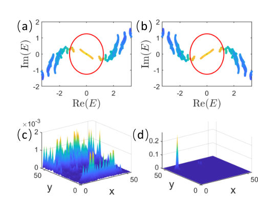
<figcaption class="paper-figure-caption"><b>Fig 3.</b> FIG. 3. The energy spectrum phase diagram and typical eigenstates distribution. (a)-(b) represent the 0.75π Frac- tal dimension η as a function of the quasiperiodic potential strength V and eigenvalues for (b) κ = 2 and (c) κ = 3 with the system size Lx = Ly = 34. The spatial distributions of two typical eigenstates with the corresponding complex eigen- values (c) The complex energy E = −0.9750 −0.2198i (ex- tended states) and (d) E = 3.2132−1.4185i (localized states), which are respectively below and above the MR (|Ec| = 1/V ) of the QDLL model with V = 1.0. Here the other parameters are the same as Fig.1.</figcaption>
</figure>
<figure class="paper-figure-card">
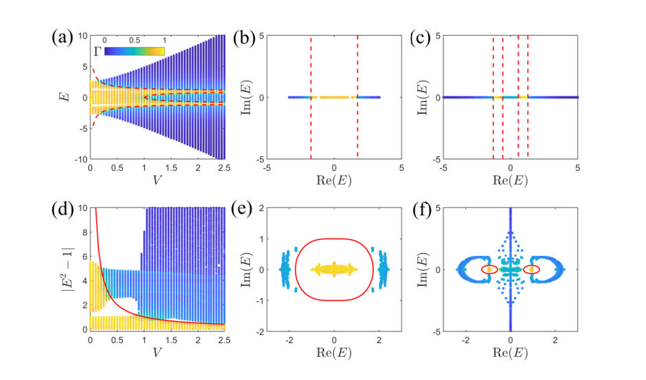
<figcaption class="paper-figure-caption"><b>Fig 4.</b> FIG. 4. Energy spectrum, mobility edges (MEs), and mobility rings (MRs) for the κ = 3 case. (a) Wavefunction fractal dimension Γ as a function of the quasiperiodic potential strength V and real eigenvalues E in the Hermitian limit (θ = 0). The red dashed lines denote the critical ME boundary Ec = ± p</figcaption>
</figure>
<figure class="paper-figure-card">
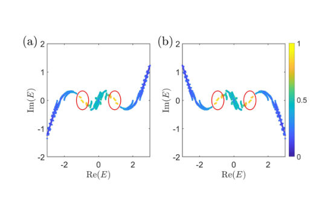
<figcaption class="paper-figure-caption"><b>Fig 5.</b> FIG. 5. The MRs for different θ for κ = 3 case. (a)-(b) represent the θ = π/4 and θ = 3π/4. Although the complex spectral features shift markedly with varying θ, the analytical sub-ring boundaries defined by Eq. (12) remain invariant.</figcaption>
</figure>

**Summary.** The paper analytically determines the Mobility Rings in complex two-dimensional quasiperiodic lattices by mapping them onto effective Aubry-André-Harper models. It establishes that these rings define the boundary between extended and localized electronic states, revealing a fascinating topological transition where the ring splits into multiple components depending on the lattice's decoration parameter.

**Why it may be interesting.** This work provides rigorous analytical benchmarks in 2D non-Hermitian systems, which is crucial for understanding localization phenomena that are difficult to treat theoretically beyond 1D. The connection between topology (MR splitting) and lattice structure ($\kappa$) is highly relevant for designing synthetic quantum materials.

Detailed structure

**Main problem.** The study focuses on understanding the mobility ring (MR), a critical boundary separating extended and localized states, particularly in non-Hermitian disordered systems beyond one dimension.

**Main result.** The authors derived exact analytical expressions for the MRs in 2D quasiperiodically decorated Lieb lattices, revealing that the topology of this ring evolves dynamically based on the lattice decoration parameter $\kappa$ (e.g., splitting into two rings when $\kappa=3$).

**Method.** The methodology involves exactly mapping the complex 2D structure onto an effective generalized Aubry-André-Harper model, followed by analytical derivation of Lyapunov exponents and utilizing transfer matrix formalisms.

**Model / system.** The system is a two-dimensional (2D) quasiperiodically decorated Lieb lattice (QDLL) incorporating complex incommensurate potentials. The analysis uses the tight-binding Hamiltonian projected onto vertex sites, which is then mapped to an effective 1D/2D AAH model.

**Key observables.** Mobility Ring (MR), Lyapunov exponents (LEs), wavefunction fractal dimension ($\Gamma$), and real-space probability distributions.

**Important parameters / regimes.** $V$ (modulation amplitude), $\theta$ (complex phase factor), $\kappa$ (decoration parameter, e.g., 2 or 3), and incommensurate frequencies $\alpha_{x,y}$.

**Assumptions / limitations.** The analysis assumes $t=1$ (unit energy) and fixes specific irrational values for the modulation frequencies ($\alpha_x = \alpha_y = (\sqrt{5}-1)/2$).

**Figures summary.** Figures illustrate the conceptual phase diagram showing the MR boundary, structural representations of the lattice, and plots detailing the evolution of the MR topology (e.g., single ring vs. two sub-rings) as a function of potential strength $V$.

**Paper structure.** The paper progresses by defining the physical system and Hamiltonian, developing an exact mapping to an effective AAH model using algebraic decimation, analytically deriving the critical conditions for the MRs via Lyapunov exponents, and finally demonstrating the topological phase transitions observed numerically.

Abstract

The mobility ring (MR), a critical boundary in the complex energy plane separating extended and localized states, is fundamental to understanding the Anderson transition in non-Hermitian (NH) disordered systems. While MRs have been extensively studied in one-dimensional (1D) NH quasiperiodic models, rigorous analytical frameworks beyond 1D remain critically scarce. Here, we investigate a class of two-dimensional (2D) quasiperiodically decorated Lieb lattices (QDLLs) featuring complex incommensurate potentials selectively applied to the lattice vertices. By exactly mapping these 2D structures onto NH generalized Aubry-Andr{é}-Harper (AAH) models and leveraging extended-localized transition point, we analytically derive the Lyapunov exponents and obtain exact expressions for the MRs. These exact theoretical boundaries are strongly corroborated by numerical computations of wavefunction fractal dimensions and real-space probability distributions. Furthermore, we reveal distinct evolutionary behaviors of the MRs driven by the quasiperiodic potential strength: systems characterized by $κ=2$ possess a single MR, whereas systems with $κ=3$ undergo a dynamic sequential evolution from a single integrated ring into two independent rings. We hope that our exact results of MRs in 2D will benefit the study of Anderson localizations and MRs in high-dimensional NH systems.

[↑ back to top](#top)

### [Finite-energy GKP-QPC architectures for photonic quantum memories and repeaters](http://arxiv.org/abs/2608.15620v1)

**Authors:** Kaustav Chatterjee, Ulrik Lund Andersen  
**Type:** theory · **Category:** quantum information and computing · **PDF:** <https://arxiv.org/pdf/2608.15620v1>  
**Analysis basis:** full PDF text, analyzed in chunks
**Topic relevance:** `quantum measurements` **2/5** · `driven-dissipative phase transition` **1/5** · `methods for driven-dissipative` **1/5** · `quantum optics experiment` **1/5**

↔ Scroll figures horizontally

<figure class="paper-figure-card">
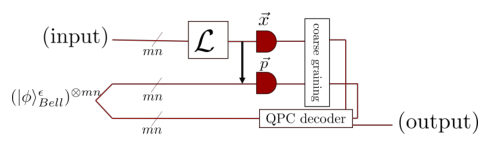
<figcaption class="paper-figure-caption"><b>Fig 1.</b> Figure 1. Conceptual structure of the finite-squeezing GKP- QPC architecture. Each physical rail is a finitely squeezed GKP qubit (input) transmitted through a pure-loss fiber seg- ment and corrected by teleportation-based GKP error correc- tion using finitely squeezed GKP Bell resources. The mn rails represent the physical redundancy of the outer QPC(n, m) code. The continuous homodyne syndromes are converted into effective rail-level Pauli error marginals, which are then decoded by an outer QPC. The same elementary module can be repeated in time to form an all-optical quantum memory or concatenated in space to form a one-way quantum repeater.</figcaption>
</figure>
<figure class="paper-figure-card">
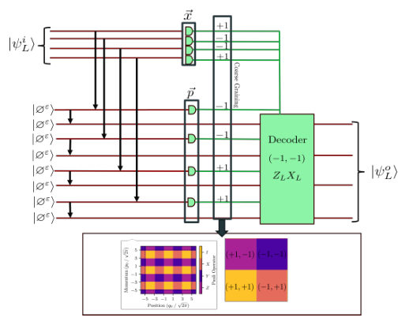
<figcaption class="paper-figure-caption"><b>Fig 2.</b> Figure 2. Circuit diagram for a single round of error cor- rection with QPC(2, 2), generalizable to QPC(n, m). Each physical rail undergoes teleportation-based GKP error cor- rection. The corresponding homodyne outcome is classically coarse-grained into sector signs, which are fed into the outer QPC decoder [11]. The resulting logical Pauli-frame update can either be tracked classically or implemented by the corre- sponding logical feed-forward displacement. The arrows are 50-50 beam-splitters.</figcaption>
</figure>
<figure class="paper-figure-card">
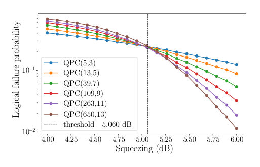
<figcaption class="paper-figure-caption"><b>Fig 3.</b> Figure 3. Logical failure probability for the GKP–QPC(n, m) concatenated code at zero propagation loss (η = 1), as a func- tion of GKP squeezing. For each repetition number m the block size n is optimized to minimize the failure probabil- ity. The crossing of the curves identifies the finite-squeezing threshold at 5.06 dB.</figcaption>
</figure>
<figure class="paper-figure-card">
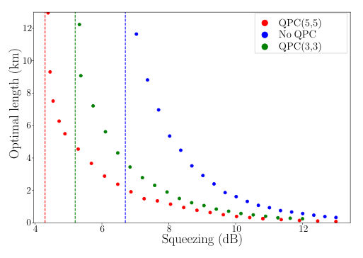
<figcaption class="paper-figure-caption"><b>Fig 4.</b> Figure 4. Optimal segment length as a function of GKP squeezing. The threshold below which repeated error cor- rection provides no advantage shifts towards lower squeezing as the outer QPC code size increases: from 6.7 dB (no QPC) to 5.2 dB with QPC(3, 3) and 4.3 dB with QPC(5, 5).</figcaption>
</figure>
<figure class="paper-figure-card">
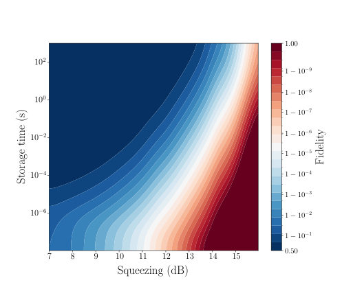
<figcaption class="paper-figure-caption"><b>Fig 5.</b> Figure 5. Average fidelity of the quantum memory with GKP– QPC(5, 5) as a function of GKP squeezing and storage time ts. Fidelities are computed using the optimal segment lengths from Fig. 4.</figcaption>
</figure>

**Summary.** The paper proposes a concatenated error correction scheme using GKP qubits followed by an outer Quantum Parity Code to protect photonic quantum information transmitted through lossy fibers. It quantifies the performance gains, showing that this architecture significantly boosts memory fidelity and communication distance compared to simpler methods. The results provide essential design guidelines for building practical quantum repeaters.

**Why it may be interesting.** This work provides concrete, resource-aware design rules for scaling quantum communication over realistic noisy channels (pure loss), which is crucial for implementing quantum internet technologies.

Detailed structure

**Main problem.** Developing error-correction architectures for photonic quantum networks that remain useful with finite-energy bosonic states, pure-loss fiber transmission, and explicit resource accounting.

**Main result.** The concatenated GKP-QPC architecture significantly improves memory fidelity and extends communication reach by orders of magnitude compared to non-repeater methods, providing quantitative design rules for practical quantum networks.

**Method.** The study employs a theoretical model combining continuous-variable Gottesman–Kitaev–Preskill (GKP) error correction with an outer Quantum Parity Code (QPC) decoder to counteract noise induced by pure-loss fiber transmission.

**Model / system.** The system models photonic quantum memories and one-way repeaters using finitely squeezed GKP qubits transmitted through a pure-loss channel, followed by concatenated error correction layers (GKP $
ightarrow$ QPC).

**Key observables.** Average-fidelity ratio improvement (up to 90%), secret-key fractions, and communication reach ($\sim 10^4$ km).

**Important parameters / regimes.** Finite squeezing level ($\epsilon$), transmissivity of the loss channel ($\eta$), and code parameters ($QPC(n, m)$).

**Assumptions / limitations.** The analysis relies on modeling pure-loss channels and utilizes product-marginal closure assumptions for deriving logical Pauli error probabilities.

**Figures summary.** Figures illustrate the conceptual architecture (GKP $
ightarrow$ Loss $
ightarrow$ QPC), plot the logical failure probability vs. squeezing, and show gains in secret-key rates versus code parameters/distance.

**Paper structure.** The paper builds from defining the physical problem (finite energy, loss) to detailing the concatenated GKP-QPC structure, deriving error probabilities using product-marginal closure, and finally presenting quantitative results for memory fidelity and repeater key rates.

Abstract

Photonic quantum networks require error-correction architectures that remain useful with finite-energy bosonic states, pure-loss fiber transmission, and explicit resource accounting. In this light, we study a concatenated architecture in which each physical rail is a finitely squeezed Gottesman--Kitaev--Preskill (GKP) qubit transmitted through a pure-loss fiber segment, corrected by teleportation-based GKP error correction with finitely squeezed ancillae, and decoded by an outer quantum parity code (QPC). The GKP layer converts continuous homodyne syndromes into effective rail-level Pauli marginals, while the QPC layer suppresses the residual qubit-level errors. For the concatenated code family considered here, we find a finite-squeezing threshold of $5.06\,\mathrm{dB}$ at zero propagation loss. In the memory setting, the QPC layer lowers the squeezing at which repeated error correction becomes beneficial from $6.7\,\mathrm{dB}$ for bare GKP correction to $5.2\,\mathrm{dB}$ for QPC$(3,3)$ and $4.3\,\mathrm{dB}$ for QPC$(5,5)$, and improves the average-fidelity ratio by up to $75$--$90\%$ in the relevant intermediate-noise regime. In the repeater setting, avoiding pre-amplification gives larger secret-key fractions at moderate squeezing, but also produces an optimal squeezing because highly squeezed GKP peaks become sensitive to loss-induced inward displacement. Resource-normalized rates show that QPC concatenation can exceed the repeaterless PLOB benchmark by orders of magnitude and extend the communication reach, at short repeater spacing, to distances of order $10^4$km with $14$dB squeezing. However, QPC concatenation becomes detrimental when each elementary hop is too lossy. These results provide quantitative design rules for finite-squeezing GKP--QPC quantum memories and repeaters.

[↑ back to top](#top)

### [Quantum Wave-Particle Duality in Free-Electron--Free-Electron Entanglement](http://arxiv.org/abs/2608.16292v1)

**Authors:** Du Ran, Jing-Yi Liu, Dan Jin, Peng-Yu Su, Reuven Ianconescu, Shuai Liu, Avraham Gover  
**Type:** theory · **Category:** other · **PDF:** <https://arxiv.org/pdf/2608.16292v1>  
**Analysis basis:** full PDF text, analyzed in chunks
**Topic relevance:** `analog quantum simulation` **2/5** · `correlated / nonlocal dissipation` **1/5** · `interference shaping light` **1/5** · `quantum measurements` **1/5**

↔ Scroll figures horizontally

<figure class="paper-figure-card">
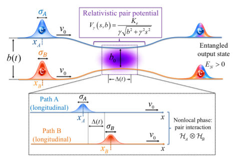
<figcaption class="paper-figure-caption"><b>Fig 1.</b> FIG. 1. System model for free-electron–free-electron entan- glement. Two initially separable quantum electron wave pack- ets propagate with mean velocity v0 along spatially distinct paths A and B. Their transverse separation b(t) reaches the minimum value b0 near closest approach, while σA, σB, and ∆(t) denote the longitudinal wave-packet widths and centroid mismatch. The enlarged interaction region shows the longitu- dinal degrees of freedom and the bipartition HA ⊗HB, where the accumulated nonlocal interaction phase generates an en- tangled output state.</figcaption>
</figure>
<figure class="paper-figure-card">
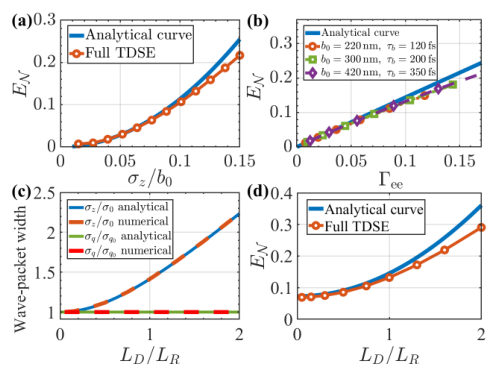
<figcaption class="paper-figure-caption"><b>Fig 2.</b> FIG. 2. Wave-packet-size dependence, quadratic scaling, and drift control of free-electron–free-electron entanglement. (a) Logarithmic negativity EN versus the normalized longitudi- nal width σz/b0 for b0 = 300 nm and τb = 200 fs. The solid line gives the quadratic analytical prediction, and the symbols show full TDSE results. (b) Logarithmic negativity versus Γee for three interaction geometries. The solid line denotes Eq. (3), and the symbols show the corresponding full TDSE results. (c) Free longitudinal spreading of a QEW initially prepared with spatial width σ0 and momentum width σq0. The spatial width increases with LD/LR, while the momen- tum width remains unchanged. (d) Logarithmic...</figcaption>
</figure>
<figure class="paper-figure-card">
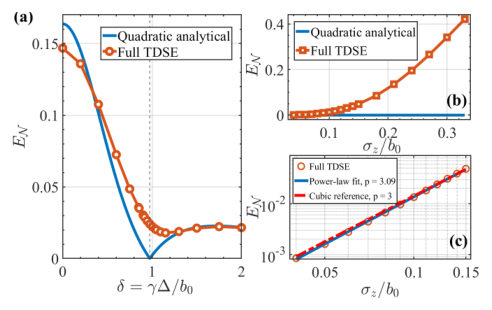
<figcaption class="paper-figure-caption"><b>Fig 3.</b> FIG. 3. Quadratic entanglement node and higher-order Coulomb entanglement. (a) Logarithmic negativity EN ver- sus the normalized centroid mismatch δ = γ∆/b0 for σz/b0 = 0.12. The quadratic analytical result vanishes at the finite- window node marked by the vertical dashed line, while the full TDSE result remains finite. (b) Wave-packet-size depen- dence at the quadratic node. The quadratic contribution re- mains zero, whereas the full TDSE result increases with σz/b0. (c) Log-log dependence of the residual entanglement in the narrow-QEW regime. The fitted exponent p ≃3.09 agrees closely with the cubic reference p = 3. All calculations use b0 = 300 nm, τb = 200 fs, and a mean electron...</figcaption>
</figure>

**Summary.** This theoretical paper connects the physical concept of free-electron wave packet size to bipartite entanglement generated by Coulomb interaction. By solving the time-dependent Schrödinger equation, the authors show that entanglement scales with the square of the QEW width, providing a novel mechanism for controlling quantum correlations using spatial wave-packet engineering.

**Why it may be interesting.** This work bridges fundamental concepts from quantum optics (wave-particle duality) into condensed matter/quantum information by showing that a geometric property of the electron wave function directly controls measurable quantum correlations (entanglement).

Detailed structure

**Main problem.** The study aims to establish a direct, quantifiable link between the free-electron wave-particle duality—characterized by the longitudinal extent of the quantum wave packet (QEW)—and the bipartite entanglement generated via mutual electromagnetic coupling.

**Main result.** The entanglement strength scales directly with the square of the QEW width ($\Gamma_{	ext{ee}} \propto \sigma_z^2$), demonstrating that spatial control over the free electron wave packet can govern quantum correlations. Furthermore, higher-order effects reveal a finite entangling channel even when the quadratic term vanishes.

**Method.** The research employs analytical approximations (quadratic phase gate) combined with numerical solutions of the time-dependent Schrödinger equation (TDSE) using split-operator FFT methods to calculate entanglement measures like logarithmic negativity ($E_N$).

**Model / system.** The model consists of two free electrons propagating along spatially separated paths, interacting via a Coulomb potential. The system dynamics are governed by the TDSE, which is analyzed in terms of center-of-mass and relative coordinates.

**Key observables.** Logarithmic Negativity ($E_N$), Dimensionless entangling parameter ($\Gamma_{	ext{ee}}$), Longitudinal QEW width ($\sigma_z$).

**Important parameters / regimes.** QEW longitudinal width ($\sigma_z$), Free drift length ($L_D$), Interaction potential parameters ($\gamma$, $\Delta$).

**Assumptions / limitations.** The analysis assumes spatially separated propagation modes and that interaction-induced transverse displacements are small compared to path separation.

**Figures summary.** Figures illustrate the dependence of entanglement on QEW width, scaling with the effective entangling parameter; they also show how free drift expands the wave packet while maintaining momentum distribution, and compare quadratic vs. full TDSE results at specific nodes.

**Paper structure.** The paper progresses by first establishing the model using the Hamiltonian and TDSE. It then derives analytical scalings based on the quadratic interaction phase, confirms these with numerical simulations across varying QEW widths, and finally explores how free drift and higher-order terms modify this entanglement scaling.

Abstract

Point-particle descriptions of electron-electron interaction omit the coherent longitudinal extent of a free-electron quantum wave packet (QEW). A relativistic two-electron wave-packet theory identifies the longitudinal QEW size as a direct control parameter for entanglement generated by mutual electromagnetic coupling. For two electrons in spatially separated paths, the quadratic interaction phase gives a dimensionless entangling parameter $\Gee$ and the logarithmic negativity $\EN=\operatorname{arsinh}(\Gee)/\ln2$. Full time-dependent Schrödinger equation calculations confirm the scaling for narrow QEWs and reveal higher-order Coulomb effects at larger spatial extent. Free drift increases the interaction-point QEW width while preserving the momentum probability distribution, thereby enhancing the subsequently generated entanglement. The results establish a direct connection between free-electron wave-particle duality and bipartite entanglement.

[↑ back to top](#top)

### [Scientific applications of quantum computing: challenges and opportunities](http://arxiv.org/abs/2608.16568v1)

**Authors:** Bruno Camino, C. Richard A. Catlow, John Buckeridge, Alin M. Elena, Vladimir V. Gusev, Sarah Harris, Thomas W. Keal, Glenn Jones, Vivien Kendon, Syma Khalid, Phalgun Lolur, Jamal A. Nasir, Matthew J. Rosseinsky, Chris-Kriton Skylaris, Paul A. Warburton, Scott M. Woodley  
**Type:** theory · **Category:** other · **PDF:** <https://arxiv.org/pdf/2608.16568v1>  
**Analysis basis:** full PDF text, analyzed in chunks
**Topic relevance:** `analog quantum simulation` **2/5** · `Keldysh / 2PI / non-Gaussian methods` **1/5** · `methods for driven-dissipative` **1/5** · `quantum measurements` **1/5**

↔ Scroll figures horizontally

<figure class="paper-figure-card">
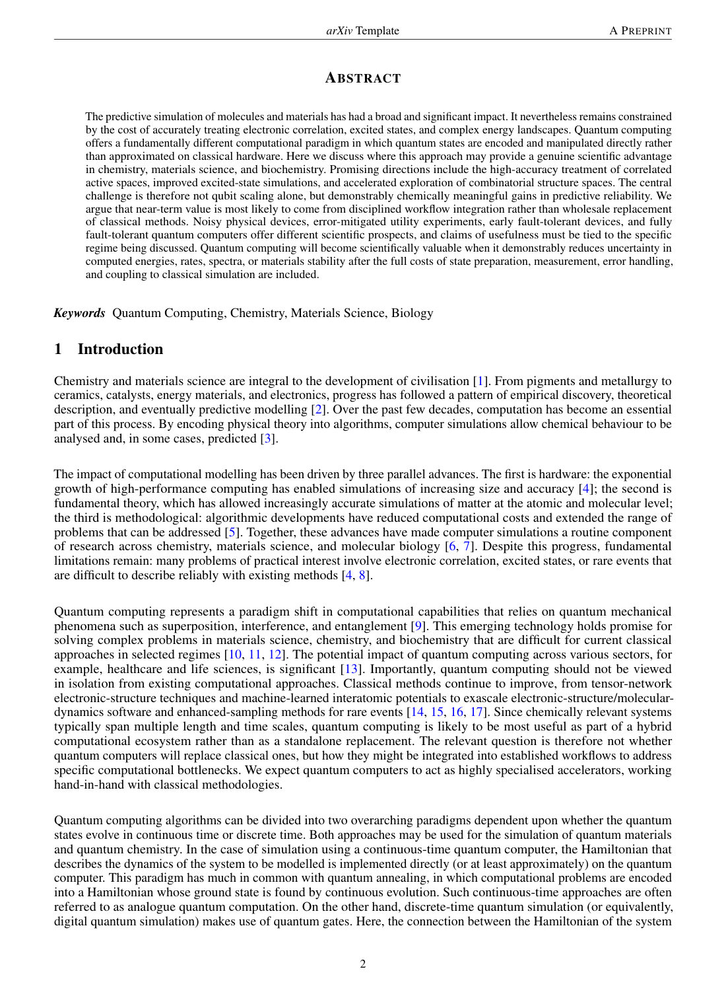
<figcaption class="paper-figure-caption"><b>Fig 1.</b> Low-resolution page preview, page 2</figcaption>
</figure>
<figure class="paper-figure-card">
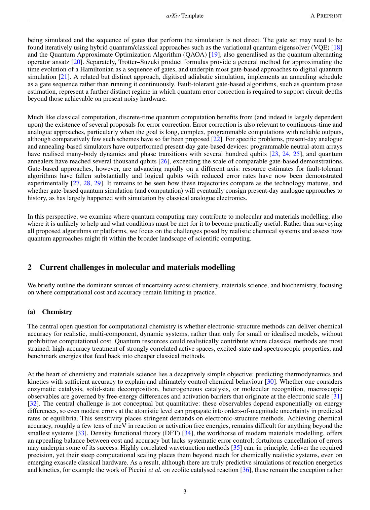
<figcaption class="paper-figure-caption"><b>Fig 2.</b> Low-resolution page preview, page 3</figcaption>
</figure>
<figure class="paper-figure-card">
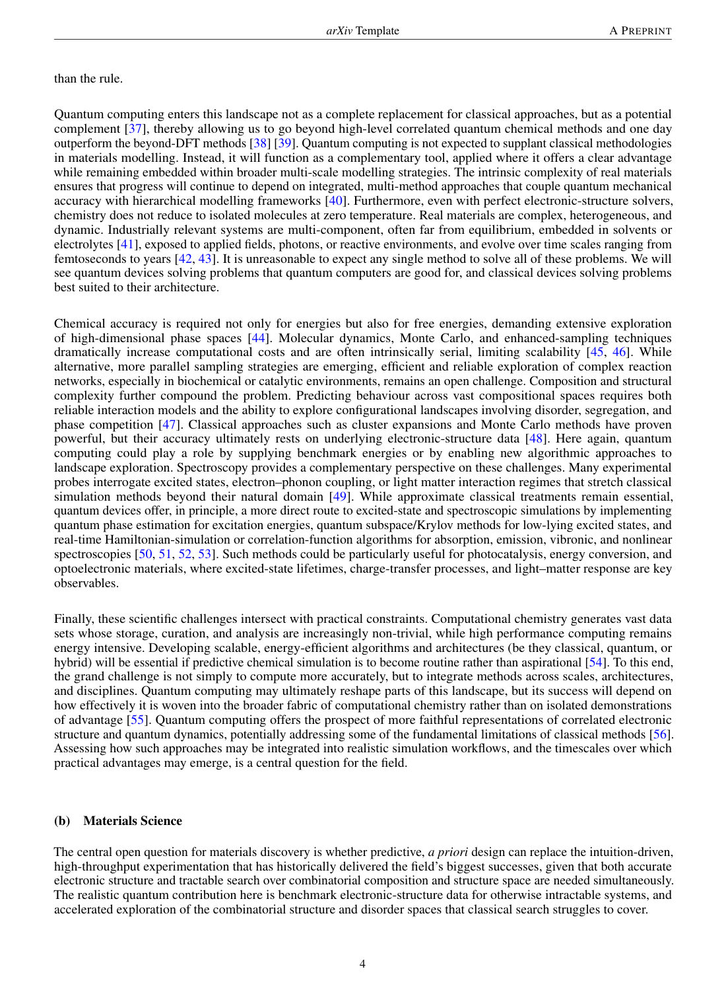
<figcaption class="paper-figure-caption"><b>Fig 3.</b> Low-resolution page preview, page 4</figcaption>
</figure>
<figure class="paper-figure-card">
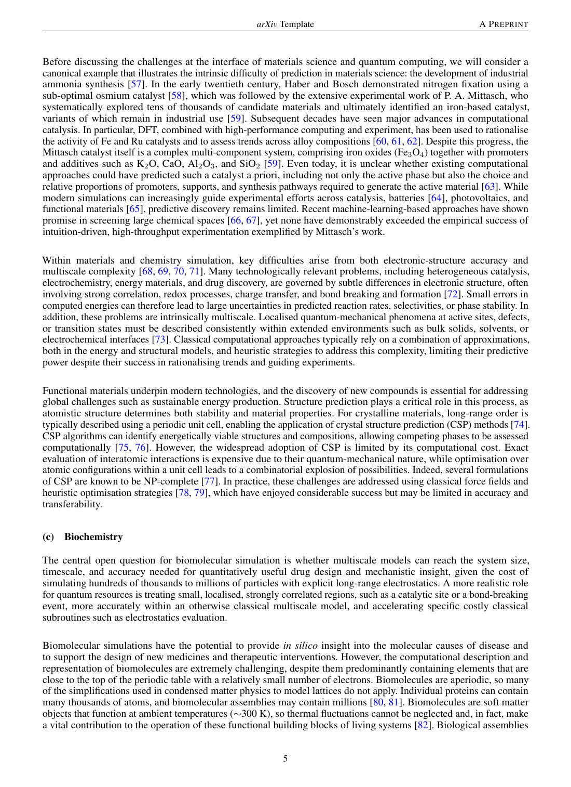
<figcaption class="paper-figure-caption"><b>Fig 4.</b> Low-resolution page preview, page 5</figcaption>
</figure>
<figure class="paper-figure-card">
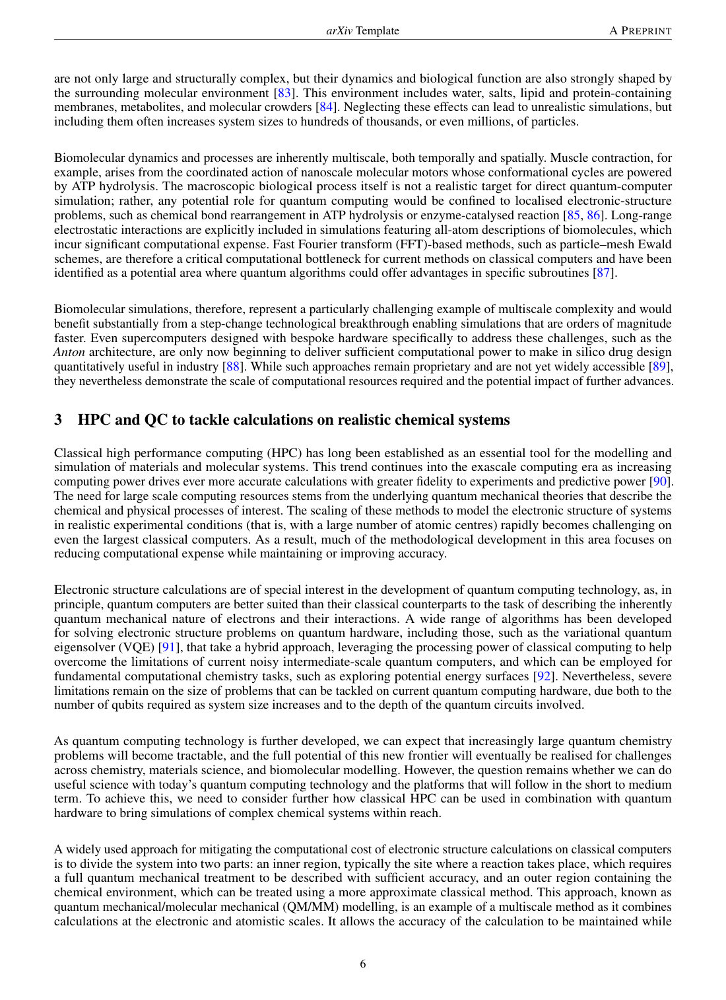
<figcaption class="paper-figure-caption"><b>Fig 5.</b> Low-resolution page preview, page 6</figcaption>
</figure>

**Summary.** This review discusses how quantum computing can revolutionize the simulation of molecules and materials by tackling limitations in treating electronic correlation. It argues that while quantum methods offer a paradigm shift, their immediate value lies not in replacing classical tools entirely, but in acting as specialized accelerators within integrated computational workflows.

**Why it may be interesting.** It provides a high-level roadmap connecting fundamental quantum computation concepts to concrete, complex problems in molecular physics and condensed matter theory, emphasizing the crucial role of hybrid algorithms.

Detailed structure

**Main problem.** Predictive simulation of molecules and materials is fundamentally limited by accurately treating electronic correlation, excited states, and complex energy landscapes using classical methods.

**Main result.** Quantum computing offers a paradigm shift for these simulations, but near-term value requires disciplined workflow integration rather than wholesale replacement of existing classical methods.

**Method.** The paper reviews quantum simulation approaches (e.g., VQE, direct Hamiltonian simulation) and argues for their utility as specialized accelerators within hybrid computational ecosystems.

**Model / system.** The focus is on chemical systems, molecules, and materials ranging from enzymatic catalysis to solid-state decomposition, governed by electronic Hamiltonians.

**Key observables.** Thermodynamics (free-energy differences), kinetics (activation barriers), computed energies, rates, spectra, or material stability.

**Important parameters / regimes.** Chemical accuracy ($\sim$ tens of meV); the full computational cost including state preparation and error handling is critical for assessing true advantage.

**Assumptions / limitations.** The central assumption is that quantum computation can provide a genuine scientific advantage by overcoming classical limitations in correlation treatment, provided hardware maturity matches algorithmic needs.

**Paper structure.** The paper establishes the computational bottleneck (correlation/excited states), reviews various quantum simulation methods (analog vs. digital), discusses specific applications across chemistry and materials science, and concludes by defining the necessary criteria for achieving demonstrable scientific value.

Abstract

The predictive simulation of molecules and materials has had a broad and significant impact. It nevertheless remains constrained by the cost of accurately treating electronic correlation, excited states, and complex energy landscapes. Quantum computing offers a fundamentally different computational paradigm in which quantum states are encoded and manipulated directly rather than approximated on classical hardware. Here we discuss where this approach may provide a genuine scientific advantage in chemistry, materials science, and biochemistry. Promising directions include the high-accuracy treatment of correlated active spaces, improved excited-state simulations, and accelerated exploration of combinatorial structure spaces. The central challenge is therefore not qubit scaling alone, but demonstrably chemically meaningful gains in predictive reliability. We argue that near-term value is most likely to come from disciplined workflow integration rather than wholesale replacement of classical methods. Noisy physical devices, error-mitigated utility experiments, early fault-tolerant devices, and fully fault-tolerant quantum computers offer different scientific prospects, and claims of usefulness must be tied to the specific regime being discussed. Quantum computing will become scientifically valuable when it demonstrably reduces uncertainty in computed energies, rates, spectra, or materials stability after the full costs of state preparation, measurement, error handling, and coupling to classical simulation are included.

[↑ back to top](#top)

### [Superposition of dynamics, indefinite causal order, and quantum histories](http://arxiv.org/abs/2608.16694v1)

**Authors:** Charis Anastopoulos, Ntina Savvidou  
**Type:** theory · **Category:** other · **PDF:** <https://arxiv.org/pdf/2608.16694v1>  
**Analysis basis:** full PDF text, analyzed in chunks
**Topic relevance:** `quantum measurements` **2/5** · `correlated / nonlocal dissipation` **1/5** · `driven-dissipative phase transition` **1/5** · `methods for driven-dissipative` **1/5**

↔ Scroll figures horizontally

<figure class="paper-figure-card">
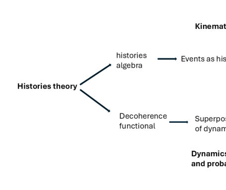
<figcaption class="paper-figure-caption"><b>Fig 1.</b> Figure 1: Two notions of indefinite causal order in histories theory.</figcaption>
</figure>

**Summary.** This paper rigorously explores the physical meaning of indefinite causal order by extending histories theory. It demonstrates that general superpositions of dynamics manifest as process-matrix ICO under specific operational constraints. The key contribution is distinguishing between event ordering (kinematical) and dynamic intervention order, thereby clarifying quantum causality.

**Why it may be interesting.** This work is highly relevant as it provides a deep theoretical framework for understanding how non-classical causal structures (ICO) can emerge from fundamental principles of quantum evolution, touching upon foundational issues in spacetime and measurement theory.

Detailed structure

**Main problem.** The paper addresses the physical interpretation of indefinite causal order (ICO) in quantum processes by relating it to the general concept of superposition of dynamics.

**Main result.** It shows that process-matrix ICO is an operationally restricted realization of a more fundamental phenomenon: the coherent superposition of dynamics within the decoherence functional framework.

**Method.** The authors utilize histories theory, employing the decoherence functional to analyze interference between alternative quantum histories and distinguishing between kinematical (event order) and dynamical (intervention order) notions of indefiniteness.

**Model / system.** The analysis is performed on general quantum processes described by process matrices and formalized within the structure of histories theory. The model distinguishes between temporal ordering parameters and dynamic evolution operators.

**Key observables.** Decoherence functional (d p), Process Matrices, History Propositions ($	ext{UP}$), Interference terms in amplitudes.

**Important parameters / regimes.** The distinction between event order and intervention order; factorization conditions for process matrix derivation.

**Assumptions / limitations.** The analysis relies on suitable factorization conditions to connect the general superposition of dynamics to observable process matrices, and it distinguishes between kinematical and dynamical time structures.

**Figures summary.** Figure 1 illustrates two distinct notions of indefinite causal order within the context of histories theory: Kinematical vs. Dynamical.

**Paper structure.** The paper builds from the general formalism of quantum histories (using decoherence functionals) to introduce the concept of superposition of dynamics, eventually restricting this general structure to explain process-matrix ICO and clarifying the role of time in causality.

Abstract

The process-matrix formalism describes quantum processes without assuming a fixed global causal order, but the physical meaning of indefinite causal order remains open. We address this question within histories theory, where temporal ordering and dynamical evolution are distinct structures. We show that the decoherence functional admits coherent superpositions of dynamics. In measurement settings, under suitable factorization conditions, these generate process matrices. Thus, we identify process-matrix indefinite causal order as an operationally restricted realization of the more general phenomenon of superposition of dynamics. Histories theory also admits a distinct kinematical notion of indefinite order, in which the ordering of physical events is itself a history observable. The resulting distinction between event order and intervention order clarifies the relation between indefinite causal order, quantum dynamics, and spacetime structure.

[↑ back to top](#top)

### [Reflection Resonances in the One-Dimensional Anderson Localization: Finite-Length Statistics, Wigner Time Delay, and Boundary Eigenfunctions](http://arxiv.org/abs/2608.15562v1)

**Authors:** Yan V. Fyodorov  
**Type:** theory · **Category:** disordered systems and neural networks · **PDF:** <https://arxiv.org/pdf/2608.15562v1>  
**Analysis basis:** full PDF text, analyzed in chunks
**Topic relevance:** `Keldysh / 2PI / non-Gaussian methods` **2/5** · `correlated / nonlocal dissipation` **1/5** · `quantum measurements` **1/5**

↔ Scroll figures horizontally

<figure class="paper-figure-card">
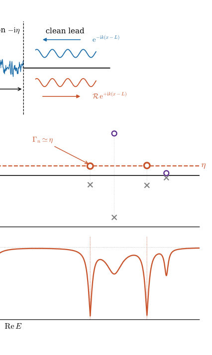
<figcaption class="paper-figure-caption"><b>Fig 1.</b> Figure 1. Setup, and how a weak absorption exposes the resonances. (a) Geometry: a disordered sample of length L with a closed (Dirichlet) end at x = 0 and a clean lead attached at x = L, carrying an incident wave and a reflected wave of amplitude R. The localization length ℓL is shown for scale; the finite-length results are controlled by τ = L/ℓL. A uniform weak absorption −iη inside the sample shifts the energy argument to E +iη. (b) Resonance positions En are drawn from a Poisson process, appropriate to the localized regime. Without absorption |R| = 1 on the real axis, so the poles En −iΓn (crosses) are accompanied by zeros at the mirror points En +iΓn (circles). Absorption makes the...</figcaption>
</figure>
<figure class="paper-figure-card">
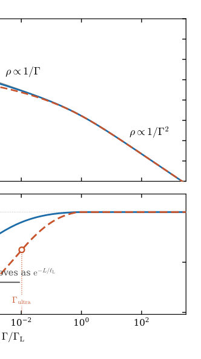
<figcaption class="paper-figure-caption"><b>Fig 2.</b> Figure 2. Schematic of the finite-length width density, summarizing the results of Sections V and VI. (a) The density itself. Grey: the semi-infinite limit (37), crossing over from ρ ∝1/Γ to ρ ∝1/Γ2 at the escape width ΓL. Coloured curves: two finite lengths, which follow the same envelope over many decades and peel away from it only at exponentially small widths. (b) The same information with the envelope divided out. The ratio is the first-passage kernel (151), which falls from one to zero across the ultranarrow scale Γultra = C∗</figcaption>
</figure>
<figure class="paper-figure-card">
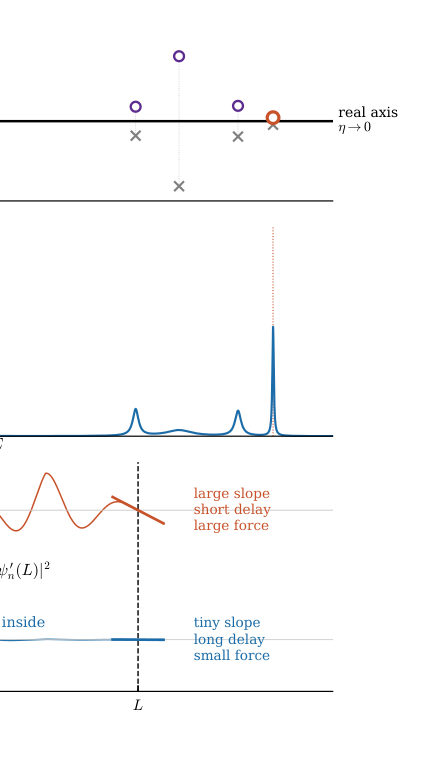
<figcaption class="paper-figure-caption"><b>Fig 3.</b> Figure 3. Time delays, and their translation into boundary forces. The resonance set {En,Γn} is the same as in Fig. 1. (a) The same zeros (circles) and poles (crosses); resonance positions En are drawn from a Poisson process, as expected in the localized regime, so the spacings are strongly irregular. The Wigner delay is a property of the unitary problem and is read off on the real axis, i.e. in the limit η →0. (b) The resulting delay τW(E) = ∂E argR = ∑n 2Γn/[(E −En)2 +Γ2n]. Every resonance produces a peak, at the same energies at which Fig. 1(c) shows a dip, but the two observables rank the resonances differently: the peak height is τW(En) = 2/Γn, so it is the narrowest states...</figcaption>
</figure>
<figure class="paper-figure-card">
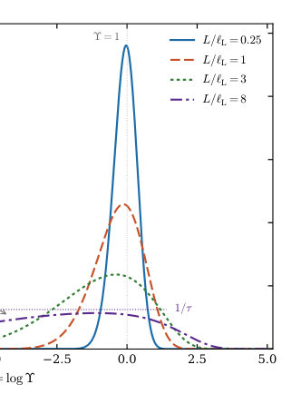
<figcaption class="paper-figure-caption"><b>Fig 4.</b> Figure 4. Finite-length distribution of the normalized boundary force on a logarithmic scale: Pτ(s) with s = logϒ, from Eq. (207), for several τ = L/ℓL. The curves are obtained by solving the Fokker–Planck equation (189) for the delay variable and applying the crossing-sampled transformation (205); they agree with the closed form (206) to five decimal places, and each is normalized to unity over the plotted range. A short, nearly clean sample is concentrated at the clean value ϒ = 1 (dotted vertical). As L/ℓL grows the distribution flattens towards the plateau Pτ ≃1/τ (dotted horizontal), which is the crossing-sampled image of the τ−2 W tail of the delay distribution: at τ = 8 the force is...</figcaption>
</figure>
<figure class="paper-figure-card">
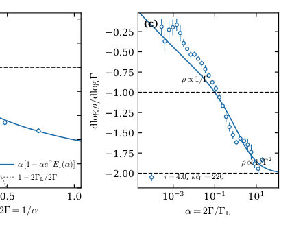
<figcaption class="paper-figure-caption"><b>Fig 5.</b> Figure 5. Width density on a linear ordinate. Circles: k = 2, D = 0.03, N = 441, 410 realisations, |E −E0| &lt; 0.25 (kℓL = 220, τ = 4.0). Squares: k = 1, D = 0.06, N = 400, 200 realisations, |E −E0| &lt; 0.15 (kℓL = 47, τ = 8.5). (a) πDΓρ/(2sink) against α = 2Γ/ΓL; solid curves are [1−αeαE1(α)]H∗(T∗,τ), dashed the semi-infinite limit (37). The abscissa must remain logarithmic: the two features are separated by Γultra/ΓL = e−L/ℓL. (b) The broad-width regime on fully linear axes, testing (210); dotted, the leading correction 1−2/α. (c) Local exponent dlogρ/dlogΓ from sliding five-point weighted regressions. The excess over the predicted curve at α ≲10−3 is the finite-τ effect of Fig. 6(b).</figcaption>
</figure>

**Summary.** This paper rigorously analyzes reflection resonances and Wigner time delays in finite-length 1D Anderson localized systems. It derives the crossover behavior of resonance statistics between different limiting regimes ($\Gamma^{-1}$ vs $\Gamma^{-2}$) using advanced mathematical identities. The results provide a deep connection between wave transport, boundary conditions, and localization physics.

**Why it may be interesting.** This work provides rigorous analytical control over resonance statistics in mesoscopic disordered systems, connecting transport properties (delay time) directly to boundary physics (eigenfunction derivatives), which is crucial for understanding quantum wave scattering.

Detailed structure

**Main problem.** The study investigates reflection resonances, Wigner time delay statistics, and boundary eigenfunction properties in finite-length one-dimensional disordered quantum systems.

**Main result.** The paper derives the crossover behavior of resonance density from $\Gamma^{-1}$ to $\Gamma^{-2}$ laws and establishes a direct link between the Wigner delay and the squared boundary derivative of the eigenfunction.

**Method.** It employs advanced theoretical techniques, including exact finite-chain Kac–Rice identities and complex reflection diffusion methods, relating pole counting to intensity diffusion.

**Model / system.** The model is a one-dimensional disordered sample of length L (Anderson localization) coupled at one end to a semi-infinite lead. The analysis considers the weak absorption limit by adding an imaginary part $-i\eta$ to the energy.

**Key observables.** Reflection resonance poles ($Z_j = E_j - i\Gamma_j$), Wigner time delay, boundary force exerted by eigenmodes, and the finite-length resonance density $
ho(E, \Gamma; L)$.

**Important parameters / regimes.** The analysis is valid in the regime $L \gg \ell_L \gg k^{-1}$, where $\ell_L$ is the localization length. Key scales include the crossover widths $\Gamma_L$ and $\Gamma_{	ext{ultra}}$.

**Assumptions / limitations.** The primary assumptions involve working in the weak-absorption limit ($\eta$) and analyzing a specific geometry (one lead, one closed end).

**Figures summary.** Figure 1 illustrates the physical setup with absorption shifts. Figure 2 shows the crossover of resonance density from $\Gamma^{-1}$ to $\Gamma^{-2}$. Figure 3 compares time delays derived from real-axis analysis versus resonance structure.

**Paper structure.** The paper builds by first establishing the connection between resonance poles and reflection coefficients, then using exact identities to count poles via diffusion. It proceeds to derive the crossover shapes for ultranarrow resonances and analyzes the Wigner delay statistics, concluding with the derivation of the Moldauer–Simonius sum rule.

Abstract

We study reflection-resonance poles $Z_j=E_j-iΓ_j$, $Γ_j>0$, of a finite one-dimensional disordered sample of length $L$, coupled at one end to a semi-infinite lead, in the regime $L\gg\ell_L\gg k^{-1}$, where $\ell_L$ is the localization length and $k=\sqrt{E}$. The key step is to relate the resonance density to the reflection coefficient at the complex energy $E+iΓ$, corresponding to uniform absorption. Exact finite-chain Kac--Rice and Poincaré--Lelong identities reduce pole counting to a finite-length diffusion of the reflected intensity. For the perfect contact transparency the density crosses over from the localization-controlled $Γ^{-1}$ law to the broad-resonance $Γ^{-2}$ law at $Γ_L=k/\ell_L$, in agreement with $L\to\infty$ result of Fyodorov and Meibohm. Finite length cuts off the $Γ^{-1}$ regime at $Γ_{\rm ultra}=\frac{e^{1-γ_{\rm E}}}{2}Γ_L e^{-L/\ell_L}$. We derive the ultranarrow resonances crossover shape as an explicit moving front; for contact transparency $\mathcal T<1$ this scale shifts to $\mathcal TΓ_{\rm ultra}$. The same reflection process yields the finite-length Wigner time-delay statistics and, in the weak-absorption limit, the Comtet--Texier distribution. We show that at eigenvalues of the corresponding closed Dirichlet sample the Wigner delay is inversely proportional to the squared boundary derivative of the normalized eigenfunction. This quantity also gives the eigenvalue response to displacement of the Dirichlet boundary at the lead-contact end, and hence the force exerted by the eigenmode on that boundary; we obtain its finite-length distribution. Finally, the finite-transparency resonance density obeys the single-channel Moldauer--Simonius sum rule, linking its perfect-coupling divergence to the $Γ^{-2}$ tail. Direct lattice and spectral computations test the crossover and front constant.

[↑ back to top](#top)

### [Controlling rotations of magnetically levitated superconductors](http://arxiv.org/abs/2608.16184v1)

**Authors:** Fynn Köller, Dominik Maile, Joachim Ankerhold, Klaus Hornberger, Witlef Wieczorek, Benjamin A. Stickler  
**Type:** theory · **Category:** other · **PDF:** <https://arxiv.org/pdf/2608.16184v1>  
**Analysis basis:** full PDF text, analyzed in chunks
**Topic relevance:** `quantum measurements` **2/5** · `Keldysh / 2PI / non-Gaussian methods` **1/5**

↔ Scroll figures horizontally

<figure class="paper-figure-card">
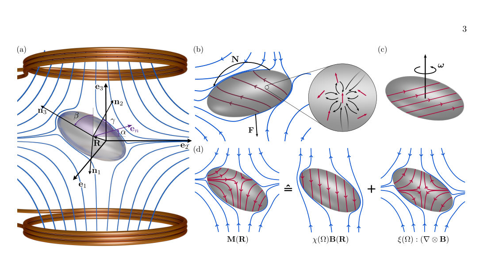
<figcaption class="paper-figure-caption"><b>Fig 1.</b> FIG. 1. Rotations of levitated superconductors: (a) Micron-sized superconductors can be stably trapped in magnetic quadrupole fields generated by two coils in anti-Helmholtz configuration. The superconductor is attracted towards the trap center due to its diamagnetic response, where its principal axes align with the axes of the trapping field. The six degrees of freedom of the particle’s motion are its center-of-mass position R and orientation, expressed via the Euler-angles Ω= {α, β, γ} in z-y′-z′′ convention. The orientation is specified by the rotation tensor, that relates the space-fixed frame ek with the principal-axes frame nk(Ω) = R(Ω)ek. (b) External magnetic fields generate...</figcaption>
</figure>
<figure class="paper-figure-card">
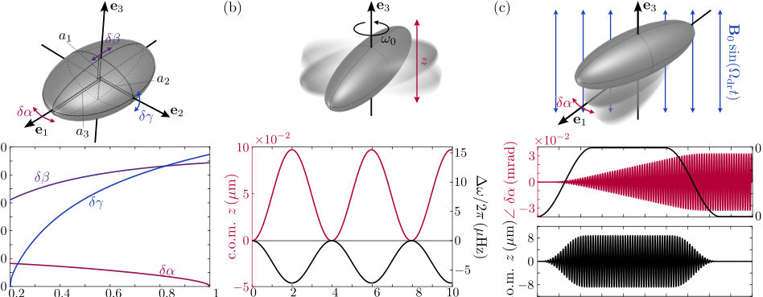
<figcaption class="paper-figure-caption"><b>Fig 2.</b> FIG. 2. Full alignment &amp; gyromagnetic coupling: (a) Librational frequencies obtained from the harmonic approximation of the trapping potential (16) as a function of particle shape. The intermediate semi-axis is varied continuously from a prolate to an oblate spheroid, while the remaining semi-axes are held fixed. Analytic expression of the frequencies are given in Eq. (106). (b) Shift of the center-of-mass equilibrium position for a symmetric superconductor rotating about the e3 axis with angular velocity ω0. The particle is initially located at the equilibrium position corresponding to a non-rotating state. The shift arises from the Barnett-induced magnetization. (c) Gyromagnetic coupling...</figcaption>
</figure>
<figure class="paper-figure-card">
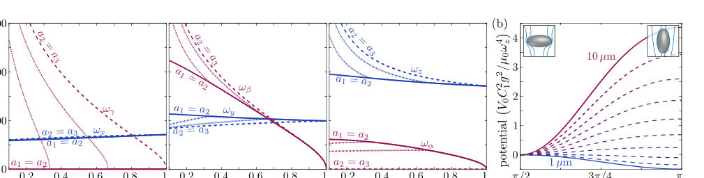
<figcaption class="paper-figure-caption"><b>Fig 3.</b> FIG. 3. Trapping frequencies: (a) Center-of-mass and librational frequencies as a function of the particle aspect ratio a1/a3, where a1 ≤a2 ≤a3. From left to right, the panels show the frequencies associated with motion along and libration about the e1, e2, and e3 axes. Solid curves correspond to prolate spheroids (a1 = a2), while dashed curves correspond to oblate spheroids (a2 = a3). Dotted curves indicate the transition between the two geometries for fixed ratios a2/a3 = 1/3 and a2/a3 = 2/3. All panels share the same frequency scale. (b) Orientation dependence of the trapping potential in presence of homogeneous gravity [second line of Eq. (122)] as a function of Euler-angle β for a...</figcaption>
</figure>

**Summary.** This paper theoretically models how magnetically levitated superconducting particles behave when subjected to external magnetic fields. By accounting for induced supercurrents and resulting torques from both field gradients and intrinsic magnetic coupling (gyromagnetic effects), the authors show that rotation can be precisely controlled. This control mechanism is crucial for developing next-generation quantum sensors operating near the quantum-classical boundary.

**Why it may be interesting.** This work bridges quantum electrodynamics effects (London currents) with mechanical dynamics (levitation/rotation) in a highly controllable system, providing a platform for testing fundamental couplings like gyromagnetism at the quantum limit.

Detailed structure

**Main problem.** The primary goal is controlling the rotational motion of magnetically levitated type-I superconductors for use in high-precision quantum sensing experiments.

**Main result.** The analysis demonstrates that diamagnetic torques and gyromagnetic coupling allow for the three-dimensional alignment and controlled rotation of aspherical superconducting particles within a magnetic trap center.

**Method.** The authors derived equations of motion by treating the superconductor as an ellipsoidally shaped magnet, calculating induced dipole and quadrupole moments from supercurrents, and formulating the dynamics via a Lagrangian/Hamiltonian approach.

**Model / system.** The system involves micron-sized type-I superconductors trapped in a magnetic quadrupole field. The physics incorporates London screening currents, leading to induced dipole ($\mathbf{m}$) and quadrupole ($\mathbf{Q}$) moments that couple mechanical motion (rotation) to the external magnetic field gradient.

**Key observables.** Librational trapping frequencies ($\omega_{i}$), total torque ($\mathbf{N}$), and the resulting alignment of the particle's principal axes within the trap center.

**Important parameters / regimes.** The analysis depends on the superconducting material properties, the geometry (aspect ratio) of the superconductor, and the strength/gradient of the external trapping field $\mathbf{B}_{	ext{ext}}$.

**Assumptions / limitations.** Key assumptions include treating the particle as a rigid ellipsoid and analyzing the dynamics using harmonic approximations around equilibrium.

**Figures summary.** Figures illustrate the stable trapping mechanism in a quadrupole field, the shielding effect of induced supercurrents, and the additional forces/torques arising from gyromagnetic coupling via the induced dipole and quadrupole tensors.

**Paper structure.** The paper progresses by first establishing the physical model (superconducting particle in a trap), deriving the necessary magnetic moment calculations (dipole and quadrupole), formulating the coupled equations of motion using Lagrangian mechanics, and finally analyzing the resulting trapping frequencies and control mechanisms.

Abstract

Magnetically trapped type-I superconductors are promising candidates for precision experiments at the quantum-to-classical borderline, with applications in quantum sensing of forces and accelerations and fundamental tests of quantum physics. Here, we show how the rotational motion of micron-sized superconductors is strongly affected by (i) the diamagnetic torques due to the gradient of the trapping field and by (ii) the gyromagnetic coupling due to Einstein-de Haas and Barnett effects. We show that this allows the three-dimensional alignment of asperhical superconductors in the trap center, as required for future sensing applications and quantum experiments, and determine the resulting librational trapping frequencies. Finally, we propose an experiment to probe gyromagnetic coupling in levitated superconductors and we discuss how it can be used to control the particle rotation.

[↑ back to top](#top)

### [Electronic structure and magnetic correlations in the epitaxially strained bilayer nickelate La$_3$Ni$_2$O$_{7}$](http://arxiv.org/abs/2608.14810v1)

**Authors:** I. V. Leonov  
**Type:** theory · **Category:** strongly correlated electrons · **PDF:** <https://arxiv.org/pdf/2608.14810v1>  
**Analysis basis:** full PDF text, analyzed in chunks
**Topic relevance:** `analog quantum simulation` **2/5** · `Keldysh / 2PI / non-Gaussian methods` **1/5**

↔ Scroll figures horizontally

<figure class="paper-figure-card">
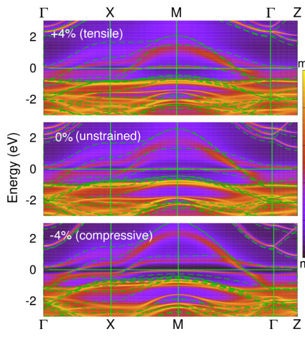
<figcaption class="paper-figure-caption"><b>Fig 1.</b> FIG. 1: k-resolved total spectral functions A(k, ω) of PM LNO under different strains calculated by DFT+DMFT with U = 6 eV and J = 0.95 eV at T = 290 K. Our results are compared with those obtained within the nonmagnetic DFT calculations (shown by dashed green lines).</figcaption>
</figure>
<figure class="paper-figure-card">
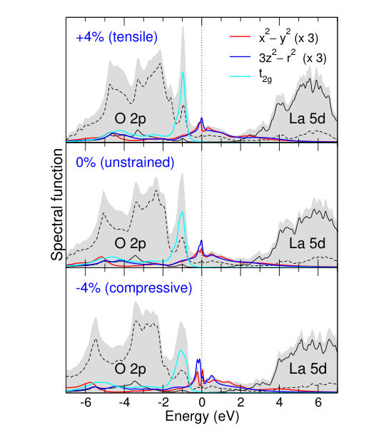
<figcaption class="paper-figure-caption"><b>Fig 2.</b> FIG. 2: Orbital-dependent spectral functions for PM LNO for different in-plain lattice strains as obtained by DFT+DMFT at T = 290 K. The Ni 3d, La 5d and O 2p orbital contributions are shown. The partial Ni x2 −y2, and 3z2 −r2 orbital states are magnified by three times for better readability.</figcaption>
</figure>
<figure class="paper-figure-card">
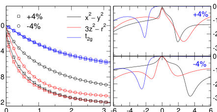
<figcaption class="paper-figure-caption"><b>Fig 3.</b> FIG. 3: Orbital-dependent contributions to the imagi- nary part of the Ni 3d self-energy on the Matsubara axis, Im[Σ(iωn)] (left, symbols), and analytically continued on the real energy axis, Im[Σ(ω)] (right), for PM LNO under the 4% (tensile) and −4% (compressive) biaxial lattice strain at T = 290 K. The Pad´e interpolation results for Im[Σ(iωn)] are depicted with lines.</figcaption>
</figure>
<figure class="paper-figure-card">
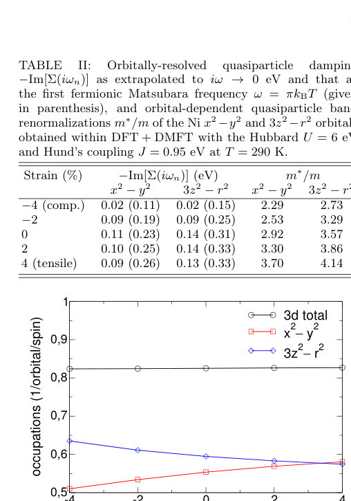
<figcaption class="paper-figure-caption"><b>Fig 4.</b> FIG. 4: Our results for the total Ni 3d and partial Ni x2 −y2</figcaption>
</figure>
<figure class="paper-figure-card">
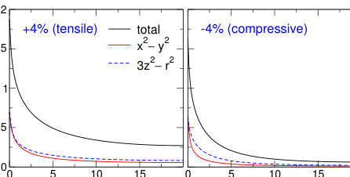
<figcaption class="paper-figure-caption"><b>Fig 5.</b> FIG. 5: Orbitally-resolved local spin correlation function χ(τ) = ⟨ˆmz(τ) ˆmz(0)⟩for the Ni 3d orbitals calculated by DFT + DMFT for PM LNO under a tensile strain of 4% (left panel) and a compressive strain of −4% (right) at T = 290 K.</figcaption>
</figure>

**Summary.** This work uses advanced DFT+DMFT calculations to model how epitaxial strain modifies the electronic structure of nickelate $	ext{La}_3	ext{Ni}_2	ext{O}_7$. The findings reveal that strain strongly controls magnetic correlations, suggesting that tuning lattice parameters is a key mechanism for controlling superconductivity in these correlated materials.

**Why it may be interesting.** The study provides a detailed theoretical framework linking structural tuning (strain) to fundamental many-body phenomena (correlation effects, magnetism) in high-$T_c$ cuprate/nickelate analogues, which is central to correlated electron physics relevant to AMO and quantum materials research.

Detailed structure

**Main problem.** The study investigates how electron-electron correlations and epitaxial strain affect the electronic structure, magnetic correlations, and Fermi surface of the bilayer nickelate $	ext{La}_3	ext{Ni}_2	ext{O}_7$.

**Main result.** Strain significantly tunes magnetic correlations; moderate strain enhances them, while large compressive strain induces a Lifshitz transition that suppresses these correlations.

**Method.** The research employs the DFT+dynamical mean-field theory ($	ext{DFT} + 	ext{DMFT}$) method combined with $	ext{CT-QMC}$ to treat strong electronic interactions.

**Model / system.** The system is the bilayer Ruddlesden-Popper nickelate $	ext{La}_3	ext{Ni}_2	ext{O}_7$ (LNO), focusing on the strongly correlated Ni $3d$ electrons within a lattice structure subjected to tunable epitaxial strain.

**Key observables.** Quasiparticle band renormalizations, Fermi surface topology ($\gamma$ sheet disappearance), magnetic correlations, and orbital-selective renormalization of $	ext{Ni } 3d$ bands.

**Important parameters / regimes.** In-plane strain ranging from tensile to compressive (e.g., $-4\%$ compression); Hubbard $U = 6 	ext{ eV}$ and Hund’s exchange coupling $J = 0.95 	ext{ eV}$.

**Assumptions / limitations.** The calculations neglect spin-orbit coupling and explicitly ignore the presence of spin or charge density wave states, despite their physical relevance.

**Figures summary.** Figures likely show k-resolved spectral functions, orbital-dependent spectral weight changes under strain, and local spin correlation function evolution.

**Paper structure.** The paper follows a theoretical investigation structure: defining the problem (strain effects on LNO), detailing the advanced computational methodology ($	ext{DFT} + 	ext{DMFT}$), presenting results showing strain dependence of electronic properties, and concluding with implications for magnetic ordering mechanisms like spin-density waves.

Abstract

Using the DFT+dynamical mean-field theory method we study the effects of electron-electron correlations and epitaxial strain of the crystal structure on the normal-state electronic structure, quasiparticle band renormalizations, Fermi surface, and magnetic correlations of the bilayer Ruddlesden-Popper nickelate La$_3$Ni$_2$O$_7$ (LNO). Our results exhibit a remarkable orbital-selective renormalization and strong incoherence of the Ni $3d$ bands, pointing to the proximity of the Ni $x^2-y^2$ and $3z^2-r^2$ states to orbital-selective localization. The electronic properties of LNO show a high sensitivity to the in-plane strain. We note that both a tensile and a moderate compressive strain (up to about $-2$\%) yield a significant enhancement of magnetic correlations compared to the unstrained LNO. Under a large compressive strain of about $-4$\%, we observe a Lifshitz transition characterized by the disappearance of the $γ$ Fermi surface sheet, which is associated with a nearly fully occupied, shallow flat-band of the bonding Ni $3z^2-r^2$ orbital character. As a result, we observe a sharp decrease of magnetic correlations, implying suppression of superconductivity. Overall, our results support the picture of spin- and change-density-wave stripe instability driven by the Fermi surface nesting in LNO. Our results suggest that both pressure and strain can effectively tune (suppress or enhance) spin-change-density-wave ordering, giving rise to enhanced spin fluctuations.

[↑ back to top](#top)

### [Half a qubit: an algebraic fractionalization](http://arxiv.org/abs/2608.16183v1)

**Authors:** Po-Yao Chang  
**Type:** theory · **Category:** quantum information and computing · **PDF:** <https://arxiv.org/pdf/2608.16183v1>  
**Analysis basis:** full PDF text, analyzed in chunks
**Topic relevance:** `quantum measurements` **2/5** · `Keldysh / 2PI / non-Gaussian methods` **1/5**

↔ Scroll figures horizontally

<figure class="paper-figure-card">
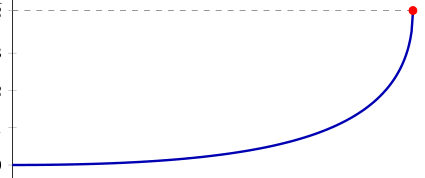
<figcaption class="paper-figure-caption"><b>Fig 1.</b> FIG. 2. L1 norm of the half-qubit, Eq. (25), plotted over the domain of existence 0 ≤p ≤q. The norm rises monotonically and reaches √</figcaption>
</figure>

**Summary.** This paper presents an alternative algebraic method to fractionalize a qubit by embedding its state into a non-Hermitian Krein space. The core finding is that two such 'half-qubits' fuse perfectly to reconstruct the full, standard qubit state. This work provides deep insights into the underlying symmetries and structure of quantum information encoded in indefinite metric spaces.

**Why it may be interesting.** It provides a purely algebraic framework for understanding qubit structure that bypasses standard fermionic constructions, offering insights into how local symmetries break down before being restored by entanglement (fusion).

Detailed structure

**Main problem.** The paper develops an alternative algebraic method for fractionalizing a quantum two-level system (qubit), contrasting with operational methods based on Majorana fermions.

**Main result.** Two such 'half-qubits' fuse via a signed Vandermonde convolution to exactly reconstruct an arbitrary pure qubit state, demonstrating the underlying Pauli algebra only upon fusion.

**Method.** The analysis employs embedding Székely's classical 'half-coin' into a non-Hermitian Krein space and utilizing biorthogonal formalism to define logical states.

**Model / system.** The model is a qubit fractionalized into two half-qubits residing in an infinite-dimensional Fock space (Krein space), which are then projected onto a finite, two-dimensional logical subspace.

**Key observables.** L1 norm ($\|p\|_1$), number parity operator ($Z_A$), $\eta$-metric operator, and the effective density matrix ($
ho_{	ext{eff}}$) of the reconstructed qubit.

**Important parameters / regimes.** Bias parameters $p$ and $q$, which govern the state weights; the generalization involves an $n$-th root for an $1/n$-qubit.

**Assumptions / limitations.** The analysis requires working within a non-Hermitian Krein space framework due to negative probability interpretations, and the reconstruction relies on projection onto the null manifold ($N \le 1$).

**Figures summary.** Figure 1 illustrates Székely quasi-probabilities and their self-convolution, showing that higher outcomes ($N \ge 2$) cancel out.

**Paper structure.** The paper introduces the algebraic fractionalization via embedding into a Krein space, analyzes key diagnostics like the L1 norm and local symmetries ($\mathbb{Z}_2 	imes \mathbb{Z}_2$), proves the fusion mechanism using Vandermonde convolution, and concludes with generalizations to $1/n$-qubits.

Abstract

Fractionalizing a quantum two-level system is usually associated with encodings based on pairs of Majorana fermions---an operational fractionalization. We show an alternative algebraic fractionalization by embedding Székely's classical ``half-coin'' into a non-Hermitian Krein space. The coefficients of $(q+pz)^{1/2}$ define a signed sequence and a normalized, non-Hermitian biorthogonal operator describing a biorthogonal half-qubit. We prove that two such objects fuse into an arbitrary pure qubit through the signed Vandermonde convolution that the collective $N\ge2$ vectors are null in Krein space. $L_1$ norm of the half-qubit follows in closed form, $\lVert p\rVert_1 = 2\sqrt{q}-\sqrt{q-p}$. Its $L_1$ norm increases monotonically with the bias and attains its supremum $\sqrt{2}$ precisely at the unbiased point $p=q=1/2$. Interestingly, we identify two structural results as follows. First, number parity and the $η$-metric generate a distinguished commuting $\mathbb Z_2\times\mathbb Z_2$ subgroup. Second, we find the $η$-metric obstructs any local $η$-self-adjoint partner of the parity, so a half-qubit carries a $\mathbb{Z}_2$ observable but no local $SU(2)$. The full Pauli algebra emerges only upon fusion. We then show that the construction survives truncation of the Fock basis: the fused qubit is exact at every cutoff, and the Vandermonde cancellation is visible in sign-weighted photon-number statistics, and can be tested using existing cavity and trapped-ion state-synthesis methods. Finally, we generalize this algebraic fractionalization to a $1/n$-qubit, which can be achieved by replacing the square root with an $n$th root.

[↑ back to top](#top)

### [Superconducting Hydride Mg2RhH6 Experimentally Achieved at Lower Pressure](http://arxiv.org/abs/2608.15745v1)

**Authors:** Linjing Wu, Zelong Wang, Guiqi Liu, Yuanhao Su, Runteng Chen, Hongyu Liu, Jun Zhang, Wenmin Li, Sijia Zhang, Jingcheng Zhu, Jianfa Zhao, Zheng Deng, Shaomin Feng, Jing Song, Qingqing Liu, Haozhe Liu, Panpan Kong, Xiancheng Wang, Changqing Jin  
**Type:** experiment · **Category:** other · **PDF:** <https://arxiv.org/pdf/2608.15745v1>  
**Analysis basis:** full PDF text, analyzed in chunks
**Topic relevance:** `analog quantum simulation` **2/5** · `quantum measurements` **1/5**

↔ Scroll figures horizontally

<figure class="paper-figure-card">
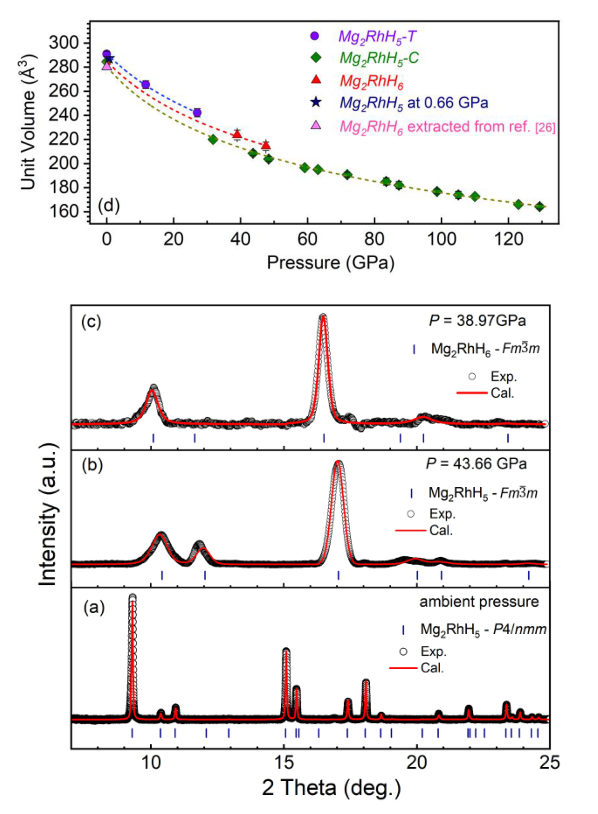
<figcaption class="paper-figure-caption"><b>Fig 1.</b> Figure 1 (a-c) Powder XRD data (represented by circles) and corresponding Rietveld</figcaption>
</figure>
<figure class="paper-figure-card">
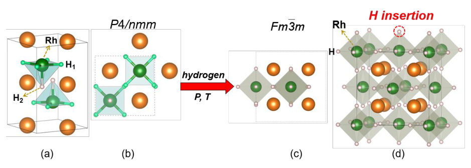
<figcaption class="paper-figure-caption"><b>Fig 2.</b> Figure 2 (a-b) Crystal structure sketch and coordination environment of Rh in Mg2RhH5</figcaption>
</figure>
<figure class="paper-figure-card">
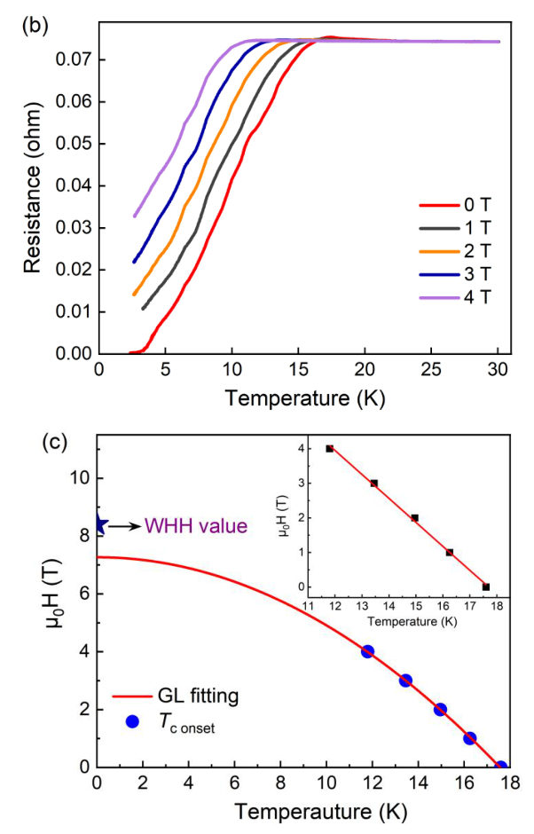
<figcaption class="paper-figure-caption"><b>Fig 3.</b> Figure 3 (a) The temperature dependent resistance of the Sample 4# measured at 55 GPa</figcaption>
</figure>

**Summary.** This work reports the successful experimental synthesis of $	ext{Mg}_2	ext{RhH}_6$, a superconducting hydride material. By utilizing a two-step high-pressure process, they achieved superconductivity up to 29 K at pressures significantly lower than previously required for similar materials. This research pioneers a rational design pathway for discovering high-$T_c$ superconductors.

**Why it may be interesting.** While focused on solid-state physics, the study's emphasis on electronic structure modification via chemical doping/hydrogenation to induce superconductivity relates conceptually to tuning quantum states in engineered materials, which has parallels with controlling interactions in AMO systems.

Detailed structure

**Main problem.** The primary challenge is achieving high critical temperature ($T_c$) superconductivity in hydride materials without requiring prohibitively high external pressures.

**Main result.** The authors report the experimental synthesis of $	ext{Mg}_2	ext{RhH}_6$, which exhibits superconductivity with a $T_c$ up to 29 K at accessible pressures (e.g., 53 GPa), suggesting a pathway toward ambient-pressure high-$T_c$ superconductors.

**Method.** The study employs a two-step, high-pressure synthesis route involving precursor formation ($	ext{Mg}_2	ext{RhH}_5$) followed by hydrogen supplementation under controlled pressure and temperature conditions. Superconductivity is confirmed via resistivity measurements and magnetic field dependence studies.

**Model / system.** The physical system is the metal hydride $	ext{Mg}_2	ext{RhH}_6$. The underlying mechanism is understood within the phonon-mediated BCS framework, involving structural transitions (e.g., RhH5 to RhH6) and electron doping into antibonding orbitals.

**Key observables.** Zero resistivity transition, superconducting critical temperature ($T_c$), upper critical magnetic field ($H_{c2}$), volume expansion ($\sim 2.42 	ext{ Å}^3$).

**Important parameters / regimes.** $T_c$ (up to 29 K), synthesis pressures (30 GPa to 53 GPa), ambient pressure stability.

**Assumptions / limitations.** The superconducting behavior is attributed to the filling of antibonding orbitals following structural transition, and that $	ext{Mg}_2	ext{RhH}_6$ is thermodynamically stable above 30 GPa.

**Figures summary.** Figures likely show XRD patterns confirming phase transitions ($	ext{Mg}_2	ext{RhH}_5$-T to $	ext{Mg}_2	ext{RhH}_5$-C) and electrical resistance vs. temperature/field curves demonstrating the superconducting transition.

**Paper structure.** The paper follows a structure detailing the necessity of lower-pressure synthesis, presenting the two-step experimental methodology (precursor synthesis followed by hydrogenation), characterizing the resulting phase ($	ext{Mg}_2	ext{RhH}_6$), and confirming its superconducting properties under pressure.

Abstract

Although tremendous progress has been made in recent years in the field of polyhydride superconductors, the realization of high critical temperature superconductivity still relies on formidable high pressures. Searching for superconducting hydrides at lower pressures is of particular importance. Here we report the first experimental synthesis of the Mg2RhH6, which achieves superconductivity under a significantly reduced pressure of 30 GPa. The synthesis of Mg2RhH6 proceeds via a two step process (1) preparation of the Mg2RhH5 precursor containing hydrogen atoms stabilized by covalent bonding, followed by (2) hydrogen supplementation resulting in the filling of electrons into anti bonding orbitals above 30 GPa, which was accompanied by the structural transition from RhH5 square pyramid to RhH6 octahedron. Superconductivity is achieved at 30 GPa with a Tc of 24 K, which is further enhanced to 29 K at 53 GPa, evidenced by a sharp drop of resistivity to zero and characteristic suppression of Tc under applied magnetic fields. Our experiments prove the Mg2RhH6 superconductor to be thermodynamically stable above 30 GPa, making it the first case exhibiting a Tc of approximately 30 K at a readily accessible pressure. This study pioneers a highly promising pathway for the rational design and discovery of high temperature superconductors within phonon mediated BCS framework.

[↑ back to top](#top)

### [Antiferroquadrupolar Order in Altermagnetic CoF$_2$](http://arxiv.org/abs/2608.14889v1)

**Authors:** Daniel Halliday, Laura Pöysti, Chung Xu, Daniel A. Mayoh, Didier Wermeille, Dharmalingam Prabhakaran, David R. Bowler, Roger D. Johnson  
**Type:** both · **Category:** strongly correlated electrons · **PDF:** <https://arxiv.org/pdf/2608.14889v1>  
**Analysis basis:** full PDF text, analyzed in chunks
**Topic relevance:** `quantum measurements` **2/5**

↔ Scroll figures horizontally

<figure class="paper-figure-card">
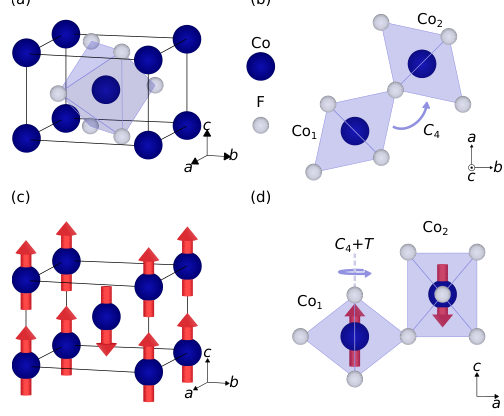
<figcaption class="paper-figure-caption"><b>Fig 1.</b> FIG. 1. (a) A single unit cell of CoF2 with lattice vectors labeled. (b) The two Co sites within the primitive unit cell. Co1 sits at [0,0,0] and Co2 at [ 1</figcaption>
</figure>
<figure class="paper-figure-card">
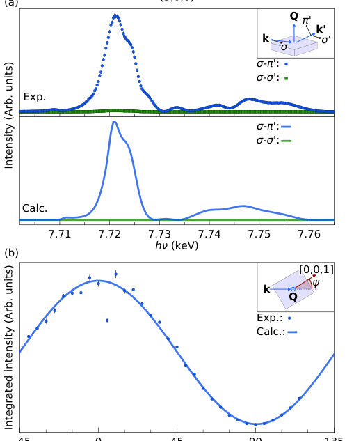
<figcaption class="paper-figure-caption"><b>Fig 2.</b> FIG. 2. (a) Experimental (Exp.) and calculated (Calc.) photon- energy dependence of the Q = (3, 0, 0) reflection within the: σ- π′ channel (blue circles/line) and σ-σ′ channel (green squares/line). The inset shows the scattering geometry for the REXS experiment, where k is the incident wavevector, k′ is the scattered wavevector, Q= k −k′ is the scattering vector and σ, σ′/π′ label the polar- ization of the incident and scattered X-rays, respectively. (b) Inte- grated intensity of the Q = (3, 0, 0) reflection (σ-π′ channel and hν = 7.722 keV) as a function of azimuthal angle (ψ). As de- fined within the inset, ψ is the angle between the [0,0,1] axis of CoF2 and the straight through X-ray...</figcaption>
</figure>
<figure class="paper-figure-card">
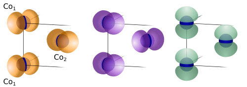
<figcaption class="paper-figure-caption"><b>Fig 3.</b> FIG. 3. (a) Calculated photon-energy dependence of the matrix ele- ments D Coα ij for: α = 1 (light blue dashed line) and α = 2 (dark blue line). Calculations are within the global coordinate system, x ∥ˆa, y ∥ˆb, z ∥ˆc. Schematic of the: (b) and (c) antiferro-type ordering of the local py and pz orbitals, respectively, and (d) the ferro-type ordering of the local px orbitals. The staggered orbital anisotropy of the local py and pz orbitals corresponds to the antifer- roquadrupolar (AFQ) order present within CoF2.</figcaption>
</figure>
<figure class="paper-figure-card">
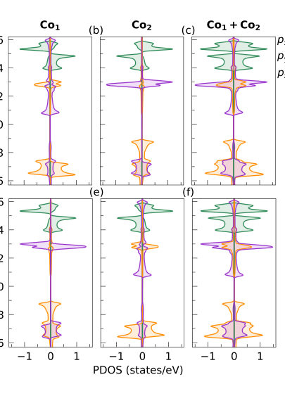
<figcaption class="paper-figure-caption"><b>Fig 4.</b> FIG. 4. Site and spin resolved projected density of states (PDOS) of Co for the local px (green), py (yellow) and pz (purple) orbitals of: (a) Co1 and (b) Co2, projected along the Γ −M direction. (c) Spin- polarized PDOS of the local p orbitals summed over both Co sites, projected along the Γ −M direction. (d) to (f) are as (a) to (c), but projected along the orthogonal Γ −M′ direction.</figcaption>
</figure>

**Summary.** The authors use resonant X-ray scattering and DFT calculations on CoF2 to prove that the material's altermagnetic properties originate from an underlying antiferroquadrupolar charge order. They successfully demonstrate that this specific quadrupolar arrangement dictates the spin-split electronic states, thereby establishing a fundamental link between charge and magnetic degrees of freedom in these materials.

**Why it may be interesting.** This work provides a concrete experimental pathway (REXS) to probe hidden charge orders that underpin exotic electronic states like altermagnetism, which is crucial for understanding correlated materials beyond simple magnetism.

Detailed structure

**Main problem.** To investigate charge order within CoF2, a d-wave altermagnetic compound, and establish that antiferroquadrupolar (AFQ) order is the microscopic origin of its altermagnetism.

**Main result.** The study directly observes AFQ charge ordering using REXS and demonstrates via DFT calculations that this specific quadrupolar order parameter gives rise to the characteristic altermagnetic spin-splitting in CoF2.

**Method.** The research combines resonant elastic X-ray scattering (REXS) measurements with detailed ab initio Density Functional Theory (DFT) calculations.

**Model / system.** The system is CoF2, a rutile structure d-wave altermagnet. The theoretical framework posits that the altermagnetic order parameter decomposes into magnetic dipole and charge quadrupolar components ($O = L \otimes Q$).

**Key observables.** The intensity of the REXS signal at the (3, 0, 0) reflection, its polarization/azimuthal dependence ($\propto \cos^2\psi$), and the resulting spin-splitting patterns in the local p orbitals.

**Important parameters / regimes.** The temperature regime below the Néel temperature ($T < T_N \approx 37$ K), and the specific scattering vector Q = (3, 0, 0).

**Assumptions / limitations.** The analysis assumes that the altermagnetic order parameter can be decomposed into distinct magnetic and charge degrees of freedom, which are then probed independently.

**Figures summary.** Figure 1 shows the crystal structure and AFM ground state. Figure 2 presents REXS data showing photon-energy dependence and azimuthal fits confirming quadrupole order. Figure 3 details DFT calculations linking AFQ symmetry to spin-splitting in local p orbitals.

**Paper structure.** The paper proceeds by introducing the theoretical concept of altermagnetism, presenting REXS measurements to detect charge quadrupolar order ($Q$), and finally using DFT calculations to rigorously link this observed $Q$ to the expected magnetic splitting pattern characteristic of altermagnetism.

Abstract

Altermagnets host non-relativistic spin-split electronic states whose microscopic origin is theoretically linked to a hidden charge order, yet experimental studies of this charge order are limited. We therefore investigate charge order within CoF$_2$, a $d$-wave altermagnetic compound with a rutile crystal structure and $Γ$-point antiferromagnetism. Combining resonant elastic X-ray scattering, symmetry analysis and ab initio calculations, we directly observe charge ordering and identify it as antiferroquadrupolar in nature. Via electronic structure calculations, we show that the experimentally observed antiferroquadrupolar order gives rise to the characteristic altermagnetic spin-splitting, thereby establishing empirical evidence for the decomposition of the altermagnetic order parameter into magnetic and charge degrees of freedom. We hence demonstrate that antiferroquadrupolar order is the microscopic origin of altermagnetism in CoF$_2$, with implications to the wider family of rutile altermagnets. Furthermore, our approach is applicable to studying altermagnetism in general, having demonstrated that resonant elastic X-ray scattering can serve as a direct probe of the charge multipoles that underpin spin-split electronic states in these materials.

[↑ back to top](#top)

### [Separable Counterexamples to Complementary Quantum Correlations, and Why Random Search Missed Them](http://arxiv.org/abs/2608.14806v1)

**Authors:** Lilong Qian  
**Type:** theory · **Category:** quantum information and computing · **PDF:** <https://arxiv.org/pdf/2608.14806v1>  
**Analysis basis:** full PDF text, analyzed in chunks
**Topic relevance:** `quantum measurements` **2/5**

↔ Scroll figures horizontally

<figure class="paper-figure-card">
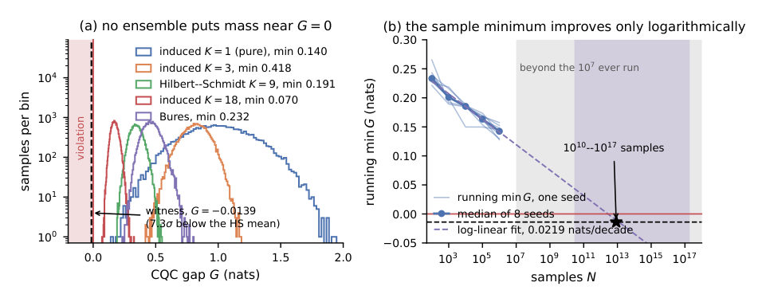
<figcaption class="paper-figure-caption"><b>Fig 1.</b> Figure 1: The gap is concentrated far from zero, and the sample minimum barely moves. (a) Distribution of G over 2 × 104 states from each of five standard ensembles on C3 ⊗C3; the shaded half-line is the violating region G &lt; 0. No ensemble places any mass there. The witness (45) (dashed) sits 7.3 standard deviations below the Hilbert–Schmidt mean, while the best of 2 × 104</figcaption>
</figure>
<figure class="paper-figure-card">
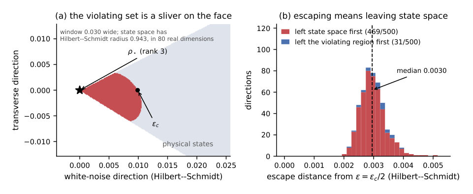
<figcaption class="paper-figure-caption"><b>Fig 2.</b> Figure 2: Where the counterexamples live. (a) A two-dimensional affine slice of state space through the witness ρ⋆. The horizontal axis is the white-noise direction I/9 −ρ⋆; the vertical axis is a transverse direction, taken to be the one realising the median escape distance of panel (b), so the slice is representative rather than chosen for effect. Light grey is the physical region, red the violating region G &lt; 0. The violating set is a lens pressed against the low-rank face, with ρ⋆itself at its vertex on the boundary; along the horizontal axis it terminates at εc. The scale annotation is essential to reading the panel: the window is 0.030 across, against a state-space Hilbert–Schmidt...</figcaption>
</figure>
<figure class="paper-figure-card">
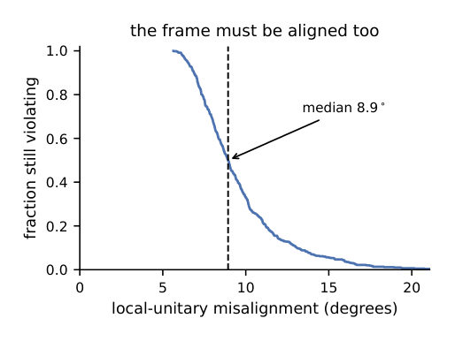
<figcaption class="paper-figure-caption"><b>Fig 3.</b> Figure 3: The measurement frame must be aligned too. Fraction of 600 random local-unitary rotation directions for which ρ⋆still violates CQC, against the rotation angle. Half the directions have lost the violation by about nine degrees, and essentially none survives past twenty. The curve is a distribution over directions at each angle, not a bound.</figcaption>
</figure>

**Summary.** This paper rigorously refutes the Complementary Quantum Correlations (CQC) inequality by constructing explicit counterexamples using separable states. The authors develop advanced mathematical tools to prove these violations across many dimension pairs. It highlights that detecting such subtle correlations requires highly targeted theoretical methods rather than brute-force numerical sampling.

**Why it may be interesting.** It provides deep theoretical insights into the fundamental limits of quantum correlations beyond entanglement measures, which is crucial for understanding device characterization and resource quantification in quantum information protocols.

Detailed structure

**Main problem.** The paper refutes the Complementary Quantum Correlations (CQC) relation, which bounds quantum mutual information using local measurements.

**Main result.** Separable counterexamples to CQC are constructed for most dimension pairs ($m 	imes n$ with $m,n\ge3$), showing that entanglement is not required for the violation.

**Method.** The authors use rigorous mathematical constructions, including closed-form proofs, entropy envelopes, and variance bounds derived from analyzing specific quantum correlation measures.

**Model / system.** The study concerns bipartite quantum systems $
ho_{AB}$ on $\mathbb{C}^d \otimes \mathbb{C}^d$, involving local measurements using mutually unbiased bases (MUBs).

**Key observables.** The CQC gap, $G(
ho) = I(A : B)_
ho - I(Q_A : Q_B) - I(R_A : R_B)$, and the triangular-discrimination sum ($S$).

**Important parameters / regimes.** Local dimensions $m$ and $n$, with specific focus on pairs like $2 	imes n$ for $n\ge3$.

**Assumptions / limitations.** The analysis distinguishes between rigorously proven results (closed form) and the limitations of previous numerical searches, which were shown to have negligible power.

**Figures summary.** Figures illustrate the geometry of the violating set as a 'sliver' against the low-rank boundary in state space, and show how violation survival depends on local unitary misalignment angles.

**Paper structure.** The paper systematically refutes CQC by constructing counterexamples for various dimensions, developing new mathematical machinery (like dimension-free entropy envelopes), and finally quantifying why previous random searches failed to find these states.

Abstract

The complementary quantum correlations (CQC) relation bounds the sum of two classical mutual informations, obtained from local mutually unbiased measurements, by the quantum mutual information of the premeasurement state. We refute it. Separable rank-two counterexamples exist in every local dimension pair \(m\times n\) with \(m,n\ge3\), with closed-form excess at least \(1/(8m^2n^2)\) nats, and in every qubit--qudit pair \(2\times n\) with \(n\ge3\) except \(n=3,5\); every covered pair also admits full-rank separable counterexamples. We then analyse the two residual qubit--qudit dimensions. A dimension-free entropy envelope replaces the natural quadratic majorant and lowers the requirement for closing the equal-prior orthogonal two-ray family from a triangular-discrimination bound \(S\le8/3\) to \(S\le3.8265583\ldots\); the associated gate matrix has trace exactly two, so its spectral test collapses to a single eigenvalue-free scalar; and the exact identity \(X=1-4\operatorname{Var}(c)\) turns the prime-Fourier full-spark barrier into a variance bound. A \(128\)-bit interval cover then closes that family at \(2\times3\) with gap at least \(0.012021\) nats, and at \(2\times5\) an exact saturator attaining \(S=(14+2\sqrt5)/5\) refutes three competing routes. We also give a state-dependent corrected inequality that is universal, and show it is incomparable with CQC already at \(2\times2\). Finally we quantify why the original searches had essentially no power to find these states: the violating set is a sliver against the low-rank boundary, the witness lies \(7.3\) standard deviations below the Hilbert--Schmidt mean, the bases must be aligned to about nine degrees (\(\sim10^{-21}\) of frames), and extrapolating the sample minimum demands \(10^{10}\) to \(10^{18}\) samples against the \(10^7\) ever run.

[↑ back to top](#top)

### [Intrinsic Wannier Functions for Hamiltonian downfolding](http://arxiv.org/abs/2608.15557v1)

**Authors:** Shuoxue Li, Garnet Kin-Lic Chan  
**Type:** theory · **Category:** strongly correlated electrons · **PDF:** <https://arxiv.org/pdf/2608.15557v1>  
**Analysis basis:** full PDF text, analyzed in chunks
**Topic relevance:** `Keldysh / 2PI / non-Gaussian methods` **1/5** · `analog quantum simulation` **1/5** · `driven-dissipative phase transition` **1/5** · `methods for driven-dissipative` **1/5** · `quantum measurements` **1/5**

↔ Scroll figures horizontally

<figure class="paper-figure-card">
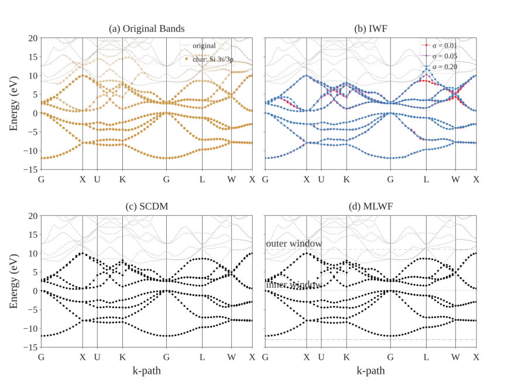
<figcaption class="paper-figure-caption"><b>Fig 1.</b> Figure 1. Comparison of FCC silicon band structure with different localization methods. (a) Original band structure showing the (total) Si 3s/3p character of the bands. (b) Intrinsic Wannier Function downfolding to the 3s/3p bands with different character smearings σ. (c) SCDM downfolding with chemical potential µ = 5eV; (d) MLWF downfolding with inner energy window [−13eV, 0.1eV] and outer energy window [−13eV, 11eV].</figcaption>
</figure>
<figure class="paper-figure-card">
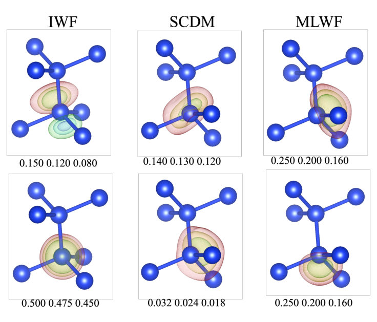
<figcaption class="paper-figure-caption"><b>Fig 2.</b> Figure 2. Selected silicon Wannier function orbitals obtained from IWF (σ = 0.05), MLWF and SCDM. The three numbers under each orbital are the isosurface values.</figcaption>
</figure>
<figure class="paper-figure-card">
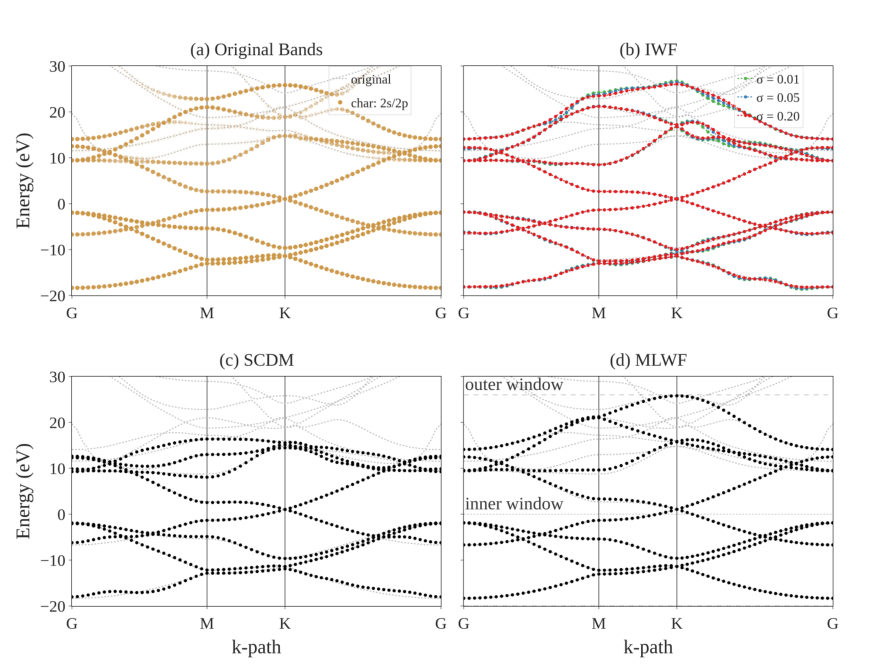
<figcaption class="paper-figure-caption"><b>Fig 3.</b> Figure 3. Comparison of graphene band structure with different localization methods. (a) Original bands showing the (total) C 2s/2p character. (b) Intrinsic Wannier Function downfolding to the 2s/2p bands. (c) SCDM downfolding with µ = 11.0eV. (d) MLWF downfolding with inner energy window [-20eV, 0] and outer energy window [-20eV, 26eV].</figcaption>
</figure>
<figure class="paper-figure-card">
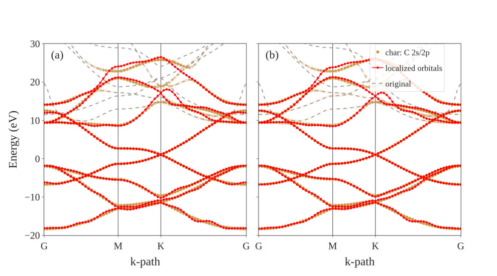
<figcaption class="paper-figure-caption"><b>Fig 4.</b> Figure 4. Variants of the IWF method using graphene as a benchmark. (a) IWF using the minimal B2 basis to the calculate character instead of the meta-L¨owdin orthogonalized B1 basis; (b) IWF using the scaled character matrix with parameter ε0 set to 1.0eV. The IWF smearing parameter σ = 0.05 for both cases.</figcaption>
</figure>
<figure class="paper-figure-card">
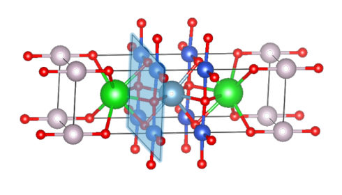
<figcaption class="paper-figure-caption"><b>Fig 5.</b> Figure 5. Illustration of the crystal structure and the CuO2 plane for the material HgBa2CaCu2O6.</figcaption>
</figure>

**Summary.** This paper introduces the Intrinsic Wannier Function (IWF) method for downfolding electronic band structures into simplified effective models. By using a non-iterative, character-based approach, IWF achieves high accuracy in reproducing material properties compared to established methods like MLWF and SCDM. This makes it a general and robust tool for simulating complex materials, particularly those relevant to strongly correlated electron physics.

**Why it may be interesting.** While focused on solid-state physics, the development of robust, character-preserving projection methods like IWF is analogous to developing efficient basis set constructions or model reduction techniques applicable in open quantum systems or when mapping complex Hamiltonians onto smaller, manageable subspaces.

Detailed structure

**Main problem.** The core problem is accurately downfolding complex, high-dimensional *ab initio* band structures into low-energy effective Hamiltonians that retain essential physics.

**Main result.** The proposed Intrinsic Wannier Function (IWF) method provides highly accurate and robust downfolded band structures compared to standard techniques like MLWF and SCDM across various materials.

**Method.** The IWF method constructs localized orbitals using a non-iterative, character-based smearing parameter ($\sigma$) applied during the projection of the Hamiltonian onto a low-energy subspace.

**Model / system.** The work validates the method on diverse systems including Silicon (Si), Graphene, and the three-band model derived from cuprate superconductors (e.g., $	ext{HgBa}_2	ext{CaCu}_2	ext{O}_6$).

**Key observables.** Downfolded band structures, orbital shapes, and the fidelity of reproducing original *ab initio* bands.

**Important parameters / regimes.** The dimensionless character-based smearing parameter ($\sigma$) is crucial; MLWF methods are noted for sensitivity to energy windows.

**Assumptions / limitations.** The method assumes that a sufficient atomic character basis can be defined via the projection operator $O$ and that using character-based smearing handles band crossings better than simple energy smearing.

**Figures summary.** Figures compare downfolded band structures (IWF vs. MLWF vs. SCDM) for Si, Graphene, and Cuprates; they also show orbital shape comparisons in the cuprate plane.

**Paper structure.** The paper introduces IWF as an improvement over existing Wannierization techniques by making the process non-iterative and parameter-efficient, validating its performance across multiple benchmark materials to establish it as a general tool for effective Hamiltonian construction.

Abstract

Downfolding ab initio material band structure into a low-energy subspace spanned by orbitals of specified atomic character, a procedure known as Wannier downfolding, is a common task in the simulation of complex materials. We introduce the Intrinsic Wannier Function (IWF) method to Wannierize bands with given atomic character. The method is non-iterative and requires only a single dimensionless parameter to disentangle bands. In benchmarks on silicon, graphene, and the three-band model of a mercury cuprate, we show that Intrinsic Wannier Functions provide high quality downfolded band structures compared to those from standard approaches such as Maximally Localized Wannier Functions and the Selected Columns of the Density Matrix method. Further, their straightforward implementation and robustness positions Intrinsic Wannier Functions as a general and useful tool for Wannier downfolding in materials electronic structure and in high-throughput applications.

[↑ back to top](#top)

### [Classical-limit formula for matrix elements between bound states of distinct one-dimensional potentials](http://arxiv.org/abs/2608.16835v1)

**Authors:** K. Beloy  
**Type:** theory · **Category:** other · **PDF:** <https://arxiv.org/pdf/2608.16835v1>  
**Analysis basis:** full PDF text, analyzed in chunks
**Topic relevance:** `Keldysh / 2PI / non-Gaussian methods` **1/5** · `analog quantum simulation` **1/5** · `quantum measurements` **1/5**

↔ Scroll figures horizontally

<figure class="paper-figure-card">
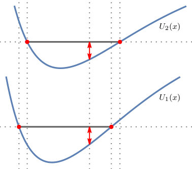
<figcaption class="paper-figure-caption"><b>Fig 1.</b> FIG. 1. Potentials U1(x) and U2(x) and bound-state energy levels E1 and E2 associated with the respective potentials. The points a1, b1, a2, and b2 are the CTPs [see Eq. (2)], indicated by circles. The point s is the COP [see Eq. (3)], indicated by arrows of equal length.</figcaption>
</figure>
<figure class="paper-figure-card">
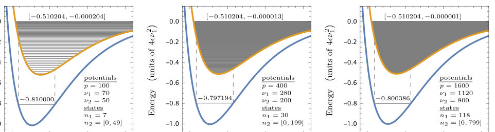
<figcaption class="paper-figure-caption"><b>Fig 2.</b> FIG. 2. Potentials and states used in the matrix element computations. The matrix elements are computed using analytical expressions given in Sec. V B. Results for the matrix elements are displayed in Figs. 3 and 4 below. The parameters p, ν1, and ν2 are specified within the respective panel. The parameter ratios are the same across all three panels (p : ν1 : ν2 = 10 : 7 : 5). From left to right, the panels represent a progression towards the classical limit. In each panel, curves depict the potentials U1(x) (blue, deeper) and U2(x) (yellow, shallower). For the states used in the matrix element computations, the energies are displayed as horizontal gray lines spanning between the respective...</figcaption>
</figure>
<figure class="paper-figure-card">
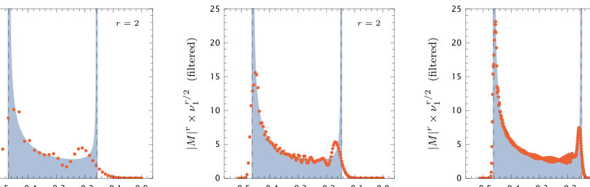
<figcaption class="paper-figure-caption"><b>Fig 3.</b> FIG. 3. Computed matrix elements with comparison to the CLF. These results are for t = 0, corresponding to the function f(x) = 1 (i.e., the matrix elements amount to the overlap integrals between wave functions). The states involved are specified in Fig. 2, with each panel of Fig. 2 corresponding to a column of panels here. As in Fig. 2, left to right represents a progression towards the classical limit. Top row: Results for the matrix elements M. Including a factor ν1/2 1 allows the results to be displayed on a common vertical scale across the row. Vertical dashed lines identify with U2(b1) and U2(a1), as labeled. Middle (r = 1) and bottom (r = 2) rows: Results for |M|r with a mean filter...</figcaption>
</figure>
<figure class="paper-figure-card">
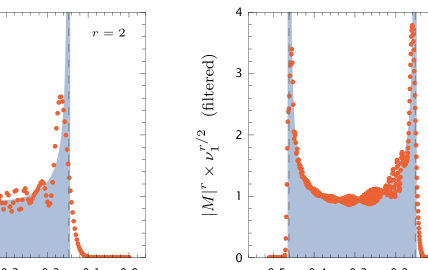
<figcaption class="paper-figure-caption"><b>Fig 4.</b> FIG. 4. Same as Figure 3, except with t = 1 rather than t = 0.</figcaption>
</figure>

**Summary.** The paper develops and rigorously validates a classical-limit formula for computing matrix elements connecting bound states of two distinct 1D potentials. By employing the WKB approximation and analyzing behavior near a Common Oscillation Point, the authors provide a general framework applicable to systems ranging from diatomic molecules to atoms in optical lattices.

**Why it may be interesting.** This work provides a powerful theoretical tool (the CLF) applicable to calculating transition probabilities between electronic states described by different potential energy surfaces, directly relevant for modeling molecular or atomic excitations in structured environments like optical lattices.

Detailed structure

**Main problem.** The primary goal is deriving a classical-limit formula (CLF) for calculating matrix elements between bound states associated with two distinct one-dimensional potentials.

**Main result.** A specific, complex analytical formula was derived for the matrix element in the classical limit, which was strongly validated by showing that computed results converge to this formula as the quantum regime approaches the classical limit.

**Method.** The derivation heavily utilizes the Wentzel–Kramers–Brillouin (WKB) approximation, focusing on analyzing integrals dominated near a Common Oscillation Point (COP).

**Model / system.** The system involves particles confined by two distinct one-dimensional potentials, $U_1(x)$ and $U_2(x)$, which are envisioned as Born-Oppenheimer type potential energy curves. The analysis is applied to bound states governed by the time-independent Schrödinger equation.

**Key observables.** The matrix element $M = \int \psi_1(x)f(x)\psi_2(x)dx$, and the density of states, $g(E)$.

**Important parameters / regimes.** The classical limit ($\hbar 	o 0$), the existence of a Common Oscillation Point (COP), and parameters related to potential functional forms like $\alpha$ and $\epsilon$.

**Assumptions / limitations.** The derivation relies on the WKB approximation, assuming that the matrix elements are dominated by contributions near the COP. The physical interpretation of the potentials is left general.

**Figures summary.** Figures illustrate the comparison between computed matrix elements (for varying parameters $t$) and the derived Classical Limit Formula (CLF), showing clear convergence towards the CLF boundary.

**Paper structure.** The paper develops the theory by first establishing the WKB framework for density of states, then deriving the general form of the CLF using approximations near the COP, and finally testing this formula with specific functional forms to confirm its validity.

Abstract

A classical-limit formula is derived for matrix elements between bound states of distinct one-dimensional potentials. We leave open the physical interpretation of the potentials, but generally envision them to be Born-Oppenheimer-type potentials with the position variable $x$ identifying with a slowly evolving degree of freedom of the system. For instance, $x$ could represent the internuclear separation in a diatomic molecule, with the potentials being potential energy curves for different electronic states. In this scenario, the matrix elements could be, e.g., conventional Franck-Condon factors. To test the derived formula, we assume functional forms for the potentials and operator that afford analytical solutions for the matrix elements. As the classical limit is approached, the computed matrix elements exhibit a clear tendency towards the classical-limit formula, providing strong validation for the formula. In future work, we anticipate using the formula to model inhomogeneous excitation spectra of atoms in one-dimensional optical lattices, with an eye towards improved optical lattice clock performance.

[↑ back to top](#top)

### [Probability-Preserving Transformer for the Time-Dependent Schrödinger Equation](http://arxiv.org/abs/2608.15112v1)

**Authors:** Mushtaq Ali, Muzamil Tariq, Niaz Ali Khan  
**Type:** theory · **Category:** numerical methods · **PDF:** <https://arxiv.org/pdf/2608.15112v1>  
**Analysis basis:** full PDF text, analyzed in chunks
**Topic relevance:** `analog quantum simulation` **1/5** · `driven-dissipative phase transition` **1/5** · `methods for driven-dissipative` **1/5**

↔ Scroll figures horizontally

<figure class="paper-figure-card">
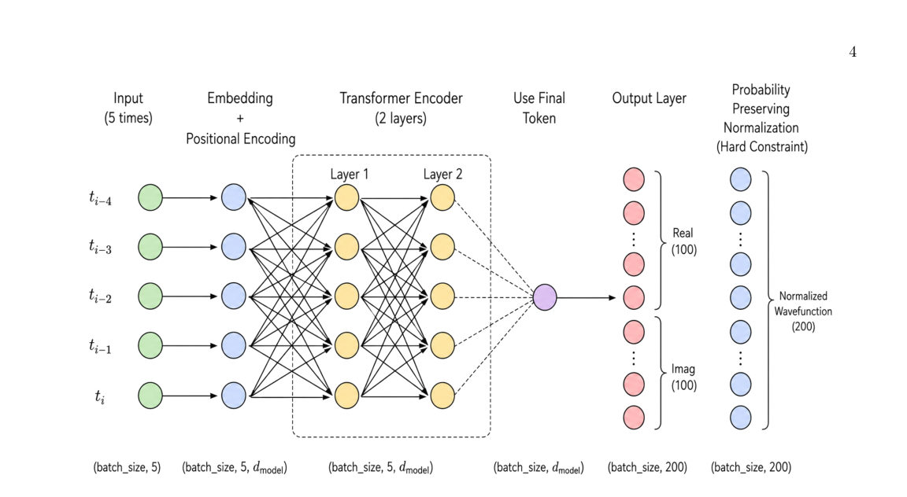
<figcaption class="paper-figure-caption"><b>Fig 1.</b> Figure 1:: Architectural schematic of the proposed multi-token PPT. The model comprises input time embeddings, a multi-head self-attention encoder, a linear output projection, and a final hard-normalization layer designed to preserve unit probability.</figcaption>
</figure>
<figure class="paper-figure-card">
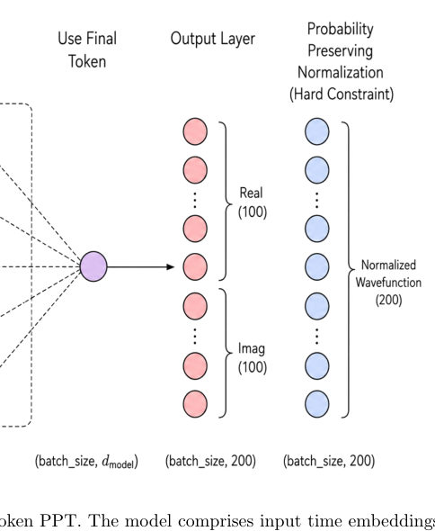
<figcaption class="paper-figure-caption"><b>Fig 2.</b> Figure 2:: Mean squared error (MSE) of the MLP as a function of training epochs, shown over 1, 000 iterations.</figcaption>
</figure>
<figure class="paper-figure-card">
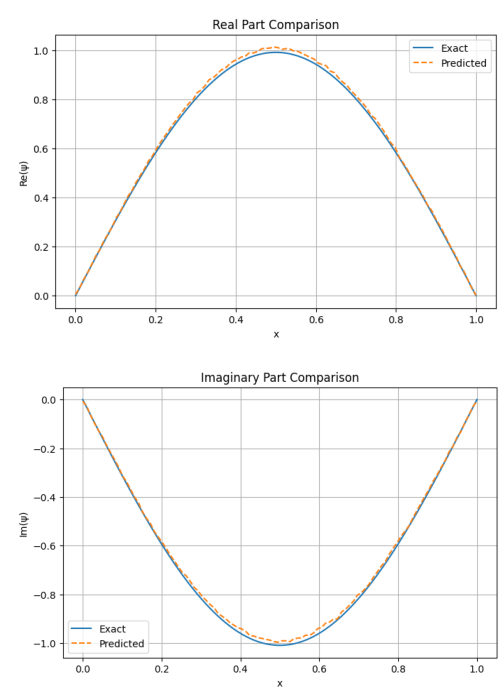
<figcaption class="paper-figure-caption"><b>Fig 3.</b> Figure 3:: Comparison of the real (Re(ψ), top) and imaginary (Im(ψ), bottom) components across the spatial domain.</figcaption>
</figure>
<figure class="paper-figure-card">
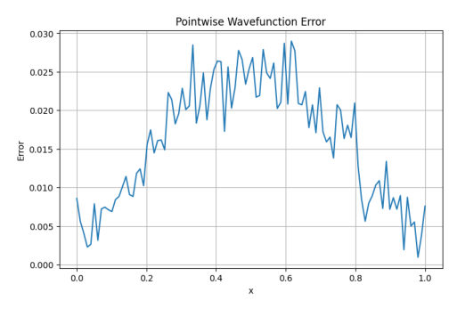
<figcaption class="paper-figure-caption"><b>Fig 4.</b> Figure 4:: Pointwise wavefunction error across the spatial domain grid points.</figcaption>
</figure>
<figure class="paper-figure-card">
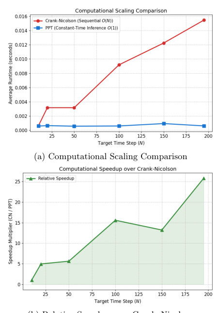
<figcaption class="paper-figure-caption"><b>Fig 5.</b> Figure 5:: Computational scaling and relative perfor- mance speedup of the proposed PPT framework versus the sequential Crank–Nicolson solver.</figcaption>
</figure>

**Summary.** This paper introduces a Probability-Preserving Transformer (PPT) to solve the computationally demanding Time-Dependent Schrödinger Equation. By implementing a hard normalization layer, the architecture guarantees that the predicted wavefunction always conserves probability ($\int |\psi|^2 dx = 1$). The PPT demonstrates both physical accuracy and superior computational scaling compared to established numerical methods like Crank–Nicolson.

**Why it may be interesting.** For researchers in open quantum systems or many-body dynamics, this work provides a highly efficient, machine learning surrogate model for time evolution that respects fundamental physical symmetries (unitarity/probability conservation), which is crucial for long-term simulations.

Detailed structure

**Main problem.** Traditional numerical solvers for the Time-Dependent Schrödinger Equation (TDSE) are computationally intensive, and standard Transformer models fail to rigorously guarantee probability conservation.

**Main result.** The proposed Probability-Preserving Transformer (PPT) architecture enforces unit probability conservation as a hard constraint, achieving physical exactness and superior computational scaling compared to conventional methods.

**Method.** The authors introduce a specialized Transformer model that incorporates a hard normalization layer post-prediction. This layer rescales the raw network output using the calculated total probability to ensure $\int |\Psi|^2 dx = 1$.

**Model / system.** The system is governed by the TDSE, $i\hbarrac{\partial\psi}{\partial t} = \hat{H}\psi$, typically benchmarked on a 1D infinite potential well. The evolution is modeled as a linear time-stepping process.

**Key observables.** Total Probability ($\int |\psi|^2 dx$), Mean Squared Error (MSE), Root Mean Squared Error (RMSE), and computational runtime scaling with prediction horizon.

**Important parameters / regimes.** The simulation uses $\hbar=1, m=1, L=1$, and Dirichlet boundary conditions. The hard constraint requires a small stabilization constant $\epsilon$.

**Assumptions / limitations.** The primary assumption is that enforcing probability conservation via an explicit architectural layer (hard constraint) is sufficient to yield physically accurate results, bypassing the need for complex penalty terms in the loss function.

**Figures summary.** Figures compare wavefunction error and show computational scaling: CNM runtime scales linearly with prediction horizon ($N$), while PPT maintains near-constant inference time, demonstrating significant speedup for long-term predictions.

**Paper structure.** The paper first establishes the physical problem (TDSE) and limitations of existing ML approaches. It then details the Multi-token PPT architecture, emphasizing the hard normalization layer. Results compare its performance metrics (probability conservation, MSE) and computational scaling against classical solvers like Crank–Nicolson Method.

Abstract

Solving the time-dependent Schrödinger equation (TDSE) via traditional numerical methods is computationally intensive. Transformer models offer a compelling alternative, but standard implementations rely on soft constraints that cannot rigorously guarantee probability conservation. Here, we introduce a Transformer architecture that enforces TDSE probability conservation as a hard constraint. The design intrinsically ensures unitarity across temporal evolution without requiring repeated retraining. Our empirical findings show that this hard-constraint approach is not only physically exact but also computationally superior to conventional soft-constraint methods.

[↑ back to top](#top)

### [Statistical Mechanics of a Quantum Harmonic Oscillator with Folded Gaussian Frequency](http://arxiv.org/abs/2608.16617v1)

**Authors:** Liu Zhao  
**Type:** theory · **Category:** disordered systems and neural networks · **PDF:** <https://arxiv.org/pdf/2608.16617v1>  
**Analysis basis:** full PDF text, analyzed in chunks
**Topic relevance:** `Keldysh / 2PI / non-Gaussian methods` **1/5** · `analog quantum simulation` **1/5** · `correlated / nonlocal dissipation` **1/5**

↔ Scroll figures horizontally

<figure class="paper-figure-card">
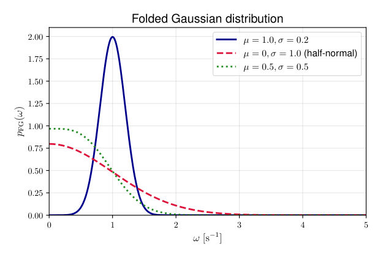
<figcaption class="paper-figure-caption"><b>Fig 1.</b> Figure 1: Folded Gaussian probability density pFG(ω; µ, σ) for three parameter sets. The solid blue curve (µ = 1.0 s−1, σ = 0.2 s−1) is sharply peaked near ω = µ, justifying the cumulant expansion of Sec. 4.1. The dashed red curve (µ = 0, σ = 1.0 s−1) is the half-normal distribution; its finite, nonzero value at ω = 0 is the soft-mode tail. The dotted green curve (µ = 0.5 s−1, σ = 0.5 s−1) interpolates between the two limits.</figcaption>
</figure>
<figure class="paper-figure-card">
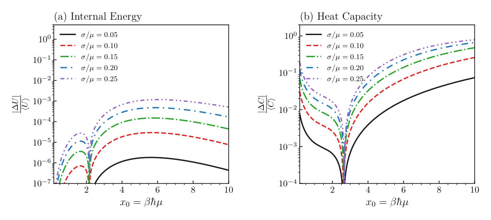
<figcaption class="paper-figure-caption"><b>Fig 2.</b> Figure 2: Relative errors of the cumulant expansion: (a) internal energy; (b) heat capacity. The expansion retains only the variance term. For U, errors remain below 10−3 for σ/µ ≤0.20; for C, deviation is stronger and errors can reach ∼80% at large σ/µ, confirming cumulant truncation is insufficient for heat capacity in the high-T regime.</figcaption>
</figure>

**Summary.** This paper provides a comprehensive statistical mechanics treatment of quantum harmonic oscillators whose frequencies are subject to folded Gaussian disorder. By deriving exact formulas and analyzing limiting cases ($\mu=0$ vs $\mu \gg \sigma$), the authors characterize how soft-mode disorder affects thermodynamic properties like heat capacity. The work is significant for establishing theoretical benchmarks regarding energy localization and the nature of thermal response in disordered quantum lattices.

**Why it may be interesting.** The study provides a minimal yet rigorous benchmark for understanding soft-mode disorder in quantum systems. The distinction between power-law freeze-out due to single-site disorder versus true Lifshitz tails is crucial for interpreting experimental data on disordered materials, which has relevance across AMO physics and condensed matter.

Detailed structure

**Main problem.** The paper tackles the statistical mechanics of a quantum harmonic oscillator whose frequency is randomly drawn from a folded Gaussian distribution, focusing on soft-mode disorder thermodynamics.

**Main result.** It derives analytic approximations for thermodynamic quantities (e.g., heat capacity) in various limits ($\sigma \ll \mu$ and $\mu=0$), showing that the soft-mode kink leads to a power-law freeze-out rather than a true energy gap or Lifshitz tail.

**Method.** The authors use ensemble averaging over the folded Gaussian probability distribution, deriving exact integral representations for key thermodynamic potentials and applying complementary analytic approximations (cumulant expansion vs. asymptotic analysis).

**Model / system.** The model is a quantum harmonic oscillator ($\hat{H} = rac{\hat{p}^2}{2m} + rac{1}{2}m\omega^2\hat{x}^2$) where the frequency $\omega$ is random, governed by a folded Gaussian distribution $p_{FG}(\omega; \mu, \sigma)$. The model is extended to $N$ independent oscillators and a lattice structure.

**Key observables.** Partition function ($Z$), internal energy ($U$), free energy ($F$), heat capacity ($C$), and entropy ($S$).

**Important parameters / regimes.** The disorder parameters $\mu$ (mean frequency) and $\sigma$ (variance), and the temperature $T$ (or inverse temperature $eta$). Key regimes include small variance ($\sigma \ll \mu$) and zero-center case ($\mu=0$).

**Assumptions / limitations.** The analysis relies on deriving exact integral representations and applying controlled analytic limits, such as cumulant expansions or low-frequency asymptotic analyses.

**Figures summary.** Figure 1 compares the folded Gaussian PDF for different $(\mu, \sigma)$. Figure 2 shows relative errors in approximations for $U$ and $C$, indicating limitations of the cumulant expansion for heat capacity.

**Paper structure.** The paper systematically derives exact integral forms for thermodynamic quantities for a single oscillator. It then analyzes specific limits ($\sigma \ll \mu$) using cumulant expansions, examines the $\mu=0$ case (soft-mode behavior), and finally extends the analysis to $N$ independent oscillators and a full lattice model.

Abstract

A self-contained statistical-mechanics treatment of a single quantum harmonic oscillator is presented, whose frequency $ω$ is drawn from a folded Gaussian distribution: $ω=|ξ|$ with $ξ\sim\mathcal{N}(μ,σ^2)$. The exact integral representations for the partition function, internal energy, free energy, heat capacity, and entropy are derived, and analytic approximations are given in two complementary limits---small variance ($σ\llμ$) via a cumulant expansion, and the zero-center case ($μ=0$) via low-frequency asymptotic analysis. The model is extended to $N$ independent oscillators, where the heat capacity is shown to be extensive with self-averaging fluctuations $\propto N^{-1/2}$, and finally to a disordered oscillator lattice, where the folded-Gaussian kink at $ω=0$ produces a soft-mode infrared tail. For a single isolated oscillator with $μ=0$, both $C$ and $S$ vanish linearly at low $T$. In the lattice case, the van Hove factor converts this to a $T^d$ power law. The oft-quoted ``third-law violation'' for disordered phonons is here shown to be a spectral property---the absence of an energy gap and a power-law freeze-out---driven by the single-site distribution kink rather than by a genuine Lifshitz tail (which requires rare large-scale spatial fluctuations). The folded Gaussian thus serves as a minimal benchmark for soft-mode disorder thermodynamics.

[↑ back to top](#top)

### [A certified lower bound on the quantum-capacity threshold of the depolarizing channel](http://arxiv.org/abs/2608.15870v1)

**Authors:** Artus Krohn-Grimberghe  
**Type:** theory · **Category:** quantum information and computing · **PDF:** <https://arxiv.org/pdf/2608.15870v1>  
**Analysis basis:** full PDF text, analyzed in chunks
**Topic relevance:** `correlated / nonlocal dissipation` **1/5** · `quantum measurements` **1/5**

↔ Scroll figures horizontally

<figure class="paper-figure-card">
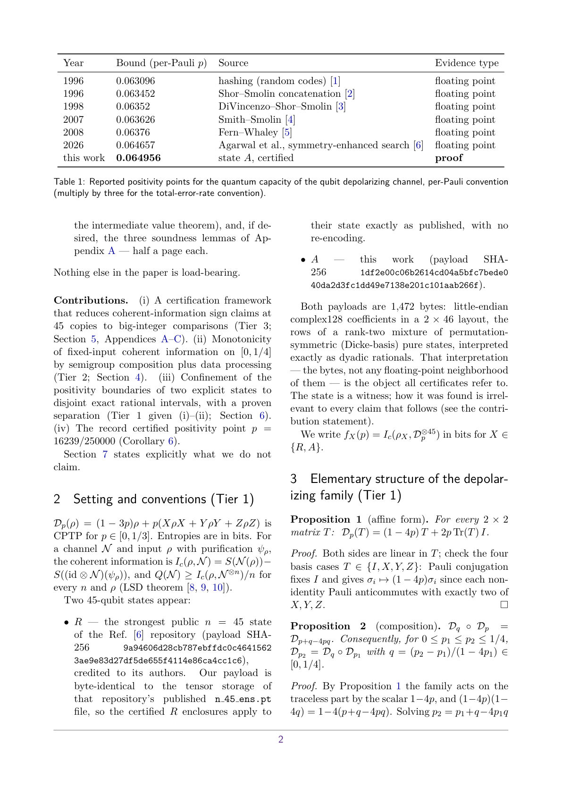
<figcaption class="paper-figure-caption"><b>Fig 1.</b> Low-resolution page preview, page 2</figcaption>
</figure>
<figure class="paper-figure-card">
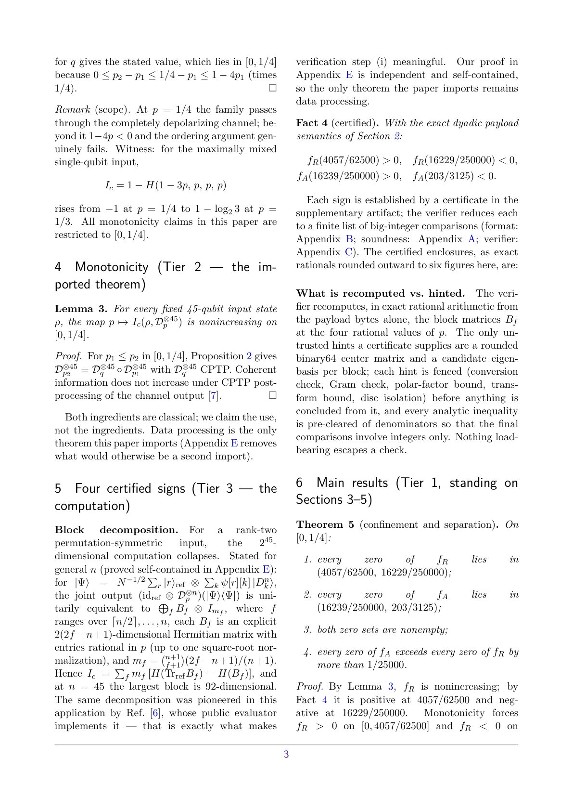
<figcaption class="paper-figure-caption"><b>Fig 2.</b> Low-resolution page preview, page 3</figcaption>
</figure>
<figure class="paper-figure-card">
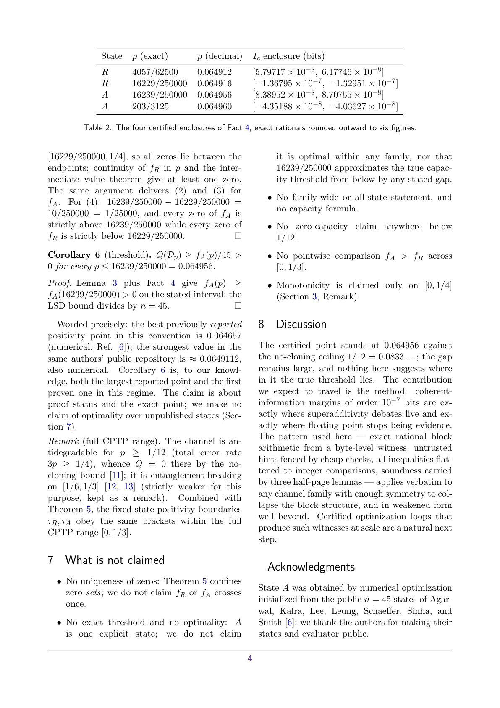
<figcaption class="paper-figure-caption"><b>Fig 3.</b> Low-resolution page preview, page 4</figcaption>
</figure>
<figure class="paper-figure-card">
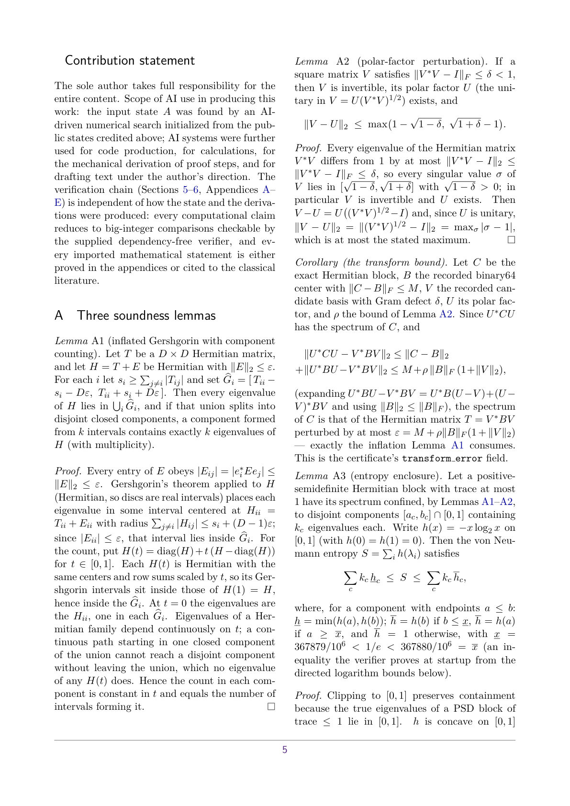
<figcaption class="paper-figure-caption"><b>Fig 4.</b> Low-resolution page preview, page 5</figcaption>
</figure>
<figure class="paper-figure-card">
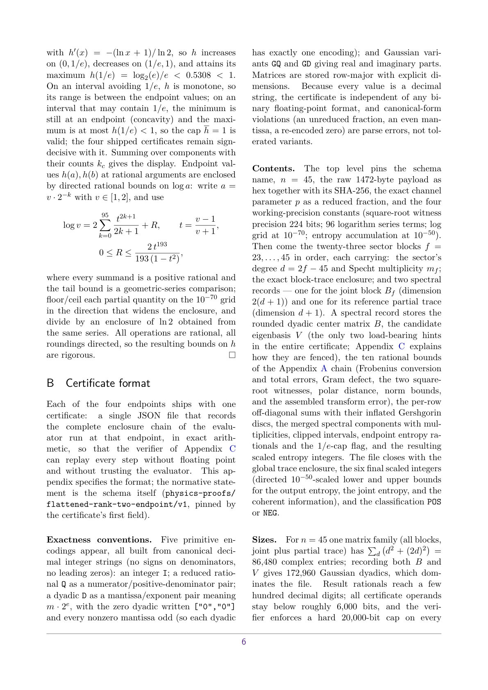
<figcaption class="paper-figure-caption"><b>Fig 5.</b> Low-resolution page preview, page 6</figcaption>
</figure>

**Summary.** This paper establishes the most rigorously proven lower bound on the noise threshold for the qubit depolarizing channel's positive quantum capacity. It achieves this by developing a novel mathematical framework that replaces floating-point approximations with verifiable proofs using exact rational arithmetic. This work is significant for setting new, provable benchmarks in quantum communication theory.

**Why it may be interesting.** This work represents a significant methodological advance by applying rigorous, computationally verifiable proof techniques (exact rational arithmetic) to quantum capacity problems, setting a new standard for theoretical bounds in open quantum systems.

Detailed structure

**Main problem.** The primary goal is to determine a certified lower bound on the noise threshold below which the quantum capacity of the qubit depolarizing channel remains positive.

**Main result.** The authors provide a rigorously proven, certified lower bound for the positive quantum capacity at $p=0.064956$, surpassing previous numerical estimates and establishing a provable ordering between competing code states.

**Method.** The proof relies on constructing explicit mathematical 'certificates' using exact rational arithmetic (big-integer comparisons) to certify that the coherent information remains positive, avoiding floating-point approximations entirely.

**Model / system.** The system analyzed is the qubit depolarizing channel, $D_p(
ho)$, which models noise in quantum communication. The analysis uses concepts from quantum information theory involving tensor products and entropy calculations.

**Key observables.** Quantum capacity ($Q$), Coherent Information ($I_c$), and the noise parameter $p$ (per-Pauli convention).

**Important parameters / regimes.** The critical threshold value is certified at $p=16239/250000 = 0.064956$. The analysis is restricted to the interval $[0, 1/4]$ due to monotonicity.

**Assumptions / limitations.** The claims are based on exact rational arithmetic proofs; no claim of optimality over all possible states or an exact threshold value is made.

**Figures summary.** Not specified in detail, but the notes mention Table 1 comparing literature bounds and Table 2 showing certified enclosures for $I_c$ at specific rational points.

**Paper structure.** The paper develops a rigorous framework involving multiple lemmas (A1-A3, E1-E4) to bound entropy using spectral confinement derived from exact matrix algebra. The structure culminates in the certification of the positive coherent information value via a dependency-free verifier.

Abstract

The noise threshold below which the qubit depolarizing channel retains positive quantum capacity has been studied since 1996, and every improvement to date -- most recently the record of Agarwal et al. -- rests on floating-point evaluation of the coherent information. We give the first proven positivity results in this regime: an explicit 45-copy rank-two input state A, published as a 1,472-byte witness, with certified $I_c>0$ at the exact rational $p=16239/250000=0.064956$ (per-Pauli convention; total error rate $3p=0.194868$), beyond the best previously reported numerical value. Because the depolarizing family is a semigroup under composition, fixed-input coherent information is nonincreasing in $p$ on $[0,1/4]$, so a single certified point extends to the entire interval below it. The same machinery confines the positivity boundaries of A and of the strongest public state of Agarwal et al. to disjoint rational intervals separated by more than $1/25000$ -- to our knowledge the first proven ordering of two competing code states. Every computational claim in the paper reduces to a finite list of big-integer comparisons, checkable by a dependency-free few-hundred-line verifier whose soundness rests on three self-contained half-page lemmas. Payloads, certificates, and verifier accompany the paper as a supplementary artifact.

[↑ back to top](#top)

### [A gauge-invariant theory of small Markovian errors in quantum gate sets](http://arxiv.org/abs/2608.14891v1)

**Authors:** Juan Gonzalez De Mendoza, Corey Ostrove, Timothy Proctor, Kevin Young, Erik Nielsen, Robin Blume-Kohout  
**Type:** theory · **Category:** quantum information and computing · **PDF:** <https://arxiv.org/pdf/2608.14891v1>  
**Analysis basis:** full PDF text, analyzed in chunks
**Topic relevance:** `correlated / nonlocal dissipation` **1/5** · `quantum measurements` **1/5**

↔ Scroll figures horizontally

<figure class="paper-figure-card">
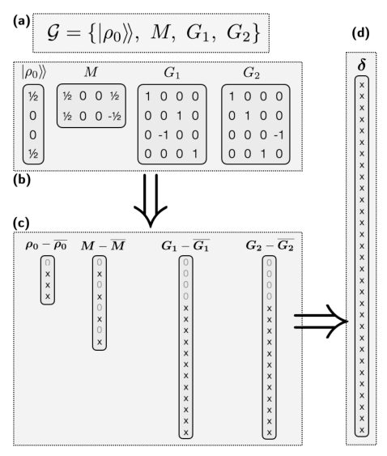
<figcaption class="paper-figure-caption"><b>Fig 1.</b> FIG. 1. We analyze gate sets G = {|ρ⟩⟩, M,G1, . . . ,GN} (a) containing operations that can be represented by Pauli transfer matrices (b). To analyze errors represented by small variations, we consider the dif- ference δ = G −G between the gate set and its target (c), and stack the vectorized differences to form a single vector δ ∈∆in error set space (d). Zero entries in panel (c) represent unvarying (and thus discardable) matrix elements. This figure illustrates a small 1-qubit gate set with 3 + 4 + 12 + 12 = 31 degrees of freedom.</figcaption>
</figure>
<figure class="paper-figure-card">
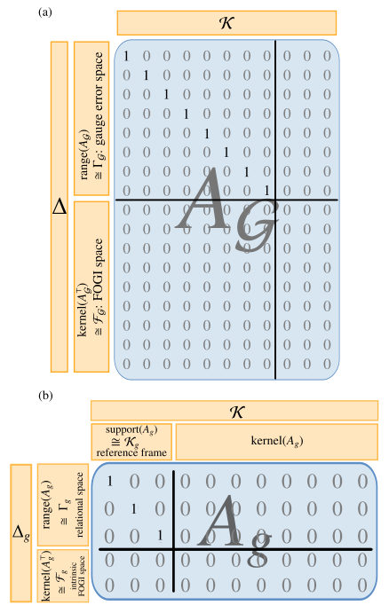
<figcaption class="paper-figure-caption"><b>Fig 2.</b> FIG. 2. Small gauge transformations, described by k ∈K, apply affine shifts to error set vectors δ ∈∆. (a) Gauge-induced shifts in a gate set G are described by a gauge action matrix AG : K →∆. As seen in the analysis that yields Lemma 1, the row space of AG is isomorphic to two fundamental subspaces. AG is shown in reduced row echelon form (RREF) to illustrate FG  kernel  A⊤ G  , the gate set’s FOGI space, and ΓG  range(AG), the gauge error space. The gauge action matrix for the entire gate set AG, in its original non- RREF form, is composed of stacked operation-specific gauge action matrices Ag. (b) For any Ag, shown here in its RREF, we focus on three fundamental subspaces: Fg ...</figcaption>
</figure>
<figure class="paper-figure-card">
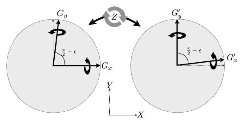
<figcaption class="paper-figure-caption"><b>Fig 3.</b> FIG. 3. If a gate set contains π/2 rotations around the Pauli X (Gx) and Pauli Y (Gy) axes, but the actual rotation axes make an angle of π/2 −ϵ with each other instead of π/2, this is a pairwise relational error. Either gate in isolation behaves perfectly, but there is an ob- servable error that can be shifted between them by a gauge Z rotation.</figcaption>
</figure>
<figure class="paper-figure-card">

<figcaption class="paper-figure-caption"><b>Fig 4.</b> Figure 3 illustrates a simple example. Consider a single- qubit processor whose target gate set G = n</figcaption>
</figure>
<figure class="paper-figure-card">
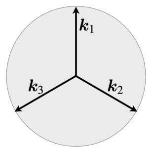
<figcaption class="paper-figure-caption"><b>Fig 5.</b> FIG. 4. If three operations g1, g2, g3 have distinct 1-dimensional gauge spaces k1, k2, k3 that span a 2-dimensional space, like the trine vectors illustrated here, then no pairwise FOGI relational operations can exist because no pair of gauge spaces intersects and so the equa- tion ki + k j = 0 has no nonzero solutions. But a 3-wise relational property exists, because k1 + k2 + k3 = 0.</figcaption>
</figure>

**Summary.** This paper tackles the ambiguity arising from gauge freedom when describing noisy quantum gates. It introduces First-Order Gauge-Invariant (FOGI) properties as a systematic, physically relevant way to parameterize small errors in gate sets. This provides essential tools for developing robust and unambiguous error characterization metrics for quantum computing hardware.

**Why it may be interesting.** This work provides a rigorous mathematical framework for defining 'physical' error metrics in quantum computation that are independent of arbitrary choices (gauge fixing), which is crucial for comparing experimental results across different hardware platforms.

Detailed structure

**Main problem.** The core challenge is developing a physically meaningful, gauge-invariant way to characterize small errors in quantum gate sets.

**Main result.** The authors introduce First-Order Gauge-Invariant (FOGI) properties that provide coordinates for parameterizing gate sets without suffering from unphysical gauge ambiguities. They derive systematic methods to construct these basis elements.

**Method.** The approach involves linearizing the error structure around a target gate set and identifying properties whose first-order deviation is insensitive to small gauge transformations, leading to kernel calculations on gauge action matrices.

**Model / system.** The system models quantum computation using qubits, where operations are represented by superoperators (transfer matrices) acting on density matrices. The structure includes an initial state preparation, a sequence of logic gates, and a final measurement.

**Key observables.** Gauge-invariant error metrics derived from FOGI properties; the dimension of the intrinsic FOGI space ($	ext{FG}$).

**Important parameters / regimes.** The small error parameter $\epsilon$, which governs the linearization approximation ($O(\epsilon)$ vs $O(\epsilon^2)$).

**Assumptions / limitations.** The analysis relies on assuming that errors are small (perturbative) and that the gate set is informationally complete (IC) for certain key theorems.

**Figures summary.** Figure 1 illustrates the structure of a general 1-qubit gate set. Figure 8(d) shows the collection of 19 FOGI properties forming a basis for $	ext{FG}_7$.

**Paper structure.** The paper systematically defines gauge freedom in quantum operations, introduces the concept of FOGI properties to quantify observable errors, and develops computational procedures using kernel analysis on gauge action matrices to construct bases for these invariant error spaces.

Abstract

Noisy logic operations on a quantum computational register -- e.g., one or more qubits -- can be described by transfer matrices (a.k.a. CPTP maps or superoperators) that act linearly on the density matrix representing the register's quantum state. Collectively, these operations form a gate set. Gate sets have a gauge freedom; many gate sets that appear different actually predict the same experimental outcomes. A property of a gate set can be observable (and thus physically relevant) only if it is gauge-invariant. Unfortunately, no good gauge-invariant parameterizations of gate sets are known. We introduce the next best thing, a perturbative gauge-invariant parameterization of small Markovian errors in gate sets. We construct vector spaces of properties that are first-order gauge-invariant (FOGI). We show how to construct and understand FOGI properties, how to use them as coordinates to parameterize gate sets without gauge freedom, and how to extract approximately gauge-invariant error metrics.

[↑ back to top](#top)

### [A General-purpose Solver of Fourier Neural Swarm Operator Towards Accurate and Efficient Mechanical Modeling of Ultra Large Composite Materials](http://arxiv.org/abs/2608.15588v1)

**Authors:** Lekun Gao, Shaohua Chen  
**Type:** theory · **Category:** disordered systems and neural networks · **PDF:** <https://arxiv.org/pdf/2608.15588v1>  
**Analysis basis:** full PDF text, analyzed in chunks
**Topic relevance:** `Keldysh / 2PI / non-Gaussian methods` **1/5** · `methods for driven-dissipative` **1/5**

↔ Scroll figures horizontally

<figure class="paper-figure-card">
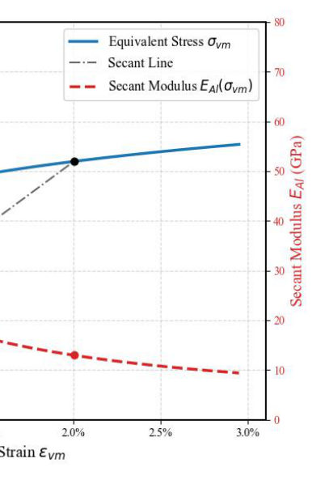
<figcaption class="paper-figure-caption"><b>Fig 1.</b> Figure 1: Nonlinear constitutive response of the aluminum (Al) matrix under the Ramberg–Osgood model based on the J2 invariant. The blue solid curve on the left vertical axis represents the evolution of the von Mises equivalent stress σvm with respect to the equivalent strain ϵvm. The red dashed curve on the right vertical axis shows the corresponding nonlinear degradation of the secant modulus EAl(σvm). The dash-dotted line illustrates, as an example, the state at σvm = 0.26Gpa (corresponding to an equivalent strain of approximately 2.0%).</figcaption>
</figure>
<figure class="paper-figure-card">
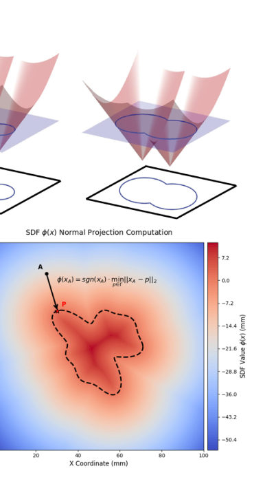
<figcaption class="paper-figure-caption"><b>Fig 2.</b> Figure 2: (a)Illustration of using LSM to compresses three-dimensional features into two dimen- sions [39]. (b) an example of using LSM to convert discontinuous composite microstructure into continuous signed distance field (SDF).</figcaption>
</figure>
<figure class="paper-figure-card">
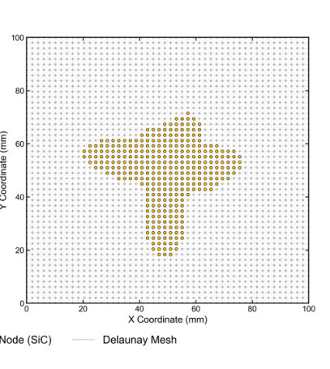
<figcaption class="paper-figure-caption"><b>Fig 3.</b> Figure 3: (a) schematic illustration of typical microstructure feature of SiC-Al composite, where the gray region represents the Al matrix and the yellow region of the reinforcement SiC particle, (b)the structured mesh discretization obtained by Delaunay triangulation.</figcaption>
</figure>
<figure class="paper-figure-card">
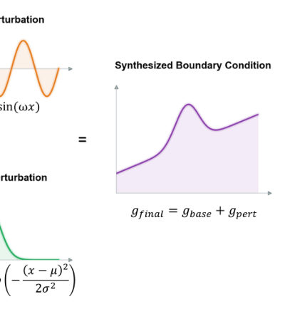
<figcaption class="paper-figure-caption"><b>Fig 4.</b> Figure 4: Schematic illustration of Dirichlet BC generation. The Dirichlet BC along each edge consists of two parts, gbase and gpert. gbase represents the base term which is a linear distribution, while gpert is an extra nonlinear term, which can take the form of trigonometric or Gaussian function.</figcaption>
</figure>
<figure class="paper-figure-card">
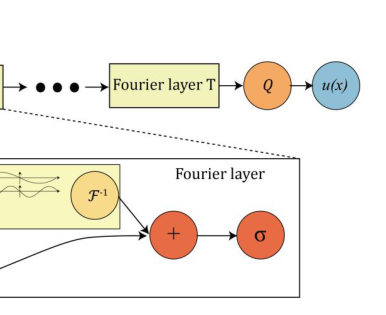
<figcaption class="paper-figure-caption"><b>Fig 5.</b> Figure 5: Schematic of the building-block FNO architecture [24]</figcaption>
</figure>

**Summary.** This paper introduces a novel FNO-swarm framework to overcome the computational bottlenecks in simulating large, heterogeneous composite materials. It trains local neural operators on microstructural components and assembles them globally using domain decomposition techniques like Schwarz iteration. The method achieves massive speedups while maintaining high accuracy compared to traditional finite element analysis.

**Why it may be interesting.** While focused on classical mechanics, the core methodology—using neural operators to learn complex physical mappings across scales and domains—is highly relevant to developing scalable ML solvers for quantum many-body Hamiltonians or time evolution equations where traditional numerical methods fail due to size or complexity.

Detailed structure

**Main problem.** Accurately and efficiently modeling the mechanical response of complex, heterogeneous composite materials with microstructures exhibiting distinct hierarchical features.

**Main result.** The proposed FNO-swarm method achieves comparable accuracy to nonlinear finite element analysis while reducing computational cost by orders of magnitude for massive systems.

**Method.** A two-scale framework that uses building-block Fourier Neural Operators (FNOs) trained on local microstructural features, which are then assembled into an FNO swarm synchronized via Schwarz iteration across the global domain.

**Model / system.** The system involves composite media like SiC-Al composites with complex microstructures. The mechanical behavior is governed by elliptic differential equations describing stress and strain fields ($\sigma$, $\epsilon$).

**Key observables.** Displacement field (u), Stress tensor ($\sigma$), Strain tensor ($\epsilon$), von Mises equivalent stress ($\sigma_{vm}$).

**Important parameters / regimes.** The model handles extreme scales, such as composites with over a billion nodal points; material parameters include elastic moduli and plasticity parameters for the Al matrix.

**Assumptions / limitations.** Assumes that local mechanical characteristics can be accurately encoded into building-block FNOs. Limitations noted include potential error accumulation at boundaries and reliance on level-set methods to smooth interfaces.

**Figures summary.** Figures illustrate the application of Level Set Methods (LSM) to define microstructures, compare strain/displacement fields between the FNO-swarm and FEM for various domain sizes, and show constitutive relationships like the Ramberg–Osgood model.

**Paper structure.** The paper reviews limitations in traditional multiscale methods (homogenization, domain decomposition) and existing ML solvers (PINNs). It then introduces the novel two-scale FNO swarm methodology, detailing local training via FNOs and global assembly/synchronization using Schwarz iteration, culminating in performance validation on large composites.

Abstract

Composite media with complex microstructures exhibit highly tailorable mechanical properties but remain challenging to model efficiently and accurately. Conventional homogenization often oversimplifies microstructural effects, whereas multiscale approaches typically require costly coupling across spatial and temporal scales. To address these limitations, we propose a two-scale neural-swarm framework for large-scale mechanical modeling of heterogeneous composites. At the local scale, the mechanical characteristics of representative microstructural features are encoded into building-block Fourier neural operators (FNOs) using level-set representations. At the global scale, these pretrained FNOs are assembled into an FNO swarm according to the spatial distribution of microstructural constituents. A coarse-mesh finite element model is employed to provide global physical guidance, while Schwarz iteration is used to synchronize neighboring FNOs and enforce consistency across shared interfaces. The proposed framework is validated through nonlinear simulations of SiC-Al composites with diverse microstructural configurations. Compared with nonlinear finite element analysis, the FNO-swarm method achieves comparable accuracy while reducing computational cost by orders of magnitude. For an extreme dual-property SiC-Al composite containing more than a billion nodal points, the proposed approach predicts the mechanical response within approximately one hour, demonstrating exceptional scalability. Furthermore, the framework naturally accommodates arbitrary Dirichlet boundary conditions and complex domain geometries. The proposed neural-swarm strategy provides a robust and scalable paradigm for large-scale mechanics simulations, reconciling the longstanding trade-off between computational efficiency and physical fidelity in heterogeneous materials modeling.

[↑ back to top](#top)

### [A minimal qutrit counterexample to Conjecture 4.9 of Lesniewski and Ruskai](http://arxiv.org/abs/2608.15464v1)

**Authors:** Domingos S. P. Salazar  
**Type:** theory · **Category:** quantum information and computing · **PDF:** <https://arxiv.org/pdf/2608.15464v1>  
**Analysis basis:** full PDF text, analyzed in chunks
**Topic relevance:** `correlated / nonlocal dissipation` **1/5** · `quantum measurements` **1/5**

↔ Scroll figures horizontally

<figure class="paper-figure-card">
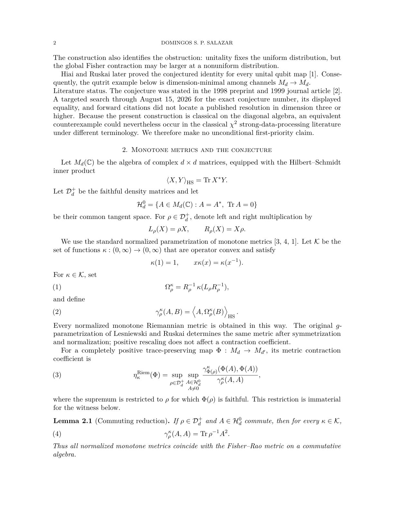
<figcaption class="paper-figure-caption"><b>Fig 1.</b> Low-resolution page preview, page 2</figcaption>
</figure>
<figure class="paper-figure-card">
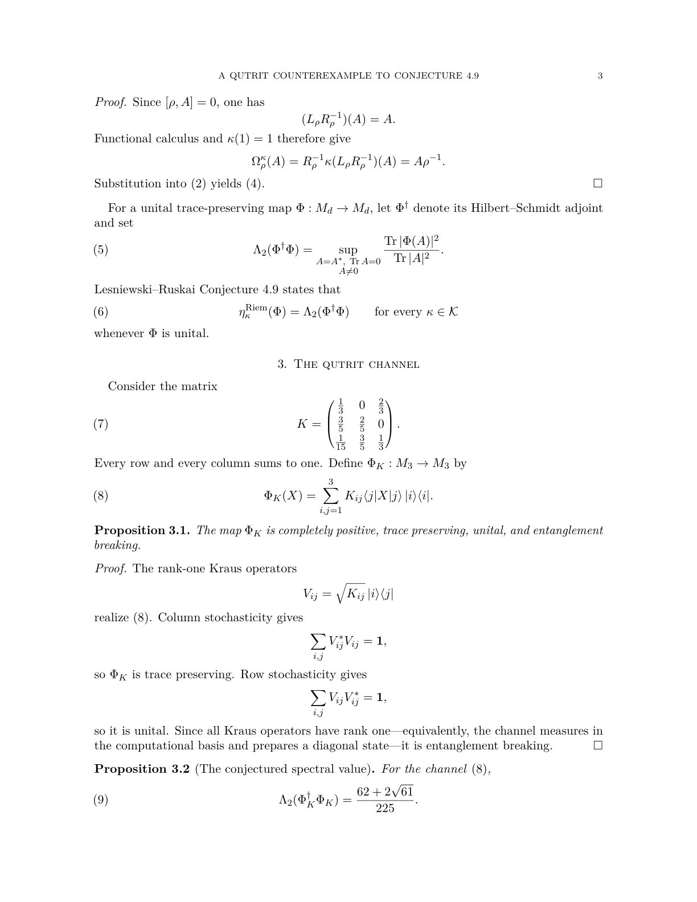
<figcaption class="paper-figure-caption"><b>Fig 2.</b> Low-resolution page preview, page 3</figcaption>
</figure>
<figure class="paper-figure-card">
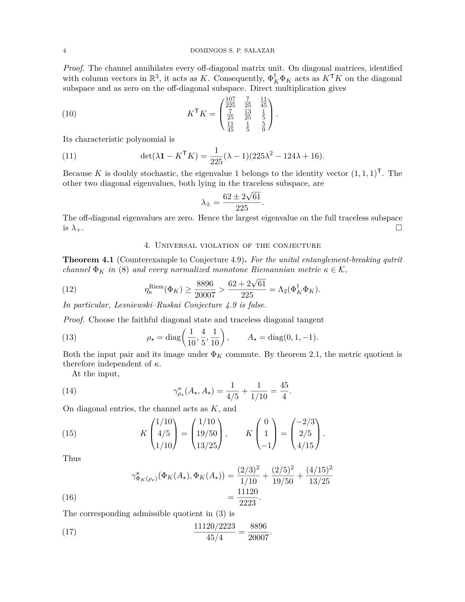
<figcaption class="paper-figure-caption"><b>Fig 3.</b> Low-resolution page preview, page 4</figcaption>
</figure>
<figure class="paper-figure-card">
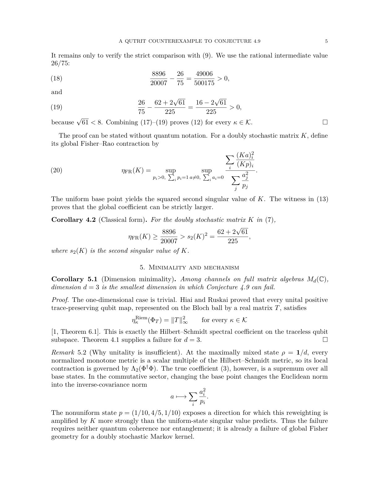
<figcaption class="paper-figure-caption"><b>Fig 4.</b> Low-resolution page preview, page 5</figcaption>
</figure>
<figure class="paper-figure-card">

<figcaption class="paper-figure-caption"><b>Fig 5.</b> Low-resolution page preview, page 6</figcaption>
</figure>

**Summary.** This paper disproves a conjecture relating two key measures of quantum channel contraction ($\eta_{	ext{Riem}}^{\kappa}(\Phi)$ and $\Lambda_2(\Phi^\dagger\Phi)$). Using an explicit, classical qutrit channel as a counterexample, the authors show that for dimension three, the global metric contraction coefficient can strictly exceed the Hilbert-Schmidt norm bound. This establishes that dimension three is the minimal size where this geometric inequality fails.

**Why it may be interesting.** This work provides a concrete boundary condition violation in quantum process characterization, which has implications for understanding geometric structures (like Fisher information) associated with quantum operations beyond the qubit level.

Detailed structure

**Main problem.** The paper aims to disprove Lesniewski and Ruskai's Conjecture 4.9, which relates the contraction coefficient of a monotone Riemannian metric under a unital stochastic map ($\eta_{	ext{Riem}}^{\kappa}(\Phi)$) to the Hilbert-Schmidt norm on the traceless subspace ($\Lambda_2(\Phi^\dagger\Phi)$).

**Main result.** The conjecture is disproved by constructing an explicit counterexample using an entanglement-breaking qutrit channel, showing that $\eta_{	ext{Riem}}^{\kappa}(\Phi) > \Lambda_2(\Phi^\dagger\Phi)$.

**Method.** The authors use detailed calculations involving a specific doubly stochastic $3	imes3$ matrix to define the counterexample channel and establish the strict inequality between the two quantities.

**Model / system.** The study concerns quantum channels ($\Phi$) acting on density matrices of qutrits ($M_3(\mathbb{C})$). The metric is defined over normalized monotone Riemannian metrics, and the failure is demonstrated using a classical channel structure.

**Key observables.** $\eta_{	ext{Riem}}^{\kappa}(\Phi)$ (global metric contraction coefficient) and $\Lambda_2(\Phi^\dagger\Phi)$ (squared Hilbert-Schmidt norm on the traceless subspace).

**Important parameters / regimes.** The dimension $d=3$ is highlighted as minimal for this failure, contrasting with the qubit case ($d=2$) where the identity holds.

**Assumptions / limitations.** The counterexample relies on a faithful diagonal state and a commuting traceless tangent vector to simplify the metric quotient calculation.

**Paper structure.** The paper introduces Conjecture 4.9, presents the necessary mathematical framework involving monotone metrics, derives the explicit counterexample using a doubly stochastic qutrit channel, and concludes by proving that dimension three is minimal for this failure.

Abstract

Lesniewski and Ruskai conjectured that the contraction coefficient of every monotone Riemannian metric under a unital stochastic map equals the Hilbert--Schmidt contraction on the traceless subspace. We disprove the conjecture with an explicit entanglement-breaking qutrit channel induced by a doubly stochastic $3\times3$ matrix. A faithful diagonal state and a commuting traceless tangent give, simultaneously for every normalized monotone metric, the exact lower bound $η^{\mathrm{Riem}}_κ(Φ_K)\ge 8896/20007>(62+2\sqrt{61})/225=Λ_2(Φ_K^{\dagger}Φ_K)$. The counterexample is entirely classical on a maximal abelian subalgebra. A theorem of Hiai and Ruskai establishes the conjectured identity for all unital qubit maps, so dimension three is minimal among full matrix algebras.

[↑ back to top](#top)

### [Asymptotic analysis of a Fredholm determinant occurring in the description of the dynamical correlation functions of the Lieb--Liniger Bose gas](http://arxiv.org/abs/2608.16727v1)

**Authors:** Frank Göhmann, Karol K. Kozlowski, Mikhail D. Minin  
**Type:** theory · **Category:** statistical mechanics · **PDF:** <https://arxiv.org/pdf/2608.16727v1>  
**Analysis basis:** full PDF text, analyzed in chunks
**Topic relevance:** `Keldysh / 2PI / non-Gaussian methods` **1/5** · `non-equilibrium universality` **1/5**

↔ Scroll figures horizontally

<figure class="paper-figure-card">
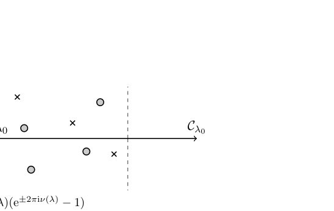
<figcaption class="paper-figure-caption"><b>Fig 1.</b> Figure 4: Those poles of L′ ℓ(λ) that are roots of 1 + ϑ(λ)(e2πiν(λ) −1) are marked by crosses, while those poles of L′ r(λ) that are roots of 1 + ϑ(λ)(e−2πiν(λ) −1) are marked by circles. Here we sketch the case when all poles of L′ ℓ(λ) and L′ r(λ) are away from the real axis. Note that the poles are finite in number and located in a compact subset of Ω.</figcaption>
</figure>
<figure class="paper-figure-card">
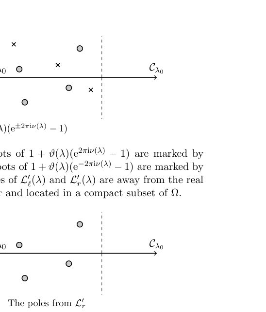
<figcaption class="paper-figure-caption"><b>Fig 2.</b> Figure 5: ‘The poles’, i.e., those points in Ωthat are poles of L′(·|λ0) but not of ϑ.</figcaption>
</figure>
<figure class="paper-figure-card">
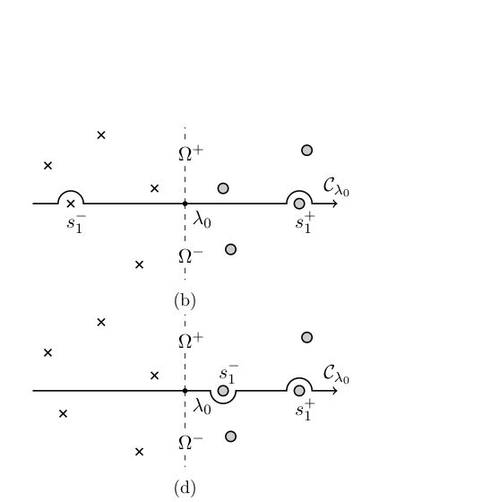
<figcaption class="paper-figure-caption"><b>Fig 3.</b> Figure 6: Schematic illustration of the contour Cλ0 for the case of two poles on the real axis considered in Theorem 2. In Figures 6c and 6d, the relative position of the poles (s− 1 &lt; s+ 1 or s− 1 &gt; s+ 1 ) does not matter (given that conditions (2.15), (2.16) are fulfilled).</figcaption>
</figure>
<figure class="paper-figure-card">
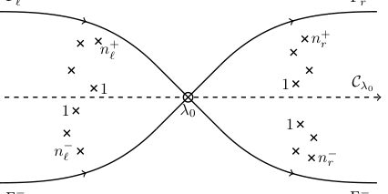
<figcaption class="paper-figure-caption"><b>Fig 4.</b> Figure 8: (a) Definition of the matrix Υ in terms of Ξ and M± ℓ/r; (b) the enumerated poles of Υ stemming from the matrices M± ℓ/r in the corresponding regions.</figcaption>
</figure>
<figure class="paper-figure-card">
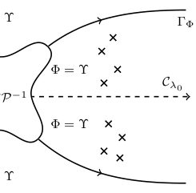
<figcaption class="paper-figure-caption"><b>Fig 5.</b> Figure 11: Definition of the matrix Φ and of the oriented contour ΓΦ.</figcaption>
</figure>

**Summary.** This paper develops a sophisticated asymptotic analysis technique to evaluate Fredholm determinants arising from the Lieb-Liniger Bose gas. By mapping the problem onto a matrix Riemann-Hilbert problem, the authors derive precise large-$x$ expansions for correlation functions. This provides crucial theoretical tools for understanding quantum dynamics in integrable many-body systems.

**Why it may be interesting.** This work provides powerful, rigorous mathematical tools for calculating correlation functions in integrable quantum systems, which is highly relevant to understanding non-equilibrium dynamics and thermalization in many-body physics.

Detailed structure

**Main problem.** The paper performs a large-$x$ asymptotic analysis of a Fredholm determinant associated with an integrable integral operator.

**Main result.** It derives explicit asymptotic expansions for the Fredholm determinant, accounting for leading exponential decay, logarithmic corrections, and constant terms based on the location of poles.

**Method.** The analysis is fundamentally based on solving a matrix Riemann-Hilbert problem using non-linear steepest descent methods and saddle-point approximations in the complex plane.

**Model / system.** The context is the Lieb–Liniger Bose gas, allowing the calculation of its dynamical correlation functions at finite temperature. The mathematical machinery involves an integrable integral operator with a generalized sine kernel.

**Key observables.** Dynamical and equilibrium correlation functions; the Fredholm determinant $\det R (	ext{id} + V)$.

**Important parameters / regimes.** The large parameter $x$ (acting as a distance variable), functional parameters ($u, \vartheta, g, 
u$), and temperature/coupling constant regimes.

**Assumptions / limitations.** The analysis relies on the existence of saddle points ($\lambda_0$) and poles ($S$) in the complex plane, and involves systematic handling of residues from the RHP factorization.

**Figures summary.** Figures illustrate the integration contour $C_{\lambda_0}$ in the complex plane, define the Cauchy transform $C(\lambda)$, and sketch the behavior of exponential terms relative to the saddle point $\lambda_0$.

**Paper structure.** The paper systematically develops the analysis by first establishing the connection between the Fredholm determinant and a matrix Riemann-Hilbert problem. It then applies asymptotic methods (steepest descent) based on the number of poles encountered in the complex plane.

Abstract

We perform a large-$x$ asymptotic analysis of the Fredholm determinant of an integrable integral operator with generalized sine kernel, where $x$ controls the strength of the oscillations along the integration contour of the operator and will play the role of the distance variable in applications to the correlation functions of integrable quantum systems. Our generalized sine kernel involves a number of functional parameters that will allow us to adapt it to the analysis of the dynamical correlation functions of the Lieb--Liniger model at finite temperature and for all positive values of the coupling constant. It will also allow us to consider a class of equilibrium correlation functions that are governed by generalized Gibbs ensembles. Our work is based on the analysis of a matrix Riemann--Hilbert problem that is canonically connected with our integrable integral operator.

[↑ back to top](#top)

### [Exact and Efficient Circuit Construction for Block Encoding Matrix Polynomials](http://arxiv.org/abs/2608.15161v1)

**Authors:** Taehee Ko  
**Type:** theory · **Category:** quantum information and computing · **PDF:** <https://arxiv.org/pdf/2608.15161v1>  
**Analysis basis:** full PDF text, analyzed in chunks
**Topic relevance:** `analog quantum simulation` **1/5** · `quantum measurements` **1/5**

↔ Scroll figures horizontally

<figure class="paper-figure-card">
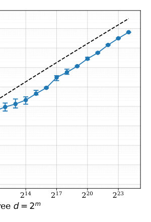
<figcaption class="paper-figure-caption"><b>Fig 1.</b> FIG. 1: Execution time for the exact QSP circuit construction as a function of the polynomial degree d = 2m. The solid blue line denotes the mean empirical execution time over 10 independent random trials, with error bars indicating the absolute minimum and maximum times recorded for each degree. The dashed black line illustrates the theoretical O(d log d) asymptotic scaling.</figcaption>
</figure>

**Summary.** This paper presents a novel, efficient algorithm to construct quantum circuits that exactly implement the block encoding of matrix polynomials. By achieving an O(d log d) classical time complexity, it significantly improves upon previous methods for tasks like Hamiltonian simulation and general function evaluation in quantum computing.

**Why it may be interesting.** This work provides concrete algorithmic tools for implementing complex quantum operations derived from polynomial functions of Hamiltonians, which is fundamental for simulating dynamics in many-body systems or realizing specific quantum gates.

Detailed structure

**Main problem.** The primary goal is to develop an exact and efficient circuit construction method for block encoding matrix polynomials of Hermitian matrices.

**Main result.** The authors propose a direct algorithm achieving near-optimal classical time complexity of O(d log d) for constructing these circuits, applicable to both Hamiltonian simulation and general block encoding models.

**Method.** The approach uses Quantum Signal Processing (QSP) principles combined with a diagonal block encoding technique. This involves calculating required unitary components using controlled rotations derived from state preparation algorithms.

**Model / system.** The work focuses on constructing unitaries $U^{(C)}_{BE}$ that implement the block encoding of matrix polynomials, such as $f_d(e^{iH})$ or $p_d(H)$, where $H$ is a Hermitian operator. The framework is general and applies to various quantum state preparation tasks.

**Key observables.** The key observable is the resulting unitary circuit $U^{(C)}_{BE}$ itself, which must exactly realize $	ext{diag}(f_d(U))$ when projected onto specific ancilla states.

**Important parameters / regimes.** The target polynomial degree $d$ is the most critical parameter, determining the complexity and size of the required circuit.

**Assumptions / limitations.** The method assumes that necessary phase factors can be calculated stably without relying on parity constraints, which was a limitation in prior work. It also relies on established techniques for amplitude encoding via controlled rotations.

**Figures summary.** Figure 1 empirically demonstrates that the execution time required to construct the QSP circuit scales as $O(d \log d)$ when plotted against the polynomial degree $d$.

**Paper structure.** The paper introduces the problem of block encoding, develops a general diagonal block encoding lemma using controlled rotations (UCRs), and then applies this framework to derive explicit constructions for polynomials related to Hamiltonian simulation and Chebyshev polynomials.

Abstract

We propose a direct and stable circuit compiling algorithm that explicitly and exactly constructs block encodings of matrix polynomials for Hermitian matrices. In a unified framework, our algorithm is directly applicable to both standard input models: block encoding and Hamiltonian simulation. For a target polynomial of degree $d$, our classical algorithm achieves a near-optimal time complexity of $\mathcal{O}(d\log d)$. Numerical results confirm this asymptotic scaling for polynomial degrees up to $10^7$ in about a minute on a standard CPU. We achieve this by developing a general-purpose diagonal block encoding of function values, which bridges standard quantum-state preparation techniques with an interpolation-based QSP framework.

[↑ back to top](#top)

### [Non-invertible Lattice 1-Form Symmetries for Non-Abelian Topological Order](http://arxiv.org/abs/2608.16520v1)

**Authors:** Rafael Flores-Calderón, Frank Pollmann, Michael Knap  
**Type:** theory · **Category:** strongly correlated electrons · **PDF:** <https://arxiv.org/pdf/2608.16520v1>  
**Analysis basis:** full PDF text, analyzed in chunks
**Topic relevance:** `analog quantum simulation` **1/5** · `quantum measurements` **1/5**

↔ Scroll figures horizontally

<figure class="paper-figure-card">
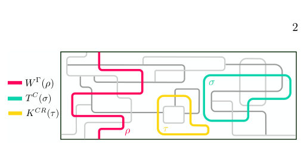
<figcaption class="paper-figure-caption"><b>Fig 1.</b> FIG. 1. Illustration of non-invertible higher-form sym- metries. String-net picture of a torus ground state of a quantum double model with non-Abelian group G visualized as a condensate of closed magnetic strings (thin gray lines). The thick colored ribbons represent the non-invertible 1-form symmetry operators studied in this work. Electric Wilson loops W Γ(ρ) are labeled by irreducible representations Γ of G, magnetic ’t Hooft loops T C(σ) by conjugacy classes C, and dyonic operators KCR(τ) by a conjugacy class C and an irreducible representation R of the corresponding central- izer. Non-contractible loops connect distinct ground states (see Wilson loop as an example).</figcaption>
</figure>
<figure class="paper-figure-card">
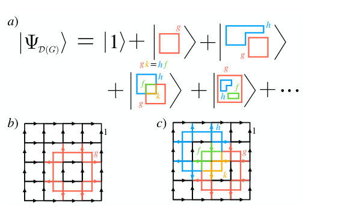
<figcaption class="paper-figure-caption"><b>Fig 2.</b> FIG. 3. Structure of the ground state wave function. a) Ground state wavefunction for the quantum double model in the G basis; 1 is the identity element, and all group elements are summed over. b) Detailed signs of a lattice with one g ∈G dual lattice loop. c) When two loops g, h intersect, the Gauss law allows for transmutation of the inner paths into different group elements k, f as long as gk = hf.</figcaption>
</figure>
<figure class="paper-figure-card">
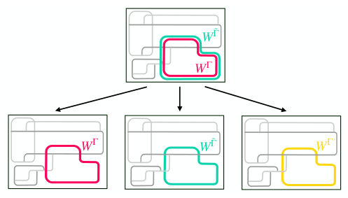
<figcaption class="paper-figure-caption"><b>Fig 3.</b> FIG. 5. Illustration of non-Abelian fusion of electric 1-form symmetries For a non-Abelian group G two Wilson loops labelled by irreps of the group Γ, ˜Γ fuse into multiple channels, see Eq. (24). The multiplicity of a given channel Γ′</figcaption>
</figure>
<figure class="paper-figure-card">
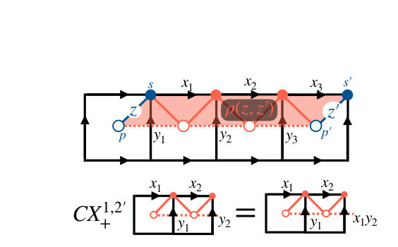
<figcaption class="paper-figure-caption"><b>Fig 4.</b> FIG. 6. Geometry of the ribbon and control opera- tion. Top: A ribbon ρ(z, z′) is shown in orange shade. The blue sites z = (s, p), z′ = (s′, p′) are defined as the endpoint sites of the ribbon. Empty circles denote plaquette positions that the ribbon touches, colored circles denote the vertices. Orange lines denote the sites of the ribbon composed of an interior vertex and a plaquette. The ribbon has associated direct lattice edges x1, x2, x3 and dual lattice edges y1, y2, y3. Bottom: Action of the control operation CX1,2′</figcaption>
</figure>
<figure class="paper-figure-card">
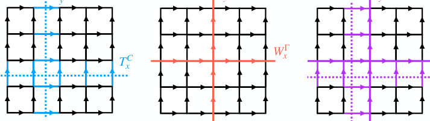
<figcaption class="paper-figure-caption"><b>Fig 5.</b> FIG. 7. Magnetic, electric and dyonic 1-form symmetries. Schematic illustration of the three types of non-contractible 1-form operators on the torus for the quantum double. Left: The magnetic symmetry operator T C x,y carries a magnetic flux C ∈Class(G) and acts along a loop whose dual lattice path is indicated by the dashed blue line. Middle: The electric 1- form symmetry operator W Γ x,y acts only in the direct lattice links, indicated by the orange line. Its charges are irreducible representations Γ = Rep(G) of the group. Right: The general dyonic 1-form symmetry operator KCR x,y carries both a magnetic flux C and an electric charge R ∈Rep(ZC) is defined on a non-trivial ribbon. Both...</figcaption>
</figure>

**Summary.** This paper develops a rigorous framework to describe non-Abelian topological order using higher-form symmetries, specifically focusing on Kitaev quantum double lattice models. By constructing electric, magnetic, and dyonic 1-form operators, the authors provide an operator language that diagnoses the system's topological ground state degeneracy. This work offers a microscopic realization of spontaneous breaking of non-invertible symmetries.

**Why it may be interesting.** The explicit construction of diagnostic operators for non-Abelian order provides a powerful theoretical tool to characterize exotic quantum phases that are relevant for fault-tolerant quantum computation architectures based on anyons.

Detailed structure

**Main problem.** The work aims to precisely characterize non-Abelian topological order by understanding its underlying symmetry structure, specifically involving higher-form symmetries.

**Main result.** The paper establishes a concrete microscopic realization of spontaneous non-invertible 1-form symmetry breaking using quantum double lattice models. It provides an operator language for characterizing these complex topological states.

**Method.** The authors construct electric, magnetic, and dyonic 1-form operators directly on the lattice fixed point to diagnose the topological Hilbert space structure.

**Model / system.** The focus is on Kitaev quantum double lattice models $\mathcal D(G)$ for arbitrary finite non-Abelian groups $G$. The analysis builds upon understanding Abelian prototypes like the Z2 toric code.

**Key observables.** Electric Wilson loops ($W_{\Gamma}$), magnetic 't Hooft loops ($T_C$), and dyonic ribbon operators ($K_{CR}$); these form a complete nonlocal diagnostic algebra.

**Important parameters / regimes.** The structure depends on the finite non-Abelian group $G$ and its representations $	ext{Rep}(G)$ and conjugacy classes $	ext{Class}(G)$.

**Assumptions / limitations.** The analysis assumes that projecting microscopic lattice operators onto the defect-free topological subspace recovers the expected continuum fusion rules.

**Figures summary.** Figure 1 illustrates non-invertible higher-form symmetries using string-net pictures on a torus for $D(G)$, labeling the key diagnostic operators. Table I shows eigenvalues for the Z2 toric code ground states.

**Paper structure.** The paper progresses from reviewing Abelian prototypes (like the toric code) to defining the necessary non-invertible 1-form symmetry operators for general finite groups $G$. It then constructs these operators on the lattice and derives the resulting topological degeneracy and fusion rules, culminating in a microscopic understanding of spontaneous symmetry breaking.

Abstract

Higher-form symmetries generalize conventional global symmetries and act on lower-dimensional submanifolds of a quantum system. While Abelian topological phases can be organized by 1-form symmetries that form a group, non-Abelian topological phases based on finite groups require 1-form symmetry operators governed by non-invertible fusion algebras. In this work, we make this statement precise in quantum double lattice models $\mathcal D(G)$ for finite non-Abelian groups $G$. We construct the electric, magnetic, and dyonic 1-form operators directly at the lattice fixed point and show that together they form a complete nonlocal diagnostic algebra for the topological Hilbert space. Using these operators, we explicitly determine the cylinder and torus ground-state subspaces for arbitrary finite $G$. Furthermore, we calculate the microscopic fusion and gluing of the 1-form symmetries and show that their topological deformation properties emerge after projection to the defect-free topological subspace. Our results establish ground states of non-Abelian quantum double models as a concrete microscopic realization of spontaneous non-invertible 1-form symmetry breaking and provide an operator language that may be useful for characterizing such states in quantum processors.

[↑ back to top](#top)

### [Quantum Simulation of QCD in Axial Gauge](http://arxiv.org/abs/2608.16783v1)

**Authors:** Xiaojun Yao  
**Type:** theory · **Category:** quantum information and computing · **PDF:** <https://arxiv.org/pdf/2608.16783v1>  
**Analysis basis:** full PDF text, analyzed in chunks
**Topic relevance:** `analog quantum simulation` **1/5** · `quantum measurements` **1/5**

↔ Scroll figures horizontally

<figure class="paper-figure-card">

<figcaption class="paper-figure-caption"><b>Fig 1.</b> Low-resolution page preview, page 2</figcaption>
</figure>
<figure class="paper-figure-card">
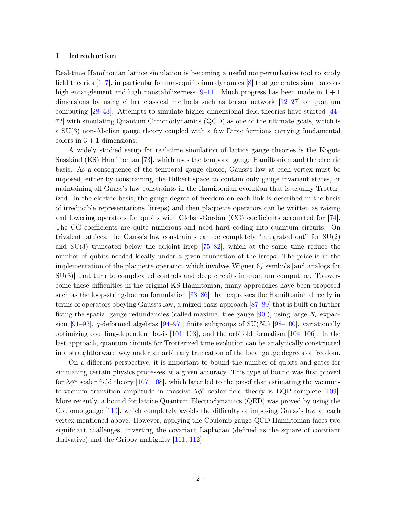
<figcaption class="paper-figure-caption"><b>Fig 2.</b> Low-resolution page preview, page 3</figcaption>
</figure>
<figure class="paper-figure-card">
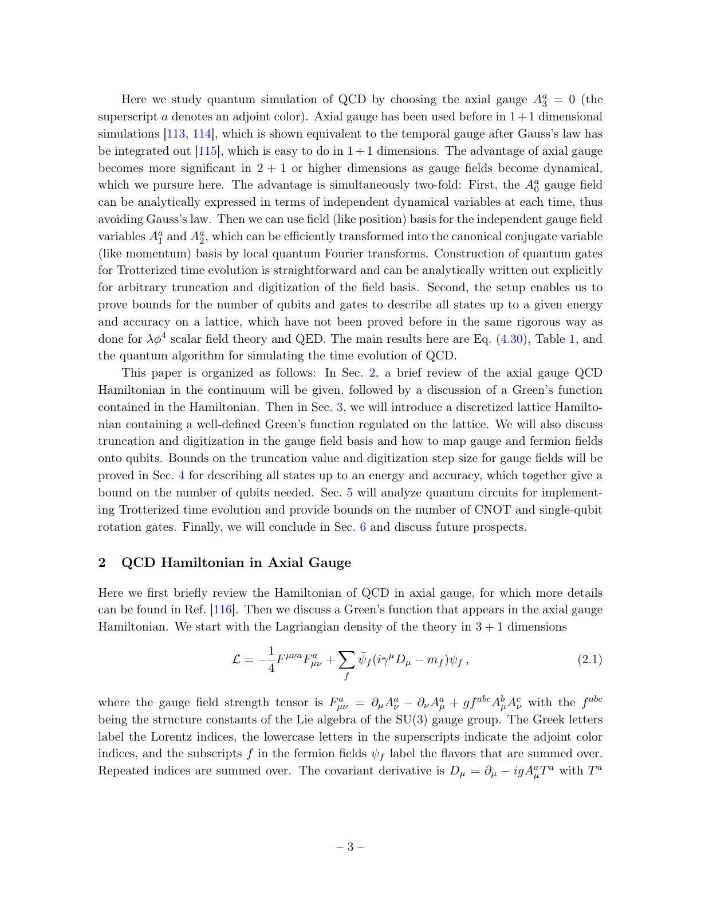
<figcaption class="paper-figure-caption"><b>Fig 3.</b> Low-resolution page preview, page 4</figcaption>
</figure>
<figure class="paper-figure-card">
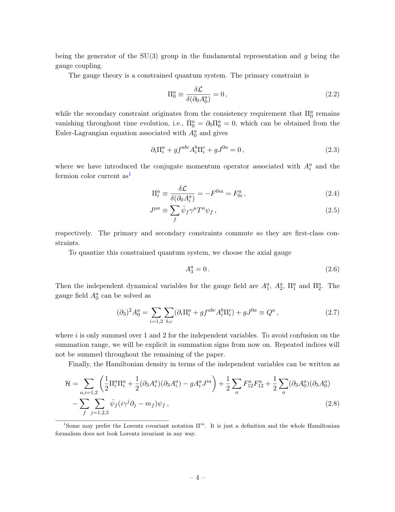
<figcaption class="paper-figure-caption"><b>Fig 4.</b> Low-resolution page preview, page 5</figcaption>
</figure>
<figure class="paper-figure-card">
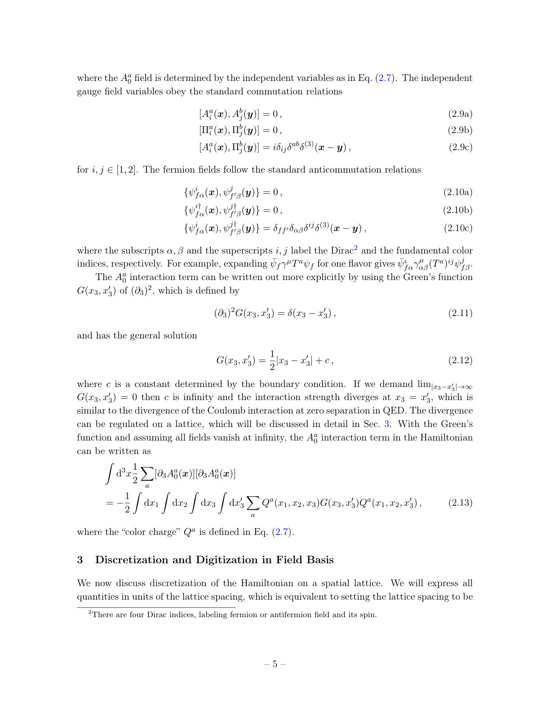
<figcaption class="paper-figure-caption"><b>Fig 5.</b> Low-resolution page preview, page 6</figcaption>
</figure>

**Summary.** This paper details a method to simulate Quantum Chromodynamics (QCD) on a lattice using a quantum computer approach formulated in the axial gauge. It derives theoretical bounds on the number of qubits and the gate complexity required for time evolution simulations. The results confirm that simulating real-time QCD dynamics is polynomially scalable with system parameters.

**Why it may be interesting.** This work directly addresses mapping a complex, non-Abelian field theory onto a digital quantum computer architecture, providing concrete scaling estimates for resource estimation in quantum simulation.

Detailed structure

**Main problem.** The primary goal is the quantum simulation of SU(3) non-Abelian gauge theory (QCD) coupled with fundamental fermions in $3+1$ dimensions.

**Main result.** The study concludes that the quantum resources required for simulating real-time dynamics of lattice QCD scale polynomially with volume, energy, time, accuracy, and bare Hamiltonian parameters.

**Method.** The authors develop a quantum algorithm based on Trotterization, Quantum Fourier Transform (QFT), and Jordan-Wigner transformation to simulate the time evolution governed by the lattice Hamiltonian in axial gauge.

**Model / system.** The system is Lattice QCD formulated using the lattice Hamiltonian approach within the axial gauge ($A_a^3 = 0$). The temporal component of the gauge field is analytically solved, and the full Hamiltonian is mapped onto a qubit representation.

**Key observables.** Qubit count bound ($16n_A V + 12n_f V$) and gate complexity scaling ($O(n_A^{4/3} V^{4/3}) + O(V^{5/3})$ per Trotter step).

**Important parameters / regimes.** Lattice volume ($V$), energy ($E$), accuracy ($\epsilon$), bare coupling ($g$), number of fermion flavors ($n_f$).

**Assumptions / limitations.** The simulation relies on the axial gauge condition, and the qubit cost analysis involves bounding states up to a specific energy $E$ with accuracy $\epsilon$.

**Paper structure.** The paper first establishes the lattice Hamiltonian in the axial gauge by analytically solving for the temporal gauge field component. It then derives bounds on the required qubit resources based on energy and volume, followed by an analysis of the quantum circuit complexity for time evolution.

Abstract

We study quantum simulation of SU(3) non-Abelian gauge theory dynamically coupled with fundamental fermions in $3+1$ dimensions by employing the lattice Hamiltonian in axial gauge that avoids Gauss's law constraints. The temporal component of the gauge field is analytically solved in terms of independent field degrees of freedom and a lattice regulated Green's function. The axial gauge condition is trivially maintained in time evolution, even under Trotterization. The gauge field degrees of freedom are expressed in the local field basis and can be efficiently transformed into the canonical conjugate momentum basis by local quantum Fourier transforms. We prove the number of qubits needed for describing all states up to an energy $E$ with an accuracy $ε$ on a lattice of volume $V$ at bare coupling $g$ is bounded as $16n_A V + 12n_f V$, where $n_A \approx \log_2 (\frac{64 E' V^{4/3}}{π^2ε} + \frac{32\sqrt{2}g n_f E'^{1/2} V^{7/6}}{\sqrt{3}π^3ε^{1/2}} ) $ is the number of qubits needed for each independent gauge field per site with a shifted energy $E'$, and $n_f$ denotes the number of fermion flavors. We then analyze a quantum algorithm for time evolution that is based on Trotterization, quantum Fourier transform, and Jordan-Wigner transformation, for which quantum circuits can be explicitly constructed under arbitrary gauge field truncation and digitization. We find the numbers of CNOT and single-qubit rotation gates both scale as $O(n_A^4 V^{4/3}) + O(V^{5/3})$ per Trotter step for fixed $n_f\leq 6$. We conclude that quantum resources needed for simulating real-time dynamics of lattice QCD scale polynomially with volume, energy, time, accuracy, and bare Hamiltonian parameters.

[↑ back to top](#top)

### [Resolving the Magnetic Ground State and Field-Induced Transitions in Magnetic Dirac Semimetal Candidate EuMnSb$_2$](http://arxiv.org/abs/2608.16724v1)

**Authors:** Yiu-Fung Chiu, Jian-Rui Soh, Sanjay Sharma, J. Alberto Rodríguez-Velamazán, John Singleton, Eugen Weschke, Oleksandr Prokhnenko, Oksana Zaharko, Dharmalingam Prabhakaran, Stephen J. Blundell, Paul A. Goddard, Andrew T. Boothroyd  
**Type:** both · **Category:** strongly correlated electrons · **PDF:** <https://arxiv.org/pdf/2608.16724v1>  
**Analysis basis:** full PDF text, analyzed in chunks
**Topic relevance:** `analog quantum simulation` **1/5** · `quantum measurements` **1/5**

↔ Scroll figures horizontally

<figure class="paper-figure-card">
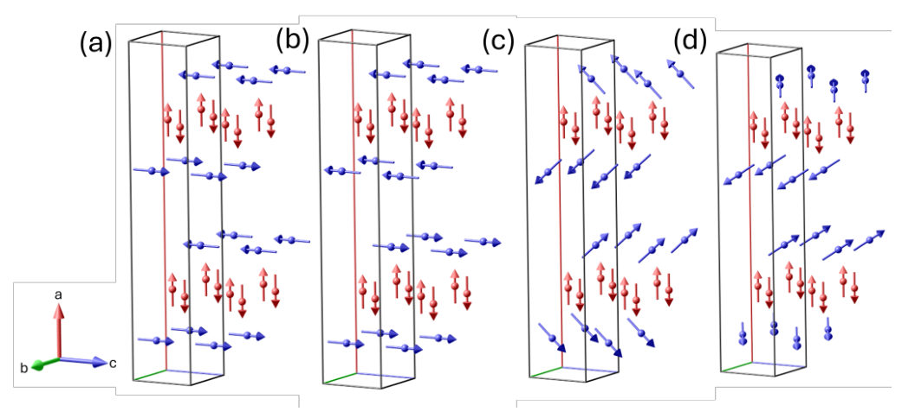
<figcaption class="paper-figure-caption"><b>Fig 1.</b> FIG. 1. Magnetic structures of EuMnSb2 at base temperature from neutron diffraction studies on different samples. Mn moments are red and Eu are blue. (a) Powder sample obtained by crushing Sn-flux-grown crystals [11]. (b) Tetragonal EuMn0.95Sb2 single crystal grown by a stoichiometric self-flux method [15]. (c) Orthorhombic EuMn1.1Sb2 single crystal grown by a floating-zone method [12]. (d) Orthorhombic EuMnSb2 single crystal grown using excess Sb flux [16].</figcaption>
</figure>
<figure class="paper-figure-card">
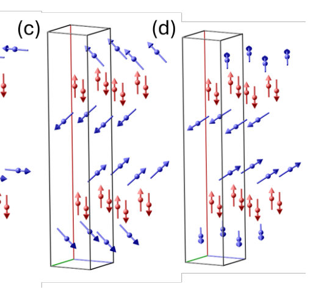
<figcaption class="paper-figure-caption"><b>Fig 2.</b> Figure 2(a) shows the zero-field c-axis resistivity of our Sn-flux-grown crystal. The resistivity increases strongly with decreasing temperature, confirming that the sample belongs to the semiconducting rather than metallic class of EuMnSb2 crystals [9, 18]. A shoulder in the tempera- ture dependence is observed near TEu1 ≃21 K, consistent with the coupling between charge transport and the suc- cessive magnetic transitions of the Eu sublattice. This overall behaviour agrees with previous transport mea- surements on Sn-flux-grown EuMnSb2 [9, 18]. The temperature dependence of the magnetic suscep- tibility in the range from 2 to 30 K measured along the a, b and c axes is shown in Fig. 2(b)....</figcaption>
</figure>
<figure class="paper-figure-card">
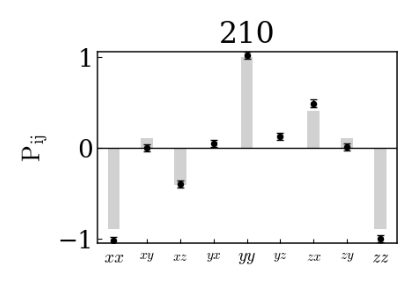
<figcaption class="paper-figure-caption"><b>Fig 3.</b> FIG. 3. Polarisation matrix for 210 reflection measured at 30 K, where only the Mn sublattice is ordered magnetically. Grey bars are calculated from the Mn magnetic structure shown in Fig. 1 with zero ordered moment on Eu.</figcaption>
</figure>
<figure class="paper-figure-card">
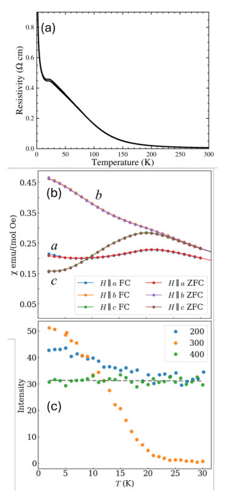
<figcaption class="paper-figure-caption"><b>Fig 4.</b> FIG. 2. (a) Temperature dependence of the zero-field resistiv- ity measured with current applied along the c axis, showing semiconducting behaviour. (b) Magnetic susceptibility mea- surement in a field of 1000 Oe applied parallel to the a, b and c axes. The Eu magnetic ordering transition is most clearly observed as a broad peak in the a- and c-axis curves near TEu1 ≃21 K. The b-axis curve exhibits a subtle upturn below TEu2 ≃9 K. (Data shown for H ∥b, c-axis has been detwinned according to the 2:1 ratio.) (c) Unpolarized neutron diffrac- tion data showing the onset of Eu magnetic order as signalled by the growth in intensity of the 300 reflection which is for- bidden by the crystal...</figcaption>
</figure>
<figure class="paper-figure-card">
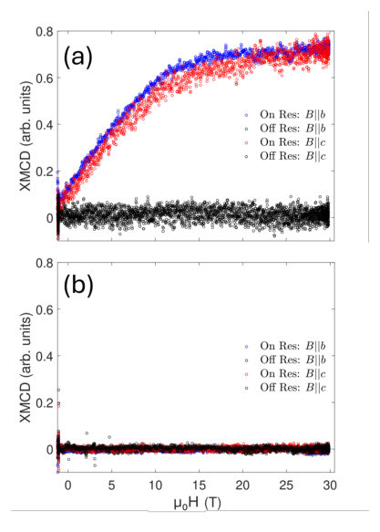
<figcaption class="paper-figure-caption"><b>Fig 5.</b> FIG. 4. (a) XMCD measured at the Eu M5 edge (1130 eV) at 10 K with pulsed field applied along the b and c axes. (b) Mn L3 edge (640.5 eV) XMCD data along the same directions and same temperature. The off-resonance energies are 1125 eV and 635 eV respectively.</figcaption>
</figure>

**Summary.** This work investigates the intricate magnetic ordering and field response of $	ext{EuMnSb}_2$, a candidate Dirac semimetal. By combining advanced neutron scattering, XMCD, and magnetometry, the authors determine that Eu spins undergo transitions independently of the Mn sublattice at low fields. They model these interactions using an effective Hamiltonian to quantify the coupling between magnetism and electronic topology.

**Why it may be interesting.** While focused on condensed matter magnetism, the study of coupled spin systems under external fields and the development of effective Hamiltonians for complex magnetic order parameters are relevant to understanding quantum many-body dynamics in strongly correlated materials.

Detailed structure

**Main problem.** The study aims to resolve the magnetic ground state and understand field-induced transitions within the magnetic Dirac semimetal candidate $	ext{EuMnSb}_2$.

**Main result.** Magnetic transitions observed below 2 T are attributed solely to changes in Eu spin order, while Mn spins remain largely unaffected. A mean-field model was developed to estimate key Eu--Eu and Eu--Mn exchange interactions.

**Method.** The research combines multiple experimental techniques including polarized/unpolarized neutron diffraction, pulsed-field XMCD, magnetometry, and AC transport measurements, supplemented by developing a mean-field theoretical model.

**Model / system.** The system is the magnetic topological semimetal $	ext{EuMnSb}_2$, featuring coupled Eu and Mn magnetic sublattices. The modeling involves an effective spin Hamiltonian incorporating nearest-neighbor AFM and FM exchange interactions, along with external fields.

**Key observables.** Magnetic structure (via neutron diffraction), magnetization $M(H)$, susceptibility $\chi(T)$, and specific field-induced transitions ($	ext{Hc1}, 	ext{Hc2}$).

**Important parameters / regimes.** Applied magnetic fields up to 30 T; temperatures down to 1.8 K.

**Assumptions / limitations.** The Mn sublattice is treated as an effectively rigid background structure (C-type AFM). The mean-field model provides a first approximation of the complex spin interactions.

**Figures summary.** Figures compare magnetic structures determined by different methods and highlight field dependence, showing transitions in magnetization curves along $a$ and $c$ axes.

**Paper structure.** The paper systematically presents evidence from multiple measurements (neutron diffraction, XMCD, magnetometry) to establish the magnetic structure. It then develops a mean-field model based on these findings to quantify the dominant exchange interactions coupling magnetism and electronic topology.

Abstract

The magnetic structure of a magnetic topological semimetal EuMnSb$_2$ is investigated in fields up to 30 T using polarized and unpolarized neutron diffraction, pulsed-field x-ray magnetic circular dichroism and pulsed-field magnetometry. We determine the zero-field magnetic structures of the Eu and Mn sublattices, and find that magnetic transitions induced by applied fields below 2 T correspond to changes in the magnetic order of the Eu spins alone without detectable perturbation to the order of the Mn spins. An additional magnetic transition is observed at fields close to the saturation field for the Eu spins. We present a mean-field model which describes key features of the magnetic behavior and allows us to estimate the dominant Eu--Eu and Eu--Mn exchange interactions responsible for the coupling between magnetism and electronic topology.

[↑ back to top](#top)

### [Resource-Efficient QUBO Formulation for Anchored Currency Arbitrage](http://arxiv.org/abs/2608.15889v1)

**Authors:** Eric A. F. Reinhardt, Adam J. Hauser  
**Type:** both · **Category:** quantum information and computing · **PDF:** <https://arxiv.org/pdf/2608.15889v1>  
**Analysis basis:** full PDF text, analyzed in chunks
**Topic relevance:** `analog quantum simulation` **1/5** · `quantum measurements` **1/5**

↔ Scroll figures horizontally

<figure class="paper-figure-card">
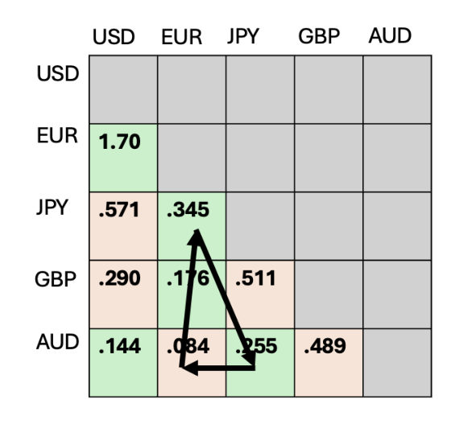
<figcaption class="paper-figure-caption"><b>Fig 1.</b> Figure 1: Extreme dummy exchange rate matrix with profit inserted. Green indicates an exchange rate was perturbed upward and orange indicates an exchange rate was perturbed downward.</figcaption>
</figure>
<figure class="paper-figure-card">
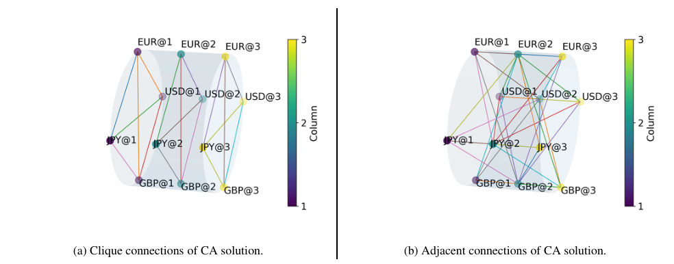
<figcaption class="paper-figure-caption"><b>Fig 2.</b> Figure 2: Decomposition of the connectivity graph of the QUBO for the example in Fig. 1: column-clique couplings (a) and adjacent-step couplings (b).</figcaption>
</figure>
<figure class="paper-figure-card">
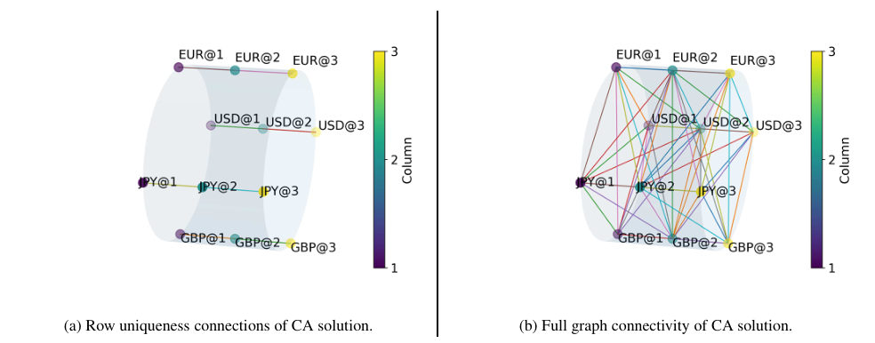
<figcaption class="paper-figure-caption"><b>Fig 3.</b> Figure 3: Decomposition of the connectivity graph (continued): row-uniqueness couplings (a) and the full coupling graph (b).</figcaption>
</figure>
<figure class="paper-figure-card">
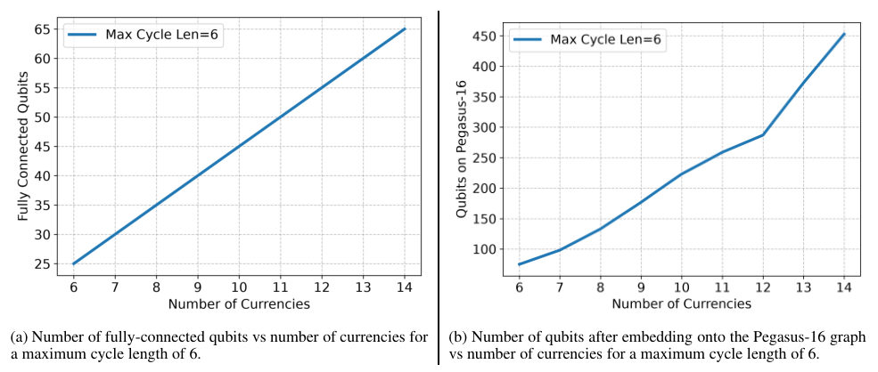
<figcaption class="paper-figure-caption"><b>Fig 4.</b> Figure 4: Logical qubit count (a) and physical qubit count after minor-embedding onto the Pegasus-16 graph (b) as a function of the number of currencies, for a maximum cycle length of six.</figcaption>
</figure>
<figure class="paper-figure-card">
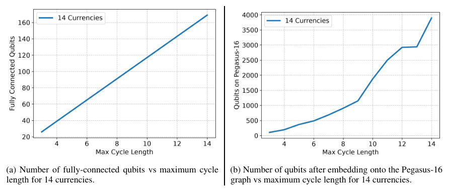
<figcaption class="paper-figure-caption"><b>Fig 5.</b> Figure 5: Logical qubit count (a) and physical qubit count after minor-embedding onto the Pegasus-16 graph (b) as a function of maximum cycle length, for 14 currencies.</figcaption>
</figure>

**Summary.** This paper reformulates currency arbitrage detection as a resource-efficient QUBO problem suitable for quantum annealing. The authors introduce novel constraints, such as fixed starting currencies and transaction fees, and employ an 'anchor-gauge reweighting' technique to stabilize the Hamiltonian coefficients. They demonstrate that their encoding is superior in qubit count and accuracy compared to existing methods.

**Why it may be interesting.** While focused on finance, the core methodology—mapping a complex combinatorial optimization problem onto a structured QUBO Hamiltonian with rigorous weight derivation—is directly relevant to designing efficient quantum algorithms for general constrained optimization problems in physics simulations.

Detailed structure

**Main problem.** The paper addresses the computationally hard problem of finding maximally profitable currency arbitrage cycles by formulating it as a Quadratic Unconstrained Binary Optimization (QUBO) problem.

**Main result.** The proposed QUBO encoding requires fewer logical qubits than prior methods and is shown to be the only one tested that recovers the exact fee-adjusted optimum when benchmarked against multiple existing encodings.

**Method.** They introduce novel constraints, including cycle anchoring and per-transaction fees, into the QUBO formulation. A key technical step is an 'anchor-gauge reweighting' of exchange rates to compress coefficients for use on quantum annealers.

**Model / system.** The model uses a QUBO Hamiltonian ($H = H_c + H_p$) derived from currency log-returns, which can be mapped onto an Ising Hamiltonian suitable for quantum annealing. The system involves multiple currencies and potential trading paths.

**Key observables.** Profitability (log-return), number of logical qubits required, score gap relative to the exact optimum, and computational time/reads used in simulated annealing.

**Important parameters / regimes.** Penalty weights ($A_{	ext{col}}, A_{	ext{row}}$, etc.), length penalty coefficient ($\gamma$), maximum cycle length ($T$), and the scale mismatch between log-rates and arbitrage profits.

**Assumptions / limitations.** The primary assumption is that the problem can be reduced to finding simple, contiguous cycles. They also assume that gauge fixing successfully preserves the optimal cycle structure for hardware implementation.

**Figures summary.** Figures illustrate rate perturbations, the decomposition of QUBO couplings (column-clique and adjacent-step), and performance comparisons showing qubit count vs. literature methods.

**Paper structure.** The paper builds upon prior work by refining the QUBO formulation to include realistic constraints (anchoring, fees). It derives provably sufficient penalty weights and introduces gauge reweighting for hardware compatibility. Finally, it benchmarks this novel encoding against five previous methods using classical simulation.

Abstract

Currency arbitrage (CA) involves trading currencies in cycles to exploit discrepancies in market valuations. Quadratic unconstrained binary optimization (QUBO) involves minimizing a quadratic cost (energy) function of binary variables. Previous works have explored the use of QUBO to solve CA problems. We build on these previous works by introducing realistic constraints such as beginning cycles from a held currency and accounting for per-transaction trading fees. We show that this formulation requires fewer logical variables (qubits) than previous QUBO encodings in the literature. We derive provably sufficient penalty weights for its constraint terms. We also introduce an exact anchor-gauge reweighting of the exchange rates that compresses the QUBO coefficient range from the rate scale to the arbitrage scale, addressing the finite analog precision of annealing hardware. We demonstrate the efficacy of this formulation using classical simulated annealing against an exact Held-Karp baseline on the same CPU and show that it can effectively find profitable cycles and account for trading fees. Finally, we benchmark faithful implementations of five prior QUBO encodings at matched sampler budgets and show that the proposed encoding is the only one to recover the exact fee-adjusted optimum.

[↑ back to top](#top)

### [A nuclear-quantum-corrected machine-learning potential reveals quantum-enhanced hydrogen segregation at general grain boundaries in alpha-iron](http://arxiv.org/abs/2608.16652v1)

**Authors:** Kazuma Ito  
**Type:** theory · **Category:** numerical methods · **PDF:** <https://arxiv.org/pdf/2608.16652v1>  
**Analysis basis:** full PDF text, analyzed in chunks
**Topic relevance:** `Keldysh / 2PI / non-Gaussian methods` **1/5**

↔ Scroll figures horizontally

<figure class="paper-figure-card">
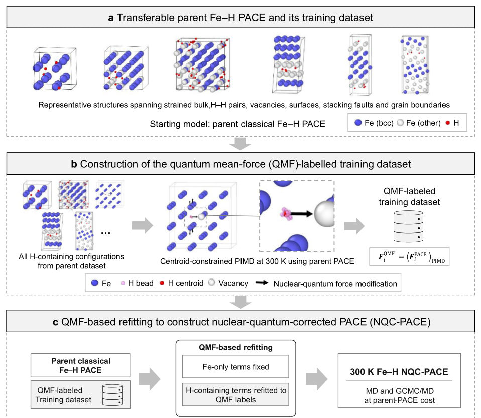
<figcaption class="paper-figure-caption"><b>Fig 1.</b> Fig. 1 | Construction of the Fe–H nuclear-quantum-corrected PACE (NQC-PACE). a, Parent Fe–H PACE and representative training configurations spanning strained bulk, H–H pairs, vacancy–H complexes, surfaces, generalised stacking faults and grain boundaries. b, For each H- containing configuration, Fe atoms were fixed and the centroid of each 32-bead H ring polymer was constrained to the original H position during PIMD at 300 K. Physical forces were averaged over beads and time to generate quantum mean-force labels. Black arrows indicate the nuclear-quantum</figcaption>
</figure>
<figure class="paper-figure-card">
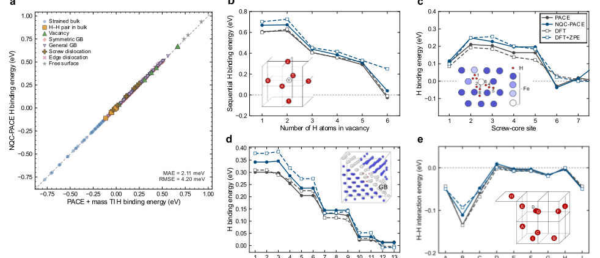
<figcaption class="paper-figure-caption"><b>Fig 2.</b> Fig. 2 | NQC-PACE reproduces nuclear quantum effects on hydrogen trapping and H–H interactions across diverse Fe–H environments. a, Hydrogen binding energies obtained with NQC-PACE and the parent PACE combined with mass thermodynamic integration (mass TI) at 300 K for strained bulk, bulk H–H pairs, vacancies, grain boundaries, screw and edge dislocations, and free surfaces. The dashed line denotes perfect agreement; the mean absolute error (MAE) and root-mean-square error (RMSE) shown quantify deviations between the two methods over the full dataset. Their close agreement demonstrates that</figcaption>
</figure>
<figure class="paper-figure-card">
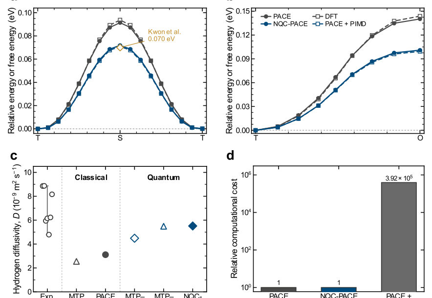
<figcaption class="paper-figure-caption"><b>Fig 3.</b> Fig. 3 | NQC-PACE captures nuclear quantum effects on hydrogen diffusion at the same</figcaption>
</figure>
<figure class="paper-figure-card">
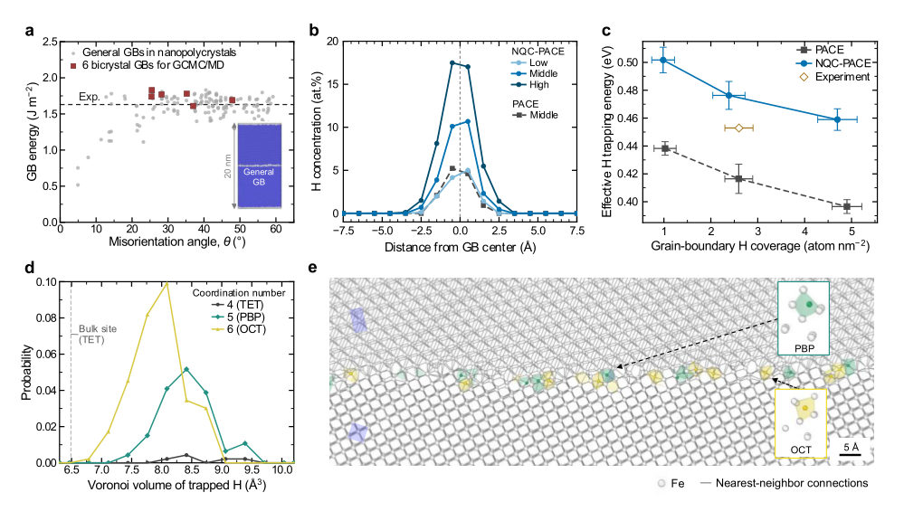
<figcaption class="paper-figure-caption"><b>Fig 4.</b> Fig. 4 | Nuclear quantum effects enhance hydrogen segregation at general grain boundaries. a, Grain-boundary (GB) energy as a function of misorientation angle for general GBs extracted from nanopolycrystalline Fe. Red squares denote the six bicrystal GBs selected for GCMC/MD, and the dashed line indicates the experimental reference. The selected GBs lie within the high-energy range</figcaption>
</figure>
<figure class="paper-figure-card">
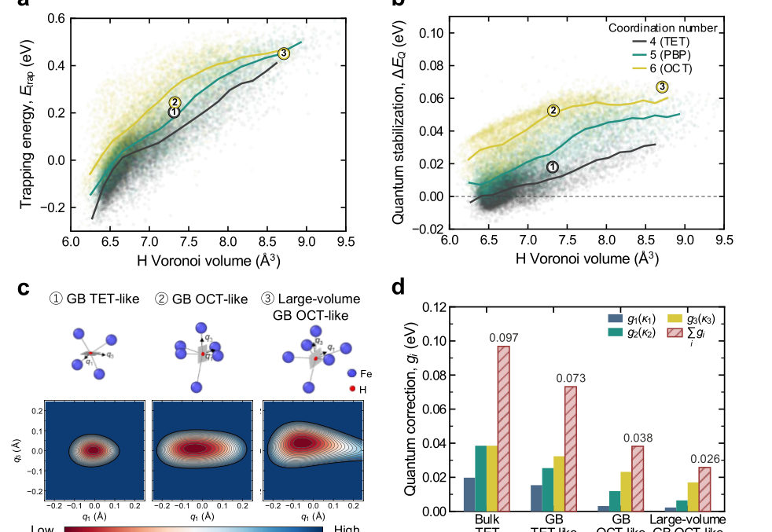
<figcaption class="paper-figure-caption"><b>Fig 5.</b> Fig. 5 | Locally expanded OCT-like grain-boundary environments induce anisotropic H vibrational softening and enhance nuclear quantum stabilisation.</figcaption>
</figure>

**Summary.** The authors developed a Nuclear-Quantum-Corrected Machine-Learning Potential (NQC-PACE) for the Fe-H system. This potential incorporates difficult-to-calculate nuclear quantum effects by relabeling an existing MLIP using Path-Integral Molecular Dynamics data. The results demonstrate that these quantum corrections significantly enhance hydrogen segregation at grain boundaries, offering a computationally tractable tool for studying light element behavior in complex materials.

**Why it may be interesting.** While focused on condensed matter, the core technique—using high-level quantum dynamics (PIMD) to parameterize and correct a lower-level, computationally efficient MLIP across vast configurational spaces—is a powerful general methodology relevant to simulating complex quantum many-body systems in materials science.

Detailed structure

**Main problem.** Accurately simulating hydrogen diffusion and trapping at defects in iron while incorporating computationally demanding nuclear quantum effects (NQE) into large-scale simulations.

**Main result.** The developed NQC-PACE potential shows that NQE markedly enhance hydrogen segregation at general grain boundaries, providing a significant improvement over classical potentials.

**Method.** A novel framework was created by relabeling the configurational space of an existing Machine-Learning Interatomic Potential (MLIP) using quantum mean forces derived from Path-Integral Molecular Dynamics (PIMD).

**Model / system.** The system is hydrogen dissolved in alpha-iron ($\alpha$-Fe), focusing on defects like vacancies, dislocations, and general grain boundaries. The model uses an MLIP trained via the atomic cluster expansion (PACE) and corrected to NQC-PACE.

**Key observables.** Hydrogen segregation levels, trapping energies, diffusion coefficients ($D$), and comparison of quantum vs. classical binding sites.

**Important parameters / regimes.** Temperature (300 K), light element mass effects (hydrogen), and the configurational space coverage of the parent MLIP.

**Assumptions / limitations.** The method assumes that relabeling the configurational space with PIMD-derived quantum mean forces is sufficient to incorporate NQE corrections without requiring additional DFT calculations for every new configuration.

**Figures summary.** Figure 1 illustrates the construction pipeline: parent PACE $
ightarrow$ PIMD generation of quantum mean forces $
ightarrow$ final NQC-PACE. Other figures compare trapping energies and diffusion coefficients using different potential formulations.

**Paper structure.** The paper introduces the problem (H embrittlement/NQE), details the methodology (PIMD to generate quantum mean forces for MLIP relabeling into NQC-PACE), presents results comparing NQC-PACE against classical potentials, and concludes with implications for large-scale materials simulation.

Abstract

Atomistic descriptions of hydrogen diffusion and trapping at defects are essential for understanding hydrogen embrittlement. As the lightest solute in metals, hydrogen exhibits nuclear quantum effects that alter these processes even at room temperature. Explicit treatment of such effects is computationally demanding, limiting large-scale simulations of complex environments. Here, we use an Fe-H machine-learning interatomic potential (MLIP) based on the performant implementation of the atomic cluster expansion (PACE), covering diverse Fe-H environments, and relabel the training configurations underpinning its transferability with quantum mean forces from centroid-constrained path-integral molecular dynamics at 300 K. This yields a nuclear-quantum-corrected PACE (NQC-PACE) without additional density functional theory calculations. At parent PACE, NQC-PACE describes nuclear quantum effects on hydrogen trapping at vacancies, dislocations, surfaces and general grain boundaries, H-H interactions, and diffusion in alpha-Fe. Grand-canonical Monte Carlo/molecular dynamics simulations show nuclear quantum effects markedly enhance hydrogen segregation at general grain boundaries and trapping behaviour in closer agreement with experimental trends. This enhancement arises from selective quantum stabilisation of open, anisotropically soft local environments. Our framework uses finite-temperature quantum mean forces to relabel the configurational space covered by an MLIP, enabling large-scale analysis of complex materials where light-element quantum effects matter.

[↑ back to top](#top)

### [Accessing Gapped Chiral Phase with Auxiliary-Assisted PEPS](http://arxiv.org/abs/2608.15732v1)

**Authors:** Sen Niu, Rui-Zhen Huang  
**Type:** theory · **Category:** strongly correlated electrons · **PDF:** <https://arxiv.org/pdf/2608.15732v1>  
**Analysis basis:** full PDF text, analyzed in chunks
**Topic relevance:** `methods for driven-dissipative` **1/5**

↔ Scroll figures horizontally

<figure class="paper-figure-card">
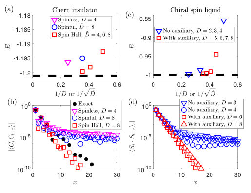
<figcaption class="paper-figure-caption"><b>Fig 1.</b> Figure 1. Variational energies and correlation functions with and without antichiral auxiliary systems. Variational energy (a) (c) and correlation functions (b) (d) of the optimized infinite PEPS states for both models are presented. The numerically exact and accurate energy density for the the fermionic model and spin model are also presented respectively. In (a)-(b), “Spin Hall” model refers to our proposed model Htot constructed by a spinless Chern insulator and its anti-chiral auxiliary system. “Spinfull” model refers to a two layer of decoupled chiral Chern insulator which can be viewed as a SU(2)- symmetric Hubbard model. For better comparison with the original single layer system, we...</figcaption>
</figure>
<figure class="paper-figure-card">
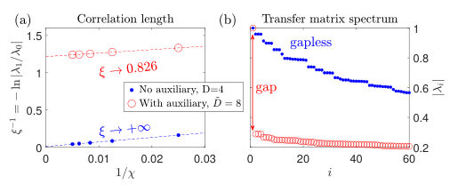
<figcaption class="paper-figure-caption"><b>Fig 2.</b> Figure 2. Correlation length of the variational states in spin model. (a) Extrapolation of correlation length versus 1/χ. (b) Spectrum of transfer matrix for computing correlation functions with environment dimension χ = 200.</figcaption>
</figure>
<figure class="paper-figure-card">
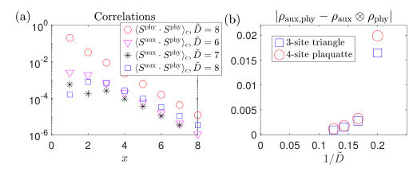
<figcaption class="paper-figure-caption"><b>Fig 3.</b> Figure 3. Residual physical-auxiliary coupling. (a) Compari- son of spin-spin correlation function between physical-physical and auxiliary-physical. (b) Frobenius norm of the density matrix differ- ence that measures the coupling between the physical and the auxil- iary system.</figcaption>
</figure>
<figure class="paper-figure-card">
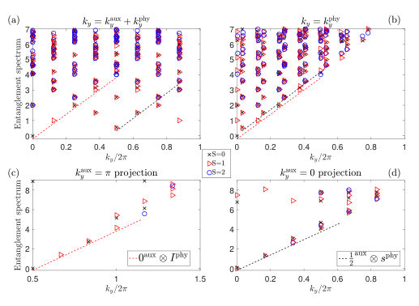
<figcaption class="paper-figure-caption"><b>Fig 4.</b> Figure 4. Bipartite entanglement spectrum of the spin state on finite-width cylinders. Variational ˜D = 6 state (with a virtual space V = 0⊕0⊕1</figcaption>
</figure>
<figure class="paper-figure-card">
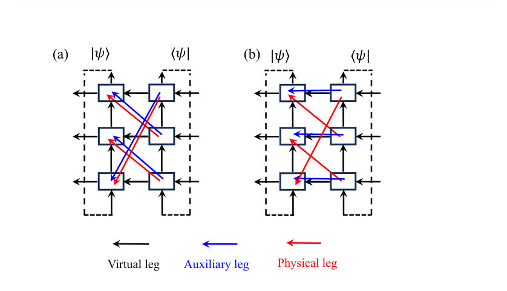
<figcaption class="paper-figure-caption"><b>Fig 5.</b> Figure 5. Sketch diagram for translation operator actions used in the calculation of entanglement spectrum on a W = 3 cylinder. (a) Full Ty = T aux y T phy y translation for both physical and auxiliary systems. (b) Partial Ty = T phy y translation for only the physical system.</figcaption>
</figure>

**Summary.** The paper presents an auxiliary-assisted PEPS method to overcome the difficulty of simulating gapped chiral phases with finite bond dimensions. By coupling the physical system to its time-reversed partner, it eliminates artificial long-range correlations found in direct representations. This technique successfully validates the description of both fermionic and interacting chiral spin liquids while preserving key topological entanglement signatures.

**Why it may be interesting.** This work provides a powerful, practical computational tool (auxiliary embedding) to study highly constrained quantum phases like chiral magnets and superconductors using established tensor network methods, which is crucial for understanding exotic condensed matter states.

Detailed structure

**Main problem.** The primary challenge is representing gapped chiral phases using finite bond-dimension PEPS, as direct representations introduce spurious long-range power-law correlations inconsistent with true gapped behavior.

**Main result.** An auxiliary-assisted framework successfully bypasses this obstruction by embedding the physical system with a time-reversed partner, yielding clean short-range correlation functions for both free-fermion and interacting chiral models.

**Method.** The authors introduce an auxiliary-assisted PEPS formalism where the physical state is enlarged to a non-chiral representation. Physical observables are recovered by tracing out the auxiliary degrees of freedom, allowing the use of standard tensor network techniques like CTMRG.

**Model / system.** The study applies to gapped chiral phases, specifically modeling free-fermion Chern insulators and interacting chiral spin liquids (e.g., SU(2) spins on a square lattice). The method involves constructing an enlarged Hamiltonian by coupling the physical system with its time-reversed auxiliary counterpart.

**Key observables.** Clean exponential decay of correlation functions, finite transfer-matrix correlation length ($\xi$), and recovery of universal chiral entanglement boundary spectra via layer-resolved momentum projection.

**Important parameters / regimes.** Finite bond dimension ($D$), residual coupling strength ($\lambda_i$), and the topological nature of the underlying phase (e.g., SU(2)$_1$ chiral order).

**Assumptions / limitations.** The method assumes that the small, residual couplings between the physical and auxiliary systems are weak enough to only affect short-range local quantities, thus preserving low-energy physics.

**Figures summary.** Figures compare energy convergence and long-distance correlations for direct vs. auxiliary PEPS setups, showing artifact removal in the latter. Other figures detail entanglement spectra analysis by projecting onto specific momentum sectors on a cylinder.

**Paper structure.** The paper first establishes the problem of spurious correlations in chiral PEPS. It then introduces the auxiliary-assisted formalism and applies it to free-fermion and interacting spin models, demonstrating artifact removal via correlation function analysis. Finally, it uses entanglement spectrum analysis by fixing auxiliary momenta to confirm the recovery of universal chiral topological information.

Abstract

It has been controversial whether infinite projected entangled pair state (PEPS) can faithfully describe chiral gapped phases in two dimensions or not. Finite-bond-dimension PEPS can capture many local and topological properties of chiral phases, but generically develop spurious long-range power-law like correlations. We introduce an auxiliary-assisted framework that bypass this obstruction by embedding the physical chiral system together with an auxiliary time-reversed partner, yielding a non-chiral enlarged representation whose physical chiral sector is recovered with controlled decoupling. For both a free-fermion Chern insulator and an interacting chiral spin liquid, the resulting PEPS show clean gapped correlation functions, and a finite transfer-matrix correlation length, in contrast with the artificial long-range tail of direct chiral PEPS representations. There exist small and negligibly coupling between the physical and auxiliary systems due to the finite entanglement effect, which only affect short-ranged local quantities. Despite the nonchiral enlarged representation, the chiral topological information remains encoded in the entanglement. Using layer-resolved momentum projection, we recover the expected universal chiral entanglement boundary spectrum. Our study provides a practical route to access gapped chiral phases with finite bond-dimension PEPS by changing the representation problem rather than directly studying the chiral pure state.

[↑ back to top](#top)

### [ChainForge: Characterizing Embedding as the Bottleneck in Quantum Annealer Workloads](http://arxiv.org/abs/2608.15961v1)

**Authors:** Kanishka Jayathilake, Cordelia Brumley, Tanner Smith, Ramin Ayanzadeh  
**Type:** both · **Category:** quantum information and computing · **PDF:** <https://arxiv.org/pdf/2608.15961v1>  
**Analysis basis:** full PDF text, analyzed in chunks
**Topic relevance:** `QC/QI experiment` **1/5**

↔ Scroll figures horizontally

<figure class="paper-figure-card">
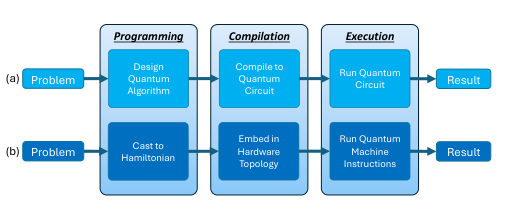
<figcaption class="paper-figure-caption"><b>Fig 1.</b> Figure 1: Execution models of (a) digital quantum computers and (b) analog quantum annealers, showing their main stages.</figcaption>
</figure>
<figure class="paper-figure-card">
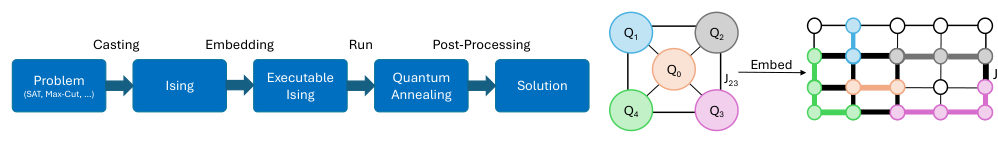
<figcaption class="paper-figure-caption"><b>Fig 2.</b> Figure 2: (a) Stages of the quantum annealing pipeline. (b) Example embedding a problem graph onto a QA hardware graph.</figcaption>
</figure>
<figure class="paper-figure-card">
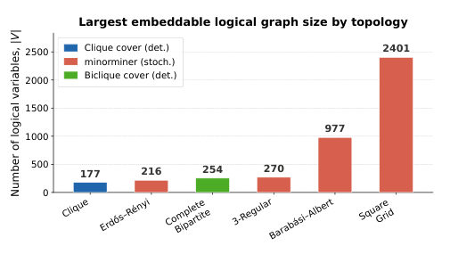
<figcaption class="paper-figure-caption"><b>Fig 3.</b> Figure 3: Largest embeddable logical graph size (|V|) per topology across three embedding methods. Complete bipartite K127,127 yields |V| = 254, while the 49 × 49 square grid yields |V| = 2401.</figcaption>
</figure>
<figure class="paper-figure-card">
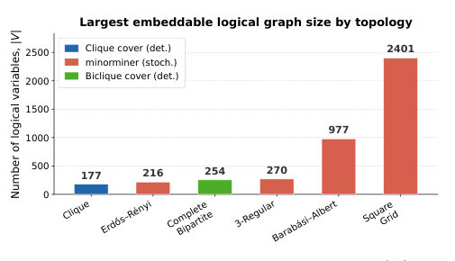
<figcaption class="paper-figure-caption"><b>Fig 4.</b> Figure 3 shows that effective logical capacity strongly depends on workload topology. Sparse local structures map most efficiently onto QA hardware. For example, the square- grid topology reaches 49×49, corresponding to 2401 logical variables. Barabási–Albert graphs also support relatively large problem instances, reaching up to 977 logical variables because they remain globally sparse despite the presence of high degree hubs. In contrast, dense workloads reach the hardware limit much earlier. Fully connected cliques support only 177 logical variables, while Erd˝os–Rényi graphs support 216 logical variables. Complete bipartite graphs and 3-regular</figcaption>
</figure>
<figure class="paper-figure-card">
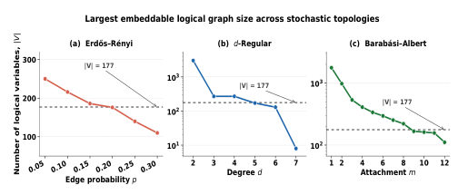
<figcaption class="paper-figure-caption"><b>Fig 5.</b> Figure 4: Largest embeddable logical graph size (|V|) versus connectivity parameter for three stochastic topologies: Erd˝os- Rényi edge probability p, d-Regular degree d, and Barabási– Albert attachment parameter m. The dashed line marks the clique baseline (|V| = 177).</figcaption>
</figure>

**Summary.** This paper characterizes embedding as the defining bottleneck in Quantum Annealer workloads. Using a new framework, ChainForge, the authors demonstrate that mapping complex problems onto sparse physical hardware severely limits usable capacity and degrades performance fidelity. The findings mandate a shift toward workload-aware co-design between algorithms and quantum hardware architectures.

**Why it may be interesting.** This work provides crucial architectural insights into the practical limitations of current quantum hardware, which directly impacts how theoretical models of quantum computation must be adapted for near-term implementation.

Detailed structure

**Main problem.** The primary challenge in scaling Quantum Annealers (QAs) is that mapping a logical problem graph onto the hardware's sparse physical connectivity, known as embedding, becomes the dominant system bottleneck.

**Main result.** Embedding significantly inflates resource usage and degrades performance; effective QA capacity is highly dependent on workload topology rather than just nominal qubit counts.

**Method.** The authors developed ChainForge, a systematic characterization framework that tests diverse workloads across modern QA hardware topologies to quantify embedding overheads.

**Model / system.** The system studied is the Quantum Annealer (QA), which operates by evolving an Ising Hamiltonian. The core process involves mapping logical variables onto physical qubits via chains due to hardware sparsity.

**Key observables.** Effective hardware capacity, routing overheads, runtime variability, annealing fidelity, and solution quality.

**Important parameters / regimes.** Chain length (especially the 95th percentile), chain strength parameter, and the specific topology of the QA hardware (e.g., Pegasus).

**Assumptions / limitations.** The study assumes that embedding is not merely a preprocessing step but must be treated as an integral, runtime-affecting bottleneck in the end-to-end quantum computation pipeline.

**Figures summary.** Figures illustrate how effective capacity decreases significantly when moving from locally structured workloads (like square grids) to highly connected ones (like cliques), demonstrating the bottleneck effect.

**Paper structure.** The paper establishes the problem by defining QA operation and embedding. It then introduces ChainForge, presents systematic characterization results across various graph families, quantifies capacity loss, and concludes by proposing that workload-aware co-design is necessary for future scaling.

Abstract

Quantum Annealers (QAs) are among the first commercially scaled quantum computing systems designed for large-scale optimization. Unlike digital systems that execute sequences of compiled instructions, QAs operate as analog single-instruction machines that directly evolve an Ising Hamiltonian toward low-energy solutions. To execute an application, the logical problem graph must first be mapped onto the hardware's sparse connectivity via embedding, where logical variables are represented by chains of connected physical qubits. As a result, embedding becomes the dominant system challenge in QAs, shaping whether and how workloads can execute on the machine. Despite its central role, embedding has largely been treated as a preprocessing step rather than a system bottleneck.   In this work, we present ChainForge, the first systems and architecture characterization of embedding in QA workloads. Using diverse workload families and graph topologies on modern QA hardware, we characterize how embedding impacts effective hardware capacity, routing overheads, runtime variability, and solution quality. Our results show that embedding inflates physical resource usage, long chains degrade annealing fidelity and scalability, and heuristic embedders may fail even when valid embeddings exist. We further show that embedding latency can become a runtime bottleneck for dynamic workloads requiring frequent remapping, while nominal qubit counts significantly overestimate the usable capacity of QAs for realistic applications. Overall, our findings establish embedding as the defining workload bottleneck and systems abstraction of QAs, providing architectural insights for future hardware topologies, runtime systems, and workload-aware annealing platforms.

[↑ back to top](#top)

### [Classical Verification of Quantum Advantage via Clifford Obfuscation](http://arxiv.org/abs/2608.15963v1)

**Authors:** Bin Yan  
**Type:** theory · **Category:** quantum information and computing · **PDF:** <https://arxiv.org/pdf/2608.15963v1>  
**Analysis basis:** full PDF text, analyzed in chunks
**Topic relevance:** `quantum measurements` **1/5**

↔ Scroll figures horizontally

<figure class="paper-figure-card">
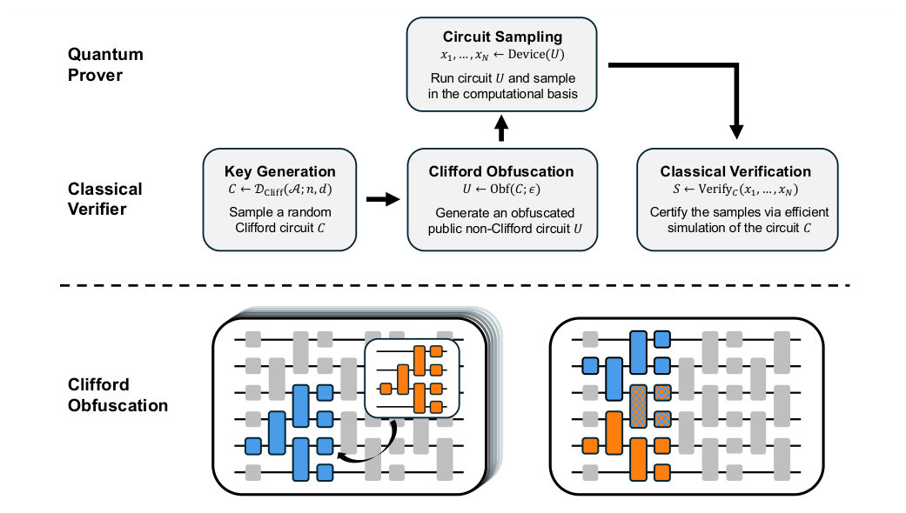
<figcaption class="paper-figure-caption"><b>Fig 1.</b> FIG. 1. Upper panel: The verification protocol incorporates Clifford obfuscation into random circuit sampling. Lower left: The obfuscation scheme consists of repeated patch updates. At each step, a local patch, a finite convex region (blue) within the circuit layout, is selected and replaced by a patch of the same shape (orange) that realizes the same unitary (or approximately with high fidelity) but has different gate parameters. This process is repeated until the entire circuit is covered. Lower right: Crucially, the updated patch regions overlap, allowing local information in the circuit to be scrambled. For example, after two overlapping patches are updated, neither individual patch...</figcaption>
</figure>
<figure class="paper-figure-card">
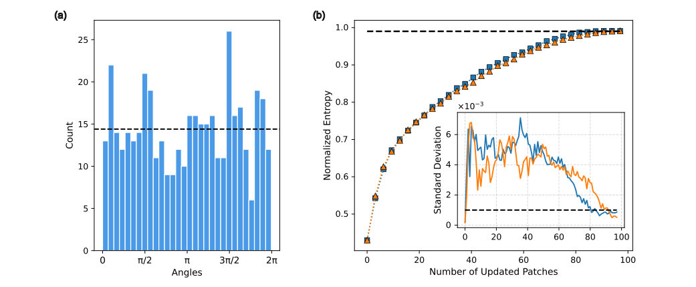
<figcaption class="paper-figure-caption"><b>Fig 2.</b> FIG. 2. (a) Histogram of the single-qubit rotation angles for a typical 12-qubit instance after one obfuscation cycle with the simulation details discussed in Algorithm II and Section III. Dashed horizontal line corresponds to the average count. Clifford values of these angles are multiples of π/2. (b) The normalized entropy of the single qubit rotation angles after obfuscation of the same 12 qubit system. Data points are obtained by averaging over 10 simulation runs. The blue square and orange triangles correspond, respectively, to perfect obfuscation (fidelity of the obfuscated circuit is larger than 0.9999 w.r.t. to original Clifford circuit) and finite-fidelity obfuscation, with average...</figcaption>
</figure>
<figure class="paper-figure-card">
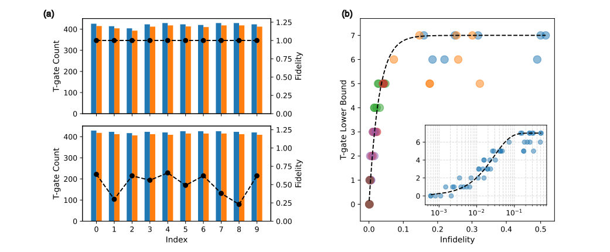
<figcaption class="paper-figure-caption"><b>Fig 3.</b> FIG. 3. (a) T gate counts before (blue bars) and after (orange bars) the PyZX reduction, where the index labels various runs of the simulation. The top and bottom panels, respectively, correspond to data from circuits after perfect obfuscation (fidelity of the obfuscated circuit is larger than 0.9999 w.r.t. the original Clifford circuit) and obfuscation with finite fidelity (averaged fidelity ∼0.6). The fidelity is marked by the black dots (plotted against the right vertical axis). (b) The T gate lower bound evaluated from the unitary stabilizer nullity at various infidelities of the trained circuit w.r.t. to the original Clifford unitary. The dashed line represents the best fit to a...</figcaption>
</figure>

**Summary.** The paper introduces Clifford circuit obfuscation as a technique to create quantum circuits whose computational advantage can be verified classically. By scrambling the structure using local patch updates, it generates circuits that are hard to simulate but retain an efficient verification key derived from the original Clifford structure. This provides a novel, resource-efficient pathway toward certifying genuine quantum computation.

**Why it may be interesting.** This work directly addresses the foundational challenge of certifying quantum computational power. For AMO physicists working on open systems or complex dynamics, understanding how to rigorously prove that a system requires quantum resources beyond classical simulation is crucial for benchmarking novel physical platforms (e.g., trapped ions or superconducting circuits).

Detailed structure

**Main problem.** The core problem is developing a method to demonstrate quantum advantage that can be independently verified using only classical computational resources.

**Main result.** The authors propose a heuristic protocol based on Clifford circuit obfuscation, which generates circuits hard for classical simulation while retaining an efficient classical verification path via a 'Clifford key'.

**Method.** The method involves compiling a known Clifford unitary into a complex, non-Clifford equivalent circuit by repeatedly updating local, overlapping patches (obfuscation). Verification is achieved by comparing sample distributions against the expected probabilities derived from the original Clifford structure.

**Model / system.** The system analyzed is quantum circuits acting on $n$ qubits. The protocol starts with a known Clifford unitary and transforms it into an obfuscated unitary, which resists classical simulation attacks like reverse engineering or direct simulation.

**Key observables.** Key observables include the entropy of parameter distributions (for attack resistance), the T-gate count lower bound ($
u(U)$), and the SSB statistic ($s$) for verification.

**Important parameters / regimes.** Important parameters include circuit infidelity ($\epsilon$), the depth ($d$), and the size/complexity of the local patches used in the obfuscation process.

**Assumptions / limitations.** The protocol is heuristic, lacking a formal complexity-theoretic security proof; its hardness relies on conjectures about classical simulation difficulty. Furthermore, fidelity alone is not sufficient to guarantee non-Cliffordness.

**Figures summary.** Figures illustrate the verification pipeline (Key Generation $
ightarrow$ Obfuscation $
ightarrow$ Sampling $
ightarrow$ Verification). Other figures show parameter histograms and entropy saturation confirming successful randomization against reverse engineering, alongside T-gate count comparisons showing resource inflation.

**Paper structure.** The paper develops concepts in stages: first establishing the need for classical verification; second, detailing the obfuscation protocol via local patch updates (Algorithm II); third, analyzing security by demonstrating resistance to reverse engineering and direct simulation attacks; and finally, providing rigorous tools like SSB and Unitary Stabilizer Nullity ($
u(U)$) to quantify non-Clifford resources.

Abstract

Demonstrating quantum advantage in a manner that can be independently verified by classical means remains one of the most pressing open problems in quantum computing. Here we propose a new heuristic approach for constructing quantum circuits that are hard to classically simulate yet whose output distributions can be efficiently verified classically. Our approach is based on Clifford circuit obfuscation. This obfuscation scheme hides the Clifford structure and injects a controlled and rapidly growing non-stabilizer resources that resist known classical attack strategies including reverse engineering and direct simulation. Our protocol is heuristic but is supported by both numerical and theoretical evidence. This work provides a new avenue toward classically verifiable quantum advantage that avoids the stringent implementation requirements of known approaches.

[↑ back to top](#top)

### [Deep-learning classification of physically admissible nuclear-matter equations of state](http://arxiv.org/abs/2608.16051v1)

**Authors:** Ahmed Abuali, Micheal Kahangirwe, Francesco Di Clemente, Vianney E Diaz-Barraza, Jorge A Munoz, Claudia Ratti  
**Type:** theory · **Category:** statistical mechanics · **PDF:** <https://arxiv.org/pdf/2608.16051v1>  
**Analysis basis:** full PDF text, analyzed in chunks
**Topic relevance:** `methods for driven-dissipative` **1/5**

↔ Scroll figures horizontally

<figure class="paper-figure-card">
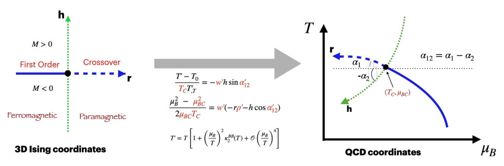
<figcaption class="paper-figure-caption"><b>Fig 1.</b> FIG. 1: Left: 3D Ising model axes with a critical point at (r = 0, h = 0). Right: corresponding QCD coordinates with a critical point located at (TC, µBC). The parameters µBC, w′, ρ′, and α′ 12 control the position, orientation, and scaling of the mapping (Figure from Ref. [60]).</figcaption>
</figure>
<figure class="paper-figure-card">
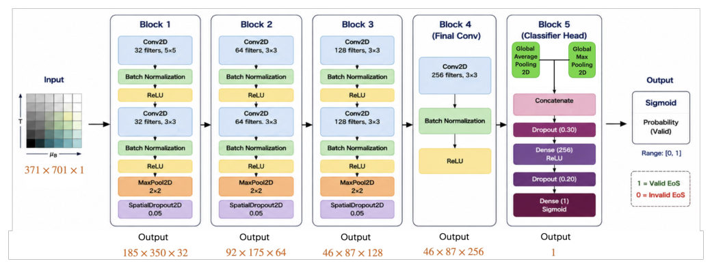
<figcaption class="paper-figure-caption"><b>Fig 2.</b> FIG. 2: Architecture of the convolutional neural network used for binary classification of equation-of-state (EoS) surfaces. The input is a single-channel tensor containing the normalized pressure field Q(T, µB) = P(T, µB)/T 4</figcaption>
</figure>
<figure class="paper-figure-card">
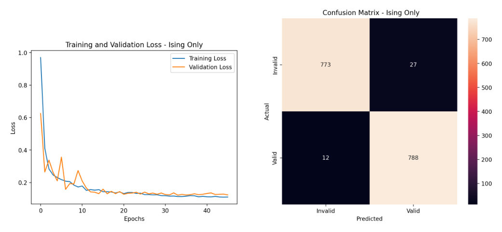
<figcaption class="paper-figure-caption"><b>Fig 3.</b> FIG. 3: Representative training diagnostics for the Ising-based model trained with 4000 equations of state per class. Left: training and validation binary-cross-entropy loss as functions of epoch. Right: The confusion matrix.</figcaption>
</figure>
<figure class="paper-figure-card">
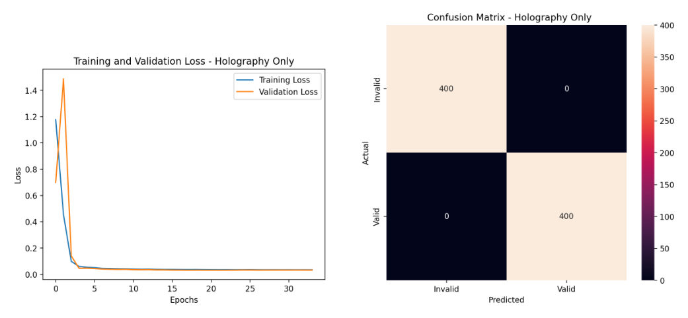
<figcaption class="paper-figure-caption"><b>Fig 4.</b> FIG. 4: Representative training diagnostics for the holography-based model trained with 2000 equations of state per class. Left: training and validation binary-cross-entropy loss as functions of epoch. Right: The confusion matrix.</figcaption>
</figure>
<figure class="paper-figure-card">
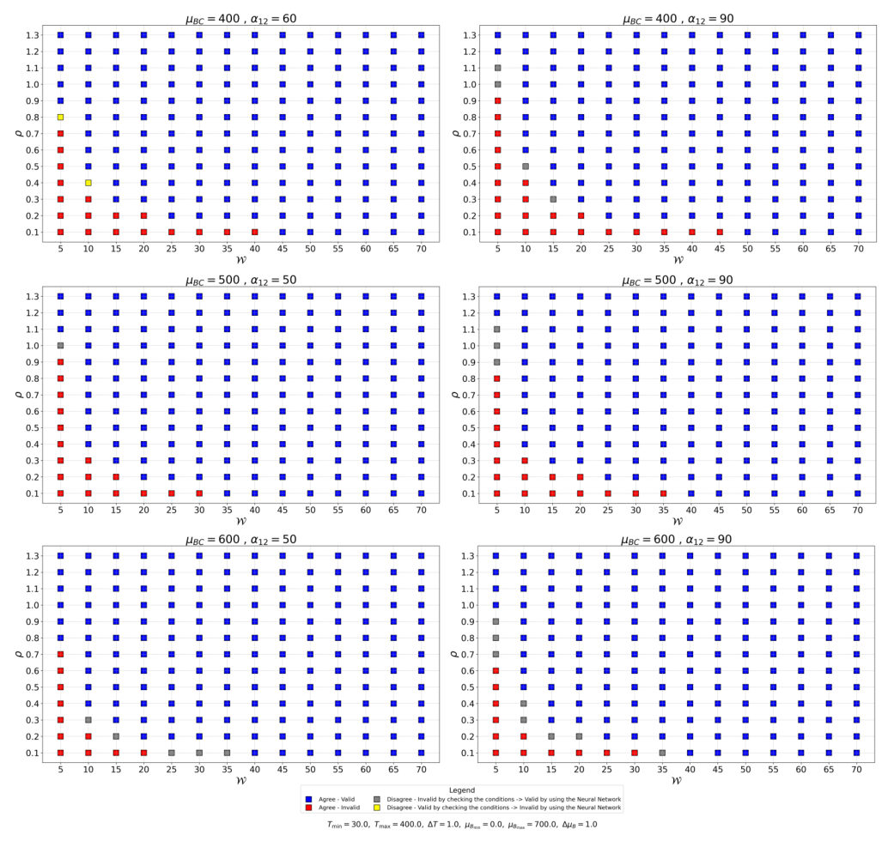
<figcaption class="paper-figure-caption"><b>Fig 5.</b> FIG. 5: Reconstruction of physical admissibility regions in the (w, ρ) parameter space for the Ising-based framework. Each point corresponds to an independently generated EoS. The maps compare the physical ground-truth label obtained from direct thermodynamic stability and causality checks with the classification predicted by the trained neural network using only the normalized pressure surface Q(T, µB) as input. Blue and red markers represent agreement between the direct physical check and the neural network prediction, with blue indicating samples classified as valid by both methods and red indicating samples classified as invalid by both. Gray and yellow markers represent disagreement:...</figcaption>
</figure>

**Summary.** This work introduces a novel, machine-learning approach using a Convolutional Neural Network (CNN) to rapidly screen the physical admissibility of nuclear matter Equations of State. By training the CNN solely on the normalized pressure surface, the authors demonstrate that geometric signatures of thermodynamic stability and causality violations can be extracted efficiently, offering a fast alternative to traditional, computationally intensive physics checks.

**Why it may be interesting.** While focused on nuclear physics, the core methodology—using deep learning to extract complex physical constraints from low-dimensional representations of high-dimensional data—is highly relevant for analyzing phase diagrams in any strongly interacting many-body system.

Detailed structure

**Main problem.** Developing an efficient, computationally fast method to classify whether a candidate Equation of State (EoS) for nuclear matter is physically admissible.

**Main result.** A supervised Convolutional Neural Network (CNN) trained only on the normalized pressure surface ($Q$) can achieve high accuracy in identifying thermodynamic stability and causality violations across different EoS generation frameworks.

**Method.** The authors developed a CNN that takes the 2D normalized pressure surface, $Q(T, \mu_B) = P(T, \mu_B)/T^4$, as input to classify EoSs. This machine learning approach bypasses the need for expensive direct calculations of higher-order thermodynamic observables.

**Model / system.** The study concerns the Equation of State (EoS) of nuclear matter at finite temperature ($T$) and baryon chemical potential ($\mu_B$), relevant to dense astrophysical objects like neutron stars. The EoSs are generated using distinct theoretical models, including an Ising-mapping framework and a holographic framework.

**Key observables.** Thermodynamic stability (requiring $C_V \geq 0$ and $\chi_B^2 \geq 0$) and causality ($0 \leq c_s^2 \leq 1$). The primary input observable is the normalized pressure surface, $Q(T, \mu_B)$.

**Important parameters / regimes.** Temperature ($T$), Baryon Chemical Potential ($\mu_B$)

**Assumptions / limitations.** The geometric structure of the normalized pressure surface alone contains sufficient information to diagnose thermodynamic consistency and causality violations.

**Figures summary.** Not specified in detail, but the notes mention Figure 1 illustrating mappings between Ising model axes and QCD coordinates.

**Paper structure.** The paper introduces the problem of costly EoS validation, proposes using $Q(T, \mu_B)$ as a sole input feature for a CNN, trains this network on labels derived from rigorous stability/causality checks across multiple frameworks (Ising and holographic), and validates its speed and framework independence.

Abstract

Thermodynamic stability and causality impose fundamental constraints on the equation of state (EoS) of nuclear matter. Verifying these constraints conventionally requires calculating quantities such as the specific heat, baryon-number susceptibility, and speed of sound, which can become computationally expensive when many candidate EoSs must be examined. We investigate whether the normalized pressure surface, $Q(T,μ_B)=P(T,μ_B)/T^4$, alone contains sufficient information to determine the physical admissibility of an EoS. We develop a supervised convolutional neural network (CNN) that uses only this pressure representation to classify EoSs as physically admissible or inadmissible. The network is provided with training labels obtained from direct thermodynmaic stability and causality check and its does not get any information about the parameters of the underlying EoS framework. For EoSs generated within an Ising-mapping framework, the model achieves $97.65%$ accuracy on unseen test data. Applied independently to EoSs from a distinct holographic framework, it achieves perfect classification of the test set. These results show that pressure surfaces contain geometric signatures of thermodynamic stability and causality violations that can be learned directly by a CNN. Because the classifier relies only on the pressure surface, it avoids evaluating higher-order thermodynamic observables during inference and is largely independent of the EoS-generation framework. When the pressure surface is supplied as a two-dimensional array, the machine-learning validation is approximately 20 times faster than direct validation. Our results establish a fast, framework-independent approach for identifying physically admissible EoSs directly from their pressure surfaces.

[↑ back to top](#top)

### [Design of altermagnetism in oxide superlattices exploiting interface effects and quantum confinement](http://arxiv.org/abs/2608.15765v1)

**Authors:** Subhadeep Bandyopadhyay, Rossitza Pentcheva  
**Type:** theory · **Category:** strongly correlated electrons · **PDF:** <https://arxiv.org/pdf/2608.15765v1>  
**Analysis basis:** full PDF text, analyzed in chunks
**Topic relevance:** `Keldysh / 2PI / non-Gaussian methods` **1/5**

↔ Scroll figures horizontally

<figure class="paper-figure-card">
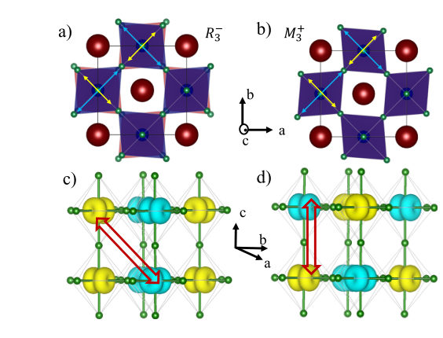
<figcaption class="paper-figure-caption"><b>Fig 1.</b> FIG. 1. Schematic representation of a) R− 3 and b) M + 3 JT distortions. Blue and yellow bonds within the ab plane indi- cate long and short bonds associated with the JT distortions. Brown, blue, green spheres indicate Sr, Cr and O ions. Pos- itive/negative (yellow/cyan) spin density at the Cr-sites, for the c) CAF-I4/mcm and d) GAF-P4/mbm phases. A red arrow indicates the translation vector T connecting the op- positely aligned spin density isosurfaces.</figcaption>
</figure>
<figure class="paper-figure-card">
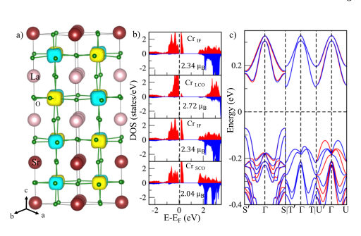
<figcaption class="paper-figure-caption"><b>Fig 2.</b> FIG. 3. (a) Crystal structure of the (SrCrO3)2/(LaCrO3)2 (001) SL showing the spin-density distribution for the CG- AFM ground state. Brown, beige, and green spheres represent Sr, La, and O ions, respectively, while yellow and cyan iso- surfaces (isovalue 0.035 e/Å3) denote spin-up and spin-down densities. (b) PDOS of the Cr-d states for Cr sites in different layers. Red (blue) color correspond to spin up (down) states. (c) Spin-polarized band structure. Red/blue lines indicate spin-up/down bands.</figcaption>
</figure>
<figure class="paper-figure-card">
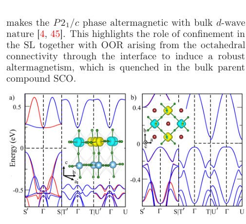
<figcaption class="paper-figure-caption"><b>Fig 3.</b> FIG. 2. Spin polarised band structure of a) (SrCrO3)1/(SrTiO3)1(001) and b) (SrCrO3)1/(LaCrO3)1(001) SLs. Red and blue lines represent spin up and down bands, high-symmetry k-points are given by S ′/S (∓0.5,0.5,0), Γ(0,0,0), T ′/T (0,∓0.5,0.5) and U ′/U (0.5,0,∓0.5). The insets show the corresponding spin density of the Cr sites (yellow/cyan for up/down) in their resp. crystal structures.</figcaption>
</figure>
<figure class="paper-figure-card">
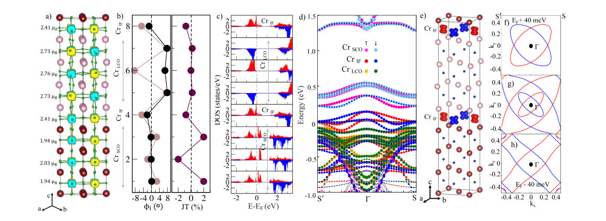
<figcaption class="paper-figure-caption"><b>Fig 4.</b> FIG. 4. (a) Crystal structure of the (SrCrO3)4/(LaCrO3)4 (001) SL showing the spin-density distribution for the CG-AFM ground state. Brown, beige, and green spheres represent Sr, La, and O atoms, respectively, while yellow and cyan isosurfaces (isovalue = 0.035 e/Å3) denote spin-up and spin-down densities. b) Layer-resolved variation of the OOR and JT distortion amplitudes at the Cr sites. Beige (black) circles represent in-plane (out-of-plane) OOR amplitudes, while maroon circles denote the JT distortion amplitudes. (c) PDOS of the Cr-d states for Cr sites in different layers. Red (blue) curves correspond to spin up (down) states. (d) Spin-polarized band structure along the S ′(−0.5, 0.5,...</figcaption>
</figure>

**Summary.** This theoretical study proposes that oxide superlattices are excellent platforms for realizing metallic altermagnetism. By engineering interfaces between perovskites like $	ext{SrCrO}_3$ and $	ext{LaCrO}_3$, the authors overcome bulk limitations to induce significant spin splitting (NRSS) in the electronic bands. This work guides the design of next-generation materials for quantum transport applications.

**Why it may be interesting.** This work is highly relevant as it uses advanced electronic structure calculations (DFT+U) on complex correlated oxides to predict functional quantum materials, directly addressing mechanisms for spin-charge coupling crucial in modern spintronics and condensed matter theory.

Detailed structure

**Main problem.** The primary goal is designing materials that exhibit altermagnetism (spin-polarized band splitting in compensated antiferromagnets) while maintaining metallic conductivity for spintronic applications.

**Main result.** Oxide superlattices, particularly $	ext{(SrCrO}_3	ext{)/(LaCrO}_3	ext{)}_n$, are shown to be promising platforms that can realize robust metallic d-wave altermagnetism by exploiting interface effects and structural distortions.

**Method.** The study employs Density Functional Theory calculations, specifically incorporating a Hubbard U parameter (DFT+U), to model the electronic structure of these complex oxide superlattices.

**Model / system.** The research focuses on perovskite oxide superlattices like $	ext{(SrCrO}_3	ext{)/(SrTiO}_3	ext{)}_1(001)$ and $	ext{(SrCrO}_3	ext{)/(LaCrO}_3	ext{)}_n(001)$. These systems are engineered to break symmetry and induce electronic reconstruction at the interfaces.

**Key observables.** Non-Relativistic Spin Splitting (NRSS) magnitude (up to 350 meV), spin-polarized band structures, spin-split Fermi surfaces (FSs), and metallic character derived from interfacial Cr $d$ bands.

**Important parameters / regimes.** The Hubbard U parameter ($U$), the number of repeating units ($n$), and structural distortions like octahedral rotations (OORs) are critical parameters explored.

**Assumptions / limitations.** Bulk $	ext{SrCrO}_3$ is limited by compensating effects, necessitating the use of superlattices to achieve observable altermagnetism. The metallic state relies on interfacial electronic reconstruction driven by polar discontinuity.

**Figures summary.** Figures illustrate spin-polarized band structures showing the emergence of NRSS in various SLs and schematic representations detailing structural distortions (JT/OORs) associated with different magnetic phases.

**Paper structure.** The paper first establishes the theoretical challenge—achieving altermagnetism plus metallicity. It then analyzes specific superlattice designs, comparing bulk behavior to confined systems ($	ext{SrTiO}_3$ and $	ext{LaCrO}_3$ interfaces), detailing how structural/polar discontinuities enable large NRSS values.

Abstract

The discovery of altermagnetism has initiated intensive research and opened new avenues for spin- tronic and transport applications. While current efforts are mostly focused on bulk materials which are typically insulating, here we propose design strategies to achieve a combination of altermag- netism and metallicity in oxide superlattices by exploiting symmetry breaking, electrostatic doping and confinement. While bulk SrCrO3 does not exhibit altermagnetism due to compensating effects between adjacent layers our density functional theory calculations with a Hubbard U parameter re- veal, that a single SrCrO3 layer confined in a (SrCrO3)1/(SrTiO3)1(001) superlattice (SL) exhibits a sizable non-relativistic spin splitting (NRSS) up to 350 meV with bulk d-wave nature due to the coexistence of orbital ordering and octahedral rotations (OORs). Since this system is insulating, we extend to SrCrO3/LaCrO3(001) SLs. In the (SrCrO3)4/(LaCrO3)4(001) SL the combination of a polar discontinuity at the interface and stronger OORs promotes metallic d-wave altermagnetism. The NRSS of up to 120 meV is contributed by the interfacial Cr d bands at the Fermi level with indications for a spin-selective Fermi surface nesting. These findings establish oxide superlattices as a promising platform to realize and explore altermagnetism for quantum transport and spintronic functionalities

[↑ back to top](#top)

### [Designing Quantum Error Correcting Codes to fit decoders via Reinforcement Learning](http://arxiv.org/abs/2608.15754v1)

**Authors:** Omer S. Sella, Robert Pinsler, Thomas Heinis  
**Type:** theory · **Category:** quantum information and computing · **PDF:** <https://arxiv.org/pdf/2608.15754v1>  
**Analysis basis:** full PDF text, analyzed in chunks
**Topic relevance:** `quantum measurements` **1/5**

↔ Scroll figures horizontally

<figure class="paper-figure-card">
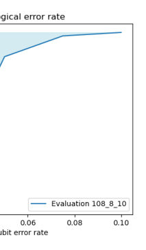
<figcaption class="paper-figure-caption"><b>Fig 1.</b> Figure 1: Physical-to-logical error rate curve explanation. The reward is calculated as the area between the performance curve and the constant function 1.</figcaption>
</figure>
<figure class="paper-figure-card">
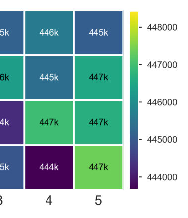
<figcaption class="paper-figure-caption"><b>Fig 2.</b> Figure 2: Coefficient heatmap showing hits per coefficient index for the codes in the l = 6, m = 6 dataset. Similar figures for other code sizes are provided in A, Figure 12.</figcaption>
</figure>
<figure class="paper-figure-card">
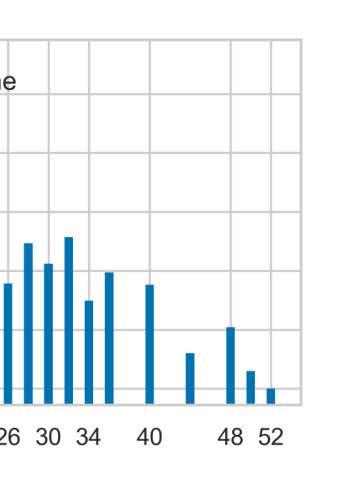
<figcaption class="paper-figure-caption"><b>Fig 3.</b> Figure 3: Distribution of the number of logical qubits for the codes in the l = 6, m = 6 dataset. Similar figures for other code sizes are provided in A, Figure 10</figcaption>
</figure>
<figure class="paper-figure-card">
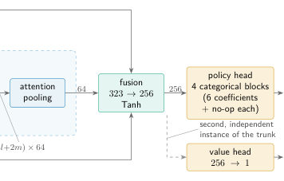
<figcaption class="paper-figure-caption"><b>Fig 4.</b> Figure 4: Network architecture. Each of the actor and critic instantiates the architecture independently. The structure encoder (blue) has the ability to be warm-started as explained in Section 4.6 and kept frozen for the first N collector batches while the randomly initialised branches (teal/orange) settle. The fusion input size 323 = 64enc + 256mlp + 3k is independent of the code size. The MLP input width 2(lm)2, the token count 2l + 2m, and the policy-head sizes l+1, m+1 scale with l, m. All dimensions in the figure are shown for l = m = 6 and H = 3.</figcaption>
</figure>
<figure class="paper-figure-card">
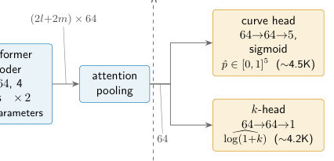
<figcaption class="paper-figure-caption"><b>Fig 5.</b> Figure 6: The encoder trained in advance by the multi-task loss of Section 4.6. A shared trunk feeding a curve head and a k-head. The parameters depend only on (H, dmodel, heads, layers), but not on (l, m), i.e., the token count 2l +2m varies with code size, but the token width 9+2H does not. The two task heads are discarded once training is done. The rest of the network (blue, ∼68K parameters at H=3) is carried over to the agent architecture in Figure 4.</figcaption>
</figure>

**Summary.** This paper introduces an advanced RL approach to solve the co-design problem in Quantum Error Correction. By framing code generation as a Markov Decision Process, the authors train an agent using PPO to select optimal Bivariate Bicycle codes that maximize decoder performance against noise. This methodology advances the field by linking theoretical code construction directly to practical hardware limitations.

**Why it may be interesting.** This work provides a machine learning-driven methodology for optimizing quantum hardware components (codes) based on the performance of classical processing units (decoders), which is crucial for building fault-tolerant quantum computers.

Detailed structure

**Main problem.** The core problem is the co-design of Quantum Error Correcting Codes (QECCs) and their associated decoders to maximize performance against physical noise.

**Main result.** The authors demonstrate a framework using Reinforcement Learning (RL) to generate Bivariate Bicycle (BB) codes optimized specifically for a given decoder architecture under depolarizing channel noise.

**Method.** They employ Proximal Policy Optimisation (PPO) within a Markov Decision Process (MDP) framework, where actions modify the polynomial coefficients defining the code's parity check matrices.

**Model / system.** The system is quantum error correction on $n$ qubits subject to Pauli noise. Codes are represented by stabilizer sets derived from parity check matrices ($H_X, H_Z$), and performance is evaluated via Monte-Carlo simulation of logical error rates.

**Key observables.** Decoder performance (physical-to-logical error rate), the reward function based on the area under the physical-error-rate curve, and the number of logical qubits ($k$).

**Important parameters / regimes.** Code parameters defined by polynomials $a(x), b(x), a(y), b(y)$; noise model is depolarizing channel noise.

**Assumptions / limitations.** The current work fixes the decoder architecture while optimizing the code; it does not fully address engineering pairs based on detailed quantum device knowledge, and the reward function can be sensitive to integration limits.

**Figures summary.** Figure 1 illustrates the physical-to-logical error rate curve used for calculating the RL reward. Other figures show coefficient heatmaps and distributions of logical qubits ($k$) across generated codes.

**Paper structure.** The paper introduces the problem, details the mathematical framework (BB codes via polynomials), establishes the MDP formulation (State=matrices, Action=coefficient flip, Reward=performance integral), and applies PPO to train an agent to find optimal code parameters.

Abstract

We present a reinforcement learning (RL) approach to the co-design of stabilizer sets of Quantum Error Correcting Codes (QECCs) and decoders. We show how to produce a generative model that produces Bivariate Bicycle (BB) codes based on the choice of decoder. Specifically, we fix a decoder architecture and use Proximal Policy Optimisation (PPO) to train an agent over BB codes to maximise decoder performance under a depolarising channel noise model.

[↑ back to top](#top)

### [Exact Thermoelectric Transport Coefficients and Figure of Merit for Graphene Photothermoelectric Devices from a Finite Zeta-Function Mott Series](http://arxiv.org/abs/2608.14850v1)

**Authors:** Luis Daniel Villa Cortes, S. R. Valluri, Atul Jhalani, Ajay Soni, P. C. Deshmukh  
**Type:** theory · **Category:** statistical mechanics · **PDF:** <https://arxiv.org/pdf/2608.14850v1>  
**Analysis basis:** full PDF text, analyzed in chunks
**Topic relevance:** `Keldysh / 2PI / non-Gaussian methods` **1/5**

↔ Scroll figures horizontally

<figure class="paper-figure-card">
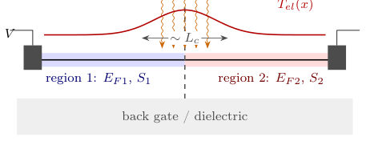
<figcaption class="paper-figure-caption"><b>Fig 1.</b> Figure 1: Schematic of the problem addressed. A graphene photothermoelectric junction. Light absorbed near the interface raises the electronic temperature Tel above the lattice temperature over a region of size set by the cooling length Lc; because the two sides are gated to different Fermi energies, their Seebeck coefficients differ and a photovoltage VPTE = (S2 −S1)∆T appears between the contacts.</figcaption>
</figure>
<figure class="paper-figure-card">

<figcaption class="paper-figure-caption"><b>Fig 2.</b> Figure 2: Dimensionless Seebeck coefficient S/(kB/e) of Eq. (45) as a function of t = kBT/EF , for several values of the disorder parameter l = σmin/(cE2 F ). Every curve starts at zero, reaches a single extremum (most negative value) at topt = p</figcaption>
</figure>
<figure class="paper-figure-card">
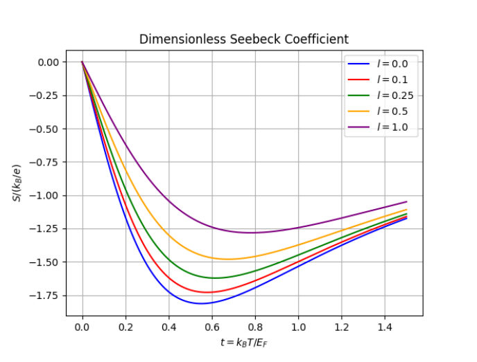
<figcaption class="paper-figure-caption"><b>Fig 3.</b> Figure 2 shows the Seebeck coefficient in units of kB/e. Every curve starts at S = 0. As t →0, the thermal window collapses onto EF and, to leading order, S reduces to the ordinary Mott result for the quadratic model,</figcaption>
</figure>
<figure class="paper-figure-card">
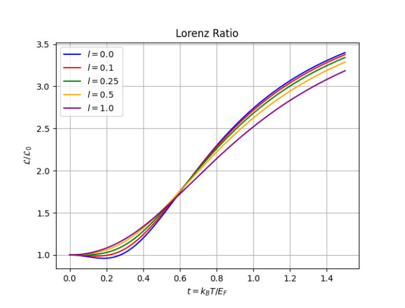
<figcaption class="paper-figure-caption"><b>Fig 4.</b> Figure 3: Lorenz ratio L/L0 of Eq. (55) as a function of t = kBT/EF , for several values of the disorder parameter l = σmin/(cE2 F ). All curves start at unity, recovering the Wiedemann–Franz law in the degenerate limit. For l &lt; 1/4 the ratio first dips below unity before rising; for l &gt; 1/4 it rises monotonically. The ordering of the curves reverses in a narrow window near t ≈0.6.</figcaption>
</figure>
<figure class="paper-figure-card">

<figcaption class="paper-figure-caption"><b>Fig 5.</b> Figure 3 shows the corresponding Lorenz ratio. Every curve begins at L/L0 = 1, as required: the Wiedemann–Franz law is exact in the degenerate limit t →0, and its recovery here is a useful check on Eq. (55). At large t the ratio grows without bound, reaching values above 3 by t = 1.5, so the law is strongly violated once the thermal window becomes comparable to EF .</figcaption>
</figure>

**Summary.** This paper presents an advanced theoretical method to calculate thermoelectric transport coefficients in graphene by extending the Mott formula using a zeta-function series. This approach yields exact, closed-form results beyond the usual low-temperature approximations, providing critical insights into how temperature and disorder affect device performance.

**Why it may be interesting.** While focused on condensed matter thermodynamics, the mathematical technique of resumming infinite series into exact closed forms via special functions (zeta functions) is highly relevant for theoretical physics dealing with non-perturbative quantum field theories or many-body systems where standard approximations fail.

Detailed structure

**Main problem.** To develop an exact, all-orders extension of the Mott formula for thermoelectric transport coefficients ($	ext{Seebeck}$ coefficient, $	ext{ZT}$) that remains accurate even when temperature is not much smaller than the Fermi energy.

**Main result.** The authors derive closed-form expressions for key transport parameters using a zeta-function series approach, showing that the Seebeck coefficient reaches a maximum and the Wiedemann-Franz law can be violated at higher temperatures in graphene.

**Method.** The core method involves expanding conductivity integrals using a generalized Sommerfeld-type expansion, which becomes exact when the underlying material function is polynomial, allowing for summation into closed-form zeta-function expressions.

**Model / system.** The study focuses on thermoelectric transport in graphene photothermoelectric devices. The theoretical framework models carrier transport using a quadratic conductivity model and incorporates corrections for radiative heat transfer.

**Key observables.** Seebeck coefficient ($S$), Lorenz ratio, electronic figure of merit ($	ext{ZT}$), electrical conductivity ($\sigma$), and thermal conductivity ($\kappa$).

**Important parameters / regimes.** Temperature ($T$) relative to Fermi energy ($\mu$), disorder strength, and the radiative heat transport correction factor ($\kappa_{rad}/\kappa_0$).

**Assumptions / limitations.** The derivation relies on the assumption that the underlying transport function $G(E)$ is a polynomial in energy for the series to terminate exactly; it also assumes independent carriers in the relaxation-time picture.

**Figures summary.** Not specified, but the analysis involves deriving closed-form expressions and showing how $	ext{ZT}$ is corrected by radiative heat transport ($\kappa_{rad}/\kappa_0$).

**Paper structure.** The paper first establishes the limitations of standard Mott theory, then develops the all-orders zeta-function series for transport coefficients, applies this to graphene using a quadratic model, and finally discusses corrections from radiative heat transfer to determine the final $	ext{ZT}$ bounds.

Abstract

The standard Mott formula is widely used to describe thermoelectric transport, but it becomes less accurate when the temperature is not much smaller than the Fermi energy. In this work, we develop an all-orders extension of the Mott approach using a series of Riemann zeta functions. We show that when the transport function is a polynomial, the series ends after a finite number of terms, giving exact results within the model. We apply this method to graphene photothermoelectric devices using a quadratic conductivity model. The results provide closed-form expressions for the Seebeck coefficient, Lorenz ratio, and electronic figure of merit. The analysis shows that the Seebeck coefficient reaches a maximum instead of increasing indefinitely, while the Wiedemann-Franz law can be significantly violated at higher temperatures. We also find that disorder reduces the thermoelectric performance and that the electronic figure of merit has an upper limit in the clean graphene model. Finally, we discuss the effect of radiative heat transport on the figure of merit. These results provide a simple analytical way to study graphene thermoelectric transport beyond the usual low-temperature Mott approximation.

[↑ back to top](#top)

### [Geodesic Quantum $f$-Divergences](http://arxiv.org/abs/2608.15833v1)

**Authors:** Ángela Capel, Pablo Costa Rico  
**Type:** theory · **Category:** quantum information and computing · **PDF:** <https://arxiv.org/pdf/2608.15833v1>  
**Analysis basis:** full PDF text, analyzed in chunks
**Topic relevance:** `quantum measurements` **1/5**

↔ Scroll figures horizontally

<figure class="paper-figure-card">
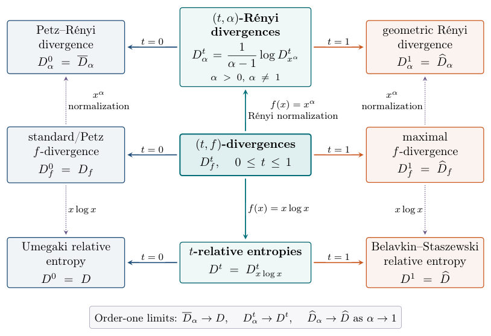
<figcaption class="paper-figure-caption"><b>Fig 1.</b> Figure 1: Specialization diagram for the (t, f)-divergences. Teal arrows select a generator (with the Rényi normalization included on the upper branch), while dark blue and orange arrows select the Petz endpoint t = 0 and the maximal endpoint t = 1, respectively. The dotted vertical arrows show that the two operations commute. Thus Dt interpolates between the Umegaki and BS relative entropies, and Dt α interpolates between the Petz and geometric Rényi divergences. At α = 2 the entire upper row coincides even for noncommuting states; for commuting states every horizontal row collapses to its common classical quantity.</figcaption>
</figure>
<figure class="paper-figure-card">
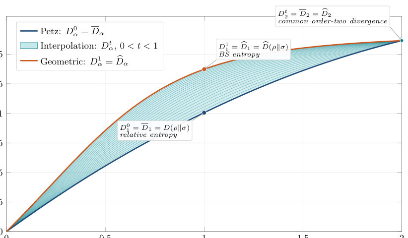
<figcaption class="paper-figure-caption"><b>Fig 2.</b> Figure 2: Rényi interpolation for the states in (74). The dark blue and orange boundary curves are, respectively, the Petz-Rényi divergences D0 α = Dα and the geometric Rényi divergence D1 α = bDα. The contrasting teal curves show Dt α for t = k/20, k = 1, . . . , 19, and the light teal band represents the full continuum 0 ≤t ≤1. The values at α = 0 and α = 1 are the continuous extensions Dt 0 = 0 and Dt 1 = Dt. The marked order-one points are the relative and BS entropies, and the order-two marker is their common Rényi value .</figcaption>
</figure>
<figure class="paper-figure-card">
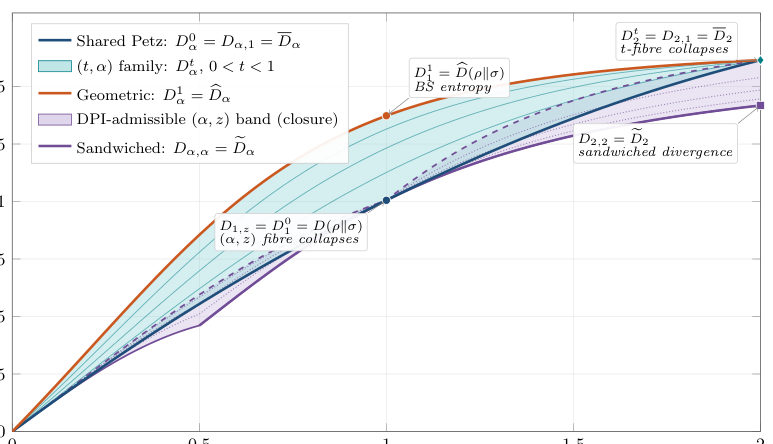
<figcaption class="paper-figure-caption"><b>Fig 3.</b> Figure 3: Comparison of the (t, α) and (α, z) Rényi families for the same noncommuting states as in Figure 2. Teal denotes the complete t-interpolation band and violet the compactified DPI-admissible (α, z) value band in (107); thin curves sample their interiors. The navy, orange, and solid-violet boundaries are, respectively, the shared Petz, geometric, and sandwiched divergences. The labels mark the order-one Umegaki and BS limits and the order-two Petz and sandwiched points. Any overlap of the shaded bands is specific to this fixed pair.</figcaption>
</figure>
<figure class="paper-figure-card">
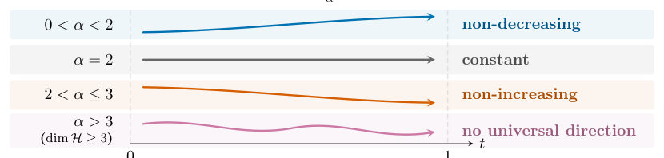
<figcaption class="paper-figure-caption"><b>Fig 4.</b> Figure 4: Monotonicity phase diagram for the (t, α)-Rényi divergences in Theorem 5.3. At order one we use the continuous extension Dt 1 = Dt. Colors encode the qualitative class: vermillion is non-increasing, gray is constant, blue is non-decreasing, and purple indicates no universal direction. Only the weak direction of variation is represented; the curves are not numerical plots and may be flat, for example for commuting pairs. When α &gt; 3 in dimension at least three, the map t 7→Dt α can change direction, although the endpoint inequality D0 α ≥D1 α remains universal. The decreasing comparison between two prescribed parameters is universal exactly under (163); in dimension two it remains...</figcaption>
</figure>
<figure class="paper-figure-card">
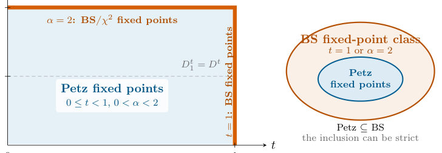
<figcaption class="paper-figure-caption"><b>Fig 5.</b> Figure 5: Fixed-point phase diagram for the (t, α)-Rényi divergences in their DPI range. For fixed σ and Φ, a fixed point here means an invertible state ρ saturating the Dt α-DPI. All points in the blue region have the same Petz fixed-point class, including the continuous order α = 1. The orange boundary, consisting of t = 1 or α = 2, has the common BS/χ2 class. The latter contains the Petz class and can be strictly larger, although the two may coincide for particular channels and reference states.</figcaption>
</figure>

**Summary.** The paper develops the concept of geodesic quantum f-divergences by interpolating between standard and maximal relative modular operators. It proves key properties like data processing inequalities (DPI) across this entire family of divergences. This work unifies several important measures in quantum information theory, providing deep insights into how information quantities behave under physical operations.

**Why it may be interesting.** This work provides a unified mathematical structure (the geodesic) to study how various fundamental measures of distinguishability and information flow behave as they interpolate between known limits, which is crucial for understanding physical processes in open quantum systems.

Detailed structure

**Main problem.** The paper introduces and analyzes geodesic quantum f-divergences, $D_f^t$, which generalize classical f-divergences to the noncommuting setting of quantum states.

**Main result.** It establishes data processing inequalities (DPI) for these divergences and characterizes the equality conditions, showing a transition in the required sufficiency class at the parameter $t=1$.

**Method.** The analysis uses the affine-invariant geodesic approach between standard and maximal relative modular operators to construct the divergence family.

**Model / system.** The framework applies to quantum states ($
ho$, $\sigma$) and involves interpolating between known quantum divergences like Umegaki, Belavkin-Staszewski (BS), Petz, and Rényi entropies.

**Key observables.** Geodesic quantum $f$-divergences ($D_t^f$), relative entropies, conditional mutual information, and various generalized entropy measures.

**Important parameters / regimes.** The interpolation parameter $t \in [0, 1]$ controls the specific divergence used; the generator function $f$ determines the family type.

**Assumptions / limitations.** Results are primarily derived for invertible quantum states, though extensions to non-invertible cases are discussed. The analysis relies on assuming operator-convex generators $f$.

**Figures summary.** Figure 1 is mentioned as illustrating how different divergences interpolate between endpoints (Petz and geometric Rényi).

**Paper structure.** The paper proceeds by defining the geodesic divergence, proving its data processing properties for all $t$, identifying the conditions for equality in DPI, and finally analyzing the collapse of quantum Markov chains at different values of $t$.

Abstract

We introduce the geodesic quantum $f$-divergences $D_f^t$, $0\leq t\leq1$, obtained from the affine-invariant geodesic between the standard and maximal relative modular operators. They reduce to the classical $f$-divergence for commuting states. The logarithmic generator yields geodesic relative entropies joining the Umegaki and Belavkin-Staszewski entropies, while the power generators yield $(t,α)$-Rényi divergences joining the Petz and geometric families.   Our first main result is data processing of $D_f^t$ for every finite operator-convex generator $f$ and every $t\in[0,1]$. In particular, this gives DPI for the geodesic relative entropies and for the $(t,α)$-Rényi divergences when $0<α<1$ or $1<α\leq2$. Our second main result identifies equality in the DPI: for invertible states, every equality-determining operator-convex generator has, at each nonmaximal parameter $0\leq t<1$, exactly the Petz sufficiency class; at $t=1$, this changes to the generally larger maximal, or BS, class, which also coincides with the equality class of the divergences associated with the quadratic generator for every $t$. Our third main result is the corresponding collapse of invertible geodesic quantum Markov chains: for each of the three ordered conditional-mutual-information constructions, the $t$-quantum Markov chains are precisely the quantum Markov chains for $0\leq t<1$, whereas at $t=1$ they are the invertible BS quantum Markov chains, a class that can be strictly larger.   We also determine parameter-monotonicity regimes and the intersections with the $(α,z)$ family. We prove strengthened data-processing and reconstruction estimates; we compare the three conditional orientations; we establish continuity bounds under positive lower-eigenvalue assumptions together with complementary discontinuity results; and we give a capacity-per-unit-cost interpretation.

[↑ back to top](#top)

### [Information Geometry of the Geodesic Quantum $f$-Divergences](http://arxiv.org/abs/2608.15916v1)

**Authors:** Ángela Capel, Pablo Costa Rico  
**Type:** theory · **Category:** quantum information and computing · **PDF:** <https://arxiv.org/pdf/2608.15916v1>  
**Analysis basis:** full PDF text, analyzed in chunks
**Topic relevance:** `quantum measurements` **1/5**

↔ Scroll figures horizontally

<figure class="paper-figure-card">
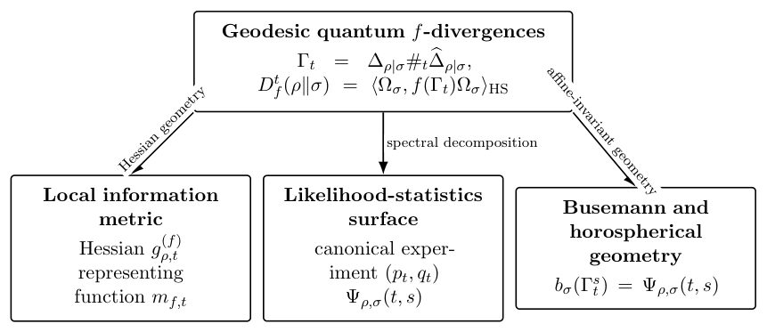
<figcaption class="paper-figure-caption"><b>Fig 1.</b> Figure 1: The three applications of the geodesic f-divergences. Section 2 studies their local Hessian geometry, Section 3 its statistics, and Section 4 its Busemann and horospherical geometry.</figcaption>
</figure>
<figure class="paper-figure-card">
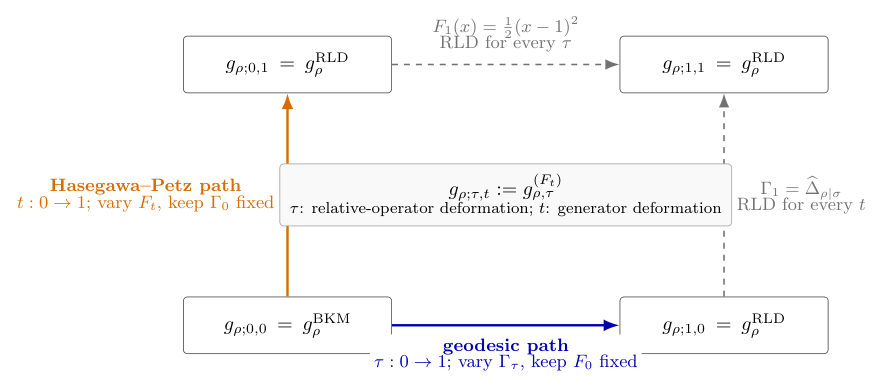
<figcaption class="paper-figure-caption"><b>Fig 2.</b> Figure 2: The two distinct BKM–RLD interpolations inside the family gρ;τ,t = g(Ft) ρ,τ . The lower blue edge is the relative-operator geodesic of the present paper, with the logarithmic generator F0 fixed. The left orange edge is the Hasegawa–Petz path, with the standard relative operator Γ0 fixed. The upper and right dashed edges are constant and equal to the RLD metric.</figcaption>
</figure>
<figure class="paper-figure-card">
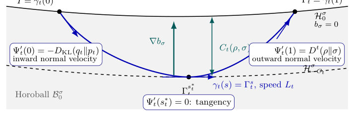
<figcaption class="paper-figure-caption"><b>Fig 3.</b> Figure 3: Example of the geometry of the horospheres: The radial geodesic γt(s) has constant total speed Lt, enters the horoball with normal component −DKL(qt∥pt), is tangent to the deepest horosphere at the value of parameter s∗ t , and returns with normal component Dt(ρ∥σ). The normal distance from the Chernoff point to Hσ 0 is Ct(ρ, σ).</figcaption>
</figure>

**Summary.** This work develops a comprehensive geometric framework by analyzing geodesic quantum f-divergences. It derives an explicit metric tensor for these divergences and shows that the structure can be mapped onto classical statistical concepts like log-likelihood cumulants. This provides a unified, geometrically rich understanding of quantum distinguishability.

**Why it may be interesting.** The rigorous geometric treatment of quantum divergences provides powerful tools for quantifying distinguishability between quantum states, which is fundamental in quantum estimation theory and resource theories.

Detailed structure

**Main problem.** The paper investigates the differential, statistical, and geometrical consequences arising from geodesic quantum f-divergences.

**Main result.** It derives an explicit formula for the induced monotone quantum information metric $g_{ρ,t}^{(f)}$ and establishes a geometric framework using Busemann functions in the cone of positive operators.

**Method.** The authors compute the Hessian of the generalized divergence along geodesics parameterized by $t$, utilizing techniques from Riemannian geometry and functional analysis on operator convex functions.

**Model / system.** The study concerns quantum states $
ho$ and $\sigma$ (represented as positive self-adjoint operators) in a finite-dimensional Hilbert space, focusing on the interpolation of relative modular operators along geodesics.

**Key observables.** Geodesic quantum $f$-divergences ($D_t f(
ho\|\sigma)$), the induced metric tensor $g(f)_{
ho,t}$, and the log-likelihood cumulant function $\Psi_{
ho,\sigma}(t, s)$.

**Important parameters / regimes.** The interpolation parameter $t \in [0, 1]$, the operator convex function $f$, and the states $
ho$ and $\sigma$.

**Assumptions / limitations.** The primary assumptions include that the state $
ho$ is invertible and that the function $f$ is operator-convex.

**Figures summary.** Figure 1 summarizes three applications: the local metric calculation, likelihood statistics derived from the divergence, and the resulting Busemann geometry in the positive cone.

**Paper structure.** The paper proceeds by first defining the geodesic quantum f-divergences, then calculating the Hessian to find the monotone metric (Section 2), relating this structure to canonical binary experiments via log-likelihood cumulants (Section 3), and finally endowing the entire statistical framework with a global geometry using Busemann functions (Section 4).

Abstract

We study the differential, statistical, and geometrical consequences generated by the geodesic quantum $f$-divergences introduced in [14], which are constructed by interpolating the relative modular operator and the commutant Radon-Nikodym derivative using a geodesic with parameter $t\in [0,1]$. For an invertible state $ρ$ and an operator convex function $f$, we compute the Hessian and obtain an explicit formula for the induced monotone quantum information metric $g_{ρ,t}^{(f)}$. Furthermore, we also compare these metrics with the Petz-Hasegawa metric and find the meaning of the interpolation parameter $t$ in this new geometry. We next show that the interpolation of relative modular operators $Γ_t$ in the reference purification of a state $σ$ defines a canonical finite binary experiment $(p_t,q_t)$, and introduce a log-likelihood cumulant function $Ψ_{ρ,σ}(t,s)$, recovering the Nussbaum-Szkoła distributions at $t=0$ and the Matsumoto construction at $t=1$. Finally, using Busemann functions, we endow this statistical framework with a geometric meaning in the cone of positive operators.

[↑ back to top](#top)

### [Machine Learning Approaches to Decoding Topological Quantum Codes](http://arxiv.org/abs/2608.15760v1)

**Authors:** Changwon Lee, Tak Hur, Jeongwoo Jae, Daniel K. Park  
**Type:** theory · **Category:** quantum information and computing · **PDF:** <https://arxiv.org/pdf/2608.15760v1>  
**Analysis basis:** full PDF text, analyzed in chunks
**Topic relevance:** `quantum measurements` **1/5**

↔ Scroll figures horizontally

<figure class="paper-figure-card">
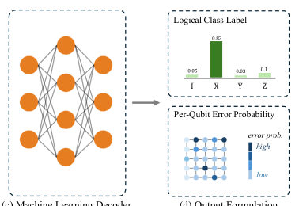
<figcaption class="paper-figure-caption"><b>Fig 1.</b> Figure 1: Overview of the ML-based decoding pipeline for stabilizer codes. (a) A rotated surface code undergoes repeated syndrome extraction over r rounds; data qubits (black dots) are arranged on a lattice with X-type (white) and Z-type (blue) stabilizer measurements. (b) The measured syndrome outcomes at each round are represented as binary vectors and stacked across time steps to form the decoder input. (c) A machine- learning decoder—which may be instantiated as a feedforward network, CNN, GNN, recurrent network, or transformer—processes the syndrome history. (d) Two output formulations: a logical class label, where the decoder predicts the most likely logical error class ¯L ∈{¯I, ¯X,...</figcaption>
</figure>
<figure class="paper-figure-card">
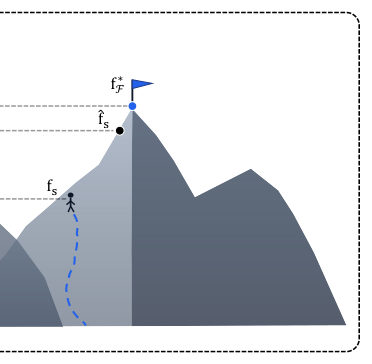
<figcaption class="paper-figure-caption"><b>Fig 2.</b> Figure 2: Visualization of the error decomposition.</figcaption>
</figure>
<figure class="paper-figure-card">
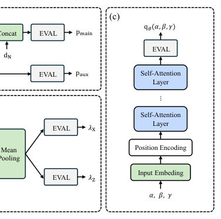
<figcaption class="paper-figure-caption"><b>Fig 3.</b> Figure 3: Three canonical neural decoder architectures. (a) Two stacked LSTM layers process defects d0, d1, . . . , dN−1 sequentially. The auxiliary head receives the recurrent output alone and predicts paux; the main head additionally ingests the final defects dN from data-qubit readout and predicts pmain. (b) Detector error graph spanning three measurement rounds; red nodes are X-type and blue nodes are Z-type detection events, with edges weighted by shared fault probability. Successive graph-convolution layers propagate local features along the space-time graph; mean pooling collapses all node embeddings into a fixed-size vector, and two evaluation heads output λX and λZ. (c) qecGPT...</figcaption>
</figure>
<figure class="paper-figure-card">
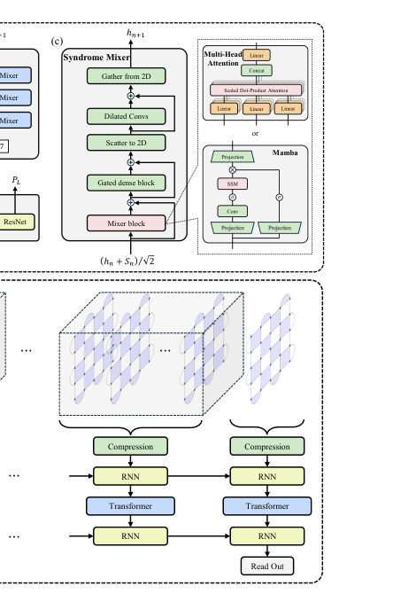
<figcaption class="paper-figure-caption"><b>Fig 4.</b> Figure 4: AlphaQubit family architectures. Top: AlphaQubit 1 (AQ1) [47] module pipeline. Adapted from Ref. [26]. Bottom: AlphaQubit 2 (AQ2) [86] with frame compression and alternating recurrent and transformer layers.</figcaption>
</figure>
<figure class="paper-figure-card">
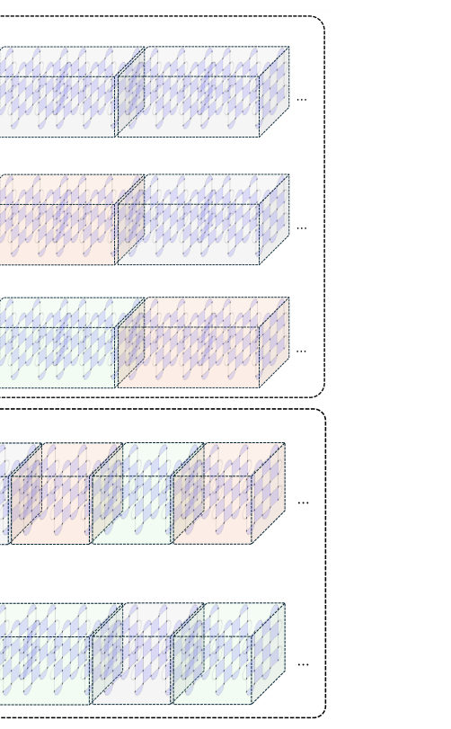
<figcaption class="paper-figure-caption"><b>Fig 5.</b> Figure 5: Sliding-window and parallel-window decoding. Green blocks indicate committed regions, where corrections are accepted and passed forward. Red blocks indicate buffer regions, which provide additional syndrome context but are not committed at that decoding step. Top: In sliding-window decoding, a temporal window is moved forward over the syndrome stream. At each decode step, the decoder commits the correction in the green core region and uses the red buffer region to account for error chains that extend across the window boundary. The buffer is retained until enough future syndrome information is available. Bottom: In parallel-window decoding, windows are organized into decoding...</figcaption>
</figure>

**Summary.** This survey reviews how Machine Learning can be applied to decode errors in topological quantum codes. It frames QEC decoding as a data inference problem, surveying various ML architectures and paradigms suitable for processing complex syndrome histories. The paper argues that ML offers a path toward achieving the high accuracy required for fault-tolerant quantum computation while maintaining practical speed.

**Why it may be interesting.** This work directly addresses the computational bottleneck in fault-tolerant quantum computing by proposing advanced AI methods to solve an NP-hard decoding problem, which is crucial for any physicist working on scalable quantum hardware.

Detailed structure

**Main problem.** The core challenge is developing scalable, accurate, and real-time decoding algorithms for Quantum Error Correction (QEC) codes.

**Main result.** Machine learning approaches, including various neural network architectures, are presented as a powerful framework to approximate the theoretically optimal but intractable quantum maximum-likelihood decoding.

**Method.** The paper frames decoding as an inference problem over classical syndrome history and surveys ML paradigms (discriminative, generative, RL) applied to this task.

**Model / system.** The focus is on topological quantum codes, such as the surface code, which are used to encode logical information nonlocally across many physical qubits for fault-tolerant computation.

**Key observables.** Logical error class, recovery operation, and probability distributions over possible errors derived from syndrome measurements.

**Important parameters / regimes.** Code distance, physical error rate ($p$), computational latency (real-time constraints).

**Assumptions / limitations.** The primary assumption is that ML can effectively model the complex spatiotemporal correlations inherent in quantum error syndromes to achieve near-optimal decoding performance.

**Figures summary.** Figure 1 illustrates the overall ML-based decoding pipeline from syndrome extraction to final output. Figure 2 details the theoretical decomposition of decoding risk into approximation, generalization, and optimization errors.

**Paper structure.** The chapter is structured by first framing decoding as a learning problem, then detailing key ML paradigms (discriminative, generative, RL), reviewing necessary neural network building blocks (GNNs, Transformers), presenting benchmarks, and concluding with real-time considerations and open challenges.

Abstract

Decoding is an essential component of quantum error correction (QEC), translating stabilizer measurement outcomes into corrective actions that suppress logical errors and preserve logical quantum information. Building fault-tolerant architectures requires increasing the code distance, which in turn places growing demands on decoding accuracy, scalability, and practical deployability. While a wide range of decoding algorithms have been proposed and demonstrated, achieving reliable, scalable, and real-time decoding remains a significant challenge. Machine-learning (ML) approaches are particularly well suited to this setting, as quantum error decoding is fundamentally a problem of processing large volumes of classical data with complex spatiotemporal correlations. This chapter surveys ML-based methods for quantum error decoding, with a focus on topological codes and an emphasis on architectural principles, practical performance, and real-time considerations. We first frame decoding as a learning problem and outline key paradigms, including discriminative, generative, and reinforcement-learning formulations. We then introduce the neural network building blocks that underpin most contemporary neural decoders and discuss how these components can be integrated to balance expressivity, scalability, and latency. Building on this architectural perspective, we review recent progress and benchmarks in neural decoding for memory experiments, and discuss real-time decoding, open challenges, and future directions toward scalable fault-tolerant quantum computing.

[↑ back to top](#top)

### [On the zeros of the stellar representation in the discrete cylinder](http://arxiv.org/abs/2608.15237v1)

**Authors:** Nicolas Fabre  
**Type:** theory · **Category:** quantum information and computing · **PDF:** <https://arxiv.org/pdf/2608.15237v1>  
**Analysis basis:** full PDF text, analyzed in chunks
**Topic relevance:** `quantum measurements` **1/5**

↔ Scroll figures horizontally

<figure class="paper-figure-card">
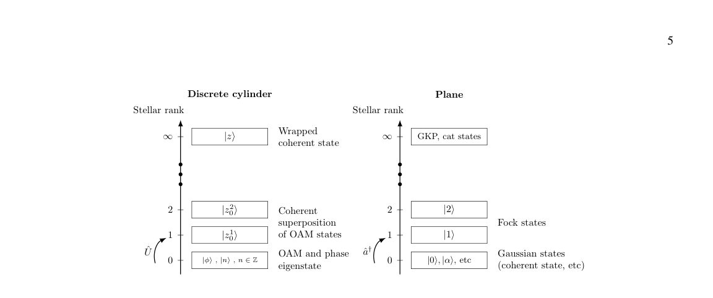
<figcaption class="paper-figure-caption"><b>Fig 1.</b> FIG. 1: Stellar rank hierarchy for the discrete cylinder and plane. The stellar distribution of the OAM and phase eigenstates do not have any zeroes. The application of the jump operator ˆ𝑈allow creating a zero not located at the origin of the plane; so that not at the negative infinite of the cylinder. For the notation 𝑧𝑛 0 see Eq. (30), that corresponds to superposition of OAM eigenstates. Many possible states have the same rank. In the plane, the application of the annihilation or creation operator create or destroy one zero at the origin. However, for the discrete cylinder-conformal plane, ladders operators create or destroy one zero at the origin of the conformal plane, which...</figcaption>
</figure>
<figure class="paper-figure-card">
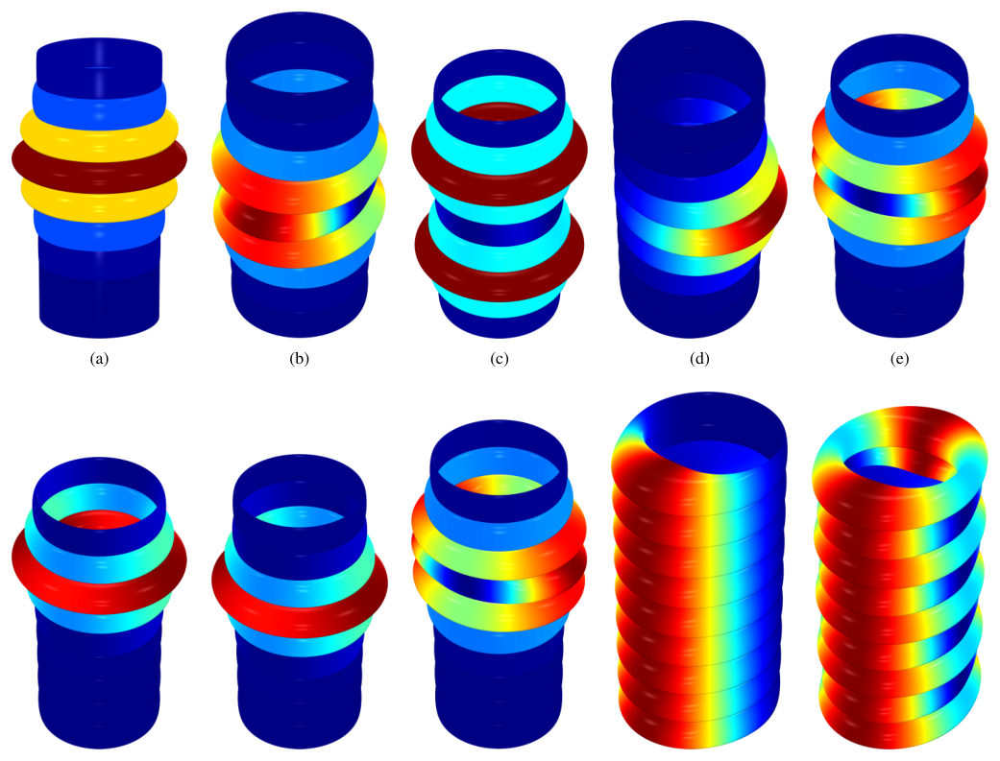
<figcaption class="paper-figure-caption"><b>Fig 2.</b> FIG. 2: Husimi distribution on the discrete cylinder. Each state is rendered as a stack of tori wrapped around a common cylindrical axis: the axis itself represents ℓ, the azimuthal angle represents 𝜙, and at every height the tube’s radius is set proportional to the local value of 𝑄𝜓(ℓ, 𝜙) and colored on the same scale, from dark blue at the smallest values to red at the largest. Regions where 𝑄𝜓is negligible remain flush with the uniform, dark-blue background cylinder, so that the bulges and color bands trace out the shape, location, and zeroes of the Husimi distribution directly on the cylinder’s surface. One caveat of this direct, linearly normalized rendering is worth noting: for...</figcaption>
</figure>
<figure class="paper-figure-card">
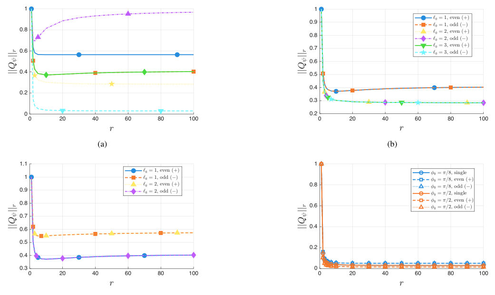
<figcaption class="paper-figure-caption"><b>Fig 3.</b> FIG. 3: (a)𝐿𝑟norm for the OAM eigenstate (circle), its superposition for ℓ0 = 1 (square) and ℓ0 = 2 (star), the coherent state (upward-pointing triangle), the even cat state with ℓ0 = 2 and lobes at 𝜙0 = 0, 𝜋(rhombus), and the phase eigenstate (downward-pointing triangle). The superposition with ℓ0 = 1 has the same norm as the even cat state at even ℓ0, since both states have similar Husimi distributions (see Fig. 2(b) and (e); this measure alone therefore cannot distinguish between the two. (b) 𝐿𝑟</figcaption>
</figure>
<figure class="paper-figure-card">
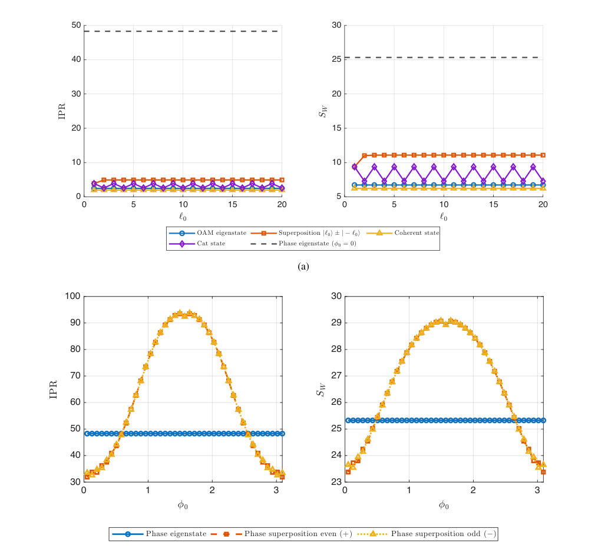
<figcaption class="paper-figure-caption"><b>Fig 4.</b> FIG. 4: (a) IPR and Wehrl entropy for the OAM eigenstate, its superposition, the coherent state, and the even cat state. We can clearly see the different between the even and odd value of 𝑙0 in terms of delocalisability, which is also clearly visible in Fig. 2e and 2f. (b) IPR and Wehrl entropy for the phase eigenstate and its superposition. The higher the IPR or Wehrl entropy, the more delocalized the state is in phase space.</figcaption>
</figure>
<figure class="paper-figure-card">
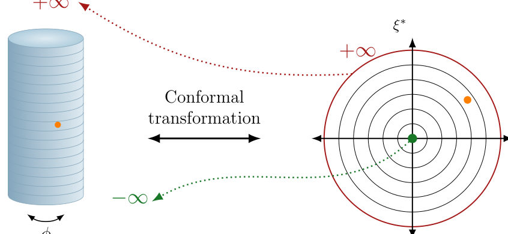
<figcaption class="paper-figure-caption"><b>Fig 5.</b> FIG. 5: The exponential map 𝜉= 𝑒𝑧= 𝑒𝑙𝑒−𝑖𝜙sends the discrete cylinder whose longitudinal coordinate 𝑙and the angular coordinate 𝜙onto the punctured complex plane C∗= C \ {0}. Circles of constant 𝑙are mapped to concentric circles of radius 𝑒𝑙</figcaption>
</figure>

**Summary.** This paper develops a novel 'number-of-zeros' hierarchy for quantum states on the discrete cylinder phase space, linking it to physical systems like Josephson junctions. The main finding is that while this zero-counting property characterizes non-classicality, it does not necessarily correlate with how localized the state is in terms of standard measures like IPR or Wehrl entropy.

**Why it may be interesting.** It provides a deep geometric insight into non-classicality (zero count) versus spatial confinement (localization), suggesting that these two key quantum features can decouple in specific phase spaces, which has implications for quantum state characterization.

Detailed structure

**Main problem.** To establish a number-of-zeros hierarchy for quantum states on the discrete cylinder phase space and determine if this zero-counting property governs state localization.

**Main result.** The zero-counting hierarchy is established, showing that the wrapped coherent state has infinitely many zeros. Crucially, this zero-counting hierarchy does not track state localization measures like IPR or Wehrl entropy.

**Method.** The authors analyze the stellar representation of quantum states using Majorana methods and define a number-of-zeros count based on the Husimi Q-function zeroes. They compare this to standard localization diagnostics ($\mathcal{L}_r$ norm, IPR).

**Model / system.** The system is modeled by the discrete cylinder phase space, which is mathematically equivalent to an infinite strip of the complex plane. It is relevant for describing twisted photons and Josephson junctions.

**Key observables.** Number of zeros in the stellar distribution; $\mathcal{L}_r$ norm, Inverse Participation Ratio (IPR), and Wehrl entropy measuring state spread.

**Important parameters / regimes.** The structure depends on operators like $\hat{E} = e^{i\hat{\phi}}$ and the specific choice of coherent states (e.g., wrapped coherent state).

**Assumptions / limitations.** The analysis relies on mapping quantum states to a stellar distribution function $F_\psi(z)$ whose zeroes are tracked.

**Figures summary.** Not specified, but the notes mention establishing a 'stellar rank hierarchy' (Fig. 1) comparing different state types.

**Paper structure.** The paper first builds the zero-counting hierarchy on the discrete cylinder phase space, contrasting it with continuous variable systems. It then investigates whether this algebraic structure governs physical properties like localization using multiple entropy and norm measures.

Abstract

The discrete cylinder phase space offers a natural setting for twisted photons, Josephson junctions, and certain bosonic codes. In that context, we build a number-of-zeros hierarchy for the stellar distribution of states on the discrete cylinder phase space, tied to usefulness for quantum computation. The orbital angular momentum (OAM) and phase eigenstate, having no zeros, sits at the bottom of the hierarchy and share mathematical properties with the coherent state on the plane phase space, both sharing zero rank and a positive Wigner distribution. This reveals a structural peculiarity of the cylinder: its coherent state---the wrapped coherent state---is instead the most quantum, carrying infinitely many zeros, so "coherent state" need not signal classicality across different phase-space geometries. We identify the operations that preserve or change the zero count, giving explicit access to every rank of the hierarchy. We then ask whether this hierarchy also governs localization. Using the $L^r$ norm, the inverse participation ratio, and the Wehrl entropy as complementary measures of spread in the Husimi density, we find that the two hierarchies need not track one another: the wrapped coherent state can be more localized than the OAM eigenstate even though it carries infinitely many zeros.

[↑ back to top](#top)

### [Optimizing Subspace Expansion in Quantum Chemistry through Operator Selection and Reference State Choice](http://arxiv.org/abs/2608.16362v1)

**Authors:** Konstantin Lamp, Alejandro D. Somoza, Elias Walter, Marina Walt, Michael Marthaler, Maria Fernanda Juarez, Birger Horstmann  
**Type:** both · **Category:** strongly correlated electrons · **PDF:** <https://arxiv.org/pdf/2608.16362v1>  
**Analysis basis:** full PDF text, analyzed in chunks
**Topic relevance:** `quantum measurements` **1/5**

↔ Scroll figures horizontally

<figure class="paper-figure-card">
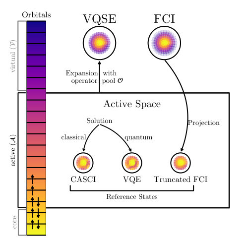
<figcaption class="paper-figure-caption"><b>Fig 1.</b> Figure 1. Representation of VQSE reference states used in this work. After selecting active orbitals, we either approx- imately solve the CAS problem using CI or VQE or project the FCI solution to obtain Truncated FCI. VQSE expands any of these references inside the active space to recover FCI determinants.</figcaption>
</figure>
<figure class="paper-figure-card">
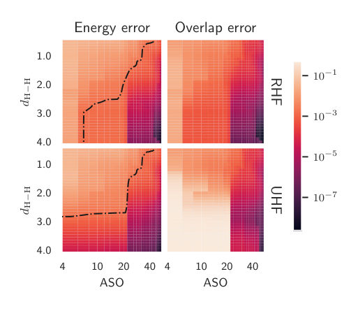
<figcaption class="paper-figure-caption"><b>Fig 2.</b> Figure 3. Energy error (left column) and overlap error (right column) of CASCI calculations with respect to FCI as a func- tion of active spin orbitals (ASO) and bond distance for RHF (top row) and UHF (bottom row) in the cc-pvtz basis. The axes are arranged such that the dissociation limit and the FCI limit meet at the center, so that low errors converge toward the middle of the plot. Chemical accuracy (1.6 × 10−3 Eh) is indicated by a black contour line in the energy panels. GHF results are identical to UHF and omitted for clarity.</figcaption>
</figure>
<figure class="paper-figure-card">
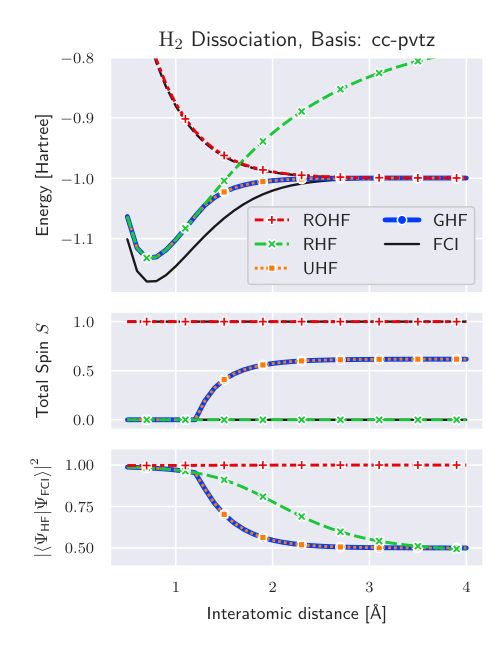
<figcaption class="paper-figure-caption"><b>Fig 3.</b> Figure 2. H2 HF and FCI dissociation energy (top) in cc-pvtz basis, corresponding spin values (middle) and the overlap of HF with FCI (bottom) for singlet RHF (green), triplet ROHF (red), GHF (blue) and singlet UHF (orange). The FCI results are shown as black lines.</figcaption>
</figure>
<figure class="paper-figure-card">
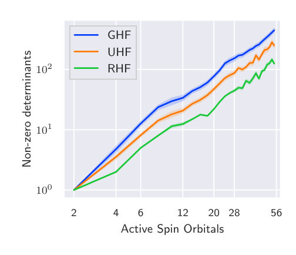
<figcaption class="paper-figure-caption"><b>Fig 4.</b> Figure 4. Number of non-zero determinants in the CASCI solution for the different HF methods as a function of active spin orbitals. RHF consistently requires fewer determinants than UHF or GHF to represent the CASCI wavefunction for a given active space size. The shaded area indicates the stan- dard deviation introduced by averaging over bond distances.</figcaption>
</figure>
<figure class="paper-figure-card">
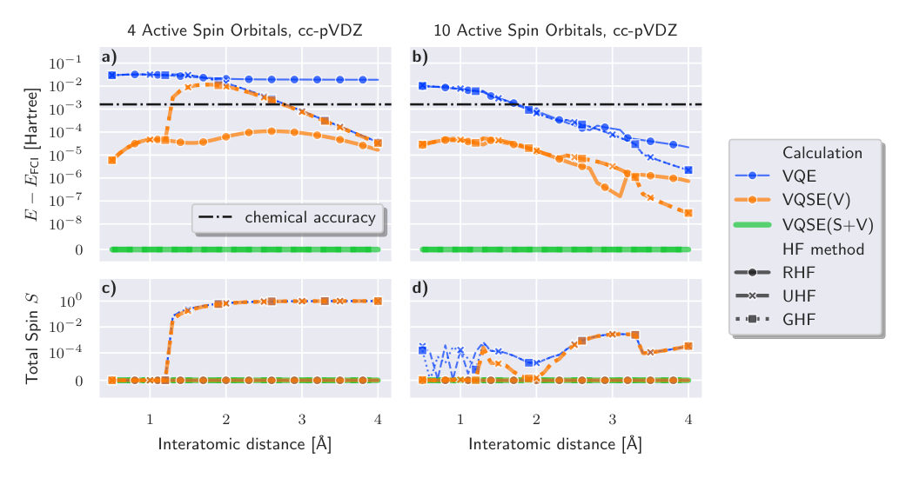
<figcaption class="paper-figure-caption"><b>Fig 5.</b> Figure 5. a) and b): Increase of energy accuracy (difference to FCI). c) and d): Decrease in spin contamination (difference to 0) from VQE over VQSE(V) to VQSE(S+V) for the different HF methods. The left column (a) and c)) contains results for the smallest active space with 4 spin orbitals, the right column (b) and d)) contains data from the largest active space with 10 spin orbitals. The chemical accuracy is indicated as a dashed-dotted line. Note that broken spin symmetry references (UHF/GHF) show improved VQE energies but may exhibit reduced VQSE(V) accuracy due to smaller FCI overlap.</figcaption>
</figure>

**Summary.** This paper analyzes the Virtual Quantum Subspace Expansion (VQSE) method to enhance quantum chemical accuracy beyond standard VQE. It identifies that achieving high precision requires careful management of both the initial reference state quality and the expressivity of the available operators. The findings provide crucial guidelines for deploying such methods on noisy, limited-qubit hardware.

**Why it may be interesting.** The work directly addresses the practical implementation challenges of quantum chemistry algorithms on near-term quantum hardware by providing rigorous guidelines for optimizing resource usage and fidelity.

Detailed structure

**Main problem.** The primary goal is improving the accuracy of quantum chemistry calculations, especially for energy differences along potential energy surfaces crucial for modeling chemical kinetics.

**Main result.** The authors demonstrate that VQSE can achieve chemical accuracy by carefully co-designing reference fidelity and operator pool expressivity, even when restricted to a small subset of operators on noisy hardware.

**Method.** They utilize the Virtual Quantum Subspace Expansion (VQSE), an extension of VQE, which expands the variational state using measurements involving virtual orbitals derived from various Hartree-Fock references.

**Model / system.** The study focuses on electronic structure problems, benchmarked by $	ext{H}_2$ dissociation. The Hamiltonian is treated in second quantization using molecular orbitals, and methods range from HF theory to FCI approximations.

**Key observables.** Accurate energy differences along the Potential Energy Surface (PES), overlap of the reference state with the exact Full CI wavefunction, and total spin expectation value $\langle \hat{S}^2 
angle$.

**Important parameters / regimes.** The degree of operator truncation (e.g., retaining top 10% operators) and the choice of initial reference state (RHF, UHF, GHF).

**Assumptions / limitations.** Approximations include using VQE/VQSE on NISQ devices; key assumptions involve the co-dependence of reference overlap and operator expressivity.

**Figures summary.** Figures compare energy errors ($	ext{E}_{	ext{ASCI}}$ vs $	ext{E}_{	ext{FCI}}$) across different HF methods, showing that VQSE can maintain accuracy even with significant operator truncation (e.g., 10% operators).

**Paper structure.** The paper analyzes the theoretical limitations of QSE/VQSE by identifying two co-dependent error sources: reference overlap and operator pool expressivity. It then demonstrates recovery of high-level correlation energy (MR-CISD) accuracy by adding specific excitations, culminating in noisy hardware experiments.

Abstract

The Virtual Quantum Subspace Expansion (VQSE) extends the Variational Quantum Eigensolver (VQE) by leveraging additional measurements on the reference state to capture the influence of excluded virtual orbitals. This makes VQSE attractive for chemical applications where accurate energy differences along potential energy surfaces are crucial for modeling reaction rates and kinetics. In this work, we analyze VQSE performance on H$_2$ dissociation including references that use Hartree--Fock molecular orbitals with broken spin symmetry. We identify two mechanisms which affect accuracy: overlap of the reference state with the exact full configuration interaction (FCI) wavefunction and operator pool expressivity. We show these mechanisms are strongly co-dependent. When operators are restricted to act only from the active to the virtual space, results become highly sensitive to the reference, and enlarging the active space does not guarantee improved accuracy. In this case, prioritizing reference overlap over energy minimization is therefore essential. Adding single excitations and number operators within the active space recovers the accuracy of MR-CISD (multi-reference configuration interaction singles and doubles) regardless of the reference. In our noisy hardware experiments, we achieve chemical accuracy by adding additional operators and using strict regularization. These findings motivate careful co-design of reference fidelity, pool expressivity, and hardware constraints for practical VQSE deployment.

[↑ back to top](#top)

### [PAS-QFL: Personalized Ansatz Selection for Quantum Federated Learning under Client Data Heterogeneity](http://arxiv.org/abs/2608.14995v1)

**Authors:** Jindi Wu, Qun Li  
**Type:** theory · **Category:** disordered systems and neural networks · **PDF:** <https://arxiv.org/pdf/2608.14995v1>  
**Analysis basis:** full PDF text, analyzed in chunks
**Topic relevance:** `quantum measurements` **1/5**

↔ Scroll figures horizontally

<figure class="paper-figure-card">
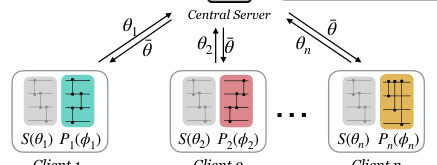
<figcaption class="paper-figure-caption"><b>Fig 1.</b> Fig. 1. Overview of PAS-QFL. Each client QNN is decomposed into a globally shared ansatz S(θi), and a client-specific private ansatz Pi(ϕi) that follows it as a personalized decision head. The shared ansatz is selected for stable cross-client performance, while each private ansatz is selected per client by local profiling. During federated training, every client updates both its private parameters ϕi and its shared parameters θi on local data, but uploads only θi to the central server, which aggregates them into ¯θ and broadcasts ¯θ back for the next round. The private ansatz structure and its parameters remain local and are never shared.</figcaption>
</figure>
<figure class="paper-figure-card">
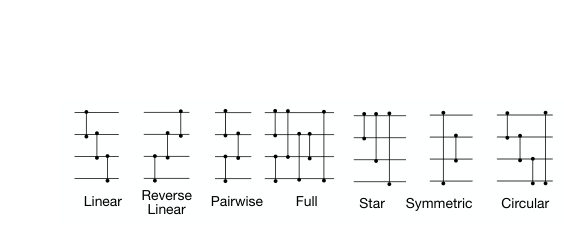
<figcaption class="paper-figure-caption"><b>Fig 2.</b> Fig. 2. Candidate ansatz pool. PAS-QFL considers multiple ansatz structures with different entanglement patterns.</figcaption>
</figure>
<figure class="paper-figure-card">
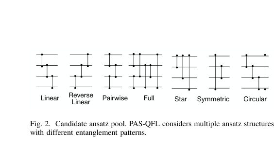
<figcaption class="paper-figure-caption"><b>Fig 3.</b> Fig. 3 summarizes the profiling results from two comple- mentary views. The client-wise view in Fig. 3(a) reports, for each client, the distribution of validation Macro-F1 scores across candidate ansatzes. The spread varies substantially across clients: some clients are relatively insensitive to ansatz choice, while others show a large gap between their best and worst ansatzes. This indicates that ansatz suitability is client- dependent under class-imbalanced non-IID data. Therefore, using the same private-layer ansatz structure for all clients may fail to capture client-specific decision behavior. The ansatz-wise view in Fig. 3(b) reports, for each ansatz, the distribution of validation...</figcaption>
</figure>
<figure class="paper-figure-card">
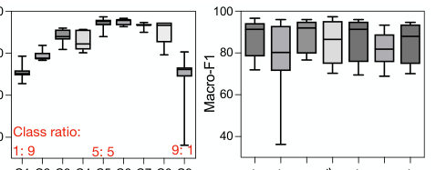
<figcaption class="paper-figure-caption"><b>Fig 4.</b> Fig. 3. Local ansatz profiling under client data heterogeneity. The client-wise view summarizes the validation Macro-F1 distribution of different ansatzes on each client, showing client-dependent sensitivity to ansatz choice. The ansatz-wise view summarizes the validation Macro-F1 distribution of each ansatz across clients, showing different levels of their cross-client stability.</figcaption>
</figure>
<figure class="paper-figure-card">
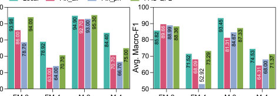
<figcaption class="paper-figure-caption"><b>Fig 5.</b> Fig. 4. Overall performance under noiseless simulation.</figcaption>
</figure>

**Summary.** This paper introduces PAS-QFL, a novel framework for Quantum Federated Learning that addresses performance degradation caused by heterogeneous client data. It achieves this by structurally personalizing each client's QNN ansatz into shared and private components. The results demonstrate that allowing structural adaptation significantly boosts performance compared to using fixed circuit architectures.

**Why it may be interesting.** While focused on ML, the underlying concept of adapting complex quantum circuits (ansatzes) based on local data statistics mirrors challenges in modeling open quantum systems where system-specific coupling or environmental interactions require tailored Hamiltonians or effective models.

Detailed structure

**Main problem.** Existing Quantum Federated Learning (QFL) methods fail under client data heterogeneity because they assume a fixed ansatz structure, leading to unstable and unfair performance.

**Main result.** The proposed PAS-QFL framework significantly improves average Macro-F1 scores over fixed-ansatz baselines by personalizing the *structure* of the private quantum ansatz for each client.

**Method.** PAS-QFL decomposes the QNN into a globally shared ansatz and a client-specific private ansatz, selecting both structures using stability-aware criteria based on local profiling.

**Model / system.** The model involves Quantum Neural Networks (QNNs) realized via Variational Quantum Circuits (VQCs) trained in a federated learning setting across multiple quantum clients.

**Key observables.** Macro-F1 score, used as the primary metric to assess performance under class imbalance and to profile ansatz suitability.

**Important parameters / regimes.** The stability weighting factor ($\lambda$) used when selecting the shared ansatz structure; client data heterogeneity (non-IID).

**Assumptions / limitations.** The method assumes that structural personalization of the private ansatz, while maintaining a common shared component for aggregation, is feasible and beneficial.

**Figures summary.** Figures illustrate the PAS-QFL decomposition, show profiling results confirming client-dependent suitability (Fig. 3a), and compare performance against fixed baselines across various settings (Figs. 4 & 5).

**Paper structure.** The paper first identifies the failure mode of fixed-ansatz QFL under heterogeneity. It then proposes PAS-QFL, detailing the decomposition into shared/private components. The methodology involves local profiling to select optimal structures for both parts, followed by federated training where only shared parameters are aggregated.

Abstract

Quantum federated learning (QFL) lets multiple quantum clients collaboratively train quantum neural networks (QNNs) without sharing private local data. However, existing QFL methods commonly assume that all clients use the same ansatz, overlooking how heterogeneous client data affects ansatz suitability. Under class-imbalanced non-IID data, different clients may favor different ansatz structures, so a fixed ansatz can lead to unstable and unfair performance across clients. In this paper, we propose PAS-QFL, a Personalized Ansatz Selection framework for QFL under client data heterogeneity. Rather than treating the ansatz as a monolithic structure, PAS-QFL decomposes each client QNN into a globally shared ansatz and a client-specific private ansatz, and personalizes the structure of the private ansatz rather than only its parameters. The shared ansatz is placed first and selected by a stability-aware cross-client criterion so that its parameters can be reliably aggregated, while the private ansatz serves as a personalized decision head, selected per client by local Macro-F1 to adapt the shared representation to its local data. During training, each client updates both its shared and private parameters locally but uploads only the shared parameters, so federated aggregation stays well-defined while each client keeps its own private structure. PAS-QFL uses Macro-F1 as the primary selection metric to avoid misleading accuracy under class imbalance. Experiments on heterogeneous QFL tasks show that PAS-QFL improves average Macro-F1 over the existing fixed-ansatz QFL baselines, demonstrating the value of personalizing the ansatz structure for practical QFL.

[↑ back to top](#top)

### [Quantum gate lower bounds for loss-tolerant position verification](http://arxiv.org/abs/2608.16495v1)

**Authors:** Alex May, Philip Verduyn Lunel  
**Type:** theory · **Category:** quantum information and computing · **PDF:** <https://arxiv.org/pdf/2608.16495v1>  
**Analysis basis:** full PDF text, analyzed in chunks
**Topic relevance:** `quantum measurements` **1/5**

↔ Scroll figures horizontally

<figure class="paper-figure-card">
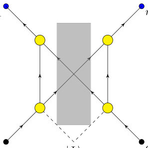
<figcaption class="paper-figure-caption"><b>Fig 1.</b> Figure 1: A position-verification scheme in 1 + 1 dimensions. Inputs are given at locations c1, c2. The prover should apply a designated quantum operation to these inputs, then return the outputs to points r1, r2. a) An honest prover enters the designated spacetime region (grey) to apply the needed quantum operation. b) A dishonest prover attempts to reproduce the same operation while acting outside the spacetime region.</figcaption>
</figure>
<figure class="paper-figure-card">
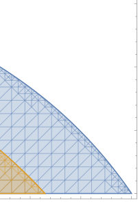
<figcaption class="paper-figure-caption"><b>Fig 2.</b> Figure 2: The parameter region in which we prove that the f-BB84 scheme requires nearly linear quantum gates to attack. We assume f has linear SMP complexity; the inner product function for instance suffices. Here L is the probability with which the player in the protocol is allowed to declare a loss. Meanwhile 1 −ϵ is the probability the response is correct, conditioned on at least one player not responding “loss”. Our security region is as large as possible: outside the region there is an attack using O(1) quantum gates. In blue we show the ideal case, where the quantum inputs to f-BB84 protocol are prepared in exactly the BB84 states. When the inputs are themselves noisy, the region...</figcaption>
</figure>
<figure class="paper-figure-card">
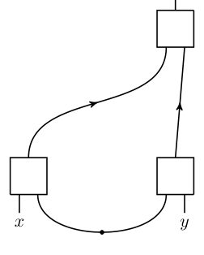
<figcaption class="paper-figure-caption"><b>Fig 3.</b> Figure 3: a) An f-BB84 protocol. Alice on the left applies the first round operation N x; Bob on the right applies the first round operation My. We define M = M0M1, M ′ = M ′ 0M ′ 1. b) An SMP protocol, which can be defined from the f-BB84 protocol. The messages sent from Alice and Bob to the referee contain a description of their first round operations. The message lengths are related to the number of quantum gates the players apply. To ensure only quantum gates are counted, it is necessary to give Alice and Bob the same entangled state as they share in the f-BB84 protocol.</figcaption>
</figure>
<figure class="paper-figure-card">
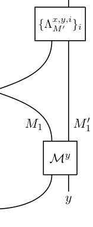
<figcaption class="paper-figure-caption"><b>Fig 4.</b> Figure 4: A general strategy for an f-BB84 scheme. Alice applies N x in the first round, Bob applies My. They communicate in one simultaneous exchange, and then apply measurements to their local systems. They output values b′, b′′ ∈{0, 1, ⊥}, where ⊥is interpreted as declaring a loss. The players succeed if b = b′ = b′′ ̸=⊥, with b ∈{0, 1} determined by measuring a reference maximally entangled with Q in the computational basis if f(x, y) = 0, and Hadamard basis if f(x, y) = 1.</figcaption>
</figure>

**Summary.** This paper develops new, analytically derived lower bounds on the quantum gate complexity required by an eavesdropper attacking the f-BB84 Quantum Position-Verification scheme. By analyzing the protocol's security under realistic conditions like transmission loss and state imperfections, the authors establish precise parameter regimes where the scheme remains secure against powerful attackers.

**Why it may be interesting.** This work provides rigorous, analytical cryptographic security proofs for quantum communication protocols that are highly relevant to experimental quantum information science. The focus on resource bounding (quantum gates) rather than just entanglement is a key theoretical advancement.

Detailed structure

**Main problem.** The paper aims to establish new, rigorous lower bounds on the quantum gates required by an attacker attempting to break the f-BB84 Quantum Position-Verification (QPV) cryptographic scheme.

**Main result.** They prove that for the f-BB84 QPV scheme, an attack requires nearly linear quantum gates ($	ilde{\Omega}(n)$) unless the loss probability ($L$) and error rate ($\epsilon$) fall within a specific analytically determined security region. This establishes security under bounded gate assumptions.

**Method.** The analysis employs techniques from quantum information theory, specifically deriving bounds by relating the QPV protocol to lossy Monogamy-of-Entanglement (MoE) games and Simultaneous Message Passing (SMP) communication complexity.

**Model / system.** The study focuses on the f-BB84 Quantum Position-Verification scheme, which involves two parties establishing a function $f(x, y)$ based on inputs at different spacetime locations. The security analysis is generalized to account for realistic imperfections like transmission loss and state preparation errors.

**Key observables.** The primary observables are the quantum gate complexity required by an attacker, alongside parameters quantifying protocol performance: $L$ (loss probability), $\epsilon$ (error rate), and $\eta$ (input state fidelity).

**Important parameters / regimes.** Key parameters include the loss probability ($L$), the error tolerance ($\epsilon$), and the input state imperfection measure ($\eta$). The security region is defined by complex inequalities involving these variables.

**Assumptions / limitations.** The analysis assumes a specific gate set size (initially 4 acting on $\le 2$ qubits) but extends to bounding descriptive complexity. A key assumption addressed is modeling imperfect states via the trace distance ($\eta$).

**Figures summary.** Figure 1 illustrates the general setup of QPV in 1+1 dimensions. Figure 2 maps out the critical parameter region ($L$ vs. $\epsilon$) that dictates whether an attack requires linear or constant quantum gates.

**Paper structure.** The paper builds by first defining the security challenge (QPV under loss), then developing a mathematical tool—the tight analytic tradeoff for a lossy BB84 MoE game—and finally applying this tool to derive explicit, improved lower bounds on gate complexity compared to previous numerical results.

Abstract

Quantum position-verification is a cryptographic task wherein a verifier attempts to establish the location in space of a prover. Recent experiments have implemented a well-studied class of position-verification schemes, known as the $f$-BB84 scenario, but their security under realistic loss and imperfect state preparation remains incompletely understood. We give a new lower bound on any attack on this scheme, in particular proving nearly-linear quantum gate lower bounds on the attacker, even when allowing the attacker to declare a transmission loss of up to $50\%$, allowing for the challenges prepared by the referee to be imperfect, and allowing the quantum messages used in the protocol to be arbitrarily slow. Our results are applicable to recent and upcoming experimental implementations of $f$-BB84, and in particular establish their security under a bounded quantum gate assumption on the attacker. The key ingredient is a tight analytic tradeoff for a lossy BB84 monogamy-of-entanglement game, valid without requiring the attackers' outputs to agree, which replaces observations previously made numerically.

[↑ back to top](#top)

### [Quantum Information Analysis in a q-Deformed Deng-Fan Model](http://arxiv.org/abs/2608.15413v1)

**Authors:** P. O. Amadi, Collins O. Edet, A. R. P. Moreirae, P. Kalasuwana, N. Ali, R. Endut, S. A. Aljunid  
**Type:** theory · **Category:** other · **PDF:** <https://arxiv.org/pdf/2608.15413v1>  
**Analysis basis:** full PDF text, analyzed in chunks
**Topic relevance:** `quantum measurements` **1/5**

↔ Scroll figures horizontally

<figure class="paper-figure-card">
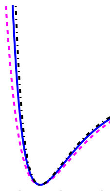
<figcaption class="paper-figure-caption"><b>Fig 1.</b> Figure 1: Potential Vq(x) for different values of the deformation parameter q. Decreasing q shifts the effective boundary and enhances confinement. De = 5, xe = 3, α = 0.5. At q →1, Deng Fan potential is recovered</figcaption>
</figure>
<figure class="paper-figure-card">
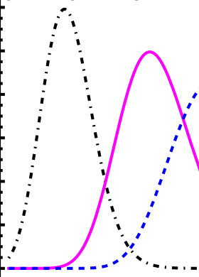
<figcaption class="paper-figure-caption"><b>Fig 2.</b> Figure 2: Spatial wavefunction of qDFP model in the ground state for q ∈{0.4, 0.7, 1}. De = 5, α = 0.5, xe = 3</figcaption>
</figure>
<figure class="paper-figure-card">
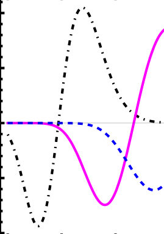
<figcaption class="paper-figure-caption"><b>Fig 3.</b> Figure 3: Spatial wavefunction in the first excited state for qDFP model for q ∈ {0.4, 0.7, 1} . De = 5, α = 0.5, xe = 3.</figcaption>
</figure>
<figure class="paper-figure-card">
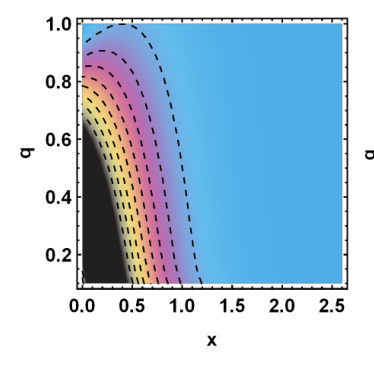
<figcaption class="paper-figure-caption"><b>Fig 4.</b> Figure 4: Entropic information density for De = 5, α = 0.5, xe = 3 and m = 10−6. The plot on the left refers to the ground state with energy n = 0. The plot on the right is for the first excited state n = 1 (Here we consider ℏ= 1).</figcaption>
</figure>
<figure class="paper-figure-card">
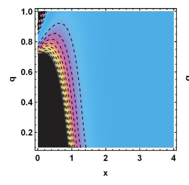
<figcaption class="paper-figure-caption"><b>Fig 5.</b> Figure 5: Fisher information density for De = 5, α = 0.5, xe = 3 and m = 10−6. The plot on the left refers to the ground state with energy n = 0. The plot on the right is for the first excited state n = 1 (Here we consider ℏ= 1).</figcaption>
</figure>

**Summary.** This paper analyzes the $q$-deformed Deng-Fan Potential model to study how parameter deformation affects quantum states in molecular systems. By applying advanced information measures like Shannon and Fisher entropy, the authors show that changing the deformation parameter causes a controlled redistribution of quantum information between position and momentum spaces. This establishes a quantitative link between spatial confinement and informational uncertainty.

**Why it may be interesting.** This work is highly relevant as it bridges molecular physics (potential modeling) with fundamental concepts from quantum information theory. The explicit quantification of information trade-offs provides a deeper physical insight into confinement effects than spectral analysis alone.

Detailed structure

**Main problem.** The study investigates how introducing a deformation parameter ($q$) into the Deng-Fan potential modifies the quantum mechanical energy spectrum and, critically, redistributes the inherent quantum information content of the system.

**Main result.** Stronger deformation (smaller $q$) enhances spatial localization while simultaneously increasing the entropic excess above the minimum uncertainty bound, demonstrating a complex trade-off in quantum information flow.

**Method.** The authors solve the time-independent Schrödinger equation exactly using hypergeometric functions and analyze the resulting wavefunctions using advanced information-theoretic measures like Shannon entropy and Fisher information.

**Model / system.** The system is modeled by the $q$-deformed Deng-Fan Potential ($qDFP$), a modification of an empirical potential used in molecular physics to describe diatomic interactions. The Hamiltonian is solved analytically, yielding closed-form solutions for eigenvalues and wavefunctions.

**Key observables.** Energy eigenvalues ($E_{n,q}$), Shannon entropy ($S_x, S_p$), Fisher information ($I_x, I_p$), and the entropic excess above the BBM bound.

**Important parameters / regimes.** The deformation parameter $q \in (0, 1]$, the potential depth $D_e$, and the equilibrium bond length $x_e$.

**Assumptions / limitations.** The analysis assumes that the system remains physically admissible for $q<1$ and relies on the mathematical framework connecting quantum mechanics to information theory.

**Figures summary.** Figures illustrate the potential shape change with $q$, show ground state localization sharpening, demonstrate excited state probability density asymmetry, and visualize the concentration shifts of entropic densities in position space.

**Paper structure.** The paper first introduces the $qDFP$ model and solves the Schrödinger equation exactly. It then analyzes the spectral consequences of varying $q$. Finally, it delves into information theory, applying entropy measures to quantify how the deformation reshapes quantum state structure beyond simple energy analysis.

Abstract

We introduce a $q$-deformed Deng-Fan potential ($q$DFP) model that enables controlled modulation of short-range repulsion and long-range attraction while preserving the equilibrium configuration. The model is solved exactly within the framework of the time-independent Schrödinger equation, yielding closed-form expressions for the energy eigenvalues and wave functions in terms of hypergeometric functions. We show that the deformation parameter $q$ induces non-uniform spectral shifts and a redistribution of bound states. In particular, for $q<1$, the system exhibits spectral compression and enhanced spatial localization. In addition, we investigate the system from an information-theoretic perspective using Shannon entropy, Fisher information, and Fisher--Shannon complexity measures in both position and momentum spaces. The results reveal that the deformation parameter governs the redistribution of quantum information, establishing a direct connection between spatial confinement and momentum delocalization in accordance with the Białynicki-Birula and Mycielski entropic uncertainty principle. Stronger deformation pushes the quantum state further from the minimum-uncertainty configuration, increasing the entropic excess above the BBM bound and reducing the information content about complementary observables, even as position-space localization sharpens. The analysis of entropic and Fisher information densities further shows how the deformation reshapes both the local information content and the structural complexity of the quantum states. We show that in the limit $q\to 1$, the $q$DFP model is reduced to the standard Deng-Fan potential.

[↑ back to top](#top)

### [Quantum Kernel k-Means for Credit-Card Fraud Detection:A Controlled Benchmark on Real Transaction Data](http://arxiv.org/abs/2608.15718v1)

**Authors:** Muhammad Faryad  
**Type:** theory · **Category:** quantum information and computing · **PDF:** <https://arxiv.org/pdf/2608.15718v1>  
**Analysis basis:** full PDF text, analyzed in chunks
**Topic relevance:** `quantum measurements` **1/5**

↔ Scroll figures horizontally

<figure class="paper-figure-card">
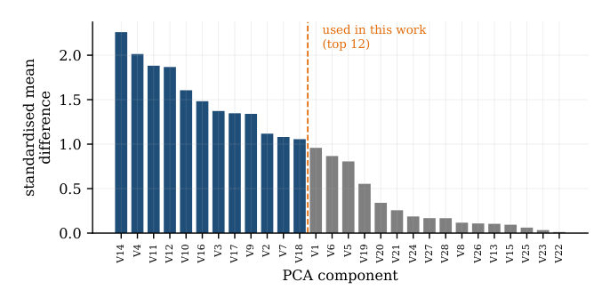
<figcaption class="paper-figure-caption"><b>Fig 1.</b> Figure 1: Class separation of the 28 principal components, measured as the standardised mean difference between fraudulent and legitimate transactions. The n-qubit experiments use the top n components; separation falls off sharply beyond the first eight.</figcaption>
</figure>
<figure class="paper-figure-card">

<figcaption class="paper-figure-caption"><b>Fig 2.</b> Figure 2 and Table 1 report held-out performance at 2, 4, 8, 12 qubits. Three observations stand out. First, all kernel methods—quantum and classical—clearly outperform plain k-means, which reaches only 0.686 ± 0.083 at eight qubits. Spectral clustering performs poorly throughout. The interesting comparison is therefore between kernels, not between quantum and k-means. Second, the quantum kernel is not uniformly better or worse. At two and four qubits it is behind the tuned classical kernel, significantly so at four (∆ARI = −0.0119, p = 0.025). At eight qubits it is ahead (∆ARI = +0.0086, p = 0.013, 95% CI [+0.0020,+0.0153]). At twelve the difference is not distinguishable from zero (∆ARI =...</figcaption>
</figure>
<figure class="paper-figure-card">

<figcaption class="paper-figure-caption"><b>Fig 3.</b> Figure 3 shows the development score of all 264 configurations, grouped by family. Within-family spread is far larger than between-family spread: the best member of almost every family reaches a similar score, while the worst members are close to zero. Restricting to the best configuration per bandwidth (Fig. 4a), performance varies from 0.707 to 0.870 at eight qubits—a range of 0.163, roughly 14× the largest quantum- versus-classical difference we measure (0.0119). This corroborates Shaydulin and Wild [10] and Canatar et al. [16] in an applied setting and has a direct practical consequence: a quantum kernel benchmark that does not report its bandwidth has not reported its model.</figcaption>
</figure>
<figure class="paper-figure-card">
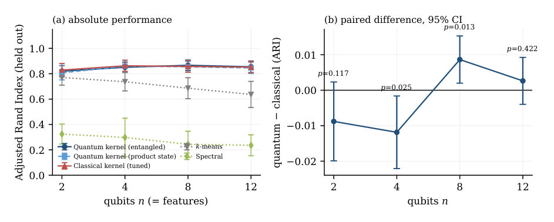
<figcaption class="paper-figure-caption"><b>Fig 4.</b> Figure 2: (a) Held-out adjusted Rand index against register size for all methods; error bars are standard deviations over 30 resamples. (b) Paired quantum-minus-classical difference with 95% confidence intervals. The sign of the difference changes with register size and its magnitude never exceeds 0.012.</figcaption>
</figure>
<figure class="paper-figure-card">
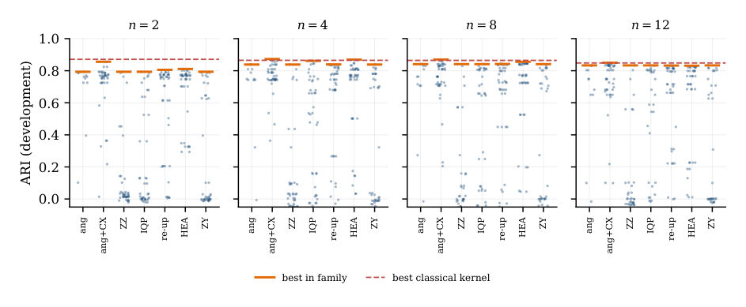
<figcaption class="paper-figure-caption"><b>Fig 5.</b> Figure 3: Development-set adjusted Rand index for all 264 feature-map configurations at each register size, grouped by family (one point per configuration, jittered horizontally). Orange bars mark the best configuration in each family; the dashed red line is the best classical kernel. Variation within a family exceeds variation between families.</figcaption>
</figure>

**Summary.** This paper rigorously benchmarks quantum kernel k-means against classical clustering for fraud detection using real transaction data. The authors conclude that no robust quantum advantage exists, finding that performance differences are negligible and often attributable to experimental controls like search budgets. They recommend reframing the problem as anomaly scoring rather than standard clustering.

**Why it may be interesting.** While not directly about AMO physics, the rigorous benchmarking methodology for assessing quantum advantage in machine learning tasks (like kernel methods) provides valuable lessons on how to design controlled experiments that distinguish true physical speedups from mere algorithmic artifacts or statistical noise.

Detailed structure

**Main problem.** The paper benchmarks quantum kernel k-means against classical clustering for credit-card fraud detection to determine if a robust quantum advantage exists.

**Main result.** No robust quantum advantage was found; observed differences were small, and any apparent gains were shown to be artifacts of the search budget or hyperparameter tuning rather than inherent quantum superiority.

**Method.** The authors compared performance using Adjusted Rand Index (ARI) across varying qubit counts ($n=2, 4, 8, 12$) by implementing kernel estimation via compute-uncompute tests on real transaction data.

**Model / system.** The model uses quantum feature maps $U(x)$ to induce a fidelity kernel $K(x,y) = \langle\psi_y|\psi_x
angle$ for clustering. The comparison is made against classical k-means using the same real transaction data.

**Key observables.** Adjusted Rand Index (ARI), Area Under the ROC Curve (AUROC), and kernel concentration metrics.

**Important parameters / regimes.** Number of qubits ($n$), search budget size, class imbalance ratio (e.g., 0.173% fraud rate).

**Assumptions / limitations.** The comparison protocol rigorously controls for selection bias by using separate development and held-out resamples; the study assumes noiseless quantum circuits.

**Figures summary.** Figures show performance degradation with increasing qubits due to kernel concentration, demonstrate that bandwidth choice is more critical than feature map family, and illustrate the failure of clustering vs. the stability of anomaly scoring under severe class imbalance.

**Paper structure.** The paper establishes a rigorous benchmarking protocol comparing quantum k-means to classical methods on real data. It systematically tests varying qubit sizes and circuit configurations, ultimately arguing that reframing the task as anomaly detection is necessary, but still finding no robust quantum advantage over tuned classical approaches.

Abstract

We benchmarked quantum kernel $k$-means against classical clustering for credit-card fraud detection on real transaction data, at up to \MaxQubits{} qubits, under a protocol with separated selection and reporting data and matched search budgets. We find no robust quantum advantage: the sign of the difference depends on register size, all effect sizes are below $0.013$ ARI, and the single significant advantage we observe is fully explained by the number of configurations searched. We further show that ordinary hyperparameter choices move performance by considerably more than the quantum kernel does, that additional qubits degrade rather than improve performance through kernel concentration, and that the clustering framing itself fails at realistic class imbalance though kernel-based anomaly scoring does not. We regard the methodological contribution as the more durable one. The search-budget ablation in particular is inexpensive and, in our case, decisive: it converted a statistically significant advantage into a procedural artefact. We would encourage its routine use.

[↑ back to top](#top)

### [Qudit-ADAPT-VQE: an adaptive variational algorithm with counterdiabatic-inspired improvements for qudits](http://arxiv.org/abs/2608.14981v1)

**Authors:** Joaquín Molina, Herbert Díaz-Moraga, Dardo Goyeneche, Diego Tancara  
**Type:** theory · **Category:** quantum information and computing · **PDF:** <https://arxiv.org/pdf/2608.14981v1>  
**Analysis basis:** full PDF text, analyzed in chunks
**Topic relevance:** `quantum measurements` **1/5**

↔ Scroll figures horizontally

<figure class="paper-figure-card">
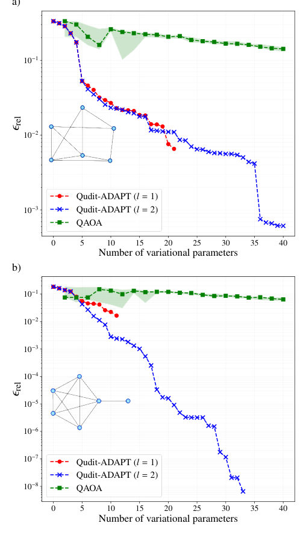
<figcaption class="paper-figure-caption"><b>Fig 1.</b> FIG. 1. Relative error as a function of the number of variational pa- rameters for Qudit-ADAPT using operator pools obtained from the l = 1 and l = 2 truncations of the approximate AGP, and for QAOA using 25 random restarts. For QAOA, the median is plotted, while the shaded region represents the interquartile range. a) For the irreg- ular graph instance G1 and b) G2. The graph corresponding to each instance is shown as an inset.</figcaption>
</figure>
<figure class="paper-figure-card">
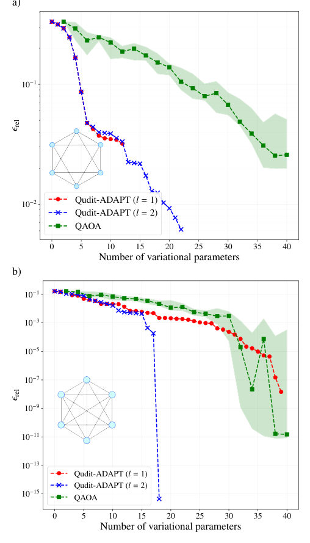
<figcaption class="paper-figure-caption"><b>Fig 2.</b> FIG. 3. Relative error as a function of the number of variational pa- rameters for Qudit-ADAPT using operator pools obtained from the l = 1 and l = 2 truncations of the approximate AGP, and for QAOA using 25 random restarts. For QAOA, the median is plotted, while the shaded region represents the interquartile range. a) For the reg- ular graph instance G5 and b) K6. The graph corresponding to each instance is shown as an inset.</figcaption>
</figure>
<figure class="paper-figure-card">
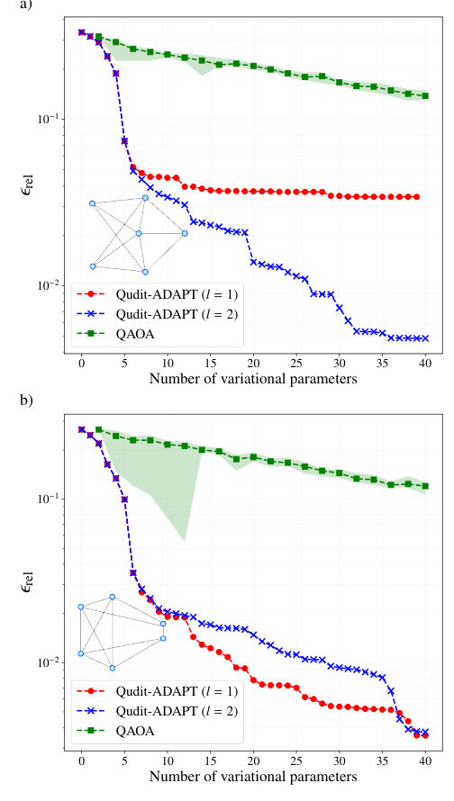
<figcaption class="paper-figure-caption"><b>Fig 3.</b> FIG. 2. Relative error as a function of the number of variational pa- rameters for Qudit-ADAPT using operator pools obtained from the l = 1 and l = 2 truncations of the approximate AGP, and for QAOA using 25 random restarts. For QAOA, the median is plotted, while the shaded region represents the interquartile range. a) For the irreg- ular graph instance G3 and b) G4. The graph corresponding to each instance is shown as an inset.</figcaption>
</figure>
<figure class="paper-figure-card">
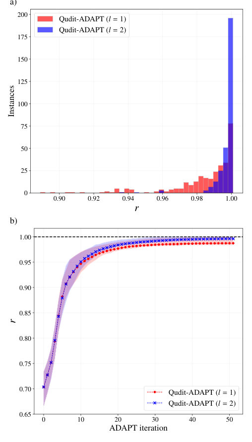
<figcaption class="paper-figure-caption"><b>Fig 4.</b> FIG. 4. a) Histogram of the approximation ratios obtained for all graph instances achieved by Qudit-ADAPT using the operator pools derived from the approximate AGP at orders l = 1 and l = 2, re- spectively. b) Median approximation ratio over all graph instances at each ADAPT iteration, up to the maximum number of iterations kmax = 50. The shaded regions represent the corresponding interquar- tile ranges.</figcaption>
</figure>
<figure class="paper-figure-card">
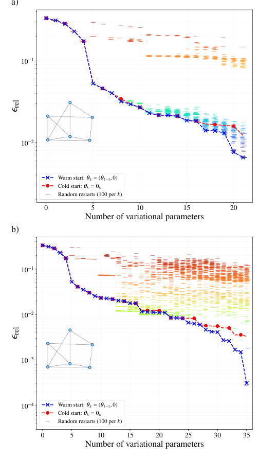
<figcaption class="paper-figure-caption"><b>Fig 5.</b> FIG. 5. Relative error as a function of the number of variational parameters for instance G1, using operator pools obtained from the a) l = 1 and b) l = 2 truncations of the approximate AGP. Each horizontal mark is the converged optimum of one of 100 indepen- dent random parameter initializations of the same ansatz, colored by its relative error. The blue curve is the warm-start strategy used by Qudit-ADAPT and the red curve a cold restart at θk = 0k.</figcaption>
</figure>

**Summary.** This work presents Qudit-ADAPT, an advanced variational algorithm designed for qudit systems to solve optimization problems. By integrating counterdiabatic driving into the adaptive ansatz construction, it overcomes limitations like barren plateaus and demonstrates superior performance in terms of native gate count compared to standard methods like QAOA.

**Why it may be interesting.** The explicit focus on qudits and the incorporation of concepts from adiabatic quantum computing (counterdiabatic driving) to stabilize VQAs makes this highly relevant for researchers exploring hardware-efficient algorithms beyond qubits.

Detailed structure

**Main problem.** The paper addresses inherent challenges in variational quantum algorithms (VQA) when applied to qudits, specifically barren plateaus and designing efficient ansatz circuits.

**Main result.** The proposed Qudit-ADAPT algorithm, enhanced with counterdiabatic driving, achieves higher accuracy and lower native gate counts compared to fixed ansatz methods for solving optimization problems like Max 3-Cut.

**Method.** It adapts the ADAPT-VQE framework by constructing an operator pool derived from the adiabatic gauge potential (AGP) of a counterdiabatic Hamiltonian. This iterative process selects operators based on maximizing the energy gradient.

**Model / system.** The system utilizes qudits ($d>2$) to encode classical optimization problems involving ternary variables ($\{-1, 0, 1\}$). The problem is mapped onto minimizing the expectation value of a cost Hamiltonian $H_C$.

**Key observables.** Accuracy (relative error $\epsilon_{	ext{rel}}$), total native gate count (compared to QAOA), and convergence rate.

**Important parameters / regimes.** The qudit dimension ($d$), the target relative error ($\le 10^{-3}$), and the structure of the graph instance (e.g., G1, K6).

**Assumptions / limitations.** The use of angular-momentum operators is sufficient for ternary variables; the comparison between Qudit-ADAPT and QAOA circuit costs is made at a matched variational parameter count.

**Figures summary.** Figures compare operator pool sizes (Angular momentum vs. Gell-Mann basis) and show that Qudit-ADAPT requires significantly fewer native gates than QAOA for achieving comparable precision on benchmark graphs.

**Paper structure.** The paper first introduces the qudit framework and the need to overcome VQA limitations. It then details the integration of counterdiabatic driving into ADAPT-VQE, deriving the operator pool from the AGP. Finally, it compares the resulting circuit costs against QAOA for various graph instances.

Abstract

Variational quantum algorithms based on qudits have attracted significant attention in recent years. However, as in their qubit-based counterparts, challenges such as barren plateaus and the design of efficient ansatz remain major obstacles. In this work, we propose to address these issues through a qudit implementation of the ADAPT-VQE algorithm, which constructs the ansatz iteratively. Specifically, we introduce an operator pool inspired by adiabatic evolution enhanced with counterdiabatic driving for ansatz construction and employ it to solve Max 3-Cut. We show that the warm-start strategy inherent to ADAPT-VQE, together with an ansatz construction based on counterdiabatic operators, achieves higher accuracy and lower native gates implementation than approaches on fixed ansatz. Furthermore, we show that, in qudit-based quantum computing, ADAPT-VQE with a counterdiabatic operator pool can navigate rough optimization landscapes with local traps through the burrowing mechanism, suggesting robustness against barren plateau effects and providing a scalable framework for variational quantum algorithms with qudits.

[↑ back to top](#top)

### [Qutrit-Native Spatial-Orbital Encoding for Resource-Efficient Quantum Chemistry Simulation](http://arxiv.org/abs/2608.15577v1)

**Authors:** Sumin Lim  
**Type:** theory · **Category:** strongly correlated electrons · **PDF:** <https://arxiv.org/pdf/2608.15577v1>  
**Analysis basis:** full PDF text, analyzed in chunks
**Topic relevance:** `quantum measurements` **1/5**

↔ Scroll figures horizontally

<figure class="paper-figure-card">
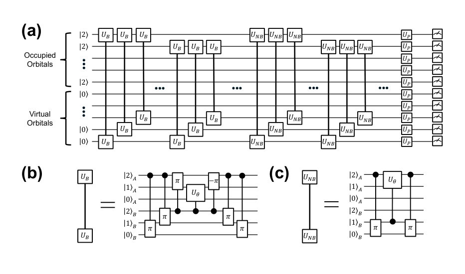
<figcaption class="paper-figure-caption"><b>Fig 1.</b> FIG. 1. Overview of the qutrit-native variational quantum eigensolver. (a) A Hartree–Fock</figcaption>
</figure>
<figure class="paper-figure-card">
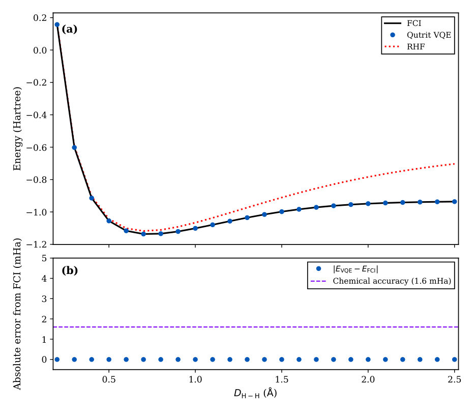
<figcaption class="paper-figure-caption"><b>Fig 2.</b> FIG. 2. Ground-state potential-energy curve of H2 in the STO-3G basis using two qutrits. (a) RHF,</figcaption>
</figure>
<figure class="paper-figure-card">
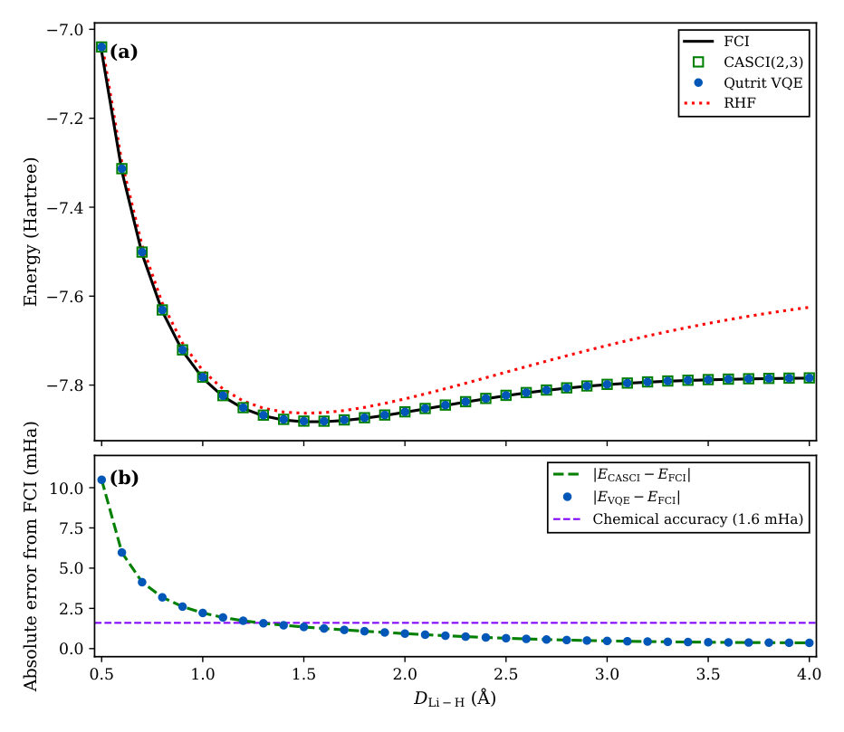
<figcaption class="paper-figure-caption"><b>Fig 3.</b> FIG. 3. Ground-state potential-energy curve of LiH in the STO-3G basis using the selected frozen-</figcaption>
</figure>
<figure class="paper-figure-card">
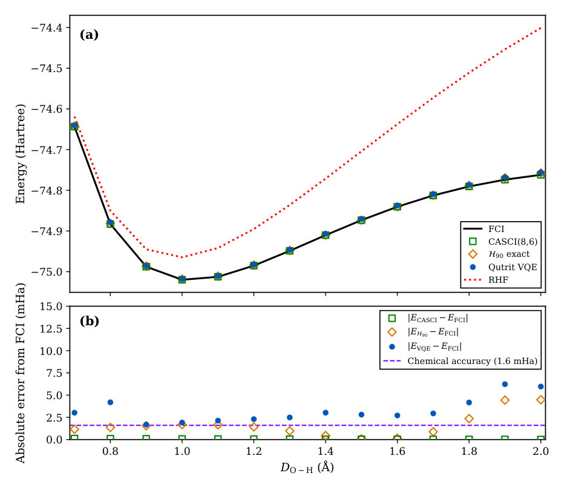
<figcaption class="paper-figure-caption"><b>Fig 4.</b> FIG. 4. Ground-state potential-energy curve of H2O for symmetric O–H stretching in the STO-3G</figcaption>
</figure>
<figure class="paper-figure-card">
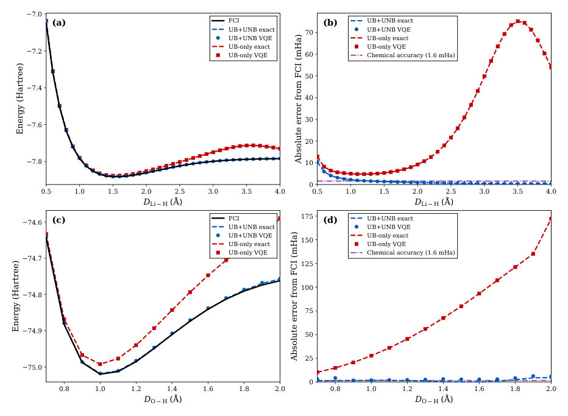
<figcaption class="paper-figure-caption"><b>Fig 5.</b> FIG. 5. Effect of the qutrit-native singly occupied level on the LiH and H2O potential-energy</figcaption>
</figure>

**Summary.** This paper introduces a resource-efficient qutrit encoding for simulating quantum chemistry problems. By mapping orbital occupation states to three levels ($|0
angle, |1
angle, |2
angle$), the authors develop a VQE framework that significantly reduces required quantum resources compared to standard qubit approaches. Benchmarks on $	ext{H}_2$, $	ext{LiH}$, and $	ext{H}_2	ext{O}$ confirm that this physically motivated encoding retains high electronic structure accuracy while offering superior scaling.

**Why it may be interesting.** This work directly addresses the challenge of mapping complex many-body Hamiltonians onto quantum hardware resources, providing a concrete blueprint for qudit-native algorithms in chemistry that surpass qubit limitations.

Detailed structure

**Main problem.** Accurately simulating electronic structure calculations for molecules is computationally prohibitive due to the exponential growth of the Full Configuration Interaction (FCI) space.

**Main result.** A qutrit-native encoding significantly reduces quantum resource requirements compared to qubit methods, achieving high accuracy in potential energy curves for $	ext{H}_2$, $	ext{LiH}$, and $	ext{H}_2	ext{O}$ while maintaining chemical accuracy.

**Method.** The authors propose a variational quantum eigensolver (VQE) framework using a qutrit encoding where orbital occupation states are $|0
angle$ (empty), $|1
angle$ (singly occupied), and $|2
angle$ (doubly occupied). The ansatz is built from number-conserving pair-transfer and broken-pair generators.

**Model / system.** The study applies the method to quantum chemistry simulations of small molecules ($	ext{H}_2$, $	ext{LiH}$, $	ext{H}_2	ext{O}$) using active space approximations derived from correlated electronic structure theory. The Hamiltonian is projected onto this qutrit occupation basis.

**Key observables.** Potential-energy curves, absolute energy errors relative to FCI (in mHa), and the scaling of ansatz generator count ($O(M^2)$ vs $O(M^4)$).

**Important parameters / regimes.** The number of spatial orbitals ($M$), the chemical accuracy threshold ($\sim 1 	ext{ kcal mol}^{-1}$ or few mHa), and the specific active space size used for truncation.

**Assumptions / limitations.** The primary assumptions involve truncating the full electronic structure problem into a manageable qutrit-based active space, requiring careful selection of pairing rules (e.g., $(pq)(rs)$ for $	ext{H}_2	ext{O}$) to minimize error.

**Figures summary.** Figures illustrate potential energy curves comparing FCI results against the proposed qutrit-VQE method for various molecules ($	ext{H}_2$, $	ext{LiH}$, $	ext{H}_2	ext{O}$), alongside plots detailing absolute energy deviations from FCI.

**Paper structure.** The paper introduces the physical motivation (FCI complexity) and proposes the qutrit encoding. It details the VQE ansatz construction using pair-transfer and broken-pair blocks, validates the method on $	ext{H}_2$, benchmarks it on $	ext{LiH}$, and finally demonstrates resource efficiency and accuracy on $	ext{H}_2	ext{O}$ by comparing different active space restrictions.

Abstract

Additional levels in a qudit can serve as more than extra computational capacity and can represent physically relevant correlations when the algorithmic design reflects the underlying physics of the problem. We demonstrate this principle for quantum chemistry simulation using a qutrit-native spatial-orbital encoding, where $|0\rangle$, $|1\rangle$, and $|2\rangle$ denote orbital occupation states. We establish a qutrit simulation framework that combines number-conserving pair-transfer and broken-pair generators with a projected-Hamiltonian energy estimator constructed from qutrit populations and coherences. Benchmarks for H$_2$, LiH, and H$_2$O show that the encoding reproduces the relevant potential-energy curves, while retaining a compact quantum resource structure. Direct comparison with the pair-only restriction confirms that the third level reduces errors by tens of mHa in LiH and by more than 100 mHa in H$_2$O. Despite a partial spin-coupling truncation in the compact H$_2$O encoding, the resulting energy curve deviates from FCI by only a few mHa over the tested range. Compared with a conventional qubit-based UCCSD approach, the qutrit scheme requires half as many quantum units and reduces the scaling of the parameterized ansatz generator count from $O(M^4)$ to $O(M^2)$, where $M$ is the number of spatial orbitals. This work elucidates how a physically motivated qutrit encoding can reduce quantum-resource requirements while retaining controlled electronic-structure accuracy, thereby providing a concrete starting point for broader qudit-native quantum algorithm design.

[↑ back to top](#top)

### [Scalable nuclear shell model calculations on noisy quantum computers](http://arxiv.org/abs/2608.16371v1)

**Authors:** Durgesh Pandey, Ankit Kumar Das, P. Arumugam  
**Type:** theory · **Category:** quantum information and computing · **PDF:** <https://arxiv.org/pdf/2608.16371v1>  
**Analysis basis:** full PDF text, analyzed in chunks
**Topic relevance:** `quantum measurements` **1/5**

↔ Scroll figures horizontally

<figure class="paper-figure-card">
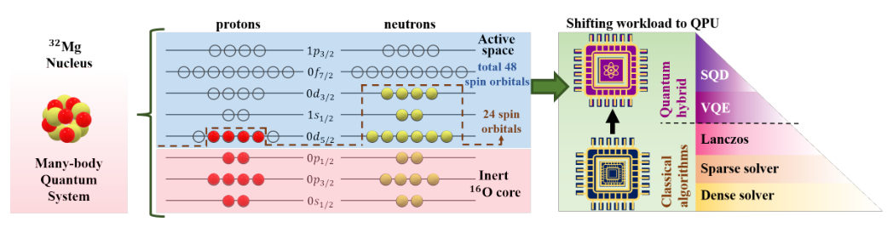
<figcaption class="paper-figure-caption"><b>Fig 1.</b> FIG. 1. The schematic diagram of a nuclear many-body system and the basic idea to shift workloads to a QPU with increasing configurations. The triangular hierarchy at right depicts the increasing degree of quantum participation in shell-model calcula- tions. Dense, sparse, and Lanczos methods correspond to classical computation, while VQE and the proposed SQD progressively shift more of the workload to the QPU. The SQD framework achieves the best overall computational performance for the largest problems investigated, demonstrating the utility of NISQ hardware.</figcaption>
</figure>
<figure class="paper-figure-card">
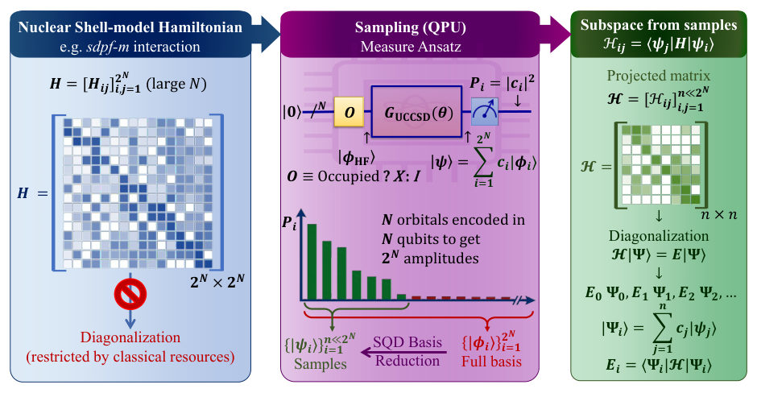
<figcaption class="paper-figure-caption"><b>Fig 2.</b> FIG. 2. Illustration of a simplified SQD workflow: constructing the ansatz from the nuclear Hamiltonian, sampling from a quantum circuit on real quantum hardware, filtering the results (with noise removal, bitstring flipping, etc., to recover particle- number conserved configurations), and ultimately creating a subspace from the recovered samples. The QPU can perform the necessary sampling to identify states that contribute to the ground state, whereas classical computers struggle as resources grow exponentially. The full post-processing step of SQD for configuration recovery is omitted for simplicity.</figcaption>
</figure>
<figure class="paper-figure-card">
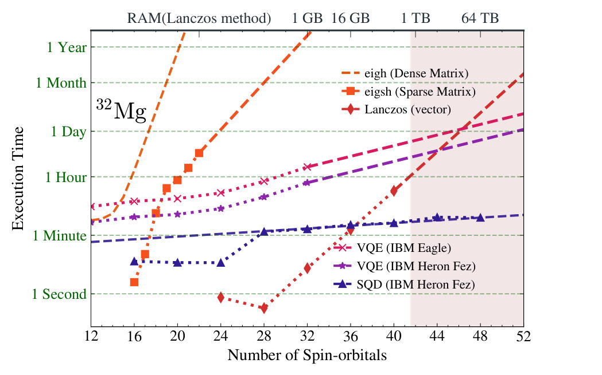
<figcaption class="paper-figure-caption"><b>Fig 3.</b> FIG. 3. Comparison of the computational scaling of various classical algorithms and the hybrid quantum algorithms VQE and SQD for the shell-model calculations of 32Mg. The dotted lines connect the computed results (shown by various symbols), and the dashed lines are theoretical extrapolations for each method. The top axis indicates the approximate memory (RAM) required by the Lanczos method as the number of spin-orbitals increases. The region beyond the RAM limit (768 GB) of a high-memory compute node in the PARAM Ganga [44] high-performance computing system used in this work is shaded in red. For a given number of spin-orbitals (N), the full Hilbert space size is 2N ≈100.3N.</figcaption>
</figure>
<figure class="paper-figure-card">
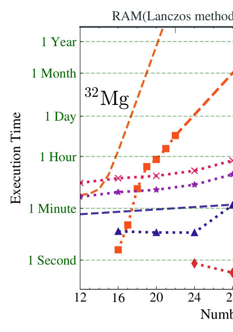
<figcaption class="paper-figure-caption"><b>Fig 4.</b> Figure 3 illustrates the time-to-solution for 32Mg across these classical and quantum methods as the configuration space scales, clearly demonstrating the onset of the po- tential advantages within the resources considered. We compare the IBM Heron-class and Eagle-class quantum hardware, finding that the Heron-class hardware is nearly 3.5 times faster than the Eagle-class hardware [52]. Given the current state of quantum hardware, the Heron family architectures can generate reliable samples from compu- tationally hard circuits [53]. We implement SQD using the Heron Fez, via Qiskit [54]. This SQD implementa- tion shows a clear advantage over other methods, partic- ularly when a large number...</figcaption>
</figure>

**Summary.** This paper addresses the computational bottleneck in nuclear shell model calculations caused by exponentially large Hilbert spaces. It introduces Sample-based Quantum Diagonalization (SQD), a novel hybrid method where a noisy quantum computer samples basis states, which are then used for exact diagonalization classically. SQD is shown to be scalable and noise-tolerant, offering a path to solve previously intractable, large-scale nuclear structure problems.

**Why it may be interesting.** It demonstrates a direct, practical application of NISQ hardware to solve a notoriously difficult many-body problem (nuclear structure) by proposing a noise-resilient hybrid quantum algorithm that bypasses the limitations of both classical memory and deep quantum circuits.

Detailed structure

**Main problem.** The exponential scaling of exact diagonalization for nuclear shell model calculations creates severe memory bottlenecks on classical supercomputers.

**Main result.** The proposed Sample-based Quantum Diagonalization (SQD) framework can outperform conventional supercomputers in memory scaling and total execution time, enabling large-scale shell model calculations despite hardware noise.

**Method.** SQD is a hybrid quantum algorithm where the noisy quantum computer acts solely as a configuration sampler, generating basis states that are then used for classical exact diagonalization on a reduced subspace.

**Model / system.** The study focuses on nuclear many-body systems, using ${}^{32}	ext{Mg}$ and $^{38}	ext{Ar}$ as benchmarks. The Hamiltonian is formulated in second quantization and mapped to the 'SparsePauli' form for quantum circuits.

**Key observables.** Ground and low-lying excited energy levels ($E_i$) of the nuclear system, measured in MeV.

**Important parameters / regimes.** The Hilbert space dimension scales exponentially ($O(2^N)$); calculations are tested up to 48 active spin-orbitals ($N$).

**Assumptions / limitations.** SQD is assumed to be a pragmatic approach tolerant to noise, unlike deep variational circuits (VQE), by decoupling state optimization from the QPU.

**Figures summary.** Figure 1 illustrates computational workload shifting towards quantum computation; Figure 3 compares time-to-solution for ${}^{32}	ext{Mg}$ across methods as spin-orbitals increase, showing SQD's advantage over RAM-limited classical solvers.

**Paper structure.** The paper introduces the problem of exponential scaling in nuclear shell models. It details three approaches—Exact Diagonalization (classical limit), VQE (variational quantum), and SQD (proposed hybrid method). Results compare these methods on ${}^{38}	ext{Ar}$ and ${}^{32}	ext{Mg}$, demonstrating SQD's scalability advantage.

Abstract

The exact diagonalization of the nuclear shell model scales exponentially, leading to severe memory bottlenecks in classical high-performance computing (HPC). While hybrid quantum algorithms like the Variational Quantum Eigensolver (VQE) aim to overcome these limits, their deep quantum circuits and iterative feedback loops are susceptible to substantial noise inherent in the current Noisy Intermediate-Scale Quantum (NISQ) hardware. This noise renders several algorithms, such as the VQE, impractical for large-scale calculations despite sophisticated noise-mitigation techniques. As a pragmatic approach tolerant to these issues, we apply the Sample-based Quantum Diagonalization (SQD) framework to nuclear shell models for the first time. Using $^{38}\text{Ar}$ as a benchmark to confirm the numerical accuracy, we extend SQD to $^{32}\text{Mg}$, solving a nuclear shell-model Hamiltonian whose underlying Hilbert space cannot be directly diagonalized using conventional classical methods in a given HPC system. We present a systematic comparison of SQD with standard variational quantum schemes and exact classical solvers. By leveraging NISQ hardware connected via the cloud to classical HPC clusters, the SQD-based scheme could outperform conventional supercomputers in memory scaling and total execution time, enabling more rigorous large-scale shell model calculations.

[↑ back to top](#top)

### [Sparse Prototype Code Underlies Classification and Prediction Across Modalities](http://arxiv.org/abs/2608.15632v1)

**Authors:** Yehonatan Avidan, Daniel D. Lee, Haim Sompolinsky  
**Type:** theory · **Category:** disordered systems and neural networks · **PDF:** <https://arxiv.org/pdf/2608.15632v1>  
**Analysis basis:** full PDF text, analyzed in chunks
**Topic relevance:** `quantum measurements` **1/5**

↔ Scroll figures horizontally

<figure class="paper-figure-card">
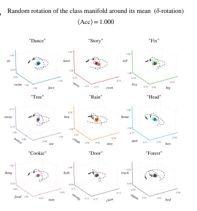
<figcaption class="paper-figure-caption"><b>Fig 1.</b> Figure 1: Centroid-aligned variability, Qwen3-32B, TinyStories representations. The variability of each class is highly correlated with other class centroids. (a) To visualize it, we use Qwen3-32B representations [Yang et al., 2025] on the dataset TinyStories [Eldan and Li, 2023]. We project each example onto the three centroids with the largest correlations among the class variability. For 217/320 classes (68%), the true class centroid is among these top 3 (the nine shown here are of this sort). The rivals carry semantic meaning (e.g., the rivals of &quot;cookie&quot; are &quot;food&quot; and &quot;delicious&quot;; the rivals of &quot;head&quot; are &quot;face&quot; and &quot;hand&quot;). The mean prototype classification accuracy of these classes...</figcaption>
</figure>
<figure class="paper-figure-card">
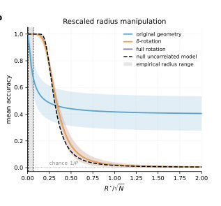
<figcaption class="paper-figure-caption"><b>Fig 2.</b> Figure 2: Geometric signatures of multiclass classification (a) Per-class accuracy vs. empirical radius R: sharp decrease across the narrow empirical R range and a wide spread at fixed R. After random rotation of within-class variability δx (δ-rotation), the accuracy is perfect. (b) We artificially scale the variability δx→(R⋆/R)δx. The accuracy decreases fast but stabilizes at 39% accuracy for R⋆→∞due to strong true centroid correlations (blue line). After random rotation of the variability δ-rotation, the accuracy is well described by the isotropic model (MSE = 1.26 × 10−3, orange line). Additional breaking of centroid-centroid correlations (full rotation) has a very small effect; lines...</figcaption>
</figure>
<figure class="paper-figure-card">
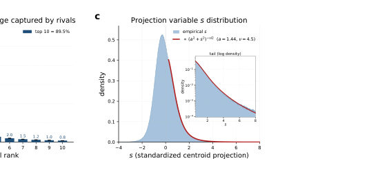
<figcaption class="paper-figure-caption"><b>Fig 3.</b> Figure 3: Sparsity and heavy tail statistics: (a) K-way classification of rivals chosen by centroid projection variance σµ converges quickly to the full P-way classification. (b) We define the strongest rival of each example µ∗(x) = arg maxµ̸=k tµ(x), and count the number of examples captured by each rival. The strongest rival of each class captures more than half of the examples on average, with 90% of the examples captured by only 14.4 rivals. (c) The standardized centroid projections sµ (see Eq.4) have heavy tail power law statistics, which inflate the extreme values that control classification accuracy. The magnified panel shows the log density of the far tail.</figcaption>
</figure>
<figure class="paper-figure-card">
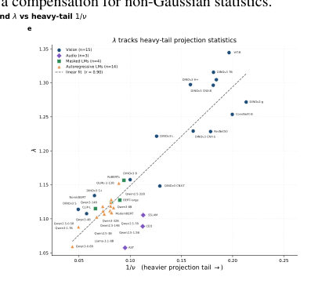
<figcaption class="paper-figure-caption"><b>Fig 4.</b> Figure 4: Centroid-aligned theory matches per-class accuracy across modalities. (a, c) Per-class accuracy vs. empirical radius R for DINOv3 ViT-7B on ImageNet (P=1000, K=20) and Qwen3-32B on TinyStories next-token prediction (P=320, K=20). Per-class scatter is presented with empirical binned mean. The λ-rescaled theory (λ⋆=1.316, 1.119 resp.) accounts for the empirical accuracy accurately. (b, d) Accurate per-class prediction of the accuracy. MSE=1.83 × 10−3 (vision) and 4.43 × 10−3 (language), Pearson r=0.951 and 0.955. (e) Optimal λ⋆vs. heavy tail measurement (1/ν) on representations for 15 vision backbones, 14 autoregressive language models, 4 masked language models, and 3 audio models....</figcaption>
</figure>
<figure class="paper-figure-card">
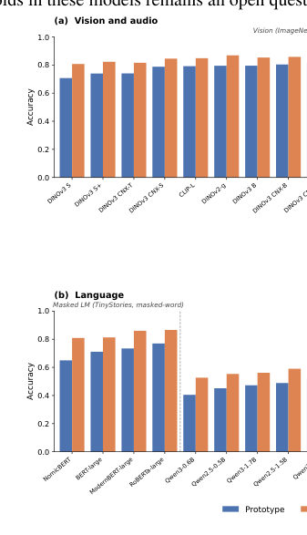
<figcaption class="paper-figure-caption"><b>Fig 5.</b> Figure 5: Centroid vs trained linear-readout accuracy, per backbone. The gap between methods is small (see also Table 5).</figcaption>
</figure>

**Summary.** This work proposes a predictive geometric theory showing that deep neural network classification relies on a sparse, structured relationship between class representations and their centroids. By deriving an analytical mean-field theory based on these correlations, the authors successfully predict classification accuracy across diverse AI models (vision, language) with high fidelity.

**Why it may be interesting.** While focused on AI, the concept of emergent structure in high-dimensional feature spaces—where local correlations dictate global performance—echoes principles seen in glassy systems or complex energy landscapes studied in statistical mechanics.

Detailed structure

**Main problem.** To develop a quantitative geometric theory linking the structure of neural representations to their performance on downstream classification tasks across multiple modalities.

**Main result.** Classification accuracy is governed by a sparse, centroid-aligned structure where within-class variability correlates strongly with true and rival class centroids. A derived mean-field theory accurately predicts this accuracy across diverse architectures.

**Method.** The authors derive an analytical mean-field theory based on geometric quantities like class radii and correlations between class centroids and within-class variability, validating it through causal testing (e.g., $\delta$-rotations).

**Model / system.** The study analyzes high-dimensional activation vectors ($\mathbf{x}$) from state-of-the-art Deep Neural Networks (DNNs) trained on vision, audio, and language tasks. Classification is modeled using prototype classification based on class centroids.

**Key observables.** Classification Accuracy ($	ext{Acc}$), per-class Pearson correlation ($r$), Mean Squared Error (MSE), within-class variability, and centroid correlations.

**Important parameters / regimes.** Model scale, number of classes ($P$), dimensionality ($N$), and the global rescaling factor ($\lambda$).

**Assumptions / limitations.** The theory relies on prototype classification as a reliable proxy for linear readout heads, and it assumes that class variability is structured around centroids.

**Figures summary.** Figures demonstrate causal testing where breaking residual-centroid correlations restores perfect accuracy. Tables summarize the high correlation ($r \approx 0.95$) between empirical and theoretically predicted accuracies across various backbones.

**Paper structure.** The paper progresses from establishing the geometric structure (Chunk 1), to contrasting this with simple isotropic models using controlled manipulations like variability inflation (Chunk 2), and finally applying a refined, predictive mean-field theory across dozens of real-world models in multiple modalities (Chunks 3 & 4).

Abstract

Neural representations have become a central tool for studying the internal mechanisms of modern AI models, yet their complex high-dimensional structure makes them difficult to interpret. We show that classification tasks give rise to a universal representational geometry, shared across state-of-the-art models in vision, audio, and language processing. The key structure is that within-class variability is not random in representation space. Instead, its classifier-relevant component has strong and structured correlations with the class's own centroid and with the centroids of its competing classes. Building on this observation, we derive an analytical mean-field theory governed mainly by the variability along true-class and rival-class centroid coordinates, together with a global renormalization of the class radius that compensates for the non-Gaussian statistics of real representations. The theory accurately predicts classification accuracy across architectures and modalities. The relevant geometric quantities improve systematically with model scale, mirroring the observed gains in accuracy. A striking feature of the theory is its sparsity: accurate prediction requires only a small set of centroid coordinates associated with the true class and its strongest rivals - connecting our framework to sparse-feature extraction approaches such as sparse autoencoders. Together, these results provide a parsimonious predictive theory of neural representations and suggest that classification in deep networks is governed by a sparse, centroid-aligned structure embedded within the full high-dimensional representation space.

[↑ back to top](#top)

### [Theory of Magnetic Excitations in the Heavy-Fermion Spin-Triplet Superconductor UTe$_2$](http://arxiv.org/abs/2608.16350v1)

**Authors:** Koki Shimura, Shuntaro Sumita, Yusuke Kato  
**Type:** theory · **Category:** strongly correlated electrons · **PDF:** <https://arxiv.org/pdf/2608.16350v1>  
**Analysis basis:** full PDF text, analyzed in chunks
**Topic relevance:** `Keldysh / 2PI / non-Gaussian methods` **1/5**

↔ Scroll figures horizontally

<figure class="paper-figure-card">
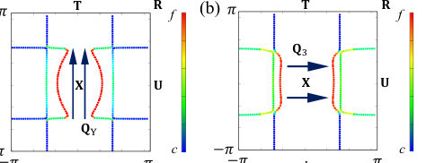
<figcaption class="paper-figure-caption"><b>Fig 1.</b> FIG. 1. Fermi surfaces at kz = π and real part of the static bare susceptibility Re χ0(q, ω = 0) with ε0 f = 0.05 for (a) Vfp = 0.05 and (b) Vfp = 0.26 [69]. Here, nesting vectors are illustrated by arrows, and the color represents the f-orbital weight of the normal-state band eigenstate on the Fermi sur- face; red and blue correspond to predominantly f-electron and conduction-electron character, respectively.</figcaption>
</figure>
<figure class="paper-figure-card">
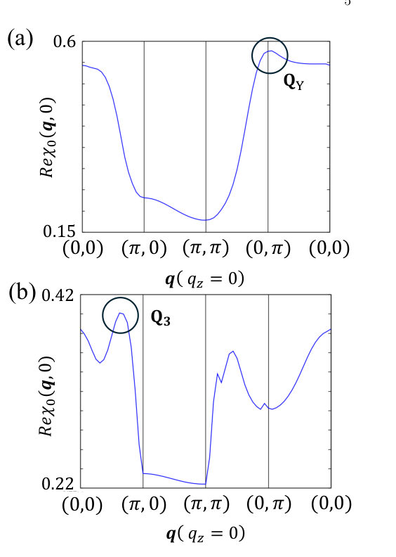
<figcaption class="paper-figure-caption"><b>Fig 2.</b> FIG. 2. Real part of the static bare susceptibility Re χ0(q, ω = 0) with ε0 f = 0.05 for (a) Vfp = 0.05 and (b) Vfp = 0.26 [69] in the normal state (∆0 = 0). In (a), Re χ0(q, 0) reaches its maximum at QY = (0, π, 0), whereas in (b) the maximum shifts to Q3 = (0.69π, 0, 0).</figcaption>
</figure>
<figure class="paper-figure-card">
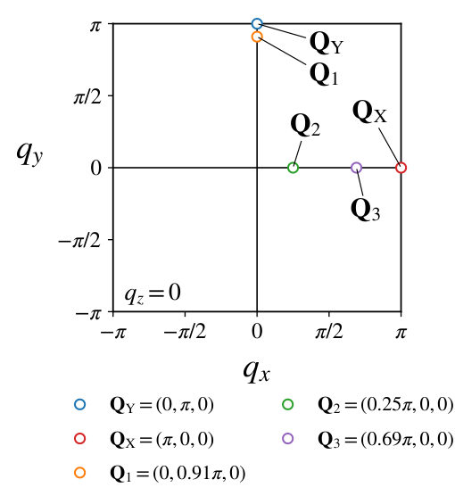
<figcaption class="paper-figure-caption"><b>Fig 3.</b> FIG. 3. The positions of AFM wave vectors QY = (0, π, 0), QX = (π, 0, 0), Q1 = (0, 0.91π, 0), Q2 = (0.25π, 0, 0), and Q3 = (0.69π, 0, 0). For Vfp = 0.11, 0.17, and 0.26, the static bare spin susceptibility χ0(q, 0) is maximized at Q1, Q2, and Q3, respectively.</figcaption>
</figure>
<figure class="paper-figure-card">
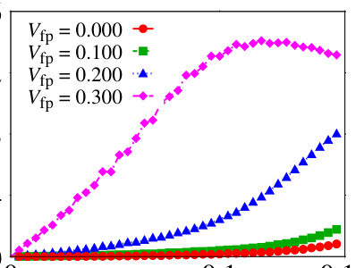
<figcaption class="paper-figure-caption"><b>Fig 4.</b> FIG. 4. Imaginary part of the RPA spin susceptibility in the normal state plotted as a function of frequency at (a) q = QY = (0, π, 0) and (b) q = QX = (π, 0, 0). The dependence on the hybridization Vfp is shown in both panels.</figcaption>
</figure>
<figure class="paper-figure-card">
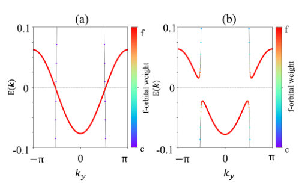
<figcaption class="paper-figure-caption"><b>Fig 5.</b> FIG. 6. Energy band dispersion E(k) along (kx, kz) = (0, π) for −π &lt; ky &lt; π, for (a) Vfp = 0 and (b) Vfp = 0.05. The color bars show the orbital weight, with red indicating strong f-electron weight and blue indicating strong conduction- electron weight.</figcaption>
</figure>

**Summary.** This work theoretically examines the magnetic excitations in the heavy-fermion superconductor UTe2 using a periodic Anderson model within the BCS-RPA formalism. It finds that the spin resonance peak, a key signature of superconductivity, appears exclusively when the superconducting order parameter belongs to the $B_{2u}$ irreducible representation. This result highlights how Fermi surface topology and pairing symmetry dictate observable magnetic responses in correlated superconductors.

**Why it may be interesting.** The theoretical framework linking magnetic excitations (spin resonance) directly to the superconducting order parameter symmetry via a sign-change criterion is highly relevant for understanding unconventional pairing mechanisms in correlated electron systems.

Detailed structure

**Main problem.** The study investigates the dynamical spin response (magnetic excitations) within UTe2, a heavy-fermion superconductor suspected to exhibit spin-triplet superconductivity.

**Main result.** A pronounced superconductivity-induced spin resonance is found only for the $B_{2u}$ order parameter in the SC state, explained by a sign change criterion across relevant Fermi surface regions connected by $\mathbf{Q}_Y$.

**Method.** The analysis employs the BCS-RPA formalism applied to a mixed-dimensional periodic Anderson model Hamiltonian.

**Model / system.** The system is UTe2, modeled using a three-orbital tight-binding framework (f, d, p orbitals) coupled via an on-site Coulomb interaction ($H_U$).

**Key observables.** Dynamical spin susceptibility ($\chi(\mathbf{q}, \omega)$), superconductivity-induced spin resonance peak, and the hybridization gap.

**Important parameters / regimes.** The analysis compares four odd-parity irreducible representations ($A_u, B_{1u}, B_{2u}, B_{3u}$) for the order parameter; $\mathbf{Q}_Y = (0, \pi, 0)$ is a critical nesting vector.

**Assumptions / limitations.** The formalism relies on approximating the spin susceptibility using BCS-RPA and assumes applicability of the sign-change criterion derived from multiband superconductivity theory.

**Figures summary.** Not specified in detail; notes mention Fermi surface geometry changes based on hybridization strength ($V_{fp}$) and the location of maximum static bare spin susceptibility ($	ext{Re} \chi_0$).

**Paper structure.** The paper first analyzes the normal state magnetic response, showing gap opening at $\mathbf{Q}_Y$. It then transitions to the SC state analysis, comparing different pairing symmetries ($A_u$ through $B_{3u}$) to pinpoint the specific symmetry ($B_{2u}$) responsible for the resonance.

Abstract

We study the dynamical spin response of UTe$_2$ by using a mixed-dimensional periodic Anderson model. Within the BCS-RPA formalism, we examine how the $f$-orbital character of the quasiparticles affects magnetic excitations in both the normal and superconducting (SC) states. In the normal state, finite mixing between localized $f$ electrons and conduction electrons produces a hybridization gap and enhances the spin response at $\mathbf{Q}_{\mathrm{Y}} = (0,π,0)$, indicating that the magnetic excitation originates from particle--hole scattering across the hybridization gap. In the SC state, we compare four odd-parity irreducible representations, $A_u$, $B_{1u}$, $B_{2u}$, and $B_{3u}$, for the spin-triplet order parameter. We find that, for the component of the spin susceptibility parallel to the $\mathbf{d}$ vector, a pronounced superconductivity-induced spin resonance appears at $\mathbf{Q}_{\mathrm{Y}}$ only in the $B_{2u}$ state. This behavior arises because the $B_{2u}$ order parameter remains finite and changes its sign between the relevant $f$-electron-dominated Fermi-surface regions connected by $\mathbf{Q}_\mathrm{Y}$ near $k_z=π$. The sign-change criterion is applicable to multiband superconductors in three-dimensional heavy-fermion systems, in the presence of (i) low-dimensional portions of the Fermi surface connected by a nesting vector, (ii) the dominance of the $f$-electron character, and (iii) the finite amplitude of SC gap on the portions.

[↑ back to top](#top)

### [When do machine-learned exchange-correlation improvements inherit into density-functional tight binding?](http://arxiv.org/abs/2608.14875v1)

**Authors:** Can Polat, Mustafa Kurban, Erchin Serpedin, Hasan Kurban  
**Type:** theory · **Category:** numerical methods · **PDF:** <https://arxiv.org/pdf/2608.14875v1>  
**Analysis basis:** full PDF text, analyzed in chunks
**Topic relevance:** `Keldysh / 2PI / non-Gaussian methods` **1/5**

↔ Scroll figures horizontally

<figure class="paper-figure-card">
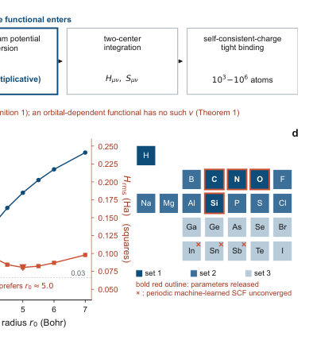
<figcaption class="paper-figure-caption"><b>Fig 1.</b> Figure 1 The functional-agnostic parameterization bridge, and the three checks that certify it. a, The pipeline, with what each stage produces. The functional enters at exactly one point, the Kohn–Sham potential inversion, which is also where the compression becomes lossy: the two-center integrator consumes a multiplicative 𝑣(𝑟) and nothing else, and an orbital-dependent functional admits no such 𝑣. b, Fidelity of the inversion against a stored reference potential. The route the bridge uses and a full potential reconstruction both recoverit to within a few meV; the density-gradient-only approximation fails by two orders of magnitude and was rejected. c, The confinement sweep for the carbon...</figcaption>
</figure>
<figure class="paper-figure-card">
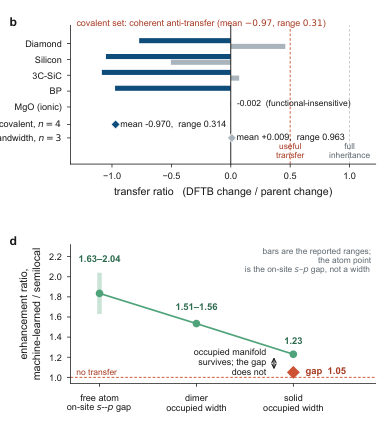
<figcaption class="paper-figure-caption"><b>Fig 2.</b> Figure 2 The band-gap correction reverses under the compression, and what survives instead. a, Input against output: the parent gap opens (grey; dashed outlines mark full inheritance) while the compressed DFTB gap closes (red). The upper segment carries the scale this is read against, the residual overgap of the same tables under the same convention: +2.49, +0.21 and +1.31 eV for diamond, silicon and 3C-SiC. b, The same result as a ratio, against the 0.5 useful-transfer threshold. Gap ratios for the covalent solids, the near-zero ionic case (MgO), and the bandwidth ratios (a width quantity, convention-independent) reported for the three solids that carry them; none clears the gate. c, The...</figcaption>
</figure>
<figure class="paper-figure-card">
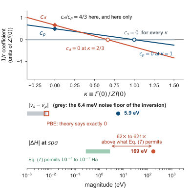
<figcaption class="paper-figure-caption"><b>Fig 3.</b> Figure 3 Why the parameterization channel cannot carry an orbital-dependent functional, and the two measurements that decide whether it does. 𝜅≡𝑓′(0)/𝑍𝑓(0) is the dimensionless number the functional fixes at the nucleus. a, The 𝑙-resolved local representative with the cusp condition imposed, at 𝜅= 0. Each angular channel sees a different potential and the difference diverges as 1/𝑟, so no multiplicative 𝑣(𝑟) lies in the shaded band; only the 𝑠divergence 𝑐𝑠= 0 is parameter-free. b, The cusp coefficients against 𝜅. Both are linear and vanish at different 𝜅(1 and 2/3), so they never vanish together; the ratio 𝑐𝑑/𝑐𝑝= 4/3 at 𝜅= 0 only. c, Where the discarded gap-shift term acts. Sketched for a...</figcaption>
</figure>
<figure class="paper-figure-card">
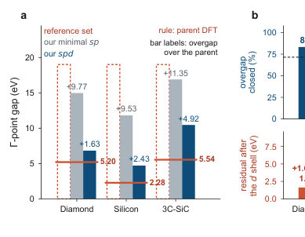
<figcaption class="paper-figure-caption"><b>Fig 4.</b> Figure 4 The overgap of the unfitted tables, what a single 𝑑shell removes of it, and the two things that would undo the claim. a, Γ-point gaps; red rules mark the parent (identical settings). The minimal 𝑠𝑝tables overgap the parent by ∼10 eV; adding a 𝑑-polarized 𝑠𝑝𝑑set (confinement radii and on-site eigenvalues held fixed) reduces the overgap several-fold (per-solid values in Table 2). The published-parameter baseline is given in Fig. 6; under the free-atom convention the excess is shared with fitted sets, not a property of our convention alone. b, The closure and its residual, drawn at the confined on-site convention, which isolates the basis-completeness effect; under the free-atom...</figcaption>
</figure>
<figure class="paper-figure-card">
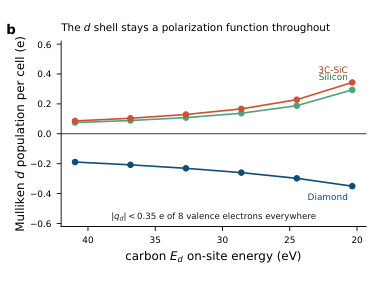
<figcaption class="paper-figure-caption"><b>Fig 5.</b> Figure 5 Under the convention the overgap closure tracks the placement of the empty 𝑑level, which no free-atom eigenvalue fixes. a, Mean and per-solid closure as the carbon 𝐸𝑑is swept from the confined value (+40.96 eV) toward the valence shell, with silicon shifted in proportion. The dashed rule marks the closure obtained when the confined convention is used on both the 𝑠𝑝and 𝑠𝑝𝑑sides. b, The Mulliken 𝑑 population across the same sweep, against the eight valence electrons of the cell; placements further down, at the free-atom 𝑝level, take the 𝑑manifold to a valence-shell population and are excluded on that basis. All gaps are fundamental band-path gaps; 𝑛= 3 solids, confinement radii and...</figcaption>
</figure>

**Summary.** This work investigates whether advanced ML corrections to electronic structure can be reliably incorporated into computationally cheap DFTB models. The study finds that while some physical signatures survive, the crucial band gap correction fails due to fundamental structural mismatches between the parent theory and the compressed Hamiltonian. This highlights critical limitations in parameterizing complex quantum physics into simplified tight-binding forms.

**Why it may be interesting.** While focused on solid-state DFT methods, the rigorous quantitative comparison between high-level quantum chemistry (ML functionals) and simplified effective Hamiltonians (DFTB) provides valuable insights into the limitations of model reduction techniques in condensed matter physics.

Detailed structure

**Main problem.** The core problem is determining if improvements derived from advanced machine-learned (ML) exchange-correlation (XC) functionals can be successfully transferred or inherited into the computationally efficient framework of Density-Functional Tight Binding (DFTB).

**Main result.** The transfer fails for band gaps in covalent semiconductors, showing a coherent 'anti-transfer' effect; however, signatures related to occupied manifold enhancements and repulsive potentials are found to survive.

**Method.** The study employs a 'functional-agnostic parameterization bridge,' using the diagnostic tool of the 'transfer ratio' to quantify how much of a parent DFT change survives compression into the multiplicative potential structure of DFTB.

**Model / system.** The research focuses on electronic structure prediction across various materials, including covalent semiconductors (e.g., Diamond, SiC) and ionic solids ($	ext{MgO}$). The model compares results from high-level ML XC functionals against the semiempirical constraints of DFTB.

**Key observables.** Band gaps ($\Delta E_g$), transfer ratio (TR), occupied manifold signatures, and channel asymmetry $|v_s - v_p|$.

**Important parameters / regimes.** The analysis is sensitive to functional type (ML vs. PBE) and structural class (covalent vs. ionic). The failure mechanism is tied to the mismatch between orbital-dependent ML operators and DFTB's multiplicative potential.

**Assumptions / limitations.** A primary assumption tested is that better parent functionals yield better TB parameterizations, which the paper ultimately refutes for gap properties due to structural limitations in the DFTB formalism.

**Figures summary.** Figures illustrate the functional-agnostic pipeline and compare parent DFT results against derived DFTB results, showing where specific physical signatures (like occupied bandwidth) persist while others fail.

**Paper structure.** The paper systematically tests the transferability of ML XC improvements across different material classes using a defined computational bridge. It moves from general gap analysis to examining specific surviving properties and finally analyzing near-nucleus potential fits for robustness.

Abstract

Machine-learned exchange-correlation functionals correct band gaps at near-semilocal cost, while density-functional tight binding reaches the $10^3$-$10^6$-atom regime; combining them assumes that a better parent yields a better parameterization, but we show it does not. Current-generation functionals are orbital-dependent generalized Kohn-Sham operators, whereas the parameterization channel is built on a multiplicative potential, preventing exact representation. Using the transfer ratio, the surviving fraction of a parent-level change, we find anti-transfer: coherently negative ratios across four covalent semiconductors move the gap in the wrong direction, consistent with a molecular proxy and an r$^2$SCAN control. The minimal-basis overgap is dominated by the on-site convention rather than basis incompleteness; correcting the on-site block removes most of it, while one $d$-polarization shell closes a further $16$-$40%$, depending on the placement of the empty $d$ level, which no free-atom eigenvalue uniquely fixes. Occupied-manifold enhancements, ionic and closed-shell repulsive potentials, and rocksalt-oxide gaps inherit, whereas elemental and III-V covalent networks inherit neither gaps nor repulsive potentials and oxide networks inherit only the latter. We screen 23 elements and release the parameter sets, showing that the transfer ratio provides a cheap pre-test before any parameterization campaign.

[↑ back to top](#top)

## Other papers (7)

*Papers from primary archives without highlighted authors or any topic match. Click to expand.*

Show other papers

### [Bond Disproportionation, Ligand Holes, and Persistent Spin Textures in Ag$_2$BiO$_3$](http://arxiv.org/abs/2608.16247v1)

**Authors:** Atanu Paul, Subhadeep Bandyopadhay, Anupam Mondal, Indra Dasgupta  
**Type:** theory · **Category:** strongly correlated electrons · **PDF:** <https://arxiv.org/pdf/2608.16247v1>  
**Analysis basis:** full PDF text, analyzed in chunks

↔ Scroll figures horizontally

<figure class="paper-figure-card">
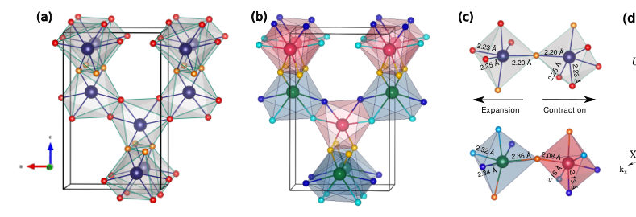
<figcaption class="paper-figure-caption"><b>Fig 1.</b> FIG. 1. Crystal structure of (a) the Pnna and (b) the Pnn2 phases. Only the BiO6 octahedral network is shown, where Bi and O atoms are represented by larger and smaller spheres, respectively. (c) Two neighboring BiO6 octahedra with equal volumes in the Pnna phase (top) become inequivalent, forming contracted and expanded octahedra in the Pnn2 phase (bottom). This symmetry-lowering transition also leads to the emergence of more inequivalent oxygen sites in the Pnn2 phase. (d) Irreducible part of the orthorhombic Brillouin zone for space group Pnn2 (34) along with high symmetric k-points. The solid red lines correspond to the high-symmetric k-path along which the band structures have been...</figcaption>
</figure>
<figure class="paper-figure-card">
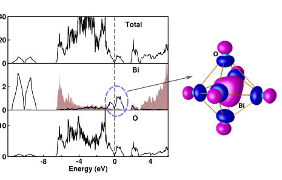
<figcaption class="paper-figure-caption"><b>Fig 2.</b> FIG. 2. Pnna phase: Total and partial densities of states (DOS) of Bi-s, Bi-p (filled curve), and O-p states. The Fermi level is set to zero. The inset shows the Bi-s Wannier func- tion corresponding to the states near the Fermi level, plotted within the BiO6 octahedron.</figcaption>
</figure>
<figure class="paper-figure-card">
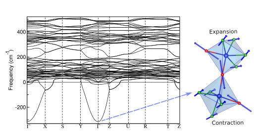
<figcaption class="paper-figure-caption"><b>Fig 3.</b> FIG. 3. Phonon dispersion of the Pnna phase. Inset shows the eigenvectors corresponding to the soft mode at 315i cm−1</figcaption>
</figure>
<figure class="paper-figure-card">
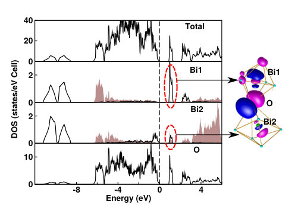
<figcaption class="paper-figure-caption"><b>Fig 4.</b> FIG. 4. Total and partial DOS of Bi1-s, Bi1-p, Bi2-s, Bi2-p and O-p for the Pnn2 phase. The filled curves corresponds to Bi-p. The Fermi level is set at zero. Inset is the plot of O-p Wannier function.</figcaption>
</figure>
<figure class="paper-figure-card">
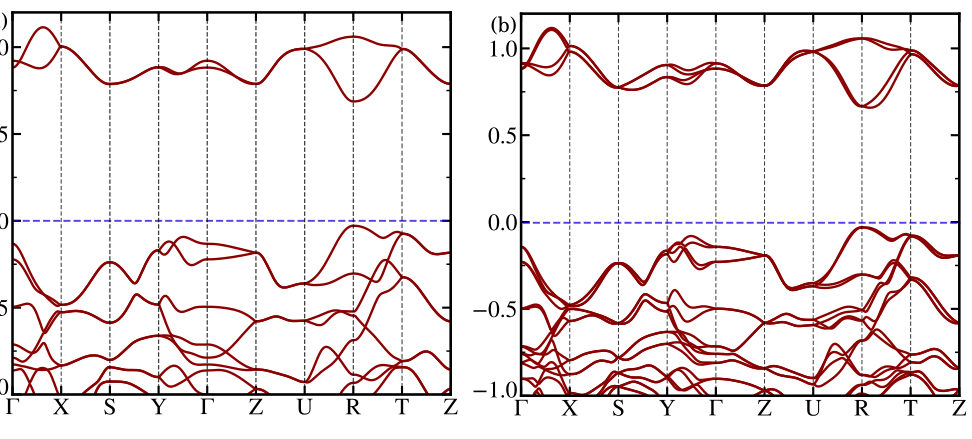
<figcaption class="paper-figure-caption"><b>Fig 5.</b> FIG. 5. Band structure of Ag2BiO3 calculated (a) without spin–orbit coupling and (b) with spin–orbit coupling in the vicinity of the Fermi energy.</figcaption>
</figure>

**Summary.** This theoretical study analyzes the structural and electronic transition of Ag2BiO3 from a metallic to a bond disproportionated insulating state. The work establishes that ligand holes are crucial in stabilizing this insulator, and further predicts the existence of persistent spin textures at high-symmetry points due to non-symmorphic symmetry, positioning the material for spintronic applications.

**Why it may be interesting.** The prediction of robust, momentum-dependent spin textures in an insulating oxide material makes this system highly relevant for developing next-generation spintronic devices that rely on intrinsic magnetic order.

Detailed structure

**Main problem.** The study investigates the origin of a proposed bond disproportionated insulating state in Ag2BiO3 and characterizes its electronic structure, particularly focusing on spin textures.

**Main result.** The system transitions from an unstable metallic phase to a stable, bond disproportionated insulator driven by ligand holes. Furthermore, non-symmorphic symmetry predicts persistent spin textures at high-symmetry points X and Y.

**Method.** The research employs first principles electronic structure calculations (DFT) complemented by phonon analysis, k.p model Hamiltonian fitting, and Wannier function analysis.

**Model / system.** The physical system is the compound Ag2BiO3, analyzed in both centrosymmetric (Pnna) and non-centrosymmetric (Pnn2) crystal phases. The electronic structure is modeled using DFT calculations incorporating spin-orbit coupling.

**Key observables.** Band gap energy (0.69 eV), charge state disproportionation ($	ext{Bi}^{3+}_{	ext{L}\delta} + 	ext{Bi}^{3+}_{	ext{L}2-\delta}$), persistent spin textures, and phonon instabilities.

**Important parameters / regimes.** The analysis is sensitive to the symmetry lowering transition from Pnna to Pnn2, which dictates the insulating state and spin texture formation.

**Assumptions / limitations.** The initial assumption of a simple $4+$ Bi charge state was contradicted by calculations, necessitating the inclusion of ligand hole physics to explain the observed insulating behavior.

**Figures summary.** Figures illustrate crystal structures comparing Pnna and Pnn2 phases, Brillouin zone paths for spin texture analysis (X and Y points), and band structure plots derived from k.p models.

**Paper structure.** The paper first establishes the structural instability of the metallic phase, leading to the insulating Pnn2 state via symmetry breaking. It then uses DOS calculations to confirm ligand hole formation and charge disproportionation. Finally, it applies a k.p model Hamiltonian analysis to predict and characterize persistent spin textures arising from non-symmorphic symmetry.

Abstract

The origin of the proposed bond disproportionated insulating state of the non-centrosymmetric ($Pnn2$) phase of Ag$_{2}$BiO$_{3}$ is explored using first principles electronic structure calculations. The novel insulating state is elucidated by first considering the initially proposed centosymmetric metallic ($Pnna$) phase of Ag$_{2}$BiO$_{3}$. Our calculations reveal that the valence skipping Bi$^{4+}$ ions in this phase are better described as Bi$^{3+}\underline{L}$ with completely filled Bi-(6$s$) states and a ligand hole. However, phonon calculations indicate that the metallic ($Pnna$) state is dynamically unstable. Structural stability is achieved through breathing distortions of the oxygen octahedra, resulting in two inequivalent Bi sites and a reduction of symmetry to the $Pnn2$ phase. Electronic structure calculations further reveal that the $Pnn2$ phase is a bond disproportionated insulator where the nominal charge state of Bi is described by : 2[Bi$^{3+}\underline{L}$ (Bi$^{4+}$)] $\rightarrow$ Bi$^{3+}\underline{L}^{2-δ}$ (Bi1$^{5+}$) + Bi$^{3+}\underline{L}^δ$ (Bi2$^{3+}$), highlighting the crucial role of ligand holes in driving the insulating state. Next we have investigated the electronic structure of Ag$_{2}$BiO$_{3}$ in the insulating ($Pnn2$) phase including spin-orbit coupling. Our density functional theory (DFT ) calculations complemented by ${\bf k.p}$ model Hamiltonian analysis reveal persistent spin-textures around the $X$ and $Y$ high symmetry points of the orthorhombic Brillouin zone imposed by non-symmorphic symmetry, positioning Ag$_{2}$BiO$_{3}$ as a promising candidate for spintronic applications.

[↑ back to top](#top)

### [Fault-Tolerant Quantum Computation with Adversarial Errors](http://arxiv.org/abs/2608.16857v1)

**Authors:** Nikolas P. Breuckmann, Louis Golowich, Umesh Vazirani  
**Type:** theory · **Category:** quantum information and computing · **PDF:** <https://arxiv.org/pdf/2608.16857v1>  
**Analysis basis:** full PDF text, analyzed in chunks

↔ Scroll figures horizontally

<figure class="paper-figure-card">
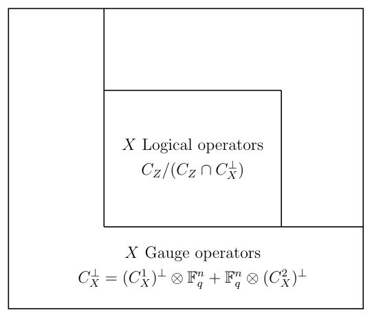
<figcaption class="paper-figure-caption"><b>Fig 1.</b> Figure 1: An illustration of the subsystem product C = C1 ⊗C2 of u = 2 codes C1 = (C1 X, C1 Z) and C2 = (C2 X, C2 Z). Recall that CX = C1 X ⊗C2 X and CZ = C1 Z ⊗C2 Z. The entire square in the figure represents an n×n grid of basis elements of Fn×n q , so that each axis contains n basis elements of Fn q . The space C⊥ X ⊆Fn×n q represents X parity-checks, i.e. gauge operators. Meanwhile, CZ/(CZ ∩C⊥ X) represents the space of X logical operators.</figcaption>
</figure>

**Summary.** This paper presents a significant advancement in fault-tolerant quantum computation by proving resilience against adversarial errors that corrupt large fractions of qubits simultaneously. It achieves this using newly developed subsystem product codes and complex error correction procedures. The result directly addresses major bottlenecks, making the construction of practical, large-scale quantum computers more theoretically feasible.

**Why it may be interesting.** This work provides rigorous theoretical guarantees for quantum computation robustness under the most challenging noise models (global, worst-case, non-Markovian), which is crucial for scaling up any physical implementation.

Detailed structure

**Main problem.** The primary goal is proving fault-tolerance for quantum computation when subjected to strong, adversarial noise models.

**Main result.** The authors establish a fault-tolerance theorem showing that computation remains possible against adversaries corrupting an almost-linear fraction of physical qudits at each time step.

**Method.** The construction utilizes novel subsystem product codes and employs a Floquet-like procedure combined with recursive code switching in a hypercubic architecture for error correction.

**Model / system.** The model involves quantum circuits operating on logical qudits, which are mapped onto physical qudits encoded within advanced quantum error-correcting codes (specifically subsystem product codes).

**Key observables.** Fault tolerance against adversarial noise; the soundness gap $\delta$ for Quantum PCP constructions.

**Important parameters / regimes.** The required number of physical qudits $N = 	ext{poly}(ar{N})$ and depth scaling $ar{T} \cdot 2^{O(\sqrt{\log ar{N}})}$.

**Assumptions / limitations.** The proof assumes the existence of a fixed universal gate set (Paulis, Hadamard, CNOT, Toffoli) and relies on noiseless classical computation for decoding.

**Figures summary.** Not specified in the notes; the structure revolves around theorems proving code constructions and gadget fault-tolerance.

**Paper structure.** The paper develops theory by first constructing explicit families of codes using homological products (Chunk 4), then applying these codes to build a universal, fault-tolerant scheme via subsystem product codes and recursive composition (Chunk 1 & 2). Finally, it confirms the fault-tolerance of specific computational gadgets (Chunk 3).

Abstract

We prove a fault-tolerance theorem for quantum computation against adversarial noise. For every quantum circuit on $\bar{N}$ logical qudits of depth $\bar{T}$, we construct a fault-tolerant circuit on $N=\text{poly}(\bar{N})$ physical qudits of depth $\bar{T}\cdot\bar{N}^{o(1)}$, which is robust against an adversary who may arbitrarily choose and corrupt an almost-linear number $N^{1-o(1)}$ of physical qudits at each time step. This robustness significantly improves upon prior fault-tolerance theorems, which assumed corruptions were either local and stochastic, or else only act on a polynomially vanishing fraction of qudits.   Our fault-tolerance scheme addresses a key bottleneck towards constructing quantum PCPs via the circuit-to-Hamiltonian mapping of Anshu, Breuckmann, and Nguyen (STOC'24). More fundamentally, our result demonstrates that fault-tolerant quantum computation remains possible under noise models that are global, worst-case, and non-Markovian over the full duration of the computation, directly countering concerns that correlated noise could fundamentally undermine quantum fault tolerance.   Our construction is based on a new family of subsystem product codes we develop, which have large dimension and distance along with low-weight parity-checks, and which support transversal non-Clifford gates. We show how to perform single-shot fault-tolerant error correction on these codes using a Floquet-like procedure based on the local testability of classical tensor codes. We then obtain a universal fault-tolerance scheme using repeated code switching in a hypercubic qudit architecture. Finally, we recursively compose our scheme with itself to reduce an initially exponential qudit dimension down to a constant.

[↑ back to top](#top)

### [Low temperature magnetic structure and lattice response in SmCuAs$_2$](http://arxiv.org/abs/2608.14920v1)

**Authors:** M. G. Kim, C. Neupane, Y. Yu, R. Acevedo-Esteves, C. Nelson, D. Evans, E. D. Mun, D. F. Agterberg, J. -W. Kim  
**Type:** experiment · **Category:** strongly correlated electrons · **PDF:** <https://arxiv.org/pdf/2608.14920v1>  
**Analysis basis:** full PDF text, analyzed in chunks

↔ Scroll figures horizontally

<figure class="paper-figure-card">
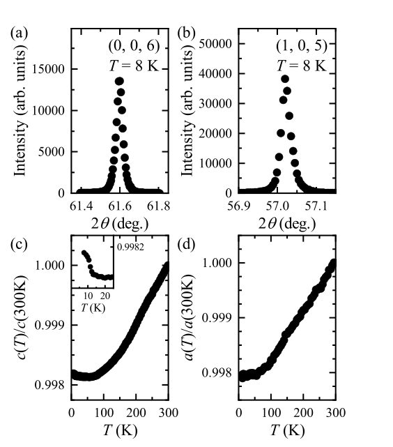
<figcaption class="paper-figure-caption"><b>Fig 1.</b> FIG. 1. (a) Longitudinal scans (θ −2θ scans) of the (0, 0, 6) Bragg peak measured at 8 K. (b) Rocking scan at the (1, 0, 5) at T = 8 K. (c) Lattice parameter c extracted from (0, 0, 6) Bragg peak as a function of temperature. The inset shows an expanded view of the data below 25 K. (d) Lattice parameter a calculated from the (1, 0, 5) Bragg peak as a function of temperature.</figcaption>
</figure>
<figure class="paper-figure-card">
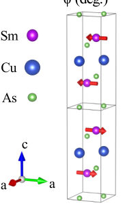
<figcaption class="paper-figure-caption"><b>Fig 2.</b> FIG. 3. (a) Fluorescence (open symbols) and energy scan (closed symbols) measured at the Sm L2 edge. The energy scan was per- formed at the AFM (0, 0, 5.5) Bragg peak in the σ −π channel. (b) Azimuthal dependence of the intensity ratio between the AFM (0, 0, 5.5) Bragg peak and the structural (0, 0, 6) peak. (c) L-dependence of the AFM (0, 0, L) Bragg peaks. Squares represent experimental data, open circles show calculated intensities for m ⊥c (Γ10), and trian- gles represent calculated intensities for m ∥c (Γ3). (d) Schematic illustration of the AFM structure of SmCuAs2.</figcaption>
</figure>

**Summary.** This paper experimentally characterizes the structure and magnetism of SmCuAs2 using synchrotron X-ray techniques. It reveals an antiferromagnetic state with moments confined to the ab-plane, while anomalous lattice parameter changes near magnetic transitions confirm significant magnetoelastic coupling. The findings highlight how moment orientation and magnetic frustration govern low-temperature transport properties in this class of materials.

**Why it may be interesting.** This work provides experimental evidence linking structural anomalies (lattice parameter changes) directly to magnetic ordering phenomena via magnetoelastic coupling, which is a key area of study in strongly correlated materials physics.

Detailed structure

**Main problem.** The study investigates the structural and magnetic properties of SmCuAs2, focusing on the interplay between lattice response, magnetism, and a resistivity minimum observed at low temperatures.

**Main result.** The compound exhibits an in-plane antiferromagnetic structure with a specific stacking pattern along the c-axis, and anomalous lattice parameter behavior suggests strong magnetoelastic coupling near magnetic transitions.

**Method.** The research employed high-resolution synchrotron X-ray diffraction (XRD) for structural measurements and X-ray Resonant Magnetic Scattering (XRMS) to determine the precise magnetic ordering vector and moment orientation.

**Model / system.** The physical system is single-crystalline SmCuAs2, which belongs to a family of RECuAs2 compounds known for complex low-temperature electronic behavior, including resistivity minima preceding antiferromagnetic ordering.

**Key observables.** Lattice parameters (a and c), magnetic Bragg peak positions ($\mathbf{q} = (0, 0, 0.5)$), and temperature dependence of these observables relative to the resistivity minimum ($T \approx 30$ K) and Néel temperature ($T_N$).

**Important parameters / regimes.** Temperature range down to 8 K; magnetic propagation vector $\mathbf{q} = (0, 0, 0.5)$; comparison across the RECuAs2 series.

**Assumptions / limitations.** The anomalous lattice behavior is attributed to magnetoelastic coupling, and the observed magnetic structure is dictated by in-plane moment alignment ($\mathbf{m} \perp c$).

**Figures summary.** Figure 1 shows XRD results detailing the plateau/increase in the c-lattice parameter near the resistivity minimum. Figure 2 presents XRMS data confirming the commensurate AFM order and determining the moment orientation via energy scans.

**Paper structure.** The paper systematically uses temperature-dependent XRD to map lattice changes, followed by detailed XRMS analysis to pinpoint the magnetic structure ($\mathbf{q}$ vector and moment direction), culminating in a comparison with related compounds to establish the role of magnetoelastic coupling.

Abstract

We investigated the structural and magnetic properties of single-crystalline SmCuAs$_2$ using high-resolution synchrotron X-ray diffraction and X-ray resonant magnetic scattering (XRMS) at the Sm $L_2$ and $L_3$ edges. Temperature-dependent diffraction measurements confirm that SmCuAs$_2$ maintains its tetragonal symmetry from room temperature down to 8 K, with lattice parameters showing anomalous behavior below the resistivity minimum ($T \approx$ 30 K). Notably, the \textbf{c}-axis lattice parameter exhibits a plateau and subsequent increase near the Néel temperature, indicating magnetoelastic coupling. XRMS measurements reveal a commensurate antiferromagnetic structure with a propagation vector \textbf{\textit{q}} = (0, 0, 0.5). Our measurement shows that the Sm moments are aligned within the \textbf{\textit{ab}} plane and arranged in a $++--$ stacking along the \textbf{\textit{c}}-axis. Comparison with related \textit{RE}CuAs$_2$ compounds (\textit{RE} = Pr, Nd, and Gd) suggests that in-plane moment orientation and associated magnetic frustration play a key role in the emergence of the resistivity minimum. Differences in spin-orbit and magnetoelastic coupling across the series highlight their importance in governing low-temperature transport behavior.

[↑ back to top](#top)

### [Minimality of the Pure Qubit ZX Calculus](http://arxiv.org/abs/2608.14872v1)

**Authors:** Harry K. Stoltz, Renaud Vilmart  
**Type:** theory · **Category:** quantum information and computing · **PDF:** <https://arxiv.org/pdf/2608.14872v1>  
**Analysis basis:** full PDF text, analyzed in chunks

↔ Scroll figures horizontally

<figure class="paper-figure-card">
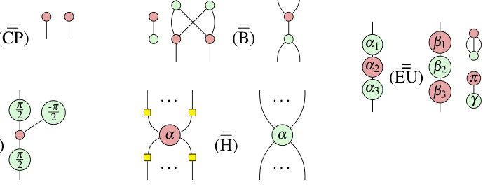
<figcaption class="paper-figure-caption"><b>Fig 1.</b> Figure 2. Set of rules ZXopt for the ZX calculus with scalars. The above labels and rewrites are lightly adapted from Vilmart [13]. The right-hand side of (E) is an empty diagram. (...) denote zero or more wires, while (</figcaption>
</figure>
<figure class="paper-figure-card">
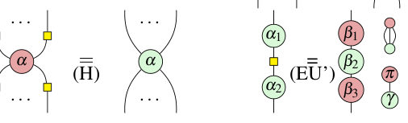
<figcaption class="paper-figure-caption"><b>Fig 2.</b> Figure 3. Set of rules ZX′ opt for the ZX calculus with scalars. The above labels and rewrites are lightly adapted from Vilmart [13]. The right-hand side of (IV) is an empty diagram. (...) denote zero or more wires, while (</figcaption>
</figure>

**Summary.** This paper rigorously determines the minimal and complete set of axioms—the ruleset—required to define the Pure Qubit ZX Calculus. By employing advanced algebraic interpretations, the authors prove that specific structural identities, such as the bialgebra law (B) and the Green Identity $(	ext{Ig})$, are necessary components for the calculus to be sound and complete.

**Why it may be interesting.** This work provides a rigorous mathematical foundation for quantum circuit representation by establishing the most compact axiomatic description (minimal ruleset) required to describe all pure qubit computations using the ZX calculus formalism.

Detailed structure

**Main problem.** The primary goal is to develop and prove the minimality of a pure-qubit ZX calculus, resolving an open problem regarding its complete set of defining rules.

**Main result.** The authors establish two distinct but equivalent minimal and complete rulesets ($	ext{ZXopt}$ and $	ext{ZX}'_{	ext{opt}}$) for describing pure qubit quantum processes using the graphical ZX calculus.

**Method.** The work employs advanced algebraic techniques, including constructing specific linear interpretations (functors $J_{-K}$) of abstract structural rules to test their necessity by finding counter-models or proving derivability.

**Model / system.** The model is pure qubit quantum processes, which are represented and manipulated using the ZX calculus—a graphical language for quantum computation circuits. The analysis involves constructing perturbed Hadamard matrices ($H'$) to simplify structural checks.

**Key observables.** The necessity of specific rules like (B) (bialgebra law), $(	ext{Ig})$ (Green Identity), and $(Ir)$ are the key diagnostics, tested by checking if they hold under various interpretations.

**Important parameters / regimes.** The analysis tracks phases ($\pi/4$, $-\pi/2$) and scalar coefficients associated with quantum gates and structural identities.

**Assumptions / limitations.** The proofs rely on defining appropriate linear interpretations ($J_{-K}$) for abstract rules to test their necessity, and the derivations assume specific connectivity meta-rules hold.

**Figures summary.** Figure 1 defines the generators of the full pure-qubit ZX calculus (e.g., Green/Red Spiders, Hadamard). Figure 2 illustrates the proposed minimal rule set $	ext{ZXopt}$ for the calculus with scalars.

**Paper structure.** The paper progresses by first defining the necessary structural rules and then systematically proving the necessity of each rule—such as $(	ext{B})$ and $(	ext{Ig})$—using specialized interpretations. Finally, it derives that other relations, like $(Ir)$, are derivable within the minimal set.

Abstract

The ZX calculus is a graphical language for reasoning about quantum processes. In this paper, we develop a minimal pure-qubit ZX calculus based on the work of Vilmart [arXiv:1812.09114], Backens, Perdrix, and Wang [arXiv:1709.08903], and Stoltz [arXiv:2606.12383]. This resolves a problem that has remained open for nearly a decade, since completeness was first proved. Specifically, we show that $(I_r)$ is derivable and establish the necessity of $(B)$ and $(I_g)$, yielding two complete and minimal rulesets.

[↑ back to top](#top)

### [Optimal bounds on the classical value of the repeated CHSH game](http://arxiv.org/abs/2608.16439v1)

**Authors:** Andris Ambainis  
**Type:** theory · **Category:** quantum information and computing · **PDF:** <https://arxiv.org/pdf/2608.16439v1>  
**Analysis basis:** full PDF text, analyzed in chunks

↔ Scroll figures horizontally

<figure class="paper-figure-card">
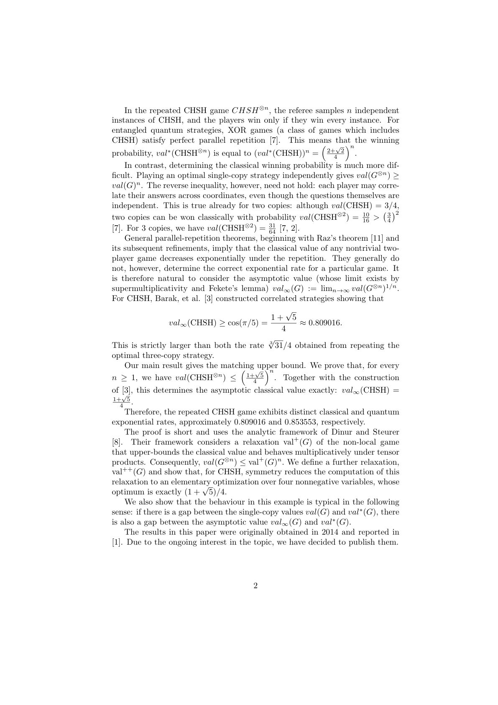
<figcaption class="paper-figure-caption"><b>Fig 1.</b> Low-resolution page preview, page 2</figcaption>
</figure>
<figure class="paper-figure-card">
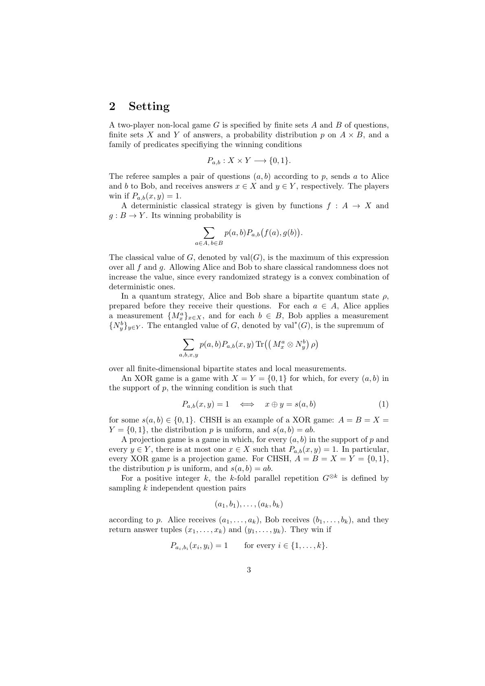
<figcaption class="paper-figure-caption"><b>Fig 2.</b> Low-resolution page preview, page 3</figcaption>
</figure>
<figure class="paper-figure-card">
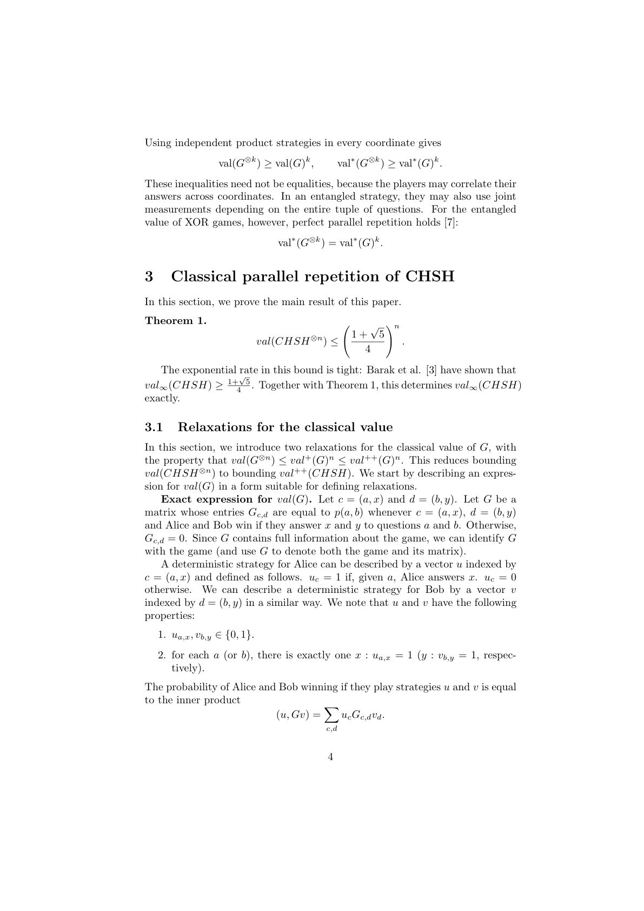
<figcaption class="paper-figure-caption"><b>Fig 3.</b> Low-resolution page preview, page 4</figcaption>
</figure>
<figure class="paper-figure-card">
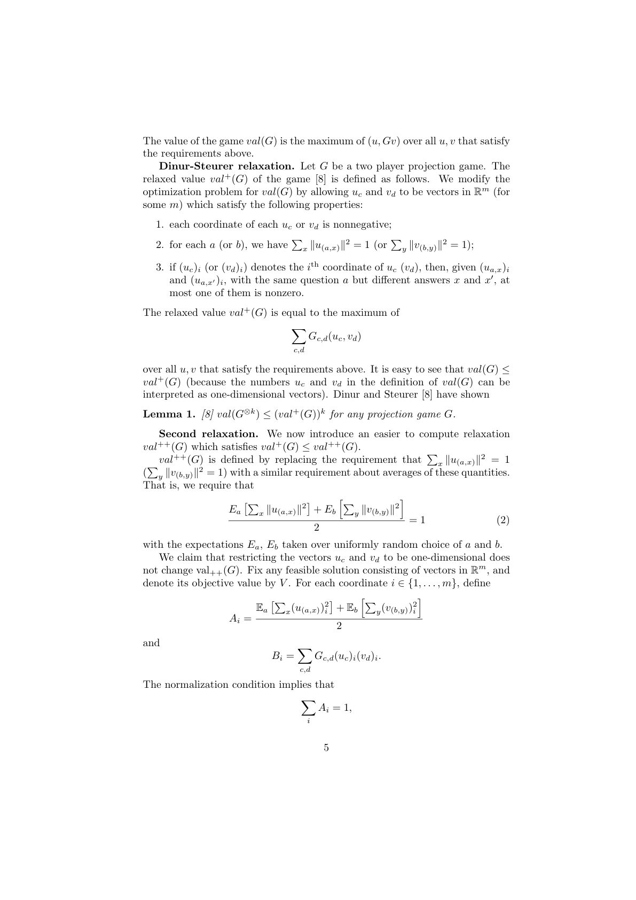
<figcaption class="paper-figure-caption"><b>Fig 4.</b> Low-resolution page preview, page 5</figcaption>
</figure>
<figure class="paper-figure-card">
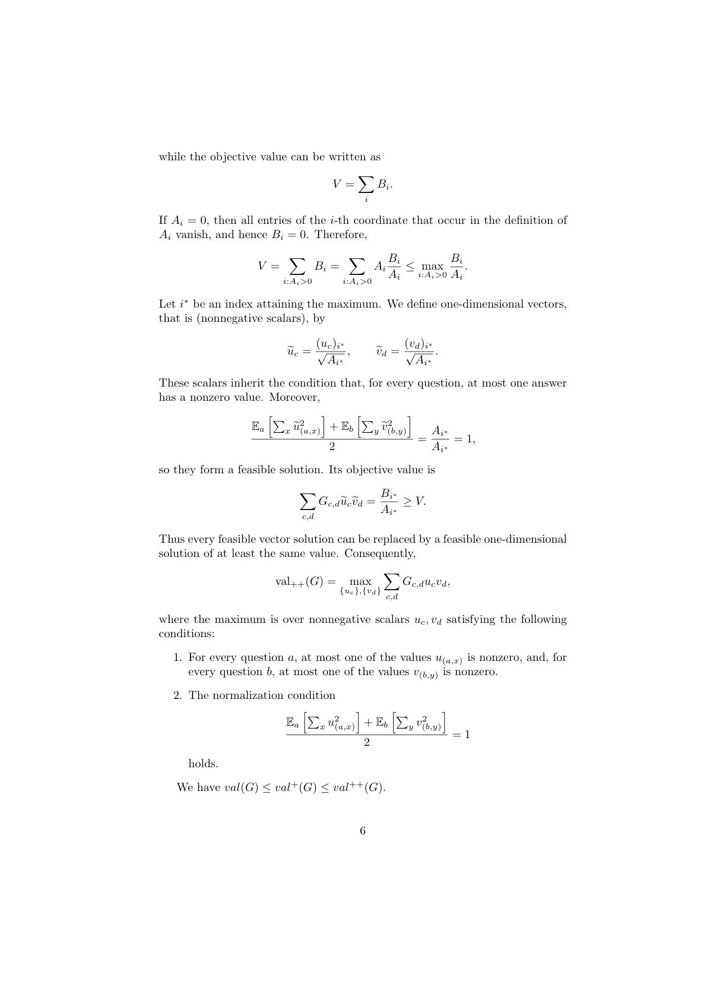
<figcaption class="paper-figure-caption"><b>Fig 5.</b> Low-resolution page preview, page 6</figcaption>
</figure>

**Summary.** This paper rigorously determines the exact asymptotic rate for the repeated CHSH game, showing it is $1 + rac{\sqrt{5}}{4}$. By analyzing relaxations on the optimization problem, the authors prove that a gap exists between the classical and quantum bounds even in the limit of many repetitions. This confirms the non-local nature of quantum correlations.

**Why it may be interesting.** This work provides a concrete example of quantifying the gap between local hidden variable theories (classical) and quantum mechanics in the context of information theory games, which is fundamental to understanding quantum advantage.

Detailed structure

**Main problem.** The paper aims to determine the exact asymptotic classical value of the repeated CHSH game, $	ext{val}_\infty(	ext{CHSH})$, by establishing tight upper bounds.

**Main result.** It determines that the asymptotic classical rate for the repeated CHSH game is exactly $1 + rac{\sqrt{5}}{4}$, demonstrating a gap between classical and quantum exponential rates.

**Method.** The authors use relaxation techniques ($	ext{val}^+$) applied to the optimization problem defining the winning probability of the repeated game, reducing it to an elementary optimization solvable via calculus.

**Model / system.** The analysis focuses on the CHSH non-local game, which is modeled as an XOR game. The results are generalized to show that gaps persist between classical and quantum bounds for any such game.

**Key observables.** Maximum winning probability ($	ext{val}(G)$), asymptotic classical rate ($	ext{val}_\infty(G)$), and the entangled value ($	ext{val}^*(G)$).

**Important parameters / regimes.** The exponent $n$ (number of repetitions) is crucial for defining the asymptotic limit.

**Assumptions / limitations.** The analysis relies on showing that certain relaxations, like $	ext{val}^{++}(G)$, are sufficient because they can be reduced to one-dimensional solutions without loss of value.

**Paper structure.** The paper proceeds by defining the problem for repeated games, deriving upper bounds using relaxation techniques ($	ext{val}^+$), solving these bounds specifically for CHSH, and concluding with general theorems about the existence of gaps between classical and quantum rates.

Abstract

We show that the maximum winning probability in the repeated CHSH game for classical strategies is at most $\left(\frac{1+\sqrt{5}}{4}\right)^n$. Together with a matching lower bound by Barak et al. (FOCS'2008), this determines the asymptotic value of the repeated CHSH game exactly. We also show that, if an XOR game has a gap between classical and quantum values, there is also a gap between the asymptotic values for the repeated game.

[↑ back to top](#top)

### [Rand-SEMI-QAOA: Finite-Budget Depth-One MaxCut Ensembles on Compressed Quantum Registers](http://arxiv.org/abs/2608.15655v1)

**Authors:** Emilio Semre, Steven Frankel  
**Type:** theory · **Category:** quantum information and computing · **PDF:** <https://arxiv.org/pdf/2608.15655v1>  
**Analysis basis:** full PDF text, analyzed in chunks

↔ Scroll figures horizontally

<figure class="paper-figure-card">
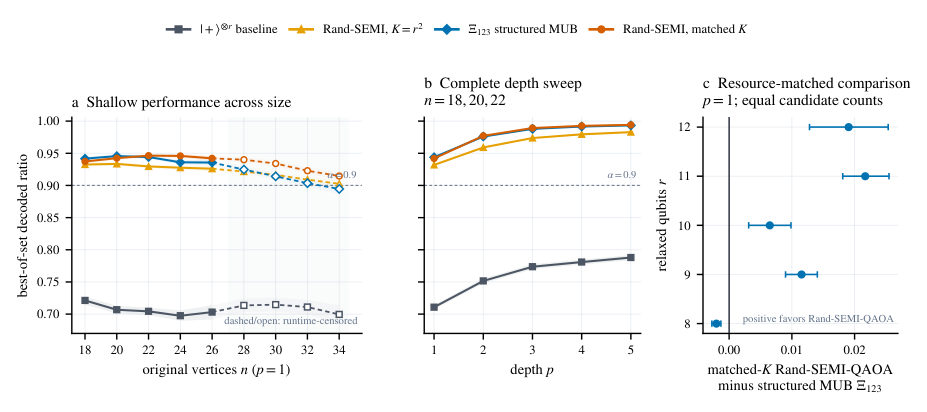
<figcaption class="paper-figure-caption"><b>Fig 1.</b> Figure 1: Shallow decoded MaxCut performance under an explicit candidate budget. The legend compares the r2-budget and matched-budget Rand-SEMI-QAOA schedules with the structured MUB selector Ξ123 and the single-state baseline. a, depth-one best-of-set ratio versus original graph size. Solid lines and filled markers denote the complete or compositionally reliable portion through n = 26; dashed lines, open markers, and light shading mark the runtime-censored n ≥28 analysis freeze. b, depth sweep on the complete n = 18, 20, 22 cohorts (2,400 graphs per point). c, graph-paired matched-K Rand-SEMI-QAOA minus the structured MUB selector Ξ123 at p = 1 where candidate counts are exactly matched (r...</figcaption>
</figure>
<figure class="paper-figure-card">
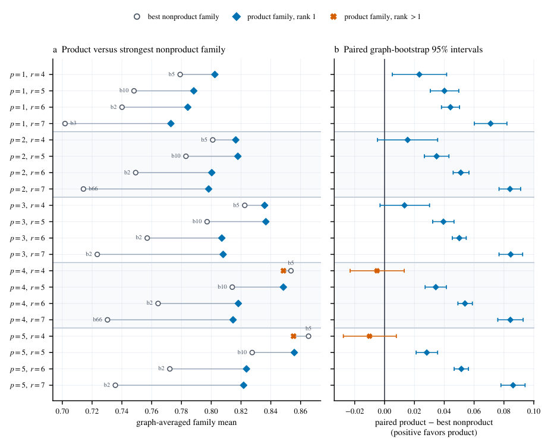
<figcaption class="paper-figure-caption"><b>Fig 2.</b> Figure 2: Exhaustive MaxCut family discovery in the 20 validated full-campaign aggregations. a, product-family and selected strongest-nonproduct graph-mean decoded ratios, with the nonproduct basis labeled directly. b, paired product-minus-nonproduct margin with graph-bootstrap 95% intervals (10,000 resamples) and a zero reference. Every row enumerates all noncomputational families and all 2r</figcaption>
</figure>
<figure class="paper-figure-card">
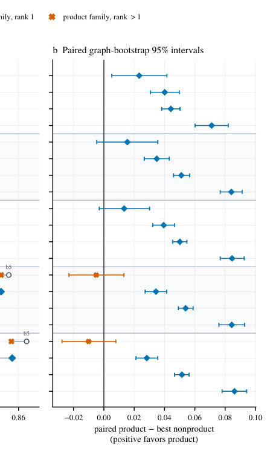
<figcaption class="paper-figure-caption"><b>Fig 3.</b> Figure 3b controls candidate count without Monte Carlo sampling. At K = 1 the curves reproduce the raw and optimized means. At K = 64, the expected maximum is 0.602 raw and 0.923 post-p = 1. More candidates help both, but the raw ensemble remains far below the optimized one. Thus the &gt; 0.9 best- of-K regime is not obtained merely by decoding 64 classically lucky product labels. This control establishes a within-product dynamical lift; because it does not repeat the raw/post experiment for every entangled family, it does not by itself explain the between-family ordering in Fig. 2.</figcaption>
</figure>
<figure class="paper-figure-card">
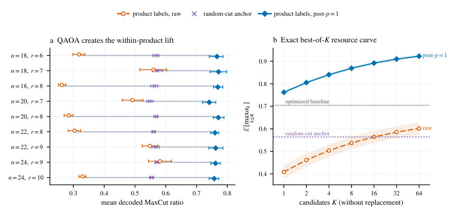
<figcaption class="paper-figure-caption"><b>Fig 4.</b> Figure 3: No-QAOA and candidate-count controls. a, cell-level mean decoded ratios for raw product labels, the random-cut anchor, and the same labels after depth-one optimization. Labels give n/r; every cell contains eight graphs. b, exact expected best decoded ratio from K product labels sampled uniformly without replacement. Equation (20) is evaluated within each graph before graph averaging; ribbons are 95% graph-bootstrap intervals. Horizontal references show the random-cut anchor and optimized |+⟩⊗r</figcaption>
</figure>
<figure class="paper-figure-card">
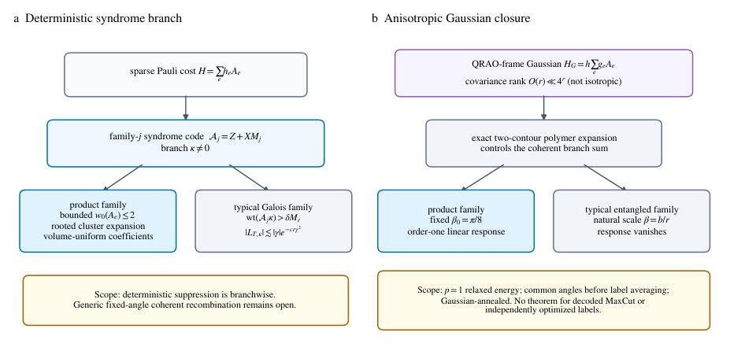
<figcaption class="paper-figure-caption"><b>Fig 5.</b> Figure 4: One-layer relaxed-energy mechanism. a, in the deterministic expansion a typical entangled- family branch induces an extensive edge-sign quench and its individual rooted overlap dephases; product- family terms admit a rooted connected-cluster expansion with volume-uniform factorial-weighted bounds. Coherent recombination of all deterministic branches at generic fixed mixer angle is open. b, the anisotropic Gaussian QRAO surrogate closes that sum on the entangled scale β = b/r, while the product family retains a nonzero linear response at β0 = π/8. The comparison is annealed, common-angle, label-averaged, p = 1, and concerns relaxed energy rather than independently optimized decoded...</figcaption>
</figure>

**Summary.** This paper introduces Rand-SEMI-QAOA, a constrained QAOA ensemble designed to solve the MaxCut problem using limited computational resources. By sampling candidate states from specific quantum basis families and employing best-of-set decoding, it achieves high approximation ratios on test graphs. The work is significant for benchmarking near-term quantum optimization algorithms but cautions that these results do not prove quantum advantage.

**Why it may be interesting.** It provides concrete, resource-explicit benchmarks for near-term quantum optimization algorithms applied to classical NP-hard problems like MaxCut, which is highly relevant for assessing NISQ device capabilities.

Detailed structure

**Main problem.** The paper addresses optimizing combinatorial problems, specifically MaxCut, using quantum approximate optimization algorithms (QAOA) under severe computational resource constraints.

**Main result.** A specific QAOA ensemble, Rand-SEMI-QAOA, achieved a high graph-mean approximation ratio of 0.9421 for random 3-regular MaxCut instances with only one QAOA layer.

**Method.** The method involves constructing and sampling candidate state-mixer pairs from a product-X family derived from Galois stabilizer MUBs, optimizing each pair independently, and selecting the best result (best-of-set decoding).

**Model / system.** The model is QAOA applied to MaxCut, utilizing a compressed quantum register approach called QRAO. The optimization relies on sampling states/mixers from a product-X family within an implemented Galois stabilizer MUB system.

**Key observables.** Approximation Ratio ($\alpha$), decoded best-of-set approximation ratio (e.g., 0.9421), and the relaxed QRAO energy.

**Important parameters / regimes.** Graph size ($n \in \{18, 20, 22\}$), QAOA layer depth (one layer), and the budget/schedule parameter $K$.

**Assumptions / limitations.** The results are finite-size and resource-explicit; the paper explicitly states it does not establish quantum advantage or guarantee performance over all possible selector seeds.

**Figures summary.** Not specified in detail, but notes mention Table 1 summarizing resource models for various shallow quantum optimization methods.

**Paper structure.** The structure moves from defining the MaxCut problem and QAOA framework to introducing the Rand-SEMI-QAOA ensemble based on MUB sampling. It then presents performance results on random graphs and concludes with limitations regarding quantum advantage claims.

Abstract

We introduce Rand-SEMI-QAOA, a finite-budget QRAO--QAOA ensemble for MaxCut based on a $(3,1)$-QRAC relaxation. The method samples labels uniformly without replacement from the product-$X$ family of an implemented Galois stabilizer mutually unbiased basis (MUB) system. Each selected state--mixer pair is optimized independently for relaxed QRAO energy and then evaluated by deterministic Pauli-sign decoding. Exhaustive scans of the implemented noncomputational MUB catalog place the product-$X$ family first in 18 of 20 validated family-mean cells and in every tested cell for $r=5,6,7$. On a complete cohort of $2{,}400$ random connected 3-regular MaxCut instances with $n\in\{18,20,22\}$, the capped matched-cardinality schedule attains a graph-mean decoded best-of-set approximation ratio of $0.9421$ with one QAOA layer, while the $K=r^2$ schedule attains $0.9319$. These statistics are conditional on the disclosed frozen selector pools and do not estimate variability over selector seeds. An exact gauge identity shows that product-family labels generate the orbit of the QRAO Hamiltonian under an $r$-dimensional sign-gauge group. For common angles and relaxed energy, deterministic syndrome analysis proves branchwise dephasing, while an anisotropic Gaussian surrogate controls the coherent label-averaged response on the scale $β=b/r$. The theory does not order independently optimized decoded maxima. The results are finite-size and resource-explicit and do not establish quantum advantage.

[↑ back to top](#top)

### [Spectral Edge Rigidity of Quantum Chaotic States](http://arxiv.org/abs/2608.16847v1)

**Authors:** Joaquim Telles de Miranda, Tobias Micklitz  
**Type:** theory · **Category:** disordered systems and neural networks · **PDF:** <https://arxiv.org/pdf/2608.16847v1>  
**Analysis basis:** full PDF text, analyzed in chunks

↔ Scroll figures horizontally

<figure class="paper-figure-card">
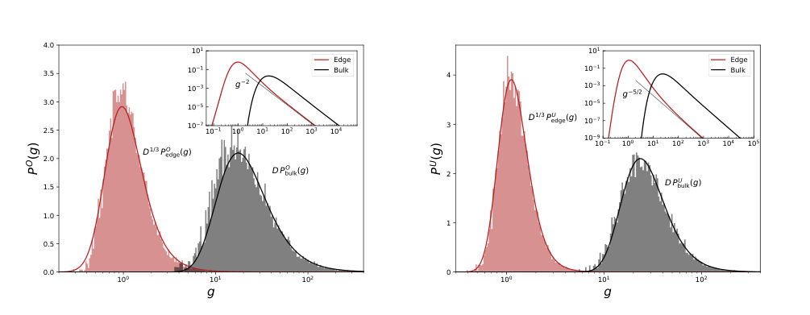
<figcaption class="paper-figure-caption"><b>Fig 1.</b> FIG. 1. Left: GOE fidelity susceptibility distributions for near-edge (red) and bulk (black) states compared with histograms generated from an ensemble of 10,000 matrices of dimension D = 100. (Edge and bulk distributions are scaled by D1/3 and D, respectively, for visibility.) Inset: GOE distributions for near-edge and bulk states, with asymptotic scaling g−2 shown for reference. Right: Corresponding plot for the GUE, with the inset now displaying g−5/2 scaling. As noted in the main text, edge distributions were shifted as PO,U edge(g −g∗), with g∗≈0.50, 0.47 for GOE and GUE, respectively.</figcaption>
</figure>

**Summary.** This theoretical work derives the universal statistics governing fidelity susceptibility at the spectral edge of random matrix ensembles (GOE/GUE). It shows that these edge states exhibit enhanced stability—or 'rigidity'—compared to bulk states. The methodology successfully unifies the description across different symmetries using advanced determinant and integral techniques.

**Why it may be interesting.** The concept of 'spectral-edge rigidity' provides a quantitative measure of stability in chaotic quantum systems. This framework is highly relevant for understanding noise resilience or robustness in complex, disordered quantum many-body models.

Detailed structure

**Main problem.** The research determines the universal distribution of fidelity susceptibility for chaotic eigenstates located precisely at the spectral edge of Gaussian random-matrix ensembles.

**Main result.** Edge states exhibit a characteristic rigidity, leading to a symmetry-dependent cubic suppression of small susceptibilities compared to bulk states. This establishes that low-lying chaotic states are parametrically less sensitive to perturbations than their bulk counterparts.

**Method.** The authors extend determinant-based frameworks from the spectral bulk to derive universal edge distributions for both orthogonal and unitary ensembles using Gaussian integrals and matrix identities.

**Model / system.** The study analyzes quantum systems whose dynamics are modeled by Hamiltonians drawn from Gaussian Random Matrix Ensembles (GOE, GUE). The focus is on the behavior near the spectral endpoints ($D \gg 1$).

**Key observables.** Fidelity susceptibility ($\chi$), which measures state sensitivity to perturbations; the probability distribution of this susceptibility, $	ext{PS}(g)$.

**Important parameters / regimes.** The Dyson index $eta$ (determining symmetry: $eta=1$ for GOE, $eta=2$ for GUE); the scaling variable $g/D^{1/3}$ at the edge; and the large-$D$ limit.

**Assumptions / limitations.** The analysis relies on extending determinant-based methods to the spectral edge where saddle points coalesce, necessitating a return to integral forms. The results are derived in the thermodynamic limit ($D 	o \infty$).

**Figures summary.** Figures compare analytical predictions for $	ext{PO}_{	ext{edge}}(g)$ and $	ext{PU}_{	ext{edge}}(g)$ against numerical histograms for GOE and GUE, confirming agreement across both bulk and edge regimes.

**Paper structure.** The paper builds from analyzing the general framework of fidelity susceptibility in random matrices, deriving the necessary mathematical tools (determinant identities), and finally applying these tools to extract the universal scaling laws specific to the spectral edge regime for different symmetry classes.

Abstract

We determine the distribution of fidelity susceptibility for chaotic eigenstates at the spectral edge of Gaussian random-matrix ensembles. Previous work showed that, in the unitary class, the characteristic susceptibility scale of edge states grows as $D^{1/3}$, rather than proportionally to $D$ as in the spectral bulk, reflecting Airy-edge level rigidity. Extending a determinant-based framework introduced for bulk states, we derive the universal edge distributions for both the orthogonal and unitary ensembles. The two symmetry classes share the scaling variable $g/D^{1/3}$ and exhibit a symmetry-dependent cubic suppression of small susceptibilities, while their algebraic large-$g$ tails reflect the corresponding symmetry-dependent level repulsion. Although eigenvector statistics retain their random-matrix form throughout the spectrum, edge rigidity makes low-lying chaotic states parametrically less sensitive to generic perturbations than bulk states. Our results establish universal, symmetry-dependent spectral-edge fidelity-susceptibility statistics in systems whose chaotic dynamics extends down to the ground state.

[↑ back to top](#top)

## Secondary cond-mat archives

*Papers from cond-mat.mtrl-sci, mes-hall, other, soft, supr-con. These archives are de-prioritized — they appear at the end regardless of relevance score.*

### Relevant in secondary archives (37)

### [Tunable Fano Resonance and Frequency Locking in a Graphene-SiNx Hybrid Nanomechanical Resonator](http://arxiv.org/abs/2608.16372v1)

**Authors:** Ateesh K. Rathi, Javed A. Mondal, Rajan Singh, Ryan J. T. Nicholl, Kirill I. Bolotin, Saikat Ghosh  
**Type:** both · **Category:** other · **PDF:** <https://arxiv.org/pdf/2608.16372v1>  
**Analysis basis:** full PDF text, analyzed in chunks
**Topic relevance:** 🔥 `interference shaping light` **4/5** · `driven-dissipative phase transition` **3/5** · `methods for driven-dissipative` **3/5** · `analog quantum simulation` **2/5** · `correlated / nonlocal dissipation` **2/5** · `non-equilibrium universality` **2/5** · `quantum measurements` **2/5** · `Frenkel-Kontorova` **1/5** · `Keldysh / 2PI / non-Gaussian methods` **1/5** · `quantum optics experiment` **1/5**

↔ Scroll figures horizontally

<figure class="paper-figure-card">
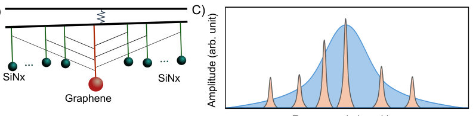
<figcaption class="paper-figure-caption"><b>Fig 1.</b> Figure 1. (A) SEM image of the device, where the grey area corresponds to the silicon nitride membrane, while the black circular region represents a suspended graphene drum with a diameter of 20 µm. (B) Mechanical model of the system: a single damped graphene resonator (red sphere) coupled to multiple high-Q silicon nitride resonators (teal spheres). (C) Schematic of the broad graphene resonance overlapping with a dense comb of sharp, fixed frequency silicon nitride modes.</figcaption>
</figure>
<figure class="paper-figure-card">
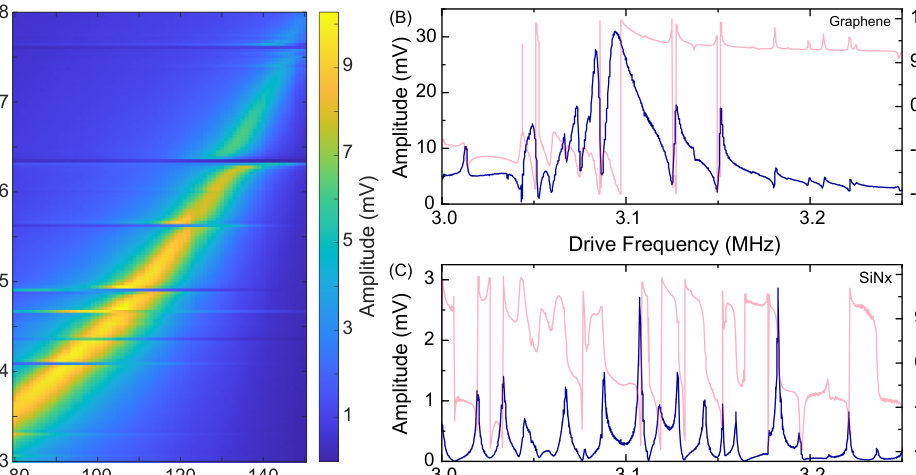
<figcaption class="paper-figure-caption"><b>Fig 2.</b> Figure 2. (A) Dispersion of the graphene resonator resonance frequency as a function of DC gate voltage Vdc. The tunable graphene mode successively interacts with multiple fixedfrequency silicon nitride (SiNx) modes (dark horizontal lines), which remain unaffected by the gate voltage due to the large mass and high built-in tension of SiNx. (B) Representative frequency domain spectrum of the graphene resonator at a fixed gate voltage, showing the broad graphene resonance strongly coupled to multiple discrete, high quality factor silicon nitride modes. (C) Spectrum in the same frequency range, highlighting the dense population of sharp silicon nitride modes available for coupling with the...</figcaption>
</figure>
<figure class="paper-figure-card">
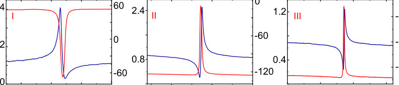
<figcaption class="paper-figure-caption"><b>Fig 3.</b> Figure 3. Fano resonances: (A) Fano resonances with varying asymmetries are observed at different positions of the graphene mode. Four representative line shapes, labeled I–III and highlighted in red rectangles, are shown along with the corresponding phase responses of the graphene–SiNx hybrid modes (right axis). Panels B–D present the amplitude (upper panels) and phase (lower panels) responses for regions I–III. Regions I, exhibit negative Fano parameters, while regions II and III display positive Fano parameters, demonstrating the evolution of resonance asymmetry.</figcaption>
</figure>
<figure class="paper-figure-card">
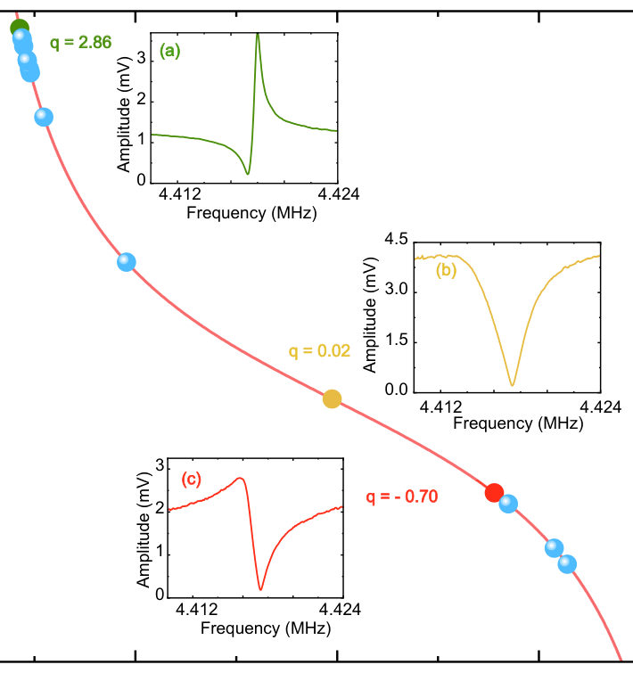
<figcaption class="paper-figure-caption"><b>Fig 4.</b> Figure 4. Evolution of the Fano asymmetry parameter. The Fano asymmetry parameter, q, is shown as a function of gate voltage, Vdc, across an accumulated interference phase in a range of 2π. The parameter q transitions continuously from positive to negative values as the gate voltage increases. Representative data points at selected gate voltages are indicated. Insets (a)–(c) display the corresponding SiNx Fano line shapes: inset (a) (green) illustrates a positive Fano parameter (q = 2.86), inset (b) (yellow) presents a nearly symmetric resonance with q = 0.02, and inset (c) (blue) depicts a negative Fano parameter (q = −0.70).</figcaption>
</figure>
<figure class="paper-figure-card">
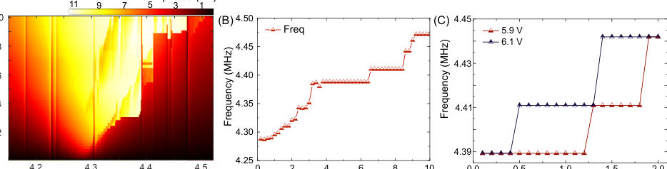
<figcaption class="paper-figure-caption"><b>Fig 5.</b> Figure 5. Frequency locking of the nonlinear graphene mode to the SiNx mode comb at Vdc = 113 V. (A) Measured graphene amplitude as a function of drive frequency and drive voltage amplitude Vac. The antiresonance lines remain pinned at the fixed SiNx frequencies at all drive levels, and the jump-down edge of the hardening Duffing response forms a staircase locked to successive SiNx modes. (B) Jump-down frequency ωJ/2π versus drive amplitude, extracted from (A): ωJ/2π is pinned on plateaus at the SiNx frequencies, within which ∂(ωJ/2π)/∂Vac ≈0 (frequency stabilization); the plateau widths reflect the coupling strength (cooperativity) of the individual modes. (C) Deterministic switching...</figcaption>
</figure>

**Summary.** The authors report on controlling Fano resonances in a graphene-SiNx nanomechanical system by tuning the coupling via an electric gate voltage. They show that this hybrid structure allows precise control over interference features (sign and magnitude of $q$). Furthermore, under strong driving, the discrete SiNx modes stabilize the graphene oscillation into quantized frequency plateaus, establishing it as a robust nanomechanical frequency reference.

**Why it may be interesting.** This work provides a clean, controllable mechanical realization of fundamental quantum interference phenomena (Fano resonance) and demonstrates how discrete modes can act as stable frequency references or quantizers for a highly tunable oscillator, relevant to sensing and metrology.

Detailed structure

**Main problem.** The study reports on the experimental observation and theoretical modeling of Fano resonances and frequency locking within a hybrid nanomechanical resonator.

**Main result.** The system demonstrates tunable control over the Fano asymmetry parameter ($q$) in the linear regime, and exhibits frequency quantization via staircase locking when driven strongly in the nonlinear Duffing regime.

**Method.** The research combines experimental measurements using confocal microscopy with theoretical modeling based on coupled oscillator equations and the Duffing oscillator framework.

**Model / system.** The platform is a graphene-$	ext{SiN}_x$ hybrid nanomechanical resonator. The $	ext{SiN}_x$ modes act as high-Q discrete states, while the graphene mode acts as a tunable continuum state, coupled via electrostatic gating.

**Key observables.** Fano asymmetry parameter ($q$), frequency locking plateaus (staircase structure), and phase jumps in the amplitude/phase response spectra.

**Important parameters / regimes.** DC gate voltage ($V_{dc}$), which tunes detuning; drive power, controlling transition into the Duffing regime.

**Assumptions / limitations.** The $	ext{SiN}_x$ modes are assumed to be unaffected by the gate voltage due to their large mass and built-in tension in the linear analysis.

**Figures summary.** Figures show frequency domain spectra demonstrating phase jumps (Fig. 2), the $q-\Phi$ master curve comparing theory/experiment, and a staircase pattern of jump-down frequencies confirming locking onto discrete modes (Fig. S.7).

**Paper structure.** The paper progresses from establishing tunable Fano resonances via gate control in the linear regime to analyzing the nonlinear dynamics where strong driving causes frequency locking, which is then confirmed by seeding experiments.

Abstract

Fano resonances, arising from the interference between discrete and continuum states, are observed across a wide range of quantum and classical systems. Here, we report the experimental observation of Fano resonances in a graphene SiNx hybrid nanomechanical system modeled as coupled oscillators. The broad, low quality factor graphene mode plays the role of the continuum, while the dense comb of sharp, high quality factor SiNx modes provides the discrete states. The inter-mode detuning is tunable via a DC gate voltage, enabling dynamic control of the Fano resonance: we demonstrate gate controlled switching of both the sign and the magnitude of the Fano asymmetry parameter $q$, in quantitative agreement with a coupled oscillator theory that predicts $q=-\cotφ$, with $φ$ the phase of the continuum response. At strong drive, the graphene mode enters the Duffing regime and its jump-down frequency locks to successive SiNx modes, producing a staircase of drive insensitive frequency plateaus; a weak seeding tone deterministically switches the resonator between adjacent locked states. The dense SiNx mode thus acts, in the linear regime, as the discrete states of a tunable Fano interferometer and, in the nonlinear regime, as a frequency ruler that stabilizes and quantizes the graphene oscillation. This platform offers a controllable mechanical realization of Fano interference and opens new avenues for high resolution hybrid resonant sensors and stable nanomechanical frequency references.

[↑ back to top](#top)

### [Josephson network as a~model for high-temperature superconductor and beyond: Macroscopic quantum coherence probed by microwave absorption](http://arxiv.org/abs/2608.15441v1)

**Authors:** Adam Rycerz  
**Type:** theory · **Category:** strongly correlated electrons · **PDF:** <https://arxiv.org/pdf/2608.15441v1>  
**Analysis basis:** full PDF text, analyzed in chunks
**Topic relevance:** 🔥 `analog quantum simulation` **4/5** · `driven-dissipative phase transition` **3/5** · `methods for driven-dissipative` **3/5** · `Keldysh / 2PI / non-Gaussian methods` **2/5** · `non-equilibrium universality` **2/5** · `Frenkel-Kontorova` **1/5** · `correlated / nonlocal dissipation` **1/5** · `quantum measurements` **1/5** · `scars & prethermalization` **1/5**

↔ Scroll figures horizontally

<figure class="paper-figure-card">
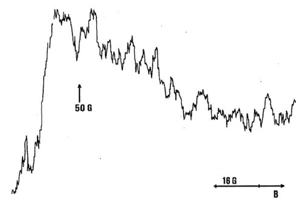
<figcaption class="paper-figure-caption"><b>Fig 1.</b> Figure 1: First derivative of the power MMMA spectrum show- ing the 50-G peak for a sample of the ceramic superconductor YBa2Cu3O7−x at T = 80 K. Reprinted from Ref. [4].</figcaption>
</figure>
<figure class="paper-figure-card">
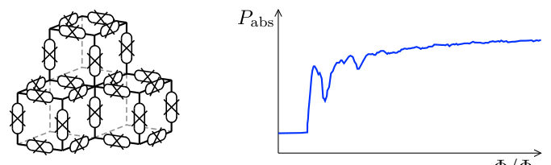
<figcaption class="paper-figure-caption"><b>Fig 2.</b> Figure 2: Selected theoretical models allowing to understand the absorption spectrum of Fig. 1. (a) A superconducting loop, pierced by a static flux Φ, is expected to show the minimal absorption for an ac signal when Φ ≈Φ(ext) min = nΦ0. (b) A single junction pierced by the flux, reducing its critical current Ic = Ic(Φ), and subjected to the ac bias current Iµ, shows the absorbed power (Pabs) that rises with Φ, reaching the maximum at Φ = Φ0, and then showing small quasiperiodic oscillations. (c) Three-dimensional Josephson network (schematic), containing N × N × N resistively and capacitively shunted junctions with some random variation of the parameters, is sufficient to account for the...</figcaption>
</figure>
<figure class="paper-figure-card">
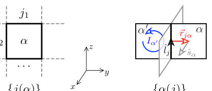
<figcaption class="paper-figure-caption"><b>Fig 3.</b> Figure 3: Schematic showing the set of junctions belonging to the loop α (left) and the set of loops containing the junction j (right). The cubic lattice case with the main axes aligned with the Cartesian coordinate system (middle) is chosen. Remaining symbols are de- fined in the main text.</figcaption>
</figure>
<figure class="paper-figure-card">
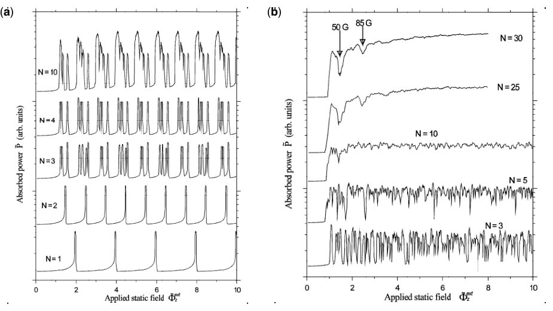
<figcaption class="paper-figure-caption"><b>Fig 4.</b> Figure 4: Power absorption vs applied magnetic field for the network containing N × N × N Josephson junctions. (a) Different networks of identical junctions (˜Γ0 = 5, ˜L0 = 1). (b) The parameters ˜Γ and ˜L were undergoing 10% Gaussian fluctuations around the mean values ˜Γ0, ˜L0. (Adapted from Ref. [18].)</figcaption>
</figure>
<figure class="paper-figure-card">
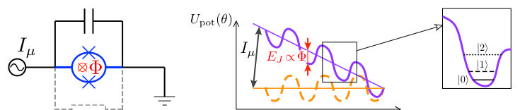
<figcaption class="paper-figure-caption"><b>Fig 5.</b> Figure 5: Left to right: Effective circuit for a single Josephson qubit, the potential energy controlled by the microwave bias current (Iµ) and the magnetic flux (Φ), and non-equidistant transmon energy levels (|0⟩and |1⟩span a computational subspace).</figcaption>
</figure>

**Summary.** This paper develops theoretical models to explain microwave absorption anomalies (MMMA) observed in high-temperature superconductors using a 3D Josephson network model. By simulating the coupled dynamics of these junctions, the authors show how discrete resonances evolve into continuous spectra as the system size increases. The results successfully predict characteristic minima that align with experimental findings and draw parallels to superconducting quantum circuits.

**Why it may be interesting.** The detailed modeling of collective nonlinear oscillations in Josephson junctions provides a rich platform for studying macroscopic quantum coherence, phase transitions, and the interplay between disorder and coherent quantum behavior, relevant to open quantum systems.

Detailed structure

**Main problem.** The paper aims to theoretically model Magnetically-Modulated Microwave Absorption (MMMA) spectra observed in inhomogeneous high-temperature superconductors.

**Main result.** Increasing the size of the Josephson network causes discrete resonance peaks to fill out and smooth, while residual minima persist at specific magnetic flux values that match experimental observations.

**Method.** The authors employ numerical simulations solving coupled nonlinear differential equations derived from superconducting loop dynamics, supplemented by elementary analytical approximations for small vibrations.

**Model / system.** The system is a 3D Josephson network modeled as an array of coupled Josephson junctions with random parameters. The dynamics are governed by flux quantization and junction electrodynamics, analogous to modeling high-Tc superconductors or Josephson qubits.

**Key observables.** Microwave absorption power ($	ilde{P}$) as a function of external magnetic flux ($	ilde{\Phi}_{	ext{ext},z}$), exhibiting characteristic anomalies and minima.

**Important parameters / regimes.** System size ($N$), junction parameters (resistivity, capacitance, inductance), and the applied external magnetic field $	ilde{\Phi}_{	ext{ext}}$.

**Assumptions / limitations.** The analysis assumes zero net current flowing through the lattice for large systems; approximations are used for small vibrations around minimum potential energy points.

**Figures summary.** Figures illustrate theoretical models comparing absorption from superconducting loops, single junctions, and 3D networks. Figure 4(a) shows power evolution with system size $N$, while Figure 5 relates the model to Josephson qubit energy levels.

**Paper structure.** The paper reviews established theories (flux quantization, vortex dynamics), develops a lattice approach for 3D arrays, performs numerical simulations showing size-dependent spectral filling, and concludes by drawing analogies between superconducting lattices and quantum circuits like qubits.

Abstract

Since the seminal experiment by Stankowski et al. [Phys. Rev. B 36, 7126 (1987)] on YBa$_2$Cu$_3$O$_{7-x}$, Magnetically-Modulated Microwave Absorption (MMMA) has become an important technique for detecting the superconducting transition in inhomogeneous ceramic compounds. The rise of microwave absorption below $T_c$ is accompanied by several low-field anomalies, usually attributed to the weak links between superconducting grains showing the Josephson effect, or to the dynamics of Abrikosov-Josephson vortices. In this article, we briefly review selected theoretical models rationalizing MMMA spectra for high-temperature superconductors, focusing on the $3$-dimensional array of Josephson junctions with random parameters including the resistivity, capacity and inductance of each junction, showing characteristic absorption anomalies observed in the experiment. The implications for recently studied microwave absorption in Josephson junction qubits are also discussed.

[↑ back to top](#top)

### [Driven Time Crystal in Low-Symmetry ENZ Conductors](http://arxiv.org/abs/2608.15208v1)

**Authors:** Mario G. Silveirinha  
**Type:** theory · **Category:** other · **PDF:** <https://arxiv.org/pdf/2608.15208v1>  
**Analysis basis:** full PDF text, analyzed in chunks
**Topic relevance:** 🔥 `driven-dissipative phase transition` **4/5** · `interference shaping light` **3/5** · `Keldysh / 2PI / non-Gaussian methods` **2/5** · `methods for driven-dissipative` **2/5** · `non-equilibrium universality` **2/5** · `analog quantum simulation` **1/5** · `correlated / nonlocal dissipation` **1/5** · `quantum measurements` **1/5**

↔ Scroll figures horizontally

<figure class="paper-figure-card">
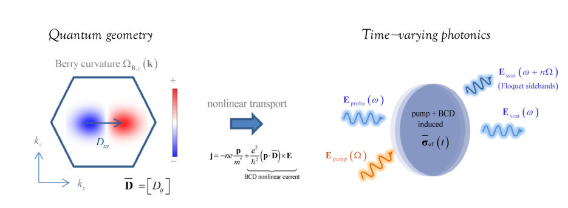
<figcaption class="paper-figure-caption"><b>Fig 1.</b> Fig. 1 Left: Illustration of the origin of the Berry curvature dipole. The figure shows a density plot of the y-</figcaption>
</figure>
<figure class="paper-figure-card">
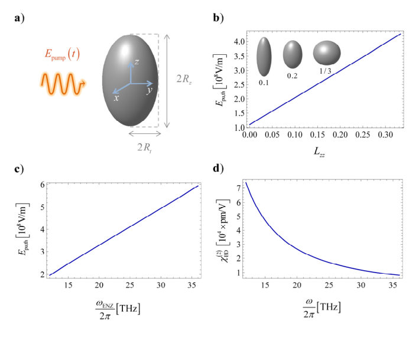
<figcaption class="paper-figure-caption"><b>Fig 2.</b> Fig. 2 (a) Sketch of the geometry of the spheroidal nanoparticle. The spheroid symmetry axis is aligned with the z-</figcaption>
</figure>
<figure class="paper-figure-card">

<figcaption class="paper-figure-caption"><b>Fig 3.</b> Figure 2c illustrates the impact of changing the ENZ crossing point on the threshold field.</figcaption>
</figure>
<figure class="paper-figure-card">
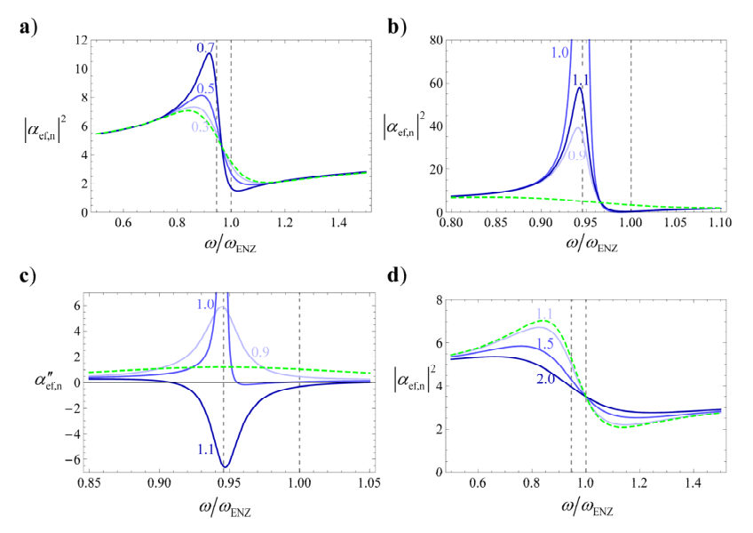
<figcaption class="paper-figure-caption"><b>Fig 4.</b> Fig. 3 (a)-(b) Normalized scattering strength as a function of the probe frequency for different pump-field</figcaption>
</figure>

**Summary.** This paper proposes utilizing low-symmetry conductors near the epsilon-near-zero point as a superior platform for realizing optically driven time crystals. By exploiting the anomalous velocity nonlinearity ($\chi^{(2)}$), the authors demonstrate that these materials can achieve robust, ultrafast optical modulation necessary for parametric amplification and advanced light control in nanoscale devices.

**Why it may be interesting.** This work bridges concepts from topological physics (Berry curvature dipole) with nonlinear optics and quantum electrodynamics. The ability to engineer time-periodic optical responses using material symmetry is highly relevant for advanced quantum light sources and detectors.

Detailed structure

**Main problem.** The research aims to develop a robust platform for achieving time-crystalline behavior in optical systems using optical-cycle modulation, overcoming limitations associated with conventional materials like TCOs.

**Main result.** Low-symmetry conductors near the epsilon-near-zero point can naturally exhibit a driven time-crystalline response via their anomalous-velocity nonlinearity. This allows for parametric amplification and strong control over probe beam scattering/extinction.

**Method.** The analysis employs a BCD-Drude model in the time domain, linearizing master equations to study the induced nonlinear optical response of subwavelength nanoparticles.

**Model / system.** The system involves low-symmetry conductors operating near the ENZ regime. The core physics is modeled using the BCD-Drude formalism, which incorporates an anomalous current density ($\mathbf{j}_{an}$) derived from the Berry curvature dipole ($\mathbf{D}$).

**Key observables.** Time-crystalline response, parametric amplification, probe scattering/extinction (including negative extinction), and second-order nonlinear current density ($\mathbf{j}^{(2)}$).

**Important parameters / regimes.** The analysis is restricted to the semiclassical regime where field frequencies are much smaller than interband transition frequencies. The key material feature is low symmetry, enabling $\chi^{(2)}$ effects.

**Assumptions / limitations.** The study assumes a quasistatic approximation for the subwavelength nanoparticle and operates within the semiclassical limit of photon-electron interactions.

**Figures summary.** Figure 1 illustrates the origin of the Berry curvature dipole ($\mathbf{B}_y$), its role in generating anomalous velocity, and how optical pumping leads to a time-dependent effective conductivity and driven time-crystalline response.

**Paper structure.** The paper first establishes the limitations of $\chi^{(3)}$ systems (like TCOs) for rapid modulation. It then introduces low-symmetry conductors as an alternative leveraging $\chi^{(2)}$ nonlinearity via anomalous velocity, culminating in a theoretical demonstration using the BCD-Drude model to predict time-crystalline behavior and amplification.

Abstract

In recent years, epsilon-near-zero (ENZ) materials have attracted a great deal of attention in nonlinear optics, as they combine field enhancement with strong, ultrafast nonlinearities. In particular, transparent conducting oxides, such as ITO, have emerged as a promising class of materials and have been extensively exploited to achieve temporal optical responses varying on the femtosecond scale using an optical pump. Most of the solutions discussed so far in the literature rely on effective $χ^{(3)}$ modulations, wherein the dominant material response is controlled by the envelope of the optical pump. Here, it is shown that low-symmetry conductors can provide an interesting alternative to transparent conducting oxides and a more natural implementation of time-crystalline behavior in optical systems with optical-cycle modulation. I demonstrate that ENZ confinement, combined with the strong anomalous-velocity nonlinearity of low-symmetry conductors, enables a subwavelength nanoparticle to develop a time-crystalline response under optical pumping. For sufficiently strong pumping, this response can overcome dissipative losses and lead to parametric amplification. Furthermore, the pump can strongly tailor the scattering and extinction of a weak probe and, in extreme cases, render the extinction negative. In this regime, the driven nanoparticle effectively amplifies the probe beam.

[↑ back to top](#top)

### [Individual Vanadium Dopants Form Deep In-Gap States in Monolayer WS2](http://arxiv.org/abs/2608.15551v1)

**Authors:** Tianhui Zhu, Carlos A. Gonzalez, Shihao Tu, Søren Tornøe, Ivan Pelayo, Dong-Rong Wu, Zhehao Ge, Hem Prasad Bhusal, Kenji Watanabe, Takashi Taniguchi, Nobuhiko P. Kobayashi, Yuan Ping, Jairo Velasco, Aiming Yan  
**Type:** both · **Category:** quantum information and computing · **PDF:** <https://arxiv.org/pdf/2608.15551v1>  
**Analysis basis:** full PDF text, analyzed in chunks
**Topic relevance:** 🔥 `QC/QI experiment` **4/5** · `quantum measurements` **2/5** · `analog quantum simulation` **1/5** · `driven-dissipative phase transition` **1/5** · `methods for driven-dissipative` **1/5**

↔ Scroll figures horizontally

<figure class="paper-figure-card">
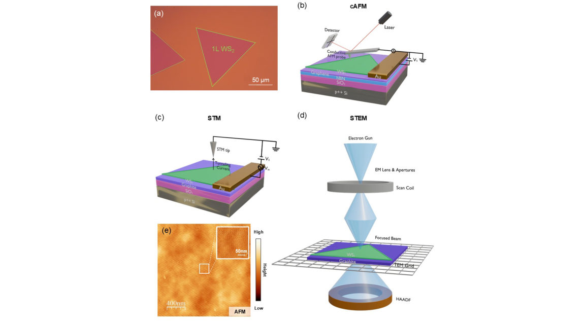
<figcaption class="paper-figure-caption"><b>Fig 1.</b> Figure 1 Overview of characterization techniques and transition metal dichalcogenide</figcaption>
</figure>
<figure class="paper-figure-card">
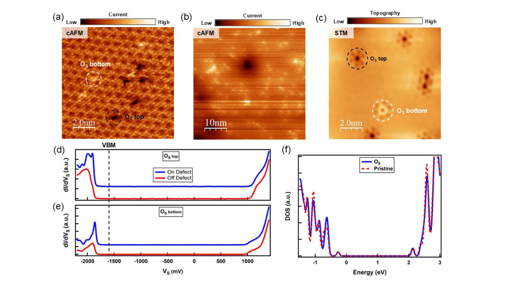
<figcaption class="paper-figure-caption"><b>Fig 2.</b> Figure 2 Characterization of pristine WS2 monolayer with atomic resolution, using</figcaption>
</figure>
<figure class="paper-figure-card">
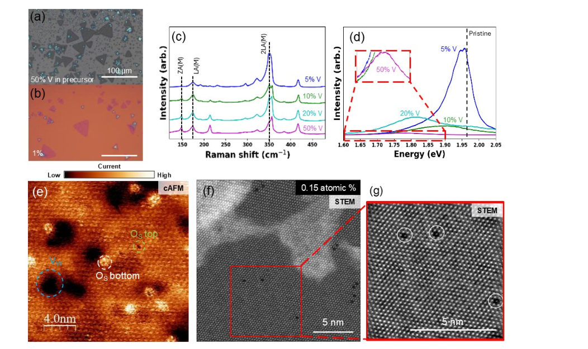
<figcaption class="paper-figure-caption"><b>Fig 3.</b> Figure 3 Characterization of V-WS2 with SPM and optical spectroscopy. (a-b) Optical</figcaption>
</figure>
<figure class="paper-figure-card">
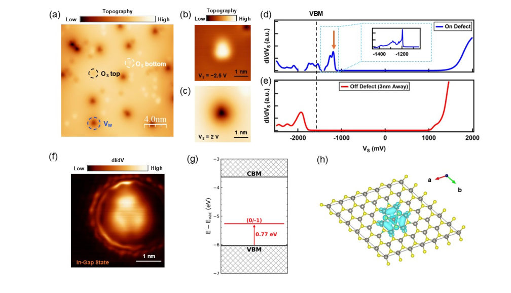
<figcaption class="paper-figure-caption"><b>Fig 4.</b> Figure 4 STM/STS characterization and DFT modeling of V-WS2. (a) STM topography at</figcaption>
</figure>

**Summary.** This work addresses the challenge of defect engineering in 2D materials by doping monolayer $	ext{WS}_2$ with Vanadium ($	ext{V}$). Using a combination of CVD synthesis and advanced scanning probe microscopy (STM/STS, cAFM), the authors experimentally confirmed that these dopants introduce distinct deep electronic states into the band gap. This establishes $	ext{V-WS}_2$ as a promising platform for quantum information science applications.

**Why it may be interesting.** The ability to precisely engineer and spectroscopically confirm localized quantum states within a solid-state platform like $	ext{WS}_2$ is directly relevant to building solid-state qubits or quantum memory elements.

Detailed structure

**Main problem.** The challenge of engineering dopants in atomically thin materials to reliably create and identify deep electronic states suitable for quantum information science.

**Main result.** Vanadium dopants ($	ext{V}$) incorporated into monolayer $	ext{WS}_2$ form distinct, measurable deep in-gap electronic states ($0.35 	ext{ eV}$ above the valence band maximum).

**Method.** The study combines synthesis via CVD with advanced characterization techniques like STM/STS and cAFM, supported by first-principles DFT calculations.

**Model / system.** The physical system is monolayer $	ext{WS}_2$ (a 2D TMD) doped with Vanadium ($	ext{V}$), allowing for the study of point defects and their localized electronic signatures.

**Key observables.** In-gap state energy levels, defect density ($	ext{cm}^{-2}$), charge transition levels ($	ext{CTLs}$), and local current maps.

**Important parameters / regimes.** The key energy level is $0.35 	ext{ eV}$ above the valence band maximum; defect densities are in the range of $10^{11} - 10^{12} 	ext{ cm}^{-2}$.

**Assumptions / limitations.** The analysis relies on the assumption that localized electronic states observed via STM/STS correspond to specific dopant configurations ($	ext{VW}$ defects) modeled by DFT.

**Figures summary.** Figures illustrate schematics of characterization probes (cAFM, STM/STS, STEM), showing current maps and topography confirming defect signatures in pristine $	ext{WS}_2$ and $	ext{V-WS}_2$.

**Paper structure.** The paper progresses by first establishing the need for controlled dopant engineering; it then details the experimental characterization of defects (OS vs. V) using multiple probes, culminating in DFT confirmation of the electronic structure and suitability for QISE.

Abstract

Point defects in atomically thin materials have a strong impact on physical properties and those that induce in-gap states are advantageous for quantum information science and engineering (QISE). However, dopant engineering consisting of well-controlled synthesis and robust identification of in-gap states is challenging. In this work, we addressed this challenge by first using finely tuned chemical vapor deposition to incorporate vanadium dopants into a monolayer WS2 (V-WS2). Next, we utilized a suite of scanned probe microscopy techniques to identify and characterize individual dopants. The latter included conductive atomic force microscopy (cAFM), low temperature scanning tunneling microscopy and spectroscopy (STM/STS), and scanning transmission electron microscopy and unambiguously revealed that vanadium dopants form deep in-gap states 0.35 eV above the valence band maximum in V-WS2. Our experimental results are well supported by first principles calculations and taken together demonstrate that V-WS2 is a promising platform for QISE applications.

[↑ back to top](#top)

### [Raman-detected quantum dot microscopy for nanoscale electrostatic potential imaging](http://arxiv.org/abs/2608.16446v1)

**Authors:** Jiří Doležal, Amandeep Sagwal, Rodrigo Cezar de Campos Ferreira, Martin Švec  
**Type:** experiment · **Category:** other · **PDF:** <https://arxiv.org/pdf/2608.16446v1>  
**Analysis basis:** full PDF text, analyzed in chunks
**Topic relevance:** 🔥 `quantum measurements` **4/5** · `quantum optics experiment` **2/5** · `driven-dissipative phase transition` **1/5**

↔ Scroll figures horizontally

<figure class="paper-figure-card">
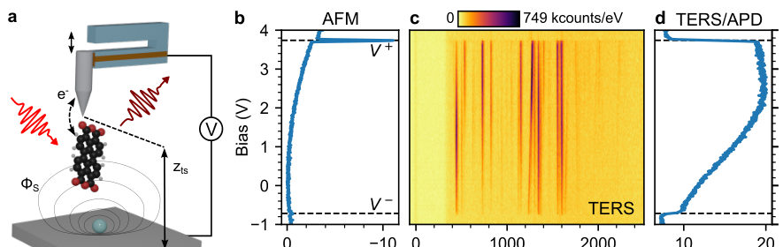
<figcaption class="paper-figure-caption"><b>Fig 1.</b> Fig. 1 Optically detected SQDM experiment. a, Schematic of the TERS–SQDM experimental setup. A PTCDA quantum dot (QD) is attached to the tip apex. Changes in the QD charge state are detected either through the atomic- force response or through changes in the TERS intensity. b, Frequency-shift, ∆f(V ), dependence with two charging peaks (V +, V −) marked by dotted lines. c, Heatmap of voltage-dependent Raman spectra acquired with a 1.96 eV laser. d, Integrated photon intensity, IAPD, above 640 nm (∼156 cm−1) recorded with an APD during the voltage sweep shown in b. The intensity changes coincide with the charging peaks. All data were acquired with the same oscillating tip using an amplitude...</figcaption>
</figure>
<figure class="paper-figure-card">
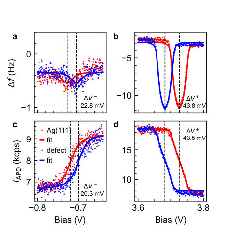
<figcaption class="paper-figure-caption"><b>Fig 2.</b> Fig. 2 Equivalence of TERS- and force-detected QD spectroscopy. a–d, Shifts of the V + and V −thresholds, indicated by dashed lines, measured above a subsurface defect on Ag(111) (blue) and 7 nm away on the bare surface (red). a,b, Frequency-shift, ∆f(V ), signal. c,d, Raman intensity, IAPD. Solid lines show fits using the frequency-shift response equation (21) and the occupation-broadened TERS intensity function equation (16), respectively. The broadening parameters were fixed from the oscillation-amplitude dependence shown in Extended Data Fig. 3, leaving only the charging threshold V0 as a free parameter. Measurements were performed at zts = 2.7 nm with an oscillation amplitude of 50 pm.</figcaption>
</figure>
<figure class="paper-figure-card">
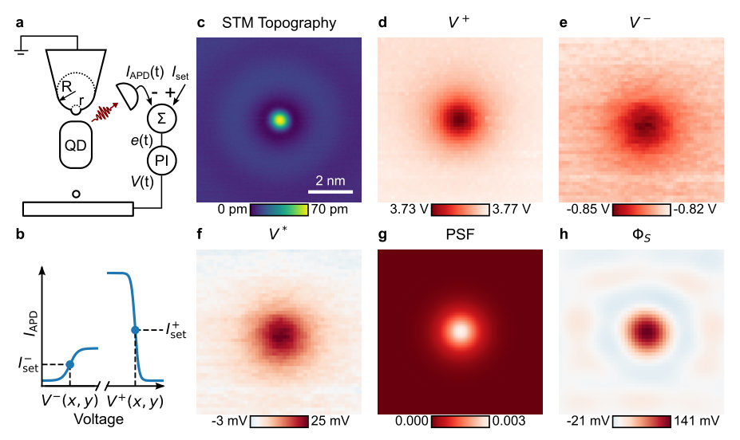
<figcaption class="paper-figure-caption"><b>Fig 3.</b> Fig. 3 Electrostatic-potential imaging of an Ag adatom. a, Schematic of the feedback scheme used for TERS- SQDM. The STM tip is represented by a sphere-on-sphere geometry, consisting of a spherical body with radius of curvature (R), terminated by a smaller hemispherical apex of radius (r), following the tip model used to simulate sub-nanometre- resolved TEPL images[20]. b, Schematic bias-dependent TERS intensity curves with the centers of the step used as setpoints to track V + and V −. c, STM topography of an Ag adatom on Ag(111) acquired in constant-current mode with an Ag tip at 100 mV and 10 pA. d,e, V + and V −maps acquired with bias feedback at the tip–sample distance of zts = 2.6 nm....</figcaption>
</figure>
<figure class="paper-figure-card">
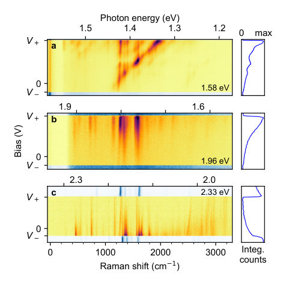
<figcaption class="paper-figure-caption"><b>Fig 4.</b> Fig. 4 Voltage-dependent Raman spectra acquired with different laser energies. a, Raman spectra acquired with a 1.58 eV laser. b, Raman spectra acquired with a 1.96 eV laser. c, Raman spectra acquired with a 2.33 eV laser. The acquisition time per spectrum was 5 s in a, 5 s in b, and 3 s in c.</figcaption>
</figure>

**Summary.** The research introduces an advanced technique using Tip-Enhanced Raman Spectroscopy (TERS) to map electrostatic potentials on surfaces. By monitoring changes in the molecule's Raman signal as it charges, researchers can achieve quantitative measurements equivalent to traditional force microscopy methods. This offers a powerful, optically driven tool for understanding charge dynamics at the nanoscale.

**Why it may be interesting.** This work bridges quantum optics (Raman scattering) with surface science/condensed matter physics by providing a non-contact, optically enhanced method to probe local electronic structure and potential landscapes at the atomic scale.

Detailed structure

**Main problem.** The primary goal is to develop an optical detection method for quantifying electrostatic potentials at the nanoscale, overcoming limitations in speed and complexity associated with traditional force spectroscopy techniques.

**Main result.** The integrated Tip-Enhanced Raman Scattering (TERS) intensity was shown to correlate strongly with the quantum dot's charge state, allowing for quantitative mapping of the electrostatic potential ($\Phi_S$) with accuracy comparable to established AFM methods.

**Method.** Electrostatic potential is mapped by measuring the charging threshold voltages ($V_+$ and $V_-$) using a feedback loop controlling the TERS signal intensity. This technique replaces force measurements ($\Delta f(V)$) with optical detection of molecular charge state changes.

**Model / system.** The experiment uses molecular quantum dots (PTCDA molecules) suspended on an atomically sharp tip, measured via Tip-Enhanced Raman Spectroscopy (TERS) in a Scanning Probe Microscopy setup. The potential mapping relies on the charging response of these QDs.

**Key observables.** Integrated TERS intensity ($I_{APD}(V)$), charge state switching thresholds ($V_+$, $V_-$), and the reconstructed electrostatic potential map ($\Phi_S(x, y)$).

**Important parameters / regimes.** Bias voltage ($V$), excitation wavelength (e.g., 1.58 eV, 1.96 eV, 2.33 eV), and tip-sample geometry parameters.

**Assumptions / limitations.** The reconstruction of the potential assumes a sphere-on-sphere tip geometry model; systematic errors like upward shifts in $V_-$ due to illumination are noted but deemed negligible for dipole moment quantification.

**Figures summary.** Figures compare TERS intensity vs. force shift ($\Delta f(V)$) responses, show direct mapping of $\Phi_S$ around adatoms on Ag(111), and illustrate the bias-dependent spectral changes (Stark shifts) in TERS spectra.

**Paper structure.** The paper progresses from establishing the need for nanoscale potential measurement to demonstrating the TERS detection method. It compares this optical approach against established force spectroscopy, details the quantitative mapping process using feedback control, and finally analyzes the underlying photophysical mechanism driving the signal variation.

Abstract

Quantification of electrostatic potentials at the nanoscale is crucial for understanding the principles governing properties of materials across multiple length scales. Currently, one of the most successful approaches relies on the charging response of a molecular quantum dot, suspended on a tip of a scanning probe microscope and measured using dynamic force spectroscopy. We investigate the possibility of an optical detection, aiming to improve the speed and reduce the complexity of this measurement scheme. We show that the integrated tip-enhanced Raman scattering intensity strongly correlates with the charge state of the quantum dot, and use it to map the electrostatic potential of a single atom. A quantitative equivalence with the established force spectroscopy method is found. We address the underlying photophysical principle of this new method by measuring the Raman spectra as a function of excitation wavelength and the molecular quantum dot charge. We reveal that the observed Raman intensity variations are primarily driven by transitions between resonant and non-resonant Raman scattering regimes of the molecule.

[↑ back to top](#top)

### [Electrically Switchable Spintronics in a Multiferroic Altermagnet](http://arxiv.org/abs/2608.15953v1)

**Authors:** Martin Latorre  
**Type:** theory · **Category:** other · **PDF:** <https://arxiv.org/pdf/2608.15953v1>  
**Analysis basis:** full PDF text, analyzed in chunks
**Topic relevance:** `Keldysh / 2PI / non-Gaussian methods` **3/5** · `methods for driven-dissipative` **3/5** · `analog quantum simulation` **2/5** · `driven-dissipative phase transition` **2/5** · `non-equilibrium universality` **2/5** · `quantum measurements` **2/5** · `correlated / nonlocal dissipation` **1/5** · `scars & prethermalization` **1/5**

↔ Scroll figures horizontally

<figure class="paper-figure-card">
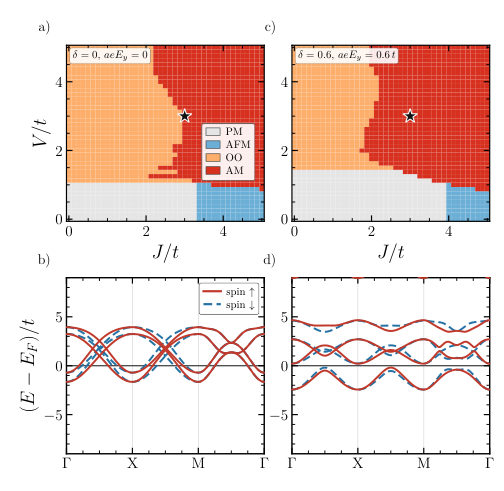
<figcaption class="paper-figure-caption"><b>Fig 1.</b> Figure 1. Ground-state phase diagram and spin-resolved band structure of the dimerized altermagnet, in units of the master hopping t ≡|t1| at one-eighth filling. (a,c) Mean-field phase diagram in the J–V plane, with the four phases (PM, AFM, OO, AM) read from the staggered amplitudes (m, o); the star marks the working point J = V = 3t. (b,d) Spin-resolved bands along Γ–X–M–Γ, as (E −EF )/t, with spin ↑(solid red) and ↓(dashed blue) split by the d-wave altermagnetic mechanism. Left column (a,b): undimerized reference, δ = 0, eaEy = 0. Right column (c,d): δ = 0.6, eaEy = 0.6 t, where the SSH modulation opens gaps while leaving the splitting intact.</figcaption>
</figure>
<figure class="paper-figure-card">
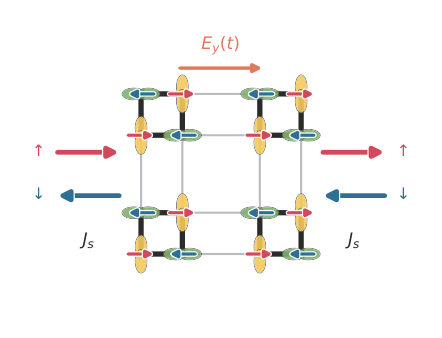
<figcaption class="paper-figure-caption"><b>Fig 2.</b> Figure 3. Spin-current generation under a time-dependent field Ey(t). Red (blue) arrows denote the up (down) spin channel on the two dimerized sublattices; opposite orbital orientations encode the altermagnetic d-wave order. A time-varying field injects a longitudinal spin current, Js = Zs χs dEy/dt, where χs is the spin susceptibility and Zs mea- sures the spin injection.</figcaption>
</figure>
<figure class="paper-figure-card">
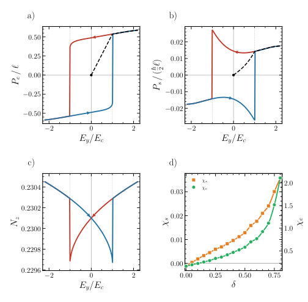
<figcaption class="paper-figure-caption"><b>Fig 3.</b> Figure 2. Quasi-static loops of the two polarizations, mag- netic order versus the applied electric field Ey and Zero-field multiferroic susceptibility of both polarization channels as a function of the dimerization δ in the altermagnetic state at one-eighth filling (J = V = 3t, dimerization δ = 0.6). Red and blue curves show the two sweep directions; vertical dashed lines mark the virgin curve. (a–b) Charge Pe in units of ℓ= e a/Acell and spin Ps polarizations in units of ℓℏ/2. Both form square, odd-in-Ey loops and switch simultaneously at the same coercive field. (c) The z component of the N´eel vec- tor Nz, even in Ey, forming a butterfly loop with maxima at the coercive fields,...</figcaption>
</figure>

**Summary.** This work presents a minimal theoretical model for an electrically switchable altermagnet that simultaneously exhibits ferroelectricity and spin polarization. The key finding is the dynamic entanglement of these three orders, allowing electric fields to control pure spin currents without needing traditional magnetic materials or SOC. This offers a blueprint for low-power spintronic devices.

**Why it may be interesting.** While focused on condensed matter magnetism/electronics, the concept of dynamically entangled order parameters controlled by an external field (electric field switching magnetic properties) is highly relevant to open quantum systems and non-equilibrium dynamics studies.

Detailed structure

**Main problem.** To develop a minimal theoretical framework capturing the simultaneous emergence and dynamic entanglement of altermagnetic order, ferroelectricity, and spin-polarized transport in one system.

**Main result.** The model demonstrates that electric field switching can synchronously control charge polarization, spin polarization, and Néel order, enabling pure spin current generation without relying on SOC or external magnetic fields.

**Method.** Mean-field theory is employed to analyze the ground state phase diagram and calculate quasi-static hysteresis loops for various order parameters.

**Model / system.** The system is a dimerized altermagnet modeled on a 2D lattice, described by a Hamiltonian incorporating kinetic, Heisenberg, orbital exchange, and an electric field coupling term. The model explicitly couples the three orders: magnetic (Néel amplitude $m$), orbital ($o$), and electric polarization ($P_e$).

**Key observables.** Charge polarization ($P_e$), spin polarization ($P_s$), Néel vector magnitude ($m$), and induced pure spin current density ($J_s$).

**Important parameters / regimes.** Spin exchange ($J$), orbital exchange ($V$), dimerization ($\delta$), and external electric field ($E$).

**Assumptions / limitations.** The model is a minimal 'toy model' designed for symmetry analysis; the coupling to $E$ is simplified by mapping it to an intracell staggered component.

**Figures summary.** Figures illustrate the four-phase ground state diagram (PM, AFM, OO, AM), quasi-static hysteresis loops showing synchronous switching of $P_e$, $P_s$, and $m$ with $E$, and spin current generation under time-varying fields.

**Paper structure.** The paper establishes the theoretical framework by defining the Hamiltonian; it analyzes the phase diagram to show coexisting orders; it then calculates the magnetoelectric coupling via hysteresis loops, culminating in predictions for electrically driven pure spin currents.

Abstract

We introduce a minimal model of a two-dimensional lattice that, upon spontaneous symmetry breaking, simultaneously develops altermagnetic order, a finite electric polarization, and a spin-polarized transport response, all of which are controlled by an external electric field. By coupling a dimerized altermagnet to an external electric field, we show that the three order parameters are not merely compatible but dynamically entangled, so that switching one (for instance, reversing the polarization with an electric field) necessarily reconfigures the other two. We show that this model offers a clear physical blueprint for designing next-generation spintronic logic and pure spin current memdevices that merge the ultrafast, stray-field-free advantages of compensated magnets with the low-power switching architectures of ferroelectrics.

[↑ back to top](#top)

### [Tuning single-molecule fluorescence by atomic-scale control of the local environment](http://arxiv.org/abs/2608.16826v1)

**Authors:** Thiago G. L. Brito, Daniel Arribas, Sofia Canola, Klaus Kuhnke, Tomáš Neuman, Anna Rosławska  
**Type:** both · **Category:** other · **PDF:** <https://arxiv.org/pdf/2608.16826v1>  
**Analysis basis:** full PDF text, analyzed in chunks
**Topic relevance:** `interference shaping light` **3/5** · `quantum optics experiment` **3/5** · `Tavis-Cummings & cavity-many-emitter` **2/5** · `driven-dissipative phase transition` **2/5** · `Keldysh / 2PI / non-Gaussian methods` **1/5** · `analog quantum simulation` **1/5** · `correlated / nonlocal dissipation` **1/5** · `methods for driven-dissipative` **1/5** · `quantum measurements` **1/5**

↔ Scroll figures horizontally

<figure class="paper-figure-card">
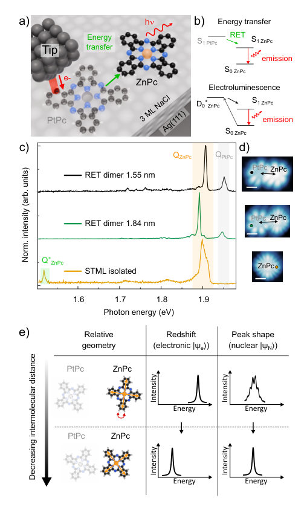
<figcaption class="paper-figure-caption"><b>Fig 1.</b> FIG. 1. Probing the influence of the environment on the optical properties of a single</figcaption>
</figure>
<figure class="paper-figure-card">
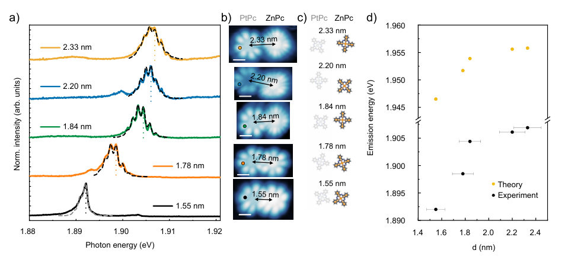
<figcaption class="paper-figure-caption"><b>Fig 2.</b> FIG. 2. Controlling single-molecule fluorescence via the local environment. a) High-</figcaption>
</figure>
<figure class="paper-figure-card">
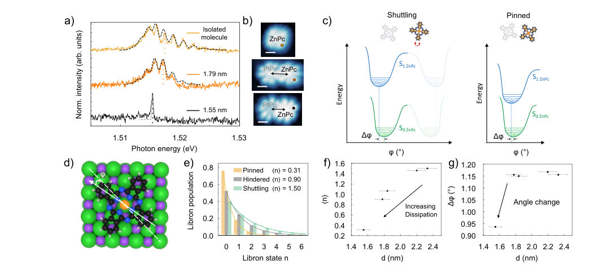
<figcaption class="paper-figure-caption"><b>Fig 3.</b> FIG. 3. Analysis of the nuclear effects modifying the fluorescence spectra. a) STML</figcaption>
</figure>
<figure class="paper-figure-card">

<figcaption class="paper-figure-caption"><b>Fig 4.</b> FIG. 4. Tuning the emission energy in larger assemblies. a) STML wide energy range</figcaption>
</figure>
<figure class="paper-figure-card">
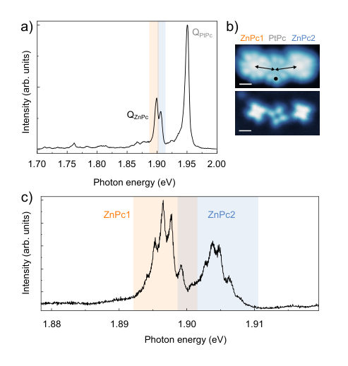
<figcaption class="paper-figure-caption"><b>Fig 5.</b> Fig. 4a shows a low-resolution spectrum recorded on the PtPc. Besides the emission of PtPc</figcaption>
</figure>

**Summary.** The researchers demonstrate that single-molecule fluorescence can be tuned with picometer precision by physically manipulating the surrounding environment using STM. By combining spectroscopy with theoretical modeling, they disentangle how spectral shifts arise from electronic coupling while line shape changes reflect modifications to the molecule's rotational dynamics and energy dissipation pathways.

**Why it may be interesting.** This work provides a direct experimental platform for studying environmental coupling effects on quantum emitters, bridging concepts from cavity QED and molecular physics by controlling the local potential landscape at sub-nanometer scales.

Detailed structure

**Main problem.** The study investigates how precisely controlled, atomic-scale variations in the local molecular environment affect the fluorescence properties of single molecules.

**Main result.** Fluorescence emission energy can be tuned by several tens of meV through environmental control, and spectral line shapes reveal distinct contributions from electronic coupling and modifications to the molecule's rotational dynamics.

**Method.** The research combines high-resolution optical spectroscopy with scanning tunneling microscopy (STM) to physically manipulate the intermolecular distance between chromophores.

**Model / system.** The system uses phthalocyanine molecules ($	ext{ZnPc}$) whose fluorescence is probed while interacting with a nearby molecule ($	ext{PtPc}$). Theoretical models, such as the quantum harmonic torsional oscillator model and TDDFT, are used to analyze spectral shifts and fine structure changes.

**Key observables.** Molecular emission energy (spectral redshift), line profile evolution (fine structure/libronic progressions), and angular displacement ($\Delta\phi$).

**Important parameters / regimes.** Intermolecular distance ($d$), controlled with precision better than $100 	ext{ pm}$; spectral shifts up to $\sim 15 	ext{ meV}$.

**Assumptions / limitations.** The analysis relies on approximating rotational potentials as parabolas and using remote resonant energy transfer (RET) excitation to minimize artifacts.

**Figures summary.** Figures illustrate the progressive redshift and change in peak shape of the $	ext{ZnPc}$ emission spectrum as the distance between molecules decreases, alongside detailed spectral fits showing evolution of libron populations and adsorption angles.

**Paper structure.** The paper systematically maps the optical response by varying the separation distance ($d$) using STM/spectroscopy. Analysis progresses from observing simple shifts to fitting complex line shapes using torsional oscillator models, culminating in understanding the physical origins (electronic vs. nuclear) of these changes in larger assemblies.

Abstract

Molecules that absorb and emit light play a central role in microscopy, light-emitting devices and photosynthesis. Their fluorescence arises from well-defined radiative transitions that are governed by the electronic states and their coupling to the nuclear motion that are influenced by the local environment. Yet the effect of controlled atomic-scale variations in the emitter surroundings remains unexplored. Here, we use scanning tunneling microscopy combined with optical spectroscopy to investigate the optical response of a single phthalocyanine to the change in the position of a nearby molecule, controlled with precision better than 100 pm. Upon decreasing the intermolecular distance, the molecular emission energy redshifts and its line profile evolves. Supported by theoretical calculations, we disentangle the electronic and nuclear contributions to the changes in fluorescence. We find that the redshift originates from the interaction between the excitations of the two molecules, while the lineshape changes reflect modifications of the molecular rotational degree of freedom and non-equilibrium dynamics. We extend this control to larger assemblies, where one molecule tunes the energies of two chromophores, mimicking the environmental tuning in photosynthetic systems. Our study provides atomic-scale insight into how the local environment affects the optical properties of molecular systems.

[↑ back to top](#top)

### [Solitons and periodic wave solutions for complex Ginzburg-Landau equation modelling fiber lasers and nonequilibrium phenomena](http://arxiv.org/abs/2608.14918v1)

**Authors:** Vladimir I. Kruglov, Houria Triki  
**Type:** theory · **Category:** other · **PDF:** <https://arxiv.org/pdf/2608.14918v1>  
**Analysis basis:** full PDF text, analyzed in chunks
**Topic relevance:** `driven-dissipative phase transition` **3/5** · `methods for driven-dissipative` **3/5** · `Keldysh / 2PI / non-Gaussian methods` **2/5** · `correlated / nonlocal dissipation` **2/5** · `analog quantum simulation` **1/5** · `interference shaping light` **1/5** · `non-equilibrium universality` **1/5** · `superradiant laser` **1/5**

↔ Scroll figures horizontally

<figure class="paper-figure-card">
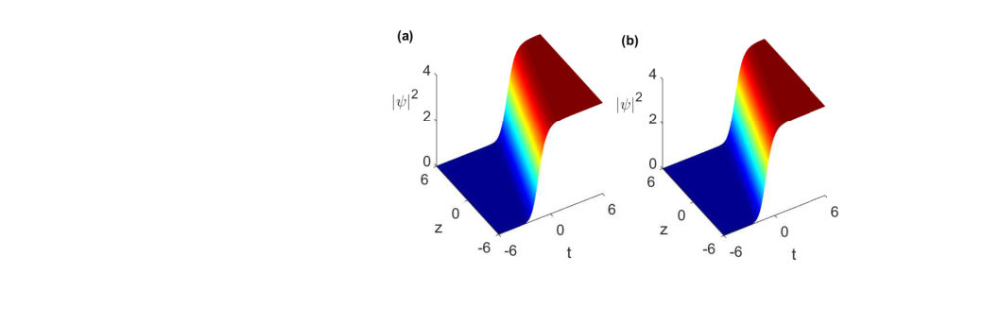
<figcaption class="paper-figure-caption"><b>Fig 1.</b> FIG. 1: Evolution of soliton solutions with parameters α = 0.32, β = 0.35, γ = −0.64, σ = −0.7, δ = 5.434, ξ0 = 0 (a) soliton solution (13) with ν = 1 (b) soliton solution (16) with the −sign of λ when S = 2.</figcaption>
</figure>
<figure class="paper-figure-card">
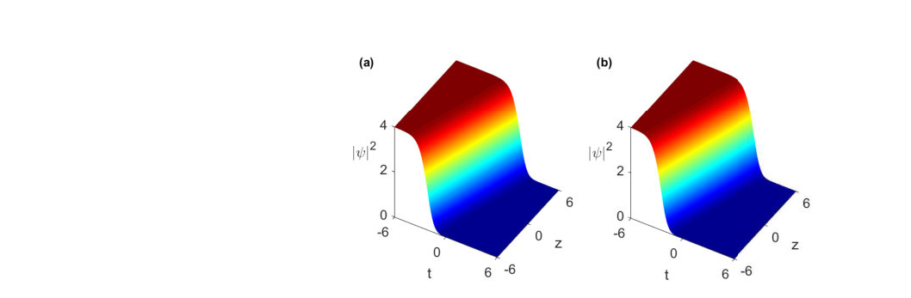
<figcaption class="paper-figure-caption"><b>Fig 2.</b> FIG. 2: Evolution of soliton solutions with parameters α = 0.32, β = 0.35, γ = −0.64, σ = −0.7, δ = 5.434, ξ0 = 0 (a) soliton solution (13) with ν = −1 (b) soliton solution (16) with the + sign of λ when S = 2.</figcaption>
</figure>
<figure class="paper-figure-card">

<figcaption class="paper-figure-caption"><b>Fig 3.</b> FIG. 3: Intensity profiles of kink soliton solution (13) with ν = 1 (dashed line) and kink soliton solution (16) with the −sign of λ (thick line). The other parameters are same as in Fig. 1.</figcaption>
</figure>
<figure class="paper-figure-card">

<figcaption class="paper-figure-caption"><b>Fig 4.</b> FIG. 4: Intensity profiles of kink soliton solution (16) with distinct values of S. The other parameters are same as in Fig. 1(c).</figcaption>
</figure>
<figure class="paper-figure-card">
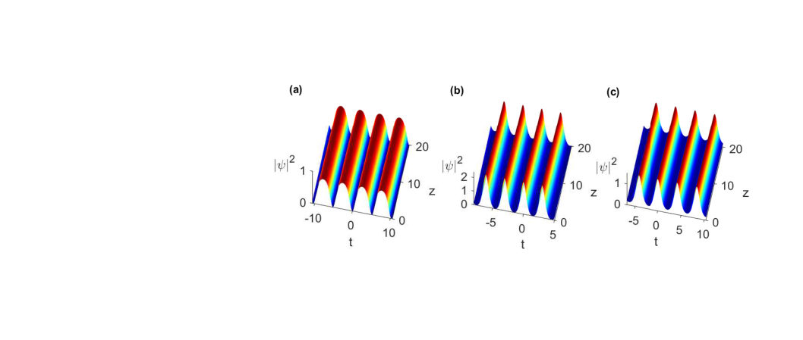
<figcaption class="paper-figure-caption"><b>Fig 5.</b> FIG. 5: Evolution of periodic wave solutions with parameters α = 0.2, β = 0.1, ξ0 = 0, k = 0.9, u = 0.01 (a) periodic wave solution (26) with γ = −0.4, σ = −0.2, δ = 0.182 (b) periodic wave solution (31) with γ = 0.4, σ = 0.2, δ = −0.182 (c) periodic wave solution (37) with γ = 0.4, σ = 0.2, δ = −0.182.</figcaption>
</figure>

**Summary.** This paper provides an extensive theoretical analysis of wave solutions—including solitons and periodic waves—governed by the complex Ginzburg-Landau equation, relevant for modeling fiber lasers. The authors derive explicit analytical forms for these nonlinear structures using advanced mathematical techniques involving elliptic functions. Crucially, they also perform a stability analysis demonstrating that certain solutions are quasi-stable in passive mode-locking laser systems.

**Why it may be interesting.** This work is highly relevant to quantum optics and open quantum systems because the CGLE is a canonical model used to describe amplitude dynamics in nonlinear optical cavities (like lasers), which are often studied in contexts related to quantum noise and dissipation.

Detailed structure

**Main problem.** The primary goal is identifying new types of soliton and periodic wave solutions for a nonlinear dissipative medium governed by the complex Ginzburg-Landau equation (CGLE). This applies to modeling phenomena in fiber lasers and general nonequilibrium systems.

**Main result.** The authors identified two distinct analytical kink/antikink soliton solutions and demonstrated that various periodic waves, derived using elliptic functions, can exist. Furthermore, they showed that certain solutions are quasi-stable under specific parameter regimes.

**Method.** The analysis involves transforming the complex partial differential equation into a single ordinary differential equation (ODE) by seeking traveling wave solutions. Solutions are then found analytically using techniques involving Jacobian elliptic functions and stability analysis based on dispersive wave theory.

**Model / system.** The governing model is the cubic complex Ginzburg-Landau equation, which describes pulse propagation in nonlinear dissipative media like fiber lasers. The analysis covers both localized (soliton) and extended (periodic) wave structures within this framework.

**Key observables.** Kink/antikink soliton waveforms, periodic wave forms ($	ext{sn}, 	ext{cn}, 	ext{dn}$), and the exponential decay rate of dispersive wave intensity ($U(z)^2$).

**Important parameters / regimes.** Physical parameters $\alpha, eta, \gamma, \sigma, \delta$, the inverse velocity $u$, and elliptic modulus $k$. Stability depends on conditions like $\delta < 0$ for quasi-stability.

**Assumptions / limitations.** The derivation relies on assuming specific forms for traveling waves ($\psi(z, t) = F(\xi) e^{i\dots}$) and making approximations in the stability analysis regarding dispersive wave radiation.

**Figures summary.** Figures illustrate the evolution of different soliton solutions (comparing two types of kink solitons) and show the intensity profiles of various periodic wave solutions derived from elliptic functions for specific parameter sets.

**Paper structure.** The paper proceeds by deriving a reduced ODE for the amplitude function $F(\xi)$, solving this ODE to find explicit forms for kink/antikink solitons, then analyzing the general case using elliptic functions to derive periodic solutions, and finally performing a stability analysis on these wave types.

Abstract

New types of soliton and periodic waves are identified for a nonlinear dissipative medium where the pulse propagation is governed by the cubic complex Ginzburg-Landau equation. We find that the dynamical equation for the pulse amplitude supports two distinct types of kink and antikink solitons with different functional forms. It is found that the obtained kink and antikink soliton waveforms occur under the same fixed inverse velocity. The results also indicate that the periodic waves can propagate with variety of wave forms such as sn, cn, dn and their rational forms as well. It is also shown that in the long-wave limit, the derived periodic waves degenerate into different bright and dark soliton pulses. The stability analysis based on the theory of dispersive waves in nonlinear optics is developed. It is shown that some elliptic and soliton solutions are quasi-stable in the context of passive mode locking lasers described by complex Ginzburg-Landau equation.

[↑ back to top](#top)

### [Five-terminal quantized transconductance originating from symmetric quantum fluctuations](http://arxiv.org/abs/2608.16605v1)

**Authors:** Klaiv Mertiri, Yuli V. Nazarov  
**Type:** theory · **Category:** other · **PDF:** <https://arxiv.org/pdf/2608.16605v1>  
**Analysis basis:** full PDF text, analyzed in chunks
**Topic relevance:** `Keldysh / 2PI / non-Gaussian methods` **3/5** · `correlated / nonlocal dissipation` **3/5** · `methods for driven-dissipative` **3/5** · `driven-dissipative phase transition` **2/5** · `non-equilibrium universality` **1/5** · `quantum measurements` **1/5**

↔ Scroll figures horizontally

<figure class="paper-figure-card">
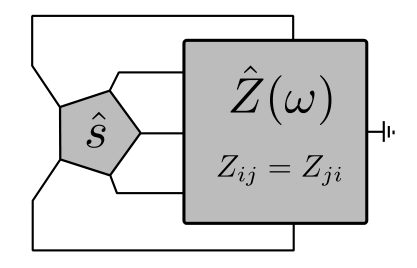
<figcaption class="paper-figure-caption"><b>Fig 1.</b> FIG. 1. The setup under consideration. A five-terminal quantum con- tact, characterized by the scattering matrix ˆs, is connected to a time- reversible electromagnetic environment described by the frequency- dependent 5 × 5 symmetric impedance matrix ˆZ(ω). The high- frequency fluctuations in the environment can develop QTC in the contact. To uncouple the contact and environment at very low fre- quencies, which is required for transport measurements, the connec- tion is realized via large capacitors not shown in the figure.</figcaption>
</figure>
<figure class="paper-figure-card">
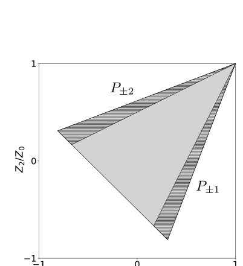
<figcaption class="paper-figure-caption"><b>Fig 2.</b> FIG. 2. The region of positively defined impedance matrices (gray) overlapped by the region of stability (hatched) for P±1 and P±2 in the space of matrix elements Zi. The stability region corresponds to amplifying Ohmic environments.</figcaption>
</figure>
<figure class="paper-figure-card">
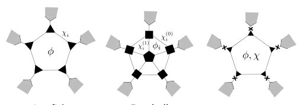
<figcaption class="paper-figure-caption"><b>Fig 3.</b> FIG. 4. Three setups proposed to demonstrate the QTC fixed points are built from beam splitters forming loops. Gray polygons represent the terminals, lines represent the propagation channels, and black n −th order polygons represent the beam splitters, corresponding to a unitary n × n matrix. In the Starfish setup, electrons follow the loop unless exiting to the terminals underway. In the Football setup, the central beam splitter provides more chances to explore the loops. The beam splitters in the Resonator have a low entrance transparency, this is indicated by crosses. If a resonance condition is achieved, this guarantees electron trapping in the loop, so that it can explore all terminals.</figcaption>
</figure>
<figure class="paper-figure-card">
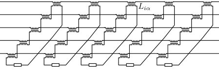
<figcaption class="paper-figure-caption"><b>Fig 4.</b> FIG. 3. Implementation of the electromagnetic environment. Gen- eral design. In each of the 5 loops labeled by α, the self inductances of the ideal transformers Miα, Liα are chosen to correspond to ψ(α) i , an eigenvector of ˆz. The resistor Rα gives the corresponding eigen- value. A cyclically symmetric Ohmic environment is obtained when ψ(α) i correspond to Fourier modes, and R1 = R4, R2 = R3.</figcaption>
</figure>
<figure class="paper-figure-card">
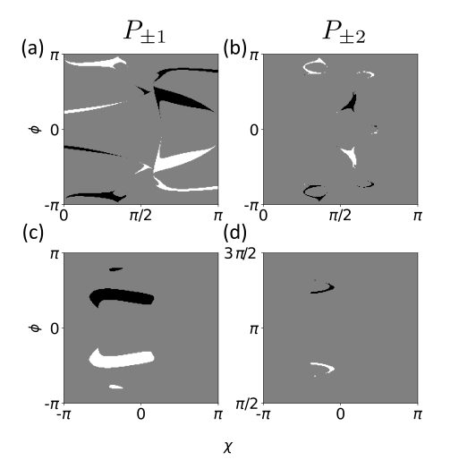
<figcaption class="paper-figure-caption"><b>Fig 5.</b> FIG. 6. The Football setup. Convergence diagram. Plots (a) and (c) show the convergence regions to P±1 (black and white) for the environment E1 , while plots (b) and (d) show this for P±2 and envi- ronment E2. In plots (a) and (b) we tune the flux and all dynamical phases χ(0) i ≡χ, with χ(1) i = 0, while in plots (c) and (d) we tune the flux and the dynamical phase of one channel, χ(0) 0 ≡χ, with χ(0) i̸=0 = −π/3, χ(1) i = −π/2.</figcaption>
</figure>

**Summary.** This paper theoretically demonstrates that symmetric quantum fluctuations in an external environment can induce quantized transconductance in five-terminal quantum contacts. Using a renormalization group approach, the authors show that stable fixed points exist only when there are at least five terminals. The phenomenon is physically realized by proposing specific engineered circuit geometries using beam splitters.

**Why it may be interesting.** This work connects mesoscopic transport phenomena with fundamental concepts of quantum fluctuations and renormalization flow, providing a mechanism for quantization beyond standard symmetry arguments.

Detailed structure

**Main problem.** The authors demonstrate that quantized transconductance (QTC) can emerge in five-terminal quantum contacts due to the renormalization effects of symmetric quantum fluctuations from an external electromagnetic environment.

**Main result.** QTC is possible in time-reversible environments if there are at least five terminals, leading to stable fixed points ($P_{\pm 1}, P_{\pm 2}$) in the renormalization flow. This mechanism requires careful engineering of the initial scattering state.

**Method.** The analysis employs a renormalization group approach by solving an effective flow equation for the energy-dependent scattering amplitudes ($\hat{s}_{ij}$), analyzing fixed points, and simulating convergence using various physical setups.

**Model / system.** The system is modeled as a five-terminal quantum contact coupled to a symmetric Ohmic environment. Physical realizations are proposed using 2DEG in semiconductor heterostructures configured into loops (Starfish, Football, Resonator) connected via beam splitters.

**Key observables.** Quantized transconductance (QTC), stable fixed points ($P_{\pm 1}, P_{\pm 2}$), and the convergence of transmission coefficients towards these quantized values.

**Important parameters / regimes.** The number of terminals ($\ge 5$), the symmetry of the environment, magnetic flux ($\Phi$), dynamical phases ($\chi_i$), and the small coupling strength ($z$).

**Assumptions / limitations.** The analysis assumes an Ohmic environment and relies on engineering the initial scattering matrix to achieve flow towards the stable fixed points.

**Figures summary.** Figures illustrate the five-terminal setup, proposed circuit implementations (Starfish, Football, Resonator), and convergence diagrams showing how transmission coefficients flow toward quantized values ($P_{\pm 1}$ or $P_{\pm 2}$) near specific resonance crossings.

**Paper structure.** The paper first establishes the theoretical framework using renormalization group equations for five-terminal contacts. It then proposes concrete physical realizations in semiconductor structures, analyzing convergence diagrams based on varying magnetic flux and dynamical phases relative to level crossings (A, B, C).

Abstract

We consider the renormalization of transport in a quantum contact by the external electromagnetic environment and show that weak quantum fluctuations from a symmetric environment can lead to a quantized transconductance in five-terminal contacts. This mechanism does not work for fewer terminals. We present an implementation of the environment and investigate several example quantum contacts where the quantization takes place.

[↑ back to top](#top)

### [Field-controlled breaking and restoration of parity-time symmetry in Josephson interference](http://arxiv.org/abs/2608.16414v1)

**Authors:** Yi-Chen Tsai, Yung-Yeh Chang, Tao-Yi Hsu, Thomas Kuo, Chia-Nung Kuo, Chin-Shan Lue, Kuei-Lin Chiu, Chen-Hsuan Hsu, Chung-Ting Ke  
**Type:** both · **Category:** other · **PDF:** <https://arxiv.org/pdf/2608.16414v1>  
**Analysis basis:** full PDF text, analyzed in chunks
**Topic relevance:** `driven-dissipative phase transition` **3/5** · `interference shaping light` **3/5** · `non-equilibrium universality` **2/5** · `Keldysh / 2PI / non-Gaussian methods` **1/5** · `correlated / nonlocal dissipation` **1/5** · `methods for driven-dissipative` **1/5** · `quantum measurements` **1/5**

↔ Scroll figures horizontally

<figure class="paper-figure-card">
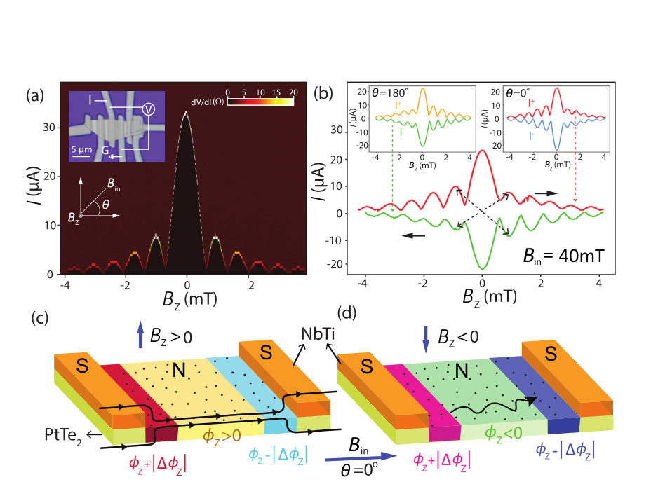
<figcaption class="paper-figure-caption"><b>Fig 1.</b> Figure 1: Measurement setup of Josephson interference and microscopic origin of the asymmetry. (a) Differential resistance dV/dI as a function of Bz and bias current, measured in the absence of an in-plane field. The symmetric Fraunhofer interference pattern, with well-defined central and side lobes, is consistent with an approximately uniform supercurrent distribution across the junction. Inset: optical image of the NbTi/PtTe2/NbTi JJs with the measurement configuration overlaid. (b) Interference patterns measured at Bin = 40 mT for I+ at θ = 0◦and I−at θ = 180◦, where I± denote the positive and negative current directions, respectively. Upon reversal of Bz, the two profiles map onto one...</figcaption>
</figure>
<figure class="paper-figure-card">
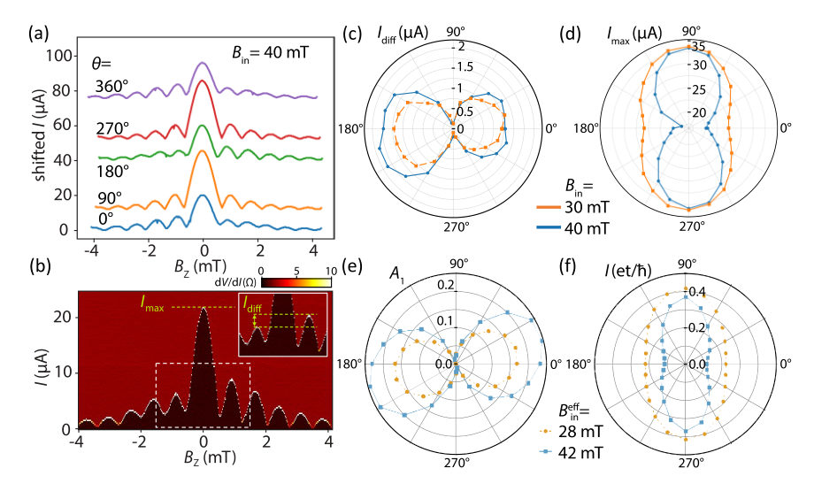
<figcaption class="paper-figure-caption"><b>Fig 2.</b> Figure 2: Symmetry-selective analysis of Josephson interference by in-plane-field rotation. (a) Critical-current interference patterns measured at a fixed in-plane field magnitude Bin = 40 mT while rotating its orientation θ. The side-lobe asymmetry reverses between θ = 0◦and 180◦, whereas the patterns become nearly symmetric at θ = 90◦and 270◦. (b) Representative dV/dI map. Inset: extraction of the first-side-lobe difference Idiff and the central-lobe maximum Imax. (c,d) Angular de- pendences of the experimentally extracted quantities for Bin = 30 mT and 40 mT. (c) The magnitude |Idiff| exhibits a two-fold angular dependence and is largest when the in-plane field is parallel or antipar-...</figcaption>
</figure>
<figure class="paper-figure-card">
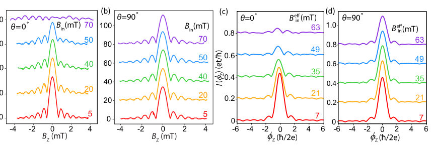
<figcaption class="paper-figure-caption"><b>Fig 3.</b> Figure 3: Orientation-selective restoration of symmetric Josephson interference. (a,b) In- terference patterns measured at several in-plane field strengths. (a) For an in-plane field parallel to the current (θ = 0◦), the side-lobe asymmetry increases with Bin, accompanied by suppression of the central lobe and an eventual evolution towards a SQUID-like pattern. (b) For an in-plane field per- pendicular to the current (θ = 90◦), the interference pattern remains essentially symmetric over the measured field range, demonstrating the robust restoration of the PT -symmetric Fraunhofer response despite a finite Bin. (c,d) Calculated interference patterns I(ϕz) as a function of the perpendicular...</figcaption>
</figure>
<figure class="paper-figure-card">
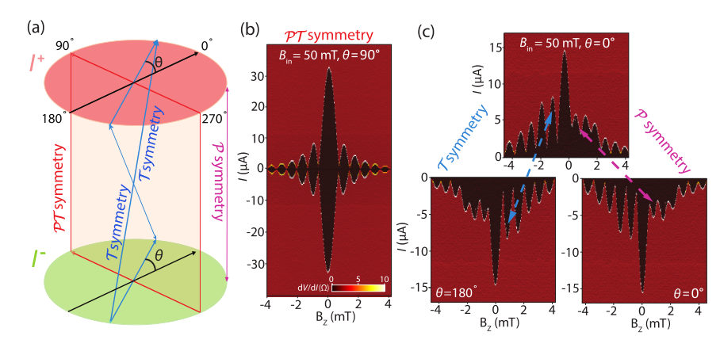
<figcaption class="paper-figure-caption"><b>Fig 4.</b> Figure 4: Field-current symmetry map of Josephson interference. (a) Field-current symme- try map constructed from the supercurrent interference patterns. The two in-plane-field components define continuous field coordinates, whereas I+ and I−form two discrete current sectors. The con- figurations at θ = 90◦and 270◦define PT -invariant boundaries. Away from these boundaries, PT symmetry is broken, while symmetry-related configurations remain connected by the generalized T operation. (b) Interference patterns measured along a PT -invariant boundary. A symmetric Fraun- hofer response is recovered over a broad range of in-plane fields despite a finite Bin. (c) Representative off-axis...</figcaption>
</figure>

**Summary.** This paper reports on field-controlled symmetry switching in Josephson junctions by applying an in-plane magnetic field. By analyzing the resulting supercurrent interference patterns, the authors demonstrate that the device can be tuned between states exhibiting broken and restored Parity-Time ($\mathcal{PT}$) symmetry. This control is attributed to a microscopic mechanism involving flux dipoles interacting with disorder.

**Why it may be interesting.** This work demonstrates active control over fundamental quantum symmetries in superconducting devices using external fields, providing a platform for engineering coherent transport properties relevant to topological or non-Hermitian physics.

Detailed structure

**Main problem.** The study investigates how applying an in-plane magnetic field can control the symmetry (Parity, Time-reversal, or combined PT) of supercurrent interference patterns in Josephson junctions.

**Main result.** The geometry of the applied magnetic field and current allows for reconfigurable switching between symmetry-broken and symmetry-restored interference states. Specifically, an in-plane field perpendicular to the current restores the PT-symmetric Fraunhofer response.

**Method.** The authors combine experimental measurements of supercurrent interference patterns with a microscopic model incorporating flux dipoles generated by the in-plane field and disorder effects.

**Model / system.** The physical platform is lateral NbTi/PtTe2/NbTi Josephson junctions. The theoretical framework models the critical current amplitude using contributions from left, middle, and right interface regions due to flux focusing.

**Key observables.** Supercurrent interference patterns, side-lobe asymmetry ($A_n$), Fraunhofer pattern symmetry, and generalized T-symmetry relations.

**Important parameters / regimes.** In-plane magnetic field magnitude ($B_{	ext{in}}$), its orientation ($	heta$) relative to the current, and the out-of-plane magnetic field ($B_z$).

**Assumptions / limitations.** The analysis relies on a linear expansion approximation for small flux dipole contributions and assumes that disorder creates local potential variations.

**Figures summary.** Figures illustrate the transition from symmetric (Fraunhofer) to asymmetric interference patterns based on $	heta$, showing maximum asymmetry when $B_{	ext{in}}$ is parallel/antiparallel to current, and restoration of symmetry when perpendicular.

**Paper structure.** The paper systematically analyzes how different field configurations ($\mathbf{B}_{	ext{in}}$ orientation) probe specific symmetries (P, T, PT), develops a microscopic model linking asymmetry to flux dipoles, and confirms the scaling laws governing this control.

Abstract

Symmetry plays a fundamental role in determining the phases and physical properties of quantum matter. Controlling symmetry in mesoscopic superconducting devices provides a route to reconfigure their phase-coherent transport. Here we demonstrate symmetry-selective Josephson interferometry in lateral NbTi/PtTe2/NbTi junctions by controlling the relative orientations of the current and magnetic field. From the supercurrent interference patterns, we construct a field-current symmetry map that identifies configurations exhibiting or violating the device-level parity (\mathcal{P}), time-reversal (\mathcal{T}) and their combined \mathcal{P}\mathcal{T} symmetry. In the absence of an in-plane field, the junction exhibits a symmetric Fraunhofer pattern. An in-plane field parallel to the current produces a pronounced side-lobe asymmetry, whereas reversing both the current and the complete magnetic-field configuration restores a generalized \mathcal{T} relation. Remarkably, orienting the in-plane field perpendicular to the current restores the \mathcal{P}\mathcal{T}-symmetric Fraunhofer response even at substantial field strengths. A microscopic model attributes this behavior to the interplay between disorder-induced potential variations and flux dipoles generated by in-plane-field Meissner focusing near the superconducting electrodes. Our results establish a reconfigurable Josephson interferometer in which the field-current geometry selects the symmetry operation being probed and switches the device between symmetry-broken and symmetry-restored interference states.

[↑ back to top](#top)

### [Anharmonicity and Nonadiabaticity in Hydride Superconductors](http://arxiv.org/abs/2608.14949v1)

**Authors:** Shashi B. Mishra, Francesco Belli, Eva Zurek, Elena R. Margine  
**Type:** theory · **Category:** other · **PDF:** <https://arxiv.org/pdf/2608.14949v1>  
**Analysis basis:** full PDF text, analyzed in chunks
**Topic relevance:** `Keldysh / 2PI / non-Gaussian methods` **3/5** · `driven-dissipative phase transition` **2/5** · `methods for driven-dissipative` **2/5** · `analog quantum simulation` **1/5** · `correlated / nonlocal dissipation` **1/5** · `non-equilibrium universality` **1/5** · `quantum measurements` **1/5**

↔ Scroll figures horizontally

<figure class="paper-figure-card">
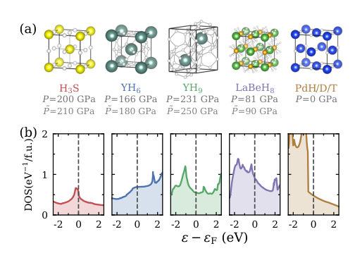
<figcaption class="paper-figure-caption"><b>Fig 1.</b> FIG. 1. (a) Crystal structures of the hydrides studied here, labeled with pressure (P) and the quantum-corrected SSCHA pressure ( ˜P). Small white spheres denote H; large spheres de- note S (yellow), Y (dark green), La (light green), Be (orange), and Pd (blue). (b) Electronic density of states, with εF indi- cated by the dashed line.</figcaption>
</figure>
<figure class="paper-figure-card">
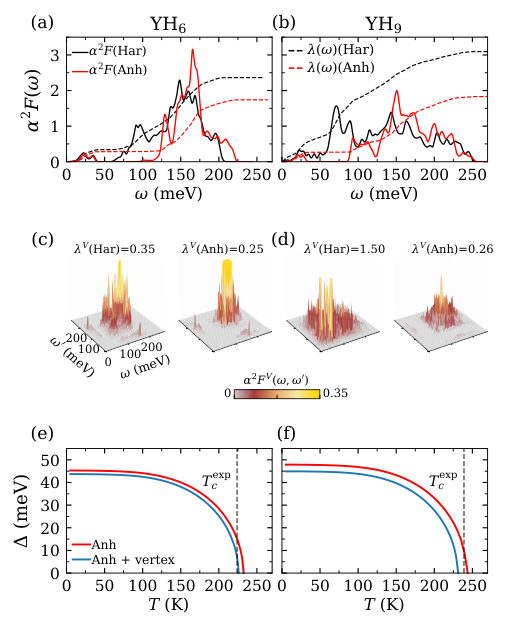
<figcaption class="paper-figure-caption"><b>Fig 2.</b> FIG. 2. Eliashberg and superconducting properties of YH6 (left) and YH9 (right). (a,b) Eliashberg spectral function, α2F(ω), (solid lines) and cumulative e-ph coupling λ(ω) (dashed lines) for harmonic (black) and anharmonic (red) phonons. (c,d) Corresponding vertex spectral functions, α2F V (ω, ω′) and integrated nonadiabatic couplings λV . (e,f) Isotropic superconducting gap ∆(T) obtained from adiabatic and nonadiabatic calculations with anharmonic phonons, with the experimental Tc values indicated by dashed vertical lines.</figcaption>
</figure>
<figure class="paper-figure-card">
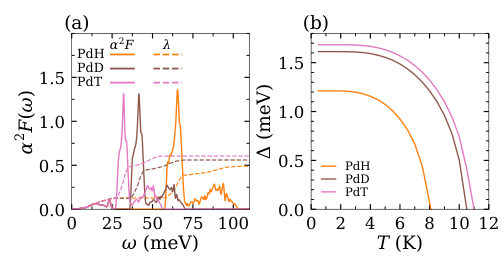
<figcaption class="paper-figure-caption"><b>Fig 3.</b> FIG. 3. (a) Eliashberg spectral function α2F(ω) (solid) and cumulative λ(ω) (dashed), and (b) superconducting gap ∆(T) for anharmonic phonons in PdH, PdD, and PdT.</figcaption>
</figure>
<figure class="paper-figure-card">
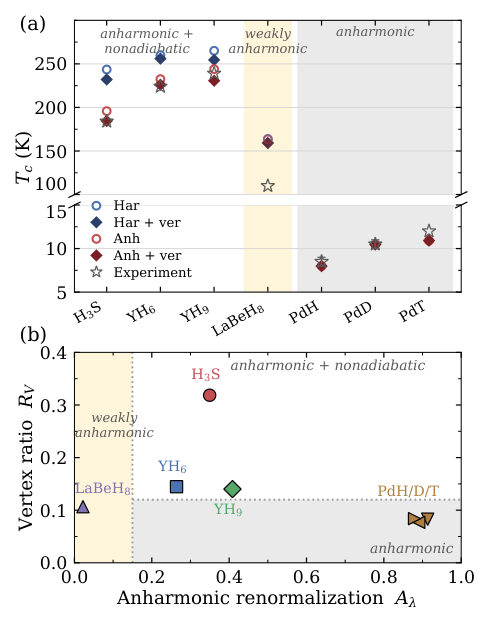
<figcaption class="paper-figure-caption"><b>Fig 4.</b> FIG. 4. (a) Superconducting Tc obtained from isotropic FBW Eliashberg theory using harmonic (blue) and anhar- monic (red) phonons, without (open circles) and with (filled diamonds) first-order vertex corrections, compared with ex- periment (stars). The corresponding numerical values are listed in Table I. (b) Classification of the hydrides according to the anharmonic renormalization Aλ and the vertex ratio RV ; the dotted lines are guides to the eye delineating the dif- ferent regimes.</figcaption>
</figure>

**Summary.** This paper investigates superconducting properties in hydrides by incorporating anharmonic phonon effects and nonadiabatic vertex corrections into Eliashberg theory. The authors introduce diagnostics, such as the anharmonic renormalization factor $A_\lambda$ and vertex ratio $R_V$, to guide researchers on when simple theoretical models break down. By applying these advanced methods, they achieve better agreement with experimental critical temperatures for several high-pressure superconductors.

**Why it may be interesting.** While focused on condensed matter superconductivity, the rigorous development and application of advanced many-body perturbation theory (Eliashberg formalism) and the introduction of material-specific diagnostic criteria ($A_\lambda$, $R_V$) for theoretical model selection are highly relevant to open quantum systems.

Detailed structure

**Main problem.** The study aims to determine when advanced theoretical treatments beyond standard harmonic, adiabatic Migdal-Eliashberg theory are necessary for accurately describing superconductivity in various hydride materials.

**Main result.** The authors successfully applied anharmonic and nonadiabatic corrections to predict superconducting critical temperatures ($T_c$) for several hydrides, showing that these effects are crucial for matching experimental values.

**Method.** They employed full-bandwidth Eliashberg theory combined with density-functional theory (DFT) calculations incorporating anharmonic phonon renormalization and electron-phonon vertex corrections.

**Model / system.** The research focuses on superconductivity in high-pressure binary hydrides ($	ext{H}_3	ext{S}$, $	ext{YH}_6$, $	ext{YH}_9$) and ambient-pressure Pd hydride series, using advanced phonon calculations (ML/SSCHA).

**Key observables.** Critical Temperature ($T_c$), electron-phonon coupling constants ($\lambda_{	ext{anh}}$, $\lambda_{	ext{har}}$), anharmonic renormalization diagnostic ($A_\lambda$), and vertex ratio ($R_V$).

**Important parameters / regimes.** The adiabaticity ratio ($\eta$) is key for distinguishing between regimes, with small values suggesting the breakdown of Migdal's approximation.

**Assumptions / limitations.** The central theme involves testing the limits of approximations: moving beyond harmonic lattice dynamics (anharmonicity) and accounting for vertex corrections (nonadiabaticity).

**Figures summary.** Figures compare calculated $T_c$ values across different theoretical treatments (harmonic vs. anharmonic + vertex) against experimental data for various hydrides.

**Paper structure.** The paper systematically analyzes several material classes, introducing diagnostics ($A_\lambda$, $R_V$) to classify the required level of theory—from simple harmonic models up to full nonadiabatic corrections.

Abstract

We study superconductivity in representative hydrides using anharmonic phonons, electron-phonon vertex corrections, and full-bandwidth Eliashberg theory. The high-pressure binary hydrides H3S, YH6, and YH9 must be treated with both anharmonic and nonadiabatic corrections, whereas the ambient-pressure PdH/PdD/PdT series is strongly anharmonic but remains adiabatic, reproducing the inverse isotope effect without sizable vertex contributions. LaBeH8 exhibits weak anharmonicity, while vertex corrections reduce the critical temperature (Tc) by approximately 4 K, leaving the predicted Tc above experiment. To identify when treatments beyond harmonic, adiabatic Migdal-Eliashberg theory are required, we introduce the anharmonic renormalization $A_λ$ and the vertex ratio $R_{V}$ as material-specific diagnostics.

[↑ back to top](#top)

### [Plexciton-mediated Raman scattering in strongly coupled systems](http://arxiv.org/abs/2608.16505v1)

**Authors:** Danyang Liu, Meijuan Sun, Li Chen, Hao Shen  
**Type:** theory · **Category:** other · **PDF:** <https://arxiv.org/pdf/2608.16505v1>  
**Analysis basis:** full PDF text, analyzed in chunks
**Topic relevance:** `Keldysh / 2PI / non-Gaussian methods` **3/5** · `analog quantum simulation` **2/5** · `correlated / nonlocal dissipation` **2/5** · `Tavis-Cummings & cavity-many-emitter` **1/5** · `driven-dissipative phase transition` **1/5** · `interference shaping light` **1/5** · `methods for driven-dissipative` **1/5**

↔ Scroll figures horizontally

<figure class="paper-figure-card">
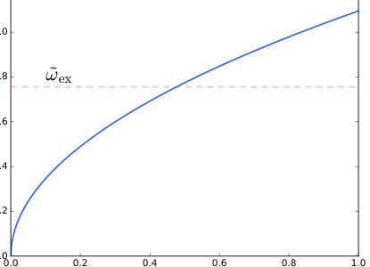
<figcaption class="paper-figure-caption"><b>Fig 1.</b> FIG. 1: Normalized plasmon dispersion relation. In the study of strong coupling systems using nanoparticle-on- mirror (NPoM) microcavities [48], the metallic nanopar- ticle supports the plasmons, while the two-dimensional material within the cavity provides the excitons. Experi- mentally, by precisely tailoring the geometric dimensions of the metallic nanoparticle, one can effectively tune the plasmonic resonance wavevector, thereby selecting a spe- cific plasmonic mode to participate in the strong cou- pling. In contrast, the exciton energy of the material is typically fixed, taking monolayer molybdenum disulfide (MoS2) as an example, its exciton resonance energy is fixed at 1.81 eV [49],...</figcaption>
</figure>
<figure class="paper-figure-card">
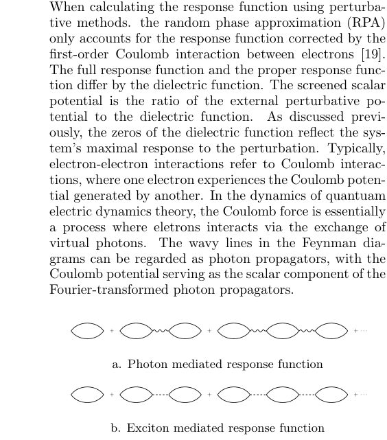
<figcaption class="paper-figure-caption"><b>Fig 2.</b> FIG. 2: Infinite series of Feynman diagrams corre- sponding to the RPA for density-density response func- tion. In Figure (a) The leading-order term, represented by a closed bubble diagram, corresponds to the non- interacting response function. Subsequent terms consist of polarization bubbles connected by wavy lines repre- senting the Coulomb potential. This self-consistent sum- mation of infinite-order ring diagrams physically charac- terizes the collective excitations emerging from dynam- ical screening effects. In Figure (b), this framework is extended to a composite coupled system, where the introduction of exciton polarization modifies the bare Coulomb interaction to construct the...</figcaption>
</figure>
<figure class="paper-figure-card">
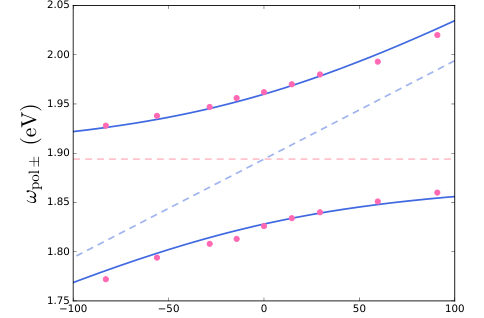
<figcaption class="paper-figure-caption"><b>Fig 3.</b> FIG. 3: Plasmon-exciton polariton dispersion relation. The variation of the upper and lower polariton branch energies as a function of detuning. The blue solid lines represent the two polariton branches, the pink dashed line indicates the exciton energy, and the blue dashed line shows the plasmon dispersion. The red dots denote our simulation results. The polariton branches exhibit clear anticrossing characteristics, reflecting the strong coupling between the exciton and the plasmon.</figcaption>
</figure>
<figure class="paper-figure-card">
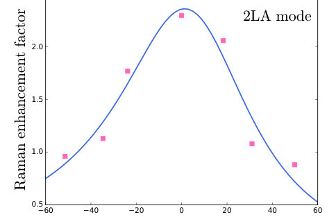
<figcaption class="paper-figure-caption"><b>Fig 4.</b> FIG. 5: Raman enhancement factors of phonon modes. The phonon peak of the E′ mode is at 388 cm−1, cor- responding to an energy of 48.11 meV. Fitting yields the widths of the upper and lower branch polaritons as 25.93 meV and 231.44 meV, respectively, with g = 0.2. For the A′ 1 mode (408 cm−1, 50.59 meV), the widths of its upper and lower branch polaritons are 25.58 meV and 206.42 meV, (g = 0.18). For the 2LA mode (460 cm−1, 57.04 meV), the widths of its upper and lower branch polaritons are 18.41 meV and 175.85 meV (g = 0.1).</figcaption>
</figure>
<figure class="paper-figure-card">
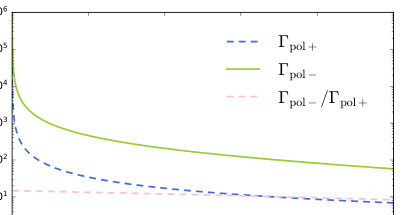
<figcaption class="paper-figure-caption"><b>Fig 5.</b> FIG. 6: Width of Upper and Lower Branch Polarons. When the imaginary part of the response function is taken into account, the widths of the polaritons are as shown in the figure. The widths of the upper and lower polaritons differ by a factor of ten. The width of the upper branch polariton is much smaller than that of the lower branch polariton.</figcaption>
</figure>

**Summary.** This paper develops a rigorous quantum many-body theory approach to explain Raman scattering in plasmon-exciton coupled materials. By treating the system's collective excitations as polaritons, it derives analytical expressions that accurately predict spectral features like enhancement factors and linewidth asymmetries. This establishes a versatile framework for understanding dynamical interactions between light, matter, and lattice vibrations.

**Why it may be interesting.** This work is highly relevant as it develops a universal quantum mechanical framework for analyzing coupled light-matter systems (plasmons/excitons) interacting with lattice vibrations (phonons), which is central to advanced quantum optics and condensed matter spectroscopy.

Detailed structure

**Main problem.** The paper aims to microscopically describe the Raman scattering process occurring in strongly coupled plasmon-exciton systems, moving beyond conventional electron-phonon interaction models.

**Main result.** They derive analytical expressions showing that the enhanced Raman scattering is mediated by inelastic scattering involving polaritons (plasmon-exciton quasiparticles), and they provide a mechanism explaining the observed asymmetry in polariton linewidths.

**Method.** The work employs quantum many-body theory, specifically linear response theory, to calculate the system's total response function and derive coupled excitation dispersions.

**Model / system.** The physical system is strongly coupled plasmon-exciton systems (plexcitons), modeled using concepts like the dielectric function ($\epsilon_{eff}$) derived from density-density response functions. The theory builds upon understanding collective electronic oscillations (plasmons) and bound electron-hole pairs (excitons).

**Key observables.** Raman intensity and enhancement factors, polariton dispersion curves ($\omega_{pol\pm}$), and the intrinsic linewidths/damping rates of the upper and lower polariton branches.

**Important parameters / regimes.** Plasmon frequency ($\omega_p$), exciton frequency ($\omega_{	ext{ex}}$), wavevector ($q$), detuning ($\delta = \omega_{pl} - \omega_{ex}$), and system geometry parameters.

**Assumptions / limitations.** The analysis relies on linear response theory, approximations like the Random Phase Approximation (RPA) for non-interacting responses, and Taylor expansions when analyzing linewidths near resonance.

**Figures summary.** Figures illustrate the normalized plasmon dispersion relation, Feynman diagrams detailing the construction of coupled response functions, and the resulting polariton dispersion as a function of detuning.

**Paper structure.** The paper progresses from establishing the need for a microscopic theory to model Raman scattering in these systems. It then details the theoretical framework using linear response theory to derive the effective dielectric function, solve for the plasmon-exciton polariton dispersions, and finally applies this formalism to calculate the phonon-polariton scattering process.

Abstract

A series of experimental results demonstrate a distinctive Raman response in plasmon-exciton coupled systems. The enhancement of Raman scattering varies for different phonon modes. We describe the microscopic dynamical process of this Raman scattering using quantum many-body theory. Unlike conventional Raman scattering involving electron-phonon interactions, the process in plasmon-exciton coupled systems is characterized by inelastic scattering between phonons and plasmon-exciton polaritons-formed through the coupling of plasmons and excitons-acting as intermediate states. We derive analytical expressions for the Raman intensity and enhancement factors for various phonon modes, which show excellent agreement with experimental data. Furthermore, experimental fittings indicate a substantial disparity in the linewidths of the upper and lower polariton branches, for which we provide a comprehensive theoretical explanation. Based on linear response theory, we propose a microscopic mechanism for the formation of plasmon-exciton polaritons, enabling the analytical calculation of their dispersions and linewidths. This approach naturally accounts for the significantly asymmetry observed in the linewidths of the upper and lower polariton branches. By characterizing the polariton-phonon scattering process at the quantum level, we reveal the fundamental physical mechanism driving polariton-enhanced Raman scattering. Our work establishes a universal framework for describing the dynamical evolution of coupled systems, providing a versatile paradigm for exploring the interactions between plasmons and other quasiparticles.

[↑ back to top](#top)

### [Proposal of a consistent value for the mean excitation energy of liquid water using advanced modeling, detailed simulations and precission proton Bragg curves](http://arxiv.org/abs/2608.15368v1)

**Authors:** Pablo de Vera, Isabel Abril, Flávio Matias, Julian M. B. Shorto, Hélio Yoriyaz, Rafael Garcia-Molina  
**Type:** both · **Category:** other · **PDF:** <https://arxiv.org/pdf/2608.15368v1>  
**Analysis basis:** full PDF text, analyzed in chunks
**Topic relevance:** `Keldysh / 2PI / non-Gaussian methods` **3/5** · `driven-dissipative phase transition` **2/5** · `methods for driven-dissipative` **2/5** · `correlated / nonlocal dissipation` **1/5** · `quantum measurements` **1/5**

↔ Scroll figures horizontally

<figure class="paper-figure-card">
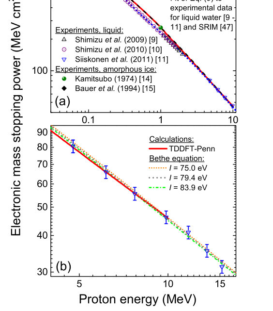
<figcaption class="paper-figure-caption"><b>Fig 1.</b> FIG. 1. Mass stopping power of water for protons. (a) Calcu- lations for liquid water (lines) are compared to experimental data (open symbols: liquid water; full symbols: amorphous ice) over a wide energy range. (b) Zoom around transmission measurements in liquid water at large energies, together with results of the Bethe equation for different I-values.</figcaption>
</figure>
<figure class="paper-figure-card">
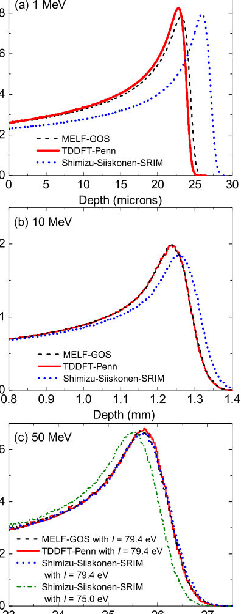
<figcaption class="paper-figure-caption"><b>Fig 2.</b> FIG. 2. Simulated depth-dose curves for low-energy proton beams of (a) 1 MeV, (b) 10 MeV, and (c) 50 MeV, using different stopping power models. The value of I = 79.4 eV is used in all simulations, except for the green dot-dashed curve in panel (c), which uses I = 75.0 eV.</figcaption>
</figure>
<figure class="paper-figure-card">
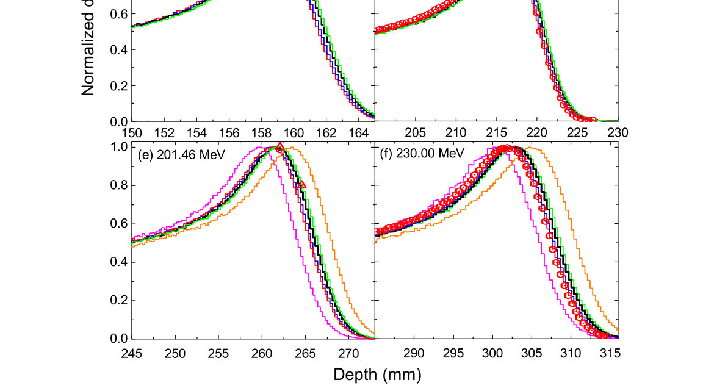
<figcaption class="paper-figure-caption"><b>Fig 3.</b> FIG. 3. Comparison of simulated (lines) and measured (symbols) depth-dose curves for proton beams of different therapeutic energies. Lines depict simulations using different I-values. The two open triangles in the left panels represent the positions of the dose maximum and the range (defined as 80% of the dose maximum at the distal part), respectively, as measured by Schardt et al. [7]. Error bars in open circles represent the uncertainty in the depths measured by Kumazaki et al. [6].</figcaption>
</figure>
<figure class="paper-figure-card">
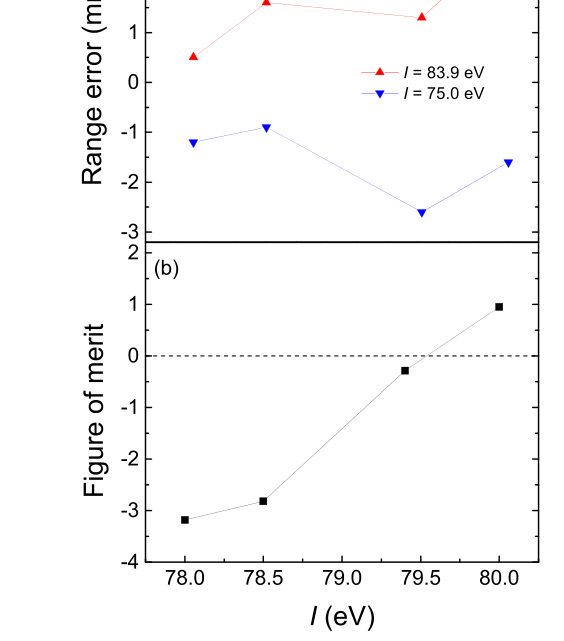
<figcaption class="paper-figure-caption"><b>Fig 4.</b> FIG. 4. (a) Absolute errors for the simulated proton ranges in liquid water, with respect to experimental measurements, for the largest and lowest I-values used in simulations. (b) Figure of merit, as defined by Eq. (17), obtained using differ- ent reasonable I-values for liquid water.</figcaption>
</figure>
<figure class="paper-figure-card">
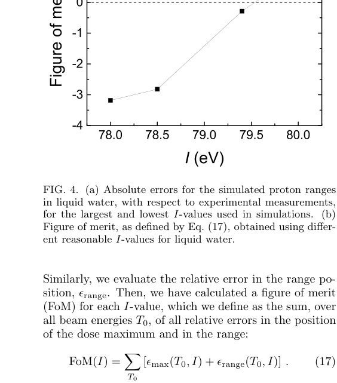
<figcaption class="paper-figure-caption"><b>Fig 5.</b> Figure 4(b) depicts the results of this figure of merit for each of the plausible I-values studied. Negative values denote a global underestimation in the simulations of the measured depths for a particular I-value, while positive values denote a global overestimation. As can be seen, out of the I-values studied, that of 79.4 eV arising from the MELF-GOS method (and supported by the TDDFT- Penn approach) provides the figure of merit closest to 0,</figcaption>
</figure>

**Summary.** This paper tackles the critical problem of determining the mean excitation energy ($I$) for liquid water, essential for accurate proton therapy dose planning. The authors use a combination of advanced theoretical modeling (MELF-GOS, TDDFT-Penn) and detailed simulations to calculate stopping power across wide energy ranges. They conclude that $I = 79.4 	ext{ eV}$ provides the most consistent value matching both theory and experimental Bragg curve measurements.

**Why it may be interesting.** While the core physics is in condensed matter/radiation dosimetry, the reliance on advanced quantum mechanical methods like TDDFT and dielectric formalism for calculating energy loss functions connects conceptually to open quantum systems theory and response functions.

Detailed structure

**Main problem.** The primary goal is establishing a consistent, reliable value for the mean excitation energy ($I$) of liquid water, which is critical for accurately predicting proton stopping power in medical physics applications like protontherapy.

**Main result.** By combining advanced theoretical models (MELF-GOS and TDDFT-Penn) with detailed simulations of proton Bragg curves, the authors converge on a consistent value of $I = 79.4 	ext{ eV}$ for liquid water.

**Method.** The study employs complementary theoretical methods—the perturbative MELF-GOS approach and the non-perturbative TDDFT-Penn method—to calculate stopping power ($dE/dx$) across various proton energies, which are then used in SEICS simulations to generate Bragg curves.

**Model / system.** The physical system is liquid water ($	ext{H}_2	ext{O}$), treated as the primary medium for high-energy proton beams. The analysis relies on dielectric formalism and time-dependent density functional theory (TDDFT) to model energy loss mechanisms.

**Key observables.** Stopping power ($dE/dx$), Mean Excitation Energy ($I$), and simulated/measured Proton Bragg curves (depth-dose profiles).

**Important parameters / regimes.** Proton beam energies ranging from $1$ to $230 	ext{ MeV}$; the derived value of $I = 79.4 	ext{ eV}$.

**Assumptions / limitations.** The theoretical models assume that the stopping power can be accurately calculated using dielectric response functions, although limitations exist for very low energies where perturbative methods fail.

**Figures summary.** Figures compare simulated mass stopping power (MELF-GOS vs. TDDFT-Penn) against experimental data for liquid water and amorphous ice; another figure analyzes the Figure of Merit ($	ext{FoM}$) across various assumed $I$-values, highlighting $79.4 	ext{ eV}$ as optimal.

**Paper structure.** The paper progresses by first establishing the necessity of accurate stopping power due to protontherapy needs, then detailing two complementary theoretical calculation methods (MELF-GOS and TDDFT-Penn), followed by applying these calculations to simulate Bragg curves, and finally using a Figure of Merit analysis on experimental data to confirm $I=79.4 	ext{ eV}$.

Abstract

Protontherapy precision depends on accurately knowing the stopping power of liquid water, as it is the most abundant component of soft body tissues. Difficulties when working with volatile liquids have led to a long-standing debate regarding the values of the stopping power and the mean excitation energy $I$ of liquid water. The equivalence between the stopping power of liquid water and amorphous ice per unit mass density across all clinically relevant proton energies opens the possibility to obtain a reliable estimation of the $I$-value of liquid water. In this work, we employ two complementary theoretical methodologies to assess the proton stopping power of water. The MELF-GOS (Mermin Energy Loss Function - Generalized Oscillator Strengths) approach, based on the perturbative dielectric formalism, serves as an accurate reference for sufficiently high energies, while the novel non-perturbative TDDFT-Penn (time-dependent density functional theory - Penn) method ensures accuracy for energies even below the stopping maximum. These stopping-power values were incorporated into the simulation code SEICS (Simulation of Energetic Ions and Clusters through Solids) to evaluate proton Bragg curves from $1$ to $230$ MeV. Comparisons with available precise depth-dose measurements provide critical insights that help establish the consistent value $I = 79.4$ eV for liquid water, providing robust physical grounds for improving range prediction for treatment planning.

[↑ back to top](#top)

### [Topological insulator realization induced by fermionic interaction through BF mediators](http://arxiv.org/abs/2608.16660v1)

**Authors:** G. B. de Gracia, R. da Rocha, A. A. Nogueira, M. A. C. de Barcelos  
**Type:** theory · **Category:** other · **PDF:** <https://arxiv.org/pdf/2608.16660v1>  
**Analysis basis:** full PDF text, analyzed in chunks
**Topic relevance:** `Keldysh / 2PI / non-Gaussian methods` **3/5** · `driven-dissipative phase transition` **2/5** · `analog quantum simulation` **1/5** · `correlated / nonlocal dissipation` **1/5** · `methods for driven-dissipative` **1/5** · `quantum measurements` **1/5**

↔ Scroll figures horizontally

<figure class="paper-figure-card">
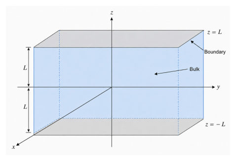
<figcaption class="paper-figure-caption"><b>Fig 1.</b> FIG. 1. The figure highlights our general setup. In our approximation, we consider a compactification in the axial coordinate, with the remaining dimensions infinite. The field theory is defined within the bulk and its boundaries.</figcaption>
</figure>
<figure class="paper-figure-card">
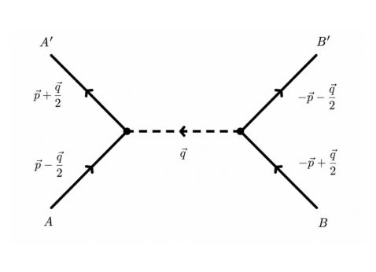
<figcaption class="paper-figure-caption"><b>Fig 2.</b> FIG. 2. Momentum assignment in the evaluation of one of the diagrams contributing to the tree-level scattering am- plitude between boundary quasi-particles A and B. In the center-of-mass frame, particle A scatters from momentum ⃗p−⃗q/2 to ⃗p+⃗q/2, whereas particle B scatters from −⃗p+⃗q/2 to −⃗p −⃗q/2. The dashed internal line represents the exchanged BF boson carrying momentum ⃗q. It is worth highlighting that each vertex has an implicit different structure in this schematic representation.</figcaption>
</figure>

**Summary.** This theoretical work demonstrates that coupling ordinary fermions to BF gauge fields induces a non-trivial topological structure analogous to 3D Topological Insulators. By analyzing the resulting effective interaction potential between boundary quasi-particles, the authors predict characteristic spin-orbit couplings and analyze how these topological features behave under dimensional reduction into thin films.

**Why it may be interesting.** The connection drawn between fundamental field theory interactions (BF mediators) and emergent topological phenomena in condensed matter systems like TIs is highly relevant for understanding novel quantum materials.

Detailed structure

**Main problem.** The paper investigates how ordinary fermions interacting via a BF mediator can acquire non-trivial topological properties, drawing parallels to three-dimensional Topological Insulators (TIs). It specifically analyzes the resulting effective interactions between boundary quasi-particles.

**Main result.** The renormalized fermionic structure inherits topological features leading to gapless helical near-boundary modes. The analysis reveals complex spin-dependent forces and shows how these topological signatures can break down in the thin-film limit.

**Method.** The study employs path integral techniques, one-loop self-energy calculations, and a low-momentum effective field theory approach (Born approximation) to derive interaction potentials between boundary modes.

**Model / system.** The model consists of fermionic fields coupled to bosonic BF mediator fields. The analysis is framed in the context of 3D TIs, considering finite-size effects via compactification in one axial direction.

**Key observables.** Gapless helical near-boundary modes, effective potential for inter-quasi-particle interactions, spin-orbit coupling signatures, and renormalized fermionic dispersion relations.

**Important parameters / regimes.** Finite-size effects (compactification length $L$), low momentum transfer ($|\vec{q}| \ll |\vec{p}|$ ), and the BF coupling constants.

**Assumptions / limitations.** The theory is treated as an effective continuous description, despite being non-renormalizable. Approximations include using the Born approximation for scattering and assuming transverse sector dominance in loop calculations.

**Figures summary.** Figure 1 illustrates the general setup involving bulk regions and boundaries for compactification. Figure 2 shows momentum assignment for evaluating the scattering amplitude in the center-of-mass frame.

**Paper structure.** The paper progresses from establishing the full action and gauge symmetries, through calculating one-loop self-energies and renormalization procedures (Chunk 2), to deriving the effective interaction potential between boundary modes using low-energy approximations (Chunk 3).

Abstract

This paper demonstrates that ordinary fermions, interacting via a BF mediator, form a renormalized structure with non-trivial topological properties. We explore the analogy between the renormalized fermion and a subset of real three-dimensional topological insulators (TIs) in the vicinity of their single Dirac cones. Using the typical magnitude of TI lattice and gaps, we constrain model parameters. The topological structure induced by radiative corrections enters a class of modified Dirac equations, ensuring the existence of helical gapless near-boundary modes. We derive an effective potential for inter-quasi-particle interactions that incorporates finite-size effects in the axial direction, revealing signatures of spin-orbit coupling and time-reversal invariance. Remarkably, particles with different spins do not interact via the characteristic spin-orbit coupling, and a non-central spin-dependent force arises. We also address the behavior of the system in the phase transition associated with the thin-film limit.

[↑ back to top](#top)

### [Tracking Chirality during Molecular Motor Photoisomerization via Simulated Time-Resolved Circular Dichroism](http://arxiv.org/abs/2608.15330v1)

**Authors:** Leonardo Biancorosso, Ali Hassanali, Mauro Stener, Emanuele Coccia, Marta Monti, Gonzalo Díaz Mirón  
**Type:** theory · **Category:** other · **PDF:** <https://arxiv.org/pdf/2608.15330v1>  
**Analysis basis:** full PDF text, analyzed in chunks
**Topic relevance:** `Keldysh / 2PI / non-Gaussian methods` **3/5** · `methods for driven-dissipative` **3/5** · `quantum measurements` **2/5** · `driven-dissipative phase transition` **1/5**

↔ Scroll figures horizontally

<figure class="paper-figure-card">
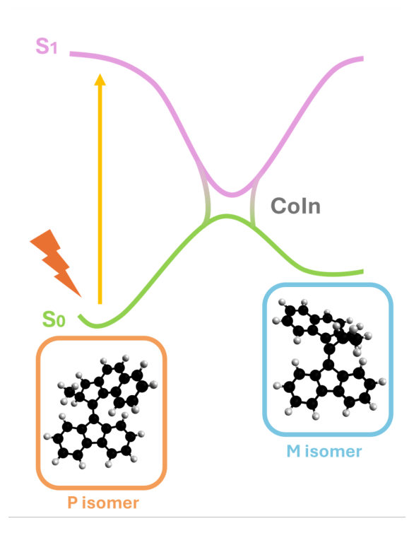
<figcaption class="paper-figure-caption"><b>Fig 1.</b> Figure 1: Schematic representation of the photoisomerization process in the second genera- tion motor. Photoexcitation of the P isomer promote the system to the first excited-state S1. The relaxation proceeds through a conical intersection (CoIn), from which the molecule can decay back to S0 yielding either the P or the M isomer.</figcaption>
</figure>
<figure class="paper-figure-card">
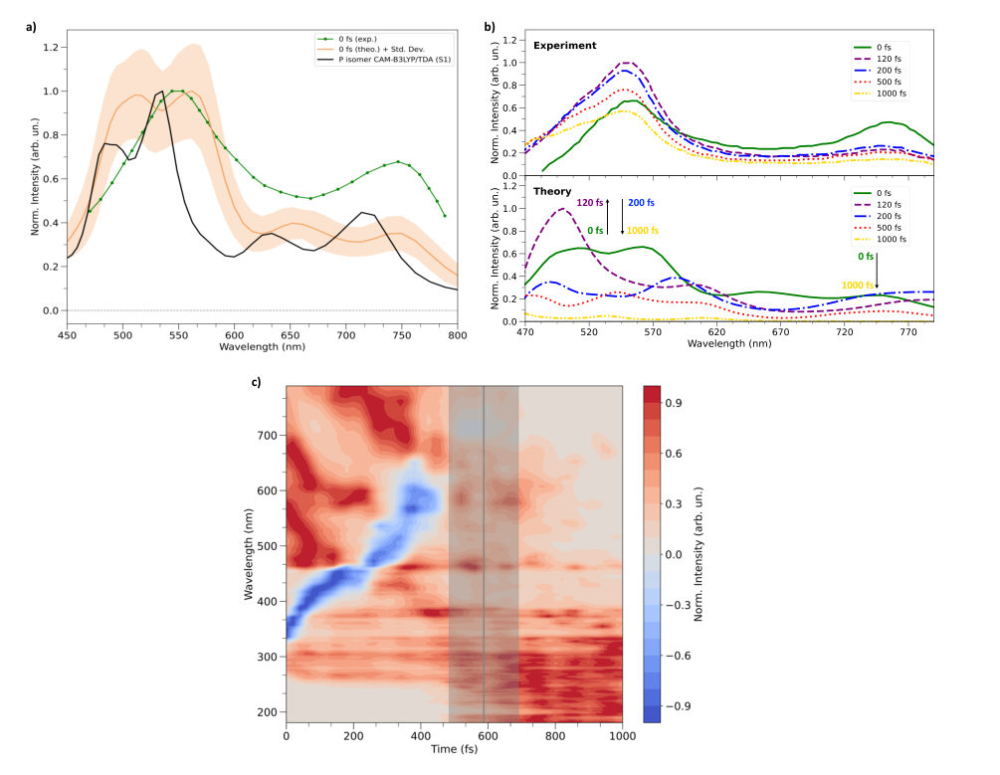
<figcaption class="paper-figure-caption"><b>Fig 2.</b> Figure 2: TA response. (a) Experimental (Exp.) excited-state absorption at t = 0 (green line), compared with the theoretical (theo.) excited-state absorption at t = 0 averaged over all initial conditions (orange line: mean, orange shaded region: standard deviation) and with the excited-state absorption of the optimized ground-state geometry (black line). (b) Comparison between experimental and calculated transient absorption spectra at rep- resentative times along the photodynamics, averaged over the full trajectory ensemble. (c) Two-dimensional transient absorption map calculated along the NAMD trajectories. The gray vertical line indicates the mean hopping time and the shadow region its...</figcaption>
</figure>
<figure class="paper-figure-card">
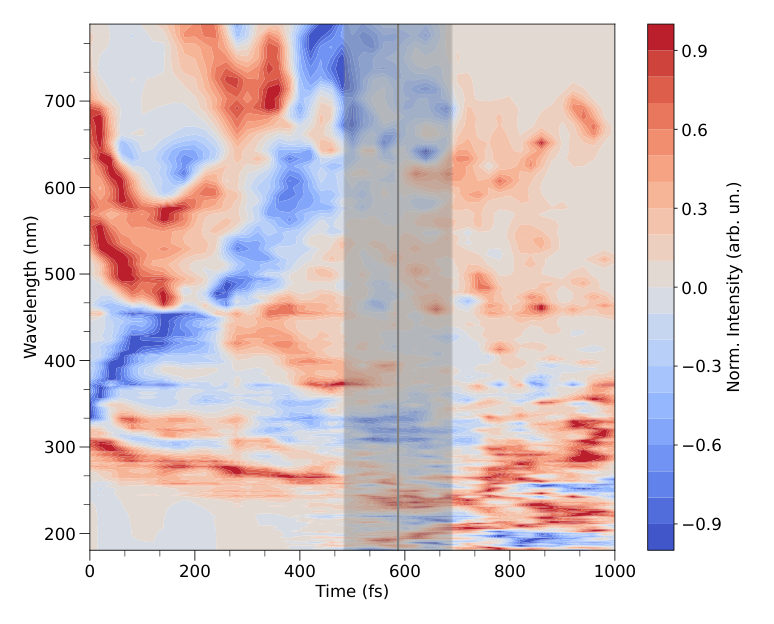
<figcaption class="paper-figure-caption"><b>Fig 3.</b> Figure 3: Two-dimensional map of the calculated TRCD response along the NAMD tra- jectories. The x-axis reports the simulation time at which the molecular geometries were extracted, the y-axis corresponds to the wavelength, and the color scale represents the nor- malized spectral intensity. The gray vertical line and shaded region indicate the mean S1 → S0 decay time and its standard deviation.</figcaption>
</figure>
<figure class="paper-figure-card">
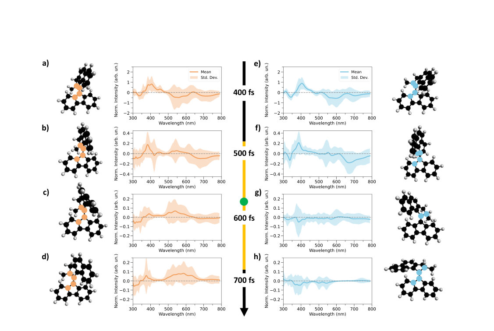
<figcaption class="paper-figure-caption"><b>Fig 4.</b> Figure 4: Trajectory-resolved time-dependent electronic circular dichroism (ECD). (a–d) Mean normalized ECD spectra (solid lines) with standard deviation (shaded area) computed along the trajectories associated with the P isomer (orange) with representative molecular structures shown on the left. (e–h) Same for the trajectories associated with the M isomer (blue), with representative structures shown on the right. Spectra are shown in the 300–800 nm range. The central timeline indicates the temporal progression of the dynamics; the green dot marks the mean S1 →S0 transition time and the yellow bar the corresponding standard deviation.</figcaption>
</figure>

**Summary.** The paper introduces a novel computational framework to simulate Time-Resolved Circular Dichroism (TRCD) during the photoisomerization of a molecular motor. By analyzing nonadiabatic dynamics trajectories, the authors demonstrate that TRCD can distinguish between different photoproduct pathways ($	ext{P}$ vs. $	ext{M}$) based on unique chiroptical signatures. This offers a powerful, real-time tool for probing stereochemical branching in ultrafast photochemical processes.

**Why it may be interesting.** This work is highly relevant as it merges advanced quantum dynamics simulations (TDDFT/NAMD) with chiral spectroscopy (CD/ECD) to provide a real-time, mechanism-specific probe of molecular structure changes in excited states, which is central to AMO physics and quantum optics.

Detailed structure

**Main problem.** The primary challenge addressed is developing a method to track molecular chirality during ultrafast photoisomerization processes, as standard spectroscopic techniques are often blind to stereochemical differences.

**Main result.** Simulating Time-Resolved Circular Dichroism (TRCD) successfully resolves the stereochemical branching pathways ($	ext{P}$ vs. $	ext{M}$ isomers), showing distinct chiroptical signatures for each product pathway.

**Method.** The study employs a computational framework combining Nonadiabatic Molecular Dynamics (NAMD) simulations with real-time propagation of electronic wavefunctions to calculate ensemble-averaged TRCD spectra.

**Model / system.** The system modeled is a second-generation molecular motor undergoing photoisomerization ($	ext{P} 
ightleftharpoons 	ext{M}$ isomer). The dynamics are simulated through excited states ($S_1$) and conical intersections (CoIn) on the potential energy surface.

**Key observables.** Time-resolved electronic circular dichroism (TRCD) response, transient absorption (TA) spectra, and the evolution of chiral electronic structure signatures in the visible region.

**Important parameters / regimes.** Ultrafast time scales ($\sim 100$ fs to $1000$ fs), excitation wavelengths, and the specific molecular geometry changes associated with isomer formation.

**Assumptions / limitations.** The simulation uses a vacuum dynamics model which neglects solvent friction, potentially underestimating the true excited-state decay lifetime compared to solution measurements. The computational protocol is validated against existing experimental data.

**Figures summary.** Figures illustrate the photoisomerization schematic and compare TA responses (experimental vs. simulated). Crucially, other figures show trajectory-resolved time-dependent ECD spectra for both P and M isomers across various time points and spectral ranges.

**Paper structure.** The paper establishes the limitation of current ultrafast techniques regarding chirality detection. It then introduces the TRCD simulation framework applied to molecular motor photoisomerization, presenting results that decompose the signal into isomer-specific contributions by analyzing trajectory ensembles.

Abstract

Ultrafast spectroscopic techniques are widely used to investigate photoinduced processes, yet they remain largely blind to molecular chirality. Here we introduce a framework for simulating time-resolved electronic circular dichroism (TRCD) along an ensemble of nonadiabatic molecular dynamics, and apply it to the photoisomerization of a second-generation molecular motor[1]. While transient absorption captures the overall excited-state dynamics, it cannot distinguish the two photoproduct pathways. The TRCD response, by contrast, resolves the stereochemical branching: trajectories returning to the stable P isomer (right-handed helix) retain a distinct chiroptical band in the visible region, whereas those forming the M isomer (leftl-handed helix) become chiroptically dark as they twist through the conical intersection. This asymmetry constitutes a directly measurable signature of the stereochemical branching, offering a real-time probe of the formation of molecular chirality and concrete predictions for future TRCD experiments.

[↑ back to top](#top)

### [Observation of nonlocal ferron-drag thermoelectricity](http://arxiv.org/abs/2608.15596v1)

**Authors:** Takuma Itoh, Takamasa Hirai, Ping Tang, Hossein Sepehri-Amin, Ryo Iguchi, Yusuke Kozuka, Takao Shimizu, Soshi Akita, Shunsuke Mori, Gerrit E. W. Bauer, Ken-ichi Uchida  
**Type:** both · **Category:** other · **PDF:** <https://arxiv.org/pdf/2608.15596v1>  
**Analysis basis:** full PDF text, analyzed in chunks
**Topic relevance:** `Keldysh / 2PI / non-Gaussian methods` **3/5** · `methods for driven-dissipative` **2/5** · `analog quantum simulation` **1/5** · `correlated / nonlocal dissipation` **1/5** · `quantum measurements` **1/5**

↔ Scroll figures horizontally

<figure class="paper-figure-card">
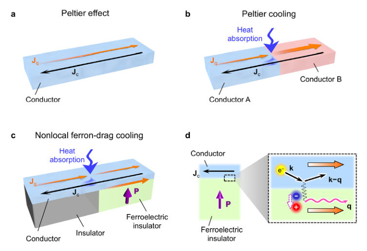
<figcaption class="paper-figure-caption"><b>Fig 1.</b> Fig. 1 | Peltier cooling and nonlocal ferron-drag cooling. a, Schematic of the Peltier effect in a single, homogeneous</figcaption>
</figure>
<figure class="paper-figure-card">
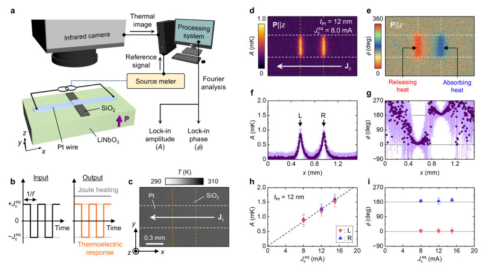
<figcaption class="paper-figure-caption"><b>Fig 2.</b> Fig. 2 | Experimental set-up and thermoelectric response in Pt/LiNbO3. a, Schematic of the lock-in thermography</figcaption>
</figure>
<figure class="paper-figure-card">
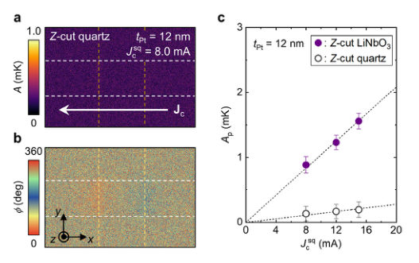
<figcaption class="paper-figure-caption"><b>Fig 3.</b> Fig. 3 | Substrate dependence. a,b, A (a) and  (d) images of the Pt/Z-cut quartz sample with 𝑡୔୲ = 12 nm at 𝐽ୡ ୱ୯ =</figcaption>
</figure>
<figure class="paper-figure-card">
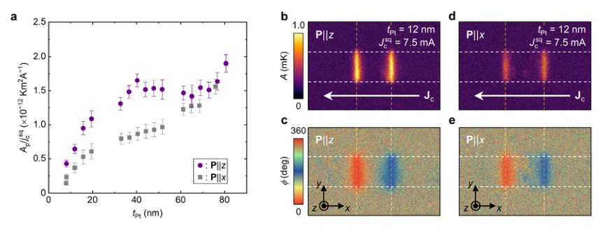
<figcaption class="paper-figure-caption"><b>Fig 4.</b> Fig. 4 | Pt-thickness and polarization-direction dependences. a, 𝑡୔୲ dependence of 𝐴୮𝑗ୡ ୱ୯ ⁄ for the Pt/Z-cut LiNbO3</figcaption>
</figure>
<figure class="paper-figure-card">
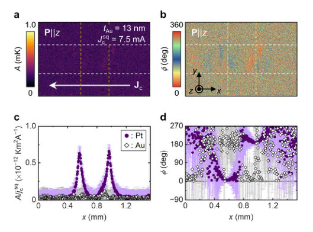
<figcaption class="paper-figure-caption"><b>Fig 5.</b> Fig. 5 | Comparison between Pt/LiNbO3 and Au/LiNbO3. a,b, A (a) and  (b) images for the Au/Z-cut LiNbO3</figcaption>
</figure>

**Summary.** This research reports the observation and theoretical analysis of a nonlocal thermoelectric effect called ferron-drag, occurring at the interface between metals and ferroelectric insulators. The key finding is that this heat transfer mechanism depends critically on the ferroelectric polarization and is mediated by acoustic phonons coupling electrons to electric polarization excitations (ferrons). This has implications for designing advanced thermoelectric devices.

**Why it may be interesting.** The mechanism involves coupling between electronic excitations (conduction electrons) and collective lattice/polarization modes (ferrons) mediated by phonons, which touches upon concepts of coupled quantum oscillators and energy transport in complex solid-state systems.

Detailed structure

**Main problem.** The study investigates observing nonlocal heat absorption/release signals (thermoelectric effect) in a homogeneous metal placed near a ferroelectric insulator, specifically quantifying the 'nonlocal ferron-drag thermoelectricity.'

**Main result.** They confirmed that the temperature change signal is dependent on the ferroelectric order and exhibits long-range behavior, suggesting phonon-mediated coupling between conduction electrons and electric polarization excitations (ferrons).

**Method.** The work combines active thermographic imaging (LIT) experiments with theoretical modeling using the linearized Boltzmann equation to derive the nonlocal ferron-drag coefficient.

**Model / system.** The physical system is a hybrid structure, such as Pt films on ferroelectric $	ext{LiNbO}_3$ substrates, sometimes separated by an $	ext{SiO}_2$ spacer. The theory models coupling via electron-phonon and electron-ferron interactions.

**Key observables.** Temperature change signals ($\Delta T$), thermoelectric signal amplitude ($A$), phase shift ($\phi$), and the nonlocal ferron-drag coefficient ($\Pi_{	ext{frr}}$).

**Important parameters / regimes.** Metal thickness ($t_{Pt}$), spacer barrier thickness ($t_{SiO_2}$), ferroelectric polarization direction (Z-cut vs. X-cut), and current amplitude ($J_{\omega}^{ac}$).

**Assumptions / limitations.** The analysis assumes the heat source is localized at boundaries due to nonlocal effects, and that the $	ext{SiO}_2$ spacer primarily increases distance without introducing significant additional phonon scattering.

**Figures summary.** Figures illustrate temperature maps showing boundary signals in ferroelectric vs. non-ferroelectric substrates; they also show dependence of signals on Pt thickness, spacer thickness, and substrate thermal conductivity ($\kappa$).

**Paper structure.** The paper progresses from initial experimental observation of the effect in $	ext{Pt}/	ext{LiNbO}_3$ (Chunk 1), to systematic investigation of ferroelectric vs. non-ferroelectric dependence and thickness scaling (Chunk 2), followed by theoretical modeling incorporating phonon mediation and spacer effects (Chunks 3 & 4).

Abstract

The Peltier effect induces a heat current when a charge current passes through a conductor. Since a charge current is conserved at the junction between two different conductors, the difference between the heat flowing in both conductors for the same charge current leads to heating or cooling of the interface, providing an operating mechanism of solid-state heat pumps. Here, we report observation of heat absorption and release signals even in a junction-free, homogeneous metal when placed in proximity to a ferroelectric insulator. Our experiments using active thermographic imaging techniques confirm the prediction of the ferron-drag effect, i.e., the nonlocal excitation of ferrons, the collective excitation of the ferroelectric order, by conduction electrons in the adjacent metal. We reveal the electric-polarization-direction dependence of the temperature change signals and their unexpected increase with the metal thickness beyond the charge screening length, uncovering additional electron-phonon-ferron interactions in the metal/ferroelectric hybrid structure. The discovery of crosstalk between metals and ferroelectrics via remote ferrons could become both a nuisance and an opportunity for highly integrated circuits with ferroelectric barrier materials and revolutionize the design architecture of thermoelectric devices.

[↑ back to top](#top)

### [Electrode-tunable nonlocal Rashba-Edelstein effect and layer-selective chirality switch in WSe$_2$-intercalated bilayer graphene](http://arxiv.org/abs/2608.15622v1)

**Authors:** Marko Milivojević, Juraj Mnich, Martin Gmitra  
**Type:** theory · **Category:** other · **PDF:** <https://arxiv.org/pdf/2608.15622v1>  
**Analysis basis:** full PDF text, analyzed in chunks
**Topic relevance:** `Keldysh / 2PI / non-Gaussian methods` **3/5** · `analog quantum simulation` **1/5** · `correlated / nonlocal dissipation` **1/5** · `methods for driven-dissipative` **1/5** · `quantum measurements` **1/5**

↔ Scroll figures horizontally

<figure class="paper-figure-card">
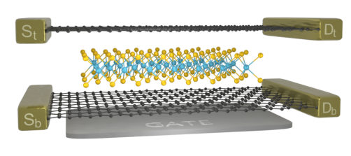
<figcaption class="paper-figure-caption"><b>Fig 1.</b> Figure 1. Schematics of the WSe2-intercalated bilayer graphene device. The WSe2 monolayer mediates interlayer overlap between the top and bottom graphene layers, form- ing a synthetic bilayer graphene at the Fermi level. The global horizontal mirror plane symmetry σh of the heterostructure forbids the presence of the apparent Rashba effects and leads to mutual compensation of local Rashba contributions from the top and bottom graphene/WSe2 interface. Source and drain electrodes on the top (St/Dt) and bottom (Sb/Db) graphene layers enable three different device configurations: (1) all active electrodes probe the fully symmetric device and confirm the absence of an apparent Rashba effect; (2)...</figcaption>
</figure>
<figure class="paper-figure-card">
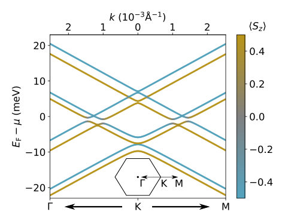
<figcaption class="paper-figure-caption"><b>Fig 2.</b> Figure 2. Calculated electronic structure of the zero twist angle graphene/WSe2/graphene heterostructure in the vicin- ity of the graphene K point. The calculation of the atomic wave projection suggests that the bands around the K point are constructed by approximately equal contributions of the top and bottom layers. Formed delocalized molecular-like or- bitals support the theory of the creation of a synthetic bilayer graphene, mediated by the WSe2 monolayer.</figcaption>
</figure>
<figure class="paper-figure-card">
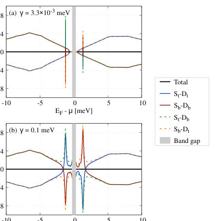
<figcaption class="paper-figure-caption"><b>Fig 3.</b> Figure 3. Calculated charge-spin conversion coefficients αREE as a function of doping for different experimental configura- tions sketched in FIG. 1: source/drain electrodes are config- ured on top (St/Dt) and bottom (Sb/Db) graphene layers. These are selectively activated as: situation 1 (all electrodes on: St, Sb, Dt, Db, labeled as Total); situation 2 (lateral: St-Dt and Sb-Db); and situation 3 (crossed: St-Db and Sb- Dt). Top (a) and bottom (b) panels correspond to different values of the quasiparticle lifetime, whose values are given on the graphs. The sharp peaks at EF −µ ≈−1.25 meV and EF −µ ≈+1.32 meV originate from band crossings away from the K point.</figcaption>
</figure>

**Summary.** This work theoretically explores charge-spin conversion in WSe2-intercalated bilayer graphene, creating a synthetic platform where interlayer coupling is crucial. The authors predict the observation of nonlocal Rashba-Edelstein effects and layer-selective spin signals by tuning external fields or twist angles. This suggests new device architectures for spintronics that leverage engineered quantum couplings.

**Why it may be interesting.** While focused on condensed matter spintronics, the concept of emergent, tunable quantum couplings (interlayer hybridization) leading to non-trivial transport coefficients is relevant for understanding engineered quantum materials interfaces.

Detailed structure

**Main problem.** The study investigates novel spintronic phenomena, specifically the nonlocal Rashba-Edelstein effect and layer-selective chirality switching, in a synthetic bilayer graphene system.

**Main result.** The authors demonstrate that interlayer hybridization allows for distinct spin transport signatures, including nonlocal charge-to-spin conversion and opposite-sign local signals, which are robust to structural variations.

**Method.** Theoretical calculations using the Kubo formula within the Smrčka-Streda formulation were employed to compute charge-spin conversion coefficients ($\alpha_{	ext{REE}}$ and $\alpha_{	ext{UREE}}$).

**Model / system.** The system is a WSe2-intercalated bilayer graphene, which forms a synthetic bilayer structure where interlayer coupling competes with proximity-induced spin-orbit interaction. The analysis uses an effective Hamiltonian incorporating valley-dependent interlayer interactions.

**Key observables.** Nonlocal Rashba-Edelstein effect coefficients ($\alpha_{S_t-D_b}^{	ext{REE}}$), layer-selective local signals, and the unconventional Rashba coefficient ($\alpha_{	ext{UREE}}$).

**Important parameters / regimes.** Twist angle ($	heta$), perpendicular electric field ($E$), doping/chemical potential ($\mu$), and the relative strength of interlayer coupling versus SOC.

**Assumptions / limitations.** The analysis assumes weak disorder scattering, and that the hybridization places the system beyond the perturbative regime of standard proximity heterostructures.

**Figures summary.** Figures detail the dependence of $\alpha_{	ext{REE}}$ and $\alpha_{	ext{UREE}}$ on doping for various twist angles and electric fields, showing component contributions (e.g., St-Dt, Sb-Db) that confirm distinct physical mechanisms at play.

**Paper structure.** The paper systematically analyzes the system's symmetries ($\sigma_h$) to predict zero global effects, then explores how breaking these symmetries via external fields ($E$) or twist angles ($	heta$) reveals hidden and nonlocal spin transport phenomena using detailed Kubo calculations.

Abstract

We show that intercalating a WSe$_2$ monolayer into bilayer graphene creates a synthetic bilayer graphene at the Fermi level, in which WSe$_2$-mediated wavefunction overlap hybridizes the two graphene layers, giving rise to states delocalized across both layers. Because the interlayer coupling is comparable in energy to the proximity-induced spin-orbit interaction, the resulting spintronic behavior goes beyond what is typically accessible in conventional single-interface proximity systems. A simple four-electrode device, with source and drain electrodes on both the top and bottom graphene layers, gives access to distinct regimes depending on which electrodes are activated. The most prominent feature is a nonlocal Rashba-Edelstein effect, activated via cross-layer source and drain electrodes, in which a charge current injected into one graphene layer generates a spin accumulation in the spatially separated opposite layer. This effect is robust to the twist angle modulation between graphene and WSe$_2$ and to the applied electric field, suggesting that a moderate degree of structural asymmetry along the vertical direction does not destroy it. In addition, activating the source and drain electrodes on either the top or bottom graphene layer reveals local Rashba-Edelstein signals of opposite sign in the two layers, thereby realizing a layer-selective chirality switch. This is a consequence of the hidden Rashba effect, which is present even when a net Rashba splitting is forbidden. Our results suggest new physical regimes and device architectures that could be useful for spintronic applications.

[↑ back to top](#top)

### [Field-Gated Programming of Nested Skyrmion Bags by Spatially Selective Skyrmion Writing](http://arxiv.org/abs/2608.15293v1)

**Authors:** Shuhuang Lin, Shirong Lin  
**Type:** theory · **Category:** other · **PDF:** <https://arxiv.org/pdf/2608.15293v1>  
**Analysis basis:** full PDF text, analyzed in chunks
**Topic relevance:** `analog quantum simulation` **2/5** · `methods for driven-dissipative` **2/5** · `quantum measurements` **2/5** · `Keldysh / 2PI / non-Gaussian methods` **1/5** · `driven-dissipative phase transition` **1/5** · `non-equilibrium universality` **1/5**

↔ Scroll figures horizontally

<figure class="paper-figure-card">
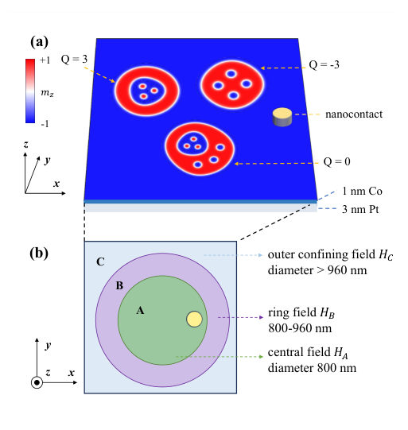
<figcaption class="paper-figure-caption"><b>Fig 1.</b> FIG. 1. Schematic illustration of nested skyrmion-bag struc- tures, the circular nanocontact, and the spatially segmented magnetic-field regions. (a) Representative magnetization con- figurations of nested skyrmion bags with different total topo- logical charges Q in a Co(1 nm)/Pt(3 nm) bilayer. The color map denotes the normalized out-of-plane magnetization com- ponent mz, where red and blue correspond to mz = +1 and mz = −1, respectively. The yellow cylinder represents a circular nanocontact with a diameter of dc = 30 nm, through which a perpendicular spin-polarized current is in- jected into the magnetic layer. The resulting Slonczewski spin-transfer torque is used for local skyrmion...</figcaption>
</figure>
<figure class="paper-figure-card">
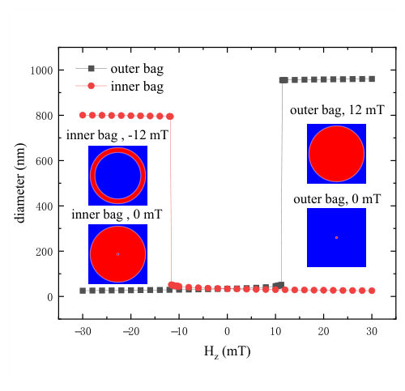
<figcaption class="paper-figure-caption"><b>Fig 2.</b> FIG. 2. Field-dependent size modulation of the nested skyrmion bag. The field in region C is fixed at HC = −20 mT. The black curve shows the outer bag diameter Dout as a func- tion of the common field HAB, where HA = HB = HAB. The red curve shows the inner bag diameter Din as a func- tion of HA, while the annular and outer fields are fixed at HB = +20 mT and HC = −20 mT, respectively.</figcaption>
</figure>
<figure class="paper-figure-card">
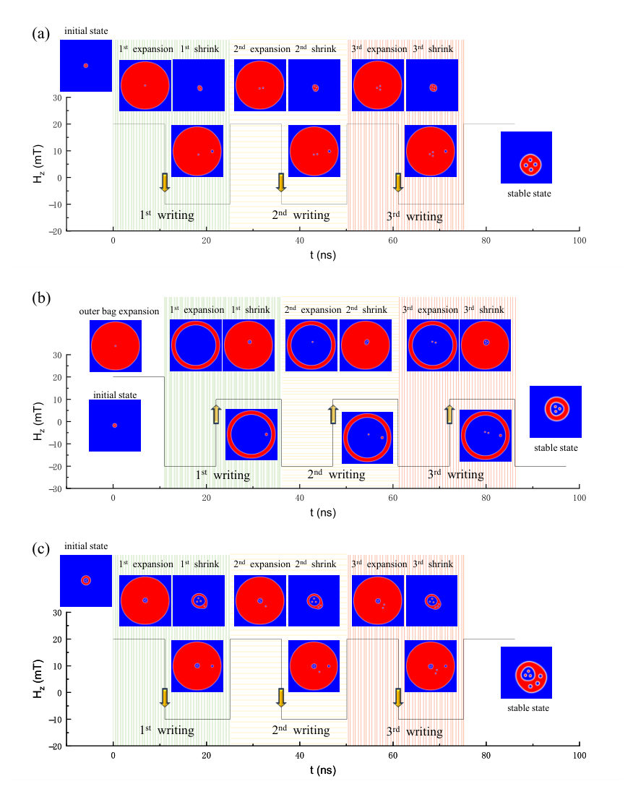
<figcaption class="paper-figure-caption"><b>Fig 3.</b> FIG. 3. Sequential writing of nested skyrmion bags using the field-gated nanocontact protocol. Colored background blocks indicate repeated writing cycles consisting of field-driven expansion, current-induced nucleation, and field-driven contraction. The upward- and downward-pointing arrows denote current pulses of I = +30 mA and I = −30 mA, respectively, each with a duration of 50 ps. Positive current is defined as flowing along +ˆz. (a) Writing of the S(m, S(0)) state. The curve represents the variation of the magnetic field HAB. The outer bag is expanded by setting HA = HB = HAB = +20 mT and contracted by setting HA = HB = HAB = −20 mT, while HC is fixed at −20 mT. (b) Writing of the S(0,...</figcaption>
</figure>
<figure class="paper-figure-card">

<figcaption class="paper-figure-caption"><b>Fig 4.</b> FIG. 4. Representative magnetization configurations of double-layer nested skyrmion bags S(m, S(n)) with different numbers of skyrmions in the outer and inner bag regions. Each panel shows a central 512 nm × 512 nm field of view cropped from the full 1024 nm × 1024 nm simulation do- main. The vertical and horizontal axes denote the numbers of skyrmions in the outer bag, m, and in the inner bag, n, respectively.</figcaption>
</figure>
<figure class="paper-figure-card">
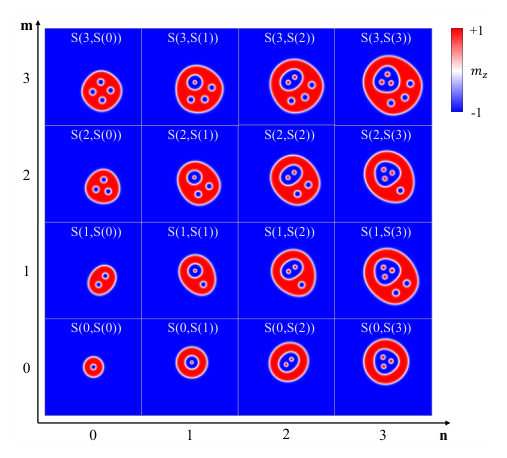
<figcaption class="paper-figure-caption"><b>Fig 5.</b> Figure 4 shows representative magnetization configu- rations of double-layer nested skyrmion bags S(m, S(n)) with different values of m and n. Here, m denotes the number of skyrmions confined in the outer bag, while n denotes the number of skyrmions confined in the inner bag. The vertical and horizontal directions in the config- uration map therefore correspond to increasing m and n, respectively. Because the outer and inner bag regions have oppo- site background magnetizations, skyrmions written into these two regions contribute opposite unit topological charges. Under the present convention, each skyrmion</figcaption>
</figure>

**Summary.** This work proposes a novel field-gated protocol to program complex nested skyrmion bags $S(m, S(n))$ in magnetic thin films. By sequentially expanding and writing into the outer and inner regions using tailored perpendicular magnetic fields and current pulses, the authors achieve deterministic control over the total topological charge. This demonstrates a viable pathway for realizing multilevel spintronic memory elements.

**Why it may be interesting.** While focused on spintronics, the precise, controlled manipulation of topological defects using external stimuli (fields/currents) mirrors concepts in controlling quantum states or excitations in engineered quantum systems.

Detailed structure

**Main problem.** The challenge lies in achieving deterministic and region-selective writing of individual skyrmions into complex, nested magnetic structures called skyrmion bags $S(m, S(n))$ for advanced information encoding.

**Main result.** A field-gated nanocontact protocol was successfully simulated to demonstrate the controlled construction of arbitrary nested skyrmion bag states, confirming unit-step control over total topological charge.

**Method.** The authors utilized micromagnetic simulations to model the dynamics, employing a three-stage cycle: selective magnetic field expansion (field gating), current-induced nucleation via spin-polarized pulses, and subsequent field-driven contraction.

**Model / system.** The system is modeled using chiral ferromagnetic thin films (Co/Pt bilayer) containing nested skyrmion bags $S(m, S(n))$. The physics is governed by the micromagnetic energy functional and dynamics are described by the LLG equation with STT.

**Key observables.** Total topological charge ($Q_{	ext{total}} = n - m$), which changes in unit steps during writing; the size modulation of outer ($D_{	ext{out}}$) and inner ($D_{	ext{in}}$) bag diameters as functions of applied fields.

**Important parameters / regimes.** Material parameters include $M_s$, exchange stiffness ($A$), and DMI strength ($D$). Operational fields are set to $\pm 20 	ext{ mT}$ for stable expansion/contraction around a nanocontact.

**Assumptions / limitations.** The protocol assumes precise control over spatially segmented perpendicular magnetic fields and the ability to apply highly localized, polarized current pulses.

**Figures summary.** Figures illustrate the field-dependent size modulation of nested bags (Fig. 2) and demonstrate sequential writing protocols for constructing $S(m, S(n))$ states by showing the evolution of total topological charge over time (Figs. 3 & 5).

**Paper structure.** The paper establishes the physical model using micromagnetics, details the field-gating mechanism via spatially segmented fields to define nested regions, and then presents a cyclical protocol combining field control with current pulses to achieve deterministic, region-selective writing of skyrmions.

Abstract

Nested skyrmion bags are composite magnetic solitons whose internal occupation numbers provide an expanded state space for multilevel information encoding. However, deterministic and region-selective writing of individual skyrmions into nested bags remains challenging. Here, using micromagnetic simulations, we propose a field-gated nanocontact protocol for generating and programming double-layer nested skyrmion bags S(m,S(n)). The protocol exploits the opposite field responses of bag regions with antiparallel magnetic backgrounds. Spatially segmented perpendicular magnetic fields selectively expand either the outer region or the inner bag until it overlaps with a nanocontact. A spin-polarized current pulse of the appropriate polarity then nucleates one skyrmion in the selected region, while subsequent field-driven contraction moves the written skyrmion away from the contact and restores the writing site for repeated operation. Starting from an empty nested bag S(0,S(0)), this procedure enables the controlled construction of S(m,S(0)), S(0,S(n)), and general S(m,S(n)) states. The simulated total topological charge changes in unit steps during sequential writing, confirming one-at-a-time and region-selective control. These results provide a possible route toward programmable nested topological states for multilevel spintronic information encoding.

[↑ back to top](#top)

### [Helical Magnon Frequency Comb in Synthetic Antiferromagnetic Skyrmion Lattices](http://arxiv.org/abs/2608.16065v1)

**Authors:** Liu Xuejuan, Zheng Xingen, Li Zhixiong, Li Xiaoguang, Zhou Cangtao, Li Hui, Sun Haipeng, Yan Peng  
**Type:** theory · **Category:** other · **PDF:** <https://arxiv.org/pdf/2608.16065v1>  
**Analysis basis:** full PDF text, analyzed in chunks
**Topic relevance:** `driven-dissipative phase transition` **2/5** · `methods for driven-dissipative` **2/5** · `Keldysh / 2PI / non-Gaussian methods` **1/5** · `analog quantum simulation` **1/5** · `correlated / nonlocal dissipation` **1/5** · `interference shaping light` **1/5** · `non-equilibrium universality` **1/5**

↔ Scroll figures horizontally

<figure class="paper-figure-card">
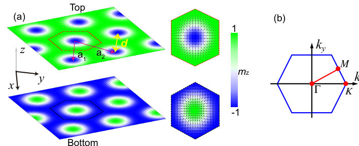
<figcaption class="paper-figure-caption"><b>Fig 1.</b> Fig. 1. Schematic of the Bilayer SAF-SkL texture. a The real-space SAF-SkL structure with lattice constant d = 40 nm. The right panels show enlarged views of the magnetic unit cell in the two layers, as indicated by the dashed hexagons in the left panel. The arrows indicate the spin vectors. b First Brillouin zone of a single SkL, with high-symmetry points Γ, M, and K labeled.</figcaption>
</figure>
<figure class="paper-figure-card">
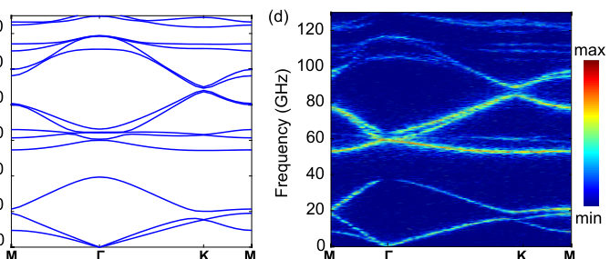
<figcaption class="paper-figure-caption"><b>Fig 2.</b> Fig. 2. Bulk magnon band structure of the SAF-SkL. a, b Schematics of the top and bottom SkLs, with a localized excitation magnetic field applied to a central quadrilateral region (black shaded area). c Theoretical bulk magnon band structure of the SAF-SkL along the M −Γ −K −M path. Only the lowest fourteen bands are shown. d Micromagnetically simulated band structure of the same system along the identical path.</figcaption>
</figure>
<figure class="paper-figure-card">
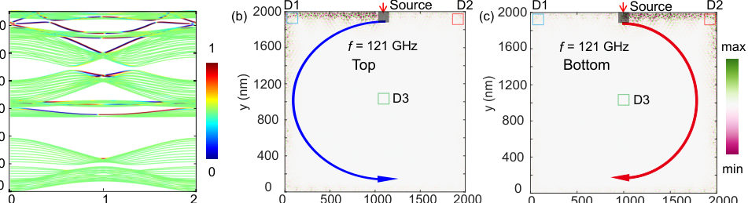
<figcaption class="paper-figure-caption"><b>Fig 3.</b> Fig. 3. Helical edge states with opposite chirality in the bilayer SAF-SkL. a Strip magnon spectrum colored by the normalized transverse position &lt; y &gt; /Ly = P</figcaption>
</figure>
<figure class="paper-figure-card">
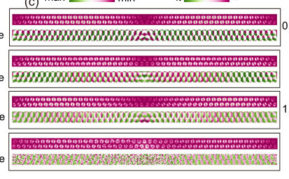
<figcaption class="paper-figure-caption"><b>Fig 4.</b> Fig. 4. HMFC generation in the SAF-SkL. Spin wave spectra measured at positions D1, D2, and D3 in the top a and bottom b SkLs, respectively. c The spatial profiles of the spectral amplitudes (upper) and phases (lower) for several representative modes.</figcaption>
</figure>
<figure class="paper-figure-card">
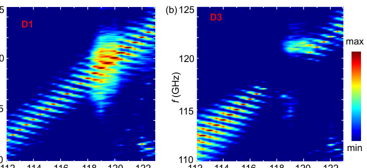
<figcaption class="paper-figure-caption"><b>Fig 5.</b> Fig. 5. Dependence of the HMFC on the driving frequency. a Measured spin wave spectra in region D1. b Measured spectra in region D3. c Extracted amplitudes of the primary peak fl and the sidebands fl ± fg as a function of the driving frequency in D1. d Corresponding amplitudes for D3. The driving amplitude is maintained at 50 mT.</figcaption>
</figure>

**Summary.** The paper investigates generating helical magnon frequency combs in Synthetic Antiferromagnetic Skyrmion Lattices (SAF-SkLs). By combining theory and simulation, the authors show that these lattices host unique, edge-localized magnonic modes. These modes enable robust nonlinear signal generation whose properties can be actively tuned by controlling the interlayer antiferromagnetic coupling.

**Why it may be interesting.** This work is highly relevant as it explores coherent signal processing using magnonics—a field that bridges condensed matter physics with potential applications in quantum information or advanced sensing, often involving non-linear wave dynamics.

Detailed structure

**Main problem.** The study investigates generating helical magnon frequency combs (HMFCs) within Synthetic Antiferromagnetic Skyrmion Lattices (SAF-SkLs). The goal is to establish SAF-SkLs as a tunable platform for robust, edge-localized nonlinear magnonics.

**Main result.** The research demonstrates that HMFC generation relies critically on the three-magnon interaction between helical magnon edge states and the skyrmion gyration mode. Furthermore, interlayer antiferromagnetic coupling provides a mechanism to tune the comb spacing and energy distribution.

**Method.** The work combines analytical modeling using the Holstein-Primakoff formalism with micromagnetic simulations (MuMax3) to analyze magnon band structures and time evolution under external driving fields.

**Model / system.** The physical system is a SAF-SkL, composed of two ferromagnetic Skyrmion Lattices coupled antiferromagnetically. The dynamics are governed by a spin Hamiltonian incorporating exchange, interlayer coupling ($J_{af}$), and Dzyaloshinskii-Moriya interaction terms.

**Key observables.** Helical Magnon Frequency Comb (HMFC) spectra, magnon band structure along high-symmetry paths, and the spatial localization of edge states.

**Important parameters / regimes.** Interlayer antiferromagnetic coupling strength ($J_{af}$), driving frequency relative to the helical edge-state band, and material parameters like $M_s$ and $A_{ex}$.

**Assumptions / limitations.** The analysis assumes that the nonlinear magnon interaction is dominated by three-magnon processes involving the helical edge states. The use of specific boundary conditions (periodic vs. open) is crucial for distinguishing bulk from edge modes.

**Figures summary.** Figures illustrate the SAF-SkL texture, the bulk magnon band structure showing interlayer coupling effects, and time evolution simulations confirming counterpropagating helical edge states and localized HMFC generation spectra.

**Paper structure.** The paper progresses by first defining the physical platform (SAF-SkLs) and its Hamiltonian. It then uses analytical/numerical methods to characterize the low-energy magnon band structure, highlighting the emergence of chiral edge modes. Finally, it models the nonlinear excitation process to demonstrate robust HMFC generation localized at the edges.

Abstract

Synthetic antiferromagnetic skyrmion lattices (SAF-SkLs), consisting of two ferromagnetic SkLs coupled antiferromagnetically with compensated magnetization, provide a promising platform for robust nonlinear magnonics. Here, we investigate helical magnon frequency comb (HMFC) generation in a SAF-SkL by combining analytical modeling with micromagnetic simulations. We show that nonlinear coupling between helical magnon edge states and the skyrmion gyration produces frequency combs with pronounced edge localization. The HMFC exhibits strong enhancement exclusively when the driving frequency lies within the helical edge-state band, whereas the interior response remains negligible. This frequency selectivity confirms the essential role of helical edge modes in localized nonlinear frequency conversion. We further demonstrate that the interlayer antiferromagnetic coupling reconstructs the magnon spectrum, thereby tuning the comb spacing and the number of comb teeth while also redistributing modal energy. Our results establish SAF-SkLs as a tunable platform for edge-localized HMFCs and suggest a route toward robust coherent magnonic signal processing.

[↑ back to top](#top)

### [Rapid supercurrent decay in Mn$_5$Si$_3$ Josephson junctions](http://arxiv.org/abs/2608.14842v1)

**Authors:** Arjun Sapkota, Kurt Lorenzen, Tyler Kuhn, Juan Gomez, Demet Korucu, Robert M. Klaes, Reza Loloee, Norman O. Birge, Nathan Satchell  
**Type:** experiment · **Category:** other · **PDF:** <https://arxiv.org/pdf/2608.14842v1>  
**Analysis basis:** full PDF text, analyzed in chunks
**Topic relevance:** `QC/QI experiment` **2/5** · `driven-dissipative phase transition` **2/5** · `Keldysh / 2PI / non-Gaussian methods` **1/5** · `analog quantum simulation` **1/5** · `correlated / nonlocal dissipation` **1/5** · `methods for driven-dissipative` **1/5** · `quantum measurements` **1/5**

↔ Scroll figures horizontally

<figure class="paper-figure-card">
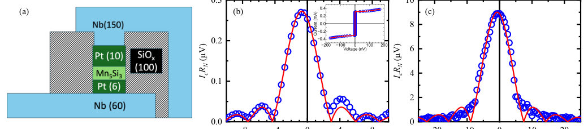
<figcaption class="paper-figure-caption"><b>Fig 1.</b> FIG. 1. (a) Schematic cross section of the Josephson junction device, with layer thicknesses given in (nm) as grown. The thickness of the Mn5Si3 layer ranges from 0.5 to 4.5 nm. (b,c) Product of the critical current and normal state resistance, IcRN, versus applied magnetic field for Josephson junctions with Mn5Si3 thicknesses of (b) 2.0 nm and (c) 1.0 nm at 4.2 K. The solid red lines are fits to the data of Eqs. 2 and 3. Inset of (b): the I–V characteristic of the same junction at zero applied field, together with the fit to Eq. 1 from which Ic and RN are determined.</figcaption>
</figure>
<figure class="paper-figure-card">
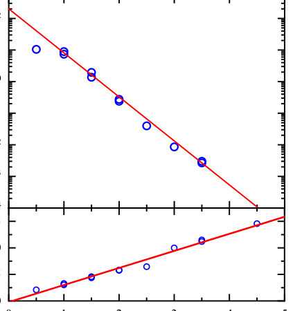
<figcaption class="paper-figure-caption"><b>Fig 2.</b> FIG. 2. Thickness dependence of supercurrent in Mn5Si3 Josephson junctions. Top: Product of the critical current and normal state resistance, IcRN versus Mn5Si3 thickness at 4.2 K. The line is a best fit to Eq. 4 over the range 1–3.5 nm with decay length ξMn5Si3 = 0.31 ± 0.03 nm. Bottom: Area resistance product, ARN, for the junctions, where the best fit to Eq. 5 indicates the Mn5Si3 resistivity, ρ = 320±10 µΩcm. Each data point represents one Josephson junction and the uncertainty in determining IcRN and ARN is smaller than the data points.</figcaption>
</figure>
<figure class="paper-figure-card">
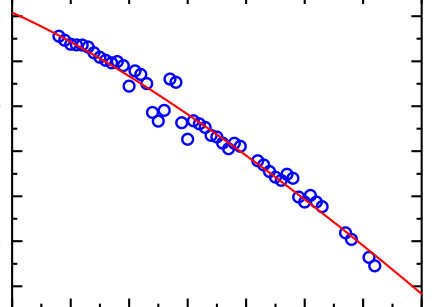
<figcaption class="paper-figure-caption"><b>Fig 3.</b> FIG. 3. Product of the critical current and normal state resis- tance, IcRN versus temperature for a Josephson junction with Mn5Si3 thickness of 1.0 nm. The critical temperature is ap- proximately 8.8 K, and the trend of IcRN(T) is well described by the phenomenological expression, Eq. 6. Each data point represents IcRN extracted at one temperature and the uncer- tainty in determining IcRN is smaller than the data points.</figcaption>
</figure>

**Summary.** Researchers fabricated Josephson junctions using $	ext{Mn}_5	ext{Si}_3$ as a barrier to test predictions of $0-\pi$ transitions characteristic of metallic antiferromagnets. While the supercurrent decay was measured successfully, no oscillatory transitions were observed. The authors conclude that achieving clear signatures requires barriers with highly defined crystalline orientation.

**Why it may be interesting.** This work directly probes the interplay between magnetism (altermagnetism) and superconductivity in nanoscale devices, which is highly relevant to superconducting quantum circuits and spintronics.

Detailed structure

**Main problem.** The study investigates supercurrent decay and the presence of predicted 0-$\pi$ transitions in Josephson junctions utilizing metallic altermagnetic barriers ($	ext{Mn}_5	ext{Si}_3$).

**Main result.** The critical current decays exponentially with a short length scale ($\xi = 0.31 \pm 0.03$ nm), and no oscillatory $0-\pi$ transitions were resolved, suggesting structural or magnetic disorder suppresses the predicted effects.

**Method.** Electrical transport measurements (I-V characteristics) were performed on patterned $	ext{Nb}/	ext{Pt}/	ext{Mn}_5	ext{Si}_3/	ext{Pt}/	ext{Nb}$ junctions while varying barrier thickness and temperature.

**Model / system.** The physical system is a Josephson junction where the superconducting barrier material is epitaxial $	ext{Mn}_5	ext{Si}_3$, an altermagnetic compound. Theoretical predictions suggested oscillatory behavior ($0-\pi$ transitions) dependent on crystal orientation.

**Key observables.** Critical current ($I_c$), supercurrent decay length ($\xi_{	ext{Mn}_5	ext{Si}_3}$), and the temperature dependence of $I_c$.

**Important parameters / regimes.** Supercurrent decay length $\xi_{	ext{Mn}_5	ext{Si}_3} = 0.31 \pm 0.03$ nm; Barrier resistivity $
ho_{	ext{Mn}_5	ext{Si}_3} = 320 \pm 10 \, \mu\Omega	ext{cm}$.

**Assumptions / limitations.** The absence of transitions is attributed to the microstructure, uncertain magnetic phase, and narrow thickness window, rather than a failure of the underlying theory.

**Figures summary.** Figures show $I_c R_N$ decay vs. thickness (single exponential fit) and $I_c R_N$ vs. Temperature (smooth/monotonic dependence). Structural characterization used XRR and XRD data.

**Paper structure.** The paper first establishes the theoretical motivation for studying altermagnetic Josephson junctions, then details the fabrication and measurement of $	ext{Nb}/	ext{Pt}/	ext{Mn}_5	ext{Si}_3/	ext{Pt}/	ext{Nb}$ junctions. Results show exponential decay but lack oscillations, leading to a discussion on structural requirements for future tests.

Abstract

Theoretical work predicts that Josephson junctions containing metallic altermagnetic barriers should display $0$-$π$ transitions of the critical current as a function of both barrier thickness and temperature, with the decay and oscillation period of the supercurrent depending on the orientation of the crystal axes relative to the transport direction. Motivated by these predictions, and by reports of a compensated magnetic phase attributed to altermagnetism in epitaxial Mn$_5$Si$_3$ thin films, we fabricate and measure Nb/Pt/Mn$_5$Si$_3$/Pt/Nb Josephson junctions varying the thickness of the Mn$_5$Si$_3$ barrier. The critical current decays as a single exponential over more than four orders of magnitude with decay length $ξ_{\text{Mn}_5\text{Si}_3} = 0.31 \pm 0.03$ nm, shorter than reported for Josephson junctions containing the metallic antiferromagnets FeMn, Cr, and NiMn. The Mn$_5$Si$_3$ barrier has an estimated current-perpendicular-to-plane resistivity of $320 \pm 10 μΩ\,$cm. No $0$-$π$ transition is resolved at the sampled barrier thicknesses, and the temperature dependence of the critical current of a junction with a 1 nm barrier is smooth and monotonic. We discuss the absence of resolvable transitions in terms of the microstructure of the barrier, its uncertain magnetic phase, and the narrow thickness window imposed by the rapid decay, and identify barriers with well-defined crystalline orientation as the key requirement for future tests of altermagnetic Josephson physics.

[↑ back to top](#top)

### [Temperature-Dependent Spin-Orbit Torque Generation in Perpendicularly Magnetized Topological Insulator-Magnetic Multilayer Heterostructures](http://arxiv.org/abs/2608.15232v1)

**Authors:** Soumyarup Hait, Benjamin A. Brereton, Ahmet Yagmur, Satoshi Sasaki, Gavin Burnell, Christopher H. Marrows  
**Type:** experiment · **Category:** other · **PDF:** <https://arxiv.org/pdf/2608.15232v1>  
**Analysis basis:** full PDF text, analyzed in chunks
**Topic relevance:** `Keldysh / 2PI / non-Gaussian methods` **2/5** · `driven-dissipative phase transition` **2/5** · `analog quantum simulation` **1/5** · `correlated / nonlocal dissipation` **1/5** · `methods for driven-dissipative` **1/5** · `non-equilibrium universality` **1/5** · `quantum measurements` **1/5**

↔ Scroll figures horizontally

<figure class="paper-figure-card">
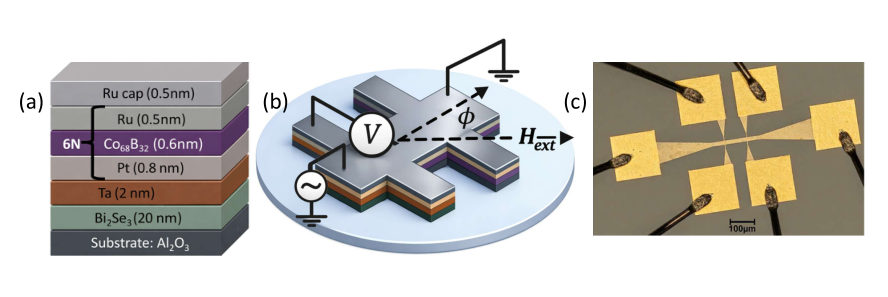
<figcaption class="paper-figure-caption"><b>Fig 1.</b> Figure 1: Experimental schematics. (a) Schematic illustration of an example TI/MMl het- erostructure stack: Al2O3/Bi2Se3(20 nm)/Ta(2 nm)/MML. (b) Schematic representation of the Hall measurement geometry. The detailed measurement procedure is provided in the Supplementary Information. (c) Optical micrograph of the Hall bar corresponding to the sample Al2O3/Bi2Se3(20 nm)/Ta(2 nm)/MML.</figcaption>
</figure>
<figure class="paper-figure-card">
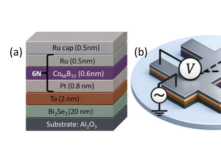
<figcaption class="paper-figure-caption"><b>Fig 2.</b> Fig. 1(b,c).</figcaption>
</figure>
<figure class="paper-figure-card">
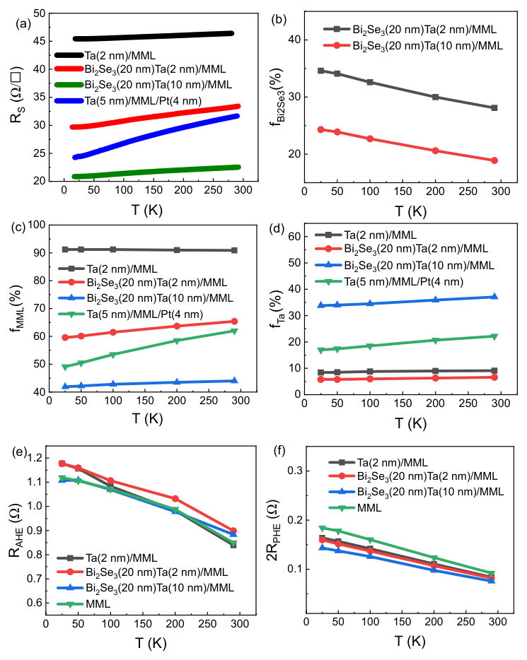
<figcaption class="paper-figure-caption"><b>Fig 3.</b> Figure 2: Temperature dependent transport properties. (a) Temperature-dependent sheet resistance of the samples SiO2/Ta(2 nm)/MML, Al2O3/Bi2Se3(20 nm)/Ta(2 nm)/MML, and Al2O3/Bi2Se3(20 nm)/Ta(10 nm)/MML. (b–d) Fraction of the total current flowing through the Bi2Se3 (fBi2Se3),MML (fMML), and Ta buffer (fTa), respectively, as obtained from the parallel-resistor model, described in detail in the Supplementary Information. (d–f) Tem- perature dependence of the anomalous Hall resistance, and planar Hall resistance for the heterostructures.</figcaption>
</figure>
<figure class="paper-figure-card">
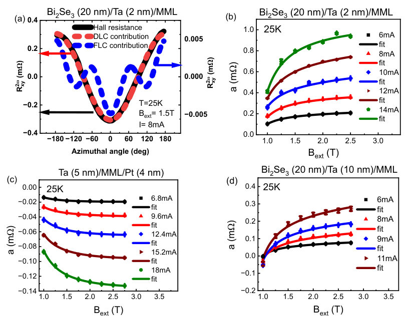
<figcaption class="paper-figure-caption"><b>Fig 4.</b> Figure 3: Second harmonic Hall measurements. (a) Representative azimuthal-angle- dependent second-harmonic Hall signals for the Al2O3/Bi2Se3(20 nm)/Ta(2 nm)/MML mea- sured at 25 K, 1.5 T, and an applied current of ∼9 mA. Black points denote the experimental data, while the red and blue dashed lines represent contributions to a fit to Eq. 1, from which the damping-like and field-like contributions (DLC and FLC) are extracted. Note the change of scale for the FLC contribution. (b–d) Magnetic-field dependence of DLC for the three samples, fitted using Eq. 2 to obtain the damping-like torque BDL and thermal contributions at different applied currents.</figcaption>
</figure>
<figure class="paper-figure-card">
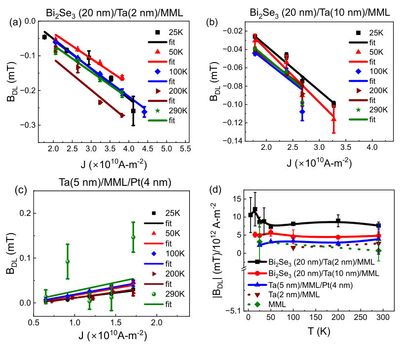
<figcaption class="paper-figure-caption"><b>Fig 5.</b> Figure 4: Damping-like contributions to the SOT. (a–c) Linear variation of the damping-like effective field BDL with applied current density for the Al2O3/Bi2Se3(20 nm)/Ta(2 nm)/MML, Al2O3/Bi2Se3(20 nm)/Ta(10 nm)/MML, and SiO2/Ta(5 nm)/MML/Pt(4 nm) samples, respectively, measured at different temperatures. The points represent the BDL values extracted from the DLC-versus-field fits, while the solid lines are linear fits used to determine the damping-like torque per unit current density. (d) Temperature dependence of the extracted BDL per unit current density for all samples. Over the full temperature range, the damping-like torque per unit current density exhibits a clear hierarchy, with...</figcaption>
</figure>

**Summary.** This work reports a detailed temperature-dependent investigation into Spin-Orbit Torque (SOT) generation in $	ext{TI}/	ext{MML}$ heterostructures. By using second-harmonic Hall measurements, the authors demonstrate that spin currents originating from topological surface states significantly enhance SOT efficiency compared to conventional materials. The results underscore the critical role of interfacial engineering and low temperatures in maximizing spintronic device performance.

**Why it may be interesting.** While focused on condensed matter spintronics rather than fundamental quantum dynamics, the study involves interfacial physics and spin transport phenomena which touch upon non-equilibrium many-body effects relevant to open quantum systems modeling.

Detailed structure

**Main problem.** The study investigates the temperature-dependent generation of spin-orbit torque (SOT) in advanced spintronic heterostructures to enable electrical manipulation of magnetization.

**Main result.** Topological insulator ($	ext{Bi}_2	ext{Se}_3$)-derived currents dominate SOT generation, leading to significantly larger torques compared to conventional heavy metal sources, especially at low temperatures.

**Method.** The research employs comprehensive temperature-dependent measurements using second-harmonic Hall voltage techniques and current shunting analysis to quantify spin-current contributions from different layers.

**Model / system.** The physical system is a multilayer heterostructure stack consisting of a perpendicularly magnetized metallic multilayer (MML) grown on top of a topological insulator ($	ext{Bi}_2	ext{Se}_3$) epilayer, separated by various buffer layers like Ta.

**Key observables.** SOT magnitude ($	au_{	ext{DL}}$), temperature dependence of torque, current shunting fractions ($f_{	ext{Bi}2	ext{Se}3}$, $f_{	ext{Ta}}$, $f_{	ext{MML}}$), Anomalous/Planar Hall Resistances.

**Important parameters / regimes.** Low temperatures (e.g., 15 K) show enhanced torque; thin Ta buffers (2 nm) maximize efficiency; the comparison between TI-containing and non-TI systems is key.

**Assumptions / limitations.** The analysis relies on decomposing the second-harmonic signal using azimuthal angle sweeps to separate contributions related to $	ext{B}_{	ext{DL}}$ and $	ext{B}_{	ext{FL}}$.

**Figures summary.** Figures illustrate schematics of the heterostructure stack, temperature dependence of resistance/shunting fractions, and evolution of Hall resistances ($	ext{R}_{	ext{AHE}}$, $	ext{R}_{	ext{PHE}}$) with applied current.

**Paper structure.** The paper progresses from establishing the physical system and measurement techniques (second-harmonic Hall measurements) to presenting quantitative results showing the enhancement provided by TIs, analyzing the role of buffer thickness, and concluding that TI-derived currents are dominant.

Abstract

We report a comprehensive temperature-dependent investigation of spin-orbit torque (SOT) generation in heterostructures comprising a perpendicularly magnetized metallic multilayer grown on top of a topological insulator (TI) epilayer. Temperature-dependent second-harmonic Hall measurements reveal distinct trends in the magnitude of the spin-orbit torque across the studied heterostructures. Samples incorporating Bi2Se3 exhibit torques reaching approximately 12 mT/(10^12 A m^-2) at 15 K, around 5 times larger than those in a multilayer without the topological layer. The structure with a thin 2-nm Ta buffer for the multilayer shows the strongest enhancement and a pronounced increase at low temperatures, highlighting efficient spin-current generation from the topological surface states. In contrast, the sample with a 10 nm-thick Ta spacer exhibits reduced torque efficiency, consistent with partial attenuation of spin transmission through the buffer. Systems lacking Bi2Se3 but containing two heavy metals (Ta and Pt) yield significantly smaller torques, around 2.5 mT/(10^12 A m^-2), despite the presence of conventional spin Hall sources. These observations underscore the dominant role of TI-derived spin-momentum-locked currents in driving large damping-like torques and their sensitivity to interfacial structure and buffer-layer thickness.

[↑ back to top](#top)

### [Chiral Damping-Induced Chirality Switching and Control of Domain Walls in Antiferromagnets](http://arxiv.org/abs/2608.16057v1)

**Authors:** Collins Ashu Akosa, Mu-Kun Lee, Aurélien Manchon, Masahito Mochizuki  
**Type:** theory · **Category:** other · **PDF:** <https://arxiv.org/pdf/2608.16057v1>  
**Analysis basis:** full PDF text, analyzed in chunks
**Topic relevance:** `driven-dissipative phase transition` **2/5** · `non-equilibrium universality` **2/5** · `Frenkel-Kontorova` **1/5** · `Keldysh / 2PI / non-Gaussian methods` **1/5** · `correlated / nonlocal dissipation` **1/5** · `methods for driven-dissipative` **1/5**

↔ Scroll figures horizontally

<figure class="paper-figure-card">
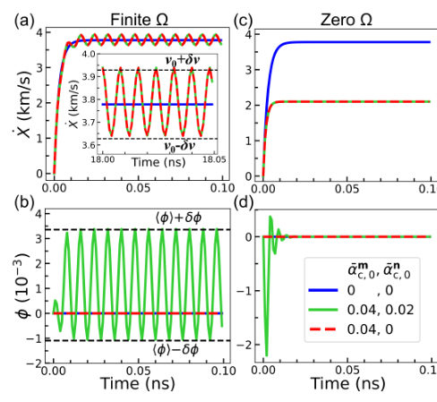
<figcaption class="paper-figure-caption"><b>Fig 1.</b> FIG. 1: Numerical results of DW velocity and tilt angle under both SOT and STT for CDs with (a)–(b) a finite frequency Ω, and (c)–(d) zero frequency. The inset of (a) shows an enlarged view. The horizontal black dotted lines in the inset of (a) denote v0 ± δv, while those in (b) denote ⟨ϕ⟩± δϕ.</figcaption>
</figure>
<figure class="paper-figure-card">
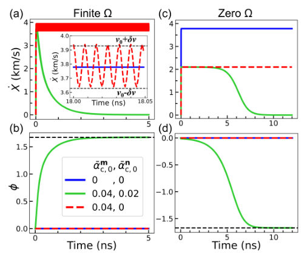
<figcaption class="paper-figure-caption"><b>Fig 2.</b> FIG. 2: Numerical results of DW velocity and tilt angle with- out DMI, HD = 0. The inset in (a) shows an enlarged view.</figcaption>
</figure>

**Summary.** This paper theoretically investigates the role of chiral damping in controlling domain wall dynamics within antiferromagnets. By analyzing coupled equations of motion, the authors show that CD introduces coupling between translational and rotational modes, leading to measurable oscillations in DW velocity and tilt angle. The findings establish CD as a key control parameter for manipulating magnetic textures, even enabling chirality switching without DMI.

**Why it may be interesting.** This work provides a detailed theoretical framework connecting microscopic dissipation mechanisms (CD) to macroscopic control parameters of magnetic textures in AFMs, which is highly relevant for understanding spintronics and emergent quantum phenomena in condensed matter.

Detailed structure

**Main problem.** The study investigates how chiral damping (CD) affects current-driven domain wall (DW) dynamics in antiferromagnets (AFMs), aiming to establish measurable experimental signatures for CD.

**Main result.** Asymmetric CD can induce rich dynamical phenomena, including oscillations in DW velocity and tilt angle, and enables chirality switching between Néel- and Bloch-type DWs even without the Dzyaloshinskii-Moriya interaction (DMI).

**Method.** The authors employ a perturbative analysis on the coupled equations of motion for the DW center position ($X$) and tilt angle ($\phi$), derived from the Landau-Lifshitz-Gilbert-Slonczewski equation.

**Model / system.** The system modeled is a one-dimensional uniaxial AFM domain wall composed of two magnetic sublattices, driven by spin currents (STT/SOT) and subject to chiral damping effects arising from Rashba and Dresselhaus spin-orbit interactions.

**Key observables.** DW velocity ($v(t)$), tilt angle ($\phi(t)$), oscillation amplitudes ($\delta v$, $\delta\phi$), and the effective mass tensor renormalization.

**Important parameters / regimes.** Chiral damping constants ($ar{\alpha}_{m,n}^c$), Rashba/Dresselhaus SOI strengths ($\Lambda_R, \Lambda_D$), driving currents (STT/SOT), and external fields ($H_{D0}, \Omega$).

**Assumptions / limitations.** The analysis relies on perturbative expansions in the CD parameters and assumes that spin pumping effects are negligible; it also neglects distortions due to dynamic DW width.

**Figures summary.** Figures illustrate numerical results showing oscillatory behavior of velocity and tilt angle when oscillating CDs are applied, and demonstrate the transition towards Bloch-like DWs when DMI is absent but asymmetric CD is present.

**Paper structure.** The paper establishes the governing equations for AFM DW dynamics incorporating CD. It then analyzes how CD couples translational and rotational modes, deriving explicit expressions for oscillatory amplitudes under time-varying driving forces (e.g., oscillating DMI).

Abstract

We investigate the impact of chiral damping (CD) on current-driven domain-wall (DW) dynamics in antiferromagnets (AFMs). Asymmetric CD between sublattices generates off-diagonal components in the DW mass tensor, thereby coupling translational and rotational modes. When CD is modulated by an ac gate voltage via the Rashba spin-orbit interaction (RSOI), symmetric and asymmetric contributions induce oscillations in the DW velocity and tilt angle, respectively. A perturbative analysis yields explicit expressions for the oscillation amplitudes, in quantitative agreement with numerical simulations. Remarkably, even in the absence of Dzyaloshinskii-Moriya interaction (DMI), asymmetric CD enables chirality switching between Néel- and Bloch-type DWs. Finally, by exploiting the relativistic Lorentz contraction of the DW width at high driving currents, we propose an experimentally viable protocol to qualitatively and quantitatively extract the CD contribution. These results establish clear experimental signatures of CD in antiferromagnetic DW dynamics and demonstrate its potential as a control parameter for magnetic textures.

[↑ back to top](#top)

### [Surface weak ferromagnetism](http://arxiv.org/abs/2608.16808v1)

**Authors:** Vladimir A. Zyuzin  
**Type:** theory · **Category:** other · **PDF:** <https://arxiv.org/pdf/2608.16808v1>  
**Analysis basis:** full PDF text, analyzed in chunks
**Topic relevance:** `Keldysh / 2PI / non-Gaussian methods` **2/5** · `analog quantum simulation` **2/5** · `quantum measurements` **2/5** · `driven-dissipative phase transition` **1/5** · `methods for driven-dissipative` **1/5**

↔ Scroll figures horizontally

<figure class="paper-figure-card">
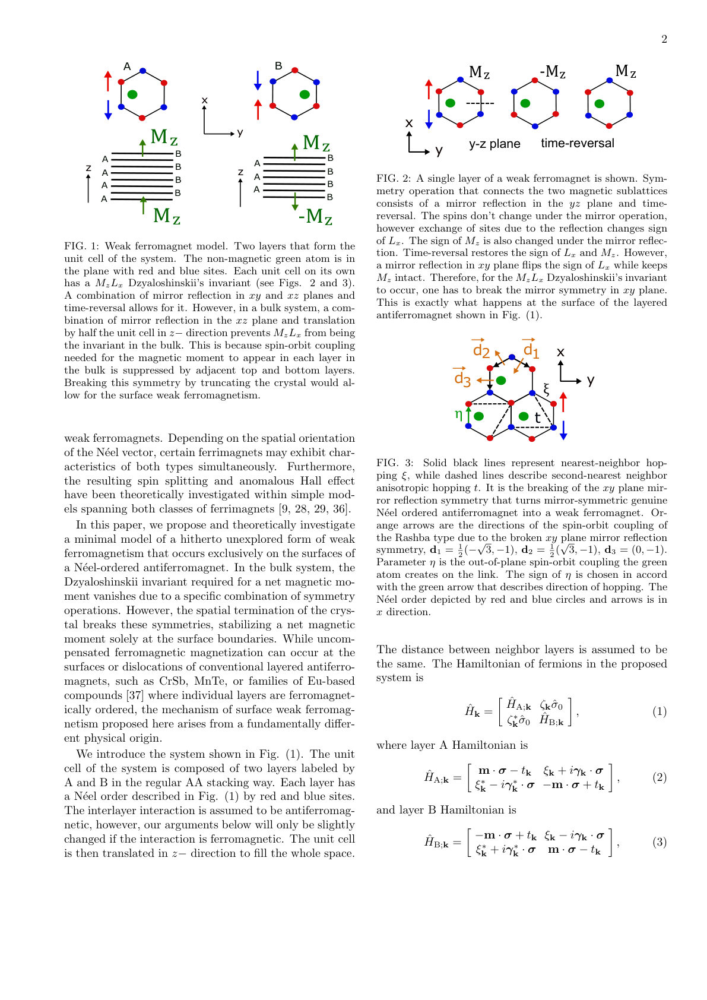
<figcaption class="paper-figure-caption"><b>Fig 1.</b> Low-resolution page preview, page 2</figcaption>
</figure>
<figure class="paper-figure-card">
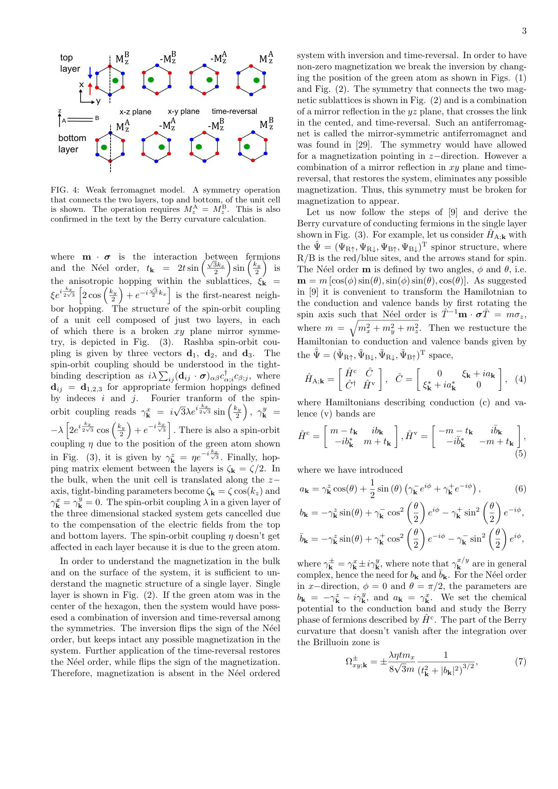
<figcaption class="paper-figure-caption"><b>Fig 2.</b> Low-resolution page preview, page 3</figcaption>
</figure>
<figure class="paper-figure-card">
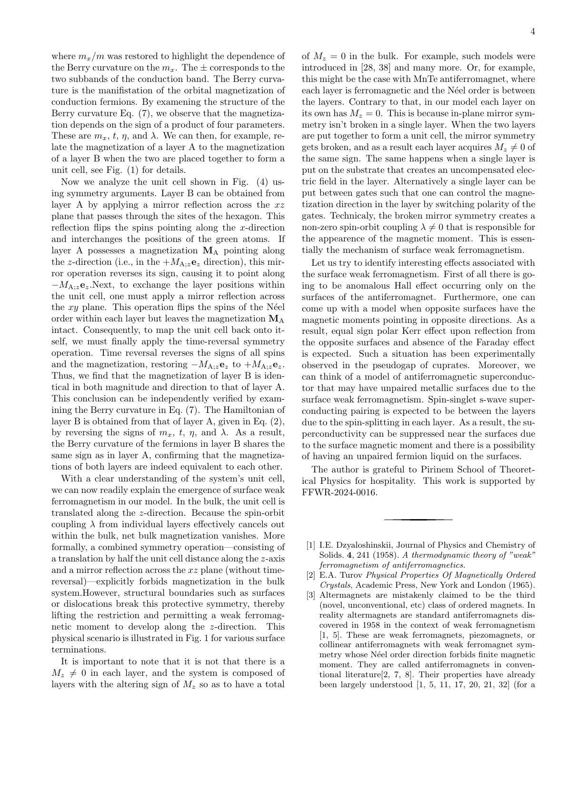
<figcaption class="paper-figure-caption"><b>Fig 3.</b> Low-resolution page preview, page 4</figcaption>
</figure>
<figure class="paper-figure-card">
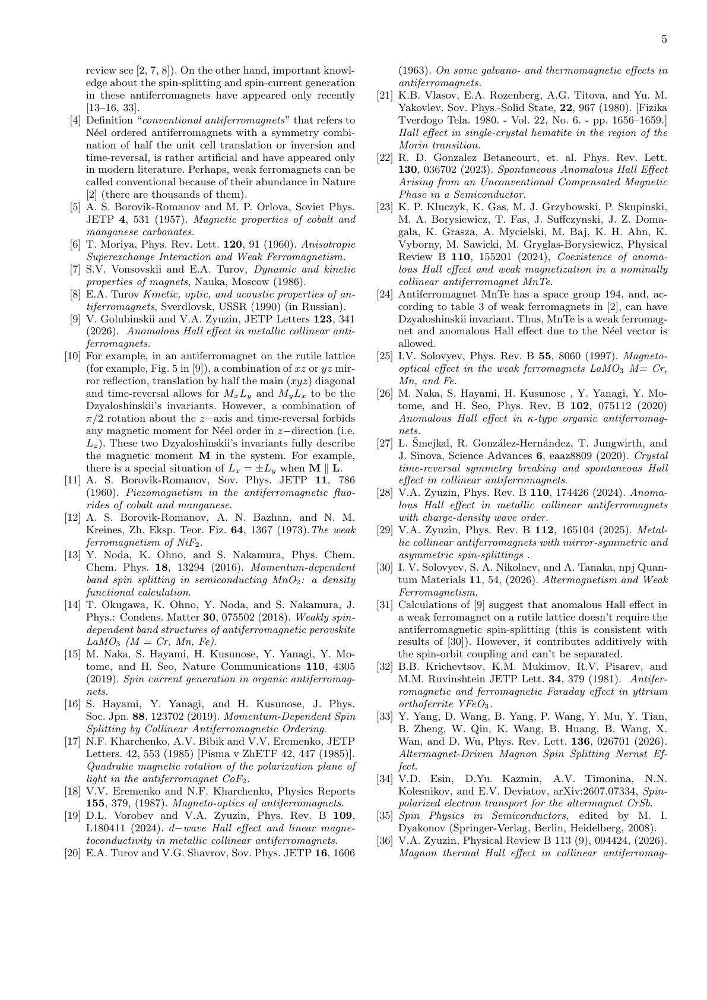
<figcaption class="paper-figure-caption"><b>Fig 4.</b> Low-resolution page preview, page 5</figcaption>
</figure>
<figure class="paper-figure-card">
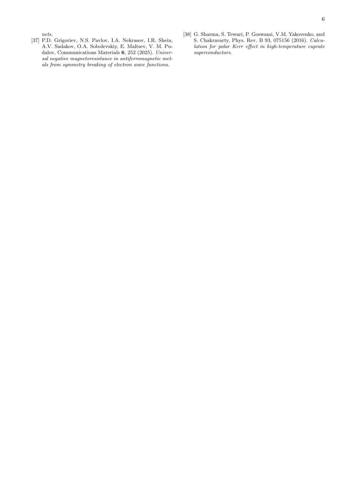
<figcaption class="paper-figure-caption"><b>Fig 5.</b> Low-resolution page preview, page 6</figcaption>
</figure>

**Summary.** This theoretical work proposes a mechanism where weak ferromagnetism appears at the surface of an antiferromagnet due to broken crystal symmetries interacting with spin-orbit coupling. By analyzing symmetry constraints on the electronic Hamiltonian, the authors show that while the bulk magnetic moment cancels out, the surfaces retain a net magnetization, leading to distinct magneto-optical signatures.

**Why it may be interesting.** While focused on condensed matter magnetism, the detailed use of symmetry invariants (like Dzyaloshinskii's) and band structure calculations involving spin-orbit coupling is highly relevant for understanding topological properties in quantum materials that might interface with AMO systems.

Detailed structure

**Main problem.** The paper models the emergence of weak ferromagnetism at the surface of an otherwise Néel-ordered antiferromagnet.

**Main result.** Surface symmetry breaking, induced by spin-orbit coupling, stabilizes a net magnetic moment solely at the boundaries, leading to unique magneto-optical responses like a finite Kerr effect with zero Faraday effect for certain terminations.

**Method.** The analysis uses tight-binding models and detailed symmetry group theory (time-reversal, mirror reflection) applied to the fermionic Hamiltonian.

**Model / system.** The system is an antiferromagnet modeled by two stacked layers (A and B) with N\'eel order. The physics is governed by a Hamiltonian incorporating spin-orbit coupling ($\lambda$) terms arising from broken surface symmetries.

**Key observables.** Surface weak ferromagnetism ($	ext{M}_z 
eq 0$), Faraday effect, Kerr effect, Berry curvature ($\Omega_{\pm}^{xy;k}$), and Dzyaloshinskii invariants.

**Important parameters / regimes.** Spin-orbit coupling strength ($\lambda$), interlayer interactions (antiferromagnetic/ferromagnetic), and the specific crystal termination geometry.

**Assumptions / limitations.** The bulk cancellation of spin-orbit coupling is attributed to field compensation between top and bottom layers, while surface effects break this symmetry.

**Figures summary.** Figures illustrate the two-layer unit cell, the necessary symmetry operations (e.g., breaking $xy$ plane mirror reflection), and the resulting structure of the Rashba-type spin-orbit coupling terms ($	ext{d}_1, 	ext{d}_2, 	ext{d}_3$).

**Paper structure.** The paper develops the model by first defining the Hamiltonian for the stacked layers, then using symmetry analysis to show why bulk magnetization cancels out, and finally demonstrating how surface termination breaks these symmetries to induce a net surface magnetic moment.

Abstract

This paper proposes a model of a Néel-ordered antiferromagnet exhibiting a weak ferromagnetic moment restricted to the crystal surface, generated by spin-orbit coupling induced by broken surface symmetries. Depending on crystal termination, the surface magnetic moment can align with identical or opposing signs on the top and bottom surfaces, resulting in a zero Faraday effect paired with a finite Kerr effect upon reflection for the latter configuration.

[↑ back to top](#top)

### [Proximity-induced superconductivity in a bilayer graphene quantum point contact](http://arxiv.org/abs/2608.16711v1)

**Authors:** Clara Galante-Agero, Christoph Adam, Artem O. Denisov, Jonas D. Gerber, Markus Niese, Alexandra Mestre-Torà, Marta Perego, Jessica Richter, Takashi Taniguchi, Kenji Watanabe, Klaus Ensslin, Thomas Ihn  
**Type:** experiment · **Category:** other · **PDF:** <https://arxiv.org/pdf/2608.16711v1>  
**Analysis basis:** full PDF text, analyzed in chunks
**Topic relevance:** `driven-dissipative phase transition` **2/5** · `correlated / nonlocal dissipation` **1/5** · `non-equilibrium universality` **1/5** · `quantum measurements` **1/5**

↔ Scroll figures horizontally

<figure class="paper-figure-card">
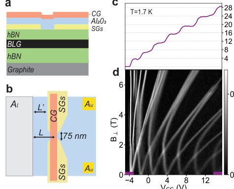
<figcaption class="paper-figure-caption"><b>Fig 1.</b> FIG. 1. (a) Schematic cross section of the device. The bi- layer graphene (BLG) encapsulated in hexagonal boron ni- tride (hBN), and the channel gate (CG) and split gates (SGs) are indicated. (b) Schematic top view of the device with alu- minium Al and gold Au contacts to the graphene displayed. The distances L and L′ are approximately 350 nm and 100 nm, respectively. The gap between SGs is 75 nm as indicated. (c) Conductance measurements at 1.7 K and B⊥= 0. Gn denotes the QPC conductance in the normal state. (d) Transcon- ductance of the QPC as a function of the out-of-plane mag- netic field and CG voltage VCG. Black regions correspond to plateaus in conductance.</figcaption>
</figure>
<figure class="paper-figure-card">
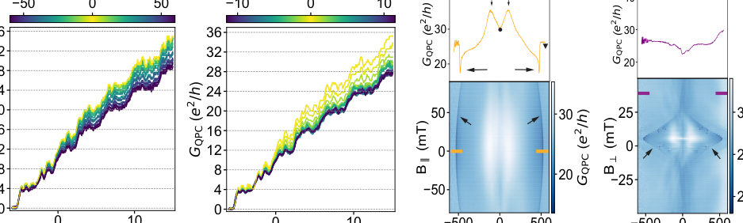
<figcaption class="paper-figure-caption"><b>Fig 2.</b> FIG. 2. Conductance measurements at 10 mK. (a,b) QPC conductance as a function of channel gate voltage VCG, and in-plane B∥(a) and out-of-plane B⊥(b) magnetic field. (c) GQPC as a function of in-plane field B∥and source-drain bias voltage Vsd, at a fixed channel gate voltage VCG = 11 V. The top curve shows the conductance trace at B∥= 0. Two conductance peaks are observed, from which the superconducting gap, ∆, is extracted. Black arrows indicate the anomalous dip in conductance, marking the collapse of the Andreev excess current. (d) Conductance as a function of out-of-plane field B⊥and bias voltage Vsd, at the same fixed channel gate voltage VCG = 11 V. The top curve shows the conductance...</figcaption>
</figure>
<figure class="paper-figure-card">
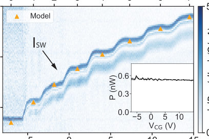
<figcaption class="paper-figure-caption"><b>Fig 3.</b> FIG. 3. Switching current as a function of channel gate, when the device is tuned into a quantum point contact. The arrow highlights the anomalous peak in the differential re- sistance R (equivalently to a differential conductance dip), from which Isw is read off. To enhance the visibility of the above-gap anomaly, the color plot shows the numerical deriva- tive of the differential resistance with respect to the DC cur- rent. The derivative is taken to remove the background re- sistance, which changes significantly as the QPC modes are sequentially opened. The orange triangles show the expected switching current according to the dissipation-based model as a function of mode number N, taking...</figcaption>
</figure>
<figure class="paper-figure-card">
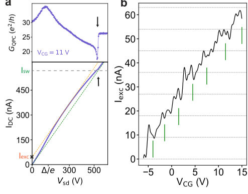
<figcaption class="paper-figure-caption"><b>Fig 4.</b> FIG. 4. (a) Example of the extraction of the excess current for a fixed channel gate voltage VCG = 11 V. The top curves show the differential conductance, where an anomalous dip, indicated by the black arrow, marks the superconducting to normal transition. The bottom plot shows the current-voltage curve, I(V ), obtained by integrating the QPC differential con- ductance shown in the top curve. The orange dashed line shows that as the bias voltage increases above the supercon- ducting gap, the I −V develops a current offset corresponding to Iexc. The green dashed line indicates the normal quasiparti- cle branch, where no excess current is present. (b) Extracted excess current as a function of...</figcaption>
</figure>

**Summary.** The researchers studied superconductivity in a graphene QPC coupled to an aluminum superconductor. They demonstrated that the quantized one-dimensional electronic modes of the QPC dictate both the equilibrium proximity effect (enhanced conductance via Andreev reflection) and the non-equilibrium dynamics, evidenced by stepwise changes in the superconducting breakdown current.

**Why it may be interesting.** This work provides a clean experimental realization where fundamental quantum confinement (1D modes) dictates both the ground state superconducting properties (Andreev reflection) and the dynamic breakdown mechanisms, which is highly relevant for understanding mesoscopic superconducting circuits.

Detailed structure

**Main problem.** To investigate how quantized one-dimensional transport modes of a Quantum Point Contact (QPC) govern both the equilibrium proximity effect and the non-equilibrium dynamics in a hybrid superconducting/normal conductor system.

**Main result.** The excess supercurrent and the switching current associated with superconductivity loss both exhibit discrete, quantized steps that directly follow the opening of successive QPC transport modes.

**Method.** Measurements include linear conductance ($G$) vs. gate voltage and finite-bias spectroscopy ($\partial G/\partial V_{sd}$), supplemented by analyzing superconducting-to-normal transition currents ($I_{sw}$).

**Model / system.** The system is a gate-defined QPC realized in bilayer graphene (BLG) proximitized by an aluminum superconductor, allowing study of Andreev reflection and proximity effects.

**Key observables.** Enhanced conductance plateaus (Andreev enhancement), superconducting gap ($\Delta$), above-gap conductance anomaly (dip marking superconductivity loss), excess current ($I_{exc}$), and switching current ($I_{sw}$).

**Important parameters / regimes.** Low temperatures ($T=10 	ext{ mK}$), gate voltage ($V_{	ext{CG}}$) controlling mode quantization, and source-drain bias voltage ($V_{	ext{sd}}$).

**Assumptions / limitations.** The analysis assumes that the superconducting gap features are robust indicators of proximity effects, and $I_{exc}$ is extracted by careful subtraction to minimize extrapolation errors.

**Figures summary.** Figures show quantized normal state conductance plateaus; finite-bias spectroscopy reveals coherence peaks at $\pm\Delta/e$ and an anomalous dip above the gap; switching current measurements demonstrate stepwise transitions correlated with QPC mode opening.

**Paper structure.** The paper systematically measures transport properties across different regimes: first establishing ballistic quantization, then observing Andreev enhancement in equilibrium, followed by characterizing the non-equilibrium collapse of superconductivity via conductance anomalies and quantized switching currents.

Abstract

We report the realization of a gate-defined quantum point contact (QPC) in bilayer graphene proximitized by a single aluminum superconducting electrode. Superconducting correlations induced in the ballistic channel enhance the conductance plateaus beyond their normal-state values. In addition, we observe a pronounced above-gap conductance anomaly which serves as a spectroscopic signature of the loss of superconductivity and the associated collapse of the Andreev excess current. By reconstructing the nonlinear current-voltage characteristics, we find that the magnitude of the excess current increases as successive QPC modes are populated. Additionally, we find that the switching current associated with the loss of superconductivity follows the underlying mode structure of the QPC, exhibiting discrete levels consistent with a heat dissipation-driven transition. These results demonstrate that the one-dimensional transport modes of the QPC govern both the equilibrium proximity effect and the non-equilibrium dynamics of the hybrid system.

[↑ back to top](#top)

### [Symmetry-Tunable Skyrmions and Merons in Magnetic Nanodisks via Spatially Engineered Anisotropy](http://arxiv.org/abs/2608.14983v1)

**Authors:** X. D. Wang, J. F. Oliveira da Silva, Z. H. Tao, H. M. Dong, K. Chang, M. V. Milošević  
**Type:** theory · **Category:** other · **PDF:** <https://arxiv.org/pdf/2608.14983v1>  
**Analysis basis:** full PDF text, analyzed in chunks
**Topic relevance:** `analog quantum simulation` **2/5** · `Frenkel-Kontorova` **1/5** · `Keldysh / 2PI / non-Gaussian methods` **1/5** · `interference shaping light` **1/5**

↔ Scroll figures horizontally

<figure class="paper-figure-card">

<figcaption class="paper-figure-caption"><b>Fig 1.</b> Figure 1: Schematic model of the proposed non-chiral magnetic nanodisks by design, with radius R = 250 nm and thickness d0: (a) a skyrmion within an IMA nanoring of width R1 = 200 nm, with strong PMA materials in its center of radius R0 = 50 nm, and beyond the outer edge, and (b) a meron within an IMA nanoring of the same size with PMA material only in its center. (c) Schematic of SW control using anisotropy-engineered skyrmions. 3D spin structures are shown in (a) and (b), respectively.</figcaption>
</figure>
<figure class="paper-figure-card">
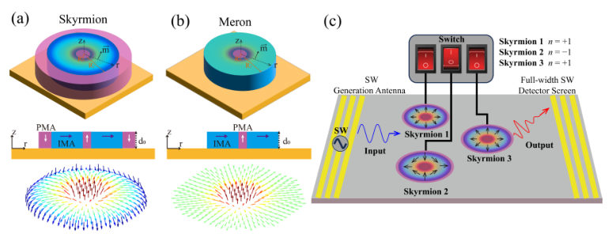
<figcaption class="paper-figure-caption"><b>Fig 2.</b> Figure 1(b). Figure 1(c) shows a proof-of-concept spin-wave control setup using anisotropy-</figcaption>
</figure>
<figure class="paper-figure-card">
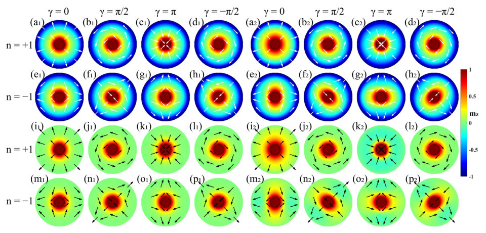
<figcaption class="paper-figure-caption"><b>Fig 3.</b> Figure 2: The in-plane spin configurations of skyrmions stabilized by constrained analytical solutions: (a1-h1) for skyrmions and anti-skyrmions, (i1-p1) for merons and anti-merons without DMI; (a2-h2) for skyrmions and anti-skyrmions, (i2-p2) for merons and anti-merons with DMI. The used parameters are A = 16 pJ/m, KPMA = 3.6 MJ/m3 for PMA value, and the indicated IMA values of KIMA = 5 KJ/m3 and D = 0.4 mJ/m2.</figcaption>
</figure>
<figure class="paper-figure-card">
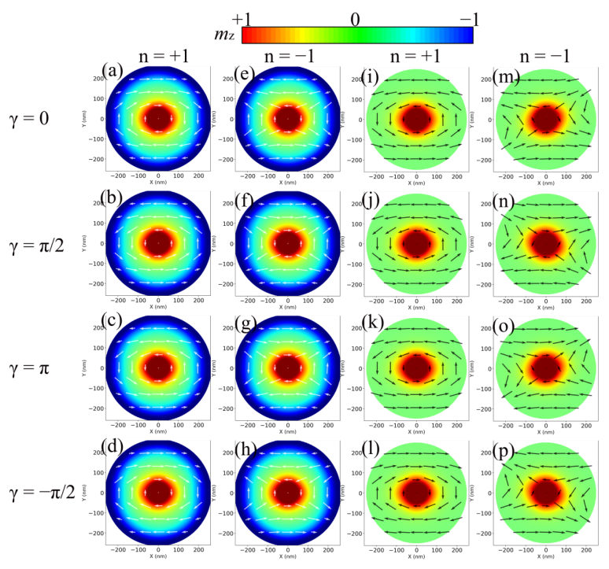
<figcaption class="paper-figure-caption"><b>Fig 4.</b> Figure 3: The micromagnetic simulated in-plane spin configurations of skyrmions (a-h) and merons (i-p) in the absence of DMI (D = 0) with dipolar interactions, respectively. The simulation parameters are A = 16 pJ/m, KPMA = 3.6 MJ/m3 for PMA value, and the indicated IMA values of KIMA = 5 KJ/m3.</figcaption>
</figure>
<figure class="paper-figure-card">
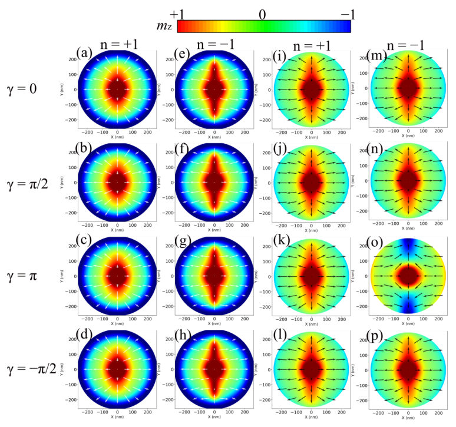
<figcaption class="paper-figure-caption"><b>Fig 5.</b> Figure 4: The micromagnetic simulated in-plane spin configurations of skyrmions (a-h) and merons (i-p) in the presence of DMI with dipolar interactions, respectively. The simulation parameters are A = 16 pJ/m, KPMA = 3.6 MJ/m3 for PMA value, and the indicated IMA values of KIMA = 5 KJ/m3 and D = 0.4 mJ/m2.</figcaption>
</figure>

**Summary.** This work demonstrates that magnetic skyrmion and meron textures can be stabilized in nanodisks purely by patterning the magnetocrystalline anisotropy, bypassing the need for the Dzyaloshinskii-Moriya interaction. Using micromagnetic simulations, the authors show this patterned structure allows for deterministic control over topology and, crucially, enables arrays of these defects to act as reconfigurable elements for controlling spin-wave transmission.

**Why it may be interesting.** While focused on condensed matter magnetism, the concept of engineering local symmetries and topological defects (skyrmions) for controlled wave propagation shares conceptual links with engineered quantum waveguides or artificial lattices used in AMO physics.

Detailed structure

**Main problem.** The primary goal is stabilizing tunable skyrmion and meron spin textures in magnetic nanodisks without relying on the Dzyaloshinskii-Moriya interaction (DMI). This addresses limitations in using centrosymmetric magnets.

**Main result.** Spatially engineered anisotropy, combining perpendicular and in-plane components, can deterministically stabilize these topological textures. Furthermore, arrays of such structures can be used to control spin-wave transmission by manipulating vorticity arrangement.

**Method.** The study employs a combination of constrained analytical modeling and unconstrained micromagnetic simulations to solve the governing partial differential equation derived from minimizing the total energy functional.

**Model / system.** The system is magnetic nanodisks where the magnetization dynamics are governed by an energy functional incorporating exchange, anisotropy (both perpendicular and in-plane), dipolar, and DMI terms. The key mechanism involves patterning the anisotropy to break symmetry artificially.

**Key observables.** Topological charge (Q), in-plane spin configurations, and transverse deflection/control of transmitted spin waves (SW).

**Important parameters / regimes.** The relative strengths of perpendicular magnetic anisotropy ($K_{	ext{PMA}}$) versus engineered in-plane uniaxial anisotropy ($	ext{IMA}$); the presence or absence of DMI.

**Assumptions / limitations.** The model utilizes the Landau-Lifshitz continuum approximation, and while presented as generalizable, specific material choices are suggested for validation.

**Figures summary.** Figures illustrate schematic models showing skyrmion/meron stabilization via anisotropy patterning (IMA ring in PMA background), show spin configurations with and without DMI, and demonstrate SW propagation control through engineered arrays.

**Paper structure.** The paper progresses by first establishing the theoretical framework for topological stability using patterned anisotropy. It then uses simulations to compare DMI-free vs. DMI-present states, culminating in a demonstration of how these structures can function as reconfigurable magnonic elements controlling spin waves.

Abstract

We demonstrate that spatially engineered magnetic anisotropy can stabilize skyrmion and meron spin textures in magnetic nanodisks even in the absence of Dzyaloshinskii-Moriya interaction (DMI). Using a constrained analytical model and micromagnetic simulations, we show that competing perpendicular and in-plane anisotropies can generate non-collinear topological textures in non-chiral magnetic systems. We further show that DMI and dipolar interactions lift the helicity degeneracy and select preferred chiral configurations; micromagnetic simulations were used to identify physically stable states. These results establish anisotropy-patterned nanodisks as a platform for studying DMI-free topological spin textures and their controllable magnetic response. We also show that arrays of anisotropy-engineered skyrmions can control spin-wave transmission by manipulating their vorticity arrangement, pointing to reconfigurable magnonic elements based on non-chiral topological textures.

[↑ back to top](#top)

### [External identification and electrothermal modeling of persistent-current-switch operating states in a Siemens MRI magnet](http://arxiv.org/abs/2608.15911v1)

**Authors:** Volodymyr Pupkov  
**Type:** both · **Category:** other · **PDF:** <https://arxiv.org/pdf/2608.15911v1>  
**Analysis basis:** full PDF text, analyzed in chunks
**Topic relevance:** `quantum measurements` **2/5** · `driven-dissipative phase transition` **1/5** · `methods for driven-dissipative` **1/5**

↔ Scroll figures horizontally

<figure class="paper-figure-card">
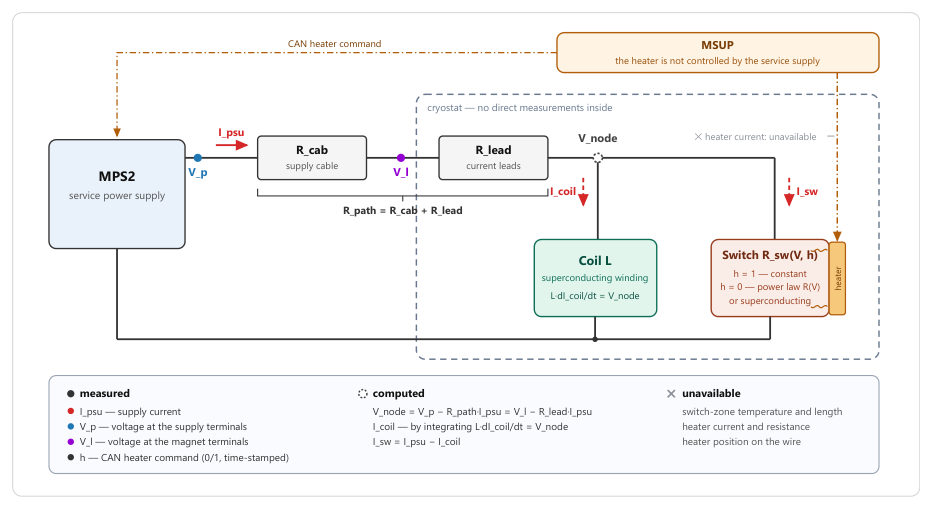
<figcaption class="paper-figure-caption"><b>Fig 1.</b> Figure 1: The “coil ∥PCS” node and the measurement access. Directly recorded are Ipsu, Vp, Vl, and the CAN heater command h, which arrives through the external magnet supervision module (MSUP); the node voltage and the currents of the parallel branches are computed with the full external path Rpath = Rcab +Rlead taken into account. Solid lines — measured quantities, dashed — computed; the gray cryostat area is inaccessible to direct measurement.</figcaption>
</figure>
<figure class="paper-figure-card">
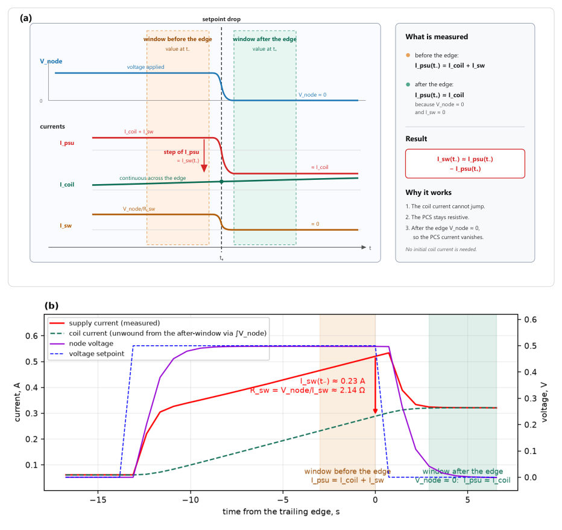
<figcaption class="paper-figure-caption"><b>Fig 2.</b> Figure 2: Principle of the trailing-edge technique. (a) Scheme: in the window before the setpoint drop, the supply carries the sum Icoil + Isw; in the window after the edge, the coil current has barely changed, while at Vnode ≈0 the resistive-branch current is close to zero. The step in the measured Ipsu therefore yields Isw before the edge. The curves are schematic and not to scale. (b) The same technique applied to a recorded 0.5 V pulse from the series in Fig. 5: when the setpoint is dropped, the measured supply current falls toward the coil current, and the step height yields Isw(t−) = 0.232 A and Rsw = 2.14 Ω— within the ranges of the series (0.230–0.232 A and 2.08–2.15 Ω, Section...</figcaption>
</figure>
<figure class="paper-figure-card">
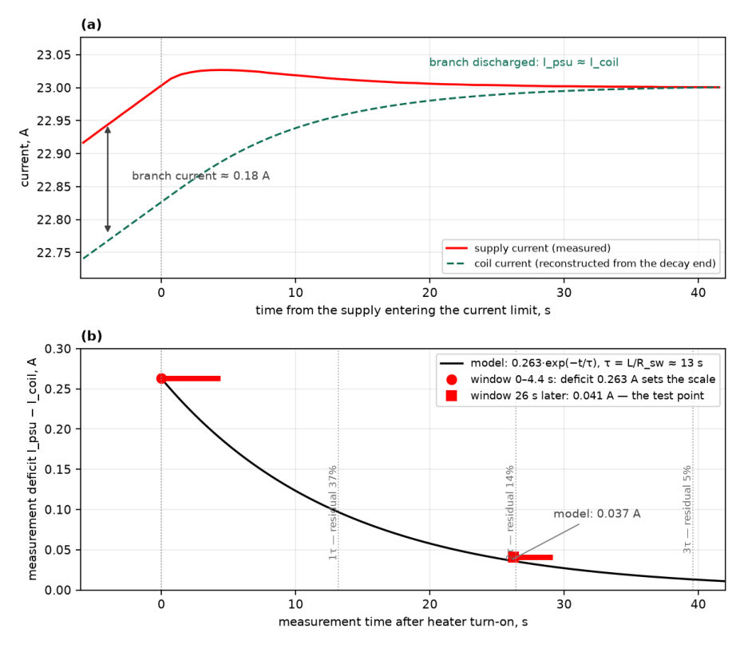
<figcaption class="paper-figure-caption"><b>Fig 3.</b> Figure 3: Coil-current pickup and the effect of the hold. (a) Free current redistribution in a recorded pickup session: after the supply reaches the current limit, the measured Ipsu is nearly constant while the PCS-branch current (≈0.18 A) transfers into the coil — the reconstructed Icoil converges to the measured current. (b) The measurement deficit Ipsu −Icoil for the two pickup windows as a function of time after the heater turn-on. The window that started simultaneously with the turn-on falls within the transient, gives 0.263 A, and sets the scale of the model 0.263 · exp(−t/τ) with τ = L/Rsw ≈13 s; the window 26 s later gives 0.041 A, compared with the model value of 0.037 A, and is...</figcaption>
</figure>
<figure class="paper-figure-card">
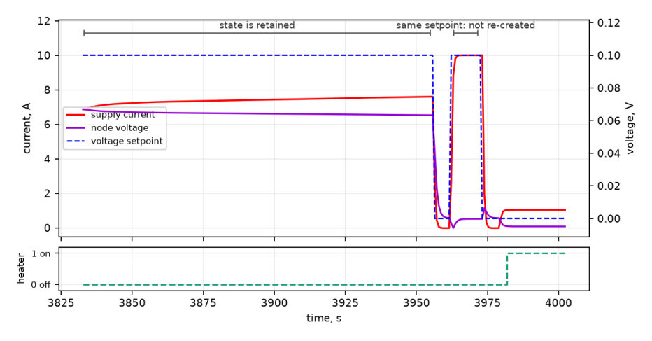
<figcaption class="paper-figure-caption"><b>Fig 4.</b> Figure 4: Initiating ̸= sustaining: the same 0.10 V setpoint sustains an existing resistive state but does not re-create it after a four-second reset. After the setpoint returns, the node voltage stays near zero and the supply current reaches the limit. The bottom lane is the CAN heater command (1 — on, 0 — off): both compared episodes run at h = 0; the heater is switched on again only at the end of the window.</figcaption>
</figure>
<figure class="paper-figure-card">
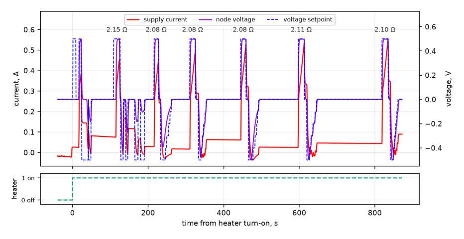
<figcaption class="paper-figure-caption"><b>Fig 5.</b> Figure 5: Seven pulses at a 0.5 V setpoint with the heater on continuously. The settled pulses are annotated with the resistance from the trailing-edge technique (Section 4.1): 2.08–2.15 Ω at heater operating times of 109–819 s. No systematic trend with duration is visible; the full resistance range is 3.3 %, and the branch current changes by less than 1 %. The first pulse preceded the long zero pause needed for the independent determination of the coil current and is excluded from the statistics. The bottom lane is the CAN heater command, which stays on throughout the series.</figcaption>
</figure>

**Summary.** This paper develops a detailed electrothermal model for a Persistent Current Switch (PCS) in an MRI magnet, moving beyond simple on/off control. By analyzing external voltage and current logs, the authors quantify how Joule self-heating sustains resistive states after the heater is turned off. The resulting model significantly improves the accuracy of dynamic simulations describing the complex switching behavior.

**Why it may be interesting.** While focused on classical superconducting magnet engineering, the underlying principle of modeling hysteretic, non-linear, history-dependent electrical switching behavior is relevant to understanding quantum circuit switches or Josephson junction dynamics where state transitions are critical.

Detailed structure

**Main problem.** To move beyond treating Persistent Current Switch (PCS) control as purely binary, the authors quantitatively model its operating states by accounting for Joule self-heating effects after heater deactivation.

**Main result.** The proposed electrothermal model successfully describes both resistive regimes using a unified relation, significantly improving dynamic simulation accuracy compared to simpler models.

**Method.** The study combines external electrical measurements from service sessions with detailed electrothermal modeling and dynamic simulations.

**Model / system.** The system is a superconducting MRI magnet containing a PCS connected in parallel with the main coil. The model treats the PCS resistance as dependent on both node voltage and heater command, governed by an electrothermal balance equation.

**Key observables.** Branch resistance ($R_{sw}$), self-sustainment boundary voltage ($\approx 0.062	ext{ V}$), current Root Mean Square Error (RMSE).

**Important parameters / regimes.** Inductance ($L$), time constant ($	au = L/R_{sw}$), heater command ($h$), and the electrothermal relation coefficients ($C, a$).

**Assumptions / limitations.** The model parameters are specific to the tested Siemens Avanto unit and do not automatically transfer to other magnets or full operating currents.

**Figures summary.** Not specified (Analysis relies on logs of current/voltage over time).

**Paper structure.** The paper analyzes external electrical measurements from service sessions, develops a unified electrothermal model linking two distinct resistive regimes (heater-on vs. self-sustained), and validates the model using dynamic simulations.

Abstract

A persistent current switch (PCS) closes the superconducting loop of an MRI magnet; a heater makes it resistive so an external supply can change the magnet current. PCS control is usually treated as binary: heater on--resistive, heater off--superconducting. External current and voltage logs from an MPS2 service power supply (Digit Systems) show for a Siemens MAGNETOM Avanto magnet that the command does not uniquely determine the PCS state: after heater switch-off, Joule self-heating can sustain the resistive state. Purpose-designed maneuvers separate two resistive regimes. With the heater energized, the branch resistance is nearly constant at 1.86--2.19 $Ω$ below 0.5 V. After switch-off, the self-sustained regime follows $R_{sw}=0.65|V_{node}|^{1.5}$ ($R_{sw}$ in ohms, $V_{node}$ in volts) and is 12-fold below the heater-on resistance at 0.4 V. Both regimes obey one electrothermal relation, $R_{sw}=C(P_h h+V_{node}^2/R_{sw})^a$, with $h$ the binary heater command, over a 690-fold resistance range. First, branch resistance and coil inductance set the redistribution time constant, $τ=L/R_{sw}$; final-hold duration therefore controls persistent-current accuracy. Across 18 service sessions on other Siemens magnets, analyzed without transferring the Avanto coefficients, the median hold was $13τ$ and the median residual branch current was 8 ppm of coil current. Second, the intersection of the PCS characteristic and external-circuit load line sets the self-sustainment boundary. The cross-session estimate of 0.062 V lies between observed retrapping at 0.06 V and retention at 0.07 V. In dynamic simulation, the two fixed-coefficient characteristics $R(V,h)$ reduce current RMSE from 1.449 to 0.154 A (9.4-fold); omitting explicit heater input gives no improvement over the inductance-only model.

[↑ back to top](#top)

### [A cold-insertable scanning probe microscope for dry dilution refrigerators with picometer stability and ultra-low electron temperatures](http://arxiv.org/abs/2608.15495v1)

**Authors:** Yizhou Wei, Berthold Jäck  
**Type:** experiment · **Category:** other · **PDF:** <https://arxiv.org/pdf/2608.15495v1>  
**Analysis basis:** full PDF text, analyzed in chunks
**Topic relevance:** `quantum measurements` **2/5**

↔ Scroll figures horizontally

<figure class="paper-figure-card">
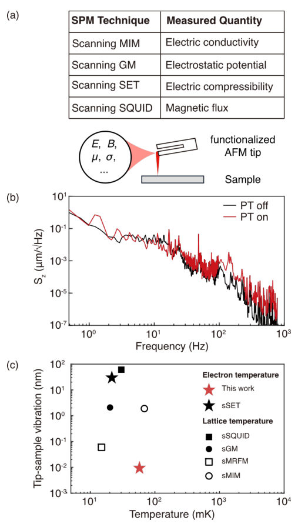
<figcaption class="paper-figure-caption"><b>Fig 1.</b> FIG. 1. Overview of representative AFM-based scanning probe techniques and their vibration, and temperature performance. (a) Representative atomic force microscopy (AFM)-based scanning probe techniques for locally measuring diverse physical properties of novel materials, including electric fields E, magnetic fields B, chem- ical potential µ, electrical conductivity σ, and other material prop- erties. (b) Frequency-dependent vertical displacement noise spectral density measured on the mixing-chamber plate of a Leiden Cryo- genics CS-SF 110 dilution refrigerator with the pulse tube cooler (PT) switched on (red) and off (black). (c) Overview of the tem- peratures and relative tip-sample...</figcaption>
</figure>
<figure class="paper-figure-card">
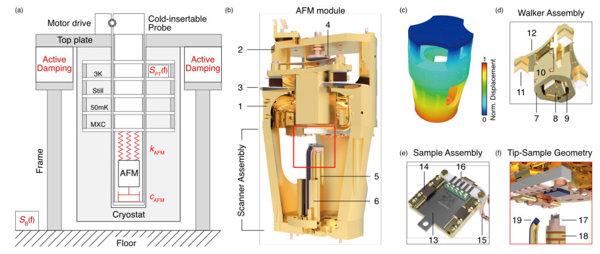
<figcaption class="paper-figure-caption"><b>Fig 2.</b> FIG. 2. Assembly and vibration-isolation architecture of the ultralow-noise, millikelvin AFM integrated into a cryogen-free dilution refrigerator. (a) Schematic of the complete instrument and its multistage vibration-isolation architecture. The dominant vibration sources are building-borne vibrations, characterized by the displacement-noise spectral density SB(f), and vibrations generated by the pulse-tube (PT) cryocoolers, characterized by SPT(f). Both contributions are jointly attenuated by a combination of active vibration-isolation stages and an internal passive isolation system at the mixing-chamber (MXC) stage. In the passive system, the suspension springs provide an effective spring...</figcaption>
</figure>
<figure class="paper-figure-card">
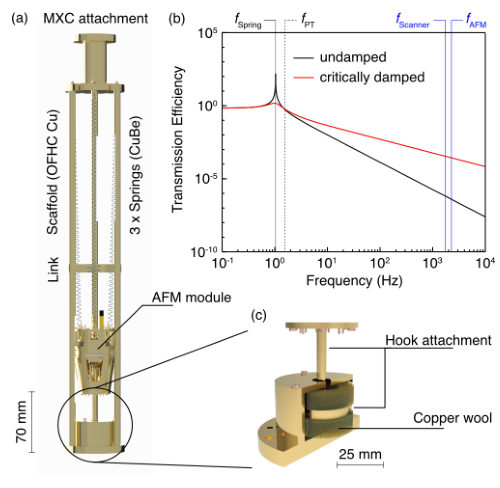
<figcaption class="paper-figure-caption"><b>Fig 3.</b> FIG. 3. Design of a mixing chamber attachment for vibration- isolation design of the AFM module. (a) Shown is the MXC at- tachment comprising the AFM module, which is suspended by three CuBe springs providing the effective spring constant kAFM and cou- pled to a home-built damper providing the damping coefficient cAFM, together forming a critically damped isolation stage. The MXC at- tachment is realized using a scaffold to support the damping stage at the bottom and comprises a link structure for enhanced mechani- cal rigidity and as a thermalization point. (b) Calculated frequency- dependent vibration transmission efficiency. The characteristic fre- quencies are the suspension resonance...</figcaption>
</figure>
<figure class="paper-figure-card">
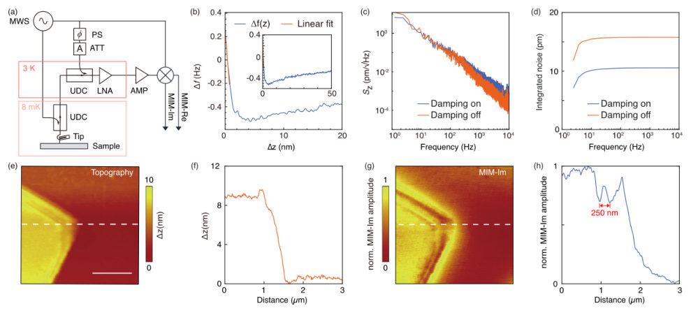
<figcaption class="paper-figure-caption"><b>Fig 4.</b> FIG. 4. Microwave impedance microscopy circuit configuration, noise characterization, and representative imaging results. (a) Schematic of the sMIM circuit. The output of the microwave source (MWS)33 is routed via a three-way power splitter to hand-formable microwave cables leading to the mixing chamber, and then via flexible cables34 to the AFM head. An impedance matching network (a 0.1pF capacitor to the tip wire) couples the signal to the AFM tip-sample junction25. The reflected measurement signal is separated using a unidirectional coupler (UDC)35 at the mixing chamber. A cancellation line—adjusted via a phase shifter (PS)36 and tunable attenuator (ATT)37—suppresses the common mode...</figcaption>
</figure>
<figure class="paper-figure-card">
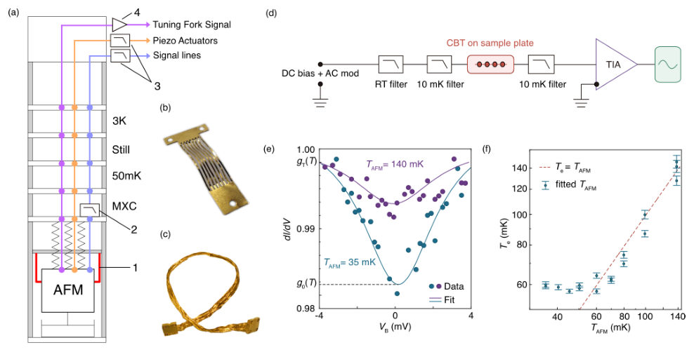
<figcaption class="paper-figure-caption"><b>Fig 5.</b> FIG. 5. Thermalization and filtering architecture of the AFM module and electron-temperature characterization. (a) Schematic of the thermal links, electrical wiring, and filtering scheme realized on the cold-insertable probe of the dilution refrigerator. The purple, orange, and blue lines denote the AFM signal, piezo-actuator drive lines, and sample signal lines, respectively. The labeled components are the direct thermal link between the mixing-chamber (MXC) stage and the AFM module (1), filters at the 10-mK stage44 (2), room-temperature filters43 (3), and the AFM signal amplifier48 (4). (b,c) Home-designed, gold-plated OFHC Cu thermal links: a laser-cut flexible Cu foil thermally...</figcaption>
</figure>

**Summary.** The paper introduces a novel, modular scanning probe microscope designed for use in dry dilution refrigerators. By combining advanced mechanical isolation techniques with optimized thermal management, the authors overcome the trade-off between vibration damping and low temperature. This allows for high-resolution measurements at picometer stability while keeping sample electron temperatures extremely low.

**Why it may be interesting.** This work is highly relevant to experimental quantum physics as it provides a robust platform for probing fragile quantum phases in extreme cryogenic environments where mechanical stability and thermal control are often mutually exclusive goals.

Detailed structure

**Main problem.** The primary challenge is implementing high-resolution scanning probe microscopy (SPM) techniques, like AFM, in cryogen-free dilution refrigerators while simultaneously achieving picometer mechanical stability and ultra-low sample electron temperatures.

**Main result.** The authors successfully demonstrated a modular system that achieves sub-Angstrom tip-sample vibration stability ($\approx 10 	ext{ pm}$) while maintaining local sample electron temperatures below $60 	ext{ mK}$.

**Method.** They employed a two-pronged design strategy: mechanically isolating the AFM module using a critically damped spring suspension, and optimizing thermal links with custom copper strapping to manage heat flow.

**Model / system.** The system is an AFM-based scanning microwave impedance microscope integrated onto a cold-insertable probe within a dry dilution refrigerator. Key components include OFHC Cu machining for structural integrity and specialized damping stages to counteract intense pulse tube mechanical noise.

**Key observables.** Relative tip-sample vibration noise density ($S_{	ext{AFM}}(f) < 10^{-11} 	ext{ m}/\sqrt{	ext{Hz}}$), spectrally integrated displacement ($\Delta z \approx 10 	ext{ pm}$), and local sample electron temperature ($T_e \le 60 	ext{ mK}$).

**Important parameters / regimes.** Picometer stability, $T_e \le 60 	ext{ mK}$, $>100$-fold improvement in vibration stability over previous setups.

**Assumptions / limitations.** The success relies on the assumption that the optimized thermal strapping and filtering architecture can effectively mitigate parasitic heat leaks while allowing for mechanical decoupling.

**Figures summary.** Figures illustrate the system schematic, noise spectral density measurements showing successful isolation from PT noise, and plots detailing $T_e$ vs. lattice temperature to confirm cooling efficiency.

**Paper structure.** The paper details the initial limitations imposed by cryocooler noise and thermal trade-offs, presents the two-pronged mechanical/thermal design solution (spring suspension, copper strapping), validates the performance metrics ($\Delta z$, $T_e$), and concludes with the modular applicability of the architecture.

Abstract

Investigating the microscopic mechanisms of quantum materials requires high-resolution scanning probe techniques, often based on atomic force microscopy (AFM). However, implementing AFM in cryogen-free dilution refrigerators with picometer stability is challenged by intense pulse tube mechanical noise ($S_{\rm PT}(f)\approx10^{-6}\,\text{m}/\sqrt{\text{Hz}}$) and the fundamental trade-off with thermalizing piezoelectric motion stages below 100\,mK. Here, we demonstrate an AFM-based scanning microwave impedance microscope integrated onto a standard cold-insertable probe that successfully resolves this bottleneck. By employing a two-pronged design strategy---coupling a mechanically stiff AFM module with a magnetic-field-compatible, critically damped internal spring-suspension---we achieve an extremely low relative tip-sample vibration noise density of $S_{\rm AFM}(f)<10^{-11}\,\text{m}/\sqrt{\text{Hz}}$. This yields a spectrally integrated relative tip-sample displacement of $Δz\approx10\,\text{pm}$, representing a greater than 100-fold stability improvement over recent fast-loading dry SPM setups. Simultaneously, optimized thermal interfaces, customized copper strapping, and comprehensive RF filtering enable a local sample electron temperature of $T_{\rm e}\leq 60\,$mK, circumventing the thermal penalties of mechanical decoupling. By avoiding permanent structural modifications to the host cryostat, this robust, modular architecture provides an accessible framework for adapting other scanning probe techniques, accelerating the exploration of fragile quantum phases in dry cryostats with picometer stability.

[↑ back to top](#top)

### [Discovering Physically Interpretable Mathematical Expression for Predicting CO2 Adsorption in Metal-Organic Frameworks via Machine Learning-Symbolic Regression](http://arxiv.org/abs/2608.14990v1)

**Authors:** Yimin Shao, Shengluo Ma, Shenghong Ju, Yijun Shi, Wei Li  
**Type:** theory · **Category:** disordered systems and neural networks · **PDF:** <https://arxiv.org/pdf/2608.14990v1>  
**Analysis basis:** full PDF text, analyzed in chunks
**Topic relevance:** `Keldysh / 2PI / non-Gaussian methods` **1/5** · `driven-dissipative phase transition` **1/5** · `methods for driven-dissipative` **1/5** · `non-equilibrium universality` **1/5** · `quantum measurements` **1/5**

↔ Scroll figures horizontally

<figure class="paper-figure-card">
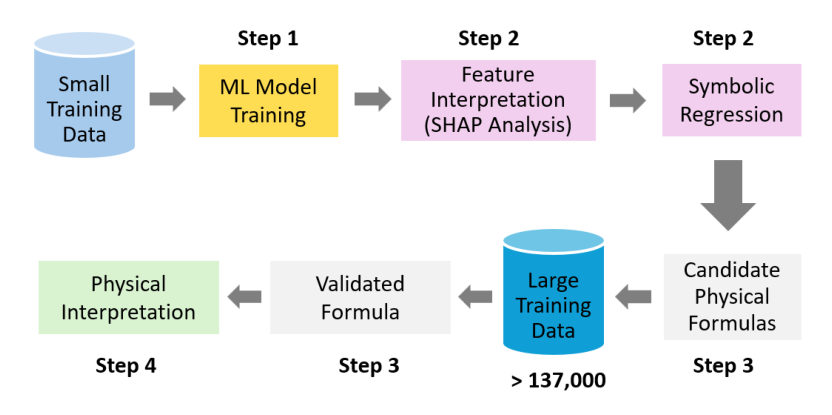
<figcaption class="paper-figure-caption"><b>Fig 1.</b> Figure 1. Workflow diagram of the machine learning (ML) process. This figure mainly illustrates the 4 key steps employed in this study to obtain interpretable equations. Firstly, a subset containing 1,000</figcaption>
</figure>
<figure class="paper-figure-card">
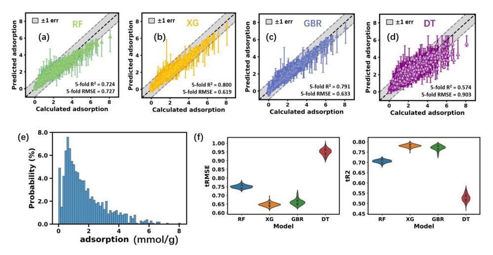
<figcaption class="paper-figure-caption"><b>Fig 2.</b> Figure 2. (a–d) Prediction results of different ML models: (a) RF model; (b) XG model; (c) GBR model; (d) DT model. (e) Numerical distribution of CO₂ adsorption capacity in the MOF dataset. (f) Violin</figcaption>
</figure>
<figure class="paper-figure-card">
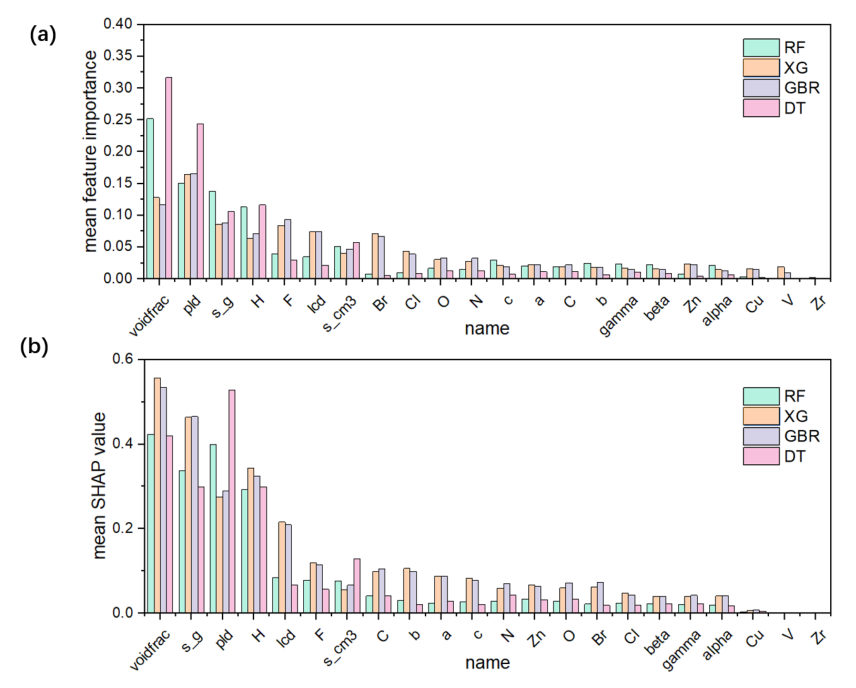
<figcaption class="paper-figure-caption"><b>Fig 3.</b> Figure 3. (a) Mean feature importance values of 22 descriptors; (b) Mean SHAP values of the 22 descriptors, obtained from the RF, XG, GBR, and DT models. The top five influential descriptors, void</figcaption>
</figure>
<figure class="paper-figure-card">
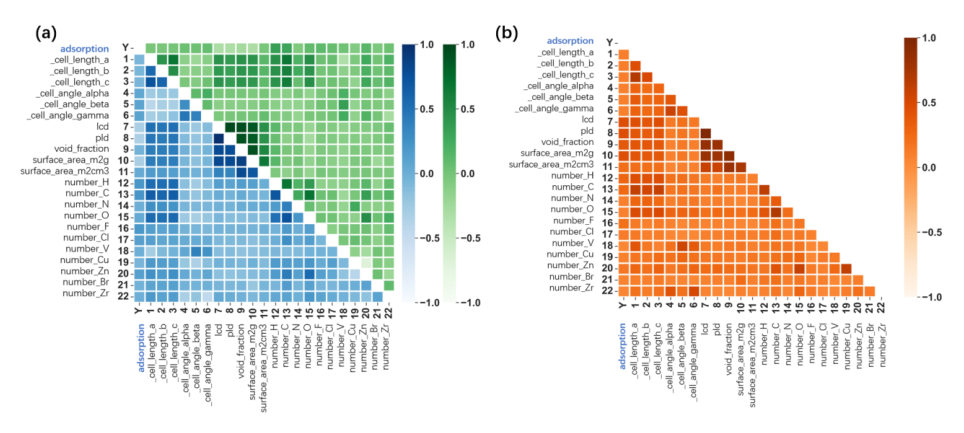
<figcaption class="paper-figure-caption"><b>Fig 4.</b> Figure 4. (a) Blue heatmap representing Pearson correlation and green heatmap representing Spearman correlation; (b) Orange heatmap illustrating distance correlation for descriptors. These three metrics</figcaption>
</figure>
<figure class="paper-figure-card">
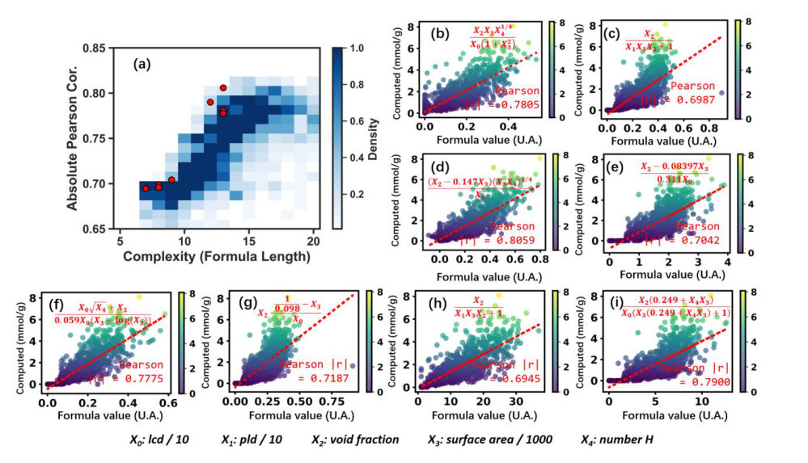
<figcaption class="paper-figure-caption"><b>Fig 5.</b> Figure 5. (a) Density plot illustrating the Pareto front between Pearson correlation coefficient (r) and the complexity of 9,073 mathematical formulas; (b–i) scatter plots comparing the CO₂ adsorption</figcaption>
</figure>

**Summary.** This work pioneers the use of Machine Learning-Symbolic Regression (ML-SR) to predict CO2 adsorption in MOFs. By deriving a simple, physically interpretable formula rather than relying on a black box model, it provides deep insight into how pore topology and surface chemistry govern gas uptake. This methodology offers a powerful template for creating predictive models across various condensed matter systems.

**Why it may be interesting.** While focused on materials science, the methodology—using advanced machine learning (SR) combined with explicit physical interpretation of mathematical operations ($	ext{Addition} 
ightarrow 	ext{Superposition}$, $	ext{Division} 
ightarrow 	ext{Normalization}$)—is highly relevant to developing physics-informed neural networks or analytical models in quantum many-body systems.

Detailed structure

**Main problem.** The primary goal is to develop a physically interpretable mathematical formula for predicting low-pressure CO2 adsorption capacity in hypothetical Metal-Organic Frameworks (hMOFs). This aims to move beyond 'black box' machine learning predictions.

**Main result.** A concise, physics-guided formula of the form Q=aA was derived and validated against a large dataset, achieving over 70% prediction accuracy for thousands of structures. The dimensionless term A is interpreted as the ratio between an adsorption binding force and a diffusion driving force.

**Method.** The study employs a Machine Learning–Symbolic Regression (ML-SR) strategy. After training multiple ML models (e.g., XGBoost), feature importance analysis guides symbolic regression to derive explicit, interpretable mathematical equations.

**Model / system.** The physical system studied is Metal-Organic Frameworks (MOFs). The prediction targets the CO2 adsorption capacity at low pressures, using structural descriptors like pore size, surface area, and void fraction as inputs.

**Key observables.** CO2 adsorption capacity (Q in mmol/g), dimensionless adsorption number (A), Prediction Accuracy ($R^2$, AER).

**Important parameters / regimes.** Low pressure regime ($\le 1$ bar), key structural descriptors (void fraction, pore limiting diameter, etc.).

**Assumptions / limitations.** The core assumption is that the complex physical process of gas adsorption can be accurately modeled by a simple, underlying mathematical relationship discoverable through symbolic regression.

**Figures summary.** Figures illustrate the workflow from ML training to SHAP analysis and final SR validation. Tables compare empirical equation predictions against experimental data for various MOFs.

**Paper structure.** The paper follows a progression: first, establishing the need for interpretable models; second, applying standard ML techniques (training/feature importance); third, using symbolic regression constrained by physical units to derive candidate formulas; and finally, validating these derived formulas on large datasets.

Abstract

This work presents a machine learning-symbolic regression (ML-SR) strategy to develop a physically interpretable formula for predicting low pressure CO2 adsorption capacity in hypothetical metal-organic frameworks (hMOFs). Four ML models were trained on a small dataset of 1,000 samples, and five key descriptors-largest cavity diameter, pore limiting diameter, void fraction, gravimetric surface area, and number of hydrogen atoms-were identified through SHAP and feature importance analyses. Symbolic regression was then employed to derive a concise adsorption formula, Q=aA, where a represents an adsorption baseline (mmol/g) and A is a dimensionless adsorption number incorporating four structural descriptors. We interpret A as the ratio between an adsorption binding force and a diffusion driving force, revealing how pore topology and surface chemistry jointly influence adsorption. Validation against a comprehensive dataset of 137,652 hMOFs demonstrates that this formula achieves over 70% prediction accuracy for 62,448 structures, confirming strong applicability within defined structural and operational ranges. Unlike conventional black box ML models, the proposed physics-guided expression enables efficient prediction and provides clearer insight into adsorption mechanisms.

[↑ back to top](#top)

### [A magnonic-optoelectronic reservoir for physical reservoir computing](http://arxiv.org/abs/2608.16388v1)

**Authors:** Alexey B. Ustinov, Ivan Y. Tatsenko, Andrei A. Nikitin, Mikhail P. Kostylev  
**Type:** both · **Category:** disordered systems and neural networks · **PDF:** <https://arxiv.org/pdf/2608.16388v1>  
**Analysis basis:** full PDF text, analyzed in chunks
**Topic relevance:** `driven-dissipative phase transition` **1/5** · `methods for driven-dissipative` **1/5** · `quantum optics experiment` **1/5**

↔ Scroll figures horizontally

<figure class="paper-figure-card">
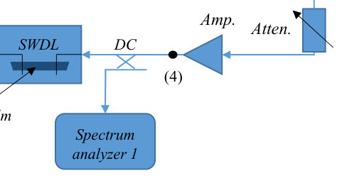
<figcaption class="paper-figure-caption"><b>Fig 1.</b> Fig. 1. A schematic diagram of magnonic-optoelectronic physical reservoir (EOM –</figcaption>
</figure>
<figure class="paper-figure-card">
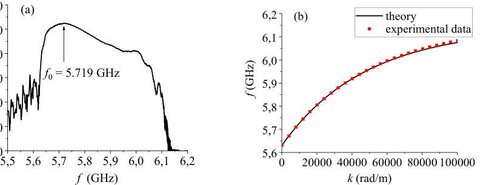
<figcaption class="paper-figure-caption"><b>Fig 2.</b> Fig. 2. (a) Amplitude–frequency characteristic of the spin-wave delay line. (b) Experimental (red</figcaption>
</figure>
<figure class="paper-figure-card">
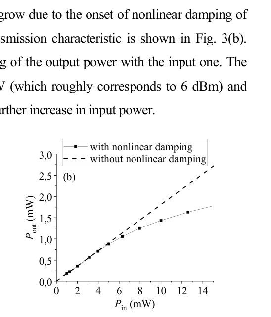
<figcaption class="paper-figure-caption"><b>Fig 3.</b> Fig. 3. Insertion loss (a) and output microwave power (b) as a function of input</figcaption>
</figure>
<figure class="paper-figure-card">
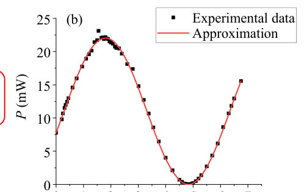
<figcaption class="paper-figure-caption"><b>Fig 4.</b> Fig. 4. (а) Schematic diagram of the setup for measuring the transmission characteristic</figcaption>
</figure>
<figure class="paper-figure-card">
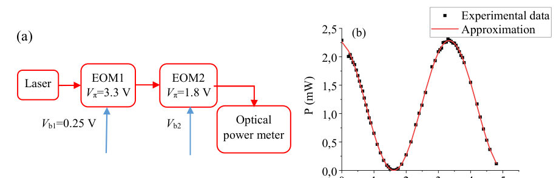
<figcaption class="paper-figure-caption"><b>Fig 5.</b> Fig. 5. (а) A diagram of the setup for measuring the transmission characteristic of the electro-</figcaption>
</figure>

**Summary.** The paper presents a novel physical reservoir computing platform built using a magnonic-optoelectronic oscillator (MOEO) incorporating YIG spin waves. By separating short-term memory into the optical path and nonlinear mapping into the microwave magnon path, they demonstrated its viability for pattern recognition tasks. The results confirm that the system's performance metrics, like STM capacity, are measurable and predictable through both theory and experiment.

**Why it may be interesting.** This work bridges nonlinear dynamics in magnonics/photonics with machine learning concepts (Reservoir Computing). The study of self-oscillations and nonlinearity in coupled opto-magnonic systems is highly relevant to understanding complex, non-equilibrium physical computation models.

Detailed structure

**Main problem.** The work addresses developing a physical reservoir computing system for complex pattern recognition tasks like computer vision, aiming for energy efficiency.

**Main result.** They successfully demonstrated the operation of a magnonic-optoelectronic oscillator (MOEO) based reservoir, showing good agreement between numerical simulations and experimental measurements.

**Method.** The approach combines an optical path with a microwave path utilizing spin waves in YIG film to create nonlinearity for mapping input data into a high-dimensional space.

**Model / system.** The physical system is the MOEO, comprising an optical delay line (for short-term memory) and a microwave circuit using YIG ferrite films. The dynamics are modeled based on amplitude balance conditions required for self-oscillations.

**Key observables.** Short-term memory (STM) capacity, parity-check (PC) capacity, output signal power, and transient response times ($	au_{rise}, 	au_{fall}$).

**Important parameters / regimes.** The system relies on the strong four-wave nonlinearity of spin waves in YIG film; steady state is characterized when the open-loop gain equals unity ($L/H = 1$).

**Assumptions / limitations.** The optical path operates linearly, while the spin-wave delay line provides the necessary nonlinearity. The nonlinear frequency shift ($\Delta\omega$) is assumed small enough not to affect reservoir operation.

**Figures summary.** Figures illustrate schematic diagrams of the MOEO, measurements of linear and nonlinear loss vs. input power, oscilloscope traces showing transient responses for different pulse amplitudes, and plots quantifying STM/PC capacities versus pulse duration.

**Paper structure.** The paper first introduces the concept of PRC using a MOEO platform. It then details the theoretical modeling based on amplitude balance conditions. The core involves experimental characterization of individual components (FODL, EOMs) followed by testing the full reservoir performance using STM and PC tasks.

Abstract

Physical reservoir computing is a promising approach for fast and energy efficient computer vision, natural language processing, and general pattern recognition. This work presents a physical reservoir based on magnonic-optoelectronic oscillator (MOEO). This approach allowed us to realize short-term memory and nonlinearity as separate system components. The device`s optical path uses a fiber-optic delay line as a short-term-memory element. The microwave path is responsible for nonlinear mapping of input data to a higher-dimensional space. The strong four-wave nonlinearity of spin waves propagating in an yttrium-iron garnet (YIG) ferrite film enables the process. The reservoir performance is evaluated by completing task-independent tests known as short-term memory (STM) and parity-check (PC) tasks. In addition, a numerical model of the MOEO based reservoir is developed. Results of the numerical simulation of the reservoir performance are in good agreement with the experimental data.

[↑ back to top](#top)

### [Novel lump solutions of the modified Kadomtsev-Petviashvili-I equation](http://arxiv.org/abs/2608.16296v1)

**Authors:** Tianwei Qiu, Zhen Wang  
**Type:** theory · **Category:** other · **PDF:** <https://arxiv.org/pdf/2608.16296v1>  
**Analysis basis:** full PDF text, analyzed in chunks
**Topic relevance:** `Keldysh / 2PI / non-Gaussian methods` **1/5** · `analog quantum simulation` **1/5** · `non-equilibrium universality` **1/5**

↔ Scroll figures horizontally

<figure class="paper-figure-card">
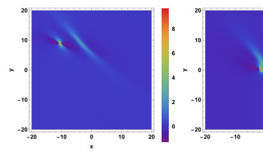
<figcaption class="paper-figure-caption"><b>Fig 1.</b> Fig. 1: Evolution of the second-order lump solution (3) with λ = 1 + 3</figcaption>
</figure>
<figure class="paper-figure-card">
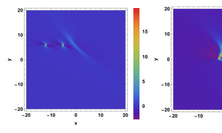
<figcaption class="paper-figure-caption"><b>Fig 2.</b> Fig. 2: Evolution of the third-order lump solution (4) with λ = 1 + i and C22 = C32 = C13 = C23 = C33 = 0.</figcaption>
</figure>
<figure class="paper-figure-card">
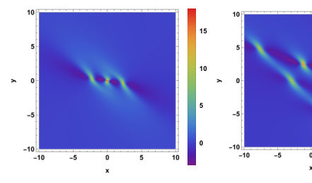
<figcaption class="paper-figure-caption"><b>Fig 3.</b> Fig. 3: The third-order lump solution (5) at t = 0 with λ = 1 + i and C23 = C15 = C25 = 0.</figcaption>
</figure>
<figure class="paper-figure-card">
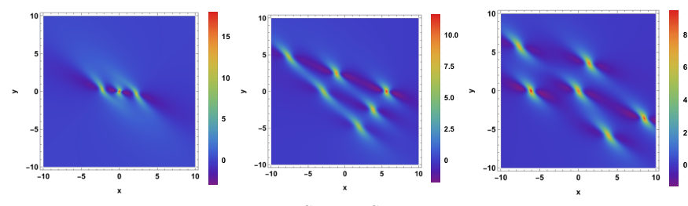
<figcaption class="paper-figure-caption"><b>Fig 4.</b> Figure 3 illustrates how the parameters C33 and C35 affect the spatial configuration of the six lumps at t = 0. In the ground state (C33 = C35 = 0), the solution exhibits only three peaks, indicating that the six lumps are not fully separated. As C33 increases while the other parameters remain fixed, the six individual lumps gradually decouple and self-organize into a triangular structure. In contrast, when C35 becomes large, the six lumps decouple into a different arrangement: one lump remains near the origin, while the remaining five are evenly distributed on a circle around it, forming a regular pentagon.</figcaption>
</figure>

**Summary.** This paper constructs novel higher-order lump solutions for the mKP-I equation using advanced spectral perturbation methods. The research analyzes the anomalous scattering of these degenerate lumps, finding a crucial difference from standard KP-I: energy equipartition does not occur, and the interacting components remain distinguishable. This advances understanding of nonlinear wave dynamics in integrable systems.

**Why it may be interesting.** While focused on classical integrable systems, the study of anomalous scattering and energy non-equipartition in nonlinear PDEs provides mathematical tools relevant to understanding complex wave interactions in quantum field theories or many-body dynamics where integrability is key.

Detailed structure

**Main problem.** The primary goal is constructing novel higher-order lump solutions for the modified Kadomtsev-Petviashvili-I (mKP-I) equation and analyzing their anomalous scattering behavior.

**Main result.** Novel second- and third-order lump solutions are found, demonstrating anomalous scattering where interacting lumps remain distinguishable in subleading terms, unlike the standard KP-I case.

**Method.** The study employs the generalized long-wave limit method combined with spectral perturbations to derive these complex localized rational solutions.

**Model / system.** The system is governed by the mKP-I equation, a $(2+1)$-dimensional integrable nonlinear evolution equation that models water waves with cubic nonlinearity.

**Key observables.** Asymptotic amplitudes and trajectories of interacting lump waves; spatial configuration of multiple lumps parameterized by constants like $C_{33}$ and $C_{35}$.

**Important parameters / regimes.** The order of the solution (second or third), and free parameters derived from tuning phase parameters in the N-soliton solution.

**Assumptions / limitations.** The analysis relies on parameterizing soliton solutions and making specific simplifications for higher orders, such as setting certain coefficients to zero.

**Figures summary.** Figure 1 shows the evolution of a second-order lump; Figure 2 illustrates anomalous scattering with three lumps; Figure 3 demonstrates how varying parameters ($C_{33}, C_{35}$) changes the spatial arrangement of six lumps at $t=0$.

**Paper structure.** The paper systematically constructs solutions using advanced methods, analyzes their long-time asymptotic behavior (scattering), and contrasts the interaction dynamics between mKP-I and KP-I equations.

Abstract

We construct novel higher-order lump solutions of the modified Kadomtsev-Petviashvili-I (mKP-I) equation by applying the generalized long-wave limit method with spectral perturbations. By tuning the phase parameters in the soliton solution, we obtain second- and third-order lump solutions, which, to the best of our knowledge, are reported here for the first time for the mKP-I equation. A detailed asymptotic analysis reveals that these degenerate lumps exhibit anomalous scattering analogous to that in the KP-I equation. However, in contrast to the KP-I case, no complete energy equipartition occurs after the collision, and the two lumps remain distinguishable in the subleading terms of their asymptotic amplitudes. This distinction highlights a difference in the interaction dynamics between the modified and standard KP-I equations.

[↑ back to top](#top)

### [Morphology-Guided Deterministic Fabrication of Low-Noise High-Temperature Superconducting Quantum Interference Devices](http://arxiv.org/abs/2608.15846v1)

**Authors:** Bingke Xiang, Wanjuan Tang, Shiqun Liu, Lingtong Hou, Geming Zhang, Yibo Wang, Ruonan Wang, Zhiqiang Cao, Jiaqi Wei, Xueshen Wang, Xueying Zhang, Xiaoyang Lin  
**Type:** experiment · **Category:** strongly correlated electrons · **PDF:** <https://arxiv.org/pdf/2608.15846v1>  
**Analysis basis:** full PDF text, analyzed in chunks
**Topic relevance:** `QC/QI experiment` **1/5** · `quantum measurements` **1/5**

↔ Scroll figures horizontally

<figure class="paper-figure-card">
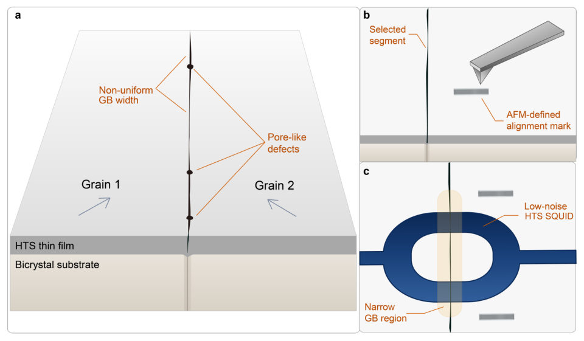
<figcaption class="paper-figure-caption"><b>Fig 1.</b> Figure 1: AFM-guided selection of local grain-boundary regions for HTS SQUID fabrication. a, Schematic of a high-temperature superconducting (HTS) thin film on a bicrystal substrate, illustrating spatial variations in the apparent grain-boundary width and local pore-like defects. b, Atomic force microscopy (AFM) inspection identifies a locally narrow segment without visible pore-like defects, and an adjacent AFM-defined alignment mark provides a local reference for subsequent lithography. c, Registered patterning places the two Josephson junctions of the dc superconducting quantum interference device (SQUID) across the selected narrow grain-boundary region.</figcaption>
</figure>
<figure class="paper-figure-card">
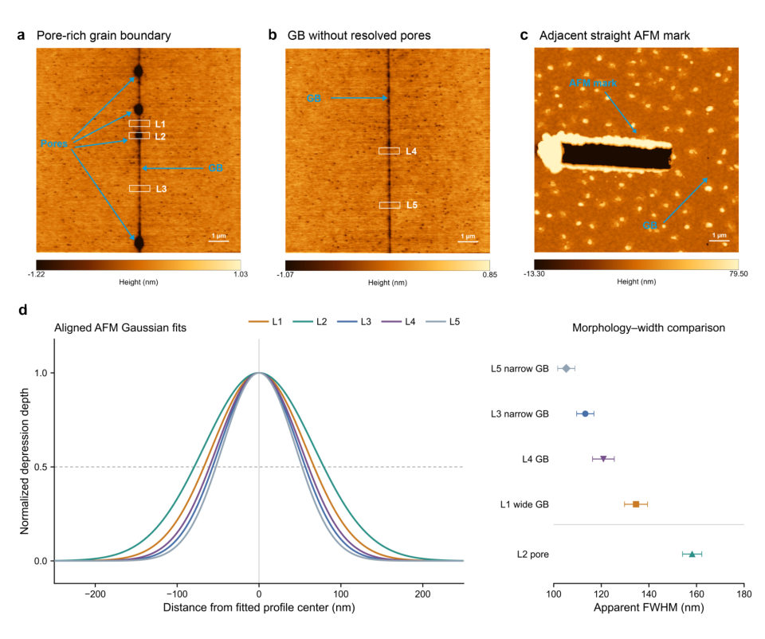
<figcaption class="paper-figure-caption"><b>Fig 2.</b> Figure 2: AFM-resolved grain-boundary heterogeneity and local alignment mark. a, AFM topography of a pore-rich bicrystal grain boundary (GB). Line profiles L1 and L3 intersect the GB at two local positions, whereas L2 traverses a representative pore-like depression. b, AFM topography of a region without resolved pore-like defects; L4 and L5 sample segments with different apparent widths. c, AFM-written mark adjacent to the selected GB region, providing a local fiducial feature for subsequent lithographic alignment and site-specific junction patterning. d, Left, averaged line profiles from L1–L5, aligned to their minima and normalized by depression depth. Right, corresponding apparent full...</figcaption>
</figure>
<figure class="paper-figure-card">
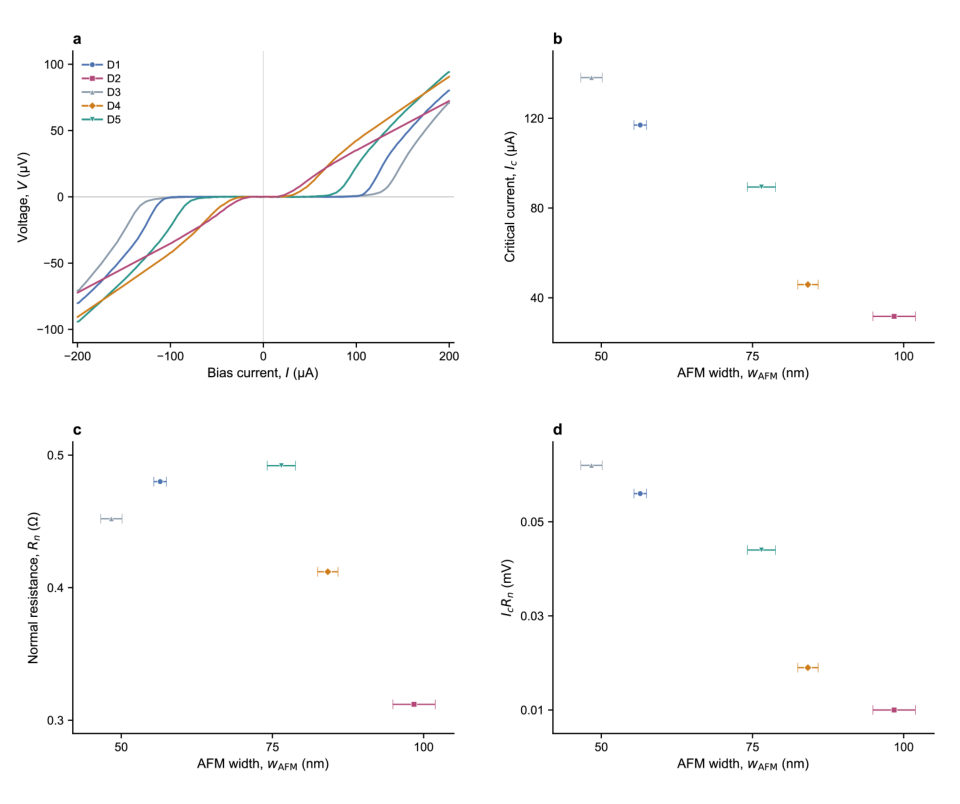
<figcaption class="paper-figure-caption"><b>Fig 3.</b> Figure 3: Systematic variation of Josephson junction transport with AFM-resolved grain-boundary width. a, Current–voltage characteristics of bicrystal Josephson junction devices D1–D5. b–d, Critical current, Ic (b), normal-state resistance, Rn (c), and characteristic voltage, IcRn (d), plotted against the AFM-resolved grain- boundary width, wAFM. Ic decreases markedly with increasing wAFM, whereas Rn exhibits a comparatively weaker width dependence. Colors identify the same devices across all panels, with corresponding symbol shapes used in b–d. Horizontal error bars indicate the standard errors of the fitted AFM-derived width.</figcaption>
</figure>
<figure class="paper-figure-card">
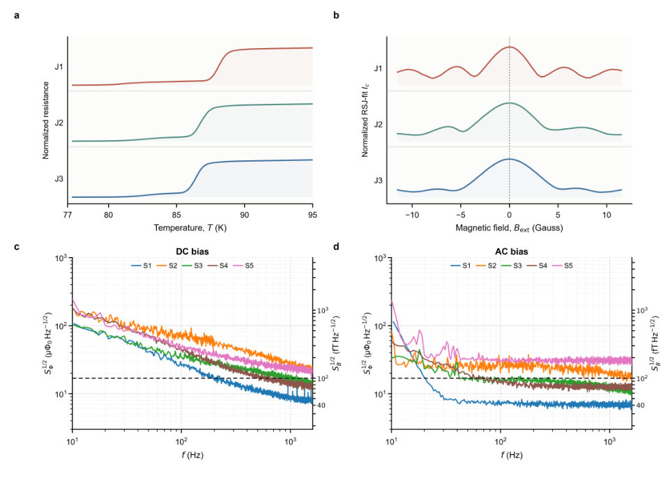
<figcaption class="paper-figure-caption"><b>Fig 4.</b> Figure 4: Signatures of local grain-boundary heterogeneity in Josephson transport and SQUID noise. a, Normalized resistance as a function of temperature for three bicrystal Josephson junctions (J1–J3), vertically offset for clarity. The junctions exhibit distinct transition broadening and resistive tails. b, Normalized effective critical current Ic(B) extracted from resistively shunted junction (RSJ) fits. Traces are vertically offset. The device-specific lobe structures are consistent with spatially non-uniform effective supercurrent transmission across the grain boundary. c,d, Noise amplitude spectral densities for five bicrystal SQUIDs (S1–S5) under DC and AC bias, respectively. Right...</figcaption>
</figure>

**Summary.** The research addresses variability in HTS SQUIDs by developing a novel fabrication workflow that uses AFM imaging to map grain boundary morphology. By quantifying the apparent width ($	ext{w}_{	ext{AFM}}$), the authors demonstrate that selecting narrower regions significantly boosts critical current and reduces noise, turning material heterogeneity into a controllable design parameter for scalable superconducting devices.

**Why it may be interesting.** This work bridges materials science characterization (AFM morphology) directly into device performance optimization for superconducting circuits, which is highly relevant to understanding disorder effects in correlated superconductors.

Detailed structure

**Main problem.** Reproducible fabrication of low-noise High-Temperature Superconducting (HTS) Quantum Interference Devices (SQUIDs) is severely limited by local variability along the grain boundaries forming Josephson junctions.

**Main result.** The authors developed an AFM-guided workflow showing that junction critical current ($I_c$) strongly correlates with a measured apparent grain-boundary width ($	ext{w}_{	ext{AFM}}$), allowing for site-selective fabrication to achieve low noise levels (40 fT Hz^(-1/2)).

**Method.** The methodology involves using Atomic Force Microscopy (AFM) *before* lithography to map the local morphology of grain boundaries, quantifying an apparent width ($	ext{w}_{	ext{AFM}}$), and then using this metric for site selection.

**Model / system.** The physical system is HTS thin films deposited on bicrystal substrates, where Josephson junctions are formed across natural grain boundaries. Performance is characterized by electrical measurements like $I$-$V$ curves and SQUID noise spectra.

**Key observables.** Critical Current ($I_c$), Normal-state Resistance ($R_n$), Apparent Grain-Boundary Width ($	ext{w}_{	ext{AFM}}$), and SQUID Noise Level (e.g., 40 fT Hz^(-1/2)).

**Important parameters / regimes.** Liquid-nitrogen temperature, $	ext{w}_{	ext{AFM}} \approx 40 	ext{ nm}$ (optimal width for high $I_c$).

**Assumptions / limitations.** The apparent grain-boundary width ($	ext{w}_{	ext{AFM}}$) is treated as a practical, operational process-control metric rather than a direct measure of the microscopic weak-link barrier thickness.

**Figures summary.** Figures illustrate the AFM guidance process (Fig. 1), quantification of boundary widths from topography profiles (Fig. 2), correlation between $I_c$ and $	ext{w}_{	ext{AFM}}$ (Fig. 3), and noise/critical current modulation due to local heterogeneity (Fig. 4).

**Paper structure.** The paper details the problem of variability in HTS SQUIDs, introduces the AFM-guided site-selective fabrication workflow, presents quantitative analysis showing $I_c$ dependence on $	ext{w}_{	ext{AFM}}$, and concludes with low-noise measurements demonstrating improved uniformity.

Abstract

Reproducible bicrystal high-temperature superconducting quantum interference devices remain limited by local variability along the grain boundaries that form the Josephson junctions. Here, we develop a site-selective fabrication workflow in which atomic force microscopy maps the intended junction region before lithography, quantifies an apparent grain-boundary width, rejects pore-rich segments, and writes a nearby registration mark for site-specific pattern alignment. The apparent grain-boundary width provides a practical morphology metric, with narrower regions consistently yielding larger critical currents and characteristic voltages. Iterative optimization within this workflow further improves junction and device performance, reaching a liquid-nitrogen-temperature field-noise level of 40 fT Hz^(-1/2). This strategy turns local grain-boundary heterogeneity from an uncontrolled source of variability into a basis for site-selective fabrication, providing a route towards scalable manufacturing of low-noise HTS SQUIDs with high uniformity.

[↑ back to top](#top)

### [Reduced vortex descriptors linking polycrystallinity in magnetic nanoparticles with polarized magnetic small-angle neutron scattering](http://arxiv.org/abs/2608.16720v1)

**Authors:** M. P. Adams, J. Leliaert, A. Michels, E. M. Jefremovas  
**Type:** both · **Category:** other · **PDF:** <https://arxiv.org/pdf/2608.16720v1>  
**Analysis basis:** full PDF text, analyzed in chunks
**Topic relevance:** `analog quantum simulation` **1/5** · `quantum measurements` **1/5**

↔ Scroll figures horizontally

<figure class="paper-figure-card">
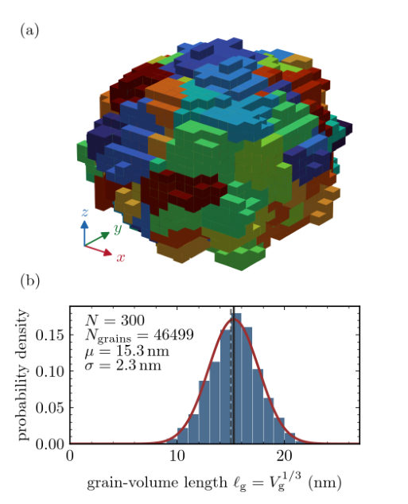
<figcaption class="paper-figure-caption"><b>Fig 1.</b> FIG. 1. Example of the micromagnetic nanoflower (NF) model. (a) Representative three-dimensional (3D) Voronoi re- alization used to define the polycrystalline grain structure of a single NF. The inset indicates the laboratory axes. (b) Distri- bution of the volume-derived grain length ℓg = V 1/3 g , obtained by pooling the realized grain volumes over the simulated en- semble. The data were obtained for N = 300 NFs comprising a total of 46 499 crystallites. The solid curve denotes a Gaus- sian fit with a mean of µ = 15.3 nm (solid vertical line) and a standard deviation of σ = 2.3 nm. The dashed line indicates the prescribed structural scale gs = 15 nm.</figcaption>
</figure>
<figure class="paper-figure-card">
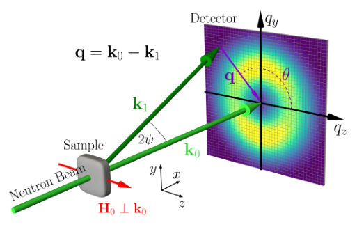
<figcaption class="paper-figure-caption"><b>Fig 2.</b> FIG. 2. Scattering geometry used throughout this work. The applied magnetic (guide) field H0 ∥ez is perpendicular to the incident neutron wave vector k0 ∥ex, and the scattering vector q = k0 −k1 is detected in the (qy, qz) detector plane. The azimuthal detector angle θ is measured with respect to the field direction.</figcaption>
</figure>
<figure class="paper-figure-card">
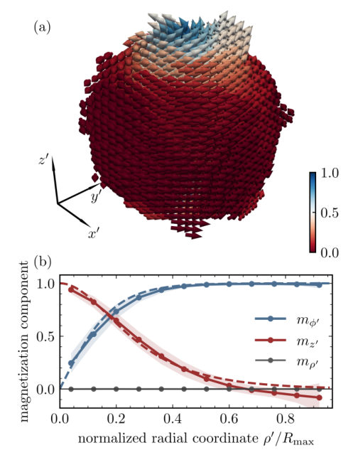
<figcaption class="paper-figure-caption"><b>Fig 3.</b> FIG. 3. Real-space vortex characterization for a represen- tative remanent NF ensemble with f = 0.4, k = 0.25, and N = 300. (a) Three-dimensional magnetization vector field of a representative NF after transformation into the fitted vortex-axis coordinate system; color bar encodes the mz′ com- ponent. (b) Ensemble-averaged radial profiles in the same co- ordinate system. Symbols denote the mean binned micromag- netic profiles, and shaded bands denote three standard devia- tions across the ensemble for mϕ′ and mz′. Averaged over the radial bins, the corresponding 3σ half-widths are 0.033 and 0.066, respectively. Dashed lines show the hyperbolic vortex model [Eq. (3)] evaluated with νrms,N =...</figcaption>
</figure>
<figure class="paper-figure-card">
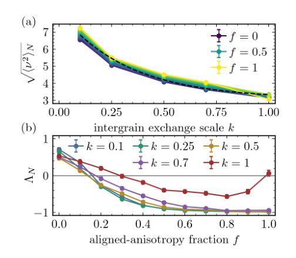
<figcaption class="paper-figure-caption"><b>Fig 4.</b> FIG. 4. Collective vortex descriptors extracted directly from the remanent micromagnetic states. (a) Root-mean-square (RMS) ensemble value νrms,N = p</figcaption>
</figure>
<figure class="paper-figure-card">
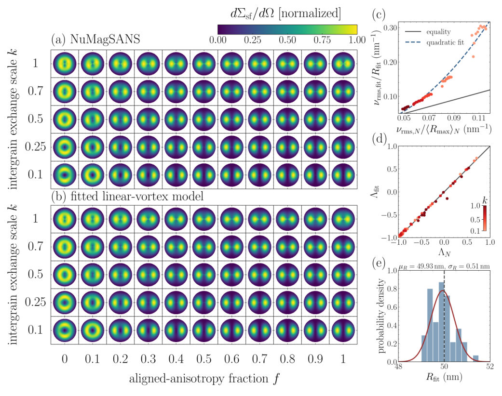
<figcaption class="paper-figure-caption"><b>Fig 5.</b> FIG. 5. Comparison of the numerical and reduced analytical 2D spin-flip SANS landscapes at remanence. The applied magnetic field H0 is horizontal in the plane, where the horizontal coordinate is qz and the vertical one is qy. (a) NuMagSANS cross sections [30] computed from the micromagnetic magnetization fields of N = 300 independently generated NFs. (b) Best-fit linear-vortex SANS cross sections obtained independently for each (f, k) using νrms,fit, Λfit, and Rfit. The horizontal grid axis gives the fraction f of grains with uani,i = uani,0, while the vertical grid axis gives the intergrain exchange scale k. The patterns in (a) and (b) are displayed for q ≤0.10 nm−1, corresponding to qR ≤5...</figcaption>
</figure>

**Summary.** This work connects the structural disorder inherent in polycrystalline magnetic nanoparticles to their measurable magnetic scattering signatures using polarized SANS. By simulating iron oxide nanoflowers and applying an analytical vortex model, the authors successfully separate the physical contributions of intergrain exchange coupling and anisotropy alignment into distinct, quantifiable descriptors. This separation reveals which aspects of the complex magnetic texture are robustly captured by simplified theoretical models.

**Why it may be interesting.** While focused on condensed matter magnetism, the methodology involves mapping complex, high-dimensional simulated states onto a low-dimensional set of robust analytical descriptors ($
u, \Lambda$), which is analogous to dimensionality reduction techniques used in quantum many-body physics.

Detailed structure

**Main problem.** The study aims to link the structural disorder (polycrystallinity) within magnetic nanoparticles to their measurable magnetic response as probed by polarized small-angle neutron scattering (SANS).

**Main result.** A two-channel organization was identified, showing that intergrain exchange coupling primarily influences the radial vortex profile, while anisotropy coherence governs the orientational moment of the vortex distribution.

**Method.** The authors combine micromagnetic simulations using Voronoi microstructures with analytical reduction techniques to fit complex SANS data into simplified vortex descriptors.

**Model / system.** The physical system is polycrystalline iron oxide nanoflowers, modeled via explicit Voronoi grain structures. The magnetic state is governed by standard micromagnetics (exchange, anisotropy, dipolar) and analyzed using hyperbolic vortex models.

**Key observables.** Spin-flip SANS cross sections ($rac{d\Sigma_{sf}}{d\Omega}$), radial vortex profile parameters ($
u$), and the orientational moment of the vortex-axis distribution ($\Lambda$).

**Important parameters / regimes.** Intergrain exchange coupling ($k$) and anisotropy alignment fraction ($f$); system size scales like $D_{	ext{nom}} = 100 	ext{ nm}$ and mesocrystal size $g_s = 15 	ext{ nm}$.

**Assumptions / limitations.** The analysis relies on reducing the complex SANS signal to a linear-vortex approximation, which simplifies the information content being analyzed.

**Figures summary.** Figures illustrate representative Voronoi microstructures and show how scattering observables are related to structural disorder parameters ($f$) and coupling strength ($k$).

**Paper structure.** The paper establishes the need for descriptor reduction, details the micromagnetic simulation setup on Voronoi lattices, performs two independent fittings (real-space texture vs. reciprocal-space SANS), and finally separates the physical contributions of disorder parameters to these descriptors.

Abstract

Analytical vortex models reduce polarized magnetic small-angle neutron scattering (SANS) from nanoparticle ensembles to a small set of texture descriptors. In this work, we apply this reduction to micromagnetic simulations of polycrystalline iron oxide nanoflowers at a fixed particle size and examine how a controlled parametrization of multigrain disorder is reflected in the remanent descriptors. The particles are represented by explicit Voronoi microstructures, and intraparticle disorder is varied through the intergrain exchange coupling and anisotropy-axis coherence. Fitting each remanent magnetization state to a hyperbolic vortex model reveals a predominantly two-channel organization: the intergrain exchange coupling is associated mainly with the radial vortex profile, whereas the anisotropy-axis coherence is associated mainly with the orientational moment of the vortex-axis distribution. The normalized spin-flip SANS cross sections are accurately represented by independent fits of the analytical linear-vortex SANS expression obtained from the first-order expansion of the hyperbolic profile. The fitted orientational descriptor agrees closely with its independent real-space estimate, whereas the corresponding radial descriptors exhibit a strong global nonlinear relation. This separation identifies which information from the micromagnetic vortex textures is robustly retained by the reduced analytical representation.

[↑ back to top](#top)

### [Superconducting $T_\mathrm{c}$ up to 20.6 K in bulk YSi$_2$ and YSi$_2$/Si superlattices due to chemical flattening](http://arxiv.org/abs/2608.16062v1)

**Authors:** Ding-qing Li, Chong Tian, Juan Du, Jun-jie Shi, Pei-song He, Deng-hui Xu, Hong-xia Zhong, Yao-hui Zhu  
**Type:** theory · **Category:** other · **PDF:** <https://arxiv.org/pdf/2608.16062v1>  
**Analysis basis:** full PDF text, analyzed in chunks
**Topic relevance:** `Keldysh / 2PI / non-Gaussian methods` **1/5** · `analog quantum simulation` **1/5**

↔ Scroll figures horizontally

<figure class="paper-figure-card">
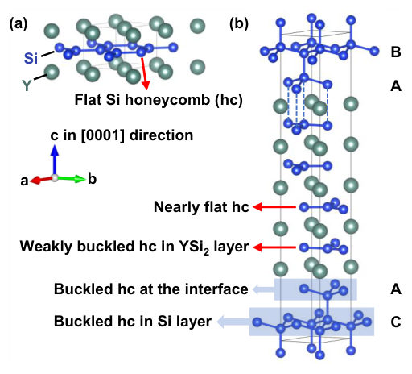
<figcaption class="paper-figure-caption"><b>Fig 1.</b> FIG. 1. (a) The crystal structure of bulk AlB2-type YSi2. Its unit cell is repeated twice in the a and b directions, i.e., 2×2×1, to illustrate the flat Si honeycomb clearly. (b) The crystal structure of an YSi2(0001)/Si(111) superlattice. For example, in the unit cell of SL1, the middle part includes 5 layers of Y atoms and 4 Si honeycombs (2 weakly buckled and 2 nearly flat) stacked alternately along the c direction. The rest part comprises 4 buckled Si honeycombs in the ABC stacking order (or diamond-like), and 2 of them are at the interfaces. The four vertical dashed lines indicate that the buckled Si honeycombs at the interface have the same in- plane atomic coordinates as the ones...</figcaption>
</figure>
<figure class="paper-figure-card">
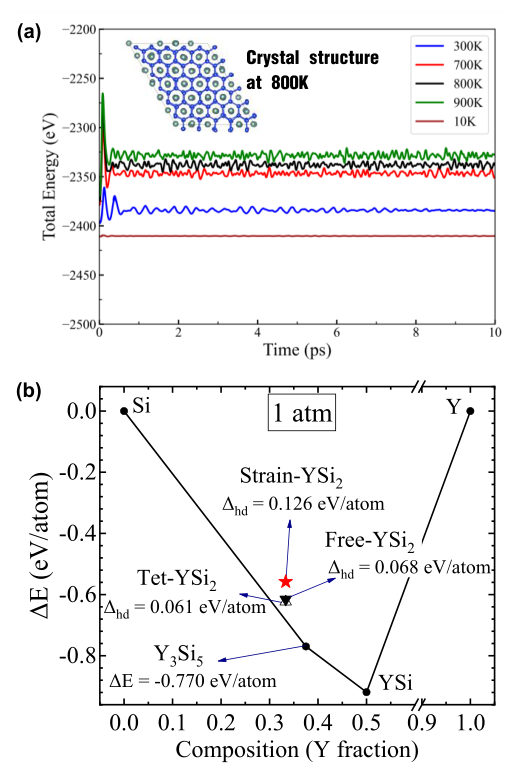
<figcaption class="paper-figure-caption"><b>Fig 2.</b> FIG. 2. (a) The NVT AIMD simulation. The total energy is plotted as a function of time at the temperatures of 10 K (brown line), 300 K (blue line), 700 K (red line), 800 K (black line), and 900 K (green line). The inset shows the crystal structure along c axis after NVT AIMD simulation at 800 K. (b) The convex hull of Yi-Si system. The red star stands for the strained YSi2 (labeled by ‘Strain-YSi2’), which has the same structure as the strainless YSi2 (‘Free-YSi2’, filled triangle-down marker) but different lattice constants. The open triangle-up marker denotes the tetragonal YSi2 (‘Tet- YSi2’), whose structure is taken from the Open Quantum Ma- terials Database (OQMD, ID: 19375). The...</figcaption>
</figure>
<figure class="paper-figure-card">
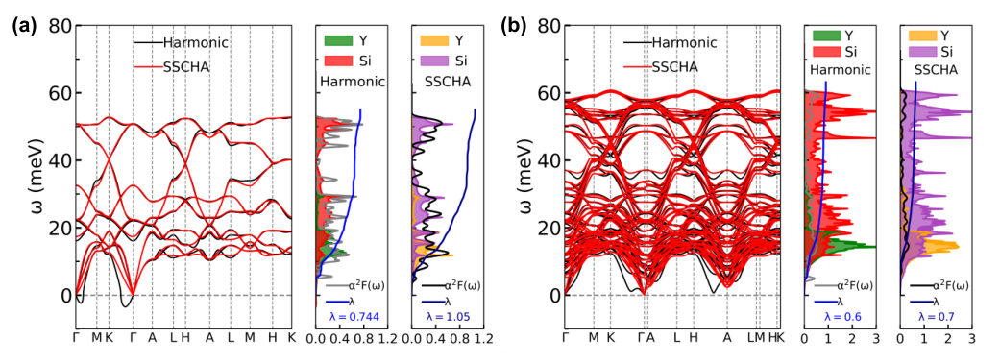
<figcaption class="paper-figure-caption"><b>Fig 3.</b> FIG. 3. (a) The phonon spectra (left panel) of strainless bulk YSi2. The black (red) curves depict the harmonic (anharmonic) dispersions. The anharmonicity is taken into account by the SSCHA package. The projected phonon DOS (PHDOS), Eliashberg spectral functions α2F(ω), and integral EPC constant λ are presented separately for harmonic (central panel) and anharmonic (right panel) cases. (b) The same as (a) but for the YSi2/Si superlattice SL1.</figcaption>
</figure>
<figure class="paper-figure-card">
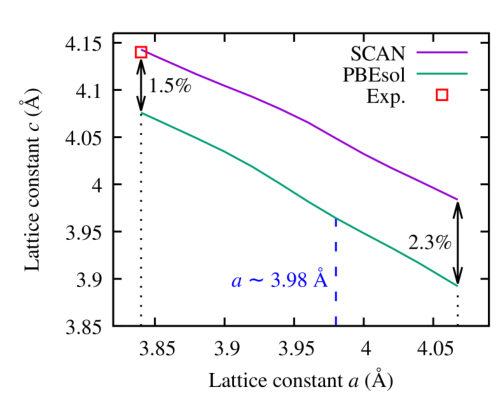
<figcaption class="paper-figure-caption"><b>Fig 4.</b> FIG. 4. The variation of c with a. In the strainless state, a = 4.07 ˚A and c = 3.89 ˚A are determined by the PBEsol functional. For the same a = 4.07 ˚A, the SCAN functional yields c = 3.98 ˚A, which is larger than the PBEsol one by 2.3%. When a was compressed below a critical value ∼3.98 ˚A, C66 would turn positive even without the ZPE correction. The red square denotes the experimental lattice constants, i.e., a = 3.842 ˚A and c = 4.14 ˚A. The experimental c is larger than the corresponding PBEsol result by only 1.5%, and almost identical to that given by the SCAN functional.</figcaption>
</figure>
<figure class="paper-figure-card">
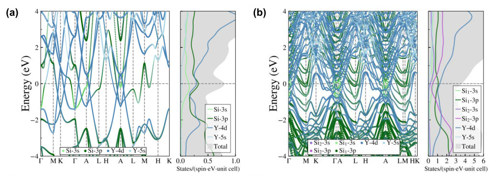
<figcaption class="paper-figure-caption"><b>Fig 5.</b> FIG. 5. (a) The projected band structure and DOS of strainless bulk YSi2. In the band structure, the sizes of the colored circles are proportional to the contribution of their corresponding orbitals. (b) The projected band structure and DOS of the YSi2/Si superlattice SL1. In the DOS diagram, Si1 and Si2 stand for the Si atoms in the YSi2 part and diamond-like Si part of their superlattice, respectively.</figcaption>
</figure>

**Summary.** This paper proposes YSi2 as a high-temperature superconductor alternative to Al for quantum computing. Using first-principles calculations, the authors predict a $T_c$ of 20.6 K, attributing this enhancement to structural changes called 'chemical flattening.' They further propose strain engineering via superlattices to maximize stability and superconducting performance.

**Why it may be interesting.** While focused on superconductivity rather than quantum information directly, the work involves advanced many-body calculations (Migdal-Eliashberg theory) and material design principles crucial for realizing superconducting components in quantum devices.

Detailed structure

**Main problem.** To develop high-temperature superconducting materials suitable for quantum computing applications, overcoming the low critical temperature ($T_c$) of standard Al/Si junctions.

**Main result.** The material YSi2 exhibits a predicted $T_c$ up to 20.6 K due to 'chemical flattening' effects in its Si honeycombs; superlattices are proposed to enhance stability and maintain high $T_c$.

**Method.** Theoretical calculations using first-principles methods, including solving the Migdal-Eliashberg equations (both isotropic and anisotropic) and performing extensive stability checks (thermodynamic, kinetic, mechanical).

**Model / system.** The focus is on YSi2, an AlB2-type superconductor proposed as a replacement for Al. The study models both bulk structures and engineered superlattices like YSi2(0001)/Si(111) to control strain.

**Key observables.** $T_c$, elastic stiffness constant ($C_{66}$), formation energy ($\Delta E$), lattice constants ($a, c$).

**Important parameters / regimes.** Superconducting transition temperature (up to 20.6 K); compressive strain; anharmonicity effects.

**Assumptions / limitations.** The analysis relies on DFT calculations and approximations within the Migdal-Eliashberg theory framework; some results are based on theoretical predictions of stability under strain.

**Figures summary.** Figures illustrate crystal structures (bulk vs. superlattice), AIMD energy fluctuations showing kinetic stability, and phonon spectra used for calculating superconducting parameters.

**Paper structure.** The work proceeds by first identifying the problem (low $T_c$ of Al), proposing YSi2 as a solution, then using multiple theoretical tools (ME equations, stability analysis) to calculate high $T_c$, and finally engineering superlattices to realize necessary strain states.

Abstract

Currently, the fundamental building blocks of leading quantum computers are Josephson junctions, whose core is usually the superconducting Al on Si wafers. However, the transition temperature $T_\mathrm{c}$ of bulk Al ($\sim1.1$ K) is below the boiling point of liquid helium ($\sim4.2$ K), which is one of the challenges to its widespread application. Here, we propose a Si-matched AlB$_2$-type superconductor YSi$_2$ as a promising alternative to Al. The solution of anisotropic (isotropic) Migdal-Eliashberg equation without (with) anharmonicity gives $T_\mathrm{c}\sim20.6$ K ($17.2$ K), which is at the highest level in silicides. Its excellent superconductivity can be attributed mainly to the Si honeycombs, which become plane here due to the 'chemical flattening' effects of the Y atoms instead of being buckled in most silicides. We tested its thermodynamical, kinetic, dynamical, and mechanical stability by first-principles calculations. Particularly, the negative elastic stiffness constant $C_{66}$ calculated by usual methods turns positive even without the zero-point energy once the Si honeycombs are compressed below a threshold. This strain can also make its calculated lattice constants agree with the experimental ones. We propose structures to realize this strain, i.e., YSi$_2$(0001)/Si(111) superlattices, which can also strengthen the overall stability of YSi$_2$ while maintaining its $T_\mathrm{c}$ above $7.0$ K.

[↑ back to top](#top)

### [Classical Mechanics Exactly Yields the Full Bound-State Spectrum of the Two-Dimensional Coulomb Problem](http://arxiv.org/abs/2608.16751v1)

**Authors:** Gang Zheng, Wenqi Xue, Mengli Wang, Peng Chen, Benniu Zhang  
**Type:** theory · **Category:** other · **PDF:** <https://arxiv.org/pdf/2608.16751v1>  
**Analysis basis:** full PDF text, analyzed in chunks
**Topic relevance:** `quantum measurements` **1/5**

↔ Scroll figures horizontally

<figure class="paper-figure-card">
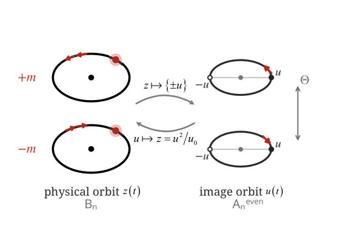
<figcaption class="paper-figure-caption"><b>Fig 1.</b> FIG. 1. The LC chiral round trip. For a time-reversed pair ±m, the physical orbit on the n-th</figcaption>
</figure>

**Summary.** The paper demonstrates that the entire bound-state spectrum of the 2D Coulomb problem can be derived exactly from purely classical geometric principles, bypassing traditional quantum postulates. By establishing an 'amplitude-closure criterion,' they show that the system's dynamics are equivalent to those of a harmonic oscillator in an auxiliary 'image space.' This provides a powerful, non-perturbative benchmark for analyzing universal effects in 2D exciton physics.

**Why it may be interesting.** This work provides a profound theoretical benchmark by inverting the usual quantum hierarchy: the wave equation emerges as a *representation* of underlying classical geometry rather than an independent starting principle. This methodology could offer new insights into non-integrable or strongly correlated systems where standard semiclassical methods fail.

Detailed structure

**Main problem.** To determine if the full bound-state spectral structure of the two-dimensional Coulomb problem can be derived exactly from classical mechanics, without invoking quantum axioms like the wave equation.

**Main result.** The complete spectrum is shown to follow as an exact theorem from classical mechanics augmented by a phase-scale parameter $\alpha$, yielding characteristic odd-integer Rydberg scaling purely from classical geometry.

**Method.** The authors derived an amplitude-closure criterion necessary and sufficient for the classical propagator kernel to satisfy a linear evolution equation, mapping the singular potential via Levi-Civita regularization into a solvable quadratic Hamiltonian class.

**Model / system.** The central model is the two-dimensional Coulomb problem, used to describe high-lying Rydberg excitons in 2D semiconductors. The analysis uses classical mechanics principles (action, Van Vleck amplitude) to construct and test a quantum-like evolution kernel.

**Key observables.** Odd-integer modal numbers ($1/N^2$ energy ratios), $N$-fold degeneracies, and the spectral structure independent of the phase-scale parameter $\alpha$.

**Important parameters / regimes.** The phase-scale parameter $\alpha$ (with dimensions of action); the 2D Coulomb potential; the harmonic oscillator parameters derived from regularization.

**Assumptions / limitations.** No semiclassical, short-wavelength, or $\hbar \to 0$ approximation is invoked; the derivation relies on establishing an exact equivalence between classical propagation and linear wave evolution via the closure criterion.

**Figures summary.** Figure 1 illustrates the LC chiral round trip, showing how a physical Kepler orbit lifts to an antipodal pair of oscillator orbits in image space.

**Paper structure.** The paper establishes a hierarchy: first defining the classical kernel and deriving the amplitude-closure criterion; second, using Levi-Civita regularization to map the Coulomb potential onto quadratic Hamiltonians that satisfy this criterion; finally, proving that this geometric constraint uniquely determines the full discrete spectrum.

Abstract

High-lying Rydberg excitons in two-dimensional semiconductors universally exhibit a characteristic odd-integer energy scaling distinct from three-dimensional systems. While this hallmark of two-dimensional Coulomb interaction is well known from quantum mechanical solutions, its deeper classical geometric origin remains unclarified. Here we show that the complete bound-state spectral structure of the two-dimensional Coulomb problem---a central model for two-dimensional exciton physics---follows as an exact theorem from classical mechanics augmented by a single phase-scale parameter $α$ with dimensions of action. We derive an amplitude-closure criterion as a necessary and sufficient condition for a classical propagator kernel to satisfy a linear evolution equation, and demonstrate that the singular Coulomb potential can be mapped shell-by-shell via Levi-Civita regularization into the class of quadratic Hamiltonians that obey this criterion exactly. The resulting spectrum bears odd-integer modal numbers, $1/N^2$ energy ratios and $N$-fold degeneracies, all independent of $α$ and consistent with experimental observations of high-lying Rydberg excitons. This work provides a pure classical-geometry benchmark for two-dimensional exciton spectral analysis, allowing quantitative disentanglement of universal Coulomb effects from material-specific screening effects. No semiclassical, short-wavelength or $\hbar \to 0$ approximation is invoked at any stage. Our results invert the usual logical hierarchy for this integrable system: the wave equation emerges as a representation of the underlying classical geometry, rather than as an independent first principle.

[↑ back to top](#top)

### [Pure-Quartic Optical Shock Waves](http://arxiv.org/abs/2608.16300v1)

**Authors:** Sanjida Yeasmin, Sathyanarayanan Chandramouli, Ziad H. Musslimani, Andrea Blanco-Redondo  
**Type:** theory · **Category:** other · **PDF:** <https://arxiv.org/pdf/2608.16300v1>  
**Analysis basis:** full PDF text, analyzed in chunks
**Topic relevance:** `interference shaping light` **1/5**

↔ Scroll figures horizontally

<figure class="paper-figure-card">
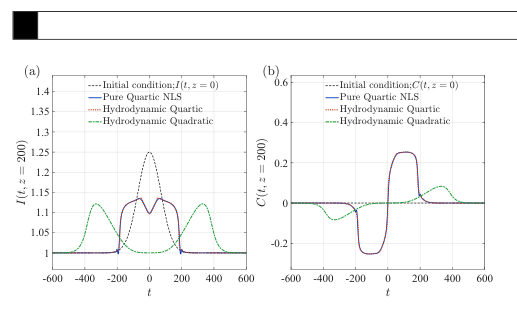
<figcaption class="paper-figure-caption"><b>Fig 1.</b> Fig. 1. Propagation of a Gaussian input beam with intensity I(t, z = 0) = 1 + 0.25 exp(−0.001t2), and zero initial hydro- dynamic velocity, C(t, z = 0) = 0. The blue solid, red dashed, and green dashed curves correspond to the pure-quartic NLS equation [Eq. (3)], the corresponding hydrodynamic system [Eqns. (5) and (6)], and the hydrodynamic equations in the quadratic NLS limit, respectively, while the black dashed curve denotes the initial condition. (a) Intensity. (b) Hydro- dynamic velocity.</figcaption>
</figure>
<figure class="paper-figure-card">
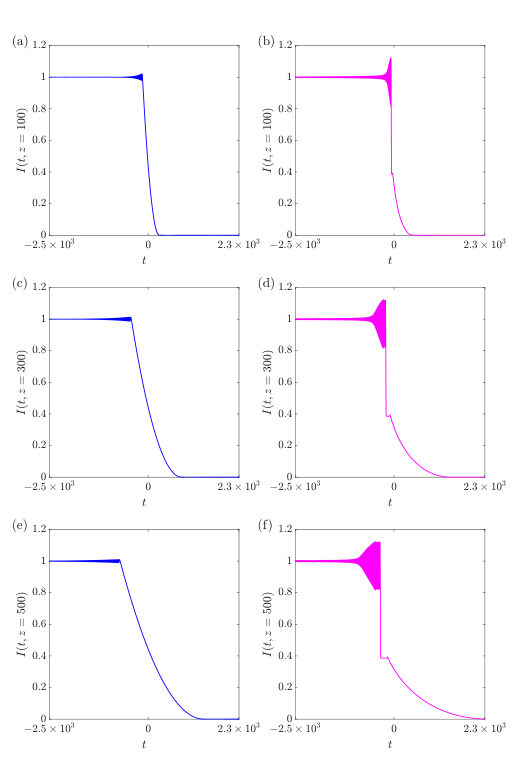
<figcaption class="paper-figure-caption"><b>Fig 2.</b> Fig. 2. The dam break problem (Eq. (7)) for the quadratic (left panel) and quartic (right panel). Snapshots of the intensity at several propagation distances, shown from top to bottom. Pan- els (a), (c), and (e) show the quadratic case, while panels (b), (d), and (f) show the pure-quartic NLS. The initial dam-break profile develops into a self-similar rarefaction in the quadratic case, whereas the pure-quartic case produces counterpropagat- ing rarefaction (right) and oscillatory (left) waveforms [see the text for a description].</figcaption>
</figure>
<figure class="paper-figure-card">
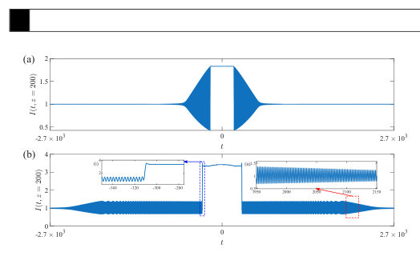
<figcaption class="paper-figure-caption"><b>Fig 3.</b> Fig. 3. The piston Riemann problem for the quadratic (a) and quartic (b) NLS equations. (a) Intensity snapshot for the quadratic NLS at z = 200, depicting two counterpropagating DSWs. (b) Intensity snapshot for the quartic NLS at z = 200, displaying counterpropagating tDSWs separated by an ex- panding plateau. The insets, from left to right, show the het- eroclinic connection between the periodic-wave and plateau regions and the partial-DSW structure, within the body of the tDSW respectively.</figcaption>
</figure>

**Summary.** This paper analyzes optical shock waves governed by a pure-quartic Nonlinear Schrödinger equation. The research highlights that this quartic dispersion leads to distinct dynamics compared to the classical quadratic case, notably causing wave breaking before wave splitting in small amplitude regimes. Using Riemann problems, they demonstrate unique wave structures indicative of nonlinear information carriers.

**Why it may be interesting.** This work explores nonlinear dispersive wave phenomena in optics, which is highly relevant to quantum optics and nonlinear wave propagation studies, particularly concerning shock formation mechanisms beyond the standard Kerr model.

Detailed structure

**Main problem.** The study investigates the dynamics of pure-quartic optical dispersive shock waves (DSWs) governed by a modified Nonlinear Schrödinger equation.

**Main result.** For the quartic case, wave breaking occurs prior to wave splitting in the small amplitude regime, and specific initial conditions generate counterpropagating traveling dispersive shock waves (tDSWs).

**Method.** The analysis involves deriving corresponding hydrodynamic systems via Madelung transformation and employing numerical simulations using spectral methods (ETDRK4) for both the full equation and its approximation.

**Model / system.** The system is modeled by the Pure-Quartic NLS (PQNLS) equation, which incorporates self-defocusing Kerr nonlinearity and fourth-order dispersion. This is compared against the classical quadratic NLS case using 'dam-break' Riemann problems.

**Key observables.** Optical intensity ($I$) and optical chirp/hydrodynamic velocity ($C$).

**Important parameters / regimes.** The relative strength of quartic vs. quadratic dispersion; small amplitude regime behavior.

**Assumptions / limitations.** The hydrodynamic approximation is derived from the PQNLS via Madelung transformation, though a deeper analysis of this system is deferred to future work.

**Figures summary.** Figures compare numerical simulations for dam-break and piston Riemann problems, contrasting the evolution (rarefaction vs. counterpropagating waves) between quadratic and quartic NLS regimes.

**Paper structure.** The paper first establishes the PQNLS model and its hydrodynamic counterpart, then uses 'dam-break' and 'piston' configurations as prototypical Riemann problems to numerically compare wave breaking/splitting dynamics against the standard quadratic NLS case.

Abstract

In this paper, we study the emergence and dynamics of pure-quartic optical dispersive shock waves governed by the nonlinear Schrödinger (NLS) equation with self-defocusing Kerr nonlinearity and fourth-order dispersion. The corresponding dispersionless hydrodynamic system reveals a distinct mechanism for wave breaking, driven by the nonlinear self-steepening of the hydrodynamic velocity. We illustrate this mechanism through optical dam-break configurations described by Riemann problems and show that, in contrast to the classical quadratic NLS equation, wave breaking occurs prior to wave splitting even in the small amplitude regime. Numerical simulations of the pure-quartic NLS (PQNLS) equation and its hydrodynamic approximation confirm these qualitatively distinct dynamical regimes.

[↑ back to top](#top)

### [Stability and optoelectronic properties of oligothiophene molecules confined in boron-nitride nanotubes : A many-body theoretical approach](http://arxiv.org/abs/2608.16427v1)

**Authors:** Xavier Blase, Mauricio Rodriguez-Mayorga, Ivan Duchemin  
**Type:** theory · **Category:** other · **PDF:** <https://arxiv.org/pdf/2608.16427v1>  
**Analysis basis:** full PDF text, analyzed in chunks
**Topic relevance:** `Keldysh / 2PI / non-Gaussian methods` **1/5**

↔ Scroll figures horizontally

<figure class="paper-figure-card">
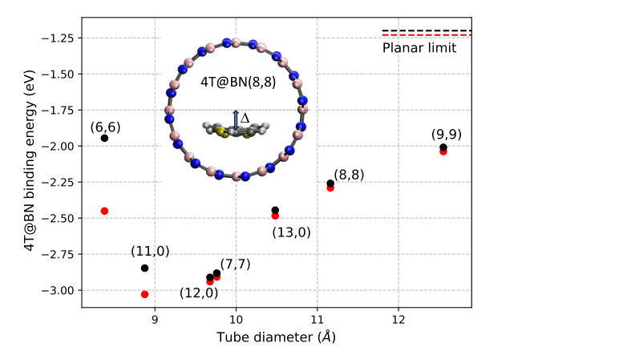
<figcaption class="paper-figure-caption"><b>Fig 1.</b> FIG. 1. Binding energy (eV) for tetrathiophene (4T) in BN tubes with various diameters. The red dots</figcaption>
</figure>
<figure class="paper-figure-card">
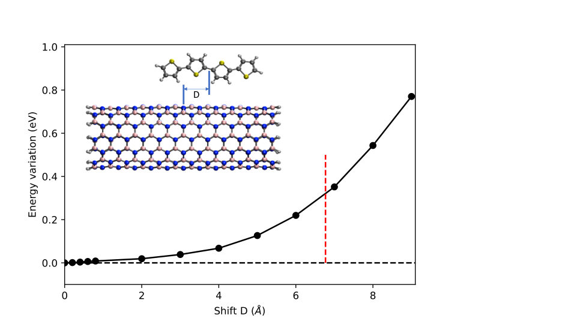
<figcaption class="paper-figure-caption"><b>Fig 2.</b> FIG. 2. Evolution of the energy of the 4T inside a finite size BN(7,7) tube as a function of the pulling</figcaption>
</figure>
<figure class="paper-figure-card">
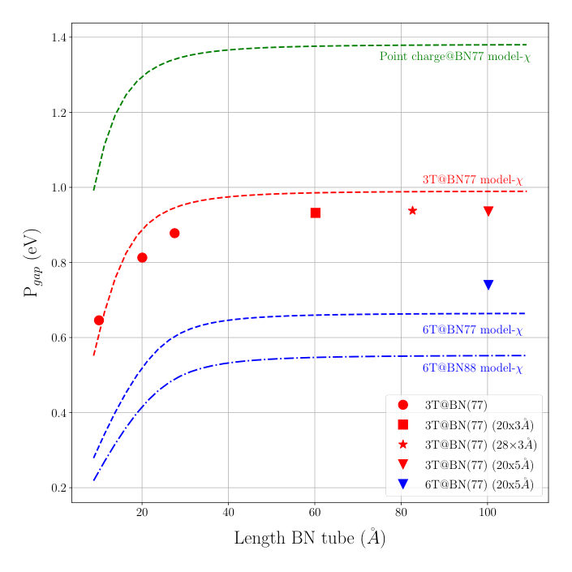
<figcaption class="paper-figure-caption"><b>Fig 3.</b> FIG. 3. Evolution with BN tube length of the gap polarization energy for encapsulated 3T and 6T molecules.</figcaption>
</figure>
<figure class="paper-figure-card">
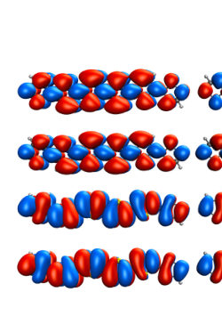
<figcaption class="paper-figure-caption"><b>Fig 4.</b> FIG. 4. 6T dimer frontier molecular orbitals (Tz = 26.0 Å).</figcaption>
</figure>

**Summary.** The paper theoretically examines oligothiophene molecules confined in boron-nitride nanotubes using advanced many-body methods. It finds that confinement stabilizes the molecules, promoting aggregation, and critically, that the nanotube's electronic polarization significantly shifts the molecule's optical gap. This clarifies that BNNTs are active participants in modifying molecular optoelectronics rather than just inert containers.

**Why it may be interesting.** This work is highly relevant as it models the interaction between organic chromophores and inorganic nanomaterials (BNNTs), a key area for developing molecular electronics and quantum emitters where substrate effects are critical.

Detailed structure

**Main problem.** The study investigates how confining oligothiophene molecules within boron-nitride nanotubes affects their structural stability and optoelectronic properties.

**Main result.** Confinement promotes head-to-tail aggregation, and the electronic gap is significantly renormalized (redshifted) by long-range screening effects from the nanotube environment, rather than just acting as a passive shield.

**Method.** The research employs advanced many-body perturbation theories, specifically Density Functional Theory (DFT), GW approximation, and Bethe-Salpeter Equation (BSE) calculations.

**Model / system.** The system models oligothiophene ($	ext{nT}$) molecules encapsulated within boron-nitride nanotubes ($	ext{BNTs}$). The analysis covers structural relaxation, electronic excitation energies, and optical absorption spectra under confinement.

**Key observables.** Binding energy, corrugation potential, photoemission gap (GW), and optical absorption onset (BSE).

**Important parameters / regimes.** Tube diameter ($\sim 10 	ext{ Å}$ optimal binding), exciton splitting ($\approx 75 	ext{ meV}$), redshift magnitude ($\le 250 	ext{ meV}$).

**Assumptions / limitations.** The analysis relies on approximations like the fragment approach for large systems and assumes that screening effects are dominant over simple hybridization.

**Figures summary.** Figures illustrate the binding energy dependence on tube diameter, the potential profile for molecular sliding along the tube axis, and the evolution of electronic/optical properties as a function of confinement geometry.

**Paper structure.** The paper progresses by first establishing structural stability (binding energy) and mobility; it then moves to electronic structure using GW theory to quantify gap renormalization due to screening; finally, it examines optical response via BSE, including exciton-exciton interactions in dimers.

Abstract

We investigate the structural and optoelectronic properties of oligothiophene (nT) molecules encapsulated in boron-nitride (BN) nanotubes using density functional theory, many-body GW and Bethe-Salpeter equation approaches. We show that the binding energy is maximized for tube diameters of approximately 10 Å, decreasing gradually for larger diameters. The nT molecules can slide along the tube with a corrugation potential smaller than room temperature thermal energy, promoting their head-to-tail aggregation. Regarding the electronic properties, we find that hybridization with the tube electronic states has a much smaller effect than that of screening, which can close the nT photoemission gap by as much as an eV. A simple model for the polarization of the BN tube demonstrates how these polarization effects decrease with increasing nT molecule length and BN tube diameter. Compared to the gas phase optical properties, structural relaxation, hybridization, and screening can redshift the absorption onset by up to 250 meV for isolated intercalated nTs. Additionally, the study of a head-to-tail sexithiophene dimer reveals an exciton-exciton interaction that splits the absorption onset into a lowest bright exciton, separated by approximately 75 meV from a dark peak. This suggests possible collective effects upon the formation of nT chains inside BN tubes. Our results confirm and clarify experimental data, mitigating the conclusion that insulating BN tubes just act as a protecting environment for encapsulated molecules.

[↑ back to top](#top)

### [Weak localization in magnetic Euler bands](http://arxiv.org/abs/2608.15529v1)

**Authors:** Doh Young Kim, Seung Hun Lee, Akira Furusaki, Bohm-Jung Yang  
**Type:** theory · **Category:** disordered systems and neural networks · **PDF:** <https://arxiv.org/pdf/2608.15529v1>  
**Analysis basis:** full PDF text, analyzed in chunks
**Topic relevance:** `Keldysh / 2PI / non-Gaussian methods` **1/5**

↔ Scroll figures horizontally

<figure class="paper-figure-card">
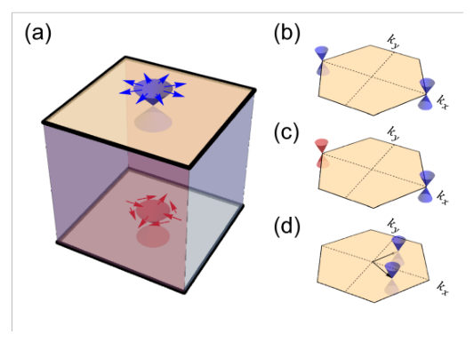
<figcaption class="paper-figure-caption"><b>Fig 1.</b> FIG. 1: Nodes and vorticity of 2D Dirac fermions in solids. (a) Dirac fermions on the surfaces of TRS-protected 3D TI. The red (blue) color represents the +1 (−1) vorticity. (b) Dirac fermions be- tween two 2D bands with nonzero Euler number. (c) Dirac fermions between two 2D bands with zero Euler number (e.g. graphene). When the physical (effective) TRS exists, the relative positions of the nodes are fixed and connected by TRS as in (b) and (c). (d) When joint symmetry PT or C2zT that is local in k-space exists whereas T does not. The positions of the nodes are not restricted by symmetry.</figcaption>
</figure>
<figure class="paper-figure-card">
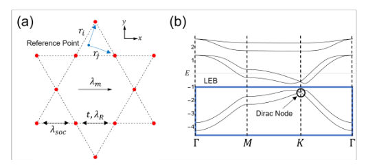
<figcaption class="paper-figure-caption"><b>Fig 2.</b> FIG. 2: Kagome lattice model with spin-orbit coupling and in- plane magnetism. (a) Kagome lattice used to build the model Hamiltonian. Here, IST = C2zT is not broken by the addition of Rashba effect (λR) and in-plane magnetization (λm). The blue dot denotes the reference point in unit cell. For hopping from j to i, νij = +1(−1) when z component of ri × rj is positive (negative). (b) The band structure for t = 1, λsoc = 0.1, λR = 0, and λm = 0.3 in arbitrary energy unit. LEB (blue box) possesses two Dirac nodes at the K and K′ point with the same vorticity +1, respectively.</figcaption>
</figure>
<figure class="paper-figure-card">
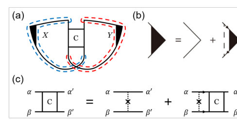
<figcaption class="paper-figure-caption"><b>Fig 3.</b> FIG. 3: Feynman diagrams for the quantum correction to the conductivity. (a) Diagrammatic representation of the current-current correlation function that gives the conductivity correction by disorder δg. X (blue) and Y (red) denote left and right legs connected to the Cooperon, respectively. (b) Vertex correction due to low-angle backscattering. (c) Bethe-Salpeter diagram for the Cooperon.</figcaption>
</figure>

**Summary.** This work analyzes disorder effects on conductivity in magnetic Euler bands, systems characterized by non-trivial topology. The authors demonstrate that even when physical time-reversal symmetry is broken, an emergent effective symmetry dictates the system's localization behavior. This reveals a fundamental principle: the quantum transport correction depends only on this effective symmetry, not on the specific topological details like Dirac node vorticity.

**Why it may be interesting.** The finding that effective crystalline symmetries can dictate the universality class of localization behavior, overriding node-specific topological invariants, provides deep insight into how crystal structure dictates quantum transport in complex materials.

Detailed structure

**Main problem.** The study investigates the quantum correction to conductivity (Weak Localization/Anti-localization) caused by disorder in two-dimensional topological bands with a non-zero Euler class.

**Main result.** The localization behavior is governed by an emergent effective time-reversal symmetry, leading to weak localization even when physical TRS is broken. Crucially, this quantum correction is shown to be independent of the specific vorticity configuration of Dirac nodes.

**Method.** The analysis employs diagrammatic calculations (Cooperon contributions) within the weak-disorder limit, comparing theoretical results across different disorder potentials and symmetry classes.

**Model / system.** The system models spinful magnetic Euler bands derived from a kagome lattice, incorporating intrinsic SOC, Rashba coupling, and Zeeman fields. The low-energy physics is captured by an effective Hamiltonian projected onto the lowest Euler band (LEB).

**Key observables.** Quantum correction to conductivity ($\delta g$), which exhibits logarithmic divergences characteristic of Weak Localization (WL) or Anti-localization (WAL).

**Important parameters / regimes.** The presence and nature of symmetries, particularly the effective time-reversal symmetry ($T^*$), and the type of disorder potential (scalar, intravalley, intervalley).

**Assumptions / limitations.** The analysis relies on diagrammatic calculations in the weak-disorder regime and utilizes approximations such as assuming certain disorder potentials dominate elastic scattering.

**Figures summary.** Figures illustrate Dirac fermions on topological insulators and the kagome lattice model setup. Figure 3 shows Feynman diagrams for the conductivity correction ($\delta g$), and tables summarize $\delta g$ values based on applied disorder types and symmetry classes.

**Paper structure.** The paper progresses by first establishing the physical model (magnetic Euler bands) and its symmetries, then analyzing how different disorder potentials perturb the system's transport properties via diagrammatic calculations. It culminates in a direct comparison with graphene to prove the universality of the underlying symmetry constraint.

Abstract

We study the quantum correction to the conductivity due to disorder in two-dimensional fragile topological bands with nonzero Euler class. Contrary to graphene where two Dirac nodes have opposite vorticities, two bands with a unit Euler number possess two Dirac points with the same vorticity, which may affect the Anderson localization. Most notably, we report an anomalous localization behavior in spinful magnetic Euler bands based on symmetry analysis and diagrammatic calculations. Despite the presence of spin-orbit coupling and an in-plane magnetization that explicitly breaks physical time-reversal symmetry, the system exhibits weak localization behavior characteristic of the orthogonal symmetry class. We demonstrate that this counter-intuitive phenomenon originates from an emergent effective time-reversal symmetry composed of crystalline and spacetime inversion symmetries, allowing it to supersede the standard localization behavior. Our findings reveal that the effective crystalline symmetries can fundamentally alter the universality class of disordered systems, rendering the localization behavior independent of the specific vorticity configuration of Dirac nodes.

[↑ back to top](#top)
