
# arxiv digest (quant-ph + cond-mat) — 2026-08-20

*115 papers · 21 relevant · 1 highlighted*

## 🔥 Most relevant (21)

*Every paper with at least one nonzero topic score, sorted by best-matching score. 🔥 marks scores ≥4/5. Click the title to jump to the full entry below; click [arXiv] to open the paper page. `(secondary)` marks papers from de-prioritized cond-mat archives.*

Show 21 relevant papers

- ⭐ [Ultrafast and high resolution spatial light modulation for cold atoms](#paper-2608.18071) [[arXiv]](http://arxiv.org/abs/2608.18071v1) — 🔥 `analog quantum simulation` **5/5** · `interference shaping light` **3/5** · `QC/QI experiment` **2/5** · `methods for driven-dissipative` **2/5** · `quantum optics experiment` **2/5** · `Rydberg arrays` **1/5** · `quantum measurements` **1/5**
- [Pulsed to continuous-wave quantum dot cavity-QED](#paper-2608.17798) [[arXiv]](http://arxiv.org/abs/2608.17798v1) — 🔥 `methods for driven-dissipative` **4/5** · 🔥 `quantum optics experiment` **4/5** · `Tavis-Cummings & cavity-many-emitter` **3/5** · `analog quantum simulation` **3/5** · `driven-dissipative phase transition` **3/5** · `quantum measurements` **3/5** · `Dicke superradiance` **2/5** · `Keldysh / 2PI / non-Gaussian methods` **2/5** · `correlated / nonlocal dissipation` **2/5** · `non-equilibrium universality` **2/5** · `superradiant laser` **2/5** · `Full counting statistics` **1/5** · `interference shaping light` **1/5** · `scars & prethermalization` **1/5**
- [Dephasing-induced distinct mobility edges in a dimerized off-diagonal quasicrystal](#paper-2608.17937) [[arXiv]](http://arxiv.org/abs/2608.17937v1) — 🔥 `driven-dissipative phase transition` **4/5** · 🔥 `methods for driven-dissipative` **4/5** · `correlated / nonlocal dissipation` **3/5** · `non-equilibrium universality` **3/5** · `Keldysh / 2PI / non-Gaussian methods` **2/5** · `quantum measurements` **2/5** · `analog quantum simulation` **1/5** · `scars & prethermalization` **1/5**
- [KPZ scaling in one-dimensional arrays of photon condensates](#paper-2608.17602) [[arXiv]](http://arxiv.org/abs/2608.17602v1) — 🔥 `non-equilibrium universality` **4/5** · `analog quantum simulation` **3/5** · `driven-dissipative phase transition` **3/5** · `Keldysh / 2PI / non-Gaussian methods` **2/5** · `Tavis-Cummings & cavity-many-emitter` **2/5** · `correlated / nonlocal dissipation` **2/5** · `methods for driven-dissipative` **2/5** · `Frenkel-Kontorova` **1/5** · `superradiant laser` **1/5**
- [Multi-purpose quantum laboratories from superconducting circuits](#paper-2608.17020) [[arXiv]](http://arxiv.org/abs/2608.17020v1) — 🔥 `QC/QI experiment` **4/5** · `analog quantum simulation` **3/5** · `driven-dissipative phase transition` **2/5** · `methods for driven-dissipative` **2/5** · `quantum measurements` **2/5** · `Full counting statistics` **1/5** · `Keldysh / 2PI / non-Gaussian methods` **1/5** · `correlated / nonlocal dissipation` **1/5** · `non-equilibrium universality` **1/5** · `quantum optics experiment` **1/5**
- [Equilibrium and nonequlibrium scaling behaviors of localization transition in a non-Hermitian Aubry-André model with onsite gain and loss](#paper-2608.17527) [[arXiv]](http://arxiv.org/abs/2608.17527v1) — 🔥 `driven-dissipative phase transition` **4/5** · 🔥 `non-equilibrium universality` **4/5** · `methods for driven-dissipative` **3/5** · `Keldysh / 2PI / non-Gaussian methods` **1/5** · `analog quantum simulation` **1/5** · `correlated / nonlocal dissipation` **1/5**
- [Hydrodynamization in 1D Bose gases at nonzero temperature](#paper-2608.16980) [[arXiv]](http://arxiv.org/abs/2608.16980v1) — 🔥 `scars & prethermalization` **4/5** · `analog quantum simulation` **3/5** · `non-equilibrium universality` **3/5** · `Keldysh / 2PI / non-Gaussian methods` **2/5** · `driven-dissipative phase transition` **1/5** · `methods for driven-dissipative` **1/5**
- [Hidden Ergodic Relaxation in the Quench Dynamics of a Bichromatic Mott Lattice](#paper-2608.17076) [[arXiv]](http://arxiv.org/abs/2608.17076v1) — 🔥 `non-equilibrium universality` **4/5** · 🔥 `scars & prethermalization` **4/5** · `analog quantum simulation` **3/5** · `methods for driven-dissipative` **2/5**
- [Critical behavior and crossover scaling in the Light-Heavy model](#paper-2608.18016) [[arXiv]](http://arxiv.org/abs/2608.18016v1) — 🔥 `non-equilibrium universality` **4/5** · `driven-dissipative phase transition` **3/5** · `Keldysh / 2PI / non-Gaussian methods` **2/5** · `methods for driven-dissipative` **2/5** · `Frenkel-Kontorova` **1/5**
- [Dispersive Shock Waves in a 1D Quantum Liquid](#paper-2608.17668) [[arXiv]](http://arxiv.org/abs/2608.17668v1) — 🔥 `analog quantum simulation` **4/5** · `Keldysh / 2PI / non-Gaussian methods` **2/5** · `methods for driven-dissipative` **2/5** · `non-equilibrium universality` **2/5** · `Frenkel-Kontorova` **1/5** · `driven-dissipative phase transition` **1/5**
- [Long-time fermionic quantum transport with controlled full-state error using an adaptive reservoir-mode window](#paper-2608.18049) [[arXiv]](http://arxiv.org/abs/2608.18049v1) — 🔥 `methods for driven-dissipative` **4/5** · `Keldysh / 2PI / non-Gaussian methods` **3/5** · `quantum measurements` **2/5** · `correlated / nonlocal dissipation` **1/5** · `driven-dissipative phase transition` **1/5** · `non-equilibrium universality` **1/5**
- [Enhanced quantum thermometry near a dissipative phase transition in a driven Kerr cavity](#paper-2608.17510) [[arXiv]](http://arxiv.org/abs/2608.17510v1) — 🔥 `driven-dissipative phase transition` **4/5** · `methods for driven-dissipative` **3/5** · `non-equilibrium universality` **2/5** · `correlated / nonlocal dissipation` **1/5** · `quantum measurements` **1/5**
- [Single-atom detection with a quantum-controlled mechanical oscillator](#paper-2608.17656) [[arXiv]](http://arxiv.org/abs/2608.17656v1) — 🔥 `quantum measurements` **4/5** · `Full counting statistics` **3/5** · `quantum optics experiment` **3/5** · `analog quantum simulation` **1/5**
- [Absorption-emission quantum repeater using diamond quantum memories](#paper-2608.17470) [[arXiv]](http://arxiv.org/abs/2608.17470v1) — 🔥 `QC/QI experiment` **4/5** · `quantum optics experiment` **3/5** · `quantum measurements` **2/5**
- [Fast Nondestructive Readout for High-Clock-Rate Atom Array Quantum Processor](#paper-2608.17189) [[arXiv]](http://arxiv.org/abs/2608.17189v1) — 🔥 `QC/QI experiment` **4/5** · 🔥 `quantum measurements` **4/5** · `quantum optics experiment` **1/5**
- [Observation of magnetic quantum phase crossovers in a semiconductor spin ladder](#paper-2608.17789) [[arXiv]](http://arxiv.org/abs/2608.17789v1) — 🔥 `analog quantum simulation` **4/5** · `quantum measurements` **2/5** · `Full counting statistics` **1/5** · `QC/QI experiment` **1/5**
- [Hardware-Aware Compilation and Execution of Bivariate Bicycle Codes on Neutral-Atom Systems](#paper-2608.17023) [[arXiv]](http://arxiv.org/abs/2608.17023v1) — 🔥 `QC/QI experiment` **4/5** · `Rydberg arrays` **2/5** · `quantum measurements` **1/5**
- [Quantum sensors that compute: quantum computational magnetic-field sensing using a superconducting qubit](#paper-2608.17400) [[arXiv]](http://arxiv.org/abs/2608.17400v1) — 🔥 `QC/QI experiment` **4/5** · `quantum measurements` **2/5**
- [Sound and Efficient Certification of High-Quality Qubit Operations: Theory and Experiment](#paper-2608.17005) [[arXiv]](http://arxiv.org/abs/2608.17005v1) — 🔥 `QC/QI experiment` **4/5** · `quantum measurements` **2/5**
- [Quantifying Measurement Objectivity: A Retrodictive Approach](#paper-2608.17410) [[arXiv]](http://arxiv.org/abs/2608.17410v1) — 🔥 `quantum measurements` **4/5**
- [Readout Orientation Controls Measurement-Accessible Quantum Tangent Geometry](#paper-2608.17085) [[arXiv]](http://arxiv.org/abs/2608.17085v1) — 🔥 `quantum measurements` **4/5**

## ⭐ Highlighted (1)

*Papers by authors on your watch list. Click the title to jump to the full entry below; click [arXiv] to open the paper page.*

Show 1 highlighted papers

- ⭐ [Ultrafast and high resolution spatial light modulation for cold atoms](#paper-2608.18071) [[arXiv]](http://arxiv.org/abs/2608.18071v1) — Markus Greiner

## All papers (88, sorted by relevance)

*Papers from quant-ph and your primary cond-mat archives (quant-gas, stat-mech, str-el, dis-nn). Highlighted papers (⭐) come first, then everything else sorted by topic-relevance score, highest first.*

### ⭐ [Ultrafast and high resolution spatial light modulation for cold atoms](http://arxiv.org/abs/2608.18071v1)

**Highlighted author(s):** Markus Greiner  
**Authors:** Alexander Dennisovich Deters, Yanfei Li, Alexander Douglas, Markus Greiner, Aaron W. Young  
**Type:** experiment · **Category:** other · **PDF:** <https://arxiv.org/pdf/2608.18071v1>  
**Analysis basis:** full PDF text, analyzed in chunks
**Topic relevance:** 🔥 `analog quantum simulation` **5/5** · `interference shaping light` **3/5** · `QC/QI experiment` **2/5** · `methods for driven-dissipative` **2/5** · `quantum optics experiment` **2/5** · `Rydberg arrays` **1/5** · `quantum measurements` **1/5**

📷 Fig 1

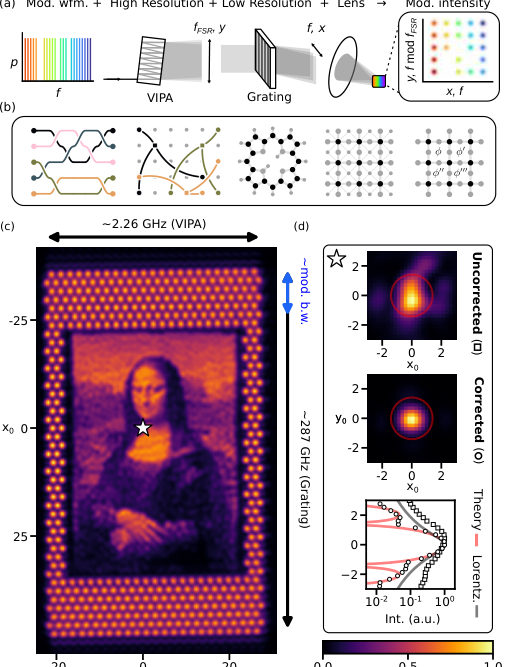 
Figure 1. Principles and optical performance of the dSLM. (a) A broadband modulated waveform is split in the x (y) directions by dispersive elements with low (high) resolution and large (small) FSR. (b) The resulting display can pro- duce arbitrary, time-varying potentials that are of broad use to atom arrays and optical lattices, including, from left to right: arbitrary permutations of tweezers; qLDPC codes un- constrained by AODs; non-repeating potentials of relevance to simulating molecules and lattice defects; the realization of lattices with multiple bands; Floquet modulation for ar- bitrary patterns of flux. (c) To characterize the optical per- formance of the system beyond the...

📷 Fig 2

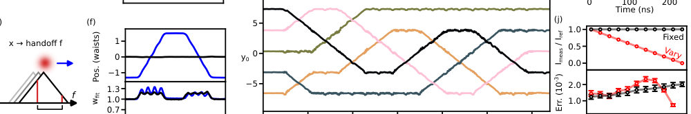 
Figure 2. Ultrafast spatiotemporal control of tweezers. (a) Individual tones are dispersed periodically in the y direction by the VIPA and continuously in the x direction by the grating with increasing frequency. This creates a unique mapping of frequency to position. (b) Intensity near the center of a single tweezer as it is turned on for 200 ns and then extinguished. Tweezers are generated in real-time with a 40 GHz Mach-Zehnder modulator. The resulting 10-90% rise time of trise = 11.8 ns and fall time of tfall = 13.0 ns correspond to an effective frame rate of t−1 rise &gt; 84 MFPS. (c) Chirping a frequency within the VIPA FSR continuously moves a tweezer along the y direction. (d)...

📷 Fig 3

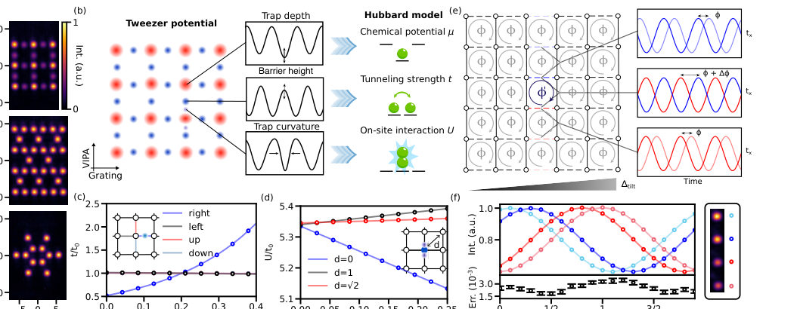 
Figure 3. Programmable potentials for analog quantum simulation of the Hubbard model. (a) Example lattice geometries projected by the dSLM; individual FSRs are modulated separately and stitched together with carrier and sidebands cropped. Top to bottom: Lieb (programmable square), kagome, and molecular-orbital lattices. (b) Scheme for a fully programmable square lattice Hubbard model using tweezer arrays. The local chemical potential is controlled by a base set of tweezers (red) that define the vertices in the lattice, tunneling amplitudes by interlaced t-control tweezers (blue) that tune the height of a tunnel barrier, and on-site interactions by U-control tweezers (purple) that modify the...

📷 Fig 4

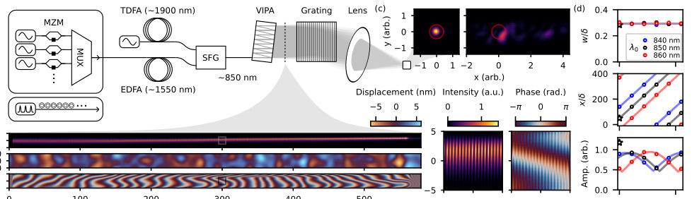 
Figure 4. Scaling to megapixel resolution. (a) Standard telecom techniques provide modulation over &gt; 10 THz of bandwidth, either via multiplexed arrays of Mach-Zehnder modulators, or architectures involving frequency combs coupled to large arrays of ring resonators. This can be paired with high power fiber amplifiers, efficient, high bandwidth frequency conversion, and the appropriate diffractive optics, to achieve high power and high resolution modulation at convenient wavelengths for cold atom experiments. Here, we consider ∼850 nm for trapping rubidium via sum frequency generation (SFG) using thulium and erbium doped fiber amplifiers (TDFA and EDFA). (b) Numerical simulations of a...

📷 Fig 5

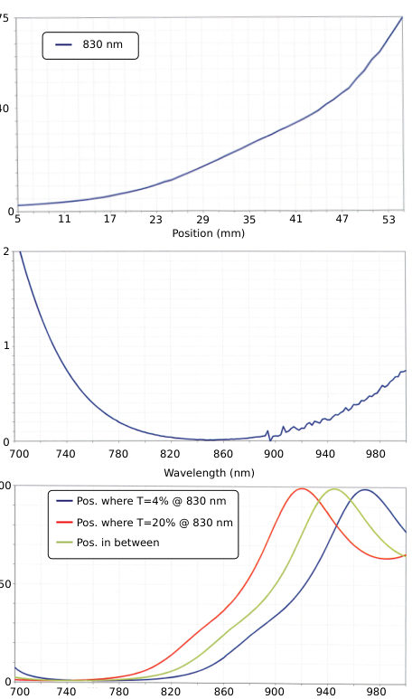 
Figure 6. (a) Transmission versus vertical position at 830 nm. The gradient coating increases transmission to normalize the intensity across emitters. (b) AR coating specifications for the input facet, which shows reflection of ∼0.2% at 780 nm. (c) Transmission at three vertical points versus wavelength shows substantially lower transmission at 780 nm, which enables the high resolutions seen in this work. Figure digitized from manufacturer testing results.

**Summary.** The paper introduces a novel dispersive spatial light modulator (dSLM) that achieves unprecedented speed and resolution for shaping optical fields. This system allows for the ultrafast, arbitrary programming of potential landscapes in arrays of ultracold atoms. By doing so, it enables advanced quantum simulations, such as controlling all parameters of the Hubbard model and generating artificial magnetic fluxes.

**Why it may be interesting.** This work directly addresses the engineering bottleneck in quantum simulation by providing a high-speed, high-resolution tool to implement complex, time-dependent Hamiltonians on cold atom platforms.

Detailed structure

**Main problem.** The challenge is developing an optical system capable of ultrafast and high-resolution spatial light modulation to precisely control programmable arrays of ultracold atoms.

**Main result.** The authors present a dispersive spatial light modulator (dSLM) achieving high speed and resolution, enabling time-dependent control over Hubbard model parameters and fast, arbitrary manipulation of atomic tweezers.

**Method.** The system uses a dSLM pairing a Virtual Interdigitated Phase Array (VIPA) with a diffraction grating to generate arbitrary, high-resolution, and high-frame-rate optical patterns.

**Model / system.** The platform is programmable arrays of ultracold atoms, which are used to simulate quantum models like the Hubbard model. Control is achieved by shaping optical fields to modulate local chemical potentials, tunneling amplitudes, and on-site interactions.

**Key observables.** Intensity resolution ($10^{-3}$), frame rate ($>84$ MFPS), spatial resolution ($83 	imes 52$ beam waists), and programmable Hubbard parameters ($\mu, t, U$).

**Important parameters / regimes.** Frame rate $>84$ MFPS; spatial resolution of $83 	imes 52$ waists; control over local chemical potentials, tunneling amplitudes, and artificial magnetic flux.

**Assumptions / limitations.** The analysis assumes Gaussian beam profiles and uses perturbative corrections to compensate for coupling between control parameters; the initial demonstration is limited by the bandwidth of the modulator used.

**Figures summary.** Figures illustrate the dSLM principle, the real-time control of tweezer movement and braiding, and the application of the system to program Hubbard model parameters in various lattice geometries.

**Paper structure.** The paper introduces the need for advanced optical control, details the dSLM mechanism using VIPA and grating, demonstrates its performance metrics (speed/resolution), and finally applies the system to program and simulate complex quantum models like the Hubbard model, including flux generation.

Abstract

Programmable arrays of ultracold atoms are a leading platform for quantum computation and simulation, enabling state-of-the-art implementations of quantum error correction, and analog simulations of Hubbard models that address open problems in condensed matter physics. In these systems, all local control is mediated through precisely shaped optical fields, and so the challenge of managing many-body quantum states becomes an exercise in optical design. In particular, one wishes for fast, flexible control with low disorder and heating, and access to large arrays with many atoms. An ideal optical system therefore must generate arbitrary patterns with high spatial resolution and low disorder, and alter these patterns on a timescale that is faster than the relevant atomic dynamics. Here, we present an optical system that is comparable to previous approaches in scale, while advancing all other axes. We demonstrate arbitrary pattern generation with $10^{-3}$ intensity resolution, a frame rate of $>84$ MFPS (megaframes per second), and a spatial resolution of $83 \times 52$ beam waists (with $11 \times 52$ waists accessible via a single $40$ GHz electro-optic modulator). These capabilities unlock a new class of experiments. We develop and numerically validate a scheme for fully programmable Hubbard models, with time-dependent control over local chemical potentials, tunneling amplitudes, on-site interactions, and patterns of artificial magnetic flux. The same architecture performs fast, arbitrary permutations of tweezers in 2D, decoupling optical constraints from the design of high-rate error-correcting codes.

[↑ back to top](#top)

### [Pulsed to continuous-wave quantum dot cavity-QED](http://arxiv.org/abs/2608.17798v1)

**Authors:** Mio Poortvliet, Petr Steindl, Wolfgang Löffler  
**Type:** both · **Category:** other · **PDF:** <https://arxiv.org/pdf/2608.17798v1>  
**Analysis basis:** full PDF text, analyzed in chunks
**Topic relevance:** 🔥 `methods for driven-dissipative` **4/5** · 🔥 `quantum optics experiment` **4/5** · `Tavis-Cummings & cavity-many-emitter` **3/5** · `analog quantum simulation` **3/5** · `driven-dissipative phase transition` **3/5** · `quantum measurements` **3/5** · `Dicke superradiance` **2/5** · `Keldysh / 2PI / non-Gaussian methods` **2/5** · `correlated / nonlocal dissipation` **2/5** · `non-equilibrium universality` **2/5** · `superradiant laser` **2/5** · `Full counting statistics` **1/5** · `interference shaping light` **1/5** · `scars & prethermalization` **1/5**

📷 Fig 1

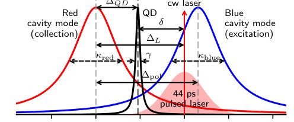 
Figure 1. Schematic overview of the relevant detunings, show- ing the polarization-split cavity modes, QD transition and the scanning laser in both continuous-wave and pulsed mode. The red (blue) cavity mode is labeled as the collection (excitation) mode. All detunings are defined with respect to the collection mode frequency, consistent with the convention throughout this work.

📷 Fig 2

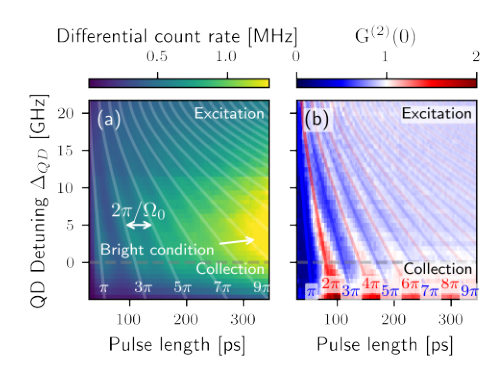 
Figure 2. Resonance fluorescence as a function of QD-cavity detuning ∆QD and pulse width, with the laser kept resonant with the QD transition (∆L = ∆QD). The cavity mode fre- quencies are indicated by dashed vertical lines. (a) Differen- tial count rate. Rabi oscillations are visible at short pulse widths whose frequency increases as the QD approaches the excitation mode due to the cavity enhancement of the driving field. White lines indicate odd-π pulse positions predicted by the cavity-enhanced Rabi frequency model. The bright condi- tion is indicated, as further discussed in the text. (b) Simul- taneously recorded g(2)(0), showing anti-bunching at odd-π pulse areas and photon bundles at...

📷 Fig 3

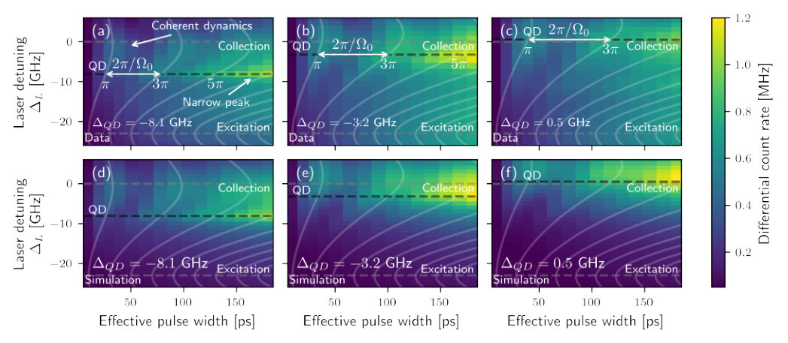 
Figure 3. Near-resonant QD-cavity dynamics as a function of laser detuning ∆L for three QD-cavity detunings ∆QD (left to right). Dashed lines indicate the cavity mode frequencies and QD transition. Top row (a–c): differential count rate. Cavity enhancement of the driving field deforms the chevron pattern of detuned Rabi oscillations into a warped chevron, shifting the minimum Rabi frequency away from the QD resonance. White lines show odd-π pulse positions from the model. Bottom row (d–f): quantum master equation simulations of panels (a–c), using system parameters extracted from a semiclassical model fit and a drive strength α0/2π = 60.5 GHz. The ”narrow peak” labeled in panel (a) is QD...

📷 Fig 4

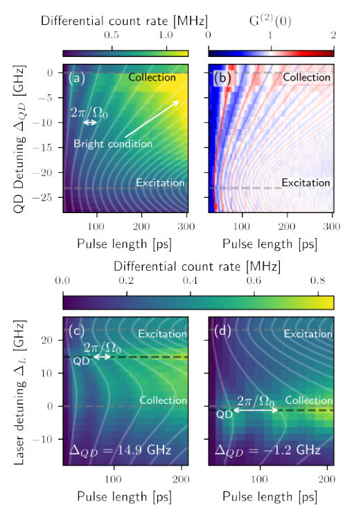 
Figure 4. Complementary cavity mode role configuration compared to the main text. (a) Differential count rate where we vary ∆QD and the pulse length. Here the red (blue) mode is used for excitation (collection), opposite of Fig. 2. (b) Pulsed mode second order correlation function at zero show- ing oscillating single photons and photon bundles, correspond- ing to panel (a). (c-d) Sweep of the laser detuning and pulse length with (c) the QD between the collection and excitation modes and (d) the QD in the collection mode. The blue (red) mode is used for excitation (detection), opposite of Fig. 3.

**Summary.** This paper investigates quantum dot cavity-QED interactions in a challenging intermediate regime where multiple timescales are comparable. Using a quantum master-equation model, the authors characterize the interplay between excitation and emission processes, predicting unique spectral patterns. The findings provide guidelines for optimizing single-photon purity by controlling detuning and pulse shaping.

**Why it may be interesting.** This work directly addresses the non-trivial dynamics in cavity QED, moving beyond simple pulsed or steady-state approximations. The development of a master equation for this intermediate regime is crucial for accurately modeling quantum light sources.

Detailed structure

**Main problem.** The study investigates the complex dynamics of resonant cavity-quantum system interactions in the intermediate regime, where pulse duration, coupling, and decoherence rates are comparable.

**Main result.** The authors reveal an interplay between cavity-enhanced excitation and Purcell-enhanced emission, leading to characteristic warped chevron patterns in the system's response.

**Method.** They developed and applied a quantum master-equation model to treat excitation-light coherent states in photon number space, validated against time-resolved fluorescence and $g^{(2)}(0)$ measurements.

**Model / system.** The physical system is a self-assembled InGaAs quantum dot coupled to a polarization-split optical microcavity. The dynamics are governed by a quantum master equation that must account for intermediate coupling regimes.

**Key observables.** Resonance fluorescence (differential count rate), second-order correlation function $g^{(2)}(0)$, and Rabi oscillations.

**Important parameters / regimes.** The intermediate regime where cavity linewidth ($\kappa$), QD decay ($\gamma$), and coupling ($g$) are comparable; polarization splitting ($\Delta_{pol}$); and varying pulse durations (17 ps to 1 ns).

**Assumptions / limitations.** The model assumes the system is driven by programmable laser pulses and analyzes the crossover between pulsed and continuous-wave limits.

**Figures summary.** Figures show resonance fluorescence vs. detuning and pulse width, demonstrating Rabi oscillations and anti-bunching in $g^{(2)}(0)$; other figures illustrate the dependence of fluorescence on detuning and pulse area.

**Paper structure.** The paper progresses by first establishing the need to model the intermediate regime, developing the quantum master equation, and then using this model to predict and explain observed features like warped chevron patterns and optimal single-photon purity conditions.

Abstract

Resonant cavity-quantum system interactions are well understood in the pulsed coherent and continuous-wave steady-state limits, but not much in between. We investigate the intermediate regime, where pulse duration, coupling, decoherences, and decays occur on comparable timescales, and pulse bandwidth matches cavity splitting and detunings. We reveal an interplay of cavity-enhanced excitation and Purcell-enhanced emission leading to warped chevron patterns. We develop a quantum master-equation model that efficiently treats the excitation-light coherent states in photon number space and reproduces the experimental data. Using these results we identify how polarization-split cavities can optimize single-photon purity and emission probability.

[↑ back to top](#top)

### [Dephasing-induced distinct mobility edges in a dimerized off-diagonal quasicrystal](http://arxiv.org/abs/2608.17937v1)

**Authors:** Ming-Jie Tao, Yi-Ting Wang, Jing Li, Hongsheng Hou, Xiang-Ping Jiang, Lei Pan  
**Type:** theory · **Category:** disordered systems and neural networks · **PDF:** <https://arxiv.org/pdf/2608.17937v1>  
**Analysis basis:** full PDF text, analyzed in chunks
**Topic relevance:** 🔥 `driven-dissipative phase transition` **4/5** · 🔥 `methods for driven-dissipative` **4/5** · `correlated / nonlocal dissipation` **3/5** · `non-equilibrium universality` **3/5** · `Keldysh / 2PI / non-Gaussian methods` **2/5** · `quantum measurements` **2/5** · `analog quantum simulation` **1/5** · `scars & prethermalization` **1/5**

📷 Fig 1

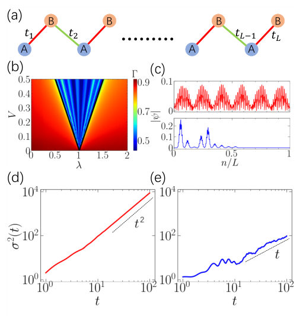 
FIG. 1. (a) Schematic illustration of the 1D Hamiltonian gov- erned by Eq. (1). The red and green solid lines denote the intra- and inter-cell hopping amplitudes between sublattices A and B, respectively. (b) Global phase diagram in the (λ, V ) parameter space characterized by the fractal dimension Γ (in units of t = 1). The red and blue regions designate the fully extended and multifractal critical phases, respectively. The solid black curves represent the exact boundaries separating these two distinct regimes. (c) Real-space probability distri- butions of representative single-particle eigenstates, visually contrasting the extended and critical states. (d)-(e) Time evolution of the...

📷 Fig 2

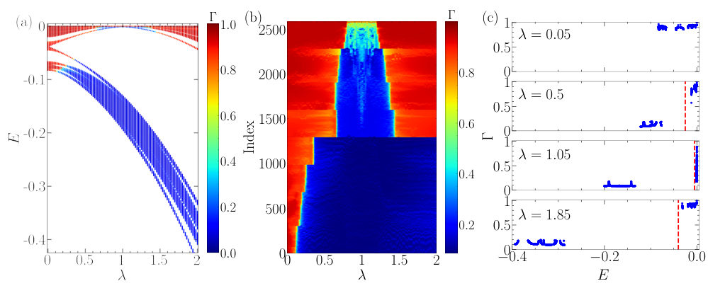 
FIG. 2. Spectral properties and localization transitions of the effective Markov transition matrix M under dephasing. (a) The eigenvalue E as a function of the dimerization strength λ. The color gradient encodes the fractal dimension Γ of the corresponding single-particle eigenstates, enabling a clear visual distinction between the fully extended (Γ →1, red), critically multifractal, and exponentially localized (Γ →0, blue) states. (b) The fractal dimension Γ for all macroscopic eigenstates (sorted ascendingly by their eigenvalue index) versus λ. This global map illustrates the macroscopic population fractions of the distinct regions and the structural evolution of the phase boundaries. (c)...

📷 Fig 3

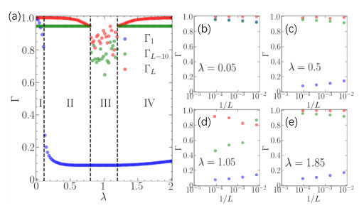 
FIG. 3. Finite-size scaling analysis of the fractal dimension Γ for representative single-particle eigenstates. The scaling behaviors of Γ as a function of 1/L are presented under four distinct modulation strengths: (a) λ = 0.05, (b) λ = 0.5, (c) λ = 1.05, and (d) λ = 1.85. By extrapolating to the thermodynamic limit (L →∞, corresponding to 1/L →0), the distinct nature of the eigenstates is rigorously verified. Specifically, the fully extended states (red squares) robustly converge to Γ →1, the exponentially localized states (blue tri- angles) decay to Γ →0, and the critically multifractal states (green diamonds) converge to intermediate fractional values (0 &lt; Γ &lt; 1). The fixed system...

📷 Fig 4

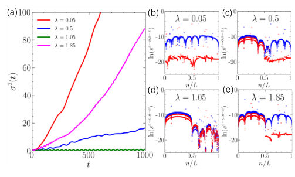 
FIG. 4. Dynamical wave-packet transport and spectral statis- tics characterizing the distinct regions. (a) Time evolution of the spatial variance σ2(t) under selected dimerization strength λ. The distinct temporal growth profiles directly manifest the underlying quantum transport mechanisms: robust bal- listic/superdiffusion expansion in the extended phase and ME region, intermediate subdiffusive spreading in the AME re- gion, and a complete transport arrest (σ2(t) ∼const) veri- fying the exponentially localized phase. (b)-(e) Logarithmic distributions of the adjacent even-odd, ln  se−o , and odd- even, ln  so−e , level spacings as a function of the normalized state index n/L. These...

📷 Fig 5

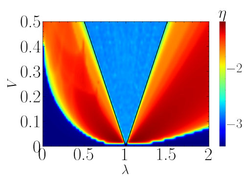 
FIG. 5. Global phase diagram of the dissipative sys- tem in the (λ, V ) parameter space in the strong-dephasing regime. Boundaries mark three distinct spectral regimes: the fully-extended regime, a mixed regime of extended and lo- calized states, and a mixed regime of critical and localized states, separated by conventional MEs and AMEs. This dissi- pative phase diagram contrasts sharply with the purely coher- ent phase diagram in Fig. 1(a), giving unambiguous evidence that environmental dephasing counterintuitively reshapes the localization landscape.

**Summary.** This work analyzes localization in a quasiperiodic quantum system subjected to pure dephasing. By mapping the dynamics to an effective classical Markov process, the authors demonstrate that dephasing induces distinct mobility edges. This reveals that dephasing is a powerful mechanism capable of stabilizing and controlling multiple distinct transport regimes (extended, critical, localized) within the system's spectrum.

**Why it may be interesting.** It provides a concrete example of how environmental coupling (dephasing) can actively control and reshape localization transitions in complex quasiperiodic systems, moving beyond the simple expectation of decoherence always destroying localization.

Detailed structure

**Main problem.** The paper investigates how pure dephasing affects localization behavior in a dimerized off-diagonal Aubry-André-Harper (AAH) quasicrystal.

**Main result.** Pure dephasing can induce distinct Mobility Edges (MEs), including anomalous ones, allowing for the coexistence of extended, multifractal critical, and localized states in the dissipative system.

**Method.** The analysis uses the Lindblad master equation, applying adiabatic elimination in the strong-dephasing limit to derive an effective classical Markov transition matrix.

**Model / system.** The system is a 1D tight-binding model of free spinless fermions on a dimerized off-diagonal AAH quasicrystal, governed by a Lindblad master equation.

**Key observables.** Inverse Participation Ratio (IPR), fractal dimension ($\Gamma_k$), wave-packet spreading variance ($\sigma^2(t)$), and level spacing statistics.

**Important parameters / regimes.** Dephasing rate ($\gamma$), quasiperiodic modulation strength ($\lambda, V$), and the ratio of dephasing to hopping ($ \gamma \gg t$).

**Assumptions / limitations.** The strong-dephasing limit ($\gamma \gg t$) allows for the adiabatic elimination of coherence terms, reducing the dynamics to a classical Markov process.

**Figures summary.** Figures illustrate the global phase diagram in $(\lambda, V)$ space showing boundaries for extended, critical, and localized phases, alongside time evolution plots of wave-packet variance ($\sigma^2(t)$) confirming different transport regimes.

**Paper structure.** The paper reviews localization in closed systems, introduces the open system formalism via the Lindblad equation, and finally applies the strong-dephasing limit to derive the Markov matrix and construct the global dissipative phase diagram.

Abstract

Anderson localization and the mobility edge (ME) have been extensively studied in isolated aperiodic systems. Conventional theory suggests that dephasing and decoherence should disrupt localization and facilitate transport. In this work, we investigate localization behaviors in a dimerized off-diagonal Aubry-Andre-Harper (AAH) quasicrystal subject to on-site pure dephasing. In the strong-dephasing limit, we apply adiabatic elimination within the Lindblad master equation framework to derive an effective classical Markov transition matrix that governs the dissipative relaxation dynamics. Counterintuitively, we demonstrate that pure dephasing can induce distinct MEs, including both conventional MEs separating extended and localized states and anomalous MEs separating multifractal critical states from localized states, even when all eigenstates of the original closed coherent system are delocalized or multifractal. Using fractal dimension finite-size scaling, wave-packet spreading dynamics, and energy spectrum statistics, we numerically verify the coexistence of fully extended, multifractal critical, and localized regions within the relaxation spectrum of the dissipative system, and construct the global dissipative phase diagram. These findings reveal that dephasing can see as a powerful mechanism for controlling localization transitions, thus enhancing our understanding of dissipative quasicrystal systems.

[↑ back to top](#top)

### [KPZ scaling in one-dimensional arrays of photon condensates](http://arxiv.org/abs/2608.17602v1)

**Authors:** Michiel Yzewyn, Michiel Wouters  
**Type:** theory · **Category:** statistical mechanics · **PDF:** <https://arxiv.org/pdf/2608.17602v1>  
**Analysis basis:** full PDF text, analyzed in chunks
**Topic relevance:** 🔥 `non-equilibrium universality` **4/5** · `analog quantum simulation` **3/5** · `driven-dissipative phase transition` **3/5** · `Keldysh / 2PI / non-Gaussian methods` **2/5** · `Tavis-Cummings & cavity-many-emitter` **2/5** · `correlated / nonlocal dissipation` **2/5** · `methods for driven-dissipative` **2/5** · `Frenkel-Kontorova` **1/5** · `superradiant laser` **1/5**

📷 Fig 1

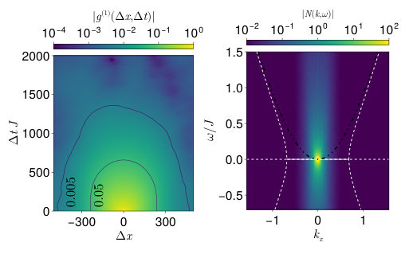 
FIG. 1. Left panel – Spatiotemporal first order coherence of the photon condensate in the grandcanonical regime. The area inside the contours shows the spacetime points collaps- ing on the universal KPZ scaling curve for the grand canon- ical regime with 0.005 ≤|g(1)(∆x, ∆t)| ≤0.05 (see Fig. 3). Right panel – The energy-momentum spectrum of the pho- ton condensate is shown in false color scale, the black dashed line represents the photon dispersion of the empty cavity, the white dashed lines the elementary excitation spectrum. Sys- tem parameters: J = 1 meV, ∆= −60 J, γ = 0.01 J, B21 = 10−7 J, n = 103, M = 1011.

📷 Fig 2

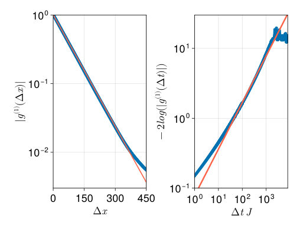 
FIG. 2. First order spatial (left) and temporal (right) co- herence decay for a one dimensional photon condensate ar- ray in the grand canonical regime. Numeric result (blue data) from simulating eq. (1) and (3) for equal-time spatial correlation function g(1)(x) (left) and equal-space temporal correlation function g(1)(t) (right) for a N = 1024 site sys- tem with periodic boundaries in the grand canonical regime: n2/Meff ≈1.3×10−4. —Left: The red line depicts the NIB ex- ponential decay ℓc = 2J ¯n

📷 Fig 3

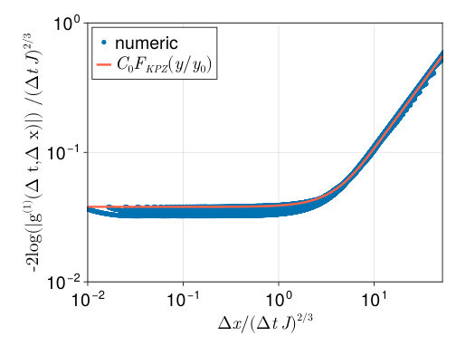 
FIG. 3. The rescaled numerical data points for intermediate values of the coherence, taken between the contours in the left panel of Fig. 2, show a good collapse, that agrees very well with the universal KPZ scaling curve. Fitted parameters: y0 ≈8.3 × 10−1, C0 ≈3.0 × 10−2. Same system parameters as in Fig. 1.

📷 Fig 4

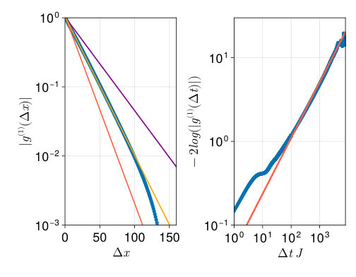 
FIG. 4. First order spatial (left) and temporal (right) coher- ence decay for a one dimensional photon condensate array in the grand canonical regime. Numeric result (blue data) from simulating eq. (1) and (3) for equal-time spatial correlation function g(1)(x) (left) and equal-space temporal correlation function g(1)(t) (right) for a N = 1024 site system with pe- riodic boundaries in the canonical regime: n2/Meff ≈1.06. The red line depicts the NIBG exponential decay ℓ0 = 2J ¯n

📷 Fig 5

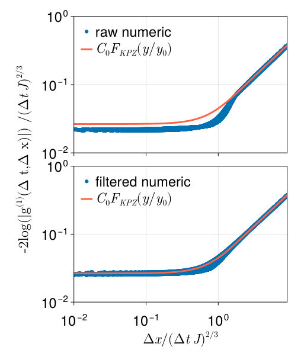 
FIG. 5. Correlator C0FKP Z(y/y0) collapse for spacetime points between the two contours in the left panel of Figure 6. The upper panel shows decent collapse, but not on the universal KPZ scaling function. The numerical data in the lower panel, that are obtained after applying a spectral fil- ter shows a very good collapse on the universal KPZ scaling curve. For the filtering, we used the function described in the text, with ωc = 0.0016 and δ = 0.004. Fitted parameters: y0 ≈9.1 × 10−1, C0 ≈2.3 × 10−2. Same system parameters as in Fig. 4.

**Summary.** This work analyzes the coherence decay in photon condensates, which are driven-dissipative quantum systems. The authors demonstrate that the phase dynamics fall into the Kardar-Parisi-Zhang (KPZ) universality class, a finding robust even when density fluctuations are large. The research highlights the importance of spectral filtering in revealing the underlying universal physics.

**Why it may be interesting.** It connects non-equilibrium dynamics in quantum optics (photon BEC) to a universal critical phenomenon (KPZ scaling), providing insights into how dissipation and driving affect universal scaling laws in many-body systems.

Detailed structure

**Main problem.** The study investigates whether the phase dynamics of driven-dissipative photon condensates exhibit Kardar-Parisi-Zhang (KPZ) scaling, particularly in regimes characterized by large density fluctuations.

**Main result.** The first-order coherence decay confirms KPZ scaling, even in the large density fluctuation (grand canonical) regime, although achieving the universal scaling requires spectral filtering.

**Method.** The analysis combines deriving continuum equations from a classical field model with numerical simulations and analytical comparison of scaling exponents.

**Model / system.** The system is modeled as photon condensates in a 1D array of dye-filled microcavities, treated as a driven-dissipative system coupled to excited molecular states.

**Key observables.** First-order coherence decay, spatiotemporal coherence $g^{(1)}(\Delta x, \Delta t)$, and the scaling function for phase fluctuations.

**Important parameters / regimes.** The analysis distinguishes between the large density fluctuation (grand canonical) and small density fluctuation (canonical) regimes.

**Assumptions / limitations.** Initial approximations assume small density fluctuations for analytical derivations, but the numerical work extends to the large fluctuation regime. Spectral filtering is used to recover universal scaling.

**Figures summary.** Figures show the spatiotemporal first-order coherence decay, demonstrating collapse onto the universal KPZ scaling curve, especially after applying a spectral filter.

**Paper structure.** The paper progresses from establishing the physical model (driven-dissipative system) to deriving the phase dynamics, confirming KPZ scaling numerically in the grand canonical regime, and finally discussing the necessity of spectral filtering to recover universal behavior.

Abstract

Bose-Einstein condensates of photons in dye filled microcavities are known to feature many properties of the ideal bose gas at thermal equilibrium. Nevertheless, the finite photon life time renders them driven dissipative systems where losses are balanced by continuous driving by a pump laser. We show here with simulations based on a classical field model that their driven-dissipative nature causes their first order coherence to feature Kardar-Parisi-Zhang (KPZ) scaling, a phenomenon well known in the related condensates of exciton-polaritons. Remarkably, we find that the KPZ scaling even occurs in a regime with large density fluctuations. We discuss the modification of the scaling by the occupation of excited states and how to recover the universal scaling behavior by spectral filtering.

[↑ back to top](#top)

### [Multi-purpose quantum laboratories from superconducting circuits](http://arxiv.org/abs/2608.17020v1)

**Authors:** Arpit Arora, Emily M. Been, William Munizzi, Joel Wang, Taylor L. Patti, Aaron Chou, Prineha Narang  
**Type:** both · **Category:** other · **PDF:** <https://arxiv.org/pdf/2608.17020v1>  
**Analysis basis:** full PDF text, analyzed in chunks
**Topic relevance:** 🔥 `QC/QI experiment` **4/5** · `analog quantum simulation` **3/5** · `driven-dissipative phase transition` **2/5** · `methods for driven-dissipative` **2/5** · `quantum measurements` **2/5** · `Full counting statistics` **1/5** · `Keldysh / 2PI / non-Gaussian methods` **1/5** · `correlated / nonlocal dissipation` **1/5** · `non-equilibrium universality` **1/5** · `quantum optics experiment` **1/5**

📷 Fig 1

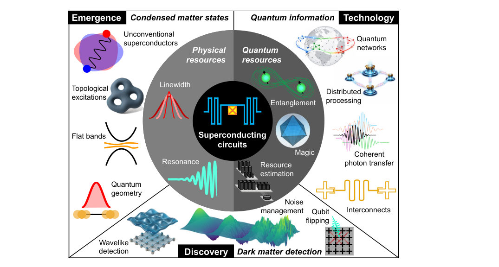 
FIG. 1. Conceptual map illustrating how superconducting circuit (SC) platforms link physical resources and quantum resources for use in a vast array of applications. The benefits of SCs span from sensing fundamental physics, such as discovering emergent condensed-matter phenomena and detecting elusive dark matter, to serving as quantum-information primitives and enabling technologies at the forefront of quantum science.

📷 Fig 2

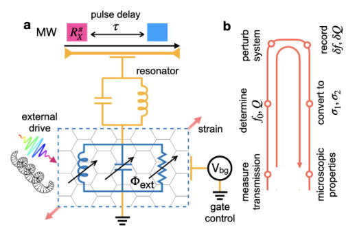 
FIG. 2. Overview of SCs for probing quantum materials. (a) The sample under investigation can couple capacitively, in- ductively or galvanically to the microwave resonator, which in turn can be externally controlled and measured via a feed- line. The sample can thus be controlled via external fields, me- chanical modifications and driving. (b) Workflow of SC mea- surement, which includes measurement of the transmission spectrum of the hybrid resonator and records the changes in frequency and linewidth under external perturbation. These changes are converted to complex conductivity, σ = σ1 + iσ2, analyzing which yields the microscopic properties of interest.

📷 Fig 3

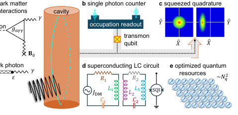 
FIG. 3. Cavity-based dark matter detection schemes using SC concepts. (a) Axion-like particle interaction with electro- magnetism via the Primikoff effect or topological magneto- electric effect in an external magnetic field B0, and dark pho- ton kinetic mixing with electromagnetic photon. (b) Using transmon qubits to circumvent the standard-quantum-limit by measuring photon number instead of signal quadratures. (c) Squeezing quantum vacuum to improve scan rates by in- creasing single-quadrature detection bandwidth while main- taining signal-to-noise ratio. (d) Describing the DM detection methods via lumped-element circuits, maximizing signal-to- noise across wide frequency ranges. (e)...

**Summary.** This review establishes superconducting circuits as universal quantum laboratories, capable of probing fundamental physics—from exotic superconducting symmetries to dark matter interactions. It details the advanced measurement techniques used and highlights the convergence of these hardware platforms with quantum information science, including the role of AI in advancing quantum control.

**Why it may be interesting.** It provides a comprehensive overview of how superconducting circuits bridge fundamental condensed matter physics (e.g., unconventional superconductivity, topological phases) with cutting-edge quantum information processing capabilities.

Detailed structure

**Main problem.** The paper reviews the role of superconducting circuits (SCs) as general-purpose quantum laboratories, unifying their utility across condensed matter, high energy, and quantum information sciences.

**Main result.** SCs are shown to be mature, versatile platforms capable of simultaneously acting as fundamental research subjects and as high-precision probing tools for exotic quantum phenomena.

**Method.** The review synthesizes diverse experimental and theoretical techniques, including dispersive readout, measuring frequency shifts, and integrating AI/ML for circuit design and signal extraction.

**Model / system.** The primary physical system is the Superconducting Circuit (SC), which serves as the platform. These circuits are coupled to various quantum materials or used to host superconducting qubits, allowing access to macroscopic quantum states.

**Key observables.** Frequency shifts in resonators, complex conductivity ($\sigma$), single-photon sensitivity, superconducting order parameters (e.g., p-wave nodal order), and entanglement measures.

**Important parameters / regimes.** Energy scales ranging from few GHz down to weak-coupling regimes; decoherence rates; and the fidelity of quantum control.

**Assumptions / limitations.** The development relies on the ability to maintain coherence and the ongoing effort to mitigate limitations like dielectric loss and gate errors.

**Figures summary.** Figure 1 conceptually maps SC platforms to physical and quantum resources for various applications. Table I summarizes the toolbox, including high-Q resonators, dispersive readout, and Josephson nonlinearities.

**Paper structure.** The paper traces the technical evolution of SC architectures, reviewing their dual capacity (subject vs. tool), detailing specific measurement techniques for probing quantum materials, and concluding with the integration of advanced quantum control and AI methods.

Abstract

Superconducting circuits (SCs) are the cornerstone of modern quantum technology, enabling scalable computing through coherent control of macroscopic quantum states. Through a legacy that predates modern quantum computing, SCs have emerged as high-precision instruments for discovery. In this review, we highlight the role of SCs as general-purpose quantum laboratories, outlining the emerging landscape of correlated matter-circuit science. We review and unify the capabilities of superconducting quantum hardware across condensed matter, high energy and quantum information sciences. We trace the technical evolution of these architectures, illustrating how their foundational development has culminated in a toolkit for resolving the complexities of macroscopic quantum states.

[↑ back to top](#top)

### [Equilibrium and nonequlibrium scaling behaviors of localization transition in a non-Hermitian Aubry-André model with onsite gain and loss](http://arxiv.org/abs/2608.17527v1)

**Authors:** Wen-Jing Yu, Yue-Mei Sun, Xin-Yu Wang, Liang-Jun Zhai  
**Type:** theory · **Category:** disordered systems and neural networks · **PDF:** <https://arxiv.org/pdf/2608.17527v1>  
**Analysis basis:** full PDF text, analyzed in chunks
**Topic relevance:** 🔥 `driven-dissipative phase transition` **4/5** · 🔥 `non-equilibrium universality` **4/5** · `methods for driven-dissipative` **3/5** · `Keldysh / 2PI / non-Gaussian methods` **1/5** · `analog quantum simulation` **1/5** · `correlated / nonlocal dissipation` **1/5**

📷 Fig 1

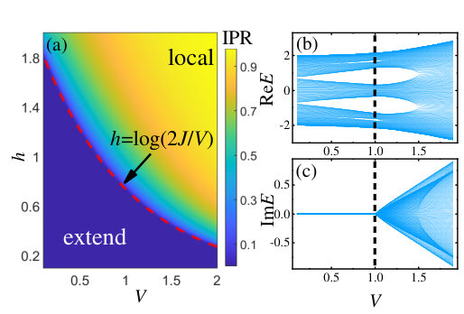 
FIG. 1. (a) Phase diagram of the gain-loss type non- Hermitian AA model in the (V, h) plane, obtained from the IPR of the eigenstate with the lowest real part of the energy under PBC. The color scale represents the IPR value, where the critical line h = log(2J/V ) separates the extended phase from the localized phase. (b) Real and (c) imaginary parts of the energy spectra as functions of V for fixed h = 0.693, where the corresponding critical point is Vc = 1, with L = 377 and θ = 0. Re E and Im E denote the real and imaginary parts. The black dashed lines in (b) and (c) mark the critical point Vc = 1, separating the extended phase (V &lt; Vc) with purely real spectra from the localized phase...

📷 Fig 2

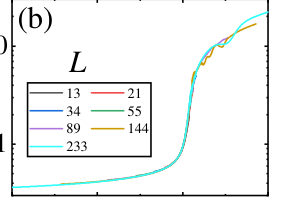 
FIG. 7. (a) IPR as a function of ε for different system sizes L at a fixed RLr. (b) Scaling collapse of the data according to Eq. (13).Here the scaled driving rate is fixed at RLr = 126.49, results are averaged over 10 to 100 samples of θ, and the y- axis is on a logarithmic scale.

📷 Fig 3

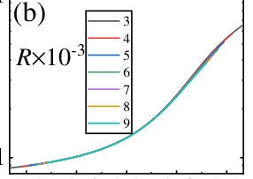 
FIG. 8. (a) IPR as a function of ε for different driving rates R at a fixed large system size L = 987. (b) Scaling collapse of the data according to Eq. (14). Results are averaged over 10 to 100 samples of θ, and the y-axis is on a logarithmic scale.

**Summary.** This paper investigates localization transitions in a non-Hermitian Aubry-André model featuring on-site gain and loss. Using finite-size scaling, the authors determine that this system belongs to a unique universality class, distinct from standard Hermitian or non-reciprocal models. Furthermore, they successfully generalize the Finite-Time Scaling framework to describe the non-equilibrium dynamics across the critical point in this complex non-Hermitian setting.

**Why it may be interesting.** This work directly addresses the interplay between non-Hermiticity and localization, which is a major frontier in open quantum systems and condensed matter theory. The extension of FTS to non-Hermitian, gapless initial states is a significant methodological advance.

Detailed structure

**Main problem.** The study investigates the critical scaling behavior and driven dynamics of localization transitions in non-Hermitian systems incorporating on-site gain and loss.

**Main result.** The gain-loss mechanism establishes a new universality class for localization transitions, characterized by distinct critical exponents, and validates the applicability of the Finite-Time Scaling framework to these non-Hermitian systems.

**Method.** The research employs finite-size scaling analyses on observables like the localization length, Inverse Participation Ratio (IPR), and energy gap, alongside the Finite-Time Scaling (FTS) framework for driven dynamics.

**Model / system.** The system analyzed is the non-Hermitian Aubry-André (AA) model, modified by the inclusion of on-site gain and loss terms. The Hamiltonian structure is defined by hopping terms and a potential modulated by a quasiperiodic function and the gain/loss parameter.

**Key observables.** Localization length ($\xi$), Inverse Participation Ratio (IPR), Energy Gap ($\Delta E_g$), and critical exponents ($
u, s, z$).

**Important parameters / regimes.** The quasiperiodicity parameter $\gamma$, the hopping amplitude $J$, the potential strength $V$, and the gain/loss parameter $h$.

**Assumptions / limitations.** The analysis relies on the applicability of the FTS framework, which requires the condition $z' < r$ to be satisfied for the gapless initial state.

**Figures summary.** Figure 1 illustrates the phase diagram showing the critical line separating extended and localized phases. Figure 2 displays spatial wave function distributions in the extended, critical, and localized regimes.

**Paper structure.** The paper first establishes the static critical scaling by analyzing the phase diagram and extracting critical exponents. It then extends the analysis to non-equilibrium dynamics, verifying the applicability of the FTS framework for driven evolution across the critical point.

Abstract

The interplay between non-Hermiticity and localization has attracted considerable interest, yet the driven dynamics of localization transitions in non-Hermitian systems with on-site gain and loss remains largely unexplored. Here we investigate the critical scaling behavior and driven dynamics of the non-Hermitian Aubry-André (AA) model with on-site gain and loss. Through finite-size scaling analyses of the localization length, the inverse participation ratio (IPR), and the energy gap, we extract the critical exponents $ν= 1.00(2)$, $s = 0.7965(2)$, and $z = 1.999(2)$. These exponents are different from those of both the Hermitian AA model and the nonreciprocal hopping AA model, particularly the IPR exponent $s$, demonstrating that the gain-loss mechanism belongs to a distinct universality class. For the driven dynamics, we focus on the case where the system is initially prepared in a gapless extended state and linearly driven across the critical point. We verify that the finite-time scaling (FTS) framework remains applicable provided that the criterion $z' < r$ is satisfied, where $z' = 1.999(2)$ characterizes the gap closure in the extended phase and $r = z + 1/ν\approx 2.999$. The predicted FTS scaling forms for the IPR are numerically validated across a wide range of system sizes and driving rates, demonstrating that the unified scaling description can be successfully generalized to the gain-loss type non-Hermitian AA model. Our work not only establishes the gain-loss AA model as a new universality class of localization transitions but also extends the applicability of the FTS framework to non-Hermitian systems with gapless initial states.

[↑ back to top](#top)

### [Hydrodynamization in 1D Bose gases at nonzero temperature](http://arxiv.org/abs/2608.16980v1)

**Authors:** Jeff Leiberton, Marcos Rigol  
**Type:** theory · **Category:** quantum gases · **PDF:** <https://arxiv.org/pdf/2608.16980v1>  
**Analysis basis:** full PDF text, analyzed in chunks
**Topic relevance:** 🔥 `scars & prethermalization` **4/5** · `analog quantum simulation` **3/5** · `non-equilibrium universality` **3/5** · `Keldysh / 2PI / non-Gaussian methods` **2/5** · `driven-dissipative phase transition` **1/5** · `methods for driven-dissipative` **1/5**

📷 Fig 1

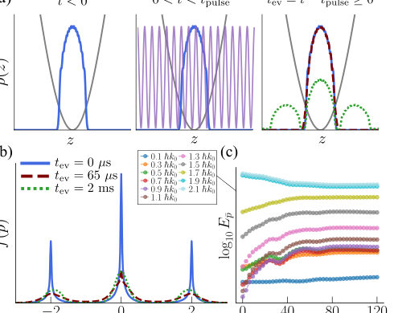 
FIG. 1. Hydrodynamization in a 1D Bose gas. (a) Illustra- tion of the experimental sequence for a single 1D Bose gas (the experiment consists of a 2D array of 1D Bose gases) [14]. The gray and blue solid lines indicate the trap and the coarse- grained position distribution, respectively. At t = 0, a Bragg pulse (purple) is applied for a time tpulse = 10 µs, driving the system far from equilibrium. For times tev ≡t −tpulse &gt; 0, the gas evolves in the original trap. (b) Momentum distribu- tions at the evolution times shown in (a). (c) Evolution of the energy contained in different coarse-grained momentum groups. We consider the Tonks-Girardeau regime for N = 15 87Rb atoms in the same axial...

📷 Fig 2

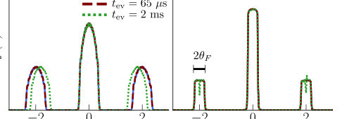 
FIG. 2. Rapidity distribution in 1D Bose gases. (a) Rapid- ity distributions for the same system and evolution times as in Fig. 1. (b) Rapidity distributions in a box trap, modeled by a homogeneous Hamiltonian with open boundary condi- tions, for the same evolution times as in (a). We consider the Tonks-Girardeau regime for N = 15 87Rb atoms, and k0 = 2π/(775 nm) as in the experiment.

📷 Fig 3

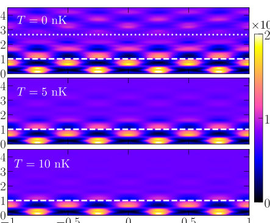 
FIG. 4. Dynamics of the position distribution. Evolution of the position distribution for three initial temperatures, T = 0, 5, and 10 nK (from top to bottom). The Bragg pulse gen- erates a λ/2 modulation, which oscillates with a period τ c hd (marked by the horizontal dashed lines) and whose damping increases with temperature. The horizontal dotted line in the T = 0 panel marks the dephasing time τdp from Eq. (4), defined for the initial ground state. The data shown are smoothed with a Gaussian kernel for visual clarity.

📷 Fig 4

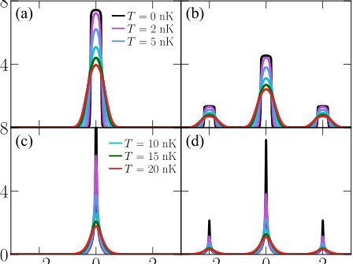 
FIG. 3. Pre- and post-quench rapidity and momentum dis- tributions. (a),(b) Rapidity and (c),(d) momentum distribu- tions in (a),(c) the initial state (t = 0) and (b),(d) right after the Bragg-pulse quench (tev = 0) for different initial tem- peratures. Note that the initial temperatures are chosen low enough so that all the peaks remain well resolved after the quench with negligible occupation between them.

📷 Fig 5

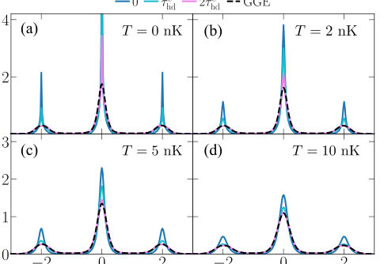 
FIG. 6. Dynamics of the momentum distribution. Evolution of the momentum distribution for four initial temperatures: (a) T = 0 nK, (b) T = 2 nK, (c) T = 5 nK, and (d) T = 10 nK. We show the momentum distributions at times tev/τ c hd = 0, 1, 2, together with the corresponding GGE predictions.

**Summary.** This theoretical paper examines how non-zero initial temperatures influence the rapid onset of hydrodynamic behavior (hydrodynamization) and subsequent local equilibration (prethermalization) in 1D Bose gases. By analyzing the hard-core boson model after a quench, the authors find that higher temperatures accelerate these processes by broadening the initial momentum distribution. This introduces a new temperature-dependent dephasing time as a key diagnostic tool.

**Why it may be interesting.** This work directly addresses non-equilibrium dynamics in ultracold atomic systems, providing quantitative insights into how thermal initial conditions modify universal dynamical processes like hydrodynamization, which is crucial for understanding quench dynamics in quantum simulators.

Detailed structure

**Main problem.** The study investigates how non-zero initial temperatures affect the timescales associated with hydrodynamization and prethermalization in 1D Bose gases following a quench.

**Main result.** Increasing the initial temperature shortens both the damping time of hydrodynamization oscillations and the prethermalization time, which is attributed to the broadening of the initial rapidity distribution.

**Method.** The authors use theoretical calculations, specifically analyzing the one-body density matrix for the non-interacting Fermi gas limit of the Lieb-Liniger model, which is applicable in the Tonks-Girardeau regime.

**Model / system.** The system is a 1D Bose gas, modeled by the Lieb-Liniger Hamiltonian, and the analysis focuses on the homogeneous case using hard-core bosons. The dynamics are probed via a Bragg-pulse quench.

**Key observables.** Hydrodynamization coherence time, damping time of oscillations, prethermalization time, and the nonzero-temperature dephasing time ($	au_{dp}$).

**Important parameters / regimes.** Initial temperature ($T$), quench parameters (Bragg pulse), and the system's interaction regime (Tonks-Girardeau limit).

**Assumptions / limitations.** The analysis assumes the system is nearly integrable, allowing the use of Generalized Hydrodynamics (GHD), and treats the rapidity distribution as approximately conserved in the homogeneous box trap.

**Figures summary.** Figures illustrate the experimental sequence (Bragg pulse quench) and show the evolution of rapidity distributions for both harmonic and box traps, comparing different time regimes.

**Paper structure.** The paper builds upon previous ground-state studies by incorporating finite temperature effects. It details the theoretical framework for calculating one-body density matrices and then analyzes the resulting timescales for hydrodynamization and prethermalization as a function of initial temperature.

Abstract

Hydrodynamization refers to the remarkably rapid process in relativistic heavy-ion collisions by which hydrodynamic descriptions become applicable. Following the observation of analogous behavior in ultracold one-dimensional (1D) Bose gases, hydrodynamization has been conjectured to be a universal dynamical phenomenon in quantum systems following high-energy quenches. Theoretical studies in this cold-atom setting have so far been restricted to quenches from ground states. Here we study how nonzero temperatures affect hydrodynamization. Specifically, using a homogeneous 1D gas of hard-core bosons, we explore how the initial temperature affects the timescales associated with hydrodynamization and prethermalization following a Bragg-pulse quench. We find that while the hydrodynamization coherence time remains unchanged, increasing temperature shortens both the damping time of the hydrodynamization oscillations and the prethermalization time. We argue that this is mainly the result of the broadening of the initial rapidity distribution, and introduce a nonzero-temperature dephasing time defined in terms of the extent of the rapidity distribution.

[↑ back to top](#top)

### [Hidden Ergodic Relaxation in the Quench Dynamics of a Bichromatic Mott Lattice](http://arxiv.org/abs/2608.17076v1)

**Authors:** Áttis V. M. Marino, Rhombik Roy, M. A. Caracanhas, N. D. Chavda, Antônio M. S. Macêdo, V. S. Bagnato, Robin P Sagar, B. Chakrabarti  
**Type:** theory · **Category:** quantum gases · **PDF:** <https://arxiv.org/pdf/2608.17076v1>  
**Analysis basis:** full PDF text, analyzed in chunks
**Topic relevance:** 🔥 `non-equilibrium universality` **4/5** · 🔥 `scars & prethermalization` **4/5** · `analog quantum simulation` **3/5** · `methods for driven-dissipative` **2/5**

📷 Fig 1

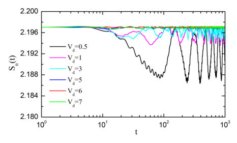 
FIG. 2. Time evolution of the orbital entropy Sn(t) for dif- ferent quench amplitudes Vd. Strong quenches (Vd = 5, 6, 7) rapidly reach a stationary value, while weak quenches retain fluctuations, consistent with persistent Mott-like correlations at the orbital level.

📷 Fig 2

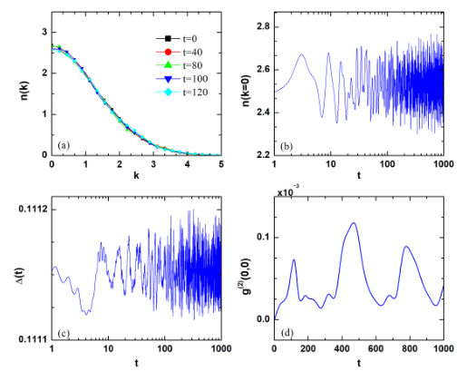 
FIG. 1. Dynamics of experimentally accessible observables following a sudden quench of the secondary quasiperiodic lat- tice for N = S = 9. (a) Momentum distribution n(k, t), (b) zero-momentum occupation n(k →0, t), (c) order parameter ∆(t), and (d) local two-body Glauber correlation g(2)(0, 0; t). Their weak temporal variations demonstrate the persistence of Mott-like order. Parameters are Vp = 10, Vd = 5, g0 = 0.5, and M = 10.

📷 Fig 3

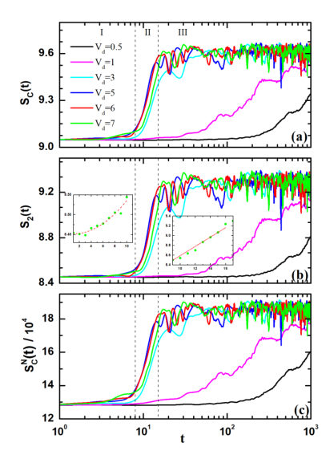 
FIG. 3. Hilbert-space spreading after a sudden quench for N = S = 9. (a) Coefficient entropy SC(t), (b) second Rényi entropy S2(t), and (c) N-body coefficient spreading SN C (t). Weak quenches show restricted spreading, while strong quenches relax toward GOE values. Insets show the initial quadratic and intermediate linear regimes of S2(t). Pa- rameters: Vp = 10 and g0 = 0.5.

📷 Fig 4

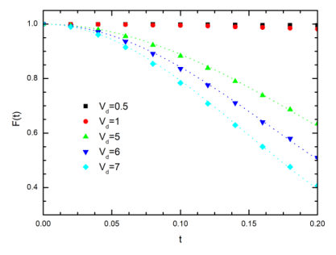 
FIG. 4. Short-time fidelity F(t) after sudden quenches of the secondary quasiperiodic lattice for different quench am- plitudes Vd with N = S = 9. The faster decay for stronger quenches reflects enhanced many-body dephasing and rapid loss of memory of the initial state. Parameters are Vp = 10, g0 = 0.5.

📷 Fig 5

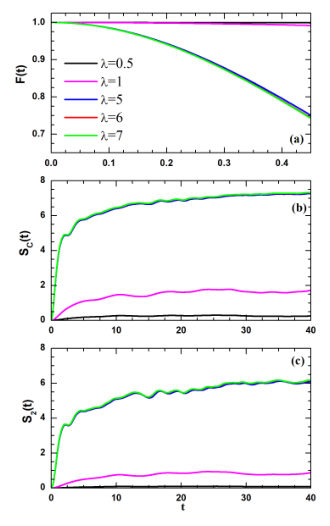 
FIG. 5. Numerical validation of the effective embedded random-matrix model. Dynamics of (a) the fidelity F(t), (b) the coefficient Shannon entropy SC(t), and (c) the second Rényi entropy S2(t) for different coupling strengths. Weak couplings exhibit limited dephasing and restricted Hilbert-space spreading, whereas strong couplings (λ = 5, 6, 7) show rapid entropy growth followed by saturation, indicating extensive configuration mixing and a stationary coefficient distribution.

**Summary.** This study examines how strongly interacting bosons in a Mott lattice evolve after a sudden quench. While local measurements suggest the system retains its insulating, Mott-like order, global entropy measures show clear, rapid relaxation consistent with random matrix theory (GOE). This reveals a hidden ergodic relaxation occurring in the wavefunction space, even when the system appears locally frozen.

**Why it may be interesting.** This work directly addresses the fundamental question of whether global quantum chaos/relaxation manifests in measurable, low-order observables in strongly correlated quantum systems, which is central to understanding thermalization in quantum gases.

Detailed structure

**Main problem.** The paper investigates the non-equilibrium dynamics of strongly interacting bosons following a sudden quench in a bichromatic Mott lattice.

**Main result.** It reveals an emergent hidden ergodic relaxation in the global wavefunction statistics (entropy growth toward GOE), which occurs independently of the persistent, localized Mott-like order observed in experimentally accessible observables.

**Method.** The dynamics are simulated using the MCTDHB method, analyzing both global Hilbert-space spreading measures (entropies) and local observables (momentum distribution, correlation functions).

**Model / system.** The system consists of strongly interacting bosons confined in a finite one-dimensional bichromatic Mott lattice. The dynamics are initiated by quenching the secondary lattice potential.

**Key observables.** Coefficient Shannon entropy ($S_C$), second Rényi entropy ($S_2$), momentum distribution $n(k, t)$, and local two-body Glauber correlation function $g^{(2)}(0, 0; t)$.

**Important parameters / regimes.** Strong interaction regime, quench strength ($V_d$), and system size ($N=9$ bosons in $S=9$ sites).

**Assumptions / limitations.** The analysis relies on the MCTDHB framework and assumes that the observed entropy growth characterizes the global relaxation process.

**Figures summary.** Figures illustrate the contrast between the slow evolution of local observables (Mott order persistence) and the rapid, GOE-like growth of global entropy measures ($S_C, S_2$) following the quench.

**Paper structure.** The paper establishes the physical model and quench protocol, presents diagnostics for both local (low-order) and global (entropy) observables, and then contrasts the results to argue for the existence of hidden ergodic relaxation.

Abstract

We investigate the nonequilibrium dynamics of strongly interacting bosons in a finite bichromatic Mott lattice following a sudden quench of the secondary lattice amplitude. The coefficient entropies and second Rényi entropy exhibit pronounced growth toward their Gaussian Orthogonal Ensemble (GOE) predictions from random-matrix theory, consistent with GOE-like statistical spreading in the employed multiconfigurational representation. In striking contrast, experimentally accessible observables, including the momentum distribution, fragmentation, and Glauber correlation functions, remain nearly unchanged throughout the evolution. For the sampled strong quenches, the coefficient entropies, second Rényi entropy, and the $N$-body coefficient spreading collapse onto a common relaxation trajectory that becomes largely independent of the perturbation strength. Our results reveal an emergent hidden ergodic relaxation beneath the persistent local Mott-like order. An effective embedded random-matrix model captures the qualitative crossover from restricted to extensive Hilbert-space spreading, providing an interpretive framework for the observed relaxation dynamics.

[↑ back to top](#top)

### [Critical behavior and crossover scaling in the Light-Heavy model](http://arxiv.org/abs/2608.18016v1)

**Authors:** Shilpa Prakash, Mustansir Barma, Kabir Ramola  
**Type:** theory · **Category:** statistical mechanics · **PDF:** <https://arxiv.org/pdf/2608.18016v1>  
**Analysis basis:** full PDF text, analyzed in chunks
**Topic relevance:** 🔥 `non-equilibrium universality` **4/5** · `driven-dissipative phase transition` **3/5** · `Keldysh / 2PI / non-Gaussian methods` **2/5** · `methods for driven-dissipative` **2/5** · `Frenkel-Kontorova` **1/5**

📷 Fig 1

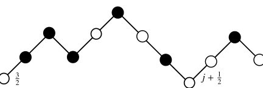 
Fig. 2.1 Schematic illustration of a Light-Heavy model configuration. Light particles (◦) and heavy particles (•) occupy integer lattice sites j, whereas up tilts (/) and down tilts (\) reside on half-integer sites j + 1

📷 Fig 2

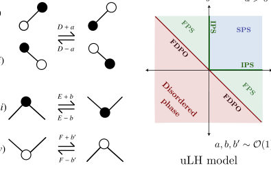 
Fig. 2.2 (a) A schematic depicting the local update rules of the Light-Heavy (LH) model. (b) An illustration of a two-dimensional cross-section of the phase diagram of the uLH model. This model displays three ordered phases: strong phase separation (SPS); infinitesimal cur- rent with phase separation (IPS); and finite current with phase separation (FPS). All three exhibit strong phase separation of particles (i.e., the interfacial region is a few sites wide), along with varying degrees of tilt separation, which is strongest in SPS and weakest in FPS. Beside these, there exist a disordered phase and a distinct regime, Fluctuation Dominated Phase Ordering (FDPO) (b′ = −b), which separates the...

📷 Fig 3

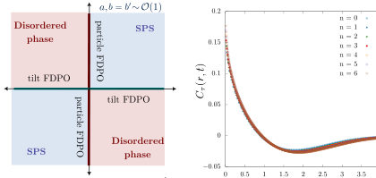 
Fig. 3.1 (a) A two-dimensional slice of the phase diagram of the uLH model taken along the b = b′ plane, illustrating FDPO arising from tilts in contrast to that originating from particles. (b) Spin-spin correlation function of the tilts, Cτ(r, t) evaluated at times t = 400 × 2n (with n = 0, . . . , 6), demonstrating data collapse under rescaling by L(t) = t1/z

📷 Fig 4

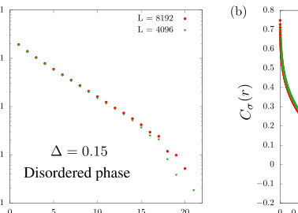 
Fig. 4.1 (a) The particle–particle correlation function in the deeply disordered regime as a function of separation for system sizes 4096 and 8192. Characteristic of disordered behavior, the results exhibit no dependence on system size, and the two data sets lie on top of each other. (b) The corresponding data at a point displaying FDPO plotted versus scaled separation. The collapse of the data demonstrates the system-size scaling associated with FDPO.

📷 Fig 5

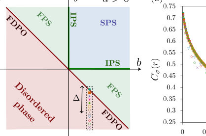 
Fig. 4.2 (a) Phase diagram of the uLH model with markers indicating the locations in the homogeneous region of phase space that were sampled for data. (b) Data collapse of the corresponding spin–spin correlation functions after rescaling by the length scale ξ for a system of size L = 4096. The parameters are a = 0.4, b = 0.2, and b′ = −0.2, with ∆= 0, 4 × 10−5, 6 × 10−5, 8 × 10−5, 10−4, 3 × 10−4, 5 × 10−4, 10−3, 3 × 10−3, 5 × 10−3, 7 × 10−3, 9 × 10−3.

**Summary.** This work analyzes the Light-Heavy model to understand how critical behavior changes when the system transitions from a strongly driven, unscaled regime (exhibiting FDPO) to a weakly driven, scaled regime. The authors demonstrate that the underlying physics shifts from multi-mode, fluctuation-dominated ordering to a single-mode, anomalous correlation decay, providing a detailed study of crossover scaling in non-equilibrium statistical mechanics.

**Why it may be interesting.** The detailed analysis of crossover scaling between different critical universality classes (FDPO vs. single-mode) provides a rich theoretical playground for understanding how external driving or scale separation fundamentally alters critical dynamics in non-equilibrium systems.

Detailed structure

**Main problem.** The paper investigates the critical behavior and crossover scaling between two distinct regimes of the Light-Heavy (LH) model: the unscaled (uLH) and the scaled (sLH) limits.

**Main result.** The unscaled regime exhibits Fluctuation-Dominated Phase Ordering (FDPO) with multi-mode dynamics, whereas the scaled regime shows dynamics controlled by a single dominant mode and anomalous $1/\sqrt{L}$ correlations, proving the critical state is non-FDPO.

**Method.** The study employs analytical derivations, including deriving overdamped Langevin equations and using scaling functions to link the off-critical and critical regimes.

**Model / system.** The Light-Heavy (LH) model describes two coupled species (light/heavy particles) interacting with a fluctuating surface (tilts). The dynamics are analyzed in two limits: uLH (comparable drive/diffusion) and sLH (weak drive, diffusion dominant).

**Key observables.** Two-point correlation functions ($\langle
ho
ho
angle - \langle
ho
angle^2$), cluster size distribution $P(l)$, and the correlation length ($\xi$).

**Important parameters / regimes.** The ratio between the particle/tilt drive and the diffusion constant, which defines the transition between the uLH and sLH regimes.

**Assumptions / limitations.** The analysis relies on mapping the dynamics to an overdamped Langevin equation in the scaled limit, and the comparison between the FDPO behavior in the unscaled limit and the single-mode dynamics in the scaled limit.

**Figures summary.** Figures illustrate the schematic configuration of the LH model, phase diagrams for both uLH and sLH regimes, and plots showing the collapse of the tilt-tilt correlation function under rescaling.

**Paper structure.** The paper first establishes the physical model and its two regimes (uLH/sLH). It then analyzes the critical behavior in the uLH limit, identifying FDPO. Subsequently, it analyzes the sLH limit, deriving the effective dynamics and showing the resulting correlations differ fundamentally from the FDPO state.

Abstract

The Light-Heavy (LH) model involves two species of particles (light and heavy) coupled with a fluctuating surface (described by tilts). The dynamics include the inherent diffusion of the particles (or tilts) as well as the drive provided by the tilts (or particles). When the two are of similar magnitude, the system lies in the unscaled (uLH) regime, while a significantly weaker drive leads to the scaled (sLH) regime. In the unscaled limit, the model exhibits an order-disorder transition characterized by the fluctuation-dominated phase ordering (FDPO). In this state, interestingly the dynamics is driven by multiple modes, giving rise to dynamic clusters. Away from the critical regime the disordered phase retains vestiges of FDPO behavior on length scales smaller than the correlation length. We examine this local FDPO-like behavior by using a scaling function that links the off-critical and critical regimes. We next turn to the scaled model and show that the multi-mode dynamics present in the unscaled regime is replaced by dynamics that is effectively controlled by a single dominant mode in the scaled regime. Concurrently, the two-point correlations change from the $\mathcal{O}(1)$ FDPO form to an anomalous long-range form that decays as $1/\sqrt{L}$. Drawing on the analogy with the sABC model, where similar anomalous correlations appear at criticality, we derive an analytical expression for the two-point correlation function using the same approach used for that model.

[↑ back to top](#top)

### [Dispersive Shock Waves in a 1D Quantum Liquid](http://arxiv.org/abs/2608.17668v1)

**Authors:** Philipp Schüttelkopf, Mohammadamin Tajik, Federica Cataldini, Si-Cong Ji, Igor Mazets, Sebastian Erne, Nataliia Bazhan, Mojtaba Alyannezhadi, Mostafa Alyannezhadi, Jörg Schmiedmayer, Frederik Møller  
**Type:** both · **Category:** quantum gases · **PDF:** <https://arxiv.org/pdf/2608.17668v1>  
**Analysis basis:** full PDF text, analyzed in chunks
**Topic relevance:** 🔥 `analog quantum simulation` **4/5** · `Keldysh / 2PI / non-Gaussian methods` **2/5** · `methods for driven-dissipative` **2/5** · `non-equilibrium universality` **2/5** · `Frenkel-Kontorova` **1/5** · `driven-dissipative phase transition` **1/5**

📷 Fig 1

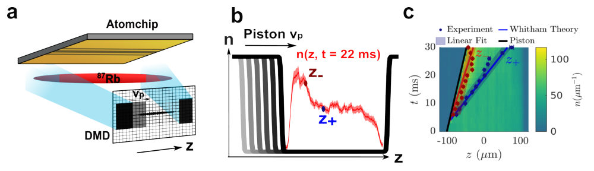 
FIG. 1. Illustration of the experimental protocol and measured density carpet. (a): Ultracold 87Rb atoms are trapped in a 1D confinement using an atomchip. Superimposing (blue detuned) optical dipole potentials created by a DMD enables the creation of arbitrary dynamic longitudinal potentials, including (b): the realization of a moving piston by successively turning on columns of pixels. The averaged density profile n(z, t) is shown in red (shaded: standard error), with extracted shock edge positions z±. (c): Density carpet measured during a piston protocol: n(z, t) as a function of position and time. A piston with constant velocity vp compresses the condensate from the left. The extracted...

📷 Fig 2

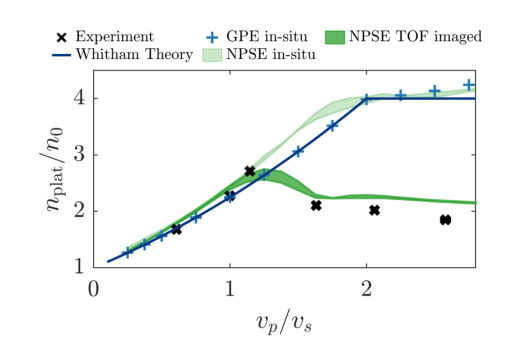 
FIG. 3. Maximum atom accumulations for the piston protocol. Measured plateau densities (black) are compared to Whitham theory predictions (dark blue line) and simulations of increasing complexity: zero temperature GPE in-situ (blue pluses), finite temperature NPSE in-situ (light green region) and finite temperature NPSE simulations including 2 ms TOF and imaging (NPSE TOF imaged - dark green region). Ex- perimental standard errors are in the range ≈0.02 −0.06 n0.

📷 Fig 3

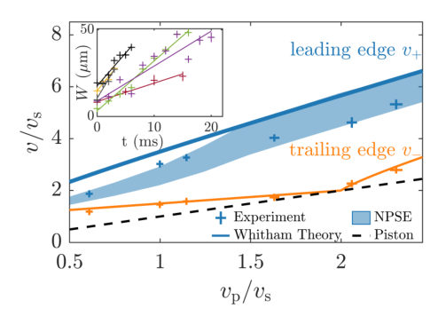 
FIG. 2. Shock region edge speeds for the piston protocol. The experimentally measured speed for the lead- ing edge is shown in blue, trailing edge in orange. The cor- responding theory values are shown as solid lines in blue and orange respectively. The blue shaded region is ob- tained via finite temperature NPSE simulations including TOF and imaging. The piston speed vp is shown as a dashed black line. Experimental standard errors are derived from statistics of multiple measurements as well as errors ex- tracted from the fitting procedure and are in the range of: ¯σvp/vs ≈0.01 −0.07 vs, ¯σv±/vs ≈0.1 −0.4 vs. Inset: Shock wave widths, W(t) = z+(t) −z−(t) and linear fits as solid lines. The...

📷 Fig 4

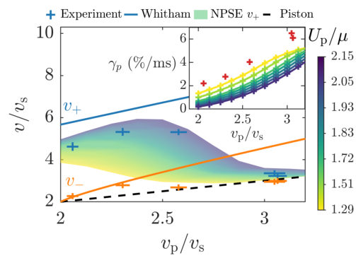 
FIG. 4. Edge velocities for a leaky piston. Experimen- tally measured leading and trailing edge shock region speeds v± (blue/orange markers) are compared to theory predictions (solid blue/orange lines) and finite temperature NPSE simu- lations (shaded area v+), including TOF and imaging, with varying piston heights Up in relation to the initial chemical potential µ. The shading is intended as a guide to the eye. Standard errors of v+/vs are in the range 0.05 −0.1. Inset: For the same datasets: γp: Percent of total atoms that leave the box per time as a function of vp. Experimental errors are obtained from standard errors of the density distribution as well as errors extracted from the fit....

**Summary.** The researchers experimentally investigate dispersive shock waves in a 1D quantum Bose gas using an atomchip and a moving optical piston. By measuring shock front velocities and density profiles, they confirm the characteristic signatures of DSWs predicted by theory. This work is significant because it validates complex nonlinear wave physics in a highly controllable quantum matter platform.

**Why it may be interesting.** This work provides a controlled, quantitative test of fundamental nonlinear wave phenomena (DSWs) in an ultracold atomic setting, bridging complex theoretical predictions with high-precision experimental realization in a quantum gas context.

Detailed structure

**Main problem.** The study of nonlinear wave breaking and its subsequent regularization by dispersion in a controlled, quantitative manner within a 1D quantum liquid.

**Main result.** The measured shock wave front velocities and the widening shock region exhibit characteristics consistent with theoretical predictions for dispersive shock waves (DSWs).

**Method.** The study combines experimental measurements using ultra-cold Bose gases with theoretical modeling based on Whitham's method and finite-temperature Non-Polynomial Schrödinger Equation (NPSE) simulations.

**Model / system.** The system is a quasi-1D Bose gas of $^{87}	ext{Rb}$ atoms trapped on an atomchip, driven by a moving optical potential (piston). The dynamics are modeled by the NPSE, which accounts for transverse Gaussian broadening.

**Key observables.** Shock wave edge velocities ($v_+$ and $v_-$), shock wave width, and the plateau density ($n_{	ext{plat}}$) accumulated between the piston and the shock.

**Important parameters / regimes.** Piston speed ($v_p$), speed of sound ($v_s$), and the critical velocity $v_p = 2v_s$.

**Assumptions / limitations.** The analysis accounts for limitations such as finite temperature, time-of-flight expansion, and imaging resolution, comparing results to more complex simulations that include these effects.

**Figures summary.** Figures illustrate the experimental protocol using a moving piston, show measured shock edge speeds compared to theory, and compare measured plateau densities to theoretical predictions.

**Paper structure.** The paper details the experimental setup (piston protocol), presents theoretical predictions (Whitham's method for DSWs), and then compares quantitative measurements of shock dynamics (velocities and density) against these predictions, addressing systematic deviations due to experimental limitations.

Abstract

We implement a moving boundary condition in a 1D quantum liquid to study nonlinear wave breaking and its regularization by dispersion. Programmable optical potentials allow us to compress a weakly interacting ultra-cold Bose gas trapped on an atomchip at tunable speeds of up to three times the speed of sound and we subsequently measure the quasi-in-situ density distribution to extract the shock wave edge dynamics. We resolve both leading and trailing edge velocities and observe a shock wave width that increases linearly in time, which are distinguishing features of dispersive shock waves, consistent with asymptotic predictions using Whitham's method. Quantitative agreement is found with finite temperature non-polynomial Schrödinger equation simulations, taking into account the imaging process and the finite height of the piston potential. Our results constitute a controlled, quantitative test of dispersive shock dynamics in a 1D quantum fluid and demonstrate that the coarse-grained dispersive-shock phenomenology remains robust even as the microscopic dynamics depart from the strictly integrable 1D regime.

[↑ back to top](#top)

### [Long-time fermionic quantum transport with controlled full-state error using an adaptive reservoir-mode window](http://arxiv.org/abs/2608.18049v1)

**Authors:** Mikhail Umanskii, Nataliya Arefyeva, Georgy Sultanov, Alexey Rubtsov, Evgeny Polyakov  
**Type:** theory · **Category:** other · **PDF:** <https://arxiv.org/pdf/2608.18049v1>  
**Analysis basis:** full PDF text, analyzed in chunks
**Topic relevance:** 🔥 `methods for driven-dissipative` **4/5** · `Keldysh / 2PI / non-Gaussian methods` **3/5** · `quantum measurements` **2/5** · `correlated / nonlocal dissipation` **1/5** · `driven-dissipative phase transition` **1/5** · `non-equilibrium universality` **1/5**

📷 Fig 1

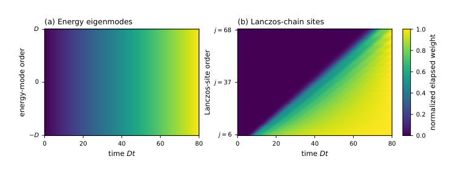 
Figure 1: Elapsed coupling weights I+ α for (a) energy eigenmodes and (b) chain sites. For visibility, the weight of each mode is normalized by its value at T. Energy eigenmodes with nonzero contact overlap accumulate weight from the beginning of the evolution, whereas chain sites are reached successively by the propagating contact disturbance.

📷 Fig 2

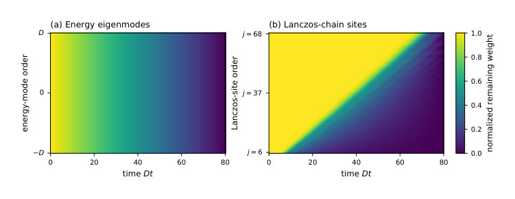 
Figure 2: Remaining coupling weights I− α for (a) energy eigenmodes and (b) chain sites. For visibility, the weight of each mode is normalized by its value at t = 0. For energy eigenmodes the remaining weight decreases throughout the simulation interval. Chain sites exhibit an ordered departure, but dispersive tails broaden the interval over which their remaining coupling is appreciable.

📷 Fig 3

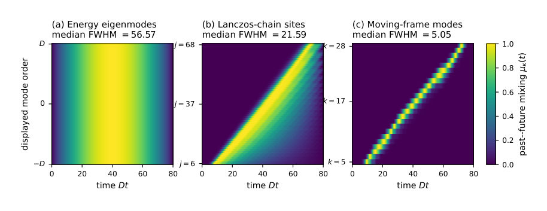 
Figure 3: Comparison of normalized I+ α [κ;t]I− α [κ;t,T ] [I+ α [κ;T ]] 2 (see Appendix 7 Eq. (62)) in three reservoir rep-

📷 Fig 4

 
Figure 3 compares energy eigenmodes, chain sites, and moving-frame modes for the same normalized

📷 Fig 5

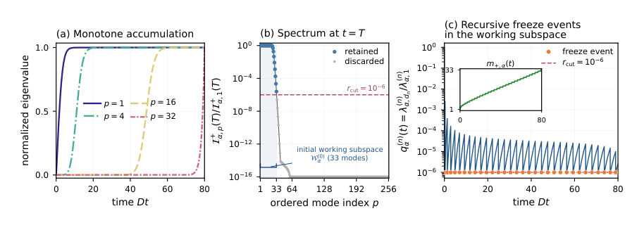 
Figure 4: Construction of the fixed incoming basis. (a) Four ordered eigenvalues of the accumulated coupling-weight operator ˆρ+,α(t), each normalized by its value at T. Different ordered eigenvalues acquire their accumulated weight at different times, providing the temporal structure to construct the incoming modes. (b) Spectrum of ˆρ+,α(T) normalized by its largest eigenvalue; the blue points correspond to modes above rcut and are retained at the start of the backward sweep; the gray points lie below the cutoff. (c) Recursive backward construction. The blue curve shows the ratio of the smallest to the largest accumulated coupling weight within the subspace whose arrival times have not yet...

**Summary.** This paper introduces 'tape-recorder coarse graining,' a novel numerical technique for simulating open quantum systems involving fermionic reservoirs. It manages the infinite degrees of freedom by adaptively truncating reservoir modes while providing rigorous, nonperturbative error bounds. This allows for long-time, accurate simulations of interacting quantum transport phenomena.

**Why it may be interesting.** This work provides a sophisticated, mathematically rigorous technique for simulating open quantum systems dynamics, which is crucial for understanding energy and charge transport in nanoscale devices where environmental coupling is dominant.

Detailed structure

**Main problem.** The core challenge is performing long-time, real-time simulations of interacting quantum nanostructures coupled to infinite fermionic reservoirs while maintaining computational tractability.

**Main result.** The developed 'tape-recorder coarse graining' method successfully enables practical long-time simulations of the full device-reservoir state, accurately reproducing known results like Landauer-Büttiker current and Coulomb blockade physics.

**Method.** The method reorganizes leads into incoming, active, and outgoing modes, propagating the system using only the active modes and stochastically sampling/removing outgoing modes based on derived nonperturbative upper bounds on infidelity.

**Model / system.** The model is a quantum point contact (QPC) with on-site repulsion, coupled to two semi-infinite fermionic leads. The system is treated using a quasiparticle representation derived via a particle-hole transformation for the leads.

**Key observables.** Currents ($I_L, I_R$), QPC occupations ($\langle \hat{n}_m(t) 
angle$), and the active mode count.

**Important parameters / regimes.** The relative threshold used for mode truncation, and the coupling weights defining the active/outgoing modes.

**Assumptions / limitations.** The derivation relies on establishing a nonperturbative upper bound on the infidelity for outgoing-mode truncation, and the method assumes the bath correlation function has a spectral representation.

**Figures summary.** Figures illustrate the time evolution of coupling weights ($p_{\pm}^{\alpha,\kappa}(t)$) for different mode bases (energy, Lanczos, moving-frame), showing the superior localization achieved by the moving-frame approach.

**Paper structure.** The paper develops the theoretical framework by defining the moving reservoir basis, deriving the necessary mathematical identities (like the conservation relation $E_{\alpha,-}(s) + E_{\alpha,+}(s) = \varepsilon_{\alpha,p}(s)$), establishing the error bounds via the Duhamel identity, and finally benchmarking the technique on various physical scenarios.

Abstract

Real-time simulations of interacting nanostructures coupled to fermionic reservoirs can require a growing number of environmental degrees of freedom to retain long-lived correlations. We introduce tape-recorder coarse graining, which reorganizes each noninteracting lead into incoming, active, and outgoing modes. The device is propagated with the active modes, while outgoing modes are stochastically sampled and removed once their remaining integrated coupling falls below a prescribed threshold. For each outgoing-mode truncation, we derive a nonperturbative upper bound on the infidelity between the exact and truncated full device--reservoir states over any prescribed finite interval. The bound depends on the mode's remaining coupling weight and finite-interval response factors. Numerically, the active-mode count saturates in time at fixed relative threshold and grows logarithmically as the threshold is reduced. We benchmark the method on a two-site quantum point contact at zero temperature and maximal bias. For Lorentzian reservoirs, the dynamics agrees with converged HEOM calculations and the steady-state current with the Landauer--Büttiker result. For flat-band reservoirs with algebraically decaying correlations, it agrees with direct Schrödinger evolution before finite-size recurrences and reproduces the Landauer--Büttiker stationary current, while finite exponential HEOM decompositions remain unconverged. For interacting contacts, the method yields Coulomb-blockade peak splitting. In the noninteracting driven limit, it agrees with an exact Floquet Green-function calculation and reproduces coherent current suppression under periodic driving, which persists at finite Coulomb repulsion. Together, these benchmarks show that tape-recorder coarse graining enables practical long-time simulations of the full device--reservoir state in interacting fermionic transport.

[↑ back to top](#top)

### [Enhanced quantum thermometry near a dissipative phase transition in a driven Kerr cavity](http://arxiv.org/abs/2608.17510v1)

**Authors:** Chayan Purkait, Bimalendu Deb  
**Type:** theory · **Category:** other · **PDF:** <https://arxiv.org/pdf/2608.17510v1>  
**Analysis basis:** full PDF text, analyzed in chunks
**Topic relevance:** 🔥 `driven-dissipative phase transition` **4/5** · `methods for driven-dissipative` **3/5** · `non-equilibrium universality` **2/5** · `correlated / nonlocal dissipation` **1/5** · `quantum measurements` **1/5**

📷 Fig 1

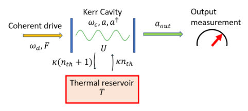 
FIG. 1: Schematic of the driven-dissipative Kerr cavity used for quantum thermometry. A single nonlinear cavity mode of resonance frequency ωc, described by the bosonic annihilation and creation operators a and a†, is coherently driven at frequency ωd with drive amplitude F. The cavity possesses a Kerr nonlinearity of strength U. It is coupled to a thermal reservoir at temperature T, with κ denoting the cavity energy-decay rate. The reservoir induces photon-loss and photon-absorption processes with rates κ (nth + 1) and κnth , respectively,

📷 Fig 2

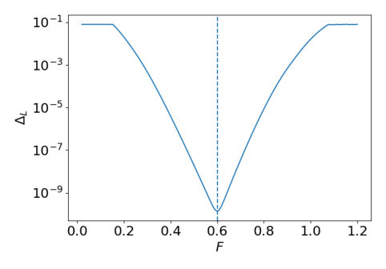 
FIG. 2: The variation of Liouvillian gap ∆L as a function of drive amplitude F. The parameters are ωc = 1.0, κ = 0.08, U = 0.03, ∆= 0.6, T = 0.15.

📷 Fig 3

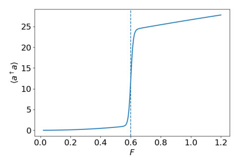 
FIG. 3: The variation of average photon number ⟨a†a⟩ in the steady state as a function F. The other parameters are same as in Fig. 2.

📷 Fig 4

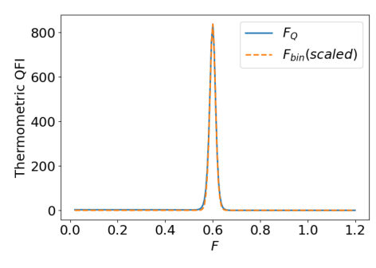 
FIG. 4: The variation of quantum Fisher information FQ (blue color solid line) and Fbin (orange color dashed line) as a function of drive amplitude F. The other parameters are same as in Fig. 2.

📷 Fig 5

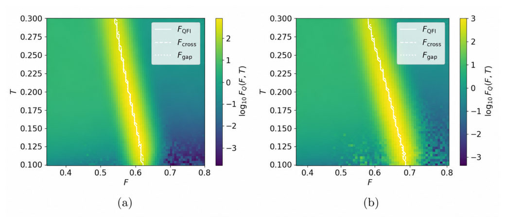 
FIG. 5: Quantum Fisher information FQ(F, T) of the nonequilibrium steady state ρss(F, T) in the drive-temperature plane. Panels (a) and (b) correspond to ∆= 0.6 and ∆= 0.65. The other parameters are the same as in Fig. 2. The solid white curve denotes the location of the maximum QFI at each temperature, FQFI(T) = arg max F FQ(F, T). The

**Summary.** This paper demonstrates that a driven-dissipative Kerr cavity can function as a highly sensitive quantum thermometer by exploiting the physics near a dissipative phase transition precursor. The maximum temperature sensitivity, quantified by the Quantum Fisher Information, is strongly enhanced due to temperature-dependent population redistribution within the cavity's steady state. This mechanism is theoretically robust and compatible with current circuit-QED experimental platforms.

**Why it may be interesting.** This work bridges non-equilibrium statistical mechanics (DPTs) with quantum metrology, showing how inherent system instabilities can be harnessed to create highly sensitive quantum sensors, which is a major theme in modern AMO physics.

Detailed structure

**Main problem.** The paper investigates enhancing the precision of quantum thermometry—estimating the temperature of a thermal bath—by utilizing non-equilibrium physics near a dissipative phase transition.

**Main result.** Strong enhancement of the Quantum Fisher Information (QFI) for temperature estimation is achieved near the finite-size precursor of the dissipative phase transition in a Kerr cavity.

**Method.** The analysis uses the Lindblad master equation to model the driven-dissipative system, calculating the QFI by analyzing the temperature-induced redistribution of photon number populations in the steady state.

**Model / system.** The system is a driven-dissipative Kerr cavity coupled to a thermal reservoir, governed by a Lindblad master equation. The physics is analyzed by examining the Liouvillian gap and the steady-state photon number.

**Key observables.** Quantum Fisher Information (QFI), Liouvillian gap ($\Delta_L$), steady-state average photon number ($\langle a^\dagger a 
angle_{ss}$), and the effective binary Fisher information ($F_{	ext{bin}}$).

**Important parameters / regimes.** Coherent drive strength ($F$), cavity detuning ($\Delta$), dissipation rate ($\kappa$), and bath temperature ($T$). The enhancement is optimized over a low-temperature, low-thermal-occupation regime.

**Assumptions / limitations.** The analysis relies on truncating the infinite Hilbert space to a finite number of Fock states ($N$) and uses an effective two-branch description to model the QFI enhancement.

**Figures summary.** Figures illustrate the dependence of the Liouvillian gap, steady-state photon number, and QFI on the drive amplitude, showing the correlation between the minimum gap, the photon crossover, and the QFI peak. Additional figures detail the temperature dependence of the two-branch Fisher information.

**Paper structure.** The paper introduces the model and the concept of quantum thermometry, analyzes the dissipative phase transition precursor using the Liouvillian gap, derives the QFI formalism, and finally presents the main results showing QFI enhancement near the precursor region.

Abstract

We investigate quantum thermometry in a driven--dissipative Kerr cavity coupled to a thermal reservoir. The system exhibits a finite-size precursor of a dissipative phase transition, characterized by a pronounced minimum of the Liouvillian gap and a sharp jump in the steady-state physical observables such as average photon number at the critical driving strength. We show that this regime leads to strong enhancement of the quantum Fisher information (QFI) for temperature estimation. Using an effective two-branch description, we show that the enhancement originates from temperature-induced redistribution of the weight factors in photon number distribution between low- and high-photon-number branches, which is described by an effective binary Fisher information. By optimizing the coherent drive, the enhanced response persists over an extended low-temperature, low-thermal-occupation regime and yields a favorable relative temperature-uncertainty bound. These results identify finite-size precursors of dissipative phase transitions in Kerr-cavity platforms as useful resources for tunable nonequilibrium quantum thermometry. We further show that the predicted thermometric enhancement is accessible in a parameter regime compatible with circuit quantum electrodynamics (circuit-QED) platforms.

[↑ back to top](#top)

### [Single-atom detection with a quantum-controlled mechanical oscillator](http://arxiv.org/abs/2608.17656v1)

**Authors:** Maxime Perdriat, Maciej Dziewiecki, Josef-Anton Agner, Massimiliano Rossi, Frederic Merkt, Martin Frimmer, Lukas Novotny  
**Type:** experiment · **Category:** other · **PDF:** <https://arxiv.org/pdf/2608.17656v1>  
**Analysis basis:** full PDF text, analyzed in chunks
**Topic relevance:** 🔥 `quantum measurements` **4/5** · `Full counting statistics` **3/5** · `quantum optics experiment` **3/5** · `analog quantum simulation` **1/5**

📷 Fig 1

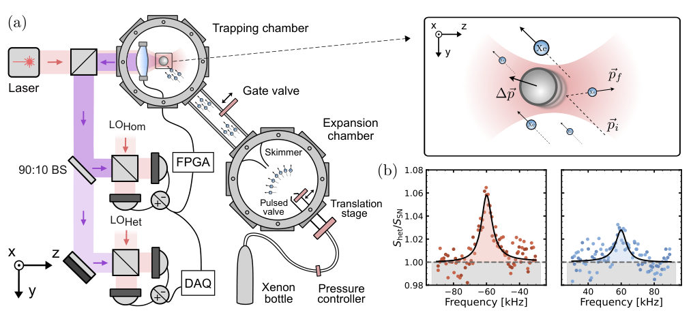 
FIG. 1. (a) A silica nanosphere is optically trapped in high vacuum within the trapping chamber (top left). Its motion is detected via interferometric readout, in which backscattered light is combined with a local oscillator and measured with a balanced photodetector (BPD). A supersonic beam of Xe atoms is produced by a pulsed valve in the expansion chamber (bottom right). The atomic beam is subsequently collimated by a skimmer and directed toward the levitated particle through a connecting tube between the two chambers. The close-up on the top right illustrates collisions between the nanosphere and single Xe atoms. (b) Stokes and anti-Stokes sidebands of the heterodyne spectrum from which...

📷 Fig 2

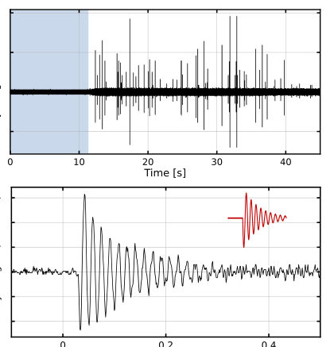 
FIG. 2. Detection of Xe clusters. (a) Detector time-trace showing a sequence of collision events. The valve is opened at t ∼11 s and remains open for later times. (b) Zoom-in on the collision event at t = 13.74 s. The signal is in good agreement with the theoretical impulse response function (inset).

📷 Fig 3

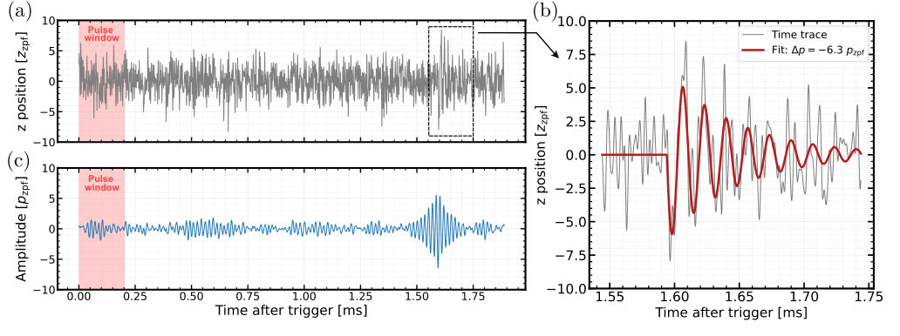 
FIG. 3. (a) Measured homodyne position time-trace zm(t) recorded after triggering the opening of the pulsed valve at t = 0. The time-trace is pre-filtered using a fourth-order high-pass filter at 5 kHz and a fourth-order low-pass filter at 300 kHz. The 200 µs time interval during which the pulsed valve is open is highlighted in red and referred to as the pulse window. (b) Zoom-in on an impulsive event transferring −6.3 pzpf of momentum to the levitated nanosphere (gray trace), along with the matched filter function of Eq.(1) (red curve). (c) Output of the matched filter, corresponding to the convolution of the matched filter function with the recorded time-trace zm(t).

📷 Fig 4

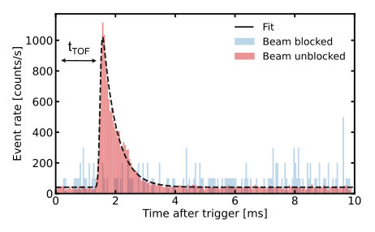 
FIG. 4. Event rate (counts per second) above a 4pzpf thresh- old as a function of time after opening the pulsed valve. The red histogram is recorded with the atomic beam unblocked (average over 9, 958 time-traces). The blue histogram is ac- quired with the beam blocked (average over 200 time-traces).

📷 Fig 5

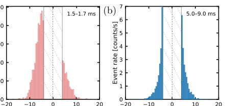 
FIG. 5. Histogram of collision amplitudes evaluated for two different time periods after valve opening. (a) for events de- tected within 1.5–1.7 ms (directional atoms) and (b) for events detected within 5.0–9.0 ms (thermal atoms). The central re- gion of [−4 .. 4] pzpf is below the detection threshold and is blanked out.

**Summary.** This experiment demonstrates the detection of individual momentum kicks from colliding Xe atoms with a quantum-cooled, levitated nanosphere. By using matched filtering on the nanosphere's motion, the researchers confirmed the ability to measure impulsive forces with high precision. This advances the use of levitated systems as quantum sensors for studying fundamental atomic interactions.

**Why it may be interesting.** This work directly bridges quantum optics (levitation, ground state cooling) with atomic physics (supersonic beams) to create an ultra-sensitive quantum sensor, which is highly relevant for open quantum systems and quantum measurement theory.

Detailed structure

**Main problem.** The research aims to explore distance-dependent short-range interactions between atoms and levitated nanospheres, and to utilize these platforms for highly sensitive impulsive force sensing.

**Main result.** The authors successfully observed single momentum kicks from Xe atom collisions, confirming the ability to measure impulsive forces down to levels significantly below the zero-point fluctuations of the oscillator.

**Method.** The experiment uses matched filtering on time-traces of the levitated nanosphere's motion to extract discrete momentum kicks caused by collisions with a supersonic beam of Xe atoms.

**Model / system.** The physical system involves a silica nanosphere levitated in an optical tweezer and cooled to its quantum ground state. Collisions are induced by a pulsed, directional beam of Xe atoms generated via supersonic expansion.

**Key observables.** Momentum transfer ($\Delta p$), event rate (counts/s), and the time-of-flight ($t_{	ext{TOF}}$) of the atomic beam.

**Important parameters / regimes.** The minimum resolvable momentum (SQL) is calculated to be $11.8$ keV/c for the given parameters. The measured sensitivity confirms detection below $50$ keV/c.

**Assumptions / limitations.** The analysis assumes that the residual signal amplitude outside the primary detection window remains below the noise threshold, and it notes limitations regarding quantitative comparison with theory due to beam size effects.

**Figures summary.** Figures show the setup schematic, the measured phonon occupation number, and time-traces/histograms comparing the event rate from the supersonic Xe beam against the background rate from thermal atoms.

**Paper structure.** The paper details the setup (trapping, cooling, beam generation), the methodology (matched filtering, rate analysis), and presents results confirming the detection of directional momentum kicks from the atomic beam.

Abstract

Using supersonic expansion, we create a time-gated, directional beam of Xe atoms with a narrow momentum distribution and detect their collisions with a levitated nanosphere cooled to its quantum ground state. We observe individual momentum kicks below 50 keV/c with 96% confidence and distinguish directional momentum transfer from the atomic beam against the background of thermal collisions. Our experiments constitute a first step toward the exploration of distance-dependent short-range interactions between atoms and levitated systems, as well as toward the use of levitated platforms for impulsive force sensing in previously unexplored parameter regimes.

[↑ back to top](#top)

### [Absorption-emission quantum repeater using diamond quantum memories](http://arxiv.org/abs/2608.17470v1)

**Authors:** Taichi Fujiwara, Yuhei Sekiguchi, Raustin Reyes, Toshiharu Makino, Hiromitsu Kato, Hideo Kosaka  
**Type:** experiment · **Category:** quantum information and computing · **PDF:** <https://arxiv.org/pdf/2608.17470v1>  
**Analysis basis:** full PDF text, analyzed in chunks
**Topic relevance:** 🔥 `QC/QI experiment` **4/5** · `quantum optics experiment` **3/5** · `quantum measurements` **2/5**

📷 Fig 1

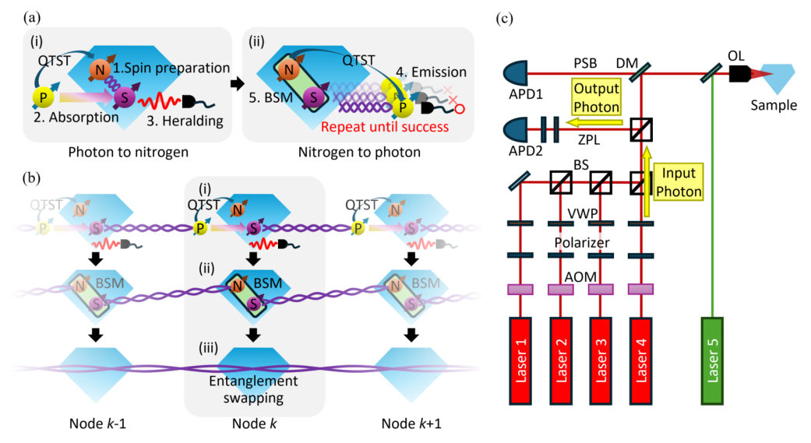 
FIG. 1. Absorption–emission quantum repeater based on a single NV center. (a) Operating principle of the repeater node. P, S, and N denote the photon polarization, the electron spin, and the nitrogen nuclear spin, respectively. (i) A polarization-encoded input photon is heraldedly absorbed by an NV center prepared in an electron–nuclear spin entangled state, which realizes quantum-teleportation-based state transfer (QTST) of the photonic state onto the nuclear-spin memory. (ii) Subsequent optical excitation generates a zero-phonon-line (ZPL) photon entangled with the electron spin. This emission process can be repeated until success. A local Bell-state measurement (BSM) between the electron...

📷 Fig 2

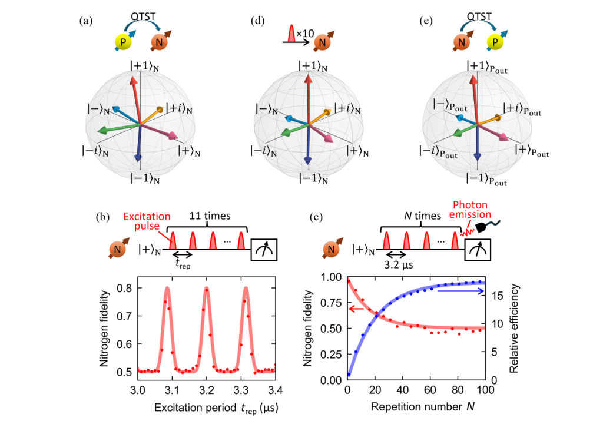 
FIG. 2. Memory-preserving repeat-until-success operation and elementary state-transfer processes. (a) Quantum state transfer from an absorbed photon to the nitrogen nuclear spin. For six input photonic polarization states, the transferred nuclear-spin states are reconstructed by quantum state tomography, demonstrating high-fidelity photon-to-spin state transfer. (b) Synchronization of the excitation repetition period. The nitrogen nuclear spin is initialized in a superposition state and subjected to eleven repeated optical excitations, and the nuclear-spin fidelity after the eleventh excitation is measured as a function of the repetition period trep, revealing an optimal value that...

📷 Fig 3

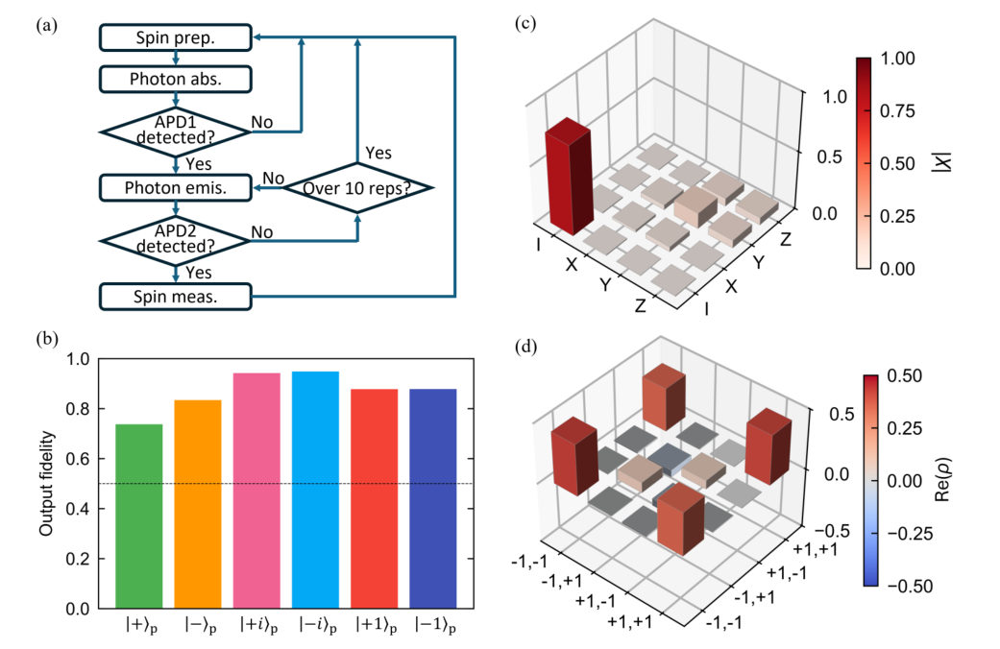 
FIG. 3. Demonstration of absorption–emission quantum repeater–node operation. (a) Experimental sequence for the complete repeater-node operation. Following probabilistic initialization of the NV-center charge state, the spin states are prepared (Spin prep.) and a resonant photon is absorbed (Photon abs.). Successful absorption is heralded by detection of a relaxation photon, followed by repeat-until-success generation of an entangled photon and a local Bell-state (|Φ+⟩S,N) measurement between the electron and nuclear spins (Spin meas.). (b) Output-state fidelity of the emitted photon for six input polarization states. (c) Absolute values of the process matrix elements |χij|, reconstructed...

**Summary.** This paper demonstrates a functional quantum repeater node using the absorption-emission process within a diamond NV center. By combining heralded photon absorption with a memory-preserving repeat-until-success emission protocol, the authors achieved a 78% process fidelity for the entire node operation. This establishes the absorption-emission approach as a viable, fundamental building block for future long-distance quantum networks.

**Why it may be interesting.** This work provides a concrete, experimentally validated physical implementation of a key component (the repeater node) required for scaling quantum networks, directly bridging solid-state quantum memory physics with quantum communication protocols.

Detailed structure

**Main problem.** The primary challenge addressed is overcoming exponential photon loss that severely limits entanglement generation over long distances in quantum communication networks.

**Main result.** The authors successfully demonstrated a single-node quantum repeater operation using an absorption-emission mechanism, achieving a process fidelity of 78%.

**Method.** The complete repeater operation was characterized as a quantum channel using quantum process tomography, integrating heralded photon absorption, repeat-until-success emission, and quantum teleportation.

**Model / system.** The physical platform is the diamond nitrogen-vacancy (NV) center, which serves as both the quantum memory (utilizing the nuclear spin) and the interaction medium for state transfer between absorbed and emitted photons.

**Key observables.** Process fidelity (78% for the full node), average state fidelity (93% for photon-to-spin transfer), and conditional probabilities $P_{
u}(p_\mu | B)$ derived from measurements.

**Important parameters / regimes.** The repeat-until-success (RUS) protocol was employed, and the optimal excitation repetition period ($t_{rep} = 3.2 \mu s$) was determined to maximize coherence.

**Assumptions / limitations.** The analysis assumes the hyperfine interaction in the excited state is suppressed by spin-orbit coupling, and the comparison of rates between repeater attempts and direct transmission is noted as unequal.

**Figures summary.** Figures illustrate the operating principle of the repeater node, the high-fidelity quantum state transfer from photon to nuclear spin, and the characterization of the full repeater sequence via process matrices.

**Paper structure.** The paper progresses from establishing the need for quantum repeaters, detailing the three core steps (absorption, memory preservation via RUS, and emission/teleportation), quantifying the performance using process tomography, and finally comparing the efficiency advantage against direct transmission.

Abstract

Quantum repeaters are essential for overcoming the exponential photon loss that limits entanglement generation over long distances in quantum networks. An absorption-emission-based quantum repeater exploits the fundamental light-matter interactions of a diamond nitrogen-vacancy (NV) center---photon absorption and photon emission---to transfer a quantum state from an absorbed photon to an emitted photon, offering a scalable architecture that operates without photon interference between remote nodes. Here we demonstrate an absorption-emission-based quantum repeater node using a single NV center, realizing the complete single-node operation in which heralded photon-to-memory quantum state transfer, repeat-until-success (RUS) emission of a spin-entangled photon, and quantum teleportation of the memory state onto the emitted photon constitute the essential repeater operation. By characterizing the complete repeater operation as a quantum channel from the absorbed photon to the emitted photon via quantum process tomography, we obtain a process fidelity of 78%. This demonstration establishes the absorption-emission approach as a fundamental building block for scalable quantum repeater architectures and paves the way toward practical long-distance quantum networks.

[↑ back to top](#top)

### [Fast Nondestructive Readout for High-Clock-Rate Atom Array Quantum Processor](http://arxiv.org/abs/2608.17189v1)

**Authors:** Xu-Zhao-Qiu Zeng, Chang You, Qing-Wei Wang, Zi-Feng Li, Yi Ji, Dong An, Chao Yu, Jia-Rui Liu, Zi-Mo He, Jia-Rui Gu, Yuhao Mei, Hao-Wen Cheng, Yu-Chen Zhang, Rui Lin, Zhan Wu, Jun Rui, Jun Zhang, Ming-Cheng Chen, Yu-Hao Deng, Chao-Yang Lu, Jian-Wei Pan  
**Type:** experiment · **Category:** quantum information and computing · **PDF:** <https://arxiv.org/pdf/2608.17189v1>  
**Analysis basis:** full PDF text, analyzed in chunks
**Topic relevance:** 🔥 `QC/QI experiment` **4/5** · 🔥 `quantum measurements` **4/5** · `quantum optics experiment` **1/5**

📷 Fig 1

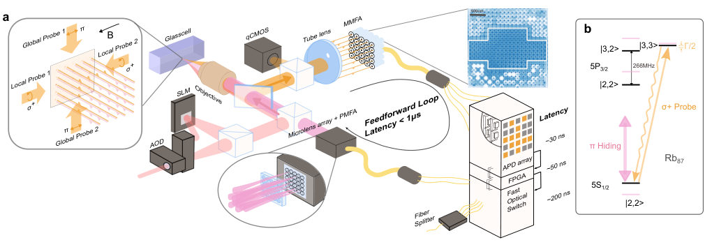 
Figure 1. FNDR architecture based on fibre-array-coupled photon counting and adaptive hiding. a, A 10 × 10 atom array is trapped by a spatial light modulator (SLM)-generated static tweezer array and dynamically rearranged by crossed acousto-optic deflectors (AODs). Fluorescence is collected by high-NA objectives and separated into a camera arm and a photon-counting arm by a PBS. The π-polarized channel is imaged on a qCMOS camera for wide-field detection, whereas the σ+-cycling readout channel is coupled into a multimode fibre array (MMFA) for site-resolved detection by APDs. An FPGA processes the APD click in real-time using an adaptive strategy. When a site’s state is identified with...

📷 Fig 2

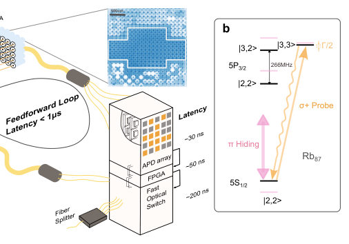 
Figure 2 (a) shows the APD-count distributions from the full 10×10 atom array on a logarithmic scale. Bright and dark states yield, on average, 15 and 0.1 detected counts, respectively, as shown by the orange and grey his- tograms. With adaptive hiding enabled, the bright-state count distribution, shown in purple, becomes substan- tially narrower and exhibits a truncated, sub-Poissonian-

📷 Fig 3

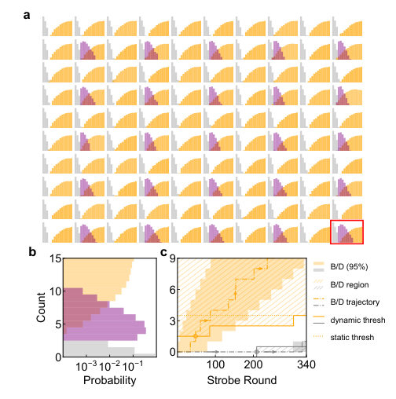 
Figure 2. Time-resolved photon counting and adap- tive strategy. a, Log-scale APD-count histograms for the full 10 × 10 atom array. Grey and orange show dark- and bright-state readout, respectively, with mean detected counts of 0.1 and 15. Purple shows bright-state counts on the 5 × 5 adaptive subarray, for which site-selective hiding truncates the distribution and produces a sub-Poissonian-like profile. b, Enlarged histogram for a representative site marked by the red box in a. c, Comparison between fixed exposure and dynamic decision. In fixed-exposure readout, the state is as- signed from the final integrated count using a single thresh- old. In dynamic decision, APD clicks are processed...

📷 Fig 4

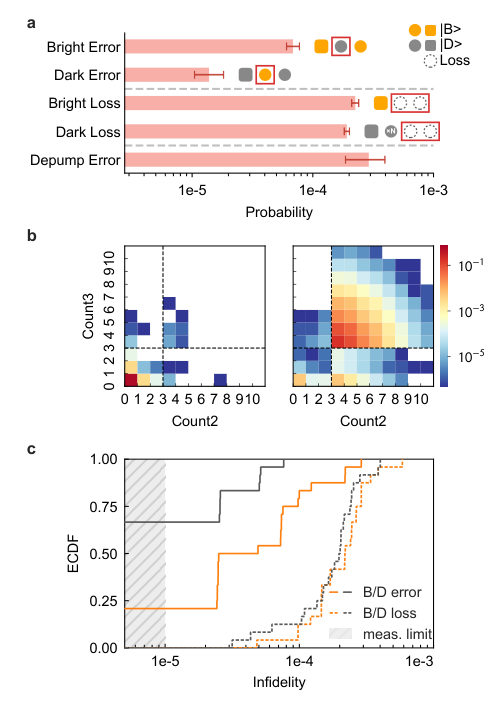 
Figure 3. Model-free benchmarking of FNDR fidelity and atom loss. Three consecutive FNDR measurements are applied to atoms prepared in either the bright or the dark state, followed by a state-insensitive atom-presence image to identify atom loss. a, Detection strings and error decom- position. The extracted error probabilities, averaged over the 5 × 5 adaptive subarray, are 6.9+0.9 −0.8 × 10−5 for bright- state assignment, 1.4+0.4 −0.3 × 10−5 for dark-state assignment, 2.2+0.2 −0.1 ×10−4 for bright loss, and 1.9+0.1 −0.1 ×10−4 for dark loss. Squares denote preparation state, solid circles denote FNDR outcomes, and dashed circles denote loss in atom-presence image. Red boxes mark first-order...

📷 Fig 5

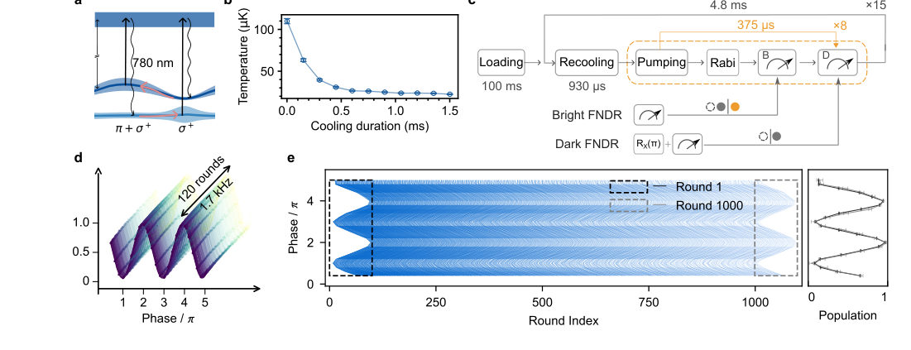 
Figure 4. Fast FNDR enables high-clock-rate repeated circuits with atom reuse. Repeated Raman-driven [39] Rabi circuits are operated with loss-resolved FNDR readout, reaching 120 rounds at a 1.7 kHz clock rate, and more than 103 rounds at 0.7 kHz with per-round recooling. a, Finite-field grey-molasses cooling compatible with the 10 G bias field during readout. A representative one-dimensional cut of the moving π/σ+ dressed-state landscape based on simulation [32] is shown; line thickness indicates the local photon-scattering rate. The simulation shows that the Sisyphus mechanism underlying grey-molasses cooling remains efficient at finite magnetic field, provided that a sufficient...

**Summary.** This paper introduces a novel Fast Nondestructive Readout (FNDR) architecture for neutral-atom quantum processors. By replacing slow, frame-based imaging with a real-time, site-resolved adaptive photon-counting system, they drastically reduce readout latency. This breakthrough enables the operation of quantum circuits at a high clock rate (1.7 kHz), paving the way for scalable, fault-tolerant quantum computation.

**Why it may be interesting.** This work directly addresses the critical engineering bottleneck in scaling quantum processors, moving the system from a measurement-limited regime to one where gate speed and coherence time become the dominant constraints.

Detailed structure

**Main problem.** Nondestructive qubit measurement in neutral-atom arrays is the primary bottleneck, severely limiting the system's clock rate to millisecond timescales.

**Main result.** The authors developed a fast, nondestructive readout architecture that achieves a sub-microsecond readout latency, enabling repeated quantum circuits at an unprecedented 1.7 kHz clock rate.

**Method.** They implemented a real-time, site-resolved adaptive protection scheme by integrating continuous photon counting with a dynamic feedforward framework.

**Model / system.** The experiment uses neutral-atom arrays trapped in optical tweezers, functioning as a quantum processor for qubits. The readout process is fundamentally limited by the need to collect sufficient fluorescence without causing excessive heating or loss.

**Key observables.** Discrimination infidelity ($4.1 	imes 10^{-5}$), atom loss ($2.1 	imes 10^{-4}$), and the achievable clock rate (1.7 kHz).

**Important parameters / regimes.** Sub-microsecond latency, $15 \mu	ext{s}$ average probe time, and operation in the sub-millisecond cycle regime.

**Assumptions / limitations.** The method relies on coupling fluorescence into independent photon-counting channels processed by an FPGA to enable rapid, site-local decision-making.

**Figures summary.** Figures illustrate the FNDR architecture, comparing fixed vs. dynamic readout boundaries, and showing time-resolved photon counting profiles demonstrating reduced probe duration.

**Paper structure.** The paper identifies the measurement bottleneck, proposes the FNDR architecture using continuous photon counting and dynamic feedforward, demonstrates its performance metrics (fidelity, speed), and concludes by showing its application to high-repetition quantum circuit operation.

Abstract

Neutral-atom arrays have rapidly advanced to support thousands of qubits and execute high-fidelity logical operations. However, these processors remain severely throttled by their slowest fundamental operation: nondestructive qubit measurement, which requires milliseconds and fundamentally limits the system's clock rate. This bottleneck arises from both an inherent photon-budget dilemma---sufficient fluorescence for reliable state discrimination must be collected without excessive heating or loss---and frame-based imaging, which imposes one common exposure and decision latency on intrinsically independent, site-local measurements. Here, we overcome these limitations with a fast, nondestructive readout architecture based on real-time, site-resolved adaptive protection. By integrating continuous photon counting with a dynamic feedforward framework, we decode qubit states with sub-microsecond latency and instantly shield atoms from redundant scattering. Demonstrated in parallel across a 100-qubit reconfigurable atom array, with adaptive protection on a 25-site subarray, this dynamic decision protocol reduces the average probe time to just $15\ μ\text{s}$. Model-free benchmarking yields a discrimination infidelity of $4.1 \times 10^{-5}$ and an atom loss of $2.1 \times 10^{-4}$, simultaneously setting new performance records for atom arrays. Exploiting this capability, we operate repeated quantum circuits at an unprecedented 1.7 kHz clock rate with atoms reused over 120 consecutive rounds---nearly sevenfold higher than the previous record---and enter the sub-millisecond cycle regime for the first time. By removing nondestructive readout as the dominant cycle-time bottleneck, this work unlocks high-clock-rate mid-circuit syndrome extraction, paving the way for high-throughput, fault-tolerant quantum computation.

[↑ back to top](#top)

### [Observation of magnetic quantum phase crossovers in a semiconductor spin ladder](http://arxiv.org/abs/2608.17789v1)

**Authors:** Elizaveta Morozova, Xin Zhang, Utso Bhattacharya, Pablo Cova Fariña, Daniel Jirovec, Alexander Nico-Katz, Stefan D. Oosterhout, Sougato Bose, Giordano Scappucci, Menno Veldhorst, Eugene Demler, Lieven M. K. Vandersypen  
**Type:** experiment · **Category:** strongly correlated electrons · **PDF:** <https://arxiv.org/pdf/2608.17789v1>  
**Analysis basis:** full PDF text, analyzed in chunks
**Topic relevance:** 🔥 `analog quantum simulation` **4/5** · `quantum measurements` **2/5** · `Full counting statistics` **1/5** · `QC/QI experiment` **1/5**

📷 Fig 1

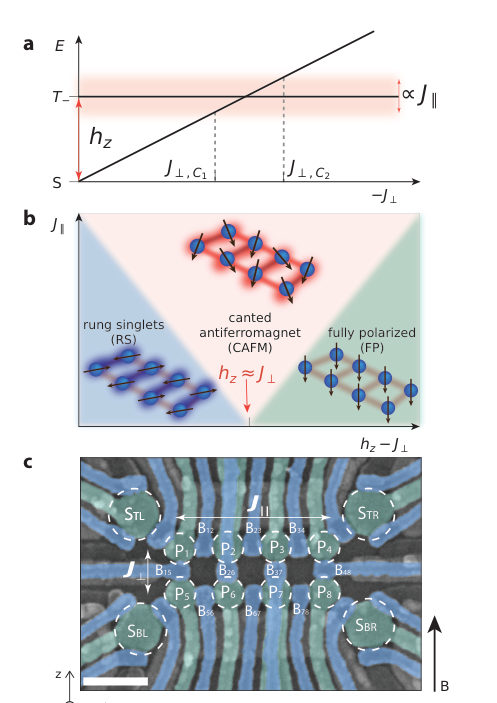 
FIG. 1. Device and experimental concept. (a,b) Schematic illustration of the experiment, showing (a) evolu- tion of energy levels as a function of the exchange coupling along the rungs J⊥and (b) the three phases of a Heisenberg exchange spin ladder in the thermodynamic limit. Cartoons of a 2×4 ladder illustrate the respective phases. Panel (a) par- ticularly visualizes the relationship of the two critical points in the rung coupling, J⊥,C1 and J⊥,C2, to the leg exchange coupling J∥. (c) False-colored scanning electron microscope image of the device. The device comprises eight sites, defined by plunger gates Pi with i = 1, . . . , 8, and inter-site barrier gates Bij, which tune the exchange...

📷 Fig 2

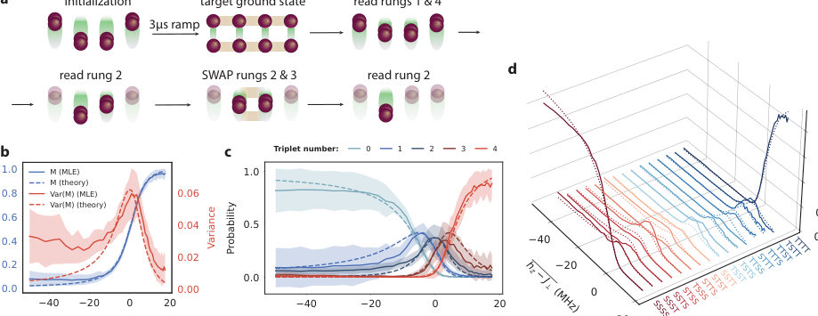 
FIG. 2. Quantum phase crossover in the limit of weak leg coupling. (a) Pulse sequence used in the experiment (Supplementary Section S1.1). (b) Evolution of the triplet number and its variance as a function of (hz −J⊥) at J|| ≈1 MHz. The shaded area indicates the standard deviation across the 60 experimental repetitions. Dashed lines show the theoretically predicted values obtained by solving the Hamiltonian in Eq. 17. (c) The same data set analyzed in terms of the triplet-number distribution as a function of (hz −J⊥). Dashed lines show the theoretically predicted distributions obtained by solving the Hamiltonian in Supplementary Section S7.1, Eq. 17. (d) Full probability distribution over...

📷 Fig 3

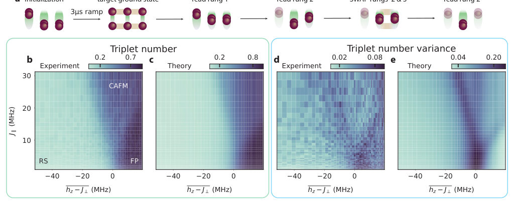 
FIG. 3. Phase diagram. (a) Pulse sequence used to acquire the experimental data: initialization deep in the (0,2)/(2,0) charge configurations of the rungs →adiabatic evolution following the ground state →readout of dimer 1 →readout of dimer 2 →SWAP operation between dimers 2 and 3 →readout of dimer 2, carrying the state of dimer 3. (b) Phase diagram showing the measured average triplet number per rung as J⊥and J∥are swept. (c) Corresponding theoretical phase diagram obtained by solving the Hamiltonian in Eq. 17 using realistic experimental parameters. (d) Measured averaged variance of the triplet number per rung as J⊥and J∥are swept. (e) Theoretical triplet number variance, similar to (c).

📷 Fig 4

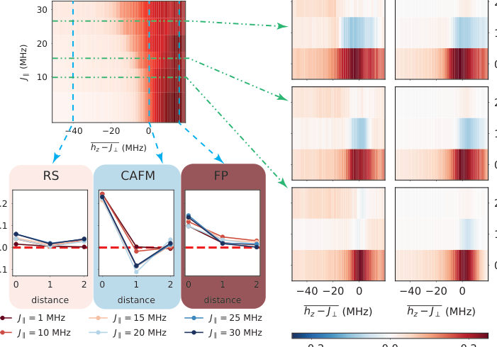 
FIG. 4. Connected correlators. (a) Phase diagram reconstructed from one-dimensional scans for J∥ ∈ {1, 10, 15, 20, 25, 30} MHz, using a per-scan SPAM matrix. (b) Line cuts for each sampled value of J∥, showing the connected- correlator amplitude deep within each phase as a function of distance j −i. Distance 0 denotes the autocorrelator, distance 1 the nearest neighbour, and distance 2 the next-nearest neighbor correlator. The RS and FP phases show minimal residual correlations for all values of J∥, whereas the CAFM phase develops anti-correlations as J∥increases, reflecting repulsive inter- actions between neighboring triplons. (c) Horizontal line cuts of the connected correlator extracted...

**Summary.** This experiment demonstrates the ability to engineer and observe quantum phase crossovers in an artificial spin ladder built from germanium quantum dots. By tuning the magnetic interactions, the researchers mapped out three distinct magnetic phases, confirming theoretical predictions using advanced measurements of higher-order spin correlations. This establishes quantum dot arrays as a highly controllable platform for investigating unconventional superconductivity and quantum magnetism.

**Why it may be interesting.** This work provides an unprecedentedly controllable solid-state platform to study fundamental quantum magnetism, directly linking theoretical models of strongly correlated electron systems (like the Hubbard model) to measurable quantum phenomena in solid-state devices.

Detailed structure

**Main problem.** The research aims to understand the collective quantum phases and crossovers in strongly correlated quantum magnets, specifically focusing on antiferromagnetic spin ladders.

**Main result.** The authors successfully mapped the ground state evolution across three distinct magnetic phases (Rung-Singlet, Canted Antiferromagnetic, and Fully Polarized) by tuning exchange interactions in a semiconductor quantum dot array.

**Method.** The study employs Hamiltonian-learning protocols combining equilibrium and dynamical measurements, utilizing higher-order spin correlators inaccessible to conventional bulk probes.

**Model / system.** The physical system is a programmable Heisenberg spin ladder realized in a half-filled germanium quantum dot array. The system is modeled by an effective XXZ Heisenberg Hamiltonian derived from a Fermi-Hubbard model, allowing tuning of rung and leg couplings.

**Key observables.** Triplet number distribution, variance of triplet number, and four-point spin correlators ($\langle eS^+_i eS^-_{j} 
angle$ vs $\langle eS^z_i eS^z_j 
angle$).

**Important parameters / regimes.** Rung coupling ($J_{\perp}$), leg coupling ($J_{\parallel}$), and magnetic field ($h_z$). Key regimes include $J_{\parallel} \approx 0$ (dimer limit) and the intermediate Canted Antiferromagnetic (CAFM) phase.

**Assumptions / limitations.** The analysis assumes the applicability of the effective spin Hamiltonian and notes that the general Hamiltonian description neglects anisotropic exchange interactions.

**Figures summary.** Figures illustrate the device concept and the phase diagram, showing how $\langle M 
angle$ and $	ext{Var}(M)$ track the crossover between the RS, CAFM, and FP phases. Correlator plots confirm enhanced transverse coherence in the CAFM region.

**Paper structure.** The paper establishes the physical platform (Ge quantum dots) and the theoretical model (Heisenberg ladder Hamiltonian). It then details the experimental measurement techniques using spin-gap parameters and higher-order correlators to map the phase boundaries and characterize the crossover behavior across the three distinct magnetic phases.

Abstract

Understanding collective phases of strongly correlated quantum magnets relies on theoretically tractable model systems with precise microscopic control. Antiferromagnetic spin ladders provide such a setting, hosting field-tunable gapped and gapless phases at half filling and unconventional pairing tendencies upon doping. Here, we realize a programmable Heisenberg spin ladder in a half-filled germanium quantum dot array featuring site-resolved, continuously tunable exchange interactions. Under a fixed magnetic field, we vary the rung and leg coupling to map the rung-singlet, canted antiferromagnetic, and fully polarized phases. Hamiltonian-learning protocols combining equilibrium and dynamical measurements quantitatively characterize the ladder, incorporating spin-orbit interactions to reproduce the observed crossover behavior. Measurements of higher-order spin correlators -- including four-point correlations inaccessible to conventional bulk probes -- reveal signatures of the underlying phase structure despite the finite size. Our results establish germanium quantum dot arrays as a controllable platform for quantum magnetism, opening routes to investigate unconventional superconductivity in doped ladders.

[↑ back to top](#top)

### [Hardware-Aware Compilation and Execution of Bivariate Bicycle Codes on Neutral-Atom Systems](http://arxiv.org/abs/2608.17023v1)

**Authors:** Jason Ludmir, Aditya Ranjan, Nicholas S. DiBrita, Jason Han, Tirthak Patel  
**Type:** both · **Category:** quantum information and computing · **PDF:** <https://arxiv.org/pdf/2608.17023v1>  
**Analysis basis:** full PDF text, analyzed in chunks
**Topic relevance:** 🔥 `QC/QI experiment` **4/5** · `Rydberg arrays` **2/5** · `quantum measurements` **1/5**

📷 Fig 1

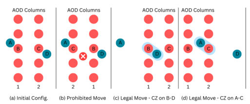 
Fig. 1: Acousto-optic deflector (AOD) non-crossing and stable column ordering. (a) Initial ordering x1 &lt; x2 &lt; . . . fixed by AOD control. (b) Forbidden: executing CZ by moving column 2 past column 3 requires crossing. (c) Legal alternative: translate columns together to preserve ordering. (d) Even logically commuting CZs can conflict under non-crossing, forcing serialization.

📷 Fig 2

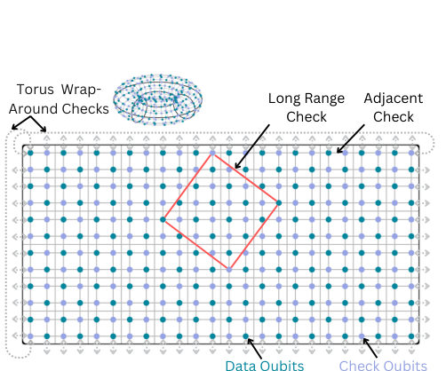 
Fig. 2: Module structure for BB codes. Note the long-range connections (only one set of edges displayed; these edges repeat across the torus). The wraparound edges capture the toroidal logical geometry.

📷 Fig 3

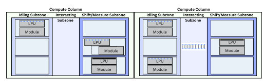 
Fig. 3: Compute zone with two columns (capacity 3 modules each). Modules execute idle, shift, and joint-measurement operations across idling, interaction, and shift/measurement subzones. Bridge qubits from interacting modules are brought together in the interaction subzone. Shift and measurement occur in separate sublayers but are co-visualized.

📷 Fig 4

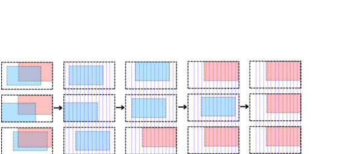 
Fig. 5: a) After a shift, modules (blue) are offset and must be returned to their original locations (resync). b) All modules are captured by shared AOD traps and moved in parallel. c) Modules are restored in order of increasing distance; all move 2 units right and 2 units up, after which the bottom module reaches its target and drops to SLM. d) The process repeats for the remaining modules; the middle module waits while the top module drops. e) The final module is moved and dropped; all modules are resynchronized.

📷 Fig 5

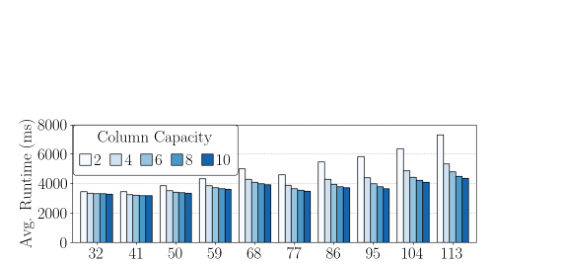 
Fig. 9: Average estimated runtime using spectral placement, grouped by number of modules and then column capacity.

**Summary.** This paper presents Park-n-Ride, a novel hardware-software co-design framework for running Bivariate Bicycle quantum error correction codes on neutral-atom quantum processors. It addresses the critical challenge of mapping abstract quantum operations onto the physical constraints of qubit movement, zoning, and interactions inherent to these platforms. The framework achieves significant performance gains by optimizing scheduling and placement while maintaining fault tolerance.

**Why it may be interesting.** It bridges the gap between abstract quantum error correction theory (qLDPC codes) and the highly constrained physical reality of neutral-atom hardware, providing a concrete software stack for fault-tolerant quantum computation.

Detailed structure

**Main problem.** The core challenge is developing a hardware-aware compilation and execution framework for Bivariate Bicycle (BB) codes, a type of quantum error correction code, on physical neutral-atom quantum processors.

**Main result.** The proposed Park-n-Ride framework successfully translates abstract qLDPC primitives into resource-efficient, high-throughput execution schedules that respect the complex movement and zoning constraints of neutral-atom arrays.

**Method.** The method involves a multi-stage compilation pipeline: spectral placement for module layout, decomposition of shift automorphisms into directional rolls, and an interval-based scheduler for joint measurements.

**Model / system.** The system utilizes neutral-atom arrays, which provide scalable, reconfigurable qubit layouts via Rydberg interactions and AOD transport. The model focuses on implementing BB codes, which are constant-weight, constant-degree qLDPC codes.

**Key observables.** Runtime reduction (up to 40%), communication distance, total bridge motion, and the number of idling gate counts.

**Important parameters / regimes.** AOD non-crossing rule, Rydberg blockade, and the size/structure of the compute zone (e.g., J144, 12, 12K grid).

**Assumptions / limitations.** The architecture assumes a tiled compute zone composed of compute columns and subzones, and that the AOD movement constraints are the primary bottleneck.

**Figures summary.** Figures illustrate AOD non-crossing constraints, the module structure of BB codes, and the physical layout of the compute zone detailing idling, interaction, and shift/measurement subzones.

**Paper structure.** The paper introduces the problem, details the Park-n-Ride framework (including spectral placement and scheduling), compares different compilation strategies (Spectral vs. Greedy), and presents performance gains in execution speed and resource utilization.

Abstract

Quantum computers are noisy; without quantum error correction (QEC), deep programs fail as qubits lose information due to decoherence. Among QEC approaches, bivariate bicycle (BB) codes offer low overhead and constant-depth syndrome extraction, while neutral-atom arrays provide scalable, reconfigurable qubit layouts. However, executing BB-code primitives on neutral-atom systems requires a hardware-aware mapping that respects movement, zoning, and interaction constraints. We present Park-n-Ride, a system for compiling and executing the BB code on neutral-atom processors. Park-n-Ride introduces a module layout and movement model aligned with neutral-atom constraints, exposes a compact BB-native logical interface for compilation, and integrates scheduling mechanisms that enable efficient execution on zoned architectures. By co-designing BB-code abstractions with hardware execution, Park-n-Ride provides a practical path from qLDPC primitives to resource-efficient, high-throughput execution on reconfigurable neutral-atom arrays.

[↑ back to top](#top)

### [Quantum sensors that compute: quantum computational magnetic-field sensing using a superconducting qubit](http://arxiv.org/abs/2608.17400v1)

**Authors:** Purnendu Sen, Mathieu Ouellet, Saeed A. Khan, Wayne Wang, Sridhar Prabhu, Alen Senanian, William P. Banner, William D. Oliver, Peter L. McMahon  
**Type:** both · **Category:** quantum information and computing · **PDF:** <https://arxiv.org/pdf/2608.17400v1>  
**Analysis basis:** full PDF text, analyzed in chunks
**Topic relevance:** 🔥 `QC/QI experiment` **4/5** · `quantum measurements` **2/5**

📷 Fig 1

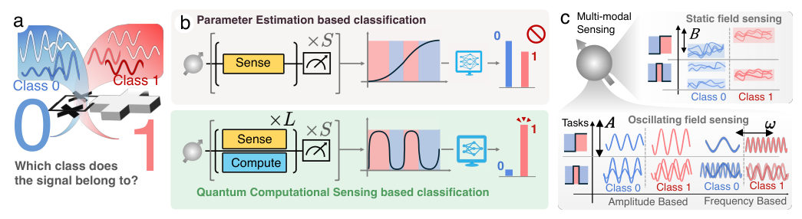 
FIG. 1. Conventional quantum sensing versus quantum computational sensing. a, Example of a one-dimensional magnetic field sensing task where the goal is to extract relevant features from a time-dependent signal u(t). A magnetic field sensor measures the field perturbed by a nearby unknown object, and the task is to determine whether the signal originates from class 0 or class 1. b, (Top) Conventionally, a quantum sensor measures the magnetic field as a time-series. The protocol is repeated for S shots to get reliable estimates of the expectation value. The measured signal is then processed classically, for example with a neural network, to extract features that allow identifying the object...

📷 Fig 2

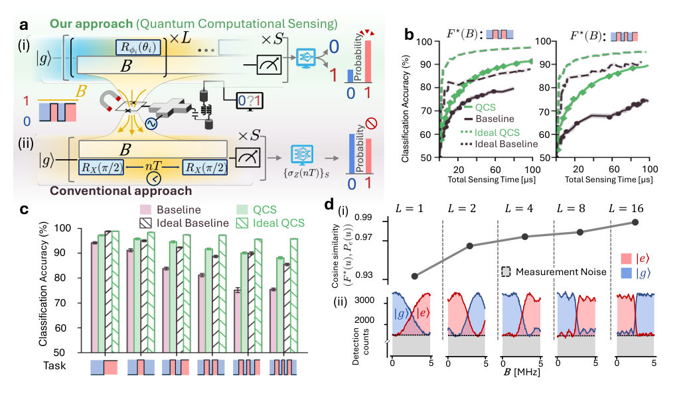 
FIG. 2. Static magnetic-field sensing: Amplitude classification. a, Comparison between a conventional sensing baseline and the quantum computational sensing (QCS) protocol. (i) The QCS protocol comprises an alternating sequence of controlled rotations and sensing intervals. Each sensing period allows the signal to accumulate phase, while the rotations transform the quantum state according to a programmed sequence. After L layers of rotation-wait operations, the resulting measurement implements a nonlinear function of the sensed signal. The protocol is repeated for S shots. (ii) The conventional sensing protocol comprises a series of Ramsey measurements, where the parameter is encoded as a...

📷 Fig 3

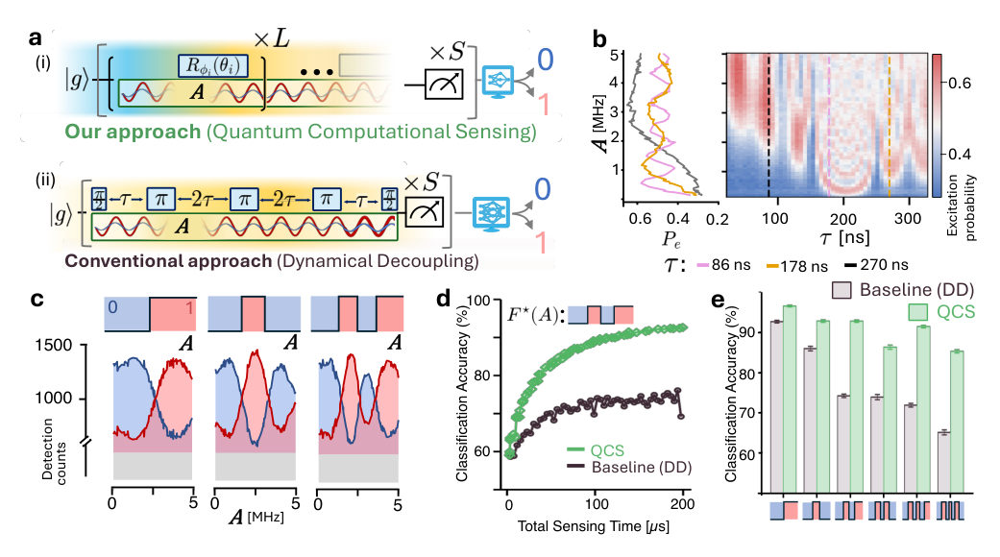 
FIG. 3. Oscillating magnetic-field sensing: Amplitude classification. a, Comparison between a traditional dynamical decoupling protocol (DD) and the quantum computational sensing (QCS) protocol for sensing the amplitude of an oscillating magnetic field. (i) The QCS protocol comprises a sequence of programmed rotations alternating with sensing intervals. During each interval the AC signal accumulates phase, with a random initial phase at the start of the protocol. After L layers, the measurement implements a function of the signal amplitude. (ii) The DD protocol comprises a sequence of N π-pulses separated by waiting periods τ that modulate the qubit evolution. The accumulated phase encodes...

📷 Fig 4

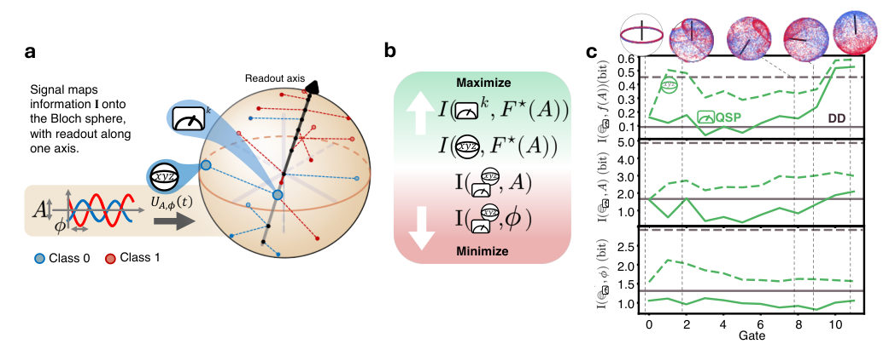 
FIG. 4. Encoding task-relevant information in measurement outcome. a, An input signal parameterized by amplitude A and phase ϕ is encoded into the qubit evolution through a sequence of controlled unitary operations UA,ϕ(t), generating trajectories on the Bloch sphere. Different signal classes (blue and red) evolve into distinguishable regions when projected onto the measurement axis. b, The QSP-based sensing protocol is trained to maximize the mutual information between the projective measurement outcomes and the target function F ⋆(A), while suppressing sensitivity to phase. c, Mutual information evolution across the QSP sequence for different quantities, demonstrating enhanced correlation...

📷 Fig 5

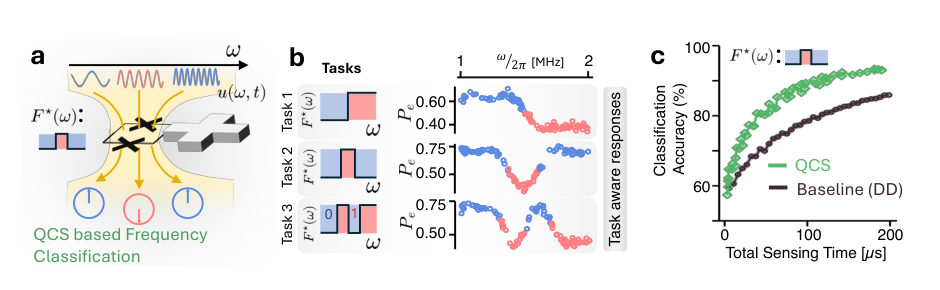 
FIG. 5. Oscillating magnetic-field sensing: Frequency classification. a, Using a similar protocol as in Fig. 3, we now consider tasks involving classification of the frequency for signals ranging from 1 MHz to 2 MHz. b, Examples of classification tasks are shown in the figure: AC signals with frequencies between 1 and 2 MHz are sensed over a window from 0 to 200 µs, showing an improvement over the best DD protocol for this task. c, Classification accuracy improvement obtained with the QCS protocol over an optimized DD sequence for the second task, showing that performing computation within the quantum system improves the accuracy.

**Summary.** This work demonstrates Quantum Computational Sensing (QCS) using a superconducting transmon qubit to enhance magnetic-field sensing. Instead of classically estimating the signal first, QCS embeds the required computation directly into the quantum measurement process. The results show that this approach significantly boosts classification accuracy compared to standard quantum sensing techniques, even when considering practical noise limitations.

**Why it may be interesting.** It provides a concrete, hardware-based demonstration of how quantum computation can be integrated into sensing protocols to achieve super-classical performance gains, which is highly relevant for quantum sensing applications in AMO physics.

Detailed structure

**Main problem.** The paper addresses the limitation of conventional quantum sensing, which requires classical post-processing after estimating a signal, by proposing Quantum Computational Sensing (QCS). QCS aims to combine sensing and computation to directly extract task-specific information into the measurement outcome.

**Main result.** The experimental demonstration showed that QCS significantly outperforms conventional sensing baselines for binary classification tasks on both static and oscillating magnetic fields, achieving up to 20% higher accuracy in amplitude classification.

**Method.** The authors utilize a protocol based on quantum signal processing (QSP) to preprocess sensed signals in the quantum domain, encoding task-relevant information into the measurement basis before measurement.

**Model / system.** The physical platform is a superconducting transmon qubit, used to sense magnetic fields via an integrated double-junction superconducting quantum interference device (SQUID) loop. The protocols compare QCS against optimized Dynamical-Decoupling (DD) methods.

**Key observables.** Classification Accuracy (%), Cosine Similarity, Mutual Information, and the final $\langle z 
angle$ distribution.

**Important parameters / regimes.** Signal amplitude and frequency ranges, interrogation times ($T$), and readout fidelity.

**Assumptions / limitations.** The QCS protocols are non-adaptive (control parameters fixed before data acquisition), and the comparison is made under practical limitations of decoherence and readout errors.

**Figures summary.** Figures compare QCS vs. conventional approaches for classification tasks (static/oscillating fields), show Pareto fronts illustrating resource trade-offs, and analyze the robustness of protocols against readout errors.

**Paper structure.** The paper progresses from introducing the QCS concept over classical estimation, demonstrating its application to static and oscillating field classification, and finally comparing QCS performance against optimized DD protocols using information-theoretic measures.

Abstract

A measurement of a single-qubit quantum sensor reveals at most 1 bit of information about the signal that was sensed. To perform a classification task on the signal, the conventional approach is to repeat a sensing protocol many times, averaging the measurement results to obtain a high-precision estimate of the sensed signal, and then to apply classical postprocessing. Quantum computational sensing (QCS) is an alternative approach that breaks with the paradigm of first obtaining a classical estimate of the signal and then computing a function of the estimated signal in postprocessing. QCS instead combines quantum sensing with quantum computing to concentrate information about the signal relevant to the task into the solitary bit revealed by each measurement. Here, we report on the experimental demonstration of QCS where sensing and computing were both performed by the same single superconducting transmon qubit. We consider various binary classification tasks based on static and oscillating magnetic fields induced by current through a flux line. The fields were sensed through a double-junction superconducting quantum interference device (SQUID) loop that was part of the qubit. We used a protocol based on quantum signal processing to preprocess the sensed signals in the quantum domain prior to measurement. For tasks on static magnetic fields, our protocol outperformed the conventional baseline of Ramsey-based phase estimation by as much as 15 percentage points. For tasks on oscillating magnetic fields, we classified signal amplitude and frequency with up to 20 and 15 percentage points higher accuracy, respectively, compared to the conventional baseline of optimized dynamical-decoupling protocols. Our results illustrate how quantum computing can enhance quantum sensing even with a minimally sized quantum system subject to the practical limitations of decoherence and error-prone operations.

[↑ back to top](#top)

### [Sound and Efficient Certification of High-Quality Qubit Operations: Theory and Experiment](http://arxiv.org/abs/2608.17005v1)

**Authors:** Nikolai Miklin, Jan Nöller, José Martínez, Lucas B. Vieira, Ulrich Poschinger, Ferdinand Schmidt-Kaler, Mariami Gachechiladze  
**Type:** both · **Category:** quantum information and computing · **PDF:** <https://arxiv.org/pdf/2608.17005v1>  
**Analysis basis:** full PDF text, analyzed in chunks
**Topic relevance:** 🔥 `QC/QI experiment` **4/5** · `quantum measurements` **2/5**

📷 Fig 1

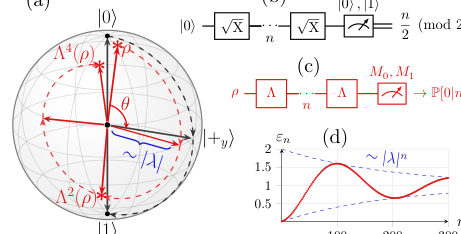 
Figure 1. Schematics of the certification protocol. (a) Initial state ρ and evolved states Λ2(ρ) and Λ4(ρ) for ideal (black) and noisy (red) implementations, represented on the Bloch sphere. (b) Target circuit comprising an even number n of applications of the √

📷 Fig 2

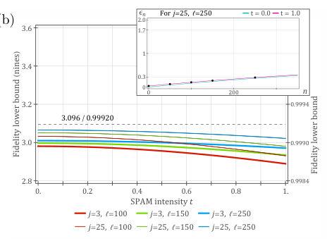 
Figure 2. Experimental and numerical results. (a) Ex- perimental estimates of εn in Eq. (4) as a function of se- quence length n, obtained with fluorescence-detection win- dows τ = 1.0 ms (blue squares) and τ = 0.5 ms (red circles). The inset resolves the short sequences n ∈0, 2, 4, for which the shorter, suboptimal detection window produces a larger offset. The anomalous behavior for 1.0 ms is attributed to fluctuations in the effective Rabi frequency and a differential AC Stark shift between the Zeeman sublevels, mediated by their coupling to the P1/2 state. The two datasets were ac- quired three hours apart. (b) Certified lower bounds on the average gate fidelity for the fitted numerical...

📷 Fig 3

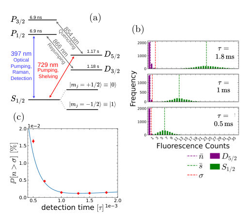 
Figure 3. Fluorescence-based state discrimination for a single trapped 40Ca+ ion. (a) Relevant level scheme of 40Ca+, showing the transitions used for optical pumping, Doppler cooling, state detection, and shelving to the metastable D5/2 state. (b) Photon-count distributions recorded on the detector for the S1/2 (bright), and D5/2 (dark) states, shown for several detection window durations τ, illus- trating the growing separation of the two distributions with increasing τ. (c) Probability P[n &gt; σ] of the dark state pho- ton count n exceeding a discrimination threshold σ = √¯s¯n, plotted as a function of the detection window τ. Individ- ual data points are compared to the model prediction...

📷 Fig 4

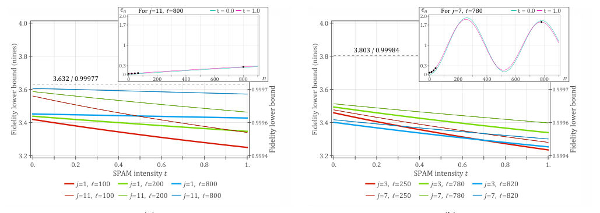 
Figure 4. Robustness of the fidelity certificates to increasing SPAM errors for different choices of j and ℓ. Certified lower bounds on the average gate fidelity, expressed in Nines(Favg) = −log10(1 −Favg). In both panels, the gate channel is fixed but noisy, while t ∈[0, 1] controls only the SPAM-error intensity. Thus, t = 0 corresponds to ideal SPAM, not to an ideal gate. The dashed lines (black) indicate the exact fidelity. Insets show the εn signal for two different SPAM configurations, t = 0 (cyan) and t = 1 (magenta). Black dots are located at n ∈{0, 2j, 4j, 6j, ℓ} chosen according to the tightest lower bounds on the main plot. (a) We consider purely dephasing gate noise, with ϑ = 0...

**Summary.** This paper introduces a novel, sound, and efficient black-box protocol to certify the quality of single-qubit quantum gates, even when state-preparation and measurement errors are unknown. By analyzing deterministic sequences, the authors derive bounds on the gate's rotation eigenvalue, which quantifies both angular and coherence errors. The method was successfully demonstrated on a trapped-ion quantum processor, setting a new standard for hardware characterization.

**Why it may be interesting.** This work provides a highly practical and theoretically rigorous method for benchmarking quantum hardware, which is crucial for advancing fault-tolerant quantum computing architectures.

Detailed structure

**Main problem.** The paper addresses the challenge of certifying the quality of single-qubit quantum gates when the underlying state-preparation and measurement (SPAM) errors are unknown and dominant.

**Main result.** They established a sound, efficient black-box certification protocol that successfully certified a high-fidelity $\sqrt{X}$-gate on a trapped-ion processor, achieving a fidelity certificate of $99.94(3)\%$ with $99\%$ confidence.

**Method.** The protocol uses a small set of fixed, deterministic sequences to derive finite-sample bounds on the gate's rotation eigenvalue ($\lambda$), which is a gauge-invariant property.

**Model / system.** The experiment was implemented on a $^{40}	ext{Ca}^{+}$ trapped-ion processor, modeling the gate operation via an unknown quantum channel $\Lambda$ acting on the qubit state.

**Key observables.** Rotation eigenvalue ($\lambda$), which has a phase (angle error) and a modulus (coherence loss); error probability $\epsilon_n$.

**Important parameters / regimes.** Fidelity lower bound ($F_{	ext{avg}}$); confidence level ($99\%$); number of circuit executions ($22,000$).

**Assumptions / limitations.** The derived spectral constraints imply a rigorous average gate-fidelity lower bound for any time-independent qubit model compatible with the data, without requiring trusted reference operations or model fitting.

**Figures summary.** Figure 1 illustrates the protocol using Bloch sphere representations and the target circuit; Figure 2 shows experimental estimates of the error probability $\epsilon_n$ versus sequence length $n$ for different noise regimes.

**Paper structure.** The paper introduces the theoretical framework for black-box certification, details the two-stage measurement protocol (preliminary test followed by refined analysis of $\epsilon_n$), presents the theoretical bounds on $\lambda$, and concludes with experimental validation on the trapped-ion platform.

Abstract

Can a high-quality quantum gate be certified when uncharacterized state-preparation and measurement errors are dominant? Can this be achieved with low experimental overhead? Here, we introduce a sound black-box certification protocol for a single-qubit gate based on a small set of fixed, deterministic sequences. From the data, the protocol derives finite-sample bounds on the gate's rotation eigenvalue, a gauge-invariant property. Its phase reveals the accuracy of the rotation angle, while its modulus quantifies the loss of coherence under repeated gate applications. We implement the protocol on a $^{40}\mathrm{Ca}^{+}$ trapped-ion processor and certify the $\sqrt{\mathrm{X}}$-gate rotation eigenvalue using $22\,000$ circuit executions, and demonstrate the robustness of certification to state-preparation and measurement errors by deliberately degrading the readout. Finally, we prove that these spectral constraints imply, up to a physically meaningful unitary change of basis, a rigorous average gate-fidelity lower bound for every time-independent qubit model compatible with the data. In both readout settings, the spectral bounds yield the same fidelity certificate of $99.94(3)\%$ with $99\%$ confidence. Our results establish a new standard for quantum-gate certification by combining soundness and experimental efficiency without requiring trusted reference operations, randomized circuits, or model fitting.

[↑ back to top](#top)

### [Quantifying Measurement Objectivity: A Retrodictive Approach](http://arxiv.org/abs/2608.17410v1)

**Authors:** Jiaxi Kuang, Teruaki Nagasawa, Kensei Torii, Francesco Buscemi  
**Type:** theory · **Category:** other · **PDF:** <https://arxiv.org/pdf/2608.17410v1>  
**Analysis basis:** full PDF text, analyzed in chunks
**Topic relevance:** 🔥 `quantum measurements` **4/5**

📷 Fig 1

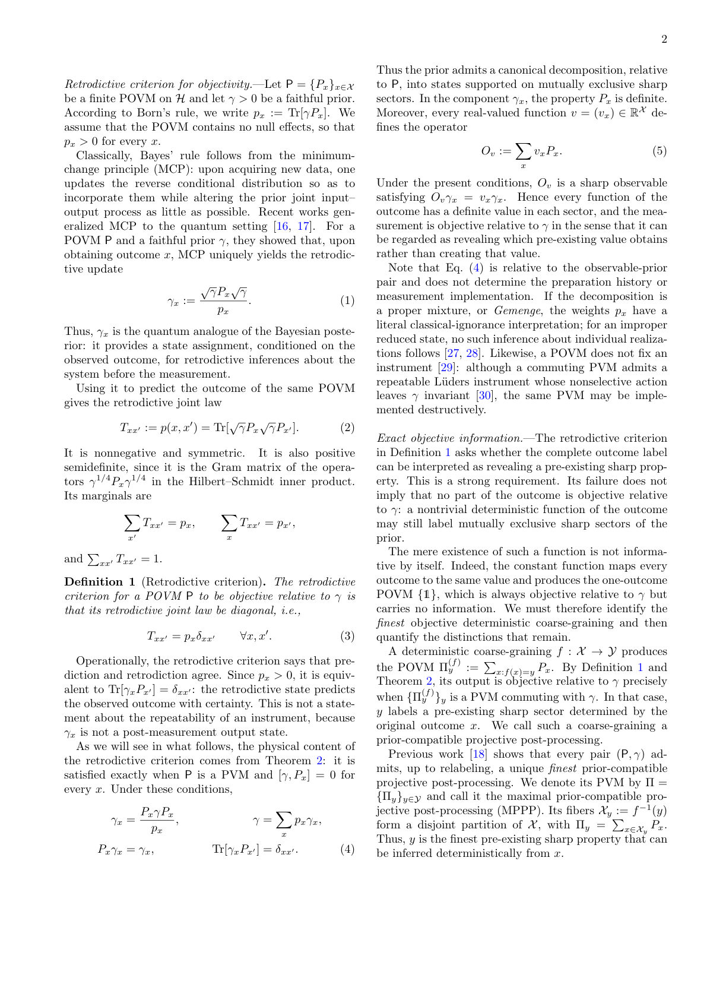 
Low-resolution page preview, page 2

📷 Fig 2

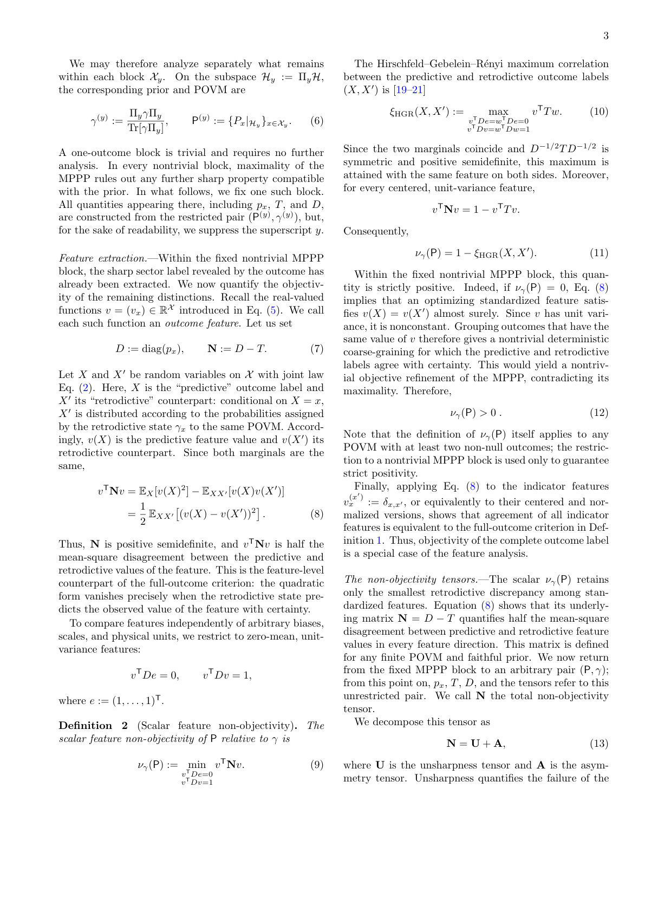 
Low-resolution page preview, page 3

📷 Fig 3

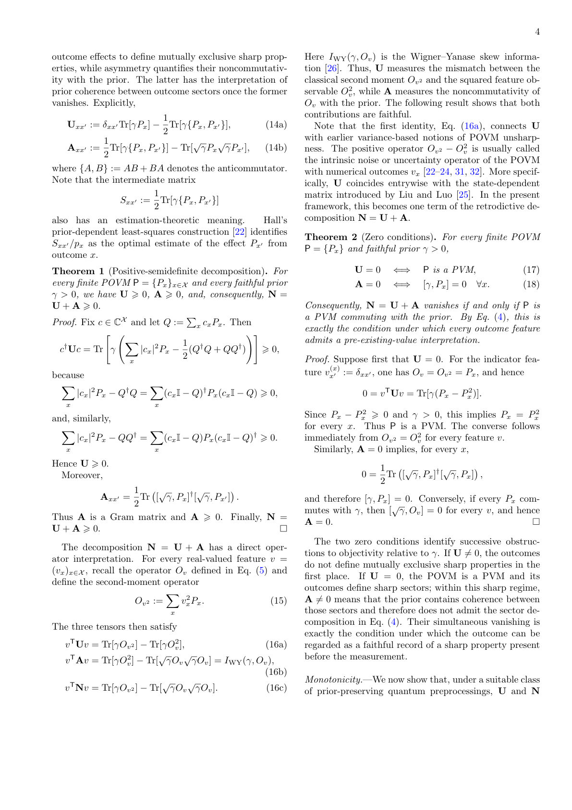 
Low-resolution page preview, page 4

📷 Fig 4

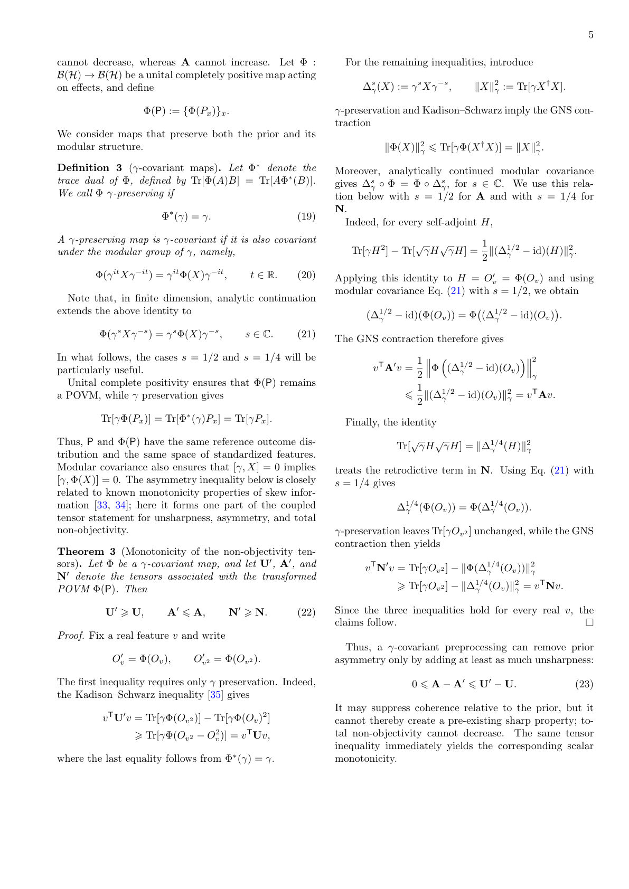 
Low-resolution page preview, page 5

📷 Fig 5

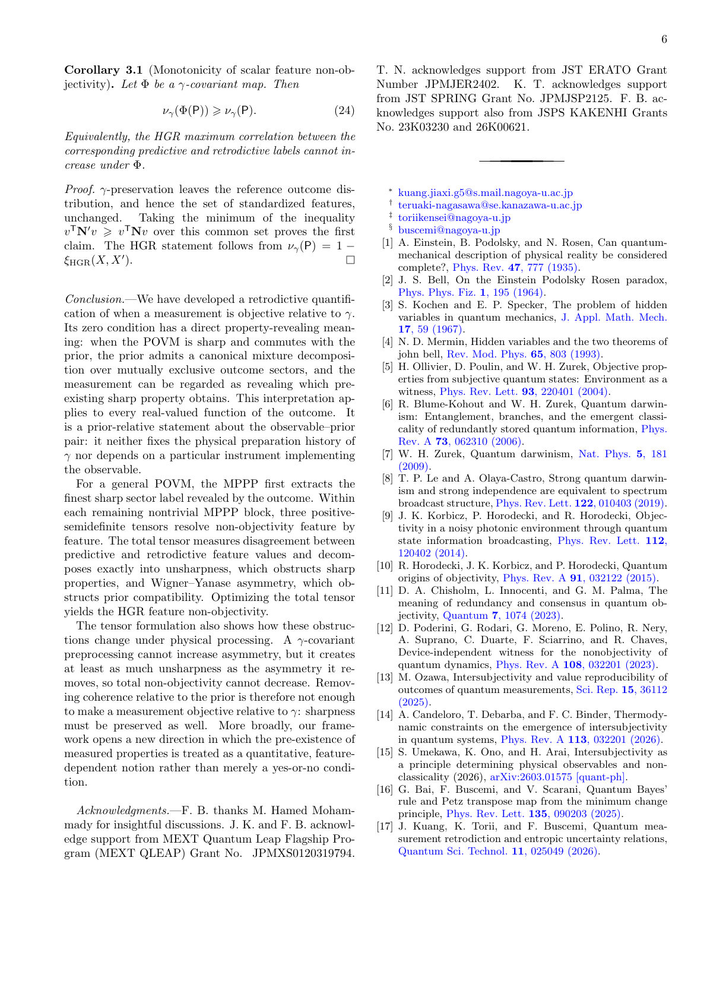 
Low-resolution page preview, page 6

**Summary.** This work develops a quantitative, retrodictive measure to determine when a quantum measurement outcome reflects a pre-existing objective property relative to a prior state. It achieves this by decomposing the total non-objectivity into components measuring lack of sharpness and lack of prior compatibility (asymmetry). The key finding is that objectivity requires both the measurement to be sharp and to commute with the prior state.

**Why it may be interesting.** It provides a rigorous, quantitative framework for defining 'objectivity' in quantum measurements, which is a foundational concept in quantum foundations, linking it to concepts like commutativity and sharpness.

Detailed structure

**Main problem.** The paper quantifies the conditions under which the outcomes of a quantum measurement can be interpreted as revealing a pre-existing, objective property relative to a given prior state.

**Main result.** Total non-objectivity, quantified by a bilinear form, vanishes if and only if the measurement POVM is sharp and commutes with the prior state. Furthermore, this non-objectivity cannot decrease under physically allowed, prior-preserving quantum processing.

**Method.** It employs the formalism of quantum measurement retrodiction, decomposing the total non-objectivity into mathematically distinct components: unsharpness and asymmetry (related to Wigner-Yanase skew information).

**Model / system.** The analysis is general, considering an arbitrary Positive Operator-Valued Measure (POVM) acting on a quantum system characterized by a faithful prior state ($\gamma$).

**Key observables.** Total non-objectivity tensor ($N$), Unsharpness tensor ($U$), Asymmetry tensor ($A$), and the scalar non-objectivity $
u_\gamma(P)$.

**Important parameters / regimes.** The prior state $\gamma$, the POVM $\{P_x\}$, and the outcome features $v = (v_x) \in \mathbb{R}^X$.

**Assumptions / limitations.** The analysis relies on the retrodictive criterion, which is distinct from post-measurement repeatability, and focuses on the finest objective deterministic coarse-graining.

**Paper structure.** The paper develops the retrodictive criterion, defines the total non-objectivity tensor by decomposing it into unsharpness and asymmetry components, and then proves monotonicity theorems showing that this non-objectivity cannot decrease under specific quantum maps.

Abstract

When can one interpret the outcomes of a quantum measurement as revealing a pre-existing objective property? Using the recently developed formalism of quantum measurement retrodiction, we provide a quantitative treatment of this question: for any POVM and faithful prior state, we construct a positive semidefinite bilinear form that quantifies the non-objectivity of every real-valued outcome feature through the disagreement between its predictive value and its retrodictive counterpart. We show that this form decomposes exactly into the sum of two positive semidefinite bilinear forms: an unsharpness form and an asymmetry form given by Wigner--Yanase skew information. The total form vanishes precisely on those outcome features that can be interpreted, relative to the prior, as revealing pre-existing properties; in particular, it vanishes identically if and only if the POVM is sharp and commutes with the prior. Finally, under maps that preserve the prior and are covariant under its modular group, asymmetry cannot increase, and any loss of asymmetry is offset by at least as much unsharpness, so that total non-objectivity cannot decrease.

[↑ back to top](#top)

### [Readout Orientation Controls Measurement-Accessible Quantum Tangent Geometry](http://arxiv.org/abs/2608.17085v1)

**Authors:** Marwan Ait Haddou  
**Type:** theory · **Category:** quantum information and computing · **PDF:** <https://arxiv.org/pdf/2608.17085v1>  
**Analysis basis:** full PDF text, analyzed in chunks
**Topic relevance:** 🔥 `quantum measurements` **4/5**

📷 Fig 1

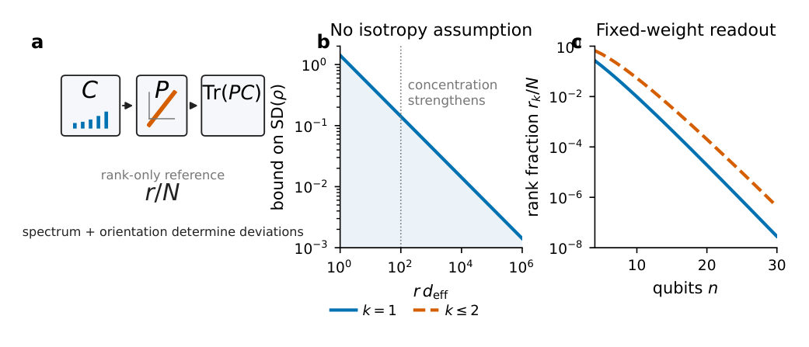 
FIG. 1. Rank and orientation in measurement-accessible tangent geometry. A fixed quantum measurement induces a centered score space. A normalized tangent covariance C distributes tangent mass within that space, while a rank-r readout projector P selects the directions retained by the learner. The accessible tangent mass is R = Tr(PC). Random relative orientation gives the rank-only reference r/N; the spectrum of C controls the null width, while the physical orientation of P controls the observed deviation from that reference.

📷 Fig 2

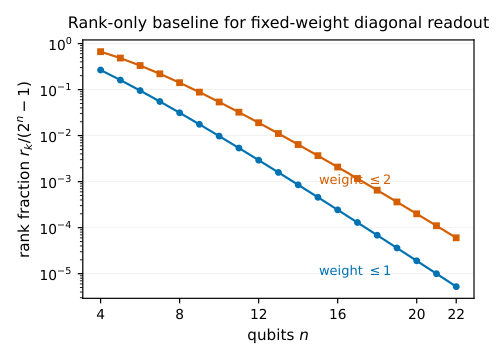 
FIG. 2. Rank-only scale for fixed-weight diagonal readout un- der full computational-basis support. For fixed Pauli weight, the retained subspace rank grows polynomially while the cen- tered score-space dimension grows exponentially. The plotted fractions are geometric baselines only; physical retention de- pends on spectral orientation.

📷 Fig 3

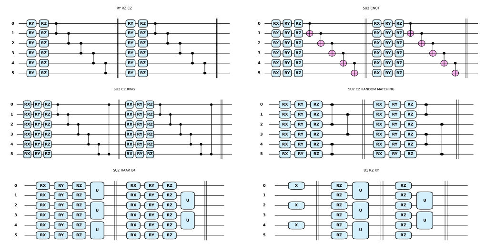 
FIG. 3. Circuit families used in the numerical campaign, rendered directly from PennyLane circuit definitions [35]. From top left to bottom right: RY–RZ–CZ line, SU2–CNOT line, SU2–CZ ring, SU2–CZ random matching, SU2–Haar-U(4) brickwork, and the half-filled U(1) RZ–XY line. For legibility the drawings show n = 6 and two representative layers; the production simulations use the depths and system sizes specified in the numerical protocol. The U(1) panel begins from the alternating half-filled computational-basis state, matching the simulation code. Generic unitary boxes in the last row represent the actual two-qubit matrices used by the simulator rather than a gate decomposition.

📷 Fig 4

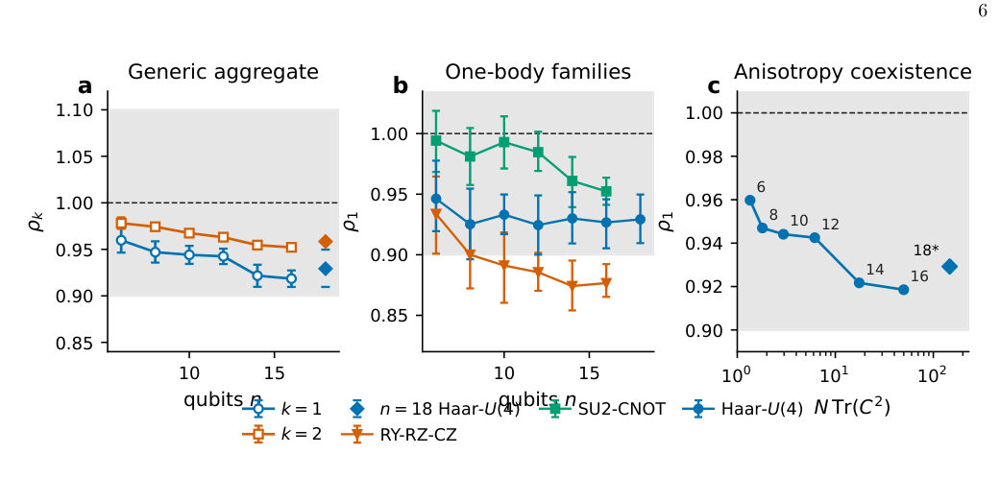 
FIG. 4. Rank-normalized retention and covariance anisotropy. Family-balanced generic low-weight readouts remain close to the rank reference over the tested sizes even while N Tr(C2) grows and deff/N decreases. Architecture-resolved data show systematic deviations, demonstrating that the family-balanced result is not a claim of literal Haar orientation.

📷 Fig 5

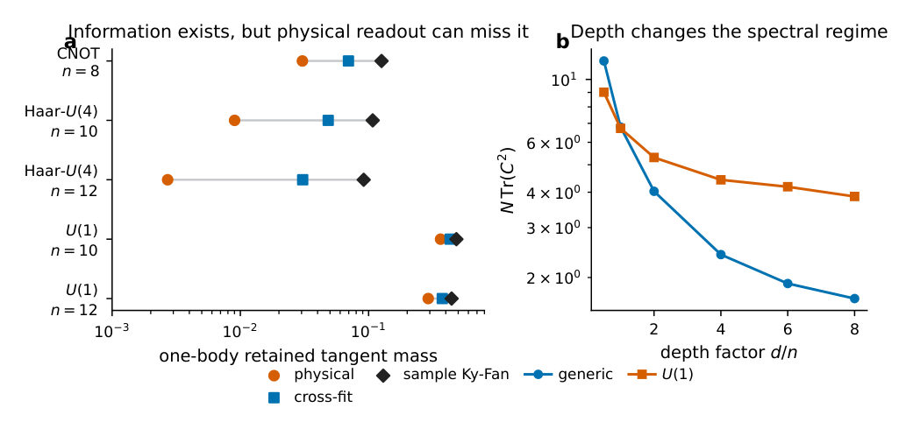 
FIG. 5. Same-rank spectral comparison. Physical low-weight, cross-fitted aligned, and same-sample Ky Fan subspaces have identical rank but can retain very different tangent mass. The orientation gap is large in generic Haar-U(4) circuits and substantially smaller in the U(1) family.

**Summary.** This work investigates how much quantum information remains accessible after a measurement is restricted to a low-rank readout subspace. The authors prove that the usable information depends critically on the *orientation* of the readout subspace relative to the true signal geometry, not just its rank. This has direct implications for designing optimal readout protocols in variational quantum algorithms.

**Why it may be interesting.** It provides a rigorous geometric framework for understanding limitations in quantum machine learning readouts, showing that optimizing the *alignment* of the measurement basis is as crucial as maximizing the *number* of measured observables.

Detailed structure

**Main problem.** The paper quantifies the information loss when quantum measurement outcomes are restricted to a low-rank readout subspace, analyzing the 'second contraction' of quantum geometry.

**Main result.** The amount of usable tangent information is controlled not just by the readout rank, but critically by the specific *orientation* of the readout subspace relative to the true tangent covariance.

**Method.** The analysis uses random-subspace averaging (Grassmann identity) to establish a null model, comparing the actual retained tangent mass (Tr(PC)) against this random baseline.

**Model / system.** The study analyzes variational quantum circuits, modeling the measurement-induced tangent scores in a centered score space, using covariance matrices $C$ and readout projectors $P$.

**Key observables.** Retained Tangent Mass ($R=	ext{Tr}(PC)$), Normalized Overlap ($
ho$), Directional Gradient-Energy Proxy, and Finite-Shot Signal-to-Noise Ratio (SNR).

**Important parameters / regimes.** Readout Rank ($r$), Effective Spectral Dimension ($	ext{deff}$), and the specific circuit family (e.g., Haar-$U(4)$ vs. $U(1)$).

**Assumptions / limitations.** The analysis treats the random-projection identity as a null model, and the U(1) symmetry result is explicitly noted as a case study, not a general theorem.

**Figures summary.** Figures illustrate the conceptual separation between rank and orientation, show numerical gains (e.g., factor 9.584 in gradient energy) from cross-fitting alignment, and present model selection diagnostics for structured circuits.

**Paper structure.** The paper establishes the mathematical framework by defining the tangent geometry and the readout restriction. It then develops the null model using random projections. The core of the work presents numerical evidence comparing physical readouts to optimally aligned subspaces, concluding that orientation is the key missing degree of freedom.

Abstract

A fixed quantum measurement can expose substantially more tangent information than a restricted observable readout retains. We study this second restriction. For a normalized covariance $C \succeq 0$, $\mathrm{Tr} C = 1$, of measurement-induced tangent scores in an $N$-dimensional centered score space, and a rank-$r$ readout projector $P$, we quantify retained tangent mass by $R=\mathrm{Tr}(PC)$. The ratio $ρ=R/(r/N)$ separates the actual retained mass from a rank-only random-orientation reference. Standard Grassmann averaging gives $\mathbb{E}ρ=1$ and $\mathrm{Var}(ρ) \le 2/(r d_{\mathrm{eff}})$, where $d_{\mathrm{eff}}=1/\mathrm{Tr}(C^2)$. We use this identity as a null model rather than as a new random-projection theorem. Numerically, family-balanced one- and two-body readouts remain close to the rank reference through $n=16$ even as the tangent covariance becomes strongly anisotropic. The decisive equal-rank comparison holds the circuit, measurement record, readout rank, and evaluation shot budget fixed. For Haar-$U(4)$ at $n=12$, cross-fitted alignment increases the mean directional gradient-energy proxy by a factor 9.584 and the finite-shot signal-to-noise ratio by a factor 3.111 relative to the physical one-body readout, while a random rank-matched subspace remains near the rank baseline. A half-filled $U(1)$-conserving family provides a structured counterexample to generic orientation: physical low-weight $Z$ readouts are already strongly aligned with leading tangent directions over the tested finite-size range. We treat this symmetry result as a case study, not as a claim that $U(1)$ symmetry generically prevents barren plateaus or that hydrodynamics is the established mechanism. The results isolate readout orientation as a degree of freedom invisible to rank alone that directly controls how much measured tangent information remains usable after readout restriction.

[↑ back to top](#top)

### [Eigenframe Synchronization in Disordered Driven Quantum Ensembles](http://arxiv.org/abs/2608.17026v1)

**Authors:** Saipriya Satyajit, Zechuan Yin, Jner Tzern Oon, Katrijn Everaert, Smriti Bhalerao, John W. Blanchard, Christopher Jarzynski, Ronald L. Walsworth  
**Type:** both · **Category:** other · **PDF:** <https://arxiv.org/pdf/2608.17026v1>  
**Analysis basis:** full PDF text, analyzed in chunks
**Topic relevance:** `QC/QI experiment` **3/5** · `analog quantum simulation` **3/5** · `driven-dissipative phase transition` **3/5** · `methods for driven-dissipative` **3/5** · `non-equilibrium universality` **2/5** · `quantum measurements` **2/5** · `Keldysh / 2PI / non-Gaussian methods` **1/5** · `correlated / nonlocal dissipation` **1/5** · `scars & prethermalization` **1/5**

📷 Fig 1

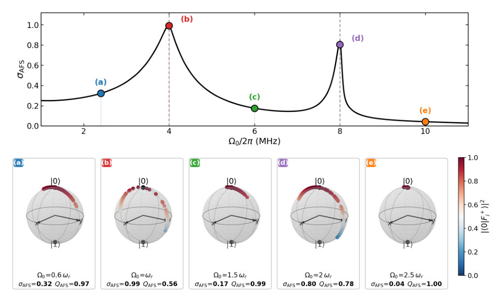 
FIG. 1. Floquet eigenframe synchronization phase diagram. (top) Eigenframe fragmentation metric σAFS = p

📷 Fig 2

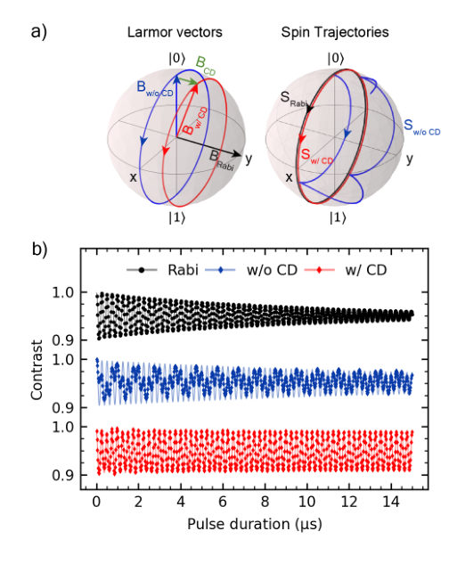 
FIG. 2. Robust ensemble population control via AFS. (a) Bloch-sphere visualization of the effective control fields and spin trajectories for CW Rabi driving (black), modulated driving without counterdiabatic (CD) correction (blue), and full AFS protocol with CD correction (red). The CD term en- forces Floquet adiabatic following at the modulation rate used here ωr/2π = 4 MHz. (b) Measured NV ensemble photolu- minescence (PL) oscillations for the three protocols, resulting from coherent population modulation. The CW Rabi oscil- lation decays within ≈5 µs due to ensemble inhomogeneity, while the full AFS protocol preserves high-contrast oscilla- tions beyond 15 µs, demonstrating robust...

📷 Fig 3

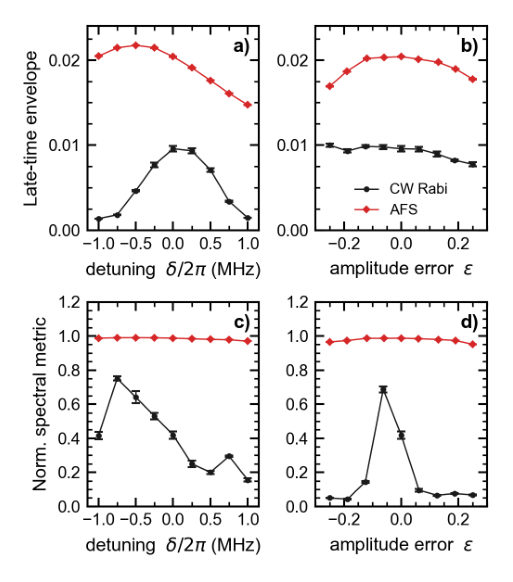 
FIG. 3. Robustness of the synchronized ensemble dy- namics. Measured late-time oscillation metrics under con- trolled detuning and amplitude miscalibration, comparing CW Rabi driving (black) with the AFS protocol (red) at the operating point ωr/2π = 4 MHz, Ω0/2π = 3 MHz. The pan- els are line cuts of a two-dimensional (ϵ, δ) scan, through ϵ = 0 [(a),(c)] and δ = 0 [(b),(d)]. (a,b) Mean Hilbert-envelope am- plitude over the 5–10 µs late-time window, versus detuning δ and fractional amplitude error ϵ respectively. (c,d) Normal- ized spectral metric—the Fourier amplitude at ωr divided by the mean Hilbert-envelope amplitude over the same window— for the same two cuts. AFS sustains both contrast...

📷 Fig 4

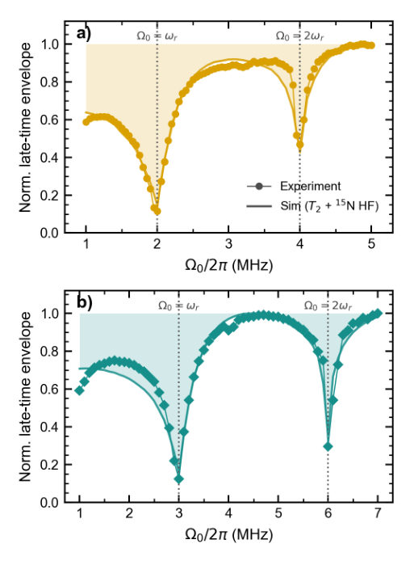 
FIG. 4. Mapping the synchronization breakdown spectrum. Normalized late-time oscillation envelope (mean Hilbert-envelope amplitude of the AC component over the 5–10 µs window of the measured PL time trace) as the en- gineered gap Ω0 is swept at fixed modulation rate, for (a) ωr/2π = 2 MHz and (b) ωr/2π = 3 MHz. Markers are exper- iment; the solid curve in each plot is a matched-distribution simulation of an ensemble with amplitude disorder σϵ = 1% and effective detuning disorder σδ/2π = 0.9 MHz (Supple- mental Material). Each simulation curve is normalized to its own maximum; and the shaded region marks the envelope amplitude deficit relative to the synchronized baseline. Dot- ted lines...

📷 Fig 5

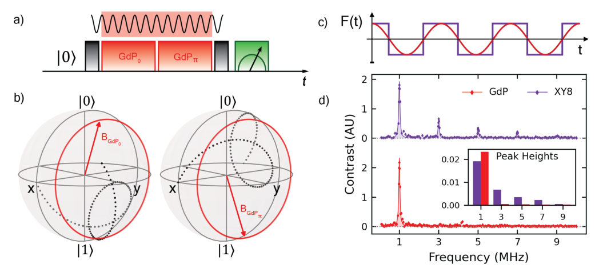 
FIG. 5. Synchronization-enabled continuous AC sensing. (a) Schematic of the continuous AFS sensing sequence [GdP0, GdPπ]. (b) Bloch-sphere trajectories showing cancellation of the dynamic phase between the two geodesic blocks. (c) Filter functions for XY8 (purple) and the continuous AFS protocol (red). (d) Experimental AC magnetometry spectra, demonstrating the single-tone response of the synchronized NV ensemble alongside the odd-harmonic comb of XY8.

**Summary.** This paper introduces the concept of Floquet eigenframe synchronization as a necessary geometric condition for achieving robust collective control in disordered quantum ensembles. By defining measurable metrics like the Synchronization Alignment Factor, the authors provide a diagnostic tool to quantify how well the ensemble acts as a single unit despite internal disorder. Experimental verification using NV centers demonstrates that this synchronization enables high-fidelity, disorder-resilient quantum sensing protocols.

**Why it may be interesting.** This work provides a powerful, geometric diagnostic tool (the eigenframe) for understanding and engineering robustness in open, driven quantum systems, which is highly relevant to quantum sensing and quantum control in AMO physics.

Detailed structure

**Main problem.** The paper addresses the challenge of achieving robust quantum control in periodically driven quantum ensembles where individual components experience different local disorder.

**Main result.** It establishes Floquet eigenframe synchronization as a measurable, geometric condition for collective control, enabling disorder-resilient quantum sensing protocols.

**Method.** The authors introduce and utilize a synchronization order parameter (SAFS) and a fragmentation metric ($\sigma_{AFS}$) to diagnose the alignment of Floquet quantization axes across the ensemble.

**Model / system.** The study focuses on spin-based quantum sensing ensembles, specifically using Nitrogen-Vacancy (NV) centers in diamond, driven by time-periodic Hamiltonians.

**Key observables.** Synchronization Alignment Factor (SAFS), Eigenframe Fragmentation Metric ($\sigma_{AFS}$), and measurable collective Rabi oscillations.

**Important parameters / regimes.** The breakdown resonances are predicted at low-order commensurabilities between the engineered Floquet gap ($\Omega_0$) and the drive modulation ($\omega_r$), specifically at $\Omega_0 = \omega_r$ and $\Omega_0 = 2\omega_r$.

**Assumptions / limitations.** The analysis assumes that the collective response can be characterized by the shared Floquet eigenframe, which is a geometric requirement beyond standard coherence measures.

**Figures summary.** The notes suggest figures demonstrating long-lived collective oscillations, a two-dimensional disorder-robustness map, and the predicted shift of breakdown resonances with the modulation rate.

**Paper structure.** The paper develops the theoretical framework for Floquet eigenframe synchronization, derives measurable criteria using the order parameter, predicts specific resonance breakdown channels, and validates the theory through experimental measurements on NV ensembles.

Abstract

Periodic driving underlies many forms of quantum control, including spin-based quantum sensing. However, in an ensemble sensor, one waveform must act on spins with different detunings, drive amplitudes, hyperfine environments, and local fields. Existing robust-control approaches to such disorder are usually framed in terms of coherence, effective Hamiltonians, filter functions, or refocusing. Here we identify a complementary geometric requirement for collective ensemble Floquet control: disorder realizations must share a common Floquet eigenframe. When this condition is met, initialization, protection, signal coupling, and readout are defined in one dressed basis, so the ensemble responds as a collective Floquet sensor rather than as an average over inequivalent driven members. We make this condition measurable with an eigenvector-based synchronization order parameter and a complementary fragmentation metric that quantify the alignment and spread of Floquet quantization axes across the ensemble. As one realization of this framework, we use a continuous counterdiabatic Floquet drive to derive synchronization criteria and predict resonance-governed breakdown at the first two low-order commensurabilities between the engineered Floquet gap and the drive modulation, with detuning and amplitude disorder producing distinct breakdown channels. Experiments on a nitrogen-vacancy (NV) ensemble in diamond verify the synchronized regime through long-lived collective oscillations, a two-dimensional disorder-robustness map, and breakdown resonances that shift with the modulation rate. Finally, we demonstrate a harmonic-free continuous-drive AC magnetometry protocol whose collective single-tone response is enabled by the synchronized Floquet eigenframe. These results establish Floquet eigenframe synchronization as a measurable condition for disorder-resilient collective control and quantum sensing.

[↑ back to top](#top)

### [Local magnetic resonance of scalar spin chirality](http://arxiv.org/abs/2608.17040v1)

**Authors:** Mar Ferri-Cortés, Joaquin Fernández-Rossier  
**Type:** both · **Category:** other · **PDF:** <https://arxiv.org/pdf/2608.17040v1>  
**Analysis basis:** full PDF text, analyzed in chunks
**Topic relevance:** `analog quantum simulation` **3/5** · `driven-dissipative phase transition` **3/5** · `methods for driven-dissipative` **3/5** · `quantum measurements` **3/5** · `quantum optics experiment` **2/5** · `Keldysh / 2PI / non-Gaussian methods` **1/5** · `correlated / nonlocal dissipation` **1/5** · `interference shaping light` **1/5** · `non-equilibrium universality` **1/5**

📷 Fig 1

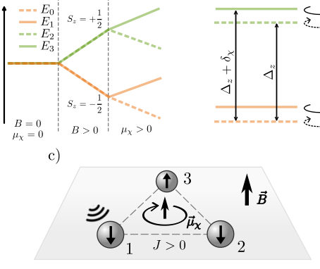 
FIG. 1. Energy levels and physical system. a) Evolution of 4 lowest energy states of Hamiltonian 5. Colors denote spin sectors: orange and green for S = −1

📷 Fig 2

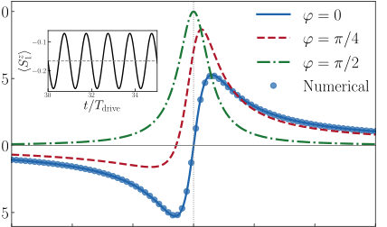 
FIG. 2. Direct chirality resonance via homodyne detection. Main panel: steady-state homodyne signal ∆Ihom as a func- tion of the normalised detuning (¯hω −δχ)/δχ for three values of the phase difference φ (Eq. (13)). Blue dots are the full four-level Lindblad steady-state simulation results, in agree- ment with analytical theory (Eq. (11)). Inset: steady state lo- cal magnetization ⟨Sz 1⟩at resonance (ω = δχ/¯h), in agreement with Eq. (12). Dashed grey line marks the equilibrium value of −1/6. Parameters: B = 1T, µχ = 0.12µB, ¯hΩ= 200 neV, ΩT1,χ = 10 , γϕ,χ = Ω/10, kBT = δχ/4 .

📷 Fig 3

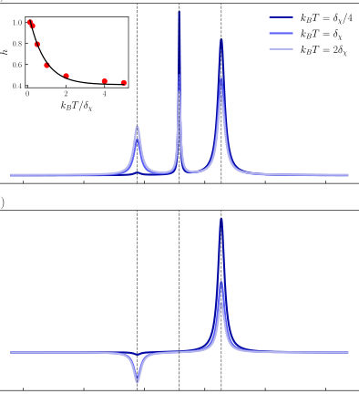 
FIG. 3. Simulation of the ESR-STM resonance. a) ⟨Sz 1⟩(ω) for different temperatures, featuring resonance peaks at ¯hω = ∆z and ¯hω = ∆z ± δχ. The height lowest-energy peak ( ¯hω = ∆z −δχ) is controlled by equilibrium occupation of

📷 Fig 4

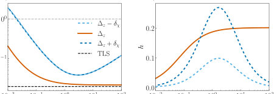 
FIG. 4. Analysis of the resolution in the resonance experi- ment. a) The value of δFWHM normalized to δχ as a function

**Summary.** This paper proposes using local magnetic resonance techniques to directly measure the orbital magnetic moment associated with scalar spin chirality in quantum magnetic systems. By applying a local drive that breaks rotational symmetry, the authors predict distinct spectroscopic signatures—such as peak splittings or homodyne resonance features—that allow for the quantitative determination of this elusive chiral moment.

**Why it may be interesting.** This work bridges fundamental concepts of quantum magnetism (chirality) with advanced experimental techniques (STM, quantum dots), providing a concrete, measurable signature for a subtle quantum property.

Detailed structure

**Main problem.** The paper addresses the challenge of directly measuring the orbital magnetic moment associated with scalar spin chirality (SSC), a property that is difficult to probe experimentally.

**Main result.** Local magnetic resonance, achieved by breaking the system's rotational symmetry with a local drive, provides a spectroscopic route to measure this chiral orbital magnetic moment.

**Method.** The authors propose and simulate two protocols: direct chirality resonance via homodyne detection, and chirality-resolved spin resonance by observing peak splittings in ESR measurements.

**Model / system.** The system is modeled using an antiferromagnetic spin trimer or, more generally, a Hubbard model on a triangular ring subjected to a magnetic flux. The dynamics are governed by the Lindblad master equation.

**Key observables.** The primary observables are the chiral orbital magnetic moment ($\mu_\chi$), the resonance signal $\Delta I_{hom}$ in homodyne detection, and the splitting ($\delta\chi$) of spin resonance peaks.

**Important parameters / regimes.** Key parameters include the coupling strength ($\lambda$), the magnetic field ($B$), and the ratio of relaxation rates ($r = T_{1,\chi}/T_{1,s}$).

**Assumptions / limitations.** The method critically relies on the local drive breaking the $C_3$ rotational symmetry, and simulations assume regimes where $k_B T$ is small compared to energy splittings.

**Figures summary.** Figure 1 shows energy level splitting due to chirality. Figure 2 illustrates the homodyne signal $\Delta I_{hom}$ vs. detuning, showing resonant features. Figure 3 simulates ESR-STM resonance, confirming peaks at $\Delta_z \pm \delta\chi$. Figure 4 analyzes the resolution of the chiral splitting.

**Paper structure.** The paper first establishes the theoretical framework linking SSC to an orbital moment. It then details the two spectroscopic protocols (homodyne detection and spin resonance) using the Lindblad master equation to model the time evolution and measurable signals.

Abstract

Quantum states with finite scalar spin chirality carry an orbital magnetic moment that has so far eluded direct measurement. We show that, whereas uniform electron spin resonance preserves chirality, a local drive breaks the cyclic symmetry and activates chirality-changing transitions, providing direct access to the chiral orbital magnetic moment. Lindblad simulations demonstrate experimentally accessible signatures in platforms with local spin addressability, including electron spin resonance with a scanning tunneling microscope, donor spins in silicon, and quantum-dot spin qubits.

[↑ back to top](#top)

### [Dynamical protection of quantum steering and fidelity dynamics in double Jaynes-Cummings model](http://arxiv.org/abs/2608.17217v1)

**Authors:** Koushik Mandal, Chitra Rangan, Shohini Ghose  
**Type:** theory · **Category:** other · **PDF:** <https://arxiv.org/pdf/2608.17217v1>  
**Analysis basis:** full PDF text, analyzed in chunks
**Topic relevance:** `Tavis-Cummings & cavity-many-emitter` **3/5** · `correlated / nonlocal dissipation` **3/5** · `analog quantum simulation` **2/5** · `driven-dissipative phase transition` **2/5** · `methods for driven-dissipative` **2/5** · `Keldysh / 2PI / non-Gaussian methods` **1/5** · `non-equilibrium universality` **1/5** · `quantum measurements` **1/5**

📷 Fig 1

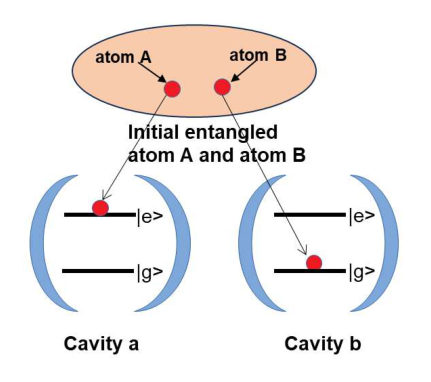 
Figure 1: Schematic representation of the double Jaynes–Cummings model consisting of two spatially separated two-level atoms, each interacting locally with an independent cavity mode.

📷 Fig 2

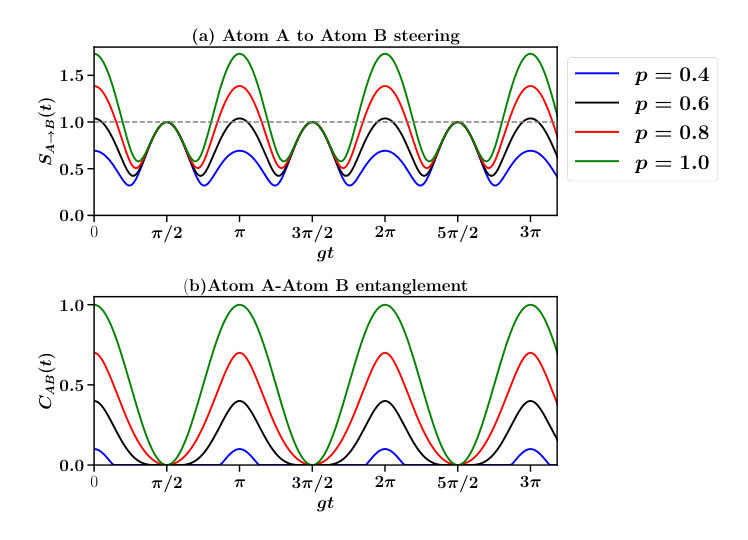 
Figure 2: Dynamics of (a) quantum steering from atom A to atom B and (b) atom–atom entanglement for different values of the visibility parameter p. The chosen values p = 0.4,0.6,0.8, and 1.0 correspond to initial Werner states ranging from mixed entangled states to the maximally entangled Bell state.

📷 Fig 3

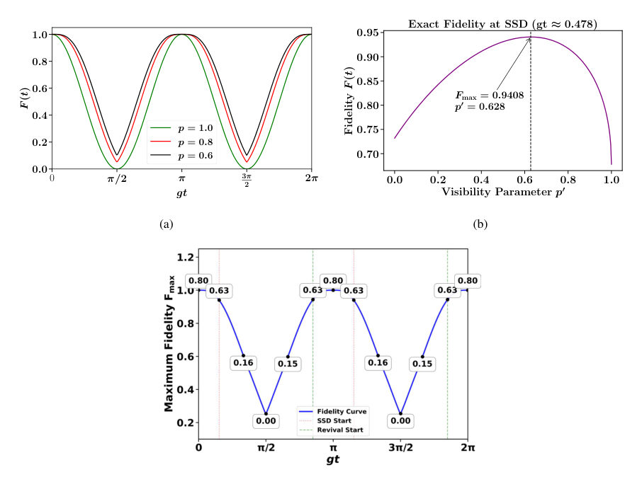 
Figure 3: Panel (a) shows the time evolution of the fidelity for different initial Werner-state parameters p. In panel (b), we plot the fidelity between the evolved atomic state and the entire family of Werner states at the onset of steering sudden death for the initial condition p = 0.8. Panel (c) illustrates how the evolved state overlaps with different Werner states at several time instants for the same initial state. The numbers displayed inside the boxes denote the value of the Werner parameter p′ corresponding to the maximum fidelity.

📷 Fig 4

 
Figure 3(a) illustrates the time evolution of the fidelity F(t) for different initial visibility paramet- ers p. As the atom-cavity interaction progresses, the fidelity between the evolved atomic state and its initial configuration monotonically decreases. This decay signals that the local atom-field coupling is systematically redirecting quantum coherence away from the atomic subsystem and into the cavity modes. Within these specific temporal windows, the remaining atomic correlations drop below a critical threshold where the reduced state admits a local hidden state (LHS) description, thereby precipitating the onset of steering sudden death. Conversely, when the coherence is transferred...

📷 Fig 5

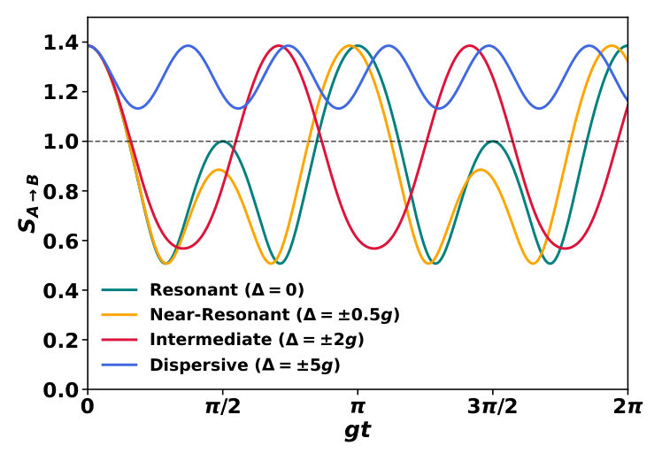 
Figure 4: Dynamics of quantum steering in the presence of atom–cavity detuning for the initial Werner-state parameter p = 0.8. The steering dynamics are shown for different detuning regimes, including the resonant, intermediate, and dispersive regimes. Positive and negative values of detuning (±∆) correspond to blue- and red- detuned atomic transitions for atoms A and B, respectively.

**Summary.** This paper analyzes the fragility of quantum steering in a double Jaynes-Cummings model, which simulates two entangled atoms coupled to optical cavities. The authors demonstrate that while steering can decay abruptly (sudden death), incorporating detuning or dipole-dipole interactions can protect these correlations. Crucially, they show that monitoring the state fidelity provides a reliable, measurable proxy for determining if the quantum system remains steerable.

**Why it may be interesting.** This work is highly relevant to AMO physics and quantum optics as it tackles the robustness of nonclassical correlations (like steering) in realistic, dissipative light-matter platforms, providing actionable metrics for experimental control.

Detailed structure

**Main problem.** The study investigates the dynamics of Einstein-Podolsky-Rosen (EPR) steering in a double Jaynes-Cummings model, focusing on how intrinsic noise affects quantum correlations.

**Main result.** The authors find that detuning and dipole-dipole coupling help mitigate steering sudden death, and they establish that state fidelity serves as a practical, predictive indicator for quantum steerability.

**Method.** The analysis uses theoretical derivations and numerical simulations to track the time evolution of quantum correlations by tracing out cavity degrees of freedom.

**Model / system.** The system is the Double Jaynes-Cummings Model (DJCM), involving two spatially separated two-level atoms interacting with independent cavity modes. The evolution is governed by the Hamiltonian under the rotating-wave approximation.

**Key observables.** EPR Steering ($S_{A	o B}$), Quantum Entanglement (Concurrence), and State Fidelity ($F(t)$).

**Important parameters / regimes.** Initial Werner-type state purity ($p$), atom-cavity detuning ($\Delta$), and dipole-dipole coupling strength.

**Assumptions / limitations.** The analysis often starts with Werner-type initial mixed states and involves tracing out the cavity modes to obtain the reduced atomic density matrix.

**Figures summary.** Figures schematically represent the DJCM setup and illustrate the comparative dynamics of quantum steering and entanglement decay rates for varying initial correlation strengths.

**Paper structure.** The paper systematically analyzes the evolution of quantum correlations, first establishing the model and key diagnostics (Steering, Entanglement, Fidelity). It then explores how environmental noise and interaction terms (like DDI) modify these dynamics, culminating in the identification of fidelity as a key resource indicator.

Abstract

We investigate the dynamics of Einstein-Podolsky-Rosen (EPR) steering in a double Jaynes-Cummings model, where two initially entangled spatially separated two-level atoms in two cavities interact with independent cavity modes. We study how the intrinsic noise in an initial Werner-type state affects the steering dynamics in this type of quantum optical systems. We also analyze the evolution of steering under experimentally relevant conditions, including atom-cavity detuning and dipole-dipole interactions. We find that both detuning and dipole-dipole coupling help reduce steering sudden death in the system. We further identify a direct correlation between steering and state fidelity, revealing a threshold below which steering disappears. This suggests that fidelity can serve as a practical indicator of steerability in cavity QED systems. Our results provide insight into the controllability and robustness of nonclassical correlations in realistic light-matter platforms.

[↑ back to top](#top)

### [Entropy and Frenesy: the arrow and the bustle of time](http://arxiv.org/abs/2608.17586v1)

**Authors:** Christian Maes  
**Type:** theory · **Category:** statistical mechanics · **PDF:** <https://arxiv.org/pdf/2608.17586v1>  
**Analysis basis:** full PDF text, analyzed in chunks
**Topic relevance:** `driven-dissipative phase transition` **3/5** · `non-equilibrium universality` **3/5** · `Keldysh / 2PI / non-Gaussian methods` **2/5** · `methods for driven-dissipative` **2/5** · `Frenkel-Kontorova` **1/5** · `analog quantum simulation` **1/5** · `correlated / nonlocal dissipation` **1/5** · `quantum measurements` **1/5** · `scars & prethermalization` **1/5**

📷 Fig 1

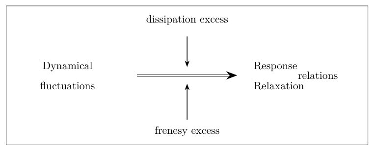 
FIG. 1: Stimuli give rise to dissipation and frenesy excesses. The structure of the dynamical fluctuations

📷 Fig 2

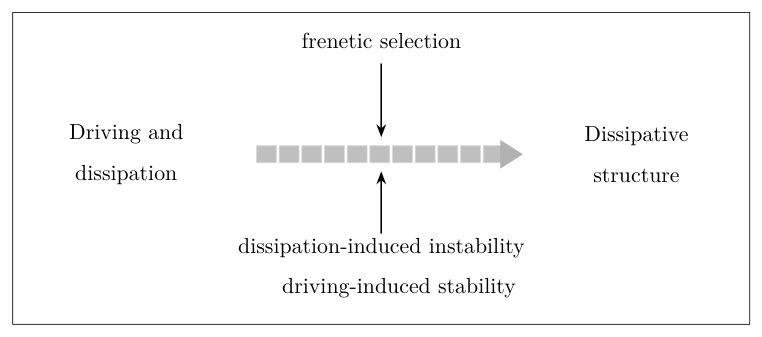 
FIG. 2: Some (even narrow) new dissipation channel can destabilize what was boring behavior, and a

📷 Fig 3

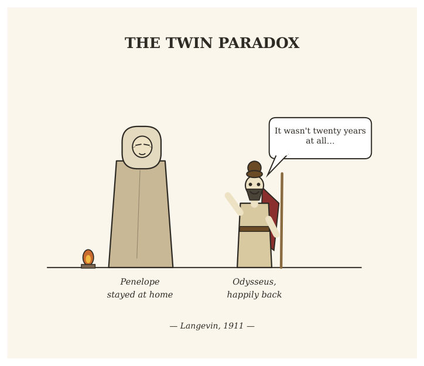 
FIG. 3: The Twin Paradox without twins, mythologically recast as a fast Odysseus reaching home.

📷 Fig 4

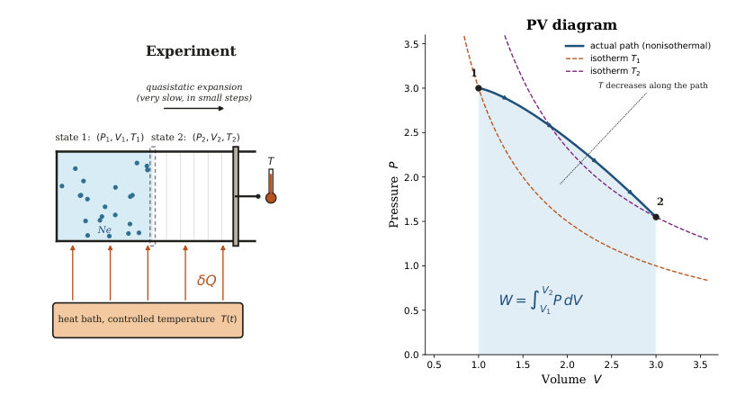 
FIG. 4: Quasistatic expansion of one mole of Neon-gas cooling because the gas does more work expanding

📷 Fig 5

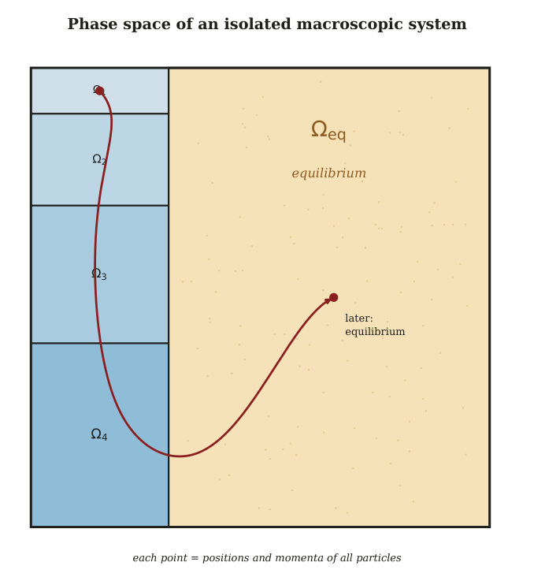 
FIG. 5: Phase space of an isolated macroscopic system, partitioned into macrostates. A single

**Summary.** This paper explores the nature of time in complex physical systems by analyzing non-equilibrium statistical mechanics. It argues that while entropy production defines the arrow of time, a complementary measure called 'frenesy' is needed to account for time-symmetric dynamical activity. Together, these two concepts offer a more complete theoretical framework for understanding physical time across various scales.

**Why it may be interesting.** It provides a conceptual bridge by introducing 'frenesy' to complement the standard entropic approach, which is highly relevant for understanding non-equilibrium dynamics in open quantum systems or active matter.

Detailed structure

**Main problem.** The paper addresses the fundamental mystery of the arrow of time in non-equilibrium statistical mechanics, reconciling time-reversible microscopic laws with macroscopic irreversibility.

**Main result.** A complete understanding of physical time requires considering both entropy production (defining the arrow) and a newly introduced concept, 'frenesy' (measuring time-symmetric dynamical activity).

**Method.** The analysis uses theoretical frameworks from non-equilibrium thermodynamics, stochastic processes, and fluctuation theorems to build a comprehensive picture of time's directionality.

**Model / system.** The scope is general, covering open, driven, or active many-body systems, ranging from simple classical mechanics to complex mesoscopic processes.

**Key observables.** Entropy production (measuring irreversibility), Frenesy (measuring time-symmetric activity), and dynamical fluctuations.

**Important parameters / regimes.** Mesoscopic to macroscopic scales; non-equilibrium driving strength; temperature (implicitly via thermalization).

**Assumptions / limitations.** The primary assumption is that entropy production and frenesy are complementary and both necessary for a full description of physical time.

**Figures summary.** Figure 1 shows that stimuli generate both dissipation and frenesy excesses, underlying response relations. Figure 2 illustrates how dissipation-induced instability and driving-induced stability are mediated by time-symmetric kinetic aspects.

**Paper structure.** The essay is structured to introduce the three core issues of non-equilibrium mechanics: the origin of entropy production (arrow of time), the selection of structure by driving, and the need for a unified theory, weaving in the concept of frenesy throughout.

Abstract

Nonequilibrium statistical mechanics is the science of time as it manifests itself in the transient or steady entropy producing dynamical condition of many-body systems. Beyond the vivid multiformity of the phenomena themselves, three foundational issues lie at its heart. The first question concerns the very origin of entropy production, which gives macroscopic processes their direction and thereby defines the arrow of time: how does an atomistic mechanical world give rise to dissipated heat, thermalization, and time-reversal symmetry breaking? The second asks why, far beyond the familiar behavior of equilibrium systems, driving or agitation may produce and select stable and functionally rich structures: what is it about far-from-equilibrium, low-entropy driving that unleashes the wealth and intricacy of the natural world? The third issue is partly methodological: to determine how, and for which subclass of such wildly diverse nonequilibrium systems, a systematic, unified description and modeling from first principles remains possible. This essay addresses these issues in an informal, semi-popular-science style, offering a personally engaging yet wide-ranging introduction to the complementary roles of entropy production and the less familiar, more recently coined notion of frenesy in the dynamical fluctuations of steadily driven systems. Together, we argue, they provide a more complete starting point for understanding physical time on mesoscopic to macroscopic scales.

[↑ back to top](#top)

### [Dressed magnon dynamics in a Bose-Hubbard bath: retardation, pairing, entanglement and two-magnon scattering](http://arxiv.org/abs/2608.17980v1)

**Authors:** Andrés N. Cáliz, Arnau Riera, Enrique Rico, João Barata, Marcin Płodzień  
**Type:** theory · **Category:** other · **PDF:** <https://arxiv.org/pdf/2608.17980v1>  
**Analysis basis:** full PDF text, analyzed in chunks
**Topic relevance:** `analog quantum simulation` **3/5** · `correlated / nonlocal dissipation` **3/5** · `methods for driven-dissipative` **3/5** · `Keldysh / 2PI / non-Gaussian methods` **2/5** · `driven-dissipative phase transition` **1/5** · `non-equilibrium universality` **1/5** · `quantum measurements` **1/5**

📷 Fig 1

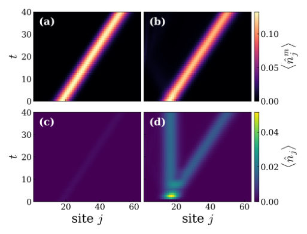 
FIG. 1. Spatial anatomy of single-magnon retardation: com- parison of the Davydov mean field with the many-body dy- namics at matched parameters (ω0 = 2, λz = 0.6, tB = 0, U = 0, k0 = π/2, L = 64). (a,b) Magnon density ⟨ˆnm j ⟩in the mean field (a) and the many-body dynamics (b). The two re- sults are nearly indistinguishable: the mean field captures the dressed transport, while the small residual slowdown reflects the finite bath response time. (c,d) Bath occupation from the coherent cloud |γj|2 (c) and the many-body ⟨ˆnj⟩(d), using a common color scale. The mean-field cloud is substantially fainter than the many-body one: the coherent field carries only the mean-field contribution and...

📷 Fig 2

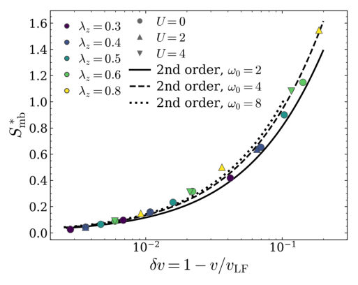 
FIG. 3. Late-time magnon-boson entanglement versus the velocity deficit for a single magnon (k0 = π/2, L = 64). Col- ors denote λz and markers denote U. The deficit is corrected with a λz = 0 packet of identical width; see Appendix H. Dashed curves show second-order perturbation theory results for ω0 = 2, 4, 8. The numerical data include the same three bath frequencies, which are not distinguished by additional marker styles. The curves are evaluated for the simulated wavepacket without fitted parameters. The collapse holds in the weak-dressing, off-resonant regime and deteriorates near ω0 = J and near self-trapping.

📷 Fig 3

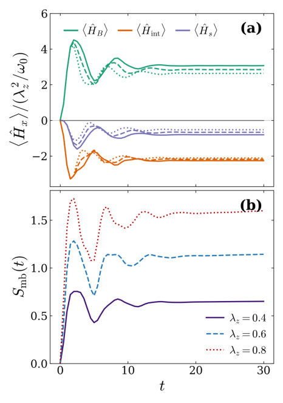 
FIG. 2. Formation of a single-magnon polaron after release with the bath initially in its vacuum (ω0 = 2, k0 = π/2, L = 64) for λz = 0.4, 0.6, 0.8 (solid, dashed, dotted). (a) Bath, interaction, and exchange energies in units of λ2 z/ω0, together with the conserved total energy (gray). (b) Magnon- boson entanglement entropy for the same couplings.

📷 Fig 4

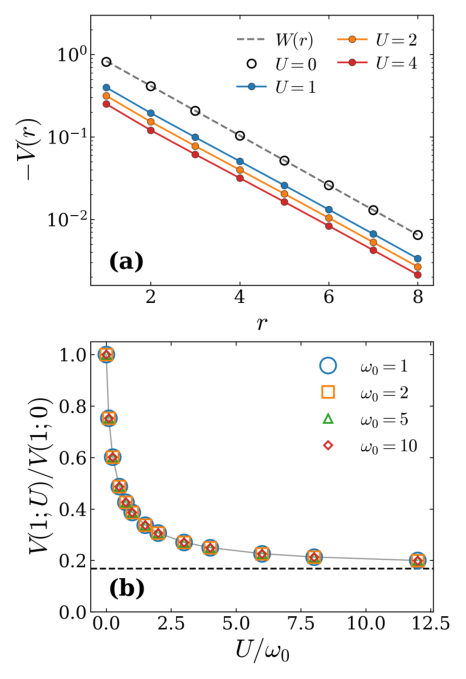 
FIG. 4. Bath-mediated potential in the Born-Oppenheimer limit (J = 0), with λz/ω0 = 0.5 and tB/ω0 = 0.4. (a) Log- arithmic plot of −V (r) at ω0 = 2 for U = 0-4. The open circles at U = 0 reproduce the analytic result W(r) (dashed line); increasing U lowers the approximately parallel profiles. (b) Depth ratio V (1; U)/V (1; 0) as a function of U/ω0 for ω0 = 1-10 (nested open markers). The ratio approaches the finite hard-core limit f∞of Eq. (25) (black dashed line), with f∞≃0.17 for the parameters shown.

📷 Fig 5

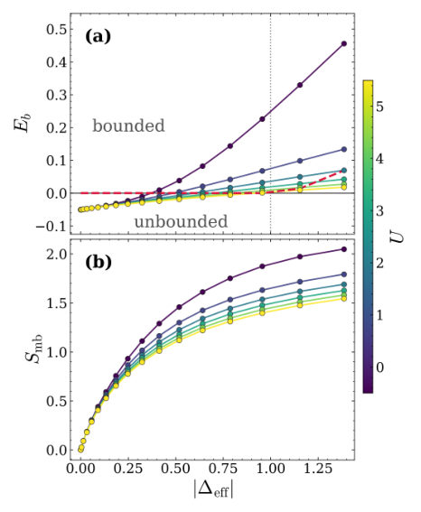 
FIG. 5. Ground-state properties of two magnons coupled to the full quantum bath (ω0 = 3, tB = 1, L = 16). The nominal U = 0 antiadiabatic anisotropy |∆eff| is varied through λz, and colors denote six values of U. (a) Binding energy Eb defined in Eq. (28). The dashed curve is the nearest-neighbor antiadiabatic estimate of Eq. (27), and the dotted vertical line marks |∆eff| = 1. Increasing U reduces Eb and shifts its onset to larger |∆eff|. (b) Magnon-boson entanglement entropy Smb, which increases with dressing and is suppressed by U.

**Summary.** This paper models magnon dynamics in a quantum magnet coupled to a bosonic bath, revealing that the bath dressing causes the magnon to form a polaron. The key finding is that the measurable slowdown of the magnon's velocity quantifies the entanglement between the magnon and the bath, while the bath also mediates an attractive interaction leading to magnon pairing.

**Why it may be interesting.** This work provides a concrete, measurable link (velocity deficit) between transport properties and non-local quantum correlations (entanglement) in a system relevant to quantum magnetism and strongly correlated materials.

Detailed structure

**Main problem.** The study investigates one- and two-magnon dynamics in a spin-1/2 XX chain coupled to a tunable Bose-Hubbard bath, focusing on the interplay between retardation, pairing, and entanglement.

**Main result.** The bath mediates an effective attraction between two magnons, leading to a bound state, while the measurable velocity deficit of a single magnon serves as a proxy for quantifying magnon-boson entanglement.

**Method.** The authors employ a combination of polaron transformations, tensor network simulations (MPS), and Green's function techniques to analyze the coupled dynamics.

**Model / system.** The system consists of a spin-1/2 XX chain coupled to a Bose-Hubbard bath via a density-coupling interaction. The dynamics are analyzed by treating the magnon as a polaron dressed by the bosonic bath.

**Key observables.** Velocity deficit ($\delta v$), magnon-boson entanglement entropy ($S_{mb}$), and the effective two-magnon binding potential ($V(r)$).

**Important parameters / regimes.** Bath deformability (controlled by on-site repulsion $U$), coupling strength ($\lambda$), and the ratio of bath frequency to hopping ($t_B/\omega_0$).

**Assumptions / limitations.** The analysis relies on approximations such as the single-field coherent-state ansatz and the weak-coupling limit for relating $\delta v$ to entanglement.

**Figures summary.** Figures compare coherent-state vs. many-body dynamics, show the time evolution of entanglement entropy during polaron formation, and plot the relationship between late-time entanglement and the velocity deficit.

**Paper structure.** The paper progresses by first analyzing the single-magnon polaron dynamics to establish the velocity deficit as an entanglement proxy, then examining the two-magnon sector to derive the bath-mediated attraction, and finally identifying bath deformability as the universal control parameter.

Abstract

We study one- and two-magnon dynamics in a spin-$1/2$ XX chain coupled to a tunable Bose-Hubbard bath. The XX Hamiltonian transports the magnons, while the bath dresses their motion and mediates an effective attraction. A single magnon forms a mobile polaron whose retarded bosonic cloud reduces its velocity below the static Lang-Firsov prediction and generates magnon-boson entanglement. In the weak-dressing, off-resonant mobile regime, the residual velocity deficit and entanglement are governed by the excitation weight of the cloud, as captured by perturbation theory and tensor network-based real-time simulations. Transport therefore provides a model-calibrated proxy for entanglement without joint-state reconstruction. When two clouds overlap, the bath mediates a finite-range attraction, yielding finite-size evidence for a compact two-magnon bound state and a transient post-scattering signature. On-site bath interactions suppress local boson number fluctuations and stiffen the bath response, reducing entanglement and weakening ground-state binding. Bath deformability thus emerges as a common control parameter for magnon transport, entanglement, and bath-mediated pairing.

[↑ back to top](#top)

### [Flat band and Bulk-Boundary correspondence in a non-Hermitian trimerized lattice model with generic boundary conditions](http://arxiv.org/abs/2608.17428v1)

**Authors:** Supriyo Ghosh, Pijush K. Ghosh, Shreekantha Sil  
**Type:** theory · **Category:** other · **PDF:** <https://arxiv.org/pdf/2608.17428v1>  
**Analysis basis:** full PDF text, analyzed in chunks
**Topic relevance:** `analog quantum simulation` **3/5** · `driven-dissipative phase transition` **3/5** · `correlated / nonlocal dissipation` **2/5** · `methods for driven-dissipative` **2/5** · `non-equilibrium universality` **2/5** · `Keldysh / 2PI / non-Gaussian methods` **1/5**

📷 Fig 1

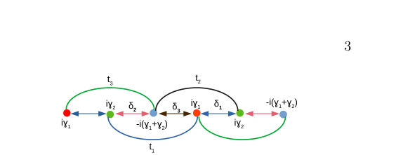 
FIG. 1: Schematic diagram of the trimerized lattice model

📷 Fig 2

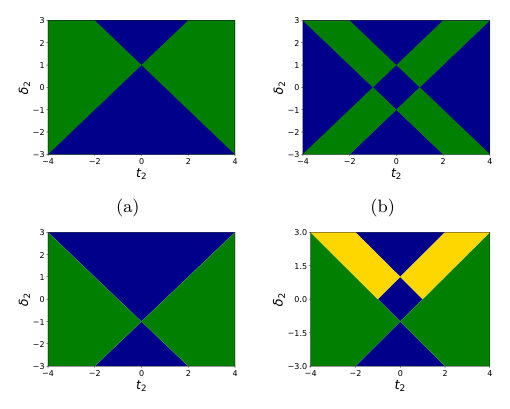 
FIG. 2: Contour plot of Zak phases for γ1 = 0. Blue, green and yellow colors indicates the value of 0, π, 2π respectively. Fig.(a) Zak phase corresponding to lower band, Fig.(b) Zak phase corresponding to middle band, Fig.(c) Zak phase corresponding to upper band, Fig.(d) Sum of Zak phases corresponding to lower and middle band. Parameter values : γ1 = 0, δ3 = t1 = 0, δ1 = t3 = 1, γ2 = 0.3.

📷 Fig 3

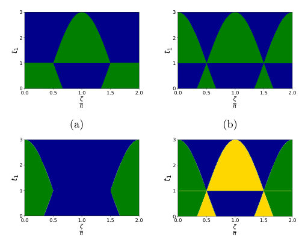 
FIG. 3: Contour plot of the Zak phase for γ2 = 0. Pa- rameter values : δ2 = δ1 = 1,t2 = t1, γ1 = 0.3,γ2 = 0, δ3 = 1 + cos(ζ), t3 = 1 −cos(ζ). Blue, green and yel- low colors indicates the value of 0, π, 2π respectively. Fig.(a) Zak phase corresponding to lower energy band, Fig.(b) Zak phase corresponding to middle energy band, Fig.(c) Zak phase corresponding to upper en- ergy band, Fig.(d) Sum of Zak phases corresponding to lower and middle band

📷 Fig 4

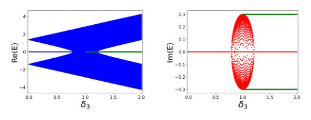 
FIG. 5: Plot of the spectrum under OBC for γ1 = 0. Parameter values : γ1 = 0,γ2 = 0.3, δ2 = t2 = 0, δ1 = t3 = 1, δ3 = t1.

📷 Fig 5

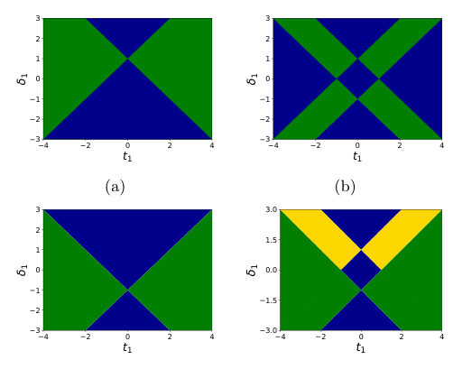 
FIG. 4: Contour plot of Zak phases for γ2 = −γ1. Blue, green and yellow colors indicate the value of 0, π, 2π re- spectively. Fig.(a) Zak phase corresponding to lower band, Fig.(b) Zak phase corresponding to middle band, Fig.(c) Zak phase corresponding to upper band, Fig.(d) Sum of Zak phases corresponding to lower and middle band. Parameter values : γ1 = −γ2 = 0.3, δ3 = t2 = 0, δ2 = t3 = 1.

**Summary.** This paper analyzes a non-Hermitian trimerized lattice model to understand how lattice symmetries and boundary conditions affect topological properties. It establishes the non-Hermitian Bulk-Boundary Correspondence and derives analytical results for edge states under general boundary conditions. The findings are crucial for designing artificial quantum systems with controlled topological edge states.

**Why it may be interesting.** The work bridges concepts from topological physics (SSH models, topology) with non-Hermitian physics (loss/gain, non-Hermiticity), which is highly relevant for understanding open quantum systems and engineered photonic/electronic lattices.

Detailed structure

**Main problem.** The study investigates the combined effects of lattice symmetries, non-Hermiticity, and general boundary conditions on the existence of flat bands and the nature of the Bulk-Boundary Correspondence (BBC).

**Main result.** The authors establish non-Hermitian BBC in the trimerized lattice model and derive analytic expressions for edge states under general boundary conditions, showing how symmetry dictates the presence of localized states.

**Method.** The research employs analytical derivations for spectral properties under periodic and general boundary conditions, alongside numerical simulations to observe edge states and topological phase transitions.

**Model / system.** The model is a Su-Schrieffer-Heeger (SSH)-type trimer model incorporating next-nearest-neighbor (NNN) interactions and balanced loss-gain (BLG) terms, making it non-Hermitian.

**Key observables.** Flat bands (Compact Localized States, CLS), Topological Phase Transitions (TPT) via Zak phases, Bulk-Boundary Correspondence (BBC), and the non-Hermitian Skin Effect (NHSE).

**Important parameters / regimes.** BLG interaction strength, NNN interaction strength, and the specific parameters defining the general boundary conditions (GBC).

**Assumptions / limitations.** The analysis generalizes previous work by extending the formalism to include general boundary conditions (GBC) beyond simple open or periodic boundaries.

**Figures summary.** Not specified in the notes, but the context implies figures showing energy spectra, topological invariants (Zak phases), and edge state localization.

**Paper structure.** The paper systematically analyzes the system under PBC to find conditions for real spectra and derive CLS, then extends the analysis to OBC and finally generalizes the formalism to study the Hamiltonian under arbitrary GBC.

Abstract

We consider a Su-Schrieffer-Heeger(SSH)-type trimer model with next-nearest-neighbor(NNN) interaction and balanced loss-gain(BLG) to study the combined effect of lattice symmetries, topology, non-hermiticity and general boundary conditions(GBC)on the existence of flat band and the nature of Bulk-Boundary correspondence(BBC). We derive the necessary and sufficient conditions for the existence of an entirely real spectrum under the periodic boundary condition(PBC). The exact expressions for the compact localized states(CLS) and energy eigenvalues corresponding to flat bands are derived analytically under the PBC. We establish topological phase transitions(TPT) for PT-symmetry and pseudo-chiral symmetry through the computation of the Zak phase and sub-lattice Zak phase, respectively. The Hamiltonian under the open boundary condition(OBC) is studied numerically, and edge states are observed in the topologically non-trivial phase, thereby establishing the non-hermitian BBC. The CLS exists in both bulk and the boundary for systems having only pseudo-chiral symmetry, and an additional PT-symmetry destroys the CLS at the boundary. We generalize a known formalism to study the same Hamiltonian under GBC, and derive analytic expressions for the energy and eigenstates for a class of boundary conditions in parametric ranges which admit flat band under the PBC. The edge states for these boundary conditions, including the OBC, are obtained analytically in the topologically non-trivial phase, thereby establishing BBC. The non-hermitian skin effect(NHSE) is seen in the model with reciprocal bulk interaction and strongly non-reciprocal boundary terms. The winding number based on spectral topology is computed analytically.

[↑ back to top](#top)

### [Conditional-path Monte Carlo for rare stochastic dynamics on networks: Details and derivations](http://arxiv.org/abs/2608.17511v1)

**Authors:** Thomas Barthel, Jiazheng Sun, Jhao-Hong Peng  
**Type:** theory · **Category:** statistical mechanics · **PDF:** <https://arxiv.org/pdf/2608.17511v1>  
**Analysis basis:** full PDF text, analyzed in chunks
**Topic relevance:** `methods for driven-dissipative` **3/5** · `analog quantum simulation` **2/5** · `quantum measurements` **2/5** · `Keldysh / 2PI / non-Gaussian methods` **1/5** · `driven-dissipative phase transition` **1/5** · `non-equilibrium universality` **1/5** · `scars & prethermalization` **1/5**

📷 Fig 1

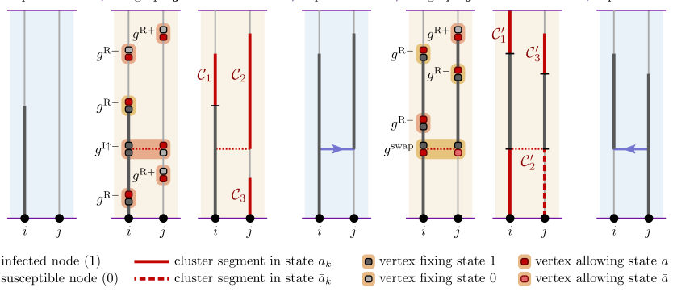 
FIG. 1. Two cluster updates for a simple SIS trajectory. The cluster updates for two nodes of an SIS model described in Example 4 start from a trajectory σ, where node i is infected until time τ, and node j is susceptible for the entire time [0, T]. In the construction of graph g, the recovery of node i is matched by the vertex gR− (τ,i) = (1 →a), where state a is free to take values 0 (susceptible) and 1 (infected). Additional four single-node background vertices and one edge background vertex are inserted by Poisson point processes; indicated by a redder background color. The edge vertex gI↑− (t3,i,j) = (1, 0 →1, a) fixes node i to be infected before and after time t3, hence fixing the...

📷 Fig 2

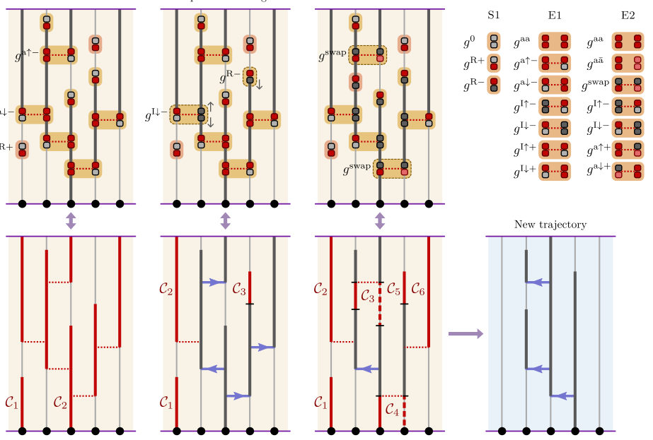 
FIG. 2. Upstream lock avalanches with edge vertex set E1 and unlocking with set E2. For a given SIS-model trajectory σ, panels (a), (b), and (c) show different compatible graphs g (top) and the associated configurations of clusters (bottom). We employ the same graphical conventions as in Fig. 1, and panel (d) specifies the different employed vertex sets in accordance with Sec. V. Panel (a) shows an (unlikely) choice of graph vertices that lead to a big free cluster C2 that includes patient zero (node 3). To achieve a mobile patient zero with vertex sets S1 and E1, the graph must happen to be such that all vertices downstream of patient zero are gR+, ga↑−, or ga↓−as in this case. The...

📷 Fig 3

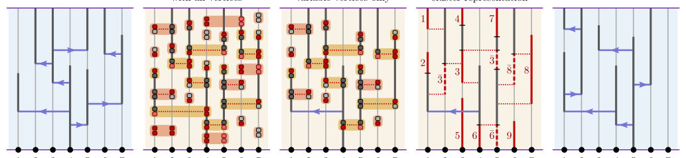 
FIG. 3. Example for a more complex cluster update with edge vertex set E2. (a) An SIS-model trajectory σ on seven nodes with node 4 as patient zero and four infected nodes at the final time. (b) A compatible graph g based on the S1 and E2 vertex sets. As before, vertices at state- changing events in σ are indicated by orange boxes and background vertices are indicated by red boxes. (c) To make the cluster identification easier for the human eye, we have removed all vertices that ultimately have no free state variables and have fixed the corresponding parts of the trajectory. (d) Cluster representation of the graph g, where each red solid time segment with label “k” carries state ak = 0, 1...

📷 Fig 4

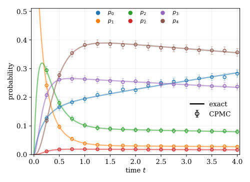 
FIG. 4. Homogeneous four-node SIS ring network with γ = 1 and α = 3: Probabilities pi(t) for finding the system in macrostates si [Eq. (67)] at time t, when starting in one of the four s1 states.

📷 Fig 5

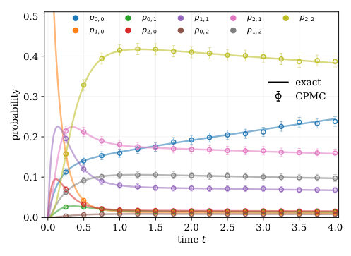 
FIG. 5. Four-node diamond SIS network with two hub nodes and two leaf nodes, γ = 1 and α = 5/2: Probabilities pnh,nℓ(t) for finding the system with (nh, nℓ) infected nodes hub and leaf nodes at time t, when starting in an (nh, nℓ) = (1, 0) state.

**Summary.** This paper presents Conditional-path Monte Carlo (CPMC), a novel simulation technique designed to overcome severe sampling bottlenecks when studying rare events in stochastic network dynamics. By utilizing non-local cluster updates on the full spacetime trajectory, CPMC efficiently samples the path space for models like the SIS epidemic model. It provides the rigorous mathematical framework for this method, including handling complex boundary constraints without rejection.

**Why it may be interesting.** While focused on classical stochastic processes, the techniques developed for path sampling and rare-event simulation are highly relevant to non-equilibrium quantum dynamics, particularly in simulating quantum quenches or thermalization pathways.

Detailed structure

**Main problem.** The paper addresses the challenge of simulating rare macroscopic events in stochastic network dynamics, such as epidemic outbreaks or system escape from metastable states.

**Main result.** It introduces Conditional-path Monte Carlo (CPMC), a method that bypasses limitations of existing path sampling techniques by operating directly on full-system trajectories.

**Method.** CPMC uses non-local Swendsen-Wang-like cluster updates on a graph representation of the spacetime trajectory to generate valid paths while maintaining detailed balance.

**Model / system.** The primary example is the Susceptible-Infected-Susceptible (SIS) model on a network, representing stochastic dynamics in many-body systems. The method is general for Markovian dynamics.

**Key observables.** Path probability density $P(\sigma)$, total escape rate $\Lambda_t(\sigma_t)$, and the number of infected nodes at initial and final times.

**Important parameters / regimes.** The time interval $T$, network size $N$, and specific rates for the SIS model (e.g., infection and recovery rates).

**Assumptions / limitations.** The method assumes the dynamics can be mapped onto a path-graph structure suitable for cluster updates; it also details dynamic programming for handling complex boundary conditions exactly.

**Figures summary.** Figures illustrate the cluster update mechanism for an SIS trajectory, showing how graph vertices are inserted and how changing the state of these vertices yields a new, valid trajectory.

**Paper structure.** The paper first reviews the limitations of standard path sampling methods (SSA, TPS, etc.). It then rigorously derives the mathematical foundations for CPMC, detailing the joint path-graph probability weights. Finally, it applies the framework to the SIS model, detailing cluster optimization and a dynamic programming scheme for constrained sampling.

Abstract

The simulation of rare macroscopic events in stochastic network dynamics, such as widespread epidemic outbreaks, cascading failures in communication networks, or the escape from metastable states in many-body systems, is severely hindered by methodological challenges like catastrophic rejection rates, weight degeneracy, genealogical correlations, and critical slowing down inherent to standard forward-time algorithms, splitting methods, and transition-path sampling. Conditional-path Monte Carlo (CPMC) overcomes these limitations by employing non-local Swendsen-Wang-like cluster updates that operate directly on full-system trajectories. Serving as the technical companion to [Sun, Moody, and Barthel, arXiv:2608.16171], this paper provides the rigorous mathematical foundations and algorithmic details underlying the CPMC framework. We formally define the joint path-graph probability weights and derive the transition and uniformization sum rules that guarantee detailed balance. Applying the framework to susceptible-infectious-susceptible (SIS) models, we systematically construct and optimize single-node and edge graph vertex sets specifically designed to prevent lock avalanches and maintain the structural mobility of the epidemic trunk. Furthermore, we detail a dynamic programming scheme to exactly implement complex boundary conditions - including patient-zero and macroscopic outbreak-size constraints - enabling the rejection-free generation of valid trajectories. Finally, we assess the computational complexity of the algorithm, describe parallelization strategies, and validate CPMC against exact solutions for dynamics on small networks.

[↑ back to top](#top)

### [Engineering of Dual Wavelength, Polarization Selective Metalenses in Silicon Carbide](http://arxiv.org/abs/2608.17506v1)

**Authors:** Xiaoying Huang, Ziwei Yang, Konosuke Shimazaki, Kritsana Saego, Otto Cranwell Schaeper, Evan Williams, Dragomir Neshev, Hark Hoe Tan, Igor Aharonovicha, Mehran Kianinia  
**Type:** experiment · **Category:** quantum information and computing · **PDF:** <https://arxiv.org/pdf/2608.17506v1>  
**Analysis basis:** full PDF text, analyzed in chunks
**Topic relevance:** `QC/QI experiment` **3/5** · `interference shaping light` **3/5** · `quantum optics experiment` **3/5** · `quantum measurements` **1/5**

📷 Fig 1

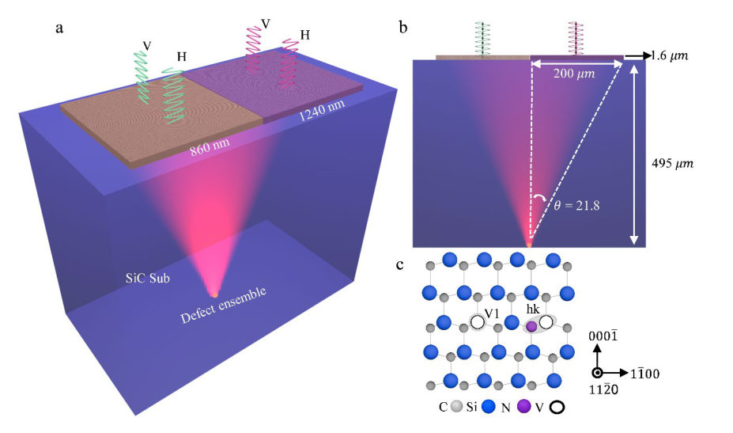 
Figure 1. Design of the monolithically integrated dual-wavelength SiC metalens. (a) A prospective of the monolithic metalens integrated on the top surface of a bulk SiC substrate. The design is to collect the defect ensemble emission from the bottom and realize wavelengths dependent with orthogonal V and H polarized light at 860 nm and 1240 nm, respectively. (b) A side-view of the device. it consists of two adjacent 200 * 200 μm parts designed for 860 nm (left) and 1240 nm (right), respectively. The metalens with a height of 1.6 μm height and a focal length of 495 μm to collect fluorescence from a defect ensemble located on the opposite side of the SiC substrate, corresponding to a...

📷 Fig 2

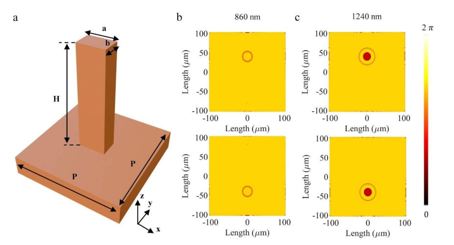 
Figure 2. Metalens simulation. (a)Meta atom parameters used to design the metalens where a and b represent the width and length of the nanopillar and H denotes the height. The lattice period P was chosen based on operating wavelengths of 860 nm or 1240 nm The. (b) Calculated phase distribution for H-polarization (up) and V-polarization (bottom) for 860 nm, respectively. (c) Calculated phase distribution for H-polarization (up) and V-polarization (bottom) for 1240 nm, respectively.

📷 Fig 3

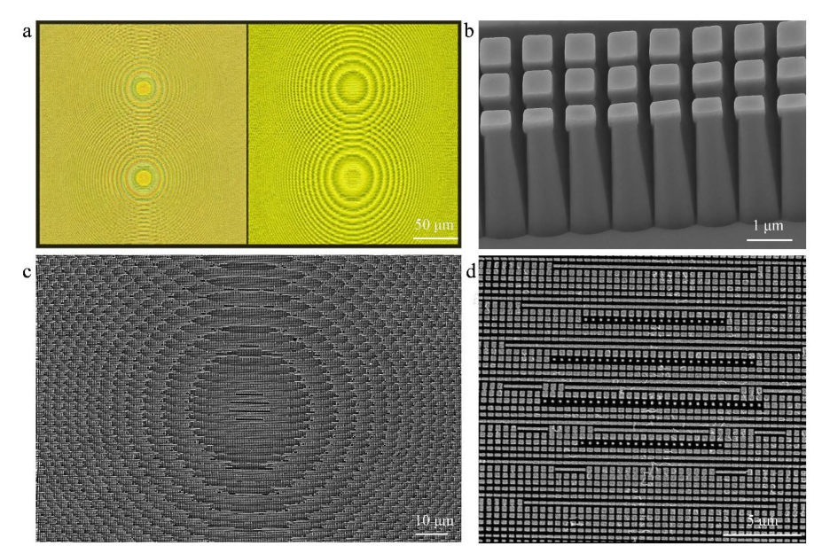 
Figure 3. Metalens fabrication. (a) Optical microscope image of the fabricated monolithic metalens, where the left part is 860 nm and the right part is 1240 nm design, respectively. (b) SEM image of the edge region of the metalens. (c) SEM image of the top area of the 1240 nm section. (d) Zoom-in SEM image of the central region of (c).

📷 Fig 4

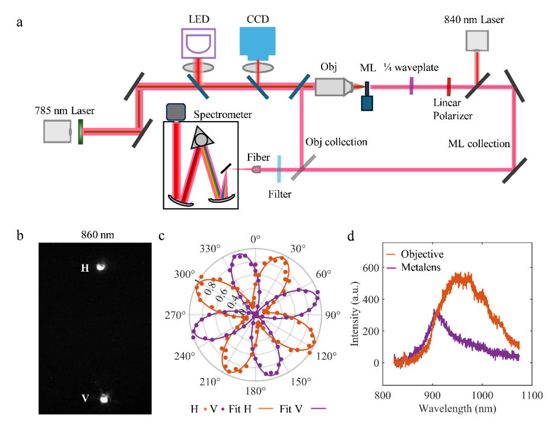 
Figure 4. Characterisation of polarization-selective and efficiency the metalens. (a) Schematics of the set-up. (b) CCD image of the focal plane of the 860 nm design under 840 nm laser illumination, where the up spot represents H-polarized, and bottom spot represents V- polarized. (c) Polarization-resolved intensity of the two focal spots in (b). The scatters are fit to the data showing the two H (orange) and V (purple) polarization states. (d) PL spectra from Vsi in silicon carbide collected through objective (orange) and metalens (purple) at room temperature.

📷 Fig 5

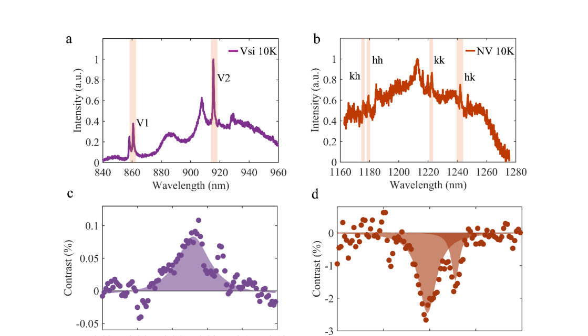 
Figure 5: Spin state readout from the SiC defects through the monolithically integrated metalens. (a) PL spectra collected through the 860 nm design of the metalens under 780 nm laser excitation at 10 K. The orange markers at 861 nm and 917 nm indicate the ZPL of the V1 and V2 silicon-vacancy defects, respectively. (b) PL spectrum collected through the 1240 nm design of the metalens under 980 nm laser excitation at 10 K. The orange markers at 1175.6, 1179.4, 1222.6 and 1242.3 nm indicate the ZPL of the kh, hh, kk, hk nitrogen-vacancy defects, respectively. (c) Room-temperature ODMR spectrum of V1 collected through the metalens. A resonance is observed at ~70 MHz with a contrast of ~0.1%....

**Summary.** This paper reports the design and fabrication of monolithic metalenses on SiC capable of operating at dual wavelengths (860 nm and 1240 nm). These devices overcome light extraction limitations from embedded quantum emitters by engineering the wavefront, enabling polarization-selective collection and simultaneous readout of spin states from VSi and NV centers.

**Why it may be interesting.** This work directly addresses the integration challenge in quantum photonics by providing a scalable, on-chip optical interface that controls both wavelength and polarization, which is crucial for building quantum networks.

Detailed structure

**Main problem.** The primary challenge is efficiently extracting and manipulating the polarization of photons emitted from spin defects (like NV and VSi centers) embedded in Silicon Carbide (SiC) for integrated quantum photonics.

**Main result.** The authors successfully designed and fabricated monolithic metalenses on SiC that simultaneously operate at 860 nm and 1240 nm, enabling polarization-selective collection and demonstration of optically detected magnetic resonance.

**Method.** The research involved designing subwavelength meta-atoms using rigorous simulations (RCWA, FDTD) and fabricating the dual-wavelength metalenses via top-down nanofabrication techniques.

**Model / system.** The physical system is a monolithic metalens fabricated on a bulk SiC substrate, engineered to interact with light emitted from implanted VSi and NV color centers. The design allows independent phase control for orthogonal polarization channels at two distinct near-infrared wavelengths.

**Key observables.** Simultaneous collection efficiency at 860 nm and 1240 nm; polarization separation (H vs. V); successful readout via Optically Detected Magnetic Resonance (ODMR).

**Important parameters / regimes.** Wavelengths: 860 nm and 1240 nm; Meta-atom height: $1.6 \mu	ext{m}$; Collection NA: 0.97.

**Assumptions / limitations.** The design assumes the ability to independently engineer the phase response at two distinct wavelengths using the same SiC material platform.

**Figures summary.** Figures show the design concept, calculated phase distributions for H/V polarizations at both wavelengths, and SEM/optical microscope images confirming the fabrication of the monolithic metalens.

**Paper structure.** The paper progresses from identifying the need for enhanced light extraction from SiC defects to detailing the metalens design via simulation, describing the nanofabrication process, and finally demonstrating the multifunctional capabilities through PL spectroscopy and ODMR measurements.

Abstract

Spin defects in silicon carbide (SiC) are promising candidates for integrated quantum photonics, offering long-lived spin states and near-infrared emission suitable for low-loss photonic integration and fibre-based quantum communication. However, light extraction from these defects remains challenging due the relatively high refractive index of SiC. Metalenses offer a compact approach to enhance light collection by engineering the wavefront directly at the material interface. Here, we design and fabricate monolithic metalenses from SiC bulk material that simultaneously operate at 860 and 1240 nm, matching with emission from the nitrogen vacancy and silicon vacancy colour centers. By independently engineering the phase response at both wavelengths, the metalens enables collection and polarization manipulation of the emitted light. We further employ the metalenses to demonstrate optically detected magnetic resonance of both defects simultaneously. These multifunctional metalenses provide a compact optical interface for scalable integrated SiC photonic devices.

[↑ back to top](#top)

### [Nonlocal Transition Kernel for Efficient Learning of Restricted Boltzmann Machines](http://arxiv.org/abs/2608.17450v1)

**Authors:** Kaiji Sekimoto, Muneki Yasuda  
**Type:** theory · **Category:** disordered systems and neural networks · **PDF:** <https://arxiv.org/pdf/2608.17450v1>  
**Analysis basis:** full PDF text, analyzed in chunks
**Topic relevance:** `analog quantum simulation` **3/5** · `Keldysh / 2PI / non-Gaussian methods` **1/5** · `correlated / nonlocal dissipation` **1/5** · `driven-dissipative phase transition` **1/5** · `methods for driven-dissipative` **1/5** · `non-equilibrium universality` **1/5** · `quantum measurements` **1/5** · `scars & prethermalization` **1/5**

📷 Fig 1

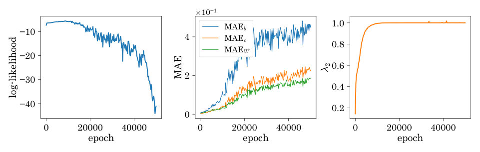 
Figure 2: Log-likelihood, the MAEs, and the second-largest eigenvalue λ2 versus the training epoch for the GenRBM dataset. The results represent averages over 10 experiments.

📷 Fig 2

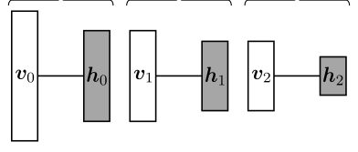 
Figure 3: Illustration of the RBM sequence with L = 2 used in DT. The bottommost RBM corresponds to the training RBM, and the other RBMs are used for sampling.

📷 Fig 3

 
Figure 2 shows three quantities characterizing the learning behavior as functions of the training epoch. As training progressed, the MAEs increased, implying that the parameter gradients were estimated less accurately. This deterioration in gradient estimation, in turn, led to a decrease in the log-likelihood. Moreover, the estimator of λ2 converged to one as the training began to fail. As the relaxation time increased, the sampling became more strongly dependent on the initial states, making it more difficult to sample from the target distribution within a limited number of sampling steps. These results suggest that the resulting degradation in the sampling quality of BGS caused the...

📷 Fig 4

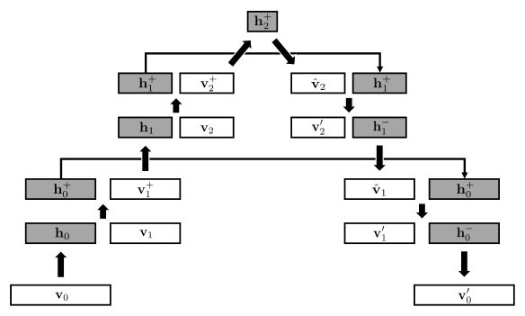 
Figure 4: Illustration of the sampling procedure for the proposed transition kernel on an RBM sequence with L = 2. The upward pass sequentially applies the swap operations from lower to upper RBMs, followed by a one-step BGS transition at the topmost RBM, and the downward pass applies the swap operations in the reverse order of the upward pass.

📷 Fig 5

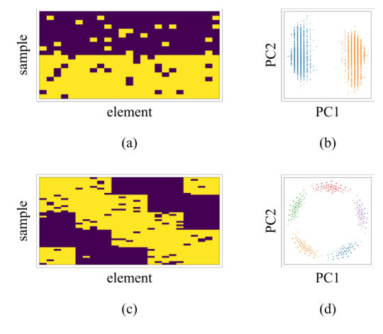 
Figure 5: Visualization of low-rank synthetic datasets with data dimension n = 25: (a) samples and (b) a PCA projection for the islands dataset with a = 0.4, and (c) samples and (d) a PCA projection for the pentagon dataset with κ = 6.

**Summary.** This paper addresses the computational difficulty of training Restricted Boltzmann Machines by proposing a novel nonlocal transition kernel. This kernel improves upon existing methods (BGS and DT) by enabling efficient, single-step nonlocal moves across the model sequence. The result demonstrates superior sampling quality and learning stability, advancing the field of energy-based model learning.

**Why it may be interesting.** While focused on classical ML, the core mathematical tools—analyzing mixing times, spectral gaps ($\lambda_2$), and constructing invariant transition kernels—are directly analogous to analyzing thermalization, mixing, and convergence in quantum many-body systems or quantum state preparation.

Detailed structure

**Main problem.** Learning Restricted Boltzmann Machines (RBMs) is computationally difficult because evaluating the required expectations is generally intractable.

**Main result.** The proposed nonlocal transition kernel achieves higher sampling quality and stability for RBM learning compared to standard methods like BGS and DT.

**Method.** The authors propose a novel transition kernel with a round-trip structure over the RBM sequence used in Deep Tempering (DT).

**Model / system.** The model is the Restricted Boltzmann Machine (RBM), an energy-based latent-variable model defined by a Hamiltonian $E(v, h; 	heta)$. Learning involves approximating expectations over the RBM joint distribution.

**Key observables.** Sampling Quality, Log-likelihood ($\ell(	heta)$), Total Variation (TV) distance, and the second-largest eigenvalue ($\lambda_2$) of the transition matrix.

**Important parameters / regimes.** The number of auxiliary RBMs ($L$) in the tempering sequence, and the number of sampling steps ($s$).

**Assumptions / limitations.** The standard BGS kernel is local, and Deep Tempering (DT) requires multiple steps for nonlocal moves, which the proposed kernel aims to circumvent.

**Figures summary.** Figures illustrate schematic RBM architectures and show comparisons of transition trajectories (BGS, DT, proposed kernel) and the decay of TV distances across different datasets.

**Paper structure.** The paper first establishes the computational challenge of RBM learning using BGS. It then introduces DT and the limitations of local transitions. The core contribution is the derivation and analysis of the proposed nonlocal transition kernel, followed by rigorous comparison against BGS and DT regarding sampling quality and learning stability.

Abstract

Learning restricted Boltzmann machines (RBMs) is computationally challenging because it requires expectations whose exact evaluation is generally intractable. The expectations are typically evaluated using a sampling approximation based on blocked Gibbs sampling (BGS), which is a local Markov chain Monte Carlo transition kernel. However, the locality of BGS can lead to poor sampling quality when the RBM has high energy barriers, thereby degrading learning performance. Deep tempering (DT), which performs parallel tempering over a sequence of learnable RBMs including the training RBM, alleviates this locality issue. However, DT algorithmically requires multiple steps to move through the RBM sequence to achieve a nonlocal transition. In this paper, we propose a transition kernel defined over the RBM sequence used in DT. The proposed kernel has a round-trip structure over the sequence, enabling nonlocal moves within a single transition while leaving the RBM sequence invariant. Numerical experiments show that the proposed kernel performs nonlocal transitions more frequently and achieves higher sampling quality with fewer transitions than BGS and DT. We further verify that learning based on the proposed kernel is more stable and mitigates the training failures observed with BGS- and DT-based learning.

[↑ back to top](#top)

### [Statistically Steady Holographic Quantum Turbulence: Hyperuniform Vortex Matter and Crossover](http://arxiv.org/abs/2608.17012v1)

**Authors:** Yu-Ping An, Peng-Bo Ding, Zhen-Han Jin, Li Li  
**Type:** theory · **Category:** statistical mechanics · **PDF:** <https://arxiv.org/pdf/2608.17012v1>  
**Analysis basis:** full PDF text, analyzed in chunks
**Topic relevance:** `driven-dissipative phase transition` **3/5** · `non-equilibrium universality` **3/5** · `Keldysh / 2PI / non-Gaussian methods` **2/5** · `methods for driven-dissipative` **2/5**

📷 Fig 1

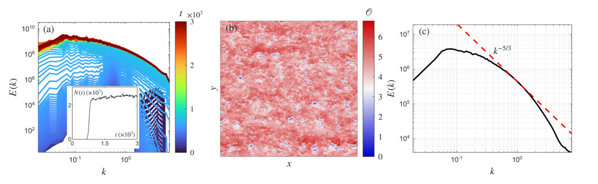 
FIG. 1. Steady-state establishment and kinetic energy spectrum. (a) Time evolution of the kinetic energy spectrum and total vortex number N(t) (inset), showing the system reaches a statistical steady state for t ≳1000 with N ≈2500. (b) Snapshot of the order-parameter magnitude O at t = 3000 over a 500 × 500 domain, revealing a dense, spatially homogeneous vortex ensemble with no macroscopic same-sign clusters. (c) Time-averaged total kinetic energy spectrum E(k) computed from 200 snapshots in the steady-state window t ∈[1000, 3000]. An apparent narrow k−5/3 region appears between the k−1 single-vortex and k−3 core regimes; its physical nature is scrutinized in Figs. 2 and 3 below....

📷 Fig 2

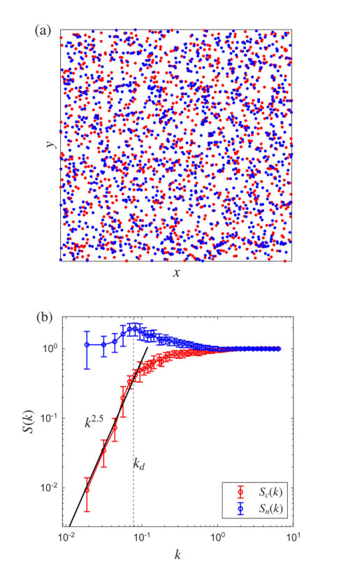 
FIG. 2. Disordered hyperuniformity of the vortex charge distribution. (a) Snapshot of the vortex configuration at t = 3000; red and blue markers denote positive and neg- ative circulation, respectively. (b) Time-averaged structure factors. The number structure factor Sn(k) (blue) does not vanish as k →0, indicating no long-range number order. The charge structure factor Sc(k) (red) exhibits a clear power-law suppression Sc(k) ∝kα with α ≈2.5 as k →0, demonstrat- ing Class I disordered hyperuniformity. The peak in Sn(k) at kd ≃0.08 (vertical line) corresponds to a characteristic cluster spacing d = 2π/kd ≃80. Error bars denote standard deviations across 200 time slices.

📷 Fig 3

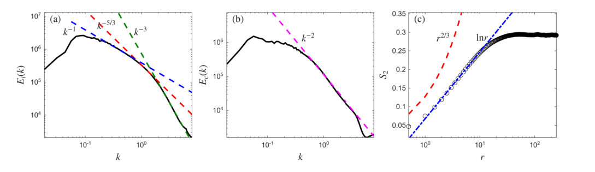 
FIG. 3. Dual-space spectral analysis resolves the scaling controversy. (a) Time-averaged incompressible kinetic energy spectrum Ei(k), showing the k−1 isolated-vortex regime, the narrow k−5/3 crossover, and the k−3 core-scale regime. (b) Time-averaged compressible spectrum Ec(k), which follows a k−2 scaling due to shock-like acoustic waves from vortex–antivortex annihilations. (c) Second-order velocity structure function S2(r). This semi-log plot reveals a robust linear dependence, establishing S2(r) ∝ ln r (blue dashed)—the unique real-space signature of a k−1 spectrum. This constitutes knockout, parameter-free evidence that the apparent k−5/3 feature (corresponding to S2 ∝r2/3) is a...

📷 Fig 4

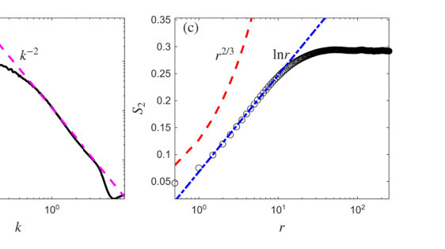 
Figure 3(c) presents the steady-state time-averaged

**Summary.** This work investigates quantum turbulence in a holographic superfluid model, establishing a statistically steady state driven by continuous instability. The key findings are the demonstration of Class I hyperuniformity in the vortex charge distribution and the definitive ruling out of a true Kolmogorov inertial cascade, suggesting energy transport mechanisms fundamentally different from weakly coupled superfluids.

**Why it may be interesting.** It provides a rigorous theoretical framework for understanding energy dissipation and long-range order in strongly coupled, non-equilibrium quantum systems, directly impacting models of superfluids and quantum turbulence.

Detailed structure

**Main problem.** The difficulty in establishing robust statistical steady states in quantum turbulence, which prevents clear identification of universal vortex organization and kinetic scaling laws.

**Main result.** The system exhibits Class I disordered hyperuniformity in its topological charge structure factor, and the apparent Kolmogorov $k^{-5/3}$ scaling is shown to be a narrow crossover, not a true inertial cascade.

**Method.** The authors use holographic superfluid models, driving the system to a steady state via Landau instability, and analyzing both momentum-space (structure factors) and real-space (structure functions) statistics.

**Model / system.** The study analyzes two-dimensional holographic superfluid turbulence, modeled using the holographic Abelian-Higgs model, focusing on the dynamics of quantized vortices in a strongly driven, far-from-equilibrium setting.

**Key observables.** Topological charge structure factor $S_c(k)$, kinetic energy spectrum $E(k)$, and real-space second-order structure function $S_2(r)$.

**Important parameters / regimes.** The analysis focuses on the steady state achieved by continuous Landau-instability driving, contrasting with transient decay regimes.

**Assumptions / limitations.** The analysis relies on the holographic duality framework to handle strong coupling effects in the quantum fluid.

**Figures summary.** Figures illustrate the time evolution towards a steady state, the power-law decay of $S_c(k)$ indicating hyperuniformity, and the structure function $S_2(r)$ confirming $\ln r$ scaling over $r^{2/3}$ scaling.

**Paper structure.** The paper establishes the steady state, characterizes the topological order via $S_c(k)$ (hyperuniformity), and then uses $S_2(r)$ and $E(k)$ to resolve the scaling controversy by showing the $k^{-5/3}$ feature is a crossover.

Abstract

A long-standing obstacle in quantum turbulence has been the difficulty of sustaining robust statistical steady states, preventing unambiguous identification of universal vortex organization and kinetic scaling. We construct such a steady state in two-dimensional holographic superfluid turbulence by continuous Landau-instability driving, sustaining ${\sim}2500$ vortices free from transient artifacts. The topological charge structure factor $S_c(k)$ reveals Class I disordered hyperuniformity with $S_c(k)\propto k^{α>1}$ as $k\to0$, where $k$ is the wavenumber. This constitutes the strongest long-range order of its kind and its first observation in a strongly driven, far-from-equilibrium quantum fluid with topological defects as the organizing principle, establishing a novel non-equilibrium vortex phase. Exploiting this platform, we resolve the scaling controversy: the apparent $k^{-5/3}$ signature in the kinetic energy spectrum is a narrow crossover between the $k^{-1}$ single-vortex and $k^{-3}$ core regimes, not a genuine Kolmogorov inertial range. The real-space second-order structure function provides decisive evidence via $S_2(r)\propto \ln r$ where $r$ is the spatial separation, with no $r^{2/3}$ Kolmogorov scaling, ruling out a true inertial cascade. These findings reveal that strongly coupled quantum turbulence lacks an inverse cascade due to the absence of macroscopic Onsager clusters, demonstrating energy transport fundamentally distinct from weakly coupled superfluids.

[↑ back to top](#top)

### [From the universal Lindblad equation to Boltzmann equations: in-QGP quarkonium dynamics](http://arxiv.org/abs/2608.17372v1)

**Authors:** Aoumeur Daddi Hammou, Pol Bernard Gossiaux  
**Type:** theory · **Category:** statistical mechanics · **PDF:** <https://arxiv.org/pdf/2608.17372v1>  
**Analysis basis:** full PDF text, analyzed in chunks
**Topic relevance:** `methods for driven-dissipative` **3/5** · `Keldysh / 2PI / non-Gaussian methods` **2/5** · `correlated / nonlocal dissipation` **1/5** · `driven-dissipative phase transition` **1/5** · `non-equilibrium universality` **1/5** · `quantum measurements` **1/5**

📷 Fig 1

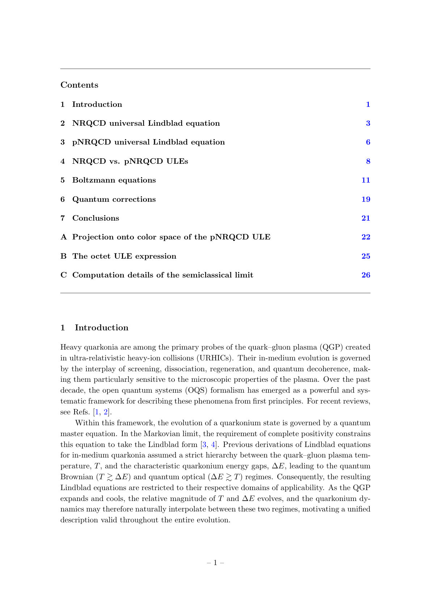 
Low-resolution page preview, page 2

📷 Fig 2

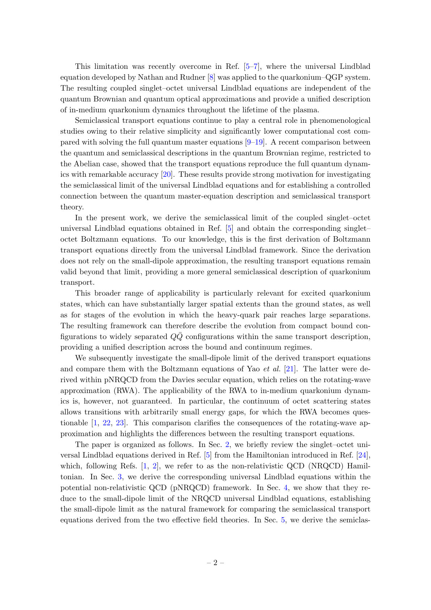 
Low-resolution page preview, page 3

📷 Fig 3

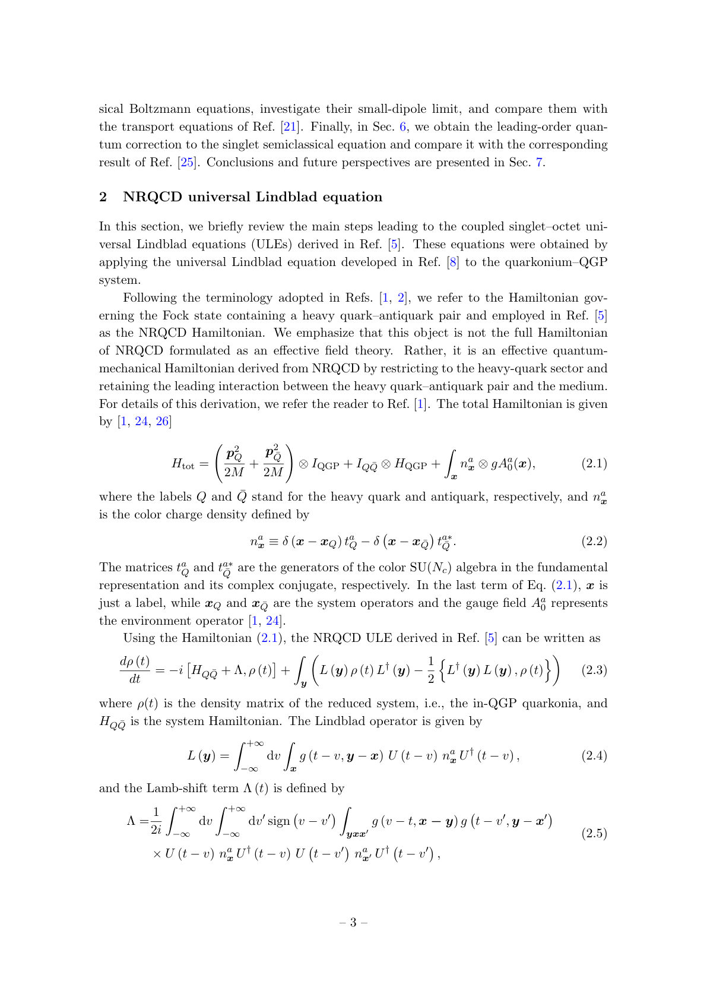 
Low-resolution page preview, page 4

📷 Fig 4

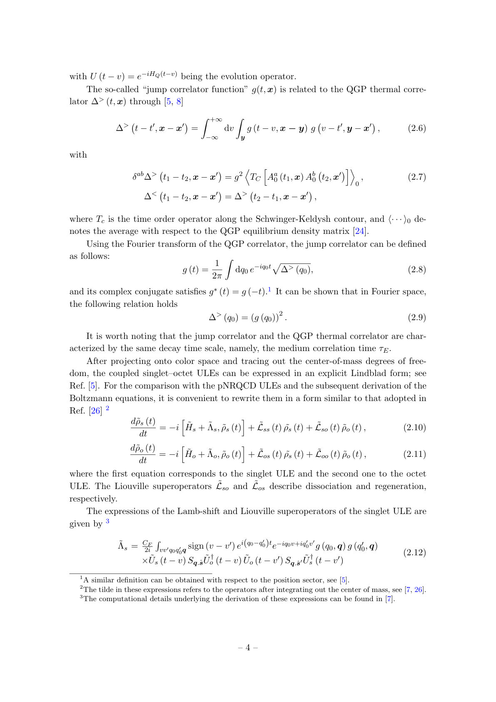 
Low-resolution page preview, page 5

📷 Fig 5

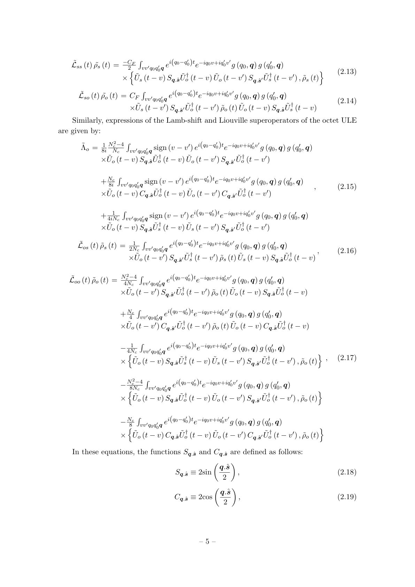 
Low-resolution page preview, page 6

**Summary.** This work provides a rigorous derivation connecting the quantum description of quarkonium in the QGP, governed by Lindblad equations, to the semiclassical Boltzmann transport equations. By systematically taking the semiclassical limit, the authors establish a more general theoretical foundation for describing heavy-quark pair evolution in the plasma. This advancement is significant because it provides transport equations valid beyond previous small-dipole approximations.

**Why it may be interesting.** The systematic derivation of transport equations from a full quantum master equation formalism is highly relevant for understanding non-equilibrium dynamics in strongly coupled quantum systems, bridging quantum optics/open systems theory with kinetic theory.

Detailed structure

**Main problem.** The paper aims to develop a unified theoretical framework connecting the quantum master equation description of quarkonium dynamics in the QGP to the semiclassical Boltzmann transport equations.

**Main result.** The authors successfully derive the Boltzmann transport equations directly from the universal Lindblad framework, establishing a more general and systematic foundation for semiclassical transport beyond the small-dipole approximation.

**Method.** The core method involves deriving the universal Lindblad equations (ULEs) within pNRQCD and then systematically taking the semiclassical limit of these ULEs to obtain the corresponding Boltzmann equations.

**Model / system.** The system is quarkonium ($	ext{Q}ar{	ext{Q}}$) evolving in the Quark-Gluon Plasma (QGP). The dynamics are modeled using coupled singlet-octet Universal Lindblad Equations (ULEs) derived from Non-Relativistic QCD (NRQCD) effective field theory.

**Key observables.** The evolution of the density matrix ($
ho(t)$), the singlet ($
ho_s$) and octet ($
ho_o$) components, and the resulting transport coefficients.

**Important parameters / regimes.** The theory is applicable across regimes, from quantum Brownian to quantum optical, and is shown to be valid beyond the small-dipole approximation.

**Assumptions / limitations.** The derivation involves taking the semiclassical limit and making approximations (like neglecting recoil energy in some steps) to transition from the quantum master equation to the classical transport equation.

**Figures summary.** The notes do not provide a summary of figures, but the text details the mathematical derivation steps connecting ULEs to Boltzmann equations.

**Paper structure.** The paper progresses by first establishing the ULEs in pNRQCD, comparing them to NRQCD results in the small-dipole limit, and finally deriving the semiclassical limit to obtain the coupled singlet-octet Boltzmann equations, highlighting quantum corrections.

Abstract

Recently, a set of coupled singlet-octet universal Lindblad equations (ULEs) was derived within the framework of non-relativistic QCD (NRQCD) to describe quarkonium dynamics in the quark-gluon plasma (QGP). These equations provide a unified quantum description spanning the quantum Brownian and quantum optical regimes. In this work, we further develop this framework and establish its connection with semiclassical transport. We first derive the universal Lindblad equations within the potential non-relativistic QCD (pNRQCD) effective field theory and show that they coincide with the small-dipole limit of the NRQCD ULEs. We then derive the semiclassical limit of the NRQCD ULEs, obtaining a set of coupled singlet-octet Boltzmann equations. To our knowledge, this is the first derivation of Boltzmann transport equations directly from the universal Lindblad framework. The resulting equations are valid beyond the small-dipole approximation, allowing the evolution of heavy-quark pairs from compact to widely separated configurations. Taking their small-dipole limit allows a direct comparison with the Boltzmann equations of Yao et al. [Phys. Rev. D 99, 096028 (2019)], which were derived within pNRQCD from the Davies secular equation, relying on the rotating-wave approximation (RWA). While the singlet equations are found to be in near-complete agreement, the octet equation contains an additional collision term describing transitions within the continuum of octet scattering states, which is absent from the RWA-based derivation. Finally, we derive the leading quantum correction to the singlet Boltzmann equation. Our results establish a more general and systematic theoretical foundation for the semiclassical transport description of quarkonium in the QGP.

[↑ back to top](#top)

### [Lie-Algebraic Classical Simulation of Bosonic Systems Beyond Gaussian Dynamics](http://arxiv.org/abs/2608.17094v1)

**Authors:** Adelina Bärligea, Timothy Heightman, Jakob S. Kottmann, Antonio Acín  
**Type:** theory · **Category:** numerical methods · **PDF:** <https://arxiv.org/pdf/2608.17094v1>  
**Analysis basis:** full PDF text, analyzed in chunks
**Topic relevance:** `Keldysh / 2PI / non-Gaussian methods` **3/5** · `analog quantum simulation` **3/5** · `methods for driven-dissipative` **3/5**

📷 Fig 1

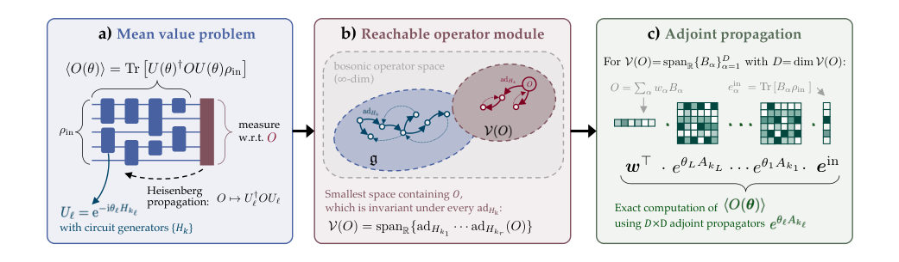 
FIG. 1. Reachable-operator-module simulation workflow. (a) For a circuit U(θ) = UL · · · U1 with layers Uℓ= e−iθℓHkℓas in Eq. (1), the mean-value problem is evaluated by propagating the target observable backwards through the circuit in the Heisenberg picture, as in Eq. (2). (b) The Hermitian DLA g is generated from the Hamiltonians by repeated applications of adH(A) = i[H, A] (see Eqs. (3) and (4)), whereas the reachable operator module V(O) is seeded by the observable and is the smallest real operator space containing O that is invariant under every generator action (see Definition 1). The overlap between g and V(O) is schematic: there is no general inclusion relation between them, and...

📷 Fig 2

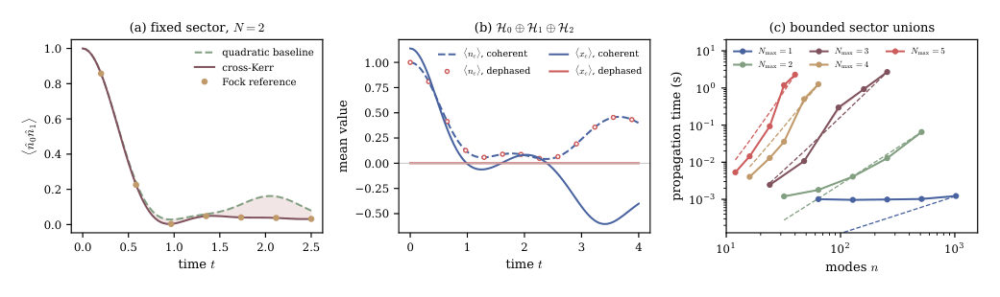 
FIG. 2. Exact dynamics on bounded sector unions. (a) Two-photon correlator under a quadratic Hamiltonian and the same Hamiltonian after adding cross-Kerr interactions; markers are independent truncated-Fock calculations for the interacting dynamics. (b) A coherent superposition across N = 0, 1, 2 and its sector-dephased counterpart give identical number readouts but different quadrature readouts. (c) Median sparse-propagation time, with interquartile ranges over seven repetitions after warm-up, for states in H≤Nmax with Nmax = 1, . . . , 5. The sector union Hilbert space has exact dimension n+Nmax Nmax  . Dashed curves show this exact finite-n dependence, normalized at the largest mode...

📷 Fig 3

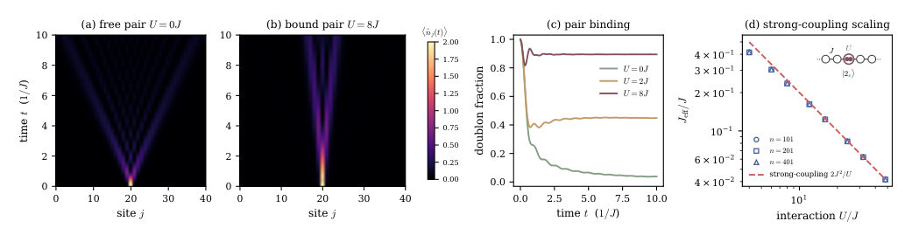 
FIG. 3. Repulsively bound photon pairs in the two-photon Bose–Hubbard chain. (a,b) Local density ⟨ˆnj(t)⟩after initializing both photons at the central site of an open n = 41 chain, shown for U = 0J and U = 8J on a shared color scale. (c) Doublon fraction, equal to the probability that both photons occupy the same site, for U/J = 0, 2, 8. (d) Effective doublon hopping Jeff = W/4, extracted from the width W of the isolated repulsive bound band on periodic chains with n = 101, 201, 401. The dashed line shows the strong-coupling prediction 2J2/U [87]. A log–log fit for n = 401 over U/J ≥8 gives the exponent −0.9711 ± 0.0068; at U/J = 48, UJeff/J2 = 1.9965. The inset sketches the local hopping...

📷 Fig 4

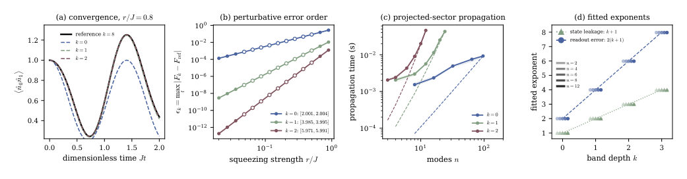 
FIG. 4. Controlled photon-sector leakage under squeezing. (a) Convergence of the number-conserving correlator ⟨ˆn0ˆn1⟩with band depth k for n = 2, U/J = 2, and r/J = 0.8. The k = 8 reference agrees with the next band within 1.48 × 10−14. (b) Maximum readout error versus squeezing strength; open markers indicate the points included in the power-law fits. (c) Median propagation times and interquartile ranges over seven repetitions. Dashed curves show the exact retained-sector dimensions dk(n), normalized at the largest mode count for each k; their asymptotic degrees are 2 + 2k. (d) Fitted exponents for the leakage norm (triangles) and number-conserving readout error (circles), compared with...

📷 Fig 5

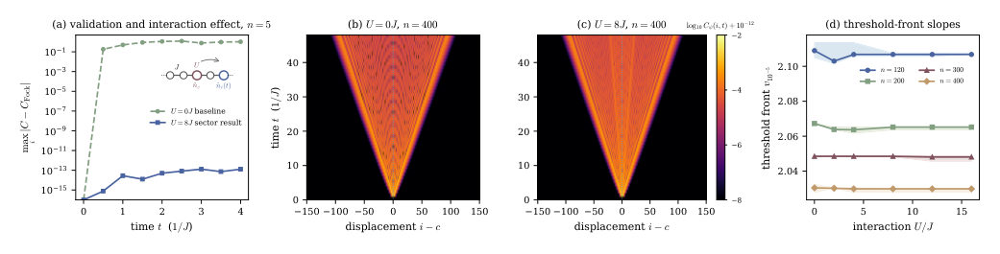 
FIG. 5. State-dependent operator spreading in the two-photon Bose–Hubbard chain. Time is measured in units of 1/J. (a) Maximum sitewise deviation from an independent truncated-Fock calculation at n = 5 and U = 8J. The interacting fixed-sector result agrees to numerical precision, whereas the U = 0J noninteracting quadratic baseline shows the effect of omitting the interaction. The inset sketches the hopping J, onsite interaction U, and operators ˆnc and ˆni(t) entering the commutator. (b,c) log10[Cψ(i, t) + 10−12] for n = 400 at U = 0J and U = 8J, respectively, with the central site c marked by the dotted line and a shared color scale. (d) Fitted velocity of the Cψ = 10−5 threshold front...

**Summary.** This paper extends Lie-algebraic simulation techniques to bosonic systems, overcoming previous limitations that restricted the method to Gaussian dynamics. By focusing on the finite-dimensional subspace spanned by observables (the reachable module), the authors prove that many non-Gaussian bosonic dynamics can be simulated exactly in polynomial time. This provides a general tool for classifying and approximating tractable quantum dynamics in photonics and condensed matter systems.

**Why it may be interesting.** This work provides a powerful, systematic theoretical framework for determining the classical simulability boundary for complex, non-Gaussian bosonic quantum dynamics, which is crucial for quantum optics and quantum simulation.

Detailed structure

**Main problem.** The paper addresses the challenge of developing an exact, polynomial-time classical simulation method for bosonic quantum systems that goes beyond the limitations of standard Gaussian dynamics.

**Main result.** The authors establish a unified formalism showing that exact simulation is possible for many non-Gaussian bosonic dynamics by restricting the computation to the finite-dimensional, observable-seeded reachable operator module.

**Method.** The core method involves leveraging Lie-algebraic simulation by propagating observables through the invariant operator space defined by the system's generators, rather than simulating the full state evolution.

**Model / system.** The focus is on bosonic systems (e.g., photons, phonons) described by infinite-dimensional Fock spaces, extending applicability to interacting non-Gaussian Hamiltonians like Kerr and pair-hopping terms.

**Key observables.** Expectation values, fixed-order correlation functions (including multi-time and OTOCs), and parameter gradients are shown to be efficiently computable.

**Important parameters / regimes.** The key parameter is the polynomial dimension of the observable's reachable operator module, which dictates the tractability of the simulation.

**Assumptions / limitations.** The method assumes that the relevant observable module has a finite, polynomial dimension, allowing the infinite-dimensional dynamics to be contracted into a finite matrix representation.

**Figures summary.** The notes describe a workflow illustrating the observable-seeded construction of the reachable operator module, showing how mean values are propagated backwards and how the adjoint action generates the invariant module.

**Paper structure.** The paper first identifies the failure of conventional Lie-algebraic methods for bosons, then introduces the observable-seeded reachable module, and finally demonstrates its applicability across three regimes: quadratic dynamics, U(1) symmetry sectors, and nilpotent phase families.

Abstract

Classical simulability is ultimately determined by both the dynamics of a quantum system and the observables being evaluated. Lie-algebraic simulation exploits the latter to make exact polynomial-time classical simulations by propagating observables through low-dimensional invariant operator spaces. However, its conventional formulation in terms of polynomial-dimensional dynamical Lie algebras does not directly accommodate bosonic systems as their algebras are neither compact nor semisimple. In this contribution, we overcome this limitation, making bosonic systems accessible to the Lie-algebraic programme of exact polynomial-time classical simulation. We prove that expectation values, fixed-order correlation functions, including multi-time correlators and out-of-time-ordered correlators, and gradients are efficiently computable whenever their operator modules have polynomial dimension. This recovers Gaussian quantum optics and extends it to non-Gaussian input states, while identifying exact polynomial regimes of interacting non-Gaussian dynamics including bounded-photon Kerr and pair-hopping Hamiltonians and nilpotent polynomial phase dynamics. We show that unlike in the finite-dimensional spin and fermionic setting treated previously, a finite-dimensional bosonic generator algebra alone does not guarantee finite observable dynamics. We further derive a controlled perturbative hierarchy for squeezing beyond exact sector confinement and confirm the predicted error orders numerically. We also evaluate operator spreading on interacting chains of up to $400$ modes and connect a topological doublon band with flux-reversed edge motion. These results provide a unified formalism for classifying, discovering, and systematically approximating tractable bosonic quantum dynamics with classical polynomial-time simulation.

[↑ back to top](#top)

### [Many-Anyon Braiding in Non-Abelian Fractional Quantum Hall Effect with Hybrid Monte Carlo Simulation](http://arxiv.org/abs/2608.17424v1)

**Authors:** Ting-Tung Wang, Ha Quang Trung, Qianhui Xu, Min Long, Bo Yang, Zi Yang Meng  
**Type:** theory · **Category:** strongly correlated electrons · **PDF:** <https://arxiv.org/pdf/2608.17424v1>  
**Analysis basis:** full PDF text, analyzed in chunks
**Topic relevance:** `analog quantum simulation` **3/5** · `methods for driven-dissipative` **3/5** · `Full counting statistics` **1/5** · `Keldysh / 2PI / non-Gaussian methods` **1/5** · `quantum measurements` **1/5**

📷 Fig 1

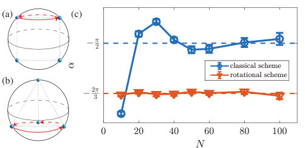 
FIG. 1. Improved convergence of the rotational braid- ing scheme. Schematics of (a) the classical and (b) the ro- tational braiding schemes. The blue dots mark the quasihole positions, while the red arrows indicate their braiding trajec- tories. (c) Finite-size dependence of the relative eigenvalue phase α for the classical scheme (blue circles) and rotational scheme (orange triangles). The horizontal dashed lines de- note the corresponding theoretical predictions, α = −π/2 and α = −2π/3, respectively.

📷 Fig 2

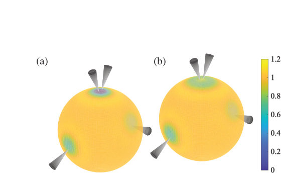 
FIG. 2. Fusion channel selection. The electron density on the sphere for the MR state with 60 electrons and 4 quasi- holes, 2 at the north pole and the other 2 located at the same latitude. The quasiholes at the north pole fuse and form a (a) 1-anyon or (b) ψ-anyon.

📷 Fig 3

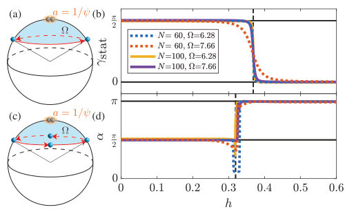 
FIG. 3. Numerical results for many-anyon braiding in the Moore–Read state. Panels (a) and (b) show the four- quasihole geometry and the resulting statistical Berry phase γstat, respectively. Panels (c) and (d) show the corresponding six-quasihole geometry and the relative eigenvalue phase α of the non-Abelian braiding matrix. The horizontal lines are the theoretical prediction in the two limits shown in Eqs. (3) and (4). In both geometries, two quasiholes are fused at the north pole, while the remaining quasiholes are braided in the presence of pinning potentials of strength h. They share the same legend in panel (b).

**Summary.** This work uses advanced numerical simulations to study non-Abelian braiding in the Fractional Quantum Hall Effect using the Moore-Read model. By comparing different braiding paths and incorporating external potentials, the authors show that rotational braiding is robust against finite-size errors. Crucially, they demonstrate that the braiding statistics can be actively controlled by tuning the balance between electron-electron interactions and local trapping fields.

**Why it may be interesting.** The demonstration of how external potentials can tune the fusion channel, thereby controlling the non-Abelian braiding statistics, provides a concrete theoretical pathway for engineering topological quantum states in solid-state systems.

Detailed structure

**Main problem.** To compute and analyze the many-anyon non-Abelian braiding matrices associated with different braiding schemes of Moore-Read quasiholes, accounting for finite-size effects and external interactions.

**Main result.** The rotational braiding scheme is shown to be significantly more robust against finite-size effects than classical braiding, and the braiding statistics can be controlled by tuning the competition between electron-electron interactions and local trapping potentials.

**Method.** The Hybrid Monte Carlo (HMC) method is employed to efficiently compute the braiding matrices by projecting the Hamiltonian onto the quasihole manifold and analyzing the adiabatic evolution operator.

**Model / system.** The study models the Non-Abelian Fractional Quantum Hall Effect using the Moore-Read (MR) state for quasiholes. The Hamiltonian includes terms for the MR state, Coulomb interaction, and local electrostatic trapping potentials.

**Key observables.** Non-Abelian braiding matrices, the relative eigenvalue phase ($\alpha = \lambda_1 / \lambda_2$), and the statistical Berry phase ($\gamma_{	ext{stat}}$).

**Important parameters / regimes.** The strength of the local pinning potential ($h$), the number of quasiholes ($2n=4, 6$), and the separation distance of the anyons.

**Assumptions / limitations.** The model wavefunctions are not exact eigenstates of realistic Hamiltonians, and the analysis relies on the assumption that the system remains adiabatically connected to the model Hamiltonian.

**Figures summary.** Figures compare the finite-size dependence of the relative eigenvalue phase ($\alpha$) for classical versus rotational braiding schemes, showing the superior convergence of the rotational scheme. Other figures illustrate how the fusion channel selection dictates the braiding statistics.

**Paper structure.** The paper systematically compares different braiding protocols (classical vs. rotational) and investigates the influence of external potentials (trapping) on the resulting braiding matrices. It details the mathematical framework using the evolution operator and the key observable $\alpha$.

Abstract

We employ the hybrid Monte Carlo method to efficiently compute the many-anyon non-Abelian braiding matrices associated with different braiding schemes of the Moore-Read quasiholes. A novel proposal in this work is that anyon braiding schemes based on a global rotation are robust against finite-size effects, as demonstrated by benchmarking their errors in the braiding matrix against those of a simple two-anyon exchange. Moreover, we investigate how electron-electron interactions and local electrostatic trapping potentials influence the energetic preference of different fusion channels. Their effect on the non-Abelian braiding matrices has been verified, a surprising phenomenon that demonstrates long-range entanglement of non-Abelian states. Our results are relevant to the experimental realization of non-Abelian physics in fractional quantum Hall and other analogous systems, including the fast-growing field of fractional quantum anomalous Hall states in moiré materials.

[↑ back to top](#top)

### [Spontaneous symmetry-breaking in equilibrium tree-packing configurations of a kinetically constrained cubic-lattice system](http://arxiv.org/abs/2608.17308v1)

**Authors:** Hai-Jun Zhou  
**Type:** theory · **Category:** statistical mechanics · **PDF:** <https://arxiv.org/pdf/2608.17308v1>  
**Analysis basis:** full PDF text, analyzed in chunks
**Topic relevance:** `scars & prethermalization` **3/5** · `analog quantum simulation` **2/5** · `Frenkel-Kontorova` **1/5** · `driven-dissipative phase transition` **1/5** · `methods for driven-dissipative` **1/5** · `non-equilibrium universality` **1/5**

📷 Fig 1

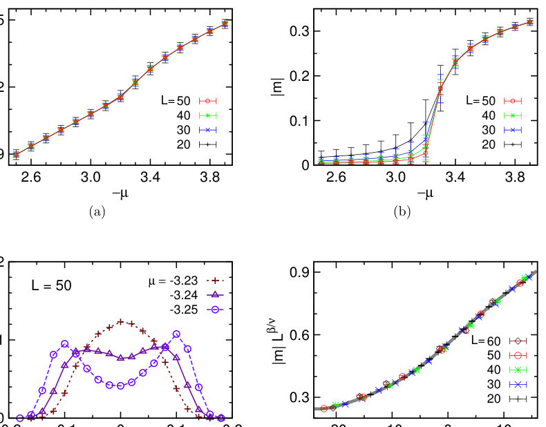 
FIG. 1. Numerical results obtained on periodic cubic lattices of various side lengths L at different

📷 Fig 2

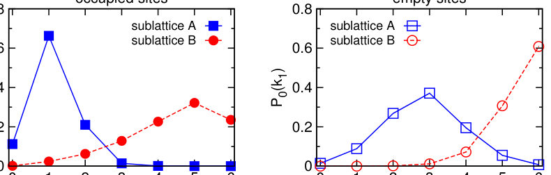 
FIG. 2. Probabilities P1(k1) of an occupied site (a) and P0(k1) of an empty site (b) to have k1

📷 Fig 3

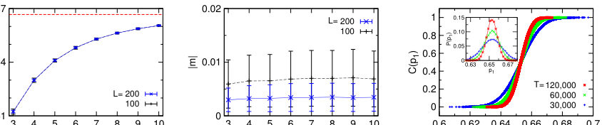 
FIG. 3. Monte Carlo simulation results for the two-dimensional periodic lattices of side lengths

**Summary.** This paper analyzes the phase transitions in a kinetically constrained cubic lattice where occupied sites must form tree structures. Using Monte Carlo simulations and finite-size-scaling, the authors identify a continuous gas-crystal transition in 3D at $\mu^* \approx -3.252$. This transition, marked by spontaneous symmetry-breaking, is absent in the 2D square lattice, highlighting the critical role of spatial dimensionality.

**Why it may be interesting.** The study provides a concrete example of how kinetic constraints can induce rich thermodynamic behavior, offering insights into the interplay between local dynamics and global phase transitions, which is relevant for understanding complex quantum many-body systems.

Detailed structure

**Main problem.** The study investigates spontaneous symmetry-breaking and thermodynamic phase transitions in equilibrium tree-packing configurations within a kinetically constrained cubic lattice.

**Main result.** A continuous gas–crystal phase transition is found in the 3D cubic lattice at $\mu^* \approx -3.252$, leading to spontaneous symmetry-breaking between two nested sublattices, a transition absent in the 2D square lattice.

**Method.** The research employs numerical simulations, including Markov-Chain Monte Carlo (MCMC) dynamics and finite-size-scaling (FSS) analysis, to determine critical parameters.

**Model / system.** The system is a cubic lattice governed by the Fredrikson-Anderson spin model with a kinetic constraint ($K=2$), ensuring occupied sites form tree components. The thermodynamic properties are analyzed via a partition function constrained by the absence of occupied loops.

**Key observables.** Mean occupation density ($
ho$), magnetization order parameter ($m$), and the absolute magnetization $|m|$ are key observables used to detect phase transitions.

**Important parameters / regimes.** The critical chemical potential $\mu^* \approx -3.252$ and the lattice dimension (3D cubic vs. 2D square) are crucial parameters.

**Assumptions / limitations.** The analysis assumes the system reaches equilibrium and relies on finite-size-scaling theory to extrapolate critical points.

**Figures summary.** Figures illustrate the dependence of density and magnetization on the chemical potential $\mu$, showing characteristic changes indicative of a phase transition in 3D but not in 2D.

**Paper structure.** The paper systematically analyzes the system's behavior by first establishing the model and constraints, then applying MCMC simulations to measure observables like magnetization, and finally using FSS analysis to pinpoint the critical point and compare dimensionality effects.

Abstract

We explore kinetic-constraint induced thermodynamic phase transition in the cubic lattice, employing the Fredrikson-Anderson spin model with hyperparameter $K=2$ as a representative kinetic system. Each lattice site may flip its binary occupation state if at most one of its six nearest neighbors is currently occupied. The whole set of microscopic configurations that are kinetically connected with the fully empty one is described by an equilibrium partition function with a single global constraint, that is, the occupied sites do not form closed loops but instead organize into different tree components in the lattice. We discover a continuous thermodynamic gas--crystal phase transition in the cubic system and determine the critical chemical potential $μ^* \approx -3.252$, at which the occupied sites of the equilibrium tree-packing configurations start to prefer one of the two nested cubic sublattices. This thermodynamic phase transition is absent in the two-dimensional square lattice.

[↑ back to top](#top)

### [Hidden Unbounded Potential and Re-Entrant Multifractalization in a Generalized Su-Schrieffer-Heeger Model](http://arxiv.org/abs/2608.17899v1)

**Authors:** Yun-Yan Chen, Jia-Ming Zhang, Zhi Li  
**Type:** theory · **Category:** disordered systems and neural networks · **PDF:** <https://arxiv.org/pdf/2608.17899v1>  
**Analysis basis:** full PDF text, analyzed in chunks
**Topic relevance:** `analog quantum simulation` **3/5** · `Frenkel-Kontorova` **1/5** · `Keldysh / 2PI / non-Gaussian methods` **1/5** · `driven-dissipative phase transition` **1/5** · `methods for driven-dissipative` **1/5** · `non-equilibrium universality` **1/5**

📷 Fig 1

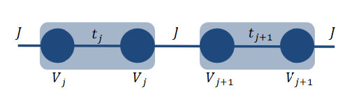 
FIG. 1. Schematic diagram of the model in Eq. (1).

📷 Fig 2

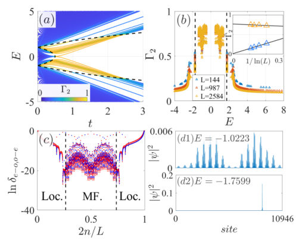 
FIG. 2. (a) Phase diagrams of fractal dimensions in t-E plane with λ = 0. It can be seen that there exist two regions (mul- tifractal or localized) where Γ2 exhibits distinctly different behaviors, and these two regions are precisely separated by the mobility edge (black dashed line) described by Eq. (18). (b) The t = 1 cross profile of (a) for different system size. The fractal dimension of the localized region converges to 0 with increasing system size, while the multifractal region dis- plays no apparent regularity. The inset exhibits the scaling behavior of multifractal (brown triangles) and localized (blue triangles) regions by extrapolation fitting of the mean fractal dimension of L =...

📷 Fig 3

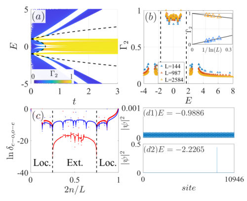 
FIG. 3. (a) Phase diagrams of fractal dimensions in t-E plane with λ = t. It can be seen that there exist two regions (ex- tended or localized) where Γ2 exhibits distinctly different be- haviors, and these two regions are precisely separated by the mobility edge (black dashed line) described by Eq. (24). (b) The t = 1 cross profile of (a) for different system size. The fractal dimension of the localized region converges to 0 with increasing system size, while the extended region converges to 1. The inset exhibits the scaling behavior of extended (brown triangles) and localized (blue triangles) regions by extrapola- tion fitting of the mean fractal dimension of L = 144, 610, 2584 and 10946....

📷 Fig 4

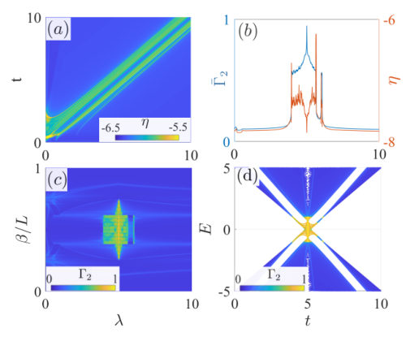 
FIG. 4. (a) Phase diagrams of η (defined in Eq. (7)) in λ-t plane. The value of η in the multifractal region is significantly larger than that in the extended or localized regions, which can serve as an indicator of the occurrence of non-monotonic phase transitions. (b) The dependence of Γ2(β/L ∈R) (de- fined in Eq. (5) and (6)) and η on the parameter λ. The two indicators collectively point to the existence of non-monotonic phase transitions. (c) and (d) Phase diagrams of fractal di- mension Γ2 in λ-β/L plane and λ-E plane, reveal a complex phase transition path: localized →multifractal →extended →multifractal →localized →multifractal →localized. We set the system size in (a) as L = 610,...

📷 Fig 5

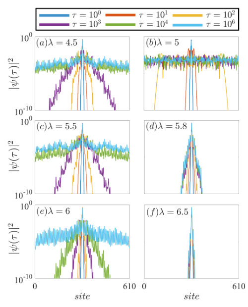 
FIG. 5. (a)-(f) The probability distribution |ψ(τ)|2 for t = 5 with different values of λ after different evolution times τ = 100 (blue), τ = 101 (orange), τ = 102 (yellow), τ = 103 (pur- ple), τ = 104 (green) and τ = 106 (light blue). For all plots, the system size L = 610 and we choose N = 100.

**Summary.** This work investigates multifractal criticality in a generalized SSH model, demonstrating that the critical phases are driven by a hidden unbounded potential structure. The authors establish a mechanism where balancing this hidden potential with the explicit terms can eliminate the multifractal phase, providing a theoretical basis for controlling quantum phase transitions.

**Why it may be interesting.** The concept of a 'hidden' potential driving critical behavior, even when not explicit in the Hamiltonian, is highly relevant for understanding emergent phenomena in complex quantum systems, which is a key theme in AMO physics and open quantum systems.

Detailed structure

**Main problem.** The study investigates multifractal criticality in a generalized Su-Schrieffer-Heeger model, focusing on the role of hidden unbounded potentials and the phenomenon of re-entrant multifractalization (REM).

**Main result.** The authors analytically prove that a hidden unbounded potential drives the multifractal critical phases, and a specific balance between explicit and hidden potentials can cause this phase to vanish, leading to demultifractalization.

**Method.** The analysis combines analytical proofs regarding effective potentials with diagnostic tools like fractal dimension calculations (IPR, $\Gamma$) and wave packet dynamics ($\sigma^2(	au)$).

**Model / system.** The system is a generalized Su-Schrieffer-Heeger (SSH) model incorporating quasiperiodic modulation on both potential and hopping terms. The Hamiltonian is defined with parameters $\lambda, t_j, J$, and quasiperiodic parameters $\alpha, 	heta$.

**Key observables.** Inverse Participation Ratio (IPR), Normalized Participation Ratio (NPR), Fractal Dimension ($\Gamma$), Diffusion Exponent ($n$), and Level Spacings ($\delta_{e-o,n}, \delta_{o-e,n}$).

**Important parameters / regimes.** Quasiperiodic modulation strength ($\lambda$), hopping strengths ($t_j, J$), and quasiperiodic parameters ($\alpha, 	heta$).

**Assumptions / limitations.** The analysis relies on mapping the hopping term to an effective potential and analyzing the long-time behavior of wave packet dynamics ($\sigma^2(	au) \propto 	au^n$).

**Figures summary.** Figures illustrate the dependence of the diffusion exponent ($n$) on the modulation strength ($\lambda$), showing transitions between localized ($n \approx 0$), extended ($n \approx 2$), and multifractal ($0 < n < 2$) regimes.

**Paper structure.** The paper develops the theoretical framework by analyzing the SSH model, establishing the role of the hidden potential, and then confirming the predicted phase transitions (REM, demultifractalization) using multiple diagnostic tools including fractal dimensions and wave packet dynamics.

Abstract

We study the multifractal criticality in a generalized Su-Schrieffer-Heeger model. The results show that the system supports not only critical phases but also re-entrance multifractalization (REM). By mapping the hopping term to an effective potential, we analytically prove that although the model has no explicit unbounded potential, a hidden unbounded potential is actually present-this is the key mechanism driving the emergence of multifractal critical phases. Moreover, one can get a condition where the competition between the explicit and hidden unbounded potentials is exactly balanced. Under this condition, the multifractal critical phase vanish, and the system returns to the extended phase. Based on this mechanism, we achieve both demultifractalization and re-entrant multifractalization. Finally, we double check the theoretical predictions through wave packet dynamics, and the numerical results are consistent with our theoretical analysis. This work broadens our understanding of how unbounded potentials induce multifractal critical phases, providing a theoretical basis for designing new systems with multifractal critical phases.

[↑ back to top](#top)

### [Characterizing Entanglement in Combinations of Bell States through Superposition and Mixing: An Increase in Entanglement on Introducing Depolarizing, Phase Damping, and Amplitude Damping Noise](http://arxiv.org/abs/2608.17500v1)

**Authors:** Nishant Chaudhari, Jean-François Van Huele  
**Type:** theory · **Category:** quantum information and computing · **PDF:** <https://arxiv.org/pdf/2608.17500v1>  
**Analysis basis:** full PDF text, analyzed in chunks
**Topic relevance:** `correlated / nonlocal dissipation` **3/5** · `driven-dissipative phase transition` **2/5** · `methods for driven-dissipative` **2/5**

📷 Fig 1

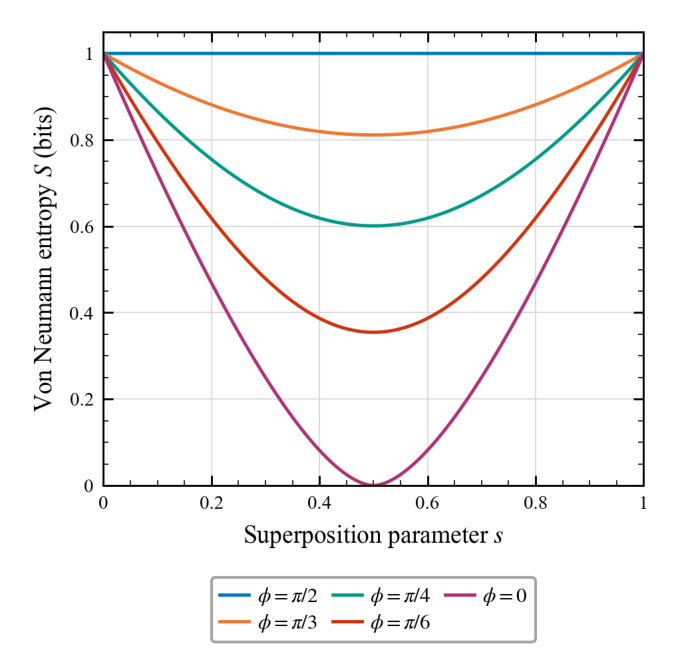 
Figure 1: Von Neumann entropy S as a function of the relative weight s in a superposition of |ϕ+⟩and |ϕ−⟩for different values of the phase angle ϕ.

📷 Fig 2

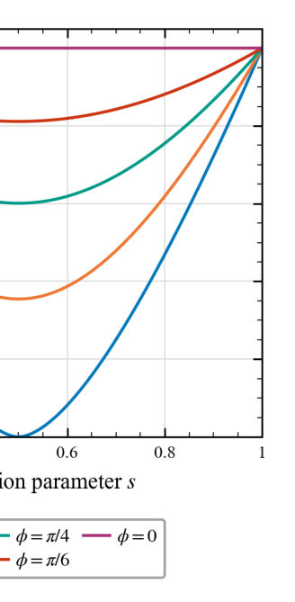 
Figure 2: Von Neumann entropy S as a function of the relative weight s in a superposition of |ϕ+⟩and |ψ−⟩.

📷 Fig 3

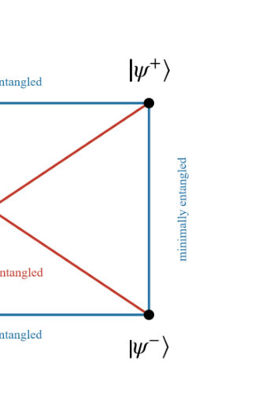 
Figure 3: Degree of entanglement for |ϕ+⟩, |ϕ−⟩, |ψ+⟩, |ψ−⟩when ϕ = 0.

📷 Fig 4

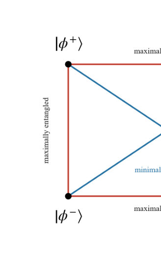 
Figure 4: Degree of entanglement for |ϕ+⟩, |ϕ−⟩, |ψ+⟩, |ψ−⟩when ϕ = π

📷 Fig 5

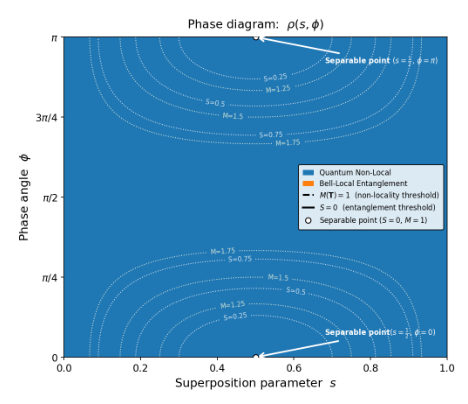 
Figure 5: Phase diagram for |ϕ+⟩–|ϕ−⟩(and |ϕ+⟩–|ψ+⟩). Separable points at (s, ϕ) = ( 1

**Summary.** This paper analyzes how quantum entanglement in two-qubit Bell states degrades under three common noise models: Depolarizing, Phase Damping, and Amplitude Damping. It reveals counterintuitive results, such as noise sometimes increasing entanglement, and provides detailed phase diagrams distinguishing between mere mathematical entanglement and genuine operational quantum non-locality for quantum computing applications.

**Why it may be interesting.** This work provides a comprehensive, unified analytical reference for managing entanglement and non-locality in noisy quantum hardware, which is crucial for understanding the performance limits of near-term quantum devices (NISQ).

Detailed structure

**Main problem.** The paper systematically characterizes quantum entanglement and non-locality in combinations of two-qubit Bell states when subjected to various noise channels.

**Main result.** A counterintuitive finding is that increasing noise can actually raise concurrence in specific parameter regimes across all studied noise channels. Furthermore, the boundary between mathematical entanglement and operational non-locality is strongly dependent on the specific noise model.

**Method.** The analysis employs quantum information measures like von Neumann entropy and concurrence, and maps non-locality using the Horodecki criterion. Noise is modeled using the Kraus operator formalism for three distinct channels.

**Model / system.** The system is restricted to two-qubit states built from the four Bell states. Noise is introduced via Depolarizing (DP), Phase Damping (PD), and Amplitude Damping (AD) channels, which are applied to mixtures of these Bell states.

**Key observables.** Von Neumann Entropy (S), Concurrence (C), and the Horodecki parameter M(T) used to test for quantum non-locality.

**Important parameters / regimes.** Noise probabilities (p) for the three channels, the relative phase (phi) between superposed states, and the mixing probability (r).

**Assumptions / limitations.** The analysis is limited to two-qubit systems, and the noise models (DP, PD, AD) are treated as global or local collective operations.

**Figures summary.** The notes reference figures showing the dependence of entropy (S) on relative weight (s) for different phases (phi), and figures illustrating the phase diagrams classifying states into non-local, Bell-local, or separable regimes under noise.

**Paper structure.** The paper progresses by first analyzing pure superpositions (using entropy), then moving to mixed states (using concurrence), and finally analyzing the impact of the three distinct noise channels (DP, PD, AD) on both entanglement and non-locality boundaries.

Abstract

We systematically characterize quantum entanglement in all sixteen combinations of two-qubit Bell states across three operational regimes: pure superposition, noiseless mixing, and asymmetric mixing of one noisy and one pure Bell state. For pure superpositions, we calculate the von Neumann entropy and show that entanglement depends critically on the relative phase phi between superposed states. For mixed states, we use concurrence C under three physically motivated decoherence channels. The Depolarizing (DP) and Phase Damping (PD) channels are modeled as global, collective operations on the two-qubit Hilbert space, while Amplitude Damping (AD) is treated as independent local decay on each qubit, reflecting the asymmetric, energy-dissipating nature of spontaneous emission. A central and counterintuitive result is that increasing noise can raise concurrence in specific parameter regimes across all three channels. We further map the boundary between mathematical entanglement (C > 0) and operational quantum non-locality using the Horodecki criterion, finding this boundary to be strongly channel-dependent. Under Phase Damping, the Bell-local entanglement regime vanishes entirely for identical and same-bases mixtures, meaning any surviving entanglement guarantees a CHSH violation. Under Depolarizing noise, a large Bell-local region requires mixing probability r > 1/sqrt(2) to recover non-locality at maximum noise. For Amplitude Damping, certain mixtures exhibit a non-monotonic Horodecki parameter M(T): concurrence decreases monotonically with noise, yet the capacity for CHSH violation is lost at intermediate noise levels and restored at high noise, as maximal damping repurifies the noisy branch. These results provide a unified analytical reference for entanglement and non-locality management across Bell-state combinations and decoherence channels relevant to NISQ architectures.

[↑ back to top](#top)

### [Basis-update and Galerkin time integration in canonical matrix-product-state form](http://arxiv.org/abs/2608.16994v1)

**Authors:** Maximilian Fröhlich, Richard M. Milbradt, Martin Eigel, Aaron Sander, Robert Wille, Christian B. Mendl  
**Type:** theory · **Category:** numerical methods · **PDF:** <https://arxiv.org/pdf/2608.16994v1>  
**Analysis basis:** full PDF text, analyzed in chunks
**Topic relevance:** `analog quantum simulation` **3/5** · `methods for driven-dissipative` **3/5**

📷 Fig 1

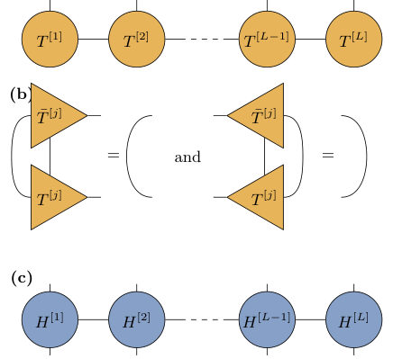 
FIG. 1. Matrix product state representations. These diagrams define the tensor conventions used in the canoni- cal BUG construction. (a) An MPS represents the state as a chain of site tensors. (b) Left- and right-isometric con- tractions define canonical form and identify the orthogonality center. (c) An MPO represents the Hamiltonian in the same chain geometry. The canonical isometries make the block em- beddings orthonormal and allow the environments and basis updates below to be written as local contractions.

📷 Fig 2

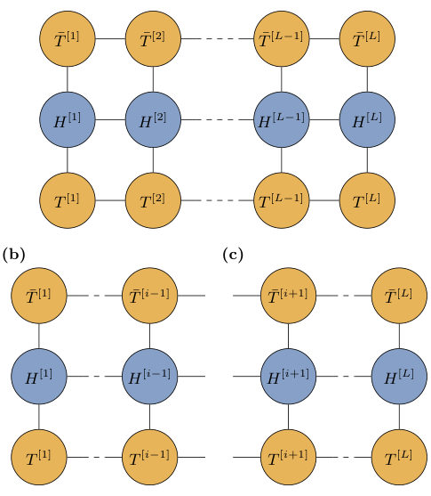 
FIG. 2. MPO contractions and environments. How is the global Hamiltonian reduced to the local contractions used during a canonical sweep? (a) The full network gives the Hamiltonian expectation value ⟨ψ| ˆH |ψ⟩. (b) and (c) collect all tensors to the left and right of site i into the environments L[i] and R[i]. Contracting these environments with the local MPO tensor produces the effective Hamiltonian used in the projected update.

📷 Fig 3

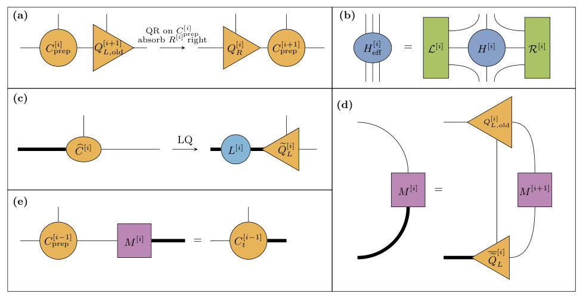 
FIG. 3. One uncompressed canonical MPS-BUG sweep. How is the BUG basis update realized as a sweep toward a fixed endpoint? (a) A preparation pass records center tensors and environments. (b) These environments define each local effective Hamiltonian. (c) The retained input and local predictor enlarge the next block basis. (d) The overlap between the previous and updated block bases is evaluated recursively. (e) This overlap projects the recorded coefficients into the updated basis and moves the working tensor toward the root. A final projected solve updates the root tensor. Thick bonds denote enlarged virtual dimensions. Compression and normalization are not part of this map.

📷 Fig 4

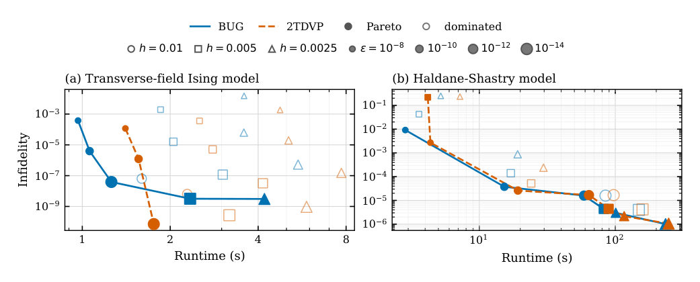 
FIG. 4. Runtime-accuracy trade-off at L = 16. Infidelity versus median runtime for (a) the transverse-field Ising and (b) Haldane-Shastry models, with rmin = 2 and χmax = 512. Marker shape encodes h (circle: 0.01; square: 0.005; triangle: 0.0025), and marker size increases as ϵ tightens from 10−8 to 10−14. Solid blue (BUG) and dashed orange (2-TDVP) lines connect filled Pareto points; open unconnected markers are dominated configurations. Each runtime is the median of three repetitions. Lines guide the eye and do not imply universal dominance.

**Summary.** This paper introduces the Basis-Update and Galerkin (BUG) method for time-evolving quantum states represented by Matrix Product States (MPS). It rigorously details the sweep procedure and proves convergence bounds for the scheme. The comparison against 2-TDVP demonstrates that while BUG is often faster, the optimal choice of time integration method is highly dependent on the specific quantum model being simulated.

**Why it may be interesting.** This work provides advanced numerical tools for simulating quantum dynamics on quantum hardware simulators, directly impacting how researchers can model complex, entangled quantum systems beyond simple Trotter-Suzuki decompositions.

Detailed structure

**Main problem.** The paper develops and analyzes a Basis-Update and Galerkin (BUG) time integration scheme for simulating quantum many-body dynamics using Matrix Product States (MPS). It aims to efficiently handle the growth of entanglement during time evolution.

**Main result.** The BUG method is shown to be computationally efficient, often requiring fewer local exponential actions and having lower runtime than 2-TDVP, although the comparison reveals model-dependent trade-offs rather than a universal advantage.

**Method.** The core method involves formulating the time evolution as a sequence of canonical MPS sweeps, which includes a preparation pass, a reverse pass for basis enlargement and coefficient projection, and a final root Galerkin solve.

**Model / system.** The dynamics are studied for quantum many-body systems governed by a time-independent Hermitian Hamiltonian ($\hat{H}$), which is represented as a Matrix Product Operator (MPO). Comparisons are made using the Transverse Field Ising Model (TFIM) and the Haldane-Shastry model.

**Key observables.** Runtime, accuracy (infidelity), and the derived first-order error bound ($\lVert Y_n - A(t_n) 
Vert \le C_0 e_0 + C_1 \eta + C_2 h$).

**Important parameters / regimes.** Timestep ($h$), initial error ($\epsilon_0$), and truncation error ($\eta$).

**Assumptions / limitations.** The analysis relies on establishing specific rank conditions for basis retention and assumes that convergence requires both initial error and truncation error to vanish.

**Figures summary.** Figures illustrate the canonical MPS structure, the local effective Hamiltonian environments used in the BUG sweep, and the step-by-step process of the uncompressed canonical MPS-BUG sweep.

**Paper structure.** The paper first establishes the mathematical framework for the BUG sweep (Preparation Pass $	o$ Reverse Pass $	o$ Root Solve). It then derives rigorous error bounds for the uncompressed schedule. Finally, it compares the method's performance against 2-TDVP on specific physical models.

Abstract

Matrix product state algorithms must enlarge their bond spaces as entanglement grows and compress them to control cost. We formulate basis-update and Galerkin (BUG) time integration as a sequence of canonical MPS sweeps for Hamiltonians represented as matrix product operators. We show when two natural basis updates produce the same trial space and when transporting coefficients between successive bases preserves the represented state. Under these conditions, the existing first-order error bound for uncompressed tree-tensor-network BUG also applies to the alternating-endpoint MPS schedule. We verify the uncompressed implementation against an independent six-site calculation. We then compare BUG with two-site TDVP for 16-site transverse-field Ising and Haldane-Shastry dynamics. At matched timestep and truncation settings, BUG performs fewer local exponential actions and has lower runtime. These settings do not produce equal accuracy. The runtime versus accuracy curves cross for the Ising model and are close for the Haldane-Shastry model. The comparison therefore identifies model-dependent trade-offs rather than a general advantage for either method.

[↑ back to top](#top)

### [Beyond Legal Spacing: A Residual-Aware Characterization of Entangling-Zone Spacing in Neutral-Atom Compilation](http://arxiv.org/abs/2608.17331v1)

**Authors:** Xinyi Li, Yifeng Peng, Ying Wang  
**Type:** theory · **Category:** quantum information and computing · **PDF:** <https://arxiv.org/pdf/2608.17331v1>  
**Analysis basis:** full PDF text, analyzed in chunks
**Topic relevance:** `Rydberg arrays` **3/5** · `QC/QI experiment` **1/5** · `analog quantum simulation` **1/5** · `correlated / nonlocal dissipation` **1/5**

📷 Fig 1

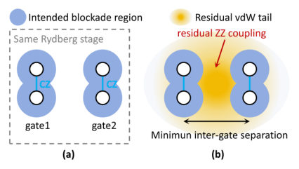 
Fig. 1. Simultaneous neutral-atom entangling gates in a shared Rydberg stage. (a) Intended blockade realizes each CZ within a gate pair. (b) The finite van der Waals tail between distinct pairs produces residual ZZ coupling governed by the minimum inter-gate separation.

📷 Fig 2

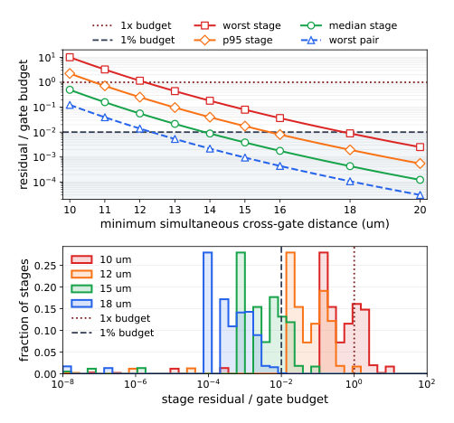 
Fig. 2. Residual exposure in fixed ZAC schedules. Top: stage residual versus inter-gate spacing, normalized to the 0.0046 two-qubit gate-error budget. Bottom: stage-level residual distributions at selected spacings.

📷 Fig 3

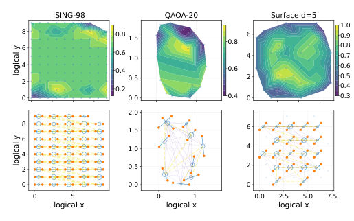 
Fig. 3. Logical-layout projection of physically evaluated residual exposure for ISING-98, QAOA-20, and surface-code d = 5 memory. Top: accumu- lated residual exposure over each workload layout. Bottom: the highest- residual compiled stage. Open circles mark active-gate midpoints, with size proportional to gate-level marginal residual exposure. Dashed lines mark the strongest residual-ZZ couplings between simultaneous gates.

📷 Fig 4

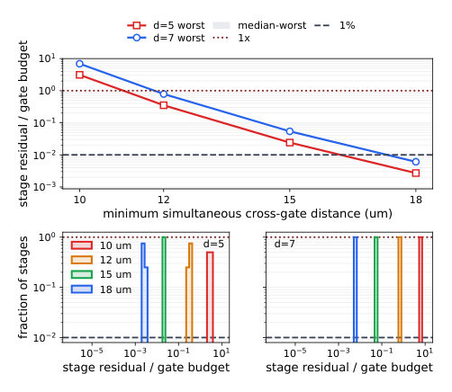 
Fig. 4. Residual exposure in ZAC-compiled surface-code memory. Top: stage residual versus spacing. Bottom: stage-level residual distributions.

📷 Fig 5

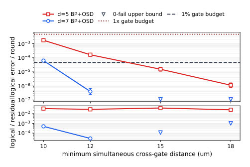 
Fig. 5. Surface-code logical response to residual faults. Top: logical error per round versus inter-gate spacing. Bottom: logical error normalized by the injected residual exposure.

**Summary.** This work analyzes residual noise in neutral-atom quantum computers, showing that simply meeting minimum physical spacing is insufficient for reliable computation. The authors quantify structured residual coupling, demonstrating that this noise can survive Quantum Error Correction if the spacing is too small. They advocate for new compilers that jointly optimize physical geometry, error absorption, and scheduling time.

**Why it may be interesting.** It provides a concrete, physics-grounded metric (residual exposure) that must be incorporated into quantum compiler design, moving beyond simple geometric feasibility checks.

Detailed structure

**Main problem.** The paper addresses the gap between the minimum geometric spacing required for physical gate operation and the actual safety margin against residual noise in neutral-atom quantum processors.

**Main result.** Residual van der Waals coupling, which is structured and correlated, persists even after Quantum Error Correction (QEC) if the physical spacing is too small, necessitating spacing-aware compiler evaluations.

**Method.** The authors combine fixed-schedule residual replay, surface-code simulation with matched correlated decoding, and fresh recompilation analysis to quantify residual exposure and its impact on logical reliability and makespan.

**Model / system.** The system is a neutral-atom processor using Rydberg-mediated entangling gates on spatially arranged qubit arrays. The residual interaction is modeled by the van der Waals tail, leading to a correlated ZZ-like fault.

**Key observables.** Residual exposure ($E_S$, $A_S$), logical error rate after QEC, and compilation makespan cost.

**Important parameters / regimes.** Inter-gate spacing (e.g., 10 $\mu$m vs. 15 $\mu$m), two-qubit gate-error budget ($p_{2q}$), and code distance.

**Assumptions / limitations.** The residual crosstalk is treated as a structured correlated fault source tied to simultaneous gate geometry, and the analysis relies on specific decoding techniques (BP+OSD).

**Figures summary.** Figures illustrate the residual coupling dependence on spacing, show the structured, localized nature of residual exposure at the physical layer, and compare the logical response to these faults across different spacing regimes.

**Paper structure.** The paper progresses by first establishing the physical model of residual coupling, then simulating its effect on fixed schedules, followed by analyzing its impact on logical reliability via QEC, and concluding with a discussion of the complex trade-off between residual suppression and scheduling overhead.

Abstract

Neutral-atom processors rely on spatially arranged qubit arrays and parallel Rydberg entangling gates for scalable execution. Their compilers enforce geometric spacing rules for simultaneous gates, yet legal separation does not make residual van der Waals coupling disappear. This paper studies that gap between geometric legality and residual noise by treating entangling-zone spacing as a cross-layer reliability-parallelism variable anchored to experimental neutral-atom geometry. We combine fixed-schedule residual replay, surface-code simulation with matched correlated decoding, and fresh recompilation to connect spacing to physical residual exposure, logical reliability, and makespan cost. The results show that near-floor spacing can produce structured correlated exposure that is visible both at the physical layer and, in the tightest case, after quantum error correction (QEC). Modest geometric slack strongly suppresses this residual contribution, but the timing cost of looser spacing is mediated by placement and scheduling rather than by a simple monotonic slowdown. These findings distinguish hardware legality from residual-noise safety and motivate spacing-aware compiler evaluations that report physical geometry, QEC absorption, and scheduling cost together.

[↑ back to top](#top)

### [Heat capacity as a marker for shape and jamming transitions in active systems](http://arxiv.org/abs/2608.17903v1)

**Authors:** Ion Santra  
**Type:** theory · **Category:** statistical mechanics · **PDF:** <https://arxiv.org/pdf/2608.17903v1>  
**Analysis basis:** full PDF text, analyzed in chunks
**Topic relevance:** `driven-dissipative phase transition` **3/5** · `non-equilibrium universality` **3/5**

📷 Fig 1

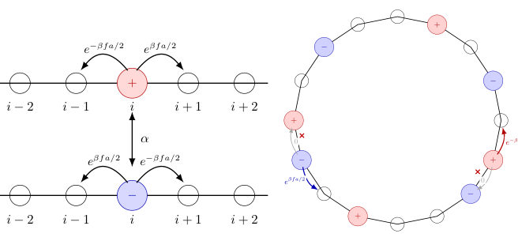 
FIG. 1. Schematic representation of the single-particle and interacting lattice models, depicting the hopping and

📷 Fig 2

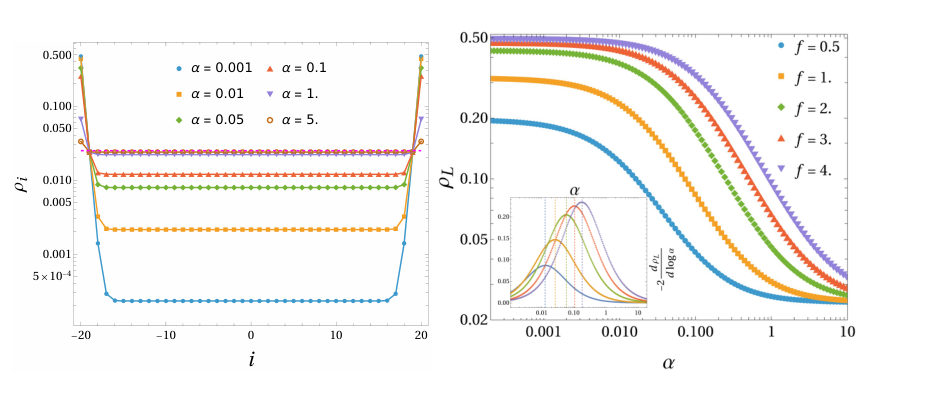 
FIG. 2. Left: Stationary density ρi for different tumbling rates α at f = 2. Right: Boundary density ρL as a function

📷 Fig 3

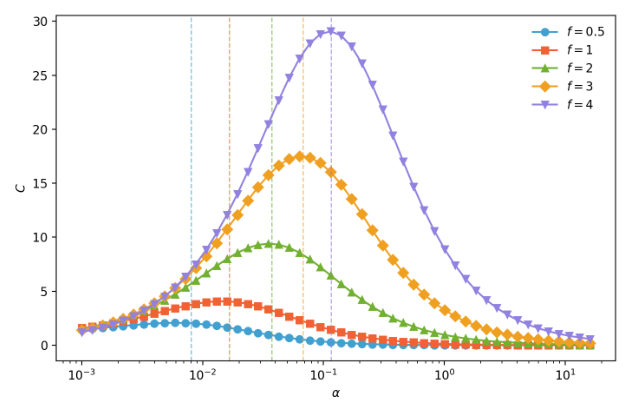 
FIG. 3. Nonequilibrium heat capacity C as a function of α for different active forces f. The dashed lines indicate

📷 Fig 4

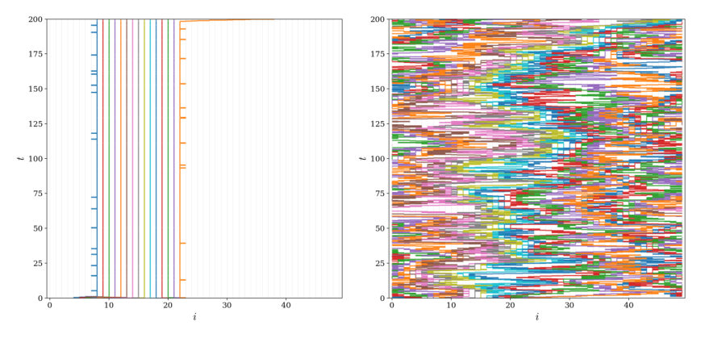 
FIG. 4. Typical trajectories of Np = 15 interacting RTPs on a periodic lattice with L = 50 obtained from simulation

📷 Fig 5

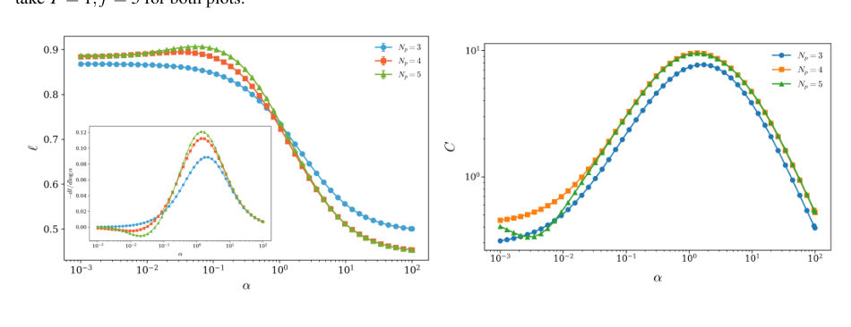 
FIG. 5. Left: Stationary mean block size ℓas a function of α. The inset shows the corresponding −dℓ/d logα. Right:

**Summary.** This work demonstrates that the nonequilibrium heat capacity can act as a sensitive thermodynamic probe for structural phase transitions in active matter. By modeling single and interacting active particles, the authors show that sharp peaks in the heat capacity signal the onset or reorganization of jammed or shape-transitional states. This suggests a powerful experimental avenue for characterizing non-equilibrium phase transitions.

**Why it may be interesting.** The connection drawn between non-equilibrium thermodynamics (heat capacity) and non-equilibrium phase transitions (active matter) provides a novel, measurable diagnostic tool applicable to complex, non-equilibrium many-body systems.

Detailed structure

**Main problem.** The paper investigates whether nonequilibrium heat capacity can serve as a measurable thermodynamic signature for structural phase transitions, such as shape or jamming, occurring in active matter systems driven far from equilibrium.

**Main result.** The nonequilibrium heat capacity exhibits distinct, non-monotonic peaks corresponding to the structural transitions, confirming its potential as a calorimetric probe for these active matter phase changes.

**Method.** The authors calculate the excess heat and nonequilibrium heat capacity by analyzing the relaxation dynamics of the system's probability distribution following a small temperature perturbation.

**Model / system.** The models include single active particles confined between boundaries and interacting run-and-tumble (RTP) particles on a periodic lattice, whose dynamics are governed by Markov jump processes.

**Key observables.** Nonequilibrium heat capacity ($C$), stationary density profiles ($
ho_i$), and mean block size ($\ell$).

**Important parameters / regimes.** Persistence rate ($\alpha$), system size ($L$), and temperature perturbation ($\Delta T$).

**Assumptions / limitations.** The analysis relies on calculating the *excess* heat and assumes local detailed balance for the spatial hopping rates in the lattice model.

**Figures summary.** Figures illustrate the structural crossover (e.g., mean block size vs. persistence rate) alongside the corresponding non-monotonic heat capacity response for both single and interacting particle systems.

**Paper structure.** The paper first establishes the theoretical framework for calculating nonequilibrium heat capacity. It then applies this to the single-particle case (boundary effects) and extends the analysis to interacting particles (jamming transitions), concluding with numerical methods for AC calorimetry.

Abstract

Persistence influences the stationary states of active particles, producing boundary accumulation at the single-particle level, and clustering or jamming in interacting systems. These features disappear as the persistence decreases and the system approaches a more passive-like stationary state. We show that these transitions have a distinct calorimetric signature. Using a lattice run-and-tumble dynamics, consistent with local detailed balance, we compute the nonequilibrium heat capacity from the excess heat released following a small temperature perturbation. For a single particle confined between reflecting boundaries, the heat capacity develops a maximum in the persistence regime corresponding to shape transition. Adding an exclusion interaction to the active particles on a periodic lattice, the reorganization of jammed clusters produces a corresponding peak in the thermal response. We also discuss the impact of the time-symmetric part of the transition rates, and show the possibility of seeing the same signatures of heat response in experiments by AC calorimetry. Our results show that nonequilibrium heat capacities can serve as calorimetric probes of nonequilibrium phase transitions.

[↑ back to top](#top)

### [Interference Engineering for Quantum Imaginary-Time Evolution through Multiple Energy Shifts](http://arxiv.org/abs/2608.17792v1)

**Authors:** Hong-Jian Tang, Dan-Bo Zhang  
**Type:** theory · **Category:** quantum information and computing · **PDF:** <https://arxiv.org/pdf/2608.17792v1>  
**Analysis basis:** full PDF text, analyzed in chunks
**Topic relevance:** `analog quantum simulation` **3/5** · `methods for driven-dissipative` **2/5** · `interference shaping light` **1/5**

📷 Fig 1

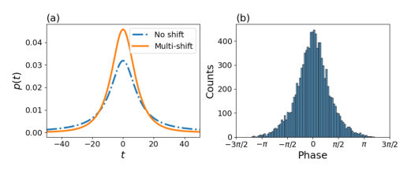 
FIG. 1. (a) Comparison of the probability densities with and without multi-shift. (b) Phase distribution over 10,000 runs with multi-shift. The parameters are a = 30, k = 3, and τ = 10.

📷 Fig 2

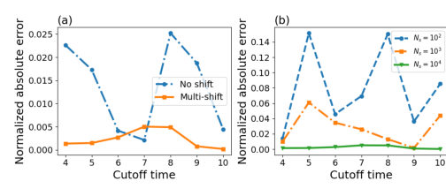 
FIG. 2. Comparison of the ground-state energy error obtained with and without multi-shift under different cutoff times tm using the function W(t) defined in Eq. (9). The results are averaged over 10 experiments. (a) Ground-state energy error with and without multi-shift for different cutoff times, with 104 Monte Carlo samples used in each experiment. (b) Ground-state energy error for different numbers of Monte Carlo samples with multi-shift for different cutoff times. The initial state is chosen to be a computational basis state. The parameters of the Ising model are n = 6, J = 2, and h = 1, with τ = 10.

📷 Fig 3

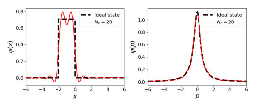 
FIG. 3. Illustration of the finite-photon-number approximation of the step-function state and resource state in the Fock space. As the photon-number truncation increases, the resulting state approaches the ideal state.

📷 Fig 4

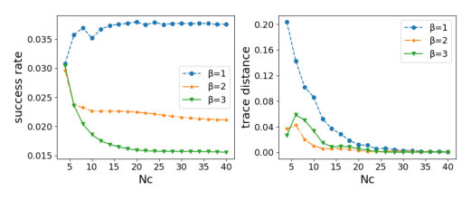 
FIG. 4. Success probability and trace distance versus photon- number truncation for thermal-state preparation using the step-function state as the projection state. The underlying quantum Ising model has parameters n = 4, J = 1, and h = 1, and a constant has been added to ensure that all its eigenvalues are positive. The parameter L of the step- function state is chosen such that Lτ = 1.256, corresponding to the optimal success probability.

📷 Fig 5

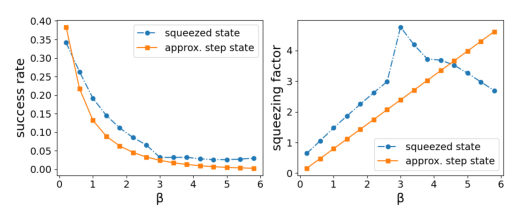 
FIG. 5. Comparison of the success probability and the resource consumption, quantified by the squeezing factor, for preparing thermal states with the same accuracy using the approximate step-function state and the squeezed state at different inverse temperatures. The theoretically optimal L for the step-function state is used. The underlying quantum Ising model has parameters n = 4, J = 1, and h = 1, and a constant has been added to ensure that all its eigenvalues are positive.

**Summary.** This paper introduces Multi-shift Quantum Imaginary-Time Evolution (MS-QITE) to overcome limitations in simulating quantum many-body systems on quantum computers. By engineering interference using a distribution of energy shifts, MS-QITE improves the efficiency and stability of ground-state and thermal-state preparation. This technique offers a general framework for optimizing quantum algorithms by exploiting spectral transformations.

**Why it may be interesting.** The technique provides a powerful, interference-based resource to optimize quantum algorithms for simulating thermal and ground states, which is a central theme in quantum simulation.

Detailed structure

**Main problem.** The paper addresses the challenge of efficiently implementing imaginary-time evolution (ITE) for ground-state and thermal-state preparation on quantum computers.

**Main result.** The proposed Multi-shift Quantum Imaginary-Time Evolution (MS-QITE) uses a distribution of energy shifts to engineer interference, significantly improving the stability and reducing the required resources for state preparation.

**Method.** The core method involves modifying the standard ITE by introducing a distribution of energy shifts, which transforms the evolution into a controllable real-time superposition integral.

**Model / system.** The method is tested on quantum many-body systems, specifically using the transverse-field Ising model Hamiltonian. The implementation is demonstrated in both Monte Carlo sampling and continuous-variable-assisted schemes.

**Key observables.** Ground-state energy error, success probability, and trace distance for thermal state preparation.

**Important parameters / regimes.** The energy shift distribution $f(q)$, the number of shifts $k$, and the imaginary time $	au$.

**Assumptions / limitations.** The approach relies on the fact that energy shifts generate relative phases that interfere when implemented on a quantum computer, even if they are trivial in normalization.

**Figures summary.** Figures compare probability densities with and without multi-shift, show ground-state energy error vs. cutoff time, and illustrate success probability/resource consumption for thermal state preparation.

**Paper structure.** The paper introduces MS-QITE by relating it to the real-time superposition of evolutions. It then details its application in Monte Carlo and continuous-variable settings, culminating in numerical results on the Ising model.

Abstract

Energy shifting is usually trivial in imaginary-time evolution because it changes only the normalization of the evolved state. On a quantum computer, however, imaginary-time evolution can be implemented as a coherent or sampled superposition of real-time evolutions, in which energy shifts generate relative phases that can interfere. Here we introduce multi-shift quantum imaginary-time evolution (MS-QITE), which uses a distribution of energy shifts to engineer interference and optimize different implementations. In a Monte Carlo realization, multi-shift reshapes the sampling distribution and concentrates it within a shorter real-time window, thereby reducing the required Hamiltonian-evolution time and improving the stability of ground-state-energy estimation. In a continuous-variable-assisted realization, it permits postselection over a finite quadrature interval rather than near a single quadrature value, substantially reducing resource consumption while retaining accurate thermal-state preparation. Numerical results for transverse-field Ising models demonstrate that energy shifts provide a useful interference-based approach for optimizing quantum imaginary-time evolution.

[↑ back to top](#top)

### [A quantum optical concept of attosecond pulses: the attoquants](http://arxiv.org/abs/2608.17854v1)

**Authors:** Sándor Varró, Ákos Gombkötő  
**Type:** theory · **Category:** other · **PDF:** <https://arxiv.org/pdf/2608.17854v1>  
**Analysis basis:** full PDF text, analyzed in chunks
**Topic relevance:** `interference shaping light` **3/5** · `Full counting statistics` **1/5** · `quantum measurements` **1/5**

📷 Fig 1

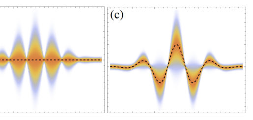 
Figure 1. Illustration of the electric-field distribution within (a) a purely mean-field pulse, (b) a purely field-variance pulse, and (c) a general pulse, in which the field-variance maximum coincides with the field-average maximum. The classical value of the electric field is shown as a dashed line in each panel.

📷 Fig 2

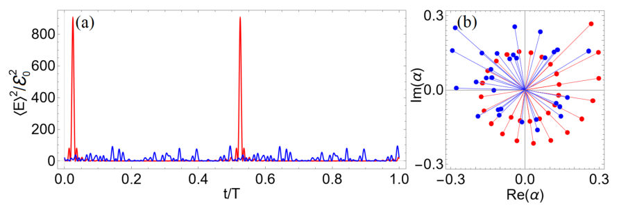 
Figure 2. (a) Temporal structure of ⟨ˆE⟩2 in units of E2 0, resulting from semiclassical states [equation (9)]. One can compare the cases of mode-locked (red) and random-phase (blue) conditions. (b) Coherent state parameters of the constituent coherent states in the complex plane, for the mode-locked (red) and random-phase (blue) cases. Here M=30 harmonics (5th to 63rd) of identical harmonic energies are used, with |αn| = 1 √3+2n .

📷 Fig 3

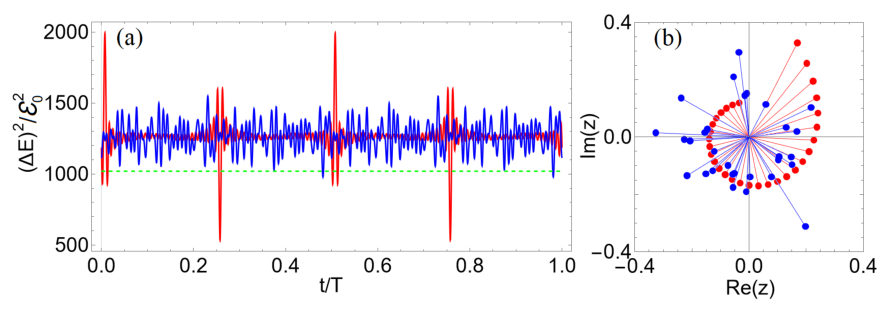 
Figure 3. (a) Temporal structure of (∆ˆE)2 in units of E2 0, resulting from a product of squeezed-vacuum states [equation (12)]. One can compare the cases of mode-locked (red) and random-phase (blue) conditions. The dashed green line indicates the corresponding vacuum variance. (b) Complex squeezing parameters of the constituent squeezed-vacuum states in the complex plane, for the mode-locked (red) and random-phase (blue) cases, respectively. Here M=30 harmonics (5th to 63rd) of identical harmonic energies are used, with rn = arsinh 2.1 √2n0+1+2n .

📷 Fig 4

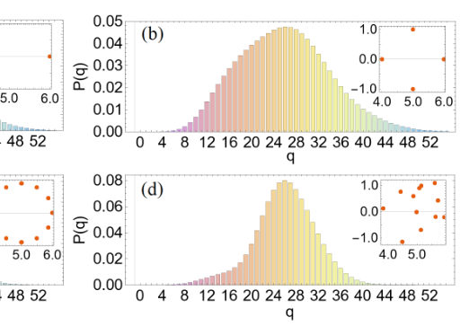 
Figure 4. The photon statistics for {βk = 5 + δk} parameters, shown on the inset of each subfigure. (a)-(c) correspond to δk evenly distributed on a unit circle, with M=3, 4 and 12 modes, respectively. (d) corresponds to randomly distributed δk, with M=12 modes.

📷 Fig 5

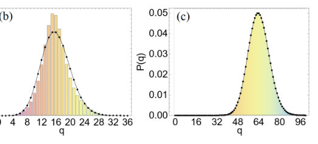 
Figure 5. The photon statistics for {βk} parameters, distributed uniformly on a circle of modulus |βk| = 2 (a), |βk| = 4 (b), and |βk| = 8 (c). The corresponding Poissonian distribution is shown with black markers.

**Summary.** This paper proposes 'attoquants,' a new quantum state concept, to explain attosecond pulse generation in High-Harmonic Generation (HHG) without relying on the classical requirement of phase-locking. By analyzing the coherent permanent state, the authors prove that this entangled state inherently supports pulse trains. This offers a quantum-mechanical framework for understanding ultrafast light sources driven by collective atomic effects.

**Why it may be interesting.** This work directly bridges quantum optics and attosecond physics by proposing a fundamentally quantum mechanism (entanglement) to achieve pulse synthesis, moving beyond semi-classical approximations.

Detailed structure

**Main problem.** To develop a quantum optical concept for attosecond pulse generation that bypasses the classical requirement of mutual phase-locking among emitted harmonics.

**Main result.** The authors introduce 'attoquants,' a novel class of multimode quantum states, demonstrating that their electric-field expectation value yields an attosecond pulse train without requiring mode-locking.

**Method.** The analysis involves constructing and characterizing the coherent permanent state (an attoquant) and calculating quantum diagnostics like photon statistics and logarithmic negativity.

**Model / system.** The system is High-Harmonic Generation (HHG), modeled quantum mechanically as a harmonic radiation field composed of quantized electromagnetic modes. The core theoretical tool is the attoquant state, which is a permutation-symmetric superposition of coherent states.

**Key observables.** Electric-field expectation value, photon statistics, Wigner function, and logarithmic negativity.

**Important parameters / regimes.** The structure of the harmonic field (discrete frequencies $(2q+1)\omega$) and the concept of intermodal entanglement.

**Assumptions / limitations.** The analysis is theoretical, offering a phenomenological interpretation for the physical origin of these entangled states based on multi-atom effects during HHG.

**Figures summary.** Figures illustrate the electric-field distribution for different pulse synthesis methods (mean-field vs. field-variance) and compare the temporal structure of field intensity for mode-locked versus random phase states.

**Paper structure.** The paper progresses from establishing the classical limitations of HHG to introducing the quantum attoquant concept, analytically deriving its properties, and finally providing a physical interpretation rooted in collective multi-atom radiation.

Abstract

High-harmonic generation (HHG) is conventionally understood to produce attosecond pulse trains only when the emitted harmonics are mutually phase-locked, in accordance with the classical theory of mode-locking. Such locking is necessary for pulse synthesis when the harmonic field is in a separable multimode quantum state. This requirement, however, can be circumvented entirely for harmonic combs exhibiting intermodal entanglement. We introduce a novel family of multimode quantum states, termed attoquants: states associated with highly structured pulse trains that are inherently insensitive to relative phases. As a concrete example, we analyse the coherent permanent state, constructed as a completely symmetric superposition of products of coherent states over all permutations of a fixed parameter set. It is shown analytically that its electric-field expectation value is a locked Fourier superposition of the driving-field harmonics, yielding an attosecond pulse train without requiring mode-locking. We further calculate the photon statistics, the Wigner function, and the logarithmic negativity of this state, confirming it to be genuinely nonclassical and entangled. Finally, we offer a phenomenological interpretation for the generation of such entangled states during HHG, as a consequence of multi-atom effects. Since the coherence volume of the driving field greatly exceeds that of its harmonics, a collectively-driven cluster of atoms can radiate the individual harmonics as spatially resolved, but fundamentally indistinguishable sources. This can generate the permutation-symmetric entanglement structure of an attoquant.

[↑ back to top](#top)

### [Block Encoding Non-Abelian Lattice Gauge Theory](http://arxiv.org/abs/2608.17115v1)

**Authors:** Patrick Draper  
**Type:** theory · **Category:** quantum information and computing · **PDF:** <https://arxiv.org/pdf/2608.17115v1>  
**Analysis basis:** full PDF text, analyzed in chunks
**Topic relevance:** `analog quantum simulation` **3/5** · `methods for driven-dissipative` **1/5** · `quantum measurements` **1/5**

📷 Fig 1

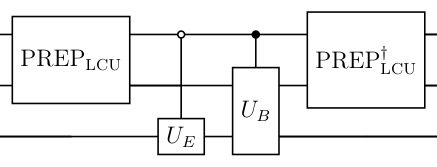 
Figure 2: Block encoding of H = HE +HB as an LCU. p is a register whose basis states index each plaquette. The magnetic SELECT routes the single-plaquette oracle Up to the plaquette indexed by each |p⟩(Fig. 3).

📷 Fig 2

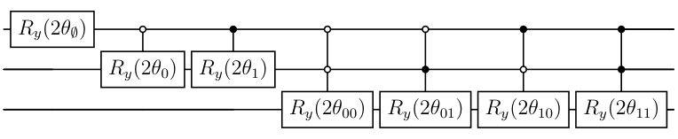 
Figure 5: A three-qubit rotation tree. Each box is a programmed rotation of Fig. 4, and the wires from earlier qubits are controls on the phase-gradient addition.

📷 Fig 3

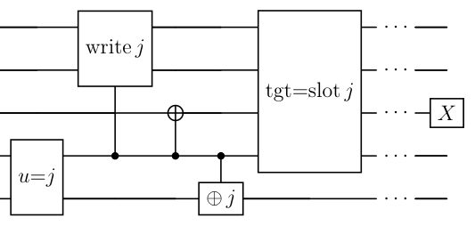 
Figure 6: The write circuit W, drawn with one representative block. See text for the definition of each gate.

📷 Fig 4

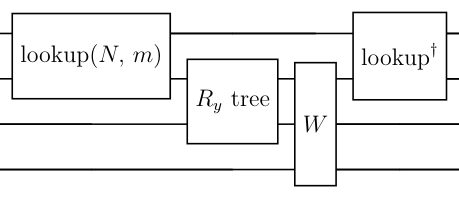 
Figure 8: The sparse-target version of the lookup-rotation block. The tree prepares the branches on u, and the write step W moves them onto the target register.

📷 Fig 5

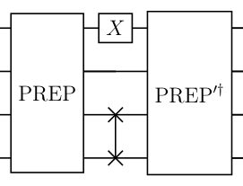 
Figure 9: The single-plaquette magnetic oracle Up which block-encodes Hp/αp. PREP and PREP′†

**Summary.** This paper presents a resource-efficient quantum circuit implementation for simulating the magnetic part of the Hamiltonian in non-Abelian lattice gauge theories. By developing a block encoding oracle for the plaquette operator, the authors significantly reduce the computational overhead associated with simulating these complex quantum field theories. This work advances the feasibility of simulating QCD dynamics on fault-tolerant quantum hardware.

**Why it may be interesting.** The techniques developed—block encoding, programmed rotations, and lookup-based oracle construction—are highly relevant for implementing complex Hamiltonian terms in quantum simulation algorithms.

Detailed structure

**Main problem.** Developing efficient quantum simulation methods for lattice gauge theories, particularly for real-time dynamics, which are challenging due to complex, correlated transitions in the magnetic part of the Hamiltonian.

**Main result.** The authors propose an efficient block encoding oracle for the plaquette operator in the irrep basis, significantly reducing the resource cost compared to previous methods.

**Method.** The method uses a block encoding oracle implemented via programmed rotation trees fed by quantum lookups of classically pre-computed, factorized matrix elements.

**Model / system.** The system is non-Abelian lattice gauge theory, exemplified by Lattice QCD (SU(3)). The Hamiltonian involves electric and magnetic terms, with the magnetic part built from the plaquette operator.

**Key observables.** The simulation targets the evolution governed by the full Hamiltonian, with specific focus on the plaquette operator $\square_p$ and the electric energy term $E_R$.

**Important parameters / regimes.** The resource cost is estimated in T gates (e.g., $10^5$ to $10^6$ for SU(3)), and the logical qubit count scales with the lattice volume $L^3$.

**Assumptions / limitations.** The simulation is designed for the fault-tolerant, error-corrected quantum computation regime, and the method relies on truncating the Hilbert space using a Casimir cutoff $B$.

**Figures summary.** Figure 1 illustrates the components of a plaquette and its state, while Figure 16 details the quantum circuit structure for calculating the electric energy term $H_E$.

**Paper structure.** The paper progresses by reviewing the Hamiltonian and basis, detailing the decomposition into electric and magnetic parts, describing the magnetic block encoding, presenting resource estimates, and discussing its application in QSVT.

Abstract

Gauge theories like lattice QCD present a complex problem for quantum simulation. In a basis where the electric part of the Hamiltonian is simple, the magnetic part, generally expressed as a sum over the plaquette operators of the lattice, is quite complicated, producing correlated transitions between several link and site degrees of freedom. We provide an efficient block encoding of the plaquette operator in the irrep basis, a refinement of the electric basis where the internal gauge-variant degrees of freedom are integrated out. The construction removes the plaquette matrix element scaling wall which has been a significant barrier for other approaches in this basis. The algorithm leverages a convenient factorization property of the matrix elements, cheap classical precomputation, and quantum oracles built from lookup tables and programmed rotations.

[↑ back to top](#top)

### [Chiral rotational dynamics in the molecular frame: Breaking symmetry with angular momentum](http://arxiv.org/abs/2608.17479v1)

**Authors:** Alexander Blech, Monika Leibscher, Christiane P. Koch  
**Type:** both · **Category:** other · **PDF:** <https://arxiv.org/pdf/2608.17479v1>  
**Analysis basis:** full PDF text, analyzed in chunks
**Topic relevance:** `quantum measurements` **3/5** · `interference shaping light` **1/5** · `methods for driven-dissipative` **1/5**

📷 Fig 1

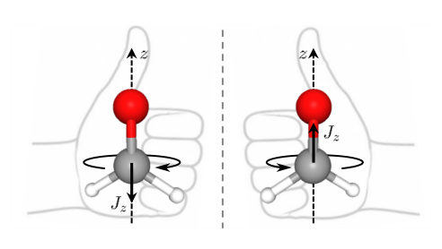 
FIG. 1. A rotating achiral molecule, here CH2O, becomes dynamically chiral: The sense of rotation reverses upon re- flection, breaking the molecule’s mirror symmetry. Handed- ness can be assigned via the convention of the thumb oriented along the molecular symmetry axis (dashed arrow), and the fingers represent the sense of rotation encoded in the angular momentum component Jz (solid arrow).

📷 Fig 2

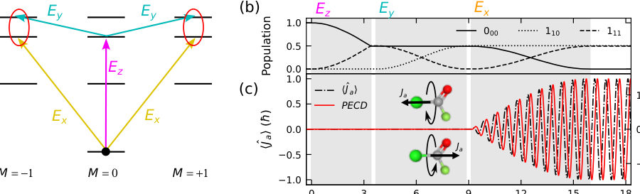 
FIG. 2. Rotational chirality induced in an achiral asymmetric rotor, here COFCl, by a sequence of three microwave pulses, polarized along three mutually orthogonal directions. (a) Rotor spectrum and excitation scheme with initial state (black dot) and final superposition (red ellipses). (b) Population dynamics (accumulated over M). (c) Expectation value of the angular momentum component along the a-axis, quantifying the induced chirality, as well as LPECD as obtained after one-photon ionization with an ultrashort XUV pulse. The microwave pulses are indicated in gray.

📷 Fig 3

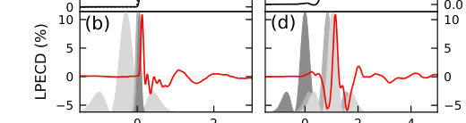 
FIG. 3. Rotational chirality induced in a thermal ensemble of achiral asymmetric rotors, here CH2O at a temperature of 5 K, by THz and optical pulses (gray shadings) with mutually orthogonal polarization directions: (a,b) combination of a THz pulse with two femtosecond optical pulses; (c,d) three THz pulses. (a,c) Angular momentum components along the laboratory Z-axis, signaling unidirectional rotation, and along the molecular a-axis, quantifying the induced chirality. (b,d) LPECD signal assuming instantaneous ionization.

**Summary.** This paper proposes a method to generate rotational chirality in achiral molecules by manipulating their angular momentum using precisely timed microwave or THz/optical pulse sequences. By satisfying strict symmetry breaking conditions, the induced chirality can be measured using Photoelectron Circular Dichroism. This opens a new avenue for studying time-odd chiroptical phenomena in fundamental molecular systems.

**Why it may be interesting.** This work is highly relevant to AMO physics as it tackles the fundamental control of molecular quantum states using tailored electromagnetic pulses, pushing the boundaries of chiroptical spectroscopy in the gas phase.

Detailed structure

**Main problem.** The paper addresses the challenge of generating and investigating time-odd (false) chirality in isolated, achiral molecules by controlling their rotational dynamics.

**Main result.** The authors demonstrate that rotational chirality can be induced in randomly oriented molecules using specific sequences of microwave or combined THz/optical pulses, which can be probed via Photoelectron Circular Dichroism (PECD).

**Method.** The theoretical framework involves deriving symmetry conditions for creating chiral superpositions of rotational states, while the experimental proposals utilize pulsed laser/microwave excitation sequences.

**Model / system.** The system studied is the rigid asymmetric rotor (e.g., $	ext{CH}_2	ext{O}$, $	ext{COFCl}$), whose dynamics are governed by the time-dependent Schrödinger equation under external pulsed fields.

**Key observables.** The expectation value of the angular momentum projection ($\langle \hat{J}_z 
angle$) and the Photoelectron Circular Dichroism (PECD) signal are the key diagnostics for induced chirality.

**Important parameters / regimes.** The required excitation involves at least three microwave or polarization directions (X, Y, Z) to break both spatial and molecular point group symmetries.

**Assumptions / limitations.** The analysis assumes the rigid rotor approximation and that the probe pulse is short compared to the rotational dynamics timescale.

**Figures summary.** Figures illustrate the excitation schemes (microwave/THz/optical) and show the time evolution of the induced angular momentum ($\langle \hat{J}_a 
angle$) and the corresponding PECD signal, demonstrating controllable handedness.

**Paper structure.** The paper moves from defining the problem (time-odd chirality) to deriving the necessary symmetry conditions for state superposition, detailing specific pulse sequences for microwave and optical excitation, and finally presenting PECD as the measurable diagnostic.

Abstract

Achiral molecules can be prepared in superposition states that are chiral. Here, we propose angular momentum orientation in the molecular frame to achieve the required symmetry breaking, exerting rotational control without the need for laboratory frame orientation. We derive the conditions for chiral rotational dynamics from the requirement to simultaneously break the continuous spatial rotational symmetry and the molecular point group symmetry. This can be achieved by three microwave pulses as well as two non-resonant optical pulses in combination with a THz pulse or three THz pulses, all with mutually orthogonal polarization directions, and the ensuing dynamics can be probed by photoelectron circular dichroism. Our results open the way for distinguishing structural from dynamical enantioselectivity and investigating time-odd chiroptical phenomena in randomly oriented molecules.

[↑ back to top](#top)

### [Irradiation-Induced Spin Bath Evolution and as-Grown Hydrogen Defects in CVD Diamond Revealed by NV-Based DEER Spectroscopy](http://arxiv.org/abs/2608.17619v1)

**Authors:** Olga Rubinas, Jeroen Prooth, Michael Petrov, Remy Vandebosch, Emilie Bourgeois, David Chvatil, Milos Nesladek  
**Type:** experiment · **Category:** other · **PDF:** <https://arxiv.org/pdf/2608.17619v1>  
**Analysis basis:** full PDF text, analyzed in chunks
**Topic relevance:** `QC/QI experiment` **3/5** · `quantum measurements` **2/5**

📷 Fig 1

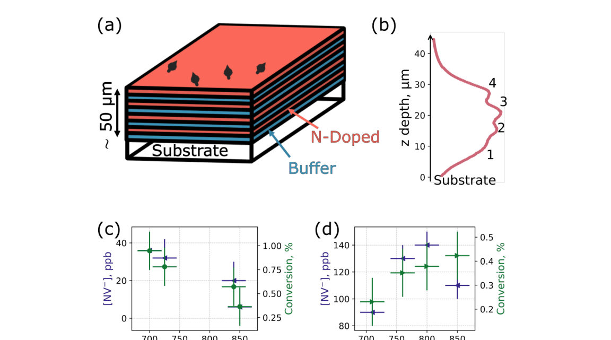 
Figure 1. Growth design and nitrogen incorporation trends in CVD diamond samples. (a) Schematic of the multilayer diamond structure used for samples S1 and S3, composed of alternating nitrogen-free (buffer) and nitrogen-doped layers (L1–L4) grown on type-Ib HPHT

📷 Fig 2

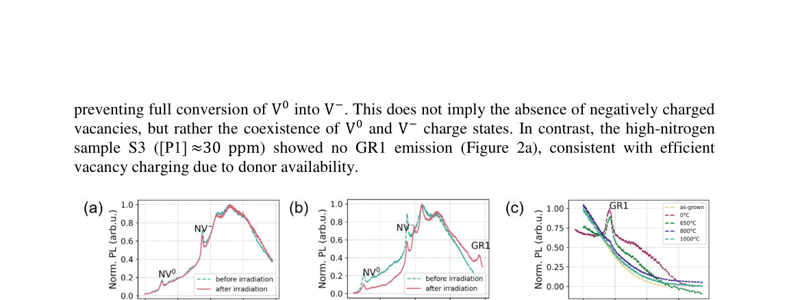 
Figure 2. Photoluminescence spectra of CVD diamond samples before and after irradiation and during annealing. (a) The high-nitrogen sample S3(L4) ([P1] ≈ 30 ppm) was recorded before and after electron irradiation. No GR1 signal appears. (b) PL spectra of the medium-nitrogen sample S2 ([P1] ≈ 10 ppm) before and after irradiation, showing the emergence of the GR1 center’s ZPL at 741 nm, characteristic of neutral vacancies (V0). (c) Evolution of the PL spectrum of the low- nitrogen reference sample S4 ([P1] ≈ 1 ppm) through successive stages: as-grown, after irradiation, and following annealing at 650–1000 °C.

📷 Fig 3

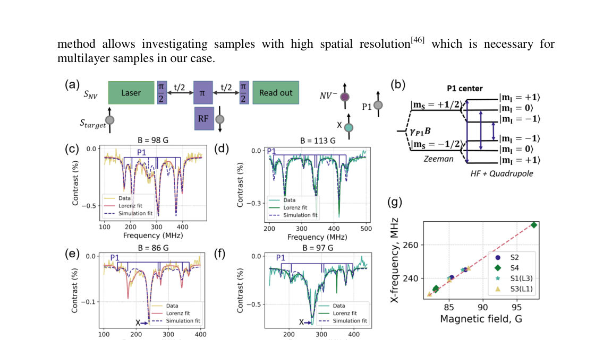 
Figure 3. DEER spectroscopy of CVD diamond samples before and after irradiation. (a) Pulse sequence of the double electron–electron resonance (DEER). (b) Energy-level diagram of the P1 center (S =

📷 Fig 4

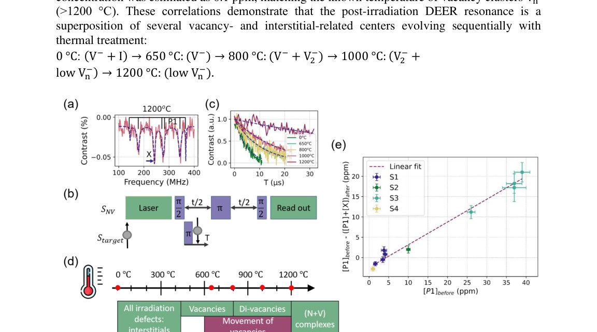 
Figure 4. Evolution of X-center and donor concentrations revealed by DEER spectroscopy. (a) DEER spectrum of sample S4 after 1200 °C annealing, showing that the X-center resonance remains of comparable amplitude to the P1 center transitions, indicating the persistence of a small residual paramagnetic population. (b) DEER-decay pulse sequence used to quantify spin-bath concentrations and dipolar coupling strengths between NV centers and surrounding paramagnetic defects. (c) DEER decay curves on X resonance of sample S4 recorded after successive annealing steps from as irradiated to 1200 °C, demonstrating the progressive reduction of the X-center signal. (d) Schematic qualitative illustration...

📷 Fig 5

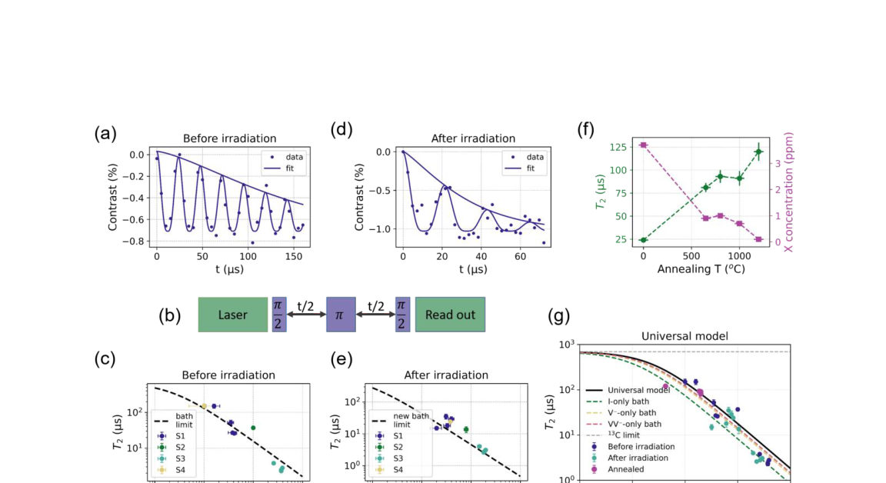 
Figure 5. Spin coherence properties of NV⁻ ensembles in CVD diamond before and after irradiation. (a) Hahn-echo decay measured on the reference sample S4 (before irradiation). (b) Pulse sequence of the Hahn-echo and DEER protocols used for T2 characterization. (c) Correlation of the ensemble T2 with P1 concentration in as-grown samples, together with the classical dipolar- bath model. (d) Hahn-echo decay of the sample S4 after irradiation. (e) Dependence of T2 on the combined defect concentration [P1] + [X] after irradiation, fitted with the corrected spin-bath model including the composite X-ensemble (V− + interstitial-related defects). (f) Variation of T2 (green symbols) and X-center...

**Summary.** This paper reviews the use of NV-DEER spectroscopy to characterize paramagnetic defects in CVD diamond. By tracking defect formation and transformation through annealing and irradiation, the authors developed a model linking defect control to the achievable spin coherence time. This establishes the method as a powerful tool for optimizing diamond for advanced quantum sensing applications.

**Why it may be interesting.** This work provides a detailed experimental roadmap for controlling solid-state spin baths, which is crucial for developing robust quantum memories and sensors based on solid-state qubits.

Detailed structure

**Main problem.** To understand the fabrication process and optimize the material quality of CVD diamond for use in quantum sensing by characterizing the evolution of paramagnetic defects.

**Main result.** The study successfully mapped the transformation of various defects (X-centers, vacancies, hydrogen species) during annealing, demonstrating that NV-DEER spectroscopy is a powerful tool for achieving high spin coherence times.

**Method.** The research uses Double Electron-Electron Resonance (DEER) spectroscopy combined with controlled thermal annealing and electron irradiation of CVD diamond samples.

**Model / system.** The physical system is CVD diamond containing NV centers and various paramagnetic impurities (P1, vacancies, hydrogen). A Hamiltonian-based model is used to interpret the dipolar coupling measured by DEER.

**Key observables.** Spin coherence time ($T_2$), DEER spectral features corresponding to specific defect species ($	ext{V}^-$, $	ext{NVH}^-$), and defect concentrations.

**Important parameters / regimes.** Annealing temperatures ($650^\circ	ext{C}$ to $1200^\circ	ext{C}$), electron irradiation dose, and the coupling strengths between different spin bath components.

**Assumptions / limitations.** The analysis relies on developing and applying a comprehensive spin bath model that accounts for independent couplings between multiple defect types.

**Figures summary.** The notes mention Figure 1 showing the growth design and nitrogen incorporation trends for multilayer diamond samples.

**Paper structure.** The paper follows a structure of reviewing the state-of-the-art, detailing the experimental methodology (sample preparation, irradiation, annealing), presenting the defect evolution tracking via DEER, and concluding with a model linking defect control to high coherence times.

Abstract

The aim of this paper is to provide the reader with a review and current state of the art of the fabrication of high T2 coherence diamond, optimised by the use of double electron-electron resonance (DEER) spectroscopy. Using DEER, we study the formation, transformation, and annealing of paramagnetic defects in as-grown CVD diamond and after post-processing. Electron irradiation leads to the formation of an additional S = 1/2 resonance in the DEER spectrum, which we consider to be a composite X ensemble. By tracking the concentrations of X and P1 point defects during annealing from 650C to 1200C, we find that the X ensemble initially consists of a mixture of V- spins and interstitial spins, which disappear at about 650C. Vacancies migrate during annealing, forming clusters that persist to 1000C and disappear upon annealing at 1200C, contributing to the X ensemble signal. We have developed a model of the influence of the mixed spin bath on the coherence of NV centers, which includes independent couplings with P1 centers, V-, divacancies, and interstitials. Detailed DEER studies allowed us to reveal and resolve a weak signal from two additional S = 1/2 species associated with hydrogen: NVH- and consistent with a substitutional hydrogen defect, which overlaps the vacancy spectral line. Taken together, these results show that the NV-DEER method is a powerful tool for investigating paramagnetic defects in diamond with high precision and nanoscale resolution, essential for material optimisation. The achieved high T2 coherence time is consistent with the spin bath model, and the crystals reach the quality required for advanced quantum sensing applications.

[↑ back to top](#top)

### [Quantum Geometric Tensor Preconditioning for Stable Training of Recurrent Neural Quantum States](http://arxiv.org/abs/2608.18065v1)

**Authors:** Adil Attar, Amine M. Aboussalah, Mohamed Hibat-Allah  
**Type:** theory · **Category:** disordered systems and neural networks · **PDF:** <https://arxiv.org/pdf/2608.18065v1>  
**Analysis basis:** full PDF text, analyzed in chunks
**Topic relevance:** `analog quantum simulation` **3/5** · `methods for driven-dissipative` **2/5**

📷 Fig 1

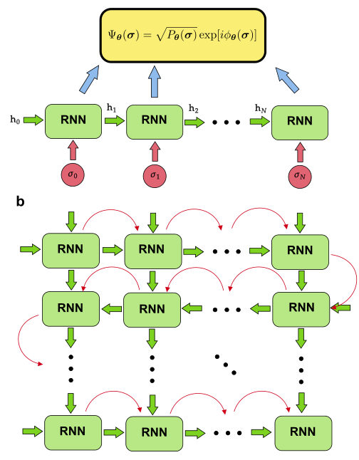 
Figure 1: Illustration of RNN wave functions. a) Schematic of an RNN wave function. A series of spins σi are sequentially provided as an input into the RNN cell (shown in green), which produces a list of outputs yi (shown in blue). Subsequently, the Softmax and/or Softsign layers are applied to compute the amplitude and phase of the wave function, respectively. The outputs of the RNN can be used to calculate the wave function through its amplitude and phase. b) Schematic of a 2D RNN. Each RNN cell (shown in green) takes a spin in a 2D array as an input and outputs two identical hidden states, drawn as green arrows, to each of its nearest neighbors. The autoregressive property can be applied...

📷 Fig 2

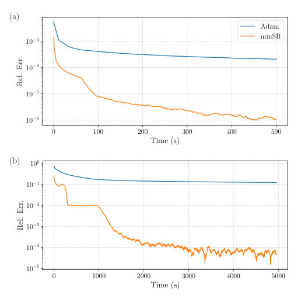 
Figure 2: One-dimensional benchmark comparison between Adam and minSR optimizers on two testbeds a) the 1D TFIM and b) the Cluster state. a) We find the ground state energy of the TFIM Hamiltonian with open boundary conditions with 200 spins at the critical point h = J = 1. The underlying model is a pRNN with dh = 32 hidden units and Ns = 100 Monte Carlo samples. The relative error with respect to the exact theoretical value [61] is plotted against time in seconds. To minimize statistical noise, the relative errors are averaged over a 300 training-step window. b) A comparison between Adam and minSR optimizers for the one-dimensional cluster state for N = 100 qubits. The relative error with...

📷 Fig 3

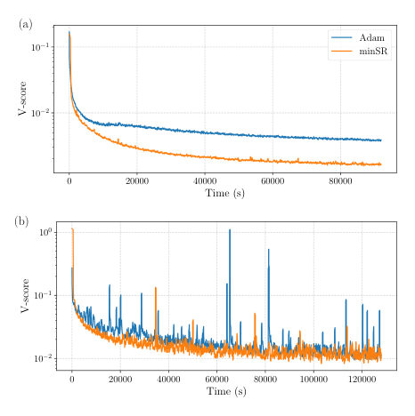 
Figure 3: 2D J1 −J2 model benchmark. We compare the Adam and minSR optimizers by showing the evolution of the V-score (39) versus time in seconds at (a) the Heisenberg point J2 = 0, and (b) the frustrated regime of J2 = 0.5. We apply a moving average with a window size of 200 iterations to minimize statistical noise. Our results show an enhancement of accuracy when applying minSR at J2 = 0, but an accuracy comparable to that of Adam at J2 = 0.5.

📷 Fig 4

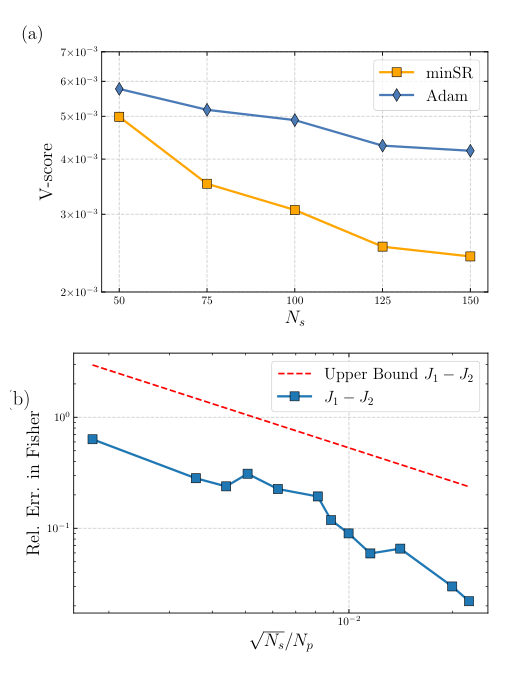 
Figure 5: Scaling Study of minSR. (a) We plot the V-score (see Eq. (39)) of Adam and minSR on a 10 × 10 antiferromagnetic Heisenberg model with OBC and dh = 100. We increase the number of samples Ns, plotted on the x-axis, and observe the effect on the V-score for both Adam and minSR. We keep an equal training time of 24 hours for all data points. We plot Adam as blue diamonds, and minSR as orange squares. (b) We plot the relative error of the subsampled SR metric ∥S −˜S∥F /∥S∥F against √Ns

📷 Fig 5

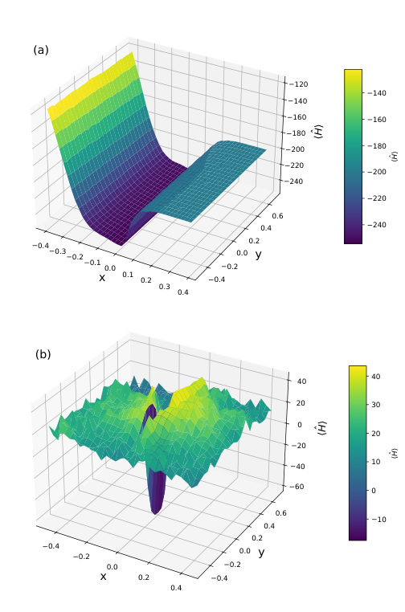 
Figure 4: Loss Landscape in 1D and 2D. We plot the loss landscapes of the a) 1D TFIM and b) 2D Heisenberg model around their optimal parameters, from section III, on a 60 × 60 grid. Each energy is calculated using 103 samples, which we found sufficient to discern important features of the loss landscape.

**Summary.** This paper develops a stable training protocol for using Recurrent Neural Networks to represent quantum many-body wave functions. It overcomes the known instability of second-order optimizers like minSR by introducing regularization techniques. The stabilized method proves highly effective, offering a powerful tool for simulating complex quantum Hamiltonians.

**Why it may be interesting.** This work directly tackles the practical limitations of using advanced quantum machine learning techniques (RNN-NQS) for simulating complex quantum matter, providing a robust optimization pathway for variational quantum simulation.

Detailed structure

**Main problem.** The paper addresses the instability of using second-order optimization methods, like minimum-step stochastic reconfiguration (minSR), when training Recurrent Neural Network Quantum States (RNN-NQS).

**Main result.** By applying simple regularization techniques to the minSR update, the authors stabilize the training process, showing that the method outperforms the Adam optimizer on several benchmark quantum models.

**Method.** The core method involves variational optimization of the energy expectation value using RNNs to parameterize the wave function, coupled with advanced analysis of the Fisher information matrix spectrum to stabilize the natural gradient descent update.

**Model / system.** The framework is applied to quantum many-body systems, including the 1D transverse-field Ising model, 1D cluster state, 2D Heisenberg, and J1-J2 models, using RNNs to represent the wave function $|\Psi_	heta
angle$.

**Key observables.** Energy expectation value $\langle\hat{H}
angle$, the Fisher information matrix spectrum, and the condition number $\kappa_2(S_\lambda)$ are key diagnostics.

**Important parameters / regimes.** The regularization parameter $\lambda$ (Tikhonov parameter) and the number of Monte Carlo samples $N_s$ are crucial hyperparameters.

**Assumptions / limitations.** The analysis relies on the i.i.d. sampling assumption for error bounding and assumes that careful preconditioning can mitigate the ill-conditioned nature of the RNN Fisher spectrum.

**Figures summary.** Figures illustrate the schematic structure of RNN wave functions for 1D and 2D lattices, and Figure 6 specifically shows the training stability of minSR as a function of the regularization parameter $\lambda$ and sample size $N_s$.

**Paper structure.** The paper progresses from introducing RNN-NQS and the optimization goal, to analyzing the inherent instability of minSR due to the RNN structure, developing the regularization technique, and finally benchmarking the stabilized method against Adam on various quantum Hamiltonians.

Abstract

Neural Quantum States (NQS) provide a powerful neural network-based variational framework for representing many-body wave functions and solving for ground states. Recurrent Neural Networks (RNNs) are particularly promising owing to their relatively low computational cost and their autoregressive property, which enables perfect sampling. Recently, RNNs have been reported to be unstable under curvature-based optimizers such as the minimum-step stochastic reconfiguration (minSR) method. In this paper, we address this perceived limitation and show that minSR can be stabilized through simple regularization techniques, enabling robust training of RNN-based NQS with only a few samples. Our approach outperforms the Adam optimizer on the one-dimensional transverse-field Ising model and the one-dimensional cluster state, and provides competitive results on the two-dimensional Heisenberg and $J_1-J_2$ models. This work offers a promising pathway for using modern optimization techniques with autoregressive NQS to address open questions in quantum simulation.

[↑ back to top](#top)

### [Second Harmonic Generation Spectroscopy of the Surface Charge Density Wave in the Weyl Semimetal CoSi](http://arxiv.org/abs/2608.17303v1)

**Authors:** Awadhesh K. Das, Wesley E. Deeg, Sujan Subedi, Chandra Shekhar, Claudia Felser, Darius H. Torchinsky  
**Type:** experiment · **Category:** statistical mechanics · **PDF:** <https://arxiv.org/pdf/2608.17303v1>  
**Analysis basis:** full PDF text, analyzed in chunks
**Topic relevance:** `non-equilibrium universality` **3/5** · `Frenkel-Kontorova` **1/5** · `driven-dissipative phase transition` **1/5**

📷 Fig 1

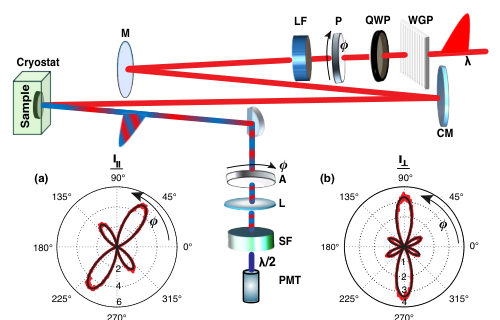 
Fig. 1. Schematic diagram of the experimental setup for SHG measurements. Optics are WGP-wire grid polar- izer, QWP-quarter wave plate, P-polarizer, LF-longpass fil- ter, M-mirror, CM-concave mirror, A-analyzer, L-lens, SF- shortpass filter and PMT-photomultiplier tube. The funda- mental (ω) and second harmonic (2ω) beams are represented in red and blue, respectively. Polar plots (a) I∥and (b) I⊥ show raw data (red) with fits (black) to surface point group C1. Here P and A are co-rotated, i.e., parallel for I∥and perpendicular for I⊥.

📷 Fig 2

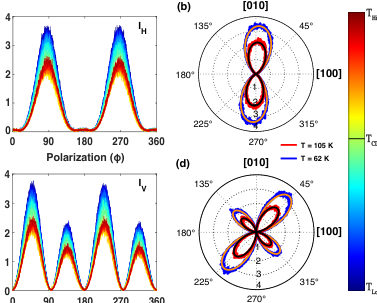 
Fig. 2. RA-SHG measurements on the CoSi (001) surface showing the evolution of the angular response across the CDW transition. The SHG intensity as a function of input polariza- tion angle ϕ is presented for the (a) fixed horizontal analyzer IH, (b) fixed vertical analyzer IV . Panels (c) and (d) show the corresponding polar plots at 105 K (red, T &gt; TCDW ) and 62 K (blue, T &lt; TCDW ), together with global fits to the sur- face symmetry point group (solid black and orange curves). A pronounced change in the angular anisotropy appears below TCDW , signaling the onset of surface ordering.

📷 Fig 3

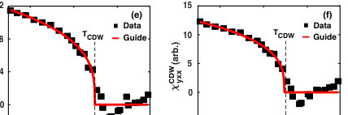 
Fig. 3. Panels (a), (b), (c), and (d) show the background- subtracted temperature-dependent peak SHG intensity for the IH, IV , I∥, and I⊥geometries, respectively, reconstructed using all six surface tensor elements (Supplementary Fig. 3) and evaluated through the expression in Supplementary Sec- tion S3. The transition temperature TCDW ∼90.0 K from the fit is marked by the black dashed lines. Panels (e) and (f) show the temperature dependence of the two dominant sur- face tensor elements, χ(2) xxy and χ(2) yxx, extracted from global fits along with a line to guide the eye.

📷 Fig 4

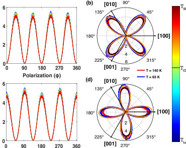 
Fig. 4. Temperature-dependent SHG response of the bulk CoSi over the temperature interval 60–110 K. The SHG in- tensities for the IH and IV channels are shown in panels (a) and (c). The angular plots in panels (b) and (d) are identi- cal above and below TCDW with global fits to Space Group 198, indicating the absence of temperature-driven modifica- tion on this face. Panel (e) shows the peak SHG intensities for IH, IV , I∥and I⊥, offset by ±0.5 for clarity. No significant temperature-driven transition is observed in the bulk SHG re- sponse.

📷 Fig 5

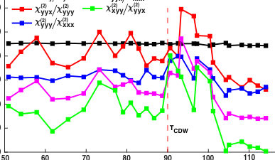 
Fig. 5. Temperature dependence of ratios among the six sur- face tensor elements. The ratio of the two dominant compo- nents, χ(2) xxy/χ(2) yxx (black), remains constant to within a few percent across the entire measured range, including through TCDW , indicating that both components track a common un- derlying quantity. Ratios among the four weak components (χ(2) yyx/χ(2) yyy, χ(2) yyy/χ(2) xxx, χ(2) yyx/χ(2) xxx, and χ(2) xyy/χ(2) yyx) vary only modestly below TCDW but fluctuate more substantially above it.

**Summary.** Researchers used RA-SHG spectroscopy on the CoSi surface to study a CDW transition at 90 K. They found the transition follows the 3D XY critical scaling, which is unexpected for a 2D surface. This suggests that the CDW order parameter has an intrinsic 3D character due to coupling with the underlying bulk topology of the Weyl semimetal.

**Why it may be interesting.** The finding of 3D XY critical behavior on a 2D surface challenges simple dimensionality arguments in critical phenomena, suggesting that topological coupling can induce higher-dimensional phase coherence.

Detailed structure

**Main problem.** To determine the nature and dimensionality of a Charge Density Wave (CDW) instability occurring on the surface of a Weyl Semimetal.

**Main result.** The CDW transition exhibits critical behavior consistent with the 3D XY universality class, despite being confined to a nominally two-dimensional surface layer.

**Method.** Rotational Anisotropy Second Harmonic Generation (RA-SHG) spectroscopy was used to measure the temperature dependence of the surface nonlinear susceptibility tensor elements.

**Model / system.** The study investigates the CoSi (001) surface, a Weyl Semimetal, where the CDW order parameter is probed. The analysis compares the observed critical exponent to theoretical predictions for phase transitions.

**Key observables.** Second Harmonic Generation (SHG) intensity, which tracks the CDW order parameter amplitude; the critical exponent $\beta$; and the transition temperature $T_{CDW}$.

**Important parameters / regimes.** Critical exponent $\beta = 0.30 \pm 0.03$; Transition temperature $T_{CDW} = 90.0 \pm 0.8$ K; Comparison to 3D XY universality class.

**Assumptions / limitations.** The apparent contradiction between 2D surface confinement and 3D XY scaling is resolved by assuming the CDW order parameter possesses an intrinsic three-dimensional structure due to coupling between surface sublayers.

**Figures summary.** Figures illustrate the raw RA-SHG data showing anisotropy changes across the transition, and plots detail the temperature dependence of background-subtracted SHG intensity and ratios of tensor elements.

**Paper structure.** The paper establishes the experimental setup and the CDW transition using RA-SHG. It then analyzes the temperature scaling of the SHG signal to extract the critical exponent, concluding that the 3D XY class applies due to underlying 3D coupling mechanisms.

Abstract

Using temperature-dependent rotational anisotropy second harmonic generation (RA-SHG), we identify a charge density wave (CDW) instability on the CoSi (001) face with an onset temperature at $90.0 \pm 0.8$ K. The SHG response tracks the order parameter amplitude, dominated by two nonlinear tensor elements, whose background-subtracted intensity evolves with temperature as a power law. The extracted critical exponent $β= 0.30 \pm 0.03$ is consistent with the 3D XY universality class, an unexpected result for a nominally two-dimensional surface layer. No corresponding anomaly is observed in the bulk response, establishing the transition as a purely surface-driven phase transition. We attribute this unexpected scaling to the coupling between surface Fermi-arc states and the bulk topology they are tied to, grounded in a previously observed intra-unit-cell phase relationship between surface sublayers that gives the order parameter intrinsic three-dimensional structure.

[↑ back to top](#top)

### [Bulk Criticality and Boundary Spectra in AdS from Matrix Product States](http://arxiv.org/abs/2608.16992v1)

**Authors:** Faizan Bhat  
**Type:** theory · **Category:** statistical mechanics · **PDF:** <https://arxiv.org/pdf/2608.16992v1>  
**Analysis basis:** full PDF text, analyzed in chunks
**Topic relevance:** `methods for driven-dissipative` **3/5** · `analog quantum simulation` **1/5**

📷 Fig 1

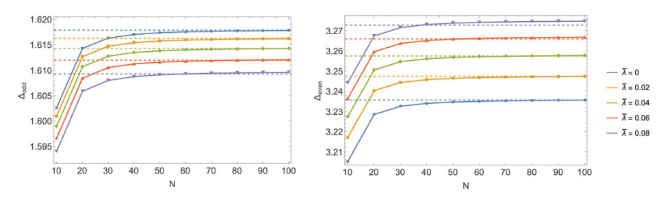 
Figure 1: Convergence in the continuum limit of the lowest Z2-odd (left) and Z2-even (right) boundary scaling dimensions at weak coupling, for ¯m2 = 1. Dashed lines denote the O(¯λ2) perturbative predictions.

📷 Fig 2

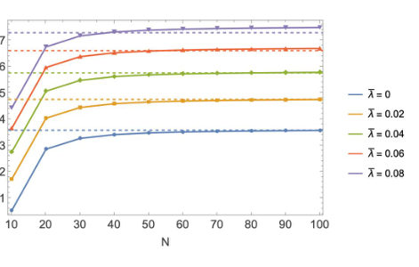 
Figure 1 compares the boundary scaling dimensions extracted from the MPS cal- culation with the perturbative predictions. As the lattice is refined, the numerical results approach the perturbative values in both symmetry sectors. The agreement is already good at moderate N, while the small residual differences at the largest couplings

📷 Fig 3

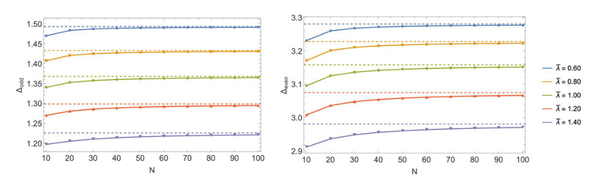 
Figure 2: Convergence in the continuum limit of the lowest Z2-odd (left) and Z2-even (right) boundary scaling dimensions beyond the weak-coupling regime, for ¯m2 = 1. Dashed lines are continuum estimates from the fit ∆(N) = ∆cont + a/N 2.

📷 Fig 4

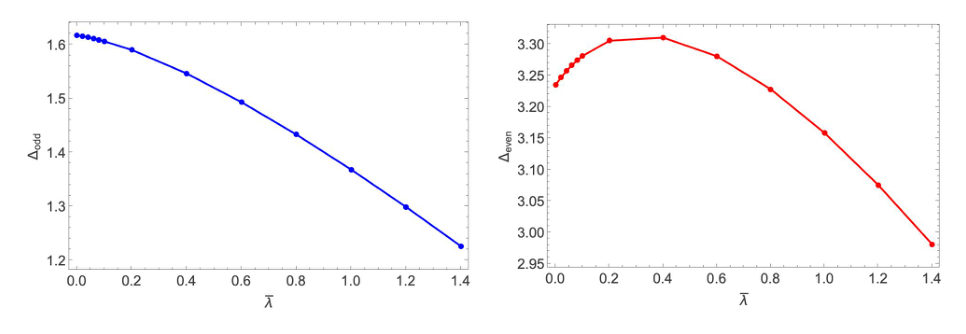 
Figure 3: Lowest Z2-odd (left) and Z2-even (right) boundary scaling dimensions as functions of the quartic coupling ¯λ for ¯m2 = 1.

📷 Fig 5

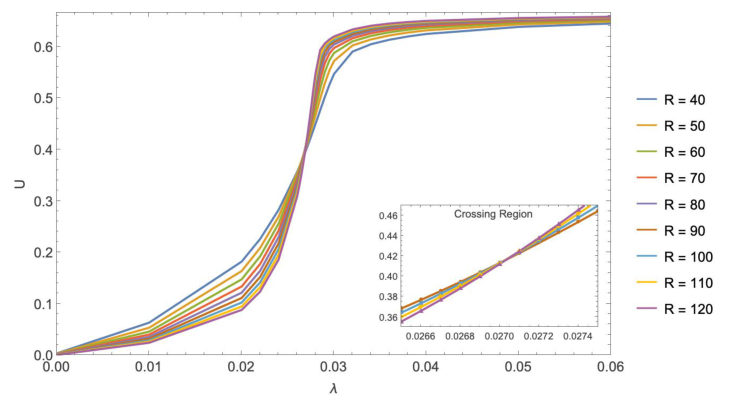 
Figure 4: Binder cumulant U of the central bulk order parameter as a function of the quartic coupling λ for m2 = 0.01 and increasing AdS radius R. The order parameter is measured within |ρ| &lt; R, while the regulated boundaries are placed at ρmax = 5R. The evolution from U ≃0 in the symmetric regime towards U ≃2/3 in the ordered regime becomes increasingly sharp with R. The inset magnifies the crossing region for the largest radii.

**Summary.** This paper applies tensor-network methods, specifically Matrix Product States, to study interacting quantum field theories in Anti-de Sitter space. By analyzing the energy spectrum and performing finite-size scaling, the authors non-perturbatively characterize the critical point of $\phi^4$ theory in $	ext{AdS}_2$. This work successfully maps the bulk and boundary physics onto the known 2D Ising universality class.

**Why it may be interesting.** The application of tensor networks (MPS) to study critical phenomena in curved spacetime provides a powerful, non-perturbative tool for analyzing strongly correlated quantum systems, bridging condensed matter critical theory with gravity/QFT.

Detailed structure

**Main problem.** The study investigates interacting quantum field theories in Anti-de Sitter (AdS) space, focusing on determining bulk criticality and extracting the low-lying boundary spectra.

**Main result.** The authors successfully compute boundary scaling dimensions non-perturbatively for $\phi^4$ theory in $	ext{AdS}_2$, locating the bulk $\mathbb{Z}_2$ symmetry-breaking transition consistent with the 2D Ising universality class.

**Method.** The research employs a tensor-network approach based on Matrix Product States (MPS) and utilizes finite-size scaling in the AdS radius ($R$) to probe critical behavior.

**Model / system.** The system is an interacting scalar quantum field theory, specifically $\phi^4$ theory, formulated in global Anti-de Sitter space ($	ext{AdS}_2$). The Hamiltonian is discretized using a lattice formulation.

**Key observables.** Low-lying boundary spectra, bulk energy levels, critical exponents, and central charge.

**Important parameters / regimes.** The AdS radius ($R$), the coupling constant ($\lambda$), and the lattice spacing.

**Assumptions / limitations.** The use of a lattice Hamiltonian formulation allows for independent variation of the lattice spacing and the AdS radius $R$.

**Paper structure.** The paper first establishes the theoretical framework by relating the global AdS spectrum to boundary operators via the bulk-boundary OPE. It then details the lattice discretization of the Hamiltonian and applies the MPS/tensor-network methods to compute spectra and analyze finite-size scaling near critical points.

Abstract

We study interacting scalar quantum field theories in anti-de Sitter (AdS) space using a tensor-network approach based on matrix product states. We develop methods for extracting low-lying boundary spectra from global-AdS energy levels, probing bulk criticality through finite-size scaling in the AdS radius, and identifying conformal boundary conditions. Applying these methods to scalar $φ^4$ theory in $\mathrm{AdS}_2$, we compute the lowest non-trivial $\mathbb{Z}_2$-odd and even boundary scaling dimensions non-perturbatively. We then locate the bulk $\mathbb{Z}_2$ symmetry-breaking transition and extract critical exponents and central charge consistent with the 2D Ising universality class. At the critical point, we determine the low-lying boundary spectrum and use it to identify the $\mathbb{Z}_2$-preserving free/ordinary Ising conformal boundary condition, thereby characterising both the bulk and boundary universality classes.

[↑ back to top](#top)

### [High-Harmonicity Planar Penning Traps for Single-Electron Qubits](http://arxiv.org/abs/2608.17984v1)

**Authors:** Kedar Mal, A. N. Agnihotri, Sugam Kumar, Wolfgang Quint, Manuel Vogel  
**Type:** theory · **Category:** other · **PDF:** <https://arxiv.org/pdf/2608.17984v1>  
**Analysis basis:** full PDF text, analyzed in chunks
**Topic relevance:** `QC/QI experiment` **3/5** · `quantum measurements` **1/5**

📷 Fig 1

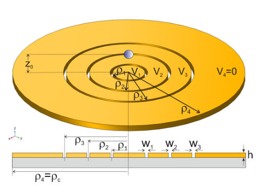 
FIG. 1. Top: Electrode structure of a four-electrode (three- gap) planar Penning trap. A confined electron is indicated in the trap centre at a height z0 above the plane of the electrodes. Bottom: Cross-sectional view. The electrodes are supported by a carrier substrate and are separated by gaps of widths wi and height h for electrical insulation from one another.

📷 Fig 2

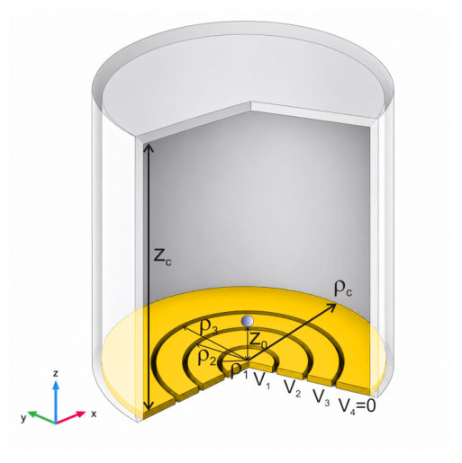 
FIG. 2. Cutout drawing of a four-electrode planar Penning trap like in Fig. 1 with a finite cylindrical electrostatic bound- ary at zero potential with radius ρc and height zc indicated in grey.

📷 Fig 3

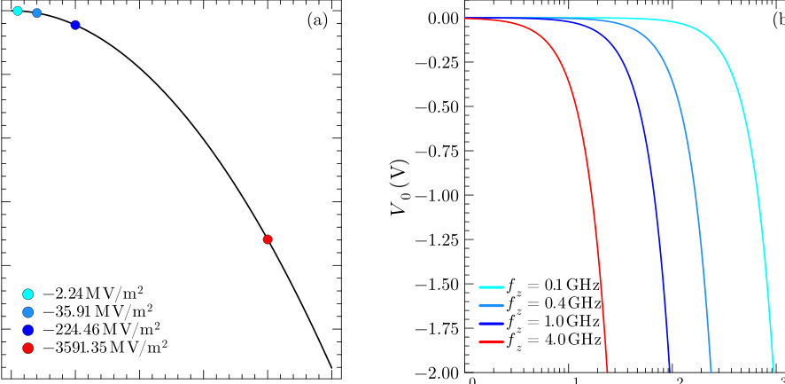 
FIG. 3. (a) Required electrostatic curvature V0/ρ2 1 as a function of the desired axial frequency fz, calculated using Eq. (2). The marked points correspond to axial frequencies of 0.1, 0.4, 1.0, and 4.0 GHz, respectively. (b) Required trap depth V0 as a function of the trap size ρ1 for the corresponding axial frequencies.

📷 Fig 4

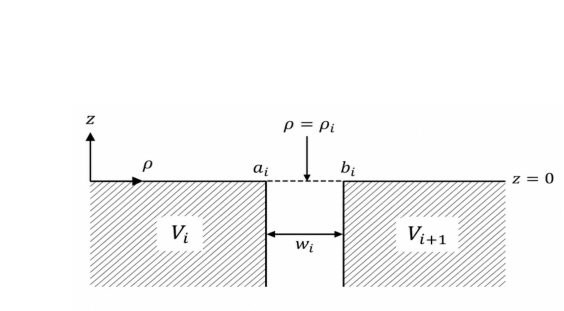 
FIG. 4. Schematic of the ith electrode gap of width wi, cen- tered at radius ρ = ρi.

📷 Fig 5

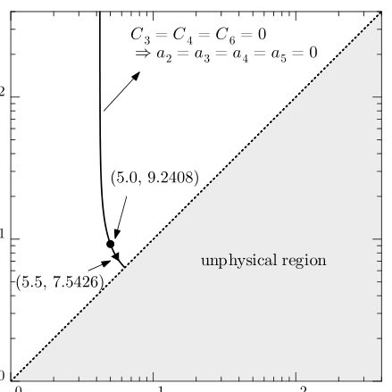 
FIG. 5. Optimized geometry for a three-gap planar trap with ˜ρ1 = 1, ˜wi = 0, and ˜ρc = ˜zc = ∞, satisfying a2 = a3 = a4 = a5 = 0. The circle marks the parameter set used for detailed analysis, while the triangle indicates the optimized parameters used in [14].

**Summary.** This paper details the theoretical design of planar Penning traps intended for single-electron qubits. The authors develop advanced analytical and simulation techniques to ensure the trapping potential is highly harmonic, which is crucial for stable quantum operations. They conclude that a specific four-electrode geometry is required to overcome the limitations of smaller, microfabricated traps.

**Why it may be interesting.** This work directly addresses the engineering challenges of realizing solid-state or microfabricated quantum hardware by providing rigorous theoretical guidelines for optimizing trap potentials for single-electron qubits.

Detailed structure

**Main problem.** The primary goal is to design planar Penning traps that maintain a highly harmonic confining potential for single-electron qubits used in quantum information processing.

**Main result.** The authors demonstrate that a four-electrode, three-gap planar trap geometry is necessary and sufficient to achieve the required harmonicity, even when accounting for finite electrode gaps and boundaries.

**Method.** The work combines fully analytic derivations of the electrostatic potential with detailed comparison against finite-element simulations to optimize trap geometry and electrode voltages.

**Model / system.** The system is a planar Penning trap confining a single electron using a combination of a magnetic field and voltages on concentric electrodes. The potential is modeled by superimposing contributions from these electrodes, requiring careful treatment of finite gaps and boundaries.

**Key observables.** Harmonicity of the axial potential, axial oscillation frequency ($\omega_z$), and the thermally induced frequency width ($\sigma_f$).

**Important parameters / regimes.** Millimetre size scale and below (sub-mm), requiring consideration of relative gap sizes; the trap must be optimized to ensure $\sigma_f \ll \gamma_z$.

**Assumptions / limitations.** The analysis assumes the potential can be modeled by analyzing contributions from individual electrodes, and that the trap can be optimized to minimize anharmonicities despite the planar geometry's inherent limitations compared to 3D traps.

**Figures summary.** Figures illustrate the geometry of the four-electrode planar Penning trap, its cross-section, and the relationship between required electrostatic curvature, trap depth, and desired axial frequency.

**Paper structure.** The paper progresses by establishing the need for high harmonicity, developing the theoretical framework for planar traps with finite gaps, showing that simple designs fail, and finally presenting the optimization procedure using analytic and simulation methods to achieve stable confinement.

Abstract

We present a detailed account of the design choices required for planar Penning traps that feature a highly harmonic confining potential. High harmonicity is indispensable for a number of applications, particularly for confinement of single electrons as qubits in quantum-information processing. The present work extends previous studies [D. Goldmann and G. Gabrielse, Phys. Rev. A 81, 052335 (2010)] by a fully analytic treatment of finite electrode gaps and their relevance for small traps on the millimetre size scale and below, when relative gap sizes are non-negligible. We derive the overall trap potential with a particular focus on different models of finite-gap potentials and show how to find the optimum trap geometry and electrode voltages to minimize anharmonicities. The analytic calculations are compared with detailed finite-element simulations.

[↑ back to top](#top)

### [Universal quantum corrections of two-body correlation in a weakly interspecies interacting binary Bose mixture](http://arxiv.org/abs/2608.17473v1)

**Authors:** Rui-Yan Chen, Zhaoxin Liang, Gao Xianlong  
**Type:** theory · **Category:** quantum gases · **PDF:** <https://arxiv.org/pdf/2608.17473v1>  
**Analysis basis:** full PDF text, analyzed in chunks
**Topic relevance:** `Keldysh / 2PI / non-Gaussian methods` **3/5** · `analog quantum simulation` **1/5**

📷 Fig 1

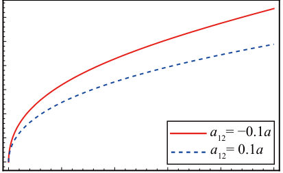 
FIG. 2. Quantum depletion fraction nex/n as a function of the total density n for a12 = −0.1a and a12 = 0.1a. Parameters and units are the same as in Fig. 1.

📷 Fig 2

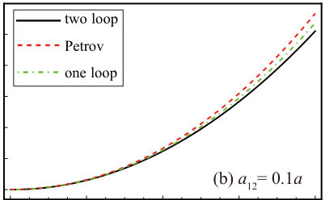 
FIG. 1. Energy density E as a function of the total particle density n for (a) a12 = −0.1a and (b) a12 = 0.1a, with m1 = m2 = m, a11 = a22 = a, and n1 = n2 = n/2. Our one- loop and two-loop results are compared with Petrov’s one- loop theory [12]. The curves are labeled in the figure. E is in units of 10−4ℏ2/(2ma5) and n in units of 10−3a−3.

📷 Fig 3

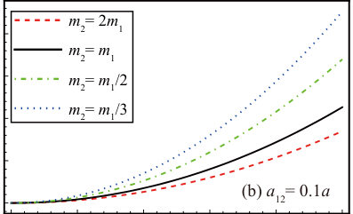 
FIG. 3. Energy density as a function of the total density n for different mass ratios r = m2/m1 = 2, 1, 1/2, and 1/3 (as labeled in the figure), with (a) a12 = −0.1a and (b) a12 = 0.1a. Other parameters are as in Fig. 1. The curves confirm the scaling identity (61): E(r) = (1+1/r)E(1)/2. E is in units of 10−4ℏ2/(2m1a5) and n in units of 10−3a−3.

**Summary.** This theoretical paper calculates the universal quantum corrections to two-body correlations in a weakly interacting binary Bose mixture using the CJT effective action formalism. By employing a saddle-point approximation, the authors derive the energy density as a low-density expansion, showing that the mixture's corrections map simply to single-component results. The theory successfully reproduces known equations of state and analyzes the impact of mass imbalance on the system's energy.

**Why it may be interesting.** This work provides a highly rigorous, analytical framework for calculating quantum corrections in multi-component quantum gases, extending established results like the LHY corrections to mixtures and providing insights into mass imbalance effects.

Detailed structure

**Main problem.** The paper investigates the universal quantum corrections to two-body correlations in a weakly interacting binary Bose mixture at zero temperature.

**Main result.** The universal quantum corrections map simply to the single-component case, evaluated using an effective scattering length $\delta a_\sigma = a_{\sigma\sigma} - a_{12}$. The theory successfully reproduces known results like Petrov's EOS and yields beyond-Lee-Huang-Yang corrections.

**Method.** The authors employ the Cornwall-Jackiw-Tomboulis (CJT) two-particle-irreducible effective action formalism, utilizing a saddle-point approximation on the interspecies coupling via Hubbard-Stratonovich transformations.

**Model / system.** The system is a zero-temperature binary Bose mixture, modeled by an action involving intra-species ($g_1, g_2$) and interspecies ($g_{12}$) couplings. The analysis is performed in the weak interspecies-coupling regime.

**Key observables.** Ground-state energy density, quantum depletion, and chemical potentials.

**Important parameters / regimes.** Weak interspecies-coupling regime ($|a_{12}| \ll |a_{11}|, |a_{22}|$), low-density expansion, and mass imbalance ratio ($m_1/m_2$).

**Assumptions / limitations.** The primary assumption is the validity of the saddle-point approximation for the interspecies field, which restricts the analysis to the weak-coupling limit.

**Figures summary.** Figure 3 illustrates the energy density $E$ dependence on total density $n$ for various mass ratios, confirming the predicted scaling identity $E(r) = (1+1/r)E(1)/2$.

**Paper structure.** The paper develops the theory by first applying Hubbard-Stratonovich transformations and performing a saddle-point treatment. It then calculates the energy density via a two-loop expansion, deriving the single-component mapping and analyzing the scaling behavior due to mass imbalance.

Abstract

We investigate universal quantum corrections to two-body correlations in a zero-temperature binary Bose mixture using the Cornwall-Jackiw-Tomboulis two-particle-irreducible effective action formalism. In the weak interspecies-coupling regime, a saddle-point treatment based on Hubbard-Stratonovich transformations can be combined with a two-loop expansion and a gapless Hartree-Fock correction, thereby preserving the Goldstone theorem and reducing the coupled two-component problem to two analytically solvable single-component theories. Within this framework, we derive the ground-state energy density as a low-density expansion in the gas parameter, together with the quantum depletion and chemical potentials. The results exhibit a simple mapping to the single-component case: the universal quantum corrections of the mixture are obtained by evaluating the known single-component series at an effective scattering length $a_{σσ}-a_{12}$ for each species, where $a_{σσ}$ and $a_{12}$ are the intra- and interspecies $s$-wave scattering lengths. This reproduces Petrov's equation of state at one-loop order in the weak-coupling limit and yields beyond-Lee-Huang-Yang corrections at two-loop order. We also analyze the role of mass imbalance, which enters the energy density through the exact rescaling factor $(1+m_{1}/m_{2})/2$.

[↑ back to top](#top)

### [Computationally Efficient Optimization of Per-Qubit Clifford Deformation for Non-uniform Biased Noise](http://arxiv.org/abs/2608.17870v1)

**Authors:** Won Joon Yun, Andrew Nemec, Jonathan M. Baker  
**Type:** theory · **Category:** quantum information and computing · **PDF:** <https://arxiv.org/pdf/2608.17870v1>  
**Analysis basis:** full PDF text, analyzed in chunks
**Topic relevance:** `QC/QI experiment` **3/5**

📷 Fig 1

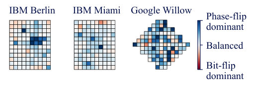 
Fig. 1. Per-qubit bit-flip/phase-flip bias, mapped onto the real qubit layout of each device. The imbalance is spatially non-uniform on every device, so no single global deformation fits it.

📷 Fig 2

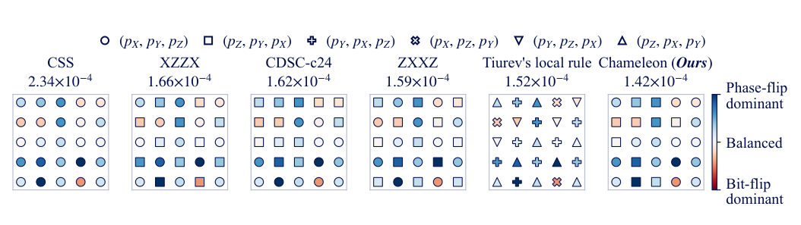 
Fig. 2. Comparison of six policies on a sampled map from Google Willow calibration data, surface code with distance 5. Values indicate LER. CDSC-c24 means CDSC validated with 24 candidates [13]. Our proposed method achieves the lowest LER without any decoder validation.

📷 Fig 3

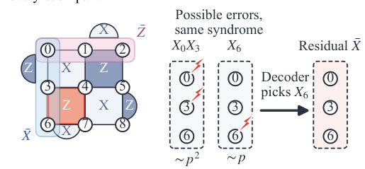 
Fig. 3. The decoding ambiguity on the distance-3 rotated surface code. On the left, the code carries the logical ¯Z and ¯ X, where dark plaquettes are Z- type checks, light plaquettes are X-type checks, and orange marks triggered Z-type checks. On the right, the two-qubit error X0X3 (probability ∼p2) and the single-qubit error X6 (∼p) trigger exactly the same checks. The decoder picks the likelier X6, and when the true error is X0X3, the residual is the logical ¯ X. No decoder can avoid this failure; deformation can suppress it.

📷 Fig 4

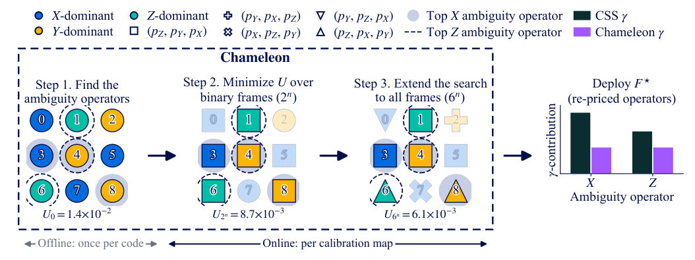 
Fig. 4. Overview of CHAMELEON, the compile-time pass on one synthetic mixed-bias d=3 map (η=10, p=0.005). It takes the per-qubit noise map and the code as input. Step 1 finds the ambiguity operators of the undeformed code, and only the likeliest X and Z operators are drawn for legibility, a cost paid once and independent of the calibration map. Step 2 minimizes U, an approximation to a bound on the LER, over the binary space (2n). Step 3 extends to the full frame space (6n) with the cross-entropy method, reducing the bound to U6n. The optimized frame F ⋆is then deployed without decoder validation.

📷 Fig 5

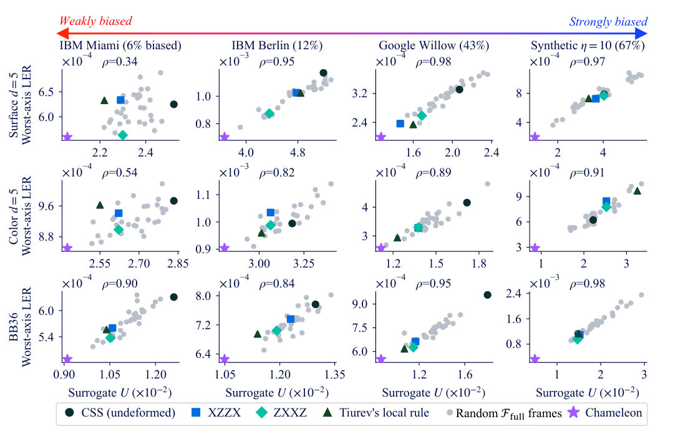 
Fig. 5. Surrogate U vs. measured worst-axis LER for 35 frames per cell (4 fixed baselines, the deployed CHAMELEON frame, and 30 random full frames), at code capacity with p=0.02 and ≥256 ambiguity events per frame. Columns are ordered by the bias strength of the map (fraction of qubits with ηq&gt;1.5, from left to right 6, 13, 43, 67%). Surrogate fidelity rises with bias. On the least-biased map (Miami) the surface-code frames are a near-flat tie and ranking is noise-dominated, while on BB36 ρ reaches 0.84–0.98 on every map, and CHAMELEON lands in the lowest-U, lowest-LER corner of every panel.

**Summary.** This paper introduces Chameleon, a fast compiler designed to optimize Clifford deformations for quantum error correction codes operating under realistic, biased noise. By replacing intractable full simulations with an analytical upper bound on failure probabilities, it efficiently finds optimal noise mitigation strategies. This significantly improves the achievable logical error rates while making the optimization process computationally feasible for real-world hardware constraints.

**Why it may be interesting.** While focused on superconducting qubits, the development of a fast, general-purpose compiler for optimizing error correction protocols against realistic, non-i.i.d. noise is highly relevant for any field utilizing quantum computation, including AMO platforms.

Detailed structure

**Main problem.** The primary goal is to reduce the Logical Error Rate (LER) in fault-tolerant quantum computing when physical qubits suffer from non-uniform, biased noise.

**Main result.** The proposed compiler, Chameleon, achieves significant LER reductions (e.g., 19% for surface codes) while drastically reducing classical computation time from days to minutes.

**Method.** It employs a novel compiler that approximates the LER using an analytical upper bound on ambiguity operators, avoiding computationally prohibitive full simulations.

**Model / system.** The work models superconducting quantum hardware subject to spatially non-uniform Pauli noise (X/Z bias). It applies to general Quantum Error Correction (QEC) codes like the surface code, color code, and BB72 code.

**Key observables.** Logical Error Rate (LER), correlation coefficient ($
ho$) between the surrogate score and actual LER, and classical computation time.

**Important parameters / regimes.** Noise bias ($\eta_q$), code distance ($d$), and the specific structure of the error-correcting code used.

**Assumptions / limitations.** The method relies on approximating the true LER using an analytical upper bound derived from the ambiguity operators, assuming this bound strongly preserves the ranking of candidate deformations.

**Figures summary.** Figures illustrate the non-uniform noise bias on a device layout and compare LER reduction achieved by Chameleon against other policies on a sampled map for a surface code.

**Paper structure.** The paper introduces the problem of biased noise in QEC, details the limitations of existing global/local deformation techniques, proposes the Chameleon compiler using an analytic surrogate objective, and validates its performance across multiple code families and noise models.

Abstract

In fault-tolerant quantum computing systems with biased noise, Clifford deformation can substantially reduce the logical error rate (LER) without additional physical hardware overhead, such as extra qubits, syndrome extraction rounds, or code distance. Although Google Willow calibration data shows that $43\%$ of qubits exhibit strong $X/Z$ bias, existing calibration-aware deformation techniques remain impractical: (1) global searches over the $6^n$ deformation choices rely on computing-intensive simulations, and (2) local heuristics often underperform undeformed baselines.   We present Chameleon, a fast, high-performance, and code-agnostic Clifford deformation compiler. We utilize our approximation to tackle a deformation problem based on an analytical bound on the LER. By minimizing this surrogate, Chameleon finds an optimized deformation that empirically reduces the LER with substantially lower computational overhead. In our evaluation, using calibration models derived from real superconducting devices, Chameleon demonstrates that improvements in our surrogate are strongly correlated with actual LER reductions, with an average rank correlation of $ρ=0.8$ and $ρ=0.89$-$0.94$ on the most strongly biased system. It also reduces classical computational time from $1.2$ days to $3.1$ minutes for the BB72 code. Chameleon achieves maximum LER reductions of $19\%$ ($13\%$ on average) for surface codes, $16\%$ ($7\%$) for color codes, and $10\%$ ($4\%$) for bivariate bicycle codes relative to competing baselines. The maximum gains for all code families are observed on the most strongly biased system.

[↑ back to top](#top)

### [Frustration without Glass in Non-Abelian Simplicial Networks](http://arxiv.org/abs/2608.17817v1)

**Authors:** Xuanhua Wang  
**Type:** theory · **Category:** disordered systems and neural networks · **PDF:** <https://arxiv.org/pdf/2608.17817v1>  
**Analysis basis:** full PDF text, analyzed in chunks
**Topic relevance:** `analog quantum simulation` **3/5**

📷 Fig 1

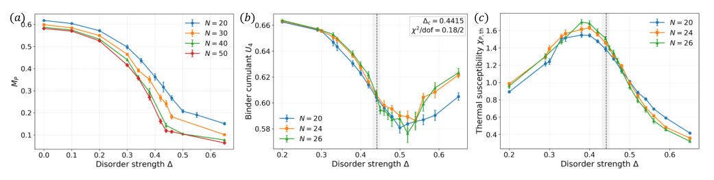 
FIG. 1. Continuous disorder-driven loss of global compatibility at J0 = 1 and β = 6. (a) Gauge-invariant order parameter MP as a function of disorder strength. (b) Binder cumulant U4, showing a common crossing within the window ∆c ≃0.44 ± 0.01. (c) Connected thermal susceptibility of the plaquettes χP,con, whose maximum grows and peak width shrinks with the system size. Error bars represent disorder-resolved statistical uncertainties.

📷 Fig 2

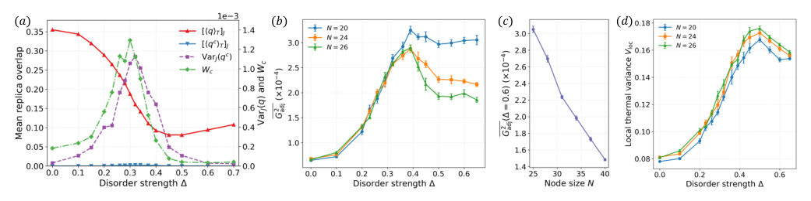 
FIG. 2. Gauge-invariant characterization of the high-disorder phase. (a) Replica overlaps, width and sample-to-sample variance VarJ(qc) for N = 30. (b) G2 adj versus ∆for three sizes. (c) The finite-size analysis of G2 adj at representative ∆= 0.6. The approximate N −1 scaling is consistent with Iadj ∼3NCadj remaining a finite value at ∆&gt; ∆c. (d) Local thermal variance of plaquettes rises sharply with disorder. Parameters used for J0 and β are identical to those in Figure 1.

**Summary.** This work analyzes a non-Abelian gauge network subjected to quenched frustration, modeling structural consistency via plaquette holonomies. By analyzing key correlation measures, the authors demonstrate that the system enters a non-glassy correlated liquid phase rather than freezing into a spin-glass state. This suggests that collective order can persist through geometric dilution of local correlations.

**Why it may be interesting.** The concept of a 'correlated gauge liquid' provides a novel theoretical framework for understanding collective organization in highly frustrated systems, moving beyond standard spin-glass paradigms.

Detailed structure

**Main problem.** The paper investigates the collective phase that emerges in systems with non-Abelian holonomies when subjected to quenched, mutually frustrating couplings, aiming to distinguish this from conventional glassy freezing.

**Main result.** Dense frustration leads to a non-glassy correlated gauge liquid, characterized by a finite integrated correlation weight despite the geometric dilution of individual pair correlations.

**Method.** The study employs theoretical formulation of non-Abelian gauge networks and utilizes advanced numerical techniques like parallel-tempering simulations and replica overlap analysis.

**Model / system.** The model is a non-Abelian gauge network defined on an oriented simplicial 2-complex, where link transformations belong to a group like SU(2). The dynamics are governed by a Hamiltonian involving Wilson plaquette observables with quenched random couplings.

**Key observables.** Global compatibility ($m_P$), connected adjacent correlation weight ($I_{	ext{adj}}$), and connected replica-overlap width ($W_c$).

**Important parameters / regimes.** High-disorder phase, quenched random couplings ($J_f$), and the system size ($N$).

**Assumptions / limitations.** The analysis focuses on the SU(2) model on the complete simplicial 2-complex, and the interpretation relies on distinguishing between different types of correlation decay.

**Figures summary.** Figures illustrate the continuous disorder-driven loss of global compatibility, the finite nature of $I_{	ext{adj}}$ in the high-disorder phase, and the vanishing of replica overlap width, confirming the non-glassy liquid state.

**Paper structure.** The paper builds by defining the gauge network and Hamiltonian, then analyzing the behavior of key observables ($m_P, I_{	ext{adj}}, W_c$) across different disorder regimes to rule out glassy freezing and establish the correlated liquid phase.

Abstract

We formulate a non-Abelian theory of structural consistency for systems in which dynamical transformations reside on the links of a simplicial network. Gauge covariance follows from freedom to choose local representation frames, while plaquette holonomies quantify the incompatibility of alternative paths. For an SU(2) model on the complete simplicial $2$-complex with quenched random plaquette couplings, parallel-tempering simulations reveal a continuous disorder-driven loss of global compatibility. In the high-disorder phase, the uniform compatibility $M_P$ decreases with system size, the integrated adjacent correlation weight $\mathcal I_{\mathrm{adj}}$ remains finite value. Moreover, the connected replica-overlap width approaches the numerical noise floor and its distribution narrows, providing no evidence for thermodynamic replica-symmetry breaking. Dense frustration therefore produces a non-glassy correlated gauge liquid in which individual pair correlations are geometrically diluted while a finite integrated correlation weight survives.

[↑ back to top](#top)

### [Gate-level Implementation and Resource Analysis of Lackadaisical Quantum Walk Search](http://arxiv.org/abs/2608.17136v1)

**Authors:** Amit Saha, Debanjan Kola, Nishanka Das, Amlan Chakrabarti  
**Type:** both · **Category:** quantum information and computing · **PDF:** <https://arxiv.org/pdf/2608.17136v1>  
**Analysis basis:** full PDF text, analyzed in chunks
**Topic relevance:** `QC/QI experiment` **3/5**

📷 Fig 1

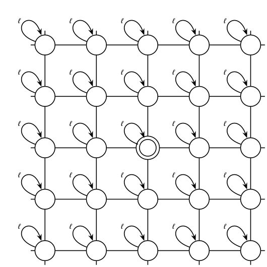 
Fig. 2. Lackadaisical quantum walks on a 5 × 5 grid. Every vertex carries a self-loop of weight ℓ. The double- circled vertex denotes the marked vertex.

📷 Fig 2

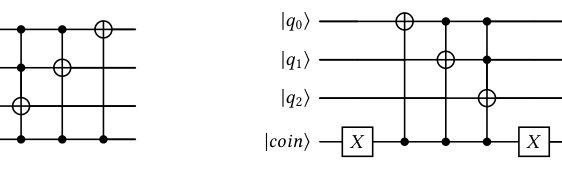 
Fig. 4. Shift operator circuits for the discrete-time quantum walks on a 3-qubit position register. 𝑆+ increments the position by 1 when |𝑐𝑜𝑖𝑛⟩= |1⟩; 𝑆−decrements by 1 when |𝑐𝑜𝑖𝑛⟩= |0⟩.

📷 Fig 3

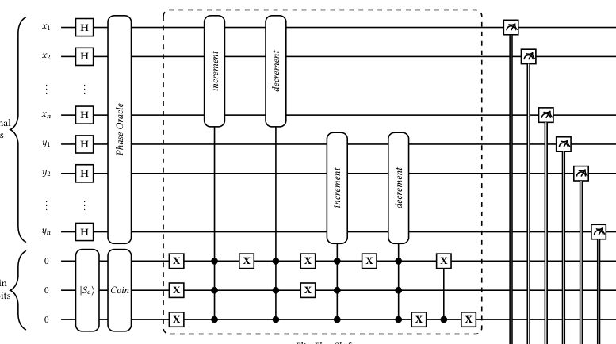 
Fig. 6. Complete circuit design of the lackadaisical quantum walks on an 𝐿×𝐿grid, showing state initialization, the walk operator repeated for 𝑡iterations (coin, phase oracle, and flip-flop shift operations), and final measurement of the vertex qubits.

📷 Fig 4

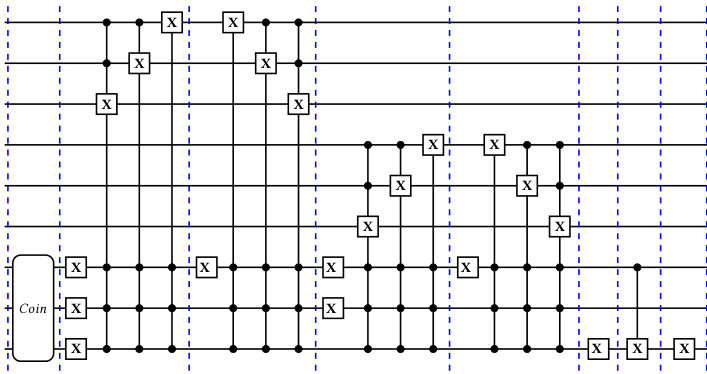 
Fig. 7. Gate-level implementation of the flip-flop shift operator for an 8 × 8 lackadaisical quantum walk. The circuit uses three-qubit 𝑋𝑝and 𝑌𝑝position registers and a three-qubit coin register. Directional coin states are sequentially mapped to the active state |111⟩𝑐to control the corresponding spatial shift, followed by a flip-flop update that reverses the movement direction while preserving the self-loop state.

📷 Fig 5

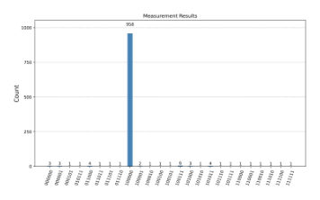 
Fig. 8. Ideal noiseless results for an 8 × 8 grid with a single marked vertex.

**Summary.** This paper provides a comprehensive gate-level implementation framework for Lackadaisical Quantum Walk search, bridging the gap between theory and hardware. The authors detail the circuit construction, validate its performance under noise, and rigorously analyze the required quantum resources using both logical and fault-tolerant estimates. This work establishes a practical roadmap for testing advanced quantum search algorithms on superconducting quantum hardware.

**Why it may be interesting.** This work is highly relevant as it translates an abstract quantum algorithm into concrete, resource-quantified circuit blueprints, which is the necessary step for experimental realization on near-term quantum processors.

Detailed structure

**Main problem.** The paper addresses the gap between the theoretical advantages of Lackadaisical Quantum Walks (LQW) and their practical, gate-level realization for execution on current quantum hardware.

**Main result.** They provide a complete, validated gate-level circuit construction for LQW search and perform detailed resource analyses, quantifying the required qubits and gate counts for scaling up to large grids.

**Method.** The authors developed a gate-level framework by encoding the walk dynamics using oracle, coin, and flip-flop shift operations, validating the circuit under both ideal and realistic noisy superconducting hardware models.

**Model / system.** The model is the Lackadaisical Quantum Walk (LQW) on a 2D grid, which extends standard quantum walks by incorporating weighted self-loops to enhance search localization. The implementation is mapped onto a qubit register structure suitable for superconducting quantum hardware.

**Key observables.** Search success probability, algorithmic register size (9 to 15 qubits), transpiled gate count ($3.63	imes10^{5}$ to $4.38	imes10^{6}$), and circuit depth.

**Important parameters / regimes.** Self-loop weight ($\ell$), grid size ($8	imes8$ to $64	imes64$), physical error rate ($p=10^{-3}$), and code distance for surface-code analysis.

**Assumptions / limitations.** The physical resource analysis assumes a surface-code model and relies on the decomposability of multi-controlled gates into native one- and two-qubit gates.

**Figures summary.** Figures illustrate the 1D and 2D walk structures, basic coin circuits, and the circuit components (increment/decrement) used for the position register.

**Paper structure.** The paper progresses from defining the LQW model and its theoretical benefits, to presenting the explicit gate-level circuit construction, validating it under noise, and concluding with detailed logical and fault-tolerant physical resource estimations.

Abstract

Lackadaisical quantum walks (LQW) extend discrete-time quantum walks (DTQW) by introducing weighted self-loops, enabling improved spatial-search performance through controlled localization of the walker. Although their theoretical properties and algorithmic advantages have been studied extensively, practical gate-level realizations suitable for execution on quantum hardware remain largely unexplored. This gap limits the assessment of lackadaisical quantum walk search under realistic architectural constraints, noise processes, and resource requirements. In this work, we present a gate-level implementation framework for lackadaisical quantum walk search. The proposed construction encodes the position and coin spaces into qubit registers, and realizes the walk dynamics through oracle, coin, and flip-flop shift operations. We validate the circuit by reproducing the expected search behavior for single and multiple marked vertices and by analyzing the effect of the self-loop weight on the success probability. We further evaluate the implementation under realistic noisy settings using superconducting hardware's noise models and apply noise-mitigation techniques to improve the measured search performance. Logical-resource analysis shows that, for grids ranging from $8\times8$ to $64\times64$, the algorithmic register increases from 9 to 15 qubits, while the transpiled gate count increases from $3.63\times10^{5}$ to $4.38\times10^{6}$ and the circuit depth from $2.13\times10^{5}$ to $2.56\times10^{6}$. Finally, fault-tolerant resource estimates based on a surface-code model using the Microsoft Quantum Resource Estimator demonstrate the substantial space-time trade-off associated with magic-state production.

[↑ back to top](#top)

### [Gauge-constrained Spinon Complexes Near Deconfined Quantum Criticality](http://arxiv.org/abs/2608.17631v1)

**Authors:** Zhi-Yao Ning, Xue-Feng Zhang, Naoki Kawashima, Jun Takahashi  
**Type:** theory · **Category:** other · **PDF:** <https://arxiv.org/pdf/2608.17631v1>  
**Analysis basis:** full PDF text, analyzed in chunks
**Topic relevance:** `analog quantum simulation` **3/5**

📷 Fig 1

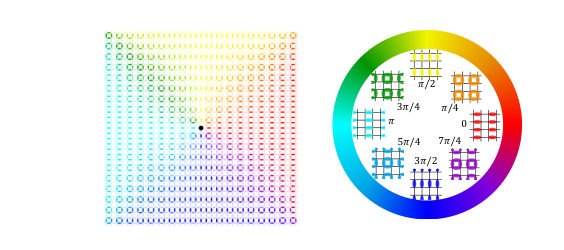 
FIG. 1. Left: Representative spinon texture in the VBS phase, exhibiting a 2π winding of ϕVBS. It is calculated on a odd-size square lattice with OBC, which has a natural un- paired spin as spinon. Right: Cyclic color map used to visu- alize the local VBS angle.

📷 Fig 2

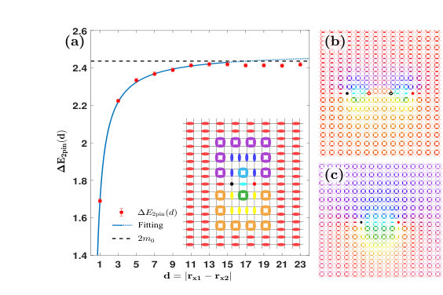 
FIG. 2. Two-pinned-spinon dipole. (a) Two-pin excitation energy ∆E2pin(d) obtained by varying d. The blue curve is a fit to the pre-breaking regime using Eq. (4) within the fitting window d = 1–15, giving σ ≲0.001 and α = −0.788 ± 0.0014. Real-space VBS textures show (b) the broken and (c) the unbroken configuration. Red and black filled circles mark the pair of pinned spins with matched quantum numbers, whereas open circles mark the emergent spinons created by string breaking.

📷 Fig 3

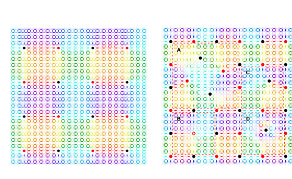 
FIG. 4. Domain-wall networks generated by multi-spinon pinning. (Left) regular 6 × 6 array of pinned spinons with spacing d = 11 produces a clean VBS domain-wall network. (Right) distorted 8 × 8 array with smaller spacing d = 7. The four frames mark representative perturbations, including (A) spinons displacement, (B) local dilution, (C) δr = (1, 1) displacement, and (D) δr = (2, 2) displacement. These per- turbations deform or locally reconnect nearby strings but do not destroy the global domain-wall network.

📷 Fig 4

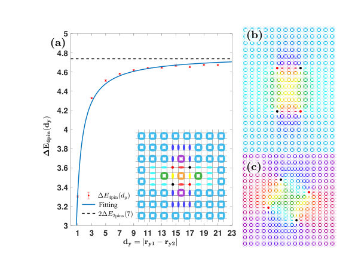 
FIG. 3. Four-pinned-spinon quadrupole. (a) Four-pin ex- citation energy ∆E4pin(dy) obtained by fixing dx = 7 and varying dy. The blue curve is a fit to the pre-breaking form in Eq. (4) over the window dy = 1–23, giving σ ≲0.001 and α = −1.445 ± 0.002. Panels (b) and (c) show real-space VBS textures for representative four-pin configurations. The con- nected quadrupole remains visible when the pinned spinons are rotated with respect to the quadrupole center, as shown in (c).

**Summary.** This work uses quantum Monte Carlo simulations on quantum magnets to study confinement in the Valence Bond Solid (VBS) phase near a quantum critical point. By introducing controlled spinon defects, the authors provide energetic and real-space evidence for string breaking, demonstrating that the complex organization of these spinon complexes is governed by both quantum numbers and underlying lattice geometry.

**Why it may be interesting.** The work provides a concrete, measurable analogy to gauge theories (like QCD) using condensed matter systems, offering insights into confinement mechanisms that are highly relevant to strongly correlated electron physics.

Detailed structure

**Main problem.** The paper investigates the nature of confinement and gauge-constrained structures, specifically string breaking, in quantum magnets near a Deconfined Quantum Critical Point (DQCP).

**Main result.** String breaking is confirmed by the saturation of the excitation energy ($\Delta E$) at large separations, and the analysis establishes pinned defects as a controllable tool for resolving multi-spinon structures in a VBS phase.

**Method.** The study employs Quantum Monte Carlo (QMC) simulations and analyzes the energy scaling of defect excitations using phenomenological fitting forms.

**Model / system.** The system is a quantum magnet modeled near a DQCP, exhibiting a Valence Bond Solid (VBS) phase characterized by a $	ext{Z}_4$ structure. The physics is analyzed by introducing controlled static spinon sources via pinned-spin defects.

**Key observables.** Defect excitation energies ($\Delta E$), VBS angle texture ($\phi_{	ext{VBS}}$), and the winding number ($q_C$) of the domain walls.

**Important parameters / regimes.** The critical separation distance ($d$), the lattice size ($L=48$), and the VBS phase offsets are crucial parameters.

**Assumptions / limitations.** The analysis relies on approximating the energy dependence using a phenomenological form $\Delta E(d) = \Delta_\infty + \sigma d + \alpha/d$, and assumes the VBS domain walls are weakly locked by a $	ext{Z}_4$ anisotropy.

**Figures summary.** Figures illustrate the spinon texture (winding of $\phi_{	ext{VBS}}$), the energy crossover showing string breaking (Fig. 2), and the formation of robust, connected domain-wall networks (Fig. 4).

**Paper structure.** The paper progresses by establishing the physical model (VBS phase near DQCP), analyzing the energy scaling of simple dipoles (two-pin), confirming string breaking, and then extending the analysis to complex, connected multi-spinon complexes (four-pin) and domain-wall networks.

Abstract

Quantum magnets provide a microscopic platform for studying confinement and gauge-constrained structures mediated by emergent gauge fields. We investigate confined spinon complexes in the columnar valence-bond-solid (VBS) phase near deconfined quantum criticality using pinned-spin defects and quantum Monte Carlo simulations. The pinned spins act as static spinon sources with controlled positions, spin projections, and VBS vorticities, enabling measurement of defect energies and direct real-space visualization of the associated VBS domain-wall strings. For matched spinon-antispinon sources, the excitation energy saturates beyond a characteristic separation as one extended dipole reorganizes into two shorter neutral dipoles, providing energetic and real-space evidence of string breaking. We further show that domain-wall connectivity is governed by lattice-scale VBS phase offsets in addition to vorticity and spin-projection neutrality. Compatible multi-pin patterns generate connected four-spinon complexes and extended domain-wall networks that retain their global connectivity under local distortions. These results establish pinned-spin defects as a controlled tool for assembling and resolving multi-spinon structures and their confining strings in a VBS phase.

[↑ back to top](#top)

### [Inducing metal-insulator transition via disorder in correlated kagome systems](http://arxiv.org/abs/2608.17558v1)

**Authors:** Qingzhuo Duan, Hongdao Zhuge, Zixuan JIa, Tianxing Ma  
**Type:** theory · **Category:** strongly correlated electrons · **PDF:** <https://arxiv.org/pdf/2608.17558v1>  
**Analysis basis:** full PDF text, analyzed in chunks
**Topic relevance:** `analog quantum simulation` **3/5**

📷 Fig 1

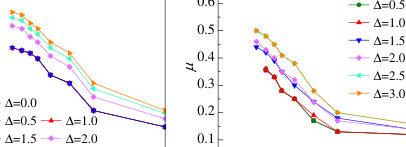 
FIG. 2: Chemical potential µ that leads to the half filling of the system as a function of temperature T for various correla- tion strength U and disorder strength ∆. The data regarding ∆= 0.0 are adopted from our previous work [21].

📷 Fig 2

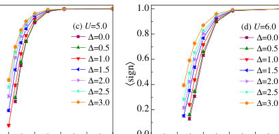 
FIG. 3: Average sign ⟨sign⟩as a function of temperature T for various correlation strength U and disorder strength ∆. The data regarding ∆= 0.0 are adopted from our previous work [21].

📷 Fig 3

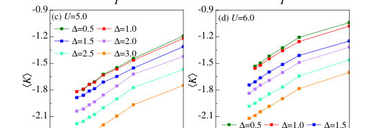 
FIG. 5: Kinetic energy per site ⟨K⟩as a function of tem- perature T for various correlation strength U and disorder strength ∆.

📷 Fig 4

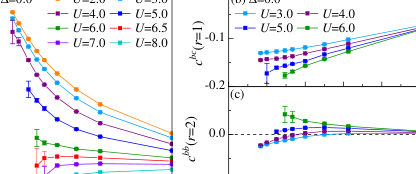 
FIG. 4: (a) dc conductivity σdc, (b) nearest-neighbor spin- spin correlation function between b and c sites cbc(r = 1) and (c) next-nearest-neighbor correlation between b sites cbb(r = 2) as a function of temperature T for various cor- relation strength U in kagome system. Part of the data are adopted from our previous work [21]. The legend in (c) is the same as that in (b).

📷 Fig 5

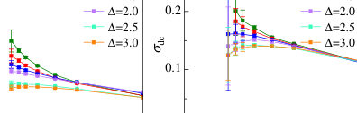 
FIG. 6: dc conductivity σdc as a function of temperature T for various correlation strength U and disorder strength ∆.

**Summary.** This paper theoretically investigates how disorder drives the metal-insulator transition in correlated kagome systems using the DQMC method. It demonstrates that disorder cooperatively localizes electrons, leading to a phase diagram distinguishing between different insulating states. The findings offer actionable insights for controlling electronic properties in kagome-based materials for device applications.

**Why it may be interesting.** The study provides a detailed theoretical framework for understanding how external perturbations (disorder) can control fundamental quantum phase transitions (MIT) in strongly correlated lattice models, which is relevant for designing novel quantum materials.

Detailed structure

**Main problem.** The study investigates the metal-insulator transition (MIT) in correlated kagome systems, focusing specifically on the role and effect of introducing hopping disorder.

**Main result.** The interplay between disorder and electron correlations promotes electron localization, leading to distinct insulating phases (Anderson vs. Mott) and allowing disorder to tune the MIT critical parameters.

**Method.** The research employs the Determinant Quantum Monte Carlo (DQMC) method to calculate electronic transport and magnetic properties for the disordered Hubbard model.

**Model / system.** The system is a correlated electron model on a kagome lattice, described by a disordered Hubbard Hamiltonian. Disorder is introduced into the hopping terms ($t_{ij}$), and correlations are governed by the on-site Coulomb repulsion ($U$).

**Key observables.** DC conductivity ($\sigma_{dc}(T)$), kinetic energy ($\langle K 
angle$), density of states at the Fermi level ($N(0)$), and real-space spin-spin correlation functions ($\langle \mathbf{S}_{\alphaeta}(\mathbf{r}) 
angle$).

**Important parameters / regimes.** Disorder strength ($\Delta$), Coulomb interaction strength ($U$), and temperature ($T$).

**Assumptions / limitations.** The DQMC method is used as a nonperturbative approach, and the calculation of $\sigma_{dc}(T)$ is assumed accurate at low temperatures.

**Figures summary.** Figure 1 presents a phase diagram distinguishing between AFM metal, correlated Anderson insulator, and disordered Mott insulator. Other figures track $\sigma_{dc}(T)$, $\langle 	ext{sign} 
angle_T$, and magnetic correlations as functions of $U$ and $\Delta$.

**Paper structure.** The paper systematically analyzes the system by calculating key observables ($\sigma_{dc}$, $\langle K 
angle$, correlations) using DQMC. It then maps out the phase diagram by varying disorder ($\Delta$) and interaction strength ($U$), concluding with a summary of the distinct insulating regimes.

Abstract

The metal-insulator transition is often accompanied by fascinating quantum phenomena, including superconducting domes, antiferromagnetic phase transitions, and quantum spin liquids. Concurrently, kagome materials are predominantly metallic, necessitating the realization of insulating states to fully exploit their significant potential in logic and optoelectronic device applications. To address this, we investigate the electronic transport and magnetic properties in correlated kagome systems with hopping disorder using the determinant quantum Monte Carlo method. Through comprehensive analysis of the kinetic energy, dc conductivity, and density of states at the Fermi level, we demonstrate that the cooperative interplay between hopping disorder and electron correlations promotes electron localization. Within the insulator, an increase in the disorder level reduces the Coulomb interaction required for the Mott transition. Additionally, while disorder partially suppresses antiferromagnetic ordering, it remains insufficient to induce a complete magnetic transition. Finally, we summarize two schematic regions distinguishing between antiferromagnetic metal, correlated Anderson insulator, and disordered Mott insulator. Our study advances the understanding of metal-insulator transition in kagome systems by disorder and provides actionable insights for experimental control of these transitions.

[↑ back to top](#top)

### [Mutual Recognition in the Philosophy of Physics: QBism, Phenomenology, Hegel](http://arxiv.org/abs/2608.17472v1)

**Authors:** George Webster  
**Type:** theory · **Category:** other · **PDF:** <https://arxiv.org/pdf/2608.17472v1>  
**Analysis basis:** full PDF text, analyzed in chunks
**Topic relevance:** `quantum measurements` **3/5**

📷 Fig 1

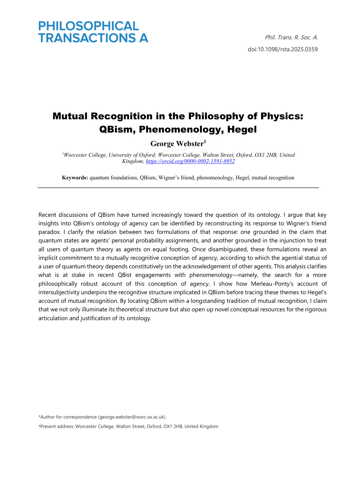 
Low-resolution page preview, page 2

📷 Fig 2

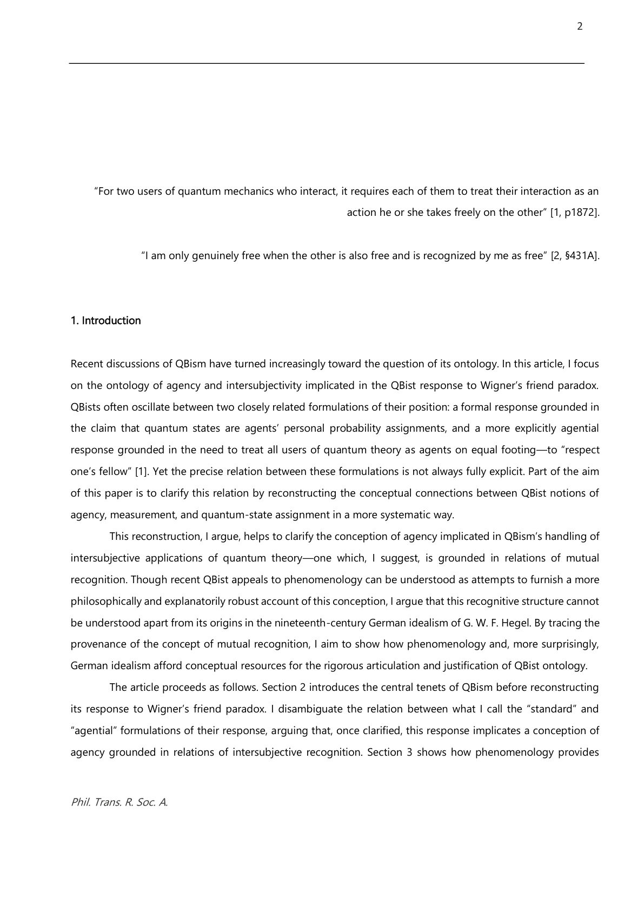 
Low-resolution page preview, page 3

📷 Fig 3

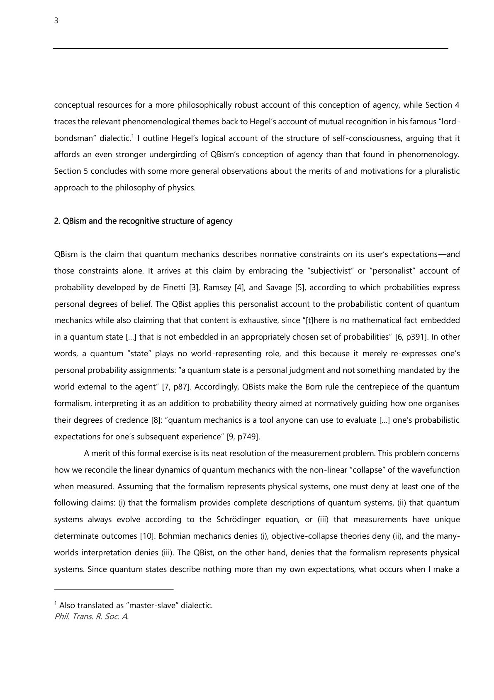 
Low-resolution page preview, page 4

📷 Fig 4

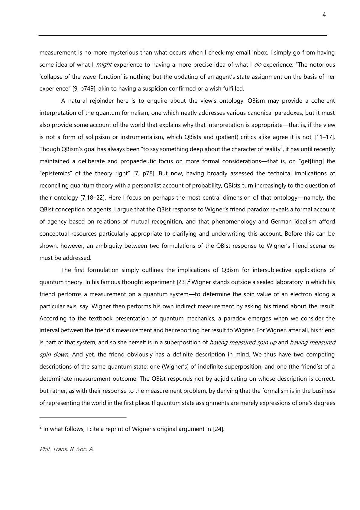 
Low-resolution page preview, page 5

📷 Fig 5

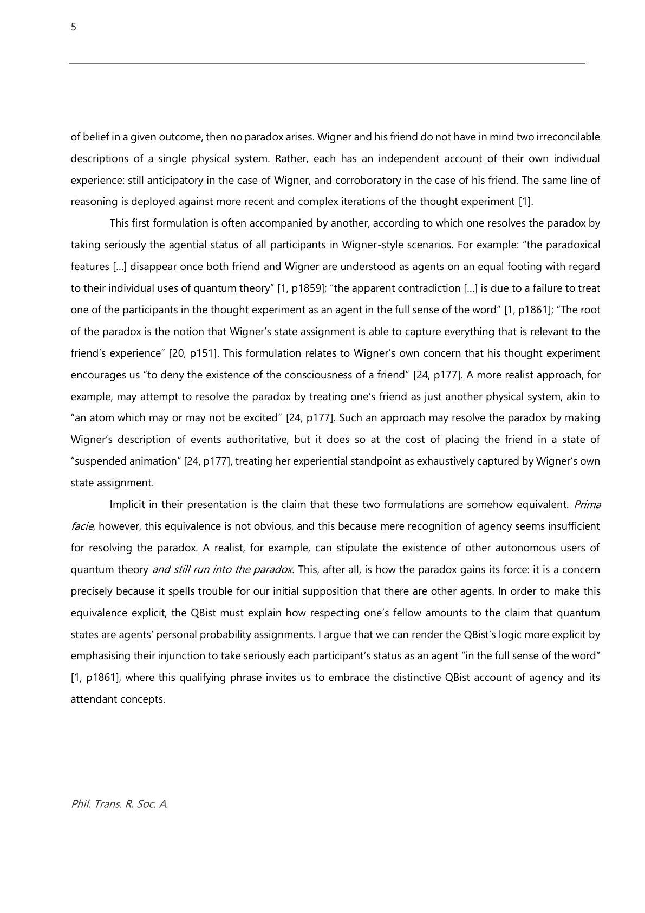 
Low-resolution page preview, page 6

**Summary.** This paper investigates the ontology of agency in QBism by re-examining its handling of the Wigner's friend paradox. The author argues that QBism implicitly requires a view of agency dependent on the mutual recognition of other agents. By connecting this structure to phenomenology and Hegel, the work aims to provide a robust philosophical justification for QBism's conceptual framework.

**Why it may be interesting.** While highly philosophical, the deep dive into the interpretation of quantum measurement and the nature of 'user' agency provides novel conceptual resources for understanding the boundaries of quantum theory itself.

Detailed structure

**Main problem.** The paper addresses the ontological status of agency within QBism, specifically by analyzing how the theory responds to the Wigner's friend paradox.

**Main result.** The analysis reveals that QBism implicitly commits to a mutually recognitive conception of agency, which is shown to be underpinned by concepts from phenomenology and Hegel's philosophy.

**Method.** The approach involves reconstructing and disambiguating two formulations of QBism's response to the paradox, linking them conceptually to intersubjectivity theory.

**Model / system.** The core model is Quantum Mechanics, interpreted through the lens of QBism, focusing on quantum states as personal probability assignments rather than objective descriptions.

**Key observables.** The primary focus is on the conceptual structure of agency and the nature of quantum state assignments.

**Important parameters / regimes.** The key conceptual elements are the 'mutually recognitive conception of agency' and the relationship between personal probability assignments and intersubjectivity.

**Assumptions / limitations.** The analysis assumes the validity of QBism's core tenet that quantum states are subjective probability assignments, and that the resolution of the paradox reveals deeper philosophical commitments.

**Paper structure.** The paper proceeds by analyzing the Wigner's friend paradox within QBism, clarifying the relationship between its two main interpretations of quantum states, and then tracing the resulting structure of agency to phenomenology (Merleau-Ponty) and Hegel's philosophy.

Abstract

Recent discussions of QBism have turned increasingly toward the question of its ontology. I argue that key insights into QBism's ontology of agency can be identified by reconstructing its response to Wigner's friend paradox. I clarify the relation between two formulations of that response: one grounded in the claim that quantum states are agents' personal probability assignments, and another grounded in the injunction to treat all users of quantum theory as agents on equal footing. Once disambiguated, these formulations reveal an implicit commitment to a mutually recognitive conception of agency, according to which the agential status of a user of quantum theory depends constitutively on the acknowledgement of other agents. This analysis clarifies what is at stake in recent QBist engagements with phenomenology - namely, the search for a more philosophically robust account of this conception of agency. I show how Merleau-Ponty's account of intersubjectivity underpins the recognitive structure implicated in QBism before tracing these themes to Hegel's account of mutual recognition. By locating QBism within a longstanding tradition of mutual recognition, I claim that we not only illuminate its theoretical structure but also open up novel conceptual resources for the rigorous articulation and justification of its ontology.

[↑ back to top](#top)

### [Neutron Interferometers from Stacked Holographic Photopolymer Gratings](http://arxiv.org/abs/2608.17708v1)

**Authors:** Saba Shams-Lahijani, Tobias Jenke, Juergen Klepp, Christian Pruner, Martin Fally  
**Type:** experiment · **Category:** other · **PDF:** <https://arxiv.org/pdf/2608.17708v1>  
**Analysis basis:** full PDF text, analyzed in chunks
**Topic relevance:** `interference shaping light` **3/5**

📷 Fig 1

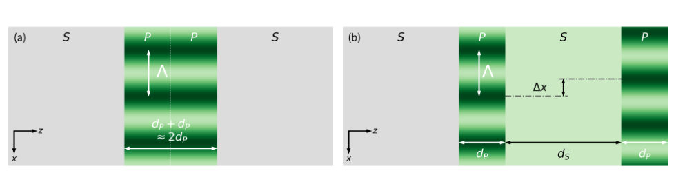 
FIG. 1: Stack of gratings. (a) Configuration SPPS, (b) configuration SPSP. For P layers, the recorded grating profiles are schematically shown.

📷 Fig 2

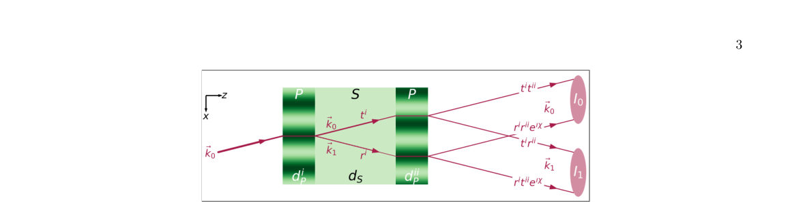 
FIG. 2: Schematic of the LL-interferometer (not to scale). An incident in-Bragg beam, which is approximately a plane wave with wavevector ⃗k0, impinges on the first grating. This will result in two waves with amplitudes ti, ri

📷 Fig 3

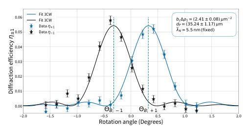 
FIG. 3: Angular dependence of the diffraction efficiency for the SPPS stack, measured with a VCN beam (λN = 5.5 nm). The data are available from the ILL data portal [35]. To increase the effective thickness, the grating was tilted by ζ ≈35◦about an axis parallel to the grating vector, such that the effective thickness becomes deff = dP / cos ζ. The solid lines are fits based on a first-order 3-wave coupling theory [31].

📷 Fig 4

 
Figure 4 shows the measured angular dependence of the ±1 order diffraction efficiencies for the SPSP LL-interferometer, recorded at a wavelength of λ = 543.5 nm. As the beams traverse the intermediate S-layer, the path length difference ∆between the forward-diffracted path and the diffracted-transmitted path (see Fig. 2) in- duces a relative phase shift χ. This phase shift modu- lates the measured intensity. In our experiment, χ(Θ) = ∆(Θ)2πnS/λ is varied by rotating the entire interfer- ometer, thereby detuning the angle of incidence Θ from the Bragg condition. Alternatively, χ could be modified by varying the wavelength. This wavelength-dependent behavior is evident when comparing the data...

📷 Fig 5

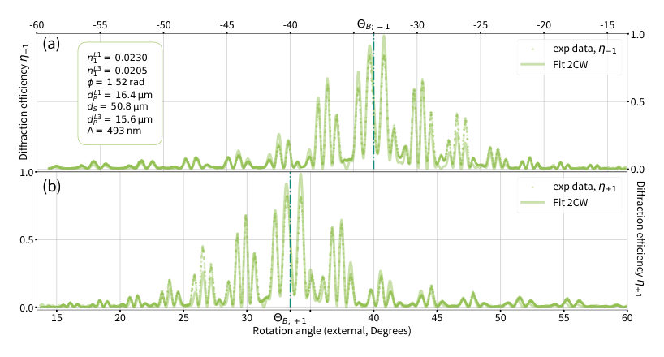 
FIG. 4: Angular dependence of the diffraction efficiency for the SPSP configuration, measured with light at a wavelength of λ = 543.5 nm. Upper panel: (a) minus-first order, η−1(Θ). Lower panel: (b) plus-first order, η+1(Θ). The solid lines represent fits based on a 3-layer, two-coupled-wave (2CW) model using the function given in Eq. (A1).

**Summary.** This paper introduces a novel, stable platform for neutron interferometry by fabricating a double-Laue interferometer from stacked holographic photopolymer gratings. The technique bypasses alignment issues associated with traditional setups, allowing for the observation of neutron interference fringes. Furthermore, the device is demonstrated to function as a compact spectrometer capable of characterizing the spectral profile of the neutron beam.

**Why it may be interesting.** The work provides a highly practical, robust platform for neutron optics experiments, directly applicable to quantum sensing and metrology by simplifying complex alignment requirements inherent to traditional interferometers.

Detailed structure

**Main problem.** To develop a simple, versatile, and robust platform for matter-wave interferometry and metrology using neutron interferometers, overcoming traditional alignment and stability challenges.

**Main result.** The authors successfully fabricated a monolithic double-Laue neutron interferometer using stacked photopolymer gratings, demonstrating its function for both light and very cold neutrons.

**Method.** They utilized holographic recording to create stacked gratings (SPSP configuration) in a single process, allowing for in-situ characterization of the neutron beam's spectral profile.

**Model / system.** The physical system is a monolithic double-Laue neutron interferometer made from stacked photopolymer films. The analysis involves modeling light diffraction using a 2CW approach and neutron diffraction using a 3CW transfer-matrix approach.

**Key observables.** Characteristic interference fringes in diffracted intensity for both light and very cold neutrons; diffraction efficiency ($\eta_{\pm 1}(\Theta)$) as a function of angle of incidence ($\Theta$).

**Important parameters / regimes.** Neutron wavelength ($\lambda_N \approx 5.5$ nm); grating period ($\Lambda \approx 493$ nm); substrate separation distance ($d_S$); and the spectral distribution modeled by an Exponentially Modified Gaussian (EMG).

**Assumptions / limitations.** The analysis assumes that higher-order harmonics are negligible for the polymer material, and that the broad neutron spectrum can be accurately modeled by an EMG distribution.

**Figures summary.** Figures illustrate the stacked grating configurations (SPPS and SPSP) and schematics of the LL-interferometer. Data show the angular dependence of diffraction efficiency for both light and neutrons, fitted to theoretical models.

**Paper structure.** The paper introduces the monolithic grating platform, details the fabrication and theoretical modeling (light and neutron optics), presents experimental measurements using VCNs, and concludes by demonstrating the device's utility as a compact spectrometer.

Abstract

Long-wavelength neutron interferometry using discrete optical elements is notoriously challenging due to stringent alignment and stability requirements. Here, we introduce a monolithic double-Laue neutron interferometer fabricated from a stack of commercial Bayfol HX photopolymer films. By recording holographic gratings simultaneously in multiple layers, we create a robust device that is inherently aligned, bypassing traditional stability problems. We demonstrate the device's function by observing the characteristic interference fringes in the diffracted intensity of both light and very cold neutrons. The interferometer is then used to perform in-situ characterization of the neutron beam's spectral profile, demonstrating its utility as a compact spectrometer. Our work establishes stacked holographic gratings as a simple, versatile, and powerful platform for matter-wave interferometry and metrology.

[↑ back to top](#top)

### [One-at-a-Time Quantum Guessing: Multipartite Entanglement Beyond MoE Games](http://arxiv.org/abs/2608.17201v1)

**Authors:** Michael Schleppy, Emina Soljanin  
**Type:** theory · **Category:** quantum information and computing · **PDF:** <https://arxiv.org/pdf/2608.17201v1>  
**Analysis basis:** full PDF text, analyzed in chunks
**Topic relevance:** `quantum measurements` **3/5**

📷 Fig 1

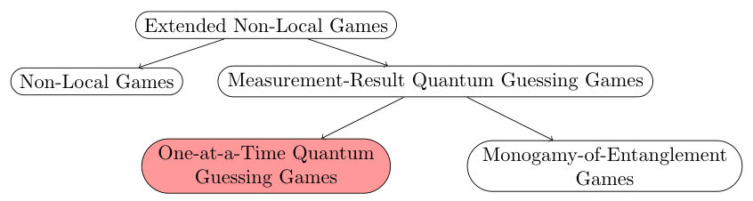 
Fig. 1: A hierarchy of related quantum games. Arrows denote inclusion (e.g. measurement-result quantum guessing games are a subclass of extended non-local games). We propose the variant of one-at-a-time quantum guessing games.

📷 Fig 2

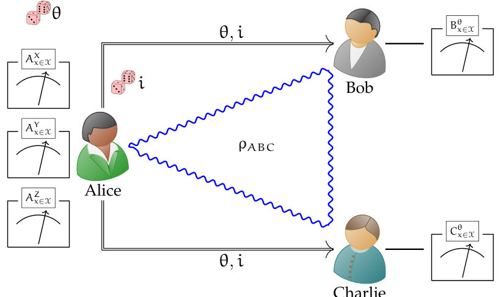 
Fig. 2: Pictorial representation of the two-player three Pauli-basis OTG game. A tripartite state ρABC is initally shared amongst all three participants. Alice randomly selects an Pauli observable θ ∈{X, Y, Z} and a random player i ∈{Bob, Charlie}. She measures her qubit with observable θ and obtains a measurement outcome x ∈{0, 1}. The data (θ, i) is announced to both Bob and Charlie, and the selected player i performs a measurement to obtain a measurement outcome x′ ∈{0, 1}. The game is won if x = x′.

📷 Fig 3

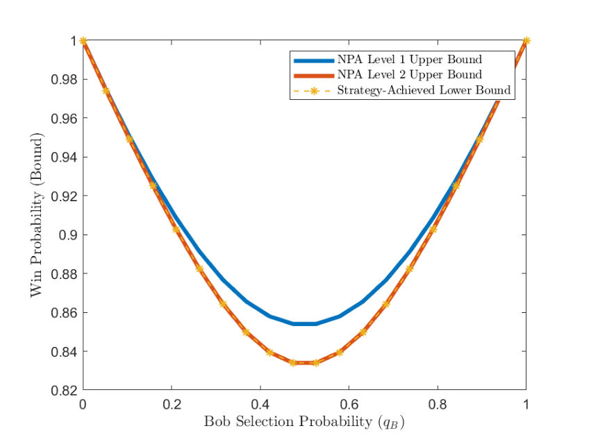 
Fig. 3: Bounds on the value ω2(G, q) of the two-player three Pauli-basis OTG game as a function of the player selection probability q = (qB, qC). The lower bound from the parametrized qubit strategy agrees well with the upper bound from the second level SDP of the NPA hierarchy, up to numerical precision. The upper bound from the first level SDP of the NPA hierarchy is notably looser when the player selection probabilities are roughly equal.

📷 Fig 4

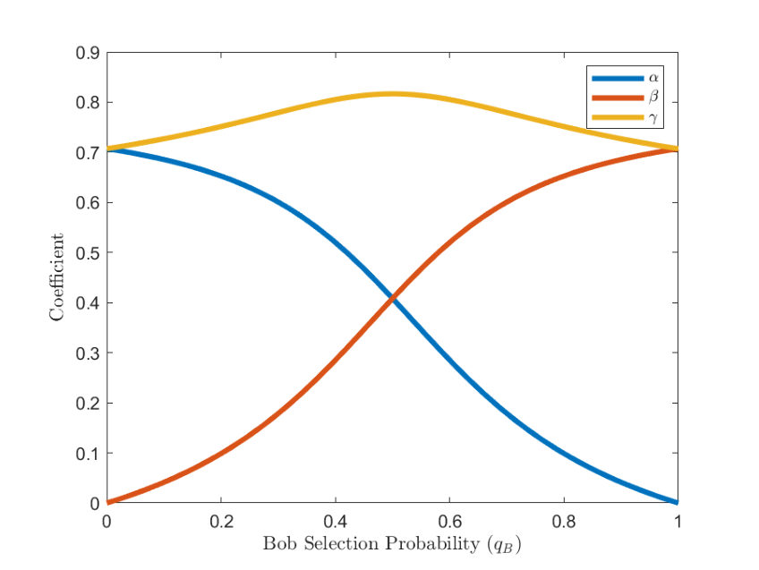 
Fig. 4: Coefficients of the parameterized optimal state |ψ⟩= α |001⟩+ β |010⟩+ γ |100⟩for the two-player three Pauli-basis OTG game, as a function of the player selection probability q = (qB, qC).

📷 Fig 5

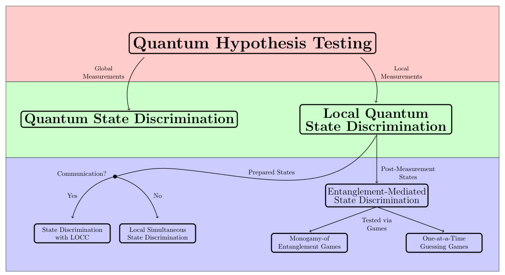 
Fig. 5: An illustration of various scenarios related to non-local state discrimination and hypothesis testing. Both Monogamy-of-Entanglement games and One-at-a-Time Guessing games can be viewed as examples of entanglement-mediated local hypothesis tests.

**Summary.** This paper introduces One-at-a-Time Quantum Guessing (OTG) games as a new tool to study multipartite entanglement beyond the limitations of standard MoE games. The authors demonstrate that in these games, shared entanglement provides a tangible advantage over classical strategies, even when constrained by entanglement monogamy. This suggests OTG games are a valuable resource for understanding the practical utility of complex quantum correlations.

**Why it may be interesting.** It provides a novel, structured framework (OTG games) to quantify the utility of multipartite entanglement in correlation tasks, offering insights into how entanglement resources can be utilized in sequential or individual measurement settings, which is relevant for quantum communication protocols.

Detailed structure

**Main problem.** The paper aims to investigate the usefulness of multipartite entanglement in a setting that moves beyond the constraints imposed by Monogamy-of-Entanglement (MoE) games.

**Main result.** The introduced One-at-a-Time Guessing (OTG) games show that shared entanglement can provide a measurable advantage (at least 4% in simple qubit cases) over classical strategies, contrasting with some findings in MoE games.

**Method.** The authors introduce and analyze OTG games, which involve individual random guessing by players on a shared entangled state, and establish mathematical properties like the majorization ordering for the game's value.

**Model / system.** The model is a quantum guessing game framework involving multiple players sharing a pre-shared entangled state, where a referee performs random measurements. The analysis uses qubits and Pauli measurements, and the optimal states are shown to be related to W-like states.

**Key observables.** The winning probability ($\omega$) of the game, which quantifies the advantage gained by using entanglement over classical correlation.

**Important parameters / regimes.** The player-selection probability distribution ($p$ or $q$), which dictates which player guesses at any given time.

**Assumptions / limitations.** The analysis relies on the framework of quantum non-local games and the use of the NPA hierarchy to bound the game's value.

**Figures summary.** Not specified.

**Paper structure.** The paper introduces OTG games as a variant of non-local games, compares them to MoE games, establishes the majorization property relating game value to player selection probabilities, and provides detailed analyses using semidefinite programming bounds.

Abstract

Multipartite entanglement remains a challenging and not fully understood aspect of quantum information. Monogamy-of-Entanglement (MoE) games have been highly effective for studying limitations on the usefulness of entanglement imposed by monogamy constraints. To better reveal the extent to which multipartite entanglement can be useful, we introduce a class of quantum guessing games, termed One-at-a-Time Guessing (OTG) games. In these games, quantum players individually guess the outcomes of random measurements performed by a referee on a pre-shared entangled state. Unlike MoE games, OTG games select players individually at random according to a specified probability distribution, thereby probing each player's correlation with the referee. We show that, despite monogamy constraints, players sharing certain entangled states can moderately outperform those relying only on classical uncertainty. This advantage arises even in simple OTG games involving only Pauli measurements on qubits, where optimal entanglement increases the winning probability by at least 4%. This contrasts with MoE games, where shared entanglement has been shown in several settings to provide only limited (if any) advantage over classical strategies. We further establish a majorization property: the value of an OTG game respects the majorization ordering of the player-selection probability distribution. We also analyze in detail a two-player OTG game in which the referee measures one of the three Pauli observables on a qubit, and show that it is optimally played using a specific parameterized family of three-qubit $W$-like states. These results suggest that OTG games provide a useful framework for investigating the usefulness of multipartite entanglement in multiparty quantum correlations.

[↑ back to top](#top)

### [Reduced State Stabilizer Rényi Entropy as a Probe of Quantum Phase Transitions in Frustrated J_1-J_2 Spin Models](http://arxiv.org/abs/2608.17313v1)

**Authors:** George Biswas, Santanu Sarkar, Jun-Yi Wu, Anindya Biswas  
**Type:** theory · **Category:** statistical mechanics · **PDF:** <https://arxiv.org/pdf/2608.17313v1>  
**Analysis basis:** full PDF text, analyzed in chunks
**Topic relevance:** `analog quantum simulation` **3/5**

📷 Fig 1

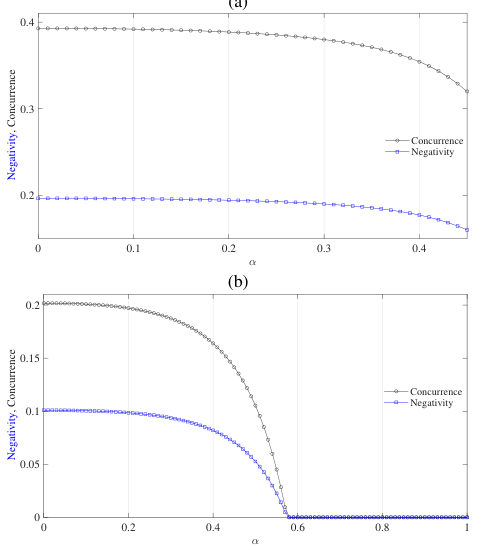 
FIG. 1. Concurrence and negativity of the reduced two-qubit ground state for the J1 −J2 Heisenberg models. (a) One- dimensional model (N = 16). (b) Two-dimensional model (N = 4 × 4). In both cases, the bipartite entanglement measures fail to display clear signatures of the quantum phase transitions. In the two-dimensional model, both concurrence and negativity vanish for α ≳0.57.

📷 Fig 2

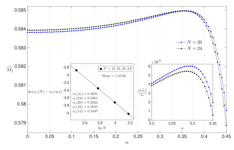 
FIG. 2. Reduced two-qubit stabilizer Rényi entropy f M2 of the ground state for the one-dimensional isotropic J1 −J2 Heisen- berg model with system sizes N = 20, 24. The purity-corrected SRE varies smoothly with the frustration parameter α and ex- hibits a distinct change in curvature near the known quantum critical point. The right inset shows the corresponding deriva- tive, whose peak identifies the location of the curvature change. The left inset presents the finite-size scaling of the peak posi- tions, αc(N), by plotting ln[αc(N) −αc(∞)] versus ln N for N = 12, 16, 20, 24. A linear fit yields the thermodynamic criti- cal point αc(∞) = 0.2681 and a scaling exponent of 1.6536.

📷 Fig 3

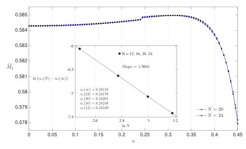 
FIG. 3. Reduced two-qubit stabilizer Rényi entropy f M2 of the subjacent mixture of the ground state and the first excited-state for the one-dimensional isotropic J1 −J2 Heisenberg model as a function of the frustration parameter α, for N = 20 and N = 24. In both cases, f M2 exhibits a discontinuity near the quantum critical point. The inset shows the finite-size scaling of ln[αc(N) −αc(∞)] versus ln N for N = 12, 16, 20, 24, yield- ing αc(∞) = 0.24116 and slope 1.9601.

📷 Fig 4

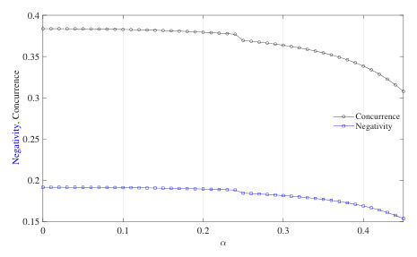 
FIG. 4. Reduced two-qubit concurrence and negativity of the subjacent mixture of the ground state and the first excited-state for the one-dimensional isotropic J1−J2 Heisenberg model with N = 16. Both quantities exhibit clear nonanalytic signatures near the known quantum critical point.

📷 Fig 5

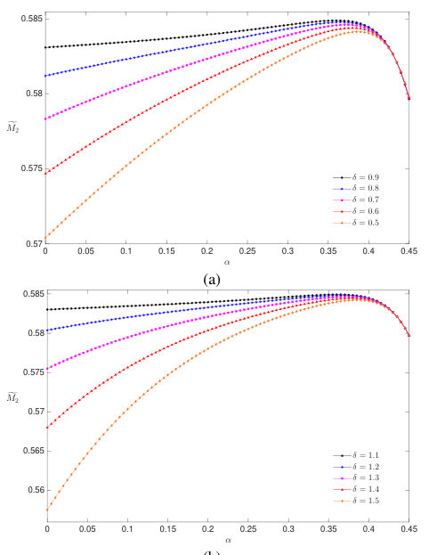 
FIG. 6. Behavior of the reduced two-qubit stabilizer Rényi en- tropy f M2 of the ground state for the one-dimensional XXZ J1−J2 model with N = 20. (a) δ &lt; 1. (b) δ &gt; 1.

**Summary.** This work tests the utility of the purity-corrected stabilizer Rényi entropy (SRE) as a local probe for Quantum Phase Transitions in frustrated spin models. By applying the SRE to 1D and 2D $J_1-J_2$ spin systems, the authors demonstrate that this measure is highly effective, often succeeding where other quantum information measures fail. The results establish the purity-corrected SRE as a robust diagnostic tool for quantum criticality.

**Why it may be interesting.** The use of quantum information measures like SRE to probe critical points in strongly correlated magnetic systems provides a novel, local diagnostic tool that complements traditional thermodynamic or entanglement-based methods.

Detailed structure

**Main problem.** To determine if the purity-corrected stabilizer Rényi entropy (SRE) of reduced two-qubit density matrices can serve as a reliable local indicator for Quantum Phase Transitions (QPTs) in frustrated quantum spin systems.

**Main result.** The purity-corrected SRE successfully identifies most QPTs in the studied models, showing a clear advantage over conventional entanglement measures in revealing otherwise-invisible phase transitions.

**Method.** The study uses the purity-corrected SRE calculated from reduced two-qubit density matrices, comparing ground-state results with those derived from a low-temperature subjacent state (a statistical mixture of the ground and first excited states).

**Model / system.** The analysis investigates frustrated quantum spin-$rac{1}{2}$ models, specifically the one-dimensional isotropic and XXZ $J_1-J_2$ Heisenberg models, and the two-dimensional $J_1-J_2$ Heisenberg model on a square lattice.

**Key observables.** Purity-corrected Stabilizer Rényi Entropy (SRE) of reduced two-qubit density matrices; critical exponents ($\alpha_c(\infty)$).

**Important parameters / regimes.** Frustration parameter ($\alpha = J_2/J_1$); lattice dimensionality (1D vs 2D); temperature regime (ground state vs. subjacent state).

**Assumptions / limitations.** The system is modeled by a subjacent state at low, finite temperatures, which is a statistical mixture of the ground and first excited states. The analysis relies on reduced two-qubit density matrices.

**Paper structure.** The paper introduces the diagnostic tool (purity-corrected SRE) and applies it systematically to three different frustrated spin models (1D isotropic, 1D XXZ, 2D Heisenberg), comparing ground-state results against subjacent-state results to test the robustness of the indicator.

Abstract

We investigate whether the second-order purity-corrected stabilizer Rényi entropy (SRE) of reduced two-qubit density matrices can serve as a reliable local indicator of quantum phase transitions (QPTs) in frustrated quantum spin systems. We consider the one-dimensional isotropic \(J_1-J_2\) Heisenberg model, the one-dimensional XXZ \(J_1-J_2\) model, and the two-dimensional \(J_1-J_2\) Heisenberg model on a \(4\times4\) square lattice. Unlike several previously studied quantum information measures, which fail to detect QPTs in the ground state of these frustrated systems, the reduced ground-state purity-corrected SRE successfully identifies most transitions. For the remaining cases, we consider a low temperature subjacent state, modeled as a statistical mixture of the ground and first excited states with a Maxwell--Boltzmann-type occupation probability. For the 1D isotropic model, the subjacent-state SRE shows a discontinuity at the critical point, yielding \(α_c(\infty)=0.24116\), in excellent agreement with established values; the ground-state SRE shows a point of inflection, yielding \(α_c(\infty)=0.2681\). For the 1D XXZ model, the subjacent-state SRE reproduces the full anisotropy dependent phase diagram, while the ground-state SRE captures transitions only at low anisotropy. For the 2D model, the subjacent-state SRE detects two transitions, at \(α_c(4\times4)=0.40781\) and \(0.6208\), while the ground-state SRE identifies the second at \(0.6230\). Compared with conventional two-qubit entanglement, purity-corrected SRE shows a clear advantage in revealing otherwise-invisible phase transitions, establishing it as a robust, efficient, local probe of frustrated quantum criticality.

[↑ back to top](#top)

### [An information-theoretic perspective on feed-forward loop abundances in transcriptional networks](http://arxiv.org/abs/2608.17699v1)

**Authors:** Mintu Nandi, Sudip Chattopadhyay, Suman K Banik  
**Type:** theory · **Category:** statistical mechanics · **PDF:** <https://arxiv.org/pdf/2608.17699v1>  
**Analysis basis:** full PDF text, analyzed in chunks
**Topic relevance:** `Keldysh / 2PI / non-Gaussian methods` **2/5** · `methods for driven-dissipative` **2/5** · `analog quantum simulation` **1/5** · `driven-dissipative phase transition` **1/5** · `non-equilibrium universality` **1/5** · `quantum measurements` **1/5**

📷 Fig 1

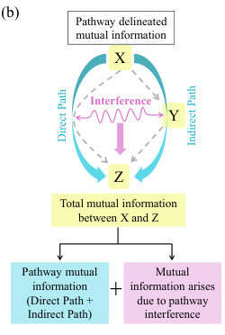 
FIG. 1. Abundance pattern and mutual information decomposition. (a) Relative abundances of the eight co- herent and incoherent FFL types in E. coli and S. cerevisiae, extracted from the data reported by Mangan et al. [9]. (b) Schematic of the pathway-delineated mutual information de- composition in a generic FFL. Here, 99K represents a general notation for activation (→) and repression (⊣).

📷 Fig 2

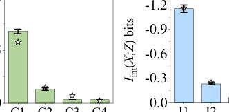 
FIG. 2. FFL model and interference mutual informa- tion. (a) Kinetic scheme of a generic FFL motif. (b) De- composition of MI, I(X; Z), into pathway information flow, Ipath(X; Z), and IMI, Iint(X; Z). Positive, negative, and zero IMI correspond to synergistic path interference, redundant path interference, and pathway independence, respectively. (c-f) Optimized IMI values for AND-gate FFLs in E. coli and S. cerevisiae. The resulting IMI hierarchy resembles the em- pirical abundance hierarchy shown in Fig. 1a. Bars denote mean IMI values, and error bars denote standard deviations across independent CEM runs. The symbols (open star) de- note IMI values obtained from stochastic simulations...

📷 Fig 3

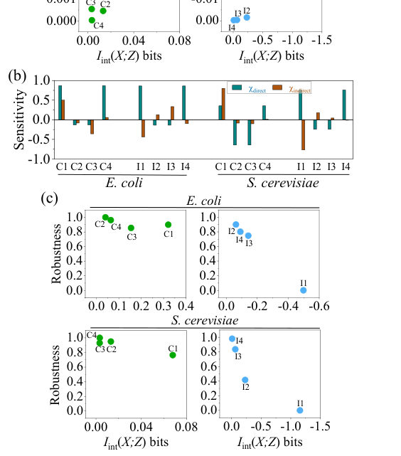 
FIG. 3. Biophysical origin and robustness cost of the IMI hierarchy. (a) Optimized IMI Iint(X; Z) plotted against pathway-interference strength SXZ. (b) Direct- and indirect-path sensitivities, χdirect and χindirect for different FFL types. (c) Optimized IMI plotted against robustness to parameter perturbations, Rm. Here, we use h = 0.01. In es- timating SXZ, χ···, and Rm, we use the optimized parameter values listed in SM Table S5. These results are for AND- gate FFLs. Corresponding OR-gate results are shown in SM Fig. S8, which show a similar observation.

**Summary.** This paper applies an information-theoretic framework to analyze the structure of gene regulatory networks, focusing on Feed-Forward Loops (FFLs). It decomposes information flow into pathway and interference components, finding that the interference component (IMI) accurately predicts the observed, non-uniform abundance patterns of these motifs. This suggests that the non-additive interaction between regulatory paths is the key topological feature governing network architecture.

**Why it may be interesting.** While focused on biology, the methodology uses advanced non-equilibrium statistical mechanics tools (like LNA and information decomposition) to characterize complex, interacting dynamical systems, which shares conceptual overlap with analyzing open quantum systems or complex many-body dynamics.

Detailed structure

**Main problem.** The study aims to understand the non-uniform and unequal abundance patterns of recurring motifs, specifically Feed-Forward Loops (FFLs), within transcriptional regulatory networks.

**Main result.** The Interference Mutual Information (IMI) component of the information-theoretic decomposition successfully tracks the observed, non-uniform abundance hierarchy of FFLs, unlike total mutual information or the pathway component alone.

**Method.** The authors developed an information-theoretic framework that decomposes the input-output mutual information into additive pathway and non-additive interference components, using the Linear Noise Approximation.

**Model / system.** The system modeled is Gene Regulatory Networks (GRNs) in model organisms like *E. coli* and *S. cerevisiae*, focusing specifically on the dynamics governed by FFL motifs.

**Key observables.** Interference Mutual Information (IMI), Pathway Mutual Information, Total Mutual Information, and the robustness ($R_m$) of the information flow to parameter variation.

**Important parameters / regimes.** Regulatory rate constants ($eta$ terms, $K$ terms), local path sensitivities ($\chi$), and the strength of pathway interference ($S_{XZ}$).

**Assumptions / limitations.** The analysis relies on the Gaussian channel approximation and the Linear Noise Approximation (LNA) for deriving statistical quantities.

**Figures summary.** Figures illustrate the relative abundances of FFL types, the decomposition of MI into $I_{	ext{path}}$ and $I_{	ext{int}}$, and optimized IMI values demonstrating the correspondence between the calculated hierarchy and empirical abundances.

**Paper structure.** The paper establishes the problem of motif abundance, introduces the information-theoretic decomposition ($I(X; Z) = I_{	ext{path}} + I_{	ext{int}}$), calculates the IMI, and then correlates the resulting IMI hierarchy with known biophysical measures like path interference strength and parameter robustness.

Abstract

Biological networks feature recurring motifs, but their uneven abundance remains poorly understood. Feed-forward loops (FFLs) are important motifs in the transcriptional networks of \textit{Escherichia coli} and \textit{Saccharomyces cerevisiae}, yet their eight types appear in highly unequal frequencies. This study presents an information-theoretic framework that decomposes input-output mutual information into pathway and interference components. The interference mutual information (IMI) quantifies the joint influence of direct and indirect regulatory pathways on information transmission. Our results show that IMI closely follows the observed abundance patterns in both organisms, whereas the input-output mutual information and the pathway component do not. We also trace the IMI hierarchy to the strength of pathway-interference interactions and local pathway sensitivities. Notably, a stronger IMI is also associated with reduced robustness to parameter variation, suggesting a trade-off between information processing and resilience in gene regulatory circuits. Our results, thus, identify a topology-dependent information-theoretic feature that relates to the abundance patterns.

[↑ back to top](#top)

### [Zero Point Density Fluctuations and Electron Brownian Motion](http://arxiv.org/abs/2608.17230v1)

**Authors:** L. H. Ford, G. O. Heymans, N. F. Svaiter  
**Type:** theory · **Category:** other · **PDF:** <https://arxiv.org/pdf/2608.17230v1>  
**Analysis basis:** full PDF text, analyzed in chunks
**Topic relevance:** `Keldysh / 2PI / non-Gaussian methods` **2/5** · `methods for driven-dissipative` **2/5** · `correlated / nonlocal dissipation` **1/5** · `driven-dissipative phase transition` **1/5** · `quantum measurements` **1/5**

📷 Fig 1

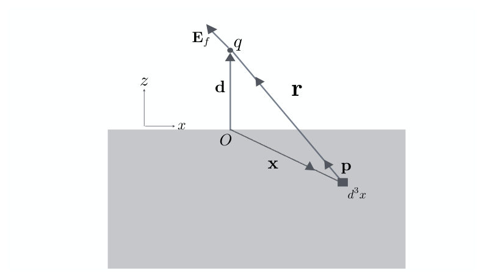 
FIG. 1. A test charge q is located a distance d above a dielectric material with dielectric constant κ. Here the origin is at the point O. The Coulomb field of the charge induces a dipole moment p in a region with volume d3x inside the dielectric. The electric field of this dipole exerts a force on the test charge. The spatial integral of the time average of this force is the classical image charge force on the charge. Local density fluctuations produce a fluctuating part of the dipole moment and hence a fluctuating part Ef of the electric field acting on the charge. This fluctuating field in turn produces force and velocity fluctuations of the charge, resulting in the Brownian motion.

**Summary.** This theoretical paper calculates the motion of an electron near a dielectric surface caused by zero point density fluctuations in the material's phonon vacuum. The resulting quantum Brownian motion is found to be significant, potentially surpassing thermal or standard quantum limits. This suggests a measurable quantum noise source for nanoscale electronics and a method to sense vacuum fluctuations.

**Why it may be interesting.** This work connects vacuum fluctuations (a quantum field effect) to measurable transport phenomena (Brownian motion) at interfaces, suggesting a novel source of quantum noise in nanoscale devices.

Detailed structure

**Main problem.** The paper investigates the quantum Brownian motion of a test charge (electron) induced by zero point density fluctuations within a dielectric material.

**Main result.** The calculated mean squared velocity due to these quantum fluctuations can be non-zero in both normal and transverse directions, potentially exceeding both thermal motion and standard quantum momentum uncertainty.

**Method.** The authors calculate the mean squared velocity by deriving the fluctuating electric field from density fluctuations and solving the resulting Langevin equation approach.

**Model / system.** The model involves a test charge placed near a dielectric interface whose local dielectric properties fluctuate due to zero point phonon vacuum fluctuations. The force on the charge is derived from these fluctuating dipole moments.

**Key observables.** Mean squared velocity components, $\langle (v_z^{zp})^2 
angle$ and $\langle (v_x^{zp})^2 
angle, \langle (v_y^{zp})^2 
angle$.

**Important parameters / regimes.** Separation distance $d$, dielectric constant $\kappa$, and the magnitude of the density fluctuation $\hat{
ho}$.

**Assumptions / limitations.** The analysis assumes small fractional density fluctuations and treats the dielectric constant as static, ignoring dispersion and dissipation effects.

**Figures summary.** Figure 1 illustrates the physical setup: a test charge above a dielectric where local density fluctuations induce a fluctuating electric field, causing Brownian motion.

**Paper structure.** The argument progresses by defining the density fluctuation source ($\hat{
ho}$), calculating the resulting fluctuating field ($\mathbf{E}_f$), deriving the velocity correlation function, and finally solving the time integral to find the steady-state mean squared velocity.

Abstract

The fluctuations in the phonon vacuum state can lead to zero point density fluctuations in a material, which in turn lead to local zero point fluctuations of the dielectric properties of the material. We argue that the density fluctuations lead to a fluctuating force on a test charge, such as an electron, located a short distance outside of the material. This force is due to fluctuating dipole moments inside the material, and produces Brownian motion of the electron. We calculate the mean squared velocity of the electron in both the normal and transverse direction relative to the boundary of the material. The result is nonzero in both directions, but larger in the normal case. We estimate the magnitude of this quantum Brownian motion and find that, in some cases, it can exceed the effects of both thermal motion and quantum momentum uncertainty. This suggests that the effect may be observable, and could constitute a source of quantum noise in nanoscale devices. It also potentially offers a means to remotely sense zero point density fluctuations in a material.

[↑ back to top](#top)

### [Finite-range Lattice Momentum Operators for Quantum Field Theory](http://arxiv.org/abs/2608.17327v1)

**Authors:** Jan C Olivier, Etienne Barnard  
**Type:** theory · **Category:** other · **PDF:** <https://arxiv.org/pdf/2608.17327v1>  
**Analysis basis:** full PDF text, analyzed in chunks
**Topic relevance:** `Keldysh / 2PI / non-Gaussian methods` **2/5** · `analog quantum simulation` **2/5** · `methods for driven-dissipative` **2/5**

📷 Fig 1

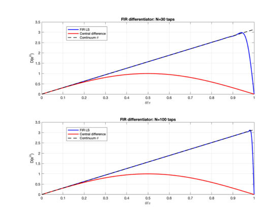 
FIG. 1. The dispersion functions of finite range coupling FIR operators.

📷 Fig 2

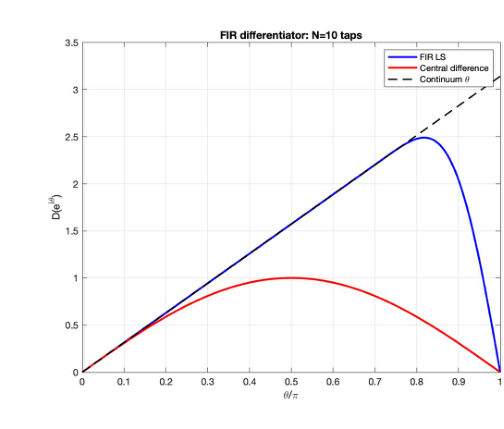 
FIG. 2. The dispersion function for 10 taps.

**Summary.** This paper develops a novel, finite-range approach to constructing momentum operators for lattice QFT using a Z-transform framework. By reinterpreting fermion doubling as an aliasing artifact, the authors derive a Finite Impulse Response (FIR) operator that maintains spectral accuracy without resorting to infinite-range terms. This provides a mathematically rigorous and computationally tractable alternative for simulating lattice field theories.

**Why it may be interesting.** While focused on QFT, the mathematical machinery—using spectral analysis (Z-transform) and constrained approximation to build local operators that mimic non-local continuum behavior—is highly relevant to developing effective Hamiltonians or lattice representations for complex quantum systems.

Detailed structure

**Main problem.** The paper addresses the fundamental challenge of constructing lattice momentum operators for Quantum Field Theory (QFT) that are finite in range while accurately reproducing continuum physics and avoiding fermion doubling.

**Main result.** The authors propose a Finite Impulse Response (FIR) operator derived from a Z-transform framework, which achieves spectral accuracy with a strictly finite coupling range, unlike infinite-range approximations.

**Method.** The core method involves mapping lattice operators to functions on the unit circle (Z-transform) and solving a constrained least-squares approximation problem in the frequency domain to construct the FIR coefficients.

**Model / system.** The study is set in Lattice Quantum Field Theory, specifically analyzing the momentum representation of fermion fields ($\psi$) in the context of QED or general gauge theories.

**Key observables.** Dispersion relations, group velocities, and the presence/absence of unwanted zeros (aliasing) in the discrete momentum operator on the unit circle.

**Important parameters / regimes.** Lattice spacing ($a$), number of taps ($N$), and the momentum variable $	heta$ (angle on the unit circle).

**Assumptions / limitations.** The primary assumption is that the problem can be reformulated as a constrained approximation problem in the frequency domain, leading to the FIR structure. The gauge-covariant extension remains an open problem.

**Figures summary.** Figure 1 shows dispersion functions for FIR operators, illustrating spectral gaps for small N. Figure 2 shows the dispersion function for 10 taps.

**Paper structure.** The paper introduces the Z-transform framework, reformulates fermion doubling as an aliasing problem, derives the FIR operator via constrained approximation, and validates its spectral accuracy against continuum limits and existing lattice methods.

Abstract

We propose a Z-transform framework for the analysis and synthesis of finite range lattice momentum operators in quantum field theory. In this formulation, translation-invariant lattice operators are represented as functions of the complex variable $z$ in the unit circle, allowing their spectral properties to be analyzed using tools from digital signal processing and rational approximation theory.   Within this framework, the fermion doubling problem is reinterpreted as the appearance of unwanted zeros of the discrete momentum operator on the unit circle --- an aliasing phenomenon in the sense of the Nyquist sampling theorem --- and the conditions for ghost suppression are expressed as precise constraints on the zero structure of the operator's transfer function. It is proven that no rational function can satisfy all required conditions simultaneously, motivating the finite impulse response approach developed here.   This reframing naturally suggests a class of finite-range momentum operators, constructed by solving a least-squares approximation problem in the frequency domain. The resulting finite impulse response (FIR) operator approximates the continuum derivative across the full Brillouin zone, with ghost suppression achieved through the accuracy of the spectral approximation rather than through the addition of a symmetry-breaking Wilson term or the infinite-range nonlocal SLAC derivative. Numerical investigation confirms that near $θ= π$ only plane waves propagate coherently, and these exhibit group velocities far exceeding the speed of light, further distinguishing them from physical low-energy excitations. No ghost wave packet solutions exist near $θ= π$.

[↑ back to top](#top)

### [Astrophysical Graviton Squeezing Can Be Hidden in the Far-Field](http://arxiv.org/abs/2608.17015v1)

**Authors:** Cheng-Jun Fang, Zong-Kuan Guo, Zhen-Hong Lyu, Jing Shu, Yu-Heng Sun, Zi-Zheng Zhou  
**Type:** theory · **Category:** other · **PDF:** <https://arxiv.org/pdf/2608.17015v1>  
**Analysis basis:** full PDF text, analyzed in chunks
**Topic relevance:** `quantum measurements` **2/5** · `Keldysh / 2PI / non-Gaussian methods` **1/5** · `interference shaping light` **1/5** · `quantum optics experiment` **1/5**

📷 Fig 1

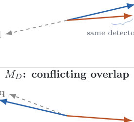 
FIG. 2: Same-cone geometry: ND selects p ≃p′ ≃−q, while MD selects p ≃q ≃−p′.

**Summary.** This theoretical work analyzes the observability of quantum squeezing in astrophysical gravitational waves at a distant detector. It finds that due to kinematic conflicts in same-cone measurements, the expected quantum signatures are severely suppressed, causing the signal to appear classically thermal. This demonstrates a crucial limitation: global quantum properties do not automatically translate into local, measurable quantum effects.

**Why it may be interesting.** The core mechanism of suppression—where geometric constraints (like single-line-of-sight detection) destroy quantum correlations—is a powerful concept applicable to any field where global quantum resources are mapped onto local measurements, such as quantum sensing or quantum communication.

Detailed structure

**Main problem.** The paper investigates whether the global quantum squeezing of gravitons, generated by astrophysical sources, can manifest as measurable local quantum coherence at a far-field detector.

**Main result.** A severe kinematic conflict in same-cone measurements causes local quantum coherence to be highly suppressed, meaning global squeezing does not guarantee local observability; the signal appears effectively classical/thermal.

**Method.** The analysis employs spatial quantum optics methods, calculating two-time correlation functions ($g^{(2)}$) and analyzing the far-field expansion of the graviton field using pole extraction techniques.

**Model / system.** The system involves gravitons (gravitational waves) propagating from localized astrophysical sources to a far-field detector. The state is modeled as a multi-mode squeezed state, analyzed via an Effective Field Theory (EFT) Hamiltonian.

**Key observables.** Second-order correlation function ($g^{(2)}$), local quantum coherence, and the anomalous moment ($M_D$) relative to the normal moment ($N_D$).

**Important parameters / regimes.** The suppression factor $\eta \sim \exp(-dE/k^*)$, the far-field distance $r$, and the angular separation $\delta	heta$.

**Assumptions / limitations.** The analysis assumes the far-field limit ($r \gg L_D$) and relies on the detector sampling only a single far-field line of sight (same-cone measurement).

**Figures summary.** Figures illustrate the far-field projection onto the outgoing branch ($I_+$) and compare overlap integrals for normal and anomalous moments, highlighting the kinematic conflict.

**Paper structure.** The paper progresses by first establishing the far-field expansion of the field (pole extraction), then calculating the relevant correlation functions ($g^{(2)}$) using overlap integrals, and finally demonstrating the exponential suppression factor arising from the same-cone measurement geometry.

Abstract

While localized astrophysical sources can generate macroscopic graviton squeezing, their observable quantum signatures at far-field detectors remain unresolved. In this work, we investigate the propagation dynamics of the squeezed states using spatial quantum optics methods to evaluate correlation functions accessible to a local observer. Crucially, we reveal a severe kinematic conflict in same-cone measurements, which highly suppresses local quantum coherence. Consequently, these macroscopically squeezed states appear classically thermal to a single detector. Our results demonstrate that global squeezing does not guarantee local observability, and the measurable quantum signatures may be significantly weaker than what would be expected from the overall squeezing parameter of the state.

[↑ back to top](#top)

### [A Connectivity-Order Law and Conditional Minimal-Mechanism Identification in Many-Body Geometric Phases](http://arxiv.org/abs/2608.17280v1)

**Authors:** Kuo Hai, Junhao Huang, Qiong Chen, Wenhua Hai  
**Type:** theory · **Category:** quantum information and computing · **PDF:** <https://arxiv.org/pdf/2608.17280v1>  
**Analysis basis:** full PDF text, analyzed in chunks
**Topic relevance:** `analog quantum simulation` **2/5** · `quantum measurements` **2/5**

📷 Fig 1

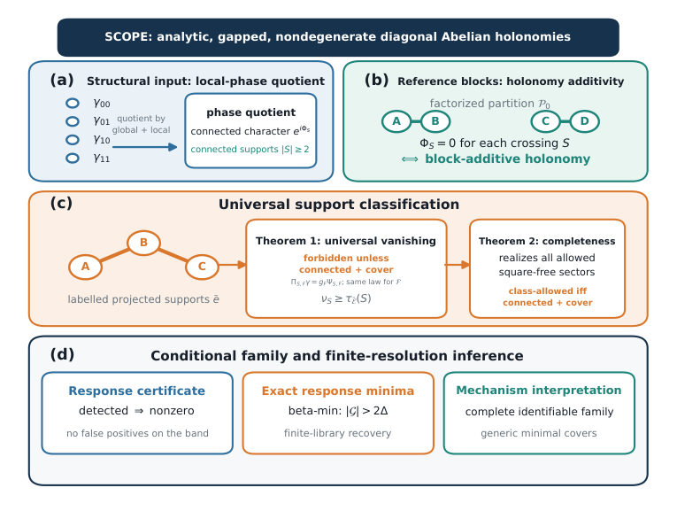 
Figure 1: Physical logic of the connectivity-order law. a, Removing global and subsystem- local phases leaves the irreducible many-body phase. b, Factorized blocks contribute additively. c, Joint logical–coupling resolution permits exactly connected covers at the theorem-class level; the local curvature obeys the same rule. d, The minimum cover fixes the earliest theorem-class- allowed onset. Simultaneous bands certify detected responses, beta-min yields exact response minima, and only a complete identifiable family turns those minima into calibrated mechanisms generically. The sharpness construction is not a hardware design.

📷 Fig 2

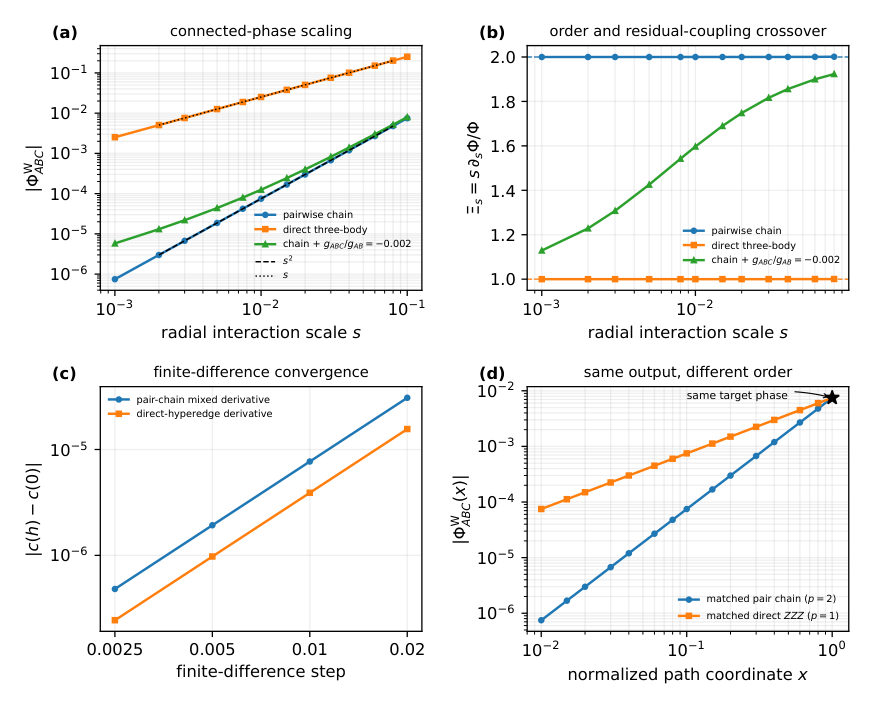 
Figure 2: Interaction-class-matched order spectroscopy in a gap-monitored closed- system model. (a) Three-body character for a pairwise chain, a direct ZZZ term and a chain with residual coupling-coordinate ratio gABC/gAB = −0.002. (b) Elasticities approaching two and one, including the residual-coupling crossover. (c) Quadratic finite-difference convergence of the independently extracted response coefficients. (d) A pair-mediated path and a direct ZZZ path are normalized to the same endpoint phase but retain second- and first-order scaling. The plot uses the common-rotation loop; Supplementary Sec. S9.6 gives the noncovariant control.

📷 Fig 3

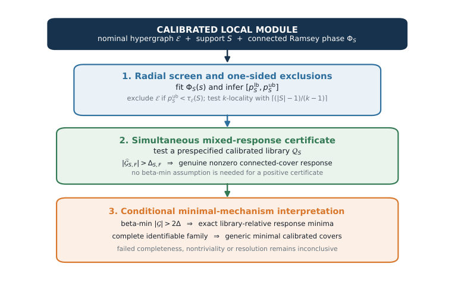 
Figure 3: Two-stage acquisition and three-layer inference for connected-phase mech- anism tests. A radial onset gives one-sided architecture and locality exclusions. Simultaneous mixed-response bands then certify genuine connected-cover responses in a prespecified cali- brated library. Beta-min gives exact library-relative minima, while completeness plus family identifiability is additionally required for generic minimal-mechanism interpretation.

**Summary.** This theoretical work develops a 'connectivity-order law' to solve the problem of identifying the physical mechanism responsible for a measured many-body geometric phase. By employing advanced algebraic and combinatorial methods, the authors prove that the phase value constrains the underlying interactions to those that form a connected cover. This provides a powerful diagnostic tool for characterizing quantum system dynamics.

**Why it may be interesting.** This work provides rigorous mathematical tools to distinguish the physical origin of quantum phase accumulation, which is crucial for designing robust quantum gates and characterizing quantum hardware.

Detailed structure

**Main problem.** The core problem is determining the generating mechanism (direct vs. connected sequence of lower-body interactions) of a measured many-body geometric phase ($\Phi_S$) from its value alone.

**Main result.** The paper establishes a 'connectivity-order law' stating that a nonzero connected response must involve an active set that connects and covers the target support, leading to the bound $
u_S \geq 	au_E(S)$.

**Method.** The authors use advanced mathematical tools including Möbius inversion on subset lattices, joint-support projectors, and developing a 'minimal-cover order law' to analyze the structure of Abelian holonomies.

**Model / system.** The analysis focuses on multiqubit systems exhibiting Abelian holonomies, derived from Hamiltonians structured with coupling terms, applicable to settings like two-spin NMR or semiconductor spin-qubits.

**Key observables.** The multiqubit geometric phase ($\Phi_S$), locally irreducible phase ($\Phi_S$), and confidence bands for detecting mixed responses.

**Important parameters / regimes.** The analysis is restricted to analytic, gapped, nondegenerate Abelian holonomies; the separation condition $|\Phi_S| > 2\Delta$ is key for identifying exact minima.

**Assumptions / limitations.** The results are derived under the assumption of analytic, gapped, and nondegenerate Abelian holonomies, and the method cannot resolve uncalibrated virtual paths.

**Figures summary.** Figure 1 summarizes the physical logic, showing irreducible phase extraction, additivity for factorized blocks, and joint logical–coupling resolution enforcing connected covers.

**Paper structure.** The paper builds from identifying the mechanism-identifiability problem, developing the connectivity-order law via joint support projectors, and concluding with necessary and sufficient conditions for minimal-cover response identification.

Abstract

The value of a multiqubit geometric phase at a single operating point does not reveal whether it was generated directly or through a connected sequence of lower-body interactions. For analytic, gapped, nondegenerate Abelian holonomies, we jointly resolve logical support and independently calibrated coupling support. Every nonzero connected response must involve an active set that connects and covers the target and must contain one factor of each active coupling, yielding the sharp onset bound $ν_S \geq τ_E(S)$. The same selection law applies locally to projected Berry curvature. Conversely, an unrestricted finite-dimensional construction realizes all responses allowed by the connected-cover condition simultaneously, making the condition necessary and sufficient within this theorem class. Operationally, simultaneous confidence bands certify detected mixed responses while controlling false positives; a factor-of-two separation condition additionally recovers exact library-relative response minima. In a complete dictionary, nontriviality of every minimal-cover response is generically necessary and sufficient for these minima to coincide with the minimal calibrated mechanisms. Three-qubit Wilson calculations distinguish direct and pair-mediated routes with the same endpoint phase, and a synthetic Ramsey audit locates the finite-resolution boundary.

[↑ back to top](#top)

### [Universal quantum theory from dynamical consistency](http://arxiv.org/abs/2608.17688v1)

**Authors:** Chiara Marletto, Vlatko Vedral  
**Type:** theory · **Category:** other · **PDF:** <https://arxiv.org/pdf/2608.17688v1>  
**Analysis basis:** full PDF text, analyzed in chunks
**Topic relevance:** `quantum measurements` **2/5** · `Keldysh / 2PI / non-Gaussian methods` **1/5** · `analog quantum simulation` **1/5**

📷 Fig 1

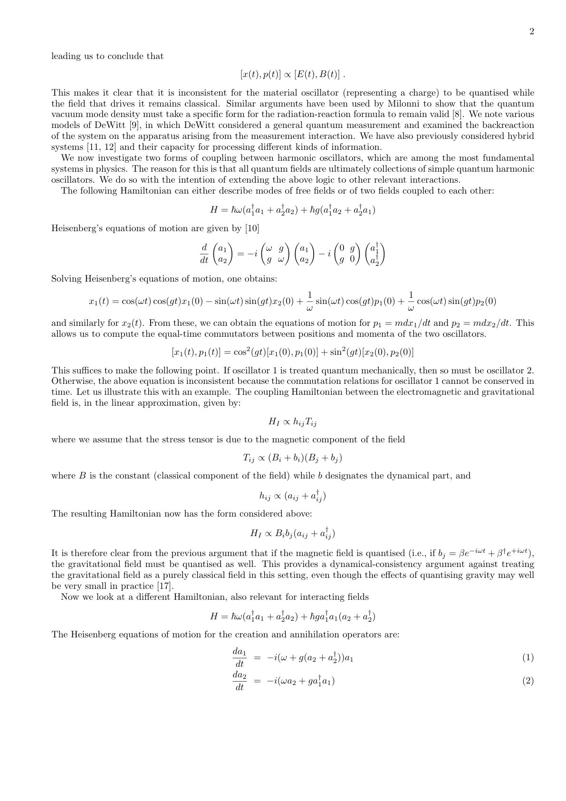 
Low-resolution page preview, page 2

📷 Fig 2

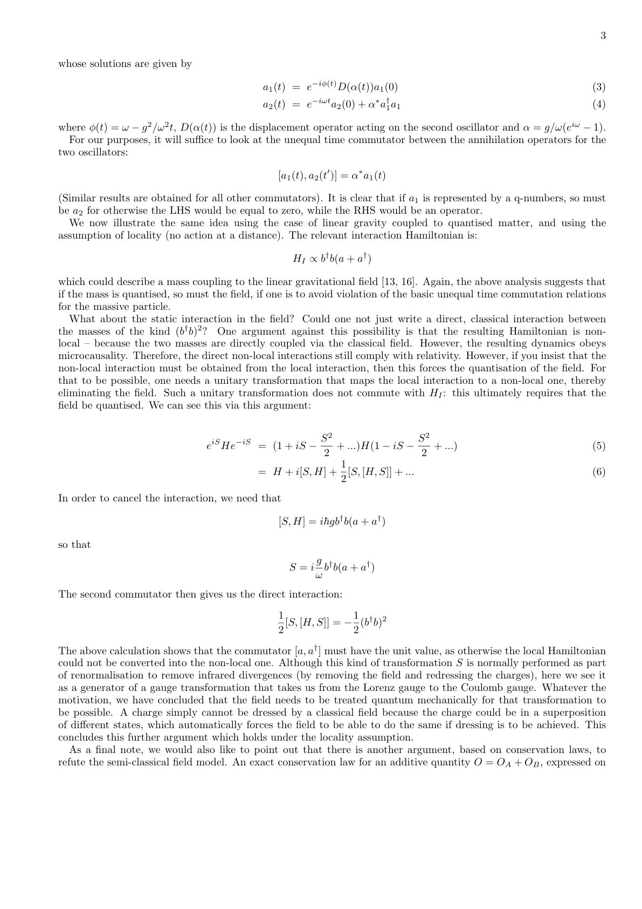 
Low-resolution page preview, page 3

📷 Fig 3

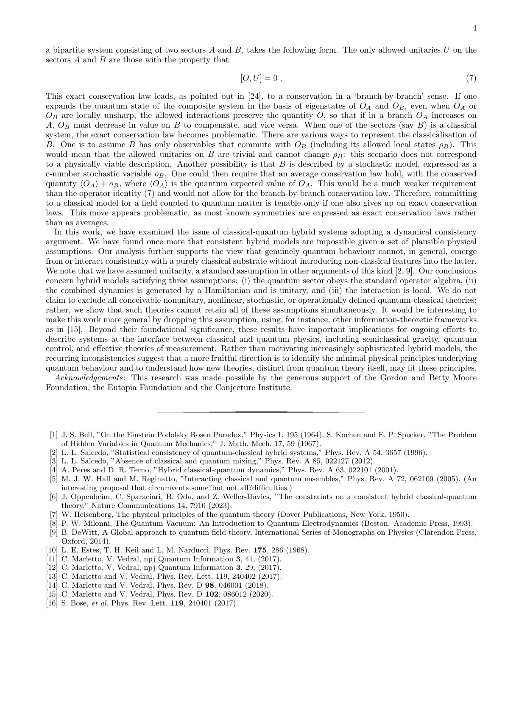 
Low-resolution page preview, page 4

📷 Fig 4

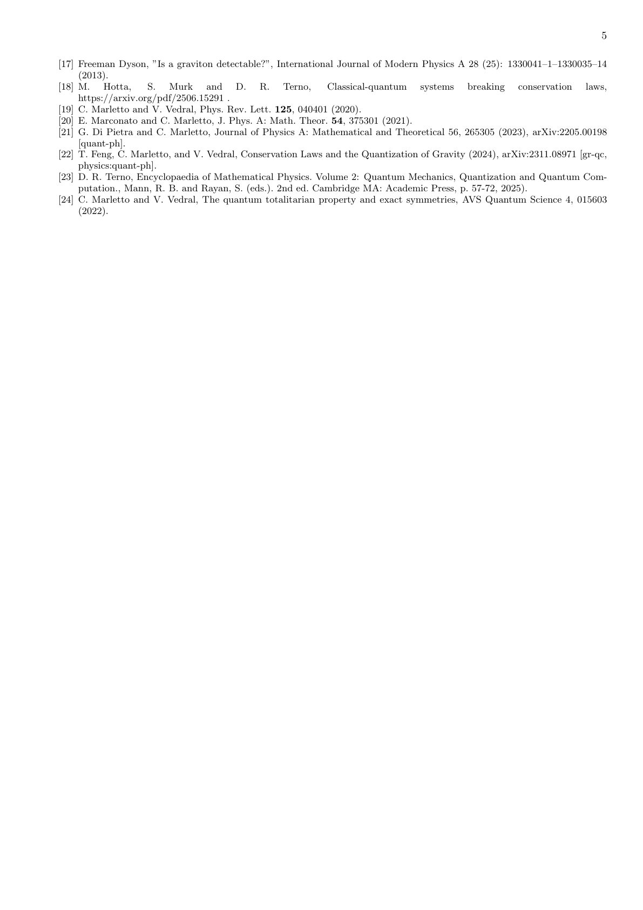 
Low-resolution page preview, page 5

**Summary.** This work uses dynamical consistency to argue that quantum theory is universal by showing that any attempt to model quantum systems coupled to classical fields violates fundamental principles like exact conservation laws or canonical commutation relations. The authors demonstrate that for consistency, all coupled components must obey quantum rules, thereby ruling out viable hybrid quantum-classical models.

**Why it may be interesting.** It provides a fundamental, principle-based argument for the necessity of quantum mechanics, which is relevant for understanding the foundations of open quantum systems and quantum gravity.

Detailed structure

**Main problem.** The paper argues for the universality of quantum theory by testing the consistency of hybrid quantum-classical models.

**Main result.** The authors demonstrate that maintaining exact conservation laws and canonical commutation relations forces any coupled system to be fully quantum, ruling out consistent hybrid classical-quantum descriptions.

**Method.** The analysis uses dynamical consistency arguments, examining the preservation of commutation relations and exact conservation laws under joint unitary time evolution.

**Model / system.** The models include coupled quantum harmonic oscillators, the linear coupling of gravity to quantized EM fields, and a general framework for bipartite quantum-classical systems.

**Key observables.** Commutation relations (e.g., $[x(t), p(t)]$), exact conservation laws ($[O, U] = 0$), and the preservation of the Heisenberg Uncertainty Principle.

**Important parameters / regimes.** The analysis focuses on the structure of the coupling Hamiltonian and the regimes where semiclassical approximations fail.

**Assumptions / limitations.** The core assumptions are that the combined dynamics must be Hamiltonian and unitary, and that the canonical algebra must be preserved under joint unitary dynamics.

**Paper structure.** The paper proceeds by analyzing simple quantum field couplings, extending the argument to gravity/EM coupling, and concluding with a detailed comparison to quantum measurement theory and the failure of classical approximations.

Abstract

We argue for the universality of quantum theory using a dynamical consistency argument, within a specific Hamiltonian setting. We analyse two different types of coupling between simple quantum harmonic oscillators. Each illustrates an aspect of the free and interacting quantum fields and shows the inadequacy of semiclassical models. In particular, we establish that requiring the canonical algebra to be preserved under joint unitary dynamics rules out specific hybrid classical-quantum models. We apply our reasoning to the gravitational field in the linear regime, coupled to the quantised electromagnetic field and, separately, to quantised matter. We conclude with a comparison to DeWitt's analysis of quantum measurement, in which the apparatus, if classical, must be at least stochastic to preserve the Heisenberg Uncertainty Principle. We also note that stochastic models are inconsistent with the strict version of conservation principles, even if they comply with a probabilistic (on average) conservation.

[↑ back to top](#top)

### [A Complete Classification of Complex Hadamard Matrices of Order Six](http://arxiv.org/abs/2608.18053v1)

**Authors:** Mateo Cárdenes Wuttig, Joseph Tindall  
**Type:** theory · **Category:** quantum information and computing · **PDF:** <https://arxiv.org/pdf/2608.18053v1>  
**Analysis basis:** full PDF text, analyzed in chunks
**Topic relevance:** `quantum measurements` **2/5**

📷 Fig 1

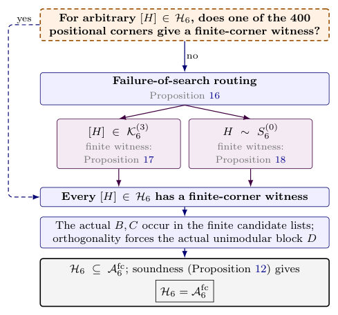 
Figure 1. Proof architecture of the complete classifi- cation of order six complex Hadamard matrices. We follow the illustrated flow diagram to prove Theorem 6 and Corollary 19, which are our central classification results. For an arbitrary class [H] ∈H6 (dashed box), either one of the 400 positional corners already gives a finite-corner witness (yes), or the routing argument of Proposition 16 forces [H] into the Karlsson or Tao sector, each independently shown to have its own witness (Propositions 17 and 18). All routes converge on the universal witness claim, and the completion formula then recovers the original matrix. This proves H6 = Afc 6 , where Afc 6 is the total output of our...

📷 Fig 2

 
Figure 1 summarizes the proof, which is assembled at the end of this section. We begin by isolating the two

📷 Fig 3

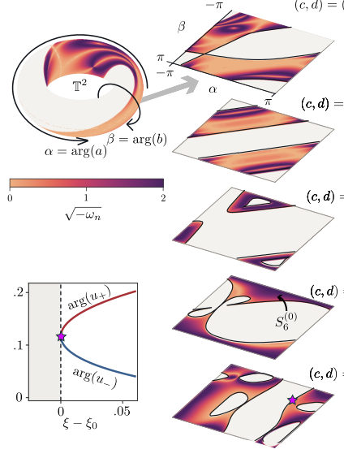 
Figure 2. Geometry of the regular four-phase recon- struction on a two-dimensional slice. We fix c and d, and vary a = eiα and b = eiβ over the torus (a, b) ∈T2, where ω = exp(2πi/3). On product-regular points, the colored re- gion ωn &lt; 0 has two physical product sheets, separated by √−ωn = |u+ −u−|. Gray regions denote ωn &gt; 0, where no product-regular completion exists in this frame. The second- lowest slice contains a frame of Tao’s matrix S(0) 6 for which product regularity fails. The star in the bottom slice marks the ramification seed with d0 = 1+iξ0 1−iξ0 , where ξ0 is the real root of Eq. (77). The lower-left inset follows a transverse nu- merical path through this seed. The roots...

**Summary.** This paper provides a complete mathematical classification of complex Hadamard matrices of order six, which are crucial for quantum measurements and interferometry. The authors advance existing methods by proving that all such matrices can be systematically reconstructed from a small initial corner block. This resolves a long-standing open problem in the field by providing a rigorous, exhaustive algebraic framework.

**Why it may be interesting.** The rigorous classification of these matrices provides a deep mathematical toolset for designing optimal quantum measurement schemes and understanding the limits of quantum state tomography in multi-mode systems.

Detailed structure

**Main problem.** The paper aims to provide a complete and exact finite-incidence classification of complex Hadamard matrices of order six ($d=6$).

**Main result.** The authors successfully classify all such matrices up to standard equivalence, proving that every class can be reconstructed from a suitable initial $3 	imes 3$ corner via a finite, branch-complete procedure.

**Method.** The classification relies on refining Szöllősi's dilation method by proving that every matrix possesses a 'finite-corner witness' and solving the resulting constraints using algebraic elimination and solving coupled quadratic/cubic equations.

**Model / system.** The core model is the complex Hadamard matrix $H \in T^{6 	imes 6}$, which encodes perfectly balanced unitary transformations and is fundamental to understanding mutually unbiased quantum measurements and multiphoton interferometry.

**Key observables.** The classification is determined by analyzing the structure of the matrix corners, the rank of the Gram matrix, and the existence of finite-corner witnesses.

**Important parameters / regimes.** The order of the matrix ($d=6$), the structure of the corner blocks, and the parameters defining the continuous families (e.g., Karlsson's family).

**Assumptions / limitations.** The classification relies on the assumption that the finite-corner witness approach covers all cases, and that the algebraic methods used for reconstruction are exhaustive.

**Figures summary.** Figure 1 illustrates the proof architecture, showing the flow from an arbitrary class to the conclusion that it must have a finite-corner witness, leading to the complete classification $	ext{H}_6 = A_{	ext{fc}}^6$.

**Paper structure.** The paper proceeds by defining the matrices and known families, introducing the 'branch-complete finite-dilation extension' of Szöllősi's algorithm, and finally studying the geometry of the reconstruction process using fixed-Gram constraints.

Abstract

Complex Hadamard matrices encode perfectly balanced unitary transformations. They underlie mutually unbiased quantum measurements and multiphoton interferometry. Their classification is complete through order five, but order six -- the first dimension in which several continuous families coexist with an isolated solution -- has remained open for decades. Here, we give a complete and exact finite-incidence classification of order-six complex Hadamard matrices up to standard equivalence. We first prove that every such matrix can be constructed from an initial dephased $3 \times 3$ corner by a finite, branch-complete procedure. This supplies the global step missing from Szöllősi's dilation method and proves his conjecture: up to standard equivalence, every class outside Karlsson's three-parameter family and Tao's isolated matrix is recovered algebraically from a suitable corner. We then describe the geometry of the reconstruction from four initial phases and show that, except for Tao's isolated matrix and a single explicit Karlsson matrix, every class admits a representative obtained by solving one quadratic and one cubic equation in both the horizontal and vertical directions. Our work resolves the classification problem and provides a rigorous framework for further investigating order-six Hadamards, with applications to balanced six-mode interferometers and the study of mutually unbiased bases.

[↑ back to top](#top)

### [A solid-state theory for dense cylindrical packings of balls](http://arxiv.org/abs/2608.17850v1)

**Authors:** Luke K. Davis, Alexander R. Klotz  
**Type:** theory · **Category:** statistical mechanics · **PDF:** <https://arxiv.org/pdf/2608.17850v1>  
**Analysis basis:** full PDF text, analyzed in chunks
**Topic relevance:** `analog quantum simulation` **2/5**

📷 Fig 1

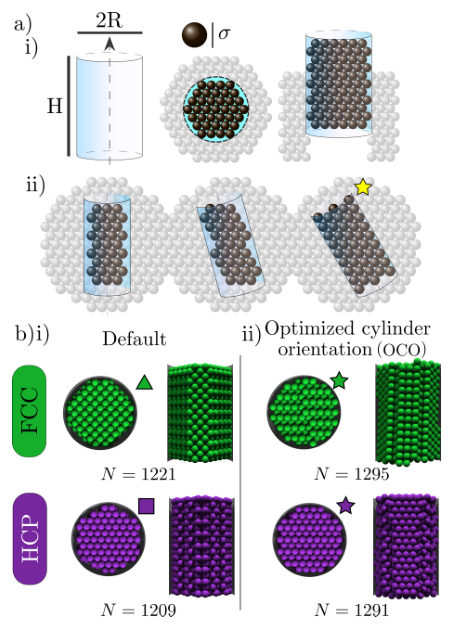 
FIG. 1. Cylindrical packing of balls from masking of a close-packed solid. a)i) Generating the default solid- state packings (left) consists of first defining the dimensions of the masking cylinder, its height H and its diameter 2R, with an upright orientation of [001] (FCC) or [0001] (HCP). ii) A simple optimization of the cylinder orientation improves the packing. b) Examples of default (i) and optimized cylinder orientation (OCO) (ii) cylindrical packings of balls. Cylinder dimensions: H = 30σ and 2R = 10σ.

📷 Fig 2

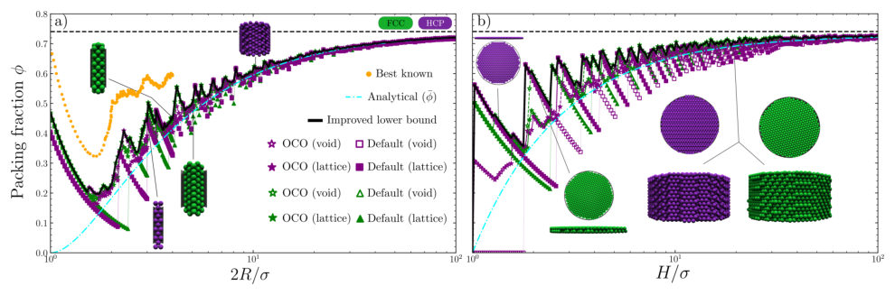 
FIG. 2. Packing fractions for cylindrical packings of balls as predicted by the theory. a) Packing (volume) fraction for tall (H/σ = 125) cylinders as a function of the cylinder to sphere diameter ratio. Data points are calculated from the analytically exact reciprocal sum (7), with the cylinder centered either at the center of a void (void) or coincident with a lattice site (lattice). The cyan curve is the averaged (over all cylinder orientations and positions) analytical packing fraction from Eq. (8). The best lower bound is calculated from finding the best packing resulting from all the FCC and HCP optimized cylinder orientation (OCO) packings (Eq. (9)). The best known data are the...

📷 Fig 3

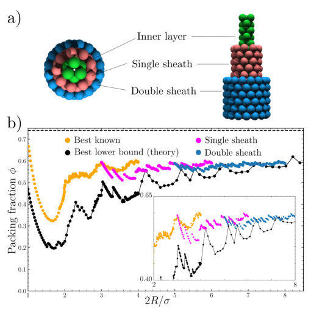 
FIG. 3. The “sheathing” procedure: hexagonally packed cylindrical monolayers are added around dense cylindrical packings resulting in highly efficient packings at larger cylinder radii. a) Visualization of the sheathing technique, shown for an initial packing (the inner layer) at 2R/σ=2.2 with the first sheath at 2R/σ =4.2, and the second sheath at 2R/σ =6.2. b) Comparing packing frac- tions for dense cylindrical packings of balls from the OCO procedure (this work), the sheathing technique (this work), and the best known packings ([4, 22]).

**Summary.** This paper provides a comprehensive analytical theory for determining the maximum packing fraction of hard spheres inside a cylinder. It establishes a rigorous lower bound using lattice masking and improves this bound through systematic optimization and the addition of 'sheaths.' The work is significant for providing a general theoretical framework applicable across all cylinder sizes.

**Why it may be interesting.** While focused on classical geometry, the rigorous development of analytical bounds and optimization procedures for confined systems mirrors techniques used in analyzing quantum confinement effects or calculating ground state energies in geometrically constrained quantum systems.

Detailed structure

**Main problem.** The paper develops an analytical theory to calculate the dense packing fraction of hard spheres (balls) confined within a cylinder, covering all aspect ratios.

**Main result.** The authors derive an exact analytical lower bound for the packing fraction using a lattice-masking approach, and further improve this bound using an Optimized Cylinder Orientation (OCO) procedure and a 'sheathing' construction.

**Method.** The methods involve deriving the packing fraction using Fourier transforms of the cylindrical indicator function, optimizing the cylinder orientation via gradient conditions, and geometrically constructing successive annular sheaths.

**Model / system.** The system is monodisperse hard spheres packed inside a cylinder of specified diameter and height. The theory models the packing by assuming the spheres adhere to a perfect crystal lattice (FCC or HCP).

**Key observables.** Packing fraction ($\phi$), which exhibits oscillatory (step-like) behavior as a function of cylinder dimensions.

**Important parameters / regimes.** Cylinder diameter ($2R$), cylinder height ($H$), and sphere diameter ($\sigma$). The analysis covers regimes from narrow to wide cylinders.

**Assumptions / limitations.** The primary assumption is that the packing can be modeled by masking a finite volume from a perfect, regular crystal lattice. Later derivations assume $H \gg R_0$ for sheath calculations.

**Figures summary.** Figures illustrate the masking process, compare predicted packing fractions (lower bound vs. numerical data) across varying dimensions, and detail the geometric construction of added annular sheaths.

**Paper structure.** The paper progresses from establishing the basic lattice-based lower bound via Fourier analysis to introducing optimization techniques (OCO) to tighten this bound, and finally detailing a recursive 'sheathing' construction to further improve the predicted density.

Abstract

We develop an analytical theory for the dense packing of hard spheres in cylinders. Physically, our theory consists of a finite cylindrical masking of a close-packed three-dimensional solid and covers the entire range of cylinder aspect ratios, thus going beyond efforts that are focused on very tall cylinders in a narrow range of widths. We explicitly derive an exact equation for resulting packing fractions, valid for any regular lattice, and it provides a basis to understand the oscillations and scaling of volume fractions that have appeared in previous works. Our analytical relation serves as a rigorous lower bound and to tighten it we derive, and implement, an efficient mathematical procedure to optimize the orientation of the cylinder. Furthermore, we suggest simple techniques to improve on the predicted packings. Overall, we provide a general theoretical foundation for the packing of balls in cylinders, valid for all container sizes.

[↑ back to top](#top)

### [Gisin's Argument and the Limits of Causal Explanations in Relativistic Spacetime](http://arxiv.org/abs/2608.18010v1)

**Authors:** Felix J. Rutzinger  
**Type:** theory · **Category:** other · **PDF:** <https://arxiv.org/pdf/2608.18010v1>  
**Analysis basis:** full PDF text, analyzed in chunks
**Topic relevance:** `quantum measurements` **2/5**

📷 Fig 1

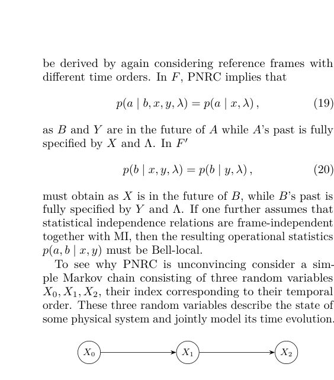 
Figure 1. A simple Markov chain representing the time evolu- tion of a physical system.

📷 Fig 2

 
Figure 3. The maximally allowed causal structure underlying the Bell experiment compatible with IS and NRC in F and F ′.

📷 Fig 3

 
Figure 5. The maximally allowed causal structure underlying the Bell experiment compatible with IS and NRC in F and F ′.

📷 Fig 4

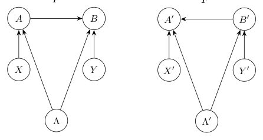 
Figure 6. The maximally allowed causal structure underlying the Bell experiment compatible with IS, NRC, and LICC in F and F ′.

📷 Fig 5

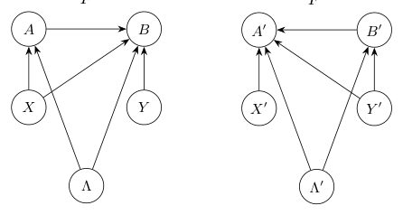 
Figure 7. The maximally allowed causal structure underlying the Bell experiment compatible with IS and NRC in F and F ′.

**Summary.** This paper extends Gisin's argument by developing frame-indexed causal models to handle the probabilistic nature of quantum correlations. It proves that no model satisfying key principles like Independent Settings and No-Retrocausality can be Lorentz covariant while reproducing Bell test statistics. The work thus places strong theoretical constraints on any relativistic causal interpretation of quantum theory.

**Why it may be interesting.** While not directly about AMO systems, the rigorous development of causal inference frameworks and their incompatibility with quantum correlations provides deep theoretical constraints on any physical theory attempting to explain quantum mechanics.

Detailed structure

**Main problem.** The paper addresses the conflict between quantum nonlocality (implied by Bell correlations) and the principles of special relativity when constructing causal explanations for quantum mechanics.

**Main result.** The authors establish two no-go theorems showing that no empirically adequate frame-indexed causal model can simultaneously satisfy Independent Settings, No-Retrocausality, and Causal Lorentz Invariance.

**Method.** The methodology involves extending Gisin's original deterministic argument to the probabilistic domain using a novel framework of frame-indexed causal models.

**Model / system.** The system under study is the bipartite Bell experiment, analyzed using hidden variable models parameterized by causal structures associated with different inertial reference frames.

**Key observables.** Bell correlations (e.g., CHSH inequality violation), and the agreement of operational variables across different reference frames (runwise agreement).

**Important parameters / regimes.** The assumptions include Independent Settings, No-Retrocausality, and the degree of Lorentz invariance assumed for the causal structure.

**Assumptions / limitations.** The analysis critically examines the assumptions required for Gisin's argument, particularly the assumption of determinism, and introduces the Independent Explanation principle.

**Figures summary.** Figure 1 illustrates a simple Markov chain used to critique probabilistic notions of no-retrocausality. Figure 7 illustrates the maximally allowed causal structure compatible with Independent Settings and No-Retrocausality in two frames.

**Paper structure.** The paper first critiques the limitations of generalizing Gisin's deterministic argument to the probabilistic case. It then introduces frame-indexed causal models to formalize the constraints, leading to the derivation of the two main no-go results based on invariance principles.

Abstract

Gisin has provided an argument for the conclusion that no covariant nonlocal model can reproduce the operational statistics observed in Bell experiments. Gisin's argument applies only to deterministic models and we argue that proposed generalizations of the argument beyond determinism based solely on statistical notions are unconvincing, as they lack the resources to formulate a satisfactory notion of no-retrocausality. We introduce the framework of frame-indexed causal models in order to extend Gisin's argument to the genuinely probabilistic case. Frame-indexed causal models associate potentially different causal models with different reference frames while requiring corresponding operational variables to agree runwise. Within this framework, we establish two no-go results based on Gisin's argument. First, we show that no empirically adequate frame-indexed causal model can jointly satisfy Independent Settings, No-Retrocausality, and Causal Lorentz Invariance. Second, it is established that this result continues to hold when Causal Lorentz Invariance is weakened to Lorentz Invariance of Causal Connections, which requires only the skeleton of the causal structure to remain invariant, thereby allowing the direction of causal influence to depend on the choice of reference frame. These results are discussed in the context of relativistic interpretations of quantum theory and nonclassical causal inference.

[↑ back to top](#top)

### [No extension of the Quantum Tensor Product admits a Superposition principle](http://arxiv.org/abs/2608.17572v1)

**Authors:** Vincenzo Fiorentino, Kuntal Sengupta  
**Type:** theory · **Category:** other · **PDF:** <https://arxiv.org/pdf/2608.17572v1>  
**Analysis basis:** full PDF text, analyzed in chunks
**Topic relevance:** `quantum measurements` **2/5**

📷 Fig 1

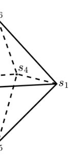 
FIG. 1. Sketch of the state space of Spekkens’ toy model, with the six extremal states labeled.

📷 Fig 2

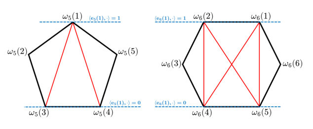 
FIG. 2. The pentagon (n = 5; left) and hexagon (n = 6; right) state spaces. Pairs of vertices connected by red segments constitute the MPD sets distinguished by the MDE M = {e(1), u −e(1)}. Points lying on the top (resp. botom) blue line yield probability 1 (resp. 0) for the effect e1.

📷 Fig 3

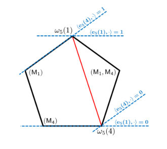 
FIG. 3. State space of the regular pentagon (n = 5). The MPD set {ω5(1), ω5(4)} is highlighted; vertices lying on the blue dotted lines correspond to the deterministic extremal states of either the MDEs M1 = {e5(1), u −e5(1)} or M4 = {e5(4), u −e5(4)}. For each vertex not belonging to the MPD set, we indicate the MDE(s) for which they are probabilistic. Those that are probabilistic with respect to a single MDE are the extremal states that, while in a superposition of {ω5(1), ω5(4)}, form an MPD set with one of its elements.

📷 Fig 4

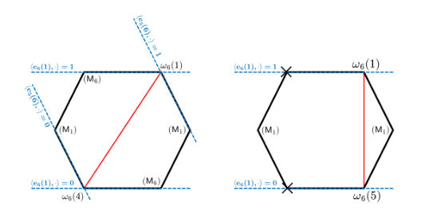 
FIG. 4. Regular hexagon GPT. We apply the same analysis as in Fig. 3 to the MPD sets {ω(1), ω(4)} (left; antipodal vertices) and {ω(1), ω(6)} (right; non-antipodal vertices). Left: all other extremal states states that are probabilistic with respect to only one MDE between M1 = {e6(1), u −e6(1)} and M6 = {e6(6), u −e6(6)} hence, while in a superposition of {ω(1), ω(4)}, they each form a MPD set with one of its elements. Right: the existence of two vertices (distinguihsed by crosses) that are not probabilistic with respect to M1 demonstrates that the hexagon fails to satisfy uniform superposition.

📷 Fig 5

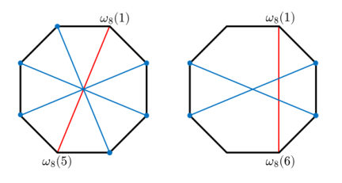 
FIG. 5. Regular octagon GPT (n = 8): for each type of MPD set D (left: antipodal; right: non-antipodal), the states in a superposition of D (indicated by blue vertices) can all be connected (e.g., in the way shown by the blue segments) to form MPD pairs with respect to which both elements of D are a superposition of.

**Summary.** This paper redefines quantum superposition operationally within Generalized Probabilistic Theories (GPTs), removing reliance on Hilbert space formalism. By testing three structural superposition principles, the authors demonstrate that the quantum tensor product is the largest composition rule consistent with these principles. This work provides deep insights into the necessary structural axioms underlying quantum theory.

**Why it may be interesting.** This work provides a fundamental, axiomatic investigation into the core concept of superposition, which is crucial for understanding the boundaries between quantum mechanics and other physical theories, impacting foundational quantum information theory.

Detailed structure

**Main problem.** The paper aims to develop a theory-independent, operational definition of quantum superposition, moving beyond the reliance on the Hilbert space formalism, and to determine which structural features of quantum theory are necessary for this concept.

**Main result.** The quantum tensor product emerges as the largest composition rule for quantum systems that respects all three formulated superposition principles. Furthermore, the authors show that no extension of the quantum tensor product admits a universal superposition principle.

**Method.** The authors define superposition operationally within the framework of Generalised Probabilistic Theories (GPTs) using prepare-and-measure statistics, and test this definition using three structural superposition principles (complete, uniform, and mutual).

**Model / system.** The analysis uses Generalised Probabilistic Theories (GPTs) to model various physical systems, including quantum theory, classical theory, and abstract 'g-systems.' Composite systems are analyzed using tensor product structures for state and effect spaces.

**Key observables.** Superposition itself (defined relationally in GPTs), preparational uncertainty, and entanglement are shown to be special forms of superposition.

**Important parameters / regimes.** The structure of the underlying GPT, the set of extremal states (MPD set), and the specific superposition principles (Complete, Uniform, Mutual).

**Assumptions / limitations.** The analysis assumes that the set of MDE measurements is informationally complete for the system under study.

**Figures summary.** Not specified.

**Paper structure.** The paper first introduces the operational definition of superposition in GPTs, then formulates and tests the three superposition principles (Complete, Uniform, Mutual) across various GPTs. It then analyzes the composition rules for these principles, culminating in the proof that the quantum tensor product is the maximal structure satisfying these principles.

Abstract

Textbook quantum superposition refers to the feature that certain linear combinations of Hilbert space rays, each representing a valid quantum state, are themselves valid states. This notion is not operational, and it relies on the underlying Hilbert space formalism. Recent proposals for experimental tests of indefinite causal order, as well as tests probing the non-classicality of gravity, pivot on superposition, thereby calling for a theory-independent, operational formalisation of the concept. Here, we define superposition within the framework of Generalised Probabilistic Theories, based on observed statistics in prepare-and-measure experiments. Using this, we formulate three superposition principles to investigate which structural features of quantum theory carry over to other theories. We study conditions under which these principles carry over from subsystems to their compositions; to this end, we show that the quantum tensor product emerges as the largest composition rule for quantum systems respecting all three principles. Furthermore, we show how non-classical features such as entanglement and preparational uncertainty can be viewed as special forms of superposition.

[↑ back to top](#top)

### [Non-CSS Quantum Code Embedding](http://arxiv.org/abs/2608.16995v1)

**Authors:** Andrew C. Yuan, Nouédyn Baspin  
**Type:** theory · **Category:** quantum information and computing · **PDF:** <https://arxiv.org/pdf/2608.16995v1>  
**Analysis basis:** full PDF text, analyzed in chunks
**Topic relevance:** `quantum measurements` **2/5**

📷 Fig 1

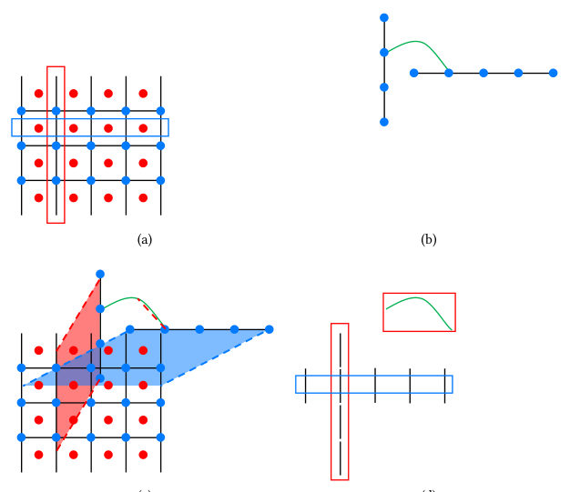 
FIG. 1. ¯Y Measurement. (a) denotes a surface code with edges hosting qubits, where blue vertices (red faces) indicates X (Z) checks acting on adjacent edges. Blue (red) solid lines encompass a ¯ X ( ¯Z) logical representation so that the product denotes a ¯Y logical. (b) denotes the measurement graph as constructed in Definition 28, where for simplicity, we set Eextra = ∅. Note that the green edge denotes EX∧Z since the ¯ X, ¯Z representations overlap. Note that this measurement graph has no cycles and thus we can skip Theorem 29, and take the ancilla code to be the measurement graph so that blue vertices indicate X-checks acting on adjacent edges hosting qubits. (c) denotes the symplectic...

📷 Fig 2

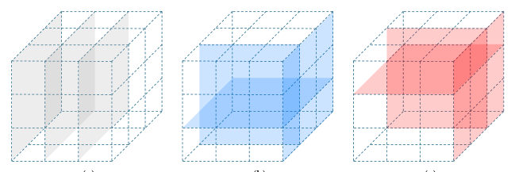 
FIG. 2. Layers. Consider the example input code with checks XIZ, ZZX. (a) Qubit layers, one for each qubit, (b), (c) denote the check layer corresponding to XIZ, ZZX, respectively.

📷 Fig 3

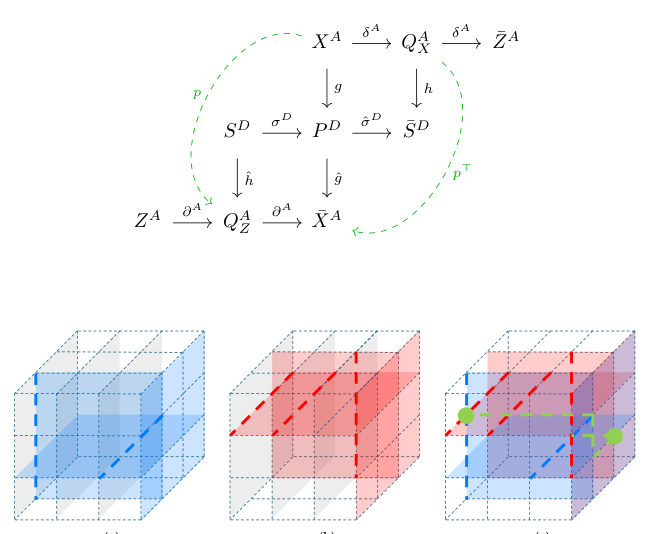 
FIG. 3. Interactions. Continue with the example input code with checks XIZ, ZZX in Fig. 2 (a), (b) denote XIZ and ZZX check layers interacting with the qubit layers, respectively. (c) denotes the defect (green) between the XIZ and ZZX check layers.

**Summary.** This paper generalizes the mathematical framework for quantum error correction from restricted CSS codes to arbitrary non-CSS stabilizer codes. By employing symplectic complexes, the authors show that crucial techniques like logical measurement and code embedding can be extended to these more general, physically relevant codes. This significantly broadens the theoretical toolkit for designing fault-tolerant quantum computation.

**Why it may be interesting.** This work provides a powerful, unified mathematical language (symplectic geometry) to analyze quantum error correction beyond the well-understood CSS regime, which is crucial for realizing complex quantum hardware.

Detailed structure

**Main problem.** The paper generalizes the framework for quantum code embedding from being restricted to Calderbank–Shor–Steane (CSS) codes to accommodate arbitrary stabilizer codes (non-CSS).

**Main result.** A generalized algebraic framework, utilizing symplectic complexes, successfully extends constructions like logical measurement, quantum weight reduction, and Euclidean embedding to non-CSS codes in a straightforward manner.

**Method.** The authors develop and apply a generalized algebraic framework based on symplectic complexes and the analysis of the height-2 cone to unify various quantum error correction procedures.

**Model / system.** The study focuses on quantum error correcting codes, specifically stabilizer codes, encompassing both CSS and general non-CSS types (e.g., those involving Y-type logical measurements).

**Key observables.** Logical measurement outcomes (X-type vs. Y-type), quantum weight reduction metrics, and the structure of the symplectic embedding.

**Important parameters / regimes.** The number of qubits ($n$), the maximum check weight ($w$), and the structure of the underlying symplectic forms over F2.

**Assumptions / limitations.** Previous work was limited to CSS codes; the generalization relies on the properties of the height-2 cone within the symplectic setting.

**Figures summary.** Table I compares CSS-only restrictions versus non-CSS generalizations across key diagnostics. Table II compares specific constructions like Layer Codes for CSS vs. Non-CSS cases.

**Paper structure.** The paper builds from establishing the limitations of CSS-only methods to introducing the generalized symplectic framework (Theorem 2), and finally detailing complex procedures for non-CSS logical measurement and fast surgery (Algorithms 10 & 11).

Abstract

We generalize the unified framework in [Phys. Rev. A 113, 022438 (2026)] to accommodate arbitrary stabilizer codes (referred as non-CSS for emphasis). The generalization has immediate consequences in areas including logical measurement, quantum weight reduction and Euclidean embedding. For example, currently CSS (pure $X,Z$-type) logical measurements are well-understood based on the (height-1) cone, while non-CSS (e.g., $Y$-type) logical measurements are ad hoc (e.g., rely on local Clifford transform). Similarly, quantum weight reduction and optimal Euclidean embeddings only exist for CSS input codes. Here, we show that our generalized framework addresses this issue, and thus many constructions, including qLDPC surgery, Layer Codes and quantum weight reduction generalize to non-CSS codes in a relatively straightforward fashion. The previously mentioned examples are derived in detail for clarity.

[↑ back to top](#top)

### [Quantum simulation of slow analytic time-dependent Hamiltonians](http://arxiv.org/abs/2608.17653v1)

**Authors:** Chenhao Zhao, Yinan Li, Dong An  
**Type:** theory · **Category:** quantum information and computing · **PDF:** <https://arxiv.org/pdf/2608.17653v1>  
**Analysis basis:** full PDF text, analyzed in chunks
**Topic relevance:** `analog quantum simulation` **2/5**

📷 Fig 1

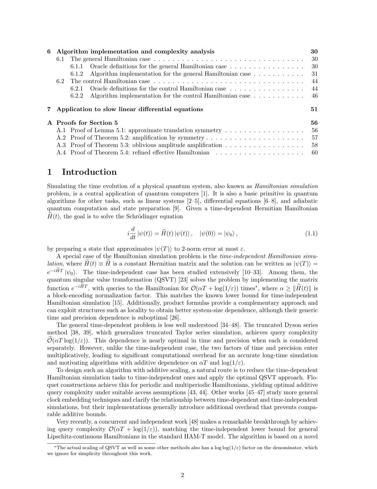 
Low-resolution page preview, page 2

📷 Fig 2

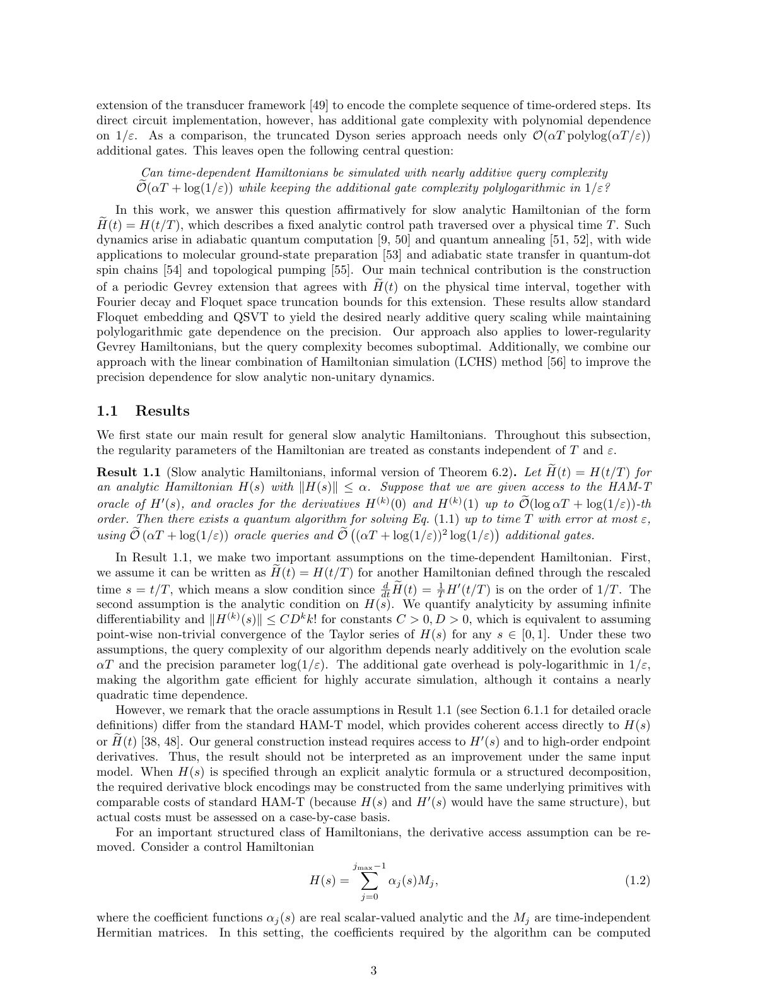 
Low-resolution page preview, page 3

📷 Fig 3

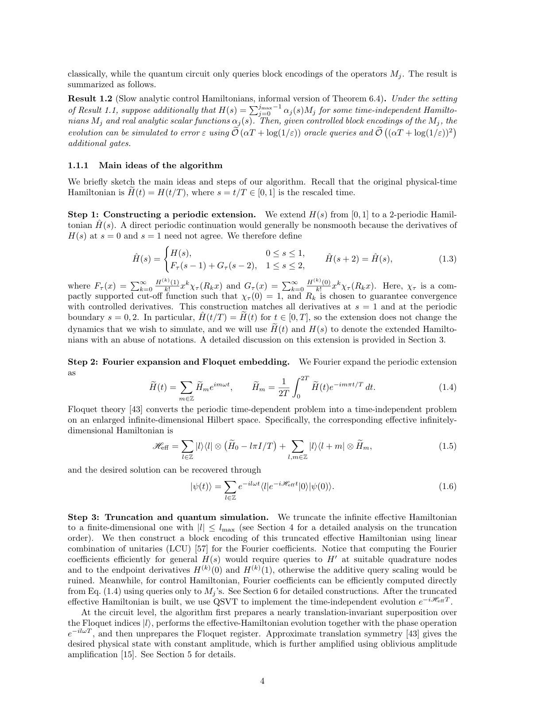 
Low-resolution page preview, page 4

📷 Fig 4

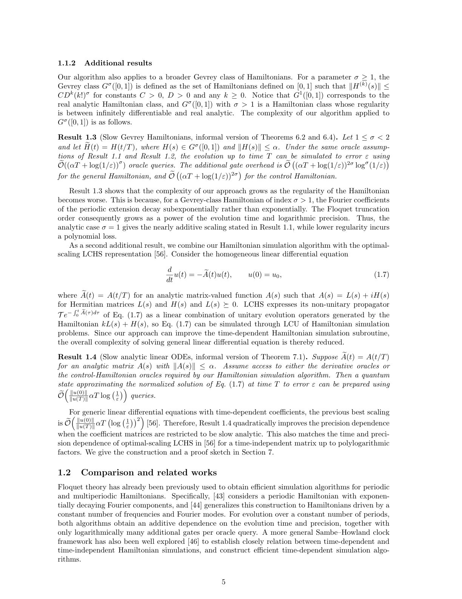 
Low-resolution page preview, page 5

📷 Fig 5

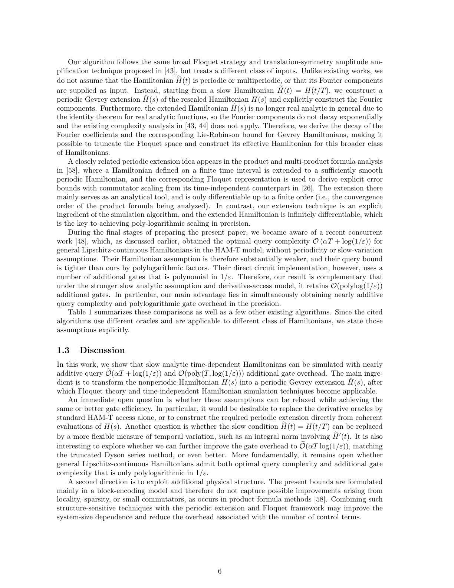 
Low-resolution page preview, page 6

**Summary.** This paper presents a quantum algorithm to efficiently simulate time evolution under slow analytic time-dependent Hamiltonians. By employing periodic Gevrey extensions and combining them with Floquet embedding, the authors achieve near-additive query complexity. This advances the field by providing scalable simulation tools for complex quantum dynamics.

**Why it may be interesting.** This work provides concrete, efficient quantum algorithmic tools for simulating complex, time-varying quantum dynamics, which is crucial for modeling open quantum systems and time-dependent interactions in AMO physics.

Detailed structure

**Main problem.** The paper addresses the quantum simulation of time evolution governed by slow analytic time-dependent Hamiltonians, $e^{H(t)} = H(t/T)$. It aims to achieve high efficiency in terms of query and gate complexity.

**Main result.** The developed algorithm achieves a near-additive query complexity of $\widetilde{\mathcal O}(\alpha T + \log(1/\epsilon))$ for slow analytic Hamiltonians, with polylogarithmic gate overhead.

**Method.** The core method involves constructing a periodic Gevrey extension of the Hamiltonian, followed by Floquet embedding and utilizing optimal time-independent Hamiltonian simulation techniques like QSVT.

**Model / system.** The model is a quantum system whose time evolution is governed by a time-dependent Hamiltonian $H(t)$, which is assumed to be slow analytic. The simulation is generalized to include structured control Hamiltonians and Gevrey class Hamiltonians.

**Key observables.** Query complexity, gate complexity, and the resulting state approximation error ($\epsilon$).

**Important parameters / regimes.** $\alpha$ (related to $\lVert H(s) 
Vert$), $T$ (total time), and $\epsilon$ (desired error).

**Assumptions / limitations.** The primary assumption is that the Hamiltonian $H(s)$ is slow analytic, allowing for the construction of a smooth periodic extension. The general case requires access to endpoint derivatives of $H(s)$.

**Paper structure.** The paper develops the simulation framework by first establishing the periodic extension and Fourier expansion, then mapping the problem to an effective time-independent Hamiltonian, and finally applying advanced quantum simulation techniques (like LCU/QSVT) to derive the complexity bounds.

Abstract

We develop a quantum algorithm for slow analytic Hamiltonians $\widetilde H(t)=H(t/T)$ with $\|H(s)\|\leqα$ that achieves nearly additive query complexity and low gate overhead. Our main technical contribution is a periodic Gevrey extension of $H(s)$, together with Fourier component decay and truncation bounds that enable an efficient finite-dimensional simulation. Combined with Floquet embedding and optimal time-independent Hamiltonian simulation technique, this gives query complexity $\widetilde{\mathcal O}\!\left(αT+\log(1/\varepsilon)\right)$ and additional gate complexity $\widetilde{\mathcal O}\!\left((αT+\log(1/\varepsilon))^2\log(1/\varepsilon)\right)$, assuming coherent access to $H'(s)$ and endpoint derivatives. For slow analytic control Hamiltonians, only block encodings of the time-independent control operators are required, with the same query complexity and lower gate overhead. Our method also extends to Gevrey Hamiltonians and improves the precision dependence for simulating slow analytic semi-dissipative linear differential equations.

[↑ back to top](#top)

### [Wavelength-Resolved Control of Photovoltaic Screening and Defect-Mediated Doping in Photo-Ferroelectric/Graphene Devices](http://arxiv.org/abs/2608.17647v1)

**Authors:** Krishna Prasad Maity, Mohd Uvais, Jean-Francois Dayen, Bernard Doudin, Roman Gumeniuk, Bohdan Kundys  
**Type:** experiment · **Category:** other · **PDF:** <https://arxiv.org/pdf/2608.17647v1>  
**Analysis basis:** full PDF text, analyzed in chunks
**Topic relevance:** `quantum measurements` **2/5**

📷 Fig 1

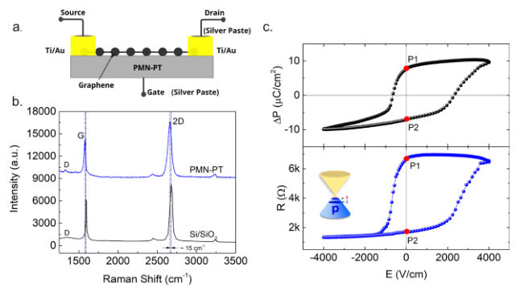 
Figure 1. (a) Schematic of the graphene/ferroelectric device, (b) Raman spectrum for monolayer graphene on top of Si/SiO2 and PMN-PT substrates, and (c) FE loop and graphene resistance variation with applied gate electric field.

📷 Fig 2

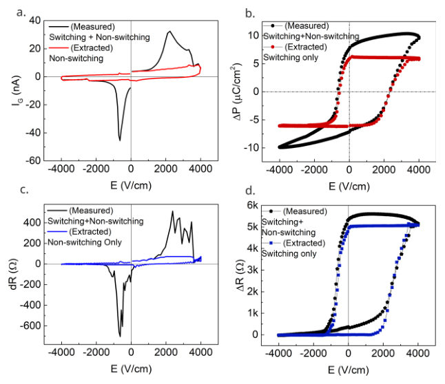 
Figure 2. Measured and corrected components of source gate current (a) related ferroelectric loop (b) which disentangle the nonswitching contribution. (c,d) Same analysis applied to distinguish switching and nonswitching effects on graphene transconductance measured in situ (see the text).

📷 Fig 3

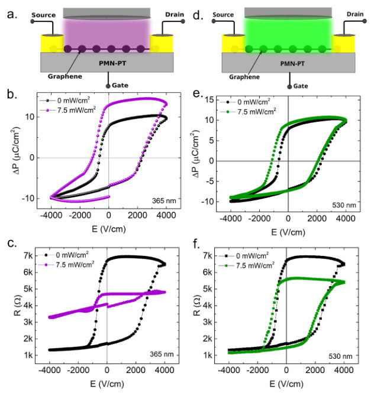 
Figure 3. (a), (d) Schematic of the PMN-PT/graphene device with optical irradiation of UV and green light, (b) and (c) polarization and graphene resistance variations with gate voltage in the presence of continuous UV light (365 nm). (e,f) polarization and graphene transconductance in the presence of continuous green light (530 nm).

📷 Fig 4

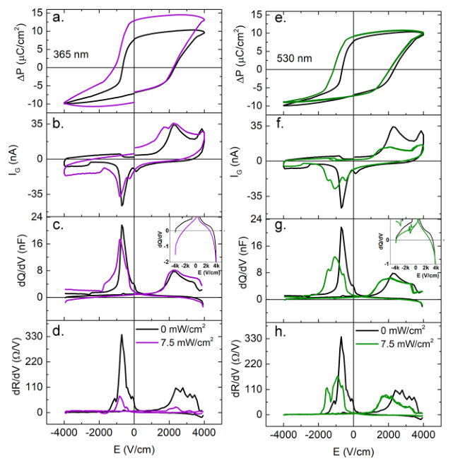 
Figure 4. Variation of FE polarization, gate FE current, capacitance, and graphene resistance changes with electric field for (a−d) 365 nm UV and (e−h) 530 nm green light irradiations.

📷 Fig 5

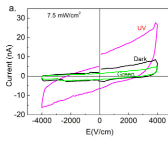 
Figure 5. (a) Extracted nonswitching current for different light illumination conditions C 0; 0 V

**Summary.** This research characterizes how light controls the electrostatics of ferroelectric/graphene devices. By comparing UV and green light illumination, the authors distinguish between free-carrier-induced screening and defect-mediated charge redistribution. This provides practical guidelines for using light to either tune doping or deliberately reconfigure the ferroelectric polarization state.

**Why it may be interesting.** The work demonstrates how external light fields can be used to precisely control the polarization state and doping level in ferroelectric interfaces, offering a mechanism for optically writing ferroelectric memory states.

Detailed structure

**Main problem.** The study investigates the optoelectronic response of ferroelectric/graphene devices to disentangle the effects of ferroelectric dipole switching from extrinsic current pathways under illumination.

**Main result.** Above-band gap UV illumination causes dynamic photovoltaic charge screening, significantly suppressing the graphene resistance ratio, whereas sub-band gap green light causes only weak, defect-mediated charge redistribution.

**Method.** The authors performed I-V measurements and analyzed ferroelectric hysteresis loops under dark, UV (365 nm), and green (530 nm) illumination, employing compensation techniques for leakage and stray capacitance.

**Model / system.** The physical system is a ferroelectric material (e.g., PMN-PT) interfaced with a graphene overlayer. The analysis focuses on the interplay between polarization switching, photovoltaic charge screening, and defect-assisted doping.

**Key observables.** Graphene resistance variation ($\Delta R$), ferroelectric hysteresis loop shape, photovoltaic current, and the ratio of resistance between opposite remanent polarization states.

**Important parameters / regimes.** Illumination wavelength (365 nm vs 530 nm), free carrier generation (above-band gap), and charge screening magnitude (e.g., $290\%$ down to $15\%$).

**Assumptions / limitations.** The analysis requires compensating for background leakage current and stray capacitance to accurately isolate intrinsic ferroelectric switching and photovoltaic effects.

**Figures summary.** Figures compare FE loops and graphene resistance variations under UV vs. green light; supporting figures detail the subtraction of leakage/capacitance and quantify the PV current difference.

**Paper structure.** The paper systematically analyzes the device response by first establishing baseline measurements (dark), then comparing the strong photoresponse induced by UV light (free carriers/screening) against the weaker, gradual response from green light (defect excitation), while rigorously compensating for parasitic electrical effects.

Abstract

Ferroelectrics enable large charge doping of two-dimensional overlayers, but the coexistence of switching and nonswitching charge dynamics complicate electro-optical analysis. Here, we investigate the optoelectronic response of a ferroelectric/graphene device under 365 and 530 nm illumination, disentangling effects on ferroelectric dipole alignment from extrinsic current pathways. Graphene acts as a high-gain sensor, amplifying subtle polarization dynamics into a pronounced resistance difference. By resolving switching and nonswitching channels in dark and illuminated conditions, we reveal a competition between photovoltaic charge screening and defect-assisted excitation that governs device electrostatics. Above-band gap illumination generates free carriers that induce leaky ferroelectric hysteresis and suppress the graphene resistance ratio between opposite remanent polarization states from 290% to 15% due to dynamic photovoltaic charge screening. In contrast, 530 nm illumination primarily induces charge redistribution in ferroelectrics via defect-state excitation, leading to a significantly weaker suppression of the resistance variation of graphene. These results establish practical guidelines for selecting photon energy and intensity to either preserve remanent polarization while tuning channel doping or deliberately reconfigure polarization through optical programming.

[↑ back to top](#top)

### [Where Atom Loss Lands Matters: Decoder-Aware Risk Deposition in Neutral-Atom QEC](http://arxiv.org/abs/2608.17913v1)

**Authors:** Xinyi Li, Yifeng Peng, Ying Wang  
**Type:** theory · **Category:** quantum information and computing · **PDF:** <https://arxiv.org/pdf/2608.17913v1>  
**Analysis basis:** full PDF text, analyzed in chunks
**Topic relevance:** `QC/QI experiment` **2/5**

📷 Fig 1

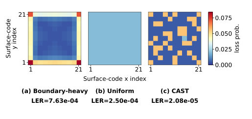 
Fig. 1. Equal-budget loss-deposition maps. Distance-11 surface-code memory patch over 11 syndrome rounds. Each cell is a data-qubit site in surface-code coordinates; color denotes per-round atom-loss probability. All maps have the same expected spacetime loss budget of 26.62 erasures.

📷 Fig 2

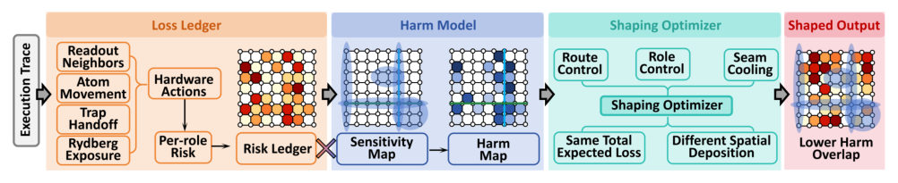 
Fig. 2. Methodology overview. CAST builds a loss ledger from a neutral-atom trace, combines it with a code-sensitivity harm model, and uses local shaping actions to reduce decoder-weighted harm under comparable exposure.

📷 Fig 3

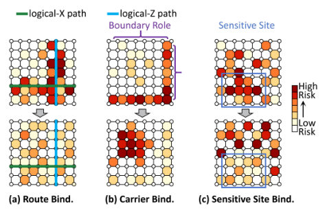 
Fig. 3. Local shaping mechanism. CAST changes which feasible route, role binding, or surgery-seam placement carries exposure.

📷 Fig 4

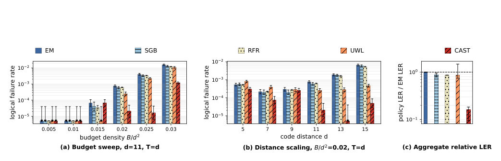 
Fig. 4. Equal-budget controlled memory experiment. Panel (a) sweeps loss budget at d = 11 and T = d; panel (b) sweeps code distance at fixed budget density and T = d; panel (c) aggregates measurable paired points as policy/EM LER ratios. Lower LER and lower ratios are better.

📷 Fig 5

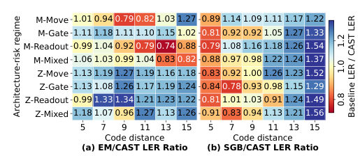 
Fig. 5. Calibrated physical-scale comparison. The two heatmaps report EM/CAST and SGB/CAST LER ratios. Within each heatmap, rows are architecture-risk regimes and columns are code distances. Values above one favor CAST; M/Z denote monolithic/zoned layouts.

**Summary.** This paper introduces CAST, a novel compiler optimization pass for neutral-atom quantum error correction that accounts for where atom loss occurs, not just how much. By minimizing a decoder-weighted harm objective, CAST strategically redirects unavoidable hardware losses away from the most critical parts of the quantum code. This results in substantial reductions in the logical error rate, proving that deposition awareness is crucial for scalable quantum computing.

**Why it may be interesting.** It provides a concrete, actionable compiler-level optimization technique for mitigating hardware imperfections (loss) in emerging quantum platforms, directly impacting the feasibility of large-scale quantum computation.

Detailed structure

**Main problem.** In neutral-atom QEC, simply minimizing total atom loss exposure is insufficient because the *location* (deposition) of the loss significantly impacts the final logical error rate (LER).

**Main result.** The proposed compiler pass, CAST, significantly lowers LER compared to topology-blind methods by intelligently steering loss deposition away from highly sensitive code regions.

**Method.** CAST is a compiler-side optimization pass that minimizes a decoder-weighted harm objective by searching for local, trace-valid actions (route, role, seam cooling) while maintaining a comparable total physical exposure.

**Model / system.** The work focuses on quantum error correction (QEC) implemented on neutral-atom arrays, specifically modeling surface-code memory patches and lattice-surgery operations.

**Key observables.** Logical Error Rate (LER), Decoder-Weighted Harm, Total Atom Loss Exposure.

**Important parameters / regimes.** Code distance ($d$), physical-scale architecture models, and the degree of risk heterogeneity/routing slack.

**Assumptions / limitations.** The optimization assumes the compiler can find local, trace-valid actions that change deposition patterns while keeping total physical exposure constant.

**Figures summary.** Figures compare LER reductions across different loss deposition patterns (e.g., Boundary-heavy vs. CAST) and show quantitative improvements across various physical-scale settings, highlighting the benefit of CAST.

**Paper structure.** The paper introduces the limitation of scalar loss metrics, formalizes the decoder-aware risk deposition objective, presents the CAST optimization pass, and validates its performance against multiple baselines across various physical-scale benchmarks.

Abstract

Neutral-atom arrays are emerging as a leading platform for scalable quantum error correction (QEC). Qubits are routed and reused across the array, while detected loss is reported to the decoder as erasure information. Existing neutral-atom compilers optimize this movement, including routing, shuttling, and reuse, and often model loss through scalar exposure costs. Yet total exposure is an incomplete statistic for erasure-corrected QEC. It captures how much loss occurs, but not where it lands on the code, which we call its deposition. Under the same expected atom-loss budget, different deposition patterns over a code patch induce substantially different logical error rates (LER). We formalize this as decoder-aware risk deposition and present CAST, a compiler-side optimization pass that overlays a code-topology sensitivity map on a role-indexed exposure ledger and minimizes a decoder-weighted harm objective under a comparable-exposure constraint, using only local route, role, and seam-cooling actions. Across surface-code memory, physical-scale architecture models, lattice surgery, and decoder-mismatch checks, CAST lowers LER relative to topology-blind exposure minimization, improving on it in 35 of 48 physical-scale settings and by as much as 5.3x where exposure is heterogeneous and routing has slack. The largest gains occur when high exposure and high decoder sensitivity are initially misaligned, giving CAST room to redirect risk toward lower-impact code roles. CAST shows that decoder-aware atom-loss risk deposition can be optimized as a compiler-side pass in neutral-atom QEC.

[↑ back to top](#top)

### [Low-Depth and Noise-Resilient Quantum State Preparation for Partial Differential Equations via Virtual Rz](http://arxiv.org/abs/2608.17249v1)

**Authors:** Toru Fujii  
**Type:** theory · **Category:** quantum information and computing · **PDF:** <https://arxiv.org/pdf/2608.17249v1>  
**Analysis basis:** full PDF text, analyzed in chunks
**Topic relevance:** `Keldysh / 2PI / non-Gaussian methods` **1/5** · `analog quantum simulation` **1/5** · `correlated / nonlocal dissipation` **1/5** · `driven-dissipative phase transition` **1/5** · `methods for driven-dissipative` **1/5** · `quantum measurements` **1/5**

📷 Fig 1

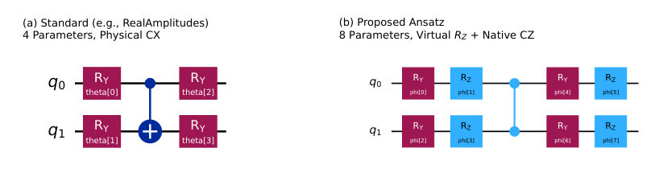 
Fig. 1. (Color online) Proposed single-layer ansatz (shown for n = 2). The circuit uses RY and Rz rotations and a CZ entangling layer. The Rz rotations (dashed boxes) are implemented as virtual phase-frame updates,10) which do not add physical pulses or circuit duration; in simulations they are treated as ideal frame updates. The layer has 2n variational parameters.

**Summary.** This work addresses the challenge of preparing complex, smooth quantum states needed for solving PDEs on noisy quantum hardware. The authors propose a novel, shallow quantum circuit utilizing virtual phase rotations to maintain high fidelity. This method proves to be robust against realistic noise, making it a practical tool for quantum simulation algorithms.

**Why it may be interesting.** It provides a concrete, practical quantum circuit primitive that addresses the critical bottleneck of state preparation fidelity in quantum simulation algorithms for continuous physical systems.

Detailed structure

**Main problem.** Preparing smooth, real-amplitude quantum states is crucial for quantum solvers of dissipative Partial Differential Equations (PDEs).

**Main result.** The proposed low-depth, virtual-Rz-enabled ansatz achieves high fidelity and significantly outperforms deep exact state preparation methods under realistic NISQ noise.

**Method.** A hardware-aware variational ansatz using local Ry rotations, a CZ layer, and virtual Rz updates is proposed and optimized using COBYLA.

**Model / system.** The model involves encoding discretized positive weights from dissipative PDEs (like LCHS) into quantum state amplitudes, requiring the state to be smooth and weakly entangled.

**Key observables.** Fidelity ($F(	heta)$) under ideal, NISQ, and early-FTQC noise conditions.

**Important parameters / regimes.** Circuit depth ($O(n)$), noise parameters ($p_{2Q}, p_{1Q}$), and the bond dimension of the resulting MPS.

**Assumptions / limitations.** Virtual Rz operations are assumed to add no physical pulses or duration, and the state is restricted to a low-bond-dimension MPS matching the target smoothness.

**Figures summary.** Figure 1 illustrates the single-layer ansatz for n=2, showing the structure of Ry and virtually implemented Rz rotations. Table I compares fidelities for n=6 and n=12 across different state preparation methods under various noise regimes.

**Paper structure.** The paper introduces the problem of state preparation for PDE solvers, proposes the novel low-depth ansatz incorporating virtual Rz, details the theoretical benefits (low-bond-dimension MPS), and benchmarks the method against exact and baseline circuits under increasing noise levels.

Abstract

Preparing smooth real-amplitude quantum states is a key subroutine in quantum solvers for dissipative PDEs, such as LCHS, where discretized positive weights must be encoded into amplitudes. Exact state-preparation decompositions can reach unit fidelity ideally, but their two-qubit depth grows quickly and causes severe fidelity loss on NISQ hardware. We propose a low-depth, hardware-aware variational ansatz tailored to smooth, weakly entangled, near-real target distributions typical of damped PDE dynamics. The circuit uses one layer of local Ry rotations to generate real amplitudes, a nearest-neighbor CZ entangling layer to introduce limited entanglement, and additional Rz rotations implemented virtually as frame updates. Virtual Rz operations add no physical pulses and do not increase circuit duration, providing extra degrees of freedom without enlarging the gate footprint; in simulation they are treated as ideal to isolate their benefit. From a tensor-network viewpoint, the alternating structure restricts the state to a low-bond-dimension MPS, matching the target smoothness (for 3 qubits, bond dimension <= 2). We optimize parameters with COBYLA to minimize infidelity and benchmark against exact state preparation (Qiskit) and a RealAmplitudes (CZ) baseline. Under depolarizing noise representative of NISQ and early fault-tolerant regimes, the proposed single-layer circuit achieves high ideal fidelity with O(n) depth and substantially higher noisy fidelity than deeper exact constructions. In coherent-noise sweeps, virtual Rz parameters absorb systematic phase errors and axis mismatch, maintaining near-unity fidelity over a wide error range. These results indicate that virtual-Rz-enabled, low-depth circuits provide a practical, noise-resilient state-preparation primitive for PDE solvers on NISQ and early FTQC hardware.

[↑ back to top](#top)

### [Dynamics of Majorana tetron qubits under quasiparticle poisoning](http://arxiv.org/abs/2608.18042v1)

**Authors:** Sauri Bhattacharyya, Bernard van Heck  
**Type:** theory · **Category:** quantum information and computing · **PDF:** <https://arxiv.org/pdf/2608.18042v1>  
**Analysis basis:** full PDF text, analyzed in chunks
**Topic relevance:** `Keldysh / 2PI / non-Gaussian methods` **1/5** · `correlated / nonlocal dissipation` **1/5** · `driven-dissipative phase transition` **1/5** · `methods for driven-dissipative` **1/5** · `quantum measurements` **1/5**

📷 Fig 1

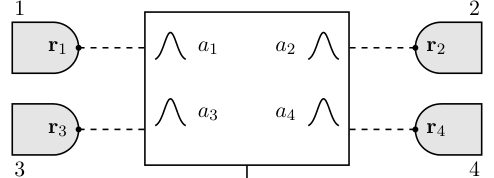 
FIG. 1. A schematic diagram of a tetron device: a floating superconducting island (white box) contains four localized Majorana zero modes a1, a2, a3, a4. The superconductor is tunnel-coupled (dashed lines) to four fermionic leads (grey).

📷 Fig 2

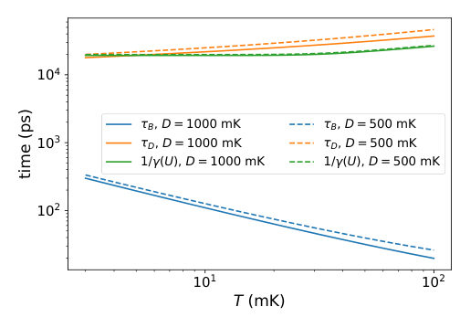 
FIG. 3. Plots of the numerically calculated τB, τD, and γ−1(U), for the wide-band model of the bath. The two sets of results (in solid and dashed lines) are for two choices of D = 1K, and D = 0.5K respectively. The value of U = 100mK for both curves. We observe a clear separation of scales τB ≪τD, and also the fact that γ−1(U) ∼τD from the plots.

**Summary.** This theoretical paper analyzes how Majorana tetron qubits lose quantum information due to coupling with external quasiparticles. Using the Bloch-Redfield equation, the authors derive key rates for decoherence and parity leakage. The results are crucial for understanding and improving the time-domain measurements of Majorana qubits in quantum computing prototypes.

**Why it may be interesting.** This work directly addresses decoherence mechanisms in solid-state qubits, providing quantitative tools to predict experimental limitations in topological quantum computing platforms.

Detailed structure

**Main problem.** The paper investigates the dissipative dynamics of a Majorana tetron qubit when subjected to environmental noise from quasiparticle poisoning.

**Main result.** The analysis yields analytical expressions for the steady state, parity leakage, and decoherence rates, showing how the dephasing rate's exponential suppression is gradually removed by the qubit's energy splitting.

**Method.** The study employs the Bloch-Redfield equation, derived using the Born-Markov approximation, to model the open quantum system dynamics.

**Model / system.** The system is a Majorana tetron qubit, modeled as a superconducting island hosting four Majorana zero modes, coupled to external leads (the bath). The dynamics are governed by a master equation derived from the total Hamiltonian.

**Key observables.** Steady state, parity leakage rate, and decoherence rate of the Majorana qubit.

**Important parameters / regimes.** Charging energy (U), direct couplings ($\epsilon$), and coupling strength ($\Gamma_0$). Key regimes include the degenerate ($\epsilon \ll \Gamma_0$) and secular ($\epsilon \gg \Gamma_0$) limits.

**Assumptions / limitations.** The Born-Markov approximation is used, requiring the bath correlation time to be much shorter than the system evolution time ($	au_D \gg 	au_B$).

**Figures summary.** Figure 1 schematically shows the tetron island coupled to four fermionic leads, and Figure 2 illustrates the energy-level scheme of the isolated Majorana system.

**Paper structure.** The paper progresses from defining the full Hamiltonian and the open system dynamics via the Bloch-Redfield equation, deriving the master equation under approximations, and finally analyzing the resulting rates in different energy regimes.

Abstract

We study the dissipative dynamics of a Majorana tetron qubit in the presence of extrinsic quasiparticle poisoning due to the coupling to external leads. From the Bloch-Redfield equation describing a finite-size topological superconductor hosting four Majorana zero modes, we recover analytical expressions for the steady state, the parity leakage rate, and the decoherence rate of a Majorana qubit at arbitrary values of the charging energy. The analysis shows that the exponential suppression of the dephasing rate is gradually removed by the energy splitting of the qubit states. These results can be useful to understand time-domain experimental data in Majorana qubit prototypes.

[↑ back to top](#top)

### [Implementation Possibility of Quantum Simulation for Quantum Molecular Dynamics](http://arxiv.org/abs/2608.17261v1)

**Authors:** Xingyu Zhang, Weijia Guo, Jinke Yu, Qingyong Meng  
**Type:** theory · **Category:** other · **PDF:** <https://arxiv.org/pdf/2608.17261v1>  
**Analysis basis:** full PDF text, analyzed in chunks
**Topic relevance:** `Keldysh / 2PI / non-Gaussian methods` **1/5** · `analog quantum simulation` **1/5** · `methods for driven-dissipative` **1/5** · `quantum measurements` **1/5**

📷 Fig 1

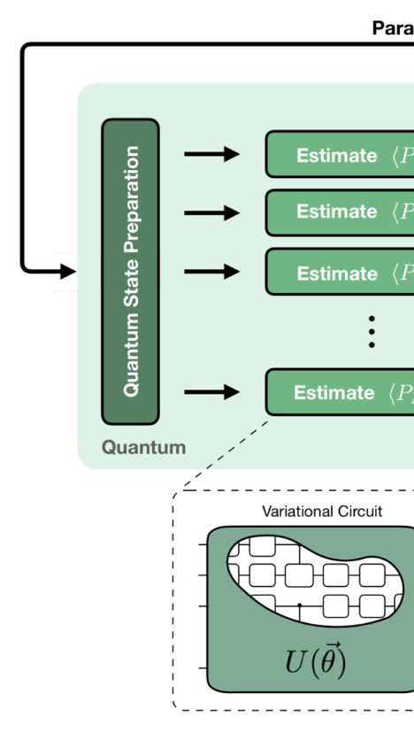 
FIG. 1: Chem-Dyn-QuanSimu

📷 Fig 2

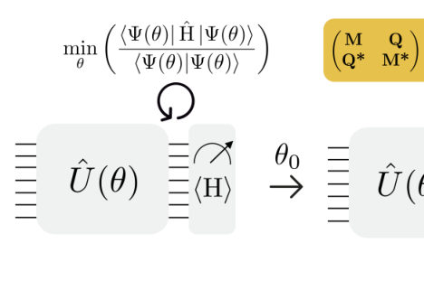 
FIG. 2: Chem-Dyn-QuanSimu

📷 Fig 3

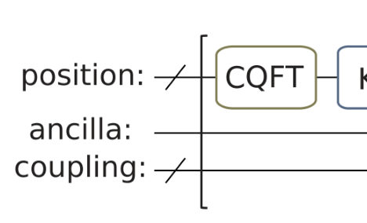 
FIG. 3: Chem-Dyn-QuanSimu

📷 Fig 4

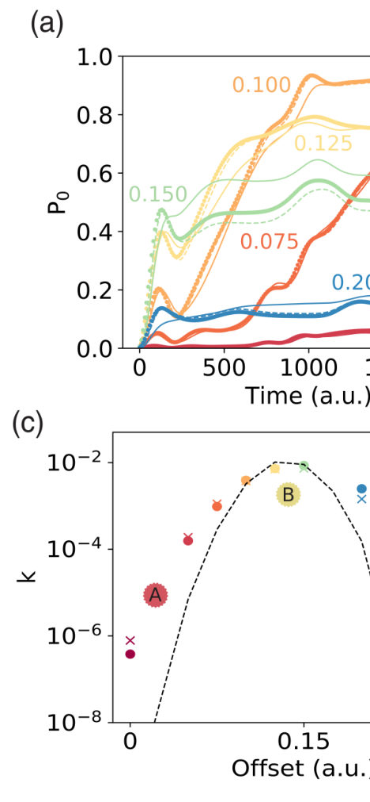 
FIG. 4: Chem-Dyn-QuanSimu

📷 Fig 5

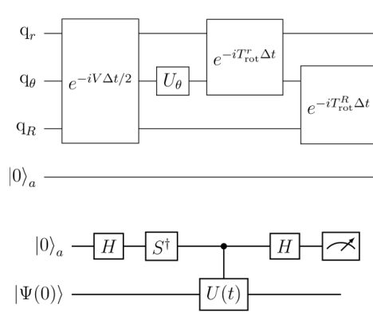 
FIG. 5: Chem-Dyn-QuanSimu

**Summary.** This paper investigates the theoretical possibility of using quantum simulation for quantum molecular dynamics, particularly for chemical reactions. It critically analyzes underlying mathematical requirements, focusing on issues like the conjugacy between systems and the implications of real-valued quantum mechanics. The work provides a theoretical roadmap for advancing quantum simulation in chemistry.

**Why it may be interesting.** This work directly addresses the theoretical limits and necessary mathematical foundations for applying quantum computation to simulate fundamental processes in molecular physics and chemical dynamics.

Detailed structure

**Main problem.** The paper explores the theoretical feasibility of using quantum simulation techniques to model complex quantum molecular dynamics, especially for chemical reaction processes.

**Main result.** The authors analyze fundamental theoretical hurdles, such as the conjugacy relation between dynamical systems, the transition to real-valued quantum mechanics, and the emergence of geometric phases from degrees of freedom separation.

**Method.** The analysis reviews existing quantum-classical mixed simulation implementations and focuses on theoretical constraints by examining the mathematical requirements for simulating time evolution.

**Model / system.** The focus is on quantum many-body systems undergoing molecular reaction dynamics. The theoretical framework involves comparing the target molecular system's dynamics with the dynamics implemented on a quantum simulator.

**Key observables.** Population fractions ($P_0$), rate constants ($k$), and the general time evolution of the quantum state.

**Important parameters / regimes.** The separation of degrees of freedom (DOFs) and the resulting geometric phase ambiguity are key theoretical parameters.

**Assumptions / limitations.** The paper assumes the necessity of a conjugacy relation for successful simulation and discusses the theoretical implications of using real-valued quantum mechanics instead of complex Hilbert spaces.

**Figures summary.** Figures illustrate various quantum algorithms (VQE, qEOM) and model results, such as the time evolution of the Marcus spin-boson model showing charge transfer regimes.

**Paper structure.** The paper is structured theoretically, analyzing four key aspects (conjugacy, wave function correspondence, real-valued issues, geometric phase) by reviewing existing quantum-classical mixed implementations.

Abstract

In this work, we explore the implementation possibility of quantum simulation for quantum molecular dynamics, in particular for reaction dynamics, though several implementations have already reported through quantum-classical mixed simulations ({\it Acc. Chem. Res.} {\bf 54} (2021), 4229 and {\it J. Phys. Chem. Lett.} {\bf xx} (2026), XXXX). To analyze this aspect, we examine (1) the conjugacy relation between quantum simulator and the target molecular system, (2) the wave function correspondence in quantum algorithm and classical algorithm for multi-dimensional dynamics, (3) problems arisen from real-valued classical algorithms, and finally (4) geometric phase arisen from the separation among the degrees of freedom (DOFs). As is well known, the aforementioned first and second points play fundamental roles in quantum simulation of quantum many-body systems, and the third and fourth points are theoretical issues that might introduce problems in classical and quantum computing. In this work, we mainly focus on the third and fourth points by analysis of the first two points by reviewing previously reported quantum-classical mixed implementations of quantum simulation. We also consider gauge freedom in high-dimensional quantum molecular dynamics that has been introduced recently, and then discuss possibility of advantages and disadvantages of quantum simulation for molecular reaction dynamics.

[↑ back to top](#top)

### [Absence of nontrivial local conserved quantities in a class of $U(1)$-symmetric spin-1 chains](http://arxiv.org/abs/2608.17548v1)

**Authors:** Shunsuke Sengoku, Haruki Watanabe  
**Type:** theory · **Category:** statistical mechanics · **PDF:** <https://arxiv.org/pdf/2608.17548v1>  
**Analysis basis:** full PDF text, analyzed in chunks
**Topic relevance:** `Frenkel-Kontorova` **1/5** · `analog quantum simulation` **1/5** · `scars & prethermalization` **1/5**

📷 Fig 1

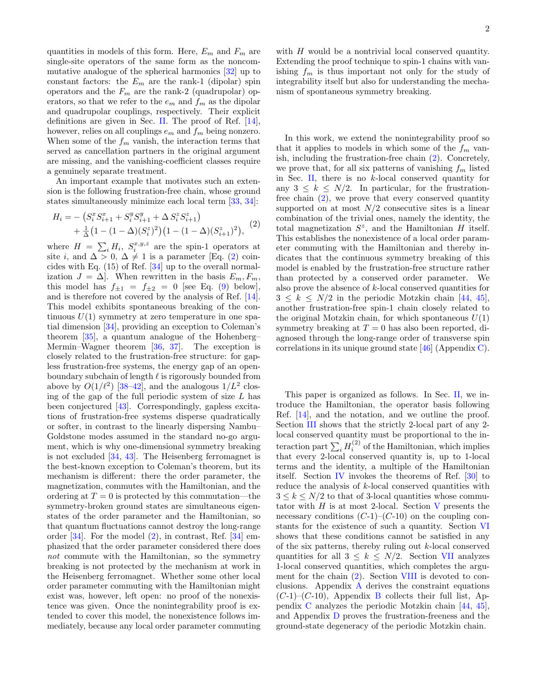 
Low-resolution page preview, page 2

📷 Fig 2

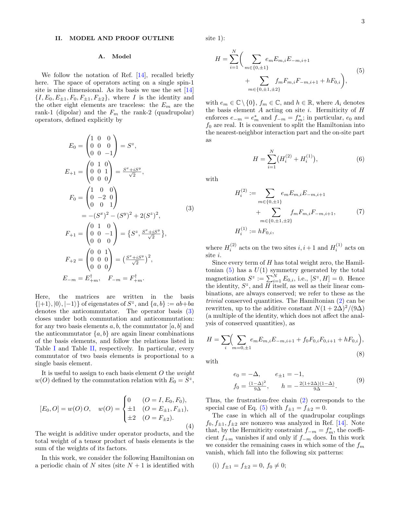 
Low-resolution page preview, page 3

📷 Fig 3

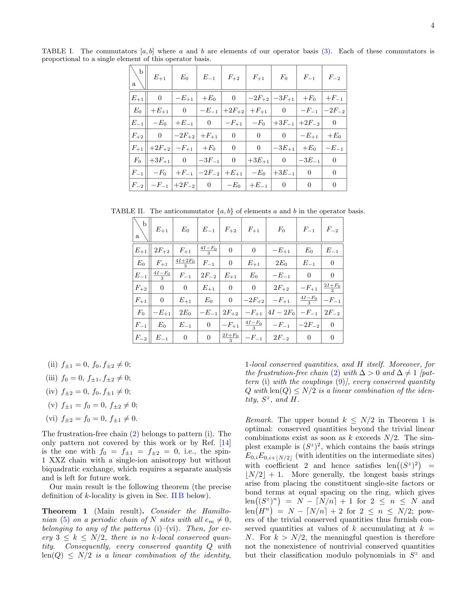 
Low-resolution page preview, page 4

📷 Fig 4

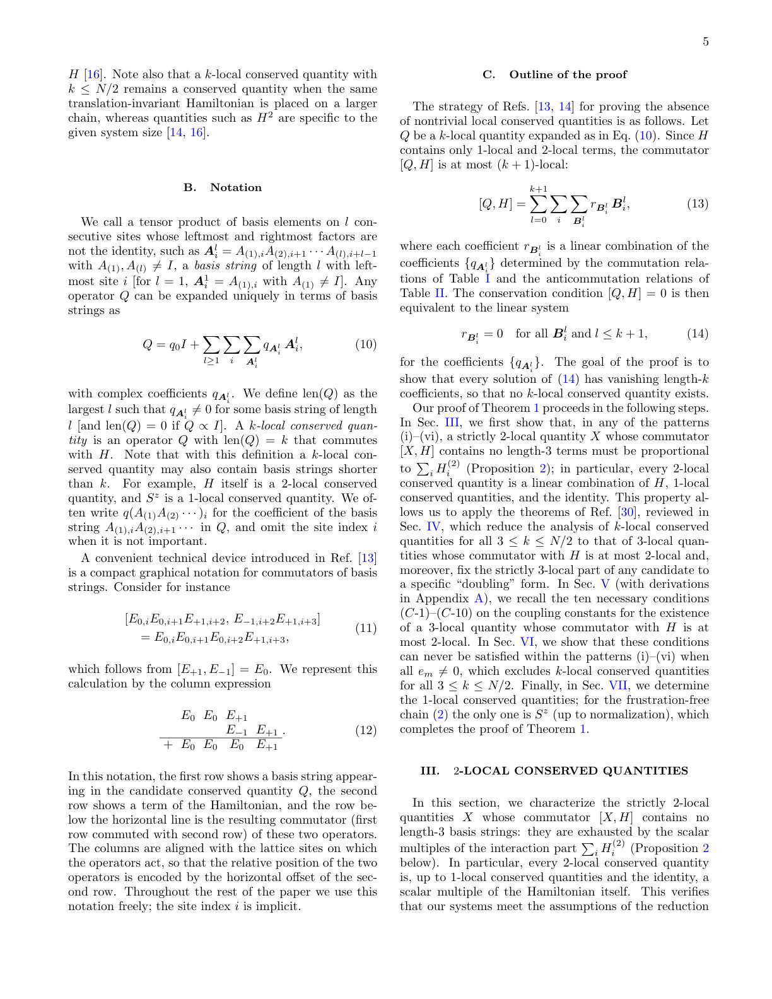 
Low-resolution page preview, page 5

📷 Fig 5

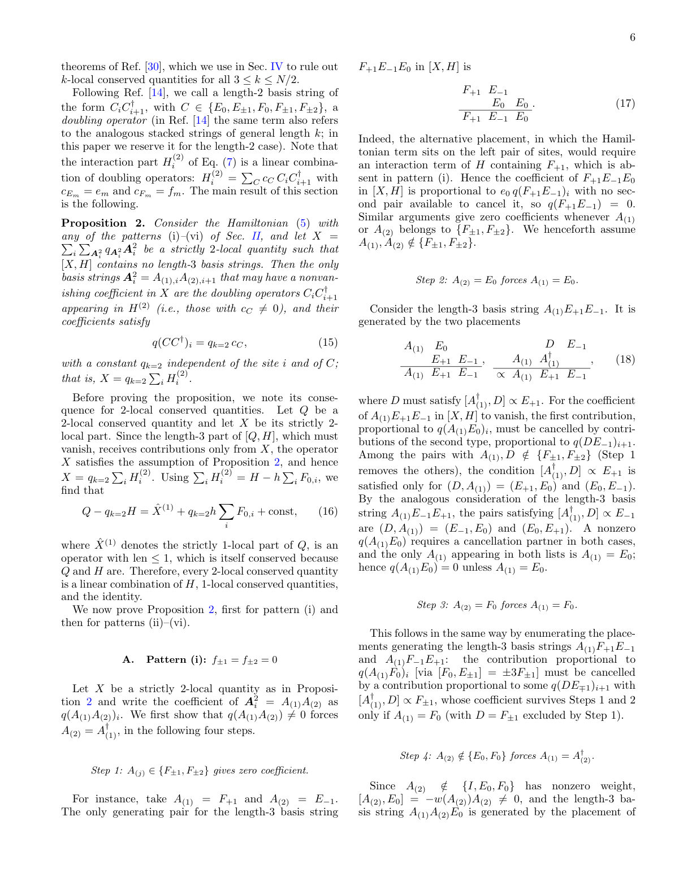 
Low-resolution page preview, page 6

**Summary.** This theoretical paper proves that a specific class of U(1)-symmetric spin-1 chains lacks nontrivial local conserved quantities. By applying advanced commutator techniques, the authors show that the continuous symmetry breaking observed in these models is structural (due to frustration-free nature) rather than being protected by a conserved order parameter. This provides deep insight into the underlying dynamics and integrability of these quantum spin systems.

**Why it may be interesting.** Proving the absence of local conserved quantities is a powerful tool for demonstrating non-integrability in quantum many-body systems, which is crucial for understanding thermalization and dynamics in condensed matter models.

Detailed structure

**Main problem.** The paper aims to rigorously prove the absence of nontrivial local conserved quantities in a specific, previously unstudied class of U(1)-symmetric spin-1 chains.

**Main result.** It establishes that for these models, any local conserved quantity with support up to half the system size must be a simple linear combination of the identity, the total magnetization, and the Hamiltonian itself.

**Method.** The authors employ Shiraishi's technique, analyzing the commutator $[Q, H]$ for potential conserved charges $Q$ and solving the resulting linear system of equations.

**Model / system.** The system is a spin-1 chain on a periodic lattice with nearest-neighbor interactions, characterized by dipolar and quadrupolar couplings. The focus is on models where certain quadrupolar couplings vanish, including the frustration-free Motzkin chain.

**Key observables.** Local conserved quantities ($Q$), the total magnetization ($S_z$), and the Hamiltonian ($H$).

**Important parameters / regimes.** The size of the system ($N$) and the range of the conserved quantity support ($3 \le k \le N/2$).

**Assumptions / limitations.** The analysis relies on extending previous techniques to handle vanishing quadrupolar couplings, which was a gap in prior literature.

**Paper structure.** The paper systematically analyzes the nonexistence of conserved quantities by first examining 2-local, then 3-local, and finally ruling out higher-order local charges using commutator analysis.

Abstract

We prove the absence of nontrivial local conserved quantities in a class of $U(1)$-symmetric spin-$1$ chains with nearest-neighbor interactions in which some of the quadrupolar couplings vanish, a class that is not covered by previous studies. Applying the technique of Shiraishi to these systems, we show that, for every model in this class on a periodic chain of $N$ sites, there is no $k$-local conserved quantity for any $3\le k\le N/2$. In particular, for a frustration-free spin-$1$ chain that exhibits spontaneous $U(1)$ symmetry breaking at zero temperature in one spatial dimension, we prove that every local conserved quantity with support up to half of the system size is a linear combination of the identity, the total magnetization $S^z$, and the Hamiltonian itself. This rigorously establishes that, unlike the Heisenberg ferromagnet, the model admits no local order parameter commuting with the Hamiltonian, so that its continuous symmetry breaking is enabled by the frustration-free structure rather than by a conserved order parameter. We also prove the absence of $k$-local conserved quantities for $3\le k\le N/2$ in the periodic Motzkin chain, a frustration-free spin-$1$ chain closely related to the original Motzkin chain, for which spontaneous $U(1)$ symmetry breaking at zero temperature has also been reported.

[↑ back to top](#top)

### [Long-range Nonlinear Sigma Model for a Singular Quantum Kicked Rotor](http://arxiv.org/abs/2608.17649v1)

**Authors:** Weitao Chen, Yunxiang Liao  
**Type:** theory · **Category:** disordered systems and neural networks · **PDF:** <https://arxiv.org/pdf/2608.17649v1>  
**Analysis basis:** full PDF text, analyzed in chunks
**Topic relevance:** `Keldysh / 2PI / non-Gaussian methods` **1/5** · `analog quantum simulation` **1/5** · `non-equilibrium universality` **1/5**

📷 Fig 1

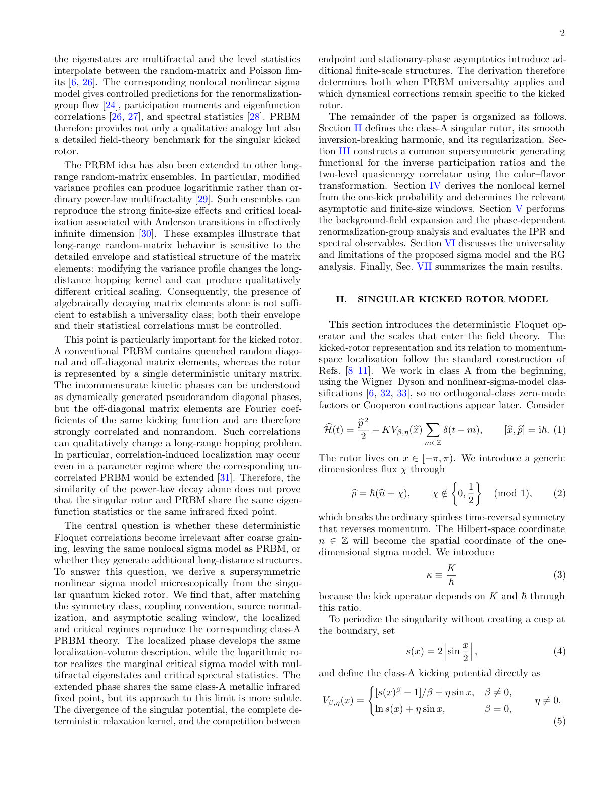 
Low-resolution page preview, page 2

📷 Fig 2

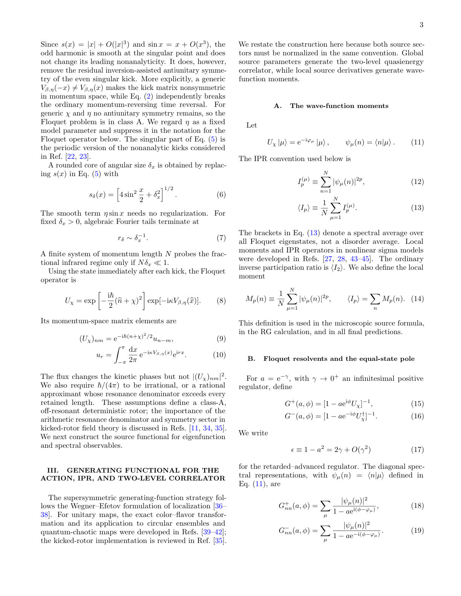 
Low-resolution page preview, page 3

📷 Fig 3

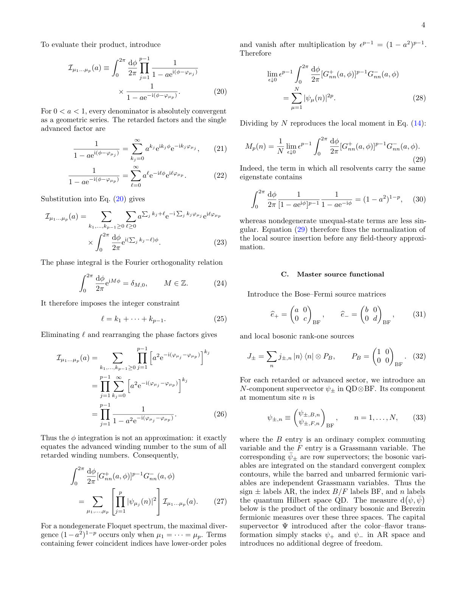 
Low-resolution page preview, page 4

📷 Fig 4

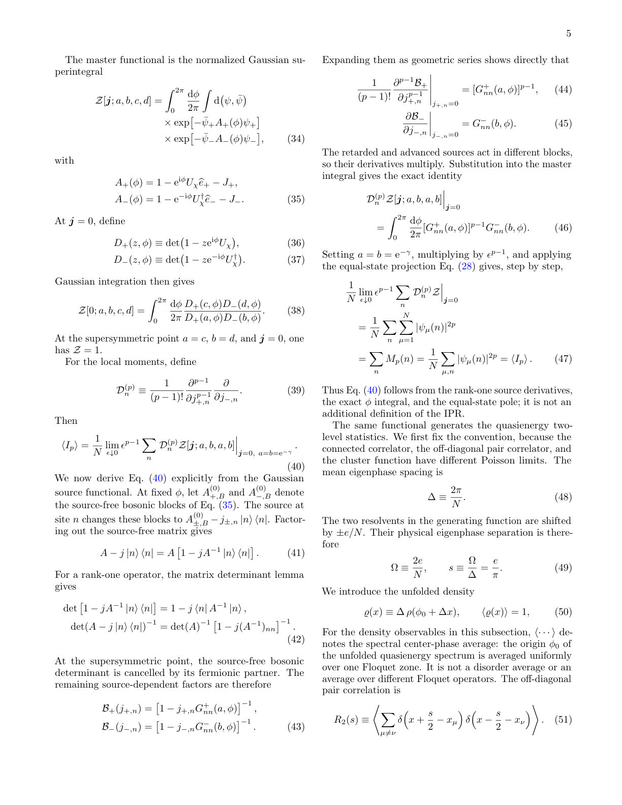 
Low-resolution page preview, page 5

📷 Fig 5

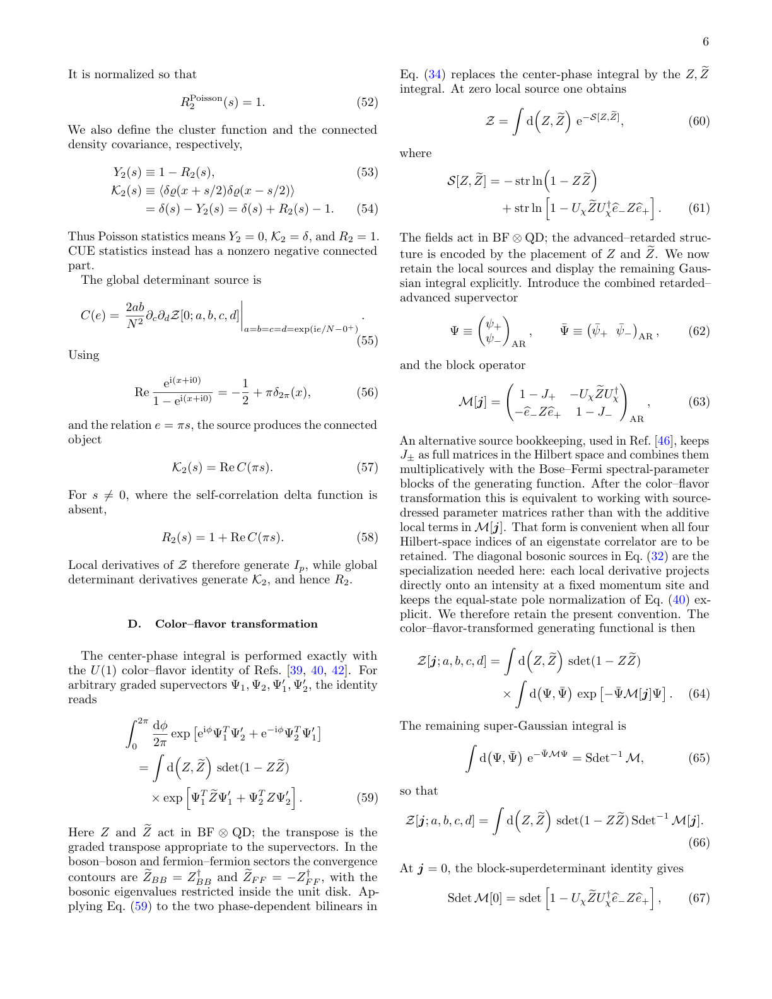 
Low-resolution page preview, page 6

**Summary.** This work rigorously analyzes the spectral properties of a singular quantum kicked rotor by mapping it onto a nonlinear sigma model. Using advanced renormalization group techniques, the authors demonstrate that the rotor's dynamics fall into the same universality class as power-law random banded matrices. This resolves a key theoretical question regarding the relevance of deterministic correlations in the context of Anderson localization.

**Why it may be interesting.** The connection between deterministic, structured quantum dynamics (the rotor) and the universality class of random matrix theory (PRBM) provides deep insights into the role of correlations in localization phenomena, relevant for understanding disordered quantum systems.

Detailed structure

**Main problem.** The paper investigates whether the deterministic correlations of a singular quantum kicked rotor become irrelevant at long distances, determining if it shares the same infrared theory as power-law random banded matrices (PRBM).

**Main result.** The rotor successfully reproduces the long-range Anderson transition of the corresponding PRBM in the localized and critical regimes after appropriate matching of symmetry and coupling conventions.

**Method.** The authors derive a nonlocal supersymmetric nonlinear sigma model from the rotor and perform a detailed renormalization-group (RG) analysis up to two-loop order.

**Model / system.** The system is a singular quantum kicked rotor, whose dynamics are governed by a Floquet operator. It is mathematically compared to PRBM, which are characterized by algebraically decaying momentum-space matrix elements.

**Key observables.** Inverse participation ratios (IPR), two-level quasienergy correlator, and the analysis of localization/critical/extended infrared regimes.

**Important parameters / regimes.** The singularity type (power-law or logarithmic), the RG flow parameters (stiffness $t$, local moment renormalization $Z_p$), and the symmetry class.

**Assumptions / limitations.** The analysis requires matching the symmetry class, coupling convention, and asymptotic scaling window between the rotor and the PRBM.

**Figures summary.** Not specified.

**Paper structure.** The paper proceeds by deriving the sigma model, performing RG analysis on correlation functions (like the two-level correlator), and analyzing the flow equations for key parameters like stiffness and local moment renormalization.

Abstract

Singular kicked rotors have long been compared with power-law random banded matrices (PRBM) because their momentum-space Floquet matrix elements decay algebraically. However, it has remained unclear whether the deterministic correlations of the rotor become irrelevant at long distances and, consequently, under what conditions the two systems share the same infrared theory. To address this question, we derive a nonlocal supersymmetric nonlinear sigma model directly from a quantum kicked rotor with a power-law or logarithmic singularity. By carrying out the renormalization-group analysis up to two-loop order, we show that, after matching the symmetry class and coupling convention, the rotor reproduces the long-range Anderson transition of the corresponding PRBM, including its localized, critical, and extended infrared regimes.

[↑ back to top](#top)

### [Entropy mapping under uniaxial pressure utilizing the elastocaloric effect](http://arxiv.org/abs/2608.17777v1)

**Authors:** Zhenhai Hu, You-Sheng Li, Aleksei V. Frolov, Fabian Jerzembeck, Manuel Brando, Naoki Kikugawa, Dmitry A. Sokolov, Hilary M. L. Noad, Andrew P. Mackenzie, Michael Nicklas, Andreas W. Rost  
**Type:** both · **Category:** strongly correlated electrons · **PDF:** <https://arxiv.org/pdf/2608.17777v1>  
**Analysis basis:** full PDF text, analyzed in chunks
**Topic relevance:** `Keldysh / 2PI / non-Gaussian methods` **1/5** · `quantum measurements` **1/5**

📷 Fig 1

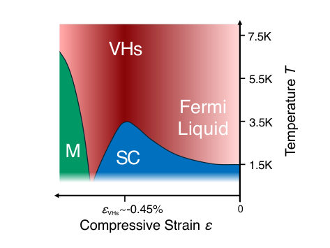 
FIG. 1. Schematic temperature–strain phase diagram of Sr2RuO4 as a function of compressive strain ε, along the ⟨100⟩ crystal axis. The superconducting (SC) dome is enhanced in the vicinity of the strain-tuned Van Hove singularity (VHs) at εVHs [12], separating the low-temperature superconducting phase from the normal-state which at low strains is well de- scribed by standard Fermi liquid theory. At larger compres- sive strain, a magnetically ordered (M) phase emerges [16]. At εVHs, the increased darker shading denotes an enhanced density of states.

📷 Fig 2

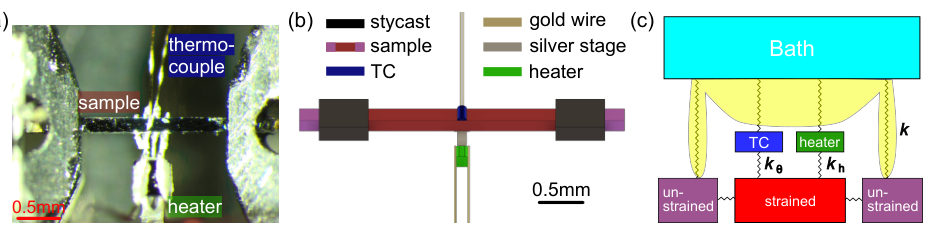 
FIG. 2. Experimental setup and basic thermal model for heat-capacity and elastocaloric effect measurements. (a) Photograph of the experimental setup with the principal components annotated. An Au/AuFe thermocouple and a resistive heater are thermally coupled to the sample using silver epoxy, while the sample is mechanically anchored to titanium plates with epoxy resin. (b) Schematic diagram of the setup, emphasizing the spatial arrangement and thermal connections between the sample, heater, thermocouple, and strain cell. (c) Abstracted lumped-element thermal model for setup in (a) and (b). The thermocouple and heater are strongly coupled to the sample via thermal conductances kθ and kh,...

📷 Fig 3

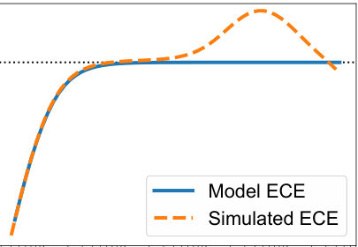 
FIG. 3. Normalized ˜Ts scaled by quasi-adiabatic response. Scaled ˜Ts =1 corresponds to the idealized limit of a perfectly adiabatic and isothermal response of the whole sample. The blue curve shows the analytical result given by Eq. 1, while the orange curve corresponds to a numerical simulation incor- porating a more realistic experimental thermal model. Both are plotted as functions of the dimensionless drive frequency ω/ω1, where ω1 is defined in text.

📷 Fig 4

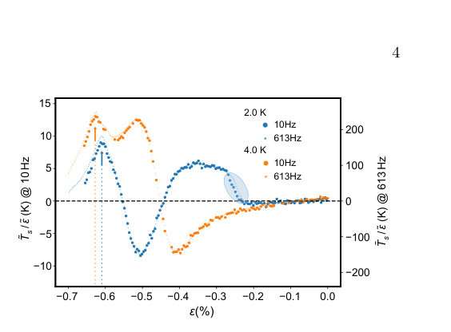 
FIG. 4. Strain dependence of the elastocaloric signal in Sr2RuO4. The elastocaloric effect ˜Ts/˜ε is shown as a function of strain ε at temperatures of 2.0 K and 4.0 K, measured at modulation frequencies of 10 Hz (left scale) and 613 Hz (right scale).

📷 Fig 5

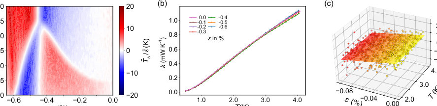 
FIG. 5. Calibration of the low-frequency elastocaloric effect. (a) Elastocaloric signal ˜Ts/˜ε as a function of temperature and strain. (b) Temperature dependence of the reconstructed thermal conductance k to the bath at selected fixed strains. (c) (∂s/∂ε)T in the Fermi liquid regime prior to calibration, together with the fitted calibration plane.

**Summary.** This work introduces a novel method using the a.c. elastocaloric effect to map the absolute entropy and specific heat of quantum materials like $	ext{Sr}_2	ext{RuO}_4$ under uniaxial strain. By combining low- and high-frequency measurements, the authors overcome limitations of traditional probes. The results provide quantitative evidence regarding entropy changes across superconducting and magnetic phase transitions in correlated electron systems.

**Why it may be interesting.** The ability to probe absolute thermodynamic quantities like entropy and specific heat deep within the superconducting state using strain-induced effects provides a powerful, non-invasive tool for characterizing strongly correlated electron systems.

Detailed structure

**Main problem.** To develop a quantitative framework to reconstruct absolute entropy and specific heat across complex phase diagrams of quantum materials under uniaxial pressure, overcoming limitations of conventional thermodynamic probes.

**Main result.** The method successfully maps the absolute entropy and specific heat for $	ext{Sr}_2	ext{RuO}_4$, showing that entropy quenching is strongest at the critical strain corresponding to the Van Hove singularity.

**Method.** The analysis combines measurements from the low-frequency (strong coupling) and high-frequency (quasi-adiabatic) regimes of the a.c. elastocaloric effect to achieve absolute accuracy in entropy reconstruction.

**Model / system.** The study focuses on the correlated superconductor $	ext{Sr}_2	ext{RuO}_4$ subjected to uniaxial strain. The theoretical framework uses the entropy balance equation to relate heat flow from an external heater to the elastocaloric response.

**Key observables.** Absolute entropy map, specific heat ($c/T$), and the temperature oscillation amplitude ($	ilde{T}_s$) as a function of strain and frequency.

**Important parameters / regimes.** Uniaxial strain ($\varepsilon$), temperature ($T$), and measurement frequency ($\omega$), with characteristic time scales set by $	au_1 = C_{	ext{tot}}/k$.

**Assumptions / limitations.** The reconstruction relies on combining data from two distinct frequency regimes (low vs. high) and treating the elastocaloric response as an effective heat source in the thermodynamic balance equation.

**Figures summary.** Figures illustrate the phase diagram of $	ext{Sr}_2	ext{RuO}_4$ under strain, the experimental setup, and plots comparing the normalized temperature oscillation signal ($	ilde{T}_s$) across different frequencies.

**Paper structure.** The paper develops the theoretical framework by deriving the governing differential equation unifying heating and elastocaloric effects. It then applies this framework to $	ext{Sr}_2	ext{RuO}_4$ to map the entropy and specific heat across its superconducting and magnetic phase boundaries.

Abstract

Uniaxial pressure is a powerful tuning parameter for quantum materials, but conventional thermodynamic probes such as specific heat are difficult to realize in the constrained geometries of strain apparatus. We develop a quantitative analysis framework for a.c. elastocaloric effect measurements that enable the reconstruction of the absolute entropy and hence specific heat across complex phase diagrams. The absolute accuracy is achieved by combining measurements in the strong coupling regime at low frequencies with high signal-to-noise measurements in the quasi-adiabatic regime at high frequencies. Applying the approach to the correlated superconductor Sr$_2$RuO$_4$, we obtain an absolute entropy map across the phase diagram including across phase transitions deep into the superconducting state. We demonstrate that from such data one can derive the absolute specific heat which is currently not possible through other approaches. This data reinforces the finding that the quenching of entropy within the superconductor Sr$_2$RuO$_4$ is strongest at the critical strain consistent with the superconducting gap being maximized at the Van Hove singularity (VHs). Furthermore, we demonstrate that, although $Δc /(γT) $ does increase at the VH strain, this increase is much weaker than previously inferred from more indirect caloric experiments.

[↑ back to top](#top)

### [Weak Typicality of von Neumann Entanglement Entropy in Gaussian Boson Sampling](http://arxiv.org/abs/2608.17274v1)

**Authors:** Hongru Zhao  
**Type:** theory · **Category:** quantum information and computing · **PDF:** <https://arxiv.org/pdf/2608.17274v1>  
**Analysis basis:** full PDF text, analyzed in chunks
**Topic relevance:** `analog quantum simulation` **1/5** · `interference shaping light` **1/5**

📷 Fig 1

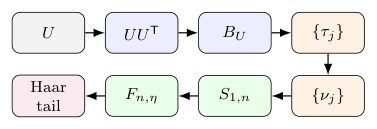 
Figure 1: Proof pipeline, read across the upper row and then back across the lower row. Here U is the Haar distributed interferometer, BU is the selected principal block of UUT, τj are its singular values, νj are the resulting symplectic eigenvalues, S1,n is the von Neumann entropy, and Fn,η is its endpoint regularized approximation. See Eqs. (10), (11), (18), (21), and (29). Haar concentration is applied to Fn,η.

**Summary.** This paper rigorously proves the weak typicality of entanglement entropy in Gaussian Boson Sampling models. It shows that the measured entropy is highly concentrated around its expected value, establishing a quantitative concentration bound. This result is significant for understanding the typical scaling laws governing entanglement in large-scale quantum optical devices.

**Why it may be interesting.** This work provides rigorous mathematical tools for analyzing entanglement measures in complex quantum optical circuits, which is crucial for understanding the resource scaling and fundamental limits of photonic quantum computation.

Detailed structure

**Main problem.** The paper investigates the weak typicality of the von Neumann entanglement entropy generated by a Haar distributed passive interferometer acting on squeezed input modes.

**Main result.** It proves that the ratio of the entanglement entropy to its expectation value converges in probability to 1, establishing proportional weak typicality for this specific Gaussian Boson Sampling setup.

**Method.** The proof involves representing the entropy as a singular value statistic of a principal block of the interferometer's unitary matrix and applying concentration inequalities on the unitary group.

**Model / system.** The system is Gaussian Boson Sampling (GBS) using an ideal, lossless interferometer acting on $n$ equally squeezed input modes. The evolution is governed by a Haar distributed unitary $U$.

**Key observables.** Von Neumann entanglement entropy ($S_{1,n}$), the ratio $S_{1,n} / \mathbb{E}S_{1,n}$, and the variance $	ext{Var}(S_{1,n})$.

**Important parameters / regimes.** Fixed nonzero squeezing strength ($s$), and a proportional bipartition ratio ($k_n/n 	o r \in (0, 1)$).

**Assumptions / limitations.** The result assumes fixed equal squeezing and a proportional bipartition; it does not cover unequal squeezing or vanishing squeezing.

**Figures summary.** Figure 1 illustrates the proof pipeline, connecting the unitary $U$ to its principal block $B_U$ and the singular values used in the entropy calculation.

**Paper structure.** The paper establishes the mathematical framework by relating the entropy to singular values, proves the weak typicality bound using concentration on the unitary group, and concludes by deriving the implications for convergence and variance.

Abstract

We study the von Neumann entanglement entropy generated by a Haar distributed passive interferometer acting on $n$ equally squeezed input modes with fixed nonzero squeezing strength $s$. Previous work established proportional weak typicality for integer R'enyi orders $α\geq 2$ and stated a sublinear von Neumann result, while the proportional von Neumann case remained open. For a subsystem of $k_n$ modes satisfying $k_n/n\to r\in(0,1)$, we prove that, for every $\varepsilon>0$ and all sufficiently large $n$, $\mathbb{P}\left(\left|\frac{S_{1,n}}{\mathbb{E}S_{1,n}}-1\right|\geq\varepsilon\right)\leq2\exp\left[-\frac{c_{s,r}\varepsilon^2n^2}{\log^2(en)}\right].$ The proof represents the entropy as a singular value statistic of a principal block of $UU^{\mathsf T}$, where $U$ denotes the unitary interferometer. It regularizes the logarithmic singularity at the endpoint corresponding to a pure Gaussian mode and applies concentration on the unitary group. The result establishes proportional von Neumann weak typicality and further implies almost sure convergence of $S_{1,n}/\mathbb{E}S_{1,n}$ to $1$, a typical volume law, and the variance bound $\mathrm{Var}(S_{1,n})=O_s(\log^2 n)$. An accompanying Lean 4 development verifies the proof chain.

[↑ back to top](#top)

### [Automating Variational Quantum Sensing through Reinforcement-Learned Circuit Structures](http://arxiv.org/abs/2608.17582v1)

**Authors:** Jie Liu, Xin Wang  
**Type:** theory · **Category:** disordered systems and neural networks · **PDF:** <https://arxiv.org/pdf/2608.17582v1>  
**Analysis basis:** full PDF text, analyzed in chunks
**Topic relevance:** `quantum measurements` **1/5**

📷 Fig 1

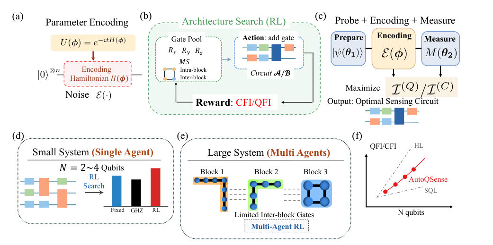 
FIG. 1: Automating variational quantum sensing with reinforcement-learned circuit structures. (a) An unknown parameter is encoded in an n-qubit probe through an encoding Hamiltonian, in the presence of noise. (b) The AUTOQSENSE reinforcement-learning loop: an agent selects gates from a predefined pool to construct a circuit, which is evaluated by a CFI or QFI reward. (c) The resulting sensing protocol prepares a parameterized probe, encodes the unknown parameter, and applies a parameterized measurement to maximize the QFI or CFI. (d) For small systems, a single agent searches for an optimized circuit and compares its performance with fixed and GHZ-state baselines. (e) For larger systems,...

📷 Fig 2

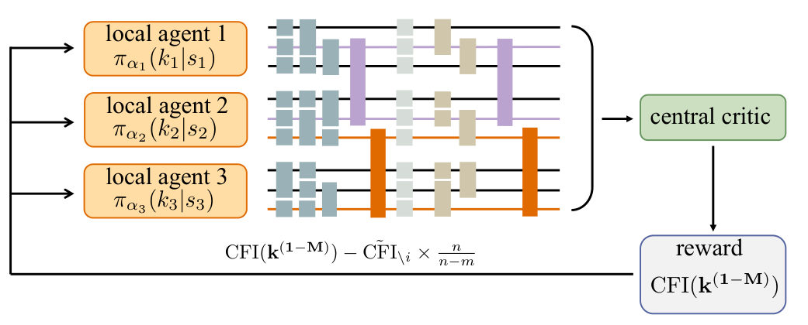 
FIG. 2: Schematic of the multi-agent RL framework for distributed quantum-sensor architecture search. Each local agent observes its local state si and samples a local circuit action ki from its policy παi(ki|si). The local actions are assembled into a global circuit architecture k(1−M), which is evaluated by a centralized evaluator. The resulting CFI, together with the estimated local contribution, is used as the reward to update the local policies.

📷 Fig 3

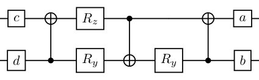 
FIG. 3: Universal two-qubit circuit. Here, a, b, c, and d denote gen- eral SU(2) rotations.

📷 Fig 4

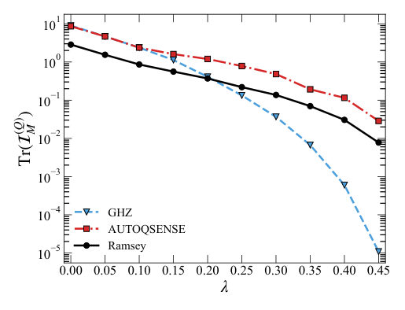 
FIG. 5: Comparison of AUTOQSENSE with GHZ interferometry and Ramsey spectroscopy for three-qubit magnetic-field sensing un- der dephasing noise of strength λ. Tr(I(Q) M ) (log scale) is plotted as a function of λ. In the low-noise regime, AUTOQSENSE achieves performance comparable to GHZ interferometry and exceeds Ram- sey spectroscopy. As dephasing increases, GHZ rapidly degrades due to its reliance on multipartite entanglement, while Ramsey ex- hibits gradual decay. AUTOQSENSE maintains the highest Tr(I(Q) M ) across the entire noise range, demonstrating adaptive robustness to decoherence.

📷 Fig 5

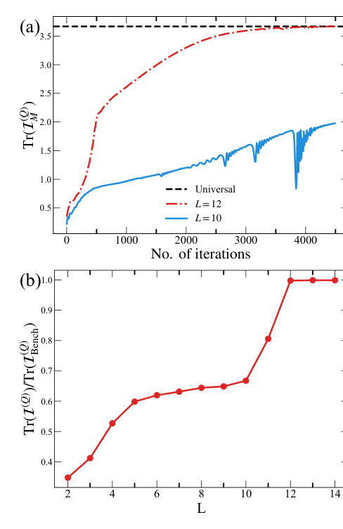 
FIG. 4: (a) Comparison of the sensing performance between the cir- cuit discovered by AUTOQSENSE and the universal ansatz, evaluated in terms of the cost function Tr(I(Q) M ) for the 3D magnetic field es- timation task. AUTOQSENSE successfully matches the optimal per- formance, demonstrating its ability to autonomously discover high- precision sensing protocols. (b) The ratio of Tr(I(Q) M ) to the optimal Tr(I(Q) Bench) given by the universal two-qubit circuit.

**Summary.** This paper introduces AutoQSense, an RL framework that automates the design of quantum sensing protocols by optimizing the circuit architecture itself, not just the parameters. By treating circuit design as a sequential decision process, it achieves superior sensitivity compared to fixed ansätze. This establishes a resource-aware methodology for adaptive quantum metrology applicable to large, complex quantum hardware.

**Why it may be interesting.** The integration of RL for circuit design directly addresses the resource-aware optimization needed in quantum metrology, providing a systematic way to navigate the vast space of possible quantum circuits.

Detailed structure

**Main problem.** The core problem is automating Variational Quantum Sensing (VQS) by optimizing not only continuous variational parameters but also the underlying quantum circuit architectures themselves.

**Main result.** The proposed framework, AutoQSense, successfully learns adaptive, hardware-compatible quantum sensing protocols that outperform fixed, hardware-efficient ansätze while using fewer entangling gates.

**Method.** It employs a nested optimization loop: an inner VQS loop optimizes parameters using quantum gradients, while an outer Reinforcement Learning (RL) loop updates the circuit architecture (the policy) based on the resulting Fisher Information.

**Model / system.** The system is an $n$-qubit quantum processor used for parameter estimation. The methodology scales from single-agent search for small systems to a distributed multi-agent formulation for large, lattice-connected systems.

**Key observables.** Quantum Fisher Information (QFI) and Classical Fisher Information (CFI) are the primary objectives, used to define the RL reward function.

**Important parameters / regimes.** The optimization involves variational parameters ($	heta$) and the discrete architectural choices (gate sequences/connectivity $A, B$).

**Assumptions / limitations.** The primary assumption addressed is that existing VQS methods are limited by fixed, a priori circuit ansätze, which the RL framework overcomes.

**Figures summary.** Figures illustrate the AUTOQSENSE workflow, comparing its performance against benchmarks like the Standard Quantum Limit (SQL) and fixed ansätze, especially showing gains in QFI and reduced gate count.

**Paper structure.** The paper introduces the VQS problem, identifies the architectural limitation, proposes the RL framework (AutoQSense), details the single-agent and multi-agent implementations, and validates the approach by showing performance gains and structural insights.

Abstract

Variational quantum sensing offers a promising route to high-precision parameter estimation, but its performance depends strongly on the circuit architectures used for probe preparation and measurement. Existing approaches typically optimize continuous parameters within predefined ansätze, restricting the accessible design space and limiting adaptation to sensing tasks and hardware constraints. Here, we introduce \textsc{AutoQSense}, a reinforcement-learning framework that searches circuit architectures using Fisher-information-based objectives. For few-qubit systems, a single agent sequentially constructs preparation and measurement circuits. For larger systems, a distributed formulation assigns local circuit design to subsystem agents and inter-block entanglement to a budgeted agent. Numerical results show that the learned architectures recover known benchmark strategies, adapt to dephasing noise, and outperform fixed hardware-efficient ansätze while using fewer entangling gates. These results establish \textsc{AutoQSense} as a resource-aware approach to adaptive and hardware-compatible quantum sensing.

[↑ back to top](#top)

### [CLOPS: Benchmarking System Speed at Utility Scale](http://arxiv.org/abs/2608.18044v1)

**Authors:** Andrew Wack  
**Type:** theory · **Category:** quantum information and computing · **PDF:** <https://arxiv.org/pdf/2608.18044v1>  
**Analysis basis:** full PDF text, analyzed in chunks
**Topic relevance:** `quantum measurements` **1/5**

📷 Fig 1

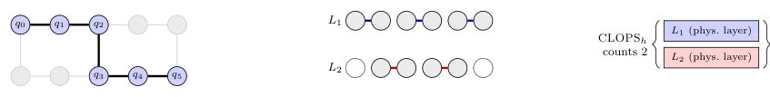 
FIG. 1. Layer decomposition on a heavy-hex device and its dual role. (a) Both LF and CLOPSh are measured on a connected 1D chain of N qubits (blue) selected from the device coupling graph (faded). (b) Because each physical layer must be a qubit- disjoint matching of two-qubit gates, the chain decomposes into two disjoint physical layers: L1 on the even bonds (starting at q0) and L2 on the odd bonds (starting at q1), following McKay et al. [7]. Qubits idle in a given slice (open circles) still receive twirled single-qubit gates. Each physical layer is one hardware time slice and one CLOPSh counting unit. (c) The ordered pair {L1; L2} constitutes one EPLG layer: LF assesses the pair as a...

📷 Fig 2

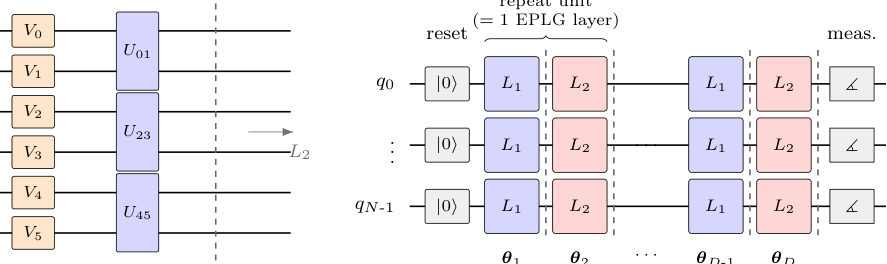 
FIG. 2. Executable structure of a CLOPSh circuit. (a) One physical layer Lk(θk) comprises fully twirled single-qubit gates Vi on all N qubits (idle qubits included), qubit-disjoint two-qubit gates Uij over a matching of the coupling graph, and a terminating global synchronization barrier. (b) The template C(θ) = L1L2 · · · LD is built by cycling the fixed sublayer decomposition of Fig. 1b—for the chain, the pair {L1, L2} (one EPLG layer, the repeat unit)—to a total of D physical layers. Structural labels L1, L2 therefore recur along the depth axis, but each depth position k = 1 . . . D binds its own parameter set θk, so no two slices are identical even where their structure matches. Each...

**Summary.** This paper introduces CLOPSh, a new benchmark metric designed to accurately measure the sustained operational speed of large-scale quantum processors. It addresses the gap in current metrics by defining speed based on layered, hardware-aware circuits, ensuring that speed measurements are intrinsically linked to independently verified quality levels. This provides a necessary, holistic tool for assessing the true utility potential of quantum hardware.

**Why it may be interesting.** It provides a rigorous, multi-level framework for benchmarking quantum hardware performance, which is crucial for any theoretical work relying on realistic estimates of quantum computation time or resource scaling.

Detailed structure

**Main problem.** Existing quantum speed metrics fail to capture the sustained, end-to-end throughput required for utility-scale quantum algorithms, especially those involving classical-quantum feedback loops.

**Main result.** The authors propose CLOPSh (Circuit Layer Operations Per Second), a holistic benchmark that measures sustained throughput by defining speed over hardware-aware, layered circuits, thereby linking speed directly to independently verified quality envelopes.

**Method.** The work formalizes a new benchmarking metric, CLOPSh, which measures the rate of executing physical circuit layers, ensuring the speed measurement is structurally compatible with existing Layer Fidelity (LF) quality benchmarks.

**Model / system.** The focus is on scaling quantum processors to hundreds of qubits, analyzing performance across an abstraction hierarchy (Qubit $
ightarrow$ Device $
ightarrow$ System $
ightarrow$ Application) to address utility-scale workloads.

**Key observables.** CLOPSh (Circuit Layer Operations Per Second), Max Circuits Per Second (MCPS), Layer Fidelity (LF), and the overall system throughput rate.

**Important parameters / regimes.** Utility-scale workloads, layered/parameterized circuits, and the need to account for classical-quantum overheads.

**Assumptions / limitations.** The primary assumption is that sustained, steady-state throughput, measured layer-by-layer, is the correct metric to guide hardware development beyond simple gate counts or fidelity measurements.

**Figures summary.** The notes mention a table organizing representative benchmarks across four levels of abstraction (Qubit, Device, System, Application) for Scale, Quality, and Speed, and a figure illustrating physical sublayers as the counting unit for CLOPSh.

**Paper structure.** The paper establishes the limitations of existing metrics (QV, gate rates), introduces the comprehensive CLOPS framework, and then details CLOPSh as the specific, necessary instantiation for the utility-scale regime, ensuring speed and quality are measured coherently.

Abstract

As quantum processors scale to hundreds of qubits, execution speed is a critical performance dimension alongside scale and quality. While substantial progress has been made in benchmarking circuit fidelity, existing speed metrics often fail to reflect the sustained, end-to-end throughput experienced by users running utility-scale workloads. This shortfall is especially pronounced for layered, parameterized circuits executed repeatedly within classical-quantum workflows, such as variational algorithms and error-mitigated simulations.   In this work, we formalize CLOPS_h (Circuit Layer Operations Per Second) as a holistic speed benchmark defined over layered, hardware-aware circuits. CLOPS_h measures the sustained rate at which the system executes physical layers, parallel slices of qubit-disjoint two-qubit gates separated by synchronization barriers. Because each such layer is one time slice of an N-qubit circuit, this rate maps directly to the execution rate of layered $N$-qubit circuits, connecting CLOPS_h to published device capability claims, and to the device-level throughput ceiling we formalize as Max Circuits Per Second (MCPS). CLOPS_h is obtained under layer-fidelity operating conditions, binding the speed measurement to an independently verified quality envelope, and it shares its layer decomposition with scalable layer-fidelity (LF) quality benchmarks, enabling coherent interpretation of speed and quality without conflating the two.

[↑ back to top](#top)

### [Dynamic Entanglement-Weighted Pruning for Quantum Federated Unlearning in Supply-Chain Risk Prediction](http://arxiv.org/abs/2608.17069v1)

**Authors:** Aditya Kumar, Sumit Chongder  
**Type:** theory · **Category:** quantum information and computing · **PDF:** <https://arxiv.org/pdf/2608.17069v1>  
**Analysis basis:** full PDF text, analyzed in chunks
**Topic relevance:** `quantum measurements` **1/5**

📷 Fig 1

 
Figure 1: End-to-end Entanglement-Weighted Pruning pipeline. Federated training (stage 1, Algorithm 1) converges to θ⋆; a forget request from client j (stage 2) triggers estimation of the client-conditioned diagonal QFIM and the structural entanglement weight for every trainable parameter (stage 3, Algorithm 2); parameters are scored and pruned below threshold τ (stage 4, Algorithm 3); an optional short fine-tuning pass on the retained clients recovers utility (stage 5); and the unlearned model is evaluated for utility, forgetting, privacy leakage, and computational cost before optionally re-entering the federation (stage 6, Algorithm 4).

📷 Fig 2

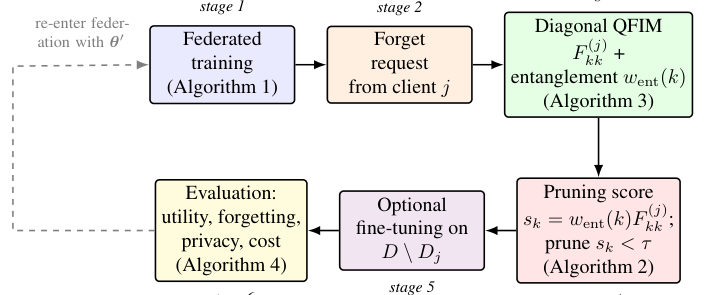 
Figure 1 previews the complete pipeline studied in this paper, and Figure 2 details the underlying fed- erated communication pattern between clients and the coordinating server; both are referenced throughout Sections 3–6 and are reproduced here, rather than deferred to an appendix, because they orient the reader before the formal notation is introduced.

📷 Fig 3

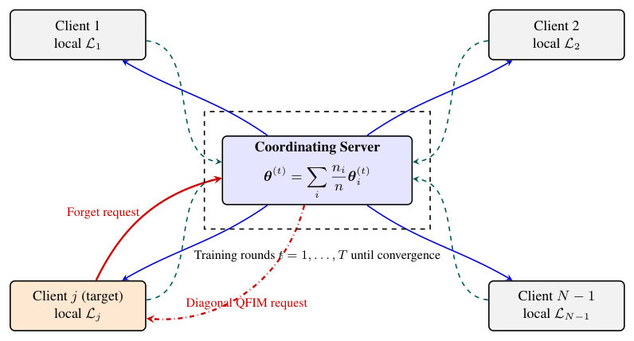 
Figure 2: Federated communication workflow between the coordinating server and N participating clients. During each communication round t, the server broadcasts the current global parameters θ(t) (solid blue arrows), each client performs local optimization on its private dataset and uploads the updated parameters θ(t+1) i (dashed teal arrows), and the server computes the sample-weighted federated aggregation. Fol- lowing a forgetting request from client j (solid red arrow), the server or client j in a privacy-preserving deployment, obtains the client-specific diagonal QFIM required to compute the entanglement-weighted pruning score in Equation (1) (dash-dotted red arrow), after which the...

📷 Fig 4

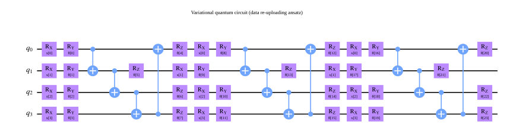 
Figure 3: Data re-uploading variational ansatz used for local client training. Each of the three layers re-encodes the input features through RX gates, applies trainable RY and RZ rotations, and couples qubits through a ring of CNOT gates. Parameter indices k = 1, . . . , 24 map directly onto the pruning scores sk computed in Section 4.4.

📷 Fig 5

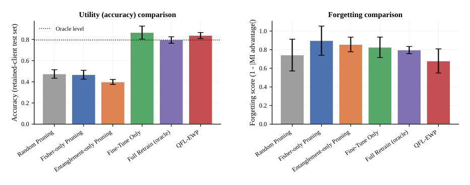 
Figure 4: Utility and forgetting across all methods, mean ± std. over three seeds. EWP matches the full-retraining oracle on accuracy while improving on its forgetting score.

**Summary.** This work introduces Entanglement-Weighted Pruning (EWP), a novel unlearning technique for quantum federated learning. EWP prunes quantum circuit parameters by combining data sensitivity (via QFIM) and structural importance (via entanglement weight). It demonstrates that this method achieves near-perfect data removal accuracy while drastically reducing computational overhead compared to full model retraining.

**Why it may be interesting.** It provides a concrete, quantum-enhanced technique for model auditing and data removal, which is crucial for deploying quantum machine learning models in regulated, multi-party settings.

Detailed structure

**Main problem.** The paper addresses the challenge of 'machine unlearning' in Quantum Federated Learning (QFL) to efficiently remove the influence of a specific client's data contribution, satisfying data privacy regulations like GDPR.

**Main result.** The proposed Entanglement-Weighted Pruning (EWP) method achieved post-unlearning accuracy statistically indistinguishable from full retraining while requiring significantly less computational time.

**Method.** EWP scores each trainable circuit parameter by multiplying the diagonal entry of the Quantum Fisher Information Matrix (QFIM) by a structural entanglement weight derived from the gate's coupling.

**Model / system.** The model uses variational quantum classifiers trained on a four-qubit data-re-uploading ansatz within a federated learning framework (FedAvg).

**Key observables.** Classification accuracy, AUROC, forgetting score, membership-advantage gap, and wall-clock time.

**Important parameters / regimes.** The trainable circuit parameters ($	heta_k$), the QFIM diagonal entries ($F_{kk}$), and the structural entanglement weight ($w_{ent}(k)$).

**Assumptions / limitations.** The method relies on the diagonal approximation of the QFIM and assumes that parameters with low combined scores can be safely pruned without significant performance loss.

**Figures summary.** Figure 1 illustrates the end-to-end EWP pipeline across six stages, while Figure 2 details the federated communication workflow during training and forgetting.

**Paper structure.** The paper outlines the QFL setup, introduces the EWP mechanism combining QFIM and entanglement weights, details the pruning process, and benchmarks EWP against various baselines using simulated supply-chain risk data.

Abstract

Federated deployments of variational quantum classifiers are attractive for cross-organisation risk prediction in supply chains, because raw data never leaves the client, yet data-protection regulations such as the GDPR grant clients a right to request that their contribution be removed from a trained model after the fact. Retraining a federated model from scratch to honour such a request is correct but wasteful, and it is not obvious which quantum circuit parameters actually carry a given client's influence. We introduce Entanglement-Weighted Pruning (EWP), an unlearning procedure for quantum federated learning that scores every trainable circuit parameter with the product of two signals: the diagonal entry of the quantum Fisher information matrix estimated on the target client's data via the parameter-shift rule, and a structural entanglement weight associated with the parameter's gate. Parameters with the lowest scores are pruned, optionally followed by a short fine-tuning pass on the retained clients. We implement the full pipeline in Qiskit for a four-qubit data-re-uploading ansatz trained with FedAvg across five simulated supply-chain-risk clients, and benchmark EWP against full retraining, fine-tuning alone, random pruning, Fisher-only pruning, and entanglement-only pruning, over three random seeds. EWP attains a mean post-unlearning accuracy statistically indistinguishable from the full-retraining oracle, while producing a lower forgetting score and requiring roughly 16 times less wall-clock time. Ablations over pruning threshold, client count, and non-IID strength show that combining the two signals is necessary, as entanglement-only and Fisher-only pruning each substantially degrade accuracy relative to EWP.

[↑ back to top](#top)

### [Exact Moments of Gaussian Gram Hafnians Reveal an $n^2/\log n$ Threshold for Weak Anticoncentration](http://arxiv.org/abs/2608.17065v1)

**Authors:** Hongru Zhao  
**Type:** theory · **Category:** quantum information and computing · **PDF:** <https://arxiv.org/pdf/2608.17065v1>  
**Analysis basis:** full PDF text, analyzed in chunks
**Topic relevance:** `analog quantum simulation` **1/5**

📷 Fig 1

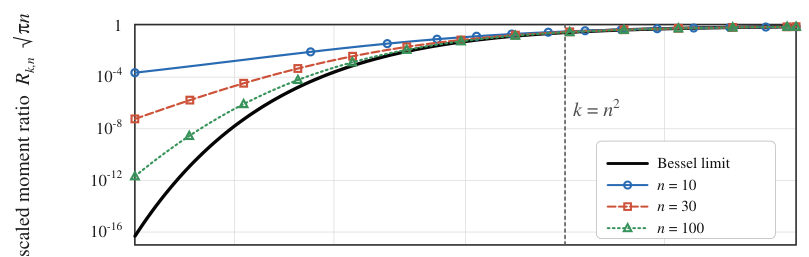 
Figure 1: Exact finite sum ratio from Eq. (4) for n = 10, 30, 100, together with the Bessel limit in Eq. (7). Both axes are logarithmic; symbols show exact finite n evaluations, not simulated data, and the vertical line marks k = n2. For every fixed k/n2 &gt; 0, the scaled ratio approaches a positive limit, so the quadratic scale is a crossover within the weak regime.

**Summary.** This theoretical paper analyzes the moments of the Gaussian Gram Hafnian, a key observable in Gaussian Boson Sampling. By calculating the moment ratio $R_{k,n}$, the authors establish that the threshold for weak anticoncentration scales as $k \sim n^2 / \log n$. This provides a precise mathematical boundary for the performance limits of the surrogate model used to study quantum interference effects.

**Why it may be interesting.** The connection between moment calculations of quantum observables (like the Hafnian) and establishing fundamental scaling thresholds (like the $n^2/\log n$ boundary) is highly relevant for understanding the limits of quantum advantage in photonic quantum information processing.

Detailed structure

**Main problem.** The paper determines the scaling threshold for 'weak anticoncentration' by analyzing the exact moments of Gaussian Gram Hafnians.

**Main result.** The critical scaling order boundary for weak anticoncentration is found to be $k \sim n^2 / \log n$, contrasting with the smooth Bessel crossover observed at $k \sim n^2$.

**Method.** The analysis involves calculating the second and fourth moments of the Hafnian, $H_{k,n}$, by reducing them to rank two Gaussian integrals and expressing the resulting moment ratio in terms of terminating generalized hypergeometric polynomials.

**Model / system.** The study uses the independent Gaussian surrogate model for collision-free Gaussian Boson Sampling (GBS). The core mathematical object is the Gram Hafnian, $H_{k,n} = 	ext{haf}(X^T X)$, where $X$ has independent standard circular complex Gaussian entries.

**Key observables.** The moment ratio $R_{k,n} = (\mathbb{E}|H_{k,n}|^2)^2 / \mathbb{E}|H_{k,n}|^4$ is the primary diagnostic quantity.

**Important parameters / regimes.** The ratio $k/n^2$ (squeezed input modes to detected photons) and the logarithmic scaling factor $\log n$ are crucial parameters.

**Assumptions / limitations.** The results are strictly limited to the independent Gaussian surrogate moment criterion and do not apply to finite dimensional Haar moment transfer or high probability small ball anticoncentration.

**Figures summary.** Figure 1 compares the exact finite sum ratio $R_{k,n}$ against the theoretical Bessel limit, marking the $k=n^2$ crossover line.

**Paper structure.** The paper proceeds by deriving exact moment formulas for the Hafnian, establishing the closed-form expression for the moment ratio $R_{k,n}$ using hypergeometric functions, and finally analyzing the asymptotic behavior to pinpoint the $n^2/\log n$ threshold for weak anticoncentration.

Abstract

Anticoncentration is central to hardness arguments for approximate sampling. In the independent Gaussian surrogate for collision free Gaussian boson sampling, the moment ratio studied here also determines the averaged ideal linear cross entropy reference value. Let $H_{k,n}=\mathrm{haf}(X^{\mathsf T}X)$, where $X\in\mathbb{C}^{k\times 2n}$ has independent standard circular complex Gaussian entries. We evaluate $\mathbb{E}|H_{k,n}|^2$ and $\mathbb{E}|H_{k,n}|^4$ exactly by reducing four hafnian copies to a rank two Gaussian integral. For $R_{k,n}=(\mathbb{E}|H_{k,n}|^2)^2/\mathbb{E}|H_{k,n}|^4$, we obtain $R_{k,n}=4^{-n}\binom{2n}{n}/F_{k,n}$, where $F_{k,n}={}3F_2(-n,-n,1/2;1,k/2;1)$ is a terminating generalized hypergeometric polynomial. If $k/n^2\to c>0$, then $F{k,n}\to e^{1/c}I_0(1/c)$, where $I_0$ is the modified Bessel function of the first kind of order zero, and consequently $R_{k,n}\sqrt{πn}\to[e^{1/c}I_0(1/c)]^{-1}$. Thus $k\asymp n^2$ is a smooth Bessel crossover, whereas the scaling order boundary for inverse polynomial weak anticoncentration is $k\asymp n^2/\log n$. These conclusions concern the Gaussian surrogate moment criterion; finite dimensional Haar moment transfer and high probability small ball anticoncentration remain separate problems.

[↑ back to top](#top)

### [Incidence-based random walks on simplicial complexes](http://arxiv.org/abs/2608.17229v1)

**Authors:** C. T. Martínez-Martínez, Francisco J. Sevilla  
**Type:** theory · **Category:** statistical mechanics · **PDF:** <https://arxiv.org/pdf/2608.17229v1>  
**Analysis basis:** full PDF text, analyzed in chunks
**Topic relevance:** `analog quantum simulation` **1/5**

📷 Fig 1

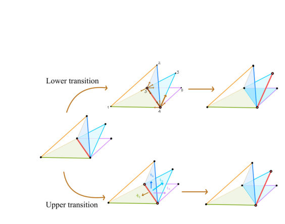 
FIG. 1. Schematic representation of the two elementary trans- port channels defining the edge walk. Lower transition: the walker moves from an edge (red) to one of its two incident vertices {3, 4}, in the example the walker chose vertex 4, then chooses one edge incident to the chosen vertex, edge (4, 3) in the example. Upper transition: the walker moves from an edge (red) to one of its incident triangles and then to another boundary edge of that triangle.

📷 Fig 2

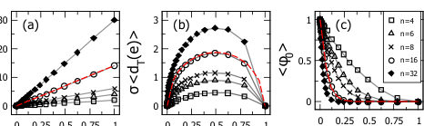 
FIG. 2. Structural properties of the random face-diluted en- semble X(n, p). (a) Mean triangle degree ⟨dT ⟩, (b) standard deviation σ(dT ), and (c) inactive-edge fraction ϕ0, as func- tions of the face-retention probability p. Symbols correspond to different values of n, while the dashed red line indicates the theoretical prediction for n = 16 [Eqs. (24)–(26)].

📷 Fig 3

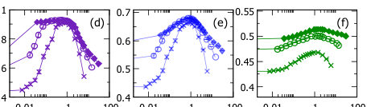 
FIG. 3. Average second-largest eigenvalue modulus ⟨λ∗⟩of the effective transition operator. The top row presents ⟨λ∗⟩ as a function of the face-retention probability p, whereas the bottom row shows the corresponding results as a function of the mean upper degree ⟨dT ⟩= (n −2)p. Columns correspond to q = 0.1, 0.5, and 0.9, respectively. Each symbol represents the average over an ensemble of 180000/n independent real- izations.

📷 Fig 4

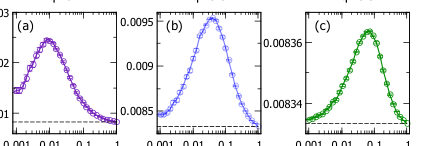 
FIG. 4. Average inverse participation ratio ⟨IPR(π)⟩of the stationary distribution as a function of the face-retention probability p for a system of size n = 16. Panels (a)–(c) correspond to q = 0.1, 0.5, and 0.9, respectively. The horizontal dashed line denotes the uniform reference value 1/|X1| = 1/120. Error bars represent the standard error over independent realizations.

📷 Fig 5

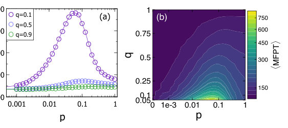 
FIG. 5. Mean first-passage time ⟨MFPT⟩for the effective random walk. (a) Mean first-passage time ⟨MFPT⟩as a function of the face-retention probability p for representative values of the mixing parameter q and fixed system size n = 16. (b) Contour map of ⟨MFPT⟩in the (p, q) parameter space.

**Summary.** This work develops a framework for random walks on simplicial complexes, modeling transport via two coupled channels: vertex-mediated and face-mediated. By analyzing the effect of partially retained triangles, the authors demonstrate that intermediate levels of structural disorder create a pronounced transport bottleneck. This establishes a simple yet powerful method to quantify how higher-order connectivity reshapes network dynamics.

**Why it may be interesting.** The study of transport bottlenecks due to structural heterogeneity is highly relevant to understanding energy or information flow in complex, disordered physical systems, which shares conceptual links with glassy dynamics or disordered quantum systems.

Detailed structure

**Main problem.** The paper investigates how incorporating heterogeneous higher-order connectivity (triangles) into a random walk fundamentally alters its spectral and transport properties compared to simple pairwise network dynamics.

**Main result.** The analysis reveals that the most pronounced transport bottleneck—manifested as maximum mean first-passage time—occurs in an intermediate regime of partial face dilution, suggesting heterogeneity is key.

**Method.** The authors analyze the effective transition operator governing the random walk on the edges of a simplicial complex, using spectral analysis and calculating mean first-passage times.

**Model / system.** The model is an incidence-based random walk defined on the edges of a random 2D simplicial complex. The dynamics combine two channels: one mediated by vertices (lower) and one by triangular faces (upper), controlled by a mixing parameter q.

**Key observables.** Second-largest eigenvalue modulus, inverse participation ratio, mean first-passage time, and the survival probability of first-passage time.

**Important parameters / regimes.** Face retention probability (p) and the mixing parameter (q), which control the degree of higher-order connectivity.

**Assumptions / limitations.** The analysis assumes the underlying 1-skeleton is fixed (complete graph) and uses a random ensemble approach to study quenched structural heterogeneity.

**Figures summary.** Figures illustrate the dependence of mean first-passage time on face density (p) and the survival probability of first-passage times across different dilution regimes.

**Paper structure.** The paper builds the effective transition operator by combining elementary steps via vertices and triangles. It then analyzes the resulting dynamics across different regimes (graph-like vs. fully simplicial) to pinpoint the conditions causing dynamical slowdown.

Abstract

We introduce an incidence-based random walk on the edges of a random two-dimensional simplicial complex with a complete $1$-skeleton and independently retained triangular faces. The dynamics combine two transport channels, one mediated by vertices and the other by triangular faces, through an effective transition operator controlled by a mixing parameter $q$. This construction isolates the effects of higher-order connectivity without modifying the underlying pairwise support of the walk. We characterize the model through structural observables, spectral relaxation, stationary localization, and first-passage transport. Our results show that partial face retention generates heterogeneous higher-order connectivity, giving rise to a pronounced transport bottleneck at intermediate face densities. In this regime, the second-largest eigenvalue modulus, the inverse participation ratio of the stationary distribution, and the mean first-passage time all exhibit non-monotonic behavior, reaching their largest values at intermediate face densities. The corresponding first-passage-time distributions reveal an enhanced probability of unusually long trajectories. Together, these results establish a simple framework for investigating how heterogeneous higher-order connectivity reshapes spectral and transport properties beyond pairwise network dynamics.

[↑ back to top](#top)

### [Iterative tensor network transformations for element-wise evaluation of elementary and filtering functions](http://arxiv.org/abs/2608.17135v1)

**Authors:** Xiao Wang, Tomohiro Hashizume, Pia Siegl, Dieter Jaksch  
**Type:** theory · **Category:** numerical methods · **PDF:** <https://arxiv.org/pdf/2608.17135v1>  
**Analysis basis:** full PDF text, analyzed in chunks
**Topic relevance:** `methods for driven-dissipative` **1/5**

📷 Fig 1

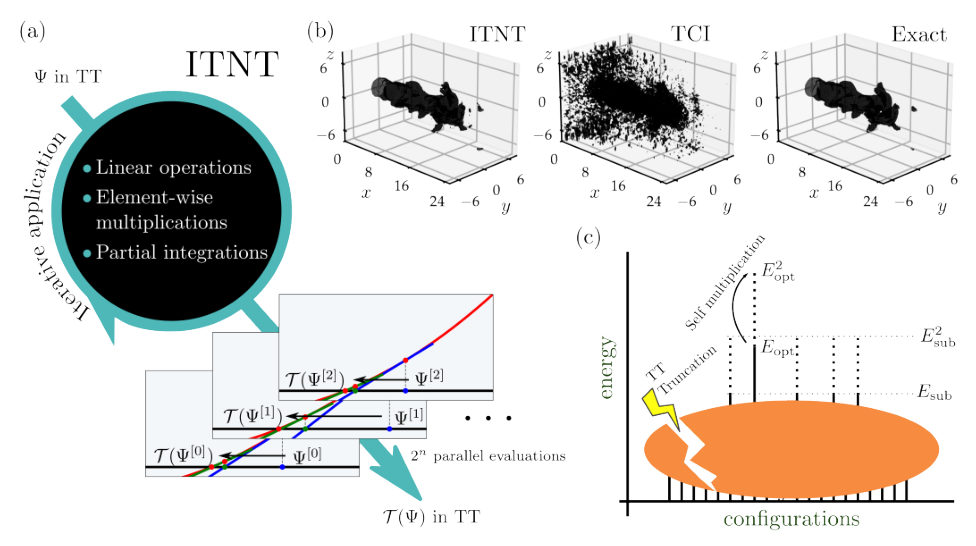 
FIG. 1: Overview of the results. (a) Schematic of the Iterative tensor network transformations (ITNTs) methodology. The framework enables the evaluation of highly complex nonlinear transformations, T , directly on TT-encoded data Ψ defined on array indices j ∈{0, 1, . . . , N −1 = 2n −1}. This is achieved by leveraging 2n parallel evaluations of the iteratively converging Newton-Raphson method (bottom-right panels). In these panels, the red curve represents the nonlinear function being iteratively solved, while the blue and green lines illustrate the successive tangent-linear approximations during the iterative process, starting from the blue dot. This convergence allows the transformation...

📷 Fig 2

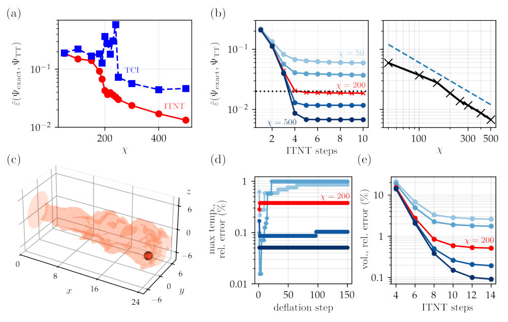 
FIG. 2: Nonlinear post processing with ITNTs. (a) Convergence comparison between ITNT and TCI for the Arrhenius equation (Eq. (3)) computation. While TCI suffers from instability around χ = 200, ITNT demonstrates a drop in error in the same region, consistently converging towards the exact result with in- creasing χ. (b) Relative ℓ2 error of the 1/T field computed exactly (Ψexact) from the original field and by us- ing the ITNT algorithm (ΨTT) for χ = 50, 100, 200, 300, and 500 (light to dark, left panel), and the same er- ror at the 10th iteration for different bond dimensions. In the right panel, the blue dashed line indicates 1/χ decay as a guide to the eye. (c) The position of the...

📷 Fig 3

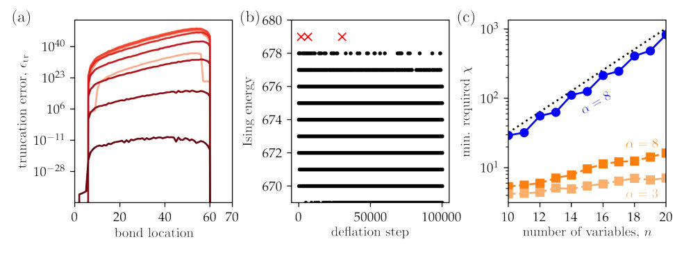 
FIG. 3: Solving Max-3-SAT problems with ITNTs. (a) Truncation error at each bond in the zip- up self-multiplication algorithm. In order to solve 70 variables 700 clauses Max-3SAT problem, 10 self- multiplications are performed, and for each self-multiplication is computed with the zip-up algorithm with on-site truncation, while fixing χ = 700. Each color corresponds to a different self-multiplication iteration (iterations 1 to 10, light to dark) (b) Deflation result for the max 3-SAT problem s3v70c700-1. Three con- figurations with an energy of E with E = 679 are found after the i = 1655th, the i = 6442nd, and the i = 30186th extremum-finding ITNT steps. (c) Scaling of the minimum bond...

📷 Fig 4

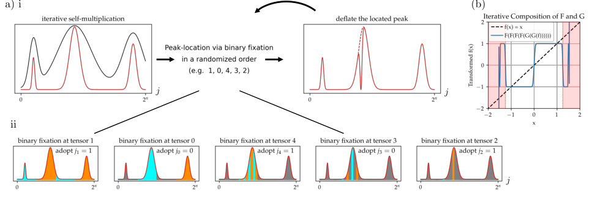 
FIG. 4: ITNTs for element-wise nonlinear operations in TT representation. (a) Extrema detection with TT. i Starting from a TT representation of Ψ (black curve), repeated element-wise self-multiplication sharpens the state into a multi-peak profile Φ, where its integral is dominated by extremal configurations (red curve). ii A peak is then located by a binary fixation procedure. This involves integrating out all un- fixed sites and choosing the local configuration that maximizes the summed value. Starting from every index not being fixed, in the leftmost panel, a comparison between j2 = 0 (orange) and j2 = 1 (cyan) is performed, identifying j2 = 1 as a candidate for the optimal...

**Summary.** The paper introduces Iterative Tensor Network Transformations (ITNT), a novel framework allowing general nonlinear functions to be evaluated directly on data compressed in the Tensor Train format. By leveraging iterative root-finding techniques, ITNT achieves high accuracy for complex physical simulations, such as calculating reaction rates in fluid dynamics and solving NP-hard optimization problems. This establishes tensor networks as a tool for general-purpose, large-scale data science.

**Why it may be interesting.** This work provides a powerful, general-purpose computational tool that extends tensor network methods beyond linear operations, making them applicable to complex, nonlinear physics problems previously requiring computationally expensive full-space sampling.

Detailed structure

**Main problem.** The core challenge is developing a general algorithmic framework to perform element-wise evaluation of arbitrary, nonlinear filtering functions directly on data encoded in the compressed Tensor Train (TT) format.

**Main result.** The proposed Iterative Tensor Network Transformations (ITNT) successfully enables high-fidelity computation of nonlinear functions (like reaction rates) and locating global extrema in exponentially large configuration spaces.

**Method.** ITNT utilizes iterative techniques, such as the Newton-Raphson method, combined with efficient TT operations (element-wise product, partial integration) to operate entirely in the compressed domain.

**Model / system.** The methods are demonstrated on several models: 3D reactive flow fields (methane/air jet flame) for continuous field evaluation, and classical Ising models/Max-SAT instances for combinatorial optimization.

**Key observables.** Reaction rates (Arrhenius factor), global energy extrema ($E_{opt}$), and the relative $\ell_2$ error ($	ilde{\epsilon}$).

**Important parameters / regimes.** Bond dimension ($\chi$), number of iterations ($N_{	ext{iter}}$), and the required preprocessing steps (e.g., self-multiplication power $P$).

**Assumptions / limitations.** The framework assumes that the required functions can be mapped to iterative root-finding problems solvable via the Newton-Raphson method or related fixed-point iterations.

**Figures summary.** Figures illustrate the methodology for nonlinear evaluation (Fig. 1a, 1b) and the application to optimization, showing convergence comparisons between ITNT and interpolation methods (TCI).

**Paper structure.** The paper introduces ITNT, details its application to continuous nonlinear PDEs (reactive flow), and then extends it to discrete, high-dimensional optimization problems like Max-SAT and Ising model energy matching.

Abstract

Tensor networks are powerful formats for compressing large-scale data. However, their application to general data processing has been limited by the difficulty of performing nonlinear operations. Here, we introduce iterative tensor network transformations (ITNTs), a general algorithmic framework for the element-wise evaluation of elementary and nonlinear filtering functions on data encoded as tensor trains (TTs), a class of tensor networks. Our approach operates entirely in the compressed domain, enabling efficient computation on exponentially large datasets while maintaining a controlled computational cost. We demonstrate its power in two key areas: (I) evaluating highly nonlinear elementary and filtering functions on a 3D reactive flow field, enabling high-fidelity reaction rate computation and region filtering, and (II) finding extrema in complex optimization problems, such as solving Max-SAT instances on spaces up to $2^{70}$ configurations. These results establish ITNT as a foundational tool that provides tensor network methods with the capability for general-purpose data science and large-scale optimization.

[↑ back to top](#top)

### [On the Expressive Power of the Transverse-Field Ising Model for Graph Learning](http://arxiv.org/abs/2608.17750v1)

**Authors:** Mehdi Djellabi, Louis-Paul Henry  
**Type:** both · **Category:** other · **PDF:** <https://arxiv.org/pdf/2608.17750v1>  
**Analysis basis:** full PDF text, analyzed in chunks
**Topic relevance:** `analog quantum simulation` **1/5**

📷 Fig 1

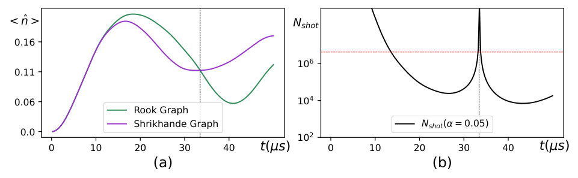 
Figure 1: Rook versus Shrikhande graphs distinction. (a) One-body occupation dynamics ⟨ˆn(t)⟩. Within each graph, the vertex-transitivity property ensures that all vertices share the same trajectory due to a single vertex orbit. (b) Number of shots required to distinguish the two graphs with success probability at least 95%. The red dashed line indicates the lower bound for the time complexity scale of the exact classical counterpart (4-WL). Parameters: |ψ0⟩= |0⟩⊗N for both graphs, δ = 0 and Ω= 0.1.

📷 Fig 2

 
Figure 2 reports, for each family, the pair-averaged separation ¯η(1) together with its one-standard-deviation spread, and the worst-case separation mini&lt;j η(1) ij , shown as a function of the elapsed physical time tm as the horizon grows over the T time steps. Starting from a common initial state, all curves vanish at early times, before the occupations have had time to differentiate. As the evolution proceeds, the worst-case separation becomes and remains strictly positive, well above the numerical tolerance, for both families. This shows that every pair of non-isomorphic graphs in srg(26, 10, 3, 4) and srg(25, 12, 5, 6) is separated by the one-point occupation dynamics alone, thereby...

📷 Fig 3

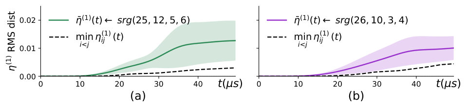 
Figure 2: Permutation-invariant separability of strongly regular graph families srg(25, 12, 5, 6) (a) and srg(26, 10, 3, 4) (b), containing 15 and 10 non-isomorphic graphs respectively. The minimization over per- mutations π ∈SN is solved exactly as a linear assignment problem between the node-occupation time traces of graph pairs, and η(1) ij (t) is expressed as a root-mean-square (RMS) distance over nodes and time steps. All graphs are initialized in the common |0⟩⊗N state and evolved with constant parameters Ω= 0.1 and δ = 0. Solid lines show the pair-averaged separation ¯η(1)(t) and shaded bands the corresponding ±1 standard deviation over graph pairs. Dashed black lines show the...

📷 Fig 4

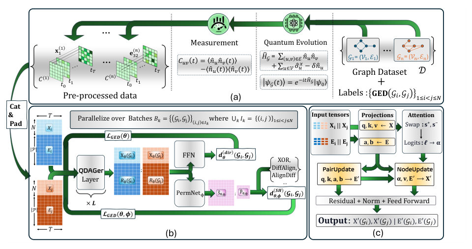 
Figure 3: Detailed pipeline of the QDAGer model architecture. (a) Pre-processing phase: each graph Gi = (Vi, Ei) is mapped to the Hamiltonian of Eq. (1). Starting from a common initial state |ψ0⟩, we evolve the system as |ψG(t)⟩= exp(−it ˆHG) |ψ0⟩and evaluate the relevant observables at multiple times, namely the node occupations ⟨ˆnu⟩(t) and connected two-point correlators Cuv(t) = ⟨ˆnuˆnv⟩(t) −⟨ˆnu⟩(t)⟨ˆnv⟩(t). (b) For each graph pair (Gi, Gj), the corresponding tensors are concatenated, padded, and processed by ×L QDAGer layers to produce node embeddings Xθ and pair embeddings Rθ. These embeddings are used either by a direct distance head, yielding d(dir) θ (Gi, Gj), or by an...

**Summary.** This paper proposes QDAGer, a quantum-inspired graph Transformer, to enhance graph learning by incorporating dynamical features derived from the Transverse-Field Ising Model. The authors show that the time evolution of quantum observables acts as a powerful structural signal, enabling the model to learn complex metrics like Graph Edit Distance better than purely classical structural descriptors.

**Why it may be interesting.** The work bridges quantum many-body physics (Ising models, dynamics) with modern machine learning (Graph Transformers), suggesting that inherent symmetries and time-evolution properties of quantum systems can serve as powerful, structured inductive biases for solving classically hard problems.

Detailed structure

**Main problem.** To develop graph representations for graph learning that capture structural information while respecting permutation invariance, particularly for hard tasks like graph comparison.

**Main result.** The proposed quantum-inspired architecture, QDAGer, demonstrates that dynamical features derived from the Ising model provide a stronger inductive bias for learning Graph Edit Distance than classical structural features.

**Method.** The authors introduce QDAGer, a Transformer that injects time-series data from quantum observables (node occupations and two-point correlators) into the attention mechanism for graph-pair comparison.

**Model / system.** The underlying physical model is the quantum evolution governed by a graph-indexed Transverse-Field Ising Hamiltonian ($H_G$). The dynamics are analyzed by measuring time-dependent expectation values of local observables.

**Key observables.** Node occupations $\langle \hat{
u}_u(t) 
angle$ and connected two-point correlators $\langle \hat{
u}_u \hat{
u}_v(t) 
angle - \langle \hat{
u}_u(t) 
angle \langle \hat{
u}_v(t) 
angle$.

**Important parameters / regimes.** The performance is tested across various Graph Edit Distance (GED) benchmarks using different edit cost settings.

**Assumptions / limitations.** The quantum dynamics are simulated via emulation, and the method is positioned as 'quantum-inspired' rather than claiming quantum computational advantage.

**Figures summary.** Figure 1 (from Chunk 2 notes) shows that one-body occupation trajectories differ between non-isomorphic graphs (Rook's vs Shrikhande), demonstrating distinguishability.

**Paper structure.** The paper first establishes the theoretical distinguishability of non-isomorphic graphs using the Ising model dynamics (Chunks 2 & 3), proving that observables yield distinct time-dependent trajectories. It then applies this concept by proposing QDAGer, which integrates these dynamical features into a Transformer for practical graph learning tasks like GED (Chunks 1 & 4).

Abstract

We study the quantum evolution induced by graph-indexed Ising Hamiltonians as a source of structural signal for graph learning. Graph automorphisms preserve symmetries of the Hamiltonian, and these symmetries constrain the quantum evolution in a way that turns time-dependent local measurements into informative probes of graph structure. Leveraging this idea, we introduce QDAGer, a quantum-inspired graph-pair Transformer that injects quantum-dynamical features from time series of node occupations and connected two-point correlators directly into the attention mechanism. We apply QDAGer to learning Graph Edit Distance (GED), an NP-hard similarity measure, using either a direct permutation-invariant embedding discrepancy or an alignment-based surrogate loss. Experiments on multiple GED benchmarks under different edit cost settings show that the proposed dynamical features provide a stronger inductive bias than classical structural alternatives under the same training protocol. In addition, we report ablations where the dynamical signal is replaced by standard random-walk and heat-kernel features while keeping the architecture fixed, highlighting that the gain comes from the injected dynamics rather than model capacity alone.

[↑ back to top](#top)

### [Operational thresholds of Bell mixtures with complex X noise](http://arxiv.org/abs/2608.17609v1)

**Authors:** Xuan Du Trinh  
**Type:** theory · **Category:** quantum information and computing · **PDF:** <https://arxiv.org/pdf/2608.17609v1>  
**Analysis basis:** full PDF text, analyzed in chunks
**Topic relevance:** `quantum measurements` **1/5**

📷 Fig 1

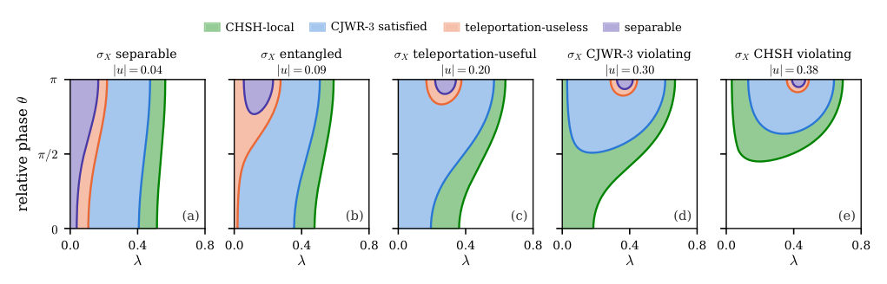 
FIG. 1. Operational phase diagrams of the Bell-mixing line ρλ in the (λ, θ) plane. All panels use (a, b, c, d) = (0.42, 0.18, 0.02, 0.38) and v = 0.04, with the value of |u| shown above each panel. As |u| increases, σX is (a) separable, (b) en- tangled but teleportation-useless, (c) teleportation-useful but CJWR-3-satisfying, (d) CJWR-3-violating but CHSH-local, and (e) CHSH-violating. Colors mark where ρλ lacks each ability: green for CHSH locality, blue for CJWR-3 satisfaction, orange for teleportation uselessness, and violet for separability. These regions nest in the same order. A region touching λ = 0 indicates a single onset for an ability absent from σX. A detached region indicates...

📷 Fig 2

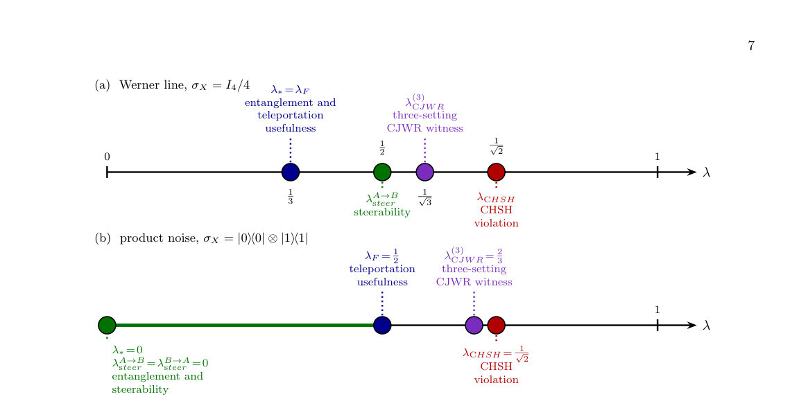 
FIG. 2. Threshold order on two Bell-state mixtures. Panel (a) shows the Bell weights at which the operational abilities change along the Werner line σX = I4/4. The entanglement and teleportation usefulness thresholds coincide at λ∗= λF = 1/3 [26, 30]. The steerability threshold is 1/2 for both projective measurements [3] and POVMs [34]. The CJWR-3 witness threshold is 1/ √

📷 Fig 3

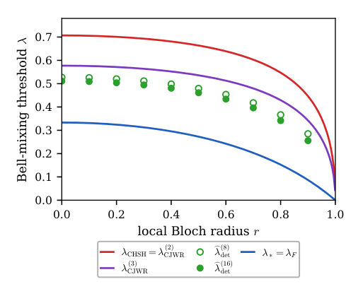 
FIG. 3. Operational thresholds on the diagonal X family σX = σA ⊗σB with σA = σB = (I + rσz)/2, plotted against the local Bloch-vector length r. The curves show the CHSH- nonlocal threshold, which is also the CJWR-2 witness thresh- old, the CJWR-3 witness threshold, and λ∗= λF . Green markers show bλ(8) det and bλ(16) det , the numerical estimates of the two finite-setting thresholds. The corresponding exact finite- setting optima bound the projective-measurement steerabil- ity threshold from above. At r = 0, the eight- and sixteen- direction estimates are 0.527 and 0.511, respectively, com- pared with the exact Werner value λA→B steer = 1/2 [3].

📷 Fig 4

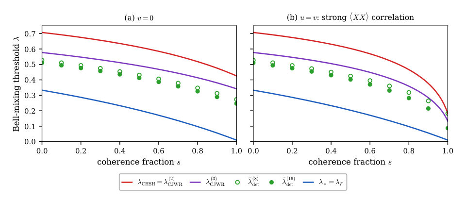 
FIG. 4. Operational thresholds on two families of separable X states with diagonal (0.30, 0.25, 0.25, 0.20) and real coherence scaled by a fraction s up to the separability boundary. Panel (a) has v = 0, and panel (b) has u = v. On both families, the definitive thresholds shown by the solid curves have the order in Corollary 1. Green markers show the numerical estimates bλ(8) det and bλ(16) det . The corresponding exact finite-setting optima bound the projective-measurement steerability threshold from above. The sixteen-direction estimate lies below the CJWR-3 witness threshold, which lies below λCHSH = λ(2) CJWR (red). Thus, the numerical comparison indicates finite-setting steering...

📷 Fig 5

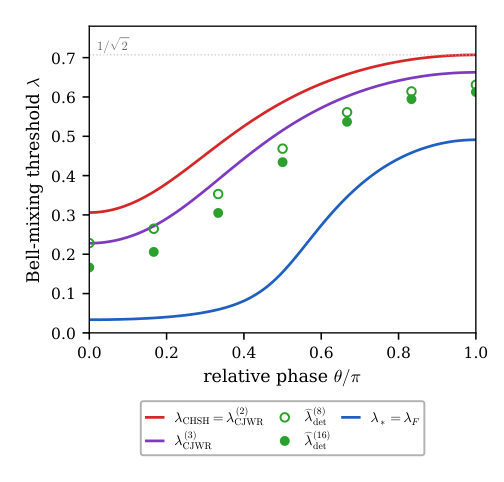 
FIG. 5. Relative-phase scan at fixed populations and co- herence magnitudes, obtained from the u = v family of Fig. 4(b) at coherence fraction s = 0.95. The diagonal (0.30, 0.25, 0.25, 0.20) and |u| = v ≈0.233 are fixed, while the relative phase in u = |u|eiθ varies. The definitive thresh- olds determined by the explicit boundary conditions increase monotonically with θ. Here λ∗= λF because b = c [24]. Green markers show the numerical estimates bλ(8) det and bλ(16) det . At θ = π, the CHSH-nonlocal threshold returns to the Werner value 1/ √

**Summary.** This work rigorously maps the boundaries in parameter space where a noisy Bell state retains specific quantum resources like entanglement or teleportation usefulness. By analyzing the singular-value flow of correlation tensors, the authors establish universal ordering chains between these operational thresholds. The findings are vital for understanding the robustness of quantum information protocols under realistic noise models.

**Why it may be interesting.** It provides rigorous, quantitative boundaries for quantum resources in realistic noisy channels, which is crucial for designing fault-tolerant quantum communication protocols.

Detailed structure

**Main problem.** The paper characterizes how various operational quantum abilities (entanglement, teleportation usefulness, steerability, etc.) are maintained or lost in noisy Bell mixtures as the noise admixture changes.

**Main result.** The operational abilities are distinct, forming a universal ordered chain of thresholds as the noise parameter varies, and the unique separable/unsteerable point is found at zero noise admixture ($\lambda=0$).

**Method.** The analysis relies on characterizing the singular-value flow of the Pauli correlation tensor and using semidefinite programming to determine exact thresholds for various quantum witnesses.

**Model / system.** The system is a mixture of a pure Bell state ($\Phi^+$) and an arbitrary complex two-qubit X noise state ($\sigma_X$), parameterized by the Bell weight $\lambda$: $
ho_\lambda = \lambda\Phi^+ + (1 - \lambda)\sigma_X$.

**Key observables.** Entanglement, teleportation usefulness, projective-measurement steerability, CJWR violation, and CHSH violation.

**Important parameters / regimes.** Bell weight ($\lambda$), relative phase ($	heta$) between noise coherence and Bell coherence, and the noise parameters defining $\sigma_X$.

**Assumptions / limitations.** For generic full-rank mixed X noise, upper bounds on steerability thresholds are obtained via finite-setting semidefinite programs.

**Figures summary.** Figure 1 illustrates operational phase diagrams in the $(\lambda, 	heta)$ plane showing the nesting and widening of ability-absence intervals for various noise states.

**Paper structure.** The paper systematically analyzes the thresholds for different operational abilities, deriving closed-form flows for specific noise types (like product noise) and proving the unique unsteerable point ($\lambda=0$) using recurrence relations for a swapping chain.

Abstract

Noisy Bell mixtures may carry entanglement, standard teleportation usefulness, projective-measurement steerability, and optimized Cavalcanti-Jones-Wiseman-Reid (CJWR) and Clauser-Horne-Shimony-Holt (CHSH) violations. If the noise already has an ability, the mixture may lose and later recover it at distinct boundary crossings as the Bell weight decreases. We characterize ability-absence intervals and definitive thresholds for mixtures of $|Φ^+\rangle$ with arbitrary complex two-qubit $X$ noise. A closed-form singular-value flow of the Pauli correlation tensor gives the exact teleportation-useless, CJWR-satisfying, and CHSH-local intervals, while the positive partial transpose criterion gives the exact separable interval. At fixed populations and coherence magnitudes, these intervals widen as the relative phase between the $Φ$-block coherence of the noise and the Bell coherence increases from $0$ to $π$. The definitive thresholds form a universal chain from entanglement through teleportation usefulness and the three-setting CJWR witness to the common two-setting CJWR witness and CHSH-nonlocal threshold. Replacing teleportation usefulness by steerability gives a second chain, although their thresholds are not mutually ordered. For arbitrary pure two-qubit noise, the steerability thresholds in both directions for projective measurements and arbitrary positive operator-valued measures equal the entanglement threshold. For arbitrary product noise, an effective $X$-state singular-value flow gives the teleportation usefulness, CJWR witness, and CHSH-nonlocal thresholds. If a local noise factor is pure, the entanglement threshold and all four steerability thresholds are zero. For generic full-rank mixed $X$ noise, finite-setting semidefinite programs give upper bounds on the unknown directional projective-measurement steerability thresholds.

[↑ back to top](#top)

## Other papers (17)

*Papers from primary archives without highlighted authors or any topic match. Click to expand.*

Show other papers

### [A geodesic distance interpretation of Lanczos coefficients](http://arxiv.org/abs/2608.16982v1)

**Authors:** Le-Chen Qu  
**Type:** theory · **Category:** statistical mechanics · **PDF:** <https://arxiv.org/pdf/2608.16982v1>  
**Analysis basis:** full PDF text, analyzed in chunks

📷 Fig 1

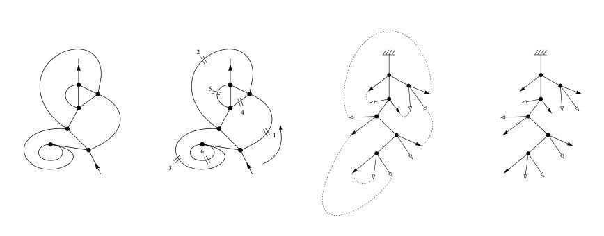 
Figure 1. Construction of the blossom tree associated with a planar map with two legs and four- valent internal vertices, reproduced from Ref. [65]. Panel (a) displays the initial map. The numbers in panel (b) give the order of the allowed cuts: 1–3 occur during the first circuit, namely the first complete counterclockwise traversal of the external boundary, and 4–6 during the second. Each cut replaces an edge by a black bud and a white leaf, producing the intermediate object in panel (c). Turning the incoming leg into a leaf and the outgoing leg into the root gives the tree in panel (d). Pairing the buds and leaves in the reverse order reconstructs the original planar map.

📷 Fig 2

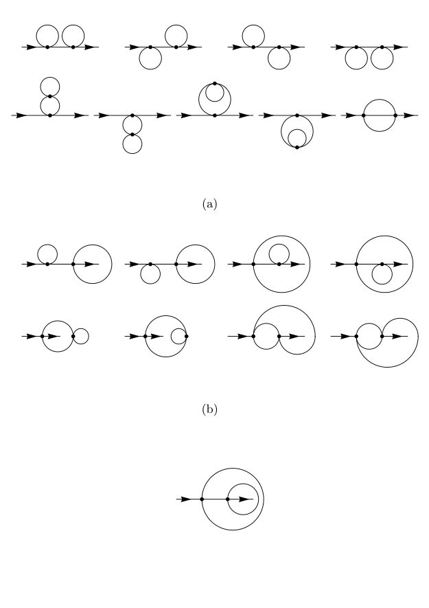 
Figure 2. Connected planar maps with two legs and two tetravalent internal vertices, reproduced from Ref. [65]. The maps are classified by the geodesic distance between their marked legs: n = 0 in panel (a), n = 1 in panel (b), and n = 2 in panel (c).

📷 Fig 3

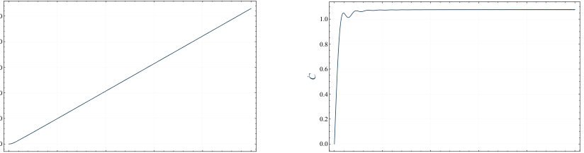 
Figure 3. Spread complexity C(t) and its growth rate ˙C(t) for the quartic model at g = −1. The early-time growth is quadratic, while the late-time growth is linear.

📷 Fig 4

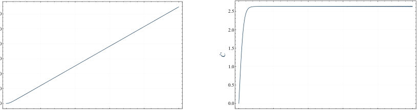 
Figure 4. Spread complexity C(t) and its growth rate ˙C(t) in the double-scaled SYK model at q = 0.5. The early-time growth is quadratic, whereas the late-time growth is linear.

**Summary.** This paper analyzes the spread complexity of quantum states in large-N random matrix models by focusing on the Lanczos coefficients. It derives nonlinear equations governing these coefficients using the Coulomb-gas formalism. Crucially, it establishes a deep connection showing that these coefficients generate counts of planar maps, linking quantum dynamics to combinatorics.

**Why it may be interesting.** The connection between spectral properties (Lanczos coefficients) derived from complex many-body systems (RMT) and fundamental combinatorial objects (planar maps) provides a powerful, non-obvious mathematical structure applicable to understanding quantum chaos and complexity in physical systems.

Detailed structure

**Main problem.** The paper investigates the physical meaning of Lanczos coefficients in the context of the spread complexity of the infinite-temperature thermofield double state within large-N random matrix theory.

**Main result.** The Lanczos coefficients are shown to satisfy nonlinear 'Lanczos equations' derived from the Coulomb-gas equation, and they generate counts of planar maps related to the geodesic distance.

**Method.** The analysis uses the orthogonal polynomial approach associated with the leading density of states, relating the dynamics to a three-term recurrence relation whose coefficients are the Lanczos coefficients.

**Model / system.** The study focuses on the infinite-temperature thermofield double state in large-N random matrix ensembles, which is analyzed via its associated orthogonal polynomials and the resulting Krylov dynamics.

**Key observables.** Spread complexity, Lanczos coefficients ($a_n, b_n$), and the leading density of states ($
ho_0(E)$).

**Important parameters / regimes.** Large-N limit, Krylov index, and the structure of the matrix potential (e.g., quartic potential).

**Assumptions / limitations.** The analysis relies on the large-N limit and the mapping of dynamics to the Krylov chain structure.

**Figures summary.** Not specified in the notes, but the text references figures illustrating the bijection between coefficients and planar maps.

**Paper structure.** The paper proceeds by establishing the connection between the dynamics (survival amplitude $S(t)$) and the orthogonal polynomial structure, deriving the recurrence relations, finding the nonlinear 'Lanczos equations' from the Coulomb-gas equation, and finally interpreting these coefficients combinatorially via planar maps.

Abstract

We study the spread complexity of the infinite-temperature thermofield double state in large-$N$ random matrix theory and investigate the physical meaning of its Lanczos coefficients. The leading density of states defines a family of orthogonal polynomials whose recursion coefficients coincide with the Lanczos coefficients of the associated Krylov dynamics. Starting from the Coulomb-gas equation, we derive a pair of nonlinear relations for these coefficients, which we call the Lanczos equations. Since the Lanczos coefficients approach constants at large Krylov index, the spread complexity grows linearly at late times. We further show that the Lanczos coefficients can be interpreted as generating functions for planar maps. For an even potential, the difference $b_{n+1}^2-b_n^2$ generates maps with two legs whose marked legs are separated by the exact geodesic distance $n$. Consequently, the spread complexity acceleration operator equals twice the geodesic generating operator. We illustrate these results in the quartic matrix model, where the expansion in the quartic coupling counts tetravalent planar maps, and in the double-scaled Sachdev--Ye--Kitaev model, where the auxiliary Hilbert space can be identified with the physical chord Hilbert space.

[↑ back to top](#top)

### [Atomistic Structure Generation and Neural-Network Screening of Hard Carbons to Identify High-Capacity Sodium Storage](http://arxiv.org/abs/2608.17716v1)

**Authors:** Harry Mclean, Aiden Daniel Emery, Theodore Thomas Walton, Ned Thaddeus Taylor, Steven Paul Hepplestone  
**Type:** theory · **Category:** disordered systems and neural networks · **PDF:** <https://arxiv.org/pdf/2608.17716v1>  
**Analysis basis:** full PDF text, analyzed in chunks

📷 Fig 1

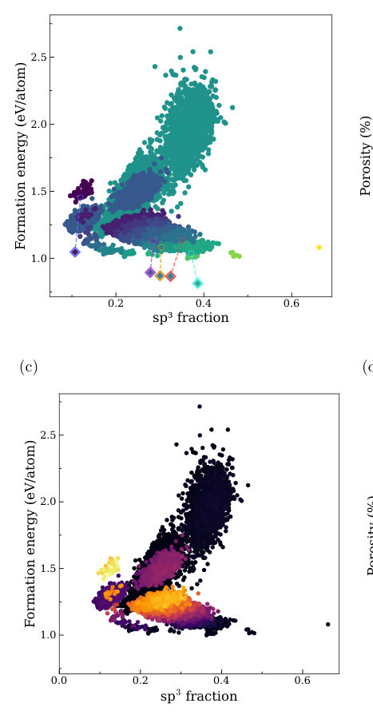 
FIG. 1: Structural and energetic analysis of hard carbons generated using AGOX and

📷 Fig 2

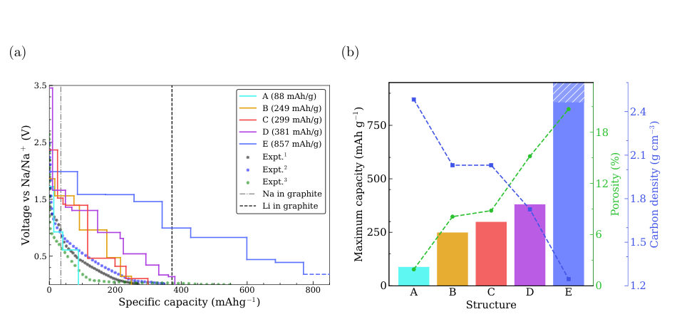 
FIG. 2: (a) Computed sodium-filling voltage profiles for structures A–E compared with

📷 Fig 3

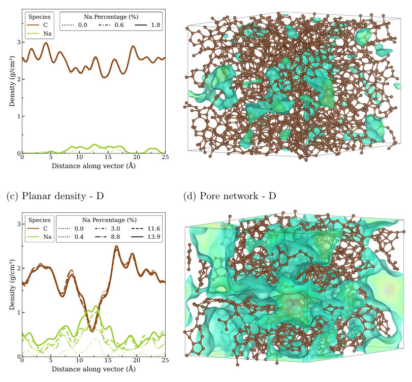 
FIG. 3: Density profile of hard carbon structures (a) A and (c) D for different levels of

📷 Fig 4

 
FIG. 4 presents the RAFFLE 2-body distribution functions for C–C, C–Na, and Na–Na

📷 Fig 5

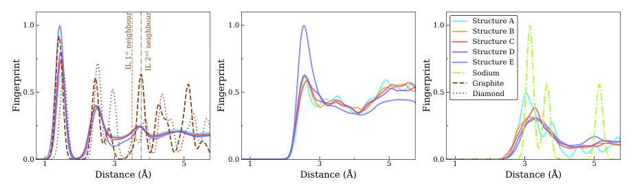 
FIG. 4: 2-body distribution functions for (a) C–C, (b) C–Na, and (c) Na–Na for structures

**Summary.** This work addresses the challenge of designing high-capacity hard carbon anodes for sodium-ion batteries by creating a scalable computational workflow. It combines machine-learned potentials with structure generation to build a massive library of realistic carbon models. Crucially, it trains a neural network to predict the sodium storage capacity directly from the structure, allowing for rapid screening and the identification of optimal material designs.

**Why it may be interesting.** The application of machine learning (NNs) to predict macroscopic material properties (electrochemical capacity) from complex, disordered atomic structures is a prime example of ML-physics in action, relevant to understanding emergent behavior in disordered systems.

Detailed structure

**Main problem.** To develop a fundamental understanding and systematic design principles for high-capacity hard carbon anodes for sodium-ion batteries, overcoming the limitations of conventional atomistic methods in modeling complex, large-scale, disordered structures.

**Main result.** The developed framework successfully links hard carbon microstructure (density, porosity, pore morphology) to sodium-storage performance, identifying high-capacity candidates exceeding 800 mAh g-1.

**Method.** The study combines machine-learned interatomic potentials with a structure-generation framework, and then trains a lightweight neural-network surrogate to predict electrochemical capacity directly from the host structure.

**Model / system.** The system is hard carbon, a disordered carbon material used as an anode for sodium-ion batteries. The modeling involves generating large libraries of structures using MLIPs and predicting performance using a trained Neural Network (NN) surrogate model.

**Key observables.** Sodium storage capacity (mAh g-1), voltage profiles (V vs Na/Na+), carbon density, and $sp^3$ bonding fractions.

**Important parameters / regimes.** Porosity, carbon density (especially the threshold $\leq 2 	ext{ g cm}^{-3}$), and the $sp^3$ fraction are key structural descriptors.

**Assumptions / limitations.** The primary assumption is that the NN surrogate model can accurately predict the complex electrochemical performance based solely on structural descriptors, bypassing computationally prohibitive full intercalation calculations for the entire library.

**Figures summary.** Not specified, but the notes reference structural property summaries and validation plots comparing NN predictions to explicit calculations.

**Paper structure.** The paper follows a structure of (1) defining the physical problem and limitations of current methods, (2) proposing a combined MLIP/RAFFLE workflow for structure generation, (3) developing and training a NN surrogate model using structural and geometric descriptors, and (4) validating the model by predicting and identifying high-performance candidates.

Abstract

Hard carbons are established anodes for lithium-ion batteries and leading candidates for sodium-ion batteries, yet their electrochemical performance is governed by a heterogeneous network of graphitic domains, defects, and nanopores that conventional atomistic methods cannot model at the required length scales. We combine universal machine-learned interatomic potentials with the RAFFLE structure-generation framework to construct 13,096 realistic hard carbon models containing up to 4,378 atoms, matching experimentally measured densities, porosities, and sp$^2$/sp$^3$ bonding fractions. Explicit sodium intercalation of representative structures reproduces the characteristic sloping-to-plateau voltage profiles, revealing that capacity increases with decreasing carbon density and increasing porosity. To screen the full library, we train a lightweight neural-network surrogate that predicts capacity directly from the host using frozen universal-potential descriptors augmented by geometric void features. The surrogate identifies high-capacity candidates exceeding 800 mAh g$^{-1}$, which are validated by full intercalation calculations. This scalable framework links hard carbon microstructure to sodium-storage performance and provides atomistic design principles for high-capacity anodes. More broadly, the workflow enables systematic exploration of synthesis-dependent amorphous microstructures, including precursor chemistry, pyrolysis, heteroatom doping, and pore engineering, providing a route toward atomistically informed hard carbon design.

[↑ back to top](#top)

### [Bridging ambient- and high-pressure superconductivity in La$_2$LnNi$_2$O$_7$ films](http://arxiv.org/abs/2608.17745v1)

**Authors:** Motoki Osada, Chieko Terakura, Shusaku Imajo, Jean-Baptiste Morée, Akiko Kikkawa, Masamichi Nakajima, Hsiao-Yi Chen, Yusuke Nomura, Koichi Kindo, Ryotaro Arita, Yoshinori Tokura, Atsushi Tsukazaki  
**Type:** both · **Category:** strongly correlated electrons · **PDF:** <https://arxiv.org/pdf/2608.17745v1>  
**Analysis basis:** full PDF text, analyzed in chunks

📷 Fig 1

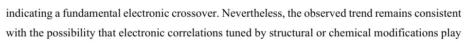 
Figure 2f and g show the in-plane upper critical field Hc2||ab and out-of-plane upper critical field

📷 Fig 2

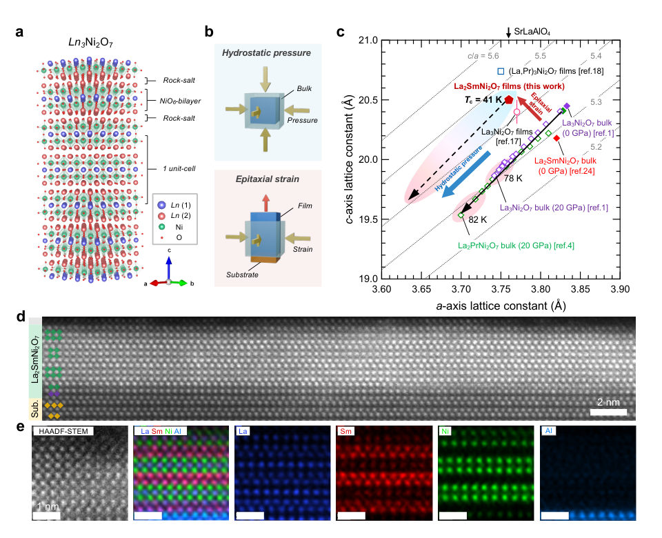 
Fig. 1 | Crystalline lattices of superconducting bilayer nickelates and characterization of La2SmNi2O7 thin films. a, crystal structure of La2LnNi2O7. b, top and bottom panel shows sample schematics under hydrostatic pressure (top) and epitaxial strain (bottom). c, the relation between c-axis and a-axis lattice constants for bulk values in previous studies1,4,24 and the value of thin films17,18. Broken lines correspond to the c/a ratio. Arrows indicate the lattice squeezing under pressure. Note that two schematic trajectories are expected for pressurized films: evolution at nearly constant c/a, and convergence of c/a toward ~5.3 due to substrate constraint. d, high- resolution HAADF-STEM...

📷 Fig 3

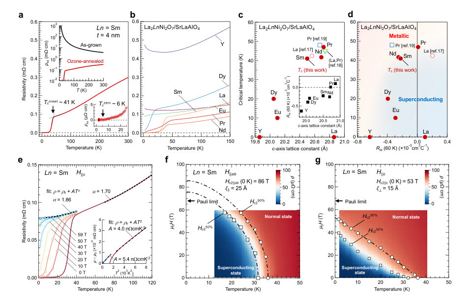 
Fig. 2 | Superconductivity of La2LnNi2O7 films at ambient pressure. a, Temperature dependence of resistivity of La2SmNi2O7 film. The top inset shows the logarithmic scale of resistivity of the film before and after ozone annealing. The bottom inset shows a low-temperature resistivity of the film indicating zero resistance at approximately 6 K. b, Temperature dependence of resistivity for the La2LnNi2O7 films (Ln = La, Pr, Nd, Sm, Eu, Dy, Y). c, Superconducting transition temperature as a function of c-axis lattice constant. Closed red circles are the data in this study and open symbols are the data in previous studies17,18,19. The inset shows the Hall coefficient at 60 K, RH (60 K), as a...

📷 Fig 4

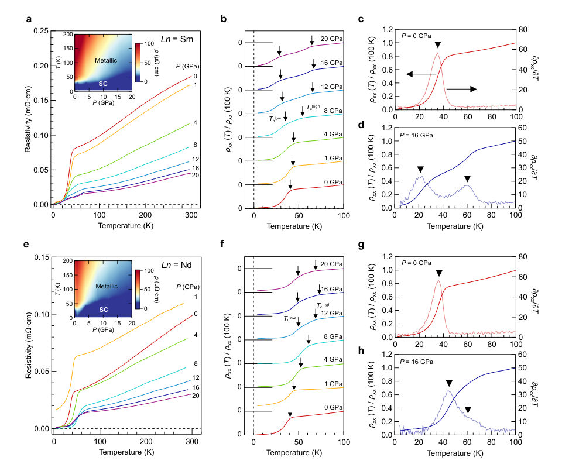 
Fig. 3 | Superconductivity of La2LnNi2O7 film under high pressure. a, Temperature dependence of resistivity under high pressure up to 20 GPa for Ln = Sm. The inset is a color map of resistivity as a function of temperature and pressure. b, The magnified resistivity data below 100 K for Ln = Sm. The arrows correspond to the transition temperature. c and d, The normalized resistivity at 100 K (left axis) and the temperature-dependent deviation of resistivity (right axis) of La2SmNi2O7 films under 0 and 16 GPa, respectively. Triangles indicate resistive transitions. e, Temperature dependence of resistivity under high pressure up to 20 GPa for Ln = Nd. f, The magnified resistivity data below...

📷 Fig 5

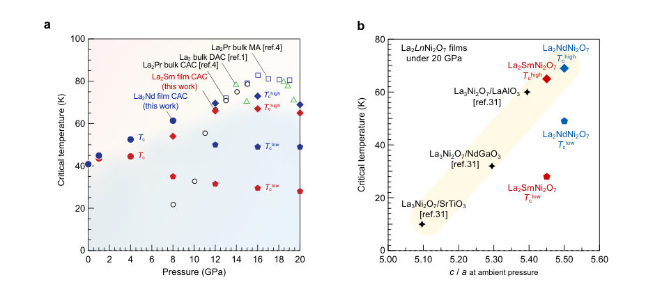 
Fig. 4 | Pressure phase diagram of superconducting La2LnNi2O7 films. a, Transition temperature of La2SmNi2O7 and La2NdNi2O7 films as a function of pressure. Closed symbols are the data in this study and open symbols are that in previous studies1,4. DAC, CAC, and MA denote a diamond-anvil cell, cubic-anvil cell, and multi-anvil, respectively. b, The critical temperatures of Tchigh (closed diamonds) and Tclow (closed pentagons) for Ln = Sm (red markers) and Nd (blue markers) under 20 GPa as a function of ambient-pressure c/a ratios. Diamonds (black markers) are the data of La3Ni2O7 films grown on SrTiO3, NdGaO3, and LaAlO3 substrates under 20 GPa (Ref.31).

**Summary.** This study systematically investigates how superconductivity in nickelate films is affected by external pressure and chemical substitution. By combining high-pressure/high-field transport measurements with DFT calculations, the authors establish a strong correlation between lattice structure, orbital energy levels, and the enhancement of the superconducting critical temperature.

**Why it may be interesting.** The work provides a detailed, multi-faceted approach linking macroscopic transport measurements (P, B) to microscopic electronic structure calculations (DFT, Wannier orbitals), which is highly relevant for understanding correlated electron behavior in novel superconducting materials.

Detailed structure

**Main problem.** The study aims to bridge the understanding of high-temperature superconductivity in bilayer nickelates ($	ext{La}_2	ext{LnNi}_2	ext{O}_7$) between ambient and high-pressure regimes.

**Main result.** Superconductivity is enhanced under high pressure (up to 73 K at 16 GPa), and both ambient and high-pressure $T_c$ correlate with the evolution of normal-state transport behavior ($
ho \propto T^a$) and structural changes.

**Method.** The research combines experimental measurements (resistivity under high magnetic fields and high pressure) with theoretical calculations using Density Functional Theory (DFT) to model the electronic structure.

**Model / system.** The system is the bilayer nickelate $	ext{La}_2	ext{LnNi}_2	ext{O}_7$ film. The electronic structure is modeled using a low-energy effective Hamiltonian derived from Wannier orbitals spanning the $	ext{Ni}3d$ and $	ext{O}2p$ bands, focusing on the interplay between $d_{x^2-y^2}$ and $d_{3z^2-r^2}$ orbitals.

**Key observables.** Superconducting critical temperature ($T_c$), normal-state resistivity exponent ($a$), lattice parameters ($c/a$ ratio), and orbital energy differences ($\Delta E$).

**Important parameters / regimes.** High pressures (up to 20 GPa), high magnetic fields (up to 59 T), and the lanthanide element ($	ext{Ln}$) substitution.

**Assumptions / limitations.** The analysis assumes that structural changes (pressure or substitution) directly modulate the electronic correlations governing superconductivity, as captured by the DFT model.

**Figures summary.** Figures illustrate the structural dependence of $T_c$ on lattice constants, the evolution of the normal-state resistivity exponent ($a$) with pressure, and DFT results showing band structures and Fermi surfaces under different compression levels.

**Paper structure.** The paper systematically investigates transport properties under extreme conditions (high P/B) and uses DFT to model the underlying electronic physics, correlating changes in orbital character and lattice structure to the superconducting transition temperature.

Abstract

The discovery of high critical-temperature $T_{\mathrm{c}}$ superconductivity near 80 K in bilayer nickelates under high pressure has sparked extensive studies. While superconductivity exceeding 40 K was subsequently discovered at ambient pressure in compressively strained films, the relationship between ambient- and high-pressure regimes remains an open question. Here we present a systematic investigation of superconductivity in compressively strained La$_2$LnNi$_2$O$_7$ films (Ln = lanthanides) at ambient and high pressures. The normal-state resistivity at ambient pressure, revealed by suppressing superconductivity with magnetic fields of 59 T, tends toward $T^2$ behaviour. Under high pressure in a cubic-anvil cell, $T_{\mathrm{c}}$ was enhanced from 41-42 K at ambient pressure to 67-73 K at 16 GPa. On the other hand, lattice compression induced by Ln substitution, which may mimic effects of pressure, lowers $T_{\mathrm{c}}$. In both cases, $T_{\mathrm{c}}$ correlates with the evolution of normal-state transport between $T^2$ and $T$-linear behaviour, offering insight into the interplay between lattice structure and superconductivity in bilayer nickelates.

[↑ back to top](#top)

### [Entanglement assisted quantum $(r,δ)$-locally recoverable codes](http://arxiv.org/abs/2608.17118v1)

**Authors:** Carlos Galindo, Fernando Hernando, Helena Martín-Cruz, Ryutaroh Matsumoto  
**Type:** theory · **Category:** quantum information and computing · **PDF:** <https://arxiv.org/pdf/2608.17118v1>  
**Analysis basis:** full PDF text, analyzed in chunks

📷 Fig 1

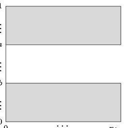 
Figure 1. Sets ∆a,b and ∆σ a,b in Proposition 4.1

**Summary.** This paper introduces the framework for entanglement-assisted quantum locally recoverable codes, generalizing existing quantum error-correcting codes. It derives necessary and sufficient conditions for these codes and constructs optimal examples using established classical code families. This advances the theoretical understanding of quantum information protection against localized erasures.

**Why it may be interesting.** This work provides advanced theoretical tools for quantum information security, directly relevant to designing robust quantum communication channels against localized noise.

Detailed structure

**Main problem.** The paper aims to develop and characterize entanglement-assisted quantum $(r, \delta)$-locally recoverable codes (EA $(r, \delta)$-QLRCs).

**Main result.** The authors establish necessary and sufficient conditions for these codes and construct optimal pure EA $(r, \delta)$-QLRCs using known classical code families like BCH and J-affine variety codes.

**Method.** The methodology involves establishing theoretical bounds, deriving necessary and sufficient conditions based on algebraic structures (Euclidean/Hermitian inner products), and providing explicit constructions parameterized by classical code properties.

**Model / system.** The model is Quantum Error-Correcting Codes (QECCs) designed to protect quantum states from local erasures, generalized by incorporating entanglement assistance via receiver-held qudits.

**Key observables.** Code parameters like $[[n, k, d; c]]_q$, and the locality parameters $(r, \delta)$ defining the error correction capability.

**Important parameters / regimes.** The locality parameters $(r, \delta)$, the number of entangled pairs ($c$), and the underlying finite field structure ($\mathbb{F}_q$).

**Assumptions / limitations.** The local recovery operation is assumed to be assisted by receiver-held qudits that remain unaffected by erasures.

**Paper structure.** The paper builds from background material on classical and quantum LRCs, formalizes the EA $(r, \delta)$-QLRC framework, derives necessary and sufficient conditions, and concludes with explicit constructions of optimal codes from various classical code families.

Abstract

Quantum $(r,δ)$-locally recoverable codes are quantum error-correcting codes capable of correcting $δ-1$ qudit erasures within one subset of qudits of cardinality at most $r+δ-1$. In this paper, we introduce the more general framework of entanglement-assisted quantum $(r,δ)$-locally recoverable codes, assuming that the local recovery operation is assisted by receiver-held qudits that remain unaffected by erasures.   We establish necessary and sufficient conditions for these codes to satisfy this property. For codes derived from Hermitian or Euclidean constructions, we establish connections between entanglement-assisted quantum and classical notions of $(r,δ)$-local recoverability, and derive a Singleton-like bound. Furthermore, we construct optimal pure entan\-gle\-ment-assisted quantum $(r,δ)$-locally recoverable codes from several families of classical codes, including bivariate $J$-affine variety codes, BCH codes, and homothetic-BCH codes.

[↑ back to top](#top)

### [Exact certification of a positive-order Rényi additivity violation for an explicit channel pair](http://arxiv.org/abs/2608.17376v1)

**Authors:** Artus Krohn-Grimberghe  
**Type:** theory · **Category:** quantum information and computing · **PDF:** <https://arxiv.org/pdf/2608.17376v1>  
**Analysis basis:** full PDF text, analyzed in chunks

📷 Fig 1

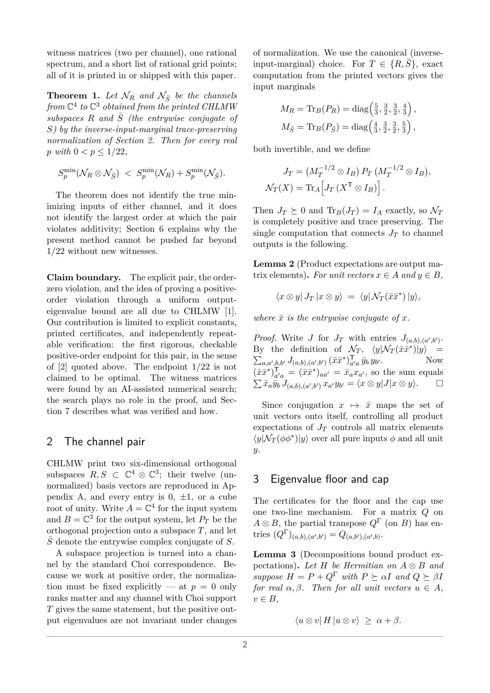 
Low-resolution page preview, page 2

📷 Fig 2

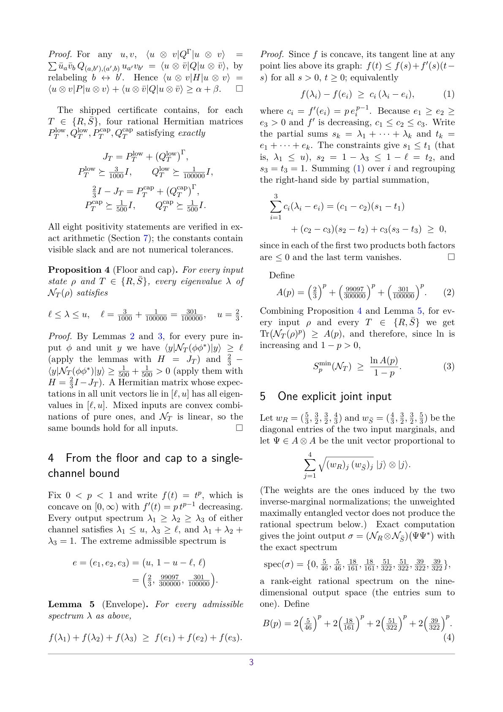 
Low-resolution page preview, page 3

📷 Fig 3

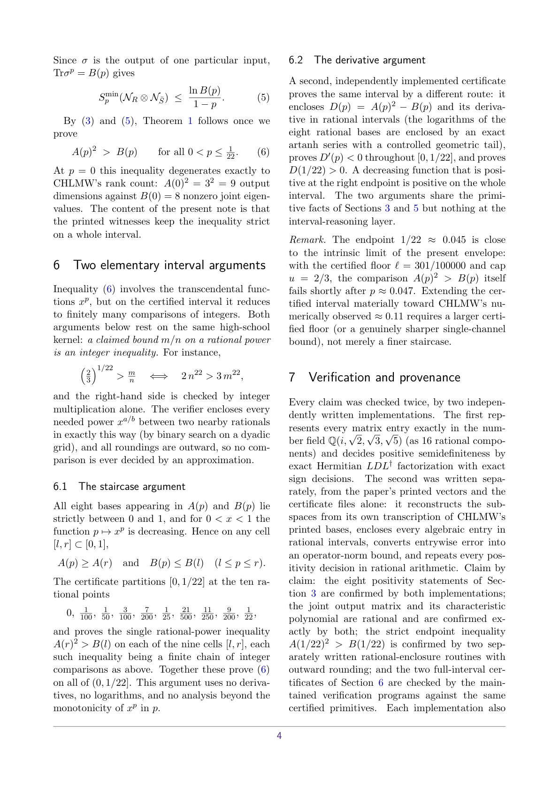 
Low-resolution page preview, page 4

📷 Fig 4

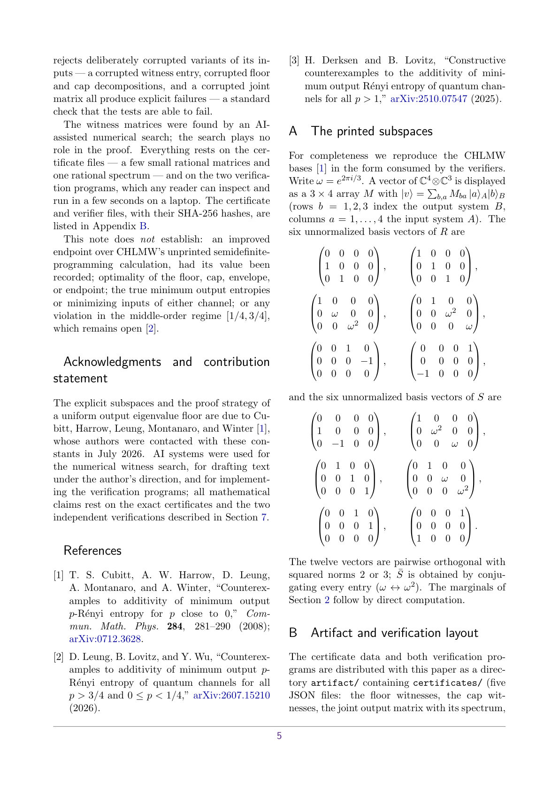 
Low-resolution page preview, page 5

📷 Fig 5

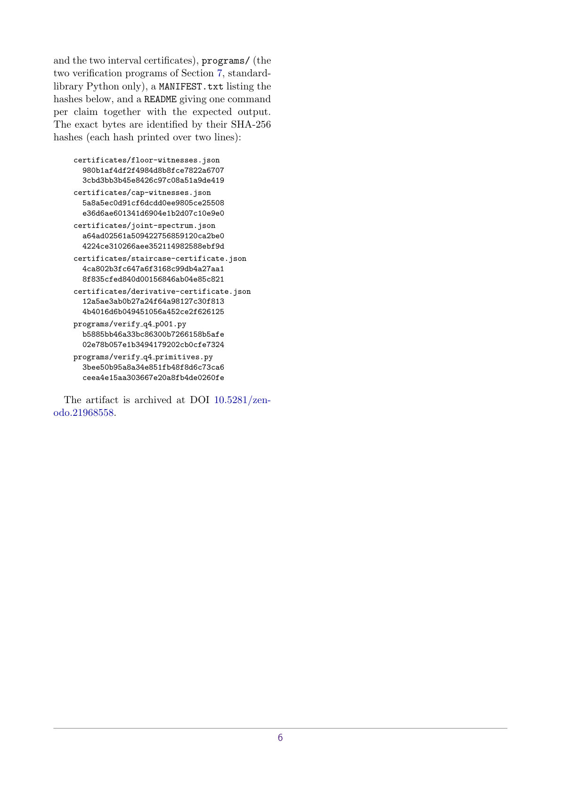 
Low-resolution page preview, page 6

**Summary.** This paper rigorously proves a positive-order violation of Rényi additivity for a known pair of quantum channels. By developing two independent, computationally verifiable methods, the authors establish a certified interval ($0 < p \le 1/22$) for this violation. This work significantly advances the theoretical understanding of quantum channel properties by providing a concrete, checkable mathematical certificate.

**Why it may be interesting.** This work provides a highly rigorous, computationally verifiable certificate for a fundamental quantum information phenomenon (Rényi additivity violation), which is crucial for understanding the limits of quantum channel capacity.

Detailed structure

**Main problem.** To provide the first printed, computer-verifiable certified positive-order endpoint for the violation of Rényi additivity for a specific pair of quantum channels.

**Main result.** The authors prove a strict violation of Rényi additivity, $S_p^{\min}(N_R\otimes N_{ar S}) < S_p^{\min}(N_R)+S_p^{\min}(N_{ar S})$, for the interval $0 < p \le 1/22$.

**Method.** The proof uses elementary, certificate-based methods, including staircase arguments and derivative analysis, relying on comparisons of integers to establish the required inequality.

**Model / system.** The study concerns two explicit quantum channels, $N_R$ and $ar{N}_S$, acting on specific subspaces derived from the CHLMW example.

**Key observables.** Minimum output Rényi entropy, $S_{\min}^p(N) = \min_{
ho} S_p(N(
ho))$, and the additivity inequality.

**Important parameters / regimes.** The violation is certified for the order $0 < p \le 1/22$.

**Assumptions / limitations.** The proof relies on establishing the inequality $A(p)^2 > B(p)$ for the specified interval, and the endpoint $1/22$ is not claimed to be optimal.

**Paper structure.** The paper establishes the problem by referencing previous work, then uses eigenvalue bounds and concavity arguments to set up the core inequality, which is finally proven using two independent, rigorous methods (staircase and derivative) to certify the interval $(0, 1/22]$.

Abstract

Cubitt, Harrow, Leung, Montanaro, and Winter (CHLMW) exhibited an explicit pair of quantum channels whose minimum output Rényi entropy is nonadditive at order zero, and reported numerical violations at positive orders close to zero. Their paper states that a semidefinite-programming argument yields a rigorous positive-order interval for the same example, without printing the endpoint or a verifiable certificate; a recent paper by Leung, Lovitz, and Wu records that for this pair "no rigorous endpoint was obtained". We close that gap for the trace-preserving normalization of the printed pair fixed in Section 2. Small rational witness matrices prove that every output of either channel has all eigenvalues between $301/100000$ and $2/3$; a single explicit entangled input has an exact rational joint output spectrum of rank eight; and two independent elementary interval arguments turn these three facts into a proof of strict additivity violation, $S_p^{\min}(\mathrm{N}_R\otimes\mathrm{N}_{\bar S}) < S_p^{\min}(\mathrm{N}_R)+S_p^{\min}(\mathrm{N}_{\bar S}),$ for every real order $0<p\le 1/22$. Every step of the verification reduces to comparisons of integers, and the complete certificate is a few small rational matrices that a reader can check with a short program -- or, for any single order, by hand. To our knowledge, consistent with the assessment of Leung, Lovitz, and Wu, this is the first printed, computer-verifiable certified positive-order endpoint for this explicit pair. We claim no novelty for the phenomenon or for the eigenvalue-floor mechanism, both due to CHLMW, and no optimality of the endpoint.

[↑ back to top](#top)

### [Fixed-particle-number optimizers for the Lieb--Oxford inequality](http://arxiv.org/abs/2608.17155v1)

**Authors:** Matthew Rosenzweig  
**Type:** theory · **Category:** statistical mechanics · **PDF:** <https://arxiv.org/pdf/2608.17155v1>  
**Analysis basis:** full PDF text, analyzed in chunks

📷 Fig 1

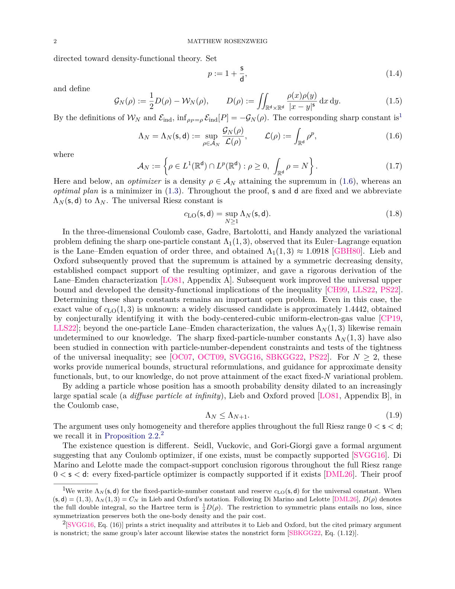 
Low-resolution page preview, page 2

📷 Fig 2

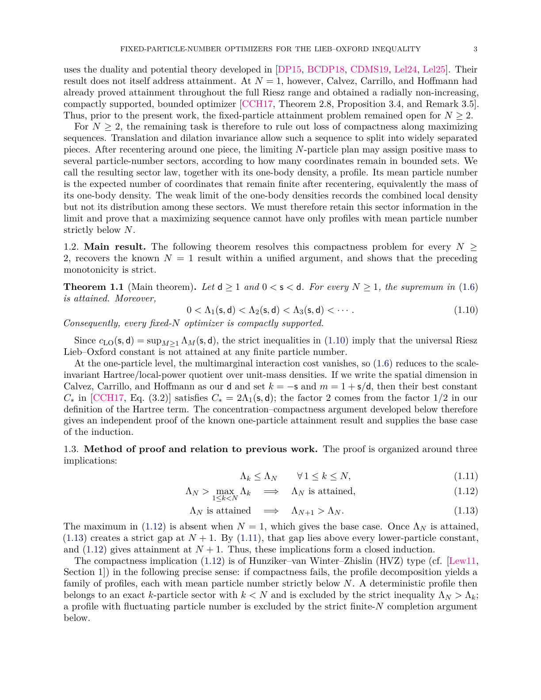 
Low-resolution page preview, page 3

📷 Fig 3

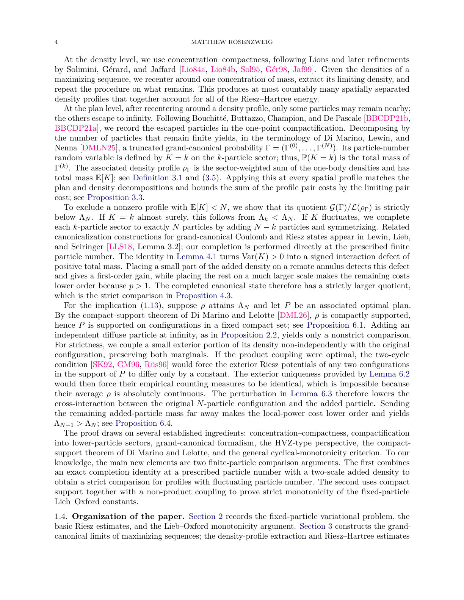 
Low-resolution page preview, page 4

📷 Fig 4

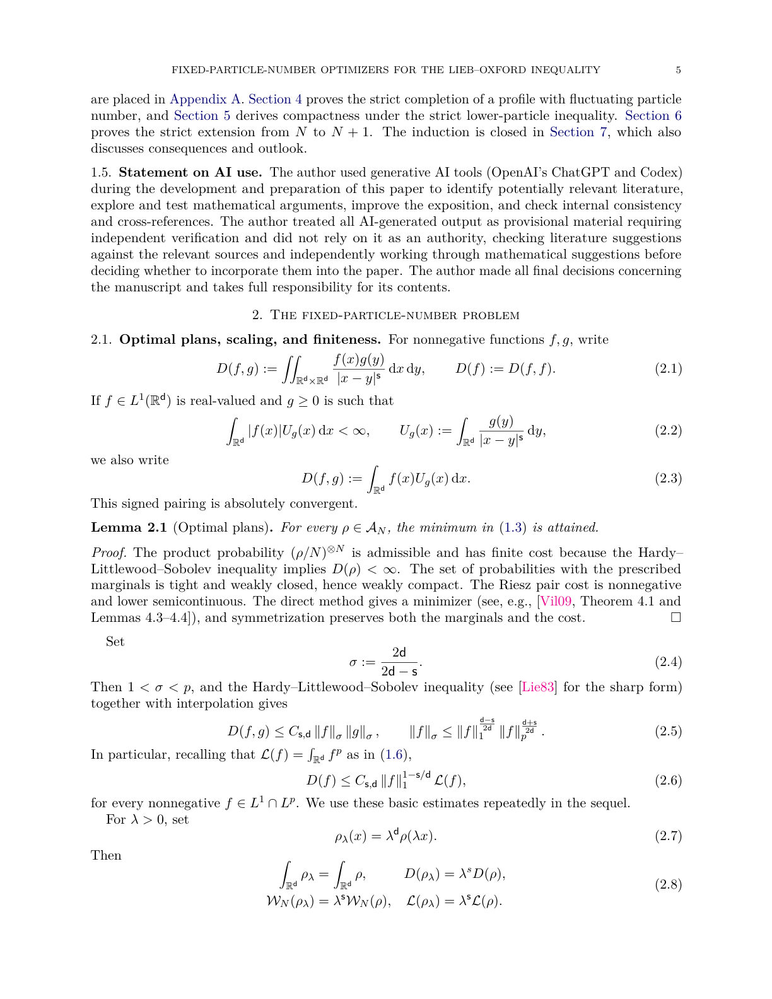 
Low-resolution page preview, page 5

📷 Fig 5

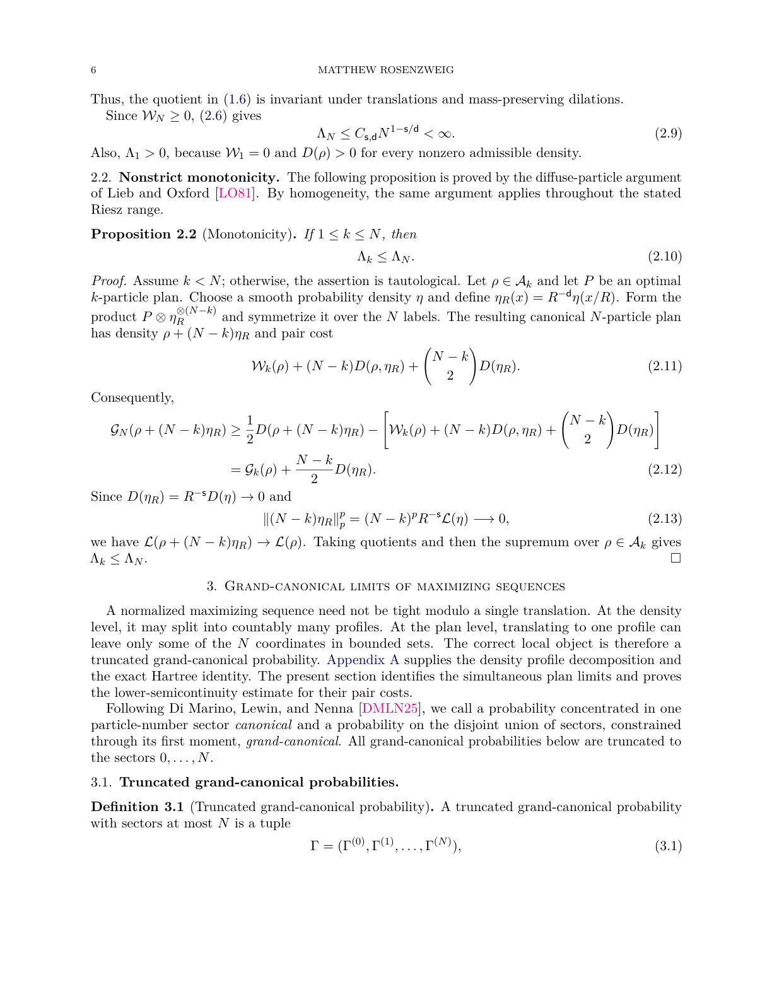 
Low-resolution page preview, page 6

**Summary.** This paper rigorously solves for the optimal fixed-particle-number constant in the Riesz Lieb--Oxford inequality. By establishing strict monotonicity ($\Lambda_{N+1} > \Lambda_N$) through advanced techniques involving concentration-compactness, it proves that the optimal constant is never achieved at any finite particle number. This provides a deep mathematical understanding of the scaling behavior of quantum many-body energy bounds.

**Why it may be interesting.** The rigorous mathematical treatment of optimal constants in many-body quantum systems, particularly those involving interaction potentials like the Riesz potential, is crucial for understanding ground state properties in quantum matter.

Detailed structure

**Main problem.** The paper determines the optimal fixed-particle-number constant $\Lambda_N(s, d)$ in the Riesz Lieb--Oxford inequality.

**Main result.** It proves that $\Lambda_N$ is attained for all $N \ge 1$ and establishes strict monotonicity: $\Lambda_1 < \Lambda_2 < \Lambda_3 < \cdots$.

**Method.** The proof combines grand-canonical concentration--compactness techniques with a strict one-particle extension, forming an inductive argument.

**Model / system.** The analysis concerns symmetric probability measures $P$ on $(\mathbb{R}^d)^N$, relating the indirect Riesz energy $	ext{Eind}[P]$ to the multimarginal optimal-transport cost $W_N(
ho)$.

**Key observables.** The optimal constant $\Lambda_N(s, d)$, the one-body density $
ho$, and the associated energy functionals $G_N(
ho)$ and $L(
ho)$.

**Important parameters / regimes.** Spatial dimension $d \ge 1$, interaction exponent $0 < s < d$, and the fixed particle number $N \ge 1$.

**Assumptions / limitations.** The analysis relies on established results like the compact-support theorem of Di Marino and Lelotte, and the ability to analyze maximizing sequences via recentering.

**Paper structure.** The structure follows an inductive proof: first establishing attainment for fixed $N$, then using the compact-support theorem to prove the strict inequality $\Lambda_{N+1} > \Lambda_N$, thereby closing the induction from $N=1$.

Abstract

Let $\mathsf{d}\geq1$, $0<\mathsf{s}<\mathsf{d}$, and $N\geq1$. We prove that the optimal fixed-particle-number constant $Λ_N(\mathsf{s},\mathsf{d})$ in the Riesz Lieb--Oxford inequality is attained and that these constants are strictly increasing in $N$. The proof combines grand-canonical concentration--compactness with a strict one-particle extension. After recentering, a limiting plan arising from a maximizing sequence may assign positive probability to several particle numbers and hence be grand-canonical. A strict $N$-particle completion excludes this case, while the inequalities $Λ_N>Λ_k$ for $k<N$ exclude limits with a fixed lower particle number. Once attainment at particle number $N$ is known, the compact-support theorem of Di Marino and Lelotte arXiv:2607.11440, valid for all $0<\mathsf{s}<\mathsf{d}$, permits a non-product one-particle extension and yields $Λ_{N+1}(\mathsf{s},\mathsf{d})>Λ_N(\mathsf{s},\mathsf{d})$. Together, these implications close an induction beginning at $N=1$.

[↑ back to top](#top)

### [Gaussian Optimality of Energy-Constrained One-Shot Communication through Single-Mode Bosonic Gaussian Channels](http://arxiv.org/abs/2608.17239v1)

**Authors:** Se-Wan Ji  
**Type:** theory · **Category:** quantum information and computing · **PDF:** <https://arxiv.org/pdf/2608.17239v1>  
**Analysis basis:** full PDF text, analyzed in chunks

📷 Fig 1

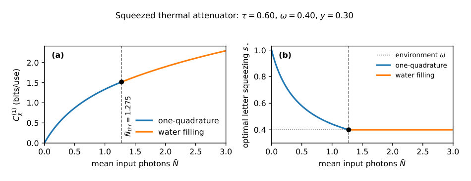 
Figure 1: Exact unrestricted one-shot capacity for a genuinely thermal phase-sensitive attenuator: τ = 0.60, ω = 0.40, and y = 0.30 &gt; |1 −τ|/2 = 0.20. (a) The low-energy one-quadrature branch joins water filling at ¯Nthr = 1.275. (b) The optimizing letter squeeze decreases continuously from the vacuum value toward the environment squeeze and locks to s⋆= ω at threshold. The curves use Eqs. (19)–(21); the Supplemental Material gives representative values and the numerical reproduction procedure.

**Summary.** This paper rigorously proves that the one-shot Holevo capacity for single-mode bosonic Gaussian channels, subject to an energy constraint, is achieved by Gaussian states. By employing advanced optimization techniques and continuity arguments, the authors establish exact formulas for the capacity across all operational regimes. This result is vital for understanding the fundamental limits of quantum information transmission through linear bosonic channels.

**Why it may be interesting.** This work provides fundamental, exact capacity formulas for continuous-variable quantum channels, which are crucial for designing high-rate quantum communication protocols in quantum optics.

Detailed structure

**Main problem.** The paper aims to prove Gaussian optimality for the energy-constrained one-shot Holevo capacity of single-mode bosonic Gaussian channels.

**Main result.** Gaussian optimality is proven for the energy-constrained one-shot Holevo capacity for all single-mode Gaussian channels, meaning the capacity is determined by Gaussian optimization techniques.

**Method.** The proof utilizes Gaussian optimization theorems, the Matsumoto–Shimono–Winter identity, and continuity arguments across different channel regimes (low-energy vs. high-energy).

**Model / system.** The system involves single-mode bosonic Gaussian channels, which model linear quantum communication links (e.g., optical or microwave). The analysis uses covariance matrices and Gaussian states.

**Key observables.** Holevo capacity ($\chi$), Entanglement of Formation ($EF$), and the energy constraint ($	ext{Tr} 
ho \hat{N} \le ar{N}$).

**Important parameters / regimes.** The analysis distinguishes between low-energy and high-energy (water-filling) regimes, and the result is explicitly for one-shot communication.

**Assumptions / limitations.** The result is strictly for one-shot communication and does not assume additivity across multiple channel uses.

**Figures summary.** Figure 1 illustrates the exact unrestricted one-shot capacity for a phase-sensitive attenuator, showing the low-energy branch joining the water-filling regime at a specific threshold.

**Paper structure.** The paper builds the proof by establishing bounds ($	ext{disp} \le \chi_G \le \chi$) and then using continuity arguments across the parameter space of single-mode Gaussian channels to show the equality of these bounds.

Abstract

We prove Gaussian optimality for the energy-constrained one-shot Holevo capacity of single-mode bosonic Gaussian channels, including phase-sensitive channels with arbitrarily squeezed thermal noise. The unresolved regime is the low energy branch, where the Gaussian optimizer modulates only one quadrature and minimum-output-entropy arguments cannot decouple the average state from the letters. For pure one-mode dilations we retain a stronger pointwise result: moment-matched Gaussianization improves the fixed average Holevo function for every input. For mixed environments, whose purification produces a 1:2 entanglement-of-formation problem, we avoid any generic 1:2 Gaussian extremality conjecture. The optimal Gaussian letter selects an effective environmental Schmidt mode and an affine two-mode EPR witness. Its null direction is exactly the modulated quadrature, while its slope equals the negative derivative of the Gaussian letter-output entropy. This produces a supporting lower bound on the dilated entanglement of formation; Gaussian maximum entropy and concavity then give a global upper bound tangent at the Gaussian optimizer. Consequently the known Gaussian formulas for attenuating, amplifying, phase-conjugating, and additive-noise fiducial channels are exact over unrestricted ensembles at every input energy. Via the passive-input fiducial decomposition and energy-constrained continuity, the result extends to every single-mode Gaussian channel, including lower-rank canonical limits. No additivity across channel uses is assumed.

[↑ back to top](#top)

### [Hardness of approximation for minimum-weight decoding of two-dimensional topological quantum codes](http://arxiv.org/abs/2608.17109v1)

**Authors:** Louay Bazzi, Georges Khater  
**Type:** theory · **Category:** quantum information and computing · **PDF:** <https://arxiv.org/pdf/2608.17109v1>  
**Analysis basis:** full PDF text, analyzed in chunks

📷 Fig 1

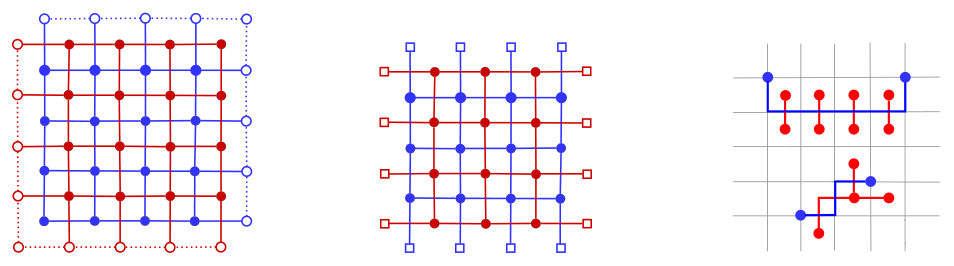 
Figure 1: (a) Primal and dual lattices of the [[2L2, 2, L]] toric code for L = 4. The primal lattice is shown in blue and the dual lattice in red. Vertices and edges identified with those on the opposite side are shown as unfilled circles and dashed lines, respectively. (b) Primal and dual lattices of the [[2L2 −2L + 1, 1, L]] planar surface code for L = 4. The boundary vertices are shown as squares. (c) Example of an error. The error edges and the corresponding defects are shown on the primal lattice.

📷 Fig 2

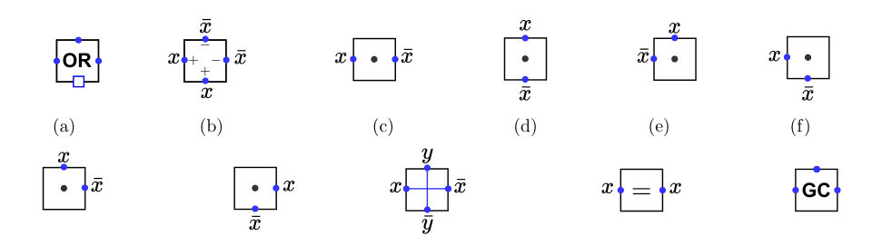 
Figure 2: Symbols for atomic gadgets. (a) Clause gadget; (b) Variable gadget; (c)–(h) Wire gadgets; (i) Crossing- wire gadget; (j) Equality gadget; (k) Garbage collection gadget.

📷 Fig 3

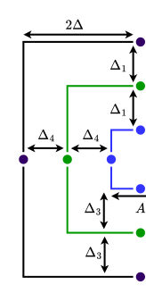 
Figure 3: General atomic gadget structure.

📷 Fig 4

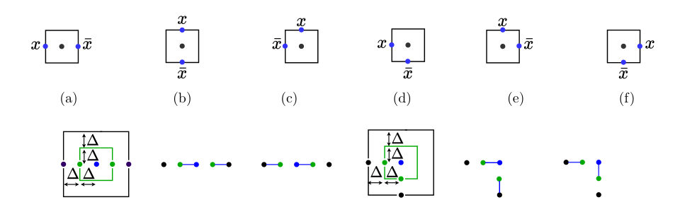 
Figure 4: Wire gadgets. Parts (a)–(f) show the symbols of the six variants of the wire gadget. The structure of the first variant is shown in Part (g). Its nucleus consists of a single primal defect. The two signatures of this gadget, together with their corresponding minimum-weight joins, are shown in parts (h) and (i). Both have cost 2∆. The structure of the variant shown in Part (d) is illustrated in Part (j), while its two signatures are shown in Parts (k) and (l). The remaining variants are constructed analogously.

📷 Fig 5

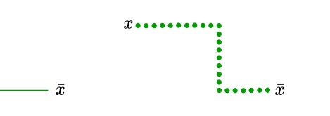 
Figure 5: Wire example.

**Summary.** This paper analyzes the computational difficulty of decoding errors in topological quantum codes like the surface and color codes. By establishing strong inapproximability results based on 3SAT hardness, it proves that finding the minimum-weight error is computationally intractable for large systems. This work sets theoretical benchmarks for the required efficiency of quantum error correction decoding algorithms.

**Why it may be interesting.** The hardness results provide fundamental theoretical limits on the efficiency of quantum error correction decoding algorithms, which is crucial for designing practical fault-tolerant quantum computers.

Detailed structure

**Main problem.** The paper studies the computational complexity of minimum-weight decoding for various two-dimensional topological quantum codes.

**Main result.** Assuming P!=NP, the authors establish polynomial additive inapproximability gaps for decoding problems on surface codes and color codes, meaning these problems are hard to approximate efficiently.

**Method.** The core method involves developing a general framework to embed logical constraints into coupled primal-dual join problems on a lattice, using reductions from 3SAT and Håstad's hardness of approximation.

**Model / system.** The study focuses on topological quantum codes, specifically the surface code (planar and toric) and the 4.8.8 color code, which are used to protect quantum information.

**Key observables.** The minimum weight of the Pauli error consistent with syndrome measurements, and the resulting inapproximability gaps ($\Omega(N^{1/14})$ or $\Omega(N^{1/18})$).

**Important parameters / regimes.** N (the number of qubits), and the lattice structure parameters ($\Delta, \delta$) used in the geometric analysis of path weights.

**Assumptions / limitations.** The results are conditional on the assumption that P != NP.

**Figures summary.** Figures illustrate the geometric structures used in the proof, showing connections, double connections, and the regions (red/blue boxes) where primal and dual paths interact during the weight comparison analysis.

**Paper structure.** The paper establishes NP-hardness via reductions from 3SAT, then develops a modular framework for the Minimum-Weight Join problem, and finally applies this framework to derive specific inapproximability bounds for the toric, planar, and 4.8.8 codes.

Abstract

Efficient decoding is essential for the practical realization of fault-tolerant quantum computers. We study the computational complexity of minimum-weight decoding for topological quantum codes. For surface codes under the depolarizing channel, we consider Minimum-Weight decoding, which seeks a minimum-weight Pauli error consistent with both the $X$- and $Z$-syndromes. For color codes under independent $X$- and $Z$-error models, we consider Separate Minimum-Weight decoding.   Assuming $P\neq NP$, we establish polynomial additive inapproximability gaps for these problems. Specifically, for the toric code and the $4.8.8$ color code on the torus, no polynomial-time algorithm can always produce a solution whose weight is within $Ω(N^{1/14})$ of the optimum, where $N$ is the number of qubits. For the planar surface code, we obtain an $Ω(N^{1/18})$ gap. Our inapproximability results use Håstad's hardness of approximation for MAX-3SAT.   Our reduction develops a general, modular framework for embedding logical constraints into coupled primal--dual join problems on a lattice. A key ingredient is a localization argument that controls unintended interactions between different parts of the construction.

[↑ back to top](#top)

### [M-QAM MIMO Maximum-Likelihood Detection with QAOA: ML-Rate Offline Angle Design and Correlated Infinite-Size Spin-Glass Models](http://arxiv.org/abs/2608.17721v1)

**Authors:** Burhan Gülbahar  
**Type:** theory · **Category:** disordered systems and neural networks · **PDF:** <https://arxiv.org/pdf/2608.17721v1>  
**Analysis basis:** full PDF text, analyzed in chunks

📷 Fig 1

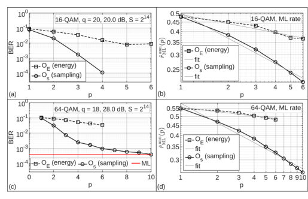 
Fig. 1. Identical-instance OE versus Os at S = 214. (a) exact best-of- S BER, 16-QAM (5 × 5) at 20 dB; (b) annealed rate ˆrann ML (p) for the same runs, with power-law fits; (c), (d) repeat (a), (b) for 64-QAM (3×3) at 28 dB, where the flat line in (c) is the exact-ML BER.

📷 Fig 2

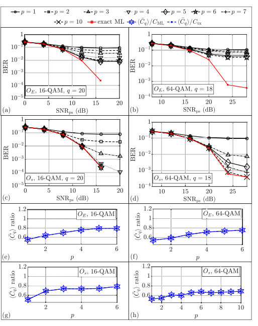 
Fig. 2. Paired OE and Os results at S = 214. BER vs. SNRps by depth: (a) OE at 16-QAM (5 × 5), (b) OE at 64-QAM (3 × 3), (c) and (d) for Os at the same two. (e)–(h) give the corresponding energy ratios ⟨¯Cq⟩/CML and ⟨¯Cq⟩/Ctx vs. p, in the same order, at 12 dB (16-QAM) and 20 dB (64-QAM).

📷 Fig 3

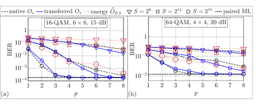 
Fig. 3. Paired q = 24 BER, three arms per panel: transferred Os from qref = 12 blue solid, natively designed at q = 24 black dashed (free search at p ≤4, four-parameter schedule at p ≥6); markers S = 29, 214, 218 and dotted lines same-instance ML floors. (a) 16-QAM (6 × 6), 15 dB; (b) 64- QAM (4×4), 20 dB; both packs designed at 13/25 dB, so both are off-design in SNR and the transferred pack also in size; red dotted adds the energy- designed b OE,b pack (qref = 12, 15/20 dB, at the deployed SNR).

📷 Fig 4

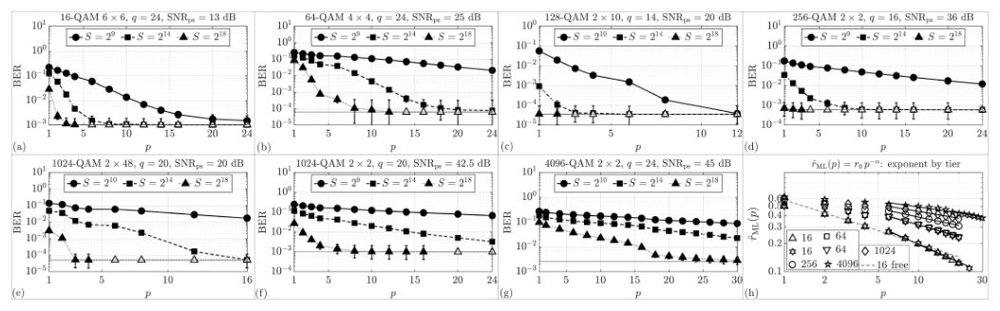 
Fig. 4. Native scheduled Os chains, exact-statevector best-of-S BER versus depth; thin lines are paired ML floors, open markers coincide numerically with them, bars are 95% intervals. (a) 16-QAM 6 × 6, q = 24, 13 dB; (b) 64-QAM 4 × 4, q = 24, 25 dB; (c) 128-QAM 2 × 10, q = 14, 20 dB; (d) 256-QAM 2×2, q = 16, 36 dB; (e) 1024-QAM 2×48, q = 20, 20 dB; (f) 1024-QAM 2×2, q = 20, 42.5 dB; (g) 4096-QAM 2×2, q = 24, 45 dB; (h) schedule-branch fits ˆrML(p) = r0 p−α by tier, with the 6 × 6 free-arm reference dashed. Chains minimize the ML rate under the four-parameter schedule at p ≥6.

📷 Fig 5

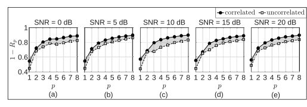 
Fig. 5. Transferred b OE,a 16-QAM packs trained at qref = 12: correlation- aware vs. variance-matched independent, shading their gap. (a)–(e) give 1 − Rp of (19) vs. p at q = 20 with SNRps = 0, 5, 10, 15, 20 dB.

**Summary.** This work tackles the difficult ML detection problem in high-dimensional M-QAM MIMO systems by formulating it as an Ising spin-glass model. The authors introduce a novel, size-scalable approach by using the ML rate—the exponential rate of the optimal solution—as the objective function to design QAOA parameters. This method shows superior performance compared to traditional energy-based quantum approaches.

**Why it may be interesting.** The connection between quantum optimization algorithms (QAOA) and complex physical detection problems (MIMO) via spin-glass theory is highly relevant. The use of the ML rate as a design parameter bridges quantum information theory with advanced signal processing.

Detailed structure

**Main problem.** The paper addresses the NP-hard problem of Maximum-Likelihood (ML) detection in M-QAM Multiple-Input Multiple-Output (MIMO) systems.

**Main result.** The authors develop a correlated infinite-size multi-species spin-glass framework and show that using the ML rate for QAOA angle design yields significant performance gains over energy-based designs.

**Method.** The methodology involves mapping the detection problem to an Ising cost function, developing a correlated spin-glass surrogate, and utilizing the ML rate as a novel, size-scalable objective for QAOA angle optimization.

**Model / system.** The system is an M-QAM MIMO channel, modeled by a cost function derived from minimizing the squared Euclidean distance between received and transmitted signals. This is mapped onto an Ising Hamiltonian structure, which is analyzed using correlated infinite-size spin-glass theory.

**Key observables.** ML Rate (exponential rate of sampling the ML string), Binary Error Rate (BER), and the energy density $\langlear{C}_q
angle/q$.

**Important parameters / regimes.** M-QAM constellation size (up to 4096-QAM), number of antennas (up to 128), and Signal-to-Noise Ratio (SNR) up to 45 dB.

**Assumptions / limitations.** The framework develops a correlated spin-glass surrogate, which is not mathematically proven to equal the true physical energy density limit, and the analysis relies on specific scaling assumptions for the infinite-size limit.

**Figures summary.** Figures compare performance metrics like SER across various detection methods (exact ML, offline design, WS pipelines) for different QAM constellations, demonstrating the advantage of the sampling-designed angles.

**Paper structure.** The paper first establishes the ML detection problem and its mapping to an Ising model. It then develops the correlated infinite-size spin-glass framework, proposing the ML rate as a novel angle design objective. Finally, it presents simulation results showing the superior performance of the ML-rate-guided QAOA approach.

Abstract

The quantum approximate optimization algorithm (QAOA) targets NP-hard maximum-likelihood (ML) detection in multiple-input multiple-output (MIMO) systems. Existing $M$-ary quadrature amplitude modulation (M-QAM) detectors design angles by expected Ising energy: online per instance, warm-started, or ramped, while train-once designs remain B/QPSK-only or block-local, leaving M-QAM without a size-scalable benchmark. Their infinite-size spin-glass theory assumes independent disorder, matching the retained covariances at B/QPSK but not M-QAM's correlated couplings and fields. We develop a correlated infinite-size multi-species spin-glass framework whose covariance-matched evaluators make that energy an offline objective with a size-scalable benchmark. In addition, the ML rate, the exponential rate of sampling the ML string, is for the first time exploited for QAOA angle design in MIMO detection. The energy evaluator is $q$-free at $O(p\,4^p)$ cost while the ML rate transfers angles from a fixed $q_{\rm ref}$-qubit reference. Tests reach 4096-QAM, 128 antennas, $p=30$ and per-symbol SNR 0-45 dB. In simulations, ML rates fall as a power law $r_0\,p^{-α}$, with larger exponents for the sampling design, which tracks exact ML at $5\times5$ 16-QAM (0-20 dB) and $3\times3$ 64-QAM (8-28 dB) while its bit-error rate (BER) advantage widens with SNR to two orders of magnitude. The approach points toward near-optimum decoding on deeper noiseless fault-tolerant quantum (FTQ) circuits.

[↑ back to top](#top)

### [Near-unit-root persistence of symmetric stable autoregressive sequences](http://arxiv.org/abs/2608.17927v1)

**Authors:** José Ricardo G. Mendonça, Boubaker Smii  
**Type:** theory · **Category:** statistical mechanics · **PDF:** <https://arxiv.org/pdf/2608.17927v1>  
**Analysis basis:** full PDF text, analyzed in chunks

📷 Fig 1

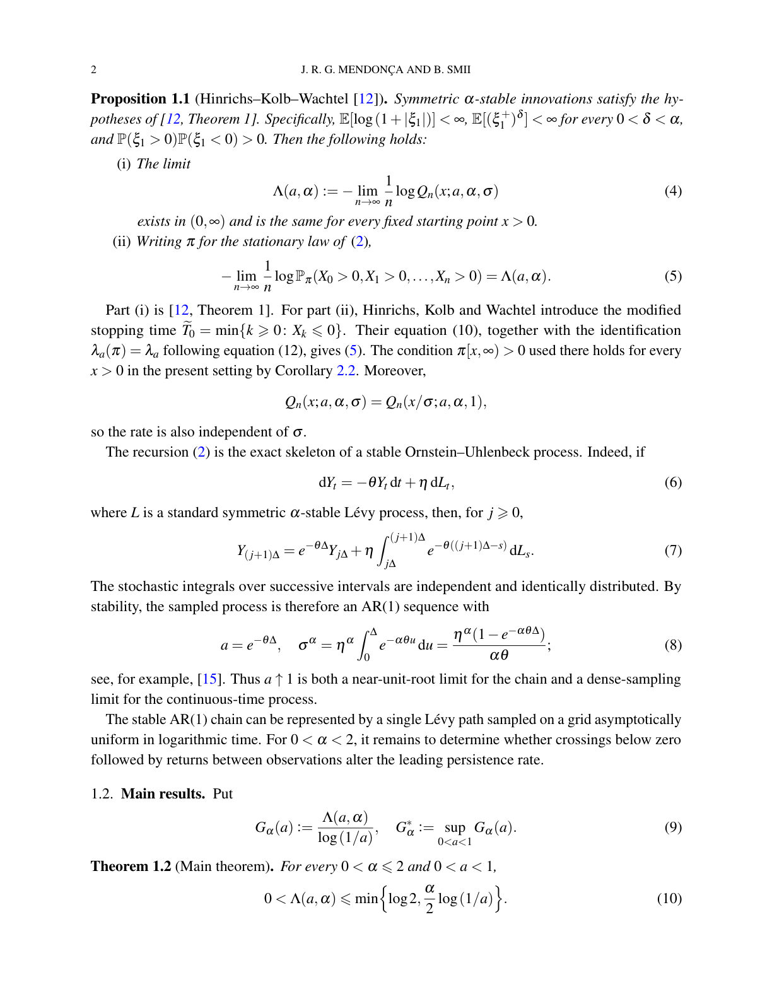 
Low-resolution page preview, page 2

📷 Fig 2

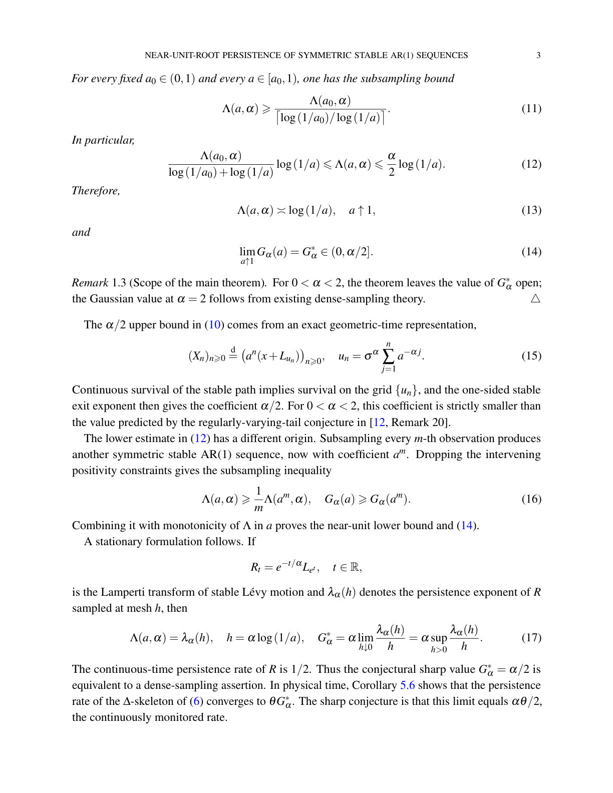 
Low-resolution page preview, page 3

📷 Fig 3

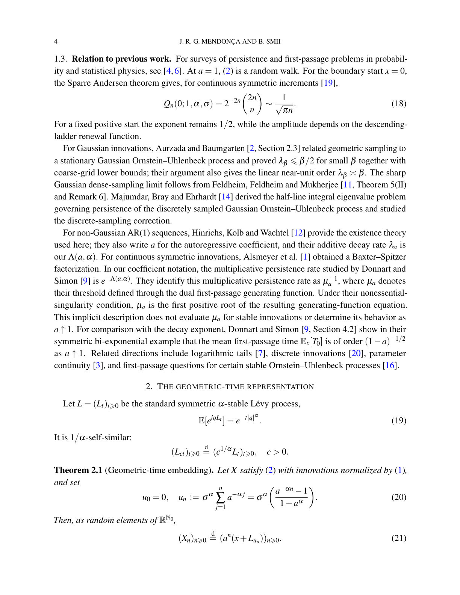 
Low-resolution page preview, page 4

📷 Fig 4

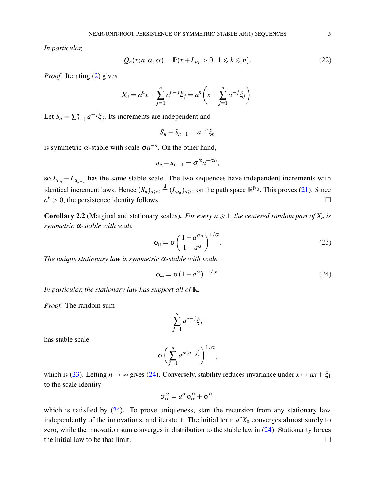 
Low-resolution page preview, page 5

📷 Fig 5

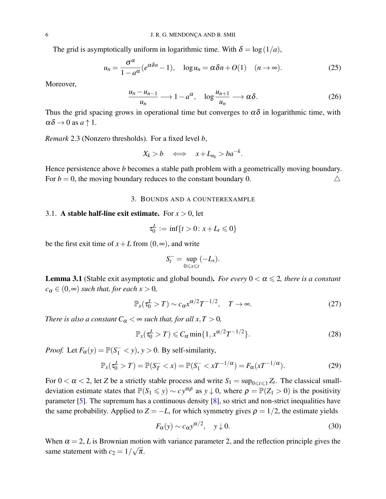 
Low-resolution page preview, page 6

**Summary.** This paper rigorously analyzes the decay rate of the probability that a symmetric $\alpha$-stable AR(1) sequence remains positive over time as the autoregressive coefficient approaches one. It establishes that this persistence rate scales logarithmically with the inverse of the coefficient, providing a precise constant $G^*_\alpha$ that characterizes this near-unit-root transition.

**Why it may be interesting.** The study of persistence rates in heavy-tailed, long-range dependent processes is crucial for understanding the stability and memory effects in complex physical systems, including those modeled by fractional dynamics or anomalous diffusion.

Detailed structure

**Main problem.** The paper studies the persistence probability (survival probability) of an AR(1) sequence driven by symmetric $\alpha$-stable innovations as the autoregressive coefficient approaches unity (near-unit-root behavior).

**Main result.** The persistence rate $\Lambda(a,\alpha)$ scales as $\log(1/a)$ as $a \uparrow 1$, and the ratio $\Lambda(a,\alpha)/\log(1/a)$ converges to a limit $G^*_\alpha \in (0, \alpha/2]$.

**Method.** The analysis involves relating the discrete-time AR(1) process to a continuous stable Lévy process via geometric time embedding and using techniques like subadditivity and coupling arguments to establish tight bounds.

**Model / system.** The model is an AR(1) recursion: $X_n = aX_{n-1} + \xi_n$, where $\xi_n$ are i.i.d. symmetric $\alpha$-stable random variables ($0 < \alpha \le 2$). This process is shown to be related to a stable Ornstein-Uhlenbeck process.

**Key observables.** Persistence probability $Q_n = P(X_1 > 0, \dots, X_n > 0)$ and its exponential rate $\Lambda(a,\alpha) = -\lim_{n	o\infty} rac{1}{n} \log Q_n$.

**Important parameters / regimes.** Autoregressive coefficient $a \in (0, 1)$, Stability index $\alpha \in (0, 2]$, and the limit $a \uparrow 1$.

**Assumptions / limitations.** The analysis relies on the exact representation of the AR(1) chain as a sampled stable Lévy process, and the comparison between discrete and continuous survival probabilities.

**Figures summary.** Not specified in the notes.

**Paper structure.** The paper establishes the existence of the exponential rate $\Lambda(a,\alpha)$ by relating the discrete AR(1) process to a continuous stable Lévy process. It derives upper and lower bounds for $\Lambda(a,\alpha)$ and finally determines the asymptotic behavior as $a 	o 1$ by connecting it to dense-sampling limits for the stable Ornstein-Uhlenbeck process.

Abstract

Persistence changes character as an autoregressive coefficient approaches one: for each fixed $0 < a < 1$, survival above zero decays exponentially, whereas at the unit root symmetric random-walk survival is of order $n^{-1/2}$. We study this transition for AR($1$) sequences driven by symmetric $α$-stable innovations and write $Λ(a,α)$ for their exponential persistence rate. The entire chain admits an exact representation through a single stable Lévy process observed on a geometrically expanding time grid. Comparison with continuous half-line survival gives $Λ(a,α) \leq \fracα{2}\log{(1/a)}$. For $0 < α< 2$, this bound disproves the stable specialization of a conjecture of Hinrichs, Kolb and Wachtel for regularly varying innovation tails. To obtain a lower bound of the same near-unit order, we combine stable closure under subsampling with a monotonicity coupling. This proves $Λ(a,α) \asymp \log{(1/a)}$ as $a \uparrow 1$ and shows that the ratio $Λ(a,α)/\log{(1/a)}$ converges to a limit in $(0,α/2]$, equal to its supremum over $0 < a < 1$. Finally, a Lamperti transformation reduces identification of this constant to a dense-sampling persistence problem for a stationary stable Ornstein--Uhlenbeck process. Existing Gaussian theory determines the sharp value at $α=2$. For $0 < α< 2$, identifying the value requires controlling paths that cross below zero and return above zero between consecutive observations.

[↑ back to top](#top)

### [Noise Resilience of Quantum Support Vector Machine with Selected Feature Maps](http://arxiv.org/abs/2608.17495v1)

**Authors:** Muhammad Ahsan Shakeel, Saad Muzammil, Danyal Tayyub, Muhammad Faryad  
**Type:** theory · **Category:** quantum information and computing · **PDF:** <https://arxiv.org/pdf/2608.17495v1>  
**Analysis basis:** full PDF text, analyzed in chunks

📷 Fig 1

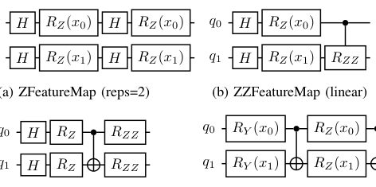 
Fig. 1: Quantum circuit architectures for the four feature maps. (a) ZFeatureMap: alternating Hadamard and RZ layers, no entanglement. (b) ZZFeatureMap: RZ encoding followed by a two-qubit RZZ gate. (c) PauliFeatureMap: Z and ZZ Pauli strings with linear CNOT entanglement. (d) Amplitude- inspired: interleaved RY –CNOT–RZ layers that encode infor- mation in both amplitude and phase simultaneously.

📷 Fig 2

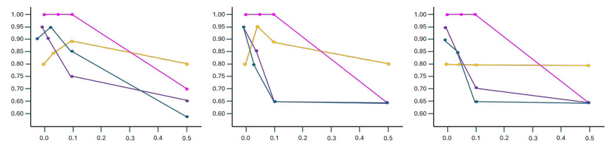 
Fig. 2: Test accuracy versus noise probability for all three noise channels. Each panel plots all four feature map architectures at p ∈{0.01, 0.05, 0.10, 0.50}. (a) Depolarizing: Amplitude (pink) sustains 100% to p = 0.10 before declining; Z (yellow) rises initially via a regularisation effect before converging toward degradation. (b) Bit-Flip: Entangled architectures (ZZ, Pauli) degrade sharply at p ≥0.05; Amplitude holds 100% through p = 0.10. (c) Phase-Flip: Z-encoding (yellow) is perfectly flat at 80% for all error rates, confirming Phase-Flip immunity via [RZ(θ), Z] = 0. Amplitude again holds 100% accuracy through p = 0.10 in this channel.

📷 Fig 3

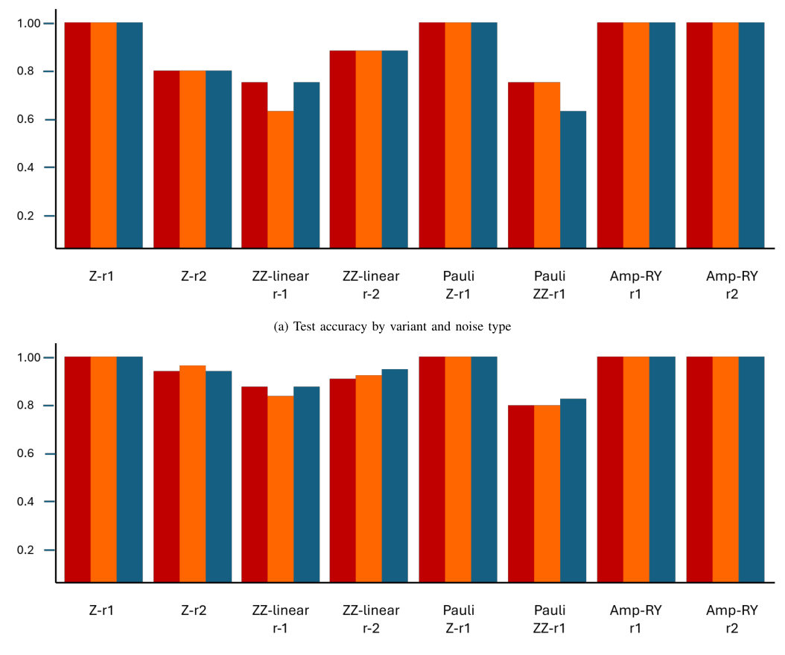 
Fig. 3: Feature map variant performance at p = 0.01. (a) Test accuracy: Z-r1, Pauli-Z-r1, Amp-RY-r1, and Amp-RY-r2 achieve 100% across all four noise conditions. ZZ-lin-r1 drops to 65% under Bit-Flip noise—the worst result across the entire study. ZZ-lin-r2 benefits from additional depth and achieves 90% throughout. (b) Training accuracy: Variants with poor test accuracy simultaneously maintain near-100% training accuracy, confirming noise-induced overfitting. Amp-RY variants hold 100% train accuracy with zero generalisation gap, demonstrating that their robustness is structural.

📷 Fig 4

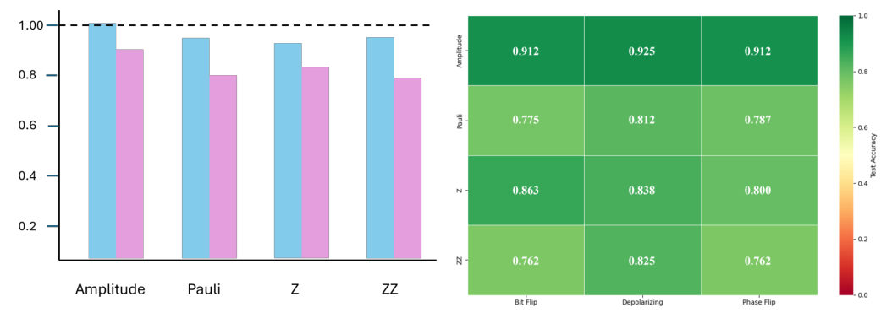 
Fig. 4: Aggregate performance across all noise conditions. (a) Mean train (blue) and test (pink) accuracy for each feature map, averaged over all noise types and error probability levels. Amplitude achieves the highest test accuracy with the smallest train- test gap; ZZ shows the largest divergence, confirming systematic noise-induced overfitting. (b) Average test accuracy heatmap. Cell values report the mean test accuracy across p ∈{0.01, 0.05, 0.10, 0.50} for each feature-map–noise-type combination. Amplitude (top row) exceeds 0.91 for all channels; ZZ (bottom row) drops to 0.762 under Bit-Flip and Phase-Flip, the clearest evidence of entanglement-mediated noise vulnerability in this...

**Summary.** This work investigates the robustness of Quantum Support Vector Machines (QSVMs) against noise on NISQ devices by comparing various quantum feature map encodings. The authors find that amplitude-inspired feature maps are significantly more resilient than entangled or simple maps. This provides essential guidelines for practitioners on selecting appropriate encoding schemes for near-term quantum machine learning applications.

**Why it may be interesting.** The findings provide concrete, data-driven criteria for selecting quantum feature maps suitable for near-term quantum hardware, which is crucial for developing practical quantum machine learning algorithms.

Detailed structure

**Main problem.** The paper assesses how different feature map encodings affect the noise resilience of Quantum Support Vector Machines (QSVMs) when implemented on Noisy Intermediate-Scale Quantum (NISQ) hardware.

**Main result.** Amplitude-inspired feature maps proved significantly more robust than entangled or simple feature maps, maintaining high accuracy up to moderate noise levels ($p=0.10$).

**Method.** The authors simulated QSVM performance by encoding classical data into quantum states using four feature maps (Z, ZZ, Pauli, Amplitude-Inspired) and testing them under three noise channels (Depolarizing, Bit-Flip, Phase-Flip).

**Model / system.** The study uses QSVM trained on kernel matrices derived from quantum circuits. The noise is modeled using standard Pauli error channels applied to the quantum state.

**Key observables.** Test and training classification accuracy, generalization gap (Train - Test accuracy), and noise tolerance (maximum error probability $p$).

**Important parameters / regimes.** Noise probabilities $p \in \{0.01, 0.05, 0.10, 0.50\}$; Noise channels: Depolarizing, Bit-Flip, Phase-Flip.

**Assumptions / limitations.** The noise modeling assumes independent errors on each wire for two-qubit gates; the results are based on simulation and require validation on physical hardware.

**Figures summary.** Figures trace accuracy vs. noise probability ($p$) for various feature maps under different noise channels, while tables summarize the performance across the 52 total experimental runs.

**Paper structure.** The paper systematically compares four feature map architectures (Z, ZZ, Pauli, Amplitude-Inspired) by testing them across a grid of noise levels and noise types, culminating in data-driven guidelines for feature map selection.

Abstract

Gate-level noise degrades the classification accuracy of Quantum Support Vector Machines (QSVMs) on Noisy Intermediate-Scale Quantum (NISQ) hardware, and the degree of degradation depends on how classical data is encoded into quantum states. We tested Z, ZZ, a Pauli, and an amplitude-inspired feature maps under depolarizing, bit-flip, and phase-flip noise channels in $52$ controlled experiments with error probabilities $p =0.01, 0.05, 0.10$, and $0.50$. The amplitude-inspired feature map had $100$\% test accuracy up to $p = 0.10$ across all three noise channels, while other feature maps fell to $65$-$90$\% under the same noise level and type. The Z feature map was found to be immune to phase-flip noise to a significantly high error rate, a consequence of the commutation relation $[R_Z, Z] = 0$. Entangled circuit variants produced generalization gaps in train-test sets of up to $17.5$\% under noise, whereas the amplitude variants maintained zero gap throughout. These results give practitioners data-driven criteria for a feature map on near-term quantum hardware.

[↑ back to top](#top)

### [Quantum Circuit for General Unitary: Improved T-count via Block Flattening and Dilation](http://arxiv.org/abs/2608.17846v1)

**Authors:** Pei Yuan, Shengyu Zhang, Wei Zi  
**Type:** theory · **Category:** quantum information and computing · **PDF:** <https://arxiv.org/pdf/2608.17846v1>  
**Analysis basis:** full PDF text, analyzed in chunks

📷 Fig 1

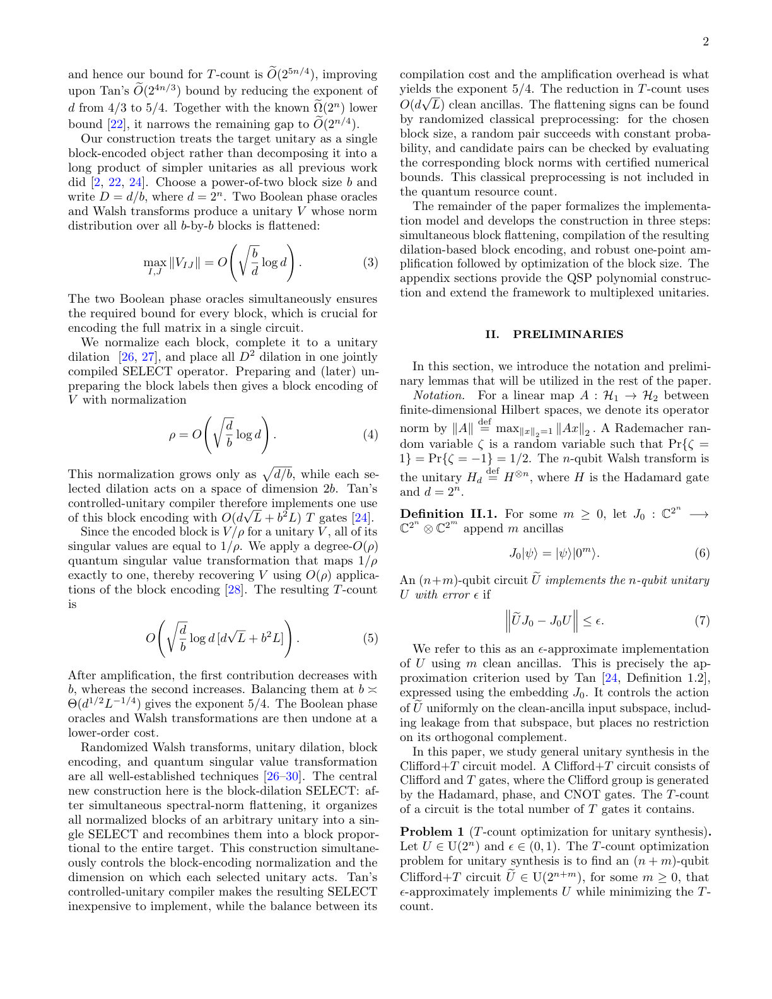 
Low-resolution page preview, page 2

📷 Fig 2

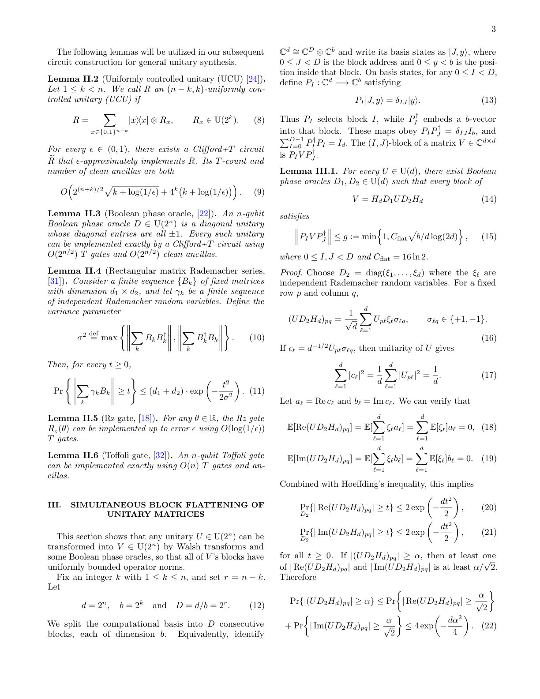 
Low-resolution page preview, page 3

📷 Fig 3

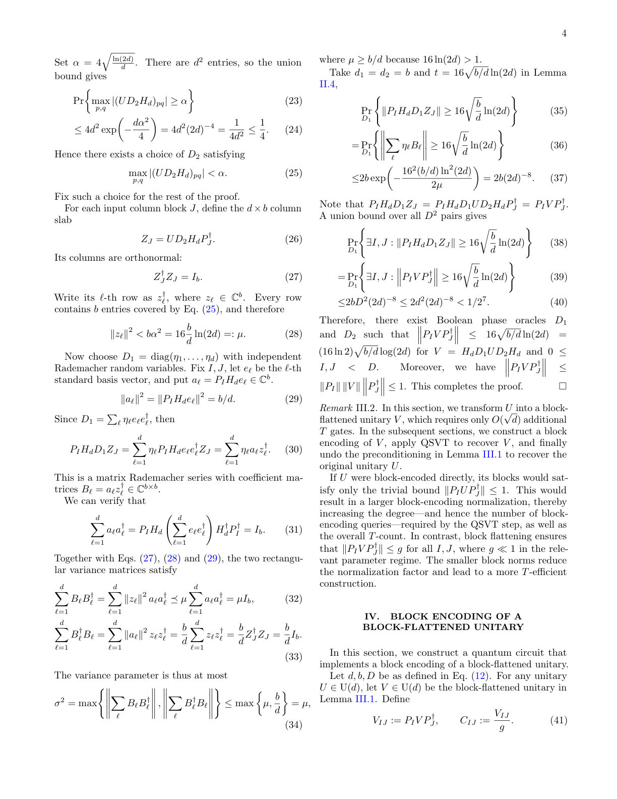 
Low-resolution page preview, page 4

📷 Fig 4

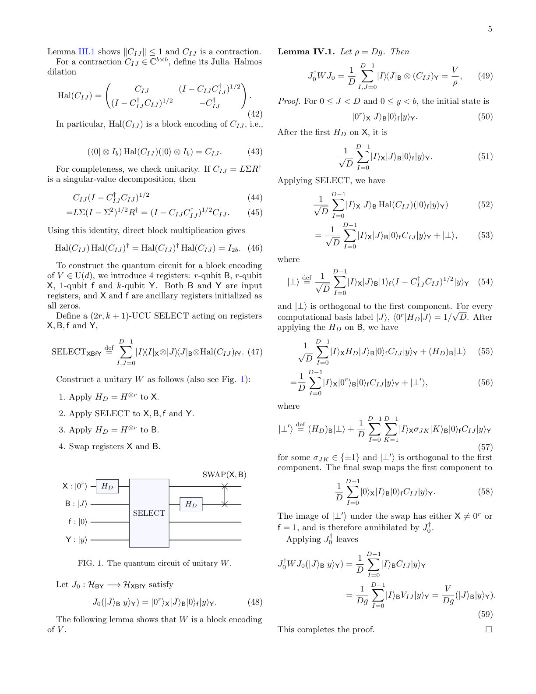 
Low-resolution page preview, page 5

📷 Fig 5

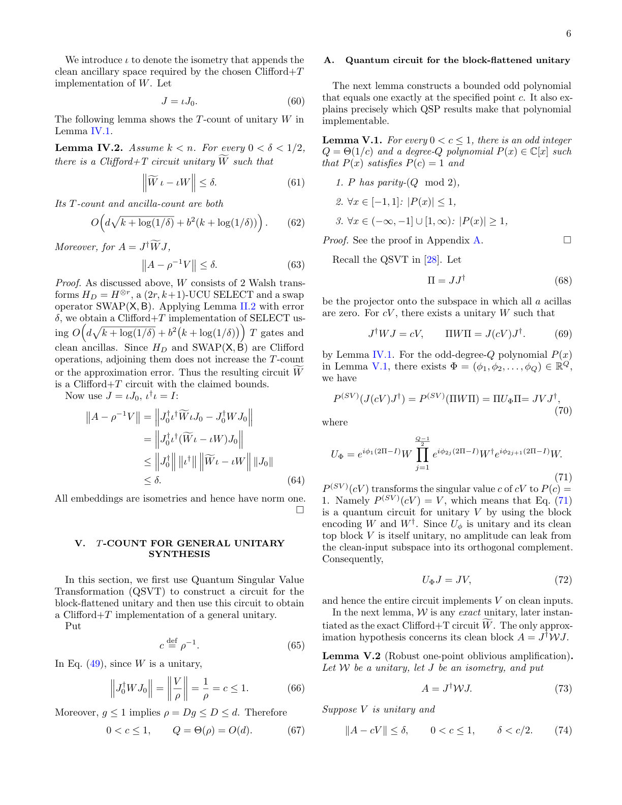 
Low-resolution page preview, page 6

**Summary.** This paper presents an improved method for compiling general unitary quantum circuits into the resource-constrained Clifford+T model. By employing block flattening and Quantum Singular Value Transformation, the authors reduce the worst-case T-gate count scaling from $O(2^{4n/3})$ to $O(2^{5n/4})$. This advancement is crucial for making large-scale, fault-tolerant quantum computation more resource-efficient.

**Why it may be interesting.** This work directly addresses the resource overhead in fault-tolerant quantum computation, which is critical for realizing large-scale quantum processors.

Detailed structure

**Main problem.** The central problem is synthesizing arbitrary n-qubit unitaries using the minimum possible number of non-Clifford gates (T-count) for fault-tolerant quantum compilation.

**Main result.** The authors achieve a worst-case T-count scaling of O(2^(5n/4)), improving upon previous bounds of O(2^(4n/3)).

**Method.** The technique involves treating the target unitary as a block-encoded object, which is then flattened using block flattening and recovered via Quantum Singular Value Transformation (QSVT).

**Model / system.** The model is quantum computation implemented by unitary transformations U in the Clifford+T circuit model, acting on n qubits.

**Key observables.** T-count (the primary cost measure), approximation error (ε), and the exponential scaling of the T-count.

**Important parameters / regimes.** n (number of qubits), ε (approximation error), and the scaling exponents (e.g., 5/4).

**Assumptions / limitations.** The analysis assumes that the error $\log(1/\epsilon)$ is polynomial in $n$, and that classical pre-processing time is excluded from the quantum resource count.

**Paper structure.** The paper progresses by first establishing the need for efficient unitary synthesis, then detailing the block flattening technique using Walsh transforms, followed by the block encoding via Julia-Halmos dilation, and finally applying QSVT to achieve the improved T-count bounds.

Abstract

Synthesizing arbitrary $n$-qubit unitaries using as few non-Clifford gates as possible is a central problem in fault-tolerant quantum compilation. We present a Clifford+$T$ quantum circuit construction that approximately implements any classically specified unitary to within error $ε$ and achieves a worst-case $T$-count with leading exponential scaling of $2^{5n/4}$ whenever $\log(1/ε)=\operatorname{poly}(n)$. This improves upon the best previous $2^{4n/3}$ scaling. The key innovation lies in treating the target unitary as a single block-encoded object rather than a long product of simpler operations. A technique of block flattening controls the normalization while preserving an efficient implementation of the block encoding; subsequently, quantum singular value transformation maps its common singular value to one, thereby recovering the target unitary.

[↑ back to top](#top)

### [Simplicial closure fragments the explosive cooperation transitions in higher-order public goods games](http://arxiv.org/abs/2608.17968v1)

**Authors:** Wenjia Rao, Jianneng Huang  
**Type:** theory · **Category:** disordered systems and neural networks · **PDF:** <https://arxiv.org/pdf/2608.17968v1>  
**Analysis basis:** full PDF text, analyzed in chunks

📷 Fig 1

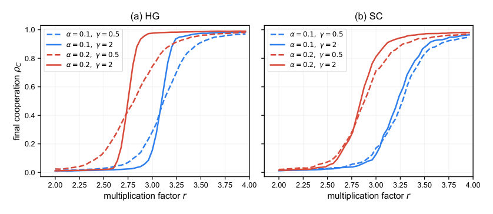 
FIG. 1. Final cooperation ratio ρC as a function of the multiplication factor r in (a) randomized hypergraph (HG) and (b) simplicial complex (SC). Results are shown for two payoff exponents, γ = 0.5 and γ = 2, and two strengths of the three-body interaction, α = 0.1 and α = 0.2. In the HG, the concave case γ = 0.5 exhibits a gradual continuous-like transition, whereas the convex case γ = 2 leads to a much sharper, discontinuous-like transition. In the SC, the concave regime remains qualitatively similar, but the convex regime becomes much smoother. For visual clarity, a moving average with a window of three adjacent r values is applied to better display the shapes of the transition curves.

📷 Fig 2

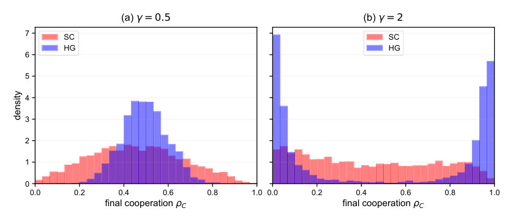 
FIG. 2. Distributions of final cooperation ratio ρC near the transition region for (a) γ = 0.5 and (b) γ = 2. For γ = 0.5, both representations produce single-peaked distributions centered at intermediate cooperation levels, although the SC distribution is broader. For γ = 2, the HG exhibits a strongly bimodal distribution, indicating global bistability. In contrast, the SC produces a broad distribution over intermediate cooperation levels, showing that simplicial closure fragments the global bistability of the HG into a broad ensemble of metastable final states.

📷 Fig 3

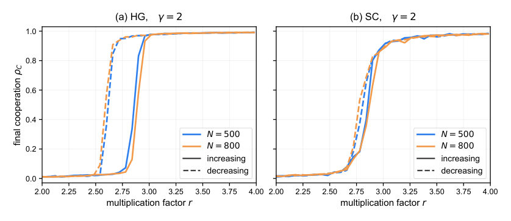 
FIG. 3. Hysteresis scans for the convex payoff regime γ = 2 in (a) HG and (b) SC. Solid lines denote scans with increasing r, and dashed lines denote scans with decreasing r. The HG displays a pronounced hysteresis loop, consistent with a first-order-like transition and global bistability. In the SC, the hysteresis loop is strongly reduced but does not disappear, indicating that simplicial closure does not simply turn the explosive transition into an ordinary continuous transition. Instead, it produces a smeared discontinuous-like regime with residual path dependence.

📷 Fig 4

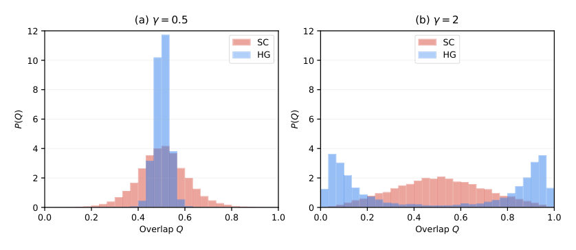 
FIG. 4. Distributions of the final-state configuration overlap Q for (a) γ = 0.5 and (b) γ = 2. The overlap is computed from randomly sampled pairs of independently evolved final strategy configurations. For γ = 0.5, both HG and SC exhibit single-peaked overlap distributions centered at intermediate values; the SC distribution is broader but remains regular and bell- shaped. For γ = 2, the HG shows strong weight near both low and high overlap values, consistent with a compact two-basin structure. In contrast, the SC distribution becomes broad and flatter over intermediate overlaps, indicating a distributed set of distinct metastable final configurations induced by simplicial closure.

📷 Fig 5

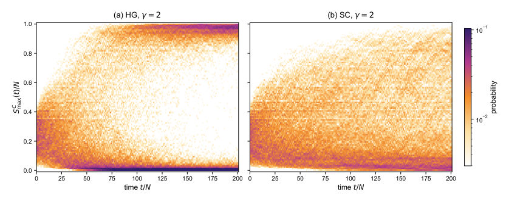 
FIG. 5. Time-resolved probability-density map of the normalized largest cooperative component SCC max(t)/N in the convex regime γ = 2. Panel (a) shows the HG, and panel (b) shows the SC. In the HG, trajectories rapidly separate into two dominant branches: collapse of cooperative clusters or growth into a system-spanning cooperative component. In the SC, substantial probability remains over a wide range of intermediate component sizes, showing that cooperative nuclei can persist locally for long times without necessarily developing into a global cascade.

**Summary.** This work compares cooperation dynamics in higher-order public goods games modeled on hypergraphs (HG) versus simplicial complexes (SC). The key finding is that simplicial closure selectively restructures the system's attractor landscape: it fragments sharp, first-order cooperation transitions into a broad ensemble of metastable states. This demonstrates that the geometric representation of interactions fundamentally dictates the nature of collective phase transitions.

**Why it may be interesting.** The concept of structural constraints (like simplicial closure) leading to qualitative changes in collective dynamics, particularly the fragmentation of stable attractors, is relevant to understanding phase transitions in complex systems modeled by network theory.

Detailed structure

**Main problem.** The paper investigates how the structural constraint of simplicial closure (SC) alters the cooperative dynamics observed in higher-order public goods games (PGGs) compared to the more general hypergraph (HG) model.

**Main result.** Simplicial closure selectively fragments the compact bistability seen in explosive, first-order cooperation transitions, replacing it with a broad ensemble of metastable states, while having only quantitative effects on continuous transitions.

**Method.** The authors compare the mean final cooperation level and the distribution of final states by simulating PGGs on both HG and SC representations derived from the same backbone.

**Model / system.** The model is a higher-order Public Goods Game (PGG) incorporating pairwise and three-player interactions, analyzed using a Fermi imitation rule for strategy updating.

**Key observables.** Mean final cooperation level ($\rho_C$), the shape of the cooperation transition (continuous vs. first-order), and the distribution of final-state configuration overlaps ($P(Q)$).

**Important parameters / regimes.** The payoff exponent $\gamma$ (controlling payoff curvature, e.g., $\gamma=0.5$ vs. $\gamma=2$) and the degree of closure interpolation ($p$).

**Assumptions / limitations.** The comparison assumes that the only difference between HG and SC is the enforcement of simplicial closure on the three-player interactions.

**Figures summary.** Figures illustrate that for first-order transitions ($\gamma=2$), HG shows compact bimodal bistability, whereas SC shows a broad distribution of metastable states, and this effect is visible across different payoff forms.

**Paper structure.** The paper establishes the model, compares the HG and SC representations across different payoff regimes ($\gamma$), and systematically analyzes the resulting changes in transition shape, bistability structure, and final-state distributions.

Abstract

Hypergraph (HG) and simplicial complex (SC) are two common representations of higher-order networks, and are often expected to differ mainly quantitatively when they encode comparable group interactions. Here we show that this expectation fails in evolutionary cooperation dynamics. Using a controlled higher-order public goods game (PGG) with minimal ad hoc parameters, we compare cooperation transitions on randomized HG and SC constructed from the same triangular backbone. We find that the impact of simplicial closure is selective: when the cooperation transition is continuous-like on HG, imposing simplicial closure mainly broadens the transition without changing its qualitative nature; however, when the transition is explosive and first-order-like on HG, simplicial closure will fragment the compact low/high bistability into a broad ensemble of metastable final states. Detailed analysis reveals that this selective effect arises from the dual role of simplicial closure in cooperative-nucleus dynamics: it promotes the survival of local cooperative nuclei while suppressing their conversion into system-wide cascades. Further experiments confirm that this fragmentation is not tied to a specific payoff form, but is a generic feature of explosive cooperation transitions in higher-order PGGs.

[↑ back to top](#top)

### [Three-qubit entanglement in the Bethe-Heitler process](http://arxiv.org/abs/2608.18030v1)

**Authors:** Haotian Cao, Yuxun Guo, Yoshitaka Hatta, Jakob Schoenleber  
**Type:** theory · **Category:** quantum information and computing · **PDF:** <https://arxiv.org/pdf/2608.18030v1>  
**Analysis basis:** full PDF text, analyzed in chunks

📷 Fig 1

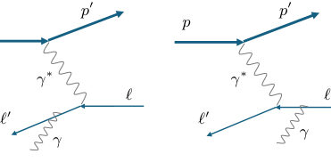 
FIG. 1: Feynman diagrams for the Bethe-Heitler (Bremsstrahlung) process

📷 Fig 2

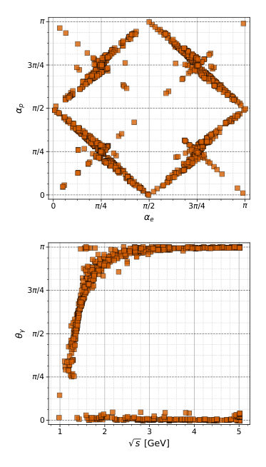 
FIG. 2: GHZ states in the (αe, αp) plane (top) and (√s, θγ) plane (bottom)

📷 Fig 3

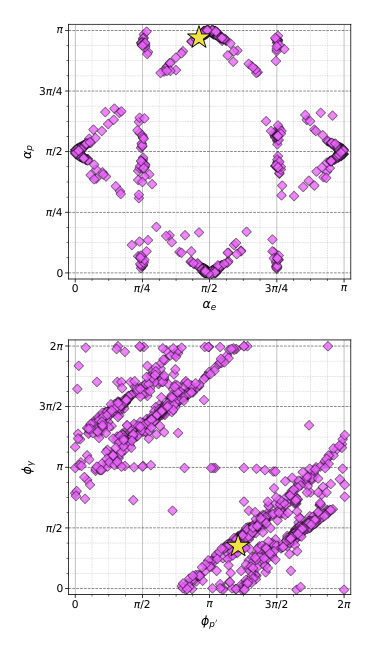 
FIG. 3: W states in the (αe, αp) plane (top) and (ϕp′, ϕγ) plane (bottom)

**Summary.** This theoretical study treats the Bethe-Heitler process as a quantum laboratory to study multipartite entanglement among the final electron, proton, and photon. By analyzing the helicity structure and using entanglement measures, the authors predict and simulate the existence of numerous GHZ and W states. The results confirm that genuine tripartite entanglement can be generated in this process, although these states occupy a much smaller volume in phase space than simpler bipartite entangled states.

**Why it may be interesting.** This work applies quantum information concepts (GHZ/W states) to a well-understood, high-energy particle physics process, providing a concrete, calculable physical realization for testing entanglement generation mechanisms.

Detailed structure

**Main problem.** The study focuses on quantifying and characterizing multipartite entanglement, specifically GHZ and W states, generated during the standard Bethe-Heitler scattering process.

**Main result.** The authors successfully identified hundreds of GHZ and W states in the process, demonstrating that the BH process serves as a viable, albeit highly constrained, laboratory for generating and studying genuine tripartite entanglement.

**Method.** The analysis involves calculating helicity amplitudes for the three-particle final state and using entanglement measures (concurrence, $F_{GHZ}^3$, $F_W^3$) to map out the phase space regions where these entangled states are formed.

**Model / system.** The system is the Bethe-Heitler process ($e+p	o e+p+\gamma$), where the final electron, proton, and photon are treated as three qubits based on their helicity states. Entanglement is built up through successive elementary interactions.

**Key observables.** Bipartite concurrences ($C_{\ell p}, C_{\ell \gamma}, C_{p\gamma}$), genuine tripartite entanglement measures ($F_{GHZ}^3, F_W^3$), and the local-unitary fidelity ($F$).

**Important parameters / regimes.** Center-of-mass energy ($\sqrt{s} < 5$ GeV), mixing angles ($\alpha_e, \alpha_p$), and specific kinematic regimes (e.g., backward scattering, collinear emission).

**Assumptions / limitations.** The analysis relies on identifying local minima in the high-dimensional phase space and estimating the volume and overlap rates of these discrete entangled regions.

**Figures summary.** Figures illustrate the distribution of found GHZ and W states in various parameter planes (e.g., $(\alpha_e, \alpha_p)$ plane) and compare the phase space volumes of entangled states versus bipartite states.

**Paper structure.** The paper systematically analyzes the entanglement generation via two-step processes, calculates entanglement measures, identifies specific kinematic conditions for maximal entanglement, and finally quantifies the phase space volume occupied by the discrete GHZ and W states compared to continuous bipartite entanglement regions.

Abstract

The familiar Bethe-Heitler process on the proton target $e+p\to e+p+γ$ is transformed into a laboratory for studying multiparticle entanglement. We discuss how bipartite and genuine tripartite entanglement between the final state electron, proton and photon are built up by successive $1\to 2$ and $2\to 2$ elementary interactions. We validate our argument by simulating events. Below 5 GeV center-of-mass energy, we identify more than 900 Greenberger-Horne-Zeilinger (GHZ) states and 1200 W states, each with a fidelty exceeding 99%.

[↑ back to top](#top)

### [Towards the Impossibility of Imperfectly Complete Key Agreement in the QROM](http://arxiv.org/abs/2608.17610v1)

**Authors:** Fuyuki Kitagawa, Ryo Nishimaki, Agi Villanyi, Takashi Yamakawa  
**Type:** theory · **Category:** other · **PDF:** <https://arxiv.org/pdf/2608.17610v1>  
**Analysis basis:** full PDF text, analyzed in chunks

📷 Fig 1

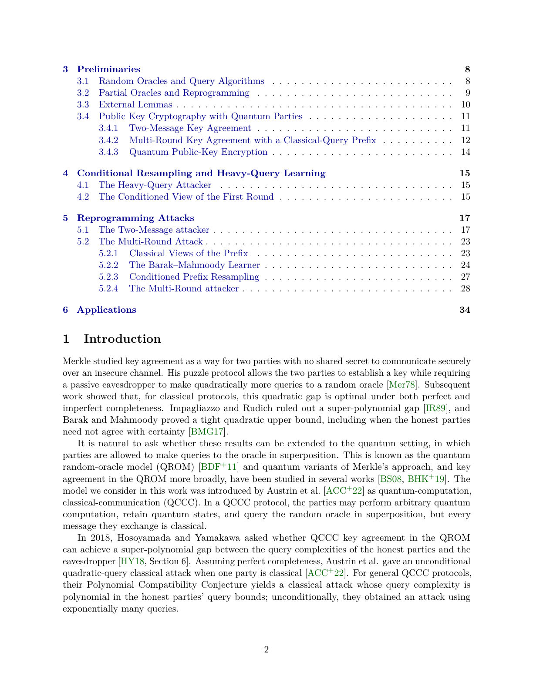 
Low-resolution page preview, page 2

📷 Fig 2

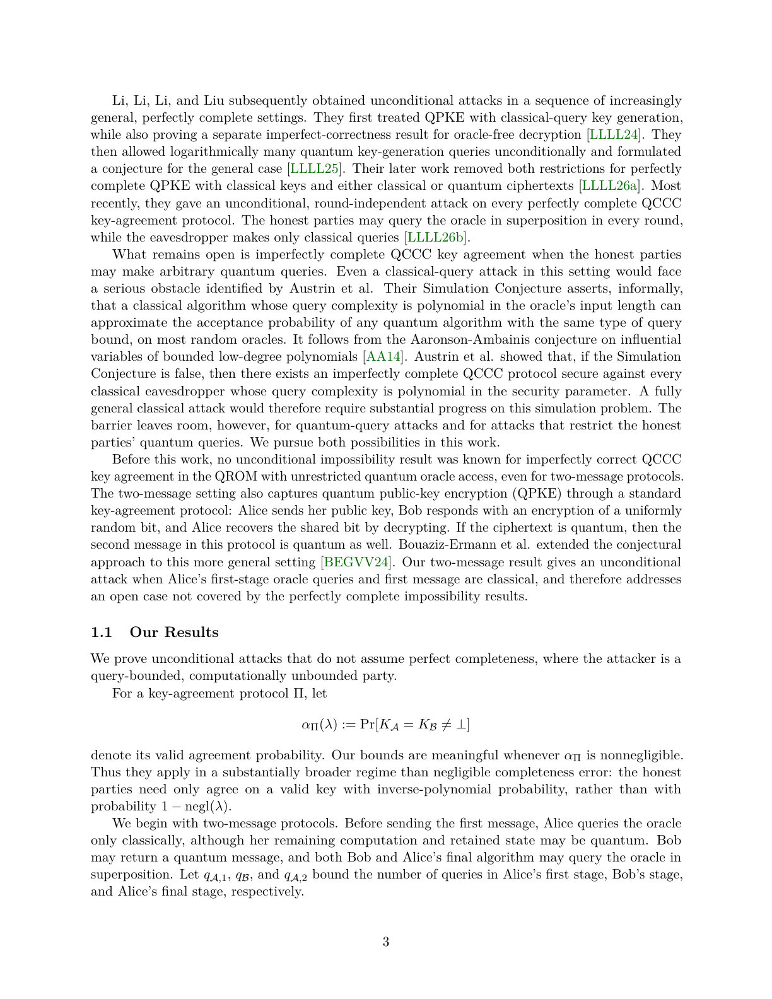 
Low-resolution page preview, page 3

📷 Fig 3

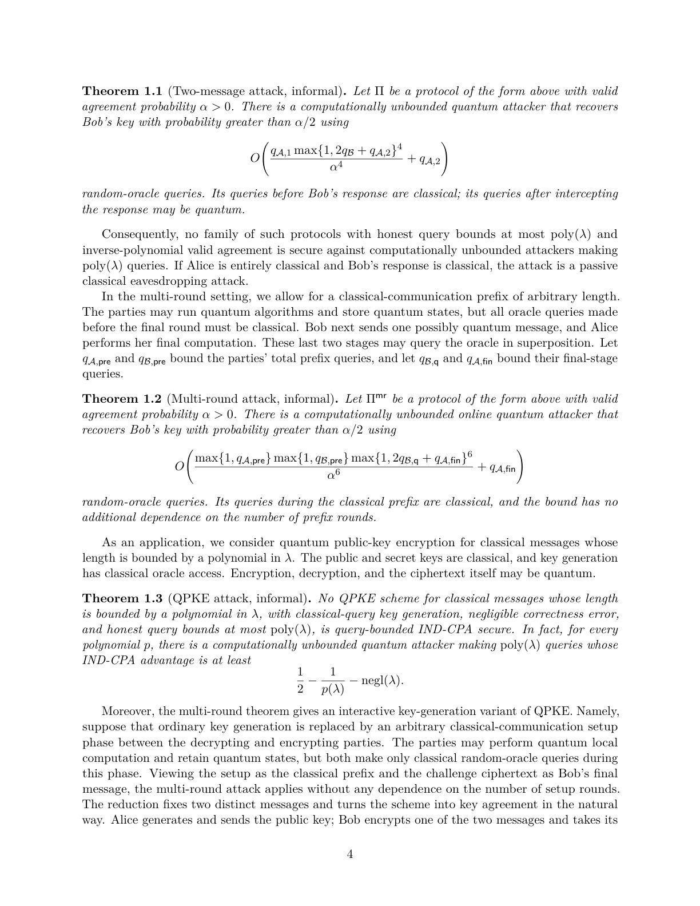 
Low-resolution page preview, page 4

📷 Fig 4

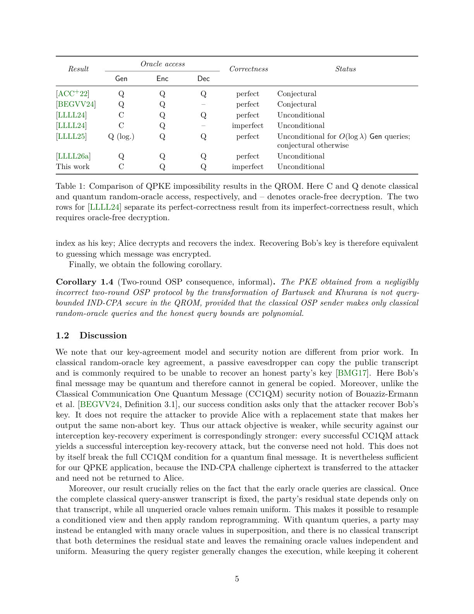 
Low-resolution page preview, page 5

📷 Fig 5

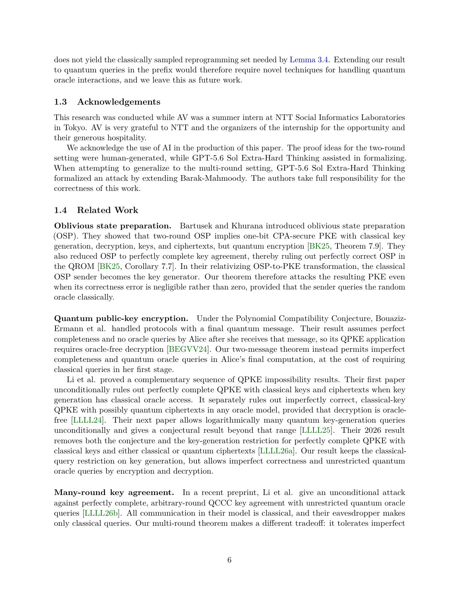 
Low-resolution page preview, page 6

**Summary.** This paper proves the impossibility of certain quantum key agreement schemes in the QROM by constructing unconditional quantum attacks. Using advanced techniques like heavy-query learning, the authors show that if the agreement probability is not perfect, the key can be recovered by an unbounded attacker. This result has direct implications for the security of quantum public-key encryption.

**Why it may be interesting.** While highly theoretical, the rigorous analysis of information-theoretic security boundaries in quantum cryptography provides foundational tools for understanding the limits of quantum communication protocols.

Detailed structure

**Main problem.** The paper investigates the theoretical impossibility of achieving imperfectly complete Quantum-Computation, Classical-Communication (QCCC) key agreement protocols within the Quantum Random Oracle Model (QROM).

**Main result.** It rules out imperfectly correct quantum public-key encryption (QPKE) for classical messages whose length is polynomially bounded in the QROM under specific conditions.

**Method.** The analysis constructs unconditional quantum attacks by combining heavy-query learning techniques with random reprogramming lemmas.

**Model / system.** The model is the QROM applied to key agreement protocols, considering settings like two-message and multi-round interactions where parties perform quantum computations and make oracle queries.

**Key observables.** The valid agreement probability ($\alpha_{\Pi}(\lambda)$) and the attacker's ability to recover the shared key.

**Important parameters / regimes.** The query bounds ($q_{A,1}, q_{B}, q_{A,2}$, etc.) and the inverse-polynomial nature of the valid agreement probability.

**Assumptions / limitations.** The attacker is computationally unbounded, and the honest query bounds are polynomially bounded in $\lambda$.

**Figures summary.** Not specified, but the notes detail theorems and corollaries establishing quantitative bounds on the advantage of the attack.

**Paper structure.** The paper progresses by analyzing specific settings (two-message, multi-round) to establish attack bounds, culminating in the impossibility result for QPKE.

Abstract

We make progress towards the impossibility of imperfectly complete quantum-computation, classical-communication (QCCC) key agreement by constructing the first unconditional attacks on quantum key agreement in the following restricted settings. In the two-message setting, we assume that Alice makes only classical queries to the oracle in the first round and that her message to Bob is classical, but otherwise both parties may perform arbitrary quantum computation, make quantum queries, and send a quantum state in the second round. Our attack and analysis are based on the heavy-query learning techniques from Austrin et al. (CRYPTO 2022) and the reprogramming techniques of Katz and Sela (arXiv 2401.14319). In the round-independent setting, we show that the attack of Barak and Mahmoody (CRYPTO 2009; J. Cryptology 2017) can be extended to multiple rounds when Alice and Bob share classical communication and make only classical queries in all but the final round. In both settings, the attacker is computationally unbounded and makes $poly(λ)$ queries to recover the key whenever each honest query bound is at most $poly(λ)$ and the valid agreement probability is inverse-polynomial. As a consequence, we rule out imperfectly correct quantum public-key encryption for classical messages whose length is bounded by a polynomial in $λ$ in the QROM when key generation has classical oracle access, even if encryption, decryption, and the ciphertext are quantum. In particular, the one-bit case applies to the imperfectly correct PKE obtained from two-round OSP by Bartusek and Khurana (CRYPTO 2025) whenever the classical OSP sender makes only classical random-oracle queries.

[↑ back to top](#top)

### [Tracking nonlinear solar-wind dynamics over three solar cycles using Wind observations](http://arxiv.org/abs/2608.17037v1)

**Authors:** Dario Javier Zamora, Facundo Maximo Abaca  
**Type:** experiment · **Category:** statistical mechanics · **PDF:** <https://arxiv.org/pdf/2608.17037v1>  
**Analysis basis:** full PDF text, analyzed in chunks

📷 Fig 1

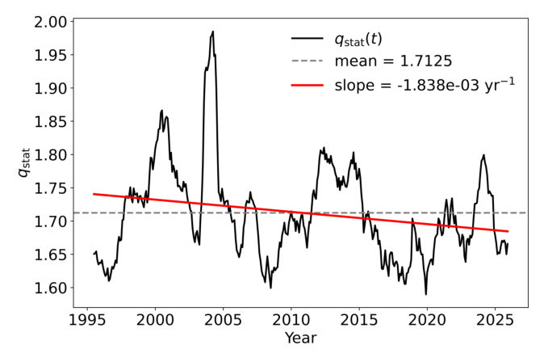 
Figure 1: Temporal evolution of qstat derived from Wind proton density measurements over 1995–2025 using sliding one-year windows. The dashed gray line indicates the mean value, while the red line represents the linear trend.

📷 Fig 2

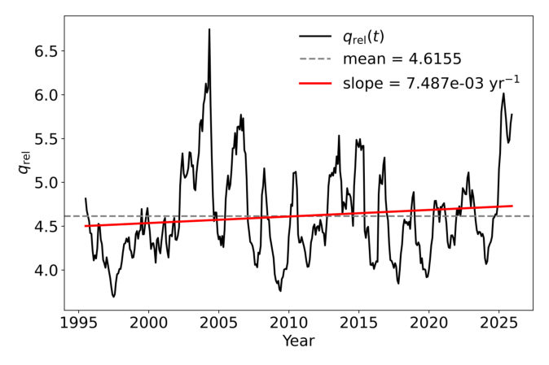 
Figure 2: Temporal evolution of qrel derived from Wind proton density measurements over 1995–2025 using sliding one-year windows. The dashed gray line indicates the mean value, while the red line represents the linear trend.

📷 Fig 3

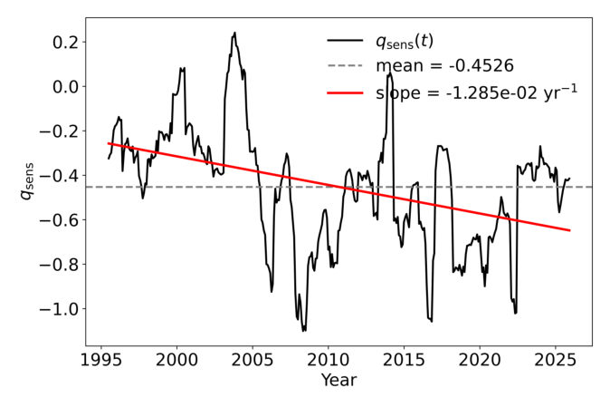 
Figure 3: Temporal evolution of qsens derived from Wind proton density measurements over 1995–2025 using sliding one-year windows. The dashed gray line indicates the mean value, while the red line represents the linear trend.

📷 Fig 4

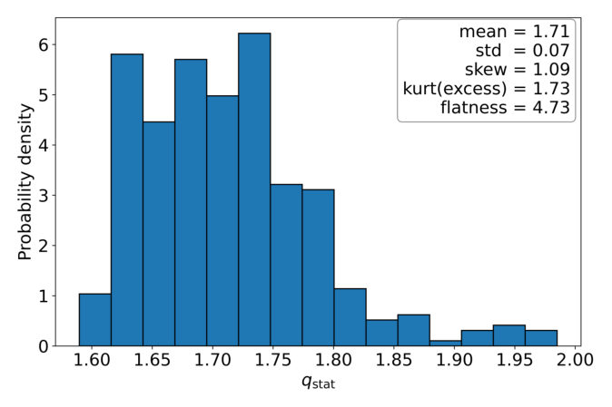 
Figure 4: Probability density function of qstat derived from Wind proton density measurements over 1995–2025.

📷 Fig 5

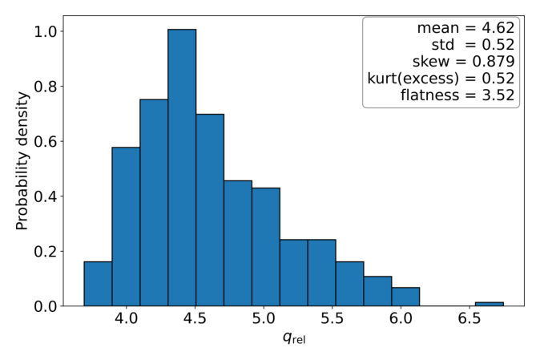 
Figure 5: Probability density function of qrel derived from Wind proton density measurements over 1995–2025.

**Summary.** This research analyzes decades of solar wind proton density data to characterize its statistical and dynamical properties using nonextensive statistical mechanics. By calculating the q-triplet, the authors confirm persistent heavy-tailed fluctuations and slow relaxation. Crucially, they demonstrate that these plasma properties are modulated by the solar cycle, showing a strong periodicity linked to solar activity.

**Why it may be interesting.** The application of nonextensive statistics and multifractal analysis to space plasma dynamics provides a rigorous, non-equilibrium framework for characterizing turbulence and long-range correlations in astrophysical plasmas.

Detailed structure

**Main problem.** To investigate the long-term evolution and solar cycle dependence of nonlinear statistical and dynamical properties of solar wind plasma.

**Main result.** The statistical properties, characterized by the q-triplet, confirm persistent heavy-tailed statistics and slow relaxation, showing modulation by solar activity with a dominant periodicity of $\sim 10.1$ years.

**Method.** The study uses nonextensive statistical mechanics to estimate the q-triplet ($	ext{qstat}$, $	ext{qrel}$, $	ext{qsens}$) from hourly proton density measurements using sliding time windows.

**Model / system.** The physical system is the turbulent, weakly collisional solar wind plasma, analyzed using the Wind spacecraft's proton density measurements over three decades (1995–2025). The analysis framework is nonextensive statistical mechanics.

**Key observables.** The q-triplet ($	ext{qstat}$, $	ext{qrel}$, $	ext{qsens}$), proton density increments, autocorrelation function decay, and multifractal spectrum.

**Important parameters / regimes.** Mean values: $	ext{qstat}=1.71\pm0.07$, $	ext{qrel}=4.62\pm0.52$, $	ext{qsens}=-0.45\pm0.27$. Key regimes include $q>1$ for heavy tails and slow relaxation.

**Assumptions / limitations.** The analysis relies on a single-spacecraft dataset (Wind) to provide an independent test, though potential orbital transition effects must be considered.

**Figures summary.** Figures illustrate the temporal evolution of the three q-parameters, the correlation between $	ext{qstat}$ and sunspot number, and the Fourier power spectrum of $	ext{qstat}$ showing a dominant $\sim 10.1$-year peak.

**Paper structure.** The paper analyzes the time series of the q-triplet over 1995–2025, calculates correlations with solar/geomagnetic indices, and uses Fourier analysis to determine periodicity and modulation by solar activity.

Abstract

The solar wind is a turbulent, weakly collisional plasma characterized by non-Gaussian fluctuations, long-range correlations, and multifractal dynamics. We investigate the long-term evolution of these properties using hourly proton density measurements obtained directly by the Wind spacecraft over 1995--2025. The use of a single-spacecraft dataset provides an independent test of previous results derived from the multi-spacecraft OMNI database. The three components of the nonextensive $q$-triplet are estimated within one-year sliding windows shifted monthly: $q_{stat}$ from the distribution of density increments, $q_{rel}$ from the decay of the autocorrelation function, and $q_{sens}$ from the multifractal spectrum. Their mean values, $q_{stat}=1.71\pm0.07$, $q_{rel}=4.62\pm0.52$, and $q_{sens}=-0.45\pm0.27$, confirm the persistent presence of heavy-tailed statistics, slow relaxation, and weakly chaotic multifractal dynamics. The parameters nevertheless exhibit distinct temporal variability and relationships with solar activity. The Fourier spectrum of $q_{stat}$ contains a dominant period of approximately $10.1$ years, while its correlation with the sunspot number is positive and moderate ($r=0.611$). Correlation and mutual-information analyses show that $q_{stat}$ is primarily associated with solar proxies, whereas $q_{sens}$ displays stronger relationships with geomagnetic indices and $q_{rel}$ exhibits weaker dependencies. An anomalous enhancement of $q_{stat}$ around 2004 coincides with a sequence of intense interplanetary disturbances, although possible effects related to Wind's orbital transition must also be considered. These findings demonstrate the robustness of the nonextensive description and show that the statistical and dynamical properties of solar wind proton density show evidence of modulation by solar activity.

[↑ back to top](#top)

### [Unclonable encryption from BB84 states: a simultaneous Goldreich-Levin reduction](http://arxiv.org/abs/2608.17629v1)

**Authors:** Andrea Coladangelo, Qipeng Liu, Ziyi Xie  
**Type:** theory · **Category:** quantum information and computing · **PDF:** <https://arxiv.org/pdf/2608.17629v1>  
**Analysis basis:** full PDF text, analyzed in chunks

📷 Fig 1

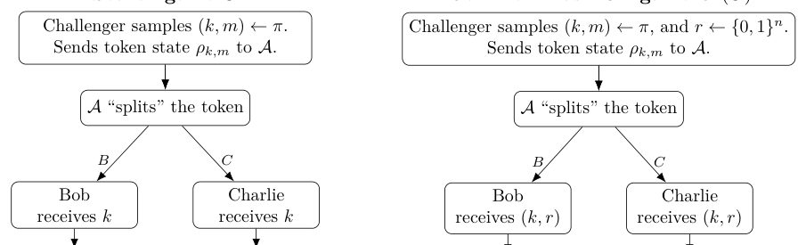 
Figure 1: The search game G (left) and its common-mask Goldreich–Levin variant GL(G) (right).

**Summary.** This paper develops a novel 'simultaneous Goldreich-Levin reduction' applicable to quantum cryptography when parties share a common random mask. It successfully upgrades the security guarantee of unclonable encryption schemes from a search-based security notion to the stronger indistinguishability notion. This advances the theoretical understanding of quantum cryptographic security proofs.

**Why it may be interesting.** The work provides a rigorous, information-theoretic bridge connecting two fundamental security notions (search vs. decision) in quantum cryptography, which is highly relevant for quantum information security protocols.

Detailed structure

**Main problem.** The paper aims to establish a 'simultaneous Goldreich-Levin reduction' to upgrade unclonable encryption schemes from 'search' security to the stronger 'unclonable indistinguishability' (decision) security.

**Main result.** The authors provide a general, information-theoretic reduction showing that the search security implies indistinguishability security in the common-mask setting, and demonstrate this for the simplest BB84 candidate scheme.

**Method.** The core method involves adapting the classical Goldreich-Levin reduction framework to the quantum setting, specifically addressing the challenge of a common random mask shared by two entangled parties.

**Model / system.** The security analysis is built around unclonable encryption schemes, using the BB84 monogamy-of-entanglement game as a source of initial 'search' security.

**Key observables.** Success probabilities in the search game ($p_{	ext{Search}}$) and the common-mask GL game ($p_{	ext{Pred}}$); the relationship $\Delta = 2p_{	ext{Pred}} - 1$.

**Important parameters / regimes.** The reduction yields bounds like $p_{	ext{Search}} \geq \Delta^4$, and later theorems introduce parameters like $\gamma$ and $L_{\max}$ for efficiency analysis.

**Assumptions / limitations.** The analysis assumes the existence of a common-mask GL reduction and later theorems rely on assumptions regarding the computability of parameters ($\gamma$) or the ability to truncate sampling ($L_{\max}$).

**Figures summary.** Figure 1 illustrates the conceptual difference between the search game G and its common-mask GL variant GL(G).

**Paper structure.** The paper develops the general reduction from the GL game to the search game, proving the existence of the reduction ($p_{	ext{Search}} \geq \Delta^4$). Subsequent sections refine this reduction, providing uniform and truncated variants that improve efficiency and robustness.

Abstract

Goldreich-Levin reductions are ubiquitous in cryptography: they convert an algorithm capable of guessing $\langle r, m \rangle$ (mod $2$) for a hidden string $m$ and a random challenge $r$, to one that is capable of extracting the entirety of $m$. Here, we describe a "simultaneous" Goldreich-Levin reduction for two entangled parties who are capable of guessing $\langle r, m \rangle$ given uniformly random identical challenges $r$. This allows to upgrade any unclonable encryption scheme satisfying "search" security to one satisfying the gold standard of unclonable "indistinguishability". As a corollary, we show that the simplest candidate unclonable encryption scheme from BB84 states satisfies unclonable indistinguishability.   This result was discovered by GPT-5.6 Ultra after a few interactions. Our prompts included recent results on unclonable encryption by Ananth and Sahai, and Ragavan.

[↑ back to top](#top)

## Secondary cond-mat archives

*Papers from  mes-hall, other, soft, supr-con. These archives are de-prioritized — they appear at the end regardless of relevance score.*

### Relevant in secondary archives (8)

### [Flux-tunable global and local superconductivity in a topological insulator nano-SQUID](http://arxiv.org/abs/2608.17404v1)

**Authors:** Ella Nikodem, Jakob Schluck, Michał Papaj, Max Geier, Mahasweta Bagchi, Liang Fu, Henry F. Legg, Yoichi Ando  
**Type:** experiment · **Category:** other · **PDF:** <https://arxiv.org/pdf/2608.17404v1>  
**Analysis basis:** full PDF text, analyzed in chunks
**Topic relevance:** `quantum measurements` **3/5** · `QC/QI experiment` **1/5** · `analog quantum simulation` **1/5** · `correlated / nonlocal dissipation` **1/5** · `driven-dissipative phase transition` **1/5**

📷 Fig 1

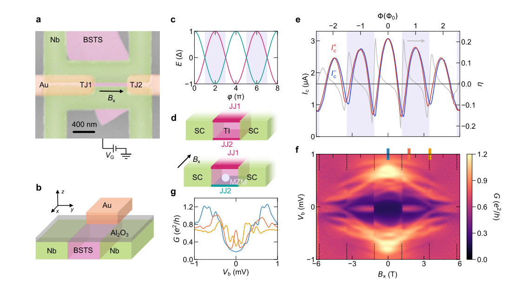 
FIG. 1. Flux-tunable transport and local spectroscopy in a nano-SQUID. a, Scanning electron microscope (SEM) image of the device. An exfoliated topological-insulator (TI) flake is patterned into a nanowire (pink) by dry etching. The etched regions are filled with Nb (green), forming a sandwich junction. Residual TI fragments do not participate in transport. Gold electrodes contact the TI nanowire via tunnel junctions TJ1 and TJ2, enabling local probing of the density of states. b, Schematic of the baseline device, featuring the TI nanowire core, the superconducting shell, tunnel dielectric, and a single functional TJ. c, Energy-phase dispersion of the perpendicular (kx = 0) mode in a TI...

📷 Fig 2

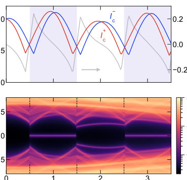 
FIG. 2. Theory of topological superconductivity in a TI nano- SQUID. a, Calculated ground-state phase difference, explicitly map- ping the 0 −π transition to topological boundaries. b, Calculated Ic and η vs. flux Φ. c, Simulated energy spectrum as a function of Φ, showing the spectral jumps at the values of the topological phase transition and the emergence of zero-energy modes in regions with an odd number of flux quanta.

📷 Fig 3

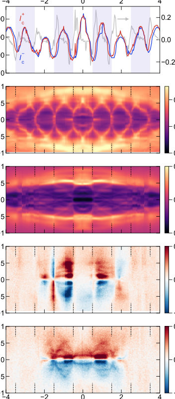 
FIG. 3. Simultaneous global and dual-local spectroscopy. a, Global Ic and η in device B. Note that the cross-section is larger than for device A and multiple oscillations of Ic are observed. b, c, Dif- ferential conductance measured simultaneously at TJ1 (GLL, b) and TJ2 (GRR, c). Abrupt spectral jumps occur at fields commensurate with Ic anomalies. However, there are zero-bias peaks visible in both theoretically topological regimes and trivial regimes. d, e, Nonlocal conductance GLR and GRL showing that some features correspond to the boundaries of the expected topological regimes.

📷 Fig 4

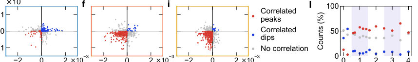 
FIG. 4. Gate-voltage dependence and end-to-end correlations. a, b, d, e, g, h GLL and GRR in device B as a function of VG for trivial and topological flux regimes. c, f, i End-to-end correlation analysis using the product of the the third derivative at zero bias. j VG-dependence of Ic (black) and the normal state resistance RN (grey). k VG-dependence of GLL and GRR. l Relative fraction of gate voltages exhibiting correlated zero-bias conductance peaks (red), correlated zero-bias conductance dips (blue), or no correlation (grey) as a function of Bx.

**Summary.** This paper investigates topological superconductivity in a TI nano-SQUID by measuring both global critical currents and local tunneling conductance. While global measurements show clear, flux-tunable signatures consistent with a topological phase transition, the local measurements yield ambiguous results. The authors conclude that a combined, integrated approach is necessary to definitively confirm the presence of Majorana bound states.

**Why it may be interesting.** This work directly addresses the experimental challenge of verifying topological superconductivity by comparing macroscopic (global) transport signatures with microscopic (local) spectroscopic signatures, which is highly relevant to open quantum systems research.

Detailed structure

**Main problem.** The study aims to investigate and conclusively identify topological superconductivity, motivated by the search for Majorana bound states (MBSs), in a solid-state platform.

**Main result.** Global superconducting signatures (e.g., $h/2e$ flux periodicity and SDE reversal) are observed, suggesting a topological phase transition, but local measurements show ambiguous zero-bias peaks that do not correlate robustly with global signatures.

**Method.** The research combines global transport measurements (critical current, superconducting diode effect) with local tunneling spectroscopy and nonlocal conductance measurements on a nano-SQUID structure.

**Model / system.** The physical system is a three-dimensional topological insulator (TI) nanowire proximitized by a superconductor, configured as a nano-SQUID. The system's superconducting properties are tuned by an external axial magnetic flux ($\Phi$) and gate voltage ($V_b$).

**Key observables.** Critical current ($I_c$), superconducting diode effect (SDE) polarity, zero-bias conductance peaks (ZBPs), and nonlocal conductance ($G_{LL}, G_{RL}$).

**Important parameters / regimes.** Axial magnetic flux ($\Phi$), gate voltage ($V_G$), and the superconducting flux quantum ($\Phi_0 = h/2e$).

**Assumptions / limitations.** The authors caution that the lack of correlation between local ZBP signatures and global signatures implies that conclusively identifying MBSs requires integrating global topological property establishment with advanced local probes.

**Figures summary.** Figures illustrate the device structure, $I_c$ vs. $B_x$ showing oscillations, and simultaneous measurements comparing global $I_c$ anomalies with local conductance spectral jumps and nonlocal conductance changes across different flux regimes.

**Paper structure.** The paper systematically presents global measurements demonstrating flux-tunable topological signatures, followed by local spectroscopy confirming spectral jumps, and concludes by analyzing the correlation (or lack thereof) between these local and global findings to address the ambiguity of MBS identification.

Abstract

Topological systems are defined by global properties that enforce the existence of local boundary modes. Three-dimensional topological insulators (TIs) were among the earliest proposed systems for hosting topological superconductivity, but experimental focus subsequently shifted to other platforms. Here, we revisit bulk-insulating TIs using a columnar nano-superconducting quantum interference device (nano-SQUID) architecture. This geometry optimises the proximity effect on the TI surface and enables simultaneous probing of global superconducting properties - via the critical current through the nano-SQUID - alongside the local states at the ends of the nano-SQUID via tunnel junctions. We observe several global superconducting features that appear to show a flux-driven global phase transition consistent with entering the topological regime, including periodic critical current oscillations and a sign reversal in the superconducting diode effect. Simultaneously, tunnelling spectroscopy reveals spectral jumps in local and nonlocal conductance that align with these global features. However, zero-bias peaks (ZBPs) in local conductance are present both within the predicted topological range of magnetic fields and in theoretically trivial regimes, including at zero magnetic field. Ultimately, the lack of correlation between local ZBP signatures and global signatures emphasises that conclusively identifying Majorana bound states will necessitate a combined approach, integrating the establishment of global topological properties with the use of local and other, more advanced, probes.

[↑ back to top](#top)

### [Robust stabilization of high-frequency magnetic droplets in W-CoFeB-MgO nanoconstriction spin Hall nano-oscillators](http://arxiv.org/abs/2608.17677v1)

**Authors:** Hind Prakash, Arunima TM, Roman Khymyn, Himanshu Fulara  
**Type:** theory · **Category:** other · **PDF:** <https://arxiv.org/pdf/2608.17677v1>  
**Analysis basis:** full PDF text, analyzed in chunks
**Topic relevance:** `driven-dissipative phase transition` **2/5** · `non-equilibrium universality` **2/5** · `Frenkel-Kontorova` **1/5** · `Keldysh / 2PI / non-Gaussian methods` **1/5** · `analog quantum simulation` **1/5** · `methods for driven-dissipative` **1/5** · `quantum measurements` **1/5** · `scars & prethermalization` **1/5**

📷 Fig 1

 
Fig. 1 SHNO device schematic, COMSOL simulations, and magnetodynamical non- linearity. a, Schematic of a 150 nm nanoconstriction SHNO device, illustrating magnetic droplet nucleation at the constriction region. COMSOL simulated b, Current density and c, Oersted field distributions for the highlighted area in the schematic. d, Color map of the analytically calculated nonlinearity coefficient (N) for a ferromagnetic thin film (employing the methodology outlined in ref. [44, 45]), shown as a function of PMA field and applied OOP field orientation (µ0H = 0.45 T), for µ0Ms = 0.93 T. Dotted black lines indicate N = 0.

📷 Fig 2

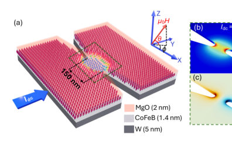 
Figure 1(a) shows the schematic of the SHNO device along with an illustration of a nucleated droplet within the constriction geometry, where arrows indicate the local magnetization direction. The constriction has a nominal width of 150 nm, an opening angle of 22◦, and a curvature radius of 50 nm. Figures 1(b) and (c) present the sim- ulated current density and Oersted field distributions within the bilayer for a drive

📷 Fig 3

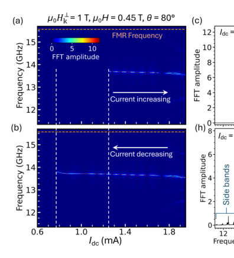 
Fig. 2 Magnetic droplet dynamics in a 150 nm W/CoFeB/MgO nanoconstriction SHNO: Current-sweep spectra for a, increasing and b, decreasing current exhibit pronounced hys- teresis behaviour, evidencing droplet nucleation; the orange dashed line marks the FMR frequency. c, FFT spectrum at a fixed Idc = 1.5 mA with d,e, corresponding magnetization snapshots at two time instances and f,g, mz line profiles along the y-axis through the constriction (orange dashed line), demonstrating complete magnetization reversal. h, FFT spectrum at Idc = 1.9 mA, highlight- ing droplet sidebands, with i,j, corresponding magnetization snapshots and k,l, mz line profiles along the same axis, illustrating droplet...

📷 Fig 4

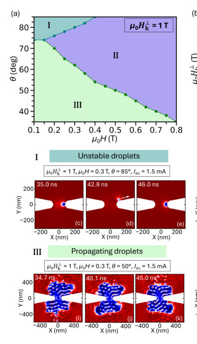 
Fig. 3 Phase diagrams of auto-oscillation modes and representative magnetization dynamics. a, Phase diagram of auto-oscillations as a function of OOP field strength and field ori- entation at a fixed PMA of 1 T, revealing three regimes: unstable droplets (dark green), stable non-propagating droplets (purple), and propagating droplets (light green). b, Phase diagram as a function of applied field and PMA at a fixed OOP angle of 80◦, showing three regimes, includ- ing propagating SW auto-oscillations (light red). Representative magnetization snapshots of c,d,e Dynamically unstable droplets; f,g,h, a stable, non-propagating droplet confined to the constriction; i,j,k, cpropagating droplets...

📷 Fig 5

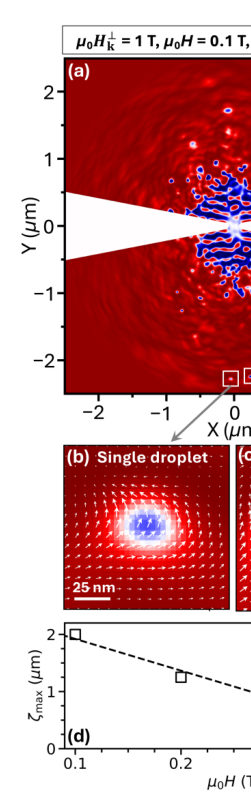 
Fig. 4 Propagating magnetic droplets and their propagation length. a, Magnetization snapshot at t = 52.9 ns showing droplet propagation in the nanoconstriction SHNO. The zoomed-in views in b, and c, highlight a single propagating droplet and a merged droplet state, respectively. d, Maximum droplet propagation length as a function of the applied magnetic field; the black dashed line represents a linear fit to the data points.

**Summary.** This work investigates the stabilization and control of high-frequency magnetic droplets, which are nonlinear spin-wave solitons, within nanoscale Spin Hall Nano-Oscillators. Using micromagnetic simulations, the authors show that by carefully tuning the applied magnetic field, they can robustly stabilize these droplets in a non-propagating state, and further control their transition into propagating modes. This offers a pathway for advanced spintronic devices for both local memory and interconnect applications.

**Why it may be interesting.** While focused on classical magnetism, the study of localized, nonlinear wave packets (solitons) and their stability under external driving forces shares mathematical parallels with nonlinear wave phenomena studied in quantum optics and open quantum systems.

Detailed structure

**Main problem.** The primary goal was to demonstrate the robust stabilization of non-propagating, high-frequency magnetic droplets in pure spin current-driven devices, specifically Spin Hall Nano-Oscillators (SHNOs), which was previously difficult to achieve.

**Main result.** The authors successfully demonstrated stable, non-propagating magnetic droplets in W/CoFeB/MgO nanoconstriction SHNOs by tuning the applied magnetic field, and showed that these droplets can transition into propagating solitons under different field conditions.

**Method.** The study relies on micromagnetic simulations solving the Landau–Lifshitz–Gilbert–Slonczewski (LLGS) equation to model the complex spin-wave dynamics.

**Model / system.** The physical system is a W/CoFeB/MgO nanoconstriction SHNO exhibiting strong perpendicular magnetic anisotropy (PMA). The dynamics are governed by the LLGS equation, and the stability is critically dependent on the nonlinearity coefficient, N.

**Key observables.** Auto-oscillation frequency, spectral sidebands, hysteresis loops, magnetization snapshots showing core reversal, and the transition between localized (non-propagating) and propagating droplet states.

**Important parameters / regimes.** Applied magnetic field orientation and strength, current density ($I_{dc}$), and the material's PMA strength.

**Assumptions / limitations.** The stability of the droplets is critically linked to achieving a large negative nonlinearity coefficient (N) within the nanoconstriction geometry.

**Figures summary.** Figures illustrate the SHNO schematic, the calculated nonlinearity coefficient (N) dependence, current-sweep spectra showing hysteresis, and magnetization snapshots demonstrating droplet nucleation, breathing, and drift.

**Paper structure.** The paper progresses by establishing the theoretical framework (LLGS equation, nonlinearity N), presenting the simulation results showing stable droplet regimes (Region II), and finally detailing the control mechanisms by tuning the external magnetic field to induce propagation (Region III).

Abstract

Magnetic droplets are highly nonlinear spin-wave solitons that can be excited in nanoscale spintronic devices with strong perpendicular magnetic anisotropy. Although extensively studied in nanocontact-based spin-torque oscillators, their stabilization in pure spin current-driven devices such as spin Hall nano-oscillators (SHNOs) has remained elusive. Here, we micromagnetically demonstrate the robust stabilization of non-propagating high-frequency droplets in CMOS-compatible W/CoFeB/MgO nanoconstriction SHNOs under oblique magnetic fields. While the constriction geometry gives rise to noncircular droplet shapes in an inhomogeneous effective field landscape, stable droplet modes exhibiting complete core magnetization reversal and pronounced hysteresis are observed. At lower current densities, droplets display breathing oscillations with periodic expansion and contraction, whereas higher drive currents lead to drift, deformation, and the emergence of sidebands around the fundamental frequency. Tuning the strength and orientation of the applied magnetic field alters the effective field landscape, allowing droplets to escape confinement and propagate over distances exceeding 2$μ$m.

[↑ back to top](#top)

### [Demonstration of a scalable all-solid-state refrigerator exploiting diffusion geometries and limiting interfacial conductances at temperatures below 1](http://arxiv.org/abs/2608.17125v1)

**Authors:** Northrop Grumman Microelectronics Design, Applications Team, :, Robert M. Young, Zachary Stegen, John X. Przybysz, Edward R. Engbrecht, Aaron A. Hathaway, Justin C. Hackley, Kirby B. Myers, Christian C. Thorpe, Aurelius L. Graninger, Robert Miller, Diego A. Morales, Roberto D. Carcamo, Glen Walters, Jeric P. Sarad, Nicholas F. Pleim, Seth Whitsitt, Joshua T. Shipman, Anil Erol, Melissa G. Loving, Evan Donohue, Corey A. Kegerreis, Benjamin Dalfort, Moe S. Khalil, Christopher Pinion, Randi Jaramillo, John Milinichik, Sandro J. Di Giacomo, Thomas Zodda, Nilesh Tralshawala, Gregory R. Boyd, Jonathan M. Cochran, Katherine A. Maddock, Michael P. De Feo, Aaron A. Pesetski, Marc E. Sherwin  
**Type:** both · **Category:** statistical mechanics · **PDF:** <https://arxiv.org/pdf/2608.17125v1>  
**Analysis basis:** full PDF text, analyzed in chunks
**Topic relevance:** `Keldysh / 2PI / non-Gaussian methods` **2/5** · `non-equilibrium universality` **2/5** · `QC/QI experiment` **1/5** · `correlated / nonlocal dissipation` **1/5** · `driven-dissipative phase transition` **1/5** · `methods for driven-dissipative` **1/5**

📷 Fig 1

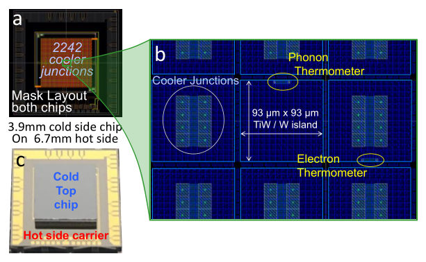 
Figure 1 – (a) Lithography mask of the warm side and cold side chips, (b) Zoom-in view of the mask showing normal-metal islands and the SINIS junction pairs and the central normal-metal used as a phonon thermometer next to the cooler with the electron thermometer, (c) Photograph of a flip-chip bump-bonded cooler.

📷 Fig 2

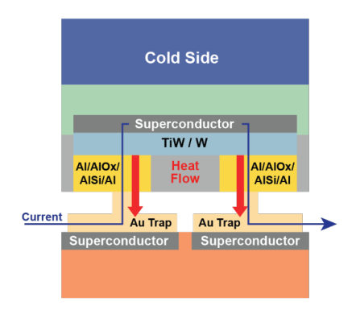 
Figure 2 – Cross sectional schematic of a SINIS bump bonded cooler unit cell indicating the current and heat carrying quasi-particle flows.

📷 Fig 3

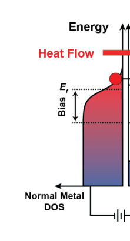 
Figure 3 – Illustration of the cooling mechanism in an NIS tunneling junction from hot electrons

📷 Fig 4

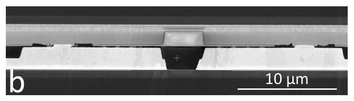 
Figure 4 – (a) FIB cross section of a thermometer bump showing the bonded cold side to hot side chip. (b) Argon blade cross section of two neighboring coolers showing the resulting compression of the bumps resulting in 100 nm vacuum gap.

📷 Fig 5

 
Figure 4a shows a focused ion beam cut through a bonded cold-side chip to hot-side chip pair. This is an early version of a thermometer using a smaller width bump than the 2 μm by 2 μm eventually settled upon for the working devices but since the thermometer and coolers are fabricated simultaneously from the same layers, it shows all of the essential features of the device. The cold side TiW/W bilayer normal- metal was 410 nm thick, later embodiments thickened this to a total of 600 nm under the junction. Our

**Summary.** This paper reports on the design and experimental realization of a solid-state refrigerator that cools silicon chips to sub-Kelvin temperatures using arrays of NIS superconducting junctions. The methodology involves modeling quasi-particle diffusion and meticulously engineering the interfaces to minimize parasitic heat leakage. The success demonstrates a significant advance in solid-state cryocooling technology.

**Why it may be interesting.** The detailed modeling of non-equilibrium heat transport, involving energy filtering via superconducting gaps and diffusive quasi-particle dynamics, touches upon non-equilibrium statistical mechanics and energy relaxation processes relevant to quantum thermodynamics.

Detailed structure

**Main problem.** To develop a scalable, solid-state refrigerator capable of cooling silicon chips to temperatures below 1 K by efficiently managing heat transfer and minimizing parasitic heat leakage.

**Main result.** The authors demonstrated cooling of a silicon chip down to 70 mK and achieved a cooling of -97 mK, marking the first demonstration of sub-1 K cooling of an entire silicon chip using NIS junctions.

**Method.** The work combines experimental fabrication of complex superconducting junctions with advanced 3D numerical simulations to model quasi-particle diffusion and interfacial heat flow.

**Model / system.** The system is a chip-scale refrigerator built from Normal-metal/Insulator/Superconductor (NIS) junctions, configured as SINIS units, which operate by filtering electrons via the superconducting energy gap. Heat transport is modeled using diffusive quasi-particle flow, incorporating both Acoustic Mismatch Models (AMM) and specific interfacial heat flow equations.

**Key observables.** Effective phonon temperature of the silicon chip, Coefficient of Performance (COP), and 2nd Law Efficiency.

**Important parameters / regimes.** Operating temperatures down to 70 mK, junction resistance ($	ext{621 } \Omega\cdot\mu	ext{m}^2$), and the superconducting energy gap ($\Delta$).

**Assumptions / limitations.** The primary assumptions involve modeling quasi-particle flow as diffusive and engineering the geometry to limit heat leakage, though some models ignore quasiparticle branching mixing effects.

**Figures summary.** Figures illustrate the lithography masks and cross-sections of the cooler, schematics of the SINIS unit, and comparative plots showing simulated vs. experimental phonon temperature profiles validating the heat leakage model.

**Paper structure.** The paper progresses from establishing the physical limitations of existing coolers to detailing the NIS junction physics, developing sophisticated models for heat leakage, and culminating in the measurement and validation of sub-Kelvin cooling performance metrics.

Abstract

Solid-state refrigerators using Normal-metal/Insulator/Superconductor (NIS) junctions have previously demonstrated excellent electron cooling but limited ability to cool phonons. The energy gap of the superconductor is used as an energy filter to allow higher than average energy electrons to preferentially tunnel from the normal-metal through the insulator into the superconductor where they travel as quasi-particles. Typically, the heat is moved and work is done to deposit hot quasi-particles into a normal-metal quasi-particle trap for rejection to the next refrigeration stage. Realizing that (1) the quasi-particles flow diffusively, driven by a concentration gradient in the electric field-free superconductor, and (2) that the undesirable backwards leaking of heat from the hot-side trap can be reduced by engineering the geometry and materials at the superconductor-to-trap interface, enhanced cooling can be achieved. Fabrication of the refrigerator was accomplished using a tungsten and titanium-tungsten alloy as the cold-side normal-metal, aluminum oxide as the insulator, aluminum as the superconductor, and gold as the trap, with the cold-side NIS portion being attached to the hot-side gold trap by bump bonding. The refrigerator consisted of 1121 junction pairs, each pair being an SINIS unit, all electrically connected in series. Using this we have measured the effective phonon temperature of a 3.9 mm x 3.9 mm x 0.65 mm silicon chip driven down to 70 mK from a bath temperature of 120 mK, and down to 174 mK from a 271 mK rejection temperature (a cooling of -97 mK). This is the first demonstration of the sub 1 K cooling of an entire silicon chip using NIS junctions.

[↑ back to top](#top)

### [Electronic Reconstruction at the Quasicrystal-Moiré Crossover in Twisted Bilayer Graphene](http://arxiv.org/abs/2608.18052v1)

**Authors:** Kuo-En Chang, Aitor Garcia-Ruiz, Ta-Lei Chou, Yen-Ting Liu, Sheng-Chin Ho, Yu-Chiang Hsieh, Ching-Hua Kao, Chiu-Hua Huang, Ying-Mei Yang, Kenji Watanabe, Takashi Taniguchi, Ming-Wen Chu, Ming-Hao Liu, Tse-Ming Chen  
**Type:** both · **Category:** strongly correlated electrons · **PDF:** <https://arxiv.org/pdf/2608.18052v1>  
**Analysis basis:** full PDF text, analyzed in chunks
**Topic relevance:** `analog quantum simulation` **2/5** · `Frenkel-Kontorova` **1/5** · `Keldysh / 2PI / non-Gaussian methods` **1/5**

📷 Fig 1

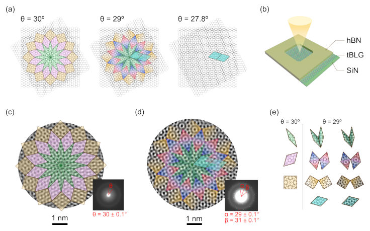 
FIG. 1. (a) Schematic illustrations of atomic arrangements from the 30◦quasicrystal (left), with 12-fold dodecagonal symmetry described by a Stampfli tiling, to the 27.8◦commensurate moir´e superlattice (right). At θ = 29◦, the quasicrystalline order is gently perturbed, producing a crossover state that retains mirror-symmetric motifs of the dodecagonal structure while showing incipient local moir´e periodicity near the rotating center. (b) Schematic of the device structure incorporating a prepatterned access-window in the hBN pickup layer for atomic-resolution TEM imaging. (c) and (d) show the TEM image of 30◦and 29◦TBG, respectively. In (c), the image reveals a dodecagonal...

📷 Fig 2

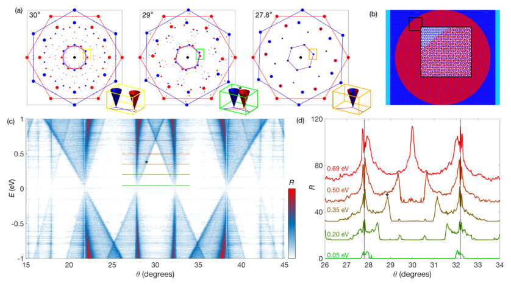 
FIG. 2. (a) Sketch presenting the corners of the first Brillouin zone and the Umklapp-scattered points k = K(±) t/b + Gb −Gt. The size of the points reflects the amplitude of the spectral weight, exponentially decaying with Gb −Gt. The inset presents the low-energy decoupled dispersion, from the charge neutrality point to EF = 0.4 eV, around the second-order Umklapp-scattered dispersion. (b) Sketch of the device used in the transport simulations. The blue and red dots represent the atoms of the bottom and top flakes, and the cyan atoms represent the leads. (c) Reflection map for a 50 nm-wide device. (d) Reflection profile for 5 selected Fermi levels, for a 100 nm-wide nanoribbon, with the...

📷 Fig 3

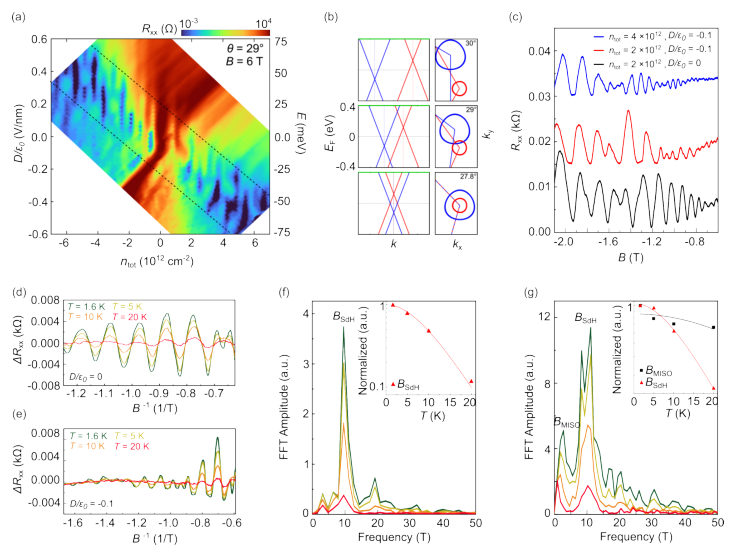 
FIG. 3. (a) Longitudinal resistance Rxx of dual-gated 29◦TBG (device B29) as a function of carrier density ntot and displacement field D at B = 6 T and T = 1.6 K, revealing a distorted and asymmetric Landau level spectrum. (b) Calculated Fermi contours of second-order Umklapp Dirac-cone replicas at three twist angles under a displacement field (B = 0 T), obtained from a line cut at EF = 0.4 eV (green trace in the left panel). (c) Low-field longitudinal resistance Rxx as a function of magnetic field B for different displacement fields D and carrier densities ntot. (d) and (e) Temperature dependence of oscillations plotted against inverse magnetic field (1/B) at D/ε0 = 0 and D/ε0 = −0.1 V/nm,...

📷 Fig 4

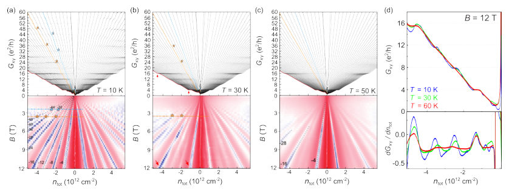 
FIG. 4. (a)-(c) Hall conductance Gxy (upper panels) and longitudinal resistance Rxx (lower panels) as functions of carrier density and magnetic field at T = 10,30,50 K respectively. Star markers highlight the quantum Hall plateaus associated with the 12e2/h sequence in selected regimes. Dashed lines trace the corresponding Landau levels, making the sequence easier to follow. In (b), arrows indicate the comparatively robust ν = 4 and 16 plateaus. (d) Temperature dependence of Gxy (top) at B = 12 T and its derivative (bottom), illustrating the anomalous robustness of the 4e2/h and 16e2/h plateaus.

**Summary.** This work demonstrates that twisted bilayer graphene exhibits rich electronic physics near the crossover between quasicrystalline and moiré order at $	heta \approx 29^\circ$. By combining TEM and magnetotransport, the authors show that quasiperiodicity fundamentally alters low-energy states, evidenced by an anomalous, temperature-dependent evolution of the Landau-level degeneracy. This challenges existing models by proving that strong interlayer coupling persists even outside the conventional moiré regime.

**Why it may be interesting.** The observation of temperature-dependent, high-fold Landau level degeneracy in a quasiperiodic system provides a rich platform for studying emergent many-body physics and how geometric symmetry dictates correlated electronic behavior, relevant to understanding topological phases.

Detailed structure

**Main problem.** The paper investigates the electronic reconstruction in twisted bilayer graphene (TBG) at a twist angle ($\approx 29^\circ$) that lies between the quasicrystalline and commensurate moiré regimes.

**Main result.** The conventional view that large-angle TBG is electronically trivial breaks down, as the system exhibits strong, temperature-dependent interlayer hybridization leading to an anomalous evolution of Landau-level degeneracy from fourfold to twelvefold.

**Method.** The study combines atomic-resolution Transmission Electron Microscopy (TEM) to map structural symmetry with magnetotransport measurements (Shubnikov-de Haas oscillations) to probe electronic states.

**Model / system.** The physical system is TBG, focusing on the crossover regime near $29^\circ$. The physics involves Umklapp scattering mediating interlayer coupling, which fundamentally reshapes the low-energy electronic states beyond standard moiré band theory.

**Key observables.** Landau-level degeneracy (evolving from 4-fold to 12-fold), magneto-intersubband oscillations (MISO), and the deviation from expected transport signatures at $29^\circ$.

**Important parameters / regimes.** Twist angle ($	heta$), specifically the crossover point near $29^\circ$, and temperature ($T$) dependence.

**Assumptions / limitations.** The analysis assumes that the observed transport anomalies are due to the interplay between quasiperiodic symmetry and interlayer Umklapp scattering, challenging models based solely on decoupled or purely commensurate structures.

**Figures summary.** Figures illustrate the structural transition from 12-fold quasicrystal symmetry ($30^\circ$) through the $29^\circ$ crossover state to the commensurate moiré lattice ($27.8^\circ$), alongside transport maps showing the anomalous evolution of quantum Hall plateaus.

**Paper structure.** The paper establishes the structural context via TEM, then uses magnetotransport measurements to probe the electronic consequences of the quasicrystal-moiré crossover, culminating in the observation of temperature-dependent Landau level degeneracy.

Abstract

Large twist angles in twisted bilayer graphene are widely expected to be electronically trivial, with negligible interlayer coupling and no electronic reconstruction, in contrast to the rich moiré-driven band reconstruction and correlated physics that emerge at small twist angles. Here, we show that this paradigm breaks down near a twist angle of 29°, where the system crosses over between quasicrystalline and commensurate order. Atomic-resolution transmission electron microscopy directly reveals the coexistence of near-dodecagonal quasicrystalline symmetry and emerging moiré periodicity, indicating an intermediate, nonperiodic structural regime. Magnetotransport measurements uncover strong interlayer hybridization mediated by Umklapp scattering, manifested by magneto-intersubband oscillations and a highly unconventional Landau-level spectrum. Remarkably, the Landau-level degeneracy evolves from 4- to 12-fold with increasing temperature, a behavior incompatible with two decoupled graphene monolayers. These findings establish large-angle twisted bilayer graphene as a platform where quasiperiodic symmetry fundamentally reshapes low-energy electronic states beyond the conventional moiré framework.

[↑ back to top](#top)

### [The Deformed Image Vortex Ansatz: A Perturbation-Aware Description of Magnetic Vortices in In-Plane Fields](http://arxiv.org/abs/2608.17840v1)

**Authors:** Thomas G. Coppée, Colin Ducarme, Simon de Wergifosse, Flavio Abreu Araujo  
**Type:** theory · **Category:** other · **PDF:** <https://arxiv.org/pdf/2608.17840v1>  
**Analysis basis:** full PDF text, analyzed in chunks
**Topic relevance:** `Keldysh / 2PI / non-Gaussian methods` **2/5**

📷 Fig 1

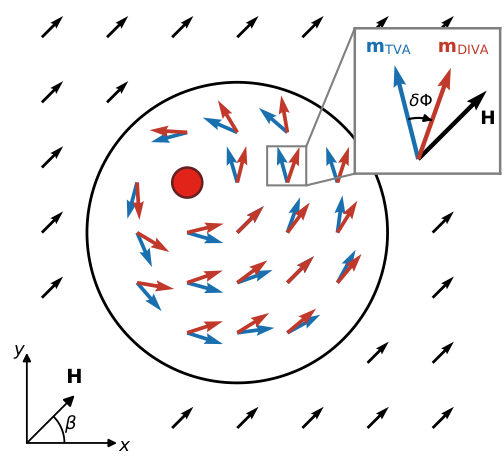 
FIG. 1. Schematic of the DIVA construction for a magnetic vortex in a circular ferromagnetic nanodot under a uniform in-plane field. Black arrows indicate the in-plane field H, re- produced in the coordinate reference (bottom left) at an angle β from the x-axis. Inside the disk, the in-plane magnetization curls around the out-of-plane vortex core (red dot, here dis- placed from the disk center); two textures are overlaid on the same grid: the two-vortex ansatz (TVA, blue arrows), which represents only the displaced equilibrium vortex, and DIVA (red arrows), which additionally carries the field-induced defor- mation. The inset enlarges the boxed region and compares the local magnetization...

📷 Fig 2

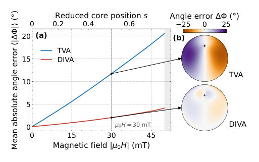 
FIG. 2. Angular accuracy of the two ans¨atze for the t/R = 0.1 disk (R = 100 nm, t = 10 nm, Permalloy parameters, β = 0, C = +1). (a) Mean absolute angle error ⟨|∆Φ|⟩between the analytical ans¨atze and the relaxed MuMax+ configuration, as a function of the applied field |µ0H| (bottom axis) and of the corresponding reduced core position s = |X|/R (top axis). Blue line: two-vortex ansatz (TVA). Red line: deformed image vortex ansatz (DIVA). Curves are plotted up to vortex-core expulsion; the shaded band marks s &gt; 1 −A, beyond the validity window of Eq. (17) (Table I): for this geometry the core is expelled at s ≈0.8, before the window is reached, so no data enter the shaded region. (b)...

📷 Fig 3

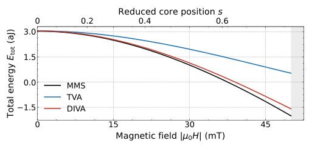 
FIG. 4. Total micromagnetic energy Etot of the displaced vortex as a function of the applied field |µ0H| (bottom axis) and of the associated reduced core position s (top axis), for the t/R = 0.1 disk (R = 100 nm, t = 10 nm, Permalloy parameters, β = 0, C = +1). Black: full micromagnetic simulation (MMS). Blue: TVA evaluated at the MMS core position. Red: DIVA evaluated at the same position. Both ans¨atze carry the same Feldtkeller out-of-plane core, so they differ only through their in-plane textures. The shaded band marks s &gt; 1 −A, beyond the validity window of Eq. (17); as in Fig. 2, the core is expelled at s ≈0.8, before this window, so the shaded region contains no data.

📷 Fig 4

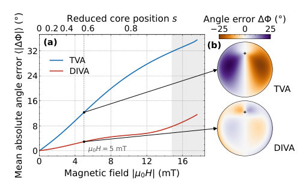 
FIG. 3. Angular accuracy of the two ans¨atze for the t/R = 0.0125 disk (R = 400 nm, t = 5 nm, Permalloy parameters, β = 0, C = +1). (a) Mean absolute angle error ⟨|∆Φ|⟩between the analytical ans¨atze and the relaxed MuMax+ configuration, as a function of the applied field |µ0H| (bottom axis) and of the corresponding reduced core position s = |X|/R (top axis). Blue line: two-vortex ansatz (TVA). Red line: deformed image vortex ansatz (DIVA). Curves are plotted up to vortex- core expulsion; the shaded band marks s &gt; 1 −A, beyond the validity window of Eq. (17); unlike the t/R = 0.1 disk, here the core survives into this region before being expelled near the end of the sweep. (b) Spatial maps...

**Summary.** This paper introduces the Deformed Image Vortex Ansatz (DIVA) to improve the theoretical description of magnetic vortices in nanodots under external fields. By building the field response directly into the magnetization profile, DIVA provides a significantly more accurate model than previous methods. The work validates this improved theory by comparing its predictions against detailed micromagnetic simulations.

**Why it may be interesting.** While focused on classical magnetism, the methodology of building the perturbation response directly into the ansatz, rather than adding it as a correction, mirrors advanced techniques used in developing effective Hamiltonians or variational wavefunctions in quantum many-body physics.

Detailed structure

**Main problem.** Existing magnetization ansätze fail to accurately describe how magnetic vortices deform when subjected to external in-plane magnetic fields.

**Main result.** The proposed Deformed Image Vortex Ansatz (DIVA) significantly reduces the error in describing vortex deformation compared to previous ansätze, showing improvements by factors of 3 to 6 in angular deviation.

**Method.** The authors developed a perturbation-aware ansatz (DIVA) and minimized the total energy functional by solving a resulting differential equation for the radial profile of the deformation.

**Model / system.** The study models magnetic vortices in thin ferromagnetic nanodots (Permalloy) subjected to an external in-plane field. The physics is governed by minimizing the total energy functional, which includes exchange, Zeeman, and magnetostatic terms.

**Key observables.** Disk-averaged angular deviation ($\delta\Phi$), total-energy deviation, and the radial profile function $f(r)$.

**Important parameters / regimes.** Aspect ratio ($t/R$), external field strength ($H$), and material parameters like saturation magnetization ($M_s$).

**Assumptions / limitations.** The deformation is assumed to be dominated by the $m=1$ harmonic, and the magnetostatic energy is approximated using a local functional form.

**Figures summary.** Figure 1 schematically compares the local magnetization directions for the two-vortex ansatz and DIVA under an in-plane field. Other figures show energy decompositions and the dependence of the demagnetizing factor on aspect ratio.

**Paper structure.** The paper first identifies the limitation of existing ansätze, introduces the DIVA, derives the governing radial equation by energy minimization, and finally benchmarks the solution against micromagnetic simulations to validate the improved accuracy.

Abstract

Thiele-based descriptions of magnetic vortex dynamics in thin ferromagnetic nanodots rely on magnetization ansätze that describe the equilibrium texture but cannot represent perturbation-induced deformations. We introduce the Deformed Image Vortex Ansatz (DIVA): a perturbation-aware ansatz in which the response to an external perturbation is built into the magnetization profile itself, rather than appended to the dynamics as a correction. Here, we demonstrate the concept for a uniform, stationary in-plane field applied to a Permalloy nanodot, for which the deformation is analytically tractable. A symmetry-based perturbative expansion identifies the leading deformation as a single $m = 1$ harmonic around the disk, while energy minimization and a dominant-balance analysis yield a closed-form interpolant for the radial profile. Benchmarked against micromagnetic simulations on Permalloy disks of aspect ratio $t/R = 0.1$ and $0.0125$, this realization reduces the disk-averaged angular deviation by a factor of 3 to 6 relative to the two-vortex ansatz, depending on geometry and field, and reduces the total-energy deviation by about a factor of six in the thicker disk.

[↑ back to top](#top)

### [Emissivity by Design: Geometric Mesh Inductance Governs Thermal Radiation in Metallic Nanowire Networks](http://arxiv.org/abs/2608.17061v1)

**Authors:** Amaury Baret, Ngoc Duy Nguyen  
**Type:** theory · **Category:** other · **PDF:** <https://arxiv.org/pdf/2608.17061v1>  
**Analysis basis:** full PDF text, analyzed in chunks
**Topic relevance:** `analog quantum simulation` **1/5** · `interference shaping light` **1/5**

📷 Fig 1

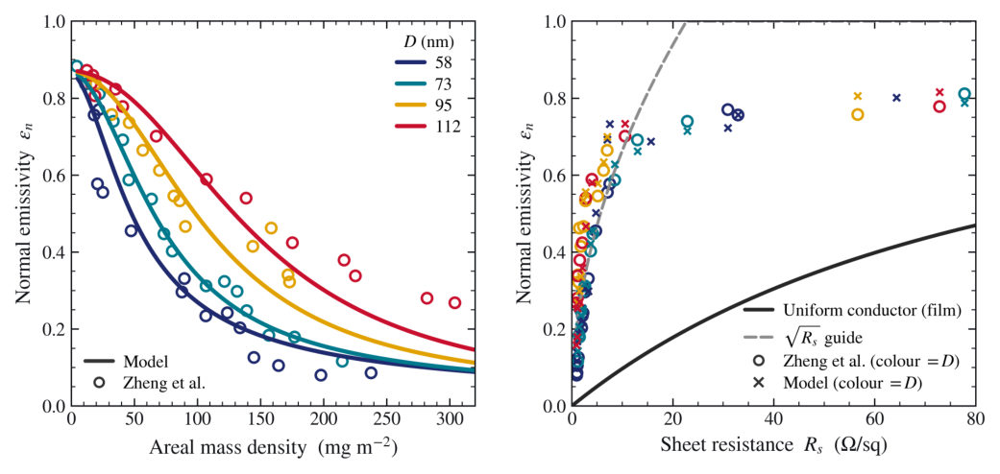 
FIG. 1. The phenomenon and the puzzle. (a) Normal emissivity versus areal mass density for four diameters; open symbols are the data of Zheng et al. [1] and solid lines the model with one global parameter set, thinner wires dropping faster as predicted by g ∝D2. (b) The puzzle: emissivity versus sheet resistance follows a √Rs (Hagen–Rubens) branch at low Rs but deviates above ∼15 Ω/sq, lying far above the emissivity a uniform conductor of the same Rs would have (solid black). Crosses are the model prediction (coloured by D), placed at each sample’s measured Rs, reproducing the same deviation from the uniform-conductor branch.

📷 Fig 2

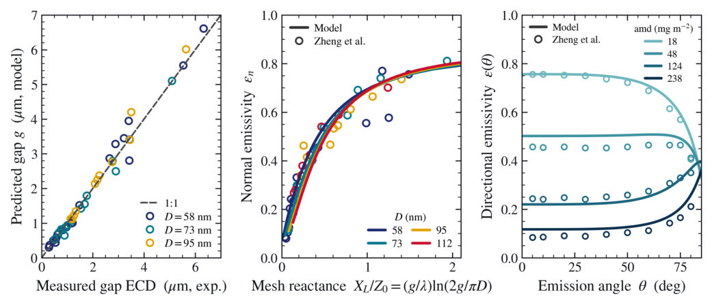 
FIG. 2. The gap is the master variable. (a) The gap predicted from areal density and diameter [Eq. (2)] against the measured mean gap (equivalent-circle diameter of the inter-wire voids; see SI) of Zheng et al. [1]; a single prefactor kg ≈1.3 collapses the 58, 73, 95 nm diameters onto the 1:1 line. The 112 nm gap data are omitted: their gap-area column in the source file is internally inconsistent (median&gt;mean) and yields a spurious factor-∼2 offset, so they are excluded from this geometric test only; the 112 nm emissivity is still reproduced with the same parameters (see SI). (b) Universal collapse: plotted against the dimensionless mesh reactance XL/Z0 = (g/λ) ln(2g/πD), the emissivity...

📷 Fig 3

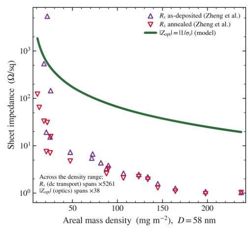 
FIG. 3. Optics and DC transport decouple. Two impedances of the same D = 58 nm network are plotted against areal density on common axes: the measured DC sheet resistance Rs (the impedance the DC current sees; as-deposited, up- triangles; annealed, down-triangles) and the modeled optical sheet impedance |Zopt| = |1/σs| that the thermal-IR wave sees (line). If the emissivity were governed by Rs, the two would track; instead they pull apart. Across the samples for which Rs was measured, densification makes the as-deposited Rs fall by ×5261—or ×525 once the single most resistive, near- threshold film is set aside—the steep junction/percolation sig- nature, whereas over that same density range...

**Summary.** This work proposes that the thermal emissivity of metallic nanowire networks is not governed by simple DC resistance but by a geometric inductance ($X_L$) derived from the average inter-wire gap ($g$). By modeling the network as an inductive mesh, the authors successfully unify disparate experimental results onto a single universal curve, establishing the gap size as the master design variable for radiative properties.

**Why it may be interesting.** While focused on classical electromagnetism and condensed matter optics, the concept of a single, non-material-constant geometric parameter ($g$) controlling a complex macroscopic property (emissivity) is analogous to finding an effective Hamiltonian or controlling parameter in open quantum systems.

Detailed structure

**Main problem.** The paper aims to explain the previously unexplained regularities in the thermal infrared emissivity of metallic nanowire networks, which are candidates for low-emissivity transparent electrodes.

**Main result.** The thermal emissivity is shown to be governed by a geometric inductance ($X_L$) derived from the average inter-wire gap ($g$), collapsing multiple experimental datasets onto a single universal curve.

**Method.** The authors developed a model based on transmission-line theory and magnetostatics, treating the network as an inductive mesh structure rather than relying solely on DC electrical transport properties.

**Model / system.** The system is metallic nanowire networks (e.g., AgNWs) forming a mesh. The key theoretical element is the geometric inductance $X_L = Z_0 (g/\lambda) \ln(2g/\pi D)$, which acts as the master variable controlling the optical response.

**Key observables.** Thermal infrared emissivity ($\epsilon$), optical impedance ($Z_{opt}$), and sheet resistance ($R_s$).

**Important parameters / regimes.** Average inter-wire gap ($g$), thermal wavelength ($\lambda$), and wire diameter ($D$).

**Assumptions / limitations.** The optical response is governed by the local geometric inductance ($X_L$), which is assumed to be the dominant factor, decoupling the optical behavior from the global electrical percolation threshold.

**Figures summary.** Figures demonstrate the universal collapse of emissivity vs. $X_L/Z_0$, show the divergence between $R_s$ and $|Z_{opt}|$ at high density, and illustrate the length-independence of the optical response.

**Paper structure.** The paper establishes the puzzle (anomalous $\epsilon$ dependence), develops the theory based on geometric inductance ($X_L$), validates $X_L$ by reproducing multiple datasets, and contrasts this finding with failing models like the Hanauer model.

Abstract

The thermal infrared emissivity of metallic nanowire networks - the property that makes them candidate low-emissivity transparent electrodes - follows regularities that have resisted physical explanation: a strong wire-diameter dependence with no wire-length dependence, a correlation with sheet resistance that breaks down above ~15 ohm/sq, and an angular signature that turns from dielectric-like to metallic as the network densifies. We show that all of them follow from one local geometric length, the average inter-wire gap g, acting through the geometric inductance of a mesh finer than the thermal wavelength: $X_L = Z_0 (g/λ) \ln(2g/πD)$, a parameter-free reactance that exceeds the ohmic loss and, unlike the DC sheet resistance, stays finite instead of diverging at the percolation threshold. Since the gap is fixed by areal density and wire diameter alone, the optics is length-independent and decoupled from percolative transport; what has been read as a second, optical percolation is instead a smooth impedance crossing. With a single fitted parameter the theory reproduces 56 silver-nanowire samples across four diameters to a mean absolute error of 0.04, collapses them onto one universal curve, and - unchanged - predicts the emissivity-transmittance data of five independent groups and the measured spectral emissivity, including the silica phonon band. Because this reactance contains no material constant, the inter-wire gap emerges as the master design variable for the radiative properties of metallic nanowire transparent conductors.

[↑ back to top](#top)

### [Variable-mass sine-Gordon with point defects: integrability, soliton transmission, and quasi-conservation](http://arxiv.org/abs/2608.17211v1)

**Authors:** A. R. Aguirre, H. Blas, H. F. Callisaya, M. C. de Oliveira  
**Type:** theory · **Category:** other · **PDF:** <https://arxiv.org/pdf/2608.17211v1>  
**Analysis basis:** full PDF text, analyzed in chunks
**Topic relevance:** `Frenkel-Kontorova` **1/5**

📷 Fig 1

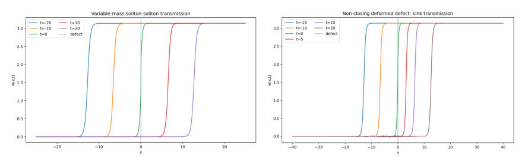 
Figure 1: (color online) The kink-kink transmission for m0 = 1; ǫ0 = 0.3; ǫ1 = 0.5; κ0 = 0.5; κ1 =

📷 Fig 2

 
Fig. 2 shows soliton–antisoliton transmission through the defect. The incoming positive-orientation

📷 Fig 3

 
Fig. 3 (right panel) one has residual reflected and radiative components at t = 20 for the soliton–antisoliton

📷 Fig 4

 
Fig. 4 presents the plots of the anomalies (4.27) and (4.30) as functions of t associated with the non-

📷 Fig 5

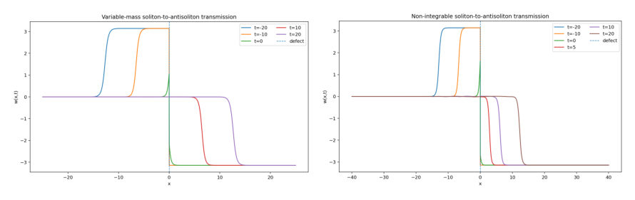 
Figure 2: (color online) Kink-antikink transmission for m0 = 1; ǫ0 = 0.3; ǫ1 = 0.5; κ0 = 0.5; κ1 = 0.7.

**Summary.** This paper analyzes the variable-mass sine-Gordon model incorporating point defects to study its conservation laws. Using advanced techniques from integrable systems, the authors show that exact integrability is lost unless specific parameters match, leading to a regime of charge-dependent quasi-conservation. This provides a theoretical framework for understanding soliton transport in inhomogeneous media.

**Why it may be interesting.** The framework establishes a detailed mechanism for how exact integrability breaks down into controlled quasi-conservation due to defects, which has direct implications for modeling physical systems like Josephson junctions or nonlinear optics.

Detailed structure

**Main problem.** The study investigates the integrability, soliton transmission, and quasi-conservation properties of the variable-mass sine-Gordon model when point defects are introduced.

**Main result.** Exact defect integrability is maintained only when a specific closure condition ($\alphaeta = 1$) is met; otherwise, the system exhibits charge-dependent quasi-conservation.

**Method.** The authors employed Lax and Bäcklund-gauge formulations to derive conserved charges, followed by numerical simulations on a two-half-line geometry to analyze defect-induced anomalies.

**Model / system.** The model is the variable-mass sine-Gordon equation with point defects, which is analyzed using techniques from integrable systems theory, including defect matrices and sewing conditions.

**Key observables.** Conserved charges (Energy, Momentum), the soliton transmission factor ($z$), and defect-localized anomalies.

**Important parameters / regimes.** Deformation parameters $\alpha$ and $eta$, which control the transition between integrable and non-integrable defect regimes.

**Assumptions / limitations.** The analysis assumes the existence of a Lax pair and that outer boundaries are far enough from the defect such that generated signals do not return during the simulation time.

**Figures summary.** The notes reference figures showing finite-difference results, illustrating the transmission/conversion regimes and the effects of non-integrable defects.

**Paper structure.** The work progresses from establishing the infinite hierarchy of conserved charges in the standard sine-Gordon model using Lax pairs, to generalizing this to the variable-mass case, and finally introducing deformations ($\alpha, eta$) and numerical simulations to study the transition to quasi-conservation at defects.

Abstract

We study integrable variable-mass sine-Gordon model (vmSG) with point defects. Using the Lax and Bäcklund-gauge formulations, we construct type-I and type-II defect matrices, derive the corresponding sewing conditions, and generate the bulk and defect contributions to an infinite hierarchy of conserved charges. The lowest members reduce to the standard sine-Gordon energy and momentum in the homogeneous limit, while for inhomogeneous backgrounds they define integrability-generated energy- and momentum-type quantities. Defect compatibility imposes matching conditions on the variable-mass functions across the defect. An analytical transmission factor $z$ characterizes soliton transmission, topological conversion, and absorption/emission processes. We then deform the type-I sewing conditions by parameters $α$ and $β$ and derive the associated defect anomalies. Consistent one-soliton transmission is recovered for $αβ=1$, whereas for $αβ\neq 1$ parity-centered kink-kink and kink-antikink transmissions display vanishing lowest order integrated anomalies but no generic vanishing at higher order. Numerical simulations reproduce the integrable transmission/conversion regimes and show that non-integrable defects generate weak radiative tails and lowest order quasi-conserved charges, while quasi-conservation of the higher order charges remains unestablished. These results elucidate how exact defect integrability deforms into charge-dependent quasi-conservation and establish a framework for defect-controlled soliton transport in inhomogeneous media, with potential applications to nonuniform Josephson junctions, magnetic and nonlinear-optical systems, and effective molecular and DNA models.

[↑ back to top](#top)

### [Vector Akhmediev Breathers and State Transitions in the Degenerate and Nondegenerate Regimes for the Coupled Sasa-Satsuma System](http://arxiv.org/abs/2608.17104v1)

**Authors:** Mengyuan Lan, Lei Wang, Yinchuan Zhao  
**Type:** theory · **Category:** other · **PDF:** <https://arxiv.org/pdf/2608.17104v1>  
**Analysis basis:** full PDF text, analyzed in chunks
**Topic relevance:** `driven-dissipative phase transition` **1/5**

📷 Fig 1

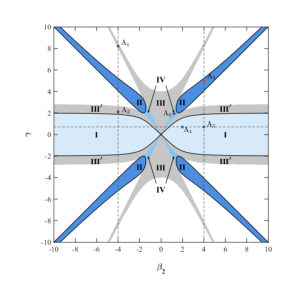 
FIG. 1. Existence diagram in the (β2, γ) plane for β1 = 0, with c1 = c2 = 1 and α = 0. Gray and blue re- gions denote degenerate and nondegenerate regimes, respec- tively. The annotated coordinate points A1 = (−4, 8.2), A2 = (−4, 2.1), A3 = (4, 0.7), A4 = (2, 0.7), A5 = (4, 5), and A6 = (1.21402, 1.93992) are used in the analyses below. Dashed vertical and horizontal lines indicate common values of β2 and γ, respectively.

📷 Fig 2

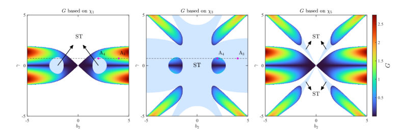 
FIG. 2. Branch-resolved MI gain in the (β2, γ) plane for β1 = 0, with c1 = c2 = 1 and α = 0. The three panels correspond to the eigenvalue-branch pairs represented by χ1, χ3, and χ5, respectively. Nonzero gain identifies AB-supporting branches, while “ST” denotes admissible branches satisfying the state-transition condition and reducing to periodic-wave states. The annotated coordinate points A3 = (4, 0.7) and A4 = (2, 0.7) are used in the representative analyses below, with the dashed horizontal line indicating their common γ = 0.7.

📷 Fig 3

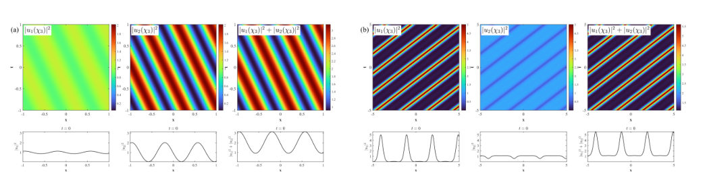 
FIG. 3. State-transition periodic waves in the degenerate regime for β1 = 0, corresponding to points A1 and A2 in Fig. 1. (a) Region III at A1 = (−4, 8.2), with χa = χ3 = −4.1 −0.1366i and χb = 4.1 −0.1366i. (b) Region III′ at A2 = (−4, 2.1), with χa = χ3 = −1.0500 −0.8309i and χb = 1.0500 −0.8309i. In both cases, Re(χa) = −γ/2, with χ4 forming the other member of the unique admissible eigenvalue-branch pair. The intensity modulations are synchronous in region III and opposite in region III′. For each case, the upper row shows |u1|2, |u2|2, and |u1|2 + |u2|2 from left to right, and the lower row gives the corresponding t = 0 cross sections.

📷 Fig 4

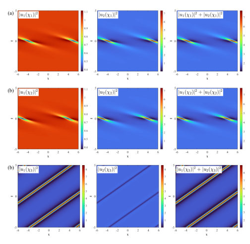 
FIG. 4. Representative solutions at A3 = (4, 0.7) in the outer subregion of region I for β1 = 0. (a) χa = χ1 = 3.6254 − 0.8744i, χb = 4.3254 −0.8744i. (b) χa = χ2 = −4.3254 + 0.8744i, χb = −3.6254 + 0.8744i. (c) χa = χ3 = −0.3500 − 1.3077i, χb = 0.3500 −1.3077i. The branches represented by χ1 and χ2 support ABs, whereas χ3 satisfies Re(χa) = −γ/2 and lies on the state-transition locus, giving a periodic-wave state. In each row, the panels from left to right show |u1|2, |u2|2, and |u1|2 + |u2|2.

📷 Fig 5

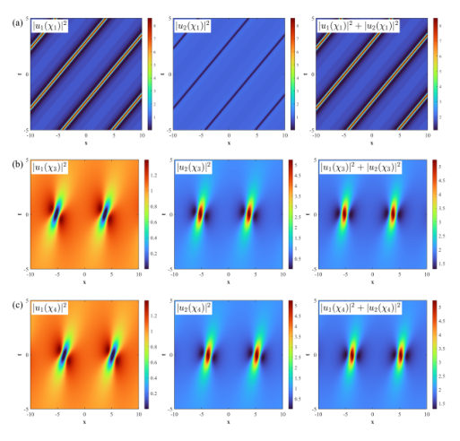 
FIG. 5. Representative solutions at A4 = (2, 0.7) in an inner oval subregion of region I for β1 = 0. (a) χa = χ1 = −0.3500 + 1.2744i, χb = 0.3500 + 1.2744i. (b) χa = χ3 = 1.5334 + 0.7425i, χb = 2.2334 + 0.7425i. (c) χa = χ4 = −2.2334 −0.7425i, χb = −1.5334 −0.7425i. Here, the branch represented by χ1 satisfies Re(χa) = −γ/2 and lies on the state-transition locus, whereas those represented by χ3 and χ4 remain on AB branches. In each row, the panels from left to right show |u1|2, |u2|2, and |u1|2 + |u2|2.

**Summary.** This paper analyzes vector Akhmediev breathers in the coupled Sasa-Satsuma system, a model for coupled optical pulses. By comparing the spectral analysis of breathers with the linear modulation instability spectrum, the authors establish a deep link: the condition for zero linear gain precisely corresponds to the state-transition condition for the breathers. This unifies the understanding of stable and unstable wave states in this nonlinear system.

**Why it may be interesting.** The connection drawn between the state-transition condition (from breathers) and the zero-gain condition (from MI) provides a powerful unified diagnostic tool for understanding nonlinear wave dynamics in optical systems.

Detailed structure

**Main problem.** The paper investigates the existence and properties of vector Akhmediev breathers (ABs) and the associated state transitions within the coupled Sasa-Satsuma (CSS) system.

**Main result.** The analysis establishes a direct correspondence between admissible characteristic-root pairs derived from the spectral analysis and the linear Modulation Instability (MI) branches, showing that zero-gain MI corresponds to periodic-wave states.

**Method.** The study employs spectral analysis using Lax pairs, Darboux transformations to construct breathers, and linear stability analysis to determine the MI gain spectrum.

**Model / system.** The governing equation is the coupled Sasa-Satsuma (CSS) system, which models the coupled propagation of two ultrashort optical pulse envelopes. The analysis is performed across three distinct carrier-wavenumber configurations.

**Key observables.** Vector Akhmediev Breathers (ABs), MI gain $G(\chi_a; \gamma)$, and the localization variable $\Psi$.

**Important parameters / regimes.** Carrier wavenumbers ($eta_1, eta_2$), spectral parameters ($\lambda$), and the degeneracy/nondegeneracy of the background state.

**Assumptions / limitations.** The analysis assumes specific configurations for the background carrier wavenumbers and relies on the equivalence between MI conditions and characteristic-root equations.

**Figures summary.** Figure 1 illustrates the existence diagram in the $(eta_2, \gamma)$ plane for the case $eta_1 = 0$, distinguishing between degenerate and nondegenerate regimes.

**Paper structure.** The paper follows a structure moving from spectral analysis (defining the background), to classifying AB branches based on wavenumber configurations, then analyzing the linear modulation instability (MI) spectrum, and finally establishing the correspondence between the two.

Abstract

We investigate vector Akhmediev breathers (ABs) in the degenerate and nondegenerate regimes for the coupled Sasa-Satsuma system describing two coupled ultrashort optical pulse envelopes. Based on the carrier-wavenumber relations of the two-component background, we examine three configurations: a single vanishing wavenumber, a pair of opposite wavenumbers, and two nonzero wavenumbers of unequal magnitudes. These configurations admit distinct maximal degrees of nondegeneracy. For each configuration, we derive the reduced spectral equations, construct the existence diagrams, and compare the resulting branches with the modulation-instability gain spectra. Owing to the distinct carrier-wavenumber symmetries, nondegenerate-type modes can occur in spectrally degenerate regions, whereas degenerate-type ones may also appear in spectrally nondegenerate regions. Moreover, all admissible branches in the degenerate regimes satisfy the state-transition condition and correspond to periodic-wave states, while such branches are also present in nondegenerate regimes. Direct numerical simulations of representative solutions further confirm the analytical predictions.

[↑ back to top](#top)

### Other secondary papers (2)

Show other secondary papers

### [Giant Bandgap Pulsation Driven by Hotspot Breathing Phonons in a Flat-Band Solid](http://arxiv.org/abs/2608.17408v1)

**Authors:** Wenjie Liu, Huaxin Wu, Jiyang Fan  
**Type:** theory · **Category:** other · **PDF:** <https://arxiv.org/pdf/2608.17408v1>  
**Analysis basis:** full PDF text, analyzed in chunks

📷 Fig 1

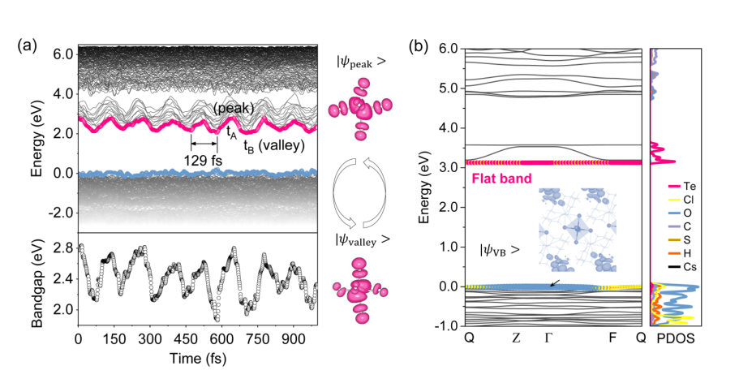 
FIG. 1. Spontaneous temporal dynamics of electronic states and band structure of the DMSO crystal. (a) Temporal evolution of the electronic energy levels extracted from AIMD trajectories using the 2×2×1 supercell (452 atoms) at thermal equilibrium (300 K), with the average valence-band maximum (VBM) set to 0 eV. The conduction-band minimum (CBM) and the subsequent bandgap exhibit large-amplitude periodic oscillations (period: ~129 fs). The right panels show the isosurfaces of the charge density of the CBM state at two representative time points: a peak (tA) and a valley (tB) during the oscillation. (b) Electronic band structure and projected density of states (PDOS). Pink, yellow, and blue...

📷 Fig 2

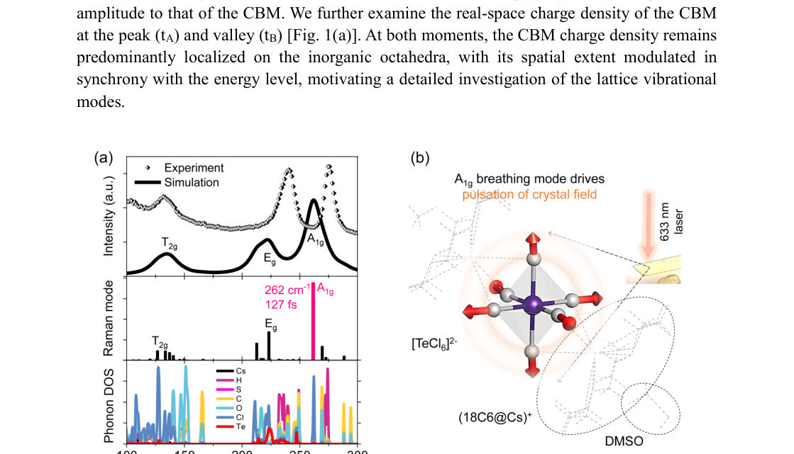 
FIG. 2. Raman spectra and A1g-mode breathing vibration of the DMSO crystal. (a) Measured and simulated Raman spectra of the DMSO crystal (upper panel), alongside the corresponding phonon density of states decomposed into atomic contributions (lower panel). The prominent A1g peak at 262 cm−1 (corresponding to a period of 127 fs) is clearly identified. (b) Schematic illustration of the Γ-point A1g breathing vibration of the inorganic [TeCl6]2− octahedral unit. This mode drives an in-phase expansion and contraction of the octahedral cage, periodically pulsating the local crystal field.

📷 Fig 3

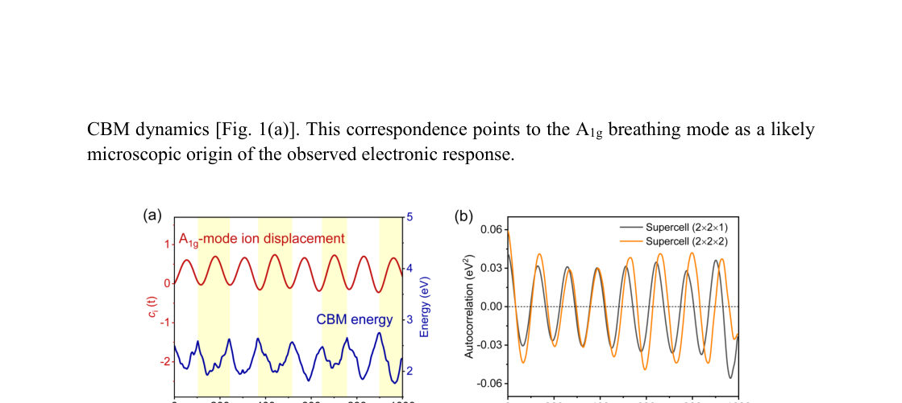 
Fig. 3. Temporal correlation between the Γ-point A1g breathing motion and CBM dynamics. (a) Temporal evolution of the projected Γ-point A1g-mode coefficient ci(t) and the CBM energy obtained from a 300 K AIMD simulation using a supercell 2×2×2 containing 904 atoms. The two quantities exhibit a clear cycle-by-cycle correspondence. (b) Autocorrelation functions of the CBM energy obtained from the 2×2×1 and 2×2×2 AIMD simulations, both showing a pronounced oscillatory component with a characteristic period of approximately 127 fs.

📷 Fig 4

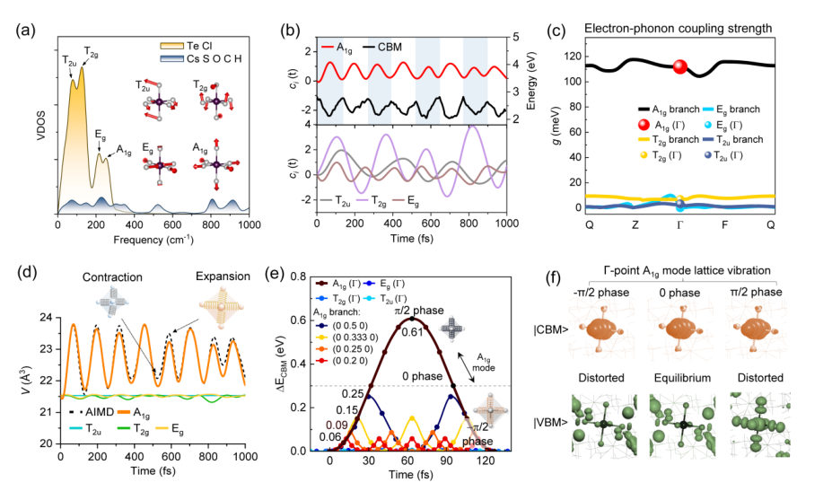 
FIG. 4. Microscopic mechanism underlying the Γ-point A1g-driven bandgap dynamics. (a) Atom-projected vibrational density of states (VDOS) of the DMSO crystal. (b) Temporal evolution of atomic displacements projected onto four dominant Γ-point phonon modes and the CBM energy level, obtained from the 2×2×1 AIMD trajectory. (c) First-principles electron– phonon coupling strength between the CBM state and each phonon mode along four phonon dispersion branches. (d) Temporal evolution of the octahedral volume alongside its decomposition into individual Γ-point phonon mode contributions. (e) Evolution of the CBM energy driven by each individual phonon mode over one vibrational period of Γ-point...

📷 Fig 5

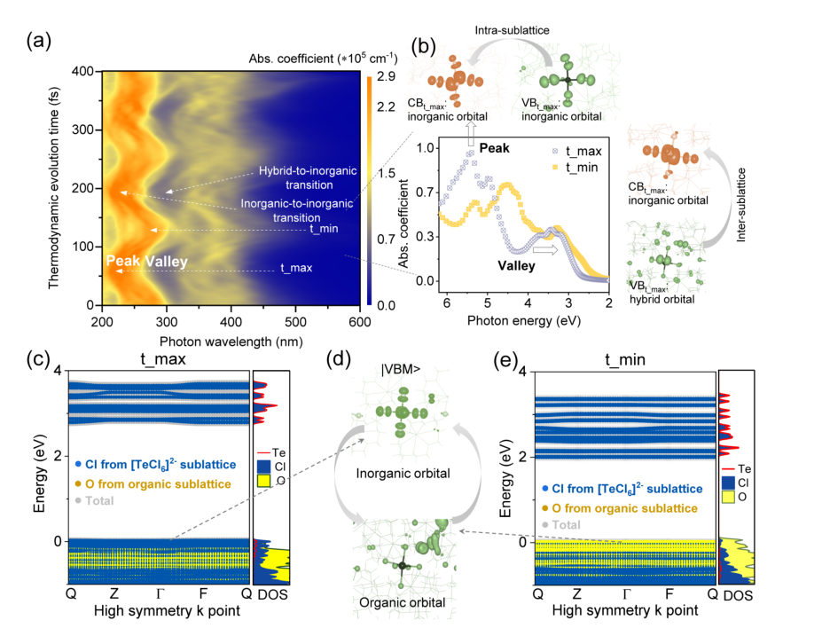 
Fig. 5. Time-dependent photon absorption and dynamic orbital hybridization in the DMSO crystal. (a) Two-dimensional contour plot showing the temporal evolution of the photon absorption spectrum of the DMSO crystal along a segment of the AIMD trajectory at 300 K. The absorption spectra were computed within the independent-particle approximation using the frequency-dependent dielectric function, and explicitly include the optical transition matrix elements implemented in the PAW formalism. (b) Absorption coefficient as a function of photon energy at the marked t_max and t_min time points in (a). Top and right panels show isosurfaces of the conduction band and valence band states that...

**Summary.** This study reveals that the bandgap of a flat-band solid can undergo giant, periodic pulsations at room temperature due to lattice vibrations. The effect is governed by a dual selection mechanism: the strong coupling of the $	ext{A}_{1g}$ breathing phonon and the phase coherence of the $\Gamma$-point lattice motion. This demonstrates that ordered electronic responses can emerge from seemingly disordered thermal fluctuations.

**Why it may be interesting.** This work connects lattice dynamics (phonons) directly to electronic structure modulation on femtosecond timescales, providing a mechanism for intrinsic, thermally driven ultrafast electronic functionality, which is relevant to understanding energy conversion in complex materials.

Detailed structure

**Main problem.** The study investigates whether intrinsic, thermal lattice vibrations alone can induce a pronounced, periodic, and large-amplitude pulsation in the electronic bandgap of a solid, challenging the view of the bandgap as a static property.

**Main result.** A giant bandgap pulsation ($\sim 0.95$ eV) was observed at room temperature, driven by a dual selection mechanism: the strong coupling of the $	ext{A}_{1g}$-like breathing phonon mode and the dominance of the unit-cell-synchronous $\Gamma$-point component over finite-$q$ modes.

**Method.** The research employs *ab initio* molecular dynamics (AIMD) simulations combined with first-principles electron-phonon calculations to track the time evolution of the Conduction Band Minimum (CBM) energy.

**Model / system.** The system studied is a perovskite-like flat-band solid, specifically the DMSO crystal, which contains $	ext{[TeCl}_6]^{2-}$ octahedra responsible for the flat conduction band minimum.

**Key observables.** Electronic bandgap dynamics (pulsation amplitude and frequency), CBM energy modulation $\delta E(t)$, and the correlation between CBM energy and the $	ext{A}_{1g}$ phonon coordinate.

**Important parameters / regimes.** Room temperature (300 K), pulsation frequency ($\sim 7.8$ THz), and maximum peak-to-peak variation ($\sim 0.95$ eV).

**Assumptions / limitations.** The analysis assumes that the observed dynamics are governed by the coupling between the electronic structure and the lattice vibrations, and that the $\Gamma$-point component dominates the macroscopic response.

**Figures summary.** Figures illustrate the temporal evolution of the CBM oscillation, comparing it to the $	ext{A}_{1g}$ phonon mode coefficient, and demonstrating the phase-space difference between $\Gamma$-point and finite-$q$ mode contributions.

**Paper structure.** The paper progresses by establishing the problem (static vs. dynamic bandgap), presenting the simulation methodology (AIMD, e-ph coupling), identifying the key phonon mode ($	ext{A}_{1g}$), and finally proving the dual selection mechanism (strong coupling + $\Gamma$-point dominance) responsible for the large pulsation.

Abstract

The electronic bandgap of solids is conventionally viewed as a static property at a given temperature, with only weak and stochastic thermal fluctuations under equilibrium conditions. Here, using ab initio molecular dynamics and first-principles electron-phonon calculations, we reveal a pronounced room-temperature bandgap pulsation at about 7.8 THz in a perovskite-like flat-band solid, with a maximum peak-to-peak variation approaching 0.95 eV. This behavior originates from a dual selection mechanism: the A1g-like breathing branch couples much more strongly to the flat conduction-band edge than other phonon branches, while real-space phase selectivity distinguishes its hotspot gamma-point and finite-q components. Although finite-q modes retain appreciable microscopic coupling, their intercell phase shifts produce smaller-amplitude shorter-recurrence-period responses, leaving the unit-cell-synchronous gamma-point A1g component to dominate the fundamental-period bandgap pulsation. The resulting band-edge dynamics further modulates the optical response on femtosecond timescales. These findings demonstrate that an unexpectedly ordered electronic response can emerge from intrinsically disordered thermal lattice fluctuations.

[↑ back to top](#top)

### [Unconventional Pressure Evolution of Spin-Density-Wave State in La$_{3}$Ni$_{2}$O$_{7}$](http://arxiv.org/abs/2608.17505v1)

**Authors:** Xiaoxiang Zhou, Shiyu Xie, Liangxin Qiao, Hengyuan Zhang, Jun Shu, Rui Liu, Mengwu Huo, Deyuan Hu, Hengjie Liu, Chuansheng Hu, Yilin Wang, Ge He, Zeming Qi, Meng Wang, Dong-Lai Feng, Zengyi Du  
**Type:** experiment · **Category:** strongly correlated electrons · **PDF:** <https://arxiv.org/pdf/2608.17505v1>  
**Analysis basis:** full PDF text, analyzed in chunks

📷 Fig 1

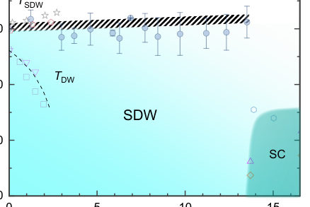 
Figure 1. Pressure–temperature (p–T) phase diagram of La3Ni2O7 . The TSDW values are extracted from the tem- perature evolution of the integrated spectral weight, plotted as light blue solid circles. Error bars represent the max- imum deviation from the averaged TSDW during the two linear-intersection fittings (see Supplemental Materials [32] for more details). Additional TSDW points at low pressures from µSR and NMR studies are taken from Refs. [18, 19]. The dashed line marks an additional density-wave transition (TDW) [5, 19], whose origin remains under debate. Supercon- ducting Tc values are adopted from Refs. [4, 5, 21]. The cyan and green shaded regions correspond to the SDW and super-...

📷 Fig 2

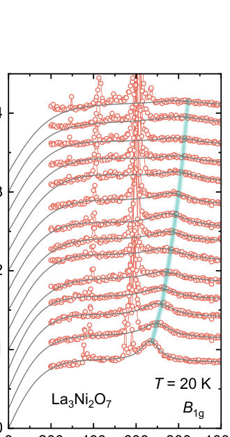 
Figure 2. Pressure evolution of the B1g electronic Raman response. The red open circles denote the B1g electronic Raman response measured at 20 K under various pressures from 1.23 to 16.51 GPa. Black solid lines represent fits to the experimental spectra. The cyan line serves as a guide to the eye illustrating the evolution of the SDW gap- related feature.

📷 Fig 3

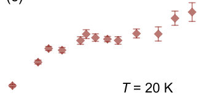 
Figure 3. Pressure evolution of SDW parameters. (a) SDW gap ∆SDW at T = 20 K as a function of pressure. The dashed line serves as a guide to the eye. (b) Pressure dependence of the coupling ratio 2∆SDW/kBTSDW, with the mean-field value marked by the dashed line. (c) SDW peak linewidth ΓSDW at 20 K. ΓSDW is defined as the full width at half maximum of the Lorentzian peak. SDW peak position and linewidth error bars represent 95% confidence intervals derived from fitting procedures.

**Summary.** This work uses high-pressure electronic Raman spectroscopy to track the evolution of the SDW state in $	ext{La}_3	ext{Ni}_2	ext{O}_7$. It reveals that while the SDW energy scale increases with pressure, the coherence of the SDW state simultaneously decreases. This provides key insights into the magnetic correlations relevant to the high-temperature superconductivity emerging in this nickelate system.

**Why it may be interesting.** The observation of a robust strong-coupling ratio alongside a weakening of long-range order provides crucial spectroscopic constraints on the magnetic correlations that are believed to mediate superconductivity in nickelates.

Detailed structure

**Main problem.** The study investigates how the Spin-Density-Wave (SDW) state in the bilayer nickelate $	ext{La}_3	ext{Ni}_2	ext{O}_7$ evolves as hydrostatic pressure is applied toward the superconducting regime.

**Main result.** The SDW gap energy and transition temperature both increase with pressure, indicating an enhanced energy scale, while the peak broadens, suggesting a weakening of long-range SDW order.

**Method.** Systematic electronic Raman spectroscopy was performed on single crystals under hydrostatic pressures up to 16.51 GPa.

**Model / system.** The physical system is the bilayer nickelate $	ext{La}_3	ext{Ni}_2	ext{O}_7$, whose low-energy physics is modeled by a bilayer $t-J$ model. The research focuses on the competition and evolution between the SDW state and superconductivity.

**Key observables.** SDW gap energy ($\Delta_{	ext{SDW}}$), SDW transition temperature ($T_{	ext{SDW}}$), dimensionless coupling ratio ($2\Delta_{	ext{SDW}}/(k_B T_{	ext{SDW}})$), and Raman peak linewidth ($\Gamma_{	ext{SDW}}$).

**Important parameters / regimes.** Hydrostatic pressure (up to 16.51 GPa); the strong-coupling ratio ($\sim 7.5$).

**Assumptions / limitations.** The analysis assumes that the observed Raman response is dominated by the SDW electronic excitation continuum, which is fitted using a Lorentzian function.

**Figures summary.** Figure 1 shows the pressure-temperature phase diagram, confirming $T_{	ext{SDW}}$ increases with pressure. Figure 2 details the pressure-dependent $	ext{B}_{1g}$-symmetric Raman response, showing both energy shift and broadening.

**Paper structure.** The paper systematically measures the electronic Raman response across a wide pressure range, analyzing the pressure dependence of the SDW gap, transition temperature, and coherence, and interpreting these trends in the context of the SDW-superconductivity interplay.

Abstract

The discovery of pressure-induced high temperature superconductivity in the bilayer nickelate La$_{3}$Ni$_{2}$O$_{7}$ has raised the question of how its spin-density-wave (SDW) state evolves toward the superconducting regime. Here, we report a systematic electronic Raman study of La$_{3}$Ni$_{2}$O$_{7}$ single crystals under hydrostatic pressures up to 16.51 GPa. Both the SDW gap energy and the transition temperature $T_{\mathrm{SDW}}$ show an overall increase with pressure, while the dimensionless coupling ratio 2$Δ_{\text{SDW}}/(k_{\text{B}}T_{\text{SDW}})$ remains constant around $\sim7.5$, indicating a robust strong-coupling character of SDW state. At the same time, the Raman SDW peak broadens as pressure is applied, indicating a gradual weakening of long-range SDW order. These results reveal an unusual pressure evolution in which the SDW energy scale is enhanced while the SDW state becomes progressively less coherent, providing spectroscopic constraints on the magnetic correlations relevant to superconductivity in bilayer nickelates.

[↑ back to top](#top)

