
# arxiv digest (quant-ph + cond-mat) — 2026-08-21

*98 papers · 11 relevant · 0 highlighted*

## 🔥 Most relevant (11)

*Every paper with at least one nonzero topic score, sorted by best-matching score. 🔥 marks scores ≥4/5. Click the title to jump to the full entry below; click [arXiv] to open the paper page. `(secondary)` marks papers from de-prioritized cond-mat archives.*

Show 11 relevant papers

- [Nonlinear collective dynamics and microwave comb generation in a diamond maser](#paper-2608.18692) [[arXiv]](http://arxiv.org/abs/2608.18692v1) — 🔥 `driven-dissipative phase transition` **4/5** · `Tavis-Cummings & cavity-many-emitter` **3/5** · `non-equilibrium universality` **3/5** · `quantum optics experiment` **3/5** · `correlated / nonlocal dissipation` **2/5** · `interference shaping light` **2/5** · `methods for driven-dissipative` **2/5** · `superradiant laser` **2/5** · `Dicke superradiance` **1/5** · `QC/QI experiment` **1/5** · `analog quantum simulation` **1/5** · `quantum measurements` **1/5**
- [Quantum-Enhanced Atomic Sensor via Spin Nonequilibrium Criticality](#paper-2608.18941) [[arXiv]](http://arxiv.org/abs/2608.18941v1) — 🔥 `driven-dissipative phase transition` **4/5** · 🔥 `non-equilibrium universality` **4/5** · `analog quantum simulation` **2/5** · `methods for driven-dissipative` **2/5** · `correlated / nonlocal dissipation` **1/5** · `quantum measurements` **1/5** · `quantum optics experiment` **1/5**
- [Interference-engineered shortcut to perfect state transfer](#paper-2608.18794) [[arXiv]](http://arxiv.org/abs/2608.18794v1) — 🔥 `QC/QI experiment` **4/5** · 🔥 `interference shaping light` **4/5** · `analog quantum simulation` **3/5** · `quantum optics experiment` **3/5**
- [Experimental zero-added-loss multiplexing Bell-pair source for long-haul quantum networks](#paper-2608.18666) [[arXiv]](http://arxiv.org/abs/2608.18666v1) — 🔥 `quantum optics experiment` **4/5** · `QC/QI experiment` **3/5** · `interference shaping light` **3/5**
- [An ultra-bright, highly-scalable, squeezed light source for hybrid quantum photonics](#paper-2608.18950) [[arXiv]](http://arxiv.org/abs/2608.18950v1) — 🔥 `quantum optics experiment` **4/5** · `Keldysh / 2PI / non-Gaussian methods` **1/5** · `QC/QI experiment` **1/5** · `driven-dissipative phase transition` **1/5** · `interference shaping light` **1/5** · `methods for driven-dissipative` **1/5**
- [Secure Medical Data Transmission Using Quantum Key Distribution and Post-Quantum Cryptography in Real-World Fiber Networks](#paper-2608.18869) [[arXiv]](http://arxiv.org/abs/2608.18869v1) — 🔥 `quantum optics experiment` **4/5** · `QC/QI experiment` **3/5** · `interference shaping light` **1/5** · `quantum measurements` **1/5**
- [Seeded SU(1,1) interferometry for Fourier-domain optical coherence tomography](#paper-2608.18750) [[arXiv]](http://arxiv.org/abs/2608.18750v1) — 🔥 `quantum optics experiment` **4/5** · `interference shaping light` **3/5** · `driven-dissipative phase transition` **1/5** · `quantum measurements` **1/5**
- [Electrostriction in a Bose-Einstein Condensate of Dipolar Molecules](#paper-2608.19180) [[arXiv]](http://arxiv.org/abs/2608.19180v1) — 🔥 `analog quantum simulation` **4/5** · `Keldysh / 2PI / non-Gaussian methods` **1/5** · `quantum measurements` **1/5**
- [Predicting critical temperature in quantum simulators for high-$T_c$ superconductivity: the matrix product state plus mean field approach](#paper-2608.18861) [[arXiv]](http://arxiv.org/abs/2608.18861v1) — 🔥 `analog quantum simulation` **4/5** · `methods for driven-dissipative` **2/5**
- [An ultracompact dilution refrigerator for fast quantum device characterization](#paper-2608.18699) [[arXiv]](http://arxiv.org/abs/2608.18699v1) — 🔥 `QC/QI experiment` **4/5** · `quantum measurements` **1/5**
- [Electromagnetic and Acoustic Fano Interference in Surface Acoustic Wave Resonators](#paper-2608.18771) [[arXiv]](http://arxiv.org/abs/2608.18771v1) `(secondary)` — 🔥 `interference shaping light` **4/5**

## All papers (63, sorted by relevance)

*Papers from quant-ph and your primary cond-mat archives (quant-gas, stat-mech, str-el, dis-nn). Highlighted papers (⭐) come first, then everything else sorted by topic-relevance score, highest first.*

### [Nonlinear collective dynamics and microwave comb generation in a diamond maser](http://arxiv.org/abs/2608.18692v1)

**Authors:** Christoph W. Zollitsch, Jonas N. Bach, Christopher W. M. Kay, Jonathan D. Breeze  
**Type:** experiment · **Category:** other · **PDF:** <https://arxiv.org/pdf/2608.18692v1>  
**Analysis basis:** full PDF text, analyzed in chunks
**Topic relevance:** 🔥 `driven-dissipative phase transition` **4/5** · `Tavis-Cummings & cavity-many-emitter` **3/5** · `non-equilibrium universality` **3/5** · `quantum optics experiment` **3/5** · `correlated / nonlocal dissipation` **2/5** · `interference shaping light` **2/5** · `methods for driven-dissipative` **2/5** · `superradiant laser` **2/5** · `Dicke superradiance` **1/5** · `QC/QI experiment` **1/5** · `analog quantum simulation` **1/5** · `quantum measurements` **1/5**

↔ Scroll figures horizontally

<figure class="paper-figure-card">
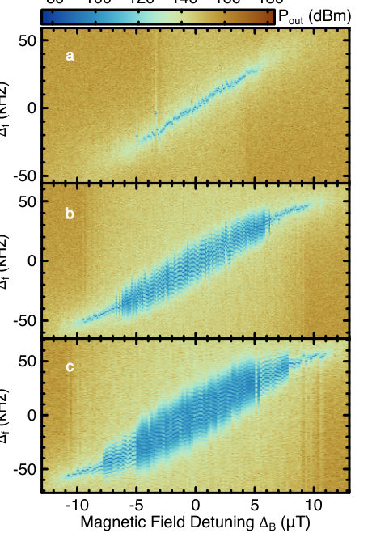
<figcaption class="paper-figure-caption"><b>Fig 1.</b> FIG. 1. Logarithmic maser output power 𝑃out as a function of magnetic field ΔB and frequency Δf detuning for pump rates a 𝑤= 6 s−1, b 𝑤= 7.8 s−1 and c 𝑤= 12.5 s−1. The resonator loaded 𝑄- factor for all three spectra is 42,772.</figcaption>
</figure>
<figure class="paper-figure-card">
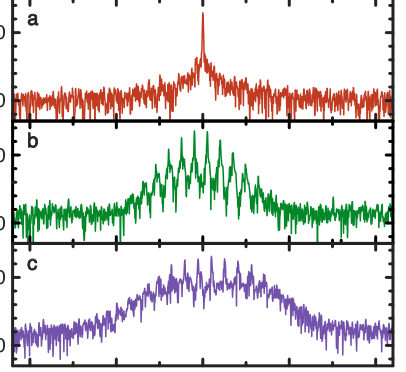
<figcaption class="paper-figure-caption"><b>Fig 2.</b> FIG. 2. Logarithmic maser output power 𝑃out as a function of frequency detuning Δf at ΔB = 0 (see Fig. 1) for pump rates a 𝑤= 6 s−1, b 𝑤= 7.8 s−1 and c 𝑤= 12.5 s−1.</figcaption>
</figure>
<figure class="paper-figure-card">
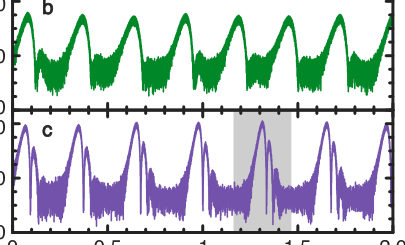
<figcaption class="paper-figure-caption"><b>Fig 3.</b> FIG. 3. Transient logarithmic output power 𝑃out as a function of time for the a first (𝑤= 6 s−1), b second (𝑤= 7.8 s−1) and c third (𝑤= 12.5 s−1) threshold regime at ΔB = 0. A moving window average with an interval of a 80 ns b 40 ns c 200 ns is applied.</figcaption>
</figure>
<figure class="paper-figure-card">
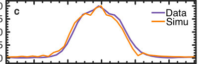
<figcaption class="paper-figure-caption"><b>Fig 4.</b> FIG. 4. a Asymmetric Voigt profile (red) determined by piecewise fitting the pulse envelope in b and chirped pulse transient (blue), starting at the emission pulse maximum and sweeping frequency from 11.2 kHz to 27.4 kHz. b Single maser emission pulse in the third threshold regime (purple), as highlighted in Fig. 3 (c). Orange solid line represents the combination of Voigt profile and chirped pulse of a with addition of Gaussian white noise of -90 dBm. c Normalized fast Fourier transform of emission pulses in b, referenced to the intermediate frequency.</figcaption>
</figure>

**Summary.** This paper reports on observing multiple nonlinear dynamical thresholds in a room-temperature diamond maser utilizing $	ext{NV}^-$ centers. As the optical pump power increases, the maser transitions from continuous wave emission to a periodic train of microwave pulses, generating a frequency comb. The analysis confirms that these dynamics are governed by nonlinear collective spin-resonator interactions.

**Why it may be interesting.** This work provides a clean, solid-state platform for observing driven, dissipative, nonlinear dynamics, particularly the transition to coherent, structured light emission (frequency combs) in a solid-state quantum emitter system.

Detailed structure

**Main problem.** The study investigates the nonlinear collective dynamics and the generation of microwave frequency combs within a room-temperature maser system.

**Main result.** The maser exhibits three distinct nonlinear thresholds as the pump rate increases, leading to the generation of a frequency comb spectrum from periodic microwave pulses.

**Method.** The research employs time-resolved measurements of output power, Fourier analysis (FFT) of transient signals, and spectroscopy across different pump rates.

**Model / system.** The system is an optically pumped nitrogen-vacancy ($	ext{NV}^-$) center ensemble in diamond, operating as a maser coupled to a high-quality factor microwave resonator.

**Key observables.** Output power ($P_{out}$), linewidths ($\sigma, \Gamma$), comb teeth spacing ($\sim 3.8 	ext{ kHz}$), and transient pulse shapes.

**Important parameters / regimes.** Three distinct nonlinear thresholds; resonator $Q$-factor of $\sim 42,772$; pulse period $T \approx 261 \mu	ext{s}$.

**Assumptions / limitations.** The analysis assumes the maser dynamics are governed by nonlinear collective spin-resonator interactions, and the linewidths are compared against the inhomogeneous broadening.

**Figures summary.** Figures illustrate the transition from CW emission to periodic pulsing (comb) and the subsequent oscillatory, chirped decay, confirmed by time-domain transients and FFT spectra.

**Paper structure.** The paper progresses by first identifying the three spectral regimes via power measurements, then using time-resolved spectroscopy to confirm the periodic pulsing, and finally using FFT analysis to characterize the frequency content and chirp of the pulses.

Abstract

Optically pumped room temperature masers are a promising platform for driven dissipative spin photon physics beyond steady state emission. Here we observe a sequence of dynamical thresholds in a room temperature nitrogen vacancy diamond maser as the optical pump is increased above the conventional masing threshold. The first threshold yields narrow-line continuous wave emission, while a second threshold produces a periodic train of microwave pulses whose repetition rate generates a frequency comb spectrum. At higher pump power, a third threshold gives rise to pulses with an oscillatory, frequency chirped decay. Time-resolved measurements link the comb directly to self-pulsing dynamics and Fourier analysis of individual bursts reveals a broad distribution of frequencies consistent with collective spin-resonator dynamics in an inhomogeneously broadened ensemble. These results establish the diamond maser as a room temperature platform for nonlinear nonequilibrium light matter dynamics and microwave comb generation.

[↑ back to top](#top)

### [Quantum-Enhanced Atomic Sensor via Spin Nonequilibrium Criticality](http://arxiv.org/abs/2608.18941v1)

**Authors:** Ding Huang, Minwei Shi, Guzhi Bao, Keye Zhang, Weiping Zhang  
**Type:** both · **Category:** other · **PDF:** <https://arxiv.org/pdf/2608.18941v1>  
**Analysis basis:** full PDF text, analyzed in chunks
**Topic relevance:** 🔥 `driven-dissipative phase transition` **4/5** · 🔥 `non-equilibrium universality` **4/5** · `analog quantum simulation` **2/5** · `methods for driven-dissipative` **2/5** · `correlated / nonlocal dissipation` **1/5** · `quantum measurements` **1/5** · `quantum optics experiment` **1/5**

↔ Scroll figures horizontally

<figure class="paper-figure-card">
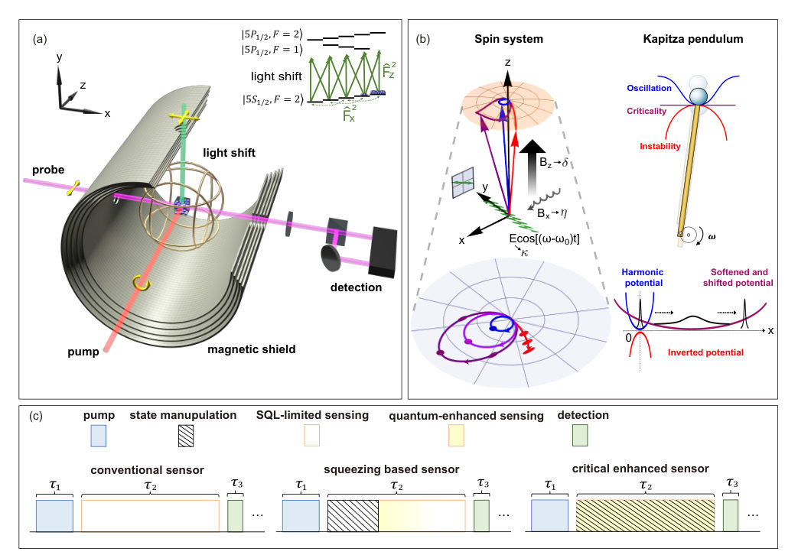
<figcaption class="paper-figure-caption"><b>Fig 1.</b> FIG. 1: Experimental setup and operating principles of the criticality-enhanced atomic magnetometer (a) Experimental setup. A paraffin-coated vapour cell (30 mm × 30 mm × 30 mm) inside a four-layer magnetic shield. 3D Helmholtz coils provide a ˆz bias field and an ˆx signal field, with the ˆy component actively nulled. Pump, probe, and drive lasers propagate along ˆz, ˆx, and ˆy, respectively. Inset: atom-light level diagram. (b) Dynamical criticality. The left panel shows spin trajectories and fluctuation ellipsoids on the Bloch sphere alongside their equatorial projections where blue curves represent stable harmonic cycles far from the transition. Approaching criticality in purple, the...</figcaption>
</figure>
<figure class="paper-figure-card">
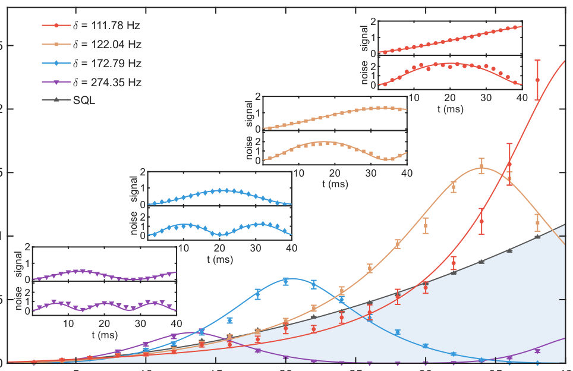
<figcaption class="paper-figure-caption"><b>Fig 2.</b> FIG. 2: Critical enhancement of magnetometer SNR SNR versus measurement time for the criticality-enhanced magnetometer at four detunings δ (symbols: inverted- triangle, rhombus, square, circle), ordered from farthest to nearest the critical point. Solid curves are theoretical simulations. Triangles denote the conventional magnetometer, whose trace separates the performance regions above (pink) and below (blue) the SQL. Insets: Evolution of normalized signal ⟨ˆFx(t)⟩/⟨ˆF SQL y (t = 37.5 ms)⟩and normalized noise strength 10 log10[∆ˆFx(t)/∆ˆFx(0)]. The noise oscillates with half the period of the signal, cycling from the coherent level to maximum amplification and back, thereby defining the...</figcaption>
</figure>
<figure class="paper-figure-card">
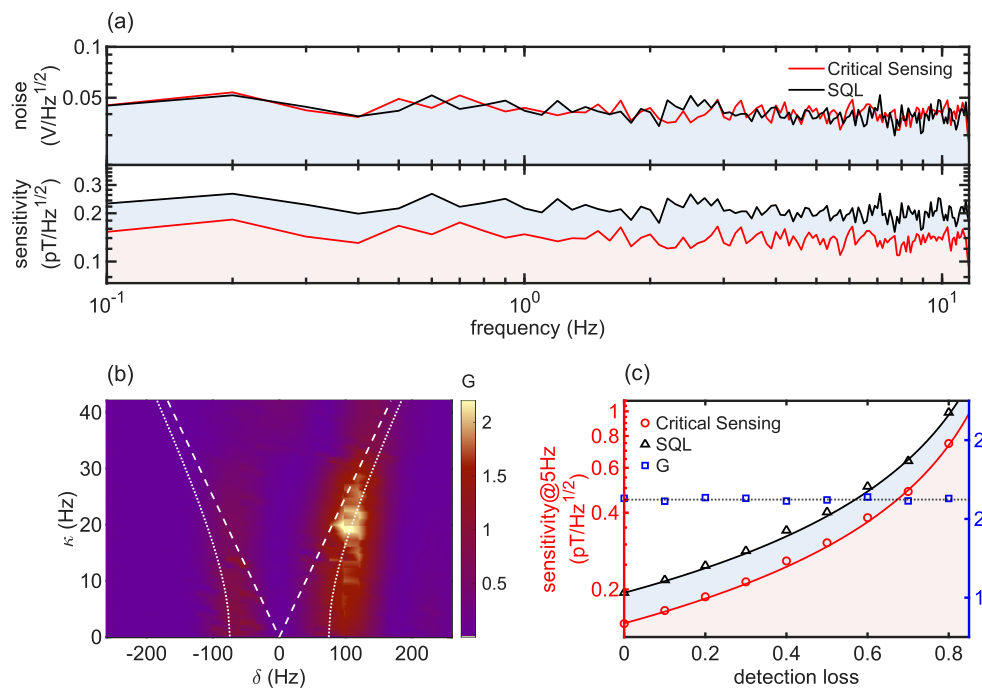
<figcaption class="paper-figure-caption"><b>Fig 3.</b> FIG. 3: Metrological gain and loss-robustness of criticality-enhanced sensing (a) Noise level and magnetic-field sensitivity with (red) and without (black) criticality enhancement. The SQL for Bx measurement is 200.54 fT/ √</figcaption>
</figure>
<figure class="paper-figure-card">
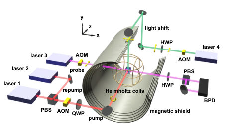
<figcaption class="paper-figure-caption"><b>Fig 4.</b> FIG. 5: The experimental schematics. PBS: polarization beam splitter, QWP: quarter-wave plate, AOM: acousto- optical modulator, HWP: half-wave plate, BPD: bal- anced photodetector.</figcaption>
</figure>
<figure class="paper-figure-card">
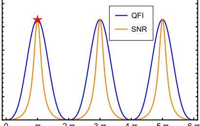
<figcaption class="paper-figure-caption"><b>Fig 5.</b> FIG. 4: The blue line is the QFI for detecting η, the yellow line is the SNR of measuring ⟨ˆFx⟩, and the black line is the SQL for detecting η. The red star is the first working time in which the SNR oscillates to the maxi- mum value and reach the QFI. All data are normalized to the SQL at the the first working time.</figcaption>
</figure>

**Summary.** This paper introduces a novel method for enhancing quantum sensor sensitivity by operating an atomic spin system near a dynamical critical point. By engineering the system into a non-equilibrium state, the authors exploit a 'noise ebbing' effect that amplifies the signal while suppressing quantum noise. This technique successfully demonstrates a measurable improvement over the Standard Quantum Limit in an atomic magnetometer.

**Why it may be interesting.** This work provides a concrete, experimentally realizable pathway to quantum enhancement in sensing that bypasses the need for fragile entangled states, making it highly relevant for AMO physicists working on open quantum systems and quantum optics.

Detailed structure

**Main problem.** The primary challenge is surpassing the Standard Quantum Limit (SQL) in quantum sensors, which is limited by intrinsic quantum noise.

**Main result.** The authors demonstrate a universal protocol for noiseless critical sensing, achieving a 3.3 dB metrological gain over the SQL in an atomic magnetometer.

**Method.** They engineer the atomic spin system near a dynamical critical point, exploiting a 'noise ebbing' mechanism in a non-equilibrium regime.

**Model / system.** The system is an atomic ensemble (e.g., $^{87}	ext{Rb}$ atoms) whose spin dynamics are modeled using an effective Hamiltonian analogous to a Kapitza pendulum. The dynamics are driven by periodic light fields.

**Key observables.** Signal susceptibility, quantum noise variance, and the resulting metrological gain (SNR improvement).

**Important parameters / regimes.** The detuning parameter ($\delta$) relative to the critical point ($\delta_c$), and the ratio controlling the non-equilibrium drive ($g_A$).

**Assumptions / limitations.** The protocol relies on the system entering a non-equilibrium regime where the signal susceptibility diverges while the noise periodically returns to its coherent baseline.

**Figures summary.** Figures illustrate the experimental setup, the dynamics on the Bloch sphere near criticality, and comparisons of sensing protocols (conventional vs. critical enhancement).

**Paper structure.** The paper establishes the problem (SQL limit), introduces quantum criticality as an alternative, details the theoretical model (Hamiltonians, Kapitza analogy), presents the noise-less sensing mechanism, and concludes with experimental validation showing the metrological gain.

Abstract

The sensitivity of quantum sensors is fundamentally constrained by the standard quantum limit (SQL) arising from intrinsic quantum fluctuations. While non-classical resources like squeezing or entanglement can surpass this limit, their utility is often restricted by the extreme fragility of entangled states and the complexity of their preparation. Quantum criticality offers a compelling alternative by harnessing divergent susceptibility to amplify signals without requiring fragile non-classical resources. However, the practical benefit of this approach has remained controversial due to the potential for the simultaneous amplification of quantum noise. Here, we demonstrate a universal protocol for noiseless critical sensing by engineering a light-driven atomic ensemble near a dynamical critical point. Analogous to a Kapitza pendulum near its inverted orientation, the spin system enters a non-equilibrium regime where the signal susceptibility diverges while the quantum noise periodically recedes to its coherent baseline. We exploit this ``noise ebbing'' to create a built-in noiseless amplifier, demonstrating a 3.3 dB metrological gain over the SQL in an atomic magnetometer. Our implementation exhibits intrinsic robustness against common experimental imperfections such as detection losses, establishing non-equilibrium critical dynamics as a practical and versatile paradigm for surpassing the fundamental limits of quantum sensing.

[↑ back to top](#top)

### [Interference-engineered shortcut to perfect state transfer](http://arxiv.org/abs/2608.18794v1)

**Authors:** Yichuan Zhang, Xuanyu Liu, Zemeng Lin, Wange Song, Shuang Zhang  
**Type:** both · **Category:** quantum information and computing · **PDF:** <https://arxiv.org/pdf/2608.18794v1>  
**Analysis basis:** full PDF text, analyzed in chunks
**Topic relevance:** 🔥 `QC/QI experiment` **4/5** · 🔥 `interference shaping light` **4/5** · `analog quantum simulation` **3/5** · `quantum optics experiment` **3/5**

↔ Scroll figures horizontally

<figure class="paper-figure-card">
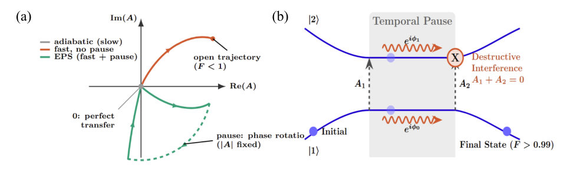
<figcaption class="paper-figure-caption"><b>Fig 1.</b> FIG. 1. Conceptual schematic of evolution-pause synthesis (EPS). (a) Complex-plane trajectory of the accumulated transition amplitude 𝒜𝑚(𝑡) for an initially unoccupied eigenstate. Rapid driving (red) without a pause leaves 𝒜𝑚(𝑇) ≠0, whereas the pause-induced phase rotation (green) redirects the subsequent contribution to close the trajectory at 𝒜𝑚(𝑇) = 0. (b) A pause (shaded) between two active evolution segments freezes the Hamiltonian while the eigenstate components accumulate a relative dynamical phase without interband transitions, enabling destructive interference between the transition contributions 𝐴1 and 𝐴2, generated before and after the pause</figcaption>
</figure>
<figure class="paper-figure-card">
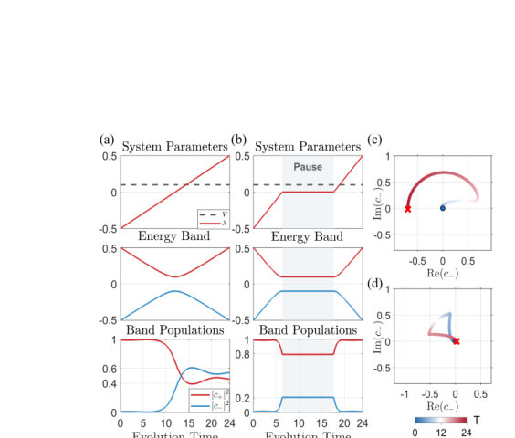
<figcaption class="paper-figure-caption"><b>Fig 2.</b> FIG. 2. Interference-engineered transition in a Landau–Zener process. (a) Rapid sweep and (b) single-pause EPS protocol for the same total evolution time. Rows show the evolution of Hamiltonian parameters (𝜆, 𝑉) , the energy spectrum, and the eigenstate populations ∣𝑐± ∣2 . (c, d) Complex accumulated-transition trajectories corresponding to the protocols in (a) and (b), respectively. The rapid sweep leaves an open trajectory with a residual amplitude, whereas EPS redirects the trajectory toward closure near the origin. Color encodes the evolution time. strategically placed temporal pauses as phase shifters. During each pause, the Hamiltonian remains frozen while the system accumulates a...</figcaption>
</figure>
<figure class="paper-figure-card">
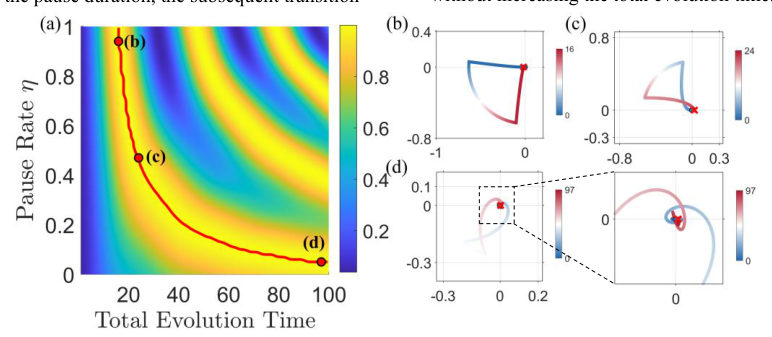
<figcaption class="paper-figure-caption"><b>Fig 3.</b> FIG. 3. Global optimization landscape of EPS. (a) State transfer fidelity as a function of total evolution time and pause rate 𝜂, the fraction of time occupied by the central pause. The red curve traces the optimal trajectory. (b–d) Complex transition-amplitude trajectories in the initially unoccupied instantaneous eigenstate, 𝑐−, for representative protocols on the optimal trajectory at (𝑇, 𝜂) = (16,0.94), (24,0.47), and (97,0.05), respectively. The lower-right trajectory shows a higher-order solution at (𝑇, 𝜂) = (97,0.05), in which additional phase winding also returns the trajectory to the origin. Color encodes evolution time; circles and crosses mark the initial and final points,...</figcaption>
</figure>
<figure class="paper-figure-card">
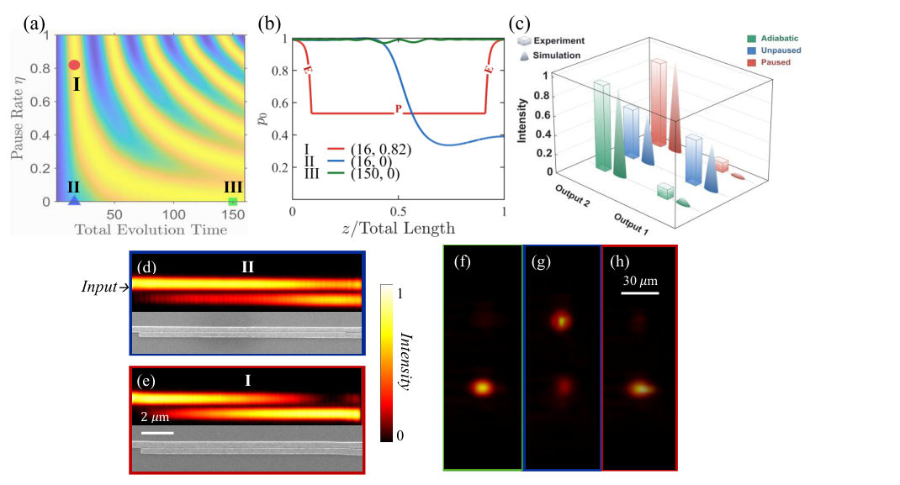
<figcaption class="paper-figure-caption"><b>Fig 4.</b> FIG. 4. Experimental realization of EPS on a silicon photonic platform. (a) Final-state-fidelity landscape with markers I–III denoting the 16 μm EPS device (𝜂= 0.82), 16 μm no-pause device, and 150 μm adiabatic reference. (b) Simulated population 𝑝0 of desired instantaneous eigenstate along the normalized propagation distance 𝑧/𝐿 for I–III. E–P–E denotes the evolution–pause–evolution sequence, with the Hamiltonian varying during E and fixed during P. (c) Experimental (cuboids) and simulated (cones) unit-normalized output intensities for the adiabatic (green), no-pause (blue), and EPS (red) devices. (d, e) Simulated propagation-intensity distributions (top) and corresponding SEM images...</figcaption>
</figure>

**Summary.** This paper introduces Evolution-Pause Synthesis (EPS), a novel, interference-engineered technique for achieving fast, high-fidelity quantum state transfer. EPS works by introducing controlled temporal pauses to manipulate the relative phases of quantum amplitudes, allowing for acceleration without needing external fields or complex Hamiltonian engineering. The method is successfully demonstrated both theoretically and experimentally on silicon photonics, showing significant reductions in required device length.

**Why it may be interesting.** This work provides a hardware-compatible, purely Hamiltonian-based method for fast coherent control, which is highly relevant for building scalable quantum photonic circuits and quantum information processors.

Detailed structure

**Main problem.** The challenge is achieving fast, high-fidelity state transfer in integrated photonic circuits without relying on complex or non-native auxiliary couplings.

**Main result.** The proposed method, Evolution-Pause Synthesis (EPS), achieves near-perfect state transfer with an 11.8-fold acceleration over adiabatic methods, demonstrated experimentally on a silicon photonic platform.

**Method.** EPS is an interference-engineered shortcut protocol that uses strategically interleaved temporal pauses to cancel accumulated transition amplitudes via destructive interference, keeping the process within the native system Hamiltonian.

**Model / system.** The work models light propagation in coupled-mode theory (CMT) for evanescently coupled waveguides, generalized to a multilevel STIRAP system. The dynamics are governed by a time-dependent Hamiltonian.

**Key observables.** Final-state fidelity, device length (e.g., $16 \mu	ext{m}$ vs $150 \mu	ext{m}$), and acceleration factor.

**Important parameters / regimes.** Total evolution time ($T$), pause rate ($\eta$), and the coupling coefficient ($\kappa$).

**Assumptions / limitations.** The protocol assumes the Hamiltonian can be temporarily held fixed during pauses to control relative dynamical phases, avoiding the need for auxiliary fields.

**Figures summary.** Figures conceptually illustrate how pauses redirect the transition amplitude trajectory to close at zero, and compare fidelity landscapes for adiabatic, no-pause, and EPS protocols.

**Paper structure.** The paper introduces the problem limitations, details the EPS mechanism using theoretical analysis (Landau-Zener model), presents optimization strategies (mapping fidelity vs. time/pause rate), and concludes with experimental validation on a silicon photonic platform.

Abstract

Achieving fast, high-fidelity state transfer is fundamental to scalable integrated photonics and quantum information processing. While adiabatic evolution provides inherent robustness against control and fabrication imperfections, its requirement for slow driving leads to impractically long propagation distances in photonic circuits. Existing acceleration strategies, such as shortcuts to adiabaticity (STA), can dramatically shorten evolution times but generally rely on non-native auxiliary couplings or delicate Hamiltonian engineering that are difficult to implement in practice. Here we introduce evolution-pause synthesis (EPS), an interference engineered shortcut protocol that achieves fast, near-perfect state transfer strictly within the native system Hamiltonian. It achieves this by treating transient excitations as coherent resources and canceling their accumulated amplitudes via strategically interleaved pauses. By decoupling relative dynamical phase accumulation from parameter variations, EPS steers open transition trajectories into a closed loop in complex amplitude space, enabling perfect state transfer without auxiliary fields or complex parameter detours. We demonstrate this mechanism in Landau-Zener dynamics and extend it to a multilevel STIRAP process, achieving an 11.8-fold acceleration over the adiabatic baseline. Further, we experimentally validate EPS on a silicon photonic platform, realizing high-fidelity state transfer in a $16\,μ\mathrm{m}$ footprint, a nearly tenfold reduction in device length compared with a $150\,μ\mathrm{m}$ adiabatic reference. EPS offers a general hardware-compatible framework for fast, practical coherent control across wave and quantum platforms.

[↑ back to top](#top)

### [Experimental zero-added-loss multiplexing Bell-pair source for long-haul quantum networks](http://arxiv.org/abs/2608.18666v1)

**Authors:** Yoshiaki Tsujimoto, Daiki Ichii, Rikizo Ikuta, Mikio Fujiwara, Masahiro Takeoka, Go Kato, Kentaro Wakui  
**Type:** experiment · **Category:** quantum information and computing · **PDF:** <https://arxiv.org/pdf/2608.18666v1>  
**Analysis basis:** full PDF text, analyzed in chunks
**Topic relevance:** 🔥 `quantum optics experiment` **4/5** · `QC/QI experiment` **3/5** · `interference shaping light` **3/5**

↔ Scroll figures horizontally

<figure class="paper-figure-card">
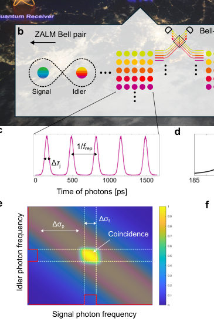
<figcaption class="paper-figure-caption"><b>Fig 1.</b> Fig. 1 ZALM architecture based on time-frequency-multiplexed entanglement swap- ping. a Concept of the entanglement distribution using ZALM. Background image adapted from an image courtesy of the Earth Science and Remote Sensing Unit, NASA Johnson Space Center (ISS053- E-209380). b Implementation of the QTX using time-frequency-multiplexed entanglement swapping based on SPDC. c The temporal distribution of the photon counts. The repetition frequency and the timing jitter of the photon detector are frep = 3.0 GHz and ∆τj = 39 ps, respectively. d The spectrum of the SPDC photons. The center frequency is chosen to be fpump/2 = 193.4 THz. e The joint spectral amplitude of the photon pair in a...</figcaption>
</figure>
<figure class="paper-figure-card">
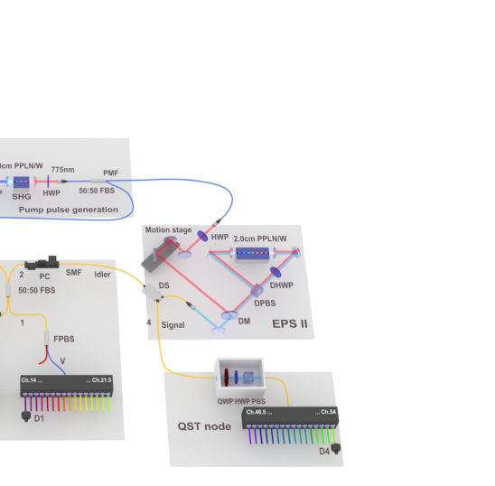
<figcaption class="paper-figure-caption"><b>Fig 2.</b> Fig. 2 Experimental setup for time-frequency-multiplexed entanglement swapping. Pump pulses centered at 775 nm with a 3.0-GHz repetition rate is prepared by second harmonic gen- eration (SHG) of the electro-optic comb centered at 1550 nm (193.4 THz). The SHG pulses are used to pump entangled photon pair sources (EPSs) I and II based on PPLN/Ws. The signal and idler photons are separated into the shorter and longer wavelengths with respect to 1550 nm by dichroic separa- tors (DSs) integrated in the fiber pigtail. The signal and idler photons are sent to the quantum state tomography (QST) nodes and Bell state measurement (BSM) node, respectively. After 16 frequency modes in each of signal and...</figcaption>
</figure>
<figure class="paper-figure-card">
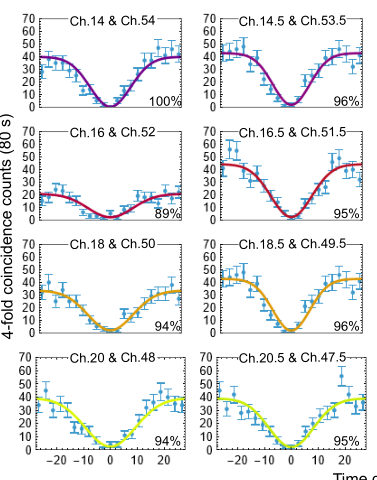
<figcaption class="paper-figure-caption"><b>Fig 3.</b> Fig. 3 Frequency-multiplexed HOM dips. The HOM dips and visibilities for 16 frequency modes in parallel. Each frequency-mode pair is denoted as Ch.ni &amp; Ch.ns, where Ch.ni (Ch.ns) represents the ITU channel of the idler (signal) photon, respectively. The measurement time was 80 s for each point. The error bars correspond to the standard deviations with the assumption of Poisson statistics for the photon counts. The solid curves are the maximum-likelihood fits using a Gaussian dip model assuming Poisson counting statistics.</figcaption>
</figure>
<figure class="paper-figure-card">
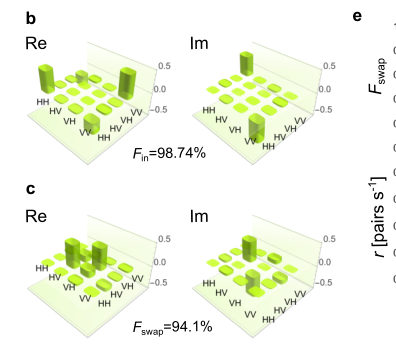
<figcaption class="paper-figure-caption"><b>Fig 4.</b> Fig. 4 Results for time-frequency-multiplexed entanglement swapping a,b The recon- structed density matrices of input states. c The reconstructed density matrix of the swapped state heralded by the BSM in ITU Ch.21.5. d The four-fold coincidence counts for 16 measurement basis states. e The fidelities of the swapped states (Fswap) and the four-fold coincidence count rates (r) for 16 independent ITU channel combinations. The integration time was 3 min per basis state, except for ITU Ch. 21.5 (12 min per basis state).</figcaption>
</figure>
<figure class="paper-figure-card">
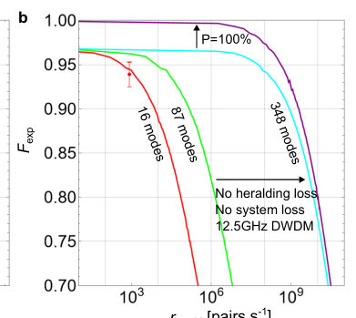
<figcaption class="paper-figure-caption"><b>Fig 5.</b> Fig. 5 Simulation results for the rate-fidelity trade-off a The relationship between rtot and Fexp. The curves are obtained by the theoretical simulation using experimental parameters. The filled and hollow circles corresponds to our experimental results and previous results [27–31], respectively. b The relationship between rZALM and Fexp. The red dot and curve show our experimental result and simulation result with current experimental parameters, respectively. The green curve corresponds to the case of PBSM = 1/2 with frequency multiplexing over the full SPDC bandwidth. The cyan curve shows the simulated performance with improved optical loss and frequency-multiplexing density, while the...</figcaption>
</figure>

**Summary.** This paper presents an experimental demonstration of a Zero-Added-Loss Multiplexing (ZALM) Bell-pair source designed to boost quantum network communication rates. By combining frequency and time multiplexing across 16 modes, the authors achieved high-fidelity entanglement swapping. The results establish a scalable, high-rate source crucial for developing practical quantum repeaters and long-haul quantum communication links.

**Why it may be interesting.** This work is highly relevant to quantum optics and quantum networks, demonstrating a practical, high-rate source of entangled pairs that overcomes key experimental hurdles in multiplexing and entanglement swapping.

Detailed structure

**Main problem.** The central challenge addressed is boosting the communication rate of quantum networks by achieving high-fidelity entanglement swapping across densely multiplexed time-frequency modes.

**Main result.** The authors successfully demonstrated entanglement swapping across 16 parallel frequency modes with a high average fidelity of 93.9% and achieved a total swapping rate of 5.38 pairs s-1, enabling a ZALM Bell-pair rate of 8.2e2 pairs s-1.

**Method.** The experiment combines frequency and time multiplexing using a Zero-Added-Loss Multiplexing (ZALM) Bell-pair source, utilizing off-the-shelf DWDM filters and operating the pump pulse at a high repetition frequency.

**Model / system.** The physical platform is an experimental ZALM Bell-pair source based on Spontaneous Parametric Down-Conversion (SPDC) in PPLN/Ws waveguides. The system leverages the spectral and temporal degrees of freedom for high-rate entanglement distribution.

**Key observables.** Average fidelity (93.9% $\pm$ 1.4%), total swapping rate (5.38 $\pm$ 0.17 pairs s-1), and the corresponding ZALM Bell-pair rate (8.2e2 pairs s-1).

**Important parameters / regimes.** 16 parallel frequency modes, 50-GHz DWDM filters, and a pump pulse repetition frequency of 3.0 GHz.

**Assumptions / limitations.** The necessity of time-resolved detection ($1/f_{	ext{rep}} \gg \Delta	au_j$) is critical for entanglement swapping, and a trade-off exists between spectral bandwidth, spectral purity, and photon loss in frequency multiplexing.

**Figures summary.** Figure 1 illustrates the ZALM architecture, showing concepts for entanglement distribution, the QTX implementation, temporal photon counts at 3.0 GHz, and the joint spectral amplitude. Other figures detail the trade-offs between bandwidths and the relationship between spectral purity and heralding efficiency.

**Paper structure.** The paper introduces the ZALM concept for high-rate quantum networking, details the experimental implementation involving 16-mode entanglement swapping, and presents measurements confirming the achieved fidelity and rate, establishing a scalable route for quantum repeaters.

Abstract

Boosting the communication rate of quantum networks is a central challenge in quantum information science. Recently, an efficient entanglement distribution scheme employing quasi-deterministic Bell-pair sources based on time-frequency multiplexing, referred to as zero-added-loss multiplexing~(ZALM), has been proposed. Its implementation, however, requires high-fidelity entanglement swapping across densely multiplexed time-frequency modes, which has remained an experimental challenge. Here we demonstrate entanglement swapping across 16 parallel frequency modes with a high average fidelity of 93.9$\pm$\SI{1.4}{\%}. Notably, polarization-entangled photon pairs in each frequency mode are spectrally single-mode using only off-the-shelf 50-GHz dense wavelength-division multiplexing~(DWDM) filters, eliminating the need for additional narrowband filtering. Furthermore, in order to fully exploit the temporal degree of freedom, the pump pulse is operated with a repetition frequency of \SI{3.0}{GHz}. By combining the frequency and time multiplexing, the total swapping rate reaches 5.38$\pm$0.17\,\si{pairs\,s^{-1}}, which corresponds to the ZALM Bell-pair rate of \SI{8.2e2}{pairs\,s^{-1}}. Our results establish the key experimental capabilities required for ZALM and demonstrate a scalable route toward practical high-rate quantum repeaters and long-haul quantum networks.

[↑ back to top](#top)

### [An ultra-bright, highly-scalable, squeezed light source for hybrid quantum photonics](http://arxiv.org/abs/2608.18950v1)

**Authors:** Kai-Hong Luo, Denis Kopylov, Florian Lütkewitte, Jan-Lucas Eickmann, Simone Atzeni, Fabian Schlue, Benjamin Brecht, Torsten Meier, Polina Sharapova, Michael Stefszky, Christine Silberhorn  
**Type:** both · **Category:** quantum information and computing · **PDF:** <https://arxiv.org/pdf/2608.18950v1>  
**Analysis basis:** full PDF text, analyzed in chunks
**Topic relevance:** 🔥 `quantum optics experiment` **4/5** · `Keldysh / 2PI / non-Gaussian methods` **1/5** · `QC/QI experiment` **1/5** · `driven-dissipative phase transition` **1/5** · `interference shaping light` **1/5** · `methods for driven-dissipative` **1/5**

↔ Scroll figures horizontally

<figure class="paper-figure-card">
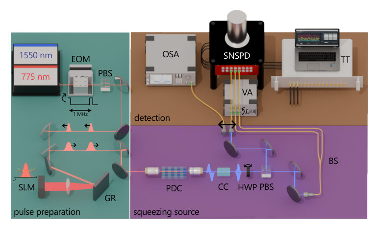
<figcaption class="paper-figure-caption"><b>Fig 1.</b> FIG. 1. Experimental setup. A pulsed laser with 80MHz repetition rate is first picked down to</figcaption>
</figure>
<figure class="paper-figure-card">
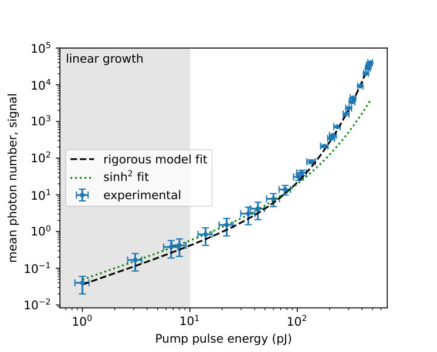
<figcaption class="paper-figure-caption"><b>Fig 2.</b> FIG. 2. Generated mean photon number per pulse versus pump pulse energy. The measurement</figcaption>
</figure>
<figure class="paper-figure-card">
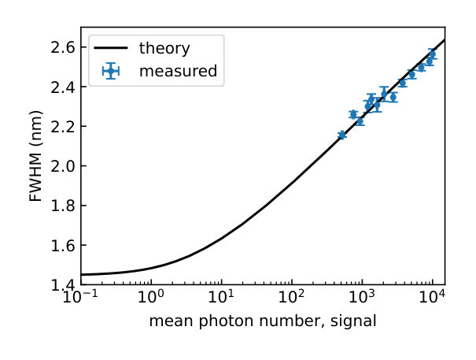
<figcaption class="paper-figure-caption"><b>Fig 3.</b> FIG. 3. Bandwidth versus photon number. Measured signal field bandwidth (FWHM) as a function</figcaption>
</figure>
<figure class="paper-figure-card">
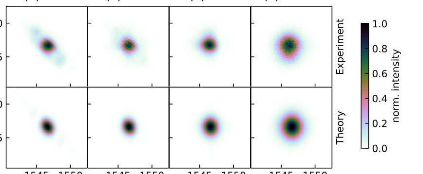
<figcaption class="paper-figure-caption"><b>Fig 4.</b> FIG. 4. JSI measurements and theory. At higher mean photon numbers, the phasematching side</figcaption>
</figure>
<figure class="paper-figure-card">
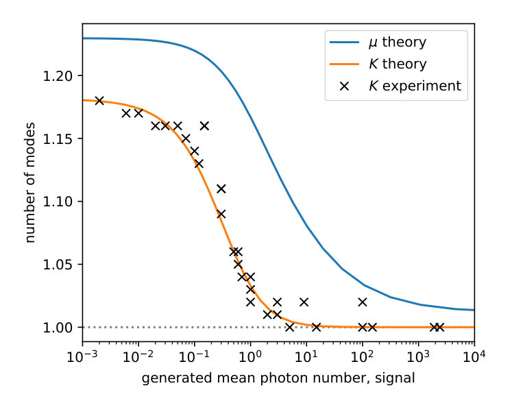
<figcaption class="paper-figure-caption"><b>Fig 5.</b> FIG. 5. Inferred mode number from Schmidt decomposition of the JSI. Shown are the number of</figcaption>
</figure>

**Summary.** This paper introduces a novel, highly scalable source based on a periodically poled KTP waveguide designed for hybrid quantum photonics. The source generates ultra-bright, single-mode squeezed vacuum states compatible with existing fiber networks and single-photon detectors. The authors complement the experimental results with a detailed theoretical model to accurately characterize the source's performance under realistic, lossy, and high-gain operating conditions.

**Why it may be interesting.** This work is highly relevant as it tackles the engineering challenge of creating robust, high-performance quantum light sources, which is foundational for building scalable quantum networks and quantum computation hardware.

Detailed structure

**Main problem.** The challenge is to create a highly scalable, single-mode source of squeezed vacuum states necessary for hybrid quantum photonics, which combines continuous and discrete variable quantum optics.

**Main result.** The authors present a periodically poled KTP waveguide source that successfully meets all requirements: it is extremely bright, operates at a telecom wavelength (1546 nm), and generates near single-mode squeezed vacuum states.

**Method.** The work combines experimental demonstration using a specialized KTP waveguide with a comprehensive theoretical framework to characterize the source, especially in the presence of losses and high gain.

**Model / system.** The physical system is a single-pass, periodically poled, Type-II potassium titanyl phosphate (KTP) waveguide used for spontaneous parametric down-conversion (PDC). The theory models the source using the multimode spatial Langevin equation to account for complex dynamics, losses, and time-ordering effects.

**Key observables.** Effective mode number (measured as 1.24), brightness (up to 40,000 photons/pulse), squeezing level (approaching 20 dB), and the Joint Spectral Intensity (JSI).

**Important parameters / regimes.** Wavelength of 1546 nm (for fiber compatibility), picosecond pulse duration (for SNSPD compatibility), and high-gain operation regimes.

**Assumptions / limitations.** The simplified single-mode theory is insufficient; the full theoretical framework must incorporate time-ordering and loss mechanisms for accurate characterization.

**Figures summary.** Not specified, but the notes indicate the comparison of theoretical predictions (using correlation matrices) against experimental measurements of spectral purity and photon statistics.

**Paper structure.** The paper first establishes the requirements for hybrid quantum photonics. It then details the proposed KTP waveguide source and its performance metrics. Finally, it develops and applies a rigorous theoretical framework to characterize the source's complex dynamics under high-gain and lossy conditions.

Abstract

Hybrid quantum photonics seeks to combine the complementary advantages of continuous- and discrete-variable quantum optics. This typically entails photon-counting measurements on entangled states generated by interfering many single-mode squeezed-vacuum (SMSV) states. However, because conventional photon-counting schemes are mode-insensitive, it is critical that the SMSV states occupy a single, well-defined mode. Achieving this requires careful engineering of the process, which determines both the spatial and spectro-temporal properties of the generated state. In addition, the ideal source must be massively scalable, capable of efficiently generating strong squeezing, and remain compatible with existing detection schemes and fiber networks. Although many platforms address one or more of these requirements, satisfying all of them simultaneously remains challenging.   Here, we present a source that meets all of these requirements: a single-pass, periodically poled, Type-II potassium titanyl phosphate (KTP) waveguide optimized for scalable hybrid quantum-photonic architectures. The SMSV state produced by the source has a measured effective mode number of 1.24. Furthermore, the source is extremely bright (producing up to 40 000 photons per pulse) and operates at a central wavelength of 1546nm, optimized for fiber-network compatibility and which, in combination with picosecond duration, also enables intrinsic photon-number resolution in superconducting nanowire single-photon detectors. Although this source constitutes an ideal source in a simplified picture, the ultimate limitations of any source will be governed by complex dynamics that arise when the system is driven at high-gain or due to unavoidable loss during state generation. We have therefore developed a complete theoretical framework that enables a comprehensive photon-counting-based characterization of the source.

[↑ back to top](#top)

### [Secure Medical Data Transmission Using Quantum Key Distribution and Post-Quantum Cryptography in Real-World Fiber Networks](http://arxiv.org/abs/2608.18869v1)

**Authors:** Vasile-Laurentiu Dosan, Paul Spooren, Sebastian Moeckel, Alessandro Zannotti, Alek Lagarrigue, Pablo Vazquez, Marc Bodenstein, Jonas Jelonek, Jansen Dwan, Fabian Steinlechner, Kevin Füchsel, Thomas Hühn, Oliver de Vries  
**Type:** experiment · **Category:** quantum information and computing · **PDF:** <https://arxiv.org/pdf/2608.18869v1>  
**Analysis basis:** full PDF text, analyzed in chunks
**Topic relevance:** 🔥 `quantum optics experiment` **4/5** · `QC/QI experiment` **3/5** · `interference shaping light` **1/5** · `quantum measurements` **1/5**

↔ Scroll figures horizontally

<figure class="paper-figure-card">
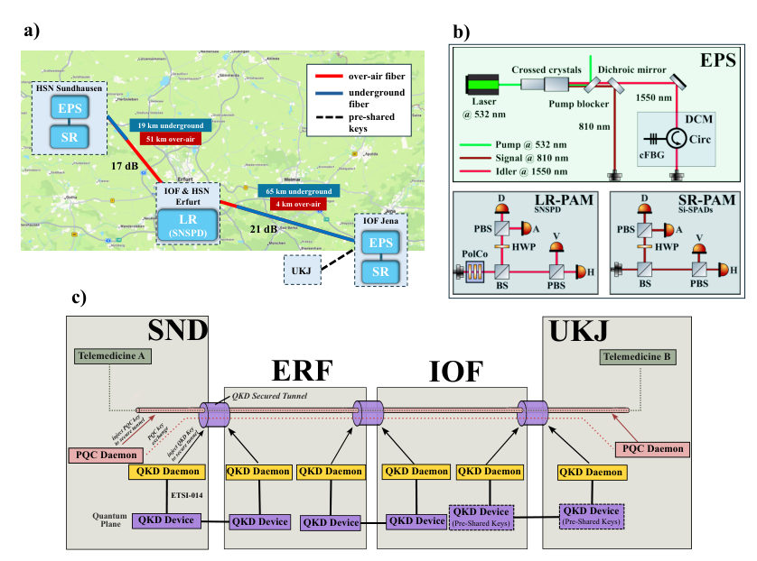
<figcaption class="paper-figure-caption"><b>Fig 1.</b> FIG. 1. (a) Field-deployed entanglement-based QKD network connecting multiple nodes via underground and over-air fiber links. (b) QKD system schematic. The entangled photon source (EPS) generates photon pairs at 810 nm and 1550 nm via spontaneous parametric down- conversion (SPDC) pumped at 532 nm. The idler arm includes a dispersion compensation module (DCM) comprising a circulator (Circ) and chirped fiber Bragg grating (cFBG). Polarization analysis is performed in the short-range polarization analysis module (SR-PAM) and long-range polarization analysis module (LR-PAM) using beam splitters (BS), polarizing beam splitters (PBS), half-wave plates (HWP). The polarization drifts are...</figcaption>
</figure>
<figure class="paper-figure-card">
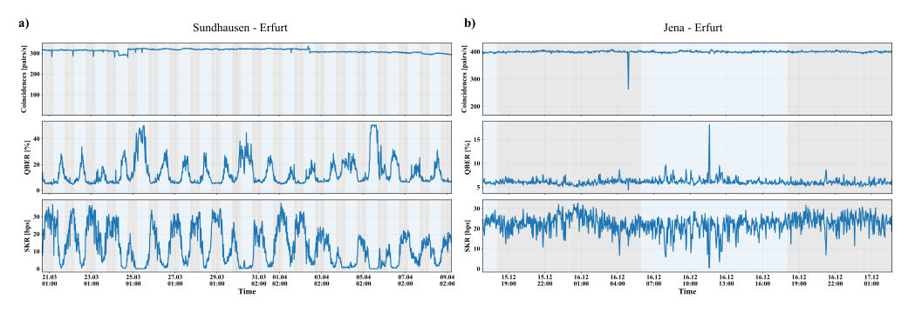
<figcaption class="paper-figure-caption"><b>Fig 2.</b> FIG. 2. Long-term stability measurements of the entanglement-based QKD links between (a) Sundhausen–Erfurt and (b) Jena–Erfurt. The plots show the time evolution of coincidence rate, quantum bit error rate (QBER), and secret key rate (SKR).</figcaption>
</figure>
<figure class="paper-figure-card">
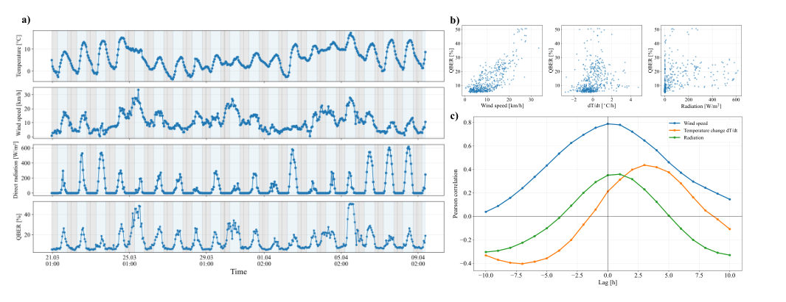
<figcaption class="paper-figure-caption"><b>Fig 3.</b> FIG. 3. (a) Temporal evolution of temperature, wind speed, direct solar radiation, and QBER measured during the QKD experiment over the fiber link between Sundhausen and Erfurt. Shaded regions indicate day/night intervals. (b) Correlation of QBER with wind speed, temperature variation rate (dT/dt), and direct solar radiation. (c) Cross-correlation analysis between the QBER and meteorological parameters.</figcaption>
</figure>

**Summary.** This paper demonstrates a robust, quantum-safe communication framework by combining entanglement-based Quantum Key Distribution (QKD) with Post-Quantum Cryptography (PQC) over a 140 km fiber link. The system successfully secured a telemedicine proof-of-concept without modifying existing hospital infrastructure. This establishes a practical blueprint for deploying quantum-resistant security in critical real-world networks.

**Why it may be interesting.** While focused on networking, the work involves advanced quantum optics techniques (entangled photon sources, polarization control) and the practical application of quantum key distribution over challenging, real-world fiber links, which is highly relevant to quantum network development.

Detailed structure

**Main problem.** The threat posed by quantum computers to classical public-key cryptography necessitates the deployment of quantum-safe communication for critical infrastructure like healthcare.

**Main result.** The authors successfully demonstrated a practical, field-deployed quantum-secure telemedicine network integrating entanglement-based QKD with PQC over 140 km of real-world fiber.

**Method.** They implemented a layered security architecture where QKD establishes link-level keys injected into VPN tunnels, while PQC secures the communication end-to-end, all without modifying existing medical systems.

**Model / system.** The system uses polarization-entangled photon pairs transmitted over a heterogeneous fiber network (underground/aerial) connecting a health kiosk to a hospital. The architecture combines QKD key exchange (BBM92 protocol) with PQC key encapsulation (QuantShake1).

**Key observables.** Quantum Bit Error Rate (QBER), coincidence rates, and the correlation between QBER fluctuations and environmental factors like wind speed.

**Important parameters / regimes.** 140 km fiber link length, 22 days of autonomous operation, and the use of active polarization stabilization and dispersion compensation.

**Assumptions / limitations.** The layered approach assumes that QKD keys are consumed directly by the VPN layer, and PQC provides the necessary end-to-end authentication, mitigating risks associated with trusted nodes.

**Figures summary.** Figures illustrate the field-deployed network topology, the layered security architecture (QKD tunnels + PQC outer layer), and time evolution plots showing QBER and coincidence rates over the 22-day operational period.

**Paper structure.** The paper details the scientific motivation (quantum threat), presents the layered QKD+PQC architecture, describes the experimental setup and implementation details (photon sources, stabilization, key distillation), reports performance metrics over long-term deployment, and discusses environmental impairments.

Abstract

The threat quantum computers pose to classical public-key cryptography motivates the deployment of quantum-safe communication for critical infrastructure such as healthcare, finance, and energy systems. Quantum key distribution (QKD) and post-quantum cryptography (PQC) offer complementary security guarantees, information-theoretic key exchange and quantum-resistant end-to-end authentication that can be combined in a layered architecture. Here, we demonstrate a field-deployed quantum-secure network integrating entanglement-based QKD with end-to-end PQC over 140 km of installed fiber in Thuringia, Germany, connecting a rural health kiosk to a university hospital via a trusted-node architecture comprising heterogeneous underground and aerial fiber links. Unlike conventional deployments that rely on a dedicated key management system to forward keys to applications, our architecture injects QKD keys directly into standard Linux-based VPN tunnels between adjacent nodes, while PQC secures the communication end-to-end, remaining fully compatible with existing infrastructure and software. Polarization-entangled photon pairs were generated at 810 nm and 1550 nm, with the telecom photon transmitted over deployed fiber. Active polarization stabilization and dispersion compensation preserve the entanglement and enable 22 days of continuous, fully autonomous operation, further underscoring the technological maturity of entanglement-based QKD approaches in a real-world fiber environment. Although the two deployed links were operated during separate rather than concurrent periods, the predominantly aerial link exhibited markedly greater instability, with QBER variations most strongly correlated with wind speed. The generated keys secured a telemedicine proof-of-concept without modifying existing medical systems, demonstrating a practical framework for quantum-safe critical infrastructures.

[↑ back to top](#top)

### [Seeded SU(1,1) interferometry for Fourier-domain optical coherence tomography](http://arxiv.org/abs/2608.18750v1)

**Authors:** Alejandra A. Padilla, Valentina Gacha, Daniel F. Urrego, Juan P. Torres  
**Type:** both · **Category:** other · **PDF:** <https://arxiv.org/pdf/2608.18750v1>  
**Analysis basis:** full PDF text, analyzed in chunks
**Topic relevance:** 🔥 `quantum optics experiment` **4/5** · `interference shaping light` **3/5** · `driven-dissipative phase transition` **1/5** · `quantum measurements` **1/5**

↔ Scroll figures horizontally

<figure class="paper-figure-card">
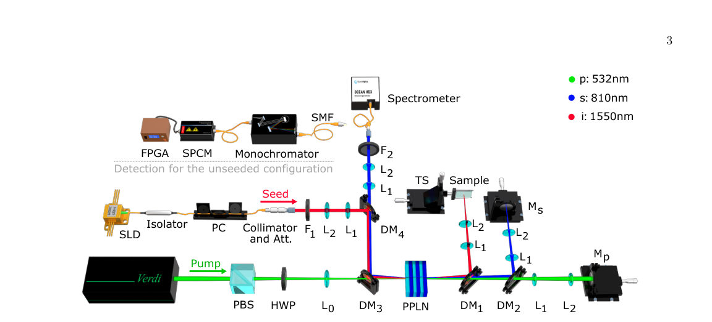
<figcaption class="paper-figure-caption"><b>Fig 1.</b> FIG. 1. Experimental setup to demonstrate Fourier-domain optical coherence tomography using a seeded SU(1,1) interfer- ometer. Signal (s1) and idler (i1) photons are generated via non-degenerate parametric down-conversion. The idler photons probe the sample. Photons reflected from the sample, together with the reflected pump (p) and signal photons, are re-injected into the nonlinear crystal. The interferometer can operate in two configurations: (a) unseeded, where detection is performed using single-photon detectors, and (b) seeded, where a broadband superluminescent diode (SLD) increases the photon flux rate, enabling detection with a spectrometer. PBS: polarizing beam splitter; HWP:...</figcaption>
</figure>
<figure class="paper-figure-card">
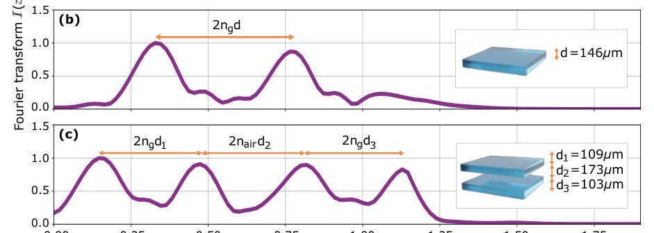
<figcaption class="paper-figure-caption"><b>Fig 2.</b> FIG. 2. Fourier transform I(z) of the spectrum signal photons for single-layer and multilayer glass samples using a seeded SU(1,1) interferometer. Peaks correspond to reflections from refractive-index discontinuities within the samples. The reported thicknesses d are extracted from the peak separations using ∆z = 2ngd, with ng = 1.5. Manufacturer-specified thicknesses are: (a) 170 µm, (b) 130 −160 µm, and (c) multilayer structure of 85 −115 µm glass, 130 −160 µm air gap, and 85 −115 µm glass. Insets show schematic representations of the samples.</figcaption>
</figure>
<figure class="paper-figure-card">
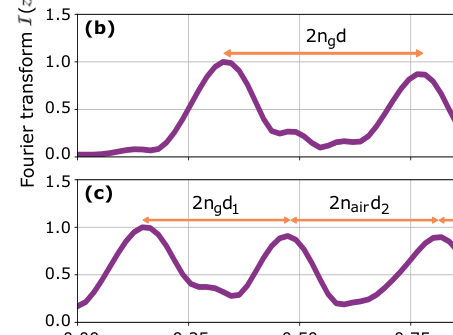
<figcaption class="paper-figure-caption"><b>Fig 3.</b> Figure 2 shows the reconstructed axial scans (A-scans). At each measurement point, two spectra, S(λs), were recorded with a relative phase shift of π. Their subtrac- tion suppresses the DC contribution and the autocorre- lation terms, leaving only the interference signal associ- ated with the reflections from the sample. The resulting spectrum is rewritten as a function of the wavenumber k = 2π/λ. Considering the Jacobian of the transfor- mation, we obtain S(k) = (2π/k2) S (λ). The spectrum is then resampled to obtain a function S(k) with equally spaced k-values. Finally, we obtain the Fourier transform of I(z) = F [S(k)] = R dk S(k) exp (ikz).</figcaption>
</figure>
<figure class="paper-figure-card">
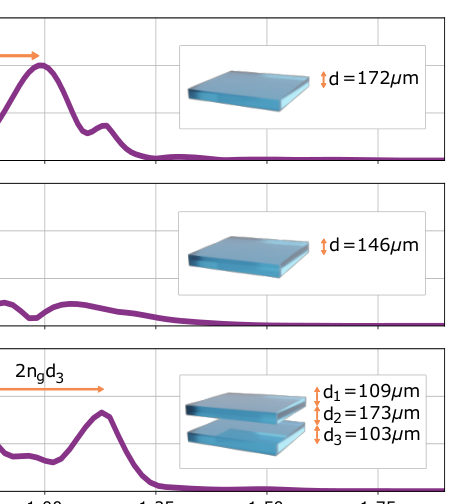
<figcaption class="paper-figure-caption"><b>Fig 4.</b> Fig. 2(a) and (b) correspond to two single-layer glass samples with different thickness, with nominal values of 172 µm and 146 µm. I(z) exhibits two dominant peaks corresponding to the front and back surfaces of the single- layer sample. In Fig. 2(c) we consider two glass samples separated by a distance of 173 µm, which corresponds to a multilayer sample with three layers. We observe four peaks that correspond to reflections from the front and back surfaces of each glass layer, separated by an air gap. Our results are in good agreement with manufacturer specifications. These experimental results validate the ability of the seeded SU(1,1) interferometer to resolve axial structures in weakly...</figcaption>
</figure>
<figure class="paper-figure-card">
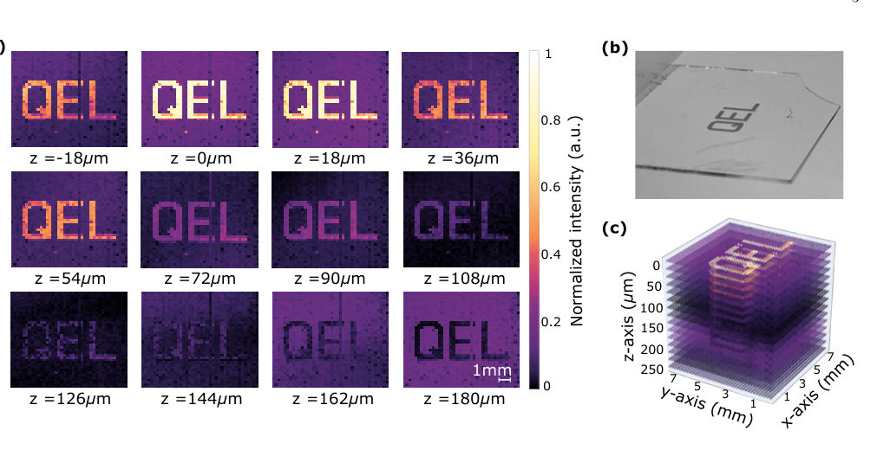
<figcaption class="paper-figure-caption"><b>Fig 5.</b> FIG. 3. Volumetric reconstruction of a 170 µm thick glass sample with a 300 nm aluminum pattern deposited on the top surface, measured with a seeded SU(1,1) interferometer. (a) Cross-sectional view of the reconstructed volume, showing the strong reflections from the aluminum and weaker reflections from the glass surface. (b) Photograph of the sample. (c) Three- dimensional reconstruction obtained by stacking the A-scans I(z).</figcaption>
</figure>

**Summary.** This paper presents the use of a seeded SU(1,1) interferometer for Fourier-domain Optical Coherence Tomography (FD-OCT). By implementing seeding, the authors overcome low photon flux limitations inherent in the system, enabling high-flux, volumetric 3D imaging. They conclude that seeding is a superior method for enhancing measurement sensitivity compared to increasing the intrinsic parametric gain.

**Why it may be interesting.** This work is highly relevant to quantum optics and open quantum systems as it details the practical implementation of quantum-enhanced sensing (via nonlinear interferometry) for advanced imaging applications, specifically quantifying the advantage of seeding over simply increasing parametric gain.

Detailed structure

**Main problem.** The paper addresses the development of Fourier-domain Optical Coherence Tomography (FD-OCT) using a seeded SU(1,1) interferometer, specifically overcoming low photon flux limitations.

**Main result.** Seeding the interferometer significantly increases the photon flux, enabling volumetric imaging using standard spectrometers, and this method proves more effective for sensitivity enhancement than increasing parametric gain.

**Method.** The authors combine theoretical modeling of multilayer object reflectivity with experimental demonstration using a seeded SU(1,1) setup to reconstruct depth-resolved 3D images via Fourier transformation of the measured spectrum.

**Model / system.** The physical system is an SU(1,1) interferometer utilizing nonlinear parametric down-conversion in a PPLN crystal. It is used to probe multilayer objects by sending broadband light at 1550 nm and measuring reflected signals at 810 nm.

**Key observables.** Reconstructed axial scans (A-scans) showing internal layer composition, and the measured photon flux $\langle N_{s2} 
angle$ used for precision estimation.

**Important parameters / regimes.** Low parametric gain regime ($	ext{G}_{	ext{CW}} \sim 7 	imes 10^{-5}$), spectral resolution ($\delta \lambda_s$), and the ratio of sensitivity enhancement from seeding versus gain increase.

**Assumptions / limitations.** The analysis assumes the low parametric gain regime necessitates seeding for practical high-flux measurements, and certain simplifications are made regarding the object reflectivity in the idler path.

**Figures summary.** Figure 1 shows the experimental setup. Figure 2 demonstrates reconstructed A-scans for single/multilayer samples. Figure 3 shows volumetric OCT imaging of a patterned coating.

**Paper structure.** The paper moves from establishing the experimental setup and theory (including OCT requirements and sensitivity decay correction) to demonstrating the successful application of seeding for high-flux, high-resolution volumetric imaging.

Abstract

We demonstrate Fourier-domain optical coherence tomography (FD-OCT) based on a seeded SU(1,1) interferometer. Multilayer objects are probed with broadband light centered at 1550nm, while depth-resolved 3D images are reconstructed from photon flux measurements centered at 810nm. We show that, in the low parametric-gain regime, seeding increases the photon flux, enabling volumetric imaging with a spectrometer rather than single-photon detectors. Our analysis further shows that, under the conditions considered, seeding provides a more effective route to sensitivity enhancement than increasing the parametric gain.

[↑ back to top](#top)

### [Electrostriction in a Bose-Einstein Condensate of Dipolar Molecules](http://arxiv.org/abs/2608.19180v1)

**Authors:** Haneul Kwak, Ian Stevenson, Weijun Yuan, Siwei Zhang, Asaf Toprakci, Lin Su, Tijs Karman, Sebastian Will  
**Type:** both · **Category:** quantum gases · **PDF:** <https://arxiv.org/pdf/2608.19180v1>  
**Analysis basis:** full PDF text, analyzed in chunks
**Topic relevance:** 🔥 `analog quantum simulation` **4/5** · `Keldysh / 2PI / non-Gaussian methods` **1/5** · `quantum measurements` **1/5**

↔ Scroll figures horizontally

<figure class="paper-figure-card">
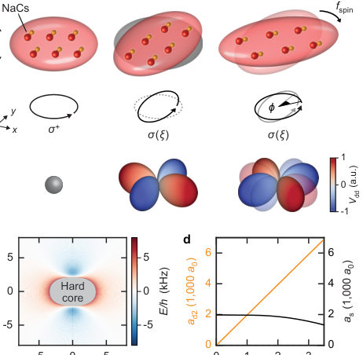
<figcaption class="paper-figure-caption"><b>Fig 1.</b> FIG. 1. Electrostriction of a Bose-Einstein condensate of dipolar molecules. a, Molecular interactions are controlled via double mi- crowave dressing with σ and π dressing fields. For a circularly po- larized σ dressing field (ξ = 0◦, left), dipolar interactions are com- pensated, and the shape of the BEC reflects the geometry of the trapping potential. For an elliptical σ dressing field (ξ &gt; 0◦, cen- ter) the BEC shows an elongation and compression along the major and minor axes of the microwave ellipse, respectively. By rotating the polarization ellipse of the σ field, electrostriction can be used to torque the BEC and set it into rotation (right). b, Angular de- pendence of the...</figcaption>
</figure>
<figure class="paper-figure-card">
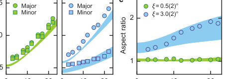
<figcaption class="paper-figure-caption"><b>Fig 2.</b> FIG. 2. Observation of electrostriction in a molecular BEC. a, Time-of-flight expansion of a molecular cloud with ξ = 0.5(2)◦; as = 2,000 a0 and ad2 = 1,000 a0 (top row), and ξ = 3.0(2)◦; as = 1,600 a0 and ad2 = 5,900 a0 (bottom row). Pictures are the av- erage of 15 to 20 experimental runs. The polarization ellipses (exag- gerated for ξ = 3.0◦) and the resulting angular dependence of the in- teraction potential are illustrated on the left. For ξ = 3.0◦the dashed and dotted gray lines highlight the cloud’s major and minor axes, re- spectively. b, Cloud sizes (1/√e radius) during time-of-flight expan- sion, obtained from two-dimensional Gaussian fits (see Appendix). Error bars are calculated...</figcaption>
</figure>
<figure class="paper-figure-card">
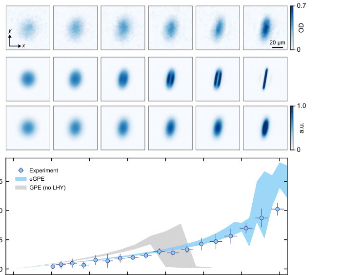
<figcaption class="paper-figure-caption"><b>Fig 3.</b> FIG. 3. Electrostriction of a molecular BEC with tunable dipolar interactions. a, Density profiles of the BEC after 20 ms time-of-flight for various ellipticities. Each picture is the average of 5 experimental runs. b, Corresponding density profiles from eGPE simulation. Top row, raw images; bottom row, convolved images accounting for finite imaging resolution. The images are rotated clockwise by 9.6◦for comparison with the experiment. c, Aspect ratio of the cloud in the xy plane as a function of ellipticity. The blue shaded area shows the result of the eGPE simulation. The gray shaded area shows the result of a standard GPE calculation without the LHY term. The size of the BEC in this data...</figcaption>
</figure>
<figure class="paper-figure-card">
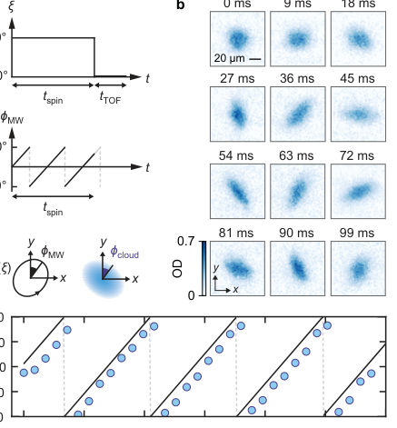
<figcaption class="paper-figure-caption"><b>Fig 4.</b> FIG. 4. Using electrostriction to set a molecular BEC into rota- tion. a, Experimental sequence. The microwave ellipticity is kept at ξ = 1.9◦while the orientation of the polarization ellipse is rotated at a frequency fspin for a variable spinning time tspin, after which the ellipticity is quenched to zero and the non-dipolar cloud undergoes time-of-flight expansion during tTOF. b, Time-of-flight images of the cloud for various spinning times. c, Orientation of the minor axis of the condensate as a function of spinning time (blue points). The black solid line shows the orientation of the microwave major axis. d, Condensate aspect ratio as a function of spinning time.</figcaption>
</figure>

**Summary.** This study investigates electrostriction in a BEC of dipolar molecules, using microwave dressing to precisely control the anisotropic dipole-dipole interactions. By modeling the system with an extended Gross-Pitaevskii equation, the authors confirm the theoretical predictions against experimental measurements of cloud deformation. Crucially, they demonstrate that this control mechanism can be used to torque the BEC, providing a novel tool to probe fundamental quantum phenomena like superfluidity and vorticity in dipolar quantum gases.

**Why it may be interesting.** This work provides a highly controllable platform to study many-body quantum dynamics in dipolar systems, moving beyond simple mean-field descriptions by incorporating LHY corrections and demonstrating active control over macroscopic quantum properties like rotation and vorticity.

Detailed structure

**Main problem.** The study focuses on observing and modeling electrostriction—an elliptical deformation—in a Bose-Einstein Condensate (BEC) of dipolar molecules, and demonstrating the ability to torque the BEC by controlling the dipole-dipole interaction orientation.

**Main result.** Electrostriction was successfully observed and modeled with excellent agreement using an extended Gross-Pitaevskii equation (eGPE). Furthermore, the anisotropic dipolar interactions allow for dynamically torquing the BEC, opening pathways to study vorticity and superfluidity.

**Method.** The research combines experimental measurements (time-of-flight expansion, cloud shape analysis) with theoretical modeling using the extended Gross-Pitaevskii equation (eGPE) incorporating Lee-Huang-Yang (LHY) corrections.

**Model / system.** The system is a BEC of dipolar molecules (e.g., NaCs) trapped in an external potential. The dynamics are governed by an eGPE that includes both short-range contact interactions and long-range, anisotropic dipolar interactions, which are tuned via double microwave dressing.

**Key observables.** Cloud shape, aspect ratio, electrostriction magnitude, and the resulting torque/rotation of the condensate.

**Important parameters / regimes.** Ellipticity ($\xi$) and orientation ($\phi$) of the microwave dressing field; dipolar lengths ($a_d$); interaction regimes (weak to moderate interactions).

**Assumptions / limitations.** The model relies on the eGPE framework, which approximates the short-range potential as a contact interaction, and the LHY term is used to account for beyond-mean-field quantum fluctuations.

**Figures summary.** Figures illustrate the anisotropic expansion of the BEC during time-of-flight, showing the dependence of cloud size on the microwave dressing ellipticity ($\xi$), and demonstrating the torque induced by changing the microwave polarization.

**Paper structure.** The paper first establishes the physical phenomenon (electrostriction) using microwave dressing to control dipolar interactions. It then models the dynamics using the eGPE, comparing theory to experimental measurements of cloud expansion. Finally, it utilizes this control to induce rotation, opening avenues for studying superfluid properties.

Abstract

The recent creation of a Bose-Einstein condensate (BEC) of dipolar molecules has opened a new frontier for many-body quantum systems in which dipolar interactions can drive novel self-organization phenomena. Here, we observe electrostriction in a molecular BEC, an elliptical deformation driven by anisotropic dipolar interactions. We use double microwave dressing, involving $σ$- and $π$-polarized fields, to control non-axially symmetric dipolar interactions. We compare the experimental observations of electrostriction to a model based on an extended Gross-Pitaevskii equation and find excellent agreement in the regime of weak to moderate interactions. Using electrostriction, we demonstrate that the molecular BEC can be torqued by dynamically changing the orientation of the elliptical $σ$ microwave field. This provides a route to setting molecular quantum gases into rotation, opening opportunities to probe vorticity, superfluidity, and supersolidity in strongly dipolar matter.

[↑ back to top](#top)

### [Predicting critical temperature in quantum simulators for high-$T_c$ superconductivity: the matrix product state plus mean field approach](http://arxiv.org/abs/2608.18861v1)

**Authors:** Thomas Köhler, Adrian Kantian  
**Type:** theory · **Category:** strongly correlated electrons · **PDF:** <https://arxiv.org/pdf/2608.18861v1>  
**Analysis basis:** full PDF text, analyzed in chunks
**Topic relevance:** 🔥 `analog quantum simulation` **4/5** · `methods for driven-dissipative` **2/5**

↔ Scroll figures horizontally

<figure class="paper-figure-card">
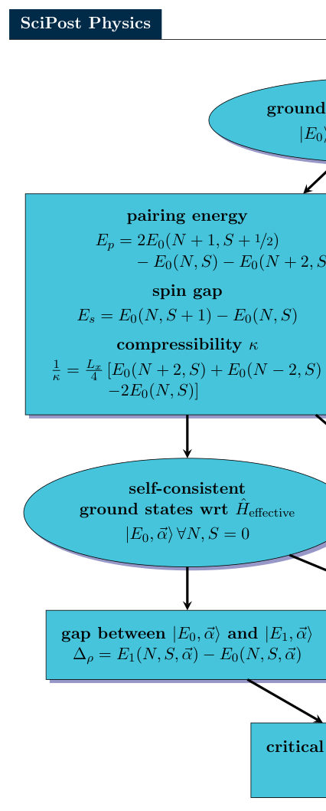
<figcaption class="paper-figure-caption"><b>Fig 1.</b> Figure 2: Necessary steps to obtain critical temperatures as described in Sec. 3.</figcaption>
</figure>
<figure class="paper-figure-card">
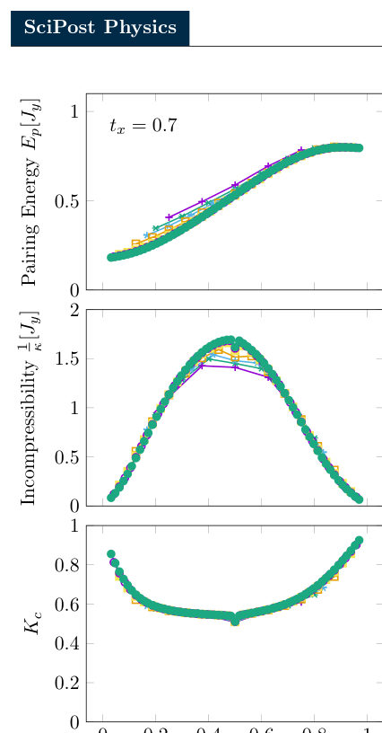
<figcaption class="paper-figure-caption"><b>Fig 2.</b> Figure 3: Finite size scaling of the six quantities, pairing energy (Ep), spin gap (Es), com- pressibility ( 1</figcaption>
</figure>
<figure class="paper-figure-card">
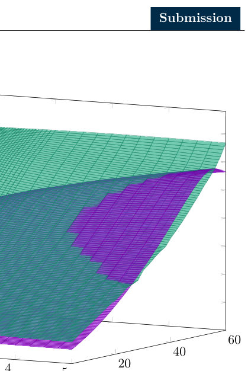
<figcaption class="paper-figure-caption"><b>Fig 3.</b> Figure 4: Pairing energy and doubled spin gap for tx ∈[0.3Jy, 5Jy] and densities N/2Lx ∈[0, 1] for an isolated ladder of length Lx = 32. For high densities, i.e., small hole doping an increase in the pairing energy is shown. Simultanously, the decrease in the spin gap restricts the useful range of tx.</figcaption>
</figure>
<figure class="paper-figure-card">
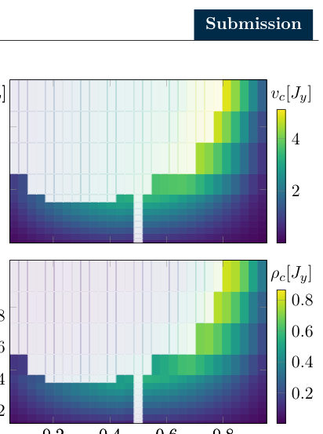
<figcaption class="paper-figure-caption"><b>Fig 4.</b> Figure 5: The incompressibility 1/κ, the speed of sound vc, the Luttinger parameter Kc, and the helicity modulus ρc, analog to the four lower subfigures of Fig. 3. Instead of the system size dependency, here the dependency on tx is shown for Lx = 32. Additionally, for all quantities that depend on the speed of sound, the area in which the speed of sound is ill-defined (cf. Sec. 4.3) is overlayed by a white fog.</figcaption>
</figure>
<figure class="paper-figure-card">
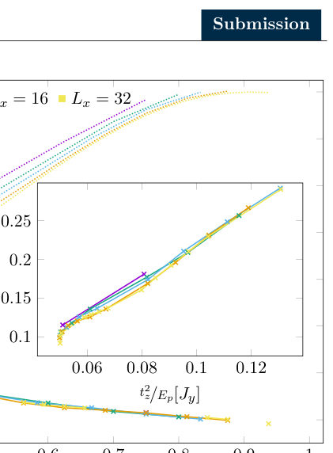
<figcaption class="paper-figure-caption"><b>Fig 5.</b> Figure 6: Critical temperature Tc vs total density for tx = 0.7Jy, and tz = 0.2Jy at different Lx (solid lines), computed via MPS+MF. For comparison, Ep from Fig. 3 is shown; 2Es not shown here, as it is consistently above Ep. We keep to densities for which Tc ≤min{Ep, 2Es} (cf. main text). Inset: the same Tc-data plotted over t2 z/Ep.</figcaption>
</figure>

**Summary.** This paper develops a theoretical framework using the Matrix Product State plus Mean Field approach to study high-Tc superconductivity in mixed-dimensional (mixD) lattice models. By treating the system as coupled 1D ladders, the authors predict that these structures can realize a high-Tc superconducting state. This work is significant because it provides a detailed, numerically grounded method to analyze complex correlated electron physics relevant to next-generation quantum materials.

**Why it may be interesting.** The combination of MPS+MF theory with the physical context of cold atom quantum simulation for high-Tc superconductivity provides a concrete, computationally tractable pathway to study complex strongly correlated physics.

Detailed structure

**Main problem.** The paper aims to predict the critical temperature (Tc) for high-Tc superconductivity, moving beyond the limitations of the standard 2D Hubbard model.

**Main result.** The study predicts that 2D mixed-dimensional (mixD) models, when simulated using the MPS+MF approach, can enter a high-Tc superconducting phase, contrary to some previous expectations regarding pairing energy.

**Method.** The core method is the Matrix Product State plus Mean Field (MPS+MF) theory applied to characterize coupled 1D ladder systems, which are then assembled into 2D bilayer models.

**Model / system.** The system is modeled by mixed-dimensional (mixD) lattices, specifically 2D bilayers composed of coupled 1D ladders, governed by a t-J type Hamiltonian. This is investigated in the context of quantum simulation using ultra-cold atomic lattice gases.

**Key observables.** Pairing energy (Ep), spin gap (Es), superconducting stiffness (rho_c), and the critical temperature (Tc).

**Important parameters / regimes.** Anisotropic tunneling parameters, system size (limited to experimentally relevant sizes), and the ratio function R(Kc).

**Assumptions / limitations.** The analysis relies on the MPS+MF approximation, which is assumed valid when inter-ladder coupling is smaller than the pairing and spin gaps; the results are also limited by achievable finite system sizes.

**Figures summary.** Figure 1(a) shows the 2D mixD model structure, and Figure 8 illustrates the ratio function R(Kc) as a function of the Luttinger parameter Kc.

**Paper structure.** The work first characterizes 1D mixD systems using MPS+MF, establishing heuristics for their use as building blocks. It then extends this to 2D bilayer systems, calculating key superconducting diagnostics (Ep, Es, Tc) based on the effective Hamiltonian derived via mean-field theory.

Abstract

Quantum simulation based on ultra cold atomic lattice gases is one of the most promising platforms to investigate high-$T_c$ superconductivity beyond the limited capabilities of quantum many body numerics on classical computers. Yet, despite enormous progress since the field's inception, realizing a high-$T_c$ superconducting state still remains out of reach. The present work lays the groundwork to purpose the recently proposed, and already partly realized, mixed-dimensional (mixD) models, towards this end. These systems offer the proven capability to realize very high pairing energies while retaining appreciable mobility of pairs. We specifically investigate the potential of 2D mixD-models with anisotropic tunneling, using the matrix product state plus mean field theory (MPS+MF) for fermions, and show that these models may enter a high-$T_c$ superconducting phase. These simulations in turn are based on a comprehensive characterization of the 1D mixD-systems, which are the sub-units of which the 2D system is comprized. In this, we cover the range of currently experimentally relevant system sizes, and establish practical heuristics to determine when finite\hyp size effects preclude the use of a 1D mixD-system to build the 2D ones.

[↑ back to top](#top)

### [An ultracompact dilution refrigerator for fast quantum device characterization](http://arxiv.org/abs/2608.18699v1)

**Authors:** Clment Geffroy, Dorian Nicolas, Eric Eyraud, Shelender Kumar, Supriya Mandal, Julien Jarreau, Laura Kowalski, Laurent Del-Rey, Didier Dufeu, Nicolas Roch, Wolfgang Wernsdorfer, Quentin Ficheux, Matias Urdampilleta  
**Type:** experiment · **Category:** quantum information and computing · **PDF:** <https://arxiv.org/pdf/2608.18699v1>  
**Analysis basis:** full PDF text, analyzed in chunks
**Topic relevance:** 🔥 `QC/QI experiment` **4/5** · `quantum measurements` **1/5**

↔ Scroll figures horizontally

<figure class="paper-figure-card">
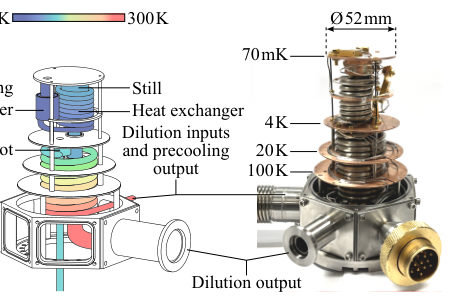
<figcaption class="paper-figure-caption"><b>Fig 1.</b> FIG. 1. Compact inverted dilution cryostat. Schematic and photo- graph of the cryogenic platform highlighting the inverted geometry, with the mixing chamber located at the top and the warm stages at the bottom. The system features a 52 mm-diameter top flange within a 100 mm-diameter vacuum can and provides accessible experimental volumes at both the 4 K and millikelvin stages. The main cryogenic circuits, including the 4He pot, precooling loop, and dilution unit, are indicated.</figcaption>
</figure>
<figure class="paper-figure-card">
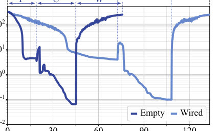
<figcaption class="paper-figure-caption"><b>Fig 2.</b> FIG. 2. Cryogenic cycle and temperature evolution during opera- tion. Temperature of the mixing chamber as a function of time dur- ing a full cooldown and warm-up cycle. Without microwave mea- surement setup installed, the precooling step (P) brings the system from room temperature to 4 K in approximately 15 min. The dilution step reaches a base temperature of 70 mK within 25 min to 40 min depending on the thermal load. The total turnaround time is about 1.2 h and up to 2.1 h with a mounted sample and RF wiring.</figcaption>
</figure>
<figure class="paper-figure-card">
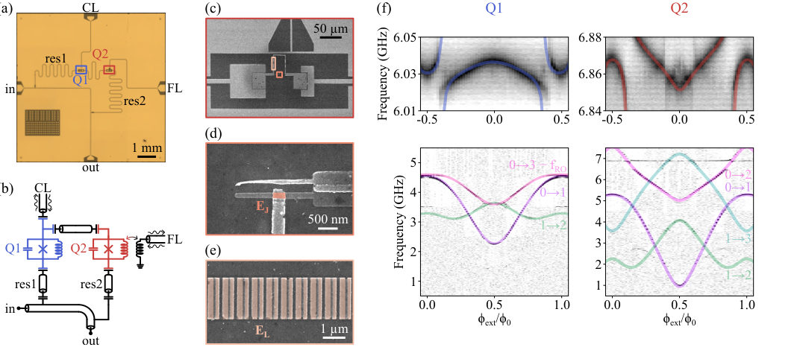
<figcaption class="paper-figure-caption"><b>Fig 3.</b> FIG. 3. Two-fluxonium device characterization. (a) Micrograph and (b) schematic of the characterized device. (c) SEM image of Q2, with zoom-ins on the Josephson junction (d) and the superinductor (e). (f) One-tone spectroscopy of the readout resonator as a function of applied magnetic flux, together with two-tone spectroscopy revealing the fluxonium transition frequencies. Fitting both the resonator and qubit dispersions yields the energy parameters reported in Table I.</figcaption>
</figure>
<figure class="paper-figure-card">
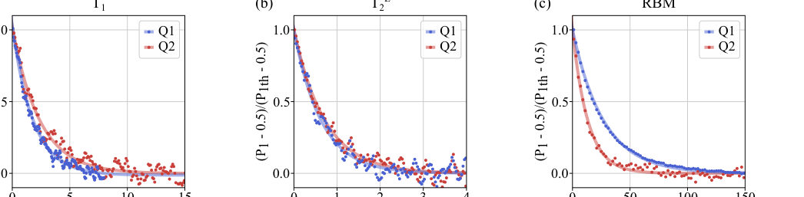
<figcaption class="paper-figure-caption"><b>Fig 4.</b> FIG. 4. Qubit lifetime and randomized benchmarking of Q1 (blue) and Q2 (red). (a) Time-domain measurement of energy relaxation showing T1 = 1.81µs and 2.35 µs, respectively. (b) Hahn-echo coherence time measurement showing T E 2 = 0.631µs and 0.718 µs, respectively. (c) Single-qubit randomized benchmarking showing average physical gate fidelity of 99.03 % and 98.07 %, respectively.</figcaption>
</figure>
<figure class="paper-figure-card">
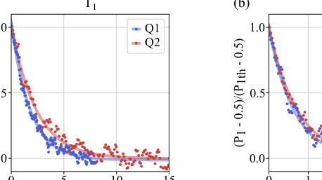
<figcaption class="paper-figure-caption"><b>Fig 5.</b> Figure 5 shows the wiring of the dilution refrigerator to- gether with a photograph of the wired system. Because of the space constraints, we use an SMP-to-SMP 20 dB attenu- ator at the 4 K stage on the input line, a single LNF 4 GHz to 8 GHz circulator at the mixing chamber, and a compact cryogenic amplifier (LNF-LNC4_8SG). Temperature is mon- itored with home-made, in-house-calibrated ruthenium-oxide sensors, and the coil is driven through NbTi DC cables run- ning from room temperature (not shown in the wiring dia- gram). Radiation shields are installed on the 100 K, 20 K, and 4 K stages, and an external magnetic shield screens the Earth’s magnetic field.</figcaption>
</figure>

**Summary.** This paper introduces an ultracompact dilution refrigerator designed to overcome the slow cooldown times that hinder quantum device development. By successfully characterizing a fluxonium qubit on this compact platform, the authors show that high-fidelity quantum measurements can be performed rapidly. This establishes the refrigerator as a practical tool for high-throughput quantum hardware testing.

**Why it may be interesting.** The work directly addresses the engineering bottleneck in quantum hardware development by providing a practical, high-throughput cryogenic platform, which is crucial for scaling up quantum computation experiments.

Detailed structure

**Main problem.** Rapid thermal cycling is a major bottleneck in developing superconducting quantum devices due to the long cooldown times of conventional dilution refrigerators.

**Main result.** The authors demonstrated that an ultracompact, fast-cycling dilution refrigerator can support state-of-the-art quantum characterization, achieving high single-qubit gate fidelities while drastically reducing turnaround time.

**Method.** The study involved characterizing a two-fluxonium device using two-tone spectroscopy, measuring energy relaxation ($T_1$), coherence times, and performing single-qubit randomized benchmarking.

**Model / system.** The platform is an ultracompact dilution refrigerator (3 kg, 100 mm diameter) used to cool superconducting qubits (specifically, two-fluxonium qubits) to base temperatures around 70 mK. The qubit Hamiltonian is characterized by parameters like $E_C, E_L, E_J$.

**Key observables.** Single-qubit gate fidelity (up to 99%), energy-relaxation time ($T_1$), coherence time ($T_E$), and the full circuit Hamiltonian parameters.

**Important parameters / regimes.** Cooldown time (2.1 h fully equipped vs. $\sim 48$ h conventional), cooling power ($20 \mu	ext{W}$ at $100 	ext{ mK}$), and base temperature ($70 	ext{ mK}$).

**Assumptions / limitations.** The primary limitations are the reduced cooling power and higher base temperature compared to large-scale systems, which limits the achievable coherence times.

**Figures summary.** Figures illustrate the schematic of the compact cryostat, the temperature evolution during cooldown/warmup cycles, and the results of qubit lifetime and randomized benchmarking.

**Paper structure.** The paper first identifies the bottleneck of slow cryogenics, presents the compact refrigerator platform, details the characterization of a fluxonium device using spectroscopy and time-domain measurements, and concludes by demonstrating that the fast cycling capability supports high-fidelity quantum control.

Abstract

Rapid thermal cycling is a central bottleneck in the development of superconducting quantum devices: conventional dilution refrigerators require cooldowns of a day or more and substantial cryogenic infrastructure, which throttles the fabricate-measure-redesign loop. We present an ultracompact dilution refrigerator (3 kg in mass and 100 mm in diameter) that completes a full cooldown-warm-up cycle to a base temperature of 70 mK in 1.2 hours when unloaded, and in 2.1 hours when fully equipped with the microwave wiring required for qubit measurements, while delivering 20 microW of cooling power at 100 mK. We validate the platform through a complete characterization of a two-fluxonium device: we extract the full circuit Hamiltonian by two-tone spectroscopy, measure energy-relaxation and coherence times, and benchmark single-qubit control. Although the relaxation time is limited by the base temperature of the system, we reach a single-qubit gate fidelity of up to 99%, at the coherence limit set by our operating temperature. These results demonstrate that compact, fast-cycling dilution refrigeration can support state-of-the-art quantum-device characterization without sacrificing measurement quality, offering a practical route to high-throughput quantum-hardware development.

[↑ back to top](#top)

### [State--Generator Geometry of Open Quantum Systems: Compatibility and Covariant Transport](http://arxiv.org/abs/2608.19175v1)

**Authors:** Eric R. Bittner, Carlos Silva-Acuna  
**Type:** theory · **Category:** other · **PDF:** <https://arxiv.org/pdf/2608.19175v1>  
**Analysis basis:** full PDF text, analyzed in chunks
**Topic relevance:** `driven-dissipative phase transition` **3/5** · `methods for driven-dissipative` **3/5** · `Keldysh / 2PI / non-Gaussian methods` **2/5** · `correlated / nonlocal dissipation` **2/5** · `non-equilibrium universality` **2/5** · `analog quantum simulation` **1/5** · `quantum measurements` **1/5**

↔ Scroll figures horizontally

<figure class="paper-figure-card">
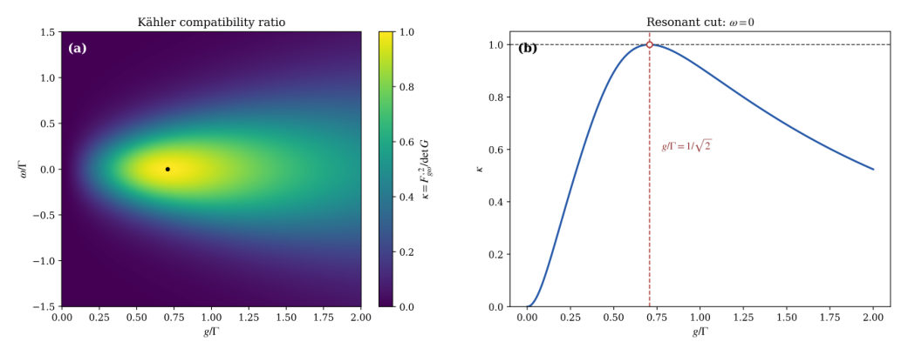
<figcaption class="paper-figure-caption"><b>Fig 1.</b> FIG. 1. Metric–symplectic compatibility for the amplitude-damped optical Bloch model at fixed Γ. (a) The dimensionless ratio κ = F 2 gω/ det G over the control plane. The black marker denotes the compatible point. (b) Resonant section ω = 0, for which κ reaches unity at g/Γ = 1/ √</figcaption>
</figure>
<figure class="paper-figure-card">
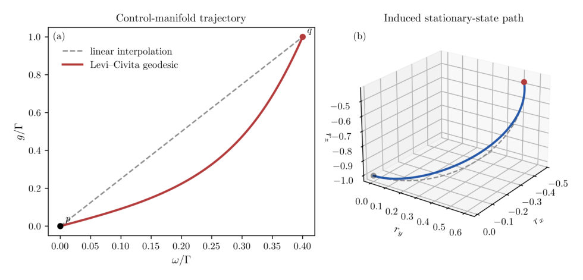
<figcaption class="paper-figure-caption"><b>Fig 2.</b> FIG. 2. Geodesic transport between two optical Bloch control points at fixed Γ. (a) The Levi–Civita geodesic (red) from p = (0, 0) to q = (0.40, 1.00) in (ω/Γ, g/Γ) coordinates, compared with linear parameter interpolation (gray dashed). The geodesic bends toward smaller g because distance is measured by the induced state–generator metric rather than by the Euclidean control coordinates. (b) Images of the same two control-space paths under the stationary-state map λ 7→r(λ). The blue curve is the state trajectory induced by the geodesic; the dashed curve is induced by straight interpolation.</figcaption>
</figure>

**Summary.** This paper develops a geometric theory by embedding the state and generator of an open quantum system into a combined ambient space. It derives a metric and connection on the control manifold that governs how physical observables must be transported between different model points. This geometric approach provides a rigorous, path-dependent measure of physical distance and change for open quantum dynamics.

**Why it may be interesting.** This work provides a powerful, coordinate-independent mathematical tool to compare and interpolate between different steady-state quantum models, which is crucial for understanding parameter-dependent quantum phenomena in optics and quantum control.

Detailed structure

**Main problem.** The paper develops a geometric framework to consistently transport physical observables across the control space of an open quantum system.

**Main result.** It establishes that the state-generator representation $(
ho_{ss}, L)$ induces a metric and connection on the control manifold, allowing for a geometrically rigorous definition of parallel transport.

**Method.** The authors embed the physical model $(
ho_{ss}, L)$ into a state-generator ambient space and derive geometric structures (metric, one-form, two-form) via pullback, calculating the Levi-Civita connection using automatic differentiation.

**Model / system.** The system is an open quantum system whose dynamics are governed by a Liouvillian superoperator $L(\lambda)$. The physical model is parameterized by a control manifold $M$ and is represented by the ordered pair of its stationary state $
ho_{ss}$ and its generator $L$.

**Key observables.** Induced metric, response one-form, closed two-form, geodesic distance, and the Levi-Civita connection.

**Important parameters / regimes.** Control parameters $\lambda$ (e.g., frequency $\omega$, coupling $g$, decay rate $\Gamma$ for the optical Bloch model).

**Assumptions / limitations.** The theory is restricted to finite-dimensional, time-homogeneous Markovian dynamics generated by a Lindblad form, and the physical manifold is constrained by the Liouvillian null-state condition.

**Figures summary.** A figure compares the Levi-Civita geodesic path (red) to simple linear interpolation (gray dashed) in the control space, demonstrating that the true physical path follows a shorter, curved trajectory.

**Paper structure.** The paper first formulates the state-generator representation and derives induced geometric objects (metric, forms). It then analyzes the compatibility conditions (Kähler structure) and finally derives the associated Levi-Civita connection and parallel-transport law.

Abstract

We develop a geometry for transporting stationary-state response across the control space of an open quantum system. A physical model is represented by the ordered pair of its stationary state and dynamical generator. Embedding these pairs in a common ambient space induces a metric, a response one-form, and a closed two-form on the control manifold. The ambient space admits a canonical complex structure that exchanges state and generator directions, but the Liouvillian null-state condition restricts physical models to a submanifold that need not preserve this structure. For an amplitude-damped optical Bloch model, the metric and response two-form are compatible at the single point $ω=0$ and $g/Γ=1/\sqrt{2}$; the physical manifold is non-Kähler elsewhere. The induced metric defines the Levi--Civita connection, geodesics, and parallel transport without requiring Kähler compatibility. We compute the connection by automatic differentiation through the stationary Liouvillian solve and recover the symbolic result to machine precision. A two-point calculation then shows that the resulting geodesic differs from linear interpolation in control space and follows a shorter path through the family of state--generator models. This geometry supplies the intrinsic derivative and transport structure needed to carry observable response, including multidimensional spectra, between admissible stationary models.

[↑ back to top](#top)

### [3D trapping of a meta-atom in an intensity minimum](http://arxiv.org/abs/2608.19016v1)

**Authors:** Bin Lu, Adeel Afridi, Nadine Meyer, Romain Quidant  
**Type:** experiment · **Category:** other · **PDF:** <https://arxiv.org/pdf/2608.19016v1>  
**Analysis basis:** full PDF text, analyzed in chunks
**Topic relevance:** `interference shaping light` **3/5** · `quantum optics experiment` **3/5** · `analog quantum simulation` **2/5** · `quantum measurements` **2/5** · `driven-dissipative phase transition` **1/5**

↔ Scroll figures horizontally

<figure class="paper-figure-card">
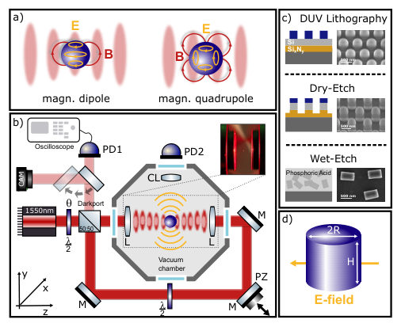
<figcaption class="paper-figure-caption"><b>Fig 1.</b> Figure 1. Meta atom trapping with tailored Mie res- onances: a) Illustration of two of the Mie modes supported by the meta-atoms: Magnetic dipole (left) and magnetic quadrupole (right). b) Experimental setup of the Sagnac in- terferometer with counterpropagating beams (red) focused by two lenses (L). The particle and its motion are detected on a camera (CAM) and a photodiode (PD1) and an oscillocope. Half waveplates (λ/2) control the beams’s relative power and their polarization while a mirror (M) on a piezo element (PZ) controls the relative phase ϕ. The collection lens (CL) collects the light scattered (yellow) by the trapped particle (top left inset). c) Nanofabrication process flow to...</figcaption>
</figure>
<figure class="paper-figure-card">
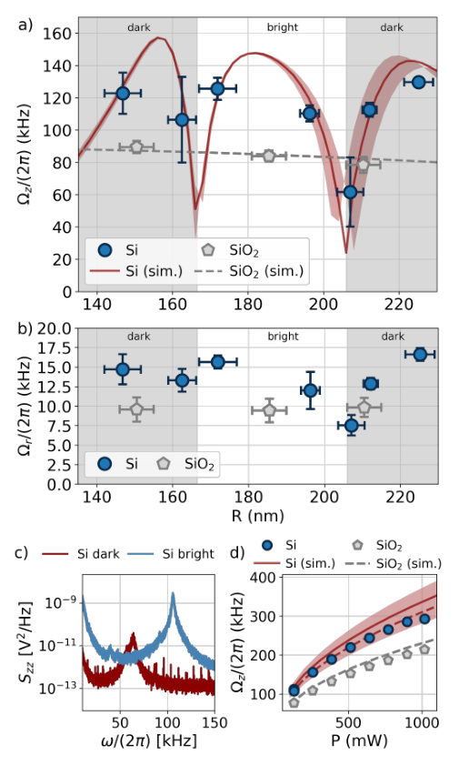
<figcaption class="paper-figure-caption"><b>Fig 2.</b> Figure 2. Enhanced trapping performance of Si par- ticles a) Axial trap frequency Ωz dependence on R = RSEM + δR for Si (blue circles) and SiO2 particles (gray pen- tagons) with RSEM being the radius measured in the SEM and δR = 3 nm its systematic error. Simulations for Si parti- cles (solid red line) assume HSEM = 605 nm with fabrication errors of δH = ±10 nm (red shaded area), while for SiO2 (dashed gray line) a spherical particle of radius R is assumed. b) Radial trap frequency Ωr dependence on R = RSEM + δR for Si (blue circles) and SiO2 particles (gray pentagons). The gray shaded areas highlight radii where particles are trapped at the intensity minimum (z = ±λ/4) due to αeff &lt; 0....</figcaption>
</figure>
<figure class="paper-figure-card">
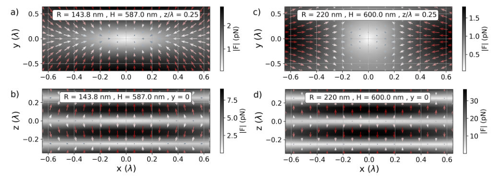
<figcaption class="paper-figure-caption"><b>Fig 3.</b> Figure 3. Force field simulations experienced by Si meta-atoms being trapped at the intensity minimum. Force field F (arrows) and force magnitude |F| (shaded background) for a-b) R = 143.8 nm, H = 587 nm and c-d) R = 220 nm, H = 600 nm. a) The particle is trapped at x, y = 0 and b) z = ±λ/4. c) The particle is repelled from the center along y, trapped at x = 0, and d) z = ±λ/4.</figcaption>
</figure>
<figure class="paper-figure-card">
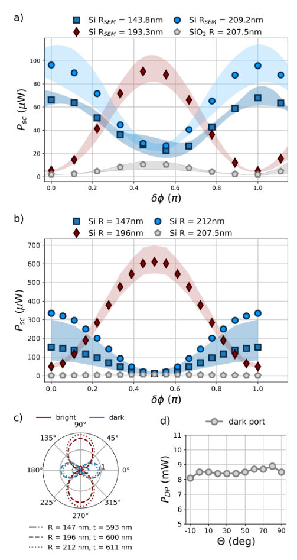
<figcaption class="paper-figure-caption"><b>Fig 4.</b> Figure 4. Scattering pattern reveals trap position. a) Scattered power Psc being collected (CL) along y for varying polarization angle θ. Si particles of RSEM = 143.8 nm, HSEM = 587.2 nm (blue squares) and RSEM = 209.2 nm, HSEM = 605 nm (blue circles) exhibit a maxi- mum scattered power at θ = nπ with n ∈Z correspond- ing to the polarization axis of E. In contrast Si particles of RSEM = 193.3 nm, HSEM = 594.2 nm (red diamonds) scatter maximum power along y at θ = n π/2 perpendicular to E same as SiO2 (gray pentagons). The shaded area is the re- spective minimum and maximum value of three measurements with individual particles. b) Simulation of Psc collected with CL. Si particles scatter...</figcaption>
</figure>

**Summary.** The research demonstrates the ability to trap resonant silicon meta-atoms deterministically and stably within the intensity minima of an optical standing wave. By exploiting Mie resonances, the authors achieve force-inversion, a capability superior to standard silica particles. This work establishes meta-atoms as a versatile tool for accessing novel optical trapping regimes beyond conventional intensity maxima.

**Why it may be interesting.** This work directly bridges concepts from atomic physics (e.g., blue-detuned trapping analogy) into the realm of solid-state nanophotonics, demonstrating how engineered material resonances (Mie resonances) can provide unprecedented control over optical forces, which is highly relevant to quantum control and trapping mechanisms.

Detailed structure

**Main problem.** To demonstrate and characterize the deterministic and stable three-dimensional (3D) trapping of resonant meta-atoms in optical intensity minima, a regime inaccessible to standard silica particles.

**Main result.** The authors successfully achieved stable 3D trapping of silicon meta-atoms at intensity minima, showing enhanced trapping stiffness compared to silica and demonstrating force control via Mie resonances.

**Method.** The experiment uses a Sagnac interferometer setup to trap fabricated silicon nanoparticles in an optical standing wave, measuring trap frequencies and analyzing far-field scattering patterns.

**Model / system.** The system involves resonant silicon meta-atoms (nanoparticles) trapped in a standing wave formed by two counter-propagating laser beams. The trapping force is governed by the effective polarizability ($\alpha_{	ext{eff}}$), which can be tuned by exploiting Mie resonances.

**Key observables.** Trap frequencies ($\Omega_x, \Omega_y, \Omega_z$), the sign of the optical force (determining trapping at maxima vs. minima), and the far-field scattering pattern rotation ($\pi/2$).

**Important parameters / regimes.** Particle radius ($R$), laser wavelength ($\lambda = 1550 	ext{ nm}$), and the effective polarizability ($\alpha_{	ext{eff}}$) which dictates the force direction.

**Assumptions / limitations.** The optical force is approximated by $F \approx -\alpha_{	ext{eff}}
abla I$, and the analysis relies on comparing scattering patterns at different positions ($z=0$ vs. $z=\pm\lambda/4$).

**Figures summary.** Figures illustrate the experimental setup, the dependence of trap frequencies on particle radius ($R$) for Si vs. $	ext{SiO}_2$, and the polarization-angle dependence of the scattered power confirming trapping at intensity minima.

**Paper structure.** The paper progresses from introducing the concept of meta-atoms over standard particles, detailing the experimental setup and fabrication, presenting the key results showing force inversion and enhanced trapping at intensity minima, and concluding with a discussion of the implications for optical manipulation.

Abstract

High-refractive-index particles have recently attracted a growing interest in optical levitation experiments, offering the ability to further engineer optical forces through electromagnetic Mie resonances. Unlike standard silica particles, which are predominantly trapped in the dipole regime and exhibit trap frequencies mainly determined by material density, resonant meta-atoms formed by high-index particles enable qualitatively new trapping behaviors. In this work, we experimentally investigate the trapping of resonant silicon particles in an optical standing wave. A direct comparison of silicon and silica highlights the fundamental differences in their optical force scaling and trapping dynamics. Beyond conventional trapping at intensity-maxima, we demonstrate deterministic and stable three-dimensional trapping of silicon nanoparticles in optical intensity minima, a regime that remains inaccessible for silica particles. Drawing a mesoscopic analogy with blue-detuned atom trapping, our results establish meta-atoms as a versatile approach to further extend the optical manipulation tool box towards accessing novel trapping regimes e.g. in close proximity to a surface.

[↑ back to top](#top)

### [Hubb_DMFT and Wan2mb_DMFT: Continuous-Time Quantum Monte Carlo Solvers for Single- and Multi-Orbital Hubbard Model](http://arxiv.org/abs/2608.18540v1)

**Authors:** A. A. Katanin  
**Type:** theory · **Category:** strongly correlated electrons · **PDF:** <https://arxiv.org/pdf/2608.18540v1>  
**Analysis basis:** full PDF text, analyzed in chunks
**Topic relevance:** `Keldysh / 2PI / non-Gaussian methods` **3/5** · `methods for driven-dissipative` **3/5** · `analog quantum simulation` **2/5** · `quantum measurements` **1/5**

↔ Scroll figures horizontally

<figure class="paper-figure-card">
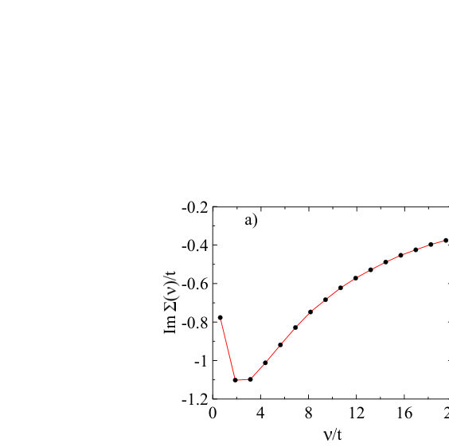
<figcaption class="paper-figure-caption"><b>Fig 1.</b> Figure 1: Calculated imaginary part of the Matsubara self-energy Σ(iνn) (a) and triangular vertices Γσσ′ ν,0 (b) for the 2D Hubbard model at t′/t = −0.3, U = 5.6t, n = 0.96 at T = 0.2t.</figcaption>
</figure>
<figure class="paper-figure-card">
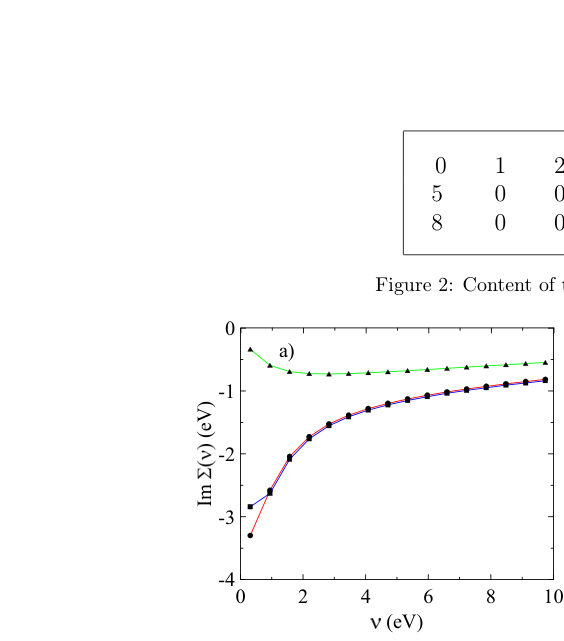
<figcaption class="paper-figure-caption"><b>Fig 2.</b> Figure 3: Calculated imaginary part of the Matsubara self-energy Σ(iνn) (a) and triangular vertices Γm↑,m↑ ν,0 (b) for a monolayer of CrTe2 at β = 10 eV−1, capturing orbital dependence of the calculated quantities.</figcaption>
</figure>

**Summary.** This paper details two advanced software packages, Hubb_DMFT and Wan2mb_DMFT, designed to solve the DMFT equations for strongly correlated electron systems. They employ a Continuous-Time Quantum Monte Carlo solver within the CT-HYB framework to calculate key observables like the self-energy and interaction vertices. The work is significant for providing robust tools to study correlated materials ranging from simple Hubbard models to complex multi-orbital systems like TMDs.

**Why it may be interesting.** While focused on solid-state correlation, the use of advanced quantum Monte Carlo techniques and the development of highly specialized, numerically exact solvers for many-body Hamiltonians are relevant to understanding complex quantum dynamics in open quantum systems.

Detailed structure

**Main problem.** The paper addresses the challenge of solving the Dynamical Mean-Field Theory (DMFT) equations for strongly correlated electron systems.

**Main result.** It introduces two specialized software packages, Hubb_DMFT and Wan2mb_DMFT, capable of calculating local self-energies and two-particle vertices for both single-band and multi-orbital Hubbard models.

**Method.** The core method is based on a self-consistent DMFT loop utilizing a modified Continuous-Time Quantum Monte Carlo (CT-QMC) solver within the Hybridization Expansion (CT-HYB) framework.

**Model / system.** The models studied are the single-band and multi-orbital Hubbard models. The multi-orbital extension specifically interfaces with Wannier tight-binding Hamiltonians derived from DFT calculations.

**Key observables.** Local self-energy ($\Sigma$), local Green's function ($G_{	ext{local}}$), and two-particle fermion/triangular fermion-boson charge and spin vertices.

**Important parameters / regimes.** Coulomb interaction ($U, V_q$), hopping parameters ($t_{ij}$), and orbital parameters ($U, J_H$). Benchmark studies use parameters like $U = 5.6t$ for cuprate models.

**Assumptions / limitations.** The calculations rely on the CT-HYB algorithm for achieving numerically exact solutions for the quantum impurity problem. Multi-orbital calculations require careful handling of double-counting corrections.

**Figures summary.** Figure 1 shows calculated $\Sigma$ and triangular vertices for the 2D Hubbard model. Figure 3 shows similar results for a $	ext{CrTe}_2$ monolayer, demonstrating orbital-dependent correlation effects.

**Paper structure.** The paper presents the two codes, Hubb_DMFT (single-band) and Wan2mb_DMFT (multi-orbital), detailing their implementation using the CT-QMC/CT-HYB framework. It outlines the self-consistent loop structure and provides benchmarks on physical systems like the 2D Hubbard model and TMDs.

Abstract

We present two related customized software packages, Hubb_DMFT and Wan2mb_DMFT, designed to solve the Dynamical Mean-Field Theory (DMFT) equations for strongly correlated electron systems. Hubb_DMFT is adjusted for the single-band Hubbard model, providing a fast way to calculate the local self-energy, as well as the two-particle fermion and triangular fermion-boson charge and spin vertices, while Wan2mb_DMFT extends this capability to realistic multi-orbital systems, directly interfacing Wannier tight-binding Hamiltonians with many-body solvers. Both codes are based on iQIST v.0.7 impurity solver and utilize a modified and internally integrated Continuous-Time Quantum Monte Carlo (CT-QMC) core with the hybridization expansion (CT-HYB) framework and improved self-energy and vertex estimators for density-density interaction, ensuring numerically exact solutions for quantum impurity problems.

[↑ back to top](#top)

### [Sampling isometric tensor network states with monitored quantum circuits](http://arxiv.org/abs/2608.18511v1)

**Authors:** Yuqing Rong, Huan-Hai Zhou, Guo-Yi Zhu, Jinguo Liu  
**Type:** theory · **Category:** numerical methods · **PDF:** <https://arxiv.org/pdf/2608.18511v1>  
**Analysis basis:** full PDF text, analyzed in chunks
**Topic relevance:** `analog quantum simulation` **3/5** · `methods for driven-dissipative` **3/5** · `quantum measurements` **2/5**

↔ Scroll figures horizontally

<figure class="paper-figure-card">
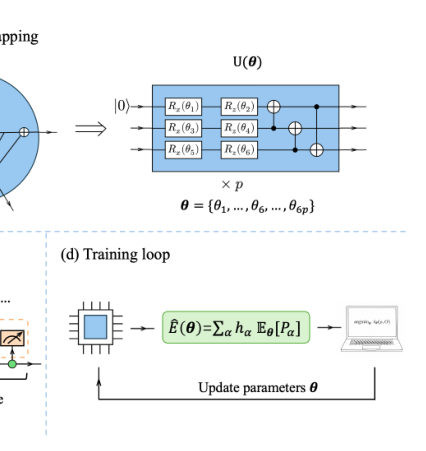
<figcaption class="paper-figure-caption"><b>Fig 1.</b> Figure 1: Variational sampling framework for isoPEPS. (a) An isoPEPS on an infinite cylinder, represented in a spiral geometry with W sites around the circumference. Each site carries a rank-five PEPS tensor with four virtual legs—one incoming and one outgoing leg along each of the horizontal (hi) and spiral (v) directions—and one physical leg p. The arrows specify the isometric orientation: the two incoming virtual indices are mapped to the physical index and the two outgoing virtual indices. The |0⟩line is an ancillary input introduced in the unitary circuit representation, rather than an additional leg of the PEPS tensor. (b) The local isometric tensor is embedded in a three-qubit...</figcaption>
</figure>
<figure class="paper-figure-card">
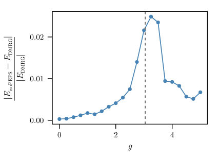
<figcaption class="paper-figure-caption"><b>Fig 2.</b> Figure 2: TFIM energy benchmark on a 3 × ∞cylinder. (a) Energy density of the D = 2, p = 3 isoPEPS after sampling-based optimization, evaluated by exact tensor-network contraction, compared with DMRG on the same W = 3 cylinder. (b) Relative deviation of the exact-contraction isoPEPS energy from the DMRG result, |EisoPEPS −EDMRG|/|EDMRG|. The deviation peaks near the square- lattice quantum critical point gc = 3.04438(2) [38].</figcaption>
</figure>
<figure class="paper-figure-card">
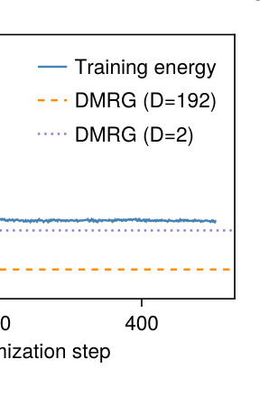
<figcaption class="paper-figure-caption"><b>Fig 3.</b> Figure 3: Optimization history for the J1-J2 Heisenberg model at J2/J1 = 0.5. IsoPEPS with W = 4, D = 2, p = 3, and a 2 × 2 unit cell (72 parameters). Each energy estimate uses 40,000 single-site measurement samples from the monitored trajectory.</figcaption>
</figure>
<figure class="paper-figure-card">
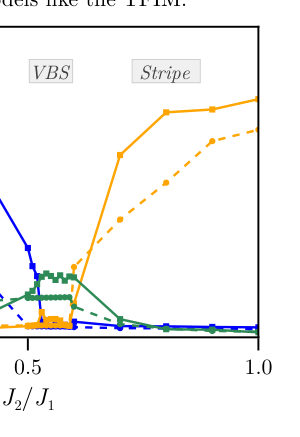
<figcaption class="paper-figure-caption"><b>Fig 4.</b> Figure 4: Magnetic and dimer order calculated for the J1-J2 Heisenberg model. Magnetic order parameters at the N´eel wavevector M 2(π, π) and the stripe wavevector M 2(0, π), together with the vertical-bond dimer order parameter M2 D(0, π), as a function of J2/J1. Colors denote the three observables; solid (dashed) curves show the D = 2 isoPEPS (DMRG) results. The shaded labels mark the N´eel, VBS, and stripe regimes: M2(π, π) dominates at small J2/J1, M 2 D(0, π) peaks in the intermediate window J2/J1 ≈0.5–0.6, and M 2(0, π) takes over at larger J2/J1.</figcaption>
</figure>
<figure class="paper-figure-card">
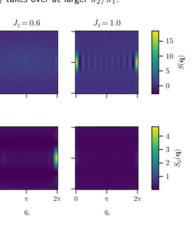
<figcaption class="paper-figure-caption"><b>Fig 5.</b> Figure 5: Momentum-resolved spin and dimer structure factors for the J1–J2 Heisenberg model. (Top row) Spin structure factor S(q) at J2/J1 = 0.0, 0.5, 0.6, 1.0: a N´eel peak at (π, π) for J2/J1 = 0.0, suppressed in the intermediate window, and shifted to the stripe wavevector (0, π) at J2/J1 = 1.0. (Bottom row) Vertical-bond dimer structure factor Sy D(q) at the same four couplings: a peak at (0, π) for J2/J1 = 0.5, 0.6, consistent with the columnar-VBS signal in Fig. 4, and featureless at J2/J1 = 0.0, 1.0. The dense qy sampling in the plots is used only for display; the W = 4 cylinder admits the four transverse crystal momenta qy ∈{0, π/2, π, 3π/2}.</figcaption>
</figure>

**Summary.** This paper develops a novel hybrid quantum-classical approach to simulate 2D quantum many-body systems using isometric tensor networks (isoPEPS). It replaces complex tensor contractions with sampling from monitored quantum circuits, making the simulation compatible with near-term quantum hardware. The method successfully estimates ground-state properties for models like the J1-J2 Heisenberg model, validating its potential for simulating complex quantum phases.

**Why it may be interesting.** This work directly addresses the computational bottleneck in simulating 2D quantum matter by translating the intractable tensor contraction into a physically realizable, near-term quantum circuit sampling routine.

Detailed structure

**Main problem.** The primary challenge is efficiently computing observables for two-dimensional quantum lattice models whose exact Hilbert space dimension grows exponentially.

**Main result.** The proposed method successfully estimates the energy density for the J1-J2 model and TFIM in qualitative agreement with established methods like DMRG, demonstrating a viable hybrid quantum-classical simulation framework.

**Method.** The authors parameterize the quantum state using isometric tensor networks (isoPEPS) and replace costly tensor-network contraction with sampling from monitored quantum circuits.

**Model / system.** The study focuses on 2D quantum spin systems, specifically the J1-J2 Heisenberg model and the Transverse-Field Ising Model (TFIM), implemented on an infinite cylindrical spiral geometry.

**Key observables.** Energy density, correlation length ($\xi$), longitudinal and transverse magnetizations ($|\langle Z 
angle|, |\langle X 
angle|$), and real-space spin correlations ($\langle S_i \cdot S_j 
angle$).

**Important parameters / regimes.** The ratio $J_2/J_1$ for the Heisenberg model, and the transverse field strength $g$ for the TFIM.

**Assumptions / limitations.** The method assumes standard ergodicity for the time average to converge to the stationary boundary state, and the optimization relies on sampling noisy energy estimators.

**Figures summary.** Figures illustrate the variational sampling framework, the circuit structure for monitoring, the comparison of energy densities against DMRG, and the extraction of correlation lengths and magnetizations for the TFIM.

**Paper structure.** The paper introduces the isoPEPS ansatz, details the mapping onto monitored quantum circuits for cylindrical/spiral geometries, presents the sampling and optimization procedure (using CMA-ES), and validates the method by calculating observables for the TFIM and J1-J2 model.

Abstract

Projected entangled pair states (PEPS) provide an efficient variational ansatz for two-dimensional quantum phases, but computing observables remains challenging because PEPS contraction is generally costly.   Here, we parameterize two-dimensional quantum states using variational PEPS subject to isometric constraints and map the resulting ansatz onto monitored quantum circuits, replacing tensor-network contraction with circuit sampling.   For infinite cylinders, the transfer matrix defines a quantum channel on the virtual boundary. We use a fixed-point treatment and a monitored-circuit unraveling of this channel to evaluate observables efficiently.   Using a constant number of variational parameters and a number of qubits that scales only with the cylinder width, our method yields a phase diagram for the $J_1$-$J_2$ model in qualitative agreement with DMRG results.   Because the monitored circuits are compatible with near-term quantum hardware, this approach provides a hybrid quantum-classical framework for simulating two-dimensional quantum many-body systems.

[↑ back to top](#top)

### [Emergent BEC mechanism in flat-band superconductors](http://arxiv.org/abs/2608.19044v1)

**Authors:** V. Berger, I. S. Tupitsyn, B. Currie, B. V. Svistunov, E. Kozik, N. V. Prokof'ev  
**Type:** theory · **Category:** strongly correlated electrons · **PDF:** <https://arxiv.org/pdf/2608.19044v1>  
**Analysis basis:** full PDF text, analyzed in chunks
**Topic relevance:** `Keldysh / 2PI / non-Gaussian methods` **3/5** · `analog quantum simulation` **3/5** · `methods for driven-dissipative` **1/5**

↔ Scroll figures horizontally

<figure class="paper-figure-card">
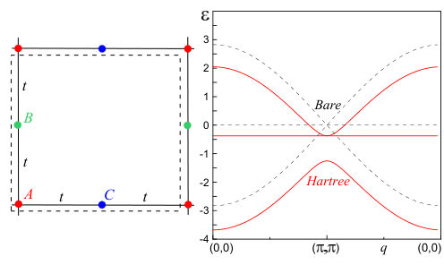
<figcaption class="paper-figure-caption"><b>Fig 1.</b> FIG. 1. Left: Standard Lieb lattice with three sites {A, B, C} in the unit cell and hopping amplitudes t between the n.n. sites. Right: Bare (black dashed line) and Hartree mean-field (solid red line) dispersion relations for U = −2t at n = 2 along the kx = ky line in the Brillouin zone.</figcaption>
</figure>
<figure class="paper-figure-card">
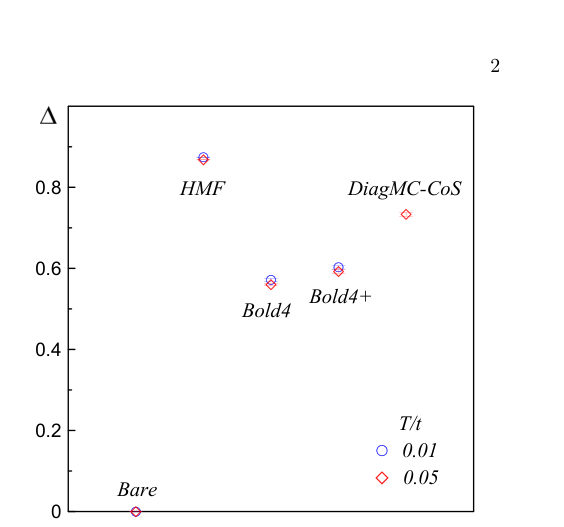
<figcaption class="paper-figure-caption"><b>Fig 2.</b> FIG. 2. Energy gap at momentum (π, π) between the fully occupied lowest band and the empty (nearly) flat band for U/t = −2, shown as a function of the method used.</figcaption>
</figure>
<figure class="paper-figure-card">
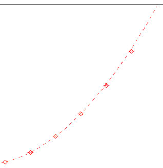
<figcaption class="paper-figure-caption"><b>Fig 3.</b> FIG. 3. Bound state energy obtained within the variational anzats (4) on top of the HMF-renormalized band structure for U = −2t (the numerical solution was obtained for the lattice with 100 × 100 unit cells and periodic boundary conditions). The dashed line is a parabolic fit Eb(q) = Eb(0) + q2/2m∗ with 1/m∗= 0.164 ± 0.002.</figcaption>
</figure>
<figure class="paper-figure-card">
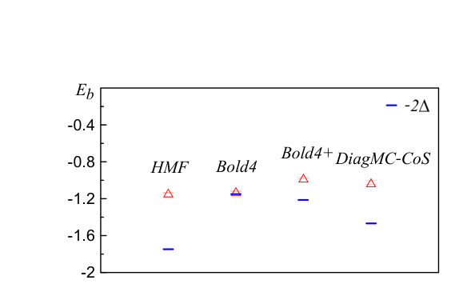
<figcaption class="paper-figure-caption"><b>Fig 4.</b> FIG. 4. Binding energy predictions (red triangles) across sev- eral schemes with an increasingly comprehensive treatment of particle-hole excitations. Blue dashed lines show the corre- sponding −2∆values. Results are shown for U/t = −2, with Bold4 and Bold4+ simulations performed at T/t = 0.01 and DiagMC-CoS simulations at T/t = 0.05.</figcaption>
</figure>
<figure class="paper-figure-card">
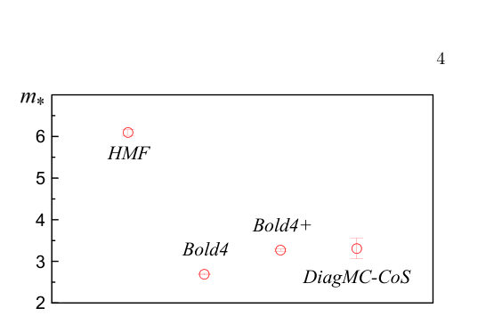
<figcaption class="paper-figure-caption"><b>Fig 5.</b> FIG. 5. Effective mass predictions using the same computa- tional schemes and parameters as in Fig. 4.</figcaption>
</figure>

**Summary.** This work analyzes superconductivity in flat-band superconductors using the Lieb lattice model. It shows that the conventional understanding of pairing, which requires a large energy gap, breaks down when the bands touch. Despite this, the authors prove that the Bose-Einstein Condensation (BEC) mechanism remains robust, predicting exceptionally high critical temperatures ($T_c$) through advanced diagrammatic calculations.

**Why it may be interesting.** The study provides rigorous theoretical confirmation of pairing mechanisms in strongly correlated, geometrically constrained systems (flat bands), which is highly relevant to understanding unconventional superconductivity in materials like graphene or topological insulators.

Detailed structure

**Main problem.** The paper investigates the superconducting mechanism in flat-band superconductors, specifically addressing the case where the flat band is gapless or nearly touching the occupied lower band.

**Main result.** The BEC mechanism remains robust and highly efficient even when the initial band structure is gapless, leading to an exceptionally high superconducting transition temperature ($T_c$).

**Method.** The authors employ advanced diagrammatic techniques (e.g., Bold4, DiagMC-CoS) combined with a variational two-body ansatz to calculate the bound state properties and $T_c$.

**Model / system.** The system is modeled using the attractive Hubbard model on the Lieb lattice, which features non-interacting flat bands. The analysis focuses on the formation of bound bosonic pairs of fermions.

**Key observables.** Superconducting transition temperature ($T_c$), effective mass ($m^*$) of the bound pairs, and the energy gap ($\Delta$) separating the bands.

**Important parameters / regimes.** The critical regime is when the non-interacting flat and lower bands touch ($\Delta \approx 0$), making the problem fundamentally non-perturbative.

**Assumptions / limitations.** The analysis relies on solving the two-body problem within a restricted Hilbert space (flat and upper bands) and comparing results across multiple diagrammatic approximations.

**Figures summary.** Figures illustrate the Lieb lattice structure and band dispersions; they compare calculated energy gaps ($\Delta$) using various methods; and they plot the binding energy $E_b(q)$ and effective mass $m^*$ derived from the pair propagator.

**Paper structure.** The paper contrasts the conventional BCS picture (large gap) with the gapless case. It then develops a controlled-precision numerical protocol using multiple diagrammatic schemes to calculate the bound state energy and effective mass, ultimately demonstrating the robustness of the BEC mechanism.

Abstract

The formation of bound bosonic pairs of fermions, followed by their Bose-Einstein (quasi) condensation (BEC), is a foundational mechanism of superconductivity. At low filling, flat-band superconductivity is well captured by this mechanism provided the flat band is separated from the occupied lower band by an energy gap. However, particularly high $T_c$ values are anticipated when the non-interacting flat and lower bands touch---as in the prototypical attractive Lieb-lattice model studied here---invalidating the conventional picture: while interactions might protect the bound state by opening a gap, no small parameter guarantees the separation of the bound-state energy from this gap or occupied-band excitations, leaving the pair's fate uncertain. Based on a controlled-precision numerical protocol---which we demonstrate to be essential in this fundamentally non-perturbative problem---we show that the BEC mechanism, underpinned by an interaction-induced gap, is generically robust and remarkably efficient: fermions doped into the flat band form bound pairs within this gap with an anomalously light effective mass, enabling an exceptionally high $T_c$.

[↑ back to top](#top)

### [On the Origins of Varying Gauge Couplings](http://arxiv.org/abs/2608.18203v1)

**Authors:** Carlos Henrique de Lima, David McKeen, David E. Morrissey, Michael Shamma  
**Type:** theory · **Category:** other · **PDF:** <https://arxiv.org/pdf/2608.18203v1>  
**Analysis basis:** full PDF text, analyzed in chunks
**Topic relevance:** `Keldysh / 2PI / non-Gaussian methods` **3/5** · `analog quantum simulation` **2/5** · `methods for driven-dissipative` **1/5** · `quantum measurements` **1/5**

↔ Scroll figures horizontally

<figure class="paper-figure-card">
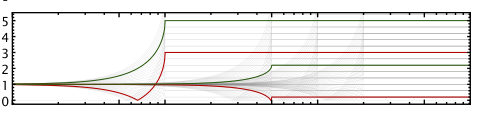
<figcaption class="paper-figure-caption"><b>Fig 1.</b> Figure 1. Inverse gauge coupling 4π/g2 (top panel) and fermion mass m(ϕ) (bottom panel) as functions of temperature T, normalized to the current T = 0 mass m0 ≡m(ϕ0), for a toy Abelian model with Nψ = 100 vector-like fermions. Each curve corresponds to a different choice of yϕ0/m0 and critical temperature Tc, leading to distinct scalar field evolutions and hence different mass thresholds. The dashed lines show the naive linear expectation for the two pairs of benchmarks discussed in the text, while the solid red and green lines show the corresponding evolution in the full theory for specific parameter values.</figcaption>
</figure>
<figure class="paper-figure-card">
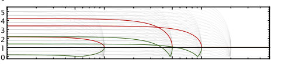
<figcaption class="paper-figure-caption"><b>Fig 2.</b> Figure 2. Same as Fig. 1, but with the UV gauge coupling fixed at g(Λ) = 0.8 and all dimensionful scales normalized to the UV fermion mass m∞≡m(ϕ = 0) instead of IR quantities.</figcaption>
</figure>
<figure class="paper-figure-card">
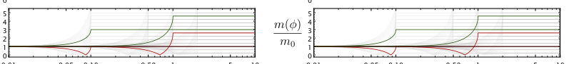
<figcaption class="paper-figure-caption"><b>Fig 3.</b> Figure 3. Inverse gauge coupling (top panels) and bulk mass parameter (bottom panels) as func- tions of temperature for the five-dimensional U(1) toy model with a single bulk Dirac fermion, normalized to the fixed low-energy (IR) coupling and mass m0 ≡m(ϕ0). The two columns corre- spond to small (left) and large (right) compactification radii. Red and green curves highlight specific trajectories with the same bulk mass parameter variation for the given critical temperature.</figcaption>
</figure>
<figure class="paper-figure-card">
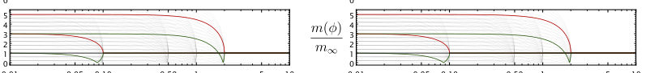
<figcaption class="paper-figure-caption"><b>Fig 4.</b> Figure 4. Same as Fig. 3, but with the gauge coupling normalized to a fixed high-scale (UV) value and all dimensionful scales normalized to the high-scale bulk mass parameter m∞≡m(ϕ = 0).</figcaption>
</figure>

**Summary.** This work theoretically examines how gauge couplings might vary due to coupling with a dynamical scalar field. It argues that fundamental quantum field theory principles restrict this variation to a logarithmic dependence on the scalar field, rather than a simple linear one. The analysis uses RG techniques to predict the behavior of these couplings in both vacuum and early-universe settings.

**Why it may be interesting.** While focused on particle physics, the use of RG flow, threshold effects, and the dependence of effective couplings on background fields ($\phi$) mirrors concepts in condensed matter physics concerning emergent symmetries and scale dependence.

Detailed structure

**Main problem.** The paper investigates the fundamental origins and nature of varying gauge couplings in particle physics, specifically how they arise from quantum field theory interactions.

**Main result.** In weakly coupled, renormalizable 4D QFTs, gauge invariance forces the leading dependence of the effective gauge coupling on a scalar field to be logarithmic, not linear.

**Method.** The authors use Renormalization Group (RG) techniques to analyze the effective gauge coupling dependence on a dynamical scalar field, comparing results from effective field theory (EFT) approaches with full UV completions.

**Model / system.** The model involves the Standard Model gauge couplings coupled to a dynamical scalar field ($\phi$) via an interaction term, often analyzed using a toy model with charged fermions whose mass depends on $\phi$.

**Key observables.** The effective gauge coupling $g_{	ext{eff}}^2(\mu, \phi)$ and its running dependence on energy scale ($\mu$) and scalar vacuum expectation value ($\phi$).

**Important parameters / regimes.** The scalar coupling parameters ($M, y, \Lambda_g$) and the energy scales ($\mu, T$) are crucial, with the analysis focusing on threshold effects set by the fermion mass $m(\phi)$.

**Assumptions / limitations.** The primary assumption is that the theory is weakly coupled and renormalizable in four dimensions, which dictates the logarithmic running behavior.

**Figures summary.** Figure 1 compares the full theory evolution of $4\pi/g_2$ and $m(\phi)$ versus temperature $T$ against linear approximations. Figure 2 normalizes scales to the UV fermion mass, illustrating the flow from UV to IR.

**Paper structure.** The paper first establishes the general argument for logarithmic running (Pages 1-4), then applies this to a specific toy model involving fermion mass thresholds (Section 2.1), and finally discusses the implications for the early universe and beyond.

Abstract

Variations in the gauge couplings of the Standard Model have been searched for experimentally and proposed as solutions to open questions in fundamental physics. Varying gauge couplings can arise from a dynamical scalar field coupled to the gauge kinetic term. This mechanism has been invoked extensively, assuming a minimal linear coupling of the scalar to the gauge bosons. In this work, we investigate how this operator is generated from the ultraviolet perspective. We argue that in weakly coupled, renormalizable completions in four spacetime dimensions, gauge invariance forces the leading dependence of the effective gauge coupling on the scalar to be logarithmic rather than linear. The gauge coupling evolution in these scenarios can be entirely described by the renormalization-group running with dynamical mass thresholds. Beyond leading order or four dimensions, we provide examples showing that more general behavior is possible. Finally, we discuss the phenomenological implications of dynamically evolving gauge couplings, particularly in early-universe settings.

[↑ back to top](#top)

### [Rare-earth spin textures and a route to electronic inhomogeneity in $Pr_2Ir_2O_7$](http://arxiv.org/abs/2608.18301v1)

**Authors:** Kyle G Sherman, Michael J Lawler  
**Type:** theory · **Category:** strongly correlated electrons · **PDF:** <https://arxiv.org/pdf/2608.18301v1>  
**Analysis basis:** full PDF text, analyzed in chunks
**Topic relevance:** `analog quantum simulation` **3/5** · `methods for driven-dissipative` **3/5** · `Keldysh / 2PI / non-Gaussian methods` **1/5**

↔ Scroll figures horizontally

<figure class="paper-figure-card">
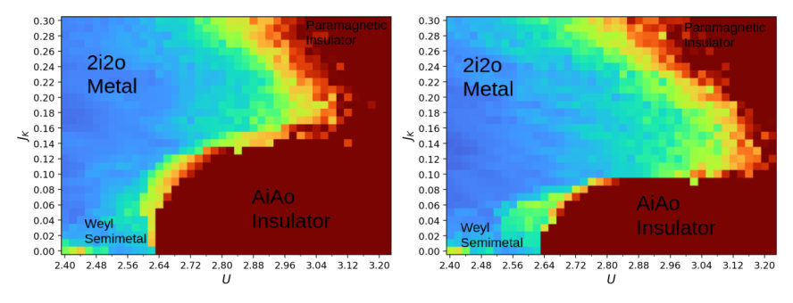
<figcaption class="paper-figure-caption"><b>Fig 1.</b> FIG. 1. The U-JK phase diagram of the coupled Pr-Ir model. Figures: praseodymium texture (left: spin ice, J = 0; right: jellyfish, J = 1/4). Columns: band gap (left) and AIAO order parameter (right), computed from the iridium Hartree-Fock mean field over Monte Carlo-sampled Pr configurations at T = 1 K on an N = 864 cluster. The AIAO insulator occupies large U; increasing JK smoothly closes the gap.</figcaption>
</figure>
<figure class="paper-figure-card">
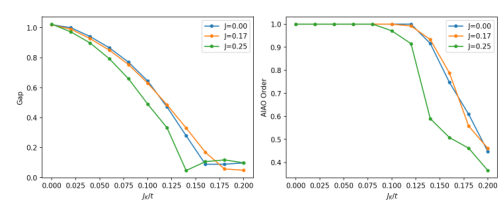
<figcaption class="paper-figure-caption"><b>Fig 2.</b> FIG. 2. Gap (a) and AIAO order (b) versus JK for Pr textures along the ice–jellyfish line. The critical coupling shifts by ∆JKc ≈0.03 t between endpoints.</figcaption>
</figure>
<figure class="paper-figure-card">
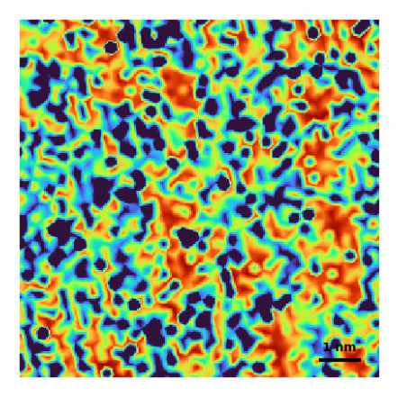
<figcaption class="paper-figure-caption"><b>Fig 3.</b> FIG. 3. Synthetic local density of states over a 10 nm praseodymium field at T = 1 K, J = 1/4, U = 2.8, JK = 0.11. Insulating islands appear within a metallic sea. The praseodymium system contains 24,576 spins and the irid- ium system contains 864 sites.</figcaption>
</figure>

**Summary.** This theoretical study investigates how the frustrated spin texture of Pr ions in $	ext{Pr}_2	ext{Ir}_2	ext{O}_7$ dictates its electronic properties. By coupling a spin-ice model to an Ir electronic Hamiltonian, the authors show that local variations in the Pr spins can induce a spatial pattern of electronic inhomogeneity. This suggests that frustration-driven local magnetism is the key mechanism driving the observed mixture of Kondo-screened and Kondo-destroyed electronic states.

**Why it may be interesting.** This work provides a concrete theoretical mechanism linking geometric frustration (Pr spin texture) to emergent electronic phenomena (Kondo screening breakdown) in strongly correlated oxides, which is highly relevant to understanding correlated materials physics.

Detailed structure

**Main problem.** The study investigates whether the frustrated spin texture of the rare-earth element Pr in $	ext{Pr}_2	ext{Ir}_2	ext{O}_7$ is responsible for the observed electronic inhomogeneity, which manifests as a mixture of Kondo-screened and Kondo-destroyed regions.

**Main result.** The model successfully reproduces the inhomogeneous tunneling map, suggesting that local fluctuations in the Pr spin texture can drive the system into a frustration-driven regime exhibiting the observed Kondo/Kondo-destroyed electronic state.

**Method.** The authors employed Monte Carlo sampling of classical Pr spin-ice configurations, coupling these to an eight-band Hartree-Fock model for the Ir electrons to calculate local density of states.

**Model / system.** The system is the pyrochlore iridate $	ext{Pr}_2	ext{Ir}_2	ext{O}_7$. The electronic structure is modeled using an eight-band Hartree-Fock approach for Ir, coupled via a Kondo exchange interaction ($J_K$) to classical Pr spins treated via an effective spin-ice Hamiltonian.

**Key observables.** Local density of states ($
ho(\mathbf{r}, 	ext{eV})$), gap closing, AIAO magnetic order parameter, and the ratio governing the local balance between Kondo screening and magnetic order ($T_K$ vs $T_{	ext{RKKY}}$).

**Important parameters / regimes.** Kondo coupling strength ($J_K$), the difference between 'ice' and 'jellyfish' textures ($\Delta J_{Kc} \approx 0.03 t$), and the local Fermi level density of states ($
ho(	ext{EF})$).

**Assumptions / limitations.** The Pr spins are treated as classical, static moments, and the simulation assumes the local electronic state is governed by the Doniach balance.

**Figures summary.** Figure 2 illustrates the dependence of the gap and AIAO order on $J_K$ for different Pr spin textures. Figure 3 presents a synthetic tunneling map showing insulating islands within a metallic sea across a simulated Pr surface.

**Paper structure.** The paper establishes the problem by noting the experimental inhomogeneity in $	ext{Pr}_2	ext{Ir}_2	ext{O}_7$. It then develops a theoretical model coupling Pr spins to Ir electrons, simulating various Pr spin configurations. The results demonstrate how local Pr magnetism drives the system across phase boundaries, leading to the predicted inhomogeneous electronic structure.

Abstract

The pyrochlore iridate $Pr_2Ir_2O_7$ remains metallic at low temperatures where its family members insulate. Recently, scanning tunneling spectroscopy experiments have revealed an inhomogeneous mixture of Kondo-screened and Kondo-destroyed regions when its surface is produced by cleaving at room temperature while it remains uniform when cleaved at low temperatures. We ask whether the frustrated praseodymium spin texture seeds this inhomogeneity. To study this, we produce Monte-Carlo-sampled Pr spin-ice configurations, presumed to evolve slowly in time, and couple through a local Kondo exchange $J_K$ to an eight-band Hartree-Fock model of the Ir electrons.   We further find the charge gap of the all-in-all-out state common in the other family members closes smoothly with the coupling $J_K$, and the recently proposed monopole-rich ``jellyfish'' textures further suppress the insulating behavior by $ΔJ_{Kc}\approx 0.03\,t$. Additionally, scanning a small cluster across a large Pr surface yields a synthetic tunneling map that fractures into islands within a sea. Although our classical simulable theory omits the Kondo singlet, the spatial modulation of the Fermi-level density of states it produces is, through the exponential Doniach sensitivity of the Kondo temperature, sufficient to tip the local balance between screening and magnetic order; a frustration-driven route to the observed Kondo/Kondo-destroyed inhomogeneity.

[↑ back to top](#top)

### [Exact Matching-Polynomial Solution of the Periodic Baxter-Fendley $Z_N$ Clock Chain](http://arxiv.org/abs/2608.18633v1)

**Authors:** Yuguan Li, D. C. Liu, Murray T. Batchelor  
**Type:** theory · **Category:** statistical mechanics · **PDF:** <https://arxiv.org/pdf/2608.18633v1>  
**Analysis basis:** full PDF text, analyzed in chunks
**Topic relevance:** `analog quantum simulation` **3/5** · `Frenkel-Kontorova` **1/5** · `driven-dissipative phase transition` **1/5** · `non-equilibrium universality` **1/5**

↔ Scroll figures horizontally

<figure class="paper-figure-card">
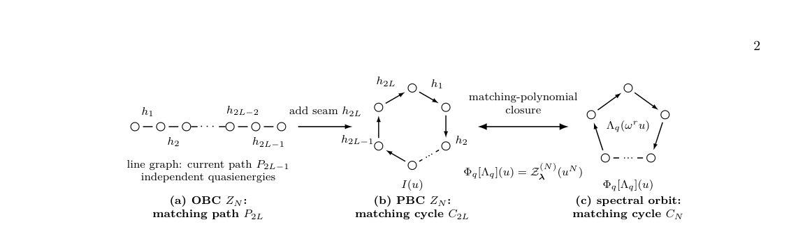
<figcaption class="paper-figure-caption"><b>Fig 1.</b> FIG. 1. Periodic closure as a two-cycle matching problem. (a) The OBC auxiliary matching path P2L (line graph: cur- rent/frustration path P2L−1) underlies the independent quasienergies. Adding the seam h2L gives the PBC ZN matching cycle in (b); its two alternating perfect matchings yield the two terms of IL, equivalently the two maximum independent current sets. (c) Root-of-unity fusion forms the spectral-orbit matching cycle, and the equality shown closes the two cycles exactly.</figcaption>
</figure>
<figure class="paper-figure-card">
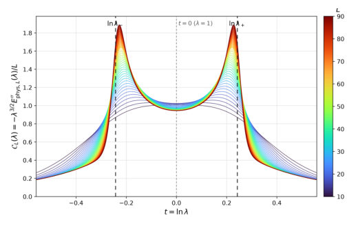
<figcaption class="paper-figure-caption"><b>Fig 2.</b> FIG. 2. Duality-normalized curvature of Ephys,L, the ground- state energy of Hphys = −HPBC, for even integers L ∈[10, 90]; the dashed lines at t± = ln λ± mark the thermodynamic critical points.</figcaption>
</figure>

**Summary.** This paper solves the spectral problem for the periodic Baxter-Fendley $Z_N$ clock chain by employing an operator-valued matching polynomial derived from the cyclic Weyl algebra. This method yields a finite set of polynomial equations whose solutions determine the entire finite-size energy spectrum. The results provide a practical numerical route to the ground state and characterize boundary-induced quantum critical points.

**Why it may be interesting.** The rigorous mathematical machinery developed for solving this integrable model provides powerful techniques for analyzing spectral gaps and phase transitions in quantum lattice models, which are central to AMO and condensed matter theory.

Detailed structure

**Main problem.** The primary challenge is finding a complete finite-size spectral solution for the periodic non-Hermitian Baxter-Fendley $Z_N$ clock chain, which is difficult due to the constraints of periodic boundary conditions.

**Main result.** The authors show that the matching polynomial generates conserved quantities and realizes a cyclic $	au^{(2)}$ Yang-Baxter transfer matrix, leading to a finite system of polynomial spectral equations that reproduce the full energy spectrum.

**Method.** The method combines operator-valued matching polynomials derived from the cyclic Weyl algebra with root-of-unity fusion techniques to solve the spectral problem.

**Model / system.** The system is the periodic $L$-site chain of $N$-state clocks, governed by a non-Hermitian Hamiltonian. The analysis extends open-chain solutions by imposing periodic boundary conditions via a matching cycle.

**Key observables.** The complete finite-size energy spectrum, the ground-state energy, and the critical couplings ($\lambda^*$).

**Important parameters / regimes.** The chain length $L$, the clock size $N$, and the coupling parameters $\lambda$ and $\mu$.

**Assumptions / limitations.** The analysis assumes the existence of a spectral-orbit cycle $C_N$ closing the finite spectral problem, and relies on analytic continuation arguments for ground state determination.

**Figures summary.** Figure 1 illustrates the transition from an open-chain matching path to a periodic matching cycle. Figure 2 compares the finite-$L$ second derivative of the ground-state energy against thermodynamic predictions, showing a transition from a central feature to two off-center peaks.

**Paper structure.** The paper develops the spectral solution by first defining the matching polynomial as the transfer matrix, then using root-of-unity fusion to derive the polynomial spectral equations. Finally, it applies these equations to calculate the ground state and analyze critical behavior.

Abstract

The periodic non-Hermitian Baxter-Fendley $Z_N$ clock chain has lacked a complete finite-size spectral solution, whereas its open-chain counterpart admits a solution in terms of independent quasienergies. For the periodic model we show that the operator-valued matching polynomial associated with its cyclic Weyl algebra simultaneously generates a set of conserved quantities, including the Hamiltonian, and realizes a cyclic $τ^{(2)}$ Yang-Baxter transfer matrix. Root-of-unity closure yields a finite system of polynomial spectral equations in each charge sector, which reproduces the complete finite-size energy spectrum counted with algebraic multiplicity. As a first application of this result, we show that Newton continuation of these equations provides a practical numerical route to the periodic ground-state energy without enumerating the full spectrum. For homogeneous chains the thermodynamic seam response yields a criterion for boundary-induced criticality; for $N=3$ it predicts two reciprocal critical couplings with singular ground-state curvature, in contrast to the single self-dual open boundary critical point.

[↑ back to top](#top)

### [Universal thermal breakdown of polaron coherence in one, two, and three dimensions](http://arxiv.org/abs/2608.18529v1)

**Authors:** Jeet Shannigrahi, Janez Bonča, Mona Berciu  
**Type:** theory · **Category:** strongly correlated electrons · **PDF:** <https://arxiv.org/pdf/2608.18529v1>  
**Analysis basis:** full PDF text, analyzed in chunks
**Topic relevance:** `Keldysh / 2PI / non-Gaussian methods` **3/5** · `correlated / nonlocal dissipation` **1/5** · `methods for driven-dissipative` **1/5** · `non-equilibrium universality` **1/5**

↔ Scroll figures horizontally

<figure class="paper-figure-card">
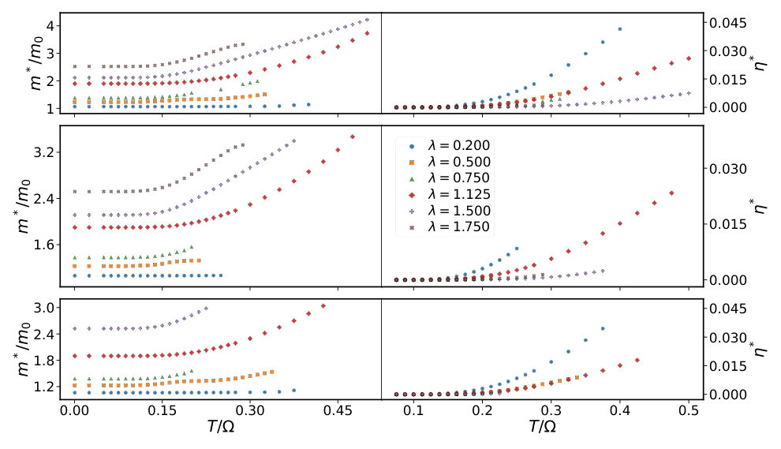
<figcaption class="paper-figure-caption"><b>Fig 1.</b> Figure 1. Temperature dependence up to T ∼0.5 Ωof the effective polaron mass m∗and the thermal broadening η∗∼1/τ of the 1D, 2D and 3D HP (top to bottom) across different coupling regimes, according to MA(1). Here t = 1, Ω= 2 and η0 = 0.001 and 0.01 for D = 1 and D ≥2, respectively. The worst-case fitting standard error was below 10−2 for the qp weight and below 10−3 for η∗. Remarkably, m∗</figcaption>
</figure>
<figure class="paper-figure-card">
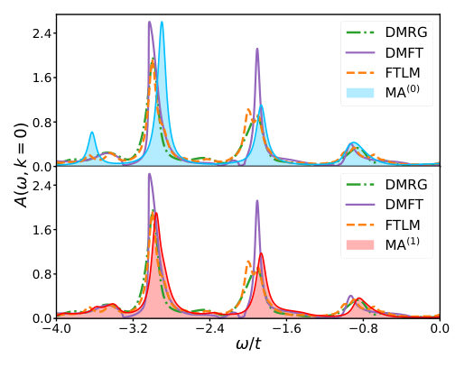
<figcaption class="paper-figure-caption"><b>Fig 2.</b> Figure 2. Top: MA(0) (blue) and Bottom: MA(1) (red) 1D spectral functions A(ω, k = 0) at T = 0.4 Ω, together with VED-FTLM [29] (orange), DMRG [30] (green) and DMFT [38] (purple) results. Parameters are t = Ω= 1, λ = 1, η0 = 0.05.</figcaption>
</figure>
<figure class="paper-figure-card">
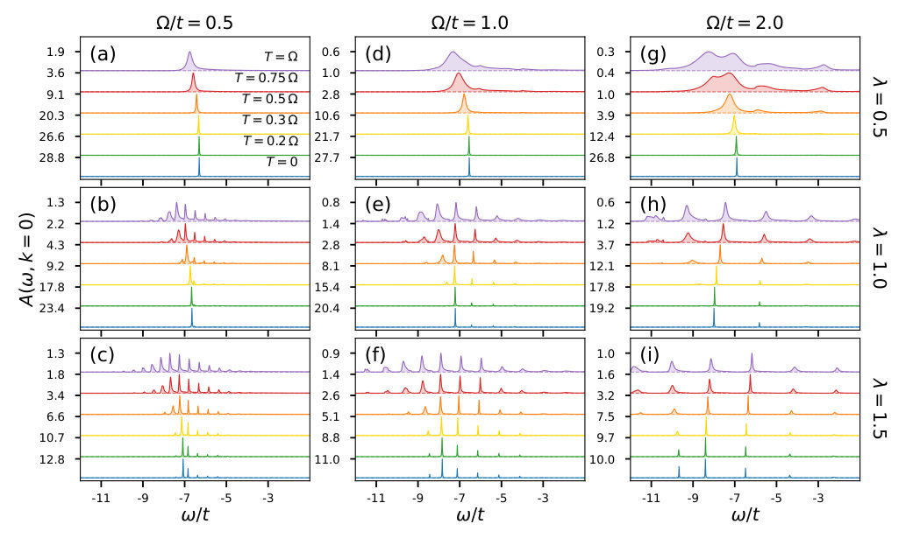
<figcaption class="paper-figure-caption"><b>Fig 3.</b> Figure 3. 3D MA(1) spectral functions A(ω, k = 0) of the HP. Columns correspond to phonon energies Ω/t = 0.5 (left), Ω/t = 1.0 (middle), Ω/t = 2.0 (right). Rows correspond to effective couplings λ = 0.5 (top), λ = 1.0 (middle), λ = 1.5 (bottom). For each (Ω, λ) set, spectral plots are shown for the same set of temperatures T/Ω= 0.0, 0.2, 0.3, 0.5, 0.75, 1.0 from bottom to top; Other parameters are t = 1, η0 = 0.01.</figcaption>
</figure>
<figure class="paper-figure-card">
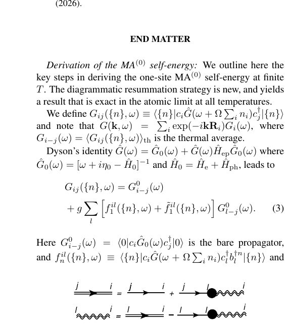
<figcaption class="paper-figure-caption"><b>Fig 4.</b> Figure 4. Diagrammatic solution for Eq. (6). The straight double- line is Gi−j(ω), the straight line is G0 i−j(ω), the filled circle is ϵ(ω), and the wriggly double-line is the auxiliary Green’s function defined in the bottom panel.</figcaption>
</figure>
<figure class="paper-figure-card">
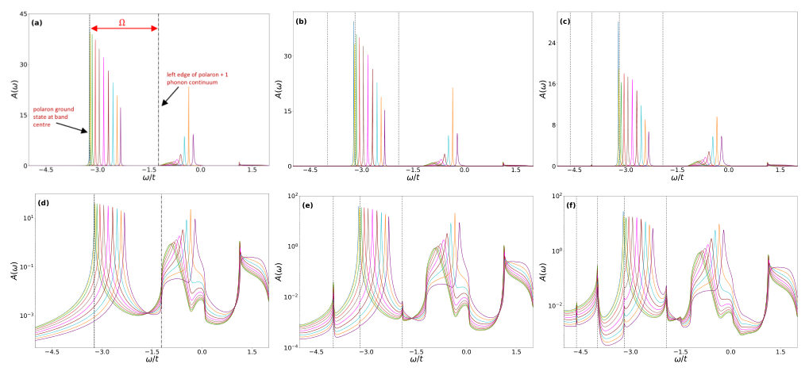
<figcaption class="paper-figure-caption"><b>Fig 5.</b> Figure 5. 1D MA(1) A(k, ω) for 0 ≤k ≤π/2. The upper row shows the linear-scale plots for T = 0.001 (left), 0.3 (middle), and 0.5 (right), while the lower row shows the corresponding logarithmic-scale plots. For T = 0 [panels (a) and (d)], the lowest-energy feature is the dispersing qp Lorentzian peak, followed by the polaron+one-phonon continuum. For clarity, EP (k = 0) is marked by a dashed vertical line and the left edge of the continuum is marked by a dash-dot vertical line. At finite T [panels (b), (c), (e), and (f)], the dispersing polaron peak is a resonance inside an overlapping thermal continuum, marked by dotted vertical lines in (e) and (f). As a result, a fit to a sum of...</figcaption>
</figure>

**Summary.** This work tackles the thermal decoherence of polarons using an advanced, diagrammatically derived approximation (MA). The authors demonstrate that polaron coherence universally breaks down at a temperature scale set by the phonon frequency, validating theoretical predictions across 1D, 2D, and 3D systems. The method shows excellent quantitative agreement with state-of-the-art numerical techniques.

**Why it may be interesting.** The universal coherence scale defined by $\Omega$ provides a robust theoretical prediction for polaron dynamics that transcends the restrictive limits of previous theoretical treatments, connecting fundamental lattice models to observable thermal behavior.

Detailed structure

**Main problem.** The paper addresses the long-standing open problem of how polaron quasiparticle coherence degrades as temperature increases.

**Main result.** The coherence breakdown is universal, occurring when the quasiparticle peak dissolves into a broad thermal continuum at a temperature scale set by the phonon frequency $\Omega$, independent of dimensionality or coupling strength.

**Method.** The authors employ a finite-temperature generalization of the Momentum Average (MA) approximation, yielding a diagrammatically derived self-energy.

**Model / system.** The system is modeled by the Holstein Hamiltonian, describing a polaron (electron coupled to phonons) hopping on a hyper-cubic lattice in 1D, 2D, and 3D.

**Key observables.** Polaron effective mass ($m^*$), inverse lifetime ($1/\tau$), and the spectral function $A(\omega, k)$.

**Important parameters / regimes.** Temperature ($T$), phonon frequency ($\Omega$), coupling strength ($\lambda$), and dimensionality ($D=1, 2, 3$).

**Assumptions / limitations.** The MA framework uses an ansatz (MA(0) or MA(1)) that is asymptotically exact in the strong-coupling limit at all temperatures.

**Figures summary.** Figures compare the temperature dependence of $m^*$ and broadening ($\eta^*$) across dimensions and couplings, and show spectral function evolution comparing MA results against benchmark methods like VED-FTLM and DMRG.

**Paper structure.** The paper systematically develops the MA approximation, compares its results against established numerical benchmarks (VED-FTLM, DMRG, DMFT), and analyzes the temperature dependence of coherence loss across various coupling and dimensional regimes.

Abstract

How a polaron loses its quasiparticle coherence with increasing temperature is a long-standing open problem. Holstein addressed it in 1959 only in the extreme antiadiabatic, strong-coupling limit, while more recent numerically exact approaches are largely restricted to one dimension. Here we solve this problem on square and simple cubic lattices across the weak-, intermediate-, and strong-coupling regimes. We show that the polaron effective mass $m^*$ and inverse lifetime $1/τ$ increase monotonically with temperature until, at $T \sim 0.5\,Ω$, the quasiparticle peak dissolves into a broad incoherent thermal continuum. The phonon frequency $Ω$ therefore defines a universal coherence scale, independent of dimensionality and coupling strength, validating Holstein's prediction far beyond the regime in which it was derived. These results follow from a finite-temperature generalization of the Momentum Average (MA) approximation, yielding a closed-form, diagrammatically derived self-energy that is asymptotically exact in the strong-coupling limit at all temperatures. Benchmark comparisons demonstrate excellent quantitative agreement of the resulting 1D spectral functions with the numerically exact Variational Exact Diagonalization-Finite-Temperature Lanczos Method (VED-FTLM) and finite-$T$ Density Matrix Renormalization Group (DMRG).

[↑ back to top](#top)

### [Connectivity--Interference Competition in Coherent Transport on Percolated Hierarchical Small-World Networks](http://arxiv.org/abs/2608.19130v1)

**Authors:** Miquéias Jacinto Cirino, Marcos César de Oliveira  
**Type:** theory · **Category:** disordered systems and neural networks · **PDF:** <https://arxiv.org/pdf/2608.19130v1>  
**Analysis basis:** full PDF text, analyzed in chunks
**Topic relevance:** `interference shaping light` **3/5** · `analog quantum simulation` **2/5**

↔ Scroll figures horizontally

<figure class="paper-figure-card">
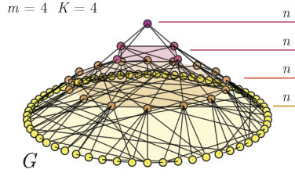
<figcaption class="paper-figure-caption"><b>Fig 1.</b> FIG. 1. Hierarchical small-world transport architecture. The graph combines an m-branching tree backbone with intra-layer small- world links. The example shown has N = 4, m = 4, ϕ = 0.5, and K = 4.</figcaption>
</figure>
<figure class="paper-figure-card">

<figcaption class="paper-figure-caption"><b>Fig 2.</b> FIG. 2. Optimal coherent transport and overconnectivity penalty. Layer-resolved limiting probabilities χn(p) for several K at fixed ϕ = 0.5 in (a), together with the final-layer limiting probability χN as a function of bond probability p and rewiring probability ϕ for K = 4 in (b). The maximum transfer to the final layer occurs at intermediate connectivity. (c) Overconnectivity penalty PQ = 1 −χN(p = 1, K, ϕ)/ maxp χN(p, K, ϕ) as a function of ϕ for different K. The penalty quantifies the loss caused by making the network fully connected. All data are averaged over R = 10000 realizations.</figcaption>
</figure>
<figure class="paper-figure-card">
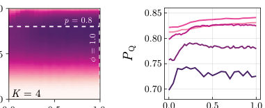
<figcaption class="paper-figure-caption"><b>Fig 3.</b> Figure 2 shows the central result. The dependence of χN on the bond probability naturally separates the dynamics into three regimes. At low p, transport is connectivity-limited: the diluted network rarely provides effective root-to-boundary paths, and the final-layer efficiency remains small. At inter- mediate p, inter-layer paths and small-world shortcuts coop- erate to increase access to deeper layers, so that connectivity acts as a resource and χN rises rapidly. At large p, however, the trend reverses. The network contains more links, but dense intra-layer connectivity promotes coherent amplitude redistri- bution and recirculation within layers, reducing the net proba-</figcaption>
</figure>
<figure class="paper-figure-card">
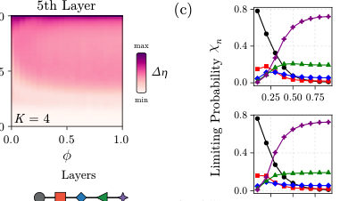
<figcaption class="paper-figure-caption"><b>Fig 4.</b> FIG. 3. Quantum–classical contrast. (a) Dephased layer probability for the first and final layers for fixed (ϕ, K) = (0.5, 2) and sev- eral bond probabilities. (b) Final-layer efficiency contrast ∆η be- tween the incoherent/classical benchmark and the coherent dynam- ics for K = 4. (c) Layer-resolved limiting probabilities in the de- phased regime. Dephasing suppresses oscillations and produces a more monotonic accumulation in the outer layers, in contrast with the coherent optimum of Fig. 2.</figcaption>
</figure>
<figure class="paper-figure-card">
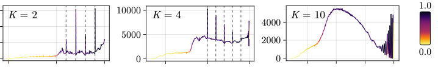
<figcaption class="paper-figure-caption"><b>Fig 5.</b> FIG. 4. Percolation and spectral structure. (a) Percolation probability as a function of bond probability p for K = 2, 4, 6, 8, 10 and ϕ = 0. Dashed lines mark p = 1/m and p = 1/(m + K). (b) Number of states N(E) for representative bond probabilities and rewiring regimes. Repeated local motifs produce sharp spectral peaks. (c) Spectral weight associated with the spanning cluster for different K, with the colour scale indicating eigenstate overlap with the final layer.</figcaption>
</figure>

**Summary.** This work analyzes coherent quantum transport on complex, disordered networks, demonstrating that adding too many connections can actually hinder transport efficiency. The key finding is the 'coherent overconnectivity penalty,' which arises because excessive links promote destructive interference and recirculation. This establishes a design principle for optimizing quantum network architectures.

**Why it may be interesting.** The finding that optimal connectivity is achieved at an intermediate level, rather than full connectivity, provides a crucial design principle for engineering quantum devices where interference effects dominate transport.

Detailed structure

**Main problem.** The paper investigates the fundamental competition between increasing network connectivity (shortcuts) and the destructive effects of quantum interference in coherent quantum transport.

**Main result.** Coherent transport efficiency exhibits a non-monotonic dependence on bond probability, showing that over-connectivity (approaching full connectivity) actually penalizes transport due to excessive intra-layer recirculation.

**Method.** The study uses continuous-time quantum walks (CTQWs) simulated on a percolated hierarchical small-world network, comparing coherent dynamics against classical and dephased benchmarks.

**Model / system.** The model is a percolated hierarchical small-world network, analyzed using the Laplacian CTQW Hamiltonian. The system's dynamics are governed by the competition between path availability and quantum interference effects.

**Key observables.** Final-layer limiting probability ($\chi_N$) and the coherent overconnectivity penalty ($P_Q$).

**Important parameters / regimes.** Bond percolation probability ($p$), intra-layer degree parameter ($K$), and the network's hierarchical structure.

**Assumptions / limitations.** The analysis relies on averaging observables over a large ensemble of percolation realizations and uses a tight-binding approximation for the Hamiltonian.

**Figures summary.** Figures illustrate the hierarchical small-world architecture, the non-monotonic dependence of $\chi_N$ on $p$, and comparisons between coherent, dephased, and classical transport regimes.

**Paper structure.** The paper establishes the physical model and observables, develops the theoretical framework using CTQWs, analyzes the dependence of transport efficiency on percolation probability ($p$), and contrasts coherent results with classical/dephased benchmarks to isolate interference effects.

Abstract

Adding links generally improves classical transport by increasing the number of available paths. We show that coherent quantum transport can display the opposite behavior. Using continuous-time quantum walks on a percolated hierarchical small-world network, we identify a coherent overconnectivity penalty: root-to-boundary transport is maximized at intermediate bond probability and decreases as the network approaches full connectivity. The effect is quantified by the final-layer limiting probability $χ_N$ and by the penalty $P_Q=1-χ_N(p=1)/\max_pχ_N(p)$, which measures the loss caused by making the architecture fully connected. The optimum results from a competition between shortcut-assisted spreading and interference-induced intra-layer recirculation. Spectral analysis shows that bond dilution creates motif-induced degeneracies and reorganizes the eigenstates connecting the root to the outermost layer. A comparison with dephased and classical transport shows that the non-monotonic landscape is not a purely geometrical percolation effect, but a coherent architecture-dependent phenomenon. These results provide a design principle for coherent transport in disordered photonic and quantum-network architectures.

[↑ back to top](#top)

### [Direct fidelity estimation through joint fiducial grouping](http://arxiv.org/abs/2608.18548v1)

**Authors:** Júlia Barberà-Rodríguez, Arthur Strauss  
**Type:** both · **Category:** quantum information and computing · **PDF:** <https://arxiv.org/pdf/2608.18548v1>  
**Analysis basis:** full PDF text, analyzed in chunks
**Topic relevance:** `QC/QI experiment` **3/5** · `quantum measurements` **2/5**

↔ Scroll figures horizontally

<figure class="paper-figure-card">
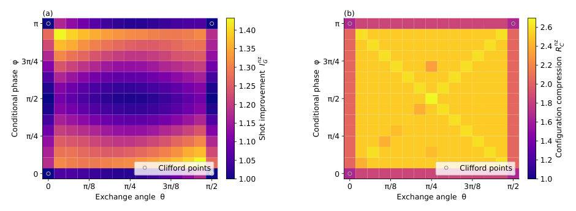
<figcaption class="paper-figure-caption"><b>Fig 1.</b> Figure 1. Analytic grouping expectations over the two-angle fSim family. (a) Leading weighted protocol-shot improvement Inz G = |Ωnz|/ P</figcaption>
</figure>
<figure class="paper-figure-card">
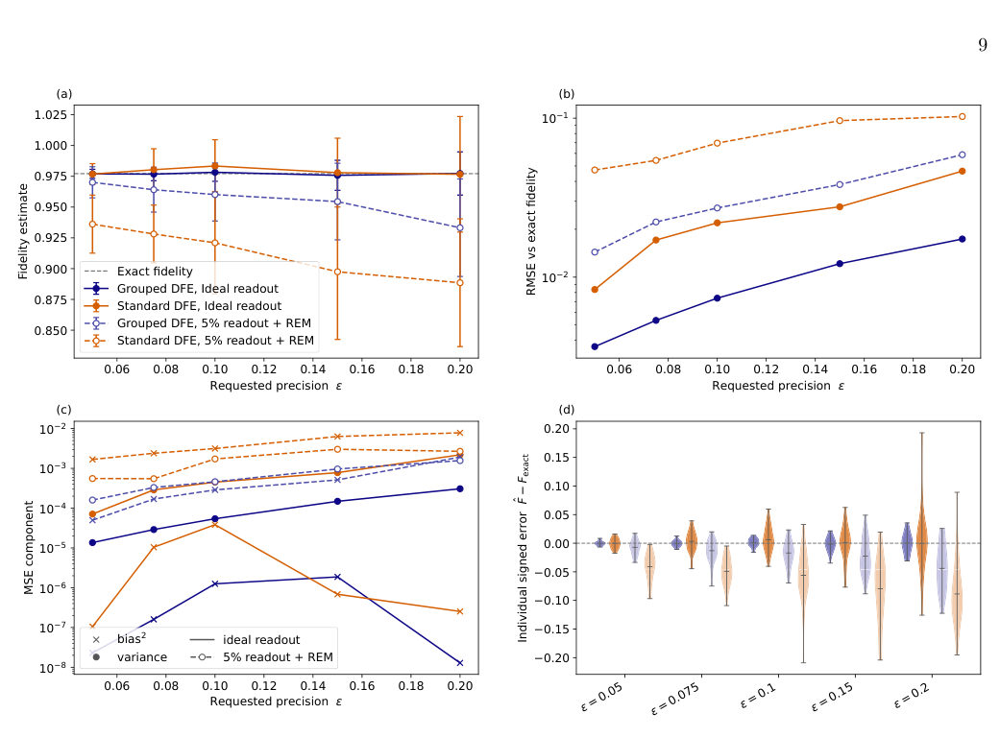
<figcaption class="paper-figure-caption"><b>Fig 2.</b> Figure 2. Fixed-point channel-fidelity estimation for fSim(π/8, π/8) under ideal readout and symmetric 5% readout error followed by linear-inversion REM. We set δ = 0.1 and use 50 independent trials at each requested precision. Indigo-blue and orange denote grouped and standard DFE, respectively; solid, filled marks indicate ideal readout, while dashed, open marks and light-colored violins indicate readout noise plus REM. (a) The trial-mean fidelity estimate with one-standard- deviation intervals and the exact fidelity. (b) The corresponding RMSE, which combines residual bias and finite-shot fluctuations. (c) Its decomposition into squared bias (crosses) and variance (circles). (d) The...</figcaption>
</figure>
<figure class="paper-figure-card">
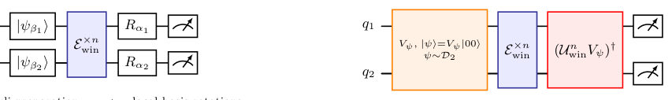
<figcaption class="paper-figure-caption"><b>Fig 3.</b> Figure 3. Circuit templates for estimating the fidelity of the same repeated implemented window E×n win (two wires shown schematically). (a) DFE uses local product Pauli-eigenstate preparations ψβj and local rotations Rαj into the output Pauli measurement bases. Its ideal reference determines the classical sampling distribution but is not applied as a circuit operation. (b) CAFE prepares |ψ⟩= Vψ |00⟩from a two-design D2 and appends the reference inverse (U n winVψ)† before the survival measurement. For a multi-qubit window, both the two-design preparation and the reference inverse are generally entangling, so their implementation can contribute error in addition to the forward window being...</figcaption>
</figure>
<figure class="paper-figure-card">
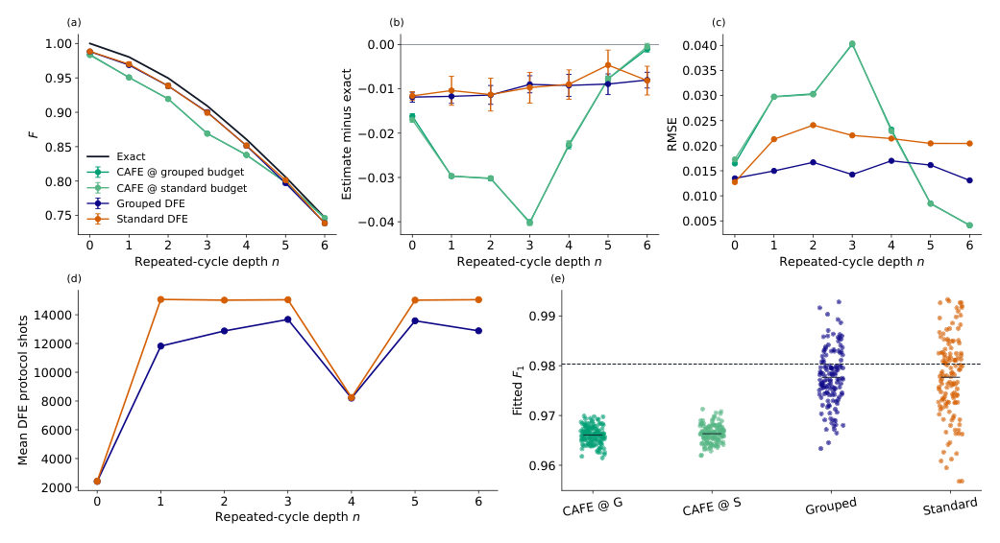
<figcaption class="paper-figure-caption"><b>Fig 4.</b> Figure 4. Fixed-context repeated-cycle estimation for fSim(π/8, π/8) at every depth n = 0, . . . , 6, over 128 independent shot-sampling trials. For all estimates, (ϵ, δ) = (0.05, 0.1). (a) Mean depth-n fidelity estimates with pointwise 95% percentile- bootstrap confidence intervals for the across-trial mean and the exact forward-cycle fidelity. (b) Signed estimator error and intervals. (c) RMSE. (d) The native grouped and standard DFE protocol-shot allocations; the CAFE curves are omitted because they are set to the realized protocol-shot budget of their matched DFE counterpart at every depth in each trial. (e) Cycle fidelity inferred by fitting each trial across the independently...</figcaption>
</figure>
<figure class="paper-figure-card">
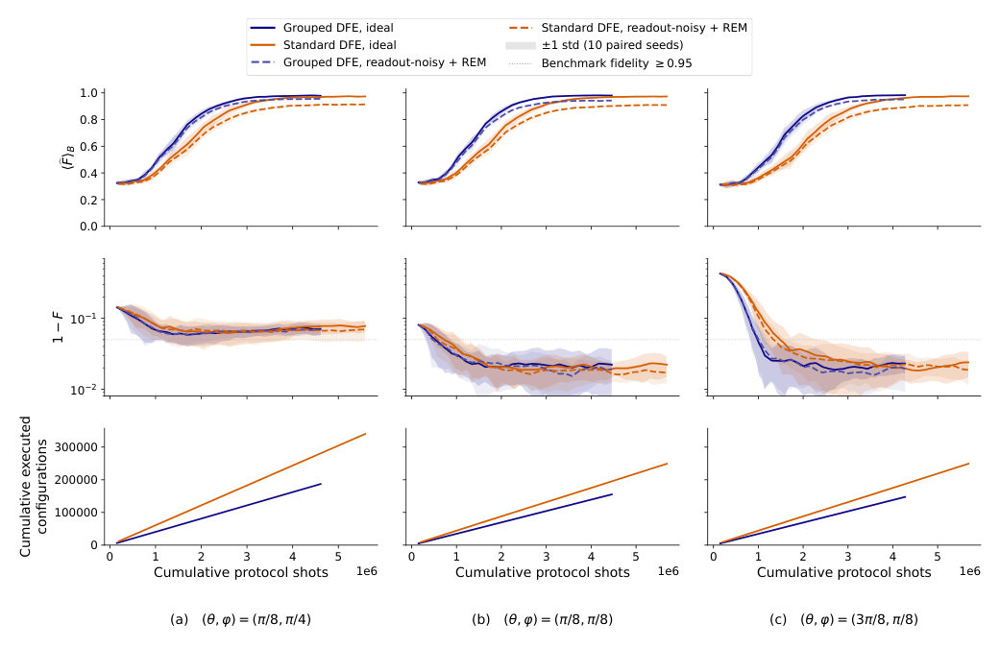
<figcaption class="paper-figure-caption"><b>Fig 5.</b> Figure 5. Calibration convergence for the three representative fSim targets identified at the bottom of their columns. Each column compares ideal readout with a symmetric 5% readout error followed by linear- inversion REM. Solid, filled curves correspond to ideal readout, while dashed, open curves correspond to the readout-noisy-plus-REM condition. Blue and orange denote grouped and standard DFE, respectively, and shaded regions show one standard deviation over 10 paired seeds. The top row reports the batch-mean estimated fidelity used for the parameter update. The middle row gives the independently evaluated noiseless infidelity of the mean policy parameters. The bottom row gives the...</figcaption>
</figure>

**Summary.** This paper presents joint fiducial grouping, a technique to drastically reduce the experimental overhead required for quantum gate fidelity estimation by grouping commuting Pauli pairs. This grouped estimator provides a practical, context-preserving method to estimate entanglement fidelity, which is then leveraged as a reward function to train quantum gates using reinforcement learning.

**Why it may be interesting.** The focus on reducing experimental overhead in quantum characterization is crucial for scaling up quantum computation, directly impacting the feasibility of implementing complex quantum algorithms.

Detailed structure

**Main problem.** The paper addresses the high experimental overhead associated with direct fidelity estimation (DFE) for characterizing quantum gates, especially when the target gate is non-Clifford.

**Main result.** Joint fiducial grouping is introduced to partition Pauli pairs such that multiple transfer coefficients can be estimated using a single preparation-measurement setting, significantly reducing experimental overhead.

**Method.** The authors derive an unbiased grouped estimator for entanglement fidelity by grouping commuting input-output Pauli pairs, which is then applied in a context-sensitive reward function for reinforcement learning gate calibration.

**Model / system.** The work is applied to characterizing general quantum channels (CPTP maps) and specifically demonstrates its utility for calibrating the parametrically controlled two-qubit gate, fSim(theta, phi).

**Key observables.** Pauli transfer coefficients ($\chi_A(\alpha, eta)$), Entanglement fidelity ($F_e(U, E)$), and the context-sensitive reward $J(	heta)$ used in RL.

**Important parameters / regimes.** Error parameters ($\epsilon, \delta$), the number of required settings ($M$ vs. $|\Omega|$), and the gate parameters ($	heta, \phi$).

**Assumptions / limitations.** The method assumes the ability to measure Pauli transfer coefficients and that grouping is possible based on commuting input/output Paulis. Truncation introduces a quantifiable bias ($W_{disc}$).

**Figures summary.** The notes reference Tables I and II, detailing the noise model parameters (e.g., $T_1/T_2$, readout matrices) for the fSim comparison and the specific settings used for PPO/DFE calibration runs.

**Paper structure.** The paper first establishes the limitations of standard DFE, then introduces the theoretical framework of joint fiducial grouping to derive the grouped estimator. It then validates this estimator by applying it to the fSim gate and using the resulting fidelity estimates as a reward signal for a model-free reinforcement learning calibration routine.

Abstract

Fault-tolerant quantum computation hinges on the requirement for low physical error rates. Reaching below threshold regime requires the accounting of circuit dependent noise, that is inherent to the execution context in which a quantum gate is usually embedded. Direct fidelity estimation is a technique that offers natural context preservation as it solely requires the insertion of local Pauli preparation and measurement fiducials around the window of interest. However, each sampled input-output Pauli pair demands its own preparation and measurement setting, an overhead that grows rapidly once the target gate is no longer Clifford. We introduce joint fiducial grouping, which partitions Pauli pairs into sets with commuting input and output operators, allowing several Pauli-transfer coefficients to be estimated within the same preparation-measurement setting. We derive an unbiased grouped estimator and finite-sample guarantees showing that grouping always reduces the number of distinct input-output settings and can also reduce the required channel uses when the target weight is concentrated within compatible groups. We characterize these gains for the parametric two-qubit gate $\mathrm{fSim}(θ,\varphi)$, and use the grouped estimator as a context-sensitive reward for reinforcement-learning-based gate calibration. Our results provide a practical route to lower-overhead, context-preserving fidelity estimation for continuously parameterized quantum gates.

[↑ back to top](#top)

### [Finite-temperature Green's function cluster expansion from thermofield doubles: Breakdown of the polaron picture](http://arxiv.org/abs/2608.18267v1)

**Authors:** M. R. Carbone, S. Fomichev, B. Kloss, A. J. Millis, M. Berciu, D. R. Reichman, J. Sous  
**Type:** theory · **Category:** strongly correlated electrons · **PDF:** <https://arxiv.org/pdf/2608.18267v1>  
**Analysis basis:** full PDF text, analyzed in chunks
**Topic relevance:** `Keldysh / 2PI / non-Gaussian methods` **3/5** · `methods for driven-dissipative` **2/5**

↔ Scroll figures horizontally

<figure class="paper-figure-card">
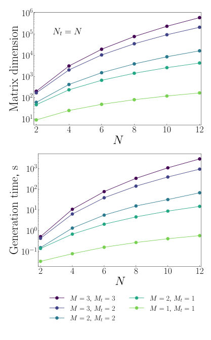
<figcaption class="paper-figure-caption"><b>Fig 1.</b> FIG. 1. (a) Size of the matrix containing the full equations of motion for the Holstein polaron, as a function of the cloud parameters. We fix Nt = N and show representative curves for several values of the real (M) and fictitious (Mt) cloud extents. (b) Equation-generation time as a function of N. Both quantities exhibit power-law scaling with N, as in zero- temperature GGCE, with the doubling of the phonon species entering as a prefactor.</figcaption>
</figure>
<figure class="paper-figure-card">
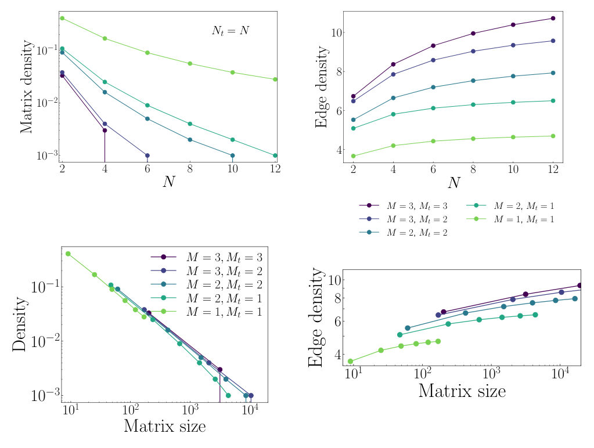
<figcaption class="paper-figure-caption"><b>Fig 2.</b> FIG. 2. (a) Matrix density, defined as the number of non-zero entries divided by the total number of matrix entries, as a function of the cloud cutoff N. (b) Edge density, de ≡nnz/ √</figcaption>
</figure>
<figure class="paper-figure-card">
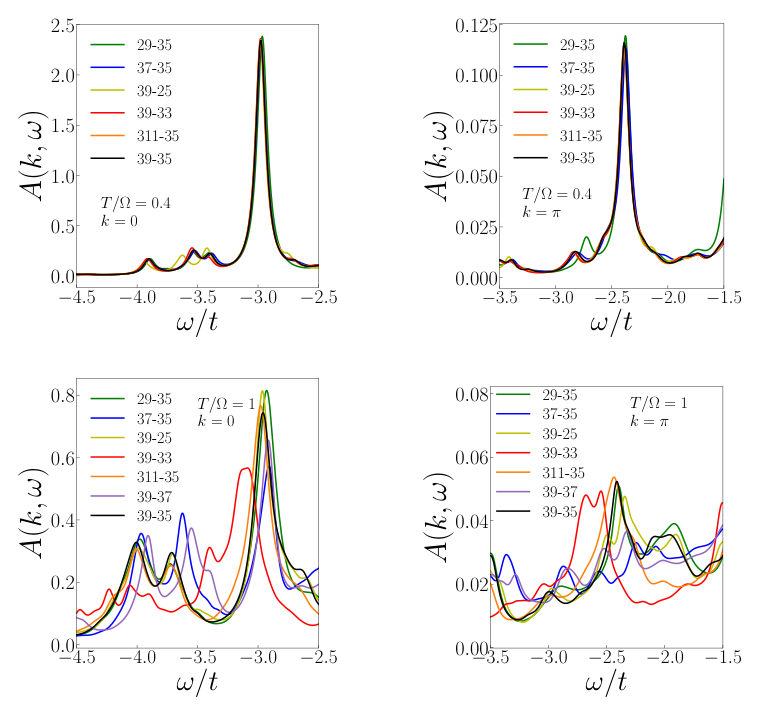
<figcaption class="paper-figure-caption"><b>Fig 3.</b> FIG. 3. Convergence of the spectral function in the cloud parameters (M, N, Mt, Nt) at λ = 1, Ω= 1, for T/Ω= 0.4 (top row) and T/Ω= 1.0 (bottom row), at k = 0 (left column) and k = π (right column). Curves are labeled MN-MtNt. The polaron peak is well-converged at intermediate temperature for MN-MtNt = 39-35 and adjacent configurations; at T/Ω= 1 convergence is slower but the peak position and width remain stable.</figcaption>
</figure>
<figure class="paper-figure-card">
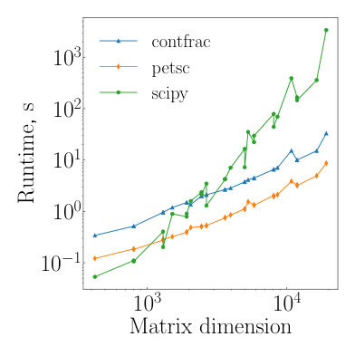
<figcaption class="paper-figure-caption"><b>Fig 4.</b> FIG. 4. Wall-clock time per (k, ω) point for the three available linear-solver backends in the GGCE package: a SciPy direct solver, a continued-fraction (contfrac) solver, and a PETSc- based sparse solver. Calculations are run on one compute node, distributed across 4 MPI ranks with 8 CPUs per rank. PETSc is fastest for matrix sizes above ∼103, where the linear system is no longer canonically sparse.</figcaption>
</figure>
<figure class="paper-figure-card">
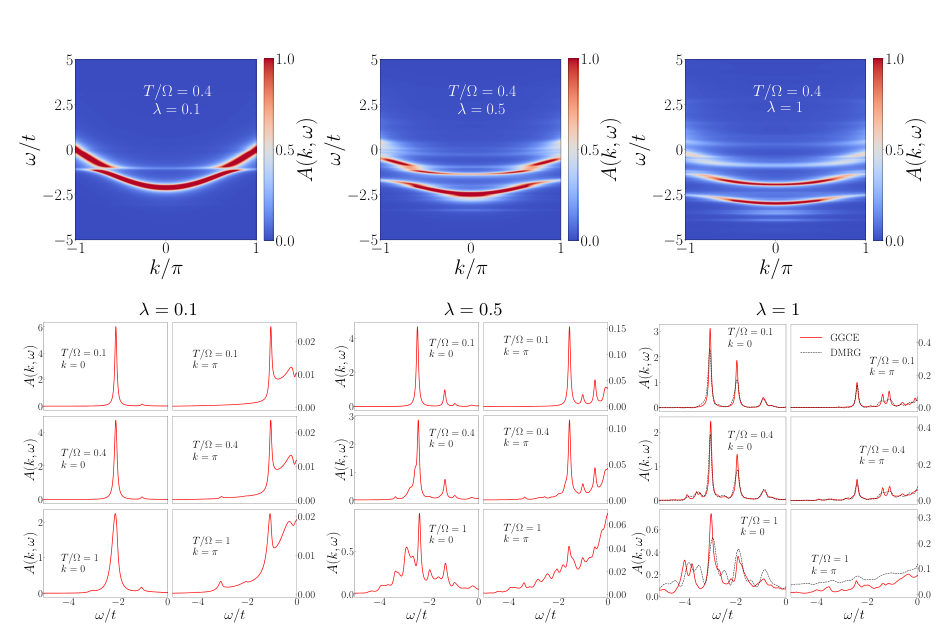
<figcaption class="paper-figure-caption"><b>Fig 5.</b> FIG. 5. (Top row) Spectral functions A(k, ω) for the one-dimensional Holstein model computed with TGCE at T/Ω= 0.4 and varying coupling: λ = 0.1 (left), 0.5 (middle), 1 (right). (Bottom row) Line cuts at k = 0 (left subpanels) and k = π (right subpanels), at three temperatures T/Ω= 0.1, 0.4, 1.0 from top to bottom within each panel. The right column (λ = 1) includes a comparison to finite-T DMRG benchmark data (dashed): at T/Ω= 0.1 and 0.4, from Ref. 25; at T/Ω= 1.0, from our own DMRG calculations, with computational details given in Appendix A. Agreement is semi-quantitative across all three temperatures. Other parameters: Ω= 1, η = 0.05, cloud configuration MN-MtNt = 39-35.</figcaption>
</figure>

**Summary.** This work presents a numerically exact method, the finite-temperature Green's function cluster expansion, to calculate polaron properties at finite temperatures. By combining cluster expansion techniques with the thermofield double formalism, the authors show that the simple picture of a single quasiparticle peak breaks down as temperature increases. This has significant implications for understanding charge transport in materials where electron-phonon coupling is strong.

**Why it may be interesting.** The rigorous treatment of finite-temperature effects in strongly coupled electron-phonon systems, particularly the identification of spectral features beyond simple quasiparticle poles, is highly relevant for understanding charge transport in molecular and organic semiconductors.

Detailed structure

**Main problem.** The paper aims to compute the momentum- and frequency-resolved single-particle Green's function of a polaron at finite temperature, addressing the breakdown of simple quasiparticle descriptions.

**Main result.** The method successfully computes the spectral function across coupling regimes and temperatures, revealing that at finite T, the single-Lorentzian polaron picture breaks down due to hybridization with thermal-satellite continua.

**Method.** It introduces the finite-temperature Green's function cluster expansion (TGCE), which combines the generalized Green's function cluster expansion (GGCE) with the thermofield double (TFD) formalism.

**Model / system.** The study focuses on the polaron problem, modeled using the Holstein Hamiltonian, describing a charge carrier coupled to dispersive phonons. The TFD formalism maps the thermal trace onto a pure-state expectation value in an enlarged, doubled Hilbert space.

**Key observables.** Single-particle Green's function G(k, omega), spectral functions A(k, omega), polaron dispersion, lifetimes, and effective masses.

**Important parameters / regimes.** Temperature relative to phonon frequency (T/Omega), coupling strength ($\lambda$), and phonon frequency ($\Omega$).

**Assumptions / limitations.** The method is numerically exact in principle, but convergence requires careful handling of the non-trivial configuration structure in the doubled phonon Hilbert space.

**Figures summary.** Figures illustrate the matrix size scaling, the convergence of the spectral function at various temperatures, and show the transition of the spectral line shape from a clean Lorentzian at T=0 to multi-peak structures at finite T.

**Paper structure.** The paper first introduces the TGCE method by combining GGCE and TFD. It then benchmarks the method on the 1D Holstein polaron, calculating key observables across varying coupling strengths and temperatures, culminating in a discussion of the breakdown of the simple polaron picture.

Abstract

We introduce a method, numerically exact in principle, for computing the momentum- and frequency-resolved single-particle Green's function of a polaron at finite temperature. The method, which we refer to as the finite-temperature Green's function cluster expansion, combines two ingredients: the generalized Green's function cluster expansion, a numerically exact extension of the momentum average family of methods that solves the polaron problem at zero temperature through a hierarchy of equations of motion for restricted phonon cloud configurations; and the thermofield double formalism, which maps the thermal trace onto a pure-state expectation value over a doubled Hilbert space. The resulting equations of motion have the same algebraic structure as those of the multi-boson zero-temperature theory, with the temperature entering through a Bogoliubov-type mixing angle that controls the coupling to a set of fictitious bath bosons. We implement the method in our open-source software package and benchmark it on the one-dimensional Holstein polaron, computing spectral functions, dispersions, lifetimes, and effective masses across coupling regimes and temperatures up to $T/Ω\sim 1$. Where finite-temperature density matrix renormalization group results are available, we find quantitative agreement at affordable computational cost. The method recovers momentum-resolved spectra directly in frequency space, with no time evolution or analytic continuation. We also discuss the practical costs of the approach. In particular, since the doubled phonon Hilbert space has a non-trivial configuration structure in which real and fictitious clouds compete, convergence in the corresponding cloud parameters requires care.

[↑ back to top](#top)

### [Robustness of spin state superpositions for noisy quantum metrology](http://arxiv.org/abs/2608.18757v1)

**Authors:** Trinidad B. Lantaño, Gabriela Wójtowicz, Susana F. Huelga, Martin B. Plenio  
**Type:** theory · **Category:** quantum information and computing · **PDF:** <https://arxiv.org/pdf/2608.18757v1>  
**Analysis basis:** full PDF text, analyzed in chunks
**Topic relevance:** `correlated / nonlocal dissipation` **3/5** · `quantum measurements` **2/5**

↔ Scroll figures horizontally

<figure class="paper-figure-card">
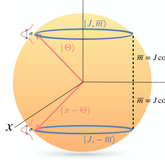
<figcaption class="paper-figure-caption"><b>Fig 1.</b> FIG. 1. Bloch sphere representation of the Gaussian spin states in Eq. (9). Each component of the superposi- tion is shown as a pink arrow, with its projection onto the z- axis represented by a Gaussian distribution of width σ. Pairs of Dicke states |J, m⟩and |J, −m⟩, which share the same z coordinate, are highlighted by blue rings.</figcaption>
</figure>
<figure class="paper-figure-card">
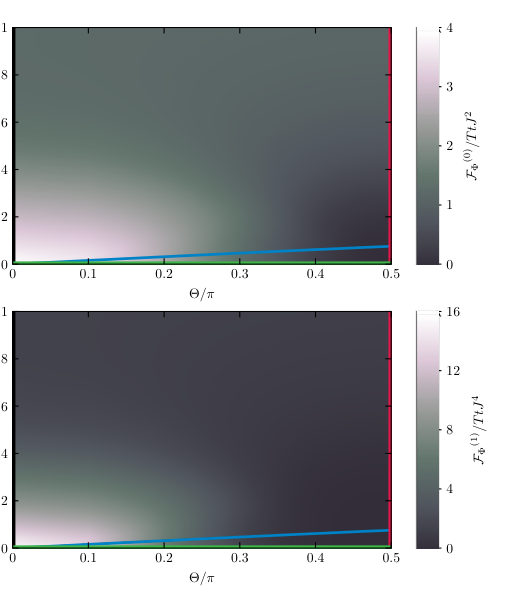
<figcaption class="paper-figure-caption"><b>Fig 2.</b> FIG. 2. Sensitivity and degradation indicators for the GSS ansatz. The sensitivity indicator in Eq. (5) (a) and the degradation indicator in Eq. (7) (b) calculated for the GSS ansatz in Eq. (9). The improved sensitivity coincides with larger degradation under the noise. Specific families of states are marked with solid lines: squeezed states (red), SCCSs (blue), superposition of Dicke states (green), GHZ-like states (black). The data are obtained for J = 20.</figcaption>
</figure>
<figure class="paper-figure-card">
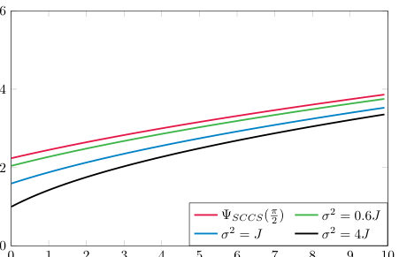
<figcaption class="paper-figure-caption"><b>Fig 3.</b> FIG. 3. Spin-squeezed states under spatially corre- lated dephasing. Quantum Cramer-Rao bound as a func- tion of the interrogation time for a squeezed state defined in Eq. (9) with Θ = π/2 and different variances σ2. Parameter encoding occurs in the presence of correlated dephasing de- scribed by Eq. (2). Data obtained for Φ = 1, spin dimension J = 20 under dephasing amplitude γ = 0.01. Obtained with exact diagonalization.</figcaption>
</figure>
<figure class="paper-figure-card">
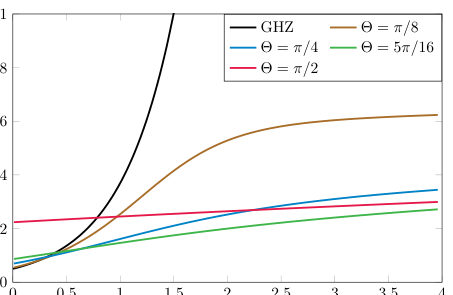
<figcaption class="paper-figure-caption"><b>Fig 4.</b> FIG. 4. Spin coherent cat states under spatially cor- related dephasing. Quantum Cramér–Rao bound for the SCCSs with different orientation Θ. Data obtained for Φ = 1, spin dimension J = 20 under dephasing amplitude γ = 0.01. Obtained with exact diagonalization.</figcaption>
</figure>
<figure class="paper-figure-card">
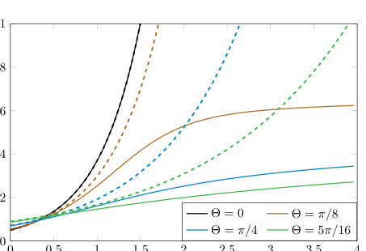
<figcaption class="paper-figure-caption"><b>Fig 5.</b> FIG. 5. Comparison between spin coherent cat states (SCCS) and Dicke cat states. SCCS (solid) and Dicke- cat (dashed) with the same orientation Θ. Data obtained for Φ = 1, spin dimension J = 20 under dephasing amplitude γ = 0.01. Obtained with exact diagonalization.</figcaption>
</figure>

**Summary.** This theoretical paper analyzes the robustness of quantum metrology using spin state superpositions under correlated dephasing noise. By deriving perturbative expressions for the Quantum Fisher Information, the authors characterize a fundamental trade-off: the very moments that boost sensitivity also increase noise susceptibility. The findings guide the selection of optimal quantum states for high-precision measurements in noisy environments.

**Why it may be interesting.** This work provides deep analytical insight into the fundamental limitations imposed by noise on quantum sensing protocols, which is crucial for designing robust quantum measurement strategies in physical systems.

Detailed structure

**Main problem.** The paper investigates how the precision limits in quantum metrology, quantified by the Quantum Fisher Information (QFI), degrade when the quantum probe state is subjected to noisy environments, specifically spatially correlated dephasing.

**Main result.** A key trade-off is identified where the collective-spin moments that enhance the noiseless sensitivity also increase the leading noise-induced decay of the QFI, though certain states like SCCSs show enhanced robustness.

**Method.** The authors employ a perturbative framework to derive analytical expressions for the QFI dynamics, comparing these results against the quantum Cramér–Rao bound and measurement-specific sensitivity bounds.

**Model / system.** The system modeled is an ensemble of N spins symmetric under particle exchange, analyzed within the fully symmetric subspace of fixed angular momentum J=N/2. The noise is modeled as spatially correlated dephasing.

**Key observables.** Quantum Fisher Information (QFI), sensitivity and degradation indicators derived from QFI, and the ultimate precision bound $\Delta^2\Phi_{	ext{opt},t_{	ext{opt}}}$ for phase estimation.

**Important parameters / regimes.** Noise strength ($\gamma$), interrogation time ($t$ or $T$), system size ($J$), and squeezing parameter ($\sigma$).

**Assumptions / limitations.** The analysis relies on a perturbative treatment valid for weak noise and short interrogation times, and specific approximations are used for the continuum limit of certain state superpositions.

**Figures summary.** Figures compare error-propagation and quantum Cramér–Rao bounds for spin-squeezed states, and compare classical and quantum Cramér–Rao bounds for GHZ-like states.

**Paper structure.** The paper systematically analyzes the QFI dynamics for various Gaussian Spin States (GSS) superpositions (SCS, Dicke, spin-squeezed, GHZ-like) by deriving perturbative expressions for the QFI, identifying the sensitivity/degradation trade-off, and comparing these bounds to measurement-specific limits.

Abstract

Quantum metrology faces major challenges in noisy environments, where decoherence rapidly degrades useful quantum resources. We investigate the dynamics of the precision limits given by the quantum Fisher information (QFI) for phase estimation under spatially correlated dephasing. We characterize the dynamics of the QFI by the sensitivity and degradation indicators that can be obtained as analytical expressions derived using perturbative theory treatment. These short-time and weak-noise formulas yield analytic insight into how collective-spin moments govern both (i) the noiseless sensitivity and (ii) the leading noise-induced degradation of metrological usefulness. We identify a trade-off that is intrinsic to our commuting encoding-noise structure. We analyze the QFI dynamics for the Gaussian spin state (GSS) superpositions, encompassing spin coherent state (SCS), Dicke state superpositions, spin-squeezed states, and GHZ-like states. Predictions from indicators of the QFI dynamics are compared to both the quantum Cramér--Rao bound and the measurement-specific sensitivity bounds for an optimal parameter and interrogation time under a finite total time resource. When possible, we analytically derive the measurement-specific sensitivity bounds for spin-projection and parity-based measurements.

[↑ back to top](#top)

### [Distinct Modes of Quantum Information Transfer in Power-Law Long-Range Spin Networks](http://arxiv.org/abs/2608.19057v1)

**Authors:** E. E. Marshall, C. C. Nelmes, T. J. G. Apollaro, T. P. Spiller, I. D'Amico  
**Type:** theory · **Category:** quantum information and computing · **PDF:** <https://arxiv.org/pdf/2608.19057v1>  
**Analysis basis:** full PDF text, analyzed in chunks
**Topic relevance:** `analog quantum simulation` **3/5** · `correlated / nonlocal dissipation` **1/5**

↔ Scroll figures horizontally

<figure class="paper-figure-card">
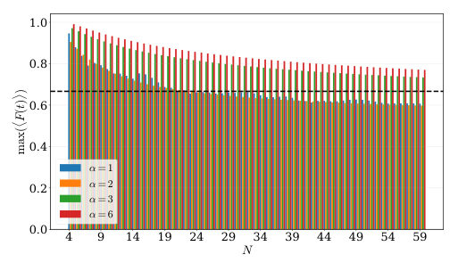
<figcaption class="paper-figure-caption"><b>Fig 1.</b> FIG. 1: Maximal average fidelity as a function of total number of sites N ∈[4, 60] for α-chains, evaluated over a total time window t · J0 = Nπ/2, corresponding to twice the speed limit for perfect state transfer (PST) in nearest-neighbour systems [18]. Horizontal (dashed) line corresponds to the limit in which there is quantum advantage over classical means of communication [51]. In the large-α limit, the XX (effective) nearest-neighbour spin chain is known to lose its quantum advantage for communication at N ≈240 [52].</figcaption>
</figure>
<figure class="paper-figure-card">
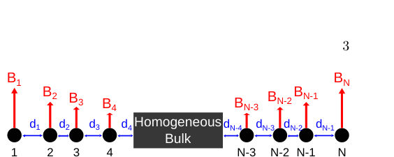
<figcaption class="paper-figure-caption"><b>Fig 2.</b> FIG. 2: A diagram showing an example chain of length N with 4 optimised site positions, with di the distance between two adjacent sites and on-site energies, Bi, on each end of the chain, preserving mirror symmetry.</figcaption>
</figure>
<figure class="paper-figure-card">
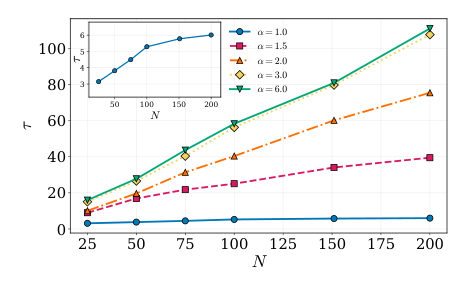
<figcaption class="paper-figure-caption"><b>Fig 3.</b> FIG. 3: Time at which the fidelity is maximal τ plotted as a function of the total number of sites N, across increasing strengths of the power-law exponent α. Inset presents a zoomed-in window of the α = 1 chains, highlighting the distinguishability of the individual data points.</figcaption>
</figure>
<figure class="paper-figure-card">
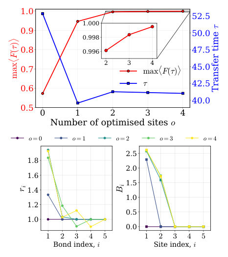
<figcaption class="paper-figure-caption"><b>Fig 4.</b> FIG. 4: Top panel shows, for a fixed N = 100 site long-range (α = 2) chain, how increasing the number of optimised boundary sites o, from 0 to 4 leads to near-perfect ( 99.99%) average fidelity and fast transfer time, eventually approaching a saturation regime. Bottom panel illustrates the corresponding optimised spatial profiles of the spacing between sites and local magnetic fields across the lattice: the bulk remains homogeneous with uniform bond strength and zero field modulation, while non-trivial structure develops only near the boundaries.</figcaption>
</figure>
<figure class="paper-figure-card">
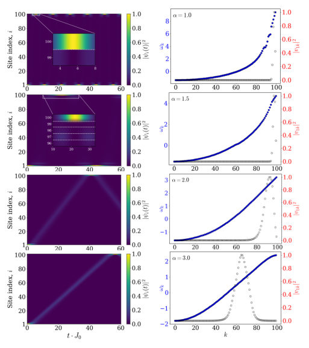
<figcaption class="paper-figure-caption"><b>Fig 5.</b> FIG. 5: Distinct transfer dynamics associated with optimized chains for the selected sequences of α values (left column), alongside the localization of the initial-state distribution in k-space over the ordered spectrum (right column) of the corresponding varied-α, N = 100-site chain.</figcaption>
</figure>

**Summary.** This work analyzes how the range of interactions in a spin chain dictates quantum information transfer dynamics. By varying the power-law decay exponent $\alpha$, the authors distinguish between standard wavepacket spreading and novel, faster transfer modes arising from spectral localization. This has implications for designing robust quantum communication channels.

**Why it may be interesting.** It provides a theoretical framework for designing quantum channels by tuning interaction decay rates, showing how spectral properties dictate the speed and mechanism of quantum information transport.

Detailed structure

**Main problem.** The paper investigates the distinct mechanisms governing quantum state transfer fidelity in spin networks whose interactions decay according to a power law.

**Main result.** Long-range interactions (low power-law exponent $\alpha$) fundamentally change the transfer dynamics, leading to emergent, faster oscillations confined to a few high-energy eigenmodes, contrasting with the ballistic spread seen in short-range systems.

**Method.** The study uses theoretical analysis of the XX Hamiltonian, calculating quantum state transfer fidelity via single-particle transition amplitudes derived from the system's spectrum.

**Model / system.** The model is a spin-1/2 chain governed by an XX Hamiltonian with long-range couplings decaying as $J_{i,j} \propto r_{\alpha}^{i,j}$. The coupling range is controlled by the power-law exponent $\alpha$.

**Key observables.** Average fidelity $\langle F(t) \rangle$, arrival time $\tau$, and the spectral distribution of the initial state.

**Important parameters / regimes.** The power-law exponent $\alpha$ (controlling interaction range), chain length $N$, and the coupling strength $J_0$.

**Assumptions / limitations.** The analysis focuses on the transfer of an arbitrary single-qubit quantum state injected at one end of the chain.

**Figures summary.** Figures illustrate the dependence of transfer time ($\tau$) on chain length ($N$) and $\alpha$, comparing few-mode oscillations ($\alpha \le 1.5$) to wavepacket propagation ($\alpha \ge 2.0$).

**Paper structure.** The paper systematically analyzes the dynamics across different $\alpha$ regimes, contrasting short-range (ballistic) vs. long-range (few-mode coherent) transfer, and details the optimization methods used to maintain high fidelity.

Abstract

We identify different regimes of quantum state transfer in long-range coupled spin-$\frac{1}{2}$ systems, where naturally occurring power-law interactions enable rapid, high-fidelity transfer with minimal engineering. Across a broad range of interaction profiles, from effectively nearest-neighbour coupling to Coulomb interactions, we show how long-range connectivity fundamentally reshapes the mechanisms underlying information propagation within such systems. For effectively short-range interactions, transfer follows familiar ballistic transfer dynamics: an initially localised excitation spreads across many eigenmodes concentrated within the approximately linear region of the spectrum, enabling robust wavepacket motion. In contrast, increasing long-distance interactions via lowering the power-law exponent $α$ ($α=1-2$) drives a striking transformation, where the initial state becomes confined to progressively fewer eigenmodes, ultimately reducing the dynamics to the coherent participation of only a few states corresponding to the highest eigenenergies. This spectral localization gives rise to emergent long-range oscillations between distant sites, revealing a distinct -- and faster -- transfer mechanism arising from the intrinsic structure of long-range quantum interactions rather than from full-system engineering pathways.

[↑ back to top](#top)

### [The exact price of local realism in CHSH experiments: a measurement-dependence-detection trade-off surface, a moiré phase-locking mechanism that saturates it, and an unmeasured fringe in the fourfold coincidence sum](http://arxiv.org/abs/2608.18886v1)

**Authors:** Aaron Alai  
**Type:** theory · **Category:** other · **PDF:** <https://arxiv.org/pdf/2608.18886v1>  
**Analysis basis:** full PDF text, analyzed in chunks
**Topic relevance:** `quantum measurements` **3/5** · `analog quantum simulation` **1/5**

↔ Scroll figures horizontally

<figure class="paper-figure-card">
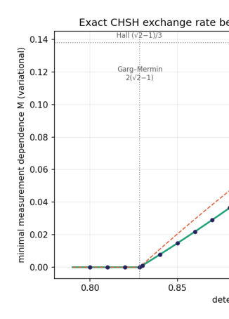
<figcaption class="paper-figure-caption"><b>Fig 1.</b> Figure 1: The S = 2 √</figcaption>
</figure>
<figure class="paper-figure-card">
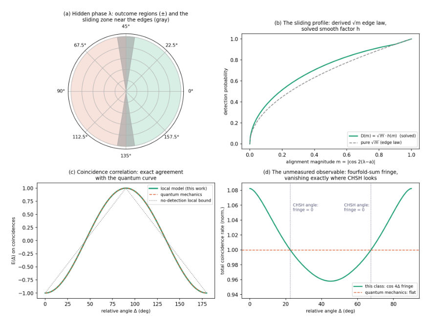
<figcaption class="paper-figure-caption"><b>Fig 2.</b> Figure 2: The detection sector. (a) Hidden-phase outcome regions and the sliding zone; (b) the solved profile D(m) = √m h(m) with its derived edge law; (c) exact agreement of the coincidence correlation with the quantum curve; (d) the fourfold-sum fringe, vanishing identically at the CHSH angles (Theorem 2).</figcaption>
</figure>
<figure class="paper-figure-card">
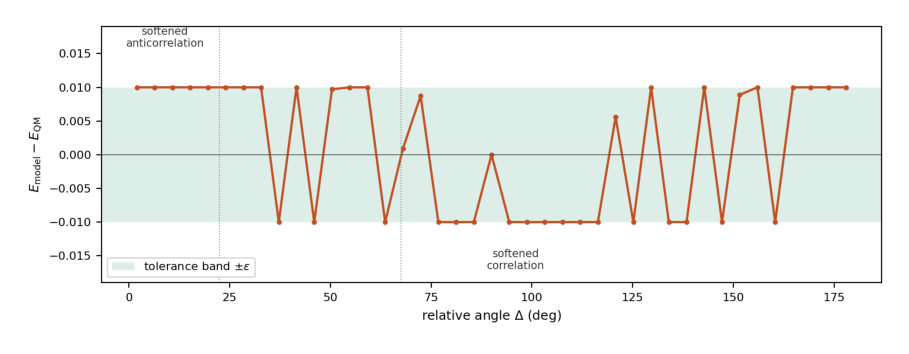
<figcaption class="paper-figure-caption"><b>Fig 3.</b> Figure 3: Residual correlation pattern Emodel −EQM of the mechanism at uniform tolerance ε = 0.01 (41 pinned angles; optimal solutions ride the tolerance band, as linear-programming vertices must). The robust content is the sign envelope: positive residuals where EQM →−1 (∆≲33◦, ≳164◦) and a negative plateau where EQM →+1 (76◦−116◦): the mechanism softens the correlation extremes, paying its tolerance where perfection is demanded. This visibility-like signature, at the ≤1% level between the Bell angles, is the mechanism’s falsifiable fingerprint.</figcaption>
</figure>
<figure class="paper-figure-card">
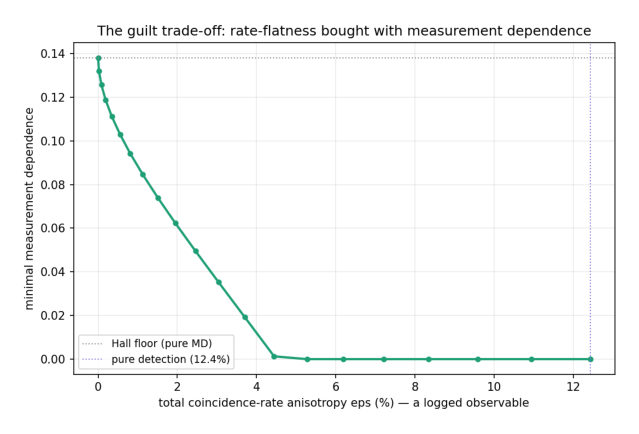
<figcaption class="paper-figure-caption"><b>Fig 4.</b> Figure 4: The trade-off between the two channel signatures: minimal measurement dependence versus fourfold-sum anisotropy along the interpolating detection family.</figcaption>
</figure>
<figure class="paper-figure-card">
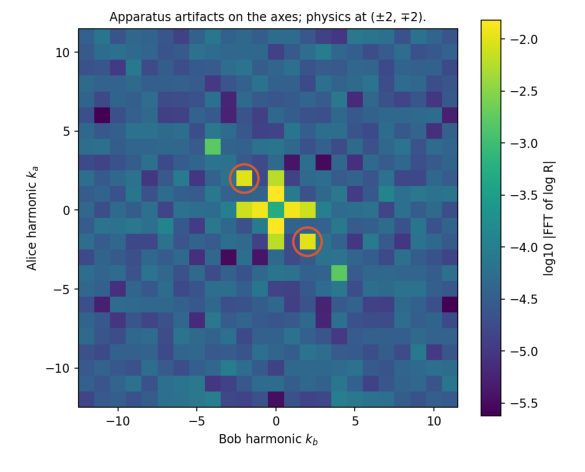
<figcaption class="paper-figure-caption"><b>Fig 5.</b> Figure 5: Simulated protocol analysis: log-Fourier plane of the rate map over the settings torus. Factorizable apparatus response occupies the axes; the physical signal occupies the circled anti- diagonal pixels.</figcaption>
</figure>

**Summary.** This theoretical paper quantifies the 'price'—the required measurement dependence—that local hidden-variable theories must pay to reproduce experimental CHSH violation values given detector inefficiencies. It derives a precise trade-off surface and predicts a specific, unmeasured $\cos 4(a-b)$ fringe in the fourfold coincidence sum, offering a new, falsifiable diagnostic tool beyond standard Bell inequality tests.

**Why it may be interesting.** While focused on Bell tests, the rigorous mathematical framework involving variational measures, detection profiles, and the identification of non-local residual correlations provides deep insights into the limitations of local models, which has parallels in understanding entanglement structure in quantum information.

Detailed structure

**Main problem.** The paper determines the minimal measurement dependence required for local hidden-variable accounts to reproduce observed CHSH values, quantifying the trade-off between measurement dependence and detection efficiency.

**Main result.** A precise formula for the minimal measurement dependence $M(S, \eta_{	ext{eff}})$ is derived, and the analysis identifies a residual $\cos 4(a-b)$ fringe in the fourfold coincidence sum as a falsifiable fingerprint of local realism violations.

**Method.** The analysis uses linear programming over local strategies and involves solving functional equations related to detection profiles, alongside Fourier analysis of coincidence rates.

**Model / system.** The study analyzes Bell tests using a polarization singlet state in CHSH experiments, modeling the constraints imposed by local hidden variables (LHV) on measured coincidence rates.

**Key observables.** CHSH value ($S$), Measurement dependence ($M$), Fourfold coincidence sum modulation ($\cos 4(a-b)$ fringe), and detection efficiency ($\eta_{	ext{eff}}$).

**Important parameters / regimes.** The quantum point ($S=2\sqrt{2}$), the effective detector efficiency ($\eta_{	ext{eff}}$), and the measurement dependence measure $M$.

**Assumptions / limitations.** The analysis assumes the LHV accounts are 'faithful' (reproducing singles and coincidence rates) and investigates the implications of assuming angle-independent coincidence rates.

**Figures summary.** Figures illustrate the price surface $M(S, \eta_{	ext{eff}})$, comparing the derived formula against known bounds, and show the residual correlation pattern in the fourfold coincidence sum.

**Paper structure.** The paper first establishes the minimal measurement dependence price surface via linear programming. It then proves impossibility results for pure-detection models and introduces the moiré phase-locking mechanism as a saturating local account. Finally, it analyzes the residual fringe structure and presents computational verification of the trade-off.

Abstract

For local hidden-variable accounts of the CHSH experiment that are faithful -- reproducing the observed singles and coincidence rates and unbiased marginals of a polarization singlet with symmetric detector efficiency $η_{\rm eff}$ -- I determine the minimal measurement dependence $M$ (Hall's variational measure) needed to achieve a CHSH value $S$. Linear programming over all local strategies yields, to machine precision at 32 grid points, $M(S,η_{\rm eff})=\max\{0,η_{\rm eff}((S+2)η_{\rm eff}-4)/6\}$, whose edges reproduce Hall's tight bound at $η_{\rm eff}=1$, the Garg-Mermin detection threshold, and the postselection ceiling $S=4/η_{\rm eff}-2$. The quantum point is certified exactly: $M(2\sqrt{2},9/10)=(27\sqrt{2}-33)/100$, with primal and dual certificates in $\mathbb{Q}(\sqrt{2})$ arithmetic. I solve the unique detection profile $D(m)=\sqrt{m}\,h(m)$ under which a deterministic sign model reproduces the singlet exactly, derive the $\sqrt{m}$ edge law, and prove exact quantum correlations and angle-independent coincidence rates jointly impossible for any pure-detection model of this class. Surviving local accounts trade off measurement dependence against a $\cos 4(a-b)$ modulation of the fourfold coincidence sum, of relative amplitude up to 12.4%, which vanishes identically at the CHSH angles and appears never to have been bounded below 1%. A settings-torus protocol reaches $5σ$ sensitivity at 0.1% within hours: a flat result forces $M\gtrsim 95\%$ of Hall's floor; a fringe would contradict the flat-rate prediction of quantum mechanics. Finally I exhibit a local mechanism -- moire phase locking -- with deterministic phase evolution and all randomness quenched in frozen lattice offsets and flight times, which attains the certified floor exactly at $η_{\rm eff}=1$ (10% uniform fidelity); its softening of the correlation extremes is a falsifiable fingerprint.

[↑ back to top](#top)

### [Branching (Almost) Everywhere And All at Once](http://arxiv.org/abs/2608.18644v1)

**Authors:** Alyssa Ney  
**Type:** theory · **Category:** other · **PDF:** <https://arxiv.org/pdf/2608.18644v1>  
**Analysis basis:** full PDF text, analyzed in chunks
**Topic relevance:** `quantum measurements` **3/5**

↔ Scroll figures horizontally

<figure class="paper-figure-card">
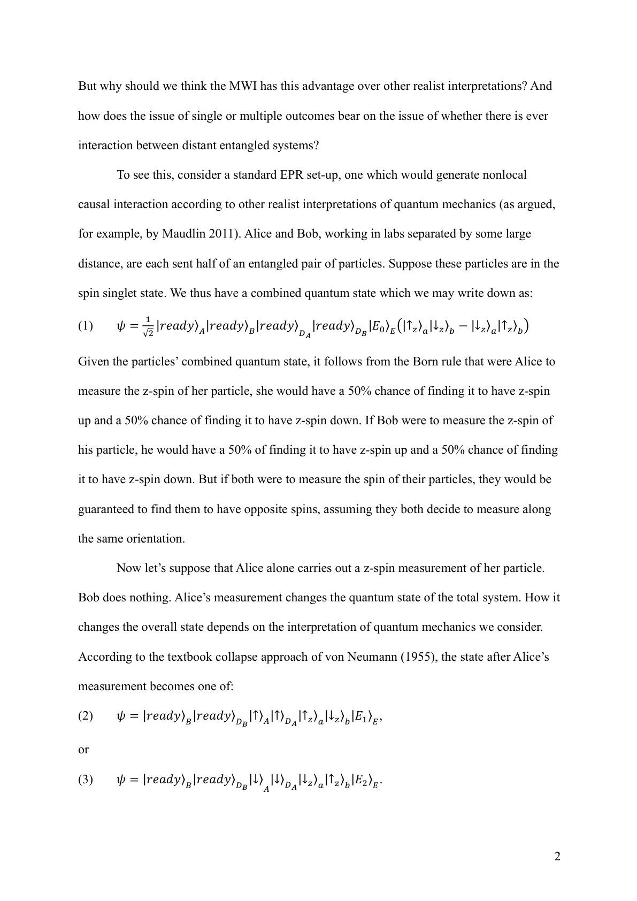
<figcaption class="paper-figure-caption"><b>Fig 1.</b> Low-resolution page preview, page 2</figcaption>
</figure>
<figure class="paper-figure-card">
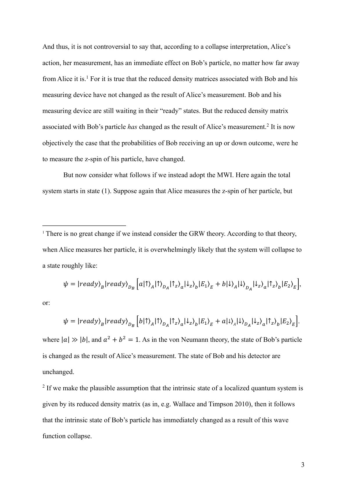
<figcaption class="paper-figure-caption"><b>Fig 2.</b> Low-resolution page preview, page 3</figcaption>
</figure>
<figure class="paper-figure-card">
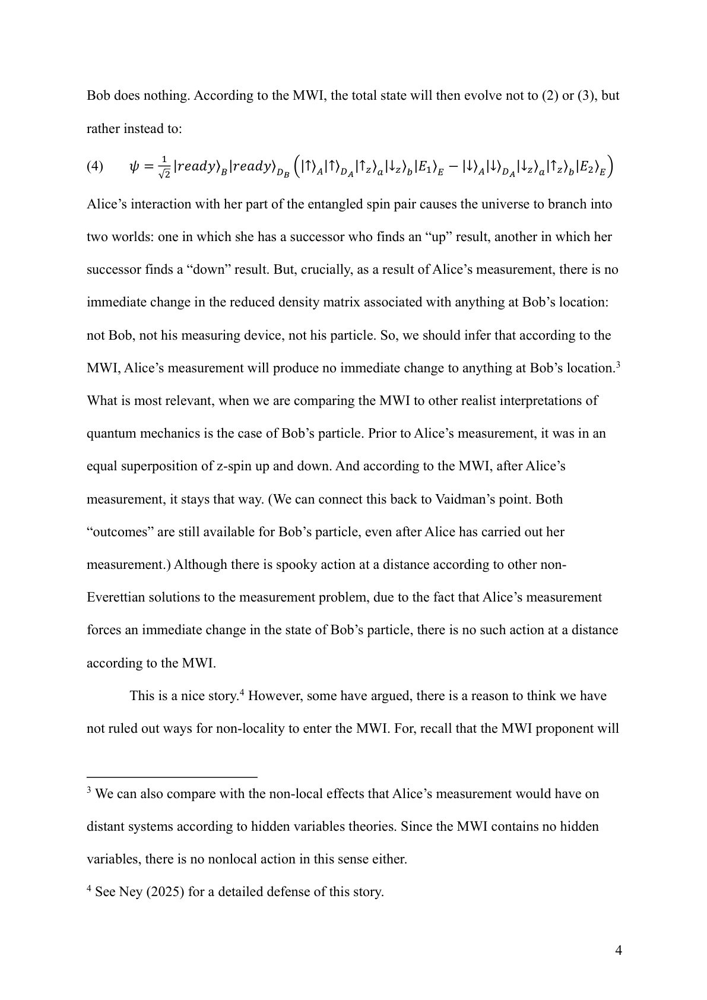
<figcaption class="paper-figure-caption"><b>Fig 3.</b> Low-resolution page preview, page 4</figcaption>
</figure>
<figure class="paper-figure-card">
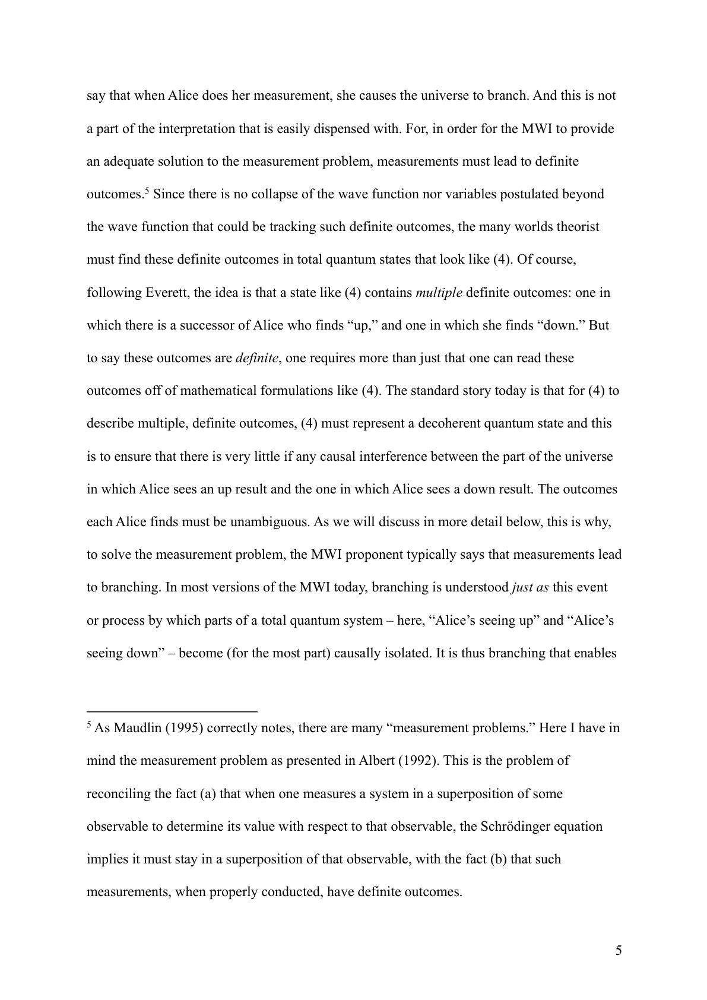
<figcaption class="paper-figure-caption"><b>Fig 4.</b> Low-resolution page preview, page 5</figcaption>
</figure>
<figure class="paper-figure-card">
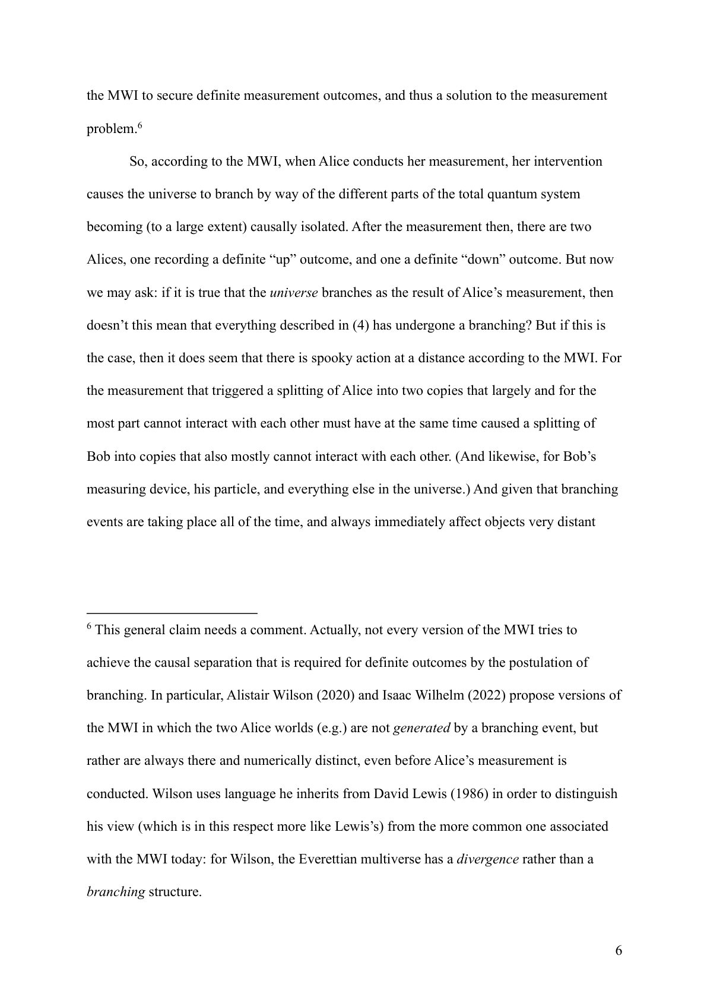
<figcaption class="paper-figure-caption"><b>Fig 5.</b> Low-resolution page preview, page 6</figcaption>
</figure>

**Summary.** This paper tackles the foundational conflict between the Many-Worlds Interpretation (MWI) and special relativity by analyzing the concept of quantum branching. The author argues against viewing branching as a local, causal process, proposing instead a global branching view. This global view is shown to be compatible with relativity because the physical mechanism does not require superluminal action across spacetime.

**Why it may be interesting.** This is highly relevant for theoretical physicists working on open quantum systems and quantum foundations, as it tackles the fundamental interpretation of measurement and the relationship between quantum formalism (decoherence) and physical reality (branching).

Detailed structure

**Main problem.** The paper addresses the conflict between the Many-Worlds Interpretation (MWI) of quantum mechanics and the principle of relativistic locality, specifically regarding the nature of 'spooky action at a distance' during quantum branching.

**Main result.** The author argues that the global branching view of MWI is compatible with special relativity because the physical mechanism involves no intrinsic, superluminal change at a distant location, unlike the local causal branching view.

**Method.** The analysis involves comparing different conceptualizations of quantum measurement outcomes (collapse vs. MWI) and developing a linguistic/ontological distinction between the physical process of decoherence and the emergent concept of global branching.

**Model / system.** The discussion centers on the Many-Worlds Interpretation (MWI) applied to standard quantum measurements, using the EPR setup as a primary diagnostic tool to test locality constraints.

**Key observables.** The reduced density matrix of a distant particle (Bob's particle) is used to diagnose non-local effects; the concept of 'branching' itself is the key diagnostic.

**Important parameters / regimes.** The speed of light (c) and the requirement of relativistic locality are central constraints. The distinction between local vs. global branching is the primary parameter space explored.

**Assumptions / limitations.** The argument relies on distinguishing between decoherence (a microphysical process) and branching (an emergent ontology), and assumes that intrinsic physical features are best captured by reduced density matrices.

**Paper structure.** The paper progresses by first establishing the conflict between MWI and locality, then critically evaluating the 'local branching view' (which attempts to preserve causality), and finally advocating for a 'global branching view' that reconciles MWI with special relativity by redefining the nature of the branching event.

Abstract

It is sometimes said that a reason to prefer Everettian quantum mechanics is that it allows one to avoid the kind of spooky action at a distance that is a consequence of quantum entanglement according to other approaches. There is a straightforward argument to show EQM has this virtue, however some advocates argue that this requires we see branching as a local causal process. I explain this reasoning and then show why, given the way Everettians standardly conceive of worlds and branching as emergent phenomena, branching need not be viewed as a causal process for EQM to be relativistically local. Forthcoming in Local Quantum Mechanics, OUP 2026.

[↑ back to top](#top)

### [High-field fate of the Kitaev quantum spin liquid in $α$-RuCl$_3$](http://arxiv.org/abs/2608.18530v1)

**Authors:** K. Imamura, R. Ohno, Y. C. Tsuzuki, Y. Akui, R. Namba, K. Ishihara, M. Akaki, M. Kimata, N. Kurita, H. Tanaka, N. Kimura, S. Imajo, A. Matsuo, K. Kindo, Y. Matsuda, K. Hashimoto, Y. Mizukami, T. Shibauchi  
**Type:** experiment · **Category:** strongly correlated electrons · **PDF:** <https://arxiv.org/pdf/2608.18530v1>  
**Analysis basis:** full PDF text, analyzed in chunks
**Topic relevance:** `analog quantum simulation` **3/5**

↔ Scroll figures horizontally

<figure class="paper-figure-card">
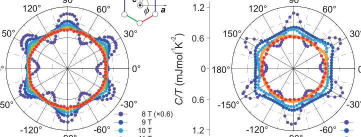
<figcaption class="paper-figure-caption"><b>Fig 1.</b> FIG. 1. (a) Field-angle dependence of specific heat divided by temperature C/T at T = 1 K as a function of the in-plane field angle ϕ for several magnetic fields, measured on a two-step sublimation crystal. Data in the range 8-11 T are taken from the previous work [29]. The inset defines ϕ as the in-plane field-angle measured from the a axis, which is perpendicular to a Ru-Ru bond direction of the honeycomb lattice. (b) Field-angle dependence of C/T at T = 0.7 K as a function of ϕ for several magnetic fields, measured on a crystal grown by the Bridgman method.</figcaption>
</figure>
<figure class="paper-figure-card">
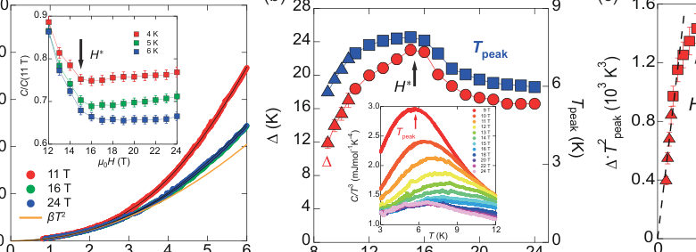
<figcaption class="paper-figure-caption"><b>Fig 2.</b> FIG. 2. (a) Temperature dependence of the specific heat divided by temperature C/T at 11 T (red), 16 T (green), and 24 T (blue) for H ∥a. The black solid lines show fits to the data below 6 K. The orange line represents the phonon contribution βT 2</figcaption>
</figure>
<figure class="paper-figure-card">
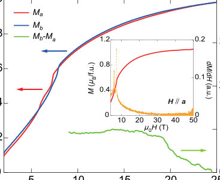
<figcaption class="paper-figure-caption"><b>Fig 3.</b> FIG. 3. In-plane field dependence of magnetization for H ∥a (Ma, red) and H ∥b (Mb, blue), together with the in-plane anisotropy Mb −Ma at T = 1.35 K. The inset presents high- field magnetization Ma (red) up to 50 T for H ∥a and the corresponding differential susceptibility dM/dH (orange).</figcaption>
</figure>
<figure class="paper-figure-card">
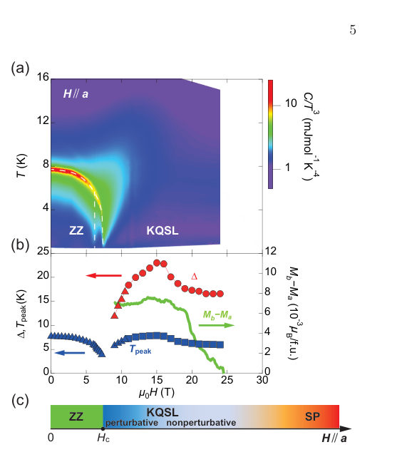
<figcaption class="paper-figure-caption"><b>Fig 4.</b> FIG. 4. (a) Phase diagram in the field-temperature plane for H ∥a. Superimposed color maps represent the magnitude of C/T 3. (b) Field dependence of the excitation gap ∆(red), the peak temperature Tpeak (blue), and the in-plane magnetiza- tion anisotropy Mb−Ma (green). (c) Schematic high-field evo- lution for H ∥a, summarizing the zigzag (ZZ) phase at low fields, the perturbative and nonperturbative KQSL regimes, and the crossover toward the spin-polarized (SP) phase at high fields.</figcaption>
</figure>

**Summary.** This work investigates how the Kitaev quantum spin liquid state in $\alpha$-RuCl$_3$ behaves under very strong magnetic fields. By measuring specific heat up to 24 T, the researchers found that topological signatures, like angular modulations, persist far beyond the limits of simple theoretical models. This reveals a complex, nonperturbative high-field phase where the underlying fractionalized excitations remain active.

**Why it may be interesting.** The persistence of fractionalized excitations (Majorana/vison merging) in a nonperturbative, high-field regime provides crucial insight into the robustness of topological quantum matter under extreme conditions, relevant for understanding emergent quantum phases.

Detailed structure

**Main problem.** The primary goal is to determine the fate of the Kitaev quantum spin liquid (KQSL) state in $\alpha$-RuCl$_3$ when subjected to strong external magnetic fields, especially beyond the regime where simple perturbative theories apply.

**Main result.** KQSL signatures persist well beyond the perturbative window, indicating a nonperturbative regime where Majorana and vison energy scales merge, contrasting sharply with predictions for a simple spin-polarized state.

**Method.** The study relies on high-field specific heat measurements ($C/T$) and in-plane magnetization measurements, analyzing the field and angle dependence of thermodynamic quantities.

**Model / system.** The system is the layered honeycomb magnet $\alpha$-RuCl$_3$, which is investigated as a realization of the Kitaev quantum spin liquid (KQSL) model, featuring itinerant Majorana quasiparticles and gapped $Z_2$ fluxes (visons).

**Key observables.** Specific heat divided by temperature ($C/T$), in-plane magnetization anisotropy, and the extracted excitation gap ($\Delta$).

**Important parameters / regimes.** Magnetic field strength (up to 24 T), crossover field $H^* \approx 15$ T, and the temperature $T$.

**Assumptions / limitations.** The analysis involves fitting $C/T$ data using activated forms to extract an effective gap, and the initial analysis relies on the perturbative Kitaev description.

**Figures summary.** Figures show the field-angle dependence of $C/T$ (revealing six-fold modulation at low fields), the evolution of the extracted gap $\Delta$ (showing non-monotonic behavior), and the persistence of magnetization anisotropy up to high fields.

**Paper structure.** The paper progresses by first establishing the expected behavior in the perturbative regime (low fields), then identifying the breakdown point ($H^*$), and finally mapping the nonperturbative high-field regime by tracking the persistence of topological signatures.

Abstract

Kitaev quantum spin liquids (KQSLs) host fractionalized excitations described by itinerant Majorana quasiparticles and gapped $Z_2$ fluxes (visons), providing a platform for emergent topological matter. Whether such a state survives under strong magnetic fields, however, remains an open question. The layered honeycomb magnet $α$-RuCl$_3$ is a leading candidate material: an in-plane field of $\sim$ 7 T suppresses antiferromagnetic order and induces a quantum-disordered phase exhibiting signatures consistent with Majorana excitations, including an anomalous thermal Hall effect and field-angle-dependent specific heat. At higher fields, the magnetization approaches saturation, suggesting a transition to a spin-polarized state, yet the microscopic evolution between these limits remains unresolved. Here we report high-field specific heat measurements up to 24 T that reveal a distinct crossover at $μ_0H^*\approx$15 T, beyond which the perturbative Kitaev description breaks down. Above $H^*$, the characteristic six-fold angular modulation of the specific heat collapses and the excitation gap deviates from the predicted $H^3$ scaling. Meanwhile, the gap decreases with increasing field and the in-plane magnetization anisotropy persists up to $\sim$ 24 T, both in sharp contrast to a trivial spin-polarized state, indicating that KQSL signatures are preserved even at $\sim$ 90 % of magnetization saturation. These results reveal that the KQSL in $α$-RuCl$_3$ extends well beyond the perturbative window, persisting as a nonperturbative regime in which the Majorana and vison energy scales merge, before eventually giving way to spin polarization. This thermodynamic roadmap provides a basis for understanding how fractionalized phases evolve under strong magnetic fields.

[↑ back to top](#top)

### [Non-Local Search-to-Decision Reduction over F2](http://arxiv.org/abs/2608.19091v1)

**Authors:** Prabhanjan Ananth  
**Type:** theory · **Category:** quantum information and computing · **PDF:** <https://arxiv.org/pdf/2608.19091v1>  
**Analysis basis:** full PDF text, analyzed in chunks
**Topic relevance:** `quantum measurements` **3/5**

↔ Scroll figures horizontally

<figure class="paper-figure-card">
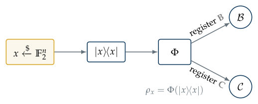
<figcaption class="paper-figure-caption"><b>Fig 1.</b> Figure 1: The information-distribution stage. A uniformly random string is encoded by an arbitrary channel into the bipartite state ρx. Bob and Charlie receive disjoint registers and cannot communicate.</figcaption>
</figure>
<figure class="paper-figure-card">
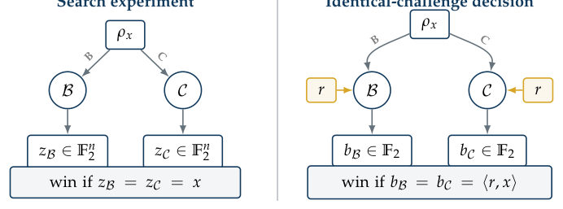
<figcaption class="paper-figure-caption"><b>Fig 2.</b> Figure 2: The search and decision experiments for identical-challenge non-local search-to-decision. Full- string recovery is tested on the left. On the right, the same random challenge r is delivered to both parties and both must return its inner product with x. The two nodes labelled r represent two classical copies of one uniformly sampled challenge, not independent samples.</figcaption>
</figure>
<figure class="paper-figure-card">
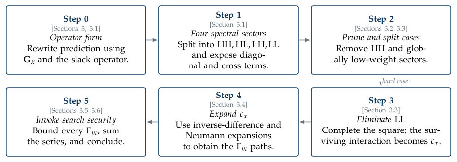
<figcaption class="paper-figure-caption"><b>Fig 3.</b> Figure 3: Flow of the proof. Steps 0–2 reformulate the prediction experiment and isolate the only hard case. Steps 3–5 use positivity of the LL block to turn the surviving interaction into common-challenge paths bounded by joint search security.</figcaption>
</figure>

**Summary.** This paper establishes a fundamental security relationship in quantum information theory by bounding the success probability of a common-challenge parity prediction task based on the success probability of local full-string recovery. Using advanced operator algebra and series expansions, the authors prove that if local measurements cannot reliably reconstruct the secret string, they also cannot reliably predict the shared parity challenge. This has direct implications for quantum cryptography.

**Why it may be interesting.** This work provides a rigorous, information-theoretic link between two distinct quantum security primitives (search vs. decision), which is fundamental for designing secure quantum cryptographic protocols like unclonable encryption.

Detailed structure

**Main problem.** The paper analyzes the non-local search-to-decision problem, determining the relationship between the ability of two noncommunicating parties to locally recover a shared secret string versus their ability to predict a common random parity challenge.

**Main result.** It proves an information-theoretic upper bound showing that the joint parity-prediction probability is bounded by a function of the optimal local full-string recovery probability, implying that negligible local recovery limits joint prediction advantage.

**Method.** The proof uses advanced techniques involving operator algebra, spectral decomposition, and Neumann series expansions to systematically bound complex expectation values related to quantum measurements.

**Model / system.** The model involves encoding a uniformly random string $x \in \mathbb{F}_2^n$ into a bipartite quantum state $
ho_x$ shared between two parties. The security is analyzed via local measurements (POVMs) for both full-string recovery (search) and common-challenge parity prediction (decision).

**Key observables.** Search success probability ($	ext{psrch}$), joint parity-prediction probability ($	ext{ppred}$), and various derived scalars like $c_x$ and $\Gamma_m$.

**Important parameters / regimes.** The bound depends on the relationship between $	ext{ppred}$ and $	ext{psrch}$, with the final bound being $	ext{ppred} \le \min\{1, 1/2 + 5	ext{psrch}^{1/22}\}$.

**Assumptions / limitations.** The proof is information-theoretic and does not yield an efficient extractor; it assumes the uniform prior on $x$ and identical challenges.

**Figures summary.** Figure 1 illustrates the initial state encoding ($
ho_x$). Figure 2 compares the 'Search experiment' (full-string recovery) versus the 'Identical-challenge decision' (parity prediction). Figure 3 summarizes the multi-step logical flow of the proof, relating the prediction probability to the search security.

**Paper structure.** The paper systematically reduces the prediction probability calculation by decomposing the state into spectral sectors, applying operator identities, utilizing the Neumann expansion to approximate inverses, and finally bounding the resulting error terms ($\Gamma_m$) using the initial assumption of search security ($	ext{psrch}$).

Abstract

Non-local search-to-decision asks whether two noncommunicating parties, given the two shares of a bipartite encoding of a uniformly random string $x\in \mathbb{F}_2^n$, can both predict the same random parity $\langle r,x\rangle$ without there also being local measurements with which both parties recover $x$. We prove that if their optimal probability of both recovering $x$ by local measurements is $p$, then their probability of both answering a common parity challenge correctly is at most $\min\{1,\frac{1}{2}+5p^{1/22}\}$. The result is motivated by applications to unclonable encryption and quantum copy-protection. The proof is information-theoretic and does not provide an efficient extractor. The proof and the exposition were developed with assistance from ChatGPT using GPT-5.6 Sol Pro and Codex in the Ultra reasoning mode.

[↑ back to top](#top)

### [Optical Voltage Profiling of 2D Semiconductors via Proximal Exciton Sensing](http://arxiv.org/abs/2608.18382v1)

**Authors:** Ha-Leem Kim, Hyungbin Lim, Yuanyi Yang, Ruishi Qi, Ruichen Xia, Can Uzundal, Takashi Taniguchi, Kenji Watanabe, Feng Wang  
**Type:** experiment · **Category:** strongly correlated electrons · **PDF:** <https://arxiv.org/pdf/2608.18382v1>  
**Analysis basis:** full PDF text, analyzed in chunks
**Topic relevance:** `quantum measurements` **3/5**

↔ Scroll figures horizontally

<figure class="paper-figure-card">
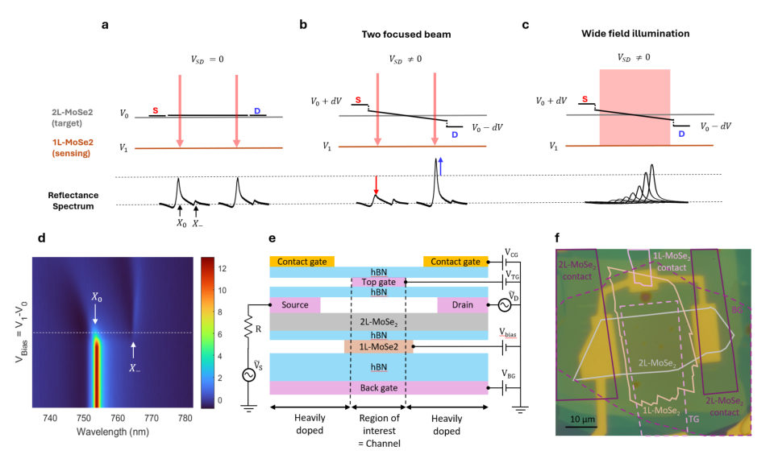
<figcaption class="paper-figure-caption"><b>Fig 1.</b> Fig. 1 | Optical voltage profiling: principle and device architecture. a, Zero-bias configuration (𝑉𝑉SD = 0) with the interlayer bias 𝑉𝑉bias = 𝑉𝑉1 −𝑉𝑉0 set for maximum responsivity of the 1L-MoSe₂ sensor. Focused beams (red arrows) probe discrete positions, analogous to voltage leads in a four-probe measurement. The 2L-MoSe₂ target electrostatically gates the sensor, modulating its carrier density and exciton resonance. b, Under finite source– drain bias (𝑉𝑉SD ≠ 0), current flows in the target. The potential distribution shows large drops near the contacts and a linear gradient in the channel. Local changes in the sensor’s exciton intensity (suppression or enhancement of 𝑋𝑋0 ) encode the...</figcaption>
</figure>
<figure class="paper-figure-card">
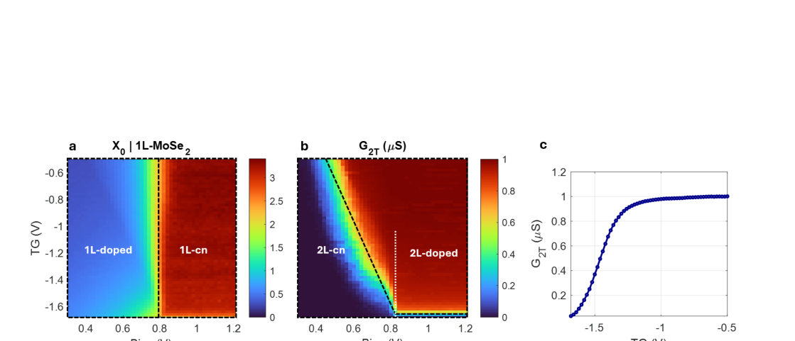
<figcaption class="paper-figure-caption"><b>Fig 2.</b> Fig. 2 | Gate-dependent doping in the sensor and target layer. a, 1L-MoSe₂ (sensor) exciton-intensity map as a function of top-gate voltage 𝑉𝑉𝑇𝑇𝑇𝑇 and interlayer bias 𝑉𝑉bias. High intensity marks the charge-neutral regime; low intensity marks the electron-doped regime. Back-gate and contact gates are fixed at high positive voltages to render the contact regions metallic. b, Two‑terminal conductance map G2T of the 2L-MoSe₂ (target) under a small AC bias (7.7 Hz, 10 mV). Regions of vanishing G2T indicate a charge-neutral regime, while a finite G2T indicates the electron-doped regime. c, Line cut along the white dashed trajectory in b, taken at Vbias = 0.81 V near the 1L sensor’s phase...</figcaption>
</figure>
<figure class="paper-figure-card">
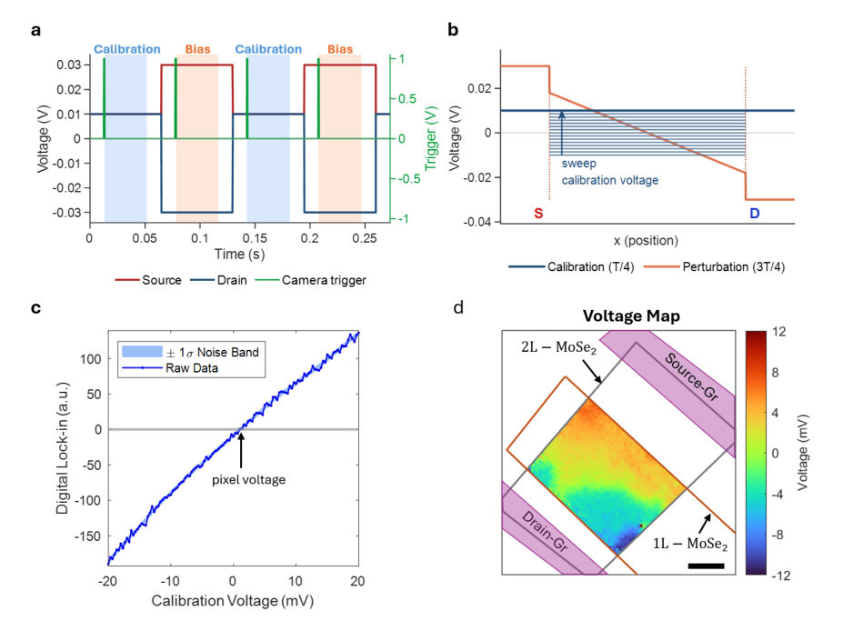
<figcaption class="paper-figure-caption"><b>Fig 3.</b> Fig. 3 | In situ calibration and reconstruction of spatial voltage maps. a, Time traces of the source (red) and drain (blue) voltages and the camera trigger (green) illustrating two phases per period: a calibration phase with 𝑉𝑉source = 𝑉𝑉drain = 𝑉𝑉cal (uniform potential; no source–drain current) and a biasing phase with a small differential bias (+30 mV at the source and −30 mV at the drain). One image is acquired in each phase and frames are averaged over multiple periods. The calibration voltage 𝑉𝑉cal is stepped within ±20 mV while the biasing amplitude is held fixed. b, Position-dependent potential 𝑉𝑉(𝑥𝑥) along the channel for several calibration voltages (blue) and for the biasing...</figcaption>
</figure>
<figure class="paper-figure-card">
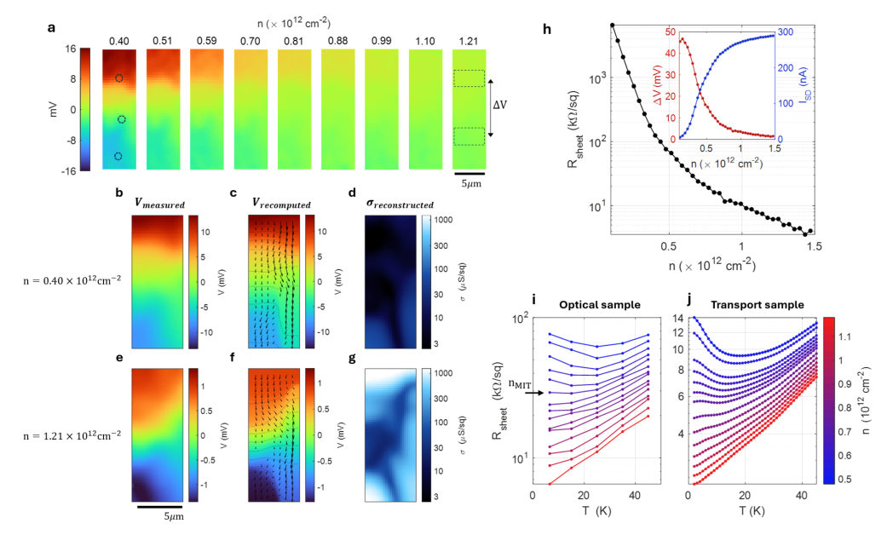
<figcaption class="paper-figure-caption"><b>Fig 4.</b> Fig. 4 | Density-dependent voltage maps, local conductivity, and resistance across the metal–insulator transition (MIT) in 2L-MoSe₂. a, Density-dependent spatial maps of the local electrostatic potential 𝑉𝑉(𝑥𝑥, 𝑦𝑦) for device DV2 measured at T = 6.5 K. Carrier densities (in units of 1012 cm−2) are indicated above each panel. Dashed circles mark bubbles formed during heterostructure transfer. The source–drain bias voltage is 60 mV, and the corresponding bias current is shown in the inset of h. b, e, Measured potential maps (Gaussian-smoothed) at carrier densities n = 0.40 × 1012 cm−2 (b) and n = 1.21 × 1012 cm−2 (e). c, f, Recomputed potential maps obtained from the inverted local...</figcaption>
</figure>

**Summary.** This work introduces Optical Voltage Profiling, a novel, noninvasive technique that uses an exciton sensor to map the local electrostatic potential across 2D semiconductors. By overcoming limitations imposed by high contact resistance, the authors successfully mapped the metal-insulator transition in bilayer MoSe2, providing spatially resolved evidence of electronic inhomogeneity in these correlated materials.

**Why it may be interesting.** The ability to map local potentials and conductivities noninvasively provides unprecedented spatial resolution into transport mechanisms, which is crucial for understanding correlated electron behavior in nanoscale devices where local variations dominate macroscopic measurements.

Detailed structure

**Main problem.** High contact resistances in atomically thin semiconductors obscure intrinsic electrical transport properties, especially when correlated electronic states emerge at low carrier densities.

**Main result.** The authors successfully demonstrated a method to map local potentials and resolve channel resistances below 1 kΩ, revealing a metal-insulator crossover near the resistance quantum h/e^2.

**Method.** They developed and applied 'Optical Voltage Profiling,' a noninvasive technique using a proximal exciton sensor to convert local electrostatic potential into measurable modulations of exciton reflectance.

**Model / system.** The study uses two-dimensional (2D) semiconductors, specifically bilayer MoSe2 as the active channel and a monolayer MoSe2 as the exciton sensor, separated by hBN.

**Key observables.** Spatially resolved two-dimensional voltage maps, local sheet conductivity $\sigma(x, y)$, and average channel resistance $R_{\square}$ as a function of carrier density.

**Important parameters / regimes.** Carrier density ($n$), temperature ($T$), and the resistance quantum ($h/e^2$).

**Assumptions / limitations.** The technique requires complex *in situ* calibration to account for the nonlinear and spatially varying conversion from local carrier density to exciton intensity, and conductivity reconstruction relies on solving an ill-posed inverse problem.

**Figures summary.** Figures illustrate the experimental setup, the two-phase calibration process, and density-dependent spatial maps of potential and reconstructed conductivity across the metal-insulator transition in 2L-MoSe2.

**Paper structure.** The paper introduces the problem of contact resistance, details the optical voltage profiling methodology (including calibration and inverse problem solving), presents results showing the MIT and spatial heterogeneity, and validates the findings against conventional four-probe measurements.

Abstract

High contact resistances in atomically thin semiconductors often mask intrinsic electrical transport properties, particularly at low carrier densities where exotic correlated states emerge. We introduce optical voltage profiling, a noninvasive wide-field technique that replaces local voltage probes with a proximal monolayer MoSe$_2$ exciton sensor. Isolated by thin hexagonal boron nitride, this sensor converts the target's local electrostatic potential into spatially resolved modulations of exciton reflectance. Through pixel-wise in situ calibration, these signals yield quantitative two-dimensional voltage maps of an actively biased semiconductor device. Using this method, we demonstrate the carrier-density-driven metal-insulator transition in bilayer MoSe$_2$ and obtain channel resistances below 1 k$Ω$ despite M$Ω$-scale two-terminal resistances in the metallic region. The optically derived resistance exhibits a metal-insulator crossover near the resistance quantum $h/e^2$, and the voltage maps and reconstructed local conductivity reveal pronounced spatial heterogeneity in both insulating and metallic regimes. Beyond resolving channel resistance under high contact-resistance conditions, the technique provides spatially resolved access to microscopic transport heterogeneity in functional van der Waals devices.

[↑ back to top](#top)

### [Pseudocontexts forced by finite context hypergraphs](http://arxiv.org/abs/2608.18273v1)

**Authors:** Mirko Navara, Karl Svozil  
**Type:** theory · **Category:** other · **PDF:** <https://arxiv.org/pdf/2608.18273v1>  
**Analysis basis:** full PDF text, analyzed in chunks
**Topic relevance:** `quantum measurements` **3/5**

↔ Scroll figures horizontally

<figure class="paper-figure-card">
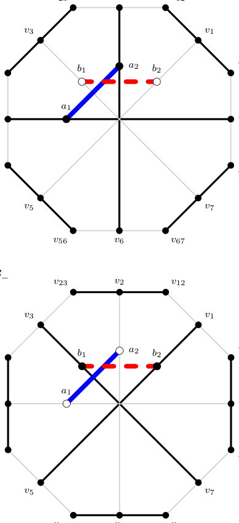
<figcaption class="paper-figure-caption"><b>Fig 1.</b> FIG. 1. The two context coverings used in the incidence-vector certificate. Bold black lines are the selected contexts and thin gray lines are the unselected contexts. Panel (a) shows G+ and panel (b) shows G−. In both panels, the very thick blue solid line joins A = {a1, a2} and the very thick red dashed line joins B = {b1, b2}. Filled inner vertices are covered by the respective covering.</figcaption>
</figure>

**Summary.** This paper develops the concept of 'pseudocontexts' to characterize probability equalities that are structurally forced by a finite set of measurement contexts, independent of whether the underlying physics is classical or quantum. It establishes a rigorous, algebraic test—the 'balanced context certificate'—to verify this forcing. The work provides sharp bounds on the minimum size of such structures, distinguishing between real and complex probability spaces.

**Why it may be interesting.** This work provides a deep, purely mathematical characterization of constraints arising from measurement compatibility, which is fundamental to understanding contextuality in quantum mechanics, extending beyond standard Bell-type inequalities.

Detailed structure

**Main problem.** To determine the necessary and sufficient conditions under which an equality between sums of probabilities derived from two disjoint sets of outcomes (pseudocontexts) is forced solely by the underlying structure of a finite context hypergraph, independent of the specific probability model.

**Main result.** The equality is characterized by the existence of a 'balanced context certificate,' which provides a finite, algebraic test for the identity to hold across classical and quantum probability assignments.

**Method.** The authors translate the probabilistic constraints into linear algebra problems using the incidence matrix of the context hypergraph, deriving necessary and sufficient conditions via rational vector analysis.

**Model / system.** The framework uses a finite, uniform context hypergraph $\Gamma = (V, E)$, where $V$ are elementary propositions and $E$ are complete contexts. The concept is generalized to quantum systems via Faithful Orthogonal Representations (FORs).

**Key observables.** The pseudocontext equality $\sum_{a \in A} p(a) = \sum_{b \in B} p(b)$, and the associated 'balanced context certificate' vector $\lambda$.

**Important parameters / regimes.** The minimum size of the target groups ($k=2$ over $\mathbb{C}$, $k=3$ over $\mathbb{R}$), and the structure of the context hypergraph.

**Assumptions / limitations.** The equality must hold for *every* admissible probability assignment, not just those from a specific physical model. The definition explicitly excludes elementary size-one identities.

**Figures summary.** Figure 1 illustrates the two context coverings ($G^+$ and $G^-$) used in the incidence-vector certificate for the size-two pseudocontext.

**Paper structure.** The paper establishes the definition of pseudocontexts, derives the finite forcing criterion using linear algebra, proves the independence of the equality from the chosen representation (FOR), and concludes by presenting concrete, minimal examples (15-vertex and 20-vertex hypergraphs) demonstrating the field-dependent minimum size.

Abstract

A context is a complete set of mutually exclusive outcomes whose probabilities sum to one. We define a pseudocontext as two disjoint groups, with no mutually exclusive pair within either group, whose total probabilities must nevertheless be equal solely because of how the contexts overlap. We give an exact finite test for this property and show that the equality is independent of the chosen coordinates and probability model. Applying the test in three dimensions, we obtain a 15-outcome real example with groups of three and a 20-outcome complex example with groups of two. Under this definition, the sharp minimum number of outcomes in each target group is two over the complex field and three over the real field.

[↑ back to top](#top)

### [Quantum Tensor Network Learning with DMRG](http://arxiv.org/abs/2608.18901v1)

**Authors:** Gustav J L Jäger, Martin B Plenio, Hans-Martin Rieser  
**Type:** theory · **Category:** numerical methods · **PDF:** <https://arxiv.org/pdf/2608.18901v1>  
**Analysis basis:** full PDF text, analyzed in chunks
**Topic relevance:** `methods for driven-dissipative` **3/5**

↔ Scroll figures horizontally

<figure class="paper-figure-card">
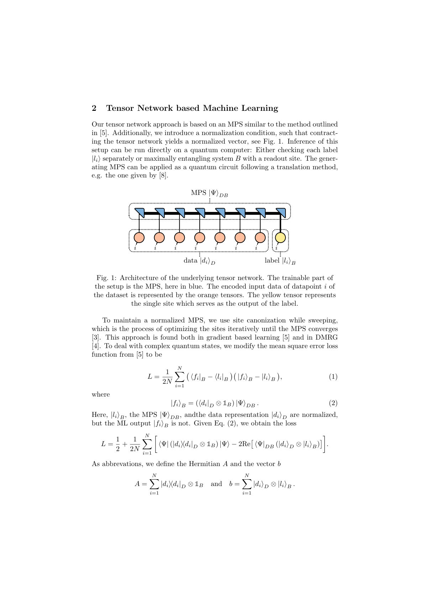
<figcaption class="paper-figure-caption"><b>Fig 1.</b> Low-resolution page preview, page 2</figcaption>
</figure>
<figure class="paper-figure-card">
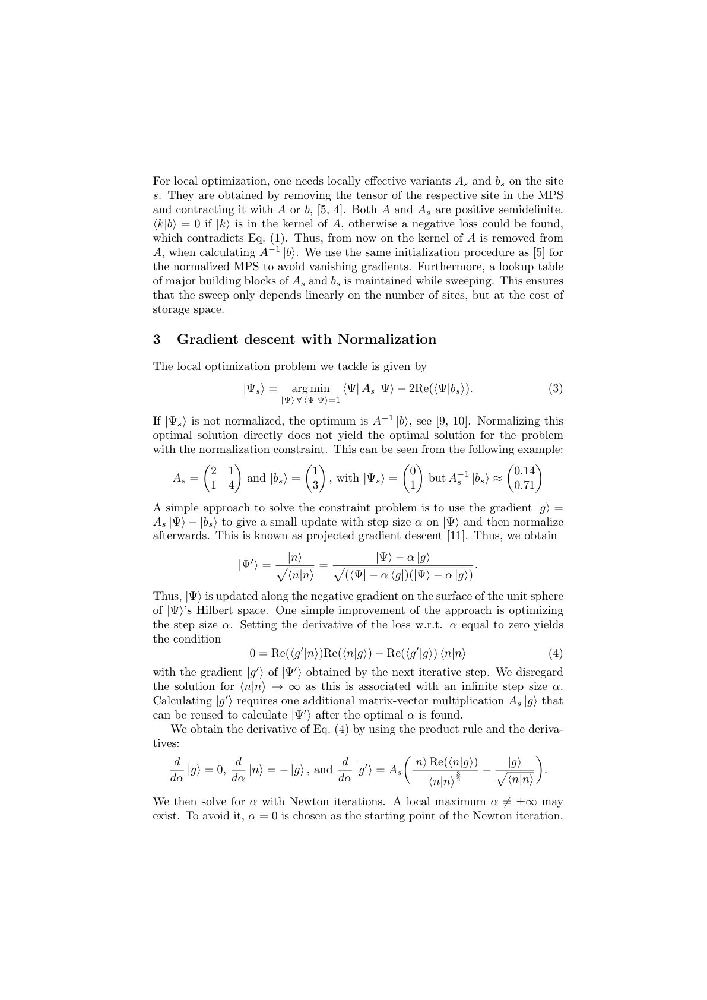
<figcaption class="paper-figure-caption"><b>Fig 2.</b> Low-resolution page preview, page 3</figcaption>
</figure>
<figure class="paper-figure-card">
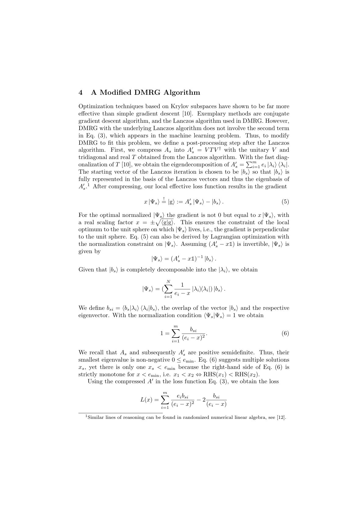
<figcaption class="paper-figure-caption"><b>Fig 3.</b> Low-resolution page preview, page 4</figcaption>
</figure>
<figure class="paper-figure-card">
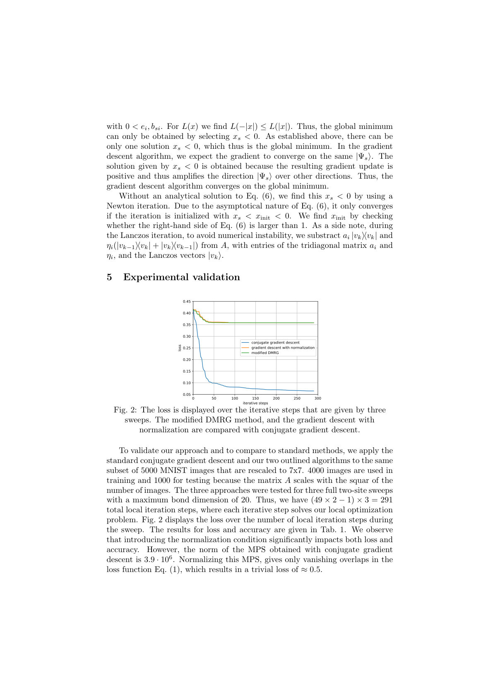
<figcaption class="paper-figure-caption"><b>Fig 4.</b> Low-resolution page preview, page 5</figcaption>
</figure>
<figure class="paper-figure-card">
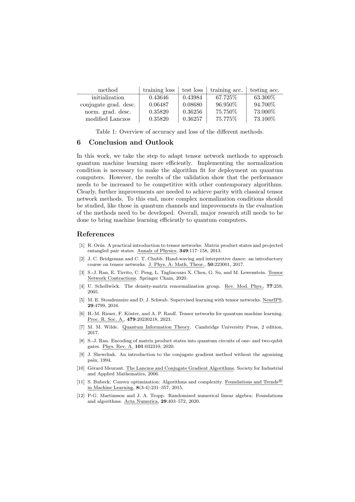
<figcaption class="paper-figure-caption"><b>Fig 5.</b> Low-resolution page preview, page 6</figcaption>
</figure>

**Summary.** This paper adapts Tensor Network methods, specifically using the MPS ansatz, for machine learning tasks by enforcing a global quantum normalization constraint. It compares gradient descent and a modified DMRG approach for optimizing the network parameters. The work shows that these quantum-inspired optimization techniques can achieve high accuracy on classical datasets, advancing the field of quantum machine learning.

**Why it may be interesting.** It bridges the gap between advanced quantum simulation techniques (DMRG, TNs) and modern machine learning optimization, providing a concrete framework for quantum machine learning.

Detailed structure

**Main problem.** The paper addresses the challenge of adapting Tensor Network (TN) methods, originally from quantum many-body physics, for use in classical machine learning by enforcing a global normalization condition.

**Main result.** The modified DMRG approach achieves performance comparable to gradient descent methods, demonstrating that incorporating the normalization constraint significantly improves both the loss and accuracy of the learning process.

**Method.** The authors compare two optimization techniques—gradient descent and an adaptation of DMRG—for optimizing the parameters of a Matrix Product State (MPS) ansatz.

**Model / system.** The core model is an MPS ansatz used to represent a quantum state, which is then optimized using ML loss functions derived from data (e.g., MNIST dataset).

**Key observables.** Loss function (L), training/testing accuracy, and the norm of the MPS.

**Important parameters / regimes.** The step size $\alpha$ in gradient descent, and the bond dimension used in the MPS representation.

**Assumptions / limitations.** The DMRG adaptation requires a post-processing step because the standard algorithm does not naturally incorporate the full ML loss function gradient term.

**Figures summary.** Figure 1 illustrates the MPS architecture; Figure 2 compares the loss convergence over iterative steps for different optimization methods; Table 1 provides a quantitative comparison of accuracy and loss.

**Paper structure.** The paper introduces the problem, details the mathematical formulation of the loss function and the two optimization methods (gradient descent and DMRG adaptation), presents quantitative comparisons in a table, and discusses the results and limitations.

Abstract

Tensor Networks are a relatively new machine learning approach. The architectures proposed initially are inspired by approaches from quantum many-body physics simulations. One common layout is the matrix product state (MPS) also known as a tensor train optimized with gradient descent techniques. We introduce a global normalization condition, so that the MPS represents a quantum state. We investigate two optimization methods that find the locally optimal tensors and compare them regarding their effectiveness. One is based on gradient descent and the other on an adaptation of DMRG.

[↑ back to top](#top)

### [Quantum-Logic Tsetlin Machines: Interpretable Quantum Machine Learning with Commuting Projector Clauses](http://arxiv.org/abs/2608.18659v1)

**Authors:** Krishna Bhatia  
**Type:** both · **Category:** quantum information and computing · **PDF:** <https://arxiv.org/pdf/2608.18659v1>  
**Analysis basis:** full PDF text, analyzed in chunks
**Topic relevance:** `quantum measurements` **3/5**

↔ Scroll figures horizontally

<figure class="paper-figure-card">
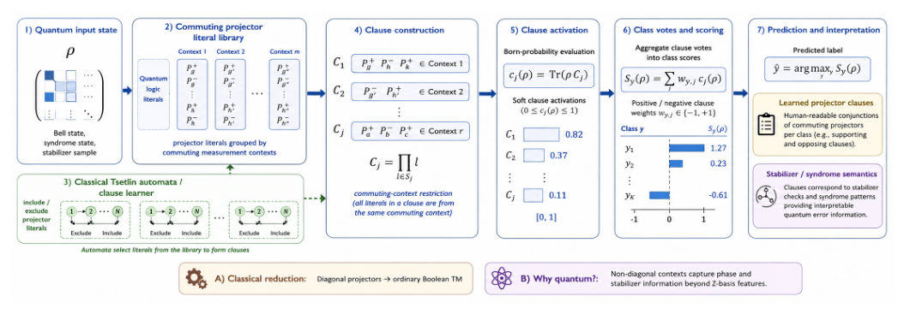
<figcaption class="paper-figure-caption"><b>Fig 1.</b> Fig. 1. QL-TM pipeline. A quantum state is evaluated through a library of commuting projector literals. Automata select literals into clauses, each clause produces a Born-probability activation, and class scores are formed from clause votes.</figcaption>
</figure>
<figure class="paper-figure-card">
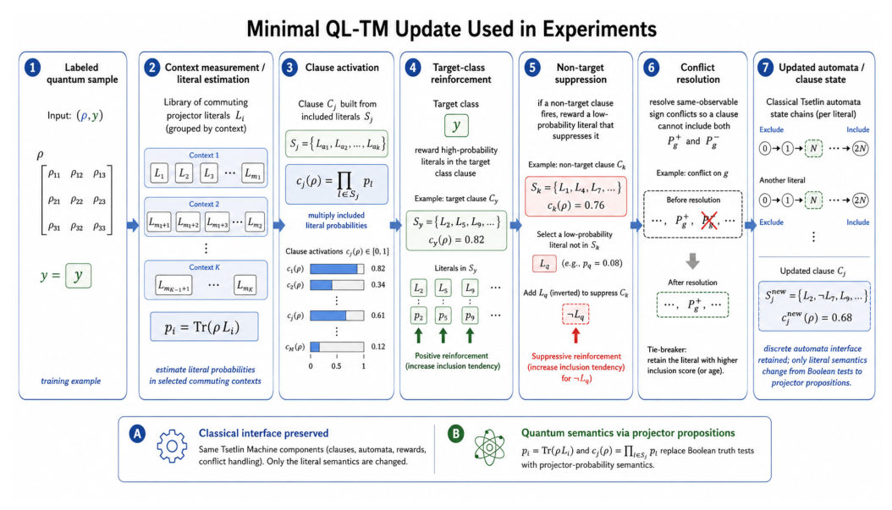
<figcaption class="paper-figure-caption"><b>Fig 2.</b> Fig. 2. Minimal QL-TM update used in the experiments. Classical finite-state include/exclude automata are retained while Boolean literal truth values are replaced by projector Born probabilities within commuting contexts.</figcaption>
</figure>
<figure class="paper-figure-card">
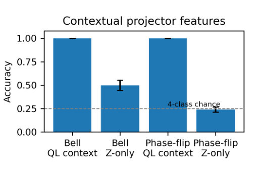
<figcaption class="paper-figure-caption"><b>Fig 3.</b> Fig. 3. Context advantage for TinyProjectorTsetlin. Non-diagonal QL contexts solve the tasks, while diagonal Z-only contexts lose the relevant phase/syndrome information.</figcaption>
</figure>
<figure class="paper-figure-card">

<figcaption class="paper-figure-caption"><b>Fig 4.</b> Fig. 4 and Table IV show the stronger randomized task. For k = 4, the classifier must distinguish 16 syndrome classes. The true QL context achieves 1.000 accuracy for n = 5 and n = 6, while wrong QL contexts remain near chance. Diagonal Z contexts sometimes extract weak accidental information but remain far below the true context. The representative random task clauses have the form</figcaption>
</figure>
<figure class="paper-figure-card">
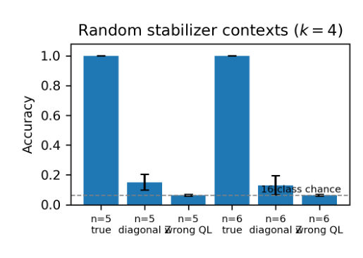
<figcaption class="paper-figure-caption"><b>Fig 5.</b> Fig. 4. Random 16-class stabilizer tasks using TinyProjectorTsetlin. The correct QL context solves the task; wrong non-diagonal contexts remain at the chance level.</figcaption>
</figure>

**Summary.** This paper introduces the Quantum-Logic Tsetlin Machine (QL-TM), an interpretable quantum machine learning model that extends classical TMs to use quantum projectors. It demonstrates that by restricting clauses to commuting contexts, the QL-TM can successfully learn and classify quantum correlations, recovering physically meaningful information that is lost in simpler, diagonal measurements.

**Why it may be interesting.** It provides a concrete, theoretically grounded framework for interpreting quantum correlations using established classical learning paradigms, bridging quantum logic structures (like stabilizer codes) with machine learning interpretability.

Detailed structure

**Main problem.** To develop an interpretable quantum machine learning model that generalizes classical Tsetlin Machines (TMs) by replacing Boolean literals with quantum projectors.

**Main result.** The Quantum-Logic Tsetlin Machine (QL-TM) successfully recovers physically meaningful quantum clauses, achieving high accuracy on tasks like Bell state classification, which fails when restricted to diagonal measurements.

**Method.** The model uses a hybrid approach where classical finite-state automata select clauses, and clause activation is determined by the Born probability of the joint projector of quantum propositions.

**Model / system.** The model operates on quantum states ($
ho$) on a finite-dimensional Hilbert space, using projectors ($P$) as literals and restricting clauses to commuting measurement contexts, linking the framework to stabilizer and syndrome semantics.

**Key observables.** Clause activation probability ($	ext{Tr}(
ho C_j)$), classification accuracy, and performance degradation following the predicted $2^{b-k}$ separability ladder.

**Important parameters / regimes.** Noise levels (depolarizing $p$), number of shots, and the context-budget ratio ($b$ vs $k$).

**Assumptions / limitations.** The model is not a quantum Turing machine; the joint activation $	ext{Tr}(
ho igotimes L_i)$ is not guaranteed to equal the product of marginals, requiring a lightweight training surrogate.

**Figures summary.** Figures illustrate the QL-TM pipeline, showing context advantage (non-diagonal vs. diagonal contexts), and demonstrating performance degradation following the predicted separability ladder.

**Paper structure.** The paper introduces the QL-TM, proves its reduction to classical TMs in diagonal bases, and then validates its capability through controlled experiments on Bell states, phase-flip syndromes, and randomized stabilizer tasks under varying noise and context constraints.

Abstract

Tsetlin Machines (TMs) learn interpretable Boolean clauses using finite-state automata. We introduce the Quantum-Logic Tsetlin Machine (QL-TM), which replaces Boolean literals with quantum propositions represented by projectors while retaining classical include/exclude automata. Clauses are restricted to commuting measurement contexts and activate through the Born probability of their joint projector. We prove an exact reduction to ordinary Boolean TM clauses in diagonal computational-basis contexts and connect Pauli-projector clauses to stabilizer and syndrome semantics. Controlled experiments on Bell states, phase-flip syndromes, randomized 16-class stabilizer tasks, mixed literal pools, context-budget ablations, and finite-shot noise show that correct non-diagonal contexts recover physically meaningful clauses, while diagonal or wrong contexts lose the relevant phase/syndrome information. The context-budget results closely follow the predicted separability ladder 2^(b-k) as true stabilizer generators are removed. The contribution is a controlled bridge between Tsetlin clause learning and quantum logic, not a claim of quantum advantage.

[↑ back to top](#top)

### [Real Classical Shadows with Noise](http://arxiv.org/abs/2608.18935v1)

**Authors:** Atharva Hingane, Dax Enshan Koh  
**Type:** theory · **Category:** quantum information and computing · **PDF:** <https://arxiv.org/pdf/2608.18935v1>  
**Analysis basis:** full PDF text, analyzed in chunks
**Topic relevance:** `quantum measurements` **3/5**

↔ Scroll figures horizontally

<figure class="paper-figure-card">
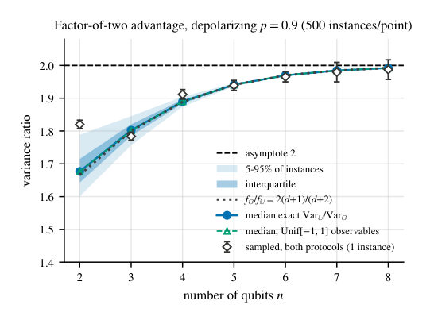
<figcaption class="paper-figure-caption"><b>Fig 1.</b> Figure 1: Exact variance ratio VarU / VarO under depolarizing noise (p = 0.9) from (28)–(29), over 500 independent (ρ, O) instances per point: median (circles), interquartile and 5–95% bands. Observables are random symmetric matrices made traceless and normalized; states are random mixed. The ratio rises monotonically toward the noise-independent asymptote 2 (dashed) and concentrates with n. Triangles: medians for the observable distribution of [6]. Dotted: the depolarizing-parameter ratio (19). Diamonds: the ratio measured by simulating both protocols on one instance per n, with 95% confidence intervals; 2.5 × 105 shots per protocol for n ≤6 and 6.8 × 104 for n = 7, 8, the confidence...</figcaption>
</figure>
<figure class="paper-figure-card">
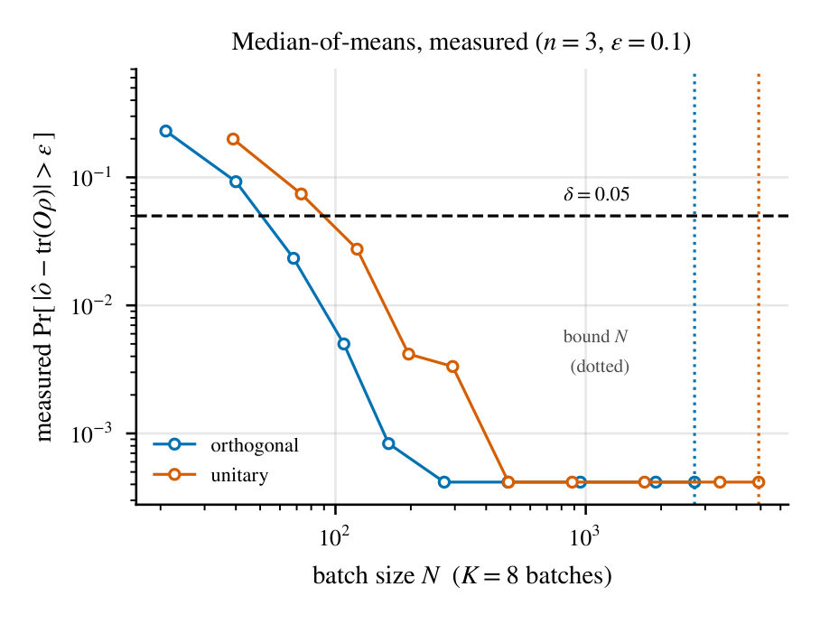
<figcaption class="paper-figure-caption"><b>Fig 2.</b> Figure 2: The median-of-means estimator of Corollary 3.9, run: measured Pr[|ˆo −tr(Oρ)| &gt; ε] against batch size N at fixed K = 8, for ε = 0.1, δ = 0.05, M = 1, n = 3 and the unit-2-norm transverse-field Ising energy; 1200 repetitions per point, the floor being zero observed failures. Dotted verticals mark the N the guarantee prescribes. The guarantee holds with wide margin and is loose by a factor of about 40 in N for both ensembles.</figcaption>
</figure>
<figure class="paper-figure-card">
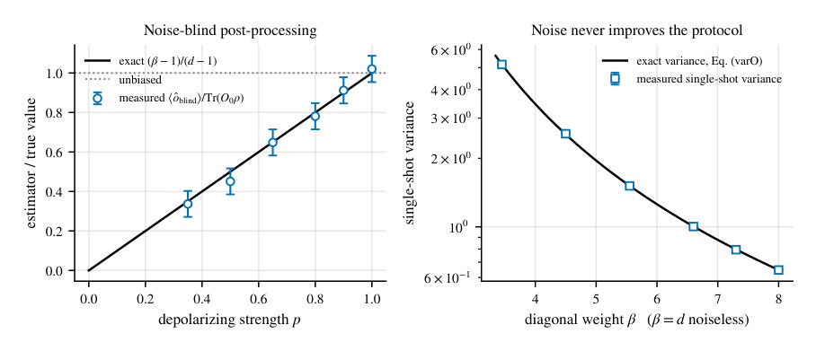
<figcaption class="paper-figure-caption"><b>Fig 3.</b> Figure 3: Two statements of this Part, run rather than only derived (n = 3, 4 × 105 shots per point, 95% confidence intervals). Left: the noise-blind protocol of Remark 3.5, in which snapshots produced under Dn,p are post-processed with the noiseless inverse M−1 O,1. The measured ratio E[ˆoblind]/ tr(O0ρ) follows the predicted multiplicative bias (β −1)/(d −1) of (20), which for depolarizing noise is exactly p. Because the bias multiplies the signal rather than shifting it, the line passes through the origin and no amount of averaging removes it. Right: the same protocol post-processed correctly. The measured single-shot variance tracks (28) and rises monotonically as β falls from its...</figcaption>
</figure>
<figure class="paper-figure-card">
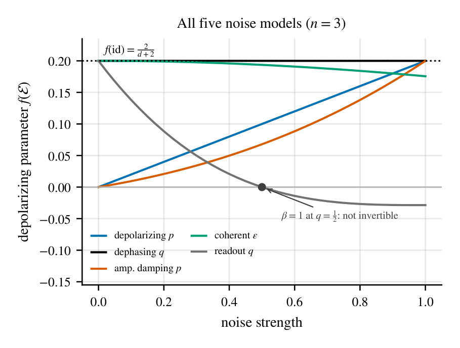
<figcaption class="paper-figure-caption"><b>Fig 4.</b> Figure 4: The depolarizing parameter f(E) = 2(β−1) (d−1)(d+2) for all five noise models of Section 3.4 (n = 3), against the noiseless value f(1) = 2/(d + 2) (dotted). Because dephasing is diagonal-preserving, β = d at every strength and f is flat at f(1). Readout bit-flip at rate q has β = d(1 −q)n, which vanishes to β = 1 at q = 1</figcaption>
</figure>
<figure class="paper-figure-card">
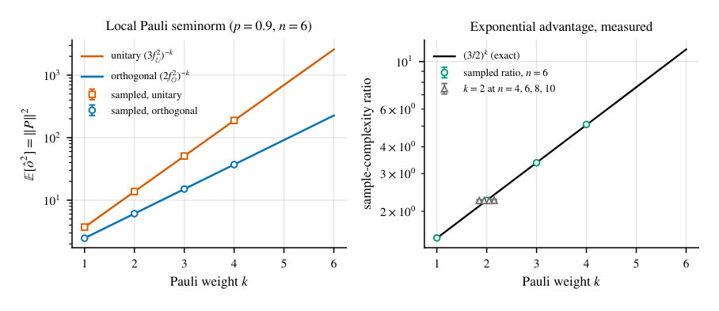
<figcaption class="paper-figure-caption"><b>Fig 5.</b> Figure 5: Local Pauli shadow seminorm under single-qubit depolarizing noise (p = 0.9). Left: the orthogonal (2f 2 1 )−wt of (57) and the unitary (3f 2 1,U)−wt (lines) against the measured single-shot second moment at n = 6 (markers, 95% CI). The prediction is exact rather than an upper bound, because at d = 2 the contracted third moment is a multiple of the identity (for a real basis this is the computation Rj = 1</figcaption>
</figure>

**Summary.** This paper provides a comprehensive theory for the real classical shadows protocol under realistic noise models. It derives exact formulas for the single-shot variance using advanced group theory techniques. The key finding is that the protocol's theoretical advantages are robust and remain intact even when significant noise is present.

**Why it may be interesting.** It provides rigorous, noise-resilient bounds for quantum state estimation protocols, which is crucial for designing practical quantum measurements on noisy hardware.

Detailed structure

**Main problem.** To develop a complete theoretical understanding of the 'real classical shadows protocol' when the underlying quantum evolution is corrupted by a known, completely positive trace-preserving (CPTP) noise channel.

**Main result.** The protocol maintains its theoretical sample-complexity advantages under noise, showing that the factor-of-two advantage for global observables is uniform in the noise for large observables.

**Method.** The analysis utilizes the Weingarten calculus of the orthogonal group and the Brauer algebra to derive the exact single-shot variance and shadow seminorm for the noisy orthogonal shadow channels.

**Model / system.** The study concerns quantum state estimation using the real classical shadows protocol, which employs the orthogonal (real Clifford) ensemble instead of the standard unitary ensemble. The noise is modeled by a known CPTP channel acting after the orthogonal evolution.

**Key observables.** Single-shot variance, shadow seminorm, and the sample-complexity bound ($N_{tot}$).

**Important parameters / regimes.** The noise channel $E$, the dimension $d$, and the dimensionless parameter $eta$ characterizing the noise impact.

**Assumptions / limitations.** The noise channel $E$ is known in advance, and the analysis relies on the orthogonal group structure.

**Paper structure.** The paper builds theory in modular parts, analyzing global and local measurements separately, and treating complex bases via a reality parameter, culminating in the derivation of exact variance formulas.

Abstract

The real classical shadows protocol of West et al. replaces the unitary (Clifford) ensemble of the Huang--Kueng--Preskill scheme by the orthogonal (real Clifford) ensemble, and for symmetric observables achieves strictly smaller estimator variances: a factor approaching two for global evolution and an exponential factor $(3/2)^k$ for $k$-local real Pauli observables. Real hardware, however, never implements the ideal evolution. Building on the noisy classical shadows framework of Koh and Grewal, we give a complete theory of the real classical shadows protocol in the presence of a known completely positive trace-preserving noise channel acting after the orthogonal evolution. We derive the noisy global and local orthogonal shadow channels from first principles using the Weingarten calculus of the orthogonal group, prove that each is a depolarizing channel acting on the symmetric (respectively locally symmetric) component of its input, and derive from it the exact single-shot variance in closed form, together with the associated shadow seminorm, two-sided bounds on it, and the resulting sample-complexity guarantees. We prove that the noiseless sample-complexity advantages survive intact under noise. Because the variances are exact rather than bounded, the ratio is controlled by a single dimensionless parameter, which gives a closed-form criterion for when the factor of two is attainable: both the second-moment and the variance ratio reach it exactly when the observable's norm profile grows, and the noise enters that limit only through a factor lying within $2/(d+2)$ of two, so the advantage is uniform in the noise. For rank-one targets it is provably unattainable, saturating strictly below two. The local real-Pauli advantage remains $(3/2)^k$. We treat complex measurement bases through a reality parameter and a transposed-noise scalar, recovering unitary shadows in the appropriate limit.

[↑ back to top](#top)

### [Subsystem Symmetries and Fracton Models in Quantum Error Correction](http://arxiv.org/abs/2608.18961v1)

**Authors:** Giovanni Canossa  
**Type:** theory · **Category:** quantum information and computing · **PDF:** <https://arxiv.org/pdf/2608.18961v1>  
**Analysis basis:** full PDF text, analyzed in chunks
**Topic relevance:** `analog quantum simulation` **3/5**

↔ Scroll figures horizontally

<figure class="paper-figure-card">
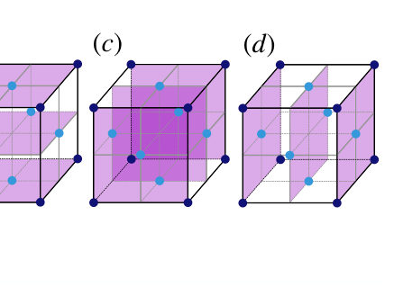
<figcaption class="paper-figure-caption"><b>Fig 1.</b> Figure 2.1: Illustration of the FCC unit cell of the Tetrahedral Ising model. Blue and cyan circles represent vertices v = (𝑥, 𝑦, 𝑧) ∈(2Z)3 and face centers of an FCC lattice, respectively. The red and green tetrahedra show an example of the Î a 𝑆v+a and Î a 𝑆v−a interaction terms, respectively, where a ∈{(0, 0, 0), (1, 1, 0), (1, 0, 1), (0, 1, 1)} labels the four FCC sublattices. The entire lattice can be intuitively visualized with small cubes: Each shaded (empty) cube contains a single red (green) tetrahedron interaction. (b–d) Representative planar subsystem symmetries acting on 𝑋𝑌, 𝑌𝑍and 𝑋𝑍planes respectively. In each case, spins within a given plane are flipped collectively while...</figcaption>
</figure>
<figure class="paper-figure-card">
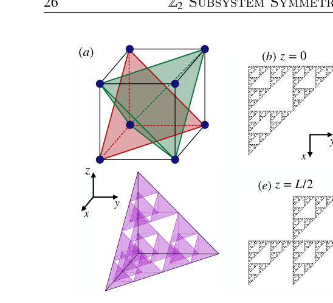
<figcaption class="paper-figure-caption"><b>Fig 2.</b> Figure 2.2: (a) Unit cell of the Fractal Ising model on a simple cubic lattice. Spins (blue spheres) reside on the lattice vertices at positions v = (𝑥, 𝑦, 𝑧) ∈Z3. The red and green tetrahedra represent the nearest-neighboring and next-nearest-neighboring interaction terms Î a1 𝑠v+a1 and Î a2 𝑠v+a2, respectively, with a1 ∈{(0, 0, 0), (1, 0, 0), (0, 1, 0), (0, 0, 1)} and a2 ∈{(0, 0, 0), (1, 1, 0), (1, 0, 1), (0, 1, 1)}. The model exhibits a subextensive number of fractal subsystem symmetries. (b-g) Pattern of spin-flips associated with a representative fractal symmetry operator 𝑋( 𝑓) corresponding to (𝑐0, 𝑐1) = (1, 1) in a periodic system of linear size 𝐿= 128. The flipped spins (black...</figcaption>
</figure>
<figure class="paper-figure-card">
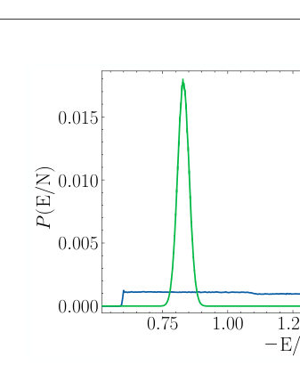
<figcaption class="paper-figure-caption"><b>Fig 3.</b> Figure 2.3: Example of the flat energy histograms at the estimated transition point obtained through the multicanonical simulation of the Tetrahedral Ising model. The flat distribution denotes the system’s ability to visit mixed-phase configurations, thus facilitating the exploration of both phases and overcoming supercritical slowing down. From these results, the canonical reweighted distribution can then be derived.</figcaption>
</figure>
<figure class="paper-figure-card">
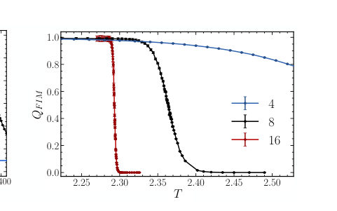
<figcaption class="paper-figure-caption"><b>Fig 4.</b> Figure 2.4: Behavior of the order parameters of the TIM (left) and FIM (right) as a function of temperature for different system sizes 𝐿. In both models, the order parameter exhibits an abrupt jump to its low-temperature saturation value just below the respective transition temperature, reflecting the strongly first-order character of the transition. For the FIM, saturation of the fractal order parameter is observed only for system sizes belonging to the 𝐿= 2𝑛family, which support non-trivial fractal subsystem symmetries. Other lattice sizes either display only trivial global ordering or remain effectively disordered within the accessible system sizes.</figcaption>
</figure>
<figure class="paper-figure-card">
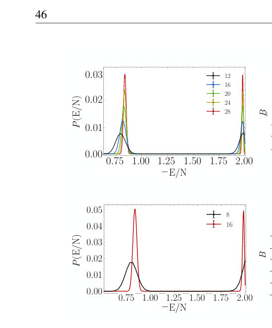
<figcaption class="paper-figure-caption"><b>Fig 5.</b> Figure 2.5: Energy histograms (left column) and Binder cumulants (right column) for TIM (first row) and FIM (second row), computed with multicanonical simulations in the proximity of the phase transitions. The behavior of the dips in the Binder cumulants and the double peaks in the energy histograms for growing lattice sizes confirm the presence of a strong first-order phase transition in both models.</figcaption>
</figure>

**Summary.** This paper explores how symmetries present in classical statistical models, specifically 3D Ising models, can be leveraged to construct novel quantum error-correcting codes known as fracton codes. By analyzing the connection between subsystem symmetries and topological order, the authors establish these codes as highly resilient candidates for quantum memories. The work provides a powerful statistical-mechanical framework for designing robust quantum information protocols.

**Why it may be interesting.** It bridges concepts from condensed matter (topological order, Ising models) directly into quantum information theory (QEC), providing a physical mechanism (subsystem symmetries) for generating highly robust quantum codes.

Detailed structure

**Main problem.** The central challenge is developing new quantum error-correcting codes and understanding their error resilience for robust quantum memories.

**Main result.** The study establishes fracton codes as highly resilient candidates for quantum memories, determining the optimal code-capacity threshold for the Checkerboard code to be 0.107(3).

**Method.** The research uses a statistical-mechanical mapping that connects classical Ising models with subsystem symmetries to the construction and analysis of quantum error-correcting codes.

**Model / system.** The work investigates the interplay between classical Ising models (specifically 3D self-dual models like Tetrahedral and Fractal Ising models) and quantum error correction via subsystem symmetries and fracton topological order.

**Key observables.** Optimal code-capacity threshold, thermal behavior, and the structure of logical operators in the resulting fracton codes.

**Important parameters / regimes.** The optimal error threshold (e.g., 0.107(3)), and the dimensionality (3D) of the studied models.

**Assumptions / limitations.** The analysis relies on the statistical-mechanical framework and its predictions regarding generalized entropy relations for dual classical spin models.

**Figures summary.** Not specified, but the notes mention figures related to phase transitions, order parameters, and energy histograms from the underlying simulation work.

**Paper structure.** The thesis progresses logically from studying classical spin models with subsystem symmetries, to deriving the associated fracton phases, and finally applying these findings to quantify the error-correcting performance of the resulting codes.

Abstract

Constructing new quantum codes and understanding their error resilience are central challenges in the development of robust quantum memories. Topological codes are particularly promising due to their favorable error-correcting properties and their connections to phases of matter in many-body physics. In this thesis, we explore the interplay between classical Ising models and quantum error correction through subsystem symmetries, fracton topological order, and Kramers-Wannier-type duality. We study two three-dimensional classical self-dual Ising models with subsystem symmetries, the Tetrahedral Ising model and the Fractal Ising model, investigating their thermal behavior, their relation to fracton phases through subsystem-symmetry gauging, and the properties of the resulting fracton codes. Using a statistical-mechanical mapping, we determine the optimal code-capacity threshold of the Checkerboard code to be $0.107(3)$, which saturates the theoretical limit for CSS codes and represents the highest optimal error threshold among known three-dimensional codes. We relate this saturation to a generalized entropy relation for classical spin models satisfying a Kramers-Wannier-type duality, and argue how this prediction extends to CSS codes with zero encoding rate whose $X$- and $Z$-noise models map to classically dual spin models. These findings establish fracton codes as highly resilient candidates for quantum memories and demonstrate the power of the statistical-mechanical framework, together with its duality predictions, in analyzing and constructing robust quantum error-correcting codes.

[↑ back to top](#top)

### [Symmetric $N \to M$ telecloning and remote quantum state inference](http://arxiv.org/abs/2608.18223v1)

**Authors:** Adam G. Hawkins, Hannah McAleese, Hyukjoon Kwon  
**Type:** theory · **Category:** quantum information and computing · **PDF:** <https://arxiv.org/pdf/2608.18223v1>  
**Analysis basis:** full PDF text, analyzed in chunks
**Topic relevance:** `quantum measurements` **3/5**

↔ Scroll figures horizontally

<figure class="paper-figure-card">
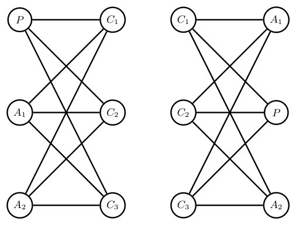
<figcaption class="paper-figure-caption"><b>Fig 1.</b> FIG. 1. Entanglement structure in the |ψT⟩state for the M = 3 protocol [21]. The presence of two-qubit entanglement is indi- cated by a solid black line between nodes. Left: Alice’s sys- tem PA is shown on the left-hand side, while the receivers C are pictured on the right-hand side. Right: To emphasize the permutation-invariance of the qubits within |ψT⟩, we display an alternative arrangement with a different qubit chosen as the port. For any choice of P, the qubits on the other side of the diagram become the receivers.</figcaption>
</figure>
<figure class="paper-figure-card">
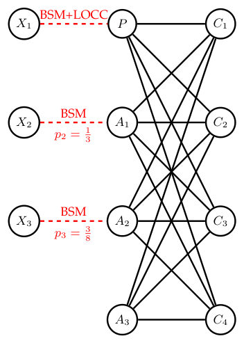
<figcaption class="paper-figure-caption"><b>Fig 2.</b> FIG. 2. Diagrammatic representation of the 3 →4 telecloning protocol. A red dashed line represents a BSM. After the first BSM, LOCC needs to be performed on each qubit in system AC according to Table I to ensure unit success probability. For the kth successful BSM, the resulting fidelity will be γ(k, 4).</figcaption>
</figure>
<figure class="paper-figure-card">
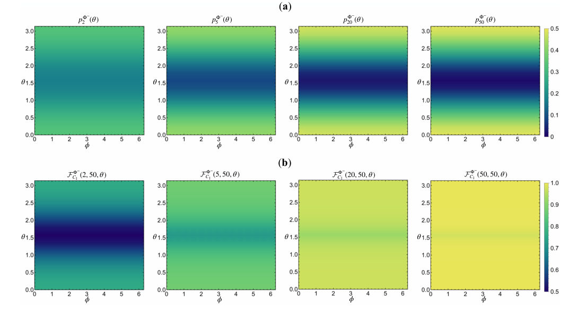
<figcaption class="paper-figure-caption"><b>Fig 3.</b> FIG. 3. Heatmaps showing the |φ⟩X-dependent probability and fidelity functions — as a function of the Bloch variables — when the kth BSM outcome is Φ−</figcaption>
</figure>
<figure class="paper-figure-card">
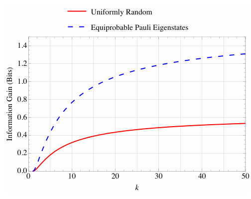
<figcaption class="paper-figure-caption"><b>Fig 4.</b> FIG. 4. The KL divergence (in bits) plotted against k. This is shown for uniformly random input states [DΠ KL(k)] and equal probability of each of the six Pauli eigenstates [DΠ KL,d(k)].</figcaption>
</figure>
<figure class="paper-figure-card">
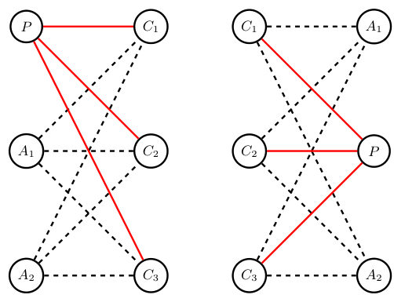
<figcaption class="paper-figure-caption"><b>Fig 5.</b> FIG. 5. A re-working of Fig. 1 to show the necessary entan- glement structure in the ρP AC state for the 1 →3 protocol. The presence of necessary pairwise entanglement is shown by solid red lines between nodes, while unnecessary pairwise en- tanglement is indicated by a dashed black line. The symmetric nature of the resource is again exemplified by the freedom of choice of P.</figcaption>
</figure>

**Summary.** This paper presents a new, resource-efficient protocol for telecloning an unknown quantum state across multiple distant receivers ($M$). By using only sequential Bell state measurements, it achieves high fidelity independent of the number of receivers. Furthermore, it rigorously analyzes how receivers can still gain significant information about the state even if the direct cloning fidelity is imperfect.

**Why it may be interesting.** The focus on resource efficiency (avoiding global POVMs) and the detailed analysis of information retention even when the primary cloning fidelity is sub-optimal is highly relevant to practical quantum network design and quantum communication protocols.

Detailed structure

**Main problem.** The paper investigates the feasibility and performance of symmetric $N 	o M$ telecloning, extending quantum state teleportation to multiple receivers ($M \ge N$) using $N$ copies of an unknown state.

**Main result.** A novel protocol using only sequential Bell state measurements (BSMs) achieves a fidelity that saturates the no-cloning bound, and the success probability is independent of the number of receivers $M$.

**Method.** The authors develop a probabilistic protocol based on sequential BSMs, mathematically analyzing the resulting state fidelity, success probabilities, and the information gain from unsuccessful measurements.

**Model / system.** The system involves teleporting an unknown quantum state $|\varphi
angle_X$ across a network to $M$ spatially separated receivers, utilizing $N$ copies of the state and auxiliary qubits.

**Key observables.** Fidelity of the reduced state ($\gamma(N, M)$), success probability ($p_k$), and the level of remote quantum state inference confidence.

**Important parameters / regimes.** The number of copies ($N$), the number of receivers ($M$), and the number of successful/unsuccessful BSM outcomes ($k, 
u$).

**Assumptions / limitations.** The protocol is probabilistic, and the analysis relies on postselection on specific BSM outcomes.

**Figures summary.** Figures illustrate the entanglement structure for $M=3$ and provide heatmaps comparing probability and fidelity functions for different BSM outcomes ($\Psi_\pm$).

**Paper structure.** The paper progresses from introducing the problem and comparing it to global POVM methods, to detailing the sequential BSM protocol, proving its covariance and fidelity bounds, and finally analyzing the state-dependent outcomes resulting from unsuccessful measurements using difference operators.

Abstract

Teleporting unknown quantum states between distant nodes of a network is a significant feature of quantum communication. Few studies, however, have been conducted on $N \to M$ telecloning, in which $N$ copies of an unknown quantum state are optimally teleported to $M \geq N$ receivers. Previous work requires global POVMs on all copies and auxiliaries; here, we show that symmetric $N \to M$ telecloning can be probabilistically performed using only sequential (or parallel) Bell state measurements (BSMs), allowing the copies to be spatially separated. When successful, the fidelity of each receiver's reduced state saturates the bound imposed by the no-cloning theorem, with the probability of success being independent of $M$. In the case of an `unsuccessful' BSM, we show that the teleportation fidelity is likely to remain high, with the measurement outcome also providing information about the closest Pauli eigenbasis to the unknown state being telecloned. In this sense, each receiver can remotely infer the unknown quantum state with a level of confidence that scales with the number of copies, even if the fidelity of their own reduced state is sub-optimal. We additionally analyze the required resources to ensure the classical-communication fidelity bound is surpassed, both in terms of two-qubit inseparability and varying classes of multipartite entanglement. Surprisingly, we uncover that, at a given iteration of the protocol, pairwise entanglement is not always necessary to increase the teleportation fidelity and is never required to beat the classical bound for $N \geq 2$.

[↑ back to top](#top)

### [Interior skin focusing and directional mirror transfer in a graded non-Hermitian Krawtchouk network](http://arxiv.org/abs/2608.18800v1)

**Authors:** Y. S. Liu, X. Z. Zhang  
**Type:** theory · **Category:** disordered systems and neural networks · **PDF:** <https://arxiv.org/pdf/2608.18800v1>  
**Analysis basis:** full PDF text, analyzed in chunks
**Topic relevance:** `analog quantum simulation` **2/5** · `correlated / nonlocal dissipation` **2/5** · `driven-dissipative phase transition` **2/5** · `methods for driven-dissipative` **2/5** · `non-equilibrium universality` **2/5** · `Keldysh / 2PI / non-Gaussian methods` **1/5** · `interference shaping light` **1/5**

↔ Scroll figures horizontally

<figure class="paper-figure-card">
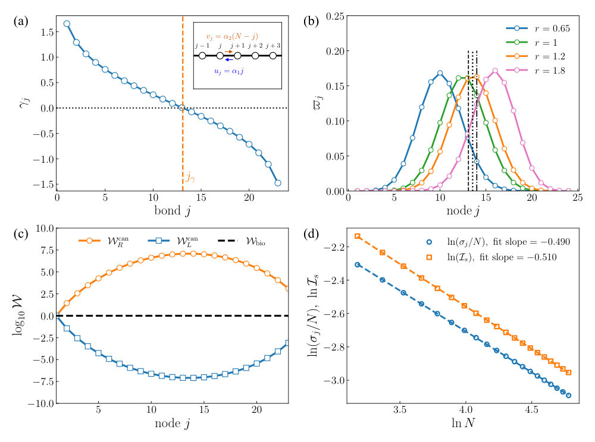
<figcaption class="paper-figure-caption"><b>Fig 1.</b> FIG. 1. Graded imaginary gauge field and the resulting similarity structure. (a) Directed hoppings and γj for N = 24 and r = 1.2, which lies in the finite-chain focusing regime; jγ = Np = 13.09 marks the sign change. The inset schematically depicts the Hamiltonian in Eq. (1) for a nonreciprocal graded hopping chain, with orange and blue arrows denoting the rightward hopping amplitude vj = α2(N −j) and the leftward hopping amplitude uj = α1j, respectively. (b) Normalized envelopes ϖj. For r = 1.2, the line styles mark jγ = 13.09, jc = 13.55, and the discrete maximizer jmax = 14. (c) Canonical basis-integrated weights Wcan R = s2 j, Wcan L = s−2 j , and Wbio = 1, plotted as log10 W. The...</figcaption>
</figure>
<figure class="paper-figure-card">
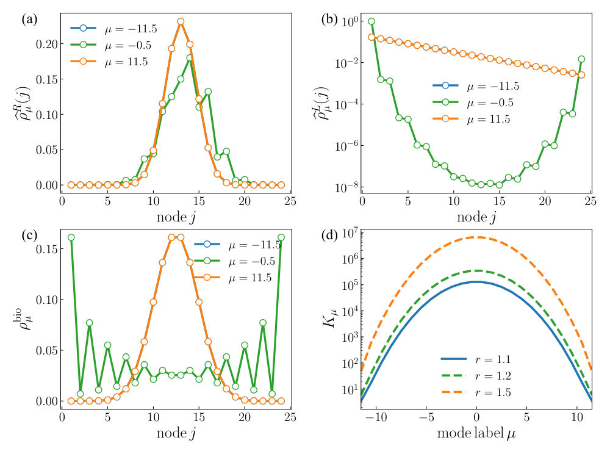
<figcaption class="paper-figure-caption"><b>Fig 2.</b> FIG. 2. Mode-resolved eigenvector structure for N = 24. (a,b) Euclidean-normalized right and left densities at r = 1.2 for three modes; panel (b) uses a logarithmic y axis. (c) Biorthogonal density ρbio µ (j) = |ϕµ(j)|2. (d) Rescaling-invariant Petermann factor Kµ for the displayed values of r, shown on a logarithmic y axis. Colors identify the modes in panels (a)-(c), and line styles identify r in panel (d). In panels (a)-(c), the orange line overlaps with the blue line.</figcaption>
</figure>
<figure class="paper-figure-card">
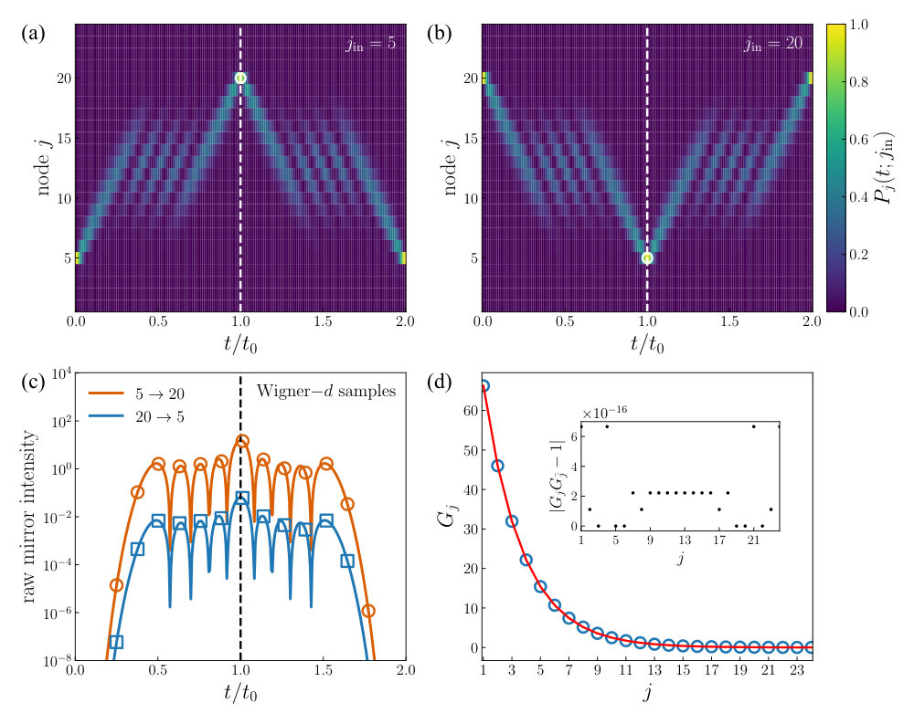
<figcaption class="paper-figure-caption"><b>Fig 3.</b> FIG. 3. Direction-selective mirror dynamics in the same N = 24, r = 1.2 open network. (a) Node distribution Pj(t; 5). (b) Reverse distribution Pj(t; 20). The two heat maps are independently normalized according to Eq. (28); they show routing but not gain. Gain information is retained in panel (c), which shows the raw mirror intensities from direct matrix exponentiation, analytic Wigner-d samples, and filled markers at t = t0. (d) Exact mirror gain Gj = rN+1−2j and direct numerical values. The inset shows the reciprocal-product residual |GjG¯j −1|.</figcaption>
</figure>
<figure class="paper-figure-card">
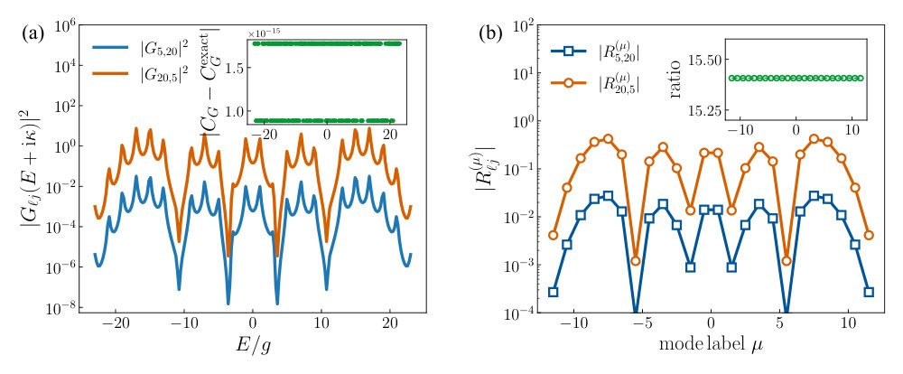
<figcaption class="paper-figure-caption"><b>Fig 4.</b> FIG. 4. Clean Green-function response for N = 24, r = 1.2, j = 5, ¯j = 20, and κ = 0.12g. (a) Directional intensities |G20,5(E + iκ)|2 and |G5,20(E + iκ)|2 on a logarithmic scale. Their resonances occur at the same pole positions. The inset shows the residual CG(E) −Cexact G , where Cexact G = 2(N + 1 −2j) ln r. (b) Absolute residues in the two directions on a single logarithmic y axis. The inset shows their mode-independent ratio |R(µ) 20,5|/|R(µ) 5,20| = rN+1−2j.</figcaption>
</figure>
<figure class="paper-figure-card">
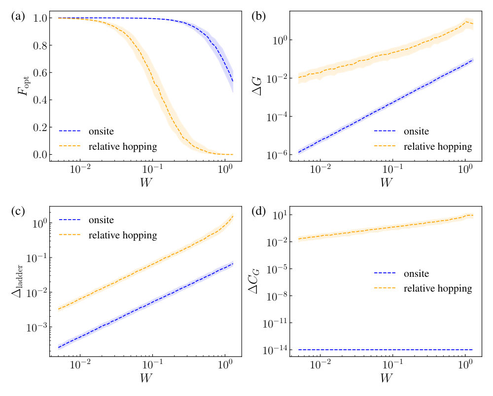
<figcaption class="paper-figure-caption"><b>Fig 5.</b> FIG. 5. Finite-disorder response for N = 24, r = 1.2, and j0 = 5. The common horizontal variable W denotes Wϵ for onsite disorder and Wh for relative hopping disorder. (a) Optimized routing fidelity Fopt. (b) Log-gain deviation ∆G, with Gopt evaluated at the same t∗that maximizes F. (c) Empirical ladder distortion ∆ladder. (d) Green-contrast deviation ∆CG at E = 0 and κ = 0.12g; values below 10−14 are shown at the numerical floor. Curves are medians and shaded regions are interquartile intervals from 500 fixed-seed realizations. Propagation uses direct matrix exponentiation, and eigenvalues are assigned optimally to the clean ladder before fitting.</figcaption>
</figure>

**Summary.** This paper analyzes a graded non-Hermitian Krawtchouk network to determine the conditions under which localized boundary effects (skin) can coexist with a perfectly regular, commensurate energy spectrum. By mapping the system to a Hermitian partner, the authors derive an exactly solvable model showing an interior focus scaling as $\sqrt{N}$. This framework is valuable for designing quantum systems with controlled, directional response and robust spectral properties.

**Why it may be interesting.** The work provides an exactly solvable, analytically controlled framework for understanding how engineered non-Hermiticity can maintain spectral regularity and directional coherence despite complex boundary effects, which is highly relevant for designing robust quantum simulators or optical circuits.

Detailed structure

**Main problem.** The study investigates the coexistence of an interior skin profile with a real commensurate spectrum, exact finite-time transfer, and analytic frequency-domain response in a finite non-Hermitian network.

**Main result.** The graded structure yields an exactly solvable framework demonstrating an interior focus scaling as $\sqrt{N}$, linking localization geometry to commensurate spectra and directional response.

**Method.** The authors utilize a transformation to a Hermitian partner via a positive diagonal similarity map, analyzing spectral properties, directional propagators, and disorder effects.

**Model / system.** The model is a finite open Krawtchouk network with oppositely graded directed hoppings, described by a non-Hermitian Hamiltonian $H_{OBC}$.

**Key observables.** Spectral half-width $B(r)$, conditioning curve $\log_{10} \kappa_S$, directional gain ratios, and the Petermann factor $K_\mu$.

**Important parameters / regimes.** System size $N$, grading parameters $\alpha_1, \alpha_2$, and disorder strengths.

**Assumptions / limitations.** The analysis relies on the existence of a positive diagonal metric $\eta$ for pseudo-Hermiticity, and the comparison is made against the clean Krawtchouk map.

**Figures summary.** Figures illustrate the graded gauge field, the similarity structure, mode-resolved eigenvector densities, and the approach to the one-way exceptional point by comparing spectral width and conditioning curves.

**Paper structure.** The paper progresses from establishing the graded structure and its link to a Hermitian partner, to analyzing directional dynamics and disorder robustness, and finally detailing the approach to the exceptional point using advanced asymptotic analysis.

Abstract

Spatially graded nonreciprocity can move skin weight away from a boundary, but it does not generally preserve a real commensurate spectrum or analytically controlled dynamics. We study a finite open Krawtchouk network with oppositely graded directed hoppings. For a broad intermediate range of asymmetries, their local imaginary gauge field changes sign in the bulk, and its accumulated coordinate generates a positive diagonal similarity map whose normalized squared entries form a biased-binomial envelope. The same map converts the open chain into the spin-rotation generator \(2gJ_x\), so the focus and equally spaced spectrum follow from one grading. In this focusing regime, exact right, left, and biorthogonal eigenvectors show that the envelope width and participation number both scale as \(\sqrt N\), identifying a subextensive interior focus. In the physical node basis, spin rotation produces perfect mirror inversion with direction-selective amplification and attenuation whose gains are mutually inverse. The directional Green functions share their poles, while their residues differ by the same similarity ratio. Closing the chain exposes a gauge-invariant imaginary flux, and either exact one-way limit yields an exceptional point of order \(N\). Onsite disorder preserves the directional resolvent ratio, whereas independent hopping disorder breaks the clean analytic Krawtchouk map and degrades commensurability and transfer. The model therefore provides an exactly solvable finite-network framework linking localization geometry and eigenvector nonorthogonality to commensurate spectra and node-resolved directional response.

[↑ back to top](#top)

### [Topology is not silent in the transport noise of multiband bosons](http://arxiv.org/abs/2608.18527v1)

**Authors:** Zhi-Wei Wang, Samuel L. Braunstein  
**Type:** theory · **Category:** other · **PDF:** <https://arxiv.org/pdf/2608.18527v1>  
**Analysis basis:** full PDF text, analyzed in chunks
**Topic relevance:** `Full counting statistics` **2/5** · `Keldysh / 2PI / non-Gaussian methods` **2/5** · `methods for driven-dissipative` **2/5** · `analog quantum simulation` **1/5** · `correlated / nonlocal dissipation` **1/5** · `driven-dissipative phase transition` **1/5** · `non-equilibrium universality` **1/5** · `quantum measurements` **1/5**

↔ Scroll figures horizontally

<figure class="paper-figure-card">
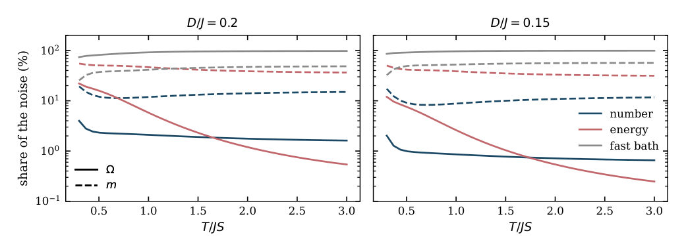
<figcaption class="paper-figure-caption"><b>Fig 1.</b> FIG. 1. Landau–Placzek decomposition of the equilibrium noise of the two geometric vertices, at the two couplings of interest. Solid curves are the Berry curvature Ω, dashed the self-rotation moment m; the three modes are the number-conserving, energy-conserving and fast-bath channels of Sec. VIII. The magnetization noise is far less bath-dominated than the curvature noise at every temperature, because m carries one energy denominator against the curvature’s two, and the separation persists across the coupling range.</figcaption>
</figure>
<figure class="paper-figure-card">
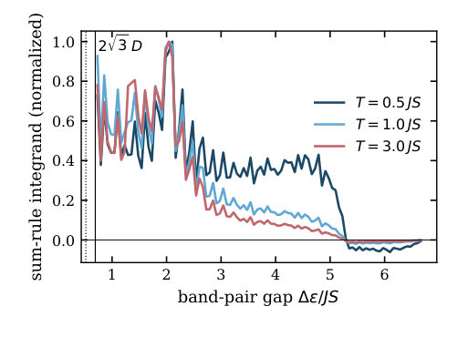
<figcaption class="paper-figure-caption"><b>Fig 2.</b> FIG. 2. The sum-rule integrand resolved in the band-pair gap coordinate, normalized to its largest value, at three tem- peratures. Frequency resolution resolves exactly the coordi- nate the ω integration pools over, which is why the integrated form cannot separate the sectors and the resolved form can. The turn-on at the minimal direct gap 2 √</figcaption>
</figure>
<figure class="paper-figure-card">
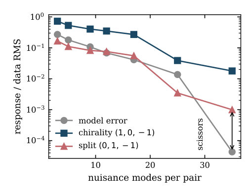
<figcaption class="paper-figure-caption"><b>Fig 3.</b> FIG. 3. Identifiability against nuisance completeness, the numbers of Table III as a curve. The model error falls by four orders across the range while the two topological responses fall by little more than one, so the gap between them opens; the ratio itself is not monotone, and what the argument uses is its value once the basis is complete.</figcaption>
</figure>
<figure class="paper-figure-card">
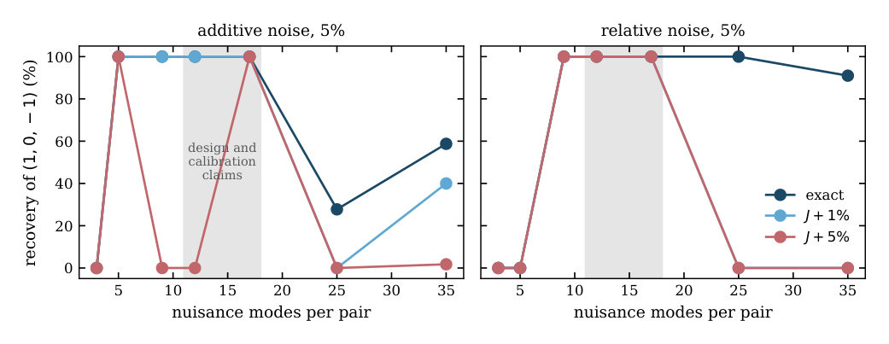
<figcaption class="paper-figure-caption"><b>Fig 4.</b> FIG. 4. Recovery of the true triple against nuisance mode count, for exact and miscalibrated dispersion, under both noise models, at four hundred trials per point. Recovery is not monotone in the mode count, and the exact and perturbed cases move in opposite directions at adjacent counts. The shaded band is where the design and calibration results of Sec. XIV are established; the identifiability argument of Sec. XIII is established at thirty-five modes, outside it. Both the structure and the separation are consequences of holding the resolution fixed at forty-eight bins: Fig. 5 shows the same data as a function of M2/Nbins and removes the separation. We show the curve rather than a single...</figcaption>
</figure>
<figure class="paper-figure-card">
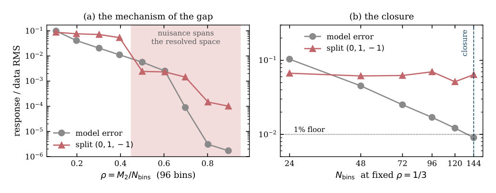
<figcaption class="paper-figure-caption"><b>Fig 5.</b> FIG. 5. The mode-count gap and its closure. (a) At fixed resolution the split response collapses once the nuisance dimension approaches the resolved dimension in the gap coordinate, near ρ = M2/Nbins ≃0.45 (shaded): growing the nuisance then buys model error by spending signal, and this is the mechanism behind the apparent tension between the design results and the identifiability argument. (b) Along fixed ρ = 1/3 there is no trade. The model error falls roughly as N −1.4 bins while the split stays near 6 × 10−2, so the separation opens by raising resolution. The one per cent floor is reached at one hundred and forty-four bins, where the design reduction, the identifiability argument and...</figcaption>
</figure>

**Summary.** This paper shows that unlike electrons where topological contributions to transport noise cancel out, multiband bosons retain a measurable topological signature in their current noise. This signature is captured by the occupation-weighted dispersion of Chern numbers across populated bands. The authors propose a frequency-resolved cross-spectrum measurement as the necessary protocol to isolate this topological signal.

**Why it may be interesting.** The work provides a rigorous theoretical framework for detecting topological invariants in thermal noise measurements, which is a key area bridging topology, transport, and non-equilibrium statistical mechanics.

Detailed structure

**Main problem.** The paper investigates the topological contribution to the transport noise in multiband bosonic systems, contrasting this behavior with the known case for electrons at a Fermi surface.

**Main result.** The topological contribution to the noise is not canceled for bosons because the Berry curvature is band-dependent, leading to a measurable quantity: the occupation-weighted dispersion of Chern numbers across populated bands.

**Method.** The analysis uses a fluctuating Boltzmann equation approach and examines the current cross-spectrum, proving that frequency resolution is necessary to separate topological from geometric content.

**Model / system.** The model involves multiband bosons, such as magnons or phonons, whose band structure is analyzed using the Hodge decomposition of the Berry curvature two-form on the Brillouin zone.

**Key observables.** Current noise spectrum, frequency-resolved cross-spectrum, and the occupation-weighted dispersion of Chern numbers.

**Important parameters / regimes.** Temperature (finite-temperature effects are crucial), band occupation numbers, and frequency resolution ($\omega$).

**Assumptions / limitations.** The analysis assumes the failure of the cancellation mechanism observed in Fermi surface electrons, and it relies on developing a fluctuating Boltzmann equation framework.

**Figures summary.** The notes do not describe specific figures, but mention Table I showing the magnitude of the topological share of the noise variance for a kagome ferromagnet.

**Paper structure.** The paper establishes the theoretical framework by decomposing the Berry curvature, contrasts the electronic (Fermi surface) case with the bosonic case, derives the noise calculation from a fluctuating Boltzmann equation, and concludes by specifying the necessary frequency-resolved measurement protocol.

Abstract

For electrons at a Fermi surface, the topological part of the Berry curvature drops out of the transport noise: the anomalous Hall conductivity is quantized, and the fluctuations of the Hall current know nothing about the Chern number. We show that this cancellation is an accident of the Fermi surface, and that it fails for bosons. Magnons and phonons thermally populate every band, each with its own Chern number, so the harmonic sector of the Hodge decomposition of the curvature is not a single constant and a variance does not annihilate it. What survives is the occupation-weighted dispersion of Chern numbers across populated bands. That band geometry is visible in current noise is known, and at zero temperature the antisymmetric part of the noise sum rule already returns a Chern number; what is new is an object with no zero-temperature analogue, existing only when several bands are populated and weighted differently. We derive it from a fluctuating Boltzmann equation and settle the energy-magnetization subtraction at the level of fluctuations: the subtracted term is the curl of a bounded magnetization density, so it contributes exactly zero to the current any transport measurement records, realization by realization. Is the quantity measurable? A driven protocol is not: the excess noise sits twelve orders below the equilibrium floor. An equilibrium protocol is, through a sum rule on the antisymmetric part of the current cross-spectrum, which carries no drive and hence no suppression. We prove that the frequency-integrated form of that sum rule cannot separate the topological from the geometric content, and show that the frequency-resolved cross-spectrum does separate them at accessible resolution. The protocol is specified for Cu(1,3-bdc), with its robustness to nuisance-model completeness and to dispersion, thermometry and field calibration.

[↑ back to top](#top)

### [Interface Capacity and Architectural Replenishment Determine Entanglement-Generation Speed in Quantum Networks](http://arxiv.org/abs/2608.19020v1)

**Authors:** Shi-Ju Ran  
**Type:** theory · **Category:** quantum information and computing · **PDF:** <https://arxiv.org/pdf/2608.19020v1>  
**Analysis basis:** full PDF text, analyzed in chunks
**Topic relevance:** `Keldysh / 2PI / non-Gaussian methods` **2/5** · `analog quantum simulation` **2/5** · `methods for driven-dissipative` **2/5** · `correlated / nonlocal dissipation` **1/5** · `driven-dissipative phase transition` **1/5** · `non-equilibrium universality` **1/5** · `quantum measurements` **1/5**

↔ Scroll figures horizontally

<figure class="paper-figure-card">
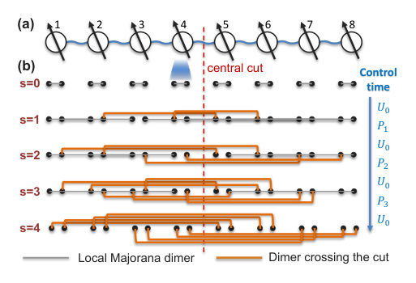
<figcaption class="paper-figure-caption"><b>Fig 1.</b> FIG. 1. Exact interface-capacity saturation in an N = 8 open Ising chain. The Majorana-rematching trajectory re- peatedly presents a fresh canonical pair to the single physical interface. After stage s, 2s Majorana dimers cross the cut, corresponding to s maximally entangled fermionic mode pairs. The protocol therefore realizes monotonic canonical-angle growth with unit interface utilization and reaches SA = 4 ln 2 at T = 4t0, saturating Eq. (15).</figcaption>
</figure>
<figure class="paper-figure-card">
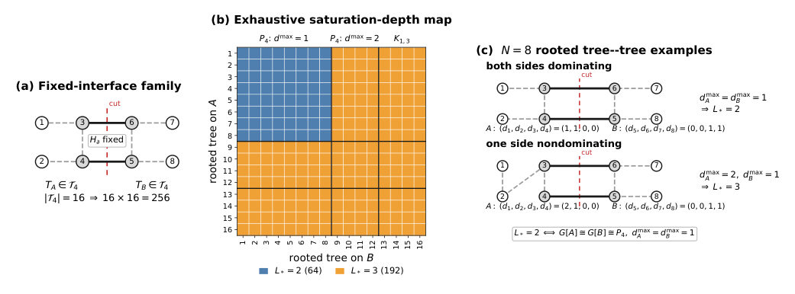
<figcaption class="paper-figure-caption"><b>Fig 2.</b> FIG. 2. Rooted architecture exactly classifies interface replenishment in the controlled N = 8 tree–tree family. (a) Representative member of the fixed-interface family. Thick solid bonds are the two fixed cross-cut Ising couplings, dashed bonds are the variable internal tree couplings, and the red dashed line marks the bipartition. All members share the baseline in Eq. (25). (b) Exhaustive minimum-depth map over all 16 × 16 = 256 labeled tree–tree architectures under Cbin. Of these, 64 have L∗= 2 and 192 have L∗= 3. (c) Representative N = 8 examples of dominating and nondominating rooted architectures. Gray vertices mark the interface sets, and the displayed tuples give the numbered-vertex...</figcaption>
</figure>
<figure class="paper-figure-card">
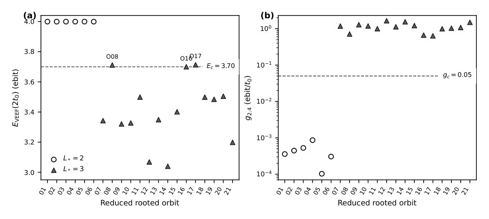
<figcaption class="paper-figure-caption"><b>Fig 3.</b> FIG. 3. Time-resolved VEEF identifies the rooted replenishment partition across the complete symmetry-reduced family. (a) Best VEEF entanglement at the common diagnostic time T = 2t0 for all 21 reduced rooted orbits. The pre-specified threshold Ec = 3.70 leaves the three L∗= 3 boundary orbits O08, O16, and O17 unresolved. (b) The frozen two-time growth statistic g2.4 separates all six L∗= 2 orbits from all 15 L∗= 3 orbits using the fixed threshold gc = 0.05 ebit/t0. The logarithmic scale shows the nearly three-order-of-magnitude separation between already saturated and still-replenishing architectures.</figcaption>
</figure>

**Summary.** This work establishes that the speed at which entanglement can be generated in quantum networks is limited by two independent factors: the fixed entangling capacity of the physical interface and the ability of the internal network architecture to continuously supply fresh quantum resources. By analyzing fermionic Gaussian dynamics and complex graph structures, the authors provide sharp bounds and demonstrate that the architecture dictates the sustainability of entanglement generation over time.

**Why it may be interesting.** It provides a rigorous, resource-theoretic understanding of speed limits in quantum information processing, distinguishing between local coupling strength and global connectivity/routing capability.

Detailed structure

**Main problem.** The paper determines the fundamental speed limit for generating entanglement in quantum networks when the physical interface is fixed, but the internal routing architecture is dynamical and constrained.

**Main result.** Entanglement generation speed is governed by two distinct resources: the fixed interface capacity (entangling flux) and the ability of the surrounding architecture to continually replenish fresh degrees of freedom.

**Method.** The authors derive theoretical bounds using fermionic Gaussian dynamics and employ advanced optimization techniques like Variational Entanglement-Enhancing-Field (VEEF) optimization across various network topologies.

**Model / system.** The model is a quantum network analyzed using fermionic Gaussian dynamics, often modeled by Ising chains or tree-tree architectures. The dynamics are controlled by local rotations and a fixed cross-cut interaction defining the interface.

**Key observables.** Canonical entanglement angles ($	heta_k$), bipartite entanglement in ebits ($E_A$), and the entanglement-generation speed ($\sum |\dot{	heta}_k|$).

**Important parameters / regimes.** Interface Capacity ($\Lambda_{\partial}$), Architectural Replenishment efficiency, and the network topology (e.g., open vs. periodic Ising chains).

**Assumptions / limitations.** The analysis assumes the ability to perform arbitrarily fast on-site rotations and focuses on the distinction between fixed interface flux and architectural replenishment capability.

**Figures summary.** Figures illustrate the saturation mechanism in open Ising chains, showing Majorana-rematching trajectories, and map the minimum saturation depth ($L^*$) required for different network topologies.

**Paper structure.** The paper establishes the core resource constraints, derives the coefficient-sharp bound for Gaussian dynamics, proves saturation using Ising chains, and then extends the analysis to complex tree-tree architectures using high-resolution VEEF optimization to classify the limiting topological resource.

Abstract

We show that entanglement-generation speed across a fixed network interface is governed by two distinct resources: the entangling capacity of the interface itself and the ability of the surrounding architecture to replenish it with fresh degrees of freedom. For fermionic Gaussian dynamics, we derive the coefficient-sharp bound $\sum_k|\dotθ_k|\leq\frac12\|K_{AB}\|_*$ on the collective speed of the canonical entanglement angles. Explicit Ising-chain rematching trajectories saturate this bound, thereby certifying exact minimum interaction times under the stated control model. Beyond the Gaussian setting, exhaustive optimization of the complete $N=8$ tree--tree family shows that, at fixed interface capacity, first-layer entanglement, connectedness, and edge budget, the saturation depth is exactly classified by rooted architecture. With higher-resolution $x$-only control, variational entanglement-enhancing-field (VEEF) optimization reaches the numerically resolved fast-$X$ optimum in a two-channel benchmark. Across all 21 symmetry-reduced rooted orbits, a pre-specified two-time VEEF growth diagnostic recovers the complete replenishment partition directly from optimized dynamics. Interface capacity therefore sets how much entangling flux is available, whereas architecture determines whether fresh degrees of freedom can continually replenish the interface and sustain repeated use of that capacity.

[↑ back to top](#top)

### [Inverse Feshbach's problem: Solvability and solutions](http://arxiv.org/abs/2608.18600v1)

**Authors:** Miloslav Znojil  
**Type:** theory · **Category:** other · **PDF:** <https://arxiv.org/pdf/2608.18600v1>  
**Analysis basis:** full PDF text, analyzed in chunks
**Topic relevance:** `analog quantum simulation` **2/5** · `quantum measurements` **2/5** · `Keldysh / 2PI / non-Gaussian methods` **1/5** · `methods for driven-dissipative` **1/5**

↔ Scroll figures horizontally

<figure class="paper-figure-card">
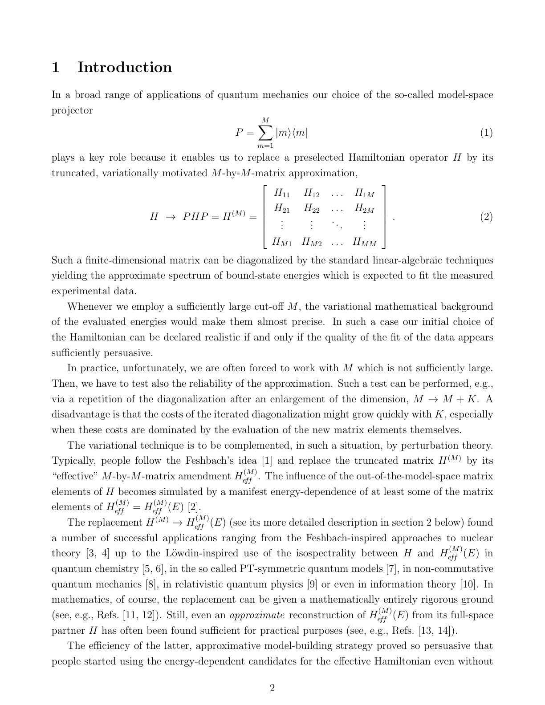
<figcaption class="paper-figure-caption"><b>Fig 1.</b> Low-resolution page preview, page 2</figcaption>
</figure>
<figure class="paper-figure-card">
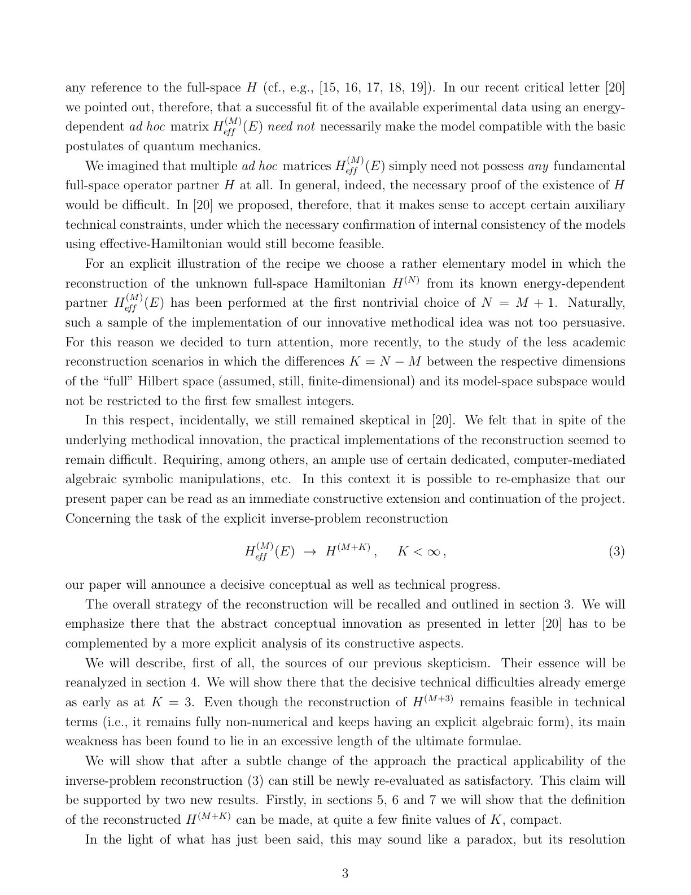
<figcaption class="paper-figure-caption"><b>Fig 2.</b> Low-resolution page preview, page 3</figcaption>
</figure>
<figure class="paper-figure-card">

<figcaption class="paper-figure-caption"><b>Fig 3.</b> Low-resolution page preview, page 4</figcaption>
</figure>
<figure class="paper-figure-card">
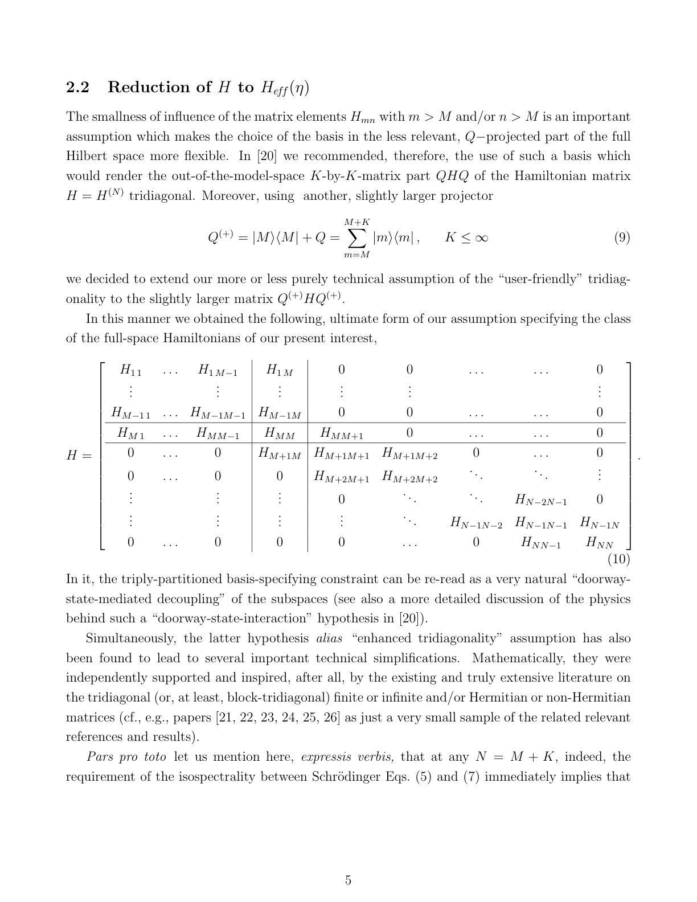
<figcaption class="paper-figure-caption"><b>Fig 4.</b> Low-resolution page preview, page 5</figcaption>
</figure>
<figure class="paper-figure-card">
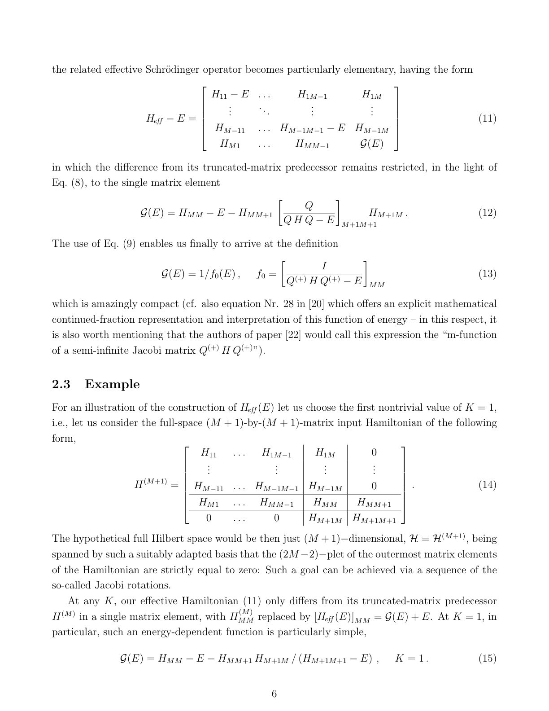
<figcaption class="paper-figure-caption"><b>Fig 5.</b> Low-resolution page preview, page 6</figcaption>
</figure>

**Summary.** This paper tackles the challenging inverse problem of quantum mechanics: determining the full Hamiltonian from its energy-dependent, model-space effective Hamiltonian. The authors successfully develop a systematic, constructive algebraic method to solve this, showing that the reconstruction can be expressed in compact, stable recursive formulae, thereby resolving prior skepticism about the problem's solvability.

**Why it may be interesting.** This work is highly relevant to open quantum systems and many-body dynamics because it provides a rigorous mathematical framework for extracting underlying physics (the full Hamiltonian) from simplified, measurable, or computationally tractable effective descriptions.

Detailed structure

**Main problem.** The paper addresses the inverse problem of quantum mechanics: reconstructing the full-space Hamiltonian $H$ from its energy-dependent, effective Hamiltonian $H_{	ext{eff}}(E)$ derived via model-space projection.

**Main result.** The authors provide a systematic, constructive method to solve this inverse problem, demonstrating that the reconstruction can be achieved via compact, recursive algebraic formulae, even for large model-space extensions ($K$).

**Method.** The reconstruction involves solving a coupled set of polynomial algebraic equations derived from matching the known $H_{	ext{eff}}(E)$ to the full Hamiltonian structure, utilizing techniques like Gröbner-basis elimination and recurrence relation matching.

**Model / system.** The system is a general quantum mechanical system governed by a Hamiltonian $H$. The method employs a model-space projector $P$ to derive an effective Hamiltonian $H_{	ext{eff}}(E)$ that depends on the energy $E$. The full Hamiltonian $H$ is assumed to have a specific, partially tridiagonal structure.

**Key observables.** The energy-dependent effective Hamiltonian $H_{	ext{eff}}(E)$ and the unknown matrix elements of the full Hamiltonian $H(N)$.

**Important parameters / regimes.** M (model space dimension), K (difference in dimensions, $N-M$), and the energy $E$.

**Assumptions / limitations.** The primary assumption is that the Hamiltonian $H$ can be effectively described by a finite-dimensional, partially tridiagonal structure, allowing the problem to be reduced to polynomial algebra.

**Figures summary.** The notes reference Table 7, which displays reconstructed matrix elements $a_2$ for various values of $K$ (up to $K=8$), illustrating the systematic nature of the reconstruction.

**Paper structure.** The paper progresses from defining the inverse problem using the Feshbach projection formalism, establishing the necessary algebraic equations, and then developing a constructive solution by showing how the complexity of the resulting polynomial equations stabilizes into a manageable recursive form for increasing $K$.

Abstract

Given a certain specific, $M$ by $M$ matrix form of the Feshbach's effective (i.e., energy-dependent) Hamiltonian $H^{(M)}_{e\!f\!f}(E)$, the inverse-problem reconstruction of the full-space, $N$ by $N$ matrix Hamiltonian $H^{(N)}$ is considered and reduced to the solution of a coupled set of polynomial algebraic equations. Using computer-assisted symbolic manipulations, an explicit algebraic reconstruction of $H^{(N)}$ is found feasible at not too large $K = N-M$.

[↑ back to top](#top)

### [Variational Quantum Algorithms for Hyperelasticity: Incorporating Nonlinear Constitutive Behavior](http://arxiv.org/abs/2608.18363v1)

**Authors:** Uditnarayan Kouskiya, Caglar Oskay  
**Type:** theory · **Category:** quantum information and computing · **PDF:** <https://arxiv.org/pdf/2608.18363v1>  
**Analysis basis:** full PDF text, analyzed in chunks
**Topic relevance:** `Keldysh / 2PI / non-Gaussian methods` **2/5** · `analog quantum simulation` **2/5** · `methods for driven-dissipative` **1/5**

↔ Scroll figures horizontally

<figure class="paper-figure-card">
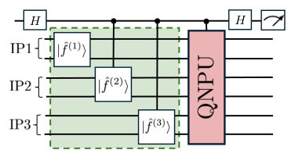
<figcaption class="paper-figure-caption"><b>Fig 1.</b> Fig. 3: Quantum nonlinear processing unit (QNPU) framework used to evaluate polynomial contributions appearing in the cost function.</figcaption>
</figure>
<figure class="paper-figure-card">
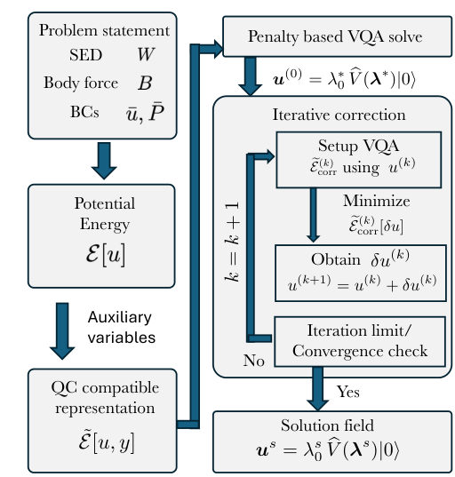
<figcaption class="paper-figure-caption"><b>Fig 2.</b> Fig. 1: Overview of the proposed approach. us represents the final solution field.</figcaption>
</figure>
<figure class="paper-figure-card">
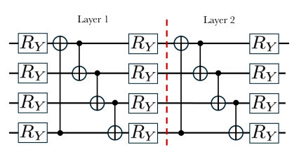
<figcaption class="paper-figure-caption"><b>Fig 3.</b> Fig. 2: Parameterized quantum circuit (ansatz) employed in the present work by Sim et al. [3].</figcaption>
</figure>
<figure class="paper-figure-card">
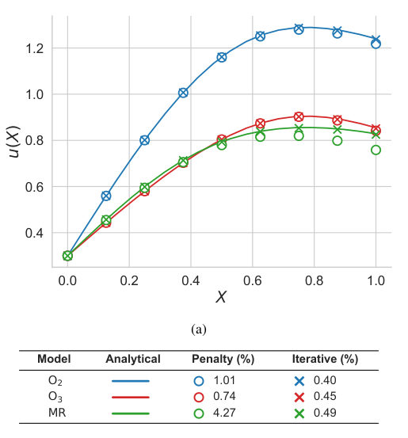
<figcaption class="paper-figure-caption"><b>Fig 4.</b> Fig. 4: Comparison of analytical (dotted), penalty-based, and iteratively corrected quantum solutions (mm) for the O2, O3, and MR models. (a) Displacement fields from the three approaches. (b) Relative L2 errors (%) vs. analytical solution.</figcaption>
</figure>

**Summary.** This work adapts Variational Quantum Algorithms to solve complex nonlinear elasticity problems for hyperelastic materials. It tackles nonlinear constitutive laws by reformulating the energy functional into a quantum-compatible cost function. The key contribution is an iterative correction strategy that significantly boosts the accuracy of the quantum mechanical solution.

**Why it may be interesting.** While the application is in continuum mechanics, the core methodology—encoding a complex physical energy functional into a quantum cost function and using iterative quantum optimization—is highly relevant to simulating complex quantum many-body Hamiltonians.

Detailed structure

**Main problem.** The paper addresses extending Variational Quantum Algorithms (VQA) to solve nonlinear elasticity problems involving constitutive nonlinearities with rational powers of the stretch.

**Main result.** The proposed iterative correction strategy significantly improves the accuracy of the quantum solution for hyperelastic models like Ogden and Mooney-Rivlin compared to direct VQA or penalty methods.

**Method.** It reformulates the potential energy functional as a cost function minimized by a VQA, employing auxiliary variables and penalty constraints to handle complex nonlinear terms.

**Model / system.** The study focuses on hyperelasticity, specifically using one-dimensional incompressible Ogden and Mooney-Rivlin models governed by an elastostatic boundary-value problem.

**Key observables.** The cost function $C(	heta_0, 	heta)$ is minimized to find the equilibrium state, and the relative $L_2$ errors (%) compared to analytical solutions are key diagnostics.

**Important parameters / regimes.** The penalty parameter $eta$, and the control parameters $(	heta_0, 	heta)$ defining the quantum state are important.

**Assumptions / limitations.** The method relies on approximating the strain-energy density $W$ using polynomial expansions and assumes that the cost function minimization yields the unique physical solution.

**Figures summary.** Figure 1 illustrates the overall iterative correction loop. Figure 4 compares the quantum solutions (analytical, penalty-based, and iteratively corrected) for various models, showing displacement fields and relative $L_2$ errors.

**Paper structure.** The paper outlines the VQA formulation for the potential energy, details the transformation of nonlinearities using auxiliary variables, presents the two-stage minimization process (initial VQA followed by iterative correction VQAs), and concludes with numerical demonstrations.

Abstract

This paper extends a recently proposed Variational Quantum Algorithm framework for nonlinear elasticity to a broader class of constitutive nonlinearities involving rational powers of the stretch. One-dimensional incompressible Ogden and Mooney-Rivlin models are employed as representative examples to demonstrate the proposed methodology. Nonlinear constitutive terms are transformed into forms compatible with the available quantum algorithmic primitives through the introduction of auxiliary variables and penalty constraints, yielding approximate solutions via a Variational Quantum Algorithm. An iterative correction strategy based on a sequence of Variational Quantum Algorithms is then introduced to improve solution accuracy. A Numerical example demonstrates the proposed approach.

[↑ back to top](#top)

### [Equations of Tree Tensor Network Varieties](http://arxiv.org/abs/2608.19071v1)

**Authors:** Serkan Hoşten, Niharika Chakrabarty Paul, Otto T. P. Schmidt, Dmitry Skurt  
**Type:** theory · **Category:** strongly correlated electrons · **PDF:** <https://arxiv.org/pdf/2608.19071v1>  
**Analysis basis:** full PDF text, analyzed in chunks
**Topic relevance:** `analog quantum simulation` **2/5** · `methods for driven-dissipative` **2/5**

↔ Scroll figures horizontally

<figure class="paper-figure-card">
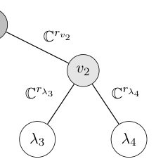
<figcaption class="paper-figure-caption"><b>Fig 1.</b> Figure 1: Binary TTN of order 4 with associated bond spaces.</figcaption>
</figure>
<figure class="paper-figure-card">
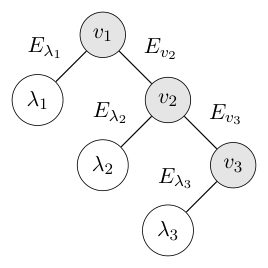
<figcaption class="paper-figure-caption"><b>Fig 2.</b> Figure 2: Tree tensor network of a tensor train decomposition of order 3 with bond spaces associated to the edges.</figcaption>
</figure>
<figure class="paper-figure-card">
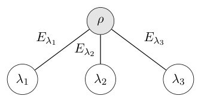
<figcaption class="paper-figure-caption"><b>Fig 3.</b> Figure 3: Tree tensor network of a subspace (Tucker) decomposition of order 3 with bond spaces associated to the edges.</figcaption>
</figure>
<figure class="paper-figure-card">
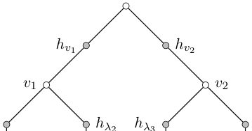
<figcaption class="paper-figure-caption"><b>Fig 4.</b> Figure 5: Comparison of a TTN of order four and its corresponding spaced tree.</figcaption>
</figure>
<figure class="paper-figure-card">
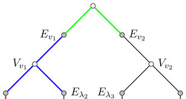
<figcaption class="paper-figure-caption"><b>Fig 5.</b> Figure 6: The spaced tree associated to the TTN in Figure 1, together with its associated vector spaces and the highlighted subtrees Tλ1, Tρ, and Tv1.</figcaption>
</figure>

**Summary.** This paper provides a deep algebraic characterization of Tree Tensor Network (TTN) varieties, proving they are defined by minors of matrix flattenings and are equivalent to general Markov models. Furthermore, it develops a combinatorial method to compute the degree of these varieties, which is a crucial invariant for understanding the complexity of quantum states represented by tensor networks.

**Why it may be interesting.** The connection between tensor network representations (used extensively in simulating strongly correlated electron models) and algebraic geometry provides powerful, rigorous tools for analyzing the complexity and structure of quantum states.

Detailed structure

**Main problem.** The paper aims to characterize the algebraic structure, specifically the prime ideal, of tree tensor network varieties ($	ext{TTN}_{T,V,r}$). It also focuses on computing the degree of these varieties for specific cases like order 3 tensor trains.

**Main result.** The prime ideal of the TTN variety is generated by the minors of matrix flattenings, and the variety is shown to be equivalent to a general Markov model on the associated spaced tree. A combinatorial method is provided to compute the degree for order 3 tensor trains.

**Method.** The authors employ algebraic geometry, viewing the variety as a projective algebraic variety defined by rank constraints on matrix flattenings. They use techniques involving initial ideals and non-intersecting path counting to determine the degree.

**Model / system.** The core model is the Tree Tensor Network (TTN), which is a mathematical tool used to represent high-order tensors. These networks are relevant in quantum many-body physics, particularly for describing 2D quantum systems, and are related to tensor train and subspace decompositions.

**Key observables.** The prime ideal generators (minors of matrix flattenings) and the degree of the variety are key algebraic observables.

**Important parameters / regimes.** The structure of the rooted tree $T$, the attached vector spaces $V$, and the admissible rank sequence $r = (r_v)$ are the critical parameters.

**Assumptions / limitations.** The analysis relies on relating the TTN variety to general Markov models and utilizing results from the theory of determinantal and initial ideals for degree computation.

**Figures summary.** Figures illustrate the structure of TTNs (e.g., binary TTN of order 4) and show how the TTN structure realizes both TT and Subspace decompositions for order 3.

**Paper structure.** The paper first establishes the algebraic characterization of the TTN variety using minors (Theorem 1.1). It then proves the equivalence between TTN, TT, and Subspace varieties (Proposition 2.5). Finally, it focuses on computing the degree of the TT variety using combinatorial methods based on initial ideals (Proposition 6.7).

Abstract

We show that tree tensor network varieties, including tensor train varieties, are general Markov models associated to spaced trees. This allows us to prove that the prime ideals of these varieties are generated by minors of matrix flattenings. In the case of tensor train varieties, we discuss whether these minors form a Gröbner basis and provide a combinatorial method to compute the degree for order $3$ tensor trains.

[↑ back to top](#top)

### [Technical Proposal for the Atom Interferometer CERN Experiment (AICE) Facility](http://arxiv.org/abs/2608.18743v1)

**Authors:** Gianluigi Arduini, Nadja Augst, Mark G. Bason, Charles Baynham, Andrea Bertoldi, Gianfranco Bertone, Diego Blas, Daniela Bortoletto, Sougato Bose, Roberto Ales Bozzi, Oliver Buchmueller, Tamara Alice Bud, Clare Burrage, Sergio Calatroni, John Carlton, Vassilis Charmandaris, Maria Luisa Chiofalo, Pierre Cladé, Jonathon Coleman, Fabio Corsanego, Albert De Roeck, Arnaud Devienne, Fabio Di Pumpo, John Ellis, Pierre Fayet, Chris Foot, Elina Fuchs, Naceur Gaaloul, Susan Gardner, Enno Giese, Eduardo Granados, Saïda Guellati-Khelifa, Michael Guinchard, Timo Hakulinen, Tiffany Harte, Richard Hobson, Michael Holynski, Angelo Infantino, Alex Kehagias, Eva Kilian-Rademacher, Wolfgang Korsch, Damien Lafarge, Samuel Lellouch, Lucas Lombriser, Elias Lopez Asamar, J. Luis Lopez-Gonzalez, Michele Maggiore, Charline Marcel, Anna Marchant, Christopher McCabe, Gaetano Mileti, Peter Millington, Jeremiah Mitchell, Noam Mouelle, Angel Navascues Cornago, François Pillon, Rosa Poggiani, Johann Rafelski, Ernst M. Rasel, Maike Reckermann, Albert Roura, Rui Samoes, Federico Sanchez Nieto, Jack Sander, Carlo Scarcia, Jesse Schelfhout, Wolfgang Schleich, Dennis Schlippert, Ulrich Schneider, Steven Schramm, Florian Schreck, Olga Sergijenko, Marcelle Soares-Santos, Guglielmo M. Tino, Jonathan N. Tinsley, Tristan Valenzuela, Daniel Valuch, Maurits van der Grinten, Klaasjan van Druten, Ville Vaskonen, Wolf von Klitzing, Michael Werner  
**Type:** experiment · **Category:** other · **PDF:** <https://arxiv.org/pdf/2608.18743v1>  
**Analysis basis:** full PDF text, analyzed in chunks
**Topic relevance:** `analog quantum simulation` **2/5** · `interference shaping light` **1/5** · `quantum measurements` **1/5**

↔ Scroll figures horizontally

<figure class="paper-figure-card">
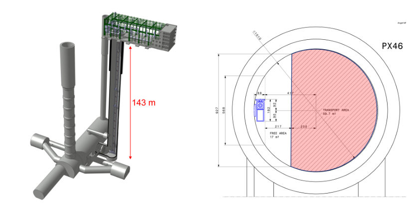
<figcaption class="paper-figure-caption"><b>Fig 1.</b> Figure 1: Left panel: General schematic view of the proposed implementation of AICE in the PX46 access shaft [1, 2]. Right panel: Horizontal cross section of the PX46 shaft, showing that the proposed location of AICE (blue) is compatible with the space required for transport of LHC components (red hatched area).</figcaption>
</figure>
<figure class="paper-figure-card">
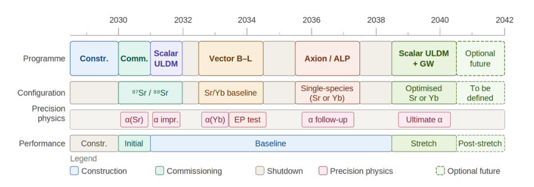
<figcaption class="paper-figure-caption"><b>Fig 2.</b> Figure 2: Indicative timeline of the science programme for AICE from mid-2028 to the end of 2042, showing the main science phases, the atom species in use, the short precision physics campaigns embedded within each science phase, and the projected facility operating levels. Shutdowns for reconfiguration are indicated with grey background, and an optional future campaign is shown with a dashed border. Detailed descriptions of the operational phases are given in Section 8.</figcaption>
</figure>
<figure class="paper-figure-card">
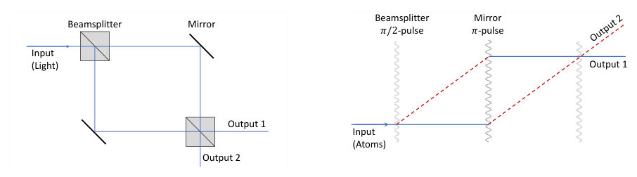
<figcaption class="paper-figure-caption"><b>Fig 3.</b> Figure 3: Left: a Mach-Zehnder optical interferometer. Right: the analogous atom inter- ferometer, with the ground state |g⟩represented by solid blue lines, the excited state |e⟩ by dashed red lines, and laser pulses by wavy lines. The π/2, π, π/2 pulse sequence acts as beamsplitter, mirror and beamsplitter respectively; the unlabelled rightmost pulse in the atom-interferometer schematic is the final π/2 beamsplitter pulse. Adapted from [51].</figcaption>
</figure>
<figure class="paper-figure-card">
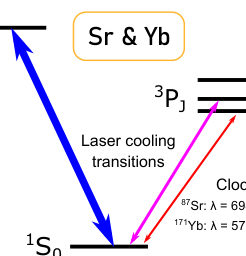
<figcaption class="paper-figure-caption"><b>Fig 4.</b> Figure 4: The transitions used for laser cooling and single-photon clock-transition interferom- etry in AICE. The long lifetimes of the 3P0 states in Sr [52] and Yb [53] suppress spontaneous- emission decoherence during the interferometer sequence. Indirect measurements of the Sr lifetime are in agreement with the direct measurement in Ref. [52] quoted here, but are in conflict with each other [55, 56].</figcaption>
</figure>
<figure class="paper-figure-card">
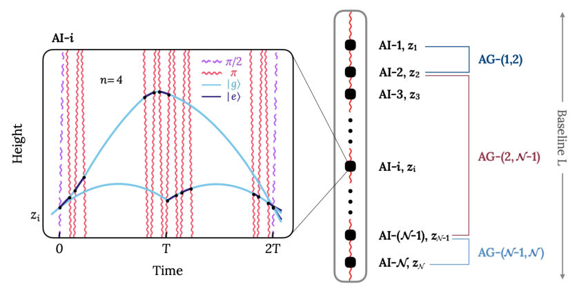
<figcaption class="paper-figure-caption"><b>Fig 5.</b> Figure 5: Conceptual illustration of the multi-source facility architecture to be adopted by AICE. Left: the space-time diagram of one interferometer with n = 4 LMT momentum kicks. Right: several interferometers spaced within a single vertical vacuum tower of length L, forming multiple gradiometer combinations over different baselines. Multiple source stations permit simultaneous measurements over different baselines and provide a scalable architecture for future large-scale facilities. In AICE the number of sources grows from Nsource ∼3 at commissioning towards ∼10 to 20 at later stages (cf. Table 2). Adapted from [61].</figcaption>
</figure>

**Summary.** This technical proposal outlines the AICE facility, a large-scale atom interferometer planned for CERN to search for ultralight dark matter and test fundamental physics principles like the Equivalence Principle. By utilizing long baselines and various atomic species, it aims to achieve unprecedented precision in measuring fundamental constants and gravitational effects.

**Why it may be interesting.** This work represents a major application of advanced cold atom techniques (atom interferometry) to fundamental physics, pushing the scale of terrestrial measurements significantly beyond current limits. It requires expertise in vacuum technology, laser cooling, and quantum sensing.

Detailed structure

**Main problem.** The primary goal is probing for bosonic ultralight dark matter (ULDM) in a mass range inaccessible to other experiments, with a secondary goal of exploring gravitational waves (GWs) in the $\sim 0.03-3$ Hz range.

**Main result.** The proposal details the technical feasibility of the AICE facility, confirming that the PX46 site is mature and ready for installation to conduct these precision measurements.

**Method.** The experiment uses long-baseline atom interferometry, employing ultracold atoms in a gradiometer geometry to measure phase shifts sensitive to external fields and fundamental constants.

**Model / system.** The platform is the Atom Interferometer CERN Experiment (AICE), a $\mathcal{O}(100)$ m vertical interferometer utilizing ultracold $^{87}	ext{Sr}$ (with planned upgrades to $^{88}	ext{Sr}$ and $^{171}	ext{Yb}$) atoms.

**Key observables.** Dark matter coupling strengths, gravitational wave signals, violation of the Equivalence Principle (EP), and the fine-structure constant ($\alpha$).

**Important parameters / regimes.** Baseline length of $\sim 100$ m; GW frequency range of $\sim 0.03-3$ Hz; target sensitivity for $\alpha$ and EP violation.

**Assumptions / limitations.** The proposal assumes the suitability and maturity of the PX46 site for installation without impacting LHC operations.

**Figures summary.** Figure 1 provides a general schematic view of AICE in the PX46 shaft, confirming compatibility with LHC component transport.

**Paper structure.** The proposal is structured to cover the motivation, the experimental concept (including gradiometer and multi-species operation), the detailed physics case (ULDM, $\alpha$, GWs), the technical detector systems, and the necessary site integration/civil engineering plans.

Abstract

We present the technical proposal for the Atom Interferometer CERN Experiment (AICE), a $\mathcal{O}(100)$ m vertical atom interferometer to be installed against the wall of the PX46 access shaft to the LHC. AICE is conceived as a versatile and flexible long-baseline atom-interferometry facility whose primary scientific goal is probing for bosonic ultralight dark matter (ULDM) in a mass range inaccessible to other experiments, with a secondary goal of pioneering the exploration of gravitational waves (GWs) with frequencies in the range ${\sim}$0.03-3 Hz as a pathfinder for future longer-baseline detectors. The initial configuration employs ultracold $^{87}$Sr atoms in a single-photon 698-nm interferometer with three shaft-based atom sources in a multi-source gradiometer geometry, supported by one surface reference source for laser stabilisation and diagnostics, to target scalar ULDM. Operation with $^{88}$Sr will give sensitivity to axion-like particles (ALPs), vector ULDM with $B-L$ couplings and violation of the principle of equivalence, while a $^{171}$Yb upgrade will improve the sensitivity to $B-L$ couplings and equivalence violations. Probing the Einstein equivalence principle (EP) and measuring $α$ will proceed in parallel with the ULDM searches. A conceptual feasibility study and a detailed technical implementation study have established that PX46 is a uniquely mature and implementation-ready site, with no technical showstoppers. Completing site preparation works during LS3 would enable the subsequent installation and operation of AICE without impacting HL-LHC operations. The detector design builds on the VLBAI and MAGIS experiments and the AION-10 Technical Design Report, scaling the strontium gradiometer architecture to the $\sim$100 m baseline. AICE is endorsed by the TVLBAI Proto-Collaboration, comprising 57 institutions in 22 countries.

[↑ back to top](#top)

### [Localized Excitons and Exciton-Phonon Coupling in Antiferromagnetic AgCrP2S6](http://arxiv.org/abs/2608.18394v1)

**Authors:** Jessica McDivitt, Dimitar Pashov, Mark van Schilfgaarde, Justin C. Johnson, Jeffrey L. Blackburn, Anna A. Berseneva, Swagata Acharya  
**Type:** both · **Category:** strongly correlated electrons · **PDF:** <https://arxiv.org/pdf/2608.18394v1>  
**Analysis basis:** full PDF text, analyzed in chunks
**Topic relevance:** `Keldysh / 2PI / non-Gaussian methods` **2/5** · `Frenkel-Kontorova` **1/5**

↔ Scroll figures horizontally

<figure class="paper-figure-card">
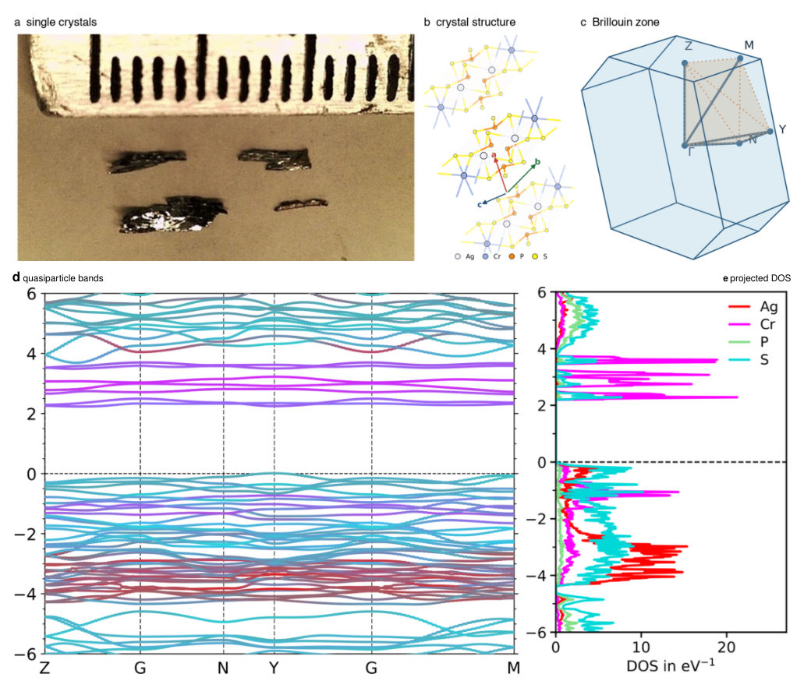
<figcaption class="paper-figure-caption"><b>Fig 1.</b> FIG. 1. Crystal and electronic structure of AgCrP2S6. (a) Representative crystals used for diffraction (full growth images in the Supplementary Information). (b) Crystal structure in an oblique projection, with Ag/Cr/P/S colors and crystallographic a, b, c axes indicated; neighbouring layers are faded for clarity but drawn at comparable marker size. (c) First Brillouin zone and high-symmetry path. (d) Quasiparticle band structure, with orbital/atom colouring matching the projected-DOS legend in (e). (e) Atom-projected electronic density of states. The structure colours in (b) are reused in the real-space exciton visualizations below.</figcaption>
</figure>
<figure class="paper-figure-card">
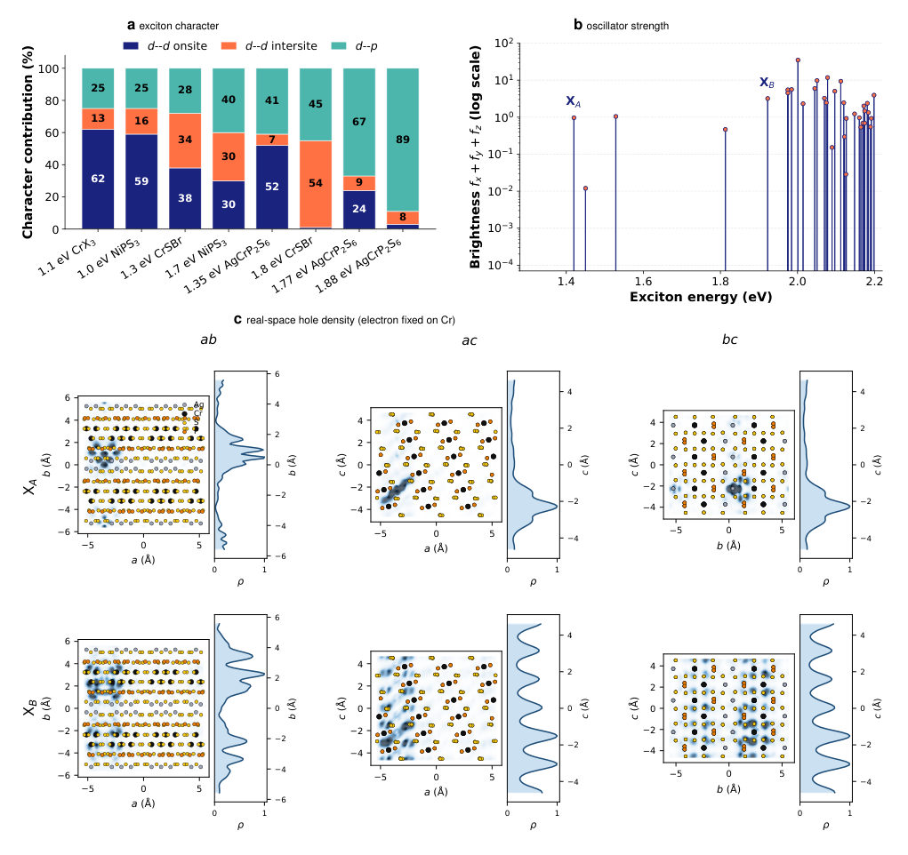
<figcaption class="paper-figure-caption"><b>Fig 2.</b> FIG. 2. Exciton character, oscillator strength, and photoluminescence. (a) Character composition for representative low-energy excitations in CrX3, NiPS3, CrSBr, and AgCrP2S6, sorted by total d–d weight. (b) Total dipole brightness fx + fy + fz on a logarithmic scale for every BSE eigenstate between 1.3 and 2.2 eV; XA marks the lowest bright state at 1.42 eV and XB the representative ligand-assisted state near 1.88 eV. (c) Real-space hole density for XA and XB with the electron fixed on a Cr site. Rows: XA and XB. Columns: ab, ac, and bc projections, each with the corresponding one-dimensional density ρ along the vertical axis of the map. XA remains tightly localized about a single...</figcaption>
</figure>
<figure class="paper-figure-card">
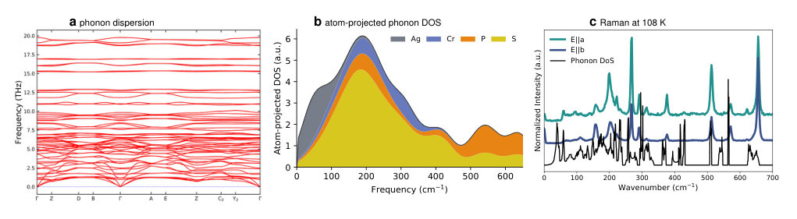
<figcaption class="paper-figure-caption"><b>Fig 3.</b> FIG. 3. Lattice dynamics of AgCrP2S6. (a) Phonon dispersion of the optimized structure, showing no unstable modes along the selected high-symmetry path. (b) Atom-projected phonon density of states. (c) Polarization-resolved Raman spectra at 108 K compared with the calculated phonon density of states (298 K data in the Supplementary Information).</figcaption>
</figure>
<figure class="paper-figure-card">
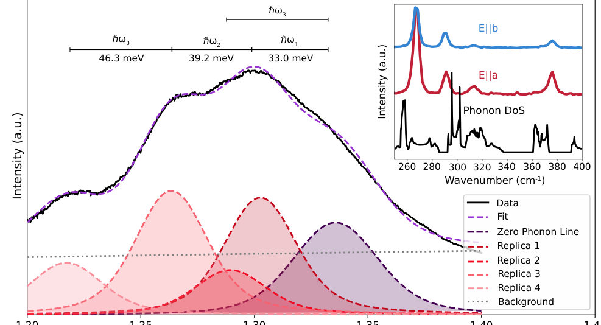
<figcaption class="paper-figure-caption"><b>Fig 4.</b> FIG. 4. Photoluminescence at 5 K with a multi-Voigt fit; replicas 1–4 are phonon sidebands of the XA recombination.</figcaption>
</figure>

**Summary.** This work characterizes the electronic and excitonic properties of AgCrP2S6, a magnetic semiconductor. By combining structural measurements with advanced many-body calculations, the authors determine that the low-energy optical excitation is a localized Frenkel exciton. This highlights the delicate balance between covalent bonding and magnetic interactions in determining optical response in correlated materials.

**Why it may be interesting.** The detailed analysis of exciton localization and the explicit calculation of exciton-phonon coupling channels provide a rich model for understanding how lattice vibrations modulate electronic excitations in strongly correlated magnetic insulators.

Detailed structure

**Main problem.** The study investigates the competition between covalency, magnetic localization, and structural symmetry in determining the nature of the lowest optical exciton in the antiferromagnetic semiconductor AgCrP2S6.

**Main result.** The lowest exciton is found to be predominantly a localized Frenkel exciton, despite increased covalency, due to the combined effects of antiferromagnetism and Ag-site disorder.

**Method.** The research combines single-crystal X-ray diffraction, Raman spectroscopy, lattice-dynamical calculations, and advanced many-body theory (vertex corrected Feynman diagrammatic approaches).

**Model / system.** The system is the layered thiophosphate semiconductor AgCrP2S6, which features an antiferromagnetic Cr sublattice and nonmagnetic Ag sites, allowing for the study of competing electronic interactions.

**Key observables.** Lowest exciton energy (~1.4 eV), exciton character (Frenkel vs. Wannier-Mott), exciton-phonon coupling channels, and quasiparticle gap.

**Important parameters / regimes.** Temperature range (100-300 K), exciton binding energy (~770 meV), and the relative strength of p-d hybridization versus intersite coherence.

**Assumptions / limitations.** The analysis assumes the material remains dynamically stable in its monoclinic phase and that the low-energy optical response is dominated by $q=0$ excitations.

**Figures summary.** Figures illustrate the crystal structure, band structure along high-symmetry paths, and detailed analysis of the exciton character, real-space hole density, and phonon dispersion/Raman spectra.

**Paper structure.** The paper follows a structure moving from structural characterization (XRD, lattice dynamics) to electronic structure (quasiparticle gap) and finally to the detailed excitonic and exciton-phonon coupling analysis using advanced many-body techniques.

Abstract

AgCrP2S6 combines a low-symmetry thiophosphate framework with an antiferromagnetic Cr sublattice and nonmagnetic Ag sites, providing a setting in which covalency and magnetic localization compete in the low-energy optical response. We combine single-crystal x-ray diffraction, Raman spectroscopy, lattice-dynamical calculations, and self-consistent vertex corrected Feynman diagrammatic many-body approaches to determine the structural, electronic, and excitonic properties of bulk AgCrP2S6. The material remains monoclinic between 100 and 300 K, with additional Ag-site disorder resolved at low temperature, and the optimized structure is dynamically stable. The many-body calculations yield a reduced quasiparticle gap relative to Cr trihalides, but the lowest excitons remain predominantly local: the calculated low-energy (~1.4 eV) excitation cluster is best described as a weakly bright, strongly anisotropic Frenkel exciton with dominant onsite d-d character and substantial ligand-assisted d-p admixture. Symmetry analysis in the C2h setting identifies this state as predominantly Bu and constrains its leading exciton-phonon coupling channels to Ag diagonal renormalization and Bg-mediated bright-dark mixing. These results place AgCrP2S6 in a localized excitonic regime in which the stronger p-d hybridization, relative to the more ionic Cr trihalides, narrows the quasiparticle gap, while the antiferromagnetic exchange and Ag-site dilution disfavor the intersite coherence associated with strongly delocalized low-energy excitons.

[↑ back to top](#top)

### [RushHour: A Dynamically Reconfigurable Lattice-Surgery Architecture](http://arxiv.org/abs/2608.18985v1)

**Authors:** Nathaniel Tornow, Aleksandra Świerkowska, Peter Wegmann, Pramod Bhatotia  
**Type:** theory · **Category:** quantum information and computing · **PDF:** <https://arxiv.org/pdf/2608.18985v1>  
**Analysis basis:** full PDF text, analyzed in chunks
**Topic relevance:** `QC/QI experiment` **2/5** · `quantum measurements` **1/5**

↔ Scroll figures horizontally

<figure class="paper-figure-card">
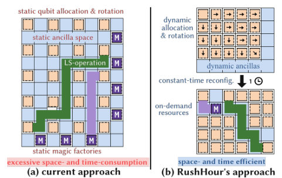
<figcaption class="paper-figure-caption"><b>Fig 1.</b> Figure 1. Static vs. dynamic lattice surgery. (a) Current architectures fix qubit allocation, ancilla space, and magic- state factories ahead of execution. (b) RushHour allocates, rotates, and reconfigures dynamically and on demand.</figcaption>
</figure>
<figure class="paper-figure-card">
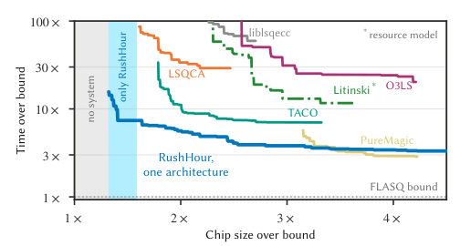
<figcaption class="paper-figure-caption"><b>Fig 2.</b> Figure 2. Best runtime by chip size, normalized by the FLASQ bound [21]. Gray: no system runs, cyan: only RushHour.</figcaption>
</figure>
<figure class="paper-figure-card">
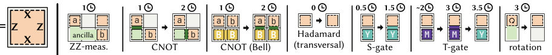
<figcaption class="paper-figure-caption"><b>Fig 3.</b> Figure 3. Surface-code patches and LS operations [21, 24]. All times are in logical rounds. M: a cultivated magic state [12] (occupying its tile for 2–3 expected rounds), Y: the |𝑌⟩ancilla [10]. Dashed edges mark the 𝑋boundary.</figcaption>
</figure>
<figure class="paper-figure-card">
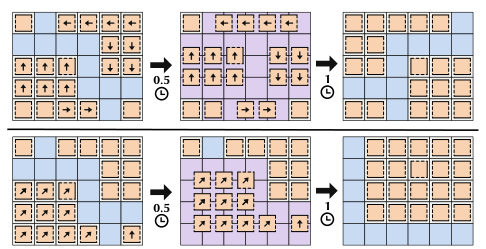
<figcaption class="paper-figure-caption"><b>Fig 4.</b> Figure 4. Walking qubits. Parallel patch slides reshape the free space in one round [21, 26].</figcaption>
</figure>
<figure class="paper-figure-card">
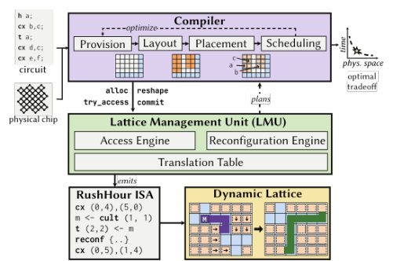
<figcaption class="paper-figure-caption"><b>Fig 5.</b> Figure 5. RushHour overview. The compiler (§6) sched- ules against the LMU interface (§5). The LMU manages the dynamic lattice and realizes gates as RushHour ISA instruc- tions (§4).</figcaption>
</figure>

**Summary.** This paper introduces RushHour, a novel hardware-compiler co-design for performing lattice surgery in fault-tolerant quantum computing. It overcomes the rigidity of existing methods by enabling dynamic reconfiguration of the quantum lattice in real-time. This results in significantly improved resource efficiency, allowing complex quantum algorithms to run on much smaller and faster physical quantum chips.

**Why it may be interesting.** While focused on superconducting/trapped-ion architectures, the core concepts of dynamic resource management, scheduling, and hardware-software co-design are highly relevant to optimizing complex quantum control protocols.

Detailed structure

**Main problem.** Achieving practical fault-tolerant quantum computing requires efficient lattice surgery (LS) to fit large algorithms onto resource-constrained quantum chips.

**Main result.** The proposed RushHour architecture significantly improves resource utilization, enabling benchmarks to run on much smaller chips and achieving median speedups of 2.0-7.2$	imes$ on space-constrained hardware.

**Method.** The authors propose a hardware-compiler co-design called RushHour, which formalizes dynamic lattice management via a new ISA and a Lattice Management Unit (LMU).

**Model / system.** The system models fault-tolerant quantum computation using the surface code, where logical operations are performed via dynamic lattice surgery (LS) on patches of physical qubits.

**Key observables.** Space-time trade-off, benchmark success rate on small chips, execution time (speedup factor), and resource footprint.

**Important parameters / regimes.** Chip size constraints, logical error exposure, and the efficiency of dynamic reconfiguration (achieved in a single round).

**Assumptions / limitations.** The approach assumes that dynamic lattice management can be abstracted and scheduled efficiently by the compiler, allowing for non-blocking reconfigurations.

**Figures summary.** Figures illustrate the comparison between static vs. dynamic LS, the performance advantage of RushHour across different chip sizes, and the detailed structure of the dynamic lattice configuration ($\Sigma$).

**Paper structure.** The paper introduces the limitations of static LS, proposes the dynamic LS model, details the RushHour ISA and LMU components, and concludes with extensive benchmarking comparing RushHour against multiple state-of-the-art compilers.

Abstract

Practical fault-tolerant quantum computing (FTQC) requires efficient lattice surgery (LS), so that large algorithms fit on resource-constrained quantum chips. Existing approaches, however, are rigid: qubits, routing space, and resource states are allocated ahead of execution, which prevents running on small chips, leaves statically scheduled executions with large time overheads, and fixes each design at a single area of the space-time trade-off.   We present dynamic LS, which enables efficient reconfiguration of the ancilla space, just-in-time allocation of resource states, and dynamic rotations of logical qubits, thereby spanning the entire space-time trade-off with a single, unified approach. We realize dynamic LS with RushHour through a hardware-compiler co-design: the RushHour ISA formalizes and programs our dynamic lattice model, the Lattice Management Unit abstracts dynamic lattice management and performs efficient lattice reconfiguration, and the RushHour Compiler compiles logical circuits for physical chips into optimized ISA programs while pipelining instructions.   We evaluate RushHour against six state-of-the-art compilers and two resource models. On the smallest chips, 86% of benchmarks run only with RushHour, while existing approaches require 1.2-3.5$\times$ larger chips. On space-constrained early-FTQC chips, RushHour runs a median 2.0-7.2$\times$ faster than the best feasible alternative, while achieving results comparable to the state of the art on very large chips. RushHour's constructive results run 4.8$\times$ from an idealized-machine resource limit.

[↑ back to top](#top)

### [A single design choice determines whether machine learning models of materials make physically impossible predictions](http://arxiv.org/abs/2608.18714v1)

**Authors:** Can Polat, Mustafa Kurban, Erchin Serpedin, Hasan Kurban  
**Type:** theory · **Category:** disordered systems and neural networks · **PDF:** <https://arxiv.org/pdf/2608.18714v1>  
**Analysis basis:** full PDF text, analyzed in chunks
**Topic relevance:** `analog quantum simulation` **2/5**

↔ Scroll figures horizontally

<figure class="paper-figure-card">
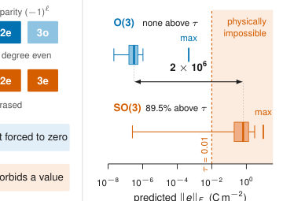
<figcaption class="paper-figure-caption"><b>Fig 1.</b> Figure 1 A label-free test of physical validity. a, A centrosymmetric crystal, one unit cell drawn heavy among its neighbours; each atom’s partner sits at −𝐫, reached through the inversion centre (crossed circle). Neumann’s principle requires the piezoelectric tensor to be invariant under every point-group operation, while parity sends the rank-3 polar tensor to its negative; the two demands force 𝑒= −𝑒, hence 𝑒= 0 exactly, on every centrosymmetric crystal and for any model that respects both. b, The two arms are built from one code path and differ in one bit. Feature irreducible representations run to 𝑙max = 3 in both: the O(3) arm carries the natural spherical-harmonic parity (−1)𝑙, the...</figcaption>
</figure>
<figure class="paper-figure-card">
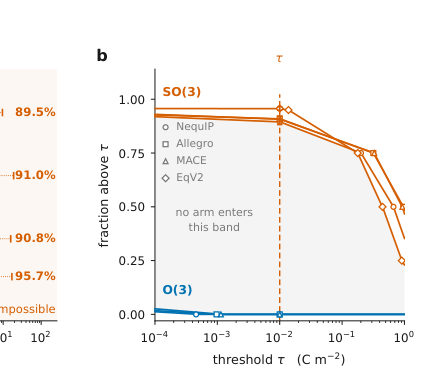
<figcaption class="paper-figure-caption"><b>Fig 2.</b> Figure 2 Parity labels separate possible from impossible predictions by six orders of magnitude. a, Dis- tribution of the predicted piezoelectric magnitude ‖𝑒‖𝐹on the 2,000 centrosymmetric crystals (idealized coordinates), for the O(3) and SO(3) arms of each core. Symmetry forces the true value to zero, so the tinted region above the operating threshold 𝜏= 0.01 C m−2 contains only physically impossible predictions. Box and whisker conventions as in Fig. 1c, here with each percentile taken as the mean of per-seed percentiles over 3 seeds; the capped stem to the right of each box reaches the single largest prediction. The lower tail of each SO(3) whisker is the class-m̄3m population, 8.3% of...</figcaption>
</figure>
<figure class="paper-figure-card">
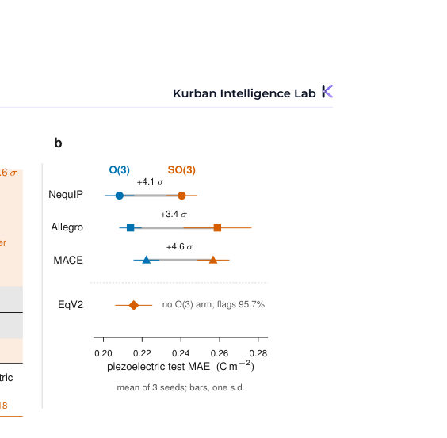
<figcaption class="paper-figure-caption"><b>Fig 3.</b> Figure 3 The parity gap predicts where the labels matter, and where they do not. a, Difference in test mean absolute error between the SO(3) and O(3) arms, in units of the pooled per-seed standard deviation 𝜎, for the three matched cores on all four targets; positive values favour the O(3) arm. Markers are jittered horizontally within each target for legibility. The grey band marks one pooled standard deviation, within which a three- seed comparison cannot resolve a difference and from which we claim no significance. Beneath each target is the parity of its tensor and the parity gap it carries on the evaluated population: 𝛾= 0 identically for the two parity-even targets by Theorem 1, and...</figcaption>
</figure>
<figure class="paper-figure-card">
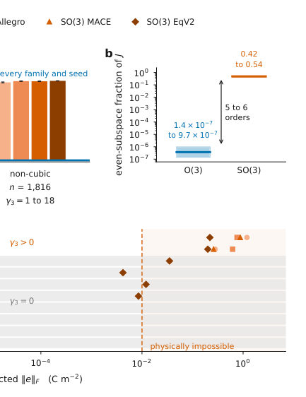
<figcaption class="paper-figure-caption"><b>Fig 4.</b> Figure 4 The missing guarantee is specifically parity, and it is differentiable. Markers and colours are shared across panels: blue, the O(3) arms; the four orange tints, the SO(3) arms of each core. a, False-flag fraction of the SO(3) arms, split by the point-group family of the evaluated crystal and labelled by the parity gap 𝛾3 that Theorem 1 assigns to it: m̄3m, whose proper-rotation subgroup 432 alone annihilates every rank-3 piezoelectric tensor, so 𝛾3 = 0; m̄3, where 𝛾3 = 1; and the non-cubic classes, where 𝛾3 runs from 1 to 18. Bars are means over 3 seeds and error bars are 95% percentile-bootstrap confidence intervals over structures within each family; the m̄3 interval is wide...</figcaption>
</figure>

**Summary.** This work demonstrates that for ML models predicting material properties, the inclusion of parity labels in the model's features is the single design element that dictates whether the model respects exact physical symmetries. Models lacking this label frequently predict physically impossible, non-zero values for properties that must vanish due to crystal symmetry.

**Why it may be interesting.** While focused on condensed matter ML, the rigorous mathematical framework for enforcing exact physical laws (like zero tensors) through structural design choices is highly relevant to building reliable quantum simulation models.

Detailed structure

**Main problem.** The paper addresses whether machine learning models designed for materials can predict physically impossible properties due to insufficient incorporation of exact symmetry constraints.

**Main result.** The ability to enforce exact symmetry constraints (like zero for centrosymmetric materials) is determined solely by a single design choice: whether the model's features are explicitly labeled with parity information.

**Method.** The authors derive the 'parity gap' from group theory to quantify the difference between approximate (rotational) and exact symmetry constraints, testing this using ML models trained on materials data.

**Model / system.** The system is crystalline materials, and the models are machine-learned surrogates for first-principles calculations, specifically tested on properties like the piezoelectric tensor.

**Key observables.** The predicted magnitude of the piezoelectric tensor, and the 'false-flag fraction' (percentage of predictions exceeding a physical threshold when the true value is zero).

**Important parameters / regimes.** The parity label (a binary design choice), the symmetry group ($	ext{E}(3)$ vs $	ext{SO}(3)$), and the physical threshold ($	au = 0.01 	ext{ C m}^{-2}$).

**Assumptions / limitations.** The analysis assumes the validity of permutation and translation invariance, and crucially, that the parity label is an 'upstream' design choice.

**Figures summary.** Figures compare the predictions of parity-labelled ($	ext{O}(3)$) vs. parity-blind ($	ext{SO}(3)$) models for the piezoelectric tensor, showing a separation of six orders of magnitude, with the $	ext{SO}(3)$ model frequently predicting forbidden, non-zero responses.

**Paper structure.** The paper establishes the theoretical distinction between approximate and exact symmetry constraints, derives the parity gap criterion, and then empirically demonstrates this gap by comparing the performance of ML architectures that either incorporate or ignore parity labels when predicting physical tensors.

Abstract

Machine-learned models are replacing first-principles calculations across materials discovery, and physical symmetry is the central guarantee built into them. The debate over how much symmetry to hard-wire rather than learn has run on rotations, where a symmetry error is an approximation error. Some constraints are exact: symmetry forces certain property tensors to exactly zero, so a nonzero prediction is physically impossible rather than inaccurate. Here we show that whether a model can make such predictions is decided before training by one rarely reported design bit, whether its features carry parity labels, and derive a criterion, the parity gap, that computes from group theory alone which properties and crystals are exposed. Across matched architecture pairs differing only in that bit, evaluated on two thousand centrosymmetric crystals whose piezoelectric tensor must vanish, parity-labelled arms sit at the floating-point floor while rotation-only arms predict forbidden responses on 90-96% of crystals, six orders of magnitude apart, at no accuracy cost. Training on explicit zeros does not recover exactness, and a head on a frozen universal potential inherits its backbone's symmetry group. One reflection at random initialization verifies the label in seconds.

[↑ back to top](#top)

### [Asymptotic Entanglement Hiding under Stabilizer Restrictions](http://arxiv.org/abs/2608.18440v1)

**Authors:** Jicun Li, Wei Xie, Jun Wu, Honglin Chen, Xiang-Yang Li  
**Type:** theory · **Category:** quantum information and computing · **PDF:** <https://arxiv.org/pdf/2608.18440v1>  
**Analysis basis:** full PDF text, analyzed in chunks
**Topic relevance:** `quantum measurements` **2/5**

↔ Scroll figures horizontally

<figure class="paper-figure-card">
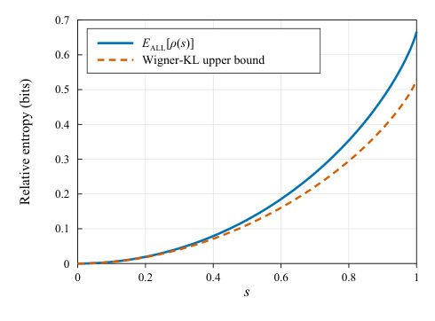
<figcaption class="paper-figure-caption"><b>Fig 1.</b> FIG. 1. Mixed-stabilizer visibility gap. For ρ(s) = (1 −s)σ∗+ sρ∗, the solid curve gives the exact unre- stricted value EALL(ρ(s)) = D(ρ(s)∥σ∗). The dashed curve is DKL(Wρ(s)∥Wσ∗), the Wigner–KL upper bound on ESTAB(ρ(s)). Since this certified upper bound is strictly smaller than EALL(ρ(s)) for every s &gt; 0, stabilizer measure- ments are strictly weaker than unrestricted measurements for this mixed-stabilizer family.</figcaption>
</figure>

**Summary.** This paper establishes a fundamental separation between entanglement and 'magic' by quantifying how much entanglement remains visible when measurements are restricted to stabilizer operations. Through explicit constructions, the authors show that entanglement can be asymptotically hidden, meaning the distillable entanglement can be large while the stabilizer-visible entanglement vanishes. This reveals intrinsic limitations on entanglement extraction using only stabilizer operations.

**Why it may be interesting.** This work provides a rigorous, quantitative measure of how much quantum correlation is 'hidden' from computation protocols relying only on stabilizer measurements, which is crucial for understanding the limits of fault-tolerant quantum computation.

Detailed structure

**Main problem.** The paper investigates the fundamental operational difference between entanglement visible under general measurements (LOCC) versus entanglement visible only through stabilizer measurements.

**Main result.** They demonstrate 'magic-free asymptotic entanglement hiding,' showing that highly entangled states can possess arbitrarily large LOCC-distillable entanglement while having vanishing entanglement visible under stabilizer restrictions.

**Method.** The analysis involves constructing explicit convex mixtures of stabilizer states and applying bounds derived from the relative entropy and Wigner function analysis to quantify the gap between different entanglement measures.

**Model / system.** The study uses bipartite quantum states, specifically focusing on $N$ qutrits per party, Haar-random pure states, and Werner states, all analyzed within the framework of stabilizer operations.

**Key observables.** Stabilizer-visible entanglement ($	ext{ESTAB}$), Unrestricted visible entanglement ($	ext{EALL}$), and LOCC-distillable entanglement ($ED_{LOCC}$).

**Important parameters / regimes.** The number of qutrits per party ($N$), the local dimension ($p$, an odd prime), and the state parameter ($t$ for Werner states).

**Assumptions / limitations.** The core assumption is the restriction of measurements to the set of stabilizer operations, which defines the 'magic' resource theory.

**Figures summary.** Figure 1 illustrates the entanglement hiding mechanism by comparing the unrestricted visible entanglement (solid curve) to the stabilizer-restricted bound (dashed curve) for an interpolated state.

**Paper structure.** The paper builds by first defining the measures, then proving the gap for specific states (Werner states, mixed stabilizer states), and finally establishing the asymptotic scaling laws for general mixed stabilizer states.

Abstract

Entanglement is central to quantum information processing, while stabilizer operations underpin fault-tolerant quantum computation. We ask how much entanglement remains visible or distillable under stabilizer restrictions. We quantify stabilizer-visible entanglement by restricting the measured relative entropy of entanglement to stabilizer measurements, thereby obtaining converse bounds on entanglement distillation under stabilizer operations. We demonstrate magic-free asymptotic entanglement hiding: we construct explicit convex mixtures of pure stabilizer states on $N$ qutrits per party whose unrestricted visible entanglement and LOCC-distillable entanglement both grow as $Ω(N/\log N)$, while their stabilizer-visible and stabilizer-distillable entanglement vanish as $N\to\infty$. Thus, an unbounded amount of LOCC-distillable entanglement carried by stabilizer states can become asymptotically invisible and undistillable under stabilizer restrictions. We further prove that stabilizer-visible entanglement is $O(1)$ with high probability for Haar-random pure states despite extensive unrestricted visibility, and vanishes uniformly over entangled Werner states as the local dimension grows through odd primes. These results reveal a fundamental separation between entanglement and magic as resources, exposing intrinsic limits on entanglement extraction using stabilizer operations.

[↑ back to top](#top)

### [Generalizing Pauli Checks for Qudit-based Quantum Error Detection and Mitigation](http://arxiv.org/abs/2608.18332v1)

**Authors:** Noble Agyeman-Bobie, Quinn Langfitt, Salahedeen Issa, Nikos Hardavellas, Kaitlin N. Smith  
**Type:** theory · **Category:** quantum information and computing · **PDF:** <https://arxiv.org/pdf/2608.18332v1>  
**Analysis basis:** full PDF text, analyzed in chunks
**Topic relevance:** `quantum measurements` **2/5**

↔ Scroll figures horizontally

<figure class="paper-figure-card">
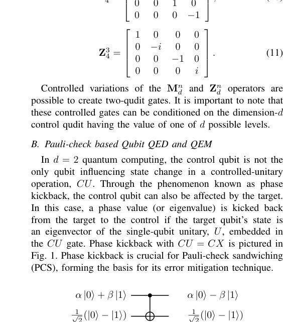
<figcaption class="paper-figure-caption"><b>Fig 1.</b> Fig. 1. Phase kickback in qubits. Here, a phase of -1 gets kicked back onto the basis state |1⟩of the top qubit.</figcaption>
</figure>
<figure class="paper-figure-card">
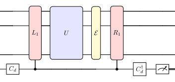
<figcaption class="paper-figure-caption"><b>Fig 2.</b> Fig. 2. General PCS circuit layout. The red unitaries L1 and R1 represent the Pauli checks that sandwich the main payload circuit U. Measurement of the ancillas provides detection of the error channel ε. The Chrestenson gate Cd is equivalent to the Hadamard gate when d = 2.</figcaption>
</figure>
<figure class="paper-figure-card">
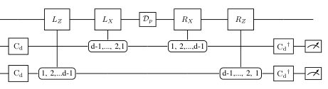
<figcaption class="paper-figure-caption"><b>Fig 3.</b> Fig. 3. Generalized PCS circuit for arbitrary error detection. Again, two ancillas are used as syndrome registers since two sets of checks are used.</figcaption>
</figure>
<figure class="paper-figure-card">
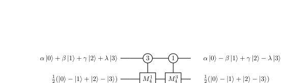
<figcaption class="paper-figure-caption"><b>Fig 4.</b> Fig. 4. Phase kickback in dimension-4 Hilbert Space. Here, a phase of -1 gets kicked back onto the basis states of |1⟩and |3⟩of the top ququart.</figcaption>
</figure>
<figure class="paper-figure-card">
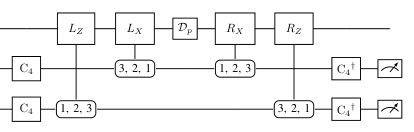
<figcaption class="paper-figure-caption"><b>Fig 5.</b> Fig. 7. PCS Ququart circuit for arbitrary error detection. Here, two ancillas are used as syndrome registers since two sets of checks are used.</figcaption>
</figure>

**Summary.** This paper extends Pauli Check Sandwiching (PCS) from qubits to qudits of arbitrary dimension $d$ for quantum error detection and mitigation. It develops generalized checks using the Heisenberg-Weyl set, proving that these checks can deterministically identify arbitrary qudit errors. The results validate the technique numerically, showing high fidelity preservation even under realistic error rates.

**Why it may be interesting.** This work directly advances the theoretical toolkit for fault-tolerant quantum computation by extending established error correction paradigms to higher-dimensional quantum systems (qudits), which are relevant for many physical implementations.

Detailed structure

**Main problem.** The paper generalizes the Pauli Check Sandwiching (PCS) technique, traditionally used for qubit error detection and mitigation, to arbitrary qudit dimensions.

**Main result.** The generalized PCS protocol successfully detects arbitrary Heisenberg-Weyl errors in qudit systems, achieving unit fidelity in the noiseless check limit.

**Method.** It introduces generalized left and right Pauli checks using the Heisenberg-Weyl operator set, relying on commutation relations and Fourier orthogonality for error syndrome extraction.

**Model / system.** The model involves qudit systems of arbitrary dimension $d$, where error detection is performed by sandwiching the computation between controlled Pauli checks.

**Key observables.** Error-mitigated fidelity (validated above 97.5% for $d=2$ to $d=9$), and the deterministic mapping of an error to a unique ancilla readout.

**Important parameters / regimes.** The dimension $d$ of the qudit space, and the depolarizing error rate $p$.

**Assumptions / limitations.** The analysis assumes that the error channel can be decomposed into the Pauli (or Heisenberg-Weyl) basis, and that the checks themselves are noiseless.

**Figures summary.** Figures illustrate phase kickback in qubits and the general PCS circuit layout for both qubit and qudit systems, showing the structure of the error checks.

**Paper structure.** The paper first introduces the generalization of PCS to qudits using the Heisenberg-Weyl set, mathematically proves the detection capability via commutation relations, and concludes with numerical validation on specific circuits (Mod-2 and GHZ-2) across various dimensions.

Abstract

Pauli Check Sandwiching (PCS) is a quantum error detection (QED) technique that protects a quantum circuit by utilizing a pair of controlled Pauli operators, or checks, and detecting errors that anti-commute with the checks. Further, PCS can be used for quantum error mitigation (QEM) via post-selection based on the Pauli check syndrome values. Currently, PCS is leveraged in the qubit space. In this paper, we introduce a generalized approach for applying PCS-based QED and QEM to quantum information of arbitrary dimension in the Hilbert space. Each pair of these extended checks consists of a sequence of gates in the Heisenberg-Weyl operator set that extend Pauli operators into the qudit space. These qudit checks use at least one ancilla qudit to detect qudit errors that do not commute with the unitary selected for the check. We show that our proposed methods for qudit QED can detect errors of arbitrary dimensions. More specifically, we prove that an arbitrary Heisenberg-Weyl error maps deterministically to a unique ancilla readout, and further, post-selecting on the $|0 \rangle$ readout guarantees unit fidelity in the noiseless check limit. We validate these findings numerically across dimensions $d=2$ through $d=9$, achieving error-mitigated fidelities above $97.5\% $ under realistic depolarizing error rates.

[↑ back to top](#top)

### [Cluster Representation of Renormalization Group Transformations and a Rigorous Proof for Convergence of the RG-Flow of the Ising Model to Trivial Fixed Points away from Criticality](http://arxiv.org/abs/2608.18862v1)

**Authors:** Fabio Arz  
**Type:** theory · **Category:** statistical mechanics · **PDF:** <https://arxiv.org/pdf/2608.18862v1>  
**Analysis basis:** full PDF text, analyzed in chunks
**Topic relevance:** `analog quantum simulation` **1/5** · `driven-dissipative phase transition` **1/5** · `non-equilibrium universality` **1/5**

↔ Scroll figures horizontally

<figure class="paper-figure-card">
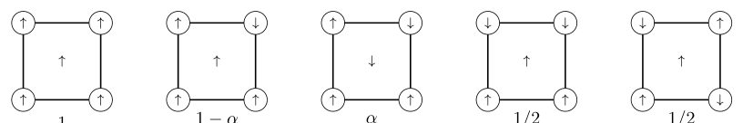
<figcaption class="paper-figure-caption"><b>Fig 1.</b> Figure 2: The possible transition values for the 2 × 2 →1 coarse-graining, respecting R1-R4. The values of the other possible block-configurations are determined through R1 and R2.</figcaption>
</figure>
<figure class="paper-figure-card">
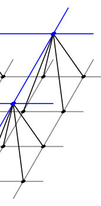
<figcaption class="paper-figure-caption"><b>Fig 2.</b> Figure 4: RG-admissible graph-structure for a 2 × 2 →1 coarse-graining on the 2D square lattice.</figcaption>
</figure>
<figure class="paper-figure-card">
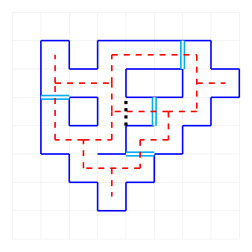
<figcaption class="paper-figure-caption"><b>Fig 3.</b> Figure 6: The solid edges represent a possible configuration ω′ with the dotted edge corresponding to ei, which is set to 0 for ω′ and 1 for ω. The dashed edges represent the dual cluster Ce∗ i (ω′∗). At last, the double edges are additional open edges in ω that are closed in ω′. It is clear that spin configurations on ω and ω′ can always be chosen such that they match everywhere except on the few islands inside of Ce∗ i (ω′∗).</figcaption>
</figure>
<figure class="paper-figure-card">
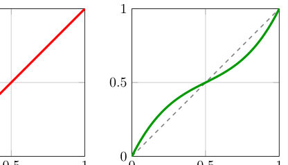
<figcaption class="paper-figure-caption"><b>Fig 4.</b> Figure 7: The three possible dynamics of gα depending on the value of α.</figcaption>
</figure>
<figure class="paper-figure-card">
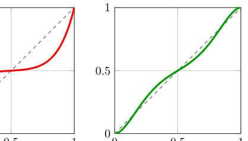
<figcaption class="paper-figure-caption"><b>Fig 5.</b> Figure 8: The dynamics of f for different values of the input parameters.</figcaption>
</figure>

**Summary.** This paper bridges the gap between the Random Cluster Model and the Renormalization Group theory to provide rigorous mathematical proofs for the RG flow of the Ising model away from its critical point. By mapping the RG flow onto a simple 1D dynamical system based on cluster connectivity, the authors prove convergence to high and low-temperature fixed points. This work advances the mathematical understanding of critical phenomena in statistical mechanics.

**Why it may be interesting.** While focused on classical statistical mechanics, the rigorous mathematical techniques involving dynamical systems and convergence proofs are highly relevant to understanding the dynamics of quantum many-body systems and quantum phase transitions.

Detailed structure

**Main problem.** To establish a rigorous mathematical foundation for the Renormalization Group (RG) flow, specifically by connecting RG transformations to geometrical representations like the random cluster model.

**Main result.** The paper rigorously proves the convergence of the RG flow for the nearest-neighbor Ising model away from criticality to the zero- and infinite-temperature fixed points for a large family of transformations.

**Method.** The authors relate the scaling limit of the RG flow to a simple one-dimensional dynamical system governed by the cluster connectivity derived from the random cluster representation.

**Model / system.** The primary system is the Ising model on the 2D square lattice ($\mathbb{Z}^2$), analyzed using the Random Cluster Model (RCM) framework. The analysis extends to higher-state Potts models.

**Key observables.** Convergence of the RG flow to trivial fixed points, correlation functions, and susceptibility ($\chi_p$).

**Important parameters / regimes.** Inverse temperature ($eta$), the RCM parameter $p$, and the RG transformation parameters ($\alpha, eta, \gamma$).

**Assumptions / limitations.** The approach is weakened by the need for negative cluster-weights, and the results are explicitly established for the nearest-neighbor Ising model, with generalizations being an open question.

**Figures summary.** Figures illustrate the dynamics of the RG flow parameter $f$ for different parameter regimes and show possible block configurations for coarse-graining in the 3-states Potts model.

**Paper structure.** The paper progresses from introducing the need for rigorous RG foundations, detailing the RCM representation, analyzing the $2 	imes 2 	o 1$ RG transformation on the square lattice, and concluding with discussions on generalizations to higher dimensions and Potts models.

Abstract

Many rigorous results in the modern era of statistical mechanics have been obtained through geometrical representations. A much studied tool in this setting is the random cluster representation of lattice spin models. Another area of statistical mechanics that is of great interest but lacking rigorous results is the theory of the renormalization group. This paper investigates the idea to find a common ground between these two concepts in order to obtain rigorous results on the renormalization group flow. A need for negative cluster-weights weakens the success of this approach. Nevertheless, we managed to establish a relation between the scaling limit of the renormalization group flow of the nearest-neighbour Ising model away from criticality with a simple one-dimensional dynamical system that follows the cluster connectivity of the renormalization group transformation. This allows for a rigorous proof of the convergence of this flow to the zero- and infinite-temperature fixed point respectively for a large family of renormalization group transformations. Explicit results will be established on $\mathbb{Z}^2$ followed by a discussion of the available generalizations to higher dimensions.

[↑ back to top](#top)

### [Deviation from linear reduced dynamics always occurs for each non-factorisable system-environment unitary evolution](http://arxiv.org/abs/2608.18977v1)

**Authors:** Iman Sargolzahi  
**Type:** theory · **Category:** other · **PDF:** <https://arxiv.org/pdf/2608.18977v1>  
**Analysis basis:** full PDF text, analyzed in chunks
**Topic relevance:** `correlated / nonlocal dissipation` **1/5** · `driven-dissipative phase transition` **1/5** · `methods for driven-dissipative` **1/5**

↔ Scroll figures horizontally

<figure class="paper-figure-card">
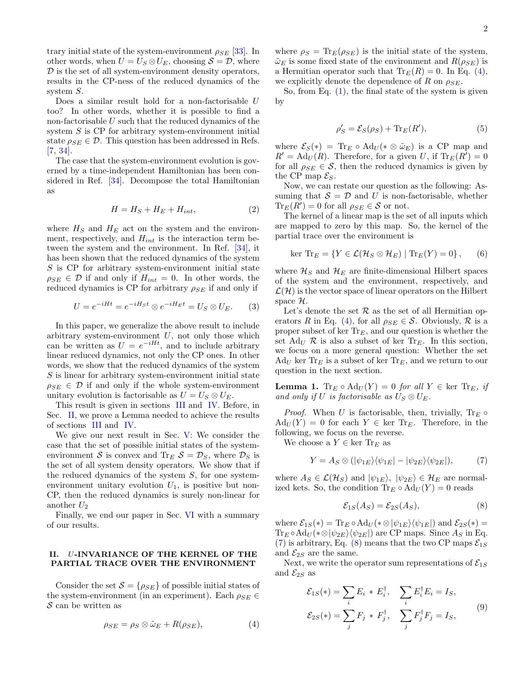
<figcaption class="paper-figure-caption"><b>Fig 1.</b> Low-resolution page preview, page 2</figcaption>
</figure>
<figure class="paper-figure-card">
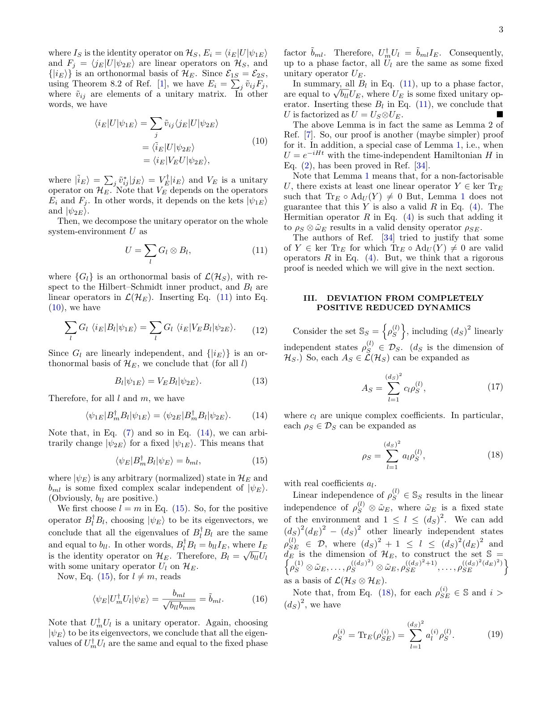
<figcaption class="paper-figure-caption"><b>Fig 2.</b> Low-resolution page preview, page 3</figcaption>
</figure>
<figure class="paper-figure-card">
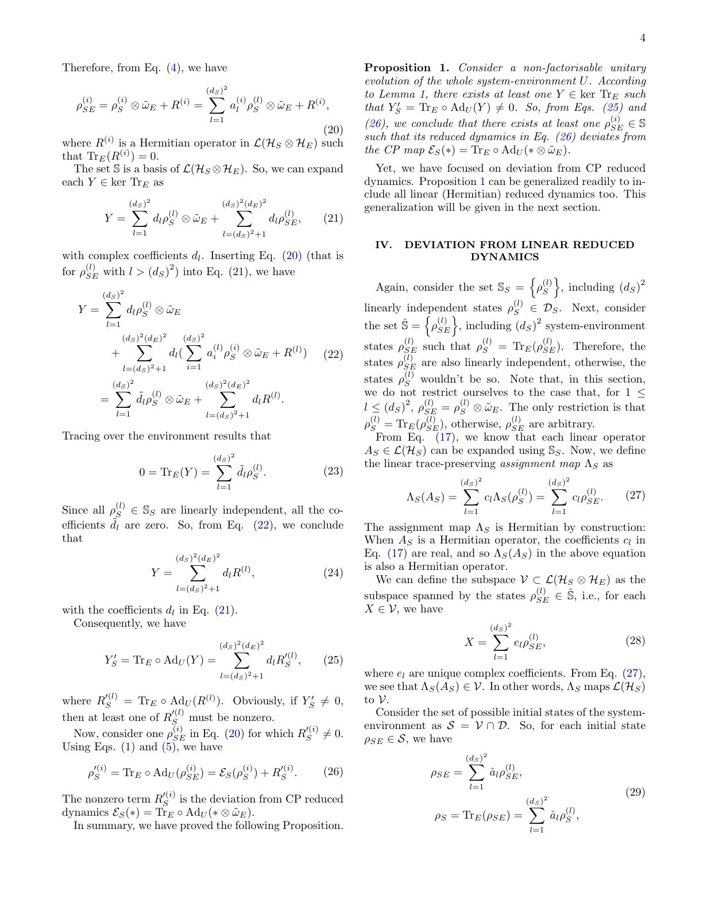
<figcaption class="paper-figure-caption"><b>Fig 3.</b> Low-resolution page preview, page 4</figcaption>
</figure>
<figure class="paper-figure-card">
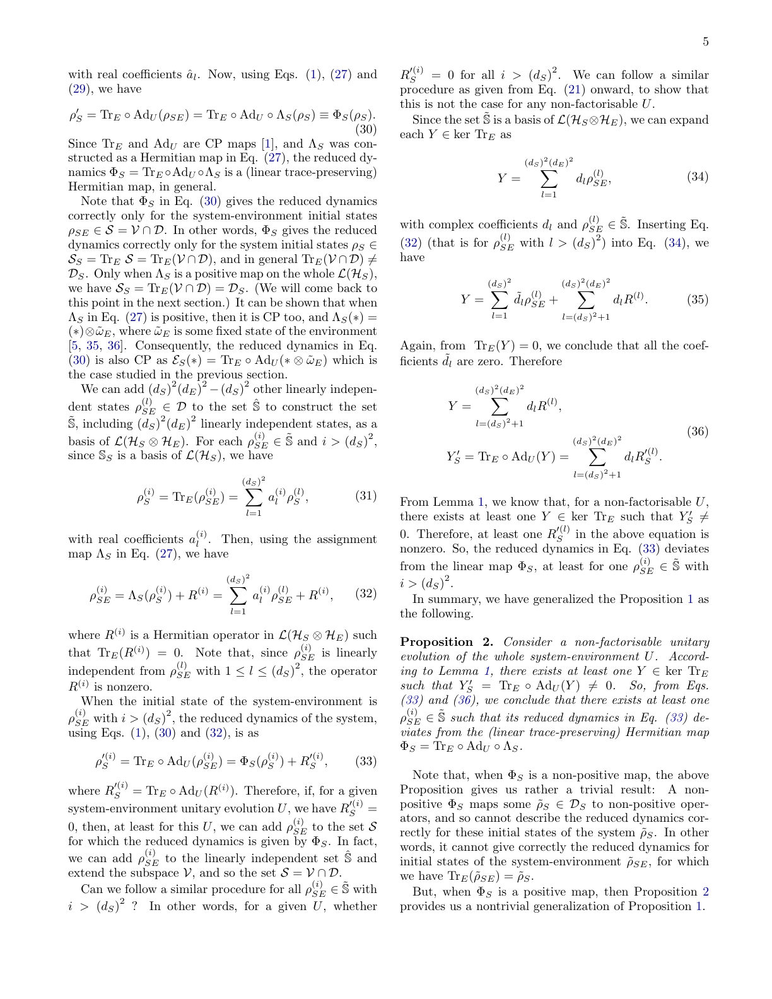
<figcaption class="paper-figure-caption"><b>Fig 4.</b> Low-resolution page preview, page 5</figcaption>
</figure>
<figure class="paper-figure-card">
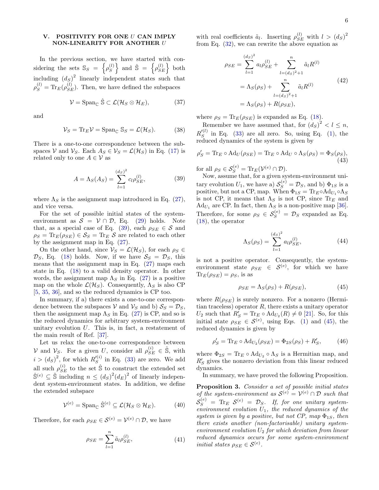
<figcaption class="paper-figure-caption"><b>Fig 5.</b> Low-resolution page preview, page 6</figcaption>
</figure>

**Summary.** This theoretical paper rigorously analyzes when the reduced dynamics of a quantum system coupled to an environment remains linear. It proves that linearity requires the total system-environment unitary evolution to be factorisable. Crucially, it demonstrates that any non-factorisable evolution necessarily leads to a deviation from simple linear or completely positive dynamics.

**Why it may be interesting.** This work provides fundamental mathematical constraints on the description of open quantum systems, showing that simple assumptions (like CP maps) fail when initial correlations are present and the total evolution is non-factorisable.

Detailed structure

**Main problem.** The paper investigates the conditions under which the reduced dynamics of a quantum system interacting with an environment remains linear, particularly when the total system-environment unitary evolution is non-factorisable.

**Main result.** The reduced dynamics is linear for arbitrary initial states if and only if the total unitary evolution $U$ is factorisable ($U=U_S \otimes U_E$). Furthermore, non-factorisable evolution implies deviations from linearity or complete positivity.

**Method.** The analysis uses the mathematical framework of reduced density operators ($	ext{Tr}_E \circ 	ext{Ad}_U(
ho_{SE})$) and compares the dynamics derived from different assumptions (e.g., CP maps vs. general linear maps) to deduce constraints on the unitary $U$.

**Model / system.** The system consists of a quantum system $S$ coupled to an environment $E$, evolving unitarily under $U$. The dynamics are studied by analyzing the reduced density matrix $
ho_S = 	ext{Tr}_E(
ho_{SE})$.

**Key observables.** Reduced dynamics ($
ho'_S$), deviation from complete positivity (CP), and linearity of the reduced map.

**Important parameters / regimes.** The structure of the initial state set $\mathcal{S}$ relative to the full set $\mathcal{D}$, and the factorisability of the unitary $U$.

**Assumptions / limitations.** The analysis often starts by considering the simplest approximation (CP map) and then generalizes to arbitrary initial states and unitaries to find where this approximation breaks down.

**Paper structure.** The paper progresses by first establishing the necessary and sufficient condition for linear reduced dynamics (factorisability of $U$). It then uses this result to show that non-factorisable $U$ forces deviations from linearity or CP, culminating in proofs that demonstrate this deviation always occurs.

Abstract

In the simplest approximation, the reduced dynamics of a quantum system $S$ interacting with its environment $E$ is considered to be given by a completely positive map. But, in general, this is not the case. In fact, the reduced dynamics of the system in not even linear, in general. Whether the reduced dynamics is linear or not is determined by two factors: the set of possible initial states of the system-environment $\mathcal{S}=\left\lbrace ρ_{SE} \right\rbrace $, and the joint system-environment unitary evolution $U$. When $U$ is factorisable as $U=U_S\otimes U_E$, then we can choose $\mathcal{S}=\mathcal{D}$, where $\mathcal{D}$ is the set of all system-environment density operators. In other words, when $U$ is factorisable, the reduced dynamics of the system $S$ is linear (in fact unitary) for arbitrary initial state of the system-environment $ρ_{SE}$. We show that this result cannot be generalized to any non-factorisable $U$: For any non-factorisable unitary evolution of the whole system-environment $U$, the set $\mathcal{S}$ must be chosen as a proper subset of $\mathcal{D}$ to achieve linear reduced dynamics. As a byproduct, considering a convex set of possible initial states of the system-environment $\mathcal{S}$ such that $\mathrm{Tr}_{E} \ \mathcal{S}=\mathrm{Tr}_{E} \ \mathcal{D}$, we show that when the reduced dynamics of the system, for one system-environment unitary evolution $U_1$, is positive, but not completely positive, this implies that reduced dynamics is not linear for another $U_2$.

[↑ back to top](#top)

### [Towards Quantum-Dot Detectors as Barcodes for Dark Matter Interactions](http://arxiv.org/abs/2608.18204v1)

**Authors:** Marek Matas, Andrea Gallo Rosso, Antonio Cammarata, Nora Hoch, Carlos Blanco, Jan Conrad, Rouven Essig, Tim Linden, Lindley Winslow  
**Type:** theory · **Category:** other · **PDF:** <https://arxiv.org/pdf/2608.18204v1>  
**Analysis basis:** full PDF text, analyzed in chunks
**Topic relevance:** `Keldysh / 2PI / non-Gaussian methods` **1/5** · `analog quantum simulation` **1/5** · `quantum measurements` **1/5**

↔ Scroll figures horizontally

<figure class="paper-figure-card">
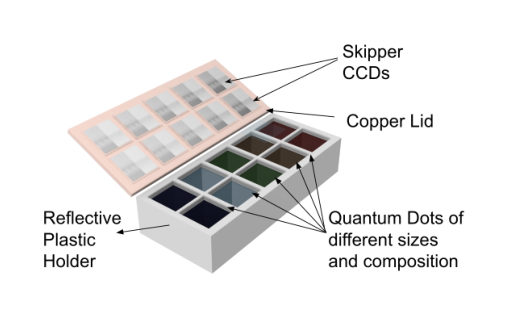
<figcaption class="paper-figure-caption"><b>Fig 1.</b> Figure 1. A CAD rendering of a possible experimental detec- tor design, based on quantum dot (QD) technology and using Skipper CCDs [22] to detect photon signals from the QDs. Here, each section of the detector consists of a 10 cm2 area Skipper CCD and 1 kg of QD target material. Each QD-based scintillator volume, in our benchmark setup, is composed of 50% QDs by weight, loaded in a solid matrix. There are five pairs of volumes, one for each QD combination of diameter and surface termination. We consider independent pairs to separate backgrounds originating in the active volume from those in the photon readout.</figcaption>
</figure>
<figure class="paper-figure-card">
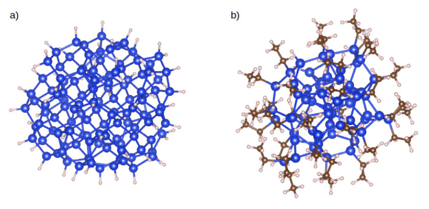
<figcaption class="paper-figure-caption"><b>Fig 2.</b> Figure 2. Model geometry example of a) hydrogen-terminated and b) alkyl-terminated quantum dots with 121 and 63 silicon atoms, respectively (121-Si-H and 63-Si-alk systems). Blue, brown, and white spheres represent the position of the silicon, carbon, and hydrogen atoms, respectively.</figcaption>
</figure>
<figure class="paper-figure-card">
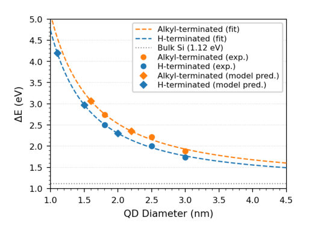
<figcaption class="paper-figure-caption"><b>Fig 3.</b> Figure 3. We show the vertical transition energy (optical gap) ∆E of H-terminated (blue) and Alkyl-terminated (or- ange) quantum dots. The dashed lines show our best-fit model based on the experimental values in Ref. [32] (circles), which is used to predict the transition-energy threshold for our quan- tum dots (diamonds).</figcaption>
</figure>
<figure class="paper-figure-card">
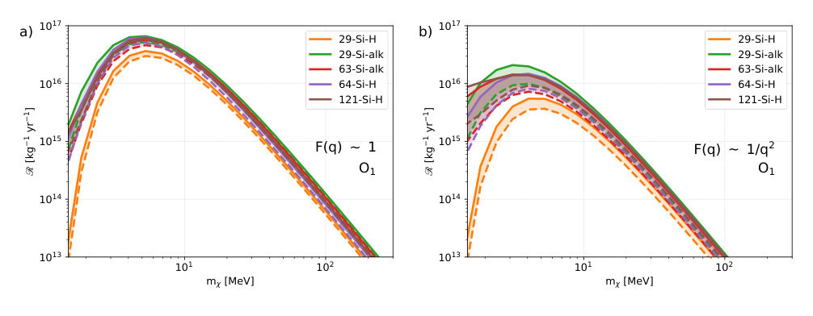
<figcaption class="paper-figure-caption"><b>Fig 4.</b> Figure 4. The effect of screening on the interaction rate for the O1 operator in the heavy (panel a) and light (panel b) mediator limits, with cs 1 = 1 (cℓ 1 = 1), for the five considered quantum dots. Solid lines show the unscreened rates; dashed lines show the rates with maximal screening, corresponding to that of bulk silicon. Because a finite crystal cannot support collective screening on length scales beyond its own size, the screening in QDs is weaker than in the bulk, and the actual rates are expected to lie within the shaded bands. In-medium effects become negligible for DM masses above mχ ∼10 MeV. For heavy mediators, screening plays a sub-dominant role as seen in the vanishing...</figcaption>
</figure>
<figure class="paper-figure-card">
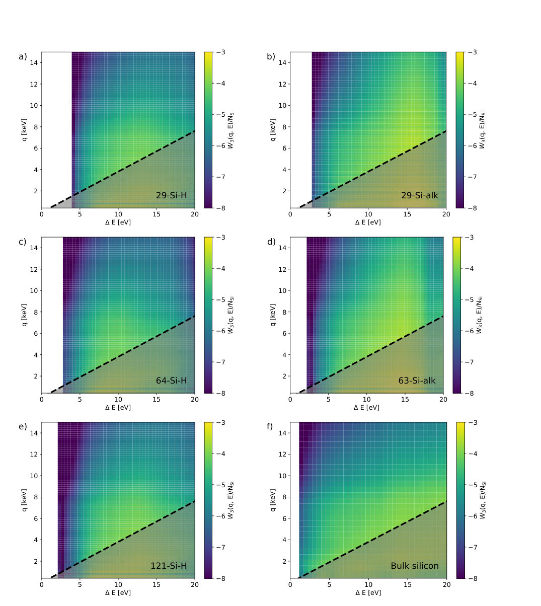
<figcaption class="paper-figure-caption"><b>Fig 5.</b> Figure 5. Material response function W3 normalized by the number of silicon atoms in a unit cell for all considered QDs, as well as for the bulk Si crystal. The shaded region below the dashed black line shows the kinematically inaccessible region. In the shaded region, the minimal DM velocity required to induce an excitation exceeds the galactic escape velocity in the large-mass limit.</figcaption>
</figure>

**Summary.** This paper proposes using quantum dots as highly tunable targets in a dark matter detector array. By calculating how DM scatters off electrons in QDs of varying sizes and surface chemistries, the authors show that the resulting pattern of energy deposition rates—a 'barcode'—can uniquely identify the underlying physics of the dark matter interaction.

**Why it may be interesting.** While the core application is particle astrophysics, the underlying physics involves calculating electronic structure responses (form factors, energy thresholds) in nanoscale, confined systems, which touches upon condensed matter theory relevant to AMO physics.

Detailed structure

**Main problem.** The paper addresses the search for dark matter (DM) interactions, specifically focusing on detecting low-mass DM (below a GeV) through inelastic energy deposits.

**Main result.** The relative rates of energy deposition across an array of quantum dot targets form a unique 'barcode' that can allow discrimination between different hypothesized DM interaction operators and mediator types.

**Method.** The authors perform ab initio calculations of DM scattering on electrons bound within quantum dots, modeling the system using effective operators and calculating material response functions.

**Model / system.** The physical platform is a detector array using semiconductor quantum dots (e.g., Si QDs) as target subunits, read out by Skipper CCDs. The calculations treat the QDs as finite, non-periodic objects.

**Key observables.** The primary observables are the relative scattering rates across different QD morphologies, which form the 'barcode'; also analyzed are the material response functions $W_1(q, E)$ and $W_4(q, E)$.

**Important parameters / regimes.** Key parameters include the QD diameter, surface ligand type, DM mass, interaction operator couplings, and the energy threshold set by the QD electronic gap ($\Delta E$).

**Assumptions / limitations.** The analysis assumes the non-relativistic limit and that the initial and final state momenta are zero due to the finite nature of the QD environment. The DM flux is modeled using a standard halo model.

**Figures summary.** Figures illustrate the detector concept (CAD rendering of QD/Skipper CCD setup) and plot the material response functions ($W_1$ and $W_4$) as functions of momentum transfer and energy, highlighting kinematically inaccessible regions.

**Paper structure.** The paper progresses from defining the physical system (QDs) and the detection concept (barcode) to detailing the theoretical framework (ab initio calculations of scattering amplitude using effective operators) and finally presenting the diagnostic power of the barcode strategy.

Abstract

Quantum dots are tunable semiconductor nanocrystals that can be produced at industrial scales. We present the first ab initio calculation of the scattering of dark matter on electrons bound in quantum dots. The momentum-dependence of a quantum dot's electronic response depends on its morphology and on the dark matter mass, interaction operator, mediator coupling, and mediator mass. Therefore, the relative rates across an array of distinct quantum dot targets form a ``barcode'' that carries information about the nature of the dark matter interaction. We project the sensitivity of a detector concept in which a collection of independent target subunits, each loaded with silicon quantum dots of a particular morphology, are read out by Skipper CCDs. Given a future signal, this barcode could discriminate between interaction operators and mediator types. We quantify the discrimination power for a benchmark pair of models as a function of readout noise and exposure.

[↑ back to top](#top)

### [Unified Strong-Field Dynamics Simulations from Atoms to Heterostructures](http://arxiv.org/abs/2608.18472v1)

**Authors:** Zakaria Dahbi, Amelle Zaïr  
**Type:** theory · **Category:** other · **PDF:** <https://arxiv.org/pdf/2608.18472v1>  
**Analysis basis:** full PDF text, analyzed in chunks
**Topic relevance:** `analog quantum simulation` **1/5** · `interference shaping light` **1/5** · `methods for driven-dissipative` **1/5**

↔ Scroll figures horizontally

<figure class="paper-figure-card">
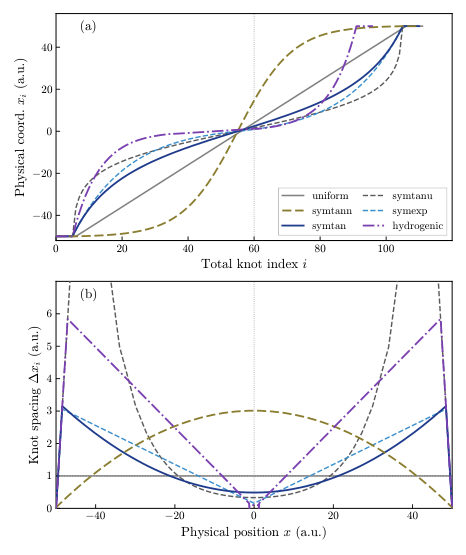
<figcaption class="paper-figure-caption"><b>Fig 1.</b> FIG. 1. Illustration of knot distributions and local grid resolution for the six coordinate mappings. (a) Physical knot positions 𝑥𝑖vs. index 𝑖over [−50, 50] a.u. (𝑁interior = 99, 𝑝= 5). Clustering near the origin is evident for all non-uniform schemes. (b) Grid spacing Δ𝑥𝑖= 𝑥𝑖+1 −𝑥𝑖. The symtan, symexp, and hydrogenic mappings achieve sub-atomic resolution (&lt; 0.2 a.u.) near the Coulomb cusp without increasing the global basis size.</figcaption>
</figure>
<figure class="paper-figure-card">
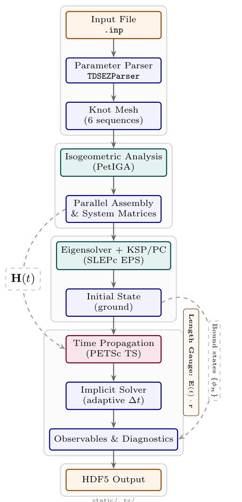
<figcaption class="paper-figure-caption"><b>Fig 2.</b> FIG. 2. Code workflow of TDSE-Z. From input file through ge- ometry/mesh generation, IGA basis construction, parallel assembly of system matrices (mass, BDD kinetic, potential, length-gauge laser, CAP), eigenproblem (Krylov-Schur + shift-invert), initial state preparation, PETSc/TS Crank-Nicolson time propagation, observable computation, automated diagnostics (TRK, dipole-matrix Hermiticity, [𝐻, 𝐿𝑧] commutator), to structured HDF5 output. Dashed arrows indicate run-time feedback loops (length-gauge dipole precompute, bound-state projections). Green = core innovation (BDD operator, IGA, adaptive solvers); Red = time propagation; Yellow = I/O.</figcaption>
</figure>
<figure class="paper-figure-card">
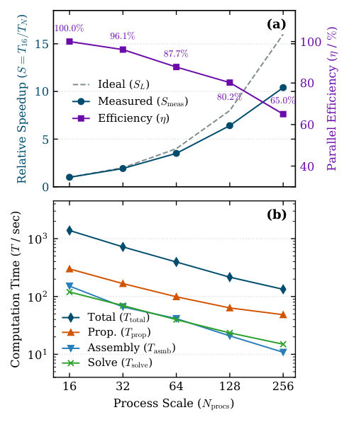
<figcaption class="paper-figure-caption"><b>Fig 3.</b> FIG. 3. Strong scaling on AMD Zen 4. (a): relative speed-up 𝑆= 𝑇16/𝑇𝑁against the number of MPI ranks 𝑁∈{16, 32, 64, 128, 256}, with ideal 1/𝑁scaling overlaid; the parallel efficiency 𝜂= 𝑆/(𝑁/16) is annotated at each rank and falls from 96% (32 ranks) to 65% (256 ranks). (b): wall time in log scale, decomposed into matrix assembly (red), ground-state solve, Crank-Nicolson propagation, HDF5 output, and Total time.</figcaption>
</figure>
<figure class="paper-figure-card">
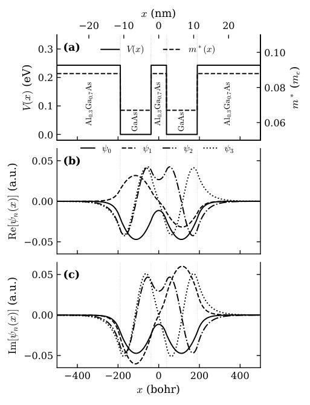
<figcaption class="paper-figure-caption"><b>Fig 4.</b> FIG. 4. (a) Conduction-band potential profile 𝑉(𝑥) (solid curve, left axis, in eV) and position-dependent effective mass 𝑚∗(𝑥) (dashed curve, right axis, in units of 𝑚𝑒) for the symmetric GaAs/Al0.3Ga0.7As double quantum well structure. The configuration defines an inner 4 nm central barrier bounded by two symmetric 8 nm quantum wells, with step heterojunctions located at 𝑥= ±37.79 bohr (±2 nm) and ±188.97 bohr (±10 nm). (b) Real and (c) imaginary components of the first four stationary bound-state eigenfunctions (𝜓0 to 𝜓3). The vanishing imaginary channels reflect the pure real-symmetric nature of the static Hamiltonian. The BenDaniel-Duke operator handles mass discontinuities by sampling...</figcaption>
</figure>
<figure class="paper-figure-card">
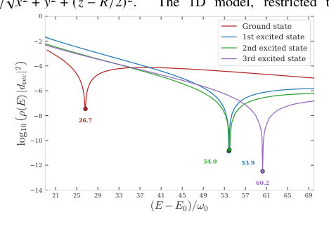
<figcaption class="paper-figure-caption"><b>Fig 5.</b> FIG. 6. Logarithm of the differential recombination probability, log10(𝜌(𝐸)|𝑑rec|2), as a function of the scaled photoelectron energy (𝐸−𝐸0)/𝜔0 for the ground state (red) and the first (blue), second (green), and third (purple) excited states of 1D H+ 2 . 𝑑rec(𝐸𝑖) = ⟨𝜓𝑖| ˆ𝐷𝑥|𝜓𝐸𝑖⟩is the dipole recombination and 𝜌(𝐸𝑖) = (𝐸𝑖+1 −𝐸𝑖)−1</figcaption>
</figure>

**Summary.** The authors present TDSE-Z, a high-performance, open-source framework for simulating strong-field quantum dynamics in materials with position-dependent effective mass. It uses a weak-form Galerkin method on B-splines to solve the time-dependent Schrödinger equation. The code is validated by reproducing known physical results, such as WKB decay in quantum wells and HHG spectra, making it a powerful tool for quantum optics and semiconductor physics.

**Why it may be interesting.** This work provides a highly robust and general computational tool for simulating light-matter interactions in solid-state and molecular systems, which is central to quantum optics and condensed matter physics.

Detailed structure

**Main problem.** The paper addresses the challenge of simulating strong-field quantum dynamics in complex materials, particularly those with spatially varying effective mass at interfaces.

**Main result.** The developed framework, TDSE-Z, successfully implements the BenDaniel-Duke operator using a weak-form Galerkin approach, validating its accuracy across static eigensolvers (WKB comparison) and time propagation (HHG spectra).

**Method.** The core method involves a weak-form Galerkin discretization of the time-dependent Schrödinger equation using B-spline basis functions on geometry-adapted meshes.

**Model / system.** The system models atomic, molecular, and semiconductor effective-mass systems, governed by the TDSE incorporating the BenDaniel-Duke kinetic operator, which accounts for spatially varying effective mass m(r).

**Key observables.** Tunnel splittings, High-Harmonic Generation (HHG) spectra, dipole moment, and total energy expectation values.

**Important parameters / regimes.** Strong laser field amplitudes ($E_0$), dimensionality (1D vs 3D), and the effective mass function $m(r)$.

**Assumptions / limitations.** The time-propagation engine is currently CPU-optimized, and the framework relies on the weak-form formulation to handle mass-gradient singularities.

**Figures summary.** Figures illustrate the comparison of 1D vs 3D HHG spectra showing spectral differences due to dimensionality, and plots demonstrate the time evolution of energy and position expectation values confirming numerical stability.

**Paper structure.** The paper details the implementation of the BDD operator via weak-form Galerkin discretization, validates the static eigensolver against WKB theory, and demonstrates the time-propagation engine on benchmarks like HHG and constant-mass systems.

Abstract

We present \textsc{TDSE-Z}, a high-performance open-source framework for strong-field quantum dynamics in atomic, molecular, and semiconductor effective-mass systems. The core engine implements a weak-form Galerkin discretisation of the Hermitian BenDaniel-Duke operator, $\hat{T}_{\mathrm{BDD}} = -\frac{1}{2}\nabla\cdot(m^{-1}(\mathbf{r})\nabla)$, on geometry-adapted B-spline meshes, supporting arbitrary potentials and customisable laser configurations in one to three dimensions. We validate the static position-dependent-mass (PDM) eigensolver through two stringent benchmarks: a comparison to the analytical Quesne PDM model and a $\text{GaAs/Al}_{0.3}\text{Ga}_{0.7}\text{As}$ double quantum well, where the exponential decay of computed tunnel splittings follows Wentzel-Kramers-Brillouin (WKB) theory at the sub-percent level. We further demonstrate the time-propagation engine on constant-mass systems, accurately reproducing high-harmonic generation (HHG) spectra in atomic benchmarks and confirming the importance of dimensionality in fully capturing the strong light-matter interaction. Our implementation demonstrates robust strong-scaling efficiency, maintaining performance across hundreds of CPU cores. While the static eigensolver currently supports optional GPU offloading, the time-propagation engine is CPU-optimised, providing a modular architecture for future expansion toward exascale quantum dynamics.

[↑ back to top](#top)

### [Bernstein-Vazirani Networks: Quantum Machine Learning by Interference](http://arxiv.org/abs/2608.19043v1)

**Authors:** Natacha Kuete Meli, Tolga Birdal, Prayag Tiwari, Vladislav Golyanik, Michael Moeller  
**Type:** both · **Category:** quantum information and computing · **PDF:** <https://arxiv.org/pdf/2608.19043v1>  
**Analysis basis:** full PDF text, analyzed in chunks
**Topic relevance:** `interference shaping light` **1/5** · `quantum measurements` **1/5**

↔ Scroll figures horizontally

<figure class="paper-figure-card">
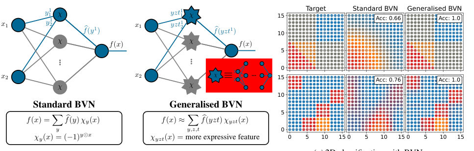
<figcaption class="paper-figure-caption"><b>Fig 1.</b> Figure 1. The proposed standard (1a) and generalised (1b) Bernstein–Vazirani Networks (BVNs). In the standard setting, binary inputs xi are linearly combined in a hidden layer with optimised binary weights yj, passed through a parity activation χ, and linearly combined at the output layer using Fourier coefficients bf(yj). In the generalised setting, inputs pass through expressive optimised sub-models χ (cartooned in the red box) before the output combination, enabling richer representations. (1c): Illustratively, we classify 2D points where the target function (left) is a sum of expressive sub-models χ of the generalised basis. The generalised model fits the boundaries exactly, while the...</figcaption>
</figure>
<figure class="paper-figure-card">
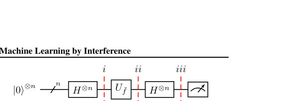
<figcaption class="paper-figure-caption"><b>Fig 2.</b> Figure 2. The Bernstein–Vazirani algorithm (Bernstein &amp; Vazirani, 1993). The algorithm mainly consists of three steps: (i) initialise the system in a perfect superposition; (ii) call the function oracle; (iii) apply the Hadamard operator for interference. If ˜f satisfies the promise ˜f(x) = s ⊙x, measuring reveals s with certainty.</figcaption>
</figure>
<figure class="paper-figure-card">
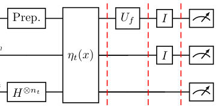
<figcaption class="paper-figure-caption"><b>Fig 3.</b> Figure 3. Our generalised Bernstein–Vazirani algorithm. We use three quantum registers: An input register, a register that computes a weighted representation of the inputs, and a weight register controlling this representation. The algorithm has three stages: (i) Prepare a uniform superposition of all inputs (Prep.) and weight configurations, and compute the representations; (ii) Query the oracle encoding the ground-truth labels across all samples in the superposition; (iii) Apply an interference operator so the labels interfere with the basis functions generated by the representation.</figcaption>
</figure>
<figure class="paper-figure-card">
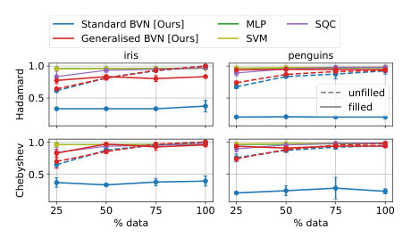
<figcaption class="paper-figure-caption"><b>Fig 4.</b> Figure 5. Real-world classification results on Iris and Penguins datasets, with filled vs. unfilled (original) comparison for BVNs. Filled data substantially improves the generalised BVN, allowing &gt;90% accuracy with only 25% data, comparable to the baselines.</figcaption>
</figure>
<figure class="paper-figure-card">
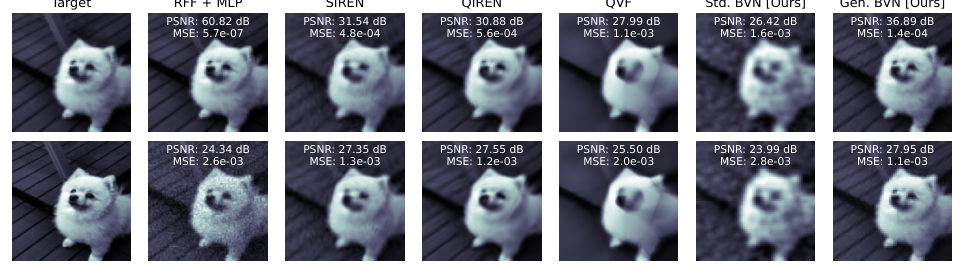
<figcaption class="paper-figure-caption"><b>Fig 5.</b> Figure 6. Implicit image representation. The top row shows results on the coarse (64×64) training image, while the bottom row shows evaluations on a finer (128×128) test image. The generalised BVN outperforms the standard BVN and is competitive with the benchmarks.</figcaption>
</figure>

**Summary.** This paper introduces Bernstein-Vazirani Networks (BVNs), a non-variational quantum machine learning framework that uses quantum interference for supervised learning. By generalizing the standard BV algorithm, the authors create more expressive models capable of handling complex data structures without relying on gradient optimization. This offers a promising, efficient alternative to current PQC methods for quantum data processing.

**Why it may be interesting.** The work provides a quantum algorithm paradigm for ML that bypasses the gradient-based optimization issues (like barren plateaus) plaguing many current quantum simulation and computation approaches.

Detailed structure

**Main problem.** To develop Quantum Machine Learning (QML) models that overcome the architectural and trainability challenges associated with existing approaches, particularly Parametrised Quantum Circuits (PQCs).

**Main result.** The proposed Bernstein-Vazirani Networks (BVNs) achieve strong generalization capabilities and competitive performance on real-world tasks while remaining gradient-free and more sampling-efficient than PQC models.

**Method.** The framework uses quantum interference, generalizing the standard Bernstein-Vazirani algorithm by introducing task-adaptive basis functions and expressive input representations to encode complex data structures.

**Model / system.** The model is a quantum circuit architecture (BVN) that processes labelled data by placing it in superposition and interfering the resulting states in a problem-adapted basis, avoiding the need for classical outer-loop optimization.

**Key observables.** Accuracy (Acc.) on classification tasks, measurement distribution sparsity, and the ability to reconstruct coefficients in closed form.

**Important parameters / regimes.** The measurement budget, the choice of interference operator (Hadamard, Chebyshev, Fourier), and the regularization factor $\lambda$.

**Assumptions / limitations.** The authors address the 'leakage' problem and assume that generalizing the interference mechanism allows for universal function approximation without relying on gradient descent.

**Figures summary.** Figures illustrate the comparison between standard and generalized BVNs for 2D point classification, showing improved decision boundaries and better fitting of target functions compared to standard models.

**Paper structure.** The paper progresses from introducing the limitations of PQCs, detailing the standard BVN mechanism, generalizing it with task-adaptive bases, and finally testing the enhanced model on synthetic and real-world datasets (Iris, Penguins).

Abstract

We introduce Bernstein-Vazirani Networks (BVNs), a non-variational quantum machine learning framework that leverages quantum interference for supervised learning, demonstrated on vision and representation learning tasks. In their standard form, BVNs follow the principle of quantum Fourier sampling: labelled data are placed in superposition and interfered in the Fourier basis to extract globally informative features. We then define generalised BVNs that enable interference in problem-adapted bases, yielding more expressive models under the same measurement budget as in the standard setting. BVNs achieve universal function approximation through (over)complete interference bases, while training of BVNs is gradient-free. Experiments on synthetic and real-world classification tasks, as well as implicit image representation, show strong generalisation capabilities and competitive performance with classical and quantum baselines.

[↑ back to top](#top)

### [Chern insulator boundary criticality](http://arxiv.org/abs/2608.18199v1)

**Authors:** Benjamin Moy, Eduardo Fradkin  
**Type:** theory · **Category:** other · **PDF:** <https://arxiv.org/pdf/2608.18199v1>  
**Analysis basis:** full PDF text, analyzed in chunks
**Topic relevance:** `Keldysh / 2PI / non-Gaussian methods` **1/5** · `analog quantum simulation` **1/5**

↔ Scroll figures horizontally

<figure class="paper-figure-card">
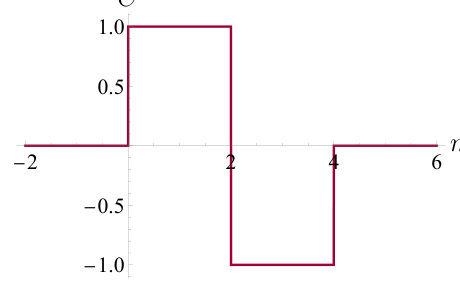
<figcaption class="paper-figure-caption"><b>Fig 1.</b> Figure 1: A plot of the Chern number C for the lattice model Hamiltonian in Eq. (2.1) as the parameter m is varied. In a given gapped phase, the Hall conductivity is σxy = C e2/h. For most of this work, we focus on the transition at m = 0 between a Chern insulator with C = 1 and a trivial insulator.</figcaption>
</figure>
<figure class="paper-figure-card">
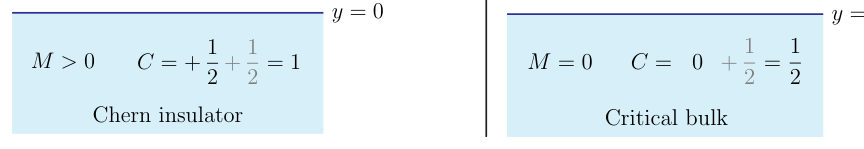
<figcaption class="paper-figure-caption"><b>Fig 2.</b> Figure 2: Mass domain wall configurations. The y &gt; 0 region is regarded as vacuum with fixed Dirac mass M &lt; 0 while we tune to criticality in the material bulk, y &lt; 0, by a sign change in the Dirac mass. The heavy fermion doubler has a mass of fixed sign throughout space and contributes 1/2 to the Chern number (depicted in gray) so that the y &gt; 0 region has vanishing Chern number. When the y &lt; 0 region has the same sign as the Dirac mass in the y &gt; 0 region, there is no protected edge mode, modeling a trivial insulator phase. (a) When the Dirac mass changes sign in space across y = 0, there is a localized chiral edge mode, and the bulk is in its Chern insulator phase with Chern number C =...</figcaption>
</figure>
<figure class="paper-figure-card">
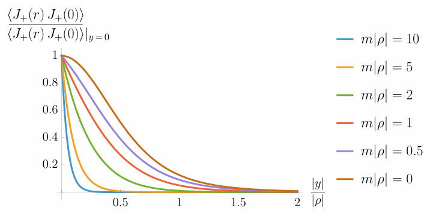
<figcaption class="paper-figure-caption"><b>Fig 3.</b> Figure 3: For a generic point r = (τ, x, y) and r′ = 0, we plot the ratio of current correlation functions ⟨J+(r) J+(0)⟩/⟨J+(r) J+(0)⟩|y=0 from Eqs. (4.19) and (4.20) as a function of |y|/|ρ| for various values of m|ρ| ≥0. We recall that |y| denotes the distance from the boundary while |ρ| = √</figcaption>
</figure>

**Summary.** This theoretical work examines the chiral signatures at the boundary during a quantum phase transition into a Chern insulator. By employing conformal field theory methods, the authors demonstrate that the bulk topological anomaly is precisely accounted for by delocalized chiral modes near the boundary. This provides a generalized understanding of the bulk-edge correspondence beyond simple free Dirac models.

**Why it may be interesting.** The rigorous application of CFT techniques to boundary anomalies in topological phases provides deep insights into how bulk topological invariants manifest at boundaries, which is crucial for understanding edge states in quantum materials.

Detailed structure

**Main problem.** The paper investigates the signatures of chirality and anomaly matching at quantum phase transitions involving Chern insulators, particularly when a boundary is present.

**Main result.** The analysis shows that while the chiral edge mode delocalizes into the bulk at criticality, the boundary fermion correlation function retains a chiral structure, and the bulk Hall anomaly is matched by these delocalized chiral modes.

**Method.** The authors use a Dirac mass domain wall construction and analyze the system using the residual conformal symmetry of a (2+1)d CFT in a half-space to identify parity-odd terms in correlation functions.

**Model / system.** The primary model is the transition between a trivial insulator and a Chern insulator ($C=1$), described by a massless Dirac fermion in 2+1 dimensions, and later extended to (3+1)d topological insulator transitions.

**Key observables.** Hall conductivity ($\sigma_{xy}$), fermion two-point function, current and energy-momentum tensor correlation functions, and anomaly coefficients.

**Important parameters / regimes.** Chern number ($C$), mass parameter ($m$), and the critical point where the bulk gap closes.

**Assumptions / limitations.** The analysis relies on studying the transition using the domain wall picture and generalizing the framework to arbitrary time-reversal breaking (2+1)d CFTs.

**Figures summary.** Figure 1 plots the Chern number $C$ versus a lattice parameter $m$. Figure 2 illustrates mass domain wall configurations for both $C=1$ and the critical $C=1/2$ transition.

**Paper structure.** The paper develops the theory by first establishing the lattice model and the domain wall construction for the $C=1$ transition, then calculating correlation functions using CFT techniques, and finally generalizing the results to higher Chern numbers and (3+1)d systems.

Abstract

We investigate signatures of chirality at Chern insulator transitions in the presence of a boundary. The transition between a trivial insulator and a Chern insulator with Chern number $C=1$ is described by a massless Dirac fermion whose parity anomaly gives a critical Hall conductivity $σ_{xy}=\frac{1}{2}\frac{e^2}{h}$. Using a Dirac mass domain wall construction, we show that the chiral edge mode delocalizes into the bulk at criticality, but the boundary fermion correlation function retains a chiral structure and acquires the scaling dimension of the bulk fermion. We compute current correlation functions and demonstrate that the anomaly of the bulk Hall response is matched by delocalized chiral modes near the boundary. Using only the residual conformal symmetry of a (2+1)d conformal field theory (CFT) in a half-space, we identify parity-odd terms in current and energy-momentum tensor correlation functions that encode these modes and determine their electromagnetic and gravitational anomaly coefficients. Our analysis therefore applies to general time-reversal breaking (2+1)d CFTs, beyond the free Dirac transition. We also extend our results to higher Chern number transitions and to the transition between a (3+1)d topological insulator and a trivial insulator.

[↑ back to top](#top)

### [Chiral bosonic mean-field Ansatz and spin dynamics in spin-1 Kitaev magnets](http://arxiv.org/abs/2608.19178v1)

**Authors:** Daiki Sasamoto, Arnaud Ralko, Jaime Merino, Joji Nasu  
**Type:** theory · **Category:** strongly correlated electrons · **PDF:** <https://arxiv.org/pdf/2608.19178v1>  
**Analysis basis:** full PDF text, analyzed in chunks
**Topic relevance:** `Keldysh / 2PI / non-Gaussian methods` **1/5** · `analog quantum simulation` **1/5**

↔ Scroll figures horizontally

<figure class="paper-figure-card">
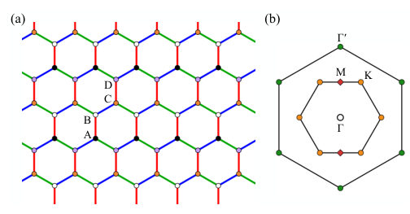
<figcaption class="paper-figure-caption"><b>Fig 1.</b> FIG. 1. (a) Schematic picture of the honeycomb lattice on which the S = 1 Kitaev model is defined. The blue, green, and red lines denote the x, y, and z bonds, respectively. The black, white, orange, and purple sites denote the four sublattices A, B, C, and D used in the four-sublattice spin rotation of the pure Kitaev model. (b) First and extended Brillouin zones of the original honeycomb lattice. Filled symbols denote the high-symmetry points.</figcaption>
</figure>
<figure class="paper-figure-card">
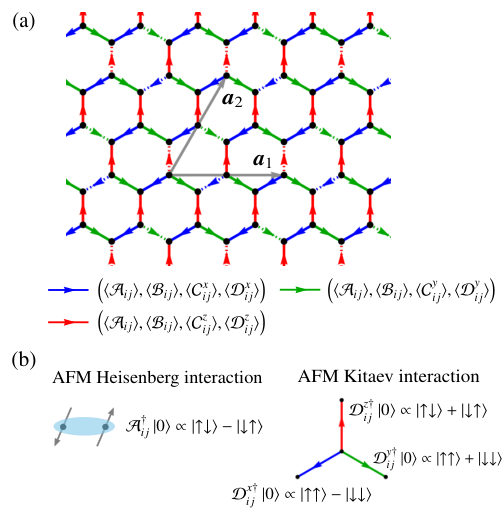
<figcaption class="paper-figure-caption"><b>Fig 2.</b> FIG. 2. (a) Mean-field Ansatz for the S = 1 pure AFM Kitaev model considered in this work. The honeycomb lattice on which the mean fields are defined has an eight-sublattice unit cell, whose prim- itive translation vectors are indicated by the gray arrows a1 and a2. The mean-field parameters defined on the x (blue), y (green), z (red) bonds are summarized in the legend. The direction of each arrow specifies the orientation of the bond operator from site i to j. When considering the π/2-flux state, an additional phase factor i is multi- plied to the mean fields on the dotted bonds. (b) Channel interpre- tation of Aij and Dγ i j. The former represents SU(2)-singlet pairing, whereas the latter...</figcaption>
</figure>
<figure class="paper-figure-card">
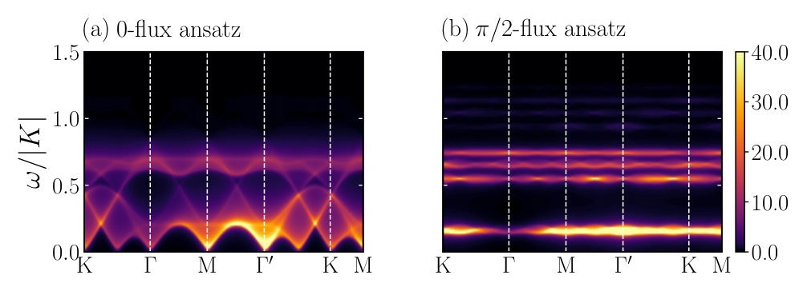
<figcaption class="paper-figure-caption"><b>Fig 3.</b> FIG. 3. Zero-temperature dynamical spin structure factor S (q, ω) of the pure antiferromagnetic S = 1 Kitaev model calculated directly within SBMFT. Panels (a) and (b) show the 0-flux and π/2-flux Ansätze, respectively. The spectra are plotted along the path connecting the high-symmetry points indicated in Fig. 1. The color scale, common to both panels, indicates the intensity of S (q, ω), and the broadening parameter is set to δ/|K| = 0.01.</figcaption>
</figure>
<figure class="paper-figure-card">
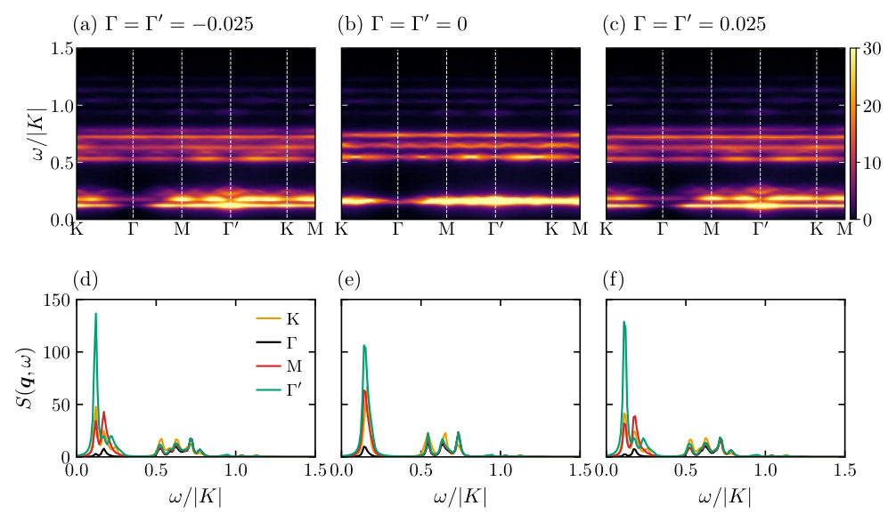
<figcaption class="paper-figure-caption"><b>Fig 4.</b> FIG. 4. Ground-state spin dynamics of the S = 1 Kitaev-Γ-Γ′ model calculated within SBMFT using the π/2-flux Ansatz for K &gt; 0. The upper row shows the dynamical spin structure factor S (q, ω) along the momentum path for (a) Γ = Γ′ = −0.025, (b) 0, and (c) 0.025, in units of |K|. Panels (d)–(f) show the corresponding energy dependence at the representative high-symmetry momenta K, Γ, M, and Γ′. A common color scale is used in panels (a)–(c), and a common vertical intensity scale is used in panels (d)–(f). The broadening parameter is δ/|K| = 0.01.</figcaption>
</figure>
<figure class="paper-figure-card">
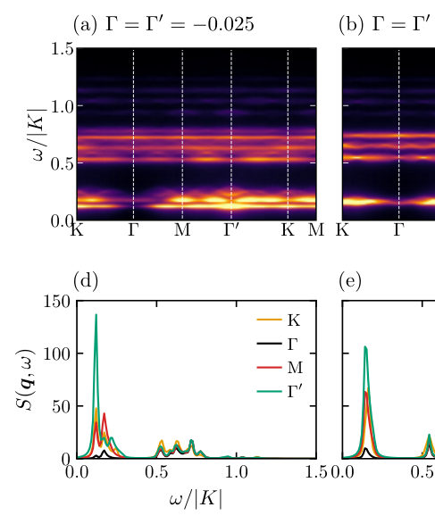
<figcaption class="paper-figure-caption"><b>Fig 5.</b> Figure 5 compares the spatial distribution of the equal-time spin correlation Cij = ⟨Si · Sj⟩around a fixed reference site for (a) the nearest-neighbor Kitaev reference, (b) the 0-flux SBMFT Ansatz, and (c) the π/2-flux SBMFT Ansatz. The</figcaption>
</figure>

**Summary.** This work investigates the spin dynamics of the $S=1$ Kitaev magnet using Schwinger-boson mean-field theory. By comparing the 0-flux and $\pi/2$-flux Ansätze, the authors demonstrate that the chiral $\pi/2$-flux Ansatz provides a robust description, particularly near the pure Kitaev limit with weak perturbations. This supports the use of chiral bosonic methods for modeling spin liquid behavior in higher-spin systems.

**Why it may be interesting.** The detailed study of spin dynamics and the comparison of different mean-field Ansätze provide valuable insights into the nature of quantum spin liquid ground states, which is central to understanding strongly correlated magnetic materials.

Detailed structure

**Main problem.** The paper aims to understand the complex spin dynamics in higher-spin ($S=1$) Kitaev magnets, which are not exactly solvable, by comparing different mean-field descriptions.

**Main result.** The triplet $\pi/2$-flux chiral bosonic Ansatz is supported as a useful mean-field description, showing that this flux pattern yields a flatter spectrum and better captures short-range correlations compared to the 0-flux Ansatz.

**Method.** The analysis employs Schwinger-boson mean-field theory (SBMFT) using a bond-operator formulation to calculate the dynamical spin structure factor.

**Model / system.** The system is the spin-1 Kitaev model on the honeycomb lattice, generalized to include weak symmetric off-diagonal exchanges ($\Gamma$ and $\Gamma'$).

**Key observables.** Dynamical spin structure factor $S(oldsymbol{q}, \omega)$, real-space spin correlations, and spectral flatness.

**Important parameters / regimes.** The analysis focuses on the pure Kitaev limit and weak perturbations along the line $\Gamma' = \Gamma$.

**Assumptions / limitations.** The study relies on the triplet 0-flux and $\pi/2$-flux Ansätze within the SBMFT framework, and spectral flatness is noted as a consistency check, not a definitive diagnostic of chirality.

**Figures summary.** Not specified in the notes, but the context suggests figures comparing spectral features and correlation functions between different flux Ansätze.

**Paper structure.** The paper first analyzes the pure Kitaev limit by comparing the 0-flux and $\pi/2$-flux Ansätze. It then extends the analysis to weak off-diagonal exchanges ($\Gamma, \Gamma'$) and confirms the utility of the $\pi/2$-flux Ansatz by comparing results to finite-size exact diagonalization.

Abstract

The Kitaev model is a paradigmatic system for realizing quantum spin liquids, but its higher-spin extensions are not exactly solvable, and their spin dynamics is less well understood than in the spin-1/2 case. In this work, we reexamine a previously introduced triplet-pairing $φ_t = π/2$ phase pattern for the antiferromagnetic $S = 1$ Kitaev model and extend the analysis to weak symmetric off-diagonal exchanges $Γ$ and $Γ'$. Using a bond-operator formulation of Schwinger-boson mean-field theory, we calculate the dynamical spin structure factor for the triplet 0-flux and triplet $π/2$-flux Ansätze with a spin-correlation scheme appropriate for Kitaev interactions. In the pure Kitaev limit, the $π/2$-flux Ansatz yields a flatter spectrum than the 0-flux Ansatz. The real-space spin correlations show that the $π/2$-flux Ansatz suppresses longer-distance correlations more strongly than the 0-flux Ansatz, yielding a correlation pattern closer to the short-ranged form expected in the Kitaev limit. This comparison shows that the flatness of $S(\boldsymbol{q}, ω)$ is tied to short-ranged spin correlations and is therefore an important consistency check, although it is not, by itself, a diagnostic of time-reversal-symmetry breaking. We then study weak off-diagonal exchanges along $Γ' = Γ$ near the pure Kitaev limit, taking the same-sign relation from analyses of candidate spin-1 Kitaev materials. Gapped solutions are obtained within the constrained $π/2$-flux manifold, and the spectra share the qualitative energy- and momentum-space features found by finite-size exact diagonalization. Taken together, these results support the triplet $π/2$-flux chiral bosonic Ansatz as a useful mean-field description of spin dynamics near the antiferromagnetic $S = 1$ Kitaev limit with weak off-diagonal exchanges.

[↑ back to top](#top)

### [Genuine Tripartite Entanglement Selects Gauge-Invariant Theories](http://arxiv.org/abs/2608.18732v1)

**Authors:** Junya Yamagishi  
**Type:** theory · **Category:** other · **PDF:** <https://arxiv.org/pdf/2608.18732v1>  
**Analysis basis:** full PDF text, analyzed in chunks
**Topic relevance:** `Keldysh / 2PI / non-Gaussian methods` **1/5** · `quantum measurements` **1/5**

↔ Scroll figures horizontally

<figure class="paper-figure-card">
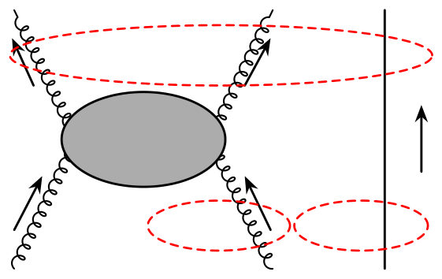
<figcaption class="paper-figure-caption"><b>Fig 1.</b> Figure 1: Schematic representation of the 2 + 1-particle system. Particles B and C are initially entangled, and scattering between A and B can generate a tripartite correlation among A, B, and C. Here, particle C is assumed to remain spatially separated from A and B throughout the process.</figcaption>
</figure>
<figure class="paper-figure-card">
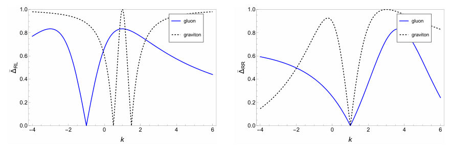
<figcaption class="paper-figure-caption"><b>Fig 2.</b> Figure 2: Configuration-averaged concurrence as a function of k at the scattering angle θ = π/2. The results of Ref. [26] are reproduced using the scattering amplitudes given therein.</figcaption>
</figure>
<figure class="paper-figure-card">

<figcaption class="paper-figure-caption"><b>Fig 3.</b> Figure 3: Configuration-averaged concurrence as a function of k at the scattering angle θ = π/6.</figcaption>
</figure>
<figure class="paper-figure-card">
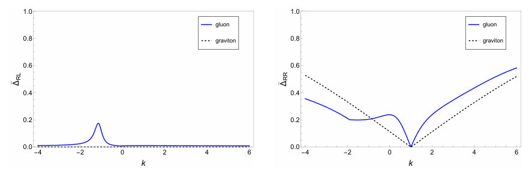
<figcaption class="paper-figure-caption"><b>Fig 4.</b> Figure 2 confirms that, at θ = π/2, k = 1 is an extremum: it is a maximum or a minimum depending on the initial helicities. This observation does not establish whether maximization or minimization of entanglement is the operative principle. At a representa- tive nonspecial angle such as θ = π/6, Fig. 3 shows that k = 1 does not exhibit comparably simple extremal behavior.</figcaption>
</figure>
<figure class="paper-figure-card">
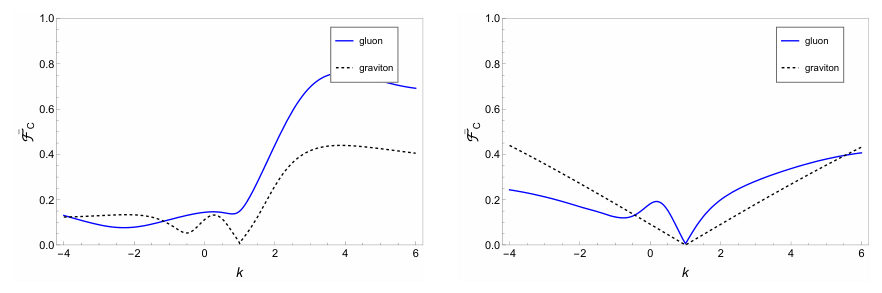
<figcaption class="paper-figure-caption"><b>Fig 5.</b> Figure 4: Configuration-averaged concurrence fill as a function of k for the initial-state parameter η = π/4. The color-factor configurations in Eq. (5.2) are included in the average. Panels (a) and (b) show the results for the scattering angles θ = π/2 and θ = π/6, respectively.</figcaption>
</figure>

**Summary.** This work extends entanglement selection criteria from bipartite to genuine tripartite entanglement in particle scattering. By analyzing gluon and graviton scattering amplitudes, the authors demonstrate that GTE uniquely singles out the gauge-invariant and diffeomorphism-invariant theories. This establishes a non-trivial link between fundamental symmetries and multipartite quantum correlations.

**Why it may be interesting.** While the core physics is high-energy theory (gauge/gravity), the methodology heavily relies on advanced quantum information measures (GTE, GGM) applied to scattering states, making it relevant to theoretical quantum physics.

Detailed structure

**Main problem.** The paper investigates whether genuine tripartite entanglement (GTE) can uniquely select fundamental physical theories, specifically identifying gauge-invariant and diffeomorphism-invariant theories in scattering processes.

**Main result.** The analysis shows that GTE, quantified by measures like the Concurrence Fill (FC) and Generalized Geometric Measure (GGM), uniquely identifies the symmetry-preserving theories as those that suppress GTE in the forward/backward scattering limits.

**Method.** The authors use angular expansions around scattering limits and calculate entanglement measures (FC, GGM) for deformed scattering amplitudes in $2+1$-particle systems.

**Model / system.** The system involves a $2+1$-particle scattering process (gluon-gluon or graviton-graviton scattering) where the interactions are parameterized by a deformation factor $k$, with $k=1$ recovering the known gauge-invariant theory.

**Key observables.** Genuine Tripartite Entanglement (GTE) quantified by Concurrence Fill (FC) and Generalized Geometric Measure (GGM); scattering amplitudes $M(k)$.

**Important parameters / regimes.** Deformation parameter $k$, scattering angle $	heta$, and specific color factors for gluon interactions.

**Assumptions / limitations.** The analysis focuses on the asymptotic limits (forward and backward scattering) and assumes particle C remains spatially separated from A and B.

**Figures summary.** Figures are expected to compare entanglement measures (like concurrence) as a function of the deformation parameter $k$ across different scattering angles.

**Paper structure.** The paper builds from kinematics and entanglement measure definitions to analyzing the two-particle setup before focusing on the core $2+1$-particle system analysis using GTE.

Abstract

Recent studies have explored whether physical constants and symmetries can be selected by extremizing bipartite entanglement entropy. We extend this approach to a three-particle setting. Specifically, we consider a $2+1$-particle system in which particles $B$ and $C$ are initially entangled, and then particles $A$ and $B$ scatter without the direct participation of particle $C$ for both gluon-gluon and graviton-graviton scatterings. Using angular expansions around the forward and backward scattering limits, we analyze bipartite entanglement in the corresponding two-particle system of $A$ and $B$ and two measures of genuine tripartite entanglement (GTE), the concurrence fill and the generalized geometric measure (GGM), in the three-particle system. As is already known, the bipartite entanglement provides no universal criterion for selecting the symmetry-preserving theory: depending on the initial helicities, it may either maximize or minimize the entanglement entropy. By contrast, we find that the GTE-based analysis uniquely identifies the gauge-invariant and diffeomorphism-invariant theories as those that suppress the GTE in gluon-gluon and graviton-graviton scatterings, respectively. This result suggests a nontrivial connection between tripartite entanglement and the gauge and diffeomorphism symmetries of fundamental interactions.

[↑ back to top](#top)

### [Quantum Magic in High Energy Collision](http://arxiv.org/abs/2608.19095v1)

**Authors:** Ying-Ying Li, Ian Low, Yi-Lin Wang, Zhewei Yin  
**Type:** theory · **Category:** other · **PDF:** <https://arxiv.org/pdf/2608.19095v1>  
**Analysis basis:** full PDF text, analyzed in chunks
**Topic relevance:** `Keldysh / 2PI / non-Gaussian methods` **1/5** · `quantum measurements` **1/5**

↔ Scroll figures horizontally

<figure class="paper-figure-card">
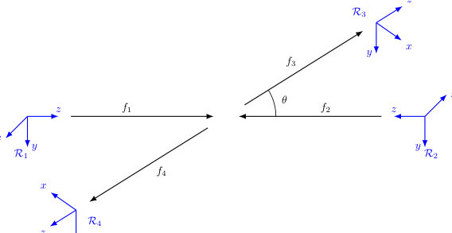
<figcaption class="paper-figure-caption"><b>Fig 1.</b> FIG. 1. The “helicity basis” Ri for the i-th particle projects the spin in the direction of its own</figcaption>
</figure>
<figure class="paper-figure-card">
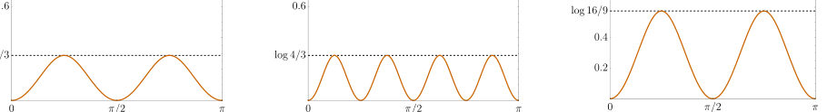
<figcaption class="paper-figure-caption"><b>Fig 2.</b> FIG. 2. The non-zero angular distributions generated by the rotation R⊗2 y (θ), where we plot M2</figcaption>
</figure>
<figure class="paper-figure-card">
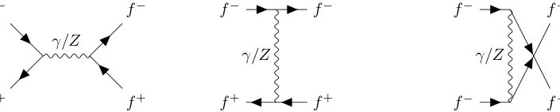
<figcaption class="paper-figure-caption"><b>Fig 3.</b> FIG. 3. Representative s/t/u-channel Feynman diagrams in the fermionic 2 →2 scattering in</figcaption>
</figure>
<figure class="paper-figure-card">
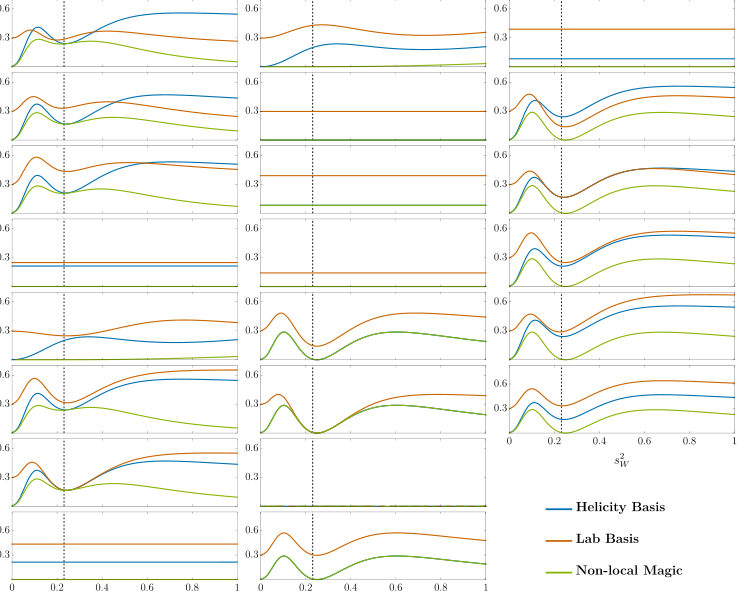
<figcaption class="paper-figure-caption"><b>Fig 4.</b> FIG. 4. Distinct distributions of the s2 W dependence of magic ⟨M2,i⟩for the EW process e−e−→</figcaption>
</figure>
<figure class="paper-figure-card">
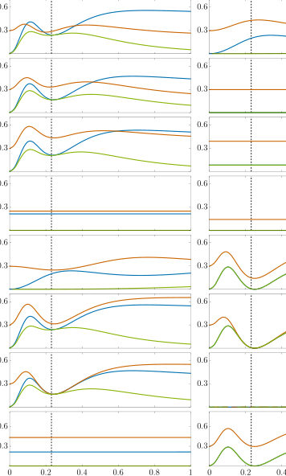
<figcaption class="paper-figure-caption"><b>Fig 5.</b> Fig. 6, where we see a local minimum near ˆs2 W(√s) for both of the bases.</figcaption>
</figure>

**Summary.** This paper investigates 'quantum magic,' a quantum resource, by applying it to high-energy particle collisions in QED and electroweak processes. It compares the amount of magic generated when spin is projected using two different reference frames: the lab basis and the helicity basis. The findings highlight basis dependence in quantum resources and confirm the robustness of the weak mixing angle measurement across these different physical bases.

**Why it may be interesting.** The concept of basis-dependent quantum resources like 'magic' provides a novel lens through which to view fundamental symmetries and physical constants in particle physics, potentially linking quantum information theory to high-energy phenomenology.

Detailed structure

**Main problem.** The paper quantifies 'quantum magic' (non-stabilizerness) as a resource, extending its application from quantum computing to fundamental high-energy physics processes.

**Main result.** Magic production is generally smaller in the helicity basis in the ultra-relativistic limit, while the physical weak mixing angle remains close to the magic-minimizing value in both the lab and helicity bases.

**Method.** The authors calculate the resource using the second-order Stabilizer Rényi entropy ($M_2$) and compare its value when spin is projected along the incoming beam axis (lab basis) versus the direction of particle motion (helicity basis).

**Model / system.** The study models high energy collisions involving Quantum Electrodynamics (QED) and electroweak processes (charged-lepton scattering) using spin-1/2 fermions (qubits).

**Key observables.** Quantum Magic ($M_2$), basis dependence of magic, and the value of the weak mixing angle ($\sin^2 	heta_W$).

**Important parameters / regimes.** Ultra-relativistic limit, non-relativistic regime, and the weak mixing angle ($\sin^2 	heta_W$).

**Assumptions / limitations.** The analysis assumes the applicability of the $M_2$ measure and compares results derived from the lab basis versus the helicity basis.

**Figures summary.** Figure 1 illustrates the difference between the helicity and lab bases for spin projection. Figure 2 plots the non-zero angular distributions of $M_2$ generated by rotations.

**Paper structure.** The paper systematically compares magic production in the lab and helicity bases for QED and electroweak scattering processes, analyzing both ultra-relativistic and non-relativistic limits, and discussing circuit realizations.

Abstract

Quantum magic, or nonstabilizerness, is a quantum resource associated with computational advantage in quantum systems. In high energy collisions, Quantum Electrodynamics (QED) is inefficient at generating magic   while the weak mixing angle, a fundamental constant of nature, sits near a value that minimizes magic production in charged-lepton scattering. These observations were made in the laboratory (lab) basis, in which spin is projected along the incoming beam axis. An alternative choice is the helicity basis, in which spin is projected along the direction of motion of each particle. The transformation between these two bases is, in general, not a Clifford operation and therefore can change the amount of magic. We present a detailed study of magic production in both bases for QED and electroweak processes, and compare these results with the basis-invariant non-local magic. In the ultra-relativistic limit, magic production is generally smaller in the helicity basis due to helicity selection rules, while the lab basis generally yields less magic in the non-relativistic regime. We provide circuit realizations of the ultra-relativistic Bhabha amplitudes using linear combinations of unitaries and show that the lab basis construction contains a larger $T$-gate count at generic scattering angles. Interestingly, in both bases the physical weak mixing angle lies close to the value that minimizes magic production.

[↑ back to top](#top)

### [Entanglement battery and entanglement catalyst in local state discrimination problems](http://arxiv.org/abs/2608.19139v1)

**Authors:** Saronath Halder, Aby Philip, Alexander Streltsov  
**Type:** theory · **Category:** quantum information and computing · **PDF:** <https://arxiv.org/pdf/2608.19139v1>  
**Analysis basis:** full PDF text, analyzed in chunks
**Topic relevance:** `quantum measurements` **1/5**

↔ Scroll figures horizontally

<figure class="paper-figure-card">
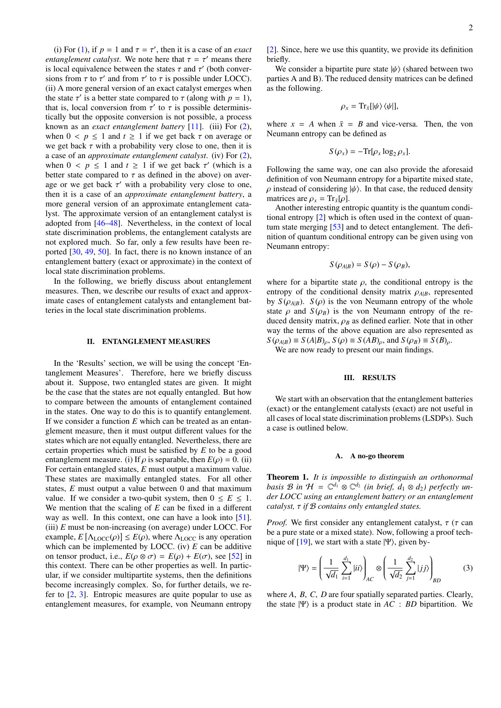
<figcaption class="paper-figure-caption"><b>Fig 1.</b> Low-resolution page preview, page 2</figcaption>
</figure>
<figure class="paper-figure-card">
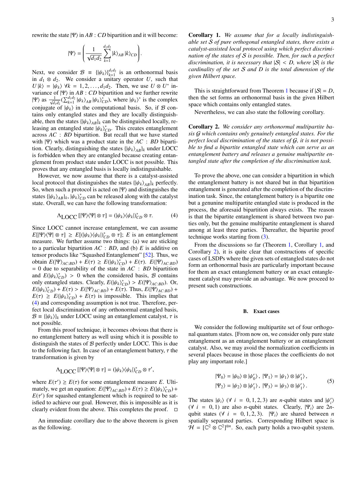
<figcaption class="paper-figure-caption"><b>Fig 2.</b> Low-resolution page preview, page 3</figcaption>
</figure>
<figure class="paper-figure-card">
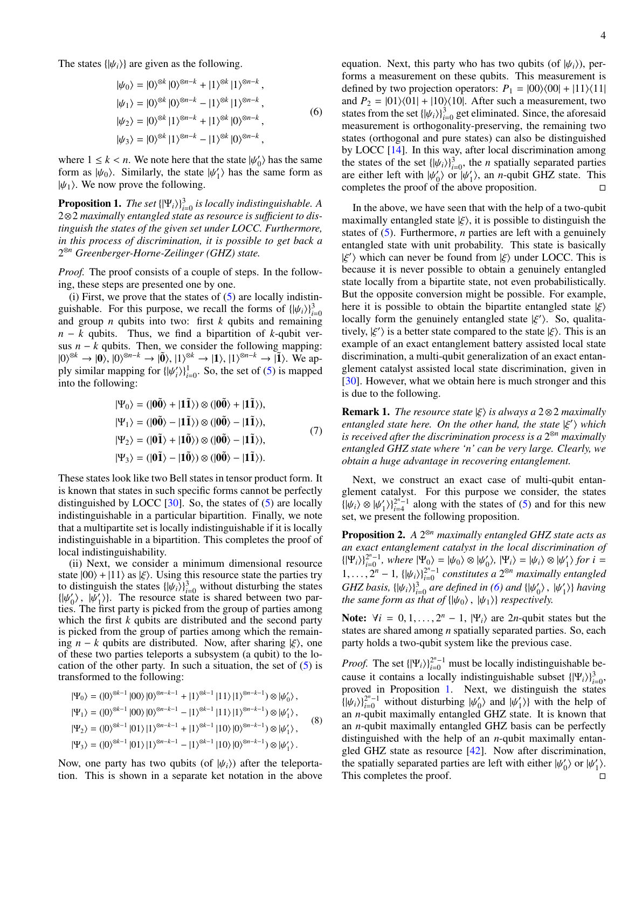
<figcaption class="paper-figure-caption"><b>Fig 3.</b> Low-resolution page preview, page 4</figcaption>
</figure>
<figure class="paper-figure-card">
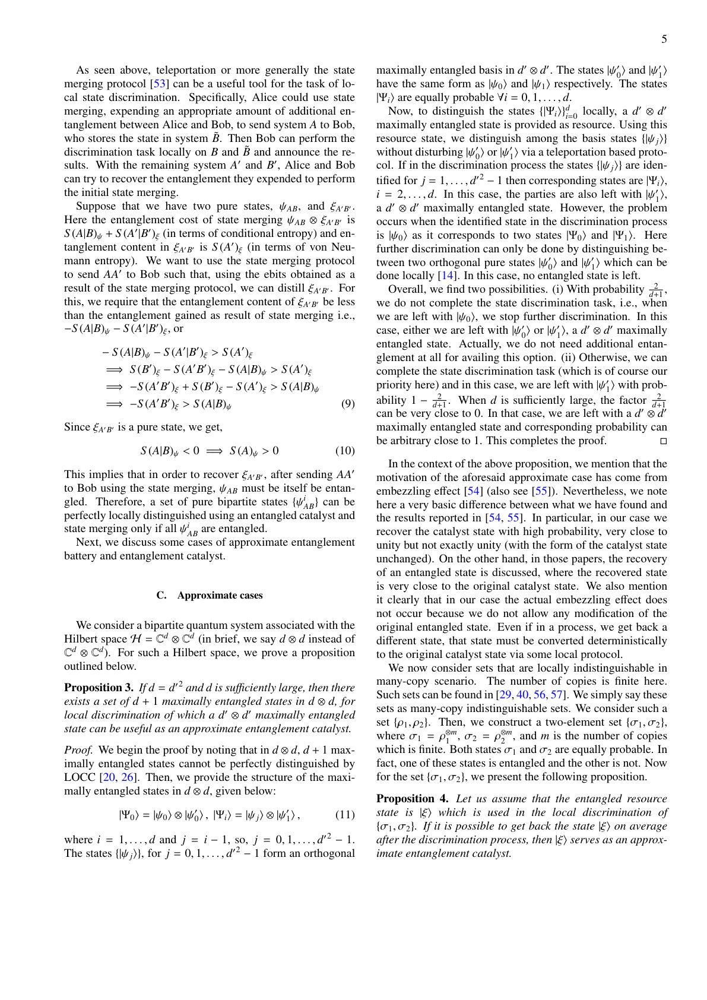
<figcaption class="paper-figure-caption"><b>Fig 4.</b> Low-resolution page preview, page 5</figcaption>
</figure>
<figure class="paper-figure-card">
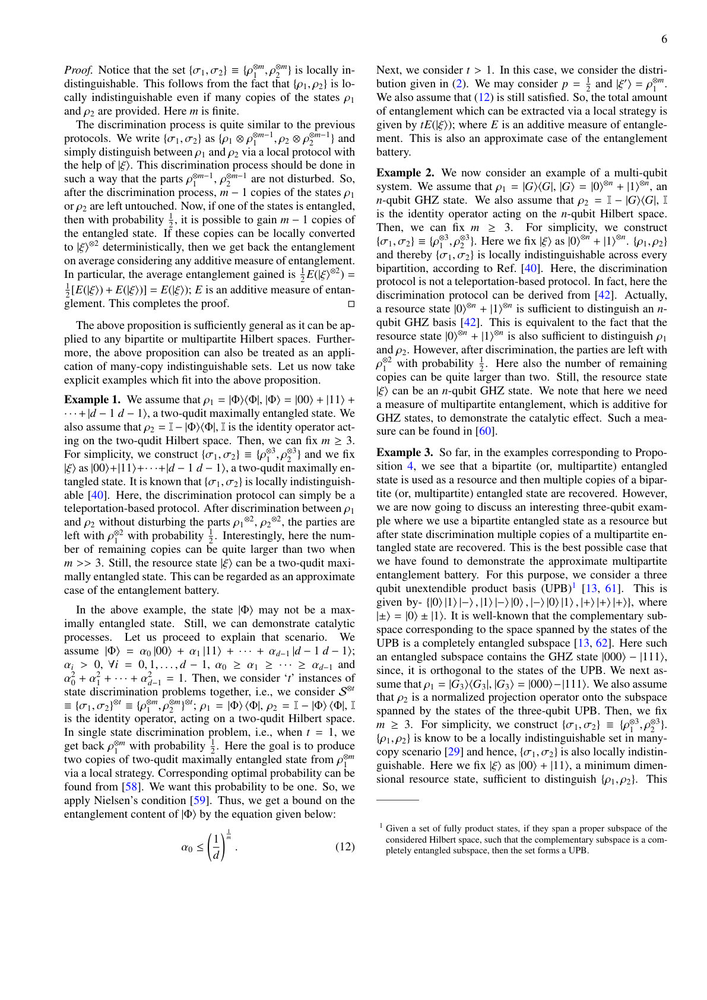
<figcaption class="paper-figure-caption"><b>Fig 5.</b> Low-resolution page preview, page 6</figcaption>
</figure>

**Summary.** This work analyzes the role of entanglement batteries and catalysts in determining the limits of local state discrimination. It proves that while perfect discrimination of certain entangled state sets is impossible under LOCC, the authors demonstrate specific scenarios where these entanglement resources yield substantial advantages. This deepens the understanding of resource quantification in quantum information tasks.

**Why it may be interesting.** It provides rigorous theoretical bounds on what can be achieved in quantum communication tasks (state discrimination) when entanglement is treated as a consumable or reusable resource, which is fundamental to quantum information theory.

Detailed structure

**Main problem.** The paper investigates the theoretical limits and advantages of using entanglement batteries and entanglement catalysts in Local State Discrimination Problems (LSDPs).

**Main result.** While perfect discrimination of an orthonormal basis of entangled states is impossible using exact entanglement resources under LOCC, the authors construct nontrivial cases where entanglement batteries provide a significant advantage, especially in approximate or many-copy scenarios.

**Method.** The analysis employs quantum information theory tools, including entanglement measures (like Squashed Entanglement) and concepts like local indistinguishability, to derive necessary conditions for perfect discrimination.

**Model / system.** The model involves a composite quantum system where a state is chosen from a set $S$ and must be identified using only Local Operations and Classical Communication (LOCC). Resources include entanglement batteries and catalysts, often modeled using maximally entangled GHZ states.

**Key observables.** Entanglement measures, von Neumann entropy, and the probability of successful state discrimination or resource recovery.

**Important parameters / regimes.** The cardinality of the set $|S|$, the total dimension $D$, and the number of copies $m$ used in the ensemble.

**Assumptions / limitations.** The analysis often relies on the assumption that entanglement measures are additive on tensor products, and it distinguishes between exact and approximate resource usage.

**Figures summary.** Not specified in the notes, but the text describes constructions involving specific multipartite states and resource transformations.

**Paper structure.** The paper progresses from establishing no-go theorems for perfect discrimination (Theorem 1) to constructing specific, nontrivial examples where entanglement batteries provide advantages, covering both exact and approximate resource regimes, and finally addressing the many-copy limit.

Abstract

In this work, we study the limitations and advantages of using entanglement battery and entanglement catalyst in local state discrimination problems. We consider both cases of such tools, i.e., exact and approximate cases. We show that to distinguish any set of orthogonal pure bipartite entangled states perfectly under local operations and classical communication using an (exact) entanglement battery or an (exact) entanglement catalyst, it is necessary to consider that the cardinality of the set must be smaller than the total dimension of the given Hilbert space. Then, we construct a nontrivial case where an exact entanglement battery can provide huge advantage. We also construct other nontrivial cases where exact or approximate entanglement battery or entanglement catalyst can be useful. In fact, we find that the approximate tools are particularly useful in the local discrimination of certain sets which can be derived from many-copy indistinguishable ensembles.

[↑ back to top](#top)

### [Integer Linear Programming Decoder for Abelian and Non-Abelian Topological Codes](http://arxiv.org/abs/2608.18512v1)

**Authors:** Dian Jing, Aubrey Zhang, Liang Jiang, Ruben Verresen  
**Type:** theory · **Category:** quantum information and computing · **PDF:** <https://arxiv.org/pdf/2608.18512v1>  
**Analysis basis:** full PDF text, analyzed in chunks
**Topic relevance:** `analog quantum simulation` **1/5**

↔ Scroll figures horizontally

<figure class="paper-figure-card">
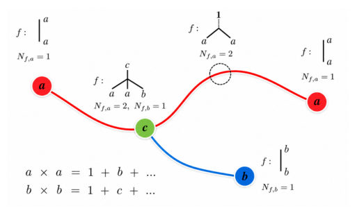
<figcaption class="paper-figure-caption"><b>Fig 1.</b> FIG. 1. Example configuration of incoherent anyon errors obtained from the ILP decoder. Given the anyon syndromes, the ILP decoder uses classical optimiza- tion to identify the minimum-weight configuration of incoher- ent anyon errors. These configurations allow anyon strings to terminate on syndromes as well as other anyon strings accord- ing to the fusion rules of the TO, a feature not captured by existing decoders. In the ILP formulation, the fusion channels f and the corresponding multiplicities Nf of incident anyons are encoded as linear constraints. An example anyon-string configuration is shown, with the relevant fusion rules provided in the bottom-left panel. At each lattice site...</figcaption>
</figure>
<figure class="paper-figure-card">
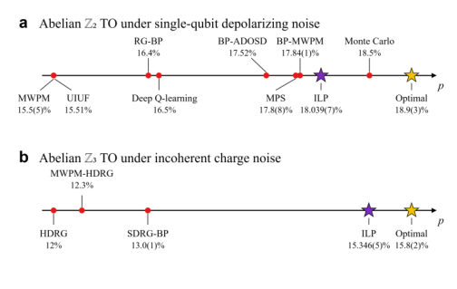
<figcaption class="paper-figure-caption"><b>Fig 2.</b> FIG. 2. Error-correction thresholds for example Abelian TOs. (a) For the Abelian Z2 TO under single- qubit depolarizing noise, the ILP decoder achieves an error- correction threshold of 18.039(7)%, exceeding most exist- ing decoders, including uncorrelated MWPM [59], union- intersection union-find (UIUF) [60], renormalization group with belief propagation (RG-BP) [61], deep Q-learning based on deep reinforcement learning [62], belief propaga- tion with approximate degenerate ordered-statistics decod- ing (BP-ADOSD) [63, 64], matrix product states (MPS) [65], and belief propagation with MWPM (BP-MWPM) [66]. This threshold is also close to the optimal value of 18.9(3)% [67, 68] and to that...</figcaption>
</figure>
<figure class="paper-figure-card">
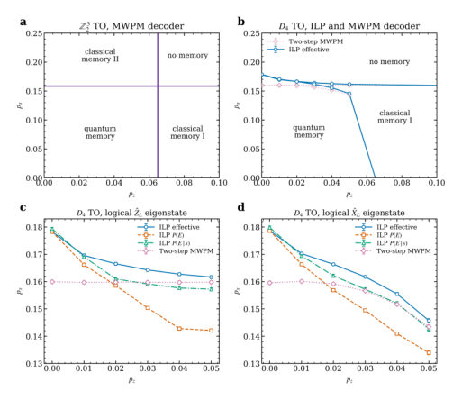
<figcaption class="paper-figure-caption"><b>Fig 3.</b> FIG. 3. Error-correction phase diagrams of the Abelian Z3 2 and non-Abelian D4 TOs defined on the three-colorable kagome lattice. (a) Error-correction phase diagram of the Abelian Z3 2 TO using the MWPM de- coder. In addition to the quantum-memory and no-memory phases, there are two classical-memory phases, in which only the logical ˆZL operator is protected (I) or only the logical ˆ XL operator is protected (II). (b) Error-correction phase diagram of the non-Abelian D4 TO obtained using the ILP decoder with an effective weight ratio and the two-step MWPM de- coder. The classical-memory-II phase is absent because pro- liferation of the non-Abelian m-anyons necessarily entails pro-...</figcaption>
</figure>
<figure class="paper-figure-card">
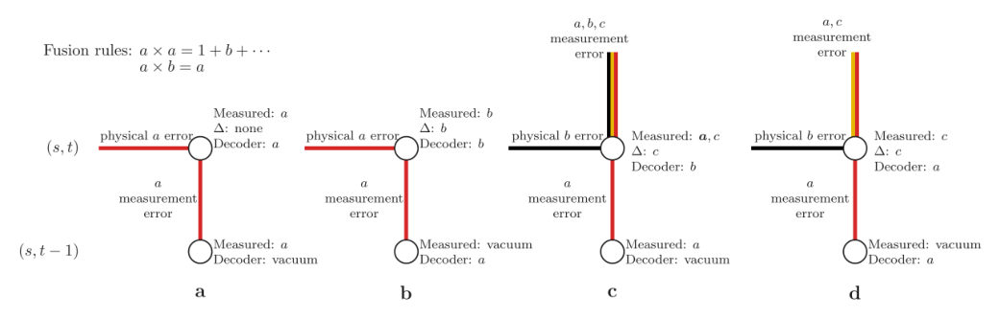
<figcaption class="paper-figure-caption"><b>Fig 4.</b> FIG. 4. Examples of fusion channels for spacetime ILP decoding. (a) At the previous time step, a measurement error misidentified the vacuum as an a anyon. At the current time step, assuming that no anyon strings of other species are present and no measurement error occurs, the absence of a defect ∆implies that an a anyon is created by a physical error at (s, t). This configuration is analogous to standard spacetime matching of defects in the Abelian Z2 TO [14]. (b) An a anyon was not identified at the previous time step due to a measurement error and then fused with another a anyon created by a physical error at time t, leading to a probabilistic syndrome measurement at (s, t) that yields...</figcaption>
</figure>
<figure class="paper-figure-card">
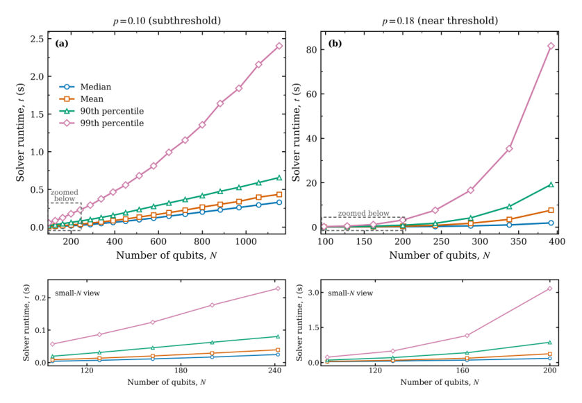
<figcaption class="paper-figure-caption"><b>Fig 5.</b> FIG. 5. Runtime distribution and upper-tail behavior. Median, mean, 90th-percentile, and 99th-percentile optimization times versus the number of physical qubits N = 2d2 at (a) the subthreshold error rate p = 0.10 and (b) p = 0.18, near the error-correction threshold. The lower panels enlarge the small-N region. The growing separation among the median, mean, and upper percentiles demonstrates substantial decoder-instance variability and a pronounced upper tail. The 99th percentile characterizes this tail and should not be interpreted as a worst-case runtime.</figcaption>
</figure>

**Summary.** This paper introduces an Integer Linear Programming (ILP) decoder to solve the minimum-weight error detection problem for arbitrary topological codes. By encoding complex anyon fusion rules as linear constraints, the ILP decoder overcomes the limitations of simpler matching or clustering decoders. It demonstrates superior performance across Abelian and non-Abelian topological orders, establishing ILP as a powerful general tool for fault-tolerant quantum computation.

**Why it may be interesting.** The rigorous mathematical framework provided by ILP offers a powerful, general tool for analyzing fault-tolerance thresholds in complex quantum systems beyond simple nearest-neighbor models.

Detailed structure

**Main problem.** Developing a general-purpose, high-performance decoder for topological codes (TOs) that can handle arbitrary fusion rules and correlated noise, surpassing limitations of existing matching-based and clustering decoders.

**Main result.** The Integer Linear Programming (ILP) decoder is shown to provide a clear performance advantage over existing methods for various TOs, including $\mathbb{Z}_2$, $\mathbb{Z}_3$, and non-Abelian $D_4$ systems.

**Method.** The error-correction problem is formulated as an ILP, linearizing the constraints by introducing auxiliary variables to encode complex anyon fusion rules and correlations.

**Model / system.** The study focuses on Topological Orders (TOs) used as quantum error-correcting codes, tested on Abelian ($\mathbb{Z}_2, \mathbb{Z}_3$) and non-Abelian ($D_4$) systems.

**Key observables.** Error syndromes ($\sigma$), error configurations ($E$), and the error-correction threshold.

**Important parameters / regimes.** The noise model (e.g., depolarizing noise) and the specific topological order being analyzed.

**Assumptions / limitations.** The ILP formulation requires careful construction of variables and constraints; some analyses use big-M relaxations or assume certain error loop configurations are rare.

**Figures summary.** Figures compare error-correction thresholds for $\mathbb{Z}_2$ and $\mathbb{Z}_3$ TOs, demonstrating the ILP decoder's superior performance compared to other decoding methods.

**Paper structure.** The paper introduces the ILP framework, applies it to Abelian TOs ($\mathbb{Z}_2, \mathbb{Z}_3$) to establish general applicability, and then extends the method to the non-Abelian $D_4$ TO, detailing the multi-step decoding process.

Abstract

Topological orders (TOs) are widely used as quantum error-correcting codes, with anyon excitations serving as error syndromes. For certain Abelian TOs, decoding can be performed by independently matching particle-antiparticle pairs of each species. However, matching-based decoders cannot handle more general fusion rules in either Abelian or non-Abelian TOs, nor account for noise that correlates different anyon species. While clustering decoders are more broadly applicable, they typically neglect anyon data and fusion properties, leading to poor performance in practice. In this work, we introduce a fundamentally different decoder for arbitrary TOs based on integer linear programming (ILP). The ILP formulation linearizes the error-correction problem through the introduction of auxiliary variables and encodes fusion rules as linear constraints. Classical optimization then identifies the minimum-weight error configuration. As concrete examples, we determine error-correction thresholds for three TOs: the Abelian $\mathbb{Z}_2$ TO under depolarizing noise, where charge and flux errors are correlated; the Abelian $\mathbb{Z}_3$ TO, which does not admit a pairwise matching decoder; and the non-Abelian $D_4$ TO under noise channels that generate all anyon species. We demonstrate the versatility of the ILP decoder by showing a clear performance advantage over most existing decoders in all three cases. We further extend the method to incorporate noisy syndrome measurements and propose a just-in-time variant for continuous error correction. Our results establish ILP as a natural framework for handling correlated errors and general anyon fusion rules, and as a powerful and flexible general-purpose decoder for incoherent anyon noise in arbitrary TOs, with applications to fault-tolerant quantum computation.

[↑ back to top](#top)

### [On the Slow Convergence to Trivial Solutions of Algorithms for Hard Optimization Problems](http://arxiv.org/abs/2608.18910v1)

**Authors:** Ali Hussaini Umar, Jean Barbier, Matthieu Jonckheere, Manuel Sáenz  
**Type:** theory · **Category:** disordered systems and neural networks · **PDF:** <https://arxiv.org/pdf/2608.18910v1>  
**Analysis basis:** full PDF text, analyzed in chunks
**Topic relevance:** `analog quantum simulation` **1/5**

↔ Scroll figures horizontally

<figure class="paper-figure-card">
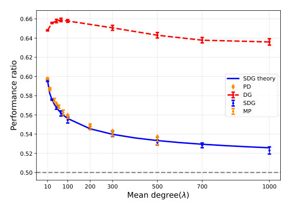
<figcaption class="paper-figure-caption"><b>Fig 1.</b> Figure 1: Average performance ratio of the degree greedy (DG), static degree greedy (SDG), and max-product (MP) algorithms as a function of mean degree λ. The solid blue line represents the theoretical asymptotic performance of SDG, while the blue dots with error bars represent its finite-size simulation results. The red dashed line represents the DG simulation results. The orange dots with error bars represent the MP numerical results, and the orange diamonds represent the population dynamics (PD) predictions. For all three algorithms, the finite-size performance remains above the 1/2 asymptotic threshold. This provides comprehensive (both theoretical and numerical) evidence that local...</figcaption>
</figure>
<figure class="paper-figure-card">
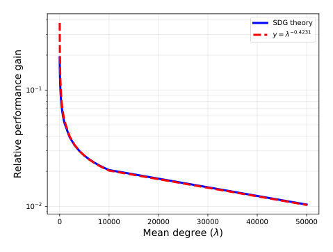
<figcaption class="paper-figure-caption"><b>Fig 2.</b> Figure 2: Convergence of the performance ratio of static degree greedy (SDG) towards the half-bound threshold. The plot displays RSDG(λ) given by (11), interpreted as a natural performance lower bound for a large class of non-trivial algorithms for MIS, on Erdős-Rényi graphs G(n, λ/n) as a function of the degree λ in the limit of large n. The blue solid line represents the convergence of the theoretical results of SDG, while the red dashed line represents a power law fit for large values of λ.</figcaption>
</figure>
<figure class="paper-figure-card">
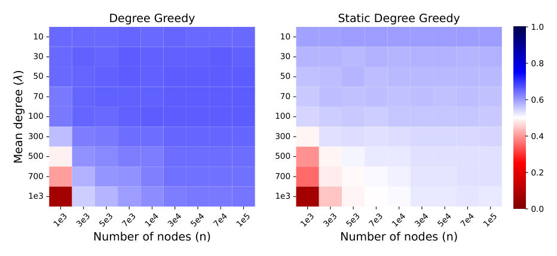
<figcaption class="paper-figure-caption"><b>Fig 3.</b> Figure 3: Heatmap of the performance ratios of the degree greedy (DG) and static degree greedy (SDG) algorithms on Erdős-Rényi graphs G(n, λ/n). The left panel presents the results for DG, while the right panel shows the results for SDG. Both greedy algorithms achieve high ratios (above 1/2) for sparser graphs, but the ratios fall below 1/2 for denser graphs.</figcaption>
</figure>
<figure class="paper-figure-card">
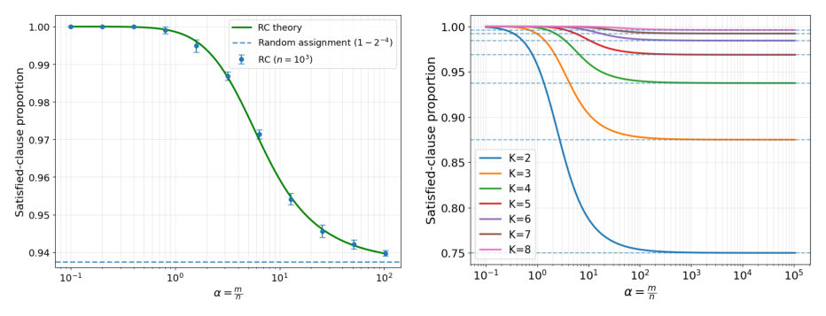
<figcaption class="paper-figure-caption"><b>Fig 4.</b> Figure 4: Asymptotic performance of RC for Max K-SAT. On the left, we compare the ratio of satisfied clauses as a function of the clause density (α = m/n) of RC on simulations (n = 1000, ten simulations for each point) with the predictions from the limit equations for K = 4. Here we can appreciate that this ratio converges asymptotically, as argued, to the random assignment performance. On the right, asymptotic ratio of satisfied clauses as a function of clause density (α = m/n) for different values of K. These simulations suggest that the convergence to the limit follows a similar rate of decay for all K considered. In both graphs, the asymptotic performance of random assignments are...</figcaption>
</figure>

**Summary.** This paper analyzes how well algorithms perform on hard optimization problems like MIS and Max K-SAT, moving beyond worst-case asymptotic guarantees. It demonstrates that even when theory predicts failure in the limit, sophisticated algorithms can achieve surprisingly good results in finite, intermediate regimes. This highlights the continued practical importance of algorithmic design even when asymptotic theory suggests otherwise.

**Why it may be interesting.** The study of algorithmic performance on highly constrained random systems, particularly the gap between finite-size and asymptotic behavior, is highly relevant to understanding the complexity of optimization problems encountered in quantum simulation and machine learning models.

Detailed structure

**Main problem.** The paper investigates the algorithmic performance of solving hard, NP-hard combinatorial optimization problems, such as Maximum Independent Set (MIS) and Max K-SAT.

**Main result.** While asymptotic theory predicts that no polynomial-time algorithm significantly outperforms heuristics in the limit, the study shows that convergence to these bounds can be remarkably slow, especially in the intermediate constraint regime.

**Method.** The analysis combines rigorous average-case asymptotic analysis (using density evolution and population dynamics) with the study of finite-size behavior of various local and greedy algorithms.

**Model / system.** The primary models are random graphs, specifically sparse Erdős-Rényi graphs $G(n, \lambda/n)$ and graphs derived from the configuration model, used to represent the constraints of the optimization problems.

**Key observables.** Performance ratios (e.g., $\sigma_A(G) / \sigma(G)$) comparing the algorithm's output size to the true maximum value ($\sigma(G)$).

**Important parameters / regimes.** Graph size ($n$), mean degree ($\lambda$), and the constraint density regime (easy, intermediate, hard).

**Assumptions / limitations.** The analysis relies heavily on asymptotic limits ($n 	o \infty$) and approximations like Population Dynamics for message-passing algorithms.

**Figures summary.** Figure 1 compares the average performance ratio of different algorithms (DG, SDG, MP) versus the mean degree $\lambda$. Figure 2 quantifies the convergence rate of the SDG algorithm towards a theoretical threshold.

**Paper structure.** The paper first establishes the negative results in the double asymptotic limit. It then revisits the problem by analyzing finite-size behavior, applying techniques like density evolution and population dynamics to MIS and Max K-SAT to demonstrate slow convergence in intermediate regimes.

Abstract

Hard combinatorial optimization problems, many of which are NP-hard, present fundamental algorithmic challenges. Average-case analysis on random instances has emerged as a powerful framework for understanding typical algorithmic performance beyond worst-case guarantees. A substantial body of work has established negative results: for sufficiently hard instances (often controlled by the underlying graph connectivity/constraints density), no known polynomial-time algorithm can significantly outperform naive heuristics in the double asymptotic limit where both problem size and constraints density tend to infinity. We revisit this picture by studying the finite-size behavior of some optimization algorithms across easy, intermediate, and hard regimes. Through rigorous analysis of large-graph asymptotics combined with numerical experiments on canonical problems (maximum independent set and maximum $K$-SAT), we demonstrate that while algorithms do eventually converge to theoretically predicted bounds, this convergence can be remarkably slow. In the intermediate regime where instances are already highly constrained, local algorithms achieve solutions substantially better than their predicted performance in the high-constraint-density limit. This gap between finite-regime and asymptotic behavior has important practical implications: sophisticated algorithmic design remains crucial even when asymptotic theory predicts inevitable failure.

[↑ back to top](#top)

### [Quantum-geometric bounds on Casimir repulsion](http://arxiv.org/abs/2608.18347v1)

**Authors:** Adolfo G. Grushin  
**Type:** theory · **Category:** other · **PDF:** <https://arxiv.org/pdf/2608.18347v1>  
**Analysis basis:** full PDF text, analyzed in chunks
**Topic relevance:** `analog quantum simulation` **1/5**

↔ Scroll figures horizontally

<figure class="paper-figure-card">
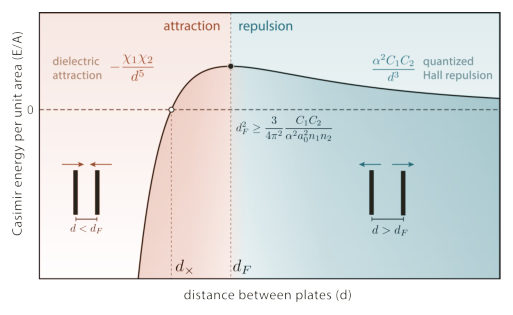
<figcaption class="paper-figure-caption"><b>Fig 1.</b> FIG. 1. Schematic Casimir energy per area E/A between two Chern- insulating sheets with Chern numbers C1C2 &gt; 0 and densities ni=1,2 as a function of separation d. At short distances the dielectric response dominates and the interaction is attractive; beyond the force-crossover distance dF , where E/A is maximal, the Hall response drives Casimir repulsion. Quantum geometry bounds dF from below by Eq. (1). Within the leading large-distance description, repulsion is excluded at separations smaller than this bound.</figcaption>
</figure>
<figure class="paper-figure-card">
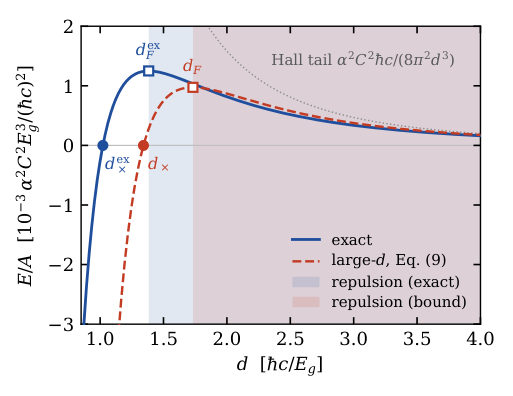
<figcaption class="paper-figure-caption"><b>Fig 2.</b> FIG. 2. Geometric bounds overestimate attraction. Energy per unit area of two identical Landau-level sheets, with Chern number C and cyclotron gap Eg = ℏωc, as a function of separation d. The dashed red curve shows the large-distance Casimir energy, Eq. (9). The solid blue curve shows the exact result using Landau level optical conductivities. Filled circles mark the zeros of the energy, dex × = 1.021 ℏc/Eg (exact) and d× = 3/ √</figcaption>
</figure>
<figure class="paper-figure-card">
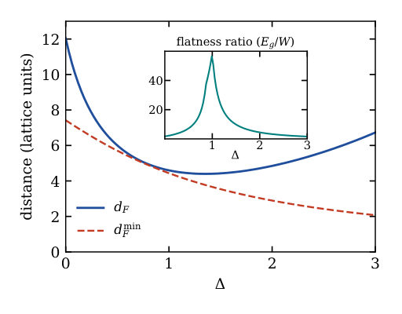
<figcaption class="paper-figure-caption"><b>Fig 3.</b> FIG. 3. Flat-band-induced increase of the repulsive region. We plot the force sign-change distance for two identical C = 3 flat-band Chern-insulator sheets in the three-band model of Refs. [18, 61]. It is plotted as a function of the model parameter ∆, that controls the flatness ratio of the lowest band with ∆= 1 achieving the maximal flatness. The solid line is the value obtained from the Kubo polar- izability, Eq. (21); the dashed line is the minimum value obtained by inserting the Chern susceptibility bound. Distances are in lattice- constant units a = 1. We see that when flattening the band helps to saturate the geometric bounds it reduces dF and increases the region where repulsion can...</figcaption>
</figure>

**Summary.** This theoretical work establishes new quantum-geometric bounds governing the Casimir force between 2D topological materials. It shows that these bounds constrain the force's sign and magnitude, suggesting that the repulsion onset occurs at shorter distances than previously predicted. The findings offer new optimization strategies for observing repulsive Casimir forces in materials like twisted TMDs.

**Why it may be interesting.** The work connects topological invariants (Chern numbers) and geometric properties (quantum metric) directly to macroscopic forces like the Casimir effect, providing new theoretical constraints for condensed matter systems.

Detailed structure

**Main problem.** The paper derives new quantum-geometric bounds on the magnitude and sign of the Casimir force between two-dimensional plates in the long-distance limit.

**Main result.** The derived bounds show that increasing the Chern number can be counterproductive for maximizing repulsion, and the true crossover to repulsion occurs at shorter, more experimentally accessible distances than the bounds suggest.

**Method.** The analysis uses the Lifshitz scattering formula, applying quantum geometric bounds derived from the material's DC response (like conductivity and polarizability) to constrain the Casimir energy.

**Model / system.** The system involves two-dimensional insulating plates, specifically modeling Chern insulators, Landau levels, and twisted bilayer materials like MoTe2.

**Key observables.** Casimir force ($F/A$), crossover distance ($d_F$), dielectric susceptibility, and Hall conductivity.

**Important parameters / regimes.** Separation distance ($d$), Chern numbers ($C_1, C_2$), and the effective Bohr radius ($a^*_\perp$).

**Assumptions / limitations.** The bounds are derived using the leading large-distance approximation, which is noted to be overly conservative compared to full finite-frequency calculations.

**Figures summary.** Figures compare the calculated Casimir energy/force for various models (Landau levels, Chern insulators) against the derived geometric bounds, showing discrepancies in the crossover distance.

**Paper structure.** The paper develops the Casimir energy calculation using the Lifshitz formula, separates the energy into dielectric and Hall terms, derives the quantum-geometric bounds, and then benchmarks these bounds against exact results from specific physical models.

Abstract

The quantum geometric tensor has been shown to bound the gap, optical absorption, and dielectric susceptibilities of materials. Here we derive new quantum-geometric bounds on the magnitude and sign of the Casimir force between two-dimensional plates in the long-distance limit. These bounds limit the previously attributed benefit of increasing the plate's Chern number to maximize repulsion, and give a quantum geometric origin to the stronger attractive force of metallic plates, regardless of their Chern number. These bounds allow us to infer that flat Chern bands that saturate geometric bounds, including Landau levels and moiré flat bands, enlarge the window where Casimir repulsion exists and bring the repulsive crossover to smaller, more experimentally relevant distances. We derive estimates for material platforms such as twisted MoTe$_2$. Our work shows that quantum-geometric bounds constrain repulsive Casimir forces beyond previously known theorems, and suggests new optimization strategies to observe repulsion.

[↑ back to top](#top)

### [Sign-problem-resilient singular-value probe in determinant quantum Monte Carlo](http://arxiv.org/abs/2608.19028v1)

**Authors:** Wen Chen, Rubem Mondaini  
**Type:** theory · **Category:** strongly correlated electrons · **PDF:** <https://arxiv.org/pdf/2608.19028v1>  
**Analysis basis:** full PDF text, analyzed in chunks
**Topic relevance:** `analog quantum simulation` **1/5**

↔ Scroll figures horizontally

<figure class="paper-figure-card">
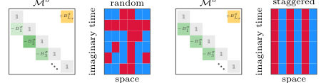
<figcaption class="paper-figure-caption"><b>Fig 1.</b> FIG. 1. Schematic of the models and DQMC space-time fermion matrix Mσ. (a) Honeycomb Hubbard model with t2 = 0 (left) and Haldane-Hubbard model with complex next- nearest-neighbor hopping t2eiϕij (right). Open and filled cir- cles denote the two sublattices, and the arrows specify the phase convention. (b) Sparse block structure of Mσ and aux- iliary fields on the Ns × Lτ space-time lattice. The two fields illustrate a random weak-coupling background and an ideal- ized staggered, τ-uniform strong-coupling limit, respectively.</figcaption>
</figure>
<figure class="paper-figure-card">
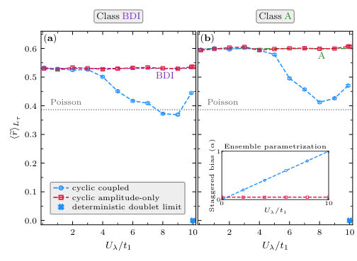
<figcaption class="paper-figure-caption"><b>Fig 2.</b> FIG. 2. Low-lying singular-value statistic ⟨er⟩Lτ for the syn- thetic probability-flip ensembles in (a) class BDI and (b) class A, with L = 6 and Lτ = 80. At each space-time point, the binary field equals the staggered template with proba- bility (1 + α)/2 and its opposite with probability (1 −α)/2. Along the amplitude-only path, α = 0.05 is fixed while Uλ changes only the coupling strength λ(Uλ). Along the cou- pled path, α = Uλ/U⋆, with U⋆/t1 = 10, so the field becomes progressively biased toward the staggered template (inset). Dashed (dash-dotted) horizontal lines denote the BDI (class- A) random-matrix benchmark, and the dotted line marks the Poisson value. At the deterministic endpoint...</figcaption>
</figure>
<figure class="paper-figure-card">
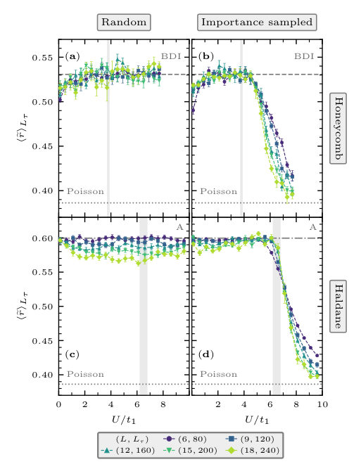
<figcaption class="paper-figure-caption"><b>Fig 3.</b> FIG. 3. Mean adjacent-gap ratio ⟨er⟩Lτ of the low-lying singu- lar values for the two lattice models. The top and bottom rows show the honeycomb Hubbard and Haldane-Hubbard mod- els, respectively. The left column retains each model’s K and λ(U) but uses independent, equiprobable fields xi,τ = ±1 at every space-time point, whereas the right column uses fields generated by DQMC importance sampling. Curves are la- beled by (L, Lτ). Gray bands mark the literature estimates Uc/t1 ∈[3.7, 3.9] for the honeycomb Hubbard model [3, 4, 29] and Uc/t1 ∈[6.2, 6.8] for the Haldane-Hubbard model [31, 32]. Horizontal lines indicate the BDI and class-A random-matrix benchmarks for the top and bottom rows,...</figcaption>
</figure>
<figure class="paper-figure-card">
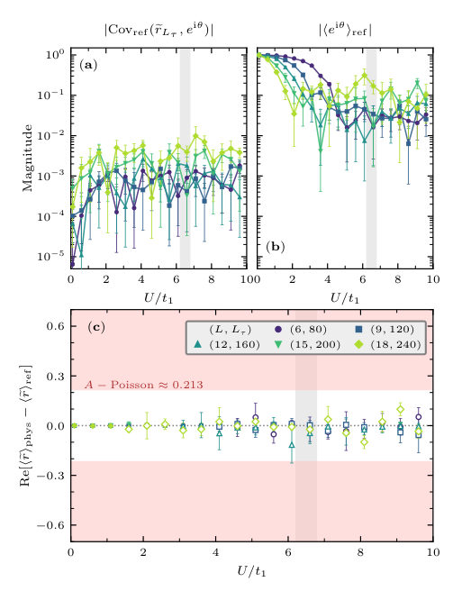
<figcaption class="paper-figure-caption"><b>Fig 4.</b> FIG. 4. Phase-reweighting diagnostics for the Haldane- Hubbard model. (a) Magnitude of the reference-ensemble covariance between the low-lying singular-value statistic and the determinant phase, |Covref(erLτ , eiθ)|. (b) Magnitude of the average phase, |⟨eiθ⟩ref|. (c) Reweighting correction, Re[⟨er⟩Lτ ,phys −⟨er⟩Lτ ,ref]. Error bars in (a,b) denote one standard error; those in (c) are obtained from a synchro- nized chain-block bootstrap. Filled symbols in (c) denote statistically resolved average-phase denominators, whereas open symbols are unresolved and shown only as diagnos- tics. The gray band marks the transition interval U/t1 ∈ [6.2, 6.8] [31, 32]. Red regions in (c) mark corrections...</figcaption>
</figure>

**Summary.** This work introduces the adjacent gap ratio of singular values of the fermion matrix as a robust diagnostic for phase transitions in DQMC simulations. By analyzing Hubbard models, the authors demonstrate that this spectral statistic remains sensitive to underlying physics even when the simulation encounters a sign or phase problem. This establishes a powerful, sign-problem-resilient probe for strongly correlated electron systems.

**Why it may be interesting.** The technique provides a powerful, purely spectral diagnostic tool that bypasses the fundamental sign problem inherent in simulating fermionic quantum many-body systems, which is crucial for understanding correlated materials.

Detailed structure

**Main problem.** The sign problem limits the use of determinant quantum Monte Carlo (DQMC) for studying strongly correlated fermion systems, necessitating a sign-problem-resilient diagnostic for phase transitions.

**Main result.** The adjacent gap ratio of low-lying singular values of the space-time fermion matrix successfully tracks interaction-driven phase transitions in both sign-free and complex-weight Hubbard models, remaining robust against phase reweighting.

**Method.** The authors use the adjacent gap ratio of low-lying singular values ($	ext{err}$) of the space-time fermion matrix, derived from the Hubbard-Stratonovich decoupling, as a diagnostic tool.

**Model / system.** The study focuses on half-filled honeycomb-lattice Hubbard models, including the sign-free and complex-weight Haldane-Hubbard models, analyzed via DQMC simulations.

**Key observables.** Adjacent gap ratio of low-lying singular values ($	ext{err} = \min(\delta_n, \delta_{n+1}) / \max(\delta_n, \delta_{n+1}$)), and the average phase $\langle e^{i	heta} 
angle_{	ext{ref}}$.

**Important parameters / regimes.** Interaction strength ($U/t_1$), lattice geometry (honeycomb), and the auxiliary-field coupling strength ($\lambda$).

**Assumptions / limitations.** The method relies on the local spectral correlations of singular values, which are assumed to be insensitive to the sign/phase of the determinant itself.

**Figures summary.** Figures show the gap ratio $\langle 	ext{err} 
angle_{L	au}$ for synthetic ensembles comparing different paths and models, and also compare the gap ratio for the spin-channel versus the SU(2) charge channel.

**Paper structure.** The paper develops the diagnostic using the gap ratio, applies it to the honeycomb and Haldane-Hubbard models to demonstrate transition tracking, and contrasts this spin-channel response with an SU(2) charge-channel decomposition to validate the specificity of the spin-based probe.

Abstract

The sign problem limits determinant quantum Monte Carlo studies of strongly correlated fermion systems. In the spin-channel Hubbard-Stratonovich decoupling, spin correlations are exactly related to auxiliary-field correlations. This relation implies that an antiferromagnetic transition reorganizes auxiliary-field configurations and thereby changes the statistical structure of the resulting fermion matrices. We use the adjacent gap ratio of low-lying singular values of the space-time fermion matrix to probe interaction-driven transitions in two half-filled honeycomb-lattice Hubbard models. In the sign-free honeycomb Hubbard model, the statistic tracks the established transition from a Dirac semimetal to an antiferromagnetic Mott insulator. In the complex-weight Haldane-Hubbard model, the transition-sensitive feature remains visible in the phase-quenched reference ensemble and occurs near previous estimates of the transition. Moreover, phase reweighting only weakly modifies the gap ratio over the regimes investigated, despite the rapid suppression of the average phase. These results establish singular-value statistics as a sign-problem-resilient probe of interaction-driven transitions in determinant quantum Monte Carlo.

[↑ back to top](#top)

### [Ultrasonic attenuation in inhomogeneous superconductors](http://arxiv.org/abs/2608.19079v1)

**Authors:** Aman Sardwal, Andreas Kreisel, Shantanu Mukherjee  
**Type:** theory · **Category:** strongly correlated electrons · **PDF:** <https://arxiv.org/pdf/2608.19079v1>  
**Analysis basis:** full PDF text, analyzed in chunks
**Topic relevance:** `Keldysh / 2PI / non-Gaussian methods` **1/5**

↔ Scroll figures horizontally

<figure class="paper-figure-card">
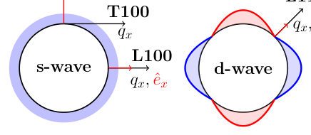
<figcaption class="paper-figure-caption"><b>Fig 1.</b> Figure 1. Example gap structures and phonon modes. The blue (red) shaded regions denote areas where the super- conducting gap is positive (negative). The relevant acoustic phonon modes—longitudinal and transverse—are shown with propagation along q and polarization along ˆeλ. Notation : Thkl, Lhkl denote transverse (T) and longitudinal (L) phonon modes respectively, propagating along hkl.</figcaption>
</figure>
<figure class="paper-figure-card">
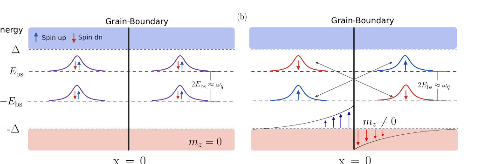
<figcaption class="paper-figure-caption"><b>Fig 2.</b> Figure 2. Attenuation from bound states : (a) Non-magnetic bound state: Andreev bound states and their quasiparticle spin content on either side of a grain boundary in an unconventional superconductor. (b) Magnetic bound state: In the presence of local magnetism, the spin-selective character of the Zeeman-split in-gap Andreev bound states changes sign across the grain boundary. The black arrows indicate the nonzero contribution to the ultrasonic attenuation coefficient from quasiparticles associated with the particle–hole-symmetric bound states.</figcaption>
</figure>
<figure class="paper-figure-card">
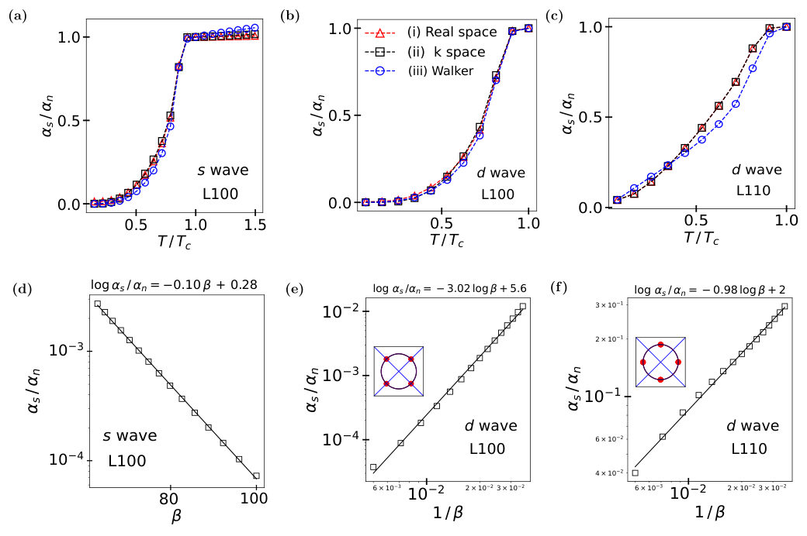
<figcaption class="paper-figure-caption"><b>Fig 3.</b> Figure 3. Temperature dependence of the normalized attenuation coefficient αs in the superconducting state relative to the normal state. (a) Attenuation for s-wave superconductor (∆(k) = ∆0) in the L100 mode. Attenuation for a d-wave superconductor (∆(k) = ∆0(cos kx −cos ky)) are shown for L100 mode (b), and L110 mode (c). Panels (d), (e) and (f) correspond to the low temperature characteristics of the (a), (b) and (c), respectively showing the exponential characteristics for s-wave and power law for d-wave gap functions. Inset in panel (e),(f) show the Fermi surface (black solid line) with n = 0.8 and t′ = 0.3. The nodal lines of superconducting gap (blue) and zeros of electron-phonon...</figcaption>
</figure>
<figure class="paper-figure-card">
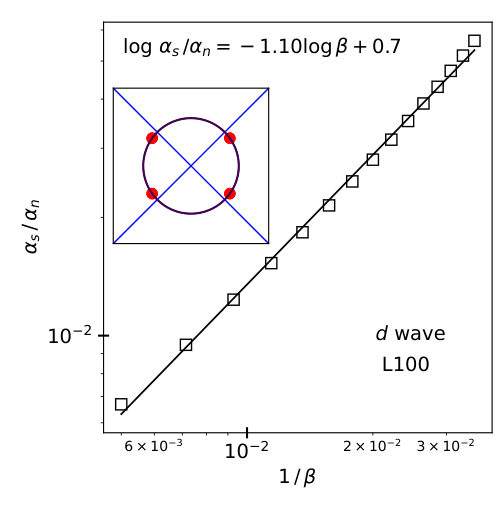
<figcaption class="paper-figure-caption"><b>Fig 4.</b> Figure 4. The low temperature characteristics of dx2−y2 for L100 mode for a different Fermi surface (n = 0.6), with ze- ros of the electron–phonon matrix element F(k, q), not lying along the nodal lines.</figcaption>
</figure>
<figure class="paper-figure-card">
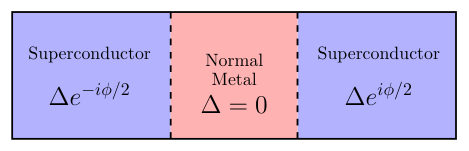
<figcaption class="paper-figure-caption"><b>Fig 5.</b> Figure 5. Schematic of a SNS junction with phase difference of ϕ between the left and right superconductor.</figcaption>
</figure>

**Summary.** This theoretical work calculates ultrasonic attenuation in inhomogeneous superconductors to probe the nature of subgap bound states. By using a BdG formulation, the authors show that the attenuation signal is highly sensitive to the spin structure and symmetry of the bound states. This allows ultrasound to distinguish between different types of electronic states, such as those induced by non-magnetic versus magnetic impurities at grain boundaries.

**Why it may be interesting.** The sensitivity of the attenuation to spin structure and symmetry provides a powerful, non-spectroscopic probe for understanding exotic pairing symmetries and local magnetic moments in strongly correlated superconductors.

Detailed structure

**Main problem.** The paper investigates how ultrasonic attenuation can be used to distinguish between different types of superconducting bound states (e.g., magnetic vs. non-magnetic) in inhomogeneous superconductors.

**Main result.** The attenuation signature is highly sensitive to the symmetry and spin structure of the bound states; specifically, local magnetism can induce a clear attenuation peak where non-magnetic impurities cause only weak signals due to coherence factor cancellation.

**Method.** The authors use a real-space Bogoliubov-de Gennes (BdG) formulation combined with linear response theory to calculate the first-order correction to the phonon decay rate.

**Model / system.** The study models superconductors, focusing on inhomogeneous junctions like phase-biased SNS junctions and grain boundaries in $d_{x^2-y^2}$ superconductors. The calculation involves the electron-phonon interaction derived from hopping parameter variations.

**Key observables.** Ultrasonic attenuation coefficient ($\alpha(q, \lambda)$) and the phonon lifetime ($	au_{q\lambda}$).

**Important parameters / regimes.** Low temperatures, phonon frequency matching subgap level separation, and the presence/absence of local magnetism.

**Assumptions / limitations.** The analysis relies on the first-order correction in the decay rate calculation and uses an effective mean-field model for the superconducting gap.

**Figures summary.** Figures illustrate gap structures, the comparison of attenuation from non-magnetic vs. magnetic bound states, and the temperature dependence of attenuation in s-wave and d-wave systems.

**Paper structure.** The paper develops the theoretical framework using BdG formalism and linear response theory, applies it to specific inhomogeneous geometries (SNS junctions, grain boundaries), and contrasts the resulting attenuation signatures based on the nature of the impurity/disorder.

Abstract

Subgap bound states can produce pronounced features in the density of states without necessarily giving rise to a corresponding signal in ultrasonic attenuation. We show that the coherence factors act as a filter for the contribution of bound states to ultrasonic attenuation. In a phase-biased superconductor--normal--superconductor junction, the Andreev bound states produce a resonance in the attenuation when the phonon frequency matches the phase-dependent separation between the subgap levels. The situation is different at a $(110)$ grain boundary in a $d_{x^2-y^2}$ superconductor. There, nonmagnetic impurity-induced bound states remain weak in the attenuation despite their large spectral weight, because the relevant coherence factors nearly cancel. When local magnetism develops near the boundary, this cancellation is removed, the bound states become spin split, and a clear attenuation peak appears, which we argue is governed by a process involving emission of phonons by pair of quasiparticles at low temperatures. We obtain these results using a real-space Bogoliubov--de Gennes formulation of ultrasonic attenuation and benchmark the method against the known low-temperature behavior of homogeneous $s$- and $d$-wave superconductors. The results show that ultrasound can distinguish bound states with similar spectral signatures but different symmetry and spin structure.

[↑ back to top](#top)

### [Unconventional bond- and current-density waves on hexagonal lattices](http://arxiv.org/abs/2608.19185v1)

**Authors:** Andras Szabo, Hannes Braun, Laura Classen  
**Type:** theory · **Category:** strongly correlated electrons · **PDF:** <https://arxiv.org/pdf/2608.19185v1>  
**Analysis basis:** full PDF text, analyzed in chunks
**Topic relevance:** `analog quantum simulation` **1/5**

↔ Scroll figures horizontally

<figure class="paper-figure-card">
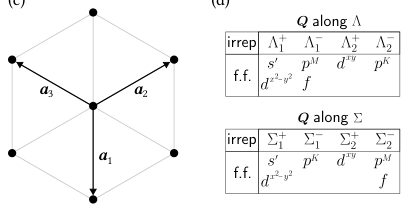
<figcaption class="paper-figure-caption"><b>Fig 1.</b> FIG. 1. Top: hexagonal Brillouin zone and ±Q1,2,3 symmetry related ordering wave vectors forming the star. In (a) these fall on the Γ−K line also known as Λ and in (b) on the Γ−M or Σ line. Bottom: (c) Triangular lattice with bonds a1,2,3 indicated with arrows. (d) Classification of nearest neighbor form factors on the triangular lattice according to LG irreps for the two cases shown in (a) and (b). For the expressions of the form factors see text.</figcaption>
</figure>
<figure class="paper-figure-card">
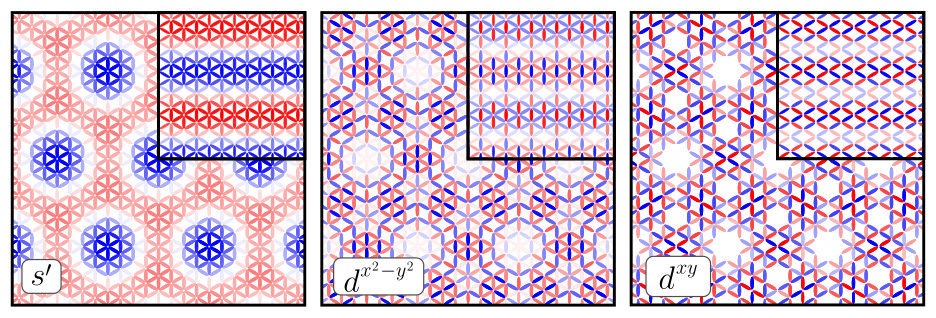
<figcaption class="paper-figure-caption"><b>Fig 2.</b> FIG. 2. Depictions of bond orders in real space with form factors indicated in the bottom left. In each panel, the main figure and the inset correspond to a multi-Q and single-Q ground state, respectively, and we set all phases to be ϕi = θi = 0.</figcaption>
</figure>
<figure class="paper-figure-card">
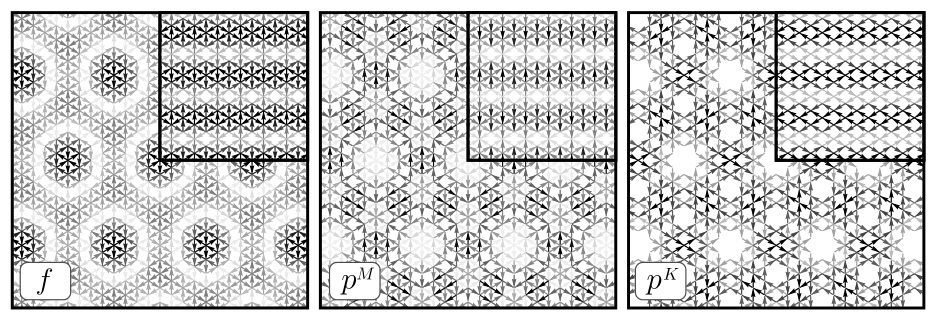
<figcaption class="paper-figure-caption"><b>Fig 3.</b> FIG. 3. Depictions of current orders in real space with form factors indicated in the bottom left. In each panel, the main figure and the inset correspond to a multi-Q and single-Q ground state, respectively, and we set all phases to be ϕ′ i = θ′ i = 0.</figcaption>
</figure>
<figure class="paper-figure-card">
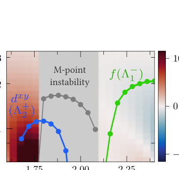
<figcaption class="paper-figure-caption"><b>Fig 4.</b> FIG. 4. Phase diagram as a function of T and µ. The blue and green (gray) line show the critical temperature Tc for the CDW instability for Qi = Ki/4 (Qi = Mi) which transform according to the irreps Λ+ 2 with dxy form factor and Λ− 1 with f form factor, respectively. The gray area indicates the region where a transition to the Qi = Mi CDW instability occurs before one towards Qi = Ki/4. The background color encodes 2β1 −β2 for each instability which determines if the order is single-Q (2β1 −β2 &lt; 0) or multi-Q (2β1 −β2 &gt; 0). The parameters used are U = 3t, J = 0.7t and N = 4.</figcaption>
</figure>
<figure class="paper-figure-card">
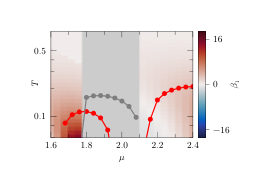
<figcaption class="paper-figure-caption"><b>Fig 5.</b> FIG. 5. Quartic Ginzburg-Landau coefficient β1 for Q = K/4, evaluated for the leading RPA eigenchannel as a function of temperature and chemical potential. The red (grey) line indi- cates the critical temperature Tc for the CDW instability for Q = K/4 (Q = M).</figcaption>
</figure>

**Summary.** This work establishes a comprehensive theoretical framework to classify unconventional Charge-Density Wave (CDW) orders on hexagonal lattices by integrating local symmetry constraints (little group) with multiple ordering wave vectors. Using RPA on the triangular lattice, the authors derive Landau free energies whose coefficients determine whether the ground state favors a single-momentum-vector (single-Q) or multi-momentum-vector (multi-Q) order. This provides a systematic route for predicting exotic electronic ground states in correlated quantum materials.

**Why it may be interesting.** The rigorous application of group theory to classify complex ordered phases like CDWs provides a powerful, generalizable theoretical tool for understanding electronic instabilities in correlated materials, which is relevant to understanding exotic quantum states.

Detailed structure

**Main problem.** The paper develops a systematic framework to describe unconventional Charge-Density Wave (CDW) phases that incorporate both local symmetries (little group) and multiple symmetry-related ordering wave vectors (the 'star').

**Main result.** The stability of the CDW state (single-Q vs. multi-Q) is determined by the sign of the coefficient $2eta_1 - eta_2$ in the Landau free energy, allowing for a systematic classification of ground states.

**Method.** The analysis combines group-theoretical symmetry analysis (using little groups and space groups) with mean-field theory, specifically calculating Landau free energy coefficients via the Random Phase Approximation (RPA).

**Model / system.** The study focuses on two-dimensional hexagonal lattices, using the triangular lattice as a minimal example, analyzed via a tight-binding model and Hubbard-type interactions.

**Key observables.** Order parameters ($\Delta, \psi, \eta$), Landau free energy coefficients ($\alpha, eta, \gamma$), and the resulting CDW structure (bond or current density).

**Important parameters / regimes.** Chemical potential ($\mu$), temperature ($T$), and the relative signs of the quartic free energy coefficients ($eta_1, eta_2$).

**Assumptions / limitations.** The analysis relies on mean-field approximations (RPA) and the systematic incorporation of local symmetries via the little group.

**Figures summary.** Figures illustrate the hexagonal Brillouin zone and the classification of form factors based on symmetry. Other figures show the dependence of free energy coefficients ($eta_1, 2eta_1 + eta_2$) on temperature and chemical potential, determining the phase stability.

**Paper structure.** The paper proceeds by establishing the general symmetry framework (LG/SG) for unconventional CDWs, deriving the relevant form factors and symmetry-constrained Landau free energies, and finally applying this framework to the triangular lattice using RPA calculations to determine the ground state phase.

Abstract

Charge-density wave (CDW) orders are conventionally described as modulations of on-site charge at an ordering wave vector $\boldsymbol{Q}$ with symmetry-related wave vectors typically forming a multicomponent order-parameter manifold. Recent developments significantly broadened this phenomenology to bond and loop-current density waves, which possess nontrivial, potentially symmetry-breaking textures within the unit cell in addition to their spatial modulation at $\boldsymbol{Q}$. Such textures arise from particle-hole condensates with nonzero angular momentum, analogous to unconventional superconductivity, and their symmetries are described by the little group $G_{\boldsymbol{Q}}$. In this work, we develop a framework for unconventional CDW phases that simultaneously incorporates the local symmetries described by little group and the presence of multiple symmetry-related ordering wave vectors, also known as the star. The resulting multicomponent order parameter transforms under representations of the full space group induced from irreducible representations of $G_{\boldsymbol{Q}}$. We apply this framework to two-dimensional lattices with sixfold symmetry and ordering wave vectors along high-symmetry lines, and derive the corresponding Landau free energies. As a microscopic example, we demonstrate the emergence of unconventional bond and loop-current orders from electronic interactions on the triangular lattice within the random phase approximation, and determine their ground states by microscopically evaluating the relevant coefficients in the free energy. Our framework provides a systematic route to describing unconventional modulated phases and can be readily extended to more complex lattices.

[↑ back to top](#top)

## Other papers (17)

*Papers from primary archives without highlighted authors or any topic match. Click to expand.*

Show other papers

### [(Almost) quadruply optimal unitary designs in 1D](http://arxiv.org/abs/2608.18650v1)

**Authors:** Guoding Liu, Jonas Helsen  
**Type:** theory · **Category:** quantum information and computing · **PDF:** <https://arxiv.org/pdf/2608.18650v1>  
**Analysis basis:** full PDF text, analyzed in chunks

↔ Scroll figures horizontally

<figure class="paper-figure-card">
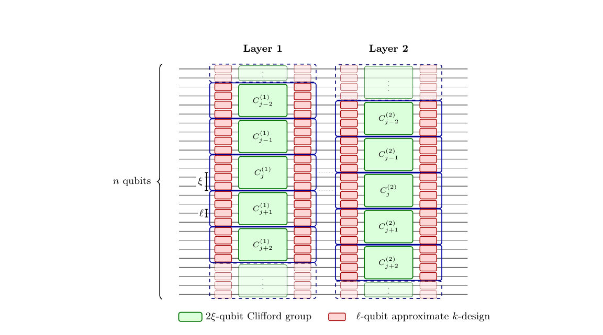
<figcaption class="paper-figure-caption"><b>Fig 1.</b> Figure 1: Circuit architecture for nearly optimal 1D approximate unitary k-designs. The con- struction employs a two-layer block-brickwork architecture acting on a 1D chain, where each block spans 2ξ qubits with an overlap of ξ qubits between adjacent layers. The block size scales as ξ = O(log(n/ε) + k). Each 2ξ-qubit block is realized as a magic-augmented circuit, consisting of a random Clifford operation flanked by ℓ-local ε′′-error approximate unitary k-designs, where the locality is ℓ= O(log k) and the relative error of the local block is set to ε′′ = 2−2ℓk.</figcaption>
</figure>
<figure class="paper-figure-card">
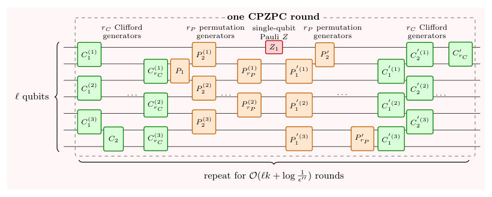
<figcaption class="paper-figure-caption"><b>Fig 2.</b> Figure 2: Implementation of the ℓ-local ε′′-relative-error approximate unitary k-design. An ℓ-qubit approximate unitary k-design with relative error ε′′ is constructed by repeating O(ℓk + log(1/ε′′)) rounds of CPZPC generators. Each individual round consists of 2rC Clifford group generators, 2rP permutation group generators, and a single Pauli Z gate, where rC and rP are fixed constants. All generators are strictly constant-local in a 1D nearest-neighbor layout.</figcaption>
</figure>
<figure class="paper-figure-card">
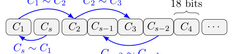
<figcaption class="paper-figure-caption"><b>Fig 3.</b> Figure 3: Folded cell order. The cyclic shift matrix used by Kassabov couples Ca only to Ca+1 (mod s). In this ordering, those cyclic neighbors are constant-distance neighbors on an open one-dimensional line.</figcaption>
</figure>

**Summary.** This paper presents a method to construct approximate unitary k-designs on 1D quantum hardware that achieves near-optimal scaling for both circuit depth and the number of required magic gates. By refining previous techniques and combining them with the Gluing Lemma, the authors demonstrate efficient resource utilization for generating highly mixed quantum states on linear quantum processors.

**Why it may be interesting.** This work provides concrete, resource-efficient circuit constructions for achieving highly mixed quantum states (unitary designs) on physically constrained 1D hardware, which is crucial for quantum simulation and computation.

Detailed structure

**Main problem.** The central problem is constructing approximate unitary k-designs on 1D quantum architectures with minimal resource overhead regarding circuit depth and magic gates.

**Main result.** The authors achieve simultaneous near-optimality in circuit depth and T-gate count for 1D systems, matching known lower bounds up to a logarithmic factor.

**Method.** The construction combines and refines existing results, utilizing a two-layer block-brickwork architecture and the Gluing Lemma to extend local designs to global ones.

**Model / system.** The system is modeled as a 1D nearest-neighbor quantum architecture (qubits) implementing unitary operations, involving Clifford group operations and random permutations.

**Key observables.** Circuit depth, number of magic gates (T gates), and the relative error ($\epsilon$) of the unitary k-design.

**Important parameters / regimes.** Design order $k$, system size $n$, relative error $\epsilon$, and locality $\ell$.

**Assumptions / limitations.** The construction relies on the Gluing Lemma and assumes the block size is an integer multiple of the locality parameter.

**Figures summary.** Figure 1 illustrates the two-layer block-brickwork circuit architecture for the design, and Figure 2 relates to implementing the local generators using CPZPC generators.

**Paper structure.** The paper builds by first improving the magic block size reduction, then constructing a constant-spectral-gap generating set for the Clifford group, and finally combining these elements using the gluing lemma to prove the main near-optimal design result.

Abstract

We construct $n$-qubit approximate unitary $k$-designs in 1D systems, achieving circuit depth $O(\log(n/\varepsilon) + k\log k)$ with relative error $\varepsilon$ and requiring $O(nk\log k)$ magic gates. This matches existing lower bounds $Ω(\log(n/\varepsilon) + k)$ for circuit depth, and $\widetildeΩ(nk)$ for the required number of $T$ gates, up to a $\log k$ factor, achieving simultaneous near-optimality in all parameters. Our construction is based on a combination and refinement of two existing results. We reduce the required magic block size for breaking Clifford symmetries in the magic-augmented circuit construction of Zhang et al. from $O(k\log k)$ to $O(\log k)$. We also improve the breakthrough construction of Chen et al. to construct a generating set of 1D local constant-depth circuits for the unitary group with a constant spectral gap, making $O(\log k)$-local random unitaries realizable in depth $O(k\log k)$. As a by-product, we provide a constant-size 1D-local generating set for the Clifford group, which we expect to be of independent interest. Combining the two results with the gluing lemma, we prove the final result.

[↑ back to top](#top)

### [AlphaClifford: Efficient Clifford Synthesis and Transpilation with Model-based RL](http://arxiv.org/abs/2608.18946v1)

**Authors:** Daniele Lizzio Bosco, Jacopo Cossio, Carla Piazza, Giuseppe Serra  
**Type:** theory · **Category:** quantum information and computing · **PDF:** <https://arxiv.org/pdf/2608.18946v1>  
**Analysis basis:** full PDF text, analyzed in chunks

↔ Scroll figures horizontally

<figure class="paper-figure-card">
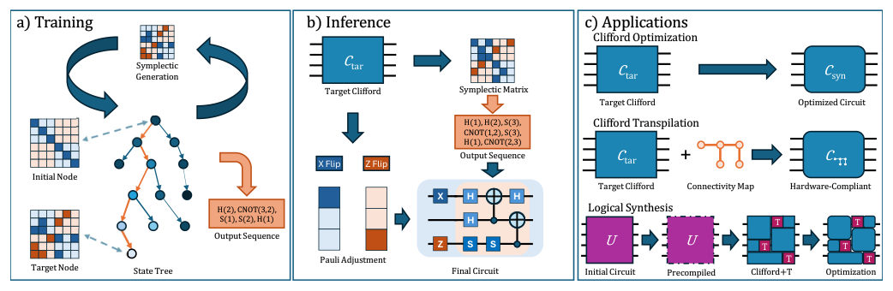
<figcaption class="paper-figure-caption"><b>Fig 1.</b> Fig. 1: a) We train our model to reproduce a target symplectic matrix. Each symplectic matrix is modelled as the node of a tree, where nodes are connected if the corresponding matrices can be reached with an operation from H, S, and CNOT. We train a MCTS-based model as a pair of value network (for nodes, e.g. lighter blue corresponds to a higher value) and policy network (for edges, e.g. wider arrows corresponds to higher probabilities). b) Given a target Clifford circuit Ctar, we utilize our model to synthesize a circuit C with the same symplectic matrix, i.e. P ·C ≡Ctar for a suitable Pauli P. We then compute the P from initial circuit, and we apply the corresponding gates to the obtained...</figcaption>
</figure>
<figure class="paper-figure-card">
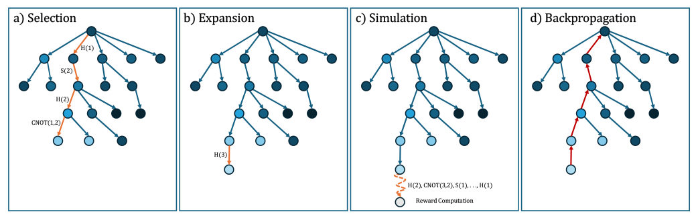
<figcaption class="paper-figure-caption"><b>Fig 2.</b> Fig. 2: Overview of the Monte Carlo Tree Search (MCTS) phases for Clifford circuit synthesis. The search space is explored by iteratively executing four distinct stages: (a) Selection: The tree is traversed from the root (representing the target symplectic matrix C) to a leaf node. Actions, corresponding to Clifford gates H, S, and CNOT, are chosen by balancing exploration and exploitation using the UCT formula. (b) Expansion: When reaching a leaf node, the tree is expanded by the addition of one or more child nodes, each representing the state resulting from a possible Clifford operation. (c) Simulation: A rollout is performed from the newly expanded node based on the policy network. A...</figcaption>
</figure>
<figure class="paper-figure-card">
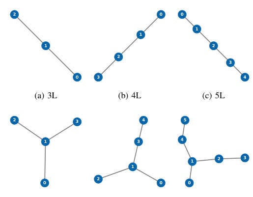
<figcaption class="paper-figure-caption"><b>Fig 3.</b> Fig. 3: Hardware connectivity maps utilized for benchmarking: Line graphs (a-c) and T-shape graphs (d-f). Vertices represent physical qubits and edges represent available coupling map connections.</figcaption>
</figure>

**Summary.** This paper introduces AlphaClifford, a novel model-based Reinforcement Learning framework that uses Monte Carlo Tree Search to efficiently synthesize and optimize Clifford quantum circuits. By modeling the problem using the algebraic structure of the symplectic group, it significantly outperforms existing heuristics in minimizing gate counts for both general optimization and hardware-constrained transpilation.

**Why it may be interesting.** While focused on abstract computation, the rigorous mathematical modeling of the state space using group theory (symplectic group) and the application of advanced AI search techniques (MCTS) provide powerful computational tools applicable to modeling complex quantum dynamics.

Detailed structure

**Main problem.** Standard methods for synthesizing Clifford quantum circuits yield sub-optimal gate counts, which is inefficient for fault-tolerant quantum computation.

**Main result.** AlphaClifford achieves significant reductions (up to 56% total gate reduction) in gate counts compared to state-of-the-art heuristics for both unconstrained optimization and hardware-constrained transpilation.

**Method.** The authors introduce AlphaClifford, a model-based Reinforcement Learning framework utilizing Monte Carlo Tree Search (MCTS) to explore the combinatorial space of Clifford circuits.

**Model / system.** The system involves Clifford circuits, which are mathematically characterized by their action on the symplectic group $	ext{Sp}(2n, 	ext{F}_2)$ via the symplectic matrix representation $M = [X Z]$.

**Key observables.** Total gate count and two-qubit (CNOT) gate count are minimized; the goal is to match a target symplectic matrix $M_{	ext{target}}$.

**Important parameters / regimes.** The fundamental gate set is {H, S, CNOT}; the state space is modeled using the algebraic properties of the symplectic group.

**Assumptions / limitations.** The synthesis guarantees equivalence only up to a Pauli layer ($P \in P_n$), relying on the homomorphism $\phi: C_n 	o 	ext{Sp}(2n, 	ext{F}_2)$.

**Figures summary.** Figure 1 illustrates the process: (a) Training uses MCTS on the symplectic matrix tree; (b) Synthesis uses the model to find a circuit matching a target matrix; (c) Shows applications in optimization, transpilation, and logical synthesis.

**Paper structure.** The paper details the mathematical formulation using symplectic matrices, introduces the AlphaClifford RL framework powered by MCTS, presents results across general optimization and transpilation tasks, and discusses future directions.

Abstract

Clifford circuits play a foundational role in quantum computing, particularly due to their importance in quantum error correction and fault-tolerant logical synthesis. While these circuits can be efficiently simulated and represented as symplectic matrices, standard synthesis methods-such as the Aaronson-Gottesman algorithm-often yield sub-optimal circuits with excessively high gate counts. In this work, we introduce AlphaClifford, a model-based Reinforcement Learning framework powered by Monte Carlo Tree Search, designed to efficiently synthesize Clifford circuits from the fundamental gate set composed of H, S, and CNOT. By modeling the state space through the algebraic properties of the symplectic group, AlphaClifford effectively explores this combinatorial space to minimize overall circuit cost. For unconstrained Clifford optimization, our approach achieves a consistent reduction in both total and two-qubit (CNOT) gate counts compared to state-of-the-art synthesis heuristics, despite operating with a strictly less expressive gate set. Furthermore, we demonstrate the broad applicability of our framework on two additional tasks: hardware-constrained Clifford transpilation, where we outperform existing RL-based compilers, and as a post-synthesis optimization component within a full Clifford+T logical synthesis pipeline. Our results underscore that model-based RL is highly effective at addressing the combinatorial complexities of quantum compilation, offering a scalable pathway to mitigate hardware constraints in both near-term and future fault-tolerant quantum devices.

[↑ back to top](#top)

### [Anti-spin Laue groups: classification of anti-altermagnets and their representative minimal models](http://arxiv.org/abs/2608.19056v1)

**Authors:** Colin Lange, Rodrigo Jaeschke-Ubiergo, Alexander Mook, Jairo Sinova  
**Type:** theory · **Category:** strongly correlated electrons · **PDF:** <https://arxiv.org/pdf/2608.19056v1>  
**Analysis basis:** full PDF text, analyzed in chunks

↔ Scroll figures horizontally

<figure class="paper-figure-card">
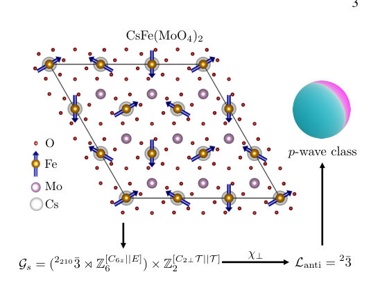
<figcaption class="paper-figure-caption"><b>Fig 1.</b> FIG. 2. Reduction of complex SSG to concise anti-spin Laue group in CsFe(MoO4)2. A top view of the spin helix structure of CsFe(MoO4)2 and its spin point group is indicated. 𝜒⊥denotes the anti-spin Laue group reduction to the the group 2¯3 which is in the 𝑝-wave class of Tab. II.</figcaption>
</figure>
<figure class="paper-figure-card">
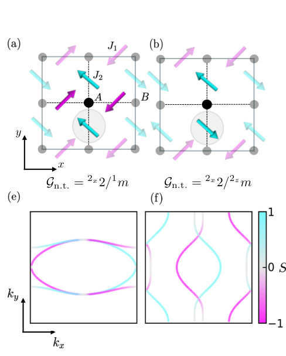
<figcaption class="paper-figure-caption"><b>Fig 2.</b> FIG. 1. Different real-space lattice models belonging to the same anti-spin Laue group 22/1𝑚. (a),(b) Real-space lattice models with coplanar magnetic textures described by the nontrivial spin point groups Gn.t. = 2𝑥2/1𝑚and Gn.t. = 2𝑥2/2𝑧𝑚, respectively. (c),(d) Isoenergy lines of the corresponding models in momentum space. 𝑆⊥denotes the out-of-plane spin polarization of the respective bands. Despite their distinct real-space spin symmetries, both exhibit the same nodal structure, with a nodal line at 𝑘𝑥= 0.</figcaption>
</figure>
<figure class="paper-figure-card">
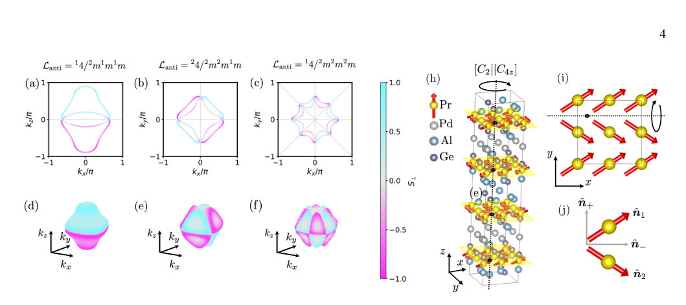
<figcaption class="paper-figure-caption"><b>Fig 3.</b> FIG. 3. Type-A models for three anti-spin Laue groups of the 4/𝑚𝑚𝑚crystal system. (a)–(c) Spin-polarized isoenergy cuts of the 𝑝-, 𝑓-, and ℎ-wave representatives with anti-spin Laue groups 14/2𝑚1𝑚1𝑚, 24/2𝑚2𝑚1𝑚, and 14/2𝑚2𝑚2𝑚, respectively. (d)–(f) Corresponding three-dimensional isoenergy surfaces. The color code denotes 𝑆⊥and reveals the symmetry-enforced nodal planes. (h)–(j) 𝑓-wave candidate Pr2PdAl7Ge4 [71]: its physical moments are interchanged by the [𝐶2||𝐶4] spin-symmetry, whereas their symmetric and antisymmetric combinations form a symmetry-adapted basis ˆn±.</figcaption>
</figure>

**Summary.** This paper introduces the concept of anti-spin Laue groups to systematically classify anti-altermagnets, which exhibit unique odd-parity spin splitting. By developing this classification, the authors create a unified theoretical framework that allows for the construction of minimal, material-oriented four-band models for unconventional magnets. This advances the understanding of how magnetic symmetry dictates electronic band structure in condensed matter systems.

**Why it may be interesting.** This work provides a powerful, symmetry-enforced framework for understanding magnetic electronic structure, which is crucial for designing novel topological or correlated electronic materials relevant to quantum phenomena.

Detailed structure

**Main problem.** To classify and develop minimal theoretical models for anti-altermagnets, which exhibit odd-parity nonrelativistic spin splitting and lack a simple symmetry classification analogous to existing spin Laue groups.

**Main result.** The authors introduce anti-spin Laue groups, classifying 21 distinct groups that, together with spin Laue groups, provide a complete symmetry description for unconventional magnets with collinear momentum-space spin polarization.

**Method.** The classification is achieved by projecting the full spin group onto the action on the out-of-plane spin polarization component, leading to a systematic model-construction algorithm for minimal four-band Hamiltonians.

**Model / system.** The focus is on anti-altermagnets, which are coplanar magnets characterized by odd-parity nonrelativistic spin splitting. The theoretical framework unifies the symmetry description for both odd- and even-parity unconventional magnets.

**Key observables.** The perpendicular spin polarization component, $S_{\perp}(k)$, and the resulting symmetry-enforced nodal spin-splitting character.

**Important parameters / regimes.** Odd-parity spin splitting, collinear momentum-space spin polarization, and the structure of the anti-spin Laue groups ($	ext{R}_{	ext{Is}}, 	ext{R}_{	ext{IIs}}, 	ext{R}_{	ext{IIIs}}$).

**Assumptions / limitations.** The construction retains only the action of the spin symmetry on the collinear momentum-space spin polarization, and an effective 'anti-inversion' symmetry must be added for anti-spin Laue groups.

**Figures summary.** Figures illustrate the relationship between different real-space lattice models belonging to the same anti-spin Laue group, showing common nodal structures in momentum space, and visualizing the perpendicular spin polarization $S_{\perp}$ and nodal planes for various crystal systems.

**Paper structure.** The paper first establishes the need for anti-spin Laue groups due to the unique symmetry of anti-altermagnets. It then details the construction of these groups, provides a comprehensive classification (21 groups), and concludes by presenting a systematic algorithm to build minimal, material-oriented four-band models.

Abstract

Anti-altermagnets exhibit odd-parity nonrelativistic spin splitting, yet unlike even-parity altermagnets, their momentum-space symmetries lack a reduced classification analogous to spin Laue groups. Here, we introduce anti-spin Laue groups, organized into three distinct classes, and identify 21 groups describing the odd-parity partial wave character of this unconventional class. Together with the 10 spin Laue groups of altermagnets, they complete the classification of nonrelativistic unconventional magnets with collinear momentum-space spin polarization. Anti-spin Laue groups also provide a many-to-one reduction of spin space (point) groups by retaining only their action on the collinear momentum-space spin polarization, thereby directly encoding the symmetry-enforced nodal spin-splitting character. Based on this we develop a systematic model-construction algorithm yielding minimal, material-oriented four-band models. This framework places odd- and even-parity unconventional magnets on equal footing within a unified momentum-space symmetry description.

[↑ back to top](#top)

### [Copy-Protection with Correlated Challenges: Point Functions and More via Decisional Coset Monogamy](http://arxiv.org/abs/2608.18841v1)

**Authors:** Amit Behera, Alper Çakan, Vipul Goyal  
**Type:** theory · **Category:** other · **PDF:** <https://arxiv.org/pdf/2608.18841v1>  
**Analysis basis:** full PDF text, analyzed in chunks

↔ Scroll figures horizontally

<figure class="paper-figure-card">
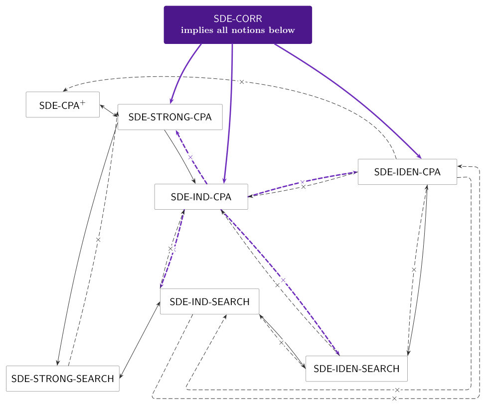
<figcaption class="paper-figure-caption"><b>Fig 1.</b> Figure 1: Hierarchy of SDE security notions under the standing assumptions of this subsection. Solid arrows denote implication, solid double-headed lines denote equivalence, and dashed directed arrows marked by a midpoint × denote failure of the implication in the arrow direction. Violet heavy lines are new in this work; black lines are prior or elementary. Unmarked directions are not claimed; in particular, the implication from SDE-CPA+ to SDE-IDEN-CPA remains open.</figcaption>
</figure>

**Summary.** This paper advances the theory of quantum cryptography by developing robust security notions for copy-protection and encryption that account for correlated or identical challenges. It provides constructions proving the existence of these secure primitives for general functionalities, resolving long-standing open questions in the field.

**Why it may be interesting.** While highly theoretical, the rigorous mathematical framework developed for handling correlations in quantum information security has parallels with understanding complex, non-independent interactions in many-body quantum systems, where local measurements might reveal global correlations.

Detailed structure

**Main problem.** The paper addresses the theoretical challenge of defining and proving security for quantum copy-protection and single-decryptor encryption (SDE) under natural, correlated challenge distributions, moving beyond simple independent challenges.

**Main result.** The authors establish plain-model security for correlated challenge unclonable puncturable obfuscation (UPO) and achieve the first provable identical-challenge copy protection for point functions and general puncturable functionalities.

**Method.** The methodology involves strengthening security definitions (e.g., correlated challenge security) and utilizing advanced cryptographic techniques, including a new decisional monogamy theorem for coset states, and relying on assumptions like post-quantum iO and quantum-hard LWE.

**Model / system.** The work is purely theoretical, dealing with abstract cryptographic primitives applied to quantum states and computational circuits. The model involves quantum states, challenge samplers, and polynomial-size keyed circuits ($	ext{Circ}$).

**Key observables.** Security notions such as correlated challenge security, identical-challenge security, and the success probability of distinguishing real vs. simulated quantum states.

**Important parameters / regimes.** Security parameter $\lambda$, and the min-entropy $	ext{eH}_\infty(D\lambda)$ of the challenge sampler.

**Assumptions / limitations.** The results assume the existence of post-quantum indistinguishability obfuscation (iO), one-way functions, and the quantum hardness of LWE.

**Figures summary.** Not specified (The notes refer to general concepts and theorems rather than specific figure contents).

**Paper structure.** The paper progresses by first defining stronger security notions for SDE and UPO to handle correlations, then proving the existence of constructions satisfying these notions using advanced cryptographic machinery, and finally applying these results to specific functions like point functions.

Abstract

Copy-protection encodes a functionality in a reusable quantum state that cannot be split into two states (freeloader adversaries) which remain simultaneously useful. Prior plain-model results handle only independently sampled challenges; the more natural identical-challenge notion, also tied to unclonable bits and copy-protection of point functions, has remained open. We strengthen these definitions and prove plain-model security for our new stronger notions. For single-decryptor encryption (SDE) we define correlated challenge security, show it implies all previous SDE notions including identical-challenge security, and prove that the construction of Kitagawa and Yamakawa (TCC'25) achieves it assuming iO and one-way functions. We also nearly fully characterize the relations among prior SDE notions. For general functionalities we define correlated challenge unclonable puncturable obfuscation (UPO), allowing arbitrary correlations among challenge points and puncturing bits plus auxiliary information before and after splitting, and requiring only conditionally uniform bits and $λ^c$ average conditional min-entropy in each point separately (thus, in particular, the points may be identical). Assuming post-quantum iO and quantum-hard LWE, we construct correlated UPO for polynomial-size keyed circuits with input length at least $λ^c$, answering an open question of Ananth, Behera, Huang, Kitagawa, Yamakawa (EUROCRYPT'26) and of Cakan-Goyal (EUROCRYPT'26). We also obtain the first plain-model copy protection for point functions, $k$-point functions, and compute-and-compare programs, and identical-challenge copy protection for general puncturable functionalities.

[↑ back to top](#top)

### [Entropic Rigidity in Quantum Memories: How Geometry and Algebra Control the Onset of Degeneracy Corrections](http://arxiv.org/abs/2608.18420v1)

**Authors:** Yixin Zhao, Fei Yan  
**Type:** theory · **Category:** quantum information and computing · **PDF:** <https://arxiv.org/pdf/2608.18420v1>  
**Analysis basis:** full PDF text, analyzed in chunks

↔ Scroll figures horizontally

<figure class="paper-figure-card">
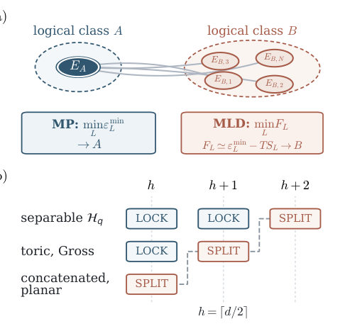
<figcaption class="paper-figure-caption"><b>Fig 1.</b> FIG. 1. Competition between peak probability and coset mass, and the entropic rigidity depth. (a) In an atlas fiber at fixed (s, w), MP selects the class containing the most probable microscopic representative, whereas MLD can select a competing class whose larger multiplicity lowers its logical sector free energy. Gray edges join representatives that share a syndrome but belong to different logical classes. (b) Exact certificates for neutral layers and the first strict witness give m = h + r: concatenated and planar families have r = 0, toric and Gross memories have r = 1, and the separable family Hq has r = 2. Here Hq is a single family admitting both hypergraph-product and bivariate...</figcaption>
</figure>
<figure class="paper-figure-card">
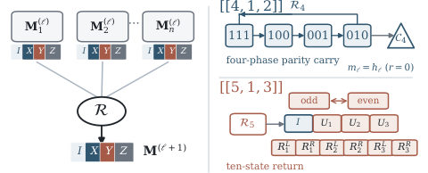
<figcaption class="paper-figure-caption"><b>Fig 2.</b> FIG. 2. Exact recursive returns at rigidity depth r = 0. For the [[4, 1, 2]] family, the parity vector of the three nontrivial logical sector weights follows a four phase cycle that closes under the exact RG map. For the [[5, 1, 3]] family, the identity state, three overlap states Ua, and their six directed resolutions RL a , RR a form a ten state alphabet that also closes under the RG map. In both families the first distance allowed layer remains a strict witness after every recursive step, so mℓ= hℓat all depths.</figcaption>
</figure>
<figure class="paper-figure-card">
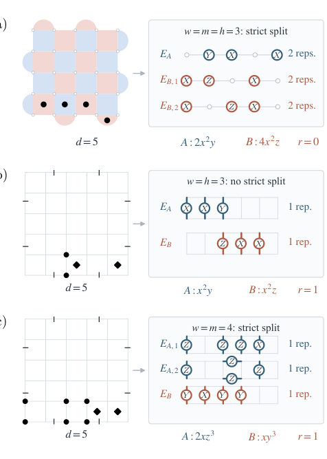
<figcaption class="paper-figure-caption"><b>Fig 3.</b> FIG. 3. Boundary corridors and periodic loop rigid- ity at d = 5. The labels “1 rep.” and “2 reps.” count distinct physical errors represented by each displayed compo- sition prototype. Errors counted by the same label have the same syndrome, logical class, Pauli composition, and proba- bility, but are not identical physical Pauli operators. (a) For the displayed planar syndrome, open boundaries permit four minimum weight representatives in class B but only two in class A. The resulting leading masses are PA = 2x2y and PB = 4x2z, so the first allowed layer h = 3 can already split the peak and mass decisions, giving r = 0. (b) For the dis- played toric syndrome at h = 3, each competing...</figcaption>
</figure>
<figure class="paper-figure-card">
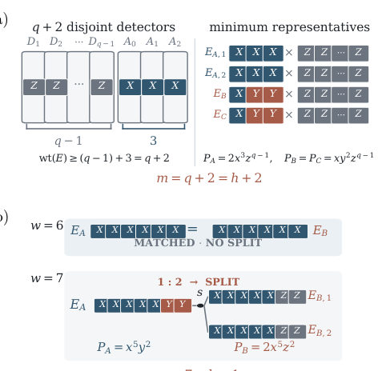
<figcaption class="paper-figure-caption"><b>Fig 4.</b> FIG. 4. Algebraic rigidity in qLDPC memories. (a) In the separable family, detector packing forces every cap with unequal Pauli composition to have weight at least q + 2. At that layer, two representatives in class A compete with single- ton representatives in two other classes. Their leading masses are PA = 2x3zq−1 and PB = PC = xy2zq−1, yielding the first strict split at m = q + 2 = h + 2. (b) In the Gross [[144, 12, 12]] code, Pauli purity keeps the w = 6 fibers com- position matched. At w = 7, one representative wins the peak comparison while a doublet in the competing class wins the mass comparison. The first strict split therefore occurs at m = 7 = h + 1.</figcaption>
</figure>
<figure class="paper-figure-card">
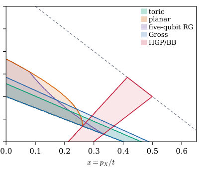
<figcaption class="paper-figure-caption"><b>Fig 5.</b> FIG. 5. Certified noise regions. Sufficient open regions in the interior Pauli simplex for the five-qubit RG, planar, toric, separable HGP/BB, and Gross-code results. The gray dashed line is the simplex boundary z = 0. The colored boundaries are sufficient certificates, not complete phase boundaries.</figcaption>
</figure>

**Summary.** This theoretical work establishes a quantitative measure called 'entropic rigidity depth' ($r$) to characterize the performance gap between two decoding strategies (MP vs. MLD) in quantum error correction. By relating this depth to the code's geometry and algebra, the authors provide a universal benchmark for understanding the fundamental limits of quantum memory reliability under noise.

**Why it may be interesting.** While focused on QEC, the rigorous mathematical framework for quantifying 'entropic rigidity' provides a general tool for understanding how geometric constraints (like topology or algebraic structure) impose fundamental limits on information processing capacity.

Detailed structure

**Main problem.** The paper determines the minimum physical error weight ($m$) at which the decision criteria from Maximum-Probability (MP) decoding and Degenerate Maximum-Likelihood (MLD) decoding diverge for quantum error-correcting codes.

**Main result.** The divergence onset is governed by an entropic rigidity depth $r$, leading to a quantifiable hierarchy ($r=0, 1, 2$) that provides an exact benchmark for low-noise decoder selection.

**Method.** The authors compare the peak probability (MP) against the total probability mass (MLD) using algebraic combinatorics and analyzing the lexicographic spectra of logical sectors.

**Model / system.** The study analyzes quantum error-correcting codes, including planar surface codes, toric codes, and qLDPC codes, subjected to code-capacity Pauli noise.

**Key observables.** Entropic rigidity depth ($r$), minimum error weight ($m$), and the gap $\Delta(t)$ between MP and MLD performance.

**Important parameters / regimes.** Code distance ($d$), physical noise strength ($t$), and the universal bound $h = \lceil d/2 
ceil$.

**Assumptions / limitations.** The analysis assumes the use of code-capacity Pauli noise to isolate intrinsic entropy effects and relies on defining the winner sets via set-valued comparisons.

**Figures summary.** Figures compare MP vs. MLD performance, illustrate the entropic rigidity depth ($r$), and show finite noise curves and validity windows for planar and toric geometries.

**Paper structure.** The paper progresses by defining the statistical comparison between MP and MLD, deriving the entropic rigidity depth $r$ via the relation $m=h+r$, and then certifying this depth for specific families of quantum codes.

Abstract

Maximum-probability (MP) decoding selects the most probable microscopic error, whereas degenerate maximum-likelihood (MLD) decoding includes the configurational entropy of an entire logical sector. Using code-capacity Pauli noise to isolate rigidity intrinsic to the code, we determine the first physical error weight $m$ at which their logical winner sets become disjoint, even under optimal MP tie resolution. Code distance imposes the universal bound $m\geq h=\lceil d/2\rceil$. We define the entropic rigidity depth $r$ through $m=h+r$ and certify a three-level hierarchy: $r=0$ for planar surface codes and two concatenated families, $r=1$ for odd-distance square toric codes and the Gross $[[144,12,12]]$ quantum low-density-parity-check code, and $r=2$ for a separable family with hypergraph product and bivariate bicycle descriptions. The onset fixes the leading operational failure gap, proportional to the $m$th power of the physical noise strength. Geometry and algebra therefore provide quantifiable controls of configurational entropy and an exact benchmark for low-noise decoder selection.

[↑ back to top](#top)

### [Good Stabilizer Codes from Shallow Clifford Circuits with Random Matchings](http://arxiv.org/abs/2608.18536v1)

**Authors:** Emile Anand, Elia Gorokhovsky, Jennifer Hritz, Jingtong Sun  
**Type:** theory · **Category:** quantum information and computing · **PDF:** <https://arxiv.org/pdf/2608.18536v1>  
**Analysis basis:** full PDF text, analyzed in chunks

↔ Scroll figures horizontally

<figure class="paper-figure-card">
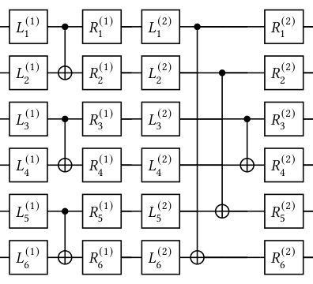
<figcaption class="paper-figure-caption"><b>Fig 1.</b> Figure 2: Two Clifford-twirled CNOT matching layers. Each 𝐿(𝑡) 𝑖 , 𝑅(𝑡) 𝑖 ∈C1 is an independent one-qubit Clifford. Layer Γ(1) CNOT uses O = {(1, 2), (3, 4), (5, 6)}, while layer Γ(2) CNOT uses O = {(1, 6), (2, 5), (3, 4)}.</figcaption>
</figure>

**Summary.** This paper develops a method to construct high-performance quantum error-correcting codes using shallow random circuits. By employing a random matching circuit architecture, the authors prove that the optimal rate-distance tradeoff can be achieved with a circuit depth scaling only logarithmically with the number of qubits. This advances the feasibility of fault-tolerant quantum computation.

**Why it may be interesting.** The focus on shallow circuits and achieving fundamental bounds like the GV tradeoff is central to building fault-tolerant quantum computers, which is a major area of theoretical quantum physics.

Detailed structure

**Main problem.** The core challenge is constructing quantum error-correcting codes with minimal circuit depth while achieving the optimal quantum Gilbert-Varshamov rate-distance tradeoff.

**Main result.** The authors demonstrate that random matching circuits can achieve the optimal rate-distance tradeoff with a depth of only $O(\log n)$, significantly improving upon previous results.

**Method.** The construction uses a random matching circuit architecture over $T$ layers, analyzing the resulting code properties by reducing the dynamics to a reversible Markov chain on binary support strings.

**Model / system.** The system involves encoding quantum information on $n$ qubits using random Clifford circuits composed of layers where qubits are paired by a random perfect matching, and a random two-qubit Clifford gate is applied to each pair.

**Key observables.** Code parameters include the length $n$, dimension $k$, and minimum distance $d$; the depth $T$ is a key observable.

**Important parameters / regimes.** The rate-distance tradeoff parameters ($k/n$ vs $d/n$), the depth $T=O(\log n)$, and the required regularity conditions on the gate distribution $p_2$.

**Assumptions / limitations.** The analysis assumes the gate distribution satisfies three regularity conditions (bi-invariance, positive entanglement, reversibility) and relies on bounding the hitting time of the associated Markov chain.

**Figures summary.** Not specified.

**Paper structure.** The paper establishes the problem, presents the random matching circuit model, analyzes the coding properties using Markov chain theory (hitting time bounds), and finally proves the rate-distance tradeoff by showing the depth $O(\log n)$ is sufficient.

Abstract

Encoding quantum information with low circuit overhead is a fundamental challenge in fault-tolerant quantum computation. Random circuits provide a natural mechanism for rapidly spreading logical information through simple gates applied in parallel. Brown and Fawzi showed that random Clifford circuits on two-qubit Clifford gates provide such encoders that achieve the quantum Gilbert-Varshamov rate-distance tradeoff with depth $O(\log^3 n)$. We show that the same asymptotic tradeoff is attained in optimal $O(\log n)$ depth under a gate distribution with a more restricted support. For every fixed $δ>0$ and sufficiently large $n$, if $\frac kn < 1 - H(\frac{d}{n}) - \frac{d}{n}\log_2 3 - δ$, we can construct random circuits of depth $O(\log n)$ which define, with high probability, an $[n,k]$ stabilizer code of distance at least $d+1$, which matches the $Ω(\log n)$ light-cone lower bound for linear distance encoders. Our ensemble employs a random matching circuit architecture consisting of $T$ independent permutation-invariant layers. In each layer, the qubits are paired up by a uniformly random perfect matching, and a random independent two-qubit Clifford gate is applied to each pair. The gate distribution need not be uniform over, or even have full support on, the two-qubit Clifford group; rather, we allow for very general distributions on Clifford gates satisfying three regularity conditions. In particular, the construction can be implemented using $n/2$ CNOT gates on randomly matched pairs in each layer, with parallel one-qubit Clifford twirls. These regularity conditions allow us to reduce the second-moment dynamics of our random circuits to a reversible Markov chain on binary support strings. We establish logarithmic hitting-time bounds for this Markov chain and comparisons of its stationary distribution to prove the coding properties of the circuits.

[↑ back to top](#top)

### [Know Your Qubits, Know Your Users: Personas for Quantum Software](http://arxiv.org/abs/2608.18598v1)

**Authors:** Lukas Schmidbauer, Joshua Ammermann, Laura Schulz, Jose Garcia-Alonso, Robert Wille, Sebastian Feld, Ina Schaefer, Wolfgang Mauerer  
**Type:** theory · **Category:** quantum information and computing · **PDF:** <https://arxiv.org/pdf/2608.18598v1>  
**Analysis basis:** full PDF text, analyzed in chunks

↔ Scroll figures horizontally

<figure class="paper-figure-card">
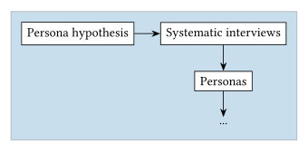
<figcaption class="paper-figure-caption"><b>Fig 1.</b> Figure 1: First phases (left) and corresponding activities (right) of the Goal-Directed Design process adapted from [11]. Personas are used in later phases to design user interfaces.</figcaption>
</figure>
<figure class="paper-figure-card">

<figcaption class="paper-figure-caption"><b>Fig 2.</b> Figure 2: Demographics of QCE 2025 interviewees (𝑁= 11).</figcaption>
</figure>
<figure class="paper-figure-card">
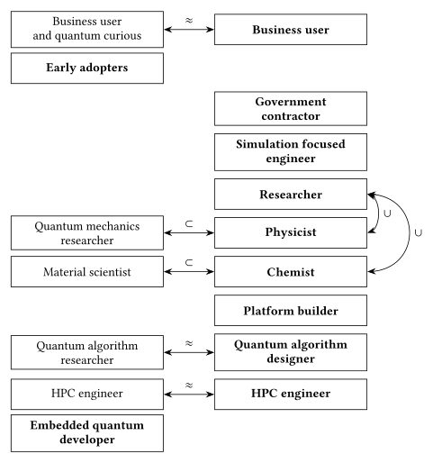
<figcaption class="paper-figure-caption"><b>Fig 3.</b> Figure 3: Mapping of Dagstuhl personas (left; Sec. 4) to inter- view personas (right; Sec. 5). 𝐴⊂𝐵means 𝐴was described more specialized than 𝐵. 𝐴≈𝐵means 𝐴and 𝐵were described in approximately same scope. Aggregated personas in bold.</figcaption>
</figure>

**Summary.** This work addresses the usability crisis in quantum software by conducting a stakeholder analysis to define user personas. By identifying diverse needs—ranging from business users to algorithm developers—it proposes a framework for designing software that correctly balances high-level abstraction with necessary hardware details. This is crucial for advancing the practical application of quantum computation.

**Why it may be interesting.** While not focused on physical dynamics, the paper addresses the crucial engineering and usability challenges of quantum computing, which dictates how theoretical models (like Hamiltonians) can be practically implemented and utilized by different scientific communities.

Detailed structure

**Main problem.** The core challenge is designing well-structured quantum software due to the rapid advancement of quantum hardware and the inherent complexity of quantum computing.

**Main result.** The authors derived eleven distinct user and stakeholder personas, providing a common language to guide the creation of user-tailored quantum software.

**Method.** The study employed a stakeholder-based analysis, combining insights from an expert focus group and qualitative interviews with quantum computing practitioners.

**Model / system.** The focus is on the software layer interacting with quantum hardware, spanning from abstract quantum circuits and Hamiltonians to specific physical qubit architectures (short, mid, and long-term regimes).

**Key observables.** The required level of abstraction, the functional goals of the user (e.g., scientific insight vs. business motive), and the necessary hardware details.

**Important parameters / regimes.** Technological maturity stages (short-term, mid-term, long-term hardware capabilities) and the balance between abstraction level and hardware specificity.

**Assumptions / limitations.** The derived personas are considered a 'persona-hypothesis' intended as a basis for future product development, and their applicability is limited to similar contexts.

**Figures summary.** Figure 1 illustrates the Goal-Directed Design process phases. Figure 4 maps the identified personas across different layers of quantum software abstraction.

**Paper structure.** The paper introduces the problem, details the methodology (focus groups/interviews), presents the resulting eleven personas categorized by use case and required abstraction level, and discusses the implications for software design.

Abstract

The advancement of quantum hardware and the intricacies of quantum computing make well-designed quantum software increasingly necessary. Due to the interdisciplinarity of the field, it is crucial to understand the perspectives and specific needs of involved stakeholders, for example, to balance the desired level of abstraction with the exposition of (hardware)-specific details. In this work, we conduct a stakeholder-based analysis to identify personas of quantum software as a means of creating meaningful, user-tailored quantum software. We conducted an expert focus group at a Dagstuhl seminar in 2024 and qualitative interviews with practitioners at conference IEEE QCE in 2025, from which we derive eleven personas of potential users and stakeholders for quantum software. We discuss these personas regarding their use cases, interests, constraints and abstraction level.

[↑ back to top](#top)

### [Learning constructive models of emergent systems](http://arxiv.org/abs/2608.18248v1)

**Authors:** Bipul Pandey, Caden Proctor, Vinay Ramanathan, Nico Roth, Arjun S. Raman  
**Type:** both · **Category:** disordered systems and neural networks · **PDF:** <https://arxiv.org/pdf/2608.18248v1>  
**Analysis basis:** full PDF text, analyzed in chunks

↔ Scroll figures horizontally

<figure class="paper-figure-card">
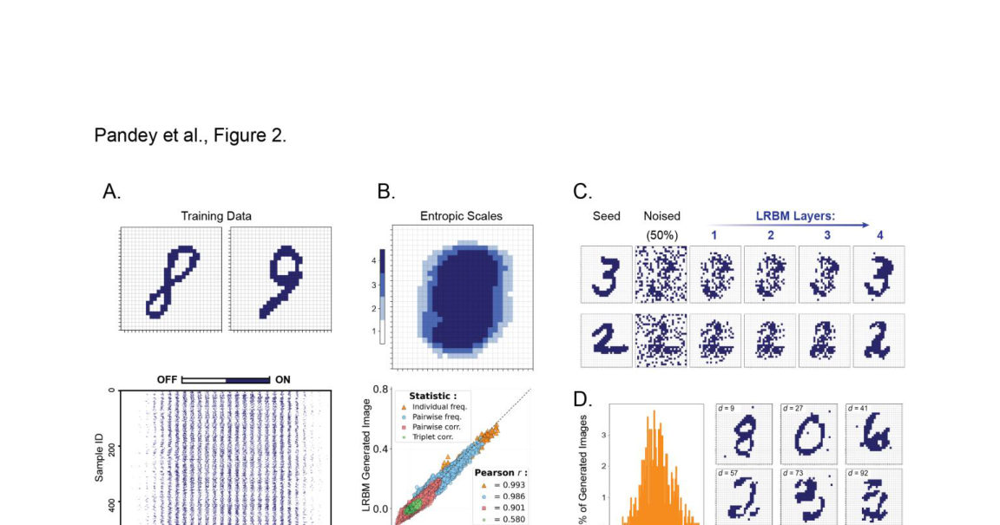
<figcaption class="paper-figure-caption"><b>Fig 1.</b> Figure 2. A constructive model for handwritten digits. (A) The ensemble comprises binarized 28 x 28 images of handwritten digits. Two examples are shown here (top). Each image is flattened to a binary feature vector in which every pixel is either OFF (white) or ON (blue), producing the sample-by-feature matrix used for training the LRBM (bottom). No labels of digit identity are included in the input data or used during the training process. (B) Top: the entropic scales of organization inferred from the ensemble with pixels colored according to their derived layer. Bottom: statistics of LRBM-generated images versus the training data. (C) Starting from a seed digit corrupted with 50% noise,...</figcaption>
</figure>
<figure class="paper-figure-card">
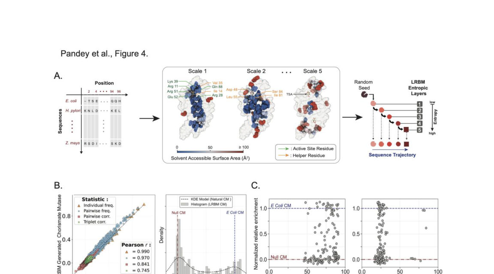
<figcaption class="paper-figure-caption"><b>Fig 2.</b> Figure 4. LRBM-based generation of synthetic chorismate mutase enzymes. (A) Construction of the chorismate mutase LRBM (CM-LRBM). Left: multiple sequence alignment of natural chorismate mutase homologs. Middle: positions assigned to entropic scales 1, 2, and 5 mapped onto the structure of E. coli CM (PDB: 1ECM) and rendered as spheres colored by solvent-accessible surface area. The bound transition-state analog is shown in stick representation. Green arrows mark active site residues (‘Active Site Residue’) and orange arrows mark residues around the active site known to effect catalytic activity (‘Helper Residue’). Right: schematic of LRBM-based CM generation. CM-LRBM comprised five layers;...</figcaption>
</figure>
<figure class="paper-figure-card">
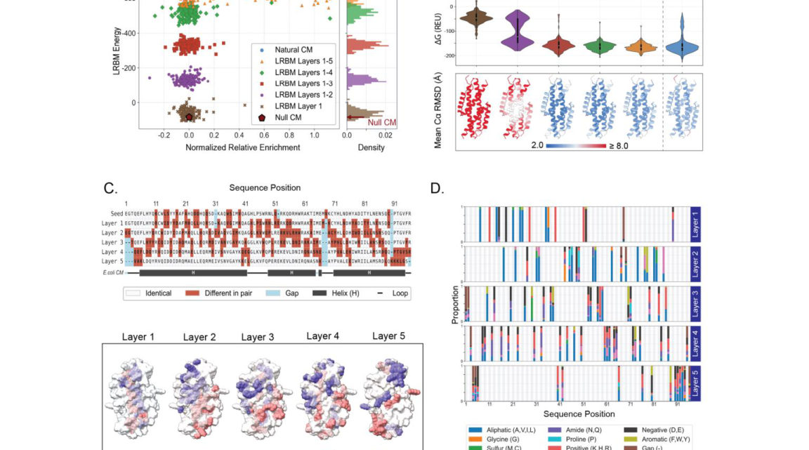
<figcaption class="paper-figure-caption"><b>Fig 3.</b> Figure 5. Layer-wise progression of energy, structure, and composition in constructive CM design. (A) Top: Distribution of normalized relative enrichment for all natural CMs in MSA (see Fig. 4A). Normalized relative enrichment plotted against LRBM energy for natural CM sequences (blue dots), the null CM sequence (red pentagon), and designed sequences generated by satisfying CM-LRBM layer 1 through layer 5 (colored dots). (B) Structural evaluation of constructed sequences from panel A and natural CMs in MSA by AlphaFold3 (top) and Rosetta (middle). Bottom panel shows overlay of predicted CM structures at each CM-LRBM layer colored by root-mean squared deviation of the backbone alpha carbon...</figcaption>
</figure>

**Summary.** This work introduces the Layer-Restricted Boltzmann Machine (LRBM) as a constructive framework for modeling emergent systems, inspired by statistical phylogenetics. By inferring and enforcing a unidirectional flow across hierarchical entropic scales, the LRBM successfully models structure in images, language, and critically, in enzyme sequences. The success in designing functional enzymes that retain fold but require all hierarchical layers for full function suggests a general, learnable statistical logic for complex system construction.

**Why it may be interesting.** The concept of using hierarchical entropic constraints derived from statistical physics principles (like those used in analyzing disordered systems) to guide the construction of complex, functional biological architectures (like enzymes) suggests a universal organizing principle applicable beyond standard ML tasks.

Detailed structure

**Main problem.** The paper addresses the lack of constructive logic in current AI models for building complex emergent systems, which typically arise through multi-scale interactions.

**Main result.** The authors propose the Layer-Restricted Boltzmann Machine (LRBM), demonstrating that inferring and enforcing a unidirectional flow across hierarchical entropic scales provides a general, data-driven method for constructing emergent systems.

**Method.** The methodology involves inferring discrete scales of entropy from an ensemble of existing data (e.g., natural enzymes) and constraining information flow sequentially across these scales to build the LRBM architecture.

**Model / system.** The core model is the Layer-Restricted Boltzmann Machine (LRBM), which is applied to diverse systems including digit images, natural language, and the chorismate mutase (CM) enzyme sequence space. The system exhibits a clear hierarchy where lower layers capture global structure and higher layers refine fine-grained features.

**Key observables.** Enzyme fold emergence, functional activity (bimodal activity), reconstruction fidelity from noise, and the block-structured parameter matrix of the LRBM.

**Important parameters / regimes.** The number of discrete entropic scales (K), the coupling strength between adjacent layers, and the sequence divergence percentage for synthetic enzymes (up to 53%).

**Assumptions / limitations.** The primary assumption is that the underlying generative process of an emergent system can be characterized solely by a hierarchical structure of entropic constraints.

**Figures summary.** Figures illustrate the MNIST reconstruction process showing layer-by-layer refinement from global structure to local detail, and the LRBM structure derived from simulated and natural ensembles.

**Paper structure.** The paper establishes the need for constructive models, proposes the LRBM based on statistical phylogenetics, validates the model on MNIST images, and culminates in a stringent test using the *in vivo* functional assay of synthetic chorismate mutase enzymes.

Abstract

Emergent systems - systems containing multi-scale interactions - often arise through iteration rather than explicit forward design. As such, design principles for building emergent systems have been under-explored. Current artificial intelligence architectures, while useful for generation, do not provide a logic for how to construct emergent systems. Inspired by statistical phylogenetics, we show that inferring scales of system entropy then explicitly constraining information flow from low to high entropic scales yields data-driven, stepwise 'constructive models' of emergent systems. We term the resulting architecture the Layer-Restricted Boltzmann Machine (LRBM). Applied identically to digit images, natural language, and enzyme sequences, LRBM models follow hierarchical logic: lower layers encode global structure from which higher layers encode fine-grained features. As a stringent experimental challenge for LRBM-based construction, we built and evaluated 160 constructive trajectories of synthetic and 1,130 natural chorismate mutase (CM) enzymes in an in vivo functional assay. Designed CMs functioned up to 53% sequence divergent from the nearest natural homolog. Notably, enzyme fold emerged at intermediate LRBM layers while function arose only upon satisfying all layers. Fold was therefore necessary but insufficient for function in this enzyme family. Our results suggest a shared hierarchical, learnable statistical logic for constructing emergent systems.

[↑ back to top](#top)

### [Molecular Implementation of the Machine-Learned Skala Exchange-Correlation Functional in CP2K through GauXC](http://arxiv.org/abs/2608.19033v1)

**Authors:** Franz Pöschel, Johann Pototschnig, Frederick Stein, Andreas Knüpfer, Thijs Vogels, Stefano Battaglia, Sebastian Ehlert, Jürg Hutter, Thomas D. Kühne  
**Type:** theory · **Category:** disordered systems and neural networks · **PDF:** <https://arxiv.org/pdf/2608.19033v1>  
**Analysis basis:** full PDF text, analyzed in chunks

↔ Scroll figures horizontally

<figure class="paper-figure-card">
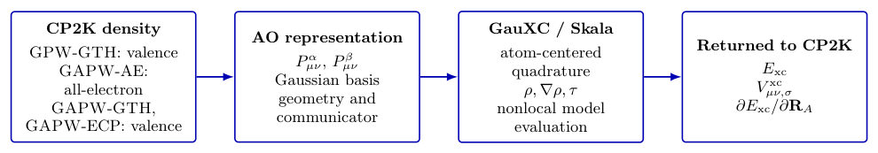
<figcaption class="paper-figure-caption"><b>Fig 1.</b> FIG. 1. Molecular CP2K–GauXC–Skala interface. The electronic Hamiltonian determines whether the AO density matrix represents the valence density of a pseudopotential or effective-core Hamiltonian or an all-electron density. GauXC constructs the molecular quadrature and model features and returns the XC energy, AO potential matrix, and nuclear derivatives to CP2K.</figcaption>
</figure>
<figure class="paper-figure-card">
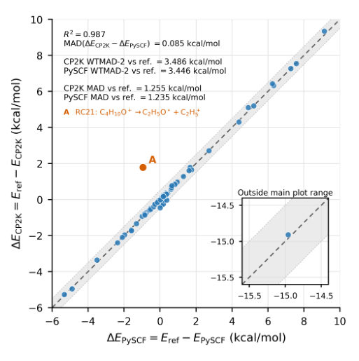
<figcaption class="paper-figure-caption"><b>Fig 2.</b> FIG. 2. Reaction-by-reaction correlation of the signed er- rors relative to the dietGMTKN55 reference energies obtained with CP2K/GauXC and the reference Skala implementa- tion. The dashed line denotes equality, the shaded gray area a cross-code discrepancy of ±0.5 kcal mol−1, and the inset shows the only datapoint outside the main plot range.</figcaption>
</figure>

**Summary.** This paper details the successful implementation of the machine-learned Skala exchange-correlation functional into the CP2K simulation code using the GauXC library. By creating a validated interface, the authors enable high-accuracy DFT calculations for molecular systems using ML potentials. This advances the field by bridging complex ML models with established quantum chemistry codes.

**Why it may be interesting.** This work represents a significant advancement in computational materials science by integrating advanced machine learning potentials into established, production-level quantum simulation codes, improving accuracy while maintaining computational feasibility.

Detailed structure

**Main problem.** The paper addresses the need to improve the accuracy of Kohn-Sham Density-Functional Theory (DFT) beyond traditional approximations without resorting to computationally expensive explicitly correlated methods.

**Main result.** The authors successfully implemented the machine-learned Skala-1.1 exchange-correlation functional into the CP2K code via the GauXC library, achieving an aggregate mean absolute deviation on the dietGMTKN55 benchmark within 0.020 kcal/mol of the reference value.

**Method.** The core method involves creating a robust interface (GauXC) that maps the learned functional's requirements onto CP2K's density representation, allowing the evaluation of XC energy, potential matrix, and derivatives.

**Model / system.** The work is applied to molecular electronic structure calculations, using benchmark suites like dietGMTKN55 and testing on water-hexamer clusters, covering both all-electron and valence-only density representations.

**Key observables.** XC energy ($E_{	ext{Skala}}^{	ext{xc}}$), AO XC potential matrix ($V_{	ext{Skala}}^{\mu
u, \sigma}$), nuclear derivatives (forces), and Mean Absolute Deviation (MAD) on benchmark sets.

**Important parameters / regimes.** The benchmark accuracy is quantified by the MAD of $1.255 	ext{ kcal mol}^{-1}$ vs. the reference $1.235 	ext{ kcal mol}^{-1}$.

**Assumptions / limitations.** The interface design isolates implementation errors from functional differences, and the primary focus is on the AO density matrix representation, excluding auxiliary Plane-Wave grid details.

**Figures summary.** Figures summarize the division of labor between CP2K, GauXC, and Skala, and show representative derivative checks for the molecular GauXC interface.

**Paper structure.** The paper details the formulation of the Skala-1.1 interface in CP2K via GauXC, validates the implementation by comparing against native PBE and finite-difference checks, and reports benchmark results on the dietGMTKN55 suite.

Abstract

Machine-learned exchange--correlation (XC) functionals offer a route to improve Kohn--Sham density-functional theory without incurring the cost of explicitly correlated electronic-structure methods. Their use in production simulation codes, however, requires a well-defined mapping between the learned model and the host-code density representation. We formulate and implement a Skala-1.1 interface in CP2K through the external GauXC library. CP2K supplies the geometry, Gaussian basis, spin-resolved atomic-orbital density matrix, and communicator, while GauXC evaluates the XC energy, atomic-orbital potential matrix, and available nuclear derivatives. The interface accepts both all-electron and valence-only density matrices. The latter may arise from separable dual-space pseudopotentials or molecular effective-core potentials. Implementation errors are isolated from functional differences by comparing the Perdew--Burke--Ernzerhof (PBE) functional evaluated through GauXC with native CP2K PBE. The resulting interface gives consistent energies, forces validated against finite-difference total-energy checks, and force-based molecular-virial diagnostics for representative molecular cases. The dietGMTKN55 benchmark suite is evaluated with an all-electron Gaussian augmented plane-wave treatment for elements up to bromine and def2 effective-core potentials for the heavier elements. The resulting aggregate mean absolute deviation of 1.255 kcal/mol is within 0.020 kcal/mol of the corresponding Skala reference value of 1.235 kcal/mol. This work establishes a validated molecular implementation of Skala in CP2K through GauXC.

[↑ back to top](#top)

### [Multicast quantum network coding as optimal symmetric universal cloning over a quantum network](http://arxiv.org/abs/2608.18471v1)

**Authors:** Go Kato, Mio Murao, Masaki Owari  
**Type:** theory · **Category:** quantum information and computing · **PDF:** <https://arxiv.org/pdf/2608.18471v1>  
**Analysis basis:** full PDF text, analyzed in chunks

↔ Scroll figures horizontally

<figure class="paper-figure-card">
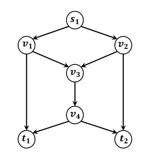
<figcaption class="paper-figure-caption"><b>Fig 1.</b> Fig. 1. Undirected butterfly network (left) and directed butterfly network (right): These networks have one source node s1, two terminal nodes t1 and t2, and three intermediate nodes v1, v2, and v3.</figcaption>
</figure>

**Summary.** This paper develops a quantum network coding protocol to achieve the perfect multicast of symmetric universal clones of unknown quantum states. By extending existing network coding techniques, the authors establish necessary and sufficient conditions based on graph connectivity (minimum cut) for this quantum information task. This work advances the theory of quantum communication by providing a robust method for state distribution in noisy or complex quantum network topologies.

**Why it may be interesting.** It provides a concrete, information-theoretic framework for distributing quantum information (clones) across a network, which is fundamental to quantum communication protocols.

Detailed structure

**Main problem.** The paper addresses the challenge of perfectly multicasting symmetric universal clones of unknown quantum states across a quantum network.

**Main result.** It constructs a protocol showing that perfect multicast is achievable under specific graph connectivity conditions, extending previous quantum network coding results.

**Method.** The authors extend the quantum network coding protocol by leveraging the structure of the underlying graph and utilizing concepts from classical network coding theory.

**Model / system.** The system is a quantum network modeled by an undirected graph G, where edges represent noiseless q-dimensional quantum channels. Free classical communication is assumed to be available.

**Key observables.** The achievable state on the terminal nodes, which is shown to be proportional to the initial input state tensor product with the cloning factor.

**Important parameters / regimes.** The dimension of the input state (d_l), the size of the quantum channel alphabet (q, a prime power), and the minimum cut capacity of the derived directed graph G'.

**Assumptions / limitations.** The analysis assumes the availability of free classical communication and relies on the existence of an acyclic directed graph G' derived from G that satisfies certain minimum cut conditions.

**Figures summary.** Figure 1 illustrates the structure of the quantum network using an undirected and directed butterfly network example, showing source and terminal nodes.

**Paper structure.** The paper builds upon classical network coding theory, extends it to the quantum domain for multi-source multicast, and provides a detailed proof confirming the solvability of the quantum multicast network coding problem for cloning.

Abstract

We study the problem of perfectly multicasting symmetric universal clones of unknown quantum states over quantum networks with free classical communication.   We construct a protocol that multicasts symmetric universal clones of input states from multiple source nodes by extending the quantum network coding protocol proposed by Kobayashi et al. We further establish a sufficient condition for perfect multicast in the single-source setting. Specifically, we show that when a single copy of a $q^r$-dimensional input state is available at the source node, where $q$ is a sufficiently large prime power, perfect multicast of the corresponding symmetric universal clone is achievable using a small amount of entanglement shared among the target nodes.   This result holds for quantum networks represented by an undirected graph $G$, where each edge corresponds to a noiseless $q$-dimensional quantum channel, provided that there exists an acyclic directed graph $G'$ obtained by assigning directions to the edges of $G$ such that the minimum cut of $G'$ is at least $r$.

[↑ back to top](#top)

### [Multiqubit orthogonal product bases](http://arxiv.org/abs/2608.18421v1)

**Authors:** Yvkai Zhao, Lin Chen  
**Type:** theory · **Category:** quantum information and computing · **PDF:** <https://arxiv.org/pdf/2608.18421v1>  
**Analysis basis:** full PDF text, analyzed in chunks

↔ Scroll figures horizontally

<figure class="paper-figure-card">
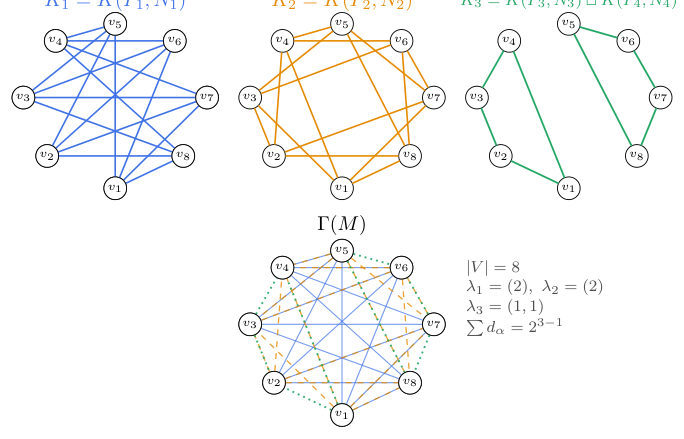
<figcaption class="paper-figure-caption"><b>Fig 1.</b> Figure 1: The three color layers of the example and the merged edge-colored complete multigraph Γ(M) on V = {1, . . . , 8}. The three layers are drawn in blue (solid), orange (dashed), and green (dotted), respectively.</figcaption>
</figure>
<figure class="paper-figure-card">
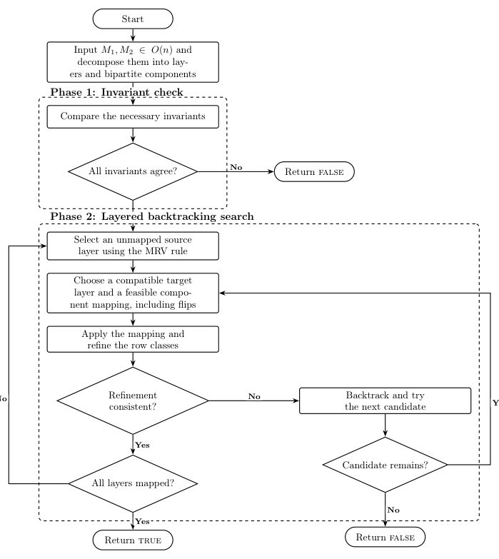
<figcaption class="paper-figure-caption"><b>Fig 2.</b> Figure 2: Flowchart of the two-phase equivalence-testing algorithm. Phase 1 checks necessary invariants, and Phase 2 performs the exact layered backtracking search.</figcaption>
</figure>

**Summary.** This paper tackles the classification of complete orthogonal product bases (OPBs) for $n$-qubit systems by mapping the problem onto graph isomorphism. The authors prove that equivalence is determined by the isomorphism of an associated edge-colored multigraph. They derive bounds showing the number of such bases grows doubly exponentially and present a complex, two-phase algorithm to test for equivalence.

**Why it may be interesting.** The rigorous mathematical characterization of quantum state bases and the development of an algorithm to test equivalence are fundamental theoretical tools applicable to understanding quantum resource theories and quantum circuit complexity.

Detailed structure

**Main problem.** The primary goal is to classify all complete orthogonal product bases (OPBs) for an $n$-qubit system up to natural equivalence.

**Main result.** The classification problem is reduced to determining the isomorphism of associated edge-colored complete multigraphs, and the number of equivalence classes $a_n$ exhibits doubly exponential growth, $a_n = 2^{2^{n+o(n)}}$.

**Method.** The authors utilize a formal-matrix formalism, mapping the OPB matrix to a multigraph, and developing a two-phase algorithm combining invariant checking with a layered isomorphism search to test equivalence.

**Model / system.** The system is an $n$-qubit quantum system, mathematically modeled by an OPB formal matrix $M \in O(n)$. This matrix is associated with an edge-colored complete multigraph $\Gamma(M)$ on $2n$ vertices.

**Key observables.** The spectrum $\pi(M)$ (part sizes $d_\alpha$), the multiset of column spectra $\{\pi_j(M)\}$, and the multiset of edge multiplicities $\{\mu(r, s)\}$ are key invariants used for comparison.

**Important parameters / regimes.** The number of qubits $n$, the number of variables $v$ (bounded by $2n-1$), and the size of the vertex set $N=2n$.

**Assumptions / limitations.** The equivalence of two OPB matrices is rigorously proven to be equivalent to the isomorphism of their associated multigraphs.

**Figures summary.** Figure 1 illustrates the multigraph construction for a 3-qubit OPB, and Figure 2 provides a flowchart summarizing the two-phase equivalence-testing algorithm.

**Paper structure.** The paper establishes the formal-matrix formalism, proves the equivalence theorem linking OPB equivalence to graph isomorphism, derives bounds and asymptotics for the number of classes $a_n$, and concludes with the description and complexity analysis of the two-phase equivalence testing algorithm.

Abstract

We study complete orthogonal product bases (OPBs) of an $n$-qubit system via the formal-matrix formalism for multiqubit OPBs. To each OPB formal matrix we associate an edge-colored complete multigraph, and we prove that two formal matrices are equivalent if and only if their multigraphs are isomorphic, thereby reducing the classification of OPBs to graph isomorphism. Via subcube partitions and a lemma of Tarsi, we upper bound the number of variables by $2^n - 1$. We also study lower and upper bounds on the number $a_n$ of equivalence classes of $n$-qubit OPBs, by showing that $\binom{a_{n-1}+1}{2} \le a_n \le B_{2^{n-1}}^n$, where $B_m$ denotes the number of partitions of an $m$-element set. These bounds yield the asymptotic behavior $a_n = 2^{2^{n+o(n)}}$. Finally, we obtain a two-phase algorithm that decides whether two OPB formal matrices are equivalent, together with its correctness proof and complexity analysis. The complexity is exponential in the worst case.

[↑ back to top](#top)

### [On the quantum communication complexity of total functions](http://arxiv.org/abs/2608.18784v1)

**Authors:** Dmytro Gavinsky  
**Type:** theory · **Category:** quantum information and computing · **PDF:** <https://arxiv.org/pdf/2608.18784v1>  
**Analysis basis:** full PDF text, analyzed in chunks

↔ Scroll figures horizontally

<figure class="paper-figure-card">
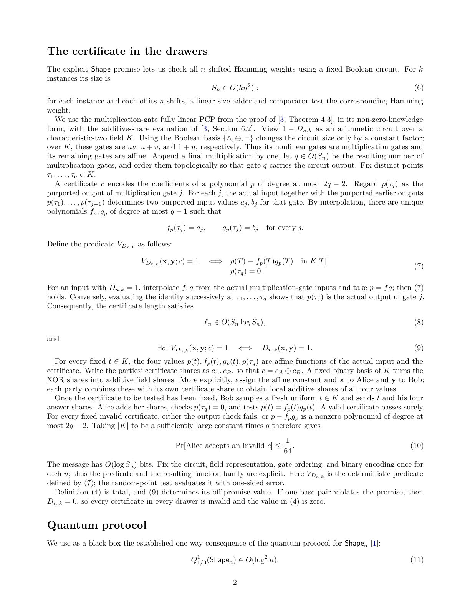
<figcaption class="paper-figure-caption"><b>Fig 1.</b> Low-resolution page preview, page 2</figcaption>
</figure>
<figure class="paper-figure-card">
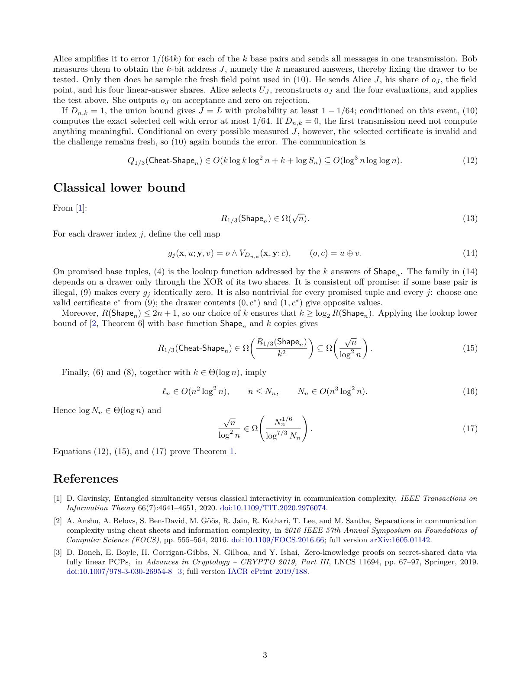
<figcaption class="paper-figure-caption"><b>Fig 2.</b> Low-resolution page preview, page 3</figcaption>
</figure>

**Summary.** This paper constructs a specific total Boolean function, Cheat-Shapen, to demonstrate a separation between quantum and classical communication complexity. It achieves a polylogarithmic quantum communication protocol while requiring a super-polynomial randomized protocol. This highlights the computational power of quantum communication protocols for certain tasks.

**Why it may be interesting.** This work provides a concrete, information-theoretic example of quantum advantage in communication complexity, which is a fundamental area of quantum information theory.

Detailed structure

**Main problem.** The paper aims to construct a total Boolean function that demonstrates a significant separation between its quantum communication complexity and its classical randomized communication complexity.

**Main result.** The authors present a function, Cheat-Shapen, with a polylogarithmic two-message quantum communication protocol, while its randomized communication complexity is shown to be super-polynomial in the input size.

**Method.** The construction combines three elements: the shifted approximate equality problem (Shape), a communication cheat-sheet construction, and a fully linear PCP derived from multiplication gates.

**Model / system.** The analysis is based on the communication complexity of a specific total Boolean function, Cheat-Shapen, which is defined using multiple instances of the Shape problem.

**Key observables.** Quantum communication complexity ($	ext{Q}_{1/3}(	ext{Cheat-Shapen}) \in O(\log^3 n \log \log n)$) and randomized communication complexity ($	ext{R}_{1/3}(	ext{Cheat-Shapen}) \in \Omega(rac{N_n}{6} \sqrt{n} \log^{7/3} N_n)$).

**Important parameters / regimes.** The input size parameters $n$ and $k$, and the total input size $N_n = 2nk + M(1 + \ell_n)$.

**Assumptions / limitations.** The quantum protocol relies on an established one-way consequence for the Shape problem, and the PCP construction requires viewing $1 - D_{n,k}$ as an arithmetic circuit over a characteristic-two field.

**Paper structure.** The paper proves Theorem 1 by combining the derived quantum protocol bound (Equation 12) with the established classical lower bound (Equations 15 and 17).

Abstract

We present a total function with a polylogarithmic two-message quantum protocol, whereas every randomised protocol, even with arbitrarily many rounds, requires polynomial communication.

[↑ back to top](#top)

### [Quantum circuit optimization using deep reinforcement learning: Applications across multiple gate sets](http://arxiv.org/abs/2608.19103v1)

**Authors:** Khoa Dang Tao, Sumin Jin, Muhammad Raza, Changhyoup Lee  
**Type:** theory · **Category:** quantum information and computing · **PDF:** <https://arxiv.org/pdf/2608.19103v1>  
**Analysis basis:** full PDF text, analyzed in chunks

↔ Scroll figures horizontally

<figure class="paper-figure-card">
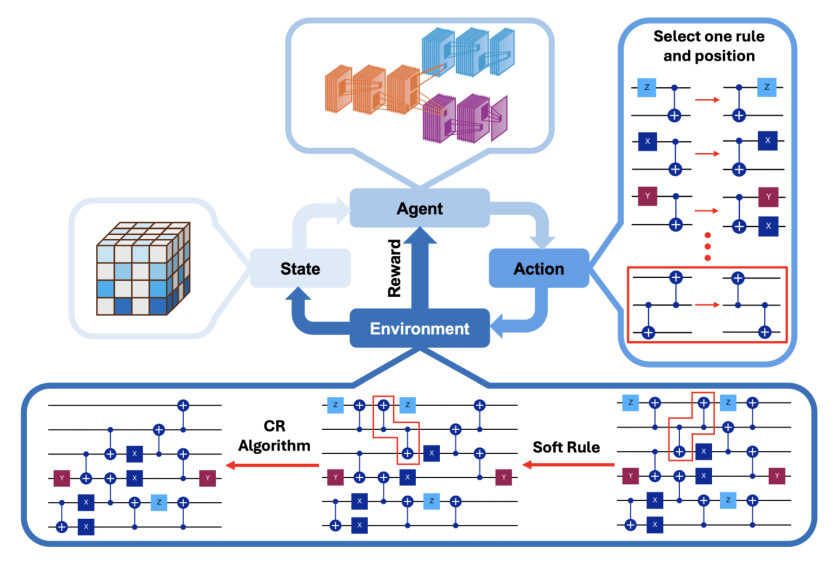
<figcaption class="paper-figure-caption"><b>Fig 1.</b> FIG. 1. Overview of the integrated reinforcement learning framework. The diagram illustrates the closed-loop interaction between the Actor–Critic agent and the environment.</figcaption>
</figure>
<figure class="paper-figure-card">
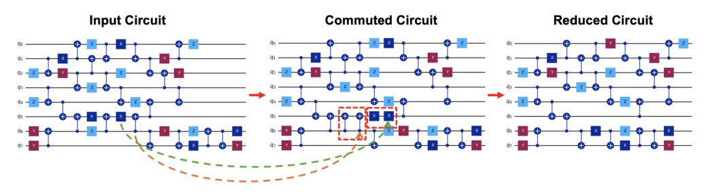
<figcaption class="paper-figure-caption"><b>Fig 2.</b> FIG. 2. The two-phase execution of the Commutation-and-Reduction algorithm. The input circuit contains a disordered distribution of gates. Dashed arrows trace representative gates during the commutation phase: X, Y, and Z gates propagate rightward, while a CNOT propagates leftward. The exposed X-X and CNOT-CNOT pairs (red box) cancel to the identity (I) in the reduction phase, producing the reduced circuit.</figcaption>
</figure>
<figure class="paper-figure-card">
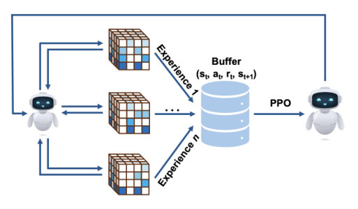
<figcaption class="paper-figure-caption"><b>Fig 3.</b> FIG. 4. Schematic of the distributed experience collection and training pipeline. Multiple environments generate diverse circuit optimization trajectories, which are stored as transi- tion tuples (st, at, rt, st+1) in a centralized experience replay buffer. The buffered transitions are then sampled in shuffled mini-batches to train the policy with PPO.</figcaption>
</figure>
<figure class="paper-figure-card">
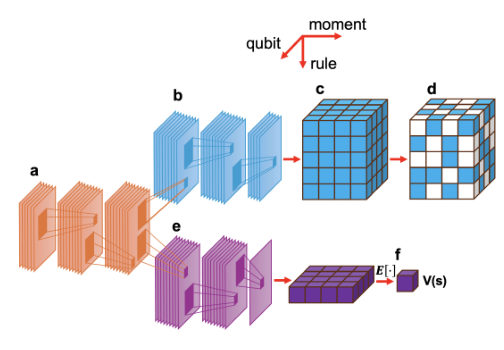
<figcaption class="paper-figure-caption"><b>Fig 4.</b> FIG. 3. The Actor-Critic network architecture for quantum circuit optimization. (a) The shared convolutional backbone that extracts local spatio-temporal features. (b-c) The Actor (policy) branch, which generates a logit tensor of shape Q × M × A. (d) The application of the binary validity mask to ensure permissible action selection. (e-f) The Critic (value) branch, which aggregates features to produce a scalar state- value estimate V (s).</figcaption>
</figure>
<figure class="paper-figure-card">
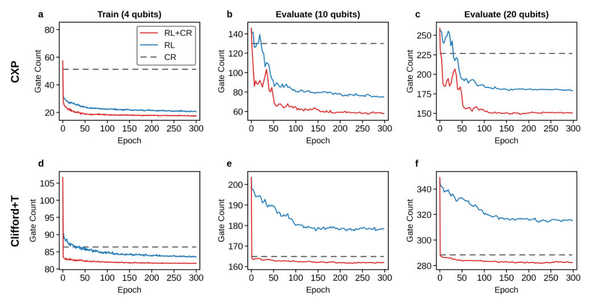
<figcaption class="paper-figure-caption"><b>Fig 5.</b> FIG. 5. Training and evaluation learning curves for quantum circuit optimization. The top row (a–c) displays results for the CXP basis, while the bottom row (d–f) displays results for the Clifford+T basis. Column (a, d) represents the 4-qubit training circuits, while columns (b, e) and (c, f) demonstrate generalization to 10-qubit and 20-qubit circuits, respectively. In every panel, the RL-CR agent (blue) is compared against the standard RL agent (red) and the CR baseline (dash-dotted black). The vertical axis represents the average gate count, and the horizontal axis represents the training epochs.</figcaption>
</figure>

**Summary.** This paper introduces a novel reinforcement learning framework that enhances quantum circuit optimization by integrating a deterministic Commutation-and-Reduction (CR) algorithm. By offloading elementary error corrections to the CR routine, the RL agent focuses its learning capacity on complex structural improvements. The resulting RL+CR method achieves state-of-the-art circuit compression, outperforming existing methods on simulated quantum hardware.

**Why it may be interesting.** This work directly addresses the practical compilation and optimization bottleneck in quantum computing, providing a data-driven tool to make quantum algorithms more robust for near-term hardware.

Detailed structure

**Main problem.** The primary challenge is optimizing quantum circuits to reduce gate count and depth to mitigate errors caused by decoherence on NISQ devices.

**Main result.** The proposed RL+CR framework significantly outperforms standard RL agents and even state-of-the-art transpilers, achieving substantial gate and depth reductions across multiple gate sets.

**Method.** A reinforcement learning agent is trained within an environment that deterministically applies a Commutation-and-Reduction (CR) algorithm after every action, allowing the agent to focus on non-trivial optimizations.

**Model / system.** The system is modeled by quantum circuits implemented on near-term quantum hardware, tested across two gate sets: the universal Clifford+T basis and the CNOT+Pauli basis.

**Key observables.** Gate count reduction percentage, circuit depth reduction percentage, and the final optimized circuit structure.

**Important parameters / regimes.** The optimization is evaluated across varying qubit numbers (e.g., up to 20 qubits) and involves hyperparameters like learning rates and discount factors for the PPO algorithm.

**Assumptions / limitations.** The core assumption is that deterministic rules (handled by CR) can be separated from the complex, non-trivial optimizations that require machine learning.

**Figures summary.** Figures illustrate the RL framework loop, the two-phase CR execution, and comparative learning curves showing RL+CR's superior performance over standard RL and CR baselines across different qubit counts.

**Paper structure.** The paper introduces the problem, details the RL+CR methodology (including the CR algorithm and the PPO formulation), presents rigorous comparisons against baselines (including Qiskit), and concludes with performance metrics across various circuit sizes and bases.

Abstract

The practical implementation of quantum algorithms on noisy intermediate-scale quantum devices encounters operational limitations due to decoherence and other sources of noise inherent in real hardware. To mitigate these errors while preserving the original functionality of the algorithm, shorter quantum circuits are therefore preferred. This motivates the development of effective quantum circuit optimization algorithms. Learning-based approaches have emerged as a leading candidate, yet existing autonomous agents remain inefficient, spending most of their training capacity rediscovering elementary reductions that deterministic rule-based methods already handle reliably. To address this challenge, we propose a reinforcement learning framework that embeds a deterministic Commutation-and-Reduction (CR) algorithm directly into the training environment. After every agent action, the CR algorithm automatically resolves elementary commutations and cancellations, enabling the agent to focus its learning capacity on the non-trivial optimizations where reinforcement learning adds real value. Empirical evaluation across two gate sets, the universal Clifford+T basis and the CNOT+Pauli basis, shows that RL+CR produces shorter circuits than a standard RL agent at all tested scales. We demonstrate that RL trained on smaller quantum circuits can be applied to larger quantum circuits. On 20-qubit Clifford+T circuits, five times larger than the training circuits, RL+CR removes twice as many gates as standard RL. This work provides a robust approach that could accelerate the compilation and optimization processes for future fault-tolerant and utility-scale quantum systems.

[↑ back to top](#top)

### [Quantum Speedups Require Structure or Depth](http://arxiv.org/abs/2608.19158v1)

**Authors:** Guy Blanc, Jordan Docter, Carmen Strassle, Li-Yang Tan  
**Type:** theory · **Category:** quantum information and computing · **PDF:** <https://arxiv.org/pdf/2608.19158v1>  
**Analysis basis:** full PDF text, analyzed in chunks

↔ Scroll figures horizontally

<figure class="paper-figure-card">
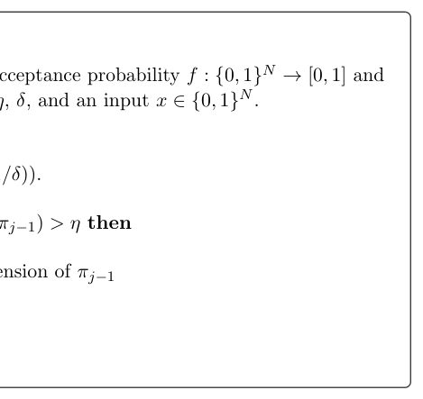
<figcaption class="paper-figure-caption"><b>Fig 1.</b> Figure 3: A classical query algorithm for approximating a quantum query algorithm.</figcaption>
</figure>

**Summary.** This theoretical paper analyzes the fundamental limits of quantum speedup by examining the simulation conjecture. It proves that for unstructured problems, achieving superpolynomial speedups requires quantum circuits of significant depth, suggesting that most known quantum advantages stem from exploiting problem structure. The work uses query weight analysis to establish these bounds.

**Why it may be interesting.** While focused on complexity theory, the techniques developed for bounding quantum query complexity and relating it to circuit depth are fundamental tools applicable to understanding resource limitations in quantum simulation protocols.

Detailed structure

**Main problem.** The paper investigates the conditions under which quantum algorithms can achieve superpolynomial speedups over classical computation, formalized by the simulation conjecture.

**Main result.** The authors show that for parallel quantum algorithms, the simulation conjecture fails for unstructured problems unless the quantum circuits possess superconstant depth, contrasting with known speedups for structured problems.

**Method.** The analysis employs query weight analysis (a 'whitebox' approach) to derive lower bounds on the query complexity, contrasting it with influence-based methods.

**Model / system.** The focus is on quantum query algorithms, analyzing the query weight allocation ($W_i(x)$) of a $t$-query, $d$-round quantum algorithm $A$ for a function $F: \{0, 1\}^N 	o \{0, 1, *\}$.

**Key observables.** Query weights ($W_i(x)$), acceptance probability ($f(x)$), and the $\delta$ parameter quantifying the separation of acceptance probabilities.

**Important parameters / regimes.** Query depth ($d$), parallel queries per round ($t$), and the separation parameter $\delta$.

**Assumptions / limitations.** The results heavily rely on the strong version of Conjecture 1, which relates query weights to the simulation conjecture, and the Aaronson–Ambainis conjecture.

**Figures summary.** Figure 1 illustrates the structure of a $t$-query $d$-round quantum algorithm, which is central to the complexity analysis.

**Paper structure.** The paper progresses by introducing the simulation conjecture, developing the query weight framework (Conjecture 1), proving simulation bounds for parallel algorithms (Theorem 1), and establishing equivalences between random-oracle and unrelativized complexity separations (Theorems 2 and 3).

Abstract

One of the most basic conjectures in quantum complexity theory states that every $t$-query quantum algorithm can be simulated on most inputs by a $\mathrm{poly}(t)$-query classical algorithm. If true, this would provide broad justification for the need for structure in quantum speedups.   We settle this conjecture for parallel quantum algorithms, showing that every $t$-query $d$-round quantum algorithm can be simulated on most inputs with $t^{O(d^2)}$ classical queries. This suggests that for unstructured problems, superpolynomial speedups would require quantum circuits of superconstant depth, and exponential speedups would further require polynomial depth. In contrast, most known speedups for structured problems are achieved by highly parallel, low-depth algorithms.   Our techniques also carry new implications for the status of $\mathsf{BPP}$ vs. $\mathsf{BQP}$ relative to a random oracle, a similarly longstanding problem.

[↑ back to top](#top)

### [Realizing Logical Diagonal Gates via Transversal Physical $Z$-Rotations in CSS Codes](http://arxiv.org/abs/2608.19094v1)

**Authors:** K. Sai Mineesh Reddy, Navin Kashyap  
**Type:** theory · **Category:** quantum information and computing · **PDF:** <https://arxiv.org/pdf/2608.19094v1>  
**Analysis basis:** full PDF text, analyzed in chunks

↔ Scroll figures horizontally

<figure class="paper-figure-card">
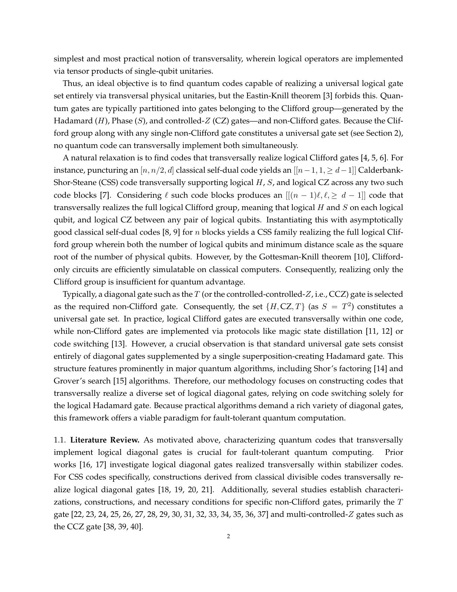
<figcaption class="paper-figure-caption"><b>Fig 1.</b> Low-resolution page preview, page 2</figcaption>
</figure>
<figure class="paper-figure-card">
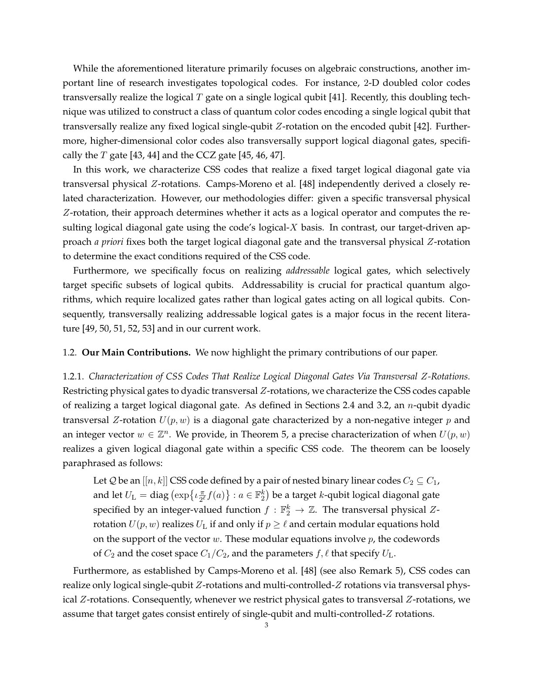
<figcaption class="paper-figure-caption"><b>Fig 2.</b> Low-resolution page preview, page 3</figcaption>
</figure>
<figure class="paper-figure-card">
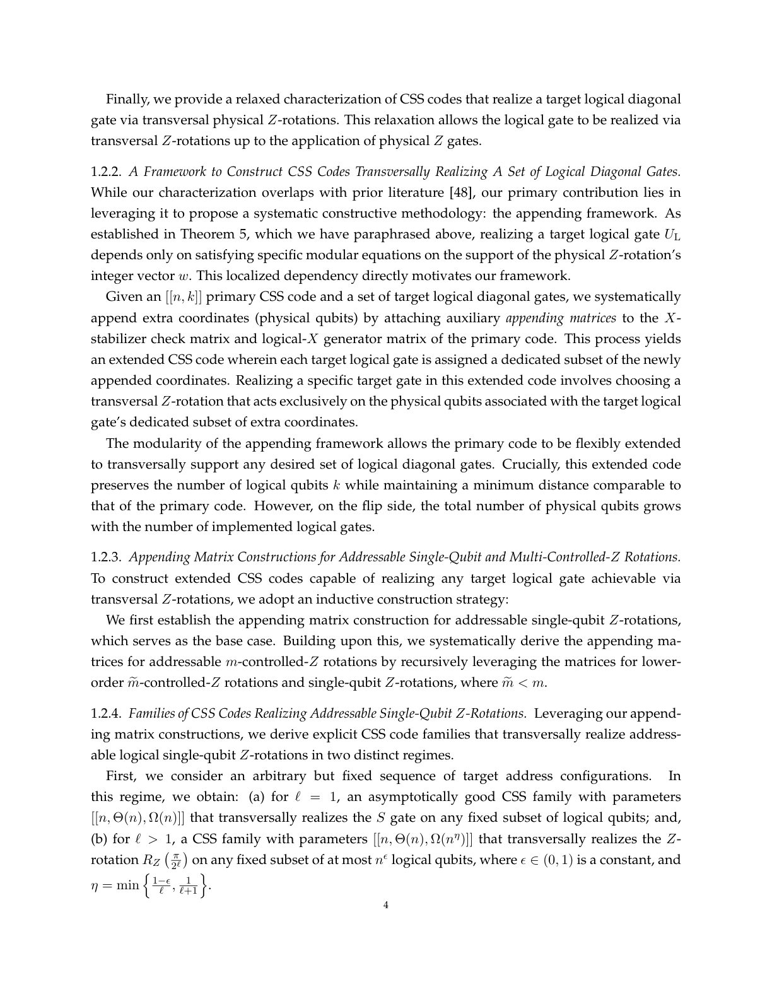
<figcaption class="paper-figure-caption"><b>Fig 3.</b> Low-resolution page preview, page 4</figcaption>
</figure>
<figure class="paper-figure-card">
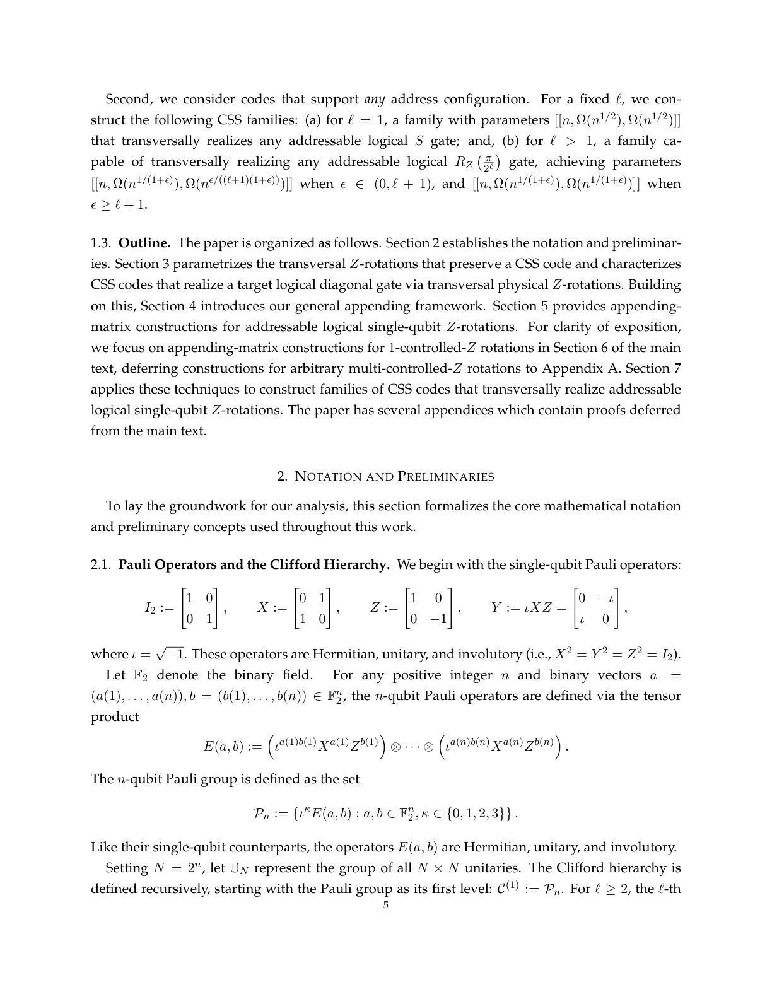
<figcaption class="paper-figure-caption"><b>Fig 4.</b> Low-resolution page preview, page 5</figcaption>
</figure>
<figure class="paper-figure-card">
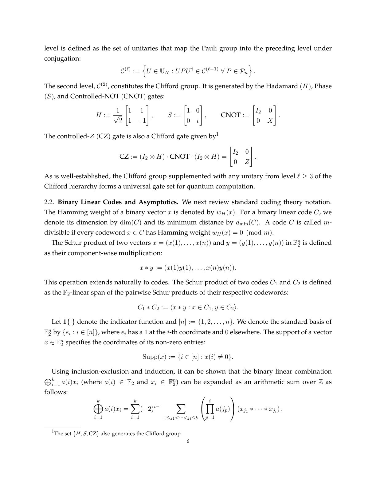
<figcaption class="paper-figure-caption"><b>Fig 5.</b> Low-resolution page preview, page 6</figcaption>
</figure>

**Summary.** This paper characterizes CSS quantum error-correcting codes that can implement logical diagonal gates using transversal physical Z-rotations. It introduces a powerful 'appending construction' that allows researchers to systematically extend any given code to support an arbitrary number of desired logical Z-rotations. This advances the theory of fault-tolerant quantum computation by providing a scalable method for code design.

**Why it may be interesting.** This work provides a concrete, constructive framework for building quantum codes capable of implementing complex, non-Clifford logical gates required for universal quantum computation, which is a core theoretical challenge in quantum information.

Detailed structure

**Main problem.** The paper addresses the challenge of designing quantum error-correcting codes (CSS codes) that can fault-tolerantly implement a diverse set of logical diagonal gates using only transversal physical Z-rotations.

**Main result.** The authors develop an 'appending construction' that allows extending any existing CSS code to support multiple desired logical Z-rotations, although this increases the physical qubit overhead.

**Method.** The methodology involves characterizing the necessary conditions for transversal physical Z-rotations to realize specific logical gates, leading to the development of the systematic appending construction.

**Model / system.** The system modeled is the quantum error-correcting code, specifically Calderbank-Shor-Steane (CSS) codes defined by nested classical codes $C_2 \subseteq C_1$. The operations are physical transversal Z-rotations.

**Key observables.** Code parameters $[[n, k, d]]$, the realizable logical diagonal gates (e.g., single-qubit or multi-controlled-Z rotations), and the associated physical transversal rotation parameters $(p, w)$.

**Important parameters / regimes.** The number of appended qubits ($n''$), the number of target logical gates, and the required fidelity/distance of the resulting code.

**Assumptions / limitations.** The analysis is restricted to gates realizable via transversal physical Z-rotations, which limits the achievable logical gates to specific diagonal forms.

**Paper structure.** The paper first characterizes which CSS codes can realize target logical gates via transversal Z-rotations, establishing limitations. It then introduces and details the 'appending construction' to systematically extend codes to support multiple gates, followed by detailed mathematical proofs concerning the necessary and sufficient conditions for gate realization.

Abstract

Calderbank-Shor-Steane (CSS) codes, constructed from nested classical codes $C_2 \subseteq C_1$, are typically optimized for good code parameters. However, practical quantum computing equally demands fault-tolerant logical gates. In this work, we characterize nested pairs $(C_1, C_2)$ whose resulting CSS codes realize a target logical diagonal gate via transversal physical $Z$-rotations. In doing so, we recover a result of Camps-Moreno et al. that CSS codes can realize only logical single-qubit $Z$-rotations and multi-qubit controlled-$Z$ rotations via transversal physical $Z$-rotations. Building on our characterization, we develop the ''appending construction'', that takes as input an $[[n',k']]$ CSS code $Q'$ and a target logical $Z$-rotation (single-qubit or multi-controlled) $U_L$, and extends $Q'$ by systematically appending $n''$ physical qubits to obtain an $[[n,k]]$ CSS code $Q$ with $n = n'+n''$ and $k=k'$. The target logical gate $U_L$ is realized in $Q$ by applying a well-chosen physical transversal $Z$-rotation to the $n''$ appended physical qubits. The CSS code $Q$ may incur a loss in minimum distance, but the loss can be controlled through the parameter choices made in the construction. By repeatedly applying the appending construction, we can extend any CSS code $Q'$ to obtain a CSS code $Q$ that supports fault-tolerant implementations of multiple desired logical $Z$-rotations. The cost to be paid for this is the increased physical qubit overhead as the number of target logical gates grows.

[↑ back to top](#top)

### [Superfast hole spin qubits enabled by uniaxial strain-boosted spin-orbit coupling](http://arxiv.org/abs/2608.18483v1)

**Authors:** Yi-Xu Wang, Yang Liu, Shan Guan, Jun-Wei Luo, Shu-Shen Li  
**Type:** theory · **Category:** quantum information and computing · **PDF:** <https://arxiv.org/pdf/2608.18483v1>  
**Analysis basis:** full PDF text, analyzed in chunks

↔ Scroll figures horizontally

<figure class="paper-figure-card">
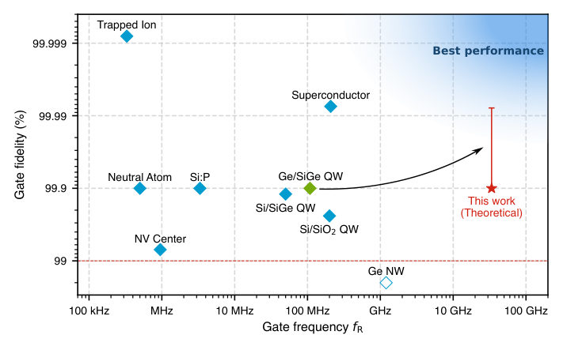
<figcaption class="paper-figure-caption"><b>Fig 1.</b> FIG. 1. Comparison of single-qubit gate fidelity and operation speed across scalable qubit platforms (2020 - 2026). Reported results are shown for superconducting qubits30,31, trapped ions32, neutral atoms33, nitrogen-vacancy (NV) centers in diamond34, and semiconductor spin qubits35–37. Hole spin qubits hosted by Ge Nanowires (NW)38 exhibit sizable operation speed, although the gate fidelity was not reported and is therefore assumed to lie below the surface-code threshold of 99%. This work presented superfast hole spin qubit (marked by the red star) is plotted using the operation speed at the “sweet spot” (uniaxial strain of ϵu = 0.2% along the [110] direction, biaxial strain of ϵb =...</figcaption>
</figure>
<figure class="paper-figure-card">
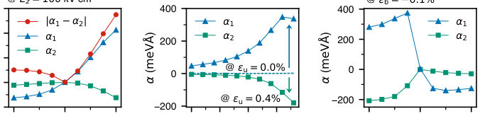
<figcaption class="paper-figure-caption"><b>Fig 2.</b> FIG. 2. CMOS-compatible strain engineering substantially enhances linear SOC. (a) Strain-engineering in CMOS technology to enhance hole mobility by embedding larger-lattice SiGe alloy in the source and drain regions, generating a compressive [110] uniaxial strain in the Si channel. (b) Analogous CMOS-compatible strain-engineering approach to apply uniaxial strain to Ge/SiGe QW hosting spin qubit arrays by embedding alloy in the source and drain regions. BS, BD, and BC denote the source, drain, and center barrier gates; P1 and P2 denote the plunger gates23. (c) Schematic of linear-SOC-mediated EDSR in a planar QD array. The uniaxial strain and magnetic field are applied along the x′=[110]...</figcaption>
</figure>
<figure class="paper-figure-card">
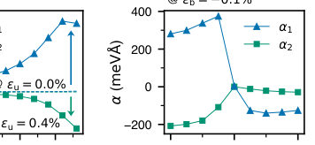
<figcaption class="paper-figure-caption"><b>Fig 3.</b> Fig. 2d shows that HH1 possesses two spin branches with an increased energy separation as the in-plane wavevector k|| goes away from the Γ point, which is re- ferred to as momentum-dependent spin splitting. Fig. 2e shows the corresponding spin splitting of HH1 as a func- tion of k along [110] and [110] directions, respectively. One can see that the spin splitting is predominantly k- linear, consistent with the predictions of the newly dis- covered direct Rashba SOC58,63, which originates from the interplay between HH-LH mixing and the direct dipo- lar coupling of an external electric field to the hole sub-</figcaption>
</figure>
<figure class="paper-figure-card">
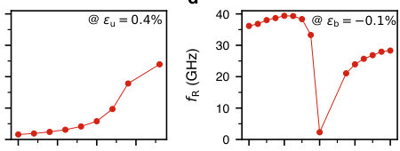
<figcaption class="paper-figure-caption"><b>Fig 4.</b> FIG. 3. Strain engineering significantly boosts gate speed in planar Ge hole spin qubits. (a) Estimated EDSR Rabi frequency fR based on obtained α1 and α2 as a function of uniaxial strain for the strain configurations adopted in Fig. 2g. (b) The corresponding effective mass my′ as a function of uniaxial strain. (c) Estimated EDSR Rabi frequency fR as a function of biaxial strain for the strain con- figurations adopted in Fig. 2h. (d) Estimated Rabi frequency fR as a function of uniaxial strain for the strain configurations adopted in Fig. 2i.</figcaption>
</figure>
<figure class="paper-figure-card">
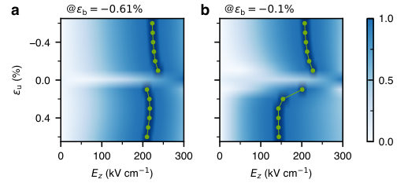
<figcaption class="paper-figure-caption"><b>Fig 5.</b> FIG. 4. Small biaxial strain enables low electric field for “sweet spots”. Linear SOC parameters |α1 −α2| as a function of electric field Ez and uniaxial strain ϵu along the [110] direction under two different fixed biaxial strain: (a) ϵb = −0.61%, and (b) ϵb = −0.1%. The linear SOC param- eters |α1 −α2| are normalized to their maximum value for each uniaxial strain to highlight relative changes and “sweet spots”. Green points indicate the estimated locations of the “sweet spots”, where the linear SOC parameters |α1 −α2| reach maximum against the electric field Ez. Darker regions indicate the approximate ranges where the relative change of linear SOC parameters is less than 1%.</figcaption>
</figure>

**Summary.** This paper demonstrates that applying uniaxial strain to Ge/SiGe quantum wells can dramatically enhance the Rashba spin-orbit coupling in 2D hole gases. This enhancement boosts the Rabi frequency of hole spin qubits to record-breaking speeds (40 GHz) while simultaneously creating an operational regime immune to electric noise, paving the way for faster, higher-fidelity solid-state quantum computation.

**Why it may be interesting.** The work provides a concrete, material-science-based pathway (strain engineering) to enhance fundamental quantum coupling parameters (SOC) in solid-state systems, directly impacting the feasibility and speed of solid-state qubits.

Detailed structure

**Main problem.** The primary challenge is overcoming the inherently weak Rashba spin-orbit coupling (SOC) in 2D hole gases, which limits the speed and fidelity of electric-field-controlled spin manipulation for quantum computing applications.

**Main result.** The application of uniaxial strain, accessible via CMOS technology, can substantially enhance the linear Rashba SOC in Ge/SiGe quantum wells, boosting the hole spin qubit Rabi frequency to an unprecedented 40 GHz.

**Method.** The study employs atomistic semi-empirical pseudopotential method (SEPM) calculations combined with model Hamiltonian analysis to theoretically predict the effect of strain on the SOC parameters.

**Model / system.** The system involves hole spin qubits confined in Ge/SiGe quantum wells (QWs). The physics is governed by the effective SOC Hamiltonian, which is analyzed for its dependence on applied uniaxial and biaxial strain.

**Key observables.** Rabi frequency ($\omega_R$), linear Rashba SOC strength, single-qubit gate fidelity, and spin precession length.

**Important parameters / regimes.** Uniaxial strain ($\epsilon_u$), biaxial strain ($\epsilon_b$), and the vertical electric field ($E_z$).

**Assumptions / limitations.** The enhancement mechanism is attributed to strain-induced heavy-hole-light-hole (HH-LH) mixing, which is otherwise symmetry-forbidden.

**Figures summary.** Figures compare qubit performance across platforms, illustrate the strain engineering approach by showing energy dispersion and SOC parameters ($\alpha_1, \alpha_2$) as functions of strain and electric field.

**Paper structure.** The paper first establishes the problem of weak SOC, then details how strain engineering enhances the SOC parameters ($\alpha_1, \alpha_2$) using SEPM calculations. Finally, it demonstrates the resulting superfast qubit operation regime, including immunity to electric noise.

Abstract

Two-dimensional (2D) electron/hole gases confined in semiconductor heterostructures suffer from weak Rashba spin-orbit coupling (SOC) for manipulating spin degreee of freedom via an electric rather than a magnetic field. Here, we show that complementary metal-oxide-semiconductor technology-accessible strain could substantially enhance the linear Rashba SOC of the top hole subband in Ge/SiGe quantum wells (QWs) to a level comparable to that of 2D Rashba materials through enhancing the mixture of the light-hole and heavy-hole bands. We further show that strongly enhanced Rashba SOC boosts the Rabi frequency of hole spin qubits confined in Ge/SiGe QWs by two orders of magnitude to an unprecedented 40 GHz, more than one order of magnitude faster than other qubit platforms. We also demonstrate that the hole spin rotation with Rabi frequency > 25 GHz enters a new regime being immune to gate control-induced electric noise, opening a new avenue to simultaneously improve the gate speed and gate fidelity. Our findings provide a new routine to substantially enhance the Rashba SOC in 2D semiconductor hole gases to a level that is great for spintronic applications.

[↑ back to top](#top)

### [Teaching Quantum Design Automation with Block-Based Programming](http://arxiv.org/abs/2608.18206v1)

**Authors:** Damian Rovara, Robert Wille  
**Type:** theory · **Category:** quantum information and computing · **PDF:** <https://arxiv.org/pdf/2608.18206v1>  
**Analysis basis:** full PDF text, analyzed in chunks

↔ Scroll figures horizontally

<figure class="paper-figure-card">
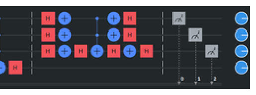
<figcaption class="paper-figure-caption"><b>Fig 1.</b> Figure 1. Implementing Grover’s algorithm using IBM’s Quantum Composer after unrolling the loop into a single circuit.</figcaption>
</figure>
<figure class="paper-figure-card">
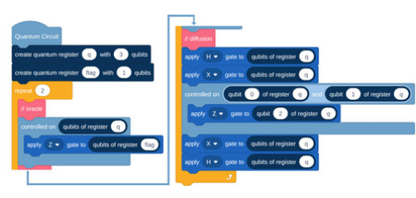
<figcaption class="paper-figure-caption"><b>Fig 2.</b> Figure 2. Implementing Grover’s algorithm inside the proposed Scratch extension.</figcaption>
</figure>
<figure class="paper-figure-card">
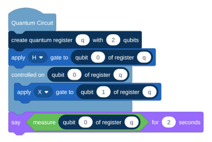
<figcaption class="paper-figure-caption"><b>Fig 3.</b> Figure 3. A Bell circuit created through the Scratch extension.</figcaption>
</figure>
<figure class="paper-figure-card">

<figcaption class="paper-figure-caption"><b>Fig 4.</b> Figure 4. Starting the simulation of the circuit in Fig. 3 from the Scratch framework and the output of the final simulation.</figcaption>
</figure>
<figure class="paper-figure-card">

<figcaption class="paper-figure-caption"><b>Fig 5.</b> Figure 5. The resource estimates for the Toffoli decomposition of a 20-qubit Toffoli gate.</figcaption>
</figure>

**Summary.** This paper introduces a block-based programming framework, built on Scratch, designed to teach quantum design automation. It solves the difficulty novices face when learning complex concepts like circuit compilation and resource estimation by providing an intuitive, visual environment. The framework allows users to build circuits and apply advanced automation techniques, significantly lowering the barrier to entry for quantum computing education.

**Why it may be interesting.** While focused on pedagogy, the work directly addresses the software engineering challenges of quantum computing, which is crucial for any theoretical physicist needing to translate abstract quantum models into executable, verifiable code.

Detailed structure

**Main problem.** As quantum circuits become complex for physical execution, design automation—including compilation, resource estimation, and verification—is necessary but presents a steep learning curve for novices.

**Main result.** The authors developed and tested a block-based programming framework, extending Scratch, which successfully lowers the entry barrier to understanding and applying quantum design automation concepts.

**Method.** They implemented a block-based programming environment that allows users to build quantum circuits and embed them within classical control logic, enabling the direct application and comparison of various design automation techniques.

**Model / system.** The system models quantum circuits and their execution flow, allowing for the integration of quantum operations with classical control structures like loops and conditionals.

**Key observables.** Circuit correctness (verification), resource requirements, and execution cost.

**Important parameters / regimes.** The complexity of the quantum circuit, the level of abstraction required for the user (novice vs. expert).

**Assumptions / limitations.** The primary assumption is that adopting a proven, accessible pedagogical methodology from classical computer science (Scratch) is the most effective way to teach advanced quantum design automation concepts.

**Figures summary.** Figures illustrate the implementation of Grover's algorithm, contrasting the limitations of standard visual editors (requiring unrolling loops) with the proposed Scratch extension's ability to handle loops and control flow naturally.

**Paper structure.** The paper identifies the need for design automation, critiques existing tools (visual editors and textual representations) for their limitations in handling complexity, proposes the Scratch-based block framework, and validates its efficacy through a user study.

Abstract

As quantum circuits grow beyond small toy examples, preparing them for execution on physical devices becomes increasingly complex. Design automation is therefore essential for scalable quantum computing: Compilation procedures optimize resource requirements and transform circuits to a format compatible with specific hardware; resource estimation evaluates execution cost; verification methods prove circuit correctness. However, these concepts present a steep learning curve for novices, particularly when quantum circuits are introduced through low-level textual representations. To address this, we present a block-based programming framework for quantum design automation, implemented as an extension to the Scratch programming platform. This system allows users to build quantum circuits as a sequence of blocks and embed them in classical control logic to perform evaluations, compare simulation results, and directly apply different design automation techniques. We evaluated the approach in a user study with computer science students, who completed guided exercises using the platform and provided structured feedback in the form of self-reports and short knowledge assessments. Results demonstrate strong understanding and confidence in quantum design automation concepts, suggesting that the block-based approach successfully lowers the entry barrier to quantum design automation. The implemented framework is open-source and available at https://github.com/munich-quantum-toolkit/scratch-quantum.

[↑ back to top](#top)

## Secondary cond-mat archives

*Papers from cond-mat.mtrl-sci, mes-hall, other, soft, supr-con. These archives are de-prioritized — they appear at the end regardless of relevance score.*

### Relevant in secondary archives (14)

### [Electromagnetic and Acoustic Fano Interference in Surface Acoustic Wave Resonators](http://arxiv.org/abs/2608.18771v1)

**Authors:** P. K. Rath, J. M. Kitzman, M. Mesbah, C. Undershute, J. Pollanen  
**Type:** experiment · **Category:** other · **PDF:** <https://arxiv.org/pdf/2608.18771v1>  
**Analysis basis:** full PDF text, analyzed in chunks
**Topic relevance:** 🔥 `interference shaping light` **4/5**

↔ Scroll figures horizontally

<figure class="paper-figure-card">
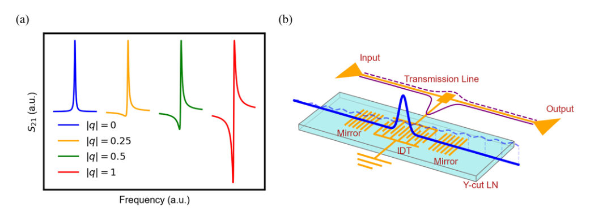
<figcaption class="paper-figure-caption"><b>Fig 1.</b> FIG. 1. (a) Schematic of the spectral line shape of a generic resonator for different values of the Fano parameter (q). The case when q equals 0 corresponds to the absence of Fano interference and results in a Lorentzian line shape (see Eq. 1). Increasing Fano interference, i.e., increasing |q|, results in an increasing asymmetry of the spectral line. (b) Schematic of the notch-type transmission measurement configuration of a surface acoustic wave device on Y-cut lithium niobate. The input microwave signal (solid purple) is injected via a transmission line waveguide and piezoelectrically transduced into resonant surface acoustic wave modes (solid blue) and a background acoustic continuum...</figcaption>
</figure>
<figure class="paper-figure-card">
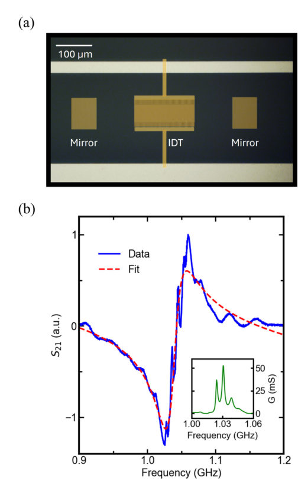
<figcaption class="paper-figure-caption"><b>Fig 2.</b> FIG. 2. (a) Optical false colored image of the SAW resonator (Device I), which consists of a central IDT structure, and acoustic Bragg mirrors on both sides of the IDT. The IDT is connected galvanically on one side to the center pin of a coplanar waveguide while the other side of the IDT is attached to ground. (b) Transmission spectrum S21 (blue data) of the SAW device showing the expected discrete resonant acoustic modes as dips, along with a characteristic asymmetric line shape corresponding to composite Fano interference in the device. The red dashed curve corresponds to a fit using Eq. 1. The expected response of the SAW resonator was designed using the coupling of modes method [19] as...</figcaption>
</figure>
<figure class="paper-figure-card">
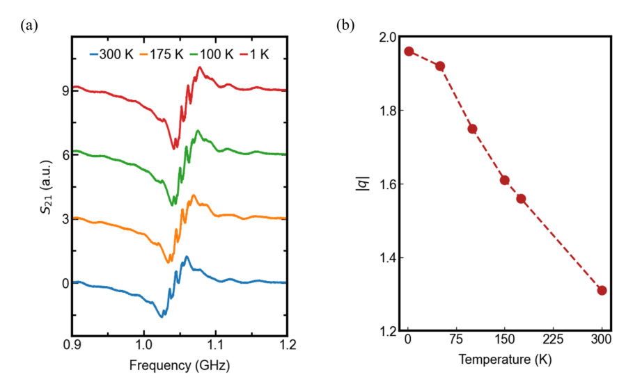
<figcaption class="paper-figure-caption"><b>Fig 3.</b> FIG. 3. (a) The spectral response of the SAW resonator (Device I) at different temperatures. The curves have been vertically shifted relative to each other for clarity. As the temperature decreases, the resonant acoustic modes shift to higher frequencies and the asymmetry of the overall line shape increases. (b) Dependence of the magnitude of the Fano parameter |q| versus temperature. With decreasing temperature, |q| increases, indicating an enhancement of the resonant acoustic pathway over the non-resonant electromagnetic background channel.</figcaption>
</figure>
<figure class="paper-figure-card">
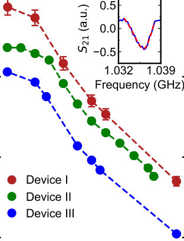
<figcaption class="paper-figure-caption"><b>Fig 4.</b> FIG. 4. Fano parameter as a function of temperature for the three SAW Devices (Devices I, II, and III) with vary- ing acoustic confinement. Device I, having 20 pairs of Bragg mirror elements, (red points) exhibits the highest value of |q| across the entire temperature range. As the surface acoustic wave confinement is reduced in the other devices (i.e.Device II with 10 pairs of mirror elements (green points), and Device III with no mirrors (blue points)) we observe a reduction in |q|, indicative of a systematic reduction of phononic interference effects with decreasing acoustic confinement. Inset: Magni- tude spectrum of an individual confined acoustic mode from Device I (blue) and...</figcaption>
</figure>

**Summary.** This paper investigates enhancing the sensitivity of SAW resonators by engineering their spectral response using Fano interference. The authors demonstrate the simultaneous control of both electromagnetic and acoustic Fano interference by modifying the resonator's acoustic confinement. This technique proves that spectral asymmetry can be tuned, offering a promising route for advanced classical and quantum sensing applications.

**Why it may be interesting.** The ability to engineer spectral features via controlled interference mechanisms (Fano resonance) provides a powerful, non-traditional method for enhancing sensor sensitivity, which is relevant for developing high-precision quantum transducers or detectors.

Detailed structure

**Main problem.** The primary goal is to enhance the sensitivity of Surface Acoustic Wave (SAW) resonators for sensing applications by engineering their spectral response.

**Main result.** The work successfully demonstrates the simultaneous introduction of both electromagnetic and acoustic Fano interference to shape the spectral response, confirming that Bragg mirror design acts as a tunable knob for spectral symmetry.

**Method.** The researchers measured the transmission spectrum ($S_{21}$) of SAW resonators across varying temperatures and systematically modified the acoustic confinement using different Bragg mirror configurations.

**Model / system.** The physical platform is a SAW resonator fabricated on Y-cut LiNbO3, operating at GHz frequencies. The analysis models the spectral response using the Fano lineshape function, which accounts for interference between resonant and continuum scattering pathways.

**Key observables.** Spectral line shape asymmetry, quantified by the Fano factor ($q$), resonance frequency ($f_0$), and the temperature dependence of these parameters.

**Important parameters / regimes.** Temperature (ambient to $\sim 1 	ext{ K}$), acoustic reflectivity (controlled by Bragg mirror pairs), and the Fano parameter $q$.

**Assumptions / limitations.** The interference effects can be separated by systematically modifying the acoustic confinement, allowing independent analysis of electromagnetic and acoustic contributions.

**Figures summary.** Figures show schematics of the interference setup, measured transmission spectra ($S_{21}$) exhibiting asymmetric dips, and plots detailing the temperature dependence of the Fano factor $|q(T)|$ and the resonance frequency.

**Paper structure.** The paper introduces the concept of using Fano interference to enhance SAW sensor sensitivity. It details the experimental setup using multiple devices with varying acoustic confinement. The core of the work involves fitting the measured spectral data to the Fano lineshape function to quantify the interplay between acoustic and electromagnetic interference, concluding with temperature-dependent analysis.

Abstract

Surface acoustic wave-based resonators are sensitive probes of condensed matter systems, as well as surface-selective sensors for chemistry and biology. Surface acoustic wave devices have also been integrated into hybrid quantum systems with qubit platforms for applications in quantum information processing and sensing. The sensitivity of piezoelectric surface wave-based resonators to investigate these various systems can be enhanced by optimizing the device architecture and electrical measurement techniques. Alternatively, tailoring the spectral symmetry, arising from interference effects, offers a promising route to further improve sensitivity. In this work, we demonstrate the simultaneous introduction of both electromagnetic and acoustic Fano interference to shape the spectral response of GHz-frequency surface acoustic wave resonators. By systematically modifying the acoustic reflectivity of the resonators, we are able to isolate and analyze each interference mechanism independently. The broad range of temperature operation, from ambient to cryogenic temperatures highlights the potential for both classical and quantum sensing applications.

[↑ back to top](#top)

### [Flat and Topological Floquet Minibands from Patterned Light in Untwisted Bilayer Graphene](http://arxiv.org/abs/2608.18945v1)

**Authors:** Muhammad Faisal, Micheal Vogl  
**Type:** theory · **Category:** other · **PDF:** <https://arxiv.org/pdf/2608.18945v1>  
**Analysis basis:** full PDF text, analyzed in chunks
**Topic relevance:** `analog quantum simulation` **3/5** · `driven-dissipative phase transition` **3/5** · `Keldysh / 2PI / non-Gaussian methods` **2/5** · `methods for driven-dissipative` **2/5** · `non-equilibrium universality` **2/5** · `interference shaping light` **1/5**

↔ Scroll figures horizontally

<figure class="paper-figure-card">
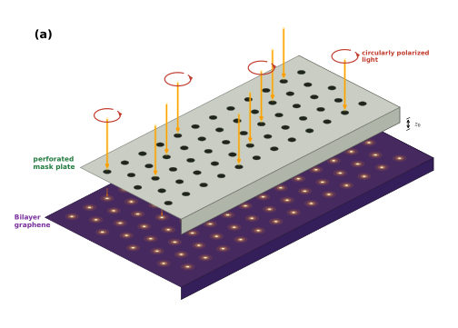
<figcaption class="paper-figure-caption"><b>Fig 1.</b> FIG. 1. Cartoon of bilayer graphene illuminated by spa- tially patterned circularly polarized light transmitted through a hexagonal mask.</figcaption>
</figure>
<figure class="paper-figure-card">
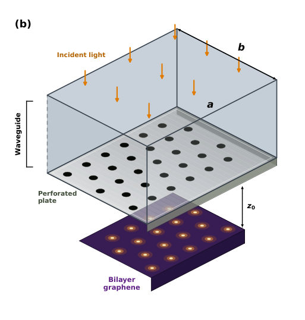
<figcaption class="paper-figure-caption"><b>Fig 2.</b> FIG. 2. Cartoon for illuminating bilayer graphene with a spa- tially patterned longitudinal light field generated by a vertical waveguide with a hexagonal array of apertures at the exit of the waveguide.</figcaption>
</figure>
<figure class="paper-figure-card">
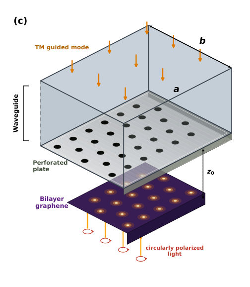
<figcaption class="paper-figure-caption"><b>Fig 3.</b> FIG. 3. Cartoon of simultaneous illumination of bilayer graphene with uniform circularly polarized and patterned lon- gitudinal light generated by a rectangular waveguide as de- scribed in Case 2.</figcaption>
</figure>
<figure class="paper-figure-card">
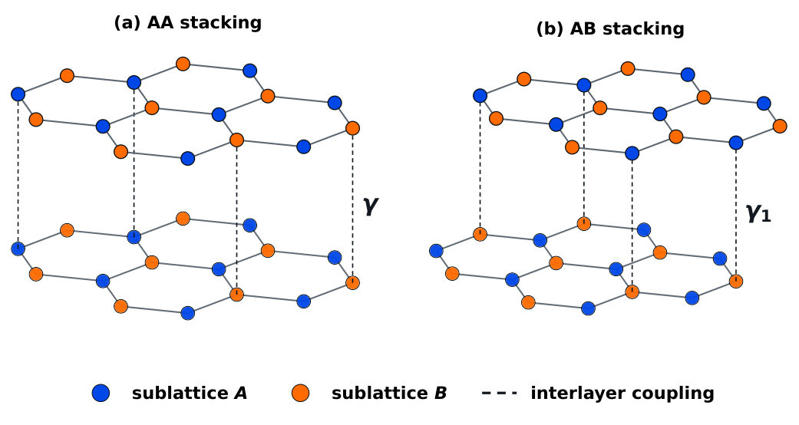
<figcaption class="paper-figure-caption"><b>Fig 4.</b> FIG. 4. Stacking configurations of bilayer graphene. The A and B sublattices are shown in blue and orange, respectively. The intralayer nearest-neighbor hopping is denoted by γ and vertical bonds represent the interlayer coupling. (a) In AA stacking, each atom lies directly above the same sublattice in the opposite layer, giving interlayer hopping γ between A1–A2 and B1–B2. (b) In AB (Bernal) stacking, the upper layer is shifted so that A2 lies above B1, forming the dimer pair coupled by γ1, while A1 and B2 remain non-dimer sites.</figcaption>
</figure>
<figure class="paper-figure-card">
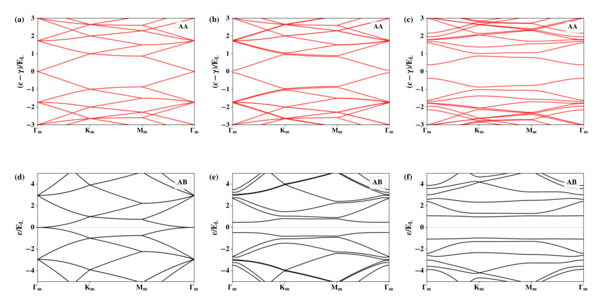
<figcaption class="paper-figure-caption"><b>Fig 5.</b> FIG. 5. Evolution of the quasienergy band structure under increasing patterned circularly polarized drive. Panels (a)–(c) show AA-stacked bilayer graphene for a0 = 0.00, 0.10, and 0.25, respectively; panels (d)–(f) show AB-stacked bilayer graphene for a0 = 0.00, 0.07, and 0.12. In all cases, L = 100 nm and ¯hΩ= 3 eV. The quasienergy is plotted in units of EL, defined separately for the two stackings as described in the text: for AA we show (ε −γ)/EL with EL = ¯hvF |Km|, and for AB we show ε/EL with EL = (¯hvF |Km|)2/γ1.</figcaption>
</figure>

**Summary.** The authors propose using patterned light fields as a tunable alternative to physical strain or twisting to create superlattices in bilayer graphene. By controlling the electromagnetic drive, they can independently modulate the electronic couplings, leading to the emergence of flat bands and measurable topological invariants like the Chern number. This establishes a highly flexible platform for realizing and studying moiré-like quantum phases.

**Why it may be interesting.** This work directly addresses the engineering of topological matter using external, tunable fields, which is highly relevant to open quantum systems and quantum optics approaches to condensed matter physics.

Detailed structure

**Main problem.** To find a flexible and tunable method to engineer flat bands and topological phases in bilayer graphene, bypassing the limitations of physically fixed strain or twisting.

**Main result.** Patterned electromagnetic fields allow for the independent and tunable control of intralayer and interlayer couplings, inducing isolated, nearly flat bands and rich topological structures characterized by calculable Chern numbers.

**Method.** The study employs Floquet engineering by driving the system with patterned light fields, analyzing the resulting quasienergy band structure and topological invariants.

**Model / system.** The system is untwisted bilayer graphene (AA- and AB-stacked) subjected to time-periodic driving from patterned in-plane and out-of-plane electromagnetic fields.

**Key observables.** Electronic band structure (minibands), quasienergy band structures, and valley Chern numbers.

**Important parameters / regimes.** Driving frequency ($\Omega$), superlattice period ($L$), and the relative strengths of the patterned fields ($a_0$).

**Assumptions / limitations.** The analysis uses the Floquet-Bloch formalism and assumes the driving frequency is high enough to prevent overlap of Floquet replicas.

**Figures summary.** Figures illustrate the band structures (quasienergy plots) under various driving conditions (circularly polarized, longitudinal, combined) as a function of driving frequency and superlattice period, alongside phase diagrams showing Chern numbers.

**Paper structure.** The paper systematically introduces the problem, details the optical coupling mechanisms (intralayer vs. interlayer), and then presents results comparing the topological outcomes (Chern numbers) and band flattening achieved using different combinations of patterned light drives.

Abstract

Two-dimensional superlattices in van der Waals materials host flat bands and nontrivial topology, most famously at the so-called magic angles of twisted bilayer graphene, where flat bands give rise to correlated and topological phases. Yet these superlattices are usually created by twisting the layers or applying strain, and once a sample is fabricated, their period is fixed and extremely difficult to tune. Here we propose an alternative route: imprint the superlattice optically, using patterned electromagnetic fields rather than a physical twist or strain. We show that patterned in-plane cir- cularly polarized light and a combined drive consisting of a patterned out-of-plane longitudinal field and a uniform circularly polarized field produce isolated bands in both AA- and AB-stacked bilayer graphene. In AB stacking, the central bands additionally become nearly flat, capturing key features of a driven moir/'e superlattice. In this approach, the superlattice period is set by the illumination and is straightforward to tune, and circularly polarized light breaks time-reversal symmetry. Computing the valley Chern numbers of the central bands, we find a rich topological structure with several phase transitions in both stackings. Our results establish light-induced superlattices as a flexible and tunable platform for engineering flat bands and topological phases in bilayer graphene.

[↑ back to top](#top)

### [Floquet engineering of topological bands in semiconductor van der Waals heterobilayers](http://arxiv.org/abs/2608.18556v1)

**Authors:** Eréndira Santana-Suárez, Brayan E. Walteros-Mendivelso, A. Jazmín Tapia-de-la-Rosa, Mahmoud M. Asmar, David A. Ruiz-Tijerina  
**Type:** theory · **Category:** other · **PDF:** <https://arxiv.org/pdf/2608.18556v1>  
**Analysis basis:** full PDF text, analyzed in chunks
**Topic relevance:** `driven-dissipative phase transition` **3/5** · `Keldysh / 2PI / non-Gaussian methods` **2/5** · `analog quantum simulation` **2/5** · `methods for driven-dissipative` **2/5** · `non-equilibrium universality` **2/5**

↔ Scroll figures horizontally

<figure class="paper-figure-card">
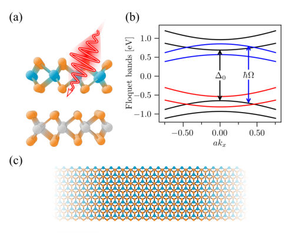
<figcaption class="paper-figure-caption"><b>Fig 1.</b> FIG. 1. (a) Schematic of a near-IR laser pulse impinging on a P-stacked WSe2/MoSe2 hetero-bilayer. (b) Zero-field Floquet-Bloch bands for ℏΩ≳∆0, in an extended Floquet BZ scheme. The equilibrium (m = 0) bands are shown in black, whereas the m = 1 (m = −1) replicas of the valence (conduction) band are shown in blue (red). Clear four-band sectors form, separated by energies of order ∆0. (c) Illustra- tion of a P-MX′ zig-zag nanoribbon.</figcaption>
</figure>
<figure class="paper-figure-card">
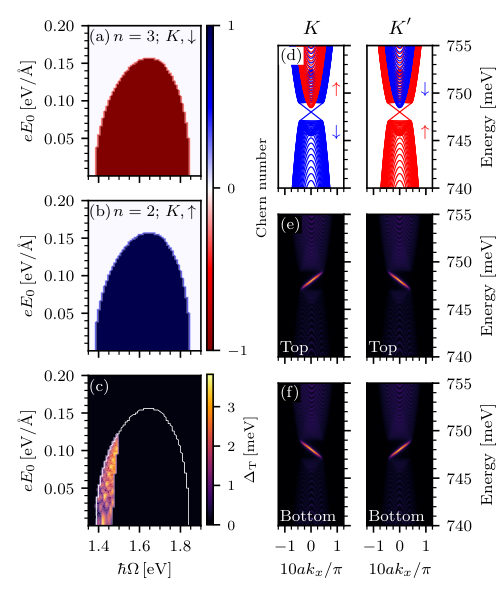
<figcaption class="paper-figure-caption"><b>Fig 2.</b> FIG. 2. Topological phase diagram and chiral edge states of P- MX′ WSe2/MoSe2 driven with LPL. (a), (b) Chern numbers of K-point, spin-↓bulk bands n = 3 and n = 2, respectively, vs. field intensity and frequency. (c) Map of the topological band gap vs. field parameters, with the topological region delineated in white. (d) K and K′ point band structures of a zig-zag nanoribbon of width L = 1500a for ℏΩ= 1.495 eV and eE0 = 60 meV · Å −1. (e) and (f) show the LDOS [log (1 + ρ), bright indicates a high value] at the top and bottom edges of the ribbon for (K, ↓) bands on the left and (K′, ↑) bands on the right. The in-gap modes of panel (d) are spin-valley locked chiral edge states, a hallmark...</figcaption>
</figure>
<figure class="paper-figure-card">
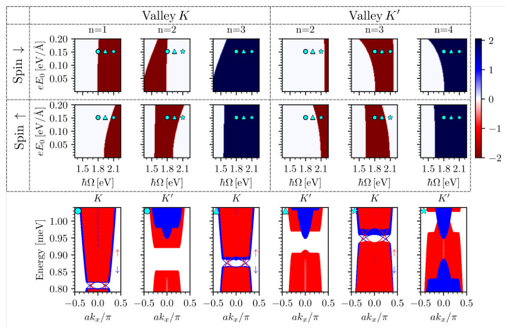
<figcaption class="paper-figure-caption"><b>Fig 3.</b> FIG. 3. (Top) Topological phase diagram for 2H-WSe2/MoSe2 irradiated by RCPL, for both spins at both valleys. Bands with zero Chern number throughout the parameter space explored have been omitted. (Bottom) Band structures for a zig-zag nanoribbon (L = 1500a) at the points of parameter space indicated with •, ▲and ⋆in the phase diagrams, corresponding to light-field parameters ℏΩ= 1.80, 1.92 and 2.1 eV for fixed eE0 = 156 meV/Å.</figcaption>
</figure>
<figure class="paper-figure-card">
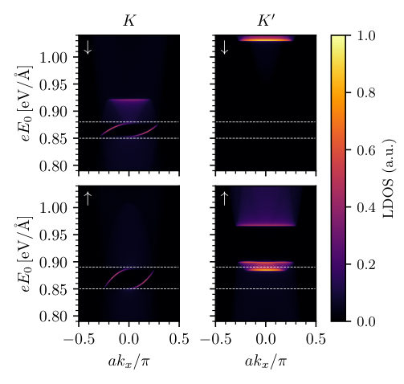
<figcaption class="paper-figure-caption"><b>Fig 4.</b> FIG. 4. Spin- and valley-resolved LDOS (scaled as in Fig. 2) at the top edge of nanoribbon considered in Fig. 3. Dashed lines frame the light-induced topological gap.</figcaption>
</figure>

**Summary.** This theoretical study demonstrates Floquet engineering of topological bands in TMD heterobilayers using near-infrared to visible light. By applying the Floquet formalism, the authors predict that periodic driving can induce topological phase transitions, leading to high Chern numbers and robust chiral edge states. This establishes TMDs as a promising platform for realizing engineered topological quantum states.

**Why it may be interesting.** This work directly applies concepts from quantum optics and open quantum systems (periodic driving) to solid-state physics, demonstrating how external fields can be used to engineer fundamental quantum properties like topology in solid-state materials.

Detailed structure

**Main problem.** The paper investigates how periodic driving using light can induce topological phase transitions and engineer topological insulating bands in semiconductor van der Waals heterobilayers.

**Main result.** The system exhibits non-trivial Floquet topological insulating phases, achieving Chern numbers up to $\pm 2$ and demonstrating chiral edge states indicative of robust topological protection.

**Method.** The Floquet formalism is applied to a light-coupled $\mathbf{k}\cdot\mathbf{p}$ Hamiltonian, leading to the calculation of topological invariants like the Chern number.

**Model / system.** The physical system is based on commensurate type-II TMD heterobilayers (e.g., $	ext{WSe}_2/	ext{MoSe}_2$). The model uses an effective Hamiltonian derived from the lowest-order $\mathbf{k}\cdot\mathbf{p}$ theory, incorporating the interaction with an incident electromagnetic wave.

**Key observables.** Topological phase diagrams (Chern numbers $C$), topological band gaps ($\Delta_T$), and chiral edge states.

**Important parameters / regimes.** Light frequency ($\Omega$), electric-field amplitude ($E_0$), and polarization (LPL, CPL, RCPL). The analysis focuses on the near-resonant regime ($\hbar\Omega \gtrsim \Delta_0$).

**Assumptions / limitations.** The model assumes a perfectly aligned, commensurate heterobilayer, and the analysis relies on truncating the Floquet Hamiltonian to a finite set of harmonics.

**Figures summary.** Figures illustrate the topological phase diagrams showing regions of non-trivial topology, band structures confirming the gap opening, and LDOS calculations visualizing the predicted chiral edge states.

**Paper structure.** The paper systematically develops the effective Hamiltonian using the Floquet formalism, calculates the Chern number as a function of driving parameters, and then analyzes the resulting topological phase diagrams and edge state properties for different stacking and polarization configurations.

Abstract

We show that periodic driving with near-infrared to visible light drives topological phase transitions in the photon-dressed band structure of transition-metal dichalcogenide heterobilayers. We apply the Floquet formalism to a light-coupled lowest-order $\mathbf{k}\cdot\mathbf{p}$ Hamiltonian, and obtain an effective four-band model that correctly captures the essential photon-dressed bands of type-II TMD heterobilayers in the vicinity of the first photon resonance. Crossings between the zero- and one-photon sectors effectively invert the bands, yielding topological phases with Chern numbers up to $\pm 2$ and gaps of order 10 meV. Our results establish TMDs as prime candidates for engineering bands with higher Chern numbers, and exploring driven topological states in solid state media.

[↑ back to top](#top)

### [Efficient calculation of real-space lattice propagators in the presence of a Fermi sea](http://arxiv.org/abs/2608.18466v1)

**Authors:** Oliver Tong, Mona Berciu  
**Type:** theory · **Category:** other · **PDF:** <https://arxiv.org/pdf/2608.18466v1>  
**Analysis basis:** full PDF text, analyzed in chunks
**Topic relevance:** `Keldysh / 2PI / non-Gaussian methods` **3/5** · `analog quantum simulation` **2/5** · `methods for driven-dissipative` **2/5**

↔ Scroll figures horizontally

<figure class="paper-figure-card">
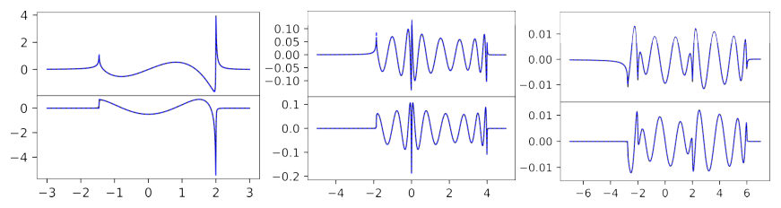
<figcaption class="paper-figure-caption"><b>Fig 1.</b> Figure 1: Real (top) and imaginary (bottom) components of Gn(z; x) at η = 0.005 computed by direct integration (black solid curve) and via our method (blue dashed curve) in (left) 1D at n = 4, x = 0.24; (middle) 2D at n = (12, 8), x = 0.2; and (right) 3D at n = (3, 8, 4), x = 0.14. In all cases t = 1.</figcaption>
</figure>
<figure class="paper-figure-card">
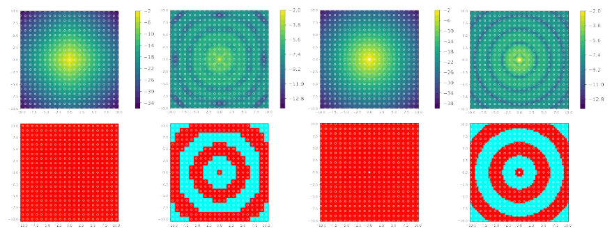
<figcaption class="paper-figure-caption"><b>Fig 2.</b> Figure 2: Upper row: Maps of log(|GA n(−10+0.02i; x)|), and Lower row: Maps of its overall sign, with red/teal showing GA &lt; 0 and GA &gt; 0, respectively. The lattice sites n are indicated by small white circles, and only the values at these points are meaningful; the heat map is simply to help visualize the changes with n. The left columns show the lattice results for x = 0 and x = 0.1, respectively. The right columns show the results of the continuum approximation for the same values. In all cases, the hopping t = 1.</figcaption>
</figure>
<figure class="paper-figure-card">

<figcaption class="paper-figure-caption"><b>Fig 3.</b> Figure 1 shows a few illustrative comparisons between real-space propagators calculated with this method versus direct momentum integration, for hypercubic lattices in D = 1, 2, 3 and for a nearest-neighbor hopping where we set t = 1. From now on we focus on the 2D square lattice with nearest-neighbour hopping and use it to illustrate some of the effects of the Fermi sea, and in particular of the shape of the Fermi surface, on the real-space lattice propagators. We begin by considering the behavior of the propagators as a function of x at energies below the free electron bandwidth. For our 2D example, we illustrate this at ω = −10t in the next few plots; the behaviour is qualitatively...</figcaption>
</figure>
<figure class="paper-figure-card">
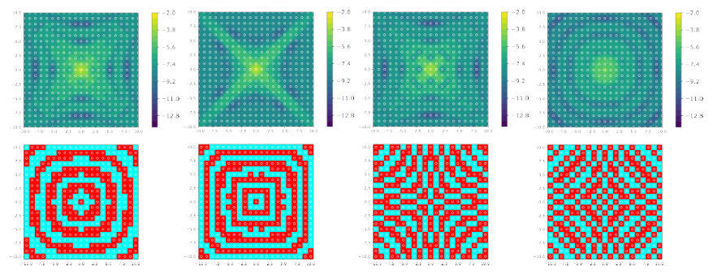
<figcaption class="paper-figure-caption"><b>Fig 4.</b> Figure 3: Same as Fig. 2, but showing the lattice results for x = 0.3, 0.45, 0.7 and 0.9 (left to right columns). In all cases, the hopping t = 1.</figcaption>
</figure>
<figure class="paper-figure-card">
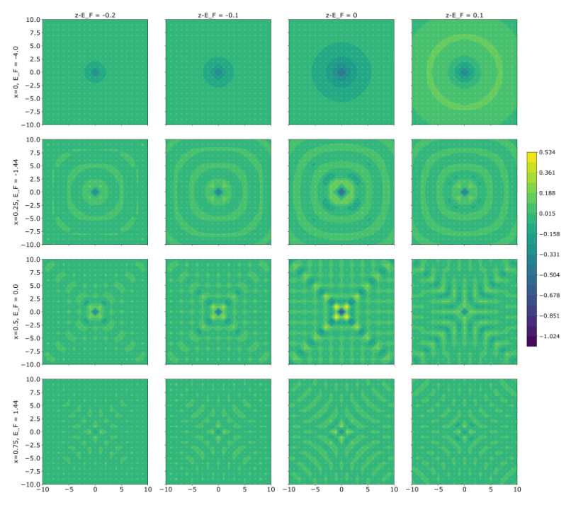
<figcaption class="paper-figure-caption"><b>Fig 5.</b> Figure 4: Maps of ReGA n(z; x) versus n. From top to bottom, the rows are for x = 0, 0.25, 0.5 and 0.75, respectively. The corresponding Fermi energies are EF = −4t, −1.44t, 0, 1.44t. From left to right, the columns correspond to ω = EF −0.2, EF −0.1, EF , EF + 0.1, respectively. In all cases t = 1 and η = 0.02.</figcaption>
</figure>

**Summary.** This paper presents an efficient, dimension-agnostic method to calculate real-space lattice Green's functions for doped tight-binding models. By leveraging Kramers-Kronig relations and FFTs, the authors bypass the computational bottleneck of direct Brillouin-zone integration. The results demonstrate that the spatial decay and structure of the propagator directly encode the geometry of the Fermi surface.

**Why it may be interesting.** This work provides a powerful, dimension-independent computational tool for studying electronic structure in doped solids, which is highly relevant for understanding transport and correlation effects in materials science.

Detailed structure

**Main problem.** The paper develops an efficient theoretical method to calculate real-space lattice propagators (Green's functions) for a tight-binding model when the system is doped, i.e., in the presence of a Fermi sea.

**Main result.** The method achieves a computational cost independent of the lattice dimensionality by utilizing Kramers-Kronig relations evaluated via FFTs, allowing the mapping of Fermi surface geometry onto the spatial structure of the propagators.

**Method.** The core technique involves relating the finite-$x$ propagators to the $x=0$ case using known identities and then employing Kramers-Kronig relations, which are efficiently computed for all energies simultaneously using Fast Fourier Transforms.

**Model / system.** The model is a non-interacting, tight-binding Hamiltonian defined on an arbitrary lattice, characterized by a Fermi sea determined by the carrier concentration $x$. The calculation focuses on the particle-addition part of the lattice Green's function.

**Key observables.** Real-space lattice propagators ($G_n(z; x)$), the real and imaginary parts of the propagator, and the resulting diffraction patterns.

**Important parameters / regimes.** Carrier concentration ($x$), Fermi energy ($E_F$), lattice distance ($n$), and energy ($\omega$).

**Assumptions / limitations.** The method is valid for any lattice and dispersion, provided the $x=0$ propagators are known, and it is derived in the limit of zero broadening ($\eta 	o 0$).

**Figures summary.** Figures compare the proposed method against direct integration across 1D, 2D, and 3D lattices. Maps illustrate how the Fermi surface geometry (e.g., circular vs. square) imprints itself on the spatial structure of the propagator magnitude and sign.

**Paper structure.** The paper introduces the problem, derives the necessary identities relating finite-$x$ propagators to $x=0$ counterparts, details the use of Kramers-Kronig relations via FFTs, and validates the method by comparing results across various dimensions and doping levels.

Abstract

We present an efficient method for computing the real-space propagators (lattice Green's functions) of any tight-binding Hamiltonian in the presence of a Fermi sea with carrier concentration $x$. The method is valid for any lattice, dispersion, and dimension, provided the corresponding $x=0$ propagators are known. We show that suitable combinations of the finite-$x$ particle-addition propagators have a real or imaginary part trivially related to their $x=0$ counterpart, while the remaining part follows from a Kramers-Kronig relation that can be evaluated for all energies at once using the fast Fourier transforms. The computational cost is therefore independent of the dimensionality, unlike that of direct Brillouin-zone integration. The particle-removal propagators follow from general identities. We validate the method against direct integration for hypercubic lattices in one, two, and three dimensions, and use the 2D square lattice to illustrate how the shape of the Fermi surface is imprinted on the spatial structure of the propagators. In particular, at energies far outside the band, the propagator maps converge to the Fraunhofer diffraction pattern whose aperture is the unoccupied part of the Brillouin zone.

[↑ back to top](#top)

### [Optical poling of a quantum ferroelectric metal across the order-disorder phase transition](http://arxiv.org/abs/2608.18427v1)

**Authors:** Mohamed Kandil, Yasuhide Tomioka, Yafei Ren, Ryan Comes, Isao H. Inoue, Wencan Jin  
**Type:** both · **Category:** statistical mechanics · **PDF:** <https://arxiv.org/pdf/2608.18427v1>  
**Analysis basis:** full PDF text, analyzed in chunks
**Topic relevance:** `driven-dissipative phase transition` **3/5** · `quantum measurements` **3/5**

↔ Scroll figures horizontally

<figure class="paper-figure-card">
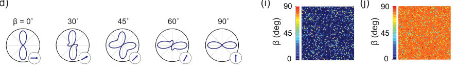
<figcaption class="paper-figure-caption"><b>Fig 1.</b> FIG. 1. Local dipoles induced SHG in the quantum ferroelectric metal. (a) Temperature-</figcaption>
</figure>
<figure class="paper-figure-card">
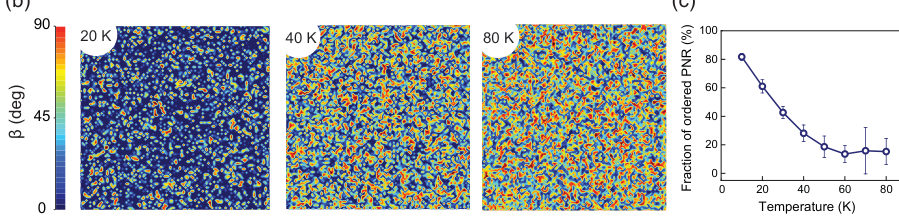
<figcaption class="paper-figure-caption"><b>Fig 2.</b> FIG. 2. Meltdown of ordered polar nanoregions in warmup cycle. (a) Polar plots of</figcaption>
</figure>
<figure class="paper-figure-card">
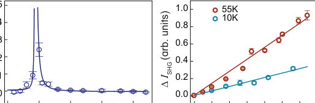
<figcaption class="paper-figure-caption"><b>Fig 3.</b> FIG. 3. Dynamics of polar nanoregions across the order-disorder transition. (a) RA-</figcaption>
</figure>
<figure class="paper-figure-card">
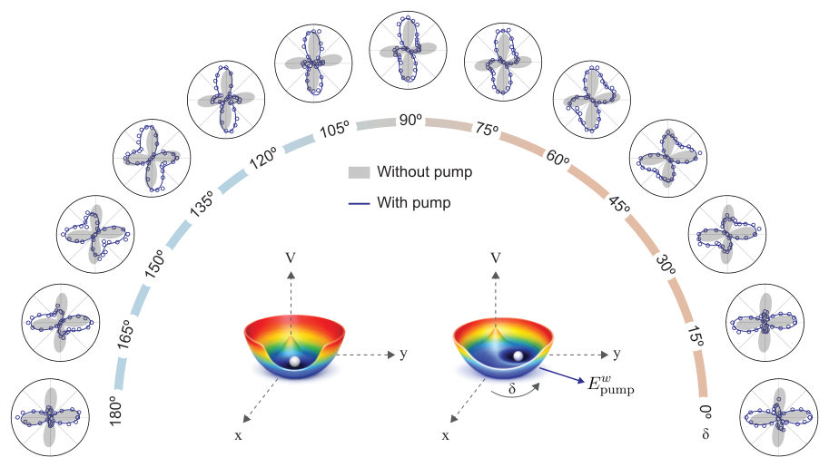
<figcaption class="paper-figure-caption"><b>Fig 4.</b> FIG. 4. Optical poling of polar nanoregions in the disordered phase. RA-SHG patterns</figcaption>
</figure>

**Summary.** This work investigates the ferroelectric transition in quantum ferroelectric metals using advanced optical techniques. By employing RA-SHG and pump-probe measurements, the authors confirm the order-disorder nature of the transition. Crucially, they demonstrate that femtosecond optical pulses can deterministically align the disordered polar nanoregions, opening an all-optical pathway for controlling these quantum materials.

**Why it may be interesting.** The ability to use light to deterministically write and read out polarization textures in a quantum material provides a novel, non-electrical control mechanism, which is highly relevant for understanding and manipulating quantum states in condensed matter systems.

Detailed structure

**Main problem.** The paper addresses the unsettled microscopic origin of the ferroelectric transition in quantum ferroelectric metals and seeks to develop methods to probe and control the associated polar nanoregions.

**Main result.** The study unambiguously demonstrates the order-disorder nature of the ferroelectric transition and establishes an all-optical route to deterministically control the orientation of these polar nanoregions.

**Method.** The research combines symmetry-resolved optical measurements (Rotational Anisotropy Second Harmonic Generation, RA-SHG) with ultrafast pump-probe spectroscopy to track polarization dynamics.

**Model / system.** The physical system is electron-doped strontium titanate, a prototypical quantum ferroelectric metal. The analysis models the local dipoles as tunneling between states, and the SHG response is analyzed based on fluctuations in local polarization ($\langle P^2 
angle$-type).

**Key observables.** RA-SHG intensity patterns, which reveal orientational statistics; the divergence of $\Delta I_{	ext{SHG}}$ near the transition temperature ($T_{	ext{FE}}$); and the degree of alignment achieved via optical poling.

**Important parameters / regimes.** Temperature ($T$), carrier concentration, and the polarization angle ($\delta$) of the incident optical pump field.

**Assumptions / limitations.** The analysis assumes that the SHG signal is dominated by local dipole fluctuations and that the optical poling process can be modeled by fitting the pump-probe signal to a specific functional form.

**Figures summary.** Figures show temperature-dependent phase diagrams, RA-SHG patterns confirming 2-fold symmetry, and pump-probe measurements demonstrating that the optical field aligns over 80% of the polar nanoregions above the transition temperature.

**Paper structure.** The paper first establishes the physical system and the debate between ferroelectric mechanisms. It then uses RA-SHG to characterize the transition as order-disorder. Finally, it employs pump-probe spectroscopy to demonstrate deterministic, ultrafast optical control (poling) of the polar nanoregions.

Abstract

Electron-doped strontium titanate has emerged as a prototypical quantum ferroelectric metal. It provides a fertile ground to explore how ferroelectric instability intertwined with itinerant electrons creates quantum phenomena, including unconventional superconductivity. Despite extensive studies, the microscopic origin of the ferroelectric transition remains unsettled, with distinct interpretations based on displacive mechanism driven by soft mode and order-disorder alignment of local dipoles. In particular, the local dipoles form nanoscale, spatially heterogeneous clusters, termed polar nanoregions, posing a significant challenge for probing or manipulating them. Here, using rotational anisotropy second harmonic generation, a symmetry-resolved probe, we quantify the orientational statistics of polar nanoregions in dilute electron-doped Sr$_{0.95}$Ba$_{0.05}$Ti$_{1-x}$Nb$_x$O$_3$. By tracking the alignment and meltdown of polar nanoregions in thermal cycles, we unambiguously demonstrate the order-disorder nature of the ferroelectric transition. We further show that, above transition temperature, femtosecond optical fields enable deterministic control of otherwise disordered polar nanoregions, realizing reversible write and readout of polar textures on ultrafast timescales. Our findings provide new insight into ferroelectric instability and establish an all-optical route of controlling polar metal systems where conventional electrical approaches are not feasible.

[↑ back to top](#top)

### [On the electronic and vibrational dimensionality of nanometer-scale silicon structures](http://arxiv.org/abs/2608.18277v1)

**Authors:** Massimo V. Fischetti, Dallin O. Nielsen, Edward Chen  
**Type:** theory · **Category:** other · **PDF:** <https://arxiv.org/pdf/2608.18277v1>  
**Analysis basis:** full PDF text, analyzed in chunks
**Topic relevance:** `Keldysh / 2PI / non-Gaussian methods` **3/5** · `correlated / nonlocal dissipation` **1/5** · `methods for driven-dissipative` **1/5**

↔ Scroll figures horizontally

<figure class="paper-figure-card">
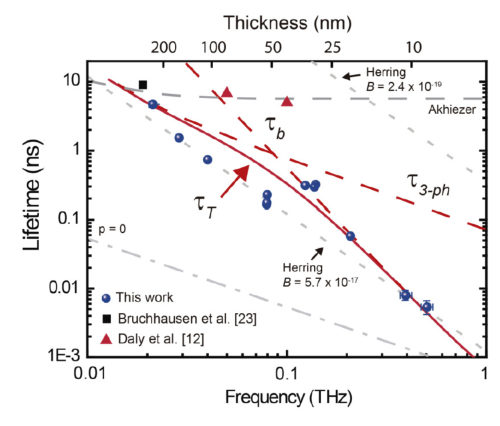
<figcaption class="paper-figure-caption"><b>Fig 1.</b> FIG. 1. Figure 3 from Ref. [45] ”Phonon lifetime of the first- order dilatational mode in free-standing silicon membranes as a function of frequency. Experimental data of free-standing silicon membranes with thickness values ranging from approx- imately 222 to 8 nm (black square [28], blue circles) and bulk silicon (red triangles [12]). The red dashed lines show the contributions to the finite phonon lifetime from normal three-phonon interactions 1/τ3−ph and boundary scattering 1/τb as indicated. The total contribution, calculated using Matthiessen’s rule 1/τT = 1/τ3−ph+1/τb is shown by the solid red line labelled 1/τT . Other models for intrinsic (grey dot- ted line: Herring [12,30], grey...</figcaption>
</figure>
<figure class="paper-figure-card">
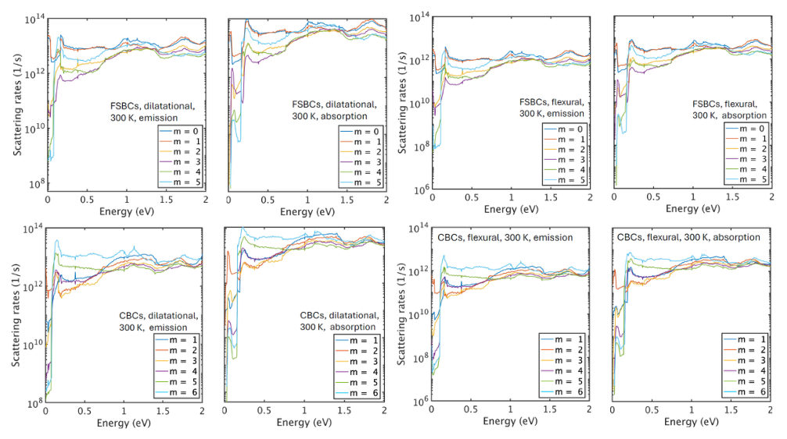
<figcaption class="paper-figure-caption"><b>Fig 2.</b> FIG. 2. Calculated rates for electron emission and absorption of the confined LA (dilatational) and TA (flexural) phonons in the Si nanosheets considered in Ref. [1]: A 1.63 nm-thin (100) Si film with top and bottom gate stacks composed by a 0.6 nm-thin SiO2 and a 1.6 nm-thin HfO2 insulating layers. The integer labels m in the legends refer to the confined vibrational modes in the nanosheet assuming clamped (CBC) or free-standing (FSBC) boundary conditions at the Si/SiO2 interfaces. Reference [1] provides all details about the methods used to obtain the data shown here.</figcaption>
</figure>

**Summary.** This theoretical work establishes the phase-coherence length ($\lambda_{\phi}$) as the key metric for assessing dimensionality in nanoscale semiconductors. By analyzing electron-phonon coupling in Si nanosheets, the authors provide quantitative estimates for critical thicknesses, arguing that confinement is determined by how far an excitation can maintain phase coherence. This has significant implications for designing next-generation quantum devices.

**Why it may be interesting.** The rigorous focus on the phase-coherence length ($\lambda_{\phi}$) as the primary diagnostic tool provides a quantitative, advanced perspective on confinement effects, which is crucial for understanding open quantum systems in solid-state devices.

Detailed structure

**Main problem.** The paper addresses the fundamental challenge of quantitatively determining the electronic and vibrational dimensionality of semiconductor nanostructures, such as silicon nanosheets.

**Main result.** The critical length scale for confinement is argued to be the electron and phonon phase-coherence length ($\lambda_{\phi}$), which dictates whether the system behaves as a 2DEG or approaches bulk 3D behavior.

**Method.** The analysis employs theoretical tools, including perturbation theory to calculate the electron self-energy ($\Sigma_0$) due to electron-phonon interactions, and deriving 2D phonon density of states.

**Model / system.** The primary system studied is silicon nanosheets, modeled as quantum wells or thin films, with the physics governed by electron-phonon coupling and phonon scattering processes.

**Key observables.** Electron spectral density $A(\mathbf{K}, \omega)$, electron self-energy $\Sigma_0(\mathbf{K}, \omega)$, and the effective phase-coherence length ($\lambda_{\phi}$).

**Important parameters / regimes.** Critical confinement lengths are estimated to be around 8 nm for electrons at room temperature, while phonon confinement depends heavily on wavelength (from 10 nm to $1 \mu$m).

**Assumptions / limitations.** The analysis relies on perturbation theory for calculating scattering rates and assumes that the coherence length is the definitive diagnostic parameter for dimensionality.

**Figures summary.** Not specified, but the notes reference figures illustrating the comparison of coherence lengths to physical dimensions and the spectral broadening due to electron-phonon coupling.

**Paper structure.** The paper progresses by first defining the problem of dimensionality assessment, then developing a theoretical framework using self-energy calculations for electrons, and finally extending this analysis to phonon confinement effects.

Abstract

We discuss the problem of assessing the electronic and vibrational dimensionality of a semiconductor nanostructure: How thin and/or wide must a nanostructure be in order to induce electron and phonon confinement? Clarifying the physical justification for common criteria found in the literature, we view the electron coherence length (defined as the electron and phonon inelastic mean free path) as their `field of view' and argue (or, better yet, `speculate') that this sets the important length scale. Considering the example of Si nanosheets at room temperature, and drawing from results found in the literature, we estimate that the critical length below which electrons are subject to quantum confinement is of the order of (or smaller than) 8 nm, when their coherence length is determined by energy losses to phonons and remote phonons in gated structures. On the contrary, no single length-scale can be given for phonons: Taking their coherence length as determined by scattering with electrons and anharmonic three-phonon processes, short wavelength acoustic and optical phonons may be confined only by structures as small as 10 nm. Long-wavelength acoustic phonons, instead, may exhibit a coherence length of the order of 1 micrometer, so that they may be confined over much larger distances.

[↑ back to top](#top)

### [Ultra-low energy (20 - 300 eV) electron imaging and diffraction](http://arxiv.org/abs/2608.19113v1)

**Authors:** Tatiana Latychevskaia  
**Type:** both · **Category:** other · **PDF:** <https://arxiv.org/pdf/2608.19113v1>  
**Analysis basis:** full PDF text, analyzed in chunks
**Topic relevance:** `quantum measurements` **3/5** · `interference shaping light` **1/5**

↔ Scroll figures horizontally

<figure class="paper-figure-card">
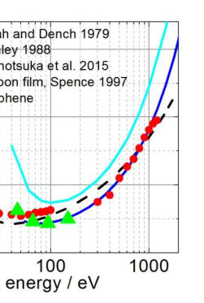
<figcaption class="paper-figure-caption"><b>Fig 1.</b> Fig. 1. Inelastic mean free path (IMFP) as a function of electron energy. (a) IMFP calculated by Seah and Dench [4], for carbon by Ashley [5], for graphite by Shinotsuka et al. [6], and experimentally measured as transmission through carbon films by Spence [7] and through graphene [2]. Adapted from [2].</figcaption>
</figure>
<figure class="paper-figure-card">
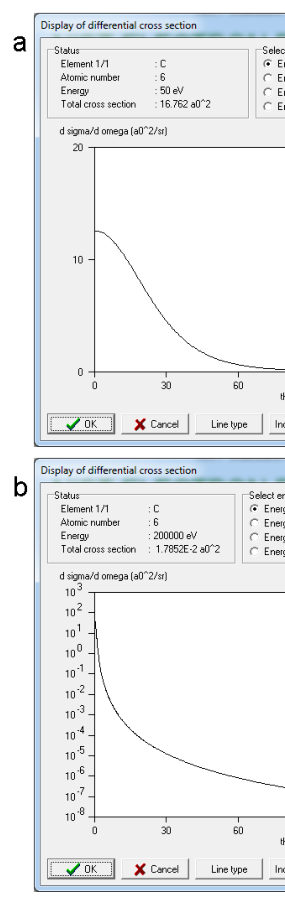
<figcaption class="paper-figure-caption"><b>Fig 2.</b> Fig. 2. Scattering differential cross-section (DCS) of electrons of (a) 50 eV and (b) 200 keV kinetic energy scattered by a carbon atom; calculated using the NIST database.</figcaption>
</figure>
<figure class="paper-figure-card">
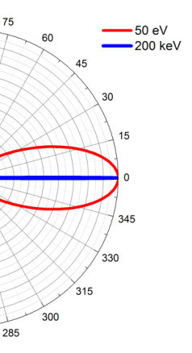
<figcaption class="paper-figure-caption"><b>Fig 3.</b> Fig. 3. Polar plot of the differential cross-section (DCS) distribution as a function of the scattering angle for electrons of 50 eV and 20 keV energies scattered at a carbon atom; calculated using the NIST database.</figcaption>
</figure>
<figure class="paper-figure-card">
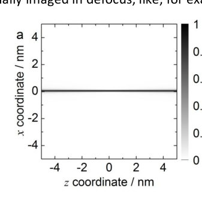
<figcaption class="paper-figure-caption"><b>Fig 4.</b> Fig. 4. Amplitude distributions (contrast inverted) of the point spread functions (PSF) for (a) 300 keV and (b) 100 eV energy electrons scattered by a point-like object. Adapted from [2].</figcaption>
</figure>
<figure class="paper-figure-card">
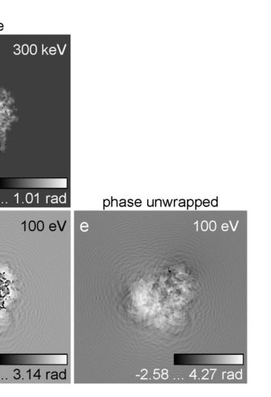
<figcaption class="paper-figure-caption"><b>Fig 5.</b> Fig. 5. Simulated complex-valued distribution of (a) ‒ (b) 300 keV and (c) ‒ (e) 100 eV electron exit wave after propagating through a lysozyme molecule. Scalebar, 1 nm. Adapted from [2].</figcaption>
</figure>

**Summary.** This work details the advantages of using ultra-low energy electrons (20–300 eV) for imaging and diffraction, highlighting their high sensitivity and low radiation damage compared to conventional TEM. It presents theoretical and experimental methods, such as Low-Energy Electron Holography, for mapping both the amplitude and phase information of biological and material structures.

**Why it may be interesting.** The strong phase shift and the need for phase retrieval in LEEH provide a rich problem space connecting quantum wave mechanics to advanced experimental diagnostics, relevant to open quantum systems characterization.

Detailed structure

**Main problem.** The paper addresses the unique physical properties and applications of ultra-low energy electrons (20–300 eV) for high-sensitivity imaging and diffraction, contrasting them with conventional high-energy electron microscopy.

**Main result.** Low-energy electrons are superior for probing surfaces and biological samples due to low radiation damage, high sensitivity to local potentials, and the ability to perform phase-sensitive measurements via holography.

**Method.** The discussion covers theoretical calculations of scattering amplitudes and differential cross-sections, alongside experimental techniques like Low-Energy Electron Diffraction (LEED) and Low-Energy Electron Holography (LEEH).

**Model / system.** The physical system involves ultra-low energy electrons interacting with matter, such as graphene, DNA, and proteins. The analysis utilizes quantum mechanical principles to model electron scattering and wave propagation.

**Key observables.** Contrast in amplitude and phase distributions, cross-correlation coefficient for radiation damage, and the complex-valued exit wave.

**Important parameters / regimes.** Electron energy range (20–300 eV), wavelength ($\lambda \approx 1$ Å at 150 eV), and the Inelastic Mean Free Path (IMFP) which is minimized around 100 eV.

**Assumptions / limitations.** The reconstruction of object properties from holograms and diffraction patterns is complicated by the strong phase shift acquired by low-energy electrons.

**Figures summary.** Figures compare Point Spread Functions (PSF) and Differential Cross-Sections (DCS) for different energies, show simulated complex exit waves through proteins, and demonstrate non-destructive imaging of DNA over extended periods.

**Paper structure.** The lecture progresses by detailing the unique properties of low-energy electrons (wavelength, scattering, damage), presenting the theoretical framework (calculations), and then discussing the application in specific techniques like LEED and LEEH.

Abstract

The lecture discusses the properties of low-energy electrons compared to the electrons of conventional energies employed in commercial transmission electron microscopes. Low-energy electron diffraction and low-energy electron holography principles and experimental schemes are presented and discussed.

[↑ back to top](#top)

### [Ultrafast order-selective electron imaging and spectroscopy](http://arxiv.org/abs/2608.18925v1)

**Authors:** Jan Philipp Bange, Till Domröse, Claus Ropers, Stefan Mathias, Marcel Reutzel, .  
**Type:** experiment · **Category:** strongly correlated electrons · **PDF:** <https://arxiv.org/pdf/2608.18925v1>  
**Analysis basis:** full PDF text, analyzed in chunks
**Topic relevance:** `quantum measurements` **2/5** · `Keldysh / 2PI / non-Gaussian methods` **1/5**

↔ Scroll figures horizontally

<figure class="paper-figure-card">
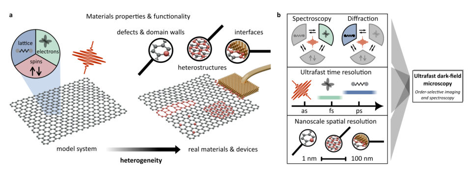
<figcaption class="paper-figure-caption"><b>Fig 1.</b> FIG. 1. Ultrafast order-selective imaging and spectroscopy. a In real materials and functional devices</figcaption>
</figure>
<figure class="paper-figure-card">
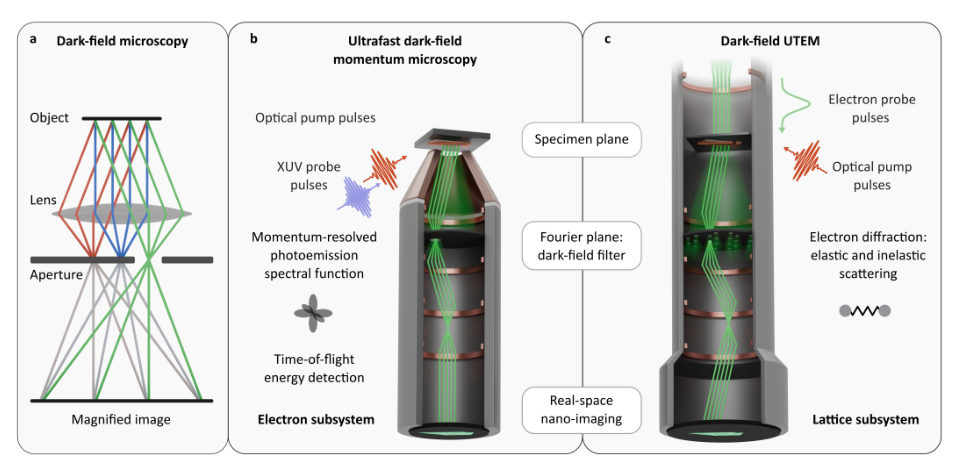
<figcaption class="paper-figure-caption"><b>Fig 2.</b> FIG. 2. Dark-field nano-imaging in ultrafast electron microscopy a Concept of dark-field microscopy.</figcaption>
</figure>
<figure class="paper-figure-card">
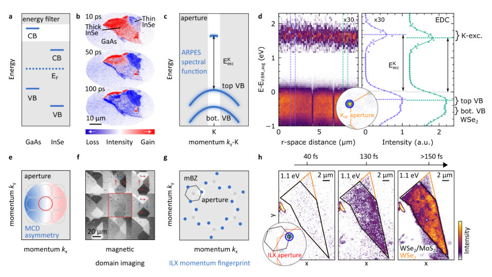
<figcaption class="paper-figure-caption"><b>Fig 3.</b> FIG. 3. Ultrafast dark-field photoelectron microscopy a Photoelectron microscopy with an energy</figcaption>
</figure>
<figure class="paper-figure-card">
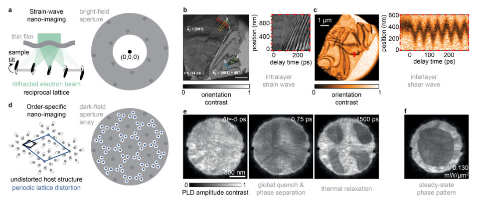
<figcaption class="paper-figure-caption"><b>Fig 4.</b> FIG. 4. Dark-field imaging in ultrafast transmission electron microscopy a A single-aperture filter</figcaption>
</figure>
<figure class="paper-figure-card">
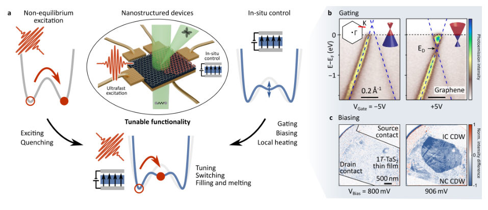
<figcaption class="paper-figure-caption"><b>Fig 5.</b> FIG. 5. Tunable emergent functionality in nanostructured devices a In-situ control of nanostructured</figcaption>
</figure>

**Summary.** This perspective reviews cutting-edge electron microscopy techniques designed to image ultrafast dynamics in quantum materials. By combining femtosecond time resolution with momentum-selective dark-field imaging, researchers can now microscopically track coupled electronic, lattice, and spin dynamics. This advancement opens new avenues for understanding non-equilibrium phenomena in nanoscale quantum devices.

**Why it may be interesting.** The techniques discussed—especially momentum-resolved, time-dependent imaging—are crucial for mapping out the complex energy landscapes and phase transitions in strongly correlated electron systems, which is a major area of theoretical interest.

Detailed structure

**Main problem.** The core challenge is developing techniques to simultaneously achieve high spatial resolution, ultrafast temporal resolution, and spectroscopic specificity (energy and momentum) to probe non-equilibrium dynamics in quantum materials.

**Main result.** The review highlights that combining ultrafast dark-field electron microscopy (like femtosecond photoelectron momentum microscopy and UTEM) allows for momentum-selective nano-imaging of femtosecond dynamics, providing comprehensive insights into coupled electronic and structural subsystems.

**Method.** The paper reviews advanced dark-field electron and photoelectron microscopy techniques, specifically femtosecond photoelectron momentum microscopy and ultrafast transmission electron microscopy.

**Model / system.** The research focuses on technologically relevant quantum materials, nanostructures, and devices, including 2D heterostructures (e.g., WSe2/MoS2) and charge-density wave (CDW) systems (e.g., 1T-TaS2).

**Key observables.** Electronic band structure, quasiparticle dispersion relations, structural order parameters (e.g., CDW amplitude), and ultrafast carrier dynamics.

**Important parameters / regimes.** Femtosecond timescales, nanometer spatial resolution, and momentum-resolved observables (k-space).

**Assumptions / limitations.** The primary limitation addressed is that traditional techniques often average over macroscopic areas or lack momentum resolution, necessitating the development of dark-field filtering approaches.

**Figures summary.** Figure 1 illustrates the need for simultaneous nanometer spatial, ultrafast temporal, and spectroscopic sensitivity. Figure 2 details the concepts of dark-field filtering for momentum selection in both photoelectron microscopy and UTEM.

**Paper structure.** The paper is structured as a review, first establishing the scientific need (Sec. I), then reviewing the general concepts of dark-field electron microscopy (Sec. II), detailing specific implementations in momentum microscopy (Sec. III), and finally presenting applications and outlook in UTEM (Sec. IV).

Abstract

Ultrafast pump-probe spectroscopies in energy and momentum have become indispensable for probing non-equilibrium dynamics in quantum materials, revealing pathways in ultrafast energy conversion and light-induced phase transitions. Different modalities uniquely access the coupled lattice, charge, and spin degrees of freedom that underpin the functionality of these materials. However, investigating technologically relevant nanoscale devices also requires high spatial resolution. Although electron microscopy provides nanometer-scale imaging, it frequently lacks the simultaneous ultrafast temporal resolution and spectroscopic specificity needed for such studies. In this perspective, we review recent advances in dark-field electron and photoelectron microscopy, focusing on two complementary techniques: femtosecond photoelectron momentum microscopy and ultrafast transmission electron microscopy. Their application enables comprehensive insights into the ultrafast dynamics of the electron, lattice, and spin subsystems. These order-selective electron imaging and spectroscopy techniques open broad scientific opportunities for a microscopic understanding of non-equilibrium phenomena in quantum materials, nanostructures and devices.

[↑ back to top](#top)

### [Isolating the natural edges of bilayer graphene in gate-defined mesoscopic devices](http://arxiv.org/abs/2608.18384v1)

**Authors:** Francesco Blanda, Grazia Raciti, Thilo Glatzel, Aurin Strathmann, Fabrizio Volante, Kenji Watanabe, Takashi Taniguchi, Ilaria Zardo, Thomas Ihn, Klaus Ensslin, Andrea Hofmann  
**Type:** experiment · **Category:** other · **PDF:** <https://arxiv.org/pdf/2608.18384v1>  
**Analysis basis:** full PDF text, analyzed in chunks
**Topic relevance:** `quantum measurements` **2/5**

↔ Scroll figures horizontally

<figure class="paper-figure-card">
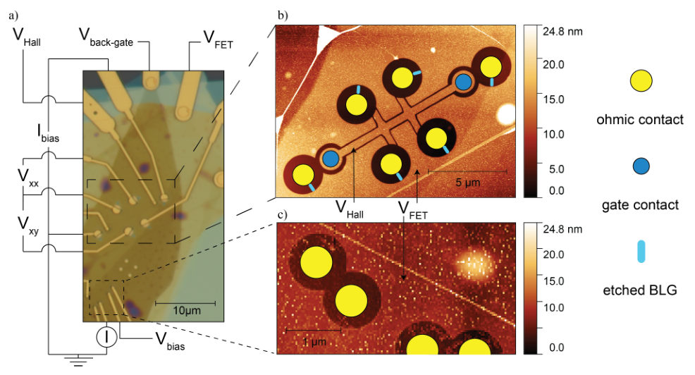
<figcaption class="paper-figure-caption"><b>Fig 1.</b> FIG. 1. Measured devices. a) Optical microscope image of the finished devices and schematics of the setup. b) Atomic force micrograph of the Hall-bar after the patterning of the graphite top gate, in yellow the position of the ohmic contacts, in blue the contacts to the Hall-bar gate, and in light blue the cut in the BLG to facilitate equilibration. The Hall-bar gate is separated from the FET gate by a 90 nm-wide gap. c) Atomic force micrograph of the 800 nm-wide FET, in yellow the position of the ohmic contacts.</figcaption>
</figure>
<figure class="paper-figure-card">
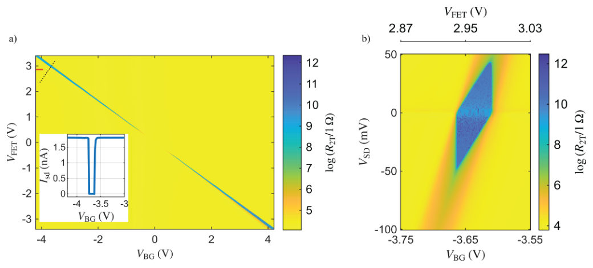
<figcaption class="paper-figure-caption"><b>Fig 2.</b> FIG. 2. Band-gap measurements of the FET. a) Two-terminal resistance as a function of VFET and VBG. The diagonal, highly insulating line appears when the Fermi level lies in the gap opened by the displacement field. Inset: measured current as a function of VBG at a fixed top gate voltage as indicated by the red line. b) Finite bias spectroscopy at fixed displacement field as indicated by the dotted line in a).</figcaption>
</figure>
<figure class="paper-figure-card">
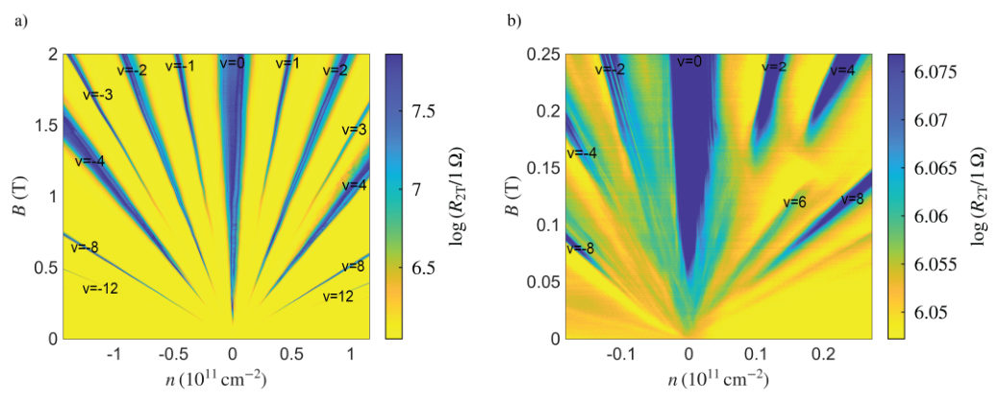
<figcaption class="paper-figure-caption"><b>Fig 3.</b> FIG. 3. Magnetotransport measurement of the FET at D = 0 V/nm. a) Landau fan from 0 T to 2 T, with the visible filling factors labeled in black. b) Zoom-in of the low field and low density region.</figcaption>
</figure>
<figure class="paper-figure-card">
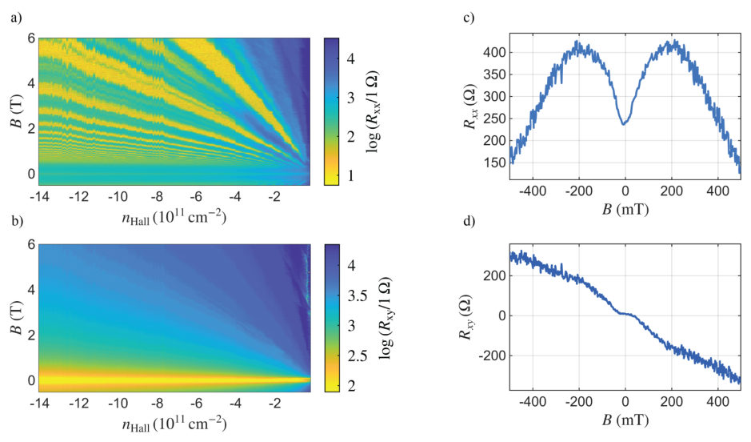
<figcaption class="paper-figure-caption"><b>Fig 4.</b> FIG. 4. Magnetotransport measuremenet of the Hall-bar at D = 0.1 V / nm. a) Landau fan in Rxx. b) Landau fan in Rxy. c) Low-field trace of Rxx taken at nHall = 1.23 × 1012 cm−2, showing the mesoscopic magnetoresistance peaks. d) Low-field trace of Rxy taken at nHall = 1.23 × 1012 cm−2, showing the quenching of the Hall resistance.</figcaption>
</figure>
<figure class="paper-figure-card">
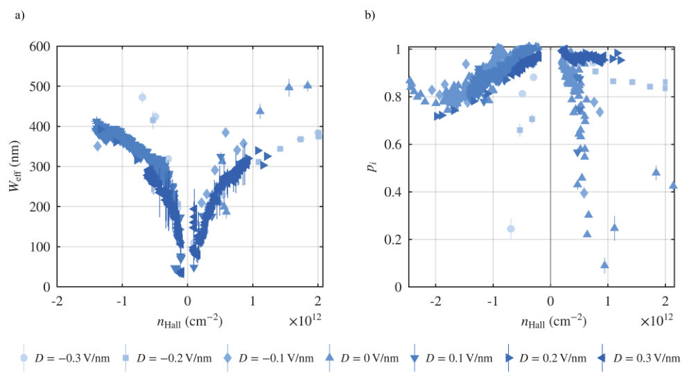
<figcaption class="paper-figure-caption"><b>Fig 5.</b> FIG. 5. Hall-bar analysis. a) Effective width Weff(n) extracted as a function of density and plotted for different displacement fields. b) Scattering parameter pi(n) calculated for each density and plotted for different displacement fields.</figcaption>
</figure>

**Summary.** This work reports on the fabrication and characterization of bilayer graphene mesoscopic devices, achieving record quantum mobility by electrostatically isolating the active channel. Furthermore, the study uses KPFM to map surface potentials, demonstrating that substrate plasma treatments critically control the confinement and persistence of injected charge at the graphene/oxide interface.

**Why it may be interesting.** The combination of high-precision quantum transport measurements with nanoscale electrostatic characterization (KPFM) provides a comprehensive view of how device fabrication and substrate chemistry dictate fundamental quantum electronic properties in 2D materials.

Detailed structure

**Main problem.** The study aims to isolate and characterize the electronic properties of bilayer graphene (BLG) in mesoscopic devices by eliminating conduction paths through natural flake edges.

**Main result.** The authors successfully demonstrated that electrostatic definition isolates the active region, yielding high quantum mobility ($\sim 2.5 	imes 10^6 	ext{ cm}^2/	ext{Vs}$) in FET geometries, while also characterizing how substrate treatments affect charge confinement using KPFM.

**Method.** The work combines advanced magnetotransport measurements (Hall-bar and FET) to probe quantum transport with Kelvin Probe Force Microscopy (KPFM) to map local electrostatic potentials after various plasma treatments.

**Model / system.** The physical system is bilayer graphene fabricated on various oxide substrates ($	ext{SiO}_2$, plasma-treated $	ext{h-BN}$). Measurements probe mesoscopic transport, Landau quantization, and the electrostatic potential landscape.

**Key observables.** Quantum mobility ($\mu_q$), quantum lifetime ($	au_q$), Landau level quantization, and Contact Potential Difference ($\Delta V_{	ext{CPD}}$).

**Important parameters / regimes.** Magnetic field ($B$), carrier density ($n$), and plasma treatment type ($	ext{N}_2+	ext{O}_2$ vs. $	ext{CHF}_3/	ext{O}_2$).

**Assumptions / limitations.** The analysis assumes that the measured resistance in the gated region is equivalent to the longitudinal resistance in a Corbino geometry for some analyses, and that KPFM measurements can distinguish between intrinsic material potential and trapped surface charges.

**Figures summary.** Figures show magnetotransport data (Landau fans, $R_{xx}/R_{xy}$ traces) for both FET and Hall-bar geometries, alongside KPFM maps illustrating charge confinement differences on graphene after various plasma treatments.

**Paper structure.** The paper progresses from demonstrating clean quantum transport in the Hall-bar/FET geometry (magnetotransport) to analyzing edge scattering effects, and finally uses KPFM to investigate the fundamental electrostatic control over the graphene/h-BN interfaces.

Abstract

We introduce a graphite-gated architecture for bilayer graphene devices in which the active device is completely isolated from the natural graphene edges. Using a single patterned graphite-gate layer, we realize a fully electrostatically defined Hall-bar. Longitudinal and Hall measurements reveal mesoscopic transport features, including Hall-effect quenching and magnetoresistance peaks associated with boundary scattering. The dependence of the mesoscopic features on the carrierdensity shows that the effective channel width increases with the Fermi level and the electrostatic confinement at the gate-defined boundaries, and indicates that the carriers scatter at the electrostatic boundary. Raman spectroscopy and Kelvin probe force microscopy suggest that this boundary is disordered due to the used fabrication methods. Comparably, the quantum mobility in a fieldeffect transistor fabricated with the same architecture is not limited by boundary scattering and the visibility of quantum oscillations down to 4 mT suggests a record value of 2.5 x 10^6 cm2/Vs.

[↑ back to top](#top)

### [Interface-Controlled Spin-Orbit Torques in Rare-Earth Synthetic Ferrimagnets Probed by Sagnac Magneto-Optics and Harmonic Hall Measurements](http://arxiv.org/abs/2608.18370v1)

**Authors:** Akilan K, Koral Aykin, Jose-Luis Ampuero, Laurent Badie, Stephane Mangin, Sébastien Petit-Watelot, Michel Hehn, Andrew D. Kent, J. -Carlos Rojas-Sánchez  
**Type:** experiment · **Category:** other · **PDF:** <https://arxiv.org/pdf/2608.18370v1>  
**Analysis basis:** full PDF text, analyzed in chunks
**Topic relevance:** `analog quantum simulation` **1/5** · `driven-dissipative phase transition` **1/5** · `interference shaping light` **1/5** · `quantum measurements` **1/5** · `quantum optics experiment` **1/5**

↔ Scroll figures horizontally

<figure class="paper-figure-card">
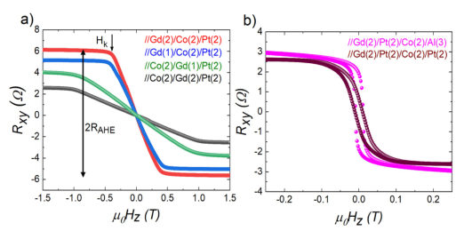
<figcaption class="paper-figure-caption"><b>Fig 1.</b> FIG. 1. DC measurement of anomalous Hall resistance at room temperature as a function of out-of-plane applied field in 20 µm width Hall bar devices in a) Co/Gd SFiM capped with Pt. b) Pt-intercalated SFiMP t, Gd/Pt/Co, with Al and Pt capping layers as displayed. The Gd/Pt/Co layers have a higher perpendicular anisotropy component</figcaption>
</figure>
<figure class="paper-figure-card">
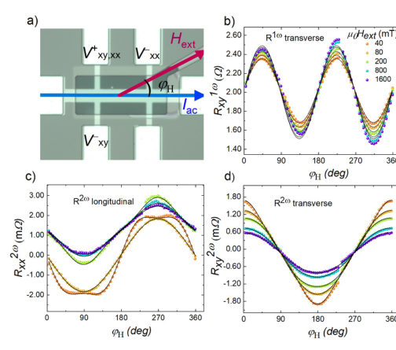
<figcaption class="paper-figure-caption"><b>Fig 2.</b> FIG. 2. Magnetotransport measurements in a Co(2)/Gd(1)/Pt(2) Hall bar of width 20 µm at a fixed AC current of 1 mA. Simultaneous first and second harmon- ics of the Hall and longitudinal resistances are shown for an in-plane angular dependence where ϕ is the angle between magnetization and current channel. The solid lines are fits to the equations Eqs. 1-3.</figcaption>
</figure>
<figure class="paper-figure-card">
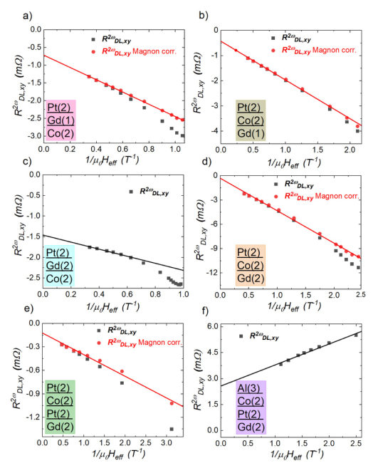
<figcaption class="paper-figure-caption"><b>Fig 3.</b> FIG. 3. Harmonic Hall resistance analysis of the DL resis- tances as a function of (µ0Heff)−1 for an applied AC current of 1 mA peak. The correction of the non-linearity is performed in the samples a) Co(2)/Gd(1)/Pt(2), b) Gd(1)/Co(2)/Pt(2), d) Gd(2)/Co(2)/Pt(2) and e) Gd(2)/Pt(2)/Co(2)/Pt(2). The substrate is on the left.The black and red linear fits are per- formed for the uncorrected and corrected field points respec- tively. Whereas in the samples c) Co(2)/Gd(2)/Pt(2) and f) Gd(2)/Pt(2)/Co(2)/Al(3) the linear fits (black) are done without applying the magnon correction protocol (5).</figcaption>
</figure>
<figure class="paper-figure-card">

<figcaption class="paper-figure-caption"><b>Fig 4.</b> Figure 3 summarizes the determination of BDL af- ter applying the magnon-correction protocol to the in- vestigated Co/Gd-based heterostructures. Two samples constitute exceptions. For Co(2)/Gd(2)/Pt(2), the ex- tracted Rmag is essentially independent of magnetic field, preventing a consistent scaling procedure; consequently, the reported value corresponds to the uncorrected anal- ysis and should be regarded as an upper estimate. In</figcaption>
</figure>
<figure class="paper-figure-card">
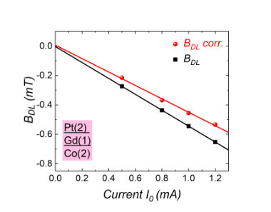
<figcaption class="paper-figure-caption"><b>Fig 5.</b> FIG. 4. The correction is performed for measurements at different applied currents to obtain a consistent correction factor Cmag for all applied currents. BDL corrected (red) and uncorrected (black) for all currents is shown for the sample //Co(2)/Gd(1)/Pt(2)</figcaption>
</figure>

**Summary.** This work investigates Spin-Orbit Torque (SOT) in rare-earth synthetic ferrimagnets using a combination of Sagnac magneto-optics and harmonic Hall measurements. By comparing these techniques, the authors provide a robust, quantitative determination of the SOT effective field. The findings establish these rare-earth systems as excellent platforms for designing low-power spintronic devices through precise interface engineering.

**Why it may be interesting.** While focused on condensed matter magnetism, the precise measurement of torque and magnetization dynamics using optical methods (MOKE) and transport measurements provides fundamental insights into interfacial coupling and spin-charge conversion, which are relevant to open quantum systems modeling.

Detailed structure

**Main problem.** The paper aims to accurately quantify the Spin-Orbit Torque (SOT) in magnetic thin films, which is crucial for developing energy-efficient spintronic devices.

**Main result.** The study demonstrates that rare-earth-based synthetic ferrimagnets are a versatile platform for engineering SOT phenomena, achieving current-induced switching at low current densities via interface engineering.

**Method.** The research employs complementary techniques, combining Sagnac magneto-optical interferometry with harmonic Hall measurements to independently and quantitatively determine the damping-like SOT effective field.

**Model / system.** The physical system under investigation consists of Co/Gd-based synthetic ferrimagnets (SFiMs) and related heterostructures (e.g., Gd/Pt/Co/Al). The measurements probe the magnetization dynamics and torque generation at rare-earth/heavy-metal interfaces.

**Key observables.** Damping-like SOT effective field ($\xi_{DL}$), current-induced magnetization tilting (measured optically), and various Hall/Kerr resistances ($R_{2\omega}^{xy}$, $	heta_K$).

**Important parameters / regimes.** Current densities ($\ge 8-10 	ext{ MA/cm}^2$), Gd layer thickness, and multilayer stacking order.

**Assumptions / limitations.** The harmonic Hall analysis requires careful correction for nonlinear magnon contributions, and initial analyses sometimes incorrectly assumed $	ext{M}_{	ext{eff}} \gg 	ext{H}_{\parallel}$.

**Figures summary.** Figures illustrate AHE vs. field measurements, magnetotransport data showing angular dependence, and Kerr rotation vs. current/field, demonstrating the dependence of anisotropy on device geometry.

**Paper structure.** The paper develops the need for accurate SOT quantification, compares Sagnac MOKE results against harmonic Hall analysis, details the influence of interface engineering (Gd layer) on torque generation, and concludes by showing successful SOT switching in engineered structures.

Abstract

Spin-orbit torque (SOT) provides an efficient route for manipulating magnetization in spintronic devices, and its accurate quantification is essential. Here, we investigate Co/Gd-based synthetic ferrimagnets using complementary magnetotransport and magneto-optical techniques. We use a Sagnac magneto-optical interferometry method to directly quantify current-induced magnetization tilting and extract the damping-like SOT effective field. The Sagnac measurements show good agreement with harmonic Hall analysis across different Co/Gd and Gd/Pt/Co heterostructures, providing a quantitative determination of the damping-like SOT effective field that does not rely on electrical transport signatures. By varying the Gd thickness and multilayer stacking order, we demonstrate that the damping-like torque is strongly influenced by spin transport and angular momentum conversion at rare-earth and heavy-metal interfaces. The observation of a finite torque in Gd/Pt/Co/Pt structures, where conventional Pt spin Hall contributions are expected to compensate, highlights the active role of the Gd layer in SOT generation. Furthermore, interface engineering enables perpendicular magnetic anisotropy in Gd/Pt/Co/Al heterostructures with a 2-nm-thick Co layer, allowing current-induced SOT switching at current densities of 8-10 MA/cm$^2$. These results establish rare-earth-based synthetic ferrimagnets as a versatile platform for engineering spin-orbit phenomena and optimizing low-power spintronic devices.

[↑ back to top](#top)

### [A miniature evaporator for in-operando deposition of isolated atoms in a low-temperature scanning tunneling microscope](http://arxiv.org/abs/2608.18741v1)

**Authors:** Jeongmin Oh, Hermann Osterhage, Vasily Cherepanov, Sven Just, Denis Krylov, F. Stefan Tautz, Taner Esat, Ruslan Temirov  
**Type:** experiment · **Category:** other · **PDF:** <https://arxiv.org/pdf/2608.18741v1>  
**Analysis basis:** full PDF text, analyzed in chunks
**Topic relevance:** `analog quantum simulation` **1/5** · `quantum measurements` **1/5**

↔ Scroll figures horizontally

<figure class="paper-figure-card">
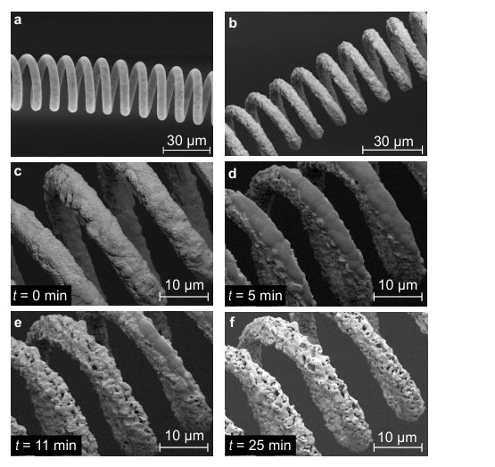
<figcaption class="paper-figure-caption"><b>Fig 1.</b> FIG. 2. SEM images of the evaporator filament. (a) Bare W filament after annealing and before Fe deposition. (b) Filament after coating with Fe by evaporation. (c–f) Higher-magnification images showing the initially fine-grained polycrystalline Fe film and its morpholog- ical evolution during resistive heating at 13 mA: (c) before heating, and after heating for (d) 5 min, (e) 11 min, and (f) 25 min.</figcaption>
</figure>
<figure class="paper-figure-card">
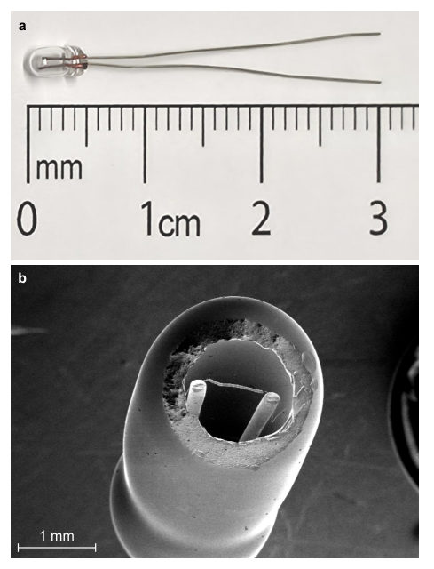
<figcaption class="paper-figure-caption"><b>Fig 2.</b> FIG. 1. (a) Photograph of the miniature incandescent lamp used to fabricate the evaporation source. (b) Scanning electron microscopy (SEM) image of the lamp after opening the glass bulb, exposing the tungsten filament.</figcaption>
</figure>
<figure class="paper-figure-card">
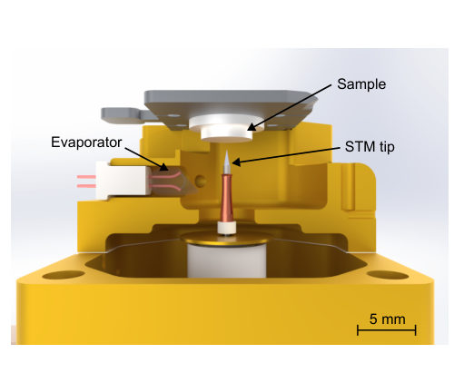
<figcaption class="paper-figure-caption"><b>Fig 3.</b> FIG. 3. Three-dimensional cutaway model of the millikelvin STM head showing the integrated evaporation sources, the sample, and the STM tip.</figcaption>
</figure>
<figure class="paper-figure-card">
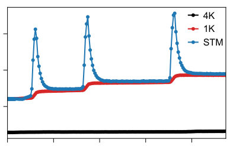
<figcaption class="paper-figure-caption"><b>Fig 4.</b> FIG. 5. Temperature of the STM body (blue), 1 K pot (red) and 4 K bath (black) during three consecutive Fe evaporation cycles, each performed at Ifil = 13 mA for 3 min.</figcaption>
</figure>
<figure class="paper-figure-card">
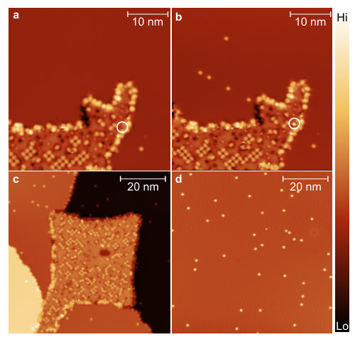
<figcaption class="paper-figure-caption"><b>Fig 5.</b> FIG. 4. (a) Constant-current STM image of the sample before Fe deposition. (b) The same surface area after Fe deposition. Five new atoms are visible on Ag(100), and one is visible on the MgO island (circle). (c,d) Representative constant-current STM images acquired after deposition, showing the Fe coverage and the cleanliness of the MgO/Ag(100) surface. Imaging parameters: U = 100 mV and I = 50 pA for (a,b), 20 pA for (c), and 10 pA for (d).</figcaption>
</figure>

**Summary.** The paper presents a novel, compact evaporator source integrated directly into a millikelvin STM head to overcome geometric limitations in cryogenic deposition. This setup allows for the controlled, *in-operando* deposition of isolated atoms, such as Fe, onto surfaces while maintaining high spatial resolution. This advancement is critical for performing atomic-scale experiments in extreme cryogenic environments.

**Why it may be interesting.** This work directly advances the experimental capability of manipulating quantum systems (adatoms) at ultra-low temperatures by solving a major engineering bottleneck (deposition access) in cryogenic STM setups, which is crucial for studying surface quantum phenomena.

Detailed structure

**Main problem.** Depositing dilute atomic ensembles onto cold samples in low-temperature scanning tunneling microscopes (STM) is challenging due to restricted internal geometries and radiation shields.

**Main result.** The authors successfully integrated a compact, low-power miniature evaporator directly into a millikelvin STM head, enabling repeated, *in-operando* deposition of isolated Fe atoms while maintaining atomic-scale surface access.

**Method.** They used a miniature incandescent lamp source coated with Fe film to deposit atoms onto MgO/Ag(100) substrates while operating the STM near 5 K, characterizing the deposition using STM imaging and IETS spectroscopy.

**Model / system.** The physical system is a miniature evaporator source integrated into a millikelvin STM head. Deposition occurs on crystalline substrates like MgO/Ag(100) at cryogenic temperatures, allowing for atomic-scale manipulation.

**Key observables.** Symmetric inelastic steps near $\pm 14 	ext{ mV}$ in dI/dV spectra (identifying Fe), local deposition flux ($\approx 1.5 	imes 10^{-5} 	ext{ nm}^{-2} 	ext{ s}^{-1}$), and preserved atomic-scale surface access ($< 5 	ext{ nm}$ lateral displacement).

**Important parameters / regimes.** Operating temperature near 5 K, low thermal load ($\Delta T \approx 2 	ext{ K}$), and a nominal evaporator lifetime of $\sim 150 	ext{ h}$.

**Assumptions / limitations.** The lifetime estimate assumes a constant emission rate and unit sticking coefficient; the fixed evaporator design overcomes geometric constraints of conventional external sources.

**Figures summary.** Figure 1 shows the miniature lamp source; Figure 2 tracks the Fe film morphology; Figure 3 illustrates the 3D cutaway model of the integrated STM head.

**Paper structure.** The paper introduces the challenge of cryogenic deposition access, presents the novel integrated evaporator design, details the experimental procedure (deposition and characterization), and concludes by demonstrating the feasibility of repeated, low-flux deposition.

Abstract

Depositing dilute atomic ensembles onto cold samples is challenging in low-temperature scanning tunneling microscopes (STM) because radiation shields and restricted internal geometries often preclude a direct deposition path, particularly in instruments designed for millikelvin operation. We present a compact, milliwatt-range evaporation source fabricated from a commercial miniature incandescent lamp and integrated directly into a millikelvin STM head. The exposed tungsten filament is coated with a micrometre-thick Fe film and positioned about 1 cm from the sample. We deposit isolated Fe atoms onto MgO/Ag(100) while operating the microscope near 5 K. Evaporation increases the STM-body temperature by only about 2 K, and the same nanoscopic surface region can be readily scanned after deposition with a lateral displacement of less than 5 nm. Differential-conductance spectra displaying symmetric inelastic steps near $\pm$14 mV identify the deposited atoms on MgO as Fe. From STM images, we estimate a local deposition flux of $1.5\times10^{-5}~\mathrm{nm^{-2}\,s^{-1}}$, corresponding to a nominal evaporator lifetime of ~150 h. The fixed evaporator enables repeated low-flux deposition without a room-temperature line of sight, the need for movable radiation shields, or mechanical evaporator access after cooldown, while preserving access to the same atomic-scale surface region before and after deposition.

[↑ back to top](#top)

### [Spectral Fingerprints of Resonant Defect Scattering by Substitutional Mn in Graphene](http://arxiv.org/abs/2608.18885v1)

**Authors:** Ahmed Samir Lotfy, Zviadi Zarkua, Renan Villarreal, Rikkie Joris, Muhammad Saad, Koen van Stiphout, Karina Landivar, Steven Brems, Giovanni Di Santo, Aleksandr Seliverstov, Simona Achilli, Luca Petaccia, Lino M. C. Pereira  
**Type:** both · **Category:** disordered systems and neural networks · **PDF:** <https://arxiv.org/pdf/2608.18885v1>  
**Analysis basis:** full PDF text, analyzed in chunks
**Topic relevance:** `Keldysh / 2PI / non-Gaussian methods` **1/5** · `quantum measurements` **1/5**

↔ Scroll figures horizontally

<figure class="paper-figure-card">
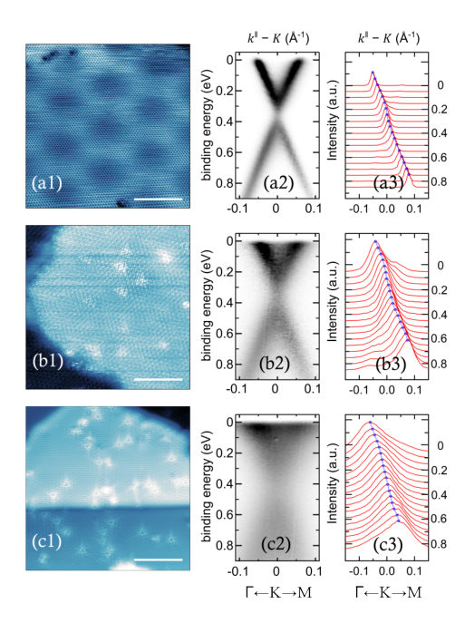
<figcaption class="paper-figure-caption"><b>Fig 1.</b> FIG. 1. STM and ARPES for (a) nonimplanted graphene/Cu(111), (b) nMn = 0.177 ± 0.013%, and (c) nMn = 0.44 ± 0.03%. (a1–c1) STM topographies (scale bar, 5 nm) acquired at (Itun, Vsample) = (0.10 nA, −0.30 V), (0.25 nA, 0.15 V), and (105.17 nA, 0.23 V), respectively. (a2– c2) ARPES spectra near K along Γ →K →M, obtained by summing separately acquired s- and p-polarization data. (a3– c3) Stacked momentum distribution curves (MDCs) from the s-polarization data used in the quantitative analysis. The red traces are individual MDCs at successive binding energies, and the blue symbols connected by a line mark the fitted MDC peak positions.</figcaption>
</figure>
<figure class="paper-figure-card">
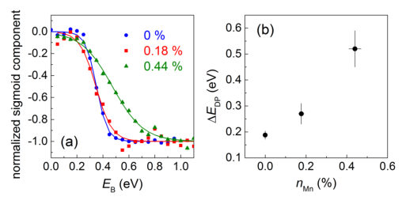
<figcaption class="paper-figure-caption"><b>Fig 2.</b> FIG. 3. Dirac point stretching. (a) kMDC(EB) after subtrac- tion of the fitted linear dispersion and normalization by the absolute sigmoidal amplitude (nMn is given in %; the symbols are extracted values and solid curves are the sigmoidal fits). (b) Stretching ∆EDP, defined as the 10–90% width of the fit- ted sigmoidal step, versus substitutional Mn concentration. Horizontal error bars in (b) denote the STM-derived concen- tration uncertainties; vertical error bars denote one standard deviation uncertainties propagated from the sigmoidal fits.</figcaption>
</figure>
<figure class="paper-figure-card">
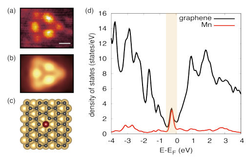
<figcaption class="paper-figure-caption"><b>Fig 3.</b> FIG. 2. Atomic structure and calculated electronic signa- ture of substitutional Mn in graphene/Cu(111). (a) Exper- imental constant-current STM image of an isolated defect (Itun = 0.48 nA, Vsample = 0.42 V; scale bar, 0.2 nm). (b) DFT-based constant-height STM simulation 3 ˚A above graphene. (c) Structural model, with Mn occupying a single carbon vacancy. (d) Density of states projected onto graphene (black) and Mn (red), referenced to EF. The Mn-derived peak and finite graphene spectral weight in the region of the Dirac point (around −0.3 eV) are consistent with hybridiza- tion; shading marks the relevant energy range.</figcaption>
</figure>
<figure class="paper-figure-card">
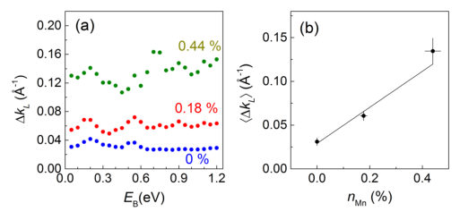
<figcaption class="paper-figure-caption"><b>Fig 4.</b> FIG. 4. Momentum broadening. (a) Lorentzian MDC FWHM ∆kL versus binding energy for the three samples (nMn is given in %). (b) Energy-averaged ∆kL versus nMn; horizontal error bars denote the STM-derived uncertainty in nMn, and verti- cal error bars denote one standard deviation of ∆kL over the analyzed binding-energy range. The line is a linear fit whose slope gives the effective two-dimensional scattering cross sec- tion.</figcaption>
</figure>

**Summary.** This work uses a combination of STM and ARPES on Mn-doped graphene to characterize disorder. By analyzing the spectral broadening of the Dirac cone, the authors distinguish the signature of strong resonant scattering from other types of disorder. The findings establish a quantitative method for measuring defect scattering strength in graphene, which is vital for controlling electronic properties in nanoscale devices.

**Why it may be interesting.** The quantitative link between a structurally identified defect (STM) and the resulting spectral broadening (ARPES) provides a powerful, measurable diagnostic tool for understanding disorder in 2D electron systems, which is crucial for designing quantum materials.

Detailed structure

**Main problem.** The paper aims to experimentally and theoretically test the spectral fingerprints associated with resonant defect scattering in graphene caused by substitutional Manganese (Mn) impurities.

**Main result.** The observed spectral broadening ($\Delta E_{	ext{DP}}$ and $\Delta k_L$) scales linearly with Mn concentration, providing strong evidence that Mn acts as a strong resonant scatterer in graphene.

**Method.** The study combines Angle-Resolved Photoemission Spectroscopy (ARPES) measurements with Scanning Tunneling Microscopy (STM) to characterize the defect concentration and spectral signatures.

**Model / system.** The system is graphene/Cu(111) doped with substitutional Mn point defects. Theoretical modeling uses DFT to predict local electronic structure, while ARPES measures the quasiparticle spectral function $A(\mathbf{k}, \omega)$.

**Key observables.** Dirac point stretching ($\Delta E_{	ext{DP}}$), momentum broadening ($\Delta k_L$), and the effective scattering cross section ($\sigma_{eff}$).

**Important parameters / regimes.** Mn concentration ($n_{	ext{Mn}}$), temperature (20 K, 78 K), and photon energy ($\hbar
u = 34 	ext{ eV}$).

**Assumptions / limitations.** The linear increase of $\Delta k_L$ with $n_{	ext{Mn}}$ is assumed to be dominated by single-particle scattering from the substitutional defects.

**Figures summary.** Figures show STM images confirming Mn placement, DFT calculations predicting Mn-related spectral weight, and ARPES spectra comparing nonimplanted, low-concentration, and high-concentration samples, illustrating the progressive spectral changes.

**Paper structure.** The paper progresses by first establishing the theoretical framework distinguishing resonant vs. non-resonant scattering, then using STM to quantify the defect concentration, and finally applying ARPES to measure the correlated spectral changes ($\Delta E_{	ext{DP}}$ and $\Delta k_L$) that confirm the resonant scattering mechanism.

Abstract

Using substitutional Mn in graphene/Cu(111) as a model point defect, we combine scanning tunneling microscopy (STM) and angle-resolved photoemission spectroscopy (ARPES) to test the predicted fingerprints of resonant scattering. As the Mn concentration increases to 0.44%, the Dirac point stretching reaches 0.52 eV, while momentum broadening remains energy independent. These spectral fingerprints classify substitutional Mn as a strong resonant scatterer and establish the combination of STM and ARPES as a powerful approach to identify and characterize resonant disorder in graphene.

[↑ back to top](#top)

### [Large Field-Free Superconducting Diode Effect with Nonmonotonic Polarity Reversals in NbSe$_2$/CrBr$_3$ Heterostructures](http://arxiv.org/abs/2608.19099v1)

**Authors:** Shengbiao Sun, Lang Xiao, Chenghao Shen, Bowen Hao, Jia-Peng Peng, Ziye Zhu, Feiyue Wang, Qilin Han, Ya-Qing Bie, Shuo Wang, Tong Zhou, Dapeng Yu, Ben-Chuan Lin  
**Type:** both · **Category:** other · **PDF:** <https://arxiv.org/pdf/2608.19099v1>  
**Analysis basis:** full PDF text, analyzed in chunks
**Topic relevance:** `Keldysh / 2PI / non-Gaussian methods` **1/5**

↔ Scroll figures horizontally

<figure class="paper-figure-card">
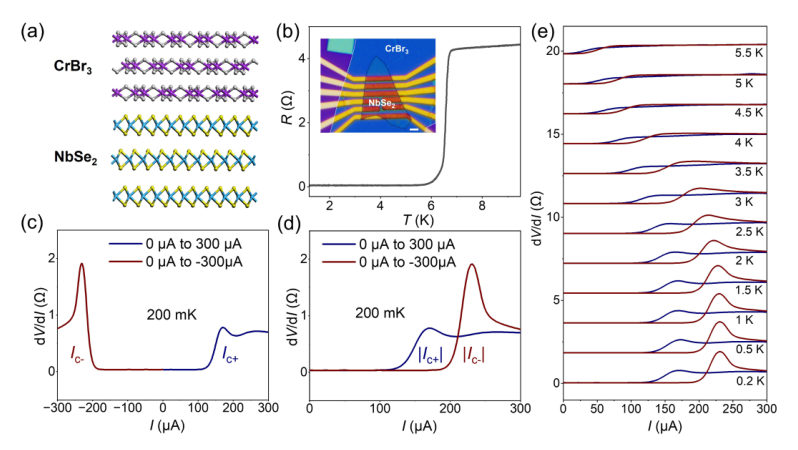
<figcaption class="paper-figure-caption"><b>Fig 1.</b> FIG. 1. Device configuration and superconducting behavior of NbSe2/CrBr3 heterostructure (device #1). (a) Schematic of the crystal structure of the heterostructure. (b) The resistance–temperature curve of the heterostructure, showing typical superconducting behavior. The resistance is measured from the conducting NbSe2 layer proximitized by the insulating CrBr3. The inset is the optical image of the device. The scale bar is 2 µm. (c) The differential resistance curves of the heterostructure, highlighting a pronounced superconducting diode effect, where |Ic+| , |Ic−|. The forward sweep (blue) refers to current swept from 0 µA to +300 µA and the backward sweep (red) refers to current swept...</figcaption>
</figure>
<figure class="paper-figure-card">
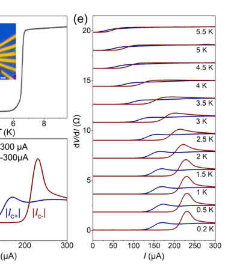
<figcaption class="paper-figure-caption"><b>Fig 2.</b> Figure 2(c) provides key insights into the SDE observed in the NbSe2/CrBr3 heterostructure. First, as previously men- tioned, the field-free SDE changes sign depending on the magnetic-field history, i.e., whether the magnetic field is swept forward or backward. Second, after undergoing the magnetic field training, the field-free SDE efficiency reaches −35.7%. In contrast, the original efficiency after zero-field cooling is −15.2%, as shown in Fig. 1(d). Third, the SDE dis- plays distinct behavior under varying magnetic fields. Taking the forward magnetic field sweep as an example, as the field sweeps from −50 mT to 0 mT, the SDE efficiency first reaches a maximum positive value of 45.3% at...</figcaption>
</figure>
<figure class="paper-figure-card">
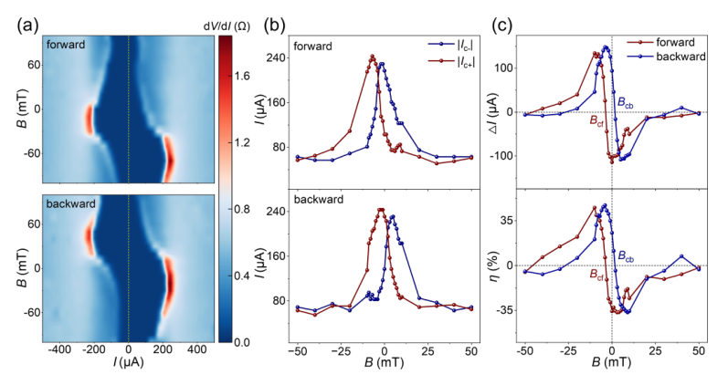
<figcaption class="paper-figure-caption"><b>Fig 3.</b> FIG. 2. The superconducting diode effect tuned by the magnetic field at 200 mK (device #1). (a) Map of the differential resistance as a function of magnetic field and bias current, showing the forward (upper panel) and backward (lower panel) sweep directions of the magnetic field. (b) The magnetic field dependence of the critical currents |Ic+| and |Ic−|. (c) The magnetic field dependence of nonreciprocal component of the critical current ∆Ic (upper panel) and superconducting diode efficiency η (lower panel), calculated using η = |Ic+| −|Ic−|/(|Ic+| + |Ic−|). Here, Bcb denotes the value of the external field at which the sign change of the SDE occurs in the backward sweep, and Bcf...</figcaption>
</figure>
<figure class="paper-figure-card">
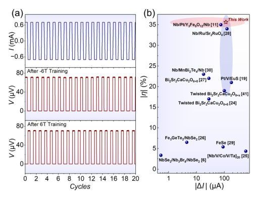
<figcaption class="paper-figure-caption"><b>Fig 4.</b> FIG. 3. (a) Zero-field rectification of NbSe2/CrBr3 heterostructure after applying perpendicular magnetic fields of 6 T and −6 T in de- vice #3. (b) Comparison of field-free superconducting diode effect η and rectification current ∆Ic from previous reports and this work (de- vice #1). This work reaches a field-free diode efficiency of 35.7%, among the highest reported to date.</figcaption>
</figure>
<figure class="paper-figure-card">
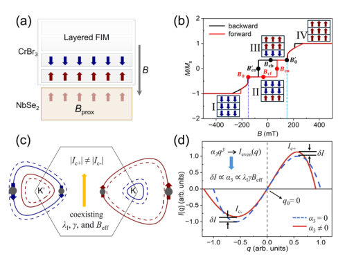
<figcaption class="paper-figure-caption"><b>Fig 5.</b> FIG. 4. (a) Schematic of the proximity-induced exchange field Bprox in NbSe2 from layered ferrimagnetic CrBr3. Arrows denote the mag- netization of individual CrBr3 layers. (b) Micromagnetic simulation of field-driven magnetization reversal in a CrBr3 trilayer. The hys- teresis loop exhibits four plateaus (I–IV), reflecting multistep rever- sal. B0 (B′ 0) and Bco (B′ co) indicate the switching and coercive mag- netic fileds that delimit the FIM configurations, while Bcf and Bcb denote the SDE polarity-reversal fields where Beff = 0. (c) Spin- resolved Fermi surfaces of NbSe2 with finite Ising spin–orbit cou- pling λI, trigonal warping γ, and effective field Beff. Red (blue) con- tours...</figcaption>
</figure>

**Summary.** This paper reports a breakthrough in superconducting electronics by achieving a large, programmable superconducting diode effect (SDE) without an external magnetic field. The effect is realized in a $	ext{NbSe}_2/	ext{CrBr}_3$ heterostructure, where the nonreciprocity stems from a unique cubic momentum term coupled to the layered ferrimagnetism of $	ext{CrBr}_3$. This establishes a versatile platform for developing high-efficiency, memory-controlled superconducting devices.

**Why it may be interesting.** This work is highly relevant as it demonstrates a mechanism for controlling non-equilibrium superconducting currents using magnetic memory effects in 2D heterostructures, which is a key area for advanced quantum electronics.

Detailed structure

**Main problem.** The primary challenge addressed is achieving a large, controllable superconducting diode effect (SDE) at zero external magnetic field, as most existing realizations require an external field.

**Main result.** The authors report a field-free SDE with a high efficiency (35.7%) in a vdW $	ext{NbSe}_2/	ext{CrBr}_3$ heterostructure, demonstrating that the diode polarity is programmable by the magnetic field history.

**Method.** The study combines transport measurements, micromagnetic simulations, and a generalized Ginzburg-Landau theory to analyze the nonreciprocal supercurrent.

**Model / system.** The system is a van der Waals heterostructure composed of the superconductor $	ext{NbSe}_2$ interfaced with the layered magnetic insulator $	ext{CrBr}_3$. The nonreciprocity is theoretically linked to a symmetry-allowed cubic term odd in the Cooper-pair momentum.

**Key observables.** Superconducting diode efficiency ($\eta$), nonreciprocal critical currents ($	ext{I}_{c+}$ vs $	ext{I}_{c-}$), and the hysteretic/nonmonotonic reversal of the diode polarity upon magnetic field sweeping.

**Important parameters / regimes.** The efficiency reached (35.7%), the specific material combination ($	ext{NbSe}_2/	ext{CrBr}_3$), and the dependence on the magnetic field history.

**Assumptions / limitations.** The SDE mechanism is attributed to the layered ferrimagnetism in $	ext{CrBr}_3$ creating a history-dependent interfacial exchange field, distinguishing it from conventional mechanisms like Meissner screening.

**Figures summary.** Figures illustrate the field-free SDE confirmation via differential resistance curves, map the efficiency ($\eta$) dependence on magnetic field showing hysteresis, and detail the theoretical link between the proximity field and the observed polarity reversals.

**Paper structure.** The paper establishes the problem (field-free SDE), presents the physical platform ($	ext{NbSe}_2/	ext{CrBr}_3$), develops the theoretical mechanism (cubic momentum term driven by layered ferrimagnetism), and validates the findings through comprehensive transport measurements and simulations.

Abstract

The superconducting diode effect (SDE), characterized by nonreciprocal dissipationless supercurrent, offers a promising route toward ultralow-power superconducting electronics. Yet most realizations require an external magnetic field, and achieving a large, controllable SDE at zero field remains challenging. Here we report a field-free SDE with an efficiency reaching 35.7% in a van der Waals NbSe$_2$/CrBr$_3$ heterostructure, whose polarity is programmable by magnetic-field history. Unlike conventional mechanisms based on finite-momentum pairing, the SDE originates from the leading symmetry-allowed cubic term odd in Cooper-pair momentum, which yields unequal critical currents while leaving the equilibrium condensate at zero momentum. Remarkably, upon sweeping a perpendicular magnetic field, the diode polarity undergoes nonmonotonic and hysteretic reversals that cannot be explained by Meissner screening or conventional ferromagnetic proximity. Combining transport measurements, micromagnetic simulations, and a generalized Ginzbur-Landau theory, we attribute these unconventional behaviors to layered ferrimagnetism in CrBr$_3$, where coexisting ferromagnetic and antiferromagnetic interlayer couplings produce a history-dependent interfacial exchange field acting on NbSe$_2$. Our results reveal a distinct mechanism for nonreciprocal superconductivity and establish layered van der Waals magnetism as a versatile platform for high-efficiency, programmable, field-free superconducting diodes.

[↑ back to top](#top)

### [Synthesis and stability of high-$T_c$ LaH$_{10\pmδ}$ films at high pressures](http://arxiv.org/abs/2608.18865v1)

**Authors:** Sam Cross, William Thomas, Lawrence Nobbs, Rebecca Nicholls, Oliver Lord, Qian Zhang, Dominique Laniel, Max Gerin, Bjorn Wehinger, Mohamed Mezouar, Xiaojiao Liu, Egor Koemets, Annette Kleppe, Sven Friedemann, Jonathan Buhot  
**Type:** experiment · **Category:** strongly correlated electrons · **PDF:** <https://arxiv.org/pdf/2608.18865v1>  
**Analysis basis:** full PDF text, analyzed in chunks
**Topic relevance:** `analog quantum simulation` **1/5**

↔ Scroll figures horizontally

<figure class="paper-figure-card">
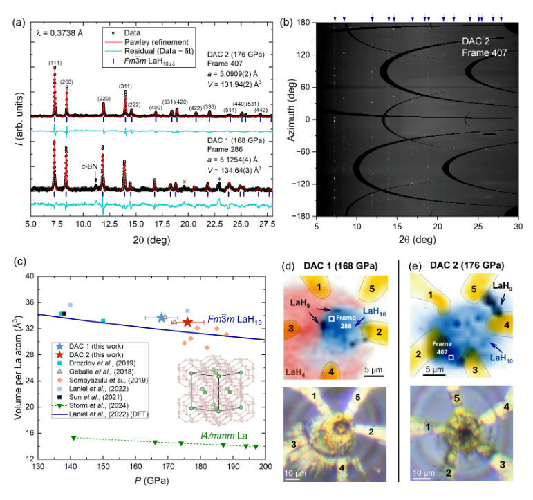
<figcaption class="paper-figure-caption"><b>Fig 1.</b> FIG. 1. Synchrotron X-ray diffraction measurements, measured 195 days and 103 days after laser heating</figcaption>
</figure>
<figure class="paper-figure-card">
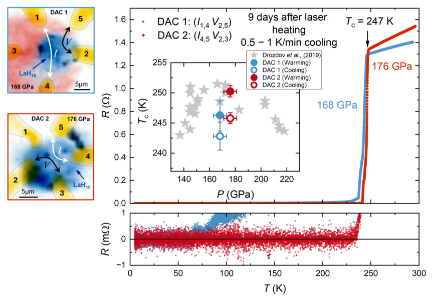
<figcaption class="paper-figure-caption"><b>Fig 2.</b> FIG. 2. Four-point resistance versus temperature measured for both DACs 9 days after their</figcaption>
</figure>
<figure class="paper-figure-card">
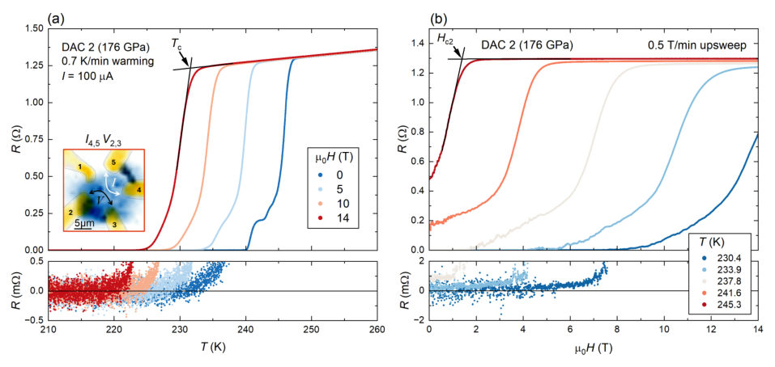
<figcaption class="paper-figure-caption"><b>Fig 3.</b> FIG. 3. Suppression of the superconducting transition of the LaH10±δ film in DAC 2 at 176 GPa.</figcaption>
</figure>
<figure class="paper-figure-card">
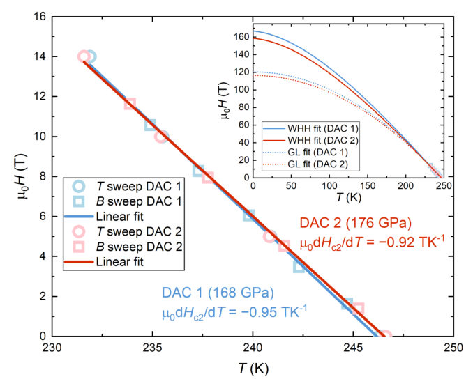
<figcaption class="paper-figure-caption"><b>Fig 4.</b> FIG. 4. The magnetic phase diagram near Tc for the LaH10±δ films constructed from measurements</figcaption>
</figure>
<figure class="paper-figure-card">
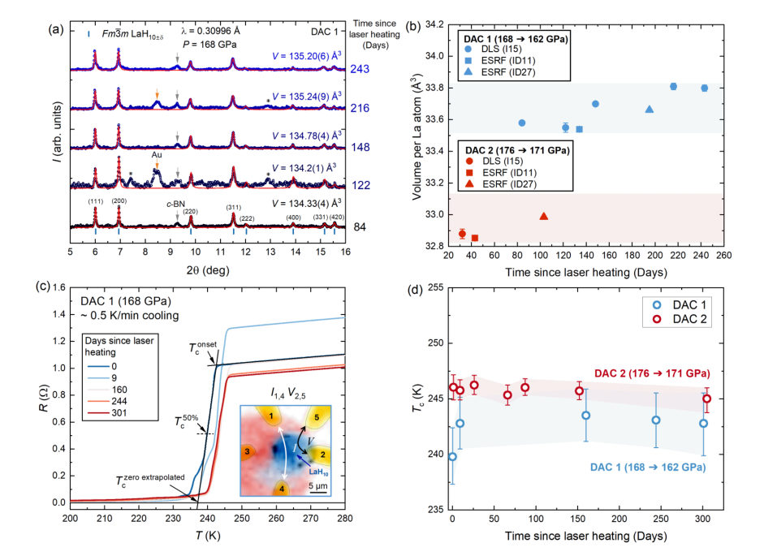
<figcaption class="paper-figure-caption"><b>Fig 5.</b> FIG. 5. Stability of LaH10±δ films over time. (a) XRD data and structural refinements to the Fm¯3m</figcaption>
</figure>

**Summary.** This work reports the successful synthesis of high-$T_c$ superconducting $	ext{LaH}_{10\pm\delta}$ films using a novel film precursor approach in Diamond Anvil Cells. The researchers confirmed superconductivity with $T_c$ near 250 K and, critically, demonstrated that both the crystal structure and the superconducting state remain stable for hundreds of days post-synthesis. This establishes a practical route for creating and studying high-pressure superconductors.

**Why it may be interesting.** While focused on solid-state physics, the study of high-$T_c$ superconductivity in novel materials under extreme conditions touches upon strongly correlated electron physics, which is a major area of interest for theoretical condensed matter physicists.

Detailed structure

**Main problem.** The study aims to synthesize, characterize, and assess the long-term stability of high-temperature superconducting hydrides, specifically LaH10, under extreme high-pressure conditions.

**Main result.** The authors successfully synthesized LaH10 films, confirming a high critical temperature ($T_c \approx 247 	ext{ K}$) and demonstrating remarkable structural and superconducting stability over several hundred days post-synthesis.

**Method.** The research combines in situ laser heating synthesis within Diamond Anvil Cells (DACs) with structural characterization using synchrotron X-ray diffraction (XRD) and electrical transport measurements to probe superconductivity.

**Model / system.** The physical system is the high-pressure hydride superconductor LaH10, which is synthesized as thin films on elemental lanthanum precursors within a DAC. Measurements track phase coexistence (e.g., LaH10, LaH9, LaH4) and superconducting properties under sustained high pressure.

**Key observables.** Critical temperature ($T_c$), upper critical magnetic field ($H_{c2}$), superconducting transition width ($\Delta T_c(B)$), crystal structure (fcc $	ext{La}$ sublattice, $	ext{Fm}ar{3}	ext{m}$), and temporal stability over $\sim 300$ days.

**Important parameters / regimes.** High pressures (168-176 GPa), $T_c \approx 250 	ext{ K}$, and long time scales ($\sim 300$ days).

**Assumptions / limitations.** The unit cell volume derived from XRD reflects the fcc $	ext{La}$ sublattice, which may not fully capture the stoichiometry of the entire hydride phase.

**Figures summary.** Figures detail XRD patterns showing phase distribution, spatial X-ray mapping of different hydride phases, and time-dependent measurements of $T_c$ and structural parameters.

**Paper structure.** The paper follows a structure detailing the synthesis method (PVD precursors in DACs), structural confirmation via XRD, measurement of superconducting properties ($T_c$, $H_{c2}$), and finally, a long-term stability assessment over months.

Abstract

High-pressure hydrides hold the record for the highest superconducting critical temperatures across all classes of superconductors. Currently lanthanum decahydride, LaH$_{10}$, exhibits the highest critical temperature among binaries, with $T_c \approx$ 250 K at pressures between 140-180 GPa. Here, we report the synthesis of LaH$_{10\pmδ}$ films in two DACs at pressures of 168 GPa and 176 GPa via in situ laser heating of elemental lanthanum films with ammonia borane (NH$_3$BH$_3$) as the hydrogen donor. The high-symmetry fcc lanthanum sublattice (space group $Fm\bar3m$) is resolved using synchrotron X-ray diffraction, with unit cell parameters in excellent agreement with previous studies on bulk samples. We provide confirmation of high-$T_c$ superconductivity in LaH$_{10\pmδ}$ with highest $T_c$ of 247 K at 176 GPa evidenced in electrical measurements. The characteristic suppression of superconductivity is observed in magnetic fields. Furthermore, combined diffraction and electrical measurements reveal remarkable temporal stability of both the crystal structure and the high-$T_c$ superconductivity over the full measurement period of about 300 days post laser heating. Our work establishes film precursors using physical vapour deposition (PVD) techniques as a practical route to hydride formation, opening a pathway toward the controlled synthesis of promising ternary hydrides and the integration of micro-fabricated device geometries in diamond anvil cells.

[↑ back to top](#top)

### Other secondary papers (4)

Show other secondary papers

### [Engineering kekule superconductivity from layer-selective interactions in rhombohedral graphene](http://arxiv.org/abs/2608.18337v1)

**Authors:** Hung Dinh Nguyen, Yafis Barlas  
**Type:** theory · **Category:** strongly correlated electrons · **PDF:** <https://arxiv.org/pdf/2608.18337v1>  
**Analysis basis:** full PDF text, analyzed in chunks

↔ Scroll figures horizontally

<figure class="paper-figure-card">
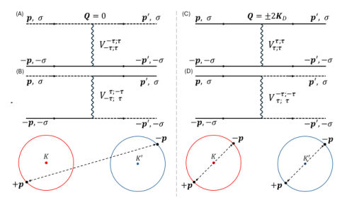
<figcaption class="paper-figure-caption"><b>Fig 1.</b> FIG. 1: Schematic illustration of valley-resolved Cooper-pair scat- tering processes generated by the projected interaction. (A)-(B) In the Q = 0 sector, the two electrons originate from opposite valleys, so the pair carries zero COMM. (C)-(D) In the Q = ±2KD sector, both electrons originate from the same valley, so the pair carries fi- nite COMM. In each sector, the projected interaction includes both direct pair scattering within a fixed valley configuration and channel- mixing processes that alter the pair’s valley content.</figcaption>
</figure>
<figure class="paper-figure-card">
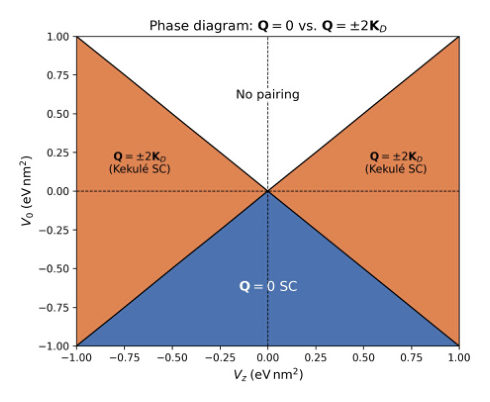
<figcaption class="paper-figure-caption"><b>Fig 2.</b> FIG. 2: Phase diagram indicating the competition of the inter-valley (Q = 0) and intra-valley (Q = ±2KD) superconducting state in (Vz, V0)-interaction phase space.</figcaption>
</figure>
<figure class="paper-figure-card">
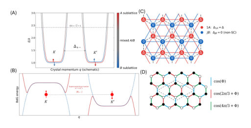
<figcaption class="paper-figure-caption"><b>Fig 3.</b> FIG. 3: Schematic origin of the inter-valley superconducting state induced by Kane–Mele spin–layer locking near the conduction-band edge. (a) Spin-resolved conduction bands near the valleys KD and −KD. Red and blue indicate predominantly outer-layer 1A and JB character, respectively, while gray indicates mixed sublattice char- acter. Near the band edge, the (KD, ↑) and (−KD, ↓) states are 1A polarized and form the inter-valley pair ∆+−. (b) Corresponding BdG space spectra. The 1A-polarized (KD, ↑; −KD, ↓) sector becomes su- perconducting (due to attraction) and develops a gap 2|∆+−|, whereas the JB-polarized (KD, ↓; −KD, ↑) sector remains normal and gap- less. Away from the band edge,...</figcaption>
</figure>
<figure class="paper-figure-card">
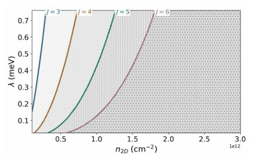
<figcaption class="paper-figure-caption"><b>Fig 4.</b> FIG. 4: Phase boundary between the conventional and Kekul´e super- conducting regimes in the (n2D, λ) plane. The boundary is determined by X = λ/µ = √</figcaption>
</figure>
<figure class="paper-figure-card">
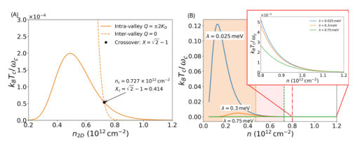
<figcaption class="paper-figure-caption"><b>Fig 5.</b> FIG. 5: (a) Dimensionless transition temperatures of the conven- tional and Kekul´e superconducting channels for J = 4, |Vz| = 0.4 eV nm2, and λ = 0.75 meV. The crossing marks the density- driven transition into the Kekul`e-dominated regime. (b) Kekul`e tran- sition temperature as a function of carrier density for several Kane– Mele SOC strengths. The dashed lines mark the phase-boundary condition (green), the operational weak-coupling boundary (orange), and the density cutoff below which trigonal-warping effects (red) cannot be neglected.</figcaption>
</figure>

**Summary.** This theoretical study demonstrates that in rhombohedral graphene, specific layer-dependent pairing interactions can stabilize a finite-momentum Kekulé superconducting state. By analyzing the competition between different pairing channels using mean-field theory, the authors show that this state can emerge while maintaining crucial symmetries like time-reversal and inversion symmetry. This work highlights the role of orbital structure and band chirality in engineering unconventional superconductivity.

**Why it may be interesting.** The work provides a concrete, symmetry-preserving mechanism for unconventional superconductivity in a tunable 2D material, which is highly relevant for designing novel quantum electronic devices.

Detailed structure

**Main problem.** The paper addresses the mechanism for realizing finite-momentum superconductivity (Pair-Density-Wave, PDW) in a manner that preserves both time-reversal and inversion symmetries.

**Main result.** Orbital-dependent interactions in the presence of band chirality favor the formation of a Kekulé superconducting state with finite center-of-mass momentum, even in time-reversal and inversion symmetric Dirac materials.

**Method.** The study employs mean-field theory applied to the pairing problem, comparing the superconducting instabilities in the zero-momentum ($Q=0$) and finite-momentum ($Q=\pm 2K_D$) sectors.

**Model / system.** The system is rhombohedral multilayer graphene (RMG) described by an extended chiral Kane-Mele Hamiltonian. The analysis focuses on how layer/orbital-dependent pairing interactions drive the superconducting instability.

**Key observables.** Superconducting order parameters ($\Delta_{Q=0}$ vs $\Delta_{Q=\pm 2KD}$), superfluid stiffness, and the Berezinskii-Kosterlitz-Thouless (BKT) transition temperature ($T_{BKT}$).

**Important parameters / regimes.** Layer-dependent interaction signs ($V_{1A} = -V_{JB}$), the Kane-Mele mass term ($\lambda$), and the critical carrier density ($n_{crit}^K$).

**Assumptions / limitations.** The analysis primarily uses onsite interactions and initially neglects remote-hopping effects, though later notes suggest layer-dependent renormalization effects can relax this assumption.

**Figures summary.** The notes reference schematics illustrating the competition between $Q=0$ (inter-valley) and $Q=\pm 2KD$ (intra-valley) Cooper-pair scattering processes.

**Paper structure.** The paper progresses by first establishing the theoretical framework using the Kane-Mele model, then analyzing the pairing instabilities in different momentum sectors using mean-field theory, and finally mapping the phase diagram to show the conditions favoring the finite-momentum Kekulé state.

Abstract

At weak coupling, finite-momentum superconductivity is typically associated with broken time-reversal or inversion symmetry of the Fermi surface. Here, we show that lattice-scale pair-density-wave order in rhombohedral multilayer graphene can arise from layer/orbital-dependent pairing interactions, band chirality, and Dirac-point-centered Fermi surface topology while preserving both symmetries. Using mean-field theory and comparing finite momentum sectors $Q = \pm 2 K_{D}$ with the $ Q = 0$ superconducting state, we find that layer-dependent interactions of opposite signs ($V_{1A}=-V_{JB}=-|V|$) favor an intra-valley Kekulè state with center-of-mass momentum ($ Q=\pm 2 K_D$). In the presence of a time-reversal and inversion symmetry-preserving Kane-Mele mass ($λ$), this state appears only above a critical carrier density ($n^{crit}_{K}(λ,J)$). The two superconducting condensates exhibit opposite chirality, $J(-J)$ for $K_D(-K_D) $ valleys, thereby preserving time-reversal and inversion symmetry. We map the phase diagram and analyze the dependence of $T_c$ on the chirality index $J$ and $λ$. We also evaluate the superfluid stiffness in the Kekulè superconducting state, thereby determining the Berezinskii-Kosterlitz-Thouless (BKT) transition temperature. Our results show that orbital-dependent interactions in the presence of band chirality favor finite-momentum pairing in time-reversal and inversion symmetric Dirac materials.

[↑ back to top](#top)

### [Long-time asymptotics of the integrable defocusing Wadati-Konno-Ichikawa equation with a finite-genus algebro-geometric background](http://arxiv.org/abs/2608.18630v1)

**Authors:** Taohua Luo, Zhenya Yan, Guoqiang Zhang  
**Type:** theory · **Category:** other · **PDF:** <https://arxiv.org/pdf/2608.18630v1>  
**Analysis basis:** full PDF text, analyzed in chunks

↔ Scroll figures horizontally

<figure class="paper-figure-card">
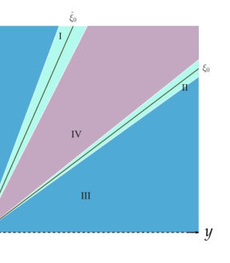
<figcaption class="paper-figure-caption"><b>Fig 1.</b> Figure 1: Four distinct asymptotic regions in (y, t)-space for genus n = 1.</figcaption>
</figure>
<figure class="paper-figure-card">
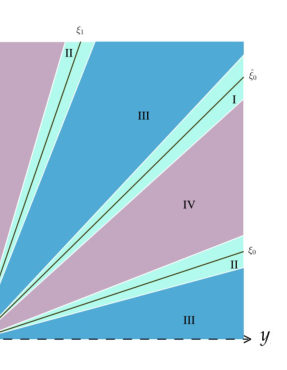
<figcaption class="paper-figure-caption"><b>Fig 2.</b> Figure 2: Four distinct asymptotic regions in (y, t)-space for genus n = 2.</figcaption>
</figure>
<figure class="paper-figure-card">
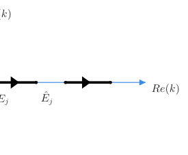
<figcaption class="paper-figure-caption"><b>Fig 3.</b> Figure 3: The jump contour on the z-plane for the defocusing WKI equation.</figcaption>
</figure>
<figure class="paper-figure-card">
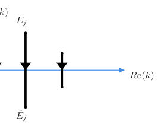
<figcaption class="paper-figure-caption"><b>Fig 4.</b> Figure 4: The jump contour in the z-plane for the focusing WKI equation.</figcaption>
</figure>
<figure class="paper-figure-card">
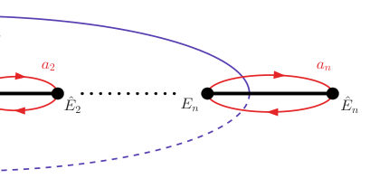
<figcaption class="paper-figure-caption"><b>Fig 5.</b> Figure 5: Case A: cuts on the real axis for the defocusing WKI equation.</figcaption>
</figure>

**Summary.** This paper provides a rigorous mathematical analysis of the long-time asymptotics for the defocusing Wadati-Konno-Ichikawa (WKI) equation on a complex, finite-genus background. It utilizes the powerful machinery of the Riemann-Hilbert problem and nonlinear steepest descent analysis. The result characterizes the solution's behavior across different spatial and temporal regimes, providing deep insight into the system's integrable dynamics.

**Why it may be interesting.** The use of advanced integrable system techniques (RH method, algebro-geometry) to analyze the long-time dynamics of a nonlinear wave equation is highly relevant to theoretical physics, particularly in nonlinear optics and quantum field theory.

Detailed structure

**Main problem.** The paper investigates the long-time asymptotic behavior of the integrable defocusing Wadati-Konno-Ichikawa (WKI) equation when posed on a finite-genus algebro-geometric background.

**Main result.** The long-time asymptotics are derived for the defocusing WKI equation in four distinct space-time regions (Transition I, II, ZM, Fast-decay), showing the solution is a sum of the background solution and specific correction terms.

**Method.** The analysis heavily employs the Deift-Zhou nonlinear steepest descent method applied to the Riemann-Hilbert (RH) problem formulation of the finite-genus Baker-Akhiezer function.

**Model / system.** The system is governed by the Wadati-Konno-Ichikawa (WKI) equation, an integrable nonlinear evolution equation with a saturable nonlinearity. The background is defined by a finite-genus algebro-geometric structure.

**Key observables.** The WKI field $q(x, t)$ and the reciprocal coordinate $y(x, t)$ are the primary observables analyzed for their asymptotic behavior.

**Important parameters / regimes.** The analysis distinguishes between the defocusing case ($\sigma = -1$) and involves parameters related to the spectral plane and the structure of the Riemann surface.

**Assumptions / limitations.** The derivation relies on the standard small-norm Riemann-Hilbert theory for the auxiliary function $E(z)$ for sufficiently large positive time $t$.

**Figures summary.** Figure 15 illustrates the contours $\Sigma(E)$ used in the Riemann-Hilbert problem setup for the analysis.

**Paper structure.** The paper first establishes the finite-genus Baker-Akhiezer function via solvable matrix RH problems, yielding theta-function representations. It then applies the Deift-Zhou steepest descent analysis to the defocusing WKI Cauchy problem, dividing the space-time plane into four regions (I, II, III, IV) to derive the asymptotic solution.

Abstract

We study the finite-genus algebro-geometric solutions of the Wadati-Konno-Ichikawa (WKI) equation with the saturable nonlinearity and long-time asymptotic behaviors of their short-range perturbations. First, for both the focusing and defocusing reductions, we formulate the finite-genus Baker-Akhiezer functions as explicitly solvable the matrix Riemann-Hilbert (RH) problems on the complex spectral plane and obtain theta-function representations together with the reconstruction formulae for the WKI field and the reciprocal coordinate. We then consider the Cauchy problem of the defocusing WKI equation on a finite-genus algebro-geometric background. We construct the scattering data and RH problem, and perform a Deift-Zhou nonlinear steepest descent analysis. The space-time plane is divided into two transition regions, a Zakharov-Manakov (ZM) region, and a fast-decay region. The leading term is a phase-shifted finite-genus WKI solution. The transition corrections are governed by a Painlevé-XXXIV model, while the ZM radiation is described by parabolic-cylinder functions. The reciprocal-coordinate asymptotics are obtained simultaneously.

[↑ back to top](#top)

### [Magnetism and Electrical Conduction in Lightly-Doped Single-Layer High-$T_c$ Cuprate $\mathrm{La}_2\mathrm{CuO}_{4+δ}$](http://arxiv.org/abs/2608.18563v1)

**Authors:** Kota Miyakoshi, Yuya Kinugawa, Shusei Mizuta, Yoshihiko Ihara, Hiroyuki K. Yoshida, Tohru Kurosawa, Yasunori Toda, Naoki Momono, Migaku Oda  
**Type:** experiment · **Category:** strongly correlated electrons · **PDF:** <https://arxiv.org/pdf/2608.18563v1>  
**Analysis basis:** full PDF text, analyzed in chunks

↔ Scroll figures horizontally

<figure class="paper-figure-card">
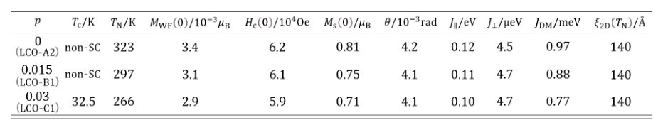
<figcaption class="paper-figure-caption"><b>Fig 1.</b> Figure 5(a) shows the 𝐻𝐻 dependences of 𝜌𝜌∥ and 𝜌𝜌⊥ at low temperatures near 40 K for a</figcaption>
</figure>
<figure class="paper-figure-card">
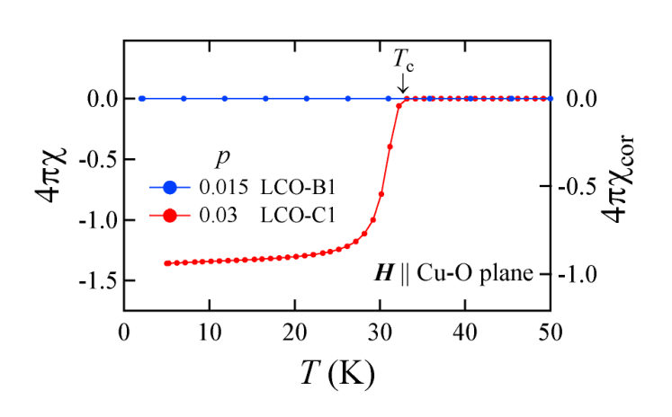
<figcaption class="paper-figure-caption"><b>Fig 2.</b> Fig. 1: T dependences of magnetic susceptibility 𝜒𝜒 (≡𝑀𝑀𝐻𝐻 ⁄ ) multiplied by 4𝜋𝜋 (4𝜋𝜋𝜋𝜋) below</figcaption>
</figure>
<figure class="paper-figure-card">
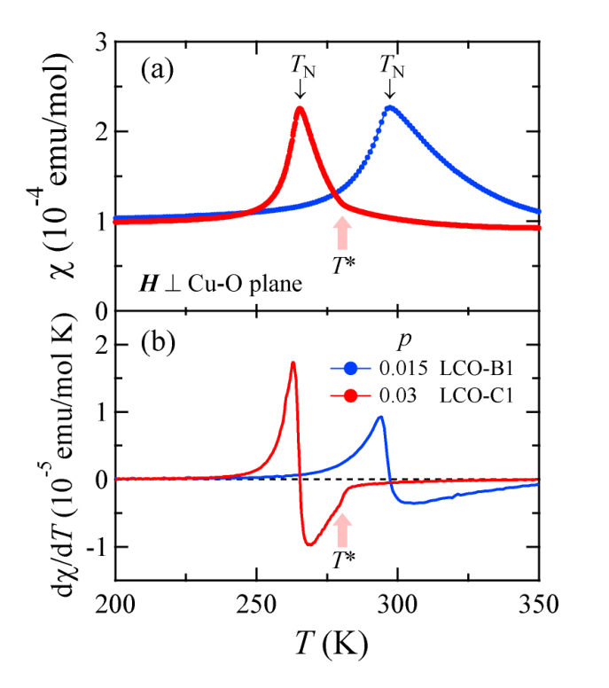
<figcaption class="paper-figure-caption"><b>Fig 3.</b> Fig. 2: Magnetic susceptibility 𝜒𝜒 (≡𝑀𝑀𝐻𝐻 ⁄ ) peak around 𝑇𝑇N in 𝑝𝑝≅0.015 (LCO-B1) and</figcaption>
</figure>
<figure class="paper-figure-card">
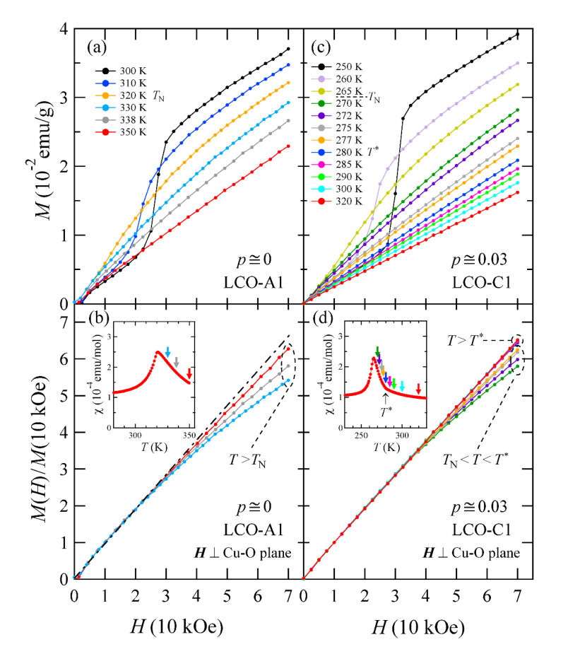
<figcaption class="paper-figure-caption"><b>Fig 4.</b> Fig. 3: Non-linear 𝑀𝑀-𝐻𝐻 curves around 𝑇𝑇N for 𝑝𝑝≅0 (LCO-A1) and 𝑝𝑝≅0.03 (LCO-C1)</figcaption>
</figure>
<figure class="paper-figure-card">
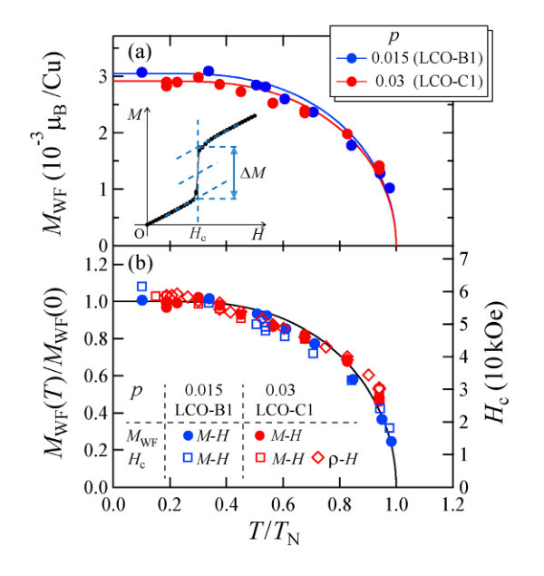
<figcaption class="paper-figure-caption"><b>Fig 5.</b> Fig. 4: Weak ferromagnetism in the AF ordered states of 𝑝𝑝≅0.015 (LCO-B1) and 𝑝𝑝≅0.03</figcaption>
</figure>

**Summary.** This paper investigates the interplay between antiferromagnetism and superconductivity in lightly-doped single-layer cuprates. By measuring magnetization and resistivity, the authors argue that superconductivity is intrinsically linked to the robust, strongly correlated antiferromagnetic background of the $\mathrm{Cu-O}$ planes. The findings highlight the coexistence of these two orders in the superconducting state.

**Why it may be interesting.** The strong correlation between magnetism (AF order) and superconductivity in cuprates is a cornerstone problem in condensed matter physics, making this experimental work highly relevant for understanding unconventional pairing mechanisms.

Detailed structure

**Main problem.** To uncover the intrinsic magnetism and electrical conduction mechanisms in lightly-doped single-layer cuprates that exhibit both antiferromagnetic (AF) and superconducting (SC) orders simultaneously.

**Main result.** The high-temperature superconductivity is attributed to conduction holes hosted within a robust, strongly correlated AF ordered state of localized Cu 3d electrons.

**Method.** The study employs multiple experimental techniques, including magnetization measurements, resistivity measurements ($
ho_{\parallel}, 
ho_{\perp}$), and NQR spectroscopy, across varying doping levels.

**Model / system.** The physical system is the lightly-doped single-layer cuprate $\mathrm{La}_2\mathrm{CuO}_{4+\delta}$ (LCO), which is studied by comparing superconducting samples ($p \approx 0.03$) to more insulating/AF samples ($p \lesssim 0.015$).

**Key observables.** Magnetization ($M$), electrical resistivity ($
ho$), sub-lattice moments ($M_s$), AF couplings ($J_{\parallel}$), and the development of 2D AF spin correlations.

**Important parameters / regimes.** Doping level ($p \approx 0.03$ vs $p \lesssim 0.015$), Néel temperature ($T_N = 266 	ext{ K}$), and the superconducting critical temperature ($T_c \sim 30 	ext{ K}$).

**Assumptions / limitations.** The analysis assumes that the superconducting state arises from the doping of a highly localized, robust antiferromagnetically ordered background.

**Figures summary.** Figures illustrate the temperature dependence of magnetic susceptibility ($\chi$) and magnetization ($M$) near $T_N$, and show the correlation between field-induced weak ferromagnetism transitions and sharp reductions in resistivity.

**Paper structure.** The paper systematically compares magnetic and transport properties across different doping regimes, focusing on the anomalous behavior observed below a characteristic temperature $T^*$, and linking these anomalies to the coexistence of AF and SC orders.

Abstract

The temperature dependences of magnetization and electrical resistivity as well as their magnetic field dependences have been examined in lightly-doped single-layer cuprate $\mathrm{La}_2\mathrm{CuO}_{4+δ}$ (LCO, hole-doping level $p \, (2δ) \cong 0.03$) single crystals, in comparison with those in the extremely low doping region of $p \lesssim 0.015$ to uncover the intrinsic magnetism and electrical conduction of the $\mathrm{Cu\text{-}O}$ plane that exhibits both antiferromagnetic (AF) and superconducting (SC) orders simultaneously. In $p \cong 0.03$ SC LCO, the sub-lattice moments on $\mathrm{Cu}$ sites and their AF couplings are only $\sim 15\,\%$ smaller than those of the Mott-insulator parent material, suggesting that the localization of $\mathrm{Cu}$ $3d$ electrons remains very strong. Furthermore, we report that in the SC LCO, two-dimensional AF spin correlations develop rapidly from $T^* \cong 280\text{ K}$ towards Néel temperature $T_{\mathrm{N}} = 266\text{ K}$, where the out-of-plane resistivity starts to decrease largely. This might be responsible for the AF ordering at such a high temperature in the SC single-layer cuprate with $p \cong 0.03$.

[↑ back to top](#top)

### [Molecular Insights into Gas Nanofilms Confined Between Bulk Liquid Phases](http://arxiv.org/abs/2608.18891v1)

**Authors:** Yafan Yang, Zufeng Zuo, Xingyu Zhao, Shuyu Sun, Denvid Lau  
**Type:** theory · **Category:** statistical mechanics · **PDF:** <https://arxiv.org/pdf/2608.18891v1>  
**Analysis basis:** full PDF text, analyzed in chunks

↔ Scroll figures horizontally

<figure class="paper-figure-card">
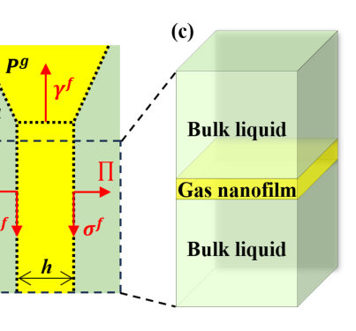
<figcaption class="paper-figure-caption"><b>Fig 1.</b> Figure 1: (a) Schematic illustration of a gas nanofilm (f) confined within a pore. The nanofilm is connected to the bulk gas (g) through a Plateau-border meniscus and is sandwiched between two bulk liquid (l) phases. (b) Mechanical equilibrium of the confined nanofilm, illustrating the disjoining pressure Π, film tension γf, and surface tension σf acting on the film. (c) Molecular dynamics simulation setup employed to determine the film surface tension σf.</figcaption>
</figure>
<figure class="paper-figure-card">
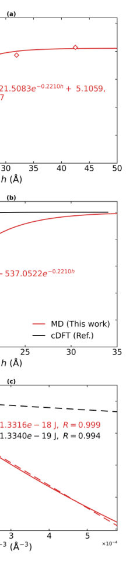
<figcaption class="paper-figure-caption"><b>Fig 2.</b> Figure 2: Interfacial properties of gas nanofilms at 120 K with a surface area of 49.056× 49.056 ˚A 2: (a) film surface tension, σf, as a function of film thickness, h; (b) disjoining pressure, Π, as a function of film thickness, h; and (c) Π as a function of h−3. Dashed lines represent linear fits. The cDFT results shown in (b) and (c) are reproduced from Ref. [28].</figcaption>
</figure>
<figure class="paper-figure-card">
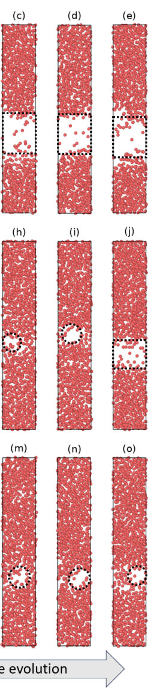
<figcaption class="paper-figure-caption"><b>Fig 3.</b> Figure 3: Time evolution of gas-phase morphologies for systems with a surface area of 49.056 × 49.056 ˚A 2 at 120 K and different initial planar film thicknesses. Planar gas films are enclosed by black dotted boxes, while spherical gas bubbles are indicated by black dotted circles.</figcaption>
</figure>
<figure class="paper-figure-card">
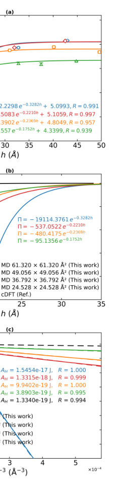
<figcaption class="paper-figure-caption"><b>Fig 4.</b> Figure 4: Interfacial properties of gas nanofilms at 120 K with different surface areas: (a) film surface tension, σf, as a function of film thickness, h; (b) disjoining pressure, Π, as a function of film thickness, h; and (c) Π as a function of h−3. Dashed lines represent linear fits. The cDFT results shown in (b) and (c) are reproduced from Ref. [28].</figcaption>
</figure>
<figure class="paper-figure-card">
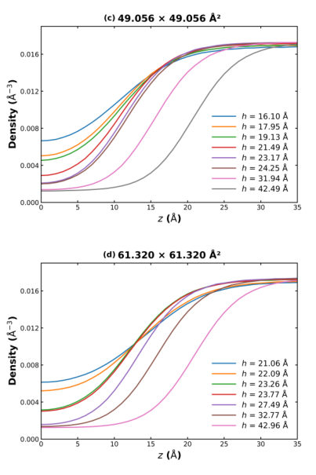
<figcaption class="paper-figure-caption"><b>Fig 5.</b> Figure 5: Density distributions from the center of the gas film to the bulk liquid regions for different surface areas at 120 K: (a) 24.528 × 24.528 ˚A 2; (b) 36.792 × 36.792 ˚A 2; (c) 49.056 × 49.056 ˚A 2; and (d) 61.320 × 61.320 ˚A 2.</figcaption>
</figure>

**Summary.** This work uses molecular dynamics simulations to investigate the thermodynamics and stability of gas nanofilms confined by liquid phases. Key findings include the exponential decrease of surface tension and a morphological transition to spherical bubbles upon thinning. The research highlights the importance of thermal fluctuations in accurately modeling these nanoscale interfacial phenomena.

**Why it may be interesting.** The study provides detailed molecular insights into phase transitions and interfacial thermodynamics in confined geometries, which are fundamental concepts in statistical mechanics and many-body physics.

Detailed structure

**Main problem.** The study aims to understand the poorly understood thermodynamics and stability of free gas nanofilms confined between bulk liquid phases.

**Main result.** The surface tension decreases exponentially with film thickness, and the film undergoes a morphological transition from planar to spherical bubble upon thinning. The discrepancy between MD and cDFT is attributed to thermal capillary-wave fluctuations.

**Method.** Molecular Dynamics (MD) simulations are employed alongside a Gibbs surface thermodynamic framework to derive relationships between surface tension and disjoining pressure.

**Model / system.** The system modeled is a gas nanofilm confined between two bulk liquid phases, using Lennard-Jones argon as a representative model system.

**Key observables.** Surface tension ($\sigma_f$), disjoining pressure ($\Pi$), film thickness ($h$), and gas-phase morphology.

**Important parameters / regimes.** Film thickness ($h$), temperature ($T$), and lateral surface area ($A$).

**Assumptions / limitations.** The analysis relies on the Gibbs surface formulation and contrasts the system behavior with established liquid nanofilm models, noting the importance of including thermal fluctuations.

**Figures summary.** Figures illustrate the dependence of surface tension and disjoining pressure on film thickness and temperature, and show time evolution of gas-phase morphologies (planar to spherical bubble).

**Paper structure.** The paper establishes the thermodynamic framework, derives key relationships between surface tension and disjoining pressure, uses MD simulations to calculate these properties, and analyzes the resulting morphological transitions and theoretical discrepancies.

Abstract

Nanometer-thick fluid films play a critical role in confined multiphase processes, yet the thermodynamics and stability of free gas nanofilms remain poorly understood compared with their liquid counterparts. Here, molecular dynamics (MD) simulations are employed to systematically investigate gas nanofilms confined between bulk liquid phases using Lennard-Jones argon as a model system. The results show that the surface tension decreases exponentially with decreasing film thickness, accompanied by an increasing magnitude of the negative disjoining pressure. Upon thinning, the planar gas film undergoes a distinct morphological transition from a stable planar state to a transient or persistent spherical bubble through the formation and growth of a liquid bridge. The film surface area strongly affects its thermodynamic properties, with larger areas producing stronger thickness dependence and larger deviations from classical density functional theory (cDFT) predictions. The closer agreement between MD and cDFT at smaller surface areas suggests that the discrepancy primarily arises from thermal capillary-wave fluctuations, which are included in MD but omitted in mean-field cDFT. Moreover, at small film thicknesses, the magnitude of the disjoining pressure increases with decreasing temperature, consistent with the enhanced sensitivity of the confined gas phase to thickness variations and contrasting with the trend generally reported for liquid nanofilms. These findings provide molecular insights into the thermodynamics and stability of gas nanofilms, with implications for confined multiphase transport and droplet coalescence.

[↑ back to top](#top)

