
# arxiv digest (quant-ph + cond-mat) — 2026-08-22

*143 papers · 29 relevant · 3 highlighted*

## 🔥 Most relevant (29)

*Every paper with at least one nonzero topic score, sorted by best-matching score. 🔥 marks scores ≥4/5. Click the title to jump to the full entry below; click [arXiv] to open the paper page. `(secondary)` marks papers from de-prioritized cond-mat archives.*

Show 29 relevant papers

- [Nonthermal Dynamics of a One-dimensional Rydberg-atom Chain with Constraint Four-body Interactions](#paper-2608.20233) [[arXiv]](http://arxiv.org/abs/2608.20233v1) — 🔥 `scars & prethermalization` **5/5** · 🔥 `Rydberg arrays` **4/5** · 🔥 `analog quantum simulation` **4/5** · `non-equilibrium universality` **3/5** · `Frenkel-Kontorova` **1/5**
- [Kibble--Zurek Scaling in the Dicke Model at Mesoscopic Scales](#paper-2608.20067) [[arXiv]](http://arxiv.org/abs/2608.20067v1) — 🔥 `Dicke superradiance` **4/5** · 🔥 `Keldysh / 2PI / non-Gaussian methods` **4/5** · 🔥 `driven-dissipative phase transition` **4/5** · 🔥 `non-equilibrium universality` **4/5** · `Tavis-Cummings & cavity-many-emitter` **3/5** · `correlated / nonlocal dissipation` **3/5** · `methods for driven-dissipative` **3/5** · `superradiant laser` **3/5** · `analog quantum simulation` **2/5** · `quantum measurements` **1/5**
- ⭐ [Glassy dynamics with softened kinetic constraints on a noisy quantum computer](#paper-2608.19335) [[arXiv]](http://arxiv.org/abs/2608.19335v1) — 🔥 `QC/QI experiment` **4/5** · 🔥 `quantum measurements` **4/5** · `driven-dissipative phase transition` **3/5** · `methods for driven-dissipative` **3/5** · `non-equilibrium universality` **3/5** · `scars & prethermalization` **3/5** · `analog quantum simulation` **2/5** · `correlated / nonlocal dissipation` **1/5**
- [Cavity-Enhanced Activation of Radiatively Suppressed Light-Hole Exciton Emission in Colloidal Nanoplatelets](#paper-2608.19681) [[arXiv]](http://arxiv.org/abs/2608.19681v1) `(secondary)` — 🔥 `quantum optics experiment` **4/5** · `Tavis-Cummings & cavity-many-emitter` **3/5** · `interference shaping light` **3/5** · `Dicke superradiance` **2/5** · `analog quantum simulation` **2/5** · `correlated / nonlocal dissipation` **2/5** · `driven-dissipative phase transition` **2/5** · `methods for driven-dissipative` **1/5** · `superradiant laser` **1/5**
- [A Zoology of Quantum Turing Patterns](#paper-2608.20151) [[arXiv]](http://arxiv.org/abs/2608.20151v1) — 🔥 `driven-dissipative phase transition` **4/5** · 🔥 `methods for driven-dissipative` **4/5** · `correlated / nonlocal dissipation` **3/5** · `non-equilibrium universality` **3/5** · `Keldysh / 2PI / non-Gaussian methods` **2/5** · `analog quantum simulation` **2/5** · `quantum measurements` **1/5**
- [Dissipation-tunable extended and localized steady states in a non-disordered lattice](#paper-2608.19694) [[arXiv]](http://arxiv.org/abs/2608.19694v1) — 🔥 `correlated / nonlocal dissipation` **4/5** · `analog quantum simulation` **3/5** · `driven-dissipative phase transition` **3/5** · `methods for driven-dissipative` **3/5** · `non-equilibrium universality` **2/5** · `quantum measurements` **2/5** · `Keldysh / 2PI / non-Gaussian methods` **1/5** · `scars & prethermalization` **1/5**
- [Programmable cavity QED with a fiber-integrated atomic array](#paper-2608.20291) [[arXiv]](http://arxiv.org/abs/2608.20291v1) — 🔥 `Tavis-Cummings & cavity-many-emitter` **4/5** · 🔥 `quantum optics experiment` **4/5** · `QC/QI experiment` **3/5** · `analog quantum simulation` **3/5** · `quantum measurements` **3/5** · `Rydberg arrays` **2/5**
- [Dynamic Pseudogap Model](#paper-2608.19592) [[arXiv]](http://arxiv.org/abs/2608.19592v1) — 🔥 `Keldysh / 2PI / non-Gaussian methods` **4/5** · `driven-dissipative phase transition` **3/5** · `methods for driven-dissipative` **3/5** · `non-equilibrium universality` **3/5** · `analog quantum simulation` **1/5** · `correlated / nonlocal dissipation` **1/5** · `quantum measurements` **1/5** · `scars & prethermalization` **1/5**
- [Quantum Dissipative Paraelectricity](#paper-2608.20168) [[arXiv]](http://arxiv.org/abs/2608.20168v1) — 🔥 `driven-dissipative phase transition` **4/5** · `methods for driven-dissipative` **3/5** · `non-equilibrium universality` **3/5** · `Keldysh / 2PI / non-Gaussian methods` **2/5** · `quantum measurements` **2/5** · `Frenkel-Kontorova` **1/5** · `correlated / nonlocal dissipation` **1/5** · `scars & prethermalization` **1/5**
- [Signatures of a light-induced exciton condensate exhibiting BEC-BCS crossover](#paper-2608.20310) [[arXiv]](http://arxiv.org/abs/2608.20310v1) — 🔥 `analog quantum simulation` **4/5** · `Keldysh / 2PI / non-Gaussian methods` **3/5** · `driven-dissipative phase transition` **3/5** · `non-equilibrium universality` **3/5** · `methods for driven-dissipative` **2/5** · `quantum optics experiment` **2/5**
- [Fluctuation-Controlled Asymmetric Kinetics in Metal-Insulator Transitions](#paper-2608.20100) [[arXiv]](http://arxiv.org/abs/2608.20100v1) — 🔥 `non-equilibrium universality` **4/5** · `driven-dissipative phase transition` **3/5** · `Keldysh / 2PI / non-Gaussian methods` **2/5** · `methods for driven-dissipative` **2/5** · `Frenkel-Kontorova` **1/5** · `analog quantum simulation` **1/5** · `correlated / nonlocal dissipation` **1/5** · `quantum measurements` **1/5** · `scars & prethermalization` **1/5**
- [Rescaled Mandelstam Tamm characterization of discrete time crystal response in a disordered Floquet Ising chain](#paper-2608.19403) [[arXiv]](http://arxiv.org/abs/2608.19403v1) — 🔥 `driven-dissipative phase transition` **4/5** · `non-equilibrium universality` **3/5** · `analog quantum simulation` **2/5** · `methods for driven-dissipative` **2/5** · `scars & prethermalization` **2/5** · `Frenkel-Kontorova` **1/5** · `Keldysh / 2PI / non-Gaussian methods` **1/5** · `quantum measurements` **1/5**
- [Open quantum system approach to the Unruh-DeWitt detector in impulsive plane wave spacetimes](#paper-2608.19692) [[arXiv]](http://arxiv.org/abs/2608.19692v1) — 🔥 `Keldysh / 2PI / non-Gaussian methods` **4/5** · `methods for driven-dissipative` **3/5** · `correlated / nonlocal dissipation` **2/5** · `driven-dissipative phase transition` **2/5** · `quantum measurements` **2/5** · `Full counting statistics` **1/5** · `non-equilibrium universality` **1/5**
- [Dissipation-enhanced scrambling in the SYK model coupled to a lossy cavity](#paper-2608.19310) [[arXiv]](http://arxiv.org/abs/2608.19310v1) — 🔥 `Keldysh / 2PI / non-Gaussian methods` **4/5** · `driven-dissipative phase transition` **3/5** · `methods for driven-dissipative` **3/5** · `non-equilibrium universality` **2/5** · `correlated / nonlocal dissipation` **1/5** · `quantum measurements` **1/5**
- [Lensing and enhanced single atom detection via a single-pixel nanostructure](#paper-2608.20032) [[arXiv]](http://arxiv.org/abs/2608.20032v1) — 🔥 `quantum optics experiment` **4/5** · `analog quantum simulation` **3/5** · `quantum measurements` **3/5** · `interference shaping light` **2/5** · `QC/QI experiment` **1/5** · `Tavis-Cummings & cavity-many-emitter` **1/5**
- [Learning Potts Models and $Z_3$ Toric Codes: Higher and Ordinary Nishimori Criticality](#paper-2608.20268) [[arXiv]](http://arxiv.org/abs/2608.20268v1) — 🔥 `quantum measurements` **4/5** · `non-equilibrium universality` **3/5** · `Keldysh / 2PI / non-Gaussian methods` **1/5** · `analog quantum simulation` **1/5** · `driven-dissipative phase transition` **1/5** · `methods for driven-dissipative` **1/5**
- [A Protocol for Shielding-Enhanced Loading of Single Polar Molecules into Optical Tweezers](#paper-2608.20332) [[arXiv]](http://arxiv.org/abs/2608.20332v1) — 🔥 `analog quantum simulation` **4/5** · `Keldysh / 2PI / non-Gaussian methods` **1/5** · `QC/QI experiment` **1/5** · `Rydberg arrays` **1/5** · `driven-dissipative phase transition` **1/5** · `methods for driven-dissipative` **1/5** · `quantum measurements` **1/5**
- [Wide-field mid- to long-wave infrared imaging with undetected photons](#paper-2608.20015) [[arXiv]](http://arxiv.org/abs/2608.20015v1) — 🔥 `quantum optics experiment` **4/5** · `interference shaping light` **3/5** · `quantum measurements` **3/5**
- [High fidelity control of superconducting qubits with optical transmitted signal](#paper-2608.19602) [[arXiv]](http://arxiv.org/abs/2608.19602v1) — 🔥 `QC/QI experiment` **4/5** · `quantum optics experiment` **3/5** · `interference shaping light` **1/5** · `quantum measurements` **1/5**
- [Strongly coupled atom-cavity systems under boundary modulation: simulating gravitational-wave effects](#paper-2608.19333) [[arXiv]](http://arxiv.org/abs/2608.19333v1) — 🔥 `analog quantum simulation` **4/5** · `Tavis-Cummings & cavity-many-emitter` **2/5** · `Keldysh / 2PI / non-Gaussian methods` **1/5** · `methods for driven-dissipative` **1/5** · `quantum measurements` **1/5**
- [Imaging the vacuum fluctuations of a quantum field](#paper-2608.20311) [[arXiv]](http://arxiv.org/abs/2608.20311v1) — 🔥 `analog quantum simulation` **4/5** · `quantum measurements` **2/5** · `Keldysh / 2PI / non-Gaussian methods` **1/5** · `quantum optics experiment` **1/5**
- [Large Scale Entanglement Structure Detection in 100-Qubit Systems via Local Joint Measurements](#paper-2608.20170) [[arXiv]](http://arxiv.org/abs/2608.20170v1) — 🔥 `QC/QI experiment` **4/5** · `quantum measurements` **3/5** · `analog quantum simulation` **1/5**
- [Inflationary Bispectra and IR Physics from Quantum Simulators](#paper-2608.19327) [[arXiv]](http://arxiv.org/abs/2608.19327v1) — 🔥 `Keldysh / 2PI / non-Gaussian methods` **4/5** · `analog quantum simulation` **3/5**
- [Squeezed- and coherent-state quantum key distribution over a deployed hybrid fibre-free-space channel](#paper-2608.20088) [[arXiv]](http://arxiv.org/abs/2608.20088v1) — 🔥 `quantum optics experiment` **4/5** · `QC/QI experiment` **1/5** · `interference shaping light` **1/5** · `quantum measurements` **1/5**
- [Coherence protection of a silicon hole spin qubit with phase-modulated microwave driving](#paper-2608.19696) [[arXiv]](http://arxiv.org/abs/2608.19696v1) `(secondary)` — 🔥 `QC/QI experiment` **4/5** · `quantum measurements` **2/5**
- [Group-theoretic treatment of strong light-matter coupling with an arbitrary number of excitations](#paper-2608.20340) [[arXiv]](http://arxiv.org/abs/2608.20340v1) — 🔥 `Tavis-Cummings & cavity-many-emitter` **4/5** · `analog quantum simulation` **2/5**
- [Structural complexity of an SU(3) Fermi Hubbard model](#paper-2608.20131) [[arXiv]](http://arxiv.org/abs/2608.20131v1) — 🔥 `analog quantum simulation` **4/5** · `quantum measurements` **2/5**
- [Competing triangular and stripe supersolid orders in a dipolar quantum gas](#paper-2608.20327) [[arXiv]](http://arxiv.org/abs/2608.20327v1) — 🔥 `analog quantum simulation` **4/5** · `Frenkel-Kontorova` **1/5**
- [Anyon condensates of dipoles in triangular ladders](#paper-2608.20173) [[arXiv]](http://arxiv.org/abs/2608.20173v1) — 🔥 `analog quantum simulation` **4/5**

## ⭐ Highlighted (3)

*Papers by authors on your watch list. Click the title to jump to the full entry below; click [arXiv] to open the paper page.*

Show 3 highlighted papers

- ⭐ [Proof of the hiding conjecture for Gaussian boson sampling with an arbitrary number of squeezed input modes](#paper-2608.19314) [[arXiv]](http://arxiv.org/abs/2608.19314v1) — Alexey V. Gorshkov
- ⭐ [Thermal Throttling of Quantum State Transfer](#paper-2608.19315) [[arXiv]](http://arxiv.org/abs/2608.19315v1) — Alexey V. Gorshkov
- ⭐ [Glassy dynamics with softened kinetic constraints on a noisy quantum computer](#paper-2608.19335) [[arXiv]](http://arxiv.org/abs/2608.19335v1) — Igor Lesanovsky

## All papers (109, sorted by relevance)

*Papers from quant-ph and your primary cond-mat archives (quant-gas, stat-mech, str-el, dis-nn). Highlighted papers (⭐) come first, then everything else sorted by topic-relevance score, highest first.*

### ⭐ [Glassy dynamics with softened kinetic constraints on a noisy quantum computer](http://arxiv.org/abs/2608.19335v1)

**Highlighted author(s):** Igor Lesanovsky  
**Authors:** Marcel Cech, Igor Lesanovsky, Federico Carollo  
**Type:** both · **Category:** statistical mechanics · **PDF:** <https://arxiv.org/pdf/2608.19335v1>  
**Analysis basis:** full PDF text, analyzed in chunks
**Topic relevance:** 🔥 `QC/QI experiment` **4/5** · 🔥 `quantum measurements` **4/5** · `driven-dissipative phase transition` **3/5** · `methods for driven-dissipative` **3/5** · `non-equilibrium universality` **3/5** · `scars & prethermalization` **3/5** · `analog quantum simulation` **2/5** · `correlated / nonlocal dissipation` **1/5**

↔ Scroll figures horizontally

<figure class="paper-figure-card">
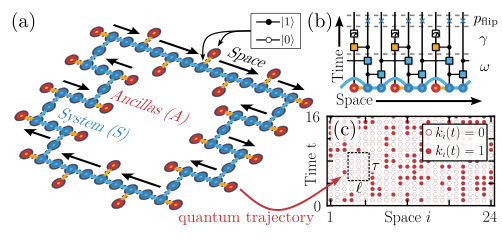
<figcaption class="paper-figure-caption"><b>Fig 1.</b> FIG. 1. Monitored circuit dynamics on the ibm kingston quantum processor. (a) Embedding of the Floquet-East model into the heavy-hex topology of the super- conducting quantum processor. The system qubits (S, blue) are coupled to ancilla qubits (A, red) on every second site. (b) Circuit implementation. During each discrete time step, the system first undergoes unitary evolution [cf. Eq. (1)], be- fore it is coupled to the ancillas. Blue and orange gates denote system–system and system–ancilla couplings parametrized by the quantities ω and γ, respectively. Measuring the ancillas monitors the system dynamics and results in the binary mea- surement outcome ki(t) describing the quantum...</figcaption>
</figure>
<figure class="paper-figure-card">
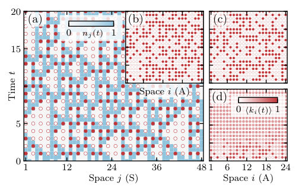
<figcaption class="paper-figure-caption"><b>Fig 2.</b> FIG. 2. Dynamics at the classical deterministic point. (a) Classical simulations for ω = π/2 and γ = π/2. We plot the evolution of the system in terms of local excitation numbers nj(t) at half-time steps of the gate-based dynamics. Empty [filled] red markers indicate the positions of projective measurements performed via the ancilla qubits, resulting in ki(t) = 0 [ki(t) = 1]. (b) Corresponding ancilla measurement outcomes ki(t). (c) Exemplary ancilla measurement outcomes obtained from a single run on the ibm kingston quantum pro- cessor for the same initial state. (d) Average ancilla excitation number ⟨ki(t)⟩of 10 000 such trajectories. We observe that the individual measurement...</figcaption>
</figure>
<figure class="paper-figure-card">
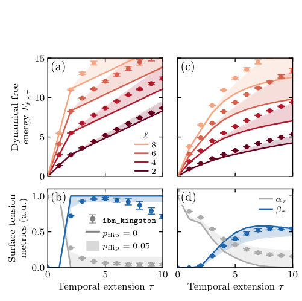
<figcaption class="paper-figure-caption"><b>Fig 3.</b> FIG. 3. Statistics of inactive clusters in space-time. (a) Negative log-probability Fℓ×τ of finding an inactive space- time cluster of size ℓ× τ at the classical deterministic point (ω = π/2 and γ = π/2). For fixed spatial extensions ℓ(see color reported in the legend), we plot the dynamical free en- ergy against the temporal extension τ. We compare results obtained from 200 000 quantum trajectories that we recorded on the ibm kingston quantum processor (markers with error bars indicating twice the standard error of the mean) with classical tensor-network calculations of perfect and softened kinetic constraints (lines and shaded regions with pflip = 0 and pflip = 0.05, respectively). (b)...</figcaption>
</figure>

**Summary.** This paper investigates glassy dynamics in a quantum system using mid-circuit measurements on a superconducting quantum processor. By analyzing the statistics of 'inactive' measurement regions, the authors quantify dynamical heterogeneity. They find a characteristic area-to-perimeter scaling crossover, confirming the system's proximity to a dynamical first-order phase transition using current NISQ devices.

**Why it may be interesting.** This work bridges quantum computation hardware limitations (noise) with fundamental condensed matter concepts (glassy dynamics, phase transitions) by analyzing measurement-level observables, providing a novel experimental testbed.

Detailed structure

**Main problem.** The study investigates glassy dynamics in many-body systems by analyzing quantum measurement trajectories, revealing structures invisible in ensemble averages.

**Main result.** The analysis identifies dynamical heterogeneity, characterized by a crossover in the scaling of inactive cluster probabilities from area-law to perimeter-law, suggesting proximity to a dynamical first-order phase transition.

**Method.** The authors analyze quantum trajectories obtained from mid-circuit measurements on a superconducting quantum processor, using thermodynamic analogies to define a dynamical free energy from the probability of inactive space-time regions.

**Model / system.** The study employs the Floquet-East model, implemented on a superconducting quantum processor (ibm kingston). The dynamics are complicated by hardware noise, which effectively softens the underlying kinetic constraints.

**Key observables.** Dynamical heterogeneity, the probability of finding inactive space-time regions ($p_{\ell 	imes 	au}$), and the resulting dynamical free energy ($F_{\ell 	imes 	au}$).

**Important parameters / regimes.** The crossover point in scaling behavior, the effective bit-flip probability ($p_{	ext{flip}}$), and the system size parameters ($\ell, 	au$).

**Assumptions / limitations.** The analysis assumes that hardware noise can be modeled as independent bit-flips, effectively softening the kinetic constraints, and that the system's behavior is dominated by the statistics of inactive clusters.

**Figures summary.** Figures illustrate circuit implementations, exemplary quantum trajectories showing inactive clusters, and plots comparing the scaling of the negative log-probability ($F_{\ell 	imes 	au}$) versus temporal extensions ($	au$), showing the characteristic crossover.

**Paper structure.** The paper progresses by first establishing the physical model and measurement setup, then developing the theoretical framework using cluster probabilities and free energy, and finally applying this analysis to both the classical deterministic limit and the noisy quantum regime to extract scaling signatures.

Abstract

Mid-circuit measurements provide direct access to trajectory-level observables, revealing dynamical structures in many-body systems that are invisible in ensemble-averaged quantities. We exploit this capability to realize and study an instance of the Floquet-East model on a superconducting quantum processor. Here, the combination of mid-circuit measurements, kinetically constrained unitary operations and hardware noise gives rise to intricate many-body phenomena. Analyzing trajectories obtained from temporally and spatially resolved mid-circuit measurements, we identify dynamical heterogeneity --- a hallmark of glassy dynamics. We quantify this emergent behavior by studying the probability of finding inactive space-time regions of a given size. This quantity displays a crossover from an area- to perimeter-dominated scaling, which is a characteristic property of glasses and is associated with the proximity to a dynamical first-order phase transition. Our results establish current noisy intermediate-scale quantum devices as scalable testbeds for investigating correlated many-body phenomena at the level of measurement trajectories.

[↑ back to top](#top)

### ⭐ [Thermal Throttling of Quantum State Transfer](http://arxiv.org/abs/2608.19315v1)

**Highlighted author(s):** Alexey V. Gorshkov  
**Authors:** Twesh Upadhyaya, T. C. Mooney, Yifan Hong, Alexey V. Gorshkov  
**Type:** theory · **Category:** quantum information and computing · **PDF:** <https://arxiv.org/pdf/2608.19315v1>  
**Analysis basis:** full PDF text, analyzed in chunks
**Topic relevance:** `analog quantum simulation` **1/5** · `correlated / nonlocal dissipation` **1/5** · `driven-dissipative phase transition` **1/5** · `methods for driven-dissipative` **1/5** · `non-equilibrium universality` **1/5**

↔ Scroll figures horizontally

<figure class="paper-figure-card">
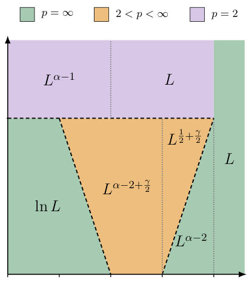
<figcaption class="paper-figure-caption"><b>Fig 1.</b> FIG. 2: “Phase diagram” of the scaling of runtime lower bounds for approximate state transfer over thermal an- cilla states in 1D power-law systems. Power-law expo- nent is α, ϵ is constant, and the thermal ancilla state is specified by δ = L−γ/2. (If ϵ depends on L, a factor of 1 −2ϵ(L) scales the bounds in all regions.) Each region is labeled by the strongest runtime bound (omitting all subleading polylog factors), and its color (see legend at top of figure) indicates which light cone is used in combi- nation with our commutator bounds. The operator-norm (p = ∞) bound is nontrivial over the entire region, but is superseded in certain regimes by the Frobenius (p = 2) or general p-norm...</figcaption>
</figure>

**Summary.** This paper derives theoretical lower bounds on the time required for quantum state transfer across qubit lattices corrupted by thermal noise. By analyzing the necessary growth of commutator norms, the authors show that the transfer runtime scales algebraically with system size in 1D power-law systems. This provides a critical understanding of how thermal throttling limits quantum information processing in realistic quantum hardware.

**Why it may be interesting.** This work directly addresses the practical limitations of quantum information processing by quantifying the slowdown caused by realistic thermal noise, providing crucial theoretical benchmarks for quantum hardware design.

Detailed structure

**Main problem.** The paper investigates the fundamental limits on achieving approximate quantum state transfer over qubit lattices when thermal noise is present in intermediate ancilla sites.

**Main result.** The runtime required for state transfer in 1D power-law systems with thermal ancilla states is shown to depend algebraically on system size, improving upon previous logarithmic bounds.

**Method.** The authors derive tight lower bounds on the commutator Schatten p-norms, relating these bounds to the minimum required runtime for approximate state transfer.

**Model / system.** The system is a qubit lattice undergoing quantum state transfer, modeled by a channel acting on the composite Hilbert space. The noise is introduced via thermal ancilla states, moving the analysis from exact to the more practical approximate regime.

**Key observables.** Commutator Schatten p-norms, approximation error ($\epsilon$), and the state transfer runtime $t$.

**Important parameters / regimes.** Temperature scaling with system size, the power-law exponent $\alpha$, and the approximation error $\epsilon$.

**Assumptions / limitations.** The analysis extends previous results from exact state transfer ($\epsilon=0$) to the approximate regime ($\epsilon > 0$), and the derivation for mixed states is significantly more complex than for pure states.

**Figures summary.** Figure 1 illustrates state transfer over imperfectly initialized sites. Figure 2 presents a phase diagram summarizing the scaling of runtime lower bounds based on system parameters like $\alpha$, $\epsilon$, and $\delta$.

**Paper structure.** The paper progresses by first establishing lower bounds for pure ancilla states, then extending these bounds to the more challenging mixed (thermal) ancilla states. It culminates by applying these general bounds to specific 1D power-law systems to derive concrete runtime scaling laws.

Abstract

Quantum state transfer on qubit lattices is a crucial step in a panoply of quantum information processing tasks. Understanding its fundamental limits in the presence of practical imperfections remains a pressing open question. In particular, it is unclear how thermal noise in the intermediate ancilla sites impedes transfer. In this work, we derive tight lower bounds on the necessary growth of commutator norms to achieve approximate state transfer. Specializing to 1D power-law systems with thermal ancilla states, we demonstrate that state transfer runtimes depend sensitively on the scaling of temperature with system size, improving logarithmic bounds to algebraic ones. Our work extends previous results on exact state transfer to the qualitatively different and more practically relevant regime of approximate state transfer.

[↑ back to top](#top)

### ⭐ [Proof of the hiding conjecture for Gaussian boson sampling with an arbitrary number of squeezed input modes](http://arxiv.org/abs/2608.19314v1)

**Highlighted author(s):** Alexey V. Gorshkov  
**Authors:** Laura Shou, Alexey V. Gorshkov, Victor Galitski, Sarah H. Miller  
**Type:** theory · **Category:** quantum information and computing · **PDF:** <https://arxiv.org/pdf/2608.19314v1>  
**Analysis basis:** full PDF text, analyzed in chunks
**Topic relevance:** `Full counting statistics` **1/5** · `Keldysh / 2PI / non-Gaussian methods` **1/5** · `analog quantum simulation` **1/5** · `interference shaping light` **1/5**

↔ Scroll figures horizontally

<figure class="paper-figure-card">
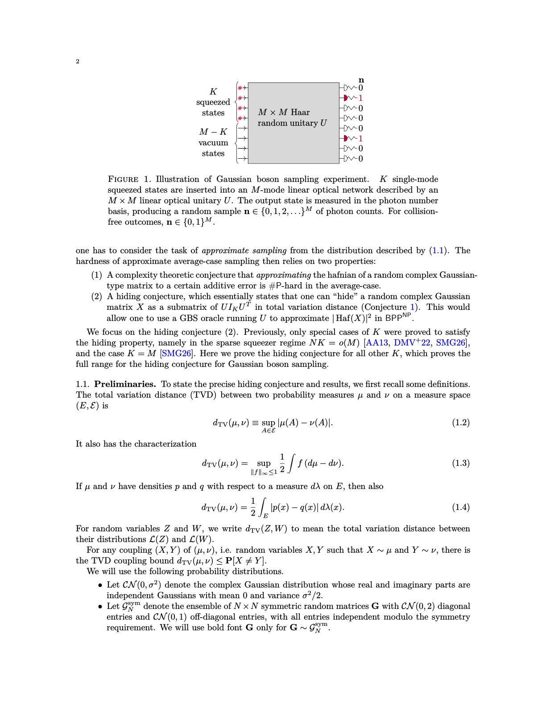
<figcaption class="paper-figure-caption"><b>Fig 1.</b> Low-resolution page preview, page 2</figcaption>
</figure>
<figure class="paper-figure-card">
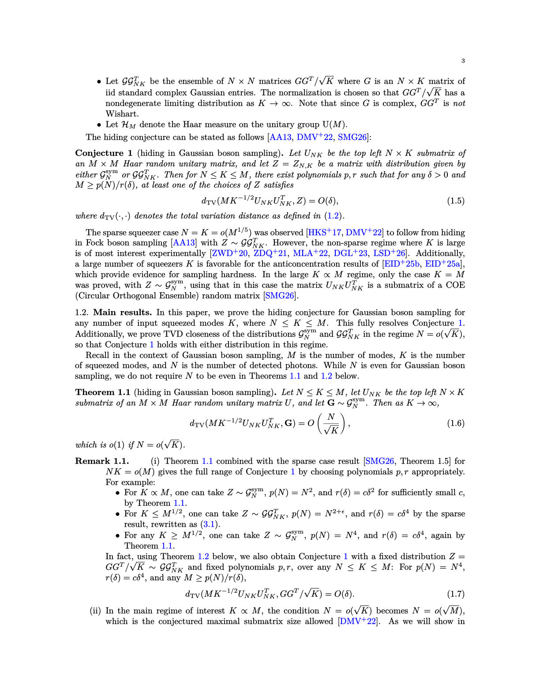
<figcaption class="paper-figure-caption"><b>Fig 2.</b> Low-resolution page preview, page 3</figcaption>
</figure>
<figure class="paper-figure-card">
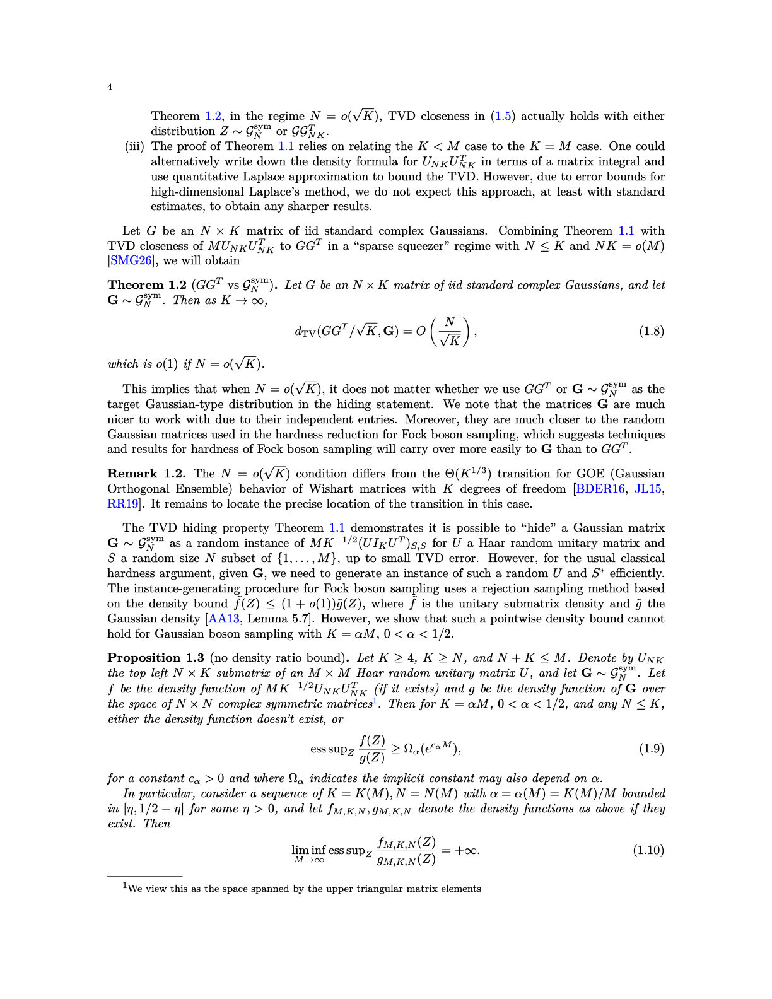
<figcaption class="paper-figure-caption"><b>Fig 3.</b> Low-resolution page preview, page 4</figcaption>
</figure>
<figure class="paper-figure-card">
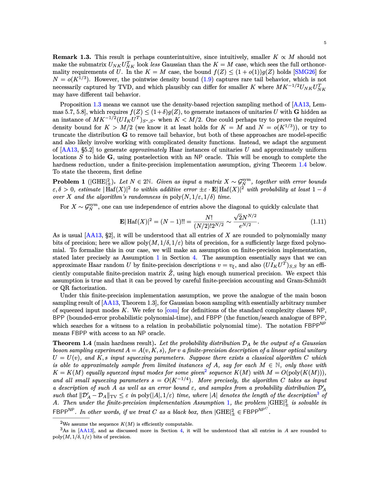
<figcaption class="paper-figure-caption"><b>Fig 4.</b> Low-resolution page preview, page 5</figcaption>
</figure>
<figure class="paper-figure-card">
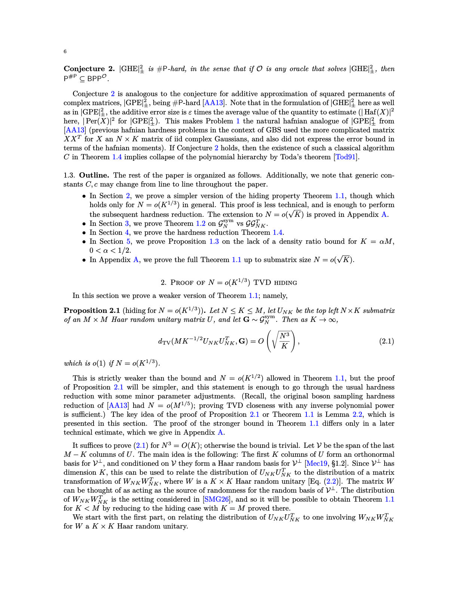
<figcaption class="paper-figure-caption"><b>Fig 5.</b> Low-resolution page preview, page 6</figcaption>
</figure>

**Summary.** This paper provides a comprehensive mathematical proof for the hiding conjecture in Gaussian Boson Sampling (GBS), a key task for demonstrating quantum advantage. By showing that the observed photon count statistics are close to known Gaussian random matrix ensembles, the authors establish the classical hardness of GBS. The methodology heavily utilizes advanced tools from random matrix theory and information geometry to bound statistical distances.

**Why it may be interesting.** This work directly tackles the computational complexity of a leading quantum advantage primitive (GBS), providing rigorous mathematical tools (TVD bounds, random matrix theory) applicable to other quantum optical or quantum simulation protocols.

Detailed structure

**Main problem.** The paper completes the proof of the 'hiding conjecture' for Gaussian boson sampling (GBS) with an arbitrary number of squeezed input modes, which is central to establishing the classical hardness of GBS.

**Main result.** The total variation distance between the empirical submatrix derived from GBS and known Gaussian ensembles is shown to be $O(N/\sqrt{K})$ when $N = o(\sqrt{K})$, proving the conjecture for all $K$.

**Method.** The proof relies on bounding the total variation distance using $\chi^2$-divergence and concentration inequalities derived from the Bakry–Émery criterion applied to random matrix expectations.

**Model / system.** The system is Gaussian Boson Sampling (GBS) implemented on $M$ optical modes, involving an evolution governed by a passive linear optical unitary $U$ and $K$ squeezed input modes.

**Key observables.** The probability distribution of the photon count outcome $n$, and the total variation distance $d_{TV}(	ext{MK}^{-1/2}U_{I_K}U^T_{n,n}, 	ext{Gaussian Ensemble})$.

**Important parameters / regimes.** The number of modes ($M$), the number of squeezed modes ($K$), and the total observed photon number ($N$). The analysis is strongest in the regime $N = o(\sqrt{K})$.

**Assumptions / limitations.** The analysis relies on the assumption that the density-based instance generating method fails for $K < M/2$, and the hardness reduction for the general case relies on finite-precision assumptions.

**Paper structure.** The paper first establishes the TVD closeness between the GBS submatrix and Gaussian ensembles (Theorems 1.1 and 1.2). It then addresses the failure of standard instance generation methods for $K < M/2$ (Proposition 1.3). Finally, it uses these results to prove the main hardness result, showing that solving GBS is equivalent to solving a hard problem related to the Hafnian.

Abstract

Gaussian boson sampling (GBS) is a sampling task proposed to demonstrate quantum advantage. We consider Gaussian boson sampling on $M$ optical modes, with $K$ equally squeezed input modes and $N$ observed photon counts. We complete the proof of the hiding conjecture for Gaussian boson sampling with an arbitrary number of squeezers $K$, which is a part of the argument for classical hardness of GBS. In particular, we show that for any $K$ and $N=o(\sqrt{K})$, the symmetric product $MK^{-1/2}U_{NK}U_{NK}^T$, for $U_{NK}$ the top left $N\times K$ submatrix of an $M\times M$ Haar random unitary $U$, is close in total variation distance to both an $N\times N$ symmetric complex Gaussian matrix $\mathbf G$ with independent entries, and the symmetric product $GG^T/\sqrt{K}$ for $G$ an $N\times K$ matrix of iid standard complex Gaussians. We show however that the density-based instance generating method of [Aaronson and Arkhipov, Theory Comput. 9, 143 (2013), Lemma 5.8] used to efficiently implement a hiding procedure fails for Gaussian boson sampling with $K=cM$ if $c<1/2$. Instead we use approximate instance generating to implement the hiding for the usual classical hardness reduction.

[↑ back to top](#top)

### [Nonthermal Dynamics of a One-dimensional Rydberg-atom Chain with Constraint Four-body Interactions](http://arxiv.org/abs/2608.20233v1)

**Authors:** Tianyi Yan, Weibin Li  
**Type:** theory · **Category:** other · **PDF:** <https://arxiv.org/pdf/2608.20233v1>  
**Analysis basis:** full PDF text, analyzed in chunks
**Topic relevance:** 🔥 `scars & prethermalization` **5/5** · 🔥 `Rydberg arrays` **4/5** · 🔥 `analog quantum simulation` **4/5** · `non-equilibrium universality` **3/5** · `Frenkel-Kontorova` **1/5**

↔ Scroll figures horizontally

<figure class="paper-figure-card">
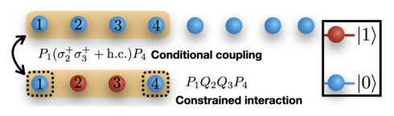
<figcaption class="paper-figure-caption"><b>Fig 1.</b> Figure 1. Constrained four-body interaction on a one- dimensional chain of spin-1/2 atoms. In each block of four sites the central pair can flip only if the two boundary atoms are in |0⟩state. After the pair is excited to state |1⟩the tetramer acquires a configuration-dependent four-body inter- action. The first four sites of the chain are shown.</figcaption>
</figure>
<figure class="paper-figure-card">
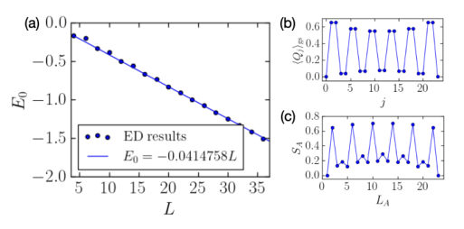
<figcaption class="paper-figure-caption"><b>Fig 2.</b> Figure 2. (a) Ground state energy versus system size L; the blue line is the thermodynamic-limit prediction of Eq. (??). (b) The site-resolved Rydberg occupation of the ground state versus site index. (c) Bipartite entanglement entropy of the ground state versus the subsystem size. In all panels, g = 0.1.</figcaption>
</figure>
<figure class="paper-figure-card">
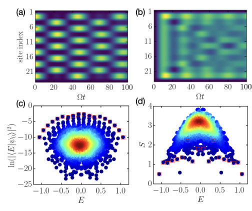
<figcaption class="paper-figure-caption"><b>Fig 3.</b> Figure 3. (a) Occupation ⟨Qi⟩starting from |Z4⟩. (b) Occu- pation ⟨Qi⟩starting from |0⟩. (c) Overlaps of |Z4⟩with the eigenstates. (d) Bipartite entanglement entropy of the eigen- states. In all panels, g = 0.1.</figcaption>
</figure>
<figure class="paper-figure-card">
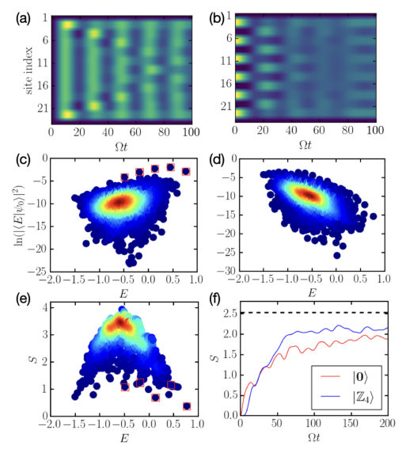
<figcaption class="paper-figure-caption"><b>Fig 4.</b> Figure 4. Dynamics and spectrum of the full effective model, Eq. (1). (a) Occupation ⟨Qi⟩starting from |0⟩. (b) Occu- pation ⟨Qi⟩starting from |Z4⟩. (c) Overlaps of |0⟩with the eigenstates. (d) Overlaps of |Z4⟩with the eigenstates. (e) Bi- partite entanglement entropy of the eigenstates; the dashed line is the Page value ≈2.54. (f) Entanglement-entropy dy- namics from |0⟩and |Z4⟩. Panels (a) and (b) use L = 24; panels (c)–(f) use L = 36. In all panels, g = 0.1.</figcaption>
</figure>
<figure class="paper-figure-card">
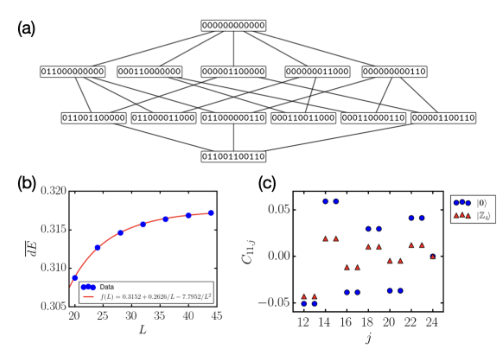
<figcaption class="paper-figure-caption"><b>Fig 5.</b> Figure 5. Scar structure of Eq. (1). (a) Connectivity graph in the allowed computational basis. (b) Average energy spacing among the four eigenstates with the largest overlap on |0⟩, versus chain length L. (c) Connected correlations Ci,j = ⟨QiQj⟩−⟨Qi⟩⟨Qj⟩between site 11 and site j for |0⟩ and |Z4⟩, taken at Ωt = 35 and 30, respectively, for L = 24. In (b) and (c), g = 0.1.</figcaption>
</figure>

**Summary.** This paper models a 1D chain of Rydberg atoms interacting via constrained four-body forces, simulating non-thermal dynamics. By comparing a simplified kinetic model to the full interacting model, the authors show that the four-body term fundamentally alters the system's dynamics, leading to persistent quantum scars and long-range correlations. This provides a pathway to study controlled non-ergodic behavior using advanced Rydberg array platforms.

**Why it may be interesting.** This work directly addresses the control of non-equilibrium quantum dynamics by engineering higher-order, state-dependent interactions (four-body) using Rydberg blockade/antiblockade mechanisms, which is a major frontier in AMO physics.

Detailed structure

**Main problem.** The study investigates non-thermal dynamics and weak ergodicity breaking in a one-dimensional chain of Rydberg atoms subjected to constrained four-body interactions.

**Main result.** The inclusion of the state-dependent four-body interaction reverses the dynamics observed in the simpler kinetic model, causing the initial state $|0
angle$ to develop long-range correlations while the system remains non-ergodic.

**Method.** The authors employed an ansatz for the many-body ground state to diagonalize the Hamiltonian, deriving an effective low-energy model and analyzing time evolution using quantum many-body scar diagnostics.

**Model / system.** The system is a 1D chain of Rydberg atoms realized in a Peierls array with alternating bond lengths, governed by a kinetically constrained Hamiltonian involving four-body interactions.

**Key observables.** Ground state energy scaling ($E_0 \propto L$), bipartite entanglement entropy, site-resolved occupation ($\langle Q_j 
angle$), and state revival dynamics.

**Important parameters / regimes.** The four-body interaction strength, the alternating bond lengths (related to blockade/antiblockade), and the chain length $L$.

**Assumptions / limitations.** The analysis relies on developing a specific ansatz for the many-body ground state and approximating the full Hamiltonian via Schrieffer–Wolff transformations.

**Figures summary.** Figures illustrate the constrained interaction, ground state properties (energy, occupation, entanglement), and time evolution dynamics for different initial states ($|0
angle$ vs $|Z_4
angle$) under the kinetic term only versus the full model.

**Paper structure.** The paper progresses by defining the constrained four-body Hamiltonian, simplifying it using approximations (RWA, anti-blockade), deriving an effective Hamiltonian, and then analyzing the resulting dynamics and ground state properties by comparing the results from the simplified kinetic model versus the full interacting model.

Abstract

We investigate dynamics of a linear chain of Rydberg atoms driven by a constrained four-body interaction, where two neighboring atoms are excited simultaneously from the electronic ground state $|0\rangle$ to Rydberg state $|1\rangle$ only when their closest neighbors are in $|0\rangle$ state. By employing an ansatz for the many-body ground state, the low-energy Hamiltonian is given by a tridiagonal form. The many-body ground state energy, which scales linearly with the chain length $L$, is obtained analytically in the thermodynamic limit and agrees with the one of the exact diagonalization. Our model supports quantum many-body scar eigenstates that are nearly equally spaced energetically. The scar states overlap strongly with the basis state $|\mathbf{0}\rangle=|0\cdots 0\rangle$. We show that the overlap distribution is tilted by the state-dependent four-body interaction. This leads to non-ergodic dynamics, evidenced by the revival of the initial state. The four-body constrained model can be realized with Rydberg atoms in a Peierls array with alternating bond lengths, where atoms on the shorter and longer bonds experience Rydberg blockade and antiblockade, respectively. Our study provides a pathway to explore constrained non-ergodic dynamics with four-body interactions by combining the Rydberg blockade and antiblockade.

[↑ back to top](#top)

### [Kibble--Zurek Scaling in the Dicke Model at Mesoscopic Scales](http://arxiv.org/abs/2608.20067v1)

**Authors:** Haowei Li, Hanteng Wang  
**Type:** theory · **Category:** statistical mechanics · **PDF:** <https://arxiv.org/pdf/2608.20067v1>  
**Analysis basis:** full PDF text, analyzed in chunks
**Topic relevance:** 🔥 `Dicke superradiance` **4/5** · 🔥 `Keldysh / 2PI / non-Gaussian methods` **4/5** · 🔥 `driven-dissipative phase transition` **4/5** · 🔥 `non-equilibrium universality` **4/5** · `Tavis-Cummings & cavity-many-emitter` **3/5** · `correlated / nonlocal dissipation` **3/5** · `methods for driven-dissipative` **3/5** · `superradiant laser` **3/5** · `analog quantum simulation` **2/5** · `quantum measurements` **1/5**

↔ Scroll figures horizontally

<figure class="paper-figure-card">
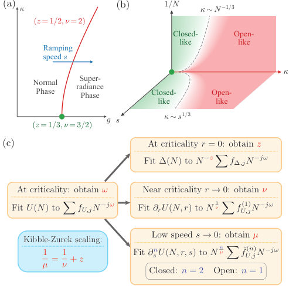
<figcaption class="paper-figure-caption"><b>Fig 1.</b> FIG. 1. (a) Phase diagram of the Dicke model in the plane of light-matter coupling g and dissipation κ. Two distinct universality classes are identified at large N: closed (green) and open (red). The ramp protocol is defined by the ramping speed s. (b) Crossover regions set by size N, dissipation κ, and speed s in the ramping dynamics. (c) Scaling protocol at mesoscopic scales that encodes the irrelevant exponent ω. The exponents ν, z, and µ are then extracted independently, and the KZ relation 1/µ = 1/ν + z is tested.</figcaption>
</figure>
<figure class="paper-figure-card">
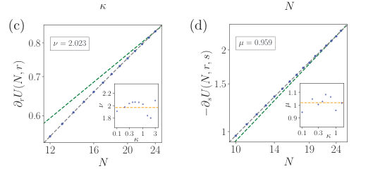
<figcaption class="paper-figure-caption"><b>Fig 2.</b> FIG. 3. Open Dicke model. (a) Joint critical Binder-ratio fit for different κ ∈[0.1, 3], used to fix ω. Red dashed curves show extrapolated U(N) vs κ at fixed N = 102, 103, 104, and N →∞, ordered from sparse to dense. (b)–(d) Extraction of z, ν, and µ from the Liouvillian gap, Binder-ratio derivative, and linear small-speed response, respectively. Insets in (b)– (d) show the corresponding κ dependence.</figcaption>
</figure>
<figure class="paper-figure-card">
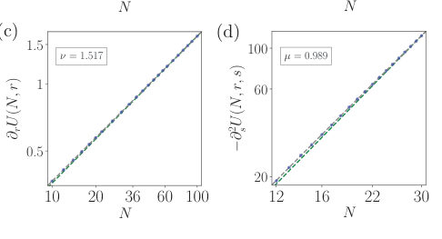
<figcaption class="paper-figure-caption"><b>Fig 3.</b> FIG. 2. Closed Dicke model. (a) Critical Binder ratio used to fix the leading irrelevant exponent ω. The red dashed line marks extrapolated U(N →∞). (b)–(d) Extraction of z, ν, and µ from the critical gap, Binder-ratio derivative, and small-speed response, respectively. Gray dashed curves in- clude corrections to scaling up to j = 2; green dashed lines show the leading power laws with the fitted exponents. For all figures, we set ω0 = ωz = 1.</figcaption>
</figure>
<figure class="paper-figure-card">
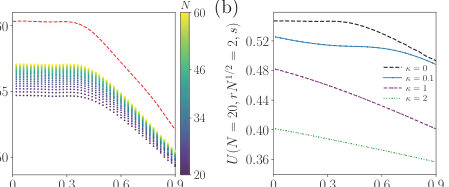
<figcaption class="paper-figure-caption"><b>Fig 4.</b> FIG. 4. (a) Ramped Binder ratio in the closed Dicke model for different system sizes; red dashed lines indicate the N →∞ extrapolation. (b) Comparison of the ramped Binder ratio between the closed and open Dicke models for different κ.</figcaption>
</figure>
<figure class="paper-figure-card">
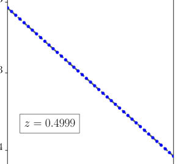
<figcaption class="paper-figure-caption"><b>Fig 5.</b> FIG. 5. Soft-mode spectral gap of the open Dicke model at the critical point, obtained within the Hartree–Fock–Bogoliubov approximation for κ = 1. The calculation is performed over the range N = 105–107, where the asymptotic N −1/2 decay becomes clearly visible.</figcaption>
</figure>

**Summary.** This paper develops a unified scaling framework to accurately determine critical exponents for the Dicke model at mesoscopic sizes. By incorporating leading irrelevant corrections, the authors successfully describe the critical dynamics across both coherent and dissipative regimes. This methodology offers a general approach for resolving static and dynamical critical scaling in various open quantum systems.

**Why it may be interesting.** This work provides a powerful, generalizable theoretical tool for analyzing critical dynamics in complex, open quantum systems where experimental access to the thermodynamic limit is impossible.

Detailed structure

**Main problem.** The core challenge is extracting universal critical exponents for the Dicke model at mesoscopic scales, complicated by slow correlation time divergence and crossover into a dissipative universality class.

**Main result.** The authors establish a unified mesoscopic scaling framework that successfully recovers the Kibble-Zurek exponents for both closed and open quantum systems, clarifying the competition between finite size, dissipation, and ramping speed.

**Method.** The work employs large-N analysis within a unified Keldysh field theory, developing a multi-stage finite-size scaling protocol that incorporates leading irrelevant corrections.

**Model / system.** The study focuses on the Dicke model, a paradigmatic system for collective light-matter physics exhibiting a superradiant phase transition. It is analyzed in both closed (Hamiltonian) and open (Lindblad equation) system settings.

**Key observables.** Critical exponents ($
u, z, \mu$), Binder ratio ($U(N)$), and the soft-mode spectral gap ($\Delta(N)$).

**Important parameters / regimes.** Dissipation rate ($\kappa$), particle number ($N$), and ramping speed ($s$).

**Assumptions / limitations.** The analysis relies on the validity of large-N expansions and the ability to map the dynamics onto a unified scaling variable that accounts for irrelevant corrections.

**Figures summary.** Figures illustrate the phase diagram distinguishing closed/open classes, the scaling protocol involving irrelevant exponents, and the confirmation of scaling laws for both coherent and dissipative regimes.

**Paper structure.** The paper progresses by first identifying the challenge of mesoscopic critical dynamics, then developing the unified scaling framework using large-N methods, and finally applying this framework to extract and verify the exponents for both the closed and open Dicke models.

Abstract

The Dicke model is a paradigmatic setting for collective light-matter physics and the superradiant phase transition. Yet extracting the critical exponents is challenging at experimentally accessible mesoscopic sizes, due to the slow divergence of the correlation time under all-to-all coupling and a photon-loss-driven crossover to a distinct dissipative universality class. Here, we perform a large-$N$ analysis that identifies distinct coherent and dissipative fixed points for the closed and open Dicke models. We then develop a unified mesoscopic scaling framework that incorporates the leading irrelevant correction and, going beyond static and spectral probes, brings ramping dynamics under the same scaling description. It recovers the corresponding exponents, verifies Kibble-Zurek scaling, and clarifies how finite size, dissipation, and speed compete in the ramping dynamics. Our work thus establishes a unified framework for resolving static and dynamical critical scaling in closed and open quantum systems, with broader applicability to mesoscopic systems with long-range interactions.

[↑ back to top](#top)

### [A Zoology of Quantum Turing Patterns](http://arxiv.org/abs/2608.20151v1)

**Authors:** Kazuki Ikeda  
**Type:** theory · **Category:** statistical mechanics · **PDF:** <https://arxiv.org/pdf/2608.20151v1>  
**Analysis basis:** full PDF text, analyzed in chunks
**Topic relevance:** 🔥 `driven-dissipative phase transition` **4/5** · 🔥 `methods for driven-dissipative` **4/5** · `correlated / nonlocal dissipation` **3/5** · `non-equilibrium universality` **3/5** · `Keldysh / 2PI / non-Gaussian methods` **2/5** · `analog quantum simulation` **2/5** · `quantum measurements` **1/5**

↔ Scroll figures horizontally

<figure class="paper-figure-card">
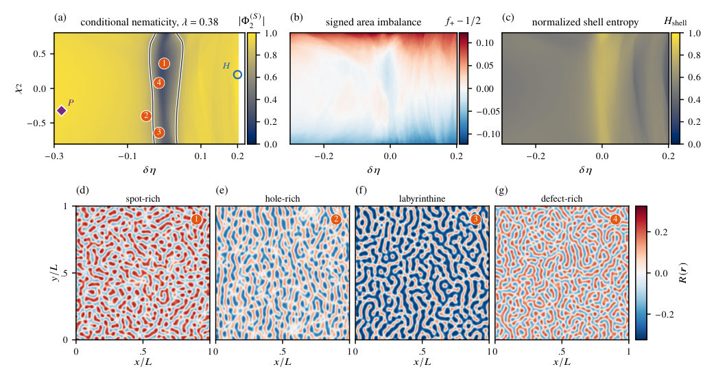
<figcaption class="paper-figure-caption"><b>Fig 1.</b> FIG. 1. Morphology atlas and fields from different preparations. Conditional stripe nematicity at 𝜆= 0.38 is mapped in panel (a). Gray cells fail the resolved-field criterion and the contour marks |Φ(𝑆) 2 | = 0.72. The filled diamond P and open circle H denote the two stable stripe branches. Markers 1 through 4 identify the spot-rich, hole-rich, labyrinthine, and defect-rich fields in panels (d) through (g). Area imbalance and shell entropy appear in panels (b) and (c). Every atlas cell starts from the same state. Preparation dependence is tested in the Supplemental Material. The letter P labels the principal stripe branch, while 𝑤𝑃denotes the Glauber–Sudarshan witness.</figcaption>
</figure>
<figure class="paper-figure-card">
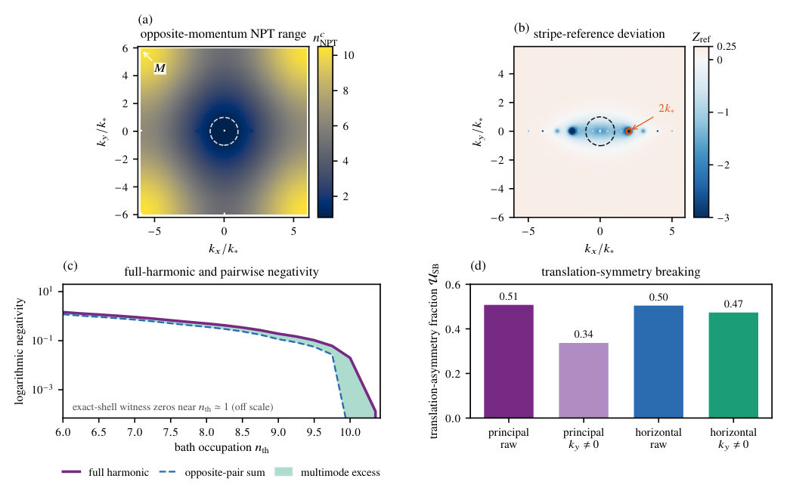
<figcaption class="paper-figure-caption"><b>Fig 2.</b> FIG. 2. Momentum-space Gaussian structure and translation breaking. Panel (a) maps the noise range certified by the negative partial transpose (NPT) criterion for opposite-momentum pairs. The dashed circle identifies the exact 𝑘∗shell, and 𝑀is the endpoint invariant under momentum inversion. Panel (b) gives the standardized crossing difference 𝑍ref relative to uniform comparison states made stationary by constant drives. Negative values place the stripe crossing below the family mean, with the contrast concentrated near 2𝑘∗. The linear scale spans −3 to 0.25, maps zero to white, and clips values below −3 to the lower endpoint. Panel (c) shows the scanned Bloch partition with the largest...</figcaption>
</figure>
<figure class="paper-figure-card">
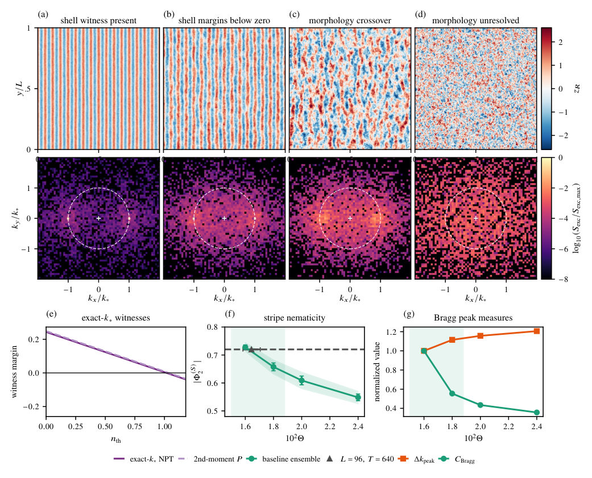
<figcaption class="paper-figure-caption"><b>Fig 3.</b> FIG. 3. Gaussian witness loss and stripe nematic crossover. Each field in panels (a) through (d) is centered and standardized separately. The panels show a stripe with a positive witness margin on the exact 𝑘∗shell, a resolved stripe after both margins on that shell cross zero, the morphology crossover, and an unresolved morphology. Color therefore encodes form on a common dimensionless scale. The crossover estimator uses the trajectory ensemble, and the four snapshots are illustrative. The Supplement identifies the source arrays and retained metadata for these snapshots. The middle row gives the corresponding Fourier powers after background subtraction on common momentum axes and a common...</figcaption>
</figure>
<figure class="paper-figure-card">
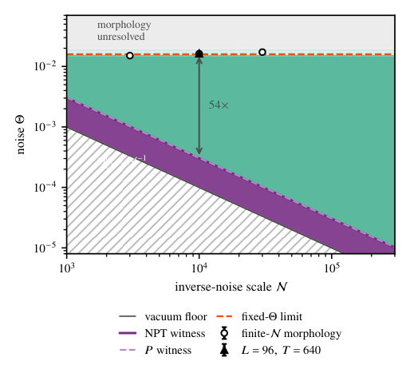
<figcaption class="paper-figure-caption"><b>Fig 4.</b> FIG. 4. Parametric separation of Gaussian witness and stripe nematic scales. The NPT and second-moment 𝑃thresholds on the exact 𝑘∗shell decrease as N −1. Finite-N morphology estimates approach the dashed limit obtained from the first-moment equation at fixed Θ. The hatched region lies below the vacuum-noise floor. Between the Gaussian curves and the morphology scale, resolved stripes remain after both witness margins on the exact 𝑘∗shell have crossed zero. The filled triangle gives the 𝐿= 96, 𝑇= 640 estimate. At N = 104, the morphology threshold is about 54 times the NPT threshold, one point on a separation that grows with N.</figcaption>
</figure>
<figure class="paper-figure-card">
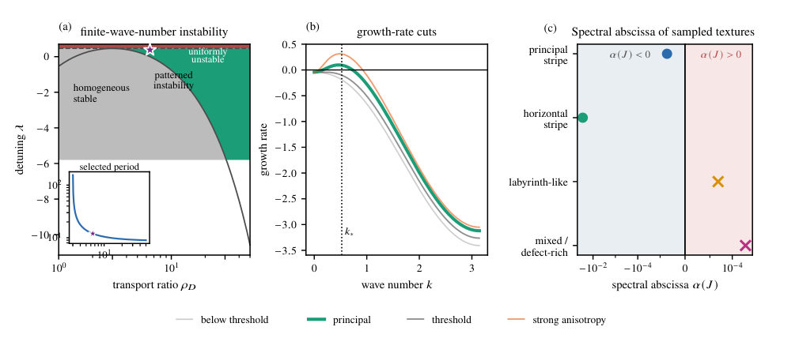
<figcaption class="paper-figure-caption"><b>Fig 5.</b> FIG. 5. Model and linear stability. The finite-wave-number instability wedge appears in panel (a). The white-edged star marks (𝜆, 𝜌𝐷) = (0.38, 3 + 2 √</figcaption>
</figure>

**Summary.** This work explores the rich 'zoology' of quantum Turing patterns supported by a single Lindblad equation. It rigorously demonstrates that macroscopic morphological order (like stripes) can persist even when standard measures of quantum entanglement (Gaussian witnesses) suggest their absence. The findings highlight a quantitative separation between these two distinct types of order as the system size increases.

**Why it may be interesting.** It provides a detailed theoretical framework for distinguishing between different types of order (classical/morphological vs. quantum/entanglement) in open quantum systems, which is highly relevant for understanding pattern formation in quantum optics and condensed matter.

Detailed structure

**Main problem.** The paper investigates quantum Turing pattern zoology, exploring how a single Lindblad equation can support a diverse morphology atlas (stripes, spots, holes, etc.). It specifically focuses on the separation between macroscopic order and quantum correlations.

**Main result.** Visible Turing stripes can persist even when Gaussian entanglement witnesses cross zero, and the threshold for morphology order grows parametrically with system size ($N$) relative to the witness thresholds.

**Method.** The analysis uses the Lindblad master equation to model system dynamics, calculating mean values and fluctuations via the covariance matrix evolution. Key diagnostics include Gaussian witnesses and morphology measures.

**Model / system.** The system is a periodic array of bosonic modes governed by a Lindblad equation involving a Hamiltonian and jump operators, describing parametrically driven nonlinear resonators.

**Key observables.** Stripe nematicity, Gaussian witnesses (NPT, P-witness), covariance matrix asymmetry (USB), and various morphology thresholds ($\Theta_c^M$).

**Important parameters / regimes.** System size ($N$), lattice size ($L$), and various coupling/gain/loss parameters defining the Lindblad generator.

**Assumptions / limitations.** The analysis compares finite-$N$ results to the $N 	o \infty$ limit and relies on linearizing the fluctuation dynamics around mean values.

**Figures summary.** Figures illustrate the morphology atlas (Fig. 1), momentum space structure and witness crossings (Fig. 2), and the parametric separation of morphology and witness thresholds (Fig. 4).

**Paper structure.** The paper systematically analyzes the dynamics using the Lindblad equation, first characterizing the full morphology space, then quantifying quantum correlations using witnesses, and finally demonstrating the parametric separation between these two types of order.

Abstract

We explore quantum Turing pattern zoology, where the same Lindblad equation supports a morphology atlas of stripes, spots, holes, labyrinths, and defects. The stable stripe species provides a quantitatively controlled case in which morphology and Gaussian witness loss separate parametrically. In particular, visible Turing stripes can remain after two Gaussian witness margins associated with the same $k_*$ mode cross zero in a completely positive Lindblad lattice. The witness thresholds on the exact shell fall as $\mathcal{N}^{-1}$. The stripe nematic threshold tends to a nonzero value at fixed lattice size, time window, and morphology criterion. The ratio of the morphology threshold to either witness threshold therefore grows with $\mathcal{N}$. Imaging and momentum-resolved covariance measurements probe these sectors separately.

[↑ back to top](#top)

### [Dissipation-tunable extended and localized steady states in a non-disordered lattice](http://arxiv.org/abs/2608.19694v1)

**Authors:** Ming-Jie Tao, Yi-Ting Wang, Jing Li, Hongsheng Hou, Xiang-Ping Jiang, Lei Pan  
**Type:** theory · **Category:** disordered systems and neural networks · **PDF:** <https://arxiv.org/pdf/2608.19694v1>  
**Analysis basis:** full PDF text, analyzed in chunks
**Topic relevance:** 🔥 `correlated / nonlocal dissipation` **4/5** · `analog quantum simulation` **3/5** · `driven-dissipative phase transition` **3/5** · `methods for driven-dissipative` **3/5** · `non-equilibrium universality` **2/5** · `quantum measurements` **2/5** · `Keldysh / 2PI / non-Gaussian methods` **1/5** · `scars & prethermalization` **1/5**

↔ Scroll figures horizontally

<figure class="paper-figure-card">
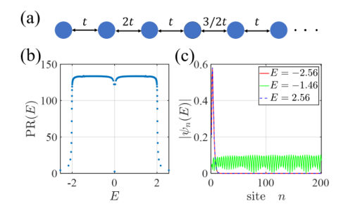
<figcaption class="paper-figure-caption"><b>Fig 1.</b> FIG. 1. (a) Schematic of the inhomogeneously-hopped lattice with N = 2 hopping modulation, which supports M = 1 sur- face bound state in the continuum (BIC) at the parameter point β = 1. (b) Participation ratio PR(E) of the single- particle eigenstates versus their energy E, computed numeri- cally for a finite lattice of L = 201 sites; the horizontal spread of the data simultaneously displays the energy spectrum. (c) Real-space wavefunction amplitudes |ψn(E)| for representa- tive eigenstates: an extended bulk state at E = −1.46, de- localized across the lattice, and localized boundary modes at E = ±2.56, confined near the lattice edges.</figcaption>
</figure>
<figure class="paper-figure-card">
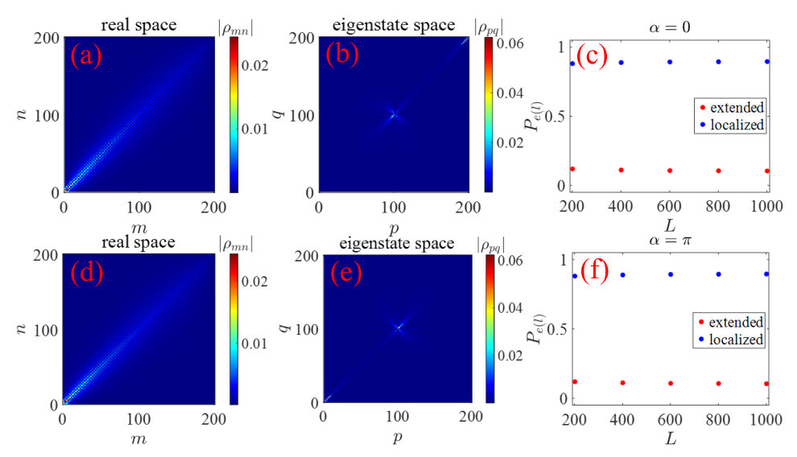
<figcaption class="paper-figure-caption"><b>Fig 2.</b> FIG. 2. Localization properties of the stationary state for α = 0 and α = π. (a),(d) Absolute values of the steady-state density- matrix elements |ρmn| in real space for α = 0 and α = π, respectively. (b),(e) Corresponding density-matrix distributions |ρpq| in the eigenstate basis of the underlying Hamiltonian. (c),(f) Finite-size scaling of the eigenstate localization measure P (l) e for system sizes L = 201, 401, 601, 801, and 1001. The localized and extended states remain well separated over the entire size range for both values of α, with no appreciable systematic drift with increasing L. The results demonstrate the robustness of the localized and extended sectors against the phase...</figcaption>
</figure>
<figure class="paper-figure-card">
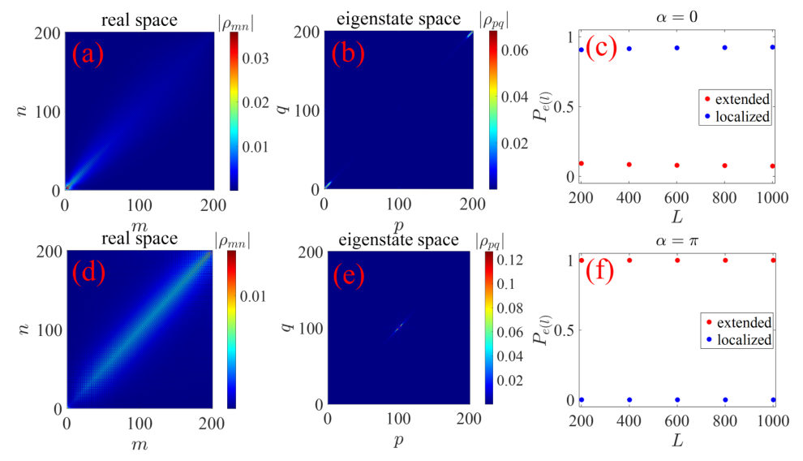
<figcaption class="paper-figure-caption"><b>Fig 3.</b> FIG. 3. Localization properties of the stationary state for α = 0 and α = π. (a),(d) Absolute values of the steady-state density- matrix elements |ρmn| in real space for α = 0 and α = π, respectively. (b),(e) Corresponding density-matrix distributions |ρpq| in the eigenstate basis of the underlying Hamiltonian. (c),(f) Finite-size scaling of the eigenstate localization measure P (l) e for system sizes L = 200, 400, 600, 800, and 1000. The localized and extended states remain well separated over the entire size range for both values of α, with no appreciable systematic drift with increasing L. The results demonstrate the robustness of the localized and extended sectors against the phase...</figcaption>
</figure>
<figure class="paper-figure-card">
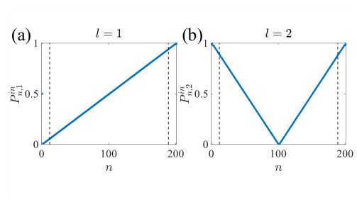
<figcaption class="paper-figure-caption"><b>Fig 4.</b> FIG. 4. (a) The fraction of in-phase pairs P in n,1 for different eigenstates. The black dashed lines mark the extended bulk and localized boundary regions as eigenvalues increase. (b) The fraction of in-phase pairs P in n,2 for different eigenstates.</figcaption>
</figure>
<figure class="paper-figure-card">
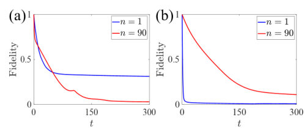
<figcaption class="paper-figure-caption"><b>Fig 5.</b> FIG. 5. Time evolution of the quantum fidelity F[ρ(t), ρ0] after the introduction of dissipation at t = 0 with strength Γ = 1. (a) and (d) correspond to the dissipative phases α = 0 and α = π, respectively. In the figure, the blue solid line is obtained by initializing the system in the extended eigenstate labeled n = 1, and the red solid line by initializing in the localized eigenstate labeled n = 90. The system parameters are L = 201 and l = 2.</figcaption>
</figure>

**Summary.** This theoretical work shows that controlled dissipation can act as a selective filter, allowing researchers to force a non-disordered quantum lattice into a steady state dominated by either localized or extended wave functions. By tuning the phase of the dissipation, the system's asymptotic state can be controlled without altering the underlying Hamiltonian parameters. This establishes a powerful, dissipation-mediated route for state preparation and transport control.

**Why it may be interesting.** This work provides a concrete, controllable mechanism to manipulate quantum transport and localization in clean systems using engineered dissipation, which is highly relevant for understanding open quantum dynamics in AMO and quantum optics.

Detailed structure

**Main problem.** To demonstrate that engineered dissipation can actively select between localized and extended steady states in a strictly non-disordered lattice, challenging the view that dissipation always causes decoherence.

**Main result.** The system's long-time steady state can be deterministically steered toward sectors dominated by either localized or extended Hamiltonian eigenstates solely by tuning the phase ($\alpha$) of a nonlocal dissipative coupling.

**Method.** The dynamics are analyzed using the Lindblad master equation, casting the evolution into a linear equation on the Liouville-Fock space. State selection is quantified by analyzing the in-phase pair fraction and using quantum fidelity.

**Model / system.** The model is a one-dimensional tight-binding lattice with deterministic, inhomogeneous hopping near the boundaries. The dynamics are governed by the Lindblad master equation, incorporating a nonlocal bond jump operator with a tunable relative phase $\alpha$.

**Key observables.** Participation Ratio (PR), Quantum Fidelity ($F$), and the fraction of in-phase site pairs ($P_{n,l}$).

**Important parameters / regimes.** The relative phase $\alpha$ and the separation distance $l$ of the dissipative coupling are the primary control parameters.

**Assumptions / limitations.** The analysis relies on the Born–Markov approximation.

**Figures summary.** Figures illustrate the lattice modulation, the energy spectrum including a Bound State in the Continuum (BIC), and the time evolution of quantum fidelity comparing initial localized vs. extended states under different dissipation phases.

**Paper structure.** The paper establishes the model, introduces the dissipation mechanism, analyzes the steady-state selection using phase-matching criteria, and confirms the robustness of the prepared state by monitoring quantum fidelity after the quench.

Abstract

Dissipation is usually regarded as a source of decoherence that suppresses quantum interference and localization. Here we show that suitably engineered dissipation can instead be used to select localized or extended states in a strictly non-disordered one-dimensional lattice. The underlying clean lattice has spatially inhomogeneous hopping and supports both extended bulk states and localized boundary states, including an algebraically localized bound state in the continuum. We introduce a nonlocal bond jump operator with a tunable relative phase and show that this phase selectively favors eigenstates with different spatial phase correlations. As a result, the long-time density matrix can be steered toward sectors dominated by localized or extended Hamiltonian eigenstates without changing any Hamiltonian parameter. The microscopic origin of the selection is quantified by the fraction of site pairs separated by a distance $l$ that are phase matched with the dissipative channel. We further characterize the dissipative quench through the quantum fidelity and show that the selected character of the steady state can persist after the dissipation is removed. Our results establish phase-selective bond dissipation as a route to controllable state preparation and transport manipulation in non-disordered lattices.

[↑ back to top](#top)

### [Programmable cavity QED with a fiber-integrated atomic array](http://arxiv.org/abs/2608.20291v1)

**Authors:** Stephan Roschinski, Johannes Schabbauer, Franz von Silva-Tarouca, Marvin Holten, Damien Bloch, Julian Léonard  
**Type:** experiment · **Category:** other · **PDF:** <https://arxiv.org/pdf/2608.20291v1>  
**Analysis basis:** full PDF text, analyzed in chunks
**Topic relevance:** 🔥 `Tavis-Cummings & cavity-many-emitter` **4/5** · 🔥 `quantum optics experiment` **4/5** · `QC/QI experiment` **3/5** · `analog quantum simulation` **3/5** · `quantum measurements` **3/5** · `Rydberg arrays` **2/5**

↔ Scroll figures horizontally

<figure class="paper-figure-card">
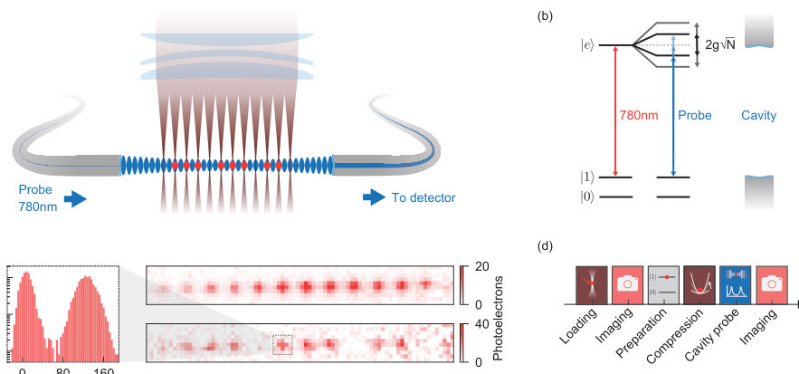
<figcaption class="paper-figure-caption"><b>Fig 1.</b> FIG. 1. Realization of a fiber-integrated atomic array. (a) Schematic of the experimental setup. Two mirrors, fabricated on the end-facets of optical fibers, form a high-finesse optical cavity. Optical tweezers are projected through a microscope objective onto the cavity mode and loaded with 87Rb atoms. A resonant probe beam is coupled into the cavity through one fiber mirror, and the transmitted light is detected on a single-photon counting module through the other. (b) Relevant level scheme for the D2-line of 87Rb, with qubit states |0⟩= |F = 1, mF = 1⟩, |1⟩= |F = 2, mF = 2⟩and excited state |e⟩= |F ′ = 3, mF ′ = 3⟩. For all measurements, irrespective of atom number N, the cavity is...</figcaption>
</figure>
<figure class="paper-figure-card">
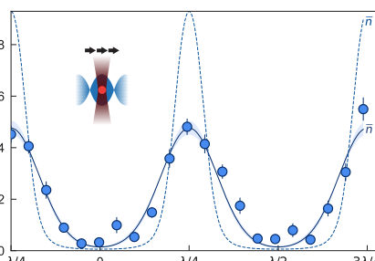
<figcaption class="paper-figure-caption"><b>Fig 2.</b> FIG. 2. Position-controlled cavity blockade. (a) Cavity transmission as the tweezer is translated along the cavity axis. The transmission reflects the local atom-photon cou- pling: atoms near field nodes leave the cavity highly trans- missive, whereas atoms near antinodes suppress transmission through enhanced coupling to the cavity mode. The data agree with an exact finite-temperature theory, taking into ac- count atomic zero-point motion and a mean motional occu- pation in the trap of ¯n = 7(1) (solid line). (b) Repeated measurements of the atomic position along the cavity axis show a variation of 1.1% × λ, well below the spatial period λ/2 of the standing-wave mode.</figcaption>
</figure>
<figure class="paper-figure-card">
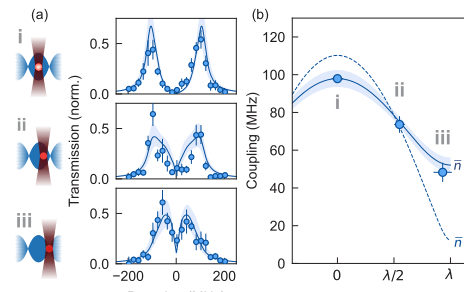
<figcaption class="paper-figure-caption"><b>Fig 3.</b> FIG. 3. Programmable atom-photon coupling. (a) Cavity transmission spectra for three representative atomic positions along the standing-wave mode. By translating a single atom through the cavity field, we continuously tune the coupling from the strong-coupling regime at an antinode (i), where a clear vacuum Rabi splitting appears, through intermediate coupling between node and antinode (ii), to weak coupling near a node (iii), where the spectrum approaches that of an empty cavity. Solid lines are fits with the coupling strength as the only free parameter. (b) Extracted coupling strength ver- sus position. The data agree with an exact finite-temperature theory (solid lines).</figcaption>
</figure>
<figure class="paper-figure-card">
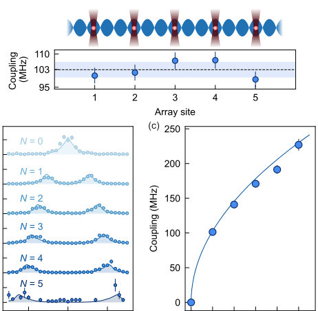
<figcaption class="paper-figure-caption"><b>Fig 4.</b> FIG. 4. Collective enhancement of the coupling. (a) We project a five-site tweezer array with all sites positioned near antinodes and measure the coupling strength of each site in- dividually. The extracted couplings agree within error, es- tablishing the homogeneity of the coupling control. (b) Cav- ity transmission spectra for atom numbers N = 0 −5. As additional tweezers are occupied, the vacuum Rabi splitting increases due to collective enhancement of the atom-cavity coupling. Solid lines are fits to the data with the coupling strength as the only free parameter. (c) Collective coupling strength extracted from the spectra in (b). The solid line shows the expected Tavis-Cummings scaling,...</figcaption>
</figure>
<figure class="paper-figure-card">
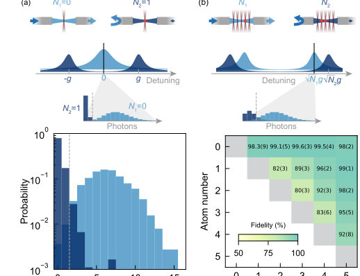
<figcaption class="paper-figure-caption"><b>Fig 5.</b> FIG. 5. Non-destructive atom-number readout. (a) We de- tect the atom number from the suppression of resonant probe light due to cavity blockade: for a single atom, N = 1, the transmission is reduced (dark blue), whereas the uncoupled case, N = 0, remains highly transmissive (light blue). The dashed line shows the photon number for optimal threshold. (b) While resonant probe light is reflected for any atom num- ber N ≥1, probe light that is resonant with the polariton peak for N atoms is sensitive to the respective atom number. Measuring the cavity then at this frequency we extract his- tograms as in (a). Using this procedure we extract fidelities for every pair of atom numbers....</figcaption>
</figure>

**Summary.** This paper reports on the integration of a twelve-site $^{87}	ext{Rb}$ optical tweezer array with a high-cooperativity fiber microcavity to create a programmable cavity QED system. The researchers demonstrated continuous, position-dependent control over atom-photon coupling, enabling both cavity blockade and non-destructive measurement of the number of coupled atoms. This establishes a key building block for scalable quantum network nodes.

**Why it may be interesting.** This work provides a concrete, highly controllable experimental realization of cavity QED in a scalable, integrated platform, directly addressing the engineering challenges of coupling atomic arrays to photonic circuits for quantum networking.

Detailed structure

**Main problem.** The primary goal is to develop a scalable, programmable architecture for cavity-mediated entanglement generation and many-body cavity QED, specifically targeting fiber-integrated quantum network nodes.

**Main result.** The authors successfully demonstrated programmable control over single-atom and collective atom-photon coupling, enabling non-destructive, state-dependent readout of the number of coupled atoms.

**Method.** The experiment combines a twelve-site $^{87}	ext{Rb}$ optical tweezer array with a high-cooperativity fiber Fabry-Pérot microcavity, allowing precise spatial control over atom-cavity coupling.

**Model / system.** The system uses a fiber-integrated cavity coupled to an array of neutral atoms trapped by optical tweezers. The physics is governed by strong atom-photon interactions, leading to cavity blockade and collective coupling scaling ($\sqrt{N}$).

**Key observables.** Vacuum Rabi splitting, cavity transmission $T(x)$, non-destructive atom-number readout fidelity, and position-dependent coupling strength $g(x)$.

**Important parameters / regimes.** Cooperativity ($\eta=173$), coupling parameters $(g, \kappa, \gamma)$, and the position-dependent coupling $g(x) = g_0 \cos(kx)$.

**Assumptions / limitations.** The analysis accounts for the finite atomic wavefunction spread ($\sigma_x$) using Monte Carlo methods and uses Bayesian inference for uncertainty quantification.

**Figures summary.** Figures illustrate the schematic setup, position-controlled cavity blockade via transmission modulation, tunable coupling strength via Rabi splitting measurements, and collective enhancement showing $\sqrt{N}$ scaling.

**Paper structure.** The paper progresses by first establishing the physical platform, demonstrating programmable single-atom control (blockade), then extending this to collective coupling measurements, and finally utilizing the collective response for non-destructive atom-number readout.

Abstract

Strong atom-photon interactions in optical cavities are a key resource for quantum information processing, quantum networking, and the exploration of quantum optical effects. Optical tweezer arrays offer scalable, site-resolved control of neutral atoms, but their integration with high-cooperativity cavity QED systems remains challenging. Here we combine a twelve-site $^{87}$Rb optical tweezer array with a high-cooperativity fiber Fabry-Pérot microcavity. The array is positioned within the cavity mode and individual sites are controlled with subwavelength precision, enabling continuous tuning of the single-atom coupling strength via deterministic displacement through the standing-wave field. For up to five atoms coupled to the cavity, we measure collectively enhanced vacuum Rabi splitting and implement cavity-based non-destructive readout of the number of coupled atoms. These results establish a scalable architecture for cavity-mediated entanglement generation and many-body cavity QED with single-atom control, and they lay the foundation for fiber-integrated quantum network nodes.

[↑ back to top](#top)

### [Dynamic Pseudogap Model](http://arxiv.org/abs/2608.19592v1)

**Authors:** E. Z. Kuchinskii, M. V. Sadovskii  
**Type:** theory · **Category:** disordered systems and neural networks · **PDF:** <https://arxiv.org/pdf/2608.19592v1>  
**Analysis basis:** full PDF text, analyzed in chunks
**Topic relevance:** 🔥 `Keldysh / 2PI / non-Gaussian methods` **4/5** · `driven-dissipative phase transition` **3/5** · `methods for driven-dissipative` **3/5** · `non-equilibrium universality` **3/5** · `analog quantum simulation` **1/5** · `correlated / nonlocal dissipation` **1/5** · `quantum measurements` **1/5** · `scars & prethermalization` **1/5**

↔ Scroll figures horizontally

<figure class="paper-figure-card">
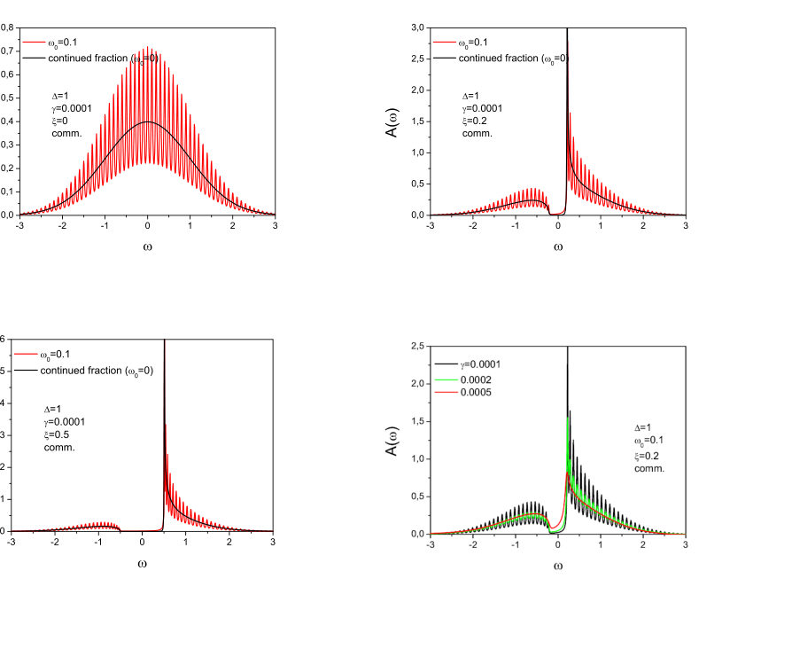
<figcaption class="paper-figure-caption"><b>Fig 1.</b> FIG. 1. Spectral density in commensurate case and ω0 = 0.1 for different values of electron energy ξ. The last panel shows γ dependence of spectral density at ξ = 0.2. Black curves represent the results for spectral density obtained for static model (ω0 = 0) from exact continued fractions. All energies are given in units of ∆.</figcaption>
</figure>
<figure class="paper-figure-card">
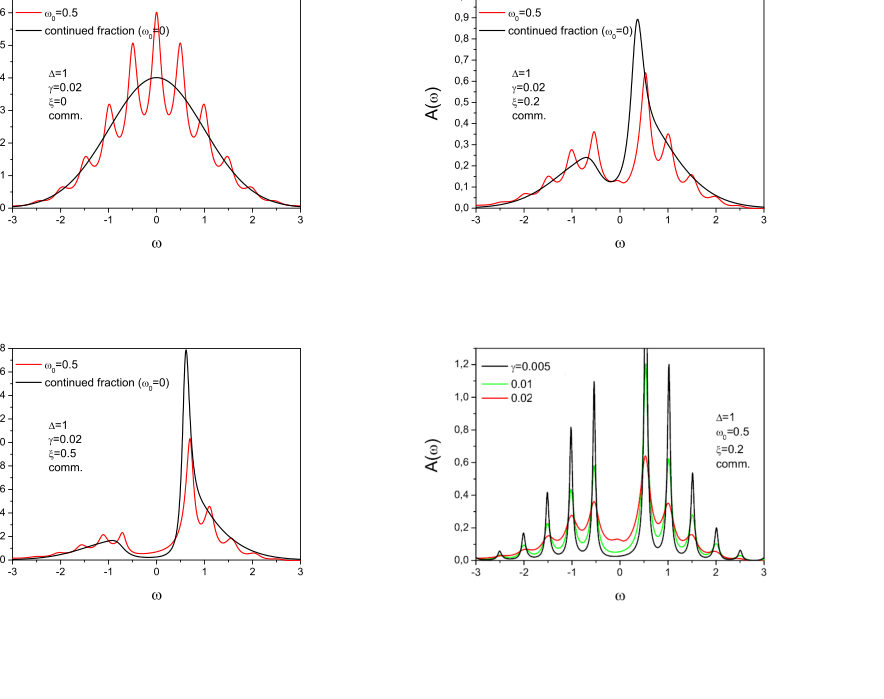
<figcaption class="paper-figure-caption"><b>Fig 2.</b> FIG. 2. Spectral density in commensurate case and ω0 = 0.5 for different values of electron energy ξ. The last panel shows γ dependence of spectral density at ξ = 0.2. Black curves represent the results for spectral density obtained for static model (ω0 = 0) from exact continued fractions. All energies are given in units of ∆.</figcaption>
</figure>
<figure class="paper-figure-card">
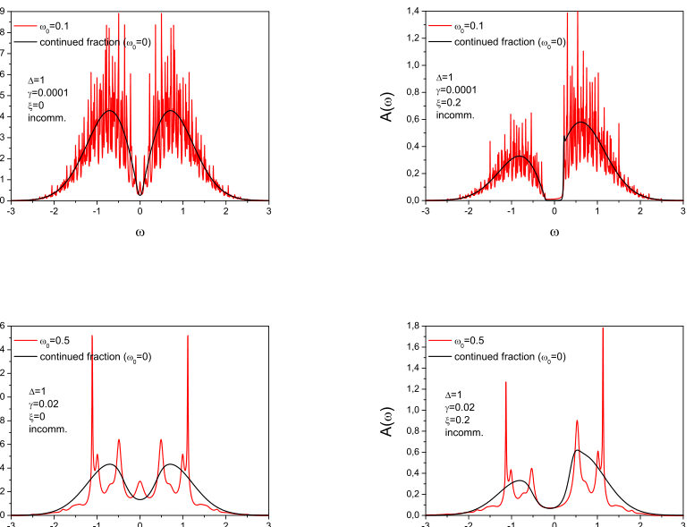
<figcaption class="paper-figure-caption"><b>Fig 3.</b> FIG. 3. Spectral density for incommensurate case and ω0 = 0.1, 0.5 for different values of electron energy ξ. Black curvesrep- resent the results for spectral density obtained for static model (ω0 = 0) from exact continued fractions. All energies are given in units of ∆.</figcaption>
</figure>
<figure class="paper-figure-card">
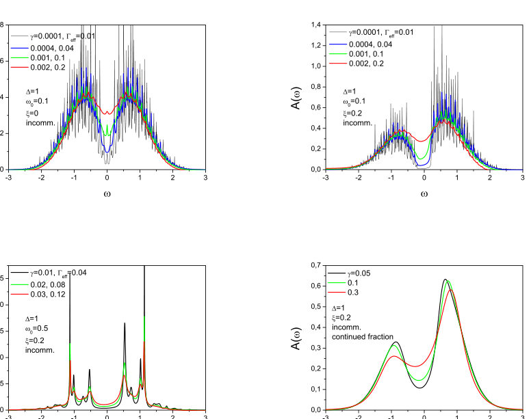
<figcaption class="paper-figure-caption"><b>Fig 4.</b> FIG. 4. Dependence of the spectral density for incommensurate case on γ for different values of ω0 and ξ. The last panel shows spectral density obtained for static model (ω0 = 0) from exact continued fractions for large enough values of γ. All energies are given in units of ∆.</figcaption>
</figure>
<figure class="paper-figure-card">
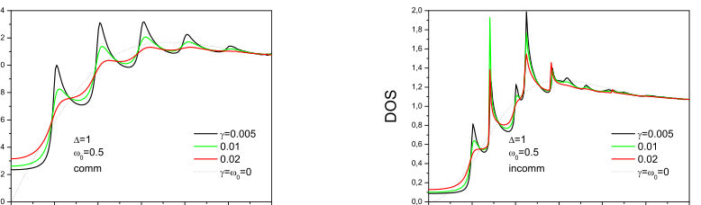
<figcaption class="paper-figure-caption"><b>Fig 5.</b> FIG. 5. Density of states (in units of free electron DOS) for for commensurate (left) and incommensurate (right) cases and typical values of ω0 and γ. Dashed lines represent exact behavior for static case ω0 = 0 and γ = 0 (Appendix D).</figcaption>
</figure>

**Summary.** This work establishes a microscopic theory for pseudogap formation driven by dynamic fluctuations in the nesting vector Q. It derives the single-particle Green's function using a double-series expansion, predicting a critical crossover between a coherent dynamic sideband regime and a quasistatic fluctuating-gap regime. This framework is valuable for understanding how quantum coherence breaks down in strongly correlated materials like cuprate superconductors.

**Why it may be interesting.** The concept of a crossover between coherent and decoherent dynamics, governed by a dynamically generated scale ($\Gamma_{
m eff}$), is highly relevant to open quantum systems and non-equilibrium dynamics, providing a framework for understanding how quantum coherence is lost in strongly fluctuating environments.

Detailed structure

**Main problem.** The paper develops a microscopic theory to describe the formation of a pseudogap in electronic systems driven by dynamic fluctuations in the nesting vector Q.

**Main result.** It predicts a crossover between two distinct pseudogap regimes: a coherent regime ($\omega_0 > \Gamma_{
m eff}$) and a quasistatic regime ($\Gamma_{
m eff} \gtrsim \omega_0$).

**Method.** The analysis uses a double-series representation for the single-particle Green's function, derived via an Abelian approximation to the exact SU(2) time evolution.

**Model / system.** The system models electrons coupled to a classical Gaussian random field representing fluctuations (like CDW/SDW order parameters) near a nested Fermi surface. The dynamics are governed by an effective SU(2) pseudospin structure.

**Key observables.** Single-particle Green's function, spectral density, and density of states exhibiting dynamically generated sidebands.

**Important parameters / regimes.** Characteristic oscillation frequency ($\omega_0$), damping rate ($\gamma$), and the dynamically generated decoherence scale ($\Gamma_{
m eff}$).

**Assumptions / limitations.** The theory relies on an Abelian (commuting) approximation to the time evolution, and the fluctuating order parameter is treated as a classical Gaussian random field.

**Figures summary.** The notes mention presenting detailed numerical calculations for the electron spectral density and density of states across different model parameters to confirm the predicted crossover.

**Paper structure.** The structure moves from formulating the microscopic Hamiltonian involving fluctuating fields to deriving the Green's function via double-series expansions, analyzing the resulting crossover between coherent and quasistatic limits, and comparing results for commensurate vs. incommensurate fluctuations.

Abstract

We formulate a microscopic theory of pseudogap formation generated by dynamic finite nesting vector ${\bf Q}$ fluctuations with characteristic oscillation frequency $ω_0$, and damping $γ$. Starting from a Hamiltonian describing electrons coupled to a classical Gaussian random field, we derive explicit double-series representations of the single-particle Green's function within an Abelian (commuting) approximation to the exact SU(2) time evolution. The resulting propagator naturally acquires a generalized Bogoliubov structure in which every stochastic scattering history is characterized by an effective dynamic gap, leading to a coherent superposition of dynamically broadened sidebands with complex Poisson weights. A central result of the theory is the emergence of a dynamically generated decoherence scale $Γ_{\rm eff}$ governing the crossover between two qualitatively different pseudogap regimes. For $ω_0>Γ_{\rm eff}$ the fluctuating field is resolved coherently and the double-series representation provides a controlled description of dynamic sideband formation. Conversely, when $Γ_{\rm eff}\gtrsimω_0$, coherence is progressively lost and the theory crosses over to the quasistatic fluctuating-gap regime described by the exact continued-fraction solution. The coherent and quasistatic descriptions are therefore interpreted as two complementary asymptotic limits of the same microscopic dynamic pseudogap model. The detailed results of numerical calculations for electron spectral density and density of states are presented for different sets of model parameters confirming this crossover over the broad range of model parameters.

[↑ back to top](#top)

### [Quantum Dissipative Paraelectricity](http://arxiv.org/abs/2608.20168v1)

**Authors:** A. Cano  
**Type:** theory · **Category:** statistical mechanics · **PDF:** <https://arxiv.org/pdf/2608.20168v1>  
**Analysis basis:** full PDF text, analyzed in chunks
**Topic relevance:** 🔥 `driven-dissipative phase transition` **4/5** · `methods for driven-dissipative` **3/5** · `non-equilibrium universality` **3/5** · `Keldysh / 2PI / non-Gaussian methods` **2/5** · `quantum measurements` **2/5** · `Frenkel-Kontorova` **1/5** · `correlated / nonlocal dissipation` **1/5** · `scars & prethermalization` **1/5**

↔ Scroll figures horizontally

<figure class="paper-figure-card">
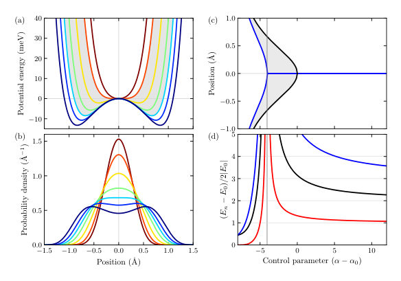
<figcaption class="paper-figure-caption"><b>Fig 1.</b> FIG. 1. (a) Representative shapes of the Razavy potential (1) in the single-well (α &gt; αcl c ) and double-well (α &lt; αcl c ) regimes. The gray region corresponds to the quantum paraelectric regime (αq c &lt; α &lt; αcl c ). (b) Ground-state probability density ρ0(u) across the regimes. The density remains peaked at u = 0 throughout the quantum paraelectric phase and bifurcates only at αq c, below the classical critical point αcl c . (c) Locus of the probability-density maximum as a function of α −αcl c , illustrating the ground-state bifurcation and its separation from the classical transition (blue vs black curves respectively). (d) Relative energies of the three lowest eigenstates vs. α. The...</figcaption>
</figure>
<figure class="paper-figure-card">
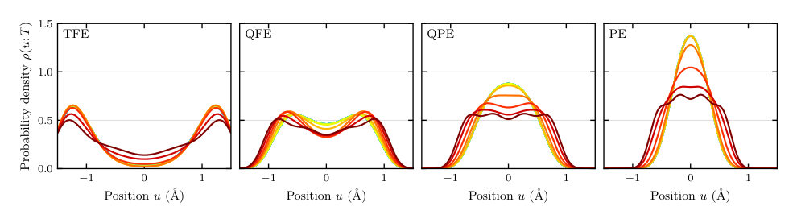
<figcaption class="paper-figure-caption"><b>Fig 2.</b> FIG. 2. Thermal probability density ρ(x; T) in the tunneling ferroelectric (TFE), quantum ferroelectric (QFE), quantum para- electric (QPE), and standard paraelectric (PE) regimes. Within each panel, curves correspond to temperatures logarithmically equally spaced up to kBT = E3. In all cases ρ(x; T) remains symmetric, reflecting the symmetry of the equilibrium density matrix. The central density ρ(0; T) increases with temperature in the TFE panel but decreases in panel QPE, providing an observable distinction between these two ferroelectric regimes.</figcaption>
</figure>
<figure class="paper-figure-card">
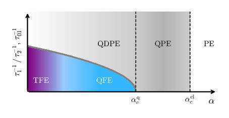
<figcaption class="paper-figure-caption"><b>Fig 3.</b> FIG. 3. Schematic phase diagram as a function of the con- trol parameter α and the environmental coupling strength (parametrized by τ −1 1 relative to τ −1 2 and τ −1 01 ). The stan- dard paraelectric (PE) phase is superseded by the quantum paraelectric (QPE) phase between αcl c and αq c. Below αq c in the ferroelectric region, the crossover between quantum fer- roelectric (QFE) and tunneling ferroelectric (TFE) regimes is determined by the emergence of quasi-degenerate doublets. Strong environmental coupling extends the effective paraelec- tric region by sustaining the quantum dissipative paraelectric (QDPE) phase in the presence of a bifurcated ground-state probability density.</figcaption>
</figure>

**Summary.** This paper analyzes quantum phase transitions in ferroelectrics modeled by a double-well potential, showing that spontaneous symmetry breaking cannot be determined by the Hamiltonian alone. It introduces the concept of quantum dissipative paraelectricity, a regime where environmental coupling suppresses observable symmetry breaking even when the potential suggests otherwise.

**Why it may be interesting.** The explicit inclusion of dissipation and environmental coupling to determine the conditions for symmetry breaking is highly relevant to open quantum systems, providing a framework to understand how decoherence or coupling can stabilize or suppress ordered phases.

Detailed structure

**Main problem.** The paper investigates whether spontaneous symmetry breaking in a quantum system with a double-well potential depends solely on the potential landscape or also requires kinetic effects and coupling to an environment.

**Main result.** Observable symmetry breaking requires explicit coupling to an environment, leading to the identification of a 'quantum dissipative paraelectricity' regime where symmetry breaking is suppressed during ground state evolution.

**Method.** The study employs analytical solutions for a quasi-exactly solvable model, analyzing the time evolution of the probability density under environmental coupling.

**Model / system.** The system models ferroelectrics using an order parameter $u$ governed by a Razavy potential. The analysis distinguishes between quantum paraelectric, quantum ferroelectric, and tunneling ferroelectric regimes.

**Key observables.** Ground-state probability density $
ho_0(u)$, thermal probability density $
ho(u; T)$, and the expectation value $\langle u 
angle$.

**Important parameters / regimes.** The control parameter $\alpha$, the critical point $\alpha_{q_c}$, and the characteristic time scales associated with relaxation ($	au_1, 	au_2$) and oscillation ($	au_{01}$).

**Assumptions / limitations.** The analysis assumes the necessity of coupling to an environment to achieve observable symmetry breaking, and it utilizes approximations regarding the time evolution of the probability density.

**Figures summary.** Figures illustrate the Razavy potential, the ground-state probability density bifurcation, and the thermal probability density across various regimes (TFE, QFE, QPE, PE), showing symmetry preservation in all cases.

**Paper structure.** The paper progresses by first establishing the problem concerning symmetry breaking dependence, then defining the QPE and QFE regimes using analytical solutions, and finally extending the analysis to include environmental coupling to derive the concept of quantum dissipative paraelectricity.

Abstract

Whether a quantum system with a double-well effective potential undergoes spontaneous symmetry breaking depends not only on the potential landscape but also on the kinetics and the coupling with additional degrees of freedom. Here we introduce a quasi-exactly solvable model to study this problem in the context of ferroelectrics, with results that apply to a broad class of quantum phase transitions. Exploiting the analytical solutions, we provide a strict definition of the quantum paraelectric regime and identify a distinct quantum ferroelectric regime in which symmetry breaking can be realized without tunneling features. We then show that explicit symmetry breaking cannot be inferred from the order-parameter Hamiltonian alone, but requires additional couplings. This leads us to identify a regime of \emph{quantum dissipative paraelectricity}, in which observable symmetry breaking is suppressed during the evolution toward the ground state, even when the double-well structure dominates over zero-point quantum fluctuations.

[↑ back to top](#top)

### [Signatures of a light-induced exciton condensate exhibiting BEC-BCS crossover](http://arxiv.org/abs/2608.20310v1)

**Authors:** Khanh Duy Nguyen, Gabriele Berruto, Yunhe Bai, Thomas Marchese, Woojoo Lee, Haoran Lin, Jiangang Yang, Chong Liu, Y. Shirley Meng, Shuolong Yang  
**Type:** both · **Category:** quantum gases · **PDF:** <https://arxiv.org/pdf/2608.20310v1>  
**Analysis basis:** full PDF text, analyzed in chunks
**Topic relevance:** 🔥 `analog quantum simulation` **4/5** · `Keldysh / 2PI / non-Gaussian methods` **3/5** · `driven-dissipative phase transition` **3/5** · `non-equilibrium universality` **3/5** · `methods for driven-dissipative` **2/5** · `quantum optics experiment` **2/5**

↔ Scroll figures horizontally

<figure class="paper-figure-card">
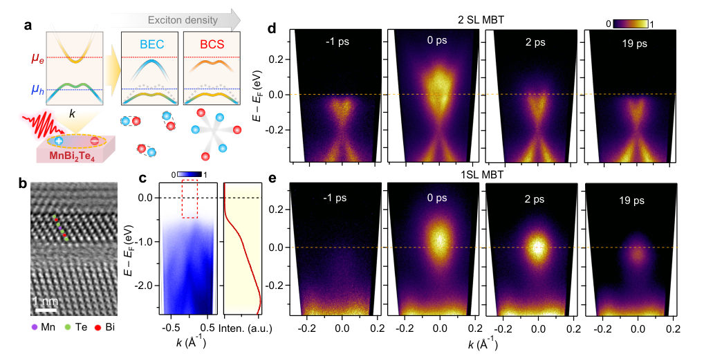
<figcaption class="paper-figure-caption"><b>Fig 1.</b> Fig. 1| MBE-grown MnBi2Te4 (MBT) as a platform to study excitonic states. a, Schematic of the</figcaption>
</figure>
<figure class="paper-figure-card">
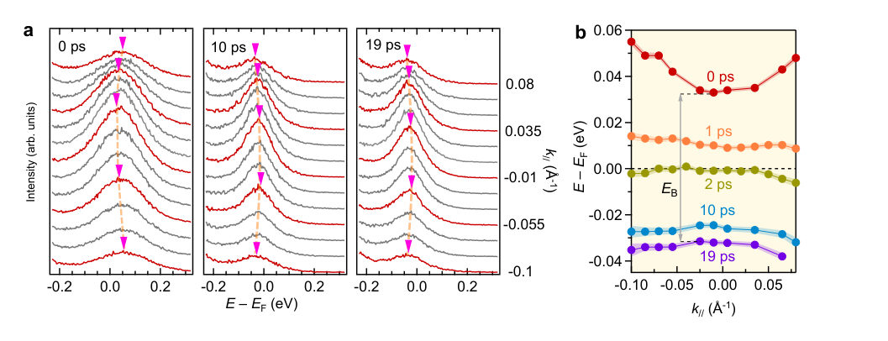
<figcaption class="paper-figure-caption"><b>Fig 2.</b> Fig. 2| Formation of excitons evidenced by the dispersion evolution. a, Energy distribution curve (EDC)</figcaption>
</figure>
<figure class="paper-figure-card">
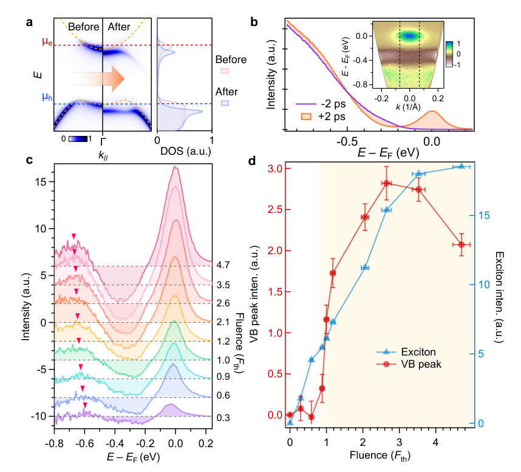
<figcaption class="paper-figure-caption"><b>Fig 3.</b> Fig. 3| VB peak as a spectroscopic signature of exciton condensation. a, A toy model for the collective</figcaption>
</figure>
<figure class="paper-figure-card">
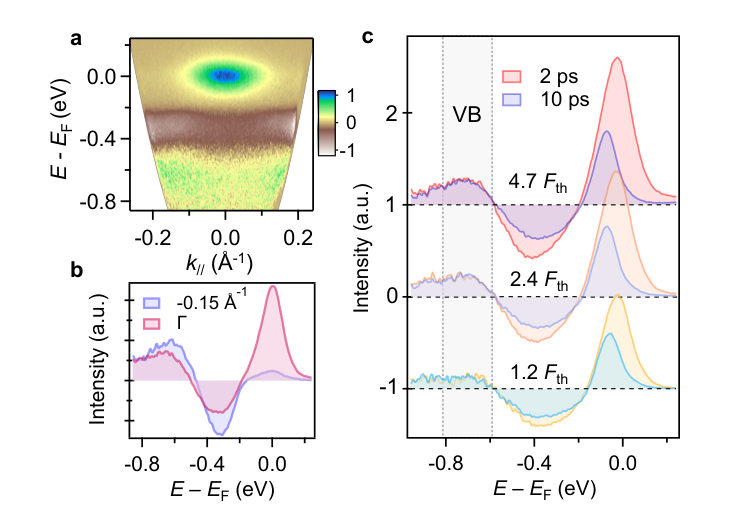
<figcaption class="paper-figure-caption"><b>Fig 4.</b> Fig. 4| Momentum- and time-dependence of the transient VB peak. a, The differential ARPES</figcaption>
</figure>
<figure class="paper-figure-card">
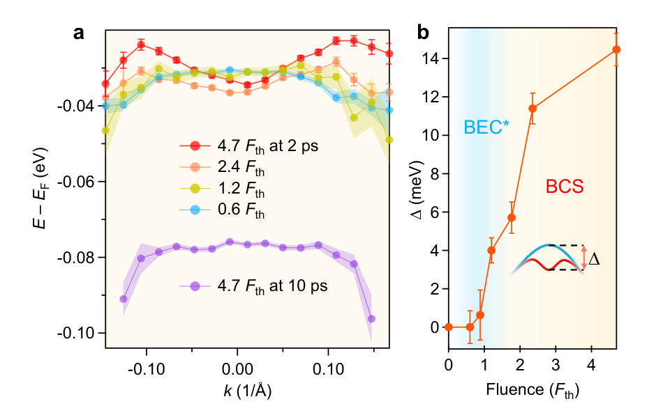
<figcaption class="paper-figure-caption"><b>Fig 5.</b> Fig. 5| Signatures of transient BEC-BCS crossover in the exciton condensate. a, Extracted dispersions</figcaption>
</figure>

**Summary.** This paper reports experimental evidence from trARPES on monolayer MnBi2Te4 demonstrating the formation of a light-induced exciton condensate. By observing sharp, threshold-dependent spectral features and a characteristic 'camel-back' dispersion, the authors argue for a BEC-BCS crossover mechanism, establishing the material as a model system for studying excitonic quantum phenomena.

**Why it may be interesting.** The direct connection drawn between solid-state excitons, topological materials, and the fundamental physics of BEC-BCS crossover makes this highly relevant to quantum gas research, particularly in realizing tunable quantum simulators.

Detailed structure

**Main problem.** The study aims to experimentally and theoretically demonstrate the signatures of a light-induced, non-equilibrium exciton condensate and its associated BEC-BCS crossover in a solid-state system.

**Main result.** The authors observed a threshold-dependent sharpening of the valence band and a 'camel-back' dispersion, consistent with the Berezinskii-Kosterlitz-Thouless transition and the BEC-BCS crossover in the exciton condensate framework.

**Method.** The work combines time- and angle-resolved photoemission spectroscopy (trARPES) experiments with theoretical modeling based on phase-fluctuation theories analogous to 2D superconductivity.

**Model / system.** The physical system is monolayer MnBi2Te4, a magnetic topological insulator. The theoretical framework models the exciton condensation using concepts from 2D Bose gases, specifically invoking the BKT transition and the BEC-BCS crossover.

**Key observables.** Hole-like exciton dispersion, energy-domain sharpening in the valence band, and the development of a 'camel-back-shaped dispersion' at higher pump fluences.

**Important parameters / regimes.** Threshold pump fluence (0.84 mJ/cm2), exciton binding energy ($\sim 60$ meV), and the critical density related to the Nelson-Kosterlitz criterion.

**Assumptions / limitations.** The delayed, nonlinear response is assumed to be due to exciton condensation, ruling out conventional transient field effects or simple carrier-induced band shifts.

**Figures summary.** Figures illustrate the time evolution of the transient band dispersion, showing the transition from electron-like to hole-like exciton features, and depict the fluence dependence of the valence band peak as a signature of condensation.

**Paper structure.** The paper progresses by first identifying the experimental challenge (observing non-equilibrium excitons), presenting the trARPES evidence for condensation onset and crossover, and then supporting this evidence with theoretical modeling based on phase-fluctuation theories.

Abstract

Exciton condensates provide a platform to study quasiparticle pairing, Bose-Einstein condensation-Bardeen-Cooper-Schrieffer (BEC-BCS) crossover, and excitonic topological phenomena. Achieving a nonequilibrium exciton condensate allows the ultimate tunability of these emergent phenomena. Yet, evidence of a light-induced, nonequilibrium exciton condensate and its BEC-BCS crossover remains elusive. Here, we use time- and angle-resolved photoemission spectroscopy to demonstrate signatures of a non-equilibrium exciton condensate and its BEC-BCS crossover in monolayer MnBi2Te4. Following optical excitation, a distinctive hole-like dispersion representing excitons emerges and persists for >20 ps. Strikingly, energy-domain sharpening in the valence band occurs 2 ps after time zero and exhibits a sharp onset at a threshold pump fluence of 0.84 mJ/cm2. The delayed and strongly nonlinear response is difficult to reconcile with transient field effects or conventional carrier-induced band shifts but is consistent with a model of exciton condensation governed by a Berezinskii-Kosterlitz-Thouless transition. The estimated threshold exciton density agrees quantitatively with the Nelson-Kosterlitz critical density. At higher fluences, the exciton feature develops a camel-back-shaped dispersion, consistent with the BEC-BCS crossover in the condensate framework. Our work establishes ultrathin MnBi2Te4 as a model system for studying nonequilibrium exciton condensates with a connection to superconductivity and exciton-driven topological phases.

[↑ back to top](#top)

### [Fluctuation-Controlled Asymmetric Kinetics in Metal-Insulator Transitions](http://arxiv.org/abs/2608.20100v1)

**Authors:** Tapas Bar, David Pesquera, Timm Swoboda, Arnau Villalobos-Martin, Cristian Rodriguez-Tinoco, Pol Lloveras, Marianna Sledzinska, Javier Rodriguez-Viejo  
**Type:** both · **Category:** statistical mechanics · **PDF:** <https://arxiv.org/pdf/2608.20100v1>  
**Analysis basis:** full PDF text, analyzed in chunks
**Topic relevance:** 🔥 `non-equilibrium universality` **4/5** · `driven-dissipative phase transition` **3/5** · `Keldysh / 2PI / non-Gaussian methods` **2/5** · `methods for driven-dissipative` **2/5** · `Frenkel-Kontorova` **1/5** · `analog quantum simulation` **1/5** · `correlated / nonlocal dissipation` **1/5** · `quantum measurements` **1/5** · `scars & prethermalization` **1/5**

↔ Scroll figures horizontally

<figure class="paper-figure-card">
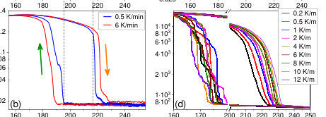
<figcaption class="paper-figure-caption"><b>Fig 1.</b> FIG. 1. (a) DSC traces of a 1T-TaS2 single crystal mea- sured during heating and cooling at scanning rates of 0.5 K/min and 6 K/min. (Inset) Expanded view of the en- dothermic and exothermic peaks at the slower rate. (b) Temperature-dependent resistance measured under identi- cal ramp conditions, showing corresponding shifts in tran- sition temperatures. (c) Reflectivity measurements reveal- ing sharper, avalanche-like transitions during cooling com- pared to smoother behavior during heating. (d) Temperature- dependent resistance of a thin layer (thickness d = 30 nm), demonstrating pronounced asymmetric kinetics at reduced dimensionality. The data collectively demonstrate a pro- nounced...</figcaption>
</figure>
<figure class="paper-figure-card">
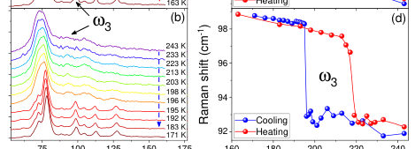
<figcaption class="paper-figure-caption"><b>Fig 2.</b> FIG. 2. Temperature-dependent low-frequency Raman spec- tra of bulk 1T-TaS2 during (a) heating and (b) cooling. (c, d) Temperature dependence of the central frequencies of the ω2 and ω3 Raman modes, showing distinct evolution during heating and cooling. Measurements were performed under quasi-isothermal conditions (∆T &lt; 0.1 K), with a tempera- ture sweep rate of 0.2 K/min between successive temperature set points near the transition.</figcaption>
</figure>
<figure class="paper-figure-card">
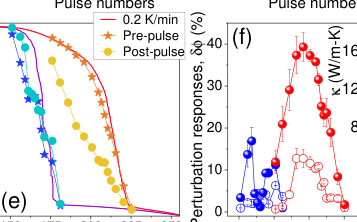
<figcaption class="paper-figure-caption"><b>Fig 3.</b> FIG. 3. Phase-ordering dynamics at different temperatures during isothermal cooling (a) and heating (b) before and after externally induced local thermal perturbations introduced at t = 290 s by applying 500 current pulses across a 30 nm thick layer. The temperature and pulsing profiles can be found in the End Matter. The evolution of the phase fraction as a func- tion of pulse number during the pulsing process is shown in (c) and (d). The data reveal distinct responses to nonequilib- rium thermal perturbations controlled by the pulsing currents (IOn/IOff = 1mA/10µA) during the cooling and heating. (e) Pre-pulsing (⋆) and post-pulsing (•) steady-state phase frac- tions, ϕS P re and ϕS P...</figcaption>
</figure>
<figure class="paper-figure-card">
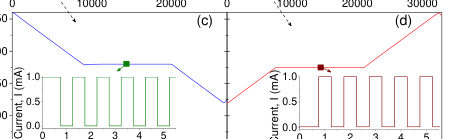
<figcaption class="paper-figure-caption"><b>Fig 4.</b> FIG. 4. Temperature profile of the phase-ordering measure- ments during cooling (a) and heating (b). At each isothermal temperature, the system was perturbed by applying 500 cur- rent pulses approximately 290 s after reaching the set point. Panels (c) and (d) show the corresponding pulsing profiles (1mA/10µA) for cooling and heating perturbations, respec- tively. The pulse duration and off-time were 1 ms.</figcaption>
</figure>
<figure class="paper-figure-card">
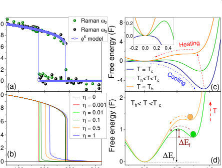
<figcaption class="paper-figure-caption"><b>Fig 5.</b> FIG. 5. Normalized Raman shifts of the ω2 and ω3 modes, representing the insulating phase fraction ϕ (a). The phase fraction obtained from the Landau ϕ6 free energy [Eq. 2] is overlaid with the experimental data. (b) Landau ϕ6 free en- ergy F(ϕ) at representative temperatures, illustrating the evo- lution of metastable states; Tc and Th denote the steady-state transition temperatures during cooling and heating, respec- tively. (c) Temperature dependence of the order parameter ϕ for different noise strengths, calculated using TDGL dynam- ics [Eq. 4]. (d) Schematic of barrier-crossing phase-ordering dynamics when the perturbation strength becomes compara- ble to the free-energy barrier (∆Ef)...</figcaption>
</figure>

**Summary.** This work reports on the observation of asymmetric kinetics during the Metal-Insulator Transition in 1T-TaS2, showing distinct avalanche-like behavior upon cooling versus smooth evolution upon heating. By combining transport measurements with theoretical modeling based on the Ginzburg-Landau theory, the authors establish that this kinetic asymmetry is governed by the unequal degrees of athermality between the two transition branches. This provides a general framework for understanding pathway selection in first-order phase transitions.

**Why it may be interesting.** The framework linking kinetic asymmetry directly to the degree of athermality in first-order phase transitions provides a general principle applicable to many non-equilibrium many-body systems, which is relevant for understanding quench dynamics in quantum many-body models.

Detailed structure

**Main problem.** The paper investigates the origin of kinetic asymmetry observed during first-order Metal-Insulator Transitions (MITs) in correlated materials.

**Main result.** The kinetic asymmetry is fundamentally controlled by the unequal degrees of athermality between the forward (heating) and reverse (cooling) transformation branches.

**Method.** The study combines experimental measurements (transport, calorimetry, Raman spectroscopy) with theoretical modeling using the Time-Dependent Ginzburg-Landau equation.

**Model / system.** The primary system is the layered correlated material 1T-TaS2, which undergoes an MIT associated with Charge-Density-Wave (CDW) states. The dynamics are modeled using a Landau free-energy functional and the TDGL equation.

**Key observables.** Asymmetric kinetics in phonon modes (Raman shifts), avalanche-like vs. continuous phase evolution, and the degree of response to non-equilibrium thermal perturbations.

**Important parameters / regimes.** The degree of athermality, the strength of thermal perturbations (Joule heating), and the parameters governing the Landau free energy ($\phi^6$ term).

**Assumptions / limitations.** The analysis assumes that the kinetic asymmetry is governed by the differing response of the system's phase-ordering dynamics to thermal fluctuations during heating versus cooling.

**Figures summary.** Figures show DSC curves, resistance changes, and Raman spectra demonstrating distinct, asymmetric evolution during cooling (avalanche-like) versus heating (smooth). Simulations illustrate the dependence of phase evolution on noise strength.

**Paper structure.** The paper establishes the experimental observation of kinetic asymmetry in 1T-TaS2, uses local probes and thermal pulsing to distinguish intrinsic effects from percolation, and finally models the dynamics using the TDGL equation to show that unequal athermality dictates the pathway selection.

Abstract

We report asymmetric kinetics in thermally driven metal-insulator transitions (MITs) in 1T-TaS$_2$. Using combined transport, calorimetric, and Raman measurements, we show that the transition proceeds via burst-like avalanches during cooling, while remaining continuous during heating. Although bulk transport is masked by percolative conduction, local probes and thermal measurements reveal intrinsic asymmetry in the transformation pathways. Using controlled nonequilibrium thermal perturbations generated by pulsed Joule heating, we demonstrate that the phase-ordering dynamics remains strongly athermal during cooling, whereas during heating fluctuations progressively overcome nucleation barriers, leading to a smooth transformation. The distinct responses to thermal perturbations indicate different degrees of athermality of the two hysteresis branches, which govern the transformation pathways and give rise to the observed kinetic asymmetry. These results establish a general framework in which the degree of athermality controls pathway selection in first-order phase transitions.

[↑ back to top](#top)

### [Rescaled Mandelstam Tamm characterization of discrete time crystal response in a disordered Floquet Ising chain](http://arxiv.org/abs/2608.19403v1)

**Authors:** Abrar Ahmed Naqash, Salman Sajad Wani, Saif Al-Kuwari  
**Type:** theory · **Category:** disordered systems and neural networks · **PDF:** <https://arxiv.org/pdf/2608.19403v1>  
**Analysis basis:** full PDF text, analyzed in chunks
**Topic relevance:** 🔥 `driven-dissipative phase transition` **4/5** · `non-equilibrium universality` **3/5** · `analog quantum simulation` **2/5** · `methods for driven-dissipative` **2/5** · `scars & prethermalization` **2/5** · `Frenkel-Kontorova` **1/5** · `Keldysh / 2PI / non-Gaussian methods` **1/5** · `quantum measurements` **1/5**

↔ Scroll figures horizontally

<figure class="paper-figure-card">
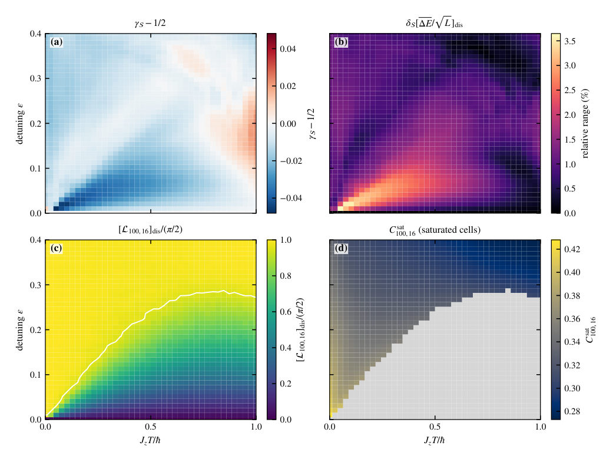
<figcaption class="paper-figure-caption"><b>Fig 1.</b> FIG. 1. Four-size validation of the MT normalization at n = 100 on the native 40 × 40 L = 16 parameter grid. Each native or aligned cell contains Ndis = 50 disorder realizations for L ∈S = {8, 10, 12, 16}. For the four-size quantities in panels (a) and (b), the L = 8, 10, 12 records are bilinearly aligned from their native 39 × 39 axes to the L = 16 axes; panels (c) and (d) use native L = 16 values. The aligned values are bilinear interpolants of the native records. (a) Signed deviation γS −1/2 of the effective dispersion exponent from normal-fluctuation scaling. (b) Relative size range δS[∆E100,L/ √</figcaption>
</figure>
<figure class="paper-figure-card">
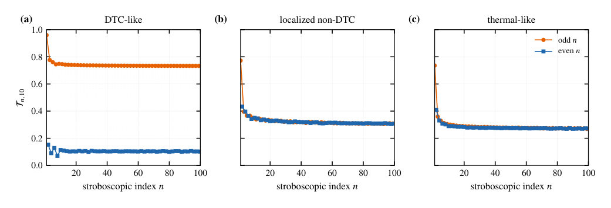
<figcaption class="paper-figure-caption"><b>Fig 2.</b> FIG. 2. Endpoint dependence of the size-normalized MT diagnostic Tn,10 at representative DTC-like, localized non-DTC, and thermal-like cells. Their coordinates (JzT/ℏ, ϵ) are (0.789, 0.042), (0.211, 0.295), and (0.789, 0.358), respectively. Orange circles and blue squares denote odd and even endpoints. Symbols show disorder means, lines join consecutive endpoints, and shaded bands show standard errors for Ndis = 50. All panels use identical axes. The sector labels refer to the finite-size, finite-time classification specified in Appendix C 1.</figcaption>
</figure>
<figure class="paper-figure-card">
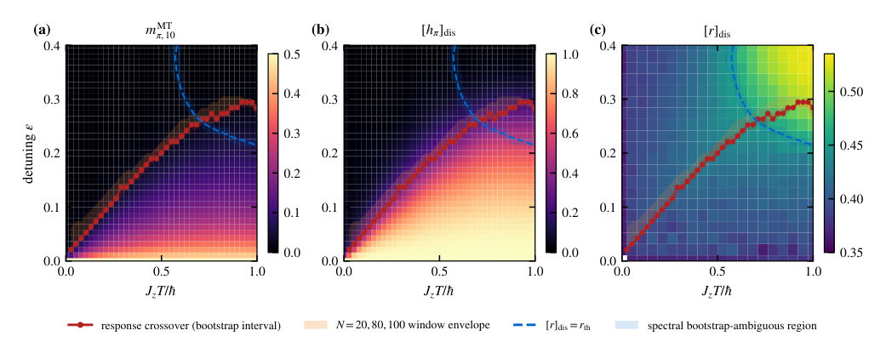
<figcaption class="paper-figure-caption"><b>Fig 3.</b> FIG. 3. Finite-size dynamical and spectral maps at L = 10, with N = 100 and Ndis = 50. (a) Locked MT component mMT π,10. (b) Disorder-averaged locked spin response [hπ]dis, where hπ = h[1,100] π,s,10 before disorder averaging. Panels (a) and (b) show the raw 39 × 39 dynamical grid. (c) Disorder-averaged adjacent-gap ratio [r]dis on the available raw 20 × 20 spectral grid. Red markers show the response-variance crossover estimator for the [1, 100] window; the dark-red band is its 16th–84th percentile disorder-bootstrap interval from 2000 resamples. The orange band is the envelope obtained from the available N = 20, 80, 100 observation windows. The dashed blue curve marks [r]dis = 0.4565, and...</figcaption>
</figure>
<figure class="paper-figure-card">
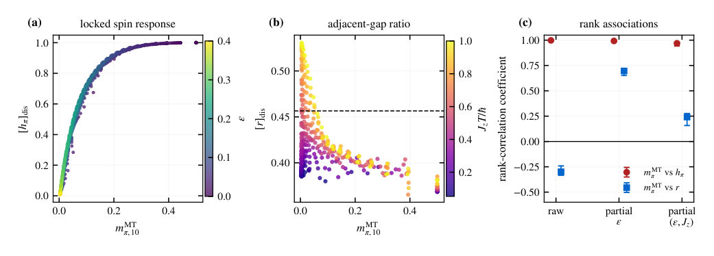
<figcaption class="paper-figure-caption"><b>Fig 4.</b> FIG. 4. Association tests at L = 10. (a) Locked MT component mMT π,10 versus the disorder-averaged locked spin response [hπ]dis for the 1482 cells with Jz &gt; 0 on the 39 × 39 dynamical grid; color denotes pulse error ϵ. (b) Locked MT component versus the disorder-averaged adjacent-gap ratio [r]dis for the 380 cells with Jz &gt; 0 on the nested 20 × 20 spectral grid; color denotes JzT/ℏ, and the dashed line marks rth = 0.4565. (c) Raw and partial Spearman rank coefficients. Partial coefficients are obtained after linear residualization of the ranked observables against the ranked coordinates indicated on the horizontal axis. Error bars are 95% percentile intervals from 2000 realization-bootstrap...</figcaption>
</figure>
<figure class="paper-figure-card">
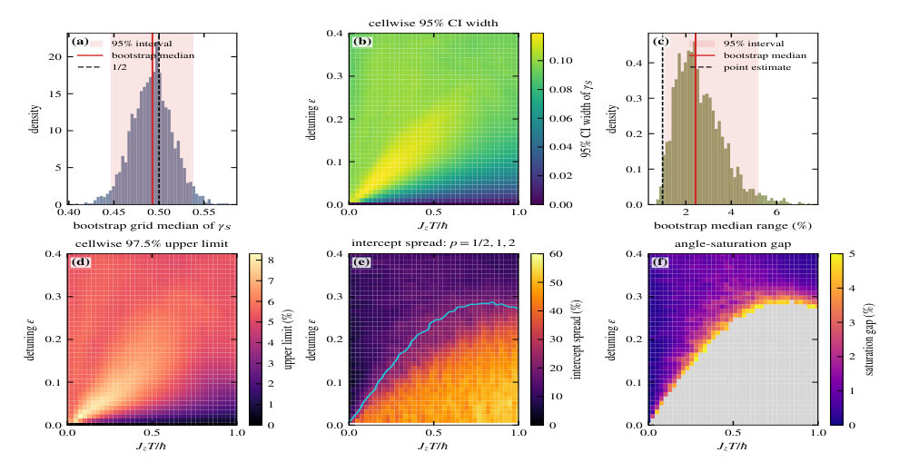
<figcaption class="paper-figure-caption"><b>Fig 5.</b> FIG. 5. Four-size statistical controls and sensitivity to the assumed correction form at n = 100 on the native 40 × 40 L = 16 parameter grid. The realization-resolved L = 8, 10, 12 endpoint records are bilinearly aligned from their native 39 × 39 axes to the L = 16 axes; the aligned values are bilinear interpolants of the native records. Each native or aligned cell contains Ndis = 50 realizations; all bootstrap results use 2000 resamples. (a) Bootstrap distribution of the median exponent over the grid, obtained by independent resampling at each size; the red line marks the bootstrap median, the shaded red band shows its 95% interval, and the dashed line marks 1/2. (b) Cellwise width of the...</figcaption>
</figure>

**Summary.** This theoretical study investigates the Mandelstam-Tamm functional in a disordered Floquet Ising chain exhibiting discrete time-crystal behavior. By deriving an exact, segment-resolved MT expression, the authors show that the rescaled MT functional quantifies the global return geometry associated with the system's locked spin response. The findings confirm the expected $\sqrt{L}$ scaling of energy dispersion and establish a quantitative link between the MT diagnostic and the DTC order.

**Why it may be interesting.** This work connects fundamental quantum dynamics diagnostics (MT functional) to emergent macroscopic quantum phenomena (DTCs) in disordered systems, providing a quantitative geometric measure for quantum coherence loss or periodicity.

Detailed structure

**Main problem.** The paper aims to characterize the period-two structure of the Mandelstam-Tamm (MT) functional in discrete time-crystal (DTC)-like dynamics and relate this structure to the system's locked spin response.

**Main result.** The rescaled MT functional successfully characterizes the global return geometry of finite-size period-two dynamics, showing a strong partial Spearman rank correlation with the locked spin response.

**Method.** The authors derive an exact segment-resolved MT expression for pure-state dynamics and employ finite-size scaling analysis to test the scaling of the path-averaged energy dispersion.

**Model / system.** The study analyzes a disordered Floquet Ising chain subjected to periodic driving defined by two segment Hamiltonians ($H_1$ and $H_2(\epsilon)$). The dynamics are governed by the Floquet operator $U_F = U_2 U_1$.

**Key observables.** Mandelstam-Tamm (MT) functional ($	au_{MT}$), Fubini-Study return angle ($L_n$), path-averaged energy dispersion ($\Delta E(nT)$), and the locked spin response.

**Important parameters / regimes.** System size ($L$), observation period ($T$), disorder strength (quenched couplings $J_{z,i}, h_i$), and the overrotation parameter ($\epsilon$).

**Assumptions / limitations.** The analysis assumes absolute and uniform summability of connected covariances of local energy terms to establish the $O(\sqrt{L})$ upper bound on energy dispersion.

**Figures summary.** Figures illustrate finite-size scaling consistency for the energy dispersion exponent ($\gamma \approx 1/2$), the separation of odd/even MT branches, and the correlation between the MT diagnostic and the locked spin response at representative DTC-like points.

**Paper structure.** The paper develops the segment-resolved MT functional, establishes the $\sqrt{L}$ scaling of the energy dispersion, analyzes the period-two structure by comparing odd and even MT branches, and finally correlates this geometric signature with the system's locked spin response across the parameter space.

Abstract

For pure state unitary dynamics, the Mandelstam Tamm (MT) lower-bound functional compares the endpoint Fubini Study return angle with path averaged energy dispersion. Their distinct size and temporal dependences obscure the origin of period two MT structure in discrete time crystal (DTC) like dynamics and its relation to the spin response. For binary Floquet drives, we derive an exact segment resolved MT expression without assuming commuting segment Hamiltonians and apply it to a disordered Floquet Ising chain. Absolute and uniform summability of connected covariances of local energy terms implies an $O(\sqrt{L})$ upper bound on the path-averaged energy dispersion. Endpoint data for four system sizes are consistent with this leading behavior and support the corresponding rescaling of the MT functional. At a representative point in the finite-size region with a locked spin response, odd and even rescaled MT branches remain separated throughout the $10^2$ period observation window. The return angle alternates strongly, whereas the size-normalized path-averaged energy dispersion shows little discernible parity dependence, indicating that endpoint geometry is the main source of the branch splitting. Across the interacting parameter grid, the period-two MT component has a strong partial Spearman rank correlation with the locked spin response after controlling for pulse error and interaction strength. The rescaled MT functional characterizes the global return geometry of finite-size period-two dynamics and quantifies its association with the locked spin response.

[↑ back to top](#top)

### [Open quantum system approach to the Unruh-DeWitt detector in impulsive plane wave spacetimes](http://arxiv.org/abs/2608.19692v1)

**Authors:** Hing-Tong Cho  
**Type:** theory · **Category:** other · **PDF:** <https://arxiv.org/pdf/2608.19692v1>  
**Analysis basis:** full PDF text, analyzed in chunks
**Topic relevance:** 🔥 `Keldysh / 2PI / non-Gaussian methods` **4/5** · `methods for driven-dissipative` **3/5** · `correlated / nonlocal dissipation` **2/5** · `driven-dissipative phase transition` **2/5** · `quantum measurements` **2/5** · `Full counting statistics` **1/5** · `non-equilibrium universality` **1/5**

↔ Scroll figures horizontally

<figure class="paper-figure-card">
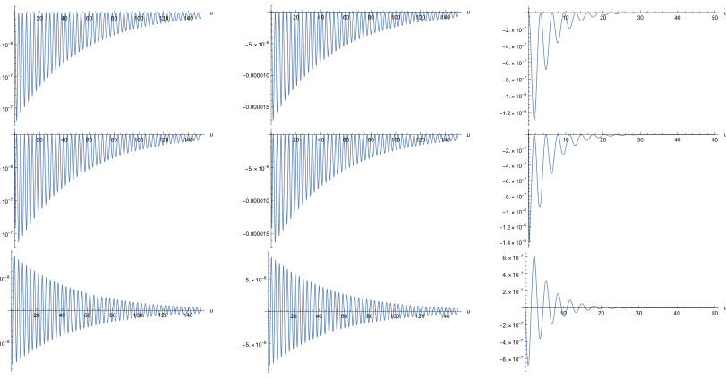
<figcaption class="paper-figure-caption"><b>Fig 1.</b> FIG. 1: Effects of the gravitational wave on the expectation values ∆⟨Q2⟩(0) f /⟨Q2⟩(0) i (top</figcaption>
</figure>
<figure class="paper-figure-card">
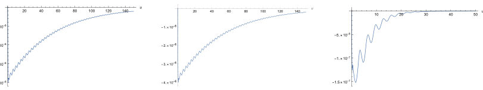
<figcaption class="paper-figure-caption"><b>Fig 2.</b> FIG. 2: Effects of the gravitational wave on the transition probabilities ∆P0→1 from the</figcaption>
</figure>
<figure class="paper-figure-card">

<figcaption class="paper-figure-caption"><b>Fig 3.</b> Fig. 2(a), where the suppressing effect reaches its maximum after encountering the wave</figcaption>
</figure>
<figure class="paper-figure-card">
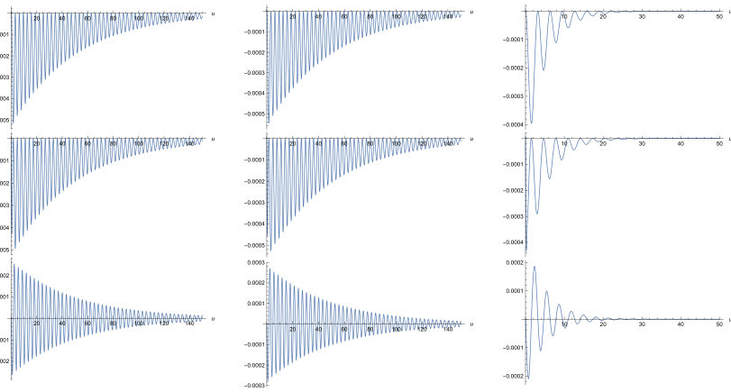
<figcaption class="paper-figure-caption"><b>Fig 4.</b> FIG. 3: Effects of the electromagnetic wave on the expectation values ∆⟨Q2⟩(0) f /⟨Q2⟩(0) i (top panel), ∆⟨P 2⟩(0) f /⟨P 2⟩(0) i (middle panel) and ∆⟨{Q, P}⟩(0) f (bottom panel).</figcaption>
</figure>
<figure class="paper-figure-card">
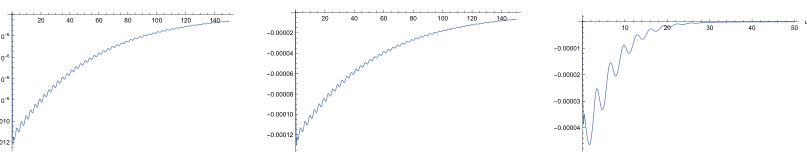
<figcaption class="paper-figure-caption"><b>Fig 5.</b> FIG. 4: Effects of the electromagnetic wave on the transition probabilities ∆P0→1 from the</figcaption>
</figure>

**Summary.** This paper investigates how an Unruh-DeWitt detector responds to impulsive plane waves in curved spacetime using the open quantum system formalism. By calculating expectation values and transition probabilities non-perturbatively, the authors demonstrate that the wave field generally suppresses detector excitations. The results allow for a direct comparison between the effects induced by gravitational versus electromagnetic waves.

**Why it may be interesting.** This work is highly relevant as it applies advanced open quantum system techniques (influence functional) to fundamental problems in quantum field theory in curved spacetime, bridging quantum optics/dissipation with general relativity.

Detailed structure

**Main problem.** The paper non-perturbatively analyzes the quantum response of an Unruh-DeWitt detector to the highly non-trivial background of impulsive plane wave spacetimes.

**Main result.** The presence of the impulsive wave generally suppresses excitation transitions ($P_{0	o 1}$) compared to the initial state, and the electromagnetic wave exerts a stronger effect than the gravitational wave for similar parameters.

**Method.** The analysis employs the open quantum system framework using the influence functional formalism within the closed-time-path path integral approach.

**Model / system.** The system consists of an Unruh-DeWitt detector modeled as a harmonic oscillator interacting with a massless scalar field in a curved spacetime background characterized by impulsive plane waves (either pure gravitational or null electromagnetic).

**Key observables.** Expectation values $\langle Q^2 
angle$, $\langle P^2 
angle$, $\langle \{Q, P\} 
angle$, and the transition probability $P_{0	o 1}$ from the ground state to the first excited state.

**Important parameters / regimes.** Wave strength ($\eta_1, \eta_2$), dissipation coefficient ($\gamma$), and the coupling constant (analyzed non-perturbatively).

**Assumptions / limitations.** The initial state is assumed to be uncorrelated between the detector and the field, and the method relies on the field action being at most quadratic in the path integral evaluation.

**Figures summary.** Figures illustrate the evolution of expectation values ($\Delta\langle Q^2
angle$, $\Delta\langle P^2
angle$, $\Delta\langle\{Q, P\}
angle$) and transition probabilities ($\Delta P_{0	o 1}$) for both gravitational and electromagnetic waves, showing parameter dependence.

**Paper structure.** The paper establishes the theoretical framework using the influence functional formalism, derives the evolution operator and reduced density matrix, calculates the expectation values and transition probabilities for impulsive waves, and finally compares the results for gravitational versus electromagnetic backgrounds.

Abstract

In this paper we employ the open quantum system framework with the influence functional formalism to non-perturbatively analyze the response of an Unruh-DeWitt detector modeled as a harmonic oscillator which interacts with a massless scalar field in impulsive plane wave spacetimes. Subtracting the Minkowski results, we obtain the expectation values for $\langle Q^2 \rangle$, $\langle P^2 \rangle$, and $\langle \{Q,P\} \rangle$, along with transition probabilities $P_{0\rightarrow 1}$ from ground state to the first excited state of the detector due to the influence of the wave. Explicit calculations are performed for both a pure gravitational wave (vanishing Ricci tensor) and a null electromagnetic wave (vanishing Weyl tensor). In both scenarios, the wave suppresses excitation transitions. Since our approach is non-perturbative, we are able to consider cases with both weak and strong coupling constants.

[↑ back to top](#top)

### [Dissipation-enhanced scrambling in the SYK model coupled to a lossy cavity](http://arxiv.org/abs/2608.19310v1)

**Authors:** Pietro Pelliconi, Bastien Lapierre, Shinsei Ryu  
**Type:** theory · **Category:** other · **PDF:** <https://arxiv.org/pdf/2608.19310v1>  
**Analysis basis:** full PDF text, analyzed in chunks
**Topic relevance:** 🔥 `Keldysh / 2PI / non-Gaussian methods` **4/5** · `driven-dissipative phase transition` **3/5** · `methods for driven-dissipative` **3/5** · `non-equilibrium universality` **2/5** · `correlated / nonlocal dissipation` **1/5** · `quantum measurements` **1/5**

↔ Scroll figures horizontally

<figure class="paper-figure-card">
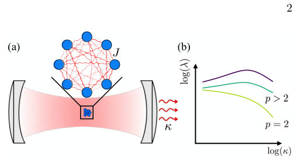
<figcaption class="paper-figure-caption"><b>Fig 1.</b> Figure 1. We study the dissipative dynamics of the p–body YSYK model in the presence of bosonic leakage κ. (a) Sketch of a possible realization in cQED platforms, where bosonic interactions are mediated by dispersive bosons, which can also leak out of the cavity. (b) Sketch of the dissipation–enhanced scrambling: the Lyapunov exponent λ stays positive for any p and any leakage strength κ, and is enhanced at finite κ for p &gt; 2.</figcaption>
</figure>
<figure class="paper-figure-card">
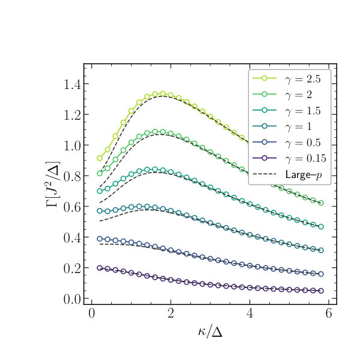
<figcaption class="paper-figure-caption"><b>Fig 2.</b> Figure 2. Late time relaxation rate Γ for p = 2. The dots have been obtained solving numerically the Schwinger– Dyson equations (20–29) choosing ∆= 1 and J = 0.05. For this choice of parameters the auxiliary approximation hold. We then compare the large–p result (54), finding remarkable agreement.</figcaption>
</figure>
<figure class="paper-figure-card">
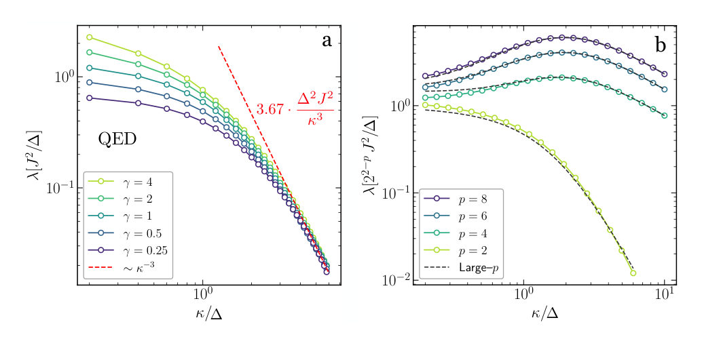
<figcaption class="paper-figure-caption"><b>Fig 3.</b> Figure 3. a) Dissipative Lyapunov exponent for p = 2, computed numerically. The case p = 2 is the QED vertex, thus is the most relevant for platforms such as cavity–QED and circuit–QED. As predicted by the large–p result, the Lyapunov exponent is always positive, it is monotonically decreasing in κ, and for large dissipation it becomes independent of γ, decaying as κ−3. b) Dissipative Lyapunov exponent for γ = 1 and different values of p, compared to the large–p auxiliary result. For p = 2, λ is monotonically decreasing and highly suppressed at large κ. For p &gt; 2 and γ &gt; 2/p2, scrambling is enhanced until κ = κ∗as in (93), and then decreases as ∼κ−1.</figcaption>
</figure>
<figure class="paper-figure-card">
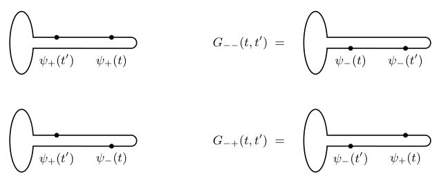
<figcaption class="paper-figure-caption"><b>Fig 4.</b> Figure 4. Schwinger–Keldysh real–time correlators. As in the main text, we define G++(t, t′) ≡TG(t, t′) the time ordered two–point function, G−−(t, t′) ≡˜TG(t, t′) the anti–time ordered one, while the greater and the lesser are G−+(t, t′) ≡G&gt;(t, t′) and G+−(t, t′) ≡G&lt;(t, t′), respectively. The closing circles represent the trace.</figcaption>
</figure>

**Summary.** This work analyzes the SYK model coupled to a dissipative cavity environment to study quantum scrambling. By solving the dynamics in the large-$N$ limit, the authors find that dissipation does not destroy chaos; instead, it can enhance the scrambling rate, quantified by the Lyapunov exponent. This suggests that coupling to a lossy bath can be a source of enhanced quantum chaos.

**Why it may be interesting.** The explicit inclusion of dissipation ($\kappa$) into the calculation of chaos measures like the Lyapunov exponent, showing enhancement rather than suppression, is highly relevant for understanding open quantum systems dynamics.

Detailed structure

**Main problem.** The study investigates how dissipation, modeled by bosonic leakage, affects quantum information scrambling in the SYK model.

**Main result.** The Lyapunov exponent remains positive for all dissipation rates, and for $p>2$, it can even increase as the leakage rate $\kappa$ increases, indicating dissipation-enhanced scrambling.

**Method.** The analysis employs the large-$N$ limit, solving the Lindblad master equation via the Schwinger-Keldysh path integral and deriving equations of motion for fluctuations.

**Model / system.** The system is the Yukawa-Sachdev-Ye-Kitaev (YSYK) model, comprising Majorana fermions and bosons, coupled to a lossy cavity environment modeled by a Lindblad master equation.

**Key observables.** Late-time fermionic relaxation rate ($\Gamma$) and the Lyapunov exponent ($\lambda$), which diagnoses chaotic dynamics.

**Important parameters / regimes.** The interaction order $p$, the boson-to-fermion ratio $\gamma$, and the bosonic leakage rate $\kappa$. A critical ratio $\gamma_c = 2/p^2$ is identified.

**Assumptions / limitations.** The analysis assumes Markovian dissipation described by the Lindblad equation and utilizes the large-$N$ limit and auxiliary boson approximations.

**Figures summary.** Figure 1 sketches a realization in cQED platforms and shows that the Lyapunov exponent ($\lambda$) remains positive and is enhanced at finite $\kappa$ for $p > 2$.

**Paper structure.** The paper progresses by setting up the YSYK model with dissipation, deriving the effective action via path integrals, calculating the ladder kernels for OTOCs, and finally solving the resulting ODE to determine the Lyapunov exponent's dependence on dissipation.

Abstract

We study the Yukawa-Sachdev-Ye-Kitaev model, a disordered model of $N$ Majorana fermions and $R=γN$ bosons in which the bosons are linearly coupled to independent realizations of SYK $p$-body interactions, in the presence of dissipation, modeled by a Lindblad master equation. Motivated by recent proposals for implementing SYK models in quantum simulators, we focus on bosonic leakage at rate $κ$. Initializing the system in the steady state, we analyze the late-time fermionic relaxation rate and the Lyapunov exponent, solving the large-$N$ theory both numerically and for $p$ large, finding a rich landscape of dynamical behaviors. Most notably, the Lyapunov exponent remains positive for every value of $κ$ and, for $p>2$, can even grow as $κ$ increases. The QED case $p=2$, which lies between the fully chaotic regime $p>2$ and the integrable case $p=1$, exhibits special features. We also identify a critical value of the boson-to-fermion ratio $γ_c \approx 2/p^2$ separating distinct dynamical regimes.

[↑ back to top](#top)

### [Lensing and enhanced single atom detection via a single-pixel nanostructure](http://arxiv.org/abs/2608.20032v1)

**Authors:** Ling-Xiao Wang, Lei Xu, Ai-Ping Liu, Guang-Jie Chen, Yuan-Hao Yang, Jia-Qi Wang, Xin-Biao Xu, Guang-Can Guo, Chang-Ling Zou, Guo-Yong Xiang  
**Type:** experiment · **Category:** other · **PDF:** <https://arxiv.org/pdf/2608.20032v1>  
**Analysis basis:** full PDF text, analyzed in chunks
**Topic relevance:** 🔥 `quantum optics experiment` **4/5** · `analog quantum simulation` **3/5** · `quantum measurements` **3/5** · `interference shaping light` **2/5** · `QC/QI experiment` **1/5** · `Tavis-Cummings & cavity-many-emitter` **1/5**

↔ Scroll figures horizontally

<figure class="paper-figure-card">
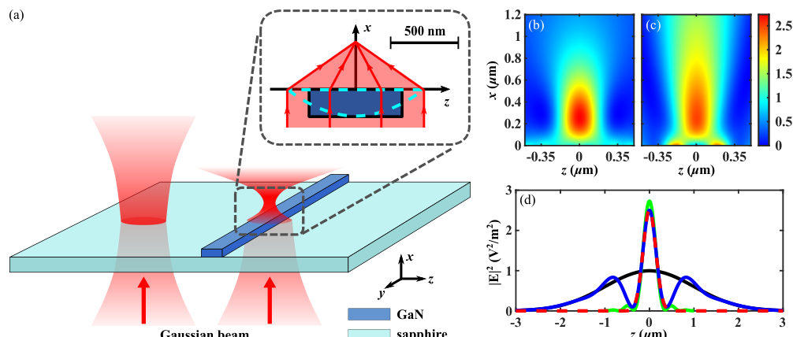
<figcaption class="paper-figure-caption"><b>Fig 1.</b> FIG. 1. (a) Schematic of lensing effect. An incident plane wave passing across a nanostructure (blue rectangle) acquires a spatially varying phase and forms a focal spot in the near-field of the nanostructure. The cyan dashed line outlines the equivalent lens. (b) Calculated evolution of light field in space using the angular spectrum method. (c) Numerical simulated |E|2 distribution of the total field in the vicinity of a trapezium dielectric waveguide illuminated from below by a Gaussian beam. (d) Green line: the transverse |E|2 profile at the focal plane calculated by the angular spectrum method. Blue line: the numerical simulated transverse |E|2 profile at the focal plane. Red dashed...</figcaption>
</figure>
<figure class="paper-figure-card">
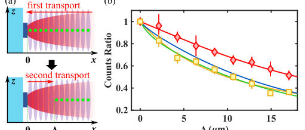
<figcaption class="paper-figure-caption"><b>Fig 2.</b> FIG. 3. (a) Illustration of the atom transportation process. (b) Com- parison of counts ratio C(∆) between the cases of fluorescence col- lection light path modulated and unmodulated by the nanolensing effect, which are represented by yellow squares and red diamonds, respectively. The error bars represent the standard deviation of six experiments. The red line is a fitting of red diamonds using expres- sion 2, which gives the fitting parameters as R = 17.97±2.32µm and xw = 2.24 ± 7.07µm. The yellow line is the same fitting of yellow squares, which gives the fitting parameters as R = 6.76 ± 10.48µm and xw = −7.32 ± 9.82µm. The uncertainties are obtained with a 95% confidence probability. The...</figcaption>
</figure>
<figure class="paper-figure-card">
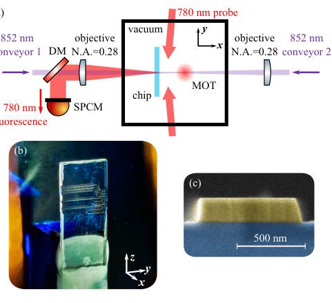
<figcaption class="paper-figure-caption"><b>Fig 3.</b> FIG. 2. (a) Illustration of experimental setup. A fully transpar- ent GaN-on-sapphire chip is fixed in the center of a vacuum cell. Cold 87Rb atoms are prepared by a magneto-optic trap (MOT) about 550µm from the chip surface and then transported to the chip surface by an optical conveyor belt consisting of two z-direction linearly po- larized counterpropagating Gaussian beams. The probe beam grazes on the chip with an incident angle of 85◦. The fluorescence of the excited atoms is collected by the same objective used for focusing conveyor 1 beam and separated from conveyor beam by a dichroic mirror (DM). After polarization filtering, atom fluorescence is cou- pled into a single-mode fiber...</figcaption>
</figure>
<figure class="paper-figure-card">
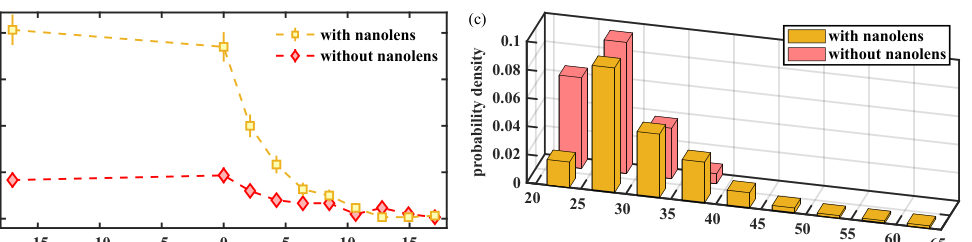
<figcaption class="paper-figure-caption"><b>Fig 4.</b> FIG. 4. (a) Typical step signal we get with nanolensing effect when ∆= 0. The blue line is part of the background-subtracted fluorescence counting track of our experiment. The fluorescence counts are collected in 40ms. The pink lines mark the step signal. The red circles and triangles mark the time of probe beam on and conveyor beams off, respectively. The black circles are the background detection time. The red shadow represents the region within one standard deviation from the mean value of background count. (b) The relation between the probability of single-atom signal and the second transport distance ∆. The yellow squares and red diamonds are the probabilities of detecting a...</figcaption>
</figure>
<figure class="paper-figure-card">
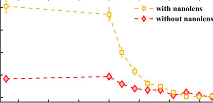
<figcaption class="paper-figure-caption"><b>Fig 5.</b> Figure 4(b) shows the dependence of single-atom signal on ∆. The yellow squares and red diamonds are the probabil-</figcaption>
</figure>

**Summary.** This paper demonstrates a novel mechanism for nanoscale lensing using integrated photonic waveguides. By employing single atoms as quantum probes, the researchers successfully measured a fourfold enhancement in single-atom fluorescence detection efficiency. This establishes on-chip nanostructures as a versatile platform for hybrid quantum applications.

**Why it may be interesting.** This work directly addresses the interface between quantum optics and solid-state photonics, providing a practical platform for enhancing atom-photon coupling and enabling advanced quantum sensing.

Detailed structure

**Main problem.** The research aims to develop an efficient method for loading and probing single atoms in the near-field of integrated nanophotonic devices.

**Main result.** The authors demonstrated a fourfold enhancement in single-atom detection efficiency by utilizing a nanoscale lensing effect induced by a single nanostructure.

**Method.** The experiment involves using cold $^{87}	ext{Rb}$ atoms transported near a dielectric waveguide, where the fluorescence collection light path is modulated by the nanolensing effect.

**Model / system.** The physical system is a hybrid photonic-atomic setup using an on-chip GaN waveguide and single neutral atoms. The core mechanism is nanoscale lensing, modeled by the phase gradient imposed by the nanostructure.

**Key observables.** Counts ratio $C(\Delta)$ quantifying collection modulation, and the measured single-atom detection probability.

**Important parameters / regimes.** Beam waist ($w_0$), Rayleigh length ($R$), and the enhancement factor (4-fold).

**Assumptions / limitations.** The quadratic approximation for phase accumulation is used, and the fluorescence collection efficiency correction factor $\zeta(x)$ is approximated as unity.

**Figures summary.** Figures illustrate the lensing effect schematically, the experimental setup involving MOT and waveguides, and plots comparing measured counts ratios with and without the nanolensing modulation.

**Paper structure.** The paper progresses from theoretical modeling of the lensing effect to experimental implementation using atom transport and fluorescence measurement, culminating in the quantitative demonstration of enhanced single-atom detection.

Abstract

We propose and demonstrate a general mechanism for nanoscale lensing based on the phase gradient imposed by a single nanostructure scattering light in its near-field. We verify this effect using an optical waveguide on a substrate, with single atoms serving as quantum probes that sample the near-field intensity through their fluorescence. This quantum probing technique provides a unique, non-destructive approach to characterizing focused optical fields and reveals a 4-fold enhancement in single atom detection efficiency. This work establishes on-chip nanostructures as a multi-functional quantum optics platform that can efficiently route photons, localize fields, and enhance atom-photon coupling, offering new opportunities for trapping and manipulating single atoms and realizing hybrid nanophotonic-atomic systems for quantum applications.

[↑ back to top](#top)

### [Learning Potts Models and $Z_3$ Toric Codes: Higher and Ordinary Nishimori Criticality](http://arxiv.org/abs/2608.20268v1)

**Authors:** Rushikesh A. Patil, Malte Pütz, Rohit Mukherjee, Guo-Yi Zhu, Simon Trebst, Andreas W. W. Ludwig  
**Type:** theory · **Category:** disordered systems and neural networks · **PDF:** <https://arxiv.org/pdf/2608.20268v1>  
**Analysis basis:** full PDF text, analyzed in chunks
**Topic relevance:** 🔥 `quantum measurements` **4/5** · `non-equilibrium universality` **3/5** · `Keldysh / 2PI / non-Gaussian methods` **1/5** · `analog quantum simulation` **1/5** · `driven-dissipative phase transition` **1/5** · `methods for driven-dissipative` **1/5**

↔ Scroll figures horizontally

<figure class="paper-figure-card">
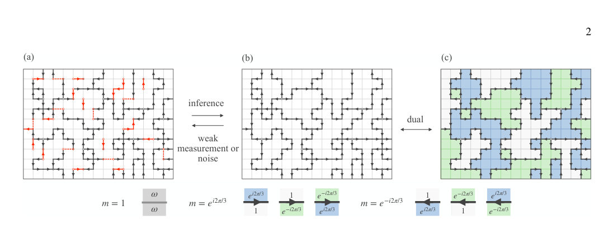
<figcaption class="paper-figure-caption"><b>Fig 1.</b> FIG. 1. Learning the Potts model. Schematically illustrated is the process of learning a configuration of the 3-state Potts model (with the Potts spins residing on the faces of the squares) from an initial configuration (a) of domain walls obtained from performing a sequence of bond-energy measurements indicated on the links of the lattice. For the 3-state Potts model there are three bond types – no domain wall (gray line), as well as two types of domain walls separating different domains (up/down black arrows). For a finite measurement/inference strength, some bonds will not be recognized correctly, which we illustrate by the domain walls marked red. The correct domain wall configuration...</figcaption>
</figure>
<figure class="paper-figure-card">
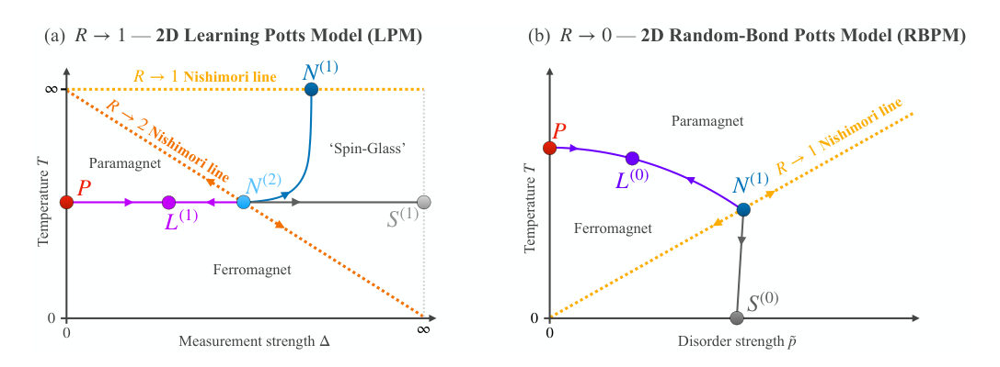
<figcaption class="paper-figure-caption"><b>Fig 2.</b> FIG. 2. (a) Schematic learning phase diagram of the 2D q-state Potts model for 2 &lt; q ≤4 with Gaussian measurements defined in Eq. (34). With this specialized measurement protocol both the higher Nishimori line (dotted dark orange line) β = ∆and the ordinary Nishimori line β = 0 (dotted light orange line) exist in the learning phase diagram at the microscopic level. The critical points N (1) and N (2)</figcaption>
</figure>
<figure class="paper-figure-card">
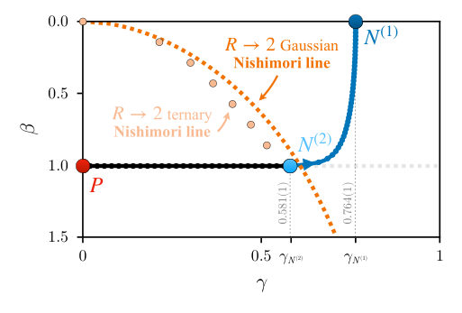
<figcaption class="paper-figure-caption"><b>Fig 3.</b> FIG. 3. Numerical phase diagram. Shown is the numerically obtained learning phase diagram of the 3-state Potts model, em- ploying the discrete 3-state protocol [Eq. (8)]. The phase bound- aries are obtained from finite-size scaling of the coherent informa- tion [Fig. 4]. The higher Nishimori critical point N (2) is located at γN(2) = 0.581(1), while the ordinary Nishimori critical point N (1)</figcaption>
</figure>
<figure class="paper-figure-card">
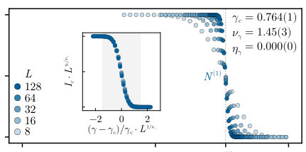
<figcaption class="paper-figure-caption"><b>Fig 4.</b> FIG. 4. Coherent information along horizontal cuts through higher and ordinary Nishimori points. Shown is the coherent in- formation Ic as a function of γ for learning the q = 3 Potts model at β = βc (top panel) and β = 0 (bottom panel). The locations γc of the critical points N (2) (top) and N (1) (bottom) are obtained from finite-size scaling of the coherent information, see the scaling collapse shown in the insets. Data points are obtained by averaging over ∼100, 000 disorder realizations, making the error bars smaller than the marker size.</figcaption>
</figure>
<figure class="paper-figure-card">
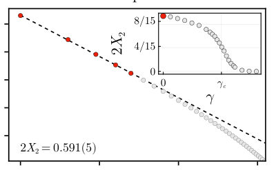
<figcaption class="paper-figure-caption"><b>Fig 5.</b> FIG. 5. Edwards-Anderson correlator at critical Points. This plot shows the power-law fit of the Edwards-Anderson correlator at the higher Nishimori point (top panel) and the Potts critical point (bot- tom panel) for a 256 × 256 system.</figcaption>
</figure>

**Summary.** This work characterizes the complex phase diagram of the 2D q-state Potts model under measurement-induced randomness, establishing a 'higher Nishimori line' and associated tricritical point. By combining analytical theory with numerical simulations, the authors provide exact results for universal quantities and relate the physics to the deformed Z_q toric code. It offers a deep understanding of how information acquisition modifies critical behavior in statistical systems.

**Why it may be interesting.** The connection between learning dynamics (measurement protocols) and fundamental critical phenomena (Nishimori points) provides a powerful, non-equilibrium lens through which to study quantum phase transitions, relevant for understanding quantum memory and information processing.

Detailed structure

**Main problem.** The paper investigates the critical behavior and phase diagram structure of the 2D q-state Potts model when subjected to 'learning' or measurement-induced randomness.

**Main result.** It identifies a 'higher Nishimori line' in the learning phase diagram, leading to a higher Nishimori critical point that is a tricritical point separating paramagnetic, ferromagnetic, and spin-glass phases.

**Method.** The analysis combines analytical tools (like CFT and replica theory) with extensive numerical simulations to map out the phase diagram and determine universal quantities.

**Model / system.** The primary model is the 2D q-state Potts model, studied in two contexts: the Learning Potts Model (LPM) via bond-energy measurements, and the Random-Bond Potts Model (RBPM) with quenched disorder.

**Key observables.** Decay exponent of the Edwards-Anderson correlator, Casimir effective central charges, and the location of critical points (ordinary and higher Nishimori).

**Important parameters / regimes.** The Potts state size ($q$), the measurement strength ($\Delta$), and the temperature parameter ($eta$).

**Assumptions / limitations.** Exact calculations are derived using a Gaussian measurement protocol, and the analysis relies on established theorems like Elitzur's theorem.

**Figures summary.** Figures schematically illustrate the learning phase diagrams for the 2D Potts Model (LPM) and the Random-Bond Potts Model (RBPM), showing the relative positions of the ordinary and higher Nishimori lines.

**Paper structure.** The paper progresses by first establishing the higher Nishimori line analytically, then using numerical tools to confirm the phase diagram structure, comparing the LPM to the RBPM, and finally discussing the implications for the deformed Z_q toric code.

Abstract

Motivated by a previous Ising study, we identify a ${\it higher}$ Nishimori line in the learning phase diagram of the $2D$ $q$-state Potts model $(2 < q\leq 4)$ under bond-energy measurements. This ${\it higher}$ Nishimori line meets the critical temperature line of the Potts model, in a ${\it higher}$ Nishimori critical point -- a tricritical point at finite inference strength that separates a paramagnetic, a ferromagnetic and a 'spin-glass' phase. With analytical tools, we discuss the general structure of the rich phase diagram, which contains two unstable and three stable fixed points, and obtain a number of exact results for universal quantities, including the decay exponent of the Edwards-Anderson correlator, using a Gaussian measurement protocol which allows for exact calculations. Using extensive numerical tools, we confirm these statements for a generic, discrete $q$-state measurement protocol and determine precise numerical estimates for the location of higher and ordinary Nishimori critical points as well as RG flows between the various fixed points. We also discuss the Casimir effective central charges of the critical points in the learning phase diagram, and their monotonic ${\it decrease}$ along measurement-induced RG flows, as established non-perturbatively by the c-effective theorem and its extensions, and contrast it to the monotonic increase along the corresponding RG flows in the random-bond Potts model. Finally, we discuss a general argument based on ${\it Elitzur's \; theorem}$ that establishes stability of the ordinary Nishimori critical points in their respective learning phase diagrams. Equivalently, our results describe a monitored deformed $\mathbb{Z}_q$ toric code where the tricritical ${\it higher}$ Nishimori point is an 'information' critical point that separates stable quantum, classical, and no memory phases.

[↑ back to top](#top)

### [A Protocol for Shielding-Enhanced Loading of Single Polar Molecules into Optical Tweezers](http://arxiv.org/abs/2608.20332v1)

**Authors:** Reuben R. W. Wang, Christian H. Nunez, Conner Williams, Amanda Younes, Li Du, Hossein R. Sadeghpour, Kang-Kuen Ni  
**Type:** theory · **Category:** other · **PDF:** <https://arxiv.org/pdf/2608.20332v1>  
**Analysis basis:** full PDF text, analyzed in chunks
**Topic relevance:** 🔥 `analog quantum simulation` **4/5** · `Keldysh / 2PI / non-Gaussian methods` **1/5** · `QC/QI experiment` **1/5** · `Rydberg arrays` **1/5** · `driven-dissipative phase transition` **1/5** · `methods for driven-dissipative` **1/5** · `quantum measurements` **1/5**

↔ Scroll figures horizontally

<figure class="paper-figure-card">
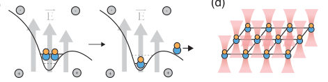
<figcaption class="paper-figure-caption"><b>Fig 1.</b> FIG. 1. Enhanced tweezer array loading of NaCs molecules with ac-dc(X) shielding and electric field control. (a) A high- NA microscope objective projects optical tweezers contain- ing multiple ground state molecules. High-voltage electrodes and a microwave source provide external field control for col- lisional shielding. (b) Collisional shielding enforces repul- sive interactions between molecules, (1) suppressing two- and three-body loss and (2) creating interaction shifts in doubly- occupied tweezers. (c) An electric field gradient is applied to the polarized molecules, modifying the trap potential and inducing tunneling for molecules near the barrier peak. (d) Highly filled arrays can...</figcaption>
</figure>
<figure class="paper-figure-card">
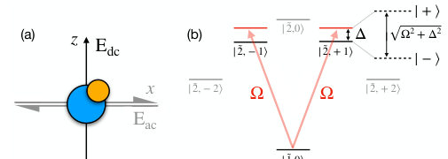
<figcaption class="paper-figure-caption"><b>Fig 2.</b> FIG. 2. The ac-dc(X) dressing scheme. (a) Depiction of a polar molecule subject to a dc electric field along z and an ac microwave field polarized along x. (b) Illustration of the single-molecule energy level diagram subject to ac-dc dressing.</figcaption>
</figure>
<figure class="paper-figure-card">
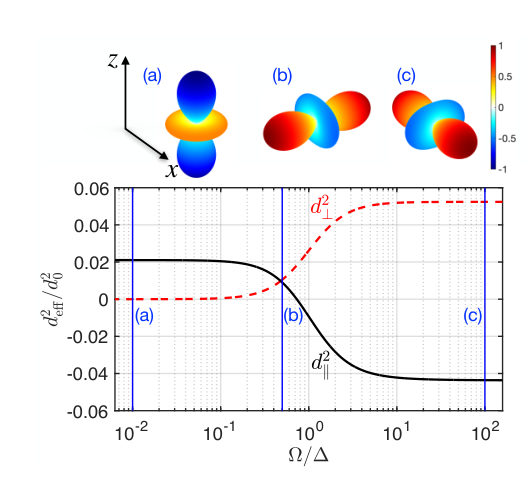
<figcaption class="paper-figure-caption"><b>Fig 3.</b> FIG. 3. Effective squared dipole moments parallel (solid black) and orthogonal (dashed red) to the dc field direction, normalized by the squared molecular frame dipole moment d2 0, as a function of the ratio between the microwave Rabi frequency and detuning. The subplots above show the nor- malized angular dependence of the first-order dipole-dipole interactions at (a) Ω/∆= 0.01, (b) Ω/∆= 0.5, and (c) Ω/∆= 100 respectively, when ξ = 45◦.</figcaption>
</figure>
<figure class="paper-figure-card">
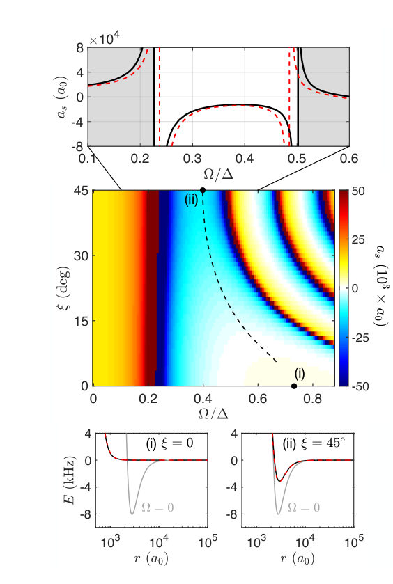
<figcaption class="paper-figure-caption"><b>Fig 4.</b> FIG. 4. Central panel: Real part of the scattering length as a function of both Rabi frequency Ωand microwave el- lipticity ξ. The color bar saturates at ±50, 000a0 for clarity of presentation. The dashed black curve is the ratio of op- timal Rabi frequency Ω⋆to detuning ∆that minimizes the long-range potential well depth as a function of ellipticity an- gle. Upper panel: Real part of the scattering length, obtained from the multichannel calculations (solid black curve) and the effective potential (dashed red curve), as a function of Rabi frequency with ξ = 45◦. The ac field detuning is fixed at ∆= ∆F , while the dc field is set at Edc = 2.366 kV/cm. Lower panels: (i) shielded adiabatic...</figcaption>
</figure>
<figure class="paper-figure-card">
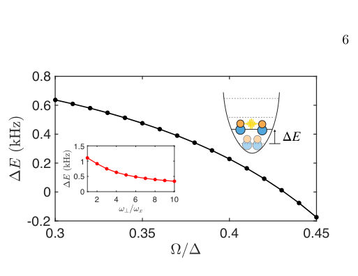
<figcaption class="paper-figure-caption"><b>Fig 5.</b> FIG. 6. Interaction shift as a function of Rabi frequency at fixed detuning ∆= 1.3∆F , in a cylindrically symmetric trap with ωx/(2π) = 0.5 kHz and ω⊥/(2π) = 5 kHz. The bottom left inset shows the interaction shift as a function of the trap aspect ratio with fixed ¯ω/(2π) = 3 kHz. An illustration of the two-molecule interaction shift is given in the top right inset.</figcaption>
</figure>

**Summary.** This paper proposes a novel, high-fidelity protocol to load single polar molecules into arrays of optical tweezers. It achieves this by using a combination of static and microwave electric fields to induce 'collisional shielding,' which suppresses detrimental molecular loss. The technique is highly relevant for creating controllable, highly-filled quantum simulators using dipolar quantum matter.

**Why it may be interesting.** This work provides a detailed, quantitative roadmap for controlling complex, interacting quantum many-body systems (polar molecules) in optical lattices, which is central to quantum simulation and quantum information processing.

Detailed structure

**Main problem.** The primary challenge is achieving high-fidelity preparation of single bosonic molecules within optical tweezer arrays while suppressing molecular loss mechanisms.

**Main result.** The proposed protocol, utilizing combined static and microwave electric fields for 'collisional shielding,' enables the isolation of single molecules with estimated fidelities exceeding 99% per site.

**Method.** The method combines theoretical modeling of molecular interactions with a proposed experimental protocol involving field application ($\vec{E}_{dc}$ and $\vec{E}_{ac}$) and controlled potential gradient application ($
abla \vec{E}$).

**Model / system.** The system involves polar molecules (e.g., NaCs) trapped in optical tweezers. The physics is modeled using a dressed rigid rotor Hamiltonian, incorporating dipole-dipole interactions derived from both first- and second-order perturbation theory.

**Key observables.** Loading fidelity, two-body and three-body loss rates ($\Gamma_{	ext{loss}}$), and the single-molecule occupancy probability $P_1(t)$.

**Important parameters / regimes.** Static electric field strength ($E_{dc} \approx 2.366 	ext{ kV/cm}$), microwave Rabi frequency ($\Omega$), and the detuning ratio ($\delta = \Delta/\Omega$).

**Assumptions / limitations.** The analysis assumes the ability to create initial molecular ensembles and models the loss process using Fermi's golden rule, approximating complex integrals with simplified forms.

**Figures summary.** Figures illustrate the entire protocol, showing the setup with external fields, the mechanism of shielding enforcing repulsive interactions, and the final step where a field gradient induces controlled tunneling to achieve single-molecule loading.

**Paper structure.** The paper develops the theoretical framework by first defining the Hamiltonian and deriving the effective potential ($V_{eff}$). It then details the shielding mechanism, followed by the application of a field gradient to induce controlled single-molecule loading, and finally, it analyzes loss rates and occupancy probabilities.

Abstract

We propose the high-fidelity preparation of single bosonic molecules in optical tweezers starting from small tweezer-trapped molecular ensembles. Our scheme combines a static electric field and a microwave field to generate strong, tunable, anisotropic interactions that shield the molecules against two-body collisional loss. We show that this shielding eliminates all long-range bound states, preventing three-body recombination. This elimination persists for all microwave ellipticities, including the experimentally practical limit of linear polarization. Application of an additional electric field gradient can be used to induce controlled spilling of strongly interacting molecules out of the trap until one remains. With realistic experimental parameters, we estimate that single tweezer-trapped NaCs molecules can be isolated from a pair with fidelities exceeding 99\%, and $> 95\%$ per site across an array. These results establish collisional shielding with electric fields as an effective tool for preparing highly-filled tweezer arrays of polar molecules.

[↑ back to top](#top)

### [Wide-field mid- to long-wave infrared imaging with undetected photons](http://arxiv.org/abs/2608.20015v1)

**Authors:** Vladimir Kornienko, Nathan Gemmell, Caiyi Liu, Asteria Chen, Chris Phillips, Rupert Oulton  
**Type:** experiment · **Category:** other · **PDF:** <https://arxiv.org/pdf/2608.20015v1>  
**Analysis basis:** full PDF text, analyzed in chunks
**Topic relevance:** 🔥 `quantum optics experiment` **4/5** · `interference shaping light` **3/5** · `quantum measurements` **3/5**

↔ Scroll figures horizontally

<figure class="paper-figure-card">
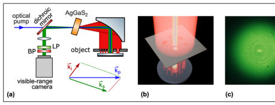
<figcaption class="paper-figure-caption"><b>Fig 1.</b> Figure 1. (a) Nonlinear interferometry set-up featuring non-collinear phase matching, folded geometry and com- mon path arrangement. (b) Schematic of an object (shadow mask) with a hole in the center to let the pump and signal beams through. The outer annulus of the idler beam can be used for imaging. (c) Raw camera image showing interfer- ence only in the regions not blocked by the shadow mask. Intensity is shown in linear contrast scale.</figcaption>
</figure>
<figure class="paper-figure-card">
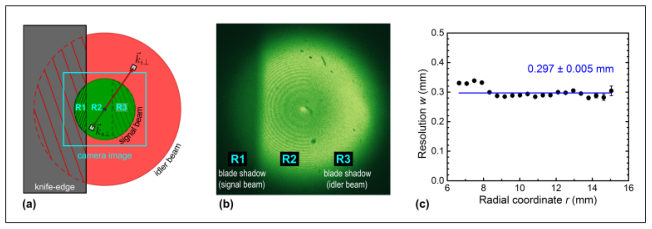
<figcaption class="paper-figure-caption"><b>Fig 2.</b> Figure 2. Estimating the resolution of the QIUP system with a knife-edge test. The idler beam is ≈λi/λs∼10 times bigger than the signal beam. (a,b). Bringing the knife edge close to the optical axis of the system results in the blade shadow appearing in both signal and idler beams. Three regions in the image can be observed: R1 – signal beam is blocked, intensity is halved, no interference observed; R2 – all three beams are intact, nonlinear interference is observed; R3 – blocking the idler in R1 leads to distinguishability in the photon pairs, thus no interference is observed in the signal beam, but the signal beam intensity is unaffected. (c) Resolution w of the scheme does not depend on...</figcaption>
</figure>
<figure class="paper-figure-card">
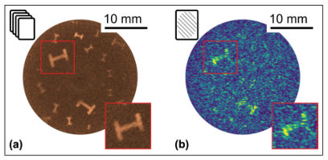
<figcaption class="paper-figure-caption"><b>Fig 3.</b> Figure 3. Interference pattern visibility at 8 µm idler wave- length computed from: (a) a dataset of 180 files correspond- ing to different interferometric phase values ϕ, or (b) a single camera image using the off-axis holography approach [28]. One image acquisition time was 10 s. Scale bar shows the physical size at the imaging plane.</figcaption>
</figure>
<figure class="paper-figure-card">
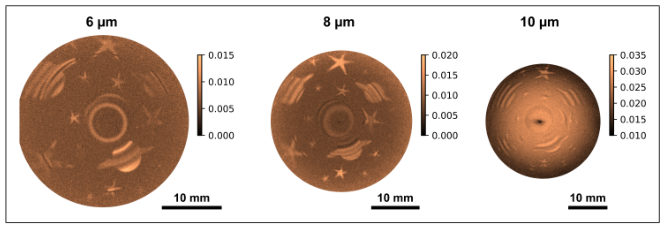
<figcaption class="paper-figure-caption"><b>Fig 4.</b> Figure 4. Computed interference pattern visibility at idler wavelengths of 6 µm, 8 µm, and 10 µm. Scale bar shows the physical size at the imaging plane. Original datasets contain 180 images of 10 s acquisition time each.</figcaption>
</figure>

**Summary.** This paper reports on a quantum imaging technique using undetected photons (QIUP) to achieve mid- to long-wave infrared imaging. By measuring visible light interference patterns modulated by mid-IR light passing through an object, the method bypasses background noise limitations. This enables fast, room-temperature, and spectrally-selective imaging in the 6-10 $\mu$m range.

**Why it may be interesting.** This work is highly relevant to quantum optics and open quantum systems as it demonstrates a novel, background-noise-free quantum measurement technique for probing inaccessible spectral regions (mid-IR).

Detailed structure

**Main problem.** The paper addresses the challenge of performing wide-field mid- to long-wave infrared (IR) imaging by overcoming the limitations imposed by background-limited infrared photodetection (BLIP).

**Main result.** They successfully demonstrated wide-field quantum imaging with undetected photons (QIUP) in the 6-10 $\mu$m range, achieving background-noise-free imaging with high resolution.

**Method.** The technique uses nonlinear interferometry where the object modifies the interference pattern of a visible 'signal' beam, while the mid-IR 'idler' beam passes through the object undetected.

**Model / system.** The experiment utilizes non-collinear phase-matching in a silver thiogallate (AgGaS2) crystal, generating signal and idler photons via SPDC. The measurement relies on extracting object transmittance from the interference visibility.

**Key observables.** Image resolution ($297 \pm 5 \ \mu	ext{m}$ at $8 \ \mu	ext{m}$), number of resolvable elements ($\sim 8000$), and interference pattern visibility ($V$).

**Important parameters / regimes.** Wavelength range of 6-10 $\mu$m; background-limited infrared photodetection (BLIP) limit; 10 s acquisition time.

**Assumptions / limitations.** The technique assumes the idler beam passes the object twice, and that a large difference in beam diameters is used to separate signal and idler beams.

**Figures summary.** Figures illustrate the nonlinear interferometry setup, raw camera images showing interference, and resolution estimation using a knife-edge test.

**Paper structure.** The paper details the QIUP principle, describes the experimental setup using SPDC and $	ext{AgGaS}_2$, presents measurements of visibility and resolution, and concludes with the demonstration of fast, background-noise-free mid-IR imaging.

Abstract

Quantum imaging with undetected photons (QIUP) allows an object to be probed at mid-infrared frequencies by only measuring interference in the visible range, thus leveraging silicon camera technology. We show that non-collinear phase-matching in a silver thiogallate (AgGaS$_2$) crystal enables wide-field QIUP in the wavelength range of 6-10 $μ$m (1670-1000 cm$^{-1}$). A combination of coherent detection and infrared photons being ``undetected'' enables imaging at ${\sim}$100 times better than the background-limited infrared photodetection (BLIP) limit. At 8 $μ$m, our images have over 8000 $\pm$ 100 resolvable elements with a 297 $\pm$ 5 $μ$m resolution, and 10 s acquisition time. Our results pave the way to fast, background-noise-free, room-temperature, spectrally-selective mid-infrared imaging.

[↑ back to top](#top)

### [High fidelity control of superconducting qubits with optical transmitted signal](http://arxiv.org/abs/2608.19602v1)

**Authors:** Yu-Huai Li, Daojin Fan, Na Li, Fusheng Chen, Shaowei Li, Dong-Dong Li, Yu Xu, Jin Lin, Ming Gong, He-Liang Huang, Hui Deng, Yulin Wu, Haoran Qian, Shaojun Guo, Futian Liang, Xiaobo Zhu, Cheng-Zhi Peng, Jian-Wei Pan  
**Type:** experiment · **Category:** quantum information and computing · **PDF:** <https://arxiv.org/pdf/2608.19602v1>  
**Analysis basis:** full PDF text, analyzed in chunks
**Topic relevance:** 🔥 `QC/QI experiment` **4/5** · `quantum optics experiment` **3/5** · `interference shaping light` **1/5** · `quantum measurements` **1/5**

↔ Scroll figures horizontally

<figure class="paper-figure-card">
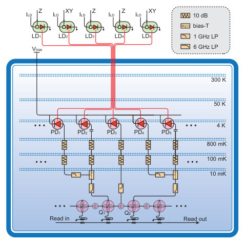
<figcaption class="paper-figure-caption"><b>Fig 1.</b> FIG. 1. The setup for characterizing the noise and precision of the optical-assisted transmission line. InGaAs photodiodes (PDs) were installed at the 4 K stage of the DR with a re- versed bias of 1 V. The coaxial cables for XY and Z signal between room temperature and 4 K were replaced by opti- cal fiber. The IQ-mixed signal was amplified as the input of a laser diode (LD). The LD was a directly modulated laser with a center wavelength of 1490 nm.</figcaption>
</figure>
<figure class="paper-figure-card">
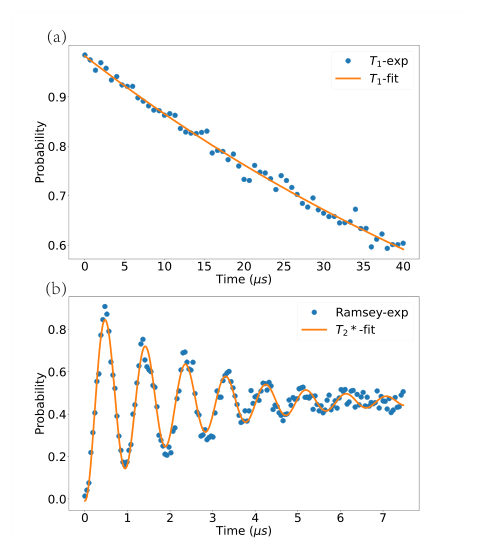
<figcaption class="paper-figure-caption"><b>Fig 2.</b> FIG. 2. Characterizing the performance of the superconduct- ing qubit with optically transmitted control signals. (a) and (b) A typical curve of T1 and Ramsey measurement indicate a T1 of 58.58 ± 3.39 µs and a T ∗ 2 of 2.40 ± 0.23 µs (409 MHz away from the sweet spot), respectively.</figcaption>
</figure>
<figure class="paper-figure-card">
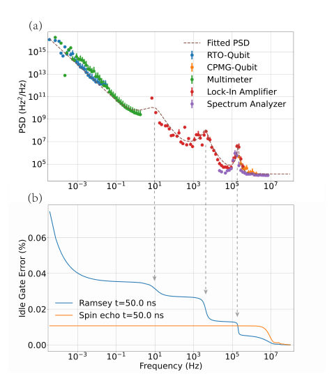
<figcaption class="paper-figure-caption"><b>Fig 3.</b> FIG. 3. Characterizing the noise on optically transmitted Z control line. (a) Measured noise power spectrum densities (PSD) by a range of different methods, including the RTO and CPMG measurement on the qubit and several traditional methods at room temperature, covering the frequency from 10−3 to 107 Hz. The dashed line represents the correspond- ing fitting result. (b) Based on the PSD results, the error rates of the Idle gates in the Ramsey and Spin echo scenar- ios are estimated, respectively. As shown by the dotted-line arrow in the figure, although several typical Lorentzian-type noise peak exists, the error rate integrated up to 10−3 Hz is still sufficiently small, indicating that the...</figcaption>
</figure>
<figure class="paper-figure-card">
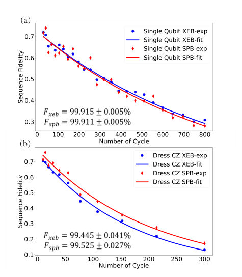
<figcaption class="paper-figure-caption"><b>Fig 4.</b> FIG. 4. Speckle Purity Benchmarking (SPB) and Cross- Entropy Benchmarking (XEB) for single-qubit gates and two- qubit CZ gate. (a) The fidelity of a single qubit gate is 99.915% ± 0.005%, with an average control error of 0.004%. (b) The dressed fidelity of the two-qubit CZ gate is 99.445% ± 0.041%, corresponding to a pure fidelity of 99.676% ± 0.041% with an average control error of 0.053%.</figcaption>
</figure>

**Summary.** This paper presents an experimental breakthrough for scaling superconducting quantum processors by replacing bulky coaxial cables with an optically-assisted transmission line. By modulating microwave signals onto laser light, the control signals are transmitted to the qubits, significantly reducing heat load in the cryostat. The achieved high-fidelity quantum gates demonstrate a viable path toward building large-scale quantum computers.

**Why it may be interesting.** This work directly addresses a critical engineering bottleneck in superconducting quantum computing—interconnects—by integrating quantum optics into cryogenic quantum hardware, which is highly relevant for open quantum systems research.

Detailed structure

**Main problem.** Scaling superconducting quantum processors is limited by the heat load and space constraints imposed by numerous signal coaxial cables within dilution refrigerators.

**Main result.** The authors successfully demonstrated full control of superconducting qubits using an optically-assisted transmission line, achieving single-qubit and two-qubit gate fidelities that meet surface code requirements.

**Method.** Microwave control signals are modulated onto laser intensities at room temperature and regenerated at a cryogenic plate using photodiodes, replacing traditional coaxial cables.

**Model / system.** The system utilizes frequency tunable transmon superconducting qubits operating at millikelvin temperatures inside a dilution refrigerator. The control mechanism relies on converting microwave signals to optical signals for transmission.

**Key observables.** Single-qubit gate fidelity (99.915%), two-qubit CZ gate fidelity (99.676%), and measured noise Power Spectral Density (PSD) of the control signal.

**Important parameters / regimes.** Gate fidelities meeting surface code requirements, heat dissipation limits of the cryostat stages (e.g., 4 K stage), and noise spectral density components ($1/f$, white, Lorentzian).

**Assumptions / limitations.** The most feasible configuration for large-scale systems involves regenerating the control signal at the 4 K stage, and the noise analysis depends on parameters like slope efficiency of the DML.

**Figures summary.** Figures detail the experimental setups for noise characterization and qubit performance using optical transmission. Tables quantify heat dissipation across different cryostat stages.

**Paper structure.** The paper progresses from identifying the scaling bottleneck (cables/heat load) to proposing the optical solution, detailing the experimental implementation, characterizing the noise sources (PSD fitting), and finally benchmarking the achieved gate fidelities against theoretical requirements.

Abstract

Superconducting circuits exhibit remarkable potential for constructing large-scale quantum simulation and computation systems, featuring numerous qubits, extended coherence time, and precise control. Nevertheless, the growing number of signal cables poses a challenge in dilution refrigerators due to space and heat load constraints. To overcome this issue, we experimentally implemented an optically-assisted transmission line as an alternative to coaxial cables. By modulating microwave signals on laser intensities at room temperature and regenerating the signals at a cryogenic plate within the dilution refrigerator, we demonstrated full control of superconducting qubits using photocurrent. We demonstrate and benchmark both single-qubit and two-qubit gates on frequency tunable transmon qubits, achieving fidelities of 99.915% $\pm$ 0.005% and 99.676% $\pm$ 0.041%, respectively, which have reached the requirement of the surface code.

[↑ back to top](#top)

### [Strongly coupled atom-cavity systems under boundary modulation: simulating gravitational-wave effects](http://arxiv.org/abs/2608.19333v1)

**Authors:** Patryk Michalski, Jerzy Paczos, Navdeep Arya, Magdalena Zych  
**Type:** theory · **Category:** other · **PDF:** <https://arxiv.org/pdf/2608.19333v1>  
**Analysis basis:** full PDF text, analyzed in chunks
**Topic relevance:** 🔥 `analog quantum simulation` **4/5** · `Tavis-Cummings & cavity-many-emitter` **2/5** · `Keldysh / 2PI / non-Gaussian methods` **1/5** · `methods for driven-dissipative` **1/5** · `quantum measurements` **1/5**

↔ Scroll figures horizontally

<figure class="paper-figure-card">
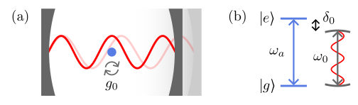
<figcaption class="paper-figure-caption"><b>Fig 1.</b> Figure 1. (a) Schematic depiction of the considered cavity with a two-level atom inside. The right mirror can oscil- late harmonically. (b) Atomic and cavity mode energy level scheme.</figcaption>
</figure>
<figure class="paper-figure-card">
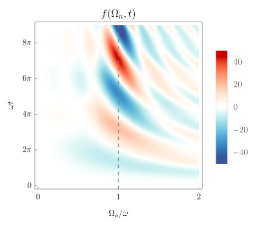
<figcaption class="paper-figure-caption"><b>Fig 2.</b> Figure 2. Function f(Ωn, t) governing frequency dependence of the probability correction δpe(t). Resonant enhancement for Ωn ≈ω is visible.</figcaption>
</figure>
<figure class="paper-figure-card">
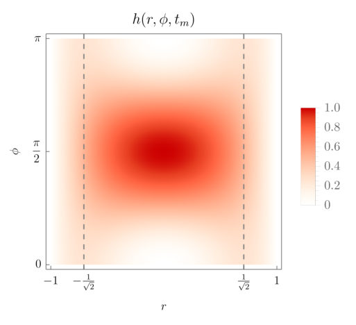
<figcaption class="paper-figure-caption"><b>Fig 3.</b> Figure 3. Function h(r, ϕ, tm) determining the magnitude of the classical Fisher information IC(t) at an optimal interro- gation time tm. The dashed vertical lines indicate the values r = ±1/ √</figcaption>
</figure>
<figure class="paper-figure-card">
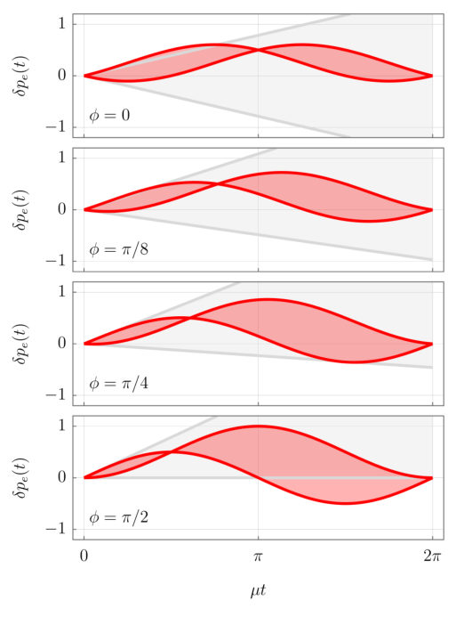
<figcaption class="paper-figure-caption"><b>Fig 4.</b> Figure 4. Slow-timescale envelopes of the probability correc- tion δpe(t) in the resonant regime Ωn →ω for the multiple- scales (in red) and perturbative (in grey) solutions, shown for r = ±1/ √</figcaption>
</figure>

**Summary.** This paper analyzes how an atom-cavity system can simulate the effects of a gravitational wave by modulating the cavity mirrors. Using perturbation theory and multiple-scales analysis, the authors show that this modulation causes a measurable, resonantly enhanced change in the atomic transition probability. This establishes a viable quantum optical platform for testing analogue general relativistic effects.

**Why it may be interesting.** This work directly bridges quantum optics (cavity QED) with fundamental physics (General Relativity) by proposing a concrete, measurable analogue experiment, which is highly relevant to AMO physicists working on open quantum systems.

Detailed structure

**Main problem.** To establish a realistic and experimentally accessible platform for probing analogue general relativistic effects by simulating the influence of a plane gravitational wave on atom-field interactions.

**Main result.** The modulation induced by the gravitational wave analogue is shown to be resonantly enhanced, leading to measurable imprints in the atomic transition probability.

**Method.** The analysis employs time-dependent perturbation theory and the multiple-scales approach to calculate the first-order correction to the atomic transition probability.

**Model / system.** The system is a two-level atom strongly coupled to a single quantized mode of the electromagnetic field inside an optical cavity. The gravitational wave effect is simulated by modulating the cavity resonance frequency via time-dependent boundary conditions.

**Key observables.** The primary observable is the correction to the atomic emission rates or the excited-state population probability, $p_e(t)$. The classical Fisher information $I_C(t)$ is used to quantify measurement sensitivity.

**Important parameters / regimes.** Key parameters include the modulation amplitude $A$, the driving frequency $\omega$, and the detuning $\delta_0$. Resonance is achieved when the cavity frequency matches the modulation frequency.

**Assumptions / limitations.** The analysis assumes the modulation is adiabatic and treats the modulation as a small perturbation to the standard Jaynes-Cummings model.

**Figures summary.** Figure 1 shows the schematic setup involving a cavity, atom, and movable mirror. Figure 2 illustrates the frequency dependence of the probability correction, showing resonance. Figure 3 shows the classical Fisher information.

**Paper structure.** The paper develops the Hamiltonian, applies perturbative expansions to find the probability correction $\delta p_e(t)$, and then uses the multiple-scales method to extend the analysis to longer coherence times, culminating in the calculation of the optimal measurement time via Fisher information.

Abstract

One of the proposed platforms in which both quantum and general relativistic effects can become observable is an atom interacting with the electromagnetic field in a gravitational-wave background. The periodic modulation of field modes induced by variations of the spacetime metric modifies the atomic emission spectrum. Notably, the temporal modulation of the mode-frequency induced by a plane gravitational wave can be simulated through modulated boundary conditions, such as moving cavity mirrors. We analyze the impact of this modulation on atom-field interactions in the strong atom-cavity coupling regime, where Rabi oscillations occur. We show analytically that the modulation is resonantly enhanced, leading to measurable imprints in the atomic transition probability. This establishes a realistic and experimentally accessible platform for probing analogue general relativistic effects in quantum optical systems.

[↑ back to top](#top)

### [Imaging the vacuum fluctuations of a quantum field](http://arxiv.org/abs/2608.20311v1)

**Authors:** Yansheng Zhang, Feiyang Wang, Yi Jiang, Alexander C. Jenkins, Paul H. C. Wong, Christoph Eigen, Gehrig Carlse, Zoran Hadzibabic  
**Type:** experiment · **Category:** quantum gases · **PDF:** <https://arxiv.org/pdf/2608.20311v1>  
**Analysis basis:** full PDF text, analyzed in chunks
**Topic relevance:** 🔥 `analog quantum simulation` **4/5** · `quantum measurements` **2/5** · `Keldysh / 2PI / non-Gaussian methods` **1/5** · `quantum optics experiment` **1/5**

↔ Scroll figures horizontally

<figure class="paper-figure-card">
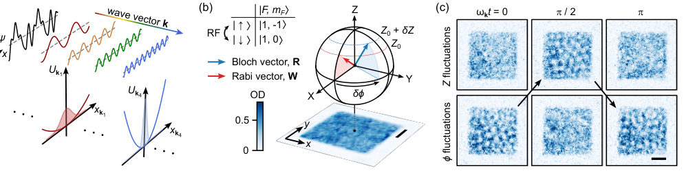
<figcaption class="paper-figure-caption"><b>Fig 1.</b> FIG. 1. Quantum-field fluctuations. (a) The concept. In a uniform system, fluctuations of a quantum field ψ (black), here illustrated in one spatial dimension, can be decomposed into plane-wave normal modes (colors) with wave vectors k. Each such mode is equivalent to a quantum harmonic oscillator with a k-dependent frequency ωk, (generalized) displacement xk and momentum pk, and a potential Uk ∝ω2 kx2 k. Even in its ground state, each oscillator exhibits quantum uncertainties; the color shading indicates Gaussian xk uncertainties ∝1/√ωk. (b) The experiment. We encode a massive bosonic field in the spin degrees of freedom of a homogeneous planar condensate (bottom image; OD is the optical...</figcaption>
</figure>
<figure class="paper-figure-card">
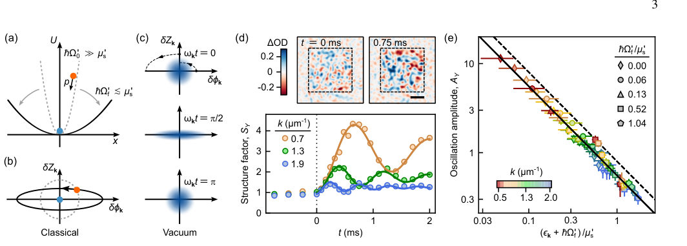
<figcaption class="paper-figure-caption"><b>Fig 2.</b> FIG. 2. Revealing the effect of vacuum fluctuations in the Rabi regime. (a-c) Experimental concepts. (a) We prepare the system deeply in the Rabi regime (Ω′ = Ω′ 0 ≫µ′ s/ℏ), and at t = 0 quench Ω′ to Ω′ f ≲µ′ s/ℏ, effectively decompressing the harmonic oscillator potentials associated with each spin mode. (b) Classically, the quench increases the ellipticity of the phase-space orbit of a particle at finite energy (orange dot), but leaves a zero-energy particle unaffected (blue dot). (c) Quantum mechanically, the ground state of a spin mode is represented by a distribution of points in phase space (blue shading). Following the quench, each point evolves along its elliptical classical...</figcaption>
</figure>
<figure class="paper-figure-card">
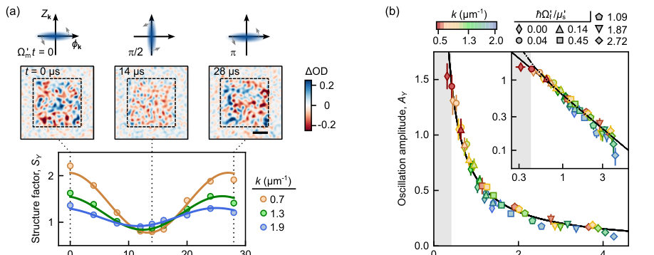
<figcaption class="paper-figure-caption"><b>Fig 3.</b> FIG. 3. Imaging vacuum fluctuations. (a) Experimental protocol and example measurements. Starting from the Rabi regime, we adiabatically ramp down the coupling strength to Ω′ f. For ℏΩ′ f/µ′ s ≲1, the ground state of each spin mode has an elliptical distribution in phase space. At t = 0, we jump up the coupling strength to ℏΩ′ m/µ′ s ≃20, initiating a rotation of the phase-space distribution at Ω′ m (top panels). The middle panels show example images of n−i for ℏΩ′ f/µ′ s = 0.04, taken as the distribution rotates; here, as in Fig. 2(d), we subtract the mean image and low-pass filter the images, and the dashed lines indicate the boundaries of the box trap; the scale bar corresponds to 10 µm....</figcaption>
</figure>

**Summary.** This research reports the direct experimental observation of spatial vacuum fluctuations in a two-component Bose-Einstein condensate. By tuning the system into a regime emulating a sine-Gordon field, the authors measured fluctuation spectra that match theoretical predictions for the quantum vacuum state. This work establishes the BEC as a powerful quantum simulator for studying fundamental quantum field phenomena.

**Why it may be interesting.** This work provides a highly controlled, tabletop platform to simulate and verify predictions from quantum field theory regarding vacuum structure, which is typically only accessible in extreme astrophysical environments.

Detailed structure

**Main problem.** The paper aims to directly observe and measure the spatial vacuum fluctuations of a quantum field, which are fundamental manifestations of quantum mechanics.

**Main result.** The measured spectrum of fluctuations agrees with theoretical predictions for a vacuum state, confirming the existence of these quantum correlations in the laboratory setting.

**Method.** The experiment uses in-situ state-selective imaging on a Bose-Einstein condensate to measure the structure factor and fluctuation correlations of the spin degrees of freedom.

**Model / system.** The physical system is a homogeneous planar atomic Bose-Einstein condensate (BEC) of $^{39}	ext{K}$ atoms with two coherently coupled spin components. The system's dynamics are modeled to emulate a massive relativistic sine-Gordon field in the appropriate interaction regime.

**Key observables.** Fluctuations in the relative phase ($\delta\phi$) and population imbalance ($\delta Z$), and the structure factor $S(k)$.

**Important parameters / regimes.** The study explores different regimes, including the Rabi regime and the Josephson regime, and compares vacuum fluctuation scaling ($\propto \omega^{-1}_k$) against thermal fluctuation scaling ($\propto \omega^{-2}_k$).

**Assumptions / limitations.** The analysis assumes the ability to decouple spin and density dynamics and must account for the attenuation of measured correlations due to imperfect atom detection efficiency ($\gamma < 1$).

**Figures summary.** Figure 1 illustrates the concept of vacuum fluctuations and the experimental setup using BEC spin degrees of freedom. Figure 2 shows the time evolution of fluctuations after a quench, comparing classical and quantum evolution.

**Paper structure.** The paper builds from the theoretical necessity of observing vacuum fluctuations, details the experimental platform (BEC spin dynamics), presents measurements across different parameter regimes (Rabi vs. Josephson), and finally analyzes the measured fluctuation spectra against theoretical predictions.

Abstract

Heisenberg uncertainties lead to inevitable fluctuations in the measurement outcomes for quantum-mechanical observables. For quantum fields, these uncertainties result in random spatial structures in snapshots of a field, even when the field is in its ground (vacuum) state. Such `vacuum fluctuations' are at the heart of a wide range of phenomena, from spontaneous decay processes to the Casimir force and Hawking radiation. Their existence is a key manifestation of the quantumness of the physical world, but usually it is only their consequences that are directly observed. Here, we directly observe spatial vacuum fluctuations of a bosonic quantum field. Our experiments are based on a homogeneous planar atomic Bose--Einstein condensate. The condensate comprises two coherently coupled interacting components (spin states), and the quantum field describes its spin degrees of freedom. In the regime where the interactions dominate over the coherent coupling, our system emulates a (massive relativistic) sine-Gordon field. Images of the field reveal simultaneous fluctuations on different length scales, with scale-dependent amplitudes consistent with theoretical predictions for a vacuum state. Observing such fluctuations in the sine-Gordon limit opens many possibilities for laboratory simulations of relativistic fields in regimes that are presently not theoretically tractable.

[↑ back to top](#top)

### [Large Scale Entanglement Structure Detection in 100-Qubit Systems via Local Joint Measurements](http://arxiv.org/abs/2608.20170v1)

**Authors:** Rui Li, Yuhang Wang, Chunxiao Du, Shikun Zhang, Zheng Qin, Wenxiu Li, Hao Zhang, Zhisong Xiao  
**Type:** both · **Category:** quantum information and computing · **PDF:** <https://arxiv.org/pdf/2608.20170v1>  
**Analysis basis:** full PDF text, analyzed in chunks
**Topic relevance:** 🔥 `QC/QI experiment` **4/5** · `quantum measurements` **3/5** · `analog quantum simulation` **1/5**

↔ Scroll figures horizontally

<figure class="paper-figure-card">
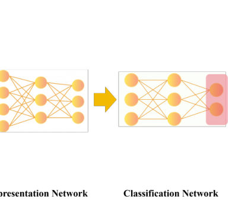
<figcaption class="paper-figure-caption"><b>Fig 1.</b> Fig. 1: Local-joint-measurement pipeline. An N-qubit chain is covered by over- lapping local subsystems of R qubits with step size s; the final window is anchored to the right boundary to ensure full coverage. In each window a single local Pauli basis is measured, yielding an outcome distribution of fixed dimension 2R. The per-window distributions are concatenated into the feature vector x of dimension Nwin2R, which is passed to a representation network and then a classification network that outputs the entanglement-structure label.</figcaption>
</figure>
<figure class="paper-figure-card">
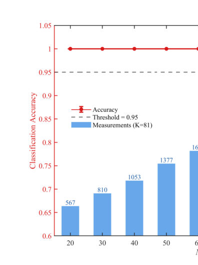
<figcaption class="paper-figure-caption"><b>Fig 2.</b> Fig. 2: Classification accuracy and measurement cost with the full local Pauli basis set. Test accuracy (red, left axis) and total number of measurements (blue bars, right axis) for N = 20, 30, . . . , 100 at fixed R = 4, s = 3, with all K = 81 local bases retained. Accuracy is exactly 100% across all N, well above the 0.95 threshold (dashed grey line), while the measurement count grows monotonically from 567 to 2673.</figcaption>
</figure>
<figure class="paper-figure-card">
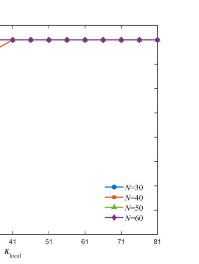
<figcaption class="paper-figure-caption"><b>Fig 3.</b> Fig. 3: Classification accuracy versus the number of retained local Pauli bases Klocal. Test accuracy for N = 30, 40, 50, 60 at fixed R = 4, s = 3. Accuracy already exceeds 0.97 at Klocal = 1 and saturates by Klocal ≈40.</figcaption>
</figure>
<figure class="paper-figure-card">
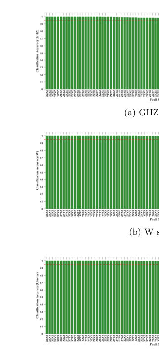
<figcaption class="paper-figure-caption"><b>Fig 4.</b> Fig. 4: Per-basis classification accuracy for the 3R = 81 individual local Pauli bases (GHZ-, W-, Cluster- block task, N = 100, R = 4, s = 3). Each bar is the accuracy obtained when only that single basis is used; the dashed line marks the 0.95 threshold, with bases above (green) and below (red) it.</figcaption>
</figure>
<figure class="paper-figure-card">
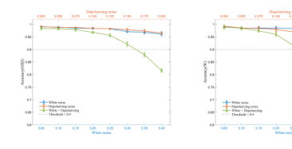
<figcaption class="paper-figure-caption"><b>Fig 5.</b> Fig. 5: Stress test of the single-basis protocol under strong depolarizing and white noise (N fixed, Klocal = 1). Each panel shows the classification accuracy for one state family as a function of white-noise strength pw (bottom axis, 0–0.4) and depolarizing strength pd (top axis, 0–0.2). Blue curves apply white noise, orange curves apply depolarizing noise, and green curves apply both simultaneously; the grey dashed line marks the 0.9 threshold and error bars denote 1 s.d.</figcaption>
</figure>

**Summary.** This paper introduces a scalable framework to determine the entanglement structure of large quantum systems by measuring local correlations rather than performing full state tomography. By using a single, carefully chosen local Pauli basis, the measurement effort scales linearly with system size, achieving high accuracy up to 100 qubits in simulation and validating the approach on superconducting hardware.

**Why it may be interesting.** This work directly addresses the scalability bottleneck in characterizing complex quantum states, providing a concrete, resource-efficient measurement protocol applicable to near-term quantum hardware.

Detailed structure

**Main problem.** The central challenge is identifying the entanglement structure (unentangled block partitions) of large many-body quantum states without resorting to exponentially scaling full quantum state tomography.

**Main result.** The authors developed a scalable protocol using local joint measurements that achieves over 95% accuracy for up to 100 qubits in simulation, and validated it up to 13 qubits on superconducting hardware.

**Method.** The method employs local Pauli measurements across overlapping windows, forming a feature vector whose dimension grows only linearly with system size, allowing for classification via a trained neural network.

**Model / system.** The study focuses on $N$-qubit chains exhibiting multipartite entanglement (GHZ-, W-, and cluster-type structures). The protocol is tested in both noisy simulations (up to 100 qubits) and on superconducting quantum processors (up to 13 qubits).

**Key observables.** Classification accuracy of entanglement structure, local Pauli measurement outcomes, and the measurement cost (number of required measurement configurations).

**Important parameters / regimes.** System size $N$ (up to 100 in simulation, 13 on hardware), window size $R$, and the number of local Pauli bases used ($K_{	ext{local}}$).

**Assumptions / limitations.** The structural information is assumed to be redundantly encoded across local Pauli measurements, and the protocol relies on selecting a single, representative local basis satisfying a boundary-matching condition ($p_1 = p_R$).

**Figures summary.** Figure 1 illustrates the local-joint-measurement pipeline using overlapping windows. Figure 2 and 3 compare the measurement cost and accuracy when using the full set of local bases versus a single, optimized representative basis.

**Paper structure.** The paper first establishes the problem of exponential scaling in entanglement characterization. It then introduces the scalable framework using local joint measurements, demonstrating the efficiency gain by reducing the measurement effort to be independent of system size. Finally, it validates the protocol both in noisy simulations and on physical quantum hardware.

Abstract

Identifying the entanglement structure of a many-body quantum state, namely how its constituents partition into unentangled blocks, is a central task in quantum information science, yet conventional tomography scales exponentially with system size. Here we introduce a scalable framework that recognizes large-scale entanglement structures directly from local correlation fingerprints. By choosing a representative local Pauli basis that satisfies a boundary-matching condition p_1 = p_R, the entire chain is read out in a single measurement configuration, keeping the measurement effort independent of system size. In noisy simulations, this single-basis protocol classifies GHZ-, W-, and cluster-type structures among 30 candidate partitions with a mean accuracy exceeding 95% for systems of up to 100 qubits. We further validate the protocol on a superconducting quantum processor, where it reliably classifies block structures for systems of up to 13 qubits before noise- and depth-induced degradation sets in at larger sizes. By mapping these failure modes explicitly, our results delineate the boundary of hardware-level scalability and point to a concrete strategy for characterizing entanglement structure on near-term quantum devices.

[↑ back to top](#top)

### [Inflationary Bispectra and IR Physics from Quantum Simulators](http://arxiv.org/abs/2608.19327v1)

**Authors:** Matthias Thomas Nowinski, Ivo Sachs  
**Type:** theory · **Category:** quantum gases · **PDF:** <https://arxiv.org/pdf/2608.19327v1>  
**Analysis basis:** full PDF text, analyzed in chunks
**Topic relevance:** 🔥 `Keldysh / 2PI / non-Gaussian methods` **4/5** · `analog quantum simulation` **3/5**

↔ Scroll figures horizontally

<figure class="paper-figure-card">
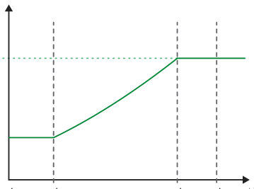
<figcaption class="paper-figure-caption"><b>Fig 1.</b> Figure 1: Scale factor a(t) as a function of time. The experiment is set up at time t0. Between the times ti and tf, the scale factor is continuously interpolating the values ai and af. The correlation function is then measured at time tm, when the scale factor has been held at a constant value for some time. This figure is inspired by [26].</figcaption>
</figure>
<figure class="paper-figure-card">
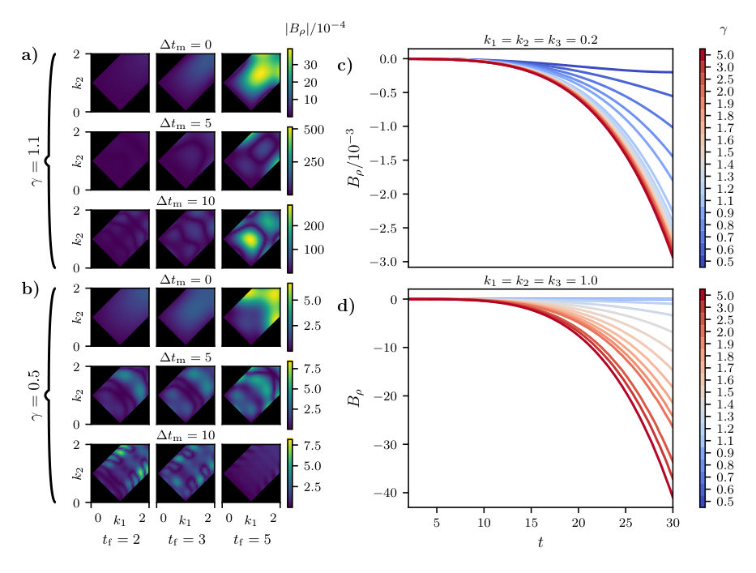
<figcaption class="paper-figure-caption"><b>Fig 2.</b> Figure 2: Density bispectrum Bρ. a) and b): As a function of k1 and k2 at fixed k3 = 1.0 and fixed ti = 1, for two different γ. We plot the absolute value which makes the patterns easier to read off, but both positive and negative values can be reached. Shown are multiple parameters in a 30×30 grid, while the k1 and k2 axes are shared. The triangles in the corners mark the kinematically excluded regions ka + kb &lt; kc for {a, b, c} = {1, 2, 3}. The columns show different tf, while the rows in each block show different wait times ∆tm = tm −tf, as indicated above each row. Larger tf usually lead to larger values, and larger ∆tm lead to a interference-like redistribution of the values. γ = 1.1...</figcaption>
</figure>
<figure class="paper-figure-card">
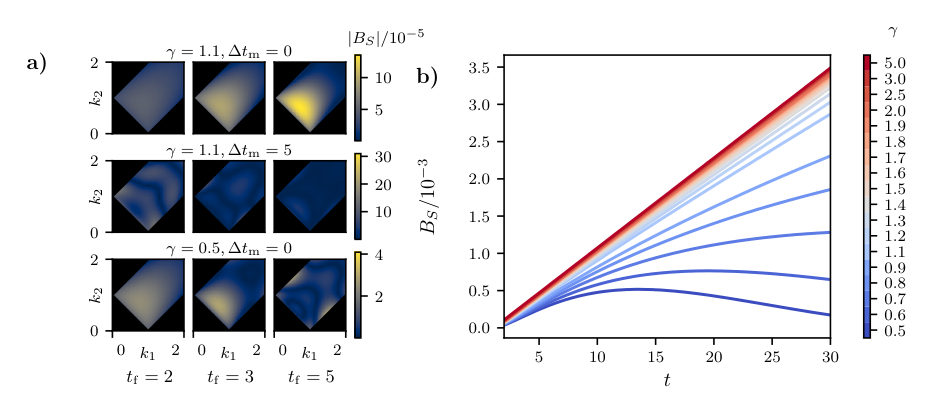
<figcaption class="paper-figure-caption"><b>Fig 3.</b> Figure 3: Phase bispectrum BS. The general structure of this figure is the same as for figure 2. a): As a function of k1 and k2 at fixed k3 = 1.0. Similarly to Bρ, the overall size of the values is growing with tf, while larger ∆tm lead to stronger patterns. Again, larger γ lead to larger values overall. b): Late-time behavior at k1 = k2 = k3 = 0.2 at different γ as a function of final time t = tf = tm. Values γ &lt; 1 lead to oscillations and γ &gt; 1 lead to growth, which matches the dependence on tf from table 1 qualitatively. Since the growth is linear and not quartic, larger values can be reached at earlier times than for Bρ.</figcaption>
</figure>
<figure class="paper-figure-card">
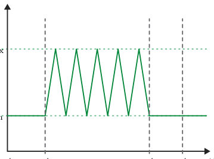
<figcaption class="paper-figure-caption"><b>Fig 4.</b> Figure 4: Periodic scale factor a(t) as a function of time. The experiment is set up at time t0 with a scale factor of a(t0) = amin. Between the times ti and tf, the scale factor is continuously oscillating between the values amin and amax. The correlation function then is measured at time tm, when the scale factor has been held at a constant value amin for some time.</figcaption>
</figure>
<figure class="paper-figure-card">
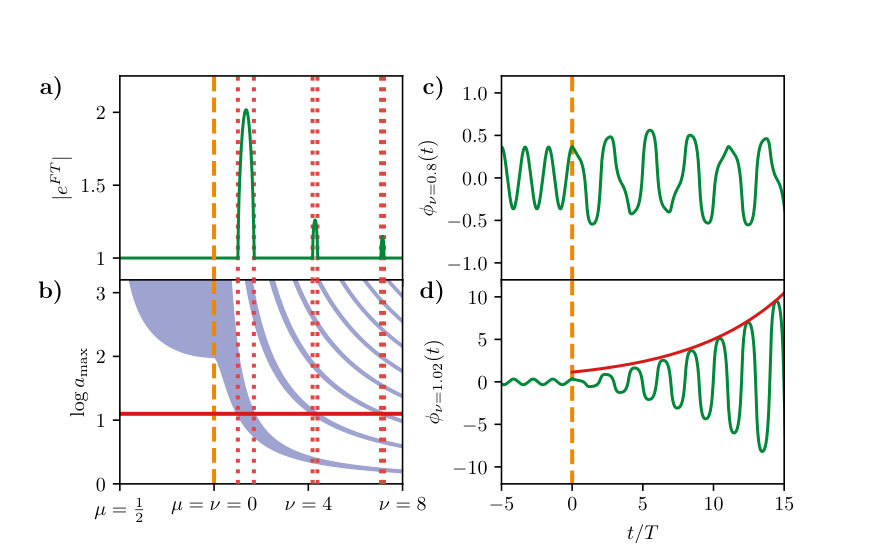
<figcaption class="paper-figure-caption"><b>Fig 5.</b> Figure 5: Resonant growth of the mode function and particle production. a) Abso- lute value of the growth factor |eFT | for the growing Floquet solution as a function of k, parametrized via µ and ν, according to (C.7) and (C.13). There are 3 bands in the dis- played k-range where the value is larger than 1. In these bands, exponential growth of the solution is expected. b) Visualization of the condition (C.15). Values of µ and ν for which log amax intersects the colored areas see exponential growth. We set amin = 1, so the hori- zontal line indicates amax = 3, and the dotted lines indicate the intersections. The dashed line indicates the transition from the low momentum to the high momentum...</figcaption>
</figure>

**Summary.** This paper uses Bose-Einstein condensates as quantum simulators to study interacting quantum field theories relevant to the early universe, specifically focusing on inflationary bispectra. By analyzing the system in various time-dependent backgrounds, the authors demonstrate that periodic driving can induce resonant growth in correlation functions, offering a pathway for experimental detection of cosmological signatures.

**Why it may be interesting.** This work directly bridges the gap between fundamental condensed matter systems (BECs) and high-energy cosmology (inflation/de Sitter space), providing a concrete, experimentally accessible platform to test complex quantum field theory predictions.

Detailed structure

**Main problem.** The paper extends the use of Bose-Einstein condensates (BECs) as quantum simulators from free theory phenomena to study interacting theories relevant to early-universe physics, such as inflation.

**Main result.** The analysis shows that while expanding scale factors lead to expected IR divergences, periodically driven backgrounds can produce resonant correlators that grow linearly and are potentially detectable in experiments.

**Method.** The authors derive interaction terms mimicking Effective Field Theory (EFT) of inflation and apply quantum field theory techniques (Schwinger-Keldysh formalism) to calculate 3-point correlations (bispectra) in time-dependent backgrounds.

**Model / system.** The system is a BEC of a cold atom gas, modeled as a relativistic scalar field $\Phi$ in a time-dependent Friedmann–Lemaître–Robertson–Walker (FLRW) background. The analysis focuses on the phase fluctuations ($\phi$) of the condensate.

**Key observables.** Momentum space 3-point function (bispectrum) of density and phase fluctuations, and the resonant growth of correlators.

**Important parameters / regimes.** The dimensionless coupling $\kappa$, the scale factor $a(t)$ (especially periodic/triangle wave profiles), and the resonance condition defined by the ratio $a_{\max}/a_{\min}$.

**Assumptions / limitations.** The analysis assumes the BEC is very large, boundary effects are negligible, and approximations are made when solving the mode equations for different scale factor regimes.

**Figures summary.** Figures illustrate the scale factor $a(t)$ interpolating between different regimes and visualize resonant conditions in the short wavelength regime, showing clear resonant bands.

**Paper structure.** The paper progresses from deriving the effective action for the BEC phase fluctuations, to establishing the formalism for calculating correlators in an FLRW background, and finally analyzing the mode functions and bispectra in specific cosmological regimes (accelerating, decelerating, and periodic).

Abstract

Bose-Einstein condensates have been used successfully as quantum simulators for early-universe particle production. Here we extend this analogy to the interacting theory. To this end, we compute the leading interaction terms expected in a general experimental setup that determine the 3-point correlations. We apply them to cosmologically motivated expanding model universes, but also periodically oscillating ones. While expanding scale factors do not necessarily lead to easily observable signatures due to experimental constraints on the realizable scale factor, periodically driven ones produce resonant correlators that grow linearly over time and lend themselves well to experimental detection. One direct application of this analysis is the experimental study of late-time infrared divergencies often discussed in the context of massless scalars in de Sitter space.

[↑ back to top](#top)

### [Squeezed- and coherent-state quantum key distribution over a deployed hybrid fibre-free-space channel](http://arxiv.org/abs/2608.20088v1)

**Authors:** Dnan A. E. Hajomer, Huy Q. Nguyen, Ivan Derkach, Andreas B. Kidmose, Edoardo Rossi, Mattia Sabatini, Yoann Pietri, Marco Avesani, Francesco Vedovato, Michael Hentschel, Radim Filip, Giuseppe Vallone, Vladyslav Usenko, Tobias Gehring, Soren Forchhammer, Paolo Villoresi, Ulrik L. Andersen  
**Type:** experiment · **Category:** quantum information and computing · **PDF:** <https://arxiv.org/pdf/2608.20088v1>  
**Analysis basis:** full PDF text, analyzed in chunks
**Topic relevance:** 🔥 `quantum optics experiment` **4/5** · `QC/QI experiment` **1/5** · `interference shaping light` **1/5** · `quantum measurements` **1/5**

↔ Scroll figures horizontally

<figure class="paper-figure-card">
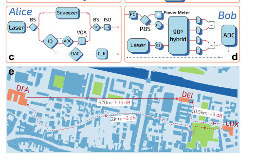
<figcaption class="paper-figure-caption"><b>Fig 1.</b> Fig. 1. Experimental configuration of the hybrid fiber–free- space CV-QKD system. a, Coherent-state transmitter. b, Het- erodyne receiver with a locally generated local oscillator. c, Squeezed-state transmitter. d, Phase-diverse receiver based on a 90◦optical hybrid. e, Hybrid quantum link deployed in Padova, connecting LUX, DFA, and DEI through fiber and free-space segments. The indicated values denote the approx- imate losses of the corresponding link segments. IQ, in-phase and quadrature modulator; ABC, automatic bias controller; VOA, variable optical attenuator; ISO, optical isolator; DAC, digital-to-analog converter; CLK, reference clock; PC, polar- ization controller; OS, optical...</figcaption>
</figure>
<figure class="paper-figure-card">
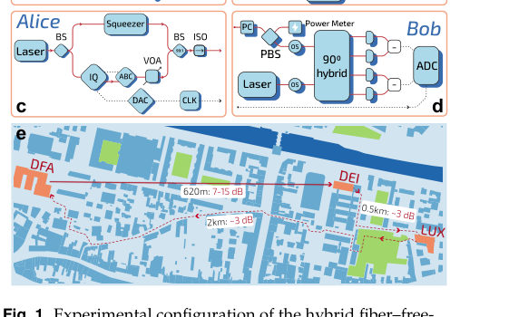
<figcaption class="paper-figure-caption"><b>Fig 2.</b> Figure 1 presents the CV-QKD system and the hybrid fibre–free- space testbed deployed in Padova, Italy [24, 25]. The system im- plements both the Gaussian-modulated coherent- and squeezed- state protocols using a LLO scheme. The two protocols share the same modulation, synchronisation and digital signal processing (DSP), and differ in the quantum-state source, the detection front end, and the security analysis applied to the recovered data. Op- erating both over the same deployed link therefore exercises the adaptive post-processing framework on two protocols with different statistical requirements, using a common transmitter and DSP chain. The same system is operated over two channel</figcaption>
</figure>
<figure class="paper-figure-card">
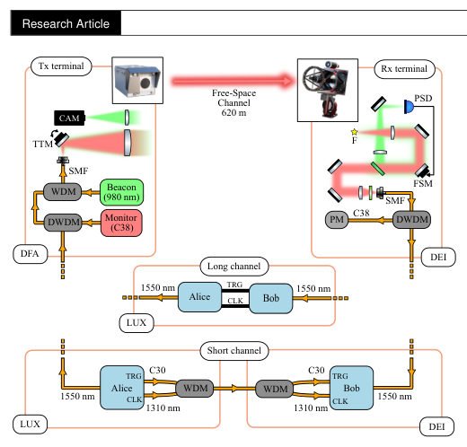
<figcaption class="paper-figure-caption"><b>Fig 3.</b> Fig. 2. Free-space optical terminals and signal routing for the two hybrid-channel configurations. The upper panels show the transmitter (Tx) at DFA and receiver (Rx) at DEI, con- nected by the 620-m free-space link; the lower panels show the long- and short-channel configurations. DWDM, dense wavelength-division multiplexer; WDM, wavelength-division multiplexer; SMF, single-mode fiber; TTM, tip–tilt mirror; CAM, camera; F, receiver focal plane; FSM, fast-steering mir- ror; PSD, position-sensitive detector; PM, power meter; TRG, trigger; CLK, clock.</figcaption>
</figure>
<figure class="paper-figure-card">

<figcaption class="paper-figure-caption"><b>Fig 4.</b> Fig. 4a 28 Jul. 2025, 17:00 16:45–17:15 23.8 ± 0.1 64.1 ± 0.6 4.8 ± 2.5 8.0 ± 0.8 1.75 ± 0.27</figcaption>
</figure>
<figure class="paper-figure-card">
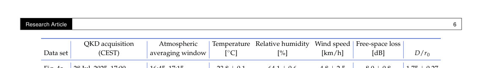
<figcaption class="paper-figure-caption"><b>Fig 5.</b> Fig. 4b 24 Jul. 2025, 16:33 16:18–16:48 30.3 ± 0.6 52.1 ± 4.9 5.4 ± 3.5 9.9 ± 1.1 2.24 ± 0.10</figcaption>
</figure>

**Summary.** This paper demonstrates CV-QKD over a realistic hybrid channel combining optical fibre and free-space links. The key innovation is a unified adaptive post-processing framework that manages channel fluctuations by adapting the data processing rather than the optics. This successfully establishes high secret-key rates, paving the way for heterogeneous quantum networks.

**Why it may be interesting.** This work directly addresses the practical implementation of quantum networks by solving the complex engineering challenge of integrating disparate physical media (fiber/free-space) into a single, functional quantum communication link.

Detailed structure

**Main problem.** Demonstrating Continuous-Variable Quantum Key Distribution (CV-QKD) over a complex, deployed hybrid channel combining optical fibre and free-space links, which requires handling contrasting channel requirements.

**Main result.** The authors achieved asymptotic secret-key rates of 0.42 Mbit/s (coherent) and 0.93 Mbit/s (squeezed) by developing a unified adaptive post-processing framework.

**Method.** The core methodology involves applying an adaptive post-processing framework that couples transmittance-based clustering, residual-fading mitigation (de-fading), and rate-adaptive blind reconciliation.

**Model / system.** The experiment uses a locally generated local oscillator (LLO) CV-QKD setup transmitting both Gaussian-modulated coherent and squeezed states over a hybrid link comprising 2 km of deployed fibre and a 620-m free-space atmospheric link.

**Key observables.** Asymptotic secret-key rates (Mbit/s), key lengths (bits), and the channel transmittance ($\eta$) and excess noise ($\epsilon$).

**Important parameters / regimes.** Total loss up to 20 dB; the contrast between stable fibre transmission and fluctuating atmospheric propagation.

**Assumptions / limitations.** The security analysis relies on Gaussian extremality applied to the covariance matrix in fading channels, and the authors treat detector efficiency and electronic noise as trusted.

**Figures summary.** Figure 1 illustrates the experimental setup for the hybrid CV-QKD system in Padova, detailing components for both coherent and squeezed state transmission across the free-space and fibre segments.

**Paper structure.** The paper establishes the problem of hybrid channel QKD, details the use of LLO schemes with coherent and squeezed states, and focuses heavily on the development and validation of the unified adaptive post-processing framework to extract key rates.

Abstract

Quantum networks will combine optical fibre with free-space links, yet continuous-variable quantum key distribution (CV-QKD) has been developed predominantly for one medium or the other, while operation across concatenated fibre-free-space channels remains largely unexplored. The two media impose contrasting requirements: fibre transmission is stable and permits long processing intervals, whereas atmospheric propagation imposes transmittance fluctuations that degrade security and must be resolved on short timescales. Here we demonstrate a locally generated local oscillator CV-QKD with both Gaussian-modulated coherent and squeezed states over a deployed hybrid channel comprising a 620-m free-space link and 2 km of deployed fibre, with a total loss up to 20 dB. Rather than adapting the optics to each medium, we move channel adaptation to the post-processing, through a unified adaptive post-processing framework coupling transmittance-based clustering, residual-fading mitigation by covariance-matrix averaging or de-fading, and rate-adaptive blind reconciliation, which alone recovers up to 19% additional key. The same adaptive-processing principle is applied to both protocols, while accounting for their different security analyses and statistical requirements, yielding asymptotic secret-key rates of 0.42 Mbit per sec for the coherent-state protocol and 0.93 Mbit per sec for the squeezed-state protocol under the respective channel conditions, and establishing squeezed-state CV-QKD over a deployed atmospheric channel. These results show that adaptation to the transmission medium can largely be transferred to the data-processing layer, providing a route towards heterogeneous quantum networks spanning fibre, terrestrial free-space and satellite links.

[↑ back to top](#top)

### [Group-theoretic treatment of strong light-matter coupling with an arbitrary number of excitations](http://arxiv.org/abs/2608.20340v1)

**Authors:** Antti Peltola, Olli Siltanen, Kimmo Luoma, Konstantinos S. Daskalakis  
**Type:** theory · **Category:** other · **PDF:** <https://arxiv.org/pdf/2608.20340v1>  
**Analysis basis:** full PDF text, analyzed in chunks
**Topic relevance:** 🔥 `Tavis-Cummings & cavity-many-emitter` **4/5** · `analog quantum simulation` **2/5**

↔ Scroll figures horizontally

<figure class="paper-figure-card">
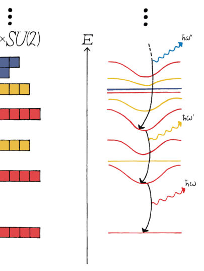
<figcaption class="paper-figure-caption"><b>Fig 1.</b> Figure 1: Schematic illustration of the system, model, and predictions. The Hilbert space corresponding to the physical system (two-level systems and cavity mode) grows exponentially with the excitation number X. This growth, however, remains computationally manageable when exploiting the algebraic structure of the Hilbert space. The structure, visualized here by the Young tableaux, manifests itself as symmetries in the eigenenergies (dispersion curves) and observable transition energies (wavy arrows) of the system.</figcaption>
</figure>
<figure class="paper-figure-card">
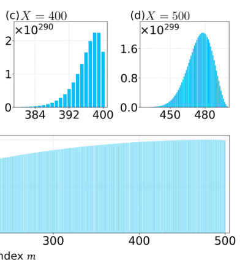
<figcaption class="paper-figure-caption"><b>Fig 2.</b> Figure 2: Dimensions of the irreps V (X) m for N = 1000 for X ∈{150, 300, 400, 500}. In (a–b) the dark states dominate in multiplicity, while dark polaritons become progressively comparable with growing X. In (c) the dark polaritons overtake the dark states. In (d) the dark states disappear completely, and the dark polaritons end up in a smooth distribution peaked at high m. Panel (e) shows the logarithms of the X = 500 dimensions, revealing the relative sizes invisible to the linear plots.</figcaption>
</figure>
<figure class="paper-figure-card">
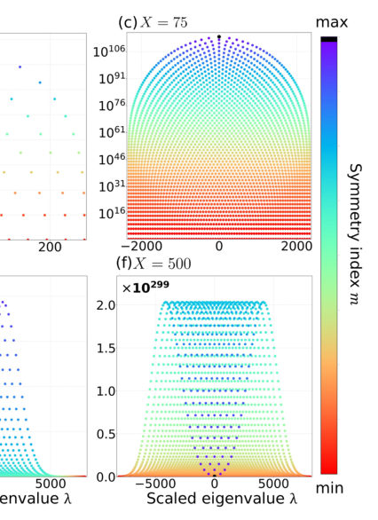
<figcaption class="paper-figure-caption"><b>Fig 3.</b> Figure 3: Eigenvalue distributions of A for N = 1000 and X ∈{3, 10, 75, 350, 450, 500}. Panels (a–c) are in logarithmic scale and 0 ≤m ≤X, showing a trade-off between the multiplicity and energy density for high and low m. Panels (d–f) show linearly for 0.8X ≤m ≤X, how the statistically most relevant states compare at high excitation numbers. The distributions represent a unitless, centered-around-zero energy spectrum for the system, scalable to arbitrary ET LS = Ec and g. The TLS excitation content of the states is proportional to m, such that red points have higher photonic content, and black points refer to dark states. The panels then show a statistical comparison between the variety of...</figcaption>
</figure>
<figure class="paper-figure-card">
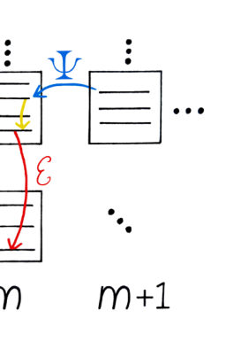
<figcaption class="paper-figure-caption"><b>Fig 4.</b> Figure 4: A schematic illustration of the quantum channels E, Ψ, and Φ. The boxes correspond to the representations V (X) m and the lines inside to the energy eigenstates |E(X,m) k ⟩. E induces transitions between LMP states of adjacent excitation manifolds, Ψ transitions between irreps within a given manifold, and Φ transitions between states within a given manifold and irrep.</figcaption>
</figure>
<figure class="paper-figure-card">
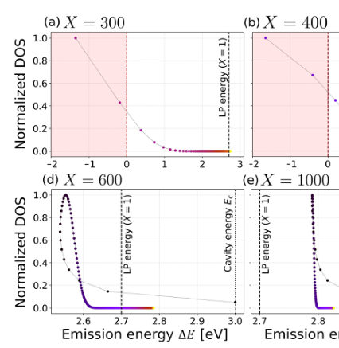
<figcaption class="paper-figure-caption"><b>Fig 5.</b> Figure 5: Normalized multiplicities against emission energies for N = 1000, g = 0.3/ √</figcaption>
</figure>

**Summary.** This paper develops a group-theoretic method to solve the spectrum of the Tavis-Cummings model for an arbitrary number of excitations. By exploiting the symmetry of the Hamiltonian, the authors manage the exponentially growing Hilbert space, providing exact predictions for polariton physics. This framework is crucial for advancing theoretical understanding of strongly coupled quantum light-matter systems.

**Why it may be interesting.** This work provides a powerful, generalizable theoretical tool for analyzing complex, many-body quantum optical systems, moving beyond the standard few-excitation approximations that limit technological modeling.

Detailed structure

**Main problem.** The paper addresses the theoretical challenge of extending the description of strong light-matter coupling (polaritons) from the limited single-excitation case to systems involving an arbitrary number of excitations.

**Main result.** The authors developed a group-theoretic framework that allows for the exact calculation of the spectrum and eigenstates for arbitrary numbers of excitations, revealing new physics inaccessible in simpler regimes.

**Method.** The core method involves exploiting the symmetry of the Tavis-Cummings Hamiltonian using representation theory (Schur-Weyl duality) to decompose the exponentially large Hilbert space into manageable, irreducible blocks.

**Model / system.** The system models $N$ two-level quantum emitters coupled uniformly to a single optical cavity mode, described by the Tavis-Cummings Hamiltonian under the Rotating-Wave Approximation. The analysis focuses on the conserved total excitation number $X$.

**Key observables.** Eigenvalues of the Hamiltonian ($E^{(X,m)}_k$), average excitation contents ($\langle n_c 
angle, \langle n_{TLS} 
angle$), and transition probabilities between excitation manifolds.

**Important parameters / regimes.** The number of emitters ($N$), the total excitation number ($X$), and the symmetry index ($m$). The analysis is particularly focused on the resonant condition ($E_{TLS} = E_c$).

**Assumptions / limitations.** The analysis relies on the Rotating-Wave Approximation (RWA), which conserves the total excitation number $X$, and utilizes asymptotic limits ($N 	o \infty$) for certain calculations.

**Figures summary.** Figures illustrate the dimension distribution of irreducible representations $V^{(X)}_m$ for large $N$, and plot the evolution of emission energy versus excitation number $X$, showing a collapse towards the cavity energy $E_c$ when $X > N/2$.

**Paper structure.** The paper systematically builds the theoretical framework by first establishing the symmetry decomposition of the Hilbert space using group theory. It then derives the structure of the reduced interaction matrix, calculates the eigenvalues and average excitation contents for small $X$, and finally analyzes asymptotic limits to determine transition probabilities and multiplicity distributions.

Abstract

Strong light-matter interactions in optical microcavities give rise to hybrid light-matter states known as polaritons. While actively used in modern technologies, theoretical descriptions of such systems are often restricted to the single-excitation case, limiting their ability to capture many-excitation physics and hindering further technological advancements. Here, by exploiting the combinatorial structure of quantum emitters, we investigate the Tavis-Cummings model with arbitrary number of excitations. We derive the structure and properties of its eigensystem and identify allowed radiative transitions in systems of realistic size scales. Our work reveals new behavior inaccessible to the few-excitation regime, while also providing a framework to reduce the computational complexity of similar systems with exponentially growing Hilbert spaces.

[↑ back to top](#top)

### [Structural complexity of an SU(3) Fermi Hubbard model](http://arxiv.org/abs/2608.20131v1)

**Authors:** Jiani Fu, Zewen Zhang, Eduardo Ibarra-García-Padilla  
**Type:** both · **Category:** strongly correlated electrons · **PDF:** <https://arxiv.org/pdf/2608.20131v1>  
**Analysis basis:** full PDF text, analyzed in chunks
**Topic relevance:** 🔥 `analog quantum simulation` **4/5** · `quantum measurements` **2/5**

↔ Scroll figures horizontally

<figure class="paper-figure-card">
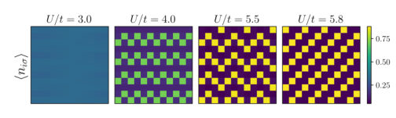
<figcaption class="paper-figure-caption"><b>Fig 1.</b> FIG. 1. Examples of mean-field ground state density profiles ⟨niσ⟩at 1/3-filling for selected values of U/t. Results for the other two spin flavors (not shown) are related by translations. At U/t = 3.0, ⟨niσ⟩is spatially uniform and consistent with a metallic phase. As the interaction strength increases, the tooth phase is observed (U/t = 4.0), then the zig-zag phase (U/t = 5.5), and finally the stripe phase (U/t = 5.8).</figcaption>
</figure>
<figure class="paper-figure-card">
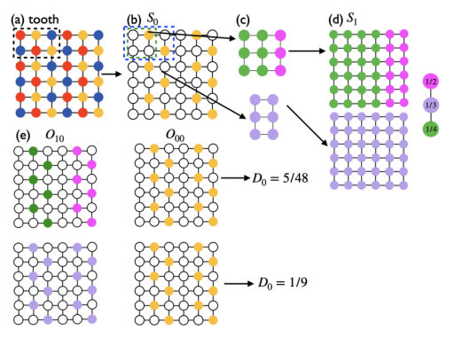
<figcaption class="paper-figure-caption"><b>Fig 2.</b> FIG. 2. Structural complexity procedure. The classical spin arrangement of the tooth phase is depicted in (a), where the different colors denote the three possible spin flavors. The density distribution S0 of one of the spin components (in this case, yellow), is coarse-grained using a Λx ×Λy window in (b) [2 × 2 and 3 × 2 windows are shown in green and blue dashed lines, respectively]. The coarse-grained images obtained using both windows are shown in (c). They are then resized to their original size in (d), denoted S1. Overlaps Oi0 between images Si and S0 are computed by performing an element to element product in (e). The first value of dissimilarity D0 is obtained by averaging over...</figcaption>
</figure>
<figure class="paper-figure-card">
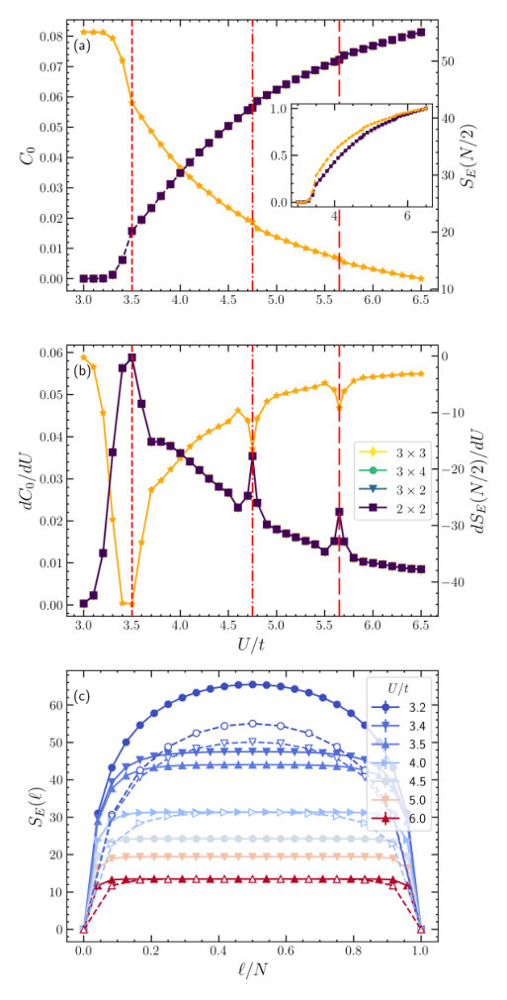
<figcaption class="paper-figure-caption"><b>Fig 3.</b> FIG. 3. Results as functions of U/t for different coarse- graining windows: (a) C0 (left axis) and bipartite half-system entanglement entropy SE(N/2) (right axis, orange stars), and (b) dC0/dU (left axis) and dSE(N/2)/dU (right axis, or- ange stars). There is no visible difference between calcula- tions using different windows (diamonds, circles, triangles, and squares cover each other up). Prior to taking the numer- ical derivatives, we smooth the observables using a moving average with a three-point window fitted with a local first- order polynomial (Savitzky-Golay filter). (c) Bipartite entan- glement entropy SE(l) as a function of subsystem size ℓfor different values of U/t, computed...</figcaption>
</figure>
<figure class="paper-figure-card">
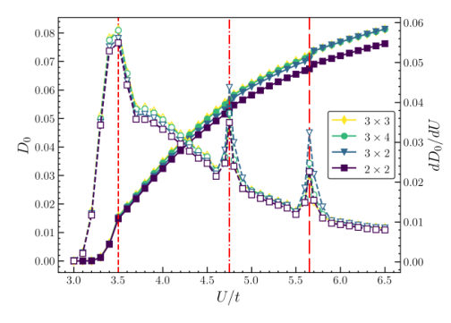
<figcaption class="paper-figure-caption"><b>Fig 4.</b> FIG. 4. D0 (left axis, solid markers) and dD0/dU (right axis, open markers) as functions of U/t for different coarse-graining windows. We apply the same moving filter to the data prior to taking the numerical derivative. Red vertical lines are the same as those in Fig. 3.</figcaption>
</figure>
<figure class="paper-figure-card">
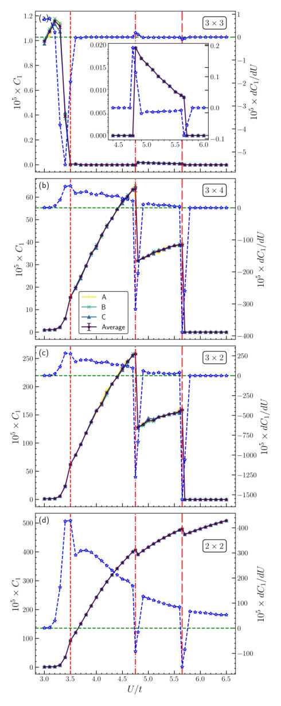
<figcaption class="paper-figure-caption"><b>Fig 5.</b> FIG. 5. C1 (left axis, solid markers) and dC1/dU (right axis, open blue markers) as functions of U/t for different coarse- graining windows. We present C1 for all spin flavors (A,B,C) as well as their average with error bars given by the sem. We present dC1/dU for the average only, to avoid clutter. Red vertical lines are the same as those in Fig. 3.</figcaption>
</figure>

**Summary.** This work introduces structural complexity as a novel, theory-free diagnostic tool for analyzing quantum many-body systems modeled by the SU(3) Fermi Hubbard Model. By applying this measure to mean-field snapshots, the authors demonstrate that structural complexity correlates strongly with entanglement entropy and accurately maps out the complex phase diagram of the system. This validates the technique for interpreting future measurements from quantum gas microscopes.

**Why it may be interesting.** It bridges the gap between advanced theoretical diagnostics (structural complexity, entanglement entropy) and direct, theory-free interpretation of cutting-edge experimental data from quantum gas microscopes.

Detailed structure

**Main problem.** Developing theory-free numerical techniques to extract physical information from spin-resolved projective measurements of quantum many-body systems.

**Main result.** Structural complexity was shown to be strongly correlated with entanglement entropy and proved to be an efficient, theory-free tool for accurately locating phase boundaries in the SU(3) FHM.

**Method.** The study uses mean-field theory to generate spin-resolved density distributions, followed by calculating structural complexity via rectangular coarse-graining windows.

**Model / system.** The system is the SU(3) Fermi Hubbard Model (FHM) studied on a 2D square lattice at 1/3-filling, relevant to ultracold alkaline-earth atoms.

**Key observables.** Structural Complexity ($C_0, C_1$), Entanglement Entropy ($S_E$), and spin-resolved density distributions ($\langle n_{i\sigma} 
angle$).

**Important parameters / regimes.** Interaction strength ratio ($U/t$), filling fraction (1/3), and phase boundaries defined by $U/t$ (e.g., 3.50, 4.75, 5.65).

**Assumptions / limitations.** The primary approximation used is Mean-Field Theory (MFT) to generate the initial density snapshots for analysis.

**Figures summary.** Figure 1 shows mean-field ground state density profiles illustrating transitions between metallic, tooth, zig-zag, and stripe phases. Figure 3 demonstrates the strong proportionality between $C_0$ and $S_E(N/2)$, and the alignment of their derivatives at phase boundaries.

**Paper structure.** The paper first introduces the problem of analyzing SU(N) FHM measurements, then details the structural complexity measure applied to MFT snapshots, and finally presents results showing the correlation between complexity, entanglement entropy, and phase diagram mapping.

Abstract

Two-dimensional quantum gas microscopy provides an unparalleled tool to study quantum many-body systems using ultracold atoms. For the SU(2) Fermi Hubbard model (FHM), access to spin-resolved projective measurements has been vital for quantifying correlation functions and mapping out the phase diagram. Recent progress in quantum gas microscopy for experiments with ultracold alkaline-earth atoms, which are well described by the SU(N) FHM and are predicted to host exotic ground-state phases, calls for the development of theory-free numerical techniques to extract physical information from their projective measurements. To that end, we evaluate the multiscale structural complexity of snapshots of an SU(3) FHM in the square lattice at $1/3$-filling. We employ mean-field theory to generate spin-resolved density distributions and compute their structural complexity using rectangular coarse-graining windows. We demonstrate that these complexities are linked to relevant physical observables such as the entanglement entropy, and are extremely sensitive for locating phase boundaries. The results presented here validate the structural complexity as an efficient and reliable tool for analyzing the outputs of SU(N) quantum gas microscopes, offering a theory-free property, immediately accessible to experiments.

[↑ back to top](#top)

### [Competing triangular and stripe supersolid orders in a dipolar quantum gas](http://arxiv.org/abs/2608.20327v1)

**Authors:** Karthik Chandrashekara, Christian Gölzhäuser, Lily Platt, Jianshun Gao, Julian Kusch, Lennart Hoenen, Manon Ballu, Wyatt Kirkby, Lauriane Chomaz  
**Type:** experiment · **Category:** quantum gases · **PDF:** <https://arxiv.org/pdf/2608.20327v1>  
**Analysis basis:** full PDF text, analyzed in chunks
**Topic relevance:** 🔥 `analog quantum simulation` **4/5** · `Frenkel-Kontorova` **1/5**

↔ Scroll figures horizontally

<figure class="paper-figure-card">
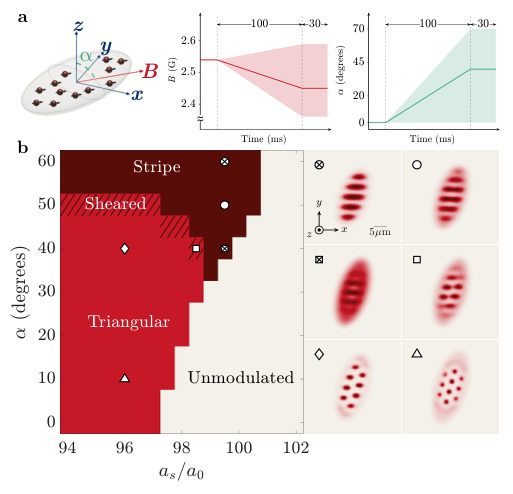
<figcaption class="paper-figure-caption"><b>Fig 1.</b> FIG. 1. Protocol and Phase Diagram (a) Sketch of the gas geometry (left panel). The gas is confined in a shallow surfboard trap with tighter confinement along z. A uniform magnetic field is applied in the xz plane with tunable mag- nitude B and tilt angle α. In the experiment, we ramp B and α in 100 ms, hold for 30 ms (right panels). (b) Phase diagram as a function of as and α constructed from TeGPE simulations with experimental settings. Alongside exemplary ground-state density profiles, cut at z = 0 (parameters identi- fied by symbols). Unmodulated, triangular, and stripe states are identified from such profiles (App. D).</figcaption>
</figure>
<figure class="paper-figure-card">
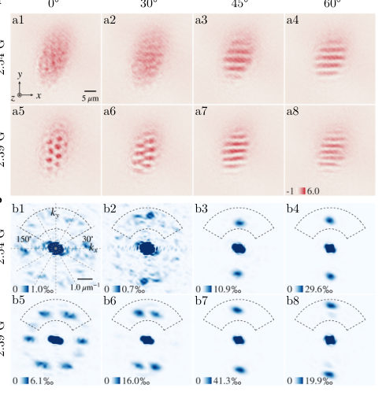
<figcaption class="paper-figure-caption"><b>Fig 2.</b> FIG. 2. State structure analysis (a) Examples of exper- imental in-situ images after ramping to B = 2.54 G (99.0 a0, upper row) and B = 2.39 G (90.8 a0, lower row) and α = 0◦, 30◦, 45◦, 60◦from left to right. (b) Power spectra of the states shown in (a). S(k) is normalized to the peak at k = 0; the color scale is clipped to the maximum of the finite-k peaks in the range kρ ∈[1.3, 2.7] µm−1 for visibility.</figcaption>
</figure>
<figure class="paper-figure-card">
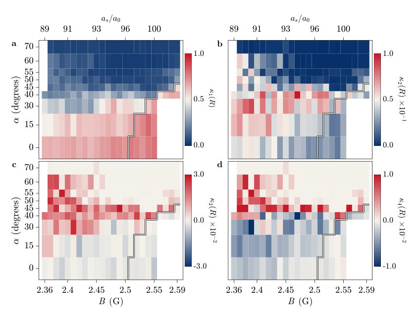
<figcaption class="paper-figure-caption"><b>Fig 3.</b> FIG. 3. Statistics of the structural order parameter The nth-order cumulants κn of the order parameter R extracted from the power spectra of 30 independent experimental shots for varying B and α with (a) n = 1 (mean), (b) n = 2 (variance), (c) n = 3 and (d) n = 4 cumulants. The solid white line highlights the boundary between modulated and unmodulated states extracted from the S(k)-amplitude analysis (App. F).</figcaption>
</figure>
<figure class="paper-figure-card">
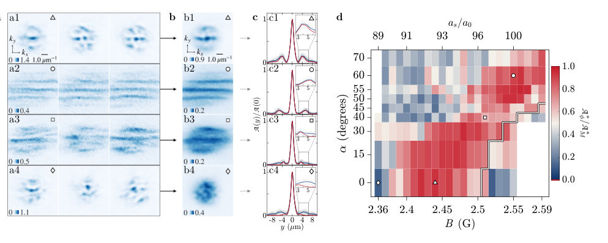
<figcaption class="paper-figure-caption"><b>Fig 4.</b> FIG. 4. Global phase coherence (a) Examples of single TOF density profiles, with (b) corresponding averaged images over 20 shots. The TOF images are shown as a function of the in-plane momentum components, kx, ky, using the free-expansion formula (App. K). (c) Corresponding 1D Fourier transforms of the individual density profiles integrated along kx (grey lines) together with Aϕ(y) (red line), AM(y) (blue line). The inset in (c) enlarges the range around the y &gt; 0 side peak. Figures are shown for: B = 2.44 G, α = 0◦(1,△), B = 2.55 G, α = 60◦(2,⃝), B = 2.51 G, α = 40◦(3,□), B = 2.36 G, α = 0◦(4,♢). (d) A ∗ ϕ/A ∗ M as a measure of global phase coherence over different B and α. The solid white...</figcaption>
</figure>
<figure class="paper-figure-card">
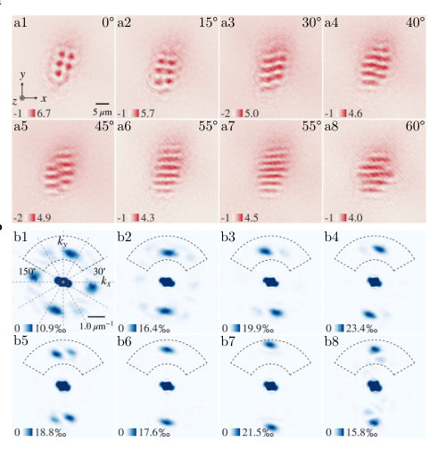
<figcaption class="paper-figure-caption"><b>Fig 5.</b> FIG. 6. Selected states exhibiting distinct arrangements com- pared to Fig. 2(a5-8) at B = 2.39 G and α = 0◦(a1,b1), 15◦</figcaption>
</figure>

**Summary.** This paper reports experimental evidence for competing triangular and stripe supersolid orders in a dipolar quantum gas. By tuning external parameters like dipole orientation and interaction strength, the researchers mapped out a complex phase diagram. The study uses advanced spectral analysis to characterize the structural transitions and confirms the interplay between spatial order and global phase coherence.

**Why it may be interesting.** This work provides a highly controllable platform to study intertwined symmetry-breaking phenomena in 2D supersolids, offering quantitative measurements of critical behavior associated with competing crystalline orders.

Detailed structure

**Main problem.** The study investigates the competition and coexistence of multiple spatial orders (triangular and stripe) in dipolar supersolids, and how global phase coherence interacts with this structural order.

**Main result.** The authors experimentally formed and characterized both competing triangular and stripe density-modulated states, identifying the structural phase transition between them and observing these structures in both phase-coherent and phase-incoherent regimes.

**Method.** Structural analysis was performed by computing the 2D power spectrum of in-situ density distributions, while phase coherence was probed using time-of-flight measurements.

**Model / system.** The system is a dipolar quantum gas of highly magnetic atoms (e.g., Dy) confined in a surfboard-shaped trap. Control is achieved by tuning the contact interaction strength ($a_s$) and the dipole tilt angle ($\alpha$).

**Key observables.** Structural order parameter, 2D power spectrum $S(\mathbf{k})$, and the ratio of phase to modulation amplitudes ($A_\phi/A_M$) from TOF images.

**Important parameters / regimes.** Dipole tilt angle ($\alpha$) and contact interaction strength ($a_s$), which control the transition between triangular and stripe phases.

**Assumptions / limitations.** The analysis relies on defining structural order parameters from the power spectrum and distinguishing between different spatial arrangements based on spectral signatures.

**Figures summary.** Figures illustrate the experimental protocol and a phase diagram ($\alpha$ vs. $a_s$) showing the predicted states, alongside in-situ images and power spectra confirming the presence of triangular and stripe patterns.

**Paper structure.** The paper follows a structure of establishing the physical platform, presenting theoretical predictions via simulations, and then detailing experimental measurements using structural and coherence diagnostics to map out the complex phase diagram.

Abstract

Supersolids are exotic quantum states in which long-range phase coherence coexists, and may interplay, with emergent spatial orders. A particularly rich phase diagram featuring several competing spatial orders is predicted for dipolar supersolids with two-dimensional crystals, yet the experimental observation of this structural variety has remained limited. Here we experimentally form competing triangular and stripe density-modulated states in a quantum gas of highly magnetic atoms confined in a surfboard-shaped trap by tuning contact interaction strength and dipole orientation. We define a structural order parameter and study its statistical behavior. Thereby, we identify both the triangular and stripe phases and the transition between them, the associated critical behavior being marked by enhanced non-Gaussian fluctuations. Furthermore, we observe each spatial structure in both the phase-coherent supersolid regime and the phase-incoherent insulating one, near and far from the unmodulated-to-modulated transition, respectively. Our results establish a versatile platform in which multiple phases of the two-dimensional-supersolid phase diagram, and more generally, intertwined symmetry-breaking phenomena, can be investigated.

[↑ back to top](#top)

### [Anyon condensates of dipoles in triangular ladders](http://arxiv.org/abs/2608.20173v1)

**Authors:** Arjo Dasgupta, Luis Santos  
**Type:** theory · **Category:** quantum gases · **PDF:** <https://arxiv.org/pdf/2608.20173v1>  
**Analysis basis:** full PDF text, analyzed in chunks
**Topic relevance:** 🔥 `analog quantum simulation` **4/5**

↔ Scroll figures horizontally

<figure class="paper-figure-card">
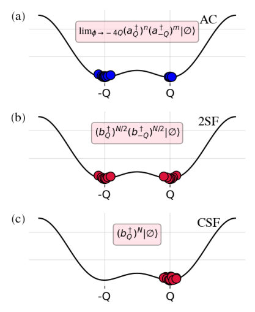
<figcaption class="paper-figure-caption"><b>Fig 1.</b> FIG. 1. Possible condensates in the frustrated J1 −J2 model: (a) Anyon condensate (AC) state. (b) two-superfluid (2SF) state. (c) Chiral superfluid (CSF) state. In the figure blue (red) filled circles indicate anyons (magnons).</figcaption>
</figure>
<figure class="paper-figure-card">
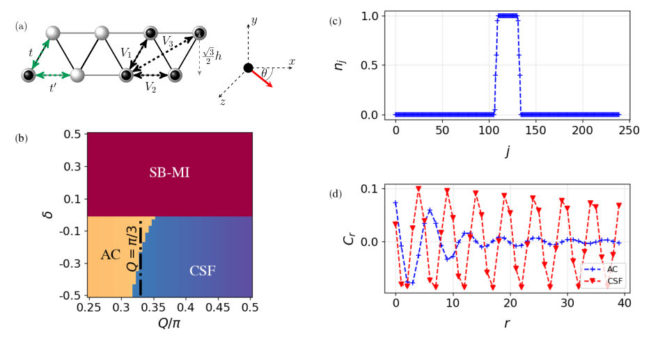
<figcaption class="paper-figure-caption"><b>Fig 2.</b> FIG. 2. (a) Scheme of the model of hard-core dipolar bosons on a triangular ladder of inter-leg separation √</figcaption>
</figure>
<figure class="paper-figure-card">
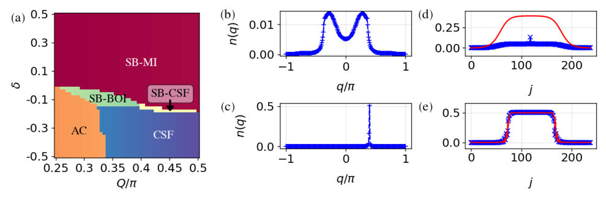
<figcaption class="paper-figure-caption"><b>Fig 3.</b> FIG. 3. (a) Phase diagram of hard-core dipolar bosons in a triangular ladder with h = 0.2, as a function of Q and δ for a system of L = 240 sites with open boundary conditions at a filling ρ = 0.2 ( m = −0.3). The phase boundaries are drawn from DMRG results with bond-dimension χmax = 800 employing the TeNPy library [26]. (b) Quasi-momentum distribution n(q) for the balanced-AC ground-state at Q = 0.28π, δ = −0.1. (c) Quasi-momentum distribution for the CSF ground-state at Q = 0.4π, δ = −0.2. (d) Density profile (red line) and chirality-chirality correlations (blue crosses) with respect to the central site, ⟨ˆκL/2ˆκj⟩, (blue) in the self-bound chiral superfluid (SB-CSF) ground-state at Q =...</figcaption>
</figure>

**Summary.** This paper theoretically explores anyon condensates formed by hard-core dipoles in triangular ladders, modeling the system with an extended Bose-Hubbard Hamiltonian. Using a combination of perturbation theory and DMRG, the authors map out a complex phase diagram showing transitions between anyon condensates, chiral superfluids, and Mott insulators. The findings are crucial for understanding how dipolar interactions stabilize exotic quantum states in ultracold atomic systems.

**Why it may be interesting.** This work directly addresses the physics of dipolar quantum gases, a major area in AMO physics, by predicting exotic quantum phases like anyon condensates and mapping out their stability boundaries.

Detailed structure

**Main problem.** The study investigates the interplay between frustration and long-range interactions in dipolar systems, focusing on the robustness and nature of anyon condensates.

**Main result.** The paper establishes that balanced anyon condensates are robust against small deviations from exactly-solvable conditions, while the phase diagram reveals rich transitions between AC, chiral superfluids, and various insulating phases.

**Method.** The analysis combines analytical perturbation theory for energy corrections with numerical Density Matrix Renormalization Group (DMRG) calculations.

**Model / system.** The system is hard-core dipoles confined to triangular ladders, modeled by an extended Bose-Hubbard model equivalent to a modified J1-J2 XXZ Hamiltonian.

**Key observables.** Single-particle correlations ($C_r$), chirality ($\kappa_j$), and the energy correction ($\Delta E_{n,m}$) are key diagnostics used to distinguish between different quantum phases.

**Important parameters / regimes.** The parameters $Q$ (related to momentum/geometry) and $\delta$ (deviation from exactly-solvable conditions) dictate the observed phase, with critical points near $Q = \pi/3$.

**Assumptions / limitations.** The analysis assumes hard-core bosons and relies on perturbation theory for deviations from the exactly-solvable point.

**Figures summary.** Figures illustrate schematic representations of various phases (AC, 2SF, CSF) and show the phase diagram mapping the boundaries between these states as a function of system parameters.

**Paper structure.** The paper progresses by first defining the model and the exactly-solvable case, then using perturbation theory to analyze energy corrections upon deviation ($\delta$), and finally using DMRG to map out the full phase diagram showing transitions between different superfluid and insulating regimes.

Abstract

Hard-core dipoles in triangular ladders are an excellent platform for the study of the interplay between frustration and long-range interactions, well described by a modified version of the celebrated $J_1$--$J_2$ model. Interestingly, as shown in [Phys. Rev. Lett. 109, 227203 (2012)], such a model presents, for particular exactly-solvable conditions, a peculiar phase known as an anyon condensate. We show that balanced anyon condensates are robust against deviations from the exactly-solvable conditions, and discuss the requirements for dipolar orientation and ladder geometry, to realize anyon condensates of dipoles in triangular ladders, whose anyonic nature may be easily revealed by time-of-flight measurements. Moreover, the ground-state physics in the vicinity of the exactly-solvable point is very rich, including a phase transition from anyon condensates into chiral superfluids, and self-bound Mott insulators, bond-order insulators, and chiral liquids.

[↑ back to top](#top)

### [A solvent-flux theory for nonequilibrium swelling dynamics of thermoresponsive microgels](http://arxiv.org/abs/2608.19884v1)

**Authors:** Arturo Moncho-Jordá, Alessandro Patti, Fabián A. García-Daza, Alejandro Cuetos  
**Type:** theory · **Category:** statistical mechanics · **PDF:** <https://arxiv.org/pdf/2608.19884v1>  
**Analysis basis:** full PDF text, analyzed in chunks
**Topic relevance:** `Keldysh / 2PI / non-Gaussian methods` **3/5** · `driven-dissipative phase transition` **3/5** · `methods for driven-dissipative` **3/5** · `non-equilibrium universality` **3/5** · `analog quantum simulation` **2/5** · `correlated / nonlocal dissipation` **2/5** · `quantum measurements` **2/5** · `scars & prethermalization` **2/5** · `Frenkel-Kontorova` **1/5**

↔ Scroll figures horizontally

<figure class="paper-figure-card">
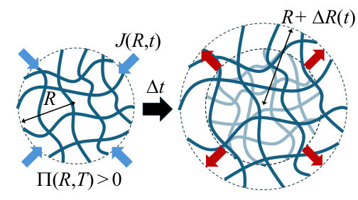
<figcaption class="paper-figure-caption"><b>Fig 1.</b> FIG. 1. Schematic illustration of the swelling of a pNIPAM microgel driven by solvent uptake. The inward solvent flux is induced by a positive osmotic-pressure imbalance, Π &gt; 0, between the microgel interior and the surrounding bulk solu- tion,leading to an increase of the microgel radius. The oppo- site case, Π &lt; 0, corresponds to deswelling, where solvent is expelled from the microgel and the particle radius decreases.</figcaption>
</figure>
<figure class="paper-figure-card">
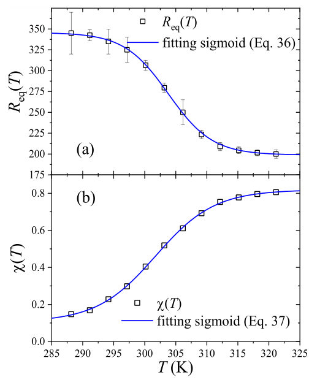
<figcaption class="paper-figure-caption"><b>Fig 2.</b> FIG. 2. (a) Equilibrium hydrodynamic microgel radius as a function of T. (b) Flory–Huggins solvency parameter as a function of T. Blue lines show the corresponding fits of Req(T) and χ(T) using Eqs. (36) and (37).</figcaption>
</figure>
<figure class="paper-figure-card">
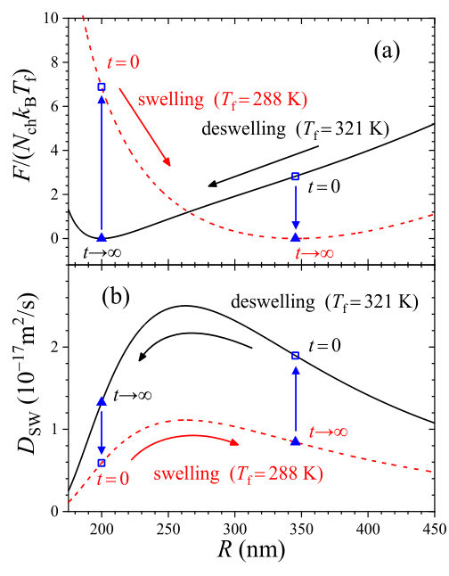
<figcaption class="paper-figure-caption"><b>Fig 3.</b> FIG. 3. (a) Normalized free-energy landscape of the microgel as a function of the particle radius R. (b) State-dependent swelling diffusion coefficient, DSW(R, Tf), as a function of R. In both panels, the black solid line corresponds to the deswelling process after a temperature jump to Tf = 321 K, whereas the red dashed line corresponds to the swelling pro- cess after a temperature jump to Tf = 288 K. Blue squares denote initial state, whereas blue triangles show the final equi- librium state.</figcaption>
</figure>
<figure class="paper-figure-card">
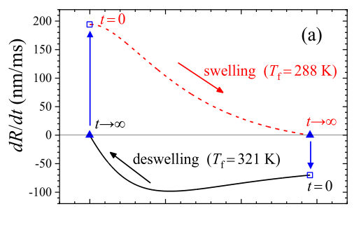
<figcaption class="paper-figure-caption"><b>Fig 4.</b> FIG. 4. Instantaneous rate of change of the microgel radius, dR/dt, as a function of R for the deswelling process (black solid line) and the swelling process (red dashed line).</figcaption>
</figure>
<figure class="paper-figure-card">
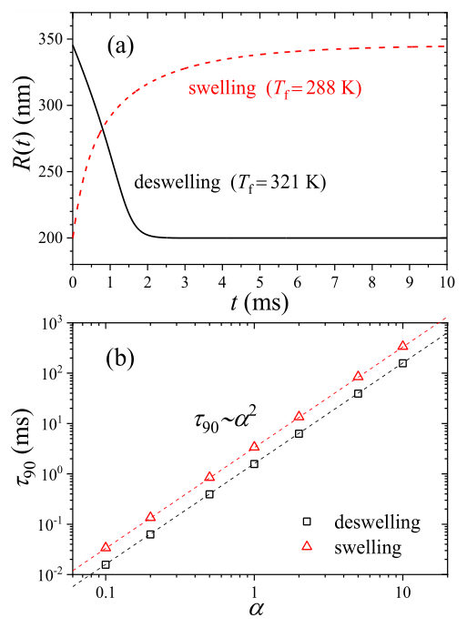
<figcaption class="paper-figure-caption"><b>Fig 5.</b> FIG. 5. (a) Time evolution of the microgel radius, R(t), dur- ing the deswelling and swelling processes. (b) Scaling of the characteristic relaxation time τ90 with the particle-size scal- ing factor α for both deswelling and swelling. The quantity τ90 is defined as the time required for the microgel radius to complete 90% of the total change between the initial and final equilibrium states.</figcaption>
</figure>

**Summary.** This paper introduces a solvent-flux theory to model the complex, non-equilibrium swelling and deswelling dynamics of thermoresponsive microgels. It derives a state-dependent mobility that governs the kinetics, predicting key non-linear behaviors such as asymmetric pathways and dynamic hysteresis. The work successfully links solvent transport, mechanical response, and size fluctuations in these soft matter systems.

**Why it may be interesting.** The framework of non-equilibrium dynamics, coupled transport, and fluctuating potentials is highly relevant to open quantum systems and non-equilibrium statistical mechanics, providing a model for complex relaxation processes.

Detailed structure

**Main problem.** Predicting the nonequilibrium swelling and deswelling kinetics of thermoresponsive microgels, which is challenging due to the coupled evolution of polymer volume fraction, mechanical response, and solvent transport during large volume changes.

**Main result.** The theory predicts asymmetric swelling/deswelling pathways and shows that finite thermalization times can induce dynamic hysteresis-like loops in the radius-temperature plane.

**Method.** Development of a solvent-flux theory that models the radius-change rate driven by osmotic-pressure imbalance and resisted by water transport through the polymer network.

**Model / system.** The study focuses on thermoresponsive microgels, specifically pNIPAM, whose dynamics are governed by a nonlinear, state-dependent diffusion equation derived from solvent flux principles.

**Key observables.** Swelling diffusion coefficient ($D_{SW}(R, T)$), radius distribution width ($\sigma_R(t)$), and the rate of radius change ($dR/dt$).

**Important parameters / regimes.** Temperature ($T$), polymer volume fraction ($\phi$), and the characteristic relaxation time ($	au_{SW}$).

**Assumptions / limitations.** The theory assumes an overdamped, diffusion-controlled solvent transport regime and extends beyond the limitations of the linear-response Tanaka-Fillmore model.

**Figures summary.** Figure 1 schematically illustrates the driving forces (osmotic pressure imbalance) for swelling and deswelling via solvent flux.

**Paper structure.** The paper develops the solvent-flux theory, derives the governing non-linear ODE for the swelling coordinate, analyzes the linear-response limit, and extends the model to include stochastic fluctuations and finite thermalization effects.

Abstract

Thermoresponsive microgels undergo large reversible size changes as temperature alters solvent quality. Predicting their nonequilibrium swelling and deswelling kinetics is challenging because polymer volume fraction, mechanical response, and solvent transport evolve during large volume changes. Here we develop a solvent-flux theory for the dynamics of a spherical microgel. The radius-change rate is driven by the osmotic-pressure imbalance across the particle boundary and resisted by water transport through the polymer network, yielding a nonlinear equation for the global swelling coordinate and a state- and temperature-dependent swelling diffusion coefficient, $D_{\mathrm{SW}}(φ,T)$. In the linear-response regime, the theory recovers Tanaka--Fillmore exponential relaxation and the scaling $τ_\mathrm{SW}\sim R_{\mathrm{eq}}^2γ/K_{\mathrm{eq}}$, while providing a microscopic interpretation of the polymer--solvent friction coefficient $γ$. Beyond this limit, the model retains quadratic size scaling while accounting for state-dependent transport and mechanics. For pNIPAM microgels, it predicts asymmetric pathways, with deswelling faster than swelling over the same temperature interval. Finite thermalization produces a crossover from a microgel-controlled to a thermalization-controlled regime, in which the apparent relaxation time grows linearly with the external thermalization time and hysteresis-like loops emerge in the radius--temperature plane. A stochastic extension based on the Smoluchowski equation predicts transient broadening of the radius distribution during collapse, with maximal fluctuations in the volume-transition region. The theory links solvent transport, nonlinear swelling dynamics, thermalization effects, and nonequilibrium size fluctuations in responsive microgels.

[↑ back to top](#top)

### [Splitting probabilities for Brownian motion with diffusing boundaries: Application to polymer translocation](http://arxiv.org/abs/2608.20226v1)

**Authors:** Alexander K. Hartmann, Satya N. Majumdar, Alberto Rosso  
**Type:** theory · **Category:** statistical mechanics · **PDF:** <https://arxiv.org/pdf/2608.20226v1>  
**Analysis basis:** full PDF text, analyzed in chunks
**Topic relevance:** `Keldysh / 2PI / non-Gaussian methods` **3/5** · `correlated / nonlocal dissipation` **3/5** · `methods for driven-dissipative` **3/5** · `driven-dissipative phase transition` **2/5** · `non-equilibrium universality` **2/5** · `quantum measurements` **2/5** · `Frenkel-Kontorova` **1/5** · `analog quantum simulation` **1/5**

↔ Scroll figures horizontally

<figure class="paper-figure-card">
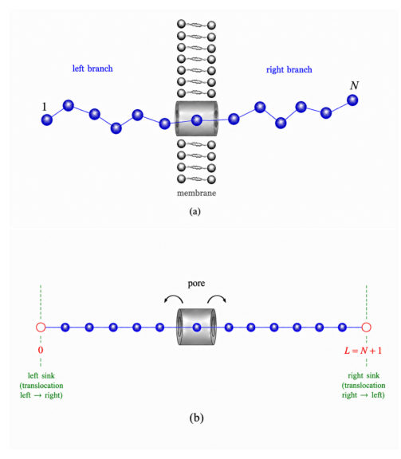
<figcaption class="paper-figure-caption"><b>Fig 1.</b> FIG. 1. (a) A schematic picture of a polymer chain, consisting of N monomers, translocating through a pore. The transloca- tion process ends when the number of monomers to the right of the pore becomes either N (the chain then successfully translocates from left to right) or 0 (the chain translocates from right to left). (b) An alternative equivalent representa- tion where the pore itself performs a stochastic nearest neigh- bour hopping on a lattice with L = N + 1 sites (labelled as 0, 1, 2, . . . , L = N + 1), and the process ends when the pore hits either the site 0 (translocation from left to right of the pore) or the site L (translocation from right to left of the pore). The two sites...</figcaption>
</figure>
<figure class="paper-figure-card">
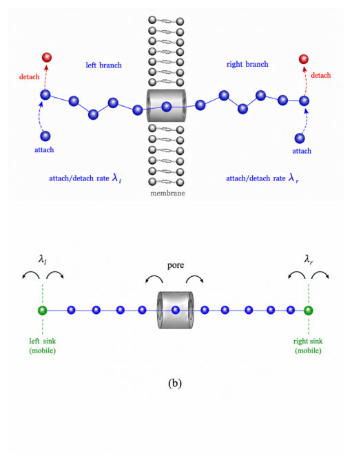
<figcaption class="paper-figure-caption"><b>Fig 2.</b> FIG. 3. (a) A schematic picture of a polymer chain translo- cating through a pore. The monomer located at the left end (shown by a red filled circle) can detach or attach with rate λl. Similarly the monomer located at the right edge (also shown by a red filled circle) can detach or attach with rate λr. (b) An alternative equivalent representation where the pore itself performs a stochastic nearest neighbour hopping on a lattice. Also, the two boundaries of the cluster representing the end monomers also perform ‘random walk’ like hopping to the left and to the right. The two sites at the end (now also moving stochastically) act like sinks. The translocation process ends when the central...</figcaption>
</figure>
<figure class="paper-figure-card">
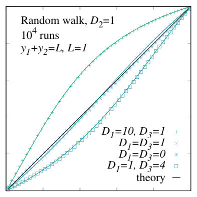
<figcaption class="paper-figure-caption"><b>Fig 3.</b> FIG. 6. Theoretical prediction for the splitting probability pleft(y2|L) as a function of y2 in Eq. (30), shown as lines in different colors, compared with numerical simulations, shown as symbols, for different choices of D1 and D3 (with D2 = 1 and L = 1 fixed). One sees excellent agreement between the theory and simulations.</figcaption>
</figure>
<figure class="paper-figure-card">
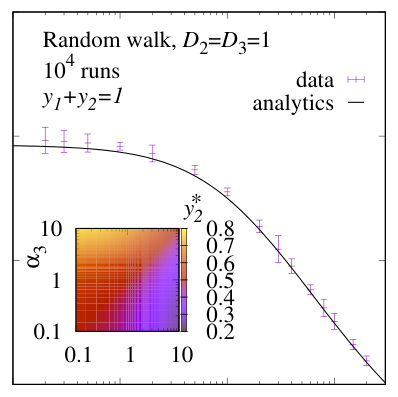
<figcaption class="paper-figure-caption"><b>Fig 4.</b> FIG. 7. Theoretical prediction for the halfpoint y∗ 2(α1) (where the left and right splitting probabilities are exactly equal) as a function of α1 in (36) is shown by the solid black line. The numerical data points are shown by + symbols. In the inset, we show a heat map of y∗ 2 in (35) in the (α1, α3) plane (we have set L = 1).</figcaption>
</figure>
<figure class="paper-figure-card">
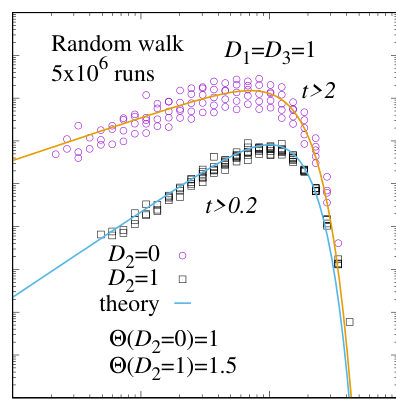
<figcaption class="paper-figure-caption"><b>Fig 5.</b> FIG. 9. Theoretical predictions for the scaling behavior of the joint distribution P left(t, z) in Eqs. (61)-(62) shown by solid lines for two values of Θ are compared with numerical simu- lations (symbols), where the very short-time date is omitted. In the simulation we fixed D1 = D3 = 1 and considered two values of D2 = 0 and D2 = 1. In these cases, the theoretical predictions of the exponent θ in Eq. (59) are respectively θ = 1 (for D2 = 0) and θ = 3/2 (for D2 = 1).</figcaption>
</figure>

**Summary.** This work analyzes polymer translocation through a nanopore where the pore size fluctuates stochastically. By mapping this to a three-walker Brownian motion problem, the authors derive exact results for the splitting probability and show that the time and size distributions decay according to power laws dependent on the boundary diffusion rates. The study extends these findings to non-Markovian dynamics using fractional Brownian motion.

**Why it may be interesting.** The mathematical techniques used to solve the three-walker vicious walker problem with non-trivial boundary diffusion are highly relevant to open quantum systems where boundaries or reservoirs are fluctuating or non-Markovian.

Detailed structure

**Main problem.** The paper investigates the stochastic process of polymer translocation through a nanopore when the chain length fluctuates due to polymerization/depolymerization at the ends.

**Main result.** The splitting probability, translocation time, and final chain length distributions exhibit power-law tails whose exponents depend continuously on the diffusion constants of the boundaries and the pore.

**Method.** The complex process is mapped to an equivalent problem of three interacting Brownian walkers (a vicious walker problem) on a line, allowing for exact analytical computation in some cases.

**Model / system.** The system models a polymer chain translocating through a pore, represented by three coupled Brownian walkers with diffusion constants D1, D2, and D3. The outer walkers represent diffusing boundaries due to stochastic chain end processes.

**Key observables.** Splitting probability (hitting one sink before the other), probability distribution of translocation time, and probability distribution of the chain length at completion.

**Important parameters / regimes.** Diffusion constants {D1, D2, D3}, the Hurst exponent H (for fractional Brownian motion), and the initial pore size L.

**Assumptions / limitations.** The process is modeled by mapping it to three vicious Brownian walkers; the analysis is exact for the three-walker case but requires numerical methods for fractional Brownian motion.

**Figures summary.** Figures schematically illustrate the polymer translocation process, the equivalent lattice model, and the trajectories of the three interacting Brownian walkers.

**Paper structure.** The paper progresses from the general physical problem to mapping it onto a three-walker diffusion process. It first solves the exact splitting probability for the diffusing boundaries, then derives the power-law exponents for the time and size distributions, and finally extends the analysis to the non-Markovian case of fractional Brownian motion using numerical simulations.

Abstract

We study the translocation of a polymer chain through a nanopore where the chain length fluctuates stochastically due to the polymerization-depolymerization processes at the chain ends. We map this process to an equivalent representation where the pore performs a stochastic random-walk-like process on a line in the presence of two diffusing sinks on either side of it with diffusion constants $D_1$ and $D_3$ respectively. The translocation process terminates when the pore hits either of the two outer diffusing sinks. In the case where the pore motion itself is diffusive with diffusion constant $D_2$, we compute exactly the splitting probability that the pore hits the left (right) sink before hitting the right (left) sink. We show that the splitting probability in the presence of mobile sinks is rather nontrivial compared to the classical case of immobile sinks (the latter corresponds to the case when the chain length is fixed). Furthermore, we also compute exactly the probability distribution of the translocation time and that of the chain length at the completion time of the translocation. We show that both distributions have power law tails with exponents that depend continuously on the diffusion constants $D_1$, $D_2$ and $D_3$. We validate our analytical predictions via numerical simulations. We then present numerical results for the case when the pore performs a fractional Brownian motion with Hurst exponent $0<H<1$, while the sinks are still diffusive.

[↑ back to top](#top)

### [Pressure-tuning of electronic structure of CeTe3 probed by femtosecond collective mode spectroscopy](http://arxiv.org/abs/2608.20057v1)

**Authors:** Chandra V. Kotyada, Priyanka Yogi, Amon P. Lanz, Rolf Heid, Jonas Tauch, Manuel Obergfell, Hanjo Schaefer, Paula Giraldo-Gallo, Ian R. Fisher, Alexej Pashkin, Jure Demsar  
**Type:** experiment · **Category:** strongly correlated electrons · **PDF:** <https://arxiv.org/pdf/2608.20057v1>  
**Analysis basis:** full PDF text, analyzed in chunks
**Topic relevance:** `Frenkel-Kontorova` **3/5** · `driven-dissipative phase transition` **3/5** · `non-equilibrium universality` **3/5** · `Keldysh / 2PI / non-Gaussian methods` **2/5** · `methods for driven-dissipative` **2/5** · `quantum measurements` **1/5** · `scars & prethermalization` **1/5**

↔ Scroll figures horizontally

<figure class="paper-figure-card">
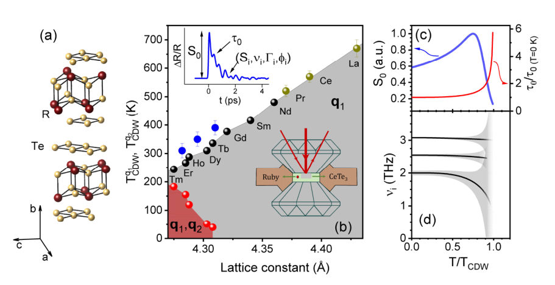
<figcaption class="paper-figure-caption"><b>Fig 1.</b> FIG. 1. Real-time dynamics of order parameter in a CDW system. (a) Crystal struc-</figcaption>
</figure>
<figure class="paper-figure-card">
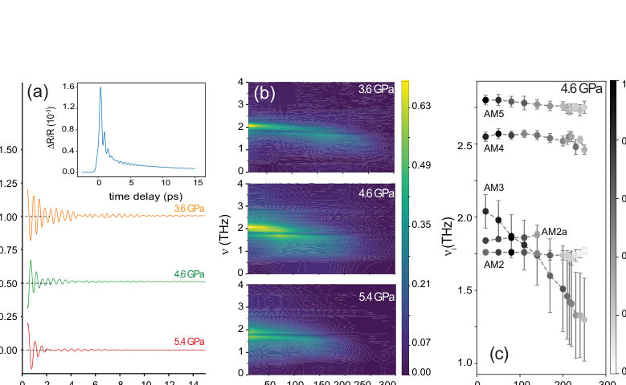
<figcaption class="paper-figure-caption"><b>Fig 2.</b> FIG. 2. Temperature dependence of oscillatory collective modes in CeTe3 at several</figcaption>
</figure>
<figure class="paper-figure-card">

<figcaption class="paper-figure-caption"><b>Fig 3.</b> Figure 5(b)) at 4.6 GPa extracted by real-time fitting of oscillatory traces. Here, solid symbols</figcaption>
</figure>
<figure class="paper-figure-card">
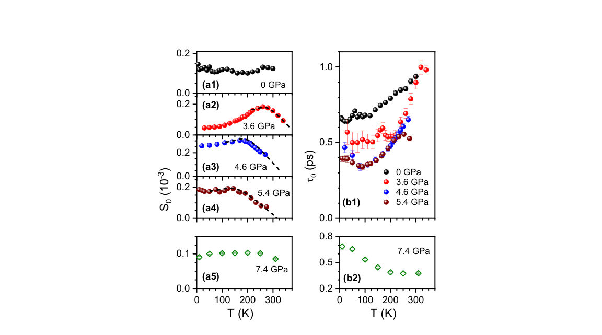
<figcaption class="paper-figure-caption"><b>Fig 4.</b> FIG. 3. Temperature dependence of the overdamped response for several pressures.</figcaption>
</figure>
<figure class="paper-figure-card">
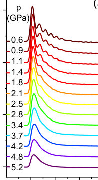
<figcaption class="paper-figure-caption"><b>Fig 5.</b> FIG. 4. Detailed pressure dependence of collective response at room temperature. (a)</figcaption>
</figure>

**Summary.** This experimental work uses femtosecond spectroscopy to track how hydrostatic pressure suppresses the Charge-Density-Wave (CDW) state in CeTe3. The results show that CDW suppression is linked to changes in Fermi-surface nesting, while high pressures induce heavy-electron behavior via enhanced hybridization between localized Ce 4f electrons and itinerant carriers.

**Why it may be interesting.** The study uses ultrafast spectroscopy to track the collapse of an electronic order parameter (CDW) and the emergence of heavy-fermion physics, providing a dynamic view of competing ground states relevant to strongly correlated electron systems.

Detailed structure

**Main problem.** The study investigates how hydrostatic pressure tunes the coherent order-parameter dynamics of a Charge-Density-Wave (CDW) state in the material CeTe3.

**Main result.** CDW suppression occurs as pressure increases, driven by reduced Fermi-surface nesting, and at high pressures, the system exhibits signatures of heavy-electron behavior due to enhanced Ce 4f hybridization.

**Method.** The research employs femtosecond optical spectroscopy (pump-probe) to probe the out-of-equilibrium dynamics of the electronic order parameter as a function of temperature and pressure.

**Model / system.** The system is CeTe3, a rare-earth tritelluride known for its incommensurate CDW. The analysis focuses on the evolution of the CDW order parameter dynamics, which couples electronic and lattice degrees of freedom.

**Key observables.** Real-time dynamics of the order parameter, amplitude modes (AMs), relaxation time ($\tau_0$), and the CDW transition temperature ($T_{\text{CDW}}$).

**Important parameters / regimes.** Hydrostatic pressure (up to 7.4 GPa), Temperature (down to cryogenic levels), and the lattice constant.

**Assumptions / limitations.** The analysis relies on fitting the time-domain signal using a specific functional form that separates overdamped and oscillatory components.

**Figures summary.** Figures illustrate the pressure dependence of $T_{\text{CDW}}$ (decreasing from 570 K to room temperature at $\sim 6$ GPa), the softening and damping of oscillatory modes near $T_{\text{CDW}}$, and the anomalous slowing down of relaxation dynamics at high pressure.

**Paper structure.** The paper systematically maps the phase diagram by measuring the CDW dynamics across varying pressures and temperatures, first establishing the CDW suppression mechanism, and then analyzing the resulting heavy-fermion-like behavior at high pressure.

Abstract

We use femtosecond optical spectroscopy to study the evolution of coherent order-parameter dynamics in the prototypical charge-density-wave (CDW) system CeTe3 under hydrostatic pressure. The CDW transition temperature decreases from approximately 570 K at ambient pressure to near room temperature at approximately 6 GPa. The pressure dependence of the order-parameter recovery dynamics indicates enhanced electron-phonon coupling with increasing pressure, implying that CDW suppression is driven predominantly by the reduction in Fermi-surface nesting. Above 7 GPa, no evidence of CDW order is observed down to cryogenic temperatures. Concurrently, the relaxation dynamics exhibit significant slowing down at low-temperatures, consistent with emerging heavy-electron behaviour due to pressure-enhanced hybridization between localized Ce 4f levels and itinerant carriers.

[↑ back to top](#top)

### [Dynamical one-from-many quantum metrology: Sum rule and matrix-free precision bound](http://arxiv.org/abs/2608.19988v1)

**Authors:** Ziyu Xie, Junjie Liu  
**Type:** theory · **Category:** statistical mechanics · **PDF:** <https://arxiv.org/pdf/2608.19988v1>  
**Analysis basis:** full PDF text, analyzed in chunks
**Topic relevance:** `correlated / nonlocal dissipation` **3/5** · `quantum measurements` **3/5** · `analog quantum simulation` **2/5** · `driven-dissipative phase transition` **2/5** · `methods for driven-dissipative` **2/5** · `Keldysh / 2PI / non-Gaussian methods` **1/5** · `non-equilibrium universality` **1/5**

↔ Scroll figures horizontally

<figure class="paper-figure-card">
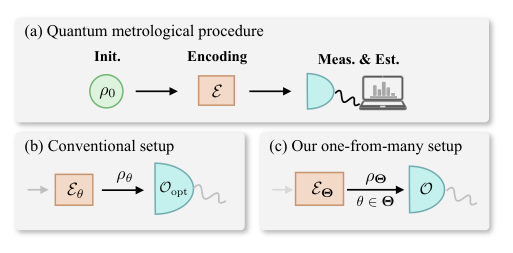
<figcaption class="paper-figure-caption"><b>Fig 1.</b> Figure 1. (a) Standard protocol for quantum parameter estimation. (b) Conventional setup: a target-parameter parameterized encoding channel Eθ with access to the optimal observable Oopt, for which the QCRB provides the fundamental precision limit. (c) Our one-from- many setup: a multi-parameter dynamical encoding channel EΘ pa- rameterized by a parameter set Θ, where the target parameter θ ∈Θ. We derive a tight, matrix-free precision bound [cf. Eq. (4)] for esti- mating θ, applicable to an arbitrary observable O.</figcaption>
</figure>
<figure class="paper-figure-card">
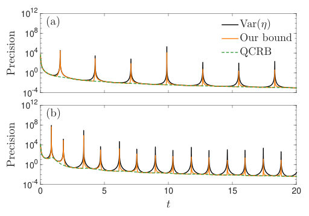
<figcaption class="paper-figure-caption"><b>Fig 2.</b> Figure 2. Time evolution of the actual variance Var(η) (black solid line), our bound (orange solid line), and the QCRB F−1 η (green dashed line) for the unitary model under different initial states: (a) ρ(0) = ∣g⟩⟨g∣and (b) ρ(0) = 0.6 ∣e⟩⟨e∣+ 0.4 ∣g⟩⟨g∣+ (0.4 + 0.2i) ∣e⟩⟨g∣+ (0.4 −0.2i) ∣g⟩⟨e∣with ∣g⟩(∣e⟩) the ground (excited) state of σz. Parameters are ω = 0.5 and η = 1.</figcaption>
</figure>
<figure class="paper-figure-card">
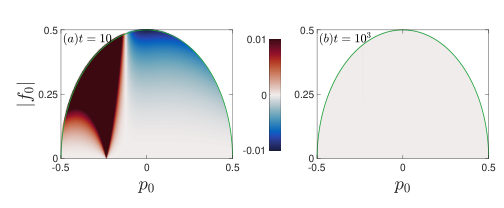
<figcaption class="paper-figure-caption"><b>Fig 3.</b> Figure 3. The quantity E(t) evaluated at (a) t = 10 and (b) t = 103 for all physically allowed initial states. Initial states are parameterized by the Bloch vector r = (2Ref0, −2Imf0, 2p0) with ∣p0∣≤0.5 and p2 0 + ∣f0∣2 ≤0.25 to ensure a physical density matrix; The equality p2 0 + ∣f0∣2 = 0.25 gives the green boundaries shown in the plots. Parameters are γ = 0.01, γ0 = 0.01, ω = 1 and T = 1.</figcaption>
</figure>
<figure class="paper-figure-card">
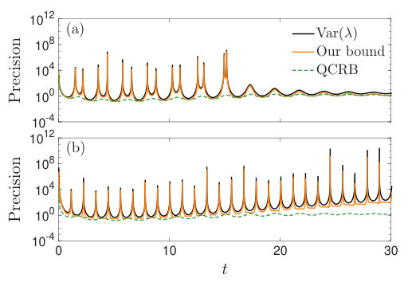
<figcaption class="paper-figure-caption"><b>Fig 4.</b> Figure 4. Time evolution of the actual variance Var(λ) (black solid line), our bound (orange solid line), and the QCRB F−1 λ (green dashed line) for the two-qubit model with varying observables: (a) O = ωσ(1) z and (b) O = σ(1) x σ(2) x . The initial state is ρ(0) = ∣gg⟩⟨gg∣ with ∣g⟩the ground state of σ(1),(2) z . Parameters are ω = 0.5, λ = 1, and γ = 0.2.</figcaption>
</figure>

**Summary.** This paper develops a novel, matrix-free quantum precision bound for estimating parameters in complex quantum systems where multiple nuisance parameters are present. It overcomes the limitations of traditional methods that fail when the Quantum Fisher Information matrix is singular. The resulting bound offers a robust and general framework for achieving optimal measurement strategies in open quantum systems.

**Why it may be interesting.** This work provides a powerful, general tool for quantifying measurement precision in open quantum systems, directly applicable to characterizing decoherence rates or interaction strengths in complex quantum devices.

Detailed structure

**Main problem.** The paper addresses the challenge of quantum single-parameter estimation when multiple nuisance parameters are present, known as the 'one-from-many' problem.

**Main result.** A tight, matrix-free quantum precision bound is derived that avoids the need to invert the Quantum Fisher Information (QFI) matrix, offering a general framework for practical metrology.

**Method.** The authors derive the bound by combining the generalized uncertainty relation with error propagation formulas, leading to a maximum over scalar bounds associated with each parameter.

**Model / system.** The analysis is applied to dynamical quantum processes governed by the Lindblad master equation, modeling systems like two-qubit interactions or quantum thermometry.

**Key observables.** Quantum Fisher Information (QFI) matrix elements, expectation values of observables ($\langle O 
angle$), and response functions ($\Delta_x\langle O
angle$).

**Important parameters / regimes.** Time ($t$), coupling strengths ($\omega, \lambda, \Gamma$), and dissipation rates ($\gamma$).

**Assumptions / limitations.** The framework assumes the applicability of the general bound derived from combining uncertainty relations and error propagation, which is designed to handle singular QFI matrices.

**Figures summary.** Figures illustrate comparisons between the proposed bound, the standard QCRB, and the actual variance for various physical models (unitary, thermometry, two-qubit), showing where the proposed bound is tighter.

**Paper structure.** The paper first establishes the problem in multi-parameter metrology, derives a sum rule connecting QFI elements, and then introduces the general matrix-free bound. It validates this bound across multiple physical examples (unitary, thermometry, two-qubit) using specific observables and parameter sets.

Abstract

Practical quantum single-parameter estimation is rarely a pristine task; it almost invariably involves nuisance parameters, casting it as a one-from-many problem. Existing approaches to this problem rely on multi-parameter metrology, reducing the matrix quantum Cramér-Rao bound to obtain scalar quantum precision limits. However, these methods are often hampered by the demanding inversion of the quantum Fisher information (QFI) matrix and the requisite choice of a weight matrix, and they break down when the QFI matrix becomes singular. Here, we show that for dynamical one-from-many estimation, a previously overlooked sum rule connecting the QFI about all model parameters to the QFI about time necessitates including the latter to consider an augmented QFI matrix while simultaneously rendering it inherently singular--precisely the scenario where conventional approaches fail. To meet this challenge, we derive a tight, matrix-free quantum precision bound that involves only scalar quantities, offers broad applicability, and subsumes existing results as special cases. Validated in both unitary and noisy settings, our findings provide a refined operational framework for practical quantum single-parameter metrology.

[↑ back to top](#top)

### [Exact Fluctuation-Response Relations for Underdamped Langevin Dynamics](http://arxiv.org/abs/2608.20013v1)

**Authors:** Tan Van Vu, Van Tuan Vo, Ruicheng Bao, Keiji Saito  
**Type:** theory · **Category:** statistical mechanics · **PDF:** <https://arxiv.org/pdf/2608.20013v1>  
**Analysis basis:** full PDF text, analyzed in chunks
**Topic relevance:** `Keldysh / 2PI / non-Gaussian methods` **3/5** · `non-equilibrium universality` **3/5** · `correlated / nonlocal dissipation` **2/5** · `driven-dissipative phase transition` **2/5** · `methods for driven-dissipative` **2/5** · `Frenkel-Kontorova` **1/5** · `quantum measurements` **1/5**

↔ Scroll figures horizontally

<figure class="paper-figure-card">
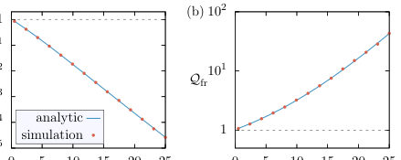
<figcaption class="paper-figure-caption"><b>Fig 1.</b> FIG. 1. Comparison of the conventional and friction-response TURs. (a) Conventional and (b) friction-response uncertainty factors as functions of the driving strength κ. Circle points denote Langevin simulations at τ = 400, while solid lines show the analytical τ →∞results. Parameters are γ = 1, T = 1, α = 1, and f = √κ.</figcaption>
</figure>

**Summary.** This paper derives an exact, finite-time fluctuation-response relation for underdamped Langevin dynamics, addressing limitations of traditional uncertainty relations. It establishes that the response function, rather than the mean current, governs the link between fluctuations and dissipation. The key finding is the derivation of a robust friction-response thermodynamic uncertainty relation that remains valid even when conventional bounds fail.

**Why it may be interesting.** The work provides a rigorous, non-equilibrium extension of fluctuation-dissipation theorems to underdamped systems, which is highly relevant for understanding energy dissipation and fluctuation bounds in open quantum systems or mesoscopic physics.

Detailed structure

**Main problem.** The paper addresses the failure of conventional mean-current uncertainty relations in underdamped Langevin dynamics and seeks to establish an exact, finite-time fluctuation-response equality.

**Main result.** They derive an exact finite-time fluctuation-response identity showing that dynamically generated variance equals the squared local susceptibility. Crucially, they show that the friction-response relation remains valid while the conventional one decays exponentially in certain limits.

**Method.** The analysis employs stochastic calculus, utilizing the Doob martingale and Itô's formula to derive the fluctuation-response equality, and applying variational principles derived from the Cauchy-Schwarz inequality.

**Model / system.** The system studied is $d$-dimensional underdamped Langevin dynamics, modeled by equations of motion for position $x_t$ and velocity $v_t$. The framework is general, applicable to arbitrary time-dependent driving and initial ensembles.

**Key observables.** Dynamically generated variance ($	ext{Var}(J_	au) - 	ext{Var}_0(J_	au)$), Total entropy production ($\Sigma_	au$), and the local response kernel/susceptibility.

**Important parameters / regimes.** Finite observation time ($	au$), dissipation ($\gamma$), and the driving strength ($\kappa$ or $\lambda$).

**Assumptions / limitations.** The framework is general, valid for arbitrary initial ensembles and time-dependent driving, relying on the Doob martingale and Itô calculus.

**Figures summary.** Figure S1 compares the conventional and friction-response TUR uncertainty factors ($Q$ and $Q_{fr}$) as functions of a weighting parameter $c$ and the dissipation parameter $\kappa$, demonstrating the difference in their asymptotic behavior.

**Paper structure.** The paper builds from establishing the general fluctuation-response identity using martingales, deriving the variational principle for entropy production, and then analyzing specific limits (like free diffusion) to contrast the conventional TUR with the robust friction-response TUR.

Abstract

Thermodynamic uncertainty relations connect current fluctuations to dissipation and are often rooted in fluctuation-response principles. In underdamped dynamics, however, conventional mean-current uncertainty relations can fail, while the underlying connection between fluctuations, response, and dissipation remains elusive. Here we uncover this structure by deriving an exact finite-time fluctuation-response equality for underdamped Langevin dynamics, valid for arbitrary time-dependent driving and general additive observables. The equality yields sharp response bounds and a variational characterization of the dynamically generated variance. Choosing the perturbation along the irreversible probability flow gives a friction-response thermodynamic uncertainty relation that can be saturated at any finite observation time, leading to an exact variational principle for the total entropy production. We further show that the conventional uncertainty factor of velocity-resolved currents can decay exponentially with dissipation even in driven free diffusion, while the friction-response factor retains its universal lower bound. These results establish response, rather than the mean current itself, as the quantity directly linking fluctuations and dissipation in underdamped dynamics.

[↑ back to top](#top)

### [Floquet Theory for Light-Driven Rotation of Dipolar and Multipolar Particles](http://arxiv.org/abs/2608.20197v1)

**Authors:** Amane Takano, Minoru Kanega, Masahiro Sato  
**Type:** theory · **Category:** statistical mechanics · **PDF:** <https://arxiv.org/pdf/2608.20197v1>  
**Analysis basis:** full PDF text, analyzed in chunks
**Topic relevance:** `driven-dissipative phase transition` **3/5** · `methods for driven-dissipative` **3/5** · `non-equilibrium universality` **3/5** · `Keldysh / 2PI / non-Gaussian methods` **2/5** · `Frenkel-Kontorova` **1/5** · `correlated / nonlocal dissipation` **1/5** · `quantum measurements` **1/5**

↔ Scroll figures horizontally

<figure class="paper-figure-card">
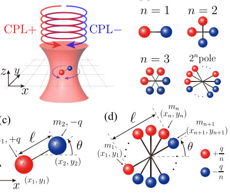
<figcaption class="paper-figure-caption"><b>Fig 1.</b> FIG. 1. (a) Schematic of the setup: radiation-pressure trapping and a multipolar model confined to two dimensions, driven by right-/left-handed CPL (magnetic field neglected). (b) Electric multipolar (2n-polar) model. (c) Schematic of the electric dipole: masses m1, m2, charges +q, −q, and rotation angle θ. (d) Schematic of the electric multipole.</figcaption>
</figure>
<figure class="paper-figure-card">
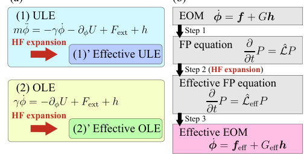
<figcaption class="paper-figure-caption"><b>Fig 2.</b> FIG. 2. (a) Underdamped Langevin equation (ULE) (1), overdamped Langevin equation (OLE) (2), and the corre- sponding effective EOMs (1)’ and (2)’ obtained via HF expan- sion based on Floquet theory [38, 39]. Symbols ϕ, m¨ϕ, −γ ˙ϕ, U(ϕ), Fext(ϕ, t), and h(t) are respectively the classical vari- able, the inertial term, the friction, the potential, a periodic driving term, and the thermal-noise term. (b) Logical flow of Floquet HF expansion approach in Refs. [38, 39]. Since the Langevin EOM is generally nonlinear in terms of ϕ and con- tains stochastic noise, the Floquet theorem cannot be directly applied. Instead, we consider the Fokker–Planck (FP) equa- tion for the probability distribution...</figcaption>
</figure>
<figure class="paper-figure-card">
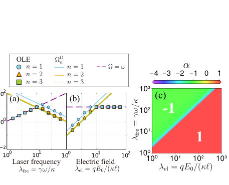
<figcaption class="paper-figure-caption"><b>Fig 3.</b> FIG. 3. Panels (a) and (b) show the CPL-driven rotation frequency in the NESS of the OLE at T = 0, ˜Ω= γΩ/κ, as functions of λfre at λel = 10 and of λel at λfre = 10, re- spectively. Points (circles, triangles, and squares) denote the numerical OLE result for the models with n = 1, 2, 3, while solid lines show the analytical HF prediction ΩO n and dashed lines indicate the field-following response Ω= ω. Panel (c) shows the “phase” diagram of NESS at T = 0 in the (λel, λfre) plane, that shows the exponent α of Ω∝ωα; the green and red regions correspond to the α = −1 and α = 1 regimes, respectively.</figcaption>
</figure>
<figure class="paper-figure-card">
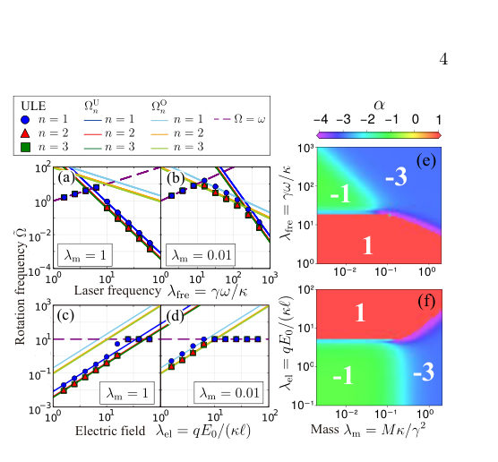
<figcaption class="paper-figure-caption"><b>Fig 4.</b> FIG. 4. Panels (a) and (b) [(c) and (d)] show the CPL- driven rotation frequencies as functions of λfre [λel] for λm = 1 and 0.01, respectively, at λel = 10 [λfre = 10] in the ULE of the multipolar models. Points (circles, triangles, and squares) show the numerical ULE results for multipoles with n = 1, 2, 3; the colored solid lines denote ΩU n and ΩO n , while the purple dashed line denotes Ω= ω. The phase boundaries between the neighboring regimes with different α gradually shift with increasing n due to the prefactors in Table I. Pan- els (e) and (f) respectively show the phase diagrams of the NESS of the dipolar models at T = 0 in the (λm, λfre) space with λel = 10 and the (λm, λel)...</figcaption>
</figure>
<figure class="paper-figure-card">
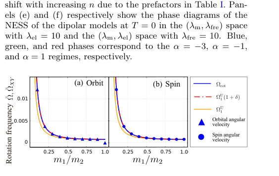
<figcaption class="paper-figure-caption"><b>Fig 5.</b> FIG. 5. Mass ratio m1/m2 dependence of the (a) orbital and (b) spin rotation frequencies, ˜ΩXY = γΩXY /κ and ˜Ω= γΩ/κ (vertical axis) in the dipolar model at λm = 1, λfre = 102, λel = 10, and T = 0. Points (triangles and circles) are the numerical results of ULE. The blue solid, red dash- dotted, and orange solid lines represent Ωrot given in Eq. (6), its approximation ΩU 1 (1 + δ), and ΩU 1 , respectively.</figcaption>
</figure>

**Summary.** This paper develops a theoretical framework using Floquet theory to analyze the light-driven rotation of dipolar and multipolar particles. By analyzing the Langevin dynamics via the high-frequency expansion, the authors predict three distinct regimes for the rotation frequency based on laser parameters. The results offer a detailed, quantitative understanding of non-equilibrium steady states in optically driven nanoscale systems.

**Why it may be interesting.** This work provides a rigorous theoretical framework for analyzing non-equilibrium dynamics in driven quantum/classical systems, using advanced techniques like Floquet theory adapted for dissipative, stochastic systems, which is highly relevant to open quantum systems and quantum optics.

Detailed structure

**Main problem.** The paper analyzes the microscopic dynamics and predicts the rotation speed ($\Omega$) of dipolar and multipolar particles driven by circularly polarized laser light.

**Main result.** The study determines a 'nonequilibrium phase diagram' showing three distinct regimes for the rotation frequency ($\Omega \propto \omega^{-1}, \omega^{-3}$, or $\Omega = \omega$), with the overdamped limit being qualitatively consistent with experiments.

**Method.** The authors employ Floquet theory for dissipative classical systems and the high-frequency (HF) expansion applied to the associated Fokker-Planck equation to derive effective equations of motion for slow rotation dynamics.

**Model / system.** The system models nano- or micro-particles (dipolar or multipolar) trapped in 2D space and irradiated by a circularly polarized laser field, leading to Langevin-type equations of motion.

**Key observables.** Rotation frequency ($\Omega$), time-averaged angular velocity, and the dependence of $\Omega$ on laser frequency ($\omega$), intensity ($E_0$), mass, and friction ($\gamma$).

**Important parameters / regimes.** Laser frequency ($\omega$), laser intensity ($E_0$), damping coefficient ($\Gamma$), and temperature ($T$).

**Assumptions / limitations.** The analysis utilizes the HF expansion on the FPE, and comparisons are made between underdamped (ULE) and overdamped (OLE) regimes, sometimes assuming $T=0$ or analyzing temperature corrections.

**Figures summary.** Figures illustrate the setup and the logical flow of the Floquet HF expansion approach, while phase diagrams map the NESS regimes based on various dimensionless parameters.

**Paper structure.** The paper systematically develops the theoretical framework by first establishing the Langevin/Fokker-Planck equations, then applying the Floquet HF expansion to derive effective slow-motion equations, and finally mapping out the resulting nonequilibrium steady-state phase diagram across different physical regimes.

Abstract

Nano- or micro-particle rotation driven by light has been well known in the fields of optical manipulation and optical physics since the end of the last century. It is viewed as a sort of angular-momentum transfer from light to material, but its microscopic analysis based on the Hamiltonian or the equation of motion has been less developed. We model this rotation with a simple setup of an electrically dipolar or multipolar particle irradiated by circularly polarized laser and comprehensively analyze the Langevin-type equation of motion by using the Floquet theory for dissipative classical systems and the mode separation method. Furthermore, we numerically compute the time evolution of the particle. As a result, we accurately estimate the dependence of the laser-frequency, laser-intensity, particle mass, temperature, and friction (dissipation) on the laser-driven rotation. We determine the ``nonequilibrium phase diagram'' of the laser-driven rotation in a broad parameter regime, which consists of three regimes: the rotation frequency $Ω\proptoω^{-1}$, $Ω\proptoω^{-3}$, or $Ω=ω$ ($ω$ is the laser frequency). Comparing our theoretical result with some experiments, we show that the result of the overdamped Langevin equation is qualitatively consistent with the experiments.

[↑ back to top](#top)

### [Self-calibrating thermal interferometry of vortex parity in a two-dimensional chiral superconductor](http://arxiv.org/abs/2608.19343v1)

**Authors:** Kumar Ghosh  
**Type:** both · **Category:** other · **PDF:** <https://arxiv.org/pdf/2608.19343v1>  
**Analysis basis:** full PDF text, analyzed in chunks
**Topic relevance:** `Full counting statistics` **3/5** · `analog quantum simulation` **3/5** · `interference shaping light` **2/5** · `quantum measurements` **2/5** · `Keldysh / 2PI / non-Gaussian methods` **1/5** · `correlated / nonlocal dissipation` **1/5** · `driven-dissipative phase transition` **1/5** · `methods for driven-dissipative` **1/5**

↔ Scroll figures horizontally

<figure class="paper-figure-card">
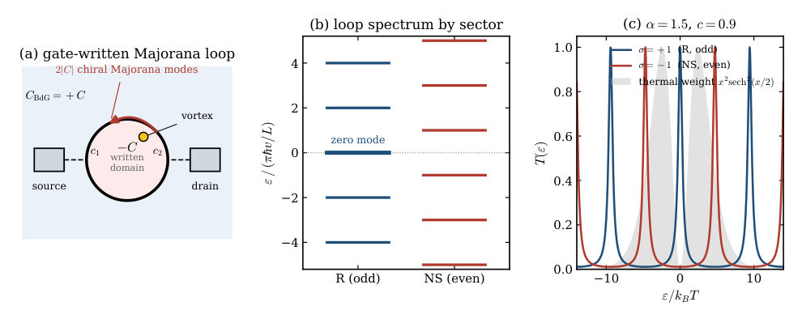
<figcaption class="paper-figure-caption"><b>Fig 1.</b> FIG. 1. The rewritable Majorana loop and its two vortex-parity sectors. (a) A locally pinned region of reversed chirality is formed inside a chiral superconductor; the closed wall carries 2|C| co-propagating chiral Majorana modes and is coupled to floating source and drain contacts through two point contacts with loop-return amplitudes c1, c2. The enclosed vortex is an Ising σ defect. (b) Single-particle spectrum of one Majorana channel on the loop, Eq. (7). Odd enclosed parity selects the Ramond sector, which contains a zero mode; even parity selects Neveu-Schwarz, whose combs are offset by half a period. (c) Transmission T(ε), Eq. (13), for the two sectors at α = 1.5 and c = 0.9, with the...</figcaption>
</figure>
<figure class="paper-figure-card">
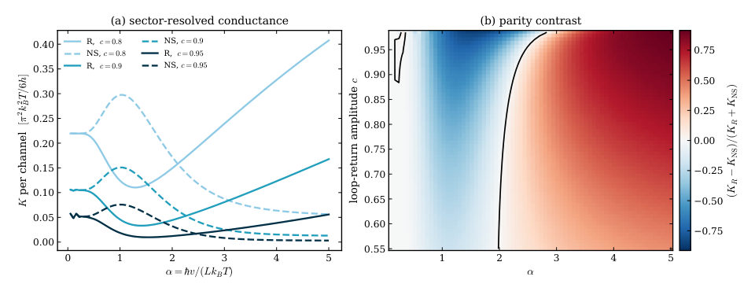
<figcaption class="paper-figure-caption"><b>Fig 2.</b> FIG. 2. Parity-resolved thermal conductance of one Majorana channel, in units of the Majorana quantum π2k2 BT/6h. (a) Ra- mond (solid) and Neveu-Schwarz (dashed) conductance versus the dimensionless finite-size ratio α = ℏv/(LkBT) at three loop-return amplitudes. Fully transmitting contacts (c = 0) give unity for both. (b) Signed contrast V of Eq. (19) over the (α, c) plane; the black contours mark the sign reversals discussed in the text. The peak magnitude is 0.91.</figcaption>
</figure>
<figure class="paper-figure-card">
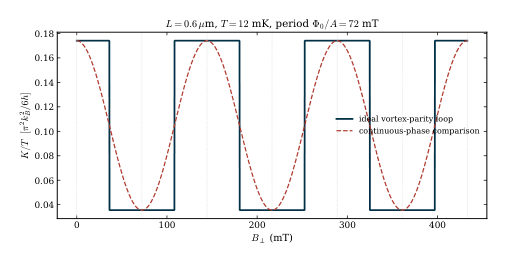
<figcaption class="paper-figure-caption"><b>Fig 3.</b> FIG. 3. Idealized thermal conductance of the loop ver- sus perpendicular field for the representative parameter set (2∆0/kBTc = 20, v = 1354 m/s, L = 0.6 µm, T = 12 mK, c = 0.93, |C| = 1). Assuming one-by-one vortex entry, each parity change flips the Z2 sector, giving a two-level re- sponse with the geometric flux scale Φ0/A = 72 mT between K/T = 0.036 and 0.174 in units of the Majorana quantum. A sinusoidal continuous-flux reference of the same period and amplitude is shown for contrast. In experiment the vortex- entry fields need not be equally spaced; the signature is the conductance switch correlated with vortex parity.</figcaption>
</figure>
<figure class="paper-figure-card">

<figcaption class="paper-figure-caption"><b>Fig 4.</b> Figure 4 maps the contrast over loop perimeter and temperature at fixed material parameters, with the field- sweep scale Eq. (21) overlaid for three values of B⊥ c . At the 12 mK base temperature the independent-channel contrast satisfies |V| &gt; 0.3 over two intervals in the plot- ted range, 0.25 ≲L ≲0.32 µm and 0.42 ≲L ≲1.22 µm. They are separated by the narrow accidental contrast node near L ≃0.365 µm discussed above. The geomet-</figcaption>
</figure>
<figure class="paper-figure-card">
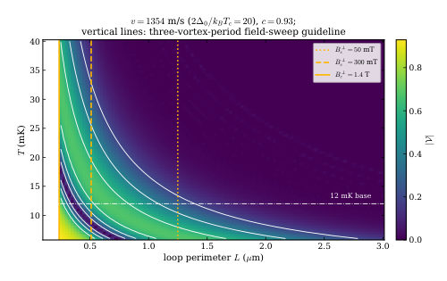
<figcaption class="paper-figure-caption"><b>Fig 5.</b> FIG. 4. Finite-size and field map. Colour is the magnitude of the parity contrast |V| at c = 0.93 for v = 1354 m/s (2∆0/kBTc = 20). White contours are |V| = 0.2, 0.4 and 0.6. Vertical lines give the minimum perimeter of Eq. (21) for three perpendicular critical fields; the field-sweep-compatible region lies to their right and inside the high-contrast region. The horizontal line marks the 12 mK base temperature of ex- isting graphene noise thermometry.</figcaption>
</figure>

**Summary.** This work demonstrates a method to measure both the bulk topological invariant and the local vortex parity in a chiral superconductor using a reconfigurable domain wall. By tuning the wall between open (measuring bulk conductance) and closed (measuring spectral shifts) configurations, the device performs two distinct topological diagnostics. This offers a powerful tool for characterizing Majorana physics in solid-state systems.

**Why it may be interesting.** The technique provides a novel, highly sensitive, and non-destructive method to probe topological invariants and local quantum numbers simultaneously using thermal transport, which is relevant for understanding topological quantum computation platforms.

Detailed structure

**Main problem.** The paper addresses the challenge of simultaneously measuring both the bulk topological invariant (Chern number) and a local parity observable (vortex parity) in a two-dimensional chiral superconductor.

**Main result.** A reconfigurable domain wall structure allows for this dual measurement: quantized thermal conductance probes the bulk invariant when open, while spectral shifts in a Fabry-Pérot resonator read out vortex parity when closed.

**Method.** The authors use thermal interferometry, calculating quantized heat conductance and analyzing the shift in the single-particle energy spectrum based on the boundary conditions imposed by the enclosed vortex parity.

**Model / system.** The physical system is an intrinsic two-dimensional chiral superconductor realized in rhombohedral graphene, featuring a tunable domain wall separating regions of opposite Chern numbers. The theoretical framework relies on the Bogoliubov-de Gennes (BdG) Hamiltonian and the bulk-boundary correspondence.

**Key observables.** Quantized thermal conductance, spectral shifts (half a level spacing), and the heat full counting statistics.

**Important parameters / regimes.** Millikelvin temperatures, submicron loop sizes, and the gap ratio ($\Delta_0$) are key experimental scales.

**Assumptions / limitations.** The analysis assumes the ability to treat the system using a quadratic scattering matrix and requires coherent propagation and weak inelastic equilibration.

**Figures summary.** Figures illustrate the geometry, the single-particle spectrum for different boundary conditions (R/NS sectors), and the resulting transmission probability $T(\epsilon)$ which depends on the enclosed vortex parity.

**Paper structure.** The paper develops the theory by first establishing the dual-functionality of the domain wall, deriving the transmission and thermal conductance formulas, and then analyzing the spectral signatures that distinguish bulk topology from local parity.

Abstract

A chiral superconductor carries chiral Majorana modes along its boundary, and the integer that counts them fixes everything that follows, yet that integer has never been measured together with a local parity observable on one object. Proximitized one-dimensional wires read fermion parity rapidly but diagnose bulk topology through a separate protocol. Here we show that a reconfigurable domain wall between regions of opposite Chern number in an intrinsic two-dimensional chiral superconductor performs both functions. Opened to its contacts the wall is a ballistic channel whose quantized thermal conductance counts its Majorana modes; closed, the same wall is a Fabry--Pérot resonator whose spectrum shifts by half a level spacing when the parity of the enclosed vortices changes, giving a two-level heat conductance. We derive the exact transmission, the elastic heat full counting statistics, and a theorem showing that linear-response heat scattering of a fixed quadratic problem resolves vortex parity but not the fusion channel of well-separated cores. An outside vortex hybridized with the wall is an intrinsic false positive; temperature, geometry and a finite-bias mean--noise test separates it. Rhombohedral-graphene parameters place submicron loops in the resolved regime at millikelvin temperatures, where chiral-domain reconfiguration and noise thermometry are both established.

[↑ back to top](#top)

### [Krylov Tomography and Finite-Uncertainty Certification of Exceptional-Point Dynamics](http://arxiv.org/abs/2608.19761v1)

**Authors:** Aritra Ghosh, M. Bhattacharya  
**Type:** theory · **Category:** other · **PDF:** <https://arxiv.org/pdf/2608.19761v1>  
**Analysis basis:** full PDF text, analyzed in chunks
**Topic relevance:** `driven-dissipative phase transition` **3/5** · `quantum measurements` **3/5** · `methods for driven-dissipative` **2/5** · `Keldysh / 2PI / non-Gaussian methods` **1/5** · `Tavis-Cummings & cavity-many-emitter` **1/5** · `analog quantum simulation` **1/5** · `correlated / nonlocal dissipation` **1/5** · `non-equilibrium universality` **1/5**

↔ Scroll figures horizontally

<figure class="paper-figure-card">
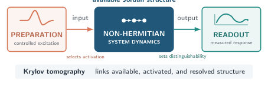
<figcaption class="paper-figure-caption"><b>Fig 1.</b> FIG. 1: Preparation-evolution-readout structure. The generator fixes available Jordan chains, preparation fixes how many successive directions are reached, and readout fixes which reached directions produce linearly independent measured signals.</figcaption>
</figure>
<figure class="paper-figure-card">
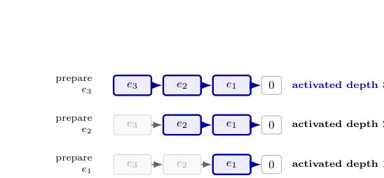
<figcaption class="paper-figure-caption"><b>Fig 2.</b> FIG. 2: In a closed moment sector, an available size-three Jordan block with generalized eigenvectors ej can have activated depths three, two, or one. The generator fixes available order but preparation dictates which directions are reached.</figcaption>
</figure>
<figure class="paper-figure-card">
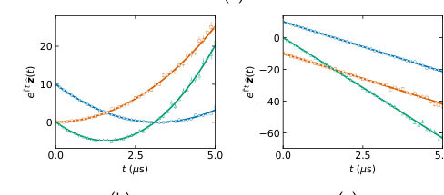
<figcaption class="paper-figure-caption"><b>Fig 3.</b> FIG. 3: Preparation-dependent Krylov response. (a) Successive action of Ncoh [Eq. (8)] generates depth- three and depth-two chains from the cavity-noise and differential preparations under the same size-three Jor- dan block. Vectors use the basis x/np with x = (δnc, δnm, δYcm)T , and d = (κ −γm)/2. (b,c) Demod- ulated reconstructed outputs e¯Γtbz(t) for the depth-three cavity-noise (b) and depth-two differential (c) prepara- tions, where ¯Γ = (κ+γm)/2. Blue circles, orange squares, and green triangles represent δnc, δnm, and δYcm, re- spectively. The nominal reconstruction C = eC = I3 gives E[bz(t)] = x(t), so readout uncertainty affects only conservative termination bounds. Solid curves...</figcaption>
</figure>

**Summary.** The paper introduces Krylov Tomography, a novel framework that analyzes quantum dynamics near Exceptional Points (EPs) by accounting for preparation and measurement uncertainties. It quantifies the difference between the theoretically available dynamics and the experimentally accessible dynamics. This provides a robust method for certifying the true dynamical structure of non-Hermitian systems using finite-precision measurements.

**Why it may be interesting.** This work provides a rigorous, quantitative tool to extract the true dynamical structure of non-Hermitian systems near EPs, moving beyond simple eigenvalue analysis by incorporating realistic measurement uncertainties.

Detailed structure

**Main problem.** To develop a preparation- and measurement-aware framework to determine the actual dynamics accessed by an excitation near an Exceptional Point (EP), addressing the ambiguity between available Jordan structure, activated depth, and resolved directions.

**Main result.** The framework successfully separates the available Jordan structure, the activated depth, and the resolved depth, providing the first finite-error certification theory for preparation- and readout-selected Jordan dynamics.

**Method.** Krylov Tomography is employed, using time-resolved data and models with stated uncertainty limits to analyze the evolution of excess moments governed by a linear system.

**Model / system.** The analysis is illustrated using a linearized red-sideband cavity-optomechanical model, which is a non-Hermitian system exhibiting an Exceptional Point (EP). The dynamics are analyzed on a closed moment sector.

**Key observables.** Activated depth ($d_{	ext{act}}$), independently resolved depth ($d_{	ext{rank}}$), and the terminal reopening radius ($R_r$).

**Important parameters / regimes.** Uncertainty bounds ($\epsilon_j$), the EP location, and the coherence norm ($\|v\|_{	ext{coh}}$).

**Assumptions / limitations.** The method requires independent establishment of the relevant closed sector, the isolated EP contribution, and the detector response, relying on bounding departures from exact EP behavior.

**Figures summary.** Figures illustrate the preparation-evolution-readout structure, linking available, activated, and resolved structure via Krylov tomography, and show preparation-dependent Krylov responses for depth-three and depth-two chains.

**Paper structure.** The paper introduces the framework by defining the relationship between available, activated, and resolved depth. It then applies this to the optomechanical model, deriving finite-error certification tests for the rank and depth, and finally presents quantitative results for specific preparations.

Abstract

Exceptional points (EPs) can produce striking responses, but locating one does not reveal how much of its dynamics an excitation accesses, which responses a detector distinguishes, or whether a missing signal is absent or undetected. We introduce Krylov tomography, a preparation- and measurement-aware framework that uses time-resolved data and models with stated uncertainty limits to answer these questions, while also bounding offset-induced departures from exact-EP behavior. As an explicit illustration of the general framework, we present finite-precision simulations of a red-sideband optomechanical model, whose second-moment coherence sector contains a third-order EP, certifying preparation-sensitive access to two and three directions. Krylov tomography thus bridges EP structure and finite-precision measurements, providing a general framework for non-Hermitian systems.

[↑ back to top](#top)

### [Optomechanically induced transparency in the presence of a strong Duffing nonlinearity](http://arxiv.org/abs/2608.19811v1)

**Authors:** Rong Zhang, Jing Qiu, Stefano Chesi, Yingdan Wang  
**Type:** theory · **Category:** other · **PDF:** <https://arxiv.org/pdf/2608.19811v1>  
**Analysis basis:** full PDF text, analyzed in chunks
**Topic relevance:** `analog quantum simulation` **3/5** · `driven-dissipative phase transition` **2/5** · `quantum optics experiment` **2/5** · `Keldysh / 2PI / non-Gaussian methods` **1/5** · `Tavis-Cummings & cavity-many-emitter` **1/5** · `correlated / nonlocal dissipation` **1/5** · `interference shaping light` **1/5** · `methods for driven-dissipative` **1/5** · `quantum measurements` **1/5**

↔ Scroll figures horizontally

<figure class="paper-figure-card">
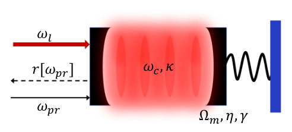
<figcaption class="paper-figure-caption"><b>Fig 1.</b> FIG. 1. Schematic illustration of an OMIT setup, where ωc is the cavity frequency, κ the cavity linewidth, Ωm the me- chanical frequency, γ the mechanical damping rate, and η the Duffing coefficient. The red arrow represents a strong laser drive of frequency ωl, while ωpr is the frequency of a probe field, with corresponding reflection coefficient r [ωpr].</figcaption>
</figure>
<figure class="paper-figure-card">
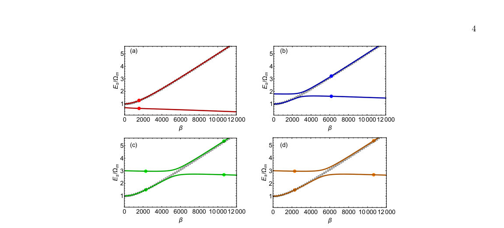
<figcaption class="paper-figure-caption"><b>Fig 2.</b> FIG. 2. Dependence of the polariton energies E± on the average mechanical amplitude β. The value of β, given by Eqs. (5) and (6), increases monotonically with the strength of the external drive. The cavity detuning is: (a) ∆= 0.7Ωm, (b) ∆= 1.8Ωm, (c) ∆= 2.2Ωm, and (d) ∆= 3Ωm. In each panel, the colored dots mark the values of β realizing the resonant condition E+ = 2E−. We also show the squeezed mechanical frequency eΩm (triangles), to easily identify the polariton modes with a predominantly mechanical character. Other parameters are: κ/Ωm = 10−3, g/Ωm = 10−5, η/Ωm = 10−8, γ/Ωm = 10−7.</figcaption>
</figure>
<figure class="paper-figure-card">
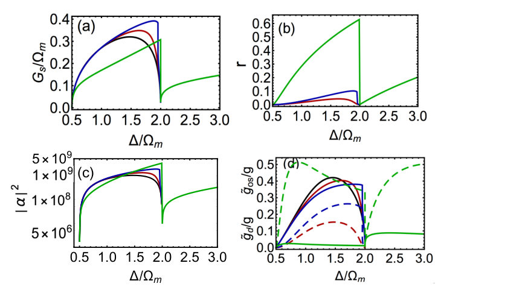
<figcaption class="paper-figure-caption"><b>Fig 3.</b> FIG. 3. Dependence on ∆of the (a) dressed optomechanical coupling Gs, (b) squeezing parameter r, (c) number of cavity photons, and (d) effective nonlinear couplings. These quantities are evaluated at the resonant condition (13), using η = 0 (black), η/Ωm = 5 × 10−11 (red), η/Ωm = 8 × 10−11 (blue), and η/Ωm = 10−8 (green). In panel (d), the solid (˜gos) and dashed (˜gd) curves refer to the effective couplings induced by optomechanical and Duffing nonlinearities, respectively. Other parameters are: κ/Ωm = 10−3, g/Ωm = 10−5, and γ/Ωm = 10−7. Following Eq. (17), the rescaled values of η are η = 0, 0.5, 0.8, 100.</figcaption>
</figure>
<figure class="paper-figure-card">
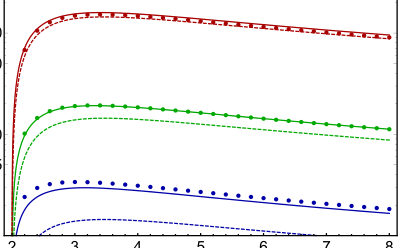
<figcaption class="paper-figure-caption"><b>Fig 4.</b> FIG. 6. Dependence of Ceff on detuning in the region ∆&gt; 2Ωm. Numerical data (dots) are obtained from Eq. (31) using η/Ωm = 10−9 (blue), 10−8 (green), and 10−7 (red). The dashed and solid curves are plots of Eqs. (38) and (39), respec- tively. Other parameters are κ/Ωm = 10−3, g/Ωm = 10−5, and γ/Ωm = 10−7 .</figcaption>
</figure>
<figure class="paper-figure-card">
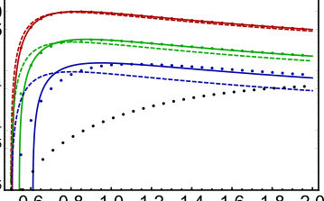
<figcaption class="paper-figure-caption"><b>Fig 5.</b> FIG. 7. Dependence of Ceff on detuning in the region Ωm/2 &lt; ∆&lt; 2Ωm. Numerical data (dots) are obtained from Eq. (31) using η/Ωm = 0 (black), η/Ωm = 10−9 (blue), 10−8</figcaption>
</figure>

**Summary.** This paper theoretically investigates how a strong Duffing nonlinearity modifies Optomechanically Induced Transparency (OMIT) in an optomechanical system. By analyzing the enhanced effective cooperativity, the authors show that the nonlinearity facilitates the observation of quantum effects that are otherwise too weak to measure. The methodology involves advanced Hamiltonian analysis and resonance condition derivations.

**Why it may be interesting.** This work is highly relevant to AMO physics as it combines cavity QED principles (OMIT) with nonlinear dynamics (Duffing) in a mechanical resonator, pushing the boundaries of observable quantum effects in coupled systems.

Detailed structure

**Main problem.** The paper aims to characterize the quantum effects of a strong Duffing nonlinearity within the context of Optomechanically Induced Transparency (OMIT) experiments.

**Main result.** The strong Duffing nonlinearity enhances the effective cooperativity ($C_{eff}$) compared to linear coupling, allowing for the observation of quantum effects in OMIT.

**Method.** The analysis involves deriving the system Hamiltonian, applying squeezing transformations, and solving coupled equations to analyze the system's response to weak probe fields.

**Model / system.** The system is an optomechanical setup incorporating a Duffing nonlinearity, modeled by a Hamiltonian involving cavity ($\hat{a}$) and mechanical ($\hat{b}$) operators, along with nonlinear terms.

**Key observables.** OMIT signal (characteristic dip), effective cooperativity ($C_{eff}$), and energy shifts ($\delta E$).

**Important parameters / regimes.** Strong Duffing nonlinearity regime ($\eta \gg g^2/\Omega_m$), detuning ($\Delta$), and coupling strengths ($	ilde{g}$).

**Assumptions / limitations.** The analysis relies on approximations such as the weak hybridization parameter ($\epsilon$) being small and the mechanical nonlinearity dominating the coupling.

**Figures summary.** Figure 1 schematically illustrates the OMIT setup, defining key parameters like cavity frequency ($\omega_c$), damping rates ($\kappa, \gamma$), and mechanical frequency ($\Omega_m$).

**Paper structure.** The paper progresses from defining the full Hamiltonian, simplifying it via squeezing transformations, deriving steady-state amplitudes, and finally analyzing the resonant conditions and effective couplings in the strong nonlinearity limit.

Abstract

We consider the combined effect of a Duffing nonlinearity and the optomechanical interaction on the cavity density of states (DOS), which is directly observable in optomechanically induced transparency (OMIT) experiments. Both nonlinearities introduce the same type of interaction between polaritons, producing a distinct feature in the optical response. We derive the resonant condition that enhances the nonlinear scattering between polaritons and study the parameter dependence of the cavity DOS in detail. This allows us to characterize the typical strength and optimal conditions for observing the quantum effects of the Duffing nonlinearity in OMIT experiments.

[↑ back to top](#top)

### [Preparation of Large Fock States in Resonators with High Probability](http://arxiv.org/abs/2608.20133v1)

**Authors:** Lucas R. S. Santos, Ciro M. Diniz, Daniel Z. Rossatto, Celso J. Villas-Boas  
**Type:** theory · **Category:** other · **PDF:** <https://arxiv.org/pdf/2608.20133v1>  
**Analysis basis:** full PDF text, analyzed in chunks
**Topic relevance:** `QC/QI experiment` **3/5** · `quantum measurements` **3/5** · `quantum optics experiment` **3/5** · `Tavis-Cummings & cavity-many-emitter` **2/5** · `analog quantum simulation` **2/5**

↔ Scroll figures horizontally

<figure class="paper-figure-card">
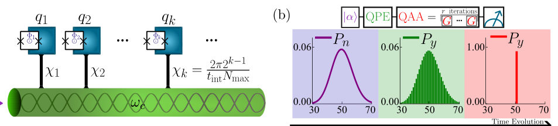
<figcaption class="paper-figure-caption"><b>Fig 1.</b> FIG. 1. Circuit-QED implementation and protocol for high-probability preparation of large Fock states using quantum phase estimation (QPE) and quantum amplitude amplification (QAA). (a) Physical platform: a single bosonic mode (green) at frequency ωc of a coplanar waveguide resonator is dispersively coupled to a register of M frequency-tunable superconducting qubits, implemented as SQUID-based transmons (blue). Each qubit frequency ωqk(Φk) is controlled by a local flux bias Φk, allowing the detuning ∆k(Φk) = ωqk(Φk) −ωc to be calibrated. The fixed coupling gk sets the dispersive shift χk(Φk) ≃|gk|2/∆k(Φk) to be employed to implement the controlled powers required by QPE. A coherent pump...</figcaption>
</figure>
<figure class="paper-figure-card">
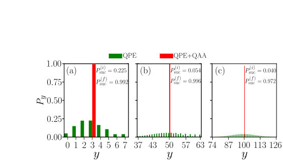
<figcaption class="paper-figure-caption"><b>Fig 2.</b> FIG. 2. Register phase distribution before and after amplification for target Fock states: (a) M = 3, N = 3; (b) M = 6, N = 50; and (c) M = 7, N = 100. In each panel, the green bars show the QPE distribution P (i) y , while the red bars show the amplified distribution P (f) y obtained after the QPE+QAA sequence. The resonator is ini- tialized in a coherent state with |α|2 = N, and the acceptance set is restricted to a single marked outcome, good = {y0}, associated with the target |N⟩. The values reported in each panel correspond to the target weights P (i) y (y0) and P (f) y (y0), i.e., the initial and final success probabilities for heralding the target Fock component.</figcaption>
</figure>
<figure class="paper-figure-card">
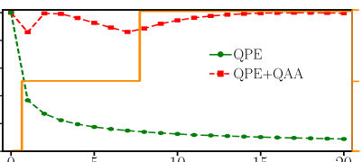
<figcaption class="paper-figure-caption"><b>Fig 3.</b> FIG. 3. Success probability for preparing |N⟩versus target pho- ton number for a fixed register size (M = 5). The left axis shows the QPE and amplified (QPE+QAA) success probabilities, P (i) suc = P (i) y (y0) and Psuc = P (f) y (y0), respectively, for the nar- row acceptance case good = {y0}. The right axis shows the selected number of Grover iterations ry used in the amplification step.</figcaption>
</figure>
<figure class="paper-figure-card">
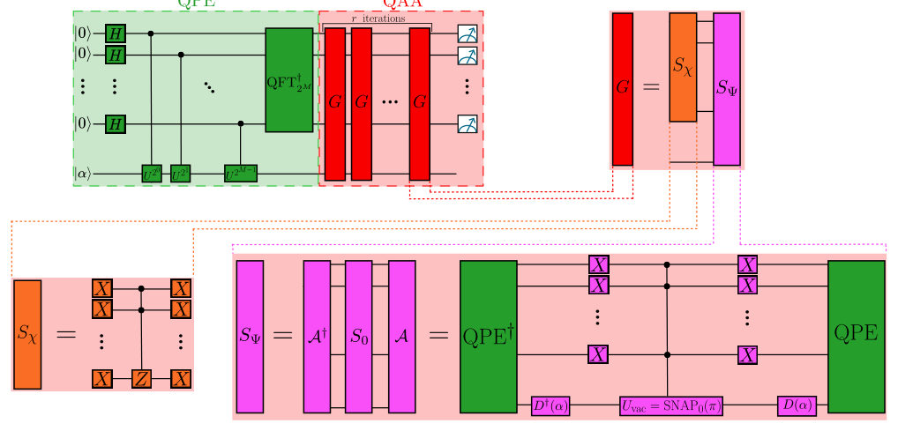
<figcaption class="paper-figure-caption"><b>Fig 4.</b> FIG. 5. Gate-level decomposition of the protocol. Top: high-level circuit diagram. The QPE stage (green box) prepares a uniform superposition in the M-qubit register (Hadamard gates), applies the controlled powers ˆU 2k−1 QPE generated by dispersive phase accumulation, and concludes with the inverse quantum Fourier transform (QFT†) to map the photon-number-dependent phase onto a computational outcome y. The QAA stage (red box) then applies r Grover iterations (loop) before a final projective measurement of the register. Bottom: decomposition of a single Grover iterate ˆG = ˆSΨ ˆSχ. The oracle reflection ˆSχ = ˆIr −2ˆΠgood flips the phase of the marked register outcome(s) y ∈good. The...</figcaption>
</figure>

**Summary.** This paper presents a novel protocol to deterministically generate large Fock states in a resonator using superconducting circuit-QED. It combines Quantum Phase Estimation with Quantum Amplitude Amplification to overcome the low success probability inherent in standard measurement-based approaches. This technique demonstrates feasibility for generating states with hundreds of excitations, advancing quantum resources for quantum metrology.

**Why it may be interesting.** This work directly addresses the generation of highly non-classical states (Fock states) using superconducting circuits, which is a cornerstone topic in quantum optics and quantum information processing within the AMO domain.

Detailed structure

**Main problem.** The primary challenge is preparing large Fock states (|N>) in a resonator with high probability, as existing deterministic methods are too control-intensive and measurement-based approaches suffer from low heralding probabilities.

**Main result.** The proposed protocol enables the near-deterministic, high-probability heralded generation of Fock states with hundreds of excitations using a combination of QPE and QAA.

**Method.** The method combines Quantum Phase Estimation (QPE) to encode photon-number information into a multi-qubit register, followed by Quantum Amplitude Amplification (QAA) to boost the probability of the desired outcome before measurement.

**Model / system.** The system is implemented in a Circuit-QED platform, involving a single bosonic resonator dispersively coupled to a register of superconducting qubits (transmons). The dynamics are analyzed using the multi-qubit Jaynes-Cummings Hamiltonian in the dispersive regime.

**Key observables.** Fock state excitation number (N), heralding probability, and the resulting multi-qubit state in the phase register.

**Important parameters / regimes.** The number of qubits (up to eight), the maximum phase resolution ($N_{	ext{max}} = 2^M$), and the coupling strengths ($g_k, \Delta_k$).

**Assumptions / limitations.** The protocol relies on the dispersive regime approximation for the qubit-resonator interaction and assumes the successful implementation of QND photon-number readout.

**Figures summary.** Figure 1 illustrates the entire protocol flow in circuit-QED: starting from a coherent state, passing through QPE, then QAA, and concluding with measurement to herald the target Fock state |N>.

**Paper structure.** The paper details the physical platform (Circuit-QED), outlines the three-stage protocol (QPE $	o$ QAA $	o$ Measurement), derives the necessary unitary operations in the dispersive regime, and discusses the resulting high-fidelity state preparation.

Abstract

Large Fock states are important resources for bosonic quantum information and quantum-enhanced metrology, but preparing them with high probability at large excitation numbers remains challenging, as deterministic methods become increasingly control-intensive, while measurement-based approaches typically suffer from low heralding probabilities. Here we propose a protocol that combines quantum nondemolition photon-number encoding with quantum amplitude amplification to enable high-probability heralded generation of large Fock states. Starting from a cavity mode prepared in a coherent state, Quantum Phase Estimation encodes photon-number information into a multi-qubit register, while Quantum Amplitude Amplification boosts the probability of a desired target outcome before measurement. The scheme has an immediate implementation in dispersive circuit-QED, but can be analogously adapted to other bosonic platforms with QND photon-number readout, such as cavity-QED. With a register of up to eight qubits, near-deterministic preparation of Fock states with hundreds of excitations is possible. We also show that the protocol can serve as the first stage of an extension toward generating a two-mode NOON state via a conditional beam-splitter operation.

[↑ back to top](#top)

### [Stability and squeezing of the three-photon degenerate parametric down-conversion](http://arxiv.org/abs/2608.19494v1)

**Authors:** Vinícius V. Seco, Alencar J. de Faria  
**Type:** theory · **Category:** quantum information and computing · **PDF:** <https://arxiv.org/pdf/2608.19494v1>  
**Analysis basis:** full PDF text, analyzed in chunks
**Topic relevance:** `Keldysh / 2PI / non-Gaussian methods` **3/5** · `driven-dissipative phase transition` **3/5** · `methods for driven-dissipative` **3/5** · `interference shaping light` **1/5** · `non-equilibrium universality` **1/5** · `quantum measurements` **1/5**

↔ Scroll figures horizontally

<figure class="paper-figure-card">
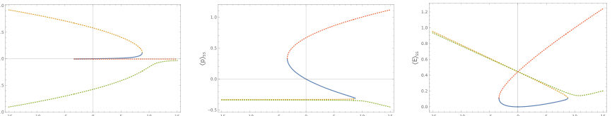
<figcaption class="paper-figure-caption"><b>Fig 1.</b> Figure 1. Steady state average values of the quadratures ⟨q⟩ss and ⟨p⟩ss, and of the respective semi-</figcaption>
</figure>
<figure class="paper-figure-card">
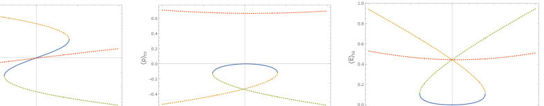
<figcaption class="paper-figure-caption"><b>Fig 2.</b> Figure 2. Steady state average values of the quadratures ⟨q⟩ss and ⟨p⟩ss, and of the respective</figcaption>
</figure>
<figure class="paper-figure-card">
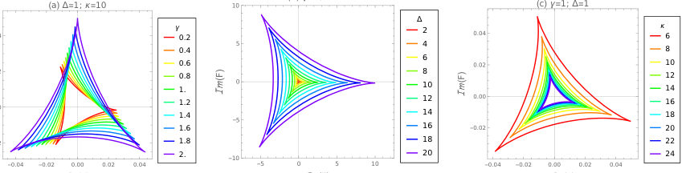
<figcaption class="paper-figure-caption"><b>Fig 3.</b> Figure 3. Stability region boundary as function of the real and imaginary parts of the driving mode</figcaption>
</figure>
<figure class="paper-figure-card">
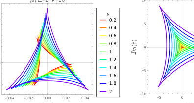
<figcaption class="paper-figure-caption"><b>Fig 4.</b> Fig. 3, varying the parameters γ, ∆and κ.</figcaption>
</figure>
<figure class="paper-figure-card">
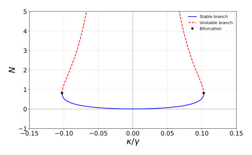
<figcaption class="paper-figure-caption"><b>Fig 5.</b> Figure 4. Mean photon number to steady states without driving mode, F = 0. Blue continuous line</figcaption>
</figure>

**Summary.** This paper theoretically analyzes the stability and squeezing characteristics of three-photon parametric down-conversion in a driven optical cavity. By employing advanced phase-space methods and a positive Wigner function formalism, the authors determine the system's stable operating regimes and characterize the resulting third-order quantum noise squeezing. This advances the understanding of non-Gaussian quantum light sources for quantum information applications.

**Why it may be interesting.** This work is highly relevant as it tackles non-Gaussian quantum noise properties in a driven, dissipative optical system, providing advanced theoretical tools (positive Wigner function) for analyzing complex quantum light sources.

Detailed structure

**Main problem.** The paper investigates the stability and squeezing properties of three-photon degenerate parametric down-conversion.

**Main result.** The system exhibits a single stable steady state branch within a limited parameter region, and the analysis successfully characterizes third-order squeezing using advanced Wigner function techniques.

**Method.** The study employs phase-space methods, stochastic differential equations (SDEs), and a positive Wigner function approach to analyze the quantum dynamics.

**Model / system.** The system models three-photon degenerate parametric down-conversion occurring inside a cavity, driven by a classical pump and subject to cavity dissipation. The dynamics are governed by a Lindblad master equation.

**Key observables.** Spectral densities of quadrature variables ($S_{ijk}(\omega_1, \omega_2)$), mean quadratures ($\langle q 
angle_{ss}, \langle p 
angle_{ss}$), and the mean photon number ($\langle N 
angle_{ss}$).

**Important parameters / regimes.** Dissipative factor ($\gamma$), detuning ($\Delta$), nonlinear coupling constant ($\kappa$), and driving mode amplitude ($F$).

**Assumptions / limitations.** The pumping mode is treated classically, and the input mode is assumed to be in the vacuum state. A positive Wigner function approach is used to handle higher-order non-Gaussian correlations.

**Figures summary.** Figures illustrate bifurcation diagrams showing steady-state values versus driving parameters, and present calculated third-order spectra $S_{ijk}(\omega_1, \omega_2)$ revealing non-Gaussian noise features.

**Paper structure.** The paper proceeds by setting up the quantum master equation, mapping it to stochastic differential equations via the positive Wigner function, analyzing the stability of the resulting steady states using Jacobian matrices, and finally calculating and characterizing the third-order spectral densities.

Abstract

Nonlinear multiphoton conversion processes are theoretically and experimentally challenging systems in quantum optics and related areas. These phenomena bring remarkable quantum properties and can be of fundamental relevance in quantum information and computation applications. Based on recent experimental advances and the possible uses in generalized three-photon squeezing, we investigate degenerate three-photon parametric down-conversion generated inside a cavity fed by a classical pump. In addition, we consider that the process is stimulated by a coherent driving mode and subjected to dissipation by spontaneous emission of the cavity. A treatment using phase-space methods and stochastic differential equations is applied and the stability conditions of its steady states are found. We find that the system does not exhibit multistability, instead it has a limited parameter region leading to a single stable steady branch, alongside multiple unstable branches. Focusing on the stable steady states and linearizing the dynamics around them, we calculate the spectral densities of the quadrature variables. We identify and characterize the squeezing of three-photon down-conversion. Moreover, since the quasi-probability differential equations of the higher-order multiphoton processes have higher-order derivatives, hindering their mapping into stochastic differential equations, we make use of a positive Wigner function approach to calculate two-dimensional spectral densities associated with three-time correlation functions, with the goal of studying non-Gaussian properties of the system.

[↑ back to top](#top)

### [Hyperon-antihyperon system in electron-positron annihilation as quantum probes for temperature estimation with local and global dephasing](http://arxiv.org/abs/2608.19344v1)

**Authors:** Anass Hminat, Abdallah Slaoui, Rachid Ahl Laamara, Hichem Eleuch  
**Type:** theory · **Category:** quantum information and computing · **PDF:** <https://arxiv.org/pdf/2608.19344v1>  
**Analysis basis:** full PDF text, analyzed in chunks
**Topic relevance:** `correlated / nonlocal dissipation` **3/5** · `driven-dissipative phase transition` **2/5** · `methods for driven-dissipative` **2/5** · `quantum measurements` **2/5** · `Keldysh / 2PI / non-Gaussian methods` **1/5** · `non-equilibrium universality` **1/5**

↔ Scroll figures horizontally

<figure class="paper-figure-card">
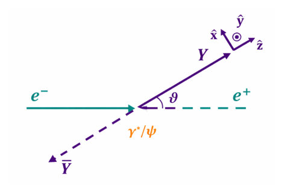
<figcaption class="paper-figure-caption"><b>Fig 1.</b> FIG. 1: The coordinate system adopted in the analysis is de- fined by the orthogonal directions {ˆx, ˆy, ˆz} in the rest frame of Y , and equivalently in that of Y .</figcaption>
</figure>
<figure class="paper-figure-card">
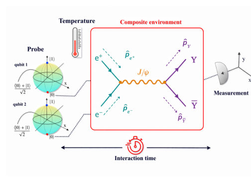
<figcaption class="paper-figure-caption"><b>Fig 2.</b> FIG. 2: We consider a quantum thermometric protocol based on a single two-level system that undergoes dephasing as a result of its interaction with a structured reservoir initially at thermal equilibrium. In this picture, dephasing is illustrated by the contraction of the Bloch sphere in the interaction frame. Once the interaction has taken place, the temperature is in- ferred by performing a measurement along the optimal spin direction.</figcaption>
</figure>
<figure class="paper-figure-card">
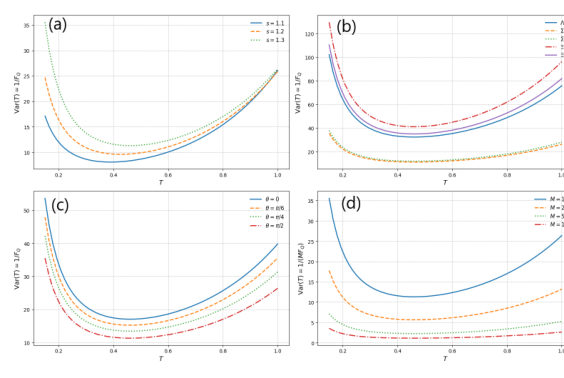
<figcaption class="paper-figure-caption"><b>Fig 3.</b> FIG. 3: The minimal bound on the variances of the individual estimators of the parameter T for different ohmicity s, hyper- ons Y , diffusion angle θ and the number of measurements M.</figcaption>
</figure>
<figure class="paper-figure-card">
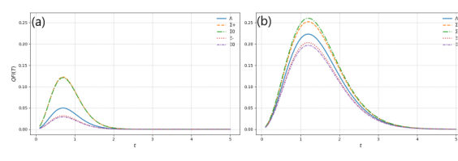
<figcaption class="paper-figure-caption"><b>Fig 4.</b> FIG. 4: In the upper panel, we plot the contour lines of the ratio R associated with the Σ hyperon for different Ohmici- ties, namely s = 1 and s = 3. In the lower panel, we present the QFI as a function of time t for different hyperons in order to identify the optimal hyperon exhibiting the highest thermal sensitivity.</figcaption>
</figure>
<figure class="paper-figure-card">
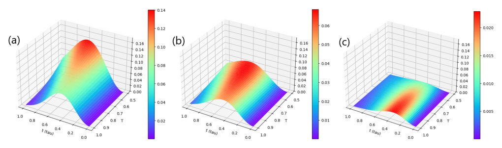
<figcaption class="paper-figure-caption"><b>Fig 5.</b> FIG. 5: We show the QFI H(T, t) as a function of both the reservoir temperature T and the interaction time t for three illustrative types of structured environments: (a) (s = 1), (b) (s = 1.5), and (c) (s = 2.5).</figcaption>
</figure>

**Summary.** This work develops a quantum thermometry protocol using hyperon-antihyperon pairs as probes interacting with a thermal bath. By analyzing the QFI and comparing mutual versus local dephasing, the authors determine optimal sensing conditions. The study highlights the interplay between environmental spectral structure and the choice of quantum correlation measure for high-precision temperature estimation.

**Why it may be interesting.** It directly applies advanced quantum information tools (QFI, correlation measures) to a physical problem (thermometry) involving open quantum systems and particle physics, providing insights into how environmental coupling affects quantum sensing limits.

Detailed structure

**Main problem.** The paper investigates quantum thermometry, aiming to estimate the temperature of a large system using a small quantum probe.

**Main result.** Common-bath configurations outperform local baths at short times due to bath-induced correlations, and the analysis establishes finite optimal times and temperatures for sensing.

**Method.** The study employs quantum estimation theory, calculating the Quantum Fisher Information (QFI) and Quantum Signal-to-Noise Ratio (QSNR) for the probe dynamics.

**Model / system.** The system uses a two-qubit probe (hyperon-antihyperon pair, YY) coupled to a bosonic thermal reservoir in a pure-dephasing framework. The dynamics are analyzed under both mutual (common-bath) and local dephasing.

**Key observables.** Quantum Fisher Information (QFI), Quantum Signal-to-Noise Ratio (QSNR), Entanglement, Quantum Discord, Steering, and Bell nonlocality.

**Important parameters / regimes.** Ohmicity parameter (s), deviation angle (θ), decay coefficients (α, β), interaction time (t), and temperature (T).

**Assumptions / limitations.** The analysis assumes an Ohmic-class spectral density for the reservoir and focuses on the pure-dephasing limit.

**Figures summary.** Figures illustrate the orthogonal coordinate system used for analysis and schematically show the Bloch sphere contraction due to dephasing during the thermometric protocol.

**Paper structure.** The paper develops the theoretical framework by modeling the open quantum system dynamics, calculating the QFIM for temperature estimation, and then performing a comparative analysis of quantum correlation measures (entanglement, discord, etc.) across different environmental coupling regimes.

Abstract

We investigate quantum thermometry in Ohmic-type reservoirs using two-qubit probes within an exactly solvable pure-dephasing framework. By analyzing the individual variance associated with temperature estimation, we identify optimal regimes governed by the Ohmicity parameter $s$, the deviation angle $θ$, and the decay coefficients $α$ and $β$, thereby determining the conditions that minimize estimation errors. The Quantum Fisher Information (QFI) exhibits pronounced maxima at finite interaction times, especially in sub-Ohmic and Ohmic environments at low temperatures, whereas super-Ohmic reservoirs flatten the QFI peak and shift the optimal sensitivity toward higher temperatures. Consistently, the quantum signal-to-noise ratio (QSNR) is suppressed at low temperatures, increases with thermal excitation, and saturates in the high-temperature regime, where the influence of spectral details becomes negligible. A comparative study of mutual and local estimation strategies shows that common-bath configurations, particularly for $Σ^+$ and $Σ^0$ probes, outperform local baths at short interaction times due to bath-induced correlations, while local environments become advantageous at longer times. The analysis further reveals finite optimal values of both the interaction time $t_{\rm opt}$ and the temperature $T_{\rm opt}$, as well as a strong reduction of the variance with increasing measurement number in the low-temperature regime. In addition, our study of hyperon-antihyperon channels ($Λ$, $Σ^+$, $Σ^0$, $Ξ^-$, $Ξ^0$) shows that entanglement and quantum discord remain remarkably robust over broad angular domains, whereas steering and Bell nonlocality are confined to narrower regions. Overall, the interplay between spectral structure, particle-dependent parameters, and estimation strategy provides valuable ...

[↑ back to top](#top)

### [Biorthogonal Conformal Dynamics in Non-Hermitian Quantum Quenches](http://arxiv.org/abs/2608.20156v1)

**Authors:** Yifan Liu  
**Type:** theory · **Category:** statistical mechanics · **PDF:** <https://arxiv.org/pdf/2608.20156v1>  
**Analysis basis:** full PDF text, analyzed in chunks
**Topic relevance:** `non-equilibrium universality` **3/5** · `Keldysh / 2PI / non-Gaussian methods` **2/5** · `methods for driven-dissipative` **2/5** · `analog quantum simulation` **1/5** · `correlated / nonlocal dissipation` **1/5** · `driven-dissipative phase transition` **1/5**

↔ Scroll figures horizontally

<figure class="paper-figure-card">
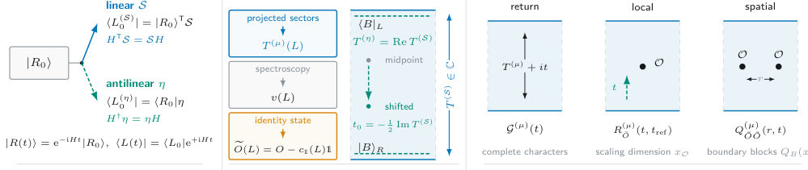
<figcaption class="paper-figure-caption"><b>Fig 1.</b> FIG. 1. Biorthogonal global quenches as temporal-boundary problems. (a) A non-Hermitian readout requires both an evolving right ket and a left covector. The linear S pairing and the antilinear η pairing fix two symmetry-related left preparations from the same right preparation; the general construction also allows independent left and right states. (b) In the scaling limit, the preparation pair becomes two temporal boundaries with total extrapolation parameter T = τR + τL. Projected sector weights determine T (µ)(L), spectroscopy fixes v(L), and an identity-sector matrix element fixes the static operator matching eO(L) = O −c1(L)1. For a preparation admitting both pairings, T (η) = Re T (S)...</figcaption>
</figure>
<figure class="paper-figure-card">
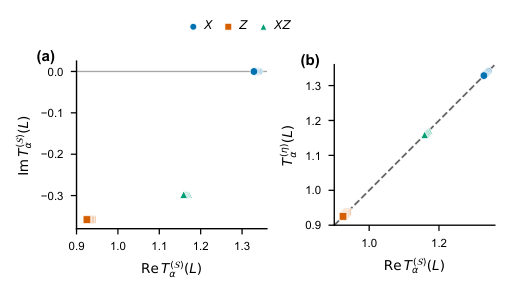
<figcaption class="paper-figure-caption"><b>Fig 2.</b> FIG. 2. Pairing-resolved total extrapolation parame- ters in the Yang–Lee chain. (a) Complex-plane trajectories of T (S) α for the three filtered product preparations at β = 1 and L = 12, 14, . . . , 22. Product X remains real, whereas product Z and XZ preparations retain finite imaginary com- ponents. Symbols darken with increasing L. (b) Independently extracted T (η) α (L) versus Re T (S) α (L). Dashed diagonal repre- sents the analytic identity in Eq. (64).</figcaption>
</figure>
<figure class="paper-figure-card">

<figcaption class="paper-figure-caption"><b>Fig 3.</b> Figure 2(a) shows the finite-size flow of the three S- paired parameters. Product X remains on the real axis, whereas the product-Z and product-XZ preparations retain stable imaginary components. Because Eq. (64) follows analytically from the real, nondegenerate sector</figcaption>
</figure>
<figure class="paper-figure-card">
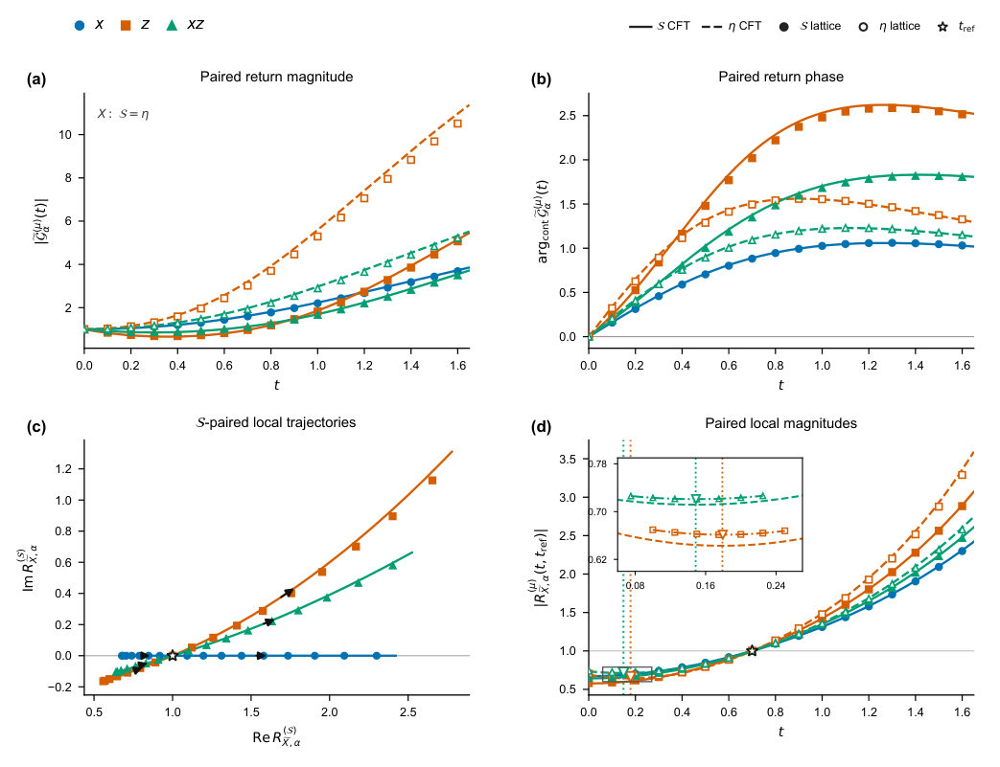
<figcaption class="paper-figure-caption"><b>Fig 4.</b> FIG. 3. Return amplitudes and local-primary dynamics for paired preparations in the Yang–Lee model. (a,b) Magnitude and continuously tracked phase of the return amplitudes at L = 22 for product X, product Z, and the XZ preparation. Solid curves and filled symbols denote the S pairing; dashed curves and open symbols denote the η pairing. Curves are the signed complete-character predictions using the statically determined extrapolation parameters, and symbols are lattice data. The two product-X returns coincide exactly. (c) Complex trajectories of the normalized S-paired one-point function of e Xj. Arrows indicate increasing time, and all trajectories pass through R e X(tref) = 1. (d)...</figcaption>
</figure>
<figure class="paper-figure-card">
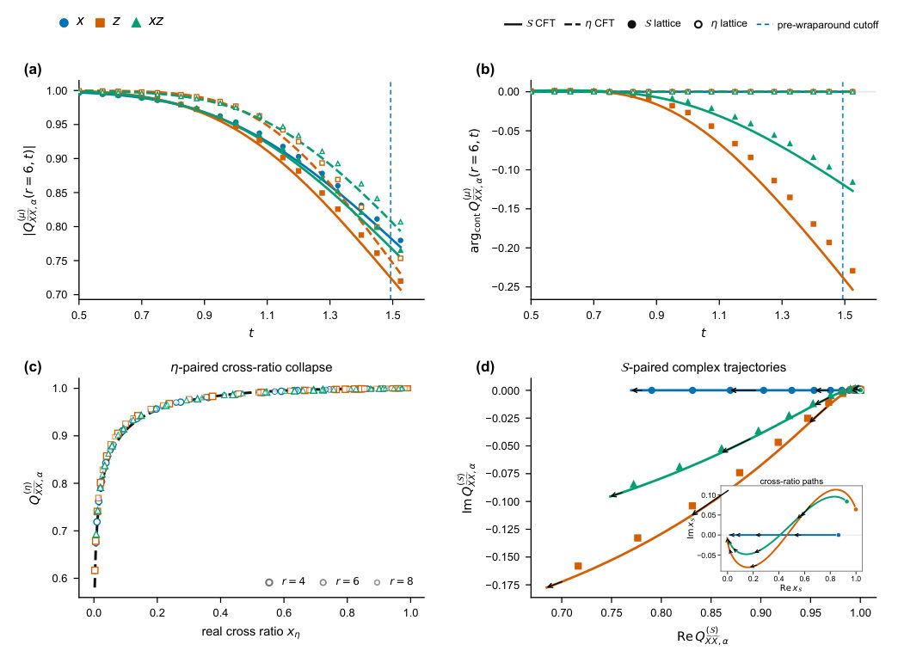
<figcaption class="paper-figure-caption"><b>Fig 5.</b> FIG. 4. Correlator dynamics for filtered paired preparations in the Yang–Lee model. All lattice data use L = 22 and the statically subtracted operator in Eq. (67). The plotted ratio is Q(µ) e X e X,α(r, t) = G(µ) e X e X,α(r, t)/[m(µ) e X,α(t)]2, without an additional time normalization. Colors and marker shapes identify the preparations X, Z, and XZ; solid curves and filled symbols denote the S pairing, while dashed curves and open symbols denote the η pairing. (a) |Q e X e X| and (b) its continuously unwrapped phase at r = 6. The vertical dashed line marks the conservative pre-wraparound condition in Eq. (85). Early-time data (t &lt; 0.5) remain nearly constant and are therefore omitted. (c)...</figcaption>
</figure>

**Summary.** This paper introduces a Boundary Conformal Field Theory (BCFT) framework to analyze quantum quenches in non-Hermitian critical systems. It treats the dynamics using biorthogonal evolution, requiring both a left and right preparation state. The framework successfully predicts universal post-quench dynamics by relating complex boundary parameters derived from the system's symmetries to measurable observables.

**Why it may be interesting.** The extension of CFT techniques to non-Hermitian dynamics is highly relevant for open quantum systems, as non-Hermiticity often arises in realistic physical models involving dissipation or gain, which are key areas in AMO physics.

Detailed structure

**Main problem.** The paper aims to establish a comprehensive Boundary Conformal Field Theory (BCFT) framework for analyzing global quenches in interacting, non-Hermitian critical systems.

**Main result.** It successfully develops a microscopic BCFT framework that describes universal post-quench dynamics by relating left and right preparation boundary conditions to the evolution of observables.

**Method.** The methodology involves generalizing the Calabrese–Cardy ansatz to the non-Hermitian setting, utilizing biorthogonal time evolution, and exploiting linear/antilinear symmetry pairings to constrain the geometry.

**Model / system.** The study focuses on non-Hermitian critical systems, tested with the Yang–Lee spin chain and a complex five-state Potts fixed point. The dynamics are governed by a non-Hermitian Hamiltonian, requiring both a right ket and a left covector for evolution.

**Key observables.** Return amplitude ($\mathcal{G}(t)$), one-point function ($	ilde{\mathcal{O}}(t, t_{	ext{ref}})$), and spatial correlator ($	ilde{\mathcal{O}}	ilde{\mathcal{O}}(r, t)$).

**Important parameters / regimes.** Complex one-sided extrapolation parameters ($	au_R, 	au_L$) and the total extrapolation parameter $T = 	au_L + 	au_R$.

**Assumptions / limitations.** The core assumption is that the right and left preparations flow to the same conformal boundary condition, and the analysis relies on linking left and right initial states.

**Figures summary.** Figures illustrate the formalism, showing how the input data (static lattice calibrations) leads to three distinct dynamical outputs ($\mathcal{G}(t)$, $	ilde{\mathcal{O}}(t, t_{	ext{ref}})$, $	ilde{\mathcal{O}}	ilde{\mathcal{O}}(r, t)$) in the BCFT framework.

**Paper structure.** The paper develops the formalism by generalizing the BCFT approach to non-Hermitian quenches, details the role of symmetry pairings in constraining the geometry, and validates the framework by comparing predictions for various observables (return, one-point, two-point) across different preparation scenarios.

Abstract

Global quenches at one-dimensional critical points admit a boundary conformal field theory (BCFT) description in which Euclidean strip correlators are analytically continued to real time. We formulate this construction for interacting non-Hermitian critical systems, where a right ket alone does not specify the dynamical readout and the left covector is part of the microscopic quench protocol. Independent left and right preparations flowing to the same conformal boundary define the two temporal boundaries of a strip with generally complex one-sided extrapolation parameters; linear and antilinear symmetry pairings are exploited to constrain this geometry. In the interacting Yang-Lee spin chain, statically calibrated boundary data determine the biorthogonal dynamics of the complete-character return amplitude, a primary one-point function, and a spatial correlator. The imaginary part of the linear-paired extrapolation parameter predicts the temporal center of an independently evolved antilinear-paired one-point function at the $10^{-3}$ relative level; the same preparation phase controls local phase evolution and the analytic-continuation path of boundary blocks. Further results test this formalism with a direct field-on quench, mixed left and right preparations, and a complex five-state Potts fixed point with complex primary dimensions. These results establish a BCFT framework for biorthogonal global quenches in interacting non-Hermitian critical systems, in which complex temporal-boundary data organize universal post-quench dynamics.

[↑ back to top](#top)

### [Holographic Local Operator Quenches with Conserved Momentum and Spin](http://arxiv.org/abs/2608.19305v1)

**Authors:** Pawel Caputa, Pedro Castellini Grand, Justin R. David, Rahul Metya  
**Type:** theory · **Category:** statistical mechanics · **PDF:** <https://arxiv.org/pdf/2608.19305v1>  
**Analysis basis:** full PDF text, analyzed in chunks
**Topic relevance:** `non-equilibrium universality` **3/5** · `scars & prethermalization` **3/5** · `Keldysh / 2PI / non-Gaussian methods` **2/5** · `quantum measurements` **2/5**

↔ Scroll figures horizontally

<figure class="paper-figure-card">
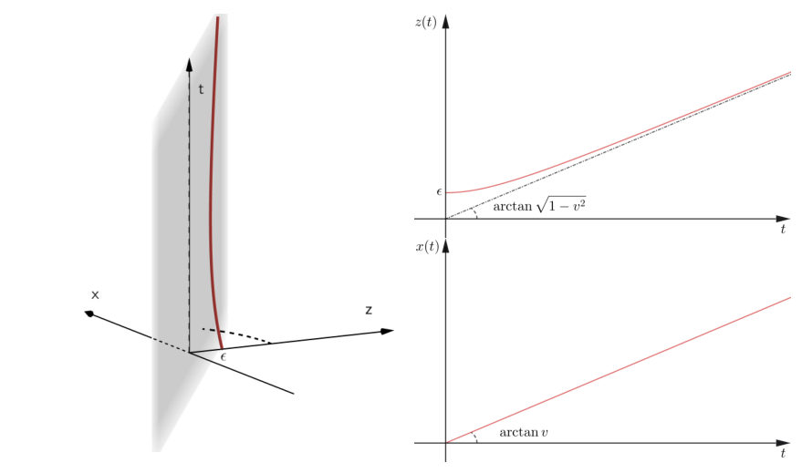
<figcaption class="paper-figure-caption"><b>Fig 1.</b> Figure 1: Particle’s trajectory in Poincar´e coordinates. The left panel shows the worldline (red) parametrised as (z(t), x(t), t), originating at the cut-off surface z = ϵ. The gray plane is marked to show that, at late times, the particle effectively moves in this slice of AdS3. The right panels display the time dependence of the coordinates z(t) and x(t), with (asymptotic) slopes determined by √</figcaption>
</figure>
<figure class="paper-figure-card">
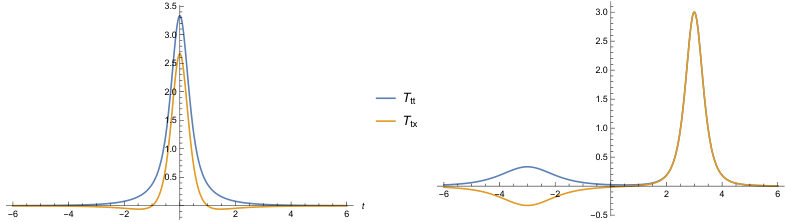
<figcaption class="paper-figure-caption"><b>Fig 2.</b> Figure 2: Time evolution of energy and momentum densities (normalized by mR/π) for t = 0 (left) and t = 3 (right). Plot for ϵ = 1 and tanh(η2) = 1/2. On the right plot, the profiles of Ttt and Ttx moving to the right coincide, up to our numerical precision.</figcaption>
</figure>
<figure class="paper-figure-card">
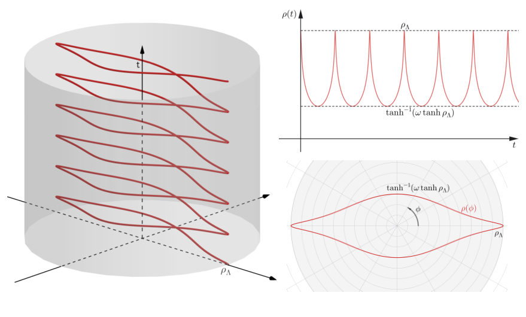
<figcaption class="paper-figure-caption"><b>Fig 3.</b> Figure 3: Particle’s trajectory in Global Coordinates. The left panel shows the worldline (red) parametrised as (ρ(t) cos ϕ(t), ρ(t) sin ϕ(t), t), originating at the cutoff surface ρ = ρΛ. The right panels display the time dependence of the coordinate ρ and the trajectory given as ρ(ϕ), respectively</figcaption>
</figure>
<figure class="paper-figure-card">
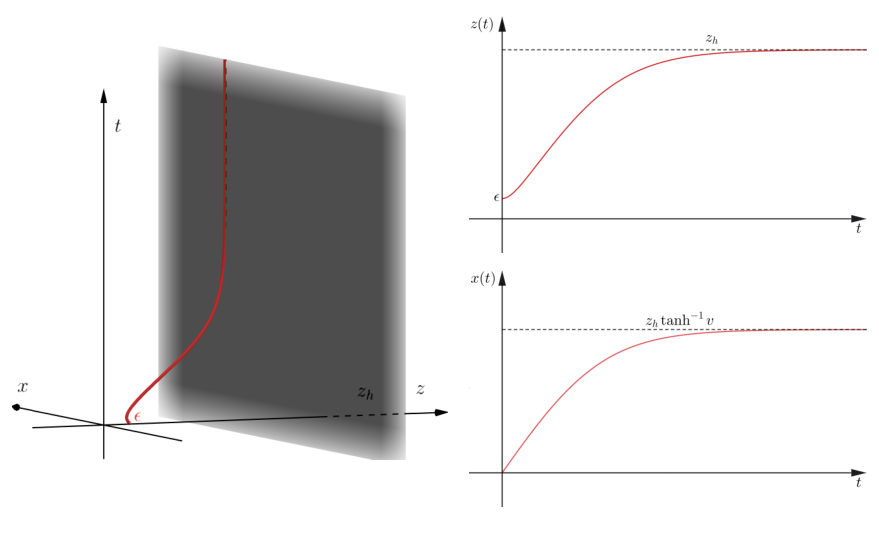
<figcaption class="paper-figure-caption"><b>Fig 4.</b> Figure 4: Particle’s trajectory in the BTZ background. The left panel shows the worldline (red) parametrised as (z(t), x(t), t), originating at the cut-off surface z = ϵ. The black plane represents the BTZ horizon at z = zh. The right panels display the time dependence of the coordinates z(t) and x(t), with asymptotes given by zh and zh arctan v, respectively.</figcaption>
</figure>
<figure class="paper-figure-card">
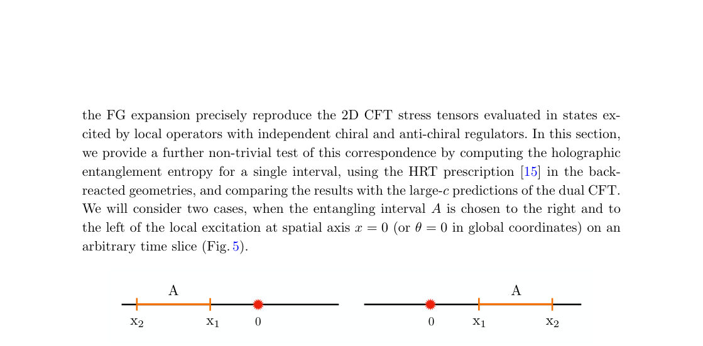
<figcaption class="paper-figure-caption"><b>Fig 5.</b> Figure 5: Our setup for computing entanglement entropy for a single interval A = [x1, x2], placed to the left or to the right of the excitation at x = 0.</figcaption>
</figure>

**Summary.** This work extends the holographic dictionary to include point particles carrying conserved momentum and spin in AdS_3. By calculating observables like energy density and entanglement entropy on both the gravity and CFT sides, the authors demonstrate precise quantitative agreement. This establishes a robust framework for studying non-equilibrium dynamics in strongly coupled systems using conserved charges.

**Why it may be interesting.** The rigorous matching of conserved charges (momentum/spin) between gravity and CFT provides powerful, concrete examples of how quantum information measures behave in non-equilibrium, strongly coupled systems, relevant to understanding quantum chaos.

Detailed structure

**Main problem.** The paper investigates the holographic dictionary connecting point particles with conserved momentum or spin in AdS_3 spacetime to time-evolved states created by local primary operators in the dual 2D CFT.

**Main result.** The authors find exact agreement between CFT and gravity descriptions for energy density and entanglement entropy when considering conserved momentum and intrinsic spin in these holographic quenches.

**Method.** The study employs the AdS/CFT correspondence, calculating back-reacted geometries and stress tensors on the gravity side, and comparing these results with calculations of entanglement entropy and energy density on the CFT side.

**Model / system.** The system involves massive particles propagating in asymptotically AdS_3 spacetimes (Poincaré, Global, BTZ) on the gravity side, dual to local primary operators in a 2D CFT on the field theory side.

**Key observables.** Energy density, entanglement entropy (and Rényi entropies), and the stress tensor components.

**Important parameters / regimes.** Longitudinal momentum, angular momentum, intrinsic spin, and the AdS radius (R).

**Assumptions / limitations.** The analysis relies fundamentally on the AdS/CFT correspondence and extends previous work to include conserved charges beyond simple energy quenches.

**Figures summary.** Figure 1 illustrates the particle's trajectory in Poincaré coordinates, while Figure 2 shows the time evolution of energy and momentum density derived from the stress tensor.

**Paper structure.** The paper progresses by establishing the gravity setup for charged particles, detailing the CFT description via local operator quenches, calculating entanglement entropy in AdS_3/CFT_2, extending the analysis to include intrinsic spin, and concluding with applications to rational CFTs and general local quenches.

Abstract

We investigate the holographic dictionary relating point particles carrying longitudinal momentum or angular momentum in asymptotically AdS$_3$ spacetimes to suitably regulated, time-evolved states created by local primary operators in the dual two-dimensional conformal field theory (2D CFT). We find that asymmetric left/right Euclidean smearing of local operators produces states carrying momentum, and the corresponding bulk excitation is a particle with conserved momentum. We compute the energy density and entanglement entropy in these states and in their dual back-reacted geometries, finding exact agreement between the CFT and gravity descriptions. We further extend this correspondence to particles with intrinsic spin, whose CFT duals are primary operators with unequal holomorphic and anti-holomorphic scaling dimensions. We again find a precise match between CFT and holographic calculations of energy densities and entanglement entropies. Finally, we explore applications of these setups beyond holography by deriving the evolution of Rényi entropies in 2D rational CFTs and introducing a new class of local quantum quench protocols with conserved longitudinal or angular momentum.

[↑ back to top](#top)

### [Universal meson spectra near $(1+1)$-dimensional Ising criticality](http://arxiv.org/abs/2608.20221v1)

**Authors:** Xiao Wang, Jianda Wu  
**Type:** theory · **Category:** statistical mechanics · **PDF:** <https://arxiv.org/pdf/2608.20221v1>  
**Analysis basis:** full PDF text, analyzed in chunks
**Topic relevance:** `analog quantum simulation` **3/5** · `non-equilibrium universality` **3/5** · `methods for driven-dissipative` **2/5** · `Frenkel-Kontorova` **1/5** · `Keldysh / 2PI / non-Gaussian methods` **1/5**

↔ Scroll figures horizontally

<figure class="paper-figure-card">
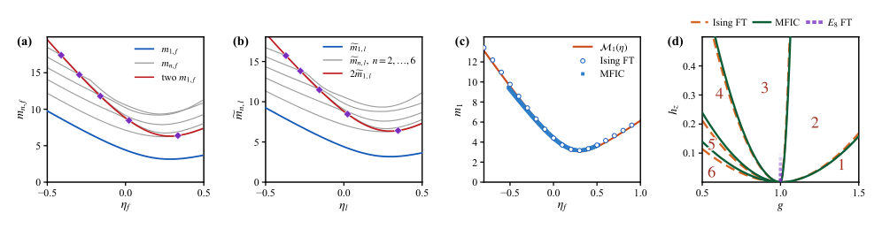
<figcaption class="paper-figure-caption"><b>Fig 1.</b> FIG. 1. Universal meson mass trajectories and stable-meson crossover windows. (a) The six lowest meson masses of the Ising field theory as functions of ηf = −λ/|h|8/15. The field-theory data are calculated at h = 1 by scanning ηf from −0.5 to 0.5 in steps of 0.01. The blue curve denotes m1,f, the gray curves denote mn,f with n = 2, . . . , 6, and the red curve denotes the lightest two-particle threshold 2m1,f. The purple diamonds mark the crossings between the higher masses and 2m1,f. (b) The corresponding reduced MFIC masses emn,l as functions of ηl. The MFIC calculation uses hz = 0.018 and is parameterized by ¯ηl = (g −gc)/h8/15 z , with g = gc + ¯ηlh8/15 z , gc = 1, and ηl = Cf...</figcaption>
</figure>
<figure class="paper-figure-card">
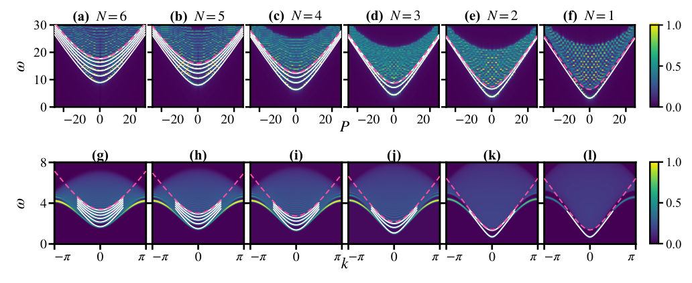
<figcaption class="paper-figure-caption"><b>Fig 2.</b> FIG. 2. Dynamical signatures of the meson crossover windows. (a)–(f) Normalized energy-density DSFs Sεε(ω, P) of the IFT at ηf = −0.43, −0.35, −0.20, 0, 0.10, and 0.35, respectively. (g)–(l) Corresponding normalized DSFs Sxx(ω, k) of the MFIC obtained by iTEBD. For these panels, the longitudinal field is hz = 0.036, and the transverse fields g = 0.74, 0.80, 0.84, 0.94, 1.12, and 1.26 correspond to the rescaled parameters ηl = −0.40, −0.30, −0.24, −0.091, 0.18, and 0.40, respectively. Each set of panels follows the same sequence of threshold-based meson counts N = 6, 5, · · · , 1. The white solid curves show the first N single-meson relativistic energy-momentum dispersion guides. The magenta...</figcaption>
</figure>
<figure class="paper-figure-card">
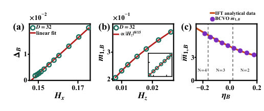
<figcaption class="paper-figure-caption"><b>Fig 3.</b> FIG. 3. Calibration of the BCVO scaling variables and lightest-meson trajectory. (a) Lowest excitation gap at Hz = 0 obtained from the D = 32 VUMPS calculation. The red line is a linear fit in Hx. (b) Lightest mass at the independently calibrated critical field Hx = Hc,B = 0.1454 as a function of Hz. The red line is a fit with exponent 8/15, and the in- set shows the same data on logarithmic scales. (c) Reduced lightest-meson masses along the self-consistent BCVO field path from 1 to 9 T. The orange curve is the field-theory an- alytical data generated from Eq. (2), evaluated at ηf = ηB, the purple circles are the BCVO results, and the gray dashed lines are the mapped threshold crossings....</figcaption>
</figure>
<figure class="paper-figure-card">
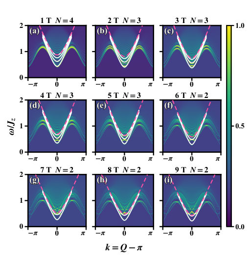
<figcaption class="paper-figure-caption"><b>Fig 4.</b> FIG. 4. Field evolution of the BCVO meson spectrum. (a)–(i) Normalized combined transverse DSFs Sxx(ω, Q) + Syy(ω, Q) for B = 1, 2, . . . , 9 T, using the self-consistent Hz at each field. The momentum is measured from the antifer- romagnetic wave vector, k = Q −π. The white solid curves show the first N one-meson dispersion guides obtained from the mapped IFT spectrum. The magenta dashed curve is the corresponding two-lightest-meson threshold guide. The panel headings give the threshold-based stable-meson count N.</figcaption>
</figure>

**Summary.** This work establishes a universal scaling law for the meson excitation spectrum near the (1+1)D Ising critical point. By comparing results from continuum field theory, lattice models, and real quantum magnets, the authors demonstrate that the organization of these excitations is governed by a single universal curve. This provides a powerful, predictive criterion for analyzing quasi-1D quantum magnets.

**Why it may be interesting.** The concept of universal scaling across different physical realizations (field theory vs. lattice vs. material) is highly relevant for AMO physics, as it provides a powerful tool to predict behavior in complex quantum materials based on established critical theories.

Detailed structure

**Main problem.** The paper investigates the universal scaling behavior of meson excitation spectra near the critical point of the (1+1)-dimensional Ising model.

**Main result.** The meson masses exhibit universal scaling across different microscopic models (field theory, lattice chains, and real materials like BCVO), suggesting a deep underlying organization governed by the Ising critical point.

**Method.** The study employs advanced theoretical techniques including Conformal Field Theory (CFT) analysis, Hamiltonian truncation, and tensor-network methods (iTEBD, VUMPS) to calculate spectra in both continuum and lattice limits.

**Model / system.** The primary model is the (1+1)D Ising model, studied in its field theory limit (IFT) and realized in lattice systems like the Mixed-Field Ising Chain (MFIC) and quasi-1D antiferromagnets (e.g., BaCo2V2O8).

**Key observables.** Meson mass spectrum ($m_n$), lightest meson mass trajectory ($m_1$), and the count of stable mesons determined by two-meson thresholds.

**Important parameters / regimes.** The scaling parameter $\eta_f$ (or $\eta_l$) characterizes the approach to criticality, and the analysis covers the transition from the critical point to the confining regime.

**Assumptions / limitations.** The analysis assumes that the low-energy physics near criticality is governed by the Ising CFT and that the system can be mapped onto effective field theories or integrable lattice models.

**Figures summary.** Figures illustrate the universal collapse of meson mass trajectories and stable-meson crossover windows when comparing results from the continuum field theory, the lattice model (MFIC), and experimental material calculations (BCVO).

**Paper structure.** The paper systematically compares results from three perspectives: the continuum Ising Field Theory (IFT), the discrete lattice model (MFIC), and a specific material realization (BCVO). The core argument is the demonstration that all these disparate systems collapse onto a single universal scaling curve.

Abstract

Near $(1+1)$-dimensional [$(1+1)$D] Ising criticality, a magnetic perturbation induces confinement and produces a cascade of bound-state excitations known as mesons. Here we show these mesons share a universal mass scaling after independently rescaling the model-dependent microscopic couplings. The number of stable mesons is controlled by the lightest two-meson threshold, while the lightest-meson mass follows a continuous trajectory characterized by a single scaling parameter. Using Hamiltonian truncation method, we obtain the trajectory numerically in both Ising field theory and the near-critical mixed-field Ising chain (MFIC). Under the rescaling, the trajectory and stable-meson-count crossover windows of MFIC both collapse onto the field-theory results. To further demonstrate the above universal organization of the meson spectra, we consider a class of four-periodic spin-$1/2$ Heisenberg-Ising chains under transverse fields, whose parameter space contains a family of quantum Ising critical points. The Hamiltonian family includes effective spin models for the quasi-one-dimensional antiferromagnets Ba(Sr)Co$_2$V$_2$O$_8$. Using tensor-network calculations, we obtain the corresponding lightest-meson mass trajectory for BaCo$_2$V$_2$O$_8$ and find that it also collapse onto the same universal curve given by field-theory result. Our results suggest that the universal scaling structure of quantum Ising criticality extends into the nearby confining regime, governing the organization of the meson spectrum. They thereby provide a practical criterion for interpreting excitations of quasi-1D Ising-like magnets in mixed fields beyond $E_8$ integrability.

[↑ back to top](#top)

### [A charge selection rule fixes what a squeezed-light reservoir computer can compute and afford](http://arxiv.org/abs/2608.19668v1)

**Authors:** Daniel Soh  
**Type:** theory · **Category:** quantum information and computing · **PDF:** <https://arxiv.org/pdf/2608.19668v1>  
**Analysis basis:** full PDF text, analyzed in chunks
**Topic relevance:** `quantum measurements` **3/5** · `Full counting statistics` **1/5** · `analog quantum simulation` **1/5** · `driven-dissipative phase transition` **1/5** · `interference shaping light` **1/5** · `methods for driven-dissipative` **1/5** · `quantum optics experiment` **1/5**

↔ Scroll figures horizontally

<figure class="paper-figure-card">
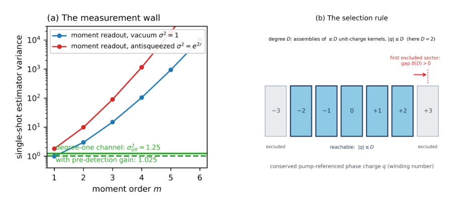
<figcaption class="paper-figure-caption"><b>Fig 1.</b> FIG. 1. One conservation law prices a quantum machine. (a) The measurement wall. Single-shot variance of an order-m moment estimator, (2m−1)!! σ2m [Eq. (1)], for vacuum (σ2=1) and antisqueezed (σ2=e2r, r=0.3) readout, against the machine’s order-one channel, whose estimator variance is pinned at order one (σ2 eff = 1.25 at the campaign point, 1.025 with pre-detection phase-sensitive gain suppressing the detection-loss penalty; Methods). (b) The selection rule. The conserved pump-referenced phase charge organizes the reachable function space: order-D polynomial post-processing reaches exactly the D-block assemblies of unit-charge kernels, confined to the sectors |q| ≤D (Theorem 1), with the...</figcaption>
</figure>
<figure class="paper-figure-card">
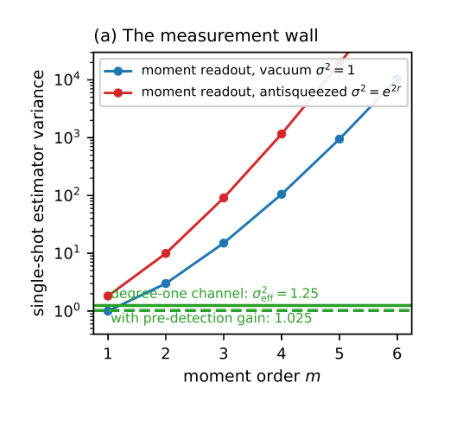
<figcaption class="paper-figure-caption"><b>Fig 2.</b> Figure 2 shows the machine: the polynomial is com- puted in the dynamics by a single-pass χ(2) segment in the delay loop, and the measurement is pinned at poly- nomial order one (walkthrough in SI Sec. S8; Table II separates hardware targets from the conservative cam- paign point behind every result). Bilinear encoding. The phase-modulated pump meets the squeezer at angle</figcaption>
</figure>
<figure class="paper-figure-card">
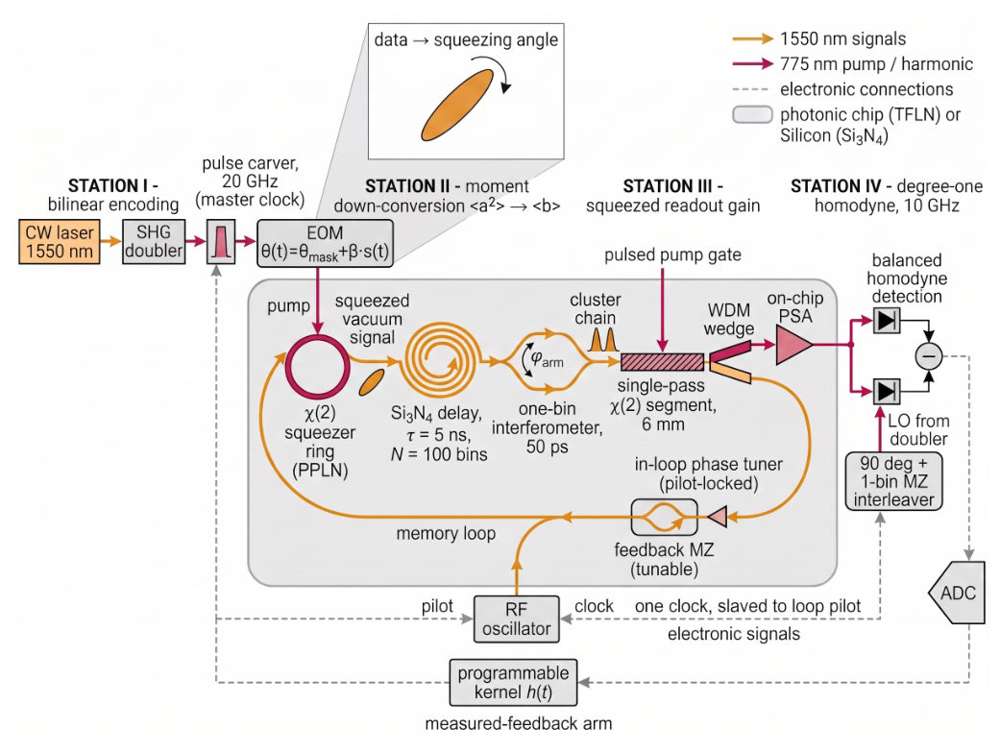
<figcaption class="paper-figure-caption"><b>Fig 3.</b> FIG. 2. The measurement-economical squeezed-light reservoir. Signal flow runs left to right. False color throughout: amber is the 1550-nm fundamental band, crimson the 775-nm harmonic band, dashed gray the electronics. Encoding (station I). A continuous-wave 1550-nm laser is frequency doubled. The 775-nm pump is carved into a 20-GHz pulse train that serves as the master clock, and an electro-optic modulator writes the data into the pump phase, and hence into the squeezing angle, θ(t) = θmask + βs(t). Squeezing. On a hybrid TFLN/Si3N4 chip the pulsed pump drives a periodically poled squeezer ring (χ(2) OPO). It generates squeezed vacuum at 1550 nm whose ellipse orientation carries the...</figcaption>
</figure>
<figure class="paper-figure-card">
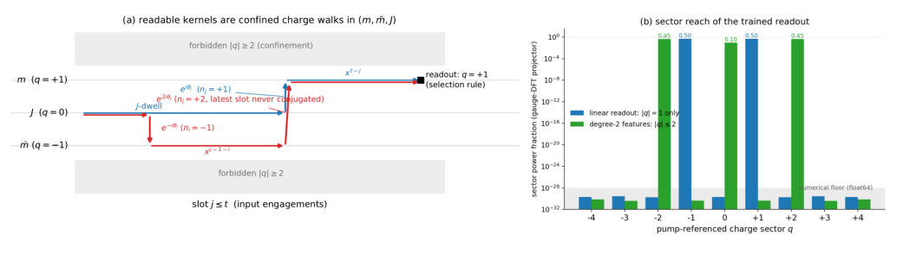
<figcaption class="paper-figure-caption"><b>Fig 4.</b> FIG. 3. The charge-confinement law, pictorially. (a) Every readable kernel monomial of the exact dynamics is a walk of pump-referenced phase charge on the three channels (m, ¯m, J) of Eq. (6), confined to |q| ≤1 (shaded regions are unreachable in flight). Blue: the grade-one walk of Eq. (8) — a J-dwell, a single engagement eiθj, and geometric decay xt−j to the readout. Red: the grade-two family of Eq. (9) — an early conjugated engagement e−iθi into ¯m, a dwell, and the double-charged step e2iθj at the latest engaged slot, which the ordering law forbids to be conjugated. Every walk terminates in m with net charge q = +1: the selection rule of Corollary 1. (b) The same algebra measured:...</figcaption>
</figure>
<figure class="paper-figure-card">
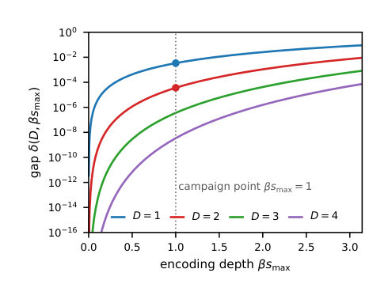
<figcaption class="paper-figure-caption"><b>Fig 5.</b> FIG. 4. The no-go gap, quantitatively. The explicit lower bound δ(D, βsmax) of Theorem 1(III) [Eq. (10)] across poly- nomial order D and encoding depth. The gap is strictly pos- itive throughout the injectivity window 0 &lt; βsmax &lt; π — no finite polynomial order closes the next charge sector — but it decays steeply with D, quantifying why polynomial post-processing (Theorem 1(II)) is cheap in practice: at the campaign operating point βsmax = 1, δ(1, 1) ≈3.4 × 10−3</figcaption>
</figure>

**Summary.** This work establishes a fundamental 'charge selection rule' governing what a squeezed-light reservoir computer can compute and, crucially, what it can afford to measure. By deriving this rule from a conservation law, the authors show that the computational power is strictly limited by the detector's measurement order, not the optical complexity. This provides a powerful, resource-aware theoretical benchmark for quantum machine learning architectures.

**Why it may be interesting.** It provides a rigorous, resource-aware characterization of quantum machine learning models, showing that physical constraints (like detector bandwidth) dictate computational power, which is highly relevant for quantum information processing.

Detailed structure

**Main problem.** The paper determines the computational limits and, more critically, the measurement cost associated with using a squeezed-light reservoir computer.

**Main result.** A conservation law imposes a 'charge selection rule,' restricting the computable functionals to those spanned by at most D unit-charge kernels, while maintaining polynomial measurement cost.

**Method.** The analysis uses a theoretical framework involving conservation laws derived from pair-wise photon exchange and is validated using a hardware-faithful digital twin simulation.

**Model / system.** The system is an optical continuous-variable reservoir computer utilizing squeezed light, where data is encoded into the parametric pump's phase. The computation relies on the non-linear interaction and subsequent order-one homodyne readout.

**Key observables.** Charge (an integer conserved quantity), Normalized Mean Square Error (NMSE), and the achievable functional space spanned by unit-charge kernels.

**Important parameters / regimes.** The degree of readout (D), the squeezing parameter (r), and the shot cost (which is shown to be polynomial in accuracy).

**Assumptions / limitations.** The readout is limited to order one, even though the dynamics generate higher-order correlations, and the analysis is based on a reduced single-loop model.

**Figures summary.** Figures illustrate the selection rule organizing the function space by charge, comparing super-exponential moment estimator variance to the fixed order-one channel variance, and schematically detailing the measurement-economical reservoir components.

**Paper structure.** The paper establishes the physical model, derives the conservation law leading to the selection rule, proves the exact characterization of the reachable functional space (Theorem 1), and demonstrates the computational advantage over simple linear filters.

Abstract

Reading an optical quantum reservoir costs repetitions growing super-exponentially with feature order: what it can afford is set by its detector, not its optics. For reservoirs encoding data in a parametric pump's phase, one conservation law fixes what is readable and what it costs. Pairwise photon exchange conserves an integer phase charge: across an ensemble of input masks, order-D readout reaches exactly the assemblies of at most D unit-charge kernels; degree-one homodyne readout is universal for fading-memory functionals along weak-squeezing families, at shot cost polynomial in accuracy; and at fixed squeezing no finite degree reaches every sector, at a computable distance. Nonlinearity sits in the optics, not the detector, whose per-shot variance is fixed at every order. In a hardware-faithful digital twin-no device was built-the rule is visible: on an open RF corpus a displacement-encoded control at identical photon number loses 17.7 accuracy points, as the charge algebra predicts.

[↑ back to top](#top)

### [Imaginary time evolution of a quantum system through analytic continuation from real-time quantum simulation](http://arxiv.org/abs/2608.19943v1)

**Authors:** Peng Guo, Anto Shibu, Joshua Lin, Yong Zhao  
**Type:** both · **Category:** other · **PDF:** <https://arxiv.org/pdf/2608.19943v1>  
**Analysis basis:** full PDF text, analyzed in chunks
**Topic relevance:** `Keldysh / 2PI / non-Gaussian methods` **3/5** · `methods for driven-dissipative` **3/5** · `quantum measurements` **2/5** · `analog quantum simulation` **1/5**

↔ Scroll figures horizontally

<figure class="paper-figure-card">
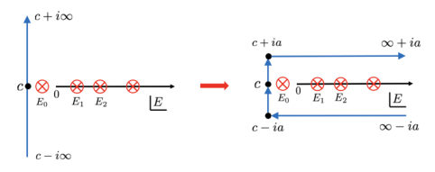
<figcaption class="paper-figure-caption"><b>Fig 1.</b> FIG. 1. The deformation of contour R c+i∞ c−i∞dE into R c−ia ∞−ia + R c c−ia + R c+ia c + R ∞+ia c+ia  dE.</figcaption>
</figure>
<figure class="paper-figure-card">
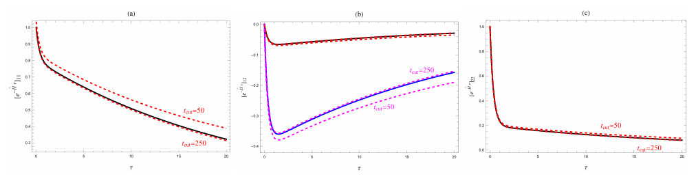
<figcaption class="paper-figure-caption"><b>Fig 2.</b> FIG. 2. Comparison of e−ˆ Hτ (black solid for real part and blue solid for imaginary part) vs the results via analytic continuation from e−i ˆ Ht (red dashed for real part and purple dashed for imaginary part) by Eq.(14) with a 2 × 2 Hamiltonian matrix given</figcaption>
</figure>
<figure class="paper-figure-card">
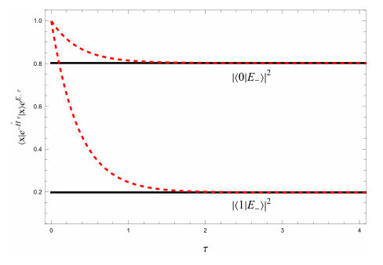
<figcaption class="paper-figure-caption"><b>Fig 3.</b> FIG. 3. Comparison betweens ⟨x|e−ˆ Hτ|x⟩eE−τ via analytic continuation of real-time matrix elements ⟨x|e−i ˆ Ht|x⟩(dashed red) vs. exact results of |⟨x|E−⟩|2 (black solid), where E−, |E−⟩are the ground state energy and eigenvector of ˆH.</figcaption>
</figure>
<figure class="paper-figure-card">
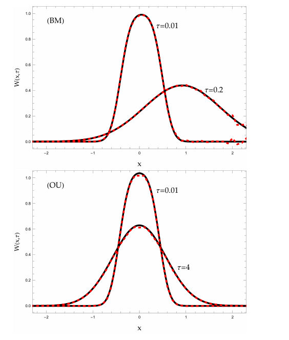
<figcaption class="paper-figure-caption"><b>Fig 4.</b> FIG. 4. Probability distributions W(x, τ) for Brownian mo- tion with a constant drift process (upper panel) and Ornstein- Uhlenbeck Process (lower panel). The exact solutions (solid black) given by Eq.(27) for Brownian motion with a constant drift process and by Eq.(28) for Ornstein-Uhlenbeck Process compared with results (red dashed) by analytical continuation of real-time evolution of e−i ˆ Ht|e Φ</figcaption>
</figure>
<figure class="paper-figure-card">
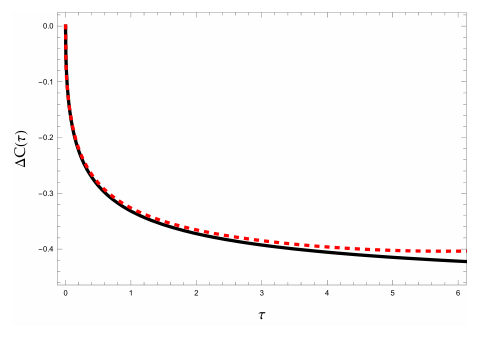
<figcaption class="paper-figure-caption"><b>Fig 5.</b> FIG. 5. ∆C(τ) = C(τ) −C0(τ) with exact solution (solid black) given by Eq.(35) vs. the results (red dashed) by analytical continuation of real-time evolution of ∆C(t) =</figcaption>
</figure>

**Summary.** This paper presents a novel algorithm to compute the imaginary-time evolution of a quantum system by analytically continuing measurable real-time correlation functions. The method is demonstrated on several 1D models, showing it provides accurate results by relating the time evolution operator to spectral properties. It is significant because it offers a pathway to ground state calculations using only real-time quantum simulation data.

**Why it may be interesting.** This work provides a powerful, theoretically grounded technique to access imaginary-time dynamics—crucial for finding ground states or thermal properties—using only real-time measurements, which is highly relevant for quantum simulation.

Detailed structure

**Main problem.** The paper develops an algorithm to calculate the imaginary-time evolution (ITE) of a quantum system by analytically continuing measurements taken in real time.

**Main result.** The method successfully relates ITE to real-time correlation functions, demonstrating excellent agreement with exact solutions for several 1D models.

**Method.** The core technique involves performing analytic continuation of contour integrals derived from the Green's function, which is applied to real-time correlation functions.

**Model / system.** The method is tested on generic quantum Hamiltonians, specifically applied to 1D systems including Brownian motion, the Ornstein-Uhlenbeck process, and 1D quantum mechanical scattering.

**Key observables.** ITE matrix elements $\langle\psi_1|e^{-\hat{H}	au}|\psi_0
angle$, transition probability distributions $P(x, 	au; x', 0)$, and integrated correlation functions.

**Important parameters / regimes.** Imaginary time $	au$, real-time cutoff $t_{	ext{cut}}$, and a lower bound $c$ on the ground state energy.

**Assumptions / limitations.** The method requires a known lower bound on the ground state energy and relies on approximating integrals by truncating the integration domain in the complex energy plane.

**Figures summary.** Figures compare the calculated $\mathrm{e}^{-\hat{H}	au}$ against exact solutions for various Hamiltonians, showing convergence as the real-time cutoff $t_{	ext{cut}}$ is increased.

**Paper structure.** The paper first establishes the theoretical framework using contour deformation in the complex energy plane, deriving the relationship between real-time and imaginary-time evolution. It then applies this method to several exactly solvable 1D models, comparing results against known solutions and discussing computational limitations.

Abstract

Though quantum computing naturally offers an advantage for simulations of real-time quantum systems, implementing Imaginary-Time Evolution (ITE) is comparatively more difficult. Nevertheless, quantum implementations of ITE are useful both in cases where classical implementations have associated sign problems, and also as an exact method of preparing eigenstates on quantum computers. In this work we present an algorithm to obtain ITE of a generic quantum Hamiltonian by performing analytic continuation of measured real-time correlation functions. We present simulations and demonstrations on IBM quantum hardware of 1D Fokker-Planck equations for classical diffusion process and imaginary-time evolution of integrated correlation functions in 1D quantum mechanical scattering as examples to demonstrate the effectiveness of the method.

[↑ back to top](#top)

### [Physics-Based versus Data-Driven Classification of Single-Photon Quantum Emitters from Sparse Autocorrelation Data](http://arxiv.org/abs/2608.19528v1)

**Authors:** Nhat Minh Nguyen, Md Shakhawath Hossain, Duc Anh Ngo, Chaohao Chen, Xiaoxue Xu, Toan Trong Tran, Carlo Bradac  
**Type:** both · **Category:** other · **PDF:** <https://arxiv.org/pdf/2608.19528v1>  
**Analysis basis:** full PDF text, analyzed in chunks
**Topic relevance:** `quantum optics experiment` **3/5** · `methods for driven-dissipative` **2/5** · `quantum measurements` **2/5** · `Full counting statistics` **1/5** · `Tavis-Cummings & cavity-many-emitter` **1/5**

↔ Scroll figures horizontally

<figure class="paper-figure-card">
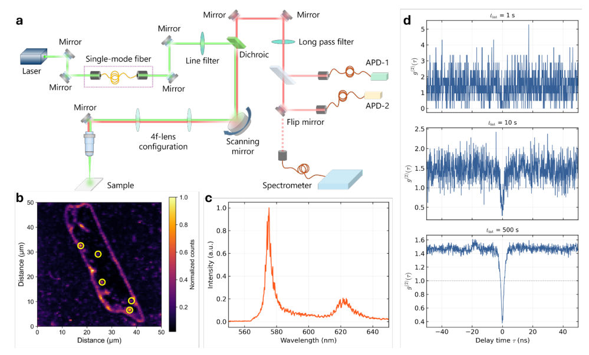
<figcaption class="paper-figure-caption"><b>Fig 1.</b> Figure 1. Experimental setup and measurements. a) Schematic of the experimental setup consisting of a confocal microscope, spectrometer, and Hanbury Brown–Twiss (HBT) interferometer. b) Confocal scan of the hBN flake showing bright emitters (circles). c) Photoluminescence (PL) spectrum of a representative emitter. d) Consecutive second-order autocorrelation measurements acquired with the experimental setup after integration times of 1, 10 and 500 s, illustrating the progressive accumulation of coincidence events.</figcaption>
</figure>
<figure class="paper-figure-card">
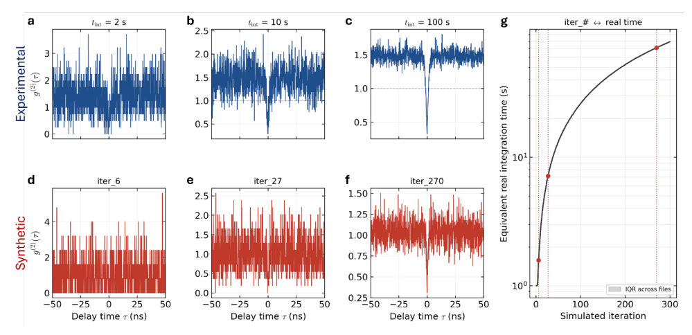
<figcaption class="paper-figure-caption"><b>Fig 2.</b> Figure 2. Correspondence between real experimental integration time and simulated iteration number. a–c) Experimental 𝑔(2)(𝜏) autocorrelation traces from a single-emitter (𝑁= 1) measurement, shown at three integration times (2, 10, and 100 s) spanning the sparse-to-converged range considered in this work. d–f) Synthetic 𝑔(2)(𝜏) traces from a single-emitter chosen with an injected background fraction closely matching the real calibrated value, shown at the three simulated iterations whose baseline count rate corresponds to the real integration times in (a–c), via the mapping in (g). g) Correspondence between simulated iteration number and equivalent real integration time, obtained by...</figcaption>
</figure>
<figure class="paper-figure-card">
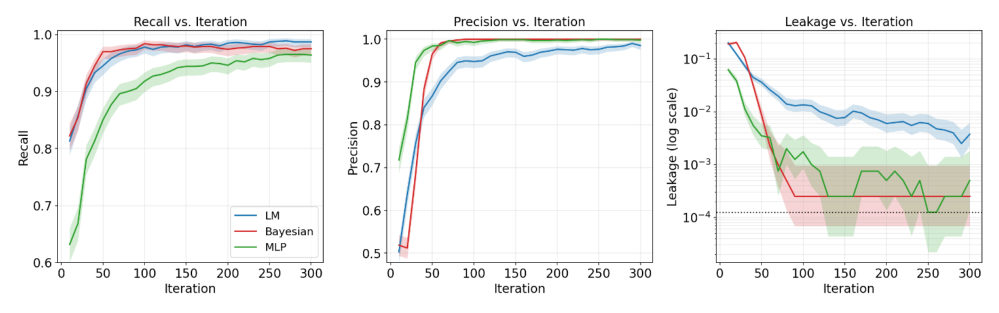
<figcaption class="paper-figure-caption"><b>Fig 3.</b> Figure 3. Recall, precision, and leakage as a function of integration time (iteration), for the Levenberg–Marquardt (LM), Bayesian, and MLP classifiers. Recall and precision axes are truncated to each panel&#x27;s observed data range, rather than the full [0,1] scale, since no method&#x27;s recall or precision falls below ~0.63 or ~0.50, respectively, at any integration time tested. Leakage is shown on a logarithmic scale as its convergence toward zero spans several orders of magnitude. Exact-zero leakage values are floored to half the smallest nonzero leakage value observed in the data, so they render at the bottom edge of the panel rather than being omitted; the black dotted line marks this floor....</figcaption>
</figure>

**Summary.** This paper compares physics-based (Bayesian, LM) and data-driven (NN) machine learning techniques for identifying single-photon emitters from noisy, sparse autocorrelation measurements. By testing these methods on simulated data mimicking real Hanbury Brown-Twiss measurements, the authors conclude that these approaches are complementary, not competitive. The findings offer a roadmap for combining strategies to robustly characterize quantum sources.

**Why it may be interesting.** This work provides crucial practical guidance on how to combine advanced statistical inference (Bayesian) with machine learning (NN) for characterizing fundamental quantum sources, which is vital for scaling quantum technologies.

Detailed structure

**Main problem.** The core problem is reliably classifying single-photon quantum emitters (SPEs) from large, inhomogeneous populations using sparse second-order autocorrelation data.

**Main result.** No single classification method dominates; physics-based and data-driven approaches are complementary, with the Bayesian method offering the fastest convergence while retaining physical interpretability.

**Method.** The study benchmarks three methods—Sequential Bayesian Inference, Levenberg-Marquardt fitting, and a Feedforward Neural Network—on synthetic data calibrated against real Hanbury Brown-Twiss measurements.

**Model / system.** The system involves characterizing SPEs (e.g., in hBN) by measuring the second-order autocorrelation function, g^(2)(τ), which is sensitive to the emitter number N.

**Key observables.** The second-order autocorrelation function, g^(2)(τ), and its value at zero delay, g^(2)(0).

**Important parameters / regimes.** Integration time (determining data sparsity), background-to-signal ratio, and the number of emitters N.

**Assumptions / limitations.** The analysis relies on generating synthetic data via Monte Carlo simulations calibrated to real experimental noise and background conditions.

**Figures summary.** Figure 1 illustrates the experimental setup (HBT interferometer) and shows PL spectra and g^(2)(τ) measurements at various integration times. Other figures compare the performance curves of the different classification algorithms.

**Paper structure.** The paper introduces the physical challenge, details the three comparative classification methods (Bayesian, LM, NN), validates them using synthetic data derived from real measurements, and concludes by comparing their performance trade-offs regarding speed, robustness, and interpretability.

Abstract

Identifying single photon emitters from large, inhomogeneous candidate populations is key to realizing many quantum applications. This requires measuring the emitters second order autocorrelation function, whose statistical reliability is fundamentally limited by acquisition time. Machine learning classifiers can accelerate identification from sparse data, but their performance relative to physics-based inference has not been systematically examined. Here, we introduce sequential Bayesian inference for single photon emitter classification and benchmark it against Levenberg-Marquardt fitting and a feedforward neural network. We use synthetic training and test data calibrated against real Hanbury Brown-Twiss measurements from hexagonal boron nitride emitters, enabling evaluation against an exactly known ground-truth emitter number under realistic noise and background conditions. All three approaches achieve high, near-perfect accuracy with sufficient integration time, but differ greatly in convergence rate and robustness under sparse photon statistics. The neural network is most robust at short integration times. The Bayesian classifier reaches near-perfect accuracy fastest, while retaining full physical interpretability. Levenberg-Marquardt fitting remains a valuable, fully interpretable method, achieving the highest recall despite being the slowest to converge. These results lead to several key conclusions. No single method dominates across all performance metrics. Relying on any one metric alone can give a misleading picture of classifier performance, particularly under sparse photon statistics. Physics-based and data-driven methods are complementary rather than competing approaches. Together, these findings provide practical guidance for selecting and combining classification strategies for scalable single-photon-source screening and other quantum-emitter characterization tasks.

[↑ back to top](#top)

### [Physics-guided machine learning for sim-to-real calibration of NV diamond magnetometers](http://arxiv.org/abs/2608.19582v1)

**Authors:** Jonathan Daniel, Martin Y. Kim, Jesse Hernandez, Emanuel Suarez, Sangwoo Lee, Jinhee Lee, Je-Hyung Kim  
**Type:** both · **Category:** disordered systems and neural networks · **PDF:** <https://arxiv.org/pdf/2608.19582v1>  
**Analysis basis:** full PDF text, analyzed in chunks
**Topic relevance:** `QC/QI experiment` **3/5** · `methods for driven-dissipative` **2/5** · `quantum measurements` **2/5** · `analog quantum simulation` **1/5** · `quantum optics experiment` **1/5**

↔ Scroll figures horizontally

<figure class="paper-figure-card">
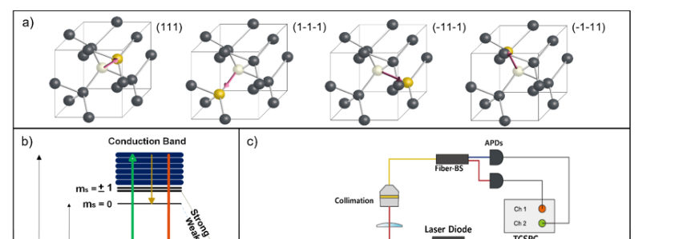
<figcaption class="paper-figure-caption"><b>Fig 1.</b> Figure 1: NV Center four-axis crystallography, energy diagram and ODMR experimental setup. (a) Atomic structure of the NV center in the diamond lattice, showing four crystallographic NV orientations. (b) Energy diagram of NV- center (c) ODMR Experimental setup.</figcaption>
</figure>
<figure class="paper-figure-card">
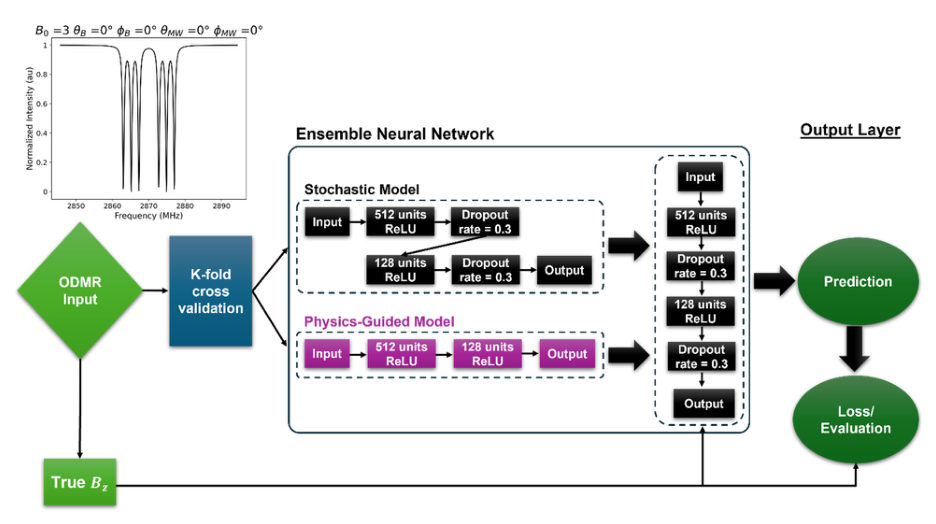
<figcaption class="paper-figure-caption"><b>Fig 2.</b> Figure 2: Structural Architecture and workflow. The pipeline takes a simulated cw ODMR spectrum as an input array and processes it alongside the true longitudinal magnetic field (Bz). The dataset undergoes a K-fold cross- validation branching into stochastic and physics-guided model. The outputs of the two models are fed into another layer of stochastic model forming an ensemble neural network, yielding the final outputs.</figcaption>
</figure>
<figure class="paper-figure-card">
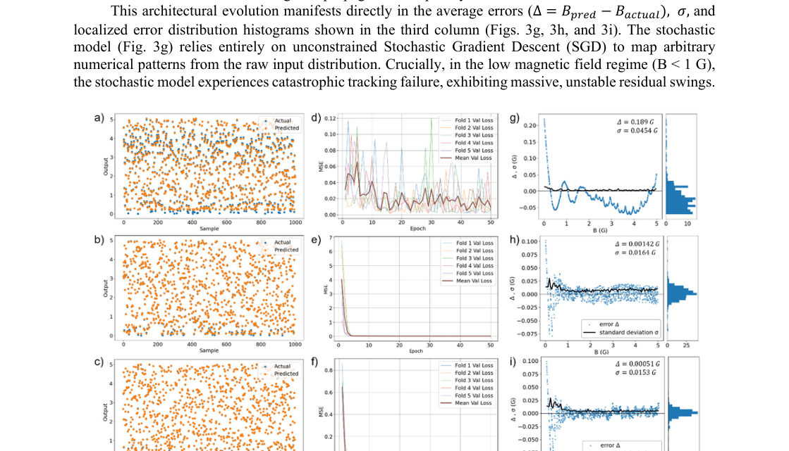
<figcaption class="paper-figure-caption"><b>Fig 3.</b> FIGURE 3: Quantitative comparison of performance and average error distributions across the three evaluated network architectures: stochastic (top row), physics-guided (middle row), and ensemble model (bottom row). (a) - (c) Actual-versus-predicted output scatter plots mapped over 1,000 independent evaluation samples. (d) - (f) Mean squared error (MSE) optimization profiles tracking validation loss across a 5-fold cross-validation split over 50 training epochs. (g), (h), (i) Average error and standard deviations 𝜎 plotted as a function of the magnetic field, paired with localized error frequency histograms.</figcaption>
</figure>
<figure class="paper-figure-card">
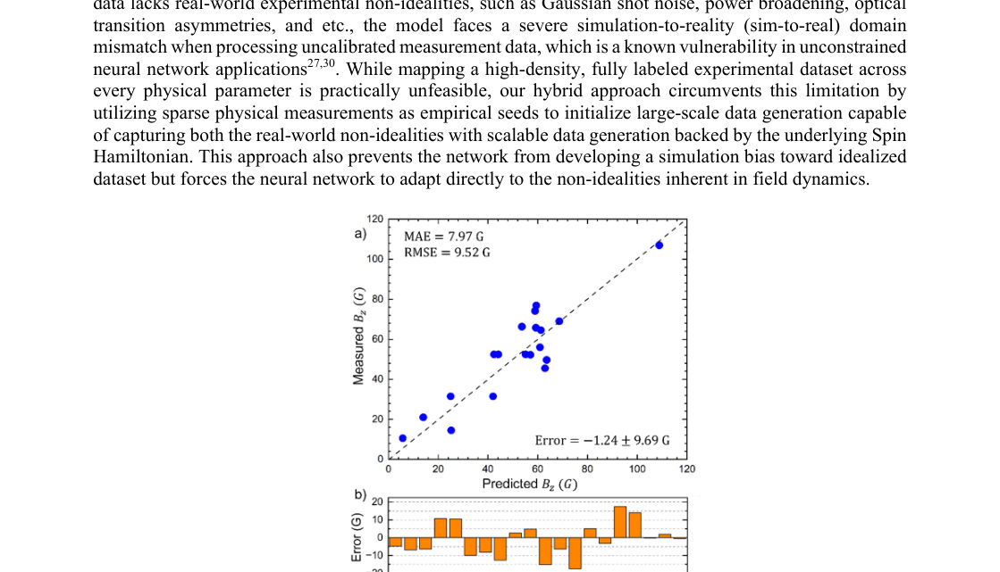
<figcaption class="paper-figure-caption"><b>Fig 4.</b> Figure 4: Experimental validation of the hybrid model evaluated across 20 raw experimental ODMR spectra. (a) Parity plot comparing predicted vs. measured longitudinal magnetic field (𝐵௭ሻ. The dashed line indicates an ideal agreement (b) Individual residual prediction errors plotted by sample number.</figcaption>
</figure>

**Summary.** The paper presents a novel physics-guided hybrid machine learning framework to solve the calibration challenge in NV diamond magnetometers. By embedding known physical laws, the model overcomes the limitations of purely data-driven approaches, achieving dramatic improvements in magnetic field measurement precision. This methodology establishes a general paradigm for building self-calibrating AI tools for other data-scarce physical systems.

**Why it may be interesting.** This work provides a concrete methodology for integrating fundamental physical constraints (like Hamiltonian terms) into data-driven models, which is highly relevant for developing robust quantum sensing and characterization tools.

Detailed structure

**Main problem.** Deploying NV diamond magnetometers in unshielded environments requires self-calibration, which is bottlenecked by data scarcity and the simulation-to-reality mismatch.

**Main result.** The physics-guided hybrid ML framework achieved a 372-fold precision improvement over purely statistical baselines, enabling exceptional predictive accuracy on raw experimental data.

**Method.** The authors developed a hybrid machine learning framework that embeds the deterministic Zeeman splitting relationship directly into the neural network architecture, combining sparse physical measurements with scalable synthetic data generation.

**Model / system.** The system utilizes ensemble Nitrogen-Vacancy (NV) centers in diamond for vector magnetometry, governed by a spin Hamiltonian. Measurements are performed via Optically Detected Magnetic Resonance (ODMR) spectroscopy.

**Key observables.** ODMR spectrum (fluorescence intensity dip), scalar magnetic field vector (B).

**Important parameters / regimes.** Sub-nT sensitivity; Zeeman splitting ($\Delta
u \propto B_{\parallel}$); $\gamma_e = 28 	ext{ GHz/T}$.

**Assumptions / limitations.** The method assumes that physical laws (like the Zeeman splitting) can be deterministically embedded as constraints into the ML training pipeline to overcome data limitations.

**Figures summary.** Figures illustrate the NV center setup, the hybrid pipeline architecture, and performance comparisons showing the massive error reduction achieved by the physics-guided model over purely stochastic baselines, including validation on raw experimental spectra.

**Paper structure.** The paper introduces the physical problem (NV magnetometry calibration), details the limitations of conventional ML, proposes the physics-guided hybrid ML framework, validates it first on synthetic data, and finally demonstrates its success on raw, uncalibrated experimental data.

Abstract

Ensemble nitrogen-vacancy (NV) centers in diamond enable robust vector magnetometry in unshielded environments, yet deployment remains bottlenecked by complex calibration and a reliance on external data references. Conventional statistical machine learning requires an exorbitantly large volume of training data and suffers from severe simulation-to-reality mismatches. To address this, we introduce a physics-guided hybrid machine learning framework that embeds the Zeeman splitting directly into the learning pipeline. Our physics-guided model significantly reduces the average tracking error demonstrating a 372-fold precision improvement over purely statistical baselines. Furthermore, our hybrid architecture pairs a sparse physical measurement with scalable synthetic data generation, seamlessly incorporating real-world hardware non-idealities. When deployed to decode uncalibrated, raw experimental ODMR data, our framework delivers exceptional predictive accuracy for the scalar magnetic field. This work paves the way toward self-calibrated sensors while establishing a machine learning training method applicable to other data-scarce physical systems

[↑ back to top](#top)

### [State convertibility and fluctuation theorems from a dynamical reference: majorization meets martingales](http://arxiv.org/abs/2608.19391v1)

**Authors:** Davide Cugini, Giacomo Guarnieri  
**Type:** theory · **Category:** statistical mechanics · **PDF:** <https://arxiv.org/pdf/2608.19391v1>  
**Analysis basis:** full PDF text, analyzed in chunks
**Topic relevance:** `non-equilibrium universality` **3/5** · `Keldysh / 2PI / non-Gaussian methods` **1/5** · `analog quantum simulation` **1/5** · `correlated / nonlocal dissipation` **1/5** · `driven-dissipative phase transition` **1/5** · `methods for driven-dissipative` **1/5** · `quantum measurements` **1/5**

↔ Scroll figures horizontally

<figure class="paper-figure-card">
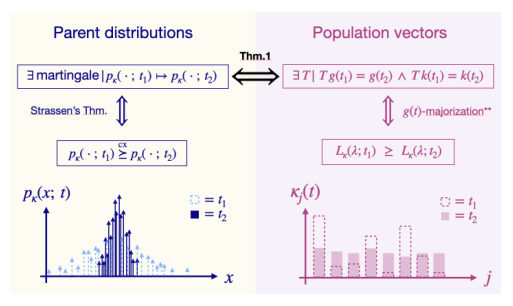
<figcaption class="paper-figure-caption"><b>Fig 1.</b> FIG. 1. Schematic of the framework equivalence demon- strated in this paper. A population vector k(t), compared against a reference g(t), is mapped to the parent distribution pκ(·; t) of its relative populations κj(t) = kj(t)/gj(t). State convertibility (1) and the g(t)-majorization criterion (∗∗see End Matter (16)) on the right side (purple background) are shown to be fully equivalent to each other and to the exis- tence of a martingale coupling between the respective parent distributions (Theorem 1) and finally, by virtue of Strassen’s Theorem, to convex order relation (6) (left hand side).</figcaption>
</figure>
<figure class="paper-figure-card">
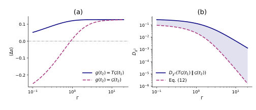
<figcaption class="paper-figure-caption"><b>Fig 2.</b> FIG. 2. Driven two-level system, with linearly decreasing en- ergy gap ϵ(t) = ϵ0 +(ϵ1 −ϵ0)t, ϵ0 = 2, ϵ1 = 1/2. Furthermore, we choose the temperature β = 1 and the initial distribu- tion k(t1) = (1, 0), i.e. the ground state; finally, without loss of generality (one could always rescale the rate Γ to en- sure this condition), we simply set the initial time t1 = 0 and the final time t2 = 1. a) Mean reference-relative en- tropy production ⟨∆s⟩versus relaxation rate Γ (adiabatic- ity increasing to the right), for the true propagated reference g(t2) = TG(t1) (solid) and for the instantaneous Gibbs ref- erence G(t2) (dashed). The former obeys the second law ex- actly; the latter shows an...</figcaption>
</figure>

**Summary.** This paper develops a generalized mathematical framework to analyze state convertibility and fluctuation theorems relative to any arbitrary reference state. It establishes that resource constraints are equivalent to a martingale condition on relative populations, and crucially, it shows that measuring the violation of the associated fluctuation theorem provides a quantitative, model-independent lower bound on how much the assumed reference dynamics deviates from the true dynamics.

**Why it may be interesting.** This work provides a powerful, general mathematical framework for non-equilibrium thermodynamics, connecting fundamental concepts like resource constraints (convertibility) directly to measurable statistical quantities (fluctuation theorems) in a model-independent way.

Detailed structure

**Main problem.** The paper unifies and extends the concepts of state convertibility and fluctuation theorems to arbitrary, time-dependent reference distributions, moving beyond fixed equilibrium states.

**Main result.** State convertibility is shown to be equivalent to a one-dimensional convex-order condition, which is further linked to the existence of a martingale coupling. Moreover, the violation of the derived fluctuation theorem provides a model-independent lower bound on the mismatch between the true and assumed reference dynamics.

**Method.** The authors employ mathematical tools from martingale theory and convex order theory to translate classical concepts like majorization into a tractable, one-dimensional comparison of relative population distributions.

**Model / system.** The framework is applied to general stochastic processes involving population vectors $k(t)$ over microstates, and specifically illustrated using a driven two-level system interacting with a thermal bath.

**Key observables.** Relative population vector $\kappa_j(t) = k_j(t)/g_j(t)$, reference-relative entropy production $\Delta s$, and the $\chi^2$-divergence between reference states.

**Important parameters / regimes.** Time-dependent reference distribution $g(t)$, inverse temperature $eta$, and the energy gap $\epsilon(t)$ (in the specific example).

**Assumptions / limitations.** The initial classical criteria are tied to fixed, equilibrium references, which the new framework generalizes. The diagnostic relies on observing the fluctuation theorem violation.

**Figures summary.** Figure 1 schematically summarizes the equivalence chain: Population vector $
ightarrow$ Parent distribution $
ightarrow$ Martingale coupling $
ightarrow$ Convex order relation. Figure 2 illustrates the two-level system, comparing $\langle\Delta s
angle$ and showing the measured fluctuation violation bounds the $\chi^2$ divergence.

**Paper structure.** The paper builds by first unifying majorization/thermo-majorization via $g(t)$-majorization, then establishing the equivalence to a martingale condition (Theorem 1), and finally deriving a generalized fluctuation theorem (Theorem 2) whose violation yields a model-independent diagnostic for reference error (Theorem 3).

Abstract

State convertibility represents a fundamental concept used to determine whether a transformation is possible given a specific set of resources. Within the field of Thermodynamics, where physical process are required to preserve a reference state typically in microcanonical or canonical form, this translates into the notions of majorization and thermo-majorization ---criteria that require constructing and comparing state-dependent Lorenz curves. In this work, we firstly unify and extend these notions to an arbitrary and possibly time-dependent reference distribution $g(t)$, introducing the concept of $g(t)$-majorization; we then introduce a dual picture whereby state convertibility is turned into a one-dimensional convex-order problem, which allows us to demonstrate that a transition is admissible if and only if the associated real-valued distributions of relative populations $ k_j(t)/g_j(t)$ are connected by a martingale. Building on it, we then derive an exact fluctuation theorem for a reference-relative entropy production whose average violation certifies, through a $χ^{2}$-divergence bound, the mismatch between an assumed and the true reference evolution---a model-independent diagnostic that requires no independent characterization of the latter and turns an observed breakdown of the fluctuation relation into a certified lower bound on the reference error.

[↑ back to top](#top)

### [Vacuum viscosity and relativistic inertia: Motion of a massive object with charged internal degrees of freedom interacting with a classical field](http://arxiv.org/abs/2608.20140v1)

**Authors:** Jen-Tsung Hsiang, Bei-Lok Hu  
**Type:** theory · **Category:** other · **PDF:** <https://arxiv.org/pdf/2608.20140v1>  
**Analysis basis:** full PDF text, analyzed in chunks
**Topic relevance:** `Keldysh / 2PI / non-Gaussian methods` **3/5** · `correlated / nonlocal dissipation` **2/5** · `methods for driven-dissipative` **2/5** · `quantum measurements` **2/5**

↔ Scroll figures horizontally

<figure class="paper-figure-card">
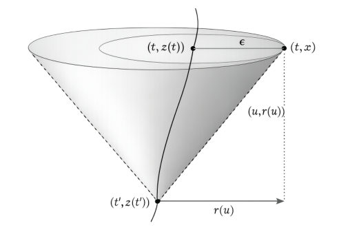
<figcaption class="paper-figure-caption"><b>Fig 1.</b> FIG. 1. Spacetime diagram illustrating the future lightcone of z(t′) intersecting a regularizing sphere of</figcaption>
</figure>

**Summary.** This theoretical paper examines the vacuum viscosity experienced by a charged object moving through a classical field. It finds a conflict between nonrelativistic and relativistic treatments, concluding that the nonrelativistic approach is flawed. The resolution enriches classical mechanics by enforcing special relativity constraints on the object's dynamics.

**Why it may be interesting.** It provides a deep theoretical insight into the necessity of maintaining relativistic covariance when modeling dissipative or inertial effects in quantum-field-matter interactions, which is crucial for advanced open quantum systems modeling.

Detailed structure

**Main problem.** The paper investigates whether a massive object with charged internal degrees of freedom experiences a viscous force (vacuum viscosity) when interacting with a classical field.

**Main result.** A nonrelativistic calculation suggests the existence of a viscous force, but a fully relativistic covariant calculation proves this force does not exist, leading to enriched forms of Newton's laws.

**Method.** The authors employ both nonrelativistic and fully relativistic covariant calculations, utilizing a microphysics model for optomechanics and advanced regularization techniques (Pauli-Villars) for self-force calculations.

**Model / system.** The system consists of a massive object (M) with charged internal degrees of freedom ($\chi$) interacting with a free, unbounded classical scalar field ($\phi$). The dynamics are governed by a tripartite interaction Hamiltonian.

**Key observables.** Viscous force, equations of motion for $z(t)$ and $\chi(t)$, and the self-field gradient $\partial_\mu \phi_{	ext{reg}}$.

**Important parameters / regimes.** Zero temperature, the charge $\lambda$, and the mass $M$ of the object.

**Assumptions / limitations.** The study assumes a classical field ($\phi$) and zero temperature, contrasting with full quantum vacuum fluctuations.

**Paper structure.** The paper progresses by first establishing the motivation from cosmological and quantum friction analogs, then performing a nonrelativistic calculation that yields a result, followed by a rigorous relativistic covariant calculation that resolves the conflict by identifying the failure of the nonrelativistic approximation.

Abstract

Our present investigation into a rather rudimentary problem is motivated by two classes of problems studied since the 70's, cosmological particle creation and its more accessible analog, the dynamical Casimir effect on the one hand, and quantum friction a neutral atom moving along a dielectric surface would experience, on the other. The backreaction effects of produced particles being able to isotropize the expansion of the universe, or to slow down the moving mirror can be understood via the concept of vacuum viscosity arising from fluctuations of the quantum field. We want to track down the origin of this effect by asking the question whether a moving massive $M$ object with a charged internal degrees of freedom $χ$ interacting with a free unbounded classical field $φ$ at zero temperature would experience a viscous force, similar to the said precedents. Adopting a microphysics model for optomechanics which can treat the unequal tripartite $χ$-$φ$-$M$ interactions, we first perform a nonrelativistic calculation, which seems perfectly legitimate considering the needs of atomic physics, and found the answer to be yes, but a relativistic covariant calculation says no. We identify where the nonrelativistic framework is defective. The resolution of this latent yet real conflict is technically nontrivial but physically quite inspirational. It results in added enriched contents to Newton's first and second laws when the principles of special relativity are enforced, and rules to follow to get the correct nonrelativistic answer

[↑ back to top](#top)

### [SAKE: Spectral Autodiff Kernel Expansion for Geometric Liouvillian Transport. A Differential-Geometric Framework for Response Transport in Quantum Dynamical Systems](http://arxiv.org/abs/2608.20132v1)

**Authors:** Eric R. Bittner, Carlos Silva-Acuna, Hao Li, Simon Paiva-Ortega  
**Type:** theory · **Category:** other · **PDF:** <https://arxiv.org/pdf/2608.20132v1>  
**Analysis basis:** full PDF text, analyzed in chunks
**Topic relevance:** `methods for driven-dissipative` **3/5** · `Keldysh / 2PI / non-Gaussian methods` **1/5** · `analog quantum simulation` **1/5** · `correlated / nonlocal dissipation` **1/5** · `driven-dissipative phase transition` **1/5** · `quantum measurements` **1/5**

↔ Scroll figures horizontally

<figure class="paper-figure-card">
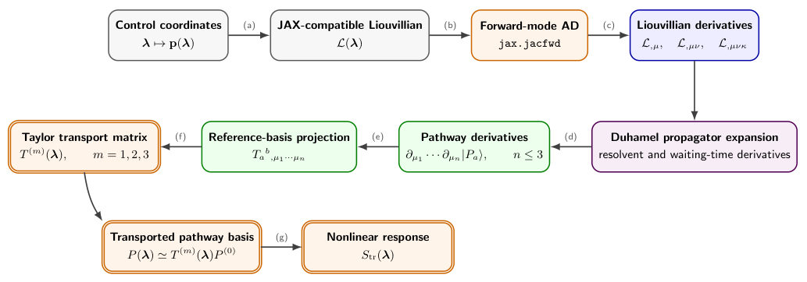
<figcaption class="paper-figure-caption"><b>Fig 1.</b> FIG. 1. Implemented SAKE-DT workflow for local Liouvillian transport. Dimensionless control coordinates are first mapped to the physical model parameters, from which the JAX-compatible Liouvillian L(λ) is constructed. The labeled transitions indicate the successive computational operations: (a) mapping the dimensionless control coordinates to the physical model parameters; (b) forward-mode automatic differentiation of the parameter-dependent Liouvillian; (c) construction of the first-, second-, and third-order Liouvillian derivative tensors; (d) Duhamel assembly of the resolvent and waiting-time propagator derivatives; (e) projection of the resulting pathway derivatives onto the reference...</figcaption>
</figure>
<figure class="paper-figure-card">
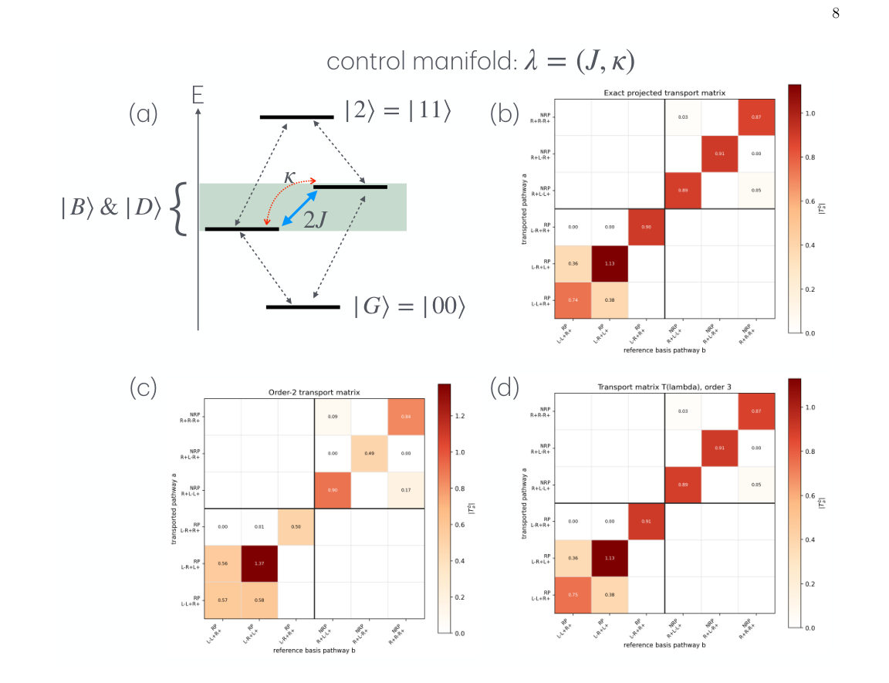
<figcaption class="paper-figure-caption"><b>Fig 2.</b> FIG. 2. Validation of the Spectral Autodiff Kernel Expansion (SAKE) for the su(2) × su(2) excitonic dimer. (a) Energy-level diagram of the model system. The control manifold is parameterized by the coherent excitonic coupling J, which mixes the site-basis states |10⟩and |01⟩, and the incoherent population-transfer rate κ, which couples the same states through the dissipative Liouvillian. The ground and double-excited states are denoted |G⟩= |00⟩and |2⟩= |11⟩, while the intermediate exciton states |B⟩and |D⟩are the bright and dark superpositions of |10⟩and |01⟩, respectively. (b)Targeted projected pathway transport matrix Ta b obtained by directly evaluating the response at a representative...</figcaption>
</figure>
<figure class="paper-figure-card">
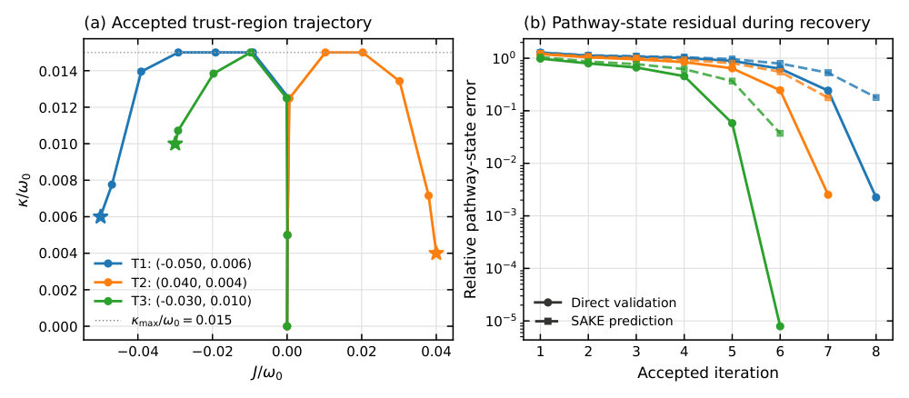
<figcaption class="paper-figure-caption"><b>Fig 3.</b> FIG. 3. Iterative inverse recovery with local SAKE charts. (a) Accepted trust-region trajectories in the dimensionless control plane (J/ω0, κ/ω0). Stars mark the synthetic targets and the dotted line denotes the imposed dissipative-coupling bound. (b) Relative pathway-state residual versus accepted iteration. Solid lines are direct-inversion validations and dashed lines are the corresponding third-order SAKE predictions. All calculations begin at the uncoupled reference.</figcaption>
</figure>
<figure class="paper-figure-card">
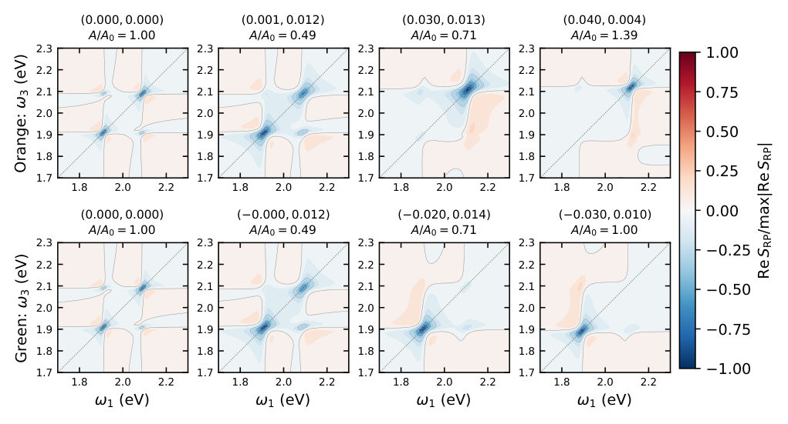
<figcaption class="paper-figure-caption"><b>Fig 4.</b> FIG. 4. Evolution of the rephasing spectrum during iterative recovery. Direct rephasing spectra on a 64 × 64 frequency grid at four accepted chart centers along the positive-J (orange, upper row) and mixed (green, lower row) trajectories. Coordinates above each panel are (J/ω0, κ/ω0); A/A0 gives the maximum absolute real amplitude relative to the uncoupled spectrum. The plotted signal in each panel is divided by its own maximum to expose changes in line shape.</figcaption>
</figure>
<figure class="paper-figure-card">
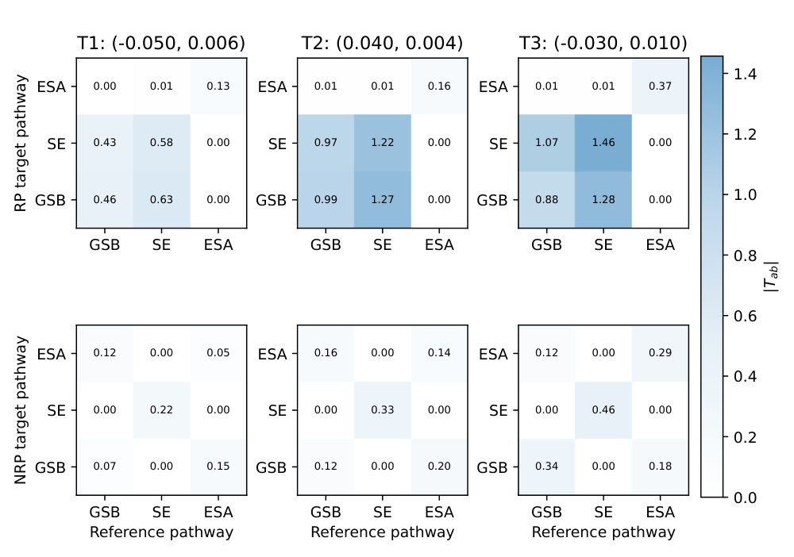
<figcaption class="paper-figure-caption"><b>Fig 5.</b> FIG. 5. Initial-to-target mixing of retained RP and NRP pathways. The 3 × 3 RP (upper row) and NRP (lower row) blocks of the global transport matrix for the three synthetic targets. Color and the numerical annotation in each cell give the magnitude |Tab|. Rows identify the target pathway and columns the zeroth-order reference pathway; GSB, SE, and ESA denote ground-state bleach, stimulated emission, and excited-state absorption, respectively. A common color scale is used for both sectors and all targets.</figcaption>
</figure>

**Summary.** This paper introduces SAKE, a novel, differentiable computational framework that uses automatic differentiation and Duhamel theory to efficiently calculate how nonlinear spectroscopic responses change across neighboring quantum models. By constructing a pathway transport operator, the method reveals underlying mechanistic information about amplitude redistribution in quantum dynamics. This greatly enhances the feasibility of local parameter exploration and inverse design in quantum optics.

**Why it may be interesting.** This work provides a powerful, automated tool for analyzing open quantum systems dynamics, allowing researchers to perform local parameter exploration and sensitivity analysis on complex spectroscopic measurements without prohibitive computational costs.

Detailed structure

**Main problem.** The paper addresses the need for an efficient, differentiable method to calculate and transport nonlinear spectroscopic response between neighboring quantum dynamical models.

**Main result.** The Spectral Autodiff Kernel Expansion (SAKE) framework successfully constructs a pathway transport operator that accurately maps nonlinear response from a reference model to neighboring systems, revealing mechanistic details hidden in the spectrum.

**Method.** It combines forward-mode automatic differentiation with Duhamel transport theory to generate and assemble high-order derivatives of the Liouvillian superoperator, avoiding independent recomputation for each parameter point.

**Model / system.** The framework is applied to quantum dynamical systems, specifically validated using a four-level excitonic dimer exhibiting su(2) x su(2) symmetry, governed by a Liouvillian superoperator.

**Key observables.** Nonlinear spectroscopic response (rephasing spectrum) and the pathway transport operator, which quantifies amplitude redistribution among Feynman pathways.

**Important parameters / regimes.** The order of the Taylor expansion (up to third order) and the control coordinates defining the path in parameter space.

**Assumptions / limitations.** The model parameters map smoothly to the Liouvillian, and the entire process can be represented as a differentiable computational graph.

**Figures summary.** Figures illustrate the SAKE-DT workflow, showing the sequence from Liouvillian construction to the final observable response via AD and Duhamel assembly, and show reconstructed spectra and transport blocks.

**Paper structure.** The paper introduces SAKE, details the combination of AD and Duhamel theory to build the transport operator, validates the method on an excitonic dimer, and discusses the physical interpretation of the resulting transport coefficients.

Abstract

We introduce the Spectral Autodiff Kernel Expansion (SAKE), a differentiable computational framework for transporting nonlinear spectroscopic response between neighboring quantum dynamical models. Rather than recomputing multidimensional spectra independently for each Hamiltonian or Liouvillian, SAKE constructs local transport expansions about a reference model by combining forward-mode automatic differentiation with Duhamel transport theory. Automatic differentiation generates first-, second-, and third-order derivatives of the parameter-dependent Liouvillian, which are assembled into a pathway transport operator that maps the nonlinear response of a reference model onto neighboring systems. The framework is validated for a four-level excitonic dimer possessing an $su(2)\times su(2)$ symmetry by comparing second- and third-order transported pathway operators with exact projected transport matrices obtained from direct calculations. The third-order expansion accurately reproduces the projected transport operator and its associated pathway mixing. Beyond providing an efficient computational strategy, the transport operator reveals how coherent and dissipative perturbations redistribute amplitude among double-sided Feynman pathways, exposing mechanistic information that is not directly apparent from the nonlinear spectrum. SAKE thereby establishes a differentiable computational framework for nonlinear spectroscopy that supports efficient local parameter exploration, sensitivity analysis, and future inverse-design applications.

[↑ back to top](#top)

### [Statistical Mechanics of Non-Abelian Learnability Transitions](http://arxiv.org/abs/2608.19325v1)

**Authors:** Ruochen Ma, Romain Vasseur  
**Type:** theory · **Category:** statistical mechanics · **PDF:** <https://arxiv.org/pdf/2608.19325v1>  
**Analysis basis:** full PDF text, analyzed in chunks
**Topic relevance:** `quantum measurements` **3/5** · `Keldysh / 2PI / non-Gaussian methods` **1/5** · `analog quantum simulation` **1/5** · `driven-dissipative phase transition` **1/5** · `methods for driven-dissipative` **1/5** · `non-equilibrium universality` **1/5**

↔ Scroll figures horizontally

<figure class="paper-figure-card">
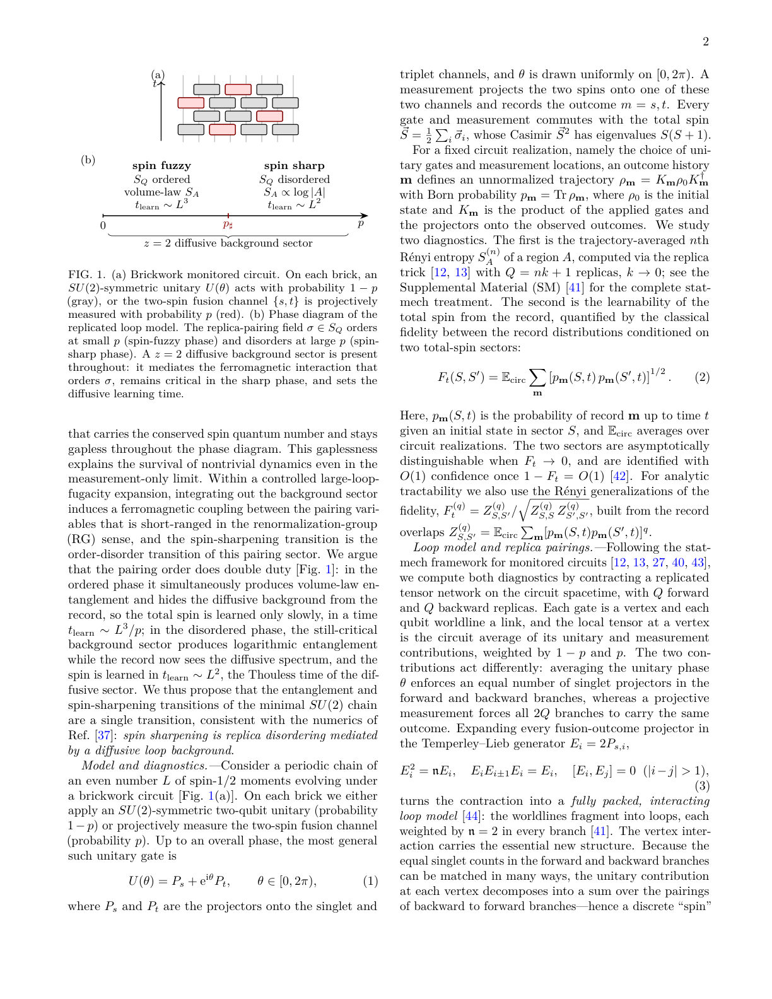
<figcaption class="paper-figure-caption"><b>Fig 1.</b> Low-resolution page preview, page 2</figcaption>
</figure>
<figure class="paper-figure-card">
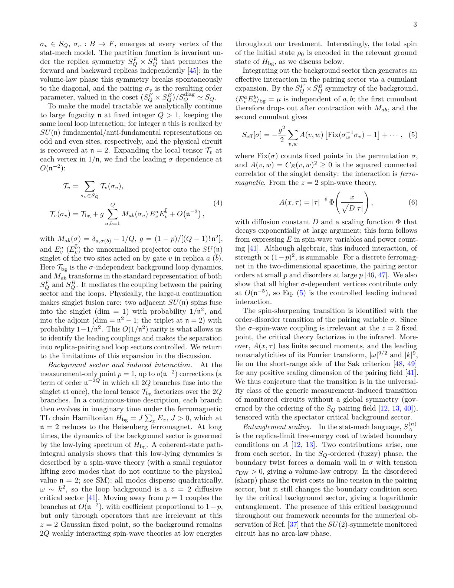
<figcaption class="paper-figure-caption"><b>Fig 2.</b> Low-resolution page preview, page 3</figcaption>
</figure>
<figure class="paper-figure-card">
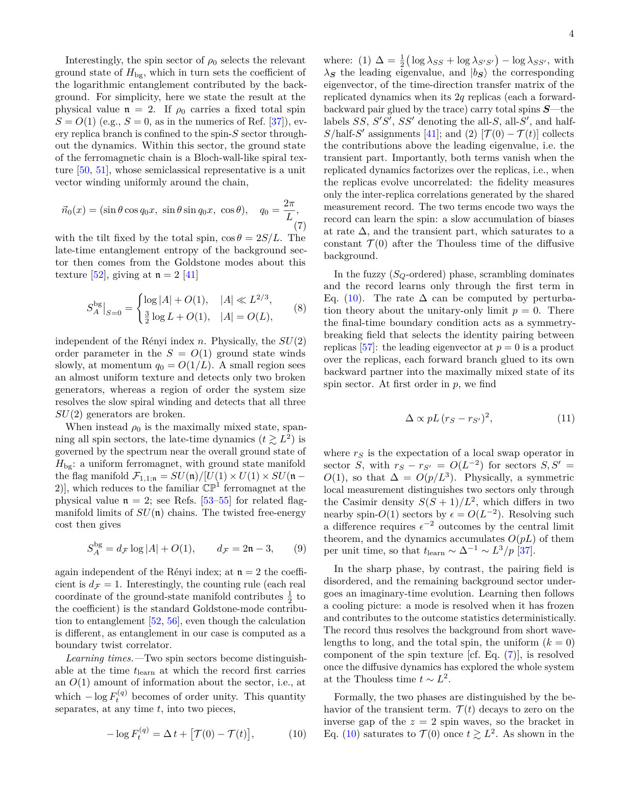
<figcaption class="paper-figure-caption"><b>Fig 3.</b> Low-resolution page preview, page 4</figcaption>
</figure>
<figure class="paper-figure-card">
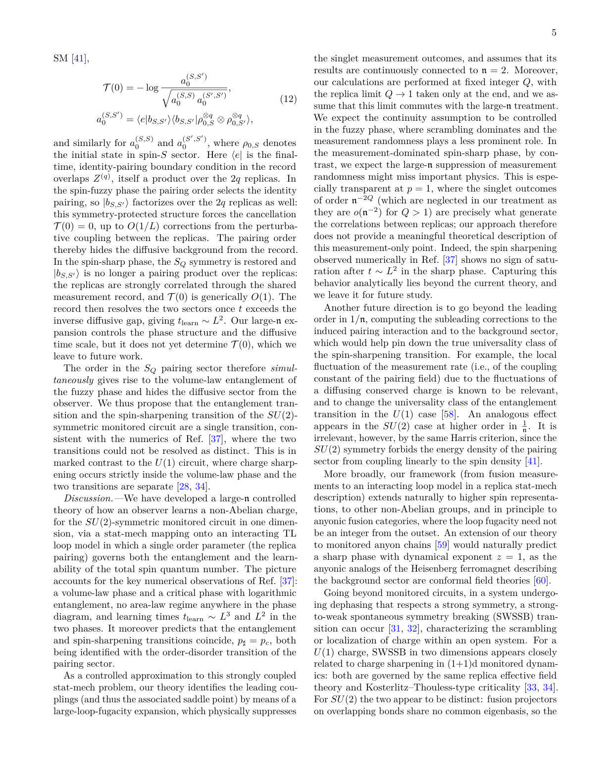
<figcaption class="paper-figure-caption"><b>Fig 4.</b> Low-resolution page preview, page 5</figcaption>
</figure>
<figure class="paper-figure-card">
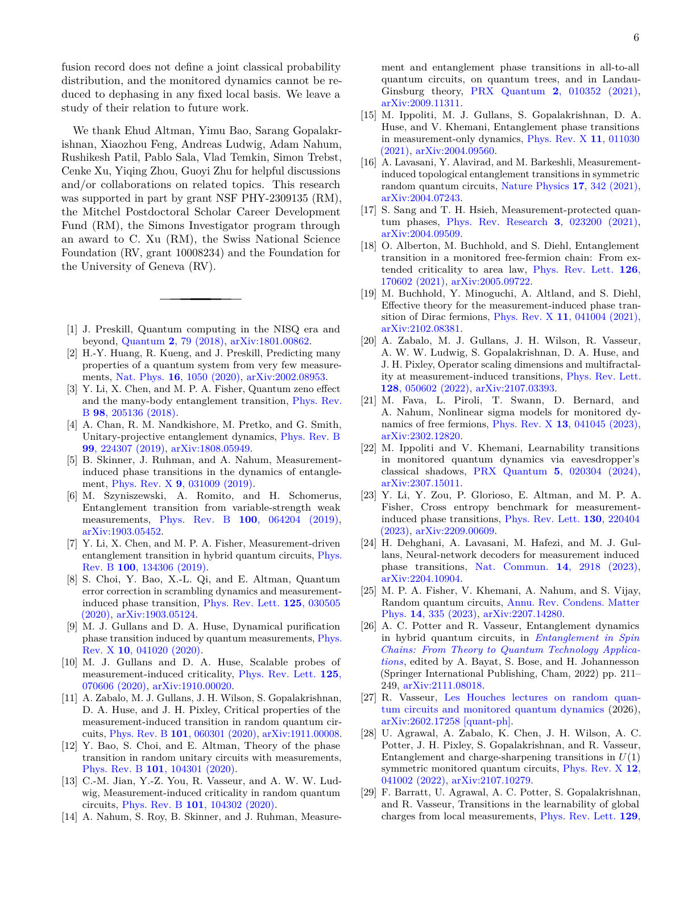
<figcaption class="paper-figure-caption"><b>Fig 5.</b> Low-resolution page preview, page 6</figcaption>
</figure>

**Summary.** This work develops a statistical mechanics theory for monitoring quantum systems with non-Abelian symmetries, treating information acquisition as a quantum inference problem. By mapping the dynamics to a loop model, the authors predict that the system exhibits distinct learning time behaviors—$L^3$ versus $L^2$—depending on the phase transition of the underlying pairing field. This provides a powerful framework for understanding how measurement constraints govern quantum dynamics.

**Why it may be interesting.** It connects concepts from quantum information theory (learnability) directly to critical phenomena and phase transitions in condensed matter systems, providing quantitative predictions for time scales based on symmetry breaking.

Detailed structure

**Main problem.** The paper investigates how much information an observer can learn about a many-body quantum system whose dynamics conserves a non-Abelian charge, framing it as a quantum inference problem.

**Main result.** The theory predicts that the 'spin-sharpening' and entanglement transitions coincide, yielding distinct learning time scalings ($t \sim L^3$ vs $t \sim L^2$) depending on whether the pairing field is ordered or disordered.

**Method.** The analysis employs the replica trick and a large-loop-fugacity expansion to map the monitored quantum dynamics onto an effective replicated loop model.

**Model / system.** The system is a 1+1 dimensional monitored quantum system with SU(2) symmetry, modeled by a circuit evolving via unitary gates and projective measurements. The dynamics are analyzed via an effective replicated loop model with two coupled sectors.

**Key observables.** Entanglement entropy ($S^{(n)}_A$), classical fidelity ($F_t$), and the learning time ($t_{	ext{learn}}$).

**Important parameters / regimes.** System size ($L$), measurement probability ($p$), and the replica structure ($n$).

**Assumptions / limitations.** The analysis relies on the replica trick and the large-loop-fugacity expansion, treating the background sector as a diffusive ($z=2$) critical sector.

**Figures summary.** Figure 1 illustrates the brickwork circuit setup and the phase diagram of the replicated loop model, showing the ordering of the pairing field $\sigma$ at small $p$ (spin-fuzzy) and large $p$ (spin-sharp).

**Paper structure.** The paper develops the theory by mapping the dynamics to a loop model, analyzing the effective interactions in the pairing sector, and deriving the scaling laws for entanglement and learning time in the distinct ordered and disordered phases.

Abstract

Monitored many-body quantum systems can undergo sharp learnability transitions characterized by how much information can be learned by the observer. When the dynamics conserves a non-Abelian charge, such as an $SU(2)$ spin, understanding how the observer learns the total charge remains an outstanding problem. Unlike the Abelian case, where charge measurements on distinct sites commute, the $SU(2)$-symmetric readouts are noncommuting fusion measurements, making learning a genuinely quantum inference problem. In this work, we propose a theory of $1+1d$ monitored quantum dynamics with $SU(2)$ symmetry, and show that it can be described by an effective replicated loop model comprised of a replica-pairing field and a diffusive ($z=2$) background sector that carries the $SU(2)$ charge and remains gapless throughout the phase diagram. Our theory predicts that the "spin-sharpening'' and entanglement transitions coincide as a single transition. Ordering of the pairing field produces volume-law entanglement and hides the background sector from measurements, leading to a learning time of $t\sim L^{3}$ for the total spin. When the pairing field disorders, the background sector alone gives logarithmic entanglement and a diffusive learning time $t\sim L^{2}$. Our analysis is controlled by a large-loop-fugacity expansion.

[↑ back to top](#top)

### [The Memory Hidden in Response Fluctuations: Trajectory-Level Fluctuation-Response Theory and Inequalities for Non-Markovian Jump Dynamics](http://arxiv.org/abs/2608.20328v1)

**Authors:** Jiming Zheng, Zhiyue Lu  
**Type:** theory · **Category:** statistical mechanics · **PDF:** <https://arxiv.org/pdf/2608.20328v1>  
**Analysis basis:** full PDF text, analyzed in chunks
**Topic relevance:** `quantum measurements` **3/5** · `Keldysh / 2PI / non-Gaussian methods` **1/5** · `correlated / nonlocal dissipation` **1/5** · `driven-dissipative phase transition` **1/5** · `methods for driven-dissipative` **1/5** · `non-equilibrium universality` **1/5**

↔ Scroll figures horizontally

<figure class="paper-figure-card">
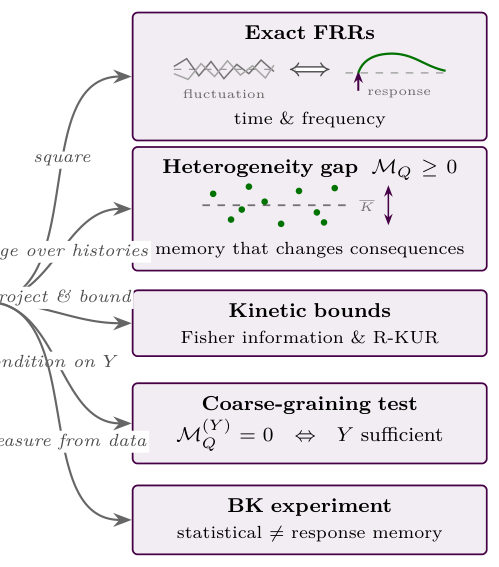
<figcaption class="paper-figure-caption"><b>Fig 1.</b> FIG. 1. Logical structure of the main results.</figcaption>
</figure>
<figure class="paper-figure-card">
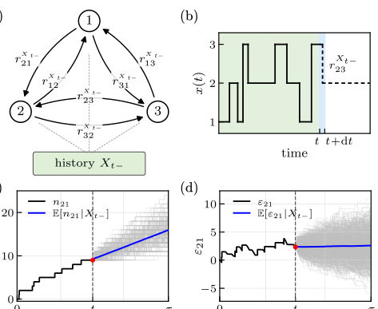
<figcaption class="paper-figure-caption"><b>Fig 2.</b> FIG. 2. Non-Markovian jump trajectories and martin- gale structure. (a) Schematic illustration of a three-state non-Markovian jump process. The transition rate r Xt− ij de- pends on the past trajectory Xt−. In the illustrative model, the memory is encoded by mj(t) = R t 0 e−(t−s)/τm1x(s)=j ds,</figcaption>
</figure>
<figure class="paper-figure-card">
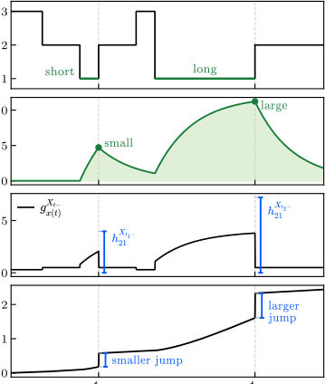
<figcaption class="paper-figure-caption"><b>Fig 3.</b> FIG. 3. History-dependent additive observable. (a) A representative trajectory of a three-state non-Markovian jump process. The green segments indicate residence in state 1. (b) The corresponding memory variable m1(t) = R t 0 e−(t−s)/τm1x(s)=1 ds. (c) History-dependent weights used to construct the additive observable. The waiting-time weight is g Xt− 1 = g0 1 + ηgm1(t)/τm in state 1, while g2 and g3 are constants. The jump weight for the edge 1 →2 is c Xt− 21 = c0 21+ηcm1(t)/τm. The blue brackets indicate the two values of c Xt− 21 at the highlighted jumps. (d) The accumulated additive observable Q(t) = R t 0 P</figcaption>
</figure>
<figure class="paper-figure-card">
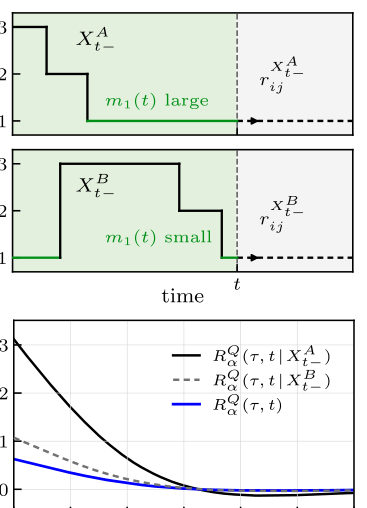
<figcaption class="paper-figure-caption"><b>Fig 4.</b> FIG. 4. History-conditioned and ordinary edge re- sponses. (a) Two representative histories XA t−and XB t−that reach the same state at time t. The dark-green segments mark the past residence in state 1, which determines the memory variable m1(t) and affects the history-dependent transition rates. At time t, we apply the same unit logarithmic per- turbation to the edge 1 →2. (b) Schematic comparison be- tween the edge responses RQ 21(τ, t | XA t−) and RQ 21(τ, t | XB t−), and the ordinary edge response RQ 21(τ, t) obtained by averag- ing over histories. The horizontal axis τ −t varies the future observation horizon at fixed perturbation time and fixed pre- history; no time-translation...</figcaption>
</figure>
<figure class="paper-figure-card">
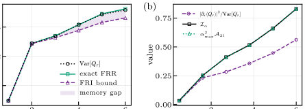
<figcaption class="paper-figure-caption"><b>Fig 5.</b> FIG. 5. Time-domain FRRs, FRIs, and response- KUR. (a) The variance, exact FRR reconstruction, and FRI lower bound as functions of τ for the observable Qτ = R τ 0 1x(s)=1 ds; the shaded region indicates the response- heterogeneity gap generated by history averaging. (b) Time- domain response-KUR for a local perturbation of the edge 1 → 2. We choose the logarithmic rate perturbation ln r Xt−,ϵ 21 = ln r Xt− 21 +ϵ, so that α Xt− 21 = 1 and the Fisher infor- mation reduces exactly to the local activity of the perturbed edge, Iα(τ) = A21(τ). (c,d) History-conditioned responses RQ 21(τ, t|Xt−) for the perturbed edge 1 →2 under weak and strong memory, respectively. Here mj(t) encodes the accu-...</figcaption>
</figure>

**Summary.** This paper develops a novel fluctuation-response theory for complex, non-Markovian jump processes by analyzing the raw sequence of recorded events. It shows that the system's response to perturbations can be precisely mapped onto the orthogonal basis of unpredictable fluctuations (martingale increments). This provides exact, history-dependent relations that are vital for characterizing memory in systems where simple master equations fail.

**Why it may be interesting.** It provides a rigorous, trajectory-level generalization of fluctuation-response theorems to non-Markovian regimes, which is crucial for analyzing open quantum systems where memory effects are dominant.

Detailed structure

**Main problem.** Developing a fluctuation-response theory for non-Markovian jump processes that operates directly on the observed event record, overcoming limitations of theories designed for Markovian dynamics.

**Main result.** The theory establishes that the history-conditioned response to a perturbation is exactly the expansion coefficient of the event in the observable fluctuation, yielding exact finite-time and finite-frequency fluctuation-response relations.

**Method.** The core method involves decomposing observed jumps into a predictable 'event tendency' and an unpredictable 'martingale increment,' utilizing martingale representation theorems.

**Model / system.** The theory applies to general non-Markovian jump processes, such as those observed in single-ion channels or enzyme kinetics, where transition rates depend on the system's history.

**Key observables.** Event-consequence kernel, Response-Heterogeneity Gap, Martingale increments, and the intensity-normalized response.

**Important parameters / regimes.** Finite time, finite frequency, and the degree of non-Markovianity.

**Assumptions / limitations.** The theory assumes the existence of a complete orthogonal basis for random deviations (martingale increments) associated with the observed event record.

**Figures summary.** Figure 1 outlines the theoretical structure: Trajectory-Level Closure leads to the Martingale Basis, which defines the Response, leading to Fluctuation-Response Relations (FRRs) and the Response-Heterogeneity Gap.

**Paper structure.** The paper builds a theoretical framework by first identifying the mathematical structure of non-Markovian jumps via martingale decomposition, then deriving the central identity linking fluctuation to response, and finally quantifying memory effects using the response-heterogeneity gap.

Abstract

Modern experiments often record nonequilibrium dynamics as sequences of discrete events whose rates depend on the realized past. We develop a fluctuation-response theory for such non-Markovian jump processes directly on the observed event record. Memory can destroy a closed master equation for the state probabilities. Each transition count nevertheless obeys an exact stochastic equation. After the history-dependent mean event tendency is subtracted, the remaining random increment is a martingale increment--the part of the event that cannot be predicted from the past. Martingale increments associated with different transitions and different times are orthogonal. These increments form a complete orthogonal basis for the random deviation of any observable measured from the record, such as a current, occupation time, or event count. The coefficient of a given increment is the event-consequence kernel. It measures how that event changes the predicted final observable, relative to continuing without the event, for the particular history already realized. Multiplying this kernel by the event intensity gives the history-conditioned response to perturbing the corresponding transition rate. Thus, the intensity-normalized response is exactly the expansion coefficient of that event in the observable fluctuation. This identification yields exact finite-time and finite-frequency fluctuation-response relations. Averaging over histories leaves a nonnegative response-heterogeneity gap. The gap measures how strongly the consequence of the same event varies across histories and tests whether a proposed memory coordinate is response-sufficient. Finite-history versions can be estimated from spontaneous trajectories. Bounding the logarithmic rate sensitivity further gives response-kinetic uncertainty relations controlled by dynamical activity.

[↑ back to top](#top)

### [Interferometric Signatures of Zero Modes in Fractional Quantum Hall-Superconductor Heterostructures](http://arxiv.org/abs/2608.19312v1)

**Authors:** Junyi Cao, Ramanjit Sohal, Angela Kou, Eduardo Fradkin  
**Type:** theory · **Category:** strongly correlated electrons · **PDF:** <https://arxiv.org/pdf/2608.19312v1>  
**Analysis basis:** full PDF text, analyzed in chunks
**Topic relevance:** `interference shaping light` **3/5** · `Full counting statistics` **1/5** · `Keldysh / 2PI / non-Gaussian methods` **1/5** · `analog quantum simulation` **1/5** · `quantum measurements` **1/5**

↔ Scroll figures horizontally

<figure class="paper-figure-card">
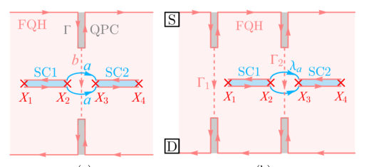
<figcaption class="paper-figure-caption"><b>Fig 1.</b> FIG. 1. Proposed device configurations. (a) An FQH-SC Josephson junction coupled to a single QPC. The supercon- ducting regions SC1 and SC2 (cyan) terminate at defects X1, . . . , X4 (red). QPC tunneling transfers an anyon b of the parent FQH state across the constriction with amplitude Γ. The two a lines represent tunneling of an “anyon Cooper pair” between SC1 and SC2; projected onto the defect Hilbert space, this process gives the zero mode tunneling operator α(2)† a α(3) a with amplitude λa. (b) An FQH-SC Josephson junction embedded in a two-QPC Fabry-P´erot interferome- ter. The QPC tunneling amplitudes are Γ1 and Γ2, while S and D denote the source and drain.</figcaption>
</figure>
<figure class="paper-figure-card">
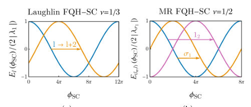
<figcaption class="paper-figure-caption"><b>Fig 2.</b> FIG. 2. QPC-induced fusion-channel shifts. (a) In a Laugh- lin FQH-SC at ν = 1/3, tunneling a Laughlin quasihole shifts l →l + 2. (b) In an MR FQH-SC at ν = 1/2, tunneling σ1 shifts the charge-sector fusion channel by one, while tunneling 12 shifts it by two. The vertical axis shows the normalized Josephson energy. These fusion-channel shifts occur proba- bilistically as a result of quasiparticle tunneling at the QPC.</figcaption>
</figure>
<figure class="paper-figure-card">
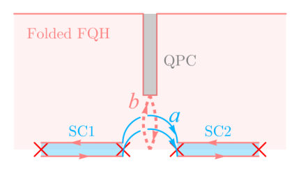
<figcaption class="paper-figure-caption"><b>Fig 3.</b> FIG. 3. Folded representations of the QPC and zero mode processes. After folding the counterpropagating edges, the super- conducting regions become gapped boundaries and the two processes form a half-linking configuration. The two components of the folded theory each contribute Sab/Sa0, yielding the squared factor in Eq. (5).</figcaption>
</figure>

**Summary.** This theoretical work develops a method to probe the exotic fusion structure of parafermion zero modes in FQH-SC heterostructures using superconducting interferometers. By analyzing the interference signal in the two-QPC setup, the authors predict that strong zero mode tunneling causes the interference term to vanish exactly. This cancellation serves as a unique, measurable signature confirming the non-Abelian nature of the underlying topological order.

**Why it may be interesting.** The mechanism of interference cancellation due to non-Abelian statistics is a powerful diagnostic tool, providing a clean signature of topological order that can be measured using superconducting circuits, which is relevant for understanding emergent quantum phenomena in condensed matter.

Detailed structure

**Main problem.** The paper investigates how interferometric measurements can probe the fusion structure of defect-bound parafermion zero modes (PZMs) in Fractional Quantum Hall-Superconductor (FQH-SC) heterostructures.

**Main result.** Strong zero mode tunneling leads to the exact cancellation of the interference signal in the Fabry-Pérot interferometer, providing a robust signature of the defects' non-Abelian nature, even when the parent FQH state is Abelian.

**Method.** The analysis uses theoretical calculations involving modular S-matrices and the F-move to evaluate the expectation value of loop operators, comparing different fusion bases.

**Model / system.** The system is FQH-SC heterostructures, modeled using anyon statistics, Josephson junctions, and Quantum Point Contacts (QPCs). The physics is analyzed for Laughlin and Moore-Read states.

**Key observables.** Interference conductance ($\sigma_{xx}$), fractional Josephson spectrum periodicity, and the expectation value of the loop operator ($\langle W_{Nqh,b} 
angle$).

**Important parameters / regimes.** Tunneling amplitudes ($\lambda_a$, $\Gamma$), superconducting phase difference ($\phi_{SC}$), and the topological limit.

**Assumptions / limitations.** The analysis relies on treating zero mode tunneling perturbatively and assumes specific fixed total fusion channels for the defects.

**Figures summary.** Figure 1 illustrates the two proposed device configurations: a single-QPC junction and a two-QPC Fabry-Pérot interferometer. Figure 2 shows QPC-induced fusion-channel shifts in Laughlin and MR systems.

**Paper structure.** The paper systematically analyzes the physics in two main setups (single-QPC vs. two-QPC interferometer), deriving spectral properties for Abelian and non-Abelian cases, and culminating in the calculation of the interference term based on the F-move algebra.

Abstract

Fractional quantum Hall-superconductor (FQH-SC) heterostructures are predicted to host defect-bound parafermion zero modes (PZMs). We propose two related configurations to probe their fusion structure. In a Josephson junction coupled to a single quantum point contact (QPC), quasiparticle tunneling switches the defect fusion channel, producing stochastic transitions between branches of the fractional Josephson spectrum. Embedding the junction in a two-QPC Fabry-Pérot interferometer provides a complementary probe. Weak zero mode tunneling produces fusion-channel-dependent interference while strong tunneling makes the interferometer probe a superposition of fusion channels and strongly suppresses the signal: in the topological limit it vanishes exactly, revealing the defects' non-Abelian nature even when the parent FQH state is Abelian.

[↑ back to top](#top)

### [Simulating Black Hole Thermality and Interior Scrambling on a Superconducting Quantum Processor](http://arxiv.org/abs/2608.19318v1)

**Authors:** Ryan Smith, Ewan Forbes, Iason Sofos Andrew Hallam, Jiannis Pachos  
**Type:** both · **Category:** other · **PDF:** <https://arxiv.org/pdf/2608.19318v1>  
**Analysis basis:** full PDF text, analyzed in chunks
**Topic relevance:** `QC/QI experiment` **3/5** · `analog quantum simulation` **3/5** · `quantum measurements` **1/5**

↔ Scroll figures horizontally

<figure class="paper-figure-card">
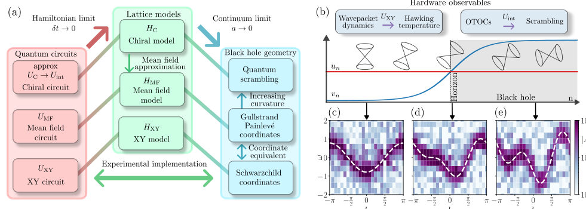
<figcaption class="paper-figure-caption"><b>Fig 1.</b> Figure 1. Overview of the black hole quantum simulator and its hardware validation. (a) Relations among the lattice Hamiltonians, quantum circuits and effective theories considered in this work. The interacting chiral model HC reduces under mean-field theory to HMF, whose semiclassical geometry is coordinate-equivalent to that of the free-fermion XY model HXY. The circuits UMF and UXY reproduce their respective Hamiltonian dynamics in the small-time-step limit. The reduced circuit Uint instead isolates the non-free-fermionic sector of the parent chiral circuit used to probe scrambling. (b) Spatial coupling profile and effective light-cone structure across the exterior, horizon and interior....</figcaption>
</figure>
<figure class="paper-figure-card">
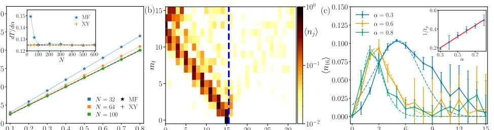
<figcaption class="paper-figure-caption"><b>Fig 2.</b> Figure 2. Extraction of the Hawking temperature in the semiclassical black hole simulator. (a) Temperature obtained by fitting the exterior mode occupations of the XY and mean-field chiral Hamiltonians to the thermal distribution in Eq. (27), shown as a function of the profile parameter α for different system sizes N. The black dashed line denotes the continuum prediction for the Hawking temperature given by Eq. (26). Inset: finite-size scaling of the derivative dT/dα for the two models, demonstrating convergence towards the theoretical value. (b) Site-resolved occupation density during the evolution of a wave packet under UXY on ibm boston, for N = 32, α = 0.8, and the inhomogeneous...</figcaption>
</figure>
<figure class="paper-figure-card">
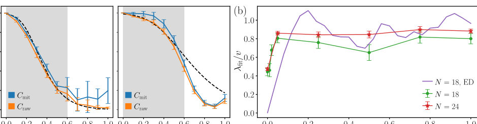
<figcaption class="paper-figure-caption"><b>Fig 3.</b> Figure 3. Tunable scrambling measured on superconducting quantum hardware. (a) Left: OTOC C(t) in the strongly in- teracting chiral regime, ϕ = π, for N = 24 spins. Blue and orange points show the error-mitigated and raw hardware data, respectively. The black dashed curve is a fit to Eq. (33), and the shaded region indicates the fitting window [χ2 ν ≈1.26]. (a) Right: Corresponding OTOC dynamics in the free-fermion limit, ϕ = 0. Here, the Lyapunov form gives a poor description of the decay, and the fitted value should be interpreted only as an effective decay scale [χ2 ν ≈2.50]. (b): Fitted decay scale as a function of ϕ for N = 18 and N = 24 spins. For sufficiently strong interactions, the...</figcaption>
</figure>
<figure class="paper-figure-card">
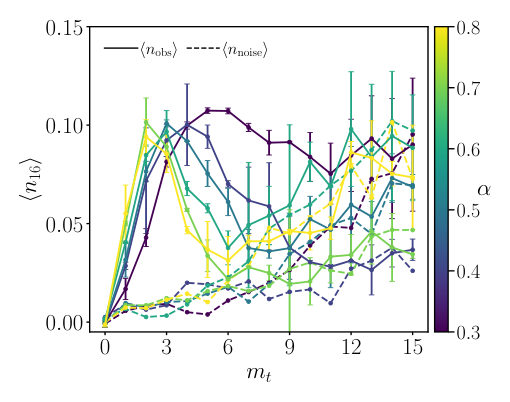
<figcaption class="paper-figure-caption"><b>Fig 4.</b> Figure 4. Demonstration of the error mitigation strategy for the Hawking temperature on ibm boston. The solid and dashed lines show the hardware-measured population densi- ties for the time-evolved excited and unexcited initial states, respectively, where the latter is used as a measure of the initial state’s decoherence. Results are for N = 32 qubits with the horizon positioned at nh = 15.5 and the initial single-particle excitation on site j = 15. The population densities ⟨nj⟩are measured outside the horizon at site j = 16.</figcaption>
</figure>
<figure class="paper-figure-card">
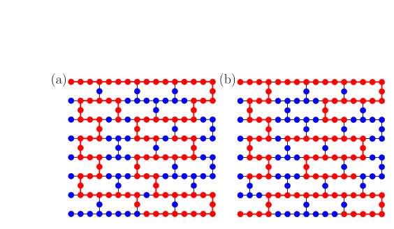
<figcaption class="paper-figure-caption"><b>Fig 5.</b> Figure 5. Chosen qubits for the different experiments on the superconducting processor. (a): Qubit mapping onto ibm boston for the Hawking temperature experiments, which contain 3 independent chains of N = 32 qubits that are run in parallel, denoted by the red circles and connections. The blue circles and black lines are the unused qubits and connec- tions. This mapping was used to produce Fig. 2(b-c). (b): A similar qubit mapping, but for the scrambling circuits, which contain 4 chains of N = 24 qubits and were used to produce Figures. 3(a-b).</figcaption>
</figure>

**Summary.** This work implements a black hole analogue simulator on superconducting quantum hardware to probe fundamental physics. By tailoring quantum circuits, the authors measure key signatures of black hole physics, including the effective light-cone structure, the characteristic signal of Hawking temperature, and the transition from free-fermion to strongly interacting quantum scrambling. This establishes a unified, programmable platform for quantum gravity research.

**Why it may be interesting.** It provides a concrete, hardware-implementable framework to test deep theoretical concepts from quantum gravity (like Hawking radiation and spacetime structure) using modern quantum computing tools.

Detailed structure

**Main problem.** The paper aims to study both semiclassical black hole horizon physics (Hawking thermality) and strongly interacting quantum scrambling using a unified, programmable quantum simulation platform.

**Main result.** The authors successfully demonstrated the measurement of Hawking thermality and the distinction between free-fermion and strongly interacting scrambling dynamics on superconducting quantum hardware.

**Method.** The study employs a chiral spin-chain black hole analogue Hamiltonian, which is decomposed into multiple, observable-specific Floquet circuits tailored for different physical probes.

**Model / system.** The system is a chiral spin-chain black hole analogue simulated on IBM superconducting quantum hardware. The model includes three related lattice realizations: the full interacting chiral model, a mean-field (semiclassical) limit, and a free-fermion XY model.

**Key observables.** Dispersion relation (across exterior, horizon, interior), density response for Hawking thermality, and Out-of-Time-Ordered Correlators (OTOCs) for scrambling.

**Important parameters / regimes.** Surface gravity, coupling profile gradient ($\alpha$), and the tunable interaction parameter ($\phi$) controlling the transition between free-fermion and interacting regimes.

**Assumptions / limitations.** The primary approximations involve using reduced, observable-specific circuits to manage circuit depth, and employing error mitigation techniques like Pauli twirling and Zero Noise Extrapolations (ZNE) for hardware measurements.

**Figures summary.** Figures illustrate the relationship between the three lattice Hamiltonians and their corresponding circuits, show measured dispersion relations across different spacetime regimes, and compare OTOC decay rates between different theoretical limits.

**Paper structure.** The paper establishes the physical model (chiral spin-chain), derives multiple circuit approximations ($U_{MF}, U_{XY}, U_{int}$), and then systematically measures three distinct phenomena—geometry, thermality, and scrambling—using these tailored circuits on quantum hardware.

Abstract

We implement a chiral spin-chain black hole simulator on IBM superconducting quantum hardware and probe, within a common microscopic framework, both semiclassical horizon physics and interacting quantum scrambling. We first measure the dispersion relation across the exterior, horizon and over-tilted interior regimes, reproducing the predicted evolution of the effective light-cone structure. To probe Hawking thermality, we prepare a localised excitation inside the horizon and monitor its density response at an exterior site, observing the predicted inverse relation between the peak arrival time and the surface gravity, thereby establishing a calibrated dynamical estimator of the Hawking temperature. Beyond the semiclassical regime, we continuously tune the interactions and distinguish non-exponential operator spreading in the free-fermion limit from Lyapunov-like OTOC decay in the strongly interacting chiral regime. These measurements use observable-specific Floquet circuits derived from the same parent chiral model, including its mean-field and coordinate-equivalent XY descriptions, to reduce circuit depth while preserving the physics relevant to each probe. Our results provide a unified programmable platform for studying horizon geometry, Hawking thermality and interacting scrambling on quantum hardware.

[↑ back to top](#top)

### [Gradient flow towards quantum states with ideal quantum geometry](http://arxiv.org/abs/2608.19770v1)

**Authors:** T. Shiga, T. Fukui  
**Type:** theory · **Category:** other · **PDF:** <https://arxiv.org/pdf/2608.19770v1>  
**Analysis basis:** full PDF text, analyzed in chunks
**Topic relevance:** `analog quantum simulation` **3/5** · `Keldysh / 2PI / non-Gaussian methods` **1/5** · `methods for driven-dissipative` **1/5** · `quantum measurements` **1/5**

↔ Scroll figures horizontally

<figure class="paper-figure-card">
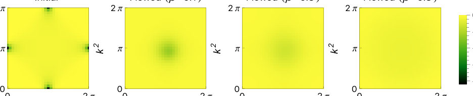
<figcaption class="paper-figure-caption"><b>Fig 1.</b> FIG. 1. Berry curvature Ω(k) for the Wilson–Dirac model with mass parameter m = 2.2 and t = b = 1, computed on a 312</figcaption>
</figure>
<figure class="paper-figure-card">
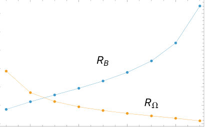
<figcaption class="paper-figure-caption"><b>Fig 2.</b> FIG. 2. Dependence of the ratios RΩand RB, defined in Eqs. (105) and (107), on the relative weight β, with α + β = 1. The two ratios exhibit opposite trends as β is increased.</figcaption>
</figure>
<figure class="paper-figure-card">
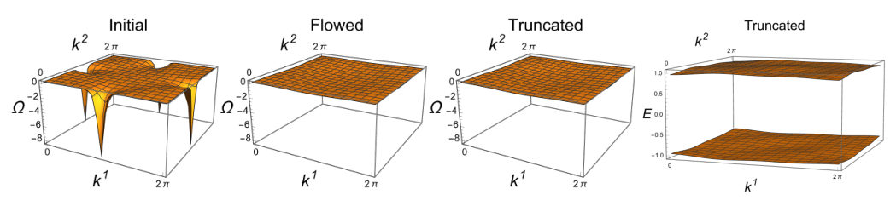
<figcaption class="paper-figure-caption"><b>Fig 3.</b> FIG. 3. The three left panels show the Berry curvature Ω(k) for the initial, flowed, and truncated models, as three-dimensional surface plots, complementary to the density plots in Fig. 1. The parameters are the same as those in Fig. 1, except that (α, β) = (0.3, 0.7). For the truncated model, the range of Ωis ∆Ω= 0.50. The rightmost panel shows the energy spectrum of the truncated Hamiltonian in Eq. (109) with the hopping matrices given in Eqs. (110)–(112). The bandwidth of the truncated model is ∆E = 0.08.</figcaption>
</figure>
<figure class="paper-figure-card">
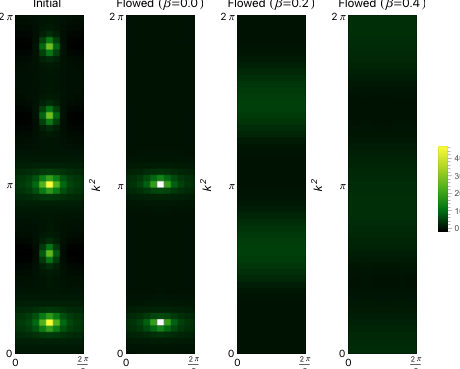
<figcaption class="paper-figure-caption"><b>Fig 4.</b> FIG. 4. Berry curvature distribution for the lowest Hofstadter band at ϕ = 2/5, with Chern number C = 2. The horizontal axis is the microscopic momentum ˜k1. The panels show the initial projector and flowed projectors for (α, β) = (1.0, 0.0), (0.8, 0.2), and (0.6, 0.4), with α + β = 1. Increasing β sup- presses the curvature peaks and makes the Berry curvature more uniform. The color scale is chosen to resolve the initial distribution; in the (α, β) = (1.0, 0.0) panel, the Berry curva- ture has two sharply localized peaks whose maximum value is approximately Ω≃240, outside the displayed color range.</figcaption>
</figure>

**Summary.** This paper introduces a gradient-flow technique to optimize quantum states in lattice models towards ideal quantum geometry. By balancing the drive towards Bogomolny saturation and uniform Berry curvature, the method successfully constructs simplified, short-range Hamiltonians. This provides a theoretical pathway for designing materials with desired topological properties like flat bands and uniform Berry curvature.

**Why it may be interesting.** This work provides a powerful, geometric tool for designing effective Hamiltonians for topological materials, which is highly relevant for understanding band structure engineering in condensed matter physics.

Detailed structure

**Main problem.** The paper develops a gradient-flow method to drive quantum states in lattice models towards an 'ideal quantum geometry' by simultaneously balancing two competing geometric requirements: Bogomolny saturation and uniform Berry curvature.

**Main result.** The flow converges to a non-trivial fixed point that balances these two requirements, allowing for the construction of short-range lattice Hamiltonians exhibiting nearly flat bands and uniform Berry curvature.

**Method.** A gradient-flow equation, derived from an action combining the quantum metric and the square of the Berry curvature, is used to evolve the spectral projector on the manifold of quantum states.

**Model / system.** The method is tested on lattice models, specifically the Wilson-Dirac model and the Hofstadter model, which are used to study topological properties in condensed matter systems.

**Key observables.** Quantum metric ($g_{\mu
u}$), Berry curvature ($\Omega$), Bogomolny defect ($\delta_B$), and the normalized ratios $R_{\Omega}$ and $R_B$.

**Important parameters / regimes.** The flow is controlled by parameters $(\alpha, eta)$ weighting the metric and curvature terms, respectively.

**Assumptions / limitations.** The primary assumption is that the combined flow is necessary because the two geometric conditions cannot be satisfied simultaneously in finite-dimensional lattice models (a 'no-go theorem').

**Figures summary.** Figures illustrate the evolution of Berry curvature ($\Omega(k)$) and the dependence of the reduction ratios ($R_{\Omega}$ and $R_B$) on the weighting parameter $eta$.

**Paper structure.** The paper first introduces the gradient flow formalism and the competing geometric bounds. It then analyzes the flow equations for the metric and curvature, demonstrating the trade-off. Finally, it applies this to specific models (Wilson-Dirac, Hofstadter) to construct improved, short-range Hamiltonians.

Abstract

We propose a gradient-flow method for quantum states in lattice models, generated by an action consisting of the quantum-metric and the square of the Berry curvature. These two terms drive the spectral projector toward Bogomolny saturation and uniform Berry curvature, respectively. We show that, due to a no-go theorem for finite-dimensional projectors, the two conditions cannot in general be satisfied simultaneously in lattice models. Hence the flow is expected to approach a nontrivial fixed point that balances the two geometric requirements. For the Wilson-Dirac model, we demonstrate that the flowed projector exhibits almost uniform Berry curvature while remaining close to the Bogomolny bound. We further construct a short-range truncated flattened Hamiltonian from the flowed projector and obtain a lattice model with nearly flat bands and nearly uniform Berry curvature. We also apply the method to the Hofstadter model and confirm the roles of the metric and Berry-curvature terms in a Chern band with higher Chern number.

[↑ back to top](#top)

### [Reinforcement LearningtoHarness Approximation Errors for Long-Time QuantumSimulation](http://arxiv.org/abs/2608.20139v1)

**Authors:** Yu-Bo Shi, Markus Heyl, Roderich Moessner, Marin Bukov, Hongzheng Zhao  
**Type:** theory · **Category:** numerical methods · **PDF:** <https://arxiv.org/pdf/2608.20139v1>  
**Analysis basis:** full PDF text, analyzed in chunks
**Topic relevance:** `analog quantum simulation` **3/5** · `methods for driven-dissipative` **2/5** · `quantum measurements` **1/5**

↔ Scroll figures horizontally

<figure class="paper-figure-card">
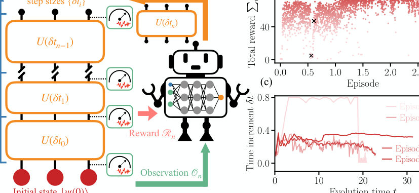
<figcaption class="paper-figure-caption"><b>Fig 1.</b> FIG. 1. Symmetry-guided RL for adaptive Trotterization. (a) Closed-loop workflow of RL-Trotter. Starting from the initial state |𝜓(0)⟩, the quantum state is propagated through a sequence of Trotter operations 𝑈(𝛿𝑡𝑖), which is defined in Eq. (1), with the accumulated evolution time 𝑡𝑛= Í𝑛−1 𝑖=0 𝛿𝑡𝑖. After each step, the current noisy measurements of conserved quantities—here, the energy and its variance—together with their initially measured values and 𝑡𝑛, are supplied to the RL agent, which selects the next Trotter step size 𝛿𝑡𝑛+1. (b) A representative illustration of the learning process (total episode reward Í 𝑛𝑅𝑛versus training episode). The overall increase and subsequent saturation of...</figcaption>
</figure>
<figure class="paper-figure-card">
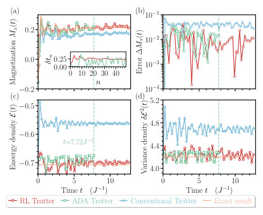
<figcaption class="paper-figure-caption"><b>Fig 2.</b> FIG. 2. Comparison of the quench dynamics under different Trot- ter algorithms with exact dynamics (orange). (a, b) Dynamics of the magnetization in the 𝑥direction and the corresponding error with respect to the exact evolution for the first 50 Trotter steps. Whereas RL-Trotter (red circles) and conventional Trotter (cyan triangles) have the same total evolution time, 𝑡=12.53𝐽−1, RL-Trotter produces sig- nificantly smaller errors. ADA-Trotter (green squares) can suppress the errors to a level comparable to RL-Trotter. However, its total evolution time, 𝑡= 7.72𝐽−1 shown by green dashed line, is shorter than that of RL-Trotter as ADA-Trotter freezes, i.e., the algorithm tends to always choose...</figcaption>
</figure>
<figure class="paper-figure-card">
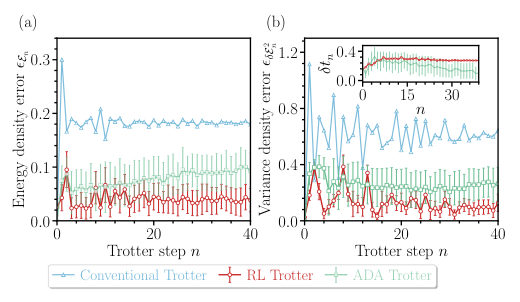
<figcaption class="paper-figure-caption"><b>Fig 3.</b> FIG. 3. Noise robustness of different Trotter algorithms. We plot the errors in the energy density (a) and energy variance den- sity (b) during the first 40 Trotter steps for different Trotter algo- rithms in a noisy environment with noise strength 𝜎1=𝜎2=0.1. The RL agent is trained in a noisy environment with 𝜎1=𝜎2=0.03. For RL-Trotter (red) and ADA-Trotter (green), the markers and error- bar regions denote the mean and standard deviation over 50 in- dependent evaluations. The inset of (b) shows the Trotter step size 𝛿𝑡𝑛at each Trotter step. RL-Trotter remains stable against noise throughout the evolution, whereas the average Trotter step size of ADA-Trotter decreases continuously. The...</figcaption>
</figure>
<figure class="paper-figure-card">
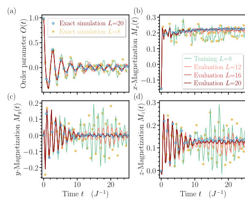
<figcaption class="paper-figure-caption"><b>Fig 4.</b> FIG. 4. Generalization of the learned policy to larger system sizes. We plot RL-Trotter dynamics of (a) the order parameter 𝑂(𝑡) and (b–d) the magnetization 𝑀𝛼(𝑡) with 𝛼=𝑥, 𝑦, 𝑧for different system sizes. The policy is trained only at 𝐿=8, whose results are shown by the green curves. We then apply the learned policy, without further training, to larger systems with 𝐿=12, 16, 20 (red curves). The exact time-evolution curves for 𝐿=8 and 𝐿=20 are shown by the yellow and blue dots, respectively. Although the thermalization behavior depends strongly on the system size, the RL-Trotter dynamics for 𝐿= 20 agrees well with the exact dynamics at the same system size, demonstrating the transferability...</figcaption>
</figure>
<figure class="paper-figure-card">
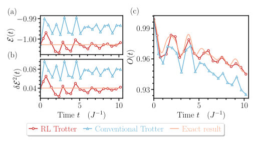
<figcaption class="paper-figure-caption"><b>Fig 5.</b> FIG. 5. MPS benchmark of the RL-Trotter protocol for a large system. Time evolution of (a) the energy density E(𝑡), (b) the energy- variance density 𝛿E2(𝑡), and (c) the staggered order parameter 𝑂(𝑡) for a system with 𝐿= 100 of the first 20 Trotter steps. The RL agent is trained on small systems of 𝐿= 8 using ED with periodic boundary conditions. We directly apply this agent to a large system using MPS representation with open boundary conditions. The quench is performed from ℎ𝑧= 0 and ℎ𝑥= 0.1 to ℎ𝑧= 0.3 and ℎ𝑥= 0.3. The average errors of E, 𝛿E2, and the AFM order 𝑂are 1.62 × 10−3𝐽, 7.07 × 10−3𝐽2, and 1.02 × 10−2, respectively. All error measures are reduced by approximately one order of...</figcaption>
</figure>

**Summary.** This paper introduces RL-Trotter, an RL framework that revolutionizes digital quantum simulation by treating unavoidable Trotterization errors as resources rather than just noise. By training an agent to adaptively select the time step size based on conserved quantities, the method achieves significantly longer, more accurate, and more robust long-time quantum dynamics compared to existing adaptive protocols.

**Why it may be interesting.** This work provides a powerful, data-driven paradigm shift for quantum simulation, moving beyond error suppression to actively managing and utilizing simulation errors, which is highly relevant for resource-constrained quantum hardware.

Detailed structure

**Main problem.** Accurate digital quantum simulation (DQS) over long time scales is fundamentally limited by the accumulation of unavoidable approximation errors from time-stepping schemes like Trotterization.

**Main result.** The proposed RL-Trotter framework successfully learns to treat these approximation errors as resources, orchestrating them into self-correcting sequences that maintain high accuracy over much longer simulation times than conventional adaptive methods.

**Method.** A Reinforcement Learning (RL) agent is trained to adaptively select the next Trotter step size ($\delta t$) by using low-dimensional information from conserved quantities (like energy and energy variance) as the primary learning signal.

**Model / system.** The method is applied to the time evolution of quantum many-body systems, exemplified by a 1D mixed-field Ising model ($H = H_1 + H_2$). The simulation uses Trotterization to approximate the time evolution operator.

**Key observables.** Energy ($E_n$), energy variance ($\Delta E^2_n$), magnetization ($M_x(t)$), and the order parameter ($O(t)$).

**Important parameters / regimes.** The system size ($L$), the quench process parameters (e.g., $h_x, h_z$), and the range of possible Trotter step sizes $[\delta t_{\min}, \delta t_{\max}]$.

**Assumptions / limitations.** The core assumption is that low-dimensional information derived from conservation laws (energy/variance) is sufficient to guide the adaptive step-size selection, allowing the agent to optimize the entire long-time evolution.

**Figures summary.** Figures compare the time evolution of observables ($M_x(t)$, $O(t)$) and their associated errors ($\Delta M_x(t)$) for RL-Trotter against conventional and adaptive Trotter methods, demonstrating superior performance and generalization.

**Paper structure.** The paper introduces the problem of error accumulation in DQS, details the RL-Trotter framework using conserved quantities as state inputs, compares its performance against ADA-Trotter and fixed-step methods across various system sizes, and concludes by establishing the principle of error resource utilization.

Abstract

Accurate digital quantum simulation at long times is limited by the accumulation of errors inherent to approximate simulation. Here we introduce RL-Trotter, a reinforcement-learning framework that treats unavoidable approximation errors as resources for error correction rather than merely imperfections to suppress. We show that low-dimensional information from conservation laws, such as the energy and energy variance, provides a sufficient learning signal to guide the agent, which learns to adapt a single scalar---the next Trotter step size---without access to the target wave function. By optimizing the entire long-time evolution rather than individual steps, RL-Trotter discovers self-correcting sequences in which later errors compensate for those accumulated earlier, increasing the accuracy of the long-time dynamics. The learned policies are intrinsically robust to measurement noise, substantially reducing measurement overhead. They also generalize to previously unseen, physically similar initial states and transfer from small, classically simulable systems to systems an order of magnitude larger. This enables a practical protocol based on classical pretraining followed by direct deployment or limited fine-tuning on quantum hardware. Our results establish a broader perspective for quantum algorithms: errors in approximate evolution can be orchestrated into resources for accurate and resource-efficient quantum dynamics.

[↑ back to top](#top)

### [Rethinking Quantum Circuits](http://arxiv.org/abs/2608.19370v1)

**Authors:** Steven Rayan  
**Type:** both · **Category:** quantum information and computing · **PDF:** <https://arxiv.org/pdf/2608.19370v1>  
**Analysis basis:** full PDF text, analyzed in chunks
**Topic relevance:** `QC/QI experiment` **3/5** · `analog quantum simulation` **2/5** · `quantum measurements` **1/5**

↔ Scroll figures horizontally

<figure class="paper-figure-card">
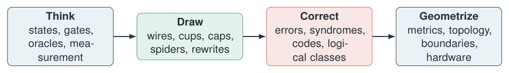
<figcaption class="paper-figure-caption"><b>Fig 1.</b> Figure 1: The same circuit is studied operationally, diagrammatically, fault-tolerantly, and geometrically.</figcaption>
</figure>
<figure class="paper-figure-card">
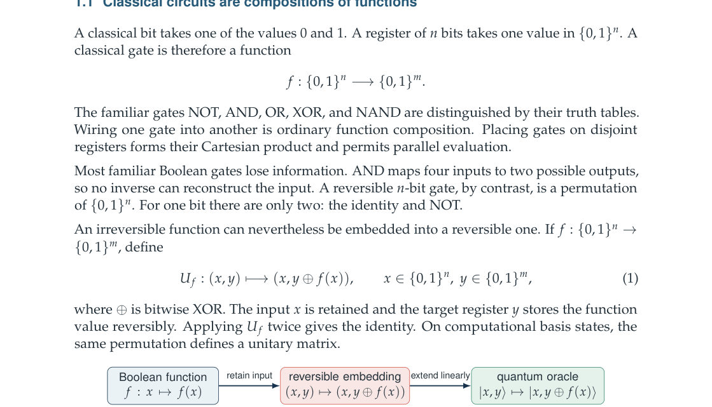
<figcaption class="paper-figure-caption"><b>Fig 2.</b> Figure 2: An irreversible truth table can be placed inside a reversible, and hence unitary, oracle.</figcaption>
</figure>
<figure class="paper-figure-card">
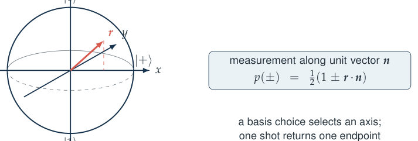
<figcaption class="paper-figure-caption"><b>Fig 3.</b> Figure 3: A pure qubit is a point on the Bloch sphere. Relative phase is an observable direction, not an extra classical probability.</figcaption>
</figure>
<figure class="paper-figure-card">
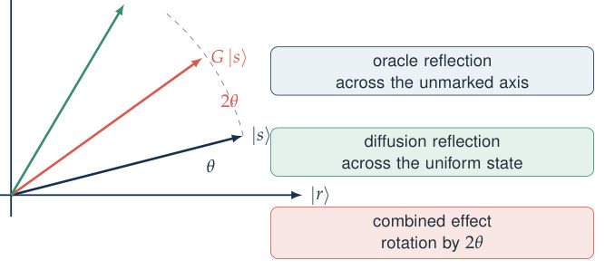
<figcaption class="paper-figure-caption"><b>Fig 4.</b> Figure 6: Grover’s iterate is confined to a two-dimensional invariant plane even though the Hilbert space has dimension N.</figcaption>
</figure>
<figure class="paper-figure-card">
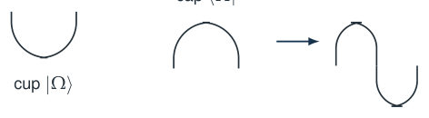
<figcaption class="paper-figure-caption"><b>Fig 5.</b> Figure 8: The cup and cap are dual choices. Partial contraction gives the snake, or yanking, identity.</figcaption>
</figure>

**Summary.** This work proposes a comprehensive framework to understand quantum circuits by viewing them through four interconnected lenses: operational, diagrammatic, error-correcting, and geometric. It builds from abstract tools like the ZX-calculus to advanced concepts like hyperbolic quantum codes. The ultimate goal is to show how modern device physics experiments provide a physical realization of these abstract mathematical structures.

**Why it may be interesting.** It provides a powerful geometric lens for quantum information, linking abstract algebraic structures (like homology) directly to the physical constraints and measurable properties (like curvature and spectral gaps) of superconducting quantum hardware.

Detailed structure

**Main problem.** To develop a unified, multi-faceted framework for understanding quantum circuits by viewing them through operational, diagrammatic, error-correcting, and geometric lenses.

**Main result.** The paper establishes a deep interconnection between abstract quantum circuit theory (like the ZX-calculus) and concrete physical realizations, such as superconducting circuits emulating hyperbolic lattices.

**Method.** The approach involves synthesizing a workflow that translates circuit specifications through four complementary viewpoints: operational gates, diagrammatic rules, fault-tolerant encoding, and geometric topology.

**Model / system.** The core model is the quantum circuit, which is analyzed across its evolution from basic qubits to complex structures like homological surface codes and superconducting lattices with specific curvatures.

**Key observables.** ZX diagrams, connectivity, topology, boundary data, syndrome measurements, and the spectral gap of the physical system.

**Important parameters / regimes.** Curvature (hyperbolic geometry), logical degrees of freedom, error rates, and the ratio of boundary to area ($C(R)/A(R)$).

**Assumptions / limitations.** The development assumes that the four descriptive levels (Thinking, Drawing, Correcting, Geometrizing) are complementary and that physical experiments can operationalize the abstract diagrammatic rules.

**Figures summary.** Figure 1 illustrates the same circuit analyzed across the four viewpoints: operational, diagrammatic, fault-tolerant, and geometric.

**Paper structure.** The structure progresses from defining the four interconnected ways to read a circuit (operational $	o$ diagrammatic $	o$ protected $	o$ geometric), developing tools like the ZX-calculus, applying error correction theory (Knill-Laflamme, surface codes), and concluding with the physical realization in superconducting circuits.

Abstract

These notes develop four interconnected ways of reading a quantum circuit. A circuit for us begins as an operational composition of gates; then, it becomes a diagram whose local equalities may be used as calculations; next, it becomes a protected process once errors, syndromes, and logical degrees of freedom are separated; and finally, it becomes geometric when its connectivity, topology, and boundary data are treated as physical design parameters. The development begins at the level of bits and qubits before appealing to Deutsch's and Grover's algorithms as basic examples of quantum circuits. With the basics in hand, we interpret quantum circuits diagramatically, leading us to compact closed string diagrams and the ZX-calculus. After that, we consider how to correct quantum circuits by introducing the Knill--Laflamme condition, homological surface codes, and related concepts with a view towards thinking of these as operations on diagrams. The lectures eventually arrive at the properties of hyperbolic quantum codes and the prospect of physical superconducting circuits emulating the negatively-curved lattices needed to support those codes. These mathematical ideas and physical experiments, taken together, represent one way to impart a geometric layer onto quantum circuits. By the very end, we bring the ideas nearly full circle by assessing the extent to which these device physics experiments operationalize the basic ZX diagrams encountered much earlier in the story. While the later material reports on original research, and while the discussion becomes increasingly mathematical as the sections progress, no prior knowledge of quantum information, quantum computing, or quantum error correction is actually assumed.

[↑ back to top](#top)

### [Multiplexing of Continuous-Variable and Discrete-Variable Quantum Key Distribution Systems over Fibered and Free-Space Channels](http://arxiv.org/abs/2608.19745v1)

**Authors:** Mattia Sabatini, Edoardo Rossi, Matías R. Bolaños, Francesco Vedovato, Thomas Liege, Eleni Diamanti, Giuseppe Vallone, Paolo Villoresi, Yoann Piétri, Marco Avesani  
**Type:** experiment · **Category:** quantum information and computing · **PDF:** <https://arxiv.org/pdf/2608.19745v1>  
**Analysis basis:** full PDF text, analyzed in chunks
**Topic relevance:** `quantum optics experiment` **3/5** · `QC/QI experiment` **1/5** · `interference shaping light` **1/5**

↔ Scroll figures horizontally

<figure class="paper-figure-card">
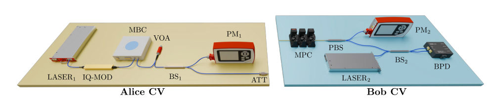
<figcaption class="paper-figure-caption"><b>Fig 1.</b> Figure 1. Experimental setup of the CV-QKD system. At Alice, a narrow-linewidth CW laser (LASER1) is modulated by an IQ modulator (IQ-MOD), attenuated to the quantum level by a variable optical attenuator (VOA) and a fixed attenuator (ATT). A 95:5 beam splitter (BS1) sends 95% of the power to an optical power meter (PM1) for monitoring, while the remaining 5% constitutes the quantum signal sent towards the channel. At Bob, the signal passes through a motorized polarization controller (MPC), a PBS and an optical power meter (PM2), which are used together to align the polarization of the receiver with that of the transmitter, is then interfered with an independent LO (LASER2) on a 50:50 beam...</figcaption>
</figure>
<figure class="paper-figure-card">
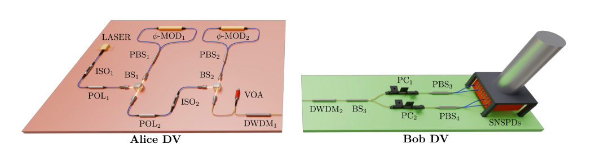
<figcaption class="paper-figure-caption"><b>Fig 2.</b> Figure 2. Experimental setup of the DV-QKD system. The transmitter includes a gain-switched DFB laser followed by an optical isolator (ISO1) and a polarizer (POL1) preparing the field in the diagonal state |D⟩. Two lithium-niobate phase modulators (ϕ-MOD1 and ϕ-MOD2) placed within a Sagnac loop, each with identical architecture implement intensity and polarization modulation, respectively. In the first Sagnac, a |D⟩-aligned polarizer (POL2) at the output converts the phase shift into intensity modulation for decoy-state generation, while the second Sagnac performs the polarization encoding. The modulated pulses are coupled into a standard SMF and directed into the quantum channel. At the...</figcaption>
</figure>
<figure class="paper-figure-card">
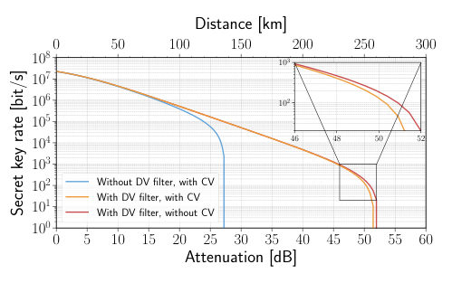
<figcaption class="paper-figure-caption"><b>Fig 3.</b> Figure 3. Simulated asymptotic DV-QKD SKR as a function of channel attenuation using background count rates mea- sured with the DV signal blocked under different multiplex- ing conditions. Blue curve: DV receiver without the 100 GHz C40 DWDM filter and CV system on. Orange curve: DV receiver with the C40 DWDM filter and CV on. Red curve: DV receiver with the C40 DWDM filter and CV off.</figcaption>
</figure>
<figure class="paper-figure-card">
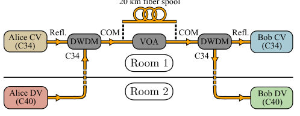
<figcaption class="paper-figure-caption"><b>Fig 4.</b> Figure 4. Schematic of the multiplexed DV-QKD and CV- QKD setup. The CV transmitter (Alice CV) and receiver (Bob CV) are located in room 1, while the DV transmitter (Alice DV) and receiver (Bob DV) are located in room 2. At the transmitter side, the optical outputs of Alice DV and Alice CV are combined by a 100 GHz DWDM and launched into a common quantum channel, implemented either as a 20 km single-mode fiber spool or as a variable-loss link using an electronically controlled VOA. At the receiver side, a sec- ond DWDM with identical specifications demultiplexes the two wavelengths and routes them to Bob CV and Bob DV, respectively.</figcaption>
</figure>
<figure class="paper-figure-card">
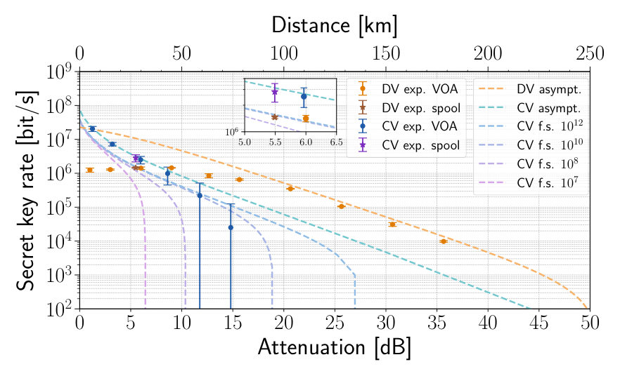
<figcaption class="paper-figure-caption"><b>Fig 5.</b> Figure 5. SKR as a function of channel attenuation when varying the loss with the electronically controlled VOA, with DV-QKD and CV-QKD operating simultaneously on the same optical link. Experimental results are reported as points with error bars in orange for DV-QKD and in blue for CV-QKD; DV data are evaluated in the finite-size regime [28], while CV data are reported in the asymptotic regime [29]. Theoretical predictions are reported as dashed lines for both the asymptotic regime and finite-size (f.s.) analysis (for CV-QKD, several block sizes are shown using [30]). For each attenuation point, the CV-QKD experimental parameters, namely Alice’s modulation variance and the pilot-tone...</figcaption>
</figure>

**Summary.** This paper reports the first experimental demonstration of multiplexing CV-QKD and DV-QKD systems onto a single optical channel using WDM. By testing the setup over both fiber and free-space links, the authors prove that the two protocols can operate simultaneously without performance degradation. This establishes a practical, hybrid building block for future heterogeneous quantum communication networks.

**Why it may be interesting.** This work is highly relevant to quantum networks, specifically addressing the engineering challenge of integrating different quantum communication modalities (CV vs. DV) onto shared physical infrastructure.

Detailed structure

**Main problem.** The paper addresses the need for a practical building block to serve heterogeneous quantum communication networks by simultaneously operating Continuous-Variable (CV) and Discrete-Variable (DV) Quantum Key Distribution (QKD) systems over a shared physical channel.

**Main result.** The authors successfully demonstrated the first simultaneous operation of independent CV-QKD and DV-QKD systems on a common optical link, showing no measurable multiplexing-induced penalty.

**Method.** They utilized Wavelength-Division Multiplexing (WDM) to combine the two protocols, testing the setup over both optical fiber and a 620 m urban daylight free-space link.

**Model / system.** The system involves two distinct QKD protocols: CV-QKD using Gaussian-modulated coherent states and DV-QKD using the three-state one-decoy BB84 protocol. The transmission occurs over a shared channel, tested in both fiber and free-space environments.

**Key observables.** Secret Key Rate (SKR), Quantum Bit Error Rate (QBER), and excess noise, measured across varying channel losses.

**Important parameters / regimes.** The systems operate at distinct C-band wavelengths (1550.12 nm for CV and 1545.32 nm for DV), and performance is analyzed across channel losses, showing a crossover point at 7.56 dB on fiber.

**Assumptions / limitations.** The primary assumption is that the WDM approach can support coexistence despite the protocols' different noise sensitivities, which was experimentally verified by observing no penalty.

**Figures summary.** Figures illustrate the experimental setups for both CV-QKD and DV-QKD, and later figures show the time evolution of the multiplexed SKR versus time during free-space operation.

**Paper structure.** The paper details the experimental setup, first demonstrating the feasibility of joint operation on both fiber and free-space links, and concludes by establishing the hybrid CV-DV WDM approach as a practical network component.

Abstract

Future quantum communication infrastructures will need to serve heterogeneous users on shared physical channels: short-range, high-throughput links favor Continuous-Variable Quantum Key Distribution (CV-QKD), while long-reach, high-loss links remain the domain of Discrete-Variable QKD (DV-QKD). Wavelength-division multiplexing (WDM) of the two protocols on a common channel would address both regimes simultaneously, but their markedly different noise sensitivities make coexistence non-trivial and, to date, experimentally untested. Here we report the first simultaneous operation of two independent CV- and DV-QKD systems on a common optical channel, using standard C-band DWDM filters at 1550.12 nm (CV) and 1545.32 nm (DV). We demonstrate joint operation on both optical fiber and a 620 m urban daylight free-space link. On fiber, the two systems exhibit the expected complementarity, crossing over at 7.56 dB of channel loss where both deliver $\sim$1.43 Mbit/s; in daylight free-space, both sustain Mbit/s key rates under time-varying atmospheric attenuation. Across all configurations we observe no measurable multiplexing-induced penalty in QBER or excess noise. These results establish hybrid CV-DV WDM as a practical building block for heterogeneous quantum communication networks, where metropolitan high-throughput users and long-reach backbone links can be served on a single physical infrastructure.

[↑ back to top](#top)

### [Geometric Control of Cat States in High Harmonic Generation](http://arxiv.org/abs/2608.20119v1)

**Authors:** Arti Gaharwar, Rocío Borrego-Varillas, Marcelo F. Ciappina, Anna G. Ciriolo, Javier Rivera-Dean, Philipp Stammer, Paraskevas Tzallas, Emilio Pisanty, Maciej Lewenstein  
**Type:** theory · **Category:** other · **PDF:** <https://arxiv.org/pdf/2608.20119v1>  
**Analysis basis:** full PDF text, analyzed in chunks
**Topic relevance:** `interference shaping light` **3/5** · `quantum measurements` **1/5**

↔ Scroll figures horizontally

<figure class="paper-figure-card">
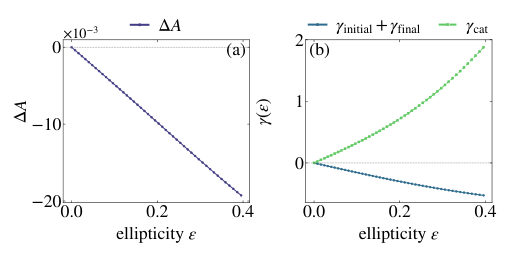
<figcaption class="paper-figure-caption"><b>Fig 1.</b> FIG. 2. (a) Area difference ∆A = Adisp −Ainit for the αx mode, obtained from the phase-space trajectories over one complete cycle of the orientation parameter ϕ, as a function of ellipticity ϵ. (b) Berry phase acquired by the conditional cat state after one complete cycle of ϕ as a function of ellipticity ϵ. The cat-state Berry phase γcat is compared with the sum of the Berry phases of the initial and HHG-displaced coherent states, γinitial + γfinal, calculated for both polarization modes (αx, αy). The parameters are the same as those in Fig. (1).</figcaption>
</figure>
<figure class="paper-figure-card">
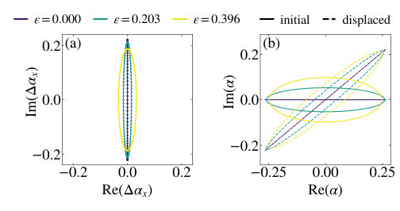
<figcaption class="paper-figure-caption"><b>Fig 2.</b> FIG. 1. (a) Complex-plane trajectories of the fundamental- mode displacement ∆αx(ϕ) for different values of the ellip- ticity parameter ϵ, (b) Comparison between the initial co- herent state |αx(ϕ)⟩(solid) and the displaced coherent state |αx(ϕ)+∆αx(ϕ)⟩(dotted). Parameters used: E0 = 0.053 a.u., ω = 0.057 a.u., Ip = 0.5 a.u. and ncyc = 5.</figcaption>
</figure>
<figure class="paper-figure-card">
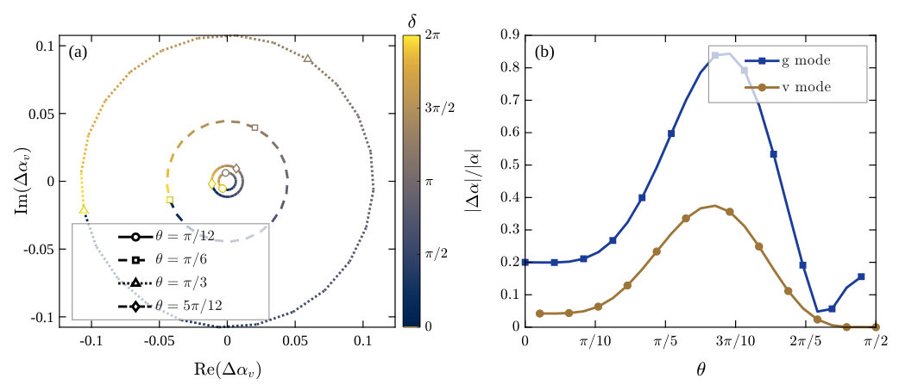
<figcaption class="paper-figure-caption"><b>Fig 3.</b> FIG. 3. (a) Complex-plane trajectories of the HHG-induced vortex-mode coherent-state displacement, ∆αv(δ) [Eq. (24)], for different values of the relative mode amplitude parameter θ, as the relative phase δ is varied over one complete cycle. (b) Relative coherent-state displacement, |∆α|/|α|, for the Gaussian and vortex modes as a function of θ, where the initial coherent-state amplitudes |α| are given by Eq. (21). The calculations were performed using E0 = 0.5 a.u., ω = 0.057 a.u., nA = 1 × 108 mm−2,Ip = 0.5 a.u., w0 = 0.3125 mm (millimeter), ρ = 4ω0 and ncyc = 5.</figcaption>
</figure>
<figure class="paper-figure-card">
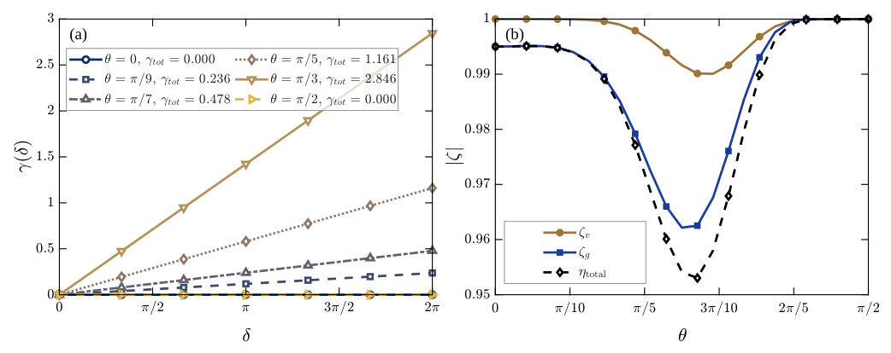
<figcaption class="paper-figure-caption"><b>Fig 4.</b> FIG. 4. (a) Accumulated Berry phase, γ(δ), of the HHG-generated optical cat state as the relative phase δ is varied over one complete cycle for different values of the relative mode amplitude parameter θ. (b) Coherent-state overlap, ζ = ⟨α|α −∆α⟩ [Eq. (2)], for the Gaussian, vortex, and total optical cat states as a function of θ. The parameters are the same as those used in Fig. 3.</figcaption>
</figure>

**Summary.** This research explores how the geometric properties of optical Schrödinger cat states can be controlled by manipulating the structured light fields used in High Harmonic Generation (HHG). By analyzing the phase-space evolution, the authors demonstrate that structured light provides a powerful tool to steer and control the geometric dynamics of these nonclassical states. This opens avenues for realizing complex, potentially topological, quantum states of light.

**Why it may be interesting.** This work bridges quantum optics, nonlinear light-matter interaction, and geometric phases, providing a concrete platform (HHG) to study the control of nonclassical light states using structured fields, which is highly relevant to quantum optics.

Detailed structure

**Main problem.** The paper investigates the geometric and topological properties of optical Schrödinger cat states generated through the High Harmonic Generation (HHG) process.

**Main result.** Structured light fields, such as those with rotating polarization ellipses or full Poincaré beams, offer a versatile means to control the geometric dynamics and associated geometric phases of these generated cat states.

**Method.** The analysis involves treating HHG quantum mechanically, calculating the conditional state of the fundamental mode, and characterizing the geometric phase using the Berry connection derived from the structured driving fields.

**Model / system.** The physical system is the interaction of intense laser fields with matter, modeled via the HHG process. The resulting quantum state is approximated as a superposition of coherent states (cat state) whose evolution is governed by the structured driving field parameters.

**Key observables.** Geometric phases, coherent-state displacements, and the harmonic yield spectra.

**Important parameters / regimes.** Polarization structure (ellipticity, orientation) and spatial-mode structure (e.g., vortex modes) of the driving light.

**Assumptions / limitations.** The analysis relies on a simplified effective framework for the conditional state and uses the Strong-Field Approximation (SFA) for dipole moment calculations, neglecting macroscopic propagation effects.

**Figures summary.** Figures illustrate the structured driving fields (FRE and FPB) and show the resulting HHG spectra and the spatial distribution of harmonic intensity as a function of the control parameters.

**Paper structure.** The paper progresses from establishing the quantum nature of HHG and the resulting cat state, to deriving the mathematical framework for geometric phase calculation using structured fields, and finally demonstrating control over these geometric properties using specific structured light configurations.

Abstract

High-harmonic generation (HHG) provides a powerful platform for exploring the interaction between intense laser fields and matter on ultrafast timescales. Beyond its conventional description in terms of emitted radiation and electron dynamics, a fully quantum treatment of HHG reveals that the nonlinear light-matter interaction can modify the quantum state of the driving field itself, establishing correlations between the fundamental and harmonic modes. This perspective opens new possibilities for using HHG as a tool to engineer and control nonclassical states of light. In this work, we investigate the geometric properties of optical Schroedinger cat states generated in HHG via conditioning and post-selection. By analyzing the coherent-state displacements induced by different structured driving fields, we characterize the resulting phase-space evolution and the associated geometric phases of the generated quantum states. Particular emphasis is placed on how the polarization and spatial-mode structure of the driving light influence the geometry and evolution of displaced coherent states. Our results demonstrate that structured light offers a versatile means of controlling the geometric dynamics of HHG-generated cat states across the parameter space. Furthermore, we discuss the prospects for realizing genuinely topological optical cat states by exploiting more complex structured light configurations.

[↑ back to top](#top)

### [Hybrid Qubit-Rotor Quantum Systems: Clifford Structure, Universal Control, and Applications](http://arxiv.org/abs/2608.20227v1)

**Authors:** Dengyao Luo, Arvin Kushwaha, Mastawal Tirfe, Bojko N. Bakalov  
**Type:** theory · **Category:** quantum information and computing · **PDF:** <https://arxiv.org/pdf/2608.20227v1>  
**Analysis basis:** full PDF text, analyzed in chunks
**Topic relevance:** `analog quantum simulation` **3/5** · `quantum measurements` **1/5**

↔ Scroll figures horizontally

<figure class="paper-figure-card">
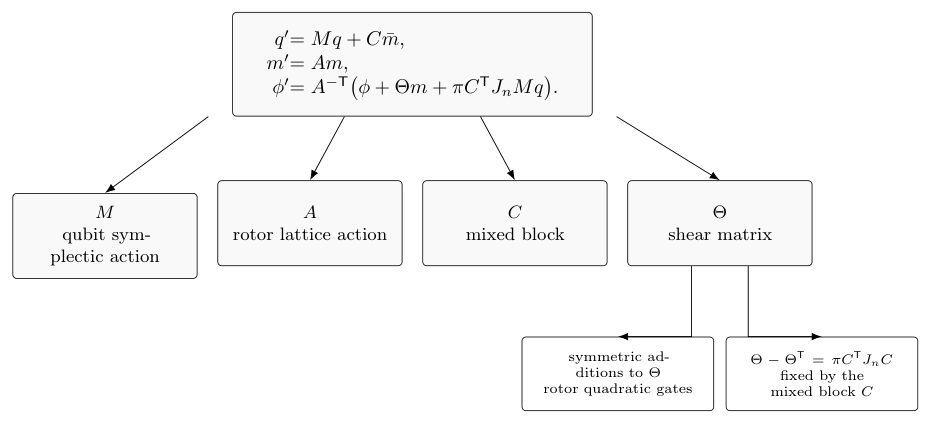
<figcaption class="paper-figure-caption"><b>Fig 1.</b> Figure 1: Block structure of the hybrid symplectic map. The matrices M and A describe the qubit symplectic and rotor lattice actions, and C is the mixed block. The difference Θ −ΘT = πCTJnC is fixed by the mixed block; symmetric additions to Θ correspond to rotor quadratic gates.</figcaption>
</figure>
<figure class="paper-figure-card">
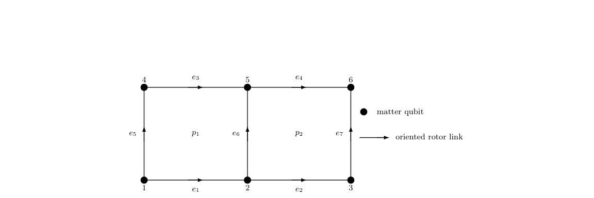
<figcaption class="paper-figure-caption"><b>Fig 2.</b> Figure 3: Open 2 × 1 gauge–matter strip used in the finite-flux benchmarks. Matter qubits occupy the six sites, U(1) rotors occupy the seven oriented links, and p1 and p2 denote the two plaquettes. Horizontal links are oriented to the right and vertical links upward, with the site and link ordering used in the calculation listed in Appendix D.4.</figcaption>
</figure>
<figure class="paper-figure-card">
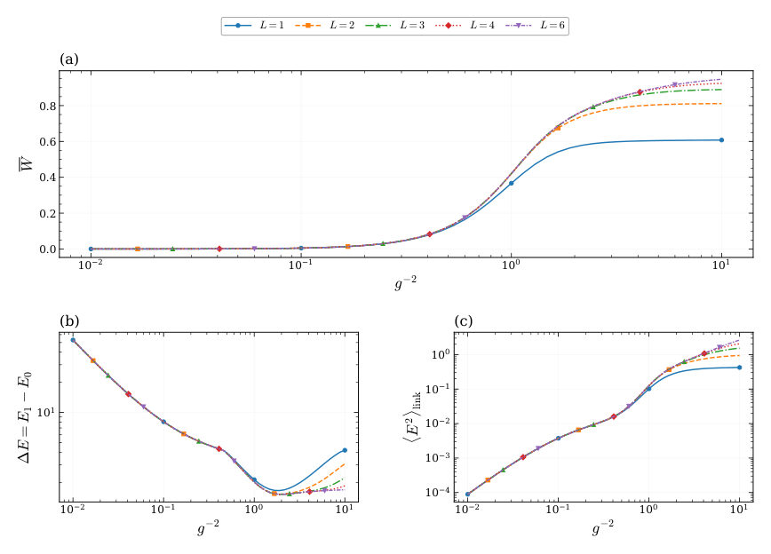
<figcaption class="paper-figure-caption"><b>Fig 3.</b> Figure 4: Ground-state results for the open 2 × 1 gauge–matter model. (a) Average plaquette cosine W. (b) Spectral gap ∆= E1 −E0. (c) Link-averaged squared electric flux ⟨E2⟩link. The curves correspond to flux cutoffs L = 1, 2, 3, 4, 6. The vertical dotted line marks g−2 = 1.</figcaption>
</figure>
<figure class="paper-figure-card">
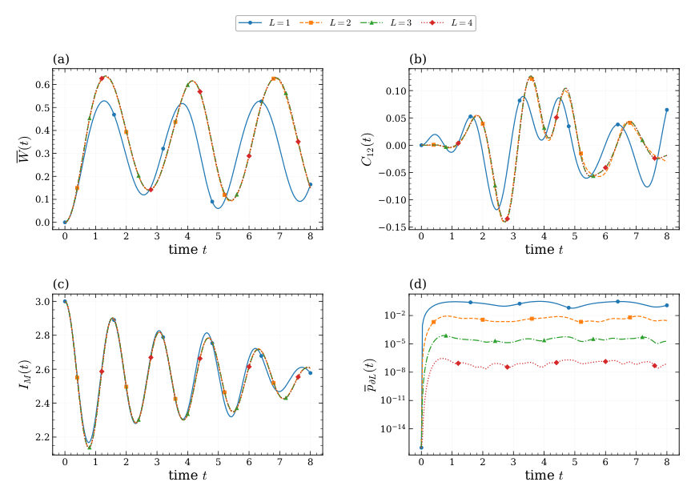
<figcaption class="paper-figure-caption"><b>Fig 4.</b> Figure 5: Gauge-invariant real-time dynamics of the open 2× 1 gauge–matter model following evolution from the zero-flux strong-coupling reference state. The parameters are g−2 = 1, m0 = 1.5, and κ = 1. (a) Average plaquette cosine W(t). (b) Connected two-plaquette correlation C12(t). (c) Staggered matter imbalance IM(t). (d) Link-averaged cutoff-boundary occupation p∂L(t). The first two panels probe the rotor gauge observables, panel (c) probes the matter-qubit dynamics, and panel (d) diagnoses the finite-flux truncation.</figcaption>
</figure>
<figure class="paper-figure-card">
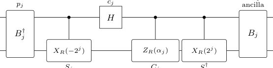
<figcaption class="paper-figure-caption"><b>Fig 5.</b> Figure 7: One stage of the gate-set compilation of the rotor momentum-code QFT. The momentum-dependent gate B† j extracts the jth input bit pj into the ancilla. The controlled shift Sj removes this bit from the rotor momentum, the Hadamard introduces the output bit cj, and Cj supplies the corresponding Fourier phase. The inverse shift writes cj into the rotor momentum, and Bj returns the ancilla to |0⟩a.</figcaption>
</figure>

**Summary.** This paper establishes a novel Clifford theory for quantum systems coupling qubits to quantum rotors, treating the combined system's phase space. The authors classify all possible symmetries and derive the minimal gate sets needed to realize these transformations. This framework is then applied to simulate complex physical processes, including gauge dynamics and quantum Fourier transforms.

**Why it may be interesting.** It provides a rigorous mathematical framework for controlling complex, hybrid quantum hardware architectures that combine discrete (qubit) and continuous (rotor) degrees of freedom, which is highly relevant for quantum simulation.

Detailed structure

**Main problem.** The paper develops a comprehensive Clifford theory and universal control framework for hybrid quantum registers combining qubits and quantum rotors.

**Main result.** It classifies all automorphisms of the hybrid phase space and provides explicit finite Clifford circuits for them, achieving universal control by adding minimal non-Clifford terms.

**Method.** The authors use group theory, Weyl operators, and stabilizer formalism to analyze the commutation relations and structure of the hybrid phase space.

**Model / system.** The system is a hybrid quantum register consisting of $n$ qubits and $r$ $U(1)$ quantum rotors, whose dynamics are governed by a hybrid phase space $\mathbb{F}_2^{n} 	imes \mathbb{Z}^r 	imes \mathbb{T}^r$.

**Key observables.** The classification of automorphisms, the minimum number of elementary mixed gates required for synthesis, and the fidelity of quantum transformations like controlled-shift operations and Fourier transforms.

**Important parameters / regimes.** The number of qubits ($n$), the number of rotors ($r$), and the structure of the coupling matrix $C$.

**Assumptions / limitations.** The classification of automorphisms is directional, implying inherent asymmetries in control capabilities (e.g., rotor parity controlling qubit operations, but not vice versa).

**Figures summary.** Not specified, but the notes detail the structure of the classification (Theorem 2.3) and the counting of logical instructions for QFT compilation (Table 7).

**Paper structure.** The paper proceeds by defining the hybrid phase space and Weyl operators, developing the Clifford theory and automorphism classification, establishing universal control conditions, and finally applying this structure to three distinct physical settings: gauge-covariant hopping, phase estimation, and QFTs.

Abstract

A $U(1)$ quantum rotor pairs a periodic angle with an integer-valued conjugate momentum, and occurs in molecular rotation, superconducting phase-charge circuits, and compact gauge fields. Coupling such a rotor coherently to qubits gives a hybrid register whose control structure is not inherited from either the oscillator-qubit or the qudit case. We develop a Clifford theory, together with a universal-control result, for registers of $n$ qubits and $r$ rotors. We classify all automorphisms of the hybrid phase space $\mathbb{F}_2^{2n}\times\mathbb{Z}^r\times\mathbb{T}^r$ that preserve the Weyl commutation relations, and give an explicit finite Clifford circuit for each one. The classification is directional: rotor momentum parity may control qubit Pauli operations within the Clifford group, while every nonzero qubit-controlled rotor momentum shift is non-Clifford. It also yields normal forms for the mixed qubit-rotor couplings and the exact minimum number of elementary mixed gates needed to synthesize them. Adding a rotor cosine potential and one fixed qubit-rotor conditional phase to the local Clifford operations gives universal control on the full Hilbert space in the strong operator topology. We then apply this structure in three settings: an exact controlled-shift realization of gauge-covariant matter hopping, which is necessarily non-Clifford; rotor phase estimation with direct angle readout and probe optimization under momentum-support and energy constraints; and finite Fourier transforms on rotor momentum codes, where the one-rotor transform for $d=2^s$ compiles into $O(s)$ momentum-selective and controlled-shift instructions and each cross-register Fourier factor is implemented by one quadratic rotor Clifford gate.

[↑ back to top](#top)

### [Nonlinear Drude weight of the one-dimensional Hubbard model](http://arxiv.org/abs/2608.20269v1)

**Authors:** Tetsuya Iwasaki, Hosho Katsura  
**Type:** theory · **Category:** strongly correlated electrons · **PDF:** <https://arxiv.org/pdf/2608.20269v1>  
**Analysis basis:** full PDF text, analyzed in chunks
**Topic relevance:** `analog quantum simulation` **3/5** · `Keldysh / 2PI / non-Gaussian methods` **1/5**

↔ Scroll figures horizontally

<figure class="paper-figure-card">
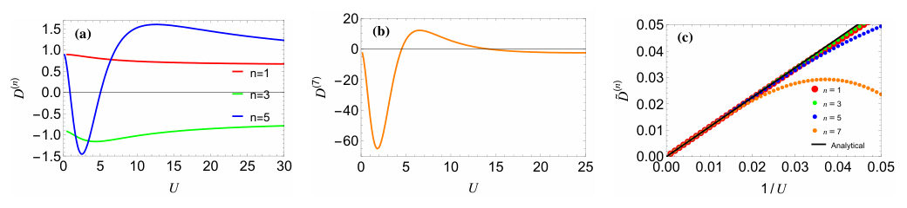
<figcaption class="paper-figure-caption"><b>Fig 1.</b> FIG. 1. Interaction dependence of the NLDWs at quarter filling for system size L = 204. (a) First-, third- and fifth-order Drude weights as functions of the interaction strength U. (b) Seventh-order Drude weight as a function of U. (c) Scaled NLDWs ˜D(n) = [D(n)(U) −D(n)(∞)]/(−4)(n−1)/2 plotted as functions of 1/U. The symbols denote numerical results obtained by solving the Bethe-ansatz equations (3), and the solid line presents the term proportional to 1/U in the analytical strong- coupling expansion given by Eq. (10).</figcaption>
</figure>
<figure class="paper-figure-card">
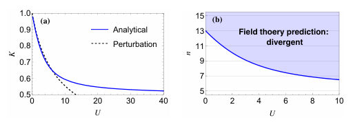
<figcaption class="paper-figure-caption"><b>Fig 2.</b> FIG. 2. TLL parameter at quarter filling and the correspond- ing criterion for the divergence of NLDWs. (a) Interaction dependence of K obtained from the Bethe ansatz solution. The solid curve represents the numerical result, while the dashed curve shows the weak-coupling perturbative result. (b) Threshold value of the order, 16K −3, as a function of the interaction strength. The shaded region indicates the param- eter regime where the Umklapp contribution to the NLDWs is expected to diverge according to Eq. (19).</figcaption>
</figure>
<figure class="paper-figure-card">
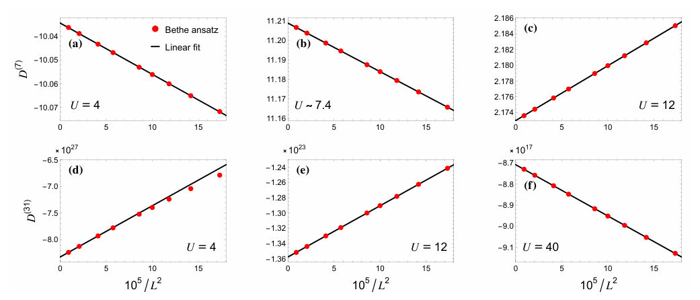
<figcaption class="paper-figure-caption"><b>Fig 3.</b> FIG. 3. Finite-size scaling of the nth-order Drude weights D(n) at quarter filling. The upper and lower panels show D(7) and D(31), respectively. For n = 7, the interaction strengths are chosen below, close to, and above the threshold 16K −3 predicted by the low-energy effective theory, as shown in Fig. 2. For n = 31, field theory predicts that D(n) diverges for all interaction strengths. In all cases, the data are well described by linear functions of 1/L2, indicating that the nonlinear Drude weights remain finite in the thermodynamic limit.</figcaption>
</figure>
<figure class="paper-figure-card">
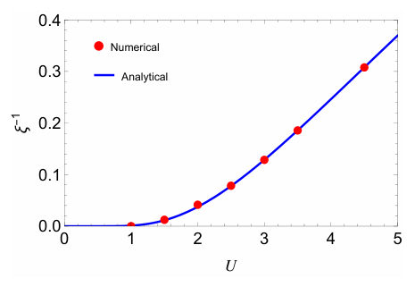
<figcaption class="paper-figure-caption"><b>Fig 4.</b> FIG. 5. Inverse correlation length at half filling. The solid blue curve represents the analytical result given by Eq. (21), while the symbols are extracted from the finite-size scaling of the third-order Drude weight using Eq. (20).</figcaption>
</figure>
<figure class="paper-figure-card">
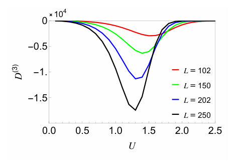
<figcaption class="paper-figure-caption"><b>Fig 5.</b> FIG. 4. Third-order Drude weight at half filling as a function of the interaction strength for several system sizes. Although the Drude weight vanishes in the thermodynamic limit, pro- nounced finite-size effects appear in the weak-coupling regime.</figcaption>
</figure>

**Summary.** This work calculates nonlinear Drude weights in the 1D Hubbard model to study non-linear transport. By comparing exact Bethe-ansatz results with low-energy field theory, the authors reveal a significant discrepancy: the exact results remain finite, contradicting theoretical predictions of divergence due to Umklapp terms. This clarifies the limitations of standard low-energy descriptions for higher-order transport coefficients.

**Why it may be interesting.** The discrepancy between exact numerical results and low-energy field theory predictions for higher-order transport coefficients highlights the limitations of conventional effective theories when describing non-linear quantum dynamics.

Detailed structure

**Main problem.** The paper investigates nonlinear Drude weights (NLDWs) in the one-dimensional repulsive Hubbard model to characterize ballistic transport beyond the linear-response regime.

**Main result.** The exact Bethe-ansatz calculations consistently show that NLDWs remain finite in the thermodynamic limit, contradicting the predictions of the low-energy effective field theory, which often predicts divergence due to Umklapp interactions.

**Method.** The study combines exact Bethe-ansatz calculations with low-energy effective field theory techniques, utilizing bosonization, strong-coupling expansions, and finite-size scaling analysis.

**Model / system.** The primary system is the one-dimensional (1D) repulsive Hubbard model, analyzed at quarter and half fillings. The low-energy physics is described by a spin-charge separated Tomonaga-Luttinger liquid (TLL) theory.

**Key observables.** Nonlinear Drude Weights, $D(n)$; asymptotic behavior near critical points; finite-size scaling functions.

**Important parameters / regimes.** Interaction strength ($U$), hopping amplitude ($t$), filling fraction ($
u$), and system length ($L$).

**Assumptions / limitations.** The analysis relies on the Bethe ansatz solution for exact results and employs bosonization/CFT techniques for the effective field theory description.

**Figures summary.** Figures illustrate the interaction dependence of NLDWs at quarter filling, and show finite-size scaling data for NLDWs at both quarter-filling and half-filling, confirming finite values where theory predicts divergence.

**Paper structure.** The paper proceeds by deriving NLDWs using generalized Kohn formulas, analyzing the strong-coupling expansion at quarter filling, comparing these results against TLL predictions, and finally analyzing finite-size scaling and critical behavior at half filling.

Abstract

We investigate nonlinear Drude weights (NLDWs) in the one-dimensional repulsive Hubbard model by combining exact Bethe-ansatz calculations with low-energy effective field theory. At quarter filling, we first derive the strong-coupling expansion of the NLDWs and confirm it numerically over a wide range of interaction strength. We then compare the numerical results with the prediction of the Tomonaga-Luttinger liquid (TLL) description including irrelevant perturbations. While band-curvature corrections yield finite contributions to higher-order NLDWs, the Umklapp interaction predicts divergent NLDWs when the order $n$ of the Drude weight exceeds a threshold determined by the TLL parameter. In contrast, finite-size scaling of the exact Bethe-ansatz results indicates that all calculated NLDWs remain finite in the thermodynamic limit, revealing a discrepancy between the exact results and the predictions of the low-energy effective field theory. At half filling, we analyze the finite-size scaling of the NLDWs across the Mott metal-insulator transition. We derive their asymptotic behavior in the insulating phase and propose a hyperscaling ansatz for NLDWs near the critical point, which is verified numerically. Our results clarify the interaction dependence and critical scaling of nonlinear transport coefficients in the one-dimensional Hubbard model and highlight limitations of the conventional low-energy effective description for higher-order transport.

[↑ back to top](#top)

### [Quantum-mechanical wave functions in singular potentials: linear and nonlinear states](http://arxiv.org/abs/2608.20282v1)

**Authors:** Hidetsugu Sakaguchi, Boris A. Malomed  
**Type:** theory · **Category:** quantum gases · **PDF:** <https://arxiv.org/pdf/2608.20282v1>  
**Analysis basis:** full PDF text, analyzed in chunks
**Topic relevance:** `analog quantum simulation` **3/5** · `Keldysh / 2PI / non-Gaussian methods` **1/5**

↔ Scroll figures horizontally

<figure class="paper-figure-card">
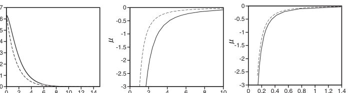
<figcaption class="paper-figure-caption"><b>Fig 1.</b> FIG. 1. (a) An example of the wave function χ(r), see Eq. (14), of the three-dimensional GS, produced by the numerical solution of Eq. (15), for U0 = 0.8 and µ = −0.225, as per Ref. [6]. Panels (b) and (c) represent GS families by means of dependences µ(N), for the ISP strength U0 = 0.8 and 0.1, respectively. These svalues are, respectively, higher and lower than the critical one, 1/4 (see Eq. (5)) for the corresponding linear Schr¨odinger equation (2). Solid and dashed curves represent, respectively, the numerical solution of Eq. (15), and the respective approximation based on Eqs. (18) and (19).</figcaption>
</figure>
<figure class="paper-figure-card">
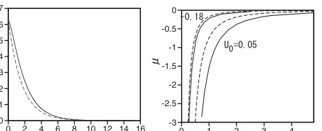
<figcaption class="paper-figure-caption"><b>Fig 2.</b> FIG. 2. (a) The radial profile of the two-dimensional GS stabilized by the quintic self-repulsive term, for U0 = 0.05 and µ = −0.1867. (b) Curves µ(N) for the GS with U0 = −0.18 and 0.05. The numerical results and the corresponding approximation (24) are plotted by the continuous and dashed curves, respectively. The figure is borrowed from Ref. [6].</figcaption>
</figure>
<figure class="paper-figure-card">
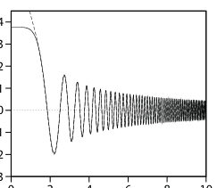
<figcaption class="paper-figure-caption"><b>Fig 3.</b> FIG. 3. The continuous curve represents the numerically found solution of Eq. (39) with γ = 2, g = 0, and E = 0. The dashed curve shows the asymptotic approximation (40) for the same case, with fitting constants χ0 = π/6 and ϕ0 = 0.44. The figure is borrowed from Ref. [18].</figcaption>
</figure>
<figure class="paper-figure-card">
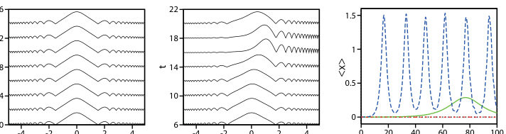
<figcaption class="paper-figure-caption"><b>Fig 4.</b> FIG. 4. (a) The stable evolution of the spatially even GS obtained as the numerical solution of Eq. (8) with γ = 2 , g = −1, energy eigenvalue E = −0.9, and norm N1D = 1.73. Eight snapshots of |ψ(x, t)| at t = 0, 2, · · · , 14 are plotted. (b) Snapshots of |ψ (x, t) | at t = 6, 8, · · · , 20 illustrate the case of the spontaneous parity-breaking instability of the even eigenstate with E = −1.1 and N1D = 3.07. (c) The center-of-mass coordinate (44) vs. time for the perturbed evolution of the eigenstates with E = −0.9 (the dotted red line), E = −1, N1D = 2.86 (the solid green line), and E = −1.1 (the dashed blue line).</figcaption>
</figure>

**Summary.** This article theoretically explores quantum wave functions in systems governed by singular potentials, such as the inverse-square potential. It demonstrates that repulsive nonlinear interactions can prevent quantum collapse in 3D bosonic gases. Furthermore, it shows that potentials growing faster than the harmonic oscillator can support a full spectrum of localized bound states, offering insights into trapping mechanisms in quantum matter.

**Why it may be interesting.** It provides a comprehensive theoretical framework for understanding how nonlinear interactions and specific potential geometries can stabilize quantum systems against collapse or induce novel localized states, which is crucial for modeling trapped ultracold atoms.

Detailed structure

**Main problem.** The paper investigates the behavior of quantum-mechanical wave functions in the presence of singular potentials, specifically addressing the phenomenon of quantum collapse and the existence of localized bound states.

**Main result.** The addition of repulsive contact interactions (nonlinear terms) can suppress quantum collapse caused by singular inverse-square potentials, and steep repulsive potentials ($\gamma > 1$) can generate a full spectrum of localized bound states.

**Method.** The analysis relies on solving the linear and nonlinear Schrödinger and Gross-Pitaevskii equations (GPE) in various dimensions (1D, 2D, 3D) using mean-field approximations and asymptotic analysis.

**Model / system.** The models include bosonic gases interacting via repulsive contact terms, subjected to singular potentials at $r 	o 0$ (inverse-square potential) and potentials that grow steeply at $r 	o \infty$ (expulsive potentials).

**Key observables.** Ground state wave functions ($\Psi$), chemical potential ($\mu$), binding energy, and the stability of vortex states.

**Important parameters / regimes.** Singular potential strength ($U_0$), nonlinearity strength ($g$), and the potential steepness parameter ($\gamma$).

**Assumptions / limitations.** The primary approximations involve the mean-field approximation (MFA) for repulsive interactions, and analyzing the system in the stationary state limit.

**Figures summary.** Figures illustrate numerical solutions for the radial profile of the wave function ($\chi(r)$) in 3D, and time evolution snapshots showing the stability of quantum droplets.

**Paper structure.** The paper systematically analyzes the problem in three parts: 1) 3D collapse suppression using the GPE; 2) Analysis of 2D/3D vortex states; and 3) Examination of 1D and 2D bound states under potentials singular at $r 	o \infty$.

Abstract

It is known that the attractive singular inverse-square potential gives rise to the critical quantum collapse in the framework of the three-dimensional (3D) linear Schroedinger equation. This article summarizes theoretical results which demonstrate suppression of the collapse, caused by this singular potential, and the creation of the otherwise missing ground state (GS) in a 3D gas of bosonic particles, carrying an electric dipole moment, which are pulled to the central electric charge, with repulsive contact interactions between the particles. In the mean-field approximation, the repulsive interactions are represented by the cubic term in the respective Gross-Pitaevskii (GP) equation. In addition to the GS, excited states with angular momentum are briefly considered too. Another topic considered in the article is 1D and 2D bound states in the linear Schroedinger and GP equations with the repulsive potential, which demonstrates a singularity at r --> infinity. A very recent result is that such a potential, growing faster than the negative harmonic-oscillator potential, produces a full spectrum of counter-intuitive normalizable (localized) bound states. The article puts forward perspectives for further studies of linear and nonlinear bound states existing under the action of the potentials with the singularity at r --> 0 or r --> infinity.

[↑ back to top](#top)

### [Strange Metal Hall Effect in Underdoped BaFe$_2$(As$_{1-x}$P$_x$)$_2$](http://arxiv.org/abs/2608.20325v1)

**Authors:** Augusto Ghiotto, Darian Hall, Yuanqi Lyu, Kohtaro Yamakawa, Sophie Rodehutskors, Corina Dunn, Philip J. W. Moll, John Singleton, Nikola Maksimovic, James G. Analytis  
**Type:** both · **Category:** strongly correlated electrons · **PDF:** <https://arxiv.org/pdf/2608.20325v1>  
**Analysis basis:** full PDF text, analyzed in chunks
**Topic relevance:** `non-equilibrium universality` **3/5** · `driven-dissipative phase transition` **1/5**

↔ Scroll figures horizontally

<figure class="paper-figure-card">
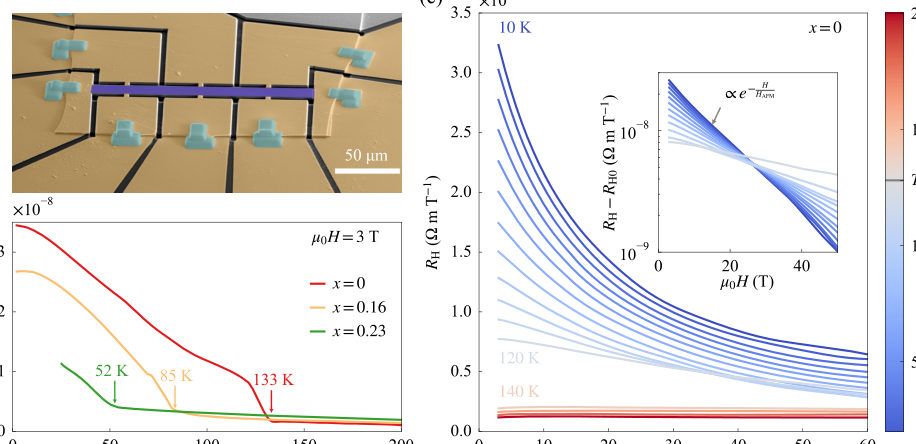
<figcaption class="paper-figure-caption"><b>Fig 1.</b> FIG. 1. Hall effect in the underdoped BaFe2(As1−xPx)2. (a) Microstructured Hall bar of BaFe2(As1−xPx)2. False-colored SEM image indicating the Hall bar (purple), gold contacts (gold) and platinum contacts (cyan). (b) Temperature dependence of the Hall coefficient measured at 3 T for x = 0 (TN ≈133K), 0.16 (TN ≈85K, Tc ≈2K) and 0.23 (TN ≈52K, Tc ≈22K). The Hall coefficient increases dramatically below TN and displays a pronounced composition dependence. (c) Magnetic field dependence of the Hall coefficient for x = 0 at different temperatures (10 K to 120 K in steps of 10 K, 140 K to 200 K in steps of 20 K). The AFM state has a very clear exponential fall-off below TN that is suppressed with...</figcaption>
</figure>
<figure class="paper-figure-card">
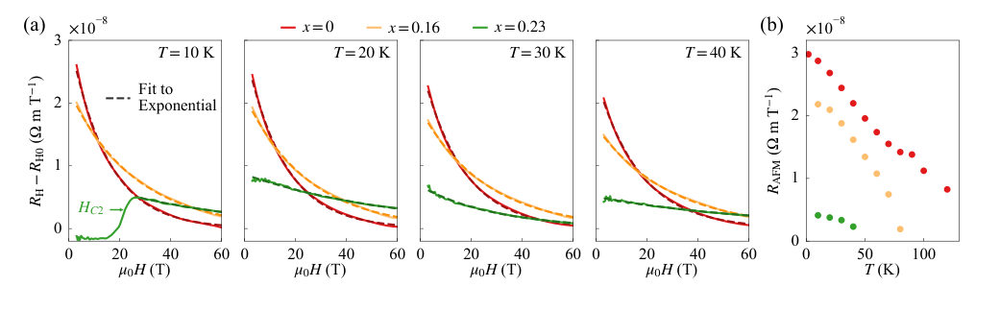
<figcaption class="paper-figure-caption"><b>Fig 2.</b> FIG. 2. Composition dependence of the Hall coefficient in the AFM state. (a) Hall coefficient at 10 K, 20 K, 30 K and 40 K for x = 0, 0.16 and 0.23. The enhanced Hall coefficient is present even when the zero-field ground state is superconducting. (b) Pre-factor RAF M for the exponential fall-off as a function of temperature and composition. Increasing temperature and P-doping suppress the low field enhancement of the Hall coefficient.</figcaption>
</figure>
<figure class="paper-figure-card">
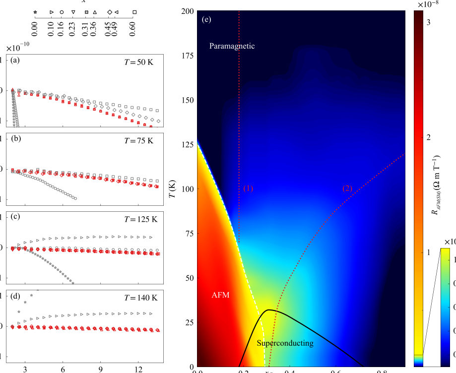
<figcaption class="paper-figure-caption"><b>Fig 3.</b> FIG. 3. Universal behavior in the quantum critical fan. (a) At 50 K, the Hall fall-off for 0.31 and 0.36 collapses. For 0.16 (TN ≈85K, Tc ≈2K), RH falls off significantly faster as the system is in the AFM state. (b) At 75 K, the Hall fall-off for 0.23 (TN ≈52K, Tc ≈22K) falls within the critical behavior of higher compositions. For 0.16 (TN ≈85K, Tc ≈2K), RH falls off faster as expected for the AFM state. (c) At 125 K, the quantum critical fall-off extends to x = 0.16, which is at the edge of the superconducting dome. For x = 0 (TN ≈133K), RH still displays a sharp fall-off in the AFM state. Surprisingly, for x = 0.10 (TN ≈100K) the Hall coefficient rises before saturating at higher...</figcaption>
</figure>
<figure class="paper-figure-card">
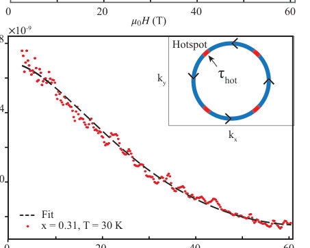
<figcaption class="paper-figure-caption"><b>Fig 4.</b> FIG. 4. Fits to the turning point and hotspot models. (a) Turning point model fit to RH of the parent compound assuming τ = 1.2 × 10−13 s, an AFM gap of 62 meV and effective mass of 1.6me. The resulting curve has been renor- malized in amplitude. Inset: Turning point model of the imperfectly nested Fermi surface in the AFM phase. Turning points are regions of the Fermi surface where the charge veloc- ity changes dramatically. (b) Hotspot model fit to RH of the optimally doped compound assuming τholes = 8.3 × 10−14 s, µh/µe = 1.2 with a scattering anisotropy factor of 4.8. Inset: Hotspot model of the normal state Fermi surface. Quantum fluctuations induce specific regions on the Fermi...</figcaption>
</figure>

**Summary.** This work analyzes the strange metal Hall effect in the iron-based superconductor BaFe2(As1-xP_x)2. The researchers find a universal, doping-independent Hall contribution in the strange metal regime, suggesting its origin lies in critical quantum fluctuations. This challenges simple quasiparticle descriptions and links unconventional superconductivity to magnetic quantum criticality.

**Why it may be interesting.** While focused on strongly correlated electron systems, the concept of universal transport behavior near a quantum critical point, which can be modeled by fluctuations, touches upon non-equilibrium dynamics relevant to open quantum systems.

Detailed structure

**Main problem.** The paper investigates the strange metal Hall effect (SMHE) in iron-based superconductors, aiming to understand the breakdown of the conventional quasiparticle picture in these materials.

**Main result.** A doping-independent contribution to the Hall effect, termed the SMHE, is observed in a fan-shaped region above a quantum critical point, suggesting an origin linked to critical fluctuations rather than simple Fermi surface reconstruction.

**Method.** The study combines electrical transport measurements (Hall effect) across varying doping and temperature with theoretical modeling, including comparisons to Fermi surface reconstruction models and 'hotspot' models.

**Model / system.** The physical system is the iron-based superconductor BaFe2(As1-xP_x)2. The analysis compares experimental data to theoretical models like the Shockley-Chambers integral and a 'hotspot' model to explain the magnetotransport properties.

**Key observables.** Electrical Hall coefficient (R_H), resistivity ($
ho$), and their dependence on temperature (T), magnetic field (H), and doping (x).

**Important parameters / regimes.** Doping level (x), temperature (T), magnetic field (H), and the proximity to a putative quantum critical point (QCP).

**Assumptions / limitations.** The SMHE is assumed to originate from critical fluctuations associated with an antiferromagnetic critical point, contrasting with the behavior predicted by simple Fermi surface reconstruction models.

**Figures summary.** Figures illustrate R_H vs. T and R_H vs. H for various dopings, showing the doping-independent SMHE in the quantum critical fan, and comparing model fits (Turning Point/Hotspot) to experimental data.

**Paper structure.** The paper progresses by establishing the anomalous transport properties (SMHE) in the superconducting phase, contrasting this universal behavior with the doping-dependent behavior near the antiferromagnetic state, and finally proposing critical fluctuations as the underlying mechanism.

Abstract

The unusual transport properties of strange metals point to the breakdown of the quasiparticle picture, the understanding of which remains one of the most vexing problems in physics. Here, we report investigations of the electrical Hall effect of the strange metal superconductor BaFe$_2$(As$_{1-x}$P$_x$)$_2$. We show that a doping-independent contribution to the Hall effect exists within a fan shaped region above a putative quantum critical point. This `strange metal Hall' contribution echoes many of the properties of the antiferromangetic Hall response, but attains universal properties that distinguish it from the effects of Fermi surface reconstruction. This is consistent with an underlying origin connected to the presence of critical fluctuations, tying it to observations of $T$-linear resistivity and the appearance of unconventional superconductivity.

[↑ back to top](#top)

### [TT-net: Quantum Inspired Tensor Network Denoising in Conditional GANs](http://arxiv.org/abs/2608.19789v1)

**Authors:** Michal A. Sterzel, Marko J. Rančić  
**Type:** both · **Category:** numerical methods · **PDF:** <https://arxiv.org/pdf/2608.19789v1>  
**Analysis basis:** full PDF text, analyzed in chunks
**Topic relevance:** `methods for driven-dissipative` **3/5** · `analog quantum simulation` **1/5**

↔ Scroll figures horizontally

<figure class="paper-figure-card">
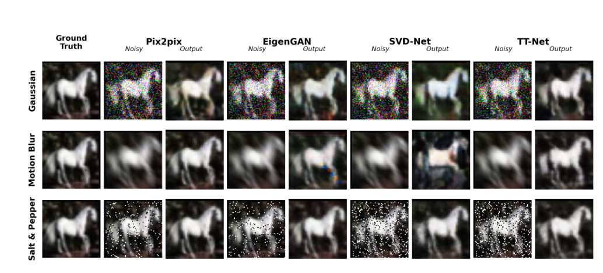
<figcaption class="paper-figure-caption"><b>Fig 1.</b> Figure 1: Representative test-set outputs across all four models and three noise types. Ground truth is shown once per row since it is identical across models. Each model’s own noisy input and output are shown alongside it.</figcaption>
</figure>
<figure class="paper-figure-card">
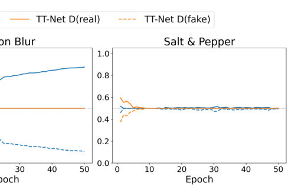
<figcaption class="paper-figure-caption"><b>Fig 2.</b> Figure 2: Discriminator output probabilities D(real)/D(fake) over training, SVD-Net vs. TT-Net, by noise type.</figcaption>
</figure>
<figure class="paper-figure-card">
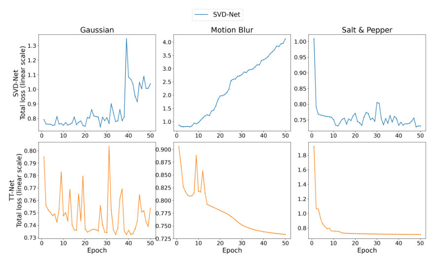
<figcaption class="paper-figure-caption"><b>Fig 3.</b> Figure 3: Total generator loss (LG = LGadv + Lrecon, Section 4.2) over training, SVD-Net (top) vs. TT-Net (bottom), by noise type, linear scale.</figcaption>
</figure>
<figure class="paper-figure-card">
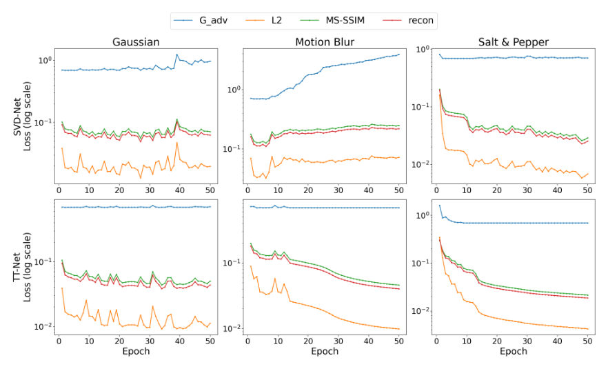
<figcaption class="paper-figure-caption"><b>Fig 4.</b> Figure 4: Generator loss components (Gadv, L2, MS-SSIM, recon) over training, SVD-Net (top) vs. TT-Net (bottom), by noise type. See Section 4.2 for the loss definitions, Lrecon = δ · LMS-SSIM + (1 −δ) · LL2, δ = 0.84.</figcaption>
</figure>
<figure class="paper-figure-card">
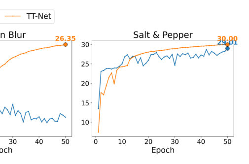
<figcaption class="paper-figure-caption"><b>Fig 5.</b> Figure 5: Validation PSNR over training, SVD-Net vs. TT-Net, by noise type.</figcaption>
</figure>

**Summary.** This work introduces TT-Net, which upgrades a GAN-based image denoising framework by replacing per-channel SVD with a cross-channel two-cut tensor-train decomposition. The results show that this quantum-inspired structural enhancement significantly improves denoising performance across various noise types compared to existing methods. It demonstrates the practical utility of tensor network tools as powerful feature extractors in deep learning.

**Why it may be interesting.** While applied to image processing, the core technique—using tensor networks (TT-decomposition) to model correlations across feature channels—is directly analogous to methods used in quantum many-body physics for representing quantum states, making it relevant for developing novel feature filters for quantum data analysis.

Detailed structure

**Main problem.** The paper addresses image denoising by improving the feature extraction process within Conditional GANs, moving beyond standard per-channel filtering.

**Main result.** The proposed TT-Net significantly outperforms SVD-Net and other state-of-the-art methods on multiple noise types, demonstrating that cross-channel information access via tensor-train decomposition enhances denoising quality.

**Method.** It replaces the per-channel Singular Value Decomposition (SVD) used in SVD-Net with a two-cut tensor-train decomposition (TT-Net) within the GAN architecture.

**Model / system.** The model is a Conditional GAN used for image denoising on the CIFAR-10 dataset. The core comparison is between SVD-Net (using per-channel SVD) and TT-Net (using two-cut tensor-train decomposition).

**Key observables.** PSNR and SSIM scores across Gaussian, motion blur, and salt-and-pepper noise; training dynamics of the adversarial loss term.

**Important parameters / regimes.** The reconstruction loss weights ($\delta=0.84$) and the fixed batch size (32) are key parameters used for comparison.

**Assumptions / limitations.** The primary assumption tested is that generalizing the decomposition from a single SVD cut to a multi-cut tensor-train decomposition provides superior access to cross-channel information for denoising.

**Figures summary.** Figures show qualitative visual comparisons of denoised images, and training dynamics plots illustrate the stabilization of the adversarial loss term in TT-Net compared to SVD-Net.

**Paper structure.** The paper introduces the problem, details the TT-Net modification over SVD-Net, presents controlled comparisons across various noise types using PSNR/SSIM, analyzes the training dynamics of the loss components, and concludes that cross-channel access is beneficial.

Abstract

Developed as a workhorse for classical simulations of quantum algorithms and quantum many-body systems, Tensor Network methods have entered the scientific mainstream in quantum physics. Among various types of tensor networks, Tensor Trains (commonly know as Matrix Product States in the quantum computing community) have already found applications in machine learning. These methods often rely on a powerful linear algebra tool called the Singular Value Decomposition (SVD). Several conditional GAN architectures for image denoising incorporate SVD as a single-cut decomposition step applied to generator feature maps. In this work we introduce TT-Net, which replaces the per-channel SVD denoising block with a two-cut tensor-train decomposition capable of accessing cross-channel information directly, a capability absent from contemporary alternatives. In a controlled comparison differing only in this decomposition mechanism, TT-Net outperforms SVD-Net on PSNR and SSIM across all three noise types tested (Gaussian, motion blur, and salt-and-pepper), supporting the hypothesis that cross-channel access improves denoising quality. Training-dynamics analysis further shows that TT-Net's adversarial loss term consistently saturates to a stagnant state across all three noise types, more so than SVD-Net's, while reconstruction quality continues to improve regardless, raising an open question about the adversarial component's contribution that this work identifies but does not resolve. Furthermore, for Gaussian noise our method outperforms both the EigenGAN and the state of the art Pix2pix method which does not assume any linear algebra decompositions and does not retain any linear algebra information. Our manuscript shows how quantum inspired tools can be used as practical real world feature filters for deep learning applications.

[↑ back to top](#top)

### [Attaining Fundamental Limits of Multiparameter Incoherent Optical Imaging Using Joint-Detection Quantum Measurements](http://arxiv.org/abs/2608.19524v1)

**Authors:** Nico Deshler, Aakash Warke, Michael R. Grace, Amit Ashok, Saikat Guha  
**Type:** theory · **Category:** other · **PDF:** <https://arxiv.org/pdf/2608.19524v1>  
**Analysis basis:** full PDF text, analyzed in chunks
**Topic relevance:** `quantum measurements` **3/5**

↔ Scroll figures horizontally

<figure class="paper-figure-card">
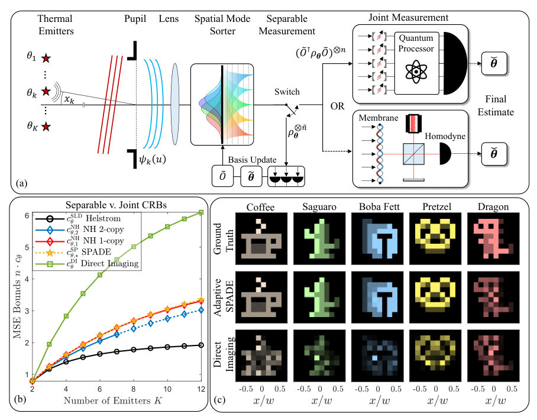
<figcaption class="paper-figure-caption"><b>Fig 1.</b> FIG. 1. (a) Schematic of the physical model involving K incoherent thermal emitters with known positions xk and unknown relative brightnesses θk. The receiver consists of a separable SPADE measurement designed to process ˜n copies of the state in order to pre-estimate the parameters ˜θ. Subsequently, the remaining n copies are (nearly) diagonalized by a spatial mode sorter using an approximation of the Williamson basis ˜O⊺ρθ ˜O. These are then routed to a joint measurement module (implemented using either transduction into quantum memories or interaction with an optomechanical membrane) to estimate residual deviations from a diagonal state and achieve the Helstrom bound for the brightness...</figcaption>
</figure>
<figure class="paper-figure-card">
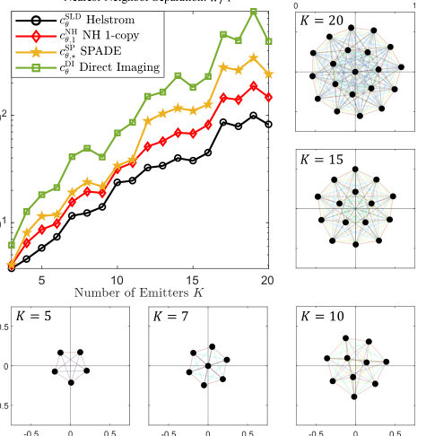
<figcaption class="paper-figure-caption"><b>Fig 2.</b> FIG. 2. Scalar CRBs for brightness estimation under differ- ent emitter geometries involving K sources of equal bright- ness. The nearest-neighbor separation for cluster was set to w/4. The NH bound is approximately 2× greater than the Helstrom bound for all geometries considered. SPADE consistently outperforms direct imaging while saturating the single-copy NH bound under particular geometries. Condition numbers for the Gram matrices of each scene ranged between ∼101 −108 for K = 3, . . . , 20. The colored lines connect- ing each emitter encode the magnitude of the gram matrix element |Gij| measuring the overlap between spatial modes excited by the jth and kth emitter.</figcaption>
</figure>
<figure class="paper-figure-card">
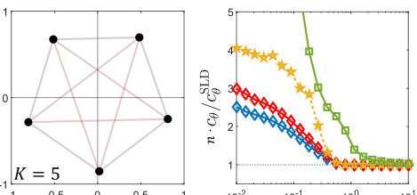
<figcaption class="paper-figure-caption"><b>Fig 3.</b> FIG. 3. Relative CRBs normalized by the Helstrom bound as a function of the object scale (scene dilation factor ∆) for three different emitter geometries. In the resolved regime (∆≫1) all bounds converge to the Helstrom bound indepen- dent of the emitter geometry. Here the Gram matrix is ap- proximately diagonal such that the brightness of each emitter is decoupled into orthogonal modes. When the size of the ob- ject falls below the diffraction limit (∆≪1), we see that the ratio between CRBs exceeds 1, highlighting a regime where joint detection measurements provide a genuine enhancement.</figcaption>
</figure>

**Summary.** This paper tackles the challenge of super-resolution imaging by determining the ultimate quantum limit for estimating multiple incoherent light sources. It proves that while separable measurements (like SPADE) are practical, they fall short of the theoretical quantum limit set by the Helstrom bound. The authors propose and analyze joint quantum detection receivers that can asymptotically reach this fundamental quantum limit.

**Why it may be interesting.** This work provides rigorous quantum information-theoretic tools to analyze measurement limitations in quantum optics, particularly showing how joint measurements can overcome classical separability constraints in imaging.

Detailed structure

**Main problem.** The paper addresses the fundamental quantum limits for simultaneously estimating the brightnesses of multiple, extended, incoherent point emitters below the diffraction limit.

**Main result.** It demonstrates that joint quantum measurements are necessary to surpass the limits of separable measurements, achieving the ultimate quantum limit set by the Helstrom bound.

**Method.** The authors derive the Quantum Fisher Information Matrix (QFIM) and analyze the commutation relations of the Symmetric Logarithmic Derivatives (SLDs) to establish the ultimate estimation bound.

**Model / system.** The model approximates an extended incoherent object as a finite grid of thermal point emitters, whose received state is a Gaussian state parameterized by unknown brightnesses.

**Key observables.** Quantum Fisher Information Matrix (QFIM), Helstrom bound, Nagaoka-Hayashi (NH) bound, and the Mean-Squared Error (MSE).

**Important parameters / regimes.** The number of emitters ($K$), the degree of sub-diffraction regime ($\Delta$), and the number of state copies ($n$).

**Assumptions / limitations.** The analysis assumes the pupil function is inversion-symmetric and that the state is full rank; it also compares the performance of joint vs. separable measurements.

**Figures summary.** Figures illustrate the comparison of quantum and classical bounds for 1D emitters, and show simulated reconstructions comparing adaptive SPADE measurements against direct imaging for 2D grids.

**Paper structure.** The paper builds from establishing the physical model and deriving the QFIM, to comparing various estimation bounds (Helstrom vs. NH), and finally articulating two specific joint detection receivers that asymptotically achieve the Helstrom bound.

Abstract

Resolving extended incoherent objects below the diffraction limit poses an application-rich imaging challenge whose solution may enable a new generation of observational instruments and capabilities. In this work, we invoke a practical model for general imaging by approximating an arbitrary extended incoherent object as a finite grid of thermal point emitters parameterized by their brightnesses. We derive the quantum Fisher information matrix (QFIM) for simultaneous brightness estimation and show that the symmetric logarithmic derivatives weakly commute, indicating that the Helstrom bound furnishes the ultimate quantum limit on the estimation error for incoherent imaging. Furthermore, for deeply sub-diffraction scenes, we find numerical evidence of a gap between the Nagaoka-Hayashi (NH) bound and the Helstrom bound. This gap reveals that separable measurements, though more experimentally accessible, are insufficient to reach the quantum limit, and points to the prospective advantage of joint measurements acting on multiple state copies. Additionally, we show that spatial mode-demultiplexing (SPADE) often saturates the NH bound solidifying its status as a near-optimal separable measurement strategy that significantly outperforms direct imaging. Finally, we articulate two joint detection receivers implemented with bona fide quantum resources that asymptotically achieve the Helstrom bound.

[↑ back to top](#top)

### [Multipolar Light-Matter Hamiltonians in Symmetry-Breaking Photonic Vacuums](http://arxiv.org/abs/2608.19336v1)

**Authors:** Liu Yang, Jiadu Lin, Qing-Dong Jiang  
**Type:** theory · **Category:** other · **PDF:** <https://arxiv.org/pdf/2608.19336v1>  
**Analysis basis:** full PDF text, analyzed in chunks
**Topic relevance:** `Tavis-Cummings & cavity-many-emitter` **2/5** · `analog quantum simulation` **2/5** · `Keldysh / 2PI / non-Gaussian methods` **1/5** · `correlated / nonlocal dissipation` **1/5** · `driven-dissipative phase transition` **1/5** · `interference shaping light` **1/5** · `methods for driven-dissipative` **1/5**

↔ Scroll figures horizontally

<figure class="paper-figure-card">
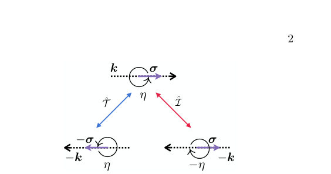
<figcaption class="paper-figure-caption"><b>Fig 1.</b> FIG. 1. Illustration of inversion (ˆI) and time-reversal ( ˆT ) transformations for a plane-wave mode with wavevector k, (dimensionless) spin angular momentum σ, and helicity η = k · σ/|k|.</figcaption>
</figure>
<figure class="paper-figure-card">
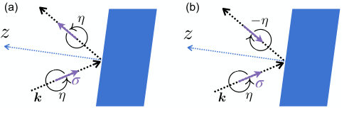
<figcaption class="paper-figure-caption"><b>Fig 2.</b> FIG. 2. Schematic mirror configurations for two symmetry- breaking photonic vacuums. (a) Spatial-chiral vacuum: both mirrors reflect the same helicity sector of modes while pre- serving helicity and are transparent to the opposite sector. (b) Temporal-chiral vacuum: the two mirrors reflect opposite helicity sectors, reverse the helicity upon reflection, and are each transparent to the other sector.</figcaption>
</figure>
<figure class="paper-figure-card">
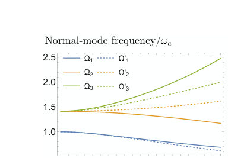
<figcaption class="paper-figure-caption"><b>Fig 3.</b> FIG. 3. Normal-mode frequencies Ωn and Ω′ n (n = 1, 2, 3) for the full Hamiltonian in Eq. (20) and the reference Hamiltonian without the dipole-associated Zeeman correction Eq. (21) obtained by setting δAζ P = 0, respectively. The pa- rameters are ℏ= 1, q = −e, ζ = +1, ωc = 1, and ω = √</figcaption>
</figure>

**Summary.** This paper develops a generalized framework for light-matter interaction Hamiltonians when the photonic vacuum lacks inversion or time-reversal symmetry. By applying the Power-Zienau-Woolley transformation, the authors derive specific symmetry-breaking terms for chiral vacuums. These terms predict measurable spectral shifts in embedded atoms and molecules, advancing the theory of chiral cavity QED.

**Why it may be interesting.** This work provides a general, rigorous framework for understanding how fundamental symmetries of the electromagnetic vacuum directly modify the fundamental light-matter coupling Hamiltonian in cavity QED settings.

Detailed structure

**Main problem.** The conventional multipolar Hamiltonian is insufficient for describing light-matter interactions when the surrounding photonic vacuum breaks inversion or time-reversal symmetry.

**Main result.** The symmetry breaking leads to new terms in the Hamiltonian, specifically an inversion-breaking self-energy in spatial-chiral vacuums and a Zeeman-like term in temporal-chiral vacuums.

**Method.** The authors use the Power-Zienau-Woolley transformation to derive the modified multipolar Hamiltonians for idealized chiral photonic environments.

**Model / system.** The analysis uses model systems such as trapped hydrogen-like atoms and charged harmonic oscillators coupled to spatially or temporally chiral cavities.

**Key observables.** Characteristic spectral shifts in embedded matter, including a second-order energy shift $\Delta E^{(2)}_{nS}$ and angular-momentum-dependent frequency shifts.

**Important parameters / regimes.** The coupling strength ($g/\omega_c$) and the nature of the vacuum symmetry ($\mathcal{I}$ or $\mathcal{T}$ breaking).

**Assumptions / limitations.** The analysis relies on approximations, such as the long-wavelength limit and the dipole approximation for the Zeeman correction.

**Figures summary.** Figure 2 illustrates the mirror configurations for spatial-chiral and temporal-chiral vacuums, while Figure 3 compares normal-mode frequencies showing the effect of the Zeeman correction as coupling strength increases.

**Paper structure.** The paper first establishes the need for modification due to vacuum symmetry breaking, derives the general PZW Hamiltonians for the two chiral cases, and then applies these to model systems (hydrogen atom, harmonic oscillator) to calculate observable spectral shifts.

Abstract

We show that the conventional multipolar Hamiltonian is qualitatively modified when the photonic vacuum breaks inversion or time-reversal symmetry. By explicitly applying the Power-Zienau-Woolley transformation, we derive the resulting multipolar Hamiltonians for two idealized chiral photonic environments: a spatial-chiral vacuum, which breaks inversion symmetry, and a temporal-chiral vacuum, which breaks time-reversal symmetry. In the spatial-chiral case, the transformation generates an inversion-breaking self-energy, whereas in the temporal-chiral case it produces an additional Zeeman-like energy. Using a trapped hydrogen-like atom and a charged harmonic oscillator in cavities as minimal examples, we show that these symmetry-dependent terms lead to characteristic spectral shifts. Our work provides a general framework for describing light-matter interactions in chiral quantum electrodynamics and identifying the associated symmetry-dependent effects on cavity-embedded atoms, molecules, and quantum materials.

[↑ back to top](#top)

### [Quantum Gaussian processes for prediction of channel observations](http://arxiv.org/abs/2608.19306v1)

**Authors:** Jonas Jäger, Yaroslav Khmelnitskiy, Paolo Braccia, Artur Miroszewski, Diego García-Martín, M. Cerezo, Piotr Czarnik  
**Type:** theory · **Category:** quantum information and computing · **PDF:** <https://arxiv.org/pdf/2608.19306v1>  
**Analysis basis:** full PDF text, analyzed in chunks
**Topic relevance:** `methods for driven-dissipative` **2/5** · `quantum measurements` **2/5** · `Keldysh / 2PI / non-Gaussian methods` **1/5** · `analog quantum simulation` **1/5** · `correlated / nonlocal dissipation` **1/5** · `driven-dissipative phase transition` **1/5**

↔ Scroll figures horizontally

<figure class="paper-figure-card">
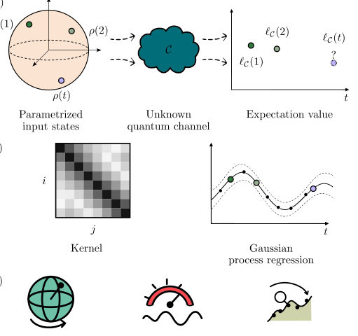
<figcaption class="paper-figure-caption"><b>Fig 1.</b> Figure 1. Quantum Gaussian process regression for quantum channels. (a) A parametrized family of input states ρ(t) is acted on by an unknown quantum channel C. Expecta- tion values ℓC(t) = Tr[C(ρ(t))O] are measured for a small set of input states and used to predict the observable for new inputs. (b) The kernel encodes correlations between the input states. Together with the measured training data, it defines the QGP posterior used for regression. In this work, we consider both the channel kernel derived under the assumption of uniform chan- nel sampling, and its rescaled heuristic counterpart. (c) Beyond regression, the channel QGP framework can be applied to tasks such as state...</figcaption>
</figure>
<figure class="paper-figure-card">
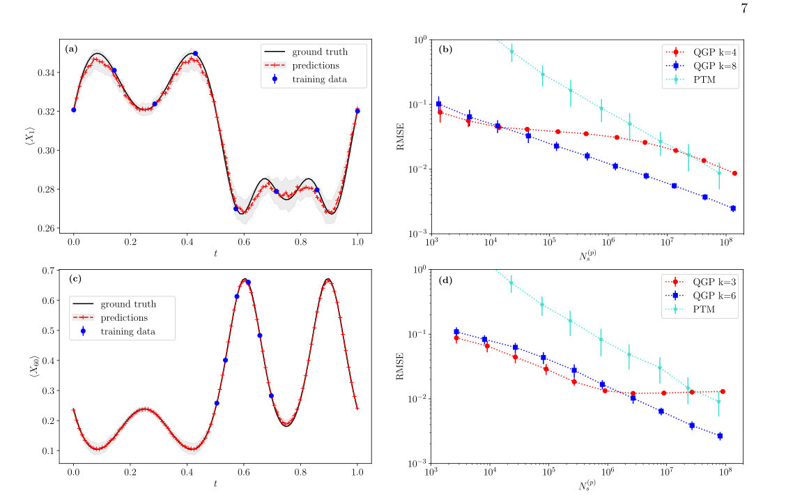
<figcaption class="paper-figure-caption"><b>Fig 2.</b> Figure 2. QGP regression with the channel kernel. We learn the expectation value of X1 (X60) for a family of 4-qubit (64-qubit) input states generated by single-qubit rotations parametrized by t followed by system unitary dynamics. Joint system- environment time evolution implements the channel. Both are implemented by a transverse-field one-dimensional Ising Hamiltonian and a Trotter product formula. For n = 4, the channel acts globally on all system qubits, while for n = 64 it acts locally on a 4-qubit subsystem. In (a), we show QGP regression for the global channel with the shot budget N (p) s = 1.32 · 108 for a single prediction. The black curve is the ground truth, the blue circles are...</figcaption>
</figure>
<figure class="paper-figure-card">
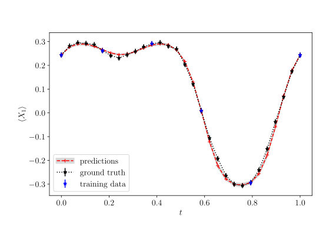
<figcaption class="paper-figure-caption"><b>Fig 3.</b> Figure 3. QGP regression with the channel kernel on IBM’s quantum computer ibm_boston. We predict ⟨X1⟩(t) for a family of 4-qubit input states generated by single-qubit rotations parametrized by t. The channel is a real-device im- plementation of a circuit performing Trotterized transverse-field Ising dynamics coupling the system to a 4-qubit environment. The ground truth, indicated by the black markers, are the re- sults obtained from the quantum device with 34400 shots per data point. The error bars, computed as twice the standard deviation, quantify the finite shot effects. The blue markers are the training data obtained from the same device and with the same number of shots. The red...</figcaption>
</figure>
<figure class="paper-figure-card">
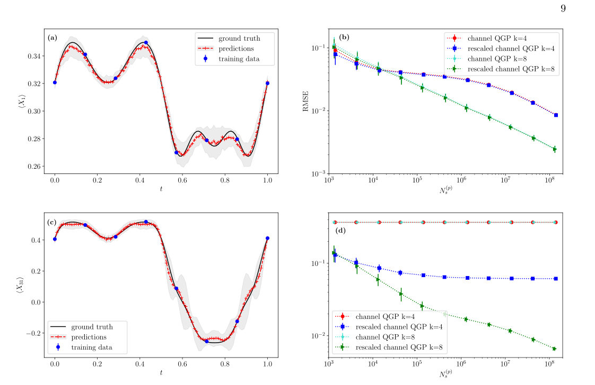
<figcaption class="paper-figure-caption"><b>Fig 4.</b> Figure 4. QGP regression with the rescaled channel kernel. In (a), we show learning of ⟨X1⟩for the same 4-qubit setup as in Fig. 2, with shot budget N (p) s = 1.32·108 per prediction. In (c), ⟨X31⟩was learned for a 64-qubit family of input states prepared by single-qubit rotations parametrized by t, and a global channel generated by one-dimensional Trotterized transverse-field Ising dynamics coupling the system to a 64-qubit environment. Here, N (p) s = 1.32 · 106. In (a) and (c), we plot the ground truth (the black lines), the training data (the blue circles), the predictions (the red crosses) and their 95% confidence intervals (the shaded areas). In (b) and (d), we compare the RMSE of the...</figcaption>
</figure>
<figure class="paper-figure-card">
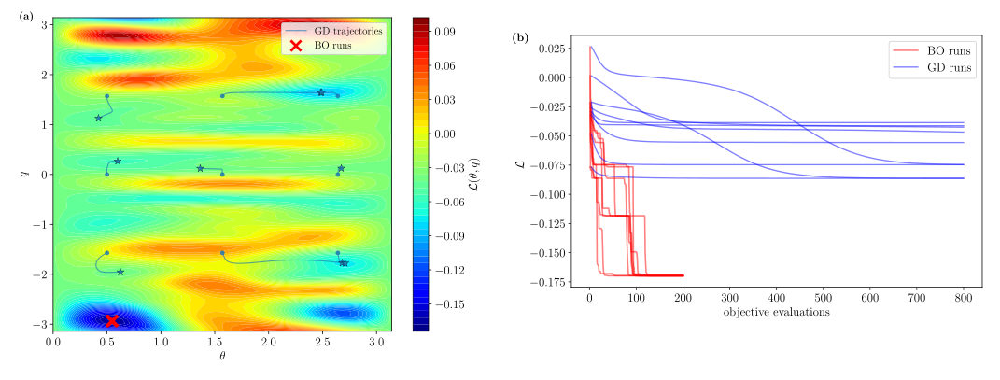
<figcaption class="paper-figure-caption"><b>Fig 5.</b> Figure 5. Bayesian optimization of noisy XXZ dynamics with channel GP surrogates. Here we show BO of staggered magnetization (37) for the dynamics of a 10-qubit XXZ Hamiltonian with transverse and disordered longitudinal fields (35, 36) and single-qubit depolarizing noise. As a reference, we show gradient descent (GD) optimization. We optimize over a family of input spin-spiral states parametrized by parameters θ and q (33). In (a), the contour plot shows our loss function landscape (38) on an 80-by-80 grid. The overlapping red crosses show the best parameters found by 9 BO runs, indicating that all the runs converge to the same minimum. The BO uses channel QGPs with rescaled kernels as...</figcaption>
</figure>

**Summary.** This paper extends Quantum Gaussian Process (QGP) regression to model unknown quantum channels, moving beyond simple unitary evolution. The authors derive a corrected kernel using an empirical Bayes heuristic to overcome limitations in large-scale systems. This allows for robust prediction of quantum channel outputs even with limited experimental measurements.

**Why it may be interesting.** This work provides a powerful, scalable Bayesian inference tool (QGP) for characterizing unknown, realistic open quantum system dynamics, which is crucial for quantum process tomography and quantum control.

Detailed structure

**Main problem.** The paper addresses the challenge of predicting the expectation value of a Pauli observable after an unknown quantum evolution (channel) using limited measurement data.

**Main result.** The authors successfully extend Quantum Gaussian Process (QGP) regression beyond unitary dynamics to general quantum channels, proposing a rescaled kernel heuristic that restores learnability for large systems.

**Method.** They employ QGP regression, deriving the process prior using the Lebesgue measure over quantum channels, and introduce an empirical Bayes heuristic to correct for kernel suppression in large subsystems.

**Model / system.** The system involves an unknown quantum channel $C$ acting on input states $
ho(t)$, and the prediction target is the expectation value $	ext{Tr}[C(
ho(t))O]$. The framework is tested on both local and global channel dynamics.

**Key observables.** Expectation values of Pauli observables ($\ell_C(t)$), and the resulting predicted mean and variance from the QGP.

**Important parameters / regimes.** System size (up to 64 qubits), shot budget ($N$), and the learnable scale parameter introduced by the heuristic.

**Assumptions / limitations.** The standard Lebesgue prior over quantum channels is too broad, necessitating the empirical Bayes heuristic to replace the dimensional factor with a learnable scale parameter.

**Figures summary.** Figure 1 illustrates the QGP regression setup for quantum channels, showing the kernel encoding input state correlations and the applicability beyond simple regression tasks like state preparation.

**Paper structure.** The paper builds from known QGP results for unitary dynamics to the general case of quantum channels. It derives the QGP prior, identifies the scaling issue with the Lebesgue measure, proposes the empirical Bayes correction, and validates the method on large-scale simulations and noisy dynamics.

Abstract

Given a set of input states, we consider the task of predicting the expectation value of a Pauli observable at the output of an unknown quantum evolution, using only a limited number of measurements. Recently, quantum Gaussian process (QGP) regression was introduced for this task across various classes of unitary evolution. Here, we extend the QGP framework beyond unitary dynamics. In particular, we prove convergence of the channel's outputs to a QGP and derive the associated closed-form kernel under a uniform (Lebesgue measure) prior over quantum channels. The kernel's dimensional factor, however, dictates the required observation precision. While manageable when the channel and observable are restricted to small subsystems, exponential suppression precludes learning when the subsystem grows extensively with the system size. Since the Lebesgue prior is overly broad for many applications, we propose an empirical Bayes heuristic that replaces the dimensional factor with a learnable scale parameter while retaining the kernel's state-overlap correlation structure. In numerical simulations of up to 64 qubits, channel QGP regression with the Lebesgue kernel exhibits a strong inductive bias for local channels, enabling faithful extrapolation. For global 64-qubit channels, the rescaled kernel restores learnability, with predictions improving systematically with the shot budget. Results from a noisy quantum computer further demonstrate the robustness of QGP regression under experimental conditions. Beyond regression, we validate QGPs as Bayesian-optimization surrogates for state preparation under noisy XXZ dynamics.

[↑ back to top](#top)

### [Deep neural networks as lattice gauge theories](http://arxiv.org/abs/2608.19331v1)

**Authors:** Ro Jefferson, Shradha Ramakrishnan  
**Type:** theory · **Category:** disordered systems and neural networks · **PDF:** <https://arxiv.org/pdf/2608.19331v1>  
**Analysis basis:** full PDF text, analyzed in chunks
**Topic relevance:** `Keldysh / 2PI / non-Gaussian methods` **2/5** · `analog quantum simulation` **2/5** · `methods for driven-dissipative` **1/5**

↔ Scroll figures horizontally

<figure class="paper-figure-card">
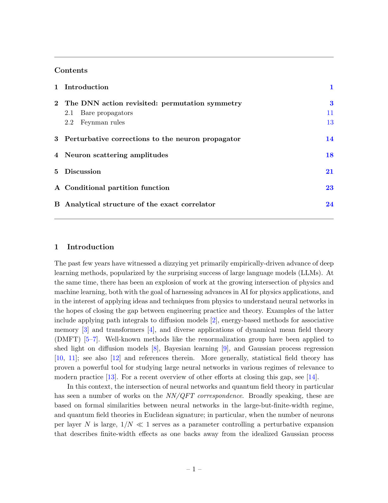
<figcaption class="paper-figure-caption"><b>Fig 1.</b> Low-resolution page preview, page 2</figcaption>
</figure>
<figure class="paper-figure-card">
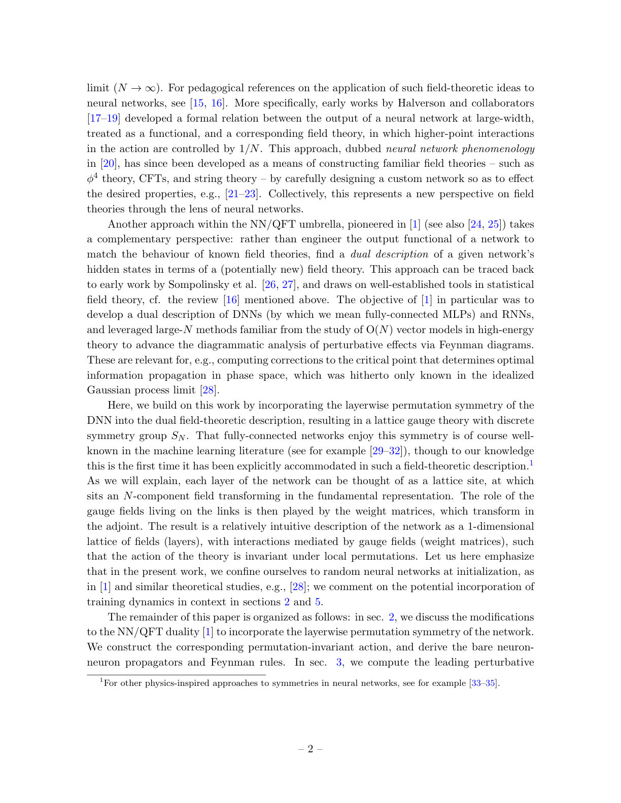
<figcaption class="paper-figure-caption"><b>Fig 2.</b> Low-resolution page preview, page 3</figcaption>
</figure>
<figure class="paper-figure-card">
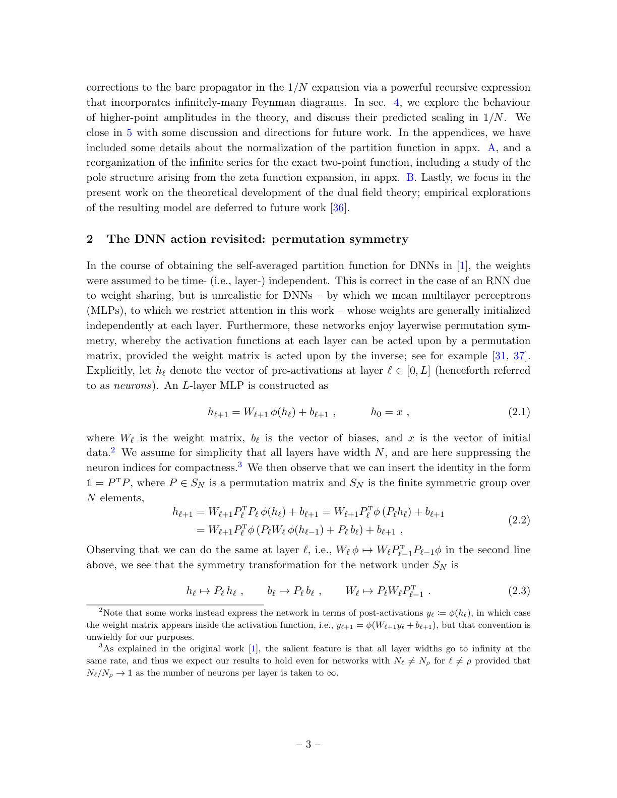
<figcaption class="paper-figure-caption"><b>Fig 3.</b> Low-resolution page preview, page 4</figcaption>
</figure>
<figure class="paper-figure-card">
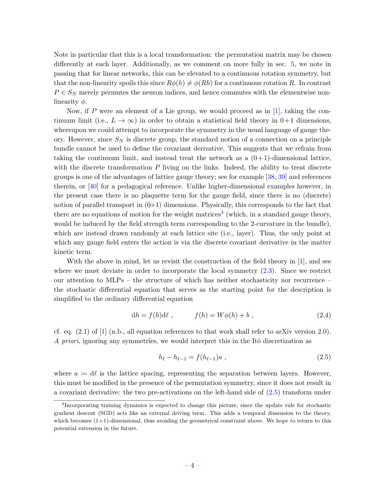
<figcaption class="paper-figure-caption"><b>Fig 4.</b> Low-resolution page preview, page 5</figcaption>
</figure>
<figure class="paper-figure-card">
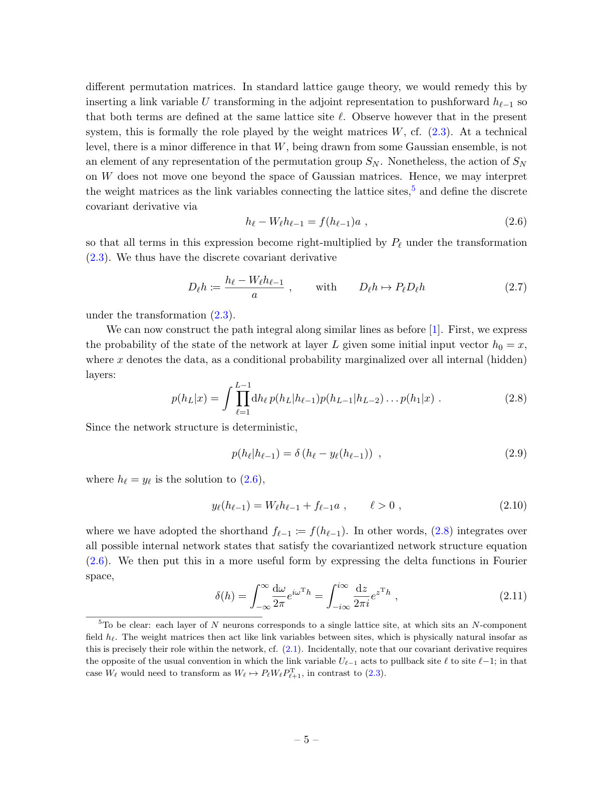
<figcaption class="paper-figure-caption"><b>Fig 5.</b> Low-resolution page preview, page 6</figcaption>
</figure>

**Summary.** This work reformulates deep neural networks as a $(0+1)$-dimensional lattice gauge theory by incorporating the layerwise permutation symmetry. Using techniques from quantum field theory, the authors compute propagators and scattering amplitudes in the large-$N$ limit. This provides a powerful, rigorous field-theoretic framework for studying information flow and correlations within deep learning models.

**Why it may be interesting.** The connection between the discrete symmetries of neural networks and the mathematical machinery of lattice gauge theory provides a novel, field-theoretic lens for understanding complex information processing dynamics.

Detailed structure

**Main problem.** The paper modifies the NN/QFT duality to incorporate the layerwise permutation symmetry of deep neural networks, treating the network as a lattice gauge theory.

**Main result.** They develop a field-theoretic framework to compute the neuron-neuron propagator and scattering amplitudes in the perturbative expansion in $1/N$, providing insights into information propagation.

**Method.** The methodology involves adapting lattice gauge theory concepts to a discrete symmetry group ($S_N$), calculating the partition function via path integrals, and performing large-$N$ expansions.

**Model / system.** The model is a deep neural network (MLP) treated as a $(0+1)$-dimensional lattice gauge theory, where layers are sites and weight matrices act as link variables.

**Key observables.** Neuron-neuron propagator, layer variance evolution, neuron scattering amplitudes, and correlation functions.

**Important parameters / regimes.** Network width ($N$), layer index ($\ell$), and the large-$N$ limit ($1/N$ expansion).

**Assumptions / limitations.** The analysis is restricted to random networks at initialization, and the continuum limit is avoided due to the discrete nature of the symmetry.

**Paper structure.** The paper progresses from establishing the lattice gauge theory formulation based on $S_N$ symmetry, through the calculation of the partition function using auxiliary fields, and finally to developing the perturbative machinery for computing propagators and correlation functions.

Abstract

We modify the NN/QFT duality [1] to incorporate the layerwise permutation symmetry of the network, resulting in a $(0\!+\!1)$-dimensional lattice gauge theory, in which each layer of $N$ neurons acts as an $N$-component lattice site, and the weight matrices play the role of gauge fields living on the links. In this framework, we compute the tree-level neuron-neuron propagator which describes the evolution of layer variance in the network, and develop the Feynman diagram machinery to compute interactions in the perturbative expansion in $1/N$. In particular, we obtain a recursive expression for all corrections to the exact propagator at $O(1)$, representing statistical fluctuations in the ensemble of networks, including infinitely-many loop diagrams mediating the interactions from previous layers. We also present a preliminary analysis of neuron scattering amplitudes that contribute order-by-order in $1/N$, which provides a field-theoretic framework for studying higher-point correlations, and by extension information propagation, in deep networks. We remark on some interesting directions for future work at the intersection of neural networks and quantum field theory.

[↑ back to top](#top)

### [Nonzero-temperature vibronic spectra of polyatomic molecules from a zero-temperature classical trajectory](http://arxiv.org/abs/2608.20075v1)

**Authors:** Davide Barbiero, Jiří J. L. Vaníček  
**Type:** theory · **Category:** other · **PDF:** <https://arxiv.org/pdf/2608.20075v1>  
**Analysis basis:** full PDF text, analyzed in chunks
**Topic relevance:** `Keldysh / 2PI / non-Gaussian methods` **2/5** · `methods for driven-dissipative` **2/5** · `quantum measurements` **1/5**

↔ Scroll figures horizontally

<figure class="paper-figure-card">
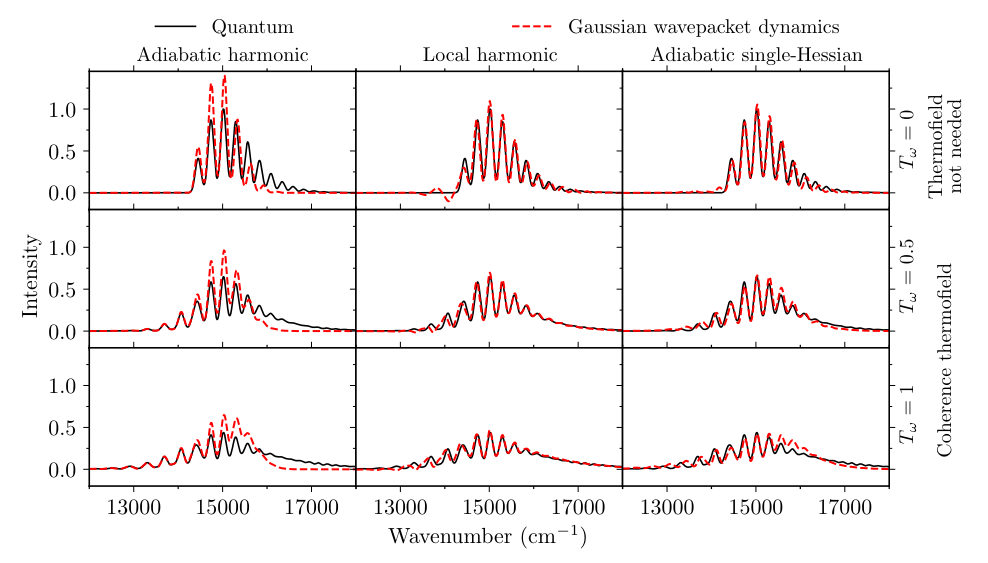
<figcaption class="paper-figure-caption"><b>Fig 1.</b> FIG. 1. Vibronic spectra of BaS at three different scaled temperatures Tω obtained from the split-operator coherence thermofield dynamics and different effective potentials for the semiclassical coherence thermofield Gaussian wavepacket dynamics. The anharmonicity of the excited-state surface (15) of BaS is described by the dimensionless anharmonicity parameter χ ≈0.01 and the Huang-Rhys factor S ≈2.4.</figcaption>
</figure>
<figure class="paper-figure-card">
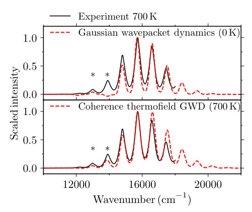
<figcaption class="paper-figure-caption"><b>Fig 2.</b> FIG. 2. Photoelectron spectrum of SeO− 2 at 700 K. Spec- tra computed from the vertical single-Hessian Gaussian wavepacket dynamics (GWD) at 0 K and from the vertical single-Hessian coherence thermofield GWD at 700 K are com- pared to the experimental spectrum.46 Hot bands are denoted by asterisks.</figcaption>
</figure>
<figure class="paper-figure-card">
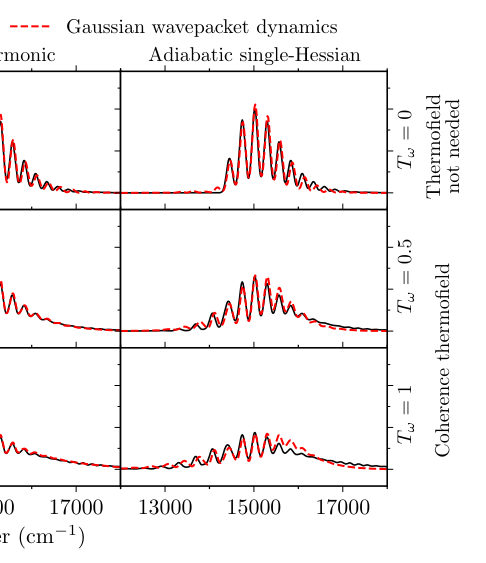
<figcaption class="paper-figure-caption"><b>Fig 3.</b> Figure 4 compares the low-energy region of the absorp- tion spectrum of phenyl radical computed at zero tem- perature from the GWD and at room temperature from the coherence thermofield GWD (both based on the adi- abatic single-Hessian approximation) to the experimen- tal spectrum measured at room temperature.47 To facili- tate comparison with the rotationally averaged computed spectra, the rotational structure was removed from the</figcaption>
</figure>
<figure class="paper-figure-card">
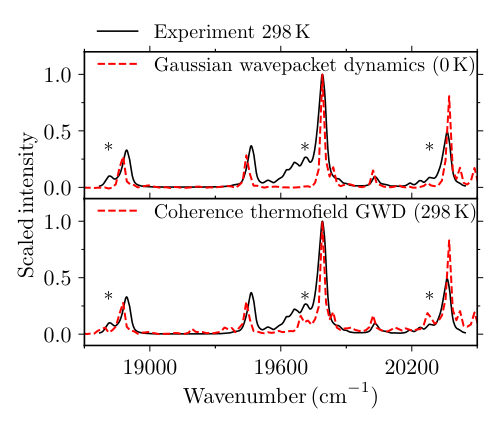
<figcaption class="paper-figure-caption"><b>Fig 4.</b> FIG. 4. Absorption spectrum of phenyl radical at 298 K. Spectra computed from the adiabatic single-Hessian Gaussian wavepacket dynamics (GWD) at 0 K and from the adiabatic single-Hessian coherence thermofield GWD at 298 K are com- pared to the experimental spectrum.47 Hot bands are denoted by asterisks.</figcaption>
</figure>
<figure class="paper-figure-card">
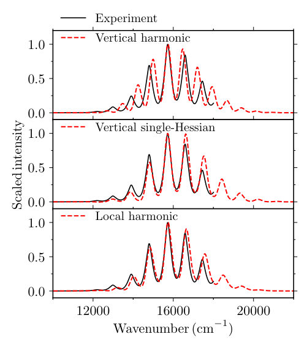
<figcaption class="paper-figure-caption"><b>Fig 5.</b> FIG. 3. Photoelectron spectrum of SeO− 2 at 700 K. Spec- tra computed from the vertical harmonic, vertical single- Hessian, and local harmonic coherence thermofield Gaussian wavepacket dynamics are compared to the experimental spec- trum.46</figcaption>
</figure>

**Summary.** This paper introduces a novel computational method combining coherence thermofield dynamics and the single-Hessian approximation to simulate vibronic spectra of polyatomic molecules at finite temperatures. It demonstrates that this approach accurately captures temperature effects like hot bands while maintaining computational efficiency by reusing a single zero-temperature trajectory. The method is successfully applied to compute spectra for several benchmark molecules.

**Why it may be interesting.** This work provides a computationally efficient and accurate theoretical tool for calculating temperature-dependent spectra, which is crucial for understanding molecular dynamics and energy transfer in condensed phases.

Detailed structure

**Main problem.** The paper addresses the challenge of simulating low- to medium-resolution vibronic spectra of weakly anharmonic polyatomic molecules at nonzero temperatures.

**Main result.** The proposed single-Hessian coherence thermofield Gaussian wavepacket dynamics method successfully captures temperature-dependent spectral features like hot bands and broadening with high accuracy.

**Method.** The core method combines coherence thermofield dynamics with the single-Hessian approximation to propagate a Gaussian wavepacket in an augmented configuration space.

**Model / system.** The method is tested on polyatomic molecules, validated using Morse systems, and applied to compute spectra for naphthalene, aminocoumarin C450, phenyl radical, and the photoelectron spectrum of SeO2.

**Key observables.** Absorption cross-section $\sigma(\omega)$, photoelectron spectra, and vibronic spectra intensity vs. wavenumber ($	ext{cm}^{-1}$).

**Important parameters / regimes.** Nonzero temperatures (e.g., 700 K), anharmonicity levels, and the choice of reference Hessian.

**Assumptions / limitations.** The method relies on the single-Hessian approximation, the electric dipole approximation, the first-order time-dependent perturbation theory, and the Condon approximation.

**Figures summary.** Figures compare spectra from various methods (adiabatic harmonic, local harmonic, single-Hessian GWD) for molecules like BaS, SeO2, and naphthalene, demonstrating the single-Hessian method's superior performance across different temperatures.

**Paper structure.** The paper introduces the theoretical framework, validates it using simple models (Morse), compares its results against established methods (adiabatic harmonic, local harmonic) across varying temperatures, and applies it to several complex molecular systems (naphthalene, SeO2, etc.).

Abstract

By combining coherence thermofield dynamics with the single-Hessian approximation, we enable simulations of low- to medium-resolution vibronic spectra of weakly anharmonic systems at nonzero temperatures, at negligible additional cost relative to zero-temperature calculations. Single-Hessian coherence thermofield Gaussian wavepacket dynamics is exact in any harmonic potential, provided that the reference Hessian is that of the final surface. When applied to Morse systems of increasing anharmonicity and varying temperature, this method successfully captures excited-state anharmonicity and key temperature-dependent spectral features, including hot bands and broadening. By combining the method with on-the-fly ab initio dynamics, we demonstrate its utility by computing the absorption spectra of naphthalene, aminocoumarin C450, and phenyl radical, and the photoelectron spectrum of SeO$_{2}^{-}$ . Within the ab initio single-Hessian approximation, after the zero-temperature spectrum is obtained at the cost of classical molecular dynamics (on the order of hours), all nonzero-temperature spectra are computed in seconds.

[↑ back to top](#top)

### [Renormalization group ontology in quantum foundations: a non-interacting spin-0 toy model](http://arxiv.org/abs/2608.19458v1)

**Authors:** Gary Kapilevich  
**Type:** theory · **Category:** other · **PDF:** <https://arxiv.org/pdf/2608.19458v1>  
**Analysis basis:** full PDF text, analyzed in chunks
**Topic relevance:** `Keldysh / 2PI / non-Gaussian methods` **2/5** · `analog quantum simulation` **2/5** · `quantum measurements` **1/5**

↔ Scroll figures horizontally

<figure class="paper-figure-card">
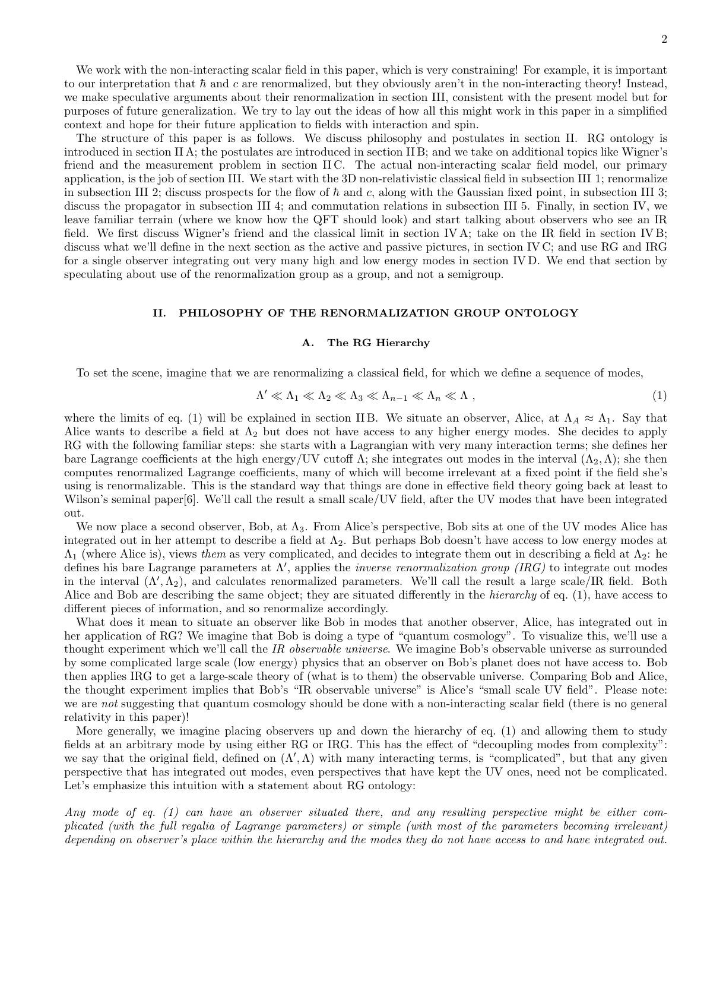
<figcaption class="paper-figure-caption"><b>Fig 1.</b> Low-resolution page preview, page 2</figcaption>
</figure>
<figure class="paper-figure-card">
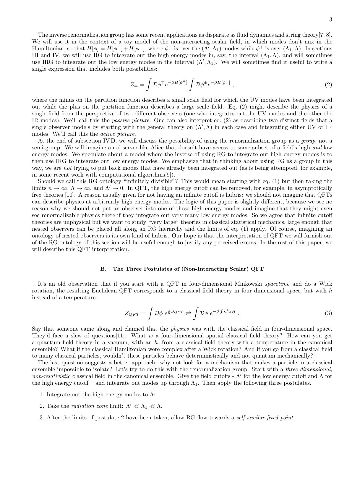
<figcaption class="paper-figure-caption"><b>Fig 2.</b> Low-resolution page preview, page 3</figcaption>
</figure>
<figure class="paper-figure-card">
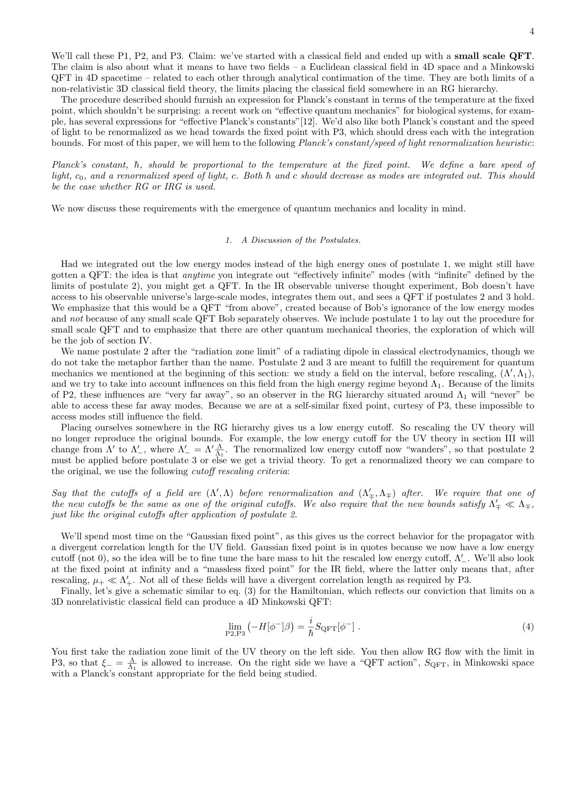
<figcaption class="paper-figure-caption"><b>Fig 3.</b> Low-resolution page preview, page 4</figcaption>
</figure>
<figure class="paper-figure-card">
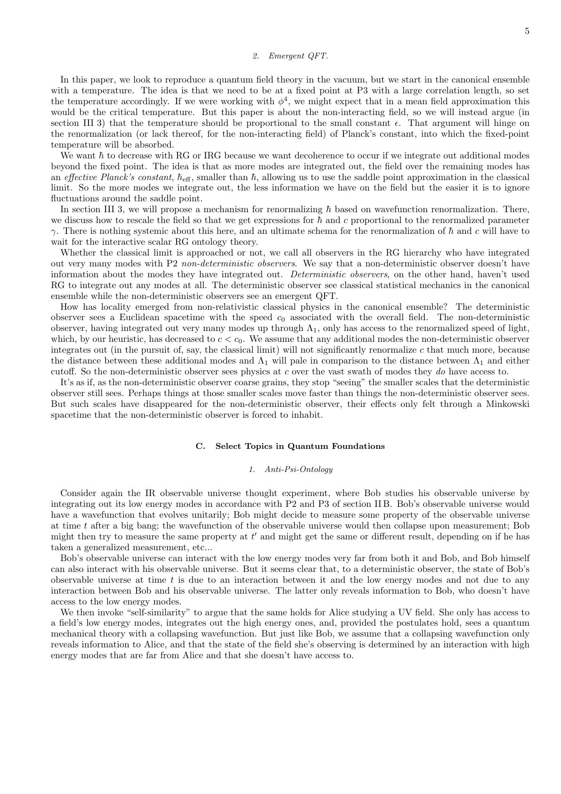
<figcaption class="paper-figure-caption"><b>Fig 4.</b> Low-resolution page preview, page 5</figcaption>
</figure>
<figure class="paper-figure-card">
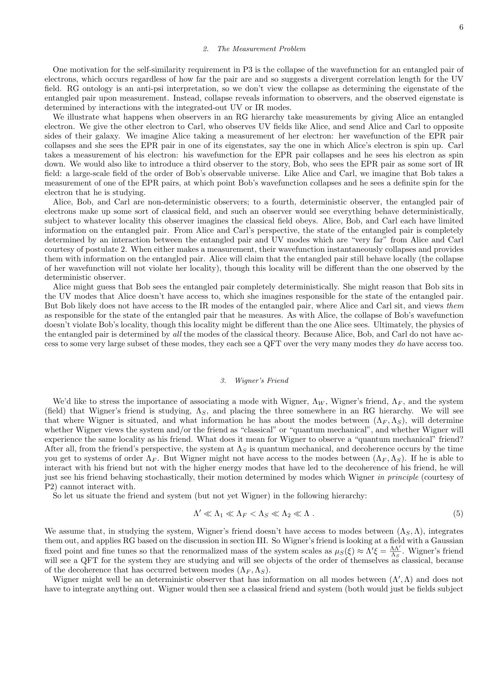
<figcaption class="paper-figure-caption"><b>Fig 5.</b> Low-resolution page preview, page 6</figcaption>
</figure>

**Summary.** This theoretical paper proposes a novel, realist interpretation of QFT based on the Renormalization Group. It uses a classical scalar field toy model to show how an observer integrating out different energy scales can perceive an emergent QFT. The work is significant for its attempt to unify quantum foundations with the mathematical structure of RG flow.

**Why it may be interesting.** While focused on QFT foundations, the deep reliance on RG flow, scale separation, and the emergence of effective theories connects conceptually to how effective Hamiltonians are derived in many-body physics.

Detailed structure

**Main problem.** The paper aims to develop a realist, anti-psi interpretation of Quantum Field Theory (QFT) by building an expanded ontology inspired by the Renormalization Group (RG). It seeks to show how emergent QFT can arise from a classical system under specific limiting conditions.

**Main result.** The authors demonstrate that the consistency of RG and Infrared Renormalization Group (IRG) operations can be maintained by carefully tuning parameters, suggesting that the RG flow might act like a group structure.

**Method.** The approach uses a classical non-interacting scalar field 'toy model' in the canonical ensemble, applying RG and IRG procedures across a hierarchy of energy/momentum cutoffs.

**Model / system.** The model is a non-interacting scalar field, initially treated classically in a 3D, canonical ensemble. The analysis involves defining nested observers at different points along the RG flow.

**Key observables.** Planck's constant ($\hbar$), the speed of light ($c$), and the partition function ($Z$) under different observer perspectives.

**Important parameters / regimes.** Energy/momentum cutoffs ($\Lambda, \Lambda_1, \Lambda'$), temperature, and the fixed point parameters.

**Assumptions / limitations.** The model is highly constrained by using a non-interacting scalar field, and the connection between classical and quantum descriptions relies on specific postulates and limiting procedures.

**Paper structure.** The paper introduces the RG ontology, applies it to a classical toy model, derives procedures (P1, P2, P3) to connect to QFT, and finally performs calculations to check the commutation of RG and IRG operations.

Abstract

A realist, anti-psi interpretation of quantum field theory is introduced, based on an expanded ontology that was inspired by the renormalization group. A goal will be to work with a classical non-interacting scalar field "toy model" in the canonical ensemble and show that an observer in this expanded ontology, under certain limiting conditions, will see a QFT. The inverse renormalization group (IRG) will be key in both interpreting this expanded ontology and furnishing novel examples of QFTs. This will lead to a definition of Planck's constant that flows as we head towards a fixed point, is expressed in terms of a temperature, and depends on the observer being studied in this expanded ontology. Our hope is that this approach will lead both to insights into quantum foundations and to prescriptions for developing new QFTs.

[↑ back to top](#top)

### [Geometric phase of open paths and a geodesic-selection rule at a level degeneracy](http://arxiv.org/abs/2608.19679v1)

**Authors:** Hyeonseok Yang, Changsuk Noh  
**Type:** theory · **Category:** quantum information and computing · **PDF:** <https://arxiv.org/pdf/2608.19679v1>  
**Analysis basis:** full PDF text, analyzed in chunks
**Topic relevance:** `quantum measurements` **2/5** · `Keldysh / 2PI / non-Gaussian methods` **1/5** · `methods for driven-dissipative` **1/5**

↔ Scroll figures horizontally

<figure class="paper-figure-card">
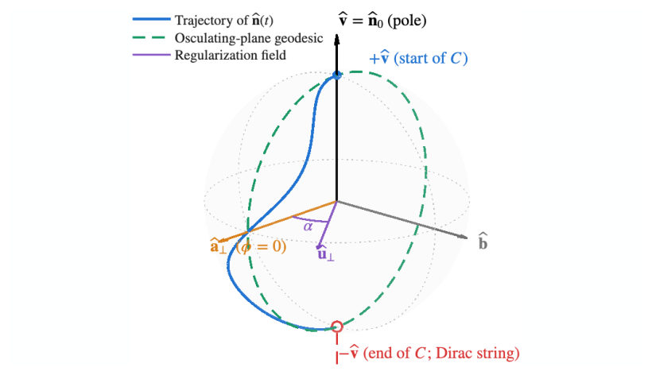
<figcaption class="paper-figure-caption"><b>Fig 1.</b> Figure 1: Shown for the example field d(t) =  1 −cos t, 1 2 sin t (1 −cos t), sin t  with degeneracy at t0 = 0. The direction field ˆn = d/|d| traces an open curve C (solid blue): the endpoints are the antipodal pair ±ˆv, with base point ˆn0 = +ˆv and the Dirac string at −ˆv (dashed red). The Frenet frame {ˆv, ˆa⊥, ˆb} sets pole and azimuthal origin; the osculating-plane geodesic (dashed green) is tangent to C at both endpoints (ϕ = 0), and a regularization ˆu⊥(purple) deviates from it by the azimuth α.</figcaption>
</figure>

**Summary.** This paper addresses the ambiguity in calculating the geometric phase for quantum systems whose control parameters pass through a degeneracy point, leading to an open path on the Bloch sphere. By introducing a regularization technique, the authors prove that the physical phase is uniquely determined by closing the path along the great circle in the osculating plane. This establishes a computable selection rule that unifies several theoretical approaches.

**Why it may be interesting.** This work provides a rigorous, computable prescription for calculating geometric phases in open quantum systems that encounter degeneracies, resolving a long-standing ambiguity in the literature.

Detailed structure

**Main problem.** The paper resolves the ambiguity in defining the geometric phase accumulated by a quantum system whose control field sweeps through a level degeneracy, resulting in an open path on the Bloch sphere.

**Main result.** A unique, physically determined geodesic closure is selected: the great circle lying in the osculating plane at the degeneracy, which yields a solid angle $\Omega[C] + 2\alpha$ when regularized.

**Method.** The authors use coordinate-free monopole connections and regularization techniques by introducing a small displacement $\epsilon\hat{u}$ to close the open path, allowing the solid angle to be calculated via Stokes' theorem.

**Model / system.** The system is modeled by a two-level Hamiltonian $H(t) = -d(t) \cdot \sigma$, where the control vector $d(t)$ sweeps through the origin (level degeneracy) on the Bloch sphere.

**Key observables.** Geometric phase ($\gamma_g$), enclosed solid angle ($\Omega$), and the Uhlmann phase ($\gamma_U$).

**Important parameters / regimes.** The regularization parameter $\alpha$, which measures the deviation from the osculating plane closure.

**Assumptions / limitations.** The analysis assumes a transversal crossing at the degeneracy point and relies on the pure-state limit of the finite-temperature Uhlmann phase to select the correct closure.

**Figures summary.** Figure 1 illustrates the setup, showing the open curve, the base point, the Dirac string, the canonical osculating-plane geodesic, and the regularization deviation $\alpha$.

**Paper structure.** The paper first establishes the ambiguity of the open-path phase, then introduces the monopole connection and regularization method, deriving the $\Omega(\epsilon\hat{u}) = \Omega[C] + 2\alpha$ relation, and finally confirming the selection rule using the Uhlmann phase limit.

Abstract

When the control field of a qubit, a polarization state, or a spin-$\tfrac12$ system is swept through a level degeneracy, its direction traces an open curve on the Bloch sphere whose endpoints are antipodal, and the geodesic rule for the open-path geometric phase becomes ambiguous: infinitely many geodesics close the path, and different closures enclose different solid angles. We resolve this ambiguity in closed form. A coordinate-free monopole connection defines the open-path solid angle $Ω[C]$ intrinsically, and displacing the degeneracy by $ε\uhat$ closes the path with enclosed solid angle $Ω(ε\uhat)=Ω[C]+2α+O(ε)$, where $α$ is the azimuth of the transverse part of $\uhat$ measured from the principal normal of the control curve at the crossing. The identity between geometric phase and enclosed solid angle therefore holds for exactly one closing geodesic---the great circle in the osculating plane ($α=0$)---supplied by the curvature at the degeneracy. Berry's $π$ invariant under reversal of the displacement and the values $\pmπ/2$ under a reflection symmetry follow as corollaries, and the pure-state limit of the finite-temperature Uhlmann phase selects the osculating-plane closure automatically, turning the heuristic closing rules of the open-path literature into a computable prescription.

[↑ back to top](#top)

### [Shadow models of a quantum model for cloud cover and the influence of finite sampling noise](http://arxiv.org/abs/2608.20076v1)

**Authors:** Hedwig Keller, Mierk Schwabe, Veronika Eyring  
**Type:** both · **Category:** numerical methods · **PDF:** <https://arxiv.org/pdf/2608.20076v1>  
**Analysis basis:** full PDF text, analyzed in chunks
**Topic relevance:** `QC/QI experiment` **2/5** · `methods for driven-dissipative` **2/5**

↔ Scroll figures horizontally

<figure class="paper-figure-card">
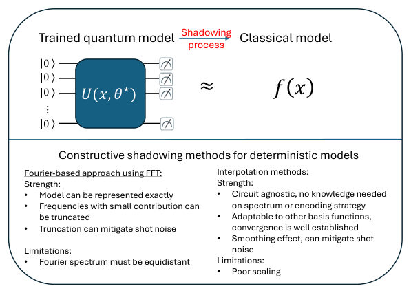
<figcaption class="paper-figure-caption"><b>Fig 1.</b> Figure 1. Overview of constructive shadowing methods used in the work. The Fourier-based approach allows for an efficient, exact representation of the circuit, assuming that the Fourier spectrum is equidistant. As a circuit agnostic approach, which needs no knowledge of the encoding strategy, a quasi-interpolation is considered. Both methods can mitigate finite sampling noise under suitable conditions.</figcaption>
</figure>
<figure class="paper-figure-card">
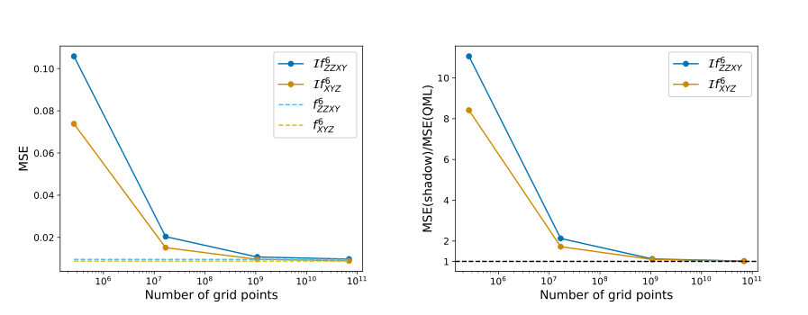
<figcaption class="paper-figure-caption"><b>Fig 2.</b> Figure 2. Left: MSE of the QML models f6 ZZXY , f6 XY Z on the reduced test data set Dr (dashed lines) compared to MSE of interpolants on full grids If6 ZZXY , If6 XY Z (solid lines) plotted against the number of points in the grid we interpolate on. The interpolants are defined on grids with refinement parameters L ∈{3, 4, 5, 6}, indicated by the dots. Right: Ratio of the MSE of interpolants and MSE of QML models, MSE(If·)</figcaption>
</figure>
<figure class="paper-figure-card">
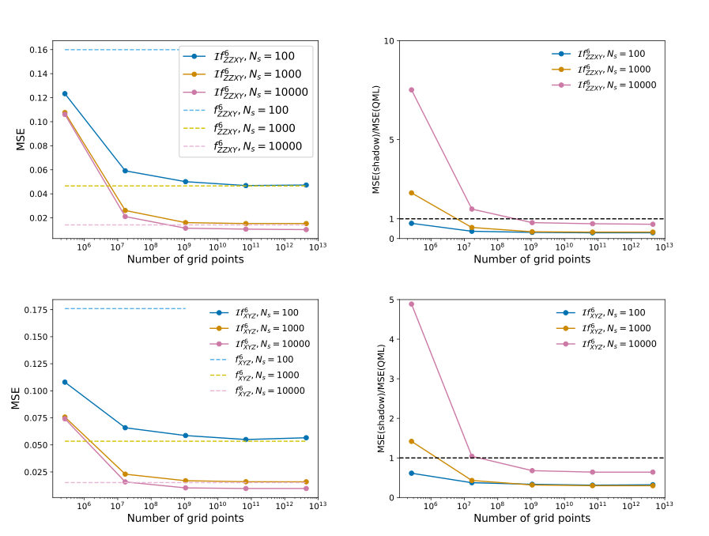
<figcaption class="paper-figure-caption"><b>Fig 3.</b> Figure 3. Comparison of interpolants on the full grid to QML models evaluated with shot noise on the reduced test data set Dr for the ZZXY architecture (top row) resp. XY Z architecture (bottom row). Left: MSE of interpolants (solid lines) compared to MSE of QML model (dashed lines) evaluated with 100 (blue), 1000 (yellow) and 10 000 (pink) shots. The interpolants are defined on grids with refinement parameters L ∈{3, 4, 5, 6, 7}, indicated by the dots. Right: Ratio of the MSE of noisy evaluations of the interpolants against the MSE of the noisy evaluation of the</figcaption>
</figure>
<figure class="paper-figure-card">
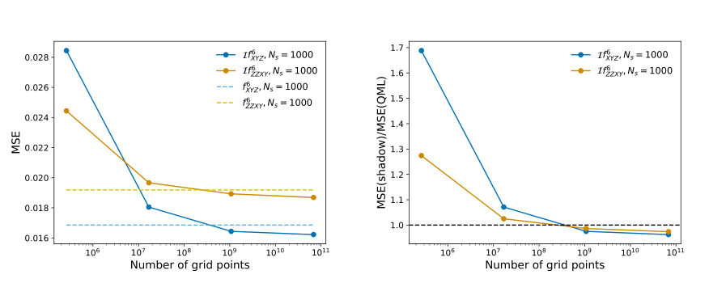
<figcaption class="paper-figure-caption"><b>Fig 4.</b> Figure 4. Left: Comparison of interpolant of full grid (solid lines) to QML model (dashed lines) trained with shot noise (1000 shots) and variance regularization evaluated with shot noise on the reduced test data set Dr, for the two architectures (XYZ, blue; ZZXY, orange). Right: Ratio of the MSE of the interpolants and the QML models, MSE(If·)</figcaption>
</figure>
<figure class="paper-figure-card">
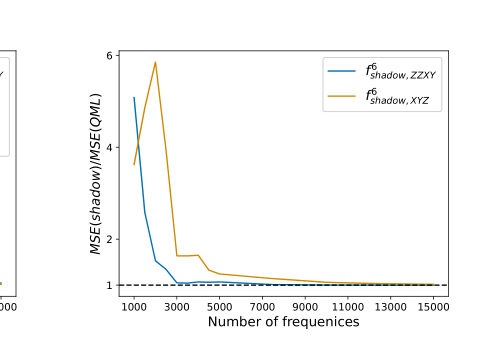
<figcaption class="paper-figure-caption"><b>Fig 5.</b> Figure 5. Left: MSE of approximation of f6 ZZXY (blue), f6 XY Z (yellow) using the quantum Fourier model (solid lines) as function of number of retained frequencies (x-axis) compared to the MSE of the QML models evaluated with an infinite number of shots (dashed lines). Right: Ratio of the MSE of the truncated Fourier models and the</figcaption>
</figure>

**Summary.** This paper develops 'shadow models' to allow QML models, used for cloud cover parametrization, to be efficiently coupled to classical climate simulations despite limited quantum hardware. The authors compare classical interpolation techniques against approximating the quantum model using a truncated Fourier series. The key finding is that these shadow models can effectively mitigate the detrimental effects of finite sampling noise, paving a path for near-term quantum-classical integration.

**Why it may be interesting.** The focus on developing classical surrogates (shadow models) for quantum computations is highly relevant for bridging theoretical quantum algorithms with practical, resource-constrained classical simulations in fields like atmospheric science.

Detailed structure

**Main problem.** The paper addresses the challenge of integrating Quantum Machine Learning (QML) models, trained on quantum hardware, into classical applications like climate modeling despite current hardware limitations and associated noise.

**Main result.** Shadow models provide an efficient, classical surrogate for QML models, and the use of truncated quantum Fourier series can mitigate the effects of finite sampling noise.

**Method.** The authors compare classical interpolation methods (full vs. sparse grids) against approximating the quantum model using a partial Fourier series representation, focusing on constructing 'shadow' models without explicit retraining.

**Model / system.** The primary model is a QML model designed for cloud cover parametrization, which is approximated by a partial Fourier series. The analysis is tested on the superconducting qubit system Euro-Q-Exa.

**Key observables.** Mean Squared Error (MSE) on test data, the ratio of MSE between interpolants and the true model, and the variance reduction achieved by truncating Fourier coefficients.

**Important parameters / regimes.** Finite sampling noise (shot noise), the number of samples ($N_s$), the size of the frequency spectrum ($|\Omega|$), and the number of grid points used for interpolation.

**Assumptions / limitations.** The work assumes that the error mitigation benefit from Fourier truncation outweighs the introduced truncation error, and it notes the difficulty in separating hardware noise effects from system calibration errors.

**Figures summary.** Figures compare the MSE of QML models versus various interpolants (full/sparse grid) as a function of grid points, and plot the ratio of these MSEs to assess convergence rates.

**Paper structure.** The paper introduces the need for shadow models for QML integration, details the Fourier-based and interpolation approaches for constructing these classical surrogates, compares their performance under finite sampling noise, and tests these methods on a real quantum hardware platform.

Abstract

Quantum computing is a quickly growing field that is promising various advantages compared to conventional computing. However, currently stand-alone quantum applications are scarce and hybrid (quantum-classical) computing is needed, especially in quantum machine learning (QML). Due to current limitations of quantum computing hardware and the coupling between HPC and quantum devices, integrating a trained (QML) model in classical applications is challenging. In this case, it is helpful to couple so-called shadows of the QML model instead, i.e., classical models that imitate the input-output relations of QML models such that quantum resources are only needed during the training stage. Here we consider constructive shadowing processes without an explicit training or regression stage to avoid rendering the QML model redundant, and apply them to a previously developed QML model for cloud cover [1] to allow for an efficient coupling to a climate model. We compare classical interpolation methods to an approximation of the quantum Fourier model, the representation of the circuit as a partial Fourier series. The encoding strategy in [1] allows the use of the discrete Fourier transform to efficiently reconstruct the circuits classically. Truncating the partial Fourier series further reduces the size of the shadow models. Both methods have the effect of mitigating finite sampling noise under certain conditions, which yields a motivation to use shadow models also beyond the era of limited hardware availability. Further, we compute the shadow models on the quantum system Euro-Q-Exa, based on the IQM Radiance system with superconducting qubits, where error mitigating effects can also be observed, albeit it is still difficult to distinguish them from errors connected to the calibration of the system.

[↑ back to top](#top)

### [ChatGPT Solves All Tested Qiskit Homework Assignments](http://arxiv.org/abs/2608.19707v1)

**Authors:** Alexei Kaltchenko, Gurnivaj Tiwana  
**Type:** both · **Category:** quantum information and computing · **PDF:** <https://arxiv.org/pdf/2608.19707v1>  
**Analysis basis:** full PDF text, analyzed in chunks
**Topic relevance:** `QC/QI experiment` **2/5** · `quantum measurements` **1/5**

↔ Scroll figures horizontally

<figure class="paper-figure-card">
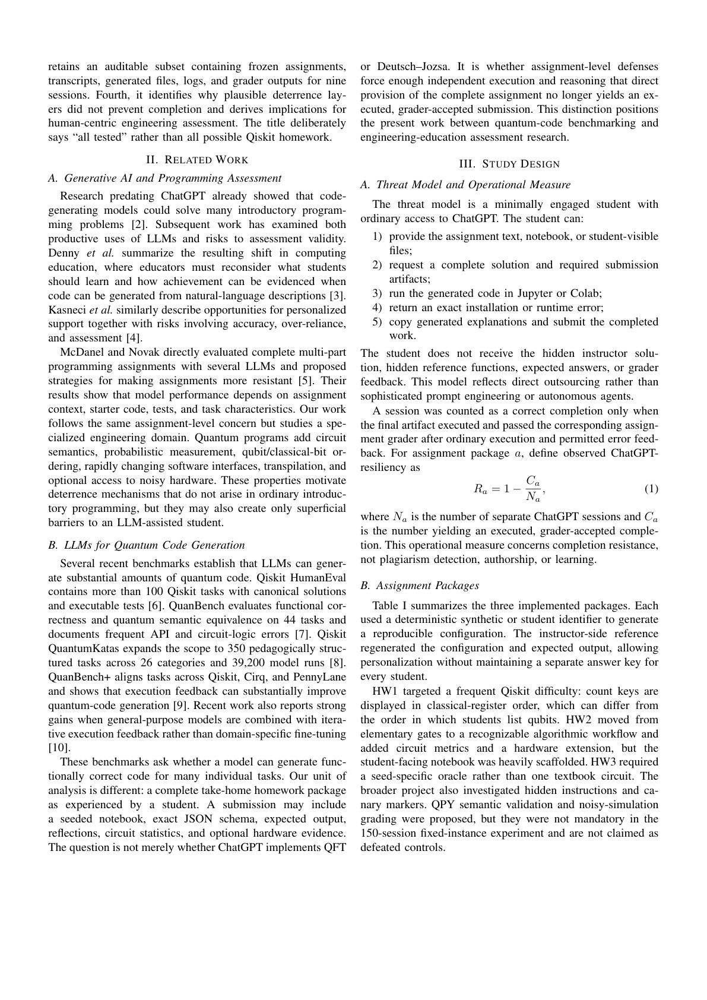
<figcaption class="paper-figure-caption"><b>Fig 1.</b> Low-resolution page preview, page 2</figcaption>
</figure>
<figure class="paper-figure-card">
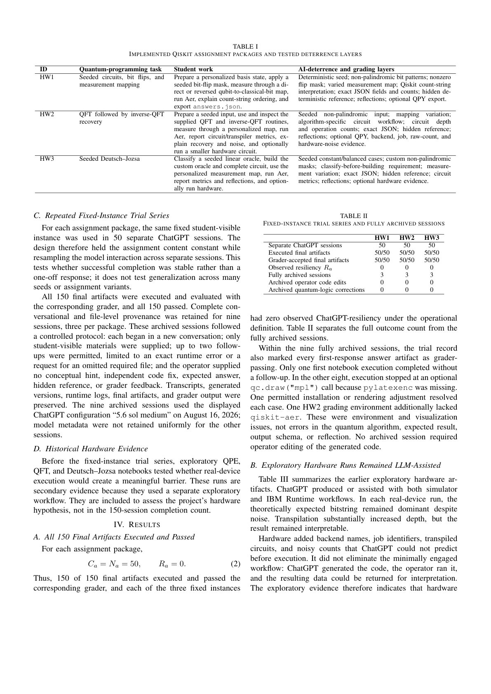
<figcaption class="paper-figure-caption"><b>Fig 2.</b> Low-resolution page preview, page 3</figcaption>
</figure>
<figure class="paper-figure-card">
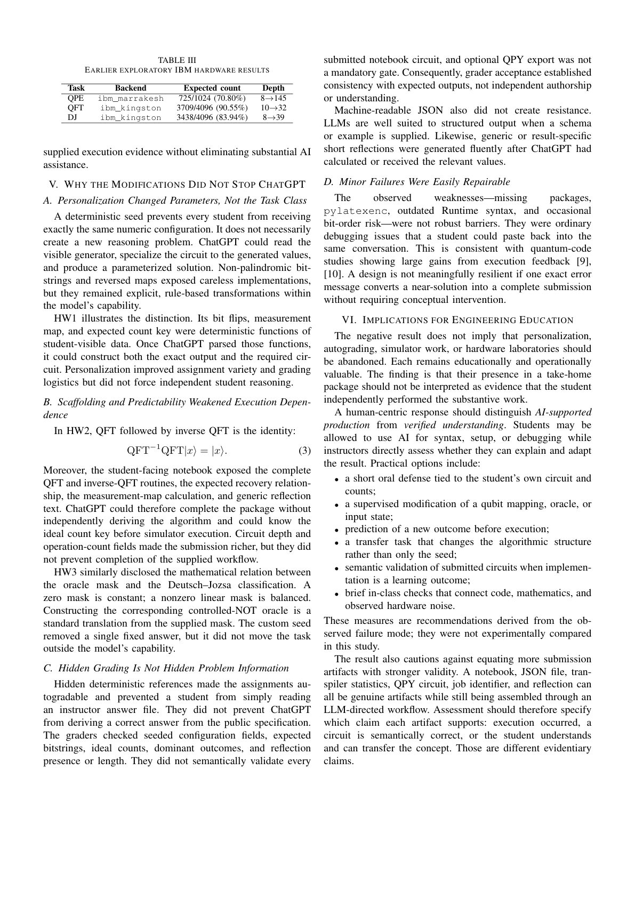
<figcaption class="paper-figure-caption"><b>Fig 3.</b> Low-resolution page preview, page 4</figcaption>
</figure>
<figure class="paper-figure-card">
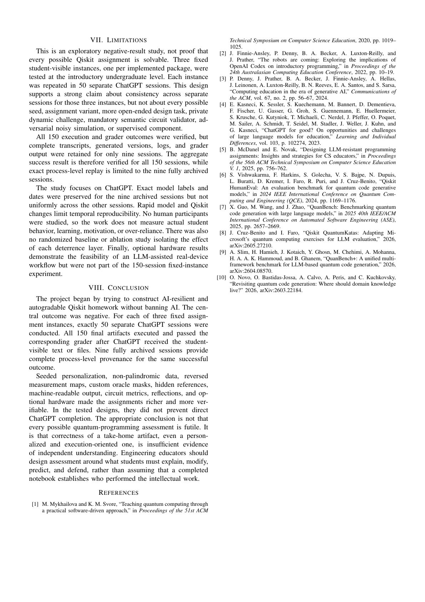
<figcaption class="paper-figure-caption"><b>Fig 4.</b> Low-resolution page preview, page 5</figcaption>
</figure>

**Summary.** This paper investigates whether advanced countermeasures can prevent ChatGPT from solving introductory quantum computing homework assignments built in Qiskit. The study found that ChatGPT successfully completed all tested assignments, suggesting that passing an execution-based homework is insufficient proof of independent understanding. The authors recommend supplementing automated grading with oral defenses and modification tasks.

**Why it may be interesting.** While not directly focused on AMO Hamiltonian dynamics, the rigorous testing of quantum algorithms (QFT, DJ) and the discussion of execution fidelity on real hardware touches upon the practical implementation challenges relevant to quantum information science.

Detailed structure

**Main problem.** The study assesses the vulnerability of introductory quantum software assignments (using Qiskit) to completion by Large Language Models (LLMs) like ChatGPT, while maintaining the requirement for genuine student engagement.

**Main result.** ChatGPT successfully completed all tested assignments, demonstrating 'zero observed ChatGPT-resiliency' even when advanced countermeasures like personalization and hidden references were implemented.

**Method.** The authors tested three distinct, execution-based Qiskit homework packages across 150 separate ChatGPT sessions, using a combination of deterministic scaffolding and machine-readable grading layers.

**Model / system.** The work utilizes quantum circuits implemented via Qiskit, covering concepts such as seeded basis-state circuits, Quantum Fourier Transform (QFT), and Deutsch-Jozsa circuits, executed on simulators and real hardware.

**Key observables.** Successful execution and passing of the corresponding grader for the final artifact, and the measured 'ChatGPT-resiliency' ($R_a$).

**Important parameters / regimes.** The study is limited to three fixed, introductory undergraduate-level instances and does not test generalization across all possible seeds or task structures.

**Assumptions / limitations.** The primary limitation is that the results only apply to the specific, fixed, execution-oriented designs tested, not to all possible Qiskit assessments.

**Figures summary.** Table I summarizes the three implemented Qiskit assignment packages and the specific AI-deterrence/grading layers used for each. Table II summarizes the fixed-instance trial series (50 sessions per HW).

**Paper structure.** The paper establishes the problem of AI assessment vulnerability, details the development of three countermeasure-laden packages (HW1, HW2, HW3), presents the results showing universal success by ChatGPT, and concludes by recommending human-centric assessment methods.

Abstract

Generative AI creates an assessment challenge in quantum software education: a student can provide a homework notebook to ChatGPT and request a completed submission. This study examined whether introductory Qiskit homework could remain autogradable while requiring students to run, review, and discuss results rather than banning AI. Three packages were tested: seeded basis-state circuits with bit flips and customized measurement mappings; Quantum Fourier Transform followed by inverse-transform recovery; and seeded Deutsch-Jozsa with customized oracle masks. The designs used personalization, simulator execution, JSON submissions, hidden references, circuit metrics, reflections, and optional IBM Quantum execution. For each package, one student-visible instance was tested in 50 separate ChatGPT sessions, yielding 150 sessions overall. Every final artifact was executed and passed its grader. Nine sessions were fully archived; none required operator code changes or correction of quantum logic. Under the study's operational definition, each tested instance had zero observed ChatGPT-resiliency. Seeds changed parameters rather than task structure, expected results remained derivable from visible assignment logic, scaffolding exposed key solution steps, and hidden grading verified output consistency without establishing independent authorship or understanding. Because one instance was repeated for each package, the results do not establish solvability for every seed or possible Qiskit assessment. The tested personalized, execution-oriented take-home designs therefore did not prevent successful completion under a minimally engaged-student workflow. Correct artifacts should be complemented by direct assessment through supervised modification, oral defense, prediction, and transfer tasks.

[↑ back to top](#top)

### [Distributed Variational Quantum Eigensolver: Embarrassingly Parallel strategies on NISQ](http://arxiv.org/abs/2608.19824v1)

**Authors:** Marta Losada, Daniel Faílde, Andrés Gómez  
**Type:** both · **Category:** quantum information and computing · **PDF:** <https://arxiv.org/pdf/2608.19824v1>  
**Analysis basis:** full PDF text, analyzed in chunks
**Topic relevance:** `QC/QI experiment` **2/5** · `analog quantum simulation` **1/5**

↔ Scroll figures horizontally

<figure class="paper-figure-card">
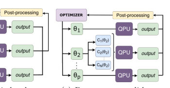
<figcaption class="paper-figure-caption"><b>Fig 1.</b> Fig. 1. Workflows for the three embarrassingly parallel distribution strategies.</figcaption>
</figure>
<figure class="paper-figure-card">
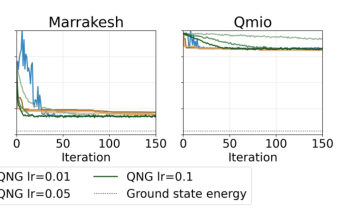
<figcaption class="paper-figure-caption"><b>Fig 2.</b> Fig. 2. Reference optimization paths for single vQPU executions.</figcaption>
</figure>
<figure class="paper-figure-card">

<figcaption class="paper-figure-caption"><b>Fig 3.</b> Fig. 3. Optimization paths obtained with 2, 3, and 4 vQPUs for the three distributed VQE workflows. The dotted horizontal line marks the reference ground-state energy.</figcaption>
</figure>
<figure class="paper-figure-card">
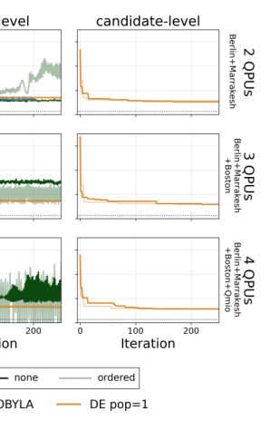
<figcaption class="paper-figure-caption"><b>Fig 4.</b> Fig. 4 shows that shot-level distribution scales poorly at low sampling bud- gets across all optimizers, due to distribution and aggregation overhead dominat- ing execution time. Since finite-shot sampling is a major VQA bottleneck [24], the improved scaling at higher shot counts suggests that parallelization is most beneficial in measurement-intensive regimes. When overhead remains dominant, measurement-efficient techniques may offer a better alternative (see Section 6).</figcaption>
</figure>
<figure class="paper-figure-card">
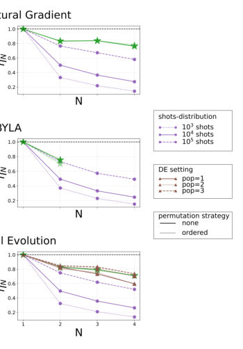
<figcaption class="paper-figure-caption"><b>Fig 5.</b> Fig. 4. Speedup and parallel efficiency for optimizers under the distributed workflows.</figcaption>
</figure>

**Summary.** This work investigates how to efficiently run the Variational Quantum Eigensolver (VQE) across multiple, noisy quantum processors. By comparing shot-level, circuit-level, and parameter-candidate distribution strategies, the authors determine that the best approach is highly dependent on the optimization algorithm used. The findings offer critical guidelines for scaling VQE computations on real-world, heterogeneous quantum hardware.

**Why it may be interesting.** It provides a crucial, practical guide for quantum algorithm implementation, detailing how resource management (parallelization) must adapt to the physical constraints (noise and heterogeneity) of near-term quantum hardware.

Detailed structure

**Main problem.** The paper evaluates the Variational Quantum Eigensolver (VQE) in realistic, distributed Noisy Intermediate-Scale Quantum (NISQ) environments, focusing on how heterogeneous noise affects different parallelization strategies.

**Main result.** The optimal parallelization strategy depends heavily on the quantum optimizer used; Differential Evolution (DE) shows resilience to noise, while Quantum Natural Gradient (QNG) is highly sensitive to backend heterogeneity.

**Method.** The authors compare three 'embarrassingly parallel' workflows—shot-level, circuit-level, and parameter-candidate level—using the CUNQA platform to manage task distribution across emulated virtual QPUs.

**Model / system.** The target Hamiltonian is the one-dimensional Transverse Field Ising Model (TFIM) ($H = -\sum_i J X_i Z_i Z_{i+1} - \sum_i \Gamma X_i$). The computation is performed using VQE and various optimizers (COBYLA, QNG, DE).

**Key observables.** Speedup, parallel efficiency, convergence path relative to exact ground-state energy, and final energy estimate.

**Important parameters / regimes.** The number of spins ($N=6$), the noise profile heterogeneity across virtual QPUs, and the specific distribution strategy employed.

**Assumptions / limitations.** The analysis assumes that the optimizer proposes tasks, which are then distributed and gathered classically, and that the simulation uses Qiskit AerSimulator.

**Figures summary.** Figures illustrate the three distribution workflows (shot, circuit, candidate) and compare optimization paths and speedup/efficiency across different numbers of noisy virtual QPUs.

**Paper structure.** The paper systematically compares the three distribution levels (shot-, circuit-, and candidate-level) for VQE workloads, analyzing convergence and efficiency metrics under varying degrees of backend noise and resource scaling.

Abstract

Variational Quantum Eigensolver requires many circuit executions, making it ideal for distributed parallelization. However, heterogeneous noise in NISQ devices can skew results and efficiency. Using the CUNQA platform for emulation of virtual QPUs, we evaluate three embarrassingly parallelization strategies (shot-level, circuit-level for gradients and observables and candidate level for population-based optimizers) across metrics like speedup and accuracy.

[↑ back to top](#top)

### [Entangling two qudits of arbitrary dimension through light-atomic Faraday interaction](http://arxiv.org/abs/2608.19945v1)

**Authors:** R. Surmay, V. A. Leonov, E. A. Vashukevich  
**Type:** theory · **Category:** quantum information and computing · **PDF:** <https://arxiv.org/pdf/2608.19945v1>  
**Analysis basis:** full PDF text, analyzed in chunks
**Topic relevance:** `analog quantum simulation` **2/5** · `interference shaping light` **1/5**

↔ Scroll figures horizontally

<figure class="paper-figure-card">
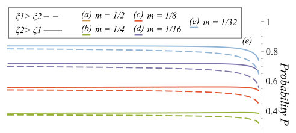
<figcaption class="paper-figure-caption"><b>Fig 1.</b> Figure 1. Probability of generating the SWAP𝛼 𝑑gate as a function of the parameter 𝑞for infinite-dimensional systems (limiting case) for 𝜃1 −𝜃2 = 𝜋and for various entangling parameters 𝑚= 1</figcaption>
</figure>
<figure class="paper-figure-card">
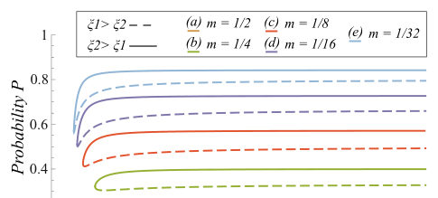
<figcaption class="paper-figure-caption"><b>Fig 2.</b> Figure 2. Probability of generating the SWAP𝛼 𝑑gate as a function of the parameter 𝑞for infinite-dimensional systems (limiting case) for 𝜃1 −𝜃2 = 0 and for various entangling parameters 𝑚= 1</figcaption>
</figure>
<figure class="paper-figure-card">
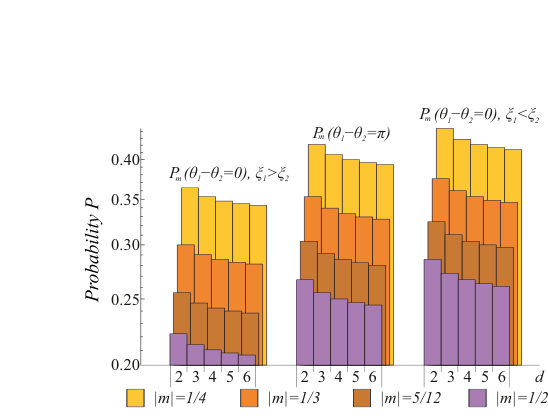
<figcaption class="paper-figure-caption"><b>Fig 3.</b> Figure 3. Asymptotic values of the entanglement generation probability (at 𝑞= 𝜉1𝜉2 cos(𝜃1 −𝜃2) →∞) as a function of the entanglement parameter 𝑚for various qudit dimensions 𝑑, shown for three distinct operation regimes of the protocol: for the angle difference 𝜃1 −𝜃2 = 𝜋, irrespective of the ratio of the interaction constants 𝜉1, 𝜉2, the probabilities converge to the same limit; for 𝜃1 −𝜃2 = 0, there are two probability values, different for 𝜉1 &gt; 𝜉2 and 𝜉1 &lt; 𝜉2.</figcaption>
</figure>

**Summary.** This paper theoretically analyzes how to generate arbitrary entangling gates between two qudits—one in light and one in atomic spin coherence—using the light-atomic Faraday interaction. By employing a QND-Rotation-QND protocol, the authors derive the transformation matrix and quantify the entanglement achievable, showing that the gate structure depends systematically on the qudit dimension $d$. This work advances the understanding of high-dimensional quantum information processing using cavity/atomic platforms.

**Why it may be interesting.** This work provides a detailed theoretical blueprint for realizing high-dimensional quantum gates using controllable light-matter interactions, which is crucial for scaling up quantum communication and computation protocols.

Detailed structure

**Main problem.** The paper investigates the feasibility and characterization of entangling operations between two qudits of arbitrary dimension using light-atomic interactions.

**Main result.** It demonstrates that the light-atomic Faraday interaction protocol can generate a wide range of entangling gates, which are characterized by their dependence on the qudit dimension $d$ and can be represented by rational powers of the $d$-dimensional SWAP gate.

**Method.** The analysis uses the Bogoliubov transformation to model the evolution governed by the light-atomic Faraday Hamiltonian, followed by deriving the transformation matrix $U_d$ and calculating its entangling power using Schmidt decomposition.

**Model / system.** The system consists of two qudits: one encoded in the spatial modes (OAM) of an optical field, and the other in the collective spin coherence of an atomic ensemble. The interaction is modeled by the light-atomic Faraday interaction Hamiltonian.

**Key observables.** The generated two-qudit transformation matrix $U_d$, the entangling power $e_p$, and the probability amplitudes for implementing specific gates like $	ext{CNOT}_d$.

**Important parameters / regimes.** The dimension $d$ of the qudits, and the coupling parameters $\mu$ and $
u$ derived from the interaction strengths.

**Assumptions / limitations.** The analysis relies on the Holstein–Primakoff approximation for the Hamiltonian and assumes an 'equal-weight state' to establish lower bounds on probability amplitudes.

**Paper structure.** The paper first analyzes the two-qubit case using a QND-Rotation-QND protocol, establishing unitarity constraints. It then generalizes the method to qudits, deriving the transformation matrix $	ilde{U}_d$ and calculating the entangling power $e_p$ in terms of $d$. Finally, it discusses the realization of specific gates like $	ext{CNOT}_d$ and analyzes parameter constraints.

Abstract

The paper investigates entangling operations acting on two qudits of arbitrary dimension, with one encoded in the states of a spatially multimode optical field, the other in those of atomic collective spin coherence, both carrying orbital angular momentum (OAM). We demonstrate the generation of a wide range of entangling operations within a protocol consisting of two Faraday interactions and a rotation of atomic and light quadratures between them. All generated gates can be represented as rational powers of the d-dimensional gate $SWAP^α_d$. The probabilities of two-qudit transformations are calculated for various dimensions of the logical space and for different entangling powers of the logical gates.

[↑ back to top](#top)

### [Quantum Rényi-Jarzynski Equality](http://arxiv.org/abs/2608.19320v1)

**Authors:** Benjamin Bobell, Mert Okyay, Rahul Nandkishore  
**Type:** theory · **Category:** statistical mechanics · **PDF:** <https://arxiv.org/pdf/2608.19320v1>  
**Analysis basis:** full PDF text, analyzed in chunks
**Topic relevance:** `quantum measurements` **2/5** · `Keldysh / 2PI / non-Gaussian methods` **1/5**

↔ Scroll figures horizontally

<figure class="paper-figure-card">
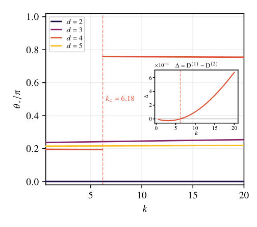
<figcaption class="paper-figure-caption"><b>Fig 1.</b> FIG. 1. Optimal drive angle 𝜃∗(𝑘) minimizing the R´enyi 𝑘-divergence D𝑘(𝑃0||𝑃𝐹) between the initial and final bath distributions, for bath qudit dimensions 𝑑= 2–5 and parameters 𝛽= 0.25, 𝜔S = 1, 𝜔𝐵= 0.3, 𝛿= 1.5. For 𝑑= 2, the minimum is pinned at 𝜃∗= 0, while for 𝑑≥3 it acquires 𝑘-dependence. At 𝑑= 4, the drive supports two local minima at 𝜃∗≈0.19𝜋and 0.76𝜋, and the optimal protocol switches discontinuously between them at 𝑘𝑐≈6.18 (dashed). Inset: the difference in R´enyi divergence Δ = D(1) −D(2) of the two minima crosses zero at 𝑘𝑐.</figcaption>
</figure>

**Summary.** This paper introduces the Rényi-Jarzynski Equality, a generalized fluctuation theorem that links non-equilibrium work to free energy changes using the Rényi $k$-divergence. It overcomes measurement limitations by conditioning the equality on bath observable outcomes. The resulting divergence acts as a tunable cost function, enabling the minimization of bath drift in quantum optimal control and revealing entanglement generation requirements.

**Why it may be interesting.** This work provides a powerful, generalized thermodynamic constraint (the RJE) that moves beyond standard fluctuation theorems by incorporating the Rényi divergence, making it highly relevant for designing robust quantum control protocols.

Detailed structure

**Main problem.** To derive a non-destructive quantum Jarzynski equality (Rényi-Jarzynski Equality) that links nonequilibrium work to equilibrium free energy changes, overcoming limitations of standard quantum formulations.

**Main result.** The RJE quantifies bath drift using the Rényi $k$-divergence, providing a tunable cost function for quantum optimal control problems.

**Method.** The authors employ a resource-theoretic approach, deriving fluctuation theorems conditioned on arbitrary bath observable outcomes, leading to the generalized Rényi-Jarzynski equality.

**Model / system.** The analysis uses a tripartite setup (System-Bath-Weight) and extends to toy models involving $d$-state qudits, analyzing the dynamics under non-adiabatic driving.

**Key observables.** Rényi $k$-divergence ($D_k(P_0||P_f)$), Bath Drift, Work ($W$), and Free Energy Change ($\Delta F_S$).

**Important parameters / regimes.** The Rényi order $k$, the bath dimension $d$, and the drive parameters ($	heta$).

**Assumptions / limitations.** The derivation is conditioned on the outcomes of an arbitrary bath observable, and some analyses rely on quasi-classical approximations or dropping coherence terms when calculating bath marginals.

**Figures summary.** Not specified, but the text describes the derivation of several numbered equations (1) through (18) representing core results.

**Paper structure.** The paper progresses from establishing the general non-destructive quantum Jarzynski equality, to generalizing this to $k$-th moments and the Rényi divergence, and finally applying this metric to analyze optimal control problems in toy qudit models.

Abstract

The Jarzynski equality provides a strict link between nonequilibrium work and equilibrium free energy changes. Its typical quantum formulations, however, rely on measurement protocols that destroy coherence. In this Letter, we use the resource-theoretic approach to derive a non-destructive quantum Jarzynski equality conditioned on the outcomes of an arbitrary bath observable. This yields the Rényi-Jarzynski equality, which quantifies a finite bath's drift from equilibrium under a non-adiabatic drive via the Rényi $k$-divergence. We further demonstrate that the Rényi-Jarzynski equality provides a tunable cost function for quantum optimal control problems where minimizing bath drift is desired, such as state preparation and gate design, enabling the minimization of cross-talk in finite quantum systems. Our toy model exhibits a transition between competing minima for some critical value of $k$, illustrating how the Rényi order tunes sensitivity to different regions of a bath distribution. Strikingly, when drive parameters vary across bath energy levels, minimizing bath drift requires generating system-bath entanglement.

[↑ back to top](#top)

### [The ebbs and flows of quantum learning and sensing](http://arxiv.org/abs/2608.20155v1)

**Authors:** Matias Karjula, Teemu Ojanen, Tapio Ala-Nissila, Moein N. Ivaki  
**Type:** theory · **Category:** quantum information and computing · **PDF:** <https://arxiv.org/pdf/2608.20155v1>  
**Analysis basis:** full PDF text, analyzed in chunks
**Topic relevance:** `analog quantum simulation` **2/5** · `quantum measurements` **1/5**

↔ Scroll figures horizontally

<figure class="paper-figure-card">
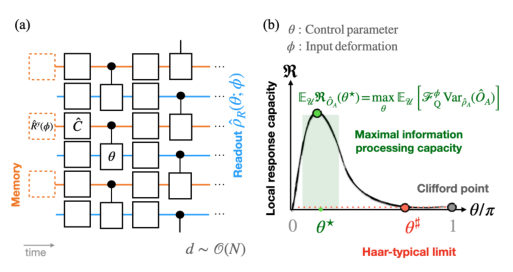
<figcaption class="paper-figure-caption"><b>Fig 1.</b> FIG. 1. The rise and fall of subsystem response in a tunable random quantum circuit. (a) The one- dimensional model considered here shown for a single depth unit, d = 1. The two-qubit gate denoted by θ is ˆP(θ) = diag(1, 1, 1, eiθ), and ˆC denotes a random single-qubit Clif- ford. The initial deformation ϕ is imprinted on the mem- ory ¯R subset via ˆRy(ϕ) = exp[−i(ϕ/2) ˆY ]. (b) At fixed depth d ∼O(N), by tuning θ the model interpolates from a weakly entangling and magical regime to the quantum chaotic limit. At θ = π, the unencoded unitary circuit is maxi- mally entangling but nonmagical, i.e., Clifford-only. We re- fer to R ˆ OR, Eq. (2), as the response capacity. A maximal response...</figcaption>
</figure>
<figure class="paper-figure-card">
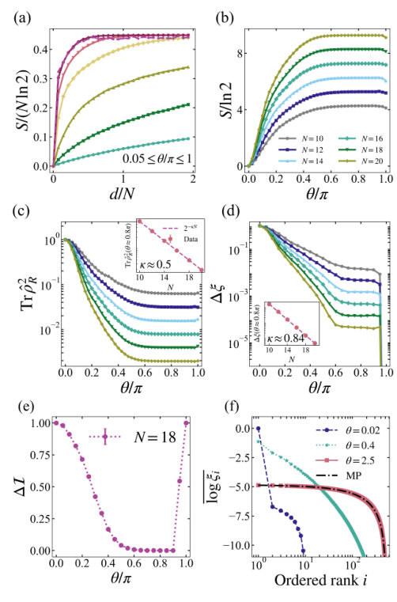
<figcaption class="paper-figure-caption"><b>Fig 2.</b> FIG. 2. General properties of the circuit model. (a) Entanglement-entropy density SvN/N as a function of the rescaled circuit depth d/N, for an equal bipartition |R|=| ¯R|= N/2 and N =14, showing how the θ-dependent entanglement- growth rate increases with increasing θ. (b) SvN as a function of θ/π for d/N =1, exhibiting the expected volume-law scal- ing with system size N. (c) Purity and (d) Schmidt gap for several system sizes. Both quantities decay exponentially with N, as 2−κN, in the typical regime as shown in the in- sets. (e) Mutual-magic gap ∆I as a function of θ/π for d/N = 1, characterizing the crossover toward the quantum- chaotic regime. (f) Ensemble-averaged entanglement...</figcaption>
</figure>
<figure class="paper-figure-card">
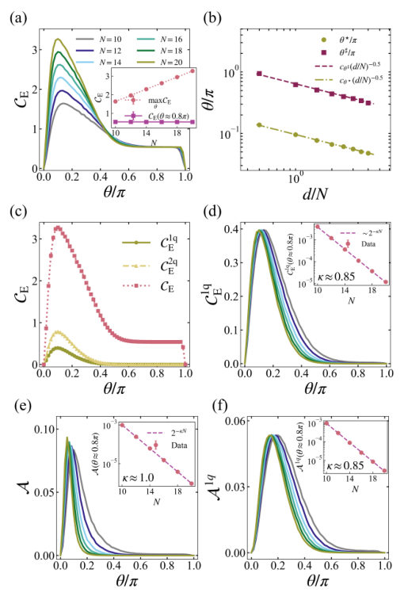
<figcaption class="paper-figure-caption"><b>Fig 3.</b> FIG. 3. Spectral nonflatness. (a) Growth and decay of the entanglement capacity CE, Eq. (5), for d/N = 1. For an equal bipartition, CE reaches its maximum near θ⋆/π ≈0.15, with Cmax E =maxθ EU{CE}≈0.16N, as shown in the inset. For θ &gt; θ♯, it saturates to the universal value CE ≈0.539. At the stabilizer point, θ/π =1, one finds CE =0. (b) The character- istic points θ⋆and θ♯both exhibit an approximate power-law decay, θ⋆,♯∝(d/N)−1/2, with a constant ratio cθ♯/cθ⋆≈6.7. Results are shown for N =20. (c) Comparison between small and large subsystems for (N, d/N) = (20, 1). (d) For vanish- ingly small subsystems, CE remains O(1) throughout an inter- mediate regime before converging to its typical...</figcaption>
</figure>
<figure class="paper-figure-card">
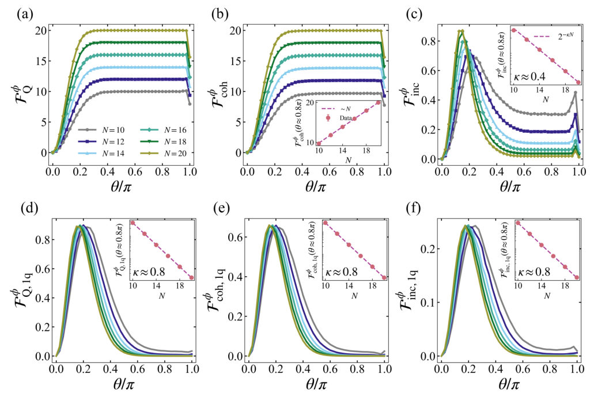
<figcaption class="paper-figure-caption"><b>Fig 4.</b> FIG. 4. Metrological response. (a) Quantum Fisher information, and its (b) coherent, and (c) incoherent parts for equal bipartitioning and d/N =1. In the volume-law regime, the readout subsystem can retain a finite fraction of the input sensitivity initially encoded in the memory qubits, leading to a quantum Fisher information that grows linearly with system size ∝N. Deep in the chaotic phase, however, this sensitivity is carried almost entirely by coherent eigenbasis rotations, while the incoherent contribution associated with spectral deformation is exponentially suppressed as 2−κN. (d) For small readout subsystems, however, all components of the subsystem quantum Fisher information,...</figcaption>
</figure>
<figure class="paper-figure-card">
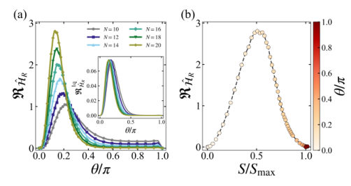
<figcaption class="paper-figure-caption"><b>Fig 5.</b> FIG. 5. Entanglement response. (a) R ˆ HR = F ϕ inc CE as a function of θ, for d/N = 1 and equal bipartitioning. In- set shows the response for one qubit subsystems. (b) R ˆ HR as a function of rescaled entanglement entropy S/Smax, for (N, d/N) = (20, 1). Markedly, the entanglement response to input deformation is maximal when the entanglement itself is submaximal. Data are an average over 2800 independent circuit realizations. Ensemble averaging is performed on the realization-wise product Fϕ incCE.</figcaption>
</figure>

**Summary.** This paper analyzes how usable computational structure emerges from complex quantum dynamics by studying tunable quantum circuits. It introduces 'Response Capacity' as a key metric that quantifies the system's information processing power. The findings reveal a distinct intermediate 'learning phase' where quantum resources are optimally accessible before the system enters a chaotic regime.

**Why it may be interesting.** It provides a concrete, measurable diagnostic (Response Capacity) linking fundamental concepts like spectral properties and quantum chaos to practical measures of computational utility in quantum circuits.

Detailed structure

**Main problem.** The paper investigates the relationship between globally generated quantum complexity and the structure accessible to quantum subsystems, treating complexity as a quantifiable computational resource.

**Main result.** It identifies an intermediate 'learning phase' preceding quantum chaos, characterized by pronounced spectral nonflatness, where the system achieves optimal, usable information processing capacity.

**Method.** The analysis employs theoretical derivations of response capacity bounds and studies the behavior of quantum circuits across different dynamical regimes.

**Model / system.** The study uses a family of minimally tunable postvariational quantum circuits, specifically modeled as a one-dimensional brickwork quantum circuit in a ring geometry.

**Key observables.** Spectral nonflatness, metrological susceptibility (Quantum Fisher Information, $F_\phi^Q$), and the derived Response Capacity ($\mathcal{R}_{\hat{O}_R}$).

**Important parameters / regimes.** System size ($N$), tuning parameter ($	heta$), and the transition between weakly entangling, intermediate 'learning', and quantum chaotic limits.

**Assumptions / limitations.** The derived response bound is noted as a necessary, but not generally sufficient, condition for average learnability.

**Figures summary.** Figure 1 illustrates the rise and fall of subsystem response in a tunable random quantum circuit, showing the transition from weakly entangling to chaotic regimes.

**Paper structure.** The paper develops diagnostics based on spectral nonflatness and metrological susceptibility to quantify usable subsystem complexity, demonstrating how this capacity evolves as the system moves through different dynamical regimes.

Abstract

What is the relation between subsystem quantum complexity and the emergence of computationally useful structure? We address this by studying a family of minimally tunable postvariational quantum circuits, and show how spectral nonflatness and metrological response directly control the ensemble-typical information processing power. This unveils an intermediate "learning phase" that precedes the onset of quantum chaos, characterized by pronounced nonflatness and sensitivity of readout states. The optimal information processing capacity improves with system size, while deep scrambling suppresses observable response. The results reveal how such features of random quantum dynamics can be viewed as computational resources for scalable nonlinear computation.

[↑ back to top](#top)

### [Tilted $p$-wave magnet candidate CeNiAsO](http://arxiv.org/abs/2608.19856v1)

**Authors:** Zhuo Wang, Zheng Liu, Shuo Zou, Hua-Xun Li, Jin-Xin Hu, Zhuolun Qiu, Ze Wang, Jiamin Gong, Lucheng Wei, Kangjian Luo, Hai Zeng, Meng Zhang, Chao Dong, Chuanyin Xi, Junfeng Wang, Jiakun Fang, Xiaotao Han, Guang-Han Cao, Liang Li, Yongkang Luo  
**Type:** both · **Category:** strongly correlated electrons · **PDF:** <https://arxiv.org/pdf/2608.19856v1>  
**Analysis basis:** full PDF text, analyzed in chunks
**Topic relevance:** `quantum measurements` **2/5** · `analog quantum simulation` **1/5**

↔ Scroll figures horizontally

<figure class="paper-figure-card">
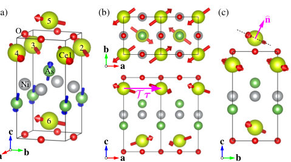
<figcaption class="paper-figure-caption"><b>Fig 1.</b> FIG. 1. (a) Crystalline / magnetic structure of CeNiAsO, and local environment of As. The red arrows denote the proposed commensurate AFM structure of Ce ions with q = (0.5, 0, 0) for T &lt; TN2, while the blue arrows indicate the internal field at the As sites. (b) Top-view and side-view of the magnetic structure; the canted component mz ∼0.05 µB. T τ symme- try is preserved in this magnetic structure. (c) Tilted spin polarization axis ˆn ≈(0, 0.231, 0.973).</figcaption>
</figure>
<figure class="paper-figure-card">
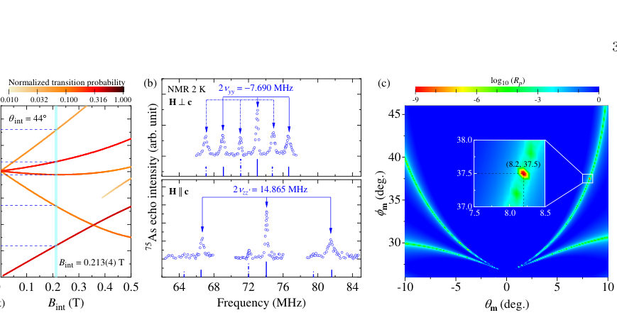
<figcaption class="paper-figure-caption"><b>Fig 2.</b> FIG. 2. (a) Comparison of the experimental (left) and calculated (right) 75As NQR spectra determines the angle between Bint and the EFG principle axis, θint ≈44 ◦, and Bint ≈0.213 T. The colormap represents the normalized transition probability. (b) 75As NMR spectra of single crystalline CeNiAsO for H ⊥c (top) and H ∥c (bottom). Note that νzz′ differs slightly from νzz (or νQ) due to the small misalignment of c axis with respect to H. The vertical lines in these panels signify the simulated NMR frequencies. (c) The contour plot of log10 Rp gives the optimal parameters for the refinement, θm = 8.2 ◦, and ϕm = 37.5 ◦.</figcaption>
</figure>
<figure class="paper-figure-card">
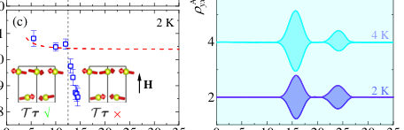
<figcaption class="paper-figure-caption"><b>Fig 3.</b> FIG. 4. (a) Hall resistivity as a function of field at 2 K. The open symbols represent the smoothed curve, serving as guides to the eye. (b) AHE at various temperatures (raw data in Fig. S8 [36]). The curves are vertically shifted for clarity. The colors of the background manifest distinct mag- netic phases: white - paramagnetic; magenta - ICAFM [33]; cyan - CAFM. (c) 75As NMR central peak splitting ∆f mea- sured under varying field. The red dashed line is a theoreti- cal prediction assuming that the Ce moments do not reorient with applied field. The insets depict the conjectured mag- netic structures in the field regions below and above ∼13 T, wherein the T τ symmetry is preserved and...</figcaption>
</figure>
<figure class="paper-figure-card">
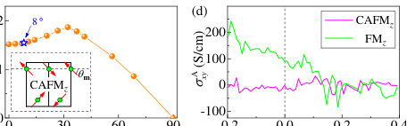
<figcaption class="paper-figure-caption"><b>Fig 4.</b> FIG. 3. (a) Spin dependent band structure of CeNiAsO for CAFMz, θm = 8 ◦. (b) Spin band splitting ∆S as a func- tion of θm in CAFMz. (c) Spin dependent band structure for canted FMz, θm = 8 ◦; this configuration is to simulate the oriented magnetic state under high field H ∥c. (d) Calcu- lated anomalous Hall conductivity σA xy for CAFMz and FMz configurations with θm = 8 ◦.</figcaption>
</figure>

**Summary.** This work determines the magnetic structure of CeNiAsO, identifying it as a 'tilted p-wave magnet' based on NQR/NMR measurements. The study establishes a commensurate, non-collinear antiferromagnetic order characterized by a small out-of-plane moment. By combining spectroscopy and transport measurements, the authors provide strong evidence for this exotic magnetic state in a heavy-fermion compound.

**Why it may be interesting.** The detailed characterization of the magnetic symmetry breaking and the resulting spin-orbit coupling effects, particularly the enhancement of spin splitting, provides a rich playground for understanding emergent quantum phenomena in strongly correlated systems.

Detailed structure

**Main problem.** The magnetic structure of CeNiAsO, a candidate for a correlated p-wave magnet, is difficult to determine due to its unexpectedly small ordered magnetic moments.

**Main result.** The study reveals a commensurate antiferromagnetic order with a small, non-collinear, out-of-plane moment, characterizing the material as a 'tilted p-wave magnet'.

**Method.** The research combines high-sensitivity $^{75}	ext{As}$ NQR/NMR experiments to probe local internal fields with DFT+U calculations to model electronic structure and anomalous transport.

**Model / system.** The system is CeNiAsO, which exhibits two sequential antiferromagnetic transitions. The magnetic state is modeled as a tilted-coplanar commensurate AFM order, analyzed using a total Hamiltonian incorporating quadrupole and interaction terms.

**Key observables.** Internal magnetic field ($\mathbf{B}_{	ext{int}}$), NQR/NMR peak splitting, Anomalous Hall Effect ($
ho_{Axy}$), and spin splitting ($\Delta S$).

**Important parameters / regimes.** Small out-of-plane moment ($m_z \approx 0.05 \mu_B$), $\mathbf{B}_{	ext{int}} \approx 0.213 	ext{ T}$, and the canting angle $	heta_{	ext{int}} \approx 44^\circ$.

**Assumptions / limitations.** The analysis assumes the magnetic structure is dominated by the commensurate AFM phase and that the internal field can be accurately determined via hyperfine coupling measurements.

**Figures summary.** Figures show NQR/NMR spectra fitting the internal field orientation ($	heta_{	ext{int}} \approx 44^\circ$), the emergence of AHE loops in $
ho_{yx}$ at low T, and calculations confirming the coplanar nature of the magnetic moments.

**Paper structure.** The paper proceeds by using NQR/NMR to pinpoint the internal field and magnetic canting angle, followed by DFT+U calculations to confirm the electronic consequences, and finally analyzing the AHE in transport measurements to solidify the p-wave magnetic character.

Abstract

The unexpectedly small ordered moments of CeNiAsO, a candidate for correlated $p$-wave magnet, have posed a serious challenge to the precise determination of its magnetic structure, hindering the understanding of its fundamental properties. By leveraging the high sensitivity to local internal fields, our $^{75}$As nuclear quadrupole / magnetic resonance experiments reveal a commensurate antiferromagnetic order with a small out-of-plane moment $m_z\approx0.05$ $μ_{\mathrm{B}}$. This tilted magnetic configuration not only rotates the spin polarization axis away from the crystallographic $\mathbf{c}$-axis, but also enhances the non-relativistic spin splitting. We refer to this rare paradigm as a \textit{tilted $p$-wave magnet}.

[↑ back to top](#top)

### [Torus Berry Data Determine All-Genus Abelian Topological Orders](http://arxiv.org/abs/2608.20330v1)

**Authors:** Daniel Galviz  
**Type:** theory · **Category:** strongly correlated electrons · **PDF:** <https://arxiv.org/pdf/2608.20330v1>  
**Analysis basis:** full PDF text, analyzed in chunks
**Topic relevance:** `analog quantum simulation` **2/5** · `quantum measurements` **1/5**

↔ Scroll figures horizontally

<figure class="paper-figure-card">
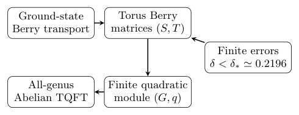
<figcaption class="paper-figure-caption"><b>Fig 1.</b> FIG. 1. Berry tomography map. Torus Berry transport reconstructs the finite quadratic module (G, q) controlling the Abelian topological theory. The reconstructed quadratic mod- ule determines fusion and braiding and, by the classification of extended Abelian Chern–Simons TQFTs, fixes the all-genus extended theory up to symmetric monoidal natural isomor- phism. The reconstruction is stable under normalized-row errors through nearest-row decoding with universal threshold δ ≃21.96%.</figcaption>
</figure>

**Summary.** This paper establishes that for Abelian topological orders, the information encoded in torus Berry matrices is sufficient to uniquely determine the entire topological quantum field theory across all genera. By linking the Berry holonomy to the mapping-class group representation, the authors provide a robust, numerically verifiable method to characterize exotic quantum phases like fractional quantum Hall states.

**Why it may be interesting.** This work provides a powerful, experimentally verifiable diagnostic tool for characterizing exotic topological phases of matter, linking abstract mathematical structures (TQFTs) directly to measurable quantities (Berry phases) in condensed matter systems.

Detailed structure

**Main problem.** The core problem is determining if the topological order of an Abelian Chern-Simons theory can be fully reconstructed from measurements of torus Berry matrices, even when those measurements are subject to finite errors.

**Main result.** The authors prove that for Abelian Chern-Simons topological orders, the torus Berry matrices are sufficient to determine the entire all-genus extended TQFT, and this reconstruction is stable against small measurement errors.

**Method.** The work combines geometric quantization techniques (involving half-forms and BKS maps) with algebraic reconstruction methods, specifically using nearest-row decoding on measured Berry data to recover the underlying finite quadratic module (G, q).

**Model / system.** The study focuses on Abelian Chern-Simons topological orders, which are relevant to physical systems like Abelian fractional quantum Hall states and spin-liquid phases described by even-lattice Chern-Simons theories.

**Key observables.** Torus Berry matrices (S, T), the finite quadratic module (G, q), and the projective Berry holonomy.

**Important parameters / regimes.** The error bound $\delta < 21.96\%$ is critical for the successful reconstruction of the fusion algebra.

**Assumptions / limitations.** The reconstruction is strictly proven for Abelian theories; the analysis also relies on fixing a topological basis and assuming the theory is Abelian.

**Figures summary.** Figure 1 illustrates the 'Berry tomography map,' demonstrating how torus Berry transport reconstructs the quadratic module (G, q), which in turn fixes the all-genus extended theory.

**Paper structure.** The paper proceeds by first establishing the mathematical link between the projective Berry holonomy and the mapping-class-group representation of the TQFT. It then tackles the reconstruction problem by showing that the measured torus data uniquely determines the algebraic structure (G, q), culminating in the proof that this structure fixes the entire TQFT.

Abstract

We show that for Abelian Chern-Simons topological orders, torus Berry matrices determine the all-genus extended TQFT. We identify the topological part of the projective Berry holonomy under metric deformations with the mapping-class-group representation of the Abelian Chern-Simons TQFT and prove that the normalized torus data reconstruct its finite quadratic module $(G,q)$. Recent work showed that $(G,q)$ classifies the extended theory up to symmetric monoidal natural isomorphism, then genus-one data determine the all-genus theory without choosing a $K$-matrix presentation. We also prove that, for normalized character row errors $δ<21.96$%, nearest-row decoding recovers the Abelian fusion algebra independently of the number of anyons. The result applies to Abelian fractional quantum Hall and spin-liquid phases described by even-lattice Chern-Simons theories.

[↑ back to top](#top)

### [Bayesian inference and retrodiction for faithful states on von Neumann algebras](http://arxiv.org/abs/2608.20001v1)

**Authors:** Pradyut Karmakar, Arthur J. Parzygnat  
**Type:** theory · **Category:** other · **PDF:** <https://arxiv.org/pdf/2608.20001v1>  
**Analysis basis:** full PDF text, analyzed in chunks
**Topic relevance:** `quantum measurements` **2/5**

↔ Scroll figures horizontally

<figure class="paper-figure-card">
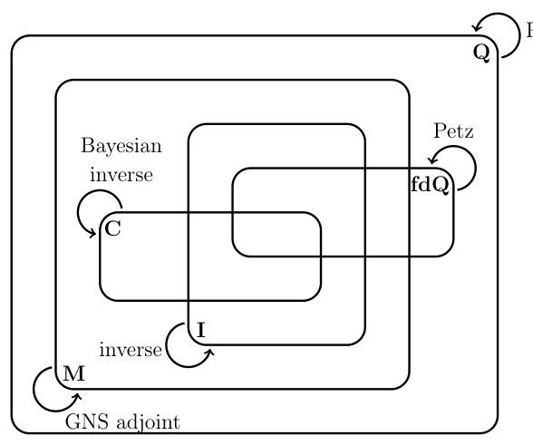
<figcaption class="paper-figure-caption"><b>Fig 1.</b> Figure 1: A diagram of the categories used in this paper and endofunctors on them. All of these categories are defined in the paper; briefly, C is a category of classical systems and stochastic (discrete-time) evolution, Q is a category of quantum systems and quantum channels, I is a cate- gory of invertible dynamics (morphisms are isomorphisms), fdQ is a category of finite-dimensional quantum systems and quantum channels, and M is a category of Markov maps (certain covariant evolutions). Each containment signifies a subcategory and the endofunctor specializes to the one provided on that subcategory. For example, the endofunctor labelled as “Petz” on Q, which is the Petz retrodiction...</figcaption>
</figure>

**Summary.** This work mathematically formalizes quantum retrodiction by extending concepts from finite dimensions to infinite-dimensional von Neumann algebras. It uses category theory to show that the Petz recovery map satisfies deep structural axioms, suggesting that quantum Bayesian inference is a structural necessity rather than just an algorithmic tool. This advances the mathematical foundations of quantum information theory.

**Why it may be interesting.** It provides a highly abstract, foundational mathematical framework for understanding quantum inference and time-reversal symmetry, connecting it to fundamental algebraic structures.

Detailed structure

**Main problem.** The paper extends the structural definition of retrodiction, typically used in Bayesian inference, from finite-dimensional quantum systems to the infinite-dimensional setting using von Neumann algebras.

**Main result.** It establishes that the Petz recovery map satisfies functoriality axioms on the category of von Neumann algebras with normal faithful states, suggesting a deep structural necessity for quantum Bayesian inversion.

**Method.** The authors employ category theory to define retrodiction structurally and utilize the Petz recovery map, formalizing concepts like the KMS inner product and functoriality axioms in infinite dimensions.

**Model / system.** The mathematical framework involves general von Neumann algebras ($A$) equipped with a normal faithful state ($\omega$), which models quantum systems with potentially infinite degrees of freedom.

**Key observables.** The KMS inner product $\langle\langle \cdot, \cdot 
angle
angle_\omega$, the Petz recovery map, and the functorial structure relating classical and quantum inference.

**Important parameters / regimes.** The structure depends on the choice of the faithful state $\omega$ and the properties of the modular conjugation operator $J$.

**Assumptions / limitations.** The analysis is built upon the assumption that the Petz recovery map defines a functor, though the paper leaves open whether this characterization is unique.

**Figures summary.** Figure 1 summarizes the relationship between various categories (Classical, Quantum, etc.) and the endofunctors (Bayesian inverse, Petz) connecting them.

**Paper structure.** The paper first reviews the Petz map in infinite dimensions, then develops the KMS inner product, and finally formalizes the structural axioms of retrodiction using category theory to characterize the Petz map.

Abstract

Retrodiction is the act of inferring a cause from its effects, the most common example of which is Bayesian inference. Retrodiction can be defined by its structural process-theoretic properties, which are mathematically captured by category theory. This categorical definition of retrodiction has recently been shown to potentially isolate the Petz recovery map as a unique universal candidate for quantum Bayesian inference. This paper extends these results to the infinite-dimensional setting on von Neumann algebras. In the process, we provide a pedagogical review of the Petz recovery map in infinite dimensions and its relation to the more commonly used expression in the finite-dimensional setting. We formalize the open question as to whether these categorical axioms for retrodiction do in fact uniquely characterize the Petz recovery map. If such a characterization holds, this would show that Bayesian inversion and the Petz recovery map are structural necessities and not simply useful algorithms for classical and quantum inference.

[↑ back to top](#top)

### [Boltzmann counting in Hilbert space](http://arxiv.org/abs/2608.20136v1)

**Authors:** Raúl O. Vallejos, Isadora Veeren, Frederico Brito, Fernando de Melo  
**Type:** theory · **Category:** statistical mechanics · **PDF:** <https://arxiv.org/pdf/2608.20136v1>  
**Analysis basis:** full PDF text, analyzed in chunks
**Topic relevance:** `quantum measurements` **2/5**

↔ Scroll figures horizontally

<figure class="paper-figure-card">
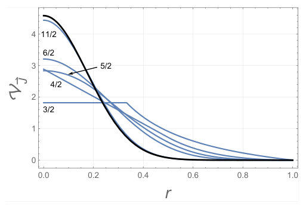
<figcaption class="paper-figure-caption"><b>Fig 1.</b> FIG. 1. Comparison between the exact distributions V ⃗ J (blue) and the Gaussian approximation (black). Exact curves correspond to j = 3/2, 4/2, 5/2, 6/2, 11/2, with dimensions D = 4, 5, 6, 7, 12, respectively. The Gaussian fit uses the unidimensional normaliza- tion of the radial profile, so that its width parameter satisfies σ2 = 1/[3(D −1)]. Gaussianity of the exact curves grows with D.</figcaption>
</figure>
<figure class="paper-figure-card">

<figcaption class="paper-figure-caption"><b>Fig 2.</b> FIG. 2. Regularized volume of the set of states compatible with a subspace of dimension M in an N-dimensional Hilbert space, shown as a line. The corresponding numerical results obtained by rejection sampling are shown as dots.</figcaption>
</figure>
<figure class="paper-figure-card">
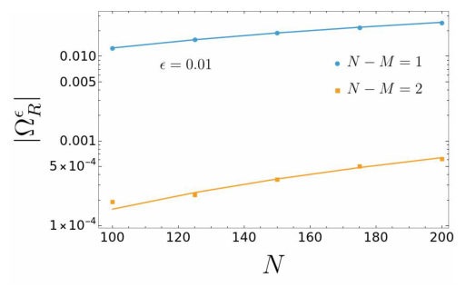
<figcaption class="paper-figure-caption"><b>Fig 3.</b> Figure 2 shows the regularized volume as function of the to- tal dimension N for two different values of co-dimension (N −M), together with the corresponding numerical re- sults obtained by rejection sampling. As the value of the co-dimension increases, i.e., the number of constraints gets larger, the volume rapidly goes to zero, turning a numerical evaluation impractical. As an alternative to (28), we could have written</figcaption>
</figure>
<figure class="paper-figure-card">
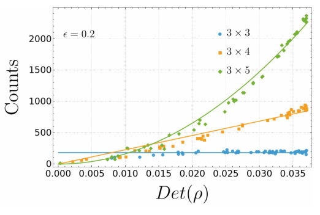
<figcaption class="paper-figure-caption"><b>Fig 4.</b> FIG. 3. Numerical analysis of the volume of local states. We evaluate how well simulations fit the prediction given by Eq. 54. We consid- ered a set of random local qutrit states. For each ϱ in this set, we sampled 100,000 microscopic states |ψ⟩∈H3 ⊗HE and checked how many of those satisfied the condition |tr(|ψ⟩⟨ψ| gi ⊗1E) − tr(ϱ gi)| &lt; ϵ for all i ∈[8], with gi the usual i-th Gell-Mann matrix, and we set ϵ = 0.2. The count of microscopic states obeying these conditions provides an estimate of the volume VΛPT(ϱ). By plotting the results against det(ϱ), we confirm the expected behavior: for dE = 3 (in blue), the volume of uncertainty is constant, as dE = dS; for dE = 4, it grows linearly...</figcaption>
</figure>

**Summary.** This paper develops a geometric entropy by defining it as the logarithm of the volume of pure states compatible with physical constraints in Hilbert space. It extends classical Boltzmann counting to the quantum realm by analyzing constraints like fixed expectation values and subsystem projections. This framework offers a complementary measure of quantum ignorance beyond traditional entropy definitions.

**Why it may be interesting.** This work provides a novel, geometric measure of quantum uncertainty that complements standard entropy measures (like von Neumann entropy) by quantifying the volume of the accessible microscopic state space.

Detailed structure

**Main problem.** To extend Boltzmann's counting principle, which relates entropy to the volume of compatible microstates, to the quantum mechanical setting.

**Main result.** The authors introduce a geometric entropy defined as the logarithm of the Hilbert-space volume of pure states compatible with given constraints, providing a measure of quantum ignorance.

**Method.** The method involves defining the volume using the Haar measure and employing regularization techniques (epsilon-smearing) to handle constraints that define sets of measure zero.

**Model / system.** The system is a quantum state described by a pure state $|\psi
angle$ in a Hilbert space $\mathcal{H}_D$. Constraints include subspace restrictions, fixed expectation values of observables, and coarse-graining maps.

**Key observables.** Geometric Entropy ($S_Q$), Hilbert-space volume of compatible states ($\Omega$), and expectation values ($\langle\psi|A_i|\psi
angle$).

**Important parameters / regimes.** Hilbert space dimension ($D$), constraint parameters ($\vec{a}$ or $\varrho$), and the regularization parameter ($\epsilon$).

**Assumptions / limitations.** The direct volume calculation using the Haar measure fails (zero volume), necessitating the use of $\epsilon$-regularization. The framework relies on defining the volume via delta functions over constraint functions.

**Figures summary.** Figure 1 compares exact distributions of expectation values with Gaussian approximations for large dimensions. Figure 2 shows the regularized volume scaling for subspace projections.

**Paper structure.** The paper introduces the geometric entropy concept, analyzes three classes of constraints (subspace, expectation values, coarse-graining), develops the mathematical machinery using measure theory and regularization, and derives explicit scaling laws for the resulting volumes.

Abstract

We introduce a geometric entropy for quantum preparations, defined as the logarithm of the Hilbert-space volume of pure states compatible with a given set of constraints. This construction extends Boltzmann's counting perspective to the quantum setting, where compatible states need not be orthogonal and the relevant notion of "number of states" is naturally replaced by a volume in state space. We analyze three classes of constraints: restriction to a subspace, fixed expectation values, and coarse-grained subsystem descriptions. For representative examples, including subspace projection, spin expectation values, partial trace, and an imperfect detector map, we obtain explicit scaling laws and closed-form expressions for the associated volumes. The resulting framework provides a geometric measure of quantum ignorance at the level of the preparation and complements entropy notions based on density matrices and coarse graining.

[↑ back to top](#top)

### [Counterexamples to the fractional coloring conjecture for triply efficient shadow tomography](http://arxiv.org/abs/2608.20113v1)

**Authors:** Jędrzej Stempin, Santiago Llorens, Felix Huber  
**Type:** theory · **Category:** quantum information and computing · **PDF:** <https://arxiv.org/pdf/2608.20113v1>  
**Analysis basis:** full PDF text, analyzed in chunks
**Topic relevance:** `quantum measurements` **2/5**

↔ Scroll figures horizontally

<figure class="paper-figure-card">
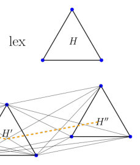
<figcaption class="paper-figure-caption"><b>Fig 1.</b> Figure 1. The lexicographic product of the line graph with the triangle, L3 lex C3. At every vertex of G (a branch), place a copy of H (a leaf). Then connect the vertices among different leaves if and only if their branches are connected.</figcaption>
</figure>

**Summary.** This theoretical paper disproves a conjecture regarding the scaling of the fractional chromatic number for Pauli observables used in quantum state tomography. By constructing specific counterexamples using graph products, the authors show that the required measurement resources scale faster than $O(1/\epsilon^2)$, thereby limiting the efficiency of current shadow tomography algorithms.

**Why it may be interesting.** It provides fundamental theoretical limits on the efficiency of quantum state tomography protocols, suggesting that the required measurement resources scale worse than previously conjectured.

Detailed structure

**Main problem.** The paper aims to disprove a conjecture relating the fractional chromatic number ($\chi_f$) of the anticommutation graph of Pauli observables to the expectation value threshold ($\epsilon$) in quantum state tomography.

**Main result.** The conjecture is false, as the authors construct a family of states and observables where $\chi_f(	ext{B}_\epsilon) \cdot \epsilon^2$ grows unboundedly with the system size parameter $m$.

**Method.** The proof involves constructing counterexamples using the lexicographic graph product of graphs (specifically involving the anti-heptagon) to amplify the violation of the conjectured bound.

**Model / system.** The system involves quantum states $\varrho$ on $n$ qubits and Pauli observables $P \in \{I, X, Y, Z\}^{\otimes n}$. The structure is analyzed via the anticommutation graph $G$ induced by a set of observables $B_\epsilon(\varrho)$.

**Key observables.** Fractional chromatic number ($\chi_f$), expectation values ($	ext{tr}(\varrho P)$), and the $eta$ number ($eta(G)$).

**Important parameters / regimes.** The scaling behavior is analyzed in terms of $\epsilon$ and the exponential growth factor derived from the graph invariants $eta(G)/\alpha(G)$.

**Assumptions / limitations.** The analysis relies on established graph theory properties, particularly how $\chi_f$ and $eta$ behave under the lexicographic product.

**Figures summary.** Figures illustrate the structure of the lexicographic product of graphs, such as $L_3 	ext{ lex } C_3$, and show the anticommutation graph of $C_7$ realized by Pauli strings.

**Paper structure.** The paper first defines the problem and the conjecture, then develops the counterexample construction using graph products and the anti-heptagon, culminating in a rigorous lower bound that demonstrates the conjecture's failure.

Abstract

Fractional graph colorings are useful for the Shadow tomography of Pauli observables. In practice, it is desirable that any experimentally interesting set of Pauli operators has a small fractional chromatic number $χ_{f}$ for its anticommutation graph. Conjecture 13 in King, Gosset, Kothari, and Babbush [PRX Quantum 6, 010336 (2025)] states that if $B_ε(\varrho)$ is the set of Pauli observables having expectation value magnitude at least $ε$ in some given quantum state $\varrho$, then the fractional chromatic number of the anticommutation graph $G$ induced by $B_ε(\varrho)$ is $O(ε^{-2})$. In other words, it asserts that there exists a constant $C$ such that $χ_{f} \cdot ε^2 \leq C$ on all states and graphs. If the conjecture were true, it would imply that there exists a triply efficient Pauli shadow tomography algorithm for {\it any} subset $S$ of Pauli observables, provided that there is also an efficient fractional coloring algorithm for the set $B_ε$. Here we show that the conjecture is false by constructing a family of states and observables for which no finite $C$ satisfying the bound exists. We also give a more general construction relying on the commutation index or $β$ number of a graph. The key ingredient in the proofs can be seen as an instance of the amplification trick, where fractional chromatic numbers, $β$ numbers, and expectation values are amplified through lexicographic graph products.

[↑ back to top](#top)

### [Fast Algorithms for Stoquastic Spin Systems](http://arxiv.org/abs/2608.19489v1)

**Authors:** Ryan L. Mann  
**Type:** theory · **Category:** statistical mechanics · **PDF:** <https://arxiv.org/pdf/2608.19489v1>  
**Analysis basis:** full PDF text, analyzed in chunks
**Topic relevance:** `analog quantum simulation` **2/5**

↔ Scroll figures horizontally

<figure class="paper-figure-card">
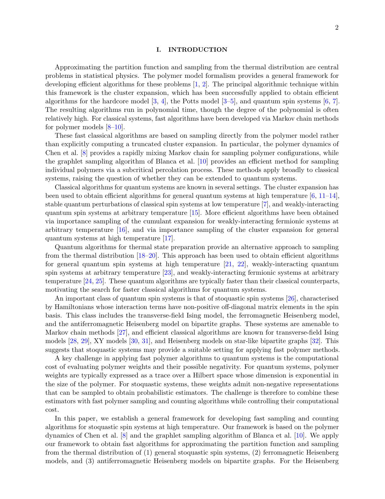
<figcaption class="paper-figure-caption"><b>Fig 1.</b> Low-resolution page preview, page 2</figcaption>
</figure>
<figure class="paper-figure-card">
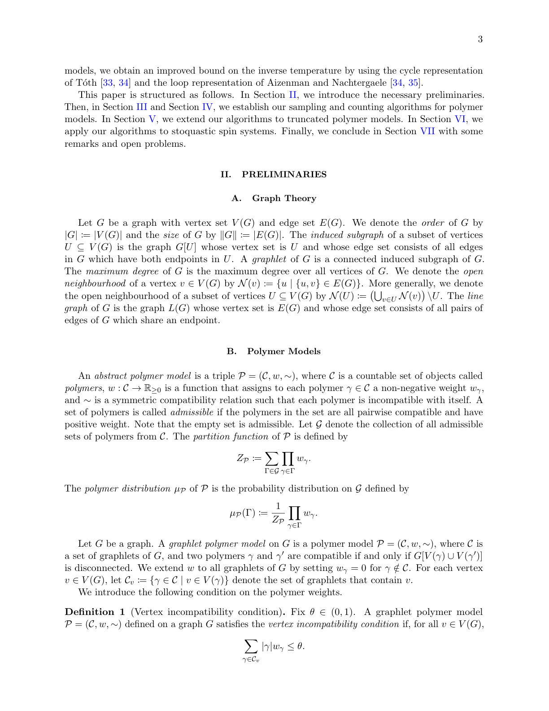
<figcaption class="paper-figure-caption"><b>Fig 2.</b> Low-resolution page preview, page 3</figcaption>
</figure>
<figure class="paper-figure-card">
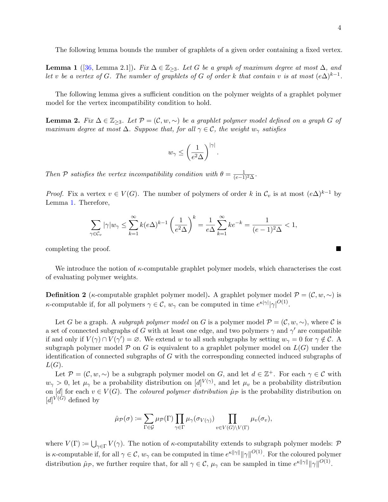
<figcaption class="paper-figure-caption"><b>Fig 3.</b> Low-resolution page preview, page 4</figcaption>
</figure>
<figure class="paper-figure-card">
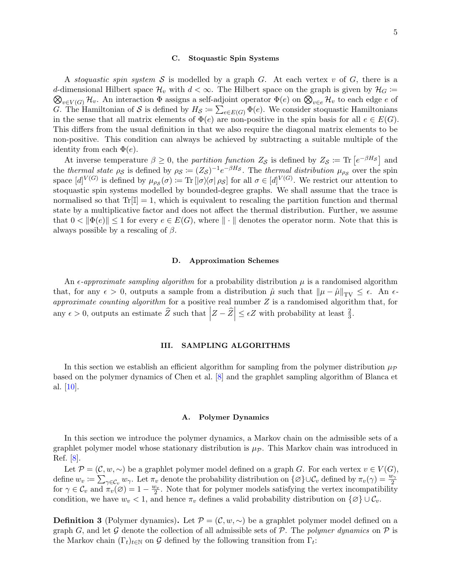
<figcaption class="paper-figure-caption"><b>Fig 4.</b> Low-resolution page preview, page 5</figcaption>
</figure>
<figure class="paper-figure-card">
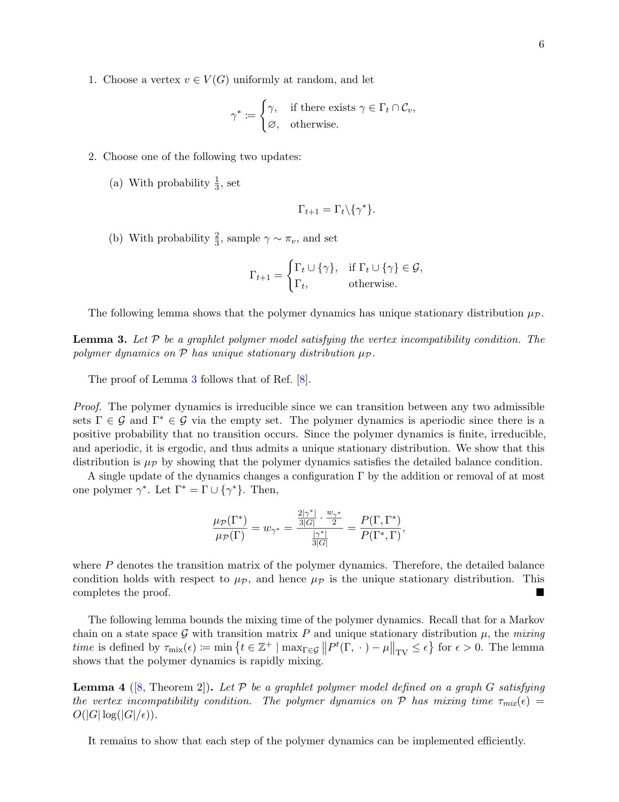
<figcaption class="paper-figure-caption"><b>Fig 5.</b> Low-resolution page preview, page 6</figcaption>
</figure>

**Summary.** This paper presents a general framework to develop fast algorithms for sampling and counting in stoquastic spin systems at high temperatures. By mapping the quantum problem onto a graphlet polymer model, the authors achieve efficient computational bounds for calculating the partition function and sampling the thermal state. This methodology is successfully applied to Heisenberg spin models, providing significant algorithmic advances in quantum statistical mechanics.

**Why it may be interesting.** The development of fast, polynomial-time classical algorithms for sampling and counting in quantum spin systems, especially those with non-negative weight structures, is highly relevant for simulating complex many-body quantum models.

Detailed structure

**Main problem.** The paper aims to develop fast and efficient algorithms for both sampling and counting observables associated with stoquastic spin systems at high temperatures.

**Main result.** Fast algorithms are established for approximating the partition function and sampling the thermal distribution for general stoquastic spin systems, as well as for ferromagnetic and antiferromagnetic Heisenberg models on bipartite graphs.

**Method.** The approach combines a general framework based on rapidly mixing Markov chains for polymer models with graphlet sampling algorithms, utilizing probabilistic extensions for computational tractability.

**Model / system.** The focus is on stoquastic spin systems defined by a Hamiltonian $H_S = \sum_{e \in E(G)} \Phi(e)$ on a graph $G$. Specific applications include Heisenberg models (ferromagnetic and antiferromagnetic) on bipartite graphs.

**Key observables.** The partition function $Z_S = 	ext{Tr}(e^{-eta H_S})$ and the thermal state $
ho_S$, from which the thermal distribution $\mu_{
ho_S}(\sigma)$ is derived.

**Important parameters / regimes.** High temperature ($eta$ small), the graph structure $G$, and the inverse temperature $eta$.

**Assumptions / limitations.** The framework relies on the stoquastic condition (non-positive matrix elements) and the assumption that the underlying polymer model is $\kappa$-computable.

**Paper structure.** The paper first establishes the general framework using polymer dynamics and graphlet sampling. It then applies this framework to derive fast algorithms for general stoquastic systems and specific Heisenberg models, culminating in the proof of tractability via probabilistic polymer models.

Abstract

We establish a general framework for developing fast sampling and counting algorithms for stoquastic spin systems at high temperature. Our framework is based on a rapidly mixing Markov chain for polymer models and a subcritical percolation process for sampling individual polymers. We apply our framework to obtain fast algorithms for approximating the partition function and sampling from the thermal distribution of (1) general stoquastic spin systems, (2) ferromagnetic Heisenberg models, and (3) antiferromagnetic Heisenberg models on bipartite graphs. For the Heisenberg models, we obtain an improved bound on the inverse temperature by using their respective cycle and loop representations.

[↑ back to top](#top)

### [Holographic Bit Threads from String-Diagrammatic Quantum Information Flow](http://arxiv.org/abs/2608.19428v1)

**Authors:** Yi-Yu Lin, Song Cheng  
**Type:** theory · **Category:** other · **PDF:** <https://arxiv.org/pdf/2608.19428v1>  
**Analysis basis:** full PDF text, analyzed in chunks
**Topic relevance:** `quantum measurements` **2/5**

↔ Scroll figures horizontally

<figure class="paper-figure-card">
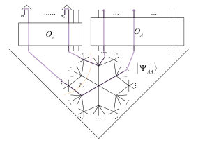
<figcaption class="paper-figure-caption"><b>Fig 1.</b> FIG. 2. QIF picture in a holographic protocol network. (a) The entanglement-network string diagram represents an LOCC protocol in which operations OA and O ¯ A are first ap- plied to the two boundary sides of the bipartite holographic tensor-network state | ψA ¯ A⟩, distilling as many Bell pairs as possible, after which standard teleportation is used to transfer the qubit messages m1, . . . , mk. Due to holographic duality, the network structure of | ψA ¯ A⟩corresponds to a preferred semiclassical geometry, wherein RT surface γA is depicted as the orange dashed line. The QIFs characterizing the transfer of the k qubits are marked in purple. We argue that the por- tions of their trajectories...</figcaption>
</figure>
<figure class="paper-figure-card">
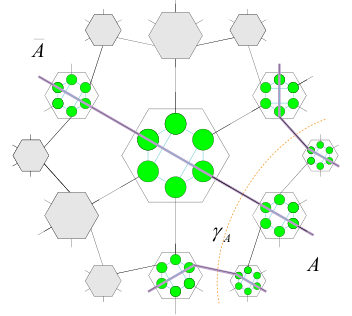
<figcaption class="paper-figure-caption"><b>Fig 2.</b> FIG. 3. Geodesic-like maximal QIF in a HaPPY network. Gray hexagons denote unresolved six-leg AME perfect ten- sors; the remaining cells are expanded into microscopic ZX string diagrams [47, 51], with green nodes denoting ZX spiders and blue dashed edges carrying Hadamard gates. Perfectness fixes only the isometric property associated with the relevant bipartition, not the underlying state vector or its ZX repre- sentation; here we use one particular microscopic choice com- patible with the target trajectories. The purple curves mark the certified QIF trajectories, whose number saturates the capacity of the minimal cut γA shown by the orange dashed curve, and therefore form a geodesic-like...</figcaption>
</figure>
<figure class="paper-figure-card">
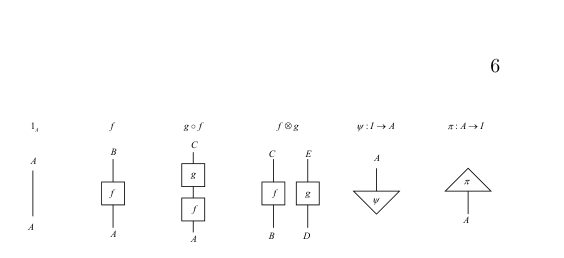
<figcaption class="paper-figure-caption"><b>Fig 3.</b> FIG. 4. Graphical representations of various morphisms in string diagrams.</figcaption>
</figure>
<figure class="paper-figure-card">
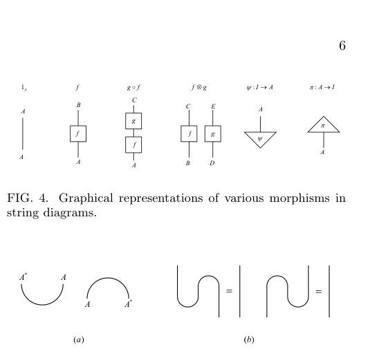
<figcaption class="paper-figure-caption"><b>Fig 4.</b> FIG. 5. (a) The cup and the cap. (b) The snake equations.</figcaption>
</figure>
<figure class="paper-figure-card">
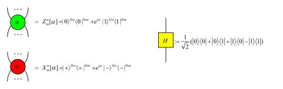
<figcaption class="paper-figure-caption"><b>Fig 5.</b> FIG. 6. Basic generators of the ZX calculus.</figcaption>
</figure>

**Summary.** This work bridges quantum information theory and quantum gravity by interpreting 'bit threads'—structures related to holographic entanglement entropy—through the lens of Quantum Information Flow (QIF). By mapping QIF paths onto holographic tensor networks, the authors demonstrate that QIF naturally satisfies the mathematical constraints of bit threads, offering a process-based explanation for entanglement structure.

**Why it may be interesting.** It connects abstract concepts from quantum information theory (QIF, categorical quantum mechanics) to concrete, geometric concepts in quantum gravity/holography (entanglement entropy, minimal surfaces), providing a deep structural understanding of entanglement quantification.

Detailed structure

**Main problem.** The paper aims to provide a quantum information-theoretic interpretation for 'bit threads,' structures derived from the minimal-surface formula for holographic entanglement entropy, specifically addressing the issue of their non-uniqueness.

**Main result.** The authors show that Quantum Information Flow (QIF) trajectories within holographic tensor networks naturally obey the divergence-free and density-bound conditions defining bit threads, thus providing a process-centered explanation for their existence and non-uniqueness.

**Method.** The methodology involves applying Coecke's Quantum Information Flow (QIF) concept from categorical quantum mechanics to holographic tensor networks, analyzing the flow paths using string diagrams (ZX calculus).

**Model / system.** The model is based on holographic duality, relating entanglement entropy to minimal surfaces in a bulk geometry, which is discretized into a holographic tensor network structure. The system involves bipartite holographic states and quantum protocols like teleportation.

**Key observables.** Entanglement Entropy $S(A)$, Bit Thread Flux, QIF Trajectories, and the capacity of the entanglement bond.

**Important parameters / regimes.** The discrete structure of the holographic tensor network (Graph $G=(V, E, c)$) and the bond dimensions.

**Assumptions / limitations.** The interpretation relies on viewing the problem from a process-centered viewpoint (CQM), and the analysis is restricted to holographic tensor networks with a preferred discrete geometry.

**Figures summary.** Figures illustrate QIF paths in holographic protocol networks, showing how QIFs (e.g., for Bell pair distillation) satisfy the mathematical constraints of bit threads, and demonstrating geodesic-like QIFs in HaPPY disk networks.

**Paper structure.** The paper progresses by first defining the mathematical constraints of bit threads, then introducing QIF from CQM, and finally demonstrating that QIF trajectories within the holographic tensor network sector satisfy these constraints, while also discussing the physical implications of QIF non-uniqueness.

Abstract

Bit threads, arising as the convex dual of the minimal-surface formula for holographic entanglement entropy, are line-like structures with nontrivial bulk trajectories. Their physical picture has long been associated with Bell-pair interpretations, yet the meaning of their detailed trajectories, particularly their nonuniqueness, remains unclear. We propose to apply Coecke's notion of quantum information flow (QIF) in protocol-network geometry, developed within categorical quantum mechanics, to a holographic setup, and show that its trajectories within the discrete holographic bulk---the tensor network---obey the divergence-free and density-bound conditions of bit threads. From this process-centered perspective, bit-thread nonuniqueness becomes natural: for a given resource state, different protocols realizing the same distillation task can give rise to different QIF trajectories. We further analyze stabilizer-type holographic tensor networks using ZX string diagrams and show that QIF trajectories can probe finer entanglement structure beyond the level captured by entanglement entropy.

[↑ back to top](#top)

### [Logarithmic depth compression of Heisenberg Hamiltonian simulation by fan-out parallelization, with built-in error detection](http://arxiv.org/abs/2608.20250v1)

**Authors:** Artemiy Burov, Clément Javerzac  
**Type:** theory · **Category:** quantum information and computing · **PDF:** <https://arxiv.org/pdf/2608.20250v1>  
**Analysis basis:** full PDF text, analyzed in chunks
**Topic relevance:** `analog quantum simulation` **2/5**

↔ Scroll figures horizontally

<figure class="paper-figure-card">
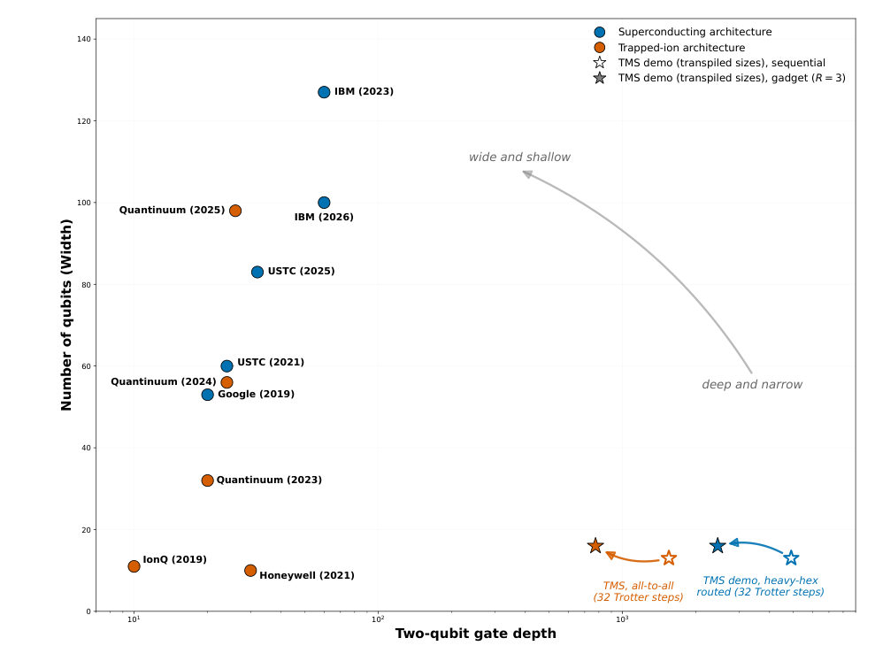
<figcaption class="paper-figure-caption"><b>Fig 1.</b> Figure 1: Circuit width versus two-qubit gate depth for published milestone experiments on quantum devices, together with the transpiled circuit sizes of this work’s demonstration (stars): TMS (29Si(CH3)4, 13 spins) at zero field, second-order product formula with M = 32 Trotter steps. The stars are compiled-and-transpiled circuit sizes, computed classically rather than run on hardware. Device coordinates are the qubit counts and two-qubit-gate depths of the cited experiments (random-circuit- sampling cycles and layers of CNOT or CZ gates for superconducting devices; parallel two-qubit-gate layers for Quantinuum; for IonQ the two-qubit gate count, which for the plotted Bernstein–Vazirani...</figcaption>
</figure>
<figure class="paper-figure-card">
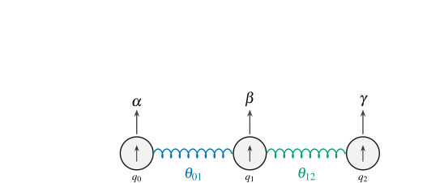
<figcaption class="paper-figure-caption"><b>Fig 2.</b> Figure 2: Example of a 3-spin molecule with chain connec- tivity mapped to qubits {q0, q1, q2} with respective Zeeman frequencies {α, β, γ} and spin-spin coupling parameters θ01 and θ12.</figcaption>
</figure>
<figure class="paper-figure-card">
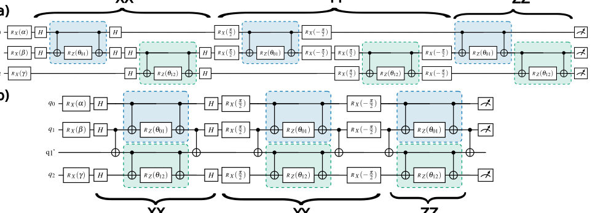
<figcaption class="paper-figure-caption"><b>Fig 3.</b> Figure 3: Not-parallelized (a) and parallelized (b) circuits for chain connectivity, see Eq. 3. Colored blocks correspond to the interaction terms with coefficients θkl (colors in Fig. 2).</figcaption>
</figure>
<figure class="paper-figure-card">
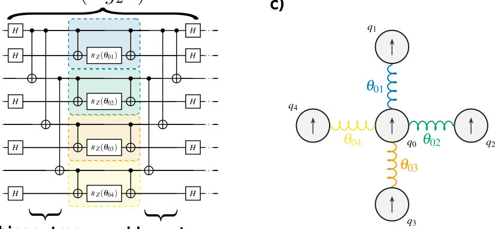
<figcaption class="paper-figure-caption"><b>Fig 4.</b> Figure 4: Four two-qubit operations that share a qubit, executed in sequence (a) and in parallel using the gadget (b), meant to be understood as a part of a larger quantum circuit. The corresponding star-topology molecule (c). Colored blocks correspond to the interaction terms with coefficients θkl.</figcaption>
</figure>
<figure class="paper-figure-card">
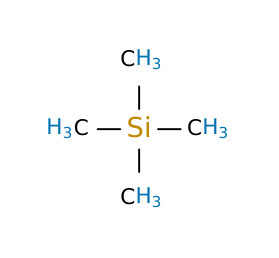
<figcaption class="paper-figure-caption"><b>Fig 5.</b> Figure 6: Tetramethylsilane (TMS). The 29Si nucleus couples identically to the twelve methyl protons (2JSiH = 6.6 Hz), forming an interaction star of hub degree twelve. In the idealized A12X limit the proton–proton couplings commute with the Hamiltonian and the observable and are omitted.</figcaption>
</figure>

**Summary.** This paper presents a novel fan-out-based gadget compiler to simulate Heisenberg Hamiltonians, aiming to reduce the circuit depth bottleneck in NISQ quantum computers. By encoding spins into redundant registers, it parallelizes interactions, achieving significant depth reductions compared to standard sequential compilation. The results demonstrate that this technique offers substantial resource savings, particularly for systems with highly connected hubs.

**Why it may be interesting.** This work directly addresses resource estimation and compilation overheads for simulating complex quantum many-body systems, which is crucial for realizing quantum simulation algorithms on near-term hardware.

Detailed structure

**Main problem.** The primary challenge is mitigating the constraint of circuit depth in Noisy Intermediate-Scale Quantum (NISQ) computers when simulating spin systems governed by Heisenberg Hamiltonians.

**Main result.** A fan-out-based gadget compiler can significantly reduce the two-qubit circuit depth (up to 2.5-fold on all-to-all) compared to sequential product-formula simulations, especially for graphs with high-degree hubs.

**Method.** The authors introduce a gadget compiler that encodes each logical spin into a repetition-code register, allowing pairwise interactions to execute in parallel via a logarithmic-depth CNOT fan-out, while simultaneously providing built-in error detection.

**Model / system.** The paper simulates Heisenberg-type nuclear magnetic resonance (NMR) Hamiltonians for spin systems, mapping them onto qubit Hamiltonians. The comparison is tested on various connectivity graphs, including star systems (e.g., 13-spin TMS).

**Key observables.** Two-qubit depth, circuit volume, per-shot error budget ($\lambda$), and the resulting zero-field NMR spectrum.

**Important parameters / regimes.** Interaction graph degree inhomogeneity, device connectivity (heavy-hex, all-to-all), and required error rate improvement (1 to 1.5 orders of magnitude).

**Assumptions / limitations.** The comparison is performed under a fixed protocol and uses an extrapolated device-noise model; the gain vanishes for dense, uniform graphs.

**Figures summary.** Figures compare circuit width vs. depth for sequential vs. gadget compilation on different hardware topologies; one figure shows the error budget comparison favoring the gadget method, and another illustrates the volume-optimal gain scaling with hub degree.

**Paper structure.** The paper first introduces the problem of circuit depth in NISQ simulation. It then details the gadget compiler method, which trades depth for width using redundant registers. The core of the work involves a fixed-protocol resource comparison, transpiling the optimized circuits to superconducting and trapped-ion targets, and finally validating the results by simulating a specific NMR spectrum.

Abstract

Noisy intermediate-scale quantum computers are constrained by circuit depth, while product-formula simulation of spin systems leads to narrow and deep circuits. Here we introduce a fan-out-based gadget compiler that trades circuit depth for width in simulations of Heisenberg-type nuclear magnetic resonance (NMR) Hamiltonians. Each logical spin is encoded into a small repetition-code register sized by its interaction degree, so that all pairwise interactions of a given Pauli type execute in parallel after a logarithmic-depth CNOT fan-out, and the redundant registers provide error detection for post-selection at no additional algorithmic overhead. The central result is a fixed-protocol resource comparison of the two compilations, transpiled to heavy-hex superconducting and all-to-all trapped-ion targets across a set of NMR spin systems. For interaction graphs with a high-degree hub the volume-optimal schedule halves the two-qubit depth and reduces the volume 1.7-fold for the 13-spin demonstration, which on heavy-hex also lowers the two-qubit gate count, and the depth reduction rises to 2.5-fold on all-to-all for the highest-degree molecule studied. On all-to-all the two-qubit gate count rises for every system, so the volume reduction is a benefit on depth-limited hardware. The gain grows with the degree inhomogeneity of the interaction graph and vanishes for dense uniform graphs, where the optimum is the sequential circuit. We simulate the zero-field NMR spectrum of tetramethylsilane, a 13-spin star system. Under a noise model scaled from a published present-day processor calibration, the shallower gadget circuits match or surpass the sequential compilation only after post-selection on their built-in error detection, once error rates improve by one to one and a half orders of magnitude. We verify the spectra against an independent classical computation.

[↑ back to top](#top)

### [Quantum Energy Storage versus Heat-to-Work Conversion in an Interacting Spin System](http://arxiv.org/abs/2608.19533v1)

**Authors:** Omar Bachain, Mohamed Amazioug, Rachid Ahl Laamara  
**Type:** theory · **Category:** statistical mechanics · **PDF:** <https://arxiv.org/pdf/2608.19533v1>  
**Analysis basis:** full PDF text, analyzed in chunks
**Topic relevance:** `analog quantum simulation` **2/5**

↔ Scroll figures horizontally

<figure class="paper-figure-card">
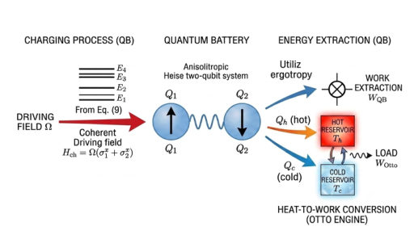
<figcaption class="paper-figure-caption"><b>Fig 1.</b> Fig. 1: Schematic representation of the quantum battery and Otto engine protocols implemented on the same interacting two-qubit system (Q1, Q2).</figcaption>
</figure>
<figure class="paper-figure-card">
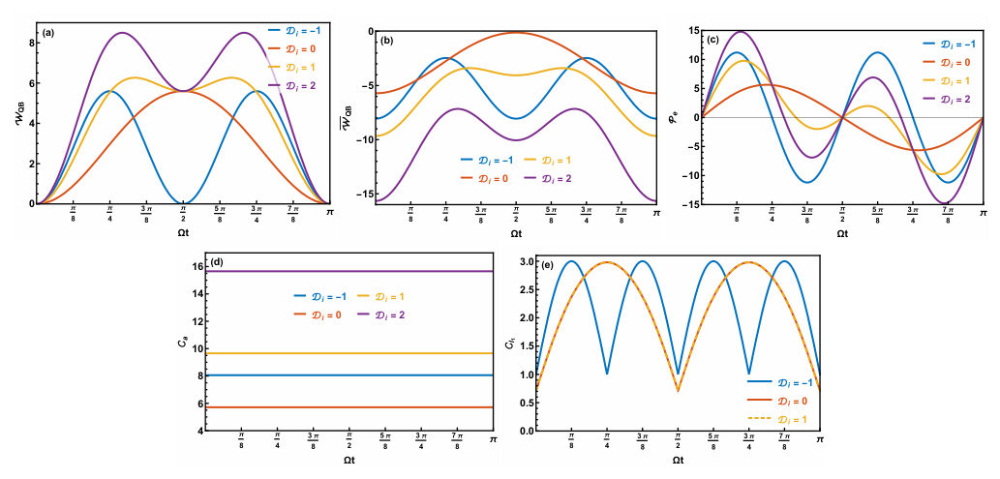
<figcaption class="paper-figure-caption"><b>Fig 2.</b> Fig. 2: Charging dynamics of the quantum battery as a function of the dimensionless time Ωt for different values of the dipolar interaction Di = −1, 0, 1, and 2. Panels (a)–(e) show the ergotropy WQB, anti-ergotropy WQB, instantaneous charging power Pe, storage capacity Ca, and ℓ1-norm of coherence Cℓ1, respectively. The remaining parameters are fixed at Jx = −0.3, Jy = −0.7, Jz = −0.9, Bz = 1, T = 0.2, and Γz = 1.</figcaption>
</figure>
<figure class="paper-figure-card">
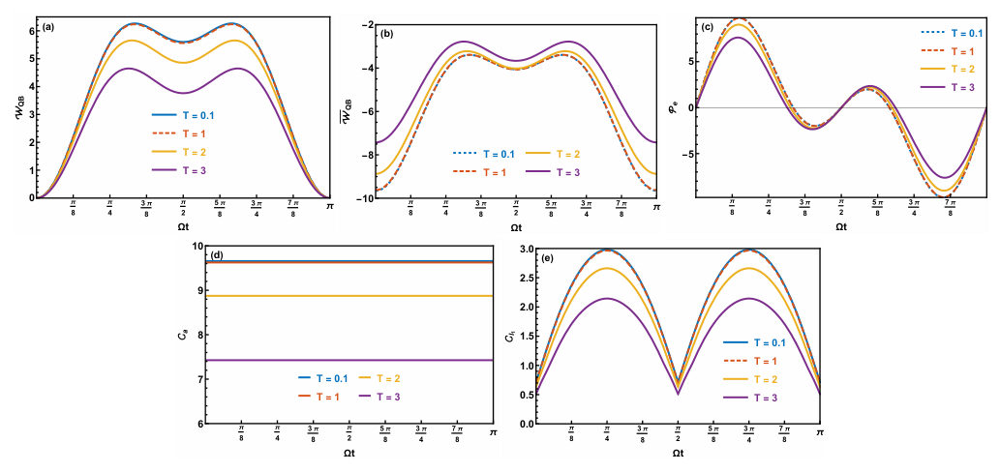
<figcaption class="paper-figure-caption"><b>Fig 3.</b> Fig. 3: Charging dynamics of the quantum battery as a function of the dimensionless time Ωt for different temperatures T = 0.1, 1, 2, and 3. Panels (a)–(e) show the ergotropy WQB, anti-ergotropy WQB, instantaneous charging power Pe, storage capacity Ca, and ℓ1-norm of coherence Cℓ1, respectively. The remaining parameters are fixed at Jx = −0.3, Jy = −0.7, Jz = −0.9, Di = 1, Bz = 1, and Γz = 1.</figcaption>
</figure>
<figure class="paper-figure-card">
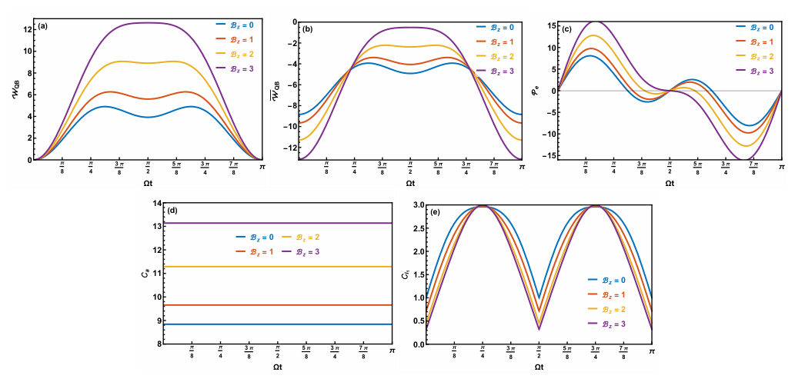
<figcaption class="paper-figure-caption"><b>Fig 4.</b> Fig. 4: Charging dynamics of the quantum battery as a function of the dimensionless time Ωt for different values of the external magnetic field Bz = 0, 1, 2, and 3. Panels (a)–(e) show the ergotropy WQB, anti-ergotropy WQB, instantaneous charging power Pe, storage capacity Ca, and ℓ1-norm of coherence Cℓ1, respectively. The remaining parameters are fixed at Jx = −0.3, Jy = −0.7, Jz = −0.9, Di = 1, T = 0.2, and Γz = 1.</figcaption>
</figure>
<figure class="paper-figure-card">
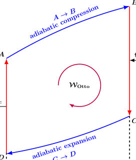
<figcaption class="paper-figure-caption"><b>Fig 5.</b> Fig. 5: Schematic representation of the quantum Otto cycle in the (Bz, U) plane.</figcaption>
</figure>

**Summary.** This paper investigates an interacting two-qubit spin system used as both a quantum battery and a quantum heat engine. By analyzing the effects of dipolar interactions, the authors show that enhancing energy storage capability does not guarantee enhanced work extraction efficiency. This highlights the complementary and distinct nature of quantum energy storage and heat-to-work conversion processes.

**Why it may be interesting.** This work is highly relevant as it uses a microscopic model to differentiate between two distinct forms of energy conversion (storage vs. work), providing insights into how local interactions control different thermodynamic pathways in quantum systems.

Detailed structure

**Main problem.** The study compares the energetic performance of a quantum battery (energy storage) versus a quantum Otto heat engine (heat-to-work conversion) in a single interacting spin system.

**Main result.** The research demonstrates a pronounced contrast: increasing a specific microscopic interaction (dipolar coupling) enhances the battery's energy storage capacity but decreases the maximum work extractable from the heat engine.

**Method.** The authors analyze the system using theoretical quantum mechanics, calculating key thermodynamic and quantum coherence measures for both protocols.

**Model / system.** The system is an interacting two-qubit spin system governed by an anisotropic Heisenberg Hamiltonian, supplemented by dipolar, spin-orbit, and external magnetic field interactions.

**Key observables.** Ergotropy, anti-ergotropy, storage capacity, net work, and thermodynamic efficiency.

**Important parameters / regimes.** Dipolar interaction strength, temperature bias, and external magnetic field strength.

**Assumptions / limitations.** The analysis assumes the system can be modeled by the specified Hamiltonian and compares results derived from two distinct thermodynamic protocols.

**Figures summary.** Figures schematically represent the battery and Otto engine protocols on the two-qubit system, and tables/figures summarize the quantitative dependence of key observables on the dipolar interaction.

**Paper structure.** The paper introduces the model, analyzes the quantum battery protocol, investigates the quantum Otto cycle, directly compares the performance metrics, and concludes by contrasting the findings.

Abstract

We investigate the energetic and thermodynamic performance of an interacting two-qubit system serving as both a quantum battery and a quantum Otto heat engine. The working medium is described by an anisotropic Heisenberg Hamiltonian supplemented by a dipolar interaction, a symmetric spin--orbit interaction, and an external magnetic field. Within a unified microscopic framework, we first analyze a coherent unitary charging protocol and characterize the resulting energy-storage performance through the ergotropy, anti-ergotropy, charging power, storage capacity, and $\ell_1$-norm of quantum coherence. We investigate the effects of the dipolar interaction, temperature, and magnetic field on these quantities. We then employ the same working medium in a quantum Otto cycle and study the absorbed and released heat, net work, and thermodynamic efficiency as functions of the magnetic-field modulation, dipolar interaction, and temperature bias. A direct comparison between the two protocols reveals a pronounced contrast in their response to the dipolar interaction. In the investigated parameter regime, increasing the dipolar interaction substantially enhances the maximum ergotropy and storage capacity of the quantum battery, whereas the maximum work extracted per Otto cycle decreases. The Otto efficiency exhibits a nonmonotonic dependence on the dipolar interaction while remaining below the Carnot bound. These results demonstrate that an enhancement of quantum energy-storage capability does not necessarily imply an enhancement of heat-to-work conversion. Our findings highlight the complementary nature of quantum batteries and quantum heat engines and show how microscopic spin interactions can   be used to control different forms of quantum energy conversion within   the same physical platform.

[↑ back to top](#top)

### [Beyond Integrability Preserving Renormalization-Group Protocol in Non-Hermitian Hamiltonians with Time-Dependent Interaction Strengths](http://arxiv.org/abs/2608.19519v1)

**Authors:** Parameshwar R. Pasnoori  
**Type:** theory · **Category:** strongly correlated electrons · **PDF:** <https://arxiv.org/pdf/2608.19519v1>  
**Analysis basis:** full PDF text, analyzed in chunks
**Topic relevance:** `Keldysh / 2PI / non-Gaussian methods` **1/5** · `analog quantum simulation` **1/5** · `correlated / nonlocal dissipation` **1/5** · `driven-dissipative phase transition` **1/5** · `methods for driven-dissipative` **1/5** · `non-equilibrium universality` **1/5**

↔ Scroll figures horizontally

<figure class="paper-figure-card">
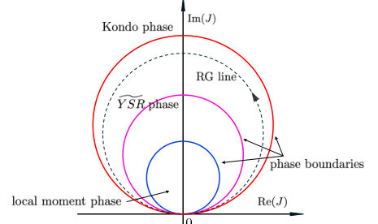
<figcaption class="paper-figure-caption"><b>Fig 1.</b> FIG. 1: Figure depicts the three phases exhibited by the static non-Hermitian Kondo model: the Kondo phase, the ] Y SR phase and the local moment phase. The x and y-axes corre- spond to the real and the imaginary values of the interaction strength respectively. The trajectories of the RG flow are perfect circles resting at the origin as shown (dashed circles) with the arrow representing the flow in the UV. All the RG trajectory circles are centered on the imaginary axis where the radius of the circle corresponds to the respective RG in- variant. The phase boundaries occur at specific values of the RG invariant values and are represented by solid circles.</figcaption>
</figure>
<figure class="paper-figure-card">
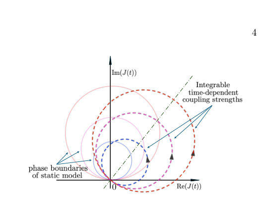
<figcaption class="paper-figure-caption"><b>Fig 2.</b> FIG. 2: Figure depicts the integrability preserving time- dependent strengths. The x and y-axes correspond to the real and the imaginary values of the time-dependent cou- pling strength respectively. The trajectories of the coupling strengths are perfect circles resting at the origin as shown (dashed circles) with the arrows representing the flow in the direction of increasing time. The points on a given circle that are on the right and left side of the origin are the past and future infinities respectively. All circles are centered on the slanted dashed line and the radius of each circle correspond- ing to an integrable time-dependent coupling strength is a dynamical invariant. When the...</figcaption>
</figure>

**Summary.** This theoretical work investigates how integrability constrains time-dependent quantum systems, specifically extending the analysis to non-Hermitian Hamiltonians. By using the generalized Bethe ansatz, the authors prove that the constraints are more general than the standard Renormalization Group (RG) protocol. This reveals new, non-RG-predicted dynamical pathways for the system's coupling strengths.

**Why it may be interesting.** This work provides a powerful generalization of integrability concepts from Hermitian to non-Hermitian systems, which is highly relevant for open quantum systems and non-equilibrium dynamics where non-Hermiticity is common.

Detailed structure

**Main problem.** The paper extends the study of integrability-preserving time-dependent quantum models to non-Hermitian Hamiltonians, comparing the constraints imposed by integrability against the standard Renormalization Group (RG) protocol.

**Main result.** The set of integrability-preserving time-dependent strengths is shown to be larger than those predicted by the RG protocol, allowing for time evolutions that trace perfect limit cycles in the coupling parameter space.

**Method.** The analysis utilizes the generalized Bethe ansatz framework to derive consistency conditions (Yang-Baxter equations) for the time-dependent Schrödinger equation.

**Model / system.** The primary model is the time-dependent non-Hermitian Kondo model, characterized by a time-dependent complex interaction strength J(t). The static counterpart involves analyzing RG flow in the Kondo model, which exhibits distinct phases (Kondo, YSR, local moment).

**Key observables.** The time evolution of the inverse interaction strength, 1/J(t), and the parameters defining the phase space trajectories (limit cycles).

**Important parameters / regimes.** The time-dependent coupling strength J(t), the RG invariant parameter $f_i$, and the rate of time dependence in $1/J(t)$.

**Assumptions / limitations.** The analysis relies on the consistency conditions derived from the generalized Bethe ansatz structure, and the comparison is made by allowing complex time-dependent coupling strengths.

**Figures summary.** Figure 1 illustrates the three phases of the static model with RG flow trajectories. Figure 2 shows the phase space plot of Im(J) vs Re(J), contrasting the standard RG flow with the newly found limit cycles for the non-Hermitian case.

**Paper structure.** The paper first establishes the background of the RG protocol in integrable systems. It then applies the generalized Bethe ansatz to the non-Hermitian time-dependent model, deriving constraints that lead to linear time dependence for 1/J(t). Finally, it compares these constraints to the RG flow, demonstrating the larger set of integrable paths.

Abstract

It is well established that in time-dependent quantum systems, integrability preserving time-dependent interaction strengths are identical to the renormalization group (RG) trajectories of the corresponding static model when time `$t$' in the driven model is identified with the logarithm of the cutoff `$\logΛ$' of the static model. We refer to this integrability preserving driving as the RG protocol. In this work we extend the class of time-dependent integrable models to include non-Hermitian quantum models with time-dependent interaction strengths. Using the recently formulated generalized Bethe ansatz framework [P. R. Pasnoori, Phys. Rev. B 112, L060409 (2025)], we show that the constraints imposed by integrability are more general: The interaction strengths of the static model that flow in the RG follow the respective RG trajectories in the corresponding time-dependent model as described above. In addition, the interaction strengths of the static model that are RG invariant can either be constant or have a specific time-dependence in the corresponding time-dependent model which is constrained by integrability. Thus we establish that in the context of time-dependent non-Hermitian systems, the set of integrability preserving time-dependent strengths is larger than the set corresponding to the RG protocol.

[↑ back to top](#top)

### [Characterization of a damping channel as a mixture of amplitude damping and anti-damping channels of different parameters](http://arxiv.org/abs/2608.20178v1)

**Authors:** Vijay Pathak, R. Srikanth  
**Type:** theory · **Category:** quantum information and computing · **PDF:** <https://arxiv.org/pdf/2608.20178v1>  
**Analysis basis:** full PDF text, analyzed in chunks
**Topic relevance:** `correlated / nonlocal dissipation` **1/5** · `driven-dissipative phase transition` **1/5** · `methods for driven-dissipative` **1/5** · `non-equilibrium universality` **1/5** · `quantum measurements` **1/5**

↔ Scroll figures horizontally

<figure class="paper-figure-card">
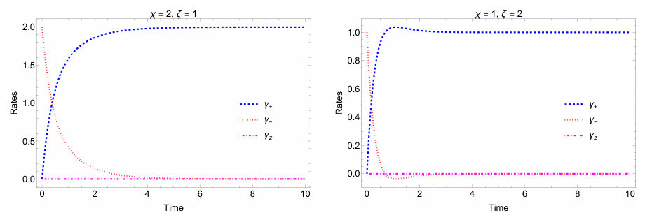
<figcaption class="paper-figure-caption"><b>Fig 1.</b> FIG. 1: The canonical rates γ+(t), γ−(t), and γz(t) are plotted for an exponentially decaying channel parameter η(t) = exp[−χt] and an exponentially decaying mixing probability p(t) = exp[−ζt]. Left: χ = 2 and ζ = 1, for which the resulting dynamics is CP-divisible. Right: χ = 1 and ζ = 2, for which the resulting dynamics is non-CP-divisible.</figcaption>
</figure>
<figure class="paper-figure-card">
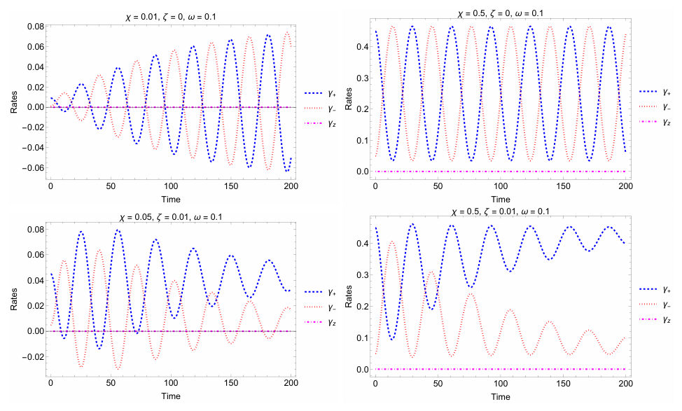
<figcaption class="paper-figure-caption"><b>Fig 2.</b> FIG. 2: The canonical rates γ+(t), γ−(t), and γz(t) are plotted for the monotonically decaying channel parameter η(t) = exp[−χt] and the mixing probability p(t) = p0 + p exp[−ζt] sin2(ωt). For all panels, p0 = 0.1 and p = 0.8. Top left: non-P-divisible dynamics for a purely oscillatory mixing probability (ζ = 0) with χ close to ζ. Top right: CP-divisible dynamics for ζ = 0 with χ &gt; ζ. Bottom left: non-P-divisible dynamics for an oscillator decaying mixing probability with ζ = 0.01. Bottom right: CP-divisible dynamics for the same decaying mixing probability with a sufficiently large χ. The oscillatory behavior of the rates originates from the time dependence of the mixing probability, while...</figcaption>
</figure>
<figure class="paper-figure-card">
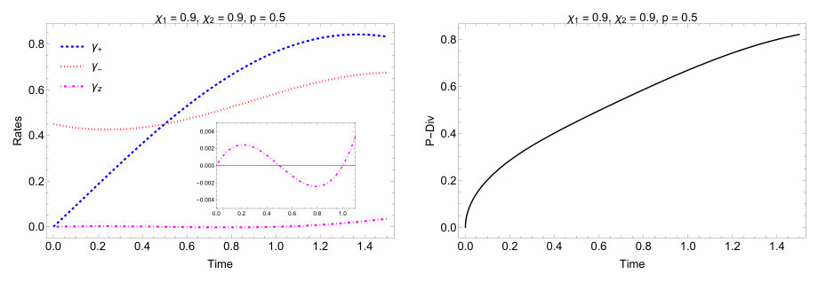
<figcaption class="paper-figure-caption"><b>Fig 3.</b> FIG. 3: Left: The canonical rates γ+(t), γ−(t), and γz(t) are plotted for η1(t) = exp[−χ1t] and η2(t) = exp[−χ2t2] with constant mixing probability p. The inset shows the region where γz(t) &lt; 0. Right: The P-divisibility condition 2γz(t) + p</figcaption>
</figure>
<figure class="paper-figure-card">
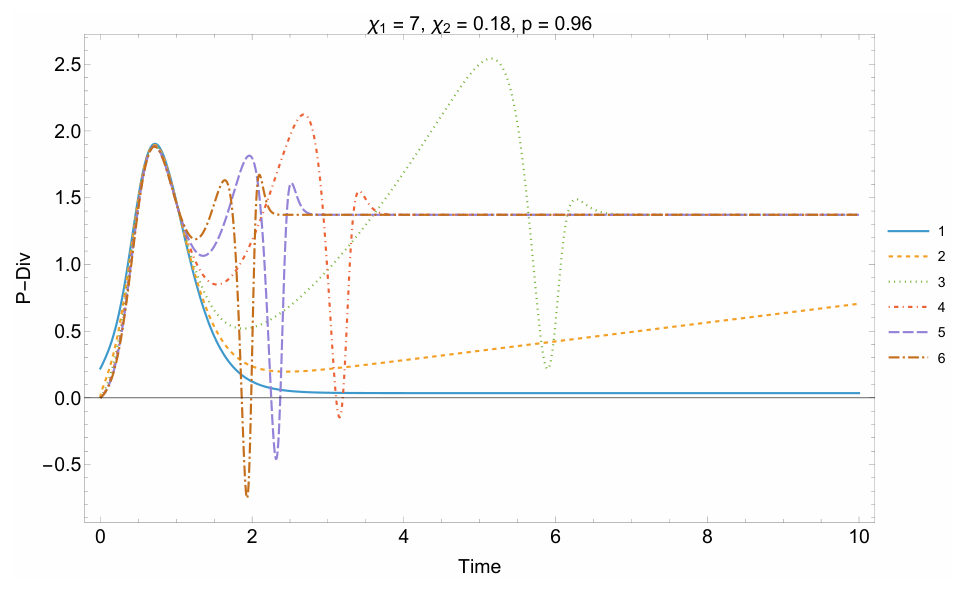
<figcaption class="paper-figure-caption"><b>Fig 4.</b> FIG. 4: The P-divisibility condition is plotted as a function of time for η1(t) = exp[−χ1t] and η2(t) = exp[−χ2ti] with constant mixing probability p. The different curves correspond to different values of the exponent i. The condition remains positive throughout the evolution for i ≤3, indicating P-divisible dynamics, whereas for i &gt; 3 it becomes negative over part of the evolution, indicating non-P-divisible dynamics.</figcaption>
</figure>
<figure class="paper-figure-card">
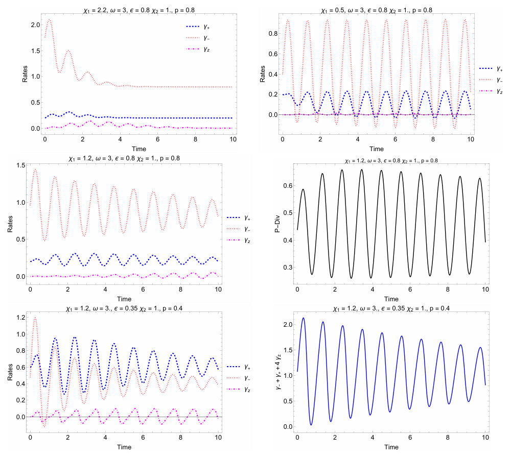
<figcaption class="paper-figure-caption"><b>Fig 5.</b> FIG. 5: Representative dynamical classes for the mixing of one CP-divisible and one non-P-divisible constituent channel with constant mixing probability p. The non-P-divisible channel has the oscillatory parameter η1(t) = (ϵ + (1 −ϵ) cos2(ωt)) exp[−χ1t], while the CP-divisible channel has the monotonically decaying parameter η2(t) = exp[−χ2t]. Top left: all three canonical rates remain positive, corresponding to CP-divisible dynamics. Top right: γ+(t) and γ−(t) become negative simultaneously, giving non-P-divisible and BLP non-Markovian dynamics. Middle left: γz(t) becomes negative, indicating non-CP-divisible dynamics. Middle right: the P-divisibility condition 2γz(t)+ p</figcaption>
</figure>

**Summary.** This paper presents a novel method to engineer open quantum system dynamics by mixing amplitude-damping and anti-damping channels. This framework grants independent control over different aspects of decoherence, allowing researchers to tune dynamics between unital and non-unital regimes. The results offer a flexible tool for quantum information processing, enabling precise control over noise mitigation and channel characterization.

**Why it may be interesting.** This work provides a powerful, flexible tool for quantum information scientists to engineer noise channels, moving beyond simple thermal models to precisely control decoherence effects for error correction or state preparation.

Detailed structure

**Main problem.** The paper aims to develop a constructive framework to generate a broad class of phase-covariant quantum dynamics that goes beyond standard models like Generalized Amplitude Damping (GAD). This allows for independent control over different aspects of open system evolution.

**Main result.** The proposed mixing of amplitude-damping and anti-damping channels allows for independent control over contraction and translation of the Bloch sphere, enabling the engineering of dynamics with specific divisibility properties (P-divisible, CP-divisible).

**Method.** The authors employ the general theorem for P-divisibility and CP-divisibility, applying it constructively by mixing two known channels (AD and anti-AD) with time-dependent probabilities and parameters.

**Model / system.** The system is modeled as a qubit undergoing open evolution, governed by a general master equation in the phase-covariant class. The dynamics are characterized by time-dependent rates ($\gamma_{\pm}(t), \gamma_z(t)$).

**Key observables.** P-divisibility, CP-divisibility, the trace norm distance $D(t)$ from the identity channel, and the evolution of Bloch sphere coordinates.

**Important parameters / regimes.** Unequal decay parameters ($\eta_1(t), \eta_2(t)$) for the two channels, and the time-dependent mixing probability $p(t)$.

**Assumptions / limitations.** The analysis assumes the dynamics are completely positive (CP) from $t=0$, and the primary utility relies on the controllable anti-AD channel exhibiting complete recurrence.

**Figures summary.** Figures illustrate the time evolution of the error metric $D(t)$ and the translation term, comparing results for various combinations of AD/anti-AD parameters and mixing probabilities.

**Paper structure.** The paper establishes the physical problem, introduces the mixing framework, derives necessary and sufficient conditions for P-divisibility using specialized bases, and finally demonstrates the control over error mitigation and dynamical regimes.

Abstract

Non-unital noise is a fundamental feature of open quantum systems, governing energy exchange and inducing state translations on the Bloch sphere. While such translations can be useful for tasks such as state preparation and channel capacity, unital dynamics where no translation occurs are often preferred in quantum information processing, particularly for error correction. Phase-covariant dynamics provide a general framework encompassing dissipation, excitation, and dephasing processes in qubit systems; however, commonly used models such as the generalized amplitude damping (GAD) channel offer only limited control over these features. In this work, we present a constructive framework for generating a broader class of phase-covariant dynamics by mixing amplitude-damping and anti-damping channels with unequal decay parameters and time-dependent mixing probabilities. This approach enables independent control over contraction and translation, allows continuous tuning between non-unital and unital regimes, and yields an effective dephasing contribution absent in GAD. To characterize these dynamics, we employ the general theorem for P-divisibility and show that it can be used constructively by evaluating it in suitably chosen Hilbert space bases, leading to simplified conditions for both unital and non-unital cases. The framework captures a wide range of behaviors, including CP-divisible, P-divisible but not CP-divisible, and non-P-divisible dynamics. We further show that appropriate mixing can reduce the deviation from the ideal noiseless evolution and that such improvement persists even after tuning the dynamics to the unital regime. Our results provide a flexible approach to engineering open system dynamics beyond standard thermal models, with potential applications in noise control and quantum information processing.

[↑ back to top](#top)

### [Hysteresis without coexistence: disorder-rounded first-order transitions in a van der Waals magnet](http://arxiv.org/abs/2608.19352v1)

**Authors:** Xiaoyu Guo, Abby N. Neill, Christopher M. Pasco, Tyrel M. McQueen, N. P. Armitage  
**Type:** experiment · **Category:** statistical mechanics · **PDF:** <https://arxiv.org/pdf/2608.19352v1>  
**Analysis basis:** full PDF text, analyzed in chunks
**Topic relevance:** `Frenkel-Kontorova` **1/5** · `analog quantum simulation` **1/5** · `driven-dissipative phase transition` **1/5** · `non-equilibrium universality` **1/5**

↔ Scroll figures horizontally

<figure class="paper-figure-card">
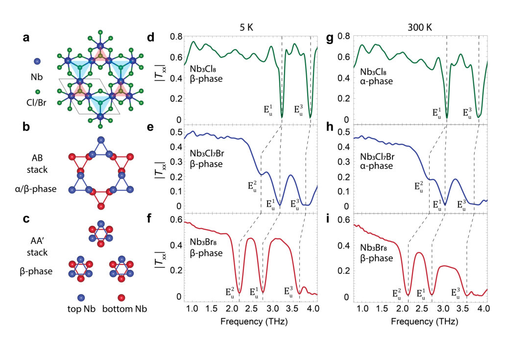
<figcaption class="paper-figure-caption"><b>Fig 1.</b> FIG. 1: Atomic structure of Nb3X8 and evolutions of IR-active phonons with different halogen compositions. (a) Atomic structure of monolayer Nb3X8. The breathing kagome lattice is shaded in blue and red and the unit cell is indicated by the parallelogram. (b-c) The AB (b) and AA′ (c) stacking of the Nb atoms in adjacent vdW layers. α-phase Nb3X8 only has AB stacking while β-phase has alternating AB and AA′ stackings. (d-i) The amplitude of transmission coefficient Txx from Nb3Cl8, Nb3Cl7Br and Nb3Br8 at 5 K (d-f) and at 300 K (g-i). The corresponding phonon modes are labeled.</figcaption>
</figure>
<figure class="paper-figure-card">
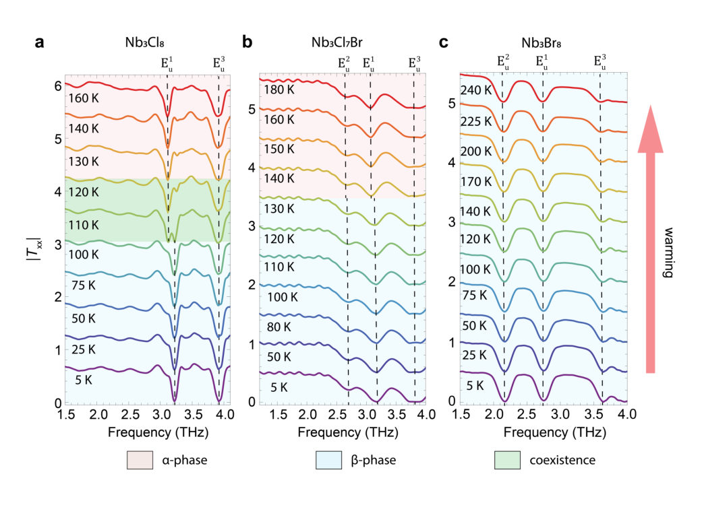
<figcaption class="paper-figure-caption"><b>Fig 2.</b> FIG. 2: T-dependent transmission spectra capture phase transitions and phase inhomogeneity. (a-c) The magni- tude of the transmission coefficient Txx as a function of temperature in Nb3Cl8 (a), Nb3Cl7Br (b) and Nb3Br8 (c). Measurements were taken during warming. The temperature ranges corresponding to the α- and β-phases, and their coexistence are shaded in red, blue and green, respectively.</figcaption>
</figure>
<figure class="paper-figure-card">
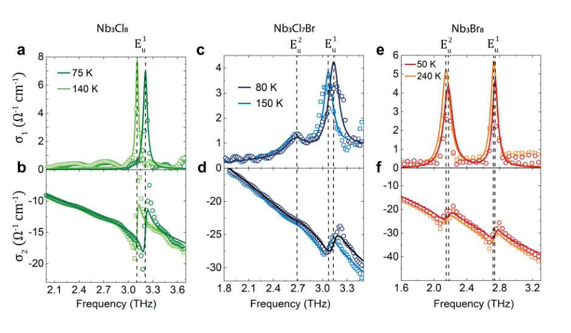
<figcaption class="paper-figure-caption"><b>Fig 3.</b> FIG. 3: Optical conductivity fitted with a Lorentz-oscillator model. (a-f) Real part (σ1) and imaginary part (σ2) of optical conductivity at selected temperatures in Nb3Cl8 (a-b), Nb3Cl7Br (c-d) and Nb3Br8 (e-f). Solid lines are the best simultaneous fit to σ1 and σ2 using a Lorentz-oscillator model. Clear phonon frequency shifts can be observed across phase transitions in Nb3Cl8 and Nb3Cl7Br.</figcaption>
</figure>
<figure class="paper-figure-card">
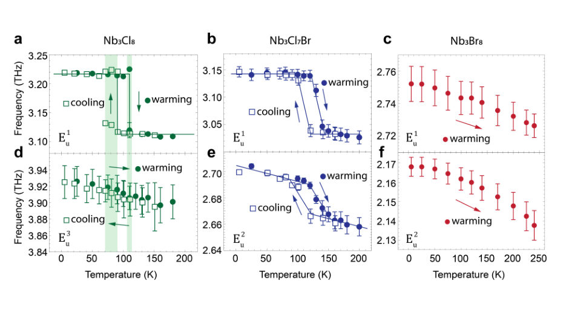
<figcaption class="paper-figure-caption"><b>Fig 4.</b> FIG. 4: Hysteresis in T-dependent phonon frequency reflects first-order phase transitions. (a-c) Frequencies of E1 u phonon as a function of temperature in Nb3Cl8 (a), Nb3Cl7Br (b) and Nb3Br8 (c). (d) Frequencies of E3 u phonon as a function of temperature in Nb3Cl8. (e-f) Frequencies of E2 u phonon as a function of temperature in Nb3Cl7Br (e) and Nb3Br8 (f). Solid circles denote warming data, and open squares denote cooling data. Temperatures with coexistence of α- and β-phases in Nb3Cl8 are shaded in green. Error bars represent fitting uncertainties. Solid lines are guide to the eyes. Note the very different frequency scales in the individual panels.</figcaption>
</figure>
<figure class="paper-figure-card">
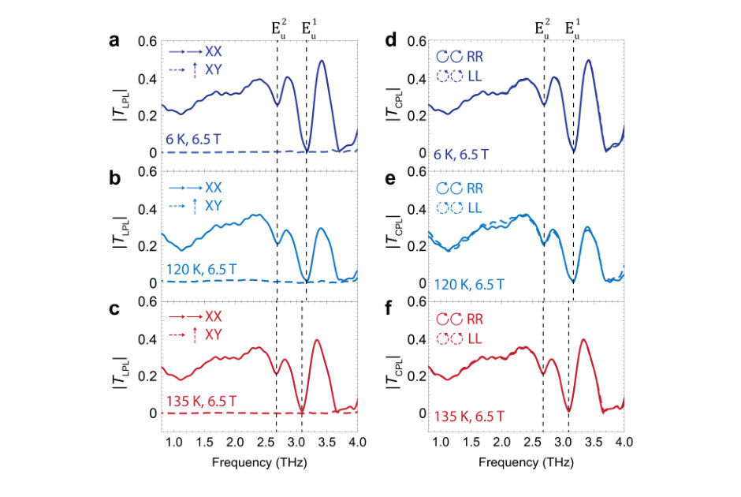
<figcaption class="paper-figure-caption"><b>Fig 5.</b> FIG. 5: Transmission coefficients in linear and circular basis characterize structural and magnetic ground states. (a-f) The magnitudes of the transmission coefficients in linear basis TLP L (Txx and Txy) (a-c), and circular basis TCP L (TRR and TLL) (d-f) of Nb3Cl7Br as a function of frequency at 6 K, far below the magnetic transition temperature (a and b), 120 K, right below the magnetic transition temperature (b and e) and 135 K, right above the magnetic transition temperature (c and f). The almost-zero |Txy| is consistent with ¯3m point group symmetry and the almost-identical spectra of |TRR| and TLL confirms a non-magnetic ground state.</figcaption>
</figure>

**Summary.** This experimental study uses terahertz spectroscopy on van der Waals magnets to examine how halogen disorder affects first-order phase transitions. The results show that disorder destroys the clear evidence of phase coexistence but leaves behind thermal hysteresis. This strongly suggests that disorder fragments the transition into local domains, allowing researchers to separate the effects of hysteresis from those of bulk coexistence.

**Why it may be interesting.** The work provides a clean experimental platform to test fundamental theoretical predictions regarding the stability of ordered phases under quenched disorder, which has analogues in many condensed matter systems.

Detailed structure

**Main problem.** The study investigates how quenched disorder modifies the nature of first-order phase transitions, specifically distinguishing between the signatures of thermal hysteresis and macroscopic phase coexistence.

**Main result.** Disorder-induced substitution ($	ext{Cl} 	o 	ext{Br}$) suppresses macroscopic phase coexistence, causing the transition to broaden and fragment into locally favored domains, while thermal hysteresis persists.

**Method.** Time-domain terahertz spectroscopy (TDTS) was employed to measure temperature-dependent phonon frequencies and scattering rates across the phase transition.

**Model / system.** The physical system is the quasi-two-dimensional trimerized kagome van der Waals magnet family $	ext{Nb}_3	ext{Cl}_{8-x}	ext{Br}_x$. The transition involves structural changes and magnetic ordering.

**Key observables.** Phonon frequencies ($	ext{E}_{1u}, 	ext{E}_{3u}, 	ext{E}_{2u}$), phonon linewidths, thermal hysteresis, and evidence of macroscopic phase coexistence.

**Important parameters / regimes.** The degree of disorder, controlled by the Br substitution concentration ($x$), and temperature ($T$).

**Assumptions / limitations.** The analysis assumes that the persistence of thermal hysteresis in the disordered compound, despite the loss of coexistence, implies that these two hallmarks of first-order transitions arise from distinct physical mechanisms.

**Figures summary.** Figures show temperature-dependent transmission spectra ($	ext{T}_{xx}$) for $	ext{Nb}_3	ext{Cl}_8$ (showing coexistence) versus $	ext{Nb}_3	ext{Cl}_7	ext{Br}$ (showing broadening), and phonon scattering rates derived from fitting these spectra.

**Paper structure.** The paper systematically compares the clean compound ($	ext{Nb}_3	ext{Cl}_8$) exhibiting clear first-order signatures (coexistence + hysteresis) with the disordered compound ($	ext{Nb}_3	ext{Cl}_7	ext{Br}$), using theoretical frameworks (Imry-Wortis, Aizenman-Wehr) to interpret the observed suppression of coexistence.

Abstract

Quenched disorder can profoundly modify phase transitions. In low-dimensional systems, theory predicts that even weak quenched disorder can round the thermodynamic discontinuities associated with a first-order phase transition. Here, we employ time-domain terahertz spectroscopy to investigate the quasi-two-dimensional trimerized kagome van der Waals magnet family Nb$_3$Cl$_{8-x}$Br$_x$ ($x=0$, 1 and 8). We observe the emergence of an additional phonon branch upon Br substitution, whose spectral weight increases and frequency softens with increasing Br concentration. The temperature evolution of the phonon frequencies reveals a clean first-order transition in Nb$_3$Cl$_8$ characterized by macroscopic phase coexistence and thermal hysteresis. In contrast, the transition in the substitutionally disordered compound Nb$_3$Cl$_7$Br retains its hysteresis while exhibiting a substantially broadened transition with no resolvable macroscopic phase coexistence. These observations reveal disorder-induced fragmentation of the transition into locally favored domains instead of well-defined bulk phases separated by stable phase boundaries. The behavior is consistent with the Imry-Wortis and the Aizenman-Wehr scenarios for the effect of quenched disorder in low-dimensional systems, which destabilizes macroscopic phase coexistence and rounds the thermodynamic discontinuities associated with first-order transitions. Thermal hysteresis persists in the disordered compound despite the lack of resolvable coexistence, indicating that the two features often treated as a single hallmark of first-order character arise distinctly and can be separated by disorder. Moreover, our results establish Nb$_3$Cl$_{8-x}$Br$_x$ as a promising platform for investigating the effects of disorder on first-order transitions in low-dimensional systems.

[↑ back to top](#top)

### [Tight Entropy Contraction of Generalized Quantum Depolarization](http://arxiv.org/abs/2608.19685v1)

**Authors:** Li Gao, Long Zhao  
**Type:** theory · **Category:** quantum information and computing · **PDF:** <https://arxiv.org/pdf/2608.19685v1>  
**Analysis basis:** full PDF text, analyzed in chunks
**Topic relevance:** `correlated / nonlocal dissipation` **1/5** · `driven-dissipative phase transition` **1/5** · `methods for driven-dissipative` **1/5** · `non-equilibrium universality` **1/5**

↔ Scroll figures horizontally

<figure class="paper-figure-card">
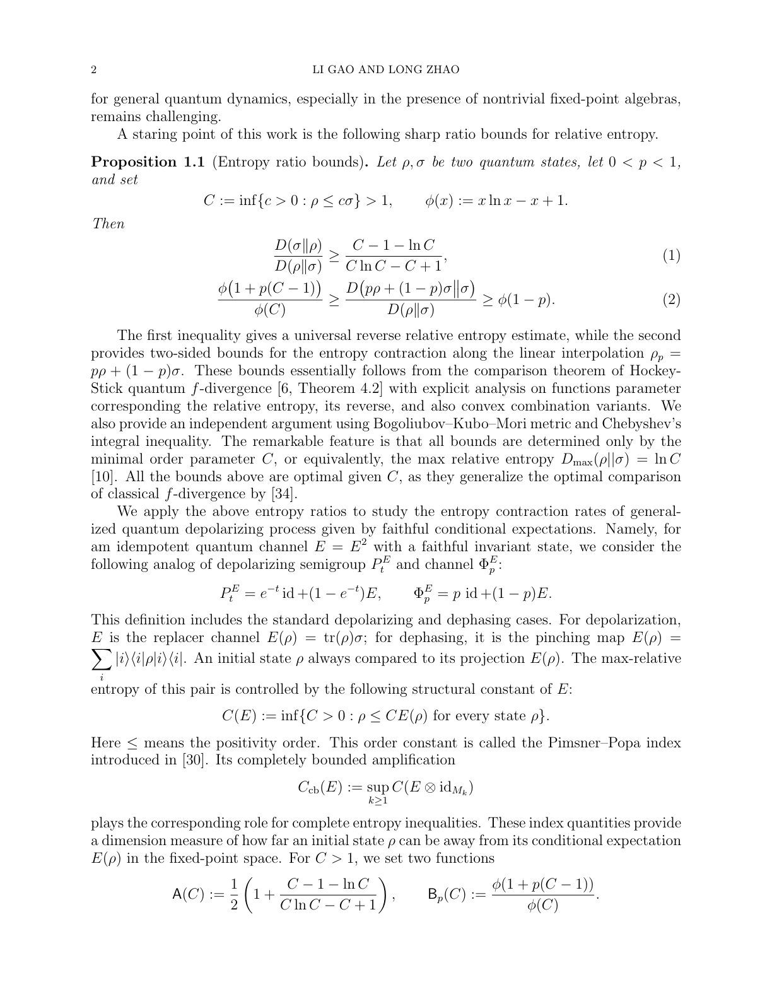
<figcaption class="paper-figure-caption"><b>Fig 1.</b> Low-resolution page preview, page 2</figcaption>
</figure>
<figure class="paper-figure-card">
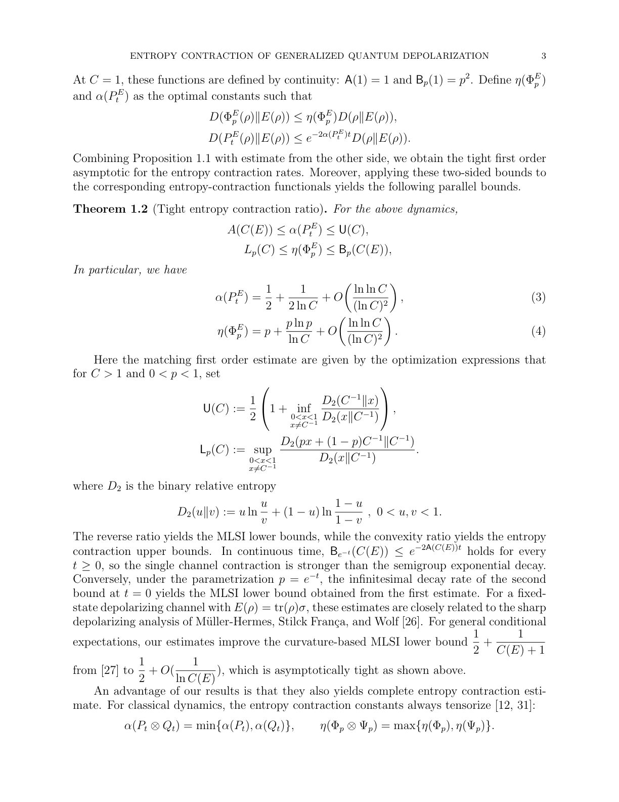
<figcaption class="paper-figure-caption"><b>Fig 2.</b> Low-resolution page preview, page 3</figcaption>
</figure>
<figure class="paper-figure-card">
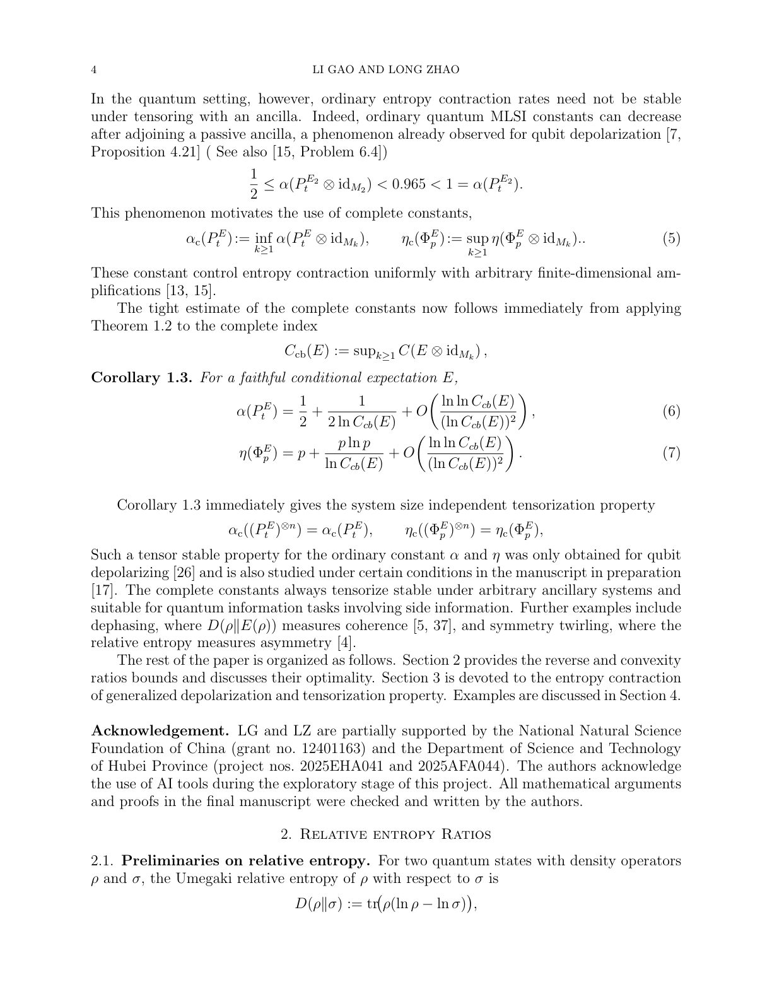
<figcaption class="paper-figure-caption"><b>Fig 3.</b> Low-resolution page preview, page 4</figcaption>
</figure>
<figure class="paper-figure-card">
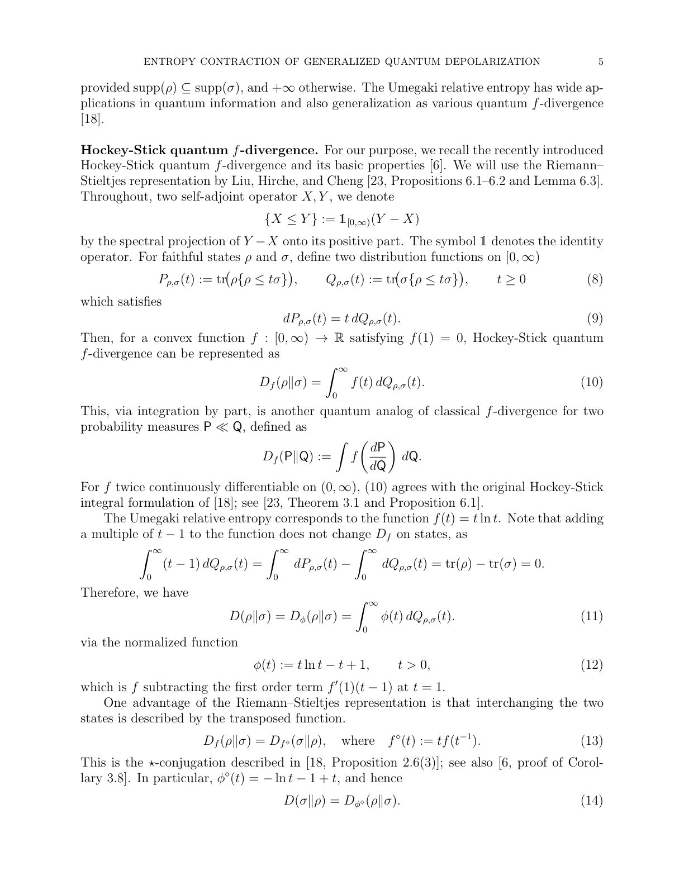
<figcaption class="paper-figure-caption"><b>Fig 4.</b> Low-resolution page preview, page 5</figcaption>
</figure>
<figure class="paper-figure-card">
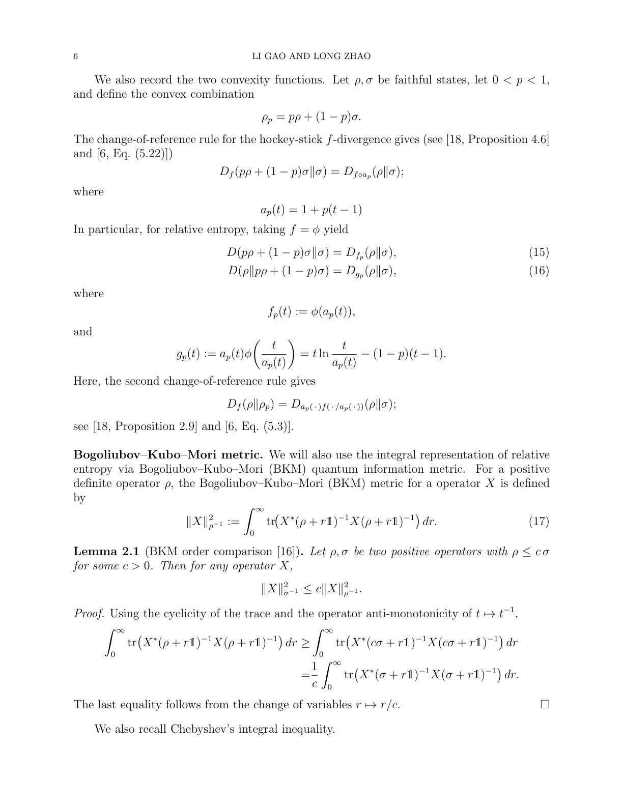
<figcaption class="paper-figure-caption"><b>Fig 5.</b> Low-resolution page preview, page 6</figcaption>
</figure>

**Summary.** This theoretical paper develops sharp bounds for the rate at which quantum information decays under generalized noise processes. By analyzing the relative entropy contraction using advanced tools like quantum f-divergences, the authors provide asymptotic formulas for these decay rates. The results are crucial for understanding the fundamental limits of quantum coherence preservation in noisy quantum systems.

**Why it may be interesting.** This work provides rigorous, quantitative bounds on how quantum information (coherence, entanglement) decays under realistic noise models, which is fundamental for designing fault-tolerant quantum computation protocols.

Detailed structure

**Main problem.** The paper establishes tight upper and lower bounds for the relative entropy contraction rate of generalized quantum depolarizing channels and semigroups.

**Main result.** It derives asymptotic formulas for the contraction rates ($\alpha(P_E^t)$ and $\eta(\Phi_E^p)$) in terms of the structural constants $C(E)$ and $C_{cb}(E)$, and proves the tensor stability of these complete constants.

**Method.** The analysis heavily relies on bounding ratios of relative entropies using tools like the Hockey-Stick quantum f-divergence and the Bogoliubov–Kubo–Mori quantum Fisher information metric.

**Model / system.** The study analyzes quantum dynamics governed by generalized quantum depolarizing channels ($\Phi_E^p$) and semigroups ($P_E^t$), which are modeled using faithful conditional expectations ($E$). Examples include quantum depolarization and dephasing.

**Key observables.** Relative entropy $D(
ho\|\sigma)$, complete contraction constants $C_{cb}(E)$, and the contraction rates $\alpha(P_E^t)$ and $\eta(\Phi_E^p)$.

**Important parameters / regimes.** The structural constants $C(E)$ and $C_{cb}(E)$, which quantify the noise strength and are crucial for determining the asymptotic decay rates.

**Assumptions / limitations.** The derivation of the lower bound relies on the existence of an index-achieving pure state, and the final results are presented as asymptotic estimates for large structural constants.

**Figures summary.** Not specified in the notes, but the structure implies derivations leading to specific asymptotic equations (e.g., Eq. 50, 52) and structural identities (e.g., Eq. 64).

**Paper structure.** The paper progresses by first establishing general bounds using relative entropy ratios (Chunk 2), then applying these tools to the specific dynamics of quantum depolarizing channels (Chunk 1), and finally deriving the asymptotic forms and proving the multiplicative properties of the complete index (Chunks 3 & 4).

Abstract

We establish upper and lower bounds for relative entropy contraction of generalized quantum depolarizing channels and semigroups. Our bound provides tight first order asymptotic of the contraction rate in terms of the dimension constant. One side estimate are based on sharp reverse ratio and convexity of relative entropy of two states, which can be derived from the recently introduced Hockey-Stick quantum $f$-divergence, and also independently, Bogoliubov--Kubo--Mori quantum Fisher information metric. The other side follows from the existence of index achieving pure state with respect to a general conditional expectation. Our results extend to the complete entropy contraction rate, tensor stable estimates for product dynamics. Examples include quantum depolarization, dephasing, and compact group symmetrization, with consequences for the decay rate of coherence and asymmetry.

[↑ back to top](#top)

### [Volatile resistive-switched state in a bulk organic conductor with a sharp metal-insulator transition](http://arxiv.org/abs/2608.19864v1)

**Authors:** Riku Ishii, Ryo Motohashi, Keitaro Tada, Yusuke Suzuki, Takayoshi Kouchi, Hiroshi Oike, Fumitaka Kagawa, Reizo Kato, Tetsuaki Itou  
**Type:** experiment · **Category:** strongly correlated electrons · **PDF:** <https://arxiv.org/pdf/2608.19864v1>  
**Analysis basis:** full PDF text, analyzed in chunks
**Topic relevance:** `correlated / nonlocal dissipation` **1/5** · `driven-dissipative phase transition` **1/5** · `non-equilibrium universality` **1/5** · `quantum measurements` **1/5**

↔ Scroll figures horizontally

<figure class="paper-figure-card">
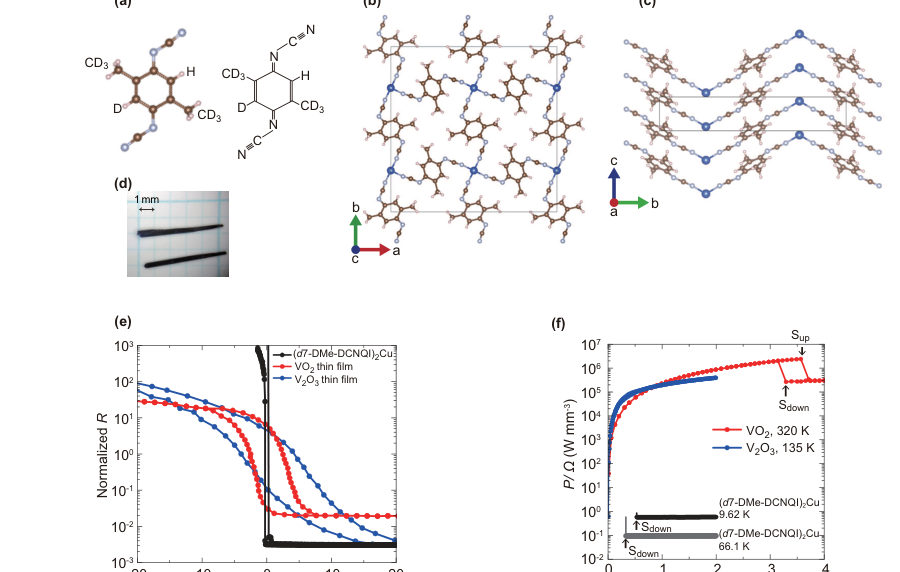
<figcaption class="paper-figure-caption"><b>Fig 1.</b> FIG. 1. Structure and transport properties of (d7-DMe-DCNQI)2Cu. (a) Molecular structure of (d7-DMe-DCNQI)2Cu. The d7 means that the seven 1H sites are substituted with deuterons. (b) (d7-DMe-DCNQI)2Cu structure viewed down the c-axis. The space group is I41/a, and the structure consists of planar DCNQI molecules stacked along the c-axis. (c) (d7-DMe-DCNQI)2Cu structure viewed down the a-axis. In the insulating phase, the threefold superlattice occurs along the stacking axis. The charge ordering at the Cu sites follows a Cu+ Cu+ Cu2+ pattern. (d) Photograph of needlelike crystals of (d7-DMe-DCNQI)2Cu. (e) T −Tc dependence of the normalized resistance for VO2 and V2O3 thin films and...</figcaption>
</figure>
<figure class="paper-figure-card">
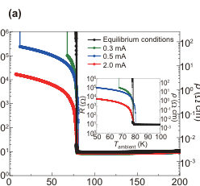
<figcaption class="paper-figure-caption"><b>Fig 2.</b> FIG. 3. Transport properties of (d7-DMe-DCNQI)2Cu. (a) Ambient temperature dependence of the resistance of (d7- DMe-DCNQI)2Cu. The black plot shows the two-wire resis- tance under equilibrium conditions, while the other plots show the two-wire resistance under applied constant currents (0.3 mA, 0.5 mA, 2.0 mA). The inset shows the behavior of the re- sistance around the transition temperature. The data under equilibrium conditions are the same as the black data shown in Fig. 1(e). (b) Two-probe I(current)–V (voltage) character- istics at 9.62 K and 66.1 K for (d7-DMe-DCNQI)2Cu. Sdown indicates the switching points when the current is decreased. These data yield the current dependence of...</figcaption>
</figure>
<figure class="paper-figure-card">
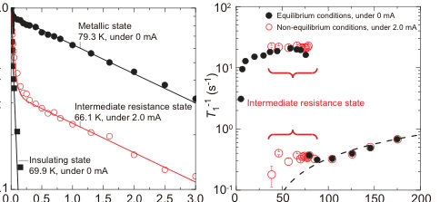
<figcaption class="paper-figure-caption"><b>Fig 3.</b> FIG. 4. 1H-NMR relaxation curves and relaxation rate (T −1 1 ) of (d7-DMe-DCNQI)2Cu. (a) 1H-NMR relaxation curves for the metallic and insulating states under 0 mA, and the inter- mediate resistance state under 2.0 mA. The black solid curves represent fits to single-exponential functions for the metallic and insulating states, while the red solid curve represents a fit to a double-exponential function for the intermediate re- sistance state under 2.0 mA. The excellent fit of the double- exponential function provides evidence for the coexistence of the metallic and insulating phases in the intermediate resis- tance state. (b) Ambient temperature dependence of T −1 1 un- der 0 mA (equilibrium...</figcaption>
</figure>
<figure class="paper-figure-card">
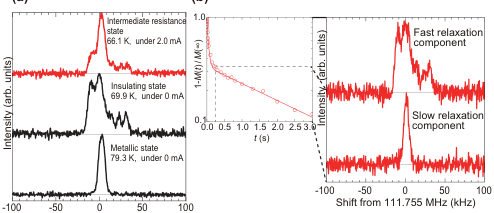
<figcaption class="paper-figure-caption"><b>Fig 4.</b> FIG. 5. 1H-NMR spectra of (d7-DMe-DCNQI)2Cu. (a) 1H- NMR spectra of the metallic and insulating states under 0 mA, and the intermediate resistance state under 2.0 mA. (b) Decomposed 1H-NMR spectra of the intermediate resistance state. The fast relaxation component corresponds to the spec- trum that recovers within 0.25 s after the saturation comb pulses, while the slow relaxation component corresponds to the spectrum that recovers after 0.25 s.</figcaption>
</figure>
<figure class="paper-figure-card">
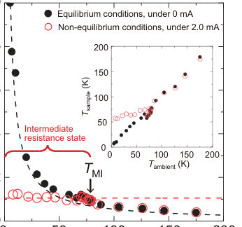
<figcaption class="paper-figure-caption"><b>Fig 5.</b> FIG. 6. Ambient temperature dependence of the 1H-NMR signal intensity, which is inversely proportional to the sample temperature. The black closed circles represent the intensity under 0 mA, while the open red circles represent the intensity under 2.0 mA. The intensity under 0 mA exhibits inverse pro- portionality with ambient temperature (black dashed line), demonstrating that the sample temperature is equal to the ambient temperature. In the region where Tambient &gt; 79 K (TMI), the intensity under 2.0 mA is the same as that un- der 0 mA, indicating that the sample temperature is equal to the ambient temperature even under 2.0 mA. However, it remains nearly constant in the region where...</figcaption>
</figure>

**Summary.** This paper investigates resistive switching in a bulk organic conductor exhibiting a sharp metal-insulator transition. By combining electrical measurements with solid-state NMR, the authors characterize a stable, intermediate resistance state. Their findings strongly suggest that this state arises from the spatial coexistence of metallic and insulating domains, offering new insights into nonlinear transport in correlated systems.

**Why it may be interesting.** The work provides experimental evidence of phase coexistence and non-equilibrium dynamics in a correlated material system, which is highly relevant to understanding charge localization and transport mechanisms in strongly correlated electronic materials.

Detailed structure

**Main problem.** The study aims to elucidate the fundamental physics governing volatile resistive switching in correlated-electron systems, particularly when Joule heating is the primary driving force.

**Main result.** The authors observed a self-organized, intermediate resistance state in the bulk organic conductor, which NMR analysis suggests involves the spatial coexistence of metallic and insulating phases.

**Method.** The research combines electrical transport measurements (I-V curves) with microscopic probes using solid-state $^1	ext{H-NMR}$ spectroscopy to analyze local magnetic environments and temperature.

**Model / system.** The system is the bulk organic conductor $(	ext{d}_7	ext{-DMe-DCNQI})_2	ext{Cu}$, which exhibits a sharp, first-order Metal-Insulator Transition (MIT) and possesses low heat dissipation compared to typical thin films.

**Key observables.** Resistance ratio ($	ext{R}_{	ext{ins}}/	ext{R}_{	ext{metal}} > 10^5$), $I-V$ characteristics, and the temperature dependence of $^1	ext{H-NMR}$ relaxation rates ($T_1^{-1}$).

**Important parameters / regimes.** Sharp, first-order MIT near $79	ext{ K}$; low heat dissipation regime; current densities up to $2.0 	ext{ mA}$.

**Assumptions / limitations.** The analysis assumes that the intermediate resistance state is a non-equilibrium steady state, and that the contribution of the metallic phase at low temperatures can be neglected for spectral reconstruction.

**Figures summary.** Figures show the material's structure and MIT dependence on temperature; transport measurements detail $I-V$ curves; NMR relaxation curves compare metallic, insulating, and intermediate states; and spectral reconstructions confirm the coexistence of phases.

**Paper structure.** The paper progresses by first establishing the unique experimental conditions (bulk, low heat dissipation) in the organic conductor. It then uses transport measurements to characterize the resistive switching. Finally, it employs detailed NMR analysis to probe the microscopic nature of the intermediate state, suggesting phase coexistence.

Abstract

Volatile resistive switching in correlated-electron systems, characterized by an abrupt resistance decrease under applied current, is crucial for developing next-generation electronics. Despite its technological significance, the underlying physics remains elusive. Inorganic thin films on substrates---the widely studied platform for resistive switching---usually exhibit broad temperature-induced metal-insulator transitions (MITs) and substantial heat dissipation. These factors complicate the nonlinear thermal effect induced by Joule heating, a key contributor to resistive switching, rendering it excessively complex and difficult to decipher. Here we investigate a resistive-switched state in the bulk organic conductor ($d$7-DMe-DCNQI)$_{2}$Cu, which undergoes an extremely sharp first-order MIT and exhibits weak heat dissipation, using resistance and $^{1}$H-NMR measurements. These extreme conditions make the Joule heating effect vivid, allowing us to observe peculiar phenomena, including temperature locking to the MIT and `inverse Ohm's law'---an inverse proportionality between voltage and current. These findings provide fundamental insights into the nonlinear thermal effect in resistive switching, offering a pathway to efficient resistive-switching technologies.

[↑ back to top](#top)

### [Efficient Classical Simulation of Weakly Interacting Fermion Dynamics](http://arxiv.org/abs/2608.19448v1)

**Authors:** Chu Zhao, Iman Marvian, Yu Tong  
**Type:** theory · **Category:** numerical methods · **PDF:** <https://arxiv.org/pdf/2608.19448v1>  
**Analysis basis:** full PDF text, analyzed in chunks
**Topic relevance:** `Keldysh / 2PI / non-Gaussian methods` **1/5** · `analog quantum simulation` **1/5** · `methods for driven-dissipative` **1/5**

↔ Scroll figures horizontally

<figure class="paper-figure-card">
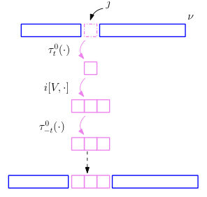
<figcaption class="paper-figure-caption"><b>Fig 1.</b> Figure 1: An illustration of one iteration of SampleNext, supposing the input is (ω, ν, t). The updating of the weight ω is omitted in the above diagram. First, one Majorana mode j is chosen randomly from ν. Then, each violet arrow means to compute the action of a superoperator on the previously sampled Majorana monomial and then sample from the result. The final black dashed arrow means to multiply the final sampled monomial by the remaining modes from the input ν.</figcaption>
</figure>

**Summary.** This work develops provably efficient classical algorithms to simulate the real-time evolution of weakly interacting fermionic systems. By analyzing the perturbative expansion in the interaction strength, the authors establish specific parameter regimes where the simulation remains classically tractable. This advances the field by providing rigorous complexity bounds for dynamics in weakly perturbed, local quantum many-body systems.

**Why it may be interesting.** The rigorous control over sampling variance and the explicit derivation of polynomial-time algorithms for real-time dynamics in weakly interacting systems provide powerful, general tools for studying non-equilibrium quantum phenomena.

Detailed structure

**Main problem.** The paper addresses the challenge of efficiently simulating the real-time dynamics of weakly interacting fermionic systems by computing the expectation value of a local observable.

**Main result.** It proposes a polynomial-time algorithm for estimating this expectation value in the weakly interacting regime, with extensions to quasi-polynomial time and regimes exhibiting Anderson localization.

**Method.** The core method involves analyzing the perturbative expansion (Dyson series) of the time evolution operator in the Heisenberg picture, utilizing a randomized sampling algorithm controlled by the Majorana 1-norm.

**Model / system.** The system is a weakly interacting fermionic system on a D-dimensional lattice, governed by a Hamiltonian $H = H_0 + \lambda V$, where $H_0$ is the non-interacting part and $\lambda V$ is the weak interaction perturbation.

**Key observables.** The expectation value of a local observable $A$ at time $t$, i.e., $	ext{Tr}(
ho_0 e^{iHt} A e^{-iHt})$.

**Important parameters / regimes.** The critical parameters are the interaction strength $\lambda$ and time $t$, defining regimes like $\lambda|t|^{2D+1}=\mathcal{O}(1)$ for polynomial time.

**Assumptions / limitations.** The Hamiltonian must be geometrically local on a D-dimensional lattice, and the analysis relies on controlling the error using the Majorana 1-norm.

**Paper structure.** The paper establishes the problem, derives the perturbative expansion, introduces the randomized sampling algorithm based on the Majorana 1-norm, and presents theorems defining the convergence regimes and computational complexity.

Abstract

We consider the task of simulating the real-time dynamics of weakly interacting fermionic systems. In particular, we focus on computing the expectation value of a local observable $A$ at time $t$. By analyzing the convergence of the perturbative expansion in the interaction strength $λ$ for the Heisenberg-picture observable, we propose a polynomial-time algorithm for estimating this expectation value in the weakly interacting regime $λ|t|^{2D+1}=\mathcal{O}(1)$, when the Hamiltonian is geometrically local on a $D$-dimensional lattice. Importantly, this condition is independent of the system size. If the goal is instead to approximate the time-evolved observable in normalized Frobenius norm, we extend the convergence regime to $λ|t|=\mathcal{O}(1)$ with quasi-polynomial runtime. When the non-interacting part exhibits Anderson localization, our polynomial-time algorithm can be extended up to $λ|t|=\mathcal{O}(1)$, modulo polylogarithmic factors. Our algorithm brings together ideas from continuous-time QMC, diagrammatic QMC, and Majorana Propagation, but with a new Heisenberg-picture operator-growth analysis that makes the sampling complexity rigorously controllable. This leads to provably efficient classical algorithms in regimes where the interaction is weak enough that the sampling variance remains bounded independently of system size. Together, these results identify broad regimes in which weak interactions, locality, and localization can be leveraged to make real-time fermionic dynamics classically tractable.

[↑ back to top](#top)

### [Iterative Projection-Based Embedding Scheme Combined with Variational Quantum Eigensolver](http://arxiv.org/abs/2608.19715v1)

**Authors:** Hongseok Choi, Kyungmin Kim, Young Min Rhee  
**Type:** theory · **Category:** strongly correlated electrons · **PDF:** <https://arxiv.org/pdf/2608.19715v1>  
**Analysis basis:** full PDF text, analyzed in chunks
**Topic relevance:** `Keldysh / 2PI / non-Gaussian methods` **1/5** · `methods for driven-dissipative` **1/5**

↔ Scroll figures horizontally

<figure class="paper-figure-card">
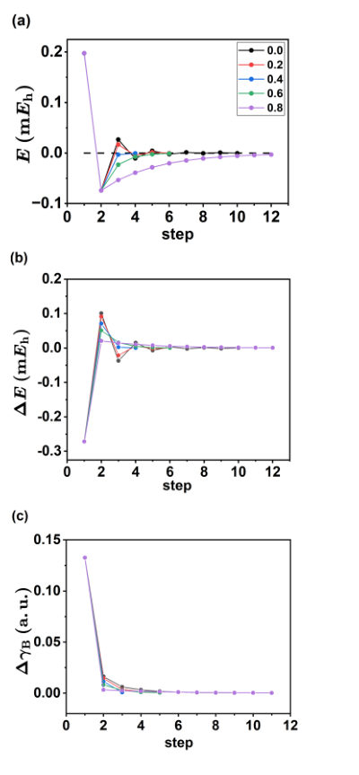
<figcaption class="paper-figure-caption"><b>Fig 1.</b> Figure 1: Convergence of the iterative embedding for a water dimer system with varying damping factors α: (a) the energy difference from the converged value, as a function of the macro-iteration step, with the converged value set to zero (dashed line), (b) the changes of the total energy at each successive macro-iteration step, ∆E = Ei+1 −Ei, and (c) the stepwise environmental density change ∆γB = ∥γ(i+1) B −γ(i) B ∥F/dim(γB), with ∥· ∥F denoting Frobenius norm defined as ∥A∥2 F = P</figcaption>
</figure>
<figure class="paper-figure-card">
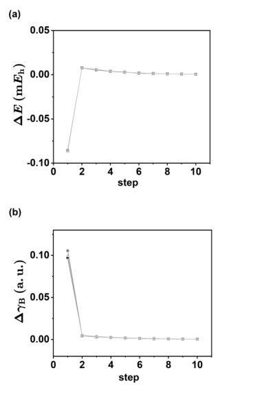
<figcaption class="paper-figure-caption"><b>Fig 2.</b> Figure 2: Convergence of the iterative embedding procedure for an ethanol molecule with three molecular orbital localization schemes: (a) change in total energy at each macro- iteration step and (b) change in the environmental density. SPADE (■), Boys (•), and Pipek- Mezey (▲) schemes yield nearly identical convergence profiles, demonstrating the robustness of the iterative procedure with respect to the choice of a localization scheme.</figcaption>
</figure>
<figure class="paper-figure-card">
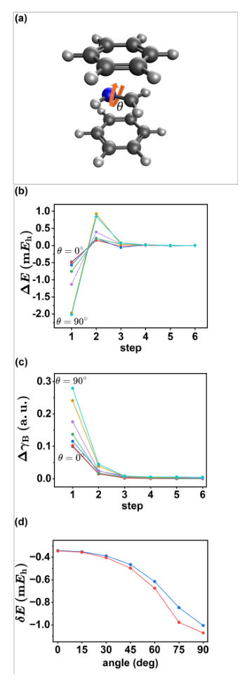
<figcaption class="paper-figure-caption"><b>Fig 3.</b> Figure 3: (a) Molecular structure of the tested system consisting of a central methylenimine (CH2NH) molecule sandwiched between two benzene rings. The twisted dihedral angle around C=N is shown with an arrow. (b) Convergence shown with the total energy change at each iteration step. (c) Convergence shown with the environmental density change at each iteration step. (d) Energy correction due to iterative embedding for VQE-in-HF (red) and CASCI-in-HF (blue) as a function of the dihedral angle.</figcaption>
</figure>
<figure class="paper-figure-card">
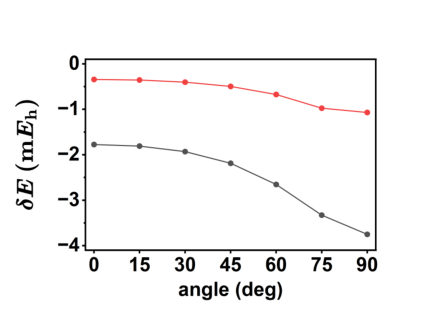
<figcaption class="paper-figure-caption"><b>Fig 4.</b> Figure 4: Comparison of non-iterative to iterative energy correction with VQE-in-HF (red) versus CASCI to CASSCF energy correction (black) with CH2NH at different H−C=N−H dihedral angles.</figcaption>
</figure>
<figure class="paper-figure-card">
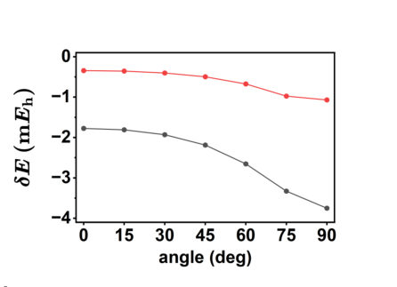
<figcaption class="paper-figure-caption"><b>Fig 5.</b> Figure 5 shows this penalty energy contribution as a function of the level-shift parameter µ</figcaption>
</figure>

**Summary.** This paper presents an iterative embedding method combining Variational Quantum Eigensolver (VQE) with projection-based techniques to accurately model large molecular systems. By allowing the environment to self-consistently respond to the embedded subsystem's electronic structure, it overcomes limitations of simpler, one-shot approximations. The method is shown to be numerically robust and highly accurate across various molecular geometries.

**Why it may be interesting.** This work directly addresses the challenge of multiscale modeling in quantum chemistry, providing a robust, self-consistent quantum-classical hybrid approach highly relevant for simulating complex molecular interactions.

Detailed structure

**Main problem.** The core problem is extending quantum chemical calculations to large, multiscale systems by accurately treating a chemically active subsystem at high theory levels while modeling its environment affordably.

**Main result.** The proposed iterative embedding framework successfully converges, yielding energies and potential energy surfaces that accurately reproduce fully correlated reference calculations.

**Method.** The authors developed an iterative projection-based embedding scheme that alternates between a VQE treatment of the subsystem and a mean-field refinement of the environment until mutual self-consistency is achieved.

**Model / system.** The method is tested on a composite system: a methylenimine (CH2NH) molecule sandwiched between two benzene rings, where the dihedral angle is varied from 0 to 90 degrees.

**Key observables.** Total energy, environmental density change (Delta gamma_B), and the potential energy surface (PES) as a function of dihedral angle.

**Important parameters / regimes.** The number of macro-iterations (converging within ~10 steps), the damping factor (alpha), and the dihedral angle ($	heta$).

**Assumptions / limitations.** The scheme assumes that the environment density can be iteratively updated to respond self-consistently to the subsystem's electronic structure, avoiding the errors of conventional one-shot embedding.

**Figures summary.** Figures demonstrate the convergence of the energy difference and environmental density change for both a water dimer system (varying damping factors) and an ethanol molecule (testing different MO localization schemes).

**Paper structure.** The paper introduces the iterative projection-based embedding framework, details the alternating VQE-in-SCF and SCF-in-SCF steps, validates its convergence using small test systems, and finally applies it to the complex $	ext{CH}_2	ext{NH}$/benzene sandwich system.

Abstract

Quantum embedding methods offer a promising route to extend quantum chemical calculations to large multiscale systems by treating a chemically important subsystem at a high level of theory while describing its surrounding environment at an affordable level. The methods are also quite relevant for quantum computing approaches based on hardware with limited resources. Here, we present an iterative projection-based embedding framework combined with VQE, in which the environment density is allowed to respond self-consistently to the refined electronic structure of the embedded subsystem described by VQE. Unlike conventional one-shot approaches where the environment remains frozen after the initial orbital optimization, the proposed iterative scheme alternates between the VQE-level treatment of the subsystem and a mean-field-level refinement of the environment until mutual self-consistency is achieved. The convergence behavior of the scheme is first examined using several small test systems. Its practical applicability is then demonstrated with a composite system with a CH2NH molecule sandwiched by two benzene rings, with the C=N dihedral angle rotating from 0 to 90 deg. The iterative procedure consistently converges within ~10 iteration steps across all tested geometries, yielding energies below the conventional one-shot embedding results. The converged results well reproduce the fully correlated reference energy employing the same active space, and the resulting potential energy surface with respect to the dihedral rotation is also in good agreement with the reference one. These results demonstrate that our iterative embedding framework is numerically robust and physically sound, yielding a self-consistent and reliable treatment of inter-subsystem correlation. We expect that its formulation will be particularly compatible with the emerging paradigm of quantum-classical hybrid computing.

[↑ back to top](#top)

### [Statistical complexity from fluctuations in the information content](http://arxiv.org/abs/2608.19485v1)

**Authors:** Renio S. Mendes, Sergio Picoli, Evaldo M. F. Curado  
**Type:** theory · **Category:** statistical mechanics · **PDF:** <https://arxiv.org/pdf/2608.19485v1>  
**Analysis basis:** full PDF text, analyzed in chunks
**Topic relevance:** `driven-dissipative phase transition` **1/5** · `non-equilibrium universality` **1/5**

↔ Scroll figures horizontally

<figure class="paper-figure-card">
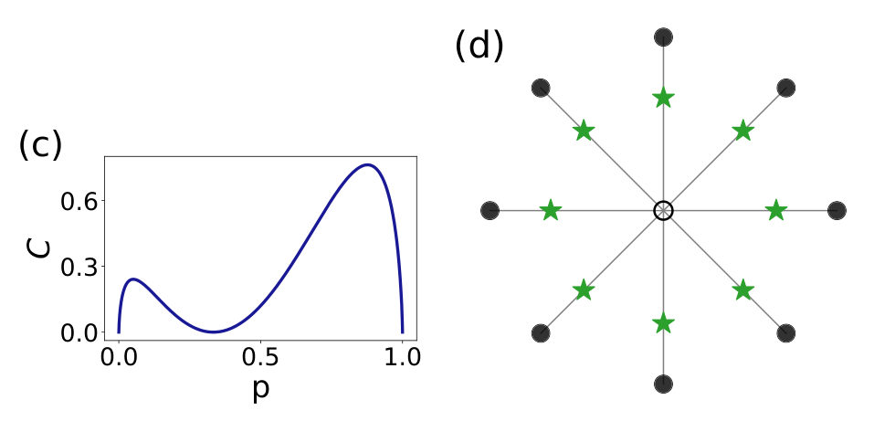
<figcaption class="paper-figure-caption"><b>Fig 1.</b> FIG. 1. (a) C(p) for two states. The maxima occur at p∗≈0.9168 and 1 −p∗, while C = 0</figcaption>
</figure>
<figure class="paper-figure-card">
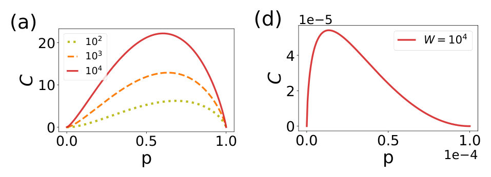
<figcaption class="paper-figure-caption"><b>Fig 2.</b> FIG. 2. (a) C(p) for a W-state system along the path p1 = p and pα = (1 −p)/(W −1) (α =</figcaption>
</figure>
<figure class="paper-figure-card">
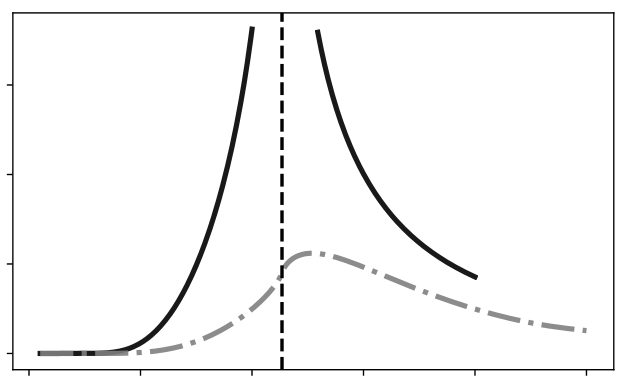
<figcaption class="paper-figure-caption"><b>Fig 3.</b> FIG. 3. Statistical complexity measures for the two-dimensional Ising model. The dashed vertical</figcaption>
</figure>
<figure class="paper-figure-card">
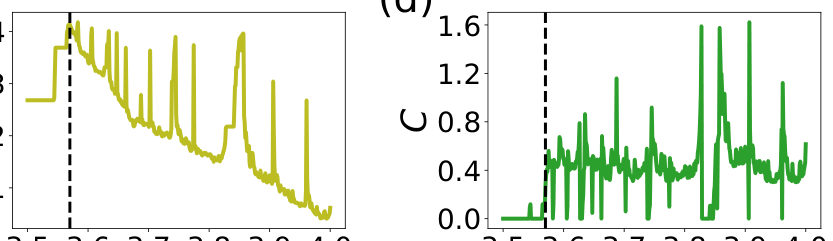
<figcaption class="paper-figure-caption"><b>Fig 4.</b> FIG. 4. Logistic map complexity. SDL, LMC, MPR, and the present measure C are shown as</figcaption>
</figure>
<figure class="paper-figure-card">
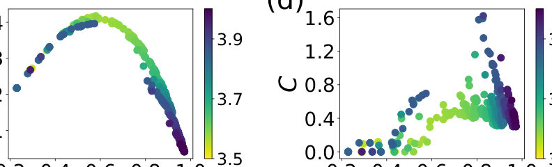
<figcaption class="paper-figure-caption"><b>Fig 5.</b> FIG. 5. Complexity–entropy plane for the logistic map obtained from binned probability distribu-</figcaption>
</figure>

**Summary.** This paper introduces a statistical complexity measure derived from the variance of information content, arguing it surpasses entropy by quantifying structural diversity. It demonstrates that this measure connects directly to thermodynamic concepts, showing proportionality to energy fluctuations and peaking at continuous phase transitions like in the 2D Ising model. The methodology is broadly applicable, tested across chaotic maps and correlated noise, making it a versatile tool for characterizing complex physical systems.

**Why it may be interesting.** The direct link between a fluctuation-based complexity measure and fundamental thermodynamic quantities like heat capacity, especially its singular behavior at critical points, provides a powerful, non-equilibrium diagnostic tool for phase transitions.

Detailed structure

**Main problem.** To propose and validate a measure of statistical complexity based on the variance of the information content, arguing it is a superior descriptor compared to entropy alone because it captures structural diversity.

**Main result.** The proposed complexity measure, $C$, vanishes for ordered and equiprobable states, achieving maxima in intermediate regimes, and is shown to be proportional to energy fluctuations and heat capacity for Boltzmann-Gibbs systems.

**Method.** The complexity $C$ is defined using the variance of the information content, $C = \langle (I - S)^2 
angle$, and is applied to various statistical ensembles and dynamical systems.

**Model / system.** The analysis covers general statistical systems, the two-dimensional Ising model, chaotic maps (like the logistic map), and fractional Gaussian noise, allowing for extensions to quantum systems via density operators.

**Key observables.** Statistical complexity ($C$), Shannon entropy ($S$), Energy fluctuation ($	ext{Var}(H)$), and generalized complexity measures ($C_q$).

**Important parameters / regimes.** Temperature ($T$), control parameters ($r, a$), Hurst exponent ($h$), and the Tsallis parameter ($q$).

**Assumptions / limitations.** The measure is assumed to capture structural diversity beyond what entropy measures, and the analysis relies on established connections to thermodynamics for BG systems.

**Figures summary.** Figures illustrate $C(p)$ for small state systems, show $C$ peaking at critical temperatures for the Ising model, and map complexity vs. entropy for various dynamical systems like the logistic map and fGn.

**Paper structure.** The paper develops the measure $C$ by analyzing basic probability distributions, establishes its thermodynamic connection to energy fluctuations, and then applies it systematically to diverse physical models including phase transitions, chaotic dynamics, and correlated noise.

Abstract

We argue that the variance of the information content ($C$), an information-theoretic quantity, can be naturally interpreted as a measure of statistical complexity. We show that $C$ satisfies widely accepted criteria for statistical complexity measures: it vanishes for both ordered and equiprobable states, while attaining maxima in intermediate regimes, typically shifted toward order. This interpretation establishes direct connections with thermodynamics and phase transitions: for systems obeying Boltzmann--Gibbs statistics, $C$ is extensive and directly proportional to energy fluctuations and heat capacity. Moreover, unlike other statistical complexity measures, it attains a maximum at continuous phase transitions, as illustrated for the two-dimensional Ising model. Applications to chaotic maps and fractional Gaussian noise further indicate that $C$ captures nontrivial dynamical structure in different classes of correlated systems.

[↑ back to top](#top)

### [An Irreducible Quantum Advantage in Aligning World Models with Reality](http://arxiv.org/abs/2608.19779v1)

**Authors:** Josep Lumbreras, Hailan Ma, Jayne Thompson, Mile Gu  
**Type:** theory · **Category:** quantum information and computing · **PDF:** <https://arxiv.org/pdf/2608.19779v1>  
**Analysis basis:** full PDF text, analyzed in chunks
**Topic relevance:** `quantum measurements` **1/5**

↔ Scroll figures horizontally

<figure class="paper-figure-card">
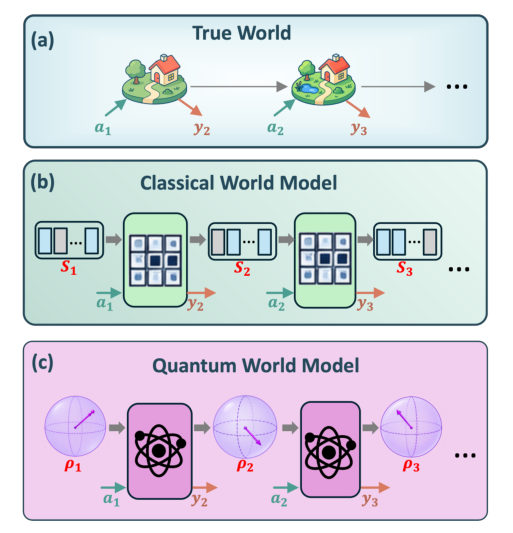
<figcaption class="paper-figure-caption"><b>Fig 1.</b> Figure 1. Classical and quantum world models. The true world represents reality (a). At each time step, it re- ceives an action at and returns an outcome yt+1 that consists of an observation and reward. A world model reproduces this input–output behavior through recurrent internal dynamics, updating its memory from one simulated step to the next. In a classical world model (b), a classical register with a finite number of bits carries the memory, and it evolves under clas- sical stochastic updates. In a quantum world model (c), the memory is encoded in a finite number of qubits and evolves through quantum operations.</figcaption>
</figure>
<figure class="paper-figure-card">
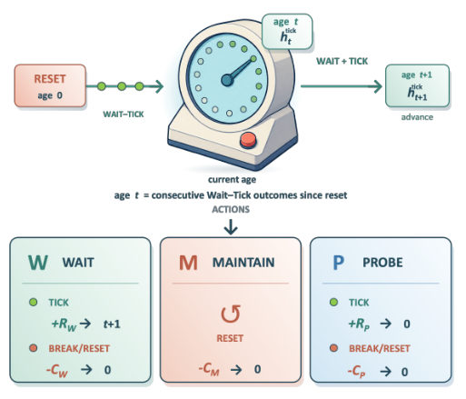
<figcaption class="paper-figure-caption"><b>Fig 2.</b> Figure 2. The resettable FRDN clock world. The dis- played signs illustrate a representative payoff regime: Wait offers a reward +RW if the clock advances but risks a failure cost −CW ; Maintain accepts the known cost −CM of an im- mediate reset; and Probe also resets, with reward +RP or cost −CP determined by whether the clock would have advanced. The diagram thus contrasts risky continuation under Wait, a certain outcome under Maintain, and an outcome-dependent bet under Probe, creating a nontrivial decision problem.</figcaption>
</figure>
<figure class="paper-figure-card">
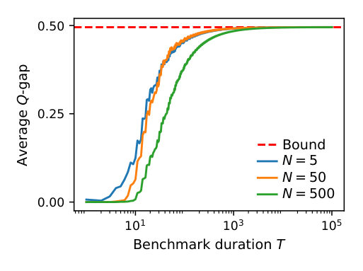
<figcaption class="paper-figure-caption"><b>Fig 3.</b> Figure 4. Average Wait action-value error for one-step setting. The one-step rewards are set to RW = CW = CM = CP = 1 and RP = −1, with γ = 0. Consequently, the plot- ted quantity for each T is 1 T PT t=1 Qopt ⋆,W (←− h t) −Qopt M,W (←− h t) . The dashed red line marks the dimension-independent lower bound on its asymptotic average derived in Appendix B 3. Blue, orange, and green correspond to N = 5, N = 50, and N = 500, respectively. Here the average Q-gap represents the errors of classical models, and lower curves mean better mod- els with low error. Larger memories postpone the discrepancy to later clock ages but do not eliminate its asymptotic aver- age. The qutrit world model has zero...</figcaption>
</figure>
<figure class="paper-figure-card">
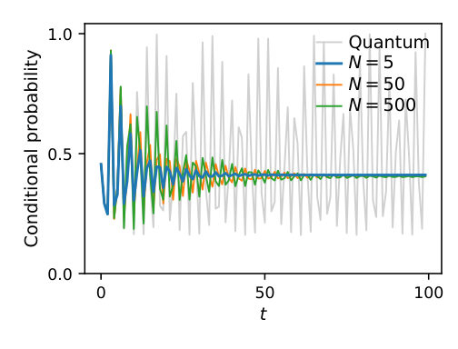
<figcaption class="paper-figure-caption"><b>Fig 4.</b> Figure 3. Conditional Tick probabilities. Probability of one additional Tick after ←− h t for λ = 0.4 and α = π/ √</figcaption>
</figure>

**Summary.** This theoretical paper proves that classical world models are fundamentally incapable of perfectly simulating certain complex, history-dependent physical realities. It establishes an irreducible quantum advantage by showing that quantum models using minimal resources (a single qutrit) can perfectly align with the true world's optimal policies, unlike their classical counterparts.

**Why it may be interesting.** It provides a theoretical benchmark showing where quantum resources are necessary for accurate modeling of complex stochastic processes, which is relevant for quantum control and open quantum system simulation.

Detailed structure

**Main problem.** The paper addresses the fundamental limitation of classical world models in accurately simulating complex, history-dependent environments compared to true reality.

**Main result.** It demonstrates an irreducible quantum advantage by showing that quantum world models using a single qutrit can perfectly reproduce true worlds where all finite classical models fail to maintain alignment with optimal policies.

**Method.** The authors construct specific true worlds and develop rigorous metrics (e.g., Mean Decision Loss) to quantify the failure of classical models, contrasting this with the exact representation capability of quantum models.

**Model / system.** The system involves a true, complex environment evolving over discrete time steps, which is modeled by both classical Hidden Markov Models (HMMs) with finite memory and quantum world models utilizing a single qutrit.

**Key observables.** Expected cumulative reward (Return), Action-Value Function, Value Function, and specialized metrics like Mean Decision Loss ($\ell_M(F)$).

**Important parameters / regimes.** Memory size ($N$ for classical models), discount factor ($\gamma$), and the irreducible error bound ($\epsilon$).

**Assumptions / limitations.** The argument relies on the existence of constructed true worlds that expose the inherent limitations of finite classical memory representations.

**Figures summary.** Figure 1 compares the true world, a classical world model (using a classical register memory), and a quantum world model (using qubits memory) in their ability to represent the environment.

**Paper structure.** The paper first establishes the framework of world models and then develops advanced diagnostics (Deviancy, Decision Loss) to prove that classical models fail for certain true worlds, concluding with the demonstration of perfect alignment using quantum models.

Abstract

World models provide digital simulacra of the true world, allowing agents to be trained and tested before costly real-world deployment. At each time step, they receive an action and generate an observation and reward matching the statistics of the true world. In complex environments where present outcomes depend on events far in the past, this requires memory. One might expect that, by increasing memory, we can always build a model accurately enough to align the optimal agent policies of the real and virtual worlds. We show that this is false for classical world models, even when the true world itself is classical. We construct true worlds for which every finite classical model fails along the same possible trajectory: it either loses the ability to distinguish actions when the true world clearly prefers one, or repeatedly assigns the highest expected reward to suboptimal actions. Its expected-reward estimates also retain a nonvanishing average error. In contrast, each such true world admits a quantum world model using a single qutrit that reproduces it exactly: its reward estimates and preferred actions always match those of the true world, ensuring that the optimal policies of the real and virtual worlds remain perfectly aligned.

[↑ back to top](#top)

### [Analytical Solutions of the Generalized Klein-Gordon Oscillator in Som-Raychaudhuri Space-Time via the Extended Nikiforov-Uvarov Method](http://arxiv.org/abs/2608.20273v1)

**Authors:** Hale Karayer, Tolga Celik, Dogan Demirhan  
**Type:** theory · **Category:** other · **PDF:** <https://arxiv.org/pdf/2608.20273v1>  
**Analysis basis:** full PDF text, analyzed in chunks
**Topic relevance:** `Keldysh / 2PI / non-Gaussian methods` **1/5**

↔ Scroll figures horizontally

<figure class="paper-figure-card">
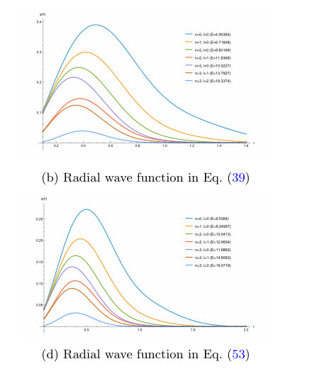
<figcaption class="paper-figure-caption"><b>Fig 1.</b> Fig. 1: Radial wave functions involving biconfluent Heun polynomials for the gener- alized Klein–Gordon oscillator in the Som–Raychaudhuri space–time with α = 0.8. Panels (a) and (b) correspond to the linear-potential solutions given by Eqs. (36) and (39), whereas panels (c) and (d) represent the Cornell-type potential solutions given by Eqs. (50) and (53). The plots are shown for different quantum numbers (n, l) using the parameter set M = e = ΦB = ω = λ = B0 = Ω= k = 1, while ξ1 = 2 and ξ2 = 1 are adopted for the Cornell-type potential. The radial wave functions are presented up to an arbitrary normalization constant and are used to illustrate the localization properties and spatial...</figcaption>
</figure>

**Summary.** This paper analytically solves the generalized Klein-Gordon oscillator equation in the Som-Raychaudhuri space-time using the extended Nikiforov-Uvarov method. It derives explicit energy spectra and eigenfunctions for linear and Cornell potentials, showing how topological defects and magnetic fields influence the quantum energy levels. The work provides a systematic algebraic framework for solving relativistic quantum problems in curved backgrounds.

**Why it may be interesting.** While focused on curved spacetime QFT, the use of advanced analytical techniques like the extended NU method to solve complex differential equations is a valuable theoretical tool applicable to other non-standard quantum Hamiltonians.

Detailed structure

**Main problem.** The study aims to find exact analytical solutions for the generalized Klein-Gordon oscillator equation within the curved Som-Raychaudhuri space-time.

**Main result.** Analytical solutions for the energy eigenvalues and eigenfunctions are obtained for both linear and Cornell potential models, expressed in terms of biconfluent Heun polynomials.

**Method.** The research employs the extended Nikiforov-Uvarov (NU) method, a powerful analytical technique used to solve the resulting radial differential equations.

**Model / system.** The system models a relativistic quantum particle governed by the Klein-Gordon equation, incorporating effects from a uniform magnetic field and an oscillator potential in the Som-Raychaudhuri space-time.

**Key observables.** Energy eigenvalues ($E_n, \ell$) and corresponding eigenfunctions ($\psi(r)$).

**Important parameters / regimes.** Topological parameter ($\alpha$), magnetic field strength ($B_0$), oscillator frequency ($\omega$), and particle mass ($M$).

**Assumptions / limitations.** The analysis assumes the solvability of the radial equation using the extended NU formalism and restricts the analysis to specific potential forms (linear and Cornell).

**Figures summary.** Figures illustrate the radial wave functions ($\psi(r)$) for different quantum numbers and potential types, while tables present calculated positive energy eigenvalues.

**Paper structure.** The paper reviews the KG oscillator in this space-time, introduces the extended NU method, derives solutions for the linear and Cornell potentials, and concludes by discussing the physical implications of the derived spectra.

Abstract

In this study, we present an analytical approach based on the extended Nikiforov-Uvarov method to solve the generalized Klein-Gordon oscillator in the presence of a uniform magnetic field within the Som-Raychaudhuri space-time. Exact eigenstate solutions are obtained for two distinct potential models, namely the linear potential and the Cornell potential. The corresponding energy eigenvalues are determined, and the associated eigenfunctions are analyzed and illustrated graphically.

[↑ back to top](#top)

### [Antiferromagnetic order and lattice response in DyCuAs$_2$](http://arxiv.org/abs/2608.19465v1)

**Authors:** M. G. Kim, J. -W. Kim, P. Ryan, D. Evans, E. D. Mun  
**Type:** experiment · **Category:** strongly correlated electrons · **PDF:** <https://arxiv.org/pdf/2608.19465v1>  
**Analysis basis:** full PDF text, analyzed in chunks
**Topic relevance:** `analog quantum simulation` **1/5**

↔ Scroll figures horizontally

<figure class="paper-figure-card">

<figcaption class="paper-figure-caption"><b>Fig 1.</b> FIG. 1. (a) Temperature dependence of the electrical resis- tivity, ρ(T ), of DyCuAs2 measured at H = 0 (closed symbols) and H = 90 kOe (solid line) up to 300 K. Inset: Enlarged view of ρ(T ) between 0 and 60 K. (b) M(H) curves of DyCuAs2 measured at T = 1.8 K for H ∥ab and H ∥c.</figcaption>
</figure>
<figure class="paper-figure-card">
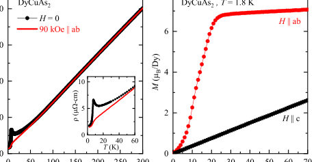
<figcaption class="paper-figure-caption"><b>Fig 2.</b> Figure 1(a) presents the electrical resistivity of DyCuAs2. The zero-field electrical resistivity of DyCuAs2 up to 300 K exhibits metallic behavior at high temperatures, followed by an unexpected minimum near 15 K, as shown in Fig. 1(a). Upon further cooling, ρ(T ) increases and reaches a peak at the N´eel temperature, TN (≈7 K), before decreasing rapidly below the onset of antiferromagnetic ordering. As shown in the inset of Fig. 1(a), the resistivity minimum is progressively sup- pressed with increasing magnetic field applied parallel to the ab plane (H ∥ab) and disappears completely at H ≥30 kOe. The anisotropic M(H) curves of DyCuAs2 at 1.8 K are plotted in Fig. 1(b). For H ∥c, the...</figcaption>
</figure>
<figure class="paper-figure-card">
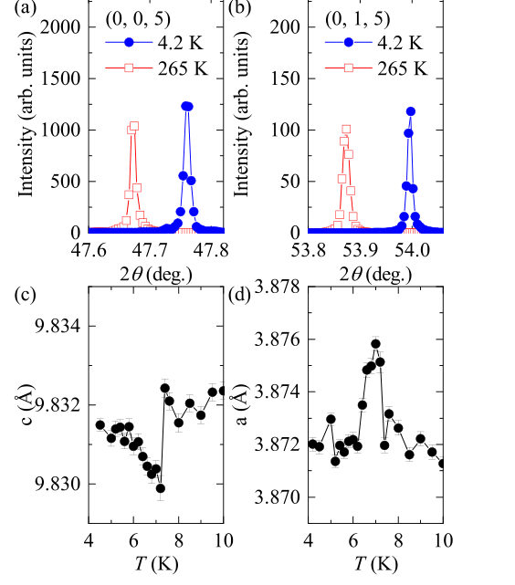
<figcaption class="paper-figure-caption"><b>Fig 3.</b> FIG. 2. (a) Longitudinal (θ–2θ) scans of the (0, 0, 5) struc- tural Bragg peak measured at 4.2 K and 265 K. (b) Lon- gitudinal (θ–2θ) scans of the (0, 1, 5) structural Bragg peak measured at 4.2 K and 265 K. (c) Temperature dependence of the lattice parameter c between 4 and 10 K. (d) Temper- ature dependence of the lattice parameter a between 4 and 10 K.</figcaption>
</figure>
<figure class="paper-figure-card">
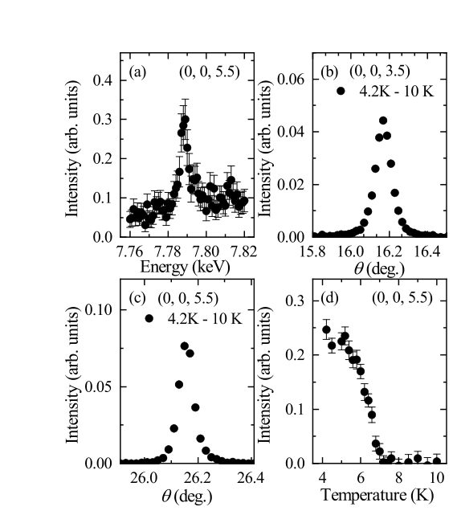
<figcaption class="paper-figure-caption"><b>Fig 4.</b> FIG. 3. (a) Energy scan measured at the (0, 0, 5.5) AFM Bragg peak position at 4.2 K. The fluorescence background has been subtracted. (b) and (c) Longitudinal (θ–2θ) scans measured at 4.2 K and 10 K at the (0, 0, 3.5) and (0, 0, 5.5) AFM Bragg peak positions, respectively. (d) Temperature dependence of the AFM order parameter obtained at the (0, 0, 5.5) reflection.</figcaption>
</figure>
<figure class="paper-figure-card">
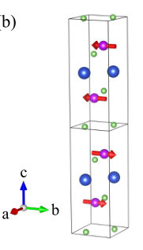
<figcaption class="paper-figure-caption"><b>Fig 5.</b> FIG. 4. (a) Integrated intensities of the AFM Bragg peaks measured at different L values in (0, 0, L). Solid symbols rep- resent the experimentally measured intensities, while open symbols denote the calculated intensities for the correspond- ing AFM Bragg peaks based on the Γ10 magnetic represen- tation (MR). (b) Antiferromagnetic magnetic structure of DyCuAs2 corresponding to the Γ10 magnetic representation.</figcaption>
</figure>

**Summary.** This experimental study characterizes the magnetic and structural properties of DyCuAs2, revealing a commensurate in-plane antiferromagnetic order below 7 K. By comparing it to other members of the RECuAs2 family, the authors propose that magnetic frustration arising from this in-plane AFM order is the common cause for an anomalous resistivity minimum, with magnetoelastic and spin-orbit interactions playing a crucial role in its robustness.

**Why it may be interesting.** The strong coupling between magnetic ordering, lattice strain (magnetoelastic coupling), and anomalous electronic transport (resistivity minimum) provides a rich platform for studying emergent quantum phenomena in strongly correlated materials.

Detailed structure

**Main problem.** The study investigates the interplay between antiferromagnetic (AFM) order and lattice response in the RECuAs2 family, aiming to understand the origin of an anomalous resistivity minimum observed above the AFM transition temperature.

**Main result.** The magnetic structure is determined to be a commensurate AFM ordering ($\Gamma_{10}$ representation) with in-plane moments, suggesting that in-plane AFM order and associated magnetic frustration are key ingredients for the resistivity minimum.

**Method.** The research combines high-resolution synchrotron X-ray diffraction (XRD) for structural analysis and X-ray resonant magnetic scattering (XRMS) for determining the magnetic structure.

**Model / system.** The physical system is the RECuAs2 family of compounds, where the rare earth element (RE) dictates the magnetic moment and coupling strength. The analysis compares DyCuAs2 to SmCuAs2 and GdCuAs2 to isolate the role of magnetic interactions.

**Key observables.** Resistivity minimum ($
ho(T)$), lattice parameters ($a$ and $c$), AFM Bragg peak intensity and position ($\mathbf{q}=(0, 0, 0.5)$), and magnetic susceptibility/magnetization ($M(H)$).

**Important parameters / regimes.** Antiferromagnetic transition temperature ($T_N \approx 7$ K), magnetic moment magnitude ($\mu_B$), and applied magnetic field strength ($H$).

**Assumptions / limitations.** The analysis assumes the preservation of tetragonal symmetry down to low temperatures, despite observing strong magnetoelastic coupling anomalies in the lattice parameters near $T_N$.

**Figures summary.** Figures show the temperature dependence of resistivity (with a minimum near 15 K), structural Bragg scans confirming symmetry, and temperature dependence of lattice parameters $a$ and $c$ exhibiting anomalies near $T_N$.

**Paper structure.** The paper proceeds by characterizing the structural and magnetic transitions using XRD and XRMS, establishing the AFM structure, and then correlating the observed magnetic ordering and lattice anomalies with the anomalous transport behavior (resistivity minimum) across the RECuAs2 series.

Abstract

We report high-resolution synchrotron X-ray diffraction and X-ray resonant magnetic scattering (XRMS) studies of the low-temperature crystal and magnetic structures of DyCuAs$_2$, a member of the \RE{}CuAs$_2$ family exhibiting a resistivity minimum above the antiferromagnetic transition temperature. Synchrotron diffraction measurements reveal that DyCuAs$_2$ preserves tetragonal symmetry down to low temperature within the experimental resolution, although pronounced anomalies in both lattice parameters $a$ and $c$ are observed near the antiferromagnetic transition temperature, $T_{\mathrm N}\approx7$~K, indicating strong magnetoelastic coupling. XRMS measurements at the Dy $L_3$ edge establish commensurate antiferromagnetic ordering below $T_{\mathrm N}$ with AFM Bragg peaks at \qq{} = (0, 0, 0.5). Representation analysis and calculations of the AFM Bragg peak intensities identify the magnetic structure as the $Γ_{10}$ representation, consisting of in-plane Dy moments stacked along the \cc{} axis in a $++--$ sequence. The magnetic structure is therefore identical to that previously reported for SmCuAs$_2$. Comparison among DyCuAs$_2$, SmCuAs$_2$, and GdCuAs$_2$ suggests that in-plane AFM order and the associated magnetic frustration on the tetragonal lattice are closely connected to the emergence of the resistivity minimum in the \RE{}CuAs$_2$ family. At the same time, the enhanced lattice response and stronger magnetic-field sensitivity observed in DyCuAs$_2$ imply that magnetoelastic and spin-orbit interactions additionally play important roles in determining the robustness of this anomalous transport behavior.

[↑ back to top](#top)

### [Architecture and Compilation Co-Design for High-Rate Quantum Product Codes on Neutral Atom Arrays](http://arxiv.org/abs/2608.20164v1)

**Authors:** Adrian Liu, Wan-Hsuan Lin, Daniel Bochen Tan, Qian Xu, Jason Cong  
**Type:** theory · **Category:** quantum information and computing · **PDF:** <https://arxiv.org/pdf/2608.20164v1>  
**Analysis basis:** full PDF text, analyzed in chunks
**Topic relevance:** `QC/QI experiment` **1/5**

↔ Scroll figures horizontally

<figure class="paper-figure-card">
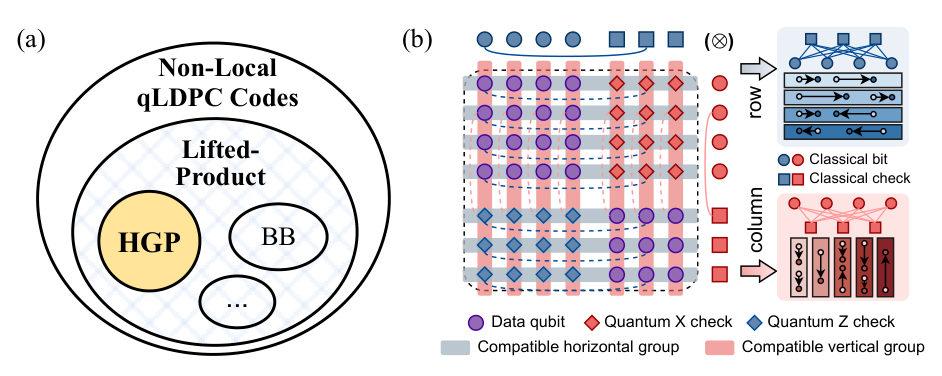
<figcaption class="paper-figure-caption"><b>Fig 1.</b> Figure 1: Motivation. (a) Product construction underpins many high-rate qLDPC families, with HGP codes as a primary showcase. (b) HGP syndrome extraction on a product-aligned neutral-atom layout. Purple circles are data-qubit atoms; red/blue diamonds are 𝑋/𝑍check-ancilla atoms. Each classical seed code is replicated along one product coordinate, yielding horizontal groups (gray) and vertical groups (pink). The right panels show the corresponding 1D row/column subproblems; small bars denote a 1D execution plan with rearrangement steps. Compatible groups execute in parallel.</figcaption>
</figure>
<figure class="paper-figure-card">
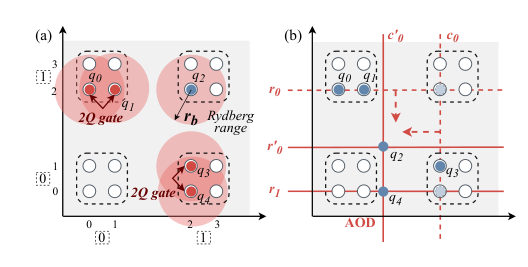
<figcaption class="paper-figure-caption"><b>Fig 2.</b> Figure 2: Neutral-atom hardware model. (a) A 2D optical tweezer array with atoms (dots) held at traps (circles). Ad- jacent trap pairs form interaction sites (dashed box) where Rydberg entangling gates execute. (b) Intersectional atom transport via row- and column-axis AODs.</figcaption>
</figure>
<figure class="paper-figure-card">
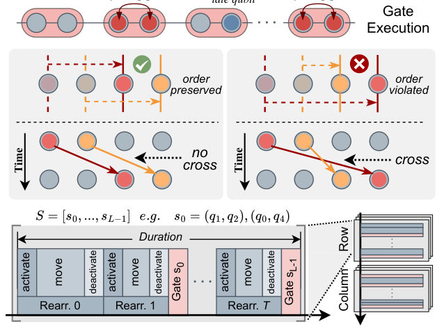
<figcaption class="paper-figure-caption"><b>Fig 3.</b> Figure 3: Architecture protocol of 1D physical execution. (a) 1D interaction model: gate pairs co-locate for Rydberg execution, while idle qubits remain isolated. (b) No-crossing constraint: simultaneous AOD movements must preserve atom order. (c) Execution timeline: rearrangement steps are interleaved with scheduled gate stages and composed across rows/columns for product-code execution.</figcaption>
</figure>
<figure class="paper-figure-card">
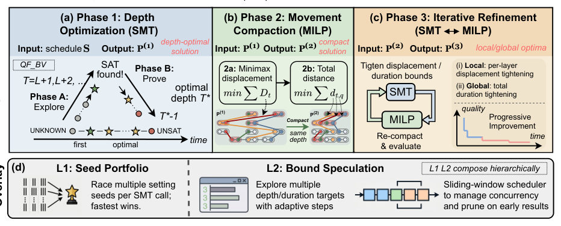
<figcaption class="paper-figure-caption"><b>Fig 4.</b> Figure 4: Overview of the ONEX compilation pipeline with runtime dataflow highlighted. (a) Depth optimization via SMT. (b) Movement compaction via MILP. (c) Iterative refinement with feedback loop. (d) Parallelism overlay.</figcaption>
</figure>
<figure class="paper-figure-card">
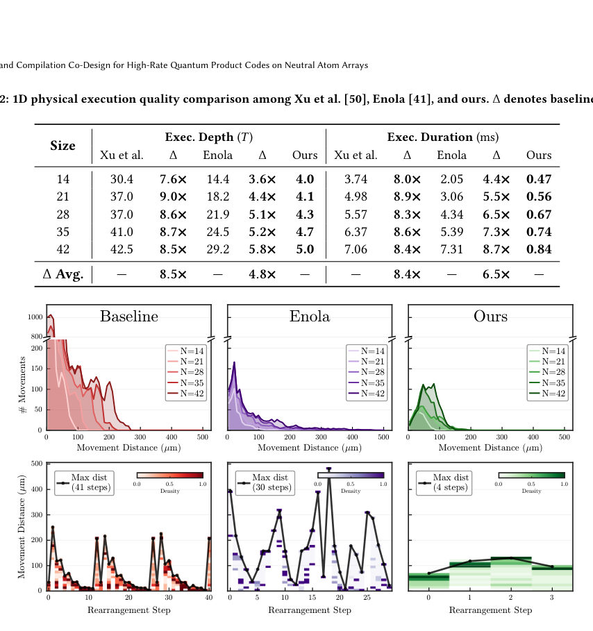
<figcaption class="paper-figure-caption"><b>Fig 5.</b> Figure 5: Movement profile for the Xu et al. baseline, Enola, and ours on 1D execution benchmarks. Top row: distribution of individual atom displacement distances across all problem sizes. Bottom row: per-step movement profile for a representative 𝑁=42 instance, where color intensity indicates the density of movements at a given distance and the black envelope traces the maximum displacement per step.</figcaption>
</figure>

**Summary.** This paper introduces ONEX, a novel compiler co-design framework for executing high-rate Quantum Error Correction codes on neutral atom arrays. It tackles the NP-hard problem of physical execution planning by exploiting the product structure of the codes to decompose the 2D problem into solvable 1D subproblems. The resulting framework achieves substantial speedups in clock rate by optimizing both the circuit depth and the physical movement schedule.

**Why it may be interesting.** This work directly addresses the critical compilation bottleneck in scaling QEC, providing a concrete, computationally tractable method for mapping abstract quantum codes onto physical hardware constraints.

Detailed structure

**Main problem.** The primary challenge is compiling physical execution plans for Quantum Error Correction (QEC) codes, which is a provably hard combinatorial problem that limits the scalability of fault-tolerant quantum computing.

**Main result.** The proposed framework, ONEX, achieves significant clock rate improvements (up to 42.1x) over existing compilers by exploiting the product structure of qLDPC codes.

**Method.** ONEX decomposes the complex 2D physical execution planning into independent 1D subproblems, which are then solved using a multi-stage pipeline involving SMT encoding for depth optimization and MILP for movement compaction.

**Model / system.** The work is situated on neutral atom arrays, which are used as the physical platform for implementing high-rate quantum low-density parity-check (qLDPC) codes, specifically Hypergraph Product (HGP) codes.

**Key observables.** Clock rate (speedup factor), Execution Depth (minimal number of rearrangement steps), and Physical Execution Duration (wall-clock time).

**Important parameters / regimes.** Code size (up to 2,500 data qubits), QEC Code Distance (d), and the dimensionality of the code structure (2D vs. 1D decomposition).

**Assumptions / limitations.** The core assumption is that the product structure of the qLDPC code allows for an orthogonal decomposition of the 2D physical planning problem into independent 1D subproblems.

**Figures summary.** Figures illustrate the motivation via product construction (Fig 1), the neutral-atom hardware setup using optical tweezers and AODs (Fig 2), and the detailed 1D execution protocol and the multi-stage ONEX compilation pipeline (Figs 3 & 4).

**Paper structure.** The paper introduces the problem bottleneck, proposes the ONEX framework by exploiting code structure to decompose the problem, details the multi-stage compilation pipeline (SMT/MILP), validates the approach on HGP codes with quantitative speedups, and concludes with architectural insights into zoned layouts.

Abstract

Achieving fault-tolerant quantum computing at a practical scale demands quantum error correction (QEC) codes with high encoding rates. Quantum low-density parity-check (qLDPC) codes emerge as a promising candidate, especially given the rise of neutral atom arrays that provide dynamic long-range connectivity via atom movements. In general, synthesizing valid and efficient physical execution plans for QEC is a provably hard combinatorial problem, forming a critical compilation bottleneck that worsens as code sizes grow. To overcome this complexity, we focus on an important product family of qLDPC codes with dimension-reduction properties, and propose ONEX. This framework decomposes complex 2D physical execution planning into independent 1D subproblems, each solved to optimal execution depth within practical compilation time. First, we formulate the 1D execution plan with an explicit satisfiability modulo theories (SMT) encoding. This protocol produces provably depth-optimal solutions with substantial duration reduction. Second, we develop a multi-stage compilation pipeline featuring anytime optimization, movement compaction, and iterative feedback. This pipeline maintains practical wall-clock times while providing progressive refinement and on-demand retrieval of quality solutions. Third, we evaluate ONEX in the application of hypergraph product (HGP) code memory mapped onto neutral atom arrays, achieving 3.7x to 6.1x and 29.8x to 42.1x higher clock rates than the constructive 1D algorithm and the general 2D compiler, respectively, while scaling efficiently to codes with 2,500 data qubits. Finally, we extend ONEX to zoned layouts, revealing architectural insights into the associated trade-offs, and demonstrate its applicability to the broader lifted-product (LP) code family through a representative example.

[↑ back to top](#top)

### [Coherent states in quantum billiards constructed in the basis of the continued eigenfunctions](http://arxiv.org/abs/2608.20302v1)

**Authors:** I. D. Burkov, S. S. Seidov  
**Type:** theory · **Category:** other · **PDF:** <https://arxiv.org/pdf/2608.20302v1>  
**Analysis basis:** full PDF text, analyzed in chunks
**Topic relevance:** `quantum measurements` **1/5**

↔ Scroll figures horizontally

<figure class="paper-figure-card">
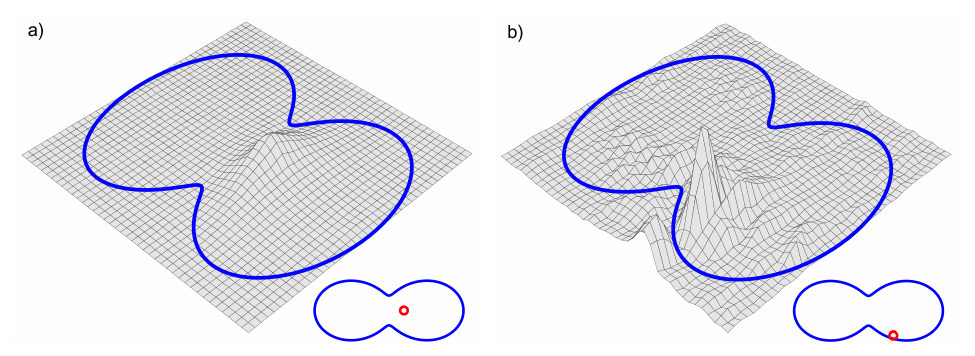
<figcaption class="paper-figure-caption"><b>Fig 1.</b> Figure 1. The absolute values of the coherent states wave functions in the billiard with boundary given</figcaption>
</figure>
<figure class="paper-figure-card">
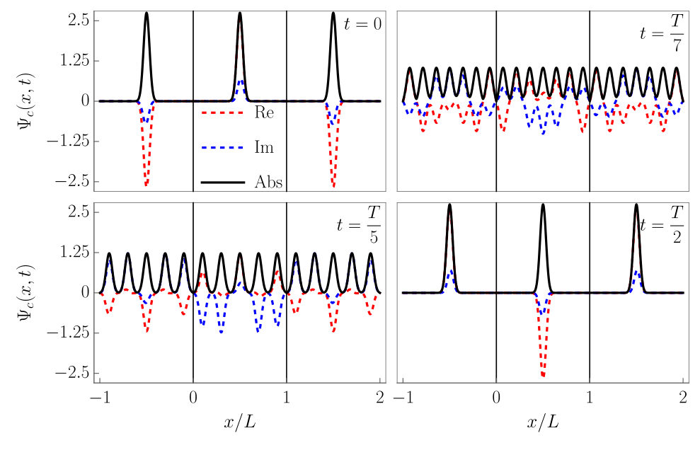
<figcaption class="paper-figure-caption"><b>Fig 2.</b> Figure 2. Coherent state (39) of the particle in a one–dimensional infinite potential well at different</figcaption>
</figure>
<figure class="paper-figure-card">
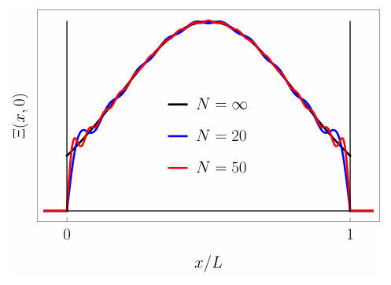
<figcaption class="paper-figure-caption"><b>Fig 3.</b> Figure 3. The function Ξ(x, 0) and partial sums with N = 20 and N = 50 terms, eq. (40). One can</figcaption>
</figure>

**Summary.** This paper introduces a novel method to construct generalized coherent states for quantum billiards by reformulating the problem using the Balian–Bloch integral equation defined on $\mathbb{R}^2$. This approach successfully bypasses the mathematical discontinuities that arise when restricting standard eigenfunction expansions to the physical boundaries of the billiard. It provides an advanced theoretical tool for analyzing quantum dynamics in confined spaces.

**Why it may be interesting.** This work provides a rigorous mathematical framework for defining quantum states in confined geometries, which is crucial for understanding boundary effects in quantum dynamics relevant to AMO physics and mesoscopic systems.

Detailed structure

**Main problem.** The paper addresses the theoretical construction of generalized coherent states for quantum billiards, specifically overcoming the boundary discontinuity issues inherent in standard eigenfunction expansions.

**Main result.** The authors propose defining these coherent states using projections onto a basis derived from the solution of the Balian–Bloch integral equation, which correctly handles the boundary conditions.

**Method.** The core method involves extending the problem from the bounded domain $\Omega$ to $\mathbb{R}^2$ by formulating an equivalent Balian–Bloch integral equation, which is then used to define the projection operator and the coherent state wave function.

**Model / system.** The system is a quantum particle confined within a quantum billiard ($\Omega \subset \mathbb{R}^2$), governed by the free particle Hamiltonian with Dirichlet boundary conditions. The analysis is extended to 1D infinite potential wells and 2D Coxeter billiards.

**Key observables.** The coherent state wave function $\Psi_c(r, t)$, the projection operator $P$, and the propagator $G(r, r', t)$.

**Important parameters / regimes.** The boundary $\partial\Omega$, the Gaussian wave packet parameters, and the short-time limit $t 	o 0^+$.

**Assumptions / limitations.** The method assumes that extending the problem to $\mathbb{R}^2$ via the Balian–Bloch equation provides the correct physical description, thereby avoiding boundary discontinuities encountered in standard expansions.

**Figures summary.** Figures illustrate numerically obtained coherent states in various billiard geometries, showing the difference between the state away from the boundary and near the boundary, and comparing results from infinite limits versus finite partial sums to highlight boundary effects.

**Paper structure.** The paper progresses by first identifying the limitations of standard eigenfunction methods, then introducing the Balian–Bloch equation as a generalization, deriving the coherent state via projection, and finally applying this framework to solvable models like the 1D infinite well using special functions (Jacobi/Riemann theta functions).

Abstract

In the article a new approach to construction of generalized coherent states in quantum billiards is proposed. The coherent states are defined as the projections of a Gaussian wave function on the basis of the eigenstates of the quantum billiard, continued outside. The continuation is built as the solution of the equivalent Balian--Bloch equation, defined on the entire $\mathbb{R}^2$ and the projection operator is built using the resolvent of the Balian--Bloch equation. In the case of the one--dimensional potential well and billiards, belonging to the Coxeter group, the wave functions of the coherent states were expressed analytically via the Jacobi and Riemann theta functions.

[↑ back to top](#top)

### [Compressibility of genuine multipartite entanglement under the Hadamard map](http://arxiv.org/abs/2608.19427v1)

**Authors:** Klára Baksová, Lisa T. Weinbrenner  
**Type:** theory · **Category:** quantum information and computing · **PDF:** <https://arxiv.org/pdf/2608.19427v1>  
**Analysis basis:** full PDF text, analyzed in chunks
**Topic relevance:** `quantum measurements` **1/5**

↔ Scroll figures horizontally

<figure class="paper-figure-card">
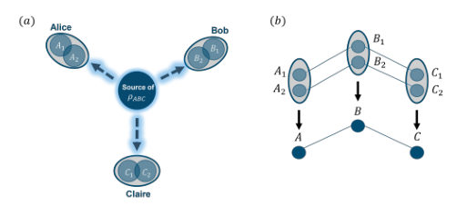
<figcaption class="paper-figure-caption"><b>Fig 1.</b> FIG. 1: Superactivation and compression of genuine mul- tipartite entanglement (GME): (a) Superactivation of GME: The three parties share two copies of a biseparable state ϱABC. If this state is entangled across each bipar- tition, then the two-copy state ϱA1B1C1 ⊗ϱA2B2C2 might be GME with respect to the partition A1A2∣B1B2∣C1C2, leading to GME superactivation. (b) Entanglement com- pression: Each party applies a local projection to a two-copy state, projecting their two-copy system to the single-copy space again. Since local projections can never create entanglement, the two-copy state must be at least as entangled as the resulting state.</figcaption>
</figure>
<figure class="paper-figure-card">
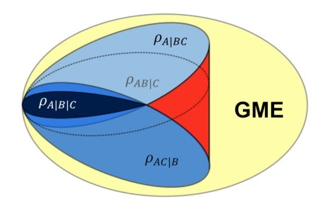
<figcaption class="paper-figure-caption"><b>Fig 2.</b> FIG. 2: Separability structure for tripartite systems: Fully separable states ϱA∣B∣C (dark blue) form a con- vex subset of the intersection of the three convex sets of partition-separable states, ϱAB∣C, ϱAC∣B, and ϱBC∣A (two light-blue regions and background). The convex hull of all partition-separable states forms the set of bisepara- ble states (all blue and red regions). The FIB states lie in the red region. All other fully inseparable states that lie outside the set of biseparable states (yellow) are gen- uinely multipartite entangled.</figcaption>
</figure>
<figure class="paper-figure-card">
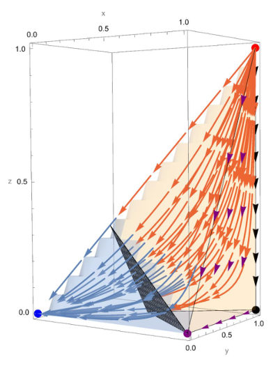
<figcaption class="paper-figure-caption"><b>Fig 3.</b> FIG. 3: Entanglement compression of a large number of copies under the Hadamard map for states χ(1,x,y,z): The red region corresponds to biseparable states, while the blue region depicts genuinely multipartite entangled states. The boundary between these regions is given by the grey plane. The red dot is the repellor and corre- sponds to the fully separable state χ(1,1,1,1), the blue point is the attractor and corresponds to the pure GHZ state χ(1,0,0,0). The purple point is the partition- separable saddle point χ(1,1,0,0), and the black point is the FIB saddle point χ(1,1,1,0). One can see that all the states in the interior of the polytope converge to the pure GHZ state. In contrast, the...</figcaption>
</figure>
<figure class="paper-figure-card">
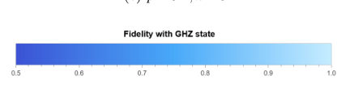
<figcaption class="paper-figure-caption"><b>Fig 4.</b> FIG. 4: Entanglement compression under the Hadamard map for GHZ-diagonal states χ(1,x,y,z) without white noise vs. with white noise: The plots show GME regions (blue) vs. biseparable regions (red) of states (1−p)χ(1,x,y,z)+ p</figcaption>
</figure>
<figure class="paper-figure-card">
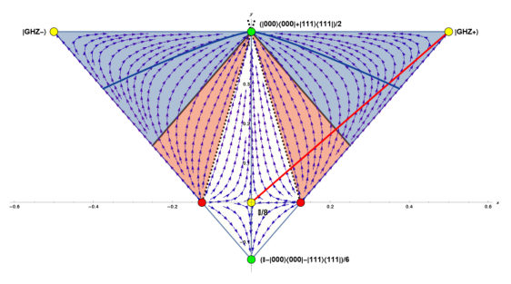
<figcaption class="paper-figure-caption"><b>Fig 5.</b> FIG. 6: Flow of the vector field from Eq. (20). The two green points are attractors corresponding to fully separable states (∣000⟩⟨000∣+ ∣111⟩⟨111∣)/2 and (18 −∣000⟩⟨000∣−∣111⟩⟨111∣)/6, the three yellow points are saddle points, where two of them correspond to pure genuinely multipartite entangled states ∣GHZ+⟩and ∣GHZ−⟩and the third one corresponds to the maxi- mally mixed state 18/8, and the two red points are re- pellors corresponding to the states 1 4 ∣GHZ±⟩⟨GHZ±∣+ 1 8 (18 −∣000⟩⟨000∣−∣111⟩⟨111∣). The red regions corre- spond to FIB states (GME activatable states). The uncoloured region under the FIB states corresponds to fully separable states, and the blue region above the FIB states...</figcaption>
</figure>

**Summary.** This paper analyzes how genuine multipartite entanglement can be 'compressed' by projecting multi-copy states back into a single-copy subspace using a local map like the Hadamard map. It finds that unlike entanglement distillation, this compression process is not indefinitely beneficial, exhibiting an optimal number of copies beyond which the entanglement quality degrades. This highlights a crucial distinction between theoretical purification limits and practical resource processing.

**Why it may be interesting.** It provides a concrete, non-asymptotic model for how entanglement resources can be processed or degraded in realistic, noisy quantum information processing tasks, offering insights beyond idealized distillation limits.

Detailed structure

**Main problem.** The paper investigates the 'compressibility' of genuine multipartite entanglement (GME) when subjected to local projections across multiple copies, contrasting this process with standard entanglement distillation.

**Main result.** For a fixed projection map like the Hadamard map, the quality of the compressed GME decreases beyond an optimal number of copies, unlike ideal distillation protocols.

**Method.** The analysis involves studying the evolution of multi-copy states ($
ho^{\otimes k}$) under a local projection map (e.g., the Hadamard map) and analyzing the resulting fixed points and convergence behavior.

**Model / system.** The system involves three parties (Alice, Bob, Claire) sharing quantum states, focusing on multi-copy states and analyzing the behavior of GHZ-diagonal states under compression.

**Key observables.** Fidelity with pure GHZ states, the degree of entanglement, and the dependence of entanglement quality on the number of copies ($k$).

**Important parameters / regimes.** The number of copies ($k$), the noise parameter ($p$), and the specific projection map (Hadamard map).

**Assumptions / limitations.** The analysis uses the Hadamard map as an example projection map, and some results rely on the assumption that the state belongs to specific, idealized classes (e.g., GHZ-diagonal states).

**Figures summary.** Figures illustrate superactivation and entanglement compression, showing how fidelity changes with the number of copies, and compare ideal theoretical evolution against noisy experimental reconstructions.

**Paper structure.** The paper introduces the problem of GME superactivation and compressibility, details the mathematical framework using the Hadamard map on multi-copy states, analyzes the convergence to fixed points, and concludes by comparing this compression mechanism to established entanglement distillation protocols.

Abstract

One of the most counterintuitive effects in the examination of quantum states is the phenomenon of superactivation, which describes the fact that a quantum state, which is useless for a specific task, may become useful when one considers multiple copies of it. This effect can be observed in the case of genuine multipartite entanglement, where local projections from multiple copies to the single-copy Hilbert space could significantly simplify the practical accessibility of its superactivation. We investigate how such projections behave in the limit of many copies, using the Hadamard map as an example, and studying different state families. We show that, in this scheme, for a fixed map, an optimal number of copies exists, beyond which the obtained entanglement decreases, highlighting the differences between entanglement distillation and local projection schemes.

[↑ back to top](#top)

### [Exact partition function of arithmetic Ising model](http://arxiv.org/abs/2608.19605v1)

**Authors:** Anu Dhochak, Ken Kikuchi, Shrinit Singh  
**Type:** theory · **Category:** statistical mechanics · **PDF:** <https://arxiv.org/pdf/2608.19605v1>  
**Analysis basis:** full PDF text, analyzed in chunks
**Topic relevance:** `analog quantum simulation` **1/5**

↔ Scroll figures horizontally

<figure class="paper-figure-card">
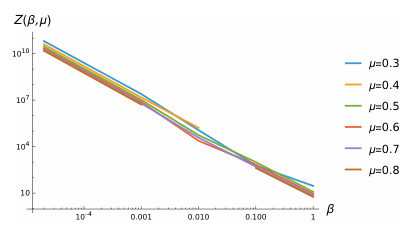
<figcaption class="paper-figure-caption"><b>Fig 1.</b> FIG. 1. Z(β, µ) of 2 × 2 arithmetic Ising model</figcaption>
</figure>
<figure class="paper-figure-card">
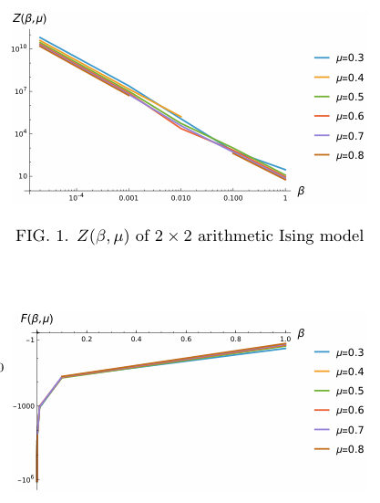
<figcaption class="paper-figure-caption"><b>Fig 2.</b> FIG. 2. F(β, µ) of 2 × 2 arithmetic Ising model</figcaption>
</figure>
<figure class="paper-figure-card">
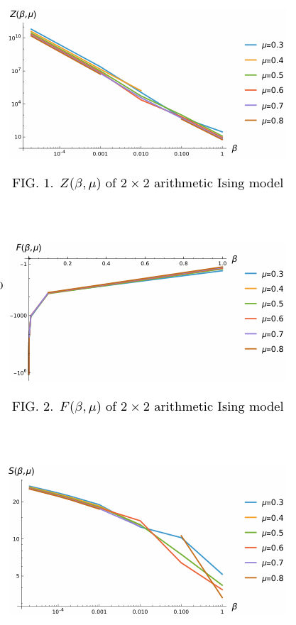
<figcaption class="paper-figure-caption"><b>Fig 3.</b> FIG. 3. S(β, µ) of 2 × 2 arithmetic Ising model</figcaption>
</figure>

**Summary.** This paper provides an exact, compact formula for the partition function of the $d$-dimensional arithmetic Ising model. Using advanced techniques involving formal calculus and zeta functions, the authors calculate the free energy and entropy, demonstrating that the system exhibits entropic order at high temperatures.

**Why it may be interesting.** While focused on classical statistical mechanics, the rigorous derivation of exact partition functions for complex lattice models provides powerful mathematical techniques applicable to quantum lattice models where exact solutions are rare.

Detailed structure

**Main problem.** The paper aims to derive a compact, exact formula for the partition function, free energy, and entropy of the $d$-dimensional arithmetic Ising model (AIM).

**Main result.** An exact formula for the partition function is derived, which for the $2 	imes 2$ case involves the $q$-Hurwitz-Lerch zeta function, and the entropy is shown to increase at high temperatures.

**Method.** The calculation uses formal variables and differential operators acting on polynomials, relating the partition function to a sum over configurations, and employing continuity arguments to prove the general formula.

**Model / system.** The system is the $d$-dimensional arithmetic Ising model defined on a lattice, characterized by the Hamiltonian $H(\mathbf{n}, U, \mu) = U \sum_{x \sim y} n_x n_y + \mu \sum_x n_x$.

**Key observables.** Partition function ($Z$), Free energy ($F$), and Entropy ($S$).

**Important parameters / regimes.** Inverse temperature ($eta$), coupling constant ($U$), and chemical potential ($\mu$).

**Assumptions / limitations.** The derivation initially assumes the chemical potential $\mu$ is irrational, but the result is extended to all $\mu > 0$ using continuity arguments.

**Figures summary.** Figures illustrate the behavior of $Z$, $F$, and $S$ for the $2 	imes 2$ model, showing that entropy increases at high temperatures (small $eta$), supporting entropic order.

**Paper structure.** The paper first defines the AIM and the partition function. It then develops a formal method using differential operators to calculate $Z$. The results are presented for the $2 	imes 2$ case using the $q$-Hurwitz-Lerch zeta function, and the general $d$-dimensional result is stated.

Abstract

We present a compact formula for the exact partition function of the $d$-dimensional arithmetic Ising model (AIM). For a $2\times2$ system, we express it analytically using the $q$-Hurwitz-Lerch zeta function and derive explicit forms for the free energy and entropy. Additionally, we find that the entropy increases at high temperatures, supporting the presence of entropic order.

[↑ back to top](#top)

### [Is the Quantum-Entangled Universe a Small World?](http://arxiv.org/abs/2608.19459v1)

**Authors:** Gregory S. Duane  
**Type:** theory · **Category:** other · **PDF:** <https://arxiv.org/pdf/2608.19459v1>  
**Analysis basis:** full PDF text, analyzed in chunks
**Topic relevance:** `analog quantum simulation` **1/5**

↔ Scroll figures horizontally

<figure class="paper-figure-card">
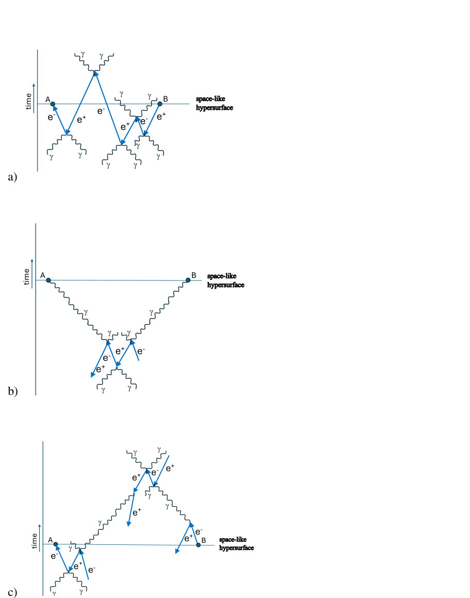
<figcaption class="paper-figure-caption"><b>Fig 1.</b> Fig. 1. Possible connections between partially entangled particles: a) successive pair production and anni-</figcaption>
</figure>
<figure class="paper-figure-card">
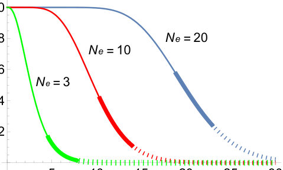
<figcaption class="paper-figure-caption"><b>Fig 2.</b> Fig. 2. Probability of partial entanglement between two particles in a given medium, as defined by maximum</figcaption>
</figure>
<figure class="paper-figure-card">
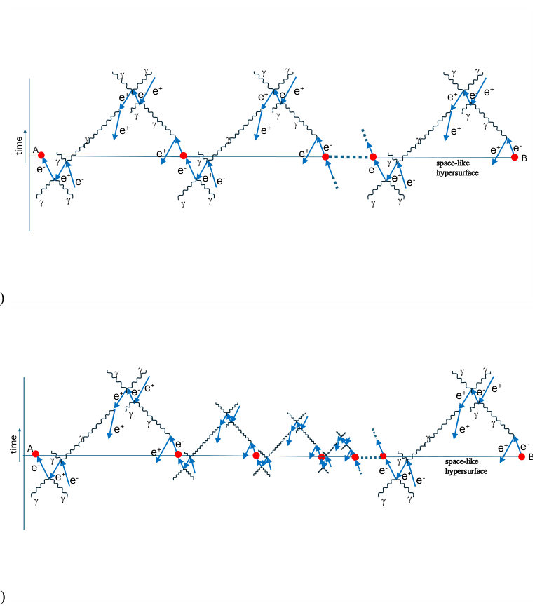
<figcaption class="paper-figure-caption"><b>Fig 3.</b> Fig. 3. a) Chain of links between particles (red dots), on a given space-like hyper-surface, connecting two</figcaption>
</figure>

**Summary.** This theoretical paper explores whether the universe's connectivity, mediated by partial quantum entanglement, forms a small-world network. By analyzing the decay rate of entanglement probability with distance, the authors test network structure against established mathematical criteria. The findings suggest that while entanglement provides some structure, the precise nature (small-world vs. random) depends critically on the underlying physical decay laws.

**Why it may be interesting.** It applies abstract network theory concepts (small-world, random graphs) to fundamental physics questions about the large-scale structure of spacetime and quantum connectivity, bridging quantum field theory concepts with graph theory.

Detailed structure

**Main problem.** The paper investigates whether the universe, when modeled as a network connected by partial quantum entanglement, exhibits the characteristic 'small-world' structure.

**Main result.** The entanglement probability decays exponentially, failing the strict power-law test for small-worldness, though the structure is suggested on large scales. The network structure depends critically on the decay exponent $r$ relative to the dimensionality $k$.

**Method.** The analysis uses network theory diagnostics (clustering, diameter scaling) applied to entanglement probabilities derived from particle path lengths and interaction counts.

**Model / system.** The model is a network of particles on a space-like hyper-surface, where connections are established by partial quantum entanglement mediated by a maximum number of interactions ($N_e$). The structure is analyzed across cosmic scales.

**Key observables.** Small-world diameter scaling (logarithmic vs. power-law), entanglement probability $P(n \le N_e | l)$, and network connectivity parameters ($r, k$).

**Important parameters / regimes.** Maximum number of interactions ($N_e$), mean free path ($\lambda$), distance ($l$), and the decay exponent ($r$) governing link probability.

**Assumptions / limitations.** The analysis assumes uniform background initially, approximates lattice distance as physical distance at large scales, and relies on comparing network scaling laws derived from entanglement decay.

**Figures summary.** Figures illustrate possible entanglement connections via varying numbers of interactions ($n$) and show the probability of partial entanglement versus distance for different $N_e$ values.

**Paper structure.** The paper progresses by defining the entanglement link probability, comparing this to the mathematical requirements for small-world networks, and then generalizing the analysis using network theory parameters ($r$ and $k$) to distinguish between random, small-world, and large-world topologies.

Abstract

Partial entanglement may provide enough connections in the universe to satisfy the definition of a small world. To investigate this possibility, we define a network of particles on a given space-like hyper-surface with a long-range link between any two particles that are connected by a chain of exchanged particles involving less than some small maximum number of interactions. Considering the mean free paths of particles in different regions of space and the resulting probability distributions of entanglement connections vs. distance, we find evidence of small-world or random network structure on all but the smallest scales - corresponding to stars and planets - on which other types of connections would need to be added to complete the small world picture.

[↑ back to top](#top)

### [Jamming Extensions of Quantum Correlations Lead to Hidden Superluminal Signaling](http://arxiv.org/abs/2608.20247v1)

**Authors:** Ravishankar Ramanathan, Xie Sicheng, Michał Eckstein, Paweł Horodecki  
**Type:** theory · **Category:** other · **PDF:** <https://arxiv.org/pdf/2608.20247v1>  
**Analysis basis:** full PDF text, analyzed in chunks
**Topic relevance:** `quantum measurements` **1/5**

↔ Scroll figures horizontally

<figure class="paper-figure-card">
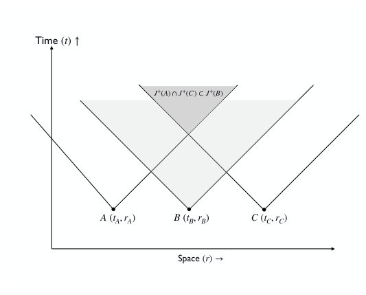
<figcaption class="paper-figure-caption"><b>Fig 1.</b> FIG. 1. The Jamming spacetime configuration for three spacelike separated players at locations A(tA, rA), B(tB, rB) and C(tC, rC). In this configuration, the intersection of the future light cones of A and C, denoted J+(A) ∩J+(C) is entirely contained within the future light cone of B denoted J+(B).</figcaption>
</figure>
<figure class="paper-figure-card">

<figcaption class="paper-figure-caption"><b>Fig 2.</b> Fig. 1, where the intersection of the future light-cones of Alice’s and Charlie’s output events lies inside the fu- ture light-cone of Bob’s input event, relativistic causal- ity permits the joint correlations of Alice and Charlie to depend on Bob’s input, provided their single-party marginals remain independent of that input. While de- tailed derivations and explanations can be found in [3– 5, 34], intuitively the reason is clear. The joint correla- tions of Alice and Charlie’s outcomes are only accessi- ble at a spacetime point in the intersection of their fu- ture light-cones. As such, any superluminal causal in- fluence that jams their correlations still does not lead to superluminal...</figcaption>
</figure>

**Summary.** This theoretical paper analyzes the constraints imposed on quantum correlations by relativistic causality (RC) compared to the standard no-signaling principle. The authors prove that any attempt to introduce 'jamming'—a superluminal causal influence—into quantum correlations necessarily results in detectable superluminal signaling. This has direct implications for cryptography, showing that security protocols must account for spacetime location constraints.

**Why it may be interesting.** This work provides fundamental constraints on quantum correlations imposed by spacetime structure, which is crucial for understanding the limits of quantum information transfer in relativistic settings.

Detailed structure

**Main problem.** The paper investigates whether quantum correlations can exploit the 'causal loophole' left open by relativistic causality (RC) compared to the standard no-signaling principle, specifically by analyzing the concept of 'jamming.'

**Main result.** The authors prove that any nontrivial jamming extension of quantum correlations, whether state-independent or state-dependent, necessarily leads to hidden superluminal signaling, thus constraining physically consistent correlations.

**Method.** The analysis involves extending the operator framework used for characterizing correlations to incorporate RC constraints, utilizing mathematical proofs based on the requirement that the underlying state must be a valid density operator.

**Model / system.** The study models multipartite Bell experiments involving three spacelike separated players (Alice, Bob, Charlie) and characterizes joint probability distributions $P(a, b, c|x, y, z)$ under the constraints of No-Signaling (NS) and Relativistic Causality (RC).

**Key observables.** Joint probability distributions $P(a, b, c|x, y, z)$, security success probabilities (e.g., $p_{RC,0} + p_{RC,1}$), and the violation of established inequalities like the Svetlichny inequality.

**Important parameters / regimes.** The analysis focuses on the three-player scenario and the specific structure of 'jamming spacetime configurations.'

**Assumptions / limitations.** The core argument relies on the mathematical structure of the operator representation and the physical constraint that the state must be a valid density operator ($\Omega \ge 0$).

**Figures summary.** Figure 1 illustrates a 'Jamming spacetime configuration' for three spacelike separated players, showing the containment of the intersection of two future light cones within the third.

**Paper structure.** The paper first characterizes the RC set by extending the operator framework, proving that quantum requirements eliminate jamming. It then applies this characterization to break security guarantees of DI cryptographic primitives, showing that security requires specifying measurement locations, not just input-output statistics.

Abstract

Relativistic causality in certain spacetime configurations permits jamming - superluminal causal influences that nevertheless do not enable superluminal signaling. We fully characterize the correlations compatible with relativistic causality (RC) by extending the operator framework of PRL 104, 140404. When the underlying state is required to be quantum, we prove that any nontrivial jamming - whether state-independent or state-dependent - necessarily leads to hidden superluminal signaling. Thus, the only consistent possibilities are standard quantum correlations without jamming or the full relativistically causal correlation set, with intermediate jamming extensions of quantum correlations leading to signaling. As an application of our characterization, we investigate the security of device-independent (DI) cryptographic primitives against adversaries constrained only by relativistic causality. We construct explicit RC attacks that break DI bit commitment and DI secret sharing in jamming geometries, even when these protocols remain secure against no-signaling adversaries. Our results show that security against relativistic adversaries requires behaviors to be specified together with the spacetime locations of their measurement events; input-output statistics alone are insufficient.

[↑ back to top](#top)

### [Krylov complexity and the growth of the black hole interior in 3D gravity](http://arxiv.org/abs/2608.19373v1)

**Authors:** Arpan Bhattacharyya, Sounak Pal, Juan F. Pedraza  
**Type:** theory · **Category:** other · **PDF:** <https://arxiv.org/pdf/2608.19373v1>  
**Analysis basis:** full PDF text, analyzed in chunks
**Topic relevance:** `Keldysh / 2PI / non-Gaussian methods` **1/5**

↔ Scroll figures horizontally

<figure class="paper-figure-card">
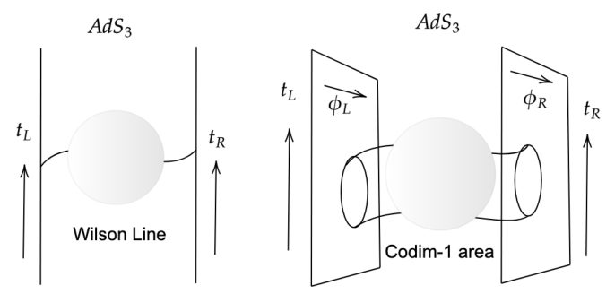
<figcaption class="paper-figure-caption"><b>Fig 1.</b> Figure 1: Schematic representation of the boundary and bulk constructions. On the left, a Wilson line connecting boundary insertions probes a codimension-two bulk object in AdS3. On the right, we extend this construction by smearing the boundary operators along the periodically identified spatial direction ϕ. The resulting non-local operators provide the boundary observable used to probe the growth of the codimension-one surface extending through the black hole interior.</figcaption>
</figure>
<figure class="paper-figure-card">
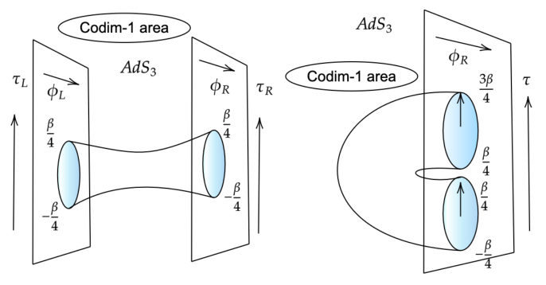
<figcaption class="paper-figure-caption"><b>Fig 2.</b> Figure 2: Integration regions for the Euclidean time coordinate τ associated with the extended codimension-one area in AdS3. The left panel corresponds to the two-sided correlator, while the right panel shows the corresponding single-boundary correlator.</figcaption>
</figure>
<figure class="paper-figure-card">
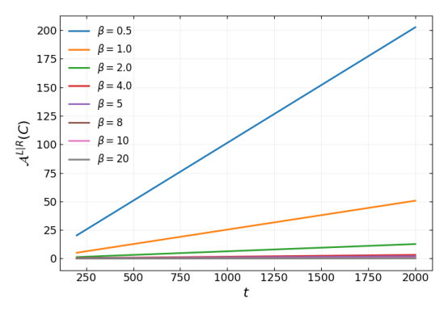
<figcaption class="paper-figure-caption"><b>Fig 3.</b> Figure 3: Late-time growth of the codimension-one observable AL|R(C), showing the asymptotically linear regime.</figcaption>
</figure>
<figure class="paper-figure-card">
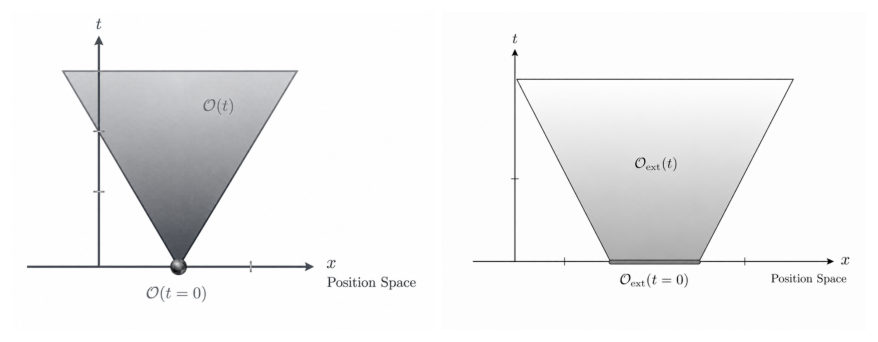
<figcaption class="paper-figure-caption"><b>Fig 4.</b> Figure 4: Schematic illustration of operator spreading for an initially local operator (left) and an extended non-local operator (right). A local operator is initially spatially localized, whereas the extended operator already has nontrivial spatial support at t = 0. This distinction concerns the spatial structure of the seed operator in configuration space; in the Krylov representation, either operator defines a single initial basis element O0, and their subsequent dynamics is encoded in the corresponding Lanczos data.</figcaption>
</figure>
<figure class="paper-figure-card">
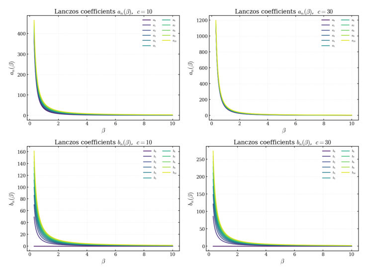
<figcaption class="paper-figure-caption"><b>Fig 5.</b> Figure 5: Dependence of the Lanczos coefficients an and bn on the inverse temperature β. The left column corresponds to c = 10, and the right column to c = 30.</figcaption>
</figure>

**Summary.** This theoretical paper studies black hole interior growth in 3D gravity using the AdS/CFT correspondence. By comparing two complexity measures, the authors find that operator Krylov complexity correctly captures the expected linear growth of the black hole interior volume. This result establishes a novel diagnostic tool, suggesting that operator complexity is the appropriate measure for encoding bulk geometric growth in this holographic setting.

**Why it may be interesting.** The work extends the use of complexity measures beyond standard quantum information diagnostics, applying them to fundamental gravitational physics (black hole interiors) and providing a concrete, testable distinction between operator and state complexity in this context.

Detailed structure

**Main problem.** The paper investigates the growth of the black hole interior in three-dimensional gravity and determines whether this geometric growth is captured by the operator Krylov complexity measure.

**Main result.** Operator Krylov complexity successfully reproduces the characteristic late-time linear growth of the black hole interior, while the state-based Krylov spread complexity does not, highlighting a distinction between the two complexity notions.

**Method.** The authors use the AdS/CFT correspondence, employing the Chern-Simons formulation of 3D gravity to relate boundary correlation functions of smeared operators to bulk Wilson lines, and then apply Krylov methods to analyze the resulting dynamics.

**Model / system.** The physical system is the two-sided BTZ black hole in three-dimensional gravity, analyzed via its dual description using the Thermofield Double (TFD) state in AdS$_3$. The analysis compares two complexity measures: operator Krylov complexity and Krylov spread complexity.

**Key observables.** Operator Krylov complexity, Krylov spread complexity, codimension-one surface volume, and the effective representation parameter $\kappa_{	ext{eff}}(t)$.

**Important parameters / regimes.** The late-time linear growth regime of the black hole interior volume, and the semiclassical approximation regime for the partition function.

**Assumptions / limitations.** The analysis relies on the semiclassical approximation and focuses on the linear growth regime, not the eventual non-perturbative saturation of the interior volume.

**Figures summary.** Figure 1 schematically compares probing a codimension-two object via a Wilson line versus extending this to probe a codimension-one surface using smeared operators. Figure 2 illustrates the integration regions for the Euclidean time coordinate associated with the codimension-one area.

**Paper structure.** The paper first establishes the boundary reconstruction of the black hole interior growth using correlation functions. It then calculates and compares the growth rates derived from operator Krylov complexity versus Krylov spread complexity, concluding with a discussion on the implications for complexity measures in AdS$_3$.

Abstract

We investigate the growth of the black hole interior in three-dimensional gravity from the boundary theory. For the two-sided BTZ black hole, we propose a boundary reconstruction of the time dependence of a codimension-one surface in terms of correlation functions of smeared operators in the thermofield double state, reproducing the characteristic late-time linear growth predicted by the complexity-volume proposal. Using the Chern--Simons formulation of three-dimensional gravity, these nonlocal correlators are represented by bulk Wilson lines with smeared endpoints, extending the familiar connection between Wilson lines and codimension-two observables underlying holographic entanglement entropy to codimension-one observables. We then ask whether the same geometric growth is captured by Krylov complexity. For the smeared operators, we extract the Lanczos data from their correlation functions and find that operator Krylov complexity reproduces the late-time linear growth of the black hole interior, extending previous connections between operator growth and bulk geometry to AdS$_3$. By contrast, the Krylov spread complexity of the thermofield double state, obtained from the semiclassical gravitational partition function, does not exhibit the linear growth of the bulk volume within the regime accessible to our analysis. Our results therefore point to a distinguished role for operator Krylov complexity in encoding black hole interior growth beyond two-dimensional gravity, while highlighting a qualitative distinction between operator and state notions of Krylov complexity.

[↑ back to top](#top)

### [Quantum algorithm for differential equations via permutation matrix representation with application to the Burgers equation](http://arxiv.org/abs/2608.19508v1)

**Authors:** Hriday Sabharwal, Amir Kalev, Itay Hen  
**Type:** theory · **Category:** quantum information and computing · **PDF:** <https://arxiv.org/pdf/2608.19508v1>  
**Analysis basis:** full PDF text, analyzed in chunks
**Topic relevance:** `analog quantum simulation` **1/5**

↔ Scroll figures horizontally

<figure class="paper-figure-card">
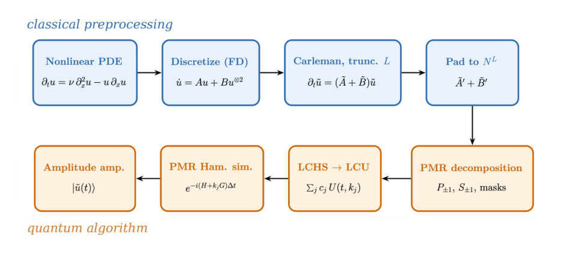
<figcaption class="paper-figure-caption"><b>Fig 1.</b> Figure 1. Overview of the LCHS–PMR construction for a nonlinear fluid equation. In the classical preprocessing stage, the PDE is discretized in space, lifted to a finite linear system by Carleman linearization truncated at level L, and padded to a power-of-two block dimension N L. The quantum algorithm then decomposes the padded generator ˜A′+ ˜B′</figcaption>
</figure>
<figure class="paper-figure-card">
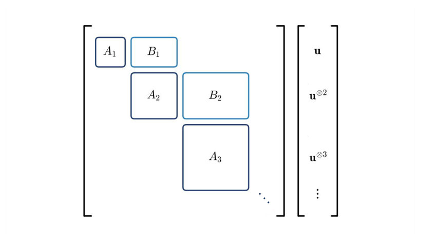
<figcaption class="paper-figure-caption"><b>Fig 2.</b> Figure 2. Structure of the matrix ( ˜A + ˜B) in the extended space (left) acting on the solution vector (right). The diagonal blocks Ak implement the linear part of the dynamics within the u⊗k sector, while the off-diagonal blocks Bk couple u⊗k to u⊗(k+1).</figcaption>
</figure>
<figure class="paper-figure-card">
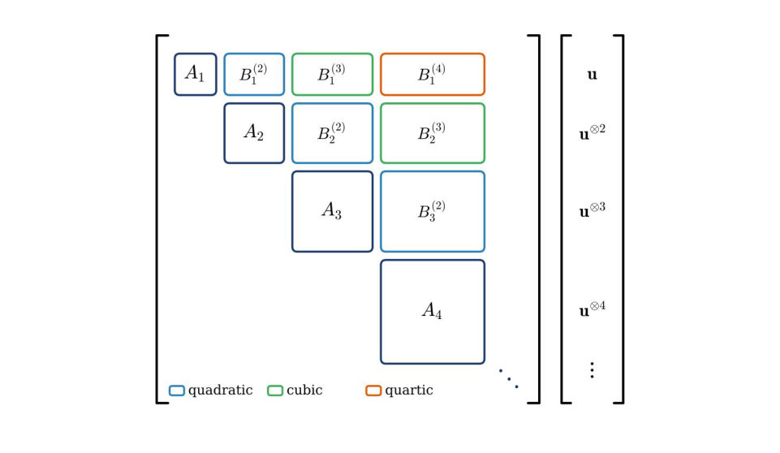
<figcaption class="paper-figure-caption"><b>Fig 3.</b> Figure 3. Structure of the matrix ( ˜A + ˜B) for general higher order nonlinearities. The diagonal blocks Ak implement the linear part of the dynamics within the u⊗k sector, while the off-diagonal blocks B(l) k couple u⊗k to u⊗(k+l−1). The quadratic coupling blocks Bk of Fig. 2 are the degree-two special case B(2) k .</figcaption>
</figure>

**Summary.** This paper presents a quantum algorithm to simulate the dynamics of the viscous Burgers equation by first linearizing the nonlinear PDE using Carleman linearization. It implements the simulation using the Permutation Matrix Representation (PMR) within the LCHS framework. The key contribution is showing that the algorithm scales favorably with the off-diagonal norm of the generator, offering a powerful primitive for simulating general fluid equations on quantum hardware.

**Why it may be interesting.** This work provides a concrete, advanced quantum algorithm for simulating complex, nonlinear PDEs, which is a major goal in quantum simulation for condensed matter and fluid dynamics.

Detailed structure

**Main problem.** Developing a quantum algorithm to simulate the time evolution of the nonlinear viscous Burgers equation.

**Main result.** The authors propose a quantum algorithm utilizing the Permutation Matrix Representation (PMR) within the Linear Combination of Hamiltonian Simulations (LCHS) framework, achieving a scaling advantage based on the off-diagonal norm of the generator.

**Method.** The nonlinear PDE is linearized via Carleman linearization, padded for qubit implementation, and the resulting generator is decomposed using PMR to facilitate simulation via LCHS.

**Model / system.** The system modeled is the viscous Burgers equation, which is first spatially discretized and then linearized into a high-dimensional, time-dependent linear evolution equation suitable for quantum simulation.

**Key observables.** The quantum state $|	ilde{u}
angle$ proportional to the solution of the truncated lifted system; the off-diagonal norm of the Carleman generator.

**Important parameters / regimes.** Dimensionless viscosity ($\nu$), characteristic velocity ($U_*$), domain size ($\zeta$), and time step ($\Delta t$).

**Assumptions / limitations.** The LCHS algorithm requires the Hermitian part of the linear generator to be positive semidefinite, necessitating an exponential postselection overhead mitigated by a rescaling scheme.

**Figures summary.** Figure 1 provides an overview of the LCHS–PMR construction, detailing the path from the PDE to the quantum simulation circuit.

**Paper structure.** The paper reviews LCHS and PMR, details the Burgers' equation algorithm, analyzes resource costs, extends the PMR scheme to general fluid equations, and concludes.

Abstract

We develop a quantum algorithm for solving the dynamics of the nonlinear viscous Burgers equation. We apply the Carleman linearization procedure on the spatially discretized equation, followed by a padding scheme that allows implementation on qubit registers. Existing Carleman-based quantum algorithms commonly formulate the lifted linear differential equation in an oracle model. Here we decompose the padded generator into diagonal masks and reversible arithmetic permutations using the Permutation Matrix Representation (PMR), which we show to be naturally compatible with the Linear Combination of Hamiltonian Simulations (LCHS) algorithm. Under the assumptions required by LCHS - most importantly positive semidefiniteness of the Hermitian part of the linear generator, possibly after a stabilizing shift - the algorithm prepares a normalized quantum state proportional to the solution of the truncated lifted system; the stabilizing shift introduces an exponential postselection overhead, which we quantify and mitigate through a rescaling scheme. We show that our algorithm scales with the off-diagonal norm of the Carleman generator instead of the matrix norm, which can be advantageous for other generators that are diagonally dominant. We also extend the PMR scheme to general fluid equations that may contain higher-order derivatives or nonlinear terms, or may involve multiple fluid variables or spatial dimensions. The construction illustrates how PMR can serve as a convenient Hamiltonian-simulation primitive for a broader class of LCU-based algorithms.

[↑ back to top](#top)

### [Resource-Efficient Bio-Molecular Docking on a NISQ-era Digital Quantum Computer](http://arxiv.org/abs/2608.19868v1)

**Authors:** Tianqi Chen, Adrian M. Mak, Jianguo Li, Jian Feng Kong, Chandra Verma, Sebastian Maurer-Stroh  
**Type:** both · **Category:** quantum information and computing · **PDF:** <https://arxiv.org/pdf/2608.19868v1>  
**Analysis basis:** full PDF text, analyzed in chunks
**Topic relevance:** `QC/QI experiment` **1/5**

↔ Scroll figures horizontally

<figure class="paper-figure-card">
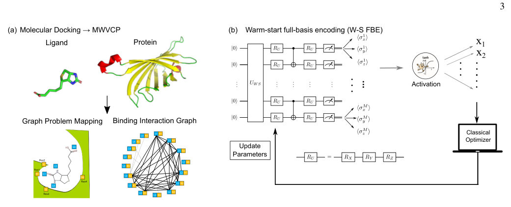
<figcaption class="paper-figure-caption"><b>Fig 1.</b> FIG. 1. Illustration of the problem formalism and multi-basis encoding approach: (a) The molecular docking of ligand and protein is mapped to finding a maximum vertex-weighted clique on a graph: selected pharmacophores from both ligand (blue) and protein (orange) are analyzed and mapped to a labeled distance graph (LDG), following the procedure and criteria introduced in Ref. [24]. The binding interaction graph (BIG) is then defined based on the LDG, with its vertices representing the product of the selected pharmacophores from ligand and protein. Here, we used 1stp as an example for illustration. (b) Full-basis encoding (FBE) with an initial warm-start layer UWS : for each qubit from a...</figcaption>
</figure>
<figure class="paper-figure-card">
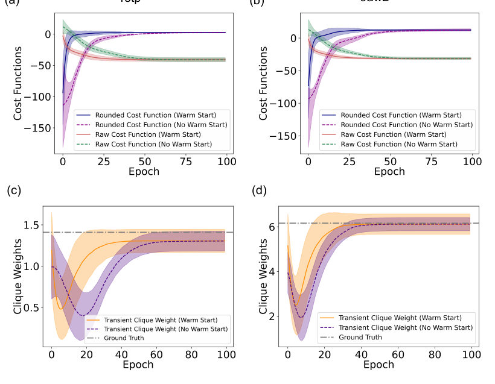
<figcaption class="paper-figure-caption"><b>Fig 2.</b> FIG. 2. Different loss functions values as a function of training epoch used for checking the convergence of N = 18 (1stp) in (a) and (c), and N = 14 (9aw2) in (b) and (d). In panel (a) and (b), the raw cost function (red dashed line) is computed by taking the hyperbolic tangent of each of these observables, i.e., tanh ⟨σi µ⟩(µ = x, y, z) where i = 1, 2, · · · , N and insert each for the original variable of the MVWCP cost function, while the rounded cost function (blue solid line) is computed by taking the sign of each tanh ⟨σi µ⟩(µ = x, y, z), and substitute it back to the original MVWCP cost function. In panel (c) and (d), the transient clique weight is calculated for those chosen vertex...</figcaption>
</figure>
<figure class="paper-figure-card">
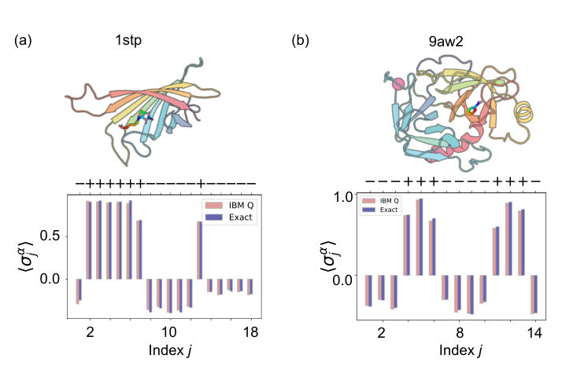
<figcaption class="paper-figure-caption"><b>Fig 3.</b> FIG. 3. IBM quantum computer demonstration of MVWCP results using full-basis encoding for (a) (PDB ID: 1stp) (N = 18) and (b) (PDB ID: 9aw2). The upper part for each panel is a visualization of the 3D structure of protein-ligand complex, and the lower part of each panel is the solution of the MVWCP problem obtained from the real IBM hardware. The plus (minus) sign indicate that at the j-th vertex of the graph is chosen, and our hardware demonstrations are consistent with both the exact results from classical simulations, as well as the ground truth in Fig. 7. The real device results are obtained on a Heron R2 QPU ibm kingston. Other parameters used are: the number of circuit ansatz is fixed...</figcaption>
</figure>
<figure class="paper-figure-card">
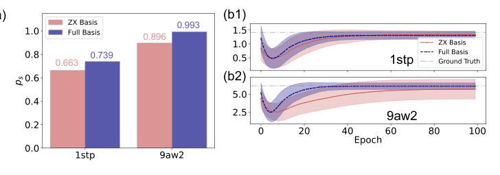
<figcaption class="paper-figure-caption"><b>Fig 4.</b> FIG. 4. (a) Comparison of successful ratios between ZX basis (red) and full basis encodings (blue) for both 1stp (N = 18) and 9aw2 (N = 14). For each approach, it is executed for a total of 1000 repetitions, and the successful ratio ps is calculated. The transient clique weight for both approaches are also shown in (b1) for 1stp and (b2) for 9aw2. In both panels, the horizontal dot-dashed grey line represents the ground truth, and the shaded area stands for the standard error. For both cases, the circuit ansatz consists of three layers, while the penalty value is fixed at 4.</figcaption>
</figure>
<figure class="paper-figure-card">
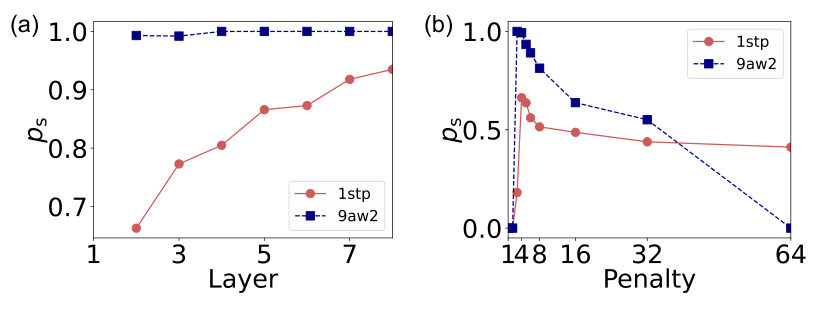
<figcaption class="paper-figure-caption"><b>Fig 5.</b> FIG. 5. Effect of number of (a) the variational quantum circuit layers and (b) the penalty value for 1stp (N = 18, red) and 9aw2, red (N = 14) on the successful ratio ps. For both panels, it is executed for a total of 1000 repetitions, and the successful ratio ps is calculated.</figcaption>
</figure>

**Summary.** This work tackles the computationally hard problem of molecular docking by reformulating it as a Maximum Vertex-Weighted Clique Problem. They introduce a hybrid quantum-classical solver utilizing a Full-Basis Encoding (FBE) strategy optimized via a warm-start procedure. The research demonstrates that FBE is a resource-efficient and rapidly converging quantum encoding for this complex optimization task on NISQ hardware.

**Why it may be interesting.** The rigorous mathematical proof that the global minimum is a product state provides a strong theoretical foundation for using variational quantum circuits in complex optimization tasks, which is highly relevant for quantum algorithm design.

Detailed structure

**Main problem.** The paper addresses the computationally intensive molecular docking problem, which is mapped to finding a Maximum Vertex-Weighted Clique Problem (MVWCP).

**Main result.** They propose and demonstrate a resource-efficient hybrid quantum-classical approach using Full-Basis Encoding (FBE) that shows advantages in convergence speed over other quantum encodings.

**Method.** The method involves mapping the problem to a cost Hamiltonian, minimizing it using a variational quantum circuit optimized via a warm-start procedure inspired by imaginary time evolution.

**Model / system.** The system is molecular docking, modeled via a compatibility graph and recast as an MVWCP. The quantum computation is performed on a NISQ-era digital quantum computer (IBM quantum processor).

**Key observables.** Transient clique weight, raw/rounded cost functions, and single-qubit expectation values ($\langle\sigma_x
angle, \langle\sigma_y
angle, \langle\sigma_z
angle$).

**Important parameters / regimes.** NISQ regime constraints, qubit connectivity, and the number of variables ($N$) in the graph problem.

**Assumptions / limitations.** The global minimum of the FBE objective can be chosen to be a pure product state, justifying the use of a unitary variational circuit.

**Figures summary.** Figure 1 illustrates the mapping to MVWCP and the FBE strategy. Figure 7 shows MVWCP graphs for docking instances. Figure 8 compares optimization dynamics using FBE versus ZX-basis encoding.

**Paper structure.** The paper first establishes the problem mapping (MVWCP) and the need for quantum assistance. It then details the FBE encoding and the warm-start optimization procedure. A key theoretical section proves the product state nature of the minimum, followed by comparative results showing FBE's superior convergence.

Abstract

Molecular docking is a vital computational task in drug discovery, wherein the objective is to efficiently identify optimal binding poses between a ligand and a target receptor protein. Due to the combinatorial explosion of possible binding configurations, docking of large and flexible molecules remains a computationally intensive problem, especially at scale. Early studies have revealed that the molecular docking can be re-cast as a maximum vertex-weighted clique problem (MVWCP) problem on a compatibility graph to be solved classically. In this work, we proposed a hybrid quantum-classical approach for molecular docking leveraging the MVWCP formalism with a variational full-basis encoding (FBE) strategy, which enables efficient encoding of classical binary variables with Bloch sphere vectors. We further prove that a global minimizer of the FBE objective can always be chosen to be a pure product state, thereby providing a rigorous justification for its optimization using a unitary variational circuit. The molecular docking problem is first mapped to a cost Hamiltonian that is minimized within a variational framework, optimized via a randomized imaginary time evolution (ITE)-inspired warm start, and gradient-based techniques. Finally, we also executed the circuit on an IBM quantum computer, underlying the feasibility and of quantum-assisted optimization for structure-based drug design and point towards the broader utility of advanced encoding techniques in quantum optimization for computational biology.

[↑ back to top](#top)

### [Rigorous existence and location of quantum phase transitions in lattice Hamiltonian systems](http://arxiv.org/abs/2608.20209v1)

**Authors:** Massimo Ostilli, Carlo Presilla  
**Type:** theory · **Category:** statistical mechanics · **PDF:** <https://arxiv.org/pdf/2608.20209v1>  
**Analysis basis:** full PDF text, analyzed in chunks
**Topic relevance:** `analog quantum simulation` **1/5**

↔ Scroll figures horizontally

<figure class="paper-figure-card">
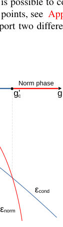
<figcaption class="paper-figure-caption"><b>Fig 1.</b> Figure 3. Sketch scenario of Theorem 3 with two first-order QPTs taking place at the critical points gc and g′ c.</figcaption>
</figure>
<figure class="paper-figure-card">
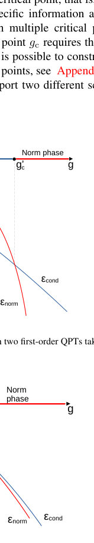
<figcaption class="paper-figure-caption"><b>Fig 2.</b> Figure 4. Sketch scenario of Theorem 3 with a first-order QPT and a second-order QPT taking place at the critical points gc and g′ c, respectively.</figcaption>
</figure>

**Summary.** This paper develops a rigorous mathematical framework to prove the existence and locate Quantum Phase Transitions (QPTs) in lattice Hamiltonians. It achieves this by interpreting the transition as a condensation in state space, analyzing the ground-state energy in the thermodynamic limit. The work generalizes previous results, confirming applicability to second-order transitions and providing general bounds for the critical point.

**Why it may be interesting.** The rigorous mathematical framework connecting QPTs to state-space condensation provides a powerful, general diagnostic tool for identifying and locating phase transitions in complex quantum many-body systems.

Detailed structure

**Main problem.** To rigorously prove the existence and determine the location of Quantum Phase Transitions (QPTs) in general one-parameter lattice Hamiltonian systems.

**Main result.** The analysis establishes that any QPT in lattice systems can be interpreted as a condensation in state space, and provides methods to rigorously bound the critical point $g_c$. The theory also demonstrates the possibility of multiple second-order crossings.

**Method.** The approach involves decomposing the Hilbert space into two orthogonal subspaces and analyzing the ground-state energy per particle in the Thermodynamic Limit. The critical point is found where the energies from these two subspaces become equal.

**Model / system.** The study focuses on lattice Hamiltonian systems described by $H = K + gV$, where $K$ and $V$ are non-commuting operators and $g$ is the tuning parameter. The analysis is general, applying to various lattice models.

**Key observables.** The primary observables are the ground-state energies per particle, $\epsilon_{	ext{cond}}(g)$ and $\epsilon_{	ext{norm}}(g)$, whose crossing determines the critical point $g_c$.

**Important parameters / regimes.** The coupling parameter $g$, the critical point $g_c$, and the parameters defining the bounds $g_{\pm c}$ are crucial.

**Assumptions / limitations.** The analysis assumes the existence of a well-defined ground-state energy in the Thermodynamic Limit and relies on the concavity of the energy functions. The method also requires the ability to choose appropriate subspaces.

**Figures summary.** Figures sketch scenarios illustrating the possibility of multiple first-order and second-order QPTs occurring at different critical points.

**Paper structure.** The paper builds from extending previous work by interpreting QPTs as state-space condensations. It develops mathematical machinery using subspace decomposition and the Thermodynamic Limit to find bounds on $g_c$. Finally, it uses theoretical constructions (Appendix A) to demonstrate the possibility of multiple critical points.

Abstract

We extend the analysis of the class of quantum phase transitions (QPTs) that can be interpreted as condensations in state space, first introduced in [M. Ostilli and C. Presilla, J. Phys. A 54, 055005 (2021)], by generalizing the arguments of [M. Ostilli and C. Presilla, Phys. Rev. Lett. 127, 040601 (2021)] to prove the existence and determine the location (via simple bounds) of QPTs in general one-parameter lattice Hamiltonians. Unlike our original formulation, this extension also encompasses second-order QPTs, for which we provide the explicit example of the transverse-field Ising model. Our analysis suggests that, under conditions typically satisfied in physical contexts, any QPT taking place in lattice systems can be interpreted as a condensation in state space.

[↑ back to top](#top)

### [Tunable inter-bilayer magnetic correlations and candidate multipolar physics in the van der Waals oxyhalides DyOCl, DyOBr, and DyOI](http://arxiv.org/abs/2608.19421v1)

**Authors:** F. C. Brooks, X. Bai, J. Bacsa, V. O. Garlea, S. Calder, N. Butch, M. B. Stone, M. Mourigal  
**Type:** both · **Category:** other · **PDF:** <https://arxiv.org/pdf/2608.19421v1>  
**Analysis basis:** full PDF text, analyzed in chunks
**Topic relevance:** `analog quantum simulation` **1/5**

↔ Scroll figures horizontally

<figure class="paper-figure-card">
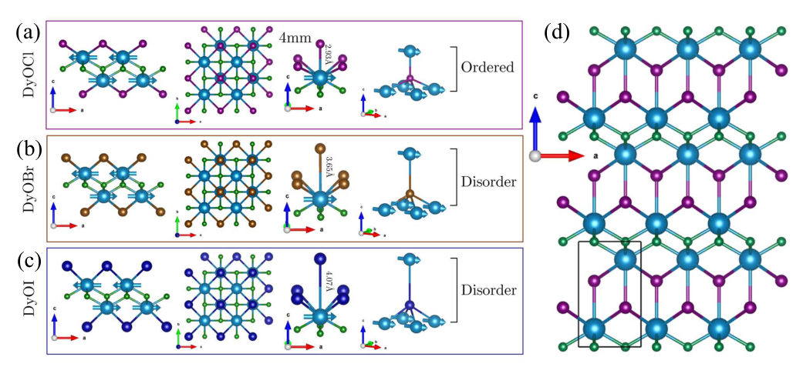
<figcaption class="paper-figure-caption"><b>Fig 1.</b> Figure 1. Crystal and magnetic structures of (a) DyOCl, (b) DyOBr and (c) DyOI. The Dy atoms and their magnetic dipole moments are represented by light blue spheres and arrows, respectively. Non-magnetic atoms are represented by green spheres for oxygen, and by purple (Cl), bronze (Br), and sapphire (I) spheres for halides. In each of the panels (a-c), the four subfigures represent, respectively: the bilayer of Dy3+ atoms and the associated intra-bilayer magnetic configuration viewed along the b-axis; the square lattice arrangement of the Dy3+</figcaption>
</figure>
<figure class="paper-figure-card">
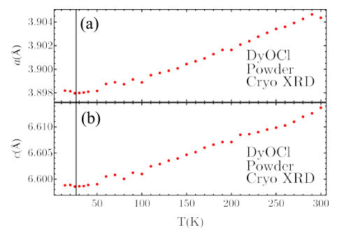
<figcaption class="paper-figure-caption"><b>Fig 2.</b> Figure 2. Temperature dependence of the lattice parameters of DyOCl extracted from powder x-ray diffraction data collected with λ = 1.54 Å. Values for a and c are found via Rietveld refinement in space group P4/nmm. The vertical line indicates the onset of thermomagnetic transitions in the heat capacity of DyOCl.</figcaption>
</figure>
<figure class="paper-figure-card">
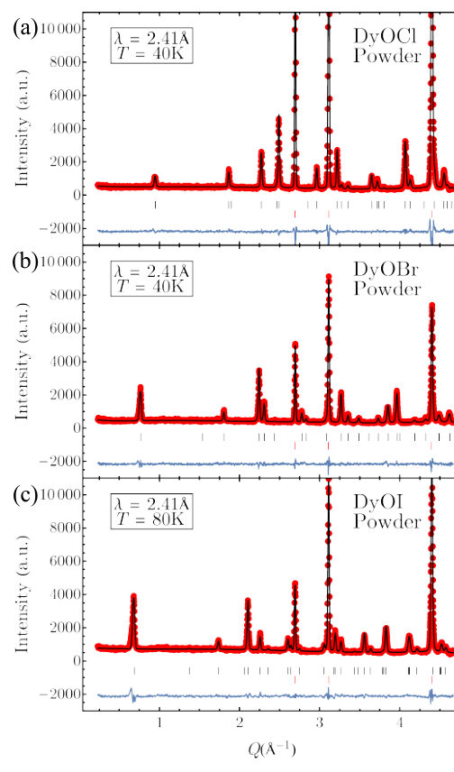
<figcaption class="paper-figure-caption"><b>Fig 3.</b> Figure 3. Powder neutron diffraction pattern (red points) for (a) Dy- OCl, (b) DyOBr, (c) DyOI measured with λ = 2.41 Å in the para- magnetic phase at T = 40 K or T = 80 K with corresponding best- fit structural Rietveld refinements (black lines) and residuals (blue lines). Nuclear peak positions are marked as black ticks. Aluminum peaks are marked as red ticks. The residual between the model and the data is marked at the bottom of each panel as a blue curve. We note that low-angle peaks suffer some asymmetry from instrument resolution effects and stacking faults that are not modeled at that stage.</figcaption>
</figure>
<figure class="paper-figure-card">
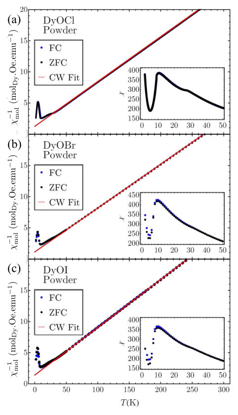
<figcaption class="paper-figure-caption"><b>Fig 4.</b> Figure 4. Inverse magnetic susceptibility in a field of µ0H=0.1 T as a function of temperature and cooling conditions for each of (a) DyOCl, (b) DyOBr, (c) DyOI. The red curves show fits to the Curie–Weiss law described in the text. The insets show the direct susceptibility over a restricted temperature range near the ordering transitions.</figcaption>
</figure>
<figure class="paper-figure-card">
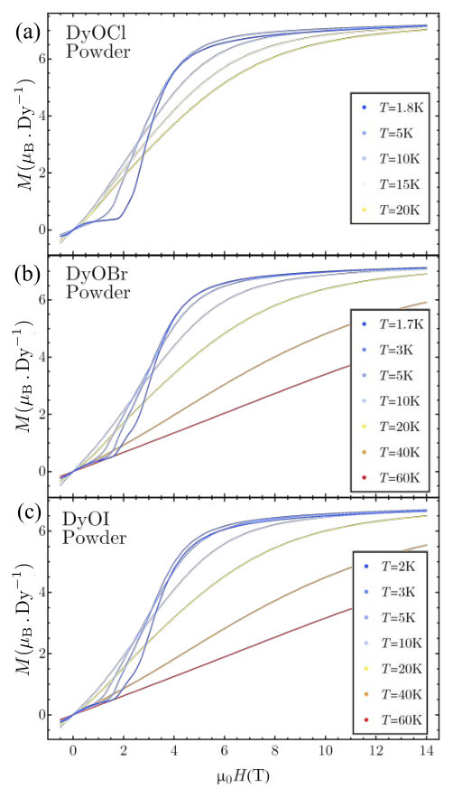
<figcaption class="paper-figure-caption"><b>Fig 5.</b> Figure 5. Isothermal magnetization for selected temperatures be- tween T = 1.7 K and 60 K measured on powder samples of (a) DyOCl, (b) DyOBr and (c) DyOI.</figcaption>
</figure>

**Summary.** This work characterizes the $	ext{DyOX}$ oxyhalides as tunable, quasi-2D rare-earth magnets. By measuring magnetic and spectroscopic properties, the authors establish evidence for distinct magnetic ordering and candidate multipolar physics linked to low-lying crystal-field states. The combination of structural tuning and advanced spectroscopy makes this a key platform for studying complex magnetic interactions.

**Why it may be interesting.** The study provides a model system where dimensionality and magnetic interactions can be tuned chemically, offering insights into how low-dimensional quantum magnetism and multipolar interactions manifest in real materials.

Detailed structure

**Main problem.** The study investigates the tunable inter-bilayer magnetic correlations and candidate multipolar physics within the van der Waals oxyhalides DyOX.

**Main result.** The $	ext{DyOX}$ series is established as a tunable family of quasi-two-dimensional rare-earth magnets, exhibiting distinct magnetic ordering and crystal-field excitations that suggest underlying multipolar interactions.

**Method.** The research combines structural characterization (X-ray/Neutron Diffraction) with magnetic measurements (Magnetization, Heat Capacity, INS) and theoretical modeling (Hamiltonian fitting).

**Model / system.** The system is the $	ext{DyOX}$ family ($	ext{X} = 	ext{Cl}, 	ext{Br}, 	ext{I}$), which features $	ext{Dy}^{3+}$ moments arranged in square-bilayer networks separated by a tunable van der Waals gap.

**Key observables.** Antiferromagnetic ordering temperatures ($	ext{T}_{	ext{N}} \approx 7-10 	ext{ K}$), a high-temperature anomaly ($	ext{T}_{	ext{Q}} \approx 27-30 	ext{ K}$), crystal-field excitations (25-30 meV), and low-energy magnetic modes (10 meV).

**Important parameters / regimes.** Halide ionic radius (tuning the inter-bilayer spacing), magnetic field strength ($\mu_0H \approx 0.1 	ext{ T}$ to $14 	ext{ T}$), and energy scales (10 meV to 30 meV).

**Assumptions / limitations.** The analysis assumes that the observed low-energy excitations are related to multipolar physics, although direct confirmation requires probes beyond the current scope (e.g., resonant X-ray scattering).

**Figures summary.** Figures show crystal/magnetic structures, temperature-dependent neutron diffraction patterns revealing magnetic anomalies, and plots detailing crystal-field level splittings under various theoretical operators.

**Paper structure.** The paper systematically analyzes structural changes with halide size, measures magnetic transitions ($	ext{T}_{	ext{N}}, 	ext{T}_{	ext{Q}}$), probes excitations via INS, and uses theoretical Hamiltonian fitting to constrain the nature of the magnetic interactions.

Abstract

Rare-earth van der Waals magnets provide a route to combining strong spin-orbit coupling, large magnetic moments, and reduced dimensionality in bulk crystals. We report a comparative study of the dysprosium oxyhalides DyOX (X = Cl, Br, I), which realize square-bilayer networks of Dy3+ moments separated by a tunable van der Waals gap. Structural refinements show that increasing the halide ionic radius strongly expands the inter-bilayer spacing while leaving the local bilayer geometry nearly unchanged. Magnetization and heat-capacity measurements reveal two low-temperature anomalies in all three compounds: antiferromagnetic order at TN ~ 7-10 K and a broader anomaly near TQ ~ 27-30 K. Single-crystal magnetization on DyOCl and DyOBr establishes a strong hard-c-axis anisotropy, consistent with crystal-field analysis of DyOCl, which yields an XY-like ground-state g tensor. Neutron diffraction shows long-range antiferromagnetic order in DyOCl, whereas DyOBr and DyOI exhibit sharp magnetic scattering coexisting with Warren-like diffuse features, consistent with robust in-plane correlations and imperfect inter-bilayer registry. Inelastic neutron scattering on DyOCl identifies crystal-field excitations near 25-30 meV and an additional magnetic mode near 10 meV whose temperature dependence is tied to the high-temperature anomaly. Taken together, these results establish DyOX as a tunable family of quasi-two-dimensional rare-earth magnets and point to candidate multipolar physics associated with low-lying crystal-field states. Direct probes of quadrupolar order, such as resonant x-ray scattering or elastic-constant measurements, will be required to determine the order parameter at TQ.

[↑ back to top](#top)

## Other papers (16)

*Papers from primary archives without highlighted authors or any topic match. Click to expand.*

Show other papers

### [Constant-round quantum advantage in communication complexity for total functions](http://arxiv.org/abs/2608.19787v1)

**Authors:** Atsuya Hasegawa, François Le Gall  
**Type:** theory · **Category:** quantum information and computing · **PDF:** <https://arxiv.org/pdf/2608.19787v1>  
**Analysis basis:** full PDF text, analyzed in chunks

↔ Scroll figures horizontally

<figure class="paper-figure-card">
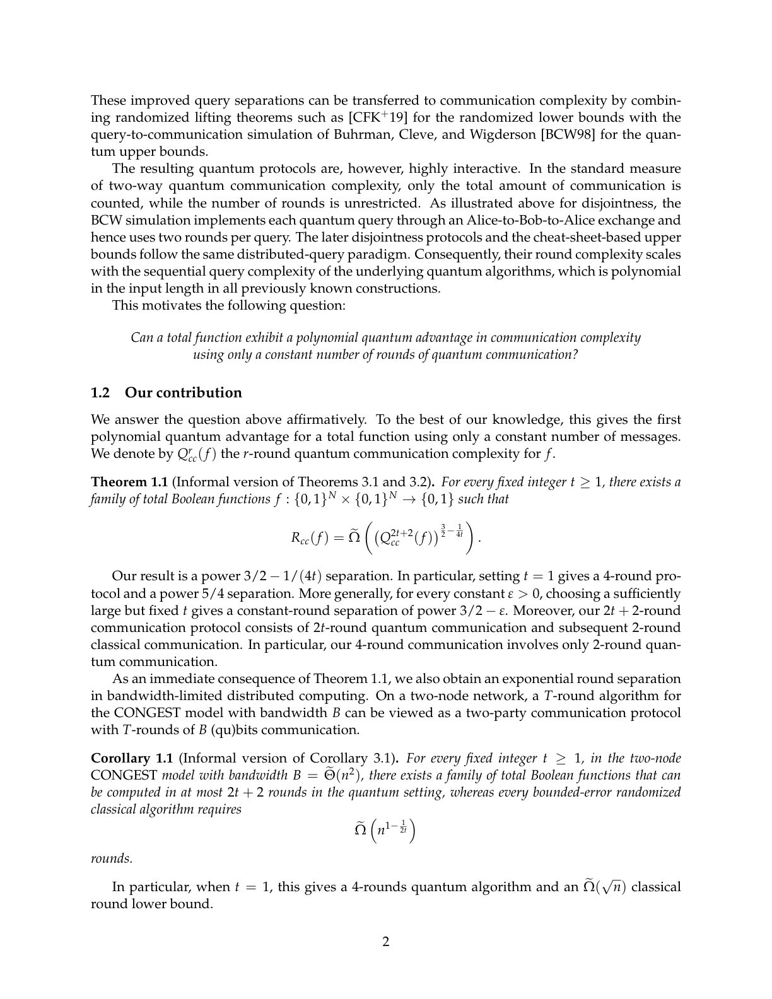
<figcaption class="paper-figure-caption"><b>Fig 1.</b> Low-resolution page preview, page 2</figcaption>
</figure>
<figure class="paper-figure-card">
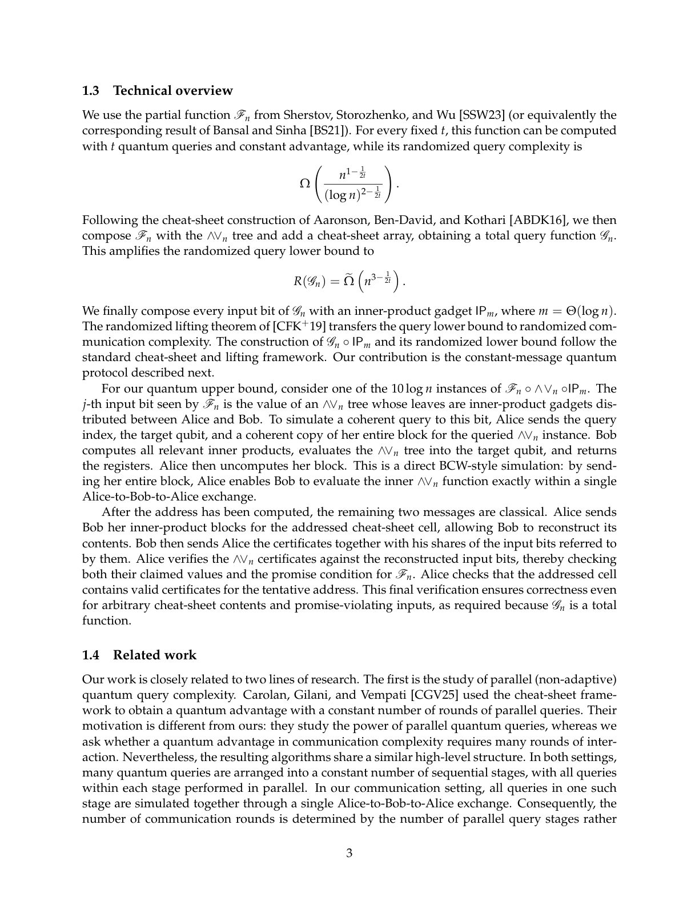
<figcaption class="paper-figure-caption"><b>Fig 2.</b> Low-resolution page preview, page 3</figcaption>
</figure>
<figure class="paper-figure-card">
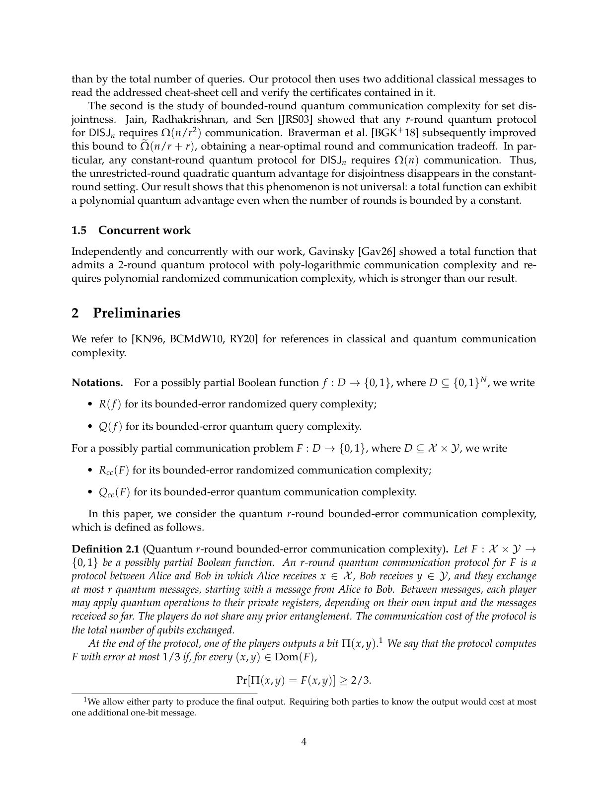
<figcaption class="paper-figure-caption"><b>Fig 3.</b> Low-resolution page preview, page 4</figcaption>
</figure>
<figure class="paper-figure-card">
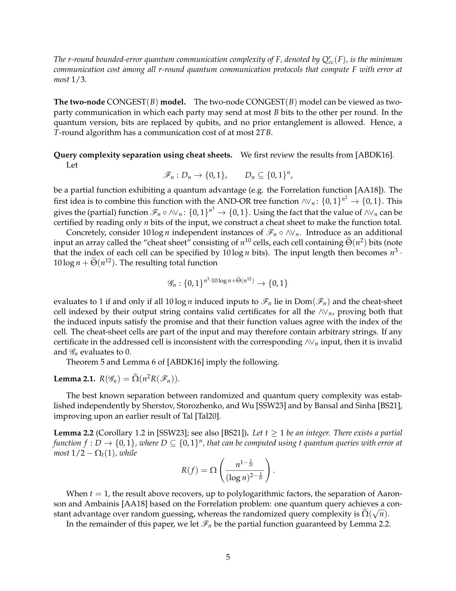
<figcaption class="paper-figure-caption"><b>Fig 4.</b> Low-resolution page preview, page 5</figcaption>
</figure>
<figure class="paper-figure-card">
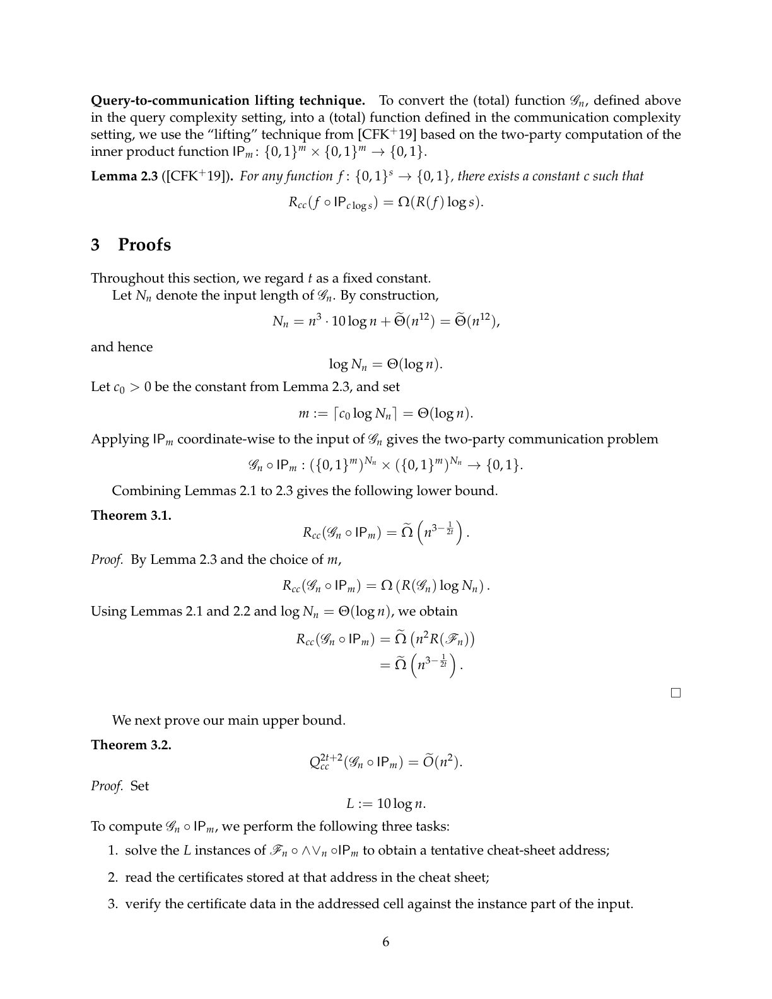
<figcaption class="paper-figure-caption"><b>Fig 5.</b> Low-resolution page preview, page 6</figcaption>
</figure>

**Summary.** This theoretical paper establishes a significant result showing a polynomial quantum advantage in communication complexity for certain total functions when restricted to a constant number of communication rounds. By constructing a hard function and analyzing it in the CONGEST model, the authors demonstrate an exponential separation between the required rounds for classical randomized algorithms versus quantum protocols. This advances the understanding of quantum computational power in highly constrained, interactive communication settings.

**Why it may be interesting.** While the focus is on communication complexity rather than physical Hamiltonians, the techniques used to establish round separations in quantum communication models are fundamental to understanding the limits of quantum information processing in distributed settings.

Detailed structure

**Main problem.** The paper investigates whether a polynomial quantum advantage exists in communication complexity for total functions when restricted to a constant number of communication rounds.

**Main result.** They prove that for a specific family of functions, there is a polynomial separation between the randomized classical communication complexity and the constant-round quantum communication complexity.

**Method.** The authors construct a complex total function by composing known hard functions ($F_n$ and $\wedge\vee_n$) and use the Inner Product function ($	ext{IP}_m$) to lift the problem into a communication complexity setting.

**Model / system.** The analysis is conducted within the two-node CONGEST communication model, comparing classical randomized protocols against quantum protocols limited to a constant number of rounds.

**Key observables.** The separation power between $R_{cc}(f)$ and $Q_{r	ext{cc}}(f)$, and the required number of communication rounds ($T$ vs. $2t+2$).

**Important parameters / regimes.** The separation power is $\Omega(n^{3/2 - 1/(4t)})$, and the bandwidth $B_n = e^{\Theta(n^2)}$ is crucial for the round separation.

**Assumptions / limitations.** The result holds for total Boolean functions, and the quantum protocol's round count is determined by the number of parallel query stages, not the total number of queries.

**Paper structure.** The paper establishes the problem by reviewing previous quantum advantages, constructs a hard function $G_n$ using known techniques, and then analyzes the communication complexity by deriving lower bounds for classical protocols and upper bounds for quantum protocols in the CONGEST model.

Abstract

We show that there exists a total function for which there is a polynomial gap between the randomized and the constant-round quantum communication complexity. Previously, such a separation was known only for quantum protocols using polynomially many rounds.

[↑ back to top](#top)

### [Dataflows and Computational Patterns for Hybrid Quantum-Classical Scientific Computing](http://arxiv.org/abs/2608.19348v1)

**Authors:** Ryan Landfield, Jordan J. Winetrout, Michael A. Sandoval  
**Type:** theory · **Category:** quantum information and computing · **PDF:** <https://arxiv.org/pdf/2608.19348v1>  
**Analysis basis:** full PDF text, analyzed in chunks

↔ Scroll figures horizontally

<figure class="paper-figure-card">
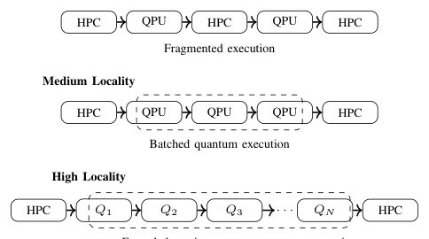
<figcaption class="paper-figure-caption"><b>Fig 1.</b> Fig. 1. Locality regimes in hybrid quantum-classical dataflows. Low-locality workflows repeatedly alternate between classical and quantum execution, medium-locality workflows batch quantum operations before classical syn- chronization, and high-locality workflows contain contiguous quantum com- pute regions in which computation remains resident on the QPU.</figcaption>
</figure>

**Summary.** This paper introduces the Quantum Execution Locality Framework (QELF) to move beyond describing quantum algorithms individually. QELF characterizes hybrid workflows based on their dataflow structure and how long computation remains resident on the QPU (locality). This framework shows that workflow structure, particularly maximizing quantum residency, is as critical as the algorithm itself for realizing quantum speedup.

**Why it may be interesting.** It provides a high-level, structural vocabulary for analyzing quantum computation pipelines, which is crucial for understanding resource requirements beyond just circuit depth.

Detailed structure

**Main problem.** Hybrid quantum-classical workflows are currently described by individual algorithms, failing to capture their underlying execution behavior, which limits the potential for quantum acceleration.

**Main result.** The authors introduce the Quantum Execution Locality Framework (QELF), which classifies workflows into patterns based on their dataflow structure and quantum execution locality.

**Method.** The framework models workflows as directed dataflows and classifies them into three locality regimes (Fragmented, Batched, Contiguous) based on the extent of computation resident on the QPU.

**Model / system.** The focus is on the abstract computational structure of hybrid quantum-classical algorithms, using representative patterns like VQE, QAOA, and Hamiltonian simulation as examples.

**Key observables.** Quantum Execution Locality (the central metric), Relative Quantum Residency, and the Computational Pattern Locality Class (Low, Medium, High).

**Important parameters / regimes.** Coherence time, gate error, circuit depth, and the latency/fidelity requirements dictated by the specific computational pattern.

**Assumptions / limitations.** The effectiveness of quantum acceleration depends critically on the workflow's structural locality, not just the algorithmic complexity.

**Figures summary.** Figure 1 illustrates the three locality regimes in hybrid dataflows, and Table I summarizes five primary computational patterns, their function, and locality level.

**Paper structure.** The paper introduces QELF to characterize workflows structurally, defines the locality regimes, proposes a computational pattern taxonomy (QOOL, QASP, etc.), and discusses the implications of locality for hardware co-design.

Abstract

Hybrid quantum-classical computing has emerged as the dominant paradigm for near-term quantum applications, yet hybrid workflows are typically described by individual algorithms rather than their underlying execution behavior. We introduce the Quantum Execution Locality Framework (QELF), a qualitative framework for characterizing hybrid quantum-classical workflows according to recurring dataflow structures and quantum execution locality, the extent to which computation remains resident on the Quantum Processing Unit (QPU) before host intervention or classical synchronization. From a representative cross-section of applications, QELF identifies five recurring computational patterns with distinct locality characteristics and discusses their implications for communication overhead, workflow organization, and future hybrid computing architectures. By providing a common vocabulary for reasoning about hybrid workloads, QELF establishes a foundation for future quantitative validation and the co-design of algorithms, runtime systems, and hybrid computing architectures.

[↑ back to top](#top)

### [Disassembling qLDPC codes for depth-optimal parity-check circuits](http://arxiv.org/abs/2608.19917v1)

**Authors:** Minh T. P. Nguyen, Maximilian Rimbach-Russ, Stefano Bosco  
**Type:** theory · **Category:** quantum information and computing · **PDF:** <https://arxiv.org/pdf/2608.19917v1>  
**Analysis basis:** full PDF text, analyzed in chunks

↔ Scroll figures horizontally

<figure class="paper-figure-card">
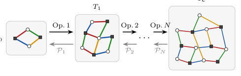
<figcaption class="paper-figure-caption"><b>Fig 1.</b> FIG. 1. Assembling and disassembling codes. A Tan- ner graph T0 is assembled into a qLDPC code TC through a sequence of operations (black arrows). Rather than construct- ing the parity-check circuit directly on TC, we reverse these operations by quotienting the graph edge symmetries (gray arrows), solve the reduced parity-check scheduling problem (edge colors) on T0, and lift the resulting circuit back to TC.</figcaption>
</figure>
<figure class="paper-figure-card">
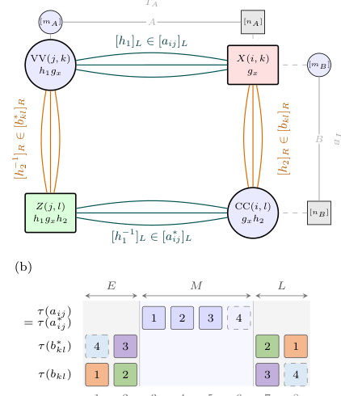
<figcaption class="paper-figure-caption"><b>Fig 2.</b> FIG. 2. LP(A, B) codes. (a) Tanner graph TLP, with checks X(i, k) (red), Z(j, l) (green) and data qubits VV(j, k), CC(i, l) (blue). The second line of each vertex is its group coordinate, its position in the fiber over TA □TB. Teal bundles run through [aij]L, [a∗ ij]L and orange bundles through [bkl]R, [b∗ kl]R, one edge per group element of the en- try. (b) Sandwich parity-check circuit for ∆A = ∆B = 4, with P□merging the horizontal edges. Rows give the CNOT layer τ after edge coloring and entries are the color indices. Dashed cells are present only for even degree: ∆A = 3 shortens M by a layer, whereas ∆B = 3 empties one outer entry on each side without narrowing E, L.</figcaption>
</figure>
<figure class="paper-figure-card">
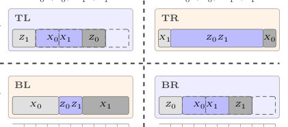
<figcaption class="paper-figure-caption"><b>Fig 3.</b> FIG. 3. Parity-check circuit of QT codes. Schedule in- duced by the canonical orientation, for C = C′ = [6, 3, 3] of Ref. [36] with ∆= 10. Rows and columns of the base surface are halved (dashed) and given opposite orientations (listed be- side the corresponding half). The four relations compose into a total order in each quadrant, such each schedule per quad- rant has again a sandwich structure; shading marks whether the X- (blue) or Z-families (orange) occupy the middle band.</figcaption>
</figure>

**Summary.** This paper presents a novel technique to drastically reduce the circuit depth required for syndrome extraction in qLDPC quantum error-correcting codes. By mathematically 'disassembling' the codes using their inherent symmetries, the authors can solve the scheduling problem on a much simpler graph. This leads to provably optimal or near-optimal CNOT depth circuits for various structured qLDPC families.

**Why it may be interesting.** While focused on quantum computation, the techniques developed—exploiting underlying algebraic symmetries to simplify complex scheduling problems—are highly relevant to optimizing control circuits in any physical quantum system.

Detailed structure

**Main problem.** The primary goal is to design highly efficient, low-CNOT-depth circuits for syndrome extraction in Quantum Low-Density Parity-Check (qLDPC) codes.

**Main result.** The authors demonstrate a method to achieve depth-optimal or near-optimal CNOT depth for specific qLDPC families (LP and BP codes) by exploiting underlying code symmetries.

**Method.** The core method involves 'disassembling' the complex code structure by quotienting symmetries, solving the scheduling problem on a reduced graph, and then 'lifting' the resulting circuit back to the full code.

**Model / system.** The system modeled is the quantum error correction process using qLDPC codes. The circuit structure is analyzed via the Tanner graph, which represents the parity checks acting on data and ancilla qubits.

**Key observables.** CNOT Depth (the maximum time label $\max 	au(e)$), which must be minimized, and the satisfaction of 'properness constraints' for circuit validity.

**Important parameters / regimes.** The depth bound $\Delta \le \Delta_X + \Delta_Z$, and the structure of the code components (e.g., hypergraph products, group lifts).

**Assumptions / limitations.** The method assumes that good qLDPC codes possess substantial structure derived from known algebraic operations, and that the properness constraint can be correctly transformed under symmetry partitions.

**Figures summary.** Figures illustrate the general process of code assembly/disassembly via symmetry quotienting, the Tanner graph structure for LP codes, and the resulting 'sandwich structure' of the required parity-check circuit schedule (E-M-L bands).

**Paper structure.** The paper builds from the general problem of syndrome extraction efficiency, details the algebraic framework for exploiting code symmetries (disassembly/reassembly), applies this framework analytically to LP/BP codes, and then applies it numerically to Quantum Tanner (QT) codes.

Abstract

Quantum low-density parity-check (qLDPC) codes offer a promising route to scalable fault-tolerant quantum computing, but their practical implementation requires efficient circuits for syndrome extraction. Many qLDPC families are assembled from a small set of components through explicit constructions that imprint edge symmetries on their Tanner graphs. We show that these symmetries can be exploited to design syndrome-extraction circuits from the underlying components, rather than from the full quantum code. For Lifted Product and Balanced Product codes this approach yields an analytical construction with provably optimal or near-optimal CNOT depth. For Quantum Tanner codes it produces depth-optimal circuits on every instance we test, including codes up to nearly 600 data qubits.

[↑ back to top](#top)

### [Emergence of cooperation: A reputation-modulated reinforcement learning](http://arxiv.org/abs/2608.20016v1)

**Authors:** Chenyang Zhao, Jiqiang Zhang, Li Chen, Yong Zou  
**Type:** theory · **Category:** disordered systems and neural networks · **PDF:** <https://arxiv.org/pdf/2608.20016v1>  
**Analysis basis:** full PDF text, analyzed in chunks

↔ Scroll figures horizontally

<figure class="paper-figure-card">
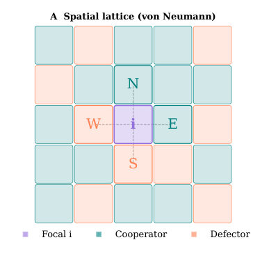
<figcaption class="paper-figure-caption"><b>Fig 1.</b> Figure 1: Schematic illustration of the reputation-modulated Q-learning model. Agents are placed on a square lattice and play the prisoner’s dilemma game with their four nearest neighbors. After each round, an agent’s reputation increases if it cooperates; otherwise, it decreases if it defects. The local reputation level determines how agents evaluate their learning reward: when neighborhood reputation is low, agents mainly rely on their own payoff, while a high reputation increases the weight of the neighbors’ average payoff. The resulting reputation-weighted fitness is then used to update the Q table, which in turn guides subsequent action choices through an ε-greedy rule.</figcaption>
</figure>
<figure class="paper-figure-card">
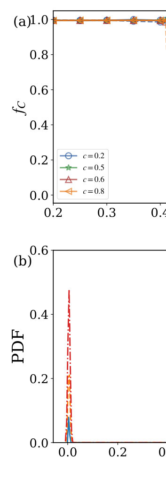
<figcaption class="paper-figure-caption"><b>Fig 2.</b> Figure 2: Discontinuous phase transition of cooperation under reputation-modulated dy- namics. (a) The level of cooperation fC as a function of the temptation parameter b for different reputation update rates c. The dashed region indicates the bistable regime obtained from different random initial configurations. (b) Probability density function (PDF) of the cooperation level fC, revealing the coexistence between cooperative and defective states near the discontinuous transi- tion. Other parameters: c = 0.5 in panel (b). 8</figcaption>
</figure>
<figure class="paper-figure-card">
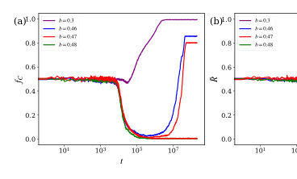
<figcaption class="paper-figure-caption"><b>Fig 3.</b> Figure 3: (a) Temporal evolution of the cooperation level fC for four chosen values of b (shown in the legend). The red curve (b = 0.47) exhibits bistable dynamics under random initial conditions, indicating the coexistence of cooperative and defective attractors near the critical regime. (b) The corresponding temporal evolution of the average reputation of (a). (c) Bimodal distribution of steady-state reputation for b = 0.47 under random initial conditions, showing the spontaneous polarization of agents into low- and high-reputation groups. Other parameters: c = 0.5, α = 0.1, γ = 0.9.</figcaption>
</figure>
<figure class="paper-figure-card">
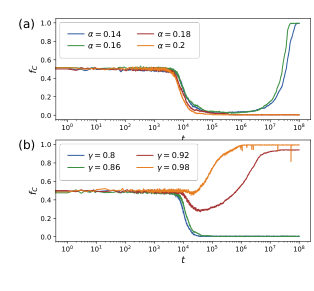
<figcaption class="paper-figure-caption"><b>Fig 4.</b> Figure 4: (a) Time evolution of the cooperation level for different learning rates α at a fixed discount factor γ = 0.9. (b) Time evolution for different discount factors γ at a fixed learning rate α = 0.1. (c) Phase diagram in the (α, γ) parameter space. The color encodes the steady-state value of fC ∈[0, 1]. Note that the extreme cases α = 0, 1 and γ = 0, 1 are excluded, as they correspond to trivial or degenerate learning dynamics. Accordingly, both parameters are restricted to the interval [0.02, 0.98]. Other parameters are: ϵ = 0.01, b = 0.42, and c = 0.2.</figcaption>
</figure>
<figure class="paper-figure-card">
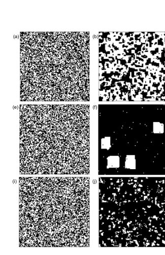
<figcaption class="paper-figure-caption"><b>Fig 5.</b> Figure 5: Typical spatial configurations illustrating the evolution of cooperation at a fixed reputation update rate c = 0.5. Cooperators and defectors are represented by white and black sites, respectively. (a-d) Snapshots at t = 0, 105, 106, and 107 for b = 0.3, showing the rapid expansion of cooperative domains toward a highly cooperative state. (e-h) Snapshots at t = 0, 107, 7 × 107, and 15 × 107 for the left side of the transition point b = 0.47, where cooperation emerges through the nucleation and growth of cooperative clusters. (i-l) Snapshots at t = 0, 104, 2 × 104, and 105 for the defective side of the transition point b = 0.47, illustrating the gradual extinction of cooperative...</figcaption>
</figure>

**Summary.** This work models cooperation in a spatial game where agents learn using reinforcement learning, incorporating a reputation metric into their reward signal. It demonstrates that reputation acts as a crucial information filter, allowing cooperation to emerge and persist even when direct incentives are weak. The findings highlight that reputation's role is to reshape the social information landscape, not just provide direct payoffs.

**Why it may be interesting.** While the core topic is game theory, the use of reinforcement learning (Q-learning) and the modeling of adaptive behavior in a lattice structure connects to concepts in complex adaptive systems and the use of neural network principles in physical modeling.

Detailed structure

**Main problem.** The paper addresses how reputation can sustain cooperation among self-interested agents, moving beyond models that treat reputation merely as an external payoff modifier.

**Main result.** Reputation-modulated learning significantly promotes cooperation, leading to a discontinuous phase transition from full cooperation to full defection as the temptation parameter increases.

**Method.** The study uses a spatial prisoner's dilemma game framework where agents employ Q-learning, modifying their fitness function to incorporate a locally defined reputation metric.

**Model / system.** The model is a spatial prisoner's dilemma played on a lattice network, where agents update their Q-values based on a fitness function that is a convex combination of personal and neighborhood payoffs, weighted by local reputation.

**Key observables.** Cooperation level (rho_C), average reputation (R_i), and the prevalence of cooperation (f_C).

**Important parameters / regimes.** Temptation parameter (b), learning rate (alpha), discount factor (gamma), and the reputation update constant (c).

**Assumptions / limitations.** The analysis assumes agents interact only with their four nearest neighbors and utilizes approximations like the adiabatic approximation in the theoretical analysis.

**Figures summary.** Figures illustrate the feedback loop of the model, show the Q-table structure, and demonstrate the hysteresis loop (bistability) of cooperation prevalence versus dilemma strength.

**Paper structure.** The paper introduces the gap in existing models, details the reputation-modulated Q-learning mechanism, presents simulation results showing phase transitions, and concludes by analyzing the mechanism's role in shaping social information landscapes.

Abstract

Reputation is widely recognized as a key mechanism for sustaining cooperation. However, most existing game-theoretic models treat reputation primarily as an external factor that modulates payoffs, interaction structures, or strategy update rules. In many social contexts, though, reputation operates primarily as information -- it shapes how individuals interpret their own experiences and assess the behavior of others. To bridge this gap, we propose a spatial prisoner's dilemma game grounded in the reinforcement learning paradigm, in which agents equipped with Q-learning integrate both individual and social information via a locally defined reputation metric to guide their decisions. Our results reveal that reputation-modulated learning significantly promotes the emergence of cooperative behavior, and we observe a discontinuous phase transition from full cooperation to full defection as the temptation increases. Cooperation spreads through the nucleation of cooperative clusters, whereas the disintegration of these clusters drives the system into an absorbing state of complete defection. Overall, this study demonstrates that reputation facilitates cooperation not only by providing direct incentives but also by reshaping the social information landscape that agents rely on for learning and adaptation.

[↑ back to top](#top)

### [Flip rate prediction in the double pendulum](http://arxiv.org/abs/2608.20276v1)

**Authors:** Peleg Haham, Barak Kol  
**Type:** theory · **Category:** statistical mechanics · **PDF:** <https://arxiv.org/pdf/2608.20276v1>  
**Analysis basis:** full PDF text, analyzed in chunks

↔ Scroll figures horizontally

<figure class="paper-figure-card">
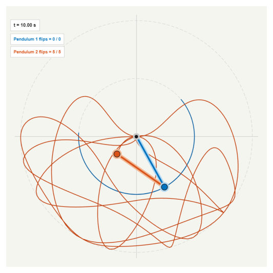
<figcaption class="paper-figure-caption"><b>Fig 1.</b> FIG. 1. A typical chaotic trajectory of the double pendulum. The colored curves trace the paths of the two point masses; in this example, the second pendulum undergoes several flips while the first does not.</figcaption>
</figure>
<figure class="paper-figure-card">
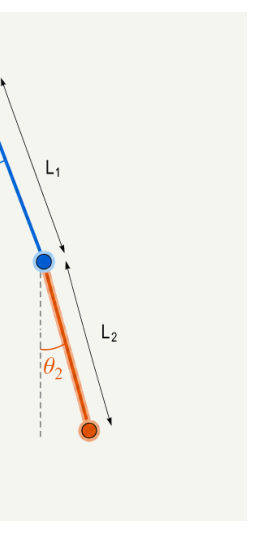
<figcaption class="paper-figure-caption"><b>Fig 2.</b> FIG. 2. An example of a double pendulum system</figcaption>
</figure>
<figure class="paper-figure-card">
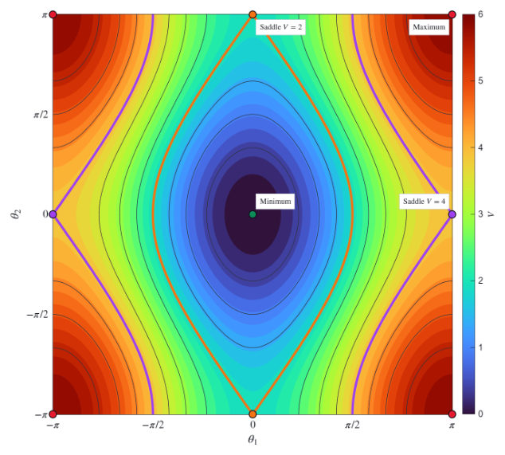
<figcaption class="paper-figure-caption"><b>Fig 3.</b> FIG. 3. Potential energy contour map of the double pendulum with equal lengths and masses, L1 = L2 = 1 and m1 = m2 = 1, in units where g = 1. The corresponding potential energy is V (θ1, θ2) = −2 cos θ1 −cos θ2 + 3.</figcaption>
</figure>
<figure class="paper-figure-card">
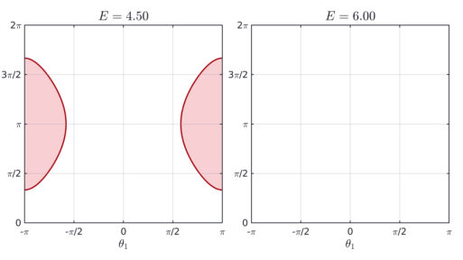
<figcaption class="paper-figure-caption"><b>Fig 4.</b> FIG. 4. Allowed configuration space at different energies For the egalitarian double pendulum</figcaption>
</figure>
<figure class="paper-figure-card">
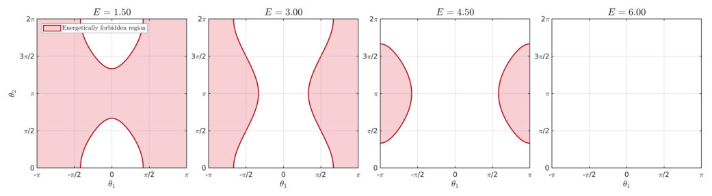
<figcaption class="paper-figure-caption"><b>Fig 5.</b> Figure 4 shows the configuration space region satisfying V (θ1, θ2) ≤E with the energetically forbidden region</figcaption>
</figure>

**Summary.** This work develops a statistical, flux-based method to predict the mean rate of 'flips' in the chaotic double pendulum. By identifying the saddle orbit as the optimal dividing surface, the authors achieve quantitative agreement between their theoretical predictions and extensive numerical simulations. This validates the use of phase-space flux techniques for characterizing chaotic recurrence in classical Hamiltonian systems.

**Why it may be interesting.** The rigorous application of phase-space flux methods, typically used in classical statistical mechanics, to quantify chaotic dynamics and recurrence rates in a mechanical system provides a powerful, generalizable theoretical tool for non-equilibrium dynamics.

Detailed structure

**Main problem.** The paper aims to develop a statistical theory to predict the mean flip rate in the intermediate-energy double pendulum, a prototypical chaotic system.

**Main result.** The flux-based statistical prediction for the mean flip rate shows excellent agreement (1% for ensemble averages) with numerical simulations, validating the ergodic approximation.

**Method.** The prediction is based on calculating the phase-space flux through a carefully chosen dividing surface, identified as the saddle orbit, which naturally avoids recrossings.

**Model / system.** The system is the double pendulum, treated as an autonomous, conservative Hamiltonian system. The dynamics are governed by a Hamiltonian involving potential and kinetic energy terms.

**Key observables.** Mean flip rate, phase-space flux, and the distribution of crossing times.

**Important parameters / regimes.** Total energy (E), mass ratios, and arm lengths (L1, L2).

**Assumptions / limitations.** The primary assumption is the validity of the ergodic approximation, although the authors note limitations when regular regions are present.

**Figures summary.** Figures illustrate typical chaotic trajectories, the system potential energy contours, and comparisons between the flux prediction and simulation results.

**Paper structure.** The paper develops the statistical framework using phase-space flux, refines the definition of the flip dividing surface by analyzing criteria (upright vs. saddle orbit), and finally applies the flux calculation to derive and test the mean flip rate prediction.

Abstract

The intermediate-energy double pendulum is a prototypical chaotic system. Despite its irregular motion, it exhibits recurrent flips - events in which one of the arms passes over the top. We develop a statistical prediction for the mean flip rate in terms of phase space flux. Applying this flux-based approach to the equal-mass, equal arm ("egalitarian") double pendulum, we find excellent agreement between the statistical prediction and numerical simulations: ensemble-averaged flip rates agree at about the 1% level, while even the statistics of individual chaotic trajectories agree at the few-percent level, quantifying the validity of the ergodic approximation. This agreement holds for flips of either arm and over a broad range of energies. This flux-based approach is closely related to that used for the egalitarian three-body system.   A central role is played by the saddle orbits: periodic orbits that tend to the stable saddle eigenmode as the energy approaches the saddle energy from above and approximately follow the ridge of the potential at higher energies. These orbits provide a natural dividing surface for defining flips while avoiding recrossings. Indeed, the resulting distribution of crossing times exhibits a distinct gap. We also present two alternative simplified dividing surfaces, one of which is based on an accurate analytic approximation to the saddle orbits.

[↑ back to top](#top)

### [Maximal Torus Topological Entanglement Entropy in WZW Theories at Bounded Ground-State Degeneracy](http://arxiv.org/abs/2608.20333v1)

**Authors:** Ce Shen  
**Type:** theory · **Category:** strongly correlated electrons · **PDF:** <https://arxiv.org/pdf/2608.20333v1>  
**Analysis basis:** full PDF text, analyzed in chunks

↔ Scroll figures horizontally

<figure class="paper-figure-card">
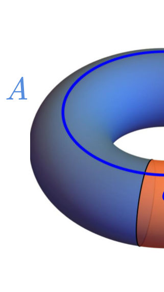
<figcaption class="paper-figure-caption"><b>Fig 1.</b> Figure 1. A torus divided into cylinders A and ¯A. Their two circular boundaries, of lengths ℓ1 and ℓ2, form the entanglement cut. The blue loop carries anyon flux a.</figcaption>
</figure>
<figure class="paper-figure-card">
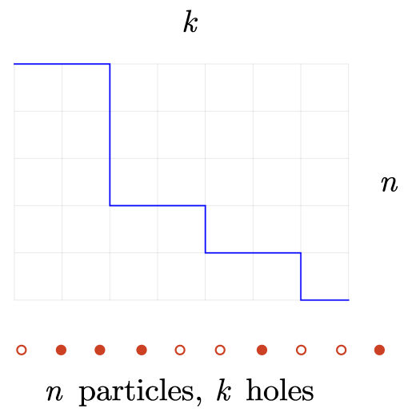
<figcaption class="paper-figure-caption"><b>Fig 2.</b> Figure 2. Integrable Sp(2n)k sectors correspond to lattice paths in an n × k rectangle, or to n occupied sites among n + k ordered sites. Transposition exchanges occupied and empty sites, so n = k is half filling. The path shown has (n, k) = (5, 7).</figcaption>
</figure>

**Summary.** This theoretical paper establishes the upper bound for the topological entanglement entropy in WZW theories, finding it scales quadratically with the logarithm of the system's complexity ($R$). The maximum value is achieved by the symplectic series, providing a rigorous mathematical benchmark for topological order in quantum field theories.

**Why it may be interesting.** The connection between topological entanglement entropy in conformal field theories and universal mathematical constants ($\zeta(3)$) provides deep insights into the structure of quantum entanglement in condensed matter systems, particularly those exhibiting topological order.

Detailed structure

**Main problem.** The paper aims to determine the maximum possible value of the universal contribution to the torus Topological Entanglement Entropy ($\Gamma_{T^2}$) for Wess–Zumino–Witten (WZW) theories, subject to a constraint on the number of simple objects.

**Main result.** The maximum asymptotic value is found to be $\Gamma_{\max}(R) \sim rac{7\zeta(3)}{4\pi^2} q_R^2$ as $R 	o \infty$, a bound attained by the symplectic sequence $	ext{Sp}(2n)_n$.

**Method.** The analysis involves maximizing the ratio of logarithmic quantities derived from the total quantum dimension and the number of simple objects, utilizing entropy–spectral inequalities and asymptotic analysis for various Lie algebra types.

**Model / system.** The study concerns untwisted Wess–Zumino–Witten modular tensor categories $\mathcal{C}(\mathfrak{g}, k)$, which model $(2+1)$-dimensional topological order and are related to Chern–Simons theories.

**Key observables.** Topological Entanglement Entropy contribution ($\Gamma_{T^2}$), Total quantum dimension ($D$), and Categorical Rank ($r(\mathfrak{g}, k)$).

**Important parameters / regimes.** The constraint $r(\mathfrak{g}, k) \le R$, and the asymptotic limit $R 	o \infty$.

**Assumptions / limitations.** The optimization is restricted to untwisted affine simple Lie algebras at positive integral levels, and the analysis relies on asymptotic proportionality between rank and level.

**Figures summary.** Figures illustrate the torus cut for entanglement entropy and provide mathematical statements of the main asymptotic results relating the maximum entropy to the square of the logarithm of the rank bound.

**Paper structure.** The paper systematically analyzes the problem by first defining the TEE contribution, then deriving asymptotic bounds using spectral inequalities, and finally identifying the optimal sequence (symplectic) that achieves the global maximum bound.

Abstract

For an untwisted Wess--Zumino--Witten modular tensor category $\cC(\mathfrak g,k)$, let $r(\mathfrak g,k)$ be the number of simple objects and $\cD(\mathfrak g,k)$ its total quantum dimension. The vacuum-flux state on a torus divided into two cylinders has positive universal entropy contribution $Γ_{T^2}=2\log\cD$. We maximize this quantity over all simple Lie algebras and positive integral levels subject to $r(\mathfrak g,k)\leq R$. If $q_R=\log_2R$, then $Γ_{\max}(R)\sim[7ζ(3)/(4π^2)]q_R^2$ as $R\to\infty$.   The sequence $Sp(2n)_n$ attains the asymptotic coefficient. At equal rank   and level, the Fourier expansion of the type-$C$ root product loses its even modes, leaving $2π^{-2}\sum_{m\,\mathrm{odd}}m^{-3}=7ζ(3)/(4π^2)$. An entropy--spectral inequality proves optimality among the classical families, while rank--level duality and fixed-rank estimates control unbalanced and exceptional sequences.

[↑ back to top](#top)

### [Moore--Read construction and explicit monodromies of Laughlin states on Riemann surfaces](http://arxiv.org/abs/2608.19619v1)

**Authors:** Kiyoon Eum  
**Type:** theory · **Category:** strongly correlated electrons · **PDF:** <https://arxiv.org/pdf/2608.19619v1>  
**Analysis basis:** full PDF text, analyzed in chunks

↔ Scroll figures horizontally

<figure class="paper-figure-card">
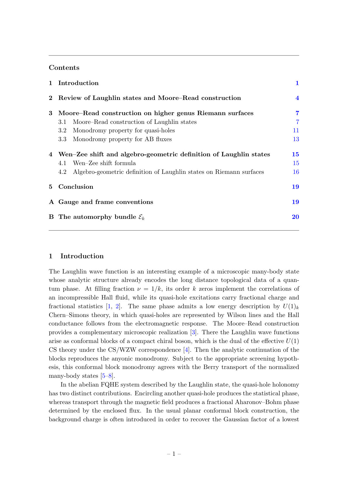
<figcaption class="paper-figure-caption"><b>Fig 1.</b> Low-resolution page preview, page 2</figcaption>
</figure>
<figure class="paper-figure-card">
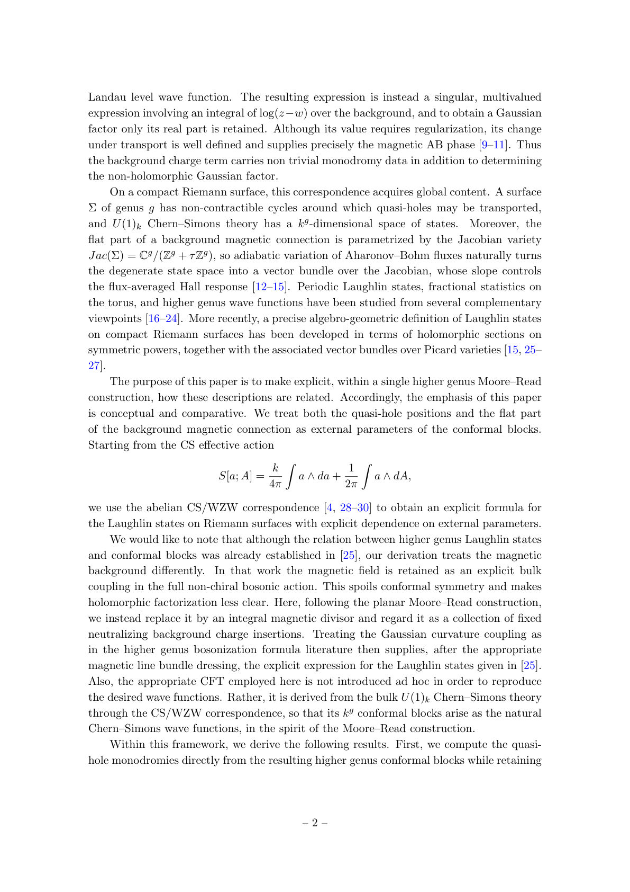
<figcaption class="paper-figure-caption"><b>Fig 2.</b> Low-resolution page preview, page 3</figcaption>
</figure>
<figure class="paper-figure-card">
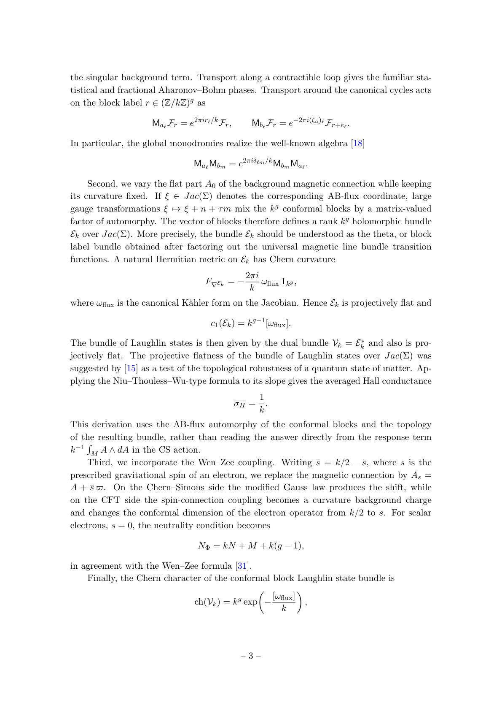
<figcaption class="paper-figure-caption"><b>Fig 3.</b> Low-resolution page preview, page 4</figcaption>
</figure>
<figure class="paper-figure-card">
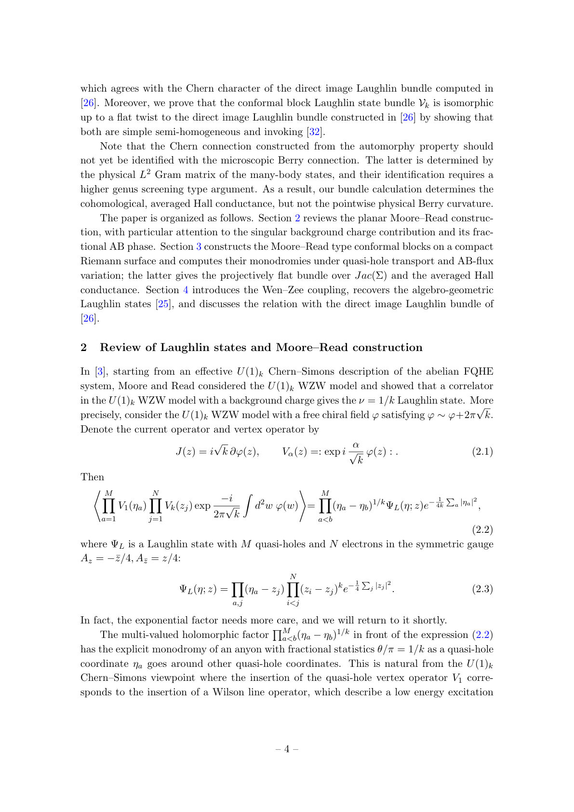
<figcaption class="paper-figure-caption"><b>Fig 4.</b> Low-resolution page preview, page 5</figcaption>
</figure>
<figure class="paper-figure-card">
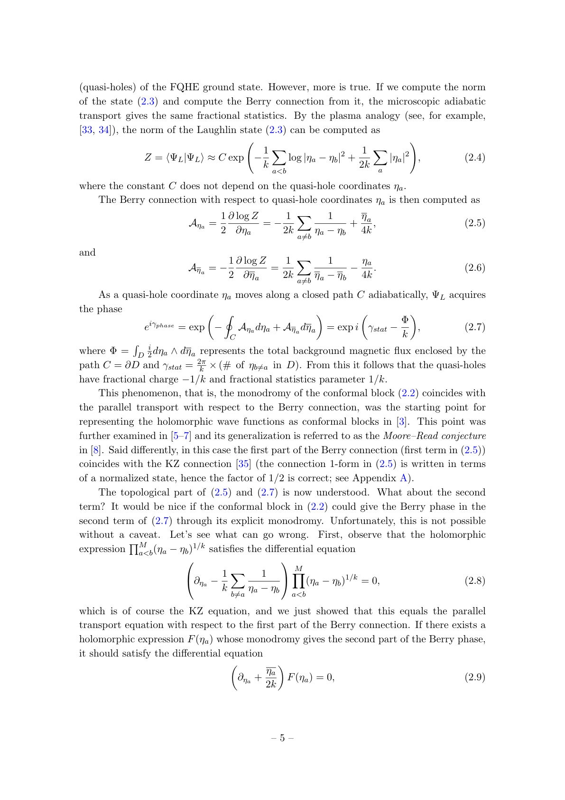
<figcaption class="paper-figure-caption"><b>Fig 5.</b> Low-resolution page preview, page 6</figcaption>
</figure>

**Summary.** This paper develops a rigorous mathematical framework to describe Laughlin states for the Fractional Quantum Hall Effect on curved surfaces. By linking the physical state to a U(1)_k Chern-Simons theory, the authors compute the topological properties, such as monodromies and the Hall conductance, using advanced concepts from algebraic geometry and conformal field theory.

**Why it may be interesting.** The deep connection between topological field theory (Chern-Simons theory), geometric quantization (vector bundles over Jacobians), and the physical properties of strongly correlated electron systems (FQHE) provides powerful mathematical tools for understanding emergent quantum phenomena.

Detailed structure

**Main problem.** The paper aims to rigorously relate the Moore--Read construction of Laughlin states on Riemann surfaces to their low-energy description via U(1)_k Chern--Simons theory.

**Main result.** The authors compute the explicit monodromies of the Laughlin states, showing they match the adiabatic holonomies derived from the CS theory, and establish the state bundle's isomorphism with the direct image Laughlin bundle.

**Method.** The work uses the CS/WZW correspondence to derive the wavefunctional on Riemann surfaces, computes monodromies via conformal blocks, and employs algebraic geometry to analyze the resulting vector bundles.

**Model / system.** The system is the Fractional Quantum Hall Effect (FQHE) described by Laughlin states at filling fraction $\nu = 1/k$. The theoretical framework involves Chern--Simons theory on compact Riemann surfaces $\Sigma$ of genus $g \ge 1$.

**Key observables.** Hall conductance ($\sigma_H = 1/k$), quasi-hole monodromies, and the characteristic classes of the state bundle.

**Important parameters / regimes.** Filling fraction $1/k$, genus $g$ of the surface $\Sigma$, and the background magnetic flux $N_{\Phi}$.

**Assumptions / limitations.** The identification of the Chern connection with the microscopic Berry connection requires a higher genus screening type argument, and the calculation determines the *averaged* Hall conductance, not the pointwise Berry curvature.

**Paper structure.** The paper progresses by first establishing the correspondence on the plane, then generalizing the wavefunctional derivation to Riemann surfaces using the effective CS Lagrangian, and finally comparing the resulting automorphy bundle structure with known algebro-geometric descriptions of Laughlin states.

Abstract

We revisit the Moore--Read construction of the $ν=1/k$ Laughlin states on compact Riemann surfaces, deriving their conformal blocks from $U(1)_k$ Chern--Simons theory through the CS/WZW correspondence. We compute their explicit monodromies under quasi-hole transport and Aharonov--Bohm flux insertion, and conjecture that these coincide with the corresponding adiabatic holonomies. Under this identification, we recover classical results on Laughlin states including the flux-averaged Hall conductance $1/k$ via a vector bundle of Laughlin states over $Jac(Σ)$. We also relate our construction to the recently developed algebro-geometric approach to higher genus Laughlin states.

[↑ back to top](#top)

### [Parallel Quantum Advantage with Limited Adaptivity Requires Structure](http://arxiv.org/abs/2608.20297v1)

**Authors:** Qipeng Liu, Saachi Mutreja  
**Type:** theory · **Category:** quantum information and computing · **PDF:** <https://arxiv.org/pdf/2608.20297v1>  
**Analysis basis:** full PDF text, analyzed in chunks

↔ Scroll figures horizontally

<figure class="paper-figure-card">
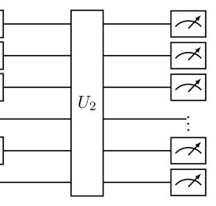
<figcaption class="paper-figure-caption"><b>Fig 1.</b> Figure 1: Parallel query algorithms considered in this work. The last wire indicates the ancilla.</figcaption>
</figure>

**Summary.** This work makes significant progress on the Simulation Conjecture by proving that quantum algorithms utilizing massively parallel queries can be efficiently simulated classically. The authors extend these results to handle limited adaptivity, providing strong theoretical bounds on when quantum speedups are achievable. This research deepens the understanding of the structural requirements necessary for genuine quantum computational advantage.

**Why it may be interesting.** While focused on query complexity, the rigorous mathematical techniques involving distribution coupling and simulation bounds are fundamental tools applicable to analyzing the complexity of quantum processes in general.

Detailed structure

**Main problem.** The paper investigates the Simulation Conjecture, which posits that quantum query algorithms admit efficient classical simulation unless the input structure is highly specialized.

**Main result.** The authors prove simulation theorems for quantum algorithms involving massively parallel queries, extending results to algorithms with bounded adaptivity or polynomial classical preprocessing.

**Method.** The core method involves establishing a 'coupling theorem' relating the uniform distribution over oracles to 'dense distributions,' allowing the simulation of quantum advantage claims.

**Model / system.** The model is quantum query algorithms acting on boolean inputs, focusing specifically on the computational complexity derived from parallel query structures.

**Key observables.** Acceptance probability, error parameters (epsilon, delta), and query complexity (T).

**Important parameters / regimes.** The number of parallel query layers (d) and the degree of adaptivity (constant rounds or polynomial classical queries).

**Assumptions / limitations.** The analysis builds upon the Dense Indistinguishability Conjecture, which is used to bound the difference in success probabilities between uniform and dense oracle distributions.

**Figures summary.** Figure 1 illustrates the structure of parallel query algorithms, showing the preparation stage, the massively parallel query stage, and the final measurement.

**Paper structure.** The paper progresses by first tackling purely parallel query algorithms, then extending the simulation bounds to include limited adaptive quantum or classical prefixes, culminating in bounds for constant rounds of adaptivity.

Abstract

Aaronson and Ambainis (Theory of Computing, 2014) conjectured that quantum query algorithms admit efficient almost-everywhere classical simulation: for any $T$-query quantum algorithm, its acceptance probability can be approximated on a $(1-δ)$ fraction of inputs, up to $ε$ additive error, using $\mathrm{poly}(T, 1/ε, 1/δ)$ classical queries. At a high level, the conjecture suggests that exponential quantum speedups are possible only on sufficiently structured inputs.   In this work, we make progress on this conjecture by proving it for quantum algorithms that make massively parallel quantum queries. In contrast, Yamakawa and Zhandry (Journal of the ACM, 2024) showed that quantum algorithms restricted to parallel queries can still achieve exponential speedups over classical algorithms for sampling problems. We establish our simulation theorem by proving the stronger statement that parallel-query quantum algorithms cannot distinguish the uniform distribution over oracles from oracles drawn from so-called "dense distributions". Our main technical contribution is a coupling theorem that relates the uniform distribution over oracles to oracles drawn from dense distributions.   We further extend this approach beyond the purely parallel setting, obtaining simulation theorems both for algorithms with a bounded quantum-query prefix followed by a massively parallel quantum-query stage, and for hybrid algorithms that make an arbitrary polynomial number of adaptive classical queries before the massively parallel quantum-query stage. Finally, using the parallel-query simulation theorem as a base case, we obtain simulation theorems for quantum algorithms with constant rounds of adaptivity.

[↑ back to top](#top)

### [PPT Entanglement with Correlated Catalysis: Monotones and Irreversibility](http://arxiv.org/abs/2608.20063v1)

**Authors:** Jingsong Ao, Aby Philip, Alexander Streltsov  
**Type:** theory · **Category:** quantum information and computing · **PDF:** <https://arxiv.org/pdf/2608.20063v1>  
**Analysis basis:** full PDF text, analyzed in chunks

↔ Scroll figures horizontally

<figure class="paper-figure-card">
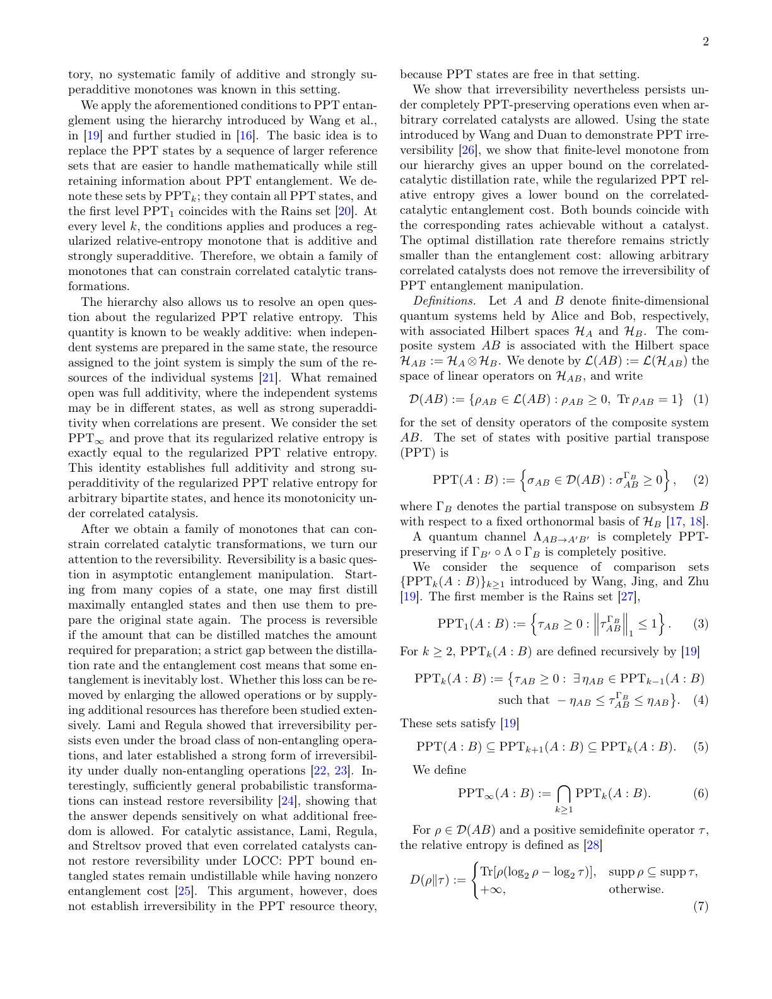
<figcaption class="paper-figure-caption"><b>Fig 1.</b> Low-resolution page preview, page 2</figcaption>
</figure>
<figure class="paper-figure-card">
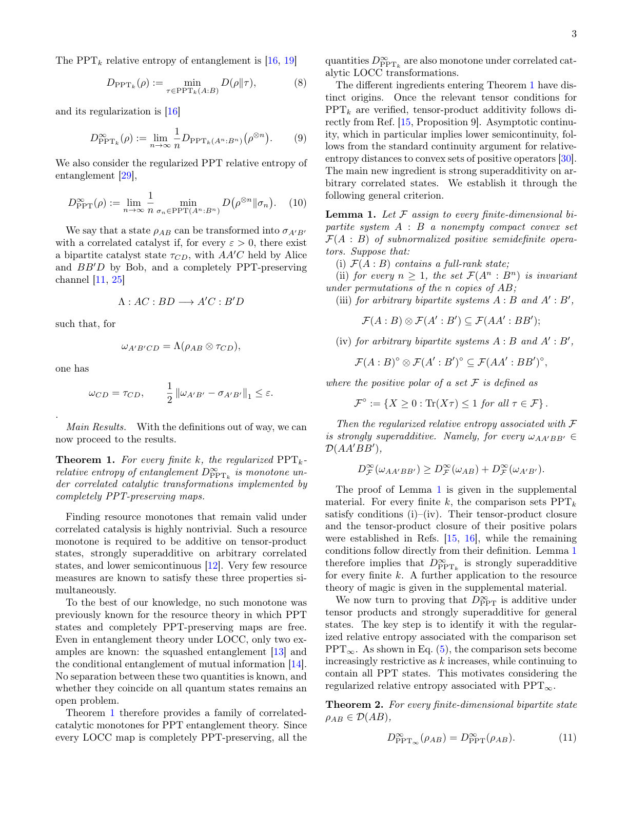
<figcaption class="paper-figure-caption"><b>Fig 2.</b> Low-resolution page preview, page 3</figcaption>
</figure>
<figure class="paper-figure-card">
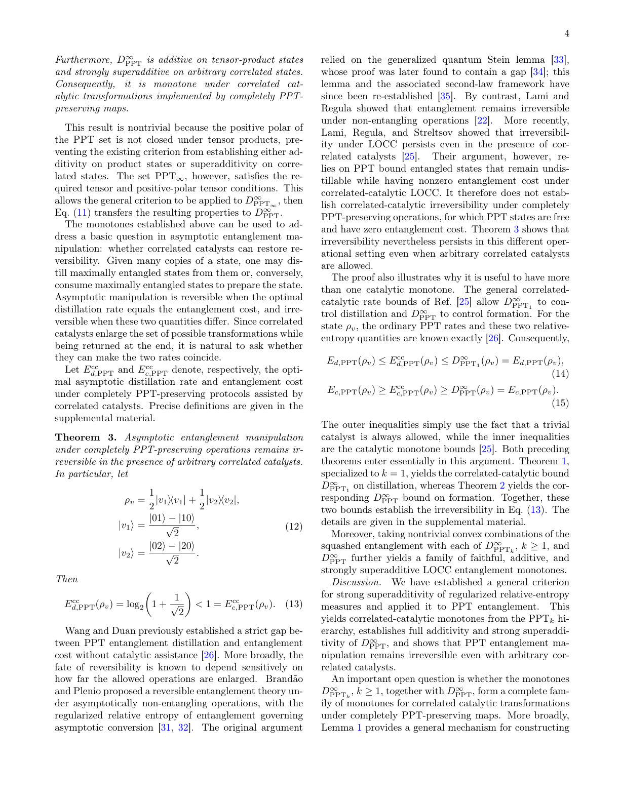
<figcaption class="paper-figure-caption"><b>Fig 3.</b> Low-resolution page preview, page 4</figcaption>
</figure>
<figure class="paper-figure-card">
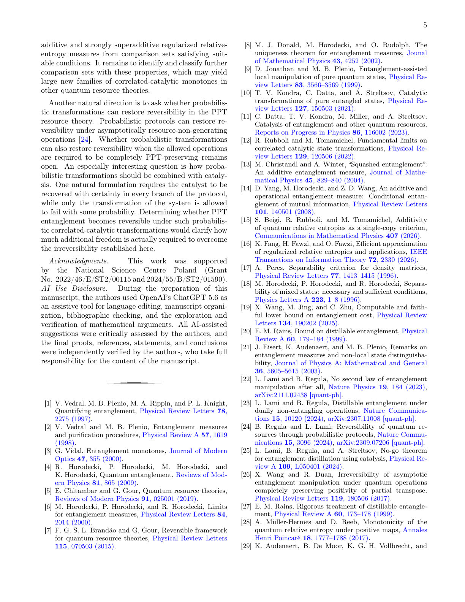
<figcaption class="paper-figure-caption"><b>Fig 4.</b> Low-resolution page preview, page 5</figcaption>
</figure>
<figure class="paper-figure-card">
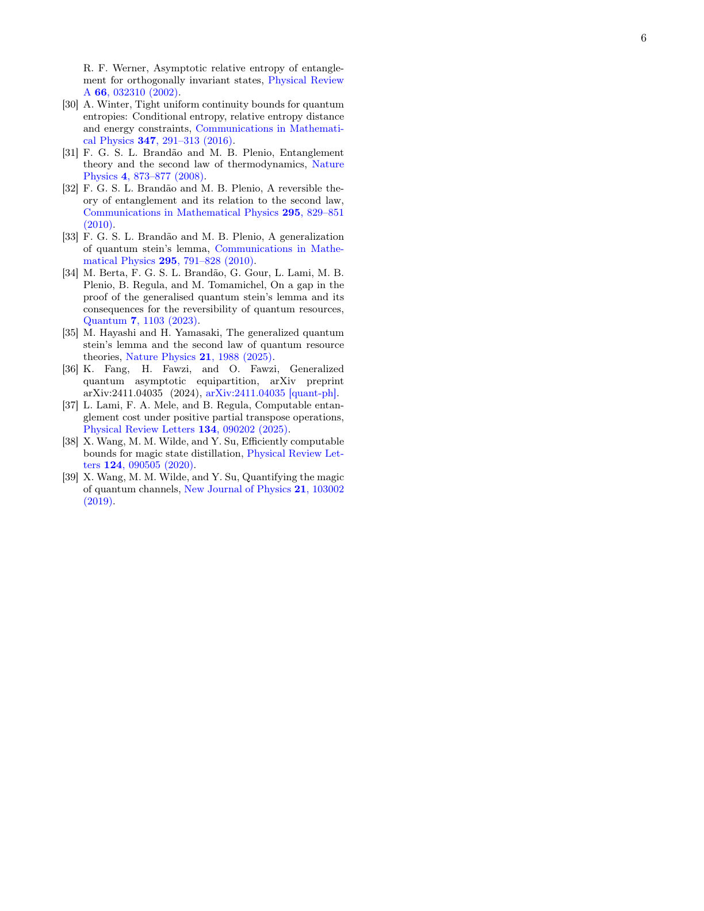
<figcaption class="paper-figure-caption"><b>Fig 5.</b> Low-resolution page preview, page 6</figcaption>
</figure>

**Summary.** This paper investigates the limits of entanglement manipulation when using correlated quantum catalysts within the PPT resource theory. The authors prove that the relevant entanglement measure, the regularized PPT relative entropy, possesses strong superadditivity. Most significantly, they show that even the presence of arbitrary correlated catalysts cannot restore asymptotic reversibility, confirming fundamental limitations in mixed-state entanglement manipulation.

**Why it may be interesting.** This work provides fundamental theoretical tools (monotones, additivity proofs) for characterizing resource theories beyond standard LOCC, which is crucial for understanding the limits of quantum computation and communication protocols.

Detailed structure

**Main problem.** To determine the fundamental limitations on quantum state manipulation (entanglement theory) when correlated catalysts are freely available, specifically within the Positive Partial Transpose (PPT) resource theory.

**Main result.** The regularized PPT relative entropy is proven to be fully additive and strongly superadditive, and crucially, correlated catalysis cannot restore asymptotic reversibility for mixed-state entanglement.

**Method.** The authors use resource monotones, specifically regularized relative-entropy measures, and apply structural conditions (like the generalized quantum Stein lemma) to prove additivity and strong superadditivity properties.

**Model / system.** The study concerns bipartite quantum states $
ho_{AB}$ and the resource theory defined by the PPT condition, which governs the allowed operations (completely PPT-preserving channels) and the assistance provided by correlated catalysts.

**Key observables.** Regularized PPT relative entropy ($D_{\infty}^{	ext{PPT}}(
ho)$), entanglement distillation rate ($E_{c,d}^{	ext{PPT}}$), and entanglement cost ($E_{c,c}^{	ext{PPT}}$).

**Important parameters / regimes.** The degree of catalysis (arbitrary correlated catalysts) and the specific resource theory (PPT).

**Assumptions / limitations.** The analysis relies on establishing structural conditions that guarantee strong superadditivity for the relative-entropy measures and the applicability of the generalized quantum Stein lemma.

**Paper structure.** The paper systematically develops the framework by defining the PPT resource theory, proving the additivity and strong superadditivity of the regularized relative entropy measure, and finally demonstrating the persistence of irreversibility even with catalytic assistance.

Abstract

Quantum catalysts can overcome otherwise impossible quantum state transformations without being consumed, and allowing them to become correlated with the output makes this assistance substantially more powerful. This raises a fundamental question for entanglement theory: which limitations on state manipulation remain when such correlated catalysts are freely available? We answer this question in the positive-partial-transpose (PPT) resource theory, which allows a substantially broader class of operations than local operations and classical communication (LOCC). We identify general conditions under which regularized relative-entropy measures become strongly superadditive, and use them to construct monotones that constrain correlated catalytic PPT transformations without any knowledge of the catalyst. In particular, we prove that the regularized PPT relative entropy is fully additive and strongly superadditive, resolving an open problem in entanglement theory. Most importantly, these constraints show that even arbitrary correlated catalysts cannot restore asymptotic reversibility: for an explicit state, the optimal entanglement distillation rate remains strictly smaller than the entanglement cost. Thus, substantial catalytic assistance does not remove some of the fundamental limitations of mixed-state entanglement manipulation.

[↑ back to top](#top)

### [Proper Learning of Shallow All-to-All Quantum Circuits](http://arxiv.org/abs/2608.20162v1)

**Authors:** Steven Kordonowy, Jacob Watkins  
**Type:** theory · **Category:** quantum information and computing · **PDF:** <https://arxiv.org/pdf/2608.20162v1>  
**Analysis basis:** full PDF text, analyzed in chunks

↔ Scroll figures horizontally

<figure class="paper-figure-card">
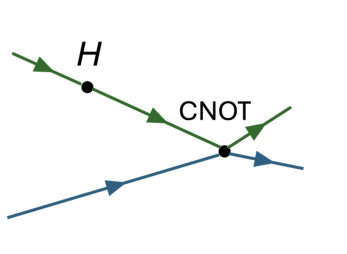
<figcaption class="paper-figure-caption"><b>Fig 1.</b> Figure 1: Example correspondence between standard quantum circuit notation and directed graph representation. Colors here are used to label distinct qubits. Each unitary gate is represented as a labeled vertex with equal input and output degrees.</figcaption>
</figure>
<figure class="paper-figure-card">
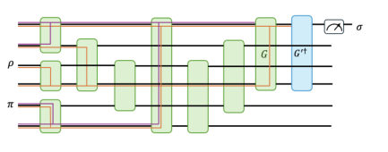
<figcaption class="paper-figure-caption"><b>Fig 2.</b> Figure 2: Schematic of learning algorithm based on a qubit’s (a) forward and (b) backwards light- cone, shown on the same 6-qubit circuit. Green boxes indicate unitary 2-qubit gates. Colored lines indicate lightcones originating from ρ (forward) or σ (backward) in the presence of G (orange) or with G removed (purple). In both schemes, gate G is chosen for local inversion via trial gate G′. The input-output pair of qubits (ρ, σ) is used as for testing successful inversion, namely, whether GG′† is equal to two single-qubit gates. By comparison, qubit π is not useful as a pair with ρ (a) or σ (b) because the absence or presence of G in the circuit does not change its connectedness to the other...</figcaption>
</figure>
<figure class="paper-figure-card">
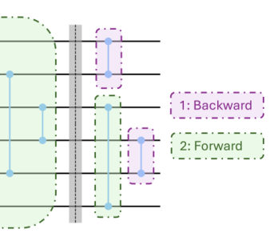
<figcaption class="paper-figure-caption"><b>Fig 3.</b> Figure 5: Example of a 6 qubit, 4 layer circuit with 2-local gates that cannot be learned by forward- only or backward-only pass using single-gate local inversions. Here, “learning” means there is always an available pivot gate (outer gate with good lightcones), and we tacitly assume this allows for some removal procedure. Learning proceeds in one direction until no more pivots are present on that side (front or back), and at that point one switches to learning the other direction. Although a single forward or backward pass cannot clear the circuit, it can be learned using alternations of forward and backward lightcone protocols. See subcaptions for additional details.</figcaption>
</figure>
<figure class="paper-figure-card">
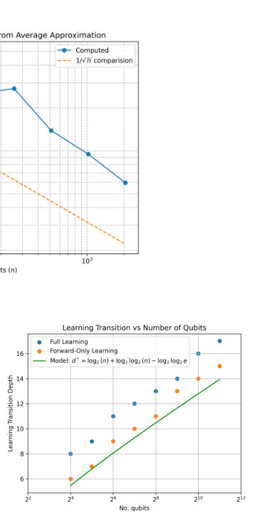
<figcaption class="paper-figure-caption"><b>Fig 4.</b> Figure 6: Numerical simulations of light cone growth and local inversion algorithm for all-to-all random circuit architecture of Definition 5.2 (k = 2). (a) Max-of-max deviation of Sℓcompared with average variant ¯Sℓ, normalized by n. Each data point is the maximum deviation, over 100 simulations, of the maximum deviation over all timesteps ℓ. Comparison with 1/√n is provided as rough expected rate of error decay. (b) Plot of circuit learnability for various depths and qubit counts. Learnability here means “good lightcones”: at every stage there is a pivot gate, which we thereby assume can be removed via tomographic testing of causal relations. (c) Transition depth at which empirical...</figcaption>
</figure>

**Summary.** This paper develops a framework to determine the specific gates within a shallow quantum circuit by probing its causal structure using lightcones. It finds that random, all-to-all circuits undergo a sharp transition in learnability at a depth scaling as $\log_2 n + \log_2 \log_2 n$. This result has implications for understanding the inherent complexity of quantum circuits.

**Why it may be interesting.** The analysis of circuit learnability thresholds provides fundamental insights into the complexity and structure of quantum computations, which is relevant for understanding the limits of quantum information processing and potential cryptographic security.

Detailed structure

**Main problem.** The work addresses the problem of 'proper learning' of shallow quantum circuits, meaning determining the specific gates used given query access and knowledge of the circuit's structure.

**Main result.** For random, all-to-all, two-local circuits, the ensemble exhibits a sharp learnability transition at a depth $d^* \sim \log_2 n + \log_2 \log_2 n$ in the large size limit.

**Method.** The authors develop a meta-algorithmic framework based on iterative local gate inversions at the front and back of the circuit, utilizing lightcone analysis to probe causal structure.

**Model / system.** The model involves unitary quantum circuits acting on $n$ qubits, specifically analyzing random, all-to-all, two-local circuits. The analysis uses concepts like lightcones and causal boundaries derived from the circuit graph structure.

**Key observables.** Lightcone growth, the learnability threshold $d^*$, and the causal boundaries defined by lightcone differences.

**Important parameters / regimes.** Circuit depth ($d$), number of qubits ($n$), and the specific structure (all-to-all, two-local) of the random circuit ensemble.

**Assumptions / limitations.** The analysis assumes the circuit is 'shallow' (low depth) and builds upon prior work for brickwork circuits, while also distinguishing its setting from quantum cryptography.

**Figures summary.** Figure 1 illustrates the correspondence between standard quantum circuit notation and a directed graph representation; Figure 2 schematically shows the learning algorithm using forward and backward lightcones.

**Paper structure.** The paper establishes the problem of circuit learning, develops the lightcone diagnostic tool, and applies this framework to analyze the learnability transition for specific random circuit ensembles, culminating in the determination of the threshold depth $d^*$.

Abstract

This work considers a variation on the problem of learning shallow quantum circuits. Given query access to the circuit, as well as knowledge of its gate layout, we consider the task of learning the specific gates used in the circuit, producing an operationally-equivalent circuit matching this structure. Building on recent work for learning Haar random brickwork circuits, we identify a meta-algorithmic framework for learning broad classes of circuits based on iterative local gate inversions at the front and back of the circuit. We apply these techniques to study random, all-to-all, two-local circuits, and provide analytical and numerical evidence that this ensemble undergoes a sharp learnability transition at depth $d^* \sim \log_2 n + \log_2\log_2 n$ in the large size limit, based on an analysis of lightcone growth. These results have implications for recently proposed quantum cryptographic schemes based on the difficulty of circuit learning, though there are important distinctions with respect to our setting that suggest avenues for future study.

[↑ back to top](#top)

### [Quantum chaos and late-time equipartition of symmetry-resolved Krylov complexity](http://arxiv.org/abs/2608.19346v1)

**Authors:** Jayashish Das, Suman Das, Juan F. Pedraza, Le-Chen Qu  
**Type:** theory · **Category:** statistical mechanics · **PDF:** <https://arxiv.org/pdf/2608.19346v1>  
**Analysis basis:** full PDF text, analyzed in chunks

↔ Scroll figures horizontally

<figure class="paper-figure-card">
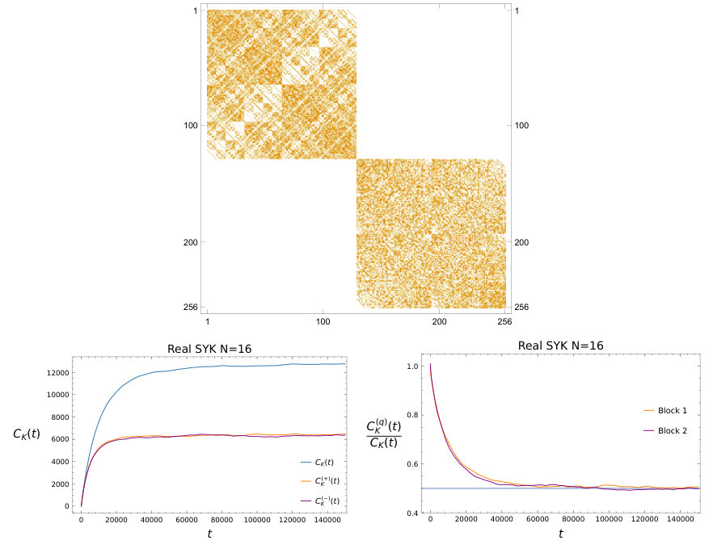
<figcaption class="paper-figure-caption"><b>Fig 1.</b> Figure 1. For the real SYK model with N = 16, the upper panel shows the block-diagonal structure of the Hamiltonian in (5.6) in the fermion-parity basis. The two parity sectors have equal Hilbert- space dimensions, d+ = d−= 2N/2−1 = 128. The bottom-left panel shows the time evolution of the full Krylov complexity CK(t) and the parity-resolved complexities C(q,+) K (t) and C(q,−) K (t). The bottom-right panel displays the corresponding fractions C(q,±) K (t)/CK(t). The horizontal lines denote the expected late-time values d2 q/  P</figcaption>
</figure>
<figure class="paper-figure-card">
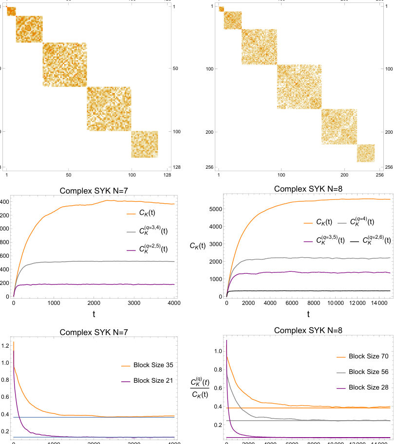
<figcaption class="paper-figure-caption"><b>Fig 2.</b> Figure 2. The upper-left and upper-right panels show the block-diagonal structure of the complex SYK Hamiltonian in (5.16), expressed in the number-operator basis, for N = 7 and N = 8, respectively. The corresponding sector dimensions are dq = 7 q  = 1, 7, 21, 35, 35, 21, 7, 1 for N = 7 and dq = 8 q  = 1, 8, 28, 56, 70, 56, 28, 8, 1 for N = 8. The central panels display the full Krylov</figcaption>
</figure>
<figure class="paper-figure-card">
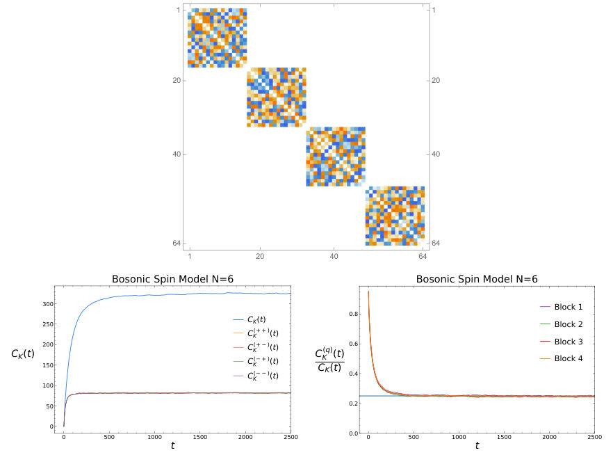
<figcaption class="paper-figure-caption"><b>Fig 3.</b> Figure 3. The upper panel shows the block-diagonal structure of the Hamiltonian in Eq. (5.42) in the simultaneous (Γx, Γz) symmetry eigenbasis. All four symmetry sectors have equal Hilbert- space dimension dq = 2N−2 = 16. The bottom-left panel shows the time evolution of the full Krylov complexity CK(t) and the symmetry-resolved complexities C(q) K (t) for the four Z2 × Z2 sectors q = (++), (+−), (−+), (−−), for the bosonic spin model with N = 6. The bottom-right panel displays the corresponding fractional complexities C(q) K (t)/CK(t). The horizontal line denotes the predicted late-time value d2 q/ P</figcaption>
</figure>
<figure class="paper-figure-card">
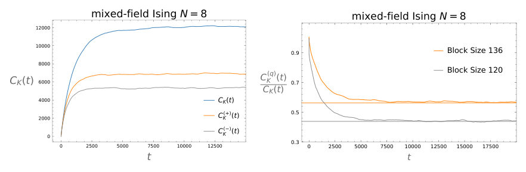
<figcaption class="paper-figure-caption"><b>Fig 4.</b> Figure 4. The upper panel shows the block-diagonal structure of the Hamiltonian in the reflection- parity basis defined by Eq. (5.64). The dimensions of the reflection-even and reflection-odd sectors are d+ = 136 and d−= 120, respectively. The bottom-left panel shows the time evolution of the full Krylov complexity CK(t) and the symmetry-resolved complexities C(±) K (t) for the mixed-field Ising chain with N = 8. The bottom-right panel displays the corresponding fractional complexities C(q) K (t)/CK(t), with q = ±1. The horizontal lines denote the predicted late-time values d2 q/ P</figcaption>
</figure>
<figure class="paper-figure-card">
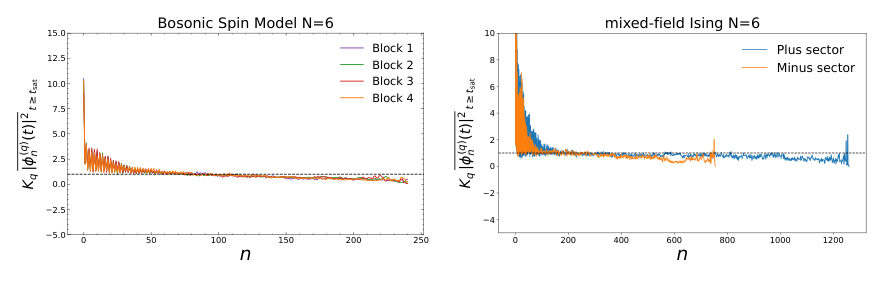
<figcaption class="paper-figure-caption"><b>Fig 5.</b> Figure 5. Late-time rescaled probability distributions Kq |ϕ(q) n (t)|2 t≥tsat for each symmetry sector of the chaotic bosonic spin model (left) and the chaotic mixed-field Ising model (right), both for N = 6, where Kq denotes the corresponding sector Krylov dimension. The horizontal dashed</figcaption>
</figure>

**Summary.** This paper analyzes how quantum chaos manifests in many-body systems by studying symmetry-resolved Krylov complexity. It proves that in the late-time limit, the total complexity is simply the sum of the complexities from each independent symmetry sector. This finding offers a robust, dimension-dependent diagnostic tool for characterizing quantum chaos beyond simple early-time growth measurements.

**Why it may be interesting.** The focus on complexity measures and their late-time saturation provides a powerful, quantifiable diagnostic tool for characterizing the transition between integrable and chaotic regimes in complex quantum systems.

Detailed structure

**Main problem.** The study investigates quantum chaos and the late-time equipartition of symmetry-resolved Krylov complexity in finite-dimensional quantum many-body systems.

**Main result.** The late-time Krylov complexity is found to be additive over independent symmetry sectors, leading to a dimension-weighted equipartition scaling distinct from early-time predictions.

**Method.** The analysis employs the Krylov complexity, which measures operator growth via the Liouvillian superoperator, and decomposes the dynamics by exploiting conserved symmetries.

**Model / system.** The work applies to general chaotic quantum many-body systems, with numerical verification using the real and complex SYK models, a chaotic bosonic spin model, and the mixed-field Ising chain.

**Key observables.** Krylov complexity ($C_K$), symmetry-resolved Krylov complexity ($C_q^K$), and the late-time saturation value of these complexities.

**Important parameters / regimes.** The late-time saturation regime ($t_{	ext{sat}} \lesssim t \ll t_{	ext{rec}}$) and the dimensions of the accessible operator spaces ($d_q$).

**Assumptions / limitations.** The analysis assumes the absence of additional Liouvillian degeneracies and relies on the late-time delocalization of the Krylov wavefunction.

**Figures summary.** Figure 6 compares the standard Arnoldi vs. modified Lanczos construction for the mixed-field Ising chain, demonstrating the modified algorithm correctly identifies the true full Krylov dimension.

**Paper structure.** The paper establishes the general framework by defining symmetry-resolved Krylov complexity, proves the additivity of the complexity in the late-time limit, and supports these analytic predictions with numerical studies on several specific quantum spin models.

Abstract

We study symmetry-resolved Krylov complexity in finite-dimensional chaotic quantum many-body systems. When both the Hamiltonian and the initial operator commute with a conserved charge, the operator dynamics decomposes into independent symmetry sectors, each with its own Krylov chain. We show that, after saturation, the unresolved Krylov complexity is additive over symmetry sectors. In the absence of additional Liouvillian degeneracies, the late-time contribution of a sector with Hilbert-space dimension $d_q$ is controlled by $d_q(d_q-1)$, leading to a dimension-weighted equipartition that approaches the simple large-sector scaling $d_q^2/\sum_{q'}d_{q'}^2$. This late-time rule differs from the early-time weighted-average discussed in the literature and is governed instead by the dimensions of the accessible operator spaces. We support the analytic prediction with numerical studies of the real and complex SYK models, a chaotic bosonic spin model, and the mixed-field Ising chain. Our results show that resolving exact symmetries is essential for interpreting the saturation value of Krylov complexity as a diagnostic of chaotic operator growth.

[↑ back to top](#top)

### [Radial Convex Geometry of Quantum States and Its Relation to Best Separable Approximation](http://arxiv.org/abs/2608.20050v1)

**Authors:** Haonan Qiang  
**Type:** theory · **Category:** quantum information and computing · **PDF:** <https://arxiv.org/pdf/2608.20050v1>  
**Analysis basis:** full PDF text, analyzed in chunks

↔ Scroll figures horizontally

<figure class="paper-figure-card">
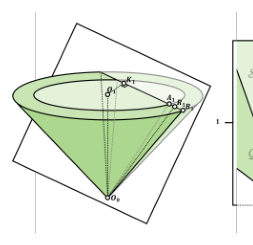
<figcaption class="paper-figure-caption"><b>Fig 1.</b> Figure 1: A two-dimensional section of the high-dimensional quantum- state geometry containing the points O, A, B, and R. Since −−→ OR is a convex combination of −→ OA and −−→ OB, these points lie in a common plane. The higher- dimensional convex geometry can therefore be studied in this plane without changing the geometric relations used below.</figcaption>
</figure>
<figure class="paper-figure-card">
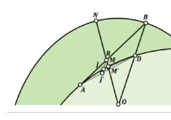
<figcaption class="paper-figure-caption"><b>Fig 2.</b> Figure 2: Geometric construction for the BSA decomposition. The points O, A, B, and R lie in a common two-dimensional subspace. The point A represents the separable component of the BSA, B the entangled component, and R the target state. The points D, M, and N are the intersections of the rays OB and OR with the boundaries of the separable-state and quantum- state sets. The point C belongs to the intersection of the two boundaries within the chosen two-dimensional subspace. The auxiliary points J, J′, and M′ are introduced for the subsequent geometric derivation.</figcaption>
</figure>

**Summary.** This paper develops a geometric measure, the relative entanglement degree $Q(
ho)$, to quantify bipartite entanglement using the convex geometry of quantum states. It applies this framework to the Best Separable Approximation (BSA), deriving rigorous bounds that relate the BSA decomposition weight to the state's geometric position. The results offer a simple, geometric description connecting entanglement, robustness, and the structure of the quantum state space.

**Why it may be interesting.** This work provides a powerful, unified geometric framework to quantify entanglement, connecting abstract concepts like the BSA to measurable geometric distances within the state space, which is highly relevant for understanding quantum resource theories.

Detailed structure

**Main problem.** The paper investigates bipartite entanglement by analyzing the convex geometry of quantum states and relating this geometric structure to the Best Separable Approximation (BSA).

**Main result.** It derives geometric bounds relating the BSA weight ($p_0$) to entanglement measures like the relative entanglement degree $Q(
ho)$, showing that the entangled component of the BSA has an entangled-space size no smaller than the original state's measure.

**Method.** The authors employ a geometric approach, defining entanglement measures based on the relative positions of the quantum state boundary and the separable state boundary within the state space, using the maximally mixed state as a reference point.

**Model / system.** The analysis focuses on bipartite quantum systems ($	ext{HA} \otimes 	ext{HB}$) described by density operators $
ho$. The theory is applied to the two-qubit case, where separability is characterized by the PPT criterion.

**Key observables.** Geometric entanglement quantities $G(
ho)$, $Q(
ho)$, and the BSA weight $p_0$.

**Important parameters / regimes.** The dimensions of the subsystems ($d_A, d_B$), the entanglement parameters $p$ and $p_0$, and the geometric ratios $L(
ho)$.

**Assumptions / limitations.** The analysis assumes the optimality of the BSA decomposition and, for the two-qubit case, relies on the PPT criterion being necessary and sufficient for separability.

**Figures summary.** Figure 2 illustrates the geometric construction in a 2D subspace containing key state points (O, A, B, R), defining various geometric relationships.

**Paper structure.** The paper introduces geometric quantities based on state space boundaries, applies these to the BSA decomposition, derives general bounds relating the BSA weight to these geometric measures, and finally specializes these results to the two-qubit case using the PPT criterion.

Abstract

We study bipartite entanglement from the convex geometry of quantum states. Taking the maximally mixed state as a reference point, we define a geometric entangled-space quantity $G(ρ)=[1-L(ρ)]/L(ρ)$ from the relative positions of the separable and quantum-state boundaries, and introduce a relative entanglement degree $Q(ρ)=[(1-p)/p]/G(ρ)$ by comparing it with the robustness relative to the maximally mixed state.   We apply this geometric construction to the Best Separable Approximation (BSA). For the optimal decomposition, we derive the general bound $(1-p)L_B/[p(1-L_B)]\leq p_0\leq Q(ρ)$ and show that the entangled component of the BSA has an entangled-space size no smaller than that of the original mixed state, namely $[1-L_R]/L_R\leq[1-L_B]/L_B$.   For two-qubit states, the BSA entangled component is a pure entangled state. Using the PPT criterion, its geometric parameter can be evaluated explicitly, giving the bound $(1-p)/(2p)\leq p_0\leq Q(ρ)$. These results provide a simple geometric description of the relation between BSA, robustness, and the entangled region of the quantum-state space.

[↑ back to top](#top)

### [Resonance Raman spectroscopy from ab initio Hagedorn wavepacket dynamics](http://arxiv.org/abs/2608.19985v1)

**Authors:** Davide Barbiero, Léa Zupan, Jiří J. L. Vaníček  
**Type:** theory · **Category:** other · **PDF:** <https://arxiv.org/pdf/2608.19985v1>  
**Analysis basis:** full PDF text, analyzed in chunks

↔ Scroll figures horizontally

<figure class="paper-figure-card">
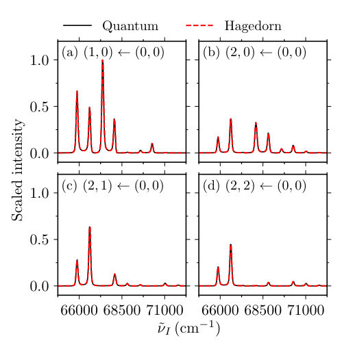
<figcaption class="paper-figure-caption"><b>Fig 1.</b> FIG. 1. Comparison of the resonance Raman excitation pro- files computed using quantum split-operator algorithm and Hagedorn wavepacket dynamics in a displaced, distorted, and Duschinsky-rotated two-dimensional harmonic system. Pro- files for fundamental [panel (a)], first-order overtone [panel (b)], and two combination bands [panels (c) and (d)] are shown.</figcaption>
</figure>
<figure class="paper-figure-card">
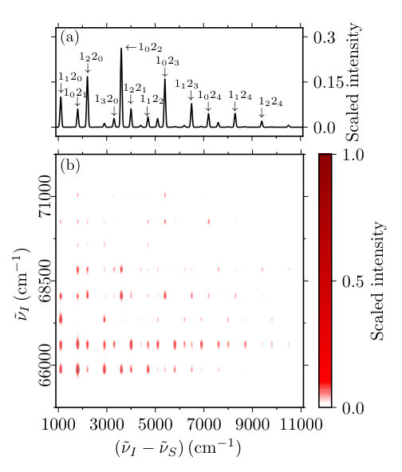
<figcaption class="paper-figure-caption"><b>Fig 2.</b> FIG. 2. Resonance Raman spectra computed using Hage- dorn wavepacket dynamics in a displaced, distorted, and Duschinsky-rotated two-dimensional harmonic system. (a) Resonance Raman spectrum for ˜νI = 68120 cm−1. (b) Two- dimensional resonance Raman spectrum.</figcaption>
</figure>
<figure class="paper-figure-card">
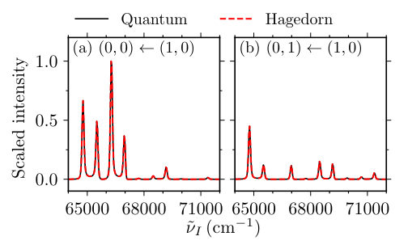
<figcaption class="paper-figure-caption"><b>Fig 3.</b> FIG. 3. Comparison of the resonance Raman excitation pro- files computed using quantum split-operator algorithm and Hagedorn wavepacket dynamics in a displaced, distorted, and Duschinsky-rotated two-dimensional harmonic system. Pro- files for anti-Stokes [panel (a)] and Stokes [panel (b)] hot bands are shown.</figcaption>
</figure>
<figure class="paper-figure-card">
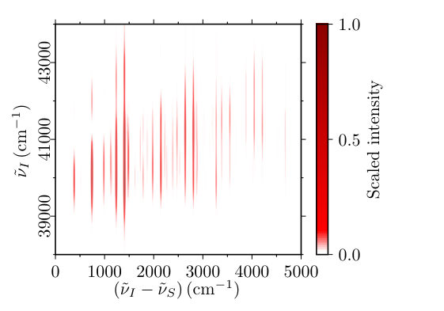
<figcaption class="paper-figure-caption"><b>Fig 4.</b> FIG. 5. Two-dimensional resonance Raman spectrum of an- thracene computed using Hagedorn wavepacket dynamics.</figcaption>
</figure>
<figure class="paper-figure-card">
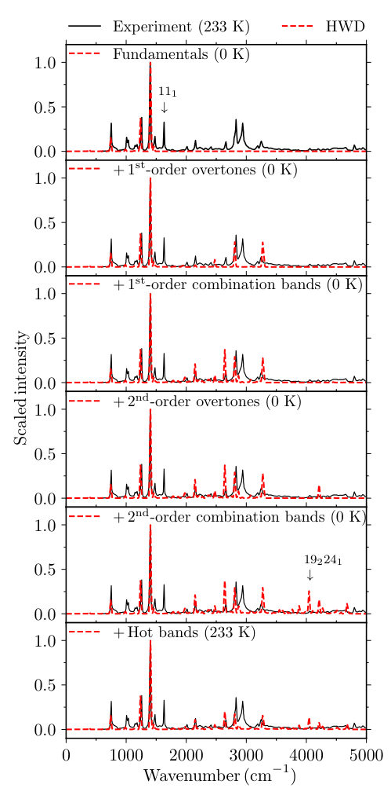
<figcaption class="paper-figure-caption"><b>Fig 5.</b> FIG. 4. Resonance Raman spectrum of anthracene for ˜νI = 43668 cm−1. Spectra computed using Hagedorn wavepacket dynamics (HWD) at 0 K with progressively increasing num- bers of final states (top five panels) and at 233 K (bot- tom panel) are compared to the experimental spectrum at 233 K.40 The simulated spectrum at 233 K was obtained by Boltzmann-averaging the spectra of all initial vibrational states whose excitation energies, measured relative to the zero-point energy, are lower than 2kBT.</figcaption>
</figure>

**Summary.** This paper introduces a novel, efficient ab initio method using Hagedorn wavepackets to simulate Resonance Raman spectra for large molecules like anthracene. By leveraging the exact solvability of Hagedorn functions in harmonic potentials, the authors compute spectra across various vibrational excitation regimes and temperatures. This provides a powerful theoretical tool for interpreting complex molecular spectroscopy.

**Why it may be interesting.** This work provides a highly efficient, mathematically rigorous quantum dynamics tool (Hagedorn wavepackets) for calculating complex spectroscopic signals in molecular systems, bridging quantum chemistry calculations with observable spectroscopic data.

Detailed structure

**Main problem.** To simulate Resonance Raman (RR) spectra of polyatomic molecules using an ab initio time-dependent method.

**Main result.** The Hagedorn wavepacket method successfully computes zero- and finite-temperature RR spectra for anthracene, showing good agreement with experimental data.

**Method.** The method uses Hagedorn wavepackets, which are exact solutions to the TDSE for quadratic potentials, to evaluate the RR cross-section via the wavepacket cross-correlation function.

**Model / system.** The study focuses on polyatomic molecules, specifically anthracene, whose dynamics are modeled using a 66-dimensional harmonic potential energy surface derived from DFT calculations.

**Key observables.** Resonance Raman (RR) spectra (Stokes and anti-Stokes), RR excitation profiles, and the absorption spectrum.

**Important parameters / regimes.** Temperature (e.g., 233 K), incident/scattered wavenumbers, and the dimensionality of the potential energy surface (up to 66D).

**Assumptions / limitations.** The calculations rely on the electric dipole approximation, Condon approximation, and the harmonic approximation for the potential energy surface, though the method is exact within this approximation.

**Figures summary.** Figures compare RR excitation profiles (quantum vs. Hagedorn) in 2D models, and show the computed RR spectrum of anthracene against experimental measurements, including comparisons with solvent effects.

**Paper structure.** The paper first validates the Hagedorn method in a simple 2D harmonic model against exact split-operator calculations, then applies the method to compute the full RR spectra of anthracene using DFT-derived potentials, addressing temperature and solvent effects.

Abstract

We present a practical, ab initio time-dependent method using Hagedorn wavepackets to simulate resonance Raman (RR) spectra of polyatomic molecules. Hagedorn functions---Gaussians multiplied by specific polynomials---are used to represent RR initial and final states because these functions are exact solutions to the time-dependent Schrödinger equation for at-most-quadratic potentials and can be propagated at zero cost beyond that of propagating the guiding Gaussian. Using efficient recursive formulae to compute overlaps between Hagedorn wavepackets, we can evaluate RR excitation profiles for arbitrary spectral signals, such as fundamental, overtone, combination, and hot bands. We then construct the Stokes and anti-Stokes RR spectra from these profiles. We first validate the method in a two-dimensional displaced, distorted, and Duschinsky-rotated harmonic model against numerically exact split-operator calculations. Then, we apply the method to compute RR spectra of anthracene by performing dynamics on a 66-dimensional harmonic potential energy surface constructed from density functional theory calculations.

[↑ back to top](#top)

### [Universality of long-wavelength behavior of composite-fermion Fermi liquid](http://arxiv.org/abs/2608.19604v1)

**Authors:** Aamir A. Makki, Mytraya Gattu, J. K. Jain  
**Type:** theory · **Category:** strongly correlated electrons · **PDF:** <https://arxiv.org/pdf/2608.19604v1>  
**Analysis basis:** full PDF text, analyzed in chunks

↔ Scroll figures horizontally

<figure class="paper-figure-card">
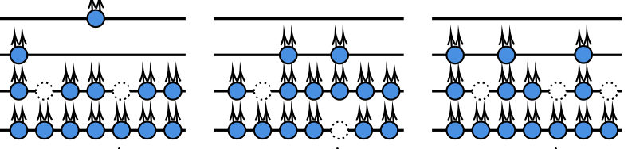
<figcaption class="paper-figure-caption"><b>Fig 1.</b> FIG. 1. Examples of basis functions with CFKE= 3. A single CF exciton with CFKE= 3 is not included as it has L ≥3 and thus does not mix with the L = 0 ground state.</figcaption>
</figure>
<figure class="paper-figure-card">
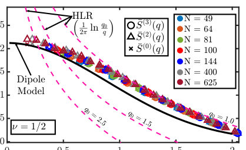
<figcaption class="paper-figure-caption"><b>Fig 2.</b> FIG. 2. Plot of ¯S(q)/q3 where ¯S(q) is the LLL-projected static structure factor. Three different approximations for ¯S(q) are shown for systems up to 625 particles. The static structure factors ¯S(q)(3), ¯S(q)(2) and ¯S(q)(0), calculated with ψ(3) 0 , ψ(2) 0 and ψ(0) 0 , are shown by circles, triangles and crosses, respectively. Each color corresponds to a different system size. For systems with 400 and 625 particles we do not obtain ¯S(q)(3). The difference between ¯S(3)(q), ¯S(2)(q), and ¯S(0)(q) is not appreciable. The magenta dashed lines show the field- theory prediction ¯S(q) = kF</figcaption>
</figure>
<figure class="paper-figure-card">
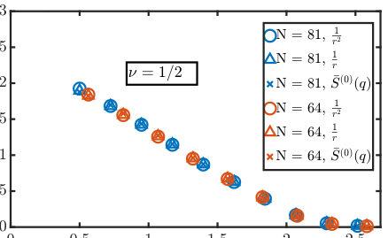
<figcaption class="paper-figure-caption"><b>Fig 3.</b> FIG. 3. ¯S(q)/q3 as a function of q for the ground state of coulomb and 1/r2 interactions at 3KE level (i.e. ¯S(3)(q)) along with the zeroth-order result.</figcaption>
</figure>
<figure class="paper-figure-card">
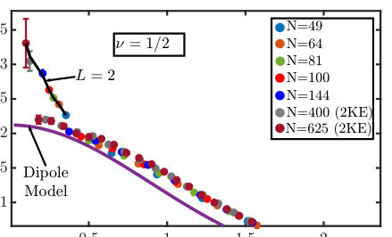
<figcaption class="paper-figure-caption"><b>Fig 4.</b> FIG. 4. LLL-projected static structure factor ¯S(q)/q3 includ- ing the L = 2 data points omitted from Fig. 2. For N ≤144, the results are obtained in the CFKE ≤3 approximation, ¯S(3)(q), whereas for N = 400 and 625 they are obtained in the CFKE ≤2 approximation, ¯S(2)(q). The black line con- nects the points corresponding to L = 2 for different system sizes. These points lie away from, and do not join smoothly onto, the sequence formed by the remaining even-L data with L ≥4, which is approximately coincident with the dipole- model result of Ref. [20]. This isolated anomalous behavior of the L = 2 point motivates its exclusion from the analysis of the smooth thermodynamic sequence.</figcaption>
</figure>
<figure class="paper-figure-card">
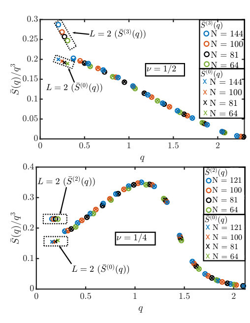
<figcaption class="paper-figure-caption"><b>Fig 5.</b> FIG. 5. Comparison of the LLL-projected static structure fac- tor at zeroth-order, ¯S(0)(q) (crosses) with the α KE corrected one, ¯S(α)(q),(circles) at ν = 1/2 (top, α = 3) and ν = 1/4 (bottom,α = 2). The discontinuity and anomalous behavior of the L = 2 point are more pronounced at ν = 1/4 than at ν = 1/2.</figcaption>
</figure>

**Summary.** This theoretical work examines the static structure factor of a composite-fermion Fermi liquid, aiming to resolve a conflict between theoretical predictions and initial calculations. By refining the underlying wave function approximation, the authors confirm that the small-$q$ behavior of the structure factor is universal and robust across different interaction models. The findings reinforce the theoretical understanding of correlation physics in highly correlated 2D electron systems.

**Why it may be interesting.** The investigation into the universal low-momentum behavior of correlation functions in strongly interacting electron systems is fundamental to understanding the nature of fractional quantum Hall states and correlated electron liquids.

Detailed structure

**Main problem.** The paper investigates the long-wavelength behavior of the projected static structure factor, $\bar{S}(q)$, for the composite-fermion (CF) liquid, specifically addressing a theoretical discrepancy regarding its $q$-dependence.

**Main result.** The authors find that improving the wave function using CF diagonalization does not yield the predicted $\bar{S}(q) \sim q^3 \ln q$ behavior, and the small-$q$ behavior appears universal, suggesting $\bar{S}(q) \propto q^3$ in the limit $q \to 0$.

**Method.** The study employs composite-fermion theory combined with variational calculations (CF diagonalization) to systematically improve the ground state wave function approximation.

**Model / system.** The system modeled is a composite-fermion (CF) liquid formed by electrons in two dimensions under a high magnetic field, relevant to the fractional quantum Hall effect.

**Key observables.** The primary observable is the projected static structure factor, $\bar{S}(q)$, and its small-$q$ asymptotic behavior.

**Important parameters / regimes.** The analysis considers various system sizes ($N$) and different interaction forms (Coulomb vs. $1/r^2$).

**Assumptions / limitations.** The analysis relies on the Lowest Landau Level (LLL) projection and uses the CF diagonalization method to improve upon a zeroth-order wave function approximation.

**Figures summary.** Figures illustrate the convergence of $\bar{S}(q)/q^3$ to a constant value, and highlight an anomaly where the $L=2$ data point deviates significantly from the smooth sequence formed by higher angular momentum sectors ($L \ge 4$).

**Paper structure.** The paper progresses by first identifying a theoretical discrepancy in $\bar{S}(q)$'s long-wavelength behavior, then systematically improving the wave function via CF diagonalization, and finally demonstrating the robustness and universality of the resulting small-$q$ behavior while noting an anomaly at $L=2$.

Abstract

A recent article evaluated the long-wavelength behavior of the projected static structure factor of the composite-fermion (CF) liquid within the zeroth-order microscopic theory and found $\bar{S}(\mathbf{q})\sim q^3$, in disagreement with the $\bar{S}(\mathbf{q})\sim q^3\ln q$ behavior predicted by the Chern-Simons field theory for the Coulomb interaction. Here we consider the possibility that the discrepancy arises because the zeroth-order CF Fermi-liquid wave function used in that work does not properly capture the long wavelength behavior. We use CF diagonalization to significantly improve the wave function but do not find any evidence for $\bar{S}(\mathbf{q})\sim q^3 \ln q$ behavior. Additionally, we find that the small-$q$ behavior of $\bar{S}(\mathbf{q})$ is also insensitive to the form of the interaction between electrons, suggesting universality.

[↑ back to top](#top)

### [Variational Quantum Circuit Parameterization of SchNet: A Simulator-Based Feasibility Study for Conservative Molecular Force Fields](http://arxiv.org/abs/2608.19532v1)

**Authors:** Hoang - Anh Nguyen, Nhu - Duc Dinh, Viet - Hung Tran, Tu - Uyen Le Tu, Tien - Lam Pham, Van - Duy Nguyen  
**Type:** theory · **Category:** disordered systems and neural networks · **PDF:** <https://arxiv.org/pdf/2608.19532v1>  
**Analysis basis:** full PDF text, analyzed in chunks

↔ Scroll figures horizontally

<figure class="paper-figure-card">
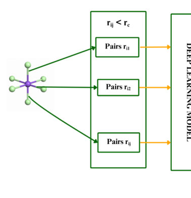
<figcaption class="paper-figure-caption"><b>Fig 1.</b> Figure 1: General formulation of the molecular energy and force prediction problem. An atomistic structure, represented by atomic numbers {Zi} and atomic coordinates {ri}, is mapped to a molecular energy E. Atomic forces are obtained as the negative gradient of the predicted energy with respect to atomic coordinates, Fi = −∇riE, yielding an energy-conserving force field.</figcaption>
</figure>
<figure class="paper-figure-card">
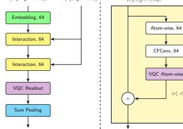
<figcaption class="paper-figure-caption"><b>Fig 2.</b> Figure 2: Overview of the proposed Hybrid Quantum SchNet architecture. Atomic numbers are mapped to atom-wise embeddings, while atomic positions are used to compute interatomic distances and radial basis features. The atom-wise representa- tions are refined through interaction blocks using quantum-generated continuous filters and hybrid VQC atom-wise updates. A hybrid VQC readout maps the final atom- wise representations to atomic energy contributions, which are summed to obtain the predicted molecular energy ˆE. Atomic forces are computed as negative gradients of ˆE with respect to atomic positions.</figcaption>
</figure>
<figure class="paper-figure-card">
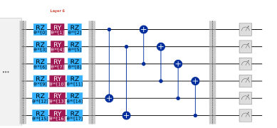
<figcaption class="paper-figure-caption"><b>Fig 3.</b> Figure 3: Variational quantum circuit used in the hybrid quantum modules. Clas- sical input features are projected to a six-dimensional quantum input vector and encoded into six qubits using RY angle encoding. The encoded state is processed by strongly entangling layers composed of parameterized single-qubit Rot gates, where Rot(α, β, γ) = RZ(α)RY (β)RZ(γ), followed by two-qubit entangling gates. The quan- tum output is obtained from Pauli-Z expectation-value measurements over all qubits and mapped to the required output dimension by a classical linear projection.</figcaption>
</figure>
<figure class="paper-figure-card">
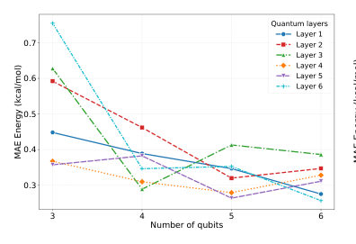
<figcaption class="paper-figure-caption"><b>Fig 4.</b> Figure 4: MAE energy experiments of ethanol for different quantum circuit configu- rations.</figcaption>
</figure>
<figure class="paper-figure-card">
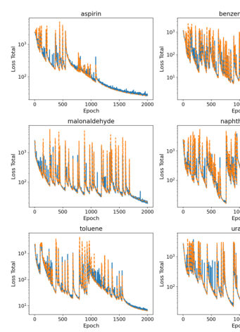
<figcaption class="paper-figure-caption"><b>Fig 5.</b> Figure 5: Training and validation total loss curves for aspirin, benzene, ethanol, and malonaldehyde on the MD17 benchmark. The total loss is plotted on a logarithmic scale as a function of training epoch. The blue solid curves denote the training loss, while the orange dashed curves denote the validation loss.</figcaption>
</figure>

**Summary.** This paper proposes a Hybrid Quantum SchNet to accelerate molecular simulations by embedding Variational Quantum Circuits into the SchNet force field framework. By training the model using both energy and force data jointly, the authors demonstrate substantial improvements in prediction accuracy. This work establishes the feasibility of using quantum circuits to enhance the learning of physically constrained, energy-conserving potentials.

**Why it may be interesting.** This work directly bridges quantum machine learning (VQCs) with condensed matter simulation techniques (force fields), offering a novel, quantum-enhanced approach to modeling interatomic interactions and potential energy surfaces.

Detailed structure

**Main problem.** The challenge is to create machine-learning force fields that are both accurate for molecular simulation and rigorously energy-conserving, especially when incorporating quantum machine learning components.

**Main result.** The hybrid quantum architecture successfully integrates Variational Quantum Circuits (VQCs) into the SchNet framework, showing that joint energy and force supervision significantly improves prediction accuracy over energy-only training.

**Method.** The authors propose a Hybrid Quantum SchNet by embedding VQCs into the SchNet's filter generation, atom-wise update, and readout stages, allowing quantum feature mapping while maintaining force-gradient consistency.

**Model / system.** The model is applied to molecular systems benchmarked on the MD17 dataset. It uses the SchNet architecture, which relies on continuous-filter convolutions based on interatomic distances, augmented by VQC modules.

**Key observables.** Energy Mean Absolute Error (MAE) and Force Mean Absolute Error (MAE) are the primary diagnostics, with significant quantitative improvements reported upon joint supervision.

**Important parameters / regimes.** The performance depends on the balance between quantum circuit width, circuit depth, and the optimization stability, suggesting a complex hyperparameter trade-off.

**Assumptions / limitations.** The study is framed as a feasibility study, and the performance gains are relative to classical SchNet baselines, not necessarily state-of-the-art potentials.

**Figures summary.** Figures illustrate the general formulation of force derivation from energy, the detailed VQC structure (encoding, ansatz, measurement), and ablation studies showing performance dependence on circuit size.

**Paper structure.** The paper introduces the need for energy-conserving ML force fields, details the Hybrid Quantum SchNet architecture by specifying VQC integration points, presents results comparing energy-only vs. joint supervision, and concludes with ablation studies on circuit parameters.

Abstract

Machine-learning force fields provide a promising route for accelerating molecular simulation by replacing expensive quantum-chemical calculations with differentiable models of molecular energies and atomic forces. However, learning accurate and energy-conserving forces remains challenging, especially when the model must capture both global energy trends and local potential-energy gradients from limited data. In this work, we propose a Hybrid Quantum SchNet architecture that integrates variational quantum circuit modules into the continuous-filter SchNet framework. Quantum modules are inserted into the filter generator, atom-wise update, and readout transformations, allowing quantum-enhanced feature mappings to contribute to distance-dependent interactions and atomic energy prediction while preserving the energy-gradient formulation of forces. The model is evaluated on eight MD17 molecular systems using 1000 training configurations per molecule. Compared with energy-only training, joint energy--force supervision substantially improves both energy and force prediction accuracy. Compared with energy-only training, joint energy--force supervision substantially improves both energy and force prediction accuracy. Averaged over the benchmark, the energy MAE decreases from 2.567 to 0.593 kcal mol$^{-1}$, while the force MAE decreases from 16.340 to 1.540 kcal mol$^{-1}$ Å$^{-1}$. Ablation experiments on ethanol further show that the performance of the hybrid model depends on the balance between quantum circuit width, circuit depth, and optimization stability. These results demonstrate that variational quantum circuits can be incorporated into neural force-field architectures and trained end-to-end to improve molecular energy and force prediction.

[↑ back to top](#top)

### [Variational Quantum Linear Solver via Block Encoding for the Poisson Equation](http://arxiv.org/abs/2608.19655v1)

**Authors:** Viraj Dsouza, Ayush Singhal, Alex Khan, Rut Lineswala, Abhishek Chopra  
**Type:** both · **Category:** quantum information and computing · **PDF:** <https://arxiv.org/pdf/2608.19655v1>  
**Analysis basis:** full PDF text, analyzed in chunks

↔ Scroll figures horizontally

<figure class="paper-figure-card">
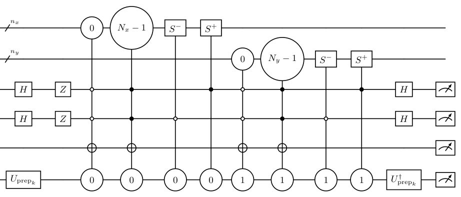
<figcaption class="paper-figure-caption"><b>Fig 1.</b> FIG. 1: Block encoding circuit for the 2D Laplacian with Dirichlet boundary conditions along both spatial directions, following the construction of [21]. Post-selecting all four ancilla qubits on |0⟩⊗4 realises the action of eA on the system register.</figcaption>
</figure>
<figure class="paper-figure-card">
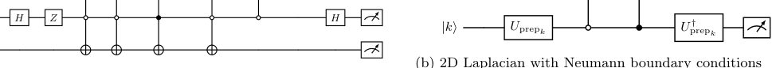
<figcaption class="paper-figure-caption"><b>Fig 2.</b> FIG. 2: Block-encoding circuits for the Laplacian with Neumann boundary conditions [21]. In (b), UN 1 and U N 2 denote the sub-circuit of (a) applied to the x- and y-registers. Post-selecting all four ancilla qubits on |0⟩⊗4 realises the action of eAN.</figcaption>
</figure>
<figure class="paper-figure-card">
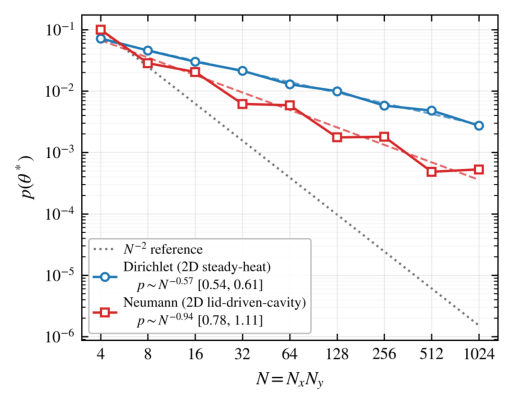
<figcaption class="paper-figure-caption"><b>Fig 3.</b> FIG. 5: Performance and numerical exactness of the block-encoding circuits used in this work.</figcaption>
</figure>
<figure class="paper-figure-card">
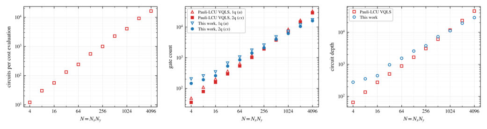
<figcaption class="paper-figure-caption"><b>Fig 4.</b> FIG. 6: Resource comparison between the Pauli-LCU VQLS and the block-encoded formulation of this work, for the 2D Dirichlet Laplacian. (a) The block-encoded formulation requires one circuit at every size and is therefore not plotted. (b), (c) Per-circuit counts after transpilation to the {U, CX} basis; for the Pauli-LCU formulation these are for the most expensive Hadamard-test circuit at each grid, an empirical per-circuit upper bound.</figcaption>
</figure>
<figure class="paper-figure-card">
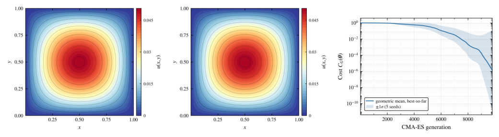
<figcaption class="paper-figure-caption"><b>Fig 5.</b> FIG. 7: Sinusoidal source benchmark on the 32 × 32 grid (N = 1024, n = 10 system qubits, 14 total), CMA-ES with σ0 = 0.3 and ℓ= 5 ansatz layers. Panels (a) and (b) share a colour scale and show the seed attaining the median infidelity of the five runs, 1 −F = 8.9 × 10−16. In (c) the solid line is the geometric mean of the best-so-far cost across seeds and the band is ±1 standard deviation in log10; the median seed reaches CG = 4.7 × 10−15.</figcaption>
</figure>

**Summary.** This paper presents an improved Variational Quantum Linear Solver (VQLS) for solving the Poisson equation by introducing an exact block encoding of the discrete Laplacian. This encoding reduces the required quantum circuit depth from $O(L^2)$ to $O(1)$ for cost evaluation. The solver is successfully benchmarked on multiple physical problems, demonstrating superior performance and trainability compared to existing quantum linear solvers.

**Why it may be interesting.** The work directly tackles the resource scaling of quantum algorithms for PDEs, offering a concrete, improved quantum circuit implementation for a fundamental problem in physics.

Detailed structure

**Main problem.** The paper addresses the challenge of solving large linear systems, particularly those arising from the discretization of the Poisson equation, using quantum computation.

**Main result.** A novel block encoding for the discrete Laplacian allows the Variational Quantum Linear Solver (VQLS) to evaluate the cost function using only a single quantum circuit, significantly improving circuit complexity over prior methods.

**Method.** The authors employ a VQLS framework, mapping the linear system $Ax=b$ to a variational optimization problem, and utilize an exact block encoding to represent the Laplacian operator.

**Model / system.** The primary model is the 2D Poisson equation ($
abla^2 u = f$), discretized using finite differences, leading to a system matrix $A$ with a separable Kronecker-sum structure. Benchmarks include sinusoidal forcing, Gaussian heat sources, and the pressure-Poisson equation for lid-driven cavity flow.

**Key observables.** Infidelity ($1-F$) against classical solutions, cost function convergence ($C_G$), and the circuit count required per cost evaluation.

**Important parameters / regimes.** Grid size ($N$ up to 1024), optimization parameters (e.g., CMA-ES settings), and boundary conditions (Dirichlet, Neumann).

**Assumptions / limitations.** The analysis relies on exact statevector simulation, and the method assumes the block encoding can efficiently represent the required operators.

**Figures summary.** Figures illustrate the block encoding circuits for Dirichlet and Neumann conditions, and compare the convergence of CMA-ES versus COBYLA optimizers on various benchmarks.

**Paper structure.** The paper introduces the VQLS for PDEs, details the novel block encoding technique for the Laplacian, benchmarks the solver on three physical problems (sinusoidal, Gaussian, lid-driven cavity), and compares optimization performance.

Abstract

We present a variational quantum linear solver (VQLS) for the Poisson equation built on an exact block encoding of the discrete Laplacian, and demonstrate its performance on physically motivated benchmarks. Unlike LCU-based VQLS where the number of distinct circuits required per cost-function evaluation is $\mathcal{O}(L^2)$, where $L$ is the number of terms in the LCU decomposition of the discrete Laplacian operator, this approach requires only a single circuit for cost evaluation. We further empirically demonstrate that the choice of classical optimizer materially affects where the variational optimization ceases to make progress. The solver is benchmarked on three problems: a Poisson equation with sinusoidal forcing and a steady-state heat conduction problem with a localized Gaussian source, both with Dirichlet boundaries, and the pressure-Poisson equation of a two-dimensional lid-driven cavity flow, in which the solver is invoked once per time step under Neumann boundary conditions.

[↑ back to top](#top)

## Secondary cond-mat archives

*Papers from cond-mat.mtrl-sci, mes-hall, other, soft, supr-con. These archives are de-prioritized — they appear at the end regardless of relevance score.*

### Relevant in secondary archives (14)

### [Cavity-Enhanced Activation of Radiatively Suppressed Light-Hole Exciton Emission in Colloidal Nanoplatelets](http://arxiv.org/abs/2608.19681v1)

**Authors:** Komal Sharma, Riya Dutta, Prathmesh Deshmukh, Vinod M. Menon, Jaydeep K. Basu  
**Type:** experiment · **Category:** other · **PDF:** <https://arxiv.org/pdf/2608.19681v1>  
**Analysis basis:** full PDF text, analyzed in chunks
**Topic relevance:** 🔥 `quantum optics experiment` **4/5** · `Tavis-Cummings & cavity-many-emitter` **3/5** · `interference shaping light` **3/5** · `Dicke superradiance` **2/5** · `analog quantum simulation` **2/5** · `correlated / nonlocal dissipation` **2/5** · `driven-dissipative phase transition` **2/5** · `methods for driven-dissipative` **1/5** · `superradiant laser` **1/5**

↔ Scroll figures horizontally

<figure class="paper-figure-card">

<figcaption class="paper-figure-caption"><b>Fig 1.</b> Figure 1: (a) Schematic band diagram of a nanoplatelet (NPL), showing allowed optical transitions from the conduction band (CB) to the heavy-hole (HH), light-hole (LH), and split-off (SO) valence bands at the Brillouin-zone center. While both HH and LH transitions are optically allowed, ra- diative emission from the LH state is strongly suppressed due to its higher energy and weaker oscillator strength. (b) Normalized photoluminescence (PL) and absorbance spectra of CdSe/CdS core/shell NPLs, showing strong absorption signatures for both HH and LH transitions, but emis- sion exclusively from the HH exciton. (c) Transmission electron microscopy image of NPLs with a scale bar of 100 nm. (d)...</figcaption>
</figure>
<figure class="paper-figure-card">
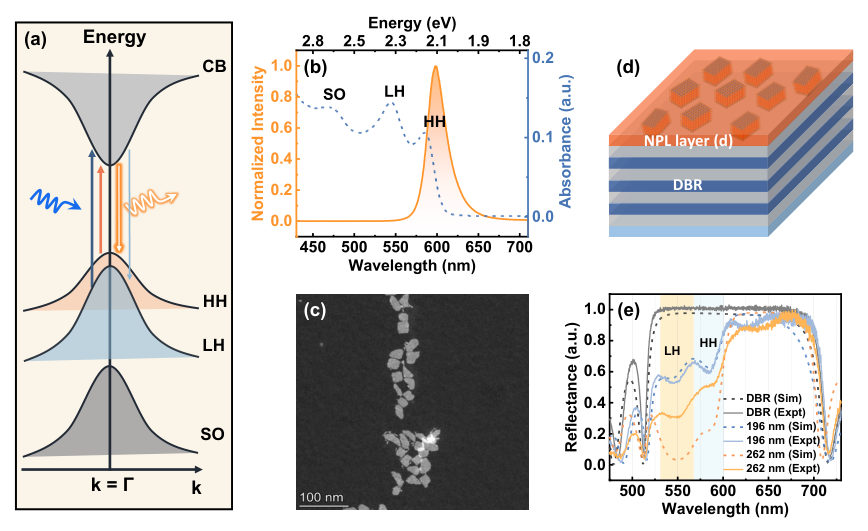
<figcaption class="paper-figure-caption"><b>Fig 2.</b> Figure 1e compares simulated and experimental reflectance spectra for DBR substrates coated</figcaption>
</figure>
<figure class="paper-figure-card">
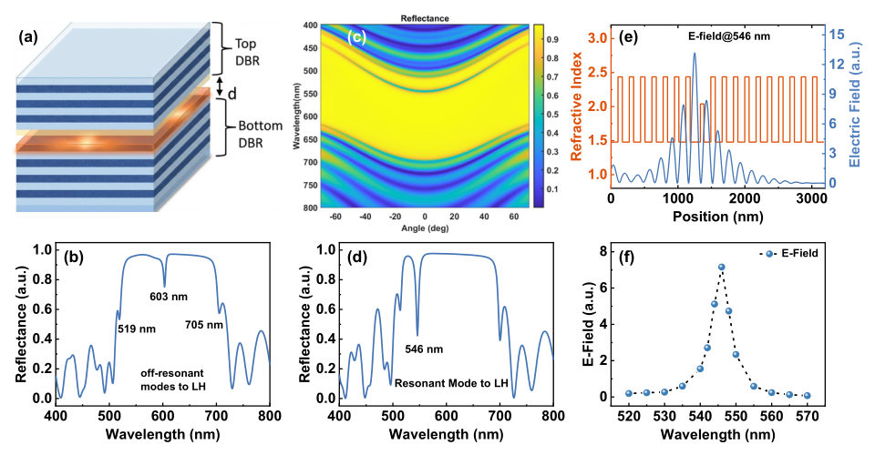
<figcaption class="paper-figure-caption"><b>Fig 3.</b> Figure 2: (a) Illustration of the proposed DBR–NPL–DBR cavity structure, designed to spectrally align a cavity mode with the LH exciton. (b) Simulated normal-incidence reflectance spectrum for an initial cavity configuration with an NPL thickness of 262 nm, showing cavity modes at 519, 603, and 705 nm, none of which overlap with the LH exciton. (c) Simulated angle-resolved reflectance spectrum of the optimized cavity structure, revealing a dispersive cavity mode centered near 546 nm that coincides spectrally with the LH exciton. (d) Reflectance profile at normal incidence (0°) confirming a sharp dip at 546 nm, corresponding to the designed resonant cavity. (e) Simulated refractive index...</figcaption>
</figure>
<figure class="paper-figure-card">

<figcaption class="paper-figure-caption"><b>Fig 4.</b> Figure 3: (a) White light reflectance spectrum from the vertical DBR–NPL–DBR cavity geometry, exhibiting no resonant mode to LH. (b) Normalized PL spectra of CdSe/CdS NPLs on glass (red) and embedded inside the DBR cavity (blue), showing significant spectral narrowing and amplifi- cation inside the cavity. (c) Power-dependent PL spectra measured from the cavity, showing the progressive emergence of ASE followed by a distinct high-energy peak at the LH exciton energy (shaded). The LH emission is absent at low powers and becomes prominent only beyond a thresh- old pump fluence. (d) Zoomed-in view of the high-energy spectral region at 1 mW excitation, confirming a weak but discernible LH...</figcaption>
</figure>
<figure class="paper-figure-card">
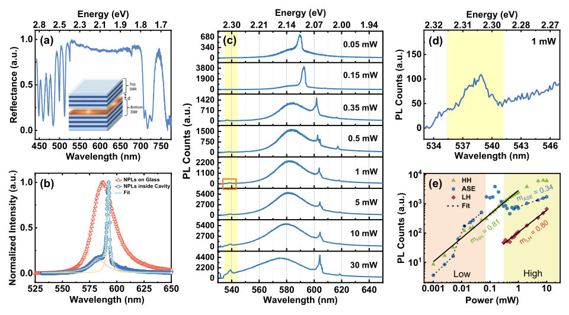
<figcaption class="paper-figure-caption"><b>Fig 5.</b> Figure 3a shows the white-light reflectance spectrum of this detuned cavity, confirming the absence</figcaption>
</figure>

**Summary.** This research presents an all-photonic method to overcome the natural radiative suppression of Light-Hole (LH) exciton emission in colloidal nanoplatelets. By integrating the NPLs into a DBR cavity and tuning the cavity mode to spectrally match the LH exciton, the authors successfully activated and observed the LH emission channel. This establishes cavity engineering as a general, tunable platform for accessing otherwise inaccessible quantum optical states.

**Why it may be interesting.** This work directly addresses cavity quantum electrodynamics (cQED) principles by using engineered photonic structures (DBR cavities) to overcome intrinsic material limitations (radiative suppression) and selectively enhance emission from a specific quantum state (LH exciton).

Detailed structure

**Main problem.** The primary challenge is activating the radiative emission from Light-Hole (LH) excitons in colloidal nanoplatelets, as this emission is typically suppressed due to energetic unfavorability.

**Main result.** The authors successfully demonstrated that coupling the NPLs into a DBR cavity, and achieving spectral resonance with the LH exciton, is a general photonic route to activate this otherwise suppressed emission.

**Method.** The study combines optical characterization (PL, reflectance) with cavity engineering, using temperature-dependent and polarization-resolved measurements to distinguish emission channels.

**Model / system.** The system involves colloidal CdSe-CdS nanoplatelets (NPLs) integrated into a Distributed Bragg Reflector (DBR) cavity structure, forming an open or closed photonic environment.

**Key observables.** Cavity-coupled PL spectra, temperature-dependent PL intensity, Degree of Polarization (DOP), and spectral alignment relative to the LH exciton resonance.

**Important parameters / regimes.** Cavity quality factor (Q), spectral detuning, temperature (e.g., 75 K to 300 K), and NPL layer thickness.

**Assumptions / limitations.** The enhancement mechanism is attributed to the coupling between the excitonic transition and the cavity photon mode, requiring both spectral resonance and sufficient intrinsic absorption strength.

**Figures summary.** Figures illustrate the design process, comparing reflectance spectra in open vs. closed cavities, and show PL spectra demonstrating the emergence of the LH peak upon achieving spectral resonance and temperature variation.

**Paper structure.** The paper progresses from establishing the intrinsic difficulty of LH emission, to demonstrating that field enhancement alone is insufficient, and finally proving that achieving spectral resonance within a closed DBR cavity is necessary and sufficient to activate the LH radiative pathway.

Abstract

Light-hole (LH) excitons provide access to well-defined polarization and spin degrees of freedom that are central to quantum photonics and chiral light-matter interactions. Achieving LH emission is challenging because LH states are energetically unfavoured and typically relax non-radiatively. Existing strategies to access LH excitons rely on modifying the electronic band structure through strain, shape anisotropy, or piezoelectric fields, approaches that are material-specific and offer limited post-synthesis tunability. Here we demonstrate an all-photonic route to activate LH exciton emission in colloidal CdSe-CdS nanoplatelets (NPLs) using a distributed Bragg reflector (DBR) cavity, without altering the underlying band structure. In the absence of a cavity mode, the system exhibits amplified spontaneous emission from heavy-hole (HH) states without detectable LH emission at low excitation powers. By spectrally matching a cavity resonance to the LH exciton, cavity-coupled LH emission emerges at significantly lower excitation powers. Temperature-dependent spectroscopy reveals reversible switching between LH- and HH-coupled emission through exciton-cavity detuning, while polarization-resolved and spectrally resolved time-resolved photoluminescence measurements provide independent evidence distinguishing the cavity-coupled LH and HH emission channels. These findings establish cavity engineering as a general materials-level approach for accessing radiatively suppressed optical states.

[↑ back to top](#top)

### [Coherence protection of a silicon hole spin qubit with phase-modulated microwave driving](http://arxiv.org/abs/2608.19696v1)

**Authors:** Sayyid I. Ibad, Yusuke Sato, Takuma Kuno, Itaru Yanagi, Toshiyuki Mine, Ryuta Tsuchiya, Digh Hisamoto, Hiroyuki Mizuno, Raisei Mizokuchi, Jun Yoneda, Tetsuo Kodera  
**Type:** both · **Category:** quantum information and computing · **PDF:** <https://arxiv.org/pdf/2608.19696v1>  
**Analysis basis:** full PDF text, analyzed in chunks
**Topic relevance:** 🔥 `QC/QI experiment` **4/5** · `quantum measurements` **2/5**

↔ Scroll figures horizontally

<figure class="paper-figure-card">
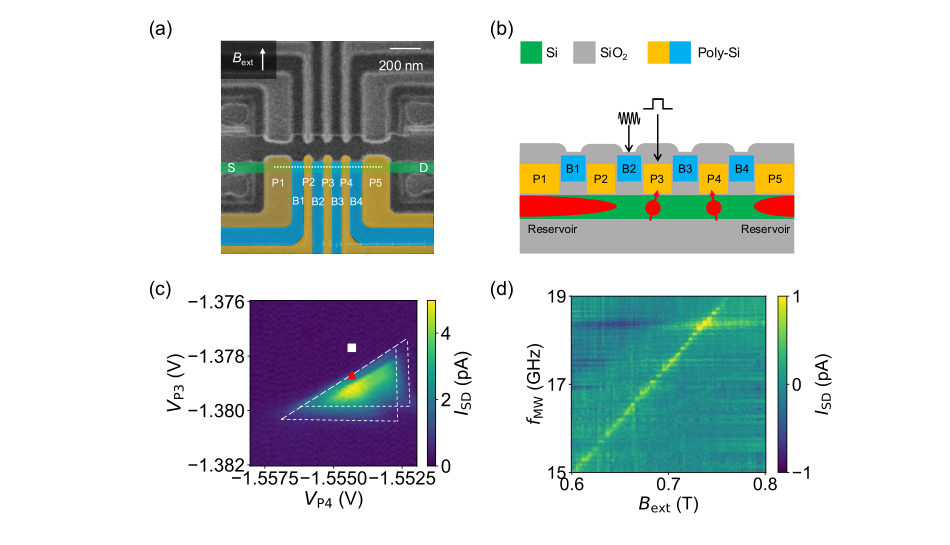
<figcaption class="paper-figure-caption"><b>Fig 1.</b> Figure 1. Device setup, PSB and EDSR. (a) False-colored scanning electron micrograph of the</figcaption>
</figure>
<figure class="paper-figure-card">
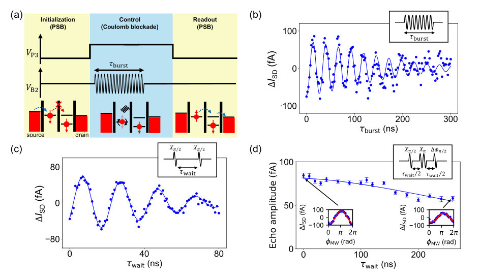
<figcaption class="paper-figure-caption"><b>Fig 2.</b> Figure 2. Coherent control of a single-hole spin. (a) Schematic of the pulse scheme for coherent</figcaption>
</figure>
<figure class="paper-figure-card">
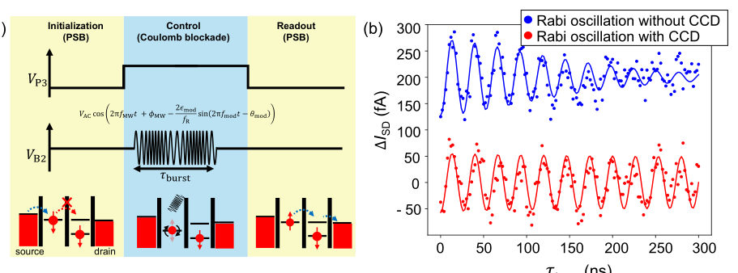
<figcaption class="paper-figure-caption"><b>Fig 3.</b> Figure 3. Rabi experiments using the phase-modulated CCD technique. (a) Schematic of the</figcaption>
</figure>
<figure class="paper-figure-card">
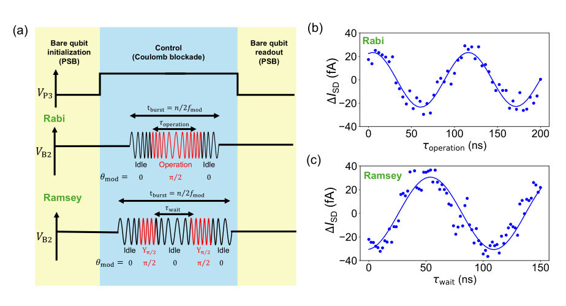
<figcaption class="paper-figure-caption"><b>Fig 4.</b> Figure 4. Control of CCD-dressed qubits. (a) Pulse schemes for Rabi, Ramsey, and two-axis</figcaption>
</figure>

**Summary.** This paper addresses the decoherence challenge in silicon hole spin qubits by introducing a phase-modulated concatenated continuous driving (CCD) technique. By analyzing the system's response to noise through derived filter functions, the authors demonstrate that the CCD protocol effectively suppresses low-frequency noise. This results in significantly extended coherence times, marking a viable path toward building robust quantum processors.

**Why it may be interesting.** This work provides a concrete, experimentally verifiable protocol (CCD) to engineer noise resilience into solid-state qubits, which is a critical challenge for scaling quantum computation platforms.

Detailed structure

**Main problem.** Hole spins in silicon quantum dots suffer from low-frequency noise (charge and hyperfine) that limits coherence times, despite the platform's promise for fast, all-electrical quantum control.

**Main result.** Implementing a phase-modulated concatenated continuous driving (CCD) protocol successfully suppresses low-frequency noise, leading to measurable improvements in coherence times ($T_2$) and demonstrating noise-robust gate operations.

**Method.** The authors combine experimental characterization (Rabi/Ramsey measurements) with advanced theoretical analysis, deriving filter functions to quantify noise susceptibility under the CCD driving scheme.

**Model / system.** The system is a hole spin qubit in silicon quantum dots, modeled using Hamiltonians that incorporate strong spin-orbit coupling (SOC) and subjected to phase-modulated microwave driving fields.

**Key observables.** Rabi oscillation decay time ($T_2^R$), Ramsey coherence time ($T_2^*$), and the coherence time achieved using the CCD protocol ($T_2^{R-CCD} \geq 300$ ns).

**Important parameters / regimes.** Low-frequency noise spectral density, modulation frequency ($f_{	ext{mod}}$), modulation amplitude ($\epsilon_{	ext{mod}}$), and the effective detuning ($\delta_L$).

**Assumptions / limitations.** The analysis relies on the Rotating-Wave Approximation (RWA) and assumes that the CCD protocol effectively shifts the qubit's sensitivity away from the dominant low-frequency noise sources.

**Figures summary.** Figures compare Rabi pulse sequences with and without CCD modulation, and show Rabi/Ramsey oscillation decay curves for the dressed qubit, confirming coherence protection.

**Paper structure.** The paper progresses from identifying coherence limitations using standard measurements to proposing the CCD technique, deriving the necessary theoretical framework (Hamiltonians and filter functions), and finally presenting results showing noise suppression and coherent control in the dressed qubit frame.

Abstract

Hole spins in silicon quantum dots are a promising platform for quantum computing due to their strong intrinsic spin-orbit coupling (SOC), which enables fast, all-electrical control. However, this coupling also increases their susceptibility to charge noise, thereby limiting coherence times. Moreover, holes in silicon are also affected by hyperfine interactions with residual nuclear spins in the silicon substrate, introducing a non-negligible source of low-frequency noise. Here, we implement a phase-modulated concatenated continuous driving (CCD) technique for hole spin qubits to suppress low-frequency noise through microwave phase modulation. This approach stabilizes Rabi oscillations and extends the oscillation decay time compared to the conventional method. Furthermore, by defining a qubit in the CCD frame, we achieve coherent control while simultaneously protecting the qubit from noise, confirming coherence protection during gate operations. These results demonstrate a viable route toward noise-robust hole spin qubits.

[↑ back to top](#top)

### [Internal cyclotron probe of the vertical polarizability of a surface-state electron on helium](http://arxiv.org/abs/2608.19712v1)

**Authors:** Kirill Shulga  
**Type:** theory · **Category:** other · **PDF:** <https://arxiv.org/pdf/2608.19712v1>  
**Analysis basis:** full PDF text, analyzed in chunks
**Topic relevance:** `analog quantum simulation` **3/5** · `Tavis-Cummings & cavity-many-emitter` **2/5** · `Keldysh / 2PI / non-Gaussian methods` **1/5** · `quantum measurements` **1/5**

↔ Scroll figures horizontally

<figure class="paper-figure-card">
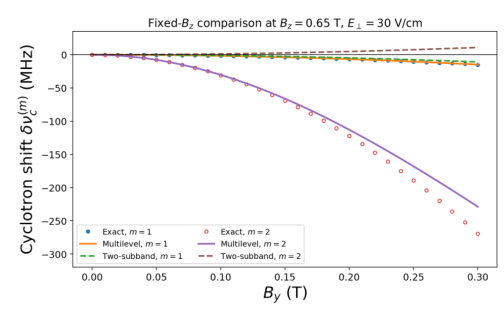
<figcaption class="paper-figure-caption"><b>Fig 1.</b> FIG. 1. Cyclotron-branch shifts at fixed Bz = 0.65 T and E⊥= 30 V/cm as a function of the in-plane field By. For these parameters ν21 = 140.2 GHz at By = 0. Symbols show exact diagonalization of the microscopic Hamiltonian. Solid lines show the multilevel second-order theory of Eqs. (14) and (15). Dashed lines show the strict two-subband limit. The ground-state branch is described reasonably well by the two- subband reduction, whereas the first-excited branch departs strongly from it while remaining well captured by the multi- level theory.</figcaption>
</figure>
<figure class="paper-figure-card">
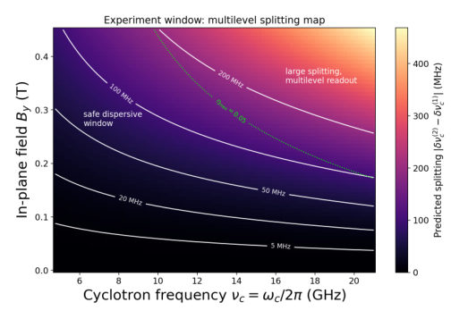
<figcaption class="paper-figure-caption"><b>Fig 2.</b> FIG. 2. Predicted multilevel cyclotron splitting in the ex- perimentally relevant microwave window. The horizontal axis is the bare cyclotron frequency νc = ωc/2π and the vertical axis is the in-plane field By. The color scale gives the split- ting |δν(2) c −δν(1) c | obtained from the multilevel second-order theory for fixed E⊥= 30 V/cm in 4He, corresponding to ν21 = 140.2 GHz at By = 0. The white contours mark 5, 20, 50, 100, and 200 MHz. The dotted contour marks the conser- vative dispersive boundary ηmax = 0.05, based on Eq. (11).</figcaption>
</figure>
<figure class="paper-figure-card">
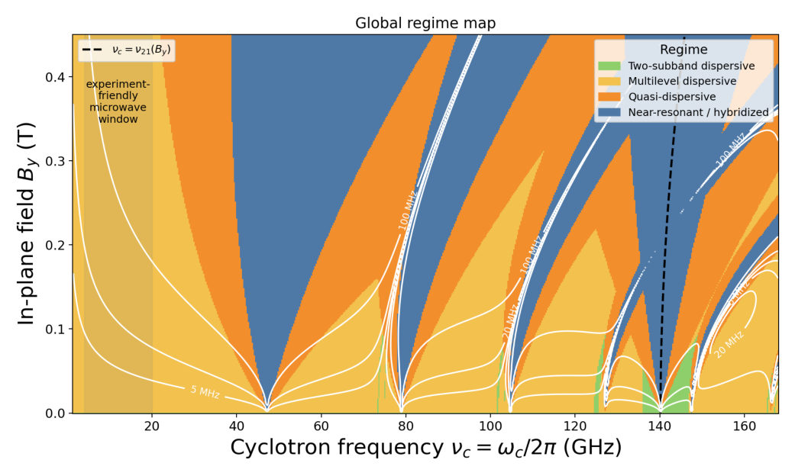
<figcaption class="paper-figure-caption"><b>Fig 3.</b> FIG. 3. Global regime map of the tilted-field Hamiltonian for 4He at fixed E⊥= 30 V/cm. The horizontal axis is the bare cyclotron frequency νc = ωc/2π and the vertical axis is the in-plane field By. The shaded strip indicates the 4-20 GHz microwave window. The dashed black curve marks the condition νc = ν21(By), where the cyclotron frequency matches the lowest vertical transition. White contours show multilevel splittings of 5, 20, and 100 MHz. The green sector corresponds to a strict two-subband dispersive regime. The yellow sector remains dispersive but is already intrinsically multilevel. The orange sector is a quasi-dispersive crossover regime, and the blue sector corresponds to...</figcaption>
</figure>
<figure class="paper-figure-card">
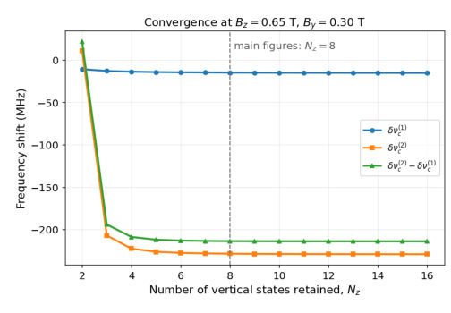
<figcaption class="paper-figure-caption"><b>Fig 4.</b> FIG. 4. Convergence of the multilevel dispersive shifts with the number of vertical states retained in Eq. (10), evaluated at Bz = 0.65 T, By = 0.30 T, and E⊥= 30 V/cm. The vertical dashed line marks Nz = 8, the cutoff used for the main figures. The rightmost points show the values obtained at Nz = 16. Increasing the cutoff from Nz = 8 to Nz = 16 changes the individual branch shifts by less than 0.6 MHz and the differential splitting by less than 0.2 MHz.</figcaption>
</figure>
<figure class="paper-figure-card">
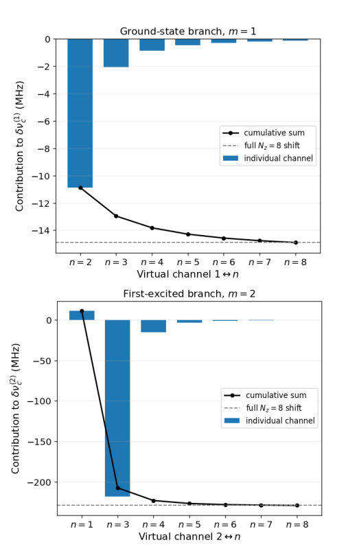
<figcaption class="paper-figure-caption"><b>Fig 5.</b> FIG. 5. Channel-resolved decomposition of the multilevel cyclotron shifts at Bz = 0.65 T, By = 0.30 T, and E⊥= 30 V/cm. Bars show individual virtual-channel contributions to Eqs. (14) and (15); black markers show cumulative par- tial sums. Top: ground-state branch. Bottom: first-excited branch.</figcaption>
</figure>

**Summary.** This paper theoretically analyzes the cyclotron resonance of an electron on liquid helium in a tilted magnetic field. The resonance shift is shown to act as a direct probe for the vertical polarizability of the electron's Rydberg-like subbands. By developing a full multilevel Hamiltonian and comparing it to simplified models, the authors map out the physical regimes where different theoretical approximations are valid.

**Why it may be interesting.** This work models a complex, interacting quantum system (electron-helium interface) using concepts from cavity QED (resonance probing) and many-body physics (multilevel coupling), making it highly relevant to AMO physics.

Detailed structure

**Main problem.** To use the cyclotron resonance of a surface-state electron on liquid helium as a direct, in situ spectroscopic probe of the dynamical polarizability of the electron's vertical Rydberg-like subbands.

**Main result.** The cyclotron resonance frequency shift is found to be proportional to the vertical susceptibility, confirming that the measurement probes the dynamical polarizability in a multilevel, self-coupled system.

**Method.** The theory is developed from the microscopic tilted-field Hamiltonian, employing standard second-order perturbation theory to calculate the state-dependent shift.

**Model / system.** The system is a single electron above liquid helium subjected to a tilted magnetic field and perpendicular electric field, leading to a self-coupled Landau-subband Hamiltonian.

**Key observables.** The cyclotron resonance frequency shift, $\delta\omega_c(m)$, and the differential splitting between cyclotron branches.

**Important parameters / regimes.** The analysis focuses on the far-detuned regime, comparing results across the two-subband limit, the full multilevel theory, and the near-resonant/hybridized regimes.

**Assumptions / limitations.** The primary approximations involve using second-order perturbation theory and comparing the full multilevel theory against the simplified two-subband truncation.

**Figures summary.** Figures compare multilevel theory, exact diagonalization, and the two-subband limit for cyclotron shifts across different field regimes, mapping out dispersive, crossover, and hybridized regions.

**Paper structure.** The paper develops the full multilevel Hamiltonian, derives the shift using perturbation theory, compares this result against exact diagonalization, and maps out the parameter space to delineate regimes where different approximations are valid.

Abstract

We study a surface-state electron on liquid helium in a tilted magnetic field. The tilt couples the cyclotron ladder to the vertical Rydberg-like subbands of the same electron and thereby realizes a self-coupled Landau-subband Hamiltonian. In the far-detuned regime, the cyclotron line acquires a state-dependent shift described by standard second-order perturbation theory. The resulting expression identifies the cyclotron resonance as a direct probe of the dynamical polarizability of the vertical ladder. The theory is intrinsically multilevel. Exact diagonalization confirms a broad microwave window in which sizable state-dependent cyclotron shifts are expected while the system remains dispersive.

[↑ back to top](#top)

### [Free Energy of Non-uniform Disordered Superconductors](http://arxiv.org/abs/2608.19573v1)

**Authors:** Matthias Eschrig, Anton B. Vorontsov  
**Type:** theory · **Category:** statistical mechanics · **PDF:** <https://arxiv.org/pdf/2608.19573v1>  
**Analysis basis:** full PDF text, analyzed in chunks
**Topic relevance:** `Keldysh / 2PI / non-Gaussian methods` **3/5** · `methods for driven-dissipative` **1/5**

↔ Scroll figures horizontally

<figure class="paper-figure-card">
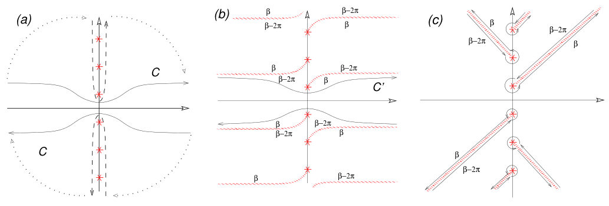
<figcaption class="paper-figure-caption"><b>Fig 1.</b> FIG. 1. Various integration paths of the free energy functional. (a) The original dashed-line contour around the Matsubara poles z∗= iεn = iπT(1 + 2n) (stars) of the tanh(z/2T) function can be modified to run differently in the complex energy plane. This contour can be used up to Eq. (21). (b) After integration by parts in Eqs. (22-23), we generate a non-analytic function log(cosh z), and the contour has to be completely in the analyticity domain of this function. The branch cut of the log w-function is quite arbitrary, and we show it for the case (Re w, Im w) = (t cos β, t sin β) with t ∈[0, ∞) and β = 3π/4. The argument of w = cosh z is shown on the edges of the branch cuts. This contour...</figcaption>
</figure>
<figure class="paper-figure-card">
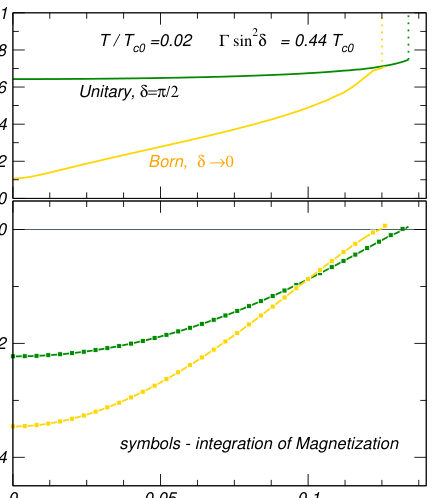
<figcaption class="paper-figure-caption"><b>Fig 2.</b> FIG. 4. Disordered uniform Pauli-limited d-wave supercon- ductor at low temperatures, T = 0.02Tc0. The scattering rate γ = Γ sin2 δ = 0.44Tc0 is the same for unitary (δ = π/2) and Born (δ →0) impurities. (a) Magnetization, and (b) free en- ergy, as functions of (Zeeman) magnetic field. The free energy in (b) is calculated in two ways: directly using Eq. (45) shown by the line, and by integration, Eq. (47), of the magnetization curves in (a), shown by the symbols. Both methods give the same result within numerical accuracy.</figcaption>
</figure>
<figure class="paper-figure-card">
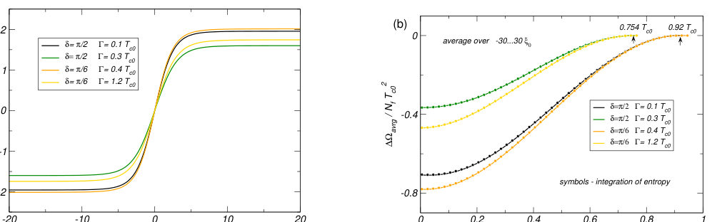
<figcaption class="paper-figure-caption"><b>Fig 3.</b> FIG. 5. (a) Domain wall in the d-wave superconductor with opposite-sign amplitudes in two domains; (b) spatially averaged free energy across the domain wall, over −30ξ0 . . . 30ξ0. The coherence length is defined as ξ0 = ℏvF/2πkBTc0. We use two values of the scattering rate γ = Γ sin2 δ = {0.1, 0.3}Tc0 that give the indicated bulk transition temperatures. The unitary (δ = π/2) and Born (δ = π/6) impurities result in different order parameter values, and different free energies. The dot-symbols in (b) are obtained by integration of entropy.</figcaption>
</figure>
<figure class="paper-figure-card">
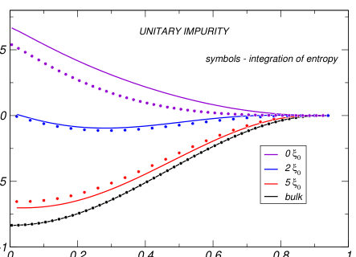
<figcaption class="paper-figure-caption"><b>Fig 4.</b> FIG. 6. The “spatial density” of free energy Eq. (45) at differ- ent locations across the domain wall, shown by the solid lines, and “spatial density” obtained by the temperature-integrated entropy Eq. (49), shown by dot-symbols. “Spatial densities” obtained in different ways don’t agree with each other, ex- cept in the uniform (bulk) case, but generally show the same patterns. Shown are unitary impurities; results for the Born limit are very similar.</figcaption>
</figure>
<figure class="paper-figure-card">
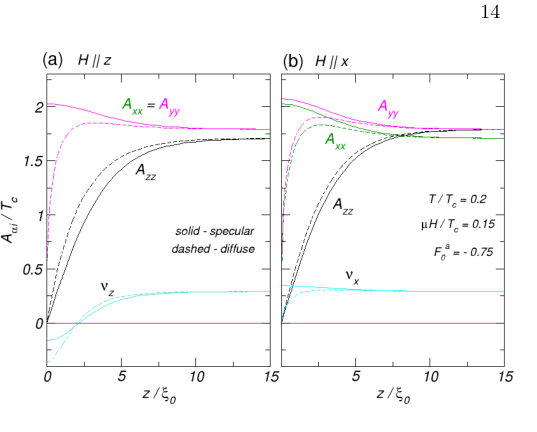
<figcaption class="paper-figure-caption"><b>Fig 5.</b> FIG. 7. The order parameter of a triplet p-wave superfluid near a quasiparticle-reflecting surface, in the presence of a magnetic field. The quasiparticle scattering from the surface is modeled as specular (solid lines) or diffuse (dashed lines). (a) the magnetic field is oriented perpendicular to the surface H ∥z; (b) the magnetic field is parallel to the surface, in this case H ∥x.</figcaption>
</figure>

**Summary.** This work develops a generalized free energy functional for disordered and non-uniform superconductors by extending the Luttinger-Ward formalism. It incorporates disorder effects via the self-consistent t-matrix approximation and handles spatial variations using complex contour integration. The resulting theory provides a powerful tool to calculate superconducting properties in complex materials, such as those with interfaces or magnetic fields.

**Why it may be interesting.** The rigorous mathematical framework for calculating thermodynamic potentials in the presence of disorder and spatial gradients is highly relevant for understanding complex many-body systems, bridging concepts from BCS theory to modern condensed matter theory.

Detailed structure

**Main problem.** The paper aims to derive the free energy functional for superconducting systems, specifically accounting for the effects of disorder and spatial non-uniformities.

**Main result.** The free energy functional is formulated generally using a complex energy plane integral, applicable to various unconventional superconductors and hybrid systems.

**Method.** The derivation extends the Luttinger-Ward functional, employing the self-consistent t-matrix approximation for disorder and utilizing contour integration in the complex energy plane to unify different formalisms.

**Model / system.** The system under study is disordered superconductors and superfluids, including unconventional singlet and triplet condensates, potentially subjected to external Zeeman magnetic fields or interfaces.

**Key observables.** Free energy ($\Omega$), induced charge density ($
ho_{	ext{ind}}$), orbital current ($\mathbf{J}_{	ext{orb}}$), and magnetization ($\mathbf{M}_{	ext{spin}}$).

**Important parameters / regimes.** Impurity scattering strengths, interface scattering types (specular vs. diffuse), external magnetic fields ($\mathbf{H}$), and temperature ($T$).

**Assumptions / limitations.** The theory assumes weak-coupling superconductivity and relies on self-consistent approximations for disorder and the inclusion of electromagnetic potentials perturbatively.

**Figures summary.** Figures illustrate spatial profiles of mean-field order parameters and magnetization near interfaces, comparing results for specular versus diffuse scattering.

**Paper structure.** The structure involves extending the Luttinger-Ward functional, deriving self-consistency equations for the self-energy using the t-matrix approximation, converting Matsubara sums to complex contour integrals, and finally applying the formalism to calculate electromagnetic contributions and pair-breaking energies.

Abstract

We extend the Luttinger-Ward free energy functional to disordered superconductors and superfluids with arbitrary scattering mechanisms, including both impurity disorder and the presence of interfaces. The disorder is taken into account within the self-consistent $t$-matrix approximation, thus allowing for arbitrary impurity scattering strengths. It is shown that both the interface and the impurity scattering self-energy appear in the functional only implicitly, through self-consistently determined fermionic propagators. The free energy functional is formulated in terms of a generalized integral in the complex energy plane, which encompasses formulations both in terms of retarded/advanced propagators and in terms of Matsubara Green's functions by appropriately choosing the integration path. It can be applied, e.g., to spatially non-uniform and hybrid systems, triplet and other unconventional condensates, and strongly-correlated Fermi liquids. A particularly useful formulation in terms of the quasiclassical propagators is applied to unconventional non-uniform singlet and triplet superconductors and superfluids in an external Zeeman magnetic field.

[↑ back to top](#top)

### [Dissipation-driven champion solitons in one-dimensional shallow-water waves](http://arxiv.org/abs/2608.20006v1)

**Authors:** Ashleigh Simonis, Sergey Nazarenko, Jalal Shatah, Yulin Pan  
**Type:** theory · **Category:** other · **PDF:** <https://arxiv.org/pdf/2608.20006v1>  
**Analysis basis:** full PDF text, analyzed in chunks
**Topic relevance:** `correlated / nonlocal dissipation` **2/5** · `driven-dissipative phase transition` **2/5** · `non-equilibrium universality` **2/5** · `Frenkel-Kontorova` **1/5** · `Keldysh / 2PI / non-Gaussian methods` **1/5** · `analog quantum simulation` **1/5** · `methods for driven-dissipative` **1/5** · `scars & prethermalization` **1/5**

↔ Scroll figures horizontally

<figure class="paper-figure-card">
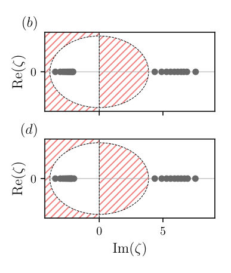
<figcaption class="paper-figure-caption"><b>Fig 1.</b> Figure 1: Surface elevation 휂and corresponding discrete eigenvalue spectrum in the 휁-plane obtained via DST at (top row) 푡= 0 and (bottom row) 푡≈2 × 106푇푝for the conservative KB system. The lower half 퐸-plane (i.e., where Im[퐸(휁)] &lt; 0) is marked by the red hatched region and the continuous spectrum region (i.e., where Im[퐸(휁)] = 0) is marked by the dashed black line.</figcaption>
</figure>
<figure class="paper-figure-card">
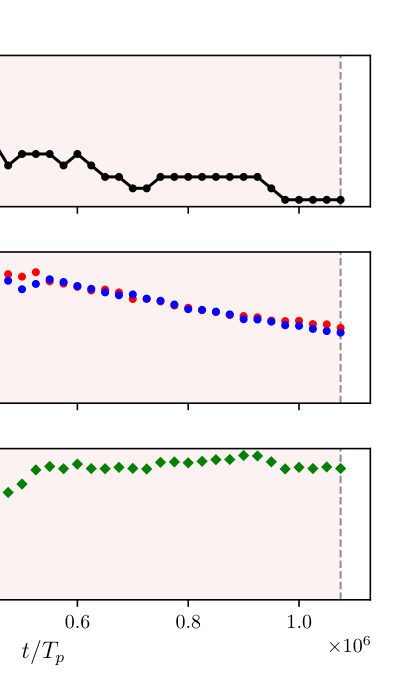
<figcaption class="paper-figure-caption"><b>Fig 2.</b> Figure 2: Evolution of bound-state properties of the system obtained via DST. (푎) Number of bound states 푁BS present in the system; (푏) maximum amplitude of the left-propagating (red points) and right-propagating (blue points) solitons; (푐) ratio of soliton energy to the total system energy. The relaxation, intensification, and quasi-steady stages, including subsequent decay, are marked by orange, green, and red shading, respectively.</figcaption>
</figure>
<figure class="paper-figure-card">
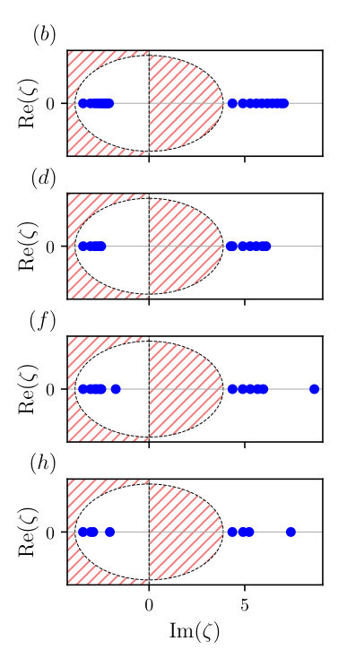
<figcaption class="paper-figure-caption"><b>Fig 3.</b> Figure 3: Evolution of the surface elevation 휂(left column) and corresponding discrete eigenvalue spectrum in the 휁-plane obtained via DST (right column). The four rows present snapshots at 푡= 0, 푡= 1.5 × 105푇푝, 푡= 3.5 × 105푇푝, and 푡= 1.075 × 106푇푝.</figcaption>
</figure>
<figure class="paper-figure-card">
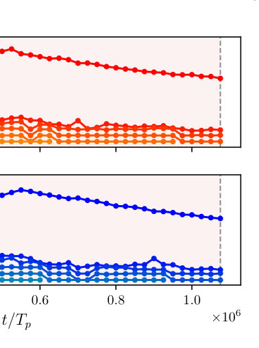
<figcaption class="paper-figure-caption"><b>Fig 4.</b> Figure 4: Evolution of the amplitudes of the bound states present in the system. (푎) Left-propagating solitons; (푏) right-propagating solitons. Each curve represents an individual bound state, with darker colours indicating stronger solitons. The relaxation, intensification, and quasi-steady stages, including subsequent decay, are marked by orange, green, and red shading, respectively.</figcaption>
</figure>
<figure class="paper-figure-card">
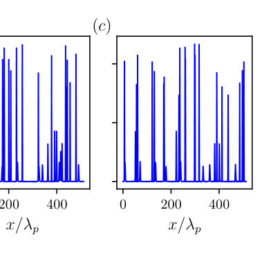
<figcaption class="paper-figure-caption"><b>Fig 5.</b> Figure 5: Evolution of the soliton-only component 휂푠under weak small-scale dissipation. Panels (푎)–(푐) show the 32-soliton ensemble at 푡= 0, 푡= 3.75 × 105푇푝, and 푡= 7.5 × 105푇푝, respectively.</figcaption>
</figure>

**Summary.** This paper introduces a mechanism where weak dissipation in shallow-water waves does not simply damp energy but instead drives the formation of intense 'champion solitons.' By perturbing the integrable Kaup-Boussinesq system with high-wavenumber damping, the authors show that random waves catalyze energy transfer into these dominant coherent structures.

**Why it may be interesting.** While focused on classical fluid dynamics, the concept of energy channeling from a complex background (random waves) into a few dominant, coherent structures via a weak non-conservative perturbation shares conceptual parallels with energy localization mechanisms studied in open quantum systems or nonlinear wave physics.

Detailed structure

**Main problem.** The paper investigates a novel mechanism for rogue wave formation in shallow-water waves, specifically examining how weak dissipation can induce the intensification of coherent structures.

**Main result.** Weak, high-wavenumber dissipation, in conjunction with random wave fields, drives the formation of a 'champion soliton' in both directions of propagation, counter to the general expectation that dissipation damps such structures.

**Method.** The study uses a pseudospectral method with a fourth-order Runge-Kutta time-marching scheme to simulate the evolution of the wave field governed by the Kaup-Boussinesq equation.

**Model / system.** The system is a bidirectional shallow-water wave field modeled by the Kaup-Boussinesq (KB) equation, which is perturbed by a weak, high-wavenumber dissipative term, breaking its underlying integrability.

**Key observables.** Champion soliton amplitude, energy transfer from random waves to coherent structures, and the evolution of the discrete spectrum eigenvalues ($\Omega_j$).

**Important parameters / regimes.** Weak dissipation strength, initial random wave energy spectrum, and the ratio of soliton energy to total system energy.

**Assumptions / limitations.** The analysis assumes that high-wavenumber dissipation provides a physically natural perturbation, and the Direct Scattering Transform (DST) is used as an effective tool for analyzing the spectral problem.

**Figures summary.** Figures show the evolution of surface elevation ($\eta$) and the discrete spectrum; Figure 2 tracks the three stages (relaxation, intensification, quasi-steady) of soliton growth; Figure 3 provides snapshots of the wave field at key time thresholds.

**Paper structure.** The paper first establishes the physical model and the counterintuitive nature of the results. It then analyzes the evolution through distinct stages (relaxation to intensification) using spectral methods, culminating in the identification and characterization of the champion soliton.

Abstract

In this paper, we identify a new mechanism for rogue wave formation in a shallow-water setting. We study a bidirectional shallow-water wave field in the context of the Kaup-Boussinesq equation, and introduce a weak high-wavenumber dissipative perturbation that breaks the underlying integrability of the system. In this setting, dominant solitons grow through successive interactions with weaker, co-propagating solitons, leading to the formation of a "champion soliton" in each direction of propagation. This behaviour is in contrast to the general intuition that dissipation damps coherent structures, and instead shows that weak dissipation can induce their intensification. Moreover, we find that weak dissipation alone is not sufficient for champion soliton formation; the presence of random waves plays a crucial role in the intensification process, catalysing the transfer of energy into dominant coherent structures. While champion solitons have previously been studied in non-integrable systems, these works primarily consider perturbations introduced through modifications of the nonlinear terms (e.g., higher-order Korteweg-de Vries and Schrödinger-type models). In the present work, high-wavenumber dissipation provides a more physically natural perturbation, since such small-scale damping is a common feature in many systems.

[↑ back to top](#top)

### [Nonlinear tunnel oscillations of light in spherical Bragg resonators](http://arxiv.org/abs/2608.19731v1)

**Authors:** Victor P. Ruban  
**Type:** theory · **Category:** other · **PDF:** <https://arxiv.org/pdf/2608.19731v1>  
**Analysis basis:** full PDF text, analyzed in chunks
**Topic relevance:** `Keldysh / 2PI / non-Gaussian methods` **2/5** · `analog quantum simulation` **2/5** · `methods for driven-dissipative` **2/5** · `Tavis-Cummings & cavity-many-emitter` **1/5** · `driven-dissipative phase transition` **1/5** · `interference shaping light` **1/5**

↔ Scroll figures horizontally

<figure class="paper-figure-card">
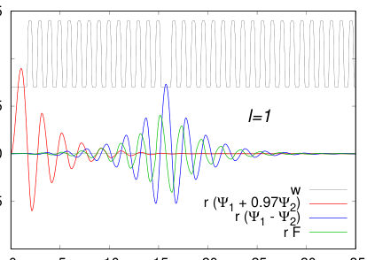
<figcaption class="paper-figure-caption"><b>Fig 1.</b> Figure 1: Examples of localized (non-normalized) linear so- lutions in the presence of central TE-mode. Here 14 lay- ers with larger dielectric permittivity are arranged through distance π starting from coordinate r0 = 1.938π, and all the other layers are shifted along r additionally on value 0.612π. The eigen-frequencies are ξ1 = −0.00066164155, ξ2 = 0.001185237. Also the shell mode of TM type is shown, for which ξTM = 0.0002669188.</figcaption>
</figure>
<figure class="paper-figure-card">
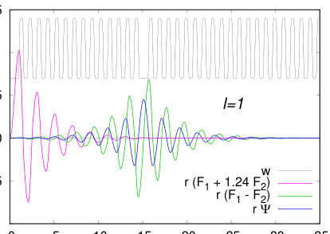
<figcaption class="paper-figure-caption"><b>Fig 2.</b> Figure 2: Examples of localized (non-normalized) linear so- lutions in the presence of central TM-mode. Here 14 lay- ers with larger dielectric permittivity are arranged through distance π starting from coordinate r0 = 1.302π, and all the other layers are shifted along r additionally on value 0.62π. Here the eigen-frequencies are ξ1 = −0.0023929839, ξ2 = −0.0001324124. Also the shell mode of TE type is shown, for which ξTE = −0.0013708785.</figcaption>
</figure>
<figure class="paper-figure-card">
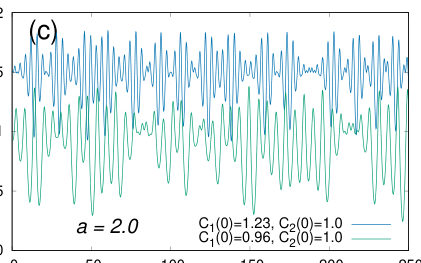
<figcaption class="paper-figure-caption"><b>Fig 3.</b> Figure 3: Examples of various nonlinear regimes in the mod- elling of radial tunneling of light in the framework of equations (22)-(23).</figcaption>
</figure>

**Summary.** This paper models the nonlinear tunneling of light in a spherical dielectric Bragg resonator by deriving a coupled Hamiltonian system of ODEs. The analysis focuses on the interaction between a central mode and surrounding 'shell' modes. It demonstrates how Kerr-type nonlinearity modifies the wave dynamics, providing insights into nonlinear wave propagation in structured optical cavities.

**Why it may be interesting.** This work is highly relevant to quantum optics and open quantum systems, as it models nonlinear wave dynamics (tunneling) in structured dielectric media, which can be analogous to cavity QED or nonlinear photonics systems.

Detailed structure

**Main problem.** The paper theoretically investigates the weakly nonlinear regime of radial tunneling of light within a spherical dielectric Bragg resonator.

**Main result.** The dynamics are described by a coupled Hamiltonian system of ODEs for the field coefficients, showing that nonlinearity significantly alters the tunneling behavior compared to the linear case.

**Method.** The analysis employs a variational method on the Lagrangian structure to derive effective nonlinear coefficients, leading to a Hamiltonian system of ordinary differential equations.

**Model / system.** The system is a spherical dielectric Bragg resonator containing a central radial mode and multiple 'shell' eigenmodes. The dynamics are governed by coupled ODEs for the complex field coefficients $C_1(t)$ and $C_2(t)$.

**Key observables.** The coefficients $C_1(t)$ and $C_2(t)$ determining the field magnitude and orientation at the center and the shell, respectively; the action $I = |\vec{C}_1|^2 + |\vec{C}_2|^2$.

**Important parameters / regimes.** The 'asymmetry parameter' of the tunnel coupling, and the effective Kerr coefficients $	ilde{\alpha}$ and $	ilde{eta}$.

**Assumptions / limitations.** The analysis assumes a weakly nonlinear regime, treating the central mode as Kerr-type nonlinear while the shell modes remain linear. It also assumes a locally isotropic, spatially nonuniform dielectric medium.

**Figures summary.** Figures 1 and 2 illustrate examples of localized linear solutions for TE and TM modes, showing the field structure near central and shell defects.

**Paper structure.** The paper first establishes the linear theory and the Hamiltonian formulation for the field evolution. It then derives the coupled nonlinear ODEs for the mode coefficients, analyzes the resulting Hamiltonian structure, and discusses the physical implications of the nonlinear coupling.

Abstract

A weakly nonlinear regime of radial tunneling is theoretically considered for a light wave in a spherical dielectric Bragg resonator containing a set of ``shell'' eigenmodes (both TE and TM) with different azimuthal numbers $l\geq 1$, which are concentrated near a defect of the Bragg structure, several layers away from the origin. A single radial mode with $l=1$ is present at the resonator center, either TM or TE. Nonlinearity of the Kerr type in the main approximation is actual for the central mode only, while all the shell modes remain in the linear regime. The tunneling occurs between the central mode and the shell $l=1$ mode of the same symmetry. Nontrivial part of the dynamics of optical field is described by a Hamiltonian system of ordinary differential equations for complex vectors ${\bf C}_{1}(t)$ and ${\bf C}_{2}(t)$, which determine the magnitude and spatial orientation of the wave structures at the center and at the shell, respectively. Depending on ``asymmetry parameter'' of tunnel coupling, the system demonstrates different variants of nonlinear behavior.

[↑ back to top](#top)

### [Photogalvanic transport of nonreciprocal Cooper-pair fluctuations](http://arxiv.org/abs/2608.20166v1)

**Authors:** Joaquim Telles de Miranda, Alex Levchenko  
**Type:** theory · **Category:** other · **PDF:** <https://arxiv.org/pdf/2608.20166v1>  
**Analysis basis:** full PDF text, analyzed in chunks
**Topic relevance:** `Keldysh / 2PI / non-Gaussian methods` **2/5** · `methods for driven-dissipative` **2/5** · `correlated / nonlocal dissipation` **1/5** · `driven-dissipative phase transition` **1/5** · `non-equilibrium universality` **1/5**

↔ Scroll figures horizontally

<figure class="paper-figure-card">
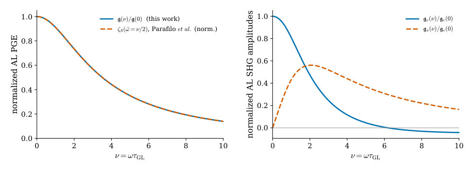
<figcaption class="paper-figure-caption"><b>Fig 1.</b> Figure 1: Left: normalized AL PGE master function g(ν)/g(0) [identical for the C3v invariant and for both D3h chan- nels], compared with the normalized photogalvanic response ζS of Parafilo et al. [28] evaluated at ˜ω = ν/2: the two frequency profiles coincide exactly (see text). Right: AL SHG amplitudes gc(ν) (in phase) and gs(ν) (quadrature), normalized by gc(0) = 1/24.</figcaption>
</figure>
<figure class="paper-figure-card">
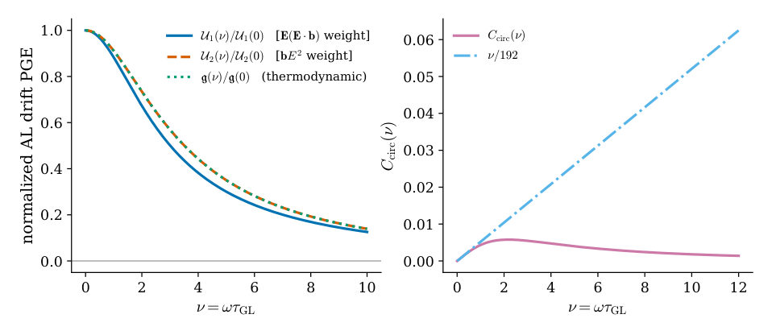
<figcaption class="paper-figure-caption"><b>Fig 2.</b> Figure 2: Left: normalized PGE master functions of the AL linear-drift (kinetic) channel, Eq. (48): the E(E · b) weight U1 and the bE2 weight U2, compared with the thermodynamic profile g(ν) (dotted). Both weights retain their dc signs at all frequencies, with the anisotropy ratio U2/U1 remaining close to its dc value −1</figcaption>
</figure>
<figure class="paper-figure-card">
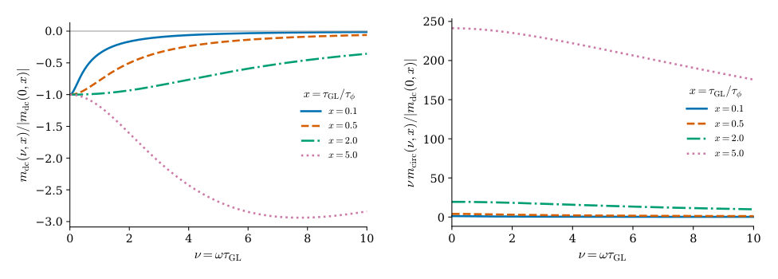
<figcaption class="paper-figure-caption"><b>Fig 3.</b> Figure 3: Left: normalized MT PGE master function mdc(ν, x)/|mdc(0, x)| for several dephasing ratios x = τGL/τϕ. Right: the helicity-odd (circular) MT master function ν mcirc(ν, x) of Sec. 6; its finite ν →0 intercept equals m1(x)/4 [Eq. (78)], reflecting the 1/ν growth of mcirc itself.</figcaption>
</figure>
<figure class="paper-figure-card">
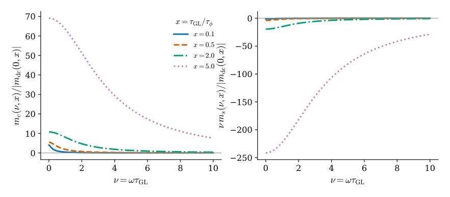
<figcaption class="paper-figure-caption"><b>Fig 4.</b> Figure 4: MT SHG amplitudes, normalized by the static PGE magnitude, for several dephasing ratios: in-phase mc (left) and quadrature ν ms (right; the amplitude ms itself diverges as 1/ν at small ν, see Sec. 5.3).</figcaption>
</figure>
<figure class="paper-figure-card">
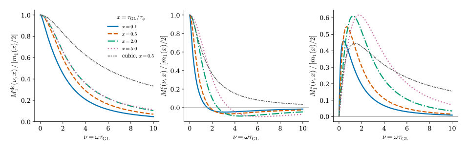
<figcaption class="paper-figure-caption"><b>Fig 5.</b> Figure 5: Finite-frequency master functions of the kinetic (linear drift) MT channel, normalized by the static value m1(x)/2, for several dephasing ratios [gray: cubic drift at x = 0.5, normalized by m3(0.5)/2]. Left: rectified amplitude M dc 1 ; middle: in-phase SHG amplitude M c 1; right: quadrature amplitude M s 1, with the linear onset of Eq. (71) — no 1/ν enhancement, in contrast with the thermodynamic MT channel of Fig. 4.</figcaption>
</figure>

**Summary.** This work develops a comprehensive theory for nonlinear transport in fluctuating 2D noncentrosymmetric superconductors. It extends previous models by incorporating nonreciprocity into the kinetic relaxation terms of the Ginzburg-Landau theory. The key finding is that this kinetic nonreciprocity enables a polarization-sensitive photogalvanic response in the Aslamazov-Larkin channel, offering a clean experimental signature for nonreciprocal pair kinetics.

**Why it may be interesting.** The explicit connection between non-equilibrium fluctuation dynamics (kinetic invariants) and measurable optical/transport responses (PGE, PVHE) provides a powerful tool for characterizing broken inversion symmetry in superconductors, relevant to advanced quantum materials research.

Detailed structure

**Main problem.** Developing a theory for the nonlinear optical and transport responses (photogalvanic, SHG, photovoltaic Hall effect) in 2D noncentrosymmetric superconductors in the fluctuation regime above $T_c$.

**Main result.** The kinetic nonreciprocity, encoded in kinetic Lifshitz invariants, allows for a polarization-sensitive, helicity-odd rectified current in the Aslamazov-Larkin channel, which was previously only seen in the Maki-Thompson channel.

**Method.** Derivation of generalized master formulas for the nonlinear current in the Aslamazov-Larkin and Maki-Thompson channels using the time-dependent Ginzburg-Landau description.

**Model / system.** Two-dimensional noncentrosymmetric superconductors operating in the fluctuation regime ($T \gtrsim T_c$). The dynamics are modeled using the stochastic TDGL equation incorporating both thermodynamic and kinetic nonreciprocal terms.

**Key observables.** Photogalvanic current, second-harmonic generation, photovoltaic Hall current, and their dependence on circular polarization (helicity-odd rectification).

**Important parameters / regimes.** Temperature relative to $T_c$, drive frequency ($\omega$), nonreciprocal perturbation strength ($\delta\alpha, 
ho$), and point-group symmetry ($C_{3v}, D_{3h}$).

**Assumptions / limitations.** The analysis is performed to linear order in nonreciprocal perturbations and to second order in the drive field, assuming the Fluctuation-Dissipation Theorem holds.

**Figures summary.** Not specified.

**Paper structure.** The paper develops the TDGL dynamics, derives generalized master formulas for the AL and MT channels (incorporating both thermodynamic and kinetic nonreciprocity), and analyzes the polarization dependence and symmetry constraints.

Abstract

We develop a theory of the nonlinear optical and transport responses of two-dimensional noncentrosymmetric superconductors in the fluctuation regime above the transition temperature, encompassing the photogalvanic effect, second-harmonic generation, and the photovoltaic Hall effect. In the vicinity of the transition these responses are strongly enhanced by preformed Cooper pairs, whose nonreciprocity enters the time-dependent Ginzburg-Landau description in two physically distinct ways: through thermodynamic Lifshitz invariants, which encode an asymmetric pair spectrum, and through kinetic Lifshitz invariants, which encode an asymmetric pair relaxation and are locked to the Langevin noise by the fluctuation-dissipation theorem. We derive generalized master formulas for the paraconductivity (Aslamazov-Larkin) and the quantum-interference (Maki-Thompson) channels of the nonlinear current, valid at arbitrary drive frequency and to linear order in the nonreciprocal perturbations, and reduce them to closed-form dimensionless functions. Circular polarization discriminates sharply between the mechanisms: for reciprocal momentum-structureless noise the Aslamazov-Larkin channel is polarization insensitive and its circular photogalvanic response vanishes for any pair spectrum, whereas the Maki-Thompson channel and the nonreciprocal noise support helicity-odd rectified currents, including a fluctuation photovoltaic Hall current flowing transverse to the strain axis. Applications to Rashba-type ($C_{3v}$) and Ising-type ($D_{3h}$) superconductors demonstrate how the point-group symmetry dictates the allowed vector structures of the nonlinear currents, and how polarization analysis together with the frequency and dephasing dependences can be used to separate the individual channels experimentally.

[↑ back to top](#top)

### [Search for Majorana Bound States in Short Chains of Proxmitised Quantum Dots](http://arxiv.org/abs/2608.19911v1)

**Authors:** Bogdan R. Bułka, Karol I. Wysokiński  
**Type:** theory · **Category:** other · **PDF:** <https://arxiv.org/pdf/2608.19911v1>  
**Analysis basis:** full PDF text, analyzed in chunks
**Topic relevance:** `Keldysh / 2PI / non-Gaussian methods` **2/5** · `analog quantum simulation` **2/5** · `methods for driven-dissipative` **2/5**

↔ Scroll figures horizontally

<figure class="paper-figure-card">
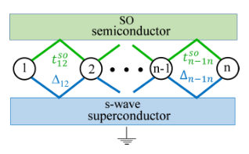
<figcaption class="paper-figure-caption"><b>Fig 1.</b> FIG. 1. Scheme of a sandwich geometry of n quantum dots chain in proximity to the BCS superconductor and a semiconductor with strong spin - orbit coupling.</figcaption>
</figure>
<figure class="paper-figure-card">
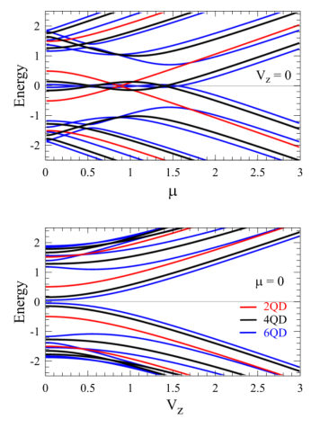
<figcaption class="paper-figure-caption"><b>Fig 2.</b> FIG. 2. Energy spectrum of the chain with 2QD (red), 4QD (black), and 6QD (blue) as a function of µ at Vz = 0 (top panel) and a function of Vz at µ = 0 (bottom panel) for tso = 1 and ∆CAR = 0.5. Note the level crossing near zero energy, as well as the crossings in the upper and lower energy branches.</figcaption>
</figure>
<figure class="paper-figure-card">
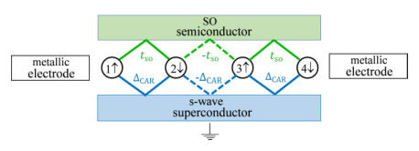
<figcaption class="paper-figure-caption"><b>Fig 3.</b> FIG. 3. Scheme of the 4QD chain with a staggered spin configuration and alternating inter-dot couplings. The notation in the picture corresponds to the Ψ state. For the Φ state, the spins at all quantum dots would be re- versed.</figcaption>
</figure>
<figure class="paper-figure-card">
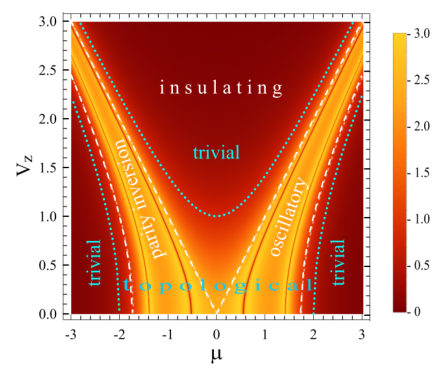
<figcaption class="paper-figure-caption"><b>Fig 4.</b> FIG. 4. Phase diagram of the open 4QD Majo- rana chain in the (µ, Vz) plane determined from the nonlocal zero-energy chiral Majorana Green function log  1 + |Gr γA0ηB1(0)|  describing the transfer γA1 → ηB1 →γA2 →ηB2, for tso = 1, ∆CAR = 0.5 and γL = γR = 0.05. The colour scale represents the strength of coherent nonlocal Majorana propagation be- tween opposite ends of the chain. Bright regions indicate strong edge-to-edge coherence, enhanced teleportation- like transport, and strongly hybridised finite-size Majo- rana states, while dark regions correspond to suppressed nonlocal propagation and localised edge-mode behavior. In the two regions symmetric with respect to µ = 0 lo- cated...</figcaption>
</figure>

**Summary.** This work theoretically explores the existence and nature of Majorana Zero Modes in a quantum dot chain coupled to superconductors. By employing multiple advanced methods—including Green functions and transfer matrices—the authors map out the phase diagram, confirming the topological protection of these zero-energy states. The findings provide a detailed guide for engineering superconducting quantum devices hosting exotic topological excitations.

**Why it may be interesting.** The rigorous comparison between Green function and transfer matrix results provides a robust theoretical confirmation of topological phase transitions in mesoscopic superconducting structures, which is highly relevant for designing superconducting quantum circuits.

Detailed structure

**Main problem.** The paper investigates the search for Majorana Zero Modes (MZM) in a specific artificial platform: a short chain of quantum dots (QDs) coupled to superconductors and semiconductors.

**Main result.** The analysis confirms that the system exhibits distinct topological regimes, characterized by the appearance of zero-energy modes, which are consistently predicted by multiple theoretical approaches (Green function, transfer matrix).

**Method.** The study employs advanced theoretical techniques including the Green function formalism in chiral Majorana representation, the transfer matrix method, and the calculation of topological invariants (Pfaffians).

**Model / system.** The system is a chain of QDs sandwiched between an s-wave superconductor and a strong spin-orbit semiconductor, subjected to a Zeeman field. The model is analyzed via an effective Hamiltonian derived under several approximations.

**Key observables.** The modulus of the retarded Green function at zero energy, the energy spectrum ($\omega_{0,nQD}$), and the topological invariant ($
u$).

**Important parameters / regimes.** Chemical potential ($\mu$), Zeeman field ($V_z$), and the coupling strengths ($t_{so}$, $\Delta_{CAR}$).

**Assumptions / limitations.** The analysis neglects spin-conserving hopping processes and local on-dot superconducting correlations, and often assumes a large superconducting gap limit.

**Figures summary.** Figures illustrate the energy spectrum for varying QD lengths (2QD, 4QD, 6QD) and show phase diagrams mapping out topological boundaries based on $\mu$ and $V_z$.

**Paper structure.** The paper develops the Hamiltonian, calculates the spectrum using the Green function and transfer matrix approaches, and then compares the resulting phase diagrams and signatures (oscillatory vs. localized wavefunctions) derived from these complementary methods.

Abstract

Majorana zero modes (MZM) appearing at the ends of artificially created one-dimensional p-wave superconductors have been intensively studied recently both theoretically and experimentally. Among possible platforms, proximitised semiconducting wires, and short chains of quantum dots with a superconductor in between were investigated. Here, we propose a different platform consisting of a chain of quantum dots (QDs) sandwiched between an s-wave superconductor and a strong spin-orbit semiconductor, subject to a Zeeman magnetic field. Neglecting spin-conserving hopping processes between QDs and local on-dot superconducting correlations induced by the superconducting proximity effect, reduces the Hamiltonian to the sum of two equivalent Hamiltonians with two independent Hilbert spaces. The resulting model has a staggered structure due to spin-flipping processes $t_{so}$ and cross-Andreev reflections $Δ_{CAR}$ between neighbouring dots. Our central result is the phase diagram of a short chain consisting of four QDs and coupled to two external reservoirs, obtained by means of the Green function in chiral Majorana representation. The modulus of the retarded Green function, probing the whole chain and calculated for zero energy, is shown to contain information on topology and spatial character of Majorana zero modes. The features observed in the Green function nicely agree with those obtained from the transfer matrix approach. In particular the region in parameter space in which Majorana zero modes display oscillatory wave functions are well reproduced. Likewise the borders of the fermion parity changes obtained by the Green function agree with those obtained by other means.

[↑ back to top](#top)

### [Electronic and chemical phase identification in photoemission experiments using unsupervised machine learning](http://arxiv.org/abs/2608.19503v1)

**Authors:** Matthew Staab, Joseph Pandur, Eli Rotenberg, Chris Jozwiak, Aaron Bostwick, Inna Vishik  
**Type:** both · **Category:** disordered systems and neural networks · **PDF:** <https://arxiv.org/pdf/2608.19503v1>  
**Analysis basis:** full PDF text, analyzed in chunks
**Topic relevance:** `methods for driven-dissipative` **2/5** · `quantum measurements` **2/5** · `analog quantum simulation` **1/5**

↔ Scroll figures horizontally

<figure class="paper-figure-card">
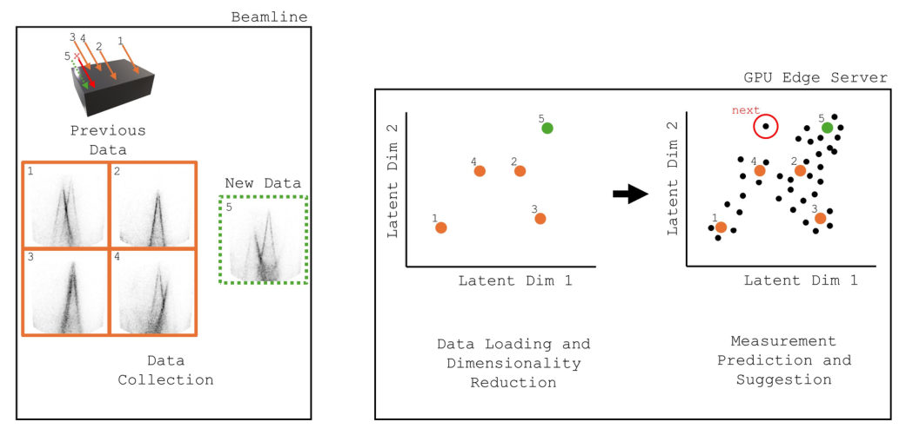
<figcaption class="paper-figure-caption"><b>Fig 1.</b> FIG. 1. Schematic overview for the AARDVARK system. Data are collected at the beamline end station and saved to disk. The beamline requests a new position to measure and begins measuring a new location. Asynchronously, the GPU edge server is loading all new data and repeating the machine learning pipeline. The machine learning pipeline ends by overwriting the list of next positions to measure with an updated list. We schematically show only one measurement suggestion (red circle) but in practice the server adapts the number of suggestions it creates to ensure there are always positions available for the beamline upon request.</figcaption>
</figure>
<figure class="paper-figure-card">
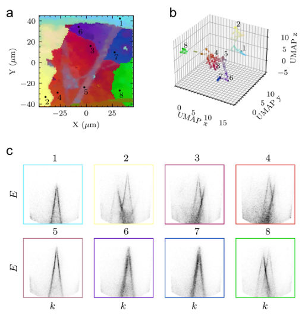
<figcaption class="paper-figure-caption"><b>Fig 2.</b> FIG. 2. Colorized UMAP embeddings of ground truth dataset. (a) Spatial plot of the UMAP embedded ARPES data. The colors are made by scaling the range of the UMAP x, y, z coordinates to [0, 255] such that they can be displayed in the red, green, and blue channels of an image respectively. (b) The set of all ARPES spectra shown in their UMAP di- mensionality reduced space with the markers colored based on the same procedure described in (a). (c) ARPES spec- tra taken at the locations indicated by the black marker and numbers in (a) and (b).</figcaption>
</figure>
<figure class="paper-figure-card">
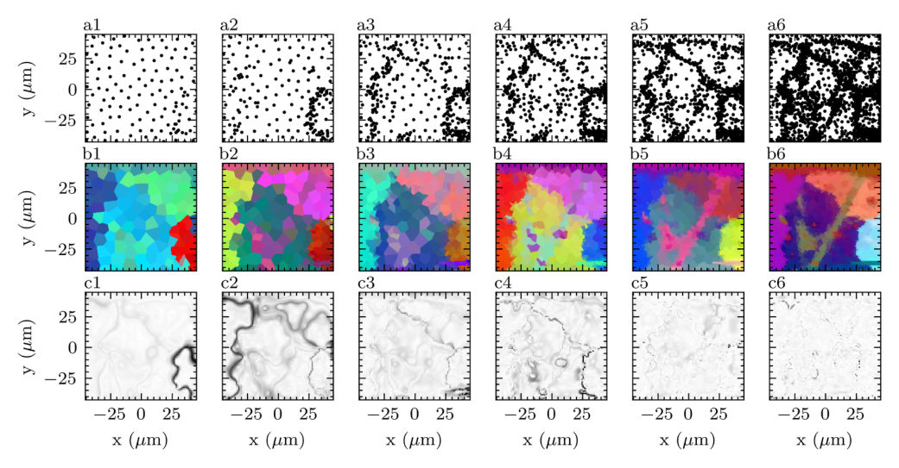
<figcaption class="paper-figure-caption"><b>Fig 3.</b> FIG. 3. Progression of an AARDVARK scan on ARPES data. (a) Coordinates of sampled data with (125, 200, 400, 600, 1000, 2000) points measured are shown in (a1-a6) respectively. (b) Nearest-neighbor colorized 3-dimensional UMAP embeddings of ARPES spectra collected at the points shown in (a). Different colors indicate different spectral features as found by the dimensionality reduction method UMAP. (c) The acquisition function that is used to determine the priority of following measurements. Darker pixels indicate a higher measurement priority.</figcaption>
</figure>
<figure class="paper-figure-card">
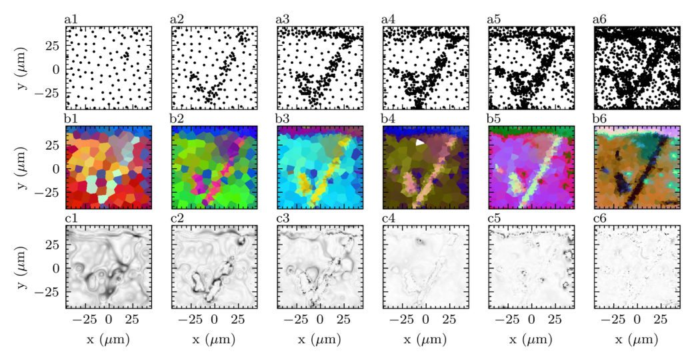
<figcaption class="paper-figure-caption"><b>Fig 4.</b> FIG. 4. Progression of an AARDVARK scan on XPS data. (a) Coordinates of sampled data with (125, 200, 400, 600, 1000, 2000) points measured are shown in (a1-a6) respectively. (b) Nearest-neighbor colorized 3-dimensional UMAP embeddings of XPS spectra of the Si 2p core level collected at the points shown in (a). Different colors indicate different spectral features as found by the dimensionality reduction method UMAP. (c) The acquisition function that is used to determine the priority of following measurements. Darker pixels indicate a higher measurement priority.</figcaption>
</figure>
<figure class="paper-figure-card">
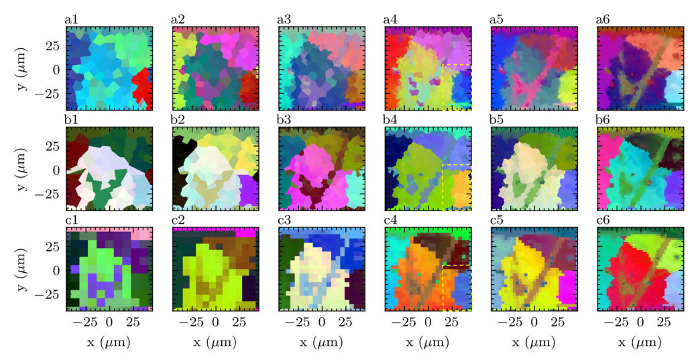
<figcaption class="paper-figure-caption"><b>Fig 5.</b> FIG. 5. Comparison of AARDVARK operation on ARPES data with random or grid search. Rows (a-c) show the progression of scans using AARDVARK, random positions, and grid searches respectively. Panels (1–6) display colorized UMAP visual- izations for scans (AARDVARK, random, and grid) at approximately 125, 200, 400, 600, 1000, and 2000 measurement points, respectively. In the case of a grid search the closest square number is used to simulate a scan of approximately the same number of points (e.g. 121 instead of 125). Dotted yellow lines on the fourth column represent the boundaries of the cropped UMAP embeddings analyzed in Figure 6 .</figcaption>
</figure>

**Summary.** This paper introduces AARDVARK, an autonomous machine learning framework designed to optimize data collection in surface-sensitive photoemission experiments. It uses UMAP to reduce high-dimensional spectral data and Gaussian Process Regression to predict spectral properties, guiding the measurement process to efficiently map out unknown electronic and chemical phase boundaries. This represents a significant step toward automating complex experimental characterization.

**Why it may be interesting.** While focused on experimental data acquisition, the reliance on advanced ML techniques (UMAP, GPR) to extract phase information from complex, high-dimensional spectral data is highly relevant for analyzing quantum many-body simulations or experimental data sets where phase boundaries are sought.

Detailed structure

**Main problem.** Traditional methods for characterizing heterogeneous surfaces using VUV photoemission spectroscopy are time-consuming and inefficient.

**Main result.** The proposed AARDVARK framework successfully and efficiently maps out spectroscopically distinct regions and phase boundaries on uncharacterized samples.

**Method.** The framework combines UMAP for high-dimensional spectral data dimensionality reduction with Gaussian Process Regression (GPR) to guide real-time, autonomous data acquisition.

**Model / system.** The system is applied to VUV photoemission experiments (ARPES/XPS) on complex materials like graphene heterostructures, treating the sample surface as a spatially varying, uncharacterized dataset.

**Key observables.** Colorized UMAP embeddings of spectra, spectral features (e.g., Dirac cone), and the calculated uncertainty/acquisition function guiding measurement selection.

**Important parameters / regimes.** The dimensionality reduction technique (UMAP) and the Gaussian Process model structure are key computational components.

**Assumptions / limitations.** The primary assumption is that spectral similarity in the high-dimensional space can be accurately captured by a low-dimensional manifold (UMAP), and that GPR can reliably predict spectral characteristics in unmeasured regions.

**Figures summary.** Figures illustrate the AARDVARK workflow, colorized UMAP embeddings showing spectral variations across the sample, and comparisons demonstrating AARDVARK's superior boundary detection compared to random or grid searches.

**Paper structure.** The paper introduces the AARDVARK framework, details the ML pipeline combining UMAP and GPR, demonstrates its application to ARPES and XPS data, and evaluates its performance by comparing boundary detection against standard search methods.

Abstract

Vacuum ultraviolet photoemission spectroscopies are very information-rich experiments, but due to their surface sensitivity, data are often collected on an initially uncharacterized surface. Traditional raster-grid approaches for locating optimal measurement regions can be time-consuming. In this work, we introduce AARDVARK, a generalizable framework for sample exploration that leverages dimensionality reduction and Gaussian process regression to guide initial sample searches in spatially-resolved photoemission experiments. By utilizing UMAP as a target for a Gaussian process, the algorithm efficiently identifies boundaries of spectroscopically distinct regions, dynamically adapting to variations in sample characteristics. The algorithm enables real-time decision making in measurement selection, optimizes data acquisition, and presents a robust framework for future autonomous sample exploration in photoemission experiments.

[↑ back to top](#top)

### [Spin-torque microwave detectors of positive rectangular pulse signals](http://arxiv.org/abs/2608.20323v1)

**Authors:** V. Prokopenko, O. Shtanko, I. Sotnyk, O. Prokopenko  
**Type:** theory · **Category:** other · **PDF:** <https://arxiv.org/pdf/2608.20323v1>  
**Analysis basis:** full PDF text, analyzed in chunks
**Topic relevance:** `Keldysh / 2PI / non-Gaussian methods` **1/5** · `analog quantum simulation` **1/5** · `driven-dissipative phase transition` **1/5** · `methods for driven-dissipative` **1/5** · `non-equilibrium universality` **1/5** · `quantum measurements` **1/5**

↔ Scroll figures horizontally

<figure class="paper-figure-card">
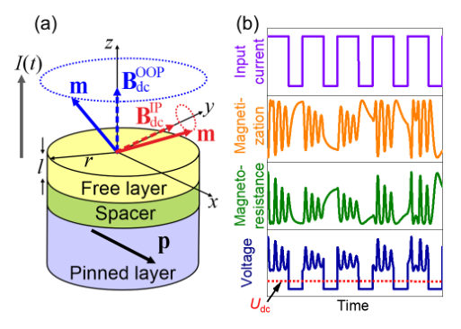
<figcaption class="paper-figure-caption"><b>Fig 1.</b> FIG. 1. (a) Layout of a circular STMD consisting of free and pinned magnetic layers separated by a dielectric spacer. When an input pulse current I(t) is applied to the structure, it excites the magnetization dynamics, M(t), described by the normalized magnetization vector m ≡m(t) = M(t)/|M(t)|. The vector m precesses along a particu- lar trajectory, depending on the configuration of the bias dc magnetic field Bdc: an in-plane trajectory (red dotted curve) for an in-plane field Bdc = BIP dc (red dashed arrow) and an out-of-plane trajectory (blue dotted curve) for an out-of-plane field Bdc = BOOP dc (blue dashed arrow). (b) A set of plots illustrating the principle of the device oper- ation...</figcaption>
</figure>
<figure class="paper-figure-card">
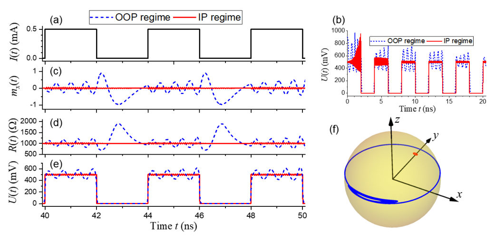
<figcaption class="paper-figure-caption"><b>Fig 2.</b> FIG. 2. Typical time dependence of (a) the input rectangular pulse current I(t), (c) the x-component of dynamic magnetization, mx(t), (d) the device magnetoresistance R(t), and (b, e) the voltage U(t) generated across the device. Solid red lines and dashed blue lines in (b)-(e) correspond to the IP and OOP regimes of STMD operation, respectively. Picture (f) shows the trajectory of magnetization motion (red line for an in-plane regime and blue line for an out-of-plane regime) on a surface of unit sphere |m| = 1. Calculations performed for pulse parameters I0 = 0.5 mA, τ = 2 ns, T = 4 ns. All other calculation parameters are indicated in the text.</figcaption>
</figure>
<figure class="paper-figure-card">
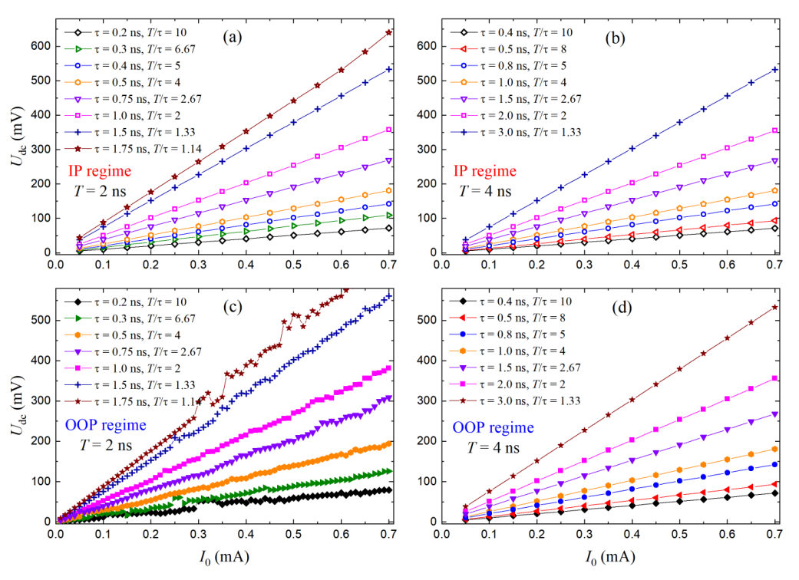
<figcaption class="paper-figure-caption"><b>Fig 3.</b> FIG. 3. The detector output dc voltage Udc as a function of the amplitude I0 of input pulse current calculated numerically for different pulse durations τ and a pulse repetition period of T = 2 ns (a, c) and T = 4 ns (b, d). All calculations were performed for an STMD with typical parameters (see the main text for details), with IP magnetization dynamics (a, b) and OOP magnetization dynamics (c, d). The curves shown in (a, b, d) demonstrate good agreement with the approximate linear dependence Udc ∼I0(τ/T), however, the curves in (c) contain voltage jumps and drops, which are typical for the nonlinear regime of device operation. To simplify the analysis, the curves with the same T/τ ratio...</figcaption>
</figure>

**Summary.** This work investigates how a spin-torque microwave detector (STMD) responds to rectangular current pulses, revealing two operational regimes. The linear regime allows for the unambiguous detection of input pulse parameters via a predictable linear relationship between the measured DC voltage and the pulse parameters. This suggests practical utility for developing spintronic devices capable of digital signal processing.

**Why it may be interesting.** While the core physics is spintronics, the analysis of non-linear dynamics and the identification of a linear operating regime for signal processing parallels concepts in open quantum systems where linear response theory is used to characterize system response to weak perturbations.

Detailed structure

**Main problem.** The paper analyzes the performance of a spin-torque microwave detector (STMD) when driven by positive rectangular current pulses to detect and process non-harmonic (digital) microwave signals.

**Main result.** The STMD exhibits two regimes: a linear regime where the DC voltage is proportional to $I_0 (	au/T)$, which is ideal for parameter detection, and a nonlinear regime characterized by voltage jumps/drops in the out-of-plane magnetization case.

**Method.** The analysis involves deriving the time-averaged voltage $U_{dc}$ from the time-dependent voltage $U(t) = I(t)R(t)$ by solving the Landau-Lifshitz-Gilbert-Slonczewski equation for magnetization dynamics.

**Model / system.** The system is an STMD based on Magnetic Tunnel Junctions (MTJs). Magnetization dynamics are modeled using the macrospin approximation governed by the LLG equation, considering both in-plane (IP) and out-of-plane (OOP) magnetization dynamics.

**Key observables.** Time-averaged DC voltage ($U_{dc}$), instantaneous voltage ($U(t)$), and the dependence of $U_{dc}$ on input pulse amplitude ($I_0$), duration ($	au$), and repetition period ($T$).

**Important parameters / regimes.** The linear regime is characterized by $U_{dc} \sim I_0 (	au/T)$; the nonlinear regime is associated with a threshold amplitude $I_{th}$.

**Assumptions / limitations.** The analysis relies on the macrospin approximation for magnetization dynamics and assumes fixed polarization magnetization along $\hat{x}$.

**Figures summary.** Figure 2 illustrates the time dependence of voltage and magnetization for IP and OOP regimes. Figure 3 plots $U_{dc}$ versus $I_0$ for various $	au$ and $T$, showing linear behavior in the IP case and nonlinear jumps in the OOP case.

**Paper structure.** The paper analyzes the STMD response to periodic rectangular pulses, deriving the governing equations, identifying two distinct operational regimes (linear/IP and nonlinear/OOP), and concluding that the linear regime offers unambiguous parameter detection.

Abstract

We analyze the performance of a spin-torque microwave detector (STMD) driven by positive rectangular current pulses $I(t)$ of various amplitudes $I_0$, durations $τ$, and repetition periods $T$ and reveal two distinct regimes of STMD operation. In the first (linear) regime, the time-averaged voltage across the detector, $U_{\rm dc}$, changes linearly with the pulse amplitude $I_0$ and depends on the ratio $τ/T$: $U_{\rm dc} \sim I_0 (τ/T)$. This regime is observed for a wide range of pulse amplitudes $I_0$ in the case of in-plane (IP) magnetization dynamics and for rather small pulse amplitudes $I_0 \le I_{\rm th}$ in an STMD with out-of-plane (OOP) magnetization dynamics. The other (nonlinear) regime is characterized by voltage jumps and drops and is observed only in a structure with OOP magnetization dynamics for input pulses with short repetition periods and large amplitudes $I_0 \ge I_{\rm th}$. We believe that the linear regime of STMD operation can be used to unambiguously detect input pulse parameters, which could be important for the development and optimization of spintronic devices capable of detecting and processing non-harmonic (e.g., digital) microwave signals.

[↑ back to top](#top)

### [Channel-selective magnetic filtering in a nodal-line semimetal](http://arxiv.org/abs/2608.19362v1)

**Authors:** Hironmoy Pratihar, Alessandro De Martino, Arijit Kundu  
**Type:** theory · **Category:** other · **PDF:** <https://arxiv.org/pdf/2608.19362v1>  
**Analysis basis:** full PDF text, analyzed in chunks
**Topic relevance:** `Keldysh / 2PI / non-Gaussian methods` **1/5**

↔ Scroll figures horizontally

<figure class="paper-figure-card">
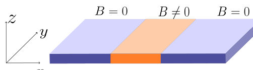
<figcaption class="paper-figure-caption"><b>Fig 1.</b> Figure 1. Schematic of the NLS magnetic-barrier geometry. The nodal ring lies in the x–y plane and the magnetic field is nonzero only within the strip 0 ≤x ≤L. The system remains translationally invariant along the transverse y and z directions.</figcaption>
</figure>
<figure class="paper-figure-card">
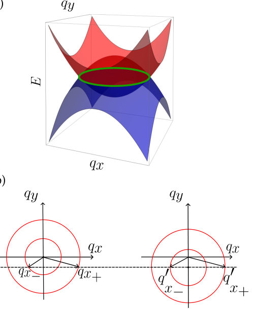
<figcaption class="paper-figure-caption"><b>Fig 2.</b> Figure 2. (a) Bulk dispersion (6) for qz = 0. (b) Cross- sections of a constant-energy surface at fixed qz before the barrier (left panel) and after the barrier (right panel). For fixed (E, qz), there are two propagating channels, correspond- ing to the inner and the outer contour. The dashed line shows a fixed value of the conserved momentum qy, and qx,± are the magnitude of the allowed longitudinal component of the mo- mentum in the region x &lt; 0, see Eq. (9). In the transmitted region x &gt; L, the vector potential shifts the contour center by −BL along qy, producing transmitted channels with different longitudinal momenta q′ x,±, see Eq. (27).</figcaption>
</figure>
<figure class="paper-figure-card">
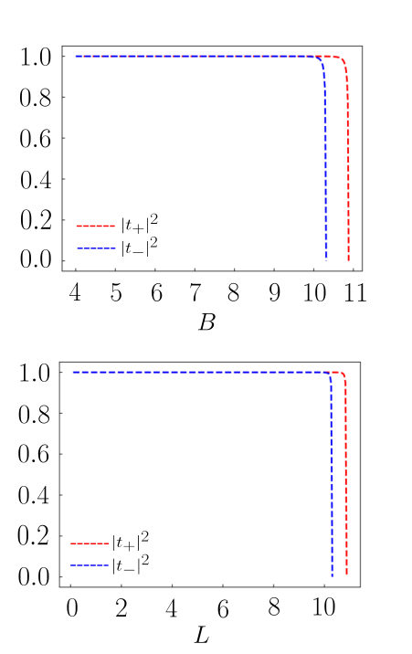
<figcaption class="paper-figure-caption"><b>Fig 3.</b> Figure 3. Transmission probabilities |ts|2 at normal incidence (qy = qz = 0) for energy E = 150 (10.5 meV), plotted as functions of magnetic field B with L = 5 (130 nm), (panel (a)) and of barrier width L with B = 5 (panel (b)). The transmission in channel s abruptly vanishes when BL reaches the critical value p</figcaption>
</figure>
<figure class="paper-figure-card">

<figcaption class="paper-figure-caption"><b>Fig 4.</b> Figure 4. Polar plots of transmission probabilities at qz = 0 as a function of the azimuthal angle ϕ, for channel −[panel (a)] and channel + [panel (b)], for several values of the mag- netic field. We use the same parameters as in Fig. 3(a): E = 150 (10.5 meV), L = 5 (130 nm), q0 = 53, c = 148.</figcaption>
</figure>
<figure class="paper-figure-card">
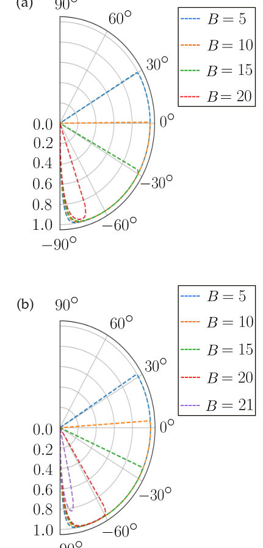
<figcaption class="paper-figure-caption"><b>Fig 5.</b> Figure 4 shows polar plots of the transmission proba- bility at energy E = 150 as a function of the azimuthal angle ϕ at qz = 0, for the −channel [panel (a)] and the + channel [panel (b)], for several values of the mag- netic field. On this qz slice the relevant contour radius is Rs(0) = p</figcaption>
</figure>

**Summary.** This theoretical work analyzes quantum transport in a nodal-line semimetal subjected to a magnetic barrier. By modeling the toroidal Fermi surface, the authors show that the barrier selectively filters the two distinct transport channels (inner and outer) at different critical strengths. This sequential quenching of conductance provides a unique, measurable signature confirming the material's underlying topological electronic structure.

**Why it may be interesting.** The concept of channel-selective filtering based on the topology of the Fermi surface is a sophisticated manifestation of quantum transport physics, relevant to understanding topological materials and their response to external fields.

Detailed structure

**Main problem.** The study investigates quantum transport through a magnetic barrier in a nodal-line semimetal (NLS) to demonstrate a phenomenon called channel-selective magnetic filtering.

**Main result.** The magnetic barrier acts as a filter by sequentially blocking the inner and outer transport channels of the toroidal Fermi surface at different critical barrier strengths. This sequential quenching provides an experimental fingerprint of the NLS's toroidal geometry.

**Method.** The authors employed a wave-function matching approach using a two-band effective Hamiltonian to derive closed-form, channel-resolved transmission amplitudes across the barrier.

**Model / system.** The system is an NLS characterized by a nodal ring, leading to a toroidal constant-energy surface with two distinct inner and outer propagating channels. The transport is modeled by introducing a magnetic barrier (stripe) using a Landau gauge vector potential.

**Key observables.** Two-terminal conductance ($G/A$), channel-resolved transmission amplitudes ($|t_s|^2$), and the dependence of conductance on barrier strength ($BL$) and Fermi energy ($E$).

**Important parameters / regimes.** The field-width product ($BL$), the Fermi energy ($E$), and the characteristic momentum scale ($q_0$).

**Assumptions / limitations.** The magnetic barrier is idealized as a step profile (uniform $B$ over width $L$), and the analysis assumes the film thickness is much smaller than the fringe field decay length.

**Figures summary.** Figures illustrate the NLS magnetic-barrier geometry, the constant-energy surface cross-sections showing two channels, and plots demonstrating the asymmetric suppression of the two channels' transmission probabilities and the total conductance as the barrier strength increases.

**Paper structure.** The paper establishes the physical model (NLS with toroidal FS) and the transport setup (magnetic barrier). It then applies the Hamiltonian and wave-function matching techniques to derive channel-resolved transmission. The core argument builds by showing the unequal response of the inner and outer channels to the magnetic field, culminating in the prediction of sequential conductance quenching.

Abstract

We study quantum transport through a magnetic barrier in a nodal-line semimetal. When the Fermi energy lies near the nodal ring, the Fermi surface has toroidal geometry. Each cross-section in a plane parallel to the nodal ring consists of two concentric contours, inner and outer, carrying distinct transport channels. We show that a magnetic barrier resolves these two channels: because the contours enclose different momentum-space areas, they accommodate the field-induced transverse-momentum shift unequally, and the inner channel is cut off at a weaker barrier strength than the outer. Using a two-band effective Hamiltonian and a wave-function matching approach, we obtain closed-form, channel-resolved transmission amplitudes. Over a finite window of barrier strength the inner contour is fully blocked while the outer still transmits, so the barrier acts as a channel-selective filter. This sequential quenching shapes the two-terminal conductance, which decreases with barrier strength as the two channels close in turn and terminates once the outer channel is cut off, providing experimentally accessible fingerprints of the toroidal Fermi surface of a nodal-line semimetal.

[↑ back to top](#top)

### [Coulomb blockade-like transport and enhanced memory in organic transistors embedded with sub-nm Pt nanoparticles for neuromorphic computing](http://arxiv.org/abs/2608.20245v1)

**Authors:** Arash Ghobadi, Thomas B. Kallaos, Abhi Abhijeet, Stephen C. Klue, Joseph C. Mathai, Carsten A. Ullrich, Shubhra Gangopadhyay, Suchismita Guha  
**Type:** experiment · **Category:** disordered systems and neural networks · **PDF:** <https://arxiv.org/pdf/2608.20245v1>  
**Analysis basis:** full PDF text, analyzed in chunks
**Topic relevance:** `quantum measurements` **1/5**

↔ Scroll figures horizontally

<figure class="paper-figure-card">
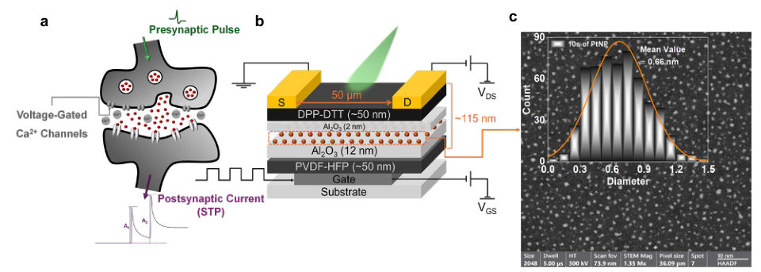
<figcaption class="paper-figure-caption"><b>Fig 1.</b> Fig. 1| Organic transistors with PtNPs mimic short-term plasticity. a, Schematic of a biological neuron with the release of neurotransmitters mediated by calcium ions that results in short-term plasticity (STP). b, Device architecture of organic transistor with DPP-DTT as the semiconducting layer and PVDF-HFP as the gate dielectric. ALD grown Al2O3 (12 nm thickness) sputtered with PtNPs along a 2 nm ALD grown Al2O3 tunneling layer is placed between the</figcaption>
</figure>
<figure class="paper-figure-card">
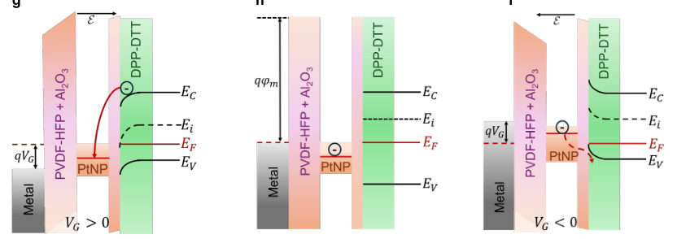
<figcaption class="paper-figure-caption"><b>Fig 2.</b> Fig. 2| Transfer sweeps and memory window. a, Transfer characteristics (black curve) of the controlled DPP-DTT transistor without any PtNPs. The red curve shows the square-root of the transfer plot. The intercept of the dotted red line on the x-axis denotes Vth. b, Transfer characteristics (black curve) of the PtNP embedded DPP-DTT transistor with 2 nm Al2O3 tunneling layer. The red curve shows the square-root of the transfer plot. The intercept of the dotted green line on the x-axis denotes Vth. c, Transfer characteristics (black curve) of the PtNP embedded DPP-DTT transistor with 3 nm Al2O3 tunneling layer. The red curve shows the square-root of the transfer plot. VDS was at -7 V for all...</figcaption>
</figure>
<figure class="paper-figure-card">
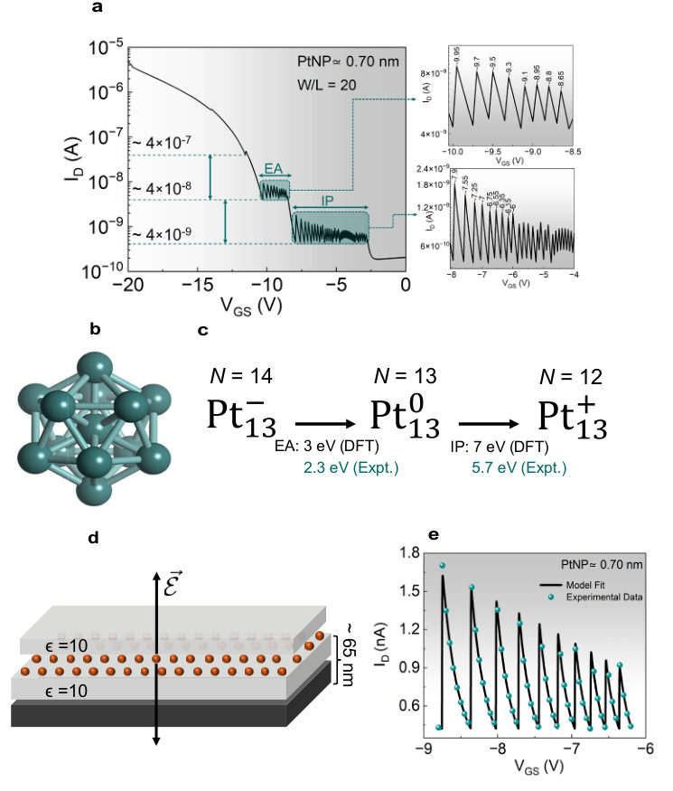
<figcaption class="paper-figure-caption"><b>Fig 3.</b> Fig. 3| Coulomb-blockade-like transport. a, Reverse-sweep transfer characteristics of a PtNP embedded transistor with 2 nm Al2O3 tunneling layer. The two plateaus with oscillatory current behavior observed are zoomed in on the right. b, A Pt13 cluster is plotted in VESTA.35 c, A comparison of the EA and IP energies of a Pt13 cluster estimated from DFT33 and experimental data. d, The PtNPs between the two Al2O3 layers (light gray slabs) on top of the PVDF- HFP layer (dark gray slab) act as a sheet of charge resulting in an electric field which screens the applied field. e, The</figcaption>
</figure>
<figure class="paper-figure-card">
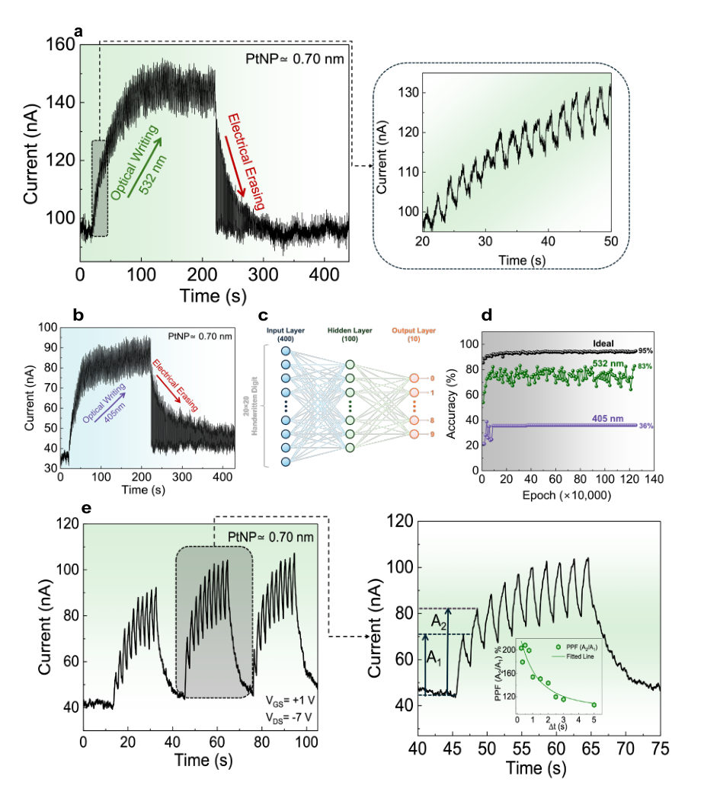
<figcaption class="paper-figure-caption"><b>Fig 4.</b> Fig. 4| Dual programmability and neural image recognition networks from ~ 0.7 nm PtNP embedded DPP-DTT based transistors with 3 nm Al2O3 tunneling layer. a, Current-time response under optical writing at 532 nm followed by electrical erasing. Optical writing was performed at VGS = +1 V and VDS = −7 V using 532 nm light pulses with a power density of 0.03 Wcm-² and a pulse timing of 1 s on/off. Electrical erasing was performed using VGS = +2 V gate pulses with the same pulse timing. The zoomed-in view on the right shows the stepwise increase in current during optical programming. b, Current-time response under optical writing at 405 nm with a power density of 0.08 Wcm-2, followed by...</figcaption>
</figure>

**Summary.** This work engineers organic transistors by embedding sub-nanometer platinum nanoparticles (PtNPs) at the dielectric interface to enhance memory and control charge trapping. The resulting devices exhibit Coulomb blockade-like transport and a large memory window, allowing them to mimic complex biological synaptic functions like Short-Term Plasticity. This paves a new route for developing next-generation neuromorphic hardware.

**Why it may be interesting.** The study bridges solid-state physics (Coulomb blockade, charge trapping) with computational neuroscience, providing an experimental platform for studying non-equilibrium charge dynamics relevant to artificial synapses.

Detailed structure

**Main problem.** Developing organic transistors for neuromorphic computing that exhibit enhanced memory and support complex synaptic plasticity (like Short-Term Plasticity, STP).

**Main result.** The incorporation of sub-nm Pt nanoparticles into the dielectric interface creates a robust memory window and enables multimodal programming, mimicking biological synaptic behavior.

**Method.** The study involves fabricating thin-film transistors using organic semiconductors and ferroelectric dielectrics, followed by electrical and optical characterization.

**Model / system.** The physical system is an organic thin-film transistor utilizing an interfacial stack of Al2O3/PtNP/Al2O3 between a polymer semiconductor and a ferroelectric dielectric.

**Key observables.** Large memory window (> 20 V), Coulomb blockade-like transport plateaus, current spikes, and measurable synaptic weight updates via optical and electrical stimuli.

**Important parameters / regimes.** Sub-nm PtNP size (e.g., 0.7 nm), dielectric thickness (2 nm or 3 nm Al2O3), and operating voltages (up to 20 V).

**Assumptions / limitations.** The PtNPs create a localized charge trapping/de-trapping region that effectively influences the channel conductance, enabling discrete charge states.

**Figures summary.** Figures illustrate the device architecture, HRTEM images of PtNPs, transfer characteristics showing hysteresis, and I-V sweeps demonstrating quantized current plateaus and photo-electrical response.

**Paper structure.** The paper details the fabrication process, presents electrical characterization (I-V sweeps, transfer curves), analyzes the quantum-like transport features (Coulomb blockade), and finally demonstrates the application to synaptic plasticity using both electrical and optical stimuli.

Abstract

Organic transistors are playing an increasingly important role for neuromorphic applications. However, devices that rely solely on ferroelectric switching or on interface traps for their multi-conductance states exhibit limited memory windows. Here, we introduce an ultrathin oxide layer with a uniform distribution of sub-nm platinum nanoparticles (PtNPs) at the interface of a polymer semiconducting and a ferroelectric dielectric in a thin film transistor architecture. The interfacial stack, Al$_2$O$_3$/PtNP/Al$_2$O$_3$, provides a viable route for localized charge trapping and de-trapping in a region where it can most effectively influence the channel conductance. The organic transistors display a large memory window (> 20 V) in their current-voltage characteristics. The sub-nm PtNPs give rise to features that are consistent with room temperature Coulomb blockade-like transport, supporting discrete and well-separated levels within the memory window. The devices support multimodal programming using electrical and optical stimuli with both long-term plasticity and enhanced short-term plasticity (STP) phenomena. These results open new directions for implementing STP in the development of neuromorphic computing.

[↑ back to top](#top)

### [Effects of the surface on double surface Fermi arcs in a realistic tight-binding model of Na$_3$Bi (100)](http://arxiv.org/abs/2608.20115v1)

**Authors:** Vasilios K. Passias, Lucas K. Wagner  
**Type:** theory · **Category:** other · **PDF:** <https://arxiv.org/pdf/2608.20115v1>  
**Analysis basis:** full PDF text, analyzed in chunks
**Topic relevance:** `analog quantum simulation` **1/5**

↔ Scroll figures horizontally

<figure class="paper-figure-card">
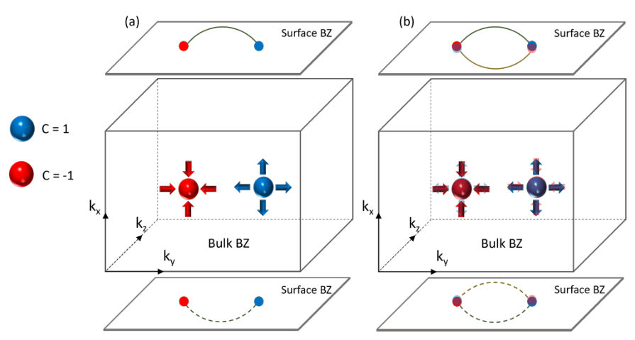
<figcaption class="paper-figure-caption"><b>Fig 1.</b> FIG. 1. Schematic diagram of Weyl (a) and topological Dirac (b) semimetals with their bulk and surface Brillouin zone features. In (a), we consider a time-reversal symmetry breaking Weyl semimetal with a minimum of two Weyl points having Chern number C = ±1. A Weyl point with positive (blue) Chern number is a source of Berry curvature field indicated by the outward arrows, whereas inward arrows denote a negative (red) Chern number Weyl point. The dashed Fermi arcs are on the lower surface Brillouin zones. The colored disks on the surface Brillouin zones are the surface projected bulk Weyl points. In (b), the DSFAs on the TDSM terminations are lune shaped and, at the Dirac point energy, are...</figcaption>
</figure>
<figure class="paper-figure-card">
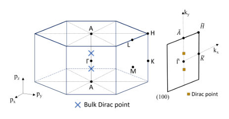
<figcaption class="paper-figure-caption"><b>Fig 2.</b> FIG. 2. Na3Bi’s bulk and (100) surface Brillouin zones with high symmetry k-points and Dirac points labeled.</figcaption>
</figure>
<figure class="paper-figure-card">
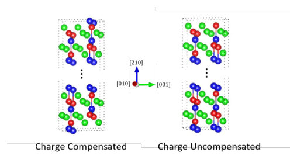
<figcaption class="paper-figure-caption"><b>Fig 3.</b> FIG. 3. Atomic structure of the two Na3Bi (100) surface terminations considered in this work. The green and blue atoms are the Na atoms, while the red atoms are Bi atoms. The red Bi atoms and blue Na atoms are in the honeycomb layers with bonds between them. The green Na atoms are between the honeycomb layers. We denote [010], [001], and [210] as the x-, y- and z-directions, respectively.</figcaption>
</figure>
<figure class="paper-figure-card">

<figcaption class="paper-figure-caption"><b>Fig 4.</b> Fig. 3 shows the two surfaces we considered in this paper. One was the charge compensated (CC) system, in which both terminations have three Na atoms and one Bi atom, a stoichiometric arrangement. The other structure we term the charge uncompensated (CU) sys- tem, because unlike CC, CU’s terminations had a non- stoichiometric ratio of Na to Bi atoms, with the top ter- mination having one Bi atom and two Na atoms, whereas the bottom termination had only two Na atoms. Chemi- cally, we believe it is likely that CC is lower energy than CU.</figcaption>
</figure>
<figure class="paper-figure-card">
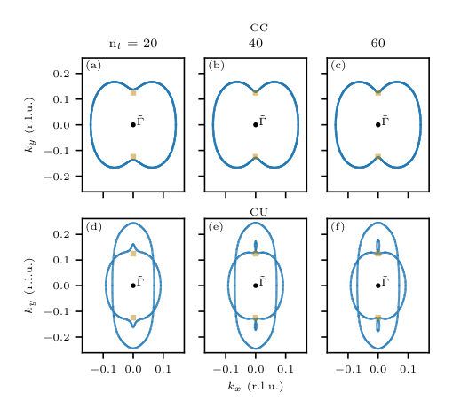
<figcaption class="paper-figure-caption"><b>Fig 5.</b> FIG. 4. CC’s Fermi surface plots, in (a)-(c), for three differ- ent thicknesses. nl denotes the number of layers. The (100) surface projected bulk Dirac points are indicated by dark- goldenrod squares. CU’s Fermi surface plots, from (d)-(f), have additional states from its terminations compared to the CC Fermi surfaces. The coordinates are in reciprocal lattice units (r.l.u.)</figcaption>
</figure>

**Summary.** This work investigates how surface termination affects the characteristic double surface Fermi arcs in the topological Dirac semimetal $	ext{Na}_3	ext{Bi} (100)$. Using tight-binding models derived from DFT, the authors compare stoichiometric and non-stoichiometric surfaces. They conclude that while the surface can significantly alter the global arc structure, the underlying local topological physics, such as spin-momentum locking, remains remarkably robust.

**Why it may be interesting.** While focused on condensed matter topology, the robust nature of local topological signatures (like spin-momentum locking) despite surface perturbations is relevant to understanding boundary conditions in quantum systems, which has parallels in open quantum systems theory.

Detailed structure

**Main problem.** The study investigates how different surface terminations (stoichiometric vs. non-stoichiometric) affect the double surface Fermi arcs (DSFAs) in the topological Dirac semimetal $	ext{Na}_3	ext{Bi} (100)$.

**Main result.** The local properties, such as spin momentum locking, appear robust, allowing the surface to reshape the arc fingerprint without destroying the arc-like physics, although the non-stoichiometric surface shows distinct changes compared to the stoichiometric one.

**Method.** The research employs first principles derived tight-binding (TB) models, parameterized from Density Functional Theory (DFT) calculations, to simulate the electronic structure of slab geometries.

**Model / system.** The physical system is the $	ext{Na}_3	ext{Bi} (100)$ surface, modeled using supercell slab structures derived from a 2-layer periodic unit cell. The analysis compares results from both charge compensated (CC, stoichiometric) and charge uncompensated (CU, non-stoichiometric) terminations.

**Key observables.** Double surface Fermi arcs (DSFAs), spin expectation value ($\langle \hat{S} 
angle$), electronic band structure evolution with thickness and chemical potential ($\mu$), and the presence/absence of cusps at projected Dirac points.

**Important parameters / regimes.** Surface termination type (CC vs. CU), film thickness (20 to 60 layers), and chemical potential ($\mu$).

**Assumptions / limitations.** The study assumes that surface charges are not large enough to materially change the Fermi level, and the TB model accuracy is assumed sufficient for the low-energy physics near the Fermi level.

**Figures summary.** Figures illustrate schematic comparisons of Weyl vs. Dirac semimetals, the atomic structure of the two terminations, and detailed bandplots showing the evolution of Fermi arcs and bulk bands for both CC and CU terminations as a function of thickness and chemical potential.

**Paper structure.** The paper establishes the physical context of $	ext{Na}_3	ext{Bi}$ and DSFAs, details the methodology using DFT-derived TB models on slab geometries, and then presents comparative results analyzing the electronic structure differences between the stoichiometric (CC) and non-stoichiometric (CU) surfaces across varying thicknesses and chemical potentials.

Abstract

Na$_3$Bi is a topological Dirac semimetal (TDSM) that can support double surface Fermi arcs (DSFAs), which are important for its material classification and their potential use in spintronic devices. However, it is unclear how the surfaces affect realistic Na$_3$Bi (100) systems. To investigate the effects of diverse surfaces on DSFAs, we consider first principles derived tight-binding models of two Na$_3$Bi (100) terminations. On the stoichiometric termination, we find DSFAs as expected. On the non-stoichiometric structure there are DSFAs on one termination and two loops that retain many of the properties of DSFAs. Thus, the local properties such as spin momentum locking and hybridization with the Dirac points appear to be more robust than their global connectivity. That is, the surface can reshape the arc fingerprint without destroying the arc-like physics.

[↑ back to top](#top)

### [Giant orbital Hall effect from cubic Dresselhaus orbital coupling](http://arxiv.org/abs/2608.19648v1)

**Authors:** Gwen Sevilen, Kyoung-Min Kim  
**Type:** theory · **Category:** other · **PDF:** <https://arxiv.org/pdf/2608.19648v1>  
**Analysis basis:** full PDF text, analyzed in chunks
**Topic relevance:** `analog quantum simulation` **1/5**

↔ Scroll figures horizontally

<figure class="paper-figure-card">
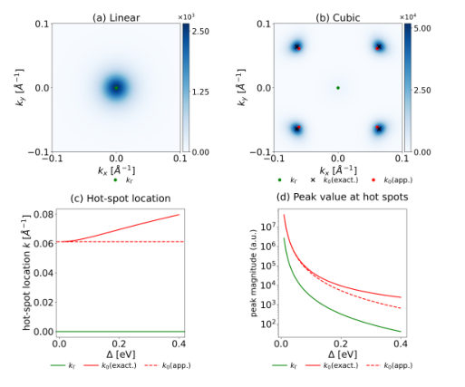
<figcaption class="paper-figure-caption"><b>Fig 1.</b> FIG. 1. Orbital Berry curvature (OBC). (a)–(b) Momentum-space distribution of the OBC for (a) the linear case (β = 3 eV ˚A, α = 0, and ∆= 0.1 eV) and (b) the cu- bic case (β = 3 eV ˚A, α = 800 eV ˚A3, and ∆= 0.1 eV). Green dots indicate the Γ point, while red dots indicate the cubic Dresselhaus hot spots k0. (c) Hot-spot location as a function of the energy splitting ∆for β = 3 eV ˚A and α = 800 eV ˚A3. The red solid line shows the numerically ob- tained values, while the red dashed line shows the approxi- mate values k0 = p</figcaption>
</figure>
<figure class="paper-figure-card">
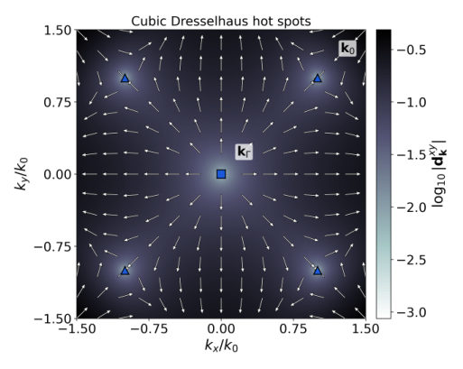
<figcaption class="paper-figure-caption"><b>Fig 2.</b> FIG. 2. Cubic Dresselhaus hot spots. Arrows show the field direction of dxy k = (γ(1) k , γ(2) k ) on a regular momentum- space grid, with the background color indicating the field mag- nitude |dxy k | (log scale). The blue square marks Γ and the tri- angles mark the cubic Dresselhaus hot spots k0 = (±k0, ±k0), where dxy k = 0. The parameters used are β = 3 eV ˚A and α = 800eV ˚A.</figcaption>
</figure>
<figure class="paper-figure-card">
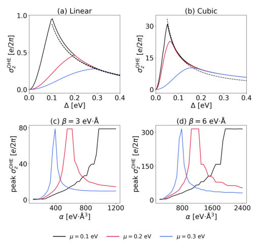
<figcaption class="paper-figure-caption"><b>Fig 3.</b> FIG. 3. Orbital Hall conductivity (OHC). (a)–(b) OHC as a function of the energy splitting ∆for (a) the linear case (β = 3 eV ˚A, α = 0) and (b) the cubic case (β = 3 eV ˚A, α = 800 eV ˚A 3). Three values of the chemical potential, µ = 0.1, 0.2, and 0.3 eV, are used, as indicated by the legend. Black lines show the fitting lines of Eq. (30) in (a), which is exact for ∆≥µ; and Eq. (18) in (b), the small-∆scaling form, which best approximates the numerical curve near the peak (∆≈0.1–0.15 eV) and deviates progressively away from it— underestimating at very small ∆and overestimating at larger ∆. (c)–(d) OHC as a function of α and chemical potential µ for (c) β = 3 eV ˚A and (d) β = 6 eV ˚A,...</figcaption>
</figure>
<figure class="paper-figure-card">
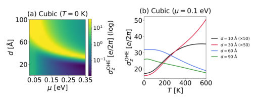
<figcaption class="paper-figure-caption"><b>Fig 4.</b> FIG. 4. Experimental signatures. (a) OHC as a function of chemical potential µ and sample thickness d, at T = 0. (b) OHC as a function of temperature T for different values of d, at µ = 0.1 eV. Both panels use β = 3 eV ˚A and ∆= 0.05 eV</figcaption>
</figure>

**Summary.** This theoretical work demonstrates that replacing standard linear orbital coupling with cubic Dresselhaus coupling provides a powerful mechanism to dramatically enhance the intrinsic orbital Hall conductivity. This enhancement stems from the creation of momentum-space 'hot spots' where the orbital Berry curvature is strongly localized. The findings establish cubic coupling as a viable route for designing next-generation orbitronic devices.

**Why it may be interesting.** While focused on condensed matter transport, the concept of Berry curvature and its enhancement via symmetry-protected couplings (like Dresselhaus terms) is highly relevant to topological physics and the design of novel quantum devices.

Detailed structure

**Main problem.** The primary goal is to find a method to significantly enhance the intrinsic orbital Hall conductivity (OHC) beyond the limitations imposed by standard linear-in-momentum orbital couplings.

**Main result.** Cubic Dresselhaus orbital coupling generates momentum-space hot spots that boost the OHC by over an order of magnitude compared to linear coupling, and cause the OHC to diverge inversely with the energy splitting ($\Delta$) with a universal enhancement factor.

**Method.** The study uses an effective two-orbital band model to calculate the Orbital Berry Curvature (OBC) and the resulting OHC, employing analytical derivations for the small-splitting limit and numerical analysis for hot spot identification.

**Model / system.** The system is modeled using an effective two-orbital band model incorporating both linear and cubic Dresselhaus orbital coupling terms ($\gamma_k$). The physics is analyzed in the context of bulk inversion asymmetry (zinc-blende symmetry class).

**Key observables.** Orbital Berry Curvature (OBC) and the intrinsic orbital Hall conductivity ($\sigma_{	ext{OHE}}^z$).

**Important parameters / regimes.** The energy splitting ($\Delta$), the chemical potential ($\mu$), and the coupling constants ($\alpha, eta$) are crucial parameters defining the system's response.

**Assumptions / limitations.** The analysis relies on approximating the coupling near singular points ($k_s$) and assuming the validity of the two-band model formalism for calculating the OBC.

**Figures summary.** Figures illustrate the momentum-space distribution of OBC for linear versus cubic coupling, highlighting the hot spot locations ($k_0$). They also show the OHC dependence on the energy splitting ($\Delta$) for both coupling types, demonstrating the peak enhancement.

**Paper structure.** The paper first establishes the problem of enhancing OHC, then introduces the cubic coupling mechanism, demonstrating how it creates hot spots. It proceeds to calculate the OHC enhancement factor, particularly analyzing the singular $\Delta 	o 0$ limit, and finally discusses the dependence on chemical potential and temperature.

Abstract

The orbital Berry curvature (OBC) governs the intrinsic orbital Hall conductivity (OHC), a central quantity in orbitronics. Previous approaches for enhancing the OHC have primarily relied on a linearin-momentum, Rashba-type orbital coupling. Here, we show that cubic Dresselhaus orbital coupling offers a new route to enhancing the OHC. Using an effective two-orbital band model, we show that the cubic coupling generates momentum-space hot spots, absent in the purely linear case, at which the OBC is strongly enhanced. This local enhancement, together with the multiplicity of the hot spots, boosts the OHC by more than an order of magnitude relative to the linear-coupling value. We further find that the OHC diverges inversely with the level splitting in the small-splitting limit, with a divergence coefficient universally seventeen times larger than that of the linear case. These results establish cubic Dresselhaus coupling as a route to giant orbital Hall responses, opening new avenues for orbitronic device applications.

[↑ back to top](#top)

### Other secondary papers (4)

Show other secondary papers

### [Altermagnetic memcapacitors](http://arxiv.org/abs/2608.19476v1)

**Authors:** Martin Latorre, Alvaro S. Nunez  
**Type:** theory · **Category:** other · **PDF:** <https://arxiv.org/pdf/2608.19476v1>  
**Analysis basis:** full PDF text, analyzed in chunks

↔ Scroll figures horizontally

<figure class="paper-figure-card">
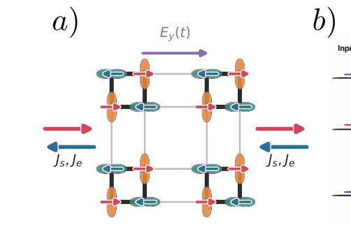
<figcaption class="paper-figure-caption"><b>Fig 1.</b> Figure 1. a) Pictographic representation of the coupled charge and spin current emission under a time-dependent electric field Ey(t). Red and blue arrows denote spin up and down, respectively; orange and green lobes denote the two altermagnetic d-wave orbitals (dxz, dyz); bond thickness encodes the SSH dimerization, with black (intra-cell) and grey (inter-cell) bonds corresponding to the strong and weak hopping amplitudes t(1 ± δ). Charge and spin currents Je, Js are emitted longitudinally, along the same direction as the driving field, on the faces perpendicular to Ey(t). b) Neuromorphic-neuron analogy for the altermagnetic memcapacitive device: input spikes are weighted by synaptic...</figcaption>
</figure>
<figure class="paper-figure-card">
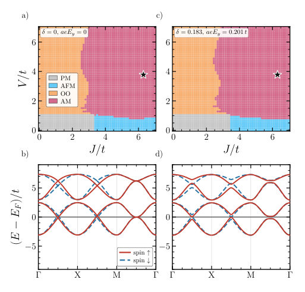
<figcaption class="paper-figure-caption"><b>Fig 2.</b> Figure 2. Consistency check of the dimerized altermagnetic model of Ref. [39] at the working point used in this work. (a,c) Phase diagram in the J–V plane (units of t), with phases (PM, AFM, OO, AM) identified from the staggered ampli- tudes (m, o); the star marks J/t = 6.3, V/t = 3.78. (b,d) Spin-resolved bands along Γ–X–M–Γ, as (E −EF )/t, with spin ↑(solid red) and spin ↓(dashed blue). Left column (a,b): undimerized, field-free reference, δ = 0, eaEy = 0 (in- direct gap −0.0513 t, metallic). Right column (c,d): working point of this work, δ = 0.183, eaEy = 0.201 t (indirect gap +0.0844 t, direct gap +0.3781 t, insulating). The altermag- netic fraction of the phase diagram increases from...</figcaption>
</figure>
<figure class="paper-figure-card">
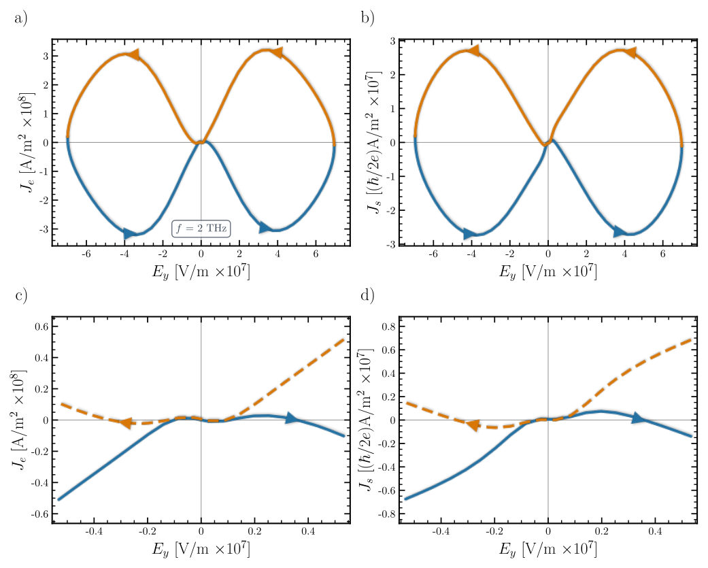
<figcaption class="paper-figure-caption"><b>Fig 3.</b> Figure 3. Pinched charge- and spin-current hysteresis loops of the altermagnetic memcapacitor, computed for the dimerized RVO3 model at drive frequency f = 2 THz. (a) Charge current density Je and (b) spin current density Js against the driving field Ey(t) = E0 sin(2πft), E0 = 7 × 107 V/m; both loops are pinched at the origin by the inversion symmetry and reach |Je|max = 3.2 × 108 A/m2 (3.2 × 104 A/cm2), |Js|max = 2.7 × 107 (ℏ/2e) A/m2, obtained from the sheet current of the two- dimensional tight-binding calculation via the interlayer spacing c/2 of the real RVO3 stacking. Model parameters: dimerization δ = 0.183, spin exchange J/t = 6.3, orbital exchange V/t = 3.78, filling n = 1/8 (one...</figcaption>
</figure>
<figure class="paper-figure-card">
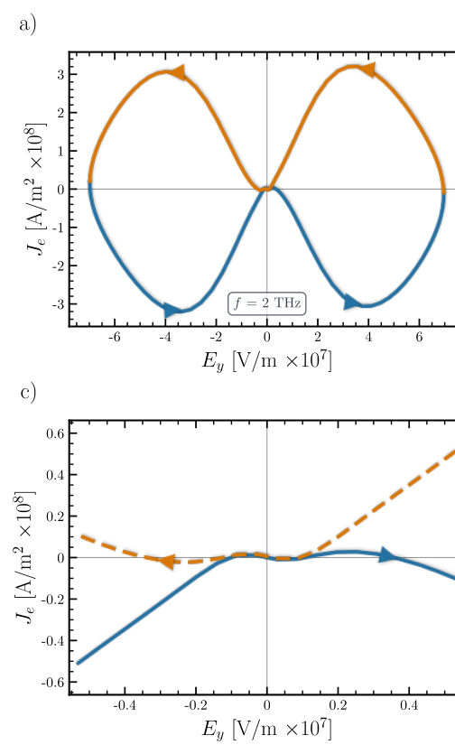
<figcaption class="paper-figure-caption"><b>Fig 4.</b> Figure 4 shows the polarization loops Pe,s(m, o) [pan- els (a)-(b)] and the differential-capacitance loops Ce,s = dQe,s/dEy [panels (c)-(d)] obtained from the same driven cycle at f = 2 THz, both traced against the driving field</figcaption>
</figure>
<figure class="paper-figure-card">
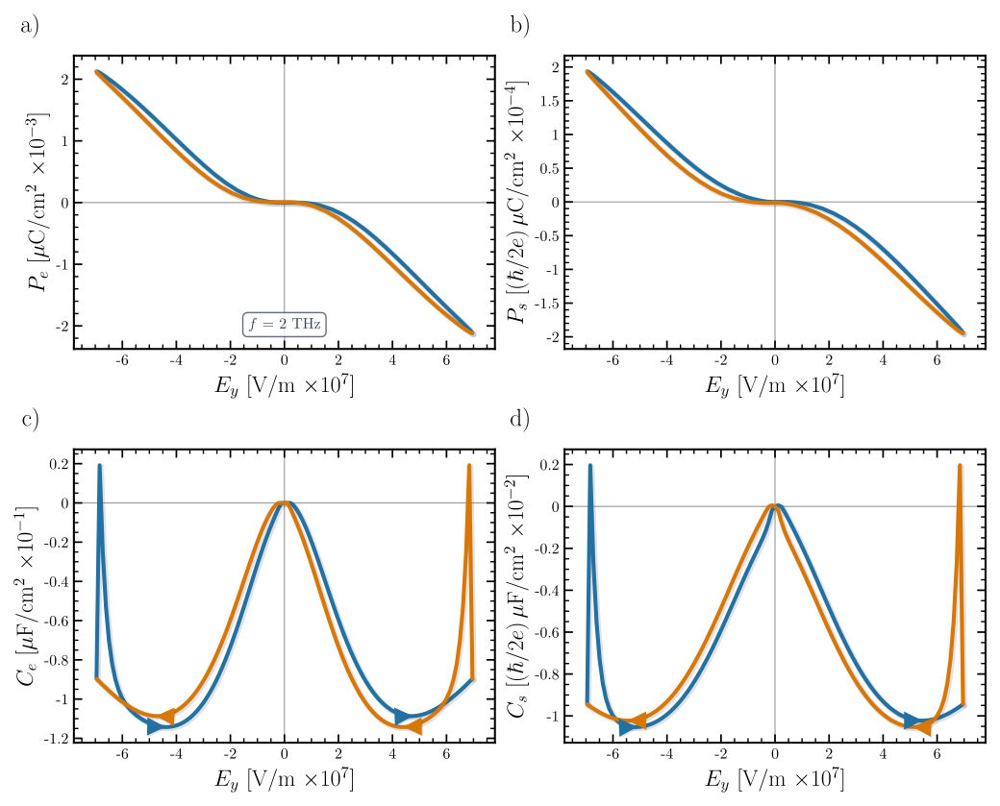
<figcaption class="paper-figure-caption"><b>Fig 5.</b> Figure 4. Polarization and differential-capacitance loops of the altermagnetic memcapacitor at f = 2 THz. (a) Charge-channel polarization Pe(m, o) and (b) spin-channel polarization Ps(m, o), both closing tangentially at the origin. (c) Charge-channel differential capacitance Ce = dQe/dEy and (d) spin-channel differential capacitance Cs = dQs/dEy, obtained via the chain rule through (m, o) from the derivative of the loops in (a)-(b) and traced against the driving field Ey; both vanish at Ey = 0 and develop the sign-changing, two-branch “butterfly” shape characteristic of a voltage-controlled, history-dependent capacitance.</figcaption>
</figure>

**Summary.** This paper proposes using altermagnetic multiferroics, specifically RVO3, as a highly efficient platform for combined electric and spintronic memory. By modeling the system with a dimerized lattice Hamiltonian, the authors predict a unique memcapacitive response characterized by a "butterfly" capacitance loop. This work establishes a fundamental link between altermagnetic order and non-volatile, electrically switchable charge/spin storage.

**Why it may be interesting.** The work demonstrates a mechanism where intrinsic magnetic order (altermagnetism) dictates the electrical switching behavior, providing a novel, symmetry-protected route to coupled charge/spin memory that is highly relevant to advanced condensed matter device physics.

Detailed structure

**Main problem.** To establish a theoretical and experimental platform for combined electric and spintronic memory using altermagnetic multiferroic materials.

**Main result.** Altermagnetic multiferroics in RVO3 are shown to be an efficient, non-volatile platform for combined electric and spintronic memory, exhibiting a genuine memcapacitive response.

**Method.** The system is modeled using a dimerized two-orbital d-wave altermagnetic lattice Hamiltonian, analyzed via mean-field theory to derive coupled charge and spin polarization currents.

**Model / system.** The physical system is rare-earth vanadates (RVO3), modeled as a dimerized altermagnetic lattice. The Hamiltonian couples hopping terms, Heisenberg spin exchange, and orbital exchange, modulated by a dimerization parameter $\delta$.

**Key observables.** Memcapacitance (butterfly differential capacitance), pinched hysteretic charge/spin current-field loops, and simultaneous switching of charge and spin polarizations.

**Important parameters / regimes.** Dimerization parameter $\delta$, external electric field $E_y$, and the coupling strength between altermagnetism and polarization.

**Assumptions / limitations.** The coupling between charge and spin is protected by the same inversion symmetry, ensuring simultaneous switching; the model is anchored to the orbital-Peierls transition in RVO3.

**Figures summary.** Figure 4 shows polarization loops closing tangentially at the origin and a sign-changing, two-branch "butterfly" differential capacitance loop, confirming memcapacitive behavior.

**Paper structure.** The paper progresses from defining the physical problem and platform (RVO3) to developing the theoretical model (Hamiltonian, mean-field theory) and finally demonstrating the key diagnostic signatures (memcapacitance loops) that validate its use as a memory element.

Abstract

We propose a spintronic memcapacitance effect based upon altermagnetic multiferroic materials. We identify the rare-earth vanadates RVO$_3$ as a concrete platform, with all key parameters tied to measured properties. Under an oscillating electric field, the resulting charge and spin currents trace pinched hysteresis loops that close tangentially at zero field -- the hallmark of memcapacitive, type-2 memdevice behavior -- with charge current densities exceeding, by a factor of about 3.6, the lowest deterministic switching current density reported for optimized spin-transfer-torque magnetic tunnel junctions. We model the system theoretically as a dimerized two-orbital $d$-wave altermagnetic lattice via a Su--Schrieffer--Heeger-type bond modulation, in the spirit of the spin-dependent Rice--Mele model, thereby coupling the altermagnetic order to field-switchable charge and spin polarizations. The associated polarization loops close tangentially at zero field and yield a sign-changing, history-dependent ``butterfly'' differential capacitance, identifying the device as a genuine memcapacitor. Both responses are protected by the same inversion symmetry, so charge and spin channels switch simultaneously with no separate control needed. These results establish altermagnetic multiferroics, realized concretely in RVO$_3$, as an efficient, non-volatile platform for combined electric and spintronic memory.

[↑ back to top](#top)

### [Amorphous and Nanocrystalline Topological Semimetal YPtBi/W/CoFeB Heterostructures for BEOL-Compatible Spin-Orbit Torque Devices](http://arxiv.org/abs/2608.20021v1)

**Authors:** Quang Le, Brian R. York, Cherngye Hwang, Xiaoyong Liu, Tsann Lin, Xiaoyu Xu, Yudi Wang, Jia Li, Mazin Osman, Katherine Le, Maher Osman, Son Le, Lei Xu, Maki Maeda, Tuo Fan, Yu Tao, Hisashi Takano, Sho Kagami, Ohiro Fujie, Pham Nam Hai  
**Type:** experiment · **Category:** other · **PDF:** <https://arxiv.org/pdf/2608.20021v1>  
**Analysis basis:** full PDF text, analyzed in chunks

↔ Scroll figures horizontally

<figure class="paper-figure-card">
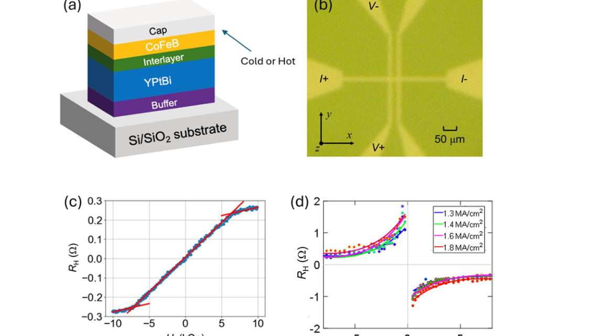
<figcaption class="paper-figure-caption"><b>Fig 1.</b> Figure 1. Device and measurement overview. (a) Schematic multilayer stack on Si/SiO₂, (b) optical image of the patterned Hall device, (c) representative anomalous Hall loop measured with a perpendicular magnetic field, and (d) representative harmonic Hall response measured with an in-plane magnetic field used to extract the effective SOT signal.</figcaption>
</figure>
<figure class="paper-figure-card">
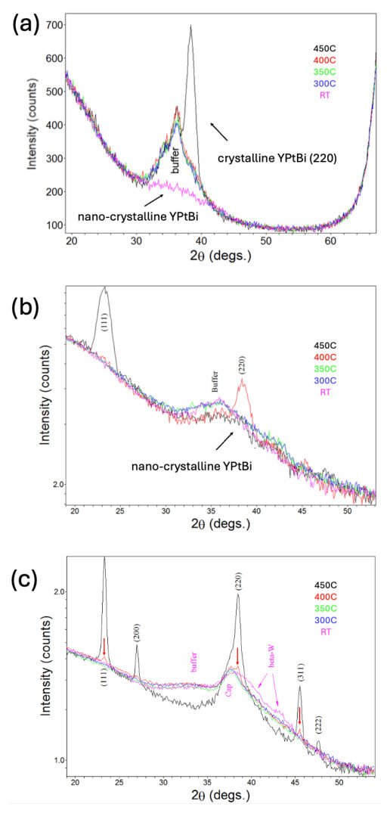
<figcaption class="paper-figure-caption"><b>Fig 2.</b> Figure 2. XRD evidence for the disordered thermal window. (a) Out-of-plane XRD for hot-cap samples, (b) out-of-plane XRD for the cold-cap samples, and (c) in-plane XRD showing that only limited crystalline contributions (red arrows) appear near 400 °C deposition temperature, whereas the 450 °C deposition temperature exhibits a much stronger crystalline signature.</figcaption>
</figure>
<figure class="paper-figure-card">
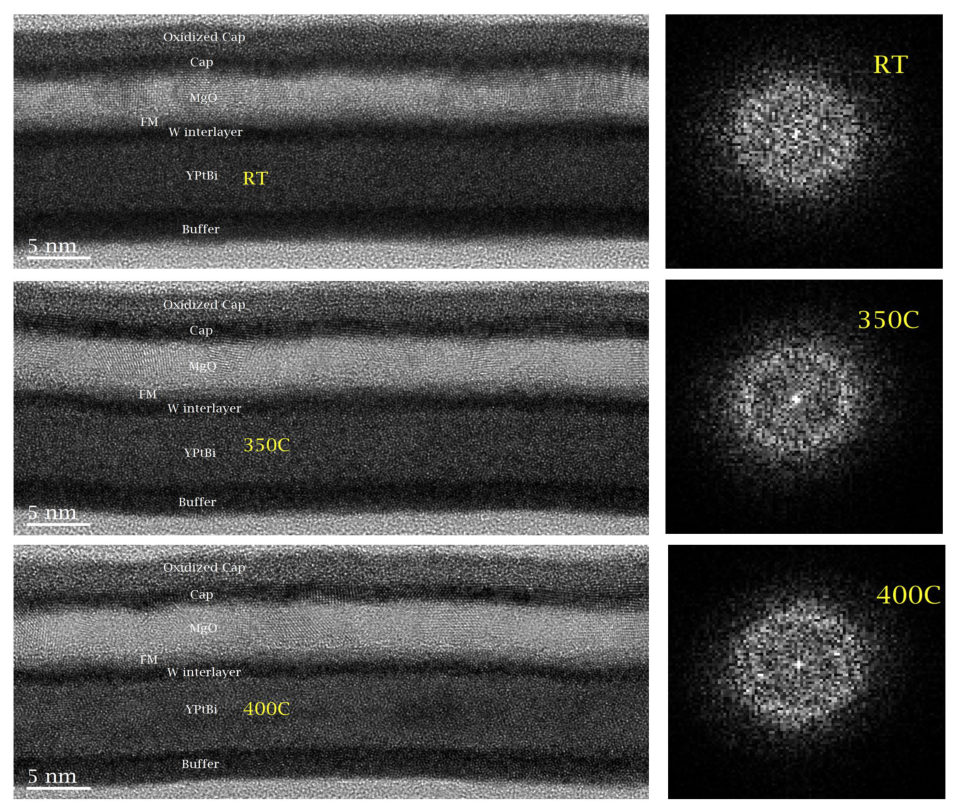
<figcaption class="paper-figure-caption"><b>Fig 3.</b> Figure 3. Cross-sectional TEM and corresponding FFT evidence for local disorder. Representative datasets show that YPtBi is predominantly amorphous from room temperature to 400 °C. At 400 °C, isolated weakly nanocrystalline regions appear locally, but the layer remains dominated by a broader amorphous or weakly nanocrystalline matrix.</figcaption>
</figure>
<figure class="paper-figure-card">
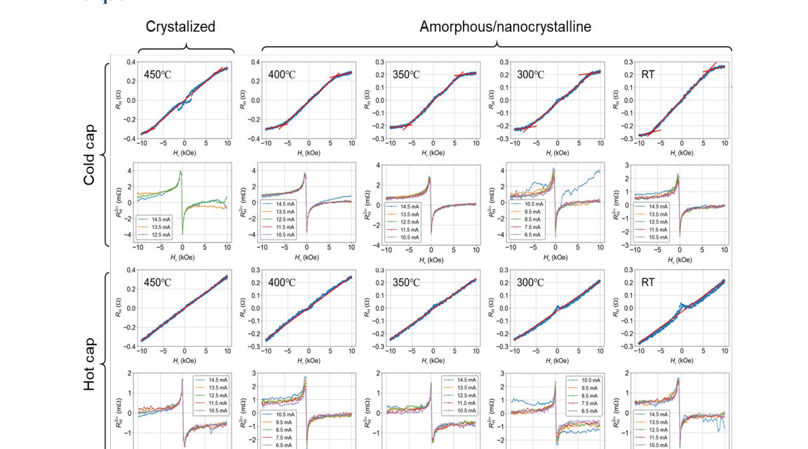
<figcaption class="paper-figure-caption"><b>Fig 4.</b> Figure 4. Magnetotransport of YPtBi/W/CoFeB heterostructures. Upper panels show anomalous Hall loops; lower panels show second harmonic Hall data used to extract the effective damping- like response. A large effective SOT signal persists throughout the structurally disordered thermal window.</figcaption>
</figure>
<figure class="paper-figure-card">
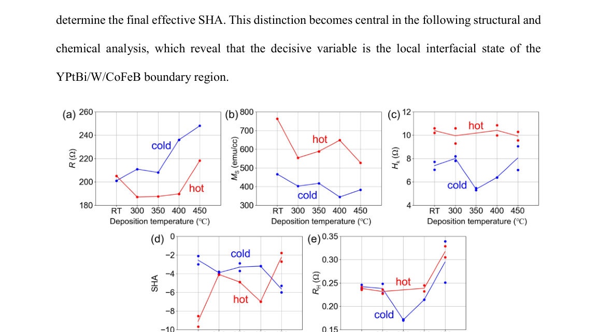
<figcaption class="paper-figure-caption"><b>Fig 5.</b> Figure 5. Process-family summary trends versus YPtBi deposition temperature: (a) resistance, (b) saturation magnetization, (c) magnetic anisotropy field, (d) effective spin Hall angle, and (d) anomalous Hall resistance amplitude. The hot-cap branch generally preserves stronger magnetic properties and lower resistance, whereas the effective torque metric shows a more selective dependence on the interfacial state.</figcaption>
</figure>

**Summary.** This work demonstrates that high spin-orbit torque efficiency in YPtBi heterostructures can be achieved in an amorphous or weakly nanocrystalline state, making the material compatible with standard semiconductor back-end processing. The key finding is that the SOT response is governed by the chemical modification of the YPtBi surface layer by W, providing a crucial design rule for next-generation spintronic devices.

**Why it may be interesting.** While focused on condensed matter spintronics, the rigorous methodology of decoupling macroscopic transport properties from underlying microscopic structural changes (amorphous vs. crystalline) is highly relevant to understanding complex, non-equilibrium quantum materials.

Detailed structure

**Main problem.** The study aims to determine if a high, effective Spin-Orbit Torque (SOT) response can be maintained in YPtBi/W/CoFeB heterostructures for spintronic devices without requiring bulk crystallization, which is essential for Back-End-of-Line (BEOL) compatibility.

**Main result.** The large effective SOT response persists robustly in the amorphous or weakly nanocrystalline state (up to 400 °C), indicating that the spin-orbit torque is controlled by the chemistry of the upper YPtBi/W interface, not bulk crystal order.

**Method.** The research combines advanced magnetotransport measurements (Anomalous/Harmonic Hall) with structural characterization techniques like XRD, TEM, XRR, and EELS to correlate electronic response with local atomic structure.

**Model / system.** The physical system is a YPtBi/W/CoFeB multilayer stack deposited on Si/SiOₓ substrates. The analysis models the effective SOT angle ($	heta_{	ext{SH}}^{	ext{eff}}$) based on contributions from the YPtBi and the W(Pt) interlayer, focusing on interfacial chemistry.

**Key observables.** Effective damping-like SOT efficiency ($	heta_{	ext{SH}}^{	ext{eff}}$), Anomalous Hall resistance, and interfacial W concentration.

**Important parameters / regimes.** Deposition temperature range (RT to 400 °C), W concentration at the YPtBi/W boundary, and the structural state (amorphous vs. crystalline).

**Assumptions / limitations.** The dominant control variable for the SOT response is the local electronic structure modified by W incorporation at the upper YPtBi interface, rather than the bulk crystal structure.

**Figures summary.** Figures illustrate the stack architecture, AHE loops, and harmonic Hall signals. Structural analysis (XRD, XRR) tracks the transition from amorphous to crystalline states, while EELS profiles map the chemical grading at the interfaces.

**Paper structure.** The paper systematically investigates the thermal stability of the SOT response, rules out bulk crystallization as the source of the effect, and finally uses interfacial chemical analysis (W concentration) to pinpoint the true physical mechanism governing the large negative $	heta_{	ext{SH}}^{	ext{eff}}$.

Abstract

Spin-orbit torque (SOT) devices require spin-source materials that combine efficient charge-to-spin conversion with back-end-of-line (BEOL) thermal compatibility. Here, we show that YPtBi/W/CoFeB heterostructures deposited directly on Si/SiOx remain predominantly amorphous or weakly nanocrystalline from room temperature to 400 °C while preserving a large effective damping-like SOT response. Anomalous Hall and harmonic Hall measurements, together with X-ray diffraction, cross-sectional transmission electron microscopy, X-ray reflectivity, and electron energy-loss spectroscopy, show that the response does not correlate with bulk crystallization of YPtBi. Instead, the interfacial analysis indicates that the strongest trend of the spin Hall angle is associated with the chemistry of the upper YPtBi/W boundary: the effective SOT response tracks the integrated W concentration at that YPtBi surface. Meanwhile, a two-spin source analysis shows that the Pt-W-rich interlayer provides only a small positive correction, insufficient to explain the large negative effective spin Hall angle by itself. The dominant control variable is therefore inferred to be the incorporation of W into the upper YPtBi interface, which plausibly modifies the local electronic structure of YPtBi and amplifies the stack-level response. These results provide a more physically constrained interpretation of the stack behavior and identify a BEOL-compatible route to disordered topological spin-source layers for scaled SOT memory and compute-in-memory hardware.

[↑ back to top](#top)

### [Josephson transport in YBa${}_{2}$Cu${}_{3}$O${}_{7}$ weak links created by focused-helium-ion-beam irradiation: Analysis based on diffusive-SNS-junction model](http://arxiv.org/abs/2608.20109v1)

**Authors:** Tetsuro Misawa, Shigeyuki Ishida, Hiroshi Eisaki, Yukinori Morita, Shinichi Ogawa, Chiharu Urano  
**Type:** both · **Category:** strongly correlated electrons · **PDF:** <https://arxiv.org/pdf/2608.20109v1>  
**Analysis basis:** full PDF text, analyzed in chunks

↔ Scroll figures horizontally

<figure class="paper-figure-card">
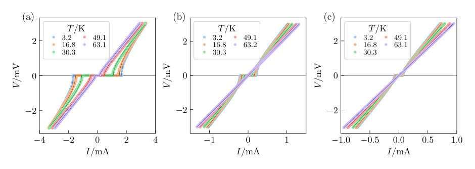
<figcaption class="paper-figure-caption"><b>Fig 1.</b> FIG. 1. Current-Voltage characteristics of YBCO Josephson junctions at selected temperatures. The helium ion irradiation doses are (a) 268 ions/nm, (b) 382 ions/nm, (c) 421 ions/nm, respectively. The black solid lines are fits to the RSJ model.</figcaption>
</figure>
<figure class="paper-figure-card">
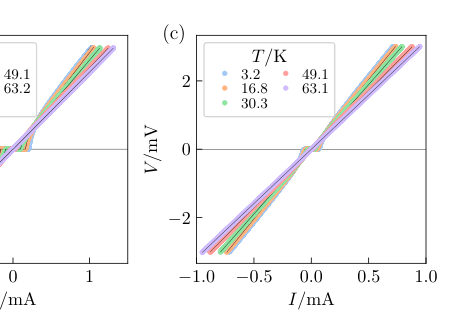
<figcaption class="paper-figure-caption"><b>Fig 2.</b> Figure 3 shows the temperature dependences ofIc and Rn, which were extracted by fitting the current- voltage characteristics of the weak links. For all de- vices, Ic increased monotonically with decreasing tem- perature. The rate of increase gradually diminished be-</figcaption>
</figure>
<figure class="paper-figure-card">
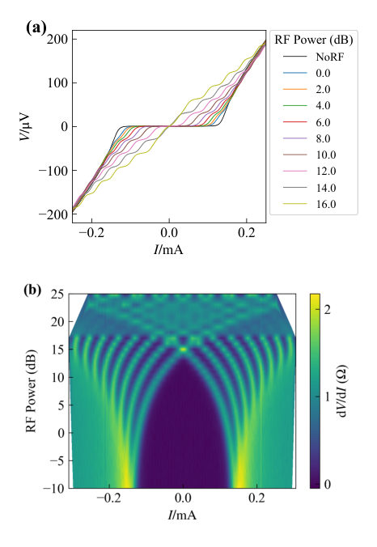
<figcaption class="paper-figure-caption"><b>Fig 3.</b> FIG. 2. Shapiro steps observed at 63.1 K in a YBCO Joseph- son junction fabricated with a helium-ion dose of 268 ions/nm. The microwave frequency is 15 GHz. (a) Current-voltage characteristics under microwave irradiation. (b) Colormap of differential resistance. RF power is expressed in dB relative to 1 mW. In the high-power range (&gt; 17 dB), the colormap is obscured, which may be attributable to unexpected reflection of microwave in the measurement RF line system.</figcaption>
</figure>
<figure class="paper-figure-card">
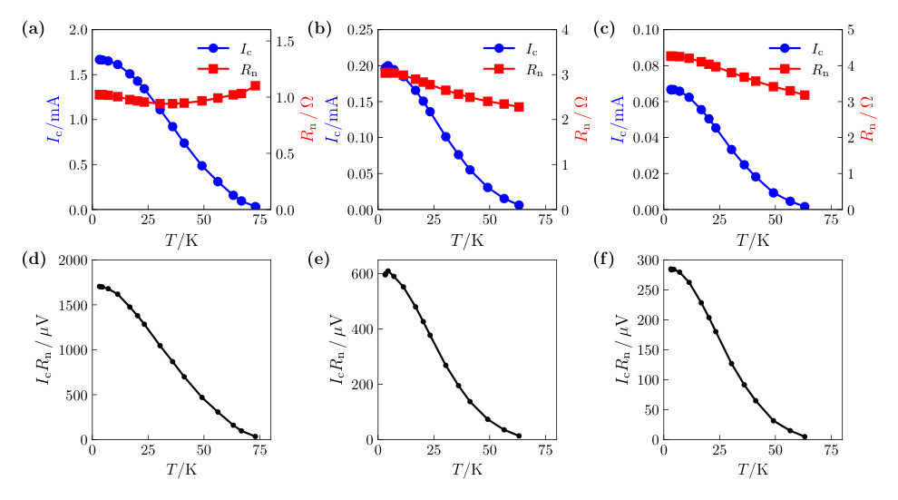
<figcaption class="paper-figure-caption"><b>Fig 4.</b> FIG. 3. Temperature dependences of characteristic parameters for YBCO weak links. (a)-(c) Josephson critical current (blue circles) and normal resistance (red squares) for YBCO weak links fabricated with different helium ion doses. (d)-(f) IcRn product.</figcaption>
</figure>
<figure class="paper-figure-card">
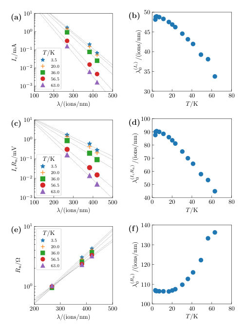
<figcaption class="paper-figure-caption"><b>Fig 5.</b> FIG. 4. Dose (λ) dependence of (a) Ic, (c) IcRn, and (e) Rn for selected temperatures. The black dotted lines are fitting functions defined in the body. Temperature dependence of characteristic doses: (b) λ(Ic) 0 , (d) λ(IcRn) 0 , and (f) λ(Rn) 0 .</figcaption>
</figure>

**Summary.** This work investigates Josephson transport in YBCO weak links created by helium-ion irradiation, using a diffusive-SNS junction model. By analyzing the temperature and dose dependence of critical current, the authors argue that the observed changes are best explained by a reduction in the local density of states at the interface. This provides a physics-based framework for designing and understanding superconducting nano-junctions in correlated materials.

**Why it may be interesting.** The analysis of superconducting weak links, especially in high-Tc cuprates, touches upon proximity effects and the nature of the superconducting order parameter, which are central topics in strongly correlated electron physics.

Detailed structure

**Main problem.** The study aims to elucidate the underlying physical transport mechanisms governing Josephson current in YBCO weak links created by focused helium-ion-beam irradiation.

**Main result.** The transport behavior is successfully described by a diffusive SNS junction model, suggesting that the suppression of critical current and $I_cR_n$ is primarily due to a reduction in the local density of states (DOS) at the interface.

**Method.** The authors combine experimental measurements of $I-V$ characteristics and microwave response with theoretical analysis based on the diffusive-SNS-junction model.

**Model / system.** The physical system is YBCO thin films patterned into Josephson weak links. The theoretical framework employed is the diffusive-SNS-junction model, which treats the weak link as a diffusive metallic interlayer.

**Key observables.** Critical current ($I_c$), $I_cR_n$ product, normal state resistance ($R_n$), and their dependence on irradiation dose and temperature.

**Important parameters / regimes.** Irradiation dose ($\lambda$), effective Thouless energy ($E_T$), and the local density of states ($N(0)$).

**Assumptions / limitations.** The weak-link region can be modeled as a diffusive metallic interlayer, and the analysis assumes the applicability of the diffusive proximity coupling theory.

**Figures summary.** Figures illustrate $I-V$ characteristics at various doses, the exponential decay of $I_c$ and $I_cR_n$ with dose, and theoretical plots showing the dose dependence of $E_T$, $I_{cRn}/E_T$, and $1/(E_T R_n)$.

**Paper structure.** The paper first establishes the experimental setup and measurements (I-V curves, Shapiro steps) confirming Josephson junction formation. It then applies the diffusive-SNS model to analyze the temperature and dose dependence of transport parameters, concluding that DOS reduction is the unifying physical mechanism.

Abstract

Fabrication of YBCO weak links by focused helium ion beam irradiation is a promising approach for realizing high-temperature superconducting Josephson junction devices. Although empirical dose-characteristic relationships have been established, the underlying transport mechanisms remain unclear. In this study, we perform a detailed investigation of the transport properties of YBCO weak links fabricated using a helium ion microscope (HIM) and provide a unified phenomenological description of the observed behavior based on the theory of SNS junctions with a diffusive metallic interlayer. We demonstrate that the temperature dependence of the critical current $I_{\mathrm{c}}$ and the $I_{\mathrm{c}}R_{\mathrm{n}}$ product are well described by diffusive SNS junction models over a wide temperature range. Analyses show that the observed dose dependences of $I_{\mathrm{c}}$ and $I_{\mathrm{c}}R_{\mathrm{n}}$ cannot be explained solely by variations in the effective Thouless energy $E_{\mathrm{T}}$. The discrepancy suggests reduced interface transparency and a reduction in the density of states, leading to a decrease in the effective number of conducting channels contributing to transport. This interpretation is also consistent with the observed exponential increase in $R_{\mathrm{n}}$ with irradiation dose. These results provide a diffusion-based framework for understanding Josephson transport and guiding junction design in helium-ion-irradiated YBCO weak links.

[↑ back to top](#top)

### [Twisted magnon frequency combs in ferromagnetic nanorings](http://arxiv.org/abs/2608.19647v1)

**Authors:** Liu Xuejuan, Zheng Xingen, Li Zhengyi, Zhang Zhizhi, Li Xiaoguang, Sun Haipeng, Li Hui, Zhou Cangtao  
**Type:** theory · **Category:** other · **PDF:** <https://arxiv.org/pdf/2608.19647v1>  
**Analysis basis:** full PDF text, analyzed in chunks

↔ Scroll figures horizontally

<figure class="paper-figure-card">
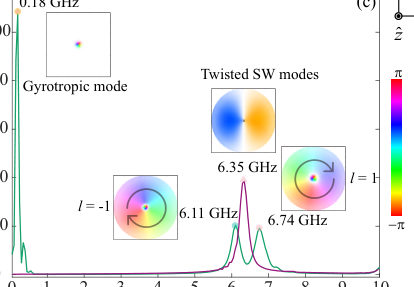
<figcaption class="paper-figure-caption"><b>Fig 1.</b> FIG. 1: (a) Spatial configuration of mz in a nanodisk of diameter 2R = 300 nm and thickness d = 5 nm. (b) The corresponding mz configuration in a nanoring with inner diameter 2r = 50 nm for vi- sual clarity. (c) Spectral power of the nanodisk (green) and nanoring (purple) under excitation by an in-plane sinc-function magnetic field. The inset displays spatial maps of δmz at the resonance frequencies 0.18, 6.11, 6.35 and 6.74 GHz. The yellow dot represents the gy- rotropic mode, while the green and pink dots denote the azimuthal spin-wave modes with l = −1 and l = +1, respectively. The pink triangle indicates the degenerate mode of azimuthal spin waves with |l| = 1 in the nanoring.</figcaption>
</figure>
<figure class="paper-figure-card">
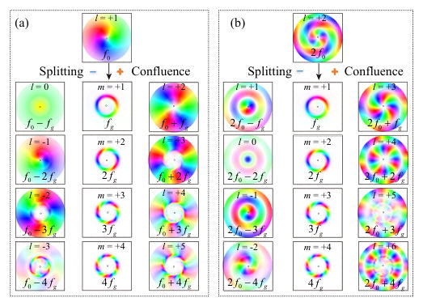
<figcaption class="paper-figure-caption"><b>Fig 2.</b> FIG. 3: Selection rules for the tMFC spectral lines in the nanoring with hole diameter 2r = 5 nm, extracted from their spatial mode profiles. (a) n = 0 (fundamental radial mode). (b) n = 1 (higher- order radial mode). Small black circles mark the removed areas.</figcaption>
</figure>
<figure class="paper-figure-card">
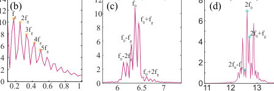
<figcaption class="paper-figure-caption"><b>Fig 3.</b> FIG. 2: (a) FFT spectra of the nanoring with hole diameter 2r = 5 nm under rotating magnetic fields with amplitudes B0 = 1 mT and B0 = 5 mT at driving frequency f0 = 6.35 GHz. (b)–(d) Magnified views of the three boxed regions in (a).</figcaption>
</figure>
<figure class="paper-figure-card">
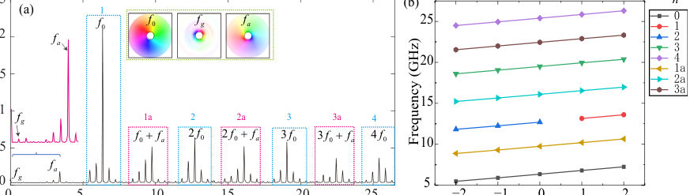
<figcaption class="paper-figure-caption"><b>Fig 4.</b> FIG. 4: (a) FFT spectrum of the vortex-state nanoring with hole diameter 2r = 50 nm under a rotating magnetic field with amplitude B0 = 5 mT and frequency f0 = 6.35 GHz. (b) Mode frequencies as functions of the radial index n and the azimuthal index |l|.</figcaption>
</figure>
<figure class="paper-figure-card">
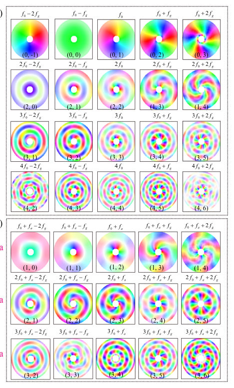
<figcaption class="paper-figure-caption"><b>Fig 5.</b> FIG. 5: Real-space magnetization dynamics of tMFC spectral com- ponents under two distinct nonlinear mechanisms. (a) Sideband modes generated by nonlinear mixing of the drive f0 (and its har- monics) with the gyrotropic mode fg. (b) Sideband modes arising from three-mode coupling among f0, the intrinsic ring mode fa, and fg. The color scale encodes the azimuthal angle of the in-plane mag- netization. (n, l) denote the radial and azimuthal mode indices.</figcaption>
</figure>

**Summary.** This work reports on the generation and control of twisted magnon frequency combs in ferromagnetic nanorings using micromagnetic simulations. The authors show that the comb structure is highly sensitive to the hole size, which can introduce new modes to dramatically increase spectral density. Furthermore, an external magnetic field allows for continuous, reversible tuning of the comb spacing, establishing the system as a versatile platform for nonlinear magnonics.

**Why it may be interesting.** The strong nonlinear coupling between collective excitations (vortex gyration and spin waves) and the ability to tune this spectrum using geometry and external fields provides a rich platform for studying nonlinear wave dynamics in condensed matter systems.

Detailed structure

**Main problem.** The study investigates the emergence and tunability of twisted magnon frequency combs (tMFCs) in ferromagnetic nanorings.

**Main result.** The geometry of the nanoring, particularly the hole size, and the application of external magnetic fields allow for the precise control and densification of the magnon frequency comb spectrum.

**Method.** The research relies on micromagnetic simulations solving the Landau-Lifshitz-Gilbert equation and analyzing the resulting spectra using Fast Fourier Transform (FFT).

**Model / system.** The physical system is a ferromagnetic nanoring, modeled using micromagnetics. Key excitations include magnetic vortices and quantized azimuthal/radial spin-wave modes, whose nonlinear coupling drives the comb formation.

**Key observables.** Frequency comb structure (tMFCs), comb spacing, sideband multiplicity, and spectral symmetry/asymmetry.

**Important parameters / regimes.** Hole diameter ($2r$), applied in-plane magnetic field ($H_y$), and the ratio of the hole size to the ring width.

**Assumptions / limitations.** The analysis assumes the validity of the LLG equation and focuses on nonlinear coupling mechanisms like three-magnon and four-wave mixing.

**Figures summary.** Figures illustrate the spatial magnetization configurations and the resulting FFT spectra, comparing nanodisks, small-hole rings, and large-hole rings to show the evolution from discrete sidebands to dense, fine-tooth combs.

**Paper structure.** The paper progresses by first establishing the basic tMFC generation in nanorings, then detailing how increasing the hole size enriches the spectrum via new modes, and finally demonstrating continuous tuning and field-induced asymmetry using an external in-plane magnetic field.

Abstract

We report the emergence of twisted magnon frequency combs (tMFCs) and their higher-order modes in ferromagnetic nanorings, arising from strong nonlinear coupling between vortex-core gyration and azimuthal spin-wave modes. The comb lines carry distinct orbital angular momentum with quantum numbers spaced by unity, and their formation obeys selection rules governed by simultaneous conservation of energy and angular momentum. We demonstrate that the hole diameter serves as a powerful tuning parameter: reducing the hole size preserves the conventional tMFC, whereas increasing it introduces an additional magnon mode that dramat?ically densifies the comb via four-wave mixing, boosting the sideband multiplicity by an order of magnitude. Moreover, an external in-plane magnetic field enables continuous, reversible tuning of the comb spacing by dis?placing the vortex core and modifying its confinement potential, with the hole-induced geometric pinning giving rise to asymmetric switching and hysteresis under opposite field polarities. Our results establish the tMFC as a versatile platform for nonlinear magnonics, with potential applications in tunable frequency comb generation and precision metrology.

[↑ back to top](#top)

