
# arxiv digest (quant-ph + cond-mat) — 2026-08-25

*109 papers · 14 relevant · 2 highlighted*

## 🔥 Most relevant (14)

*Every paper with at least one nonzero topic score, sorted by best-matching score. 🔥 marks scores ≥4/5. Click the title to jump to the full entry below; click [arXiv] to open the paper page. `(secondary)` marks papers from de-prioritized cond-mat archives.*

Show 14 relevant papers

- [Nonlinear Diamagnetic Interactions in Ultrastrongly Coupled 2D Electrons](#paper-2608.20578) [[arXiv]](http://arxiv.org/abs/2608.20578v1) — 🔥 `quantum optics experiment` **4/5** · `Tavis-Cummings & cavity-many-emitter` **3/5** · `analog quantum simulation` **3/5** · `Keldysh / 2PI / non-Gaussian methods` **2/5** · `driven-dissipative phase transition` **2/5** · `methods for driven-dissipative` **2/5** · `correlated / nonlocal dissipation` **1/5** · `interference shaping light` **1/5** · `non-equilibrium universality` **1/5** · `quantum measurements` **1/5**
- [An autonomous feedback protocol: responding to temperature and potential changes in energy converters](#paper-2608.21113) [[arXiv]](http://arxiv.org/abs/2608.21113v1) — 🔥 `quantum measurements` **4/5** · `driven-dissipative phase transition` **3/5** · `methods for driven-dissipative` **3/5** · `non-equilibrium universality` **3/5** · `Full counting statistics` **2/5** · `Keldysh / 2PI / non-Gaussian methods` **2/5** · `correlated / nonlocal dissipation` **1/5**
- ⭐ [Dissipative framework for subsystem dynamics of noninteracting quantum chains](#paper-2608.21336) [[arXiv]](http://arxiv.org/abs/2608.21336v1) — 🔥 `methods for driven-dissipative` **4/5** · `correlated / nonlocal dissipation` **3/5** · `driven-dissipative phase transition` **3/5** · `Keldysh / 2PI / non-Gaussian methods` **2/5** · `non-equilibrium universality` **2/5** · `quantum measurements` **2/5** · `analog quantum simulation` **1/5** · `scars & prethermalization` **1/5**
- [Symmetry Adapted Hierarchical Equations of Motion for Exact Simulations of Large Polariton Systems](#paper-2608.20657) [[arXiv]](http://arxiv.org/abs/2608.20657v1) — 🔥 `Tavis-Cummings & cavity-many-emitter` **4/5** · 🔥 `methods for driven-dissipative` **4/5** · `analog quantum simulation` **3/5** · `correlated / nonlocal dissipation` **2/5** · `driven-dissipative phase transition` **2/5** · `Keldysh / 2PI / non-Gaussian methods` **1/5** · `non-equilibrium universality` **1/5**
- [An Informational Route to Negative Mobility](#paper-2608.20785) [[arXiv]](http://arxiv.org/abs/2608.20785v1) — 🔥 `quantum measurements` **4/5** · `driven-dissipative phase transition` **3/5** · `non-equilibrium universality` **3/5** · `Keldysh / 2PI / non-Gaussian methods` **2/5** · `methods for driven-dissipative` **2/5** · `Frenkel-Kontorova` **1/5** · `correlated / nonlocal dissipation` **1/5**
- [Quantum phase estimation for nondestructive monitoring and Wigner tomography of bosonic fields](#paper-2608.20787) [[arXiv]](http://arxiv.org/abs/2608.20787v1) — 🔥 `quantum measurements` **4/5** · `QC/QI experiment` **3/5** · `analog quantum simulation` **2/5** · `quantum optics experiment` **2/5** · `Full counting statistics` **1/5** · `Tavis-Cummings & cavity-many-emitter` **1/5** · `driven-dissipative phase transition` **1/5** · `methods for driven-dissipative` **1/5**
- [Quantum annealing through a first-order phase transition: field theory approach](#paper-2608.21329) [[arXiv]](http://arxiv.org/abs/2608.21329v1) — 🔥 `non-equilibrium universality` **4/5** · `Keldysh / 2PI / non-Gaussian methods` **3/5** · `driven-dissipative phase transition` **3/5** · `analog quantum simulation` **2/5** · `methods for driven-dissipative` **2/5**
- [Energetics in daemonic work extraction protocols via non-ideal QND-energy measurement](#paper-2608.20487) [[arXiv]](http://arxiv.org/abs/2608.20487v1) — 🔥 `quantum measurements` **4/5** · `Keldysh / 2PI / non-Gaussian methods` **2/5** · `methods for driven-dissipative` **2/5** · `Full counting statistics` **1/5** · `correlated / nonlocal dissipation` **1/5** · `driven-dissipative phase transition` **1/5** · `non-equilibrium universality` **1/5**
- [Exact Scaling Theory of Social Tipping Phenomena in Finite Populations](#paper-2608.20555) [[arXiv]](http://arxiv.org/abs/2608.20555v1) — 🔥 `non-equilibrium universality` **4/5** · `driven-dissipative phase transition` **3/5** · `analog quantum simulation` **2/5** · `Keldysh / 2PI / non-Gaussian methods` **1/5** · `methods for driven-dissipative` **1/5**
- [A Bayesian formulation of hybrid quantum-classical dynamics](#paper-2608.21169) [[arXiv]](http://arxiv.org/abs/2608.21169v1) — 🔥 `quantum measurements` **4/5** · `methods for driven-dissipative` **3/5** · `Keldysh / 2PI / non-Gaussian methods` **1/5** · `correlated / nonlocal dissipation` **1/5** · `driven-dissipative phase transition` **1/5**
- [Quantum Zeno and Anti-Zeno Responses: Universal Spectral Criterion for Measurement-Induced Decay](#paper-2608.20702) [[arXiv]](http://arxiv.org/abs/2608.20702v1) — 🔥 `quantum measurements` **4/5** · `correlated / nonlocal dissipation` **1/5** · `driven-dissipative phase transition` **1/5** · `methods for driven-dissipative` **1/5** · `non-equilibrium universality` **1/5**
- [Continuous-angle logical rotations in the Steane code](#paper-2608.20676) [[arXiv]](http://arxiv.org/abs/2608.20676v1) — 🔥 `QC/QI experiment` **4/5** · `quantum measurements` **2/5**
- [Hybrid dynamical decoupling and coherent driving for high-fidelity nuclear-spin control in diamond](#paper-2608.20742) [[arXiv]](http://arxiv.org/abs/2608.20742v1) — 🔥 `QC/QI experiment` **4/5** · `quantum measurements` **2/5**
- [When More Becomes Less: Topology-Reversed Three-Qubit Gate Performance on IBM Quantum Processors](#paper-2608.21004) [[arXiv]](http://arxiv.org/abs/2608.21004v1) — 🔥 `QC/QI experiment` **4/5** · `quantum measurements` **1/5**

## ⭐ Highlighted (2)

*Papers by authors on your watch list. Click the title to jump to the full entry below; click [arXiv] to open the paper page.*

Show 2 highlighted papers

- ⭐ [Dissipative framework for subsystem dynamics of noninteracting quantum chains](#paper-2608.21336) [[arXiv]](http://arxiv.org/abs/2608.21336v1) — Zala Lenarčič
- ⭐ [Collective Quantum Logic Spectroscopy](#paper-2608.20471) [[arXiv]](http://arxiv.org/abs/2608.20471v1) — Robert J. Lewis-Swan, Ana Maria Rey

## All papers (73, sorted by relevance)

*Papers from quant-ph and your primary cond-mat archives (quant-gas, stat-mech, str-el, dis-nn). Highlighted papers (⭐) come first, then everything else sorted by topic-relevance score, highest first.*

### ⭐ [Dissipative framework for subsystem dynamics of noninteracting quantum chains](http://arxiv.org/abs/2608.21336v1)

**Highlighted author(s):** Zala Lenarčič  
**Authors:** Michele Coppola, Zala Lenarčič  
**Type:** theory · **Category:** statistical mechanics · **PDF:** <https://arxiv.org/pdf/2608.21336v1>  
**Analysis basis:** full PDF text, analyzed in chunks
**Topic relevance:** 🔥 `methods for driven-dissipative` **4/5** · `correlated / nonlocal dissipation` **3/5** · `driven-dissipative phase transition` **3/5** · `Keldysh / 2PI / non-Gaussian methods` **2/5** · `non-equilibrium universality` **2/5** · `quantum measurements` **2/5** · `analog quantum simulation` **1/5** · `scars & prethermalization` **1/5**

📷 Fig 1

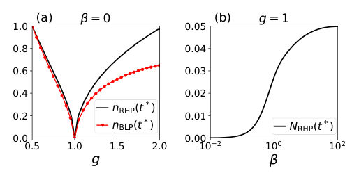 
FIG. 1. We plot the non-Markovianity measures as a function of g and β. Here, we set l = 1, L = 200, and time t∗= 25. In order to compute the maximum in Eq. (37), we considered a stochastic sam- ple of 105 pairs of orthogonal pure states. (a) nRHP(t∗) and nRHP(t∗) vs g ∈[0.5, 2] at β = 0; (b) NRHP(t∗) vs β ∈[10−2, 102] at g = 1 (log-linear scale).

📷 Fig 2

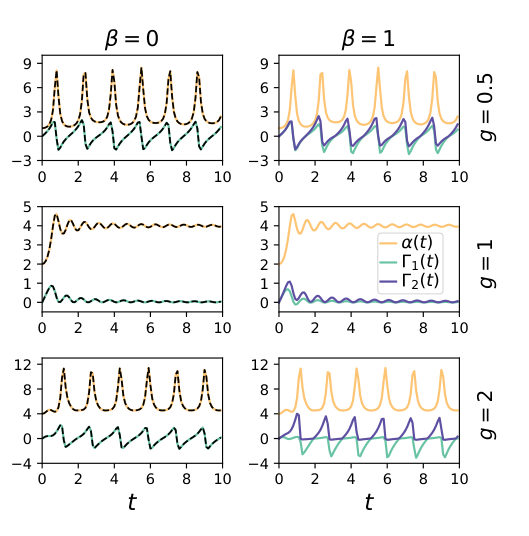 
FIG. 2. Time evolution of α(t), Γ1(t) and Γ2(t) for a single-site sys- tem, g ∈{0.5, 1, 2} (top to bottom) and β ∈{0, 1} (left to right). The coloured continuos lines represent numerical results for L = 100, while black dashed lines show analytical results in the thermody- namic limit (see App. D for details).

📷 Fig 3

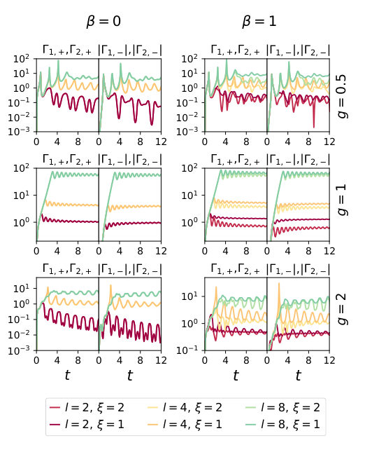 
FIG. 3. Time evolution of the coupling amplitudes {Γξ,σ(t), ξ = 1, 2, σ = ±} for l ∈{2, 4, 8}, L = 200, g ∈{0.5, 1, 2} (top to bot- tom) and β ∈{0, 1} (left to right), shown on a semi-log scale. For all cases considered, we observe a transient regime with exponentially growing rates, and an approach to stationarity for t ≳l/2vmax.

📷 Fig 4

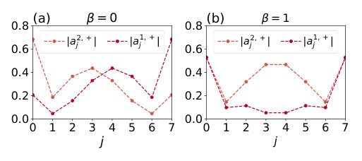 
FIG. 6. Profiles of the creation weights |aξ,+ j | in the Lindblad oper- ators at time t = 12 for l = 8, L = 400, g = 1, β = 0 (left) and β = 1 (right). After the transient, ballistically spreading Lindblad operators have reached half of the subsystem, they hybridize and de- localize over all the l sites. (a) For β = 0, the rates Γξ,σ at ξ = 1, 2 are degenerate and one can choose the corresponding Lindblad oper- ators for ξ = 1, 2 to be symmetric with respect to the middle of the chain. (b) For β &gt; 0, rates Γξ,σ at ξ = 1, 2 are not degenerate and the associated Lindblad operators are distinct.

📷 Fig 5

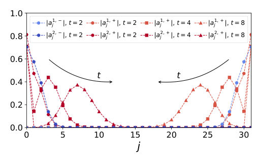 
FIG. 4. Profiles of the creation weights |aξ,σ j | at times t ∈{2, 4, 8} for l = 32, L = 400, g = 1, β = 0. The profiles of the Lindblad operators are symmetric, and spread ballistically from the edges to the bulk over time. The annihilation amplitudes |bξ,σ j | are omitted as they show the same weights.

**Summary.** This paper presents a general framework to derive the reduced dynamics generator for local observables in noninteracting quantum chains by tracing out the environment. It successfully handles the complexity of subsystem-environment correlations, showing how coupling strength dictates whether the dynamics are Markovian or non-Markovian. This advances the theory of open quantum systems beyond simple weak-coupling approximations.

**Why it may be interesting.** This work provides a rigorous, computationally tractable method to study non-Markovian dynamics in complex quantum systems by systematically handling the environment coupling, which is crucial for understanding realistic open quantum systems.

Detailed structure

**Main problem.** The paper develops a framework to derive a reduced description for local observables of a many-body quantum system by tracing out the environment, particularly for noninteracting quantum chains.

**Main result.** The framework successfully reconstructs the time-local dynamical generator for noninteracting chains with polynomial complexity, characterizing how subsystem-environment correlations affect local dynamics beyond weak-coupling approximations.

**Method.** The approach uses open quantum systems theory, assuming Gaussian environments and initially uncorrelated states to derive the generator $\mathcal{L}_t$ governing the subsystem evolution.

**Model / system.** The study focuses on noninteracting quantum chains (e.g., Kitaev chain), treating the total system as partitioned into a subsystem (S) and an environment (E). Dynamics are analyzed via the evolution of the correlation matrix $\Theta_t$.

**Key observables.** Reduced density operators ($
ho_S(t)$), correlation matrix ($\Theta_t$), and non-Markovianity measures like the Rivas-Huelga-Plenio (RHP) and Breuer-Laine-Piilo (BLP) measures.

**Important parameters / regimes.** Coupling strength, inverse temperature ($eta$), and the structure of the environment (e.g., fully connected free-fermion environment).

**Assumptions / limitations.** The derivation relies on assuming initially uncorrelated states ($\chi_0 = 0$) and Gaussian environments ($
ho_{E0}$), which allows for the reconstruction of the generator with polynomial complexity.

**Figures summary.** Figures illustrate the time evolution of non-Markovianity measures and the time evolution of correlation matrix components ($\alpha(t), \Gamma_1(t), \Gamma_2(t)$) under varying coupling strengths and temperatures.

**Paper structure.** The paper builds the framework by defining the reduced dynamics generator, applying it to specific models like the Kitaev chain, and analyzing the resulting non-Markovian dynamics using established measures.

Abstract

When only local observables of a many-body quantum system are of interest, it is desirable to formulate a reduced description within the Hilbert space of the corresponding subsystem, with the remaining degrees of freedom traced out and acting as an environment. Assuming initially uncorrelated states and Gaussian environments, we develop a framework for reconstructing the local dynamical generator of noninteracting quantum chains, with polynomial computational complexity. As an application, we consider two representative models: a bipartitioned Kitaev chain and a Kitaev chain boundary-coupled to a fully connected free-fermion environment. In both models, strong subsystem-environment coupling leads to non-Markovian dynamics characterized by ballistic spreading of the Lindblad dissipator support within the subsystem. On the other hand, weak coupling to a fully connected environment yields predominantly boundary-localized, Markovian dissipation. Our work highlights the implications of subsystem-environment correlations on the generator of local dynamics, beyond the conventional weak-coupling approximations.

[↑ back to top](#top)

### ⭐ [Collective Quantum Logic Spectroscopy](http://arxiv.org/abs/2608.20471v1)

**Highlighted author(s):** Robert J. Lewis-Swan, Ana Maria Rey  
**Authors:** Raphael Kaubruegger, Matthew Patkowski, Yicheng Zhang, Robert J. Lewis-Swan, David B. Hume, Ana Maria Rey  
**Type:** theory · **Category:** other · **PDF:** <https://arxiv.org/pdf/2608.20471v1>  
**Analysis basis:** full PDF text, analyzed in chunks
**Topic relevance:** `quantum measurements` **3/5** · `QC/QI experiment` **2/5** · `analog quantum simulation` **1/5**

📷 Fig 1

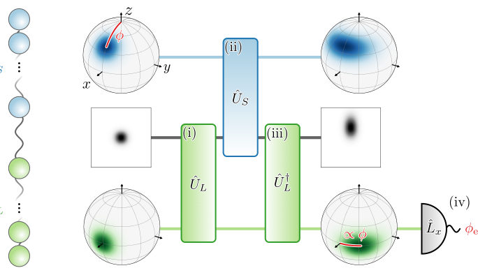 
FIG. 1. Collective QLS protocol NL logic ions are initialized in a coherent spin state pointing along the x axis, while NS spectroscopy ions are initialized in a coherent spin state in which ϕ parametrizes the imbalance between atoms in the ground and excited states, as illustrated by their Wigner distributions on a generalized Bloch sphere. Both ensembles couple to a shared motional mode of the ion crystal, with creation operator ˆa, initially prepared in its ground state. The protocol proceeds by (i) entangling the logic ions with the mode through a spin-dependent displacement ˆUL, (ii) imprinting the spectroscopy population onto the mode through ˆUS, and (iii) reversing the logic–motion...

📷 Fig 2

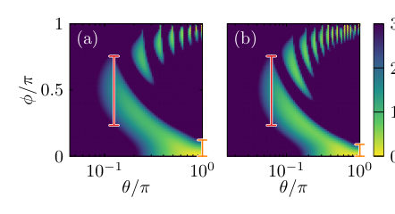 
FIG. 2. Dependence of the sensitivity on the interac- tion parameter. The panels show the sensitivity, quantified by the estimator variance ∆2 ϕ, for estimating the spectroscopy- state parameter ϕ from measurements of the logic ions after the QLS sequence. The sensitivity is shown as a function of the interaction parameter θ and ϕ. Panels (a) and (b) cor- respond to NS = NL = 8 and NS = NL = 16, respectively. Values with ∆2 ϕ ≥2/NS are shown in purple, while smaller variances are color-coded according to the color bar. The red and orange lines indicate θ = π/NS and θ = π, respectively, to- gether with the corresponding dynamic ranges. For θ = π/NS, the dynamic range remains unchanged as the...

📷 Fig 3

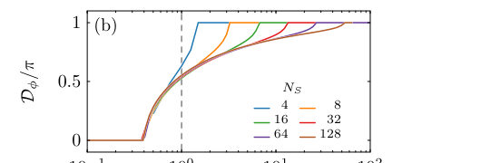 
FIG. 3. Sensitivity and dynamic range in the small- interaction regime. (a) Estimator variance, ∆2 ϕ, plotted as a function of the parameter ϕ for fixed interaction θ = π/NS and NS = 16 spectroscopy ions. Colors indicate the number of logic ions NL. The horizontal dashed and dotted lines indicate ∆2 ϕ = 1/NS and ∆2 ϕ = 2/NS, respectively. (b) Dynamic range Dϕ, defined as the range over which ∆ϕ2 ≤2/NS, as a function of the ratio between logic and spectroscopy ions, NL/NS, for θ = π/NS. Colors indicate different numbers of spectroscopy ions, and the vertical dashed line indicates NL = NS.

📷 Fig 4

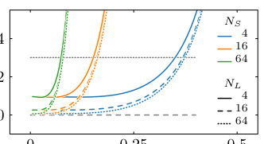 
FIG. 4. Sensitivity and dynamic range in the large- interaction regime. Estimator variance, ∆2 ϕ, as a function of the parameter ϕ at fixed interaction parameter θ = π/2. Colors indicate the spectroscopy-ion number, while line styles indicate the logic-ion number. The horizontal dashed and dotted lines indicate ∆2 ϕ = 1/NS and ∆2 ϕ = 2/NS, respectively.

📷 Fig 5

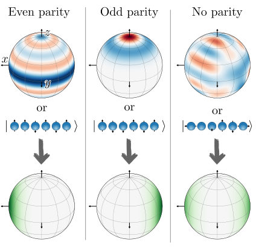 
FIG. 5. Parity mapping through the QLS sequence Even-, odd-, and no-parity states of the spectroscopy ions are mapped through the quantum-logic sequence onto coherent spin states of the logic ions pointing along the +x-axis, the −x-axis, or to a statistical mixture of both, respectively. The relative weight of the two orientations reflects the projection of the initial state onto the corresponding parity subspaces. The top row schematically illustrates entangled, permutation- symmetric states restricted to the even, odd and no-parity subspace, while the middle row shows examples of unentangled product states. Regardless of the specific spectroscopy state, all are mapped onto the logic-ion...

**Summary.** This paper introduces Collective Quantum Logic Spectroscopy (QLS) as a powerful, scalable technique for improving precision measurements in trapped-ion quantum sensors. By coupling a large ensemble of sensing ions to a smaller set of logic ions, it overcomes limitations in ion species and scaling. The theoretical analysis quantifies the performance limits, showing how the protocol can maintain quantum-limited sensitivity for applications ranging from optical clocks to quantum computation.

**Why it may be interesting.** This work provides a comprehensive theoretical blueprint for enhancing quantum measurements in trapped ions by engineering collective interactions, which is central to quantum metrology and quantum information processing using atomic systems.

Detailed structure

**Main problem.** The paper addresses the challenge of scaling trapped-ion quantum sensors to large ensembles while overcoming the limitation that many target ion species lack closed cycling transitions for direct laser cooling and state detection.

**Main result.** Collective Quantum Logic Spectroscopy (QLS) is established as a scalable framework that retains quantum-limited sensitivity even with a single logic ion, and whose performance can be tuned for both broad dynamic range and high precision.

**Method.** The protocol involves coupling an ensemble of 'spectroscopy' ions to one or more 'logic' ions via a shared motional mode, implementing a sequence of controlled rotations and projective measurements.

**Model / system.** The physical system is a trapped-ion quantum sensor comprising an ensemble of spectroscopy ions (NS) coupled to logic ions (NL). The dynamics are modeled using collective spin operators and Hamiltonian terms describing spin-dependent displacements and mode interactions.

**Key observables.** Estimator variance ($\Delta^2_\phi$), sensitivity, dynamic range ($D_\phi$), and the collective rotation angle $	heta$.

**Important parameters / regimes.** Interaction strength, interrogation time, logic-ensemble size ($N_L$), and spectroscopy-ensemble size ($N_S$).

**Assumptions / limitations.** The analysis relies on the Lamb-Dicke approximation, and the theoretical framework is agnostic to the specific implementation of the spin-dependent displacement.

**Figures summary.** Figure 1 illustrates the four-step protocol sequence involving logic and spectroscopy ions coupled to a shared motional mode. Figure 2 shows the dependence of the estimator variance on interaction strength ($	heta$) and spectroscopy imbalance ($\phi$).

**Paper structure.** The paper first introduces the QLS protocol, detailing the sequence of operations. It then quantifies the parameter estimation performance by analyzing the estimator variance in both small- and large-interaction regimes, concluding with a discussion on scaling laws and robustness against imperfections.

Abstract

Scaling trapped-ion quantum sensors from single ions to large ensembles is a key challenge for next-generation precision measurements. At the same time, many ion species of interest for optical clocks and tests of fundamental physics lack closed cycling transitions required for direct laser cooling and state detection. Collective quantum logic spectroscopy addresses both limitations by coupling an ensemble of sensor, or spectroscopy, ions to one or more logic ions that provide sympathetic cooling and state readout. Here, we establish the fundamental performance limits and operating regimes of this protocol, identifying how the interaction strength, interrogation time, and logic-ensemble size govern sensitivity, dynamic range, and robustness to experimental imperfections. We show that quantum-limited sensitivity can be retained even with a single logic ion, while increasing the number of logic ions substantially improves readout efficiency and robustness. Beyond precision metrology, the same collective interface enables many-body measurements relevant to quantum information processing, including parity measurements and stabilizer-like syndrome extraction. Our results establish collective quantum logic spectroscopy as a scalable framework for optical clocks, quantum-enhanced sensing, and trapped-ion quantum information processing.

[↑ back to top](#top)

### [Nonlinear Diamagnetic Interactions in Ultrastrongly Coupled 2D Electrons](http://arxiv.org/abs/2608.20578v1)

**Authors:** Dasom Kim, Kiran M. Kulkarni, Vaibhav Sharma, Dukhyung Lee, Geon Lee, Sunghwan Kim, Jonas Grumm, Shuang Liang, Hongjing Xu, Fuyang Tay, Andrey Baydin, Motoaki Bamba, Andreas Knorr, Christopher J. Stanton, Michael J. Manfra, Minah Seo, Stephen Hughes, Junichiro Kono  
**Type:** both · **Category:** other · **PDF:** <https://arxiv.org/pdf/2608.20578v1>  
**Analysis basis:** full PDF text, analyzed in chunks
**Topic relevance:** 🔥 `quantum optics experiment` **4/5** · `Tavis-Cummings & cavity-many-emitter` **3/5** · `analog quantum simulation` **3/5** · `Keldysh / 2PI / non-Gaussian methods` **2/5** · `driven-dissipative phase transition` **2/5** · `methods for driven-dissipative` **2/5** · `correlated / nonlocal dissipation` **1/5** · `interference shaping light` **1/5** · `non-equilibrium universality` **1/5** · `quantum measurements` **1/5**

📷 Fig 1

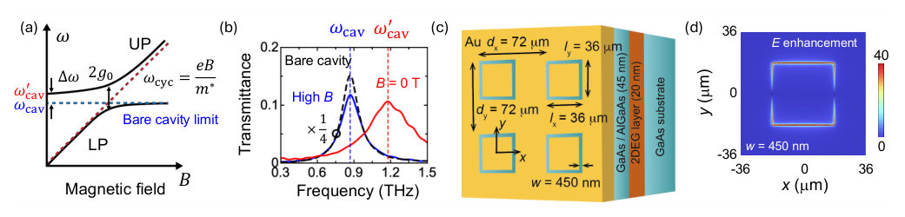 
FIG. 1. Landau polaritons in the USC regime. (a) Upper-polariton (UP) and lower-polariton (LP) frequencies of Landau polaritons as a function of magnetic field. The diamagnetic shift, ∆ω = ω′ cav −ωcav, originates from the diamagnetic (A2) term. (b) Measured transmission spectra of the Landau polariton system at B = 0 and 7 T with the incident electric field strength of 0.01 kV/cm, yielding a diamagnetic shift of ∆ω = 0.32 THz (g0/ωcav = 0.47). The black, dashed trace is the simulated transmission spectrum of the bare cavity, shown for comparison. (c) Schematic illustration of the ultra-subwavelength THz nanoslot cavity array fabricated on a GaAs 2DEG. (d) Simulated electric field...

📷 Fig 2

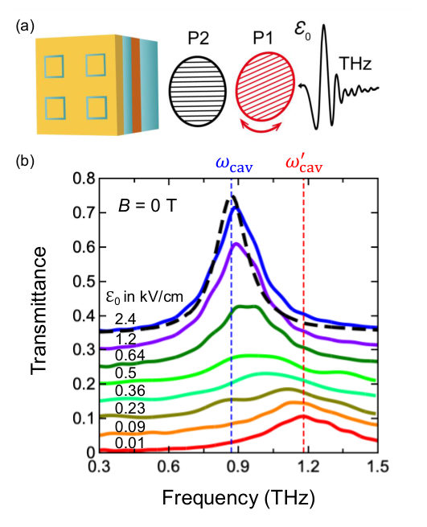 
FIG. 2. Electric-field-induced softening of the diamagnetic response. (a) Schematic of the nonlinear THz transmission experiment. The THz transmissions are measured at B = 0 and T0 = 4 K. (b) Transmission spectra measured at differ- ent incident THz field strengths E0. The resonance continu- ously redshifts from the diamagnetically shifted cavity fre- quency ω′ cav/(2π) = 1.19 THz toward the bare cavity fre- quency ωcav/(2π) = 0.87 THz with increasing electric field strength. Spectra are offset by 0.05, while the bare-cavity spectrum (black dashed line) is scaled to two-thirds of its am- plitude.

📷 Fig 3

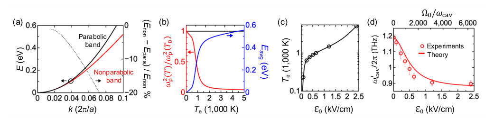 
FIG. 3. Nonparabolicity as a microscopic origin of the reduction of the diamagnetic shift. (a) Calculated GaAs conduction band (red) and its parabolic approximation (black) where a is the lattice constant. The dotted curve (right axis) shows the relative deviation of the nonparabolic band dispersion from the parabolic approximation. (b) Calculated normalized plasma frequency squared (red) and average electron energy Eavg = U/n (blue) as functions of the electron temperature. The black line shows the results for the parabolic band. (c) Calculated correspondence between the incident THz electric field E0 and electron temperature Te. (d) Zero-magnetic-field resonance frequency of the hybrid...

**Summary.** This paper reports experimental evidence and theoretical modeling showing that the diamagnetic interaction in ultrastrongly coupled electron-photon systems is nonlinear. The nonlinearity arises from the field-driven redistribution of electrons into the nonparabolic conduction band, necessitating an extension of the standard Hopfield model with Kerr-like terms.

**Why it may be interesting.** This work directly addresses the limits of standard linear cavity QED models by incorporating strong-field, non-equilibrium effects (hot-electron dynamics) into the Hamiltonian, which is highly relevant for advanced quantum optics.

Detailed structure

**Main problem.** The study investigates the nonlinear diamagnetic response of Landau polaritons in ultrastrongly coupled systems, challenging the assumptions of the conventional linear Hopfield model.

**Main result.** The authors experimentally and theoretically demonstrate that intense THz driving fields cause a field-induced reduction in the diamagnetic shift by driving electrons into the nonparabolic regime of the conduction band.

**Method.** The work combines nonlinear THz transmission spectroscopy measurements with a microscopic hot-electron model to reproduce the observed field-dependent renormalization of the plasma frequency.

**Model / system.** The system involves 2D electrons (GaAs) coupled to a THz cavity, modeled using an extension of the Hopfield Hamiltonian that incorporates a Kerr-like, nonlinear interaction term derived from the nonparabolic band structure.

**Key observables.** Diamagnetic shift ($\Delta\omega$), polariton frequencies ($\omega_{\pm}$), and the resonance frequency ($\omega'_{	ext{cav}}$) as a function of incident THz field strength ($E_0$).

**Important parameters / regimes.** Ultrastrong coupling regime ($g/\omega_{	ext{cav}} \geq 0.1$), high driving fields ($E_0$ up to 2.4 kV/cm), and the electron temperature ($T_e$).

**Assumptions / limitations.** The primary nonlinear effect is attributed to the thermal redistribution of electrons within the nonparabolic conduction band, and the analysis uses the semiclassical Boltzmann equation.

**Figures summary.** Figures show the evolution of Landau polariton frequencies with magnetic field and, critically, the redshift of the resonance frequency in THz transmission spectra as the incident THz field strength increases.

**Paper structure.** The paper establishes the standard linear model, presents experimental measurements showing nonlinear field dependence, develops a microscopic hot-electron model linking field strength to electron temperature, and finally proposes a nonlinear extension of the quantum Hamiltonian to describe the observed physics.

Abstract

The quantum Hopfield model is widely used to describe ultrastrong light--matter coupling between cavity photons and collective bosonic excitations in solids, where the diamagnetic interaction is conventionally assumed to be a constant. We experimentally demonstrate that the diamagnetic response of Landau polaritons is reduced under strong terahertz field excitation. We show that this behavior originates from field-driven redistribution of electrons into the nonparabolic regime of the conduction band of GaAs, which reduces the plasma frequency and consequently the diamagnetic interaction strength. A microscopic hot-electron model reproduces the observed nonlinear response. Motivated by this microscopic picture, we propose a nonlinear extension of the Hopfield model with a Kerr-like interaction. Our results establish a route toward nonlinear cavity quantum electrodynamics and driven ultrastrong light--matter coupling beyond the conventional linear Hopfield description, which is capable of creating uniquely quantum optical effects such as squeezed light generation.

[↑ back to top](#top)

### [An autonomous feedback protocol: responding to temperature and potential changes in energy converters](http://arxiv.org/abs/2608.21113v1)

**Authors:** Krishna Lyn Delima, Elsa Danielsson, Bruno Bertin-Johannet, Janine Splettstoesser  
**Type:** theory · **Category:** statistical mechanics · **PDF:** <https://arxiv.org/pdf/2608.21113v1>  
**Analysis basis:** full PDF text, analyzed in chunks
**Topic relevance:** 🔥 `quantum measurements` **4/5** · `driven-dissipative phase transition` **3/5** · `methods for driven-dissipative` **3/5** · `non-equilibrium universality` **3/5** · `Full counting statistics` **2/5** · `Keldysh / 2PI / non-Gaussian methods` **2/5** · `correlated / nonlocal dissipation` **1/5**

📷 Fig 1

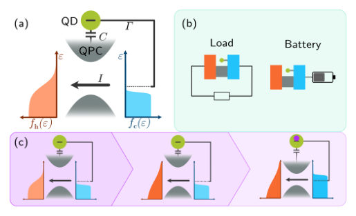 
FIG. 1. Schematic of the autonomous feedback device. (a) A quan- tum point contact (QPC) conducts a (negative) charge current from a cold contact to a hot contact. The cold contact is coupled with strength Γ to a quantum dot (QD), in turn capacitatively coupled to the QPC with capacitance C. (b) The two circuit configuration inves- tigated in the paper. The load setup connects the two contacts through an external resistance. The battery setup lets the cold contact act as a simple battery through charge build-up. (c) Conceptual process of the feedback mechanism. Initially the quantum dot is empty. Then the temperature is raised in the hot contact. The quantum dot is filled either by...

📷 Fig 2

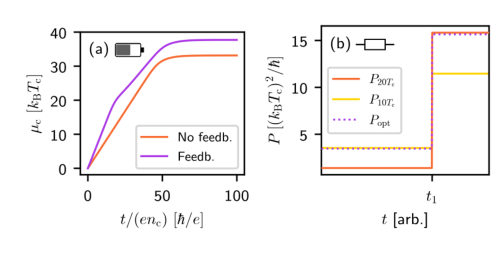 
FIG. 2. (a) Expected build-up of µc in battery setup, obtained from Eq. (7), for maximized µc at τcharge/(enc) = 50 ℏ/e with Th = 20 Tc. The optimized parameters are εfilter = 28.95 kBTc for no feedback (red line) and εe = 17.62 kBTc, εf = 34.49 kBTc, and εQD = 20.45 kBTc with feedback (purple line). (b) Power outputs of the load setup at temperatures Th = 10 Tc for t &lt; t1, and Th = 20 Tc for t &gt; t1, with R = 10 ℏ/e2(≈1.6 h/(e2)). The filter heights are εe = 6.62 kBTc and εf = 13.24 kBTc, which are the optimal heights for Th = 10Tc and Th = 20Tc respectively. The optimized dot level is εQD = 9.27 kBTc.

📷 Fig 3

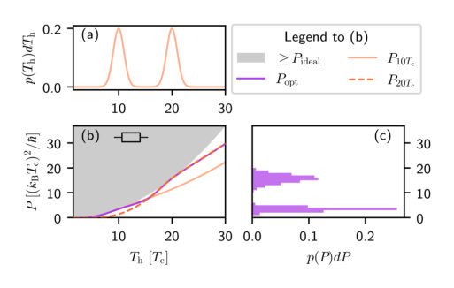 
FIG. 3. (a) Bimodal probability distribution for Th, constructed by normal distributions centered at 10Tc and 20Tc with variance σ2 = Tc. (b) Produced power in the load setup: Pideal is achieved when the barrier height is optimal at each temperature (all values in the gray region are hence excluded); P10Tc and P20Tc are the powers when the barrier height is optimal for Th = 10 Tc and Th = 20 Tc respectively, see Fig. 2; Popt is the power for feedback with filter heights optimized for maximum average power given the bimodal distribution of (a): εe = 6.68 kBTc, εf = 13.10 kBTc, εQD = 8.73 kBTc. (c) Probability distribution of the power values leading to Popt, see Eqs. (11).

📷 Fig 4

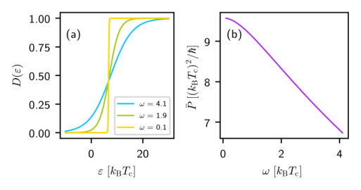 
FIG. 4. (a) Transmission functions for QPCs of various widths, see Eq. (1). (b) Average power depending on width of the QPC trans- mission function. Unsurprisingly, the average power decreases with increasing width.

📷 Fig 5

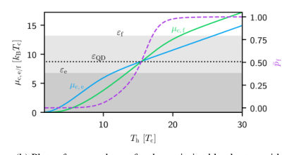 
FIG. 5. Figures detailing potential dynamics for the battery setup (a) and the load setup (b).

**Summary.** This work proposes an autonomous feedback control protocol for quantum heat engines using a coupled quantum dot detector. By using the QD to sense external temperature and potential changes, the system dynamically adjusts its energy filter to maximize power output or charging voltage. This demonstrates how feedback can significantly improve energy conversion efficiency under realistic, fluctuating operating conditions.

**Why it may be interesting.** The combination of non-equilibrium thermodynamics, stochastic processes (QD dynamics), and optimization techniques for energy harvesting makes it highly relevant for understanding open quantum systems operating under fluctuating external parameters.

Detailed structure

**Main problem.** The paper develops and analyzes an autonomous feedback protocol to optimize the performance of quantum-point-contact-based heat engines when external temperature and potential conditions are unknown or variable.

**Main result.** Feedback mechanisms significantly enhance energy conversion, allowing the device to optimize power output across varying temperature distributions or increase the charging voltage in open-circuit battery setups.

**Method.** The analysis combines coherent steady-state transport theory for the QPC with stochastic rate equations for the coupled quantum dot detector, optimizing parameters based on probability distributions.

**Model / system.** The system is a quantum-point-contact (QPC) heat engine coupled to a quantum dot (QD) detector. The QD reads out the electrochemical potential ($\mu_c$) to autonomously adjust the QPC's energy filter, thereby controlling the thermoelectric energy conversion.

**Key observables.** Charge current ($I$), average output power ($ar{P}$), final charging potential ($\mu_c$), and the QD occupation probabilities ($p_e, p_f$).

**Important parameters / regimes.** Temperature bias ($	ext{Th}, 	ext{Tc}$), capacitive coupling strength ($U$), and the rates governing QD tunneling ($\Gamma_{ef}, \Gamma_{fe}$).

**Assumptions / limitations.** Assumptions include mean-field descriptions for electron interactions, fast electron traversal compared to QD dynamics, and the QD coupling only to the cold contact.

**Figures summary.** Figures illustrate the comparison of voltage build-up (battery setup) and power output (load setup) with and without feedback under varying temperature conditions (Normal, Uniform, Bimodal distributions).

**Paper structure.** The paper progresses from establishing the basic feedback mechanism in steady-state (load setup) to analyzing charging dynamics (battery setup), then extending the analysis to optimize performance under unknown, time-varying temperature distributions using probability theory.

Abstract

Nanoscale thermoelectric devices convert tiny amounts of heat into power. But what happens if the external conditions and resulting temperature differences are not a priori known? We propose a feedback mechanism that optimizes the performance of a quantum-point-contact-based heat engine (QPC). A quantum-dot detector measures the external conditions and gives autonomous feedback on the QPC's properties. We expect this feedback mechanism to be experimentally relevant for steady-state engines with unknown external conditions and for adapting dynamic charging processes to the potential buildup.

[↑ back to top](#top)

### [Symmetry Adapted Hierarchical Equations of Motion for Exact Simulations of Large Polariton Systems](http://arxiv.org/abs/2608.20657v1)

**Authors:** M. Elious Mondal, Pengfei Huo  
**Type:** theory · **Category:** other · **PDF:** <https://arxiv.org/pdf/2608.20657v1>  
**Analysis basis:** full PDF text, analyzed in chunks
**Topic relevance:** 🔥 `Tavis-Cummings & cavity-many-emitter` **4/5** · 🔥 `methods for driven-dissipative` **4/5** · `analog quantum simulation` **3/5** · `correlated / nonlocal dissipation` **2/5** · `driven-dissipative phase transition` **2/5** · `Keldysh / 2PI / non-Gaussian methods` **1/5** · `non-equilibrium universality` **1/5**

📷 Fig 1

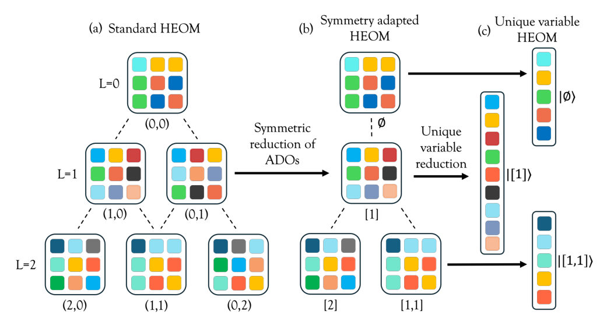 
FIG. 1. A schematic representation of the symmetry adaptation of HEOM for the HTC system. (a) is the ADO structure for the conventional HEOM hierarchy. (b) is the reduction of ADOs within different layers to representatives due to permutation symmetry. (c) is the further reduction of the ADO representatives to their unique variables.

📷 Fig 2

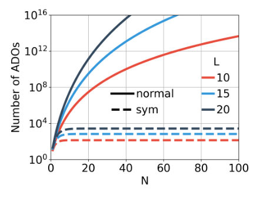 
FIG. 2. Number of ADOs retained through hierarchy depth L for a one-exponential decomposition per local bath. The curves labeled “normal” correspond to the molecule-resolved hierarchy used by conventional HEOM, whereas those labeled “sym” show the canonical ADO representatives obtained af- ter molecular relabeling. The conventional hierarchy grows rapidly with the ensemble size N, while the number of canon- ical representatives saturates once N ≥L.

📷 Fig 3

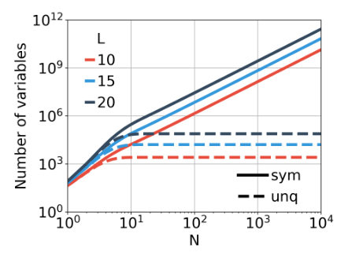 
FIG. 3. Number of propagated complex variables through hierarchy depth L for a one-exponential decomposition per local bath. Curves labeled “sym” correspond to storing every entry of the full (N + 1) × (N + 1) matrix associated with each canonical ADO; curves labeled “unq” show the dimen- sion after retaining only the unique variables. The full-matrix dimension continues to grow with N, whereas the unique- variable dimension saturates for N ≥L + 2.

📷 Fig 4

 
Fig. 3 demonstrates the additional reduction ob- tained by propagating unique variables. Although the canonical-ADO count has already saturated for N ≥L, retaining full ADO matrices preserves an (N +1)2 depen- dence. The unique variable representation instead de- pends only on the occupation categories present in each canonical pattern and on whether a category contains one or at least two molecules. For a fixed pattern, the depen- dence on N enters only through the number of molecules in the zero-occupation category,

📷 Fig 5

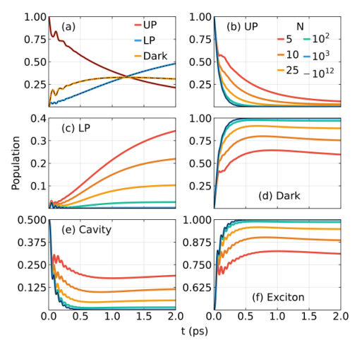 
FIG. 4. Population dynamics for an initial upper-polariton population with a one-exponential decomposition per local bath. (a) Comparison between symmetry-adapted HEOM and the QuTiP implementation of conventional HEOM for N = 2. Colored curves show the symmetry-adapted calcu- lation, and the overlaid black traces show the corresponding conventional HEOM results for the UP, LP, and total dark populations. (b) UP, (c) LP, (d) total dark, (e) cavity, and (f) total exciton populations for N = 5, 10, 25, 102, 103, and 1012, as identified by the legend.

**Summary.** The paper introduces a symmetry-adapted Hierarchical Equations of Motion (HEOM) formalism to overcome the prohibitive computational cost of simulating large polariton systems. By exploiting the permutation symmetry of identical molecules, the method drastically reduces the number of variables needed for propagation. This allows for accurate, matrix-free simulation of complex dynamics, including cavity loss and disorder, in large molecular ensembles.

**Why it may be interesting.** This work provides a crucial algorithmic advancement for simulating complex open quantum systems in quantum optics and condensed matter, allowing researchers to study collective phenomena in large ensembles previously inaccessible due to exponential scaling.

Detailed structure

**Main problem.** The computational cost of using Hierarchical Equations of Motion (HEOM) for simulating large open quantum systems, such as those involving large polariton ensembles.

**Main result.** A symmetry-adapted HEOM formalism is developed that significantly reduces computational complexity by exploiting molecular indistinguishability, making simulations feasible for much larger ensembles.

**Method.** The method employs a two-stage reduction: first, replacing redundant Auxiliary Density Operators (ADOs) related by molecule relabeling with canonical representatives; second, propagating only unique complex variables instead of full ADO matrices.

**Model / system.** The study focuses on large polariton systems modeled by the Holstein-Tavis-Cummings (HTC) model, which involves multiple two-level molecules coupled to a cavity mode and independent harmonic baths. The dynamics are governed by the HEOM formalism.

**Key observables.** Polariton populations ($P_+, P_-$), coherence terms ($X_\Lambda, Y_\Lambda$), and the decay of the surviving excitation population ($P_{	ext{surv}}$).

**Important parameters / regimes.** Hierarchy depth (L), number of bath correlation exponentials (m), cavity loss rate ($\kappa$), and static disorder strength ($\delta\epsilon_i$).

**Assumptions / limitations.** The method assumes identical molecular properties and relies on the existence of a relabeling-compatible hierarchy closure. It also incorporates extensions for static disorder averaging and cavity loss.

**Figures summary.** Figure 1 schematically illustrates the two-stage symmetry adaptation process, moving from full ADO structures to canonical representatives and finally to unique variables. Figure S2 simulates polariton dynamics showing population transfer from UP to the ground state.

**Paper structure.** The paper first introduces the HEOM framework for open systems, then details the first reduction stage using molecular relabeling covariance to define canonical ADOs. Subsequent sections extend this formalism to incorporate static energetic disorder and cavity loss, deriving the final matrix-free equations of motion.

Abstract

Hierarchical equations of motion(HEOM) provide exact dynamics of open quantum systems coupled to harmonic baths, but their computational cost becomes prohibitive for systems with many independent local environments. In this work, we develop a symmetry-adapted HEOM formalism to significantly reduce the computational cost for the permutationally invariant Holstein-Tavis-Cummings (HTC) model. The method removes redundant information in two stages. First, all auxiliary density operators (ADOs) related only by relabeling identical molecules and their bath channels are replaced by a single canonical occupation-pattern representative. Second, molecules with the same local hierarchy occupation produce repeated matrix elements within each representative, allowing only the distinct complex variables to be propagated instead of the full (N + 1) $\times$ (N + 1) ADO matrices. The resulting matrix-free equations are evaluated using precomputed connections and molecular multiplicities. At fixed hierarchy depth L and number of bath correlation exponentials m, the number of canonical representatives becomes independent of the ensemble size for N $\geq$ L and the number of unique variables saturates for N $\geq$ L + 2. The formulation easily extends to multiple-exponential bath decompositions, arbitrary initial density operators, static disorders, and cavity loss. Our benchmarks reproduce conventional HEOM dynamics while requiring far fewer propagated variables and substantially less memory.

[↑ back to top](#top)

### [An Informational Route to Negative Mobility](http://arxiv.org/abs/2608.20785v1)

**Authors:** Ziluo Zhang, Shigeyuki Komura, Zhihong You  
**Type:** theory · **Category:** statistical mechanics · **PDF:** <https://arxiv.org/pdf/2608.20785v1>  
**Analysis basis:** full PDF text, analyzed in chunks
**Topic relevance:** 🔥 `quantum measurements` **4/5** · `driven-dissipative phase transition` **3/5** · `non-equilibrium universality` **3/5** · `Keldysh / 2PI / non-Gaussian methods` **2/5** · `methods for driven-dissipative` **2/5** · `Frenkel-Kontorova` **1/5** · `correlated / nonlocal dissipation` **1/5**

📷 Fig 1

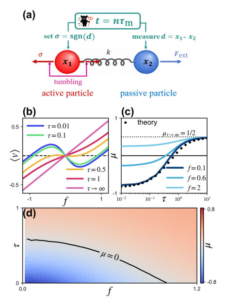 
FIG. 1. Model and transport response of the feedback- controlled active–passive dimer. (a) Schematic of the measurement-and-feedback protocol. (b) Steady-state mean velocity ⟨v⟩as a function of the dimensionless force f for different measurement intervals τ. (c) Effective mobility µ versus τ for various dimensionless force f. Symbols indicate the weak-load analytical prediction from Eq. (3). (d) Mobil- ity diagram in the (f, τ) plane.

📷 Fig 2

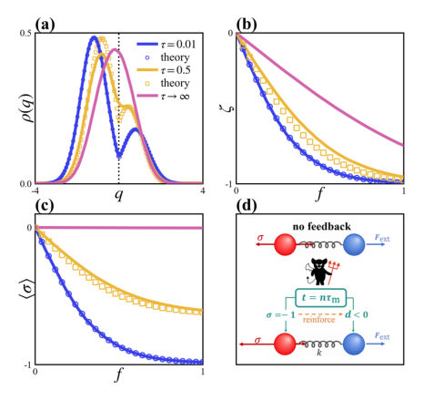 
FIG. 2. Self-reinforcing information–mechanical feedback from configurational bias to active response. (a) Steady-state distribution ρ(q) of the relative coordinate at f = 0.2 for rep- resentative measurement intervals. (b) Internal polarity ζ as a function of f. (c) Mean active polarity ⟨σ⟩as a function of the external force f for different τ. (d) Schematic compari- son between information-free dynamics and the measurement- and-feedback protocol. Solid lines show simulations, while symbols denote the analytical prediction.

📷 Fig 3

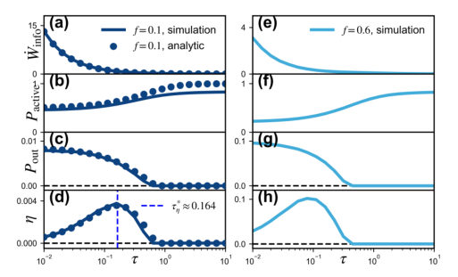 
FIG. 3. Energetic and information-processing performance versus measurement interval. The left column corresponds to the weak load f = 0.1, where solid curves show simula- tions and symbols denote the rapid-feedback analytical pre- diction. The right column shows simulations for the stronger load f = 0.6. (a,e) Minimum information-processing power ˙Winfo. (b,f) Active input power Pactive = ⟨σ ◦˙x1⟩. (c,g) Use- ful mechanical output power Pout = max{0, −f⟨v⟩}. (d,h) Information-inclusive efficiency η = Pout/[Pactive + ˙Winfo]. The blue dashed line indicates the optimal measurement in- terval predicted by the weak-load theory.

**Summary.** This paper demonstrates that information feedback can induce negative mobility in a physical dimer system, allowing motion against an applied external force. The authors develop a theory showing that while rapid feedback enhances this reverse transport, it incurs a growing informational cost. Consequently, optimal performance is achieved at a finite, non-zero feedback rate, establishing a fundamental trade-off between control and efficiency.

**Why it may be interesting.** The work provides a concrete, non-equilibrium example of how information processing can fundamentally alter macroscopic transport properties, linking thermodynamics, stochastic dynamics, and information theory.

Detailed structure

**Main problem.** Investigating how information feedback can provide a distinct route to achieving negative mobility (motion opposite to the applied force) in non-equilibrium systems.

**Main result.** Negative mobility is achieved when the information-mediated active response overcomes the direct mechanical response, and the information-inclusive efficiency shows a trade-off, peaking at a finite feedback rate.

**Method.** Analytical theory development, utilizing stochastic energetics and analyzing the system's dynamics in the overdamped limit.

**Model / system.** An overdamped dimer composed of a run-and-tumble particle coupled to a passive Brownian particle. Information is introduced via periodic measurements of the relative displacement to reset the active polarity.

**Key observables.** Mobility ($\mu$), Mean velocity ($\langle v 
angle$), Active polarity ($\langle \sigma 
angle$), Information-inclusive efficiency ($\eta$).

**Important parameters / regimes.** Measurement interval ($	au$), Applied force ($f$), Feedback gain ($\chi\lambda$).

**Assumptions / limitations.** The system operates in the overdamped limit, and the analysis includes the Landauer bound for information-processing cost.

**Figures summary.** Figures illustrate the transition to negative mobility in the $(f, 	au)$ plane, and show the trade-off between information cost, active power, and output power.

**Paper structure.** The paper first establishes the basic dynamics and shows the negative mobility regime. It then develops the framework for information-inclusive efficiency, deriving the optimal finite feedback rate that maximizes this efficiency.

Abstract

Mobility links an applied force to the resulting motion and is generally positive near equilibrium. Far from equilibrium, however, internal energy input can reverse this response. Here we show that information feedback provides a distinct route to negative mobility. We consider an overdamped dimer consisting of a run-and-tumble particle coupled by a spring to a passive Brownian particle. Information enters through periodic measurements of the relative displacement, which are processed to reset the active polarity. Although the unloaded dimer has no net drift, an applied force biases its internal configuration, and an information-mechanical feedback amplifies and converts this bias into active propulsion against the force, producing negative mobility. We develop an analytical theory that captures this mechanism and yields a feedback-gain criterion for response reversal. Including the information-processing cost reveals a tradeoff: rapid feedback enhances reverse transport but incurs a growing informational cost, yielding an optimal finite feedback rate for information-inclusive efficiency. These results show that information can reshape nonequilibrium response by controlling how internally supplied energy is converted into macroscopic transport.

[↑ back to top](#top)

### [Quantum phase estimation for nondestructive monitoring and Wigner tomography of bosonic fields](http://arxiv.org/abs/2608.20787v1)

**Authors:** Lucas R. S. Santos, Ciro M. Diniz, Daniel Z. Rossatto, Celso J. Villas-Boas  
**Type:** theory · **Category:** other · **PDF:** <https://arxiv.org/pdf/2608.20787v1>  
**Analysis basis:** full PDF text, analyzed in chunks
**Topic relevance:** 🔥 `quantum measurements` **4/5** · `QC/QI experiment` **3/5** · `analog quantum simulation` **2/5** · `quantum optics experiment` **2/5** · `Full counting statistics` **1/5** · `Tavis-Cummings & cavity-many-emitter` **1/5** · `driven-dissipative phase transition` **1/5** · `methods for driven-dissipative` **1/5**

📷 Fig 1

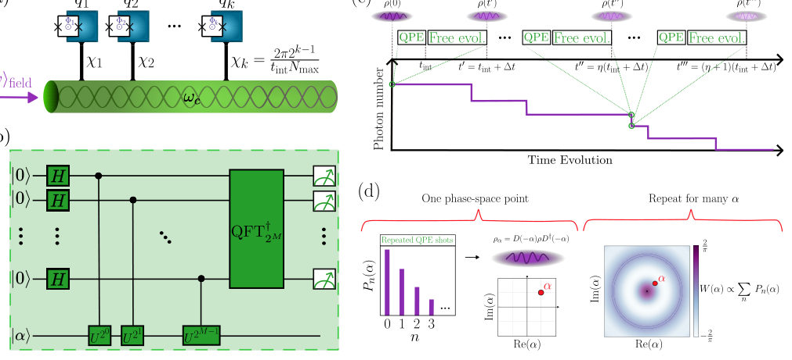 
FIG. 1. Circuit-QED protocol for QND monitoring and Wigner tomography of a bosonic field using quantum phase estimation (QPE). (a) Physical platform: a bosonic resonator mode at frequency ωc is dispersively coupled to a register of M frequency-tunable superconducting qubits. The flux-dependent detunings ∆k(Φk) control the dispersive shifts χk(Φk) ≃|gk|2/∆k(Φk), which are calibrated to implement the QPE controlled phases. (b) QPE readout: the register is prepared in a uniform superposition, acquires photon-number-dependent phases through the dispersive interaction, and is measured after the inverse quantum Fourier transform, yielding an outcome correlated with the resonator photon number....

📷 Fig 2

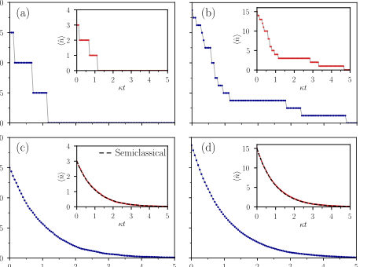 
FIG. 2. QND monitoring of the dissipative field dynamics us- ing QPE. The main panels show the average phase θavg(t) = P

📷 Fig 3

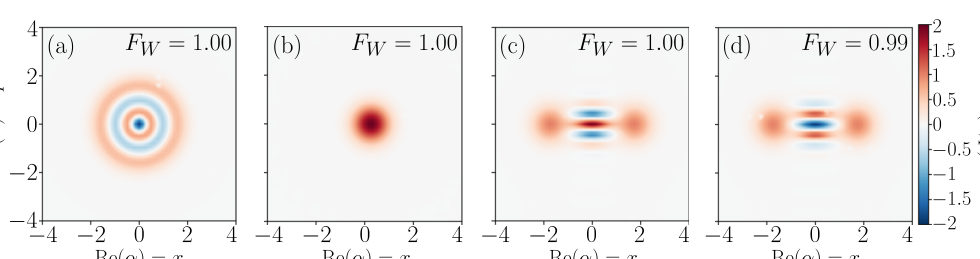 
FIG. 3. Wigner function reconstruction in the phase-space diagram from the displaced photon-number distributions obtained by repeating the QPE readout. We use an M = 6 qubits, corresponding to Nmax = 2M = 64, and consider N = 3 in all panels: (a) a Fock state |N⟩, (b) a coherent state |α0⟩with α0 = √

**Summary.** The paper shows how Quantum Phase Estimation (QPE) can be adapted in a circuit-QED setup to nondestructively measure bosonic field properties. By leveraging dispersive coupling, the photon number is mapped onto qubit phases, allowing for both tracking photon loss and reconstructing the full Wigner function. This offers a powerful, unified tool for characterizing quantum light states in superconducting circuits.

**Why it may be interesting.** This work directly addresses state characterization and control in superconducting quantum architectures by providing a robust, quantum-limited measurement protocol for bosonic modes.

Detailed structure

**Main problem.** To demonstrate that Quantum Phase Estimation (QPE), typically used for eigenphase extraction, can be repurposed as a nondestructive measurement tool for characterizing bosonic fields.

**Main result.** The protocol provides a unified method to perform both nondestructive monitoring of photon-number dynamics and full Wigner tomography of bosonic states using a circuit-QED platform.

**Method.** The technique involves coupling a bosonic mode to a superconducting qubit register, using the dispersive interaction to imprint photon-number-dependent phases, and then reading out these phases via QPE and controlled phase-space displacements.

**Model / system.** The system is a bosonic resonator mode dispersively coupled to an M-qubit superconducting register, governed by a multi-qubit Jaynes-Cummings Hamiltonian. The dynamics are analyzed in the dispersive regime, where the interaction is proportional to the photon number $\hat{n}$.

**Key observables.** Photon number distribution, Wigner function, Wigner-overlap fidelity ($F_W$), and mean photon number decay $\langle\hat{n}(t)
angle$.

**Important parameters / regimes.** Dispersive coupling strengths ($\chi_k$), cavity decay rate ($\kappa$), and the maximum number of qubits ($M$).

**Assumptions / limitations.** The dispersive regime is assumed, and the protocol relies on calibrating the dispersive phase shifts to match the required QPE unitary evolution.

**Figures summary.** The notes do not describe specific figures, but the analysis focuses on numerical reconstructions of Wigner functions for various states (Fock, coherent, cat states) showing high fidelity.

**Paper structure.** The paper progresses by first establishing the physical model (Hamiltonian), then adapting QPE for number-resolved readout, applying this to monitor dissipative photon loss, and finally extending the readout via phase-space displacements for Wigner tomography.

Abstract

Quantum phase estimation is usually introduced as an algorithmic primitive for extracting eigenphases of unitary operators. Here we show that, when implemented through a dispersive light-matter interaction, it can also be used as a nondestructive measurement tool for bosonic fields. We consider a bosonic mode coupled to a multi-qubit register and calibrate the photon-number dependent phase shifts so that the register performs a number-resolved quantum phase estimation readout. Repeating this readout during dissipative evolution enables nondestructive monitoring of photon-number dynamics. We then show that the same readout can be converted into a Wigner tomography reconstruction by applying phase-space displacements before the quantum phase estimation block. Numerical reconstructions for Fock, coherent, and even/odd Schrödinger cat states show the expected nonclassical phase-space structures and near-unity Wigner overlap fidelities. The protocol provides a unified route to nondestructive monitoring and state tomography of bosonic fields, with direct relevance for bosonic-state characterization, calibration, and control in superconducting quantum architectures.

[↑ back to top](#top)

### [Quantum annealing through a first-order phase transition: field theory approach](http://arxiv.org/abs/2608.21329v1)

**Authors:** Diego Andrés Rivera Orona, Predrag Punoševac, Nikolai A. Sinitsyn  
**Type:** theory · **Category:** statistical mechanics · **PDF:** <https://arxiv.org/pdf/2608.21329v1>  
**Analysis basis:** full PDF text, analyzed in chunks
**Topic relevance:** 🔥 `non-equilibrium universality` **4/5** · `Keldysh / 2PI / non-Gaussian methods` **3/5** · `driven-dissipative phase transition` **3/5** · `analog quantum simulation` **2/5** · `methods for driven-dissipative` **2/5**

📷 Fig 1

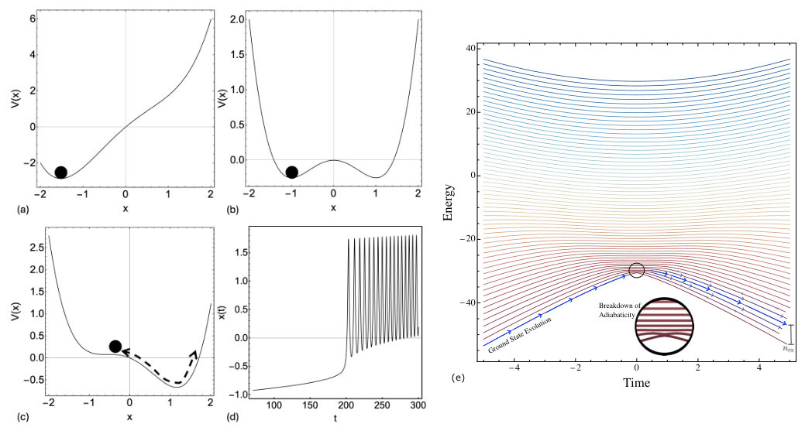 
FIG. 1. Stages of the first-order phase transition. (a-c) Potential energy V (x) (solid curve) of the Hamiltonian, as in Eq.(24), at different times: (a) For t &lt; 0, the system continuously follows a global minimum (black circle). (b) At t = 0, the initial minimum of V (x, t) is no longer global, but the potential barrier prevents the transition to a new global minimum. (c) At the critical moment, t = tc, the initial local minimum of V (x, t) disappears, and the system then falls down the potential V (x, t), starting to oscillate around the global minimum. (d) A numerically computed trajectory of x(t). The emergence of high-amplitude oscillations corresponds to the transition to stage (c)....

📷 Fig 2

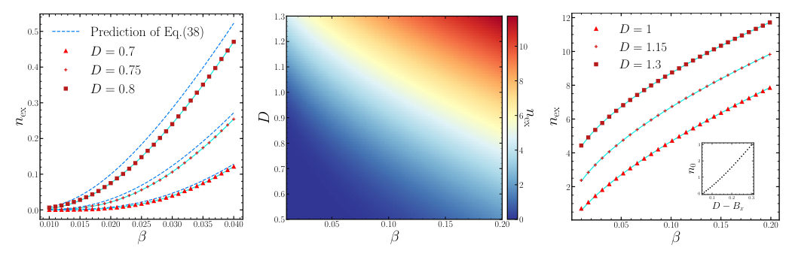 
FIG. 2. Left Panel: The number of excitations as a function of the sweep rate for three different Ising spin couplings D below the critical point. Each set of data also includes a solid, two-parameter fit line, nex = cβ exp(−∆/β). The dashed lines are the analytical predictions from Eq. (38) without free-parameter fitting. Center Panel: Density plot showing the number of excitations as a function of the sweep rate β and the Ising spin coupling D. Right Panel: The number of excitations as a function of the sweep rate for three different Ising spin couplings. Each set of data also includes a three-parameter best-fit line, nex = n0 + cβν. The inset shows the fit values n0 as a function of D...

📷 Fig 3

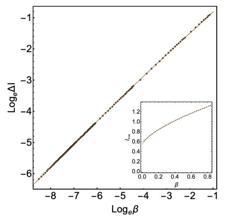 
FIG. 3. Best fit of ∆I, defined in Eq. (27), in the log-log plot. The black points are the results of numerical simulations over a broad range of values of β. The brown curve is the best fit given by ln(∆I) = 0.8 ln β + a(ln ln β)r, with a = 0.2 and r = 1.5, suggesting that ν+ = 0.8. The constant parameters were chosen so that k = m = g = 1. The inset shows I+∞versus β ∈(0.02, 0.9). A projection of the best fit to β →0 shows that I+∞saturates at a finite value. Numerically obtained field theory curves for I+∞are analogous to those in Fig. 2 (Right) for nex in LMGm.

**Summary.** This work develops a field theory to characterize defects generated during quantum annealing, specifically when the process encounters a first-order phase transition. By analyzing the scaling of excitations using the LMGm model, the authors predict distinct power-law behaviors that can serve as a diagnostic tool to identify and potentially avoid problematic first-order critical points in quantum computation protocols.

**Why it may be interesting.** The connection between the universal scaling laws derived from quantum field theory and the non-equilibrium dynamics of quantum computation is highly relevant for understanding noise and error mitigation in quantum hardware.

Detailed structure

**Main problem.** The paper investigates the generation of excitations (defects) during quantum annealing when the process traverses a first-order phase transition, contrasting this with second-order transitions.

**Main result.** It derives distinct power-law scaling predictions for the error generation rate depending on whether the transition is subcritical, at the critical point, or supercritical, providing a signature for first-order critical points.

**Method.** The authors employ a field theory approach, mapping the quantum dynamics to a time-dependent $\phi^4$ theory, and utilize semiclassical approximations and adiabatic invariant analysis.

**Model / system.** The primary model is the driven Lipkin-Meshkov-Glick model (LMGm) of interacting Ising spins. The dynamics are analyzed by mapping the quantum problem to a classical Hamiltonian $H_{	ext{cl}}(x, p, t)$ in the large $S$ limit.

**Key observables.** Number of excitations ($n_{ex}$), the adiabatic invariant ($\Delta I$), and the scaling exponents ($
u, \mu$).

**Important parameters / regimes.** The coupling parameter $k$ (determining the transition order), the sweep rate ($eta$), and the initial/final adiabatic invariants ($I_0$).

**Assumptions / limitations.** The analysis relies on mapping the system to a 0+1 dimensional field theory and making approximations in the adiabatic limit and when calculating the change in the adiabatic invariant.

**Figures summary.** Figure 1 illustrates the stages of a first-order phase transition potential $V(x, t)$. Figure 2 shows numerical results for $n_{ex}$ vs. sweep rate ($eta$) for the LMGm. Figure 3 plots the scaling of $\Delta I$ vs. $eta$ on a log-log scale.

**Paper structure.** The paper first establishes the field theory framework for defect generation. It then analyzes the scaling laws for the three regimes ($k<0, k=0, k>0$) using theoretical derivations. Finally, it compares these theoretical predictions with numerical simulations of the LMGm.

Abstract

Unlike second-order phase transitions, a first-order transition has a stage, in which a system is trapped in a metastable state. The decay of this state leads to abundant excitations over the ground state. We present a field theory for kinetics of defects emerging during quantum annealing computations. This theory predicts several power laws for the error generation rate during quantum annealing either though or near the first-order phase transition. Sharp changes between the power exponents are predicted for continuous parameter changes. Observation of this behavior would be a signature of first-order critical points and could help identify and avoid them for better computations. The driven Lipkin-Meshkov-Glick model (LMGm) serves as the minimal model of interacting Ising spins that demonstrates this behavior.

[↑ back to top](#top)

### [Energetics in daemonic work extraction protocols via non-ideal QND-energy measurement](http://arxiv.org/abs/2608.20487v1)

**Authors:** Daniele Morrone, Francesco Albarelli, Vittorio Giovannetti, Mauro Paternostro, Marco G. Genoni  
**Type:** theory · **Category:** statistical mechanics · **PDF:** <https://arxiv.org/pdf/2608.20487v1>  
**Analysis basis:** full PDF text, analyzed in chunks
**Topic relevance:** 🔥 `quantum measurements` **4/5** · `Keldysh / 2PI / non-Gaussian methods` **2/5** · `methods for driven-dissipative` **2/5** · `Full counting statistics` **1/5** · `correlated / nonlocal dissipation` **1/5** · `driven-dissipative phase transition` **1/5** · `non-equilibrium universality` **1/5**

📷 Fig 1

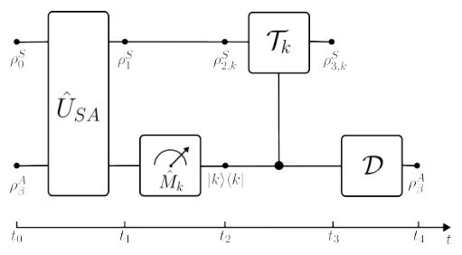 
FIG. 1. A schematics for the QND energy measurement pro- tocol we investigate. The main system S is made to interact with an auxiliary system to create correlation between them. The auxiliary system A is then projected through a set of PVM operators, allowing indirect measurement of the sys- tem S, where the amount of information gained is inversely proportional to the temperature of the initial state of A: for the system’s state initially in the zero temperature thermal state (ground state), the maximum amount of information is obtained, while for the infinite temperature state no informa- tion at all is obtained. Based on the measurement outcome, an extraction operation is performed on S,...

📷 Fig 2

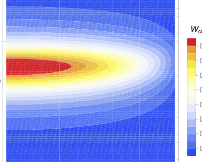 
FIG. 2. Measurement cost Wcost for the non-ideal QND mea- surement on a qubit initial state ρS 0 as a function of the ab- solute value of its Bloch component |vz| and of the inverse temperature β caractherizing the thermal state of the auxil- iary quantum system.

📷 Fig 3

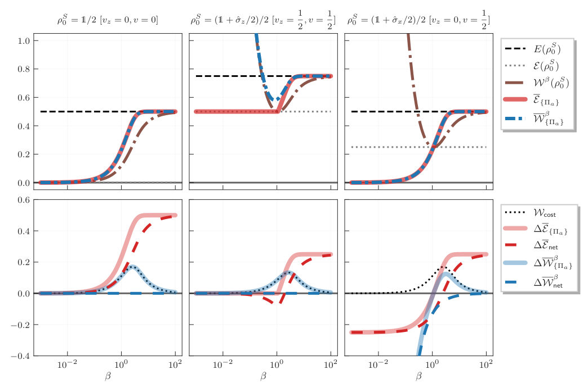 
FIG. 3. We plot the different figures of merit we have presented for the qubit QND work extraction protocol, considering three different possible initial states: left panels - maximally mixed state: ρS 0 = 1/2; middle panels - active initial state diagonal in the energy eigenbasis ρS 0 = (1 + ˆσz/2)/2; right panels - active initial state with coherences in the energy eigenbasis: ρS 0 = (1 + ˆσx/2)/2. In the top panels we focus on the absolute values of the work extractable via the QND-daemonic protocol, while in the bottom panel we focus on the enhancement obtainable via these protocols, with and without considering the measurement cost in the energy balance.

**Summary.** This paper analyzes the thermodynamics of work extraction assisted by quantum non-demolition measurements in the presence of thermal noise. It establishes that while perfect measurement allows full energy extraction, finite temperature introduces an energetic cost, leading to a non-positive net gain when thermal baths are utilized. The key finding is that a positive work advantage can only be achieved if the process is restricted to unitary evolution, highlighting the thermodynamic cost of measurement itself.

**Why it may be interesting.** This work provides a rigorous thermodynamic resource theory framework for quantum measurement, quantifying the fundamental energy costs associated with extracting work from quantum correlations, which is highly relevant to quantum thermodynamics and open quantum systems.

Detailed structure

**Main problem.** The paper investigates the energetic cost and feasibility of extracting work from a quantum system using a Quantum Non-Demolition (QND) energy measurement, especially when the measurement process is non-ideal due to a finite-temperature auxiliary bath.

**Main result.** When a thermal bath is accessible during extraction, the daemonic net gain is proven to be non-positive, indicating no thermodynamic advantage. Conversely, restricting the process to unitary operations can yield a positive net gain.

**Method.** The analysis uses theoretical tools like ergotropy, non-equilibrium free energy ($F_eta$), and the concept of 'daemonic net gain' to quantify work extraction under different thermodynamic constraints.

**Model / system.** The model involves a quantum system ($S$) coupled to an auxiliary system ($A$) for QND measurement, operating within the context of a thermal bath ($B$) at temperature $T=1/eta$. The analysis compares ideal (zero-temperature) versus non-ideal (finite-temperature) measurement protocols.

**Key observables.** Daemonic net gain ($\Delta E_{	ext{net}}$), Ergotropy, Non-equilibrium Free Energy ($F_eta$), and the energetic cost associated with measurement and resetting.

**Important parameters / regimes.** Bath temperature ($eta$), initial state coherence, and the comparison between unitary vs. bath-assisted operations.

**Assumptions / limitations.** The analysis assumes the applicability of the free-energy bound for isothermal work and compares protocols under the assumption of a single bath temperature controlling noise and cost.

**Figures summary.** Figures schematically illustrate the QND measurement protocol and show the temperature dependence of the net-daemonic-ergotropy gain ($\Delta E_{	ext{net}}$) relative to the bath temperature $eta$.

**Paper structure.** The paper establishes the ideal case (zero-T bath), then analyzes the non-ideal case with finite temperature, deriving the net-daemonic-ergotropy gain. It rigorously proves the non-positivity of this gain when the bath is accessible, contrasting this with positive gains achievable under purely unitary constraints.

Abstract

We address the problem of extracting work from a quantum system assisted by a quantum non-demolition (QND) energy measurement. When a perfect QND measurement can be performed and an auxiliary zero-temperature bath is available, the full energy of the quantum state can in principle be extracted even without any prior information on the input state. Owing to the presence of a zero-temperature bath, this is achieved at no energetic cost for the measurement process itself. On the contrary, here we consider what happens when the same protocol is implemented in non-ideal scenarios, specifically when the auxiliary bath has a finite temperature. In this case, not only is it impossible to extract the entire energy from the system, but the measurement strategy also acquires a non-zero energetic cost, accounting for both the interaction between system and measurement apparatus, and the corresponding Landauer erasure cost. We quantitatively assess the performance of these work-extraction protocols, both in absolute terms and through the so-called daemonic net gain, which explicitly includes the energetic cost of the measurement. We rigorously prove that, when access to a thermal bath is allowed in the extraction protocol, the daemonic net gain is always non-positive for any temperature of the auxiliary bath. Conversely, when only unitary operations are considered, the daemonic net gain can attain positive values. We further discuss these different figures of merit by analyzing a paradigmatic example for a single qubit system.

[↑ back to top](#top)

### [Exact Scaling Theory of Social Tipping Phenomena in Finite Populations](http://arxiv.org/abs/2608.20555v1)

**Authors:** Bianca Y. S. Ishikawa, José F. Fontanari  
**Type:** theory · **Category:** statistical mechanics · **PDF:** <https://arxiv.org/pdf/2608.20555v1>  
**Analysis basis:** full PDF text, analyzed in chunks
**Topic relevance:** 🔥 `non-equilibrium universality` **4/5** · `driven-dissipative phase transition` **3/5** · `analog quantum simulation` **2/5** · `Keldysh / 2PI / non-Gaussian methods` **1/5** · `methods for driven-dissipative` **1/5**

📷 Fig 1

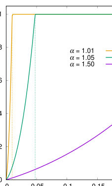 
Figure 1: Steady-state active fraction ρ∞as a function of the initial seed fraction ρ0 for the power-law threshold distribution (β = 1) across three susceptibility parameters: α = 1.01, α = 1.05, and α = 1.50. Vertical dashed lines indicate the critical seed thresholds ρc 0 = 1−1/α, above which full global cascade (ρ∞= 1) is achieved: ρc 0 ≈0.010 for α = 1.01, ρc 0 ≈0.048 for α = 1.05, and ρc 0 ≈0.333 for α = 1.50. The plots illustrate how the transition becomes increasingly steep as α →1+, displaying a sharp crossover toward the discontinuous step- function characteristic of the unseeded limit.

📷 Fig 2

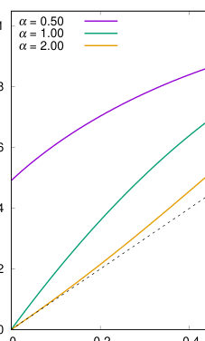 
Figure 2: Steady-state active fraction ρ∞as a function of the initial seed fraction ρ0 in the conservative scenario (β = 0.5) for α = 0.5, α = 1.0, and α = 2.0. The dashed line represents the identity ρ∞= ρ0. For all ρ0 &gt; 0, the curves represent smooth partial cascades.

📷 Fig 3

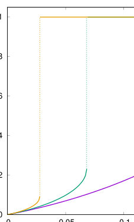 
Figure 3: Steady-state active fraction ρ∞as a function of the initial seed fraction ρ0 in the susceptible regime (β &gt; 1) for a fixed susceptibility parameter α = 1.5. Curves depict three threshold distributions: β = 1.1, β = 1.5, and β = 2.0. Vertical dashed lines indicate the discontinuous phase transitions at the critical seeding thresholds ρc 0. When the seed exceeds this threshold, the low-activation branch ρ−annihilates with the unstable barrier ρu, forcing an abrupt jump to the complete cascade state ρ∞= 1. As β decreases, ρc 0 shifts to larger seeds, reflecting greater collective resistance.

📷 Fig 4

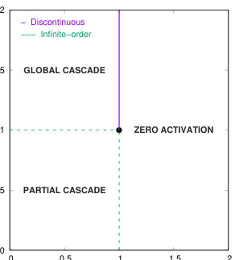 
Figure 4: Phase diagrams of the deterministic system in the (α, β) parameter plane for different initial seed values. Left panel: The unseeded case (ρ0 = 0), displaying three distinct phases intersecting at the critical junction (1, 1). The solid vertical line at α = 1 (β &gt; 1) denotes a discontinuous transition directly from global cascade to zero activation. The dashed lines represent continuous, infinite-order transitions driven by essential singularities: the horizontal boundary at β = 1 (α &lt; 1) separates the partial and global cascades, while the vertical boundary at α = 1 (β &lt; 1) separates the partial cascade from zero activation. Right panel: The seeded case (ρ0 = 0.1). The pure...

📷 Fig 5

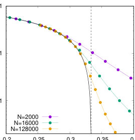 
Figure 5: Finite-size scaling of the continuous cascade transition for a power-law threshold distribution F(x) = xα with shape parameter α = 1.5. Left panel: Expected final inactive fraction 1−⟨ρ∞(N)⟩as a function of the initial seed density ρ0 across system sizes N = 2000, 16000, and 128000. The vertical dashed line denotes the critical seed threshold ρc 0 = 1−1/α = 1/3, while the solid black curve represents the exact deterministic solution. Right panel: Log- log plot of 1 −⟨ρ∞(N)⟩versus inverse system size 1/N at criticality (ρ0 = 1/3). The Monte Carlo data match the theoretical finite-size power-law scaling 1 −⟨ρ∞(N)⟩= aN−1/3 (black line) with fitted prefactor a = 1.52. Statistical...

**Summary.** This paper provides an exact, rigorous theory for analyzing social tipping points in finite populations using a threshold model. It maps out the phase diagram, identifying hybrid phase transitions, and crucially derives the finite-size scaling laws that govern how these sharp transitions are smoothed out by finite-size fluctuations. This work offers a powerful, analytically tractable benchmark for understanding non-equilibrium critical phenomena.

**Why it may be interesting.** While focused on social dynamics, the mathematical framework—analyzing phase transitions, critical exponents, and finite-size scaling near bifurcation points—is highly relevant to non-equilibrium statistical physics models in quantum systems.

Detailed structure

**Main problem.** The paper characterizes social tipping points—the minimum initial seed required for global mobilization—in finite populations using a threshold model.

**Main result.** It establishes an exact finite-size scaling theory for these tipping phenomena, revealing how finite-size fluctuations smooth out sharp phase transitions into continuous scaling laws.

**Method.** The study employs exact analytical techniques, combining finite-N combinatorial formulations with large-deviation theory to analyze the cascade dynamics.

**Model / system.** The model is based on Granovetter's threshold model, where social mobilization spreads in a finite population N. Susceptible agents have activation thresholds drawn from a Beta distribution, and the dynamics are governed by a self-consistency equation for the active fraction.

**Key observables.** Asymptotic active fraction (rho_infinity), critical seeding threshold (rho_c^0), and the order parameter gap (rho* - <rho_infinity>).

**Important parameters / regimes.** Beta distribution parameters (alpha, beta), initial seed fraction (rho_0), and population size (N).

**Assumptions / limitations.** The analysis assumes synchronous and deterministic updating in the thermodynamic limit, and later incorporates finite-size corrections via large-deviation theory.

**Figures summary.** Figures illustrate the phase diagram showing the transition boundaries in the (alpha, beta) plane, and specific plots confirm the predicted scaling laws for the order parameter gap as a function of N.

**Paper structure.** The paper progresses from defining the deterministic limit and phase diagram (identifying hybrid transitions) to deriving the scaling laws by incorporating finite-size fluctuations, culminating in the establishment of the full finite-size scaling theory.

Abstract

Granovetter's threshold model provides a classical framework for social mobilization, where collective action spreads through cascades as individuals join once movement size reaches their personal threshold. Here, we characterize social tipping points-the minimum seed required for global mobilization-using the initial fraction of instigators, $ρ_0$, as a control parameter. For a finite population of size $N$ with Beta-distributed thresholds $(α, β)$, we present an exact analytical study of the cascade dynamics. By evaluating the asymptotic active fraction $ρ_\infty$, we map the thermodynamic phase diagram separating partial cascades ($ρ_0 \le ρ_\infty < 1$) from complete mobilization ($ρ_\infty = 1$), revealing continuous and discontinuous transition lines that meet seamlessly at a critical endpoint. For interior-peaked distributions ($α> 1, β> 1$), the regimes are separated by a hybrid phase transition combining a first-order discontinuity with second-order bottleneck singularities. Combining exact finite-$N$ combinatorial formulations with large-deviation theory, we establish how finite-size fluctuations smooth these singularities. For power-law thresholds ($α> 1, β= 1$), the critical scaling window shrinks as $N^{-1/3}$, while the expected inactive fraction vanishes as $N^{-1/3}$ at criticality. For interior-peaked distributions ($β> 1$), the order parameter is bimodally distributed: realizations either achieve full mobilization or stall near a bottleneck $ρ^*$. Excluding fully mobilized trajectories, $ρ^* - \langle ρ_\infty \rangle$ vanishes as $N^{-1/4}$ and the scaling window compresses to $N^{-1/2}$. Together, these results establish an exact finite-size scaling theory for threshold-driven tipping phenomena.

[↑ back to top](#top)

### [A Bayesian formulation of hybrid quantum-classical dynamics](http://arxiv.org/abs/2608.21169v1)

**Authors:** Hilbert Kappen  
**Type:** theory · **Category:** other · **PDF:** <https://arxiv.org/pdf/2608.21169v1>  
**Analysis basis:** full PDF text, analyzed in chunks
**Topic relevance:** 🔥 `quantum measurements` **4/5** · `methods for driven-dissipative` **3/5** · `Keldysh / 2PI / non-Gaussian methods` **1/5** · `correlated / nonlocal dissipation` **1/5** · `driven-dissipative phase transition` **1/5**

📷 Fig 1

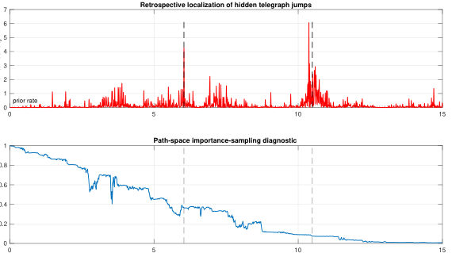 
Figure 1: Filtering and smoothing of a hidden classical telegraph process and quantum state through a continuously monitored qubit. Subplots are numbered 1-4. 1: true telegraph state st (black), filtered posterior mean E[st | Y0:t] (blue), and smoothed posterior mean E[st | Y0:T] (red). The filter detects the switches only after future measurements have accumulated sufficient evidence, whereas the smoother uses those measurements retrospectively to localize the transitions close to their actual times. 2: filtered, and smoothed fidelities D ψt|ρF,S t ψt E . 3: smoothed posterior switch density qS k /dt; dashed vertical lines mark the true transitions and the horizontal dotted line is the prior...

📷 Fig 2

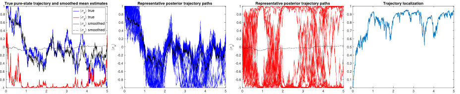 
Figure 2: Smoothing by particle filtering. Subplots are numbered 1-4. 1: True pure quantum trajectory and smoothed reconstruction. 2-3: 20 highest weight particle trajectories approximating the posterior P(ψ0:T | x0:T). 4: Smoothed localization E((ψ† t σzψt)2 | x0:T). T = 5, κx = 0.12, κz = 1.0, dt = 0.001, N = 500.

**Summary.** This paper introduces a Bayesian formulation for hybrid quantum-classical dynamics, unifying the evolution of quantum and classical variables into a single stochastic framework. It derives the governing hybrid Lindblad equation and shows that quantum state estimation can be mapped onto a classical hidden-state inference problem. This allows the application of standard time-series tools like particle filtering to analyze quantum trajectories.

**Why it may be interesting.** This work provides a powerful, unified mathematical framework connecting quantum measurement theory (filtering/smoothing) directly to classical stochastic processes, which is highly relevant for modeling open quantum systems subject to continuous monitoring.

Detailed structure

**Main problem.** The paper develops a rigorous Bayesian framework to describe and analyze diffusive quantum-classical dynamics, treating the joint evolution of the quantum state and classical variables.

**Main result.** It establishes that the dynamics can be unified under a hybrid Lindblad equation, and it recasts quantum state estimation into a standard classical hidden-state inference problem solvable via particle filtering and smoothing.

**Method.** The core methodology involves deriving the joint probability density evolution via a Fokker-Planck equation and then applying Bayesian inference techniques (filtering and smoothing) to the resulting stochastic process.

**Model / system.** The model describes open quantum systems interacting with classical variables, governed by a joint stochastic process $(\psi, x)$. The dynamics are characterized by noise covariances $(C, \Gamma, Q)$ and lead to the hybrid Lindblad equation.

**Key observables.** Filtered density matrix ($
ho_F^t$), smoothed density matrix ($
ho_S^t$), and the effect operator ($E_t$).

**Important parameters / regimes.** Noise covariance matrices $(C, \Gamma, Q)$, and the detector efficiency ($\eta_{	ext{eff}}$).

**Assumptions / limitations.** The derivation of the key dynamics requires assuming that the noise parameters $(C, Q, \Gamma)$ are independent of the quantum state $\psi$, and that the evolution of the second moment ($
ho_J$) is linear and autonomous.

**Figures summary.** Not specified.

**Paper structure.** The paper progresses from deriving the general stochastic evolution for the joint density, establishing the hybrid Lindblad form by imposing linearity constraints, and finally mapping the problem onto the established machinery of quantum filtering and smoothing via forward-backward Bayesian recursions.

Abstract

We develop a Bayesian formulation of diffusive quantum-classical dynamics by treating the wave function and classical variables as components of an ordinary stochastic process. The joint probability density P(ψ,x,t) obeys a classical Fokker-Planck equation, while the quantum state appears as its second moment. Requiring this second moment to evolve linearly and autonomously yields the hybrid Lindblad equation and its stochastic unravelings. This construction makes positivity and unraveling freedom immediate and gives a unified description of quantum noise, classical noise, and their correlations through the covariance matrices (C,Γ,Q).   The same stochastic representation turns quantum-classical state estimation into a classical hidden-state inference problem. Filtering and smoothing are Bayesian conditioning on the observed classical trajectory. We recover the stochastic master equation from the Kushner-Stratonovich equation with correlated noise and show how the quantum effect operator is related to the Bayesian backward message through the adjoint dynamics of the linear unraveling. The Bayesian posterior also defines a smoothed density matrix and, more generally, a posterior distribution over latent quantum-classical trajectories.   These quantities can be approximated with standard particle filtering and smoothing methods. Numerical examples show that smoothing improves reconstruction of a hidden quantum-classical trajectory and that the full trajectory posterior can retain structure, such as multimodality, that is absent from its density-matrix second moment. The resulting framework connects quantum filtering, retrodiction, and smoothing to the standard forward-backward machinery of Bayesian time-series inference.

[↑ back to top](#top)

### [Quantum Zeno and Anti-Zeno Responses: Universal Spectral Criterion for Measurement-Induced Decay](http://arxiv.org/abs/2608.20702v1)

**Authors:** Yu-Xiang Chen, Yuan-De Jin, Wen-Long Ma  
**Type:** theory · **Category:** other · **PDF:** <https://arxiv.org/pdf/2608.20702v1>  
**Analysis basis:** full PDF text, analyzed in chunks
**Topic relevance:** 🔥 `quantum measurements` **4/5** · `correlated / nonlocal dissipation` **1/5** · `driven-dissipative phase transition` **1/5** · `methods for driven-dissipative` **1/5** · `non-equilibrium universality` **1/5**

📷 Fig 1

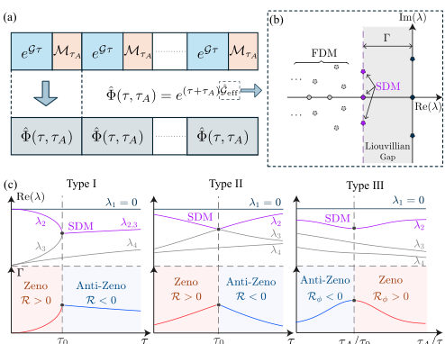 
FIG. 1. Schematic illustration of quantum Zeno and anti-Zeno responses. (a) Each cycle contains a free evolution generated by G for time τ followed by a generalized measurement MτA for time τA, modeled by a concatenated channel induced by an effective generator Geff. (b) The eigenmodes of ˆGeff are divided into fast decay modes (FDMs) and SDMs. The decay behavior of the system is governed by the Liouvillian gap Γ, corresponding to the absolute value of the real part of SDM. (c) The Zeno-to-anti-Zeno response transitions (with a fixed τA) can occur for three types of spectral transitions: a spectral coalescence at an EP (Type-I), a spectral crossing of competing decay modes (Type-II), or a...

📷 Fig 2

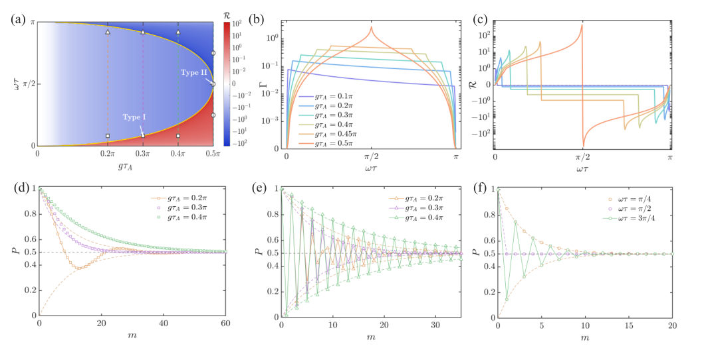 
FIG. 2. Quantum Zeno and anti-Zeno responses of a unitarily evolving qubit to repetitive discrete-time measurements with tunable strength. (a) A phase diagram of the response R in the (gτA, ωτ) parameter plane. The lower half of the EP line (yellow curve) demarcates the boundary between the anti-Zeno response (R &lt; 0) and Zeno response (R &gt; 0). Vertical dashed lines mark different measurement strengths gτA corresponding to the cross-sections in (b) and (c). (b) The decay rate Γ of the SDM as a function of the evolution time ωτ for various gτA. Maxima of Γ coincide with EPs, which herald a transition in the underlying decay dynamics. (c) The response R of the spectral gap as a function of ωτ...

📷 Fig 3

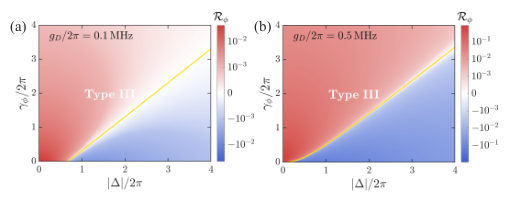 
FIG. 3. Quantum Zeno and anti-Zeno responses in continuous-time measurements. Here we consider a supercon- ducting qubit under varying qubit-defect frequency detuning ∆and qubit measuring (dephasing) rate γϕ with (a) a weak qubit-defect coupling (gD/2π = 0.1 MHz) and (b) a stronger one (gD/2π = 0.5 MHz).

**Summary.** This paper establishes a universal spectral criterion based on the Liouvillian spectral gap to characterize measurement-induced decay in quantum systems. It defines Zeno and Anti-Zeno responses by analyzing how this gap changes with measurement frequency. The framework is successfully applied to both discrete-time qubit and continuous-time superconducting qubit models, providing a general tool for quantum control.

**Why it may be interesting.** This work provides a powerful, universal spectral diagnostic tool to predict and understand non-trivial dynamics (Zeno/Anti-Zeno) in open quantum systems, which is crucial for quantum control and measurement theory.

Detailed structure

**Main problem.** The paper develops a general framework to characterize how the decay rate of a quantum system changes when subjected to repetitive quantum measurements, addressing the Quantum Zeno and Anti-Zeno effects.

**Main result.** The measurement-induced decay rate is universally determined by the Liouvillian spectral gap, and the Zeno/Anti-Zeno transition is marked by spectral coalescence at Exceptional Points or smooth extrema of this gap.

**Method.** The analysis models the evolution-measurement cycle using an effective Liouvillian generator, deriving a spectral criterion based on the derivative of the spectral gap with respect to the measurement frequency.

**Model / system.** The framework is tested on two models: a discrete-time qubit undergoing periodic measurements (Ramsey interferometry) and a continuous-time superconducting-qubit defect model.

**Key observables.** The Liouvillian spectral gap ($\Gamma$), the response function $R = -\partial\Gamma / \partial f$, and the survival probability $P(m)$.

**Important parameters / regimes.** Measurement frequency ($f$ or $\gamma_\phi$), evolution time ($	au$), and measurement time ($	au_A$).

**Assumptions / limitations.** The analysis relies on approximating the measurement process using effective Liouvillian generators and considering short-time or weak-measurement limits.

**Figures summary.** Figures illustrate the cycle structure, the role of the effective generator, and show how the spectral gap's response $R$ changes across parameter regimes, demarcating Zeno ($R>0$) and anti-Zeno ($R<0$) regions via Exceptional Points.

**Paper structure.** The paper first establishes the general framework using effective Liouvillians, then applies this to specific models (discrete-time qubit and continuous-time superconducting qubit), deriving the spectral criterion and demonstrating the transition mechanisms.

Abstract

We develop a general framework for characterizing the response of an evolving quantum system to repetitive quantum measurements. Modeling each evolution-measurement cycle as a quantum channel induced by an effective Liouvillian generator, we find that the Liouvillian spectral gap determines the measurement-induced decay rate. We analyze how the spectral gap responds to the measurement frequency, and define a quantum Zeno response as a decrease in the gap with increasing measurement frequency, and an anti-Zeno response as the opposite. We illustrate this criterion for both discrete-time and continuous-time quantum measurements. In an exactly solvable discrete-time qubit model, the exceptional-point spectral coalescence or spectral crossings mark the transition between Zeno and anti-Zeno responses, which can be experimentally distinguished from the long-time decay envelope of the survival probability. In a continuous-time superconducting-qubit defect model, the same transition manifests as smooth extrema of the spectral gap. Our results establish a universal spectral criterion for measurement-induced decay, offering a practical route to identify and manipulate these effects in generic quantum systems.

[↑ back to top](#top)

### [Continuous-angle logical rotations in the Steane code](http://arxiv.org/abs/2608.20676v1)

**Authors:** Eric Huang, Daiwei Zhu, Matteo Ippoliti, Christopher Monroe, Michael J. Gullans  
**Type:** experiment · **Category:** quantum information and computing · **PDF:** <https://arxiv.org/pdf/2608.20676v1>  
**Analysis basis:** full PDF text, analyzed in chunks
**Topic relevance:** 🔥 `QC/QI experiment` **4/5** · `quantum measurements` **2/5**

📷 Fig 1

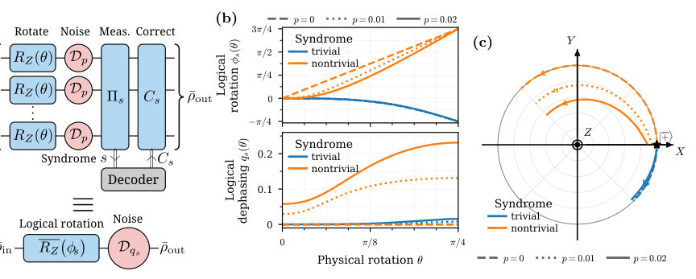 
FIG. 1. Transversal logical rotation protocol in the Steane code with dephasing-only error model. (a) Single round of the continuous-angle rotation protocol takes a code state, applies a transversal rotation RZ(θ)⊗n with dephasing noise at rate p, measures a syndrome s and applies the correction Cs from the decoder. This is equivalent to a logical rotation by angle ϕs with dephasing at rate qs, each of which depend only on the measured syndrome s, physical rotation angle θ and physical dephasing rate p. (b) Theoretical dependence of channel parameters as physical rotation angle θ for selected physical dephasing rates p ∈{0, 0.01, 0.02}. Top: Logical rotation angle ϕs(p, θ). Bottom: Logical...

📷 Fig 2

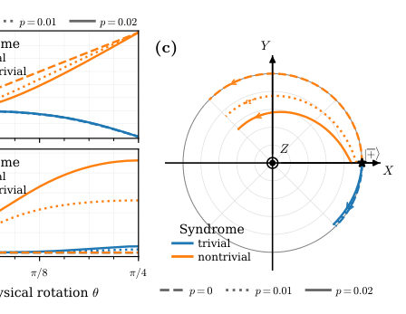 
FIG. 3. Steane syndrome extraction uses transversal CNOT and Hadamard to fault-tolerantly measure the X-type and Z-type stabilizer generators of the Steane code using the clas- sical parity check matrices on the measured ancilla outcomes. This assumes the ancilla 0 states have been fault-tolerantly prepared.

📷 Fig 3

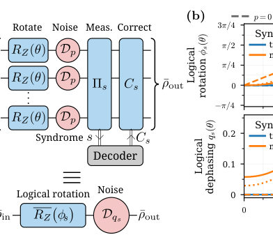 
FIG. 2. A Steane code logical 0 state may be prepared unitarily and made fault-tolerant by measuring the flag qubit and post-selecting on the flag qubit being measured in the |0⟩ state [25].

📷 Fig 4

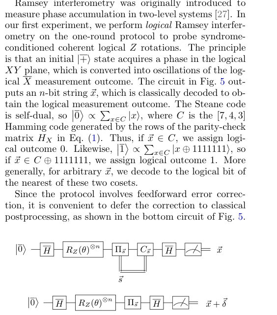 
FIG. 5. Top: The logical Ramsey interferometry circuit pre- pares the logical |+⟩state, performs one round of the Z- rotation protocol, and measures in the logical X basis. Steane syndrome extraction is used for Π⃗s. Bottom: Equivalent cir- cuit with the decoder correction Cs = ⊗jZzj propagated to a flip in the classical outcome ⃗δ = HX⃗z, which may be removed in postprocessing.

📷 Fig 5

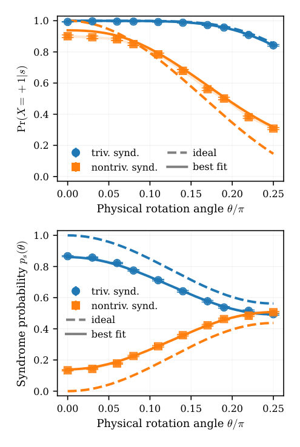 
FIG. 6. Logical Ramsey experiment with input state |+⟩ using the one-round protocol. Top: Syndrome-conditioned Ramsey signal P(X = +1 | s) versus physical rotation an- gle θ for the trivial (blue) and aggregated nontrivial (or- ange) syndrome groups. Points with error bars show the data, dashed curves show the ideal prediction, and solid curves show the best-fit dephasing model. Bottom: Cor- responding syndrome-group probabilities ps(θ) for the same two branches, with the same line conventions. The best-fit physical dephasing parameter is p = (2.13 ± 0.07)%.

**Summary.** This paper reports an experimental demonstration of continuous-angle logical Z rotations using the Steane code on a trapped-ion quantum processor. By applying transversal physical rotations followed by syndrome extraction, the authors show that the logical operation is controllable and tunable. This work provides a key proof-of-principle for building fault-tolerant quantum computation using standard error correction techniques.

**Why it may be interesting.** This work directly addresses fault-tolerance and gate universality in physical quantum hardware, providing crucial experimental validation for theoretical concepts in quantum error correction codes.

Detailed structure

**Main problem.** The paper aims to experimentally demonstrate continuous-angle logical Z rotations within the Steane code, proving a method for continuously tunable non-Clifford logical gates.

**Main result.** The authors successfully observed coherent, syndrome-dependent logical rotations and demonstrated angle cancellation in a two-round protocol, confirming the feasibility of implementing tunable logical gates.

**Method.** The protocol involves applying transversal physical Z rotations, followed by syndrome extraction and decoding, and characterizing the resulting logical channel using Ramsey interferometry and process tomography.

**Model / system.** The experiment is performed on the IonQ Forte trapped-ion processor using the $[[7, 1, 3]]$ Steane code. The theoretical framework models the logical channel as a composition of rotation, dephasing, syndrome extraction, and correction.

**Key observables.** Logical rotation angle ($\phi_s$), logical dephasing rate ($q_s$), and syndrome-conditioned Ramsey fringe probabilities.

**Important parameters / regimes.** Physical rotation angle ($	heta$), dephasing noise rate ($p$), and the code parameters of the Steane code.

**Assumptions / limitations.** The analysis primarily uses a dephasing-only error model, and the implementation is limited by the lack of mid-circuit measurement and feedforward on the hardware.

**Figures summary.** Figures illustrate the single-round protocol showing theoretical dependence of logical rotation/dephasing on $	heta$ and noise; subsequent figures detail the two-round tomography circuit and plot the fitted logical rotation angle and dephasing parameter versus $	heta$.

**Paper structure.** The paper details the theoretical derivation of the logical channel action under noise, presents the single-round experimental demonstration using Ramsey interferometry, and concludes with a two-round protocol to test for angle cancellation and low dephasing.

Abstract

We experimentally demonstrate continuous-angle logical $Z$ rotations in the $[[7,1,3]]$ Steane code on the IonQ Forte trapped-ion processor. A round of the protocol applies a transversal physical $Z$ rotation by $θ$, followed by Steane syndrome extraction and decoding, which induces a syndrome-dependent logical $Z$ rotation. We analytically derive the effect of dephasing noise on the logical rotation angle and logical dephasing rate. Using logical Ramsey interferometry, we observe coherent syndrome-dependent logical rotations from a single round of the protocol. We find that the logical channel reconstructed from process tomography is a noisy logical $Z$ rotation well explained by a dephasing model. We further implement a two-round protocol applying physical rotations $+θ$ and $-θ$, and observe cancellation of the total logical angle with low logical dephasing for repeated trivial syndromes. This constitutes a proof-of-principle demonstration of continuously tunable non-Clifford logical gates by transversal rotations and standard error correction in a small quantum code.

[↑ back to top](#top)

### [Hybrid dynamical decoupling and coherent driving for high-fidelity nuclear-spin control in diamond](http://arxiv.org/abs/2608.20742v1)

**Authors:** Jiwon Jeon, Donghun Jung, Eunsang Lee, Junghyun Lee  
**Type:** theory · **Category:** quantum information and computing · **PDF:** <https://arxiv.org/pdf/2608.20742v1>  
**Analysis basis:** full PDF text, analyzed in chunks
**Topic relevance:** 🔥 `QC/QI experiment` **4/5** · `quantum measurements` **2/5**

📷 Fig 1

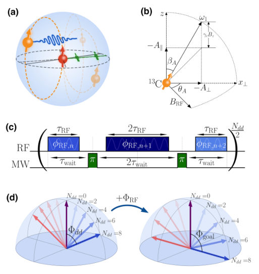 
FIG. 1. Overview of the hybrid dynamical-decoupling radio-frequency (H-DDrf) protocol. (a) Physical implemen- tation of an NV electron spin coupled to a target 13C nuclear spin, where microwave (MW, green) and radio-frequency (RF, blue) pulses control the electron and nuclear spins, respec- tively. (b) Hyperfine geometry of the 13C nuclear spin in the 𝑚𝑠= −1 manifold, defining the hyperfine azimuthal angle 𝜃𝐴 and the quantization-axis misalignment 𝛽𝐴. (c) Pulse-train unit cell showing the RF phase updates 𝜑RF,𝑛, RF duration 𝜏RF, and inter-𝜋-pulse waiting time 𝜏wait. (d) Hybridized gate construction on the Bloch hemispheres. The DD-induced ro- tation Φ𝑑𝑑(𝑁𝑑𝑑= 8) is supplemented by an RF...

📷 Fig 2

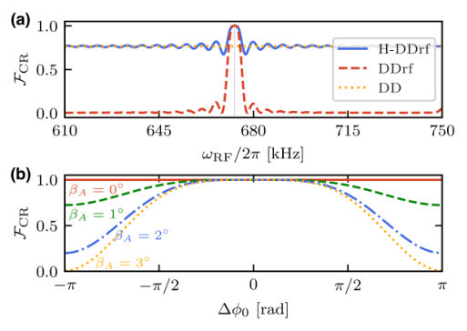 
FIG. 3. Frequency selectivity and geometric phase matching of H-DDrf. (a) CR fidelity ℱCR under H-DDrf (blue), DDrf (dashed red), and DD-only (dotted orange) control for a tar- get 13C spin with (𝐴‖, 𝐴⊥)/2𝜋= (−200, 50) kHz, 𝜃𝐴= 0, and 𝑁𝑑𝑑= 16, as a function of the RF drive frequency 𝜔RF. The DDrf parameters are chosen as in Fig. 2. (b) ℱCR under H-DDrf as a function of the initial RF phase for nuclear spins with fixed 𝛿𝐴/2𝜋= 220 kHz and varying 𝛽𝐴∈{0∘, 1∘, 2∘, 3∘}. The phase offset, Δ𝜑, is defined relative to the geometrically matched initial phase 𝜑0, given by Eq. (5).

📷 Fig 3

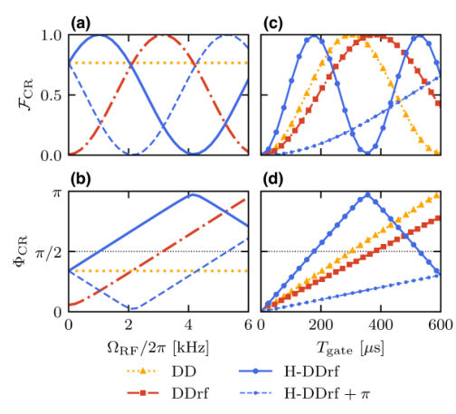 
FIG. 2. Conditional-rotation (CR) fidelity ℱCR and rotation angle ΦCR for DD, DDrf, and H-DDrf control of a target spin with (𝐴‖, 𝐴⊥)/2𝜋= (−200, 50) kHz and 𝜃𝐴= 0. (a),(b) ℱCR and ΦCR as functions of RF Rabi frequency, ΩRF, for fixed 𝑁𝑑𝑑= 16. (c),(d) ℱCR and ΦCR as functions of gate duration, 𝑇gate = 𝑁𝑑𝑑𝑇train, for even 𝑁𝑑𝑑at fixed ΩRF/2𝜋= 1.50 kHz. Hybrid+𝜋denotes H-DDrf with the initial RF phase shifted by 𝜋.

📷 Fig 4

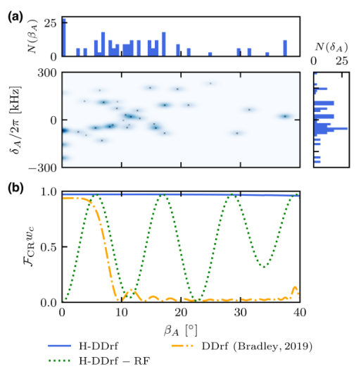 
FIG. 4. Hyperfine-parameter distribution and coherence- weighted operation fidelity. (a) Distribution of possible hy- perfine parameters in the 𝛿𝐴–𝛽𝐴phase space, obtained from a diamond-lattice survey assuming 100% 13C abundance. For carbon sites 5–7 Å from the NV center, the parameters are estimated using the secular electron-nuclear magnetic dipole- dipole interaction [1, 10]. (b) Coherence-weighted CR fidelity, ℱCR𝑤𝑐, for H-DDrf (blue), H-DDrf without RF assistance (green dotted), and DDrf following Ref. [10] (orange dash- dotted), evaluated for nuclear spins with 𝛿𝐴/2𝜋= 220 kHz and 𝛽𝐴∈[0∘, 40∘]. The vertical dotted line marks the onset of fidelity degradation in DDrf. Here, 𝑤𝑐accounts...

**Summary.** This paper introduces a novel Hybrid Dynamical-Decoupling and Radio-Frequency (H-DDrf) control technique for manipulating nuclear spins in diamond NV centers. By intelligently combining the selectivity of DD with the continuous tunability of RF driving, the method enhances quantum control fidelity. This advancement expands the usable quantum memory capacity for room-temperature quantum processors.

**Why it may be interesting.** This work directly addresses the practical limitations of scaling quantum memories by providing a robust, high-fidelity control mechanism for multi-spin systems, which is central to quantum computation.

Detailed structure

**Main problem.** The primary challenge is achieving high-fidelity, continuous quantum control over large registers of nuclear spins coupled to NV centers in diamond at room temperature.

**Main result.** The proposed Hybrid Dynamical-Decoupling and Radio-Frequency (H-DDrf) control scheme successfully maintains high fidelity while reducing required RF power and gate duration compared to existing methods.

**Method.** The authors combine the frequency-selective conditional evolution provided by Dynamical Decoupling (DD) with a geometrically phase-matched RF drive to complete the target rotation, achieving continuous tunability.

**Model / system.** The system utilizes Nitrogen-Vacancy (NV) centers in diamond, employing surrounding $^{13}	ext{C}$ nuclear spins as long-lived quantum memories. The control relies on understanding the hyperfine coupling Hamiltonian ($\hat{H}_0$) and its geometric dependencies.

**Key observables.** Conditional-operation contrast ($\mathcal{F}_{	ext{CR}}$) and coherence-weighted fidelity ($\mathcal{F}_{	ext{CR}}^{w_c}$), measured as functions of RF frequency and initial RF phase.

**Important parameters / regimes.** Hyperfine geometry parameters ($	heta_A, eta_A$), RF Rabi frequency ($\Omega_{	ext{RF}}$), and the required phase matching condition ($\varphi_0 = 	heta_A - \delta\varphi$).

**Assumptions / limitations.** The DD sequence establishes a frequency-selective baseline, and the RF drive acts as a resonant correction to complete the operation, rather than replacing the DD dynamics entirely.

**Figures summary.** Figures illustrate the H-DDrf protocol, compare controllability/tunability against DD-only and DDrf, and show fidelity measurements ($\mathcal{F}_{	ext{CR}}$) across different RF parameters and hyperfine geometries.

**Paper structure.** The paper first reviews the limitations of existing DD and DDrf methods, then introduces the H-DDrf protocol, derives the necessary phase-matching conditions, and finally presents detailed comparisons of fidelity and robustness against various experimental imperfections.

Abstract

Nitrogen-vacancy (NV) centers in diamond provide room-temperature electron-nuclear spin registers for quantum sensing and quantum information processing, with surrounding 13C nuclear spins serving as long-lived quantum memories. However, coherent control of large nuclear-spin registers is limited by finite electron-spin coherence and spectral addressability. Existing approaches follow two complementary strategies: dynamical-decoupling (DD) gates exploit filter-function resonances to realize selective conditional evolution but permit only discrete rotation angles, whereas dynamical-decoupling radio-frequency (DDrf) control restores continuous tunability at the cost of stringent hyperfine-geometry and RF-power requirements. Here, we introduce hybrid dynamical-decoupling and radio-frequency (H-DDrf) control, which preserves the DD-induced conditional evolution and employs a geometrically phase-matched RF drive to complete the target operation. This approach reduces both RF power and gate duration while maintaining high-fidelity control, thereby expanding the accessible 13C nuclear-spin register for room-temperature NV-based quantum memories and quantum processors.

[↑ back to top](#top)

### [When More Becomes Less: Topology-Reversed Three-Qubit Gate Performance on IBM Quantum Processors](http://arxiv.org/abs/2608.21004v1)

**Authors:** Simona K. Grigorova, Stancho S. Stanchev, Nikolay V. Vitanov  
**Type:** experiment · **Category:** quantum information and computing · **PDF:** <https://arxiv.org/pdf/2608.21004v1>  
**Analysis basis:** full PDF text, analyzed in chunks
**Topic relevance:** 🔥 `QC/QI experiment` **4/5** · `quantum measurements` **1/5**

📷 Fig 1

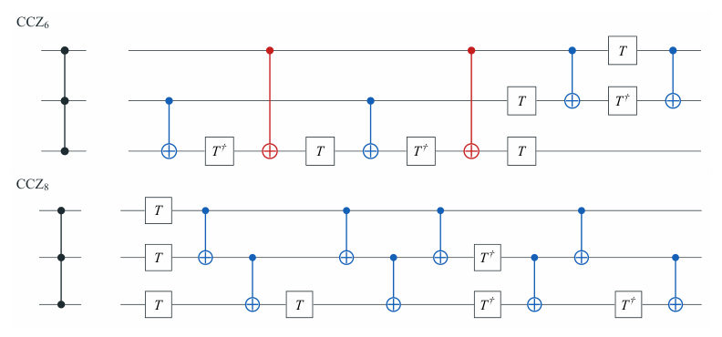 
FIG. 1. Exact CCZ6 and CCZ8 decompositions of the CCZ gate. CCZ6 is the standard 6-CX circuit, which contains a non-nearest-neighbor endpoint interaction when embedded on a linear chain, whereas every two-qubit interaction in CCZ8 acts on adjacent qubits. We note that the native two-qubit gates on IBM processors used here are CZ, and hence in the transpilation the CX gates in the circuits in this figure are replaced by CZ sandwiched by two Hadamard gates.

📷 Fig 2

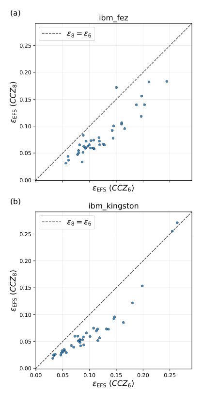 
FIG. 2. EFS estimates of the infidelity of CCZ6 and CCZ8 on (a) ibm fez and (b) ibm kingston. Each point compares the two implementations on the same physical triple. The dashed line denotes equal infidelity; points below the line correspond to lower infidelity for CCZ8.

📷 Fig 3

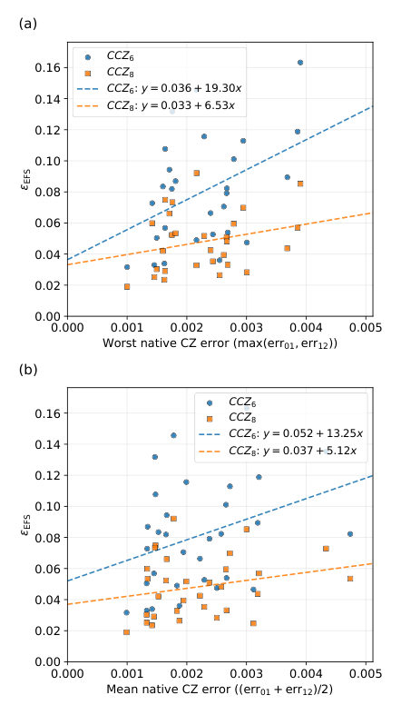 
FIG. 3. EFS errors of the two circuits versus (a) the worse and (b) the mean of the two native CZ errors on ibm kingston. The displayed linear fits of the form y = a + bx are included as exploratory baselines and are not interpreted as physical scaling laws.

📷 Fig 4

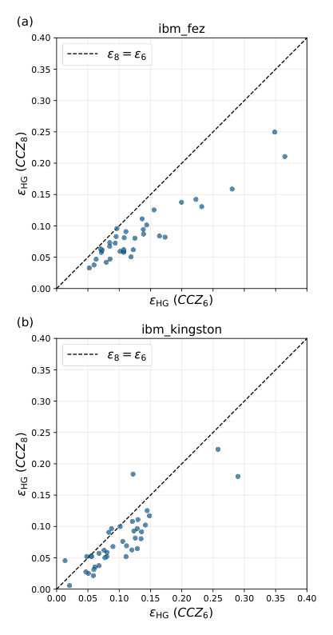 
FIG. 4. Measured hypergraph-state infidelity of the CCZ6 and CCZ8 circuits on (a) ibm fez and (b) ibm kingston. Each point compares the two circuits on the same physical triple. Points below the dashed equality line favor the topology- compatible implementation CCZ8.

📷 Fig 5

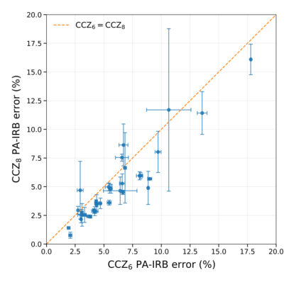 
FIG. 5. Phase-altered interleaved randomized benchmark- ing comparison of the two compiled CCZ decompositions on ibm kingston. The horizontal coordinate corresponds to the nominal CCZ6 decomposition, which compiles to 12 native CZ gates on the linear physical topology, and the vertical coor- dinate corresponds to the CCZ8 LNN decomposition, which retains eight native CZ gates. Each marker represents one physical three-qubit placement and is positioned at the mid- point of the phase-stripped and phase-dressed PA-IRB esti- mates. Horizontal and vertical bars span the corresponding stripped–dressed values for the CCZ6 and CCZ8 realizations, respectively; these spans are not statistical...

**Summary.** This work experimentally compares two ways to implement a three-qubit CCZ gate on real quantum hardware. By testing the theoretically best circuit against a more hardware-friendly, nearest-neighbor circuit, the authors demonstrate that physical connectivity dictates performance. The results show that the simpler, topology-respecting circuit performs better, even if it is not the abstractly minimal gate count.

**Why it may be interesting.** It provides concrete, hardware-level evidence that physical connectivity constraints can fundamentally alter the optimal circuit choice for complex quantum gates, a critical consideration for scaling quantum computation.

Detailed structure

**Main problem.** The paper compares the performance of two different exact decompositions for the three-qubit CCZ gate when implemented on hardware with restricted connectivity.

**Main result.** The topology-compatible decomposition ($	ext{CCZ8}$), which uses fewer native nearest-neighbor gates, consistently outperformed the theoretically optimal but connectivity-intensive decomposition ($	ext{CCZ6}$) across multiple fidelity benchmarks.

**Method.** The performance was measured using Ensemble Feature Selection (EFS), hypergraph state preparation, and Phase-Altered Interleaved Randomized Benchmarking (PA-IRB) on real quantum hardware.

**Model / system.** The experiments were conducted on 156-qubit IBM Quantum Heron processors ($	ext{ibm\_fez}$ and $	ext{ibm\_kingston}$) using sampled linear triples of qubits.

**Key observables.** Process infidelity ($\epsilon$) measured via EFS and hypergraph state fidelity ($\epsilon_{HG}$); PA-IRB decay parameters.

**Important parameters / regimes.** The comparison hinges on the physical gate count: $	ext{CCZ6}$ compiles to 12 CZ gates, while $	ext{CCZ8}$ retains 8 native CZ gates.

**Assumptions / limitations.** The comparison assumes a fixed compilation protocol and isolates the effect of connectivity by comparing two fixed, exact gate decompositions.

**Figures summary.** Figures show comparative infidelity estimates (EFS, Hypergraph) and decay parameters (PA-IRB) for $	ext{CCZ6}$ versus $	ext{CCZ8}$ on the IBM processors, consistently favoring the $	ext{CCZ8}$ circuit.

**Paper structure.** The paper introduces the problem by contrasting the abstractly optimal $	ext{CCZ6}$ with the topology-compatible $	ext{CCZ8}$. It then systematically tests both circuits using EFS, hypergraph state measurements, and PA-IRB, concluding that physical connectivity dictates performance over abstract gate count.

Abstract

The exact Toffoli gate admits a six-CX decomposition, denoted by $CCX_6$, that is optimal under unrestricted two-qubit connectivity. On a linear three-qubit topology, however, $CCX_6$ contains 4 nearest-neighbor CX gates and 2 non-nearest-neighbor CX gates. By contrast, an alternative exact decomposition, denoted by $CCX_8$, uses only 8 nearest-neighbor CX gates. Because CCX is locally equivalent to CCZ, we perform the experiments using the corresponding $\cczs$ and $\cczl$ circuits. We compare these circuits on sampled linear triples of the 156-qubit IBM Quantum Heron processors \texttt{ibm\_fez} and \texttt{ibm\_kingston}. Under the compilation protocol, the nominal $\cczs$ circuit becomes a twelve-CZ implementation, whereas the linear-nearest-neighbor circuit retains eight native CZ gates. Experimentally measured ensemble-feature-selection estimates favor the eight-CZ realization on nearly all retained triples. We test the same ordering by preparing a three-qubit hypergraph state, which probes the coherent conditional phase rather than only computational-basis populations. The measured hypergraph-state infidelity is lower for the $\cczl$ circuit for most triples on both processors. Phase-altered interleaved randomized benchmarking provides a complementary comparison of Clifford surrogates preserving the two compiled entangling structures. Within the scope of the tested circuits and phase-sensitive input state, the results demonstrate that hardware connectivity can reverse the operational ranking of exact decompositions: a circuit with more abstract two-qubit gates can yield the better physical implementation.

[↑ back to top](#top)

### [The Trachenko-Zaccone equation: nonlinear relaxation from glasses to complex systems](http://arxiv.org/abs/2608.20917v1)

**Authors:** Alessio Zaccone, Valeriy V. Ginzburg, Oleg V. Gendelman, Sofia F. Mauro, John C. Mauro  
**Type:** theory · **Category:** disordered systems and neural networks · **PDF:** <https://arxiv.org/pdf/2608.20917v1>  
**Analysis basis:** full PDF text, analyzed in chunks
**Topic relevance:** `correlated / nonlocal dissipation` **3/5** · `driven-dissipative phase transition` **3/5** · `non-equilibrium universality` **3/5** · `scars & prethermalization` **3/5** · `Keldysh / 2PI / non-Gaussian methods` **2/5** · `methods for driven-dissipative` **2/5** · `quantum measurements` **2/5** · `Frenkel-Kontorova` **1/5** · `analog quantum simulation` **1/5**

📷 Fig 1

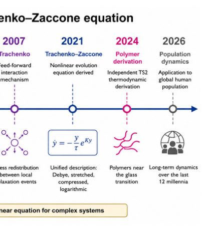 
Figure 1. Historical evolution of the ideas leading to the Trachenko–Zaccone equation. Beginning with Kohlrausch’s empirical stretched-exponential relaxation (1854) and Debye’s theory of exponential relaxation (1929), progressively deeper physical understanding emerged through Frenkel’s kinetic theory of liquids [7], Phillips’ demonstration of the universality of stretched-exponential relaxation, and Trachenko’s feed-forward interaction mechanism for interacting local relaxation events. These developments culminated in the formulation of the Trachenko–Zaccone equation in 2021, which unified Debye, stretched-exponential, compressed-exponential and logarithmic relaxation within a single...

📷 Fig 2

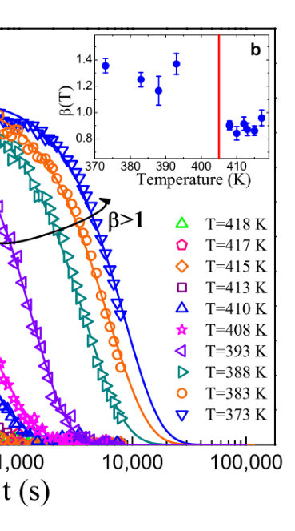 
Figure 2. Experimental motivation for a unified description of stretched- and compressed-exponential relaxation. Normalized intensity-correlation functions measured by X-ray photon correlation spectroscopy in a metallic glass at different temperatures. The relaxation changes from stretched-exponential behaviour (β &lt; 1) at higher temperatures to compressed-exponential behaviour (β &gt; 1) at lower temperatures. The inset shows the corresponding temperature dependence of the exponent β, with the vertical line indicating the glass-transition region. The continuous evolution of β across unity provides an important motivation for seeking a single nonlinear dynamical equation capable of describing...

📷 Fig 3

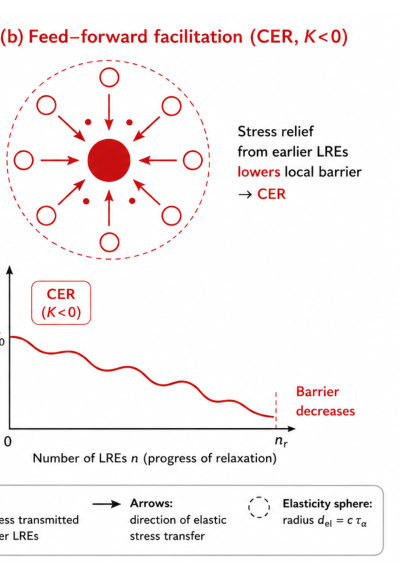 
Figure 3. Schematic representation of the two feedback mechanisms underlying the Trachenko–Zaccone equation. (a) Feed-forward hindrance in the stretched- exponential relaxation (SER) regime. Earlier concordant local relaxation events (LREs) redistribute stress onto regions that have not yet relaxed, progressively increasing the activation barrier V (n) for subsequent events. At the coarse-grained level this corresponds to V (n) = V0 + V1n/nr, and hence to K &gt; 0. (b) Facilitation in the compressed-exponential relaxation (CER) regime. Avalanche-like rearrangements facilitate subsequent LREs, so that the effective activation barrier decreases as relaxation proceeds. This corresponds to V (n) =...

📷 Fig 4

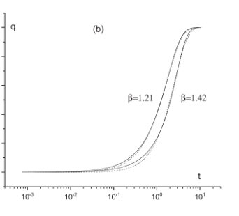 
Figure 4. Numerical solutions illustrating the two non-Debye regimes generated by the Trachenko–Zaccone equation. For positive feedback parameter K &gt; 0, the numerical solutions are accurately represented by stretched-exponential KWW functions with β &lt; 1 (SER). For negative K &lt; 0, the same evolution equation generates compressed-exponential relaxation with β &gt; 1 (CER). The Debye law, β = 1, lies between these two regimes and corresponds to K = 0. The figure illustrates that stretched and compressed relaxation do not require separate phenomenological equations but emerge from opposite signs of the same nonlinear feedback parameter.

📷 Fig 5

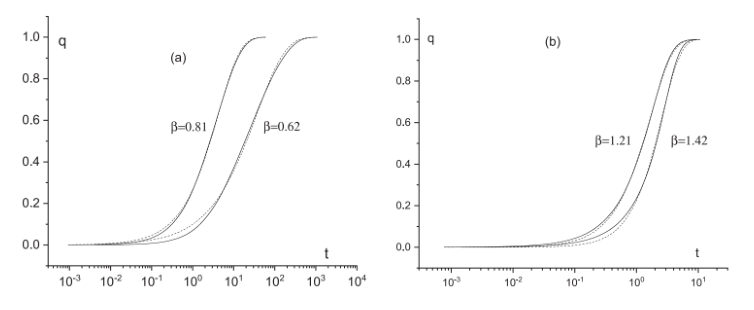 
Figure 4 illustrates this result directly. The same first-order nonlinear equation produces relaxation curves that are well represented by KWW functions on either side of β = 1. The parameter K therefore provides a continuous dynamical coordinate connecting SER, Debye relaxation and CER.

**Summary.** This review introduces the Trachenko-Zaccone equation as a unifying, nonlinear dynamical model for describing complex relaxation phenomena in disordered materials. It shows that this single equation can describe stretched, Debye, and compressed relaxation regimes based on the nature of the nonlinear feedback. The work elevates the equation from a specialized glass model to a general tool for complex systems dynamics.

**Why it may be interesting.** The concept of nonlinear feedback governing relaxation rates is highly relevant to open quantum systems, particularly those exhibiting glassy dynamics or slow relaxation, suggesting a generalized framework beyond simple Markovian decay.

Detailed structure

**Main problem.** The paper addresses the challenge of describing non-Debye relaxation in disordered condensed matter systems, moving beyond simple exponential decay laws.

**Main result.** It establishes the Trachenko-Zaccone equation as a general nonlinear feedback framework capable of unifying stretched, Debye, and compressed relaxation regimes.

**Method.** The review traces the conceptual development of the equation, analyzing its mathematical structure and proposing extensions to incorporate spatial and temporal dependencies.

**Model / system.** The core model is the Trachenko-Zaccone equation, applied to structural glasses, supercooled liquids, and polymers. It models relaxation as a nonlinear feedback process arising from local, interacting events.

**Key observables.** Relaxation functions, stretched-exponential decay, compressed-exponential decay, and the evolution of an observable $y(t)$ towards equilibrium.

**Important parameters / regimes.** The stretching exponent ($eta$), relaxation time ($	au$), and the nonlinear feedback parameter ($K$) which dictates the relaxation regime.

**Assumptions / limitations.** The primary assumption is that the relaxation dynamics can be captured by a general nonlinear rate-feedback principle, which is then shown to encompass various physical limits.

**Figures summary.** Figure 1 summarizes the historical evolution of relaxation theories, linking Kohlrausch, Debye, and Phillips to the modern Trachenko-Zaccone formulation.

**Paper structure.** The paper reviews the historical context (Debye vs. KWW), details the physical origin of the equation via Trachenko's mechanism, analyzes the mathematical structure, and concludes by discussing advanced generalizations like spatial and stochastic extensions.

Abstract

The Trachenko-Zaccone equation provides a compact nonlinear dynamical framework for describing non-Debye relaxation in disordered condensed matter. Originally developed to rationalize stretched- and compressed-exponential relaxation in liquids and glasses from the dynamics of interacting local relaxation events, the same equation has subsequently appeared in broader contexts, including polymer relaxation and nonlinear models of global population dynamics. This review retraces the conceptual development of the equation, with particular emphasis on its physical origin in Kostya Trachenko's feed-forward interaction mechanism, its mathematical structure, and its possible generalizations. We also include personal recollections of the work with Kostya Trachenko at Queen Mary University of London in August 2019, during which the equation emerged in essentially its present form. After reviewing applications to stress relaxation, glassy materials, polymer relaxation and population dynamics, we discuss future directions including time-dependent feedback parameters, coupled order parameters, heterogeneous and spatially resolved formulations, flux terms, network versions and stochastic extensions. The central theme of the review is that the Trachenko-Zaccone equation should be viewed not only as a model of glassy relaxation, but as a general nonlinear feedback equation with potential applications across complex systems.

[↑ back to top](#top)

### [Photon-mediated thermodynamics and density fluctuations in an ensemble of laser-cooled Cesium atoms](http://arxiv.org/abs/2608.20527v1)

**Authors:** Arnab Ghosh, Inderpreet Kaur, Hemant Yadav, Shiva Kant Dwivedi, R Shanmukesh, Mithun Thudiyangal, Matthew J. Davis, Bodhaditya Santra  
**Type:** experiment · **Category:** quantum gases · **PDF:** <https://arxiv.org/pdf/2608.20527v1>  
**Analysis basis:** full PDF text, analyzed in chunks
**Topic relevance:** `analog quantum simulation` **3/5** · `driven-dissipative phase transition` **3/5** · `non-equilibrium universality` **3/5** · `quantum optics experiment` **3/5** · `correlated / nonlocal dissipation` **2/5** · `Keldysh / 2PI / non-Gaussian methods` **1/5** · `methods for driven-dissipative` **1/5** · `quantum measurements` **1/5**

📷 Fig 1

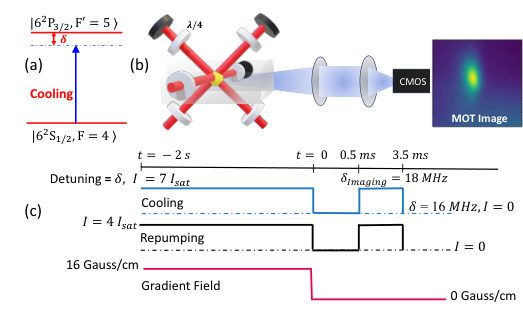 
Fig. 1 Experimental setup and timing sequence for 3D MOT of 133Cs. (a) Energy level diagram showing the cooling and repump transitions used for laser cooling. (b) Schematic of the 3D magneto-optical trap formed by three retro-reflected laser beams and a quadrupole magnetic field; fluorescence is collected via a 4f imaging system and detected using a CMOS camera. Representative MOT fluorescence im- age is shown on the right. (c) Timing diagram illustrating the experimental sequence: the MOT is loaded for 2 seconds with cooling and repump lasers and magnetic gradient field on; at t = 0, all fields are turned off allowing atoms to expand freely for 0.5 ms, followed by a 3 ms imaging pulse with...

📷 Fig 2

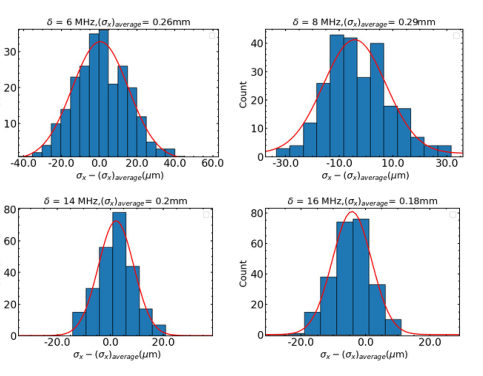 
Fig. 2 Histograms of cloud-width fluctuations for δ = 6, 8, 14, and 16 MHz, obtained from 500 fluorescence images. The horizontal axis represents the deviation from the mean width, σx −⟨σx⟩. The red curves are Gaussian fits used to determine the fluctuation spread.

📷 Fig 3

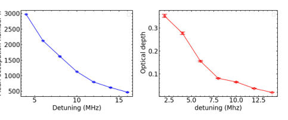 
Fig. 3 (a) Mean vibrational occupation number, ¯n, calcu- lated from the measured spread of the cloud-width distribu- tions using Eq. (2). (b) Optical depth determined from the measured atom number and cloud size using Eq. (3). with er- ror bars reflect the propagated 1σ uncertainty from the Gaus- sian fit to the cloud radius.

📷 Fig 4

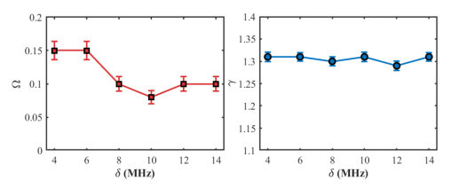 
Fig. 4 Variation of the interaction parameter Ω(left) and the polytropic exponent γ (right) with trapping-laser detuning. The parameters are extracted by fitting numerical solutions of the generalized Lane–Emden equation to the experimen- tally measured density profiles. The error bars represent the estimated uncertainties associated with the fitted parameters.

📷 Fig 5

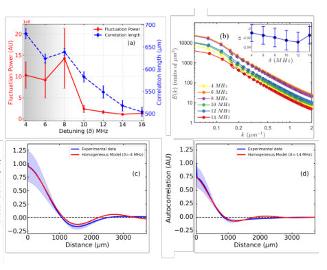 
Fig. 5 (a) Correlation length and total power of relative atom density fluctuations as a function of laser detuning. The observed trends are consistent with a gradual evolution to- ward a more fluctuation-dominated regime. The error bars correspond to 1σSD deviation from the mean across 30 dif- ferent realizations. (b) Power spectral density, E(k), for vari- ous values of the detuning parameter δ. The inset shows the scaling exponent α obtained for different values of δ. (c) Ra- dial autocorrelation function (in blue) in the near resonance regime and (d) far from resonance regime. The shaded region represents 1σ deviation from the mean across 30 different realizations. The red curve...

**Summary.** This study experimentally investigates how varying the laser detuning affects the collective behavior of laser-cooled Cesium atoms in a MOT. By measuring cloud size, density fluctuations, and analyzing the data with a Lane-Emden model, the authors show that strong photon-mediated interactions are enhanced near resonance, leading to increased density fluctuations and a deviation from simple ideal gas behavior.

**Why it may be interesting.** This work provides quantitative experimental data linking the detuning of the trapping laser to measurable collective effects like density fluctuations and effective equation of state parameters, offering a platform to test non-equilibrium transport models in ultracold atomic gases.

Detailed structure

**Main problem.** To experimentally characterize detuning-dependent radiative and collective effects in a laser-cooled Cesium Magneto-Optical Trap (MOT) and establish a basis for testing nonequilibrium transport and photon-mediated interaction models.

**Main result.** The cloud size, density fluctuations, and mean vibrational occupation number are strongly dependent on the laser detuning, showing enhanced fluctuations and density near resonance due to increased photon scattering.

**Method.** Fluorescence imaging and power-spectrum analysis are used to measure cloud size, density profiles, and spatial density fluctuation spectra as the trapping-laser detuning is varied.

**Model / system.** The system is a cloud of laser-cooled Cesium atoms confined in a MOT. Analysis involves fitting density profiles to a generalized Lane-Emden model, which describes the density distribution under the influence of trapping and multiple-scattering forces.

**Key observables.** Cloud size/width fluctuations, optical depth, density profiles, spatial density-fluctuation spectra, mean vibrational occupation number ($ar{n}$), and effective polytropic parameters ($\gamma, \Omega$).

**Important parameters / regimes.** Laser detuning ($\delta$), trapping laser power (7 mW), and the ratio of scattering rates near resonance vs. far detuning.

**Assumptions / limitations.** The analysis uses a phenomenological generalized Lane-Emden model and does not assume the system is in global thermodynamic equilibrium.

**Figures summary.** Figures illustrate the experimental setup, timing sequence, histograms of cloud-width fluctuations vs. detuning, and plots showing the dependence of $ar{n}$, optical depth, and model parameters ($\gamma, \Omega$) on detuning.

**Paper structure.** The paper progresses from describing the experimental setup and measurements (varying detuning) to analyzing global observables (width fluctuations, optical depth) and finally applying theoretical modeling (Lane-Emden equation) to characterize the underlying collective radiative effects.

Abstract

We present an experimental study of detuning-dependent properties of a laser-cooled cesium cloud in a magneto-optical trap. Fluorescence images are used to extract the cloud size, shot-to-shot width fluctuations, optical depth, density profiles, and spatial density fluctuation spectra as the trapping-laser detuning is varied. Near resonance, the cloud exhibits larger spatial extent, increased width fluctuations, higher optical depth, and enhanced density-fluctuation power, while larger detunings produce a more reproducible and spatially confined cloud. The measured density profiles are analysed phenomenologically using a generalized Lane-Emden model with a polytropic equation of state, yielding detuning-dependent effective fit parameters in a weak-interaction regime. Power-spectrum and autocorrelation analyses reveal reproducible scale-dependent density correlations. The results provide a quantitative characterization of detuning-dependent radiative and collective effects in a cesium MOT and establish a basis for future measurements that can more directly test nonequilibrium transport and photon-mediated interaction models.

[↑ back to top](#top)

### [Velocity of an interface driven by an entropic force under shear flow](http://arxiv.org/abs/2608.20878v1)

**Authors:** Yutaro Kado, Shin-ichi Sasa  
**Type:** theory · **Category:** statistical mechanics · **PDF:** <https://arxiv.org/pdf/2608.20878v1>  
**Analysis basis:** full PDF text, analyzed in chunks
**Topic relevance:** `Keldysh / 2PI / non-Gaussian methods` **3/5** · `driven-dissipative phase transition` **3/5** · `non-equilibrium universality` **3/5** · `methods for driven-dissipative` **2/5** · `Frenkel-Kontorova` **1/5** · `analog quantum simulation` **1/5** · `correlated / nonlocal dissipation` **1/5** · `quantum measurements` **1/5** · `scars & prethermalization` **1/5**

📷 Fig 1

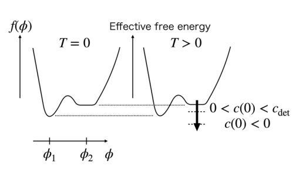 
FIG. 1. Schematic of the potential shifted by thermal fluctuations when ξ1 &lt; ξ2. The left panel represents the free energy f(ϕ). The right panel represents the effective free energy including the fluctuation contribution, whose minima have values f(ϕi) −Tsi, i = 1, 2.

📷 Fig 2

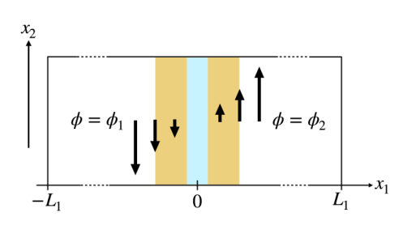 
FIG. 2. Schematic in the x1-x2 plane. The two sides of the interface correspond to the ϕ = ϕ1 and ϕ = ϕ2 phases, respectively, separated by the interfacial region, which is represented by the blue region. The orange re- gion is centered at x1 = 0, and its length is on the order of several times the interfacial width.

📷 Fig 3

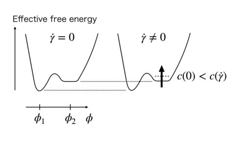 
FIG. 3. Schematic illustration of the shear-modified po- tential at a low shear rate, with the interface located near x1 = 0 and ξ1 &lt; ξ2. The left panel represents the effec- tive free energy at ˙γ = 0. The right panel represents the shear-modified free energy, whose minima have val- ues f(ϕi) −Tsi(˙γ), i = 1, 2.

📷 Fig 4

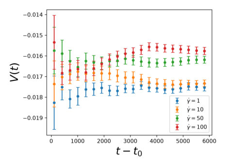 
FIG. 4. Ensemble average of V (t) for several values of ˙γ. The grid spacing is ∆x = 0.8, the time step is ∆t = 0.0005, and the system sizes are L1 = 240 and L = 160. The physical parameters are κ = 1600, Γ = 0.1, T = 0.5, ξ1 = 4.33, ξ2 = 27.3, and h = 0. The parameters in Eq. (27) are A = 1, b1 = 0.5, b2 = 5.0, and ϕ0 = −0.5. The velocity is calculated using 80 samples, with t0 = 50.

📷 Fig 5

 
Figure 4 shows the ensemble average of V (t) over multiple simulation runs. When the interface remains near x1 = 0 under shear flow, its average velocity is constant over the observation time interval. The plateau value gives the numerical estimate of c(˙γ). Because δs(˙γ) and cthermo(˙γ) depend on the cutoff, we must determine kc,cub. A previous study [37] iden- tified the cutoff wavenumber with the inverse of the dis- crete lattice spacing and fitted the theoretical expres- sion in Eq. (12) to the numerical values of c(0), using kc,sph = 2 √

**Summary.** This work analyzes the velocity of an interface driven by thermal fluctuations (entropic forces) when the system is subjected to a steady shear flow. The authors derive scaling laws showing that the velocity correction depends on the shear rate, exhibiting a characteristic $4/3$ power law at low shear rates. It provides a theoretical framework for understanding non-equilibrium transport in fluctuating interfaces.

**Why it may be interesting.** The study of non-equilibrium dynamics, fluctuation-driven transport, and the modification of thermodynamic forces by external fields (like shear flow) is highly relevant to understanding open quantum systems and non-equilibrium statistical mechanics.

Detailed structure

**Main problem.** The paper investigates how an imposed shear flow modifies the mechanism by which an interface propagates due to an entropic force arising from bulk thermal fluctuations.

**Main result.** At low shear rates, the interface velocity correction scales with the 4/3 power of the shear rate, and at high shear rates, the velocity is dominated by the modified bulk entropic contribution.

**Method.** The analysis uses a stochastic non-conserved order-parameter model, deriving the velocity via perturbation expansion in small parameters (temperature T and interface width h).

**Model / system.** The system is a planar interface separating two phases, modeled by a stochastic non-conserved order-parameter field $\phi$, subjected to a uniform shear flow $\mathbf{v}(\mathbf{r}) = (0, \dot{\gamma}x_1, 0)$.

**Key observables.** Interface propagation velocity $c(\dot{\gamma})$, shear-dependent entropic contribution $\delta s(\dot{\gamma})$, and non-equilibrium contribution $g_{	ext{neq}}$.

**Important parameters / regimes.** Shear rate ($\dot{\gamma}$), Temperature ($T$), and the ratio of fluctuation amplitudes between phases.

**Assumptions / limitations.** The analysis relies on perturbation expansions in small parameters $T$ and $h$, and the calculation of the correlation function assumes a linearized bulk mode approximation.

**Figures summary.** Figures schematically illustrate the potential shift due to thermal fluctuations and the region of interest for calculating the non-equilibrium contribution $g_{	ext{neq}}$.

**Paper structure.** The paper progresses from defining the physical model and the general velocity formula, to deriving identities for homogeneous bulk fluctuations under shear, and finally analyzing the low and high shear rate limits to determine the scaling of the velocity correction.

Abstract

Thermal fluctuations can drive an interface when bulk fluctuation amplitudes differ between two phases. We study how shear flow modifies this mechanism using a stochastic non-conserved order- parameter model. For a planar interface parallel to the imposed shear, we derive its propagation velocity in the weak-noise and small-bias regime. The driving force comprises a shear-modified entropic contribution determined by bulk fluctuation spectra and a non-equilibrium contribution arising from the breaking of time-reversal symmetry. At low shear rates, the entropic term provides the dominant contribution to the velocity of an interface near the zero-velocity plane of the shear flow, and the shear-induced change in the velocity scales as the 4/3 power of the shear rate. At high shear rates, two-dimensional simulations show that the measured velocity is largely accounted for by the modified bulk entropic contribution.

[↑ back to top](#top)

### [Dissipation driven boundary localization in higher order topological insulators](http://arxiv.org/abs/2608.20867v1)

**Authors:** Xue Ping Ren, Xiao Ran Wang, Xin Ran Ma, Xi Hu, Su Peng Kou  
**Type:** theory · **Category:** other · **PDF:** <https://arxiv.org/pdf/2608.20867v1>  
**Analysis basis:** full PDF text, analyzed in chunks
**Topic relevance:** `correlated / nonlocal dissipation` **3/5** · `driven-dissipative phase transition` **3/5** · `methods for driven-dissipative` **3/5** · `Keldysh / 2PI / non-Gaussian methods` **2/5** · `non-equilibrium universality` **2/5** · `analog quantum simulation` **1/5** · `quantum measurements` **1/5**

📷 Fig 1

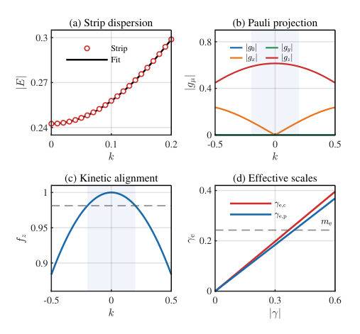 
FIG. 1. Effective parameters fixed from Hermitian calcula- tions for A = B = 1, M = 1, and Λ = 0.5. (a) Low-energy strip spectrum and the fit |E|2 = m2 e +A2 ek2. (b) Magnitudes |gµ(k)| in the Pauli decomposition of the outer-row sz opera- tor in the kinetic gauge. (c) Kinetic-aligned fraction fz; the dashed line marks fz = 0.9812. The shaded range in (b) and (c) is |k| ≤0.2. (d) Corner-state outer-layer exposure scale, γ(0) e,c = w0|γ| (red), and projected effective dissipation of the propagating doublet, γ(0) e,p = |gz(0)||γ| (blue); the dashed line is me. All fit parameters and calibration factors are obtained at γ = 0.

📷 Fig 2

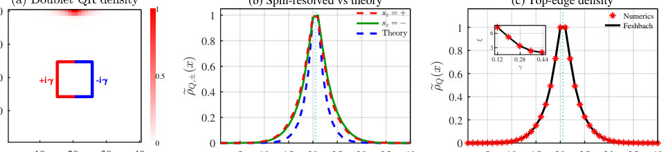 
FIG. 2. Propagating boundary states for L = 40 at γe = 0.2668. (a) Numerics QR-projector density of the tracked positive- energy double, and the inset shows the dissipation profile. (b) The sz = + (red dashed) and sz = −(green solid) parts of the upper-edge QR-projector density, together with the envelope |Sg(ℓ)|2 from Eq. (22) (blue dashed). All three profiles peak at the GDDW marked by the cyan dotted line. (c) The numucial (red stars) and the fixed-energy Feshbach reduction (black solid) at y = L. The inset compares the localization lengths as γ is varied, with γe = |gz(0)|γ. Here eρQ(x) is the peak-normalized QR-projector density, and eρQ,±(x) are its spin-resolved parts. The lattice...

📷 Fig 3

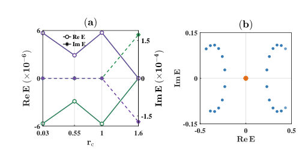 
FIG. 4. Spectrum of the four tracked corner-derived states for L = 40. (a) Real and imaginary parts of their eigenvalues at rc = 0.03, 0.55, 1.00, 1.60. (b) The 48 eigenvalues nearest zero at rc = 1.60, with the four tracked eigenvalues highlighted. The lattice parameters are the same as in Fig. 1.

📷 Fig 4

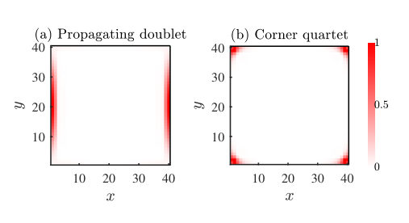 
FIG. 5. Scalar boundary dissipation for L = 40 at γ = 0.5887. Peak-normalized QR-projector densities are shown for (a) the tracked positive-energy propagating doublet and (b) the tracked corner-state quartet. The scalar operator Q00 ≡σ0s0 follows the balanced separated profile in both panels. Each panel is normalized by its own maximum. The lattice param- eters are the same as in Fig. 1.

📷 Fig 5

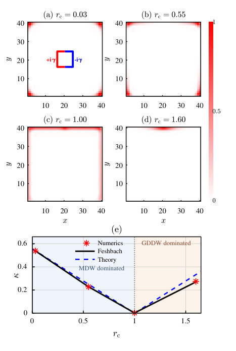 
FIG. 3. Redistribution of the QR-projector density of the tracked corner-state subspace for L = 40. (a)–(d) QR- projector densities at rc = 0.03, 0.55, 1.00, 1.60. The inset shows the dissipation profile. (e) Upper-half-edge inverse den- sity localization length κ versus rc = w0γ/me: numerics (red stars), fixed-energy Feshbach reduction (black solid), and the edge theory from Eqs. (27) and (28) (blue dashed). The dot- ted line at rc = 1 and the shaded regions mark the leading crossover from MDW-dominated to GDDW-dominated local- ization. The lattice parameters are the same as in Fig. 1.

**Summary.** This work analyzes how engineered dissipation controls boundary state localization in higher-order topological insulators. By projecting the system onto the edge subspace, the authors show that the dissipation couples uniformly to both edge modes, forcing them to localize together at a common dissipative domain wall. This mechanism offers a topological control knob for boundary physics without modifying the bulk band structure.

**Why it may be interesting.** The concept of dissipation controlling topological boundary physics is highly relevant to open quantum systems, as it provides a mechanism to engineer boundary behavior in systems where dissipation is unavoidable.

Detailed structure

**Main problem.** The study investigates how engineered boundary dissipation affects the localization of edge and corner states in Higher-Order Topological Insulators (HOTIs).

**Main result.** The dominant boundary dissipation couples to the kinetic term, causing both counter-propagating edge modes to localize at the same dissipative domain wall, which controls state localization without altering the bulk topology.

**Method.** The analysis employs projection onto the edge subspace, utilizing boundary transfer theory and fixed-energy Feshbach reduction techniques.

**Model / system.** The model is a Bernevig–Hughes–Zhang-type second-order topological insulator (SOTI) lattice, perturbed by inhomogeneous, spin-dependent boundary dissipation ($\delta H$).

**Key observables.** Edge state localization, corner state weight distribution, and the real transfer exponent ($\lambda_\pm$).

**Important parameters / regimes.** Dissipation strength ($\gamma_e(\ell)$), effective edge mass ($m_e(\ell)$), and the energy $E$.

**Assumptions / limitations.** The effective Hamiltonian is assumed valid when dissipation and mass terms are small compared to the bulk gap energy.

**Figures summary.** Not specified.

**Paper structure.** The paper progresses from defining the non-Hermitian Hamiltonian and projecting to the edge subspace, developing the transfer theory for edge states, analyzing the zero-energy limit, and concluding with numerical confirmation of the localization mechanism.

Abstract

We study dissipation driven boundary localization in a Bernevig Hughes Zhang type second order topological insulator by introducing inhomogeneous, spin dependent boundary dissipation. After projection onto the edge subspace, the dominant component of the boundary dissipation lies in the same Pauli channel as the kinetic term. This channel gives both counter-propagating edge modes the same real transfer exponent. The two modes therefore accumulate at the same dissipative domain wall. For the corner states, the dissipative envelope competes with Jackiw Rebbi localization. Increasing dissipation moves their weight from the geometric corners to the dissipative domain wall. Propagating edge states also localize at this wall. Numerical calculations confirm the qualitative predictions of the edge theory. A fixed energy Feshbach reduction captures finite size effects. Inhomogeneous boundary dissipation thus controls boundary state localization without changing the bulk topology.

[↑ back to top](#top)

### [Restoring heat and particle flow in strongly coupled non-equilibrium devices](http://arxiv.org/abs/2608.20737v1)

**Authors:** Noa Ludwin, Ohad Cremerman, Milan Šindelka, David Gelbwaser-Klimovsky  
**Type:** theory · **Category:** statistical mechanics · **PDF:** <https://arxiv.org/pdf/2608.20737v1>  
**Analysis basis:** full PDF text, analyzed in chunks
**Topic relevance:** `driven-dissipative phase transition` **3/5** · `methods for driven-dissipative` **3/5** · `non-equilibrium universality` **3/5** · `Keldysh / 2PI / non-Gaussian methods` **2/5** · `analog quantum simulation` **1/5** · `correlated / nonlocal dissipation` **1/5** · `quantum measurements` **1/5**

📷 Fig 1

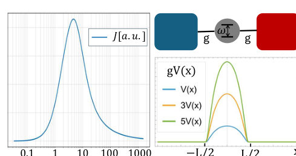 
FIG. 1. Left: Turnover of the heat flow as a function of the normalized interaction strength, g/ω. The general setup is de- picted on the top right, where two thermal baths or electrodes interact through an intermediate system. As an example, we consider a two-level system coupling two baths, each of them composed of a 1D free particle gas that is scattered by the

📷 Fig 2

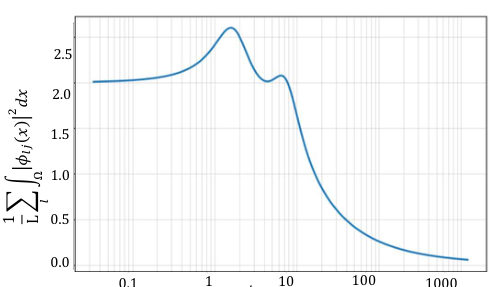 
FIG. 2. Squared amplitude of the scattered wavepacket in- tegrated over the interaction region and plotted as a func- tion of the normalized coupling strength. We consider the same realization as in Figure 1. The wavepacket takes the form |Ψ⟩= PN l=1 ϕlj(x)|l⟩, where |l⟩are the ˆHS eigenstates, and the asymptotic in-state of the system is |j⟩. The mean wavepacket energy E is specified in the Supplementary Infor- mation. For wavepackets with other energies, the amplitude in the interaction region also tends to 0 as g grows (see the Supplementary Information for all the plot parameters).

📷 Fig 3

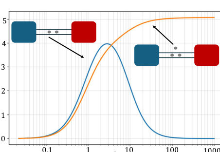 
FIG. 3. Heat flow as a function of the normalized cou- pling strength for a two-site intermediate system (blue line) vs. three-site intermediate system (yellow line). The sites are represented as gray circles and the system-reservoir interac- tion region is delimited by black lines. All the sites of the two-site system are in the interaction region, whereas in the three-sites system, one is outside; an electron on the outside site does not interact with the reservoirs but can still tunnel to the other sites. The presence of the third site outside the interaction region prevents the turnover (see the Supplemen- tary Information for the plot parameters).

📷 Fig 4

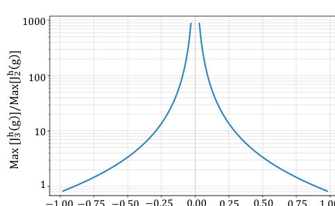 
FIG. 4. Ratio between maximum currents for the two and three sites described in Figure 3. For both cases, the max- imization of current is done with respect to the coupling strength g. A similar effect can be observed by increasing the number of levels from N to N + 1.

**Summary.** This paper analyzes the 'turnover effect' in quantum devices where energy currents unexpectedly drop to zero upon increasing coupling strength. Using scattering theory, the authors prove this blockage is due to total reflection preventing particle access to the interaction region. They propose a novel protocol involving adding an auxiliary energy level to bypass this limitation, thereby restoring and enhancing device performance.

**Why it may be interesting.** This work directly addresses non-equilibrium transport phenomena in quantum devices, which is a major area of statistical mechanics and open quantum systems theory, providing concrete physical mechanisms for current limitation.

Detailed structure

**Main problem.** The paper investigates the counterintuitive 'turnover effect' where energy or particle transport currents decrease to zero in strongly coupled non-equilibrium quantum devices.

**Main result.** The turnover effect is shown to be a consequence of total reflection impeding particle exchange, and this effect can be avoided and even overcome by engineering the system with an additional energy level.

**Method.** The study employs scattering theory, analyzing the system dynamics using scattering wavefunctions, and deriving steady-state currents via Pauli master equations.

**Model / system.** The model consists of a quantum system coupled to multiple baths (reservoirs) via localized potentials, analyzed in the context of non-equilibrium energy/particle flow.

**Key observables.** Heat current ($J_k$), wavefunction weight ($W_a$), transmission ($T_{lj}$), and reflection ($R_{lj}$) amplitudes.

**Important parameters / regimes.** Coupling strength ($g$), which is varied across weak to strong coupling regimes ($g 	o \infty$).

**Assumptions / limitations.** The analysis assumes the low-density regime for scattering events and utilizes scattering theory formalism.

**Figures summary.** Figures illustrate the turnover of heat flow versus coupling strength, the suppression of wavepacket amplitude, and comparisons between current calculations for different numbers of coupled sites.

**Paper structure.** The paper progresses from defining the turnover effect using scattering theory, mathematically identifying total reflection as the cause, and finally proposing and demonstrating a protocol using an extra level to circumvent this blockage and enhance current flow.

Abstract

Under non-equilibrium conditions, energy/particle currents flow through a quantum system coupled to multiple baths. Although the fluxes increase in the weak coupling regime as the coupling strengthens, the reason why they decrease to zero for large coupling remains unknown. This counterintuitive behavior of energy exchange or transport phenomena is called the turnover effect. It has been predicted in several quantum systems such as photosynthetic complexes, mesoscopic junctions, quantum heat machines, and chemical networks without a single counterexample, and it results in constrained performance due to limited currents. Here, we use scattering theory to study the turnover effect produced by low-zdensity reservoirs of free particles scattered by a quantum system through localized potentials. We find that the turnover effect is a consequence of total reflection that impedes the reservoir particle from reaching the interaction region and exchanging energy with the quantum system. Moreover, we design a protocol based on quantum tunneling to avoid the turnover and to increase the maximum current. This strategy could be used to unleash the full potential of devices based on temperature/chemical potential gradients.

[↑ back to top](#top)

### [Doping-driven Mott transition from steady-state density functional theory](http://arxiv.org/abs/2608.21029v1)

**Authors:** David Jacob, Stefan Kurth  
**Type:** theory · **Category:** strongly correlated electrons · **PDF:** <https://arxiv.org/pdf/2608.21029v1>  
**Analysis basis:** full PDF text, analyzed in chunks
**Topic relevance:** `Keldysh / 2PI / non-Gaussian methods` **3/5** · `methods for driven-dissipative` **3/5** · `analog quantum simulation` **2/5** · `driven-dissipative phase transition` **2/5** · `non-equilibrium universality` **2/5** · `quantum measurements` **1/5**

📷 Fig 1

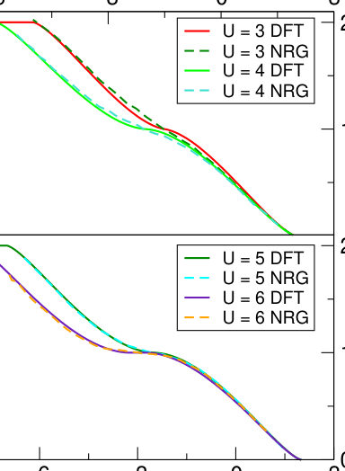 
Figure 1: Left panel: Hxc potentials vHxc(n) of Eqs. (12) and (13) in units of U for different values of U. Right panels: comparison of DFT densities obtained with our parametrization of vHxc with NRG densities of Ref. [8]. Upper right panel: U = 3 and U = 4, lower right panel: U = 5 and U = 6.

📷 Fig 2

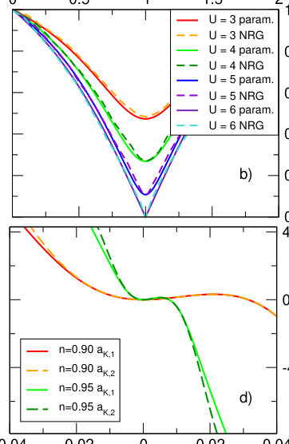 
Figure 2: Panels a), c), and d): Exchange-correlation bias Vxc for U = 8 in different approximations. Panel a): Mott xc bias according to Eq. (52). Panel c) xc bias Vxc according to Eq. (53) with the two different forms of the Kondo prefactor of Eqs. (62) (solid lines) and (63) (dashed lines). Panel d): xc bias with corrected Kondo pref- actors. Panel b): quasiparticle weight Z as function of the density for various values of U from our parametrization (Eqs. (64) - (67)) compared to the NRG results of Ref. [8].

📷 Fig 3

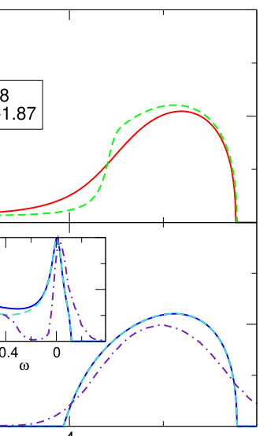 
Figure 3: Spectral function of the Hubbard model on the Bethe lattice with infinite coordination for U = 8 and on-site energies v = −1.87 (which corresponds to a doping of δ = 1−n ≈0,02). Upper panel: i-DFT spectra obtained with the functional of Eq. (53) with the two uncorrected Kondo prefactors aK,1 and aK,2 (Eqs. (62) and (63), respectively). Lower panel: i-DFT spectra with the corrected Kondo prefactors of Eq. (68) as well as the NRG spectrum of Ref. [6]. The inset zooms in around the Kondo resonance.

📷 Fig 4

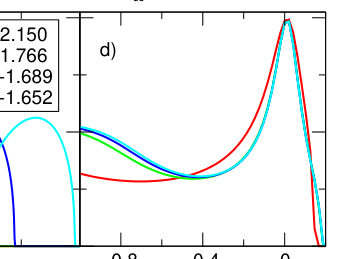 
Figure 4: Spectral functions of the Hubbard model on the Bethe lattice with infinite coordination. Panel a): i-DFT spectra for U = 14 and onsite energy v = −12.2 obtained with the corrected Kondo prefactors of Eq. (69) compared with the NRG spectrum of Ref. [45]. In panels b) to d) only the prefactor acorr. K,2 is used. Panel b): i-DFT spectral functions for U = 8 for different onsite energies v. Panel c): i-DFT spectral functions for different values of U. The onsite energies were chosen such that for all U the doping is the same at δ = 1 −n = 0.03. Panel d): same as c) but zoomed in at the Kondo resonance.

📷 Fig 5

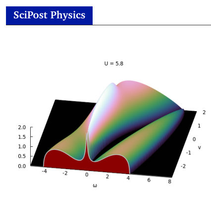 
Figure 5: Spectral function as a function of frequency ω and gate v for U = 5.8 &lt; Uc just in the metallic phase (left) and for U = 8.0 &gt; Uc deep in the Mott phase (right).

**Summary.** This work develops and applies a specialized version of Density Functional Theory (i-DFT) to model the Mott metal-insulator transition in the Hubbard model. By connecting the theory to many-body concepts like the quasiparticle weight, the authors show that i-DFT can accurately predict the opening and closing of the Mott gap as the electron doping changes. This advances the theoretical understanding of strongly correlated materials using non-equilibrium quantum methods.

**Why it may be interesting.** While focused on condensed matter, the development of a functional theory (i-DFT) that bridges equilibrium DFT with non-equilibrium transport and strong correlations is a powerful methodological tool applicable to open quantum systems where current/bias effects are crucial.

Detailed structure

**Main problem.** The paper addresses the challenge of theoretically describing the doping-driven Mott transition, a fundamental phase transition driven by strong electronic interactions.

**Main result.** The authors successfully demonstrate that the doping-driven Mott transition in the Hubbard model can be captured using the steady-state density functional theory (i-DFT) framework.

**Method.** The core method involves extending DFT to steady-state conditions (i-DFT) and deriving necessary approximations for the exchange-correlation (xc) bias by connecting it to the quasiparticle weight via Fermi-liquid theory.

**Model / system.** The study uses the single-band Hubbard model, analyzed in the limit of infinite coordination (Bethe lattice), which allows mapping to a local Anderson Impurity Model (AIM) central to DMFT.

**Key observables.** Spectral function A(omega), Mott gap, quasiparticle weight, and the xc bias.

**Important parameters / regimes.** Interaction strength U, doping level (n), and the critical gate voltage (vc).

**Assumptions / limitations.** The approach assumes the validity of connecting the xc bias to the quasiparticle weight via Fermi-liquid theory, and it relies on the infinite coordination limit ($K 	o \infty$).

**Figures summary.** Figures compare the spectral function in metallic and Mott regimes, showing the emergence and disappearance of quasiparticle peaks and the opening/closing of the Mott gap as doping changes.

**Paper structure.** The paper develops the i-DFT formalism, parametrizes the Hxc potential using constraints from DMFT/NRG, and then applies the full framework to calculate the spectral function and diagnose the Mott transition across varying doping levels.

Abstract

The doping-driven Mott transition in the Hubbard model is described within the frame- work of steady-state density functional theory, or i-DFT. In order to access the many-body spectral function in i-DFT, an approximation for the exchange-correlation (xc) bias at arbitrary density and current is required. By using Fermi-liquid theory, a connection between the xc bias of i-DFT and the quasiparticle weight of many-body theory is derived and the results are employed to guide the construction of the approximation. Numerical results obtained with this functional demonstrate that the doping-driven Mott transition can indeed be captured with i-DFT.

[↑ back to top](#top)

### [Non-Hermitian sensing via end-to-end Green's functions](http://arxiv.org/abs/2608.20847v1)

**Authors:** Hui-Qiang Liang, Yu-Shi Cheng, Guo-Fu Xu  
**Type:** theory · **Category:** other · **PDF:** <https://arxiv.org/pdf/2608.20847v1>  
**Analysis basis:** full PDF text, analyzed in chunks
**Topic relevance:** `driven-dissipative phase transition` **3/5** · `Keldysh / 2PI / non-Gaussian methods` **2/5** · `analog quantum simulation` **2/5** · `methods for driven-dissipative` **2/5** · `non-equilibrium universality` **2/5** · `correlated / nonlocal dissipation` **1/5** · `quantum measurements` **1/5**

📷 Fig 1

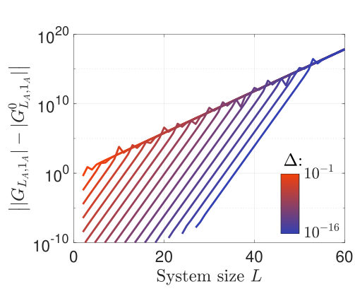 
FIG. 1. Exponential scaling of |GLA,1| −|G0 LA,1| with the system size L of the coupled two-chain model. The relevant parameters are tR = 0.1, tL = 1 and ω = 0.7.

📷 Fig 2

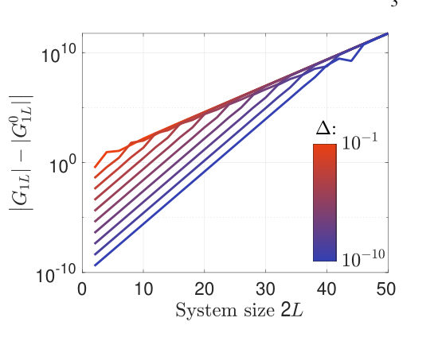 
FIG. 2. Exponential scaling of the response discrepancy |GL,1| −|G0 L,1| versus the system size 2L in the one-band-chain-based non-Hermitian topological sensor. Parameters: tR = 1.5, tL = 0.5 and ω = 0.

📷 Fig 3

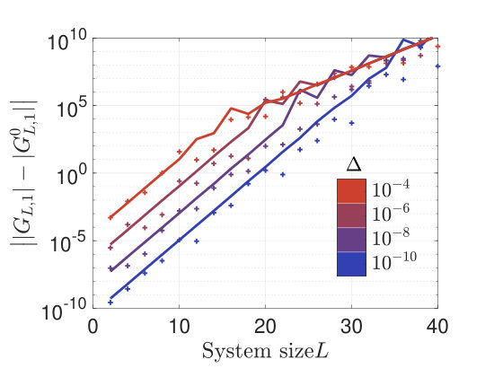 
FIG. 4. Scaling of the Green’s function |GL,1| −|G0 L,1| of one band case, for various ∆, with disorder strength W = 0.2. The input and output are fixed to chain A. Data for a single disorder realiza- tion (marked by ”+”) are compared with the disorder-averaged result (line) over M = 104 realizations for each L. All other parameter are same as in Fig. 2.

📷 Fig 4

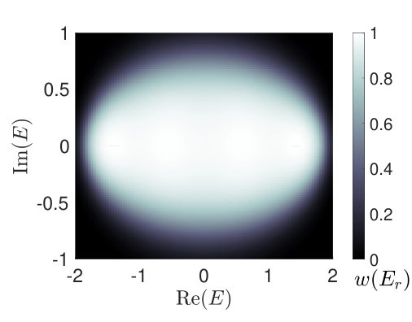 
FIG. 3. The disordered spectrum winding number for chain A. The parameters are ∆= 10−7, L = 16. All other parameters are same as in Fig. 2.

📷 Fig 5

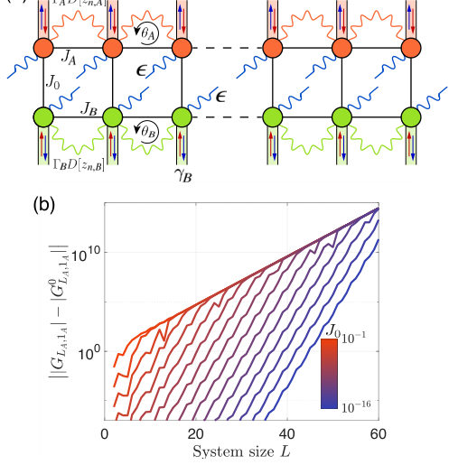 
FIG. 5. (a) Driven-dissipative coupled chains consisting of 2N bosonic cavity modes, described by Eqs. (16). (b) Numerically sim- ulated results for the proposed setup. The relevant parameters are J = 0.75, θ = 0.75π, Γ = 0.5, ϵ = 2, and γA = γB = 1.

**Summary.** This paper proposes a novel sensing scheme that achieves exponential sensitivity scaling by exploiting the non-Hermitian skin effect through end-to-end Green's function amplification. The enhanced sensitivity is shown to be robustly protected by the system's non-trivial spectral winding number, offering a pathway for building highly sensitive, noise-tolerant quantum sensors.

**Why it may be interesting.** This work directly connects topological invariants (winding numbers) and spectral properties (NHSE) to a measurable physical enhancement (sensing), which is highly relevant for designing advanced quantum sensors in open quantum systems.

Detailed structure

**Main problem.** The paper addresses the need for highly sensitive and noise-tolerant sensing mechanisms by leveraging the unique properties of non-Hermitian physics.

**Main result.** They demonstrate an exponential sensitivity scaling of exp(αL) in sensing by utilizing the amplification inherent in end-to-end Green's functions, a signature of the non-Hermitian skin effect.

**Method.** The analysis involves deriving the sensing response by calculating the discrepancy in end-to-end Green's functions, $\left|G_{L,1}(\Delta)
ight| - \left|G_{0L,1}
ight|$, using perturbation theory and transfer matrix methods.

**Model / system.** The models analyzed include coupled two-chain Hatano-Nelson (HN) open chains and a single HN open chain with boundary coupling, which can be generalized to include disorder.

**Key observables.** Sensing response, Green's function discrepancy, and the spectral winding number ($w(E_r)$).

**Important parameters / regimes.** System size ($L$), coupling strength ($\Delta$), and the non-Hermitian topological phase.

**Assumptions / limitations.** The perturbation $\hat{H}_\Delta$ is assumed to be weak, and the analysis often relies on approximations valid for large system sizes ($L \gg 1$).

**Figures summary.** Figures illustrate the exponential scaling of the sensing response with system size for both the coupled two-chain and boundary-modification models, while also showing the breakdown of this scaling for very large systems.

**Paper structure.** The paper develops the theory by defining the non-Hermitian Hamiltonian, deriving the Green's function response using perturbation theory, analyzing the scaling behavior via transfer matrices, and finally demonstrating the topological protection of the enhanced sensitivity.

Abstract

Sensing hinges on two key attributes: high sensitivity and resilience to noise. Here, we present a scheme that unites these features within a single framework. By harnessing the exponential amplification of end-to-end Green's functions-a direct signature of the non-Hermitian skin effect-our scheme achieves an exponential sensitivity scaling of exp(αL) with α a model-specific constant and L the system size. Notably, this enhanced sensitivity is protected by spectral winding numbers and endures under disorder when the non-Hermitian topological phase remains intact. We also explore its feasibility in synthetic non-Hermitian platforms, providing a pathway toward highly sensitive and noise-tolerant sensing.

[↑ back to top](#top)

### [Non-Monotonic Dynamical Correlations Across The Glass Crossover](http://arxiv.org/abs/2608.21219v1)

**Authors:** Corentin C. L. Laudicina, Ilian Pihlajamaa, Liesbeth M. C. Janssen, Thomas Voigtmann, Tommaso Rizzo  
**Type:** theory · **Category:** disordered systems and neural networks · **PDF:** <https://arxiv.org/pdf/2608.21219v1>  
**Analysis basis:** full PDF text, analyzed in chunks
**Topic relevance:** `Keldysh / 2PI / non-Gaussian methods` **3/5** · `non-equilibrium universality` **3/5** · `methods for driven-dissipative` **2/5** · `scars & prethermalization` **2/5** · `analog quantum simulation` **1/5** · `driven-dissipative phase transition` **1/5**

📷 Fig 1

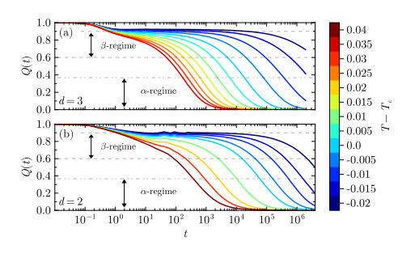 
FIG. 1. Two-step relaxation dynamics across the mode-coupling crossover. Overlap function Q(t) at temperatures ranging from above to below Tc (left to right: decreasing temperature) for the three- (panel (a), N = 100 000 particles) and two-dimensional (panel (b), N = 10 000 particles) model glass formers. The char- acteristic two-step decay develops upon cooling, with an intermedi- ate plateau, the β-regime, becoming increasingly long-lived as Tc is approached. Arrows indicate the approximate boundaries of the β- and α-relaxation regimes as defined in the text. Temperatures are spaced as (T −Tc) ∈[−0.02, −0.015, . . . , 0.035] in (a) and (T −Tc) ∈[−0.02, −0.015, . . . , 0.0, 0.01, . . . ,...

📷 Fig 2

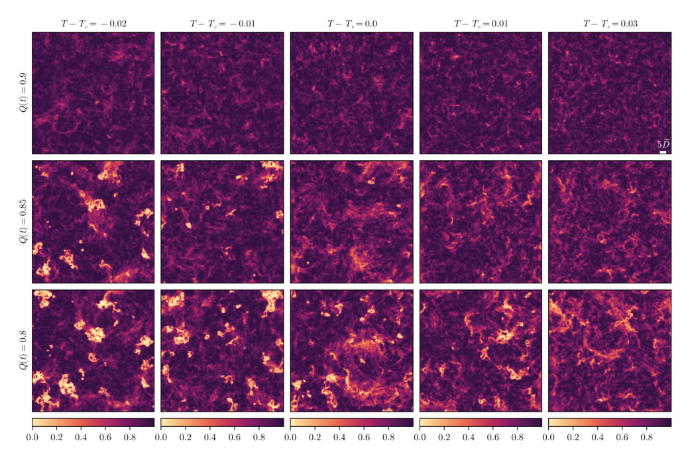 
FIG. 2. Spatial maps of the coarse-grained mobility field µ(r, t) shown for the two-dimensional system considered in this work. Each column corresponds to a different temperature, while each row represents a distinct intrinsic time. Reading vertically reveals the temporal evolution of a single simulation at fixed temperature. Note that the mobility field is defined such that µ(r, t) = 1.0 indicates an immobile region and µ(r, t) = 0.0 a mobile one. A scale bar of size 5D is shown in the top-right panel.

📷 Fig 3

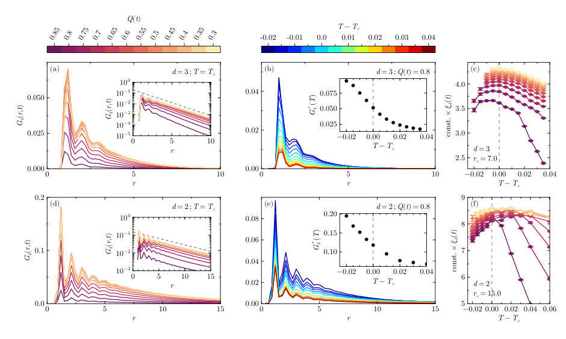 
FIG. 3. (a) Spatial profiles of G4(r, t) at fixed temperature T = Tc for several intrinsic times in three dimensions (N = 100 000). The inset shows the same data on a semi-logarithmic scale, with dashed lines an exponential decay serving as a guide to the eye. The curves correspond to all material times indicated in the colorbar: Q(t) = 0.85, 0.08, . . . , 0.3. (b) Four-point correlation functions G4(r, t) at fixed intrinsic time Q(t) = 0.8 for varying temperatures T relative to Tc in three dimensions. The inset displays the corresponding maxima G∗ 4(T). The temperatures shown correspond to those shown in Fig. 1(a). (c) Dynamical correlation length ξd(t), computed from the second-moment...

📷 Fig 4

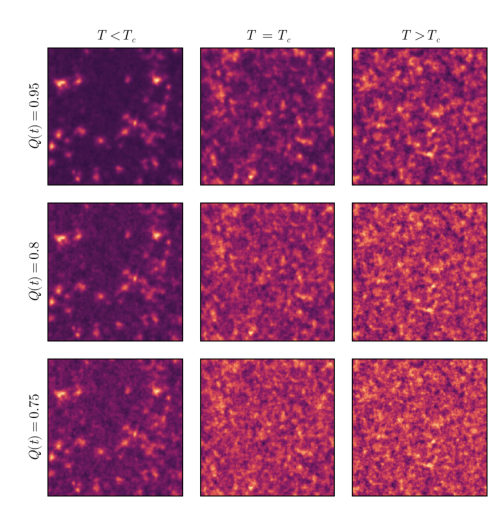 
FIG. 4. SBR solutions in two dimensions for several temperatures (columns) and intrinsic times (rows). The spatial features of the field g(x, t) qualitatively mirror the simulated mobility maps, indicating that SBR captures the key dynamic heterogeneity in the β-regime near Tc. Note that the colorscheme is analogous to that used in Fig. 2, where dark purple indicates immobility and light yellow indicates mobility.

📷 Fig 5

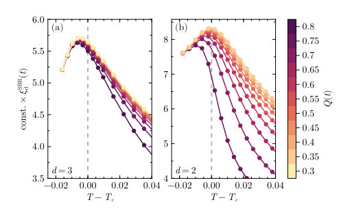 
FIG. 5. SBR predictions for the dynamical correlation length ξSBR d (t) in (a) three and (b) two dimensions, obtained from the second-moment estimator Eq. (6) applied to GSBR 4 (r, t) de- fined in Eq. (10). Results are shown for intrinsic times Q ∈ [0.8, 0.75, . . . , 0.3] in (a) and Q ∈[0.8, 0.75, . . . , 0.4] in (b). The non-monotonic temperature dependence of ξSBR d (t) across Tc is re- produced across all intrinsic times and in both dimensions.

**Summary.** This work reveals that the dynamical correlation length in supercooled liquids exhibits non-monotonic behavior in the $eta$-relaxation regime across the glass crossover temperature ($T_c$). By extending Mode-Coupling Theory, the authors provide direct spatial evidence supporting an avoided dynamical transition picture, suggesting a fundamental change in the nature of local particle motion below $T_c$.

**Why it may be interesting.** The focus on non-equilibrium dynamics, glassy physics, and the extension of mean-field theories (MCT) to capture finite-dimensional effects is highly relevant to understanding complex, slow dynamics in many-body quantum systems.

Detailed structure

**Main problem.** The study investigates the temperature dependence of the dynamical correlation length across the glass crossover temperature ($T_c$), challenging the assumption that dynamics are only governed by $\alpha$-relaxation.

**Main result.** The dynamical correlation length in the $eta$-relaxation regime shows a striking non-monotonic dependence, peaking near $T_c$ and decreasing upon further cooling, indicating a crossover from extended to localized motion.

**Method.** The analysis uses molecular dynamics simulations combined with stochastic $eta$-relaxation theory, extending Mode-Coupling Theory (MCT) beyond mean-field predictions.

**Model / system.** The system studied is a supercooled liquid, modeled in both two and three dimensions, exhibiting structural relaxation dynamics.

**Key observables.** Dynamical correlation length ($\xi_d(t)$), Overlap function $Q(t)$, and the spatially resolved mobility field $\mu(\mathbf{r}, t)$.

**Important parameters / regimes.** The mode-coupling crossover temperature ($T_c$), the $eta$-relaxation regime, and the dimensionality ($d=2, 3$).

**Assumptions / limitations.** The theory relies on stochastic $eta$-relaxation theory to capture the avoided dynamical transition predicted beyond mean-field MCT.

**Figures summary.** Figures illustrate the two-step decay of the overlap function $Q(t)$ across $T_c$ and spatial maps of the mobility field $\mu(\mathbf{r}, t)$ showing heterogeneous structures.

**Paper structure.** The paper first establishes the anomalous non-monotonic behavior of $\xi_d$ in the $eta$-regime, contrasting it with previous $\alpha$-regime studies. It then develops the theoretical framework using stochastic $eta$-relaxation theory to quantitatively capture this crossover, providing spatial evidence for the avoided-transition picture.

Abstract

The dramatic slowing down of structural relaxation in supercooled liquids is accompanied by the emergence of dynamic heterogeneity. A monotonically increasing dynamical correlation length, measured at the $α$-timescale, is one of the remarkable features of this phenomenon. Here we show that this picture is incomplete: the dynamical correlation length measured in the $β$-relaxation regime exhibits a striking non-monotonic temperature dependence, reaching a maximum near the mode-coupling crossover temperature $T_c$ and decreasing upon further cooling, even as local dynamical fluctuations continue to intensify. This behavior suggests a crossover from spatially extended, maximally cooperative motion near $T_c$ to increasingly compact and localized relaxation events below it. We demonstrate that this evolution is quantitatively captured by stochastic beta-relaxation theory, an extension of mode-coupling theory beyond mean-field that explicitly predicts an avoided dynamical transition in finite dimensions. Our results provide the first direct spatial evidence in favor of the avoided-transition picture of the mode-coupling crossover, and establish the peak of the $β$-regime correlation length as a robust indicator of the mode-coupling crossover.

[↑ back to top](#top)

### [Anisotropic dynamical reconstruction of quantum geometry in quenched Chern insulators](http://arxiv.org/abs/2608.20895v1)

**Authors:** Nan Li, Zhiyong Liu, Zhaoxin Liang, Ying Hu  
**Type:** theory · **Category:** other · **PDF:** <https://arxiv.org/pdf/2608.20895v1>  
**Analysis basis:** full PDF text, analyzed in chunks
**Topic relevance:** `non-equilibrium universality` **3/5** · `Keldysh / 2PI / non-Gaussian methods` **2/5** · `methods for driven-dissipative` **2/5** · `scars & prethermalization` **2/5** · `analog quantum simulation` **1/5** · `quantum measurements` **1/5**

📷 Fig 1

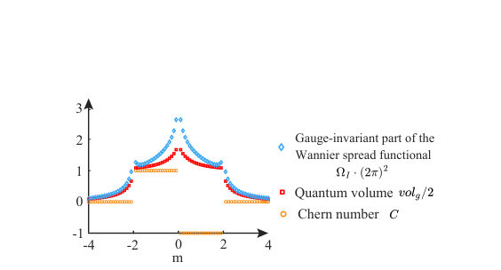 
FIG. 1. Quantum geometry in a static Chern insulator. The Chern number C, quantum volume volg, and gauge-invariant Wannier spread functional ΩI of the ground state of the mas- sive Dirac model are shown for various mass m.

📷 Fig 2

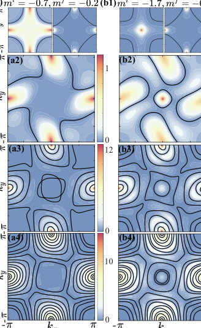 
FIG. 2. Time evolution of the quantum-volume density p

📷 Fig 3

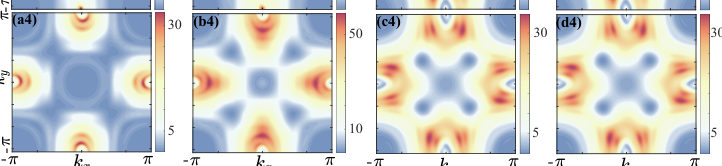 
FIG. 3. The time evolution of the metric trace Tr G(k, t) corresponding to Fig. 2. Parameters are the same as those in corresponding panels in Fig. 2.

📷 Fig 4

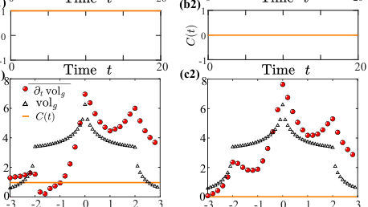 
FIG. 4. Time evolution of global quantum geometry and the Chern number in a quenched Chern insulator. (a1)-(a2) Time evolution of the gauge-invariant Wannier spread functional ΩI(t) (red diamonds) and quantum volume volg(t) (black squares), calculated from Eqs. (11) and (12), respectively. Solid lines denote fits using ΩI/(2π)2 = at2 + bt + c (red) and volg = αt + e (black). Insets show log-log plots of ΩI/(2π)2

📷 Fig 5

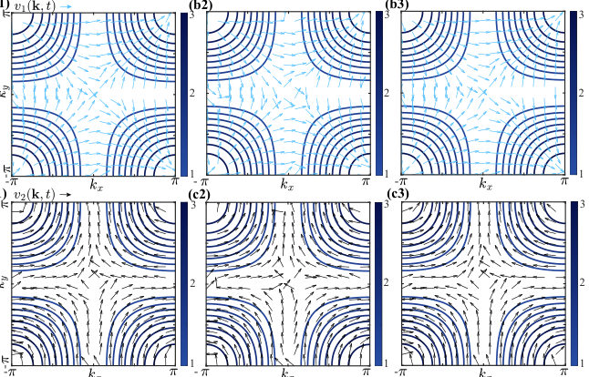 
FIG. 5. Anisotropic dynamical reconstruction of quantum geometry. The three columns respectively correspond to three distinct quenches, which share identical mf = −1 but (a1) mi = −3.2, (a2) mi = −1.7, and (a3) mi = 1. (a1)-(a3) Time evolution of the metric eigenvalues λ1,2(k, t) at k = (π/5, π/2). (b1)-(b3) Long-time (t = 20) distributions of the principal axis v1 associated with the larger metric eigenvalue λ1 [c.f. Eq. (15)]. Arrows indicate the orientation (cos(θk(t)/2), sin(θk(t)/2)). (c1)-(c3) Corresponding distributions of the principal axis v2 at t = 20 associated with the smaller metric eigenvalue λ2. Arrows indicate the orientation (−sin(θk(t)/2), cos(θk(t)/2)). respectively. In...

**Summary.** This work analyzes how the quantum geometry of a Chern insulator evolves after a sudden quench, finding that while the topological invariant (Chern number) is conserved, the quantum metric undergoes a distinct anisotropic reconstruction. This reorganization is driven by momentum-dependent relative dynamical phases, causing the metric's principal axes to align with the energy-gradient and constant-energy contour directions of the final Hamiltonian.

**Why it may be interesting.** The concept of dynamically selected geometric structures (like the principal axes of the metric) that are distinct from the static ground state is highly relevant for understanding non-equilibrium quantum dynamics in condensed matter systems.

Detailed structure

**Main problem.** The study investigates how the quantum metric of a coherently evolving quantum state reorganizes during unitary dynamics, particularly following a sudden quench, contrasting this with the conserved topological invariant (Chern number).

**Main result.** The quantum metric undergoes an anisotropic dynamical reconstruction, where the principal axes align with the energy-gradient and the tangent direction of the constant-energy contours of the post-quench Hamiltonian.

**Method.** The authors calculate the time evolution of the quantum metric tensor and its principal axes using the time-dependent polarization vector derived from the quench dynamics.

**Model / system.** The system is modeled using a two-dimensional (2D) massive Dirac model, serving as a paradigmatic Chern insulator, subjected to a sudden quench from an initial to a final Hamiltonian.

**Key observables.** Quantum metric tensor ($G_{\mu
u}(\mathbf{k}, t)$), quantum volume ($	ext{vol}_g$), Wannier spread ($\Omega_I$), and the Chern number ($C(t)$).

**Important parameters / regimes.** The quench time and the parameters defining the initial and final Hamiltonians (e.g., mass parameter $m$).

**Assumptions / limitations.** The analysis relies on unitary dynamics and the assumption that the system can be described by the time-dependent polarization vector $\hat{n}(\mathbf{k}, t)$.

**Figures summary.** Figures illustrate the static quantum geometry (Chern number, volume, Wannier spread) and show the time evolution of the quantum-volume density, demonstrating the anisotropic growth of the metric components.

**Paper structure.** The paper first establishes the conservation of the Chern number while analyzing the time evolution of the quantum metric. It then details the anisotropic reconstruction, showing how the principal axes align with specific geometric directions dictated by the post-quench Hamiltonian, which is attributed to momentum-dependent relative dynamical phases.

Abstract

Under unitary dynamics, the Chern number of an evolving quantum state remains conserved even when a quench drives the Hamiltonian across a topological phase transition. In sharp contrast, we reveal an anisotropic dynamical reconstruction of the quantum metric. Following a sudden quench in a two-dimensional Chern insulator, the metric develops a principal frame in which one eigenvalue grows in time whereas the other remains nearly unchanged. At long times, the associated axes align with the energy-gradient direction and the tangent direction of the constant-energy contours of the post-quench Hamiltonian, respectively. This dynamically selected frame is distinct from that of the static post-quench ground-state metric. We identify momentum-dependent relative dynamical phases as its origin: they enhance the distinguishability of neighboring states separated along the energy-gradient direction, while states along an equal-energy contour remain nearly phase locked. Consequently, local and global metric observables acquire characteristic long-time signatures of the post-quench Hamiltonian. Our results establish a nonequilibrium mechanism by which coherent dynamics reorganizes quantum geometry, suggesting new possibilities for its dynamical control.

[↑ back to top](#top)

### [Characterizing Multimode Effects in a Guided Matterwave Gyroscope](http://arxiv.org/abs/2608.20889v1)

**Authors:** Jessica K. Eastman, Ellen Zheng, Stuart S. Szigeti, Simon A. Haine  
**Type:** theory · **Category:** quantum gases · **PDF:** <https://arxiv.org/pdf/2608.20889v1>  
**Analysis basis:** full PDF text, analyzed in chunks
**Topic relevance:** `Keldysh / 2PI / non-Gaussian methods` **3/5** · `analog quantum simulation` **3/5** · `interference shaping light` **2/5** · `methods for driven-dissipative` **2/5** · `quantum measurements` **1/5**

📷 Fig 1

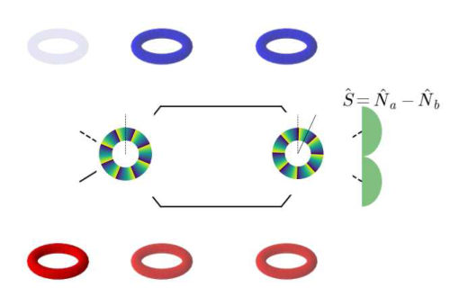 
FIG. 1. Schematic for the matterwave vortex gyroscope. The atoms are initiated in the ground state of the toroidal trap. A two-photon Raman transition coherently transfers half the population into a second internal state and a laser beam with a transverse phase profile imparts Orbital Angular Momen- tum (OAM) to the atoms. As a result we have a two com- ponent BEC where the two components are counter-rotating with angular momentum ±lℏfor integer l. After some inter- rogation time, there will be a phase difference between the two components. A second OAM laser pulse is applied and a final readout of population difference between the two com- ponents gives a measured rotation rate.

📷 Fig 2

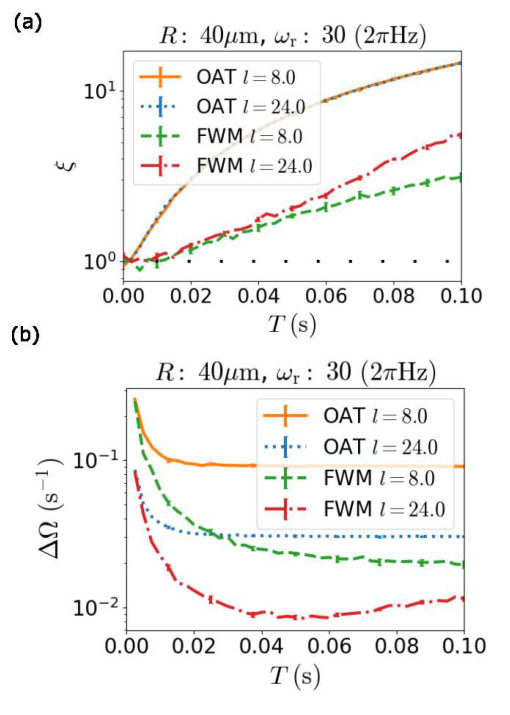 
FIG. 2. (a) Degradation factor ξ and (b) rotation sensitivity ∆Ωas a function of the interrogation time T in the regime dominated by OAT dynamics (l = 8 orange line, l = 24 blue dots) and the FWM regime (l = 8 green dash, l = 24 red dash- dots) for trapping parameters {R = 40µm, ωr/2π = 30Hz}. The ideal non-interacting case gives ξ = 1 for all time. Error bars (plotted every 4 points) give the standard error in the mean over 960 trajectories.

📷 Fig 3

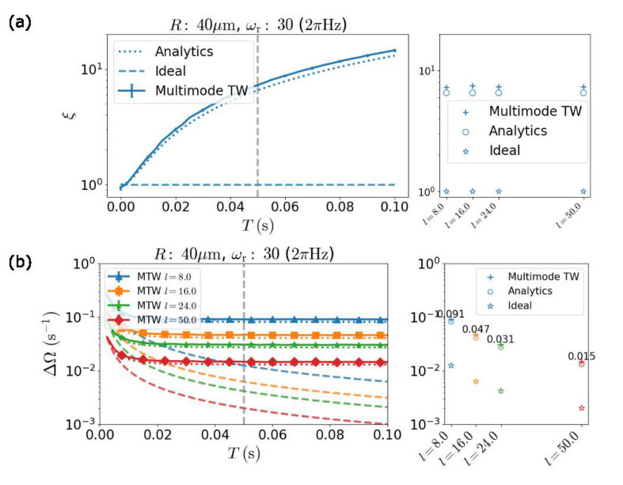 
FIG. 3. (a) Rotation sensitivity as a function of interrogation time T (left) and the corresponding asymptotic limit of sensitivity at T = 0.05s (right) for OAT for (l = 8, 16, 24 and 50) and trapping parameters {R = 40µm, ωr/2π = 30 Hz}. The non- interacting ideal case is also plotted for each (dashed lines). (b) Corresponding degradation factor ξ (which is kick independent). The error bar plot corresponds to the multimode TW results with error given by standard error in the mean from 960 sampled trajectories. The two-mode analytics is given for each charge by the dotted lines. Both the multimode TW result and the two-mode analytics are plotted on the right plot.

📷 Fig 4

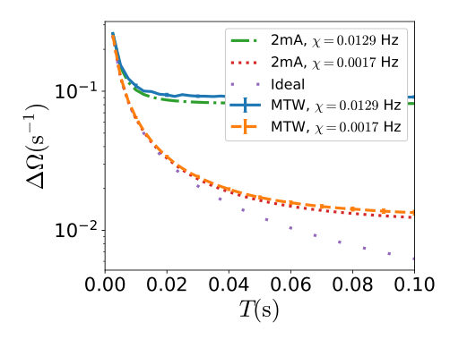 
FIG. 4. Rotation sensitivity for the OAT l = 8 case for Multimode TW (MTW) and two-mode analytics (2mA) for the two sets of parameters R = 40µm, ωr/2π = 30 Hz, χ = 0.0129 (MTW - blue solid line, 2mA - green dot-dashed) and R = 200µm, ωr/2π = 10 Hz, χ = 0.0017 (MTW - orange dashed, 2mA - red dotted). The ideal, non-interacting case is also plotted (purple dotted with larger spacing).

📷 Fig 5

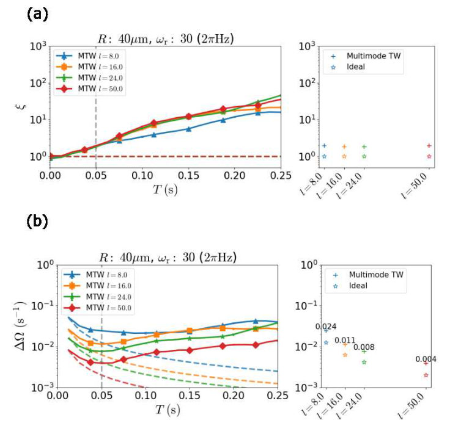 
FIG. 5. (a) Rotation sensitivity ∆Ωas a function of interrogation time T (left) and the corresponding minimum at T = 0.05s (right) for Four Wave Mixing for (l = 8, 16, 24 and 50) and the set of trapping parameters (R = 40µm, ωr/2π = 30 Hz). (b) Corresponding degradation factors. The non-interacting ideal case is also plotted for each (dashed lines). The error bar plot corresponds to the multimode TW results with error given by standard error in the mean from 960 sampled trajectories. Plotted on a log scale for ∆Ω.

**Summary.** This theoretical work investigates a matterwave vortex gyroscope using a two-component BEC in a toroidal trap. By employing advanced quantum simulations, the authors quantify how interatomic interactions cause performance degradation via phase diffusion and four-wave mixing. The results establish the gyroscope's superior sensitivity scaling compared to traditional Sagnac interferometers.

**Why it may be interesting.** It provides a detailed, quantum-level analysis of a novel quantum sensor, moving beyond mean-field approximations to quantify fundamental noise sources in BEC systems.

Detailed structure

**Main problem.** The paper characterizes the multimode quantum effects that degrade the performance of a matterwave vortex gyroscope.

**Main result.** The vortex gyroscope demonstrates superior scaling and robustness compared to guided Sagnac interferometers, and the degradation is governed by phase diffusion and four-wave mixing mechanisms.

**Method.** The study employs fully quantum multimode simulations using the truncated Wigner (TW) approach to model beyond mean-field dynamics.

**Model / system.** The system is a two-component Bose-Einstein condensate (BEC) confined in a toroidal potential, forming a matterwave vortex gyroscope. The dynamics are governed by a Hamiltonian including single-particle, interaction, and laser-pulse coupling terms.

**Key observables.** Rotation rate ($\Omega$), degradation factor ($\xi = \Delta\Omega / \Delta\Omega_{SQL}$), and mode populations (for OAT and FWM).

**Important parameters / regimes.** Intercomponent scattering length ($a_{ij}$), trapping parameters, and the relative strength of OAT vs. FWM coupling.

**Assumptions / limitations.** The analysis relies on the TW approach to capture quantum fluctuations, and dimensional reduction techniques (Gaussian ansatz) are used to derive effective 2D models.

**Figures summary.** Figures illustrate the setup (toroidal trap, OAM transfer), the evolution of mode populations due to OAT and FWM, and the comparison with the non-interacting guided Sagnac interferometer.

**Paper structure.** The paper first establishes the physical system and the need for quantum simulation methods. It then derives effective 2D models via variational minimization, analyzes the Hamiltonian terms ($\hat{H}_{OAT}$ and $\hat{H}_{FWM}$), and finally simulates the evolution to quantify performance degradation.

Abstract

We theoretically investigate the performance of a compact matterwave vortex gyroscope formed by a two-component Bose-Einstein condensate in a toroidal potential. Unlike conventional atomic gyroscopes that rely on the Sagnac effect, the topological stability of the vortex state yields rotation sensitivity independent of the enclosed area, making the device robust against geometric drifts. Using fully quantum multimode simulations, we quantify two interaction-driven mechanisms that degrade performance: phase diffusion from one-axis-twisting and four-wave mixing from intercomponent scattering. We identify regimes where tuning interaction and trapping parameters produces a trade-off between these effects, and find that reducing the intercomponent scattering length can counterintuitively worsen sensitivity. Finally, we compare the vortex gyroscope to a guided Sagnac interferometer, demonstrating superior scaling, establishing it as a promising candidate for compact precision rotation sensing.

[↑ back to top](#top)

### [Aging Phase Diagram and Exact Asymptotic Energies of Mixed Spherical Spin Glasses](http://arxiv.org/abs/2608.20623v1)

**Authors:** Johannes Lang, Vincenzo Citro, Luca Leuzzi, Federico Ricci-Tersenghi  
**Type:** theory · **Category:** disordered systems and neural networks · **PDF:** <https://arxiv.org/pdf/2608.20623v1>  
**Analysis basis:** full PDF text, analyzed in chunks
**Topic relevance:** `non-equilibrium universality` **3/5** · `Keldysh / 2PI / non-Gaussian methods` **2/5** · `scars & prethermalization` **2/5** · `analog quantum simulation` **1/5** · `driven-dissipative phase transition` **1/5** · `methods for driven-dissipative` **1/5**

📷 Fig 1

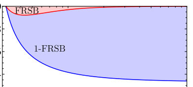 
Figure 1. Non-equilibrium phase diagram of the (2+s) models quenched from infinite to zero temperature, with s shown on a logarithmic scale. The blue and red lines are the 1-RSB–1- FRSB and 1-FRSB–FRSB transitions given by Eqs. (10) and (12). In the FRSB phase, gradient flow reaches the algorith- mic bound Ealg.

📷 Fig 2

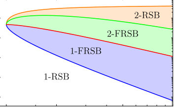 
Figure 2. Non-equilibrium phase diagram of the (3 + s) mod- els, plotted as 1 −λ versus s on logarithmic axes. Increas- ing λ (from top to bottom) yields the sequence 1-RSB, 2- RSB, 2-FRSB, 1-FRSB, and reentrant 1-RSB. The critical lines λ1-2 (orange), λ2-2F (green) and λ2F-1F (red) are deter- mined numerically, while λ1F-1 (blue) is given analytically by Eq. (A.26). All four lines meet at s = 10 and 1−λ = 1/21. For s &lt; 10, the asymptotic solution is 1-RSB for every λ ∈[0, 1].

📷 Fig 3

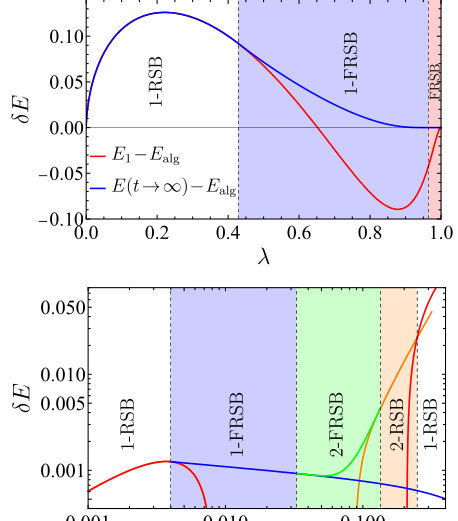 
Figure 3. Asymptotic energies relative to the algorithmic bound Ealg. Top: physical energy E∞−Ealg (blue) and con- tinued marginal 1-RSB energy E1 −Ealg (red) for the (2 + 9) model. The dashed lines mark λ1-1F = 3/7 and λ1F-F ≃0.964. The 1-FRSB solution solves the paradox of having E1 &lt; Ealg for λ ≳0.65. In the FRSB phase, E∞= Ealg. Bottom: energies of the 1-RSB (red), 1-FRSB (blue), 2-FRSB (green), and 2-RSB (orange) solutions of the (3 + 15) model, plotted against 1−λ. Each branch is shown over the domain in which the corresponding asymptotic solution exists. The physical energy is their upper envelope, which remains strictly above Ealg for any λ value. The dashed lines mark the...

📷 Fig 4

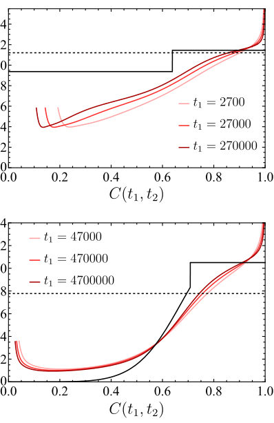 
Figure 4. Test of the asymptotic solutions against numeri- cal integration of the full dynamical equations [41]. Colored curves show X(t1, t2) = R(t1, t2)/∂t2C(t1, t2) versus C(t1, t2) for increasing t1. Black lines are the parameter-free asymp- totic predictions; dashed lines show the marginal 1-RSB val- ues Xmg. Top: (3+15) model at λ = 0.8 in the 2-RSB phase, with X2 ≃0.94 for C ≲0.64, X1 ≃1.15 for C ≳0.64, and Xmg ≃1.12. Bottom: (2 + 9) model at λ = 0.9 in the 1- FRSB phase, with a high-correlation plateau X1 ≃1.05 and Xmg ≃0.78. In both panels, the finite-time results drift to- ward the predicted asymptotic form.

**Summary.** This work theoretically maps the aging phase diagram for mixed spherical spin glasses quenched to zero temperature. By solving asymptotic dynamical equations, the authors classify various aging states based on the interaction mixture. The research provides exact expressions for the asymptotic energy, comparing it to the theoretical lower bound set by polynomial-time algorithms.

**Why it may be interesting.** The rigorous theoretical framework for characterizing non-equilibrium dynamics in complex energy landscapes, like those found in spin glasses, provides deep insights into relaxation processes relevant to many-body quantum systems.

Detailed structure

**Main problem.** The paper determines the aging phase diagram and calculates the exact asymptotic energies for mixed spherical spin glasses quenched to zero temperature.

**Main result.** The phase diagram exhibits complex transitions between aging states (e.g., 1-RSB, 2-RSB, FRSB) depending on the interaction mixture, and the asymptotic energy is compared against the algorithmic lower bound.

**Method.** The analysis involves solving the asymptotic dynamical equations derived from Cugliandolo and Kurchan's theory, utilizing concepts from Replica Symmetry Breaking (RSB) hierarchy.

**Model / system.** The system is a mixed spherical $(p+s)$-spin glass, characterized by a random Gaussian energy Hamiltonian combining pairwise ($p$) and higher-order ($s$) interactions.

**Key observables.** Asymptotic energy density ($E_\infty$), effective temperature ($X[C]$), and the classification of aging states (e.g., 1-RSB, FRSB).

**Important parameters / regimes.** Mixing weight ($\lambda$), interaction orders ($p, s$), and the quench temperature ($T=0$).

**Assumptions / limitations.** The analysis assumes ultrametricity and local equilibration at scale endpoints, and separates dynamics into stationary and aging components.

**Figures summary.** Figures illustrate the non-equilibrium phase diagrams for $(2+s)$ and $(3+s)$ models, showing transition lines, and also show numerical convergence of correlation functions.

**Paper structure.** The paper develops the asymptotic equations for the correlation and response functions, derives the energy density from stationary and aging contributions, and maps out the phase diagram based on solving these equations across different interaction mixtures.

Abstract

We determine the aging phase diagram of mixed spherical $(p+s)$-spin glasses quenched from random configurations to zero temperature. Solving the asymptotic dynamical equations of Cugliandolo and Kurchan, we find transitions between aging states with one, two, and continuously many effective temperatures, including phases in which discrete and continuous hierarchies coexist. We obtain analytic expressions for the energies reached asymptotically by the dynamics. In models combining pairwise and higher-order interactions, and sufficiently separated interaction orders ($s>3$), a fully continuous phase exists, where the gradient descent relaxation converges to the algorithmic energy lower bound. Instead, in mixed models with only high-order interactions ($p\ge3$) the energy relaxation remains strictly above it. Numerical integration of the dynamical equations is consistent with the predicted two-step and mixed discrete--continuous aging states.

[↑ back to top](#top)

### [Coherence-Based Identification of Carbon-Based Spin Qubits in Hexagonal Boron Nitride from First Principles](http://arxiv.org/abs/2608.20833v1)

**Authors:** Hyeonsu Kim, Jaewook Lee, Huijin Park, Hosung Seo  
**Type:** theory · **Category:** quantum information and computing · **PDF:** <https://arxiv.org/pdf/2608.20833v1>  
**Analysis basis:** full PDF text, analyzed in chunks
**Topic relevance:** `QC/QI experiment` **3/5** · `quantum measurements` **2/5** · `Keldysh / 2PI / non-Gaussian methods` **1/5** · `analog quantum simulation` **1/5** · `correlated / nonlocal dissipation` **1/5** · `methods for driven-dissipative` **1/5**

📷 Fig 1

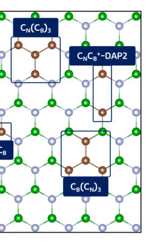 
Figure 1. Crystal structures of the seven carbon-related defects in h-BN. Brown spheres are carbon,

📷 Fig 2

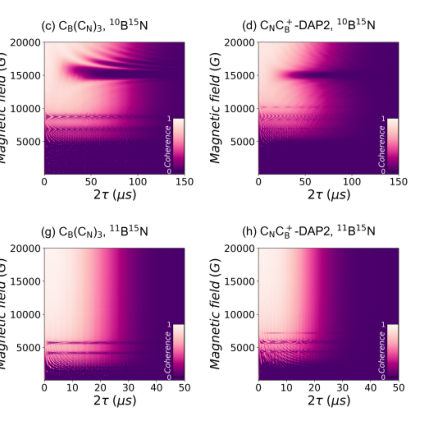 
Figure 2. Hahn-echo coherence colormaps as a function of free evolution time (2τ) and external magnetic

📷 Fig 3

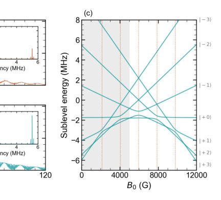 
Figure 3. Microscopic origin of the modulation pattern of the CN defect in the 10B15N bath. Hahn-echo

📷 Fig 4

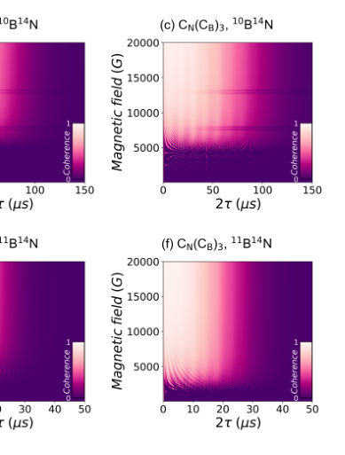 
Figure 4. Hahn-echo coherence maps of the three B-site defects in ¹⁴N-containing baths. (a–c) CB, C2CB,

📷 Fig 5

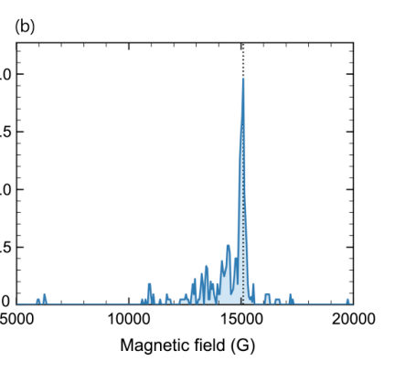 
Figure 5. (a) Schematic energy levels (not to scale) of the two product states of a 10B (I = 3) – 15N (I =

**Summary.** This theoretical study develops a method to structurally identify carbon-based spin qubits in h-BN by analyzing their electron-spin decoherence. By mapping out characteristic spectral modulations (fingerprints) in the coherence time as a function of magnetic field and isotope composition, the authors establish a powerful diagnostic tool complementary to optical methods. This advances the feasibility of using these materials for quantum information processing.

**Why it may be interesting.** This work provides a concrete, measurable spectroscopic signature (decoherence fingerprint) derived from fundamental quantum interactions (hyperfine/quadrupole coupling) that can be used to characterize solid-state qubits, which is highly relevant to quantum computing hardware development.

Detailed structure

**Main problem.** The primary challenge is identifying the unknown atomic structures of carbon-based single-spin qubits embedded within hexagonal boron nitride (h-BN).

**Main result.** The atomic structure of each defect is uniquely imprinted on its electron-spin decoherence fingerprint, providing a structural identification route complementary to optical spectroscopy.

**Method.** The study uses first-principles calculations to map the Hahn-echo and CPMG coherence dynamics of the spin qubits.

**Model / system.** The system involves electron spins coupled to a surrounding nuclear spin bath (boron and nitrogen isotopes) within the h-BN lattice. The dynamics are modeled using electron-spin decoherence calculations incorporating hyperfine and quadrupole couplings.

**Key observables.** Electron-spin-echo envelope modulation (ESEEM) patterns, the magnetic-field dependence of the coherence time ($T_2$), and the specific magnetic fields where modulation occurs.

**Important parameters / regimes.** External magnetic fields (e.g., 500 G, 20000 G), isotopic compositions ($	ext{}^{10}	ext{B}, 	ext{}^{11}	ext{B}, 	ext{}^{14}	ext{N}, 	ext{}^{15}	ext{N}$), and the Transition Boundary (TB) fields.

**Assumptions / limitations.** The spin density is assumed to be predominantly localized on carbon atoms, leading to coupling mainly via the Fermi contact interaction to nearest-neighbor nuclear spins.

**Figures summary.** Figures illustrate crystal structures of candidate defects, coherence colormaps showing ESEEM patterns across different isotopes and magnetic fields, and spectra used to pinpoint structural fingerprints.

**Paper structure.** The paper systematically analyzes the spin dynamics by calculating coherence functions for various defects, identifying distinct regimes (low-field vs. high-field) separated by a Transition Boundary, and correlating observed spectral modulations with specific atomic arrangements.

Abstract

Carbon-related defects in hexagonal boron nitride are promising room-temperature single-spin qubits and quantum sensors, but their atomic structures remain largely unidentified. Here we show, using first-principles calculations of electron-spin decoherence, that the atomic structure of each defect is imprinted in its spin coherence. Mapping the Hahn-echo dynamics of seven candidate carbon defects across magnetic field and four isotope-engineered nuclear-spin baths, we find that electron-spin-echo envelope modulation emerges at defect-specific magnetic fields, at which the nearest-neighbor nuclear spins satisfy a cancellation condition set by their hyperfine and quadrupole couplings. Both the fields and the modulation frequencies follow from an analytical model using computed hyperfine and quadrupole tensors alone, and they shift or vanish upon isotope substitution. At low fields, the field dependence of the coherence time separates the defects into two classes according to the sublattice occupied by carbon. These decoherence fingerprints, directly testable in isotope-engineered samples, establish a structural identification route complementary to optical spectroscopy.

[↑ back to top](#top)

### [Quantum Fisher information in a quenched $p + ip$ superfluid](http://arxiv.org/abs/2608.21164v1)

**Authors:** Stelio Varrone, Yunxiang Liao  
**Type:** theory · **Category:** quantum gases · **PDF:** <https://arxiv.org/pdf/2608.21164v1>  
**Analysis basis:** full PDF text, analyzed in chunks
**Topic relevance:** `non-equilibrium universality` **3/5** · `Keldysh / 2PI / non-Gaussian methods` **1/5** · `analog quantum simulation` **1/5** · `driven-dissipative phase transition` **1/5** · `methods for driven-dissipative` **1/5** · `quantum measurements` **1/5** · `scars & prethermalization` **1/5**

📷 Fig 1

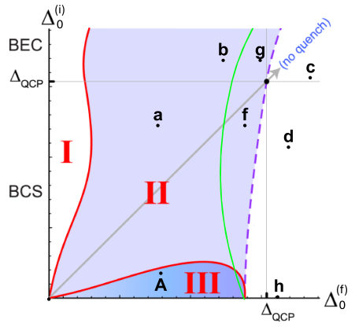 
FIG. 1. The quenched p + ip superfluid phase diagram, from Ref. [31], showing all the quenches considered in this paper. The horizontal and vertical axes show the order parameters ∆(f) 0 and ∆(i) 0 of the ground states of the post-quench and pre-quench Hamiltonians, respectively. The red lines sepa- rate three dynamical phases I, II and III, where the long- time asymptotic order parameter ∆∞(t) respectively decays to zero, approaches a nonzero constant, and oscillates peri- odically. The dashed purple line, where µ∞= 0, extends the equilibrium topological quantum critical point ∆QCP into the nonequilibrium regime. It separates the topological region with Green’s function winding number W =...

📷 Fig 2

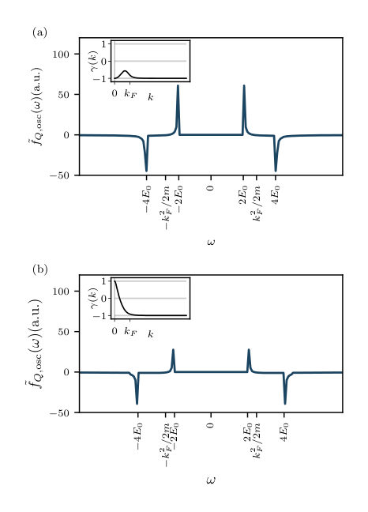 
FIG. 2. Fourier transform of the QFI density with the zero frequency spike omitted, i.e. the Fourier transform of the oscillating part of the QFI density ˜fQ,osc(ω), for (a) the BCS-to-BCS quench “a”, with coordinate (∆(i) 0 , ∆(f) 0 ) = (0.8, 0.5)∆QCP, and (b) the BEC-to-BCS quench “b”, with (∆(i) 0 , ∆(f) 0 ) = (1.1, 0.8)∆QCP. Both quenches lie to the left of the µ∞= m∆2 ∞line in the phase diagram (i.e., satisfy µ∞&gt; m∆2 ∞), and their QFI spectra exhibit van Hove singu- larities at ω = ±2E0, ±4E0, with E0 denoting the minimum quasiparticle energy (Eq. 46). Insets show the corresponding Cooper-pair distribution function γ(k). For quench “a” with Q = W = 1, γ(k) →−1 at both k = 0 and k →∞,...

📷 Fig 3

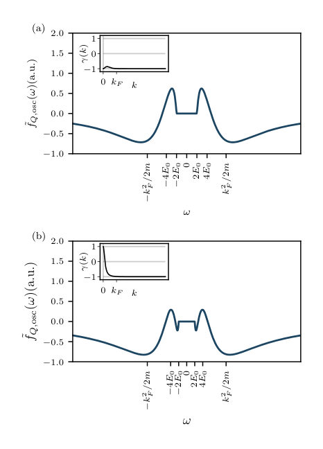 
FIG. 3. Same as Fig. 2, but for (a) the BCS-to-BCS quench “f” with coordinates (∆(i) 0 , ∆(f) 0 ) = (0.8, 0.9)∆QCP and (b) the BEC-to-BCS quench “g” with (∆(i) 0 , ∆(f) 0 ) = (1.1, 0.97)∆QCP. Both quenches satisfy µ∞&lt; m∆2 ∞, and their QFI spectra as predicted vanishes exactly at the con- tinuum edges ω = ±2E0. As ω approaches ±(2E0 + 0+), the sign of ˜fQ,osc(ω) is positive (negative) for quench “f” (“g”), revealing the winding number Q = 1 (Q = 0) that character- izes the topology of pre-quench state. Insets show the corre- sponding Cooper-pair distribution function γk, which satisfies γk = −1 (γk = +1) at k = 0 for quench “f” (“g”) with W = Q (W ̸= Q).

📷 Fig 4

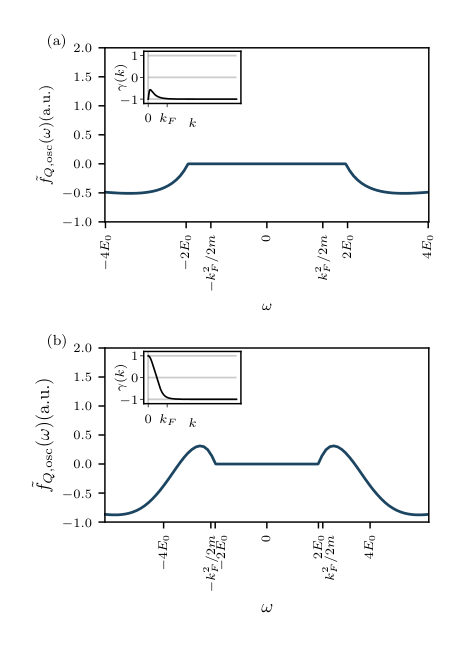 
FIG. 4. Same as Fig. 2, but for (a) the BEC-to-BEC quench “c” with coordinates (∆(i) 0 , ∆(f) 0 ) = (1.02, 1.2)∆QCP and (b) the BCS-to-BEC quench “d” with (∆(i) 0 , ∆(f) 0 ) = (0.7, 1.1)∆QCP. Both quenches satisfy the condition µ∞&lt; m∆2 ∞, and as a result the QFI spectrum vanishes at the con- tinuum edges. Just inside the continua near the edge, the sign of ˜fQ,osc(ω) is negative (positive) for quench “c” (“d”), corresponding to a trivial (nontrivial) initial state with Q = 0 (Q = 1). Both quenches share the same W = 0, and since W = Q (W ̸= Q) for quench “c” (“d”), the distribution func- tion γ shown in the inset exhibits an even (odd) number of zeros.

📷 Fig 5

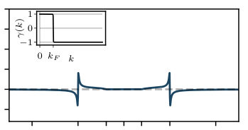 
FIG. 5. Same as Fig. 2, but for the BCS-to-BEC quench “h” with (∆(i) 0 , ∆(f) 0 ) = (0.01, 1.05)∆QCP. The Cooper-pair dis- tribution function shown in the inset becomes approximately a step function with the step located at the Fermi momentum kF . As a result, the QFI spectrum exhibits pronounced peaks near ω = ±2E∞(kF ).

**Summary.** This paper investigates the diagnostic capability of the Quantum Fisher Information (QFI) in a quenched p+ip superfluid. By analyzing the QFI spectrum after the quench, the authors show that the QFI can uniquely distinguish three distinct dynamical phases. This work highlights that non-equilibrium dynamics can reveal rich physical information inaccessible through equilibrium measurements.

**Why it may be interesting.** It demonstrates that non-equilibrium dynamics can enhance the diagnostic power of quantum information measures like QFI, providing new tools to probe quantum phases beyond equilibrium thermodynamics.

Detailed structure

**Main problem.** To determine if the Quantum Fisher Information (QFI) retains its diagnostic power in non-equilibrium systems when using a simple, generic observable like particle number as the generator.

**Main result.** The QFI associated with the particle number distinguishes three distinct dynamical phases (I, II, and III) after a quench, revealing topological information inaccessible when the system is in equilibrium.

**Method.** The QFI is calculated for the long-time asymptotic state following an instantaneous quench in a 2D p+ip superfluid, analyzing the resulting Fourier spectrum.

**Model / system.** The system is a two-dimensional p+ip superfluid, modeled using a BCS Hamiltonian framework, whose dynamics are studied after a quench of the coupling strength.

**Key observables.** Quantum Fisher Information (QFI) spectrum $	ilde{F}_Q(\omega)$, the order parameter $\Delta(t)$, and the pseudospin expectation values $\langle s_k 
angle$.

**Important parameters / regimes.** The quench process, the asymptotic quasiparticle energy gap, and the subsystem size $L_A$.

**Assumptions / limitations.** The analysis relies on the large subsystem approximation ($L_A$) for initial spectral analysis, though results persist beyond this limit.

**Figures summary.** The notes reference Figure 1, which illustrates the three distinct dynamical phases (I, II, and III) characterized by the evolution of the order parameter.

**Paper structure.** The paper reviews QFI theory, presents results for the equilibrium state (showing no transition signature), and then details the distinct spectral signatures found in the three non-equilibrium dynamical phases (I, II, and III).

Abstract

The quantum Fisher information (QFI) is widely used to characterize quantum phases and transitions, but its diagnostic power sometimes relies on selecting special generators based on prior knowledge of the underlying physics. We ask whether this requirement can be relaxed in nonequilibrium systems by studying the QFI of the long-time asymptotic state of a two-dimensional p+ip superfluid following an instantaneous quench of the coupling strength, using the particle number within a large subextensive subsystem as the generator. In equilibrium, the ground-state QFI is continuous across the topological transition between the weak-pairing BCS and the strong-pairing BEC phases, showing no direct signature of the transition. After the quench, however, the QFI associated with the same generator distinguishes the three dynamical phases and can encode the topology of the pre-quench state. In phase I, with a vanishing order parameter, the QFI Fourier spectrum consists of a single zero-frequency spike determined by the nonequilibrium distribution function. In phase II, with a constant nonzero order parameter, the QFI spectrum contains a zero-frequency spike and two continua separated by a gap set by the minimum asymptotic quasiparticle energy. The continuum edge behavior reveals whether this minimum occurs at zero or finite momentum. In the former case, the spectral weight vanishes at the edge, with the sign just inside the continuum encoding the pre-quench topology for large subsystem. In phase III, with a time-periodic order parameter, the QFI spectrum exhibits discrete peaks at integer multiples of the oscillation frequency, together with continua associated with the Floquet quasienergy spectrum. Our results show that driving the system out of equilibrium can enhance the diagnostic power of the QFI for a standard physical observable, revealing information inaccessible in equilibrium.

[↑ back to top](#top)

### [Minimization of micromotion for nanoparticles in a Paul trap](http://arxiv.org/abs/2608.21011v1)

**Authors:** Jamie Morley, Jean Paul Louys Sansó, Dmitry Bykov, Simon Baier, Tracy Northup  
**Type:** experiment · **Category:** other · **PDF:** <https://arxiv.org/pdf/2608.21011v1>  
**Analysis basis:** full PDF text, analyzed in chunks
**Topic relevance:** `QC/QI experiment` **3/5** · `quantum measurements` **3/5** · `analog quantum simulation` **1/5**

📷 Fig 1

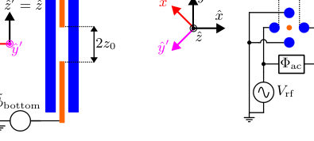 
FIG. 1. Schematic of a linear Paul trap. One grounded elec- trode pair and one AC-driven electrode pair constitute the ra- dial trapping electrodes. These electrodes are shown in blue, endcaps in orange, and compensation electrodes in pink and red. We displace a particle in three dimensions by varying the DC potentials ˜ϕtop, ˜ϕbottom, ˜ϕx′, ˜ϕy′. Left: Side projec- tion of the trap onto the z-x′ plane. The distance between the surfaces of the top and bottom endcaps is 2z0. Right: Top projection of the trap onto the x-y plane, including com- pensation electrodes. The distance between the surfaces of opposing radial trapping electrodes is 2r0. The amplitude of the applied AC potential...

📷 Fig 2

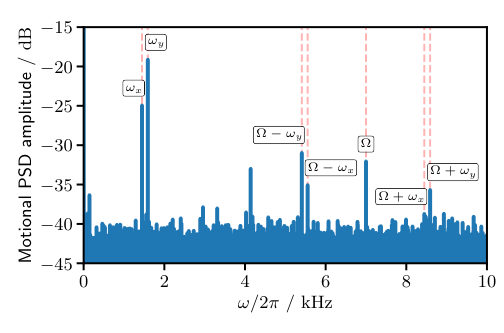 
FIG. 2. A typical PSD before micromotion compensation, obtained from the detection system most sensitive to the x′

📷 Fig 3

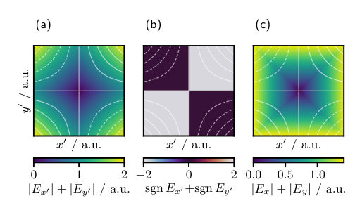 
FIG. 3. Simulations of an ideal quadrupole field ⃗E generated by the radial trapping electrodes in Fig. 1. The simulations are centered at the node for a given time; displacement of a trapped particle from the node causes excess micromotion. Equipotential lines are shown in white. (a) Sum of the abso- lute values of the projections Ex′ ≡⃗E · ˆx′ and Ey′ ≡⃗E · ˆy′. (b) Sum of the signs of the projections Ex′ and Ey′. (c) Sum of the absolute values of the projections Ex ≡⃗E · ˆx and Ey ≡⃗E · ˆy.

📷 Fig 4

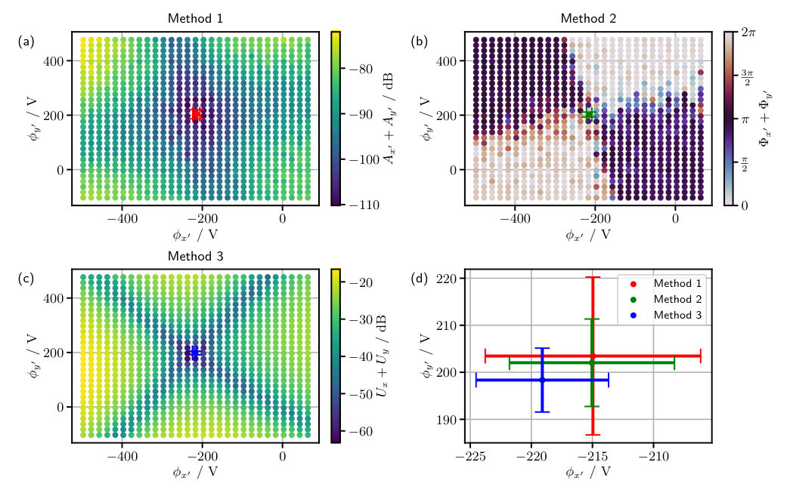 
FIG. 4. Data from applying Methods 1–3 to find the micromotion minimum in the radial plane. The setpoints ϕx′ and ϕy′ are shown on the horizontal and vertical axes, and their ranges in (a–c) correspond to scanning an area of approximately (0.014r0)2. (a) Method 1: sum of the excess micromotion amplitudes Ax′ and Ay′. The extracted micromotion minimum is shown in red. (b) Method 2: sum of the excess micromotion phases Φx′ and Φy′. The extracted micromotion minimum is shown in green. (c) Method 3: sum of the secular-motion amplitudes Ux and Uy during simultaneous tickling of the x and y modes. The extracted micromotion minimum is shown in blue. (d) Radial excess micromotion minima found via...

📷 Fig 5

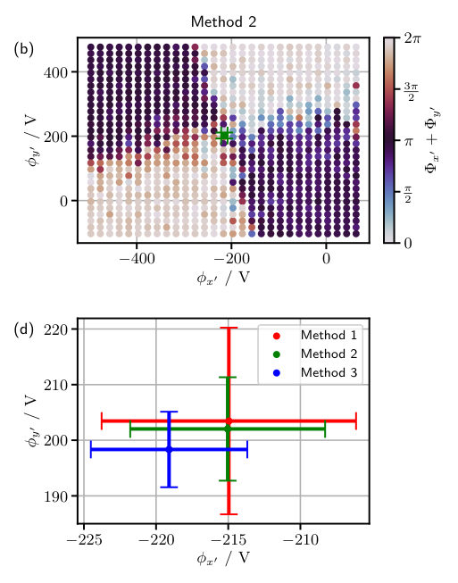 
Figure 4 is the main result of this work. It shows data from applying Methods 1–3 to find the micromotion min- imum in the radial plane. Figure 4(a) shows the sum Ax′ + Ay′ as a function of ϕx′ and ϕy′. The profile we obtained is consistent with that of Fig. 3(a). In the dark region, the measured mi- cromotion amplitudes are at the detection noise floor. However, sub-noise precision in the micromotion mini- mum can be obtained. Here, we extracted the minimum (ϕx′, ϕy′) = (−215±9, 203±20) V. Appendix D provides more information on sub-noise precision and describes how the minima were obtained for this plot and others.

**Summary.** This paper experimentally investigates methods to minimize excess micromotion in nanoparticles trapped within a Paul trap. The authors compare three distinct compensation techniques—amplitude, phase, and resonant tickling—to characterize the stray electric fields. They demonstrate that the resonant tickling method is superior, achieving stray field nullification precision comparable to established trapped-ion standards.

**Why it may be interesting.** This work directly addresses noise and decoherence sources in trapped particle quantum experiments, providing crucial experimental benchmarks for achieving high-precision quantum measurements using mesoscopic objects.

Detailed structure

**Main problem.** The primary goal is to minimize 'excess micromotion' experienced by charged nanoparticles trapped in a Paul trap.

**Main result.** The resonant 'tickling' method proved to be the most precise technique, allowing the stray field to be nullified to within $2.9 	ext{ V/m}$, comparable to trapped-ion experiments.

**Method.** The authors experimentally compare three methods—direct amplitude detection, direct phase detection, and resonant tickling—to characterize and compensate for excess micromotion.

**Model / system.** The system involves trapping charged nanoparticles (e.g., silica spheres) in a linear Paul trap. The particle motion is governed by the Mathieu equation, and excess micromotion arises from stray DC fields.

**Key observables.** Excess micromotion amplitudes ($A_{i'}$), micromotion phases ($\Phi_{i'}$), and the residual stray electric field components ($\eta_{x'}, \eta_{y'}, \eta_{z'}$).

**Important parameters / regimes.** Trap parameters include $2r_0 = 1.8 	ext{ mm}$ and $2z_0 = 3.2 	ext{ mm}$. The residual stray field precision reached $2.9 	ext{ V m}^{-1}$.

**Assumptions / limitations.** The analysis assumes that the particle's position is linearly related to the applied voltages, and that the tickling method's precision is limited by thermal noise.

**Figures summary.** Figures illustrate the trap setup, the Power Spectral Density (PSD) showing motion peaks, and comparative data (Figs. 4, 5, 6) demonstrating that the resonant tickling method yields the best results for minimizing micromotion in both radial and axial planes.

**Paper structure.** The paper introduces the problem of excess micromotion, details the theoretical background using the Mathieu equation, compares three experimental compensation methods (amplitude, phase, tickling), presents quantitative results showing the superiority of the tickling method, and concludes with characterization of the residual stray field.

Abstract

When a charged particle in a Paul trap is displaced from the node of the AC trapping field, excess micromotion arises as an undesired effect. Excess micromotion heats the particle, limits the precision with which the particle can be localised, and acts as a decoherence channel in quantum mechanical experiments. However, thus far there is no standard procedure for micromotion compensation with mesoscopic particles. Here, we experimentally demonstrate three different methods for minimizing the micromotion of a nanoparticle in a linear Paul trap along three axes. The most precise method allows us to nullify the stray field to within 2.9 V/m, which is comparable to reported values in trapped-ion experiments.

[↑ back to top](#top)

### [Neural quantum states in condensed matter: advances, best practices, and prospects](http://arxiv.org/abs/2608.21291v1)

**Authors:** Jonas B. Rigo, Björn J. Wurst, Rajah Nutakki, Markus Schmitt, Dante Kennes  
**Type:** theory · **Category:** numerical methods · **PDF:** <https://arxiv.org/pdf/2608.21291v1>  
**Analysis basis:** full PDF text, analyzed in chunks
**Topic relevance:** `analog quantum simulation` **3/5** · `methods for driven-dissipative` **3/5**

📷 Fig 1

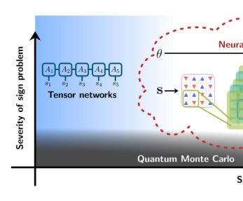 
Figure 1. The figure portrays the schematic landscape of the main computational approaches to strongly correlated quantum many-body systems. The vertical axis indicates the severity of the sign problem, while the horizontal axis shows spatial dimension, used here as a practical proxy for the growing entanglement complex- ity that limits wave-function-based methods. Tensor-network methods are most effective in low dimensions, quantum Monte Carlo performs best when the sign problem is weak or absent, and DMFT is accurate in the high-dimensional limit. Neural quantum states (NQS) are shown as targeting the broad intermediate regime between these established approaches. The illustrated NQS is a...

📷 Fig 2

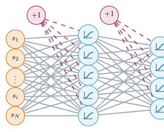 
Figure 2. Schematic illustration of a feed-forward neural network, the prototypical artificial neural-network architecture used in NQS. The network maps an input configuration through a sequence of hidden layers to an output wave-function amplitude. Each layer consists of an affine linear transformation followed by an activation function f, which is nonlinear and typically strictly monotonic.

📷 Fig 3

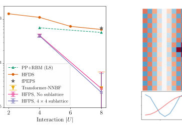 
Figure 4. a) Energies reached on 8 × 8 for various architectures at half filling. b-c) Stripe pattern at 1 8 hole doping for only nearest neighbor hopping (b) and including next to nearest neighbor hopping. The top panel shows the spin correlation function, while the bottom panel shows cuts of the staggered spin correlation function (red) and density (blue). All panels are adapted from Ref. [68] and published under CC BY 4.0.

📷 Fig 4

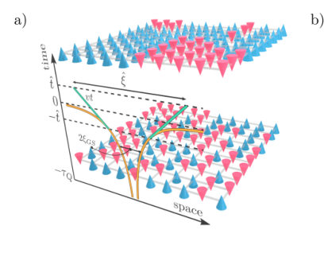 
Figure 5. The schematic a) shows a space-time picture of a quench across a critical point at t = 0. During a ramp parameterized by the dimensionless distance to the critical Hamiltonian parameter ε(t) = t/τQ, critical slowing down prevents the correlation length from following the equilibrium divergence of the correlation length, so ξ saturates at a finite freeze-out scale ˆξ. A freeze-out length scale together with the freeze-out time ˆt form a sonic horizon, so that the system breaks symmetry in quasi-independent domains of size ˆξ, producing defects and thus excitations. Figure b) summarizes the results of the finite size examination of the quantum Kibble-Zurek mechanism in Ref. [83]. It...

📷 Fig 5

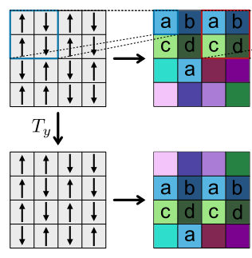 
Figure 6. A local, translationally-equivariant architecture. Since the output of each layer depends on local information, locally identical environments are mapped to the same features (labelled cells). Since each layer is translationally-equivariant, translating the output is equivalent to translating the input (compare top and bottom rows). Therefore the wave function can be projected to a desired translational irreducible representation in a single evaluation by appropriate choice of output function.

**Summary.** This review surveys the use of Neural Quantum States (NQS) to represent and simulate quantum many-body wave functions. It details how NQS combines the flexibility of neural networks with Monte Carlo sampling to tackle strongly correlated systems. The work highlights NQS's potential to bridge gaps between existing computational methods, particularly in complex magnetic and fermionic models.

**Why it may be interesting.** NQS provides a powerful, machine-learning-driven alternative to traditional numerical techniques for simulating complex quantum dynamics and ground states in condensed matter systems.

Detailed structure

**Main problem.** The core challenge is accurately describing the collective consequences of microscopic laws governing strongly correlated quantum many-body systems, which is computationally intractable.

**Main result.** Neural Quantum States (NQS) offer a flexible, parameter-efficient variational representation for quantum wave functions, successfully tackling regimes where established methods like QMC or Tensor Networks struggle.

**Method.** The method involves parameterizing the quantum state $|\psi_	heta
angle$ using an Artificial Neural Network (ANN) ansatz and estimating expectation values via Monte Carlo sampling, minimizing the variational energy $E(	heta)$.

**Model / system.** The approach is applied to various lattice Hamiltonians, including the $J_1-J_2$ model for frustrated magnets and the Hubbard model for interacting fermions.

**Key observables.** Variational energy $E(	heta)$, ground-state energy ($E_0$), spin correlation functions, and the residual in the time-dependent Schrödinger equation (TDSE).

**Important parameters / regimes.** The method is most valuable in the 'intermediate regime' where established methods fail, and it must contend with challenges like learning non-trivial sign/phase structures.

**Assumptions / limitations.** The primary assumption is that the quantum state can be accurately represented by an ANN ansatz, and the calculation relies on the variational principle or TDSE residual minimization.

**Figures summary.** Figure 1 schematically compares computational approaches based on the sign problem severity vs. spatial dimension. Figure 2 illustrates the feed-forward neural network structure used in NQS.

**Paper structure.** The paper reviews advances by first outlining the general landscape of quantum simulation methods (QMC, TN, etc.), then detailing the NQS mechanics (ansatz, optimization), applying it to specific physical systems (magnets, fermions), and finally summarizing remaining challenges and future directions.

Abstract

Neural quantum states provide flexible variational representations of quantum many-body wave functions by combining neural-network parametrizations with Monte Carlo sampling. In this perspective, we review recent advances in their application to condensed-matter systems, focusing on frustrated quantum magnets, interacting lattice fermions, and non-equilibrium dynamics. We discuss the architectures, symmetry constraints, optimization methods, and sampling strategies underlying state-of-the-art calculations, and summarize practical guidelines for reliable simulations. We also examine the principal remaining challenges, including learning non-trivial sign and phase structures, controlling variational bias, enforcing physical symmetries, scaling optimization to large networks, and achieving stable real-time evolution. Finally, we outline promising directions in which neural quantum states may extend the reach of classical simulations of strongly correlated quantum matter.

[↑ back to top](#top)

### [Meandering stripes in the frustrated $J_1$-$J_2$ Ising model on the honeycomb lattice](http://arxiv.org/abs/2608.21261v1)

**Authors:** Denis Gessert, Martin Weigel, Wolfhard Janke  
**Type:** theory · **Category:** statistical mechanics · **PDF:** <https://arxiv.org/pdf/2608.21261v1>  
**Analysis basis:** full PDF text, analyzed in chunks
**Topic relevance:** `analog quantum simulation` **3/5** · `Frenkel-Kontorova` **1/5** · `methods for driven-dissipative` **1/5**

📷 Fig 1

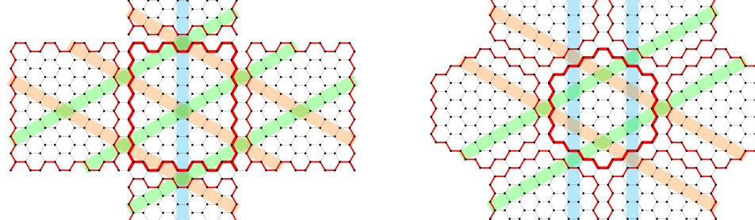 
FIG. 1. Honeycomb lattice with (a) rectangular and (b) hexagonal periodic boundary conditions. Black circles represent spin sites, and dashed lines correspond to nearest-neighbor interactions. Solid red lines show the system’s boundaries. For both (a) and (b), L = 8. When one of the three lattice axes is pinned, a wrapping line of pairs of spins in the direction of that axis can be flipped without changing the energy. The cyan, green, and orange regions show a single exemplary line for the axes 1, 2, and 3, respectively.

📷 Fig 2

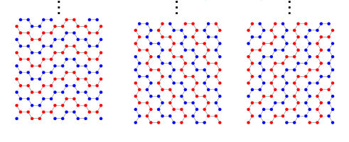 
FIG. 2. Exemplary wrapping lines of pairs of spins that can be flipped without changing the energy when the respective axis is pinned. Panels (a), (b) and (c) correspond to the axes 1, 2 and 3, respectively. The top row shows possible starting configurations, the middle row indicates moves to generate different ground states, and the bottom row shows random ground states generated in this fashion.

📷 Fig 3

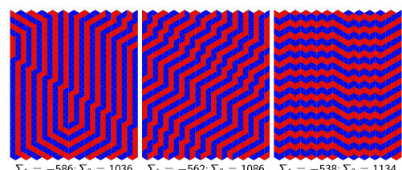 
FIG. 3. Exemplary snapshots of likely ground states for L = 24 systems using rectangular FBC and for J2 = −0.45 (left), −1/2 (middle), and −0.55 (right). The configurations were taken from the replicas with the lowest observed energy at the final inverse temperature β = 5. Σ1 and Σ2 refer to the NN and NNN energy contributions in Eq. (1), respectively. Note that these states are not ground states of the periodic system.

📷 Fig 4

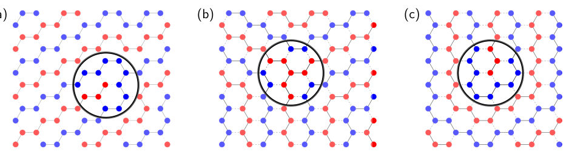 
FIG. 4. Exemplary representations of (a) dislocations and (b,c) disclinations that can occur. In each panel the black solid circle highlights the central part of the defect.

📷 Fig 5

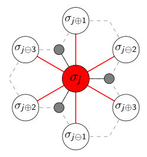 
FIG. 5. Illustration of how the nematic order parameter of Eq. (6) is defined.

**Summary.** This paper analyzes the frustrated J1-J2 Ising model on the honeycomb lattice under strong antiferromagnetic coupling. The research reveals the formation of meandering stripe-like partially disordered ground states in this regime. By using advanced simulation techniques and order parameters, the authors probe the complex nature of the phase transition, finding that the system's behavior is extremely sensitive to boundary conditions and sample geometry.

**Why it may be interesting.** The investigation into geometric frustration and the nature of phase transitions (like BKT) in a lattice model is fundamental to understanding critical phenomena in condensed matter physics, which has parallels in quantum many-body systems.

Detailed structure

**Main problem.** The study investigates the low-temperature phase and ground state degeneracy of the frustrated J1-J2 Ising model on the honeycomb lattice, particularly in the regime of strong antiferromagnetic next-nearest-neighbor interactions.

**Main result.** The system exhibits partially disordered ground states characterized by meandering stripes, and the nature of the low-temperature transition remains ambiguous, suggesting either a crossover or a continuous transition like the BKT type.

**Method.** The authors employed Monte Carlo simulations, finite-size scaling analysis, and the introduction of a complex-valued nematic order parameter to analyze the system's behavior.

**Model / system.** The model is the J1-J2 Ising Hamiltonian on the honeycomb lattice, with couplings fixed at ferromagnetic nearest-neighbor J1=1 and strong antiferromagnetic next-nearest-neighbor J2 <= -1/4.

**Key observables.** Complex-valued nematic order parameter, specific heat ($C_V$), ground-state entropy per site ($S(T=0)/N$), and the Binder parameter ($U_4$).

**Important parameters / regimes.** The critical parameter regime is $J_2 \le -1/4$, and the analysis is highly sensitive to the boundary conditions (Periodic vs. Free) and the sample aspect ratio.

**Assumptions / limitations.** The analysis notes that previous specific heat peaks observed might only appear under periodic boundary conditions and that the ground state structure depends critically on the boundary conditions.

**Figures summary.** Figures compare simulation data for the J1-J2 model at various J2 values, showing specific heat behavior under PBC vs. FBC, and illustrate exemplary wrapping lines of spin pairs for ground state analysis.

**Paper structure.** The paper systematically analyzes the ground state energy and entropy for different J2 regimes, introduces the nematic order parameter to characterize the stripe phase, and concludes with detailed finite-size scaling analyses comparing PBC and FBC results.

Abstract

We study the frustrated $J_1$-$J_2$ Ising model on the honeycomb lattice with ferromagnetic nearest-neighbor couplings fixed at $J_1=1$ and strong antiferromagnetic next-nearest-neighbor interactions, i.e., $J_2 \leq -1/4$. Little is known for this range of $J_2$, whereas for less negative values of $J_2$ the system orders ferromagnetically at low temperatures and appears to remain in the Ising universality class. In previous work it was shown that the model has a largely degenerate ground state, and it was conjectured that there is some kind of phase transition. We introduce a complex-valued nematic order parameter, which can differentiate between the high-temperature paramagnetic phase and the observed partially-disordered stripe phase at lower temperatures. Configurations in this phase consist of stripes of spins parallel with respect to one lattice direction, which collectively meander along the remaining two, producing partially disordered ground states. The sharp peaks in the specific heat observed in earlier work only appear when using periodic boundary conditions and are absent for free boundaries. Additionally, we reveal a striking dependence of the behavior on the aspect ratio of the considered samples. Ultimately, even a careful finite-size scaling analysis for $J_2 = -0.5$ and $J_2 = -1$ is unable to clearly discern between a crossover without any singularities and some form of continuous transition, including the possibility of an infinite-order transition of the Berezinskii-Kosterlitz-Thouless (BKT) type. For $J_2=-1/4$ we find that the system remains disordered at all temperatures and that it exhibits a finite ground-state entropy per site, for which our simulations provide the accurate asymptotic estimate $S(T=0)/N = 0.230\,960\,93(14)$ in the thermodynamic limit $N\rightarrow\infty$.

[↑ back to top](#top)

### [Pair size versus coherence length and quantum geometry in the spin-orbit coupled BCS-BEC crossover](http://arxiv.org/abs/2608.21110v1)

**Authors:** R. N. Kalkan, M. Iskin  
**Type:** theory · **Category:** quantum gases · **PDF:** <https://arxiv.org/pdf/2608.21110v1>  
**Analysis basis:** full PDF text, analyzed in chunks
**Topic relevance:** `analog quantum simulation` **3/5** · `Keldysh / 2PI / non-Gaussian methods` **2/5**

📷 Fig 1

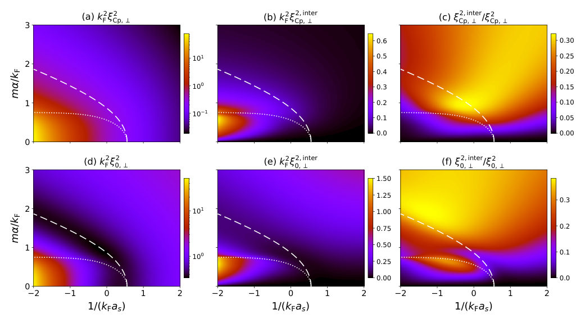 
FIG. 1. Transverse pair-size and coherence-length components for the 3D Rashba model as functions of 1/(kFas) and mα/kF. Panels (a)-(c) show the total transverse pair size k2 Fξ2 Cp,⊥, its interband contribution k2 Fξ2,inter Cp,⊥, and the relative interband contribution ξ2,inter Cp,⊥/ξ2 Cp,⊥, respectively. Panels (d)-(f) show the corresponding transverse quantities for the coherence length, k2 Fξ2 0,⊥, k2 Fξ2,inter 0,⊥ , and ξ2,inter 0,⊥ /ξ2 0,⊥. Logarithmic colour scales are used for the total quantities, and linear scales for the interband and relative interband contributions. White dashed and dotted contours indicate µ = −mα2/2 and µ = 0, respectively.

📷 Fig 2

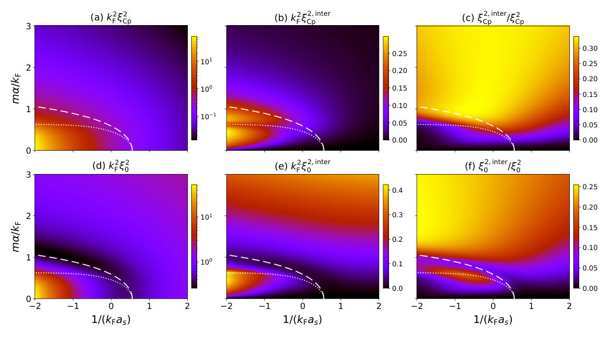 
FIG. 2. Pair-size and coherence-length components for the 3D Weyl model as functions of 1/(kFas) and mα/kF. Panels (a)-(c) show the total pair size k2 Fξ2 Cp, its interband contribution k2 Fξ2,inter Cp , and the relative interband contribution ξ2,inter Cp /ξ2 Cp, respectively. Panels (d)-(f) show the corresponding quantities for the coherence length, k2 Fξ2 0, k2 Fξ2,inter 0 , and ξ2,inter 0 /ξ2 0. Loga- rithmic colour scales are used for the total quantities, and linear scales for the interband and relative interband contributions. White dashed and dotted contours indicate µ = −mα2/2 and µ = 0, respectively.

📷 Fig 3

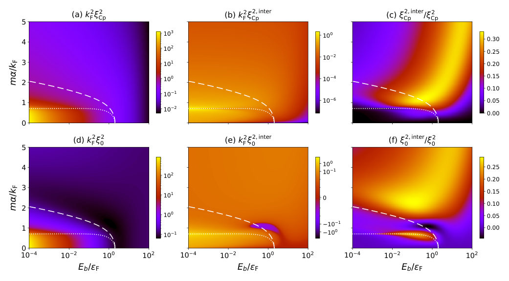 
FIG. 3. Pair-size and coherence-length components for the 2D Rashba model as functions of Eb/εF and mα/kF. Panels (a)-(c) show the total pair size k2 Fξ2 Cp, its interband contribution k2 Fξ2,inter Cp , and the relative interband contribution ξ2,inter Cp /ξ2 Cp, respec- tively. Panels (d)-(f) show the corresponding quantities for the coherence length, k2 Fξ2 0, k2 Fξ2,inter 0 , and ξ2,inter 0 /ξ2 0. Logarithmic colour scales are used for the total quantities and ξ2,inter Cp , a symmetric-logarithmic scale for ξ2,inter 0 , and linear scales for the relative interband contributions. White dashed and dotted contours indicate µ = −mα2/2 and µ = 0, respectively.

**Summary.** This work analyzes the BCS-BEC crossover in spin-orbit-coupled Fermi gases by comparing two distinct length scales: the pair size and the coherence length. The authors show that while these quantities are similar in the BCS regime, they diverge differently away from it, with the differences being traceable to the underlying quantum geometry of the system's energy bands. This provides deeper insight into the nature of pairing correlations in complex quantum matter.

**Why it may be interesting.** It provides a rigorous theoretical framework to distinguish between different definitions of pairing length scales in strongly interacting, topologically non-trivial quantum systems, which is crucial for understanding superfluidity in engineered quantum simulators.

Detailed structure

**Main problem.** The paper investigates the complex interplay between pairing correlations and quantum geometry within the context of the BCS-BEC crossover in spin-orbit-coupled Fermi gases.

**Main result.** The pair size and coherence length are shown to be distinct physical quantities away from the BCS limit, exhibiting characteristic changes like the coherence length developing a minimum tied to Fermi surface topology collapse.

**Method.** The authors derive the exact pair-size tensor and extend the decomposition to calculate both the Cooper-pair size (mean-field) and the coherence length (Gaussian fluctuation theory).

**Model / system.** The system is a spin-orbit-coupled Fermi gas analyzed across the BCS-BEC crossover, modeled using helicity bands derived from the single-particle Hamiltonian. Specific models include 3D Rashba, 3D Weyl, and 2D Rashba SOC.

**Key observables.** Pair size ($ar{\xi}^2_{2b}$), Coherence length ($\xi_0$), Intraband contribution, and Quantum-geometric interband contribution.

**Important parameters / regimes.** Spin-orbit coupling strength (SOC), interaction strength ($U$), and the crossover regime between BCS and BEC limits.

**Assumptions / limitations.** The analysis assumes an attractive contact interaction ($U>0$) and utilizes the helicity basis for diagonalization.

**Figures summary.** Not specified, but the results discuss the monotonic decrease of pair size and the minimum/growth behavior of the coherence length as SOC increases.

**Paper structure.** The paper develops the theoretical framework by deriving the pair-size tensor, extending this to define both the pair size and coherence length, and then evaluating these quantities for various SOC models to compare their distinct physical meanings.

Abstract

We investigate the interplay between pairing correlations and quantum geometry in the spin-orbit-coupled BCS-BEC crossover. Working in the helicity basis, we derive the exact pair-size tensor for the two-body bound states and show that it separates into intraband and quantum-geometric interband contributions, with the latter determined by the quantum metric. We extend this decomposition to two distinct many-body length scales at zero temperature: the Cooper-pair size, obtained from mean-field BCS theory, and the coherence length, obtained from the Gaussian fluctuation theory. Although these quantities almost coincide in the BCS regime, they describe distinct physical properties away from it, with the pair size characterizing the internal extent of a pair and the coherence length characterizing the long-wavelength response of the order parameter. We evaluate both quantities for three-dimensional Rashba, three-dimensional Weyl, and two-dimensional Rashba spin-orbit coupling models. We find that the pair size decreases monotonically with increasing spin-orbit coupling as the pair localizes, whereas the coherence length develops a pronounced minimum in the crossover regime before growing again in the BEC regime as the composite bosons become weakly interacting. This minimum is tied to the collapse of the noninteracting Fermi surface onto the ring or sphere of helicity-band minima. The quantum-geometric contributions reach up to nearly one third of the pair size and about 40\% of the coherence length, tracking these same changes in the underlying helicity Fermi-surface topology.

[↑ back to top](#top)

### [Practical Error Suppression and Mitigation for Reliable Quantum Computing](http://arxiv.org/abs/2608.20453v1)

**Authors:** Han-Ze Li, Mengjie Yang, Xianquan Yan, Dax Enshan Koh, Ching Hua Lee, Ruizhe Shen  
**Type:** theory · **Category:** quantum information and computing · **PDF:** <https://arxiv.org/pdf/2608.20453v1>  
**Analysis basis:** full PDF text, analyzed in chunks
**Topic relevance:** `QC/QI experiment` **3/5** · `quantum measurements` **2/5**

📷 Fig 1

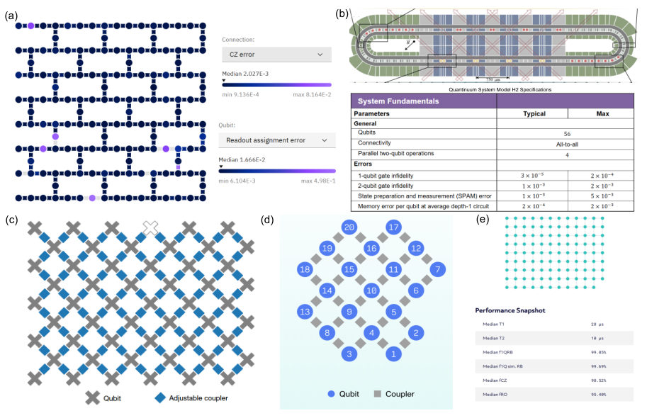 
FIG. 1. Platform topology and representative error metrics for quantum hardware. (a) Schematic of the IBM Quantum device connectivity together with representative calibration data. (b) Conceptual layout of the Quantinuum System Model H2 architecture and a summary of its system fundamentals. (c) Schematic of Google’s Sycamore superconducting processor, showing the two-dimensional qubit array and tunable nearest-neighbor couplers. (d) Representative connectivity map of an IQM superconducting processor, showing qubits and two-qubit couplers. (e) Representative Rigetti superconducting QPU, showing its two-dimensional qubit-connectivity layout together with a performance snapshot of median...

📷 Fig 2

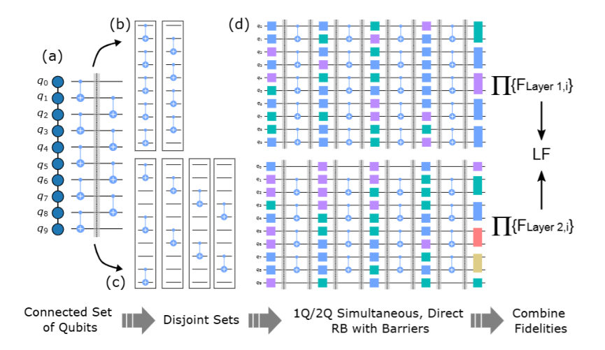 
FIG. 2. Layer-fidelity benchmarking for large quantum processors. (a) A connected set of qubits and two-qubit interactions is selected. (b) The interactions can be partitioned into maximally parallel disjoint layers, or (c) into more sparse layers with fewer simultaneous gates. (d) Each disjoint layer is characterized using simultaneous direct randomized benchmarking with timing barriers. The process fidelities of the individual one- and two-qubit subsystems are combined to obtain the fidelity of each disjoint layer, and the resulting layer fidelities are multiplied to give the full layer fidelity (LF). Adapted from Ref. [239].

📷 Fig 3

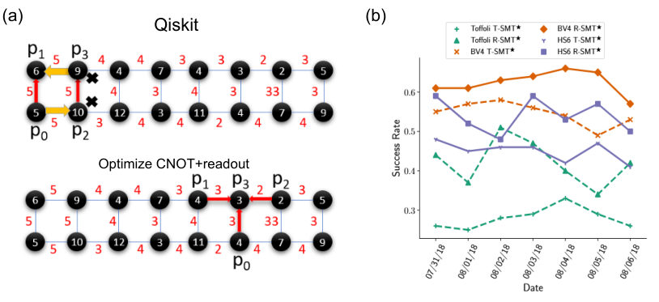 
FIG. 3. Calibration-aware layout and compilation improve reliability. (a) Illustration of qubit-layout selection on a fixed hardware coupling graph. (b) Experimental success rate of Toffoli-circuit instances compiled under different layout choices, demonstrating that noise-adaptive compilation can yield systematically higher success probabilities. Figures are adapted from Ref. [129].

📷 Fig 4

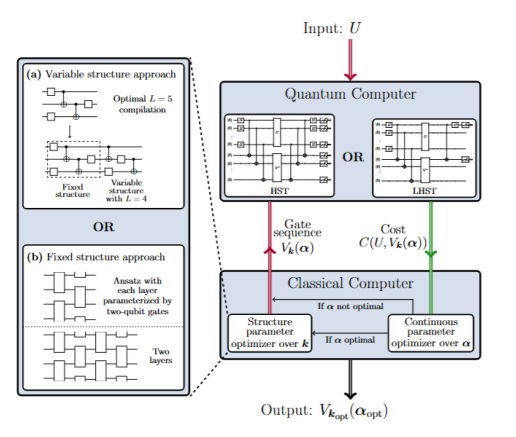 
FIG. 4. Outline of variational quantum compilation, adapted from Ref. [290], where gate structures and parameters are optimized for a given input unitary.

📷 Fig 5

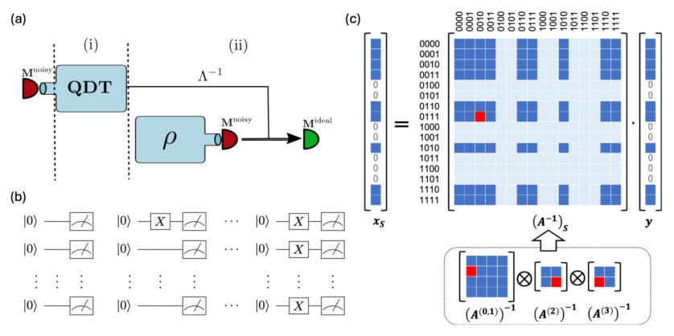 
FIG. 5. Readout-error mitigation workflow, calibration primitives, and support-restricted mitigation. (a) QDT-based view of readout mitigation, where detector characterization is followed by classical correction to recover ideal measurement statistics from a noisy detector model. (b) Standard basis-state calibration primitive for constructing a full response (assignment) matrix: the 2n computational-basis input states generated by appropriate combinations of X gates before measurement. (c) Reduced- support mitigation: the effective inverse response matrix is restricted to the observed outcome support, enabling scalable correction without explicit construction of the full 2n ×2n assignment...

**Summary.** This review provides a practical guide to error reduction in quantum computing as it moves from NISQ to FTQC. It emphasizes that error suppression, mitigation, and full error correction are complementary layers that must be combined. The paper details various hardware-aware techniques to improve computational reliability on current quantum processors.

**Why it may be interesting.** It directly addresses the practical limitations of current quantum hardware, providing a roadmap for researchers working on implementing complex quantum algorithms on noisy, real-world devices.

Detailed structure

**Main problem.** The central challenge is improving the reliability of quantum computation in the transitional regime between noisy intermediate-scale quantum (NISQ) devices and full fault-tolerant quantum computation (FTQC).

**Main result.** The paper argues that error suppression, error mitigation, and quantum error correction must be viewed as complementary, layered components of a unified error-reduction strategy.

**Method.** It provides a comprehensive overview of practical techniques, including hardware-aware circuit design, coherent-error suppression, readout mitigation, and noise extrapolation.

**Model / system.** The discussion covers various physical platforms like superconducting circuits and trapped ions, focusing on the operational constraints of current quantum processors.

**Key observables.** Expectation values, fidelity, and logical observables are the key quantities whose accurate estimation is the goal.

**Important parameters / regimes.** The NISQ-FTQC transition regime, residual physical and logical error rates, and available computational overhead are critical parameters.

**Assumptions / limitations.** The primary assumption is that while full fault tolerance is not yet available, combining multiple error-reduction layers can yield reliable results.

**Paper structure.** The review is structured to provide a forward-looking overview, detailing the principal hardware error sources and mapping corresponding error suppression and mitigation methods to them.

Abstract

Quantum computing is entering a transitional regime between noisy intermediate-scale quantum (NISQ) processing and early fault-tolerant quantum computation (FTQC), in which increasingly capable hardware is beginning to support repeated syndrome measurements, partial error correction, and logical-qubit operations, while residual physical and logical errors remain non-negligible. In this regime, error suppression, error mitigation, and quantum error correction are increasingly better viewed as complementary layers of a unified error-reduction strategy rather than as separate approaches, with each acting at a different stage of the quantum computation to improve simulation reliability. Thus, in this review, we provide a practical and forward-looking overview of the principal hardware error sources and the corresponding error suppression and mitigation methods for reducing their impact across the current NISQ-FTQC transition. We discuss hardware-aware circuit design, coherent-error suppression, readout mitigation, noise extrapolation, classical inference, and software-supported workflows, with particular emphasis on their implementation on actual quantum processors. We further examine how error mitigation techniques can be adapted to encoded and logical-qubit settings so that they can operate alongside quantum error correction to suppress residual logical errors and improve the accuracy of computation in the early fault-tolerant regime.

[↑ back to top](#top)

### [Quantum Wake Dynamics from Distinct Spectroscopic Perturbations](http://arxiv.org/abs/2608.20760v1)

**Authors:** Umesh Kumar, Gonzalo Alvarez, David Alan Tennant, Satoshi Okamoto  
**Type:** theory · **Category:** other · **PDF:** <https://arxiv.org/pdf/2608.20760v1>  
**Analysis basis:** full PDF text, analyzed in chunks
**Topic relevance:** `analog quantum simulation` **3/5** · `Keldysh / 2PI / non-Gaussian methods` **1/5** · `quantum measurements` **1/5**

📷 Fig 1

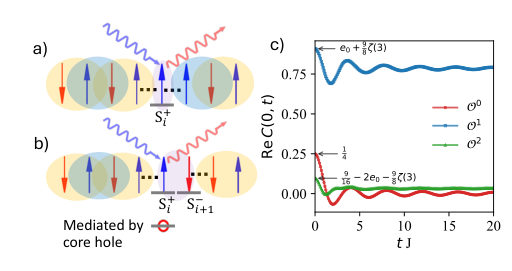 
FIG. 1. Schematics and local real-time dynamics of RIXS- relevant perturbations. Panels (a) and (b) illustrate the single-spin and bond perturbations mediated by the core hole in the RIXS process. Panel (c) shows the real part of CO(r = 0, t) at the central site for all three perturba- tions: local single-spin, nearest-neighbor (NN) bond, and next-nearest-neighbor (NNN) bond operators.

📷 Fig 2

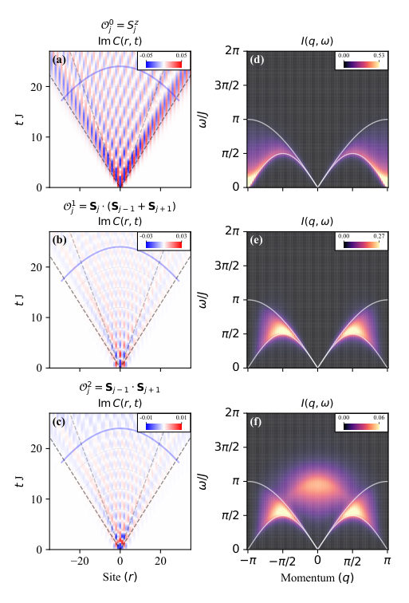 
FIG. 2. Dynamics generated in the spin chain by RIXS- relevant perturbations. Panels (a)–(c) show the imaginary part of the space-time response for three perturbing opera- tors: (a) the local-spin operator Sα i , (b) the nearest-neighbor (NN) bond operator O1, and (c) the next-nearest-neighbor (NNN) bond operator O2. The dashed lines indicate the outer spinon light cone with velocity vs = π

📷 Fig 3

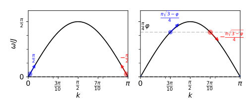 
FIG. 3. Schematic illustration of the spinon dispersion and the momenta associated with the two dominant propagation velocities. The highlighted points indicate (a) the maximum spinon velocities, v = ± π

📷 Fig 4

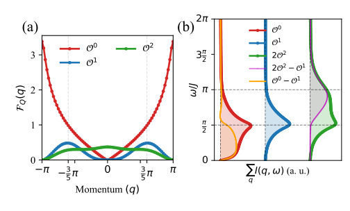 
FIG. 4. Integrated spectral weights for the three responses. Panel (a) shows the quantum Fisher information extracted from the three RIXS-relevant correlation functions. Their distinct momentum dependence reflects the different quan- tum correlations accessed by the local-spin, nearest-neighbor bond, and next-nearest-neighbor bond perturbations. Panel (b) shows the corresponding momentum-integrated spectra over the Brillouin zone. The O2 response can be separated into a contribution resembling the O1 response and an addi- tional feature appearing above π

**Summary.** This paper analyzes quantum wake dynamics in the spin-1/2 Heisenberg chain by comparing results from local-spin probes (like INS) against those from bond-operator probes (like RIXS). The key finding is that bond operators reveal a slower, distinct wake structure compared to the conventional spin response. This methodology not only maps out complementary quantum information but also provides a direct, measurable route to calculating the system's ground-state energy.

**Why it may be interesting.** This work is highly relevant as it bridges advanced theoretical calculations of many-body dynamics with specific, experimentally accessible spectroscopic techniques (RIXS), providing concrete benchmarks for quantum simulation hardware.

Detailed structure

**Main problem.** To investigate quantum wake dynamics in quantum magnets using spectroscopic probes that provide more detailed information than traditional methods like neutron scattering.

**Main result.** Different spectroscopic perturbations (local-spin vs. bond operators) reveal distinct propagation velocities: a fast spinon velocity ($v_s$) and a slower, dominant wake velocity ($v \simeq 0.92J$). Furthermore, bond correlations provide a direct route to calculating the ground-state energy.

**Method.** The study uses real-time evolution of correlation functions for various operators, followed by space-time Fourier transforms to map out momentum- and frequency-resolved spectral responses.

**Model / system.** The system modeled is the spin-1/2 Heisenberg antiferromagnetic chain, governed by the Hamiltonian H = J sum<ij> S_i * S_j. The analysis compares responses from local-spin perturbations (INS-like) against those from nearest-neighbor (NN) and next-nearest-neighbor (NNN) bond operators (RIXS-like).

**Key observables.** Dynamical spin structure factor, Quantum Fisher Information (QFI), and the spectral weight of the wake dynamics, characterized by different propagation velocities ($v_s$ and $v_{	ext{dom}}$).

**Important parameters / regimes.** The exchange coupling constant J, and the characteristic velocities $v_s = \pi J/2$ and $v_{	ext{dom}} \simeq 0.92 J$.

**Assumptions / limitations.** The analysis relies on mapping the time-evolved correlation functions to momentum/frequency space and utilizes approximations for the momentum response function.

**Figures summary.** Figures illustrate schematics of the perturbations, the real-time evolution of correlators, and the resulting momentum-frequency resolved spectral responses, comparing the contributions of local-spin versus bond operators.

**Paper structure.** The paper first establishes the physical problem by comparing INS to RIXS probes. It then calculates the real-time evolution of correlation functions for different operators, analyzes the resulting spectral weights and propagation velocities, and finally derives connections between these spectral weights and fundamental quantities like the ground-state energy and entanglement measures (QFI).

Abstract

Quantum wake dynamics in quantum magnets have recently been inferred from the dynamical spin structure factor, which probes only a restricted class of local perturbations. Here, we show that resonant inelastic x-ray scattering (RIXS) selection rules act as an operator filter on fractionalized excitations, producing distinct quantum wakes in the spin-$\frac{1}{2}$ Heisenberg antiferromagnetic chain. Using explicit real-time evolution of single-spin and spin-conserving bond correlators, we find that the conventional spin response propagates up to the maximum spinon velocity, $v_s=\fracπ{2} J$, whereas the bond channels concentrate their spectral weight into a slower dominant wake with $v\simeq 0.92 J$, while weaker components remain bounded by the full spinon light cone. The corresponding momentum- and frequency-resolved responses map onto experimentally accessible RIXS channels, demonstrating that different spectroscopic perturbations resolve complementary pathways of many-body propagation beyond the neutron-scattering spin structure factor. Their inelastic spectral weights further provide access to quantum Fisher information, while equal-time bond sum rules connect the same spectroscopic channels to the ground-state energy. Because the same correlators can be prepared and measured on quantum hardware, they also define direct, experimentally anchored benchmarks for quantum simulations, particularly in frustrated and higher-dimensional magnets where controlled classical real-time calculations become challenging.

[↑ back to top](#top)

### [Symmetry Constrained Quantum Error Mitigation for the Schwinger Model](http://arxiv.org/abs/2608.21103v1)

**Authors:** Alexander Tomlinson, Graham Van Goffrier, Bipasha Chakraborty, Zhenyu Cai  
**Type:** theory · **Category:** quantum information and computing · **PDF:** <https://arxiv.org/pdf/2608.21103v1>  
**Analysis basis:** full PDF text, analyzed in chunks
**Topic relevance:** `analog quantum simulation` **3/5** · `Keldysh / 2PI / non-Gaussian methods` **1/5** · `quantum measurements` **1/5**

📷 Fig 1

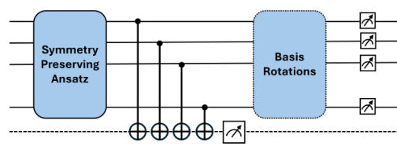 
FIG. 1. Structure of full circuit implementing error mitiga- tion.

📷 Fig 2

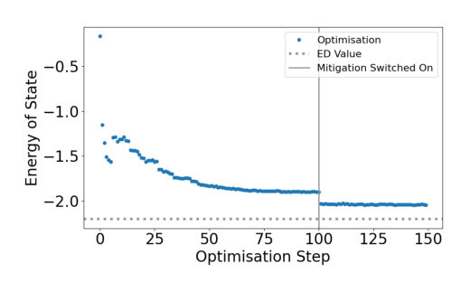 
FIG. 3. N=4 hybrid optimisation where error mitigation is only turned on after the first 100 steps

📷 Fig 3

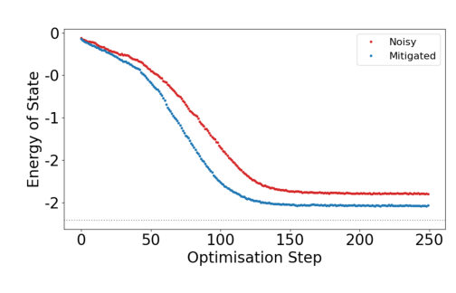 
FIG. 2. Comparison of noisy, and mitigated runs for N = 4 qubits with P(error) = 0.1.

📷 Fig 4

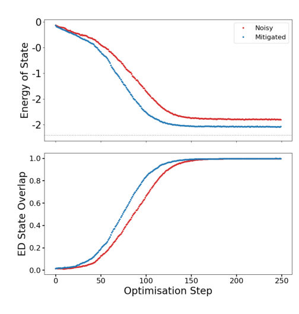 
FIG. 4. N=4 Gradient descent optimisation with same ini- tial parameters showing comparison between states generated by mitigated or unmitigated parameters at each optimisation step

📷 Fig 5

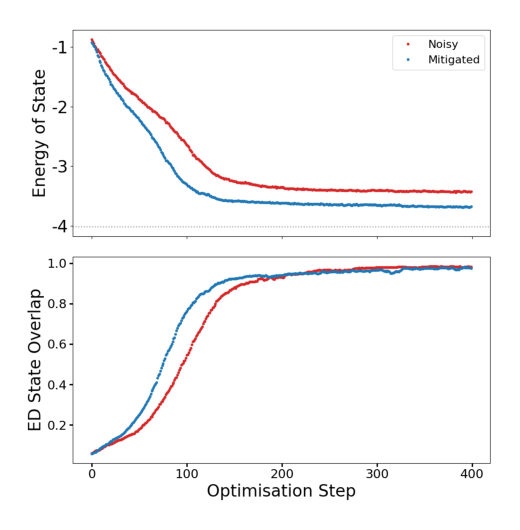 
FIG. 5. N=6 Gradient descent optimisation with same ini- tial parameters showing comparison between states generated by mitigated or unmitigated parameters at each optimisation step

**Summary.** This work investigates using inherent physical symmetries to mitigate noise in quantum simulations of the Schwinger model. By comparing post-selection during adiabatic evolution with symmetry checks during VQE, the authors demonstrate that symmetry constraints are highly effective for bias reduction in certain workflows. The findings provide practical guidelines for applying symmetry-assisted QEM in lattice gauge theory simulations.

**Why it may be interesting.** The explicit comparison of mitigation techniques (post-selection vs. VQE-based) provides practical guidance on how to integrate physical symmetries into near-term quantum algorithms, which is highly relevant for developing robust quantum simulation protocols.

Detailed structure

**Main problem.** The paper addresses the challenge of Quantum Error Mitigation (QEM) in near-term quantum simulations of lattice gauge theories.

**Main result.** Symmetry verification is a powerful tool for bias reduction, particularly in adiabatic state preparation, but its utility in variational algorithms is context-dependent.

**Method.** The authors compare post-selection (for adiabatic preparation) against in-the-loop symmetry verification (for VQE) to mitigate noise effects.

**Model / system.** The primary model is the (1+1)-dimensional Schwinger model, a U(1) lattice gauge theory, whose symmetries (parity and fermion-number) are exploited for error checking.

**Key observables.** Chiral condensate expectation value and ground-state energy.

**Important parameters / regimes.** Noise probability ($p$), lattice size ($N$), and the critical noise level ($p^*$).

**Assumptions / limitations.** The usefulness of symmetry verification critically depends on where it is applied within the overall quantum computational workflow (e.g., post-selection vs. VQE optimization).

**Figures summary.** Figures compare the performance of various mitigation strategies (e.g., symmetric mitigation vs. global noise correction) on observables like the chiral condensate, showing the effectiveness of post-selection in adiabatic dynamics.

**Paper structure.** The paper first introduces the physical problem and the Schwinger model Hamiltonian. It then details and compares two main mitigation approaches: symmetry-sector post-selection in adiabatic state preparation, and symmetry verification within the VQE framework. Finally, it presents results showing the differential success of these methods.

Abstract

Quantum error mitigation (QEM) is at the very heart of near-term quantum simulations and lattice gauge theories are no exceptions, rather their physical symmetries provide natural consistency checks on noise quantum states. In this work, we exploit the parity and fermion-number symmetries of a gauge theory, the (1+1)-dimensional Schwinger model, under depolarising noise and investigate symmetry verification under digital quantum simulation. We investigate two set-ups - symmetry- sector post-selection in adiabatic state preparation followed by real-time measurements of the chiral condensate and symmetry verification within a variational quantum eigensolver (VQE). In the first case, post-selection reduces the bias in the chiral condensate consistently removing up to 60% of the quantum noise induced error in our system. Motivated by the observed regularity of the residual bias (in the low-noise regime), we further introduce a global-noise calibration obtained from classically accessible smaller lattices and implemented on larger lattices recovering noiseless chiral condensate values within statistical uncertainty. However, in VQE, symmetry verification does not seem to generally improve the optimised parameters or the fidelity of the prepared states, although it reduces the bias in the estimated ground-state energy. This demonstates that improving a noisy cost-function estimator in variational algorithms does not necessarily improve the outcome of the algorithm. Our results show the strength of symmetry verification in different approaches while establishing that its usefulness critically depends on where it is applied in the computational workflow, and provide practical guidance for symmetry-assisted quantum error mitigation in quantum simulations of lattice gauge theories.

[↑ back to top](#top)

### [First Search for Ultraheavy Dark Matter Using a Magnetically Levitated Particle](http://arxiv.org/abs/2608.20464v1)

**Authors:** Dennis G. Uitenbroek, Dorian W. P. Amaral, Juehang Qin, Jurriaan Langendorff, Andrew Gingerich, Tjerk H. Oosterkamp, Christopher D. Tunnell  
**Type:** experiment · **Category:** other · **PDF:** <https://arxiv.org/pdf/2608.20464v1>  
**Analysis basis:** full PDF text, analyzed in chunks
**Topic relevance:** `quantum measurements` **3/5** · `analog quantum simulation` **1/5**

📷 Fig 1

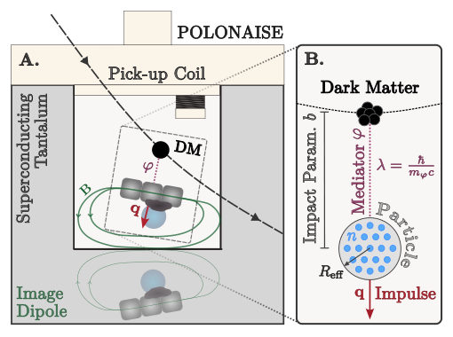 
FIG. 1: A. The POLONAISE experiment. A 0.356 mg magnetic particle composed of three Nd2Fe14B cubes and a glass sphere is levitated inside a Type-I superconduct- ing tantalum trap. The motion of the magnet is read out by a superconducting pick-up coil coupled to a DC SQUID. A passing dark matter particle imparts an im- pulse q on the magnet. Further details of the appara- tus, including schematics of the vibration isolation sys- tem and cryostat, are given in Refs. [29, 30]. B. Inset showing the dark matter particle interacting with the magnetic particle via the neutron–philic force carrier φ of mass mφ, mediating a Yukawa-like force. The force has range λ, while the dark matter passes by...

📷 Fig 2

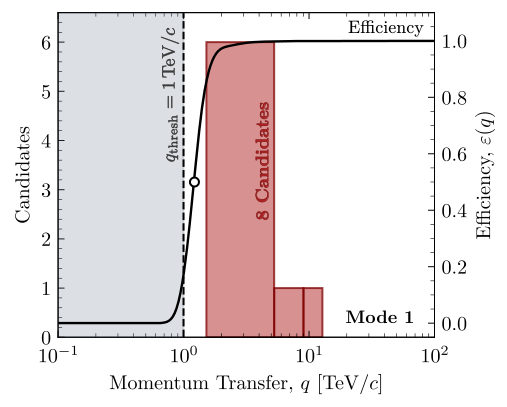 
FIG. 2: The reconstructed impulse spectrum of the 8 candidates surviving the impulse selection in mode 1 (his- togram, left axis), with the segment-averaged detection efficiency ε(q) of this selection overlaid (right axis) [43]. The dashed line marks the selection threshold qthresh = 1 TeV/c, where the efficiency is 17%. The white circle marks the 50% efficiency point, where q ≈1.21 TeV/c.

📷 Fig 3

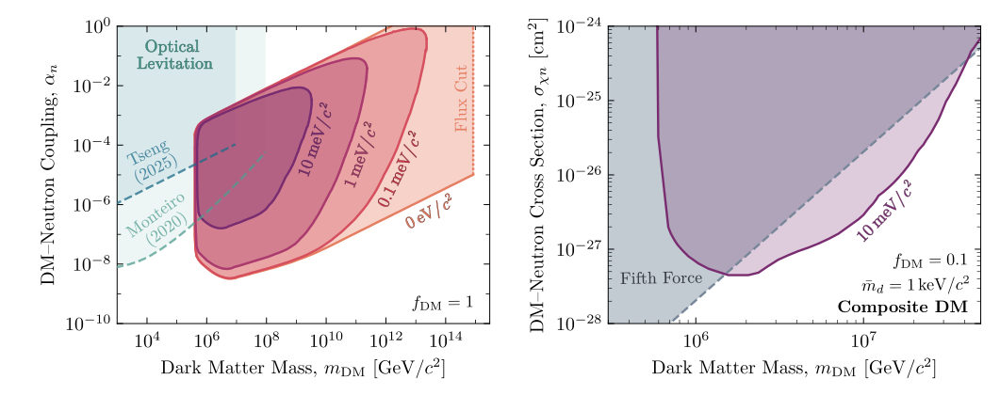 
FIG. 3: Left: The 95% CL limits on the DM–neutron coupling αn with dark matter mass mDM for the mediator masses mφ shown and a dark matter fraction fDM = 1. The limits are capped at the DM mass that produces a negligible flux within the superconducting trap, shown by the dotted line. The dashed curves show the existing limits from dark matter searches employing optical levitation strategies for a massless mediator [26, 27]. Right: The limit for the mediator mass mφ = 10 meV/c2 recast to the composite benchmark model on the DM–neutron cross section σχn for a dark matter fraction fDM = 0.1. The composite DM particle is assumed to have constituents of mass ¯md = 1 keV/c2. The dashed line shows...

📷 Fig 4

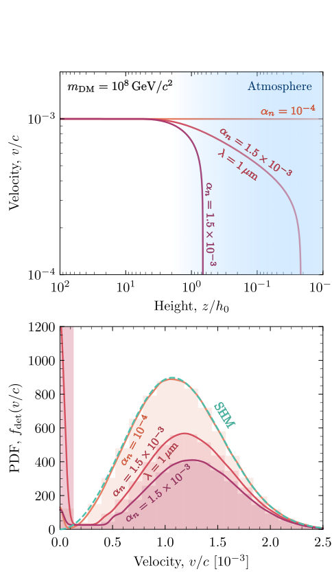 
FIG. 4: The effect of atmospheric attenuation on a dark matter particle of mass mDM = 108 GeV/c2. Three benchmark points are considered in the DM–neutron cou- pling αn and force range λ, with λ = 1 µm for one benchmark and λ →∞for the remainder. Top: The evolution of a dark matter particle’s velocity v(z) as it travels through the atmosphere with an initial velocity v = 10−3c. The atmospheric density profile is overlaid. Only the benchmark point with αn = 10−4 allows this dark matter particle to make it to our detector. Bot- tom: The dark matter speed probability density func- tion at the detector fdet(v). Greater attenuation leads to more particles piling up at low velocities.

📷 Fig 5

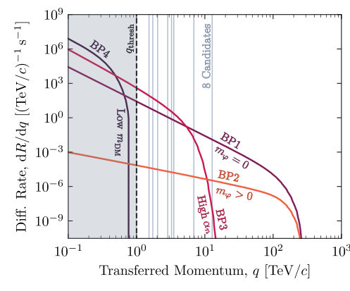 
FIG. 5: The differential rate dR/ dq with momentum transfer q. Four benchmark points (BPs) are shown with default parameters αn = 10−5, mφ = 0 eV/c2, and mDM = 108 GeV/c2, with one parameter changing at a time. BP1 features a massless mediator; BP2 a massive mediator with mφ = 1 meV/c2 (λ ≈200 µm); BP3 a high coupling αn = 8.2 × 10−3, causing signifi- cant atmospheric attenuation; and BP4 a low DM mass mDM = 3 × 105 GeV/c2, resulting in momentum trans- fers that are always below our threshold. The dashed line shows our threshold momentum qthresh = 1 TeV/c, below which dark matter events are invisible to our detec- tor. The blue vertical lines mark the observed candidate impulses of mode 1....

**Summary.** This work reports on the first search for ultraheavy dark matter using a magnetically levitated particle detector. By analyzing minute impulses, the experiment sets world-leading upper limits on the coupling strength between dark matter and neutrons. This technique significantly extends the reach for UHDM detection into mass regimes inaccessible to previous methods.

**Why it may be interesting.** While the primary focus is particle astrophysics, the core methodology relies on ultra-sensitive force detection and noise characterization of mechanical oscillators, which has parallels with advanced sensing techniques used in AMO physics.

Detailed structure

**Main problem.** The paper presents the first search for ultraheavy dark matter (UHDM) by detecting the impulse imparted by such particles on a magnetically levitated particle.

**Main result.** The experiment sets stringent upper limits on the dark matter-neutron coupling ($\alpha_n$) for UHDM masses in the range $10^6$ to $10^{15}$ GeV/$c^2$, extending sensitivity significantly beyond previous optical levitation methods.

**Method.** The analysis uses a magnetically levitated ferromagnet in a superconducting trap, monitoring minute impulses in its motion using a SQUID readout and applying an optimum-interval statistical test.

**Model / system.** The physical system is a milligram-scale ferromagnet levitated in a superconducting trap, which acts as a highly sensitive detector for external forces. The interaction is modeled via a Yukawa-like potential mediated by a light boson ($\phi$) coupling to neutrons.

**Key observables.** Impulse magnitude ($q$), coupling strength ($\alpha_n$), and the resulting exclusion limits on $\alpha_n$ vs. DM mass ($m_{	ext{DM}}$).

**Important parameters / regimes.** Noise floor ($0.07 	ext{ fN } 	ext{Hz}^{-1/2}$), momentum threshold ($1 	ext{ TeV}/c$), and the mediator mass range ($< 30 	ext{ meV}/c^2$).

**Assumptions / limitations.** The analysis assumes the DM interaction is point-like and that the signal is detectable above classical noise sources, extending sensitivity where optical methods fail.

**Figures summary.** Figures show the 95% CL limits on the DM–neutron coupling $\alpha_n$ versus DM mass $m_{	ext{DM}}$ for various mediator masses, and the constraint on the DM-neutron cross-section ($\sigma_{\chi n}$) derived from fifth-force bounds.

**Paper structure.** The paper details the experimental setup (POLONAISE), the theoretical framework for DM interaction (Yukawa potential), the data analysis techniques (optimum-interval method on transient impulses), and finally presents the derived exclusion limits on DM couplings and cross-sections.

Abstract

We present the first search for ultraheavy dark matter using a magnetically levitated particle. The POLONAISE experiment uses a milligram-scale ferromagnet levitated in a superconducting trap, admitting a force sensitivity of $0.07\,\mathrm{fN\,Hz^{-1/2}}$ and resolving impulses as small as $1\,\mathrm{TeV}/c$. Treating every candidate impulse as a possible dark matter event, we set optimum-interval upper limits on the neutron coupling $α_n$ for dark matter interacting through a new light mediator. For dark matter masses $10^6\,\mathrm{GeV}/c^2\text{-}10^{15}\,\mathrm{GeV}/c^2$ and mediators lighter than $30\,\mathrm{meV}/c^2$, we exclude couplings as low as $α_n = 3.2\times 10^{-9}$ at $95\%$ confidence level and set leading constraints on the dark matter-neutron cross section for composite dark matter. Our results extend levitated sensing beyond the mass reach of optical levitation by seven orders of magnitude into the ultraheavy dark matter frontier.

[↑ back to top](#top)

### [Quantum critical behavior in chains of hindered dipolar planar rotors](http://arxiv.org/abs/2608.20501v1)

**Authors:** Wenxue Zhang, Muhammad Shaeer Moeed, Estevao De Oliveira, Hui Li, Pierre-Nicholas Roy  
**Type:** theory · **Category:** statistical mechanics · **PDF:** <https://arxiv.org/pdf/2608.20501v1>  
**Analysis basis:** full PDF text, analyzed in chunks
**Topic relevance:** `Frenkel-Kontorova` **3/5** · `analog quantum simulation` **1/5**

📷 Fig 1

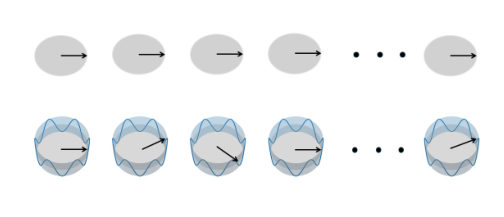 
FIG. 1. Schematic of a coplanar chain of dipolar planar rotors, each subject to a six-fold hindering potential.

📷 Fig 2

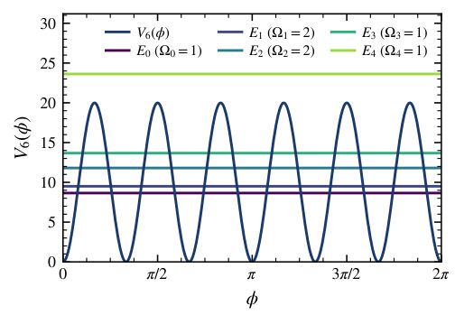 
FIG. 2. Energy levels of a single rotor in a six-fold potential with the barrier height A = 20; Ωi denotes the degeneracy of each level. Based on the convergence tests, mmax = 16 is used.

📷 Fig 3

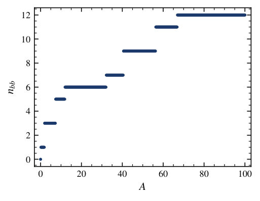 
FIG. 3. Number of states below the barrier (nbb) as a function of the six-fold (reduced) barrier height A.

📷 Fig 4

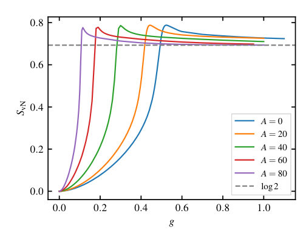 
FIG. 4. Von Neumann entropy SvN as a function of g for A = 0, 20, 40, 60, 80, and N = 50.

📷 Fig 5

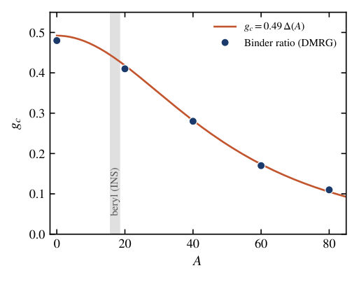 
FIG. 6. Critical coupling gc as a function of the reduced barrier height A. Symbols: gc from the maximum gradient of the Binder ratio at N = 50 (Fig. 5). Solid line: the scaling form gc = a ∆(A) of Eq. (14) with a = 0.49, where ∆(A) = E1−E0 is the tunneling splitting of the monomer Hamiltonian of Eq. (3). The A = 0 point is not included in the fit; the form nevertheless recovers the free-rotor value gc ≈1/2 there, since ∆(0) = 1. The shaded band marks the beryl barrier range A ≈16–18 from inelastic neutron scattering,1 where the fit gives gc ≈0.44.

**Summary.** This paper uses DMRG simulations to study the quantum phase transition in chains of dipolar rotors confined by a six-fold potential, mimicking water in beryl. The key finding is that this crystal-field hindrance does not suppress, but rather promotes, the transition into a ferroelectrically ordered state. The results provide a quantitative link between local molecular potentials and macroscopic quantum ordering phenomena.

**Why it may be interesting.** This work provides a concrete theoretical framework for understanding how local crystal field constraints (the six-fold potential) can stabilize or enhance collective quantum ordering (ferroelectricity) in molecular systems, linking quantum many-body physics to solid-state material properties.

Detailed structure

**Main problem.** The study investigates the ground-state properties and the quantum phase transition (QPT) occurring in linear chains of dipolar planar rotors subjected to a six-fold on-site potential.

**Main result.** The research demonstrates that crystal-field hindrance, quantified by the six-fold potential strength, can promote dipolar ordering by shifting the critical coupling $g_c$ to smaller values.

**Method.** The primary computational tool employed is the Density Matrix Renormalization Group (DMRG) method, supplemented by analysis using the von Neumann entanglement entropy and the Binder ratio.

**Model / system.** The system is a 1D chain of planar rotors interacting via nearest-neighbor dipolar coupling, modeled by a Hamiltonian incorporating a six-fold pinning potential, motivated by water molecules confined in beryl-like cavities.

**Key observables.** Von Neumann entanglement entropy ($S_{vN}$), Binder ratio ($U_x$), and the polarization ($M_x$) acting as the order parameter.

**Important parameters / regimes.** The dipolar coupling strength ($g$), the six-fold pinning strength ($A$), and the critical coupling ($g_c$).

**Assumptions / limitations.** The dipolar interaction is truncated to nearest neighbors, and the analysis is restricted to 1D chains, although the results are compared to 3D experimental contexts.

**Figures summary.** Figures illustrate the schematic of the rotor chain, energy levels of a single rotor, and plots showing the dependence of $S_{vN}$ and $U_x$ on the coupling strength $g$ for various pinning strengths $A$.

**Paper structure.** The paper establishes the model and Hamiltonian, applies DMRG to calculate key diagnostics ($S_{vN}$, $U_x$), determines the critical coupling $g_c$ by analyzing the transition signatures, and concludes by interpreting the findings in the context of ferroelectricity in confined molecular systems.

Abstract

We study the ground-state properties of linear chains of dipolar planar rotors hindered by a six-fold on-site potential, a model motivated by water molecules confined in the hexagonal cavities of beryl. Using density matrix renormalization group (DMRG) calculations, we locate the quantum phase transition between the disordered and ferroelectrically ordered phases using the von Neumann entanglement entropy and the Binder ratio of the polarization. A sweep of the six-fold pinning strength shows that increasing hindrance shifts the critical dipolar coupling gc to smaller values. These results suggest that crystal-field hindrance can promote, rather than suppress, dipolar ordering. This work has implications for ferroelectricity and quantum-device tuning in confined molecular rotors

[↑ back to top](#top)

### [Revealing Physical Redundancy in the Two-dimensional Fermi-Hubbard Model via Transferable Observable Reconstruction](http://arxiv.org/abs/2608.20836v1)

**Authors:** Ao-Ning Wang, Min-Quan He, Z. D. Wang  
**Type:** theory · **Category:** strongly correlated electrons · **PDF:** <https://arxiv.org/pdf/2608.20836v1>  
**Analysis basis:** full PDF text, analyzed in chunks
**Topic relevance:** `analog quantum simulation` **3/5** · `quantum measurements` **1/5**

📷 Fig 1

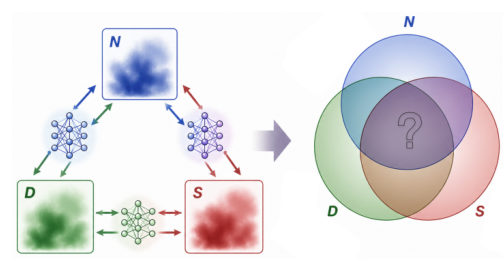 
Figure 1. Physical redundancy in observables. Transferability mapping tests with a neural network provide an operational way to quantify shared physical information among distinct observables.

📷 Fig 2

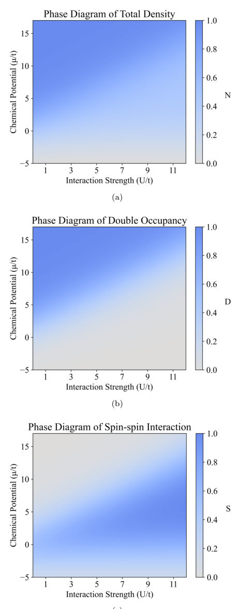 
Figure 2. Sample phase diagrams of (a) total density, (b) double occupancy, and (c) spin-spin interaction. Each data point represents an expectation evaluation taken with respect to the Gibbs State at the sample temperature. All three dia- grams are min-max normalized for display.

📷 Fig 3

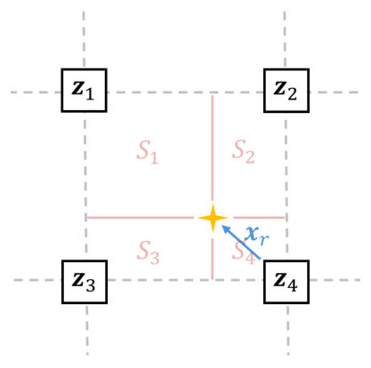 
Figure 3. Graph demonstration of decoding function fθ. z4 is in this case znear if only one nearest vector is considered. S1, S2, S3 and S4 are the corresponding relative areas between target coordinate and the nearest four corners on an input 2 × 2 square grid.

📷 Fig 4

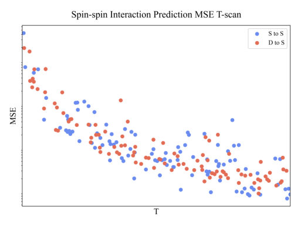 
Figure 5. Mapping performance to spin-spin interaction scanned within the whole temperature range. Y axis is map- ping MSE displayed in logarithmic scale. Results from both S to S and D to S attempts are displayed, similar trend can be seen in both groups that thermodynamically states closer to ground state are more difficult to capture.

📷 Fig 5

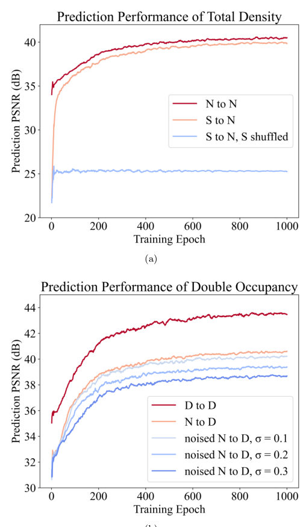 
Figure 4. Shuffle and noise tests. (a) Three separate mapping attempts of total density from itself, correct spin-spin interac- tion and shuffled spin-spin interaction respectively. (b) Five separate mapping attempts of double occupancy from itself, precise total density and three different-level noised total den- sities respectively.

**Summary.** This work explores physical redundancy among observables (density, double occupancy, spin correlation) in the 2D Fermi-Hubbard model. Using neural networks, the authors demonstrate that these distinct observables can reconstruct each other's phase diagrams with high accuracy. This suggests that these quantities are not independent but share underlying physical information, which could simplify experimental measurements.

**Why it may be interesting.** The finding of observable-level redundancy suggests that measuring one quantity might implicitly provide information about another, potentially simplifying complex measurements in strongly correlated systems.

Detailed structure

**Main problem.** The study investigates whether distinct physical observables in the two-dimensional Fermi-Hubbard model contain mutually transferable physical information, suggesting observable-level redundancy.

**Main result.** The phase diagram of one observable can be reconstructed from another with high accuracy, suggesting that observables share a substantial fraction of physical information.

**Method.** A neural-network reconstruction framework is employed to test the transferability of information between observables by training an encoder-decoder network.

**Model / system.** The system is the two-dimensional Fermi-Hubbard Model, which is a paradigmatic setting for studying strongly correlated quantum matter. The Hamiltonian is defined using lattice site operators and can be transformed into a spin-form.

**Key observables.** Total density (N), double occupancy (D), and spin-spin correlation (S).

**Important parameters / regimes.** Temperature (T), Interaction strength (U), and Chemical potential (mu).

**Assumptions / limitations.** The transferability relies on correct physical labeling and is tested across finite-temperature regimes, suggesting the observables reside on a common higher-order manifold.

**Figures summary.** Figures illustrate transferability mapping tests using neural networks, showing reconstruction performance (PSNR/MSE) for cross-observable mappings compared to self-mappings.

**Paper structure.** The paper introduces the Fermi-Hubbard model and its key observables. It then details the neural-network reconstruction framework for testing information transferability. Results demonstrate high transferability, followed by tests confirming this redundancy is physical (not just numerical correlation) and robust to noise.

Abstract

The Fermi-Hubbard model provides a paradigmatic setting for studying strongly correlated quantum matter, where different observables are commonly used to probe charge, interaction, and spin correlations. In this work, we investigate whether these observables contain mutually transferable physical information beyond their apparent distinction. We quantify such physical redundancy through transferability tests among three representative observables of the two-dimensional Fermi-Hubbard model: total density (N), double occupancy (D), and spin-spin correlation (S). Using a neural-network reconstruction framework, we find that the phase diagram of one observable can be reconstructed from another with accuracy close to self-reconstruction benchmarks, especially in trivial phase regimes. This transferability relies on correct physical labeling, persists across finite-temperature regimes, and remains robust under noisy inputs. Our results suggest that separate observables can carry a substantial fraction of one another's physical information, providing numerical evidence for observable-level redundancy in the two-dimensional Fermi-Hubbard system.

[↑ back to top](#top)

### [Self-limiting electrostriction of a single ion in an ultracold polar gas: From mesoscopic ions to crystalline molecular rings](http://arxiv.org/abs/2608.20489v1)

**Authors:** Ruiren Shi, Saajid Chowdhury, Leon Karpa, Jesús Pérez-Ríos  
**Type:** theory · **Category:** other · **PDF:** <https://arxiv.org/pdf/2608.20489v1>  
**Analysis basis:** full PDF text, analyzed in chunks
**Topic relevance:** `analog quantum simulation` **3/5**

📷 Fig 1

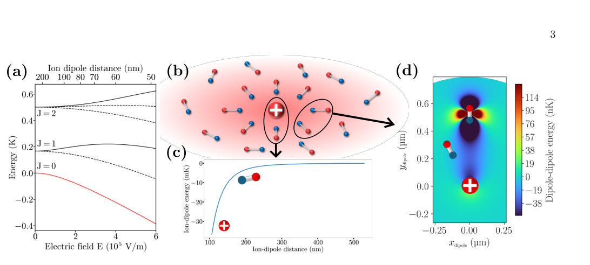 
FIG. 1. A schematic of our study. Panel (a) shows the Stark manifold for the states |X1Σ+, v = 0, J = 0, 1, 2, mj⟩of the molecule in the presence of the ion’s electric field. The ground state is marked in red, states where mj = 0 are marked with solid lines, and states with non-zero mj are marked with dashed lines. Panel (b) shows our system: an ion immersed in an 2-dimensional ultracold low-density gas of NaCs molecules. Two interactions are circled: the ion-dipole interaction, and the dipole-dipole interaction. Panel (c) shows the ion-dipole interaction, and (d) shows the anisotropic interaction between two dipoles. At several different field strengths E up to 10−6 a.u., the ground state...

📷 Fig 2

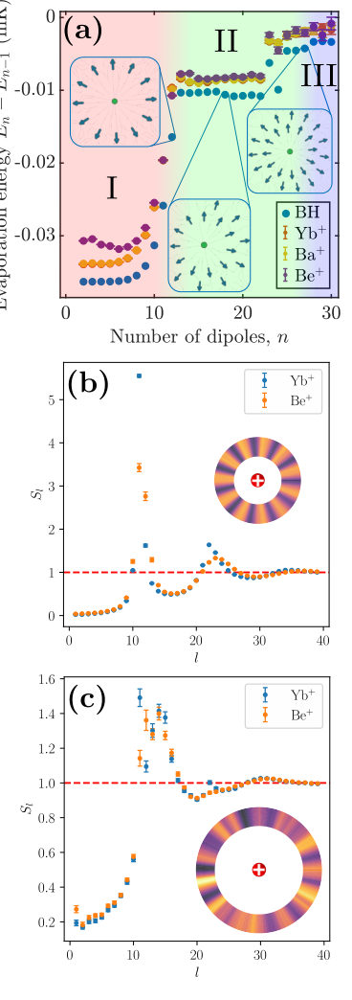 
FIG. 2. Evaporation energies and angular structure factors Sl for 2D NaCs clusters surrounding an ion. (a) Basin-hopping (BH) and DMC evaporation energies; the insets show the first magic number, an intermediate cluster, and the second magic number. (b,c) Angular structure factors and DMC an- gular distributions for the inner and outer rings of the second- magic-number cluster, respectively. Here, C8,id = 1022 a.u., C8,dd = 5 × 1018 a.u., re,id = 520 nm, and ddd = 270 nm.

📷 Fig 3

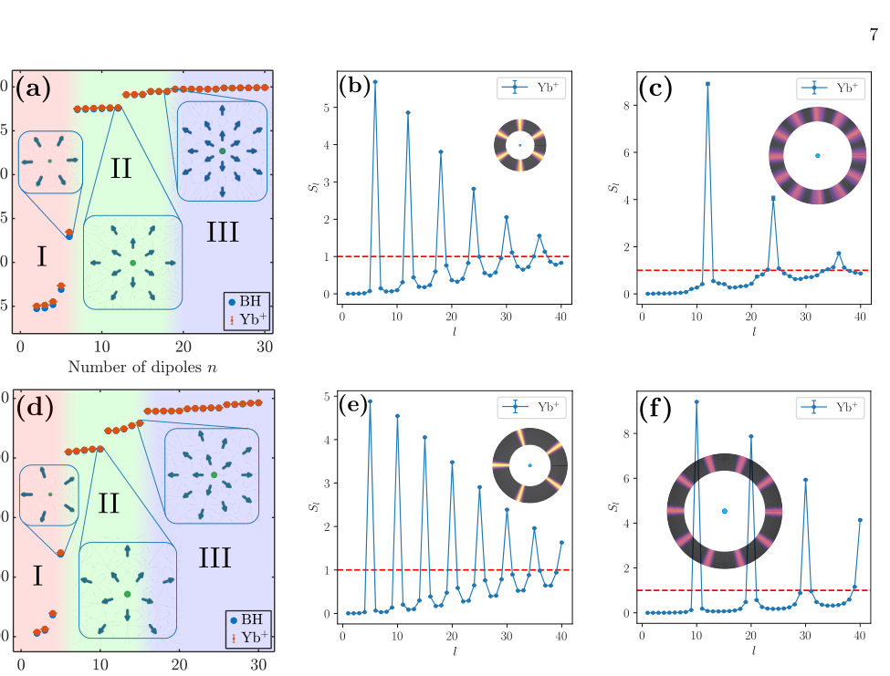 
FIG. 3. Evaporation energies and angular structure factors Sl for 2D NaCs clusters surrounding an ion. “BH” denotes basin- hopping global minima, while “Yb+” denotes DMC results for a Yb+ ion. Panels (a,d) show the evaporation energies, with insets illustrating the first magic number, an intermediate cluster, and the second magic number. Panels (b,e) and (c,f) show the angular structure factors and DMC angular distributions of the inner and outer rings of the second-magic-number cluster, respectively. Panels (a–c) correspond to C8,id = 1019 a.u., C8,dd = 1018 a.u., re,id = 100 nm, and ddd = 102 nm; panels (d–f) correspond to C8,id = C8,dd = 1015 a.u., re,id = 20 nm, and ddd = 24 nm.

📷 Fig 4

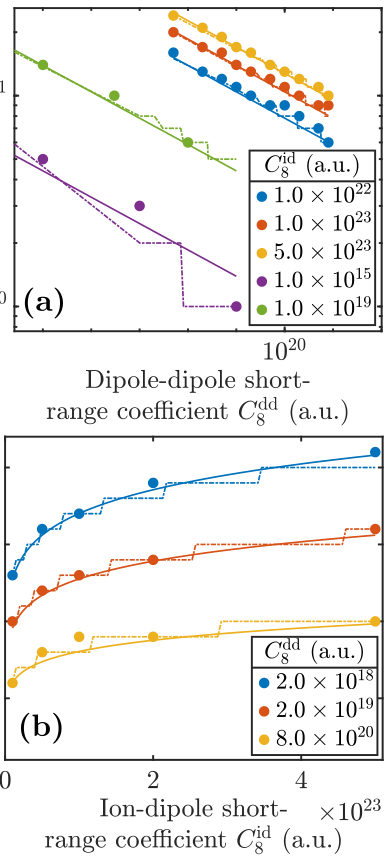 
FIG. 4. Magic numbers of dipoles within the first ring sur- rounding the ion, as a function of the short-range interaction coefficients Cdd 8 and Cid 8 , computed by basin-hopping. The dotted lines show accurate predictions for the magic number according to Eqs. 11,12, sweeping one C8 parameter for three different values of the other C8 parameter. The solid curves show approximate asymptotic predictions given by Eq. 14.

📷 Fig 5

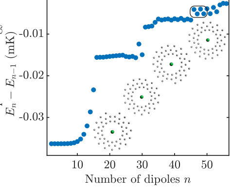 
FIG. 5. Evaporation energies of 2D clusters of NaCs dipo- lar molecules surrounding an ion for n ≤56 computed by basin hopping. The ion-dipole equilibrium distance is 9800a0, and the dipole-dipole nearest-neighbor distance within the first ring is 4000a0. The insets show geometries for n = 46, 47, 48, 49.

**Summary.** This paper models the self-assembly of polar molecules around an ion in an ultracold 2D gas, driven by electrostriction. The authors find that the resulting clusters form distinct, concentric molecular rings whose stability is dictated by the electric field topology rather than simple packing rules. This establishes a new theoretical framework for understanding charged impurities in quantum molecular baths.

**Why it may be interesting.** This work directly addresses the physics of charged impurities in quantum baths, utilizing anisotropic dipolar interactions which are central to modern AMO research involving polar molecules and trapped ions.

Detailed structure

**Main problem.** The study investigates the self-assembly and structural evolution of polar molecules surrounding a single ion immersed in an ultracold, dilute two-dimensional molecular gas.

**Main result.** The system forms concentric molecular rings whose structure is governed by the ion's electric field topology, establishing a new class of mesoscopic molecular ions stabilized by self-limiting electrostriction.

**Method.** The research combines global optimization with Diffusion Monte Carlo (DMC) calculations to determine the evaporation energy as a function of cluster size.

**Model / system.** The system consists of an ion interacting with polar molecules via anisotropic charge-dipole and dipole-dipole interactions in a 2D gas. The physics is governed by the competition between attractive ion-molecule forces and repulsive intra-ring interactions.

**Key observables.** Evaporation energy as a function of the number of bound molecules, and the resulting molecular cluster structure (mesoscopic ion vs. crystalline ring).

**Important parameters / regimes.** The strength of the dipole-dipole interaction, the dimensionality (2D), and the regime of interaction (weak vs. strong).

**Assumptions / limitations.** Assumes molecules are rigid rotors and that the dipole moments align with the local electric field for force calculations.

**Figures summary.** Figure 1 schematically illustrates the Stark manifold, the 2D system setup, and the nature of the ion-dipole and dipole-dipole interactions. Figure 2 likely shows the calculated evaporation energy versus the number of molecules.

**Paper structure.** The paper progresses by defining the physical model and Hamiltonian, detailing the computational methods (DMC, optimization), presenting the key results regarding the plateau-like evaporation energy, and concluding with the physical interpretation of the resulting molecular structures.

Abstract

We investigate the self-assembly of polar molecules around a single ion immersed in an ultracold, dilute two-dimensional molecular gas. The ion aligns and attracts the molecules through charge-dipole interactions, producing a strong electrostrictive accumulation around the impurity, while intermolecular repulsion limits further densification and favors spatially extended configurations. By combining global optimization with diffusion Monte Carlo, we calculate the evaporation energy as a function of the number of molecules bound to the ion. In contrast to conventional charged and van der Waals clusters, the evaporation energy exhibits a plateau-like dependence on cluster size, reflecting the sequential formation of concentric molecular rings. These structures are governed by the topology of the ion's electric field and by the competition between attractive ion-molecule interactions, repulsive intra-ring interactions, and attractive correlations between neighboring rings, rather than by conventional coordination or icosahedral packing. In the weak-interaction regime, the resulting structures form extended mesoscopic molecular ions, whereas stronger interactions produce increasingly rigid, crystal-like molecular rings. We further analyze their stability against thermal perturbations and the time-dependent ion trap and find that a broad range of clusters remain stable under experimentally relevant conditions. The intermolecular repulsion and dipolar geometry also suppress close-range ion-molecule encounters, suggesting an intrinsic shielding mechanism. Our results establish ion-bound polar-molecule clusters as a distinct class of mesoscopic molecular ions and open a route to studying charged impurities in quantum baths with anisotropic interactions.

[↑ back to top](#top)

### [The Entanglement Content of Quantum Measurement Bases](http://arxiv.org/abs/2608.21185v1)

**Authors:** Jef Pauwels, Otfried Gühne  
**Type:** theory · **Category:** quantum information and computing · **PDF:** <https://arxiv.org/pdf/2608.21185v1>  
**Analysis basis:** full PDF text, analyzed in chunks
**Topic relevance:** `quantum measurements` **3/5**

📷 Fig 1

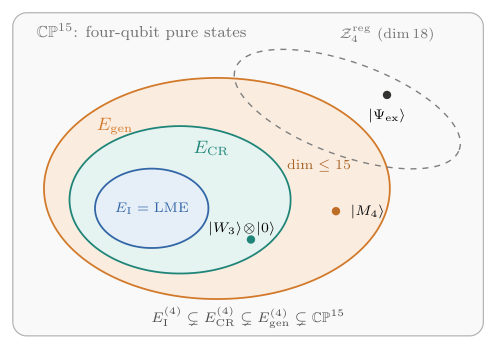 
FIG. 1. The four-qubit encoding hierarchy (1). Every inclusion is strict: |W3⟩⊗|0⟩is reached by commuting reflections but is not LME (Theorem 9); |M4⟩is locally encodable but by no commuting reflections (Theorems 10 and 11); |Ψex⟩admits no local encoding at all (Theorem 17). The dashed region is the regular 1-uniform family Zreg 4 of dimension 18, whose encodable part has dimension at most 15 (Theorem 12); all boundaries are schematic.

📷 Fig 2

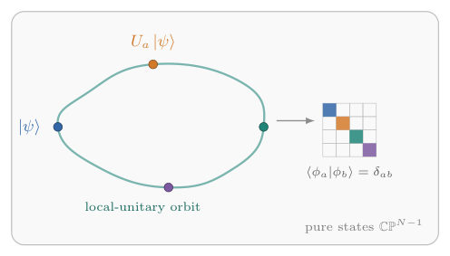 
FIG. 2. The state-first question as geometry. Product unitaries move the fiducial state |ψ⟩along its local-unitary orbit (curve); a local encoding (Theorem 2) exists precisely when the orbit contains N = 2n mutually orthogonal states (dots, shown for N = 4; each dot is colored as its diagonal entry of the Gram matrix). These states then form an iso-entangled basis: a complete projective measurement all of whose outcomes carry exactly the entanglement of |ψ⟩.

📷 Fig 3

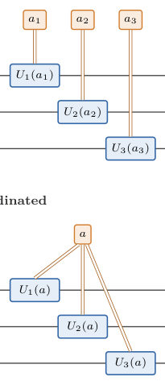 
FIG. 3. Encoder coordination (Theorem 3), for n = 3. Double lines carry the classical label; single lines are the qubits of |ψ⟩. (a) In an independent encoding, party j selects its unitary using only its private bit aj; these encoders reach exactly the LME states (Theorem 4). (b) In a coordinated encoding, each local unitary may depend on the entire label a. Coordination concerns only how the classical label is used: every encoder remains a product unitary, and no entangling operation is applied.

📷 Fig 4

 
FIG. 4. Why |M4⟩admits no commuting-reflection encoding (Theorem 11). Up to local complementation and relabelling, the 64 labelled four-vertex graphs fall into six classes (representatives shown; numbers give the class sizes). Flatness in a graph basis would force every nonidentity graph stabilizer to have zero expectation in |M4⟩, which translates into elementary geometry: vanishing two-qubit correlators force perpendicular Bloch axes, vanishing three-qubit correlators force coplanar axes, and a four-body rule handles the remaining stabilizers (Section A). The bars indicate the strongest ingredient needed to exclude each pair of classes; since all six classes are excluded, |M4⟩/∈E(4) CR.

📷 Fig 5

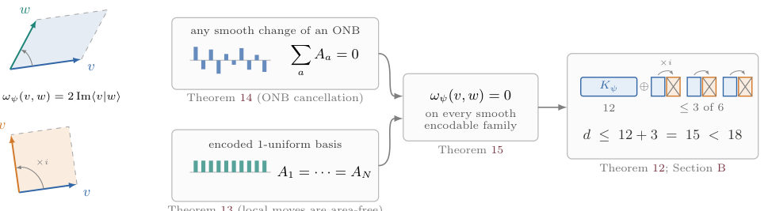 
FIG. 5. The mechanism behind Theorem 12. (a) Two first-order changes v, w of a state span the signed area ωψ(v, w) (top); every nonzero direction pairs with iv at strictly positive area (bottom). (b) Structure of the proof. When any orthonormal basis varies smoothly, the areas Aa contributed by its N elements cancel (Theorem 14); when a locally encoded basis of a 1-uniform state varies, the local adjustments contribute no area, so all elements contribute the same area Aa = ωψ(v, w) (Theorem 13). Equal contributions with zero sum vanish: ωψ(v, w) = 0 along every smooth encodable family (Theorem 15). Among the 18 tangent directions of the regular 1-uniform family, the 12 local rotations Kψ...

**Summary.** This work provides a comprehensive theoretical framework for understanding the entanglement content inherent in quantum measurement bases for multi-qubit systems. By classifying measurement bases based on local transformations, the authors establish strict hierarchies and prove that local encoding is fundamentally limited, even for small systems like four qubits.

**Why it may be interesting.** It provides deep structural constraints on what can be measured or encoded using entanglement, which is fundamental for designing robust quantum communication protocols and understanding the limits of quantum resources.

Detailed structure

**Main problem.** The paper develops a general framework to characterize the entanglement content of quantum measurement bases, moving beyond simple state entanglement.

**Main result.** It establishes a hierarchy of measurement bases based on local unitaries and proves that local encoding is not universal, showing that not all entanglement types can be encoded in a complete measurement basis.

**Method.** The authors use algebraic geometry, dimension counting, and the characterization of local unitaries to classify different types of measurement bases (e.g., Independent vs. Commuting-reflection).

**Model / system.** The focus is on $n$-qubit pure states and the associated measurement bases, generalizing the concept from bipartite Bell measurements to multi-particle systems.

**Key observables.** Entanglement type, local encoding condition, and the dimension of the set of encodable states.

**Important parameters / regimes.** The number of qubits ($n$), the structure of local unitaries, and the dimensionality of the state space.

**Assumptions / limitations.** The analysis relies on advanced mathematical tools, including semialgebraic set theory and properties of Pauli operators.

**Figures summary.** Figures illustrate the hierarchy of encoding classes (e.g., $	ext{EI} \subseteq 	ext{LME} \subseteq 	ext{ECR} \subseteq 	ext{Egen} \subseteq 	ext{CP15}$) and the geometric relationship between local-unitary orbits and local encoding.

**Paper structure.** The paper introduces the problem by generalizing Bell measurements, develops the classification hierarchy of measurement bases, proves non-universality using dimension arguments, and characterizes specific classes like the commuting-reflection encoding via graph states.

Abstract

Bell-state measurements are essential ingredients in many protocols for quantum information processing, ranging from quantum teleportation and dense coding to entanglement distribution in quantum networks. Their power relies on the fact that they are measurements in an entangled basis of a two-particle system and that the used Bell-state basis can be generated from a single Bell state by local unitary transformations. How can these measurements be generalized to more particles? We develop a general framework for this state-to-measurement problem: We introduce a hierarchy of classes of measurement bases, distinguished by the local transformations the parties may use for their generation from a single state. This leads to a generalization of the concept of maximally entangleable (or weighted hypergraph) states and the identification of a novel maximally entangled basis of four qubits, being a candidate for data-hiding tasks or distillation protocols. Finally, we prove that not all forms of entanglement can be encoded in an entire measurement basis.

[↑ back to top](#top)

### [Ultralow-Field Triplon Condensation in a Spin-Ladder Magnet](http://arxiv.org/abs/2608.21316v1)

**Authors:** Ankit Labh, Ross H. Colman, Jakub Šebesta, Noah Oefele, Elsa Lhotel, Adam Berlie, Paul Steffens, Oksana Zaharko, Pascal Manuel, Iurii Kibalin, Philipp Gegenwart, Dominik Legut, Johanna K. Jochum, Alexander A. Tsirlin, Petr Čermák  
**Type:** both · **Category:** strongly correlated electrons · **PDF:** <https://arxiv.org/pdf/2608.21316v1>  
**Analysis basis:** full PDF text, analyzed in chunks
**Topic relevance:** `analog quantum simulation` **3/5**

📷 Fig 1

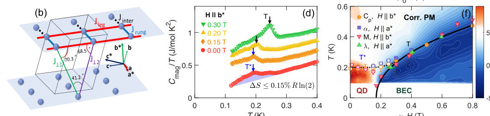 
FIG. 1. (a) Zero-field spin gap ∆/kB versus lower critical field µ0Hc1 for representative gapped field-induced-order quantum magnets. The dashed line marks the Zeeman gap-closing scale; red symbols denote spin ladders and place Henmilite at the low-field end. (b) Crystal structure of triclinic Henmilite showing the leg (Jleg), rung (Jrung), and leading in-plane interladder (Jinter) exchange pathways. J⊥1 and J⊥2 denote weak interlayer couplings omitted from the QMC model. (c) Temperature dependence of M/µ0H for H ∥b∗between 0.01 and 2 T. (d) Magnetic specific heat Cmag/T for H ∥b∗; the zero-field feature carries only ∆S ≲0.15% R ln 2. Successive curves are shifted vertically by 0.15 units...

📷 Fig 2

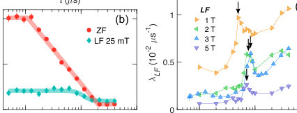 
FIG. 2. (a) Zero-field µSR spectra at 4 K and 50 mK. The 50 mK spectrum acquires an additional electronic relax- ation channel, demonstrating slow magnetic fluctuations, but shows neither spontaneous oscillations nor the loss of asym- metry characteristic of conventional static bulk antiferromag- netism. (b) Temperature dependence of the electronic re- laxation rate λ in zero field (ZF) and at longitudinal field (LF) µ0HLF = 25 mT, chosen to decouple the quasi-static nuclear contribution from electronic relaxation. (c) Frozen fraction on the µSR time scale. Only a small fraction be- comes frozen at low temperature, unlike the magnetically ordered low-temperature response reported for the...

📷 Fig 3

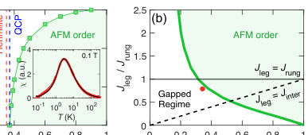 
FIG. 4. (a) QMC analysis of the microscopic coupled- ladder model for fixed Jleg/Jrung = 0.8. The ordered mo- ment turns on rapidly above the zero-field critical interladder coupling of Jinter/Jrung = 0.37. The fitted exchange parame- ters of Henmilite lie just below this threshold, on the gapped side of the instability. The inset shows the corresponding dc susceptibility measured at 0.1 T together with QMC fit for Jrung = 3.8 K, Jleg/Jrung = 0.8, and Jinter/Jrung = 0.35. (b) Generic zero-field phase diagram for coupled spin lad- ders, adapted from Ref. [40]. The diagram separates the spin- gapped ladder regime from antiferromagnetic long-range or- der as a function of leg, rung, and...

**Summary.** This paper reports the first observation of ultralow-field Bose-Einstein condensation of triplons in the spin-ladder magnet Henmilite. By combining advanced measurements with QMC simulations, the authors establish that the material resides in a quantum-disordered parent state, extending the BEC concept beyond simpler dimer magnets. This work provides a crucial platform for tuning and studying quantum criticality in fluctuation-dominated magnetic systems.

**Why it may be interesting.** The work provides a concrete, measurable realization of quantum criticality in a highly correlated magnetic material, using BEC theory to describe the transition, which is relevant to understanding quantum phase transitions in lattice models.

Detailed structure

**Main problem.** The study aims to realize and characterize the ultralow-field Bose-Einstein condensation (BEC) of triplons in a spin-ladder magnet, extending the phenomenon beyond the established dimer magnet paradigm.

**Main result.** The authors report the first observation of BEC at an ultralow critical field ($\mu_0H_{c1} = 0.17 	ext{ T}$) in Henmilite, establishing the material as a platform for studying quantum criticality in a fluctuation-dominated spin ladder.

**Method.** The research combines multiple experimental techniques (thermodynamic, $\mu	ext{SR}$, neutron diffraction) with advanced theoretical modeling, including Quantum Monte Carlo (QMC) simulations and Density Functional Theory (DFT) calculations.

**Model / system.** The physical system is Henmilite ($	ext{Ca}_2	ext{Cu}(	ext{OH})_4[	ext{B}(	ext{OH})_4]_2$), modeled as a coupled spin-ladder magnet governed by exchange couplings ($J_{	ext{leg}}, J_{	ext{rung}}, J_{	ext{inter}}$). The theoretical framework utilizes the BEC description for triplon condensation.

**Key observables.** Low-field critical fields ($\mu_0H_{c1} = 0.17 	ext{ T}$), the upper critical field ($\mu_0H_{c2} \simeq 8.2 	ext{ T}$), magnetic susceptibility, specific heat, and the asymmetry ratio ($m^*/m$).

**Important parameters / regimes.** The system is characterized by a strong separation between the exchange scale ($J \sim 3-4 	ext{ K}$) and the residual gap scale ($\Delta/k_B \simeq 0.245 	ext{ K}$), placing it near a quantum-disordered parent state.

**Assumptions / limitations.** The BEC description assumes small symmetry-breaking terms, and the analysis relies on fitting the system to a coupled-ladder Hamiltonian derived from DFT and QMC simulations.

**Figures summary.** Figures illustrate the phase diagram showing BEC and correlated regimes, compare zero-field gaps vs. critical fields, and show the magnetic response ($	ext{M}/\mu_0	ext{H}$ and $	ext{C}_{	ext{mag}}/	ext{T}$) across different fields and temperatures.

**Paper structure.** The paper progresses by first characterizing the parent state (overturning previous order assignments), then measuring the low-field anomaly using multiple probes, establishing the BEC regime, and finally using QMC/DFT to model the underlying spin Hamiltonian and explain the observed critical behavior.

Abstract

We realise the first ultralow-field Bose-Einstein condensation of triplons in a spin-ladder magnet, uncovering a quantum critical point at only $μ_0 H_{c1}=0.17$ T in Henmilite ($\mathrm{Ca_2Cu(OH)_4[B(OH)_4]_2}$). Unlike dimer magnets, a ladder retains extended one-dimensional correlations in its gapped parent state, making this limit strongly fluctuation dominated. Thermodynamic, magnetoelastic, $μ$SR, and neutron-diffraction measurements overturn the previous assignment of zero-field antiferromagnetic order, establishing a quantum-disordered coupled-ladder parent state with persistent low-energy dynamics. The weak low-temperature anomaly instead marks a gap-controlled crossover from the correlated ladder regime into the activated quantum-disordered state. These measurements further reveal an exceptionally asymmetric ordered dome extending to $μ_0 H_{c2}\simeq 8.2$ T. Quantum Monte Carlo simulations for the relevant spin Hamiltonian place Henmilite just on the gapped side of the zero-field ladder-ordering instability, naturally accounting for the strong separation between the exchange and residual-gap scales and the tiny critical field. Our findings extend ultralow-field triplon condensation beyond the dimer paradigm and establish Henmilite as a platform for controlled tuning across quantum criticality in a fluctuation-dominated spin ladder.

[↑ back to top](#top)

### [On quantum channels: extreme points, topology, and categorical properties](http://arxiv.org/abs/2608.20689v1)

**Authors:** J. M. S. T. da Silva  
**Type:** theory · **Category:** quantum information and computing · **PDF:** <https://arxiv.org/pdf/2608.20689v1>  
**Analysis basis:** full PDF text, analyzed in chunks
**Topic relevance:** `correlated / nonlocal dissipation` **2/5** · `driven-dissipative phase transition` **2/5** · `methods for driven-dissipative` **2/5** · `Keldysh / 2PI / non-Gaussian methods` **1/5** · `analog quantum simulation` **1/5** · `non-equilibrium universality` **1/5** · `quantum measurements` **1/5**

📷 Fig 1

 
Low-resolution page preview, page 2

📷 Fig 2

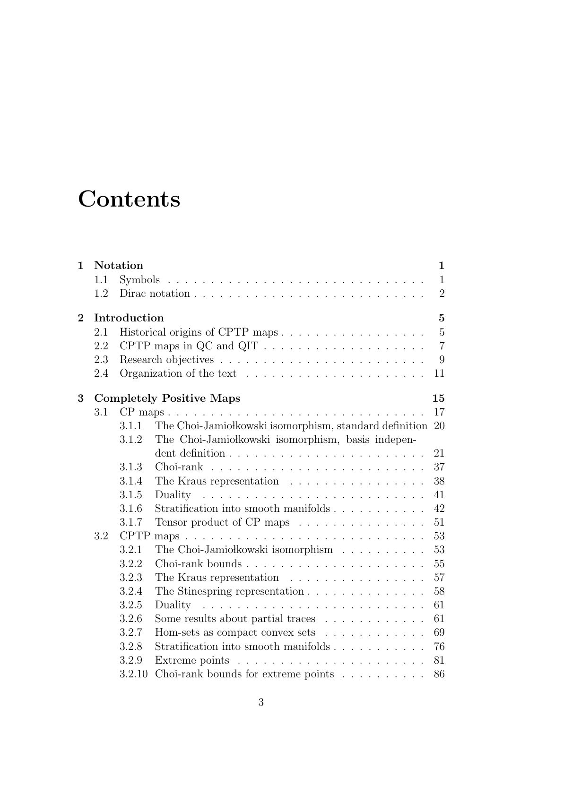 
Low-resolution page preview, page 3

📷 Fig 3

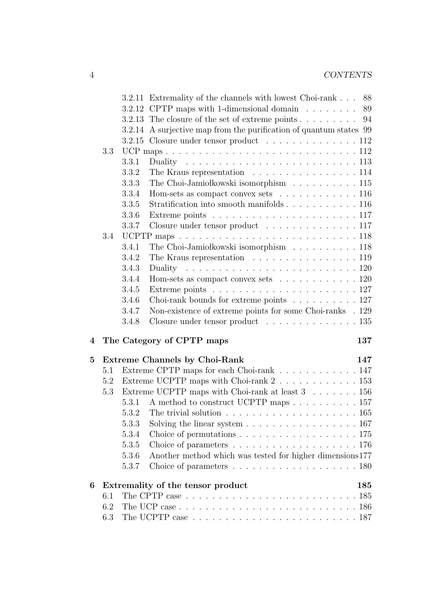 
Low-resolution page preview, page 4

📷 Fig 4

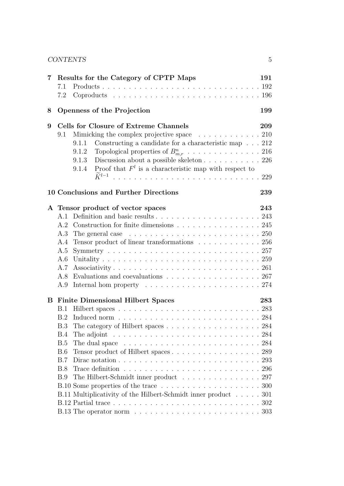 
Low-resolution page preview, page 5

📷 Fig 5

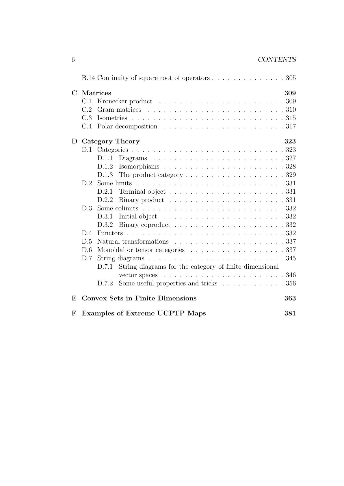 
Low-resolution page preview, page 6

**Summary.** This thesis provides a deep mathematical study of quantum channels (CPTP maps), treating them as objects within abstract mathematical structures. It characterizes the extreme points of these sets and explores their topological and categorical relationships. The work is fundamental for understanding the mathematical limits and structure of quantum operations.

**Why it may be interesting.** This is highly relevant as it provides the rigorous mathematical backbone for understanding noise and dissipation in open quantum systems, which is central to quantum information theory and quantum optics.

Detailed structure

**Main problem.** The paper mathematically analyzes quantum channels (CPTP maps), focusing on characterizing their extreme points, topological structure, and categorical properties.

**Main result.** It establishes that the sets of CPTP and UCPTP maps are compact convex sets, constructing extreme maps for various ranks and proving specific properties regarding the tensor product and existence of products/coproducts.

**Method.** The work employs advanced mathematical tools, including topological techniques (CW structures), category theory (monoidal categories), and functional analysis applied to quantum operations.

**Model / system.** The model is the quantum channel, mathematically represented by Completely Positive Trace-Preserving (CPTP) maps acting on density matrices in finite-dimensional complex Hilbert spaces.

**Key observables.** The primary observables are the quantum channels themselves, characterized by their extreme points, Choi-rank, and structural properties.

**Important parameters / regimes.** The dimensionality of the Hilbert space ($d$) and the rank of the maps are key parameters explored in the construction of extreme examples.

**Assumptions / limitations.** The analysis relies on the mathematical framework of Hilbert spaces and the assumption that the sets of quantum channels form compact convex sets.

**Figures summary.** The notes indicate the presentation of extensive tables detailing parameters for numerous concrete examples of extreme UCPTP maps derived from various mathematical constructions.

**Paper structure.** The paper systematically reviews CPTP/UCPTP maps, details the structure of the category of CPTP maps, presents constructions and properties of extreme CPTP maps, and concludes with topological investigations into the closure of the extreme point set.

Abstract

In this thesis, quantum channels are studied from the point of view of Mathematics. We studied the CPTP (completely positive trace preserving) and UCPTP channels, the latter being the unital channels. In both cases, the sets are compact convex, so they are the closure of their extreme points. We constructed extreme CPTP maps for every possible rank. We also constructed extreme UCPTP maps with rank 2 for each possible dimension. For ranks of at least 3, we constructed extreme UCPTP maps for many dimensions and ranks. We also proved that the tensor product of extreme CPTP maps is an extreme CPTP map. For UCPTP maps, we proved that the same is not always true, with many counterexamples. It is known that the category of CPTP maps is semicartesian. We add to this a classification of binary products. We proved that products only exist in trivial cases. For binary coproducts, we obtained the dimensions they should have, if they exist. In both cases, topological techniques were used. For this reason, we also investigated the topology of the closure of the set of extreme points of the CPTP maps. Topological invariants can be computed from decompositions of a space such as CW structures. These are a type of decomposition in which the space is expressed as a gluing of balls. In the search for a CW structure for the closure of the set of extreme CPTP maps, we obtained a partial decomposition that resembles a CW structure of the complex projective space.

[↑ back to top](#top)

### [Qubits for Dark Matter Hunting](http://arxiv.org/abs/2608.20745v1)

**Authors:** Takeo Moroi  
**Type:** theory · **Category:** other · **PDF:** <https://arxiv.org/pdf/2608.20745v1>  
**Analysis basis:** full PDF text, analyzed in chunks
**Topic relevance:** `quantum measurements` **2/5** · `Tavis-Cummings & cavity-many-emitter` **1/5** · `analog quantum simulation` **1/5** · `correlated / nonlocal dissipation` **1/5** · `driven-dissipative phase transition` **1/5** · `methods for driven-dissipative` **1/5**

📷 Fig 1

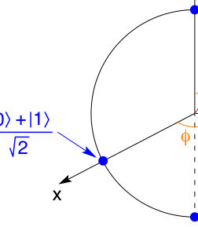 
Figure 2.1: Bloch sphere.

📷 Fig 2

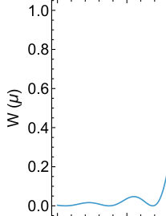 
Figure 3.1: The shape of the function W(µ).

📷 Fig 3

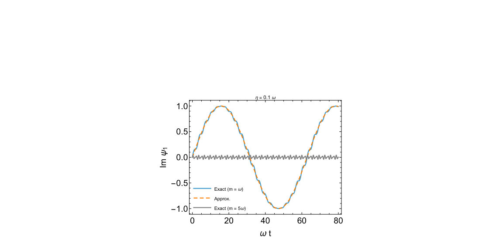 
Figure 3.2: Evolution of Imψ1 as a function of time, taking φ = 0. The initial condition is set as (ψ0(0), ψ1(0)) = (1, 0). The results for the resonance limit (i.e., ω →m) are shown in blue-solid (exact result) and magenta-dashed (RWA result) lines. The gray-solid line shows the exact result for the non-resonance case with ω = 1

📷 Fig 4

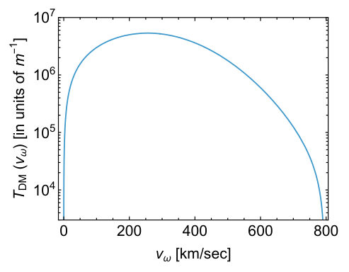 
Figure 3.3: The coherence-time function TDM (in units of m−1, the inverse of the DM mass) as a function of vω, adopting the standard halo model (with vesc = 544 km/sec [68], v0 = 238 km/sec, and v⊙= 251 km/sec [69]).

📷 Fig 5

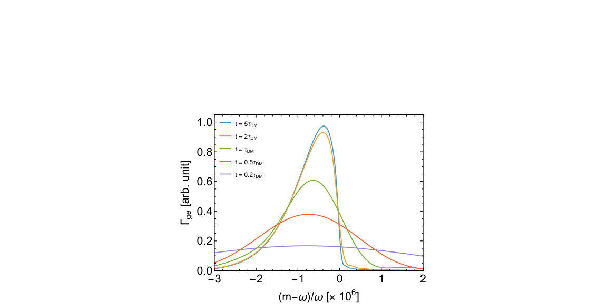 
Figure 3.4: The effective transition rate Γge(t) for several values of t as a function of the normalized detuning (m −ω)/ω. The standard halo model with vesc = 544 km/sec [68], v0 = 238 km/sec, and v⊙= 251 km/sec [69] is adopted.

**Summary.** This review provides an introduction to using quantum qubits as highly sensitive detectors for dark matter, especially wave-like components. It covers the necessary quantum mechanical tools, such as density matrix evolution and quantum sensing limits, to predict potential signal enhancements. The work is crucial for theorists designing next-generation, quantum-enhanced experiments for particle astrophysics.

**Why it may be interesting.** It bridges quantum information theory (quantum metrology, entanglement) directly into fundamental physics searches (DM), providing a rich theoretical framework for open quantum systems applied to cosmology.

Detailed structure

**Main problem.** The paper reviews the application of quantum sensors, particularly qubits, to the direct detection of wave-like Dark Matter (DM) and physics beyond the Standard Model.

**Main result.** Qubits offer a promising platform for DM detection, with the potential for quantum enhancement of sensitivity beyond the Standard Quantum Limit.

**Method.** The review synthesizes theoretical concepts from quantum sensing, including the use of the density matrix formalism, quantum estimation theory (Cramér-Rao bound), and modeling qubit dynamics under external fields and decoherence.

**Model / system.** The primary system is a qubit (two-level quantum system) interacting with an oscillating electric field induced by DM. The dynamics are modeled using the Lindblad equation, and the framework incorporates concepts from cavity QED (Jaynes-Cummings model).

**Key observables.** Qubit coherence time ($	au_Q$), Quantum Fisher Information ($F_Q$), and the measurable excitation of the qubit state.

**Important parameters / regimes.** DM mass ($m$), DM field coherence time ($	au_{DM}$), and the coupling strength between the qubit and the DM field.

**Assumptions / limitations.** The analysis focuses heavily on the wave-like DM regime and assumes the applicability of quantum sensing limits (SQL/Heisenberg limit) for enhancement.

**Figures summary.** Not specified, but the notes reference the Bloch sphere diagram and mathematical formalism for qubit states and operators.

**Paper structure.** The paper progresses from introducing fundamental qubit properties and DM detection concepts to detailing the Hamiltonian dynamics, incorporating noise via the Lindblad equation, and culminating in advanced quantum sensing techniques.

Abstract

An introductory review is provided for those who are interested in exploring applications of qubits and other quantum excitations to the detection of dark matter (and any other physics beyond the Standard Model). Topics covered include the fundamental properties of qubits, the excitation mechanism of qubits due to the electric field induced by dark matter (with attention to the effects of the coherence of dark matter), the dynamics of coupled qubit-cavity systems modeled by the Jaynes-Cummings framework, and the influence of noise and decoherence (especially Markovian noise described by the Lindblad equation). In addition, the article introduces essential concepts in quantum sensing, including the operator-sum representation and positive operator-valued measures, the Cramér-Rao bound, the standard quantum limit and the Heisenberg limit, and the potential enhancement of sensitivity to dark matter achievable with entangled states. Throughout, these topics are discussed with particular emphasis on their application to the detection of wave-like dark matter.

[↑ back to top](#top)

### [Maxwell's Demon in Markov Chain Monte Carlo: Cooling Information Flow and Entropy Balance](http://arxiv.org/abs/2608.21337v1)

**Authors:** Masayuki Ohzeki  
**Type:** theory · **Category:** disordered systems and neural networks · **PDF:** <https://arxiv.org/pdf/2608.21337v1>  
**Analysis basis:** full PDF text, analyzed in chunks
**Topic relevance:** `methods for driven-dissipative` **2/5** · `quantum measurements` **2/5** · `driven-dissipative phase transition` **1/5** · `non-equilibrium universality` **1/5**

📷 Fig 1

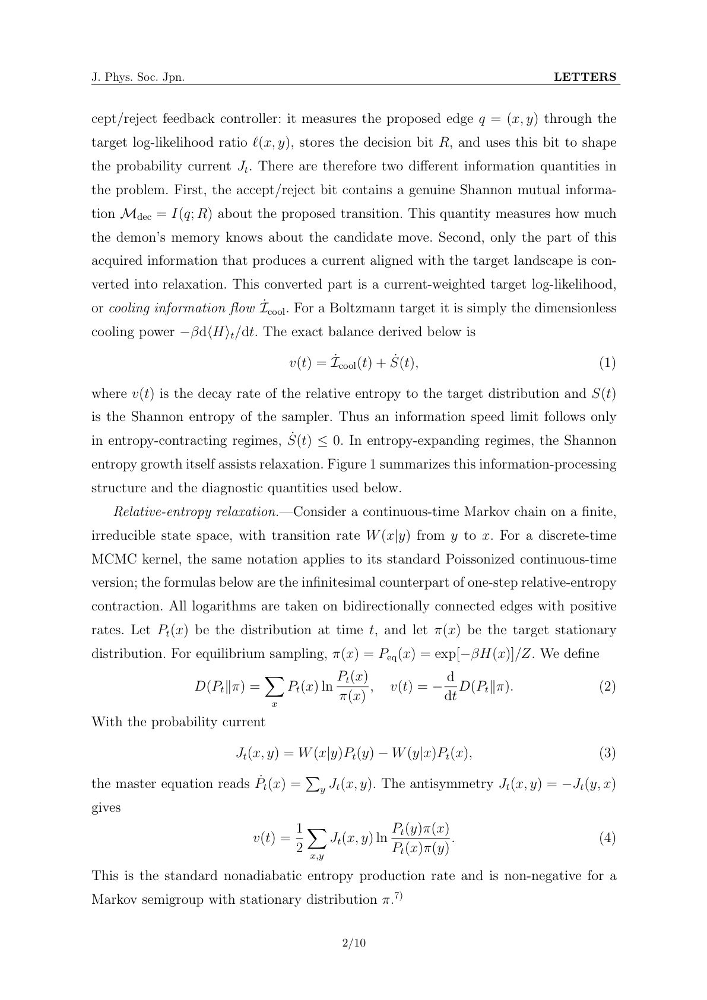 
Low-resolution page preview, page 2

📷 Fig 2

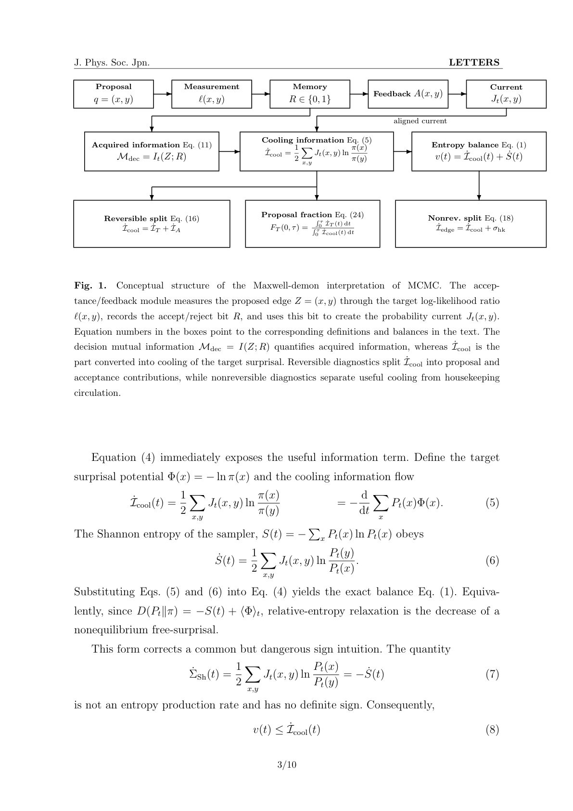 
Low-resolution page preview, page 3

📷 Fig 3

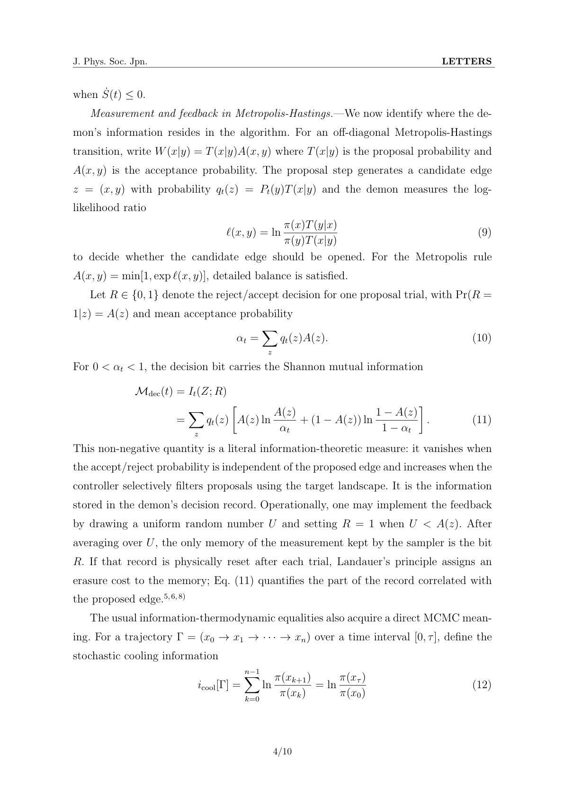 
Low-resolution page preview, page 4

📷 Fig 4

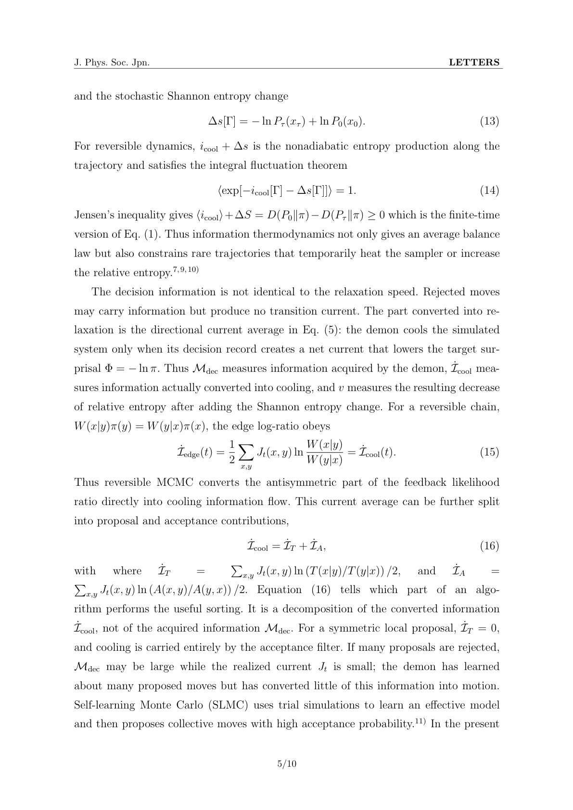 
Low-resolution page preview, page 5

📷 Fig 5

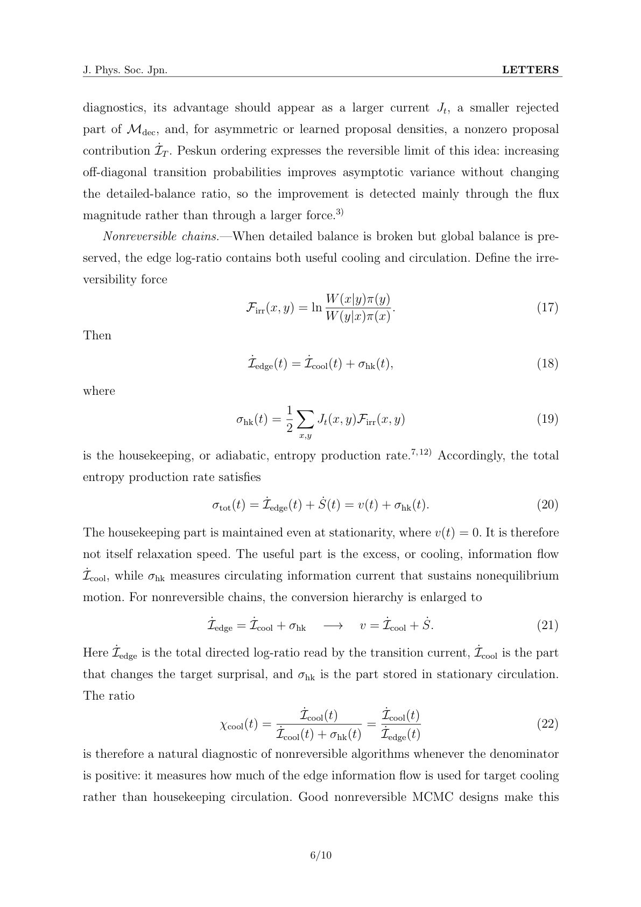 
Low-resolution page preview, page 6

**Summary.** This paper reinterprets MCMC sampling by modeling the acceptance step as a Maxwell's Demon, quantifying the flow of information. It derives an entropy balance equation that separates useful 'cooling' information from 'housekeeping' circulation. The work provides powerful diagnostics to analyze and accelerate sampling algorithms beyond simple relaxation time measurements.

**Why it may be interesting.** The rigorous application of information thermodynamics to MCMC provides novel diagnostics for sampling efficiency, which has parallels in understanding energy dissipation and information flow in complex physical systems.

Detailed structure

**Main problem.** The paper aims to mathematically formalize the analogy between Maxwell's Demon and the acceptance module in Markov Chain Monte Carlo (MCMC) algorithms, linking it to information thermodynamics principles.

**Main result.** It establishes the information balance equation $v(t) = \dot{I}_{cool}(t) + \dot{S}(t)$, showing that acceleration requires maximizing the conversion of decision information into cooling current while minimizing housekeeping circulation.

**Method.** The analysis uses information-theoretic tools, defining mutual information, cooling information flow, and entropy production rates within the framework of MCMC dynamics.

**Model / system.** The model is the MCMC sampling process, viewed as a feedback device operating on a state space governed by a master equation. The analysis compares different MCMC kernels (local MH, learned proposal, irreversible drive) on a 50-state rugged ring.

**Key observables.** Decision Mutual Information ($M_{dec}$), Cooling Information Flow ($\dot{I}_{cool}$), Housekeeping Entropy Production ($\sigma_{hk}$), and the relative-entropy relaxation rate ($v(t)$).

**Important parameters / regimes.** The target distribution ($\pi(x)$), the acceptance/rejection mechanism, and the relaxation time ($	au_{1/2}$) are key parameters.

**Assumptions / limitations.** The analysis relies on viewing the MCMC process through the lens of information flow, particularly distinguishing between useful cooling information and housekeeping circulation.

**Figures summary.** Figure 1 conceptually summarizes the Maxwell-demon interpretation, detailing the flow from Proposal to Measurement to Memory and Feedback to the probability current.

**Paper structure.** The paper builds from identifying the Maxwell demon analogy in MCMC, deriving the core information balance equation, and then applying this framework to analyze and compare different MCMC kernels (local MH vs. learned/irreversible drives) using quantitative diagnostics.

Abstract

Markov chain Monte Carlo algorithms can be viewed as feedback devices that compare a proposed move with the target distribution and then accept or reject it. In this paper the Maxwell demon is identified with the acceptance module: it measures a proposed edge, stores the outcome in the accept/reject bit, and uses that bit to shape the probability current. The decision bit carries a genuine Shannon mutual information about the proposal, whereas only its directional part is converted into a cooling information flow. The relative-entropy relaxation rate obeys $v(t)=\dot{\mathcal I}_{\rm cool}(t)+\dot S(t)$, which separates useful cooling from housekeeping circulation in nonreversible chains.

[↑ back to top](#top)

### [Random quantum circuits, chaos and quantum thermalization](http://arxiv.org/abs/2608.21303v1)

**Authors:** J. T. Chalker  
**Type:** theory · **Category:** statistical mechanics · **PDF:** <https://arxiv.org/pdf/2608.21303v1>  
**Analysis basis:** full PDF text, analyzed in chunks
**Topic relevance:** `analog quantum simulation` **2/5** · `non-equilibrium universality` **2/5** · `methods for driven-dissipative` **1/5** · `scars & prethermalization` **1/5**

📷 Fig 1

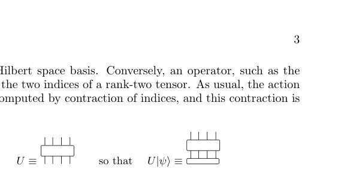 
FIG. 1. Notation for tensor networks.

📷 Fig 2

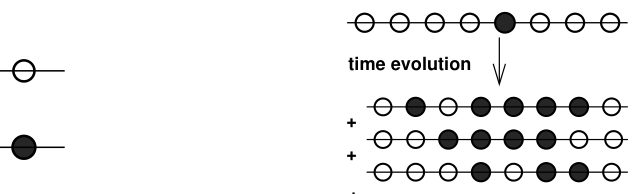 
FIG. 4. An illustration of operator spreading. (Left) Notation: an open circle represents a site at which the operator acts trivially [1 in Eq. (3)] and a filled circle represents a site at which the operator acts non-trivially [X, Y or Z in Eq. (3)]. (Right) Time-evolution: (top) O(x) and (bottom) O(x, t).

📷 Fig 3

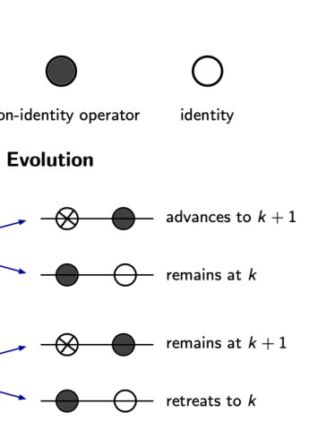 
FIG. 5. Schematic illustration of operator evolution under the action of a two-site gate.

📷 Fig 4

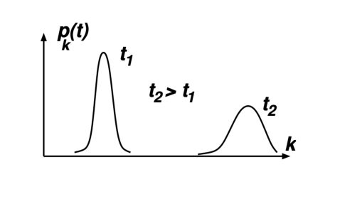 
FIG. 7. Evolution with time t of the probability pk(t) for the right-hand end of an operator string to lie at site k.

📷 Fig 5

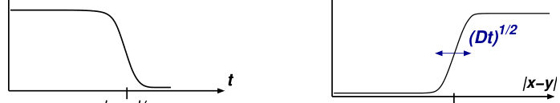 
FIG. 8. Behaviour of the correlator C(x, y; t): (left) as a function of time t at fixed separation |x −y|; (right) as a function of separation at fixed time.

**Summary.** This paper introduces random quantum circuits as a powerful, universal model to study the dynamics of generic many-body quantum systems. By analyzing operator spreading, entanglement, and spectral correlations using techniques inspired by random matrix theory, it provides theoretical insights into quantum thermalization. It is highly relevant for understanding complex quantum dynamics in systems where simple analytical solutions are unavailable.

**Why it may be interesting.** This work connects fundamental concepts from random matrix theory (chaos) to concrete, physically realizable models (random circuits), providing powerful tools to study thermalization and quantum chaos in complex many-body systems relevant to AMO physics.

Detailed structure

**Main problem.** To introduce random quantum circuits as simple, universal models for understanding generic, non-integrable many-body quantum systems.

**Main result.** The analysis provides insights into operator spreading, entanglement dynamics, and spectral correlations, showing that these quantities exhibit universal behavior governed by ensemble averaging.

**Method.** The approach uses random matrix theory concepts, averaging over ensembles of unitary gates, and analyzing the evolution of operators and state vectors using tensor network formalisms.

**Model / system.** The core model is the random quantum circuit (RUC) applied to a 1D chain, which serves as a proxy for generic many-body systems lacking simple quasiparticle descriptions. The analysis also considers Random Floquet Circuits (RFCs) and the Random Phase Model (RPM).

**Key observables.** Operator spreading (Heisenberg picture), entanglement dynamics (Schrödinger picture), and the Spectral Form Factor (SFF), K(t), which measures spectral correlations.

**Important parameters / regimes.** Local Hilbert space dimension (q), coupling strength ($\epsilon$), system size (L), and time/distance scales relative to coupling energies.

**Assumptions / limitations.** The analysis relies on ensemble averaging (over random circuits) and assumes locality in the evolution process. The results are expected to be universal.

**Figures summary.** Figures illustrate tensor network notation for state vectors and operators, the 'brickwork' architecture of quantum circuits, and schematic diagrams detailing the evolution of operator strings and the calculation of the SFF.

**Paper structure.** The paper progresses from establishing the motivation by contrasting RUCs with simpler models, detailing the mathematical framework using tensor networks, and then applying this framework to calculate specific observables like operator spreading and spectral correlations.

Abstract

These notes accompany lectures given in June 2025 at the summer school \emph{Fundamental Problems in Statistical Physics XVI}. They offer a short introduction to random quantum circuits as simple models for generic many-body quantum systems. They give an outline of the motivation for introducing these models, starting from ideas of random matrix theory. They also provide a sketch of calculations of some of the quantities of most physical interest, based on an average over an ensemble of systems. These quantities give insights into operator spreading, entanglement dynamics and spectral correlations.

[↑ back to top](#top)

### [Berry-Curvature Effect in Anomalous Transport](http://arxiv.org/abs/2608.21161v1)

**Authors:** V. P. Mineev  
**Type:** theory · **Category:** strongly correlated electrons · **PDF:** <https://arxiv.org/pdf/2608.21161v1>  
**Analysis basis:** full PDF text, analyzed in chunks
**Topic relevance:** `Keldysh / 2PI / non-Gaussian methods` **2/5** · `analog quantum simulation` **1/5** · `methods for driven-dissipative` **1/5** · `quantum measurements` **1/5**

📷 Fig 1

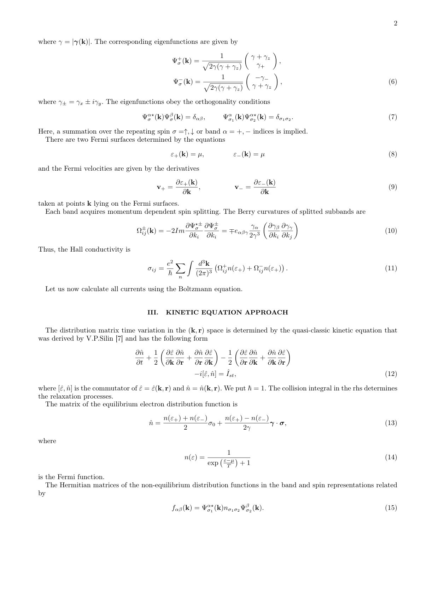 
Low-resolution page preview, page 2

📷 Fig 2

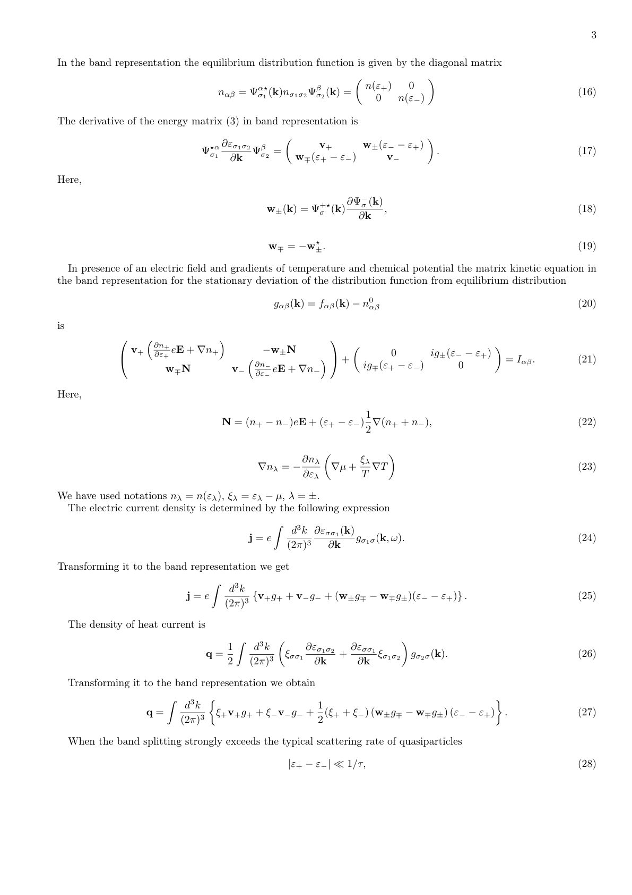 
Low-resolution page preview, page 3

📷 Fig 3

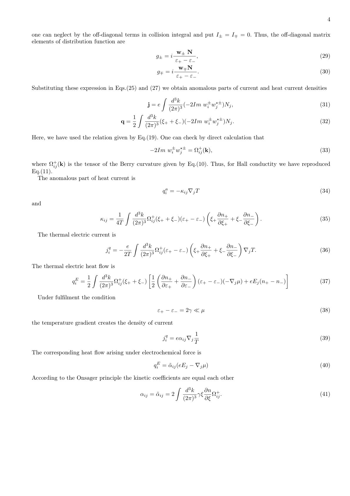 
Low-resolution page preview, page 4

📷 Fig 4

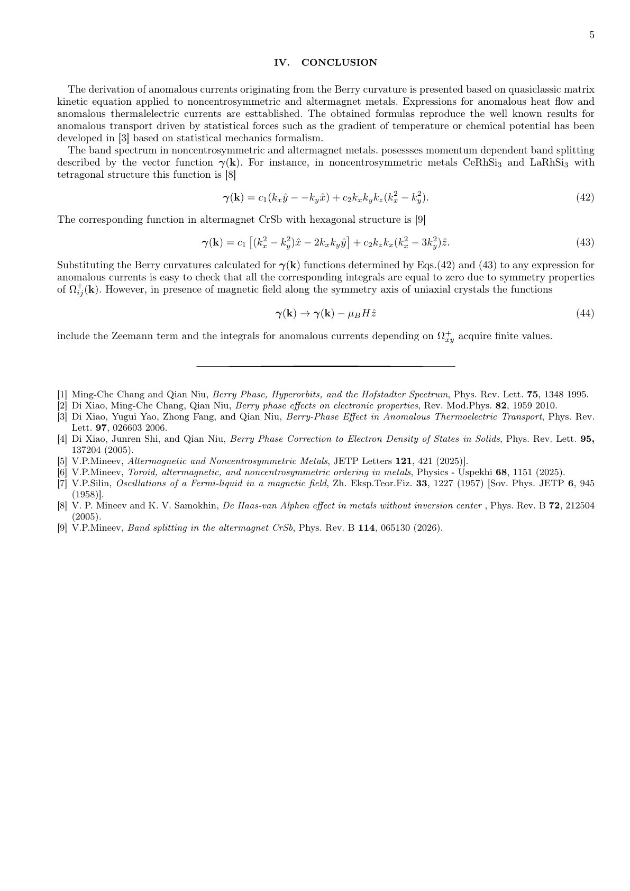 
Low-resolution page preview, page 5

**Summary.** This paper develops a novel theoretical framework to calculate anomalous transport effects, such as anomalous heat and thermoelectric currents, in specific magnetic metals. It achieves this by adapting the quasi-classical matrix kinetic equation to the band structure. The work provides a robust derivation that reproduces known results while offering a distinct methodological approach.

**Why it may be interesting.** While focused on solid-state transport, the use of kinetic equations and Berry curvature formalism connects to non-equilibrium dynamics, which has parallels in open quantum systems theory.

Detailed structure

**Main problem.** The paper aims to provide an alternative theoretical derivation of the Berry-phase effect in anomalous transport phenomena within altermagnets and noncentrosymmetric metals.

**Main result.** The derivation successfully yields expressions for anomalous heat flow, anomalous thermoelectrics currents, and confirms the anomalous Hall effect using the Berry curvature tensor.

**Method.** The analysis employs the quasi-classical matrix kinetic equation, applied to the band representation of the electron distribution function.

**Model / system.** The study models electron energy spectra in altermagnetic or noncentrosymmetric metals using a Hamiltonian structure involving Pauli matrices and a momentum-dependent pseudovector $\gamma(k)$.

**Key observables.** Hall Conductivity ($\sigma_{ij}$), Anomalous Heat Current ($q_a^i$), Thermal Electric Current ($j_q^i$), and Thermal Electric Heat Flow ($q_E^i$).

**Important parameters / regimes.** The derivation is sensitive to the relative magnitude of the band splitting versus the scattering rate, and the presence of external fields (like magnetic fields).

**Assumptions / limitations.** The core approximation used is that the band splitting strongly exceeds the scattering rate ($|\varepsilon_+ - \varepsilon_-| \ll 1/	au$).

**Paper structure.** The paper builds from the general quasi-classical matrix kinetic equation to the specific band representation, applies the necessary approximations, and then derives the anomalous contributions to current and heat flow, linking them to the Berry curvature tensor.

Abstract

A theory of the Berry-phase effect in anomalous transport in ferromagnets driven by statistical forces such as the gradient of temperature or chemical potential has been developed by Di Xiao et al in Phys. Rev. Lett. 97, 026603 (2006) based on a field-dependent density of states generating an additional contribution to the current density. We present an alternative derivation of the Berry- phase effect in anomalous transport in altermagnets and noncentrosymmertric metals based on quasiclassic matrix kinetic equation. Along with anomalous Hall effect an anomalous heat flow and anomalous thermalelectric currents are also derived.

[↑ back to top](#top)

### [Finite Weyl polynomials and the approach to Tsirelson's bound in relativistic scalar quantum field theory](http://arxiv.org/abs/2608.20926v1)

**Authors:** J. G. A. Caribé, M. S. Guimaraes, I. Roditi, S. P. Sorella  
**Type:** theory · **Category:** quantum information and computing · **PDF:** <https://arxiv.org/pdf/2608.20926v1>  
**Analysis basis:** full PDF text, analyzed in chunks
**Topic relevance:** `Keldysh / 2PI / non-Gaussian methods` **2/5** · `quantum measurements` **2/5**

📷 Fig 1

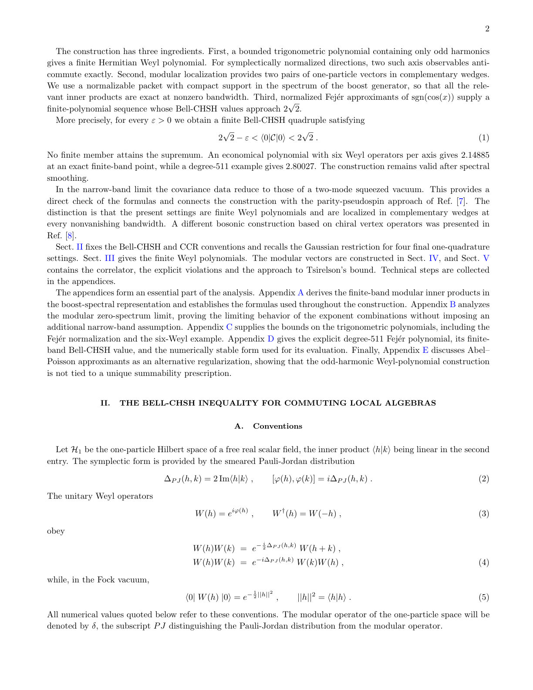 
Low-resolution page preview, page 2

📷 Fig 2

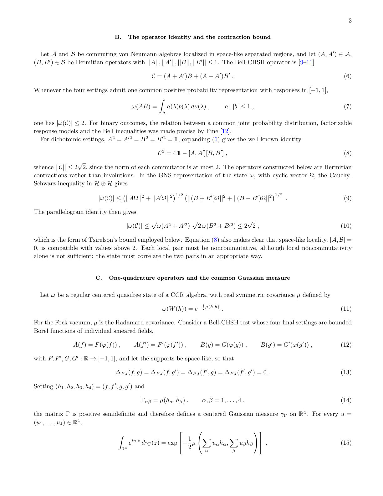 
Low-resolution page preview, page 3

📷 Fig 3

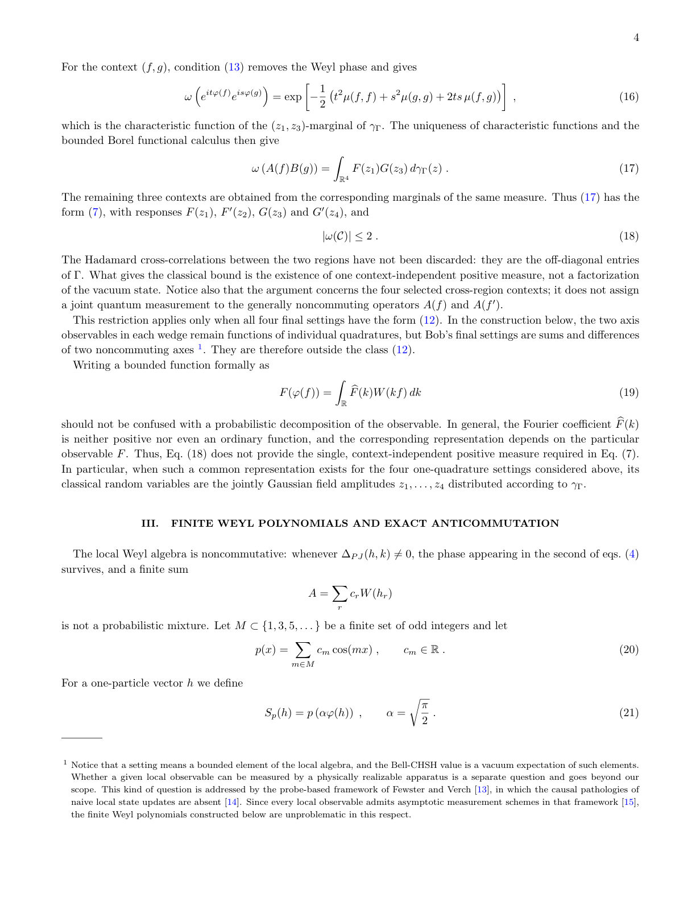 
Low-resolution page preview, page 4

📷 Fig 4

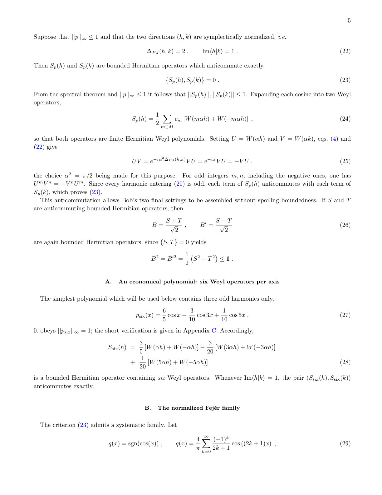 
Low-resolution page preview, page 5

📷 Fig 5

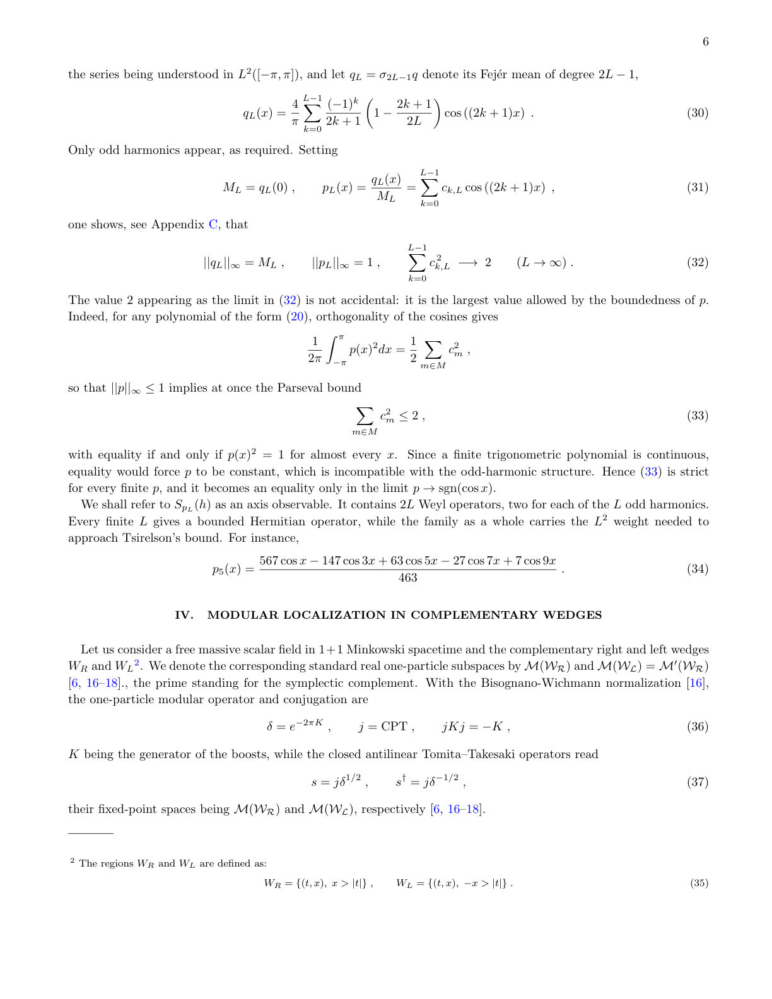 
Low-resolution page preview, page 6

**Summary.** This theoretical paper constructs local observables for the Bell-CHSH inequality in a free massive scalar field using finite polynomials of Weyl operators. By employing Fejér approximants, the authors show that the resulting Bell-CHSH value can approach Tsirelson's bound of $2\sqrt{2}$. This method is significant because it surpasses limitations found in simpler, one-quadrature settings.

**Why it may be interesting.** The work provides a concrete, field-theoretic realization of approaching fundamental quantum limits (like Tsirelson's bound) using structured, finite polynomial approximations, which has implications for understanding entanglement bounds in relativistic quantum systems.

Detailed structure

**Main problem.** The paper aims to construct bounded local operators for the Bell-CHSH inequality in a free massive scalar field, specifically to approach Tsirelson's bound ($2\sqrt{2}$).

**Main result.** The finite-Weyl polynomial construction demonstrates that the Bell-CHSH correlator can approach $2\sqrt{2}$ from below, achieving values like $2.80027$ with a degree-511 polynomial.

**Method.** The authors construct the operators as finite polynomials of unitary Weyl operators, utilizing techniques involving odd Weyl harmonics and normalized Fejér approximants of trigonometric functions.

**Model / system.** The physical system is a free massive scalar field in $1+1$ dimensions, analyzed using the framework of Weyl operators and spectral representations in rapidity space.

**Key observables.** The Bell-CHSH correlator $\langle 0|C|0
angle$ is the primary diagnostic, alongside the construction of four bounded Hermitian operators.

**Important parameters / regimes.** The degree of the polynomial (e.g., 511) and the bandwidth of the spectral packets are key parameters controlling the approximation quality.

**Assumptions / limitations.** The construction circumvents the restriction that limits Bell-CHSH tests to $\le 2$ by ensuring Bob's final settings mix two noncommuting axis observables.

**Figures summary.** The notes detail the calculation of the Bell-CHSH expectation value using specific finite polynomial approximations (e.g., $B_{	ext{spec}}^{511}$ and $B_{511}$), comparing them to the theoretical limit.

**Paper structure.** The paper builds from the general problem of local operators in QFT, details the construction using Weyl polynomials and spectral localization, and culminates in numerical calculations using Fejér approximants to approach the theoretical bound.

Abstract

We construct four bounded Hermitian operators, each one a finite polynomial in the unitary Weyl operators, for the Bell-CHSH inequality in a free massive scalar field in $1+1$ dimensions. The operators are localized in complementary wedges. Odd Weyl harmonics provide two exactly anticommuting axis observables in each wedge, while normalizable packets with compact support in the spectrum of the boost generator give exact modular inner products at nonvanishing bandwidth. The resulting Bell-CHSH correlator is a finite double sum. An operator with six Weyl terms per axis already gives $2.14885$. Using normalized Fejér approximants of $\operatorname{sgn}(\cos(x))$, we show that the supremum over the finite-polynomial family equals $2\sqrt{2}$, although no finite member attains it; a degree-$511$ example gives $2.80027$. We also point out that, in a centered quasifree state, a Bell-CHSH test whose four final settings are bounded functions of individual quadratures admits one common Gaussian representation and therefore stays below $2$. The finite-Weyl construction avoids this restriction because Bob's final settings mix two noncommuting axis observables.

[↑ back to top](#top)

### [Quantum thermodynamics and semidefinite optimization: Boltzmann, Fermi-Dirac, and Bose-Einstein frameworks](http://arxiv.org/abs/2608.21123v1)

**Authors:** Michele Minervini, Nana Liu, Dhrumil Patel, Mark M. Wilde  
**Type:** theory · **Category:** statistical mechanics · **PDF:** <https://arxiv.org/pdf/2608.21123v1>  
**Analysis basis:** full PDF text, analyzed in chunks
**Topic relevance:** `Keldysh / 2PI / non-Gaussian methods` **2/5** · `analog quantum simulation` **1/5** · `quantum measurements` **1/5**

📷 Fig 1

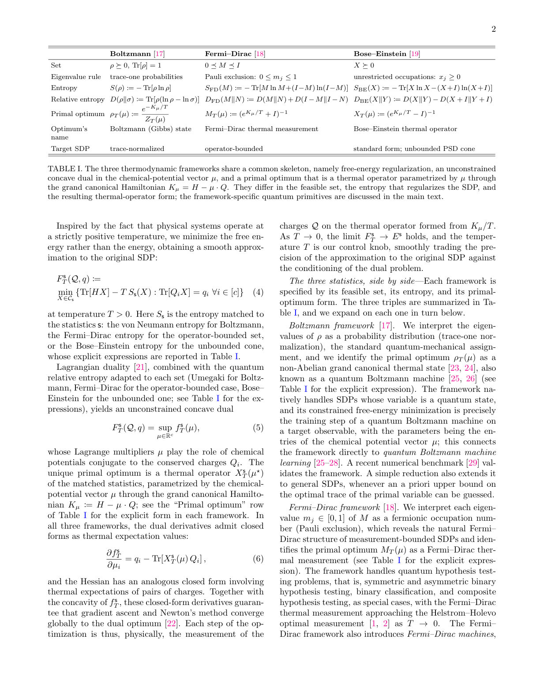 
Low-resolution page preview, page 2

📷 Fig 2

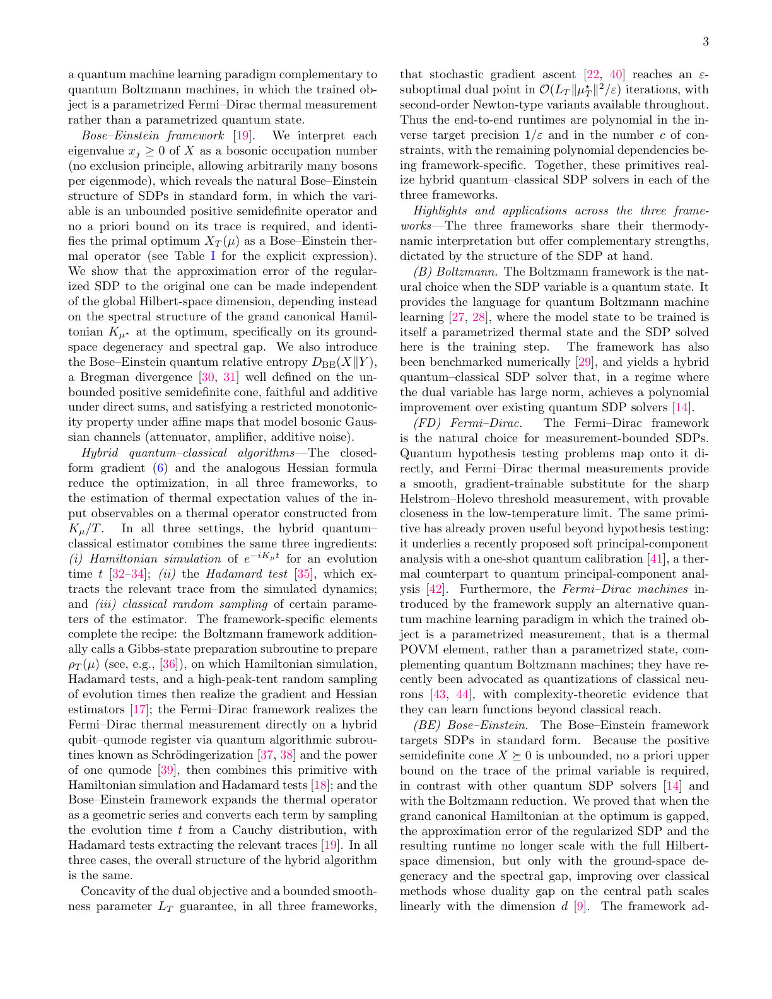 
Low-resolution page preview, page 3

📷 Fig 3

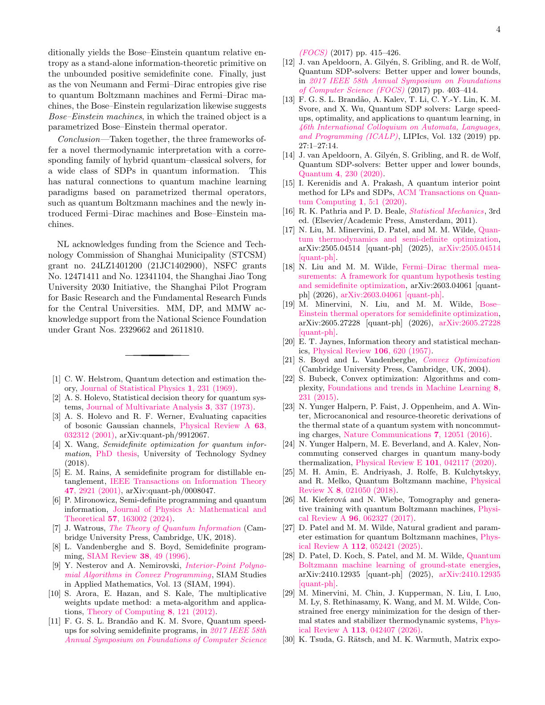 
Low-resolution page preview, page 4

📷 Fig 4

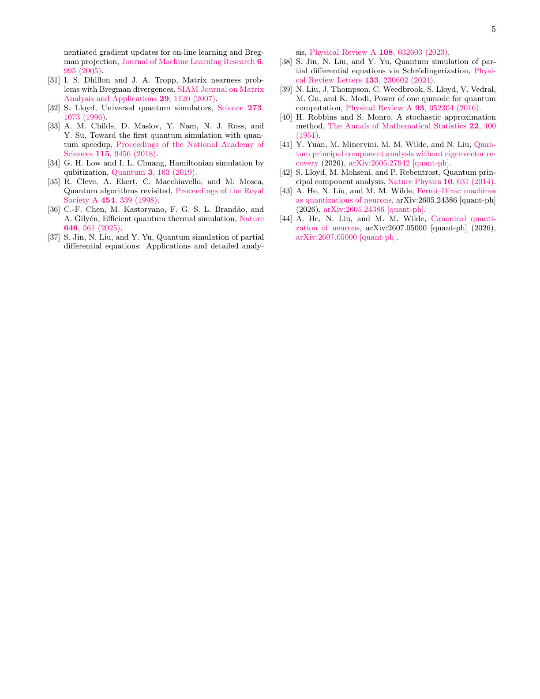 
Low-resolution page preview, page 5

**Summary.** This work unifies the mathematical structure of quantum information problems (SDPs) by interpreting them through the lens of quantum thermodynamics. It demonstrates that Boltzmann, Fermi-Dirac, and Bose-Einstein statistics each provide a natural, solvable regularization for different types of quantum constraints. This yields hybrid quantum-classical algorithms for solving complex quantum optimization problems.

**Why it may be interesting.** It provides a powerful, unifying mathematical tool that connects the abstract optimization problems of quantum information theory directly to fundamental concepts of statistical mechanics (thermal expectation values, chemical potentials).

Detailed structure

**Main problem.** The paper aims to develop a unified thermodynamic framework to interpret various Semidefinite Programs (SDPs) that arise in quantum information theory.

**Main result.** It shows that three distinct statistical ensembles—Boltzmann, Fermi-Dirac, and Bose-Einstein—each provide a natural thermodynamic regularization for different types of SDP constraints, leading to a common mathematical structure.

**Method.** The approach involves using free-energy regularization and Lagrangian duality to transform constrained SDPs into unconstrained, concave dual optimization problems parameterized by chemical potentials.

**Model / system.** The analysis covers quantum systems governed by three statistical frameworks: Boltzmann (for state variables), Fermi-Dirac (for measurement operators), and Bose-Einstein (for general PSD operators). The optimization is governed by a grand canonical Hamiltonian.

**Key observables.** The dual gradient and Hessian are shown to be closed-form as thermal expectation values, which are the key quantities for algorithm implementation.

**Important parameters / regimes.** Temperature (T) acts as a continuous control parameter, allowing the method to smoothly approximate the original, hard-constrained SDPs.

**Assumptions / limitations.** The method assumes the system can be treated at a finite temperature T>0 to obtain a smooth approximation of the original SDP. For the BE case, it assumes the Hamiltonian is gapped.

**Figures summary.** Table I summarizes the three frameworks, detailing the feasible set, entropy, relative entropy, and the form of the primal optimum for Boltzmann, FD, and BE statistics.

**Paper structure.** The paper first establishes the general thermodynamic regularization for SDPs, then details the specific mathematical and algorithmic implementations for the Boltzmann, Fermi-Dirac, and Bose-Einstein cases, culminating in a discussion of hybrid quantum-classical solvers.

Abstract

Here we argue how quantum thermodynamics offers a unifying interpretation for a wide class of semidefinite programs (SDPs) that arise in quantum information. Three SDP variable constraints, namely trace-one density operators, operator-bounded measurements, and the unbounded positive semidefinite cone, admit thermodynamic regularizations associated with Boltzmann, Fermi-Dirac, and Bose-Einstein statistics, respectively. In each case the entropy-regularized dual is unconstrained and concave in a chemical-potential vector, and the primal optimum is a thermal operator of the matched statistics. The dual gradient and Hessian are thermal expectation values, enabling hybrid quantum-classical algorithms for solving a wide variety of SDPs.

[↑ back to top](#top)

### [Two-dimensional percolation with algebraically decaying interactions II: Critical exponents in the long-range regime](http://arxiv.org/abs/2608.20750v1)

**Authors:** Ziyu Liu, Tianning Xiao, Zhijie Fan, Youjin Deng  
**Type:** both · **Category:** statistical mechanics · **PDF:** <https://arxiv.org/pdf/2608.20750v1>  
**Analysis basis:** full PDF text, analyzed in chunks
**Topic relevance:** `analog quantum simulation` **2/5** · `non-equilibrium universality` **2/5**

📷 Fig 1

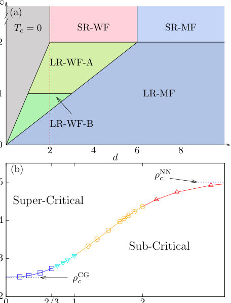 
FIG. 1. (a) Proposed universality class diagram of the LR- percolation model in the (d, σ) plane. “SR” and “LR” de- note short-range and long-range, respectively; “WF” repre- sents the Wilson–Fisher fixed point, and “MF” denotes mean- field behavior. In the “Tc = 0” regime, percolation occurs only at the trivial fully occupied-bond limit, analogous to a zero-temperature transition in the spin system. The verti- cal dashed line marks d = 2, the case studied in this work. (b) The phase diagram of the 2D LR bond percolation model. The symbols mark the estimated critical parameter ρc(σ) (the number of occupied bonds per site is 2ρc, see the main text) in the different universality regimes: blue...

📷 Fig 2

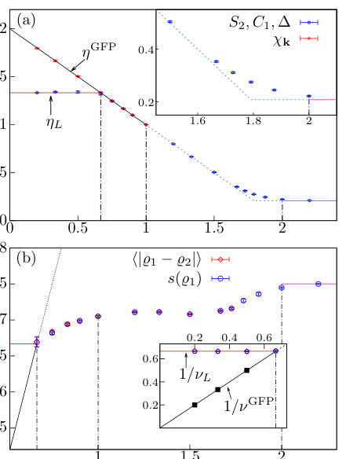 
FIG. 2. Overview of the critical exponents across the two- dimensional LR-percolation regimes. (a) Anomalous dimen- sion η as a function of σ, obtained from S2, C1, ∆, and χk, defined in Sec. II B. The dashed line denotes the Sak refer- ence η = max(2 −σ, ηSR) [9], and the horizontal line marks the SR value. For 2/3 &lt; σ ≤1, the data are consistent with η = 2 −σ. In the LR-WF-A regime, deviations from this form become visible near σ ≃3/2 and are clearly resolved for larger σ, while the boundary point σ = 2 remains distinct from the SR value (inset). For 0 &lt; σ ≤2/3, S2, C1, ∆follow the CG-asymptotic scaling exponent ηL = 4/3, whereas χk follows the GFP scaling ηGFP = 2 −σ. (b) Thermal scal-...

📷 Fig 3

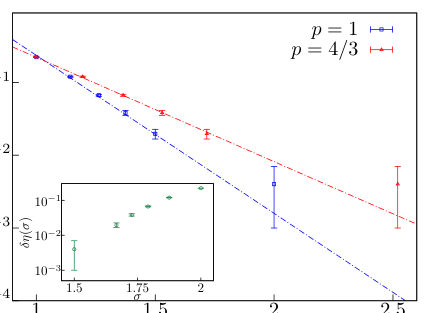 
FIG. 4. Phenomenological visualization of δη(σ) = η(σ) − (2 −σ). The deviation is clearly resolved in the upper part of the LR-WF-A and decreases rapidly toward the LR-WF- B interval. The reference curves illustrate the conjectured essential-singularity-like form A exp[−B/(σ −1)p] for repre- sentative values of p.

📷 Fig 4

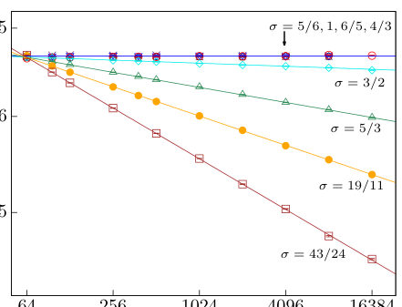 
FIG. 3. Log-log plot of ∆/L1+σ/2 as a function of system size L for various σ. The fitted leading correction has been subtracted using ω(43/24) = 0.4231, ω(19/11) = 0.4081, ω(5/3) = 0.3998, ω(3/2) = 0.512, ω(4/3) = 0.5497, ω(1) = 0.77, and ω(5/6) = 0.5867, where ω ≡y1 denotes the fit- ted leading correction exponent. Because the y1 term cannot be resolved reliably for σ = 6/5 (see Table VI), no leading- correction subtraction is applied to that curve. A constant normalization is applied to facilitate comparison. A visible slope develops near σ ≃3/2 and becomes more pronounced at larger σ. For σ ≤4/3, the data tend toward the blue guide line.

📷 Fig 5

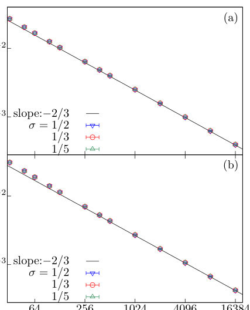 
FIG. 5. Log-log plot of s(ϱ1) and ⟨|ϱ1 −ϱ2|⟩as functions of system size L for various σ in the LR-MF regime. Both observables follow L−2/3 scaling.

**Summary.** This paper performs extensive Monte Carlo simulations to map out the critical behavior of 2D bond percolation with long-range, algebraically decaying interactions. It identifies three distinct universality regimes based on the decay exponent $\sigma$. The work is significant for clarifying how critical properties transition between different scaling behaviors, such as Gaussian Fixed Point and Complete Graph asymptotics, in long-range statistical systems.

**Why it may be interesting.** While focused on classical percolation, the study of critical exponents and universality classes in long-range interacting systems provides crucial benchmarks for understanding critical phenomena in many-body quantum systems where interactions decay slowly.

Detailed structure

**Main problem.** The paper investigates the critical exponents and universality diagram for two-dimensional bond percolation when the interaction decay is algebraic, $p(r) \propto 1/r^{2+\sigma}$.

**Main result.** The study establishes three distinct universality regimes (LR-WF-A, LR-WF-B, LR-MF) and finds that global observables can exhibit coexistence between Complete-Graph asymptotics and Long-Range Gaussian-Fixed-Point scaling.

**Method.** The research employs comprehensive Monte Carlo simulations using the event-based ensemble method, supplemented by conventional ensemble simulations and finite-size scaling analysis.

**Model / system.** The model is two-dimensional bond percolation on a lattice where the connection probability decays algebraically with distance $r$ according to $p(r) \propto 1/r^{2+\sigma}$.

**Key observables.** Critical exponents, specifically the anomalous dimension ($\eta$) and the correlation-length exponent ($
u(\sigma)$), are key observables.

**Important parameters / regimes.** The interaction decay exponent $\sigma$ is the primary tuning parameter, defining regimes such as $1 < \sigma \leq 2$ (LR-WF-A) and $0 < \sigma \leq 2/3$ (LR-MF).

**Assumptions / limitations.** The analysis assumes the validity of different scaling theories (Wilson-Fisher, Gaussian Fixed Point, Complete Graph) depending on the value of $\sigma$.

**Figures summary.** Figures are expected to show the universality class diagram in the $(d, \sigma)$ plane and plots comparing calculated critical exponents ($\eta$ vs $\sigma$) against theoretical predictions.

**Paper structure.** The paper systematically analyzes the critical behavior across different $\sigma$ regimes, presenting quantitative results in tables detailing fits for various susceptibilities ($\Delta, S_2, \chi_k$) across different $\sigma$ values.

Abstract

We present a comprehensive Monte Carlo study of two-dimensional bond percolation with algebraically decaying connection probabilities $p(r)\propto 1/r^{2+σ}$, establishing the universality diagram in the long-range (LR) regime for $σ\le2$. Using the event-based ensemble method, we simulate systems with linear sizes up to $L=16384$ and investigate three universality regimes: LR Wilson--Fisher (WF) A ($1<σ\le2$), LR Wilson--Fisher B ($2/3<σ\le1$), and LR mean-field (MF) ($0<σ\le2/3$). In the LR-WF-B regime, the anomalous dimension is consistent with $η=2-σ$, in agreement with mathematical results for $2/3<σ<1$, while the correlation-length exponent $ν(σ)$ exhibits nontrivial, non-Gaussian variation. In the LR-WF-A regime, although $η$ remains close to $2-σ$ for smaller $σ$, statistically resolvable deviations $δη(σ)=η-(2-σ)>0$ start to appear near $σ\simeq3/2$ and grow toward the short-range crossover at $σ=2$. Finally, by complementing the event-based simulations with conventional ensemble simulations, we reveal the coexistence of complete-graph asymptotics and LR Gaussian-fixed-point scaling in the LR-MF regime. These results further clarify the critical properties in long-range percolation and provide crucial benchmarks for long-range statistical systems.

[↑ back to top](#top)

### [Axiomatization of the Levin--Wen Wave Function](http://arxiv.org/abs/2608.21109v1)

**Authors:** Zhengwei Liu, Zishuo Zhao  
**Type:** theory · **Category:** other · **PDF:** <https://arxiv.org/pdf/2608.21109v1>  
**Analysis basis:** full PDF text, analyzed in chunks
**Topic relevance:** `analog quantum simulation` **2/5** · `quantum measurements` **1/5**

📷 Fig 1

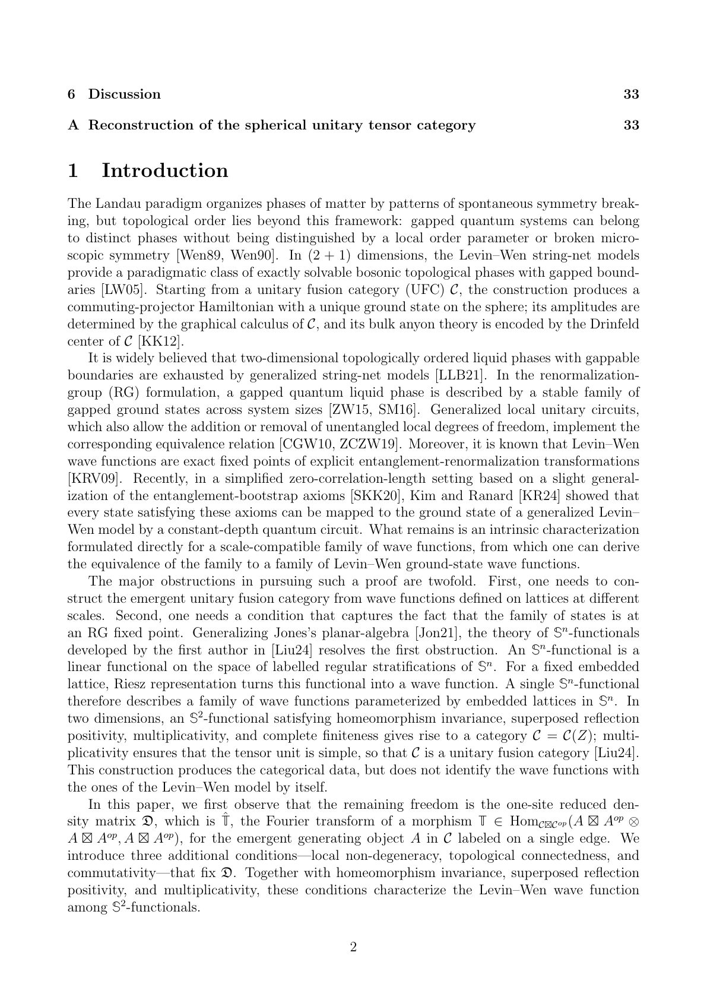 
Low-resolution page preview, page 2

📷 Fig 2

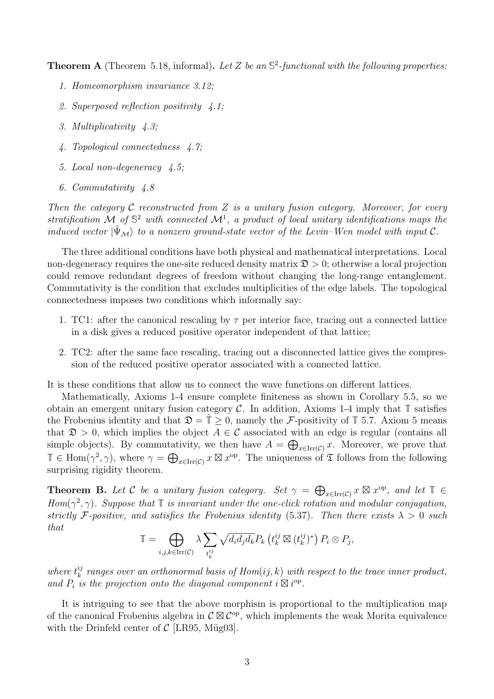 
Low-resolution page preview, page 3

📷 Fig 3

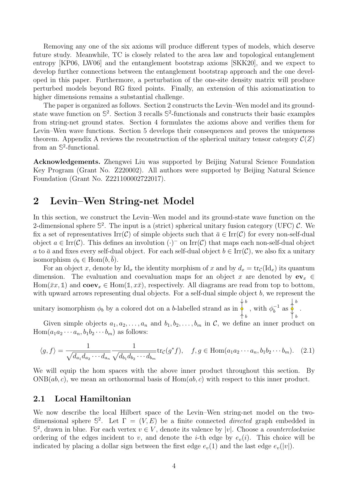 
Low-resolution page preview, page 4

📷 Fig 4

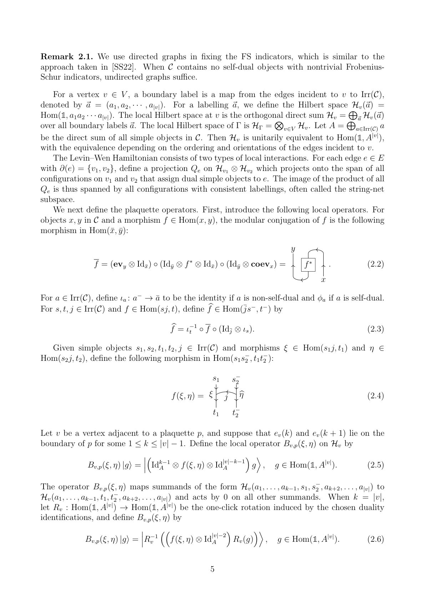 
Low-resolution page preview, page 5

📷 Fig 5

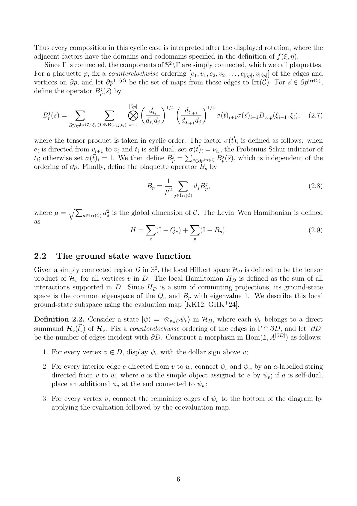 
Low-resolution page preview, page 6

**Summary.** This paper introduces a set of six mathematical axioms designed to characterize the ground-state wave functions of the Levin--Wen model intrinsically. By imposing these axioms on multi-scale wave functions, the authors successfully reconstruct the underlying unitary fusion category and prove that the resulting state is a valid topological ground state. This offers a powerful, axiomatic framework for understanding topological order beyond Hamiltonian assumptions.

**Why it may be interesting.** This work provides a powerful, purely axiomatic characterization of topological order states, linking abstract mathematical structures (fusion categories) directly to physical ground states in a way that is highly relevant to understanding entanglement and topological phases in quantum systems.

Detailed structure

**Main problem.** The central problem is to characterize the ground-state wave functions of the Levin--Wen model intrinsically, without relying on prior knowledge of the underlying Hamiltonian or categorical symmetry data.

**Main result.** The authors propose six axioms on multi-scale wave functions that are sufficient to uniquely reconstruct the underlying unitary fusion category and prove the resulting state is a non-zero Levin--Wen ground state.

**Method.** The approach involves developing and applying a set of axioms to a family of wave functions, utilizing specialized mathematical tools like $S_n$-functionals and analyzing the structure of $C^*$-tensor categories.

**Model / system.** The study focuses on the Levin--Wen model, which realizes topological order associated with a unitary fusion category on a lattice embedded in the 2D sphere. The ground state is defined by the common eigenspace of local edge and plaquette projection operators.

**Key observables.** The $S_2$-functional, the one-site reduced density matrix $D$, and the emergent unitary fusion category $C$.

**Important parameters / regimes.** Topological parameters $	au$ and $\mu$, and the scale factor $\lambda$ measuring the discrepancy between prescribed and reconstructed inner products.

**Assumptions / limitations.** The analysis assumes the existence of a multi-scale wave function satisfying the proposed axioms, and later work suggests generalizing the exchange relation to higher dimensions.

**Paper structure.** The paper progresses from defining the Levin--Wen model and its Hamiltonian structure to introducing the $S_2$-functionals. It then systematically develops and verifies the six axioms, culminating in theorems that establish the equivalence between satisfying these axioms and possessing a valid ground state.

Abstract

The Levin--Wen model provides a lattice realization of topological orders associated with a given unitary fusion category. A longstanding open problem is to characterize Levin--Wen ground-state wave functions intrinsically, without assuming a priori categorical symmetry data or a Hamiltonian. We address this by proposing six axioms on a family of wave functions defined on lattices at multiple scales. These axioms allow us to reconstruct the underlying unitary fusion category and prove that the resulting wave functions map to nonzero Levin--Wen ground-state vectors of the emergent category.

[↑ back to top](#top)

### [Entangling Power Dynamics: Ergodicity and Mixing](http://arxiv.org/abs/2608.21151v1)

**Authors:** Rahul V, Ranjan Modak, Shaon Sahoo, S Aravinda  
**Type:** theory · **Category:** statistical mechanics · **PDF:** <https://arxiv.org/pdf/2608.21151v1>  
**Analysis basis:** full PDF text, analyzed in chunks
**Topic relevance:** `analog quantum simulation` **2/5** · `scars & prethermalization` **1/5**

📷 Fig 1

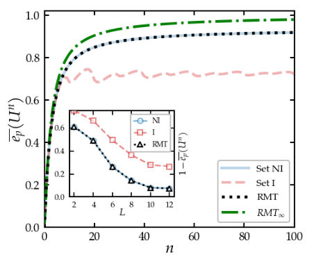 
Figure 1. Entangling power of the Floquet time- evolution operator versus the number of time steps n, for L = 10. Results are presented for integrable set I, non-integrable Set NI, finite and infinite-sized RMT model. Inset show 1 −ep(Un) vs the system size L,for n = 100.

📷 Fig 2

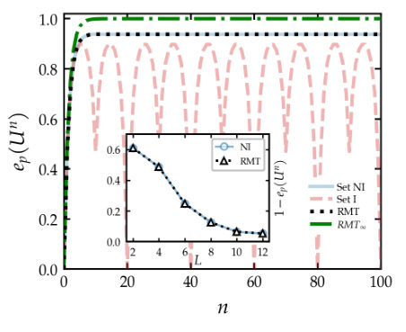 
Figure 2. Entangling power of the Floquet time- evolution operator versus the number of time steps n, for L = 10. Results are presented for integrable set I, non-integrable Set NI, finite and infinite-sized RMT model. Inset show 1 −ep(Un) vs the system size L,for n = 100.

📷 Fig 3

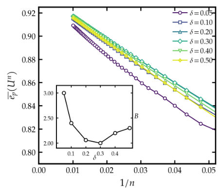 
Figure 3. Average entangling power vs 1/n, here n ranges from 20 to 100 for different values of δ. Data is fitted with a function f −B/n (where f and B are fitting parameters), and inset shows B vs δ plot.

📷 Fig 4

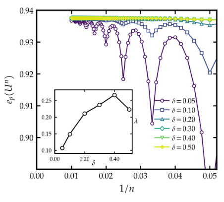 
Figure 4. Entangling power vs 1/n, here n ranges from 20 to 100 for different values of δ. Inset shows the variation of the fitting parameter λ (which we refer as Lyapunov like like exponent) with δ.

**Summary.** This paper develops a framework using entangling power to diagnose quantum dynamics, establishing a hierarchy where mixing implies ergodicity, but not the reverse. By applying this to the kicked Ising chain, the authors successfully distinguish between ergodic (but nonmixing) and mixing systems, providing a powerful tool for classifying quantum chaotic behavior.

**Why it may be interesting.** This work provides a novel, information-theoretic diagnostic tool (entangling power) to distinguish between different dynamical regimes (ergodic vs. mixing) in quantum many-body systems, offering insights beyond traditional spectral or correlation function analyses.

Detailed structure

**Main problem.** The paper aims to characterize the underlying dynamics of quantum evolution by studying the signatures imprinted on the time-dependent entangling power, specifically distinguishing between ergodicity and mixing.

**Main result.** The authors establish that mixing implies ergodicity, but not vice versa; they show that nonintegrable many-body systems can exhibit mixing while integrable ones remain ergodic but nonmixing.

**Method.** The analysis uses the entangling power, defined via linear entropy, to quantify entanglement generation over time. They introduce a Lyapunov-like exponent to characterize the rate of approach to saturation.

**Model / system.** The study applies to general unitary operators, specifically analyzing two-qubit gates and the kicked Ising chain in both integrable and nonintegrable regimes.

**Key observables.** Entangling Power ($	ext{ep}(U)$), Long-time-averaged entangling power ($	ext{epsat}(U)$), Lyapunov-like exponent, and the Haar-averaged linear entropy.

**Important parameters / regimes.** Degree of integrability breaking ($\delta$), time steps ($n$), and the system size (for the Ising chain).

**Assumptions / limitations.** The characterization relies on the definitions of ergodicity (average equals Haar average) and mixing (time-dependent power converges to Haar average).

**Figures summary.** Figures likely show the time evolution of entangling power for different parameters ($\delta$) and the systematic increase of the decay rate ($\lambda$) with the degree of integrability breaking.

**Paper structure.** The paper first defines the diagnostic tools (entangling power, ergodicity, mixing) and then applies them sequentially to two-qubit gates and the kicked Ising chain, culminating in the establishment of the ergodic hierarchy and the Lyapunov exponent analysis.

Abstract

We study quantum dynamics through the lens of entanglement generation and characterize the underlying unitary evolution by the distinct signatures it imprints on the time-dependent entangling power. For a unitary operator, we characterize ergodicity by the equality between its long-time-averaged entangling power and the Haar-averaged linear entropy. We define mixing more stringently as the convergence of the time-dependent entangling power itself to the Haar value at long times. Within this framework, we establish the ergodic hierarchy of dynamical behavior, showing in particular that mixing implies ergodicity, whereas ergodicity does not necessarily imply mixing. As an application, we find that two-qubit unitary gates are neither ergodic nor mixing: their long-time-averaged entangling power can take only four discrete values, none of which coincides with the Haar average. We then investigate many-body dynamics using the kicked Ising chain and find that the long-time-averaged entangling power converges to the Haar value in both integrable and nonintegrable cases, indicating ergodicity. Remarkably, however, the nonintegrable chain exhibits mixing, whereas the integrable chain, despite being ergodic, is demonstrably nonmixing. We also introduce a Lyapunov-like exponent to characterize the rate at which the time-dependent entangling power approaches its saturation value. We find that this exponent increases systematically with the degree of integrability breaking in the many-body system. Our results establish entanglement generation as a useful framework for characterizing dynamical systems and reveal qualitatively different signatures of integrability beyond conventional diagnostics.

[↑ back to top](#top)

### [Note on proliferation transitions of non-Abelian anyons](http://arxiv.org/abs/2608.20604v1)

**Authors:** Meng Cheng  
**Type:** theory · **Category:** strongly correlated electrons · **PDF:** <https://arxiv.org/pdf/2608.20604v1>  
**Analysis basis:** full PDF text, analyzed in chunks
**Topic relevance:** `Keldysh / 2PI / non-Gaussian methods` **2/5** · `analog quantum simulation` **1/5**

📷 Fig 1

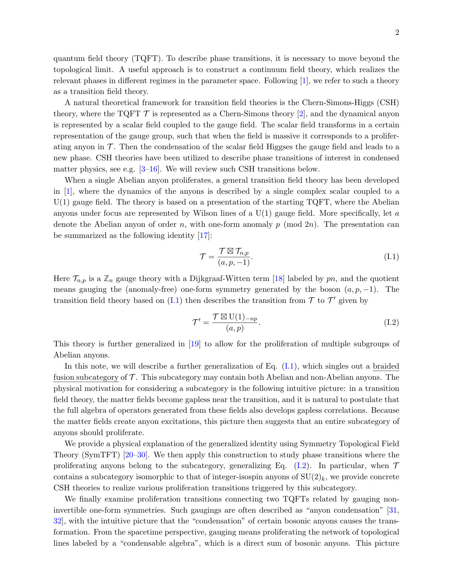 
Low-resolution page preview, page 2

📷 Fig 2

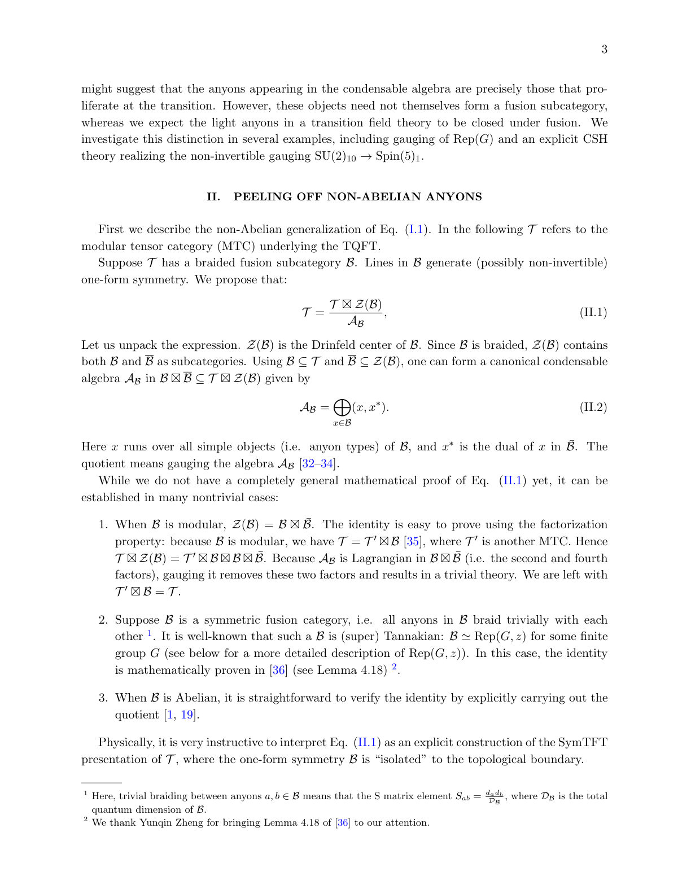 
Low-resolution page preview, page 3

📷 Fig 3

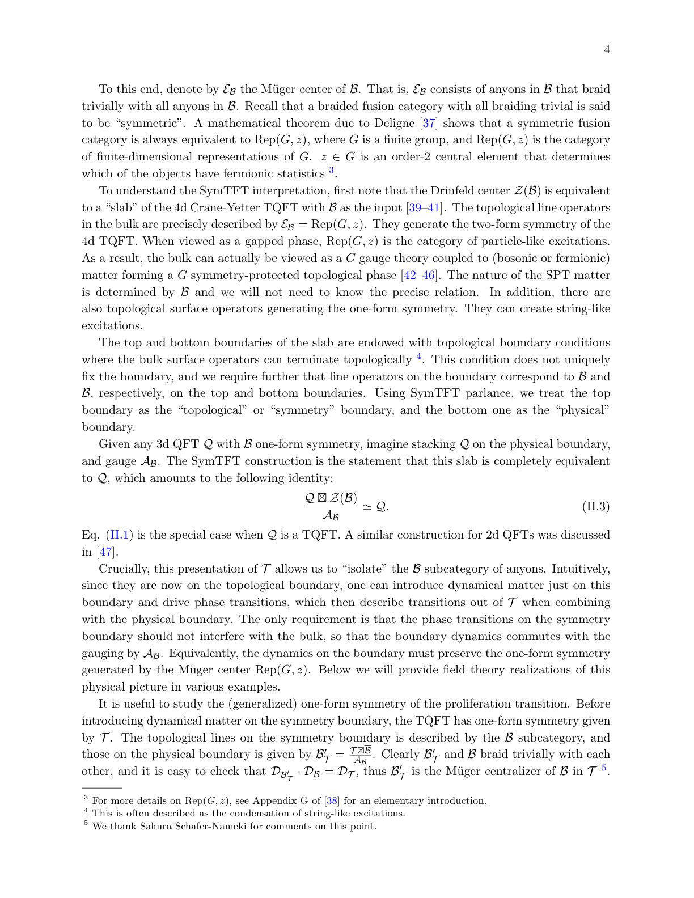 
Low-resolution page preview, page 4

📷 Fig 4

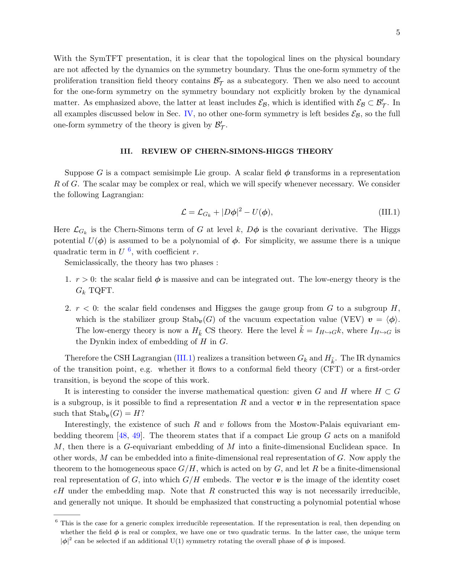 
Low-resolution page preview, page 5

📷 Fig 5

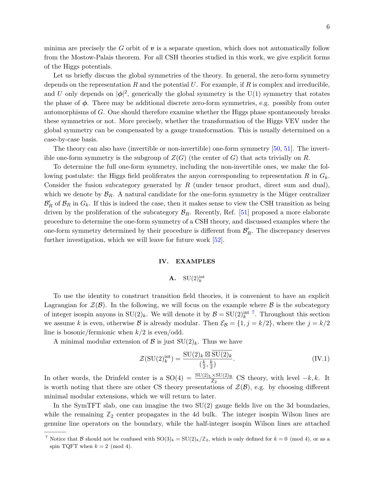 
Low-resolution page preview, page 6

**Summary.** This work develops a general theoretical framework to describe phase transitions in topological phases driven by the proliferation of non-Abelian anyons. It utilizes Symmetry Topological Field Theory (SymTFT) to model these transitions, showing they can be explicitly realized by Chern-Simons-Higgs theories. This provides a powerful mathematical tool for classifying and understanding exotic quantum phases in condensed matter systems.

**Why it may be interesting.** The deep connection between topological order, symmetry protection, and effective field theories (like CSH) provides powerful mathematical tools applicable to understanding emergent phenomena in strongly correlated electron systems.

Detailed structure

**Main problem.** The paper studies phase transitions occurring when non-Abelian anyons proliferate within a $(2+1)$d topological phase.

**Main result.** It establishes a general theoretical framework using Symmetry Topological Field Theory (SymTFT) and demonstrates that these transitions can be realized by Chern-Simons-Higgs (CSH) field theories.

**Method.** The analysis employs advanced field theory techniques, including SymTFT, the study of braided fusion subcategories, and the analysis of Higgs mechanisms in gauge theories.

**Model / system.** The system involves a Topological Quantum Field Theory (TQFT) coupled to dynamical matter associated with non-Abelian anyons. Specific models analyzed include CSH theories and the gauging of non-invertible one-form symmetries.

**Key observables.** The type of anyons that proliferate, the resulting low-energy effective TQFT, and the structure of the Higgs potential.

**Important parameters / regimes.** The structure of the braided fusion subcategory ($B$), the coupling constants in the CSH Lagrangian (e.g., $r, \lambda, \kappa$), and the symmetry group $G$.

**Assumptions / limitations.** The framework relies on the SymTFT interpretation, and some mathematical identities are established for specific cases rather than being fully general.

**Paper structure.** The paper progresses from defining the general framework for anyon proliferation transitions using SymTFT, to analyzing specific realizations via CSH theories, and concluding with detailed examples involving the gauging of non-invertible symmetries.

Abstract

We study phase transitions out of a (2+1)d topological phase driven by the proliferation of anyons in a braided fusion subcategory. We describe a general theoretical framework for such transitions, in which the topological quantum field theory (TQFT) is coupled to dynamical matter associated with anyons in the subcategory. We interpret this construction using symmetry topological field theory (SymTFT), where the dynamics is localized on the symmetry boundary of the (3+1)d slab. We analyze several examples, and present explicit Chern-Simons-Higgs (CSH) field theories realizing the proliferation transitions. We also examine proliferation transitions that implement gauging of non-invertible one-form symmetry in the parent TQFT. This includes a general construction for ${\rm Rep}(G)$ one-form symmetry for a finite group $G$, and a CSH realization of the non-invertible one-form gauging ${\rm SU}(2)_{10}\rightarrow {\rm Spin}(5)_1$. We discuss which anyons proliferate at these transitions.

[↑ back to top](#top)

### [Probing quantumness of superpositions of Gaussian states via Tsirelson probability](http://arxiv.org/abs/2608.21217v1)

**Authors:** Yue Zhang  
**Type:** theory · **Category:** other · **PDF:** <https://arxiv.org/pdf/2608.21217v1>  
**Analysis basis:** full PDF text, analyzed in chunks
**Topic relevance:** `quantum measurements` **2/5** · `analog quantum simulation` **1/5**

📷 Fig 1

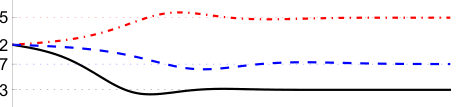 
FIG. 2: The Tsirelson probabilities for generalized circular states |g3,0⟩, |g5,0⟩, and |g7,0⟩are plotted as the black solid, red dash-dotted, and blue dashed lines, respectively, for which the squeezing strengths are optimized at r = 0.1571, r = 0.3359, and r = 0.4617, respectively.

**Summary.** This paper develops a method to probe the nonclassical features of superpositions of Gaussian states using the Tsirelson probability. By calculating this probability for circular and generalized circular states, the authors demonstrate clear violations of classical bounds. The findings establish these superpositions as versatile platforms for testing quantum nonclassicality witnesses.

**Why it may be interesting.** This work provides a concrete, measurable diagnostic tool (the Tsirelson probability) to test nonclassicality in simple, yet physically relevant, bosonic systems, which is highly relevant to quantum optics and open quantum systems.

Detailed structure

**Main problem.** The paper aims to quantify the nonclassical nature, or 'quantumness,' of superpositions of Gaussian states using the Tsirelson probability.

**Main result.** The authors analytically calculate the Tsirelson probability for circular and generalized circular states, demonstrating violations of established classical bounds for specific parameters.

**Method.** The calculation involves deriving the Tsirelson probability, which is defined as an average probability over measurements of a precessing quadrature at $d$ equally spaced times.

**Model / system.** The system under study consists of bosonic states, specifically superpositions of Gaussian states, including coherent and squeezed states, analyzed in the context of harmonic oscillators.

**Key observables.** Tsirelson probability ($	ext{Prob}_d(
ho)$), Wigner negativity, and sub-Planck phase-space structures.

**Important parameters / regimes.** The number of measurement times, $d$, and squeezing parameters ($r$) are key variables used to map the nonclassicality.

**Assumptions / limitations.** The analysis often relies on assuming rotational invariance of the state ($	ext{R}_\varphi 
ho 	ext{R}^\dagger_\varphi = 
ho$) to simplify the probability calculation.

**Figures summary.** Figures plot the calculated Tsirelson probability for both circular and generalized states against the classical bounds for $d=3, 5, 7$, showing clear violations.

**Paper structure.** The paper introduces the concept of quantumness via the Tsirelson probability, derives the calculation for rotationally invariant states, and then applies this framework to compute and analyze the results for both simple circular and more complex generalized circular states.

Abstract

Superpositions of Gaussian states, including circular states and generalized circular states, exhibit a rich variety of nonclassical features such as Wigner negativity and sub-Planck phase-space structures. The Tsirelson probability, central to the Tsirelson precession protocol, is defined as the average probability that a precessing quadrature yields a positive outcome when measured at equally spaced times, with the classical bound given by $1/2 \pm 1/(2d).$ In this work, we compute this probability for superpositions of Gaussian states. For circular states (superpositions of $d$ coherent states), we analytically calculate their Tsirelson probability and find violations of the classical bounds for $d=3,5,7$. For generalized circular states, which incorporate squeezing, we derive a general expression and identify parameter regimes that enhance the violation. Our results provide a comprehensive map of the dynamical nonclassicality of superpositions of Gaussian states and establish them as versatile platforms for testing nonclassicality witnesses.

[↑ back to top](#top)

### [Two distinct gap structures in the mid-infrared optical conductivity of the Hubbard model](http://arxiv.org/abs/2608.21284v1)

**Authors:** Dongwook Kim, Karsten Held  
**Type:** theory · **Category:** strongly correlated electrons · **PDF:** <https://arxiv.org/pdf/2608.21284v1>  
**Analysis basis:** full PDF text, analyzed in chunks
**Topic relevance:** `Keldysh / 2PI / non-Gaussian methods` **2/5** · `analog quantum simulation` **1/5**

📷 Fig 1

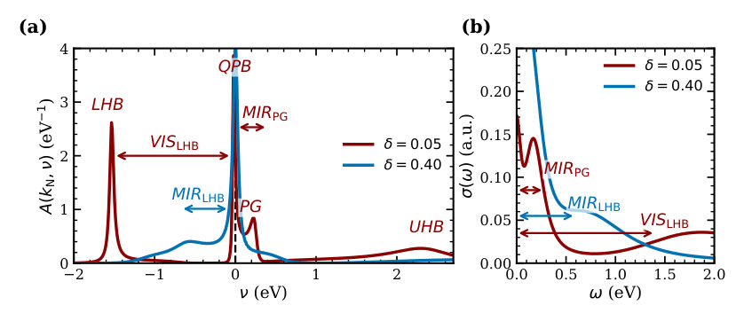 
Figure 1. (a) Two different types of gaps in the nodal DΓA spectral function. (b) The contribution to the optical conductivity in the MIR from optical transitions across the pseudogap (PG) and across the gap between lower Hubbard band (LHB) and quasiparticle band (QPB). For small doping the latter is in the visible spectrum.

📷 Fig 2

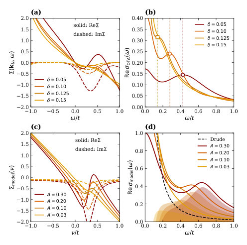 
Figure 3. (a) Evolution of ImΣ(ω) and ReΣ(ω) at the node with doping. For better comparison, ReΣ(ω) has been shifted so that ReΣ(0) = 0 for all curves. (b) Optical conductivity for the same dopings. Dotted vertical lines denote the peak frequency (c,d) Same as (a,b) but for the model self-energy Eq. (1) for different weights A of the pole. The black dashed curve in (d) corresponds to the Drude optical conductivity σDrude(ω) Eq. (2); and color fills represent the difference to the Drude optical conductivity, σ(ω) −σDrude(ω).

📷 Fig 3

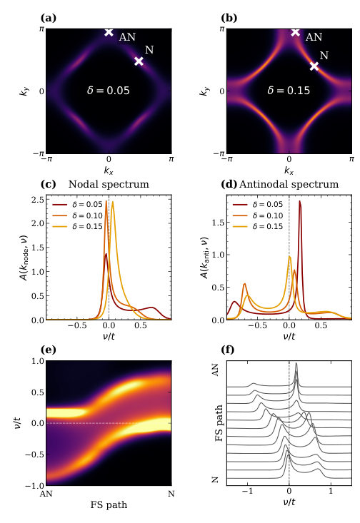 
Figure 2. (a,b) Fermi surface obtained from −ImG(k, iπT)/π for (a) δ = 0.05 and (b) δ = 0.15. (c,d) Spectral function in the low-frequency range for (c) nodal and (d) antinodal momentum in the underdoped regime. (e,f) Spectral function A(k, ν) along the Fermi surface (arc) at δ = 0.05 as (e) a heat map and (f) as a function of ν for a series of momenta along the arc.

📷 Fig 4

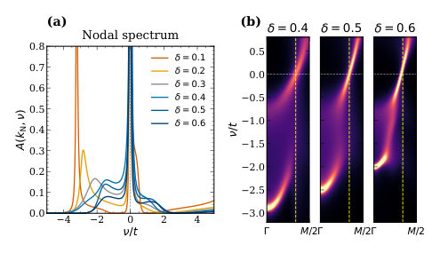 
Figure 4. (a) Nodal spectrum A(kN, ν) in a large frequency range for different dopings. (b) Doping dependence of A(k, ν) along the Γ −M/2 line near the waterfall regime. The yellow vertical dashed lines denote the k-point corresponding to the nodal Fermi surface.

📷 Fig 5

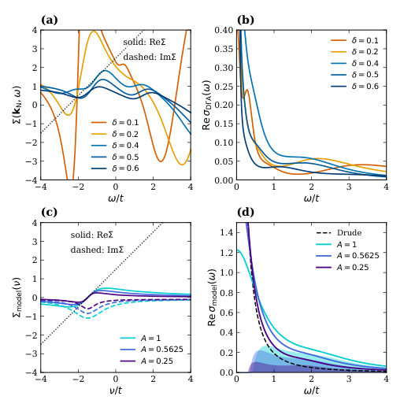 
Figure 5. Evolution of (a) ImΣ(ω) at the node and (b) the optical conductivity with doping, now on a large energy scale than in Fig. 4. (c) Model self-energy with pole structure and dReΣ(ν)/dν ≈1 at the pole center to mimic the water- fall. (d) Corresponding optical conductivity where the black dashed curve corresponds to the Drude optical conductivity σDrude(ω) and color fills represent the difference to the Drude optical conductivity, σ(ω) −σDrude(ω).

**Summary.** This work theoretically explains the mid-infrared optical conductivity in cuprate superconductors by proposing that it originates from two distinct electronic gaps: the pseudogap from spin fluctuations and the Mott-Hubbard gap. Using the Hubbard model and DΓA calculations, the authors show that the characteristic spectral features can be uniquely attributed to each gap, providing a unified microscopic picture.

**Why it may be interesting.** The clear separation and microscopic understanding of spectral features arising from different correlation mechanisms (spin fluctuations vs. local correlations) provide a powerful theoretical tool for interpreting complex spectroscopic data in strongly correlated materials.

Detailed structure

**Main problem.** The study aims to elucidate the origin and doping-dependence of the characteristic mid-infrared (MIR) optical conductivity peaks observed in cuprate superconductors.

**Main result.** The MIR optical conductivity arises from two distinct, yet intertwined, gaps: one from the pseudogap (PG) mediated by spin fluctuations, and another from the Mott-Hubbard gap structure (LHB-QPB waterfall).

**Method.** The analysis employs the ladder dynamical vertex approximation (DΓA) applied to the Hubbard model, supplemented by semi-analytical modeling of the self-energy pole structure.

**Model / system.** The system is the Hubbard model on a square lattice, relevant to cuprate superconductors, with parameters set to model the $d_{x^2-y^2}$ orbital. The calculations use the Kubo formalism for optical conductivity.

**Key observables.** Mid-infrared (MIR) optical conductivity ($\sigma(\omega)$), the nodal spectral function $A(\mathbf{k}, 
u)$, and the difference $\sigma(\omega) - \sigma_{	ext{Drude}}(\omega)$.

**Important parameters / regimes.** Doping level ($\delta$), Hubbard interaction ($U$), and the relative contributions from the PG and Mott-Hubbard gaps.

**Assumptions / limitations.** The analysis relies on the DΓA approximation, and the PG gap structure is modeled as anisotropic s-wave, with its nodal gap being above the Fermi energy.

**Figures summary.** Figures illustrate the evolution of the nodal spectral function and optical conductivity ($\sigma(\omega)$) across different doping levels, distinguishing the contributions from the PG structure and the LHB-QPB waterfall.

**Paper structure.** The paper systematically analyzes the MIR optical conductivity by identifying and modeling two distinct gap contributions—the PG and the Mott-Hubbard gap—and demonstrating how their characteristic shapes and doping dependencies can be separately reproduced by the theoretical framework.

Abstract

Mid-infrared (MIR) optical conductivities in cuprate superconductors show universal features. In this study, we demonstrate that these originate from two distinct gaps: the pseudogap mediated by antiferromagnetic spin fluctuations and the Mott-Hubbard gap. The MIR spectra from these two gaps show a characteristic and distinct shape and doping dependence, and can thus be distinguished. Specifically, the Mott-Hubbard correlations, while rendering a peak in the visible spectrum for small dopings, yield a broad optical response starting in the MIR when a ``waterfall'' develops in the one-particle spectrum at larger dopings. The numerically and analytically determined doping-dependence of both gaps consistently reproduce experiments, and provide a unified microscopic understanding of the cuprate MIR optical conductivity.

[↑ back to top](#top)

### [Activate genuine nonlocality from distinguishable sets in tripartite systems](http://arxiv.org/abs/2608.20741v1)

**Authors:** Hui-Juan Zuo, Ying-Ying Lu, Shao-Ming Fei  
**Type:** theory · **Category:** other · **PDF:** <https://arxiv.org/pdf/2608.20741v1>  
**Analysis basis:** full PDF text, analyzed in chunks
**Topic relevance:** `quantum measurements` **2/5**

📷 Fig 1

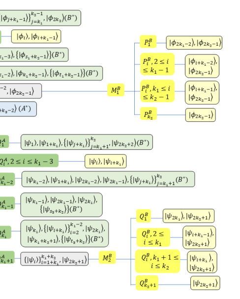 
Figure 1: Distinction details for Cd1 ⊗Cd2 ⊗Cd3 (di is odd)

📷 Fig 2

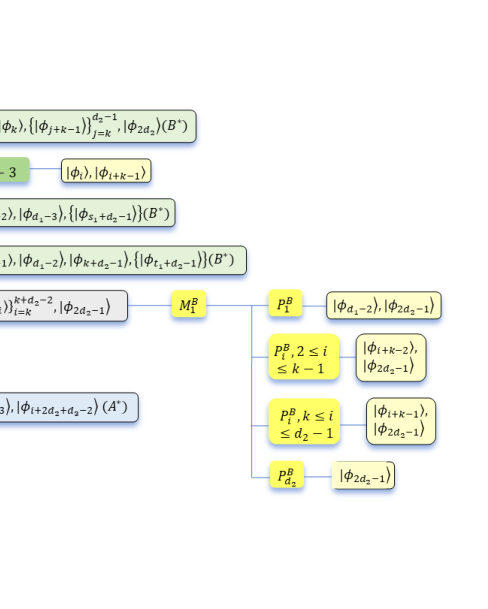 
Figure 2: Distinction details for Cd1 ⊗Cd2 ⊗Cd3 (d1 is even)

**Summary.** This paper theoretically analyzes how genuine nonlocality can be activated in tripartite quantum systems using sets of orthogonal product states. The authors establish precise conditions and provide explicit constructions for these states, demonstrating the activation of both Type-I and Type-II genuine nonlocality. This advances the understanding of quantum correlations by linking local distinguishability to genuine nonlocality.

**Why it may be interesting.** This work provides rigorous mathematical tools to characterize and generate genuine nonlocality in multipartite systems using product states, which is fundamental for understanding quantum correlations beyond simple entanglement measures.

Detailed structure

**Main problem.** The paper investigates the conditions under which genuine nonlocality can be activated from a set of quantum states that are initially distinguishable in a tripartite system.

**Main result.** The authors provide explicit constructions for orthogonal product state sets in tripartite systems that exhibit both Type-I and Type-II genuine nonlocality after applying specific local measurements.

**Method.** The analysis relies on defining genuine nonlocality based on local indistinguishability across all bipartitions, and uses local measurements (OPLMs) to transform distinguishable sets into genuinely nonlocal ones.

**Model / system.** The system under study is a tripartite quantum system described by orthogonal product states in the Hilbert space $\text{C}^{d_1} \otimes \text{C}^{d_2} \otimes \text{C}^{d_3}$.

**Key observables.** Genuine nonlocality (Type I and Type II), local distinguishability, and the existence of orthogonality-preserving local measurements.

**Important parameters / regimes.** The dimensions of the subsystems ($d_1, d_2, d_3$) and the structure of the product states are critical parameters.

**Assumptions / limitations.** The analysis assumes the existence of specific local measurements ($K_A, K_C$) capable of activating the nonlocality, and the proofs often rely on specific dimension constraints (e.g., $d_i$ being odd).

**Figures summary.** The notes reference figures showing distinction details for different parity cases of the dimensions ($d_i$ odd vs. $d_i$ even) in the tripartite system.

**Paper structure.** The paper builds conceptually by defining genuine nonlocality types, establishing necessary conditions for local indistinguishability (Lemma 1), and then constructing specific sets of states (Propositions 1 & 2) that demonstrate the activation of both Type-I and Type-II genuine nonlocality through local measurements.

Abstract

A set of orthogonal quantum states in multipartite systems is of genuine nonlocality if it is locally indistinguishable in every bipartition. If it is locally reducible when the parties are separated, we say that it has genuine nonlocality of type~\uppercase\expandafter{\romannumeral 1}; otherwise, it has genuine nonlocality of type~\uppercase\expandafter{\romannumeral 2}. For a locally distinguishable set without local redundancy, if there exist some orthogonality preserving local measurements such that each outcome leads to a locally indistinguishable set, then we say that it exhibits the activation of nonlocality. We activate type-\uppercase\expandafter{\romannumeral 1} and type-\uppercase\expandafter{\romannumeral 2} genuine nonlocality of orthogonal product state sets in tripartite systems. In particular, we tackle the local irredundancy problem with partial trace operation and $p$-ary numeral systems to significantly simplify the proofs. Our results also address the open question raised by S. Bandyopadhyay \textit{et al.}[\href{https://link.aps.org/doi/10.1103/PhysRevA.104.L050201}{Phys. Rev. A \textbf{104}, L050201 (2021)}]. Furthermore, we observe the activation of hidden genuine nonlocality in multipartite systems, which highlights the applications of nonlocality based on state discrimination in different practical scenarios.

[↑ back to top](#top)

### [Degeneracy beyond the parity-symmetry protection in the Lipkin-Meshkov-Glick model](http://arxiv.org/abs/2608.21010v1)

**Authors:** Jamil Khalouf-Rivera, Miguel Carvajal, Francisco Pérez-Bernal  
**Type:** theory · **Category:** statistical mechanics · **PDF:** <https://arxiv.org/pdf/2608.21010v1>  
**Analysis basis:** full PDF text, analyzed in chunks
**Topic relevance:** `analog quantum simulation` **2/5**

📷 Fig 1

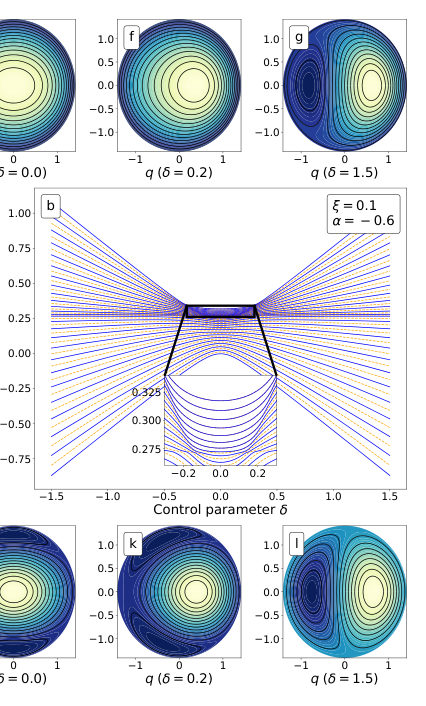 
Figure 1: Correlation energy diagram as a function of the δ control parameter for Hamiltonian (4) with N = 50, ξ = 0.1, and α = 0 (a) and −0.6 (b). The inset of panel (b) is a zoom of the region where the degeneracy appears. For the sake of clarity, different colors and line styles are used to plot adjacent levels. The normalized classical energy surface (see text) for α = 0 and α = −0.6 is depicted in panels (c-g) and (h-l).

📷 Fig 2

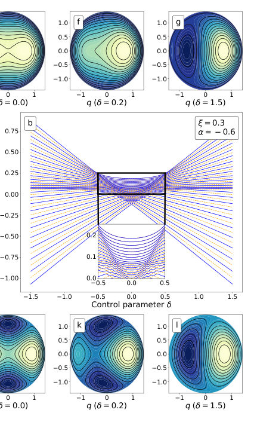 
Figure 2: Correlation energy diagram as a function of the δ control parameter for Hamiltonian (4) with N = 50, ξ = 0.3, and α = 0 (a) and −0.6 (b). The inset of panel (b) is a zoom of the region where the degeneracy appears. For the sake of clarity, different colors and line styles are used to plot adjacent levels. The normalized classical energy surface (see text) for α = 0 and α = −0.6 is depicted in panels (c-g) and (h-l).

📷 Fig 3

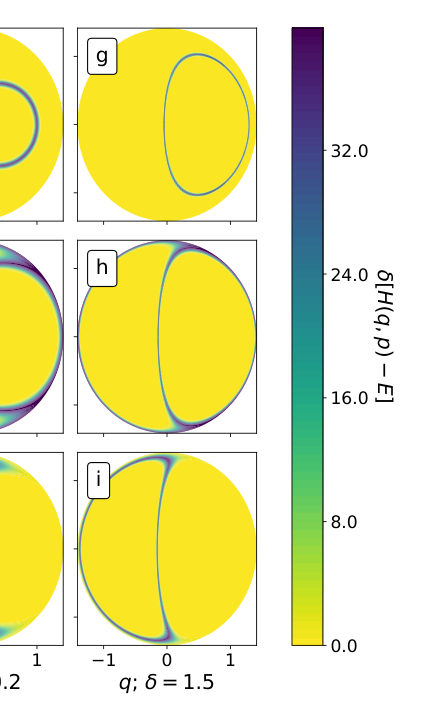 
Figure 3: Energy contours of the classical limit of the system (12) around selected values of the normalized energy for ξ = 0.1, α = −0.6, and different values of δ. Panels (a-c), (d-f) and (g-i) correspond to δ = 0.0, δ = 0.2 and δ = 1.5, respectively. Results for normalized energy values below the ESQPT critical energy (E = 0.1), at the critical energy (E = εc2 = 0.3), and above it (E = 0.5) are depicted in the first, second, and third panel rows, respectively.

📷 Fig 4

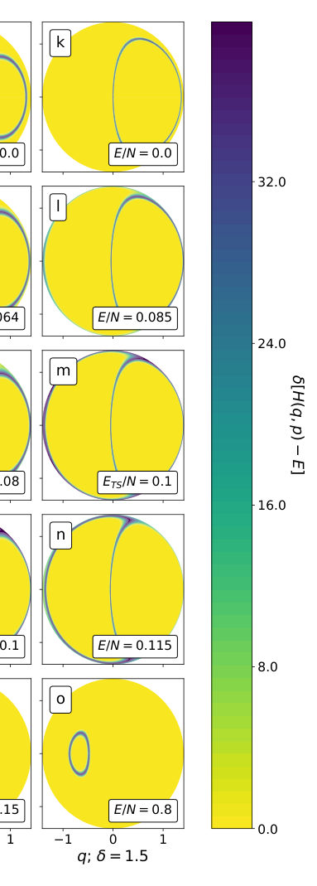 
Figure 4: Energy contours of the classical limit of the system (12) around selected values of the normalized energy for ξ = 0.3, α = −0.6, and different values of δ. Panels (a-e), (f-j) and (k-o) correspond to δ = 0.0, δ = 0.2 and δ = 1.5, respectively. Results for normalized energy values at the two ESQPT critical energies are depicted in the second and fourth rows. The other three rows show results for selected nor- malized energy values above and below the critical energies.

📷 Fig 5

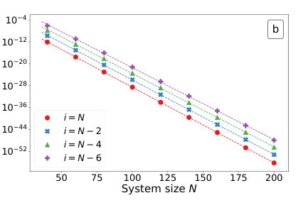 
Figure 5: Panel (a): Adjacent-levels energy gap versus normalized energy. In the inset the results are shown using a logarithmic scale in the ordinate axis. Panel (b): Energy gap between the two highest excited states versus the system size N. The dash lines correspond to the results of a fit assuming the energy gaps are proportional to e−aN. All the calculation have been performed for Hamiltonian (4) with N = 100, ξ = 0.3, α = −0.6, and δ = 0.05. Energy gap values are not normalized by the system size.

**Summary.** This theoretical paper examines the degeneracy patterns in the LMG model, proving that energy doublets can remain degenerate even when parity symmetry is broken. This unexpected robustness is linked to a deeper, anti-unitary $\mathbb{Z}_2$ reflection symmetry present in the system's classical limit phase space. The study uses quantum phase transition diagnostics to map out this symmetry-protected degeneracy.

**Why it may be interesting.** This work provides a detailed theoretical study of symmetry protection in quantum many-body models, showing that degeneracy can be protected by symmetries weaker than simple parity conservation, which is highly relevant for understanding quantum phase transitions in interacting systems.

Detailed structure

**Main problem.** The paper investigates how doubly-degenerate states can persist in the Lipkin-Meshkov-Glick (LMG) model even when the system's parity symmetry is explicitly broken by an external term.

**Main result.** The authors demonstrate that breaking parity symmetry via a $\delta$-term does not destroy the exponential degeneracy of energy doublets, attributing this robustness to an underlying anti-unitary $\mathbb{Z}_2$ reflection symmetry.

**Method.** The analysis employs the coherent-state formalism to study Ground-State and Excited-State Quantum Phase Transitions (GSQPTs/ESQPTs) in the mean-field limit.

**Model / system.** The system is modeled by an anharmonic LMG Hamiltonian, which is modified by adding a parity-breaking interaction term $\hat{V}_{	ext{int}}$. The model is analyzed across varying control parameters $\xi$, $\alpha$, and $\delta$.

**Key observables.** Energy gap, expectation value of GSQPT order parameter, Quantum Fidelity Susceptibility, and the existence of pair-degenerate states.

**Important parameters / regimes.** Control parameters include $\xi$ (driving the spectrum), $\alpha$ (anharmonicity), and $\delta$ (parity-breaking strength).

**Assumptions / limitations.** The analysis relies on the $\mathbb{Z}_2$ symmetry being anti-linear, which prevents the Hamiltonian from being block-diagonalized.

**Figures summary.** Figures illustrate the correlation energy diagram versus the parity-breaking parameter $\delta$, showing features associated with first-order GSQPTs for different anharmonicity regimes ($\alpha=0$ vs. $\alpha=-0.6$).

**Paper structure.** The paper introduces the anharmonic LMG Hamiltonian, analyzes its phase transitions using mean-field theory, and then systematically studies the effect of adding a parity-breaking term $\hat{V}_{	ext{int}}$ while tracking the conservation of degeneracy via the underlying $\mathbb{Z}_2$ symmetry.

Abstract

Degeneracy patterns in quantum mechanics stem from the system symmetries. In particular, the broken-symmetry phase in the well-known Lipkin-Meshkov-Glick (LMG) model is composed of doubly-degenerate states of different parity. In this work, we show that such doublets can exist even if parity is not conserved. For this purpose, our starting point is an anharmonic LMG Hamiltonian with a second-order ground-state quantum phase transition (GSQPT) and a rich spectrum, with two different excited-state quantum phase transitions. The inclusion in the Hamiltonian of a term inducing a first-order GSQPT breaks the parity symmetry but conserving the exponential degeneracy in the energy doublets. We demonstrate that this phenomenon can be traced back to the existence of a $\mathbb{Z}_2$ symmetry (reflection symmetry) in the system's classical limit phase space that leads to an anti-unitary $\mathbb{Z}_2$ symmetry in the quantum system.

[↑ back to top](#top)

### [Eavesdropper-Blind Remote State Preparation and Applications to Quantum Public-Key Encryption](http://arxiv.org/abs/2608.21241v1)

**Authors:** Kaniuar Bacho, Alexandru Cojocaru  
**Type:** theory · **Category:** quantum information and computing · **PDF:** <https://arxiv.org/pdf/2608.21241v1>  
**Analysis basis:** full PDF text, analyzed in chunks
**Topic relevance:** `quantum measurements` **2/5**

📷 Fig 1

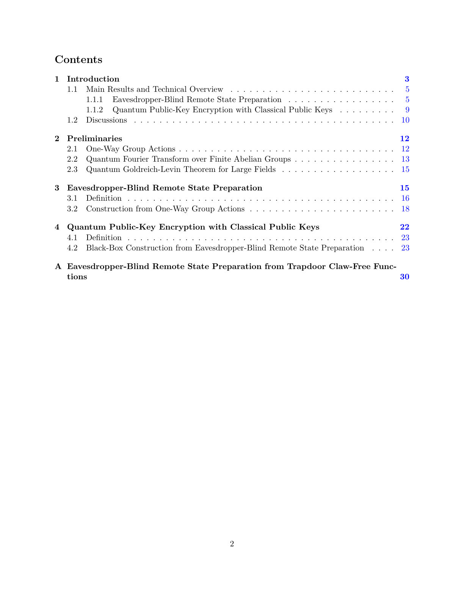 
Low-resolution page preview, page 2

📷 Fig 2

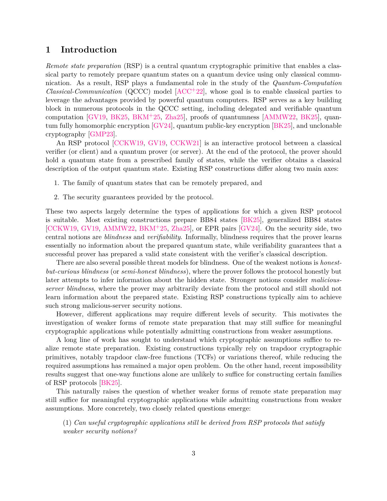 
Low-resolution page preview, page 3

📷 Fig 3

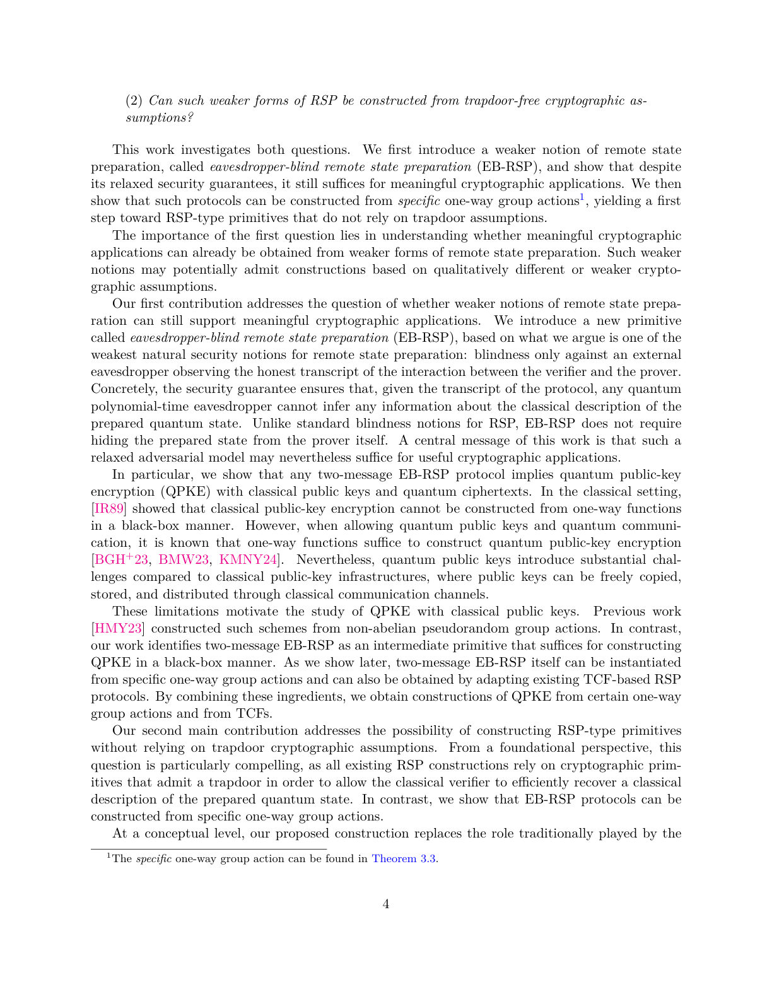 
Low-resolution page preview, page 4

📷 Fig 4

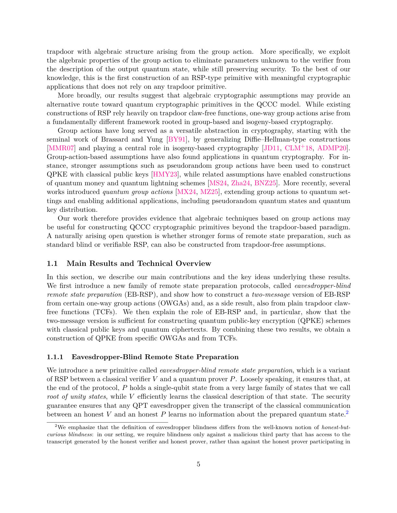 
Low-resolution page preview, page 5

📷 Fig 5

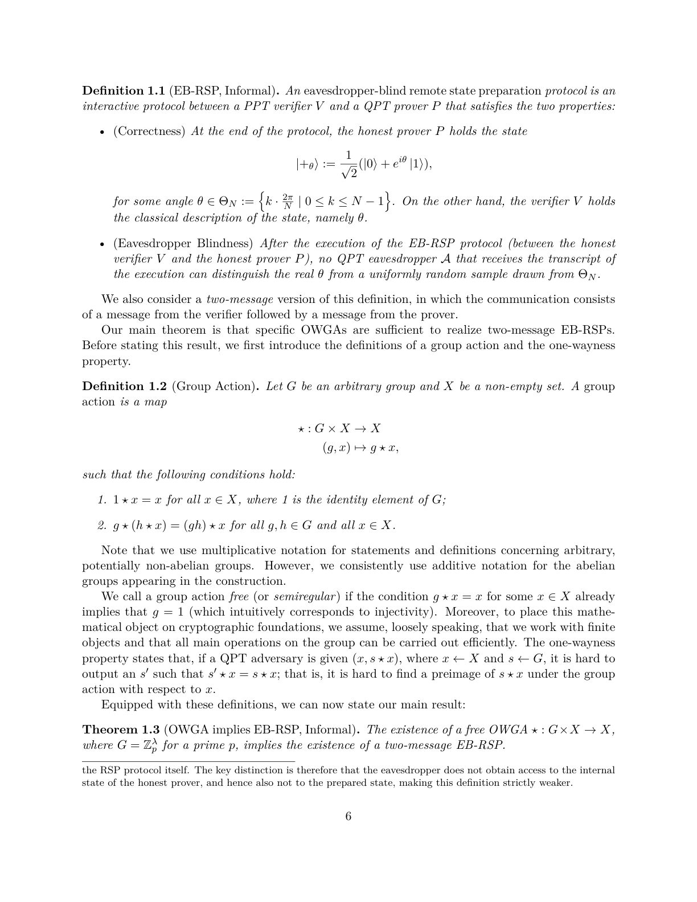 
Low-resolution page preview, page 6

**Summary.** This paper introduces Eavesdropper-Blind Remote State Preparation (EB-RSP), a weaker but sufficient primitive for quantum cryptography. By constructing EB-RSP using algebraic structures like one-way group actions, the authors provide a method to build quantum public-key encryption that avoids reliance on strong trapdoor functions. This advances the theoretical understanding of quantum cryptographic primitives.

**Why it may be interesting.** While focused on cryptography, the underlying principles of secure state preparation and information leakage are fundamental to understanding quantum communication protocols, which is relevant to quantum networking and quantum computation security.

Detailed structure

**Main problem.** The paper investigates weaker security notions for Remote State Preparation (RSP), specifically Eavesdropper-Blind RSP (EB-RSP), to reduce reliance on strong cryptographic assumptions like trapdoor functions.

**Main result.** It shows that two-message EB-RSP is sufficient to construct Quantum Public-Key Encryption (QPKE) with classical public keys and quantum ciphertexts, providing a path toward trapdoor-free quantum cryptography.

**Method.** The authors construct EB-RSP protocols using one-way group actions and demonstrate the security of the resulting QPKE scheme by reducing its security to the underlying EB-RSP assumption.

**Model / system.** The work operates in the quantum information processing framework, involving classical communication between a Verifier and a Prover, and utilizing quantum states (e.g., root of unity states) and group actions.

**Key observables.** The primary observables are the ability to correctly prepare a target quantum state $|	heta
angle$ and the security against an eavesdropper learning information about $	heta$ from the protocol transcript.

**Important parameters / regimes.** The security relies on the existence of a free One-Way Group Action (OWGA) and the structure of the state space, particularly when $N$ is prime or composite.

**Assumptions / limitations.** The core assumption is the existence of a free OWGA, which allows the construction to proceed without relying on trapdoor functions, though the security proof for QPKE requires only hiding the most significant bit of the secret key.

**Figures summary.** Not specified in the notes.

**Paper structure.** The paper first introduces the EB-RSP notion and shows its sufficiency for QPKE. It then constructs the EB-RSP from one-way group actions, providing a trapdoor-free approach. Finally, it details the construction and security proof of the resulting IND-CPA secure QPKE scheme.

Abstract

Remote state preparation (RSP) is a central primitive in quantum cryptography, enabling classical parties to remotely construct quantum states using only classical communication. As a result, RSP serves as a key building block in numerous protocols involving classical clients and quantum servers, allowing classical parties to leverage the advantages offered by powerful quantum computers. All known constructions of RSP rely on strong cryptographic assumptions, typically variants of trapdoor claw-free functions (TCFs).   In this work, we initiate the study of a weaker form of remote state preparation, which we call eavesdropper-blind remote state preparation (EB-RSP). Informally, EB-RSP requires blindness only against external observers who see the transcript of the honest protocol, rather than against the quantum server itself. Despite this relaxed adversarial model, the resulting notion remains sufficient for useful cryptographic applications. In particular, we show that two-message EB-RSP already suffices to construct quantum public-key encryption with classical public keys and quantum ciphertexts. We then construct two-message EB-RSP protocols from specific one-way group actions, yielding a first step toward RSP-type primitives based on assumptions that do not rely on trapdoors. Finally, we observe that existing RSP constructions are likely naturally adaptable to the two-message EB-RSP notion; we demonstrate this explicitly for a concrete TCF-based RSP construction.

[↑ back to top](#top)

### [Exponential-in-$N_c^2$ cost reduction of product-formula-based quantum simulations of quantum chromodynamics](http://arxiv.org/abs/2608.21258v1)

**Authors:** Zohreh Davoudi, Jesse R. Stryker  
**Type:** theory · **Category:** quantum information and computing · **PDF:** <https://arxiv.org/pdf/2608.21258v1>  
**Analysis basis:** full PDF text, analyzed in chunks
**Topic relevance:** `analog quantum simulation` **2/5**

📷 Fig 1

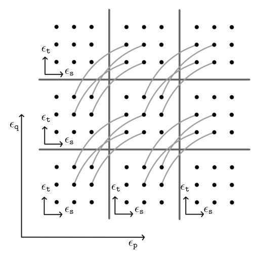 
FIG. 1. A schematic representation of the nonzero electric- basis matrix elements of the U(1) plaquette Hamiltonian, Hplaq = UpUqU † s U † t + H.c., based on a 4D grid. Each point represents a basis state with quantum numbers (ϵp, ϵq, ϵs, ϵt). ϵp and ϵq (ϵs and ϵt) are the coordinates along the coarse outer (fine inner) axes. Each edge represents a mixing between two states by Hplaq, which generates moves of ±(1, 1, −1, −1) in the grid. In this example, a truncation ϵi ∈{0, ±1} is in effect, hence three blocks of points along the outer axes and three points within each block along the inner axes.

📷 Fig 2

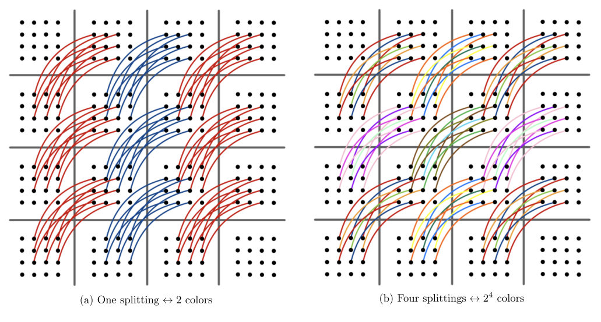 
FIG. 2. Colorings of a graph representing the truncated U(1) plaquette Hamiltonian, Hplaq. In this example, each ϵi is truncated to four possible values to keep the drawing simple. The interpretation of the coordinates and edges is the same as in Fig. 1. (a) A coloring of the graph using two colors, corresponding to the two subevolutions by H(e) plaq and H(o) plaq. (b) A coloring of the graph using 24 = 16 colors, corresponding to the 16 subevolutions called for by the method of Ref. [22]. In both (a) and (b), when restricting to any one color, there are no chains connecting more than two points, making it possible to analytically diagonalize each subevolution corresponding to each...

📷 Fig 3

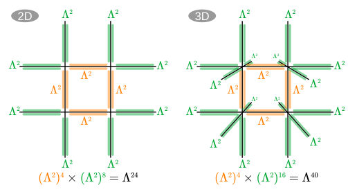 
FIG. 3. The estimated scaling of the number of nonzero matrix elements of the plaquette operator, for square (left) and cubic (right) lattices, when working in the local-multiplet basis [70]. Orange links on the plaquette contribute Λ8 scaling from the number of (p, q) configurations the four links can be in. Green links are external to the plaquette but contribute additional powers of Λ due to the functional dependence of the matrix elements on the (p, q) configurations of these external links.

**Summary.** This paper tackles the immense computational challenge of simulating Quantum Chromodynamics (QCD) on quantum computers using product-formula quantum algorithms. The authors introduce a novel, highly efficient method for decomposing the Hamiltonian, achieving an exponential cost reduction factor of $10^{14}$ compared to prior state-of-the-art estimates. This work is crucial for determining the feasibility of simulating fundamental particle physics models on near-term quantum hardware.

**Why it may be interesting.** While focused on QCD, the techniques developed for Hamiltonian decomposition and resource scaling are fundamental to simulating any complex, interacting quantum many-body system, which is relevant to AMO physics.

Detailed structure

**Main problem.** Developing quantum algorithms capable of simulating the real-time dynamics of Quantum Chromodynamics (QCD) efficiently.

**Main result.** The authors demonstrate a method that reduces the T-gate cost estimate for QCD simulations using a second-order product formula by a factor of nearly $10^{14}$.

**Method.** The core method involves performing an efficient exponentiated-Hamiltonian decomposition, which significantly improves upon previous product-formula-based Trotterization techniques.

**Model / system.** The system is based on lattice gauge theories, specifically QCD with SU($N_c$) gauge groups, simulated via Hamiltonian evolution on a quantum computer.

**Key observables.** The primary focus is on the computational cost (T-gate count) required to simulate the time evolution operator $e^{-iT H}$.

**Important parameters / regimes.** The complexity scales with the number of colors ($N_c$) and the bosonic cutoff ($\Lambda$).

**Assumptions / limitations.** The analysis relies on the product-formula decomposition of the time evolution operator and assumes the feasibility of implementing the derived Hamiltonian decompositions.

**Figures summary.** Not specified.

**Paper structure.** The paper reviews the problem of QCD simulation, details the limitations of previous product-formula methods (like Kan and Nam's), and then introduces and analyzes the new, highly efficient exponentiated-Hamiltonian decomposition technique.

Abstract

Quantum algorithms for simulating quantum chromodynamics (QCD) have matured steadily since the pioneering work of Byrnes and Yamamoto [PRA 73, 022328 (2006)]. The most popular strategies for Hamiltonian simulation involve product-formula decompositions. However, the application of product-formula methods to SU($N_c$) lattice gauge theories by Byrnes and Yamamoto leads to $O(Λ^{8(N_c^2-1)})$ gate complexity per Trotter step, where $Λ$ is the bosonic cutoff in the electric (i.e., irreducible-representation) basis. A seminal work by Kan and Nam [arXiv:2107.12769 (2021)] significantly improves over such an undesirable cost and reports an $O\big(Λ\text{polylog}(Λ)\big)$ scaling, yet it still calls for an unrealistically large number of quantum gates. Here, we illuminate one of the reasons behind this high cost estimate and show that a factor of size $O(2^{4(N_c^2-1)})$ can be removed from the per-Trotter-step cost estimate by Kan and Nam. We specifically show that, by using methods developed in our past works [PRD 112, 014508 (2025); Quantum 7, 1213 (2023)], exponentiated-Hamiltonian decomposition---a necessary step in the application of product-formula algorithms---can be performed far more efficiently than previously thought. Our method reduces the T-gate cost estimate of QCD simulations using a second-order product formula by a factor of nearly $10^{14}$, independent of simulation parameters and sizes. Focusing on simulations in the electric basis, we further contrast our results with other methods: the local-multiplet basis approach of Ciavarella, Klco, and Savage [PRD 103, 094501 (2021)] and the near-optimal algorithm of Rhodes, Kreshchuk, and Pathak [PRX Quantum 5, 040347 (2024)]. This work highlights the importance of continued algorithmic improvement to bringing the quantum-simulation cost of QCD within reach of realistic quantum computers.

[↑ back to top](#top)

### [Hypothesis testing between quantum ensembles](http://arxiv.org/abs/2608.21321v1)

**Authors:** Jian Yao, Quntao Zhuang  
**Type:** theory · **Category:** quantum information and computing · **PDF:** <https://arxiv.org/pdf/2608.21321v1>  
**Analysis basis:** full PDF text, analyzed in chunks
**Topic relevance:** `quantum measurements` **2/5**

📷 Fig 1

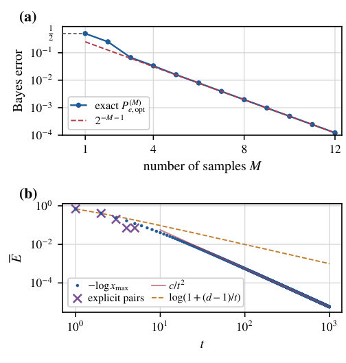 
FIG. 1. Results in testing between designs. (a) Exact Bayes error for testing between EZ and EX with equal priors, with P (1) e,opt = 1/2 indicated. The dashed line shows the asymp- totic behavior P (M) e,opt ∼2−M−1. (b) Universal upper bound E for testing between qubit t-design ensembles. Crosses show the exponents attained by the explicit design pairs for t = 1, . . . , 5, while the reference curve 5.678/t2 illustrates the asymptotic scaling E = O(t−2). The weaker estimate log[1 + (d −1)/t] is also shown.

📷 Fig 2

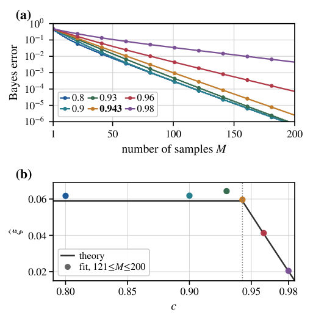 
FIG. 2. Results for the swapped-probability ensembles with p = 1/3. (a) Exact Bayes error for several state overlaps c = |⟨ψ1|ψ2⟩|2 as the number of samples M increases. (b) The theoretical exponent ξ(c) = min log[3/(2 √

**Summary.** This work establishes the fundamental limits on distinguishing between two quantum ensembles by analyzing the joint sampled state via moment operators. It derives the minimum Bayes error and the asymptotic error exponent, showing that discrimination is governed by the full moment hierarchy. The results are particularly insightful for understanding $t$-designs and quantum communication protocols.

**Why it may be interesting.** The rigorous derivation of error bounds for distinguishing quantum ensembles, especially those related to $t$-designs, provides fundamental limits for quantum state characterization in quantum information processing.

Detailed structure

**Main problem.** The paper derives fundamental limits for binary hypothesis testing between finite quantum ensembles, which are unordered collections of weighted quantum states.

**Main result.** The minimum Bayes error and the asymptotic error exponent are determined by the full moment hierarchy and the cross-hypothesis permutation bottleneck ($\xi_{	ext{acr}}$).

**Method.** The analysis uses moment operators, derives the Bayes-optimal measurement based on the trace norm of moment differences, and applies Chernoff bounds to find the asymptotic error exponent.

**Model / system.** The system under study is a quantum state ensemble $\mathcal{E} = \{(p_i, 
ho_i)\}_{i=1}^N$, which is distinct from classical-quantum states due to its label-invariant nature. Specific applications include $t$-designs and two-component ensembles.

**Key observables.** Minimum Bayes Error ($	ext{P}^{(M)}_{e,	ext{opt}}$), Asymptotic Error Exponent ($E$), and the moment operators ($K^{(r)}$).

**Important parameters / regimes.** Number of samples ($M$), design parameter ($t$), and the overlap between component states ($c$).

**Assumptions / limitations.** The analysis assumes a label-invariant access model and relies on combining achievable bounds with fixed-permutation converse results.

**Figures summary.** Figures illustrate the exact Bayes error decay for testing between designs, showing an asymptotic decay scaling as $2^{-M/t^2}$, and plot universal upper bounds for qubit $t$-design ensembles.

**Paper structure.** The paper progresses by first defining the problem using moment operators, deriving the exact finite-sample error, establishing the asymptotic error exponent via Chernoff bounds, and applying these results to specific physical models like $t$-designs and two-component systems.

Abstract

Quantum state ensembles are important in quantum information processing. For example, quantum $t$-designs model highly entangled states in complex systems, while projected ensembles appear in generative quantum machine learning and studies of thermalization. With their sample state accompanied by a classical label, these ensembles contain operational information beyond their average density operators. Yet an ensemble differs from a classical-quantum state because it is invariant under permutations of labels. We formulate binary hypothesis testing between finite quantum ensembles and derive fundamental limits on error probability. Given an observed label pattern, we show that the joint sampled state can be described by power-weighted ensemble moments. This yields the Bayes-optimal measurement and exact finite-sample error, revealing that discrimination is governed by the full moment hierarchy up to the number of samples. In the many-sample limit, we derive Chernoff bounds and obtain exact error exponents for finite uniform pure-state ensembles. We apply these results to optical communication and $t$-designs. For finite uniform pure-state $t$-designs with large $t$, the maximal discrimination exponent scales sharply as $\sim t^{-2}$, while equal-prior fixed-error testing requires $\sim t^2$ samples.

[↑ back to top](#top)

### [To Scale Up or To Scale Out: Evaluating Space-Time Costs of Compiled Logical Circuits on Modular Superconducting Quantum Processors](http://arxiv.org/abs/2608.20462v1)

**Authors:** Nikiforos Paraskevopoulos, Sebastian de Bone, Mick Christophersen, Simon Storz, A. Mert Bozkurt, Arno Bargerbos, Sebastian Feld  
**Type:** theory · **Category:** quantum information and computing · **PDF:** <https://arxiv.org/pdf/2608.20462v1>  
**Analysis basis:** full PDF text, analyzed in chunks
**Topic relevance:** `QC/QI experiment` **2/5**

📷 Fig 1

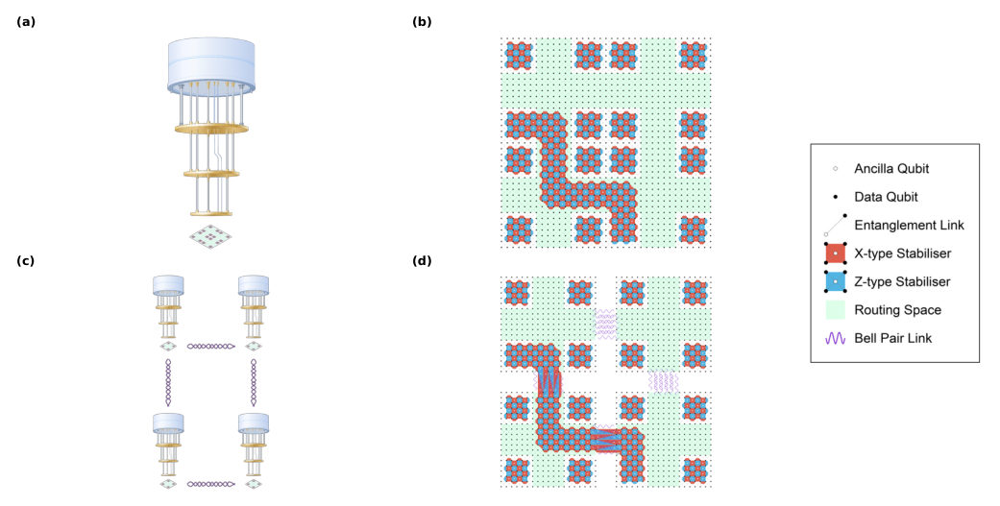 
FIG. 1. (a) In an effectively monolithic architecture, chiplets are connected to form a contiguous 2D layout. This design ensures the system operates as a single, unified QPU housed within a singular cryostat. This is analogous to ”scaling up,” achieved by integrating multiple chiplets to construct a single, high-capacity QPU within a single cryostat. (b) A joint parity measurement between two logical surface code patches across an effectively monolithic layout, using conventional lattice surgery. (c) In a distributed architecture, multiple smaller nodes (that may or may not be housed in separate cryostats) are connected using microwave or optical links, over which information is...

📷 Fig 2

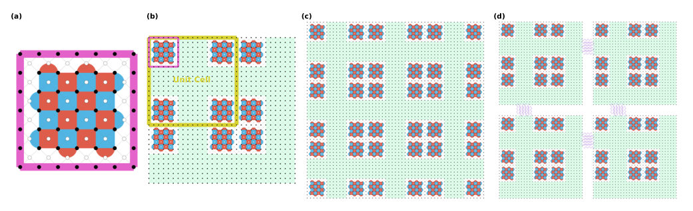 
FIG. 2. Tiling of our surface code unit cell to form logical architectures (a) A single distance d logical qubit takes up a (d + 1) × (d + 1) lattice to allow for lattice surgery operations with directly neighbouring logical qubits. (b) Each unit cell contains nine such patches, out of which four are used as data qubits. This unit cell is then tiled to fill the lattice. We allow the unit cell to get cut off after the second column of the unit cell on the right of the lattice, or the second row at the bottom of the lattice. In this way, routing space is reserved on the side to ensure the bottom-right data qubit is not cut off from lattice surgery operations. (c) An example of such tiling on...

📷 Fig 3

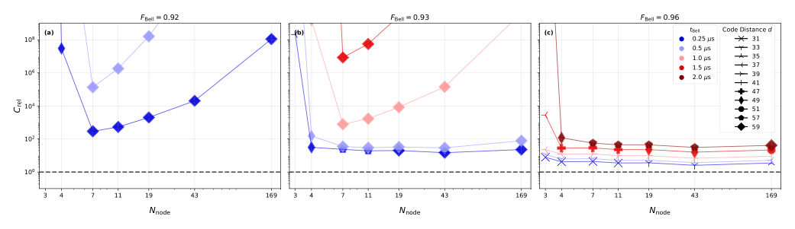 
FIG. 3. Dependence of cost on Bell-pair generation time tBell. Relative costs across the considered node counts for three fixed fidelities: (a) 92%, (b) 93%, and (c) 96%. The black dashed line indicates where the costs of computation for effectively monolithic and distributed architectures are equal. Markers are coloured from blue to red to denote increasing tBell. Each marker has a different symbol depending on the code distance used.

📷 Fig 4

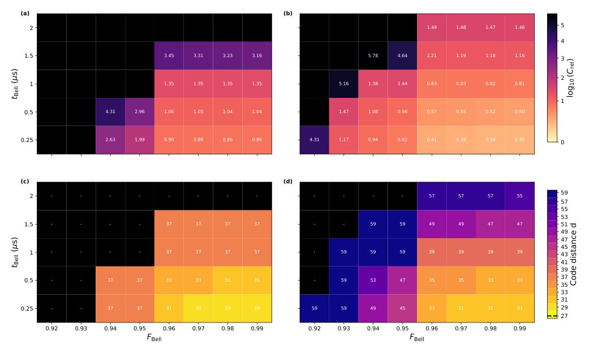 
FIG. 4. Cost and code distance scaling. Top panels (a, b): Heatmap representation of the relative cost Crel on a logarithmic scale as a function of Bell-pair fidelity and generation time tBell for (a) Nnode = 3 and (b) Nnode = 43. In black, we depict the regions where the relative cost is more than 10 orders of magnitude higher than the baseline. Bottom panels (c, d): Optimal code distances utilised in panels (a) and (b), respectively. The fixed code distance required for the effectively monolithic baseline, d = 27, is highlighted in the colourbar on the right.

📷 Fig 5

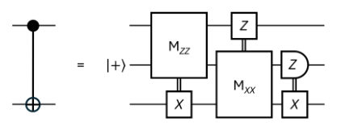 
FIG. 5. Circuit for a CNOT operation between logical surface code patches, with (planar) surface code patches of distance d representing the qubits (horizontal lines in the diagram). The MZZ and MXX operations indicate joint ZZ and XX measurements, respectively. Adapted from Ref. [103].

**Summary.** This paper analyzes the scaling challenges of building large quantum computers by comparing 'Scaling Up' (chiplet) versus 'Scaling Out' (distributed) superconducting architectures. Using a detailed compiler model, the authors find that distributed systems suffer severe performance penalties due to interconnect limitations. The work quantifies the trade-offs between connectivity, noise, and physical overhead in realizing fault-tolerant quantum computation.

**Why it may be interesting.** It provides a rigorous, quantitative framework for assessing the overhead associated with modularity in large-scale quantum computation, which is crucial for guiding hardware development in superconducting quantum computing.

Detailed structure

**Main problem.** The paper evaluates the space-time costs associated with executing compiled logical quantum circuits when scaling superconducting quantum processors using either chiplet-based ('Scaling Up') or distributed ('Scaling Out') modular architectures.

**Main result.** Distributed architectures incur a significant, potentially exponential, space-time performance penalty compared to effectively monolithic designs, with this penalty manifesting in noise-limited and connectivity-limited regimes.

**Method.** A quantitative stress test using a dedicated compiler calculates the space-time cost by simulating random logical entangling operations across varying network sizes and hardware parameters.

**Model / system.** The study models superconducting Quantum Processing Units (QPUs) that employ the surface code for Quantum Error Correction (QEC). It compares the connectivity and error mechanisms of monolithic layouts versus those requiring inter-module links.

**Key observables.** Space-time cost ($C \equiv N_{phys} 	imes T_{succ}$), logical error rates, and the relative cost ratio ($	ext{C}_{	ext{rel}}$) between distributed and monolithic approaches.

**Important parameters / regimes.** Surface code distance ($d$), Bell-state fidelity ($	ext{F}_{	ext{Bell}}$), Bell-pair generation time ($t_{	ext{Bell}}$), and lattice-surgery routing congestion.

**Assumptions / limitations.** The analysis assumes specific error models for bulk operations versus seam operations, and it probes a 'forward-looking parameter space' beyond current experimental limitations.

**Figures summary.** Figures illustrate the architectural differences between monolithic and distributed setups for lattice surgery, and plots show the relative cost ($	ext{C}_{	ext{rel}}$) scaling with node count under varying fidelity and latency assumptions.

**Paper structure.** The paper develops the cost metric by first defining the physical constraints of scaling up vs. scaling out, then modeling the logical compilation process, and finally deriving and comparing the resulting space-time costs across different error regimes.

Abstract

Modular integration has emerged as the main pathway for scaling superconducting quantum processing units (QPUs) beyond the constraints of fabrication yield and physical footprint. Currently, two primary strategies lead this effort. Mirroring the "Scaling Up" and "Scaling Out" approaches in GPU architectures and AI infrastructures, these are: chiplet-based scaling, which preserves dense connectivity and high gate fidelity at the expense of engineering complexity, and distributed architectures, which decouple system scaling from monolithic QPU advancements at the expense of sparser connectivity and lower interconnect quality. To evaluate these approaches, we introduce a quantitative stress test measuring the execution cost of a dense workload of random logical entangling operations using a surface code scheme. Using a dedicated compiler, we compute the space-time cost as the number of network nodes increases, analysing this scaling behaviour across various surface code distances, Bell-state fidelities, and Bell-pair generation times. We find that distributed architectures incur an up to exponential space-time performance penalty compared to an effectively monolithic architecture across all simulations. Our results also show that as the network grows, this penalty manifests in two distinct scaling regimes: a noise-dominated regime constrained by insufficient Bell-state fidelity and generation rates, and a connectivity-dominated regime bottlenecked by lattice-surgery routing congestion.

[↑ back to top](#top)

### [Emergent Vibronic Spectral Hierarchy in a Kagome Flat-Band Insulator](http://arxiv.org/abs/2608.21250v1)

**Authors:** Jun Shu, Jun Shen, Yanmin Zhang, Hong Du, Qingsong Wang, Zeyuan Wang, Bin Wang, Zeliang Xu, Dengjing Wang, Hengfu Lin, Zunming Lu, Lei Qin, Jie Yuan, Jinbo Peng, Zhida Song, Fedor V Kusmartsev, Anna Kusmartseva, Kui Jin, Ruidan Zhong, Ge He  
**Type:** both · **Category:** strongly correlated electrons · **PDF:** <https://arxiv.org/pdf/2608.21250v1>  
**Analysis basis:** full PDF text, analyzed in chunks
**Topic relevance:** `Frenkel-Kontorova` **1/5** · `analog quantum simulation` **1/5** · `correlated / nonlocal dissipation` **1/5** · `driven-dissipative phase transition` **1/5** · `quantum measurements` **1/5**

📷 Fig 1

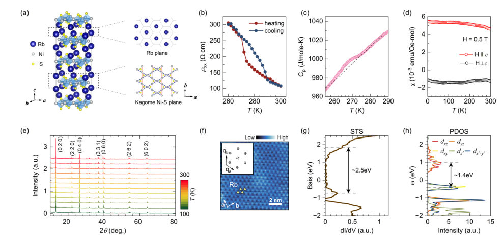 
Figure 1. Crystal structure and phase transition of Rb2Ni3S4. (a), Three-dimensional crystal structure (left) highlighting the triangular Rb sublattice and the kagome Ni-S sublattice (right). Rb atoms are shown as blue spheres, while Ni and S atoms are represented by gray and yellow spheres, respectively. (b), Temperature dependence of the electrical resistivity. A pronounced anomaly is observed near 280 K, accompanied by a clear thermal hysteresis between cooling and warming processes. (c), Temperature-dependent specific heat, showing a weak anomaly with small latent heat across the transition, consistent with its weakly first-order nature. The dashed line is included as a guide to the...

📷 Fig 2

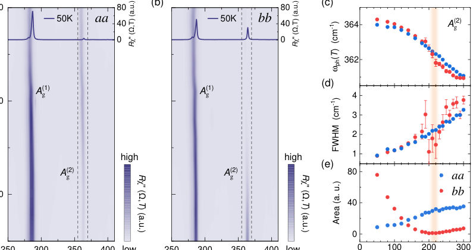 
Figure 2. Temperature-dependent Raman-active phonons. (a) and (b) Temperature evolution of the Raman spectra in aa and bb polarization configurations, respectively. Insets: Raman response measured at 50 K in the aa and bb polarization configuration, respectively. (c) Temperature dependence of the A(2) g phonon frequency obtained from aa and bb channels. (d) Temperature dependence of the A(2) g phonon linewidth (full width at half maximum, FWHM). (e) Temperature dependence of the integrated Raman intensity (peak area) of the A(2) g phonon. The phase transition is indicated by the yellow region centered around 220 K, which is approximately 50 K lower than the transition temperature inferred...

📷 Fig 3

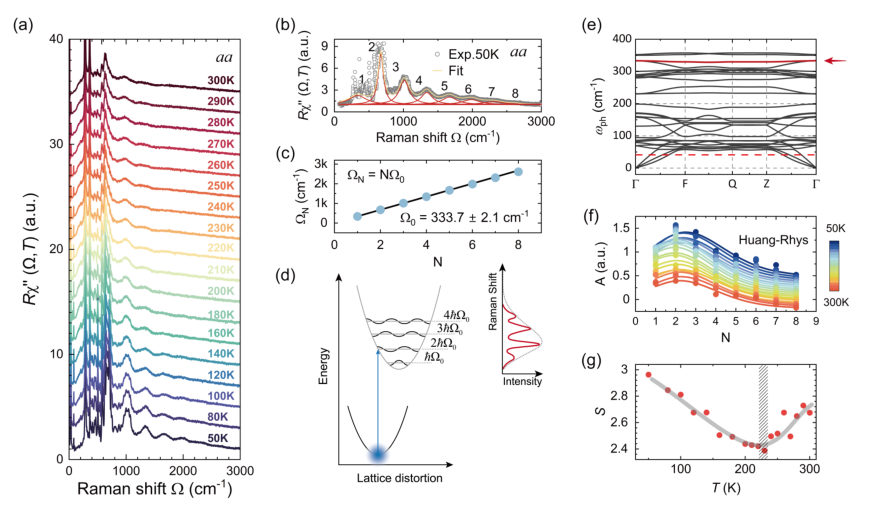 
Figure 3. Phonon overtones in Rb2Ni3S4. (a) Raman spectra at various temperatures, highlighting phonon overtones. (b) Representative fit of the overtone profile up to the eighth order. (c) Extracted overtone peak positions as a function of overtone order. The peak positions follow a linear dependence with a slope of 333.7±2.1 cm−1, corresponding to the base phonon frequency. (d) Schematic illustration of the Franck-Condon progression. In the excited electronic state, the ionic potential (gray parabola) is displaced relative to the ground state potential (black parabola) due to electron-phonon coupling, giving rise to multiphonon excitations. The resulting Poisson distribution of Raman...

📷 Fig 4

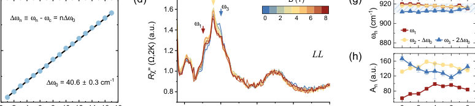 
Figure 4. Sideband structure in Rb2Ni3S4. (a) Raman spectrum in the bb polarization configuration spanning the third- to fourth-order phonon overtones. The red arrows highlight additional fine-structure features superimposed on the overtone background. Isolated fine-structure peaks obtained after subtracting the fitted phonon overtones. Red curves indicate fits to the individual fine-structure modes. (b) Extracted fine-structure peak positions as a function of sideband order. The relative peak positions ∆ωn ≡ωn −ωc follow a linear dependence with a slope of 40.6 cm−1, where ωn denotes the absolute peak positions and ωc is a reference energy set to 830 cm−1. (c) Temperature evolution of the...

**Summary.** This work investigates the unconventional insulating transition in Rb2Ni3S4 by focusing on electron-phonon coupling in the regime of localized phonons. By analyzing complex Raman spectra, the authors demonstrate that the transition is driven by vibronic self-trapping, suggesting that localized lattice vibrations play a crucial role in the material's correlated electronic state.

**Why it may be interesting.** The strong coupling between electronic localization and lattice vibrations, particularly when mediated by localized phonons, provides a concrete example of how lattice dynamics can drive correlated electronic phases, relevant to open quantum systems modeling.

Detailed structure

**Main problem.** Investigating electron-phonon coupling in the regime where the relevant phonon mode is localized or weakly dispersive, contrasting with conventional models involving dispersive lattice vibrations.

**Main result.** The insulating transition in Rb2Ni3S4 is attributed to vibronic self-trapping involving a localized lattice coordinate, rather than conventional structural or magnetic ordering.

**Method.** The study combines multiple experimental techniques, including polarization-resolved Raman spectroscopy, temperature-dependent X-ray diffraction, STM, and transport measurements.

**Model / system.** The physical system is the kagome compound Rb2Ni3S4, which undergoes an unconventional insulating transition near 260-280 K. The analysis focuses on the strong coupling between electronic excitations and localized lattice vibrations.

**Key observables.** Giant Franck-Condon progression associated with a nearly dispersionless phonon, and a characteristic comb-like fine structure with a spacing of 40.6 cm-1.

**Important parameters / regimes.** The transition temperature T* (260-280 K); the phonon frequency (333.7 cm-1); the fine structure spacing (40.6 cm-1); the Huang-Rhys factor (S approx 2.9).

**Assumptions / limitations.** The nested coexistence of the progression and the comb structure is interpreted as evidence for a strongly coupled electron–vibrational manifold.

**Figures summary.** Figures show temperature dependence of resistivity, Raman spectra (revealing progressions and fine structure), and phonon frequency/linewidth changes across the transition temperature.

**Paper structure.** The paper first establishes the unconventional nature of the insulating transition using multiple probes (transport, structural, electronic). It then uses Raman spectroscopy to analyze the phonon response, fitting the overtones to the Huang-Rhys model, and finally interprets the combined spectral features as evidence for vibronic self-trapping.

Abstract

Electron-phonon coupling is usually understood in terms of electronic quasiparticles interacting with dispersive lattice vibrations. Much less is known about the complementary limit in which the relevant phonon mode is itself localized or weakly dispersive. Here we investigate this regime in the kagome compound Rb$_{2}$Ni$_{3}$S$_{4}$, which undergoes an unconventional insulating transition near $T^{*} \approx$ 260-280~K. Combining polarization-resolved Raman spectroscopy with temperature-dependent x-ray diffraction, scanning tunneling microscopy, and electrical, thermal, and magnetic measurements, we show that the transition involves electronic localization without a conventional structural or magnetic order parameter. Raman spectra reveal a giant Franck-Condon progression associated with a nearly dispersionless 333.7~cm$^{-1}$ phonon, decorated by an equally spaced comb-like fine structure with a characteristic spacing of 40.6~cm$^{-1}$. The comb spacing is insensitive to magnetic field, whereas its spectral weight is strongly field tunable. Rather than treating either hierarchy alone as pure phonon effect, we interpret their nested coexistence as evidence for a strongly coupled electron-vibrational manifold involving a localized lattice coordinate. These results identify dispersionless phonons as an active route to vibronic correlations in solids and suggest that such electron-vibrational self-trapping is closely associated with the insulating phase of Rb$_{2}$Ni$_{3}$S$_{4}$.

[↑ back to top](#top)

### [Classical versus non-classical photon states for detecting vacuum non-linearity](http://arxiv.org/abs/2608.21361v1)

**Authors:** N. Ahmadiniaz, C. Kohlfürst, R. Shaisultanov, R. Schützhold  
**Type:** theory · **Category:** other · **PDF:** <https://arxiv.org/pdf/2608.21361v1>  
**Analysis basis:** full PDF text, analyzed in chunks
**Topic relevance:** `Keldysh / 2PI / non-Gaussian methods` **1/5** · `interference shaping light` **1/5** · `quantum measurements` **1/5**

📷 Fig 1

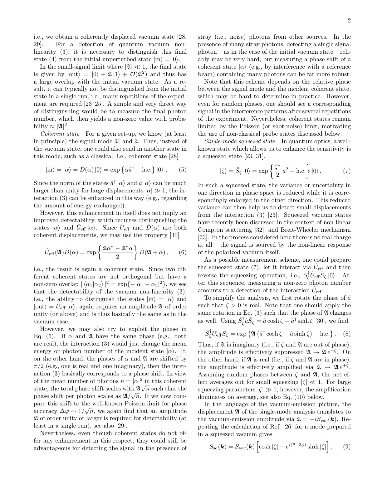 
Low-resolution page preview, page 2

📷 Fig 2

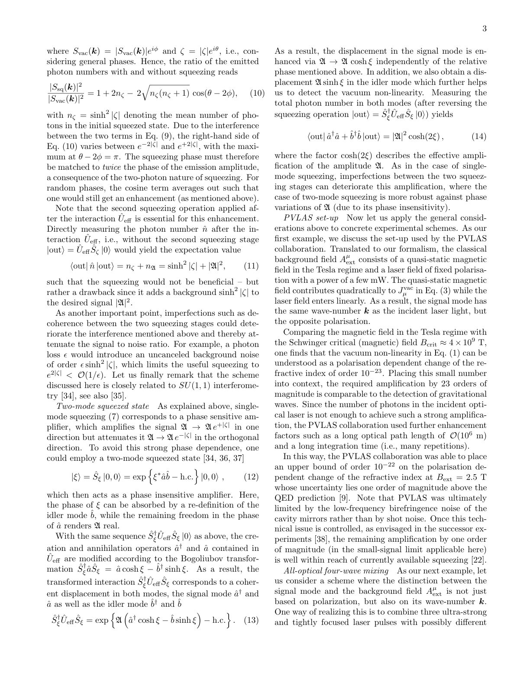 
Low-resolution page preview, page 3

📷 Fig 3

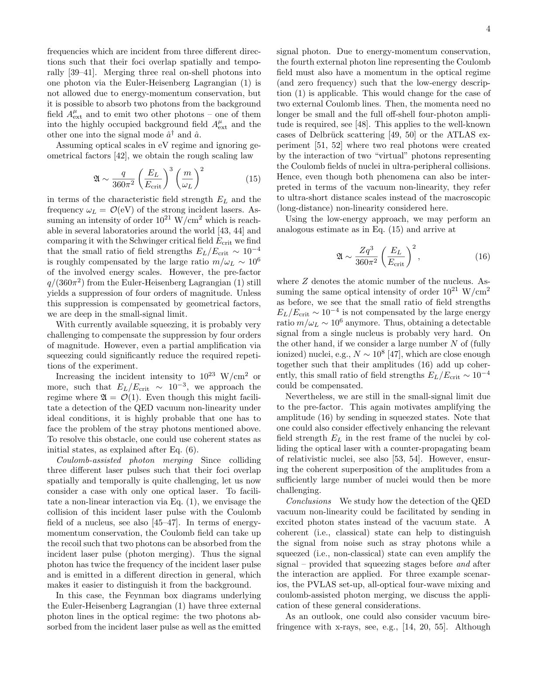 
Low-resolution page preview, page 4

📷 Fig 4

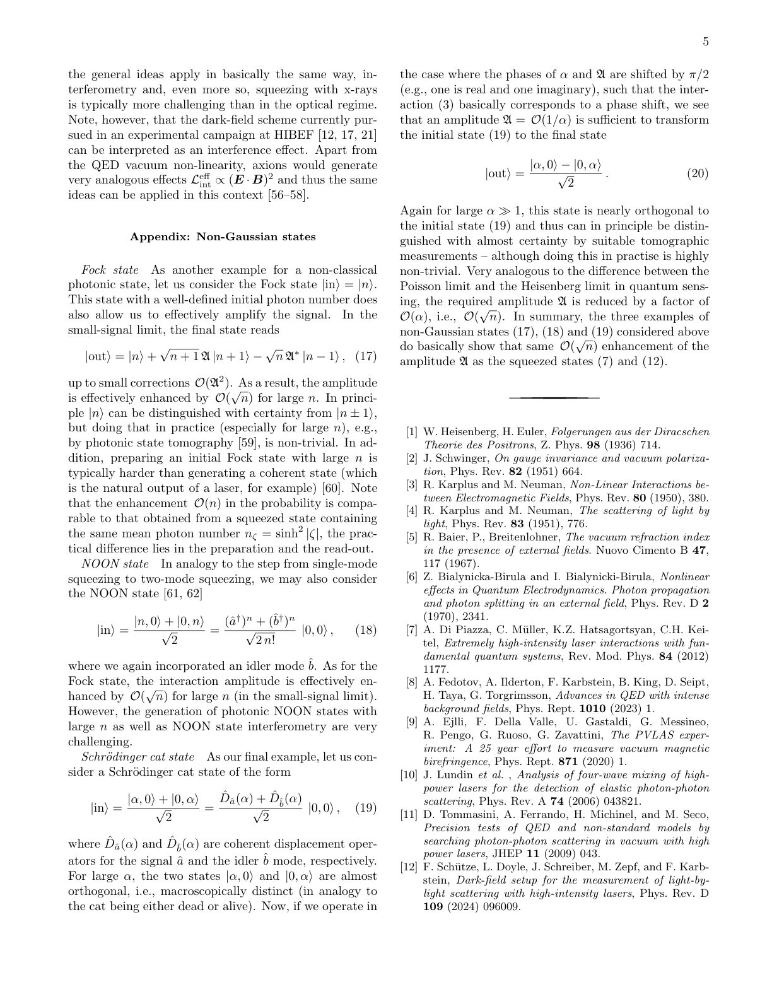 
Low-resolution page preview, page 5

📷 Fig 5

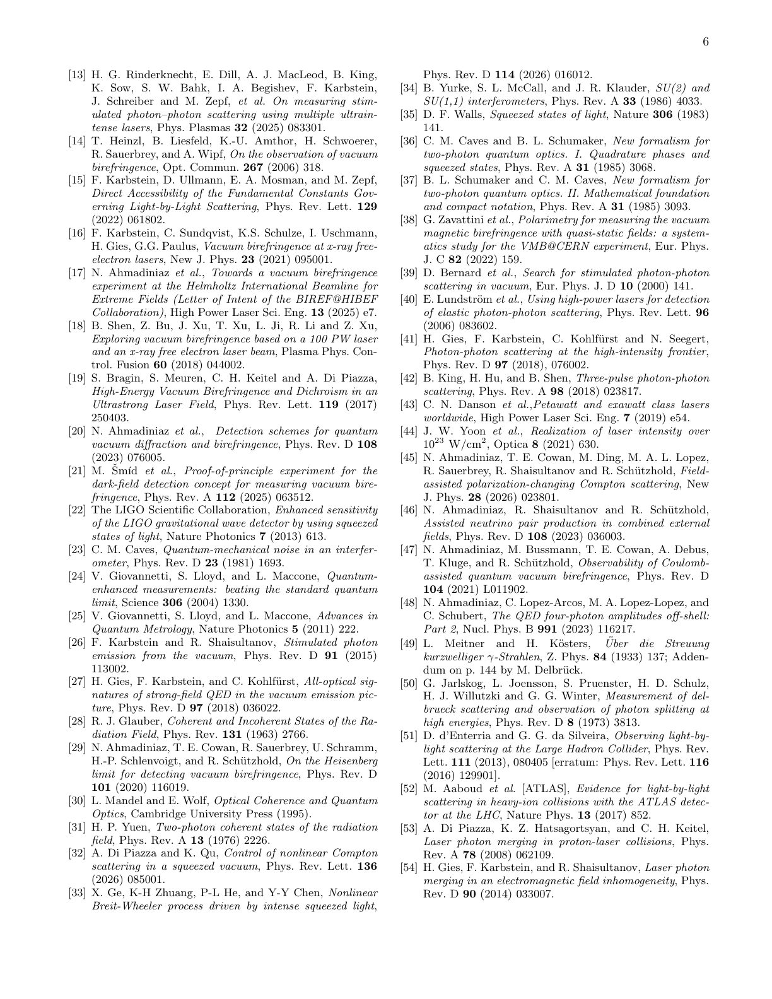 
Low-resolution page preview, page 6

**Summary.** This paper analyzes methods to detect the non-linear response of the quantum vacuum predicted by QED. It demonstrates that replacing the vacuum input state with non-classical states, particularly squeezed states, significantly boosts the measurable signal. The findings guide experimental efforts toward quantum-enhanced measurements of fundamental constants.

**Why it may be interesting.** This work is highly relevant to quantum optics and open quantum systems, as it explores using quantum resources (squeezing, multi-photon states) to probe fundamental physics beyond the standard quantum limit. The techniques discussed are central to quantum metrology.

Detailed structure

**Main problem.** The paper addresses the fundamental challenge of detecting the vacuum non-linearity predicted by Quantum Electrodynamics (QED). It investigates how using non-classical input states can enhance the detectability of this tiny effect.

**Main result.** Using non-classical states, such as squeezed states, significantly improves the detectability of vacuum non-linearity compared to using the initial vacuum state or coherent states alone. The enhancement depends critically on matching the squeezing phase to the interaction phase.

**Method.** The analysis involves calculating the evolution of quantum states (vacuum, coherent, squeezed) under an effective Hamiltonian derived from the Euler-Heisenberg Lagrangian. Comparisons are made between different input states and experimental setups.

**Model / system.** The system is the QED vacuum, modeled using the lowest-order Euler-Heisenberg Lagrangian. The detection mechanism involves sending an input photon state (vacuum, coherent, or squeezed) through a region exhibiting vacuum non-linearity.

**Key observables.** Photon number expectation values ($\langle 	ext{out} | \hat{n} | 	ext{out} 
angle$), phase shifts, and the ratio of emitted photon numbers.

**Important parameters / regimes.** The coupling constant $\xi$, the squeezing parameter $|\zeta|$, and the interaction amplitude $|A|$. The analysis is often performed in the small-signal limit.

**Assumptions / limitations.** The analysis assumes the ability to perform post-interaction squeezing operations ($\hat{S}^\dagger_\zeta$) and relies on small-signal approximations for the interaction strength.

**Figures summary.** Not specified in the notes.

**Paper structure.** The paper systematically compares detection schemes: first, using the vacuum state; second, using coherent states; and third, employing squeezed states. It then extends the discussion to various experimental platforms like PVLAS and four-wave mixing, analyzing the scaling laws for signal enhancement in each case.

Abstract

Quantum electrodynamics (QED) predicts that the vacuum should behave as a non-linear medium. For many schemes aimed at verifying this fundamental prediction, the signal consists of one or more photons in a certain mode (determined by polarization $σ$ and wave-number $\boldsymbol{k}$) which would be empty in the absence of a QED vacuum non-linearity. Here we consider modifying these schemes by sending in a classical or non-classical (e.g., squeezed) photon state instead of the initial vacuum state in that mode. We find that the detectability can be improved significantly.

[↑ back to top](#top)

### [Prediction of a layer nonlinear Hall effect in bilayer nonmagnetic or antiferromagnetic systems](http://arxiv.org/abs/2608.20724v1)

**Authors:** Zehou Li, Shenda He, Pan Zhou, Baoru Pan, Rui Tan, Lizhong Sun  
**Type:** theory · **Category:** other · **PDF:** <https://arxiv.org/pdf/2608.20724v1>  
**Analysis basis:** full PDF text, analyzed in chunks
**Topic relevance:** `Keldysh / 2PI / non-Gaussian methods` **1/5** · `analog quantum simulation` **1/5** · `quantum measurements` **1/5**

📷 Fig 1

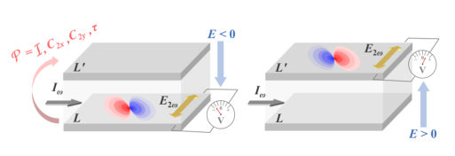 
FIG. 1. Schematic setup and concept of LNHE in a bilayer. An AC in-plane drive at frequency ω generates a second-harmonic trans- verse response at 2ω, whose polarity is controlled by the out-of-plane bias field Ez (switching between Ez &gt; 0 and Ez &lt; 0). In the layer- symmetric configuration the layer-resolved nonlinear Hall signals are opposite and can cancel, while Ez breaks layer equivalence and yields a finite net 2ω signal.

📷 Fig 2

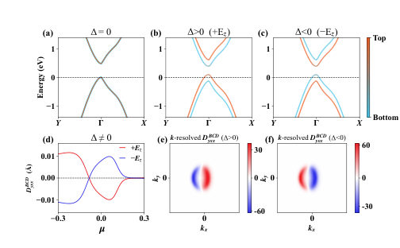 
FIG. 2. Tight-binding results for LNHE. (a)–(c) Band structures for ∆= 0, ∆&gt; 0 (+Ez), and ∆&lt; 0 (−Ez). Color contrast indicates layer- associated polarization, illustrating how Ez redistributes low-energy spectral weight between the two layers. (d) BCD component Dyxx as a function of chemical potential µ for opposite field directions, showing a clear sign reversal under Ez →−Ez. (e),(f) Momentum- resolved contributions to DBCD yxx for ∆&gt; 0 and ∆&lt; 0 at µ=0.07, demonstrating that the geometric hot spots invert upon field reversal. The parameters used are α = 0.71, B = 0.86, m = 0.2, δ = 0.15, t⊥= 0.14.

📷 Fig 3

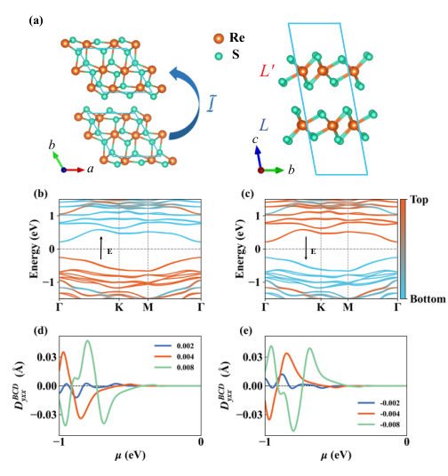 
FIG. 3. Material realization of LNHE. (a) Bilayer 1T′-ReS2 with an inversion-related stacking configuration. (b),(c) Layer-resolved band structures along high-symmetry lines for opposite out-of-plane electric fields, showing a field-induced layer polarization of the low- energy states. (d),(e) BCD component DBCD yxx as a function of chem- ical potential for opposite field directions, exhibiting a clear sign re- versal under Ez →−Ez.

**Summary.** This theoretical work predicts the existence of a switchable layer nonlinear Hall effect (LNHE) in bilayer quantum materials lacking linear Hall response. The effect is intrinsically hidden by layer symmetry but can be unmasked by an out-of-plane electric field ($E_z$). The study uses symmetry analysis and k.p models to show that this nonlinear response is a universal probe of layer-resolved quantum geometry.

**Why it may be interesting.** While the core physics is condensed matter transport, the reliance on symmetry analysis and the concept of 'hidden' responses activated by external fields (like $E_z$) shares conceptual overlap with controlling quantum states in engineered quantum systems.

Detailed structure

**Main problem.** The paper aims to predict and understand the layer nonlinear Hall effect (LNHE) in bilayer nonmagnetic or antiferromagnetic systems, especially when the linear Hall conductivity vanishes.

**Main result.** The LNHE is predicted to be a switchable, macroscopic nonlinear response activated by an out-of-plane electric field ($E_z$), which breaks layer-exchange symmetry.

**Method.** The study employs systematic symmetry analysis of layer groups, combined with minimal k.p models and tight-binding Hamiltonians to derive the necessary symmetry constraints.

**Model / system.** The system is a stacked bilayer of nonmagnetic or antiferromagnetic materials (e.g., $1T'-	ext{WTe}_2$ or $1T'-	ext{ReS}_2$). The physics is modeled using a Hamiltonian incorporating interlayer coupling and an out-of-plane electric field ($E_z$) that introduces a potential difference ($\Delta$).

**Key observables.** The key observable is the nonlinear Hall conductivity ($\sigma_{xy}^{	ext{NL}}$), which is predicted to exhibit an opposite sign upon reversal of the applied $E_z$.

**Important parameters / regimes.** The out-of-plane electric field ($E_z$) is the critical parameter that breaks symmetry and activates the response. The vanishing linear Hall conductivity is the prerequisite condition.

**Assumptions / limitations.** The analysis assumes that the low-energy physics can be captured by the minimal k.p model, and that the effect originates from geometric dipole mechanisms (Berry curvature dipole, etc.).

**Figures summary.** Figures illustrate the switchable nature of the response using band structures for $\Delta=0$, $\Delta>0$, and $\Delta<0$, confirming the sign reversal of the BCD components with field reversal.

**Paper structure.** The paper establishes the theoretical framework by analyzing layer-exchange symmetry leading to cancellation at $\Delta=0$. It then details how $E_z$ breaks this symmetry, enabling the LNHE via mechanisms like the Berry curvature dipole. Finally, it confirms these predictions using symmetry analysis and first-principles calculations on specific material examples.

Abstract

Nonlinear Hall effects provide a powerful probe of quantum geometry in solids and enable rectification phenomena beyond the constraints of linear response. In this Letter, we predict a \emph{layer nonlinear Hall effect} (LNHE) in stacked bilayer systems composed of nonmagnetic or antiferromagnetic materials with a vanishing linear Hall conductivity. In such systems, the second- or third-order nonlinear Hall responses are intrinsically layer odd: the contributions from the two constituent layers have equal magnitude but opposite sign, resulting in exact cancellation under layer-exchange symmetry. An out-of-plane electric field $E_z$ can break this symmetry, thereby unveiling the hidden response and converting it into a switchable macroscopic nonlinear Hall signal. Using a minimal $k\!\cdot\!p$ model, we demonstrate that the LNHE can originate from the Berry curvature dipole mechanism. A systematic symmetry analysis of all 80 layer groups further yields a complete classification of the symmetry constraints and stacking configurations that allow for this type of LNHE. Beyond this mechanism, additional symmetry analysis reveals that LNHE may also arise from quantum metric dipole or inversed mass dipole. Remarkably, even in cases where second-order nonlinear Hall responses are symmetry forbidden, a third-order LNHE can still survive in certain stacked bilayer configurations. First-principles calculations on representative bilayers---nonmagnetic 1T$'$-WTe$_2$ and 1T$'$-ReS$_2$---explicitly demonstrate electrically reversible second-order LNHE, in full agreement with our symmetry-based predictions. Overall, our results establish LNHE as a universal phenomenon in a wide range of layered quantum materials and provide a robust route toward electrically tunable nonlinear transport.

[↑ back to top](#top)

### [$\mathcal{PT}$ and anti-$\mathcal{PT}$ phase transitions in a trimerized Su--Schrieffer--Heeger chain with nonreciprocal Rashba spin-orbit coupling](http://arxiv.org/abs/2608.20520v1)

**Authors:** Milad Jangjan, Linhu Li, Longwen Zhou, Mir Vahid Hosseini  
**Type:** theory · **Category:** other · **PDF:** <https://arxiv.org/pdf/2608.20520v1>  
**Analysis basis:** full PDF text, analyzed in chunks
**Topic relevance:** `Frenkel-Kontorova` **1/5** · `driven-dissipative phase transition` **1/5**

📷 Fig 1

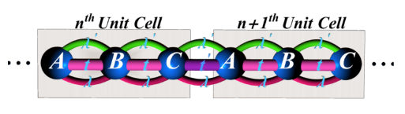 
FIG. 1. (Color online) Schematic representations of SSH3 lattice with three sublattices per unit cell. The intracell (t) and intercell (t′) hopping parameters are indicated by flat lines. The forward (λ) and backward (λ′) Rashba spin-orbit couplings are represented by curved lines.

📷 Fig 2

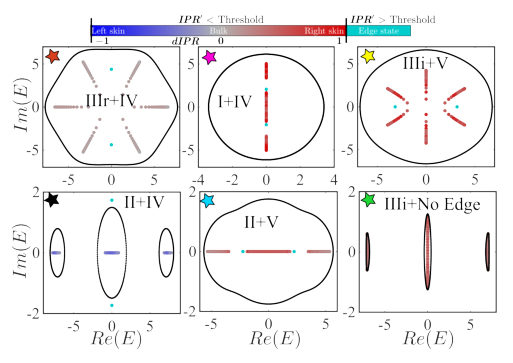 
FIG. 3. (Color online) Representative spectra of the spin- up (H+) sector in the complex energy plane, for parameter values marked by the colored stars in Figs. 2(b) and 2(d), each corresponding to a specific phase listed in Table I. The PBC spectrum is shown as a solid block loop enclosing the spectral region of the bulk Hamiltonian. The OBC spectrum is shown as colored points. Eigenstate localization is encoded by IPR′ and dIPR: localized edge states (cyan, IPR′ above threshold 0.1), left-localized skin modes (blue, dIPR →−1), right-localized skin modes (red, dIPR →1), and extended bulk modes (grey, dIPR ≈0).

📷 Fig 3

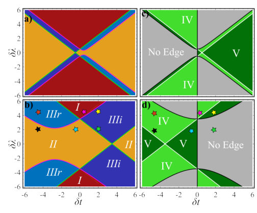 
FIG. 2. (Color online) Phase diagram of the spin-down (up- per row) and spin-up (lower row) sectors in the (δt, δλ) plane for the bulk (left column) and edge (right column) states. The green line separates the regions with qα ≷0, while the ma- genta line separates the mixed states from others. Also, the boundary between phases IV and V and the localized and de- localized edge states are indicated in white and black, respec- tively. Star markers denote points at δt = −4.5, −0.5, 0.5, 1.9 and δλ = 2, 4.5. Here, t0 = 1.5, λ0 = 2.

📷 Fig 4

 
Figure 2 summarizes the analytically obtained phase diagrams of the bulk [Figs. 2(a,b)] and edge [Figs. 2(c,d)] spectra. Since the two spin sectors are decoupled by the F symmetry [Eq. (4)], they evolve independently in the (δt, δλ) parameter space, giving rise to spin-resolved sym- metry transitions. The top (bottom) row is for the spin- down (spin-up) sector. The bulk phase diagrams (left panels) contain four spectral phases. Phase II (yellow regions) corresponds to the PT -unbroken regime with purely real spectra, whereas Phase I (red regions) represents the APT - unbroken regime with purely imaginary spectra. The re- maining regions (IIIr and IIIi, shown in blue) are mixed phases in...

📷 Fig 5

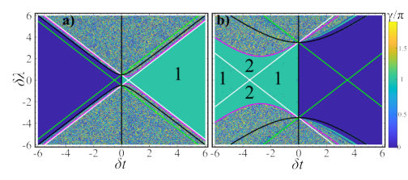 
FIG. 4. (Color online) Berry phase diagram in the (δt, δλ) plane for (a) the spin-down and (b) the spin-up sectors ex- hibiting a strong asymmetry. The regions labeled ”1” and ”2” represent sub-regions where the quantized Berry phase is carried by the lowest and central energy bands, respectively. Here, t0 = 1.5 and λ0 = 2.

**Summary.** This theoretical study investigates non-Hermitian topology in a trimerized SSH chain incorporating nonreciprocal Rashba SOC. By exploiting spin-flip symmetry, the authors map out a complex phase diagram characterized by $\mathcal{PT}$ and anti-$\mathcal{PT}$ symmetry transitions. The work successfully establishes a bulk-edge correspondence, showing how symmetry dictates whether edge states possess real or imaginary energies.

**Why it may be interesting.** This work is highly relevant as it extends the study of topological phases into the non-Hermitian domain, specifically addressing how $\mathcal{PT}$ and anti-$\mathcal{PT}$ symmetries dictate the nature of edge states in complex lattice models.

Detailed structure

**Main problem.** The paper investigates $\mathcal{PT}$ and anti-$\mathcal{PT}$ phase transitions in a specific quantum system, focusing on spin-resolved non-Hermitian topology and edge-selective symmetry preservation.

**Main result.** The system exhibits a rich phase diagram with distinct bulk and edge-state phases, demonstrating spin-dependent non-Hermitian skin effects and the separation of symmetry classes between bulk and edge states.

**Method.** The analysis employs non-Bloch band theory and Cardano's method to derive closed-form expressions for phase boundaries, confirming results using Berry phase and directional inverse participation ratios.

**Model / system.** The model is a one-dimensional trimerized Su--Schrieffer--Heeger (SSH) chain with three sublattices per unit cell, subjected to a nonreciprocal Rashba spin-orbit coupling. The Hamiltonian is decomposed into two independent spin sectors due to a preserved spin-flip symmetry.

**Key observables.** Bulk and edge energy spectra (real/imaginary), Berry phase, directional inverse participation ratios, and the classification of phases (e.g., $\mathcal{PT}$-unbroken, anti-$\mathcal{PT}$-unbroken).

**Important parameters / regimes.** Intracell ($t$) and intercell ($t'$) hopping amplitudes, dimerization strength ($\delta t$), and nonreciprocal Rashba coupling ($\lambda, \lambda'$ with $\delta\lambda$).

**Assumptions / limitations.** The analysis relies on the existence of a spin-flip symmetry, which allows the Hamiltonian to be block-diagonalized into two independent spin sectors.

**Figures summary.** Figure 1 schematically illustrates the $\text{SSH}3$ lattice couplings. Figure 2 (mentioned) shows the phase diagram in the $(\delta t, \delta \lambda)$ plane for both spin sectors.

**Paper structure.** The paper proceeds by defining the Hamiltonian and exploiting the spin-flip symmetry to decompose the problem. It then uses non-Bloch theory to analyze the bulk spectrum via a cubic secular equation, followed by edge state analysis to establish the bulk-edge correspondence for different symmetry regimes.

Abstract

We theoretically investigate a one-dimensional trimerized Su--Schrieffer--Heeger chain with three sublattices per unit cell subjected to a nonreciprocal Rashba spin-orbit coupling. Invoking a spin-flip symmetry, the non-Hermitian Hamiltonian decomposes into two independent spin sectors, enabling a spin-resolved analysis of non-Hermitian skin effects and system symmetries. We identify a rich phase diagram consisting of four bulk phases and two edge-state phases. The bulk phases include fully $\mathcal{PT}$-unbroken (real-spectrum) and fully anti-$\mathcal{PT}$-unbroken (imaginary-spectrum) regimes, as well as two mixed phases where one band remains on the real or imaginary axis while the other two form complex-conjugate pairs. The two edge-state phases correspond to topological edge modes with either $\mathcal{PT}$-unbroken (real) or anti-$\mathcal{PT}$-unbroken (imaginary) energies. Using non-Bloch band theory and Cardano's method, we derive closed-form expressions for phase boundaries and establish the bulk-edge correspondence for each spin sector. Calculations of Berry phase and directional inverse participation ratios confirm our analytical predictions. Our results provide a minimal platform for realizing spin-resolved non-Hermitian topology and edge-selective symmetry preservation, in which the bulk and edge states belong to distinct symmetry classes.

[↑ back to top](#top)

### [The four-dimensional Chamon code](http://arxiv.org/abs/2608.20775v1)

**Authors:** Zhipeng Liang, Xuan Wang  
**Type:** theory · **Category:** quantum information and computing · **PDF:** <https://arxiv.org/pdf/2608.20775v1>  
**Analysis basis:** full PDF text, analyzed in chunks
**Topic relevance:** `analog quantum simulation` **1/5** · `quantum measurements` **1/5**

📷 Fig 1

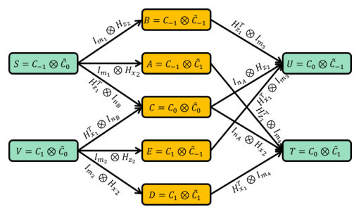 
FIG. 1. The tensor-product structure of the CSS variant of the 4D XYZ product of two length-2 chain complexes C1 =

📷 Fig 2

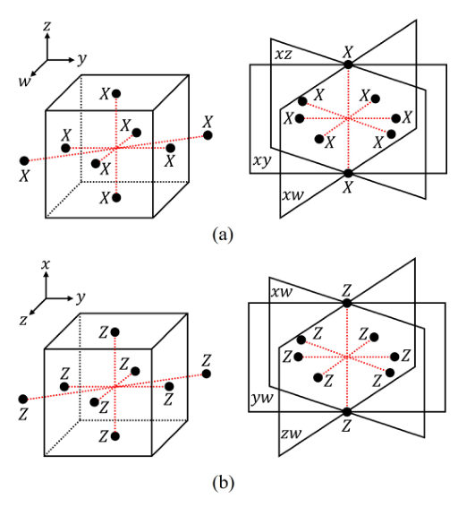 
FIG. 2. The stabilizers of the 4D Chamon code. (a) The X- type stabilizers that corresponds to a cube perpendicular to x-axis (left) and an edge along x-axis (right). (b) The Z-type stabilizers that corresponds to a cube perpendicular to w-axis (left) and an edge along w-axis (right).

📷 Fig 3

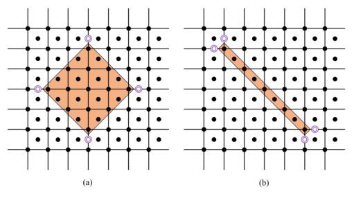 
FIG. 3. The (a) monopoles and (b) dipoles in the 4D Chamon code, which are created by rectangular-shaped membrane op- erator and rigid string operator, respectively.

📷 Fig 4

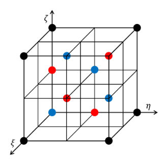 
FIG. 4. The projected 3D lattice, with black dots representing stabilizers and red dots representing qubits.

📷 Fig 5

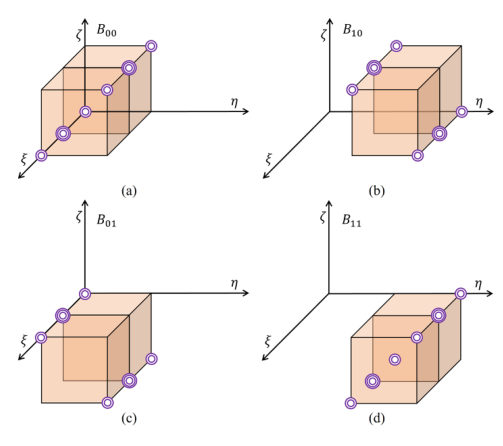 
FIG. 5. Four types of rectangular operators with weight of 2 and the corresponding excitations.

**Summary.** This paper analyzes the 4D Chamon code, a complex quantum error-correcting code, confirming its structure and restricted-mobility excitations. The authors introduce a novel, efficient two-layer decoding strategy that leverages the code's underlying symmetries. This new decoder significantly outperforms state-of-the-art methods in numerical simulations, advancing the practical application of topological quantum memory.

**Why it may be interesting.** The work provides a concrete, advanced example of applying deep structural insights (hyperplane symmetry, projection) to improve quantum error correction decoding, which is highly relevant to building fault-tolerant quantum hardware.

Detailed structure

**Main problem.** To characterize the 4D Chamon code, confirm its status as a 4D generalization of the 3D code, and develop a high-performance decoding strategy.

**Main result.** The paper develops a novel two-layer decoding strategy that exploits the code's intrinsic symmetries, achieving substantially better decoding accuracy than existing methods like BP-OSD.

**Method.** The authors establish the code's algebraic structure, analyze its restricted-mobility excitations, and then decompose the complex decoding problem into multiple independent, parallelizable 2D toric-code-like subproblems.

**Model / system.** The system is the 4D Chamon code, a type of fracton model constructed via the 4D XYZ product of two 2D toric codes, defined on a 4D periodic lattice.

**Key observables.** Ground-State Degeneracy (GSD), restricted-mobility excitations (monopoles and dipoles), and the logical error rate during decoding.

**Important parameters / regimes.** The dimensionality (4D), the type of noise (Pauli Z errors), and the comparison metric (decoding accuracy vs. BP-OSD).

**Assumptions / limitations.** The core decoding strategy relies on separating the error components, particularly the mixed-face error ($\mathbf{e}_{	ext{mix}}$), which allows the problem to decompose into independent 2D subproblems.

**Figures summary.** Figure 9 compares the logical error rates of the proposed two-layer decoder against BP-OSD for 4D Chamon codes under pure Pauli Z noise, showing superior performance for the new decoder.

**Paper structure.** The paper first characterizes the code and its excitations, confirming its 4D generalization status. It then develops the decoding theory by identifying structural symmetries, leading to the proposal of a two-layer decoding algorithm that solves the projected equation first, followed by parallel decoding on the remaining components.

Abstract

Fracton models have attracted considerable interest as candidates for quantum memories because of their unconventional ground-state degeneracy (GSD) and restricted-mobility excitations. The four-dimensional (4D) Chamon code introduced in our previous work is constructed via the 4D XYZ product of two two-dimensional (2D) toric codes. Its GSD grows exponentially with the system size, similar to that of the three-dimensional (3D) Chamon code, suggesting that it may be regarded as a 4D generalization of the 3D Chamon code. However, the excitation properties of the 4D Chamon code have not been studied in depth, and a high-performance decoding strategy is still lacking. In this work, we first establish the correspondence between the algebraic structure of the 4D Chamon code and the 4D lattice, thereby characterizing the geometric distributions of qubits and stabilizers. Second, we show that the 4D Chamon code supports three types of restricted-mobility excitations analogous to those of the 3D Chamon code, further supporting its interpretation as a 4D generalization of the 3D Chamon code. Finally, we uncover two structural properties relevant to decoding: a hyperplane symmetry and a projection-induced 2D toric-code structure. By exploiting these properties, we develop a two-layer decoding strategy that decomposes the original decoding problem into multiple independent and parallelizable subproblems. Numerical simulations show that the proposed decoder substantially outperforms BP-OSD in decoding accuracy, demonstrating the benefit of incorporating the intrinsic geometric and algebraic structures of the code into decoder design.

[↑ back to top](#top)

### [Distinguishing Mott and strain-induced anisotropic semimetals in magic-angle twisted bilayer graphene using Landau level spectroscopy](http://arxiv.org/abs/2608.20694v1)

**Authors:** Keshav Singh, Juan Felipe Mendez-Valderrama, Erez Berg, B. Andrei Bernevig, Oskar Vafek  
**Type:** theory · **Category:** strongly correlated electrons · **PDF:** <https://arxiv.org/pdf/2608.20694v1>  
**Analysis basis:** full PDF text, analyzed in chunks
**Topic relevance:** `analog quantum simulation` **1/5**

📷 Fig 1

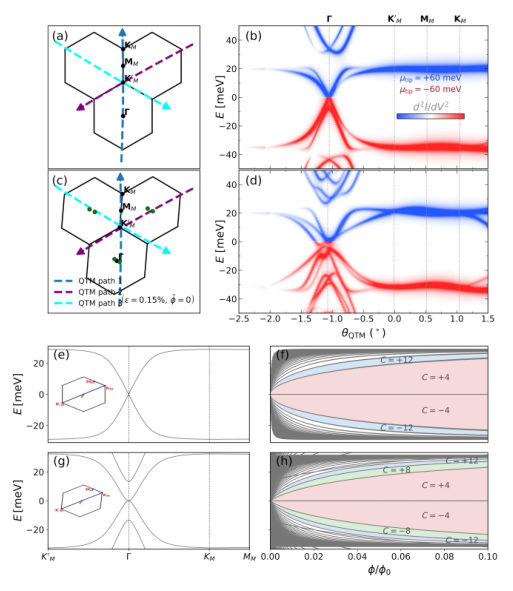 
FIG. 1. The paths in reciprocal space scanned by the quantum twisting microscope (QTM) and the expected d2I/dV 2 maps for the (a,b) relaxed Mott and the (c,d) relaxed strain-induced anisotropic semimetals. The d2I/dV 2 map is plotted as a function of band energy E and the relative angle between the top graphene layer of the MATBG sample and the probing monolayer graphene tip, labeled by θQT M(◦), where we use the result obtained in [77] (also see Appendix(H)). We set the sample chemical potential µsample = 0, such that the corresponding bias between the tip and sample is given by −eV = E + µtip[77] where µtip is the tip chemical potential. We mark the high symmetry points that are closest...

📷 Fig 2

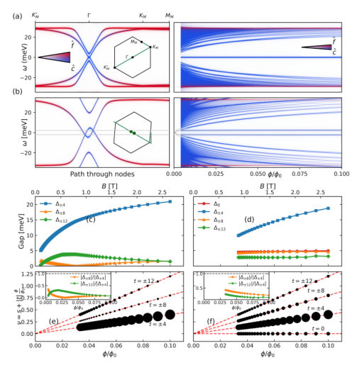 
FIG. 2. The orbital-resolved spectral function and its continuation in B for (a) Mott and (b) strain-induced anisotropic semimetals in absence of the Zeeman and lattice relaxation effects. At a given k (for B = 0) or ϕ/ϕ0 (for B ̸= 0), the spectral function is given by A(ω) = P

📷 Fig 3

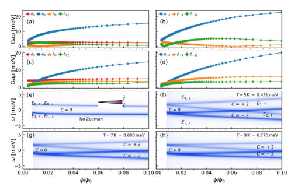 
FIG. 3. (a-d) The magnitudes of Chern gaps for the (a,b) Mott and (c,d) strain-induced anisotropic semimetal in the presence of lattice relaxation effects. (e-h) The spectral function of the valley degenerate anomalous modes {E0,↑↓, E1,↑↓} of the Mott semimetal including lattice relaxation effects (e) without Zeeman and (f-h) with Zeeman for T = 5K, 7K and 9K as a function of ϕ/ϕ0 and energy (see Appendix(P)). The C = ±2 gaps formed via Zeeman induced splitting marked. The spectral weight of the modes at E1,↑↓is ∼(1+Aℓ)/(A0+Aℓ), which is larger than the spectral weight of the modes at E0,↑↓which is ∼A−1 0 , where Aℓ= 2( v∗

📷 Fig 4

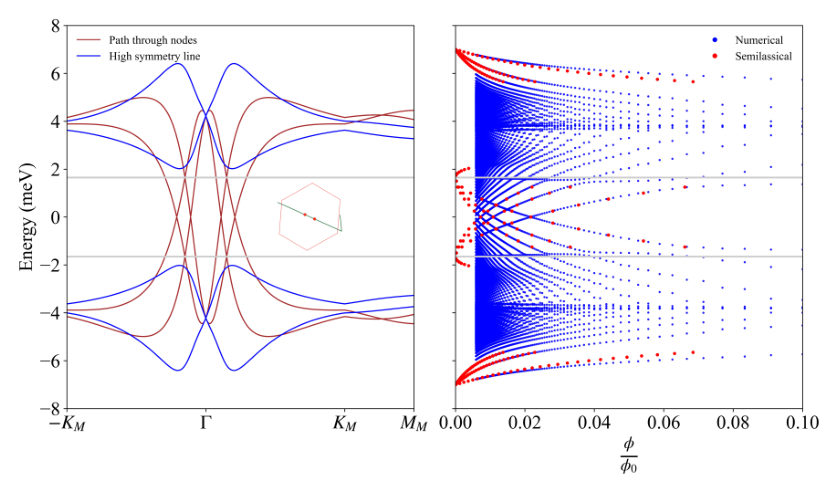 
FIG. 4. The strained THF model bandstructure in the left panel and its continuation in B on the right panel. On the left panel, the bands along the high-symmetry line cut are in blue while that along a rotated path through Dirac nodes is in brown. The path through the nodes is shown in the inset in left panel, with location of nodes marked in red. The semiclassically (see Appx(G)) obtained LLs in red are plotted on top of the numerically obtained spectrum in blue on the right panel. Solid grey horizontal lines are plotted at the Dirac crossing points in both panels.

📷 Fig 5

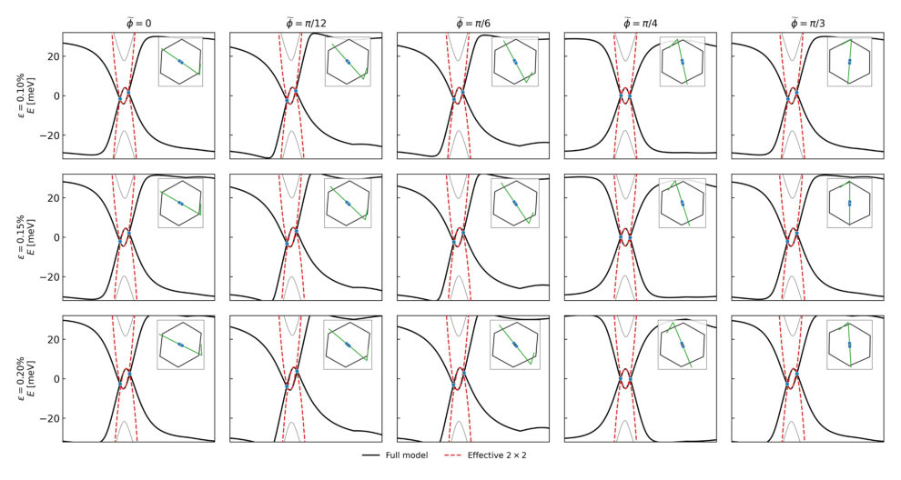 
FIG. 5. Strain-induced anisotropic semimetal: The comparison of the band structure obtained by diagonalizing the full one shot model and the effective model, given by Eqs.(F11) and (F28) respectively for different orientations and magnitude of heterostrain at τ = +1. We promote γ, γ′, c′′ →e−k2λ2/2γ, e−k2λ2/2γ′, e−k2λ2/2c′′ before plotting.

**Summary.** This theoretical work distinguishes between Mott and strain-induced semimetallic phases in twisted bilayer graphene by analyzing their response to an out-of-plane magnetic field. The key diagnostic tool is the gap size hierarchy observed in the Landau levels. The distinct, robust hierarchy predicted for the strain-induced state, compared to the field-sensitive hierarchy of the Mott state, offers a pathway for experimental verification.

**Why it may be interesting.** The work provides a concrete, measurable spectroscopic signature (the gap hierarchy) that can differentiate between two complex, correlated quantum phases in a highly tunable solid-state system, which is relevant for understanding emergent topological phases.

Detailed structure

**Main problem.** The paper aims to provide a sharp, spectroscopic criterion to distinguish between two candidate electronic states in magic-angle twisted bilayer graphene (MATBG): a 'Mott semimetal' governed by strong correlations, and a 'strain-induced anisotropic semimetal' characterized by weak Hartree-Fock effects.

**Main result.** The out-of-plane magnetic field serves as a definitive probe: the strain-induced semimetal exhibits a robust gap hierarchy ($\Delta_{\pm 4} > \Delta_{\pm 8} > \Delta_{\pm 12}$), while the Mott semimetal shows a different, field-dependent hierarchy for its higher-order gaps.

**Method.** The analysis involves calculating the expected Landau level (LL) gap size hierarchy using the Topological Heavy Fermion (THF) framework, comparing results derived from the Hubbard-I approximation (Mott) versus single-particle strained Hamiltonians.

**Model / system.** The physical system is MATBG, modeled using the THF framework. The study compares the behavior of the Mott state (using Hubbard-I) against the strain-induced state (using $	ext{H}_{	ext{strain}}$) under the influence of an out-of-plane magnetic field.

**Key observables.** Landau level gap size hierarchy ($\Delta_C$), specifically comparing $\Delta_{\pm 4}, \Delta_{\pm 8}, \Delta_{\pm 12}$ gaps.

**Important parameters / regimes.** Out-of-plane magnetic field ($B$), strain ($\epsilon$), and interaction strength ($U_1$).

**Assumptions / limitations.** The analysis often relies on the flat-chiral limit ($v'_* = M = 0$) for the Mott semimetal to achieve solvable spectra, though extensions include lattice relaxation and Zeeman coupling.

**Figures summary.** Figures illustrate QTM paths and expected $d^2I/dV^2$ maps for both candidates, and show the evolution of Chern gaps ($\Delta_C$) as a function of magnetic flux and various physical parameters.

**Paper structure.** The paper develops the theoretical framework by first establishing the diagnostic tool (LL spectroscopy) and then performing detailed calculations comparing the gap evolution for the Mott state versus the strain-induced state under varying external fields and internal symmetries.

Abstract

Recent quantum twisting microscopy experiments [1] have provided unprecedented momentum- and energy-resolved imaging of magic-angle twisted bilayer graphene, revealing a stark dichotomy between the heavy and light electronic characters of its narrow bands. In this work, we provide a sharp distinguishing criterion between the two most likely candidate states that exhibit spectroscopic features consistent with the experimental results. Focusing on charge neutrality, these states are 1) the 'Mott semimetal', governed by strong dynamical correlations, and 2) the 'strain-induced anisotropic semimetal', characterized by weak Hartree-Fock effects. We demonstrate that an out-of- plane magnetic field serves as a sharp discriminating probe based on the expected Landau level gap size hierarchy. We find that the strain-induced anisotropic semimetal has a robust gap hierarchy where the Chern C gaps, Δ_C , decrease in order Δ_{\pm 4} > Δ_{\pm 8} > Δ_{\pm 12}. In contrast, for the Mott semimetal, Δ_{\pm 4} remains the largest gap, while the relative magnitude of the C = \pm 8, \pm 12 gaps depends sensitively on the applied magnetic field. We test the robustness of these results against strain orientation and lattice relaxation finding consistency between the gap hierarchy of the strained semimetal and previous incompressibility measurements at finite magnetic field [2].

[↑ back to top](#top)

### [Electronic Toroidal Metals: Landau Theory and Magnetoelectric Fingerprints](http://arxiv.org/abs/2608.20838v1)

**Authors:** Yuhang Xiao, Ning Hao  
**Type:** theory · **Category:** strongly correlated electrons · **PDF:** <https://arxiv.org/pdf/2608.20838v1>  
**Analysis basis:** full PDF text, analyzed in chunks
**Topic relevance:** `Keldysh / 2PI / non-Gaussian methods` **1/5**

📷 Fig 1

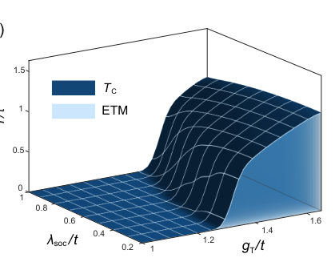 
FIG. 1. (a),(b) Band structures and FS before and after con- densation (θ = π/2), respectively. (c) Temperature depen- dence of the Schur-kernel eigenvalues, shown as solid curves. The corresponding eigenvalues obtained without the Schur projection are shown as dashed curves for comparison. The transition temperature is determined by the intersection be- tween t/gT and the largest eigenvalue branch of the Schur kernel. (d) Phase diagram of the ETM. The parameters used in panels (a)–(c) are µ = −1.4t, m0 = 0.5t, and λSOC = 0.3t, which are also adopted in all relevant numerical calculations of this model presented thereafter.

📷 Fig 2

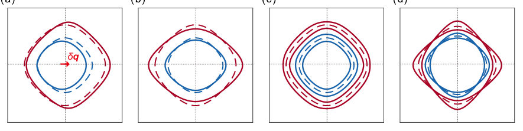 
FIG. 2. Schematic illustration of the characteristic Fermi-surface deformations in metallic Landau phases belonging to four distinct spacetime-symmetry sectors. Dashed curves indicate the FS in the normal metallic state, while solid curves indicate those after order-parameter condensation.

📷 Fig 3

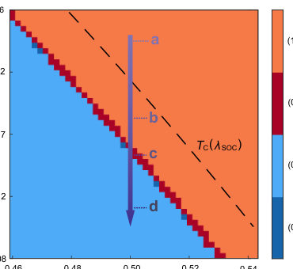 
FIG. 3. The evolution of the topological structure in momen- tum space. (a)–(d) Pseudospin textures of the ETM for four representative parameter sets, corresponding respectively to the points labeled a–d in panel (e). The textures are shown for the pseudospin branch with eigenvalue +1. The filled blue and orange circles mark the centers of pseudospin vortices carrying vorticity ±1, respectively. (e) Topological phase di- agram at fixed gT = 1.5t, with the phases classified by the pseudospin winding numbers on the FS as temperature and SOC strength are varied.

📷 Fig 4

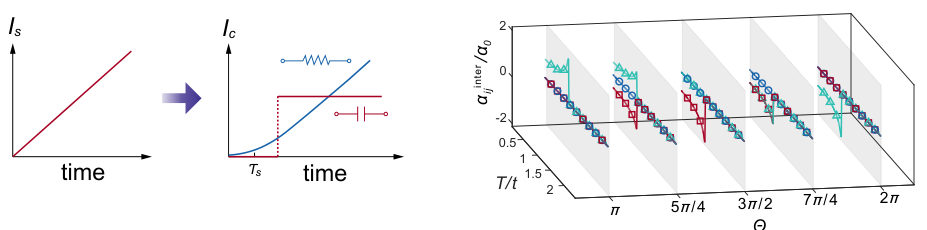 
FIG. 4. Magnetoelectric response of the ETM. (a) Temperature dependence of the toroidal-moment magnitude. A sharp enhancement below Tc signals a strong magnetoelectric response tied to the vortex center crossing the FS. The response is normalized by α0 = 10−2eµB/t in units with a = ℏ= 1, where a is the lattice constant. (b) Evolution of the TM, shown by black arrows in the polar space of the magnitude and angle of the toroidal vector η; color denotes temperature. (c) Schematic ETM magnetoelectric response: Black arrows denote the perturbations, while blue arrows indicate the induced responses. Red arrow marks the in-plane toroidal vector of the present model. (d) Charge current induced by...

📷 Fig 5

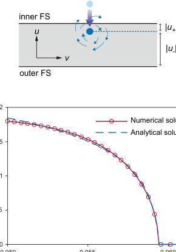 
FIG. 5. (a) Schematic illustration of the local model in mo- mentum space. (b) Comparison between the momentum- space local model and numerical results. In the local model, we consider only the contribution at the FS, neglect the Fermi-surface anisotropy, and adopt the approximation u+ − u−∼η ∼√Tc −T

**Summary.** This work develops a general Landau theory for Electronic Toroidal Metals (ETM), showing how toroidal order can spontaneously arise in itinerant electron systems. The theory uses advanced projection techniques to isolate the physical instability, predicting unique signatures in the magnetoelectric response and nonlinear charge transport. It establishes ETM as a distinct metallic phase governed by Fermi-liquid instabilities.

**Why it may be interesting.** The concept of a higher-rank multipolar order (toroidal) emerging from itinerant electrons provides a rich theoretical framework for understanding exotic metallic phases beyond standard charge or spin ordering.

Detailed structure

**Main problem.** To develop a generic theory for the electronic toroidal metal (ETM), where toroidal order spontaneously emerges from electronic degrees of freedom near the Fermi surfaces in itinerant-electron systems.

**Main result.** ETM is established as a distinct metallic Landau phase, characterized by a soft collective mode and a unique enhancement of nonlinear charge transport linked to pseudospin texture topology.

**Method.** The theory employs a projected instability criterion (Schur projection) to handle the overlap between toroidal candidates and the uniform charge current, leading to a Fermi-liquid instability analysis.

**Model / system.** The study focuses on itinerant electron systems, using a minimal two-band Hamiltonian on a square lattice as a prototype for spin-orbit-coupled systems.

**Key observables.** Antisymmetric magnetoelectric response tensor, nonlinear charge transport ($\sigma_{interQMD}$), and the continuous evolution of the toroidal moment ($T$).

**Important parameters / regimes.** The instability is governed by the soft mode appearing in the P-odd and T-odd particle-hole channel.

**Assumptions / limitations.** The primary technical hurdle addressed is the overlap of toroidal candidates with the uniform charge current, necessitating the Schur projection to select the physical instability.

**Figures summary.** Figures illustrate the temperature dependence of various nonlinear conductivity contributions (NLD, interQMD, intraQMD) and show the momentum-space distribution of the interband quantum metric near pseudospin vortices.

**Paper structure.** The paper develops the theory by first formulating the instability criterion, then using a Schur projection formalism on a minimal model to derive the effective mean-field Hamiltonian, and finally analyzing the resulting nonlinear transport signatures.

Abstract

Toroidal order is a higher-rank multipolar order whose intrinsic realization in itinerant-electron systems remains unexplored. Here, we develop a generic theory of the electronic toroidal metal (ETM), in which toroidal order emerges spontaneously from electronic degrees of freedom near the Fermi surfaces. Because candidate toroidal bilinears can overlap by symmetry with the uniform charge current, we formulate a projected instability criterion that removes the noncondensable current component. Within this current-orthogonal sector, we identify a soft collective mode in the $\mathcal{P}$-odd and $\mathcal{T}$-odd particle-hole channel and demonstrate that ETM arises as a Fermi-liquid instability. We then define the toroidal moment in an itinerant system through the antisymmetric magnetoelectric response tensor. We further establish an intimate connection between this response and the topology of pseudospin texture: the rearrangement of pseudospin vortices changes the winding structure of the Fermi surfaces and markedly enhances the magnetoelectric response. ETM also exhibits characteristic nonlinear charge transport, including a pronounced enhancement of its interband quantum-geometric contribution. Our results establish ETM as a distinct metallic Landau phase and provide a general framework for understanding toroidal order generated by itinerant electrons.

[↑ back to top](#top)

### [Multiparameter Quantum Affine Spaces and the Scalene Yang--Baxter Equation](http://arxiv.org/abs/2608.20714v1)

**Authors:** Pramod Padmanabhan, Somnath Maity, Vladimir Korepin  
**Type:** theory · **Category:** statistical mechanics · **PDF:** <https://arxiv.org/pdf/2608.20714v1>  
**Analysis basis:** full PDF text, analyzed in chunks
**Topic relevance:** `analog quantum simulation` **1/5**

📷 Fig 1

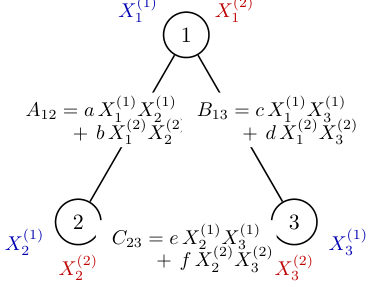 
Figure 1: Triangular organization of the anticommuting two-generator construction. The blue and red labels indicate the two matched generator families {X(1) 1 , X(1) 2 , X(1) 3 } and {X(2) 1 , X(2) 2 , X(2) 3 }. Each scalene operator is an arbitrary linear combination of the two matched-generator contri- butions. For mixed monomials, reversing the order A12B13C23 7→C23B13A12 reverses the local generator order at an even number of vertices, so the anticommutation signs cancel.

**Summary.** This theoretical paper constructs solutions to the non-braided scalene Yang--Baxter equation using algebraic methods based on noncommutative algebras. The key finding is the derivation of multiparameter quantum affine spaces that satisfy this relation, providing a general framework for studying quantum integrability. The results are realized explicitly using weighted and multiplicative shift operators, connecting abstract algebra to concrete physical models.

**Why it may be interesting.** The connection between the scalene YBE and quantum affine algebras provides a powerful, representation-independent tool for studying quantum integrability, which is crucial for understanding many-body dynamics in condensed matter systems.

Detailed structure

**Main problem.** The paper focuses on constructing representation-independent families of solutions to the non-braided scalene Yang--Baxter equation (YBE). This equation governs the algebraic structure underlying quantum integrability.

**Main result.** The construction yields purely scalene solutions associated with multiparameter quantum affine spaces, providing an algebraic framework for investigating quantum integrability.

**Method.** The authors use algebraic methods, starting from quadratic noncommutative algebras and generalizing the construction from anticommuting generators to $q$-deformed algebras.

**Model / system.** The study concerns abstract algebraic structures, specifically quantum affine spaces and the operators satisfying the scalene YBE. Representations are realized using weighted shifts and multiplicative-shift operators acting on $\mathbb{Z}$-indexed spaces.

**Key observables.** The satisfaction of the scalene Yang--Baxter relation ($A_{12}B_{13}C_{23} = C_{23}B_{13}A_{12}$) and the derived cross-commutativity relation $[t_B, t_C] = 0$.

**Important parameters / regimes.** Deformation parameters ($q_{\mu
u}^{\alpha}$ or $\lambda_\mu / \lambda_
u$), which dictate the specific quantum affine space realized.

**Assumptions / limitations.** The analysis assumes the existence of a basis (PBW property) for the algebra and that the initial construction can be generalized from anticommuting generators to $q$-deformed algebras.

**Figures summary.** Figure 1 illustrates the triangular organization of the anticommuting two-generator construction, while other figures likely detail the structure of the shift operators and the algebraic relations.

**Paper structure.** The paper progresses from the initial anticommuting construction of the scalene YBE solution (Theorem 2.1) to generalizing this to $q$-deformed algebras (Theorem 4.1), and finally providing explicit infinite-dimensional realizations using weighted and multiplicative shift operators (Section 6).

Abstract

We construct representation-independent families of solutions of the non-braided scalene Yang--Baxter equation from quadratic noncommutative algebras. Beginning with two anticommuting generators, we obtain a continuous deformation in terms of quantum-plane algebras and extend the construction to an arbitrary number of generators. In the latter case the scalene Yang--Baxter relation fixes the multiparameter exchange matrix to an exact multiplicative form, thereby selecting a distinguished subclass of multiparameter quantum affine spaces. We construct finite-dimensional realizations using singular matrices and finite Heisenberg--Weyl operators, as well as infinite-dimensional realizations in terms of bilateral weighted shifts and multiplicative-shift operators. The explicit realizations are generically \emph{purely scalene}: although the ordered triple satisfies the scalene Yang--Baxter equation, its individual constituent operators do not satisfy the ordinary non-braided Yang--Baxter equation. These results provide a representation-independent algebraic framework for constructing Yang--Baxter-irreducible scalene triples and a starting point for investigating their possible applications to quantum integrability.

[↑ back to top](#top)

### [Nonlocal correlation in quantum network under relativistic motion](http://arxiv.org/abs/2608.20650v1)

**Authors:** Si-Han Li, Tian-Yang Wang, Ai-Yan Tong, Shu-Min Wu  
**Type:** theory · **Category:** quantum information and computing · **PDF:** <https://arxiv.org/pdf/2608.20650v1>  
**Analysis basis:** full PDF text, analyzed in chunks
**Topic relevance:** `correlated / nonlocal dissipation` **1/5**

📷 Fig 1

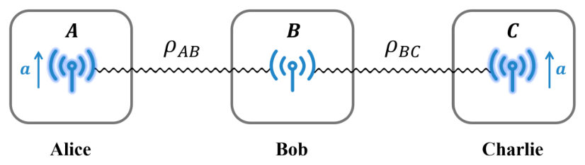 
FIG. 1: Schematic illustration of the elementary bilocal quantum network in the Unruh-DeWitt detector

📷 Fig 2

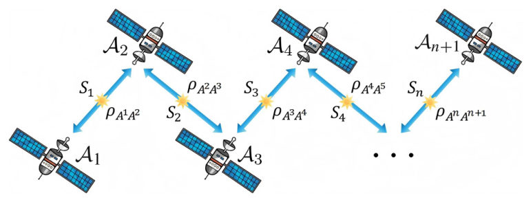 
FIG. 2: The chain network scenario. Here, we choose A1 and An+1 as the marginal nodes, and each source

📷 Fig 3

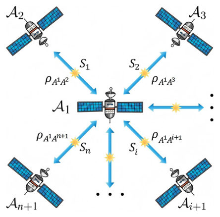 
FIG. 3: The star network scenario. Here, we choose A1 as the intermediate node, and each source Si

📷 Fig 4

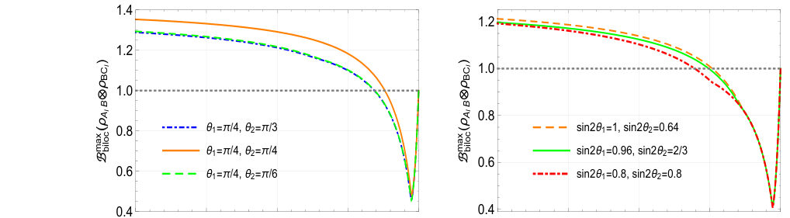 
FIG. 4: The maximum non-bilocality parameter Bmax biloc(ρAIB ⊗ρBCI) as a function of the acceleration

📷 Fig 5

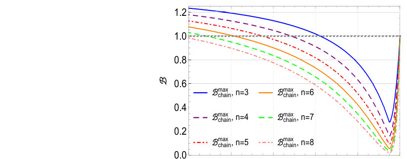 
FIG. 5: Bmax chain(ρA1 IA2 ⊗ρA2A3 I ⊗· · · ⊗ρAn I An+1) as a function of the acceleration parameter q for various

**Summary.** This work studies the relativistic decay of quantum network nonlocality using the Unruh-DeWitt model. It demonstrates that the network's topology dictates its resilience, showing that star configurations are significantly more robust than chain configurations under acceleration. The findings suggest that network architecture can be optimized to protect quantum correlations in relativistic quantum technologies.

**Why it may be interesting.** It provides a concrete theoretical framework for understanding how fundamental physical effects like acceleration (Unruh effect) impact the robustness of quantum resources like nonlocality, which is crucial for designing practical quantum communication channels.

Detailed structure

**Main problem.** The paper investigates how the nonlocality of quantum correlations within a network degrades when the constituent nodes undergo relativistic motion.

**Main result.** The network topology critically determines the fate of nonlocality; star networks show remarkable resilience, even exhibiting a sudden death-sudden birth transition, unlike chain networks which suffer irreversible decay.

**Method.** The analysis uses the Unruh-DeWitt detector model and calculates the evolution of the reduced density matrix in the weak-coupling limit using first-order perturbation theory.

**Model / system.** The system models quantum networks (chain and star topologies) where detectors interact with a quantized field while undergoing uniform proper acceleration. The dynamics are governed by the Unruh-DeWitt Hamiltonian.

**Key observables.** Network nonlocality (quantified by $n$-locality inequalities, $B_{	ext{max}}$), and the reduced density matrix $
ho_{AB}^t$.

**Important parameters / regimes.** Acceleration parameter ($q$), coupling strength ($
u$), and network size ($n$).

**Assumptions / limitations.** The analysis is restricted to the weak-coupling regime and utilizes first-order perturbation theory in the Unruh-DeWitt detector framework.

**Figures summary.** The notes describe trends showing $B_{	ext{max}}$ vs. acceleration parameter ($q$) for different topologies, highlighting the resilience of star networks.

**Paper structure.** The paper systematically analyzes the evolution of nonlocality for different network structures (chain vs. star) by calculating the reduced density matrix after interaction with the accelerating quantum field.

Abstract

We investigate the relativistic dynamics of network nonlocality in general $n$-local networks with chain and star topologies using the Unruh-DeWitt detector model. We show that the relativistic degradation of network nonlocality is strongly governed by the underlying topology. While chain networks suffer an irreversible sudden death of non-$n$-locality under relativistic motion, star networks exhibit remarkable resilience against relativistic decoherence. Most strikingly, a minimal star network with three peripheral nodes exhibits a remarkable sudden death-sudden birth transition of network nonlocality as the acceleration increases. This reentrant behavior reveals a dual role of the Unruh effect: it can both suppress and protect network nonlocality, offering a new perspective on the relativistic effects of acceleration on quantum networks. For larger star networks ($n>3$), non-$n$-local correlations persist over the entire acceleration regime. These insights provide valuable conceptual guidance for the structural optimization and design of acceleration-resilient architectures for future relativistic quantum communication and sensing protocols.

[↑ back to top](#top)

### [Perfect state transfer and Cayley presentations](http://arxiv.org/abs/2608.20476v1)

**Authors:** Arnbjörg Soffía Árnadóttir, Krystal Guo  
**Type:** theory · **Category:** other · **PDF:** <https://arxiv.org/pdf/2608.20476v1>  
**Analysis basis:** full PDF text, analyzed in chunks
**Topic relevance:** `analog quantum simulation` **1/5**

📷 Fig 1

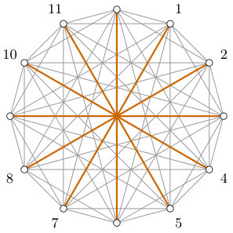 
Figure 1. Two graphs with perfect state transfer, each of which is a Cayley graph of every group of its order. They are rows X8c (left) and X12a (right) of the census in Ap- pendix A. They are drawn in their circulant presentations, X8c = Cay(Z8, {±1, ±3, 4}) and X12a = Cay(Z12, {±1, ±2, ±4, ±5, 6}), and in both the perfect state transfer at time π/2 is between the vertices x and x + n/2 connected by orange edges.

📷 Fig 2

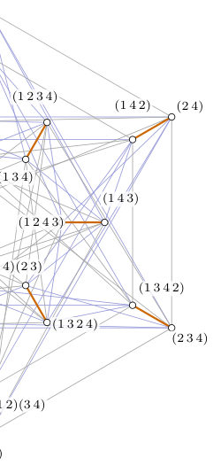 
Figure 2. The 24-vertex counterexample X = Cay(S4, S). Edges are coloured by generator: the transposition (1 2) gives the orange perfect matching, the other four transpositions are grey, and the four 3-cycles are blue. Perfect state transfer at time π/2 occurs between vertices connected by the orange perfect matching. The graph is row X24b of the census (Appendix A).

📷 Fig 3

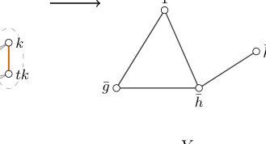 
Figure 5. Illustration of the twin reduction. If every twin class of X has size two and distinct classes are joined by all four possible edges or by none, then X is the lexicographic product Y [K2] (adjacent classes, as drawn) or Y [2K1] (non-adjacent classes) of the quotient graph Y over the classes. For the graphs of [35] the classes are the pairs {g, tg} with t = −I (Lemma 6.5, Appendix B), perfect state transfer runs from g to tg inside each class (orange), and Aut(X) = C2 ≀Aut(Y ) by Lemma 6.4.

📷 Fig 4

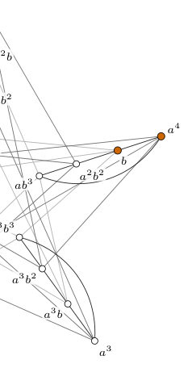 
Figure 6. The complement of X14. The identity (vertex marked double circle) admits peak state transfer in X14 at time π/3, with amount 16/225, with each of the five filled vertices a, a4, b, b3, ab2.

**Summary.** This work investigates Perfect State Transfer (PST) in quantum walks on graphs, treating it as a property of the graph structure rather than just the underlying group. The authors provide deep results linking PST to the algebraic structure of the graph's automorphism group, proving that many known examples are non-abelian presentations of abelian graphs, while also constructing new infinite families that definitively require non-abelian group structures.

**Why it may be interesting.** The connection between algebraic structure (group theory) and quantum dynamics (quantum walks) is highly relevant to understanding the robustness and limitations of quantum information processing on physical architectures modeled by graphs.

Detailed structure

**Main problem.** The paper bridges the classical graph theory problem of isomorphic Cayley graphs with the quantum physics concept of Perfect State Transfer (PST) in quantum walks.

**Main result.** It establishes necessary and sufficient conditions for a non-abelian group to admit a Cayley graph with PST, and provides an infinite family of such graphs that cannot be presented as Cayley graphs of any abelian group.

**Method.** The analysis combines spectral graph theory (for PST detection) with advanced group theory (using theorems like Sabidussi's) to characterize the automorphism groups of the graphs.

**Model / system.** The model is quantum walks on graphs, where the dynamics are governed by the adjacency matrix $A$ of a graph $X$, and the physical observable is the probability amplitude for state transfer between vertices.

**Key observables.** Perfect State Transfer (PST) at time $	au$, defined by $|U(	au)_{v,u}| = 1$, and the spectrum of the adjacency matrix $A$.

**Important parameters / regimes.** The order of the group $|G|$, the index of abelian subgroups, and the prime power $q$ defining the $	ext{SL}(2, q)$ graphs.

**Assumptions / limitations.** The analysis heavily relies on the graph being a Cayley graph $	ext{Cay}(G, S)$ and the application of theorems relating graph automorphisms to group structure.

**Figures summary.** The paper includes a census of connected vertex-transitive graphs with PST on at most 30 vertices, and large tables summarizing parameters, spectra, and associated Cayley groups for numerous graphs.

**Paper structure.** The paper proceeds by first establishing general conditions for PST in Cayley graphs, then proving results for specific families (like those related to abelian subgroups of index two), and finally constructing and analyzing infinite families of counterexamples (like the $	ext{SL}(2, q)$ graphs) to show non-abelian presentations.

Abstract

We study perfect state transfer on Cayley graphs from the point of view that state transfer is a property of a graph and not of a group. This paper is a bridge between the classical question about isomorphic Cayley graphs of non-isomorphic groups and quantum walks on graphs.   We show that a Cayley graph of a group with an abelian subgroup of index two is a Cayley graph of an abelian group under any one of three hypotheses, two drawn from the theory of isomorphic Cayley graphs. A statement of the same kind holds for extraspecial groups: every Cayley graph of an extraspecial $p$-group of order $p^{2n+1}$ with a conjugacy-closed connection set is a Cayley graph of $Z_p^{2n+1}$. From these results we deduce that every explicit construction of perfect state transfer in the six papers we survey, on dihedral, dicyclic, generalized dihedral, $V_{8n}$ and extraspecial $2$-groups, is a non-abelian presentation of an abelian Cayley graph. Moreover, we show that a non-abelian group with an abelian subgroup of index two admits a connected Cayley graph with perfect state transfer if and only if its order is divisible by four.   Genuinely non-abelian examples do exist. We prove that, for every odd prime power $q\ge 5$, the $SL(2,q)$ graph of Pantangi and Sin, which they showed to admit perfect state transfer, is a Cayley graph of no abelian group; to our knowledge, this is the first infinite family of Cayley graphs with perfect state transfer provably admitting no abelian Cayley presentation. We also construct an infinite family of Cayley graphs with peak state transfer and determine all regular subgroups of the automorphism group of every member.   An appendix records a census of the connected vertex-transitive graphs with perfect state transfer on at most $30$ vertices.

[↑ back to top](#top)

### [Quasi-one-dimensional topological band structure and van Hove singularities in monolayer TaIrTe$_4$ from laser $μ$-ARPES](http://arxiv.org/abs/2608.20978v1)

**Authors:** Honey Boban, Tanguy Prongué, Amarjyoti Choudhury, Dario Marchiani, Andrés Bareño, Felix Eder, Enrico Giannini, Fabian O. von Rohr, Alberto F. Morpurgo, Marco Gibertini, Anna Tamai, Felix Baumberger  
**Type:** both · **Category:** strongly correlated electrons · **PDF:** <https://arxiv.org/pdf/2608.20978v1>  
**Analysis basis:** full PDF text, analyzed in chunks
**Topic relevance:** `Keldysh / 2PI / non-Gaussian methods` **1/5**

📷 Fig 1

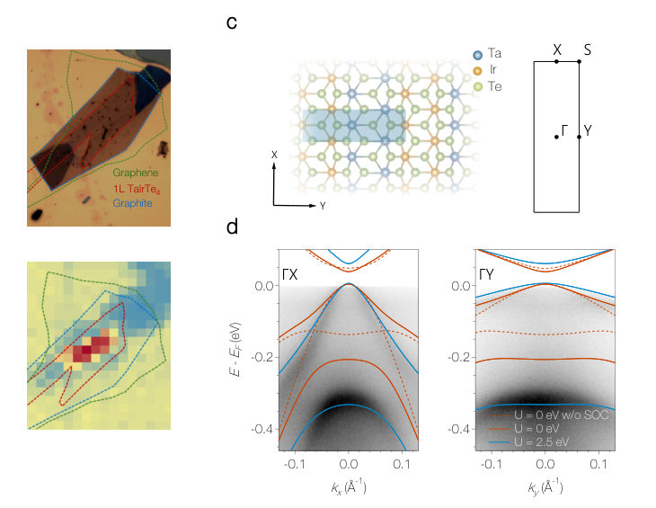 
Figure 1: Anisotropy of crystal structure and electronic band structure. (a,b) Optical micro- graph and ARPES spatial mapping of an encapsulated ML 1T-TaIrTe4 sample measured for this study. (c) Structure of ML 1T-TaIrTe4 with the primitive unit cell and lattice vectors indicated. The Brillouin zone is shown on the right. (d) ARPES dispersion plots along ΓX and ΓY. DFT calculations with and without SOC and DFT+U calculations (for U = 2.5 eV) are overlaid in dashed and solid lines, respectively. All calculations are shifted in energy to match the experimental Fermi wave vector along ΓX.

📷 Fig 2

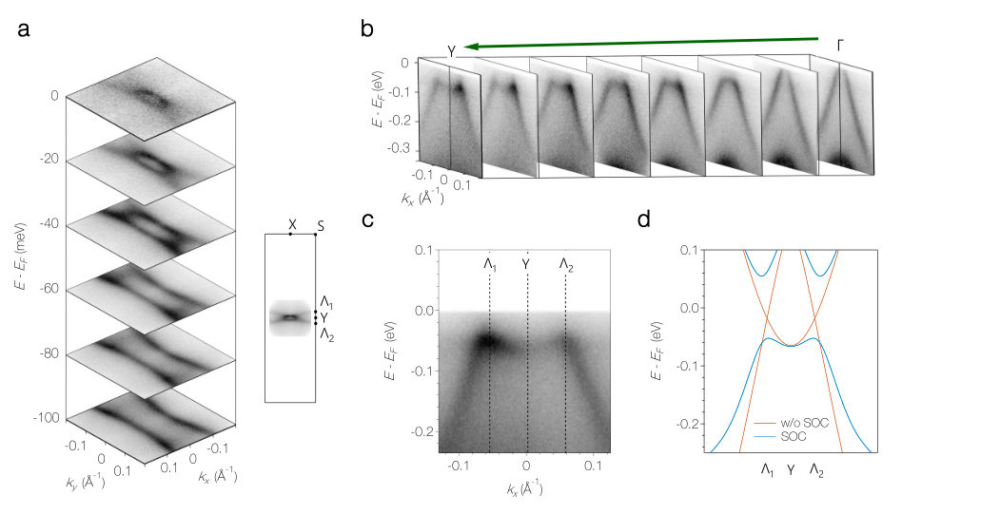 
Figure 2: Gapped Dirac cones and low-energy quasiparticle dispersion. (a) Stack of constant energy contours. For scale, the spectral weight at EF is also shown in the full Brillouin zone. (b) Dispersion plots along kx for equidistant ky values ranging from Γ to Y. (c) Dispersion plot along the edge of the BZ. (d) DFT+U band dispersion showing the gapping of the Dirac cones with the inclusion of SOC.

📷 Fig 3

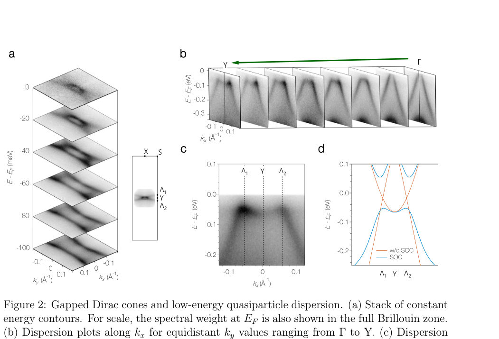 
Figure 1, we find that our samples are degenerately doped with the chemical potential lying

📷 Fig 4

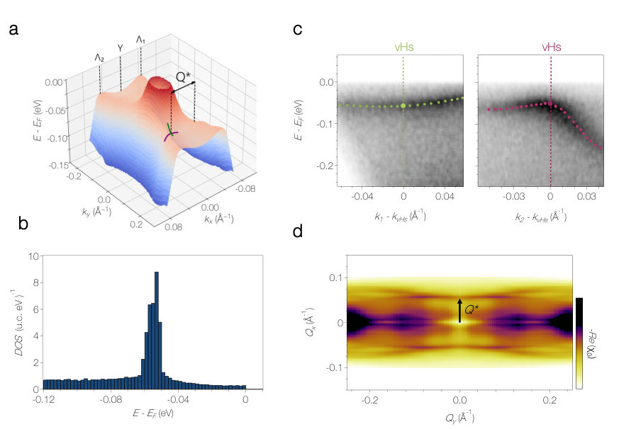 
Figure 3: Van Hove singularity. (a) ARPES quasiparticle dispersion obtained from the analysis of EDCs and MDCs. (b) Experimental quasiparticle DOS. (c) Dispersion along the two k-space paths intersecting at the VHS indicated in panel a. (d) Static Lindhard susceptibility calculated from the experimental quasiparticle dispersion.

📷 Fig 5

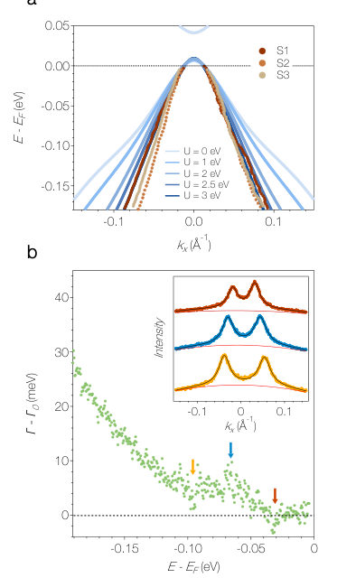 
Figure 4: Many-body interactions. (a) Comparison of the quasiparticle dispersion along ΓX from three devices (S1, S2, S3) with the DFT+U bands. (b) Quasiparticle linewidth Γ = ∂E/∂k ∆k calculated assuming a constant dispersion ∂E/∂k = 2.08 eVÅ. Here, ∆k is the full width at half maximum of Lorentzian MDC fits. The inset shows fits of MDCs at representative energies marked by vertical arrows of the same color. Red lines are the background of the fit.

**Summary.** This work uses ARPES and DFT+U calculations to map the electronic structure of monolayer TaIrTe4. While the material shows topological features and Van Hove singularities, the measured quasiparticle linewidths suggest weak correlations. The authors conclude that the role of strong correlations and VHSs in driving the observed transport anomalies is likely secondary.

**Why it may be interesting.** The investigation into correlated insulating phases and the interplay between topological features (like Dirac points) and correlation-driven instabilities (like CDW) is central to modern condensed matter physics, relevant for understanding emergent quantum states.

Detailed structure

**Main problem.** The study investigates the electronic structure of monolayer TaIrTe4, specifically addressing conflicting reports regarding quantum spin Hall insulator phases and density wave instabilities.

**Main result.** The ARPES data confirms a topologically non-trivial band structure, but the quasiparticle linewidths suggest weak electron correlations, pointing to a secondary role for VHSs and correlations in the transport phase diagram.

**Method.** The research combines advanced experimental techniques like micro-focus laser ARPES with theoretical calculations using DFT+U to model the electronic structure.

**Model / system.** The physical system is monolayer 1T-TaIrTe4, a layered transition metal chalcogenide. Theoretical modeling employs DFT+U to account for strong on-site Coulomb interactions on Ta and Ir d-orbitals.

**Key observables.** Band structure dispersion, Density of States (DOS), quasiparticle line widths ($\Gamma$), and charge susceptibility ($\chi_0(\mathbf{q})$).

**Important parameters / regimes.** Low temperature (6 K), Hubbard U parameter (e.g., 2.5 eV), and specific doping/filling densities related to VHSs.

**Assumptions / limitations.** The initial reports of QSHI phases and CDW instabilities are questioned by the current findings, and the origin of the hole doping remains unclear.

**Figures summary.** Figures show ARPES band dispersions along high-symmetry lines ($\Gamma	ext{X}$, $\Gamma	ext{Y}$), DOS plots, and susceptibility peaks related to nesting features.

**Paper structure.** The paper progresses by presenting ARPES measurements to map the band structure, comparing these to DFT+U calculations, analyzing the resulting DOS and susceptibility to test theories of instability, and ultimately reconciling the findings with the initial transport reports.

Abstract

Recent transport experiments reported a quantum spin Hall insulator phase in monolayer 1T-TaIrTe$_4$ gated away from charge neutrality. This phase is not predicted by band structure calculations and has been attributed to an electronic instability induced by strong correlations at a putative van Hove singularity. Here, we investigate the electronic structure of exfoliated monolayer 1T-TaIrTe$_4$ using micro-focus laser angle resolved photoemission. We find a strongly anisotropic band structure susceptible to density wave instabilities. Our data further reveal a saddle point singularity in the density of states. However, we find that the saddle point lies at a density for which transport experiments found no anomalies. Moreover, the quasiparticle line widths suggest weak electron correlations only. This points to a secondary role of van Hove singularities and electron correlations in the transport phase diagram of monolayer 1T-TaIrTe$_4$.

[↑ back to top](#top)

### [Slepian Bounds on the Success Probability of Virtual Distillation](http://arxiv.org/abs/2608.21342v1)

**Authors:** Masayuki Ohzeki, Sasuke Kimata, Xinwei Lee, Hoong Chuin Lau  
**Type:** theory · **Category:** quantum information and computing · **PDF:** <https://arxiv.org/pdf/2608.21342v1>  
**Analysis basis:** full PDF text, analyzed in chunks
**Topic relevance:** `quantum measurements` **1/5**

📷 Fig 1

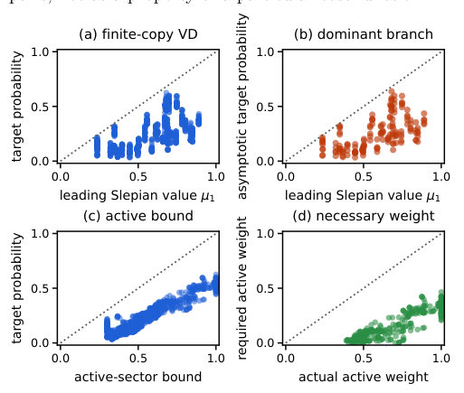 
FIG. 1. Generic numerical verification of the Slepian bounds. Each point comes from a random band projector, a ran- dom outcome window, and a random in-band density ma- trix. Panel (a) compares finite-copy virtual-distilled proba- bilities with the leading Slepian value µ1. Panel (b) compares the asymptotic dominant-branch probability with µ1. Panel (c) tests the active-sector upper bound of Eq. (10). Panel (d) tests the necessary active-weight condition of Eq. (11) by plotting the required active weight against the actual active weight. Dotted diagonals mark equality, and satisfying points lie below the diagonal in all panels.

**Summary.** This theoretical paper establishes that virtual distillation, while useful for error mitigation, is fundamentally limited by the Slepian concentration principle when applied to variational quantum states. It derives and verifies that the maximum achievable success probability cannot exceed the leading eigenvalue of a specific Slepian operator built from the ansatz band. This provides a crucial, quantifiable constraint on the performance of near-term quantum computation protocols.

**Why it may be interesting.** The work provides a powerful, mathematically rigorous constraint (the Slepian bound) on the performance of quantum error mitigation techniques like virtual distillation, linking spectral properties to achievable information capacity.

Detailed structure

**Main problem.** The paper investigates the fundamental limits on the success probability of virtual distillation, a near-term error-mitigation technique, when applied to variational quantum states.

**Main result.** Virtual distillation cannot increase the target-window probability beyond the leading eigenvalue of the Slepian concentration operator ($\mu_1(p)$) if the noisy state is confined within the variational ansatz band.

**Method.** The authors employ Slepian concentration theory to derive rigorous upper bounds on the achievable probability, comparing these bounds against results from finite-copy and asymptotic virtual distillation protocols.

**Model / system.** The analysis considers an $n$-qubit register with a noisy output density matrix $
ho$, which is distilled over $m$ copies to form $\sigma_m$. The process is constrained by a finite-band variational ansatz projector $\Pi_p$.

**Key observables.** The leading Slepian eigenvalue ($\mu_1(p)$), the active Slepian dimension ($D_	au(p)$), and the target-window success probability ($p_A(m)$).

**Important parameters / regimes.** The variational band projector ($\Pi_p$), the analysis resolution threshold ($	au$), and the number of copies ($m$).

**Assumptions / limitations.** The primary theorem assumes that the support of the noisy density matrix $
ho$ is entirely contained within the range of the variational band projector ($	ext{supp}(
ho) \subseteq 	ext{Ran } \Pi_p$).

**Figures summary.** Figure 1 numerically verifies the Slepian bounds by comparing finite-copy and asymptotic virtual-distilled probabilities against the theoretical leading Slepian value ($\mu_1$) and the active-sector upper bound.

**Paper structure.** The paper establishes the problem using the density matrix formalism, introduces the Slepian operator and its associated bounds (Theorem 1), and then provides numerical verification across multiple panels comparing distillation results against the derived theoretical constraints.

Abstract

Virtual distillation is a powerful near-term error-mitigation primitive, but it is also a spectral filter: it amplifies the dominant eigenvector component already present in the noisy density matrix. We show that, for a finite-band variational state, this filtering cannot create new concentration inside a set of accepted measurement outcomes. The asymptotic success probability after distillation is bounded by the leading eigenvalue of a Slepian concentration operator built from a specified variational band and that outcome window. Moreover, the number of robust high-success spectral components is limited by the Slepian active dimension. \rev{For bit-string outcome windows, an explicit Walsh-band realization has a Krawtchouk kernel on the Boolean hypercube. Finite-size noisy-QAOA calculations for 2-regular Max-Cut illustrate both the in-band improvement and the out-of-band failure modes predicted by the branch-resolved result.

[↑ back to top](#top)

### [Spin models with critical ground space degeneracy from Lie algebra relations](http://arxiv.org/abs/2608.20849v1)

**Authors:** Andras Molnar, Efekan Kökcü, Norbert Schuch, Bojko N. Bakalov  
**Type:** theory · **Category:** strongly correlated electrons · **PDF:** <https://arxiv.org/pdf/2608.20849v1>  
**Analysis basis:** full PDF text, analyzed in chunks
**Topic relevance:** `analog quantum simulation` **1/5**

📷 Fig 1

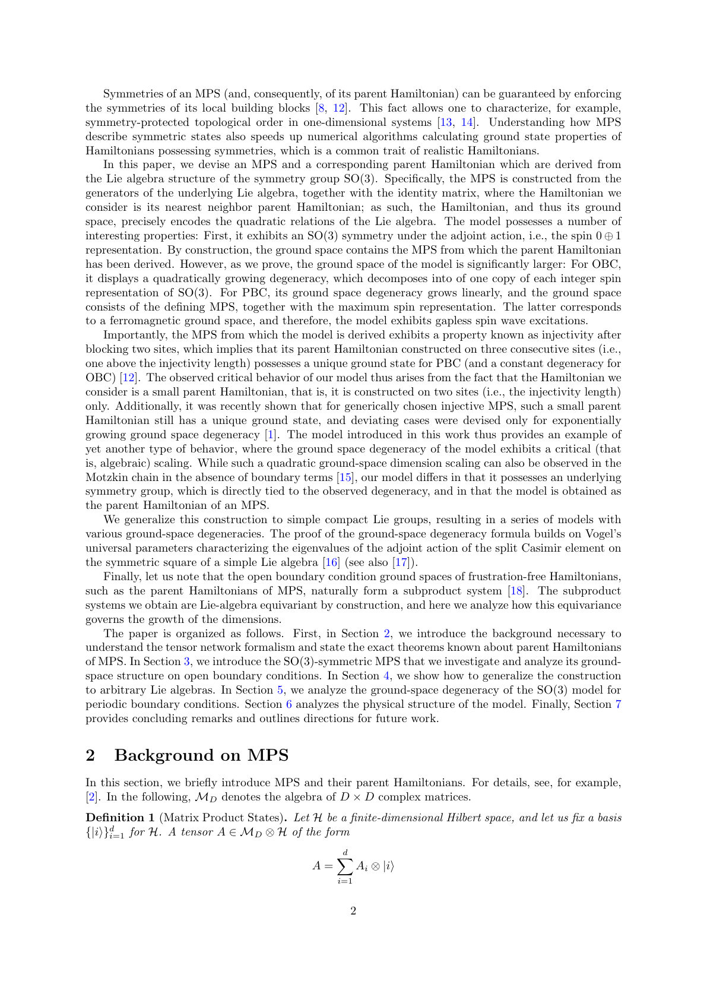 
Low-resolution page preview, page 2

📷 Fig 2

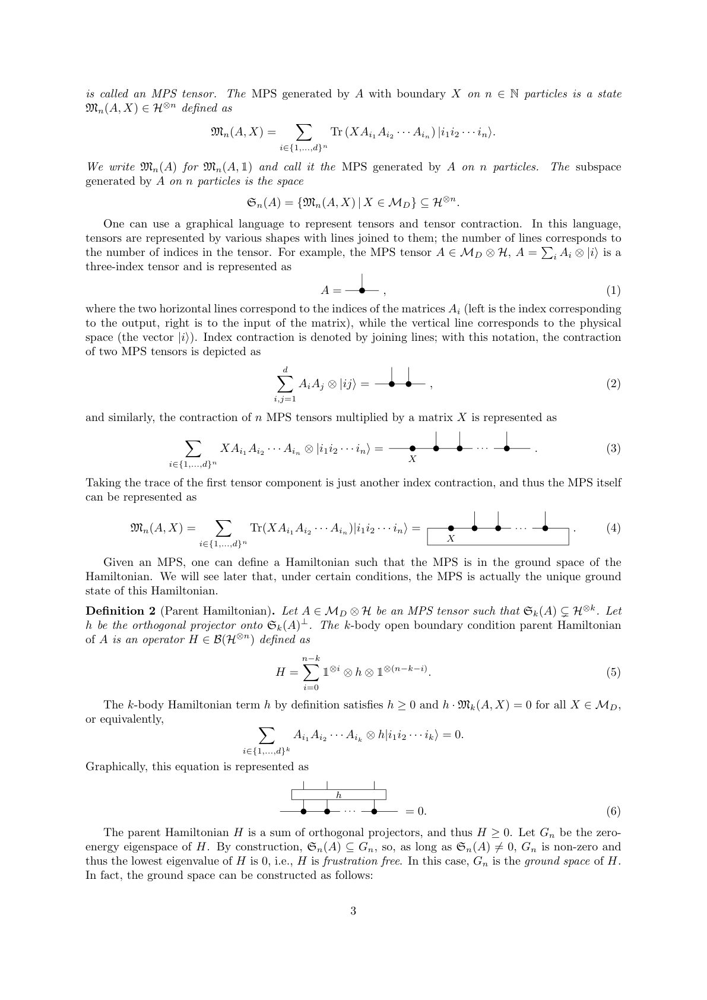 
Low-resolution page preview, page 3

📷 Fig 3

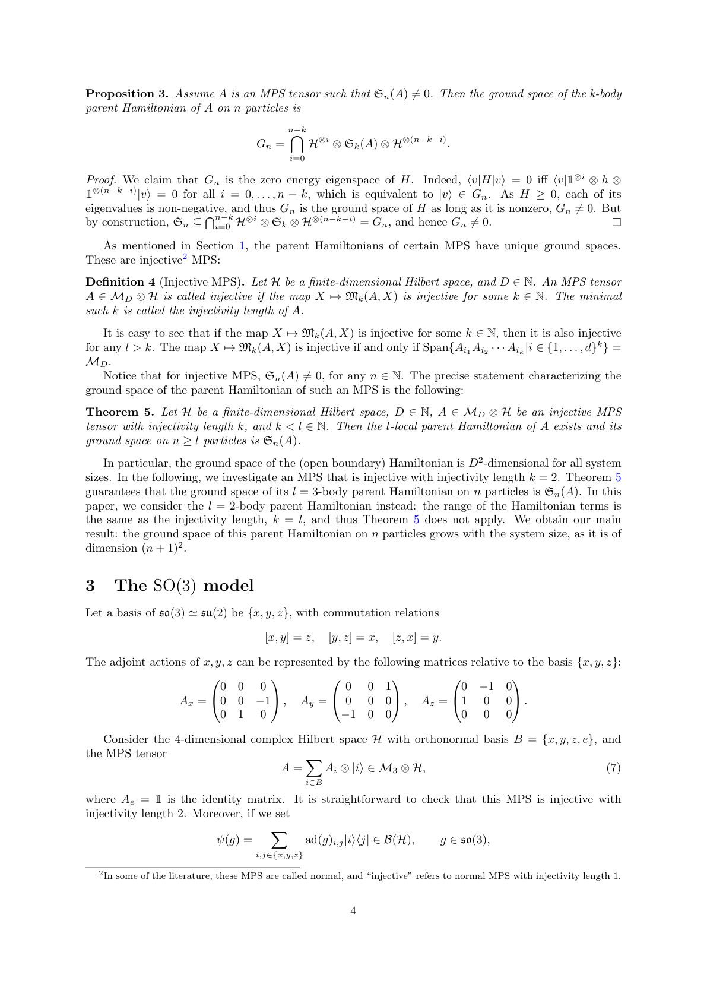 
Low-resolution page preview, page 4

📷 Fig 4

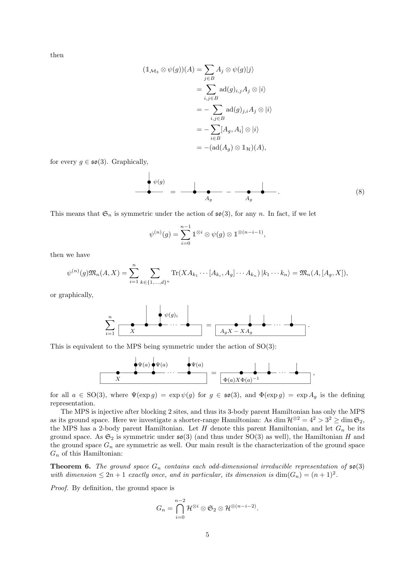 
Low-resolution page preview, page 5

📷 Fig 5

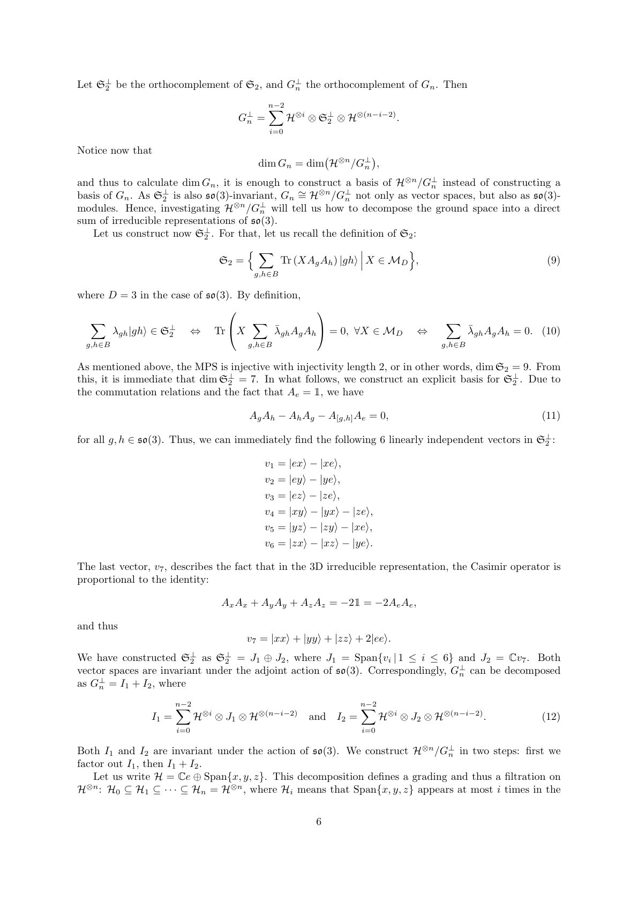 
Low-resolution page preview, page 6

**Summary.** This work develops a method to study the ground state degeneracy of spin models by constructing them from the algebraic relations of Lie algebras, using Matrix Product States. For the $\mathfrak{so}(3)$ model, the authors find distinct ground state degeneracies depending on boundary conditions. This provides a novel, algebraically grounded understanding of critical quantum phases.

**Why it may be interesting.** The connection between algebraic structures (Lie algebras) and the ground state degeneracy of quantum spin models provides a powerful, symmetry-based tool for understanding critical behavior in strongly correlated systems.

Detailed structure

**Main problem.** The paper characterizes the ground space degeneracy of spin models derived from the algebraic structure of Lie algebras, specifically $\mathfrak{so}(3)$.

**Main result.** The model exhibits a quadratic ground space degeneracy for open boundary conditions (OBC) and a linear degeneracy for periodic boundary conditions (PBC).

**Method.** The analysis uses the parent Hamiltonian derived from a Matrix Product State (MPS) built from the Lie algebra generators to determine the zero-energy eigenspace structure.

**Model / system.** The system is an SO(3)-symmetric spin model whose Hamiltonian is constructed to encode the quadratic relations of the $\mathfrak{so}(3)$ Lie algebra. The analysis is generalized to other compact simple Lie groups.

**Key observables.** Ground space degeneracy (quadratic for OBC, linear for PBC), and the presence of gapless excitations in the PBC case.

**Important parameters / regimes.** The boundary conditions (OBC vs. PBC) and the specific Lie algebra ($\mathfrak{so}(3)$).

**Assumptions / limitations.** The critical behavior is attributed to the parent Hamiltonian being a 'small' parent Hamiltonian, contrasting with generic injective MPS which usually yield unique ground states.

**Paper structure.** The paper progresses from defining the general framework of using MPS parent Hamiltonians to analyze ground space degeneracy, details the specific $\mathfrak{so}(3)$ case, and concludes with generalizations to $	ext{SO}(d)$ and other Lie groups.

Abstract

We introduce an $\mathrm{SO}(3)$-symmetric spin model derived from the algebraic structure of $\mathfrak{so}(3)$: It is obtained as the nearest-neighbor parent Hamiltonian of a Matrix Product State (MPS) built from the generators of the Lie algebra $\mathfrak{so}(3)$ and the identity matrix, and therefore encodes the quadratic relations of the Lie algebra. We characterize the ground space structure of the resulting model and show that for open boundary conditions (OBC), it exhibits a quadratic ground space degeneracy, given by one irreducible representation (irrep) of each odd dimension (integer spin). For periodic boundary conditions (PBC), it has a linear ground space degeneracy, consisting of a singlet --- namely, the MPS underlying the model --- and a ferromagnet (the irrep with maximal spin), and thus exhibits gapless excitations. We also generalize the construction and the analysis of the OBC ground space to $\mathrm{SO}(d)$ and other compact simple Lie groups.   The MPS on which the model is based is an injective MPS, and therefore, its 3-site parent Hamiltonian has a unique ground space and is gapped. The observed critical behavior thus has its origin in the small parent Hamiltonian considered. The model's algebraic ground space scaling thus provides an example distinct from that reported in (Schuch et al., 2025, arXiv:2503.10767), where it was shown that small parent Hamiltonians of injective MPS generically have unique ground states, and examples with an exponential ground space degeneracy were given.

[↑ back to top](#top)

## Other papers (12)

*Papers from primary archives without highlighted authors or any topic match. Click to expand.*

Show other papers

### [A Classification of Translation-Invariant Quantum Codes in Any Dimension](http://arxiv.org/abs/2608.20981v1)

**Authors:** Andrew Li, Dominic J. Williamson  
**Type:** theory · **Category:** quantum information and computing · **PDF:** <https://arxiv.org/pdf/2608.20981v1>  
**Analysis basis:** full PDF text, analyzed in chunks

📷 Fig 1

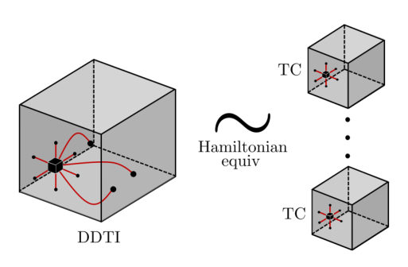 
FIG. 1. A depiction of our main result. Any D-dimensional translation-invariant (DDTI) qLDPC code based on a length- D chain complex, satisfying the conditions in Theorem 1, is equivalent to copies of D-dimensional toric codes (TC). This includes all multivariate multicycle codes with an equal num- ber of variables and cycles.

**Summary.** This paper provides a rigorous mathematical classification of a specific class of quantum error-correcting codes (DDTI codes) in arbitrary dimensions. By utilizing tools from homological algebra, the authors prove that these codes are structurally equivalent to copies of the D-dimensional toric code. This result significantly generalizes existing knowledge in the field of topological quantum computation.

**Why it may be interesting.** While highly mathematical, the classification of topological quantum codes is fundamental to understanding fault-tolerant quantum computation, providing concrete structural results for realizing robust quantum memory.

Detailed structure

**Main problem.** To classify D-dimensional translation-invariant quantum codes (DDTI codes) based on their underlying mathematical structure derived from length-D chain complexes.

**Main result.** The authors prove that such codes are equivalent to copies of D-dimensional toric codes, generalizing the known 2D classification result.

**Method.** The classification relies on advanced concepts from homological algebra, specifically analyzing CSS chain complexes and free resolutions of modules over the Laurent polynomial ring R = F_2[x_1, ..., x_D].

**Model / system.** The system is quantum error-correcting codes defined on the infinite D-dimensional hypercubic lattice (Z^D), characterized by their stabilizer structure derived from chain complexes.

**Key observables.** The code Hamiltonian, the dimension k of the module M (determining the number of independent charge sectors), and the equivalence class of the code structure.

**Important parameters / regimes.** The dimensionality D of the lattice and the code, and the length of the underlying chain complex.

**Assumptions / limitations.** The classification is restricted to DDTI codes derived from length-D chain complexes, excluding fractal codes. The result holds up to finite coarse-graining and local unitaries.

**Figures summary.** Figure 1 illustrates the main result: any DDTI qLDPC code based on a length-D chain complex satisfying the theorem is equivalent to copies of D-dimensional toric codes (TC).

**Paper structure.** The paper establishes the mathematical framework using homological algebra (resolutions, chain complexes) to prove structural theorems (e.g., equivalence of resolutions) which are then applied to classify the physical quantum codes.

Abstract

Quantum error-correcting codes with two-dimensional translation invariance are known to be equivalent to copies of the two-dimensional toric code. Such a simple classification is not possible for quantum codes with higher dimensional translation invariance due to the existence of multiple types of toric codes and infinite families of fracton codes. Here, we focus on D-dimensional translation-invariant quantum codes based on length-D chain complexes. This includes multivariate multicycle codes where the number of variables equals the number of cycles. We show that such codes are equivalent to copies of D-dimensional toric codes. This directly generalizes the classification result for two-dimensional translation-invariant codes.

[↑ back to top](#top)

### [Clifford-efficient sparse state preparation for molecular wavefunctions](http://arxiv.org/abs/2608.20593v1)

**Authors:** Yingrong Chen, Nathan A. Baker, Rushi Gong, Conrad S. N. Johnston, Brad Lackey, Hongbin Liu, Sasha Schmidt, Yuan Su, David B. Williams-Young, Yinuo Yang  
**Type:** theory · **Category:** quantum information and computing · **PDF:** <https://arxiv.org/pdf/2608.20593v1>  
**Analysis basis:** full PDF text, analyzed in chunks

📷 Fig 1

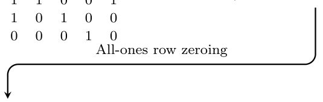 
Figure 1: Gaussian elimination of the F2 configuration matrix. The three transformations are duplicate-row zeroing, all-ones-row zeroing, and Gaussian elimination over GF(2). Duplicate- row zeroing first zeros q1, q8, and q9, which duplicate q0; q12, which duplicates q4; and q15, which duplicates q7. The remaining all-ones row q0 is then zeroed, and Gaussian elimination produces MF2,ref with six nonzero rows.

📷 Fig 2

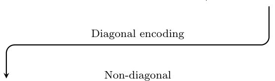 
Figure 2: Binary encoding of the F2 REF matrix, including the diagonal and non-diagonal encoding steps. Since d = 8 configurations require only ⌈log2 8⌉= 3 rows for addressing, the top three rows are retained as the nonzero rows corresponding to the dense qubits. Columns c0, c1, c2, c4, c6, and c7 are first permuted to the left to form the diagonal block, while the non- diagonal columns c3 and c5 are moved to the right. Diagonal encoding (Step 1) transforms the identity block into binary-counter form on the nonzero rows by assigning contiguous binary labels 0–5 while zeroing the remaining rows. Note that this step also modifies the entries of the non-diagonal columns, so the matrix is...

📷 Fig 3

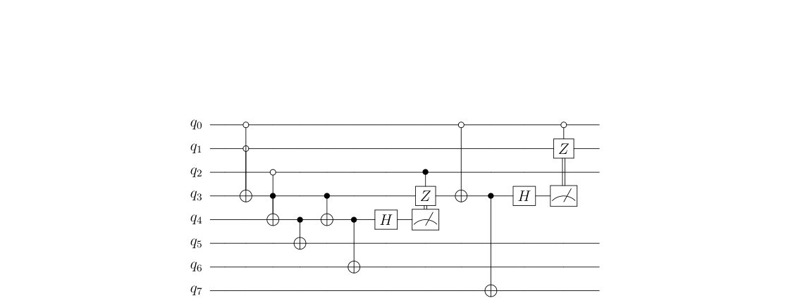 
Figure 4: Partial unary iteration subroutine for the interval [|0⟩, |1⟩, |2⟩]. The first 3 qubits (q0 . . . q2) act as the dense address qubits, the middle 2 qubits (q3, q4) are ancillary qubits, and the last 3 qubits (q5 . . . q7) are the sparse target qubits. The ancillary qubits are freed using measurement-based uncomputation [31]. Note that the |00⟩prefix state of q0 and q1 cached in the ancilla q3 is reused for both address states 0 and 1, and the state stored in q4 is flipped by a CX from q3 to target state 1. This demonstrates how the Toffoli gate count is reduced with batches of contiguous address states.

📷 Fig 4

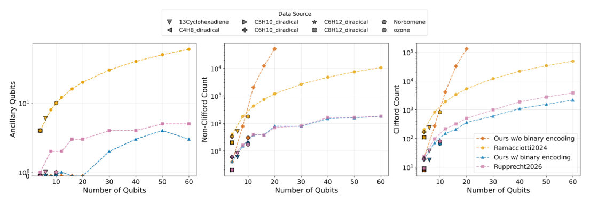 
Figure 5: Scaling with qubit count for random Jordan–Wigner encoding matrices, with chemically derived instances overlaid as markers. Dashed lines denote the scaling baselines for random matrices. Overlaid individual points (with different marker shapes) represent the specific chemically derived molecular systems. Marker colors correspond to the algorithm used. (a) Ancillary qubit count. (b) Non-Clifford-gate count. (c) Clifford-gate count.

📷 Fig 5

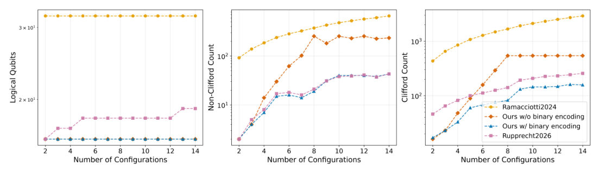 
Figure 6: F2 benchmark (n = 16): gate and qubit scaling versus number of configurations. (a) Total logical qubit count (data + ancillary qubits). (b) Non-Clifford-gate count. (c) Clifford-gate count.

**Summary.** This paper introduces a novel, Clifford-efficient method for preparing sparse quantum states representing molecular wavefunctions. It achieves this by leveraging the affine structure of the configuration bitstrings through classical matrix compression techniques like Gaussian elimination. The result is a quantum circuit that minimizes ancillary qubits, making the simulation of complex quantum chemistry problems more resource-efficient for quantum hardware.

**Why it may be interesting.** This work provides a concrete, resource-aware quantum circuit synthesis technique for simulating complex quantum chemistry problems, directly impacting the feasibility of running quantum algorithms on near-term hardware.

Detailed structure

**Main problem.** The paper addresses the challenge of efficiently preparing quantum states that are superpositions of only a small fraction of the total basis states (sparse states) on a large number of qubits.

**Main result.** The proposed method achieves state preparation with minimal ancillary qubits by exploiting affine relationships in the configuration bitstrings, leading to significant Clifford-only compression.

**Method.** It uses a two-stage classical compression process—Gaussian elimination over GF(2) followed by optional binary encoding—to reduce the required dense register size before constructing the quantum circuit.

**Model / system.** The model is the quantum state $|\psi
angle$ representing molecular wavefunctions, which are sparse superpositions of basis states derived from methods like selected configuration interaction (sCI).

**Key observables.** Ancillary qubit count, non-Clifford gate count, and Clifford gate count are the primary metrics used for comparison.

**Important parameters / regimes.** The sparsity ($d \ll 2^n$) and the rank ($r$) of the configuration matrix are crucial parameters determining the efficiency.

**Assumptions / limitations.** The method assumes the target state can be represented by a configuration matrix $M \in 	ext{GF}(2)^{n 	imes d}$ and that the low rank condition ($r \ll n$) holds for chemically relevant states.

**Figures summary.** Figures illustrate the steps of Gaussian elimination and binary encoding on molecular configuration matrices (e.g., for F2), and later show the resulting quantum circuits and resource estimates for state preparation.

**Paper structure.** The paper details the theoretical framework by first introducing the problem, then presenting the two-stage classical compression (Gaussian elimination $
ightarrow$ Binary Encoding), followed by the construction of the quantum circuit, and finally benchmarking the resource costs against prior methods.

Abstract

Sparse quantum state preparation concerns an $n$-qubit target state that is a superposition of only $d \ll 2^n$ computational basis states. Existing approaches exploit this sparsity by compressing these $d$ basis states and their amplitudes onto a smaller set of qubits, called the dense register, before expanding the prepared state to the full register. Rather than relying on the permutation-based compression used in prior work, we exploit affine relationships among the binary configurations over the finite field $\operatorname{GF}(2)$ to reduce both the non-Clifford gate count and the ancillary qubit count. Invertible affine transformations over $\operatorname{GF}(2)$, comprising Gaussian elimination and all-ones-row removal, first reduce the dense register from $n$ to the rank $r$ using only Clifford gates and no ancillary qubits. An optional binary encoding stage then trades additional Toffoli gates and ancillary qubits for further compression to the minimum $\lceil\log_2 d\rceil$ dense qubits needed to represent $d$ distinct configurations. For chemically relevant wavefunctions, such as those obtained from selected configuration interaction calculations, shared electronic excitation patterns produce many of these affine relationships, enabling substantial Clifford-only compression before binary encoding. Across the molecular benchmarks, our method requires the fewest ancillary qubits among the evaluated sparse state preparation methods while maintaining comparable non-Clifford gate counts when using binary encoding.

[↑ back to top](#top)

### [Difference-Set Weyl Channels: Exact Capacity, Optimizer Bifurcation, and Scalable Entanglement Separation](http://arxiv.org/abs/2608.20726v1)

**Authors:** Se-Wan Ji  
**Type:** theory · **Category:** quantum information and computing · **PDF:** <https://arxiv.org/pdf/2608.20726v1>  
**Analysis basis:** full PDF text, analyzed in chunks

📷 Fig 1

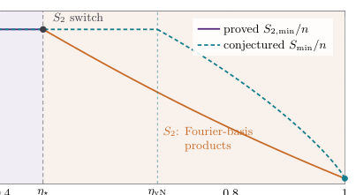 
Figure 1: Exact operational and collision-entropy structure. (a) Along the balanced interpolation, C = log(D/r) and the strong converse hold on the full interval, the Choi state is NPT for ε &lt; 1, and the channel is entanglement breaking at ε = 1; the optimizer set has a two-basis degeneracy only at ε = 0. (b) For the smallest Singer member (D, r) = (7, 3), C is constant while CE decreases continuously from 2C to C. (c) For the identity–dephasing path, the solid curve is the proved all-use minimum collision entropy and changes branch at η⋆= √r −1/r. The dashed curve is the von Neumann expression proposed in Conjecture 1; its distinct crossover ηvN is not presented as a proved capacity...

**Summary.** This theoretical paper calculates the exact capacity of quantum channels modeled by Difference-Set Weyl Channels. It achieves this by linking the channel's structure to algebraic properties derived from cyclic difference sets, establishing precise bounds for both classical and entanglement-assisted communication rates. The work provides deep insights into the interplay between noise structure, entanglement, and information capacity.

**Why it may be interesting.** The rigorous characterization of channel capacity using algebraic structures like difference sets provides powerful tools for understanding fundamental limits in quantum communication, which is highly relevant to quantum information theory.

Detailed structure

**Main problem.** The paper aims to determine the exact capacity of quantum channels, specifically focusing on the relationship between classical capacity, entanglement assistance, and the structure of the underlying noise model (Weyl channels).

**Main result.** For specific noise models based on cyclic difference sets, the unrestricted capacity is found to be $C = \log_2(D/r)$, and the analysis establishes a finite-block strong converse.

**Method.** The authors use subsystem-resolved Weyl decomposition, design theory (cyclic difference sets) to saturate known bounds, and analyze entanglement measures like the Choi state's partial transpose property.

**Model / system.** The system models quantum channels acting on a local Hilbert space $\mathcal{H}_D$ of odd dimension $D \ge 3$, represented using the discrete Wigner function formalism (Weyl channels).

**Key observables.** Unrestricted capacity ($C$), entanglement-assisted capacity ($C_E$), collision entropy ($S_{\alpha, \min}$), and the state's partial transpose property (NPT).

**Important parameters / regimes.** The local dimension $D$ (odd, $D \ge 3$), the size of the difference set $r$, and interpolation parameters $\epsilon$ and $\eta$.

**Assumptions / limitations.** The analysis is restricted to odd local dimensions $D \ge 3$, and the exact capacity results are conditional on the existence of suitable cyclic difference sets.

**Figures summary.** The notes mention diagnostic tests (Table 2) for small cyclic difference sets, comparing crossover values related to entropy and capacity bounds.

**Paper structure.** The paper develops from general capacity definitions to specific structural results by using design theory (cyclic difference sets) to saturate known bounds, leading to precise characterizations across various noise interpolation parameters ($\epsilon$ and $\eta$).

Abstract

In odd local dimension $D$, complete Wigner positivity yields stochastic phase-space dynamics on Wigner-nonnegative states but does not control signed inputs, entanglement across channel uses, or collective decoding. Using a subsystem-resolved Weyl decomposition, we characterize the equality conditions of the tensor-stable output-purity bound. Cyclic difference sets are precisely the uniform shift supports saturating the universal Parseval lower bound on the worst nontrivial collision mode. For factorized shift--phase noise with shift support $R$, $|R|=r$, and phase distribution $h$ of no larger collision radius, we obtain $S_{α,\min}(Φ_{R,h}^{\otimes n})=n\log_2 r$ for all $n\ge1$ and $0\leα\le2$, the unrestricted capacity $C=\log_2(D/r)$, and a finite-blocklength strong converse. For a balanced bi-difference-set interpolation $h_\varepsilon=(1-\varepsilon)q_H+\varepsilon u_D$, the unassisted capacity is constant for $0\le\varepsilon\le1$, while the Choi state is NPT for every $\varepsilon<1$ and becomes entanglement breaking at $\varepsilon=1$. At $\varepsilon=0$, all tensor-power minimum-output states are products with local factors in one of two mutually unbiased Weyl bases; for $\varepsilon>0$, only the computational basis remains. For Singer parameters $D=q^2+q+1$ and $r=q+1$, $C_{\mathrm E}/C\to2-\varepsilon$. Finally, for an identity--dephasing profile we determine the exact tensor-power collision-entropy phase diagram, derive rigorous capacity bounds, and isolate a distinct von Neumann crossover, with a tensor-power R'enyi conjecture supported by numerics. Thus complete Wigner positivity can coexist with persistent channel entanglement and a scalable entanglement-assisted advantage.

[↑ back to top](#top)

### [Distributed synthesis of arbitrary graph states in quantum networks via rank-two GF(2) reduction](http://arxiv.org/abs/2608.21166v1)

**Authors:** Xiaoyi Zheng, Lin Chen, Chan-Tong Lam  
**Type:** both · **Category:** quantum information and computing · **PDF:** <https://arxiv.org/pdf/2608.21166v1>  
**Analysis basis:** full PDF text, analyzed in chunks

📷 Fig 1

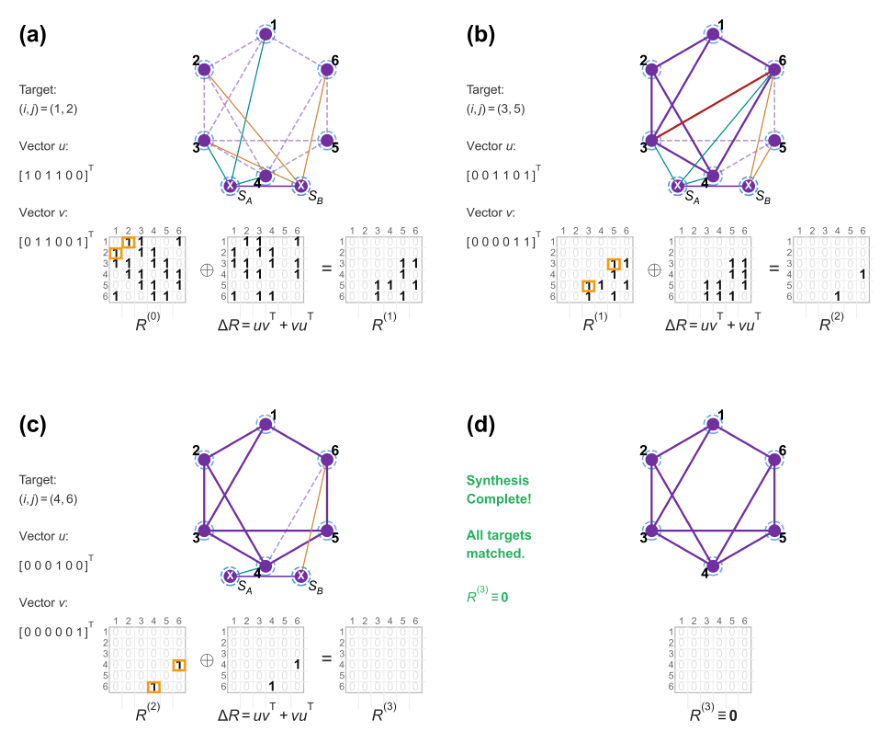 
Figure 1: Step-by-step graph state synthesis based on rank-2 updates. In subfigures (a) to (c), the upper part is the physical graph and the lower part is the corresponding GF(2) difference matrix R(k); the two evolve synchronously. In each step, a nonzero pivot (golden square) is selected in R(k), from which the vectors u, v are extracted to configure the ancilla qubits SA, SB and perform the joint Pauli-X measurement. Algebraically, this measurement is the rank-2 update ∆R = uvT +vuT; physically, it generates the target edges while concurrently producing the redundant edges marked in red. In subfigure (d), the final state satisfies R(3) ≡0, and the purple synthesized graph coincides...

📷 Fig 2

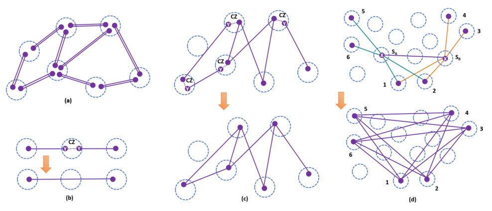 
Figure 2: Quantum network model and basic operations. Subfigure (a) shows the physical network topology, where double solid lines are the quantum channels between neighbouring nodes. Subfigure (b) shows the establishment of long-range entanglement: entanglement swapping via local CZ gates and Pauli-Y measurements cascades short-range Bell pairs into a long-range entanglement edge. Subfigure (c) shows state stitching: a newly generated entanglement edge is attached to an existing graph state node via local CZ gates and Pauli-Y measurements, preparing for subsequent topology evolution. Subfigure (d) shows the rank-2 projective measurement: the ancilla pair SA, SB is connected to the target...

📷 Fig 3

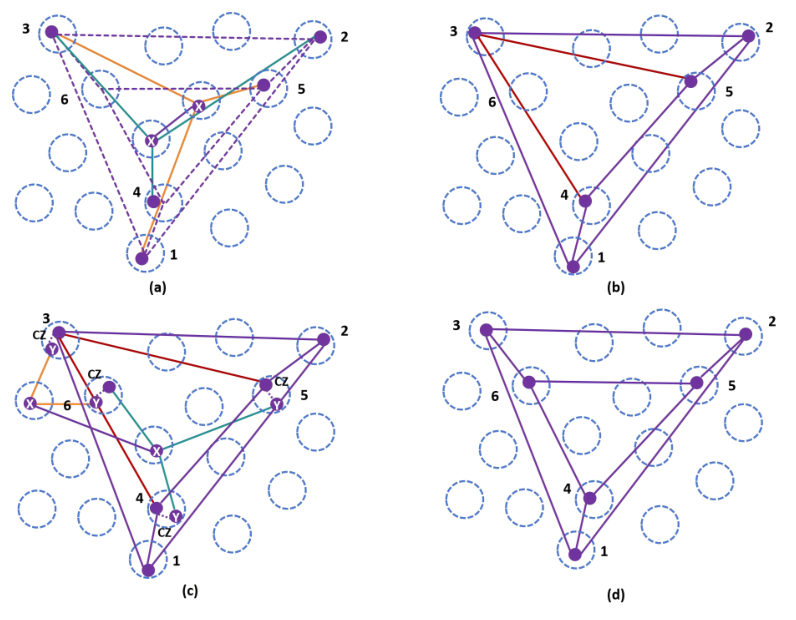 
Figure 3: Synthesis example of a 6-node target state. In subfigure (a), R1,2 = 1 is selected; physical entanglement is established according to the difference matrix and the first joint Pauli-X measurement is executed; the cyan and orange lines are the two star branches. Subfigure (b) shows the logical edges generated concurrently after the measurement; purple edges are target edges and red edges are redundant edges. In subfigure (c), a new pivot R3,4 = 1 is selected; after state stitching via CZ gates and Pauli-Y measurements, the second joint measurement is executed. In subfigure (d), the redundant red edges are automatically eliminated, and the purple synthesized graph agrees with the...

📷 Fig 4

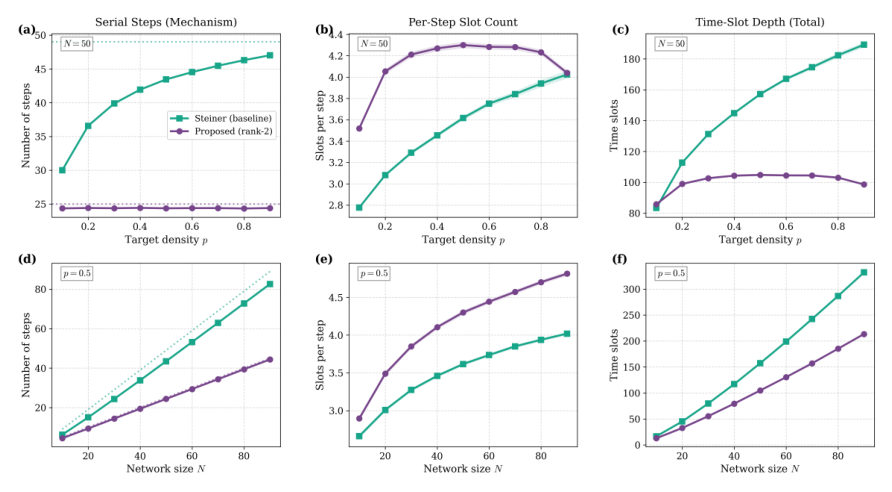 
Figure 4: Time performance and mechanism comparison. The physical topology has a fixed average degree ⟨k⟩= 3; each data point is taken from 300 Monte Carlo experiments, and the shaded bands are 95% confidence intervals. Subfigures (a) and (d) show the number of serial steps, (b) and (e) the average degree-based slot-depth measure per step, and (c) and (f) the total degree-based time-slot depth. Our step count remains stable near ⌊N/2⌋and does not vary with p, while the baseline step count grows with p toward N −1; the per-step counts are of the same order for both protocols and grow only slowly, so the total depth is mainly determined by the number of serial steps, and the time advantage of...

📷 Fig 5

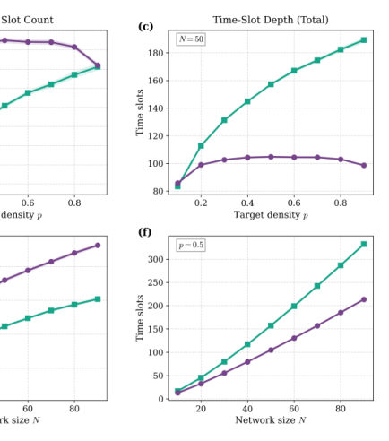 
Figure 5 shows the trends of the underlying en- tanglement resources consumed by the two pro- tocols, the total number of CZ gates, and the to- tal number of Pauli measurements as functions of the target graph state edge density p and node number N. As can be seen from the figure, the trends of the three metrics are similar, indicating that the underlying cause is the same. Specif- ically, subfigures (a–c) show that, in the low- density region p ≲0.3, the Steiner baseline is lower than our method in both entanglement re- sources and quantum operation overhead. This is because the Steiner tree method itself is designed with minimizing the entanglement resource over- head as the optimization...

**Summary.** This paper introduces a novel, algebraically grounded method to synthesize arbitrary graph states in quantum networks by framing the process as a rank-2 reduction over GF(2). By mapping this to a dual-star concurrent distribution on a physical network model, the authors demonstrate a protocol that significantly reduces resource overhead and time-slot depth compared to existing edge-by-edge constructions, especially for dense target graphs.

**Why it may be interesting.** This work provides a concrete, resource-aware protocol for preparing complex quantum states in realistic network models, directly impacting the feasibility of large-scale quantum computation architectures.

Detailed structure

**Main problem.** Existing methods for synthesizing graph states in quantum networks suffer from resource overhead that scales poorly with the edge density of the target graph.

**Main result.** The proposed rank-2 reduction method achieves a step count upper-bounded by floor(N/2), independent of edge density, and outperforms existing baselines in time-slot depth and resource overhead for dense graphs.

**Method.** The synthesis problem is reformulated as a rank-2 reduction process of a difference matrix over GF(2), which is physically mapped to a dual-star concurrent entanglement distribution.

**Model / system.** The work models quantum networks using Waxman physical topologies with fiber attenuation, simulating the process using a time-slot model.

**Key observables.** Time-slot depth, entanglement resource overhead (CZ gates, Pauli measurements), and total number of steps.

**Important parameters / regimes.** Edge density (p), number of nodes (N), and the physical attenuation parameters of the network.

**Assumptions / limitations.** The protocol assumes the equivalence between joint Pauli-X measurements and graph pivot operations, and the time-slot model assumes classical information transfer within one slot.

**Figures summary.** Figures compare the performance of the proposed protocol against a strengthened Steiner baseline across varying edge densities (p), showing the divergence in step count and total depth, and the crossover point where the proposed method surpasses the baseline in resource overhead.

**Paper structure.** The paper reviews graph state theory and its GF(2) representation, establishes the rank-2 synthesis framework, details the physical mapping and heuristic algorithm, and concludes with Monte Carlo numerical results comparing performance metrics.

Abstract

Existing schemes for synthesizing graph states in quantum networks are essentially edge-by-edge constructions, so quantities such as the time-slot depth and the resource overhead grow significantly with the edge density of the target graph. This paper proposes a new method. Exploiting the mathematical equivalence between joint Pauli-X measurements and graph pivot operations, we formulate graph state synthesis as a rank-2 reduction process of a difference matrix over GF(2), and give an upper bound floor(N/2) on the number of steps for synthesizing an arbitrary N-node graph state, independent of the edge density of the target graph state. At the physical level, the joint Pauli-X measurement of each step is mapped to a dual-star concurrent distribution. We model the protocol on Waxman physical topologies with fiber attenuation and give a heuristic algorithm, and evaluate it against a strengthened Steiner baseline through Monte Carlo experiments. The experimental results show that our protocol is superior in time-slot depth almost everywhere. The entanglement resource overhead, the total number of CZ gates, and the number of Pauli measurements drop below the baseline near edge density p approximately 0.3, and are superior across the board thereafter. The denser the target graph state, the more significant the advantage.

[↑ back to top](#top)

### [First-principles design of main-group dimer defects in ZnO as candidate quantum defects](http://arxiv.org/abs/2608.20837v1)

**Authors:** Taejoon Park, Erik Alfredo Perez, Shimin Zhang, Yuan Ping, Hosung Seo  
**Type:** theory · **Category:** quantum information and computing · **PDF:** <https://arxiv.org/pdf/2608.20837v1>  
**Analysis basis:** full PDF text, analyzed in chunks

📷 Fig 1

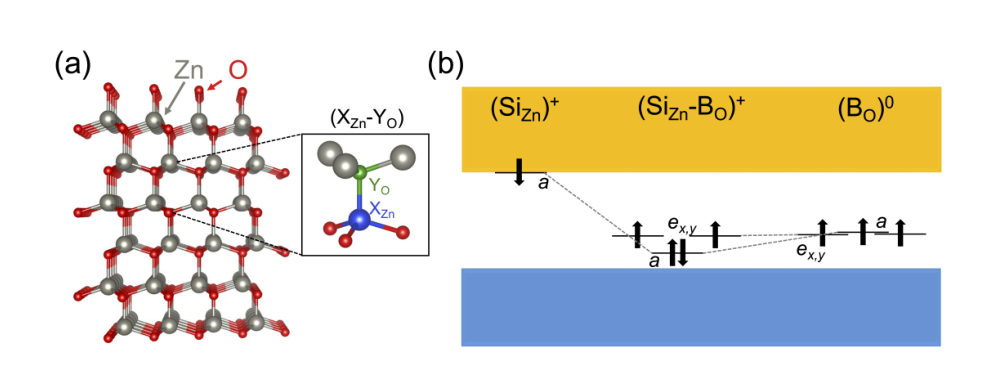 
FIG. 1. Double substitutional defects in ZnO (a) Schematic illustration of dimer defects XZn-YO, where X = Al, Ga, Si, and Ge, and Y = B and C, encapsulated in ZnO. Gray and red spheres represent zinc and oxygen, respectively. Blue and green spheres indicate the impurity substituting Zn and O atoms, respectively. (b) Schematic of the defect level diagram of SiZnBO +

📷 Fig 2

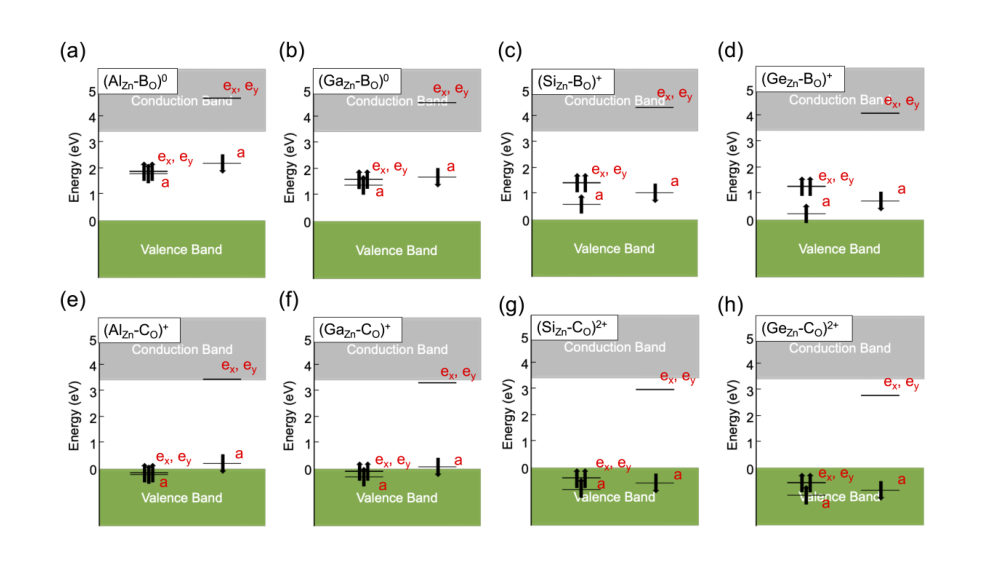 
FIG. 2. Defect level diagrams of dimer defects in ZnO. (a-h) Computed defect level diagrams of spin-triplet boron-based dimer defects (a-d) and carbon-based defects (e-h). For (Al,Ga)Zn-BO, (Si,Ge)Zn-BO, (Al,Ga)Zn-CO, and (Si,Ge)Zn-BO, charge state of 0, +1, +1, and +2 are required to have spin-triplet ground states.

📷 Fig 3

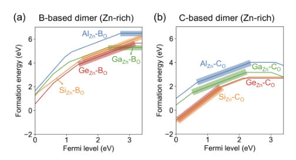 
FIG. 3. Energetics of the dimer defects in ZnO. (a,b) Com- puted defect formation energy of B-based (a) and C-based (b) dimer defects under the Zn-rich condition. Defect formation energies under the O-rich condition are provided in Supple- mentary Fig. 2. The color bar indicates the stability region for the dimer defects with the spin-triplet state.

📷 Fig 4

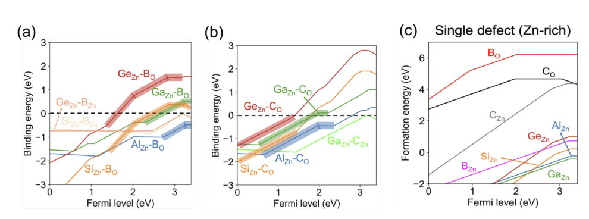 
FIG. 4. Binding energy of dimer defects in ZnO. (a,b) Binding energy of B-based (a) and C-based (b) dimers as a function of the Fermi level. The horizontal dashed line separates positive and negative binding energy regions. Color bars indicate the Fermi-level range where the dimer is in the spin-triplet (S = 1) state. (c) Defect formation energies of single-site substitutional defects.

📷 Fig 5

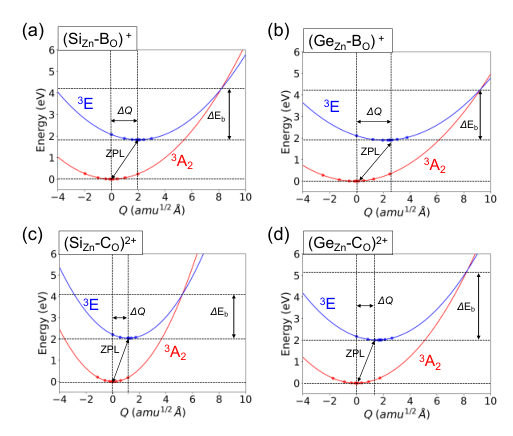 
FIG. 5. Configuration coordinate diagram of the dimer struc- tures in ZnO. (a-d) Potential energy surface of (SiZn-BO)+

**Summary.** This paper theoretically designs and characterizes main-group donor-acceptor (DA) pairs within ZnO to serve as optically active quantum defects. Using advanced DFT calculations, the authors predict that these specific dimer defects exhibit desirable properties, such as isolated defect states and visible optical transitions. This work provides a chemically guided pathway for engineering solid-state qubits in ZnO.

**Why it may be interesting.** This work directly addresses the search for solid-state quantum emitters in wide-bandgap semiconductors, which is a core area for solid-state quantum information processing.

Detailed structure

**Main problem.** The primary goal is to identify and characterize main-group donor-acceptor (DA) pairs in ZnO as promising candidates for optically active quantum defects.

**Main result.** The study proposes a new family of main-group DA defects in ZnO, with specific candidates like (SiZn-BO)+ and (GeZn-BO)+ showing visible optical transitions and robust charge states.

**Method.** The research employs hybrid density functional theory (DFT) to systematically investigate the electronic structure, thermodynamic stability, and optical properties of these defect complexes.

**Model / system.** The physical system is Zinc Oxide (ZnO) hosting double substitutional impurities formed by main-group donor-acceptor (DA) pairs ($	ext{XZn-YO}$). The analysis covers defect level diagrams, formation energies, and optical transitions.

**Key observables.** Zero-Phonon Lines (ZPLs), radiative lifetimes, nonradiative decay rates, defect electronic structure, and thermodynamic formation energies.

**Important parameters / regimes.** The defect electronic structure is shown to be largely determined by the atomic properties of the constituent atoms, providing a chemical design principle.

**Assumptions / limitations.** The analysis relies on DFT calculations, and the study establishes a new family of candidates based on these theoretical predictions.

**Figures summary.** Figures illustrate the schematic configurations of the investigated dimer defects ($	ext{XZn-YO}$) and present spin-polarized defect-level diagrams for various charge states, showing orbital contributions.

**Paper structure.** The paper systematically investigates the defect physics by calculating electronic structure, stability, and optical properties for the proposed DA dimers, culminating in the identification of promising candidates.

Abstract

Zinc oxide (ZnO), a wide-band-gap semiconductor with mature growth techniques, is a promising host for optically active quantum spins. Yet, optically active quantum defects in ZnO remain largely unexplored. Here, we identify and characterize a family of double substitutional impurities in ZnO, formed by main-group donor-acceptor (DA) pairs, as candidates for optically active quantum defects. Using hybrid density functional theory (DFT), we systematically investigate double substitutional DA complexes and their defect physics, including electronic structure, thermodynamic stability, and optical properties. The proposed defects exhibit isolated defect states, strong spin localization on the acceptor site, and $C_{3v}$ symmetry. Importantly, the electronic structure of the DA pairs is largely determined by the atomic properties of their constituent atoms. We further examine their optical characteristics, including zero-phonon lines (ZPLs), radiative lifetimes, and nonradiative decay to assess their viability as color centers. Notably, among the dimers, (Si$_{Zn}$-B$_O$)$^+$ and (Ge$_{Zn}$-B$_O$)$^+$ exhibit visible optical transitions with sub-microsecond radiative lifetimes and robust charge states against optical ionization, while (Si$_{Zn}$-C$_O$)$^{2+}$ shows the smallest Huang-Rhys factor, approximately 5.6. Our results propose a new family of main-group donor-acceptor defects in ZnO as promising candidates for optically active spin defects.

[↑ back to top](#top)

### [Fixed-ray escort representations of sandwiched and $α$--$z$ Rényi divergences on von Neumann algebras](http://arxiv.org/abs/2608.21214v1)

**Authors:** Tanay Kibe, Pratik Roy  
**Type:** theory · **Category:** quantum information and computing · **PDF:** <https://arxiv.org/pdf/2608.21214v1>  
**Analysis basis:** full PDF text, analyzed in chunks

📷 Fig 1

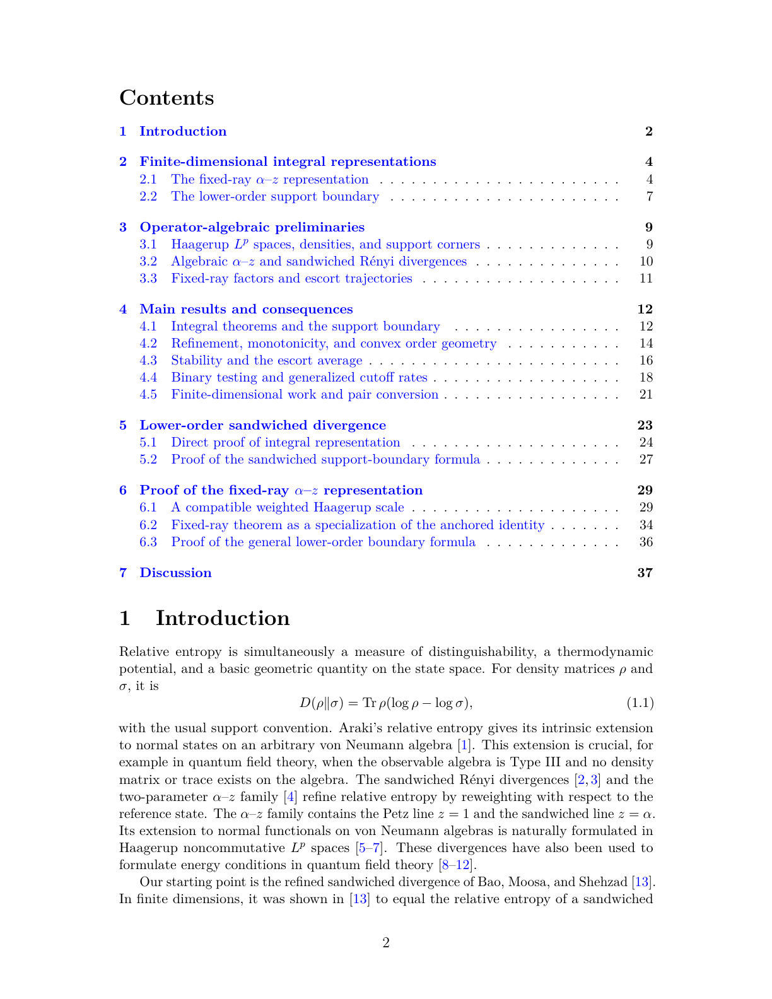 
Low-resolution page preview, page 2

📷 Fig 2

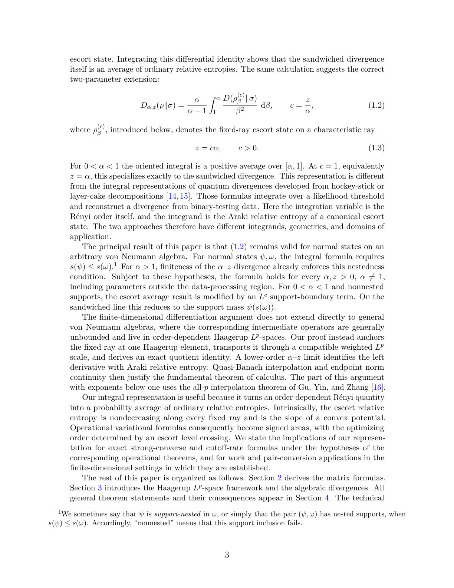 
Low-resolution page preview, page 3

📷 Fig 3

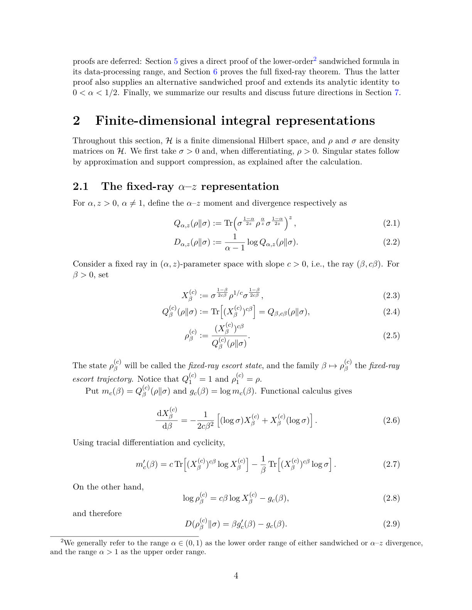 
Low-resolution page preview, page 4

📷 Fig 4

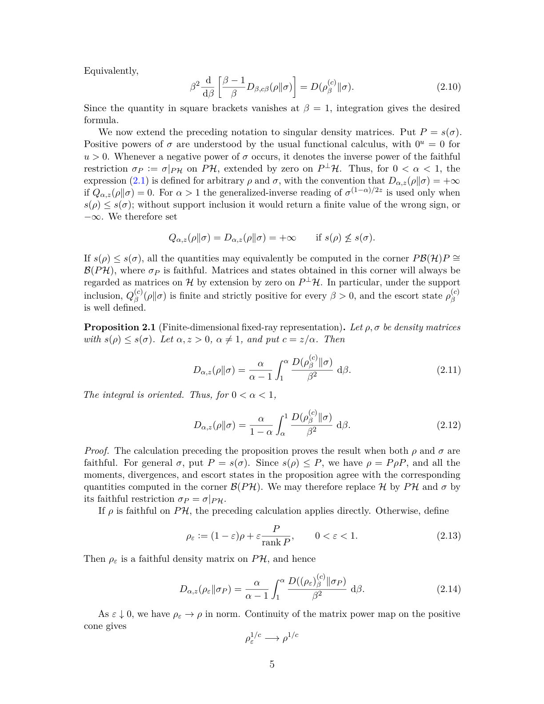 
Low-resolution page preview, page 5

📷 Fig 5

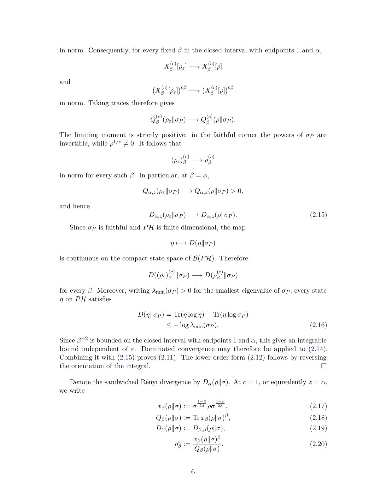 
Low-resolution page preview, page 6

**Summary.** This theoretical paper develops integral representations for generalized Rényi divergences on abstract von Neumann algebras. It achieves this by relating these divergences to integrals of the standard relative entropy using advanced tools from non-commutative functional analysis. The result provides a unified mathematical framework for quantifying quantum distinguishability in highly general quantum systems.

**Why it may be interesting.** The deep mathematical machinery connecting divergences to integrals over relative entropy is highly relevant for understanding quantum channel capacities and resource theories in open quantum systems.

Detailed structure

**Main problem.** The paper aims to derive integral representations for sandwiched and $\alpha$-$z$ Rényi divergences when defined on general von Neumann algebras.

**Main result.** It establishes that these divergences can be represented as integrals over ordinary relative entropies, providing a powerful mathematical tool for analyzing quantum distinguishability.

**Method.** The derivation employs advanced functional analysis tools, specifically Haagerup non-commutative $L^p$ spaces, interpolation, and fixed-ray constructions.

**Model / system.** The theory is formulated for normal states on arbitrary von Neumann algebras, generalizing concepts from finite-dimensional quantum information theory.

**Key observables.** Sandwiched and $\alpha$-$z$ Rényi divergences ($D_{\alpha,z}(\rho\|\sigma)$), and the ordinary relative entropy $D(\cdot\|\cdot)$.

**Important parameters / regimes.** The Rényi order $\alpha$, the parameter $z$, and the support inclusion condition between the states $\rho$ and $\sigma$.

**Assumptions / limitations.** The primary assumption for the general case is the support inclusion condition ($	ext{s}(\rho) \le \text{s}(\sigma)$), though boundary terms are derived for when this fails.

**Paper structure.** The paper builds from establishing the integral representation for finite dimensions, extending it to general von Neumann algebras using $L^p$ spaces, and finally detailing the fixed-ray construction to prove the general identity and analyze boundary corrections.

Abstract

We represent sandwiched and $α$-$z$ Rényi divergences as averages of ordinary relative entropy. The $α$-$z$ Rényi divergence is shown to be an integral over the relative entropy of a canonical family of fixed-ray escort states along the ray $z=cα$. We prove this representation for normal states on an arbitrary von Neumann algebra, using Haagerup non-commutative $L^p$ spaces and interpolation. The formula holds for every $z>0$: for $0<α<1$ it holds when the support of the first state is contained in that of the reference state, and for $α>1$ it holds whenever the divergence is finite. When the lower-order support condition fails, we identify the exact fixed-ray support-boundary term. The representation yields a monotone escort profile and a convex order potential. We use these to reformulate one-shot testing converses, exact sandwiched strong-converse exponents, and work-extraction reliability as signed-area or level-crossing statements, and discuss a restricted two-parameter pair-conversion rate.

[↑ back to top](#top)

### [Laziness of Quantum Walks on Graphs](http://arxiv.org/abs/2608.20739v1)

**Authors:** Amulya Mohan, Christino Tamon, Yichi Xu, Hanmeng Zhan  
**Type:** theory · **Category:** other · **PDF:** <https://arxiv.org/pdf/2608.20739v1>  
**Analysis basis:** full PDF text, analyzed in chunks

📷 Fig 1

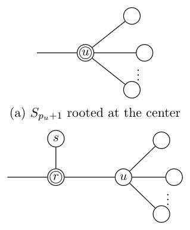 
Figure 2: The four possibilities for B+ when h+ ≤2. The double circle marks the root, and the short segment to its left is the edge joining B+ to B−.

**Summary.** This paper develops tools to quantify the 'laziness' of quantum walks on graphs by analyzing the trace of the average mixing matrix. It proves that graph structure dictates this invariant, establishing that the complete graph is the laziest connected graph and that the star graph is the laziest tree. The work is significant for understanding how graph topology governs long-term quantum dynamics.

**Why it may be interesting.** The concept of 'laziness' provides a novel graph invariant derived from quantum dynamics, linking spectral properties (Laplacian eigenvalues) directly to physical return probabilities, which is relevant for understanding quantum transport in structured media.

Detailed structure

**Main problem.** The paper studies the 'laziness' of a graph, defined as the trace of the average mixing matrix of a quantum walk, which quantifies the long-term probability of a quantum walker returning to its starting point.

**Main result.** It establishes a hierarchy of laziness for graphs, showing that the complete graph $K_n$ is the laziest connected graph, and the star graph $S_n$ is the laziest tree on $n$ vertices.

**Method.** The analysis uses spectral graph theory, specifically examining the average mixing matrix $\mathcal{M}$ derived from the Laplacian quantum walk, and applying various algebraic tools like Schur products and spectral decomposition.

**Model / system.** The model is quantum walks evolving on an arbitrary graph $X$, governed by the Laplacian matrix $L$. The key diagnostic is the average mixing matrix $\mathcal{M} = \lim_{T	o\infty} rac{1}{T} \sum_{t=0}^{T} U(t) \circ U(t)$.

**Key observables.** Laziness, defined as $	ext{tr}(\mathcal{M})$, and the average mixing matrix $\mathcal{M}$.

**Important parameters / regimes.** The number of vertices $n$, and the specific structure of the graph (e.g., $K_n$, $S_n$, double stars $	ext{DS}(\ell, r)$).

**Assumptions / limitations.** The analysis assumes the existence of the Cesaro limit for the average mixing matrix and relies heavily on spectral properties of the Laplacian matrix.

**Figures summary.** Not specified.

**Paper structure.** The paper systematically develops tools (properties of laziness) to prove the hierarchy of laziness for specific graph families, comparing structures like $K_n$, $S_n$, and various multipartite graphs.

Abstract

The trace of the average mixing matrix of a quantum walk measures the "laziness" of the walk: the higher the trace, the more likely that the walker returns home in the long run. In this paper, we develop tools to study this graph invariant arising from Laplacian quantum walks.   It is known that the complete graph $K_n$ is the laziest connected graph on $n$ vertices. Using our machinery, we show that the star $S_n$ is the second laziest connected graph on $n$ vertices (and hence the laziest tree on $n$ vertices), the complete multipartite graph $K_{n-2,1,1}$ is the third laziest connected graph on $n$ vertices, and the double star $DS(n-3,1)$ is the second laziest tree on $n$ vertices. We also show that on the same number of vertices, more unbalanced double stars are lazier.

[↑ back to top](#top)

### [Metabolic Network Properties: Comprehensive Analysis Across Domains](http://arxiv.org/abs/2608.21168v1)

**Authors:** José Antônio Pellizzaro, Daniel Gamermann, Julian Triana Dopico  
**Type:** theory · **Category:** statistical mechanics · **PDF:** <https://arxiv.org/pdf/2608.21168v1>  
**Analysis basis:** full PDF text, analyzed in chunks

📷 Fig 1

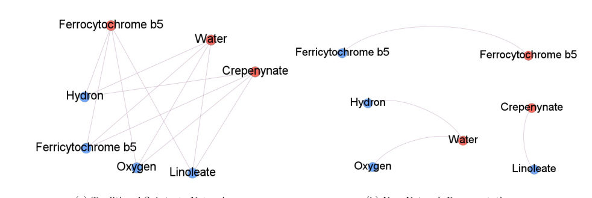 
Figure 1: In a) and b) we have the visual representation of the links from reaction R05740 using our old method (a) and our new method (b). In a) we simply link each product in red to each substrate in blue, while in b) we link the molecules based on their chemical composition.

📷 Fig 2

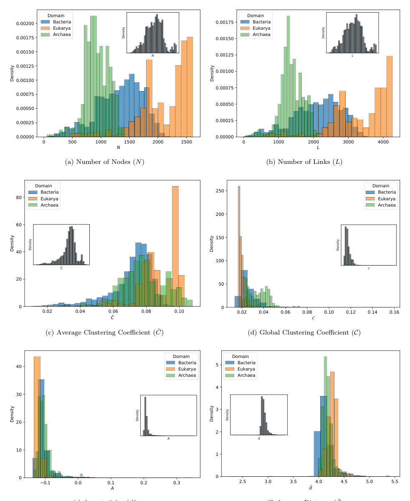 
Figure 2: Histograms of parameter distributions in metabolic networks. In gray, we show the parameter distribution of the entire dataset, while in color, we show each Domain separately. For example, in (a), the right-hand peak in the number of nodes distribution (shown in gray) is composed mostly of eukaryotes (in orange). 8

📷 Fig 3

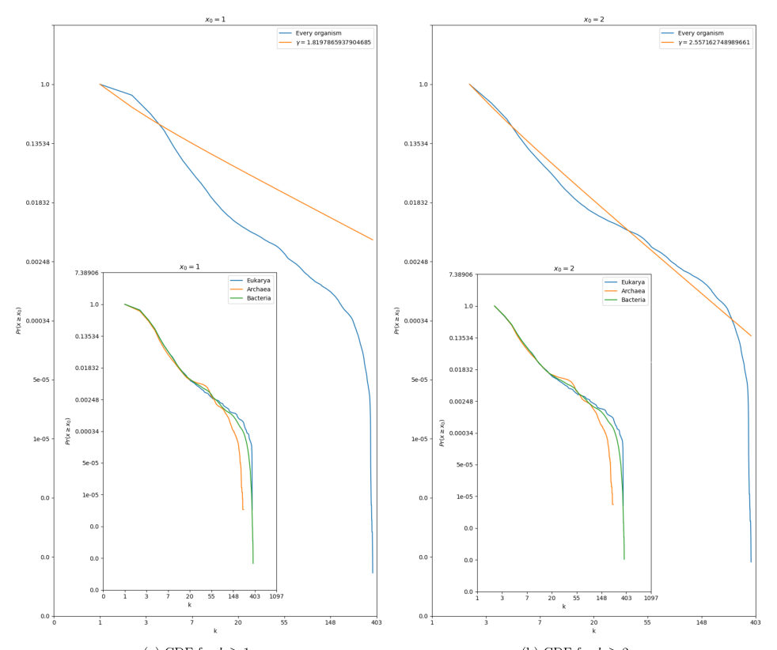 
Figure 3: Cumulative distribution function (CDF) for every organism in logarithmic scale. The line represents the CDF of the fitted the power-law distribution for x0 = 1 (a) and x0 = 2 (b). In the insets, we display the CDF for each taxonomic domain. It is evident that all of them exhibit a similar behavior, and there appears to be a scarcity of high-degree nodes compared to the fitted power-law distribution.

📷 Fig 4

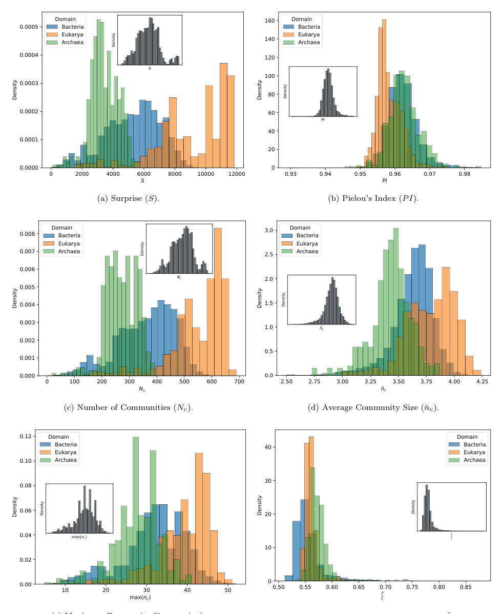 
Figure 4: Histograms of the community structure distributions in metabolic networks. In gray, we show the parameter distribution of the entire dataset, while in color, we show each Domain separately. For instance, in d), we see a very even distribution in gray-scale, but, when we filter by domain we can see a separation between Archaea, Bacteria and Eukaryotes. 10

📷 Fig 5

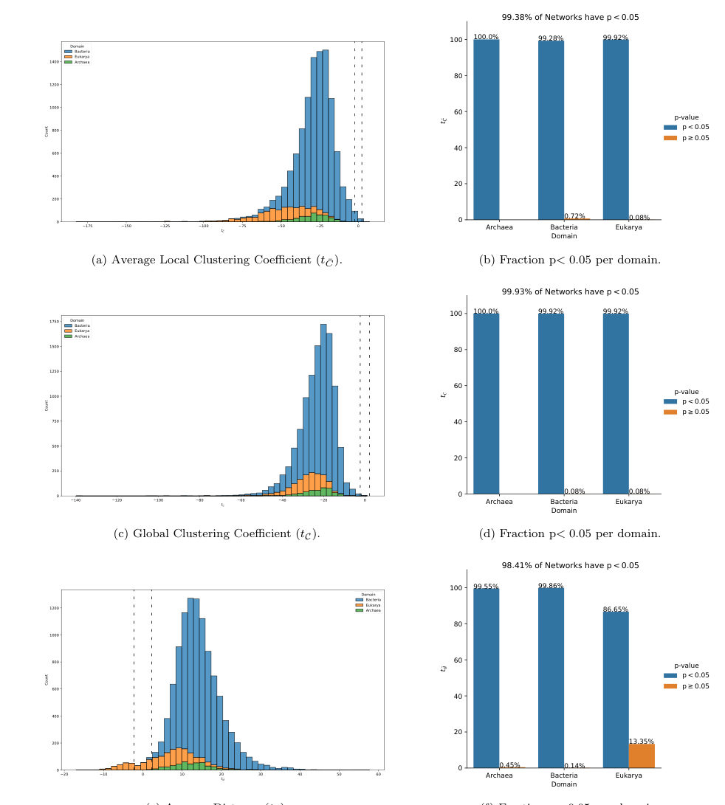 
Figure 5: Histograms of tp for the topological properties of the metabolic networks. Here, we choose to stack the distributions for better visibility. In the right side we show the percentage of networks with p&lt; 0.05 per domain.

**Summary.** This paper conducts a large-scale topological analysis of metabolic networks from diverse life forms. It introduces a refined method for building these networks based on direct chemical transformations and uses advanced community detection to quantify their structure. The findings reveal that the organization of these biological networks possesses specific topological signatures that cannot be explained by random chance, pointing to underlying evolutionary mechanisms.

**Why it may be interesting.** While the subject is biochemistry, the rigorous application of graph theory, community detection (Surprise function), and statistical comparison against null models mirrors techniques used in analyzing complex systems in statistical physics.

Detailed structure

**Main problem.** To comprehensively analyze the topological properties and community structure of metabolic networks across diverse life domains, identifying features driven by evolutionary pressures beyond simple degree distribution.

**Main result.** Metabolic networks exhibit distinct topological signatures, such as being disassortative and having a higher local clustering coefficient compared to random models, suggesting underlying evolutionary constraints.

**Method.** The study employs novel network construction methods focusing on direct chemical transformations and uses advanced community detection algorithms like Surprise to compare real networks against randomized null models.

**Model / system.** The physical system is a metabolic network, modeled as a graph where nodes are metabolites and edges represent direct chemical transformations. The analysis spans 10912 organisms across Bacteria, Archaea, and Eukarya.

**Key observables.** Community structure metrics (Surprise function, $N_c$, $ar{n}_c$, $PI$), topological properties ($ar{k}$, $ar{C}$, $C$, $A$, $ar{d}$), and comparisons against randomized network metrics.

**Important parameters / regimes.** The analysis compares real vs. randomized networks using statistical tests (e.g., t-test) and focuses on identifying structural deviations from random expectations.

**Assumptions / limitations.** The primary assumption is that topological features not explained by degree distribution reflect genuine, non-random evolutionary pressures. The method also assumes the ability to resolve currency metabolites based on elemental balance.

**Figures summary.** The paper compares traditional vs. novel network constructions (Fig 1), presents statistical summaries of topological properties (Table 2), details community structure analysis (Table 5), and compares these findings against randomized network models (Tables 6 and 7).

**Paper structure.** The paper progresses from introducing the problem and novel network construction (focusing on chemical pathways) to detailing the statistical analysis of global and community metrics, culminating in a rigorous comparison between real biological networks and randomized null models.

Abstract

Metabolic networks play pivotal roles in understanding the evolution of organisms, microbiome dynamics and disease prevention and treatment. This study presents a comprehensive analysis of metabolic network properties across 10912 organisms spanning Bacteria, Archaea, and Eukarya domains. A novel method for the network construction is introduced, emphasizing the chemical transformations of metabolites. Unlike conventional approaches that link every substrate to every product in all chemical reactions, this method aligns more closely with metabolic pathways, linking products only to their generating substrates. Emphasis is placed on investigating the community structure within metabolic networks, employing the Surprise quality function that better addresses some limitations of previous approaches. Through comparisons between real and randomized versions of the networks, we identify characteristics that cannot be explained solely by the network degree distribution, thus identifying topological properties and community structures that arise from additional evolutionary pressures. This highlights the need for evolutionary models to incorporate additional mechanisms beyond the replication of the degree distribution.

[↑ back to top](#top)

### [Predicting Resource Efficient Hamiltonian Decomposition for Continuous-Time Quantum Walk Simulations](http://arxiv.org/abs/2608.20660v1)

**Authors:** Mostafa Atallah, Rebekah Herrman, Zain H. Saleem  
**Type:** both · **Category:** quantum information and computing · **PDF:** <https://arxiv.org/pdf/2608.20660v1>  
**Analysis basis:** full PDF text, analyzed in chunks

📷 Fig 1

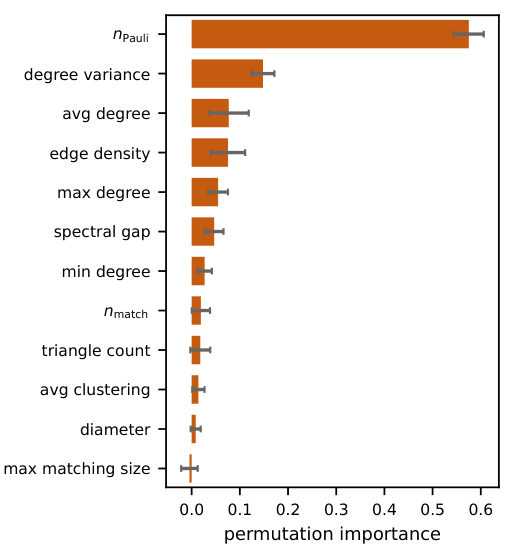 
Fig. 1: Permutation feature importance on the training popu- lation, measured as the mean drop in predictive performance when each feature is shuffled (five seeds).

📷 Fig 2

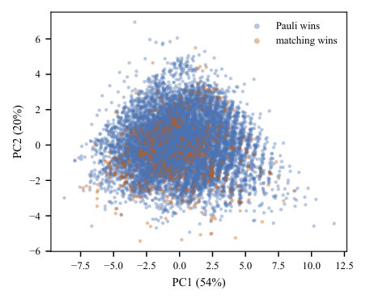 
Fig. 2: First two principal components of the twelve stan- dardized features on the McKay population, with each graph colored by class. The matching-wins overlap the Pauli-wins rather than separating from them, so the two classes are not separated in these two principal directions.

📷 Fig 3

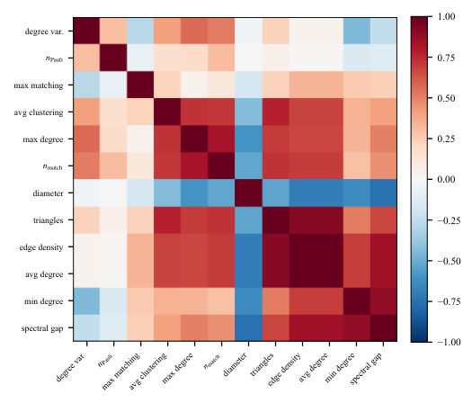 
Fig. 3: Pairwise Pearson correlation between the twelve fea- tures on the McKay population, with features ordered by hier- archical clustering so that correlated groups appear adjacent.

📷 Fig 4

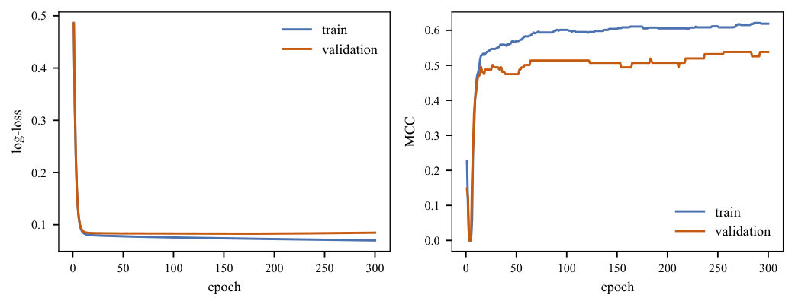 
Fig. 4: Training and validation convergence of the tuned ANN on the McKay split (seed 0): log-loss (left) and MCC (right) versus epoch. Train and validation track together, indicating the single 32-unit layer generalizes rather than memorizes.

📷 Fig 5

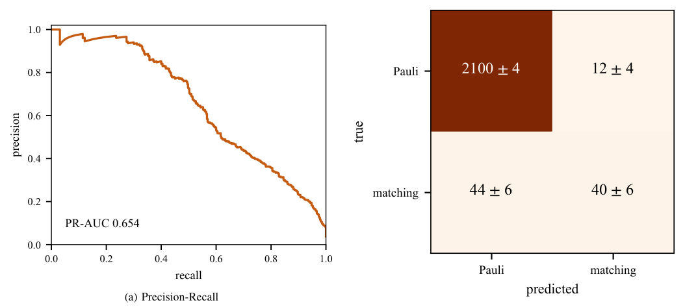 
Fig. 5: Tuned ANN evaluated on the held-out McKay test graphs, averaged over five random splits. In (a), PR-AUC is the area under the precision-recall curve. A value close to zero indicates a model does no better than random guessing. In (b), each cell counts the test graphs of a given true class (rows) assigned to a given predicted class (columns), with the diagonal holding the correct predictions.

**Summary.** This research tackles the challenge of efficiently simulating Continuous-Time Quantum Walks by comparing two ways to decompose the system's Hamiltonian. By training machine learning models on graph properties, the authors developed a predictor that can advise quantum compilers on which decomposition minimizes costly CX gates. This offers a practical tool for optimizing quantum circuit compilation for quantum simulation.

**Why it may be interesting.** This work directly addresses the resource optimization bottleneck in simulating quantum dynamics on near-term quantum hardware by providing a data-driven tool to select the best circuit decomposition.

Detailed structure

**Main problem.** The paper aims to predict which of two Hamiltonian decompositions (Pauli vs. matching) will result in fewer CX gates when simulating a Continuous-Time Quantum Walk (CTQW) via Trotterization.

**Main result.** The choice of the resource-efficient decomposition is primarily governed by the decomposition property $n_{	ext{Pauli}}$, rather than intrinsic graph topology. The trained ML model shows strong transferability, achieving high performance on larger, unseen graphs.

**Method.** A supervised machine learning approach is used to classify the optimal decomposition by training models on a large set of graphs, using graph topology and decomposition term counts as features.

**Model / system.** The system is a CTQW evolving on a graph $G$, whose time evolution $e^{-iHt}$ must be approximated using Trotterization. The comparison is between the Pauli and matching decompositions of the Hamiltonian $H$.

**Key observables.** The number of CX (two-qubit) gates required by each decomposition, and the classification accuracy (MCC) of the prediction model.

**Important parameters / regimes.** The number of vertices ($N$), the graph structure (e.g., 8-vertex graphs, Erdos-Renyi), and the feature counts ($n_{	ext{Pauli}}$, $n_{	ext{match}}$).

**Assumptions / limitations.** The simulation relies on Trotterization, and the selection criterion is solely based on minimizing the CX gate count, ignoring circuit depth or connectivity.

**Figures summary.** The notes mention tables comparing performance metrics (precision, recall, MCC) across various ML models, feature subsets, and increasing graph sizes ($N=8$ to $N=256$).

**Paper structure.** The paper establishes the problem (Hamiltonian decomposition for CTQW), develops the methodology (feature engineering using graph and decomposition properties), trains ML models on a known population, and validates the model's predictive power on larger, held-out test sets.

Abstract

Simulating a continuous-time quantum walk (CTQW) on a graph in the circuit model of quantum computing requires decomposing its Hamiltonian into terms that can be Trotterized into hardware-native gates. We consider two such decompositions: the standard Pauli decomposition and the recently introduced matching decomposition. Prior work suggests that the matching decomposition uses fewer CX gates on sparse graphs, while the Pauli decomposition uses fewer on denser graphs. Since CX gates dominate error and runtime on current hardware, we train machine learning models to predict, for a given graph, which of the two decompositions produces the smaller CX gate count. We train and evaluate on the complete population of all 11,117 connected eight-vertex graphs from Brendan McKay's database, so the class balance and overlap are measured directly rather than estimated. We use twelve features: ten topological properties of the graph and two that count the terms the Pauli and matching decompositions produce (n_Pauli and n_match), both computable without transpiling the simulation circuit. Standard topological properties alone provide little predictive power. Instead, the dominant signal comes from n_Pauli, a property of the Hamiltonian decomposition rather than an intrinsic property of the graph; degree variance is the only other feature that carries signal. Across a range of models the Matthews correlation coefficient (MCC) falls in a narrow band, from 0.569 untuned to 0.593 after tuning, so no single architecture stands out. We adopt a single-hidden-layer neural network at MCC 0.593. Applied frozen to a held-out, class-balanced test set of larger graphs (up to 256 vertices) from structured and Erdos-Renyi families, the model transfers, with MCC rising from 0.785 at N=8 to 1 at N>=64.

[↑ back to top](#top)

### [Quantifying Entangling Power of Controlled Unitary Gates](http://arxiv.org/abs/2608.21105v1)

**Authors:** Ankur Haldar, Pankaj Agrawal, Prasenjit Deb  
**Type:** theory · **Category:** quantum information and computing · **PDF:** <https://arxiv.org/pdf/2608.21105v1>  
**Analysis basis:** full PDF text, analyzed in chunks

📷 Fig 1

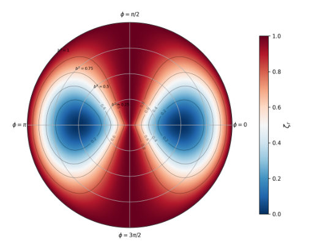 
FIG. 1: ζr(b2, ϕ) for the Toffoli gate, Eq. (29), at fixed p11 = 1/2, plotted in polar coordinates with radius b2

📷 Fig 2

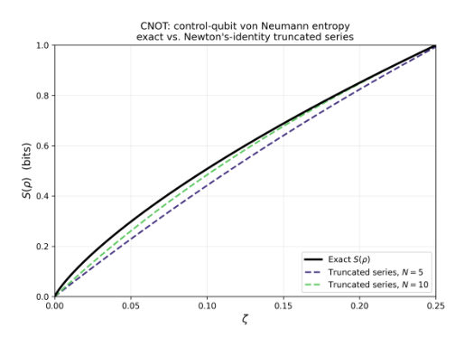 
FIG. 2: von Neumann entropy of the control-qubit re- duced state for a CNOT gate, as a function of ζ. The exact entropy (solid black) is compared against the trun- cated series of Eq. (42), evaluated via the Newton’s- identity recursion of Eq. (40), at truncation orders N = 5 and N = 10 (dashed). Entropy is reported in bits, so the physical range is S ∈[0, 1] over ζ ∈[0, 1/4].

**Summary.** This paper introduces a novel, computable quantity, $\zeta$, to quantify the entanglement generated by controlled unitary gates in quantum computation. It establishes theoretical upper bounds for this entangling power, showing that the controlled unitary architecture can achieve optimal entanglement for specific dimension pairings. This provides a powerful, state-independent tool for analyzing quantum circuit performance.

**Why it may be interesting.** The development of a simple, computable metric ($\zeta$) that bypasses full state simulation is highly valuable for analyzing complex quantum circuits, providing theoretical benchmarks for quantum hardware performance.

Detailed structure

**Main problem.** The paper aims to develop a computable quantity to quantify the entangling power generated by controlled unitary gates, avoiding the need to simulate the full output state.

**Main result.** A new computable quantity, $\zeta$, is introduced, which successfully quantifies entanglement and establishes a universal upper bound $\zeta_{	ext{max}} = (2d-1)/(2d+1)$ for the generalized controlled unitary architecture.

**Method.** The authors derive $\zeta$ using properties of reduced density matrices and trace overlaps, relating it to established measures like purity and linear entropy.

**Model / system.** The study focuses on two-qubit and multi-qubit systems governed by Controlled Unitary (CU) and Generalized Controlled Unitary (GCU) gates acting on bipartite control and target registers.

**Key observables.** The primary observable is $\zeta$, the computable entangling power. Other key diagnostics include purity ($\gamma$), normalized linear entropy ($\zeta_r$), and von Neumann entropy ($S(
ho)$).

**Important parameters / regimes.** The dimension of the control ($m$) and target ($n$) registers, and the probability distribution $\{p_i\}$ over the control basis states.

**Assumptions / limitations.** The analysis assumes ideal quantum operations and derives bounds based on specific controlled unitary architectures, noting limitations when extending to arbitrary dimensions.

**Figures summary.** Figures illustrate the entanglement ratio $\zeta_r$ for the Toffoli gate, showing regions of separability and maximal entanglement, and compare theoretical entropy calculations against series approximations.

**Paper structure.** The paper progresses by first defining $\zeta$ for two-qubit gates, then generalizing it to GCU gates, deriving the universal upper bound $\zeta_{	ext{max}}$, and finally establishing functional relations between $\zeta$ and other entropy measures.

Abstract

Applying controlled unitary gates to generate entanglement between qubits is a routine task in both quantum communication and computation. The existing tools for predicting how much entanglement a given gate can generate require either simulation of the entangling circuit or averaging over a distribution of inputs for a given controlled unitary gate. Here, we introduce a computable quantity $ζ$ that not only determines whether a controlled unitary gate generates entanglement, but also quantifies the entanglement for any specific input without requiring the construction of the output state. For two-qubit controlled unitary gates, we establish the physical conditions corresponding to the extremum values of the proposed quantity. Extending the dimension of control and target registers to arbitrary size through a generalized controlled unitary architecture, we derive a universal upper bound on $ζ$ and identify the conditions for its saturation. Later we establish functional relation between the quantity and other known quantities, such as purity, normalized linear entropy, and von Neumann entropy. Finally, we compare our results with previous research work and show that the quantity proposed in this work achieves the previously known optimal values of entangling power of controlled unitary gates for some specific dimensions of target and control registers.

[↑ back to top](#top)

### [Scaling Behavior of Parameterized Quantum Circuits from a Lie-Algebraic Perspective](http://arxiv.org/abs/2608.20603v1)

**Authors:** Hiroshi Ohno  
**Type:** theory · **Category:** quantum information and computing · **PDF:** <https://arxiv.org/pdf/2608.20603v1>  
**Analysis basis:** full PDF text, analyzed in chunks

📷 Fig 1

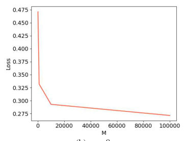 
Figure 1: Loss curves of sample size M. Mean and standard deviation (error bars) of loss are shown.

📷 Fig 2

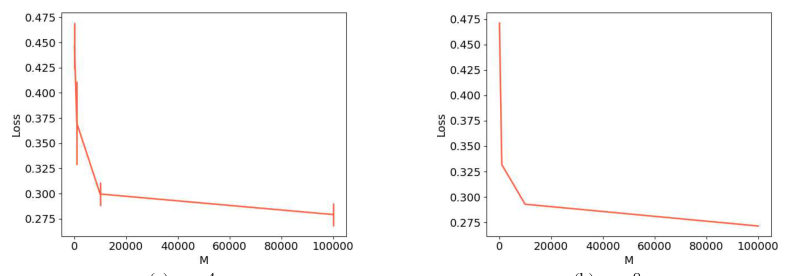 
Figure 3 shows the average values of DLA, OOD, and De f f with respect to the parameter size P. Figure 4 shows the log-log plots between loss and DLA, OOD, and De f f . DLA and OOD saturated at 255 and 128 for P = 16, 32,

📷 Fig 3

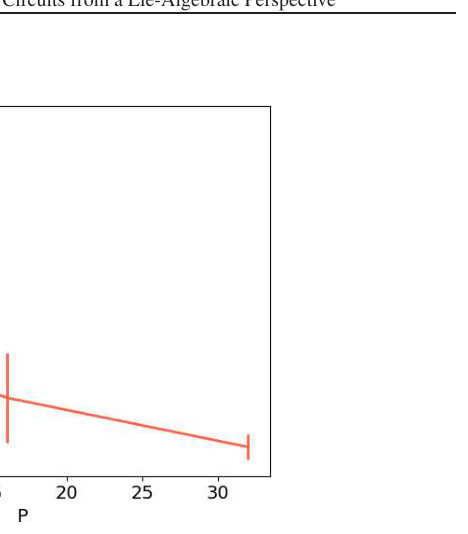 
Figure 2: Loss curves of parameter size P. Mean and standard deviation (error bars) of loss are shown.

📷 Fig 4

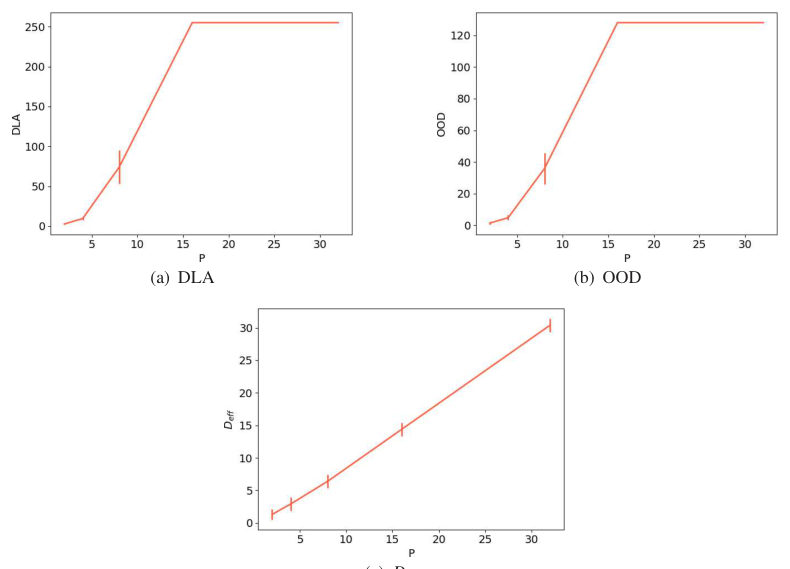 
Figure 3: Results of dimension of DLA, OOD, and De f f with respect to parameter size P. Mean and standard deviation (error bars) are shown.

📷 Fig 5

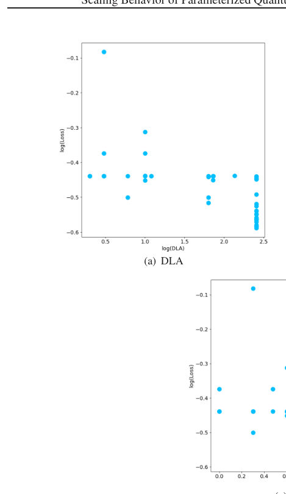 
Figure 4: Log-log plots between loss and DLA, OOD, and De f f

**Summary.** This paper analyzes how the performance of parameterized quantum circuits scales by comparing several metrics of model size. The authors find that while simple counts like parameter number ($P$) or Lie algebra dimensions ($	ext{DLA}$, $	ext{OOD}$) are insufficient, the Jacobian effective dimension ($	ext{Deff}$) provides a robust, geometry-aware measure of the circuit's accessible degrees of freedom. This suggests $	ext{Deff}$ should be used instead of $P$ when characterizing model capacity.

**Why it may be interesting.** It provides a rigorous, mathematically grounded metric ($	ext{Deff}$) to quantify the true complexity or capacity of variational quantum circuits, which is crucial for designing scalable quantum machine learning algorithms.

Detailed structure

**Main problem.** The study aims to characterize how the performance (loss) of parameterized quantum circuits scales with available resources, such as data size, model size, and computational effort.

**Main result.** The Jacobian effective dimension ($	ext{Deff}$) was shown to be a geometry-aware measure that scales comparably to the nominal parameter size ($P$) and is superior to other Lie-algebraic measures ($	ext{DLA}$, $	ext{OOD}$) which rapidly saturate.

**Method.** The authors numerically investigated scaling laws by training the circuits on a linear regression task using Root Mean Square Error (RMSE) minimization via SPSA.

**Model / system.** The model is a parameterized quantum circuit (PQC) defined by a unitary $U(	heta) = \prod e^{-i	heta_j G_j}$, where generators $G_j$ are sampled from Pauli strings.

**Key observables.** Loss (RMSE), Dimension of dynamical Lie algebra ($	ext{DLA}$), Observable orbit dimension ($	ext{OOD}$), and Jacobian effective dimension ($	ext{Deff}$).

**Important parameters / regimes.** Training sample size ($M$), parameter size ($P$), and number of optimization iterations ($T$).

**Assumptions / limitations.** The analysis is restricted to a regression task and small qubit numbers (four and eight), and the scaling laws are observed over finite ranges.

**Figures summary.** Figures illustrate the decrease in loss with increasing $M$, $P$, and $T$. Figure 3 compares $	ext{DLA}$, $	ext{OOD}$, and $	ext{Deff}$ vs. $P$, showing saturation for the first two and strong correlation for $	ext{Deff}$.

**Paper structure.** The paper establishes the need to measure resource scaling, analyzes data/model/compute scaling using various metrics ($	ext{DLA}$, $	ext{OOD}$, $	ext{Deff}$), presents results showing $	ext{Deff}$'s superior scaling behavior, and concludes by proposing $	ext{Deff}$ as a robust geometric measure.

Abstract

Understanding how the performance of parameterized quantum circuits scales with available resources is important for characterizing their trainability and effective model capacity. In this study, we numerically investigate data scaling, model scaling, and compute scaling in parameterized quantum circuits and examine Lie-algebraic quantities as alternative measures of model size. In addition to the number of circuit parameters, we consider the dimension of the dynamical Lie algebra, the observable-orbit dimension, and a Jacobian effective dimension defined as the rank of the Jacobian of the parameterized observable orbit. Using a regression task with randomly generated Pauli-string generators, we observe decreasing loss with increasing training dataset size, parameter size, and number of optimization iterations over the ranges investigated. For model scaling, the dynamical Lie algebra and observable orbit dimensions rapidly saturate as the parameter size increases, whereas the Jacobian effective dimension remains strongly correlated with the parameter size and exhibits comparable scaling behavior. These results suggest that the Jacobian effective dimension provides a geometry-aware measure of the locally accessible observable degrees of freedom of finite-depth parameterized quantum circuits and may serve as a useful scaling parameter beyond the nominal parameter size.

[↑ back to top](#top)

### [Tools for Reducing Service Time in Near-Term Quantum Networks](http://arxiv.org/abs/2608.20954v1)

**Authors:** Jake Smith, Thomas R. Beauchamp, Scarlett Gauthier, Oumayma Bouchmal, Stephanie Wehner  
**Type:** theory · **Category:** quantum information and computing · **PDF:** <https://arxiv.org/pdf/2608.20954v1>  
**Analysis basis:** full PDF text, analyzed in chunks

📷 Fig 1

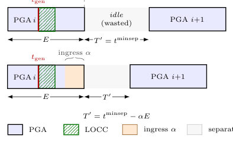 
Fig. 1. The ingress α is the fraction of PGA i by which the scheduled separation is shortened, giving T ′ = tminsep −αE. At α = 0 (top) the full minimum separation is kept and the network idles after an early tgen. At α &gt; 0 (bottom) the separation shortens by αE, reclaiming idle time. A packet generated within the shaded ingress region risks a minimum separation violation (Section IV-B).

📷 Fig 2

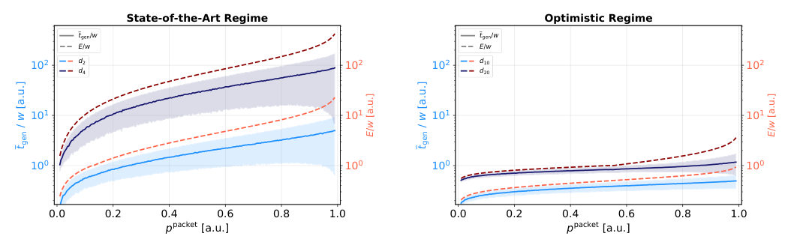 
Fig. 2. Average packet generation time (solid, left axis) and PGA duration (dashed, right axis) as a function of packet generation probability ppacket for the state-of-the-art regime (left; λ = 2.22 Hz, w = 275 ms) and optimistic regime (right; λ = 10 Hz, w = 2 s). Both quantities are normalized by the window length w to enable comparison across demands with different PGA durations. Demands are labeled by their requested link count s, with z-scores z = (s −λw)/ √

📷 Fig 3

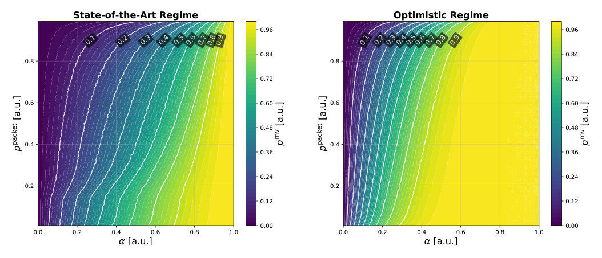 
Fig. 3. Probability pmv of a minimum separation violation, conditioned on successful packet generation. The surfaces are shown as a function of PGA ingress α and packet generation probability ppacket. Two configurations are compared: requested links s = 2 in the state-of-the-art regime (left; λ = 2.22 Hz, w = 275 ms, z = 1.8) and s = 10 in the optimistic regime (right; λ = 10 Hz, w = 2 s, z = −2.2). Each grid point is estimated from 104 successful trials obtained by rejection sampling. White contours are spaced at intervals of 0.1. These surfaces are computed once per physical configuration (λ, w, s) and stored as lookup tables for use by the Markov chain session model.

**Summary.** This work introduces a novel method to optimize resource utilization in near-term quantum networks by intelligently shortening the mandatory idle time scheduled between entanglement generation attempts. By analytically modeling the scheduling process, the authors demonstrate significant reductions in total service time, especially when multiple applications share the quantum hardware. This is crucial for making quantum network services more efficient and practical.

**Why it may be interesting.** It provides a concrete, resource-management optimization technique applicable to the scheduling overhead inherent in building and operating quantum communication infrastructure.

Detailed structure

**Main problem.** The paper addresses the inefficiency in near-term quantum networks caused by mandatory idle time scheduled between entanglement generation attempts.

**Main result.** The proposed optimization method can reduce the total network service time by up to 30% when multiple applications are co-scheduled.

**Method.** It uses an analytical execution model, treating the scheduling problem as an optimization to shorten the scheduled separation time while maintaining required service probabilities.

**Model / system.** The system is a multi-user quantum network utilizing the Arqon architecture, which generates shared entanglement for quantum information applications.

**Key observables.** Network service time reduction (up to 30% for co-scheduled apps), session execution speedup, and the optimized scheduled separation time.

**Important parameters / regimes.** Minimum separation time ($t_{minsep}$), service probability, and the degree of co-scheduling.

**Assumptions / limitations.** The optimization assumes a balance between minimizing time and ensuring the target number of instances is completed with a specified service probability.

**Figures summary.** Figure 1 illustrates the comparison between full minimum separation and reduced separation in the scheduling process.

**Paper structure.** The paper identifies the scheduling limitation, proposes the analytical optimization method, applies it to the Arqon architecture, and presents quantitative results comparing reduced vs. baseline service times.

Abstract

Architectures have been proposed to control entanglement generation in multi-user quantum networks. To allow time for local operations and classical communication at end nodes, these architectures insert fixed separations between consecutive batches of entanglement generation attempts. This reduces network utilization when attempts fail, leaving the network idle during the scheduled separation. To address this limitation, we propose a novel method to reclaim this idle time by shortening the scheduled separation between attempts while respecting hardware constraints. The method uses an analytical execution model to optimize the separation and reduce the total network service time of an application. Evaluations within the Arqon architecture show network service time reductions of up to 42 minutes (7.6%) for single applications and 16-29 minutes (26-30%) per application when co-scheduled. The approach applies broadly to quantum network architectures that share hardware between entanglement generation and local operations, and the method can be used online by network schedulers.

[↑ back to top](#top)

## Secondary cond-mat archives

*Papers from  mes-hall, other, soft, supr-con. These archives are de-prioritized — they appear at the end regardless of relevance score.*

### Relevant in secondary archives (21)

### [Phase control of magnon-phonon coupling via magnetic field](http://arxiv.org/abs/2608.20792v1)

**Authors:** Yasuhiro Todaka, Motoki Asano, Isamu Yasuda, Masashi Kawaguchi, Daiki Hatanaka, Masamitsu Hayashi  
**Type:** both · **Category:** other · **PDF:** <https://arxiv.org/pdf/2608.20792v1>  
**Analysis basis:** full PDF text, analyzed in chunks
**Topic relevance:** `correlated / nonlocal dissipation` **3/5** · `driven-dissipative phase transition` **3/5** · `Keldysh / 2PI / non-Gaussian methods` **2/5** · `methods for driven-dissipative` **2/5** · `non-equilibrium universality` **2/5** · `analog quantum simulation` **1/5** · `interference shaping light` **1/5** · `quantum measurements` **1/5**

📷 Fig 1

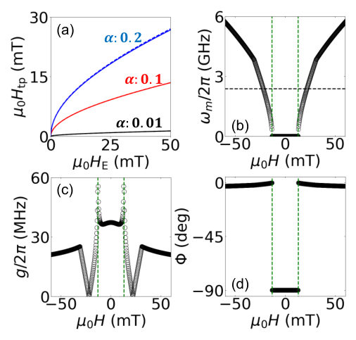 
FIG. 1. (a) µ0Htp [Eq. (7)] plotted against the inter- layer exchange coupling field µ0HE. Solid and dashed lines show results from numerical calculations and Eq. (7), respec- tively. The magnetic damping constant α is varied: results are shown by different colors. (b)-(d) Magnetic field µ0H (φH = 135 deg) dependence of the acoustic magnon eigenfre- quency ωm/2π (b), magnitude g (c) and phase Φ (d) of the magnon-phonon coupling constant. The vertical dashed line indicates |H| = Htp. The horizontal dashed line in (b) shows the SAW resonance frequency used in the experiments. Pa- rameters used in the calculations are listed in Table I of the Appendix. Here the uniaxial magnetic anisotropy...

📷 Fig 2

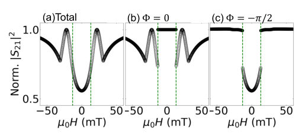 
FIG. 2. (a)-(c) Normalized SAW transmittance |S21|2 vs in- plane magnetic field µ0H (φH = 135 deg). |S21|2 is calculated assuming Φ = 0 (b) and Φ = −π/2 (c). The sum of the two is presented in (a). Parameters used in the calculations are listed in Table I of the Appendix. Here the uniaxial magnetic anisotropy field µ0Hu and the dipolar interaction field µ0HD are set to zero.

📷 Fig 3

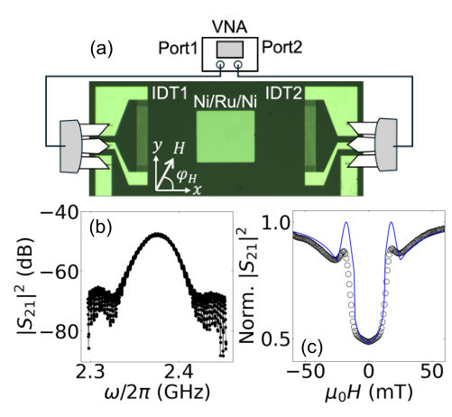 
FIG. 3. (a) Schematic illustration of the device used to study the SAW transmission across the Ni/Ru/Ni SAF. (b) SAW transmittance |S21|2 plotted against the SAW excitation fre- quency ω/2π. (c) Dependence of the normalized |S21|2 on the magnetic field µ0H (φH = 135 deg). Black circles are the experimental results, the blue line shows the fitting result. Parameters used in the calculations are listed in Table I of the Appendix.

📷 Fig 4

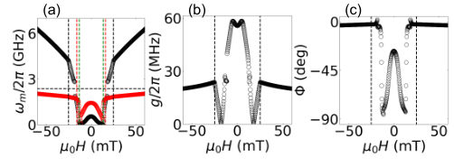 
FIG. 4. (a)-(c) Magnetic field µ0H dependence of the acous- tic magnon eigenfrequency ωm/2π (black circles) and the re- laxation rate (κm/2)/2π (red circles) (a), the magnitude g (b) and the phase Φ (c) of the magnon-phonon coupling con- stant. The vertical red and green dashed lines in (a) indicate the boundary between the overdamped and underdamped regimes, and |H| = Htp, respectively. The horizontal dashed line in (a) shows the SAW resonance frequency used in the experiments. The vertical black dashed lines in (a-c) indi- cate µ0H = ±25 mT. Parameters used in the calculations are listed in Table I. Here the uniaxial magnetic anisotropy field µ0Hu and the dipolar interaction field µ0HD...

📷 Fig 5

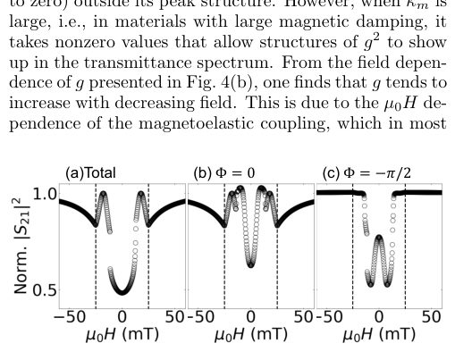 
FIG. 5. (a)-(c) Normalized SAW transmittance |S21|2 vs in- plane magnetic field µ0H. |S21|2 is calculated assuming Φ = 0 (b) and Φ = −π/2 (c). The sum of the two is presented in (a). The vertical dashed lines indicate µ0H = ±25 mT. Parameters used in the calculations are listed in Table I. Here the uniaxial magnetic anisotropy field µ0Hu and the dipolar interaction field µ0HD are included.

**Summary.** This work demonstrates phase control over magnon-phonon coupling in magnetic thin films by varying an external magnetic field. By tuning the coupling constant's phase from real to complex, the system can couple to overdamped magnons. This mechanism is experimentally observable as a distinct minimum in the SAW transmission spectrum near zero magnetic field.

**Why it may be interesting.** The ability to tune the coupling phase via magnetic field provides a clean platform to explore non-Hermitian physics and dissipative coupling mechanisms in solid-state magnonics, relevant to open quantum systems.

Detailed structure

**Main problem.** The study investigates how the phase of the magnon-phonon coupling constant can be controlled by tuning an external magnetic field in magnetic thin films.

**Main result.** The phase control allows for coupling to overdamped magnons via an imaginary coupling component ($\Phi = -\pi/2$), which manifests as a pronounced minimum in the SAW transmittance spectrum near zero magnetic field.

**Method.** The research combines theoretical modeling using coupled equations of motion (LLG and elastic wave equations) with analysis of measurable quantities like SAW transmittance.

**Model / system.** The system is a magnetic thin film, specifically a Ni/Ru/Ni synthetic antiferromagnet, where magnons interact with surface acoustic waves (SAW) phonons.

**Key observables.** SAW transmittance ($\lvert S_{21} 
vert^2$), the phase ($\Phi$) of the coupling constant, and the magnon eigenfrequency ($\omega_m$).

**Important parameters / regimes.** External magnetic field ($\mu_0H$), magnetic damping ($\alpha$), and the transition field ($H_{tp}$).

**Assumptions / limitations.** Initial analyses neglect magnetic anisotropy and magnetic dipole interactions, though later work incorporates these effects.

**Figures summary.** Figures show the dependence of SAW transmittance on magnetic field, illustrating dips associated with both $\Phi=0$ and $\Phi=-\pi/2$ coupling regimes.

**Paper structure.** The paper develops the coupled equations of motion, analyzes the complex nature of the coupling constant, and then calculates the resulting SAW transmittance spectrum under varying magnetic field conditions.

Abstract

We study the phase of the coupling between magnons and surface acoustic wave (SAW) phonons in magnetic thin films. The coupling constant changes from a real to a complex number as the external magnetic field is reduced. Below a transition field, the imaginary coupling constant allows SAW phonons to couple to overdamped magnons whose resonance frequency is close to zero and far from the SAW resonance. The strength of the imaginary coupling constant and the magnitude of the transition field both scale with magnetic damping. We find the coupling produces a broad, pronounced minimum in the SAW transmittance spectrum near zero magnetic field in a Ni/Ru/Ni synthetic antiferromagnet with large magnetic damping. These results demonstrate that the phase of the complex magnon-phonon coupling constant can be tuned via magnetic field in strongly damped magnets, offering a platform to explore novel regimes of magnon-phonon interactions.

[↑ back to top](#top)

### [Impact of Plasmonic Modes and Thermophysical Properties on the Double-Pulse Structuring of Highly-Ordered LIPSS for Biosensing Applications](http://arxiv.org/abs/2608.20573v1)

**Authors:** G. D. Tsibidis, F. Fraggelakis, P. Lingos, E. Cusworth, V. G. Kravets, A. N. Grigorenko, A. V. Kabashin, E. Stratakis  
**Type:** both · **Category:** other · **PDF:** <https://arxiv.org/pdf/2608.20573v1>  
**Analysis basis:** full PDF text, analyzed in chunks
**Topic relevance:** `interference shaping light` **3/5** · `Keldysh / 2PI / non-Gaussian methods` **1/5** · `correlated / nonlocal dissipation` **1/5** · `driven-dissipative phase transition` **1/5** · `methods for driven-dissipative` **1/5** · `non-equilibrium universality` **1/5**

📷 Fig 1

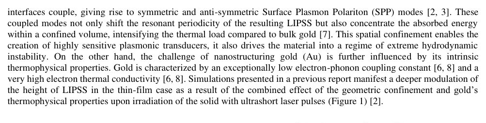 
Figure 1: LIPSS patterns for (a) bulk, (b) thin (thickness 𝑑 = 11 nm) Au film. Double-headed arrow indicates the orientation of the laser beam polarization. Furthermore, upon femtosecond excitation, the electron subsystem reaches high temperatures while the lattice remains relatively cold for several picoseconds. This ‘bottleneck’ in energy transfer, combined with the thermal insulation provided by a glass substrate leads to a prolonged molten state. Once the lattice temperature exceeds the melting point, the thin liquid layer becomes susceptible to strong hydrodynamic forces. The most prominent physical process characterizing, then, the response of the material is related to the produced...

📷 Fig 2

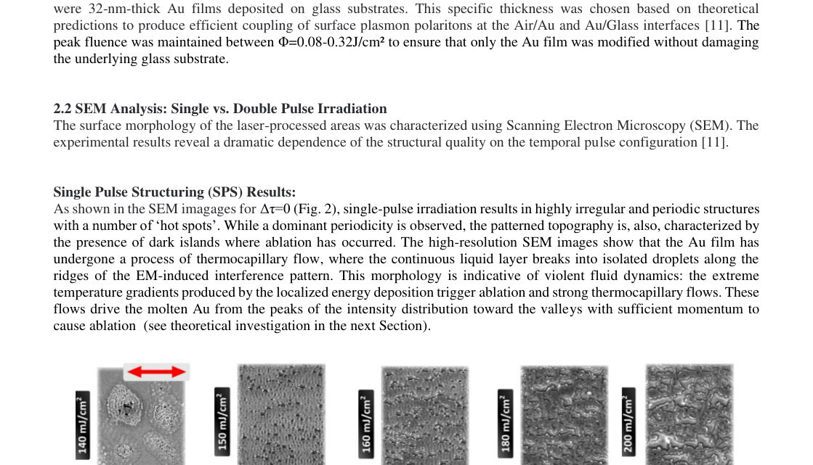 
Figure 2: LIPSS patterns at different fluences assuming single pulses. Double-headed arrow indicates the orientation of the laser beam polarization. Double Pulse Structuring (DPS) Results: By contrast, the introduction of a delay Δτ (Fig. 3) produces highly-regular, continuous LIPSS for some combinations of the laser parameters (i.e. special choice of pulse separation and fluence). The SEM analysis for topographies obtained in those conditions shows that the irregular ripple segments in SPI are replaced by long-range highly-uniform periodic patterns that extend across the entire laser-scanned area. This suggests that the double-pulse protocol successfully manages the fluid dynamic evolution...

📷 Fig 3

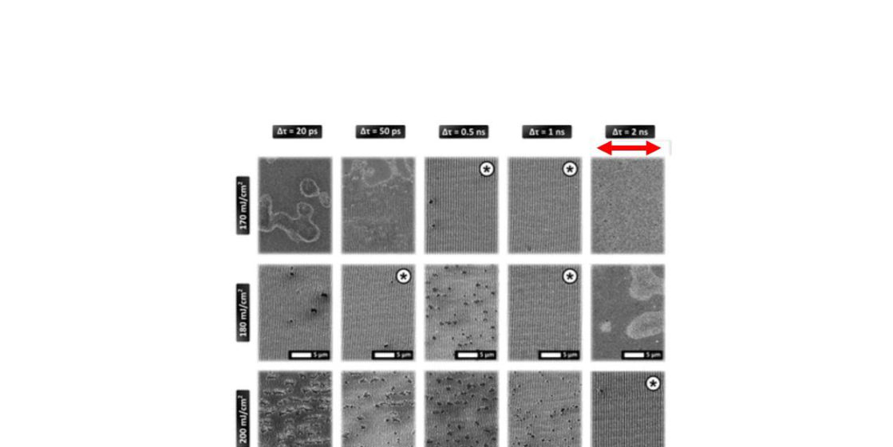 
Figure 3: LIPSS patterns at different fluences and pulse separations. Double-headed arrow indicates the orientation of the laser beam polarization. Homogenous LIPSS patterns are produced for conditions marked with a star (*).

📷 Fig 4

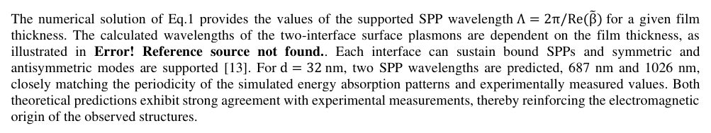 
Figure 4: (a) Periodicities of SPP at air/Au and Au/SiO2 interfaces as a function of the Au film thickness, (b) the electromagnetic profile and the produced near- and far-fields are illustrated in the transverse plane, (c) distribution of the electric field in air, metal and dielectric material on the propagation plane, (d) periodicities of the electromagnetic waves. To investigate the characteristics of the excited surface waves which are the precursors to both the periodicity and orientation of LIPSS, an initially non-planar surface was considered. Surface roughness on Au was modeled as a random arrangement of semispherical protrusions with radius R=16 nm [2, 7, 11, 14]. Electromagnetic...

📷 Fig 5

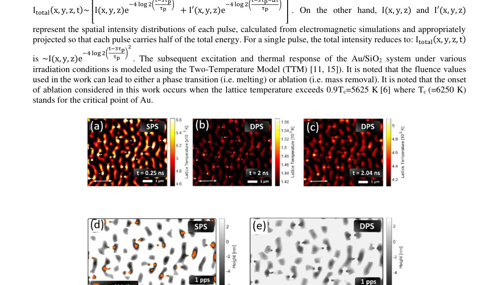 
Figure 5: (a) Lattice temperature spatial profile on the surface of Au for SPS at t = 0.25 ns (white regions show ablated part). Lattice temperature spatial profile on the surface of Au at t = 2 ns (b) and t ∼2.04 ns (c) (the white double-headed arrow indicates the laser polarization). Simulation results of surface relief resulting from irradiation with Φ = 280 mJ/cm2 for a single pulse for SPS (d) and a single pair of pulses for DPS (e). Orange-colored areas indicate ablation in (d). The surface modification is analyzed through the dynamics of hydrothermal waves generated by the produced phase transitions. The laser conditions used in the simulations Φ = 0.28 J/cm2 are appropriately...

**Summary.** This work details the controlled fabrication of highly-ordered plasmonic nanostructures on thin gold films using a double-pulse femtosecond laser approach. By managing the transient fluid dynamics through optimized pulse timing, the researchers suppress chaotic melting and achieve structures exhibiting narrow Surface Lattice Resonances. These highly ordered plasmonic arrays are presented as a robust platform for next-generation, ultrasensitive biosensing.

**Why it may be interesting.** The detailed coupling between electromagnetic excitation (plasmons) and complex non-equilibrium thermofluid dynamics (Marangoni flow) to achieve a desired quantum-optical feature (narrow resonance) is highly relevant to open quantum systems and light-matter interaction in structured media.

Detailed structure

**Main problem.** The primary goal is to fabricate highly-ordered Laser-Induced Periodic Surface Structures (LIPSS) on thin metallic films for use in high-sensitivity plasmonic biosensing.

**Main result.** The use of a double-pulse femtosecond laser scheme, optimized with a specific interpulse delay, successfully controls the fluid dynamics, leading to highly-uniform LIPSS that exhibit narrow Surface Lattice Resonances (SLRs).

**Method.** The study combines experimental techniques (femtosecond laser processing, SEM, ellipsometry) with theoretical modeling (3D-FDTD, Two-Temperature Model, Navier-Stokes equations).

**Model / system.** The system involves thin gold films where the process is governed by a synergy of coupled Surface Plasmon Polaritons (SPPs) excitation, electron-lattice thermalization, and subsequent Marangoni fluid flow dynamics.

**Key observables.** Surface morphology (SEM), resonance spectral position ($\lambda_{	ext{Res}}$), and resonance linewidth (FWHM, Quality factor Q).

**Important parameters / regimes.** Interpulse delay ($\Delta	au \approx 1.2$ ns), film thickness (32 nm), and laser fluence ($\Phi$).

**Assumptions / limitations.** The formation process is modeled as a three-step sequence: plasmonic energy deposition, electron thermalization, and fluid dynamics, with the single-pulse regime being dominated by uncontrolled hydrodynamic instabilities.

**Figures summary.** Figures compare LIPSS patterns from single vs. double pulses, show lattice temperature profiles, and present ellipsometry data confirming the narrow SLR signatures at specific wavelengths.

**Paper structure.** The paper develops a multiscale model encompassing electromagnetic field calculation (FDTD), thermal modeling (TTM), and fluid dynamics (NSE). It then demonstrates that double-pulse irradiation controls the melt dynamics, leading to the formation of highly ordered structures exhibiting measurable plasmonic resonances.

Abstract

The fabrication of highly ordered laser-induced periodic surface structures (LIPSS) on thin metallic films is dictated, predomaninatly, by a synergy of periodic electromagnetic energy deposition and complex fluid dynamics. In this work, we present a combined experimental and theoretical study on the formation of ultra-regular LIPSS on 32-nm-thick Au films using a double-pulse femtosecond laser scheme. We demonstrate that for thin films, the excitation of coupled Surface Plasmon Polaritons (SPPs) at both interfaces dictates the initial energy distribution. On the othe hand, the final morphology is greatly influenced by hydrodynamical processes. Interestingly, due to the low electron-phonon coupling of Au and the high thermal confinement of the thin film, single-pulse irradiation leads to uncontrolled hydrodynamic instabilities a non uniform topographies. Thus, we demonstrate that a double-pulse approach with an optimized interpulse delay (Δτ=1.2 ns) effectively controls the melt duration and viscosity, suppressing complex fluid motion and promoting the growth of highly ordered arrays. These structures support narrow surface lattice resonances (SLRs) suitable for high-sensitivity plasmonic biosensing.

[↑ back to top](#top)

### [Spectral Anisotropy in Transition Radiation from Biaxial Media](http://arxiv.org/abs/2608.20746v1)

**Authors:** Sven Ebel, Bibi Mary Francis, Min Seok Jang, Brian D. Gerardot, N. Asger Mortensen, Mauro Brotons-Gisbert, Sergii Morozov  
**Type:** both · **Category:** other · **PDF:** <https://arxiv.org/pdf/2608.20746v1>  
**Analysis basis:** full PDF text, analyzed in chunks
**Topic relevance:** `interference shaping light` **3/5** · `quantum measurements` **2/5**

📷 Fig 1

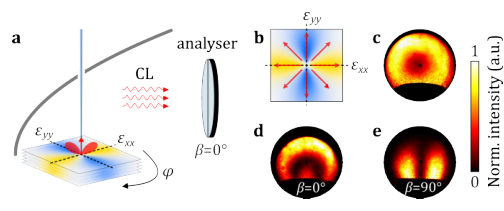 
FIG. 1: Polarization-selective detection of anisotropic transition radiation. (a) Schematic of the polarization- selective CL geometry, where transition radiation from an anisotropic crystal is detected through a linear polarizer while the crystal is rotated relative to the detection axis by angle φ. (b) Schematic of the radially polarized transition-radiation field, where the detected field projects differently onto the two principal in-plane optical axes. (c-e) Angle-resolved isotropic transition radiation from vacuum-platinum interface, mea- sured without a polarizer (c) and with the analyser at β = 0◦

📷 Fig 2

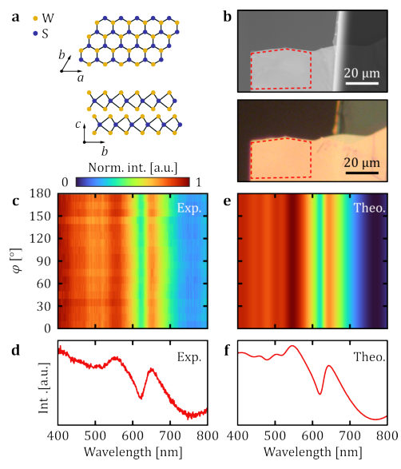 
FIG. 2: Isotropic transition radiation from suspended WS2 in vacuum. (a) Crystal structure of 2H-WS2. (b) Scanning electron microscopy and optical images of the in- vestigated 100 nm-thick WS2 flake; the red dashed outline marks the suspended region used for measurements, while the supporting grid can be seen on the right. (c,e) Experimen- tal and calculated polarization-resolved transition-radiation spectra as a function of in-plane sample rotation angle φ. (d,f) Corresponding spectral profiles acquired at φ = 90◦. Exper- imental spectra were acquired at 30 keV and 1.4 nA with an integration time of 90 s.

📷 Fig 3

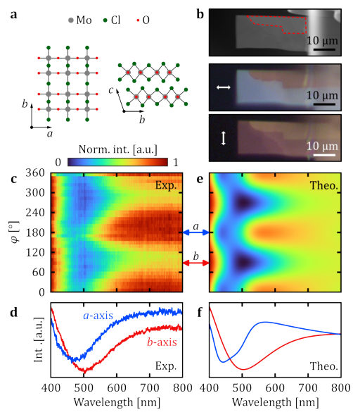 
FIG. 3: Anisotropic transition radiation from sus- pended MoOCl2 in vacuum. (a) Crystal structure of MoOCl2, showing the the crystallographic axes. (b) Sec- ondary electron and optical image of the investigated crys- tal. The red dashed outline indicates the suspended region used for the measurements, while the supporting grid can be seen on the right. The white arrows in optical images indi- cate the orientation of the incident light polarization. (c,e) Experimental and calculated polarization-resolved transition- radiation spectra as a function of in-plane sample rotation angle φ. (d,f) Corresponding spectral profiles acquired for the principal a- and b-axes at φ = 180◦and φ = 90◦, re-...

📷 Fig 4

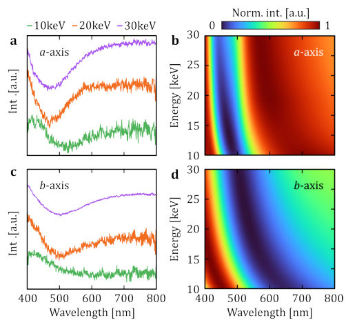 
FIG. 4: Electron-energy tuning of anisotropic transition-radiation in MoOCl2. Experimental and cal- culated transition-radiation spectra for the crystallographic as a function of electron-beam energy for (a-b) a-axis and (b-c) b-axis. Experimental spectra were acquired at a beam current of 1.4 nA with an integration time of 90 s.

**Summary.** This work reports on the experimental observation and theoretical modeling of spectral anisotropy in transition radiation emitted from biaxial van der Waals crystals. By rotating the sample and measuring polarization-resolved spectra, the authors prove that TR is highly sensitive to the material's orientation-dependent dielectric response. This opens up optical anisotropy as a new diagnostic tool for free electron-driven spectroscopy.

**Why it may be interesting.** While the core physics is in condensed matter optics, the technique itself—using electron-beam induced radiation to map anisotropic dielectric tensors—is a powerful, non-destructive diagnostic tool applicable to characterizing complex quantum materials.

Detailed structure

**Main problem.** The study investigates how the spectral anisotropy of transition radiation (TR) is influenced by the orientation-dependent dielectric response of biaxial optical media.

**Main result.** The authors experimentally demonstrate and theoretically model that TR spectra exhibit pronounced, measurable anisotropy when measured from biaxial crystals, confirming that TR is a sensitive probe of the material's optical axis dependence.

**Method.** The research combines experimental cathodoluminescence (CL) spectroscopy, involving sample rotation and polarization-selective detection, with the development of a thin-film theoretical model.

**Model / system.** The physical system involves biaxial van der Waals crystals (like GeS and MoOCl2) acting as the source. The model adapts the standard TR intensity formula to incorporate the two principal in-plane dielectric responses ($\varepsilon_{xx}$ and $\varepsilon_{yy}$) to predict orientation-dependent spectra.

**Key observables.** The primary observables are the polarization-resolved transition radiation spectra, measured as a function of the crystal's rotation angle ($\phi$) and the electron beam energy ($E$).

**Important parameters / regimes.** Key parameters include the crystal's principal dielectric axes, the electron beam energy (10–30 keV), and the orientation angle ($\phi$).

**Assumptions / limitations.** The theoretical model uses an effective projection model to combine principal-axis intensities, which is noted as an approximation compared to a full vectorial treatment of the dielectric tensor.

**Figures summary.** Figures illustrate the polarization-selective CL geometry, show angle-resolved spectra for isotropic materials (WS2), and demonstrate the periodic spectral changes and energy tunability for anisotropic materials (MoOCl2) along their principal axes.

**Paper structure.** The paper establishes the physical problem of anisotropy in TR, details the experimental setup using CL spectroscopy on biaxial crystals, develops an anisotropic thin-film model, and presents results showing the successful reproduction of angle-dependent spectra and energy shifts.

Abstract

In anisotropic optical media, the electromagnetic response depends on the orientation of the optical field relative to the material's principal dielectric axes. While this direction dependence is well understood in conventional optics, it should also influence light-generation processes driven by free electrons. Here, we experimentally observe spectrally anisotropic transition radiation from biaxial van der Waals crystals. Using cathodoluminescence spectroscopy on germanium sulphide (GeS) and molybdenum oxydichloride (MoOCl$_2$) crystals, we show that the transition-radiation spectra differ along the principal in-plane optical axes. To describe this spectral anisotropy, we develop a thin-film transition-radiation model that reproduces the experimental observations. Our results demonstrate that transition radiation is a sensitive probe of the axis-dependent dielectric response of biaxial optical media and suggest that optical anisotropy can provide an additional degree of freedom for free electron-driven spectroscopy, radiation sources, and transition-radiation-based diagnostics.

[↑ back to top](#top)

### [Symmetry-Induced Weyl Nodes in Interacting Multi-Terminal Josephson Junctions](http://arxiv.org/abs/2608.21200v1)

**Authors:** Peter Zalom, Gustavo Diniz, David Christian Ohnmacht, Wolfgang Belzig  
**Type:** theory · **Category:** other · **PDF:** <https://arxiv.org/pdf/2608.21200v1>  
**Analysis basis:** full PDF text, analyzed in chunks
**Topic relevance:** `analog quantum simulation` **3/5** · `Keldysh / 2PI / non-Gaussian methods` **1/5** · `methods for driven-dissipative` **1/5**

📷 Fig 1

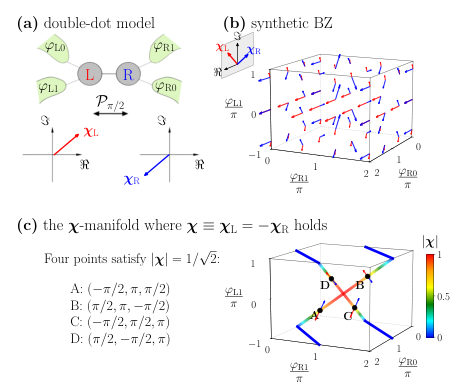 
FIG. 1. Symmetry Pπ/2 in double-dot model (1): (a) SC en- vironments of left (i = L) and right (i = R) dots are fully defined by total coupling strengths Γi ≡Γi0 + Γi1 and ge- ometric factors χi. (b) In the gauge φL0 = 0, phases φL1, φR0, φR1 span the sBZ where pairs of (χL, χR) are assigned. (c) Pπ/2 can only be satisfied on the χ-manifold defined by χL = −χR. The example has all dot-lead couplings the same. The bar legend shows |χ| = |χL| = |χR| on the manifold. Blue-colored lines with |χ| = 0 form nodal lines in the sBZ.

📷 Fig 2

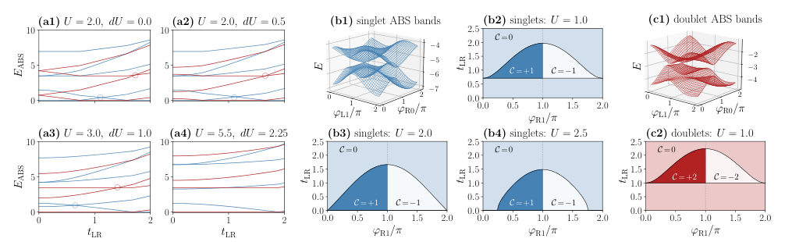 
FIG. 2. AL theory results: (a1)–(a4) Sweeping tLR on the χ-manifold induces isolated singlet (blue circles) and doublet (red circles) band crossings via (9) and (10). Singlet crossings survive finite dU but disappear beyond a U-threshold (a4); doublet crossings are U-independent. (b1), (c1) Weyl cone and doubly degenerate Weyl cone formed by the two lowest singlet and doublet bands respectively in the φL1-φR0 plane at φR1 = −π/2. (b2)–(b4), (c2) Analytic topological phase diagrams from (9) and (10) for singlet and doublet ABS bands respectively (details in End Matter) showing topological phases of finite Chern numbers C = ±1 and C = ±2 respectively. All panels: Γil = δ = 1, in (a1)–(a4):...

📷 Fig 3

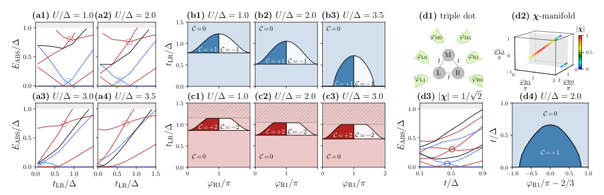 
FIG. 3. DMRG results: (a1)–(a4) Sweeping tLR at |χ| ≈0.31 with ΓL = ΓR = ∆and δL = δR = ∆reveals singlet (blue) and doublet (red) crossings (circles). Increasing U ≡UL = UR shifts singlet crossings to tLR →0 until they vanish (a4). Doublet crossings show negligible U-dependence. (b1)–(b3) Crossing values of tLR at fixed φR1 with varied |χ| translate into singlet topological phase diagrams. (c1)–(c3) Doublet phase diagrams have inaccessible regions (hatched) where crossings escape into the continuum. (d1) Triple dot with equal interdot hoppings t supports the P2π/3 cyclic permutation symmetry. (d2) When φM0 =4π/3 and φM1 =φR1 + 2π/3, the sBZ becomes 3D and P2π/3 can be satisfied on a 1D...

📷 Fig 4

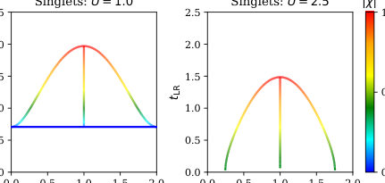 
FIG. 4. Topologically distinct phases in model (1) require the emergence of boundaries where band gaps close at Weyl nodes. Using the χ-manifold defining feature χL = −χR one can predict three distinct lines of Weyl nodes which obey Eq. 12. In panels (a) and (b) we show these boundaries to- gether with their |χ|-dependence according to the color bar.

📷 Fig 5

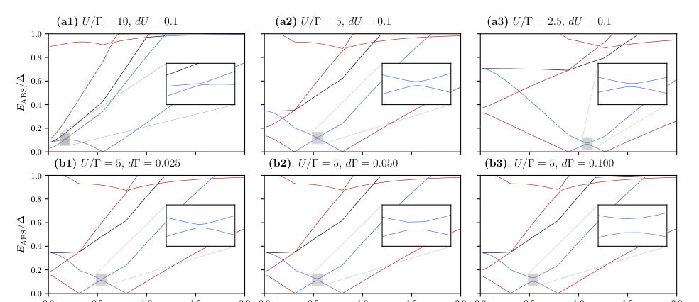 
FIG. 5. Fate of the symmetry-pinned Weyl nodes when Pπ/2 is broken by asymmetries, obtained by adiabatic DMRG sweeps of tLR at a fixed point of the χ-manifold (χL = −χR) with U = 2.0 ∆and δL = δR: (a1)–(a3) Interaction asymmetry dU = 0.1 ∆ at increasing hybridization (i. e. U/Γ = 10, 5 and 2.5) causes opening of the gap between same-spin ABS bands which is small compared to ∆and is controlled by Γ. (b1)–(b3) Tunneling asymmetry ηΓ = |ΓL −ΓR|/(ΓL + ΓR) = 0.025, 0.050 and 0.100 at dU = 0 and U/Γ = 5, opens the band gap monotonically and considerably faster than dU.

**Summary.** This work demonstrates that emergent geometric symmetries dictate the formation of Weyl nodes in interacting multi-terminal Josephson junctions. By confining these topological singularities to a specific manifold ($\chi$-manifold), the authors provide a robust, gate-tunable design principle for creating quantum devices exhibiting non-trivial topological properties.

**Why it may be interesting.** The explicit connection between geometric symmetries, topological invariants (Weyl nodes), and tunable superconducting junctions provides a powerful, symmetry-protected design principle for realizing exotic quantum states in solid-state devices.

Detailed structure

**Main problem.** The paper aims to characterize the mechanism by which an emergent geometric symmetry generates non-trivial band topology, specifically Weyl nodes, within interacting multi-terminal Josephson junctions (MTJJs).

**Main result.** The symmetry confines the topological singularities (Weyl nodes) to an analytically defined manifold ($\chi$-manifold), providing a general design principle for fabricating devices with predictable topological signatures.

**Method.** The analysis combines analytical derivations in the Atomic Limit (AL) approximation with numerical simulations using Density Matrix Renormalization Group (DMRG) on the full interacting model.

**Model / system.** The system is a quantum-dot-based multi-terminal Josephson Junction (MTJJ) modeled by a Hamiltonian involving dot energies, interdot couplings, and superconducting self-energies. The physics is analyzed by examining spectral symmetries.

**Key observables.** Weyl nodes (with charges $\pm 1$ in the singlet sector and $\pm 2$ in the doublet sector), Chern numbers, and the gap opening between same-spin Andreev bound states (ABS).

**Important parameters / regimes.** Interdot coupling ($t_{LR}$), on-site repulsion ($U$), interaction asymmetry ($d_U$), and the geometric symmetry parameters ($\chi_i$).

**Assumptions / limitations.** The analysis heavily relies on the Atomic Limit (AL) approximation for deriving analytic boundary conditions, although these are compared against full DMRG results.

**Figures summary.** Figures illustrate analytic phase diagrams showing the predicted locations of Weyl nodes on the $\chi$-manifold, and subsequent figures show how these nodes are affected (e.g., gap opening) when symmetries are explicitly broken by interaction asymmetries.

**Paper structure.** The paper systematically introduces the Hamiltonian and the role of geometric symmetries ($P_\alpha$), derives the analytic conditions for topological crossings on the $\chi$-manifold in the AL, and then validates these predictions by analyzing the full interacting model using DMRG sweeps.

Abstract

We show that an emergent geometric symmetry generates non-trivial topology in quantum-dot-based multi-terminal Josephson junctions. It confines same-spin Andreev bound state crossings to an analytic one-dimensional manifold of the synthetic Brillouin zone, where interdot coupling selects Weyl nodes of charge $\pm1$ in the singlet sector and doubly degenerate cones of charge $\pm2$ in the doublet sector, at gate-tunable locations. The mechanism yields a spectroscopic detection protocol and a design principle for fabricating devices with non-trivial topological signatures.

[↑ back to top](#top)

### [Artificial spin ice systems on single edge length tilings](http://arxiv.org/abs/2608.20928v1)

**Authors:** Ellie Weightman, Sam Coates  
**Type:** theory · **Category:** statistical mechanics · **PDF:** <https://arxiv.org/pdf/2608.20928v1>  
**Analysis basis:** full PDF text, analyzed in chunks
**Topic relevance:** `analog quantum simulation` **3/5** · `methods for driven-dissipative` **1/5**

📷 Fig 1

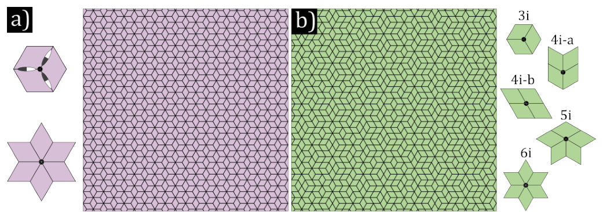 
FIG. 1. The two tilings used as artificial spin ice lattice geometries. The periodic dice tiling (a) with two vertex types of coordination 3 and 6, and the aperiodic H 1

📷 Fig 2

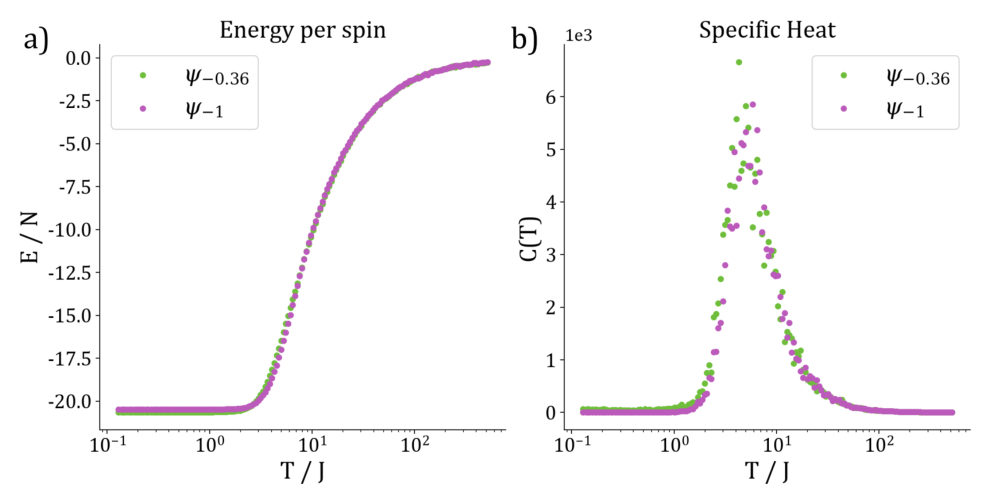 
FIG. 2. (a,b) Total system energy per spin and specific heat, respectively, averaged over 15 simulations of 3106 and 3114 nanoislands in the ψ−1 and ψ−0.36 geometry.

📷 Fig 3

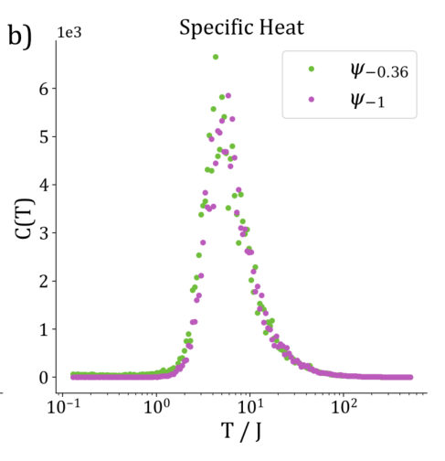 
Figure 4(a) shows the lowest 4 energy configurations for each vertex type obtained from micromagnetic simu-

📷 Fig 4

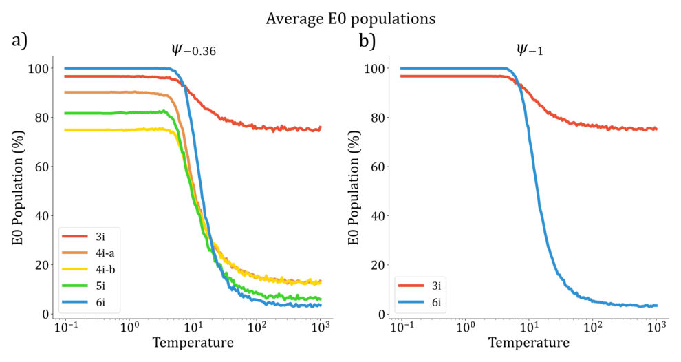 
FIG. 3. E0 populations for each vertex type in the ψ−1 and ψ−0.36 geometries as the temperature of the system is reduced.

📷 Fig 5

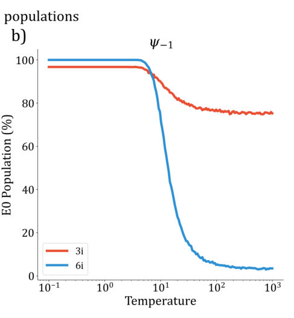 
Figure 5(b) shows two such environments, where on the left side we see an E1 state, and on the right side an E2 state. Relevant tile edges are decorated with is- lands, as in Figure I(a). For the E1, the 5i vertex is indi- cated by a green circle – we note that in Figure 4(a), its middle spin is degenerate. Nearby, there are two 6i sat- isfied vertices whose spins are anti-parallel with respect to one another, representing two different magnetic do- mains, which we indicate by red and blue circles. These domains are coupled via the surrounding lowest energy states of the two 4i-a and 3i islands, which leaves the 5i vertex ‘pinned’ in its E1 state. Flipping either all of the spins on the red...

**Summary.** This paper investigates Artificial Spin Ices on complex, aperiodic lattices, moving beyond simple periodic structures. Using Monte Carlo simulations, the authors map out the low-energy magnetic configurations and identify how the lattice geometry dictates the formation of magnetic domains and topological defects like monopoles. This work advances the understanding of frustrated magnetism in engineered materials.

**Why it may be interesting.** The study uses classical statistical mechanics tools (MC, entropy calculation) to model complex magnetic frustration, which shares conceptual links with frustrated quantum spin systems and domain dynamics in condensed matter.

Detailed structure

**Main problem.** The study extends Artificial Spin Ice (ASI) simulations from periodic tilings to aperiodic hexagonal tilings to understand how lattice geometry affects magnetic ground states.

**Main result.** The aperiodic tiling introduces new vertex types and demonstrates that the system's low-energy states are characterized by domain boundaries and localized magnetic charges (monopoles).

**Method.** The research employs Metropolis Monte Carlo simulations to cool the spin arrays to low-energy configurations, supplemented by micromagnetic simulations for vertex energy analysis.

**Model / system.** The system consists of artificial spin ices (ASIs) modeled as arrays of nanomagnets on geometric lattices (e.g., single edge length tilings). The magnetic interactions are governed by a Hamiltonian including nearest-neighbor and dipolar terms.

**Key observables.** Low-energy spin configurations, residual entropy ($S_r$), vertex populations (E0, E1, E2), and the formation/location of magnetic charges (monopoles).

**Important parameters / regimes.** Coupling ratio $|J/D| = 1.95$; simulation size of $\approx 3114$ islands; comparison between periodic (dice) and aperiodic tilings.

**Assumptions / limitations.** Open boundary conditions are assumed to be sufficient, and the analysis focuses on the classical energy landscape of the spin system.

**Figures summary.** Figures illustrate the comparison between periodic and aperiodic tilings, show specific heat and energy per spin for different geometries, and map out the final spin states revealing domain boundaries and monopole charges.

**Paper structure.** The paper progresses by first establishing the model on simple tilings, then extending the analysis to aperiodic structures, and finally detailing the physics of domain wall formation and monopole behavior when multiple ground states are present.

Abstract

Artificial spin ices (ASIs) are decorations of single domain nanomagnets on geometric lattices allowing for study of magnetic interactions on easily varied lattice geometries. We extend the study of ASIs on single rhomb tilings by simulating an ASI with the aperiodic hexagonal $H_{\frac{1}{2}\frac{1}{2}}$ tiling as the base structure, and the periodic dice lattice for additional comparison. Using a point dipole metropolis Monte Carlo approach, we cool our arrays of nanoislands to form a low energy configuration, assessing individual vertex excitations as identified through complementary micromagnetic simulations. Using the energy and charge landscape of final spin states, we propose a potential ground state spin configuration for the aperiodic system.

[↑ back to top](#top)

### [Continuously control of polarization via electrically driven long-distance superlubric sliding](http://arxiv.org/abs/2608.21162v1)

**Authors:** Peiyao Shi, Menghao Wu  
**Type:** theory · **Category:** other · **PDF:** <https://arxiv.org/pdf/2608.21162v1>  
**Analysis basis:** full PDF text, analyzed in chunks
**Topic relevance:** `Frenkel-Kontorova` **3/5**

📷 Fig 1

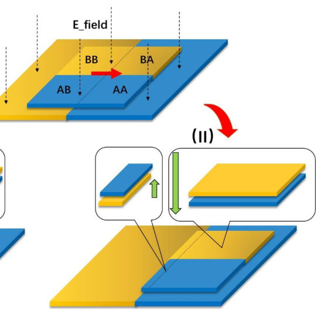 
Figure 1 (A) Charge transfer and vertical polarization in AB hetero-bilayer. (B) The design of

📷 Fig 2

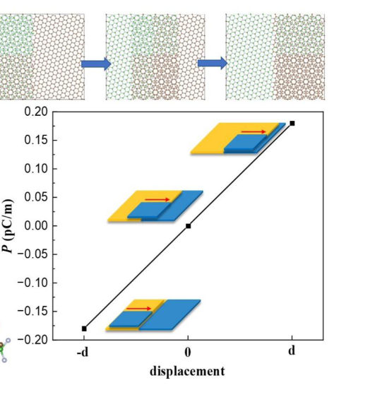 
Figure 2. (A) Gr/BN heterobilayer with a large twist angle and a vertical polarization marked

📷 Fig 3

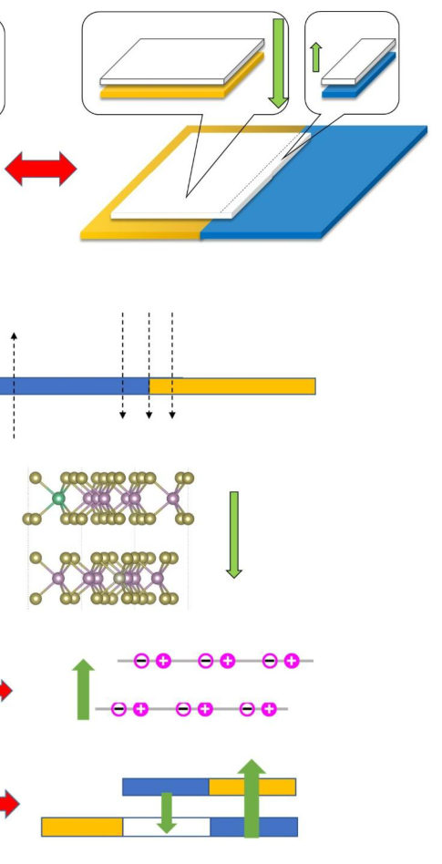 
Figure 3. (A) The design of superlubric sliding ferroelectric device based on PN junction

**Summary.** This paper proposes a novel design for achieving continuously tunable ferroelectric polarization by exploiting superlubric sliding in incommensurate 2D material heterojunctions. Using DFT calculations, the authors predict ultra-low switching barriers ($\mu	ext{eV}$) driven by a low vertical electric field. This breakthrough combines the best features of superlubricity and ferroelectricity for advanced electronic applications like artificial synapses.

**Why it may be interesting.** While focused on condensed matter, the concept of controlling polarization via low-energy, electrically driven sliding interfaces presents a novel mechanism for energy-efficient switching, which has parallels in designing quantum memory or switching elements.

Detailed structure

**Main problem.** The research aims to combine the low-energy switching of sliding ferroelectricity with the ultra-low friction of superlubric sliding to achieve continuous polarization control.

**Main result.** The authors propose a design where vertical polarization can be continuously controlled via superlubric sliding of incommensurate interfaces, achieving switching barriers as low as the $\mu	ext{eV}$ magnitude.

**Method.** Theoretical modeling using Density Functional Theory (DFT) calculations, specifically employing the Nudged Elastic Band (NEB) method to map out sliding pathways and calculate polarization.

**Model / system.** The system involves lateral heterojunctions formed by stacking 2D materials (e.g., graphene/BN or Gr/TMDs) in an incommensurate configuration, allowing for superlubric sliding.

**Key observables.** Continuous tunable vertical polarization ($P$), sliding switching barrier ($\mu	ext{eV}$ magnitude), and long ion displacements.

**Important parameters / regimes.** Low vertical voltage driving force, lattice mismatch leading to incommensurate interfaces, and thermal stability relative to $k_B T$.

**Assumptions / limitations.** The mechanism relies on the interface becoming incommensurate upon large twist angles, and the total sliding barrier must exceed $k_B T$ for stability.

**Figures summary.** Figures illustrate the superlubric device design based on bilayer lateral junctions, showing polarization switching under an electric field, and detail the calculated sliding pathway barriers.

**Paper structure.** The paper first identifies the challenge of combining superlubricity and switchable ferroelectricity. It then proposes the heterojunction design, details the DFT/NEB calculations to predict polarization control and low barriers, and concludes by discussing the implications for artificial synaptic devices.

Abstract

Sliding ferroelectricity widely exists in various van der Waals bilayers or multilayers, which is induced by asymmetric stacking of commensurate interface. The greatly reduced switching barriers via interlayer sliding lead to high speed with low energy cost, while they are still much higher compared with superlubric sliding of incommensurate interfaces. The polarizations of such incommensurate interfaces are not switchable, which is the major obstacle of combing superlubricity and sliding ferroelectricity for ultralow barriers. Here we propose a design of such combination based on previous synthesis of lateral heterojunctions of 2D materials, which can be extensively applicable to various systems including PN junctions. In such long-distance superlubric ferroelectricity, the vertical polarization can be continuously controlled by superlubric sliding of incommensurate interfaces between lateral heterojunction bilayers, where the series of multiple stable states are long-sought for artificial synaptic devices. The unconventionality of our findings does not only include unprecedented barriers down to the magnitude of mu-eV, but also unprecedented long ion displacements distinct from the small deviations in classical paradigm of ferroelectricity. Our predicted superlubric sliding electrically driven by low vertical voltage is also hitherto reported, much more efficient compared with previously reported sliding mechanically driven by tips, resolving a major issue for practical applications.

[↑ back to top](#top)

### [Planar Nanofluidic Memristors Enabled by Surface Charge Gradient](http://arxiv.org/abs/2608.20780v1)

**Authors:** Zhongyuan Zhao, Ziyi Yin, Chudi Qi, Yuheng Li, Shoushan Fan, Qunqing Li, Yang Wei  
**Type:** theory · **Category:** statistical mechanics · **PDF:** <https://arxiv.org/pdf/2608.20780v1>  
**Analysis basis:** full PDF text, analyzed in chunks
**Topic relevance:** `Keldysh / 2PI / non-Gaussian methods` **2/5** · `methods for driven-dissipative` **2/5** · `analog quantum simulation` **1/5** · `correlated / nonlocal dissipation` **1/5** · `driven-dissipative phase transition` **1/5** · `non-equilibrium universality` **1/5** · `quantum measurements` **1/5**

📷 Fig 1

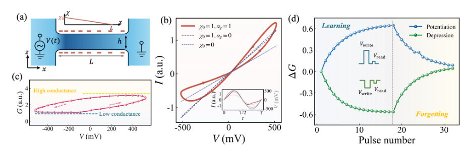 
FIG. 1. (a) Schematic of the planar nanochannel. (b) Simulated current–voltage characteristics for an uncharged channel (χ0 = 0), a uniform surface charge (χ0 = 1, αχ = 0) and a surface charge gradient (χ0 = 1, αχ = 1). (c) G −V characteristics, showing hysteretic switching between low- and high-conductance states. (d) Synaptic behaviors of the memristor.

📷 Fig 2

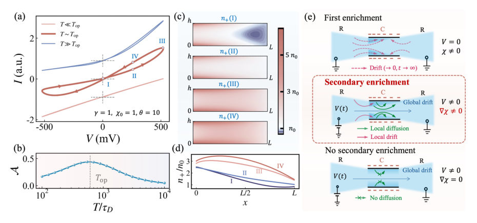 
FIG. 2. (a) The frequency-dependent I–V loops. (b) The hysteresis area as a function of the period of V (t) (c) Snapshots of cation distributions. (d) The cation density profile n+(x) = 1

📷 Fig 3

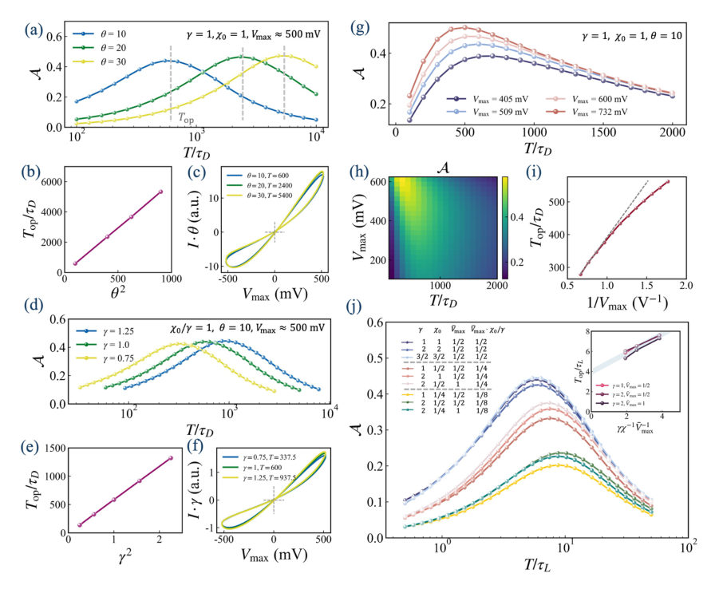 
FIG. 3. Memristive characteristics over the entire parameter space. (a) A(T) at different θ. (b) The linear relationship between Top and θ2. (c) The I–V loops at different θ. (d) A(T) at different γ. (e) The linear relationship between Top and γ2. (f) The I–V loops at different γ. (g) A(T) at different Vmax. (h) The mapping of A(T, Vmax). (i) Top as a function of 1/Vmax. (j) Top at different combinations of γ, χ0, Vmax. The inset shows Top as a function of the product of γ, χ−1 0 , V −1 max.

📷 Fig 4

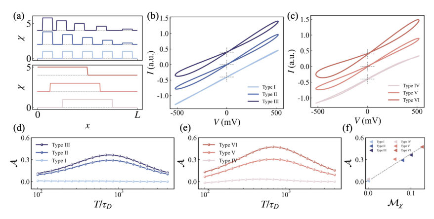 
FIG. 4. Generalization to arbitrary surface-charge configurations. (a) Representative spatial distributions of the surface charge χ(x). (b,c) Corresponding I–V characteristics for the different surface charge configurations. (d,e) A(T) for the corresponding surface-charge configurations. (f) Maximum hysteresis area Amax as a function of the first spatial moment of the surface charge.

**Summary.** This work theoretically proposes planar nanofluidic memristors that utilize ion transport in nanochannels to achieve memory effects. By employing the Poisson-Nernst-Planck framework, the authors show that a surface charge gradient is key to generating hysteresis. The results provide a quantitative design method based on controlling the spatial pattern of surface charge.

**Why it may be interesting.** While focused on solid-state devices, the underlying physics—non-equilibrium ion transport, diffusion-mediated memory effects, and the use of continuum equations (PNP)—shares mathematical parallels with modeling charge dynamics in quantum systems or complex electrochemical interfaces.

Detailed structure

**Main problem.** The paper addresses the theoretical design and optimization of planar nanofluidic memristors by exploiting ion transport mechanisms.

**Main result.** Memristive behavior can be achieved using a surface charge gradient, and the memory effect is shown to be governed by the first-order moment of the surface charge, providing a design rule.

**Method.** The study employs the Poisson-Nernst-Planck (PNP) framework, solving the coupled partial differential equations numerically to analyze ion dynamics.

**Model / system.** The physical system is a planar nanochannel where ion transport dictates the memristive switching behavior. The model uses the PNP equations to describe ionic fluxes, potential, and concentration changes.

**Key observables.** Hysteretic I-V loops, memory area (A), characteristic memory time (T_op), and the first-order moment of the surface charge (M_chi).

**Important parameters / regimes.** Channel height ($\gamma$), relative length ($	heta$), surface charge density ($\chi$), and the ratio of diffusion time to drift time.

**Assumptions / limitations.** The analysis neglects fluidic convection (electro-osmosis) and assumes ideal boundary conditions like strong reservoirs and blocking walls.

**Figures summary.** Figures illustrate simulated I-V curves showing hysteresis onset with surface charge gradients, and plots demonstrate the dependence of memory area and characteristic time on various physical parameters.

**Paper structure.** The paper establishes the PNP model, analyzes the conditions for memristive switching (requiring a surface charge gradient), derives the relationship between memory effect and the first moment of surface charge, and finally provides scaling laws for the characteristic memory time.

Abstract

Nanofluidic memristors, exploiting ion transport in nanochannels, hold promise for neuromorphic applications. A planar architecture is particularly desired for scalable integration with established micro- and nanofabrication technologies. Here, using the Poisson-Nernst-Planck framework, we theoretically propose planar nanofluidic memristors enabled by surface charge gradient, providing an alternative to the commonly used geometrically asymmetric architectures. The resulting memristive behavior is governed by a diffusion-mediated secondary enrichment effect. By systematically solving the PNP equations, we obtain the scaling of the characteristic memory time across the parameter space. We also reveal that the memory effect is related to the first-order moment of surface charge, for arbitrary charge profiles. These results provide a theoretical basis for rationally designing and optimizing planar nanofluidic memristors through spatially patterned surface charge.

[↑ back to top](#top)

### [Saturable nonlinear Schrödinger equation with space- and time-dependent variable coefficients](http://arxiv.org/abs/2608.21086v1)

**Authors:** Maurilho R. da Rocha, Mateus C. P. dos Santos, Wesley B. Cardoso  
**Type:** theory · **Category:** other · **PDF:** <https://arxiv.org/pdf/2608.21086v1>  
**Analysis basis:** full PDF text, analyzed in chunks
**Topic relevance:** `Keldysh / 2PI / non-Gaussian methods` **2/5** · `analog quantum simulation` **2/5** · `driven-dissipative phase transition` **2/5** · `methods for driven-dissipative` **2/5** · `non-equilibrium universality` **1/5**

📷 Fig 1

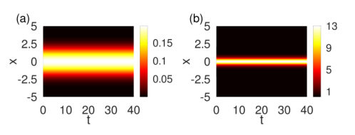 
Figure 2. Solution profile |ψ|2 as a function of the coordinates x and t for the case with a static potential, using the variational solutions obtained with the coefficient choices: (a) (A−, B−) with E = −0.1 and (b) (A+, B+) with E = 0.4. The other parameter values used were G = 1.0, Γ = 0.1, and b = 2.0.

📷 Fig 2

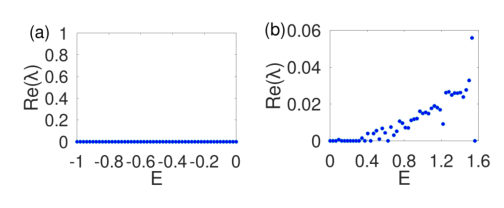 
Figure 1. Real part of the eigenvalue λ as a function of E, ob- tained numerically from the variational solution (20), consid- ering the parameters (a) (A−,B−) and (b) (A+,B+) from Eqs. (24) and (25), respectively. The other parameter values used here were: G = 1.0, Γ = 0.1, and b = 2.0.

📷 Fig 3

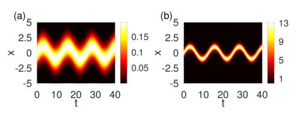 
Figure 3. Solution profile |ψ|2 as a function of the coordinates x and t for the case with a seesaw potential, using the variational solutions obtained with the coefficient choices: (a) (A−, B−) with E = −0.1 and (b) (A+, B+) with E = 0.4. The other parameter values used were G = 1.0, Γ = 0.1, b = 2.0, and w0 = 0.5.

📷 Fig 4

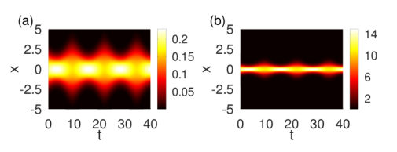 
Figure 4. Solution profile |ψ|2 as a function of the coordinates x and t for the case with a flying-bird potential (41), using the variational solutions obtained with the coefficient choices: (a) (A−, B−) with E = −0.1 and (b) (A+, B+) with E = 0.4. The other parameter values used were G = 1.0, Γ = 0.1, b = 2.0, σ = 0.25, and w0 = 0.5.

📷 Fig 5

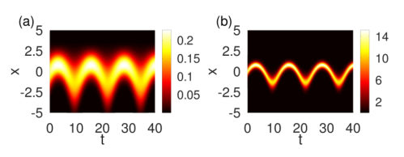 
Figure 5. Solution profile |ψ|2 as a function of the coordinates x and t for the case with a mixed potential (47), using the variational solutions obtained with the coefficient choices: (a) (A−, B−) with E = −0.1 and (b) (A+, B+) with E = 0.4. The other parameter values used were G = 1.0, Γ = 0.1, b = 2.0, σ = 0.25, and w0 = 0.5.

**Summary.** This paper analyzes the stability and dynamics of localized wave packets governed by a saturable nonlinear Schrödinger equation with time- and space-dependent coefficients. Using variational methods and numerical simulations, the authors demonstrate that the stability of these structures is critically dependent on the modulation parameters. The findings offer crucial insights for controlling nonlinear wave phenomena in physical media.

**Why it may be interesting.** This work is highly relevant to AMO physics and quantum optics as the NLS equation is a canonical model for describing nonlinear wave propagation in systems like optical waveguides and Bose-Einstein condensates.

Detailed structure

**Main problem.** The study investigates the dynamics and stability of localized solutions within a saturable nonlinear Schrödinger equation featuring space- and time-dependent variable coefficients.

**Main result.** The stability of the localized solutions is found to be highly sensitive to the modulation parameters, leading to the emergence of alternating stable and unstable regions.

**Method.** The research employs a combination of variational approaches, similarity transformations to achieve autonomous forms, and linear stability analysis via an eigenvalue problem, supplemented by direct numerical simulations.

**Model / system.** The core model is the saturable nonlinear Schrödinger equation (NLS) with the general form $i\psi_t = -rac{1}{2}\psi_{xx} + V(x, t)\psi + g(x, t)|\psi|^2\psi + \gamma(x, t)|\psi|^2$. The analysis explores various non-autonomous potentials, including static, seesaw, flying-bird, and mixed potentials.

**Key observables.** Stability (determined by the sign of the eigenvalue $\lambda$), maximum amplitude ($h_{	ext{max}}$), and mean width ($\langle x^2 
angle$).

**Important parameters / regimes.** Modulation parameters (e.g., modulation frequency $\omega_0$, and parameters $\sigma$ used in potentials), and variational parameters $A$ and $B$.

**Assumptions / limitations.** The variational method relies on a Taylor series expansion for the logarithmic term, and the stability analysis for the autonomous case is separate from the full non-autonomous system.

**Figures summary.** Figures illustrate the real part of the eigenvalue $\lambda$ vs. energy $E$ for the autonomous case, and show the evolution of $h_{	ext{max}}$ and $\langle x^2 
angle$ for various modulation potentials (static, seesaw, flying-bird, mixed) as a function of modulation frequency $\omega_0$.

**Paper structure.** The paper progresses by first establishing the general NLS model and applying variational/similarity techniques to derive an autonomous form. It then analyzes stability using eigenvalue problems and concludes with direct numerical simulations testing various time-dependent potentials to map out stability regimes.

Abstract

In this paper we study the dynamics and stability of localized solutions in a saturable nonlinear Schrödinger equation with space- and time-dependent variable coefficients. Using a variational approach and numerical simulations, we analyze the effects of different external potential configurations. Our results reveal that the stability of the solutions is highly sensitive to the modulation parameters, leading to the emergence of alternating stable and unstable regions as a function of the modulation frequency. These findings provide valuable insights into the control of localized structures in nonlinear wave systems, with potential implications for optical waveguides, Bose-Einstein condensates, and other nonlinear media.

[↑ back to top](#top)

### [Interedge backscattering in quantum spin Hall-based NS and SNS junctions](http://arxiv.org/abs/2608.20939v1)

**Authors:** Cajetab Heinz, Patrik Recher, Fernando Dominguez  
**Type:** theory · **Category:** other · **PDF:** <https://arxiv.org/pdf/2608.20939v1>  
**Analysis basis:** full PDF text, analyzed in chunks
**Topic relevance:** `interference shaping light` **2/5** · `Keldysh / 2PI / non-Gaussian methods` **1/5** · `analog quantum simulation` **1/5** · `driven-dissipative phase transition` **1/5** · `methods for driven-dissipative` **1/5**

📷 Fig 1

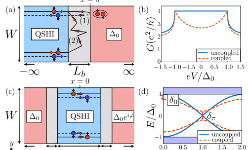 
FIG. 1. (a) Schematic of a QSH/barrier/superconductor junc- tion. In the barrier, electrons can undergo local Andreev reflection (1) or undergo normal reflection to the opposite edge (2). Red (blue) dots and solid (dashed) lines represent electrons (holes). (b) Conductance G as a function of bias voltage eV for uncoupled (blue solid line) and coupled (red dashed line) top and bottom QSH edges. (c) Schematic of a superconductor/barrier/QSH/barrier/superconductor junc- tion with phase difference φ between the superconductors. (d) Andreev bound state energies E as a function of φ for un- coupled (blue solid line) and coupled (red dashed line) edges.

📷 Fig 2

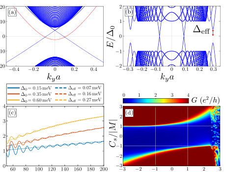 
FIG. 2. (a) Energy spectrum E(ky) of a QSH/barrier/QSH junction with Cn = −4 meV, Cb = −20 meV, and Lb/a = 11. (b) Energy spectrum E(ky) of a QSH/barrier/SC junction with Cn = −4 meV, Cb = 19 meV, Cs = 20 meV, Lb/a = 5, and Ms = 10 meV. (c) Conductance G as a function of the junction width W for different values of the superconducting pairing amplitude ∆0. Solid lines show the numerical results, while dashed lines indicate fits based on Eq. (15). (d) Con- ductance G as a function of the chemical potential Cs in the superconductor and the barrier chemical potential Cb, with ∆0 = 0.15 meV, W/a = 200 and Lb/a = 5. The white lines represent the onset of the bulk bands.

📷 Fig 3

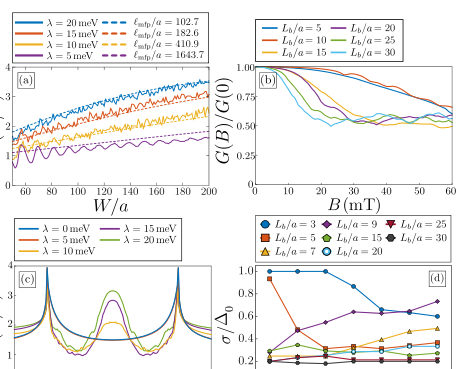 
FIG. 3. (a) Zero-bias conductance G versus junction width W for several disorder strengths λ. Solid lines are numerical results, dashed lines fits to Eqs. (14)-(16). (b) Conductance normalized to its zero-field value, G(B)/G(0), versus mag- netic field B for several barrier lengths Lb. (c) G versus bias voltage eV for several λ. (d) Half width at half maximum σ of the zero-bias peak in (c) versus λ, for Lb/a = 3 . . . 30. Un- less stated otherwise, Lb/a = 5, W/a = 150, eV = 0, B = 0, ∆0 = 0.15 meV. All curves are averaged over 100 disorder realizations, with the same set of realizations used for every parameter value.

📷 Fig 4

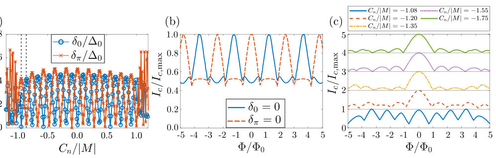 
FIG. 4. SNS junction: (a) Gap openings at φ = 0 and φ = π, denoted by δ0 and δπ, as a function of the chemical potential Cn for Lb = 5a. (b) Corresponding SQI patterns evaluated at the values of Cn indicated by the dashed lines in panel (a). (c) SQI patterns for values of Cn in the conduction band, again for Lb = 5a. In this panel, all curves are normalized to unity and vertically offset for clarity.

📷 Fig 5

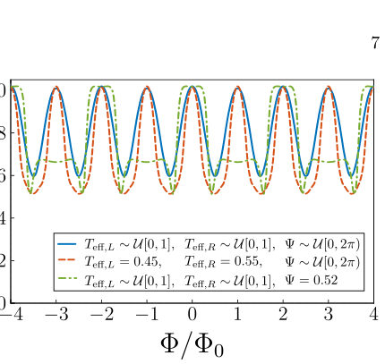 
FIG. 5. Disorder-averaged critical current Ic versus the mag- netic flux Φ obtained from the scattering network model. The solid blue curve corresponds to independently randomized ef- fective transmissions Teff,L/R and phase Ψ. For the dashed red line Teff,L/R are fixed and only Ψ is randomized. For the green dashed line Teff,L/R are randomized and Ψ is fixed. Here, x ∼U[a, b) means that x is drawn uniformly at random from the interval [a, b) Each curve is averaged over 1000 dis- order configurations.

**Summary.** This theoretical work models how opposite helical edge states in QSH insulators couple when interfaced with superconductors. By analyzing transport signatures like zero-bias conductance and superconducting gap structures, the authors map out the microscopic parameters—such as barrier geometry and mismatch—that control this interedge coupling. This provides crucial insight into the functionality of topological superconducting hybrid devices.

**Why it may be interesting.** The detailed control over superconducting signatures (gaps, interference patterns) via microscopic edge coupling mechanisms provides a rich platform for studying proximity effects and superconducting quantum interference in topological materials.

Detailed structure

**Main problem.** The paper investigates the microscopic conditions governing the coupling between opposite helical edge states in Quantum Spin Hall (QSH) insulators when they form hybrid junctions with superconductors (NS and SNS).

**Main result.** Interedge coupling causes measurable deviations from quantized conductance values in NS junctions and opens characteristic gaps at $\varphi=0$ and $\varphi=\pi$ in the Andreev bound state spectrum of SNS junctions.

**Method.** The study employs the Bogoliubov-de Gennes formalism combined with a tight-binding approach to model transport properties and superconducting gap structures.

**Model / system.** The system models QSH edge states coupled to superconducting leads, analyzed using a microscopic Bernevig-Hughes-Zhang model. The analysis covers both zero-bias conductance measurements (NS) and the superconducting phase dependence of Andreev bound states (SNS).

**Key observables.** Zero-bias Andreev conductance ($G$), Andreev Bound State (ABS) energies ($E$ vs. $\varphi$), and the Superconducting Quantum Interference (SQI) pattern.

**Important parameters / regimes.** Barrier gap, interface transparency, orbital/Fermi-velocity mismatch, disorder strength ($\lambda$), and superconducting phase difference ($\varphi$).

**Assumptions / limitations.** Simplifications include neglecting spin-nonconserving terms (like Rashba SOC) and using effective scatterer models for transport calculations.

**Figures summary.** Figures illustrate schematic junctions, conductance vs. width/bias plots, and energy spectra showing gap openings dependent on the superconducting phase difference $\varphi$.

**Paper structure.** The paper systematically analyzes the physics in NS junctions (conductance deviations) and then extends the analysis to SNS junctions (gap opening and SQI modification), incorporating effects of disorder and geometric parameters.

Abstract

We investigate the microscopic conditions that allow for the coupling between opposite quantum spin Hall (QSH) edges in hybrid junctions with superconductors. Using a microscopic Bernevig--Hughes--Zhang model and the Bogoliubov--de Gennes formalism, we model a potential barrier along the NS interface and identify the parameter regimes in which the QSH edges are coupled. In normal--superconductor junctions, such coupling manifests as deviations from the quantized zero-bias Andreev conductance $G=4e^2/h$. These deviations are controlled by the induced gap in the barrier, the barrier geometry, the interface transparency, orbital and Fermi-velocity mismatch, and disorder strength as well as the bias voltage leading to a zero-bias peak. We then analyze the impact of this interedge-coupling mechanism in Josephson junctions at equilibrium and show that it hybridizes the edge-resolved Andreev branches, opens gaps at the time-reversal-invariant phase differences $\varphi=0$ and $\varphi=π$, and modifies the superconducting quantum interference pattern. In a reflection-symmetric geometry, the relative sizes of the two gap openings provide complementary information about the interedge dynamical phase, which also determines the parity of the suppressed lobes in the magnetic interference pattern. This investigation sheds light on the microscopic details that control the coupling of helical edge states in actual devices and the resulting consequences for superconducting hybrid systems.

[↑ back to top](#top)

### [Long-lived Laughlin pairs in a depleted quantum Hall edge channel](http://arxiv.org/abs/2608.20863v1)

**Authors:** Girts Barinovs, Agris Buzs, Vyacheslavs Kashcheyevs  
**Type:** theory · **Category:** strongly correlated electrons · **PDF:** <https://arxiv.org/pdf/2608.20863v1>  
**Analysis basis:** full PDF text, analyzed in chunks
**Topic relevance:** `Keldysh / 2PI / non-Gaussian methods` **2/5** · `methods for driven-dissipative` **2/5** · `analog quantum simulation` **1/5** · `correlated / nonlocal dissipation` **1/5**

📷 Fig 1

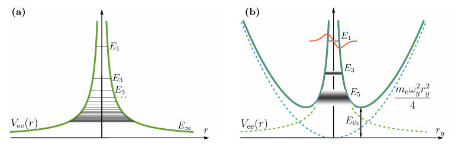 
FIG. 1. Magnetic binding and destabilization of Laughlin pairs. (a) In a flat external potential, relative drift motion of two electrons in their lowest-Landau-level state is quantized and samples the repulsive Coulomb interaction Vee(r) (green curve) at discrete energy levels Em. The odd-m sequence relevant to spin-polarized electrons is shown; its positive energies decrease towards the separated-electron limit as the pair radius r grows. (b) Schematic cut of the relative-motion potential along the stable principal axis, rx = 0, when an external electric-field gradient is present. The Coulomb and quadratic contributions as functions of ry are shown by dashed curves. Their...

📷 Fig 2

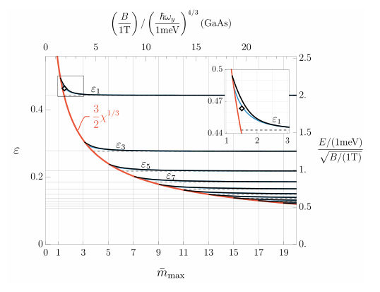 
FIG. 2. Dimensionless energies εm = Em/EC of quasi- bound Laughlin pairs in a purely quadrupole (κ = 1) elec- tric field gradient in the LLL approximation. No resonances are present below the threshold energy εth = (3/2)χ1/3 (or- ange line). Numerical results obtained by the complex-scaling method (black line) agree well with the second-order pertur- bation theory (blue line), Eq. (16). Horizontal lines mark the unperturbed energies ε(0) m of pairs in the bulk. The inset shows a magnified view of the m = 1 state near the threshold and the diamond indicates the energy of the pair state observed in the time-dependent wave-packet calculation (see Section V below).

📷 Fig 3

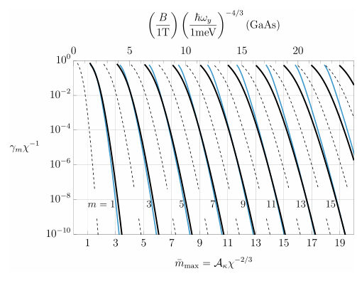 
FIG. 3. Dimensionless resonance halfwidths, scaled as γm/χ, for pure-quadrupole anisotropy κ = 1, plotted as functions of A1χ−2/3 on the lower axis. Solid black curves are nu- merical complex-scaling results for the odd-m branches in- dicated by the labels; dashed black curves show the even-m branches. Blue curves show the closed-form tunneling esti- mate in Eq. (18) for the odd-m branches. The upper axis gives the corresponding parameter combination for GaAs de- vices.

📷 Fig 4

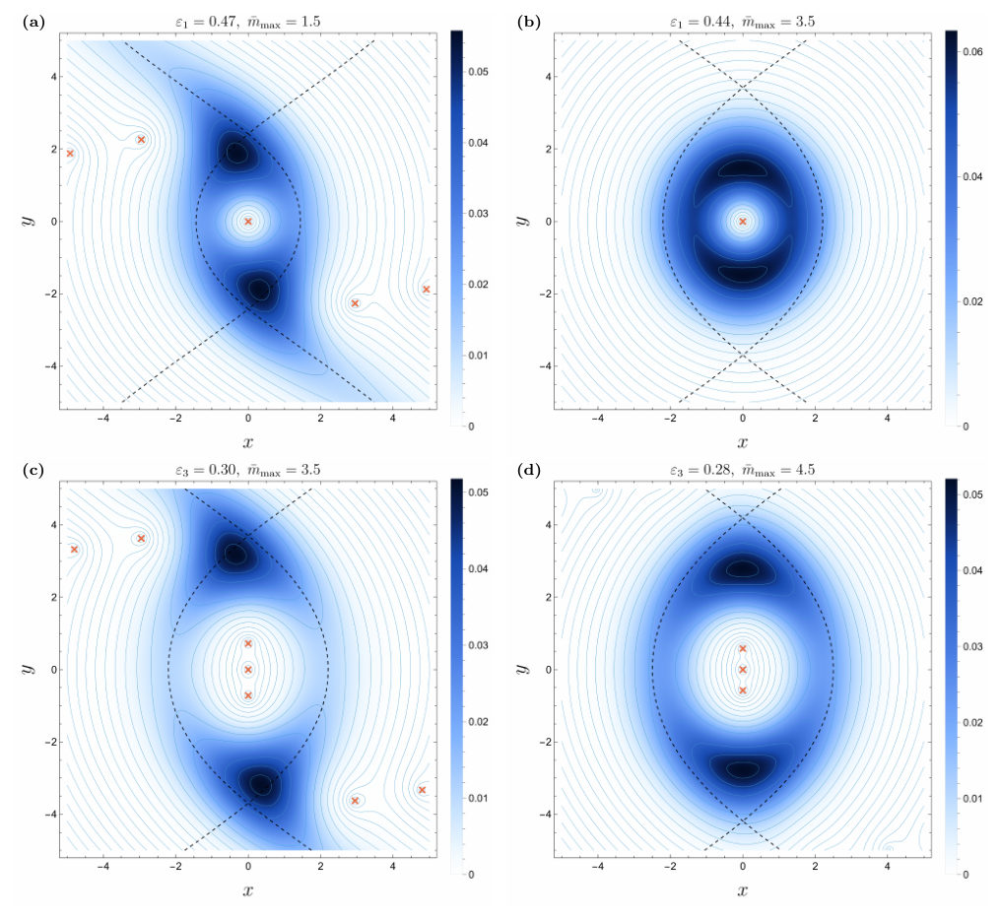 
FIG. 4. Husimi density of Laughlin-pair resonances at a symmetric saddle-point potential, κ = 1. Panels (a) and (b) show the m = 1 branch at ¯mmax = 1.5 and 3.5, respectively; panels (c) and (d) show the m = 3 branch at ¯mmax = 3.5 and 4.5. The corresponding resonance energies are printed above the panels. Blue shading shows Q(z), and the solid contour levels are chosen to be equally spaced for a Gaussian profile. Crosses mark its zeros. The dashed curves are the classical critical level at ε = εth, separating the closed central trajectories from the incoming and outgoing branches. The better-confined states in panels (b) and (d) retain an approximately bulk-like distribution, modified by...

📷 Fig 5

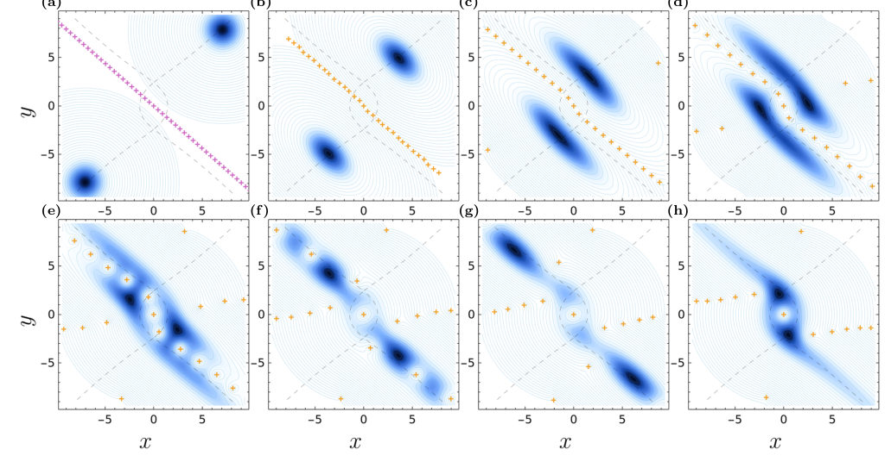 
FIG. 5. Formation of a Laughlin-pair resonance in a collision of two electrons. The panels show the relative-coordinate probability density |ψ(r, t)|2 (blue shading and contours) at dimensionless times τ = t EC/ℏ= 0, 11, 24, 32, 40, 53, 62, and 242 in panels (a)–(h), respectively. Each panel is normalized independently to its own density maximum. Crosses mark isolated zeros of the wave function. In panel (a) their straight-line arrangement is calculated analytically in the LLL limit from the antisymmetrized initial Gaussian state; in the later panels the zeros are obtained numerically. The dashed curves are the exact critical level lines at ε = εth. In the central region they go around the...

**Summary.** This paper develops a microscopic theory to predict the existence and stability of Laughlin pairs—repulsively bound electron pairs—within quantum Hall edge channels. By analyzing the two-electron Hamiltonian using advanced techniques like complex scaling, the authors show that these pairs can be stabilized by the geometry of the confining potential. The results suggest that such correlated, anyonic excitations are potentially observable using current single-electron circuit technology.

**Why it may be interesting.** This work bridges concepts from strongly correlated electron physics (Laughlin states) with mesoscopic quantum transport, providing concrete, calculable predictions for observing exotic correlated states in solid-state devices.

Detailed structure

**Main problem.** The study investigates the possibility of electron-electron repulsion driving quantized relative circulation, enabling two electrons to propagate together as a positive-energy Laughlin pair in a depleted quantum Hall edge channel.

**Main result.** The theory predicts that existing GaAs devices may already support the lowest spin-polarized Laughlin pair with a lifetime significantly longer than typical propagation times, suggesting experimental feasibility.

**Method.** The authors developed a microscopic theory using the physical two-electron Hamiltonian, employing complex scaling, analytic tunneling theory, and simulating dynamics with the full finite-field Hamiltonian.

**Model / system.** The system is a depleted quantum Hall edge channel where two interacting electrons are confined. The analysis uses the physical two-electron Hamiltonian projected onto the Lowest Landau Level (LLL) to model the correlated dynamics.

**Key observables.** Dissociation threshold, decay rates, quasibound resonance energies ($\epsilon_m - i\gamma_m$), and the pair's lifetime ($	au$).

**Important parameters / regimes.** The stability depends on the electric-field gradient tensor ($\hat{V}$) and the ratio of Coulomb energy to characteristic energy scales.

**Assumptions / limitations.** The analysis involves local approximations of the potential (up to quadratic order) and assumes the collision pathway survives full two-dimensional dynamics.

**Figures summary.** Figure 1 schematically shows how the external electric-field gradient leads to quasibound resonances whose lifetimes depend on the distance from the dissociation threshold.

**Paper structure.** The paper progresses from establishing the physical model and the theoretical framework for quasibound pairs to developing quantitative tools (complex scaling, tunneling theory) and concluding with simulations demonstrating pair creation and propagation.

Abstract

On-demand sources and mesoscopic beam splitters allow individual ballistic electrons to collide in depleted quantum Hall edge channels, where their unscreened Coulomb interaction acts as a strong, controllable nonlinearity. Theory suggests a more striking possibility: in a strong magnetic field, the repulsion can drive quantized relative circulation, allowing two electrons to propagate together as a positive-energy Laughlin pair. The relevance of such pairs to experiment depends on quantitative lifetimes in realistic guiding potentials and on whether the proposed collision pathway to pair formation survives full two-dimensional dynamics. We develop a microscopic theory of quasibound Laughlin pairs using the physical two-electron Hamiltonian. For a general local electric-field gradient, we determine the dissociation threshold, number of quasibound states, and decay rates. Complex scaling and analytic tunneling theory show that lifetimes grow exponentially with pair energy above threshold. Applied to reported GaAs parameters, the theory indicates that existing devices may already support the lowest spin-polarized pair, with a leading lifetime estimate about three orders of magnitude longer than typical propagation times. We simulate a collision with the full finite-field Hamiltonian, demonstrating both a framework for nonlinear two-electron quantum dynamics and the creation of a Laughlin pair in a representative two-electron collision. We use Husimi distributions and their zeros to visualize both quasibound resonances and transient collision states in phase space. These results place the preparation, propagation, and detection of repulsively paired electrons within reach of existing single-electron circuit technology. They identify kinematic stabilization under constrained one-dimensional propagation as a pairing mechanism that may extend to anyonic quantum Hall edge excitations.

[↑ back to top](#top)

### [Polymer Genome in the Age of Artificial Intelligence](http://arxiv.org/abs/2608.20979v1)

**Authors:** Jifeng Wang, Ying Wang  
**Type:** theory · **Category:** disordered systems and neural networks · **PDF:** <https://arxiv.org/pdf/2608.20979v1>  
**Analysis basis:** full PDF text, analyzed in chunks
**Topic relevance:** `analog quantum simulation` **2/5** · `methods for driven-dissipative` **2/5** · `Keldysh / 2PI / non-Gaussian methods` **1/5**

📷 Fig 1

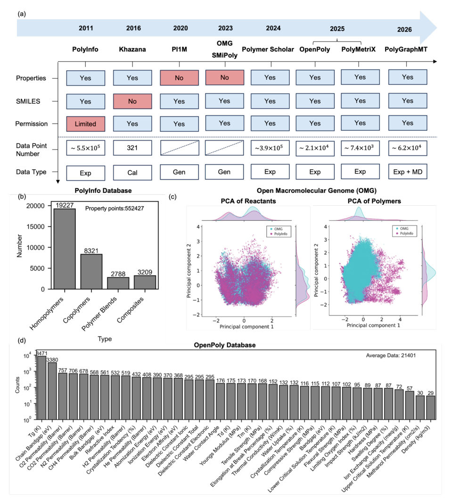 
Figure 1. Overview of representative polymer databases21-26, 28, 30, 31. (a) Comparison of data coverage and features among main polymer databases in the field. “Properties” indicates whether the database includes experimental or computational property data; “SMILES” denotes the availability of polymer structures encoded as SMILES strings; “Permission” reflects the degree of data accessibility; and “Data Type” distinguishes experimentally measured (“Exp”), theoretically calculated (“Cal”), and virtually generated (“Gen”) data. (b) Distribution of polymer types and property data points in the PolyInfo database. (c) Principal component analysis (PCA) projection of reactants and polymers from...

📷 Fig 2

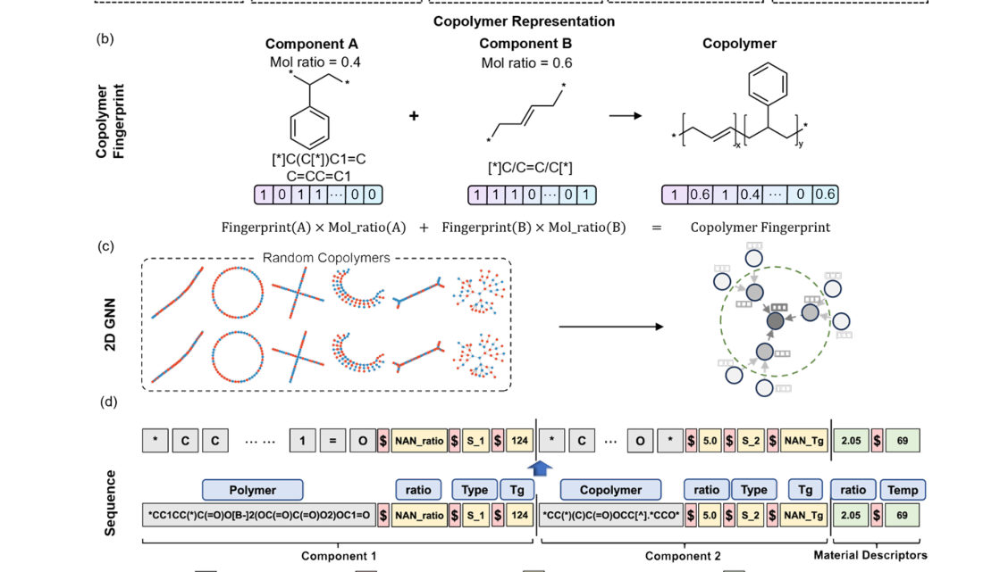 
Figure 2. Polymer encoding strategies for property prediction and generation. (a) Encoding of homopolymers. Common structural representations used in predictive and generative modeling, including repeat-unit–based fingerprints, 2D/3D molecular graphs, SMILES sequence, and SMILES one-hot encodings. (b–d) Encoding of copolymers. (b) Copolymer fingerprints generated by combining monomer fingerprints according to their molar ratios. (c) When the copolymer sequence is known, 2D molecular graph encoding can be employed to capture interunit connectivity. (d) When

📷 Fig 3

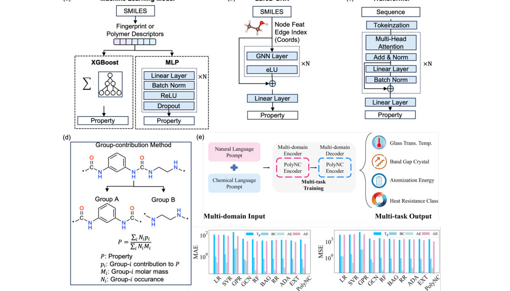 
Figure 3. Overview of AI models for polymer property prediction. (a) Traditional machine learning workflow. Polymer structures are represented by SMILES-derived fingerprints or hand-crafted descriptors, followed by property prediction using models such as XGBoost or MLP. (b) Graph neural network (GNN) models. Polymers are encoded as graphs defined by node features and edge indices representing monomer connectivity. (c) Transformer-based models. Sequence inputs (e.g., SMILES of repeating unit) are tokenized and processed through a multi-head attention mechanism to learn inter- sequence correlations for property prediction. (d) Data augmentation under limited datasets. Group contribution...

📷 Fig 4

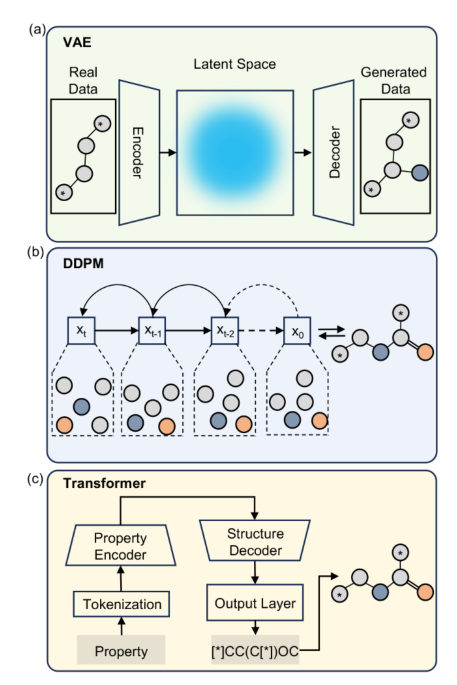 
Figure 4. Representative generative models for polymer design. (a) Variational Autoencoder (VAE). Encodes polymers into a continuous latent space, where new structures are generated by sampling latent vectors and decoding them into valid representations. (b) Denoising Diffusion Probabilistic Model (DDPM). Consists of a forward diffusion process (curved arrow) adding noise and a reverse denoising process (straight arrow) that gradually reconstructs polymer structures from Gaussian noise. (c) Transformer-based model. Learns polymer sequence representations and generates polymers through autoregressive decoding.

📷 Fig 5

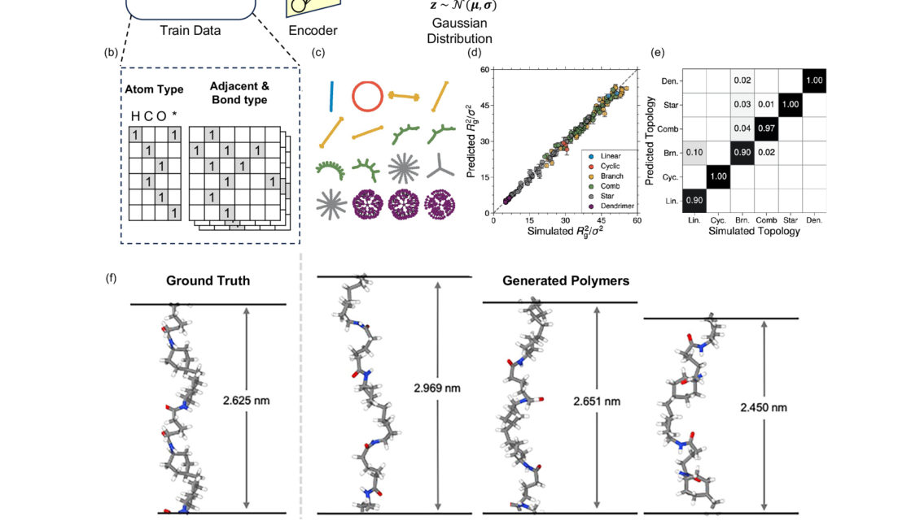 
Figure 5. Applications of variational autoencoders (VAEs) in polymer generation. (a) Schematic illustration of the working principle of a VAE. (b) Graph-based encoding of polymer repeating units, represented using node and adjacency matrices derived from SMILES strings. (c) Generation of polymers with diverse topological architectures using the TopoGNN framework. (d–e) Comparison between predicted and simulated structural or property values for TopoGNN-generated polymers. (f) Multiple 3D conformations generated by polyGen for the same polymer repeating unit. Panel (c–e) reproduced from ref. 63 under the CC BY-NC-ND 4.0 license; Panel (f) reproduced from ref. 64 under the CC BY 4.0 license.

**Summary.** This paper reviews the state-of-the-art in using Artificial Intelligence to advance polymer science, focusing heavily on the crucial role of molecular encoding strategies. It compares fingerprint, graph, and sequence-based representations for tasks like property prediction and inverse design. The work stresses that standardized, comprehensive databases and better encoding are necessary to move polymer discovery from empirical to AI-driven innovation.

**Why it may be interesting.** While focused on polymers, the core methodology—applying advanced ML/AI (GNNs, Transformers, LLMs) to complex, high-dimensional structural data—is highly relevant to modeling quantum many-body systems or disordered quantum materials.

Detailed structure

**Main problem.** The field of AI-driven polymer science is lagging due to the structural complexity of polymers, requiring better encoding strategies for AI models.

**Main result.** The paper provides a critical review and practical guidance on leveraging advanced AI techniques for polymer design, emphasizing the need for standardized, multi-scale data.

**Method.** The authors critically examine various AI encoding strategies (Fingerprint, Graph, Sequence) and model architectures (GNNs, Transformers, LLMs) applied to polymer property prediction and inverse design.

**Model / system.** The physical system is polymers (homopolymers, copolymers, blends). The models involve deep learning architectures like Graph Neural Networks (GNNs) and Transformers, operating on molecular representations.

**Key observables.** Polymer properties such as glass transition temperature ($T_g$), mechanical strength, and electronic/dielectric properties.

**Important parameters / regimes.** Polymerization degree, structural connectivity (2D/3D graphs), and chemical composition.

**Assumptions / limitations.** The choice of encoding must align with data availability and the structural complexity of the polymer system.

**Figures summary.** Figure 1 compares polymer databases based on data coverage and property inclusion; Table 1 summarizes common encoding strategies (Fingerprint, Graph, Sequence) for various tasks.

**Paper structure.** The paper progresses by first identifying the gap in AI application to polymers, then detailing the evolution and comparison of encoding strategies, evaluating model applicability in property prediction and inverse design, and concluding with recommendations for data infrastructure.

Abstract

Artificial intelligence (AI) is redefining the landscape of polymer science. Although numerous AI applications have been introduced in this field, the roles of polymer encoding strategies and different applications of AI models in polymer design remain insufficiently understood. Here, we build upon the foundation of polymer databases to critically examine the performance and applicability of current encoding strategies across different use cases. We then focus on two major AI application domains, property prediction and inverse design, to evaluate the strengths, weaknesses and suitable scenarios for various model architectures. Finally, we emphasize the significance of the online platforms for promoting data accessibility and accelerating the migration from experience-based discovery toward AI-driven innovation in polymer science and engineering. Through these discussions, we aim to provide practical guidance for future research and development in AI-assisted polymer design.

[↑ back to top](#top)

### [Interband plasmons due to Mexican hat dispersion in two-dimensional materials with inverted bands](http://arxiv.org/abs/2608.20560v1)

**Authors:** Vladimir A. Sablikov  
**Type:** theory · **Category:** other · **PDF:** <https://arxiv.org/pdf/2608.20560v1>  
**Analysis basis:** full PDF text, analyzed in chunks
**Topic relevance:** `Keldysh / 2PI / non-Gaussian methods` **2/5**

📷 Fig 1

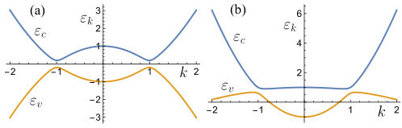 
FIG. 1. MHD for the hybridization parameter 𝑎= 0.2 in the cases (a) of e-h symmetric model, 𝑑= 0, and (b) where the e-h symmetry is broken, 𝑑= −0.8.

📷 Fig 2

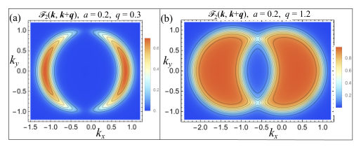 
FIG. 2. Distribution of the interband overlap function F2(𝒌, 𝒌+ 𝒒) in the 𝒌plane for two values of 𝑞: (a) 𝑞= 0.3; (b) 𝑞= 1.2. Calculations were carried out for 𝑎= 0.2.

📷 Fig 3

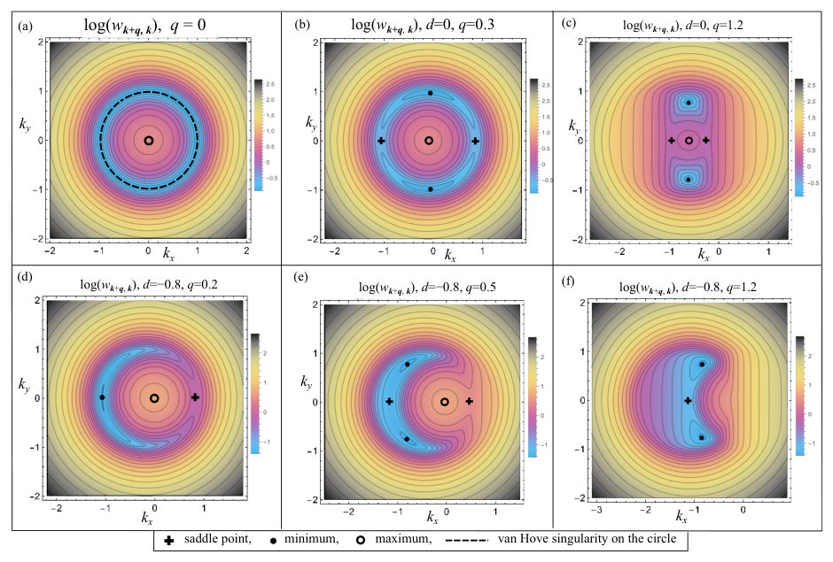 
FIG. 3. Map of the surface of the interband energy 𝑤𝒌+𝒒,𝒌and the evolution of JDOSq singularities with changing 𝑞and the e-h asymmetry parameter 𝑑. (a) The case 𝑞= 0, when the interband energy is independent of 𝑑. The dashed line denotes the van Hove singularity on the circle. (b) The case 𝑑= 0 and 𝑞= 0.3. Increasing 𝑞leads to a transformation of the van Hove singularity on the circle into two saddle points and two minima. (c) The case 𝑑= 0 and 𝑞= 1.2. The saddle points and minima shift to the center as 𝑞increases. (d) The case of e-h asymmetry, 𝑑=-0.8, for 𝑞= 0.2. Increasing 𝑞transforms the van Hove singularity on the circle into single saddle point (hereinafter referred to as high-energy...

📷 Fig 4

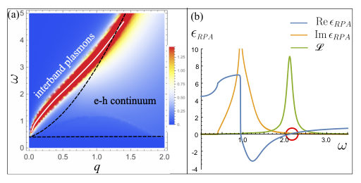 
FIG. 5. (a) The distribution of the loss function density in the 𝑞-𝜔 plane in the case of the e-h symmetry. The white line represents the IBP dispersion. The black dashed line is the boundary of the e-h continuum. (b) Line plot of the real (blue solid line) and imaginary (dark yellow line) parts of the dynamical dielectric function as well as the loss function L(𝜔) (green line) for 𝑞= 0.5. The zero of 𝜖𝑅𝑃𝐴(𝜔) (marked with a red circle) represents the plasmon node. The parameters are 𝑎= 0.2, 𝑑= 0, 𝑄= 10.

📷 Fig 5

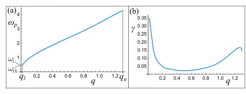 
FIG. 6. (a) Dispersion 𝜔𝑝(𝑞) of the IBPs and (b) the decay constant 𝛾(𝑞) in e-h symmetric case. 𝑞𝑙and 𝑞𝑢are the lower and upper boundaries of the wave vector range where the IBPs are excited. 𝜔𝑙is lower frequency and 𝜔𝑡ℎis the threshold energy of interband transitions. The parameters are 𝑎= 0.2, 𝑑= 0, 𝑄= 10.

**Summary.** This theoretical study examines interband plasmons in 2D topological materials exhibiting Mexican-hat dispersion. The authors show that this unique band structure significantly enhances plasmon strength and predicts an additional low-frequency plasmon branch when electron-hole symmetry is broken. The results highlight the deep connection between plasmon excitation modes and singularities in the joint density of states.

**Why it may be interesting.** The strong coupling between electronic band structure singularities (like Van Hove points) and collective excitations (plasmons) is a core topic in condensed matter theory, relevant for understanding plasmonic responses in novel 2D materials.

Detailed structure

**Main problem.** The paper investigates how the unique electronic structure arising from Mexican-hat dispersion (MHD) in 2D topological materials affects the properties of interband plasmons (IBPs).

**Main result.** MHD significantly strengthens the plasmons, reduces their damping, and causes the emergence of an additional, low-frequency plasmon branch when electron-hole symmetry is broken.

**Method.** The analysis is performed using the Random Phase Approximation (RPA) framework, focusing on calculating the polarization function, the joint density of states (JDOS), and the interband overlap function.

**Model / system.** The system is a 2D topological material with inverted bands, modeled using the BHZ Hamiltonian. Key features include double-valued isoenergetic contours and a Van Hove singularity.

**Key observables.** Interband plasmon spectrum ($\omega_p(q)$), Joint Density of States ($	ext{JDOS}_q$), and the interband quantum metric.

**Important parameters / regimes.** The hybridization parameter $a$, the e-h asymmetry parameter $d$, and the plasmon wave vector $q$.

**Assumptions / limitations.** The analysis assumes spatial inversion symmetry and treats spin as a good quantum number; the low-frequency branch analysis is restricted to cases where e-h symmetry is broken.

**Figures summary.** Figures illustrate the MHD dispersion in both symmetric and asymmetric cases, and show the calculated plasmon spectra ($\omega_{p1}, \omega_{p2}$) relative to the saddle-point singularity energies ($w_{s1}, w_{s2}$).

**Paper structure.** The paper proceeds by detailing the general formalism (Hamiltonian, overlap function, JDOS), analyzing the plasmon spectrum in the e-h symmetric case, and finally addressing the effects and emergence of the additional low-frequency branch when e-h symmetry is broken.

Abstract

Two-dimensional topological materials with Mexican-hat dispersion exhibit numerous nontrivial features, such as double-valued isoenergetic contours in k-space, strong mixing of electron and hole states, a van Hove singularity in the density of states, and specific quantum geometric properties. We find that, due to these features, Mexican-hat dispersion significantly strengthens interband plasmons, reduces their damping, and gives rise to an additional branch of the plasmon spectrum when electron-hole symmetry is broken. The plasmon spectra are limited to a finite range of the wave vector, the boundaries of which depend on the strength of the electron-electron interaction. We also reveal a relationship between the features of the plasmon spectrum and singularities of the joint density of states with a finite plasmon wave vector q, as well as features of the interband quantum metric, which also depend on q.

[↑ back to top](#top)

### [The Continuum Model for Uniaxially Strained Bilayer Graphene Moiré Systems](http://arxiv.org/abs/2608.21228v1)

**Authors:** Tong Liu, X. R. Wang, Jiansheng Wu  
**Type:** theory · **Category:** other · **PDF:** <https://arxiv.org/pdf/2608.21228v1>  
**Analysis basis:** full PDF text, analyzed in chunks
**Topic relevance:** `analog quantum simulation` **2/5**

📷 Fig 1

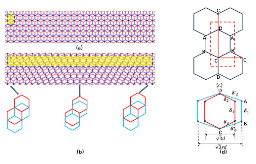 
FIG. 1. The structure in real space. (a) The AB-stacked bilayer graphene before stretching; the yellow region inside the black dashed line is the unit cell. (b) The stretched- bilayer structure studied in this paper, where the blue layer is the stretched one. The yellow region is the superlattice, which contains neither AA- nor BA-stacked regions. (c) The larger unit cell we choose in the single layer, containing four atoms A, B, C, and D; the red dashed line marks the unit cell. (d) How the stretching changes the unit cell, where s is the stretch factor.

📷 Fig 2

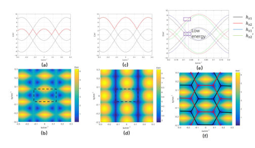 
FIG. 2. (a)–(d) Energy band structure given by Eq. (2); (a) and (c) are the band structure at ky = 0, while (b) and (d) show the red band in (a) and (c), respectively. The black dashed box marks the first Brillouin zone. (e) Band structure of the stretched bilayer without the interlayer interaction; the eight bands are given by the four Hamiltonians hsi and h′ si after the change of basis. In our study we only consider the low-energy part, so near the Dirac cone we need only keep the interaction between hs1 and h′ s1, because the other two bands have higher energy. (f) Honeycomb structure of hs1 (black) and h′ s1 (red).

📷 Fig 3

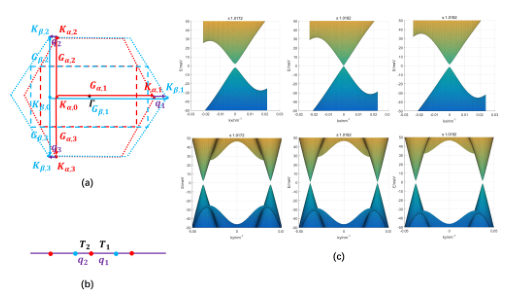 
FIG. 3. (a) The red dashed rectangle is the first Brillouin zone of the α layer and the blue dashed rectangle is that of the β layer. By applying the three groups of reciprocal lattice vectors Gl,i, we find that the three types of interaction can be regarded as hopping between three groups of Kl,i. For the three K valleys from the same layer, we find that they belong to the same honeycomb structure hs1 or h′ s1, shown by the dotted lines. This also proves the conclusion that the hopping between hs1 and h′ s1 is independent. (b) There are two types of hopping from the α layer to the β layer, and likewise from the β layer to the α layer. Thus we can expand as in the TBLG system and obtain a...

📷 Fig 4

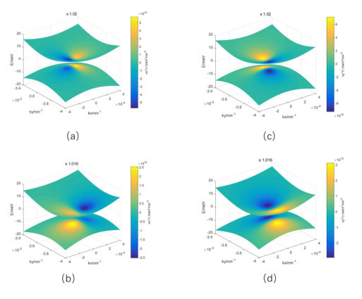 
FIG. 5. (a), (b) BCD density along the kx direction before and after the special strain factor. (c), (d) BCD density along the ky direction before and after the special strain factor. The Fermi level is 0 meV. We calculate the BCD in this small region for each band.

📷 Fig 5

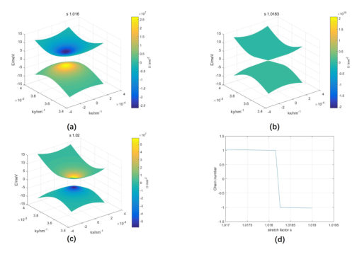 
FIG. 4. (a)–(c) Relationship between the Berry curvature and the energy band structure. We find a peak of the Berry curvature where the bands close, and, comparing (a) and (c), that the Berry curvature changes after the gap closing. (d) The change of the Chern number.

**Summary.** This paper develops a continuum model for bilayer graphene moiré systems under uniaxial strain to study topological phase transitions. By analyzing the Hamiltonian, the authors predict that strain can induce a topological transition at a specific stretch factor (s ~ 1.018). This work opens a pathway for strain engineering to realize topological transport and quantum anomalous Hall effects.

**Why it may be interesting.** The work provides a concrete, analytically tractable framework for engineering topological states (like QAH effects) in 2D materials using external stimuli (strain), which is highly relevant for designing quantum devices.

Detailed structure

**Main problem.** To construct an analytical continuum model for uniaxially strained bilayer graphene moiré systems to understand the relationship between structural strain and electronic properties, particularly topological phase transitions.

**Main result.** The model predicts a topological phase transition occurring at a critical stretch factor s ~ 1.018, characterized by a change in the Chern number and detectable via the nonlinear Hall effect.

**Method.** The authors employ a continuum model approach, analogous to the Bistritzer-MacDonald model, to derive and diagonalize the effective Hamiltonian for the moiré superlattice.

**Model / system.** The system is AB-stacked bilayer graphene subjected to uniaxial strain along the x-direction, forming a 1D moiré superlattice (SBLG). The Hamiltonian is constructed by treating interlayer coupling as hopping between several Dirac points.

**Key observables.** Chern number, band gap collapse, topological number inversion, and the nonlinear Hall effect.

**Important parameters / regimes.** Stretch factor (s), critical stretch factor (s ~ 1.018), and the hopping amplitudes derived from the strain.

**Assumptions / limitations.** The analysis assumes the stretch factor s is small (s < 1.02) and makes approximations when calculating the interlayer coupling term by ignoring interactions with large in-plane separations.

**Figures summary.** Figures illustrate the structural changes due to stretching, the band structure at the critical point showing two degeneracy points along the k_y direction, and the general band structure evolution.

**Paper structure.** The paper systematically develops the continuum Hamiltonian, analyzes the low-energy physics near Dirac cones, determines the conditions for band degeneracy points, and finally links these structural changes to topological invariants like the Chern number.

Abstract

We construct a continuum model for a one-dimensional moiré superlattice formed by stretching one layer of AB-stacked bilayer graphene along the x direction by a factor s. Following the spirit of the Bistritzer-MacDonald model for twisted bilayer graphene, we treat the interlayer coupling as hopping between several Dirac points. At a critical stretch factor s ~ 1.018 the two bands near the Fermi level touch, forming two degeneracy points along the k_y direction. This gap closing is accompanied by a topological phase transition, in which the Chern number changes from 1 to -1, and by a sign change of the Berry-curvature dipole, which we propose can be detected through the nonlinear Hall effect. We find that uniaxial strain modulates inter-Dirac-valley coupling, which drives band gap collapse and subsequent topological number inversion. This opens a route to engineer topological transport and quantum anomalous Hall effects via strain engineering of moiré heterostructures.

[↑ back to top](#top)

### [A non-local power-law baseline for transient flux penetration in YBCO films: parameter degeneracy and constitutive limitations](http://arxiv.org/abs/2608.20538v1)

**Authors:** O. A. Hernández-Flores, C. Romero-Salazar, F. Pérez-Rodríguez  
**Type:** both · **Category:** other · **PDF:** <https://arxiv.org/pdf/2608.20538v1>  
**Analysis basis:** full PDF text, analyzed in chunks
**Topic relevance:** `correlated / nonlocal dissipation` **1/5** · `methods for driven-dissipative` **1/5**

📷 Fig 1

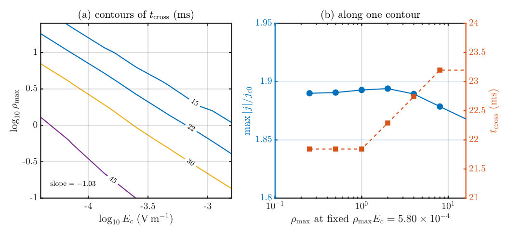 
FIG. 1. Degeneracy of the two dissipation parameters. (a) Contours of the turnover time tcross in the (log10 Ec, log10 ρmax) plane at fixed n = 64, labelled in milliseconds. They are straight and parallel, the 22 ms contour having slope −1.032 over 1.6 decades, so tcross is a function of the product ρmaxEc and the two parameters cannot be determined separately from the timing. (b) What happens on moving along one such contour, ρmaxEc held at 5.80 × 10−4, as ρmax runs over a factor of 64: the peak current (left axis) varies by 1.4%, while tcross (right axis) drifts by 6%, so the invariance is close but not exact. Note the suppressed zero on both axes of (b). The steps in tcross are the...

📷 Fig 2

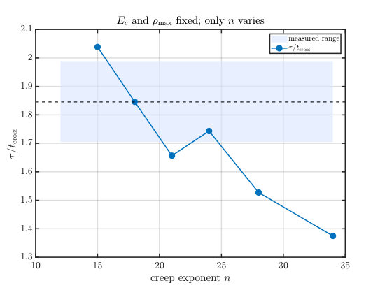 
FIG. 2. Fixing the creep exponent. The dimensionless ratio τ/tcross against n, with Ec and ρmax held at their calibrated values and on the same 288 × 288 mesh as the reference run. The shaded band is the range implied by the two relaxation constants measured on opposite edges of the film, 37.5 and 43.7 ms, against a turnover at 22 ms; the dashed line is its midpoint. The curve is smooth and monotonic, τ falling from 93 to 29 ms as n goes from 18 to 120, and it crosses the band between n ≈56 and n ≈72. Neither tcross nor the peak amplitude varies over this range: they are constant at 22.3 ms and 1.90 Jc0 to four and three digits respectively, so the exponent is fixed by τ alone and does not...

📷 Fig 3

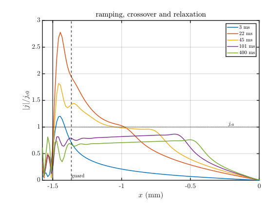 
FIG. 3. Sheet-current profiles along the left half of the central line of the film, at five instants of the calibrated run. The solid vertical line is the film edge and the dashed vertical line the edge guard of 135 µm; the dotted horizontal line marks jc0. Currents are normalised by the critical sheet current; the ratio is identical to |J|/Jc0, since the thickness cancels. The three stages are visible in sequence: screening decaying inward at 3 ms, a large peak at the edge with a long tail at 22 ms, the peak detached with a shoulder behind it at 45 ms, and the peak settled about 1 mm from the edge with a plateau behind it at 101 and 400 ms. The oscillations beyond −1.5 mm lie outside the...

📷 Fig 4

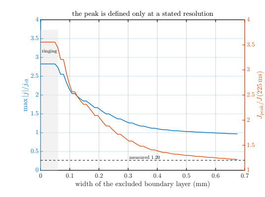 
FIG. 4. The transient peak is defined only at a stated spatial resolution. Peak current (left axis) and peak-to-asymptote ratio (right axis) as functions of the width of the boundary layer excluded from the maximum. The shaded strip is the layer within which the spectral and finite-difference represen- tations of Faraday’s law disagree by more than the signal. The dashed line is the measured ratio of 1.20, which is not attained anywhere in the range scanned: the lowest value is 1.22, at a guard of 0.68 mm or 45% of the half-width. The ap- parent convergence toward the measured value at large guard is not agreement, because by then the edge peak has been excluded altogether and the reported...

📷 Fig 5

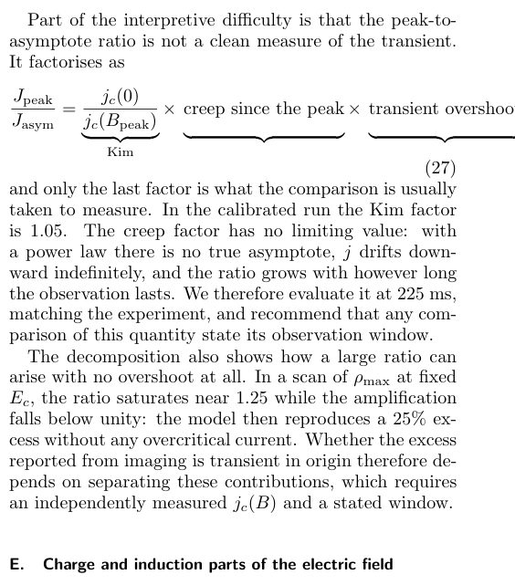 
Figure 5 shows the four maps at the instant of maxi- mum |E|. The decomposition separates the field into two components with different geometry and different histo- ries. The solenoidal part occupies a continuous annulus fol- lowing the penetrated region, widest at the centres of the four sides and narrowing toward the corners, and it reproduces |E| almost exactly: the two maps are indis- tinguishable by eye and the temporal maxima of |Ei| and |E| coincide throughout the simulated interval. This is what Eq. (1) leads one to expect, since ψ carries the whole dependence on ˙B and the drive dominates the re- sponse.

**Summary.** This work numerically models transient magnetic flux penetration in YBCO superconductors using a non-local, power-law constitutive model. The authors find that while the model captures the correct sequence of physical events, quantitative discrepancies in peak amplitudes and relaxation times persist. They conclude that these mismatches point to inherent limitations in the simplified constitutive model used, rather than a failure of the underlying non-local electrodynamics theory.

**Why it may be interesting.** While focused on superconductivity, the rigorous numerical analysis of field decomposition (Helmholtz) and the identification of model limitations (constitutive family vs. physics) provide valuable techniques applicable to complex, non-linear, time-dependent transport phenomena in quantum materials.

Detailed structure

**Main problem.** The study assesses whether a simplified, non-local power-law constitutive model can accurately reproduce high-speed magneto-optical measurements of transient flux penetration in YBCO superconducting films.

**Main result.** The model successfully establishes a reproducible non-local baseline but reveals significant discrepancies in transient amplitude ratios and relaxation constants compared to experiments, suggesting the limitation lies within the assumed constant-exponent constitutive family rather than the electrodynamics itself.

**Method.** The authors use forward numerical simulations solving Maxwell's equations in the frequency/Fourier domain, employing Helmholtz decomposition to analyze the electric field components.

**Model / system.** The system is a YBa2Cu3O7-delta film exhibiting flux penetration. The model uses a non-local, bounded, constant-exponent power-law relation for the current-voltage characteristic (E vs. J).

**Key observables.** Turnover time, relaxation constant, late maximum penetration depth, and the peak-to-window amplitude ratio of the transient magnetic response.

**Important parameters / regimes.** Critical sheet current (j_c), criterion electric field (E_c), and the creep exponent (n).

**Assumptions / limitations.** The primary assumption is the validity of a bounded, constant-exponent power-law constitutive relation to describe the current-voltage behavior during flux penetration.

**Figures summary.** Figures illustrate the Helmholtz decomposition of the electric field at peak times, showing the solenoidal part dominating the total field, while the irrotational part represents localized charge structures.

**Paper structure.** The paper establishes the governing electrodynamics using Fourier-space methods, applies the constitutive model, analyzes the resulting time-dependent observables (timing, geometry), and concludes by comparing these results against experimental data to pinpoint the model's limitations.

Abstract

We assess whether a non-local thin-film model with a bounded, constant-exponent power law can reproduce high-speed magneto-optical measurements of transient flux penetration in a $3\times3$~mm$^2$ YBa$_2$Cu$_3$O$_{7-δ}$ film. The model is solved forward in physical units and used as a controlled constitutive baseline. The critical sheet current is constrained by the final penetration geometry, while the criterion field and creep exponent are constrained by the turnover and relaxation times. The calibration reveals an intrinsic degeneracy: the turnover time depends primarily on the product of the criterion field and saturation parameter, equivalently on the saturated sheet resistivity, so these quantities cannot be identified independently. After parameterizing this degeneracy, the model captures a guarded-current turnover near 22~ms, a relaxation constant of 41.2~ms compared with the measured 37.5 and 43.7~ms, and a late maximum approximately 0.92~mm from the film edge. The amplitude remains discrepant: the calculated transient maximum is $1.90J_{c0}$ and the peak-to-225-ms ratio is 2.13, compared with the reported 1.20. This excess persists under changes in the creep exponent, the degenerate parameter direction, the Kim field dependence, and mesh resolution. Matching the measured ratio through the criterion field would require a value about three orders of magnitude below the conventional scale, while spatial exclusion sufficient to match it would remove the edge peak itself. We also decompose the electric field into irrotational and solenoidal parts and quantify the boundary layer where spectral and finite-difference forms of Faraday's law disagree. The results establish a reproducible non-local power-law baseline and identify limitations of the bounded, constant-exponent constitutive family rather than of non-local thin-film electrodynamics.

[↑ back to top](#top)

### [Optical conductivity signature of Van Hove singularity in altermagnetic topological systems](http://arxiv.org/abs/2608.20986v1)

**Authors:** Fang Qin, Rui Chen, Xiao-Bin Qiang  
**Type:** theory · **Category:** other · **PDF:** <https://arxiv.org/pdf/2608.20986v1>  
**Analysis basis:** full PDF text, analyzed in chunks
**Topic relevance:** `Keldysh / 2PI / non-Gaussian methods` **1/5** · `analog quantum simulation` **1/5**

📷 Fig 1

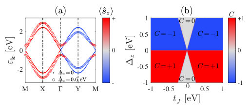 
FIG. 1. (a) Band structure [Eq. (3)] for ∆z = 0 (thin solid- circle line) and ∆z = −0.5 eV (thick open-circle line) at tJ = 0.6 eV. The color indicates the normalized expectation value of the spin operator, ⟨ˆsz⟩. (b) Topological phase dia- gram. The Chern number C [Eq. (6)] of the valence band is calculated in the gapped regime at EF = 0 as a function of the altermagnetic coupling tJ and Zeeman splitting ∆z. The red, blue, and gray regions correspond to C = +1, C = −1, and C = 0, respectively. Here, EF is the Fermi energy. The other parameters are t=1 eV and a=1 nm.

📷 Fig 2

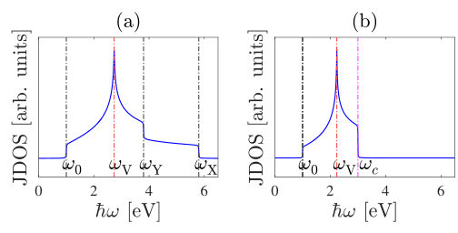 
FIG. 2. Joint density of states (JDOS) as a function of the optical frequency for (a) tJ =0.6 eV and (b) tJ =0. The other parameters are t=1 eV, ∆z =−0.5 eV, and a=1 nm.

📷 Fig 3

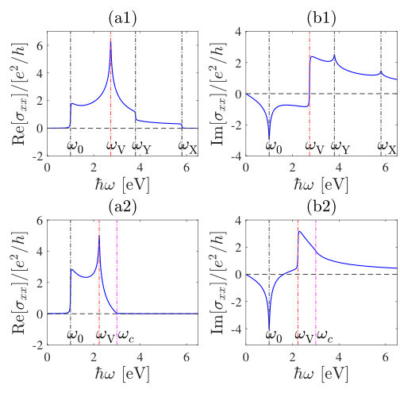 
FIG. 3. Longitudinal optical conductivity σxx [Eq. (11)] as a function of the optical frequency in the presence and absence of the d-wave altermagnetic coupling. Upper row: (a1) real part and (b1) imaginary part of σxx for tJ = 0.6 eV. Lower row: (a2) real part and (b2) imaginary part of σxx for tJ =0. The other parameters are EF = 0, t = 1 eV, ∆z = −0.5 eV, and a=1 nm.

📷 Fig 4

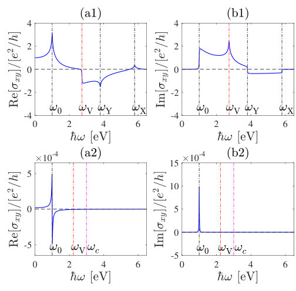 
FIG. 4. Transverse optical conductivity σxy [Eq. (11)] as a function of the optical frequency in the presence and absence of the d-wave altermagnetic coupling. Upper row: (a1) real part and (b1) imaginary part of σxy for tJ = 0.6 eV. Lower row: (a2) real part and (b2) imaginary part of σxy for tJ =0. The other parameters are the same as those used in Fig. 3.

📷 Fig 5

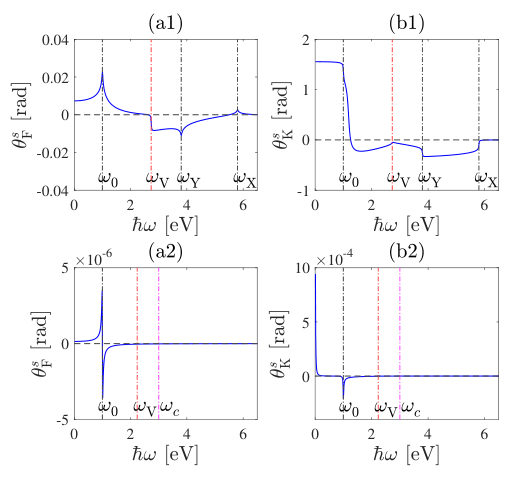 
FIG. 5. The s-component Faraday angle θs F and Kerr angle θs K as functions of the optical frequency, with and without the d-wave altermagnet. Upper row: (a1) Faraday angle θs F and (b1) Kerr angle θs K for tJ =0.6 eV. Lower row: (a2) Faraday angle θs F and (b2) Kerr angle θs K for tJ =0. Here, we consider only the free-standing case, i.e., ni = nr = nt = 1, and set θi = 0 and ϕ = π/2. The other parameters are the same as those used in Fig. 3.

**Summary.** This paper theoretically investigates how Van Hove singularities manifest in the optical conductivity of 2D $d$-wave altermagnetic topological materials. By analyzing the JDOS and $\sigma(\omega)$, the authors show that these singularities create distinct, measurable spectral peaks. This work establishes optical and magneto-optical spectroscopy as powerful tools for characterizing topological and magnetic order in novel quantum materials.

**Why it may be interesting.** The direct link established between magnetic order (altermagnetism), topological features (Dirac gaps), and measurable optical responses makes this highly relevant for understanding emergent quantum phenomena in condensed matter.

Detailed structure

**Main problem.** The study investigates the optical conductivity signature arising from Van Hove singularities within altermagnetic topological systems.

**Main result.** The research demonstrates that the Van Hove singularity features in the optical conductivity are directly linked to the presence of $d$-wave altermagnetism, providing a unique spectroscopic fingerprint.

**Method.** The analysis involves calculating the Joint Density of States (JDOS) and the optical conductivities ($\sigma(\omega)$) using theoretical models derived from the system's Hamiltonian.

**Model / system.** The system modeled is a two-dimensional $d$-wave altermagnet incorporating spin-orbit coupling and Zeeman splitting. It is characterized by topological phases and Dirac gaps at high-symmetry points.

**Key observables.** Joint Density of States (JDOS), optical conductivities ($	ext{Re}[\sigma_{xx}(\omega)]$, $	ext{Im}[\sigma_{xx}(\omega)]$), and magneto-optical responses (Faraday/Kerr rotations).

**Important parameters / regimes.** Altermagnetic order strength ($t_J$), Zeeman splitting ($\Delta_z$), and the frequency ($\omega$).

**Assumptions / limitations.** The JDOS calculation is used to probe interband optical transitions, and the analysis relies on the Hamiltonian structure describing the altermagnetic order.

**Figures summary.** Figures illustrate the band structure showing Dirac gap closures, the topological phase diagram showing Chern numbers, and the frequency dependence of the optical conductivities, highlighting peaks at Van Hove singularity frequencies.

**Paper structure.** The paper proceeds by defining the physical model (Hamiltonian), calculating the topological invariants (Chern number), determining the spectral features (JDOS), and finally mapping these features onto measurable transport quantities (optical conductivity).

Abstract

We investigate the topological phases, joint density of states (JDOS), optical conductivities, and magneto-optical responses of a two-dimensional $d$-wave altermagnet with spin-orbit coupling and Zeeman splitting. The system hosts Dirac gaps at the high-symmetry points $Γ$, $\textrm{M}$, $\textrm{X}$, and $\textrm{Y}$. We show that the JDOS exhibits kinks at the corresponding Dirac gap frequencies and pronounced peaks at Van Hove singularities, whose positions can be tuned by the altermagnetic order. These features are reflected in the optical conductivities, with complementary signatures in their real and imaginary parts. Particularly, the Van Hove signatures in the transverse optical conductivity disappear in the absence of $d$-wave altermagnetism, revealing an altermagnet-induced optical signature of the Van Hove singularity. Finally, the Faraday and Kerr rotations inherit characteristic features of the optical conductivity. Our results establish optical and magneto-optical spectroscopy as sensitive probes of Dirac gaps and Van Hove singularities in altermagnetic topological systems.

[↑ back to top](#top)

### [Towards Ultra Scalability of Non-Volatile Magnetic Tunnel Junctions with a 3D Storage Layer](http://arxiv.org/abs/2608.20850v1)

**Authors:** Nuno Caçoilo, Shunsuke Fukami, Olivier Fruchart, Ioan-Lucian Prejbeanu  
**Type:** both · **Category:** other · **PDF:** <https://arxiv.org/pdf/2608.20850v1>  
**Analysis basis:** full PDF text, analyzed in chunks
**Topic relevance:** `analog quantum simulation` **1/5** · `quantum measurements` **1/5**

📷 Fig 1

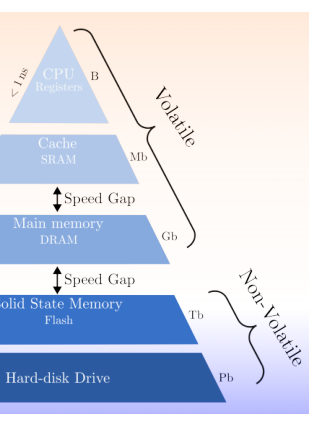 
Figure 1. Common memory hierarchy in which the operation speed and density are evaluated.

📷 Fig 2

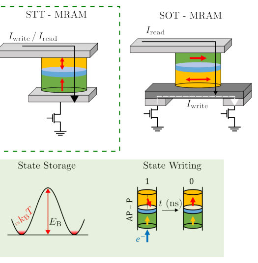 
Figure 2. Schematics of different families of MRAM designs. In all situations the reference layer is shown with green, while the storage layer is shown with yellow.

📷 Fig 3

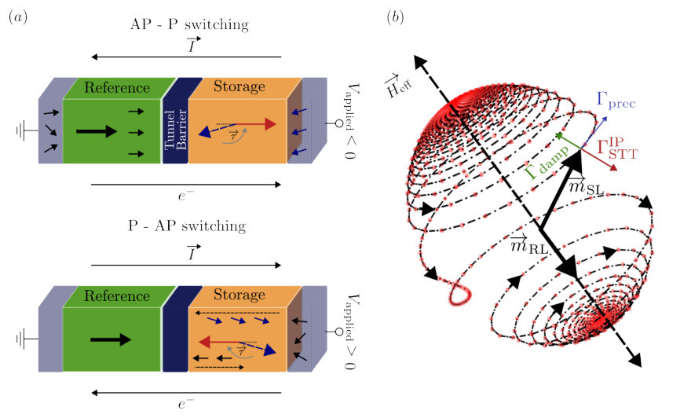 
Figure 3. (a) Schematics of the spin-transfer-torque dynamics in a MTJ for an AP - P and P - AP switching. The initial and final orientations of the magnetisation in the storage layer are respectively blue and red. (b) Trajectory of magnetisation switching induced by current described by the LLGS equation.

📷 Fig 4

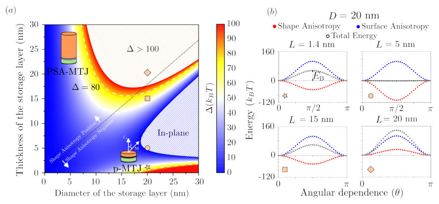 
Figure 4. (a) Stability diagram for different dimensions of the storage layer for a single FeCo(B)/MgO interface with a surface anisotropy constant of 1.4 mJm−2 for an interfacial thickness of 1.4 nm with a spontaneous magnetisation Ms = 1 MAm−1. The dashed gray line emphasises the perpendicular and in-plane nature of the shape anisotropy, perpendicular for an aspect ratio above τAR &gt; 0.89. The orange pattern shows a region with an energy barrier greater than 100 kBT and the blue pattern shows the region where the magnetisation has a preferential in-plane orientation. Orientation of magnetisation shown for the case of the p-MTJ (perpendicular for θ = 0° and in-plane for θ = π/2). Reprinted...

📷 Fig 5

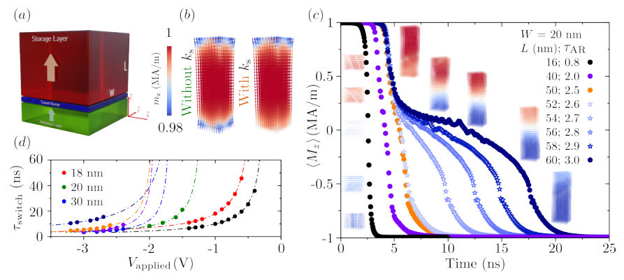 
Figure 5. (a) 3D schematics of the studied prism with thickness L and base width W. The reference layer is shown with a green colour, the tunnel barrier with a blue colour and the storage layer with a red colour. (b) 3D equilibrium relaxed state of a magnetic prism with and without surface anisotropy. The colour indicates the normalised magnitude of the magnetisation of each elementary cell along +ˆz. (c) Time trace of the mean perpendicular magnetisation ⟨Mz⟩for a storage layer with fixed base width 20 nm and various vertical aspect-ratios, for an applied voltage of −3 V. Insets of 3D snapshots show the nature of the reversal dynamics, with a colour scale ranging between – 1 and 1 MAm−1....

**Summary.** This paper tackles the critical scalability issue in pSTT-MRAM by proposing the use of 3D storage layers to enhance shape anisotropy. By understanding the physics of magnetization reversal, the authors demonstrate a viable path to maintain high thermal stability and achieve faster switching speeds in ultra-small magnetic tunnel junctions.

**Why it may be interesting.** While focused on spintronics, the underlying physics of magnetization dynamics, energy barriers, and stability in nanoscale magnetic systems touches upon concepts relevant to engineered quantum states and energy landscapes in open quantum systems.

Detailed structure

**Main problem.** The primary challenge addressed is the scalability of Perpendicular Spin Transfer Torque Magnetic Random Access Memory (pSTT-MRAM) devices, which suffer from insufficient thermal stability at nodes smaller than 20 nm.

**Main result.** The authors propose that maintaining high thermal stability at sub-10 nm nodes is viable by leveraging shape anisotropy through the use of a 3D storage layer structure.

**Method.** The work combines technological advancements with theoretical understanding of magnetization reversal dynamics to achieve faster switching speeds at lower voltages.

**Model / system.** The physical system is the Magnetic Tunnel Junction (MTJ), which utilizes ultra-thin magnetic tunnel junctions incorporating a fixed reference layer and a free storage layer.

**Key observables.** Thermal stability factor ($\Delta$), Tunnel Magnetoresistance (TMR), switching speed, and switching voltage.

**Important parameters / regimes.** Device node size (sub-10 nm), shape anisotropy, and the required TMR ratio ($\ge 200\%$).

**Assumptions / limitations.** The approach relies on enhancing the volume and vertical aspect-ratio of the storage layer to counteract the loss of thermal stability as dimensions shrink.

**Figures summary.** Figure 1 illustrates the memory hierarchy (speed vs. density), and Figure 2 provides schematics of different MRAM designs showing the reference and storage layers.

**Paper structure.** The paper progresses by first identifying the scalability limits of pSTT-MRAM, then proposing the 3D storage layer solution, and finally detailing the technological advancements and physics governing magnetization reversal for ultra-small junctions.

Abstract

The perpendicular Spin Transfer Torque Magnetic Random Access Memory is one of the most promising emerging non-volatile memory technologies, based on ultra-thin magnetic tunnel junctions. However, as these devices are limited by their thermal stability factor at technological nodes smaller than 20 nm, their scalability is compromised. A possible solution to this limitation relies on taking advantage of the shape anisotropy, by increasing substantially the thickness of the storage layer. Thanks to the combination of a vertical aspect-ratio and enhanced volume, high thermal stability can be maintained at sub-10 nm nodes. Here, we present the technological advancements and understanding of the magnetisation reversal that led to faster switching speeds at reduced switching voltage, providing a viable approach for dense arrays of ultra-small magnetic tunnel junctions.

[↑ back to top](#top)

### [Dynamics of localized solutions in three core coupled waveguides with quasi-periodic nonlinearity](http://arxiv.org/abs/2608.21331v1)

**Authors:** Bruno M. Miranda, Ardiley T. Avelar, Wesley B. Cardoso, Dionisio Bazeia  
**Type:** theory · **Category:** other · **PDF:** <https://arxiv.org/pdf/2608.21331v1>  
**Analysis basis:** full PDF text, analyzed in chunks
**Topic relevance:** `analog quantum simulation` **1/5**

📷 Fig 1

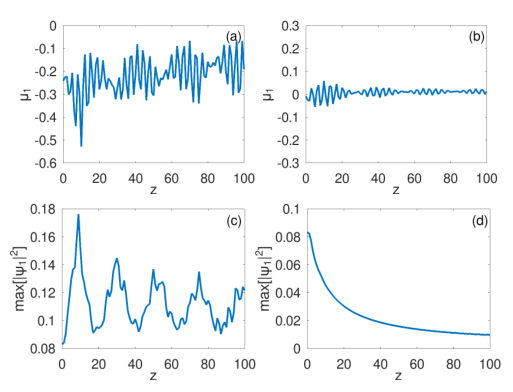 
FIG. 3. Upper panel: Propagation constant µ1 for the cases with a) A0 = 2 and b) A0 = −2. Lower panel: Peak intensity of the solution |ψ1|2 for the cases with c) A0 = 2 and d) A0 = −2.

📷 Fig 2

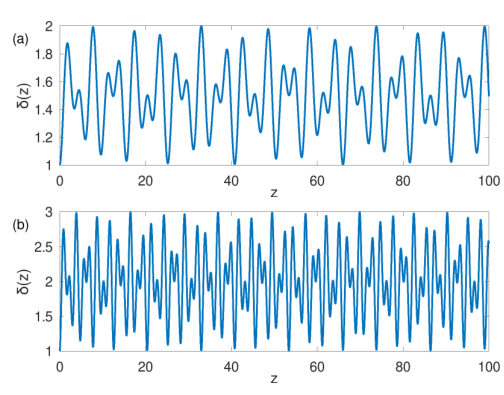 
FIG. 1. Quasi-periodic cross-phase modulation coefficient δ(z), given by Eq. (6). In panel (a), we depict the modula- tion for k1 = 1 and A0 = 1, while in panel (b), we show k1 = 2 with A0 = 2. For both cases, k2 follows the ratio k2/k1 = ( √

📷 Fig 3

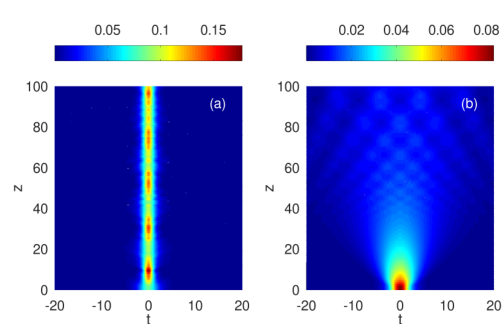 
FIG. 2. Spatial evolution analysis of the profile of |ψ1|2 for the cases with a) A0 = 2 and b) A0 = −2. In both cases, we use γ = −1, k1 = 1, and k2 = ( √

📷 Fig 4

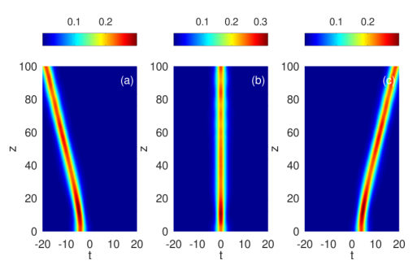 
FIG. 4. Spatial evolution of the field profiles: a) |ψ1|2, b) |ψ2|2, and c) |ψ3|2 with k1 = 1 and A0 = −0.8, highlighting a repul- sive interaction leading to continuous separation of solitons.

📷 Fig 5

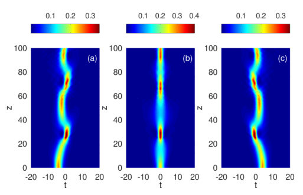 
FIG. 5. Spatial evolution of the field profiles: a) |ψ1|2, b) |ψ2|2, and c) |ψ3|2 with k1 = 1 and A0 = 0.8, indicating an attraction between the solitons.

**Summary.** This work analyzes how quasi-periodic nonlinear modulation affects the dynamics of solitons in three coupled optical waveguides. By simulating the system, the authors demonstrate that the sign of the modulation dictates whether solitons experience attraction, leading to bound states, or repulsion, causing them to separate. This research is significant for understanding and controlling light pulse propagation in advanced nonlinear optical devices.

**Why it may be interesting.** The study provides a concrete example of how time- or space-dependent nonlinear coupling terms (quasi-periodicity) can fundamentally alter the stability and interaction dynamics of nonlinear waves, which is relevant to engineered photonic systems.

Detailed structure

**Main problem.** The paper investigates the complex dynamics of localized solutions, specifically solitons, propagating in a system of three coupled waveguides.

**Main result.** The interaction between solitons is highly dependent on the sign of the quasi-periodic modulation amplitude ($A_0$), leading to distinct regimes of attraction (bound states) or repulsion (separation).

**Method.** The study relies on theoretical analysis complemented by detailed numerical simulations, utilizing techniques like the split-step method and FFT.

**Model / system.** The system is modeled by coupled Nonlinear Schrödinger Equations (NLS) describing three coupled optical waveguides. The coupling is modulated quasi-periodically via the cross-phase modulation coefficient, $\delta(z)$.

**Key observables.** Soliton profiles ($|\psi_i|^2$), center of mass, and variance of the field amplitudes.

**Important parameters / regimes.** The quasi-periodic modulation amplitude ($A_0$), the constant background coupling ($\delta_0$), and the wave numbers ($k_l$) defining the modulation.

**Assumptions / limitations.** The analysis assumes the system can be effectively described by the coupled NLS equations and focuses on the impact of the quasi-periodic modulation term.

**Figures summary.** Figures illustrate the spatial evolution of the field intensity for different modulation amplitudes ($A_0$), comparing stable/unstable solutions and showing the separation or convergence of solitons.

**Paper structure.** The paper details the model (Section II), presents numerical results analyzing different interaction regimes (Section III), and concludes with a discussion of the findings and future work (Section IV).

Abstract

In this paper we investigate the behavior of localized solutions, specifically solitons, in a system of three coupled waveguides. The nonlinearity is modeled by a quasi-periodic modulation influencing the interaction between the waveguides. We analyze the evolution of the soliton profiles and their dynamics under varying modulation parameters, highlighting distinct behaviors such as attraction and repulsion among solitons. Our findings reveal that the system exhibits complex behaviors, depending on the interplay between the quasi-periodic modulation and the waveguide parameters. The study contributes to understanding the impact of quasi-periodic nonlinearity on soliton dynamics in coupled waveguide systems, laying the groundwork for potential applications in nonlinear optics and photonic devices.

[↑ back to top](#top)

### [Electric-Field-Induced Second Harmonic Generation at a Reconfigurable LaAlO$_3$/SrTiO$_3$ Nanojunction](http://arxiv.org/abs/2608.21065v1)

**Authors:** Pubudu Wijesinghe, Melanie Dieterlen, Kyoungjun Lee, Ahmed Omran, Aswini Ramankutty, Chang-Beom Eom, Patrick Irvin, Jeremy Levy  
**Type:** experiment · **Category:** other · **PDF:** <https://arxiv.org/pdf/2608.21065v1>  
**Analysis basis:** full PDF text, analyzed in chunks
**Topic relevance:** `interference shaping light` **1/5**

📷 Fig 1

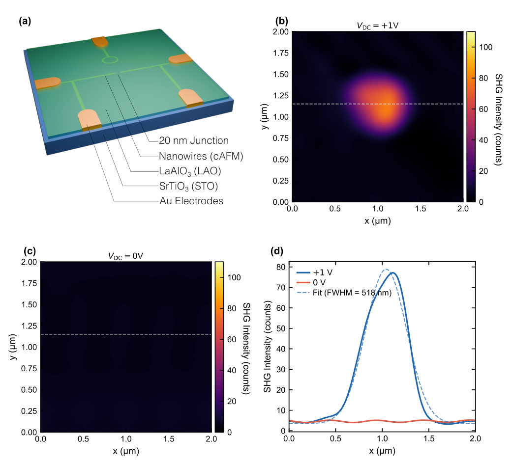 
FIG. 1. Device geometry and spatial imaging of the EFISH response. (a) Schematic of the cAFM-written LAO/STO nanojunction with gold contact pads; a conducting nanowire along [100] is interrupted by a ∼20 nm insulating gap, with DC bias VDC applied across the junction. (b) SHG map at VDC = +1 V, showing a localized enhancement at the nanogap (∼80 counts vs. ∼5 counts background). (c) SHG map at zero bias, showing no localized signal above background. (d) Line profiles for both bias conditions; the +1 V profile is fitted by a Gaussian (dashed) with FWHM ≈500 nm, near the diffraction limit for 400 nm light at NA = 0.5.

📷 Fig 2

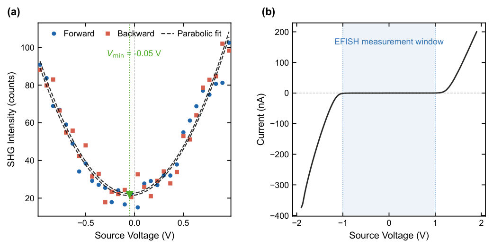 
FIG. 2. Bias dependence of the EFISH signal at the LAO/STO nanojunction. (a) SHG intensity vs. applied DC bias VDC, recorded in forward (blue) and reverse (red) sweeps. Solid curves are fits to Eq. (2), yielding a minimum at Vmin = −50 ± 3 mV consistent between sweeps; the finite signal at VDC = 0 reflects the bias-independent χ(2) 0 contribution, while the dominant quadratic term confirms the EFISH character of the response. (b) Current–voltage characteristic over a wider range, confirming resistive behavior within the ±1 V measurement window (shaded), consistent with negligible carrier transport during the optical measurement.

📷 Fig 3

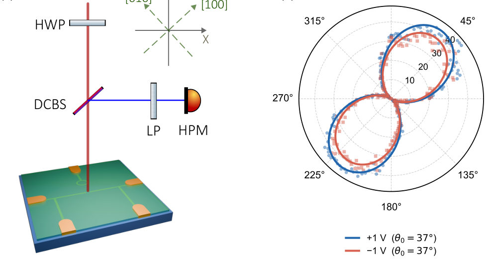 
FIG. 3. (a) Schematic of the polarization-resolved EFISH measurement setup (see also supplementary material Fig. S1). The fundamental beam passes through a half-wave plate (HWP) to set the input polarization angle θ, defined relative to the laboratory Y-axis, with the crystal [100] and [010] axes (dashed green) oriented at ±45◦. The signal is separated by a dichroic beam splitter (DCBS), filtered by a linear polarizer (LP), and measured with a hybrid photomultiplier (HPM). (b) Input polarization dependence of the EFISH signal from the LAO/STO nanojunction at +1 V (blue) and −1 V (red). Solid curves are cos2 fits yielding a lobe orientation θ0 = 36.7◦, consistent with the junction axis. The...

📷 Fig 4

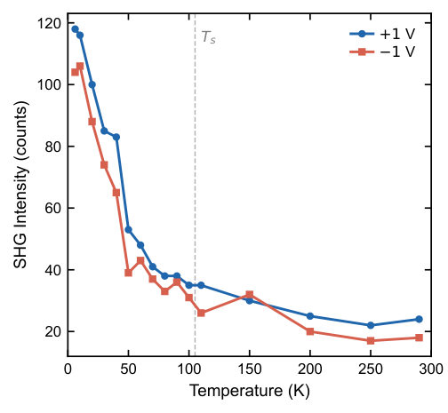 
FIG. 4. Temperature dependence of the EFISH signal at the LAO/STO nanojunction at fixed VDC = +1 V (blue) and −1 V (red). The signal increases approximately fivefold upon cooling from 290 K to 6 K, a modest enhancement governed by the field-saturated quasi- static soft mode rather than the divergence of its small-signal permit- tivity (see text). The asymmetry between ±1 V persists across the full temperature range.

**Summary.** This paper reports on the observation of electric-field-induced second harmonic generation (EFISH) in a nanoscale LaAlO3/SrTiO3 tunnel junction. By applying a DC bias across the junction, the authors induce a large, tunable nonlinear optical response localized to the nanoscale gap. This establishes the junction as a reconfigurable platform for studying field-controlled nonlinear optics in oxide heterostructures.

**Why it may be interesting.** This work demonstrates a solid-state, electrically tunable source of nonlinear optical effects in a highly confined geometry, which is crucial for developing nanoscale quantum optical components.

Detailed structure

**Main problem.** The challenge is achieving electrically tunable nonlinear optical responses at the nanoscale, as conventional materials lack the necessary combination of large susceptibility, nanoscale confinement, and in situ reconfigurability.

**Main result.** The authors successfully demonstrated electric-field-induced second harmonic generation (EFISH) in a nanoscale LaAlO3/SrTiO3 junction, showing a large, tunable signal ($\sim 380\%$ modulation depth) localized to the junction gap.

**Method.** The experiment uses conductive atomic force microscope (cAFM) lithography to create a nanoscale tunnel junction, across which a DC bias is applied while measuring the second harmonic generation (SHG) signal.

**Model / system.** The physical system is a reconfigurable LaAlO3/SrTiO3 nanojunction. The nonlinearity is modeled by the SHG intensity $I(2\omega) \propto |\chi^{(2)}_0 + \chi^{(3)} E_{	ext{DC}}|^2$, where the applied DC field $E_{	ext{DC}}$ breaks inversion symmetry and induces the second-order susceptibility $\chi^{(2)}$.

**Key observables.** SHG intensity vs. DC bias ($V_{	ext{DC}}$), input polarization dependence (two-lobed pattern), and temperature dependence (sharp rise below 50 K).

**Important parameters / regimes.** Estimated third-order susceptibility $|\chi^{(3)}| \approx 1 	imes 10^{-19} 	ext{ m}^2/	ext{V}^2$ at 6 K; junction gap size $\sim 20 	ext{ nm}$.

**Assumptions / limitations.** The analysis assumes the measured response is dominated by the field-induced $\chi^{(2)}$ term, and calibration against BBO is used to quantify $\chi^{(3)}$.

**Figures summary.** Figures illustrate the device geometry, the strong enhancement of SHG upon applying bias (Fig. 1b), the localization of the signal to the nanoscale gap (Fig. 1d), and the dependence of the signal on bias, polarization, and temperature (Figs. 2, 3, 4).

**Paper structure.** The paper establishes the problem, details the cAFM-written junction setup, presents measurements showing bias-dependent, polarization-dependent, and temperature-dependent SHG signals, and concludes by quantifying the field-induced nonlinear susceptibility.

Abstract

Electrically tunable nonlinear optical responses at the nanoscale remain challenging to achieve because conventional nonlinear materials lack the combination of large susceptibility, nanoscale confinement, and in situ reconfigurability. Here we report electric-field-induced second harmonic (EFISH) generation from a nanoscale tunnel junction defined by conductive atomic force microscope lithography at the LaAlO$_3$/SrTiO$_3$ interface. A conducting channel written at the interface is interrupted by a nanoscale insulating gap, across which applied DC bias produces local electric fields exceeding $10^7$ V/m. The SHG signal is spatially localized at the junction, exhibits a quadratic bias dependence described by $I(2ω) \propto |χ^{(2)}_\mathrm{0} + χ^{(3)} E_\mathrm{DC}|^2$ with no hysteresis, a modulation depth exceeding 380% at $|V_\mathrm{DC}| = 1$ V, and shows a two-lobed input-polarization pattern aligned with the junction axis, consistent with EFISH from a centrosymmetric host. Calibration against a BBO reference crystal gives $|χ^{(3)}| \approx 1\times10^{-19}$ m$^2$/V$^2$ at 6 K. These results establish cAFM-written oxide nanojunctions as a reconfigurable platform for nanoscale nonlinear optics in which the junction geometry sets the symmetry of the response and the large field-induced $χ^{(2)}$ of SrTiO$_3$ provides the optical nonlinearity. Because the nonlinearity is both generated and read out within the same nanoscale gap, the junction operates simultaneously as a subwavelength source and a near-field detector of optical nonlinearity.

[↑ back to top](#top)

### [Orbital-Selective Spin Splitting in the Altermagnetic Ti$_2$XX' Monolayers](http://arxiv.org/abs/2608.20695v1)

**Authors:** Xin Zhang, Shihao Zhang  
**Type:** theory · **Category:** strongly correlated electrons · **PDF:** <https://arxiv.org/pdf/2608.20695v1>  
**Analysis basis:** full PDF text, analyzed in chunks
**Topic relevance:** `analog quantum simulation` **1/5**

📷 Fig 1

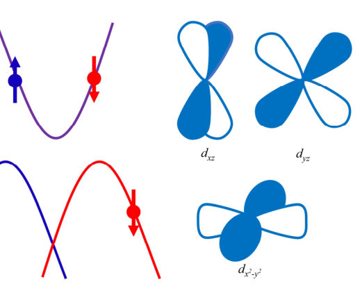 
Figure 1. (a) Top view and (b) side view of schematic structures of Ti2XX'. Light-blue, brown and

📷 Fig 2

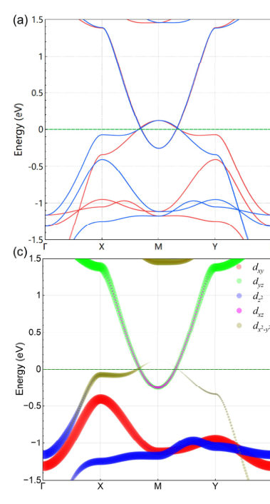 
Figure 2. Band structures of Ti2Br2 calculated by different functionals: (a) PBE+U functional with

📷 Fig 3

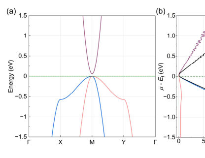 
Figure 3. (a) Theoretically simulated band structures. We use the set of parameters: 휇= 0.0, 퐴=

**Summary.** This work investigates the electronic structure of monolayer altermagnetic Ti2XX' materials, finding unique spin-splitting patterns. The key finding is the presence of nearly spin-degenerate conduction bands, which are sensitive to the Ti-X-Ti bond angle. This tunability suggests these materials are promising candidates for next-generation spintronic and information storage devices.

**Why it may be interesting.** The study of orbital-selective spin splitting and the ability to tune electronic states via structural parameters (bond angle) touches upon emergent quantum phenomena in condensed matter that are relevant to advanced quantum materials design.

Detailed structure

**Main problem.** To systematically explore the novel electronic properties, particularly the transition between spin-degenerate and spin-split states, in monolayer altermagnetic Ti2XX' materials.

**Main result.** The materials exhibit anomalous nearly spin-degenerate conduction bands near the Fermi level, which can be tuned by doping or heterostructure construction, suggesting potential for information storage devices.

**Method.** First-principles calculations using DFT (PBE and HSE06 functionals) combined with tight-binding models and spin-resolved conductivity simulations.

**Model / system.** The physical system is the monolayer altermagnetic Ti2XX' (X/X' = F, Cl, Br, I). The analysis focuses on the interplay between bond-angle-sensitive super-exchange interactions in the d_xz/d_yz orbitals.

**Key observables.** Spin-splitting magnitude ($\Delta E$), spin-resolved conductivities ($\sigma_{xx}^{\uparrow}, \sigma_{xx}^{\downarrow}$), and the degree of spin degeneracy in the conduction bands.

**Important parameters / regimes.** Ti-X-Ti bond angle ($	heta$), Fermi level position, and the choice of DFT functional (PBE vs. HSE06).

**Assumptions / limitations.** The analysis relies on the ligand-mediated super-exchange picture and uses the Slater-Koster two-center approximation in the tight-binding model.

**Figures summary.** Figures show schematic structures, band-structure results confirming spin-split valence bands and spin-degenerate conduction bands, and projected band weight curves illustrating orbital contributions.

**Paper structure.** The paper progresses from identifying the unique spin-splitting features in the valence bands to explaining the anomalous conduction band degeneracy via bond-angle-sensitive super-exchange, culminating in the potential for electronic state switching via doping.

Abstract

Altermagnets have attracted intensive attention recently, owing to their unique combination of zero net magnetic moment of antiferromagnets and momentum space spin-splitting of ferromagnets. Herein, we systematically explore monolayer altermagnetic Ti$_2$XX' (X/X' = F, Cl, Br, I) materials for novel electronic properties. Especifically, spin-splitting exists in the valence bands of all studied materials, whereas several compositions exhibit nearly spin-degenerate conduction bands near the Fermi level, which is markedly different from conventional altermagnets. This phenomenon can be attributed to the bond-angle-sensitive super-exchange occurring in the $d_{xz}$ or $d_{yz}$ orbitals, while the super-exchange of the $d_{x^2-y^2}$ orbital is not sensitive to the Ti-X-Ti bond angle. Motivated by this intriguing phenomenon, Fermi level modulation via doping or heterostructure construction enables the transition between two electronic states, endowing these materials great application potential in information storage devices.

[↑ back to top](#top)

### [Perspectives on Magnetic/Superconductor Hybrid Systems: Long-range Electromagnetic Phenomena Induced by Proximity Effect and Interfacial Spin-orbit Coupling](http://arxiv.org/abs/2608.20535v1)

**Authors:** S. V. Mironov, A. S. Mel'nikov, A. I. Buzdin  
**Type:** theory · **Category:** other · **PDF:** <https://arxiv.org/pdf/2608.20535v1>  
**Analysis basis:** full PDF text, analyzed in chunks
**Topic relevance:** `Keldysh / 2PI / non-Gaussian methods` **1/5**

📷 Fig 1

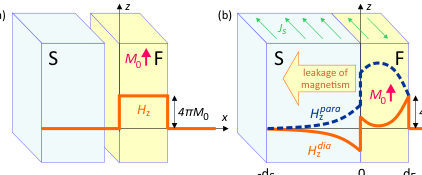 
FIG. 1: Planar superconductor/ferromagnet system. (a) When the layers are separated from each other the magnetic field exists only inside the F layer. (b) In contrast, when there is electric contact be- tween the layers the magnetization inside the ferromagnet becomes the source of the long-range magnetic field in the superconductor. In both panels the orange solid (blue dashed) curves schematically rep- resent the profile of the magnetic field when the total current inside the F layer is diamagnetic (paramagnetic). Green arrows schemati- cally show the direction of the superconducting currents flowing in- side the S and F layers. Reproduced from [S. V. Mironov, A. S. Mel’nikov, and A. I....

📷 Fig 2

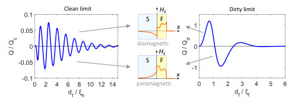 
FIG. 3: The dependence of the magnetic kernel Q for the S/F bilayer on the F layer thickness df in the clean and dirty lim- its. For the clean limit we take the exchange field h inside the F layer equal to h = 10πT and choose the temperature T in a way that the superconducting gap ∆= 2πT. Also we define the val- ues Qd = π2σ f ξ 2 f tanh(∆/2T)/(2¯hc2) and Qc = e2N(0)ξ 2 h (vF/c)2

📷 Fig 3

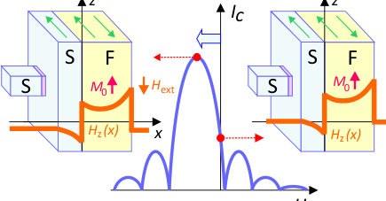 
FIG. 2: Shift in the Fraunhofer critical current oscillations for the Josephson junction with one electrode covered by the ferromagnetic layer. Reproduced from [S. V. Mironov, A. S. Mel’nikov, and A. I. Buzdin, Appl. Phys. Lett. 113, 022601 (2018)].

📷 Fig 4

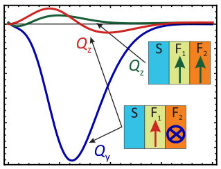 
FIG. 4: The dependencies of magnetic kernels Q for dirty S/F1/F2 structure on the F1 ferromagnet thickness d1. The green curve corre- sponds to Qz for the parallel orientation of magnetic moments, while the red and the blue ones are Qz and Qy for perpendicular orienta- tion, respectively. Here Q0 = 16π2Tσ f ξ 2 f /c2 and we take ∆= 2πT, h = 50πT, d2 = 10ξf . Reproduced from [Zh. Devizorova, S. V. Mironov, A. S. Mel’nikov, and A. Buzdin, Phys. Rev. B 99, 104519 (2019)].

📷 Fig 5

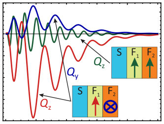 
FIG. 5: The dependencies of magnetic kernels Q for clean S/F1/F2 structure with identical thicknesses of the ferromagnets, i.e. d1 = d2, on d1. Here ξf = ¯hvF/h. The green curve corresponds to Qz for parallel orientation of magnetic moments, while the red and blue ones are Qz and Qy for perpendicular orientation, respectively. The parameters are ∆= 2πT, h = 10πT. Here Γ = 8π2e2N(0)v4 F/(c2T 2). Reproduced from [Zh. Devizorova, S. V. Mironov, A. S. Mel’nikov, and A. Buzdin, Phys. Rev. B 99, 104519 (2019)].

**Summary.** This perspective review surveys the physics of superconductor-ferromagnet hybrids, focusing on how magnetic ordering and interfacial spin-orbit coupling induce long-range electromagnetic effects. It details mechanisms like the electromagnetic proximity effect, which leads to measurable magnetic field modifications in the superconductor. The work is crucial for understanding superconducting spintronics and developing novel quantum devices.

**Why it may be interesting.** The interplay between superconductivity, magnetism, and spin-orbit coupling in nanoscale structures presents rich, non-equilibrium many-body physics relevant to open quantum systems and superconducting qubits.

Detailed structure

**Main problem.** The paper reviews the long-range electromagnetic phenomena occurring in hybrid superconductor-ferromagnet (S/F) structures, driven by proximity effects and interfacial spin-orbit coupling (SOC).

**Main result.** The review highlights the existence of a long-range electromagnetic proximity effect where superconducting currents penetrate the ferromagnet, inducing measurable magnetic fields in the superconductor.

**Method.** The analysis involves reviewing theoretical models derived from electrodynamics (Maxwell's equations) applied to superconducting transport phenomena in layered magnetic structures.

**Model / system.** The physical system is the S/F hybrid junction. Key mechanisms include the standard proximity effect, the electromagnetic proximity effect (where F magnetization induces screening currents in S), and SOC effects leading to nonreciprocal transport.

**Key observables.** Long-range magnetic field profiles ($B$), shifts in Fraunhofer critical current oscillations, and nonreciprocal transport signals (spin-galvanic, photogalvanic).

**Important parameters / regimes.** London penetration depth ($\lambda$), superconducting coherence length ($\xi$), and the magnetization ($M_0$) of the ferromagnet.

**Assumptions / limitations.** The analysis often relies on approximations such as the dirty limit or specific geometric assumptions regarding layer thicknesses relative to penetration depths.

**Figures summary.** Figures illustrate the magnetic field profile difference between separated and electrically contacted S/F layers, and show the expected shift in Fraunhofer critical current oscillations.

**Paper structure.** The review progresses by contrasting the competing orders of S and F, detailing the electromagnetic proximity effect, then focusing on the role of SOC in generating spontaneous currents, and concluding with discussions on future theoretical and experimental directions.

Abstract

In this Perspective we review recent achievements in physics and applications of hybrid superconductor-ferromagnet structures. In particular, we focus on the manifestations of the electromagnetic phenomena in these systems originating from the response of the induced superconducting correlations modified by the exchange field and additional effects coming from the interface Rashba-type spin-orbit coupling. The review includes the long-range electromagnetic proximity effect and related modification of magnetic textures, spontaneous currents, properties of vortex matter and its interaction with magnetic ordering, spin-galvanic, photogalvanic and nonreciprocal transport phenomena in exemplary hybrid systems. We also present our views on the future development of this field including both the theoretical challenges and promising opportunities for fundamental experiments.

[↑ back to top](#top)

### [Time-Resolved Thermal Susceptibility Mapping via Low-Temperature Scanning Laser Microscopy](http://arxiv.org/abs/2608.20862v1)

**Authors:** Nicolas Lejeune, Simon Van der Heyde, Alejandro V. Silhanek  
**Type:** experiment · **Category:** other · **PDF:** <https://arxiv.org/pdf/2608.20862v1>  
**Analysis basis:** full PDF text, analyzed in chunks
**Topic relevance:** `quantum measurements` **1/5**

📷 Fig 1

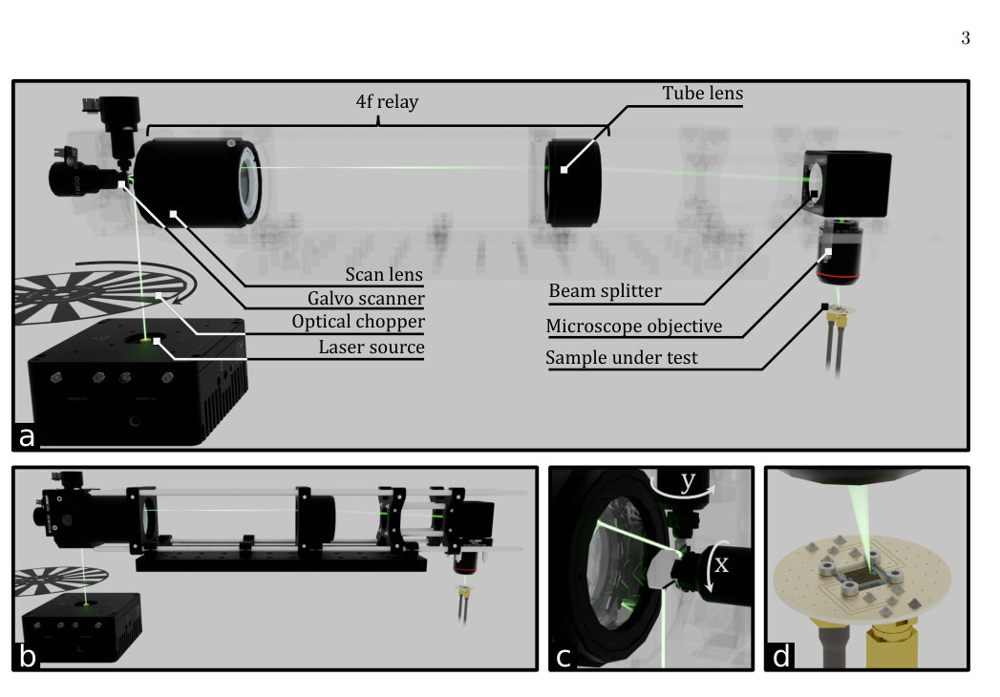 
FIG. 1: (a) Schematic view of the optical elements of the scanning laser microscope. The collimated laser beam passes through a mechanical chopper and is then steered using a dual-axis galvo scanner. The beam then passes through a 4f-relay system and is reflected towards the objective pupil using a 50-50 beam splitter. The light reflected from the sample can be coupled to a photodiode (not shown) using a converging lens placed above the beam splitter. (b) Schematic view of the entire mechanical setup. It is assembled as a single module that can be adapted to fit a wide range of measurement platforms. (c) Close-up view of the 2-axis scanner whose center is placed at the focal point of the...

📷 Fig 2

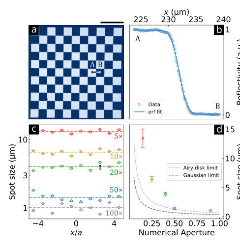 
FIG. 2: (a) A representative 501×501 px2 SLM image ac- quired using the sample reflectivity as photoresponse. This image was obtained using a 20x objective and a photodiode as detector. The scale bar in the upper right corner corre- sponds to 250 µm. (b) Line scan along the segment A-B indicated in panel (a) spanning across the transition between the substrate and the reflective Al square. The solid line cor- responds to the fit of Eq. 1 and is used to estimate the 1/e2

📷 Fig 3

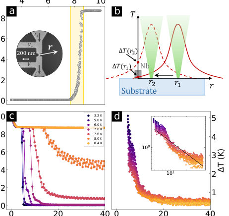 
FIG. 3: (a) Resistance of a Nb junction thermometer as a function of temperature. The range over which the resistance- to-temperature conversion is exploitable is shaded in yellow. The inset shows a scanning electron microscope image of the probing device: the current is injected through the top and bottom terminals, and the voltage is measured across the left- hand lines. The distance r defines the reference used in pan- els (b-d). (b) Schematic of the temperature profile induced by the absorbed laser light. The Nb junction measures the temperature rise as the laser is scanned across the surface. (c) Resistance as a function of the distance between the center of the laser spot and the...

📷 Fig 4

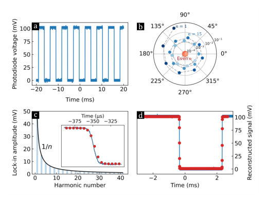 
FIG. 4: Validation and proof-of-principle. (a) A laser is chopped at a fixed frequency f = 188.27 Hz, and the light reflected in a mirror is detected using a photodiode. The sig- nal is periodic and can therefore be reconstructed using the inverse Fourier transform method. (b) Coefficient measured using a lock-in amplifier for the first 40 harmonics. The first harmonic n = 1 is the strongest. The amplitude decreases inversely proportional to the odd harmonic number, whereas the even harmonics are significantly smaller. The information carried by the phase corresponds to the synchronization of the detected signal to the reference TTL signal. (c) Amplitude of the measured Fourier...

📷 Fig 5

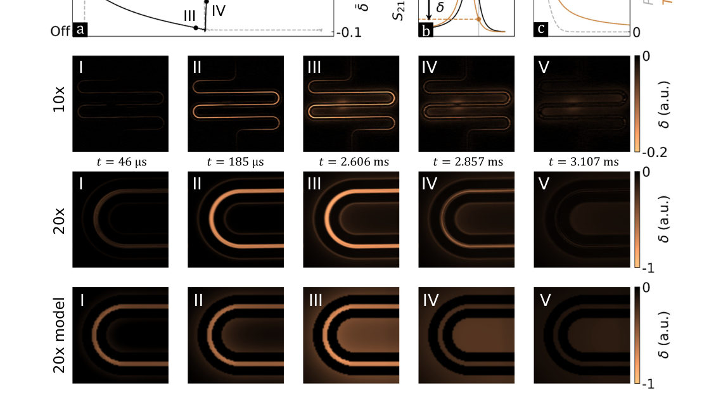 
FIG. 5: (a) Time-resolved reconstruction of the average response of the superconducting resonator over one chopper period. The signal captured by the photodiode, corresponding to the on/off state of the laser, is plotted in a dashed line. (b) Graphical representation of the probed photoresponse δ, corresponding to the change in RF power transmitted through the resonator at fixed frequency and which depends on the temperature distribution in the sample. The black (orange) curve illustrates the case where the laser is away (near) from (to) a sensitive region. (c) Optical (dashed gray) and thermal (yellow) spot profiles. The thermal profile is obtained from simulation and is used as the kernel...

**Summary.** This work introduces a novel, high-resolution technique using low-temperature scanning laser microscopy combined with multiharmonic lock-in detection to map the time evolution of thermal susceptibility. By analyzing the frequency components of the photoresponse, the authors can reconstruct dynamic thermal images, enabling the measurement of heat diffusion parameters in superconducting materials. This method offers a powerful tool for characterizing thermal dynamics in low-dimensional quantum devices.

**Why it may be interesting.** The ability to map thermal susceptibility dynamically provides a powerful, non-invasive probe into energy dissipation and heat transport mechanisms in superconducting circuits, which is crucial for understanding device performance and thermal management in quantum technologies.

Detailed structure

**Main problem.** To achieve time-resolved thermal susceptibility mapping with high spatial resolution, especially for dynamic thermal characterization on time scales shorter than the intrinsic scanning speed.

**Main result.** The technique successfully reconstructs time-domain thermal responses from frequency-domain harmonic data, allowing for the measurement of heat diffusion parameters like thermal diffusivity and propagation speed in superconducting structures.

**Method.** A multiharmonic lock-in detection approach utilizing the inverse Fast Fourier Transform (FFT) is employed on a custom low-temperature scanning laser microscope setup.

**Model / system.** The experiment is performed on superconducting resonators (e.g., Nb bridges, YBCO meanders) cooled to low temperatures, where localized laser heating induces measurable changes in electrical resistance.

**Key observables.** Photoresponse, local thermal susceptibility ($\Pr$), temperature profile ($\Delta T(r)$), and the time delay of the thermal response.

**Important parameters / regimes.** Time resolution ($\sim$ few-$\mu$s), spatial resolution, thermal diffusivity ($D$), and heat propagation speed ($v$).

**Assumptions / limitations.** The reconstruction assumes the measured signal is a global dynamic susceptibility, and the analysis relies on fitting temperature responses across distinct spatial regimes (near-field, intermediate, far-field).

**Figures summary.** Figures illustrate the SLM setup, calibration using chessboards, the dependence of laser spot size on NA, and critically, the reconstruction of time-domain thermal responses (e.g., square wave $
ightarrow$ saw-tooth $
ightarrow$ sine wave) as a function of distance from the excitation source.

**Paper structure.** The paper details the development of the multiharmonic lock-in technique, validates the setup using calibration standards, applies it to measure steady-state temperature profiles, and culminates in analyzing the time-dependent thermal response across various spatial regimes to extract diffusion constants.

Abstract

We present a multiharmonic lock-in detection approach that utilizes the inverse Fast Fourier Transform to reconstruct the time evolution of thermal susceptibility with high spatial resolution. The method is implemented on a custom-built, modular scanning laser microscope designed for operation in low working-distance optical cryostats and thoroughly calibrated for spatial accuracy. A demonstrative case study using a superconducting resonator highlights the capability of this technique to generate thermal images on time scales significantly shorter than the intrinsic scanning speed, thus enabling dynamic thermal characterization with high spatial fidelity. The proposed technique of low-temperature time-resolved scanning laser microscopy offers unique opportunities to explore superconducting devices, 2D materials, hybrid planar structures, and other low-dimensional systems.

[↑ back to top](#top)

### Other secondary papers (3)

Show other secondary papers

### [Identification of the length scale parameter of simplified strain gradient elasticity from standard Mode I fracture tests](http://arxiv.org/abs/2608.21016v1)

**Authors:** Yury Solyaev, Kirill Shelkov, Pavel Polyakov  
**Type:** both · **Category:** other · **PDF:** <https://arxiv.org/pdf/2608.21016v1>  
**Analysis basis:** full PDF text, analyzed in chunks

📷 Fig 1

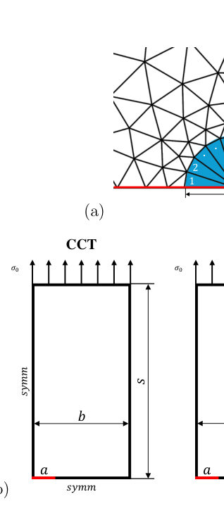 
Figure 1: (a): Finite element mesh near the crack tip (enriched elements are shown in blue), (b): Schematic representation of the specimen geometries and boundary conditions for the CCT, SENT, and SENB models. The crack face is highlighted in red.

📷 Fig 2

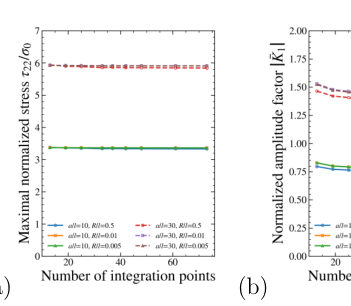 
Figure 2: Convergence of the enriched C1-FEM solution with respect to the number of integration points: (a) regularised stress τ22, (b) first amplitude factor K1, (c) second amplitude factor K2

📷 Fig 3

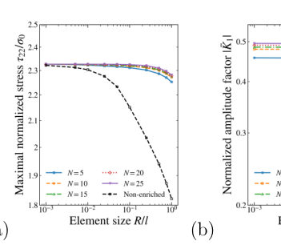 
Figure 3: Convergence of the enriched C1-FEM solution with respect to the element size at the crack tip for different numbers of elements around the crack tip: (a) stress τ22, (b) first amplitude factor K1, (c) second amplitude factor K2

📷 Fig 4

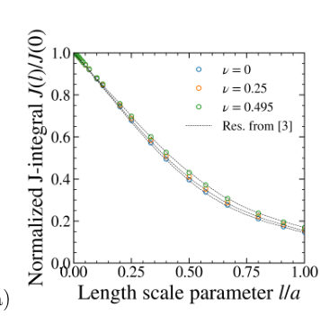 
Figure 4: Validation of calculated J-integral values: (a) comparison of ob- tained numerical solution (dots) with the semi-analytical solution of Gourgi- otis and Georgiadis [14] (lines), (b) convergence to the classical LEFM limit of numerical solution.

📷 Fig 5

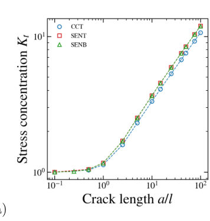 
Figure 5: Typical dependence of stress concentration factor Kt (a) and nomi- nal strength σn (b) on the normalised crack length a/l for different specimens in fracture mechanics tests evaluated within SGE for a/b = 0.1.

**Summary.** This paper develops a framework using simplified Strain Gradient Elasticity (SGE) to model fracture in brittle and quasi-brittle materials, incorporating the effect of material size. By performing numerical simulations on standard fracture tests, the authors successfully derive explicit and empirical relations to identify the material's characteristic length scale parameter ($\ell$). This advancement allows for a more accurate prediction of fracture loads that account for size effects beyond classical linear elastic fracture mechanics.

**Why it may be interesting.** Not directly relevant

Detailed structure

**Main problem.** The paper aims to identify the length scale parameter ($\ell$) of simplified strain gradient elasticity (SGE) by analyzing standard Mode I fracture tests.

**Main result.** For brittle materials, the length scale parameter is explicitly identified as $\ell \approx 0.362 (K_{Ic}/\sigma_{ult})^2$, while regression relations are derived for quasi-brittle materials to describe the non-classical size effect.

**Method.** The authors use precise numerical simulations within the SGE framework, deriving regression relations from experimental data obtained from standard fracture mechanics tests (CCT, SENT, SENB) under pure Mode I loading.

**Model / system.** The model is the simplified SGE, which extends classical elasticity by incorporating a single length scale parameter $\ell$ via higher-order strain gradient terms (double stress $\mu_{ijk}$). This is applied to brittle and quasi-brittle materials exhibiting crack size effects.

**Key observables.** Length scale parameter ($\ell$), fracture loads, stress and strain concentrations, and the J-integral.

**Important parameters / regimes.** Length scale parameter ($\ell$), fracture toughness ($K_{Ic}$), ultimate stress ($\sigma_{ult}$), and the ratio $R/l$.

**Assumptions / limitations.** The simplified SGE is an approximation, and the identification of $\ell$ for brittle materials ensures load coincidence with classical LEFM only for relatively long cracks.

**Figures summary.** Figures illustrate the FEM mesh near the crack tip using enriched elements and show convergence studies for stress components ($	au_{22}$) and fracture parameters ($K_1, K_2$) with respect to integration points and mesh density.

**Paper structure.** The paper details the theoretical formulation of SGE, presents the numerical methodology using enriched FEM for standard fracture geometries (CCT, SENT, SENB), derives the identification relations for $\ell$, and validates these relations using both theoretical derivations and comparisons with experimental data.

Abstract

Recently, it was shown that additional material constants of strain gradient elasticity (SGE) can be identified for brittle and quasi-brittle materials based on the analysis of experimental data on the crack size effect. In the present paper, we perform precise numerical simulations within SGE and derive regression relations for processing experimental data from standard fracture mechanics tests under pure Mode I loading conditions (CCT, SENT, SENB). We consider the simplified SGE, whose constitutive relations contain a single length scale parameter $\ell$ in addition to the classical elastic constants. We show that, for brittle materials, this parameter can be explicitly identified as $\ell \approx 0.362 (K_{Ic}/σ_{ult})^2$. This identification ensures that the fracture loads predicted by classical linear elastic fracture mechanics (LEFM) and by the simplified SGE coincide for relatively long Mode I cracks. However, within the simplified SGE, these fracture loads are evaluated from the nonsingular stress field using the maximum principal stress criterion. For quasi-brittle materials, we derive regression relations that describe the non-classical size effect on strength. This effect is usually treated within nonlinear fracture mechanics but can be naturally captured by SGE. Examples of identification of the length scale parameter $\ell$ based on the established relations and the experimental data for chopped fiber composites and for porous and dense quasi-brittle ceramics are presented.

[↑ back to top](#top)

### [Interplay of nonrelativistic and relativistic spin splittings in altermagnets](http://arxiv.org/abs/2608.20528v1)

**Authors:** Daegeun Jo, Peter M. Oppeneer, Mohsen Yarmohammadi  
**Type:** theory · **Category:** other · **PDF:** <https://arxiv.org/pdf/2608.20528v1>  
**Analysis basis:** full PDF text, analyzed in chunks

📷 Fig 1

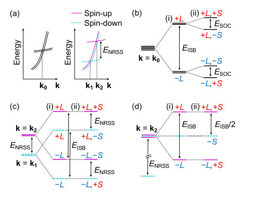 
FIG. 1. (a) Schematic illustration of crossing bands in inversion-symmetric systems without (left) and with (right) NRSS. (b) Rashba splitting of the spin-degenerate states due to ISB and SOC, which are denoted by (i) and (ii), respec- tively, when EISB ≫ESOC. For each state, ±L and ±S rep- resent the helicity of orbital angular momentum and spin tex- tures, respectively. (c),(d) Rashba splitting with NRSS, when (c) ENRSS ≲EISB and (d) ENRSS ≫EISB.

📷 Fig 2

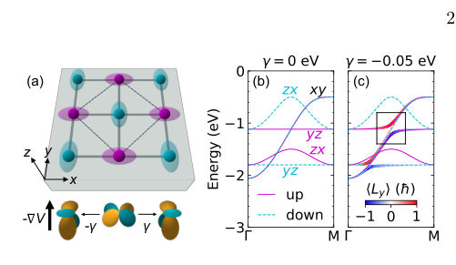 
FIG. 2. (a) Schematics of the tight-binding model. The dashed square denotes the unit cell with lattice constant a = 5 Å, consisting of spin-up (magenta) and spin-down (cyan) sublattices. Ellipses represent the anisotropic crystal field. Introducing ISB generates an electric field −∇V , which deforms the orbitals and induces an antisymmetric hopping γ. (b),(c) Band structures without SOC for (b) γ = 0 eV and (c) γ = −0.05 eV along Γ = (0, 0) to M = ( √

📷 Fig 3

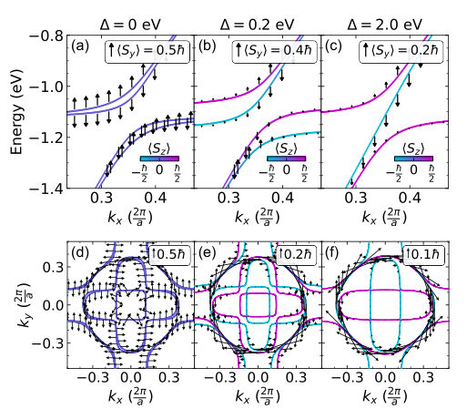 
FIG. 3. (a)–(c) Spin textures in the boxed region of Fig. 2(c) with SOC (λ = 0.02 eV), for different NRSS strengths con- trolled by (a) ∆= 0 eV, (b) ∆= 0.2 eV, and (c) ∆= 2.0 eV. Arrows and colors indicate the spin expectation values along the y axis and the Néel vector (z axis), respectively. (d)–(f) Spin textures on the Fermi contours at energy −1.0 eV for the systems in (a)–(c), respectively.

📷 Fig 4

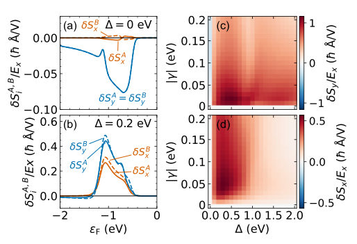 
FIG. 4. Calculated current-induced spin polarization δSx and δSy per applied electric field E = Exˆx. (a),(b) Fermi level (εF) dependences of the sublattice-resolved responses δSA,B x /Ex and δSA,B y /Ex for systems with (a) ∆= 0 eV and (b) ∆= 0.2 eV. (c),(d) Net (c) δSy/Ex and (d) δSx/Ex at εF = −1 eV as functions of ∆and γ.

📷 Fig 5

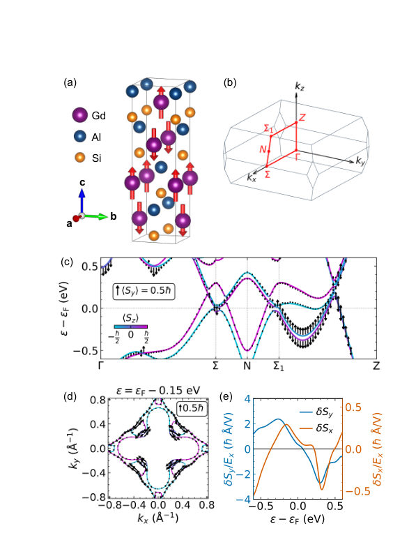 
FIG. 5. (a) Conventional unit cell of body-centered tetragonal GdAlSi. The lattice vectors a, b, and c are aligned with the x, y, and z axes, respectively. Red arrows indicate the spin moments. (b) Brillouin zone of the primitive unit cell of GdAlSi. (c) Band structure obtained from first-principles calculations. Arrows and colors indicate the spin expectation values along the y and z axes, respectively. (d) Spin texture on the Fermi surface in the kz = 0 plane at an energy of εF −0.15 eV. (e) Calculated current-induced spin polarization δSi (i = x, y) per applied electric field of 1 V/Å along ˆx.

**Summary.** This work explores how nonrelativistic spin splitting (NRSS) significantly modifies the relativistic Rashba effect in altermagnets (AMs). By combining theoretical modeling with DFT calculations on GdAlSi, the authors show that this interplay leads to an anomalously enhanced charge-to-spin conversion efficiency. This identifies AMs as promising platforms for advanced spintronic applications.

**Why it may be interesting.** While the primary focus is on spintronics, the detailed analysis of spin-momentum locking and spin-orbit coupling mechanisms in magnetic materials is highly relevant to understanding topological and spin-related phenomena in condensed matter physics.

Detailed structure

**Main problem.** The paper investigates the interplay between nonrelativistic spin splitting (NRSS) and relativistic spin-orbit coupling (SOC) in altermagnets (AMs), specifically how NRSS modifies the Rashba effect.

**Main result.** The interplay allows for anomalously large charge-to-spin conversion with a spin polarization that can be tuned by the Néel vector, demonstrating a distinctive enhancement in AMs compared to ferromagnetic systems.

**Method.** The study employs a combination of theoretical tight-binding modeling and first-principles Density Functional Theory (DFT) calculations.

**Model / system.** The system studied is the altermagnet GdAlSi, modeled using DFT (FLAPW method) and supplemented by a generic 2D d-wave tight-binding model Hamiltonian incorporating NRSS, SOC, and Inversion Symmetry Breaking (ISB).

**Key observables.** Rashba spin splitting, charge-to-spin conversion efficiency (Spin Edelstein Effect, SEE), and sublattice-resolved spin polarizations.

**Important parameters / regimes.** The relative energy scales of SOC ($E_{SOC}$), NRSS ($E_{NRSS}$), and ISB ($E_{ISB}$), particularly the moderate regime where $E_{SOC} \ll E_{NRSS} \lesssim E_{ISB}$.

**Assumptions / limitations.** The analysis relies on the tight-binding model approximation and the inclusion of a Hubbard U term for Gd 4f electrons in the DFT calculations.

**Figures summary.** Figures illustrate band structures showing the evolution of Rashba splitting under varying NRSS strengths, and show spin textures and orbital angular momentum polarization on the Fermi surface for both AM and FM models.

**Paper structure.** The paper first establishes the theoretical framework using a tight-binding model to analyze the interplay of NRSS and SOC. It then uses DFT on GdAlSi to corroborate these effects, calculating the SEE and demonstrating the enhancement due to the AM nature.

Abstract

Despite their compensated magnetic moments, altermagnets (AMs) exhibit nonrelativistic spin splitting (NRSS) that offers routes to spintronic functionality without relying on relativistic spin-orbit coupling. However, how NRSS influences relativistic phenomena remains largely unexplored. Here we show that NRSS plays a crucial role in reshaping the Rashba effect in AMs with broken inversion symmetry. Using a tight-binding model, we demonstrate that Rashba spin splitting, whose magnitude is typically limited by the strength of spin-orbit coupling, is governed by NRSS energy scales. The resulting Rashba bands combined with NRSS generate anomalously large charge-to-spin conversion with a Néel-vector-tunable spin polarization. First-principles calculations for the noncentrosymmetric AM GdAlSi corroborate the emergence of these effects in a real system. Our results reveal the interplay between nonrelativistic and relativistic effects in AMs and identify them as fertile platforms for spin-orbitronic applications.

[↑ back to top](#top)

### [Superconducting ground state study of Cr-based equiatomic high-entropy alloy through $μ\text{SR}$](http://arxiv.org/abs/2608.21273v1)

**Authors:** Sonika Jangid, Rhea Stewart, Adrian D. Hillier, R. P. Singh  
**Type:** experiment · **Category:** other · **PDF:** <https://arxiv.org/pdf/2608.21273v1>  
**Analysis basis:** full PDF text, analyzed in chunks

📷 Fig 1

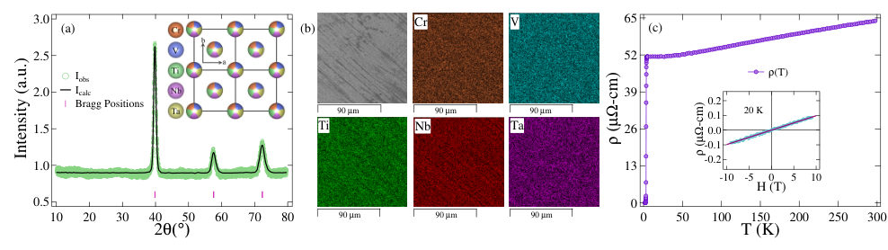 
FIG. 1. (a) Room temperature x-ray diffraction pattern of Cr-V-Ti-Nb-Ta with the inset illustrating the atomic arrangement of constituent elements within its crystal structure. (b) EDS mapping of elements Cr, V, Ti, Nb, and Ta. (c) Temperature- dependent electrical resistivity of Cr-V-Ti-Nb-Ta measured from 1.9 K to room temperature in zero applied magnetic field. The inset presents the Hall resistivity measured at 20 K.

📷 Fig 2

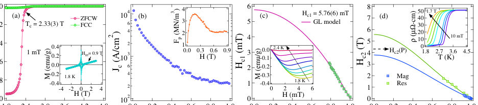 
FIG. 2. (a) Temperature variation of DC magnetization for Cr-V-Ti-Nb-Ta measured in ZFCW and FCC modes, confirming the onset of superconductivity through a clear transition into the diamagnetic state. The inset shows the magnetization hysteresis loop at 1.8 K. (b) Magnetic field dependence of critical current density at 1.8 K, plotted on a semi-logarithmic scale and extracted from the MH loop. The inset shows the corresponding flux pinning force density at 1.8 K. (c) Temperature evolution of lower critical field, Hc1, for Cr-V-Ti-Nb-Ta fitted using GL model. The inset displays isothermal M-H curves recorded between 1.8 K and 2.4 K. (d) Temperature evolution of upper critical field, Hc2, for...

📷 Fig 3

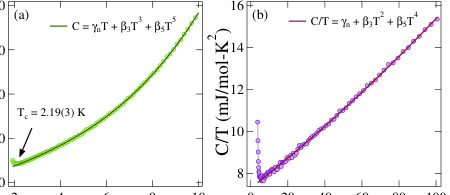 
FIG. 3. (a) Temperature dependence of zero field heat ca- pacity for Cr-V-Ti-Nb-Ta exhibiting a pronounced jump near the superconducting transition temperature. (b) C/T vs T 2

📷 Fig 4

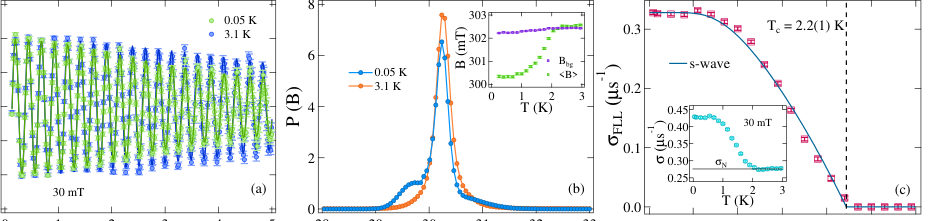 
FIG. 4. (a) TF asymmetry spectra measured below (0.05 K) and above (3.1 K) the Tc for Cr-V-Ti-Nb-Ta, recorded in FLL state at 30 mT applied field. The solid lines are fit to Eq. (12). (b) Probability distribution of magnetic field in superconducting (0.05 K) and normal (3.1 K) states calculated using the maximum entropy algorithm. The inset shows the internal magnetic field as a function of temperature, where green squares represent the field experienced by the sample while violet squares represent the background field. (c) Temperature dependence of the relaxation rate in the FLL state, fitted using the s-wave model. The inset shows the total relaxation rate as a function of temperature.

📷 Fig 5

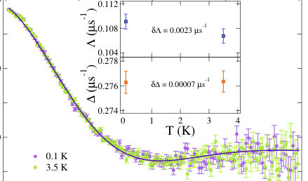 
FIG. 5. Zero-field asymmetry spectra for Cr-V-Ti-Nb-Ta measured below (0.25 K) and above (5.0 K) Tc. The top panel of the inset shows the temperature dependence of re- laxation rate Λ while the bottom panel shows ∆with respect to temperature.

**Summary.** This work reports on the superconducting properties of a disordered Cr-based High-Entropy Alloy (HEA). Using $\mu$SR and magnetic measurements, the authors confirm bulk superconductivity with an s-wave gap. The findings establish this HEA as a promising model system for understanding the complex interplay between chemical disorder, magnetism, and superconductivity.

**Why it may be interesting.** The combination of extreme disorder (HEA) and superconductivity provides a unique platform to test theories of unconventional pairing and pair-breaking mechanisms, which are relevant to understanding complex quantum many-body states.

Detailed structure

**Main problem.** The study investigates how magnetic elements influence superconductivity within highly disordered High-Entropy Alloys (HEAs).

**Main result.** The Cr-V-Ti-Nb-Ta HEA exhibits bulk type-II superconductivity with a $T_c$ of 2.33 K, showing an s-wave gap and preserved time-reversal symmetry.

**Method.** The research employed multiple experimental techniques including resistivity, magnetization (ZFCW/FCC), and Muon Spin Rotation ($\mu$SR) measurements.

**Model / system.** The physical system is the Cr-V-Ti-Nb-Ta equiatomic HEA, which crystallizes in a bcc structure and is characterized by significant chemical disorder.

**Key observables.** Superconducting transition temperature ($T_c$), upper critical field ($H_{c2}$), superconducting gap symmetry (s-wave), and time-reversal symmetry preservation.

**Important parameters / regimes.** The material is analyzed in the context of disorder, magnetism, and the interplay between these factors in HEAs.

**Assumptions / limitations.** The discrepancy between $T_c$ measured by resistivity and magnetization suggests potential superconducting inhomogeneity.

**Figures summary.** Figures illustrate sample characterization (XRD, EDS, $
ho(T)$) and superconducting properties, including magnetization hysteresis loops and field dependencies of $H_{c1}$ and $H_{c2}$.

**Paper structure.** The paper follows a standard experimental structure: characterization of the HEA, confirmation of bulk superconductivity via multiple measurements, detailed analysis of superconducting parameters using GL models, and finally, probing the pairing symmetry using $\mu$SR.

Abstract

High-entropy alloy superconductors, characterized by extreme chemical disorder and complex electronic environments, have attracted significant attention as model systems for exploring superconductivity in disordered materials. Here, we investigate a Cr-based equiatomic HEA, Cr-V-Ti-Nb-Ta, which contains a magnetic 3d element, providing an opportunity to examine the influence of magnetic elements on superconductivity in highly disordered systems. Despite expected magnetic pair-breaking, this alloy exhibits bulk type-II superconductivity with a transition temperature of $T_c = 2.33(3)$ K and a high upper critical field. Transverse-field $μ$SR measurements reveal an s-wave superconducting gap close to the BCS value, while zero-field $μ$SR suggests preserved time-reversal symmetry. These results establish Cr-V-Ti-Nb-Ta as a promising platform for exploring the interplay between disorder, magnetism and superconductivity in high entropy alloys.

[↑ back to top](#top)

