
# arxiv digest (quant-ph + cond-mat) — 2026-08-26

*176 papers · 28 relevant · 2 highlighted*

## 🔥 Most relevant (28)

*Every paper with at least one nonzero topic score, sorted by best-matching score. 🔥 marks scores ≥4/5. Click the title to jump to the full entry below; click [arXiv] to open the paper page. `(secondary)` marks papers from de-prioritized cond-mat archives.*

Show 28 relevant papers

- [A Unified Quantum Neural Network Framework for Hamiltonian Learning and Emulation of Unknown Quantum Systems](#paper-2608.23025) [[arXiv]](http://arxiv.org/abs/2608.23025v1) — 🔥 `methods for driven-dissipative` **4/5** · `Tavis-Cummings & cavity-many-emitter` **3/5** · `analog quantum simulation` **3/5** · `correlated / nonlocal dissipation` **3/5** · `driven-dissipative phase transition` **3/5** · `Keldysh / 2PI / non-Gaussian methods` **2/5** · `quantum measurements` **2/5** · `non-equilibrium universality` **1/5**
- [Increased cyclicity of atomic transitions via coherent interference of decay paths](#paper-2608.21635) [[arXiv]](http://arxiv.org/abs/2608.21635v1) — 🔥 `interference shaping light` **4/5** · `correlated / nonlocal dissipation` **3/5** · `quantum measurements` **3/5** · `Dicke superradiance` **2/5** · `driven-dissipative phase transition` **2/5** · `methods for driven-dissipative` **2/5** · `Full counting statistics` **1/5** · `Keldysh / 2PI / non-Gaussian methods` **1/5** · `Tavis-Cummings & cavity-many-emitter` **1/5** · `non-equilibrium universality` **1/5** · `superradiant laser` **1/5**
- [Monitored free fermions under periodic driving](#paper-2608.21835) [[arXiv]](http://arxiv.org/abs/2608.21835v1) — 🔥 `quantum measurements` **4/5** · `Keldysh / 2PI / non-Gaussian methods` **3/5** · `driven-dissipative phase transition` **3/5** · `methods for driven-dissipative` **3/5** · `non-equilibrium universality` **3/5** · `analog quantum simulation` **2/5** · `Frenkel-Kontorova` **1/5** · `correlated / nonlocal dissipation` **1/5** · `scars & prethermalization` **1/5**
- [Spinning giant optomechanical cavity with nonreciprocal self-interference](#paper-2608.22357) [[arXiv]](http://arxiv.org/abs/2608.22357v1) — 🔥 `interference shaping light` **4/5** · `correlated / nonlocal dissipation` **3/5** · `driven-dissipative phase transition` **3/5** · `methods for driven-dissipative` **3/5** · `Keldysh / 2PI / non-Gaussian methods` **2/5** · `non-equilibrium universality` **2/5** · `analog quantum simulation` **1/5** · `quantum measurements` **1/5**
- [Chiral doublon bound states in a synthetic topological waveguide](#paper-2608.22718) [[arXiv]](http://arxiv.org/abs/2608.22718v1) — 🔥 `analog quantum simulation` **4/5** · `Tavis-Cummings & cavity-many-emitter` **3/5** · `Keldysh / 2PI / non-Gaussian methods` **2/5** · `correlated / nonlocal dissipation` **2/5** · `driven-dissipative phase transition` **2/5** · `methods for driven-dissipative` **2/5** · `Frenkel-Kontorova` **1/5** · `interference shaping light` **1/5** · `quantum measurements` **1/5**
- [Error Propagation Theory for Variational Non-Markovian Open Quantum Dynamics](#paper-2608.22404) [[arXiv]](http://arxiv.org/abs/2608.22404v1) — 🔥 `methods for driven-dissipative` **4/5** · `Keldysh / 2PI / non-Gaussian methods` **3/5** · `correlated / nonlocal dissipation` **3/5** · `driven-dissipative phase transition` **3/5** · `non-equilibrium universality` **2/5** · `quantum measurements` **2/5** · `analog quantum simulation` **1/5**
- [Programmable Doppler real-space pattern formation in cold atoms](#paper-2608.21689) [[arXiv]](http://arxiv.org/abs/2608.21689v1) — 🔥 `analog quantum simulation` **4/5** · `driven-dissipative phase transition` **3/5** · `methods for driven-dissipative` **3/5** · `Keldysh / 2PI / non-Gaussian methods` **2/5** · `quantum measurements` **2/5** · `correlated / nonlocal dissipation` **1/5** · `non-equilibrium universality` **1/5**
- [Scaling vs entanglement in measurement-induced phase transition for non-integrable systems](#paper-2608.21578) [[arXiv]](http://arxiv.org/abs/2608.21578v1) — 🔥 `quantum measurements` **4/5** · `driven-dissipative phase transition` **3/5** · `non-equilibrium universality` **3/5** · `analog quantum simulation` **2/5** · `methods for driven-dissipative` **2/5** · `correlated / nonlocal dissipation` **1/5** · `scars & prethermalization` **1/5**
- [Coexistence of Magnon-Induced Optical Vortex and Gaussian Beam Scattering Assisted by Rotational Umklapp Process](#paper-2608.21788) [[arXiv]](http://arxiv.org/abs/2608.21788v1) — 🔥 `quantum optics experiment` **4/5** · `analog quantum simulation` **3/5** · `interference shaping light` **3/5** · `Keldysh / 2PI / non-Gaussian methods` **1/5** · `correlated / nonlocal dissipation` **1/5** · `driven-dissipative phase transition` **1/5** · `methods for driven-dissipative` **1/5** · `quantum measurements` **1/5**
- [Experimental Investigation of Tunable-Order Hilbert-Space Ergodicity](#paper-2608.21959) [[arXiv]](http://arxiv.org/abs/2608.21959v1) — 🔥 `scars & prethermalization` **4/5** · `QC/QI experiment` **3/5** · `analog quantum simulation` **2/5** · `driven-dissipative phase transition` **2/5** · `non-equilibrium universality` **2/5** · `methods for driven-dissipative` **1/5** · `quantum measurements` **1/5**
- [Cramer-Rao Inequality Generalizes the Equilibrium Energy Fluctuation-Response Relation to Nonequilibrium Steady States](#paper-2608.23455) [[arXiv]](http://arxiv.org/abs/2608.23455v1) — 🔥 `non-equilibrium universality` **4/5** · `driven-dissipative phase transition` **3/5** · `Keldysh / 2PI / non-Gaussian methods` **2/5** · `methods for driven-dissipative` **2/5** · `analog quantum simulation` **1/5** · `correlated / nonlocal dissipation` **1/5** · `quantum measurements` **1/5**
- [Landau theory, effective temperature, and tricritical phenomena in a holographic nonequilibrium steady state](#paper-2608.23378) [[arXiv]](http://arxiv.org/abs/2608.23378v1) — 🔥 `driven-dissipative phase transition` **4/5** · 🔥 `non-equilibrium universality` **4/5** · `Keldysh / 2PI / non-Gaussian methods` **3/5** · `methods for driven-dissipative` **2/5** · `correlated / nonlocal dissipation` **1/5**
- [The principle of detailed balance between electrons and phonons in presence of excitonic effects](#paper-2608.23403) [[arXiv]](http://arxiv.org/abs/2608.23403v1) `(secondary)` — 🔥 `Keldysh / 2PI / non-Gaussian methods` **4/5** · `correlated / nonlocal dissipation` **3/5** · `driven-dissipative phase transition` **2/5** · `methods for driven-dissipative` **2/5** · `non-equilibrium universality` **2/5** · `analog quantum simulation` **1/5**
- [Critical Topological Photonics in Synthetic Dimensions](#paper-2608.21791) [[arXiv]](http://arxiv.org/abs/2608.21791v1) — 🔥 `analog quantum simulation` **4/5** · `driven-dissipative phase transition` **3/5** · `non-equilibrium universality` **3/5** · `methods for driven-dissipative` **2/5** · `quantum optics experiment` **1/5**
- [Nonequilibrium statistics of harmonically trapped run-and-tumble particles: An exact convolution approach](#paper-2608.21781) [[arXiv]](http://arxiv.org/abs/2608.21781v1) — 🔥 `non-equilibrium universality` **4/5** · `driven-dissipative phase transition` **3/5** · `methods for driven-dissipative` **3/5** · `Keldysh / 2PI / non-Gaussian methods` **2/5** · `Frenkel-Kontorova` **1/5**
- [A Cavity-Interfaced Register of Trapped-Ion Qubits with Multi-Second Coherence](#paper-2608.22030) [[arXiv]](http://arxiv.org/abs/2608.22030v1) — 🔥 `QC/QI experiment` **4/5** · `quantum optics experiment` **3/5** · `Tavis-Cummings & cavity-many-emitter` **2/5** · `analog quantum simulation` **2/5** · `quantum measurements` **1/5**
- [Deterministic preparation of entangled Dicke states](#paper-2608.22168) [[arXiv]](http://arxiv.org/abs/2608.22168v1) — 🔥 `Tavis-Cummings & cavity-many-emitter` **4/5** · `Dicke superradiance` **3/5** · `analog quantum simulation` **3/5** · `quantum measurements` **1/5** · `superradiant laser` **1/5**
- [Robust cavity metrology beyond the limits of Pound-Drever-Hall](#paper-2608.21512) [[arXiv]](http://arxiv.org/abs/2608.21512v1) — 🔥 `quantum measurements` **4/5** · `QC/QI experiment` **3/5** · `quantum optics experiment` **3/5** · `analog quantum simulation` **1/5** · `interference shaping light` **1/5**
- [Automating detection of Two-Level Systems in Superconducting Qubits](#paper-2608.21983) [[arXiv]](http://arxiv.org/abs/2608.21983v1) — 🔥 `QC/QI experiment` **4/5** · `methods for driven-dissipative` **3/5** · `quantum measurements` **2/5** · `correlated / nonlocal dissipation` **1/5** · `driven-dissipative phase transition` **1/5**
- [Breakdown of Aharonov-Bohm cage in Rydberg synthetic lattices: the roles of inhomogeneity and long-range exchange](#paper-2608.21768) [[arXiv]](http://arxiv.org/abs/2608.21768v1) — 🔥 `Rydberg arrays` **4/5** · 🔥 `analog quantum simulation` **4/5** · `interference shaping light` **1/5**
- [Spinor condensate persistent currents in an atomtronic Josephson necklace](#paper-2608.23560) [[arXiv]](http://arxiv.org/abs/2608.23560v1) — 🔥 `analog quantum simulation` **4/5** · `methods for driven-dissipative` **2/5** · `Frenkel-Kontorova` **1/5** · `Keldysh / 2PI / non-Gaussian methods` **1/5** · `driven-dissipative phase transition` **1/5**
- [Dual-Isotope Sympathetic Cooling in a Long Ion Chain](#paper-2608.23386) [[arXiv]](http://arxiv.org/abs/2608.23386v1) — 🔥 `QC/QI experiment` **4/5** · `analog quantum simulation` **1/5** · `correlated / nonlocal dissipation` **1/5** · `driven-dissipative phase transition` **1/5** · `quantum measurements` **1/5**
- [Enhanced intrinsic spin-orbit driving of a Loss-DiVincenzo qubit near the spin-valley hotspot in Si/SiGe](#paper-2608.23246) [[arXiv]](http://arxiv.org/abs/2608.23246v1) `(secondary)` — 🔥 `QC/QI experiment` **4/5** · `quantum measurements` **2/5** · `analog quantum simulation` **1/5**
- [Propagating fronts of convection rolls in Rayleigh-Bénard convection](#paper-2608.21728) [[arXiv]](http://arxiv.org/abs/2608.21728v1) `(secondary)` — 🔥 `non-equilibrium universality` **4/5** · `Frenkel-Kontorova` **1/5** · `analog quantum simulation` **1/5** · `driven-dissipative phase transition` **1/5**
- [Bloch states of an infinite one-dimensional lattice under transverse electric field](#paper-2608.22199) [[arXiv]](http://arxiv.org/abs/2608.22199v1) — 🔥 `Frenkel-Kontorova` **4/5** · `analog quantum simulation` **2/5**
- [Conditional Gaussian filtering by Arthurs--Kelly readout in a three-mode cluster wire](#paper-2608.22043) [[arXiv]](http://arxiv.org/abs/2608.22043v1) — 🔥 `quantum measurements` **4/5** · `Keldysh / 2PI / non-Gaussian methods` **1/5** · `methods for driven-dissipative` **1/5**
- [Quantum observables as Fréchet sensitivity kernels](#paper-2608.23191) [[arXiv]](http://arxiv.org/abs/2608.23191v1) — 🔥 `quantum measurements` **4/5** · `Keldysh / 2PI / non-Gaussian methods` **2/5**
- [How Far Can You Do Nothing On a Quantum Computer?](#paper-2608.21904) [[arXiv]](http://arxiv.org/abs/2608.21904v1) — 🔥 `QC/QI experiment` **4/5** · `quantum measurements` **1/5**

## ⭐ Highlighted (2)

*Papers by authors on your watch list. Click the title to jump to the full entry below; click [arXiv] to open the paper page.*

Show 2 highlighted papers

- ⭐ [Universal equilibrium magic in quantum many-body systems](#paper-2608.22939) [[arXiv]](http://arxiv.org/abs/2608.22939v1) — John Preskill
- ⭐ [Universality of superdiffusion in simple random graphs](#paper-2608.23207) [[arXiv]](http://arxiv.org/abs/2608.23207v1) — Nicolò Defenu

## All papers (122, sorted by relevance)

*Papers from quant-ph and your primary cond-mat archives (quant-gas, stat-mech, str-el, dis-nn). Highlighted papers (⭐) come first, then everything else sorted by topic-relevance score, highest first.*

### ⭐ [Universal equilibrium magic in quantum many-body systems](http://arxiv.org/abs/2608.22939v1)

**Highlighted author(s):** John Preskill  
**Authors:** Soumyadeep Sarma, Tobias Haug, John Preskill, Wai-Keong Mok  
**Type:** theory · **Category:** statistical mechanics · **PDF:** <https://arxiv.org/pdf/2608.22939v1>  
**Analysis basis:** full PDF text, analyzed in chunks
**Topic relevance:** `analog quantum simulation` **3/5**

📷 Fig 1

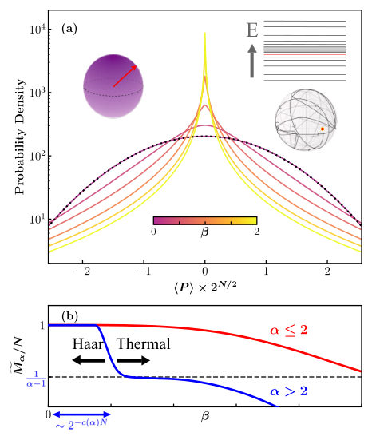 
FIG. 1. Schematic of the main results. (a) Pauli spectrum dis- tribution for a typical state drawn from the thermal Scrooge ensemble of a chaotic local N-qubit Hamiltonian, shown for inverse temperatures β ∈[0, 2]. At β = 0, this reduces to Haar-random states whose Pauli spectrum is close to the Gaussian distribution N(0, 2−N) [19] (black dashed line). For β = O(1), the same Scrooge description captures the Pauli spectrum, and hence the magic, of equilibrium pure states such as energy eigenstates and late-time evolved states. (b) Magic density f Mα/N versus β. For α &gt; 2, we predict a sharp drop in the magic density, corresponding to a crossover from the “Haar” regime to the “thermal” regime...

📷 Fig 2

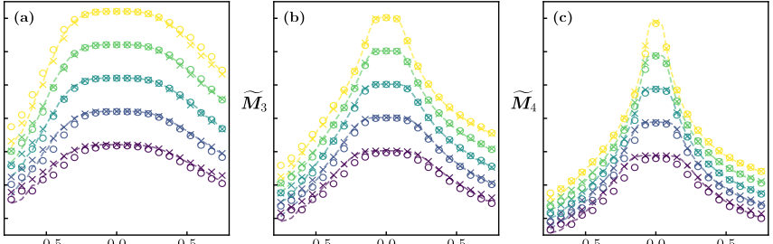 
FIG. 2. Filtered stabilizer Rényi entropy (fSRE) f Mα versus effective inverse temperature β for (a) α = 2, (b) α = 3, and (c) α = 4. We compare three classes of equilibrium pure states generated from the MFIM (8) with 10 ≤N ≤18: energy eigenstates, late-time evolved states obtained by evolving random product states to Jt = 200, and states sampled from Scrooge(σβ). As N increases, the fSREs of the eigenstates and late-time evolved states agree closely with that of Scrooge(σβ).

📷 Fig 3

 
FIG. 3. Filtered stabilizer Rényi entropy (fSRE) f Mα versus number of qubits N at β = 0.45, for α ∈{0.5, 1, 2, 3, 4}. A vertical offset of α −1/2 is added for visualization purposes. We compare energy eigenstates of the MFIM (8), late-time evolved states obtained by evolving random product states to Jt = 200, and states sampled from Scrooge(σβ). The black dotted lines show f Mα(σβ) −log2(dα)/(α −1) for α ≥2 [Eq. (7)]. As N increases, the fSREs of the various states agree closely with f Mα(σβ).

📷 Fig 4

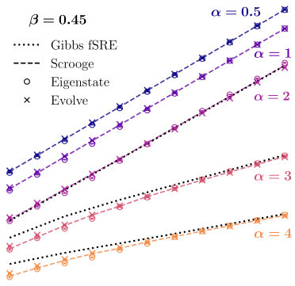 
Figure 2 shows f Mα(ψ) for realistic examples of equilib- rium pure states, such as energy eigenstates (computed using POLFED [47]) and late-time evolved states ob- tained by time-evolution of random product states, com- pared against the average magic of Scrooge(σβ). Here, β is computed from Eq. (6). The eigenstate and late-time magic agree excellently with Scrooge(σβ), even at mod- est system sizes, and show a plateau near β = 0 where f Mα ≈N [19]; for α &gt; 2, its width shrinks with N [48]. In the SM, we show further numerical evidence of agree- ment with Scrooge(σβ) for other local Hamiltonians, sup- porting the universality of our theory. Interestingly, our preliminary results suggest...

📷 Fig 5

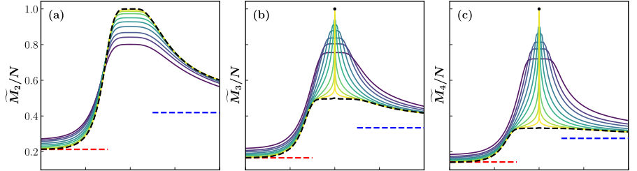 
FIG. 4. Filtered stabilizer Rényi entropy (fSRE) density f Mα/N versus effective inverse temperature β for (a) α = 2, (b) α = 3, and (c) α = 4. The fSRE is calculated using the approximation ζα(ψ) ≈2N(2−α)(2α −1)!! + dαζα(σβ) inspired by Eq. (13), capturing both “Haar” and “thermal” regimes. The black dashed line shows the N →∞limit of the fSRE (and also the SRE) density, estimated by extrapolating numerical results for 8 ≤N ≤320; blue and red lines mark the limiting fSRE densities of the ground state and maximally excited state, respectively. For α &gt; 2, the black circle marks the infinite-temperature value f Mα/N = 1.

**Summary.** This work establishes that the quantum resource known as 'magic' in chaotic many-body systems is a thermodynamic property, depending only on temperature at equilibrium. The authors show this universal behavior is captured by the thermal Scrooge ensemble, providing concrete, temperature-dependent predictions for entanglement measures like the fSRE. This unifies quantum resource theory with statistical mechanics.

**Why it may be interesting.** It provides a thermodynamic characterization of a quantum information resource (magic), linking global quantum structure to simple thermodynamic parameters like temperature, which is highly relevant for understanding thermalization and resource quantification in AMO systems.

Detailed structure

**Main problem.** The paper aims to establish a universal principle governing 'magic' (nonstabilizerness), a global quantum resource, in many-body systems at thermal equilibrium.

**Main result.** Equilibrium magic is shown to be universal, depending only on temperature for systems conserving only energy, and is captured by the thermal Scrooge ensemble.

**Method.** The analysis uses theoretical frameworks like the Eigenstate Thermalization Hypothesis (ETH) and employs the mathematically rigorous Scrooge ensemble to calculate the filtered stabilizer Rényi entropy (fSRE).

**Model / system.** The study applies to generic chaotic quantum many-body systems, analyzed using Hamiltonians with local interactions, such as the mixed-field Ising model (MFIM).

**Key observables.** Magic (nonstabilizerness), Filtered Stabilizer Rényi Entropy (fSRE), Pauli Spectrum $\Xi(
ho)$, and the thermal Scrooge ensemble.

**Important parameters / regimes.** Temperature ($eta$), system size ($N$), and the Rényi order ($\alpha$).

**Assumptions / limitations.** The analysis relies on the assumption that local observables approach the Gibbs state (ETH) and uses high-temperature expansions and approximations for the Scrooge measure.

**Figures summary.** Figures illustrate the crossover of the fSRE from a 'Haar' regime at high temperatures to a 'thermal' regime governed by energy conservation, showing agreement between different state types (eigenstates vs. Scrooge).

**Paper structure.** The paper develops the concept of magic in equilibrium, deriving universal predictions for the SRE based on temperature. It then compares these predictions using the Scrooge ensemble against numerical results for specific models like the MFIM, concluding with robustness checks against local perturbations.

Abstract

Thermalization conventionally describes local properties of isolated many-body systems at equilibrium. Magic, or nonstabilizerness $\unicode{x2013}$ the resource enabling universal quantum computation $\unicode{x2013}$ is by contrast encoded in the global structure of the many-body wavefunction. We show that, despite its global nature, the magic of equilibrium pure states of chaotic many-body systems, including late-time evolved states and energy eigenstates, is universal: it is captured by the thermal Scrooge ensemble, the minimally informative ensemble of pure states consistent with the Gibbs state at the same effective temperature. Therefore, for systems with no conserved quantities other than the total energy, equilibrium magic is a function of temperature alone, independent of the initial state and other microscopic features of the equilibrium state. This yields concrete universal predictions for the stabilizer Rényi entropies (SREs). At infinite temperature, the SRE is set by Haar-like fluctuations of the Pauli spectrum, while at finite temperature energy conservation induces a volume-law thermodynamic correction controlled by the thermal Pauli spectrum. We support these predictions with analytical arguments and extensive numerical simulations. We further show that chaotic many-body systems at high temperatures possess long-range magic and entanglement that cannot be removed by finite-depth local quantum circuits. Our results establish magic as a thermodynamic property of chaotic many-body systems and suggest that Scrooge ensembles may provide a unified framework for quantum many-body resources.

[↑ back to top](#top)

### ⭐ [Universality of superdiffusion in simple random graphs](http://arxiv.org/abs/2608.23207v1)

**Highlighted author(s):** Nicolò Defenu  
**Authors:** Mrinal Sarkar, Nicolò Defenu, Tilman Enss  
**Type:** theory · **Category:** disordered systems and neural networks · **PDF:** <https://arxiv.org/pdf/2608.23207v1>  
**Analysis basis:** full PDF text, analyzed in chunks
**Topic relevance:** `non-equilibrium universality` **1/5**

📷 Fig 1

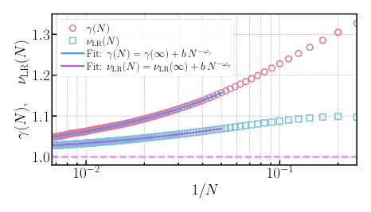 
FIG. 2. Scaling of finite-N exponents νLR(N) and γ(N) in the SR regime of the clean kinetic sector at σ = 1.5. They reach asymptoti- cally to clean SR fixed point νLR(∞) = γ(∞) = 1 with correction- to-scaling exponents ων = ωγ ≈σ −σ∗, consistent with the field- theoretic predictions.

📷 Fig 2

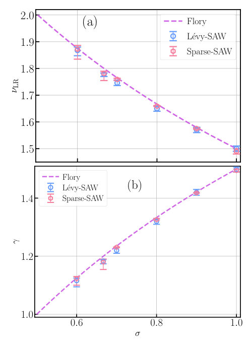 
FIG. 1. Critical exponents νLR and γ at various σ in the LR regime of clean theory (0.5 &lt; σ &lt; 1). Sparse-SAW estimates (red hexagons) agree with the clean Lévy-SAW results (blue circles, Ref. [29]), within statistical uncertainties. The dashed violet line corresponds to Flory prediction, and empty square represents the mean-field value.

**Summary.** This work analyzes self-avoiding walks on random graphs whose connectivity induces superdiffusive transport. By using field theory and Monte Carlo simulations, the authors demonstrate that the random graph disorder is irrelevant at criticality. This establishes random graphs as a useful platform for confirming the critical exponents of the clean superdiffusive Lévy-SAW universality class.

**Why it may be interesting.** The finding that correlated graph disorder is irrelevant at criticality, leaving the clean critical behavior intact, provides a powerful theoretical tool for understanding how disorder affects critical phenomena in systems with long-range interactions.

Detailed structure

**Main problem.** The paper investigates how the critical behavior of self-avoiding walks (SAWs) is affected when the underlying connectivity of the graph itself is random, particularly when this randomness controls both superdiffusive transport and quenched disorder.

**Main result.** The critical exponents of the Sparse-SAW on a random graph agree with those of the clean superdiffusive Lévy-SAW, suggesting that the random graph belongs to the same universality class.

**Method.** The study employs large-scale Monte Carlo simulations and develops a Gaussian-truncated field theory approach, utilizing the replica trick to average over the random graph disorder.

**Model / system.** The system models SAWs on a one-dimensional long-range random ring graph, where bonds are generated with a probability decaying as $|i-j|^{-(1+\sigma)}$. This setup allows the single parameter $\sigma$ to control both the long-range superdiffusive kinetic operator and the quenched disorder.

**Key observables.** Critical exponents ($
u_{LR}$ and $\gamma$) characterizing the SAW behavior, and the asymptotic decay of the propagator $G(x) \sim |x|^{-1-\sigma}$.

**Important parameters / regimes.** The decay exponent $\sigma$ of the random bond probability, which controls the crossover between short-range and long-range physics.

**Assumptions / limitations.** The analysis relies on the replica trick for disorder averaging and assumes that under coarse-graining, the long-range kinetic operator dominates the disorder effects.

**Figures summary.** Figure 1 compares the calculated critical exponents for Lévy-SAW and Sparse-SAW as a function of $\sigma$, showing agreement with the clean Flory prediction in the long-range regime.

**Paper structure.** The paper progresses by first defining the physical system (SAWs on random graphs) and the associated disorder/transport mechanism. It then applies field theory and replica methods to calculate the disorder-averaged action and propagator, ultimately comparing the resulting critical exponents to the clean system predictions.

Abstract

Random walks with long-range jumps can drive superdiffusive transport, replacing ordinary diffusion with an effective long-range kinetic operator. Such superdiffusive kinetics is also central to critical phenomena, notably the self-avoiding walk with long-range jump statistics, or Lévy-SAW. This work investigates how the critical behavior is affected when the long-range connectivity itself becomes random. We study self-avoiding walks (SAWs) on a one-dimensional long-range random ring graph, where bonds are independently generated with Bernoulli probability $\sim|i-j|^{-(1+σ)}$. We term this walk Sparse-SAW. The same random bonds are responsible for both long-range superdiffusive transport and quenched disorder, with both simultaneously controlled by the single parameter $σ$, placing the problem beyond the conventional Harris and Weinrib-Halperin frameworks. Through large-scale Monte Carlo simulations and a Gaussian-truncated field theory, we show that Sparse-SAW belongs to the same universality class as the clean superdiffusive Lévy-SAW. The random bonds generate short-range uncorrelated and long-range correlated mass disorder while simultaneously producing the long-range kinetic operator. Under coarse-graining, the latter dominates, restoring the clean critical behavior. Our study suggests that the full non-Gaussian Bernoulli statistics may lead to disorder physics beyond the conventional theory of quenched disorder, while establishing random graphs as an efficient platform for extracting the critical exponents of the clean superdiffusive Lévy-SAW universality class.

[↑ back to top](#top)

### [A Unified Quantum Neural Network Framework for Hamiltonian Learning and Emulation of Unknown Quantum Systems](http://arxiv.org/abs/2608.23025v1)

**Authors:** Ahmad Salmanogli  
**Type:** theory · **Category:** other · **PDF:** <https://arxiv.org/pdf/2608.23025v1>  
**Analysis basis:** full PDF text, analyzed in chunks
**Topic relevance:** 🔥 `methods for driven-dissipative` **4/5** · `Tavis-Cummings & cavity-many-emitter` **3/5** · `analog quantum simulation` **3/5** · `correlated / nonlocal dissipation` **3/5** · `driven-dissipative phase transition` **3/5** · `Keldysh / 2PI / non-Gaussian methods` **2/5** · `quantum measurements` **2/5** · `non-equilibrium universality` **1/5**

📷 Fig 1

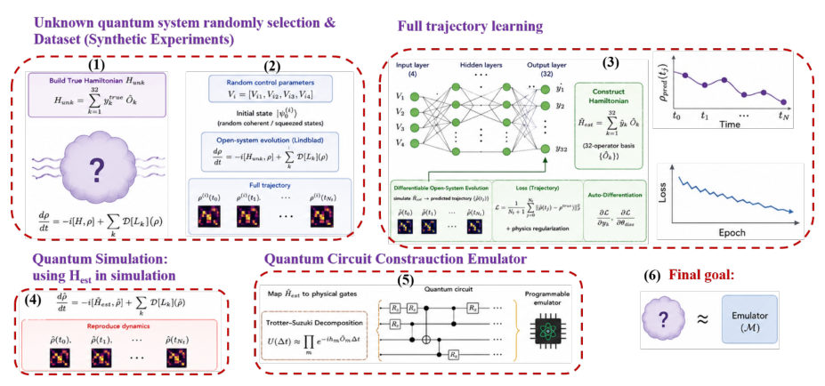 
Figure 1: Overall workflow of the proposed full-trajectory QNN framework for the identification of an unknown quantum system and the construction of a quantum emulator. (1) An unknown open quantum system is generated by physics-informed random sampling of thirty-two Hamiltonian coefficients together with the dissipation rates κ, γ1 and γ2. (2) The corresponding Lindblad dynamics are propagated with QuTiP, and the complete noisy density-matrix trajectory is stored together with the control vector, the randomized initial state and the chirped excitation. (3) A five-layer QNN maps the four-dimensional control vector onto the thirty-two Hamiltonian coefficients, from which a Hermitian...

📷 Fig 2

 
Figure 2: Trajectory-density loss achieved for different approaches for the case of single qubit Hamil- tonian H1 = 0.5 × ω1σz1; “Rand.In.Co.” is acronym for randomized initial conditions.

📷 Fig 3

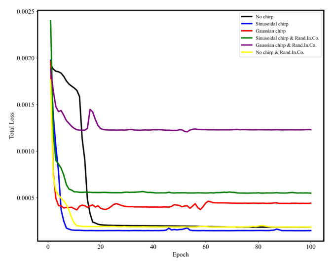 
Figure 2 compares the influence of several learning strategies on the convergence behavior of the proposed QNN framework, including sinusoidal chirp excitation, Gaussian chirp excitation, randomization of the initial conditions, and combinations of these techniques. The results are compared with the baseline approach without additional excitation or initialization strategies. Although the combined approaches exhibit a relatively rapid initial reduction in the trajectory- density loss, their final steady-state loss remains comparatively high, indicating that fast con- vergence does not necessarily guarantee accurate reconstruction. It should be noted that we applied the combination of...

📷 Fig 4

 
Figure 3: Trajectory-density loss achieved for different approaches applied on different Hamiltonians.

📷 Fig 5

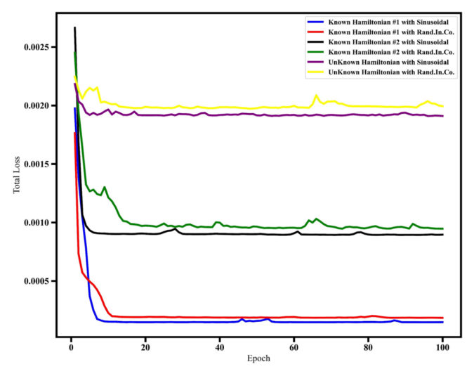 
Figure 3 further demonstrates the influence of Hamiltonian complexity on the reconstruction performance. As the number of effective degrees of freedom increases, the trajectory-density loss generally becomes larger, indicating that the learning problem becomes progressively more difficult. This behavior is particularly evident for the unknown Hamiltonian, which is rep- resented using 32 independent coefficients in the general Hamiltonian parameterization. In contrast, the simpler benchmark Hamiltonians, H1 and H2, contain substantially fewer effective degrees of freedom and can therefore be learned more accurately from the available train- ing data. The degradation observed for the unknown...

**Summary.** This paper introduces a QNN framework to identify unknown Hamiltonians governing open quantum systems by analyzing the full time evolution of the density matrix. By training on synthetic data derived from Lindblad dynamics, the QNN reconstructs the system's Hamiltonian and maps it onto physical circuit parameters. This establishes a powerful, data-driven methodology for quantum system characterization and emulation.

**Why it may be interesting.** This work directly addresses the challenge of characterizing complex, open quantum systems by providing a machine learning bridge from abstract dynamics to physical hardware parameters, which is highly relevant for quantum optics and circuit QED.

Detailed structure

**Main problem.** The core problem is accurately identifying the unknown Hamiltonian governing an open quantum system, which is crucial for quantum computing and control.

**Main result.** The framework successfully establishes a data-driven pathway to reconstruct the unknown Hamiltonian and map it onto physical circuit parameters, demonstrating high state-level reconstruction fidelity.

**Method.** It uses a Quantum Neural Network (QNN) trained on synthetic data generated from the full density matrix trajectory evolution under Lindblad dynamics.

**Model / system.** The system is an open quantum system modeled by the Lindblad master equation, involving a Hamiltonian parameterized by 32 coefficients and dissipation parameters. The final emulation targets a physical two-qubit bus resonator architecture.

**Key observables.** Quantum-state fidelity, trace distance, and trajectory density loss are used to evaluate reconstruction accuracy.

**Important parameters / regimes.** The system is characterized by 32 Hamiltonian coefficients, and the emulation is performed in the dispersive regime of a cQED architecture.

**Assumptions / limitations.** The method assumes the unknown system dynamics can be accurately modeled by the Lindblad master equation and that the Hamiltonian can be represented by a predefined 32-operator basis set.

**Figures summary.** Figure 1 illustrates a five-stage workflow: generating the unknown system, creating the full density matrix trajectory dataset, training the QNN to predict coefficients, optimizing via trajectory loss, and finally mapping the result to a physical emulator.

**Paper structure.** The paper follows a clear workflow: defining the problem (Hamiltonian identification) -> generating physics-informed synthetic data (Lindblad dynamics) -> training the QNN to map inputs to Hamiltonian coefficients -> optimizing the reconstruction using trajectory loss -> validating the result by mapping to a physical circuit.

Abstract

Accurate identification of unknown quantum systems is essential for quantum computing, sensing, and control because the Hamiltonian governs quantum state evolution. This work proposes a QNN based framework for black box Hamiltonian learning and quantum system emulation using full density matrix trajectory learning. Unlike approaches based only on final states or selected observables, the method exploits the complete temporal evolution of the density matrix under Lindblad dynamics. A synthetic dataset of physically admissible Hamiltonians and dissipation parameters is generated to emulate experimental measurements. The QNN learns a nonlinear mapping from control inputs to a 32-dimensional Hamiltonian coefficient vector, enabling reconstruction and differentiable emulation of the unknown system. Chirped excitation and randomized initial quantum states are incorporated to improve robustness and provide richer dynamical information. Performance is evaluated using trajectory density loss, quantum-state fidelity, and trace distance. Randomized initialization improves state-level reconstruction, increasing fidelity to 0.929 for the single qubit benchmark and 0.787 for the unknown system, while reducing trace distance to 0.124 and 0.316, respectively. In contrast, chirped excitation primarily improves optimization by accelerating convergence and reducing trajectory density loss. Finally, the learned Hamiltonian is mapped onto a physical two qubit bus resonator architecture in the dispersive regime, yielding key circuit parameters including transmon capacitances, Josephson inductances, qubit separation, and bus-resonator length. The framework therefore establishes a data-driven pathway from black box quantum system identification to physical quantum emulation, with potential applications in quantum digital twin modeling.

[↑ back to top](#top)

### [Increased cyclicity of atomic transitions via coherent interference of decay paths](http://arxiv.org/abs/2608.21635v1)

**Authors:** Eliza Cornell, Benjamin Pingault, Gergő Thiering, Neil Sinclair, Ádám Gali, Marko Lončar  
**Type:** theory · **Category:** other · **PDF:** <https://arxiv.org/pdf/2608.21635v1>  
**Analysis basis:** full PDF text, analyzed in chunks
**Topic relevance:** 🔥 `interference shaping light` **4/5** · `correlated / nonlocal dissipation` **3/5** · `quantum measurements` **3/5** · `Dicke superradiance` **2/5** · `driven-dissipative phase transition` **2/5** · `methods for driven-dissipative` **2/5** · `Full counting statistics` **1/5** · `Keldysh / 2PI / non-Gaussian methods` **1/5** · `Tavis-Cummings & cavity-many-emitter` **1/5** · `non-equilibrium universality` **1/5** · `superradiant laser` **1/5**

📷 Fig 1

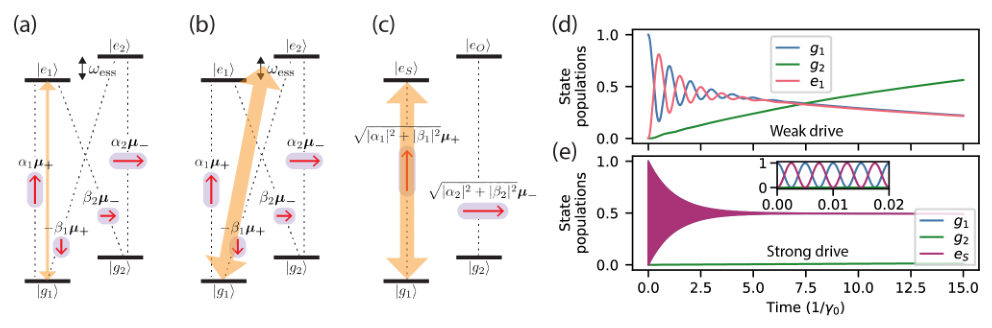 
FIG. 1. Cycling transitions via strong drive. (a) An atomic system without native cycling transitions. In a traditional readout scheme that solely couples |g1⟩to |e1⟩, the number of photons emitted will be limited because the system will be optically pumped to |g2⟩. (b) The same atomic system with a strong drive polarized along µ+ which simultaneously couples |g1⟩to both |e1⟩and |e2⟩. When the Rabi rate is much greater than the frequency splitting of the excited states ωess, the system is directly driven between |g1⟩and |eS⟩∼α1|e1⟩−β1|e2⟩. (c) The system with the excited states basis rewritten, indicated the allowed transitions. In (a-c), the amplitude and polarization of the TDMs are...

📷 Fig 2

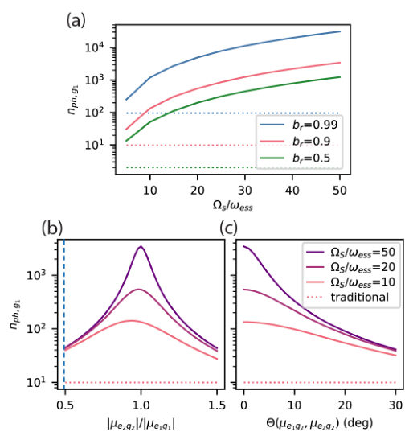 
FIG. 2. Comparison of strong driving photon emission out- comes for atomic systems with different TDMs. (a) Num- ber of total average emitted photons nph,g1 from an atomic system whose TDMs have the form in Eq. 2. The dotted lines indicate nph,g1 for a traditional excitation scheme which applies a weak coherent drive resonant with the |g1⟩−|e1⟩ optical transition. The solid lines indicate nph,g1 for a system driven by a strong field which is tuned halfway in between the |g1⟩−|e1⟩and |g1⟩−|e2⟩transitions. (b) Number of to- tal average emitted photons nph,g1 for a system in which the TDM amplitudes vary from the form in Eq. 2, parameter- ized in terms of the ratio between |µe2g2| and |µe1g1|....

📷 Fig 3

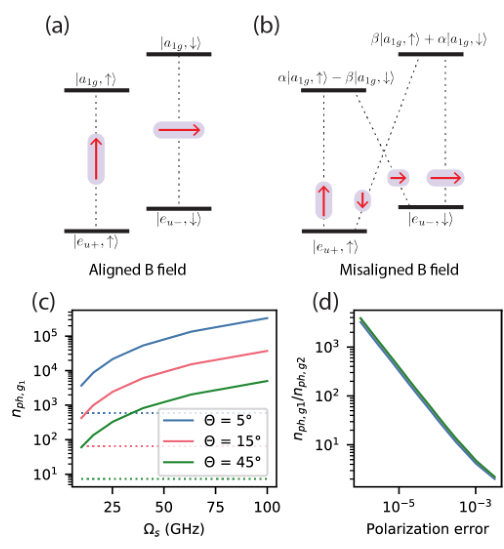 
FIG. 3. Strong drive-induced cycling transitions in an NiV– center. (a) The NiV–’s two excited states and two lowest- energy ground states under an externally applied magnetic field that is aligned to the symmetry axis of the NiV–. The excited state manifold contains only one orbital, while the two lowest ground states have different orbital characteristics, due to spin-orbit coupling. (b) The NiV– under an externally applied and slightly misaligned magnetic field. The ground states retain the same orbital and spin character, while the excited state magnetic quantization axis rotates freely. All optical transitions are allowed. (c) Number of photons nph,g1 emitted by the NiV– with a strong...

📷 Fig 4

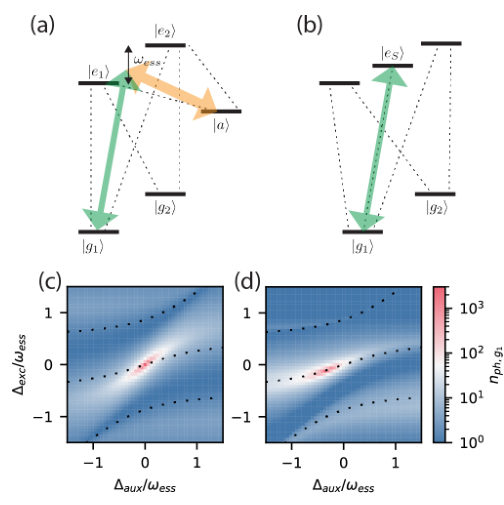 
FIG. 4. Auxiliary drive method for inducing cycling transi- tions. (a) An atomic system with no inherent cycling transi- tions between bare excited states |e1⟩, |e2⟩and ground states |g1⟩, |g2⟩. Allowed transitions are shown with dotted lines. An applied auxiliary field (shown in orange) dresses the excited states by coupling them to an auxiliary state |a⟩. (b) The same atomic system, with the excited state manifold written in the dressed basis that includes the auxiliary field. For cer- tain power and detuning parameters of the auxiliary field, one of the dressed states (|eS⟩) does not decay to |g2⟩, yielding a cycling transition, addressed by the excitation field (shown in green). (c,d)...

📷 Fig 5

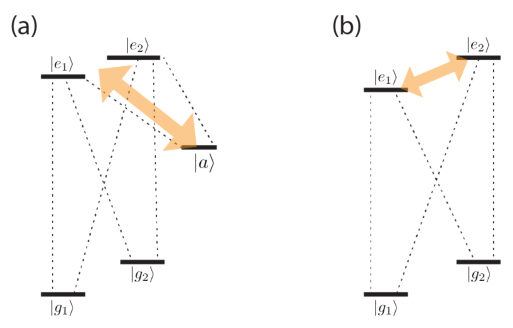 
FIG. 5. (a) A system in which coherent interference of decay could be observed. (b) A system in which coherent interfer- ence of decay could not be observed due to time-dependence in the collapse operator terms.

**Summary.** This paper presents a method to dramatically improve the efficiency of optical state readout in quantum emitters by manipulating the decay pathways through coherent interference. By applying tailored external driving fields, the authors engineer artificial cycling transitions, enabling the emission of many more photons than previously possible. This technique offers a pathway to high-fidelity quantum measurements in solid-state systems like the NiV- center.

**Why it may be interesting.** This work is highly relevant to AMO physics and quantum optics as it provides a powerful, controllable mechanism (coherent interference) to engineer fundamental quantum processes like spontaneous emission, which is crucial for quantum memory and readout.

Detailed structure

**Main problem.** The primary goal is to enhance the fidelity of optical readout in atomic state measurement, which is typically limited by imperfect photon collection efficiency.

**Main result.** The authors demonstrate that cyclicity can be significantly extended by engineering coherent destructive interference between spurious decay paths, leading to a massive increase in emitted photons.

**Method.** The method involves applying strong coherent driving fields or auxiliary fields to induce artificial cycling transitions, circumventing limitations inherent in the native atomic decay pathways.

**Model / system.** The study models atomic systems, using the negatively-charged nickel vacancy center (NiV-) in diamond as a prime example. The physics is described using a full master equation formalism involving ground and excited states.

**Key observables.** The number of emitted photons ($n_{	ext{ph},g_1}$) is the key diagnostic, alongside the branching ratio ($b$) which measures readout efficiency.

**Important parameters / regimes.** Key parameters include the strength of the driving fields ($\Omega_S$), detuning parameters ($\Delta_{aux}$), and the polarization dependence of the transition dipole moments (TDMs).

**Assumptions / limitations.** The analysis often simplifies the system to two decaying excited states, and the strong drive approach requires careful polarization control and high optical powers.

**Figures summary.** Figures illustrate the comparison between traditional readout (limited by pumping) and the enhanced readout using strong driving or auxiliary fields, showing orders of magnitude increases in photon counts.

**Paper structure.** The paper progresses by first establishing the limitation of traditional readout, then introducing the strong drive approach to suppress unwanted decay paths, and finally detailing an auxiliary drive scheme to achieve even higher cyclicity with lower power.

Abstract

Optical readout is a fundamental tool in atomic state measurement, yet the fidelity of optical readout is frequently limited by imperfect photon collection. This can be mitigated when readout occurs on a cycling transition which continuously fluoresces under resonant excitation, thus increasing signal and enabling single-shot readout. We present a method to extend the cyclicity of atomic transitions via coherent destructive interference between spurious decay paths. We describe the characteristics of atomic systems in which this method can be implemented and model several examples in which the number of emitted photons is increased by multiple orders of magnitude.

[↑ back to top](#top)

### [Monitored free fermions under periodic driving](http://arxiv.org/abs/2608.21835v1)

**Authors:** Aditi Chakrabarty, Alexander D. Mirlin, Igor Poboiko  
**Type:** theory · **Category:** disordered systems and neural networks · **PDF:** <https://arxiv.org/pdf/2608.21835v1>  
**Analysis basis:** full PDF text, analyzed in chunks
**Topic relevance:** 🔥 `quantum measurements` **4/5** · `Keldysh / 2PI / non-Gaussian methods` **3/5** · `driven-dissipative phase transition` **3/5** · `methods for driven-dissipative` **3/5** · `non-equilibrium universality` **3/5** · `analog quantum simulation` **2/5** · `Frenkel-Kontorova` **1/5** · `correlated / nonlocal dissipation` **1/5** · `scars & prethermalization` **1/5**

📷 Fig 1

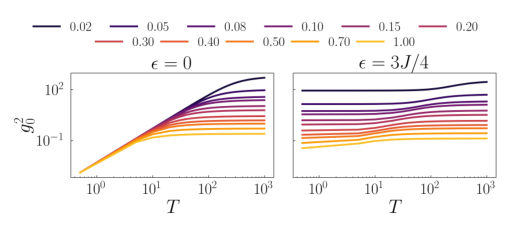 
Figure 1. Analytical results for g2 0 as obtained in Eq. (6), for different measurement strengths γ/J at ϵ = 0 and ϵ = 3J/4.

📷 Fig 2

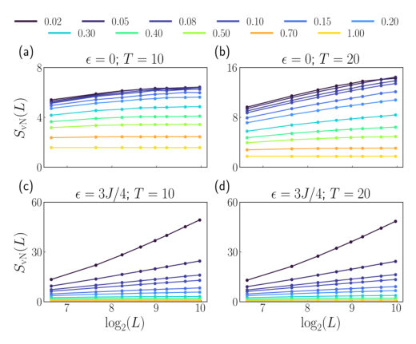 
Figure 2. Average half-chain entanglement entropy SvN as a function of system size L. Panels (a,b) correspond to the maximally symmetric driving (ϵ = 0) with period T = 10 and T = 20, respectively, while panels (c,d) correspond to the case ϵ = 3J/4 with the same driving periods. The system sizes considered here are L = 100, 200, 300, 400, 500, 600, 800, and 1000. For L ≤600, all possible half-chain cuts for ev- ery state are included in the averaging, whereas for L = 800 and L = 1000, the averages are taken over 20 approximately equidistant cuts. In addition, the averaging over quantum trajectories and over the time in the steady-state regime is performed, see text in Sec. IV A and in...

📷 Fig 3

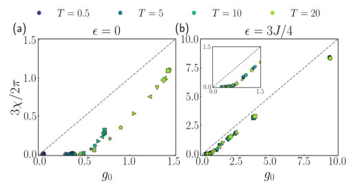 
Figure 3. Numerically determined coefficient χ (multiplied by 3/2π) of the initial logarithmic growth of the entanglement entropy vs the analytical value of the bare diffusion constant g0, Eq. (6), for (a) ϵ = 0 and (b) ϵ = 3J/4. The data for different time periods (see legend) and for different values of the measurement rate γ/J (identical to those in Fig. 2) are included. The inset of panel (b) provides a zoom on the region of small g0.

📷 Fig 4

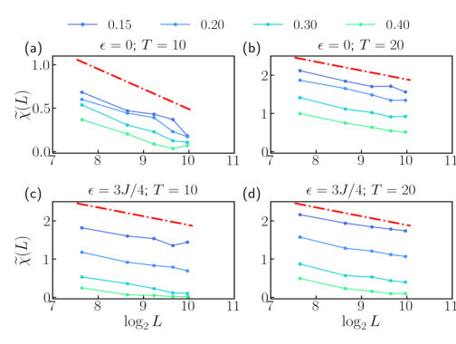 
Figure 4. Discrete version of the entanglement entropy deriva- tive in Eq. (26), defined according to Eq. (29) by using the data presented in Fig. 2. Different colors correspond to differ- ent values of the measurement rate γ/J (see legend), which are chosen in the range from 0.15 to 0.4 providing access to the diffusive regime for the numerically studied system sizes L. The red dash-dotted straight lines have the slope −1/3 visualizing the analytically predicted WL renormalization as given in Eq. (28).

📷 Fig 5

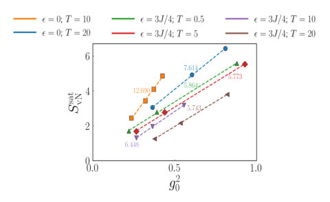 
Figure 5. Numerical verification of the linear relation in Eq. (30) between the saturated value Ssat vN of the entanglement entropy at L ≫ξ and the square of the bare conductivity g0. The values of Ssat vN are obtained from those data of Fig. 2 that exhibit saturation at numerically studied system sizes. The values of g0 are given by Eq. (6). Different colors correspond to different parameters (ϵ, T) of the time-periodic Hamilto- nian H(t), Eq. (1). Different points for each color correspond to different values of the measurement rate γ/J. The slopes corresponding to each data set with given H(t) and varying γ/J are indicated and visualized by dashed lines. The ana- lytically predicted...

**Summary.** This work analytically and numerically studies free fermions subjected to both periodic driving and continuous local monitoring. Using the nonlinear sigma-model, the authors show that the system's fundamental universality class is preserved, while predicting characteristic crossovers between ballistic, diffusive, and localized regimes. This provides a comprehensive theoretical understanding of measurement effects in driven quantum matter.

**Why it may be interesting.** It provides a unified framework for understanding how measurement back-action and time-periodic driving interact in fermionic systems, touching upon concepts relevant to open quantum systems and non-equilibrium dynamics.

Detailed structure

**Main problem.** The paper investigates how continuous monitoring of local particle density affects the dynamics of a one-dimensional periodically driven free-fermionic system.

**Main result.** The driving does not change the universality class, and the system exhibits successive crossovers from ballistic to diffusive behavior, with weak-localization corrections observed in the diffusive regime.

**Method.** The analysis employs a combination of analytical field-theoretical techniques, specifically the nonlinear sigma-model (NLSM) for long-wavelength physics, and numerical simulations using the stochastic Schrödinger equation.

**Model / system.** The system is a 1D chain of free spinless fermions governed by a time-periodic hopping Hamiltonian, whose evolution is non-unitary due to continuous quantum measurements of local particle densities.

**Key observables.** Von-Neumann entanglement entropy, density correlation function, and the renormalization of the NLSM coupling constant.

**Important parameters / regimes.** Monitoring rate ($\gamma$), system size ($\ell$), and the bare coupling constant ($g_0$).

**Assumptions / limitations.** The analysis relies on the long-wavelength approximation using the NLSM and models the measurement process via the quantum state diffusion protocol.

**Figures summary.** The notes indicate numerical simulations demonstrate successive crossovers from ballistic to diffusive behavior, and ultimately to localization as system size increases.

**Paper structure.** The paper develops the theory by first establishing the non-unitary evolution, then applying the NLSM to describe long-wavelength physics, deriving renormalization group flow equations, and finally corroborating these analytical predictions with numerical simulations of entanglement entropy and correlation functions.

Abstract

We investigate analytically and numerically a one-dimensional periodically driven free-fermionic system subjected to monitoring of the local particle density. Based on the analytical approach that describes the long-wavelength physics of the time-dependent Hamiltonian in the field-theoretical language using the nonlinear sigma-model (NLSM), we reveal that driving does not alter the universality class of the problem. As a consequence, the system retains the area-law behavior in the thermodynamic limit, with an intermediate diffusive regime giving rise to logarithmic growth of entanglement entropy for a small monitoring rate. At the same time, driving leads to a renormalization of the bare coupling constant of the NLSM, which controls the space-time ``conductivity'' in the diffusive regime. We derive the analytic form of this renormalization, which becomes particularly strong in the case of a ``maximally symmetric'' drive and sufficiently short driving period. In addition, we employ the Wiener-Hopf method to investigate the ballistic-diffusive crossover. These analytical predictions are corroborated by numerical simulations of the von-Neumann entanglement entropy and the density correlation function. Our numerical results clearly demonstrate that, with an increase in the system size, there are successive crossovers from ballistic to diffusive behavior and ultimately to localization. Furthermore, in the diffusive regime, we observe weak-localization corrections that are in agreement with the analytical predictions of the NLSM. Overall, our results provide a unified analytical and numerical framework for understanding the effects of monitoring in time-modulated fermionic systems, paving a way for broader investigations of driven quantum matter.

[↑ back to top](#top)

### [Spinning giant optomechanical cavity with nonreciprocal self-interference](http://arxiv.org/abs/2608.22357v1)

**Authors:** Yao-Tong Chen  
**Type:** theory · **Category:** other · **PDF:** <https://arxiv.org/pdf/2608.22357v1>  
**Analysis basis:** full PDF text, analyzed in chunks
**Topic relevance:** 🔥 `interference shaping light` **4/5** · `correlated / nonlocal dissipation` **3/5** · `driven-dissipative phase transition` **3/5** · `methods for driven-dissipative` **3/5** · `Keldysh / 2PI / non-Gaussian methods` **2/5** · `non-equilibrium universality` **2/5** · `analog quantum simulation` **1/5** · `quantum measurements` **1/5**

📷 Fig 1

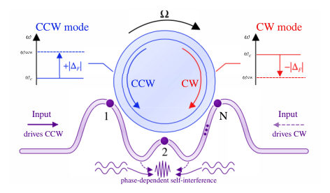 
FIG. 1. Schematic of a giant spinning optomechanical cavity. A spinning ring cavity is evanescently coupled to a meander- ing waveguide at multiple spatially separated points, forming a giant-cavity configuration. The cavity supports two coun- terpropagating optical modes, denoted by CW and CCW, whose resonance frequencies are shifted in opposite directions by the rotation at angular velocity Ω. The multi-point waveg- uide coupling leads to self-interference, which makes the effec- tive detuning, dissipation, and driving phase dependent and direction dependent.

📷 Fig 2

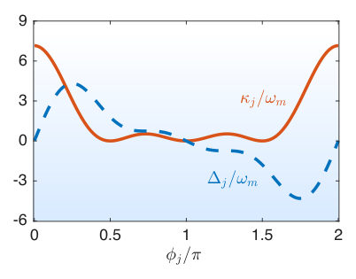 
FIG. 2. Phase dependence of the effective optical linewidth κj/ωm (solid) and detuning ∆j/ωm (dashed) for N = 4 in the overcoupled limit κ0 ≃0. Multi-point self-interference strongly modulates the linewidth, allowing the system to be tuned between the resolved- and unresolved-sideband regimes. The parameters are κex,j ≃38 MHz and ωm ≃85 MHz.

📷 Fig 3

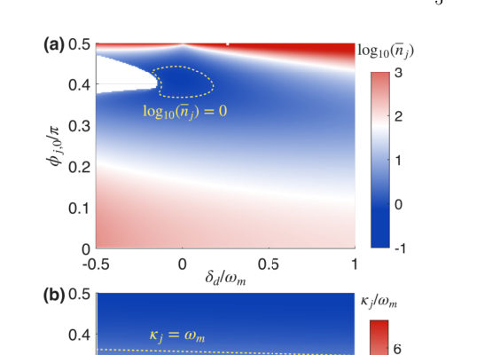 
FIG. 3. Phase-dependent cooling for a static cavity. (a) Logarithm of the steady-state phonon number, log10(¯nj), and (b) effective linewidth, κj/ωm, as functions of the driving de- tuning δd and the reference phase ϕj,0. The yellow dashed contour in (a) and dashed line in (b) mark the ¯nj = 1 thresh- old and the boundary κj = ωm between the resolved- and unresolved-sideband regimes, respectively. The parameters are κex,j ≃38 MHz, ωm ≃85 MHz, γm ≃3 kHz, T ≃3 K, g ≃67 Hz, P ≃5.4 W, L ≃4×10−3 m, and vg ≃1.1×107 m/s.

📷 Fig 4

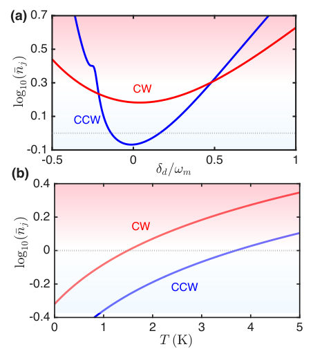 
FIG. 4. Nonreciprocal phonon cooling for the two opposite driving directions. (a) Logarithm of the steady-state phonon number, log10(¯nj), as a function of the driving detuning δd at T ≃3 K. (b) log10(¯nj) as a function of the temperature T at the reference red-sideband point δd ≃0. The reference phases are chosen as ϕcw,0 ≃0.34π and ϕccw,0 ≃0.38π, correspond- ing to a phase difference δϕ0 ≃0.04π between the two coun- terpropagating modes. For the spinning cavity considered here, we take |∆F | = 2.08ωm, corresponding to Ω≈30 kHz. The other parameters are the same as those in Fig. 3.

📷 Fig 5

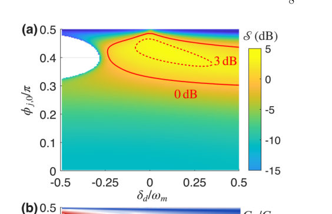 
FIG. 5. Phase-dependent mechanical squeezing for a static cavity. (a) Optimized mechanical squeezing Sj and (b) the corresponding optimal two-tone coupling ratio Gj,+/Gj,−as functions of the driving detuning δd and the reference phase ϕj,0. The red solid and dashed contours in (a) indicate Sj = 0 dB and Sj = 3 dB, respectively. Only stable parameter points satisfying Eq. (48) and Gj,+ &lt; Gj,−are retained. The red-tone input power is P−≃3.4 W, the mechanical damping rate is γm ≃2 kHz, and the temperature is T ≃0.1 K. The other parameters are the same as those in Fig. 3.

**Summary.** This paper investigates how multi-point self-interference in a spinning optomechanical cavity allows for precise, phase-controlled engineering of the mechanical quantum reservoir. By combining this interference effect with cavity rotation, the authors demonstrate a novel route to achieving nonreciprocal quantum phenomena, such as directional phonon cooling and squeezing.

**Why it may be interesting.** This work provides a sophisticated theoretical blueprint for controlling quantum dissipation and generating nonreciprocal quantum effects in solid-state optomechanical systems, which is highly relevant to quantum sensing and quantum transduction.

Detailed structure

**Main problem.** The study aims to engineer quantum mechanical reservoirs with precise phase control and nonreciprocal behavior by combining cavity rotation with multi-point self-interference.

**Main result.** The mechanism successfully enables phase-controlled phonon cooling and generates nonreciprocal steady-state squeezing for the mechanical mode when cavity rotation is introduced.

**Method.** The analysis uses the input-output formalism and quantum Langevin equations to model the coupled optomechanical system under single-tone (cooling) and two-tone (squeezing) driving.

**Model / system.** The system is a spinning optomechanical cavity coupled to a meandering waveguide at multiple points, forming a giant-cavity structure. The dynamics are governed by the interplay between cavity rotation (Sagnac-Fizeau shift) and phase-dependent self-interference.

**Key observables.** Effective linewidth ($\kappa_{	ext{eff}}$), effective detuning ($\Delta_{	ext{eff}}$), steady-state phonon number ($ar{n}$), and squeezing level ($S$).

**Important parameters / regimes.** Cavity rotation rate ($\Omega$), propagation phase ($\phi_j$), driving tones (single/two-tone), and coupling strength ($g$).

**Assumptions / limitations.** The analysis relies on the Markovian approximation for the mechanical bath noise and often uses the center-phase approximation for frequency-dependent calculations.

**Figures summary.** Figures illustrate the setup (Fig. 1) and compare contours of squeezing levels derived from center-phase vs. frequency-dependent calculations, and RWA vs. time-periodic calculations.

**Paper structure.** The paper progresses from establishing the physical setup and the origin of nonreciprocity via self-interference, to deriving the necessary equations for cooling and squeezing, and finally analyzing the results for both single-tone and two-tone driving regimes.

Abstract

We study a spinning optomechanical cavity that is coupled to a meandering waveguide at multiple spatially separated points, forming a giant-cavity configuration. The resulting self-interference makes the effective optical driving, linewidth, and frequency shift strongly dependent on the propagation phase in the waveguide, while the rotation-induced Sagnac-Fizeau shift causes the clockwise (CW) and counterclockwise (CCW) cavity modes to experience distinct interference phases. Under single-tone driving, this mechanism enables phase-controlled phonon cooling and, in the presence of cavity rotation, nonreciprocal cooling, with one propagation direction approaching the mechanical ground-state regime while the opposite direction remains less efficiently cooled. Under two-tone driving, the same interference mechanism engineers a squeezed reservoir for the mechanical mode, producing steady-state squeezing that likewise becomes nonreciprocal under cavity rotation. These results establish multi-point self-interference as a versatile mechanism for phase-controlled optomechanical reservoir engineering and show that, when combined with cavity rotation, it provides a route to nonreciprocal quantum effects.

[↑ back to top](#top)

### [Chiral doublon bound states in a synthetic topological waveguide](http://arxiv.org/abs/2608.22718v1)

**Authors:** Ying Xia, Xin Wang  
**Type:** theory · **Category:** other · **PDF:** <https://arxiv.org/pdf/2608.22718v1>  
**Analysis basis:** full PDF text, analyzed in chunks
**Topic relevance:** 🔥 `analog quantum simulation` **4/5** · `Tavis-Cummings & cavity-many-emitter` **3/5** · `Keldysh / 2PI / non-Gaussian methods` **2/5** · `correlated / nonlocal dissipation` **2/5** · `driven-dissipative phase transition` **2/5** · `methods for driven-dissipative` **2/5** · `Frenkel-Kontorova` **1/5** · `interference shaping light` **1/5** · `quantum measurements` **1/5**

📷 Fig 1

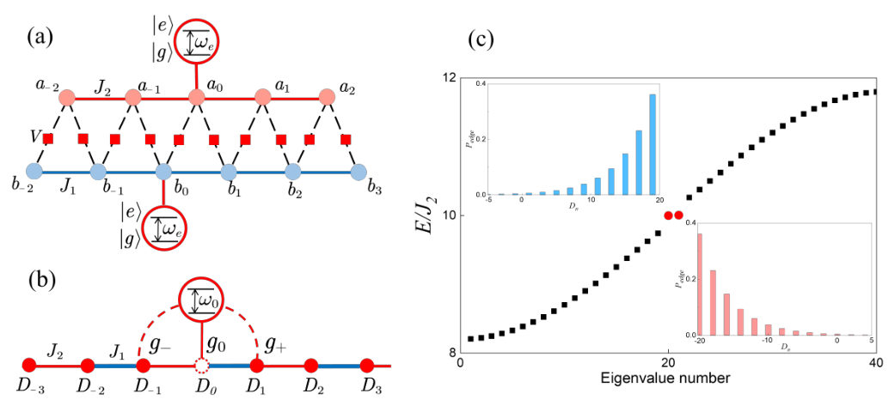 
FIG. 1. (a) A pair of emitters coupled to the triangular ladder model. J1 and J2 denote the nearest-neighbor hopping amplitudes along the upper and lower legs, respectively, and V is the nearest-neighbor interaction on the rungs. (b) Effective dual SSH chain with an emitter coupled to the central site. (c) Two-body energy spectrum of the triangular ladder model. The insets show the two edge states of the effective dual doublon model. The parameters are V = 10J2, J2 = 1, J1 = 0.8J2, and L = 40 sites.

📷 Fig 2

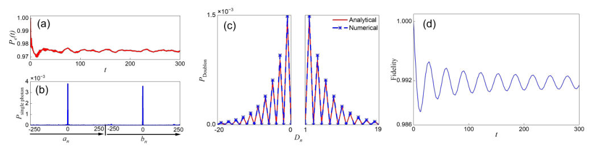 
FIG. 2. (a) Numerical results for the atomic excitation probability Pe(t) as a function of time t. (b) Spatial distribution of the single-photon component in the long-time limit. (c) Spatial distribution of the doublon component in the effective SSH chain. The left (right) panel corresponds to the emitter coupled to site D0 (D1). (d) Time-dependent fidelity between the numerically evolved state and the analytical VDS state. The parameters are g = 0.3J2, ωe = 5J2 (so that ω0 = 10J2), L = 1000 sites, and all other parameters are the same as in Fig. 1.

📷 Fig 3

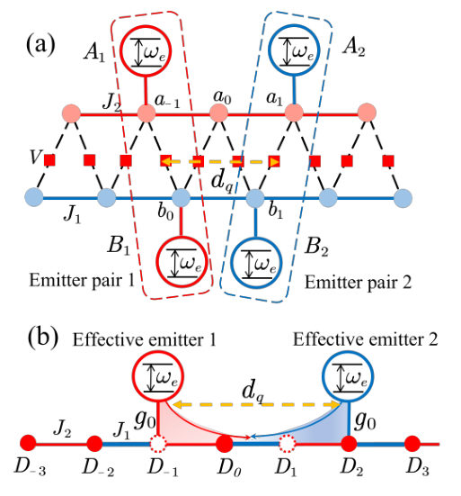 
FIG. 3. (a) Four-body setup consisting of two emitter pairs coupled to the triangular ladder waveguide. (b) Effective model with two emitters coupled to the SSH chain at sites D−1 and D2, respectively; the separation between the two emitters is dq = 3.

📷 Fig 4

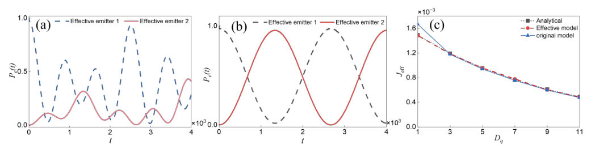 
FIG. 4. Population dynamics of the four-body system for separation dq = 3 in the “face-to-face” configuration. (a) Dynamics for identical emitter frequencies, ωA1 = ωB1 = ωA2 = ωB2 = ω0/2. (b) Dynamics for finite detuning δω = 0.5J2. (c) Comparison between the numerically extracted oscillation frequencies and the analytical prediction of Jeff as a function of the separation dq. The parameter is L = 300 sites and other parameters are consistent with Fig. 2.

📷 Fig 5

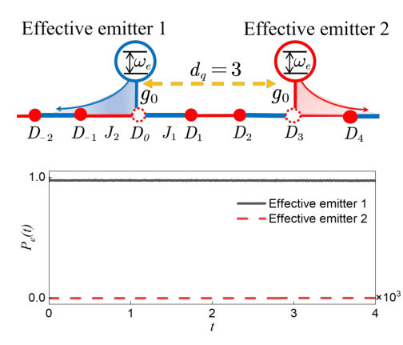 
FIG. 5. Population dynamics of the four-body system for the “back-to-back” configuration with a separation dq = 3. The detuning is set to δω = 0.5J2, and other parameters are consistent with Fig. 4.

**Summary.** This paper explores using nonlinear waveguide QED to create and control chiral doublon bound states in a topological waveguide. By mapping the system to an effective SSH chain, the authors derive an effective four-body interaction. The key finding is that by tuning the system parameters, they can suppress unwanted single-photon processes, revealing coherent, tunable dipole-dipole interactions mediated purely by the doublon excitations.

**Why it may be interesting.** This work is highly relevant as it uses topological concepts (SSH edge states, chirality) to engineer controllable, non-local interactions in a quantum optical setting, which is a major theme in modern AMO physics and quantum networking.

Detailed structure

**Main problem.** The paper investigates the creation and control of chiral doublon bound states within a synthetic topological waveguide to engineer tunable many-body interactions between correlated photon pairs.

**Main result.** The study demonstrates that the system supports a chiral bound state whose interaction strength can be controlled by the relative chirality and separation parity of two emitter pairs, leading to coherent Rabi oscillations under specific detuning conditions.

**Method.** The analysis employs the vacancy-like dressed state (VDS) theory and adiabatic elimination techniques to map the complex waveguide QED dynamics onto an effective emitter coupled to a dual SSH lattice.

**Model / system.** The physical platform is a nonlinear waveguide QED setup realized in a triangular ladder waveguide. The dynamics are modeled by mapping the doublon interactions onto an effective SSH chain, which governs the coupled emitter-bath system.

**Key observables.** Coherent Rabi oscillations, the spatial profile of the doublon wave function (showing chirality), and the effective four-body interaction strength ($J_{	ext{eff}}$).

**Important parameters / regimes.** The system operates in regimes defined by strong nearest-neighbor interactions ($V \gg J_1, J_2$) and weak coupling for adiabatic elimination ($g \ll J_i, V$).

**Assumptions / limitations.** The analysis assumes the doublon dynamics can be accurately described by the VDS theory, and that single-photon exchange channels can be suppressed via frequency detuning to isolate the doublon-mediated interaction.

**Figures summary.** Figures illustrate the physical setup (triangular ladder), the effective dual SSH chain, the two-body spectrum, and population dynamics showing the transition from irregular to coherent Rabi oscillations upon detuning.

**Paper structure.** The paper progresses by first establishing the mapping to an effective SSH chain using VDS theory. It then extends this to two emitter pairs to derive the effective four-body interaction. Finally, it details the necessary experimental tuning (detuning and Stark shift correction) to observe coherent, doublon-mediated dynamics.

Abstract

Nonlinear waveguide QED serves as a platform for studying correlated photon dynamics, where its interplay with topological bound states can give rise to unconventional phenomena. We investigate a triangular ladder waveguide in which a pair of emitters forms a doublon bound state through strong nearest-neighbor interactions. By mapping the doublon dynamics onto an effective SSH chain, we show that the system is equivalent to an effective emitter coupled to a topological doublon bath. Using the vacancy-like dressed state approach, we demonstrate the existence of a chiral bound state with a node at the coupling site and an exponentially localized wave function inherited from the SSH edge states. Extending this picture to two emitter pairs, we derive an effective four-body interaction whose strength is determined by the relative chirality and the separation parity of the bound states. When the two bound states face each other, coherent Rabi oscillations emerge; when they are arranged back-to-back or have an even separation, the interaction vanishes. Our results provide a route toward engineering tunable many-body interactions between correlated photon pairs and realizing nonlinear quantum networks based on flying doublons.

[↑ back to top](#top)

### [Error Propagation Theory for Variational Non-Markovian Open Quantum Dynamics](http://arxiv.org/abs/2608.22404v1)

**Authors:** Long Cao, Daochi Zhang, Yao Wang, Liwei Ge, Rui-Xue Xu, YiJing Yan, Xiao Zheng  
**Type:** theory · **Category:** numerical methods · **PDF:** <https://arxiv.org/pdf/2608.22404v1>  
**Analysis basis:** full PDF text, analyzed in chunks
**Topic relevance:** 🔥 `methods for driven-dissipative` **4/5** · `Keldysh / 2PI / non-Gaussian methods` **3/5** · `correlated / nonlocal dissipation` **3/5** · `driven-dissipative phase transition` **3/5** · `non-equilibrium universality` **2/5** · `quantum measurements` **2/5** · `analog quantum simulation` **1/5**

📷 Fig 1

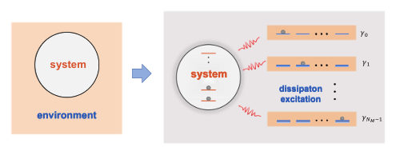 
FIG. 1. Schematic of the fermionic DQME theory, map- ping the original OQS (left) to a dissipaton-embedded system (right). Red and blue bars represent the NS system fermion energy levels and NE memory-carrying dissipaton levels, re- spectively. Broadening of blue bars indicates each dissipa- ton’s decay rate (inverse lifetime). The dissipaton levels can be grouped into NM decay channels, where the levels within each channel share a common decay rate.

📷 Fig 2

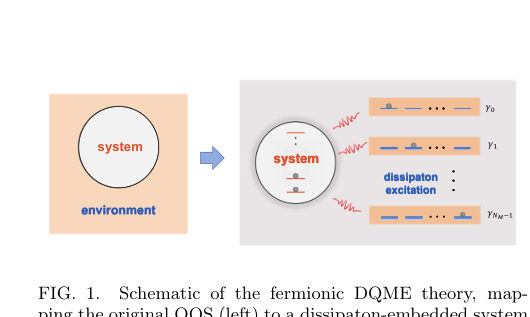 
Figure 1 illustrates the fermionic DQME theory, where the original OQS is mapped to a dissipaton- embedded system characterized by the reduced density tensor (RDT), ˜ρ = {˜ρ(⃗n,⃗n′; ⃗m−, ⃗m+)}. Here, ˜ρ(⃗n,⃗n′; ⃗m−, ⃗m+) = ⟨⟨⃗n,⃗n′; ⃗m−, ⃗m+| ˜ρ⟩⟩, |⃗n,⃗n′; ⃗m−, ⃗m+⟩⟩ = |⃗n,⃗n′⟩⟩S ⊗|⃗m−, ⃗m+⟩⟩E are the basis vectors of the extended Liouville space composed of the system Liouville space (spanned by {|⃗n,⃗n′⟩⟩S}) and the dissipaton space (spanned by {|⃗m−, ⃗m+⟩⟩E}). Vectors ⃗n and ⃗n′ denote system fermion configurations, while ⃗m−and ⃗m+ represent electron-type and hole-type dissipaton configurations, respectively. The RDT ele- ments with |⃗m−, ⃗m+⟩⟩E = |⃗0⟩⟩E (the dissipaton vacuum) yield...

📷 Fig 3

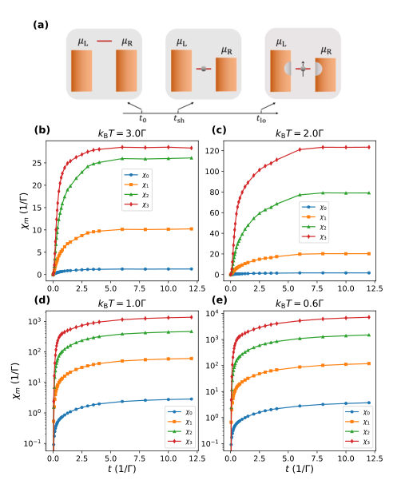 
FIG. 2. (a) Schematic of an open quantum system consisting of an impurity coupled to left (L) and right (R) reservoirs with chemical potentials µL and µR. The gray shaded regions in the reservoirs denote Kondo clouds that screen the impurity’s localized spin. (b) The trajectories of χm(t) (m = 0, 1, 2, 3) at kBT = 3.0 Γ, with Mmax = 3, NM = 4, and Re(γ)min = 9.42 Γ. (c) The trajectories of χm(t) (m = 0, 1, 2, 3) at kBT = 2.0Γ, with Mmax = 3, NM = 5, and Re(γ)min = 6.28 Γ. (d) The trajectories of χm(t) (m = 0, 1, 2, 3) at kBT = 1.0Γ, with Mmax = 3, NM = 6, and Re(γ)min = 3.14 Γ. (e) The trajectories of χm(t) (m = 0, 1, 2, 3) at kBT = 0.6Γ, with Mmax = 3, NM = 7, and Re(γ)min = 1.88 Γ. The...

📷 Fig 4

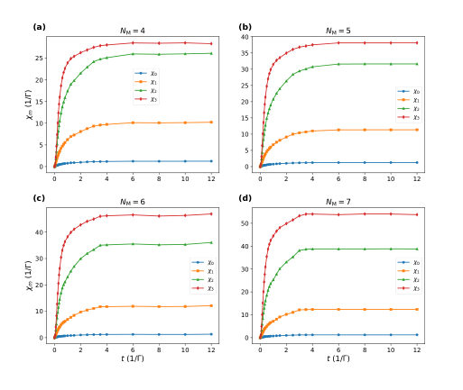 
FIG. 3. Panels (a)–(d) depict χm(t) (m = 0, 1, 2, 3) at kBT = 3.0 Γ for different numbers of decay channels, NM = 4, 5, 6, and 7, respectively. System parameters (in units of Γ): ϵ0 = U0/2 = 2, ∆ϵ = −7, and ∆U = 6.

📷 Fig 5

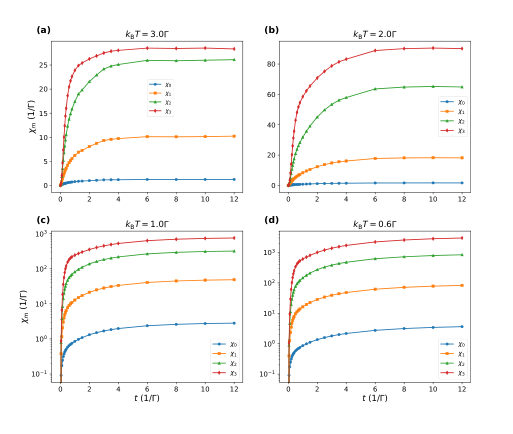 
FIG. 4. Panels (a)–(d) display χm(t) (m = 0, 1, 2, 3) at kBT = 3.0 Γ, 2.0 Γ, 1.0 Γ, and 0.6 Γ, respectively, with NPad´e = 4 decomposition poles and a dissipaton space of size NE = 32. The vertical axes in (c) and (d) use a logarith- mic scale. System parameters (in units of Γ): ϵ0 = U0/2 = 2, ∆ϵ = −7, and ∆U = 6.

**Summary.** This work provides a rigorous theoretical framework to analyze how numerical errors accumulate when simulating complex, non-Markovian open quantum dynamics. By identifying an 'error-backflow' mechanism linked to environmental memory, the authors establish a fundamental precision barrier. This guides the design of more robust variational algorithms for challenging quantum simulations.

**Why it may be interesting.** This is highly relevant for AMO and open quantum systems because it provides the first quantitative theoretical guidance on the computational limitations inherent in simulating strongly non-Markovian dynamics using modern AI/ML techniques like NQS and PINNs.

Detailed structure

**Main problem.** The paper addresses the critical challenge of quantifying error propagation when simulating non-Markovian open quantum dynamics using variational methods.

**Main result.** It develops a theoretical framework showing that an intrinsic 'error-backflow' mechanism, driven by environmental memory, establishes a fundamental precision barrier for variational algorithms.

**Method.** The authors combine analytical derivations with numerical verification to characterize error evolution, specifically analyzing the Time-Dependent Variational Principle (TDVP) applied to the Dissipation-Embedded Quantum Master Equation (DQME).

**Model / system.** The system is an Open Quantum System (OQS), modeled using an Anderson impurity Hamiltonian ($H_T = H_S + H_E + H_{SE}$), whose dynamics are mapped onto a dissipaton-embedded system governed by the DQME.

**Key observables.** Error propagation $\langle\delta \hat{O}(t)
angle_	heta$, Non-Markovian error susceptibility $\chi(t)$, and the Reduced Density Tensor ($	ilde{
ho}$).

**Important parameters / regimes.** Strongly non-Markovian regime, residual error $r_{\max}$, and environmental memory timescales.

**Assumptions / limitations.** The analysis relies on the DQME formalism and the use of variational ansatze (like NQS) to approximate the time evolution.

**Figures summary.** Figure 1 schematically illustrates the fermionic DQME mapping to a dissipaton-embedded system. Figure 2 shows the temperature dependence of the error susceptibility $\chi_m(t)$.

**Paper structure.** The paper first introduces the variational methods for non-Markovian dynamics, then develops the theoretical framework for error characterization, culminating in the quantitative description of error accumulation via the error-backflow mechanism.

Abstract

Variational approaches based on neural quantum states and physics-informed neural networks provide powerful paradigms for simulating non-Markovian open quantum dynamics. However, extending these methods into the strongly non-Markovian regime reveals a critical bottleneck: even minute errors in the time evolution can translate into substantial deviations in physical observables. The fundamental origin of this stringent precision requirement, as well as how non-Markovianity governs it, remains an open question.   Here, we develop a theoretical framework that systematically characterizes error propagation in variational non-Markovian dynamics. By combining analytical derivations with numerical verification, we present the first quantitative description of variational error evolution over time. Our analysis uncovers an intrinsic error-backflow mechanism driven by long-lived environmental memory. This mechanism establishes a fundamental precision barrier and provides concrete guidance for designing robust variational algorithms for strongly non-Markovian quantum systems.

[↑ back to top](#top)

### [Programmable Doppler real-space pattern formation in cold atoms](http://arxiv.org/abs/2608.21689v1)

**Authors:** Yijun Tang  
**Type:** both · **Category:** other · **PDF:** <https://arxiv.org/pdf/2608.21689v1>  
**Analysis basis:** full PDF text, analyzed in chunks
**Topic relevance:** 🔥 `analog quantum simulation` **4/5** · `driven-dissipative phase transition` **3/5** · `methods for driven-dissipative` **3/5** · `Keldysh / 2PI / non-Gaussian methods` **2/5** · `quantum measurements` **2/5** · `correlated / nonlocal dissipation` **1/5** · `non-equilibrium universality` **1/5**

📷 Fig 1

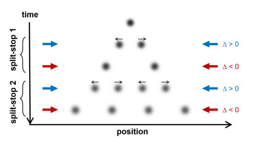 
FIG. 1: Schematic of pattern formation with alternating blue and red detuning. After two split-stop, the initial cloud splits into 4 subpackets. Arrows on the subpackets indicate their center-of-mass moving direction.

📷 Fig 2

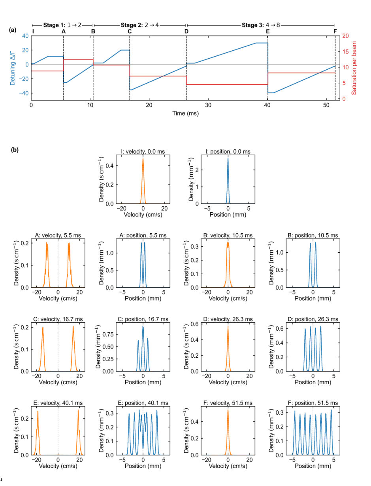 
FIG. 2: Hierarchical formation of an eight-packet one-dimensional real-space distribution using the split-stop protocol. (a) Time-dependent normalized detuning ∆(t)/Γ (blue) and single-beam saturation parameter s(t) (red). The three stages produce the successive 1 →2, 2 →4, and 4 →8 packet configurations. Dashed lines indicate the times I–F. (b) Corresponding velocity-space (orange) and real-space (blue) probability densities. I is initial cloud distribution. A, C, and E shows 2,4 and 8 subpackets at the end of blue-detuned pulses. Subsequent red-detuned pulses reduce their mean velocities to rest at B, D, and F, respectively. Detailed sequence parameters are in Table.I

📷 Fig 3

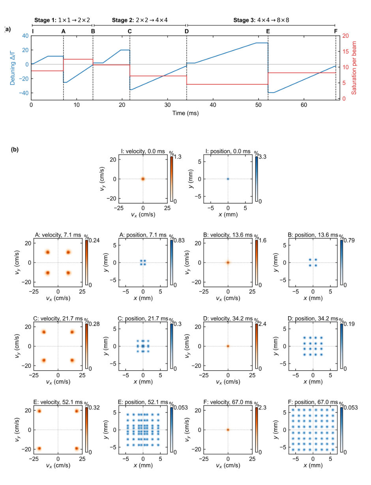 
FIG. 3: Hierarchical formation of an 8 × 8 two-dimensional real-space packet array using simultaneous two-axis split-stop control. (a) Normalized detuning ∆(t)/Γ (blue) and single-beam saturation s(t) (red), applied identically along x and y. The three stages produce the successive 1 × 1 →2 × 2 →4 × 4 →8 × 8 configurations. Dashed lines mark times A–F. (b) Corresponding velocity-space (orange) and real-space (blue) probability densities, including the initial distributions I. Blue-detuned pulses produce four-quadrant velocity splitting at A, C, and E; red-detuned pulses return the packets’ velocity toward rest at B, D, and F. The independently scaled color bars show the percentage of the...

📷 Fig 4

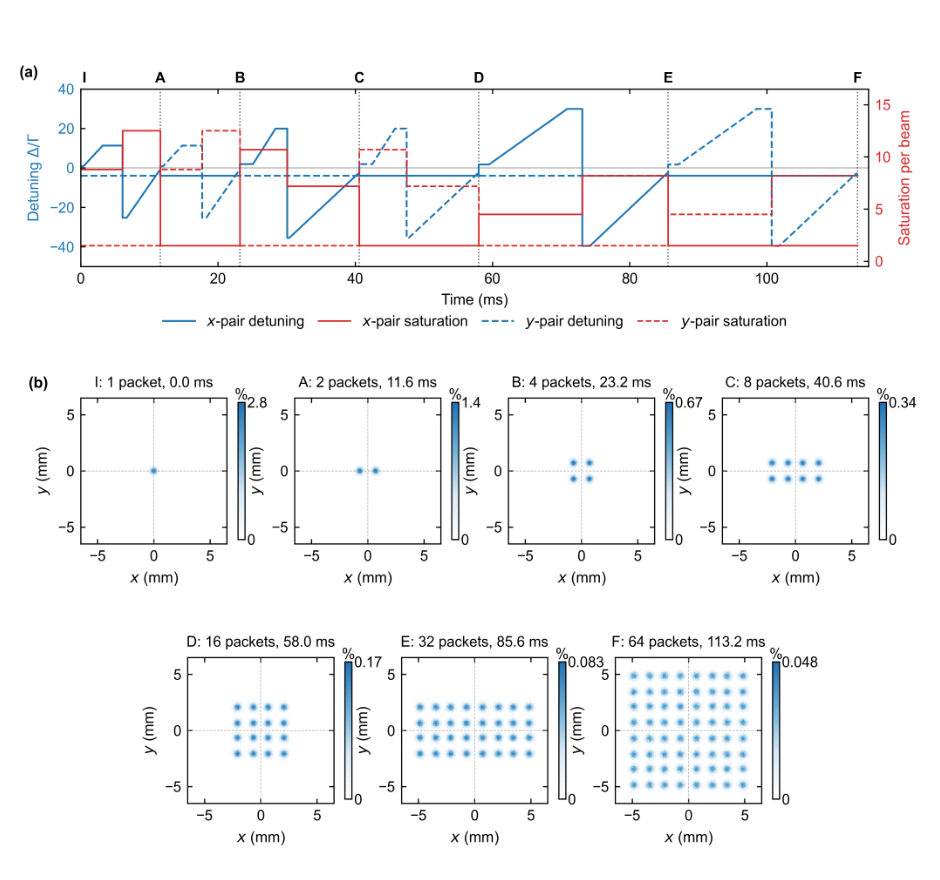 
FIG. 4: Hierarchical formation of an 8 × 8 two-dimensional real-space packet array using independent axis-by-axis split-and-stop control. (a) Independently programmed normalized detunings and single-beam saturations for the x and y beam pairs. (b) Corresponding real-space probability distributions. Alternating control of the two axes successively produces 1 →2 →4 →8 →16 →32 →64 spatial packets, culminating in an 8 × 8 array. The independently scaled color bars show the percentage of the full atomic ensemble contained in each fixed two-dimensional histogram bin.

**Summary.** This paper presents a programmable 'split-stop' protocol to create highly ordered, real-space arrays of cold atoms using $^{88}	ext{Sr}$. By alternating between blue-detuned light to split packets and red-detuned light to stop them, the authors recursively multiply the number of atomic packets in both 1D and 2D. The simulation demonstrates forming up to 64 distinct packets, showcasing precise control over quantum matter wave dynamics.

**Why it may be interesting.** This work provides a detailed, controllable mechanism for generating complex, ordered spatial structures in quantum gases, which is highly relevant for quantum simulation and quantum state engineering in AMO physics.

Detailed structure

**Main problem.** The paper addresses the challenge of creating programmable, spatially resolved patterns of cold atoms by combining two distinct light-matter interactions: blue-detuned splitting and red-detuned stopping.

**Main result.** The authors successfully demonstrated the theoretical and simulated realization of forming large arrays, achieving up to an 8-packet 1D array and a 64-packet 2D square array.

**Method.** The dynamics are modeled using stochastic photon-jump simulations that incorporate absorption and spontaneous-emission recoil, simulating a recursive 'split-stop' protocol.

**Model / system.** The physical system is cold atoms, specifically utilizing the 689 nm transition of $^{88}	ext{Sr}$. The protocol is controlled by time-dependent detuning and saturation parameters applied via multiple laser beams.

**Key observables.** The primary observables are the final spatial distribution of the atoms, quantified by the number of separated packets (e.g., 8 in 1D, 64 in 2D) and the resulting effective kinetic temperature.

**Important parameters / regimes.** The process is controlled by time-dependent normalized detuning $\delta(t)$ and single-beam saturation parameter $s(t)$. The final kinetic temperature achieved is around $1.2 \mu	ext{K}$ (1D) and $0.8 \mu	ext{K}$ (2D).

**Assumptions / limitations.** The 1D model assumes mutual incoherence of counter-propagating beams, and the internal state follows the instantaneous optical steady state adiabatically. Magnetic field and gravity effects are neglected.

**Figures summary.** Figure 1 schematically shows the alternating blue/red detuning cycle. Figure 2 illustrates the 1D hierarchical formation ($1 	o 2 	o 4 	o 8$). Figure 3 shows the 2D hierarchical formation using simultaneous control, and Figure 4 details the $8 	imes 8$ array formation using independent axis-by-axis control.

**Paper structure.** The paper details the core split-stop protocol, models the dynamics using stochastic simulations, and then systematically demonstrates the scaling from 1D (up to 8 packets) to 2D (up to 64 packets) using both simultaneous and sequential control schemes, providing detailed control parameters in tables.

Abstract

Red-detuned Doppler cooling decelerates atomic motion toward zero velocity, whereas blue-detuned light produces acceleration that separates a cold cloud into finite-velocity packets. Here we combine these complementary dynamics in a programmable split-stop protocol for real-space pattern formation. During each stage, a blue-detuned pulse splits existing packets and drives them apart, while a subsequent red-detuned pulse returns their center-of-mass velocities close to zero, results in spatially resolved stationary packets. Repeating this process recursively multiplies the number of packets in real space. We model the dynamics using stochastic photon-jump simulations that include absorption and spontaneous-emission recoil in one and two dimensions. Using experimentally realistic parameters for the $689~\mathrm{nm}$ ${}^{1}S_{0}\rightarrow{}^{3}P_{1}$ transition of ${}^{88}\mathrm{Sr}$, we demonstrate an 8-packet one-dimensional array and a 64-packet two-dimensional square array.

[↑ back to top](#top)

### [Scaling vs entanglement in measurement-induced phase transition for non-integrable systems](http://arxiv.org/abs/2608.21578v1)

**Authors:** Paranjoy Chaki, Protyush Nandi, Subinay Dasgupta, Ujjwal Sen  
**Type:** theory · **Category:** statistical mechanics · **PDF:** <https://arxiv.org/pdf/2608.21578v1>  
**Analysis basis:** full PDF text, analyzed in chunks
**Topic relevance:** 🔥 `quantum measurements` **4/5** · `driven-dissipative phase transition` **3/5** · `non-equilibrium universality` **3/5** · `analog quantum simulation` **2/5** · `methods for driven-dissipative` **2/5** · `correlated / nonlocal dissipation` **1/5** · `scars & prethermalization` **1/5**

📷 Fig 1

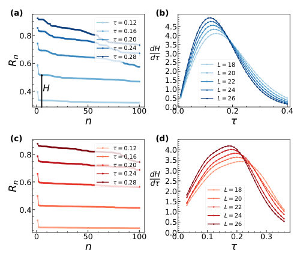 
Figure 1. Behaviour of the survival probability with the num- ber of measurements. Panels (a) and (c) show the survival prob- ability (Rn) as a function of the number of measurements (n) for τ = 0.12, 0.16, 0.20, 0.24, and 0.28 with system size L = 26, corresponding to the transverse-field Ising model with a longitudi- nal field and the ANNNI model, respectively where τ is the period of measurement. For the Ising model, the parameters are chosen as hz = 0.5 and hx = 0.6, while for the ANNNI model the parameters are κ = 0.2 and hz = 0.2. The different values of τ are represented by sequential blue and red color gradients in panels (a) and (c) re- spectively, as indicated in the legends....

📷 Fig 2

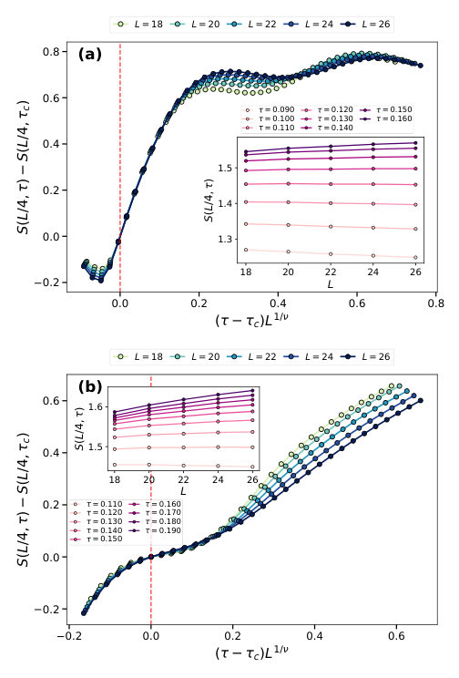 
Figure 2. Behavior of entanglement with system size for initially +Z polarized initial state. Panel (a) shows the scaling collapse of entanglement entropy for transverse field Ising model with longitu- dinal field with hz = 0.5 and hx = 0.6. To that end, we consider the horizontal axis as (τ −τc)L1/ν and the vertical axis is S(L/2, τ) − S(L/2, τc). Here we have considered the system sizes L = 18, 20, 22, 24, 26. In the inset, we plot S(L/4, τ) vs L for different τ values given by τ = 0.90, 0.10, 0.11, ..., 0.14 respectively. Panel (b) corresponds to the S(L/2, τ) −S(L/2, τc) vs. (τ −τc)L1/ν graph for the ANNNI model for the parameters κ = 0.2 and hz = 0.2 for system sizes L = 18, 20, 22,...

📷 Fig 3

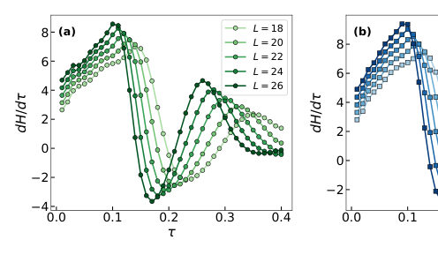 
Figure 3. Variation of survival probability for initial GHZ state. Panel (a) shows the behavior of dH

📷 Fig 4

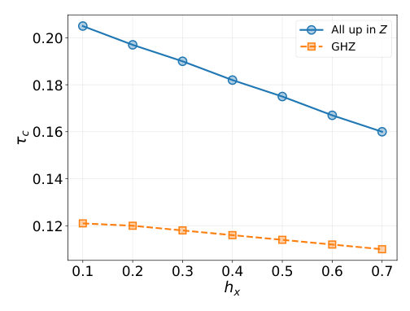 
Figure 4. Dependence of transition point with longitudinal field strength. In this figure, the horizontal axis denotes the longitudinal field strength (hx) and the vertical axis denotes the transition point (τc). The curve corresponding to initially +Z polarized configura- tion is denoted by blue line with circular marker and the curve corre- sponding to GHZ state is denoted by red curve with square markers.

📷 Fig 5

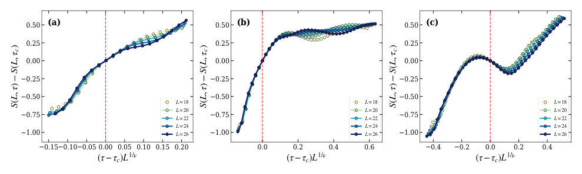 
Figure 5. Scaling collapse of entanglement entropy. Scaling collapse of the entanglement entropy, shown by plotting S(L, τ) −S(L, τc) as a function of the rescaled variable (τ −τc)L1/ν. Panel (a) presents the results for the TFIM with hz = 0.5. Panel (b) corresponds to the TFIM with longitudinal field with hz = 0.5 and hx = 0.6. Panel (c) shows the results for the ANNNI with hz = 0.2 and κ = 0.2.

**Summary.** This paper investigates Measurement-Induced Phase Transitions (MIPTs) in quantum spin models, extending the study from integrable to non-integrable systems. By analyzing both survival probability and entanglement entropy, the authors confirm the robustness of the transition. Crucially, they demonstrate that the initial entanglement of the system dictates the scaling behavior of the transition point with system size.

**Why it may be interesting.** This work directly addresses non-equilibrium phase transitions in interacting quantum systems, which is a major area of modern condensed matter theory. The comparison between integrable and non-integrable dynamics provides concrete insights into how system symmetries affect quantum criticality under measurement.

Detailed structure

**Main problem.** The study investigates the persistence and scaling behavior of Measurement-Induced Phase Transitions (MIPTs) when moving from integrable to non-integrable quantum systems.

**Main result.** MIPTs persist in non-integrable variants of the TFIM, and the critical scaling of the transition point ($\tau_c$) is highly dependent on the initial quantum state, particularly when comparing product states to highly entangled GHZ states.

**Method.** The analysis uses diagnostics like survival probability and bipartite entanglement entropy, employing finite-size scaling techniques to characterize the transition point $\tau_c$ across different system sizes.

**Model / system.** The models studied include the Transverse-Field Ising Model (TFIM) with longitudinal field and the Axial Next-Nearest-Neighbor Ising (ANNNI) model. The dynamics are governed by deterministic global measurements applied repeatedly to the system state.

**Key observables.** Survival Probability ($R_n$), Bipartite Entanglement Entropy ($S$), and the critical measurement rate ($\tau_c$).

**Important parameters / regimes.** System size ($L$), initial state (product state vs. GHZ state), and the longitudinal field strength ($h_x$).

**Assumptions / limitations.** The analysis relies on the assumption that deterministic global measurements are performed, and that the survival probability and entanglement entropy are reliable diagnostics for the MIPT.

**Figures summary.** Figures illustrate the decay of survival probability ($R_n$) and its derivative ($dH/d\tau$) for both TFIM and ANNNI models, showing characteristic transitions. Scaling analysis plots are used to extract the system size dependence of the critical point $\tau_c$.

**Paper structure.** The paper establishes the persistence of MIPTs in non-integrable systems by comparing results to the integrable TFIM. It then analyzes the scaling of the transition point $\tau_c$ using two distinct initial states (product and GHZ) to highlight the crucial role of initial entanglement.

Abstract

We find that the measurement-induced phase transition generated by deterministic global measurements, previously observed in the integrable transverse-field Ising model (TFIM), persists in non-integrable variants of the same. To address this question, we consider the TFIM with longitudinal field and the axial next-nearest-neighbor Ising (ANNNI) model. We show that both the survival probability and the bipartite entanglement entropy consistently capture a transition between area-law and volume-law entangled phases for two distinct initial states: a product state with all spins polarized along the transverse direction and a Greenberger-Horne-Zeilinger (GHZ) state. Finite-size scaling reveals a pronounced initial state dependence: for the polarized product state, the transition point follows an inverse-square-root scaling with system size in both non-integrable models, consistent with the integrable TFIM, whereas for the GHZ initial state, it deviates from this scaling and approaches zero considerably more slowly in the non-integrable models than in the integrable TFIM. These results establish the robustness of measurement-induced transitions under deterministic measurements against integrability breaking while highlighting the crucial role of the initial state in governing their scaling behavior.

[↑ back to top](#top)

### [Coexistence of Magnon-Induced Optical Vortex and Gaussian Beam Scattering Assisted by Rotational Umklapp Process](http://arxiv.org/abs/2608.21788v1)

**Authors:** Ryusuke Hisatomi, Kotaro Taga, Hisakazu Matsuki, Shutaro Karube, Yoichi Shiota, Teruo Ono  
**Type:** both · **Category:** other · **PDF:** <https://arxiv.org/pdf/2608.21788v1>  
**Analysis basis:** full PDF text, analyzed in chunks
**Topic relevance:** 🔥 `quantum optics experiment` **4/5** · `analog quantum simulation` **3/5** · `interference shaping light` **3/5** · `Keldysh / 2PI / non-Gaussian methods` **1/5** · `correlated / nonlocal dissipation` **1/5** · `driven-dissipative phase transition` **1/5** · `methods for driven-dissipative` **1/5** · `quantum measurements` **1/5**

📷 Fig 1

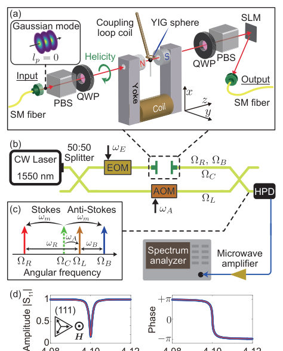 
FIG. 1. Experimental setup and characterization of the uni- form magnon mode. (a) Optical configuration for free-space light propagation. A spherical YIG single crystal (0.5-mm di- ameter) is placed in a magnetic circuit (H ∥⟨111⟩∥z, replac- ing the ⟨100⟩axis [12]). A single-loop coil excites the uniform magnon (Kittel) mode. Quarter-wave plates (QWPs) and po- larizing beam splitters (PBSs) resolve the light helicities. An incident Gaussian beam focused to ∼100 µm is injected into the YIG sphere; coaxially scattered light is reflected by a spa- tial light modulator (SLM) and coupled into a single-mode (SM) fiber to identify the optical orbital angular momentum (OAM). (b) Optical heterodyne...

📷 Fig 2

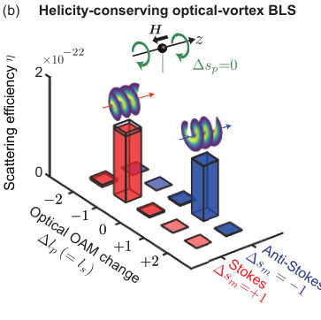 
FIG. 2. Scattering efficiencies of the Stokes and anti- Stokes sidebands. Quantitative comparisons are shown for (a) helicity-inversion Gaussian-beam Brillouin light scatter- ing (BLS) and (b) helicity-conserving optical-vortex BLS un- der an external magnetic field of H ∥⟨111⟩. The red and blue bars represent the scattering efficiencies of the Stokes and anti-Stokes sidebands, respectively. The height of each colored bar indicates the mean scattering efficiency, while the difference between the top of the black wireframe and the bar denotes the standard deviation estimated from six indepen- dent measurements. Note that the vertical axes in (a) and (b) differ by one order of magnitude. The...

📷 Fig 3

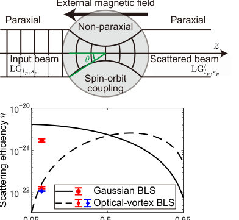 
FIG. 3. Normalized numerical aperture (NA) dependence of the scattering efficiencies. (a) Schematic of light prop- agation around the spherical YIG sample. (b) Theoretical curves and experimental data for the NA dependences of the helicity-inversion Gaussian-beam BLS (solid line), described by Eq. (B2), and the helicity-conserving optical-vortex BLS (dashed line), described by Eq. (A3). The experimentally observed scattering efficiencies with their respective stan- dard deviations [from Figs. 2(a) and 2(b)] are plotted at sin θ = 0.11. Red and blue denote the Stokes and anti-Stokes processes, respectively. This experimental NA value is es- timated from the incident beam diameter of 50 µm...

**Summary.** This research explores magnon-induced Brillouin light scattering in YIG crystals, demonstrating the coexistence of two scattering types: vortex and Gaussian-beam. The key finding is that the crystal lattice's rotational Umklapp process enables the Gaussian-beam scattering, which contradicts simple angular momentum conservation rules. The relative strength of these two processes is shown to be highly dependent on how tightly the light is focused.

**Why it may be interesting.** This work bridges quantum optics (structured light, OAM/SAM) with condensed matter magnetism (magnons) by identifying a symmetry-breaking mechanism (Umklapp process) that allows for novel light-matter interactions, relevant to engineered quantum light sources.

Detailed structure

**Main problem.** The paper investigates the coexistence of two distinct magnon-induced Brillouin light scattering (BLS) pathways: optical-vortex scattering and Gaussian-beam scattering, challenging conventional angular momentum conservation rules.

**Main result.** The coexistence is experimentally demonstrated and theoretically explained by invoking the rotational Umklapp process provided by the crystal lattice, leading to a predicted reversal in the relative efficiencies of the two scattering channels with increasing light focusing.

**Method.** The study combines experimental measurements of scattering efficiencies using optical heterodyne detection with theoretical calculations based on a microscopic framework involving spin-orbit-coupled light modes.

**Model / system.** The experiment uses a spherical YIG single crystal oriented along the <111> axis, studying the interaction between focused light and uniform magnons (Kittel mode) under an external magnetic field.

**Key observables.** Scattering efficiencies ($\eta$) for Stokes and anti-Stokes sidebands, measured for both helicity-inversion (Gaussian-beam) and helicity-conserving (optical-vortex) processes.

**Important parameters / regimes.** External magnetic field orientation ($\mathbf{H} \parallel \langle 111 
angle$), light focusing degree (related to NA), and the magnon resonance frequency ($\omega_m/2\pi = 4.10$ GHz).

**Assumptions / limitations.** The analysis assumes the crystal lattice mediates the necessary angular momentum via the rotational Umklapp process, and that the light can be modeled as converting from paraxial to spin-orbit-coupled modes under strong focusing.

**Figures summary.** Figure 1 details the experimental setup and confirms the magnon resonance. Figure 2 presents measured BLS efficiencies comparing Gaussian-beam and optical-vortex scattering. Figure 3 illustrates the dependence of scattering efficiencies on the degree of light focusing (NA).

**Paper structure.** The paper establishes the theoretical background in optomagnonics, details the experimental setup and measurements of two scattering channels, provides theoretical derivations for the scattering efficiencies using a microscopic framework, and concludes by analyzing the dependence of the relative efficiencies on light focusing.

Abstract

The exploitation of crystal-lattice symmetries to engineer angular momentum transfer between structured light and magnons marks a novel frontier for optomagnonic research. In Brillouin light scattering, when focused light propagates parallel to an external magnetic field and interacts with ferromagnetic uniform magnons, only optical-vortex scattering is expected to be permitted. Due to the combined effects of magneto-optical coupling and optical spin-orbit interaction, the transfer of magnon spin angular momentum to photon orbital angular momentum allows for this distinctive scattering phenomenon. Here, we experimentally demonstrate that, for a specific ferromagnetic crystal orientation, Gaussian-beam scattering coexists with the optical-vortex scattering, contrary to conventional expectations based on angular momentum conservation between magnons and photons. We show that the crystal lattice, via the rotational Umklapp process, provides the missing angular momentum required for the Gaussian-beam scattering. Furthermore, we predict that as the degree of light focusing increases, the relative efficiencies of the Gaussian-beam and optical-vortex scattering processes reverse.

[↑ back to top](#top)

### [Experimental Investigation of Tunable-Order Hilbert-Space Ergodicity](http://arxiv.org/abs/2608.21959v1)

**Authors:** Zou-Wei Pan, Wenquan Liu, Xing Rong  
**Type:** both · **Category:** statistical mechanics · **PDF:** <https://arxiv.org/pdf/2608.21959v1>  
**Analysis basis:** full PDF text, analyzed in chunks
**Topic relevance:** 🔥 `scars & prethermalization` **4/5** · `QC/QI experiment` **3/5** · `analog quantum simulation` **2/5** · `driven-dissipative phase transition` **2/5** · `non-equilibrium universality` **2/5** · `methods for driven-dissipative` **1/5** · `quantum measurements` **1/5**

📷 Fig 1

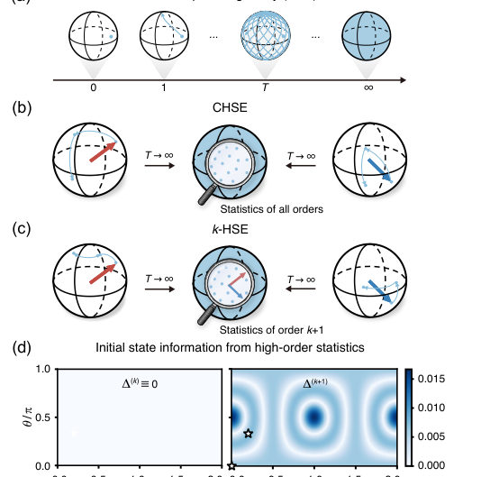 
FIG. 1. Hilbert-space ergodicity. (a) Analogous to clas- sical ergodicity, HSE describes the property that quantum dy- namics uniformly explores the Hilbert space in the long-time limit. (b)–(c) Comparison between HSE at infinite order (b, CHSE) and at finite order (c, k-HSE). A distinctive feature of k-HSE dynamics is that initial-state information survives in the statistics of order k+1 and higher. (d) A qubit example, with the model specified in the text. Here (θ, ϕ) denote the polar and azimuthal angles of the initial state.

📷 Fig 2

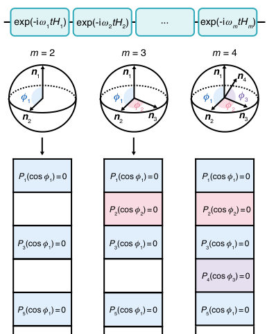 
FIG. 2. Realizing tunable HSE with m-tone drives. (a) Design of the drive: a sequence of m rotations about dis- tinct axes Hj = nj·σ, with rationally independent frequencies {ωj}. (b) Progressively realizing higher-order HSE by adding rotation axes and tuning their angles. The rows labeled by ℓ represent the ℓ-th HSE equation in Eq. (3). Each equation is fulfilled by adjusting ϕj = ∠(nj, nj+1) with satisfied condi- tions indicated by colored cells. The number of consecutively colored cells counted from the top determines the k-HSE or- der of the m-tone drive. Notably, setting ϕ1 = π/2 satisfies all odd rows. Each even row is then filled by adding one ad- ditional rotation axis at a time, so...

📷 Fig 3

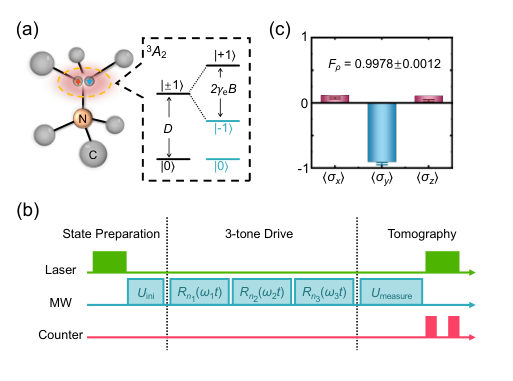 
FIG. 3. NV center system and experimental scheme. (a) Diamond lattice and energy levels of the NV center. The electron-spin states |ms = 0⟩≡|0⟩and |ms = −1⟩≡|1⟩are identified as the experimental qubit. (b) Experimental pulse sequence, consisting of state preparation, execution of the 3- tone drive, and quantum state tomography. Measurement operations Umeasure ∈{I, RX(π), RX(±π/2), RY (±π/2)} are used to read out the full density matrix. (c) Illustrative to- mography result for |ψ(0)⟩= |0⟩and t = 100. Dots with error bars represent experimental data, and gray bars correspond to theoretical predictions.

📷 Fig 4

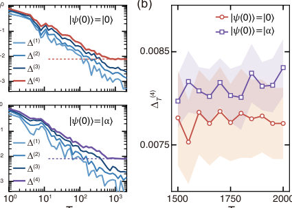 
FIG. 4. Experimental results for the 3-tone drive. (a) Trace distances ∆(k) T up to the fourth order for initial states |ψ(0)⟩= |0⟩(upper panel) and |ψ(0)⟩= |α⟩≡cos π

**Summary.** This paper explores Hilbert-space ergodicity (HSE) in driven quantum systems, proposing a theoretical framework and experimental realization using NV centers in diamond. The authors show that specific multi-tone drives can achieve tunable $k$-HSE, while also revealing that initial-state information can persist in higher-order statistical moments even when the system appears ergodic at lower orders.

**Why it may be interesting.** This work provides a concrete, experimentally verifiable mechanism (tunable drives) to probe the hierarchy of quantum ergodicity, offering deep insights into how memory of initial conditions can persist in complex, driven quantum dynamics.

Detailed structure

**Main problem.** The paper investigates Hilbert-space ergodicity (HSE), a framework for studying thermalization in driven quantum systems that extends beyond static systems studied by ETH.

**Main result.** They demonstrate that specific $m$-tone drives can realize $k$-HSE up to $k=2m-3$, and crucially, they show that initial-state information survives in higher-order statistics ($\Delta(4)$) even when lower-order ergodicity is achieved.

**Method.** The study combines theoretical proofs showing the construction of $k$-HSE drives with experimental verification using a nitrogen-vacancy center in diamond to measure temporal moments.

**Model / system.** The theoretical model involves designing $m$-tone quasiperiodic drives on qubits. Experimentally, the platform is a single nitrogen-vacancy (NV) center in diamond, where the qubit is encoded in the spin-1 electronic ground state.

**Key observables.** The primary diagnostic is the trace distance $\Delta(k) = rac{1}{2} 	ext{Tr}[
ho^{(k)}_T - 
ho^{(k)}_{	ext{Haar}}]$, which measures the deviation from Haar randomness at the $k$-th moment.

**Important parameters / regimes.** The order of ergodicity, $k$, is tunable by the number of tones, $m$, up to $k=2m-3$. The initial state dependence is quantified by the angle $\gamma$ between the initial state vector and the first drive axis.

**Assumptions / limitations.** The theoretical analysis assumes the limit of the trace distance equals the trace distance of the limit. Experimentally, state reconstruction relies on measuring photoluminescence rates.

**Figures summary.** Figures illustrate the concept of $k$-HSE decay, showing $\Delta(k)$ vanishing for low $k$ but plateauing at a non-zero, initial-state-dependent value for higher $k$. The NV center setup and pulse sequences are also detailed.

**Paper structure.** The paper first introduces HSE as a complement to ETH, then theoretically proposes and proves the construction of $k$-HSE drives. This is followed by experimental verification using the NV center, culminating in a detailed analysis of the initial-state dependence of higher-order statistics.

Abstract

Hilbert-space ergodicity (HSE) provides a new framework for studying thermalization in driven quantum systems, complementing the eigenstate thermalization hypothesis, which is restricted to static systems. This ergodicity is hierarchical: by quantifying how randomly the dynamics explores the Hilbert space, one obtains a family of levels termed $k$-HSE. While HSE has been observed at the lowest and highest levels, finite-order HSE dynamics remains largely unexplored due to the difficulty of constructing such drives. Here, we explore this intermediate regime and uncover its distinctive physics. We first propose and prove that a family of $m$-tone drives on qubits realizes $k$-HSE up to $k = 2m{-}3$, with drive parameters determined at $O(k)$ cost. Using a single nitrogen-vacancy center in diamond, we verify this design by showing that a 3-tone drive realizes 3-HSE, with fourth-order statistics depending on the initial state. Further in-depth theoretical analysis shows that this initial-state dependence is generic across drives, demonstrating the possibility of recovering the initial state from higher-order statistics even when the dynamics is ergodic. Our work broadens the study of quantum ergodicity and reveals intriguing physics within its hierarchy.

[↑ back to top](#top)

### [Cramer-Rao Inequality Generalizes the Equilibrium Energy Fluctuation-Response Relation to Nonequilibrium Steady States](http://arxiv.org/abs/2608.23455v1)

**Authors:** Shaofan Liu, Raphael Chetrite, Andre C. Barato  
**Type:** theory · **Category:** statistical mechanics · **PDF:** <https://arxiv.org/pdf/2608.23455v1>  
**Analysis basis:** full PDF text, analyzed in chunks
**Topic relevance:** 🔥 `non-equilibrium universality` **4/5** · `driven-dissipative phase transition` **3/5** · `Keldysh / 2PI / non-Gaussian methods` **2/5** · `methods for driven-dissipative` **2/5** · `analog quantum simulation` **1/5** · `correlated / nonlocal dissipation` **1/5** · `quantum measurements` **1/5**

📷 Fig 1

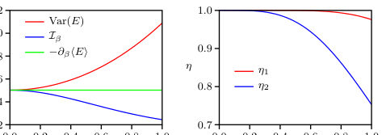 
FIG. 1. Plots for the active particle in a harmonic potential. (a) Quantities entering Eq. (1) as a function of the thermo- dynamic affinity f. (b) Ratios η1 and η2 as a functions of the thermodynamic affinity f.

📷 Fig 2

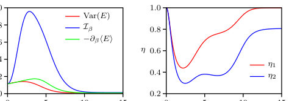 
FIG. 2. Plots for the kinetic proofreading model. (a) Quan- tities entering Eq. (1) as a function of the thermodynamic affinity ∆µ. (b) Ratios η1 and η2 as functions of ∆µ.

📷 Fig 3

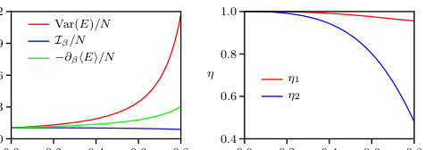 
FIG. 3. Plots for the KMP model. (a) Quantities entering Eq. (1), divided by the system size N, as a function of the thermodynamic affinity Fq. (b) Ratios η1 and η2 as a function of Fq.

**Summary.** This paper generalizes the fundamental fluctuation-response theorem from equilibrium statistical mechanics to arbitrary nonequilibrium steady states using the Cramér-Rao Inequality. It derives a universal bound involving energy fluctuations, energy response, and Fisher information. The bound is successfully demonstrated across diverse physical models, confirming its utility as a powerful diagnostic tool for non-equilibrium thermodynamics.

**Why it may be interesting.** This work provides a powerful, universal mathematical tool (the CRB) to constrain the thermodynamics of non-equilibrium systems, which is crucial for understanding energy dissipation and fluctuation theorems in complex, driven matter.

Detailed structure

**Main problem.** The paper aims to generalize the known equilibrium energy fluctuation–response relation to the complex regime of nonequilibrium steady states (NESSs).

**Main result.** They establish a universal constraint, derived from a form of the Cramér-Rao Inequality, that relates the energy fluctuations, the energy response to inverse temperature, and the Fisher information in NESSs.

**Method.** The primary method involves applying the generalized Cramér-Rao Bound (CRB) to the stationary probability distribution $\Pi$ of the system, treating the inverse temperature $eta$ as the control parameter.

**Model / system.** The analysis is tested on three diverse models: an active particle in a harmonic potential, a kinetic proofreading network, and a one-dimensional heat conduction model (KMP model).

**Key observables.** Average energy $\langle E 
angle$, energy variance $	ext{Var}(E)$, Fisher information $I_eta$, and the response term $\partial_eta \langle E 
angle$.

**Important parameters / regimes.** The thermodynamic affinity (driving force) which quantifies the deviation from equilibrium, such as the free energy difference $\Delta\mu$ or temperature difference $F_q$.

**Assumptions / limitations.** The analysis assumes the existence of a reference equilibrium distribution and that the temperature notion remains well-defined, consistent with generalized detailed balance.

**Figures summary.** Figures illustrate how the inequality is satisfied across different driving forces ($f$ or $\Delta\mu$ or $F_q$), showing the saturation at equilibrium and the behavior of the derived ratios $\eta_1$ and $\eta_2$ as the system moves away from equilibrium.

**Paper structure.** The paper introduces the general CRB, derives the inequality in its linear and non-linear forms, and then systematically applies this framework to three distinct physical models (active particle, proofreading, KMP) to validate the universality of the bound.

Abstract

Equilibrium steady states are fully characterized by the Boltzmann distribution, which depends only on the energy and the temperature. In contrast, nonequilibrium steady states, which describe a wide range of physical and biological phenomena, are generically much more complex, and their stationary distributions can depend on a zoo of kinetic parameters. A central challenge of nonequilibrium statistical mechanics is the identification of universal relations that hold for nonequilibrium steady states despite this complexity. We show here that a form of the Cramer-Rao inequality applies to arbitrary nonequilibrium steady-state distributions and contains no explicit dependence on kinetic parameters. A main original feature in our observation is that this inequality becomes a well-known fluctuation-response relation in equilibrium. The inequality involves three well-defined quantities: the fluctuations of the energy, the response given by the derivative of the average energy with respect to the inverse temperature, and the Fisher information with respect to the inverse temperature. We illustrate this inequality using three representative models: an active particle in a harmonic potential, a simple scheme for kinetic proofreading, and a one-dimensional model for heat conduction between two baths.

[↑ back to top](#top)

### [Landau theory, effective temperature, and tricritical phenomena in a holographic nonequilibrium steady state](http://arxiv.org/abs/2608.23378v1)

**Authors:** Motohiro Kanazawa, Masataka Matsumoto, Shin Nakamura  
**Type:** theory · **Category:** statistical mechanics · **PDF:** <https://arxiv.org/pdf/2608.23378v1>  
**Analysis basis:** full PDF text, analyzed in chunks
**Topic relevance:** 🔥 `driven-dissipative phase transition` **4/5** · 🔥 `non-equilibrium universality` **4/5** · `Keldysh / 2PI / non-Gaussian methods` **3/5** · `methods for driven-dissipative` **2/5** · `correlated / nonlocal dissipation` **1/5**

📷 Fig 1

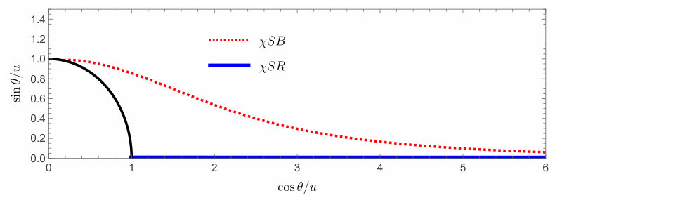 
Figure 1. The typical configurations of the D7-brane, corresponding to the χSB (red dotted) and χSR (blue solid) phases. The black solid circle corresponds to the location of the effective horizon u = u∗.

📷 Fig 2

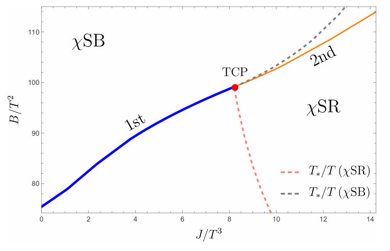 
Figure 2. Phase diagram with the plane of (B/T 2, J/T 3), originally shown in [13]. The chiral symmetry-broken (χSB) phase and chiral symmetry-restored (χSR) phase are separated by the first-order phase transition line (blue solid) and second-order phase transition line (orange solid). The point where the first-order phase transition line changes into the second-order phase transition line is the TCP (red circle). The line with constant T∗/T that goes across the TCP is drawn by the dashed line.

📷 Fig 3

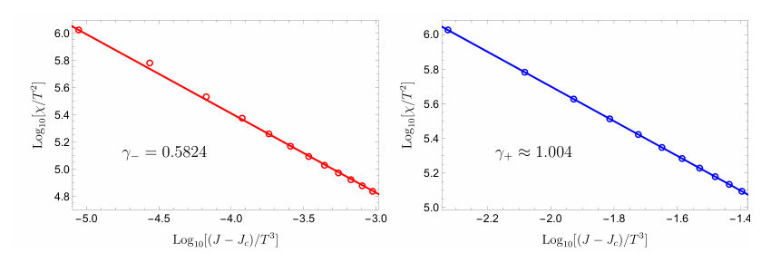 
Figure 3. The susceptibility χ/T 2 as a function of (J −Jc)/T 3 on a logarithmic scale when the TCP is approached from the χSB phase (left) and χSR phase (right) along the fixed B/T 2 line. The data points are the numerical results and the solid line denotes the linear fit to them. The corresponding values of γ are also shown.

📷 Fig 4

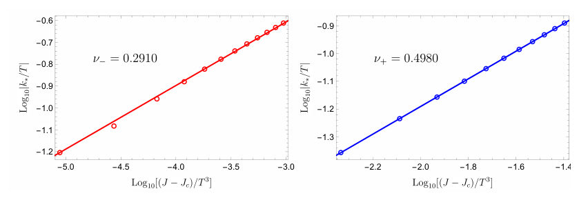 
Figure 4. The inverse of the correlation length k∗/T as a function of (J −Jc)/T 3 in logarithmic scale when the TCP is approached from the χSB phase (left) and χSR phase (right) along the fixed B/T 2 line. The data points are the numerical results and the solid line denotes the linear fit to them. The corresponding values of ν are also shown.

📷 Fig 5

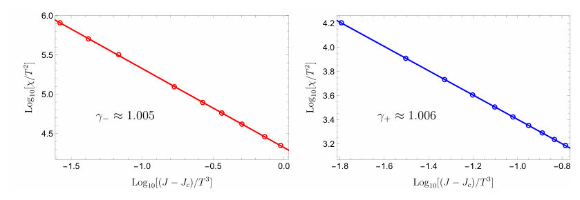 
Figure 5. The susceptibility χ/T 2 as a function of (J −Jc)/T 3 in logarithmic scale when the TCP is approached from the χSB phase (left) and χSR phase (right) along the fixed T∗/T line. The data points are the numerical results and the solid line denotes the linear fit to them. The corresponding values of γ are also shown.

**Summary.** This theoretical work examines critical phenomena at a non-equilibrium tricritical point associated with chiral symmetry breaking in a holographic model. The authors find that while the critical exponents deviate from standard Landau predictions along arbitrary paths, they recover the Landau values when the ratio of effective to bath temperature is held constant. This suggests a path-dependent description of critical behavior in non-equilibrium quantum systems.

**Why it may be interesting.** The investigation of critical phenomena in a non-equilibrium setting, particularly where standard equilibrium theories like Landau theory break down or require specific path constraints, is highly relevant to understanding open quantum systems and far-from-equilibrium dynamics.

Detailed structure

**Main problem.** The paper investigates the critical exponents at a current-driven tricritical point (TCP) associated with chiral symmetry breaking in a non-equilibrium steady state (NESS).

**Main result.** The critical exponents agree with conventional Landau theory only when the approach to the TCP is constrained by keeping the ratio of effective temperature to heat bath temperature ($T^*/T$) fixed.

**Method.** The study employs holographic methods using the D3/D7 model to analyze the critical behavior, comparing results derived from the non-equilibrium setup against predictions from Landau theory.

**Model / system.** The system is modeled using the D3/D7 holographic setup, describing a non-equilibrium steady state (NESS) exhibiting chiral symmetry breaking. The analysis involves expanding the Landau free energy functional and calculating susceptibilities.

**Key observables.** Critical exponents ($\gamma, 
u$), susceptibility ($\chi$), and the effective temperature ($T^*$).

**Important parameters / regimes.** The ratio of effective temperature to heat bath temperature ($T^*/T$), and dimensionless parameters like $(B/T^2, J/T^3)$.

**Assumptions / limitations.** The analysis assumes the large-N limit and the probe limit for the D7-brane, and it notes that the classification of paths from equilibrium TCPs does not straightforwardly apply to the NESS.

**Figures summary.** Figures illustrate D7-brane configurations in different phases and show plots of susceptibility and inverse correlation length versus a normalized current parameter along specific paths to the TCP.

**Paper structure.** The paper reviews Landau theory, applies the holographic D3/D7 model to the NESS, calculates critical exponents along various paths to the TCP, and concludes by comparing these findings to established theoretical predictions.

Abstract

We investigate the critical exponents $(γ,ν)$ at the current-driven tricritical point (TCP) associated with chiral symmetry breaking in a nonequilibrium steady state described by the D3/D7 model. In the symmetry-broken phase, we find that, unlike in the conventional Landau theory, both $γ$ and $ν$ can take values different from those predicted by the Landau theory and depend on the path along which the TCP is approached in the phase diagram. However, when the TCP is approached with the ratio of the effective temperature to the heat bath temperature, $T_{*}/T$, held fixed, the critical exponents agree with those of the Landau theory. These results suggest that the critical phenomena at the current-driven TCP may be described by the Landau theory along the $T_{*}/T$-fixed line, whereas a nontrivial extension of the Landau theory is required for a more general description of the critical phenomena along arbitrary paths.

[↑ back to top](#top)

### [Critical Topological Photonics in Synthetic Dimensions](http://arxiv.org/abs/2608.21791v1)

**Authors:** Mingyuan Chen, Yuwei Jing, Franco Nori, Xue-Jia Yu  
**Type:** both · **Category:** statistical mechanics · **PDF:** <https://arxiv.org/pdf/2608.21791v1>  
**Analysis basis:** full PDF text, analyzed in chunks
**Topic relevance:** 🔥 `analog quantum simulation` **4/5** · `driven-dissipative phase transition` **3/5** · `non-equilibrium universality` **3/5** · `methods for driven-dissipative` **2/5** · `quantum optics experiment` **1/5**

📷 Fig 1

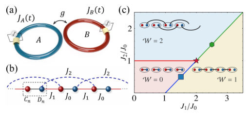 
FIG. 1. (a) Schematic of two coupled ring resonators, la- beled A and B, with coupling strength g. Each ring con- tains an electro-optic modulator (EOM), shown in yellow. (b) Synthetic-frequency lattice in the supermode basis {Cn, Dn} with intra-cell hopping J0 and inter-cell hoppings J1, J2. (c) Topological phase diagram in the (J1/J0, J2/J0) plane, ex- hibiting three gapped phases distinguished by the winding number W = 0, 1, 2, separated by three critical lines (blue, red, and green) that meet at a multicritical point (red star).

📷 Fig 2

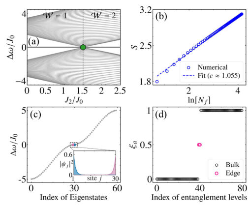 
FIG. 2. Evidence for a critical topological photonic state on the W = 1 ↔2 transition line. (a) Open-boundary spectrum as a function of J2/J0 for an extended SSH chain with Nf = 40 unit cells and J1/J0 = 2.5. The green hexagon marks the critical point J2/J0 = 1.5. (b) Bipartite entanglement entropy scaling at the same critical point, computed under anti–periodic boundary conditions up to Nf = 2000 unit cells. (c) Open-boundary energy spectrum at the critical point for Nf = 30 unit cells. The inset shows the corresponding wave- function intensities |ψj|2 along the synthetic-frequency chain. (d) Single-particle entanglement spectrum with Nf = 80 unit cells.

📷 Fig 3

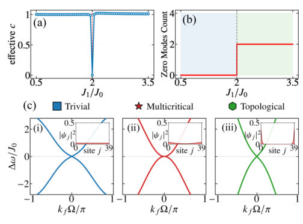 
FIG. 3. (a) Effective central charge scaling along the criti- cal trajectory J2 = J1 −J0. The system size is Nf = 2000 unit cells. (b) Number of boundary zero modes as a func- tion of J1/J0 along the critical line. (c, i)–(c, iii) Schematic photonic single-particle energy spectra: linear dispersion in the topologically trivial regime (J1/J0 = 1.5, J2/J0 = 0.5), quadratic band touching at the multicritical point (J1/J0 = 2.0, J2/J0 = 1.0), and linear dispersion at shifted momen- tum in the topologically nontrivial regime (J1/J0 = 3.0, J2/J0 = 2.0).

📷 Fig 4

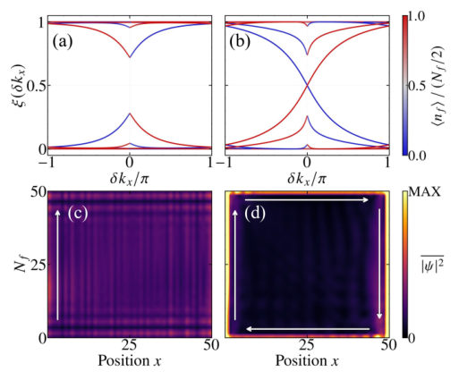 
FIG. 4. 2D extension of critical topological photonics. (a, b)Single-particle entanglement spectra of the extended QWZ model at λ = 1 for (a) the conventional critical point M = 3 and (b) the critical topological point M = −1. The finite fre- quency direction contains Nf = 40 unit cells, the momentum kx is sampled with Nkx = 800, and the horizontal axis is mea- sured relative to the gap-closing momentum, δkx = kx −k∗ x, with k∗ x = 0 for M = 3 and k∗ x = π for M = −1. The color indicates the mean frequency position of the entanglement eigenstate. (c, d) Time-averaged probability density ρ(x, y) of the same edge-localized Gaussian wavepacket evolved in a 50 × 50 open lattice.

📷 Fig 5

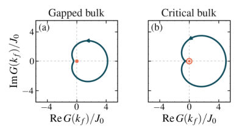 
FIG. 5. Complex-plane diagnosis of the winding-number breakdown. (a) At the gapped point (J1/J0, J2/J0) = (2.3, 0.9), G(kf) avoids the origin and the winding number is well defined. (b) At the critical point (J1/J0, J2/J0) = (2.5, 1.5), G(k∗ f) = 0, so arg G(kf) is singular and the conven- tional winding number is ill defined.

**Summary.** This paper introduces a framework for realizing and characterizing critical topological states in photonic systems using synthetic dimensions. By employing the entanglement spectrum as a diagnostic tool, the authors show that topological boundary modes remain robustly protected even when the bulk energy gap closes at a critical point. This work offers a novel, experimentally viable route for studying critical quantum phenomena.

**Why it may be interesting.** It provides a concrete, experimentally accessible platform (photonic circuits) to study a fundamental theoretical problem—the coexistence of topology and criticality—which is highly relevant to understanding gapless quantum phases.

Detailed structure

**Main problem.** The paper addresses the conflict between topological states, which require a spectral gap, and critical states, which necessitate a gap closure.

**Main result.** They demonstrate the existence of critical topological states in photonic platforms, where topological boundary modes persist even when the bulk band gap closes at a critical point.

**Method.** The study employs advanced diagnostics like the entanglement spectrum and analyzing the scaling of entanglement entropy to characterize criticality and topological protection.

**Model / system.** The system is realized in photonic synthetic-frequency dimensions using coupled ring resonators, modeled by extended SSH and QWZ Hamiltonians.

**Key observables.** Winding number, entanglement entropy scaling, entanglement eigenvalues pinned at 1/2, and the sign of the kinetic coefficient $\kappa$.

**Important parameters / regimes.** Hopping amplitudes ($J_0, J_1, J_2$), disorder strength ($\sigma$), and the ratio of coupling strengths.

**Assumptions / limitations.** The entanglement spectrum is assumed to provide a reliable diagnostic for topological boundary modes, and the analysis relies on the free-fermion approximation.

**Figures summary.** Figures illustrate phase diagrams showing critical lines, open-boundary spectra demonstrating zero-frequency modes, and entanglement spectra confirming the persistence of midgap levels under disorder.

**Paper structure.** The work progresses from establishing the incompatibility view, developing the model and diagnostics (entanglement spectrum), demonstrating critical protection in 1D, extending the concept to 2D, and finally testing the robustness against disorder.

Abstract

Topological states and criticality have long been regarded as incompatible ingredients: the former requires a finite spectral gap, whereas the latter demands its closure. Guided by this view, topological photonics has focused almost exclusively on gapped phases, treating gap-closing transitions as mere phase boundaries. In this work, we propose a class of topological states in which topology coexists with criticality in experimentally accessible synthetic-frequency photonic platforms. In a one-dimensional (1D) synthetic lattice, we identify such critical topological photonic states through midgap degeneracies in the single-particle entanglement spectrum, and uncover a topology-enforced multicritical point that reorganizes the topology of neighboring critical states. We further extend this framework to two dimensions (2D). Our work provides an experimentally accessible route to critical topological photonics, and may also inspire novel applications such as critical topological sensing.

[↑ back to top](#top)

### [Nonequilibrium statistics of harmonically trapped run-and-tumble particles: An exact convolution approach](http://arxiv.org/abs/2608.21781v1)

**Authors:** Francisco J. Sevilla, Jair A. Meléndez Mora  
**Type:** theory · **Category:** statistical mechanics · **PDF:** <https://arxiv.org/pdf/2608.21781v1>  
**Analysis basis:** full PDF text, analyzed in chunks
**Topic relevance:** 🔥 `non-equilibrium universality` **4/5** · `driven-dissipative phase transition` **3/5** · `methods for driven-dissipative` **3/5** · `Keldysh / 2PI / non-Gaussian methods` **2/5** · `Frenkel-Kontorova` **1/5**

📷 Fig 1

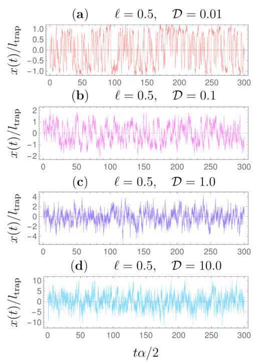 
FIG. 1. Four trajectories of a run-and-tumble particle in the persistent regime are shown for lpers = 2ltrap(ℓ= 0.5) and different values of D. In each case, the dimensionless position of the particle x(t)/ltrap is shown as function of the dimen- sionless time tα/2. In panel (a), D = 0.01, thermal noise is small and the particle dwells around ±ltrap. As thermal fluc- tuations increase, the correlations of active motion fade and the particle position distributes around the center of the trap.

📷 Fig 2

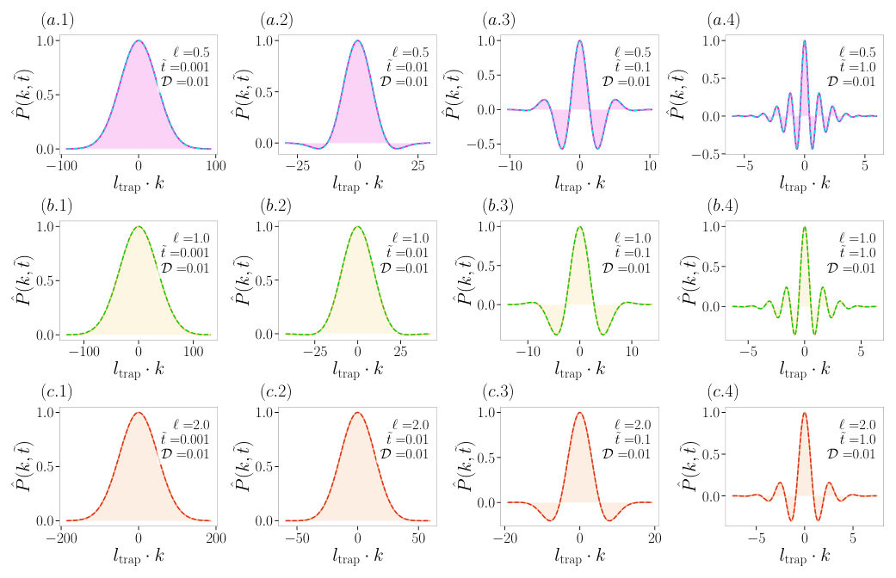 
FIG. 2. Numerical analysis of Eq. (17). ˆP(k, t) as function of the dimensionless wavenumber k · ltrap at different dimensionless times, ˜t = tα/2, and for different values of ℓ≡ltrap/lpers, is depicted with solid lines with shaded area underneath. This is compared with the product ˆGOU(k, t|0) ˆp(k, t) depicted with dashed lines. ˆP(k, t) was obtained from Eq. (1), while ˆp(k, t) was computed from the athermal dynamics version (DT = 0) of Eq. (1). ˆGOU(k, t|0) was numerically evaluated from Eq. (18). Rows (a), (b) and (c) correspond to the values ℓ= 0.5, 1.0, and 2.0 respectively, while columns 1, 2, 3, 4 correspondingly indicates the values of ˜t = 10−3, 10−2, 10−1, and 1. In all panels D...

📷 Fig 3

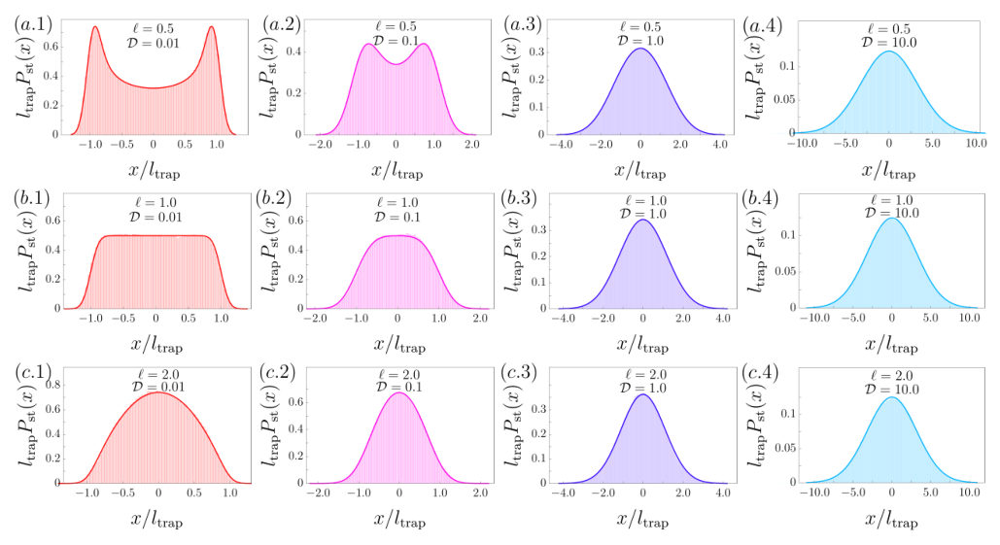 
FIG. 3. Dimensionless stationary distribution ltrapPst(x) of the particle positions in the harmonic potential 1

📷 Fig 4

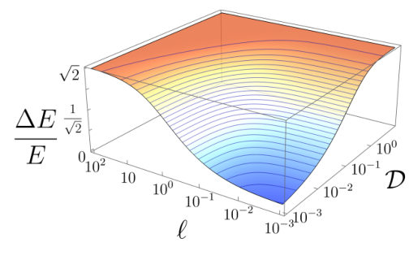 
FIG. 4. The ratio of the energy fluctuations to the mean energy (4) is shown as function of ℓ= ltrap/lpers and D = DT (µκ/v2).

📷 Fig 5

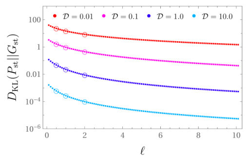 
FIG. 5. Kullback-Leibler distance between Pst and Gst, DKL(Pst||Gst), as function of ℓ= ltrap/lpers for different val- ues of D = σ2 ou/l2 trap, namely 0.01 (red), 0.1 (magenta), 1.0 (purple) and 10.0 (cyan), the empty circles mark the values of ℓas in Fig. 3.

**Summary.** This paper develops a theoretical framework to analyze the steady-state statistics of active particles confined in a harmonic trap. By showing that the position distribution factorizes into thermal and active components, the authors derive closed-form expressions for the distribution and its moments. The results quantify the departure from equilibrium using metrics like energy fluctuations and the KL divergence, providing a powerful tool for studying active matter dynamics.

**Why it may be interesting.** This work provides a rigorous, analytical framework for characterizing non-equilibrium steady states in active matter systems, which is highly relevant to understanding biological motors, active colloids, and driven systems in condensed matter physics.

Detailed structure

**Main problem.** The paper investigates the non-equilibrium statistical mechanics of active particles (run-and-tumble) confined within a harmonic potential while coupled to a thermal bath.

**Main result.** The position distribution factorizes into a convolution of the Ornstein-Uhlenbeck distribution (thermal) and the distribution from the athermal run-and-tumble process. The non-equilibrium nature is quantified by energy fluctuations and the Kullback-Leibler divergence from equilibrium.

**Method.** The analysis utilizes the Langevin equation framework, solving the resulting probability density evolution using the Ornstein-Uhlenbeck propagator and employing Fourier space techniques to prove the convolution structure.

**Model / system.** The model consists of one-dimensional run-and-tumble particles subjected to a harmonic restoring force and thermal noise. The dynamics are governed by a combination of active directional switching (Markov process) and thermal diffusion.

**Key observables.** Stationary position distribution $P_{st}(x)$, Intermediate Scattering Function (ISF), Energy fluctuations ($\Delta E/E$), and Kullback-Leibler divergence ($D_{KL}$).

**Important parameters / regimes.** $\ell \equiv l_{trap}/l_{pers}$ (ratio of trapping to persistence length) and $D$ (ratio of thermal to effective active diffusion).

**Assumptions / limitations.** The dynamics are assumed to be overdamped (low Reynolds numbers), and the analysis relies on the factorization property of the probability density.

**Figures summary.** Figures illustrate the crossover of the particle distribution from a non-Gaussian, boundary-peaked state (persistent regime, small $D$) towards a Gaussian, equilibrium-like limit as thermal noise ($D$) increases. They also show the dependence of non-equilibrium diagnostics like $\Delta E/E$ and $D_{KL}$ on the system parameters.

**Paper structure.** The paper first sets up the Langevin dynamics and derives the factorization property in the convolution form. It then analyzes the stationary state by solving the continuity equation, deriving explicit analytical forms for the distribution and its moments using Fourier transforms. Finally, it discusses the physical interpretation of the results across different parameter regimes.

Abstract

We study one-dimensional run-and-tumble particles confined by a harmonic potential and coupled to an equilibrium thermal bath. Exploiting the coupling of active and thermal degrees of freedom through the Ornstein-Uhlenbeck propagator, we show that the position distribution factorizes, as a convolution, into the Ornstein-Uhlenbeck distribution and the distribution of the athermal run-and-tumble problem. This yields closed-form results, correcting expressions from earlier treatments by identifying the Ornstein-Uhlenbeck propagator, rather than the free-diffusion one, as the correct kernel. Results are confirmed both in Fourier space and by direct Langevin simulation. We further focus our analysis on the stationary regime, characterized by two dimensionless parameters--the ratio of trapping to persistence length, and the ratio of thermal to active diffusion--which control the crossover from a non-Gaussian, boundary-peaked distribution to the Gaussian, equilibrium-like limit. Energy fluctuations and the Kullback-Leibler divergence from the equilibrium distribution quantify the resulting non-equilibrium character of the confined active particle.

[↑ back to top](#top)

### [A Cavity-Interfaced Register of Trapped-Ion Qubits with Multi-Second Coherence](http://arxiv.org/abs/2608.22030v1)

**Authors:** James Bate, Johannes Helgert, Marco Canteri, Victor Krutyanskiy, Benjamin Peter Lanyon  
**Type:** experiment · **Category:** quantum information and computing · **PDF:** <https://arxiv.org/pdf/2608.22030v1>  
**Analysis basis:** full PDF text, analyzed in chunks
**Topic relevance:** 🔥 `QC/QI experiment` **4/5** · `quantum optics experiment` **3/5** · `Tavis-Cummings & cavity-many-emitter` **2/5** · `analog quantum simulation` **2/5** · `quantum measurements` **1/5**

📷 Fig 1

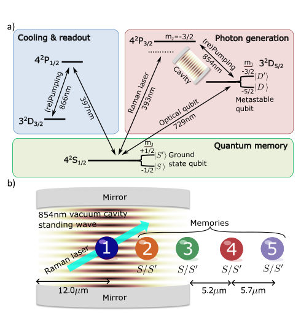 
FIG. 1. Cavity-interfaced multi-qubit memory register. (a) Energy-level diagram of 40Ca+ showing the relevant tran- sitions for photon generation and qubit encodings. (b) Schematic of five co-trapped 40Ca+ ions (trap electrodes not shown). A cavity photon is generated from ion 1 via a focused 393 nm Raman pulse. The remaining ions serve as quantum memories, with qubits encoded in the ground-state spin lev- els (|S⟩/|S′⟩). The cavity mode has a waist of 12.0 µm. The shown ion separations are symmetric around ion 3.

📷 Fig 2

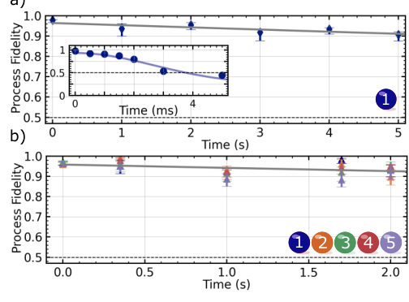 
FIG. 2. Memory qubit coherence enhanced by dynamical decoupling. Process fidelities with the ideal identity opera- tor versus storage time for (a) one and (b) five co-trapped ions. Filled shapes: data; error bars represent one standard deviation of statistical uncertainty, derived from Monto Carlo analysis of tomographic data. Grey solid lines: fits to Eq. 1 in the main text. Black dashed lines show the 0.5 fidelity thresh- old for storage of remote entanglement. Inset (a): single-ion performance without spin echoes; blue line: model of 50 Hz magnetic-field noise.

📷 Fig 3

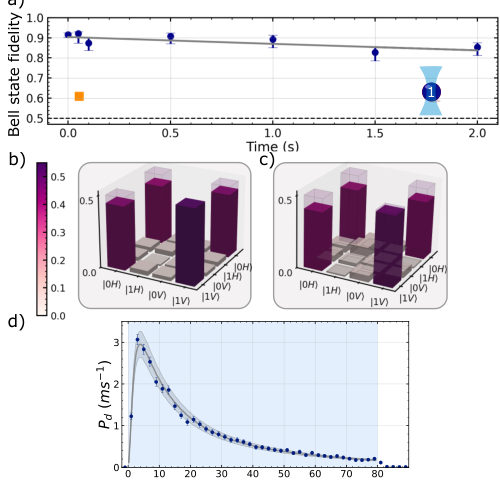 
FIG. 3. Storage of ion–photon entanglement. (a) Ion–photon state fidelity with the ideal Bell state versus storage time in a single trapped ion. Blue circles: data; error bars: one stan- dard deviation. Gray solid line: fit to Eq. 1. Orange square: result from Ref. [27]. Black dashed line at 0.5 indicates the en- tanglement threshold. (b),(c) Absolute values of tomograph- ically reconstructed ion–photon density matrices at storage times of 0 s and 2 s, respectively. Transparent bars: ideal Bell state. (d) Histogram of the photon detection probability density Pd, averaged over all storage times. Pd is defined as the number of detector counts, per 2 µs time bin, normalized by the number of...

📷 Fig 4

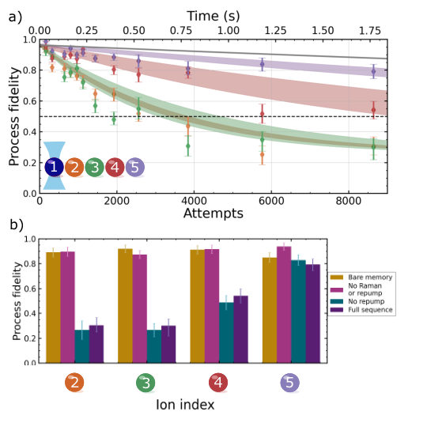 
FIG. 4. Robustness of co-trapped ion-qubit memories. (a) Single-qubit process fidelities versus the number of cavity- photon generation attempts on ion 1. Color-filled symbols: data. Color-matched shaded regions: predictions from a model of Raman laser crosstalk; bounds indicate ±1 stan- dard deviation. Gray line: independently calibrated bare- memory performance. Black dashed line at 0.5 indicates the threshold for survival of entanglement. (b) Process fidelities after 8640 attempts for four pulse sequences. Purple bars: full sequence (corresponding to 8640 attempts in panel (a)). Green bars: without repump lasers, preventing cavity photon generation. Pink bars: without Raman lasers,...

📷 Fig 5

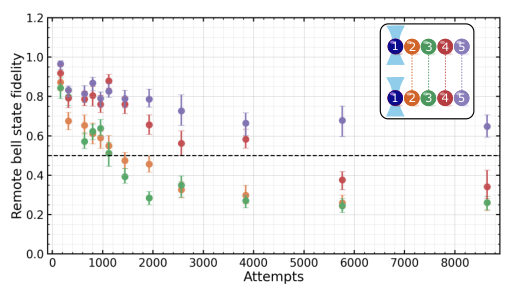 
FIG. 5. Predicted remote ion-ion Bell state fidelity decay, as a function of attempts to generate a new remote Bell pair. In- set panel: remote memory-ion pairs store Bell pairs, while attempts to make new remote Bell pairs are made (laser pulses). Main panel: color-filled shapes show predictions, color-matched to ions in the inset. Data is color-coded by ion. Black dashed line: entanglement threshold. Error bars are one standard deviation of statistical uncertainty

**Summary.** This paper reports on the creation of a highly coherent quantum node using trapped ions coupled to an optical cavity. By implementing dynamical decoupling, the researchers extended qubit coherence to multiple seconds, and successfully stored ion-photon entanglement for extended periods. This work represents a significant step toward building scalable, multi-qubit quantum processors and quantum networks.

**Why it may be interesting.** This work directly addresses the core challenge of quantum networking—maintaining entanglement coherence over time—by combining advanced quantum memory techniques (dynamical decoupling) with high-fidelity light-matter interfaces (cavity QED).

Detailed structure

**Main problem.** Developing scalable quantum networks requires generating remote entanglement faster than decoherence erases it, necessitating quantum nodes with efficient light-matter interfaces and long coherence times.

**Main result.** The authors demonstrated multi-second coherence times for a register of up to five trapped-ion qubits and achieved ion-photon entanglement coherence times significantly longer than previous reports.

**Method.** The study utilized dynamical decoupling sequences (like XY16) on trapped ions coupled to an optical cavity to protect quantum information and generate entanglement with photons.

**Model / system.** The physical system is a cavity-coupled ion trap, using trapped $\text{Ca}^+$ ions as qubits. Qubits are encoded in metastable Zeeman states, and the system leverages strong ion-cavity coupling for high-efficiency photon extraction.

**Key observables.** Single-qubit process fidelities, ion-photon entanglement fidelity ($F_B$), and coherence time ($\tau$).

**Important parameters / regimes.** Multi-second coherence times ($\tau \approx 65\text{s}$ for single qubits), cavity coupling strength ($g_0 = 2\pi \times 1.53 \text{ MHz}$), and the number of co-trapped ions (up to five).

**Assumptions / limitations.** The coherence is limited by laser crosstalk, and the final networking capability relies on estimations for an improved and duplicated system.

**Figures summary.** Figure 1 shows the energy level diagram and setup schematic. Figure 2 illustrates single-qubit process fidelities vs. storage time for one and five ions. Figure 3 shows the measured ion-photon entanglement fidelity vs. time.

**Paper structure.** The paper first establishes the need for long-coherence quantum nodes. It then details the experimental realization, demonstrating multi-second coherence using dynamical decoupling. Subsequently, it measures and reports the fidelity of stored ion-photon entanglement, concluding with estimates for scaling to multi-remote-pair generation.

Abstract

Scalable quantum networks require generating remote entanglement faster than decoherence erases it, calling for nodes that combine efficient light-matter interfaces with long coherence times. Cavity-coupled trapped ions are a promising platform for network nodes, offering high-efficiency extraction of photons. Here, we report multi-second coherence for a qubit register in a cavity-integrated ion trap. First, using dynamical decoupling on spin ground states, the coherence times of five co-trapped ion qubits are extended into the multi-second regime. Second, cavity-collected ion-photon entanglement is faithfully stored in these protected ion-memory states for multiple seconds. Third, we show that ion-memory qubits can be robust to the generation over a thousand cavity photons by a co-trapped ion, with decoherence limited by laser crosstalk. Finally, we estimate that a modestly improved and duplicated ion-cavity system could enable the simultaneous establishment of multiple remote Bell pairs between two remote ion registers, representing a step toward networking multi-qubit prototype trapped-ion quantum processors.

[↑ back to top](#top)

### [Deterministic preparation of entangled Dicke states](http://arxiv.org/abs/2608.22168v1)

**Authors:** Hui Wang, Marlan O. Scully, Girish S. Agarwal  
**Type:** theory · **Category:** other · **PDF:** <https://arxiv.org/pdf/2608.22168v1>  
**Analysis basis:** full PDF text, analyzed in chunks
**Topic relevance:** 🔥 `Tavis-Cummings & cavity-many-emitter` **4/5** · `Dicke superradiance` **3/5** · `analog quantum simulation` **3/5** · `quantum measurements` **1/5** · `superradiant laser` **1/5**

📷 Fig 1

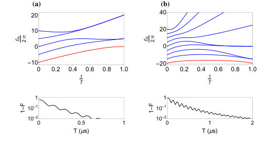 
FIG. 1: Instantaneous spectra and final infidelities for adiabatic Dicke-state preparation. In the upper panels, the vertical axis shows Ek/(2π), where Ek is the kth instantaneous eigenenergy of the ramp Hamiltonian, ordered from lowest to highest energy. Frequencies are given in MHz. The red curve denotes the ground-state branch, while the blue curves denote excited-state branches. The lower panels show the final infidelity 1 −F as a function of the total ramp time T. (a) Dicke-state preparation with target ∣J = 2,m = 0⟩. (b) Dicke-state preparation with target ∣J = 4,m = −2⟩.

📷 Fig 2

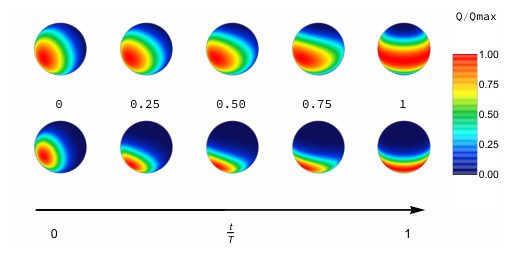 
FIG. 2: Time evolution of the Husimi Q-function during adiabatic preparation for t/T = 0,0.25,0.50,0.75,1. The upper and lower rows correspond to targets ∣J = 2,m = 0⟩ and ∣J = 4,m = −2⟩, respectively. Each sphere is normalized by its own maximum Qmax. A total ramp time of order T ∼1 µs is representative of the preparation timescales as shown in Fig. 1.

**Summary.** This paper details a novel, deterministic protocol for preparing specific, entangled Dicke states in a Cavity-QED system using adiabatic ground-state interpolation. By carefully programming the cavity detuning and the transverse drive, the authors can target any desired Dicke state without postselection. The successful preparation of these states confirms their utility as high-resource quantum states for quantum sensing, achieving Heisenberg-limited precision.

**Why it may be interesting.** This work directly addresses controllable entanglement generation in cavity QED, providing a robust, non-destructive method to populate specific, highly entangled many-body states crucial for quantum metrology.

Detailed structure

**Main problem.** The core challenge is achieving the deterministic preparation of entangled Dicke states with a specific spin projection, circumventing the need for postselection or heralding.

**Main result.** The authors present a protocol that deterministically prepares any allowed Dicke state along the symmetric ladder, demonstrating that the central state ($m=0$) provides Heisenberg-limited scaling for quantum sensing.

**Method.** The preparation relies on detuning-programmed adiabatic ground-state interpolation, evolving the system Hamiltonian by controlling the cavity-mediated interaction and a coherent transverse drive.

**Model / system.** The system is a collection of N atoms or qubits coupled to a single cavity mode (Cavity-QED). The dynamics are governed by a time-dependent Hamiltonian involving collective spin operators ($\hat{J}_x, \hat{J}_z$) and time-varying coupling strengths.

**Key observables.** State fidelity, Quantum Fisher Information ($F_Q$), and the collective-emission response of the prepared state.

**Important parameters / regimes.** The protocol requires the evolution time to be much longer than the inverse many-body energy gap; the target state is specified by its spin projection $m$.

**Assumptions / limitations.** The process assumes adiabatic evolution, meaning the evolution timescale must be slow compared to the energy gap.

**Figures summary.** Figures illustrate the instantaneous spectra and the time evolution of the Husimi Q-function, visualizing the approach of the state from a spin-coherent state to the target Dicke state structure.

**Paper structure.** The paper introduces the problem of deterministic Dicke state preparation, derives the effective Hamiltonian in the dispersive regime, details the adiabatic protocol using a transverse drive and cavity interaction, and concludes by demonstrating the state's utility for quantum sensing.

Abstract

Dicke states $|J=N/2,m\rangle$ of a collection of $N$ atoms were central to Dicke's theory of superradiance. Except for the fully polarized end states, they are entangled many-body states; in particular, the single-excitation Dicke state is the W state well known in quantum information science. However, deterministic preparation of Dicke states with a prescribed spin projection remains challenging, especially without relying on postselection or heralding. Here we present a detuning-programmed Hamiltonian protocol using atoms or qubits in a dispersive cavity subject to a coherent transverse drive. In the absence of the drive, the off-resonant cavity produces an effective collective-spin interaction. By combining this cavity-mediated interaction with the coherent drive, tuning the atom--drive detuning enables the protocol, in principle, to target any allowed Dicke state along the symmetric Dicke ladder. Starting from the transverse-drive ground state, adiabatic ground-state interpolation prepares the selected Dicke state by ramping down the drive strength while ramping up the cavity-mediated interaction. After preparation, tuning the cavity into resonance with the atoms or qubits provides a direct way to probe the collective-emission response of the prepared Dicke state. We discuss implementation with superconducting circuit QED and show that the prepared states, especially the central Dicke state with $m=0$, provide resources for quantum sensing with Heisenberg-limited scaling.

[↑ back to top](#top)

### [Robust cavity metrology beyond the limits of Pound-Drever-Hall](http://arxiv.org/abs/2608.21512v1)

**Authors:** Ibukunoluwa Adisa, Won Chan Lee, Yanqin Huang, Nathan Schine, Kevin C. Cox, Alicia J. Kollár  
**Type:** experiment · **Category:** other · **PDF:** <https://arxiv.org/pdf/2608.21512v1>  
**Analysis basis:** full PDF text, analyzed in chunks
**Topic relevance:** 🔥 `quantum measurements` **4/5** · `QC/QI experiment` **3/5** · `quantum optics experiment` **3/5** · `analog quantum simulation` **1/5** · `interference shaping light` **1/5**

📷 Fig 1

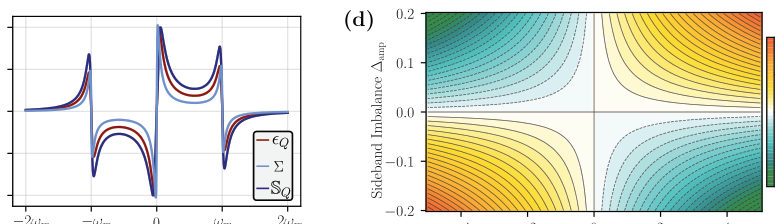 
Figure 1. Three-tone cavity readout and error sensitivity of PDH. (a) Traditional PDH uses a three-tone interrogation scheme in which the carrier at ω0 and two modulation-induced sidebands at ω0 ± ωm interact with a cavity, and square-law detection produces a beatnote signal at ωm; demodulation selects the conventional PDH signal ϵQ. (b) Heterodyne architecture enabling simultaneous extraction of the direct PDH signal and the individual tone quadratures required for reconstructing ϵQ, Σ, and SQ. (c) Comparison of normalized spectroscopy signals (ϵQ, Σ, and SQ) in the ideal limit, demonstrating that all three quantities provide similar dispersive discriminators with a useful zero-crossing...

📷 Fig 2

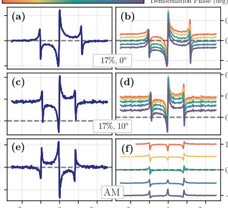 
Figure 2. Optical spectroscopy signals under induced hardware imperfections. SQ (a) and ϵQ (b) versus cavity detuning, with 17% sideband power imbalance, 0◦scissors-phase offset, and varying demodulation phase. Line color indicates applied de- modulation phase. SQ (c) and ϵQ (d) versus cavity detuning, with 17% sideband power imbalance, 10◦scissors-phase offset, and varying demodulation phase. (e) For AM SQ remains a stable discriminator for locking unlike ϵQ (f). All traces in each panel are normalized by the average off-resonant value of E+E−E2 0 (for SQ) or E0(E−+ E+)/2 (for ϵQ). Additional configurations are shown in Fig. S5 of the Supplemental Ma- terial.

📷 Fig 3

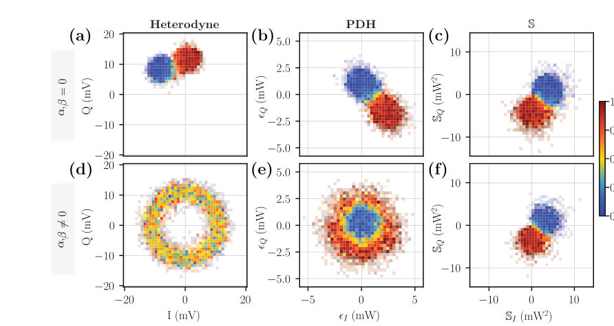 
Figure 3. Superconducting-qubit readout under controlled phase errors. Single-shot IQ distributions for conventional carrier- heterodyne (a), PDH (b), and S (c) under ideal phase-locked conditions (α, β = 0). All three observables yield well-separated regions corresponding to |g⟩(blue) and |e⟩(red). The color scale indicates the probability P(e) of events corresponding to preparation in |e⟩. Bins containing fewer than 10 counts displayed with proportionally reduced opacity (see Section S3 D in Supplemental Material). (d-f) Corresponding readout distributions under combined common-mode and differential-mode errors (α, β ̸= 0). Heterodyne results in overlapping and indistinguishable...

**Summary.** This paper introduces a robust metrology technique, the scissors observable ($S_Q$), designed to overcome systematic errors inherent in standard Pound-Drever-Hall (PDH) spectroscopy. By analyzing the optimal linear combination of three interrogation tones, the authors demonstrate that $S_Q$ maintains high measurement fidelity in both optical and superconducting qubit readout regimes, even when subjected to significant technical phase and amplitude imbalances.

**Why it may be interesting.** This work directly tackles the practical limitations of high-precision quantum measurement techniques, providing a robust diagnostic tool ($S_Q$) essential for advancing quantum sensing and quantum information processing platforms.

Detailed structure

**Main problem.** The paper addresses the systematic limitations of Pound-Drever-Hall (PDH) spectroscopy in high-precision cavity metrology, specifically due to residual amplitude modulation and demodulation-phase errors.

**Main result.** A novel observable, the scissors phase ($S_Q$), was developed and experimentally demonstrated to be robust against common-mode and differential-mode phase errors, outperforming conventional PDH methods in both optical and microwave regimes.

**Method.** The authors propose and test an optimal linear combination of the phases of three interrogation tones, leading to the $S_Q$ observable, which is measured using a three-frequency heterodyne setup.

**Model / system.** The work utilizes microwave and optical cavities, applying the metrology techniques to stabilize optical frequencies and read out the state of superconducting qubits.

**Key observables.** Conventional PDH signal ($\epsilon_Q$), ideal scissors phase ($\Sigma$), and the experimentally efficient scissors observable ($S_Q$).

**Important parameters / regimes.** Sideband imbalance ($\Delta_{amp}$), demodulation phase error ($eta$), and cavity linewidth ($\kappa$).

**Assumptions / limitations.** The superior robustness of $S_Q$ is achieved by using a three-frequency heterodyne setup, which is computationally more complex than standard PDH.

**Figures summary.** Figures illustrate the three-tone interrogation scheme and compare the zero-crossing shifts of $\epsilon_Q$ and $S_Q$ under induced hardware imperfections (imbalance, phase offsets). Other figures show single-shot IQ distributions for qubit readout.

**Paper structure.** The paper first introduces the limitations of PDH, then derives the robust scissors phase observable ($\Sigma$), and finally proposes the computationally simpler, yet equally robust, $S_Q$ observable. The methodology is validated through extensive optical and microwave experiments comparing the performance of $\epsilon_Q$, $\Sigma$, and $S_Q$ under controlled error injection.

Abstract

Precise measurement of the resonance frequencies of microwave and optical cavities is a foundational capability across quantum technologies. One of the highest-performance methods currently available is Pound-Drever-Hall (PDH) spectroscopy, which relies on a three-tone interrogation and eliminates sensitivity to path-length fluctuations. However, PDH is known to suffer from systematic offsets due to residual amplitude modulation and demodulation-phase errors. Here we leverage an optimal linear combination of the phases of the three interrogation tones to implement a method for robust cavity metrology which eliminates significant systematic-error sensitivities of PDH. We experimentally demonstrate robust cavity measurements in both the optical and microwave frequency regime, showing insensitivity to sideband imbalance and demodulation phase, as well as demonstrating single-shot readout of a cavity-coupled superconducting qubit.

[↑ back to top](#top)

### [Automating detection of Two-Level Systems in Superconducting Qubits](http://arxiv.org/abs/2608.21983v1)

**Authors:** Rama Khalil, Cameron J. Kopas, Avinash Pathapati, Rory Cochrane, Xiqiao Wang, Hossein Taghinejad, Vito Iaia, Josh Mutus, Yaniv J. Rosen, Jared H. Cole, David P. Pappas, Alexander V. Balatsky  
**Type:** experiment · **Category:** quantum information and computing · **PDF:** <https://arxiv.org/pdf/2608.21983v1>  
**Analysis basis:** full PDF text, analyzed in chunks
**Topic relevance:** 🔥 `QC/QI experiment` **4/5** · `methods for driven-dissipative` **3/5** · `quantum measurements` **2/5** · `correlated / nonlocal dissipation` **1/5** · `driven-dissipative phase transition` **1/5**

📷 Fig 1

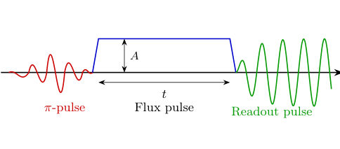 
Figure 1. SWAP spectroscopy pulse sequence. An initial π-pulse (red) excites the qubit, a flux pulse (blue) of amplitude A and duration t tunes ωq into near-resonance with candidate TLS, and a dispersive readout pulse (green) mea- sures the qubit excited-state population.

📷 Fig 2

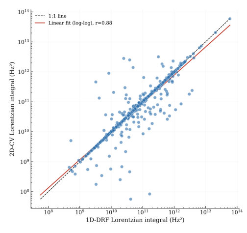 
Figure 2. Matched-peak physical loss agreement across six decades. Comparison of frequency-integrated Lorentzian loss strengths ITLS = πAγ (Hz2) for n = 597 consensus TLS pairs matched within a frequency tolerance δf = 25 MHz. Both pipelines yield significant Lorentzian fits. Dashed line: 1:1 agreement line. Pearson correlation r = 0.88 on log-transformed values.

📷 Fig 3

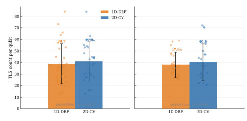 
Figure 3. Mean TLS defect count per qubit (Trimmed and Untrimmed) Comparison of detected defect counts across untreated (left) and treated (right) qubit groups eval- uated independently by 1d-drf (orange) and 2d-cv (blue). Columns represent group means ± standard deviation; in- dividual dots depict per-qubit counts. Two-sample t-tests confirm no statistically significant change in defect density (p &gt; 0.8).

📷 Fig 4

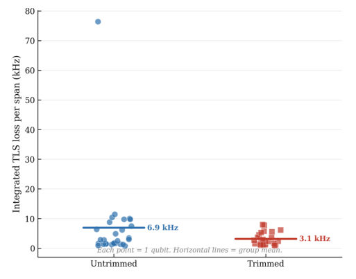 
Figure 5. Span-integrated TLS dissipation per qubit. Total integrated relaxation loss L = P ΓTLS 1 (fi)∆f per qubit evaluated via 1d-drf. Individual dots denote single trans- mon devices; horizontal lines represent group ensemble means. Moderate abaa treatment reduces the mean span-integrated loss by more than 50% (6.9 kHz →3.1 kHz).

📷 Fig 5

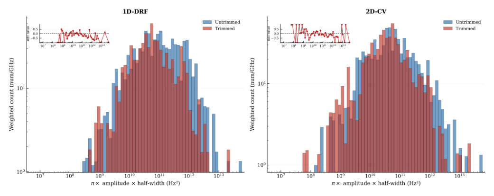 
Figure 4. Lorentzian loss-strength distributions and treatment differential. Main panels: Frequency-integrated loss strengths ITLS = πAγ (Hz2) for 1d-drf (left) and 2d-cv (right), evaluated across as-fabricated baseline devices (blue, n = 28) and abaa-trimmed devices (red, n = 24). Only statistically significant defect fits (A ≥σlocal) are included. Insets: Per-bin treatment differential ratio (Ptrim −Puntrim)/(Ptrim + Puntrim). Across both independent diagnostic pipelines, the differential ratio fluctuates near zero throughout the moderate-coupling bulk and turns systematically negative in the high-dissipation tail (ITLS &gt; 1011 Hz2), demonstrating that moderate (∼10%)abaa trimming...

**Summary.** This work presents and benchmarks two advanced, automated methods for detecting TLS defects in superconducting transmon qubits using SWAP spectroscopy. The authors show that by applying a moderate annealing process, they can selectively suppress the most damaging defect channels, significantly reducing energy loss without altering the total number of defects. This establishes a robust diagnostic tool for improving large-scale quantum hardware.

**Why it may be interesting.** The development of a non-parametric, automated analysis framework (2D-CV) for extracting subtle decoherence signatures from complex 2D spectroscopic data is highly valuable for characterizing open quantum systems.

Detailed structure

**Main problem.** Microscopic Two-Level System (TLS) defects are a primary source of decoherence and instability in superconducting transmon qubits, necessitating scalable and automated characterization methods.

**Main result.** The study demonstrates a count–loss decoupling effect where post-fabrication annealing selectively suppresses the strongest dissipative defect channels, halving the integrated loss without changing the total defect count.

**Method.** Two complementary analysis pipelines—1D decay-rate fitting (1D-DRF) and a deterministic 2D computer-vision framework (2D-CV)—are benchmarked to extract TLS statistics from time-resolved SWAP spectroscopy maps.

**Model / system.** The system involves flux-tunable transmon qubits on Rigetti processors, modeled by a Hamiltonian including coupling to TLS defects. Measurements utilize SWAP spectroscopy to map qubit population decay across time and frequency.

**Key observables.** TLS defect density, localized resonant loss ($\Gamma_{TLS}$), frequency-integrated TLS loss strength ($I_{TLS}$), and qubit relaxation rates ($T_1$).

**Important parameters / regimes.** Moderate post-fabrication annealing ($\sim 10\%$) is the key intervention; the analysis compares results across different junction geometries.

**Assumptions / limitations.** The analysis assumes that the observed loss reduction is due to the annealing treatment modifying barrier coordination, rather than being an artifact of sample allocation.

**Figures summary.** Figures compare the performance of 1D vs. 2D analysis pipelines, showing how the 2D method captures weakly dissipative structures, and illustrate the systematic depletion of high-dissipation defects after annealing.

**Paper structure.** The paper introduces the problem, details the two distinct analysis pipelines (1D-DRF and 2D-CV), applies both to experimental data (with and without annealing), and concludes by comparing the quantitative results and interpreting the physical meaning of the observed loss reduction.

Abstract

Microscopic two-level system (TLS) defects remain a primary mechanism of decoherence and operational instability in superconducting transmon qubits, necessitating scalable and automated methods for their characterization. Here, we present and benchmark two complementary analysis pipelines for extracting TLS statistics directly from time-resolved SWAP spectroscopy: one-dimensional decay-rate fitting (1D-DRF), which detects defects via localized enhancements in the qubit relaxation rate, and a deterministic, non-parametric computer-vision framework (2D-CV) that achieves two-dimensional spectral localization by exploiting the temporal persistence of coherent population suppression. We deploy both methods on SWAP spectroscopy measurements from 52 flux-tunable transmon qubits on Rigetti processors with and without moderate ($\sim 10\%$) post-fabrication frequency trimming via Alternating-Bias Assisted Annealing (ABAA). We show that both pipelines converge on a consistent global characterization of the defect landscape while exhibiting complementary sensitivity across distinct coupling regimes. Crucially, both methods independently reveal a count--loss decoupling under moderate annealing: while the total detectable TLS defect density remains statistically unchanged, the span-integrated dielectric loss is reduced by approximately a factor of two, demonstrating selective suppression of the most strongly dissipative defect channels. These results establish an automated, non-parametric analysis framework for high-throughput hardware diagnostics and provide a statistical baseline for post-fabrication defect engineering in large-scale superconducting quantum processors.

[↑ back to top](#top)

### [Breakdown of Aharonov-Bohm cage in Rydberg synthetic lattices: the roles of inhomogeneity and long-range exchange](http://arxiv.org/abs/2608.21768v1)

**Authors:** Li Pan, Xinlu Chen, Hong Zhang, Jian-Song Pan  
**Type:** theory · **Category:** other · **PDF:** <https://arxiv.org/pdf/2608.21768v1>  
**Analysis basis:** full PDF text, analyzed in chunks
**Topic relevance:** 🔥 `Rydberg arrays` **4/5** · 🔥 `analog quantum simulation` **4/5** · `interference shaping light` **1/5**

📷 Fig 1

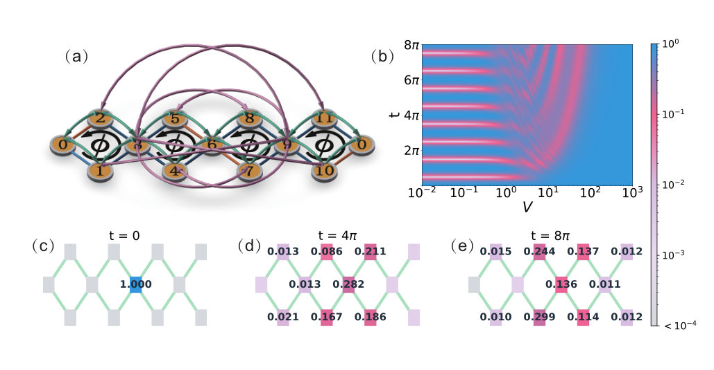 
FIG. 1. (a) Schematic of the model. Solid lines denote single-particle transitions with phases 0 (dark blue) and ±ϕ (vermil- ion). Double-headed arrows represent nearest-neighbor (turquoise) and long-range (magenta) exchange interactions. (b) Time evolution of the initial-site population P6 versus interaction strength V (for initial state |6⟩A|6⟩B, J = 1/2, and ϕ = π), illus- trating three distinct dynamical regimes: cage preservation (V ≲100), delocalized transport (100 ≲V ≲102), and dynamical freeze-out (V ≳102). (c)–(e) Spatial population distribution of particle A at V = 10. Light green lines indicate the lattice geometry, and site labels represent particle populations. Note: panels...

📷 Fig 2

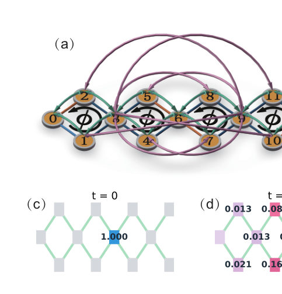 
Fig. 1(c)–(e). For V ≳102, the system exhibits a freeze- out of P6 dynamics, and the particles regain their local- ization [1, 50, 57]. To analyze the mechanism by which the exchange in- teraction breaks the AB cage, we numerically solve the time-dependent Schrödinger equation (TDSE) to com- pare the effects of different interaction components on the dynamical evolution. We decompose the total inter- action term ˆHint into nearest-neighbor (NN) and long- range (LR) components:

📷 Fig 3

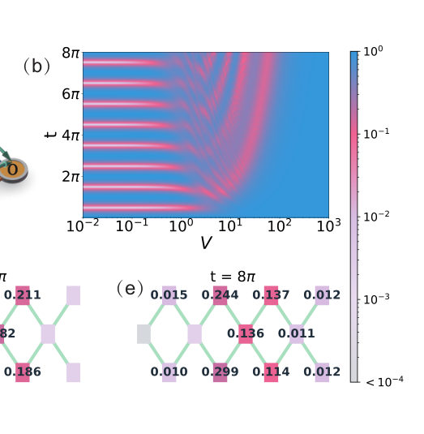 
Fig. 2 illustrates the density evolution of the particles under various interaction models. Under the full dipo- lar exchange interaction ˆHint, particles diffuse beyond the initial unit cell, indicating a breakdown of the AB cage, as shown in Fig. 2(a). To identify the dominant components driving this transport, we examine simpli- fied models. Under a uniform NN exchange interaction ˆHNN int,Hom, the AB cage is preserved, and no transport occurs [Fig. 2(b)]. However, when NN inhomogeneity is introduced, the AB cage is broken, and the particles un- dergo diffusion [Fig. 2(c)]. This demonstrates that the inhomogeneity of the NN exchange interaction is a nec- essary condition for breaking the...

📷 Fig 4

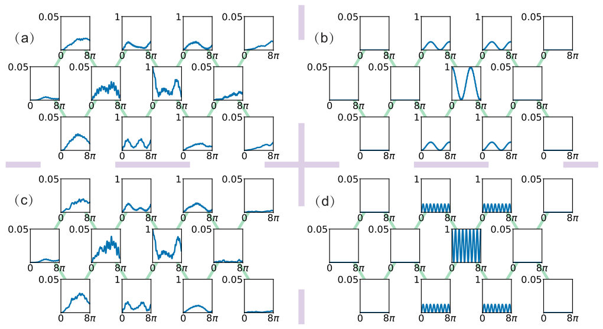 
FIG. 2. Time evolution of the population Pi of particle A at each site for the initial state |6⟩A|6⟩B, with parameters J = 1/2, ϕ = π, and V = 10. The light green lines represent the lattice structure, and each subfigure shows the evolution of the population Pi at the corresponding site over time t. The models include: (a) dipolar exchange interaction, (b) uniform NN exchange interaction, (c) inhomogeneous NN exchange interaction, and (d) inhomogeneous LR exchange interaction. The AB cage is broken in (a) and (c), whereas it is preserved in (b) and (d).

📷 Fig 5

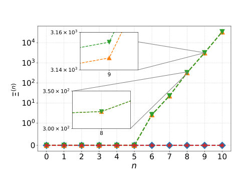 
FIG. 3. Numerical calculation of the propagation factor Ξ(n): the inhomogeneous LR exchange (blue diamonds) and the uniform NN exchange (red stars) remain at zero within the observation range. In contrast, the inhomogeneous NN ex- change (orange upward triangles) and the dipolar exchange (green downward triangles) exhibit an abrupt jump at n ≥6, and they bifurcate after n = 9 due to the manifestation of the LR contributions.

**Summary.** This paper analyzes the breakdown of the Aharonov-Bohm cage in Rydberg synthetic lattices by studying two-particle dynamics. Using the Evolution-Path Symmetry framework, the authors show that spatial inhomogeneity in nearest-neighbor exchange interactions is the critical ingredient required to break the cage. This mechanism links microscopic path interference directly to the emergence of delocalized, dispersive eigenstates, enabling transport.

**Why it may be interesting.** This work provides a deep, analytical understanding of how specific interaction symmetries (or lack thereof, due to inhomogeneity) dictate the transition between localized and delocalized quantum transport in engineered lattice systems, highly relevant to Rydberg physics.

Detailed structure

**Main problem.** The paper investigates the microscopic mechanism by which interaction-induced exchange interactions cause the breakdown of the Aharonov-Bohm (AB) cage in quantum systems.

**Main result.** Inhomogeneous nearest-neighbor exchange interactions are necessary and sufficient to break the AB cage by disrupting path interference, leading to delocalized transport. Long-range interactions alone are insufficient to cause this breakdown.

**Method.** The analysis employs the Evolution-Path Symmetry (EPS) framework, analyzing two-particle dynamics through path interference in Fock space and comparing projections onto localized versus dispersive eigenstates.

**Model / system.** The system is modeled using Rydberg synthetic lattices, which realize flat-band physics and exhibit AB cage confinement. The dynamics are governed by a two-particle Hamiltonian incorporating nearest-neighbor and long-range exchange interactions.

**Key observables.** Population dynamics ($P_6$ vs. interaction strength $V$), spatial distribution of particles, and the coherence of the path interference factor ($\Xi(n)$).

**Important parameters / regimes.** The relative strengths and spatial variation (inhomogeneity) of nearest-neighbor and long-range exchange coupling constants.

**Assumptions / limitations.** The analysis focuses on the two-particle sector, and the initial state is assumed to possess exchange symmetry.

**Figures summary.** Figures illustrate the time evolution of particle population showing regimes of cage preservation, delocalized transport, and freeze-out, alongside spatial distributions confirming confinement or delocalization.

**Paper structure.** The paper progresses from defining the physical system and Hamiltonian to applying the EPS framework. It then systematically compares the effects of different interaction components (uniform NN, inhomogeneous NN, LR only, combined) on the path interference, linking this microscopic path behavior to macroscopic spectral reorganization and transport.

Abstract

While the interaction-induced breakdown of Aharonov-Bohm (AB) cage is typically attributed to uniform bound-pair transport, systems with inhomogeneous exchange interactions realized with Rydberg synthetic lattices exhibit more complex dynamics. Employing the evolution-path symmetry (EPS) framework developed recently, we analyze the two-particle dynamics via path interference in Fock space. We find that a homogeneous nearest-neighbor exchange interaction cannot break the AB cage, regardless of whether the long-range exchange interaction is present or not. In contrast, we demonstrate that inhomogeneous nearest-neighbor exchange interaction breaks the destructive-interference EPS, and lifts the degeneracy of many-body compact localized states, thereby generating non-local dispersive eigenstates. Consequently, the initial state gains a non-zero overlap with these dispersive states, enabling delocalized transport. Furthermore, while long-range exchange interaction alone preserves the AB cage, its coupling with nearest-neighbor inhomogeneous exchange interaction opens non-canceling pathways that alter the diffusion profile. Our work connects microscopic path interference with macroscopic spectral reorganization, offering an analytical understanding of the mechanism underlying exchange-interaction-induced transport in Rydberg synthetic lattices.

[↑ back to top](#top)

### [Spinor condensate persistent currents in an atomtronic Josephson necklace](http://arxiv.org/abs/2608.23560v1)

**Authors:** Sayan Chatterjee, Nalinikanta Pradhan, Rina Kanamoto, M. Bhattacharya, Pankaj Kumar Mishra  
**Type:** theory · **Category:** quantum gases · **PDF:** <https://arxiv.org/pdf/2608.23560v1>  
**Analysis basis:** full PDF text, analyzed in chunks
**Topic relevance:** 🔥 `analog quantum simulation` **4/5** · `methods for driven-dissipative` **2/5** · `Frenkel-Kontorova` **1/5** · `Keldysh / 2PI / non-Gaussian methods` **1/5** · `driven-dissipative phase transition` **1/5**

📷 Fig 1

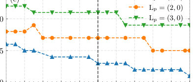 
FIG. 2. (a) Persistent-current lifetime τ1 as a function of the intercomponent interaction strength g12 for three bar- rier heights, V0 = 2.1µ, 2.5µ, and 3.0µ. The lifetime of the Lp1 = 1 state increases monotonically with g12. (b) Local su- perfluid velocity vlocal of the Lp1 = 1 component at the barrier position, evaluated immediately after the barrier ramp, as a function of g12. Crosses denote the critical g12 for stability and the corresponding local velocity. Larger markers indicate the onset of the regime where the flow velocity falls below the local speed of sound (c) Stability phase diagram in the V0-g12 parameter space. The red region denotes parameters for which the Lp1 = 1 state...

📷 Fig 2

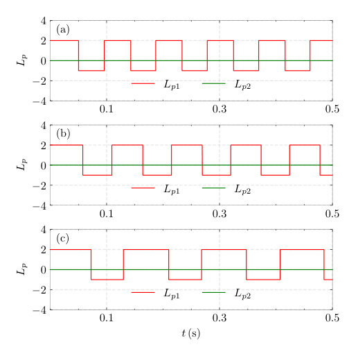 
FIG. 3. Temporal evolution of winding numbers the spinor persistent current for (a) g12 = 0.1, (b) g12 = 0.5, and (c) g12 = 0.9. Here Lp = (2, 0), nb = 3, and V0 = 3.0µ. The other parameters are the same as in Fig. 1. From (a) to (c), as g12 increases, a decrease in switching frequency of the winding number Lp1 is observed.

📷 Fig 3

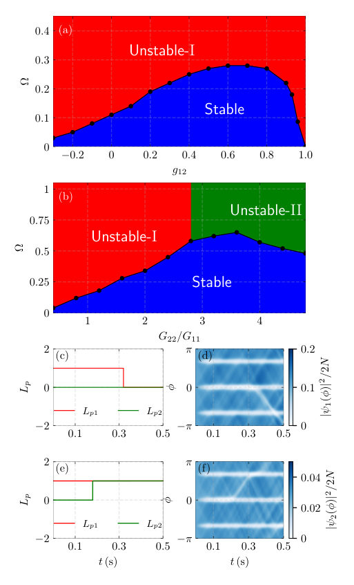 
FIG. 4. (a) Stability phase diagram in the Ω−g12 param- eter space for nb = 3 and V0 = 2.1µ for G11 = G22. (b) Stability phase diagrams corresponding to persistent-current instabilities in the broken-Manakov regime (G11 ̸= G22) for a ring condensate with three symmetrically placed barri- ers (V0 = 2.1µ) for g12 = 0.1√G11G22. Red (Unstable-I) and green (Unstable-II) regions correspond to the instability channels shown in (c,d) and (e,f), respectively. (c,d) Decay Lp = (1, 0) →(0, 0) via a phase slip in the first component, showing the winding-number evolution (c) and density (nor- malized to total number of particles) dynamics (d). Parame- ters are G22 = 2.0G11 and Ω= 0.35. (e,f) Instability...

📷 Fig 4

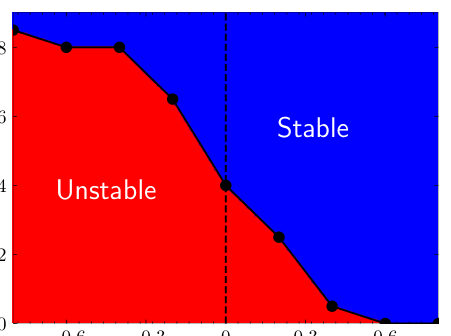 
FIG. 1. Stability phase diagram in the interspecies interaction g12 and polarization P parameter space. The red region indicates the unstable region, while the blue region denotes the stable one. Here g11 = g22 [45] and the other set of parameters used here is the same as used in Fig. 1.

📷 Fig 5

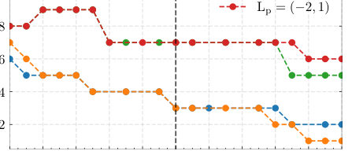 
FIG. 2. (a) Temporal evolution of winding numbers for Lp = (−1, 1), nb = 2 and g12 = 0.1. (b) Critical number of barrier (nbc) required to stabilize co-and counter-rotating persistent current versus density-density interaction strength (g12). Here, V0 = 3.0µ and the other set of parameters is the same as used in Fig. 1 of the main manuscript.

**Summary.** This paper theoretically investigates how persistent supercurrents in spinor Bose-Einstein condensates can be controlled using engineered Josephson junctions. By analyzing the role of interspecies interactions (g_12), the authors show that these interactions stabilize the supercurrent against decay, even in higher dimensions. This work offers a powerful toolset for designing next-generation atomtronic devices.

**Why it may be interesting.** This work provides a detailed theoretical roadmap for controlling macroscopic quantum phenomena (supercurrents) in engineered atomic systems, directly relevant to developing quantum simulators and novel quantum devices using ultracold atoms.

Detailed structure

**Main problem.** The study investigates the stability and dynamics of persistent supercurrents in spinor atomic Bose-Einstein condensates confined to a ring structure with multiple Josephson junctions.

**Main result.** The presence of a second atomic species allows for unprecedented control over supercurrents, enabling mechanisms like phase-slip engineering and current-inversion switching.

**Method.** The research employs numerical simulations solving coupled Gross-Pitaevskii equations (GPE) in both 1D ring and 2D toroidal geometries.

**Model / system.** The system is a binary spinor BEC, modeled by coupled GPEs, simulating superflow in an 'atomtronic Josephson necklace' potential. The model incorporates intra- and inter-species interactions, Rabi coupling, and external barriers.

**Key observables.** Persistent current (winding number, L_p), current stability lifetime (τ_1), local superfluid velocity (v_local), and density profiles.

**Important parameters / regimes.** Interspecies interaction ratio (g_12), Rabi coupling strength (Omega), barrier height (V_0), and temperature (T).

**Assumptions / limitations.** The analysis compares zero-temperature GPE results with finite-temperature sGPE results, and extends the findings from 1D to 2D toroidal geometries.

**Figures summary.** Figures illustrate current decay versus stabilization as g_12 increases (Fig. 1, 2), show the dependence of stability on parameters in phase diagrams (Fig. 2c, Fig. 4), and demonstrate vortex nucleation vs. stable circulation in 2D (Fig. 6).

**Paper structure.** The paper systematically analyzes the system by first establishing the 1D model, demonstrating how increasing interspecies interaction (g_12) stabilizes the current against decay. It then extends this analysis to include finite temperature effects (sGPE) and finally generalizes the findings to a 2D toroidal geometry, confirming the robustness of the stabilization mechanism.

Abstract

The investigation of superflow in multi-junction Josephson circuits is currently a leading frontier of physics research, probing the fundamental manifestations of macroscopic phase coherence and enabling applications to quantum simulation, metrology and computing. In this work, we extensively investigate the stability and dynamics of persistent currents of a spinor atomic Bose-Einstein condensate on a ring with multiple Josephson junctions. Specifically, we examine the effects of positive and negative interspecies interactions, co- and counter-rotation, population and Manakov asymmetry, as well as Rabi coupling on the persistent currents carried by the two components. Our analysis reveals that the presence of a second species offers multiple mechanisms for unprecedented manipulation of supercurrents on the ring, including phase-slip engineering, stability control, current-inversion switching and supercurrent pumping. Our study provides a roadmap for the engineering of persistent currents in binary ring condensates in necklace potentials, with significant implications for atomtronics, matter-wave interferometry and sensing using atomic Bose gases.

[↑ back to top](#top)

### [Dual-Isotope Sympathetic Cooling in a Long Ion Chain](http://arxiv.org/abs/2608.23386v1)

**Authors:** Tianyi Wang, Marko Cetina  
**Type:** experiment · **Category:** other · **PDF:** <https://arxiv.org/pdf/2608.23386v1>  
**Analysis basis:** full PDF text, analyzed in chunks
**Topic relevance:** 🔥 `QC/QI experiment` **4/5** · `analog quantum simulation` **1/5** · `correlated / nonlocal dissipation` **1/5** · `driven-dissipative phase transition` **1/5** · `quantum measurements` **1/5**

📷 Fig 1

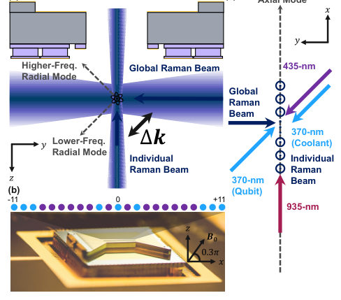 
FIG. 1. Experimental setup. Experiments are performed at room temperature using a microfabricated surface-electrode linear rf ion trap. (a) Side view. The dashed gray arrows indicate the radial trap principal axes associated with the higher- and lower-frequency radial modes. Two beams de- rived from a 355-nm pulsed Raman laser address the ions. A global Raman beam uniformly illuminates the entire ion chain, while the other Raman beam is split into separate in- dividual beams that are tightly focused onto individual ions [43]. For Raman operations, stimulated absorption and emis- sion from the global and individual beams imparts the net momentum ℏ∆k. (b) Front view. The ion chain, consist-...

📷 Fig 2

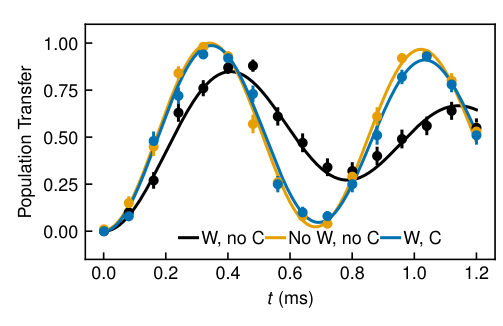 
FIG. 2. Carrier Raman Rabi oscillations of qubit ion +4. The probability of population transfer to the excited state P is plotted as a function of the Rabi pulse duration t. Error bars denote 1σ binomial uncertainties. Black: after a 20-ms idle wait with no axial sympathetic cooling (W, no C). Yel- low: immediately after state preparation with no idle wait and no axial sympathetic cooling (no W, no C). Blue: after a 20-ms idle wait followed by 8 ms of axial sympathetic cooling (W, C). Cooling reduces the fitted carrier-decay parameter from 0.27(2) after the idle wait (black) to 0.069(8) (blue), ap- proaching the post-state-preparation value of 0.042(10) (yel- low).

📷 Fig 3

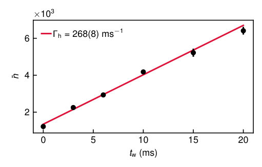 
FIG. 3. Idle heating rate of the LA mode. The average mode occupation ¯n is plotted as a function of idling duration tw. Error bars denote the standard error of the ion mean with weights inversely proportional to the individual binomial vari- ances. A linear fit to the resulting data (red line) yields an idle heating rate Γh = 268(8) ms−1.

📷 Fig 4

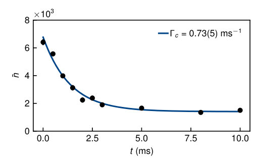 
FIG. 4. Evolution of the mean occupation of the LA mode ¯n during sympathetic cooling. Carrier Raman Rabi oscillations are driven on all qubits following a 20-ms idle delay and sub- sequent axial sympathetic cooling of duration t. Error bars denote the standard error of the ion mean with weights in- versely proportional to the individual binomial variances. A fit of the data to Eq. 3 (blue curve) yields the equilibrium mean occupation ¯neq = 1.41(9) × 103 and the cooling rate constant of Γc = 0.73(5) ms−1.

📷 Fig 5

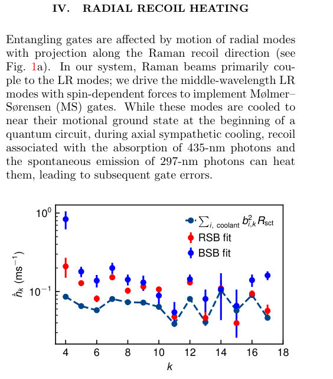 
FIG. 5. Average heating rates ˙¯nk of 14 middle LR modes dur- ing 3 ms of axial sympathetic cooling. Mode index k = 0 cor- responds to the longest-wavelength LR mode. Blue points in- dicate the heating rates obtained from linear fits to the mean mode occupations, ¯nk, measured at different cooling times, using blue-sideband Rabi oscillations. Red points show the corresponding rates obtained from red-sideband Rabi oscil- lations. Dark blue dashed points show the average recoil- induced heating rates during the 3-ms axial cooling sequence obtained from a zero-parameter resolved sideband model de- scribed in Appendix. E.

**Summary.** This paper reports on a novel sympathetic cooling technique applied to a long, dual-isotope ion chain. The technique effectively suppresses motional heating across all relevant vibrational modes during quantum operations. This achievement is a critical step toward building fault-tolerant, scalable quantum processors using trapped ions.

**Why it may be interesting.** This work provides a crucial experimental demonstration of noise mitigation (motional heating suppression) in a scalable, multi-qubit platform, directly addressing a major bottleneck for trapped-ion quantum computing.

Detailed structure

**Main problem.** The primary challenge addressed is suppressing motional heating in long ion chains to enable deep quantum computations without causing qubit decoherence or degrading connectivity.

**Main result.** The authors successfully demonstrated steady-state mid-circuit sympathetic cooling of all relevant motional modes in a 23-ion chain, while preserving qubit coherence throughout the cooling sequence.

**Method.** The cooling is achieved sympathetically using a dual-isotope system, performed without direct qubit operations, and is tested over a realistic 56-ms quantum circuit duration.

**Model / system.** The system is a 23-ion chain composed of two different Yb isotopes (${}^{171}	ext{Yb}^+$ qubits and ${}^{172}	ext{Yb}^+$ coolant ions) trapped in a room-temperature linear RF ion trap.

**Key observables.** Mean phonon occupations of axial and radial modes, qubit coherence, and the decay rate of Rabi oscillations.

**Important parameters / regimes.** The experiment operates over a 56-ms circuit time with a 25% gate duty factor, and specific secular frequencies are mentioned.

**Assumptions / limitations.** The cooling scheme assumes the ability to perform initial state preparation via Doppler and Raman sideband cooling, and the analysis relies on fitting Rabi oscillations to model heating rates.

**Figures summary.** Figures illustrate the experimental setup (side, front, and top views of the 23-ion chain) and show diagnostics like population transfer probability vs. time and mean occupation number vs. idle time.

**Paper structure.** The paper details the experimental setup, characterizes the initial heating rates for both axial and radial modes, implements the sympathetic cooling protocol, and evaluates the preservation of qubit coherence and gate fidelity.

Abstract

Owing to their high controllability and connectivity, one-dimensional ion chains are attractive building blocks for near-term quantum computers. However, long ion chains are susceptible to motional heating caused by fluctuating external electric fields. To enable deep computations, this source of noise must be suppressed without inducing qubit decoherence or degrading qubit connectivity. We demonstrate steady-state mid-circuit sympathetic cooling of all computationally-relevant motional modes of a 23-ion chain consisting of \qubit qubit and \coolant coolant ions without using any qubit operations. In a room-temperature system, our cooling scheme preserves the mean phonon occupations of the long-wavelength axial and radial modes near their values following state preparation, while keeping the modes used to implement entangling gates near their ground states throughout a 56-ms circuit. Crucially, we show that our cooling sequence preserves qubit coherence, and evaluate its impact on single- and two-qubit gate operations. Additionally, we demonstrate a parallel qubit reset protocol leveraging the shared radial mode coupling between species. Our sympathetic cooling scheme represents a critical step toward reducing gate errors in individually-addressed long ion chains and establishes a versatile platform for simulating open quantum systems.

[↑ back to top](#top)

### [Bloch states of an infinite one-dimensional lattice under transverse electric field](http://arxiv.org/abs/2608.22199v1)

**Authors:** Anand Aruna Kumar  
**Type:** theory · **Category:** other · **PDF:** <https://arxiv.org/pdf/2608.22199v1>  
**Analysis basis:** full PDF text, analyzed in chunks
**Topic relevance:** 🔥 `Frenkel-Kontorova` **4/5** · `analog quantum simulation` **2/5**

📷 Fig 1

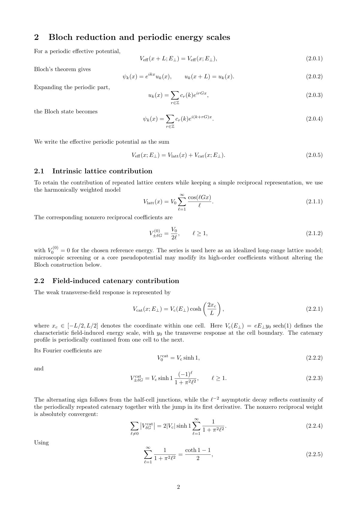 
Low-resolution page preview, page 2

📷 Fig 2

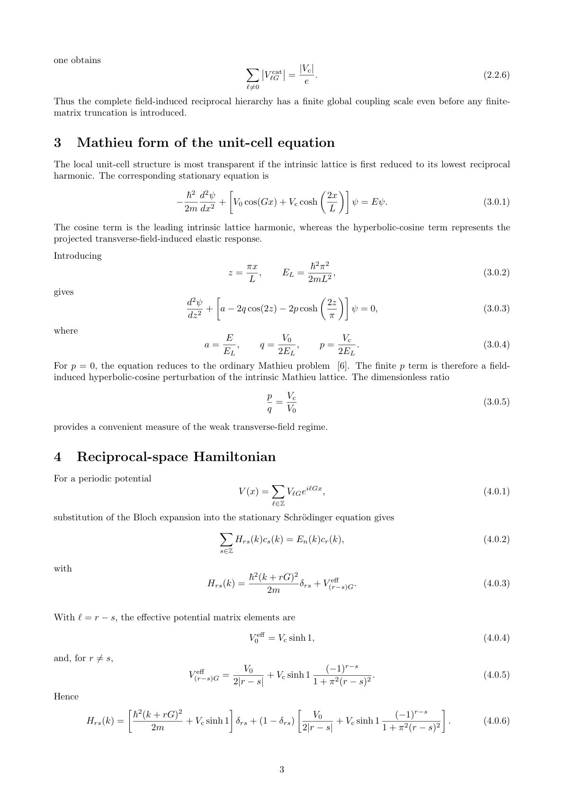 
Low-resolution page preview, page 3

📷 Fig 3

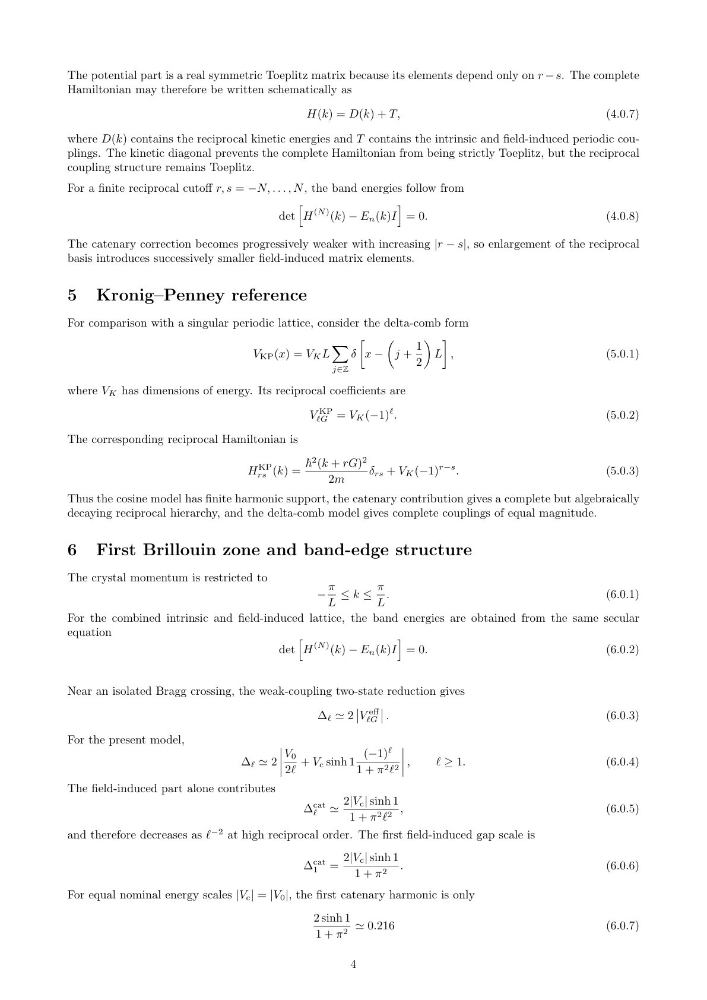 
Low-resolution page preview, page 4

📷 Fig 4

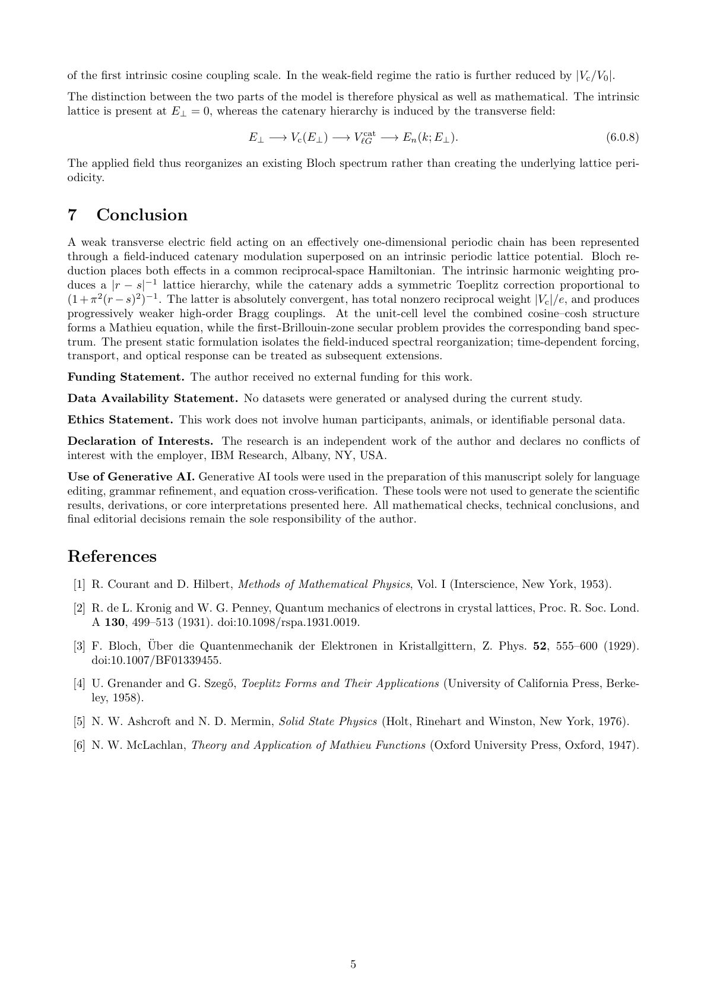 
Low-resolution page preview, page 5

**Summary.** This theoretical study models an atomic chain subjected to a weak transverse electric field, analyzing how this field modifies the electronic band structure using Bloch theory. By combining the intrinsic lattice potential with a catenary-shaped field potential, the problem reduces to solving a Mathieu equation. The results show that the field induces measurable changes in the band gaps, providing insight into field-induced spectral reorganization in low-dimensional solids.

**Why it may be interesting.** This work provides a concrete, solvable model demonstrating how external fields can tune the band structure of low-dimensional periodic systems, which is relevant for understanding field effects in quantum materials and optical lattices.

Detailed structure

**Main problem.** The paper investigates how a weak, static electric field applied transversely to an effectively one-dimensional periodic atomic chain reorganizes its electronic Bloch spectrum.

**Main result.** The transverse field modifies the Bloch spectrum by introducing field-dependent band energies and corresponding Bragg gaps, which is governed by a Mathieu equation.

**Method.** The analysis uses Bloch reduction in reciprocal space, treating the total potential as a sum of an intrinsic lattice potential and a field-induced catenary potential.

**Model / system.** The system is an infinite 1D atomic chain with a periodic potential ($V_{	ext{latt}}$) subjected to a weak transverse field, modeled by a catenary potential ($V_{	ext{cat}}$). The resulting Hamiltonian is analyzed via Bloch theory.

**Key observables.** Field-dependent band energies and the hierarchy of Bragg gaps.

**Important parameters / regimes.** The field strength ($E_\perp$), which dictates the magnitude of the catenary potential ($V_c$), and the lattice periodicity ($G$).

**Assumptions / limitations.** The field is weak, allowing for approximations, and the transverse displacement is assumed negligible, projecting the response onto the chain axis.

**Paper structure.** The paper establishes the effective Hamiltonian by combining the intrinsic lattice potential (yielding a $|r-s|^{-1}$ hierarchy) and the catenary contribution (yielding a $|r-s|^{-2}$ correction). It then solves the resulting secular equation, leading to a Mathieu equation, to determine the field-dependent band structure.

Abstract

We consider an effectively one-dimensional periodic atomic chain subjected to a weak static electric field transverse to the chain axis. The intrinsic lattice is represented in reciprocal space by a harmonically weighted periodic pseudopotential, while the transverse field produces a weak elastic and polarizable response whose minimum-energy distribution is approximated by a periodically repeated catenary profile. Bloch reduction places both contributions in a common reciprocal-space Hamiltonian. The intrinsic lattice produces a \ (|r-s|^ {-1} \) hierarchy, whereas the catenary contribution is a symmetric Toeplitz correction with coefficients proportional to \((1+π^2(r-2) ^ {-1} \) and therefore asymptotically to \ (|r-s|^ {-2} \). The complete nonzero reciprocal weight of the catenary contribution is absolutely convergent and sums to \ (|V_ {\rm c} |/e \). At the unit-cell level, the lowest intrinsic harmonic together with the catenary term gives a Mathieu equation containing both cosine and hyperbolic-cosine modulations. A first-Brillouin-zone reduction then yields the field-dependent band energies and the corresponding hierarchy of Bragg gaps. The model isolates a simple mechanism by which a transverse electric field can reorganize the Bloch spectrum of a low-dimensional periodic system.   Keywords: Bloch theory; transverse electric field; catenary potential; Mathieu equation; Brillouin zone; band structure.

[↑ back to top](#top)

### [Conditional Gaussian filtering by Arthurs--Kelly readout in a three-mode cluster wire](http://arxiv.org/abs/2608.22043v1)

**Authors:** B. M. Rodríguez-Lara, J. A. Mendoza-Fierro  
**Type:** theory · **Category:** quantum information and computing · **PDF:** <https://arxiv.org/pdf/2608.22043v1>  
**Analysis basis:** full PDF text, analyzed in chunks
**Topic relevance:** 🔥 `quantum measurements` **4/5** · `Keldysh / 2PI / non-Gaussian methods` **1/5** · `methods for driven-dissipative` **1/5**

📷 Fig 1

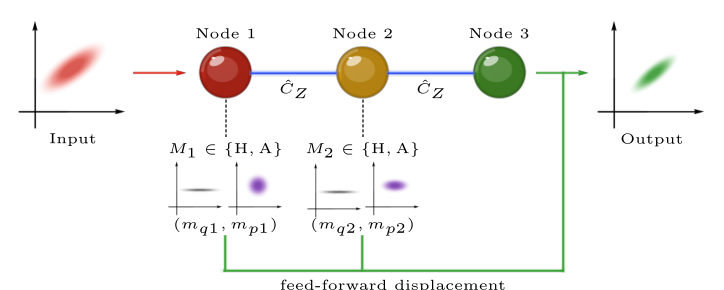 
FIG. 1. Three-mode continuous-variable cluster wire with configurable readout. The injected

📷 Fig 2

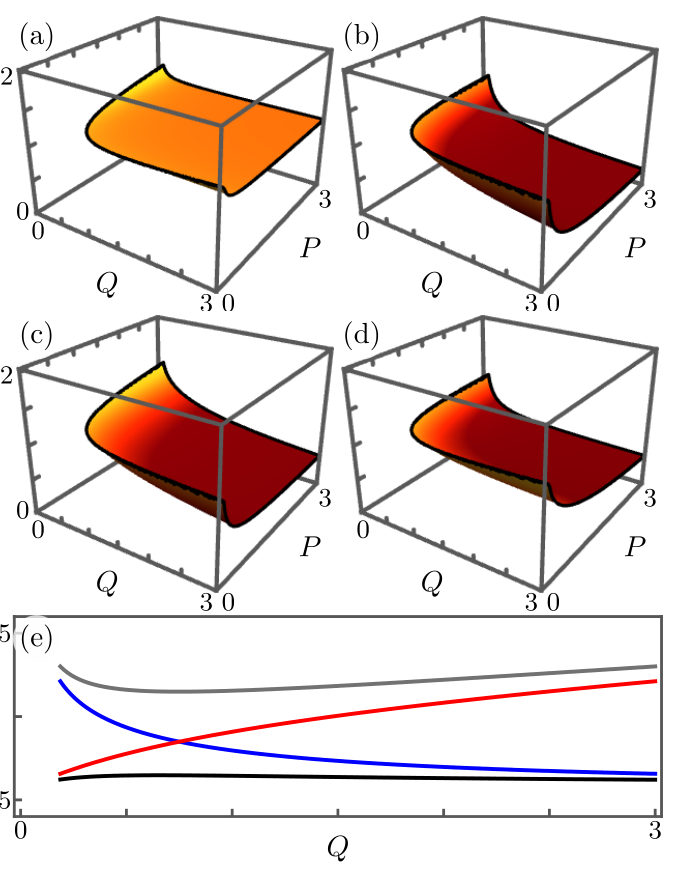 
FIG. 2. Output-to-input symplectic-area ratio ηR for readout patterns (a) HH, (b) AA, (c)

📷 Fig 3

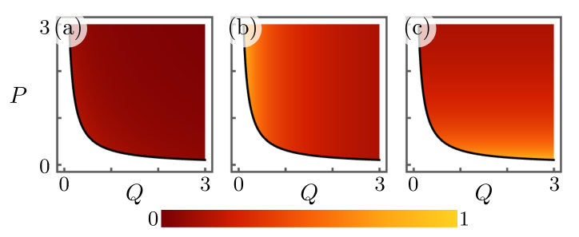 
FIG. 3. Gain determinant τR for readout patterns (a) AA, (b) AH, and (c) HA over the physical

📷 Fig 4

 
Figure 3 shows τR over the same physical domain and with the same parameters as Fig. 2.

**Summary.** This theoretical paper analyzes how different measurement readouts (Arthurs-Kelly vs. homodyne) affect Gaussian filtering in a continuous-variable cluster wire. It shows that finite AK measurements implement a conditional filter whose output properties depend on the input state, distinguishing it from simple additive noise channels. This provides a rigorous tool for understanding measurement-level control in quantum information processing.

**Why it may be interesting.** This work provides a detailed, quantitative understanding of how measurement choices (readout patterns) fundamentally alter the quantum information processing capabilities of continuous-variable quantum systems, which is crucial for quantum networking and measurement-based quantum computation.

Detailed structure

**Main problem.** The paper characterizes the Gaussian filtering implemented by a continuous-variable cluster wire when using Arthurs-Kelly (AK) readout, contrasting it with standard homodyne readout.

**Main result.** Finite AK readout generates a pattern-resolved, conditional Gaussian filter whose gain and residual covariance depend on the input state, unlike the input-independent additive channel from homodyne measurements.

**Method.** The analysis uses the covariance-matrix formalism and the Schur complement to derive the conditional output covariance for various readout patterns (HH, AH, HA, AA).

**Model / system.** The system is a three-node line graph representing a continuous-variable cluster wire, analyzed using Gaussian state descriptions and controlled-phase network calculations.

**Key observables.** Output-to-input symplectic-area ratio ($\eta_R$) and the gain determinant ($	au_R$).

**Important parameters / regimes.** Readout patterns (HH, AH, HA, AA); finite readout variances ($
u_q, 
u_p$); input covariance entries ($Q, P, C$).

**Assumptions / limitations.** The analysis assumes calibrated, uncorrelated AK readout and focuses on the reduced finite-nullifier description for finitely squeezed wires.

**Figures summary.** Figure 2 shows $\eta_R$ for the four patterns over the physical input-covariance region, while Figure 3 shows the gain determinant $	au_R$ for the three finite-AK patterns, demonstrating area contraction.

**Paper structure.** The paper establishes the mathematical framework for the readout patterns, derives the conditional Gaussian filtering rules via the Schur complement, and then compares the resulting filtering properties ($\eta_R$ and $	au_R$) of the finite-AK patterns against the homodyne reference.

Abstract

Measurement readout programs the Gaussian operation implemented by a continuous-variable cluster wire. For the standard three-node wire, momentum homodyne readout gives an additive parity channel with finite-squeezing noise. We classify the pattern-resolved input--output covariance transformations generated by calibrated uncorrelated Arthurs--Kelly readout on one or both consumed nodes. Any finite Arthurs--Kelly position record produces a conditional Gaussian filter whose gain and residual covariance depend on the input covariance entries, rather than an input-independent additive Gaussian channel. Writing $\mathrm{A}$ for Arthurs--Kelly readout and $\mathrm{H}$ for homodyne readout, the readout pattern selects the filtered sector, with $\mathrm{AH}$ selecting position, $\mathrm{HA}$ selecting momentum, and $\mathrm{AA}$ retaining both. The hierarchy $0 < τ_{\mathrm{AA}} < \min \left\{ τ_{\mathrm{AH}}, τ_{\mathrm{HA}} \right\} < 1 = τ_{\mathrm{HH}}$ shows that finite Arthurs--Kelly position records contract the gain-transferred covariance area. Our results identify calibrated uncorrelated Arthurs--Kelly readout as a measurement-level method for covariance-sensitive Gaussian filtering inside a fixed cluster graph.

[↑ back to top](#top)

### [Quantum observables as Fréchet sensitivity kernels](http://arxiv.org/abs/2608.23191v1)

**Authors:** Rafael Abreu  
**Type:** theory · **Category:** other · **PDF:** <https://arxiv.org/pdf/2608.23191v1>  
**Analysis basis:** full PDF text, analyzed in chunks
**Topic relevance:** 🔥 `quantum measurements` **4/5** · `Keldysh / 2PI / non-Gaussian methods` **2/5**

📷 Fig 1

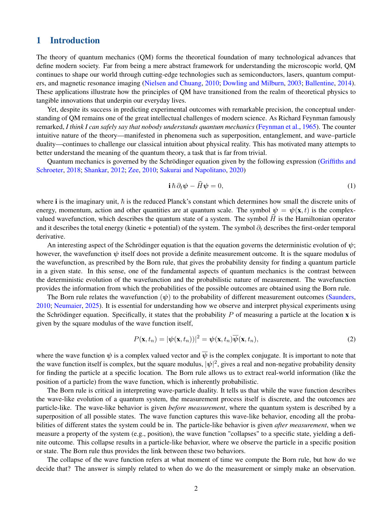 
Low-resolution page preview, page 2

📷 Fig 2

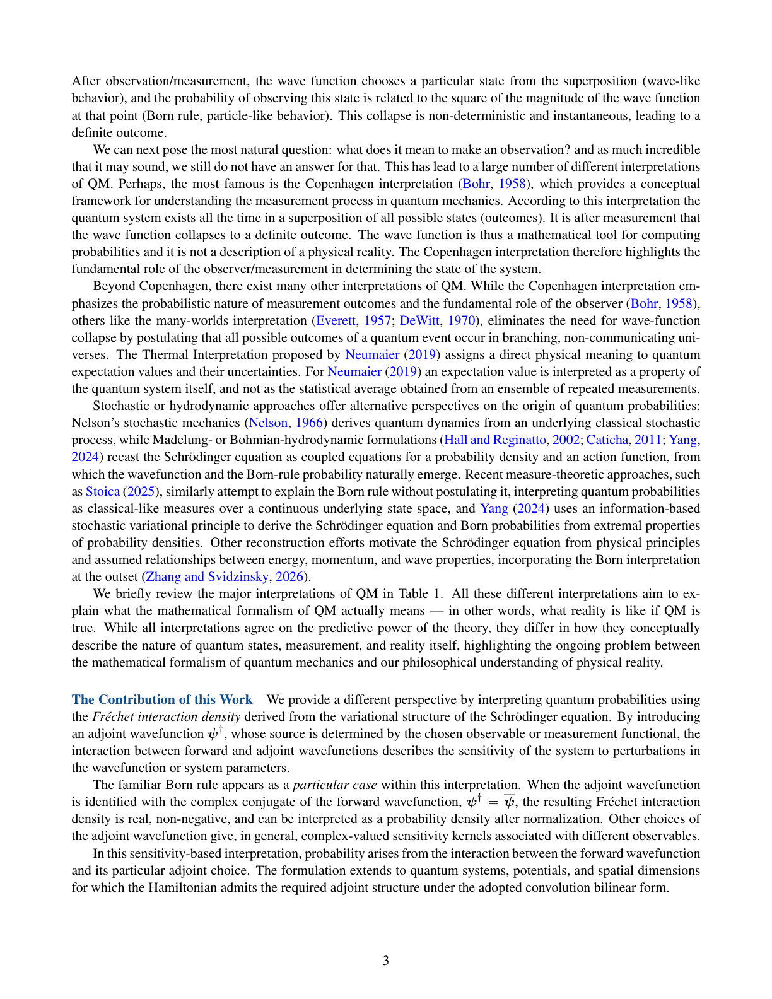 
Low-resolution page preview, page 3

📷 Fig 3

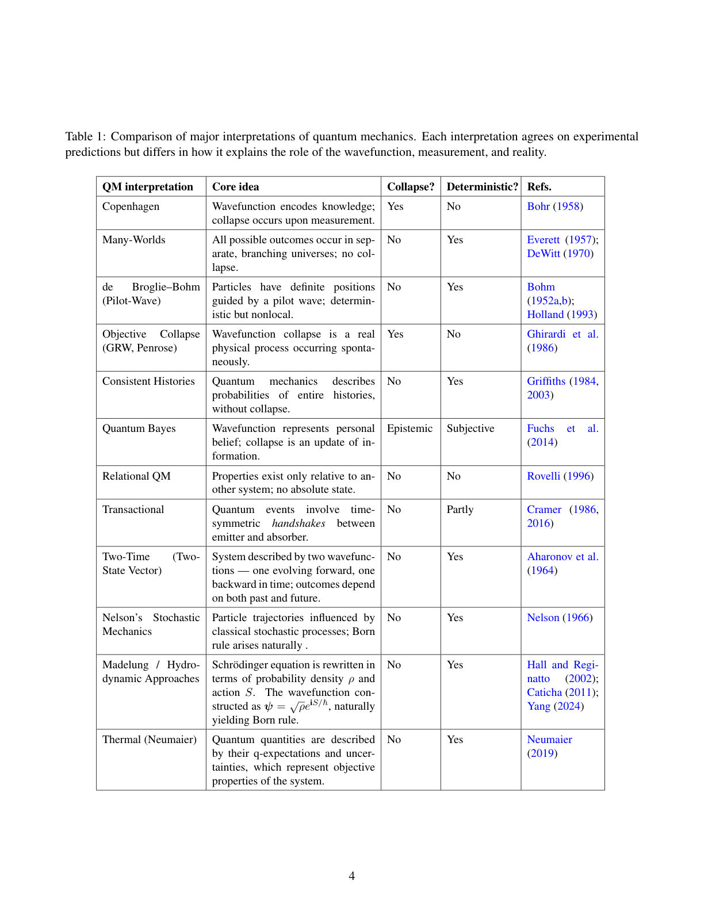 
Low-resolution page preview, page 4

📷 Fig 4

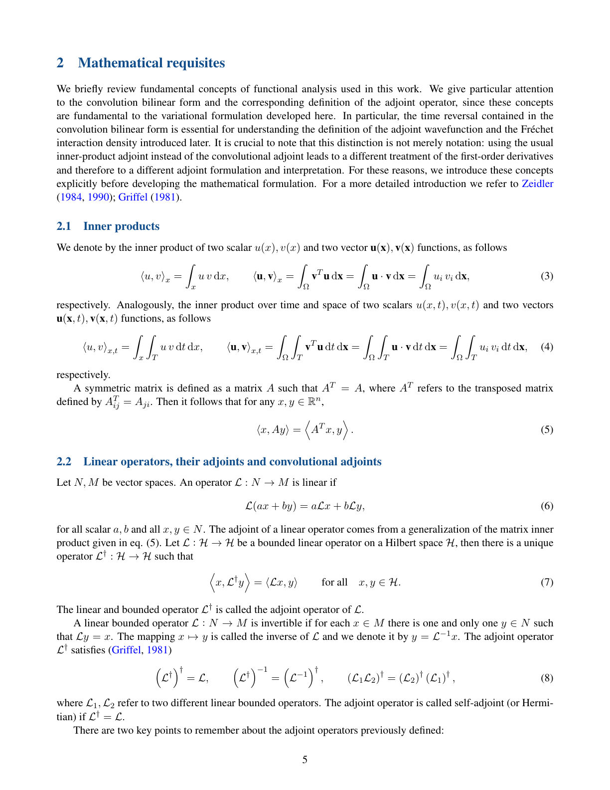 
Low-resolution page preview, page 5

📷 Fig 5

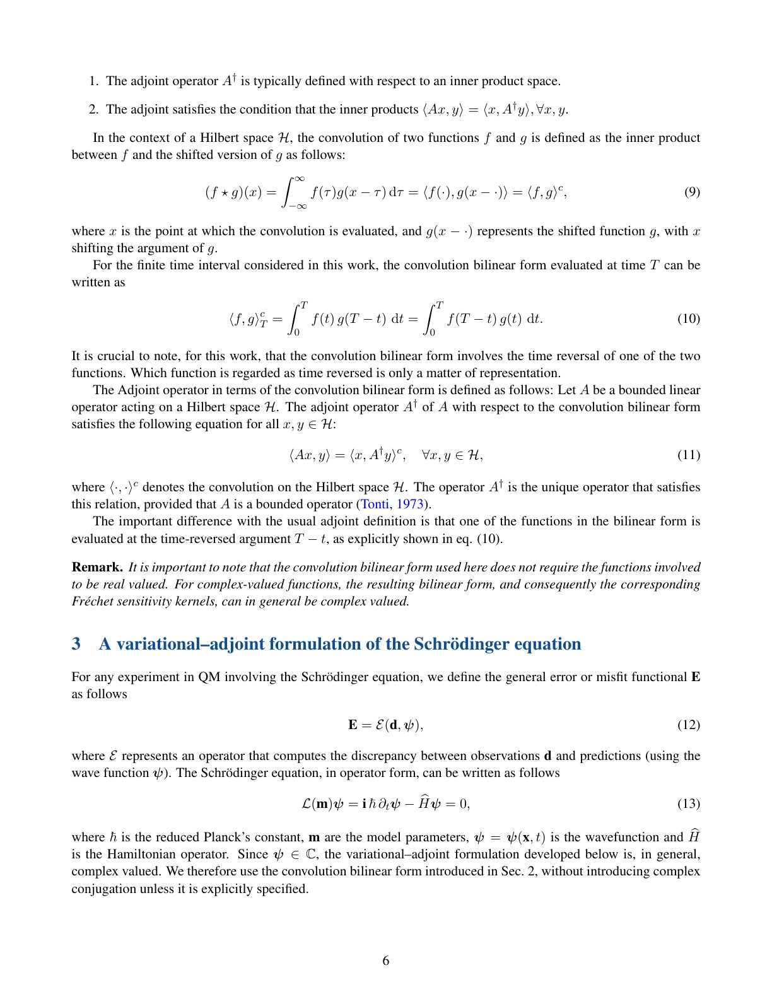 
Low-resolution page preview, page 6

**Summary.** This paper proposes a variational-adjoint interpretation of quantum mechanics where the interaction between forward and adjoint wavefunctions defines a general 'Fréchet sensitivity kernel.' It demonstrates that the standard Born probability rule emerges as a specific, positive-definite instance within this broader class of sensitivity measures. This offers a mathematically rigorous framework connecting quantum observables to sensitivity analysis, with implications for quantum control.

**Why it may be interesting.** This work provides a novel mathematical lens—sensitivity analysis—to re-examine the measurement problem in QM, potentially unifying different interpretations under a single mathematical structure.

Detailed structure

**Main problem.** The paper addresses the conceptual meaning of quantum mechanics by providing a variational-adjoint interpretation to reconcile the deterministic evolution of the wavefunction with the probabilistic nature of measurement outcomes.

**Main result.** It shows that the familiar Born probability density is a special, positive-definite case of a general 'Fréchet interaction density' derived from the interaction between forward and adjoint wavefunctions.

**Method.** The core method is the variational-adjoint formulation applied to the Schrödinger equation, utilizing concepts from functional analysis and sensitivity analysis.

**Model / system.** The system is general quantum mechanics, governed by the Schrödinger equation. The mathematical framework involves defining an adjoint wavefunction ($\psi^\dagger$) associated with a chosen observable or measurement functional.

**Key observables.** Fréchet interaction density, Born probability density, momentum, energy, and spin sensitivity kernels.

**Important parameters / regimes.** The Hamiltonian ($H$), time ($t$), and the choice of observable defining the adjoint wavefunction.

**Assumptions / limitations.** The interpretation assumes the validity of a variational structure that allows the definition of an adjoint field ($\psi^\dagger$) to quantify measurement sensitivity.

**Figures summary.** No specific figures were described, but the notes mention a comparison table (Table 1) summarizing major interpretations of QM.

**Paper structure.** The paper develops the variational-adjoint formalism, derives the general Fréchet sensitivity kernels, demonstrates that the Born rule is a special case, and discusses connections to time-symmetric QM and quantum control.

Abstract

We present a variational--adjoint interpretation of quantum mechanics in which the interaction between forward and adjoint wavefunctions defines a general sensitivity kernel of the system. This Fréchet interaction density quantifies how perturbations in the wavefunction (or system parameters) influence a chosen observable. The familiar Born probability density appears as a special case when the adjoint wavefunction is chosen as the complex conjugate of the forward wavefunction, for which the interaction density becomes real and non-negative. Within this framework, probability is a particular positive-definite form of sensitivity described by the Fréchet interaction density.   In general, the variational--adjoint interpretation also produces Fréchet sensitivity kernels associated with other quantum observables, including momentum, energy, and spin. This suggests that the Born probability density belongs to a broader class of Fréchet sensitivity kernels associated with quantum observables. The proposed interpretation also provides a connection with time-symmetric interpretations of quantum mechanics and possible future applications in quantum control and quantum metrology.

[↑ back to top](#top)

### [How Far Can You Do Nothing On a Quantum Computer?](http://arxiv.org/abs/2608.21904v1)

**Authors:** Nitay Mayo, Tal Mor, Aryeh Lev Zabokritskiy  
**Type:** experiment · **Category:** quantum information and computing · **PDF:** <https://arxiv.org/pdf/2608.21904v1>  
**Analysis basis:** full PDF text, analyzed in chunks
**Topic relevance:** 🔥 `QC/QI experiment` **4/5** · `quantum measurements` **1/5**

📷 Fig 1

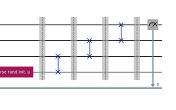 
Figure 1: The do-nothing protocol

📷 Fig 2

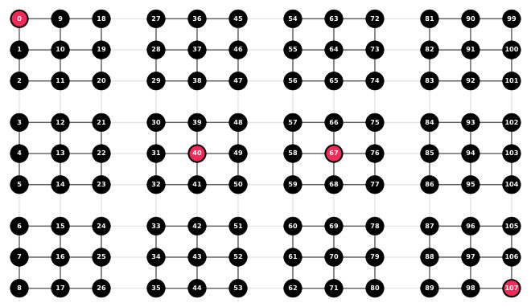 
Figure 2: Cepheus-1-108Q connectivity map. The chosen initial qubit set is colored red. In this graph, each node represents a qubit, and each edge is a coupler, intra-chiplet (dark grey) or IMC (light grey).

📷 Fig 3

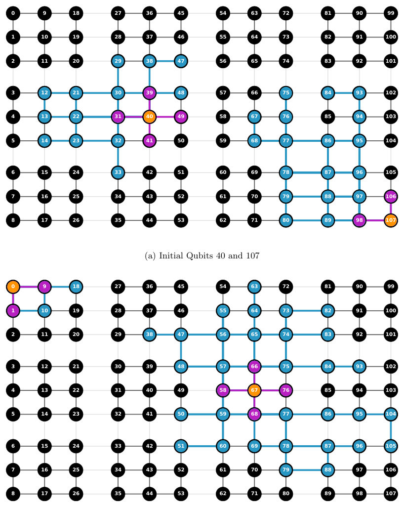 
Figure 3: Overlay of successful paths on the Cepheus grid from qubits {40, 107} (a) and {67, 0} (b). The initial qubits are highlighted in orange. Light blue nodes and edges indicate they are contained within at least one successful path from the initial qubit to a target qubit. The magenta nodes represent the Maximal Isotropic Sub-star

📷 Fig 4

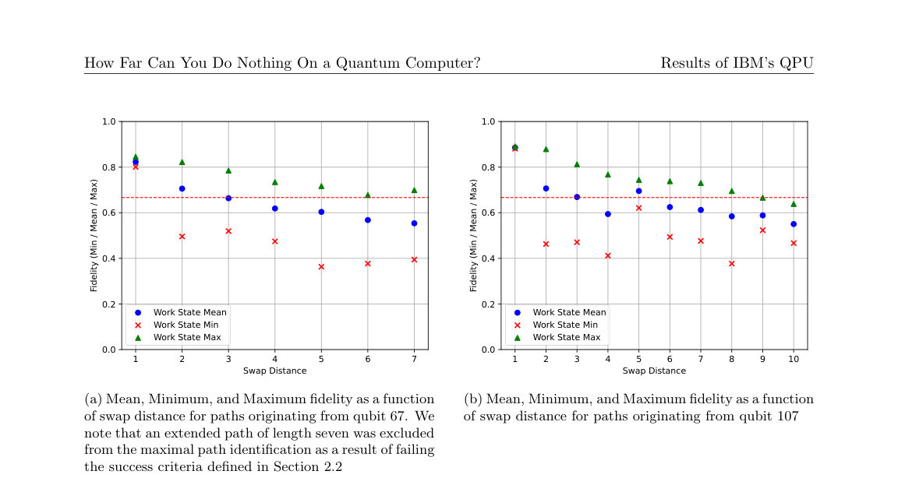 
Figure 4: Work state fidelity as a function of swap distance for the do-nothing protocol originating from initial qubits 67 (left) and 107 (right). The plots show the mean fidelity (blue) across all shortest topological paths that survived the staged execution and their corresponding maximum (green) and minimum (red) fidelity values. The classical limit is emphasized as a red dashed line

📷 Fig 5

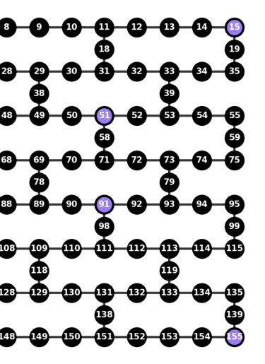 
Figure 5: IBM’s Fez Heron r2 connectivity map. The chosen initial qubit set is colored purple

**Summary.** This work uses the deceptively simple 'do-nothing' state-transfer task to rigorously probe the physical connectivity and noise profile of quantum computers. By measuring both uniform reliability and best-case path lengths, the authors distinguish between how robust a processor is everywhere versus how far it can achieve a perfect path. This provides critical, hardware-specific metrics for assessing quantum hardware quality.

**Why it may be interesting.** It provides an empirical, hardware-specific diagnostic tool to quantify the spatial noise landscape of quantum processors, which is crucial for designing fault-tolerant quantum circuits that require long-range state transfer.

Detailed structure

**Main problem.** The paper assesses the spatial limitations of quantum processors by determining how far a quantum state can be reliably transferred across physical qubits using a minimal 'do-nothing' protocol.

**Main result.** The study reveals a sharp distinction between uniform spatial reliability (isotropic radius) and best-case performance (longest successful route), with different quantum processors exhibiting vastly different noise profiles.

**Method.** A route-resolved comparative assessment is performed using the 'do-nothing' state-transfer protocol, which involves routing a prepared quantum state across physical qubits via SWAP gates and measuring final state fidelity.

**Model / system.** The experiments are conducted on commercial Quantum Processing Units (QPUs), specifically Rigetti’s Cepheus-1-108Q and IBM Heron-r2 processors, treating the physical qubit connectivity as the system under test.

**Key observables.** State fidelity, isotropic radius (uniform reliability), and maximum successful swap distance (best-route performance).

**Important parameters / regimes.** The success criterion is defined by maintaining a fidelity above the classical limit (e.g., F > 2/3).

**Assumptions / limitations.** The reported quantities are empirical and conditional on the specific route families, finite-shot decision rules, and execution time, not universal constants.

**Figures summary.** Figures illustrate the do-nothing protocol implementation and map the connectivity and successful routing areas on the QPU architectures.

**Paper structure.** The paper introduces the 'do-nothing' protocol as a spatial probe, details the methodology for calculating isotropic radius and maximal path length, and presents comparative results for different QPU hardware platforms.

Abstract

We present a route-resolved comparative assessment of Rigetti's Cepheus-1-108Q and IBM Heron-r2 processors using the established 'do-nothing' state-transfer protocol. Rather than proposing a new protocol, we use this deterministic, low-complexity task as a high-resolution spatial probe. For each evaluated initial qubit, we report two complementary quantities: the largest tested radius within which every evaluated shortest route satisfies the operational success rule, and the longest successful route identified within the evaluated route family. To achieve this, we address a deceptively simple yet foundational question: ``How far can you do-nothing on a quantum computer?'' Operationally, this do-nothing protocol serves as a fundamental state transfer protocol: we prepare an initial quantum state, route it across the physical qubits using SWAP gates, and measure the final state fidelity against the well-established classical fidelity limit for single-qubit state transfer. While this trivial state-transfer protocol serves as the most intuitive baseline, actively preserving a quantum state across a physical lattice proves to be a non-trivial task that exposes the information to cumulative relaxation, dephasing, and environmental cross-talk. In the highlighted IBM QPU case, we identify an isotropic radius of 10 and a successful path of swap distance 27, whereas the highlighted Rigetti Cepheus case exhibits an isotropic radius of 1 but selected above-threshold routes reaching swap distance 8. These results reveal a sharp distinction between uniform spatial reliability and best-route performance. The presented quantities are empirical and conditional on the evaluated route families, finite-shot decision rule, calibration state, and execution time; they are not architecture-wide constants.

[↑ back to top](#top)

### [Anomalous dynamical energy flows via nonlinear phononics in spin-Peierls chains](http://arxiv.org/abs/2608.22517v1)

**Authors:** Jakob Dolgner, Dirk Manske, James K. Freericks, Mohsen Yarmohammadi  
**Type:** theory · **Category:** strongly correlated electrons · **PDF:** <https://arxiv.org/pdf/2608.22517v1>  
**Analysis basis:** full PDF text, analyzed in chunks
**Topic relevance:** `correlated / nonlocal dissipation` **3/5** · `driven-dissipative phase transition` **3/5** · `interference shaping light` **3/5** · `methods for driven-dissipative` **3/5** · `non-equilibrium universality` **3/5** · `quantum measurements` **3/5** · `Keldysh / 2PI / non-Gaussian methods` **2/5** · `analog quantum simulation` **2/5** · `scars & prethermalization` **2/5** · `Frenkel-Kontorova` **1/5**

📷 Fig 1

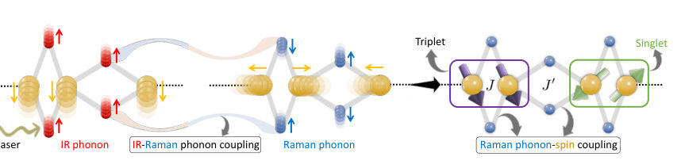 
FIG. 1. Schematic of the THz laser-driven 1D spin-Peierls system. The multi-stage dynamical process is initiated by a continuous-wave (CW) THz laser that resonantly drives a macroscopic, polar IR-active phonon mode (left). Through a symmetry-allowed nonlinear cubic anharmonicity, energy is subsequently transferred from the driven IR mode to a Raman- active A1g dimerization mode (middle). The resulting coherent Raman distortion dynamically modulates the distances between adjacent magnetic ions along the chain (right). This Raman phonon-spin coupling continuously renormalizes the intradimer (J) and interdimer (J′) exchange interactions, thereby driving the system out of its non-magnetic...

📷 Fig 2

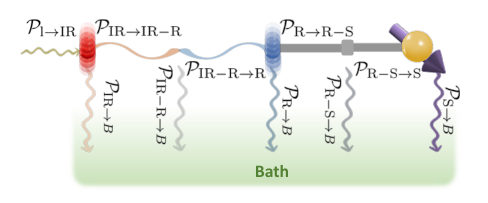 
FIG. 2. Schematic of cascaded energy flows and dissipa- tive channels. Energy injected into the driven IR-active mode (Pl→IR) cascades sequentially through the cubic anhar- monic interaction potential (PIR→IR−R and PIR−R→R) into the Raman-active dimerization mode. The coherent Raman lattice displacement subsequently transfers power into the spin-phonon interaction potential (PR→R−S) and into the spin subsystem (PR−S→S) to generate triplon excitations. At each stage of the cascade, energy is continuously dissipated into the thermal environment via non-unitary Lindblad channels (Pa→B for subsystem a ∈{IR, IR-R, R, R-S, S}).

📷 Fig 3

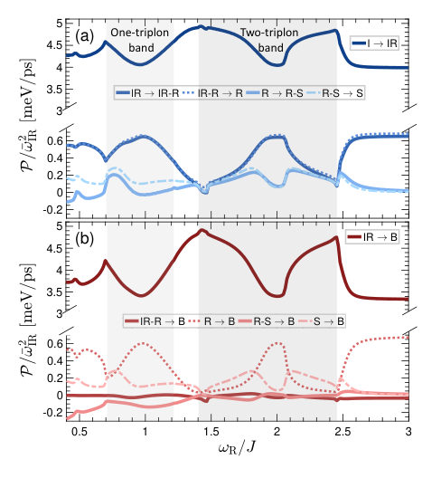 
FIG. 4. Spectral profile of the nonequilibrium energy flows in the driven spin-Peierls chain as a function of the Raman tuning ωR/J. (a, top) Total input power injected by the CW THz laser into the primary IR-active mode. (a, bottom) Co- herent power transfer through the cascaded subsystems (IR →anharmonic coupling →Raman →SPC →bare spins). (b) Corresponding dissipation rates into the thermal bath, highlighting the non-positive-definite nature of the decay as- sociated with the intermediate interaction potentials. The ex- ternal drive is a CW field E(t) = E0 sin(Ωdt) with resonance strictly maintained at ωR = 2ωIR = 2Ωd. Shaded regions indicate the extent of the one- and bitriplon...

📷 Fig 4

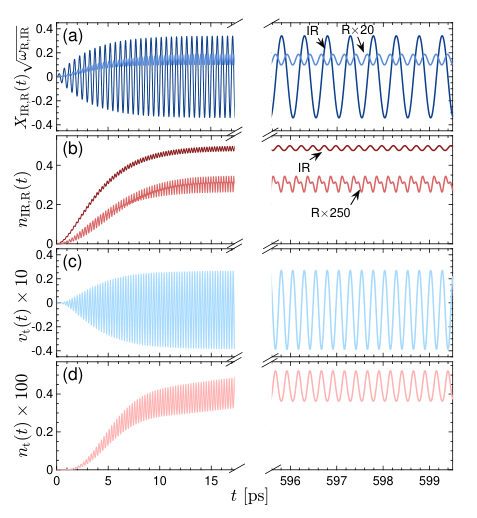 
FIG. 3. Temporal evolution of the driven observables from the initial turn-on of the CW THz field (t = 0, left panels) to the NESS (right panels). From top to bottom: (a) nor- malized canonical phonon displacements XIR,R(t)√ωR,IR, (b) phonon populations nIR,R(t), (c) average triplon pair correla- tions vt(t) = P

📷 Fig 5

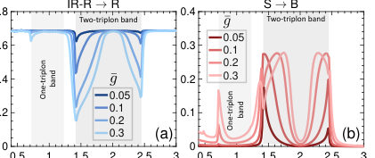 
FIG. 5. Steady-state average power transfer (a) from the anharmonic phonon interaction into the Raman mode (PIR−R→R) and (b) from the spin sector into the thermal bath (PS→B) versus Raman frequency tuning ωR/J. Re- sults are compared across the weak- to strong-coupling tran- sition for three SPC strengths (¯g = 0.1, 0.2, and 0.3). In all cases, ¯g′ = −¯g, ¯κ = −0.1, J′ = J/2, ωR = 2ωIR = 2Ωd, γIR/R = 0.05 ωIR/R, γs = 0.01 J, and E = 0.05 ω3/2 IR .

**Summary.** This theoretical study analyzes how energy flows anomalously in spin-Peierls chains by coupling lattice vibrations (phonons) to magnetic excitations. By comparing continuous versus pulsed laser driving, the authors show that the energy transfer mechanism is dictated by dynamic impedance matching, not just the material's inherent energy spectrum. This establishes crucial limits for controlling magnetic states using light fields without destroying the underlying quantum coherence.

**Why it may be interesting.** The work provides a detailed, non-equilibrium quantum description of energy coupling in magnetic insulators, which is highly relevant for understanding quantum control in strongly correlated materials using light fields.

Detailed structure

**Main problem.** The paper investigates anomalous energy flows and energy cascades in spin-Peierls chains, specifically focusing on how nonlinear phononics mediate energy transfer between the lattice and magnetic sectors.

**Main result.** Energy transfer is governed by a dynamical impedance-matching condition rather than the unperturbed density of states. Furthermore, pulsed driving preserves quantum interference features, while continuous driving leads to back-action and feature smearing.

**Method.** The analysis employs the bond-operator formalism combined with a second-order cumulant expansion of the Lindblad master equation to model non-equilibrium dynamics.

**Model / system.** The system is a strongly dimerized spin-Peierls chain, modeled with coupled phonon modes (IR and Raman) and a spin Hamiltonian described by bond operators. The total dynamics are governed by a complex Hamiltonian incorporating nonlinear phononic coupling.

**Key observables.** Energy transfer rates ($P_{l 	o IR}$, $P_{IR 	o S}$), phonon damping/power broadening, and sharp Fano-like quantum interference features.

**Important parameters / regimes.** The comparison between Continuous-Wave (CW) vs. pulsed THz driving regimes, and the condition for impedance matching.

**Assumptions / limitations.** Key approximations include the strong-dimerization limit ($J \gg J'$) and treating optical phonons as dispersionless Einstein modes.

**Figures summary.** Figure 1 schematically illustrates the multi-stage energy transfer process: THz laser $	o$ IR phonon $	o$ Raman phonon $	o$ Magnetic modulation $	o$ Triplet generation.

**Paper structure.** The paper builds the model by defining the coupled Hamiltonian, deriving the equations of motion via the Lindblad master equation, calculating sequential energy flow rates using commutators, and finally contrasting the dynamics under CW versus pulsed driving.

Abstract

We investigate the nonequilibrium spin-phonon dynamics and energy cascades in a strongly dimerized spin-Peierls chain using a multi-tiered nonlinear phononics architecture. To bypass linear selection rules prohibiting the direct excitation of the Raman-active dimerization mode, a terahertz laser drives an infrared mode that nonlinearly couples to the Raman lattice displacement, subsequently modulating the magnetic exchange. Employing a bond-operator formalism with a second-order cumulant expansion of the Lindblad master equation, we show that maximum energy transfer into the magnetic sector is governed by a dynamical impedance-matching condition rather than the unperturbed triplon density of states. We find that the sustained energy input of continuous-wave driving builds high excitation densities that severely back-act on the lattice, overdamping the primary phonon and smearing magnetic features via power broadening. Conversely, the small time-integrated energy of a pulse keeps the response perturbative, terminating before back-action accumulates and preserving sharp Fano-like quantum interferences. These insights establish limits for controlling dynamic magnetic states without quenching the driving lattice modes.

[↑ back to top](#top)

### [Emulating non-Markovian system-bath dynamics with parametrically driven cavities](http://arxiv.org/abs/2608.21569v1)

**Authors:** Valentin Boettcher, Félix Pellerin, Philippe St-Jean, William A. Coish  
**Type:** both · **Category:** other · **PDF:** <https://arxiv.org/pdf/2608.21569v1>  
**Analysis basis:** full PDF text, analyzed in chunks
**Topic relevance:** `analog quantum simulation` **3/5** · `correlated / nonlocal dissipation` **3/5** · `driven-dissipative phase transition` **3/5** · `methods for driven-dissipative` **3/5** · `quantum optics experiment` **3/5** · `Keldysh / 2PI / non-Gaussian methods` **2/5** · `non-equilibrium universality` **2/5** · `Tavis-Cummings & cavity-many-emitter` **1/5** · `interference shaping light` **1/5** · `quantum measurements` **1/5**

📷 Fig 1

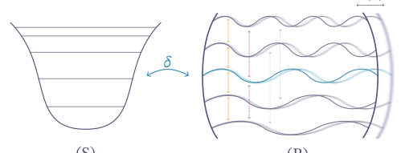 
FIG. 1. A system (S)—here, an anharmonic oscillator—coupled with coupling strength 𝛿to a single mode of a parametrically mod- ulated cavity that serves as a bath (B). Periodic parametric modula- tion with amplitude 𝑣(𝜏) = 𝑣(𝜏+ 𝑇) couples the cavity modes.

📷 Fig 2

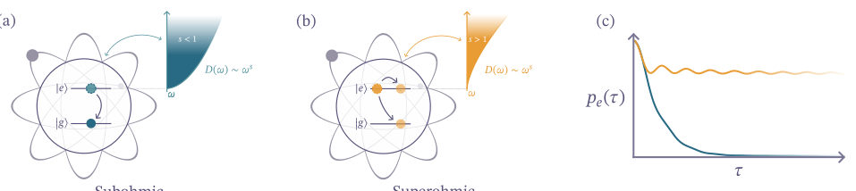 
FIG. 2. A two-level atom coupled to a bath having a spectral density 𝐽(𝜔) ∝𝜔𝑠that is either (a) subohmic (𝑠&lt; 1), or (b) superohmic (𝑠&gt; 1). (c) probability 𝑝𝑒(𝜏) for the atom to be found the excited state |𝑒⟩at time 𝜏. The atom completely decays into the ground state |||𝑔⟩ when coupled to a subohmic bath, whereas the atom only decays partially for a bath with a superohmic spectral density.

📷 Fig 3

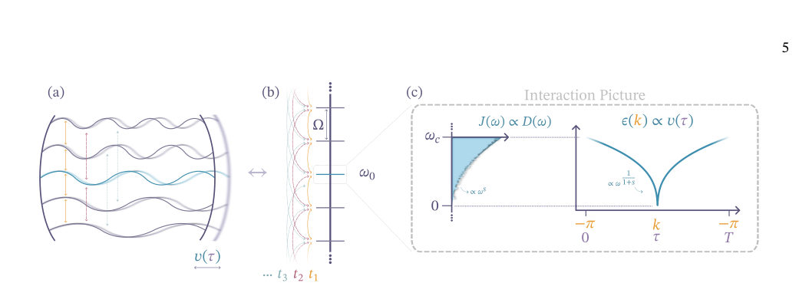 
FIG. 3. (a) A cavity modulated by a parametric drive 𝑣(𝜏) featuring evenly spaced frequency modes centered around 𝜔0 with spacing Ω. (b) The drive realizes a hopping model with long-range hopping amplitudes 𝑡𝑙. (c) In the interaction picture, the bare modes become a quasi-continuum with a spectral density 𝐽(𝜔) derived from a density of states 𝐷(𝜔), here chosen to have a low-frequency power-law form ∝𝜔𝑠with spectral exponent 𝑠and cutoff frequency 𝜔𝑐. The density of states arises from the dispersion relation 𝜀(𝑘) [0 ≤𝜀(𝑘) ≤𝜔𝑐, (−𝜋&lt; 𝑘≤𝜋)] for the long-range hopping model through Eq. (37). The dispersion relation is itself directly related to the drive amplitude 𝑣(𝜏) with period 𝑇[Eq. (35)].

📷 Fig 4

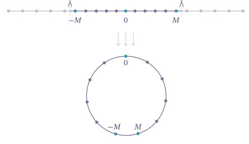 
FIG. 4. Top: schematic illustration of ‘sites’ (in a synthetic dimen- sion) describing cavity modes. We truncate the spectrum of cavity modes to a finite number (𝑁= 2𝑀+ 1). After truncating the set of modes, we assume periodic boundary conditions for convenience.

📷 Fig 5

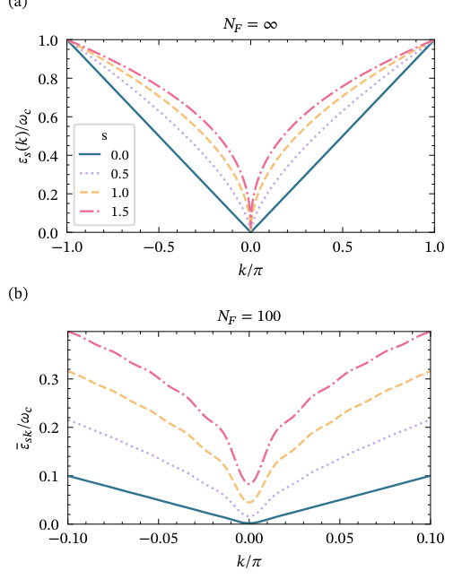 
FIG. 5. Bath dispersion for various spectral exponents 𝑠. (a) The ideal dispersion relation, Eq. (39), which can be realized in the limit of an infinite number of Fourier coefficients, 𝑁𝐹→∞. (b) Filtered dispersion [Eq. (41)] for 𝑁𝐹= 100, shown over a smaller range of 𝑘around 𝑘≃0 to highlight details.

**Summary.** This paper presents a method to engineer complex, non-Markovian quantum baths using the controlled modulation of a parametric optical cavity. By tuning the modulation waveform, the bath spectral density can be continuously controlled, allowing for the accurate simulation of phenomena like the spin-boson localization transition. This offers a modular platform for fundamental studies in open quantum systems.

**Why it may be interesting.** This work provides an experimentally accessible, highly tunable platform for engineering structured quantum environments, which is crucial for advancing quantum thermodynamics and open quantum system research.

Detailed structure

**Main problem.** The paper addresses the challenge of accurately simulating non-Markovian quantum system-bath dynamics, which standard Markovian approximations fail to capture.

**Main result.** They demonstrate a novel, highly tunable platform using parametrically driven cavities to emulate arbitrary non-Markovian bath spectral densities, specifically realizing the localization transition of the spin-boson model.

**Method.** The method involves engineering the bath spectral density $J(\omega)$ by controlling the real-time modulation waveform of a cavity, which is modeled as a synthetic long-range hopping system.

**Model / system.** The physical system is a quantum system coupled to a bath realized by the discrete electromagnetic modes of a parametrically driven optical cavity (fiber-loop). The underlying model is the spin-boson model, whose bath coupling is engineered via the cavity's modulation.

**Key observables.** The decay probability $p_e(	au)$ of a two-level system, and the bath correlation function $c(	au)$.

**Important parameters / regimes.** The spectral exponent $s$ governing the bath spectral density $J(\omega) \propto \omega^s$, which can be tuned continuously from sub-ohmic ($s<1$) to super-ohmic ($s>1$).

**Assumptions / limitations.** The exact realization requires the thermodynamic limit (infinite bath modes) and assumes the validity of approximations related to the nonstationary phase evolution.

**Figures summary.** Figure 1 illustrates the setup (System coupled to a modulated cavity bath), and Figure 2 shows the decay probability $p_e(	au)$ for different spectral regimes ($s<1$ vs $s>1$).

**Paper structure.** The paper introduces the scheme, details the Hamiltonian and the mechanism for tuning $J(\omega)$ via the cavity's synthetic dimension, demonstrates the emulation of the spin-boson localization transition, and concludes with theoretical bounds on systematic errors.

Abstract

We introduce and characterize a scheme for emulating non-Markovian quantum system-bath dynamics using the discrete electromagnetic field modes of a parametrically driven cavity. In this scheme, the character of a bosonic bath (the form of the bath spectral density) is tied directly to the shape of the real-time waveform describing periodic parametric cavity modulation. As an explicit example, we demonstrate the feasibility of this scheme for a fiber-loop experiment with currently achievable parameters, supported by numerical simulations and analytical estimates. In particular, we show that a localization transition of the spin-boson model can be accurately emulated in this fiber-loop cavity system. This localization effect is characterized by a sharp transition from partial decay to complete decay for a two-level system coupled to a bosonic bath as the bath spectral density $J(ω)\propto ω^{s}$ is continously tuned from the sub-ohmic ($s<1$) to the super-ohmic ($s>1$) regime. The transition is only exactly realized in the thermodynamic limit (for an infinite number of bath modes) and for sufficiently weak system-bath coupling. We highlight a competition between the weak-coupling and thermodynamic limits in this problem and show that challenges in approximately realizing the transition can nevertheless be overcome. Finally, we provide bounds on the systematic error introduced when emulating non-Markovian dynamics for arbitrary system observables. The scheme presented here can enable the realization of a modular platform for engineering custom non-Markovian baths, with potential applications in quantum thermodynamics, thermalization of many-body systems, and resource-efficient quantum simulations of open quantum systems.

[↑ back to top](#top)

### [Dissipation-induced Sachdev-Ye-Kitaev physics in many-body cavity quantum electrodynamics](http://arxiv.org/abs/2608.23557v1)

**Authors:** Pietro Pacchioni, Filippo Ferrari, Vincenzo Savona, Matteo Seclì  
**Type:** theory · **Category:** other · **PDF:** <https://arxiv.org/pdf/2608.23557v1>  
**Analysis basis:** full PDF text, analyzed in chunks
**Topic relevance:** `Tavis-Cummings & cavity-many-emitter` **3/5** · `analog quantum simulation` **3/5** · `driven-dissipative phase transition` **3/5** · `methods for driven-dissipative` **3/5** · `correlated / nonlocal dissipation` **2/5** · `non-equilibrium universality` **2/5** · `scars & prethermalization` **2/5** · `Keldysh / 2PI / non-Gaussian methods` **1/5** · `quantum measurements` **1/5** · `quantum optics experiment` **1/5**

📷 Fig 1

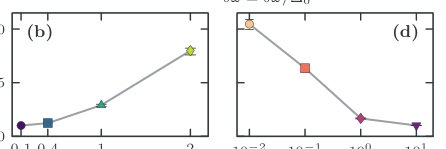 
Figure 1. Sketch of the systems and rank structure. (a) Single-mode optical cavity dissipating photons at rate κ cou- pled to a driven gas of ultracold fermions subject to atomic spontaneous emission at effective rate Γeff. The features of spontaneous emission are controlled by the Lamb-Dicke pa- rameter η. (c) Multi-mode optical cavity, where each cavity mode with profile gµ(r) dissipates at rate κ, coupled to a dissipationless driven quantum gas. The features of cavity dissipation are controlled by δ˜ω. Panels (b) and (d) show the participation ratio PR = (P

📷 Fig 2

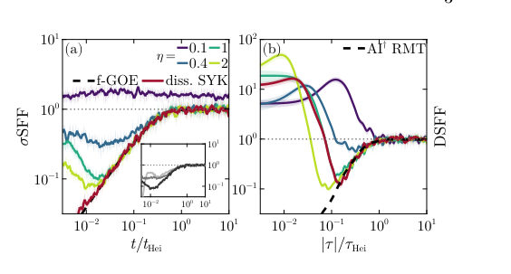 
Figure 2. Single-mode spontaneous-emission route to DQC for N = 10 and Q = 3. (a) Connected unfolded σSFF at various η (from dark blue to light green); the inset compares N = 6, 8, 10, Q = 3, 4, 3 (light to dark gray) at η = 2. (b) Connected, conformally unfolded DSFF at ϕ = π/4 [64], with τ = √

📷 Fig 3

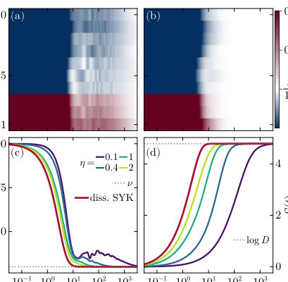 
Figure 3. Relaxation dynamics of the initial domain wall |1 · · · 1 0 · · · 0⟩for the parameters of Fig. 2. (a–b) Orbital oc- cupations at (a) η = 0.1 and (b) η = 2. (c) Occupation of the initially filled orbital j = 3 and (d) von Neumann entropy S of the density matrix ˆρ(t). Curves are averaged over 64 real- izations; the red curve is the dissipative SYK model. Dotted lines mark (c) ν = 3/10 and (d) S∞= log D.

📷 Fig 4

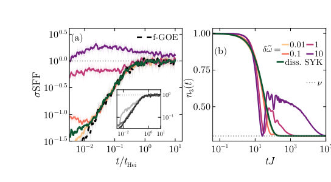 
Figure 4. Multimode cavity-loss route to DQC for N = 10 and Q = 3. (a) Connected unfolded σSFF at various δ˜ω (from light pink to dark purple), normalized by K∞= D and with time expressed in units of tHei, for δ˜ω = 0.01, 0.1, 1, 10. The inset compares N = 6, 8, 10, Q = 3, 4, 3 (light to dark gray) at δ˜ω = 0.01. (b) Occupation n3(t) of the initially filled orbital; the dotted line marks ν = 3/10. All parameters and conventions as in Fig. 2. Averages are taken over 64 disorder realizations (shading represents one standard deviation).

📷 Fig 5

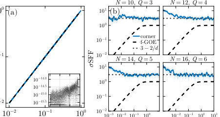 
Figure 5. Integrable corner at Γeff/J = 1 and κeff/J = 0.2. (a) Singular values of L at N = 10, Q = 3 vs the analytical prediction |λj −c| (blue), expected 45◦black-dashed line; the inset shows |σSVD j −|λj −c||. (b) Connected unfolded σSFF (N, Q) = (10, 3), (12, 4), (14, 5), (16, 6) (blue), with the ana- lytical f-GOE reference (dashed) and the predicted plateau 3 −2/D (dotted). Curves are averaged over 16, 16, 12, 8 real- izations respectively; shading denotes one standard deviation.

**Summary.** This paper demonstrates that cavity QED devices can realize dissipative Sachdev-Ye-Kitaev physics, a key model for quantum chaos. By analyzing both single-mode spontaneous emission and multi-mode cavity leakage, the authors show that dissipation drives the system into a universal non-Hermitian random matrix universality class. This offers a powerful experimental route to study the emergence of quantum chaos in open quantum systems.

**Why it may be interesting.** This work provides a concrete, controllable platform (cQED) to study fundamental concepts of quantum chaos and thermalization in open systems, bridging theoretical models like SYK with experimental quantum optics setups.

Detailed structure

**Main problem.** The paper investigates how dissipation can induce Sachdev-Ye-Kitaev (SYK) physics, a model for quantum chaos, in open many-body systems.

**Main result.** Both single-mode and multi-mode cavity loss mechanisms successfully realize universal open SYK physics, demonstrating that dissipation can generate quantum chaos even when starting from integrable Hamiltonians.

**Method.** The analysis relies on calculating spectral form factors (SFFs) and singular spectral form factors ($\sigma$SFFs) derived from the Liouvillian master equation to diagnose the transition to quantum chaos.

**Model / system.** The system is based on Cavity Quantum Electrodynamics (cQED) using ultracold fermionic atoms interacting with a cavity. The dynamics are governed by a Lindblad master equation incorporating cavity losses and atomic spontaneous emission.

**Key observables.** Dissipative Spectral Form Factors (DSFF), Singular Spectral Form Factors ($\sigma$SFF), and the crossover dynamics observed in single-atom-resolved densities ($n_j(t)$).

**Important parameters / regimes.** Lamb-Dicke parameter ($\eta$) for spontaneous emission, and the cavity-mode spacing parameter ($\delta	ilde{\omega}$) for multi-mode loss.

**Assumptions / limitations.** The analysis often requires unfolding the spectrum to compare results with universal Random Matrix Theory (RMT) predictions, and approximations like adiabatic elimination are used in the multi-mode case.

**Figures summary.** Figures illustrate the $\sigma$SFF and DSFF for both single-mode and multi-mode loss routes, showing convergence to RMT predictions, alongside plots of atomic density relaxation ($n_j(t)$) demonstrating the prethermal-to-thermalization crossover.

**Paper structure.** The paper develops the theory by first establishing the effective Hamiltonian and the master equation for both single-mode and multi-mode cQED. It then applies advanced RMT diagnostics ($\sigma$SFF, DSFF) to show the universal emergence of SYK physics, linking the control parameters ($\eta, \delta	ilde{\omega}$) to the degree of induced chaos.

Abstract

We show that cavity quantum electrodynamics (QED) devices can realize dissipative Sachdev-Ye-Kitaev (SYK) physics, a paradigmatic setting for quantum chaos in open many-body systems. Ultracold fermions with disordered, all-to-all cavity-mediated interactions provide two complementary routes: atomic spontaneous emission in a single-mode cavity and photon leakage from a multimode cavity. Strikingly, both converge to the same non-Hermitian random-matrix universality despite originating from integrable and chaotic closed-system limits, respectively. In the single-mode case, dissipation therefore creates quantum chaos from an integrable Hamiltonian. We trace this convergence to a tunable growth in dissipative rank, controlled, respectively, by the Lamb-Dicke parameter and the cavity-mode spacing. The resulting chaos leaves a dynamical fingerprint: a crossover from long-lived prethermal memory to rapid thermalization, visible in single-atom-resolved densities.

[↑ back to top](#top)

### [Time-Resolved Edge Flux on the SU(3) Triangle: A Cooperative-Decay Graph Framework with Exact Bateman Solutions](http://arxiv.org/abs/2608.22664v1)

**Authors:** Gombojav O Ariunbold, Vaidyanathan Sivaraman  
**Type:** theory · **Category:** other · **PDF:** <https://arxiv.org/pdf/2608.22664v1>  
**Analysis basis:** full PDF text, analyzed in chunks
**Topic relevance:** `Dicke superradiance` **3/5** · `correlated / nonlocal dissipation` **3/5** · `methods for driven-dissipative` **3/5** · `driven-dissipative phase transition` **2/5** · `free-space correlated emission` **2/5** · `non-equilibrium universality` **2/5** · `quantum measurements` **2/5** · `Keldysh / 2PI / non-Gaussian methods` **1/5** · `superradiant laser` **1/5**

📷 Fig 1

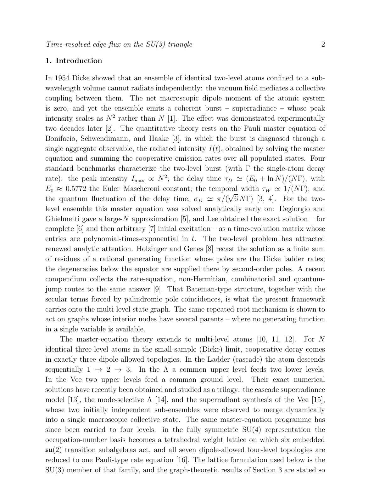 
Low-resolution page preview, page 2

📷 Fig 2

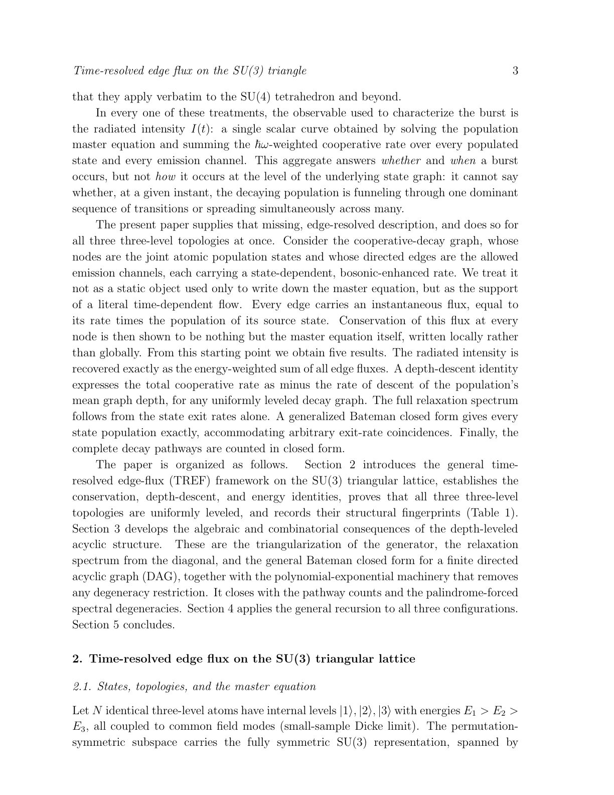 
Low-resolution page preview, page 3

📷 Fig 3

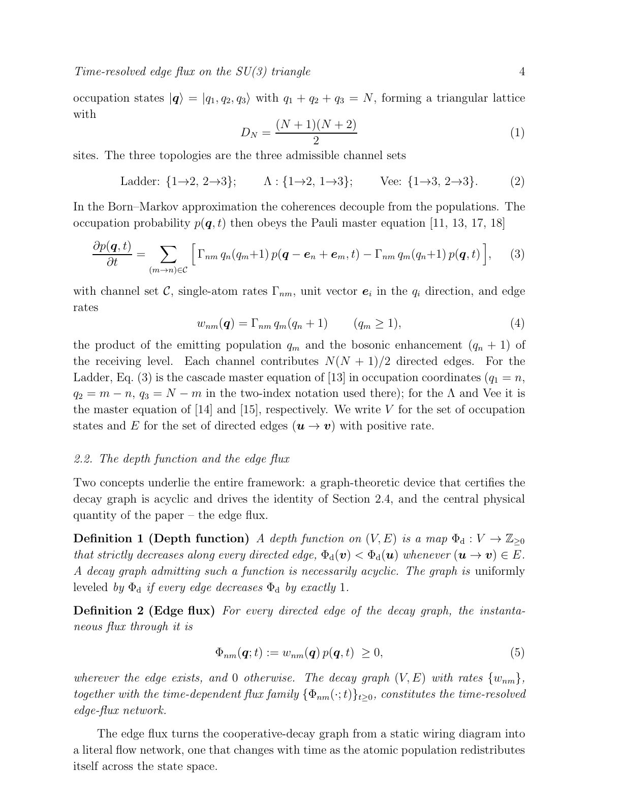 
Low-resolution page preview, page 4

📷 Fig 4

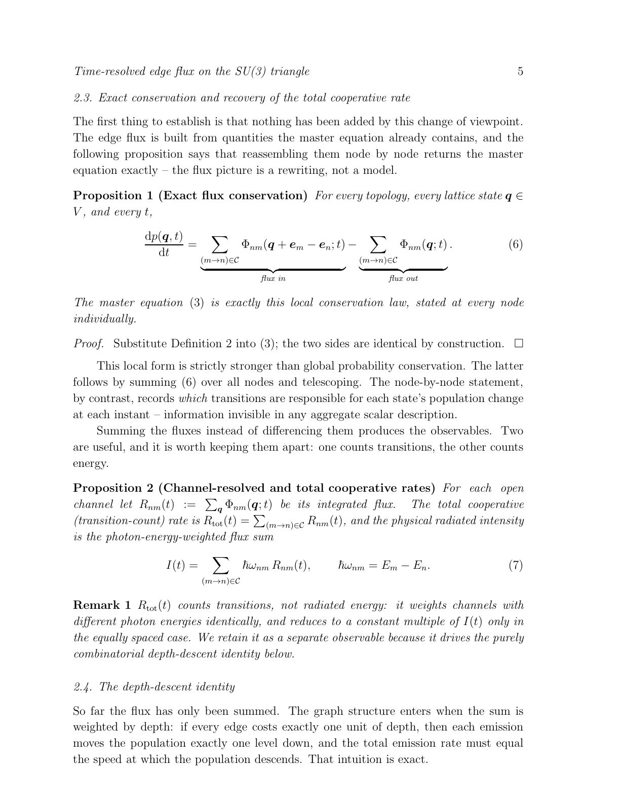 
Low-resolution page preview, page 5

📷 Fig 5

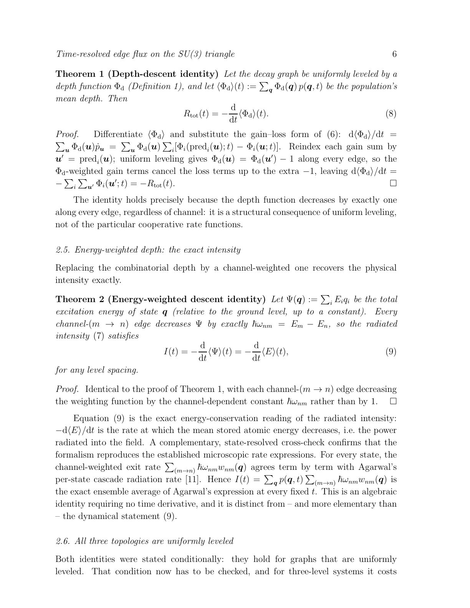 
Low-resolution page preview, page 6

**Summary.** This paper introduces a Time-Resolved Edge Flux (TREF) framework to analyze cooperative decay in quantum systems, moving beyond simple intensity measurements. By mapping the master equation onto a time-dependent flux network on an SU(3) graph, the authors derive exact identities relating total decay rates to graph depth descent. They provide a general, robust Bateman solution applicable to any finite DAG, even when decay rates coincide.

**Why it may be interesting.** This work provides a powerful, rigorous mathematical formalism for analyzing open quantum systems dynamics, offering an edge-resolved view of decay processes that is highly relevant to quantum optics and superradiance.

Detailed structure

**Main problem.** To develop an edge-resolved description of cooperative emission dynamics, moving beyond diagnostics based solely on the total radiated intensity.

**Main result.** The framework establishes that local flux conservation is mathematically equivalent to the Pauli master equation, yielding generalized Bateman closed-form solutions for state populations on arbitrary Directed Acyclic Graphs (DAGs).

**Method.** The authors introduce a Time-Resolved Edge Flux (TREF) framework, treating the decay graph as a time-dependent flow network, and utilize a depth function to triangularize the system generator.

**Model / system.** The system models cooperative emission from three-level ensembles, specifically utilizing the SU(3) triangle topology, governed by the Pauli master equation.

**Key observables.** Time-Resolved Edge Flux ($\Phi_{nm}(q; t)$), Total Cooperative Rate ($R_{	ext{tot}}(t)$), Radiated Intensity ($I(t)$), and state populations $P_u(t)$.

**Important parameters / regimes.** Transition rates ($w_{nm}(q)$), level spacings, and the graph depth function ($\Phi_d$).

**Assumptions / limitations.** The framework relies on the Born–Markov approximation and assumes the graph structure can be ordered by a depth function.

**Figures summary.** A table summarizes three dipole-allowed three-level topologies (Ladder, $\Lambda$, Vee) on the SU(3) lattice, detailing channels, depth, and absorbing sets.

**Paper structure.** The paper introduces the TREF framework on the SU(3) lattice, establishing flux conservation and depth-descent identities. It then develops the algebraic consequences, including spectral analysis and the general Bateman closed form for arbitrary DAGs.

Abstract

Cooperative emission from three-level ensembles is conventionally diagnosed through the radiated intensity alone, which cannot say which channels carry the photons at each instant. We promote every transition of the cooperative-decay graph into a time-dependent edge flux and show that node-wise conservation of this flux is an exact restatement of the Pauli master equation. Suppose the graph carries a depth function that decreases by one along every edge. Then the total cooperative rate is the descent speed of the mean graph depth, and its energy-weighted form gives the radiated intensity as $I(t)=-\dd\langle E\rangle/\dd t$ for arbitrary level spacings. The same ordering triangularizes the generator. This delivers the relaxation spectrum from the state exit rates, together with a generalized Bateman closed form for every population on an arbitrary finite directed acyclic graph, in which all exit-rate degeneracies are absorbed into a polynomial-times-exponential recursion.

[↑ back to top](#top)

### [Nonlocality is the missing design rule for topological photonics](http://arxiv.org/abs/2608.23360v1)

**Authors:** Fatemeh Davoodi  
**Type:** both · **Category:** other · **PDF:** <https://arxiv.org/pdf/2608.23360v1>  
**Analysis basis:** full PDF text, analyzed in chunks
**Topic relevance:** `analog quantum simulation` **3/5** · `correlated / nonlocal dissipation` **3/5** · `methods for driven-dissipative` **3/5** · `driven-dissipative phase transition` **2/5** · `quantum optics experiment` **2/5** · `Keldysh / 2PI / non-Gaussian methods` **1/5** · `interference shaping light` **1/5** · `non-equilibrium universality` **1/5** · `quantum measurements` **1/5**

📷 Fig 1

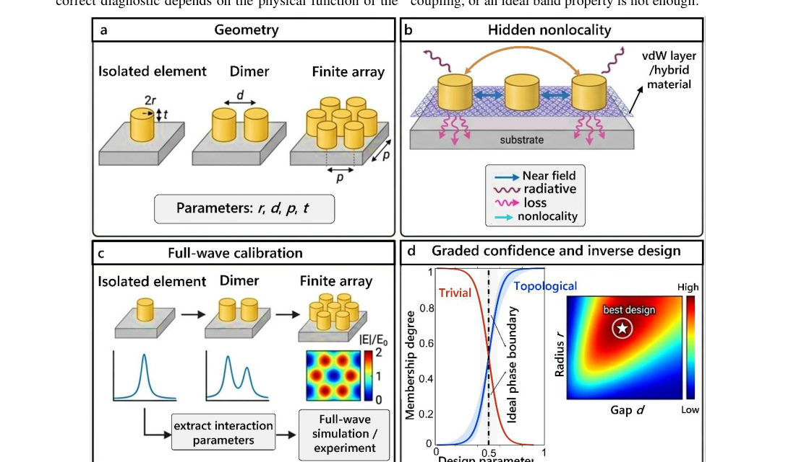 
Figure 1 | From geometric topology to calibrated nonlocal photonic design. a, A photonic structure is first specified through geometrical variables, including resonator radius r, gap d, lattice period p and thickness t. b, In realistic nanophotonic or hybrid-material platforms, the effective interaction network is not limited to nearest-neighbor coupling. Near-field coupling, radiative coupling, material-mediated response and loss introduce hidden nonlocal channels. c, Full- wave simulation or experiment can calibrate this interaction network by comparing isolated elements, dimers and finite arrays through spectra and field distributions. d, The calibrated model replaces a sharp binary...

**Summary.** This paper argues that nonlocality, usually ignored in topological photonics models, is a critical design parameter. It proposes a new, rigorous methodology that uses full-wave simulations and machine learning to calibrate device behavior by explicitly modeling long-range electromagnetic coupling. This allows researchers to reliably predict device performance and understand the limits of simple topological rules in real nanophotonic structures.

**Why it may be interesting.** It provides a rigorous framework for connecting abstract topological concepts to the messy reality of engineered quantum optical devices, which is crucial for advancing quantum light sources and integrated quantum circuits.

Detailed structure

**Main problem.** Topological photonics models often assume local interactions, but real-world devices exhibit significant long-range electromagnetic coupling, invalidating simple topological predictions.

**Main result.** Nonlocality must be treated as an explicit design parameter, requiring a shift from ideal phase labels to calibrated interaction models that account for full electromagnetic coupling.

**Method.** The authors propose a calibrated workflow combining full-wave simulations, experimental data, and physics-informed machine learning to map geometric design variables to effective electromagnetic interaction networks.

**Model / system.** The physical system involves nanophotonic and plasmonic devices (waveguides, metasurfaces) whose behavior is governed by Maxwell's equations, leading to complex, non-local coupling.

**Key observables.** Graded phase confidence measures, realized interaction network, robustness maps, and finite-structure observables.

**Important parameters / regimes.** Long-range coupling strength, retardation effects, material dispersion, and fabrication disorder.

**Assumptions / limitations.** The primary assumption challenged is that local/short-range approximations are sufficient for characterizing device behavior.

**Figures summary.** Figure 1 illustrates the progression from idealized geometric topology to the effective interaction network, calibrated via full-wave simulation to yield a graded confidence map.

**Paper structure.** The paper argues for a paradigm shift in topological design, moving from abstract labels to quantitative, calibrated statements about the physical electromagnetic response, requiring the reporting of four key quantities.

Abstract

Topological photonics has provided powerful design rules for routing and localizing light through geometry, symmetry and engineered coupling. However, fabricated nanophotonic and plasmonic devices rarely realize only the local or short-range interaction networks assumed in compact topological models. Long-range near-field coupling, retardation, radiation leakage, substrate-assisted hybridization, material dispersion and fabrication disorder can reshape the optical modes that are interpreted as topological. In this Perspective, I argue that nonlocality should be treated as a design parameter rather than as a residual perturbation. This shift requires moving from ideal phase labels toward calibrated interaction models, finite-structure observables, robustness maps and graded confidence measures. I discuss how full-wave simulations, experiments and physics-informed learning can connect geometric design variables to effective electromagnetic interaction networks. Such calibrated workflows can clarify when a topological design rule is reliable, when it fails, and how nonlocal coupling can be exploited for robust nanophotonic devices.

[↑ back to top](#top)

### [Many-body ergodicity breaking from wavefunction snapshots](http://arxiv.org/abs/2608.21524v1)

**Authors:** Riccardo Andreoni, Devendra Singh Bhakuni, Marcello Dalmonte, Lev Vidmar, Miroslav Hopjan  
**Type:** theory · **Category:** disordered systems and neural networks · **PDF:** <https://arxiv.org/pdf/2608.21524v1>  
**Analysis basis:** full PDF text, analyzed in chunks
**Topic relevance:** `analog quantum simulation` **3/5** · `methods for driven-dissipative` **3/5** · `quantum measurements` **3/5** · `scars & prethermalization` **3/5** · `driven-dissipative phase transition` **2/5** · `non-equilibrium universality` **2/5**

📷 Fig 1

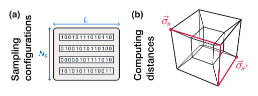 
Figure 1. Many-body configurations as a dataset. (a) Many-body configurations of L qubits, where L is the system size, are sampled from the probability distribution defined by the squared amplitudes of the wavefunction. They are collected in a dataset of size Ns. (b) The metric on the data space is given by the Hamming distance R between a chosen pair of many-body configurations ⃗σs and ⃗σs′.

📷 Fig 2

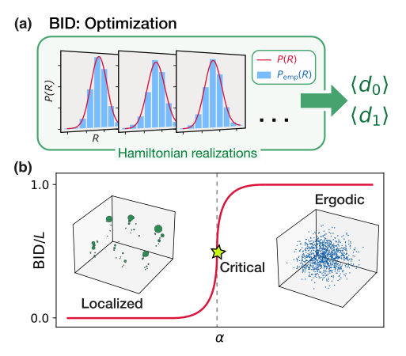 
Figure 2. Schematic description of BID as a probe of ergodicity breaking. (a) Computation of BID: Given a value of the control parameter α and a single Hamilto- nian realization, after sampling configurations and computing the Hamming distances among all possible pairs, as shown in Fig. 1, the Hamming distances’ empirical distribution Pemp is computed and interpolated with the ansatz P(R) in Eq. (4) to obtain the parameters d0 and d1. For each value of the control parameter α, the procedure is performed for many Hamilto- nian realizations, and the results are averaged to compute ⟨d0⟩and ⟨d1⟩, as explained in Sec. III A. (b) Ideal ID versus the control parameter α, for large L. In the...

📷 Fig 3

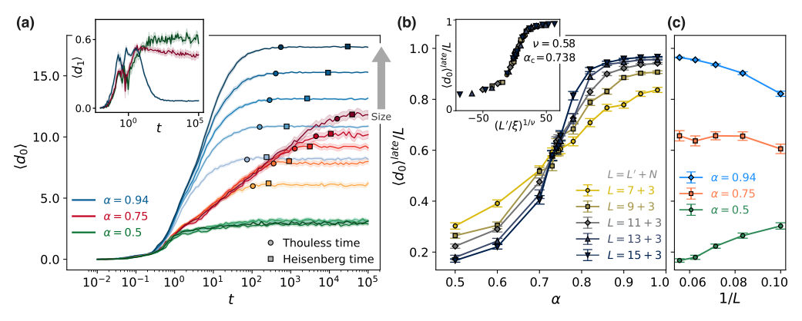 
Figure 3. Time evolution of BID. (a) BID ⟨d0⟩versus time for α = 0.5, 0.75, 0.94, at different system sizes L = 10 −18, represented by lighter to darker shades of each color. Solid lines and shaded areas around them are averages at fixed times t and standard deviations of the BID over 100 Hamiltonian realizations; for each of them, the BID was computed from a dataset of Ns = 100 snapshots, sampled with Born’s rule from the time-evolved wavefunction |Ψ(t)⟩. Circles and squares represent Thouless and Heisenberg times, respectively. The inset represents the disorder-averaged values of ⟨d1⟩as a function of time, for the same values of α, at L = 18. (b) Late-time values of the BID versus the...

📷 Fig 4

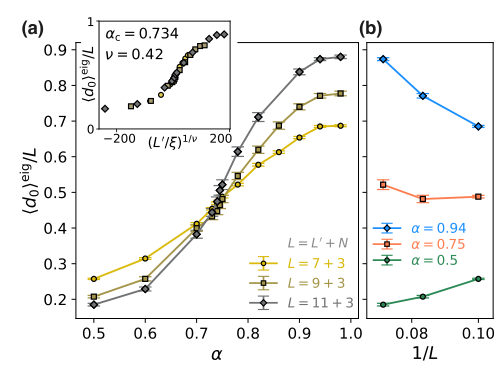 
Figure 4. Mid-spectrum BID. (a) BID versus interaction strength α for different system sizes L, computed from the mid-spectrum eigenstate analysis. Values and errorbars are computed as the average and standard deviation of the BID computed by sampling the Hamiltonian’s eigenstates in the middle of the spectrum, for 1000 realizations of the disorder. We consider 25 Hamiltonian eigenstates for L = 7+3, and 500 for all other system sizes. For each combination of eigenstate and Hamiltonian realization, BID has been computed from a dataset of Ns = 100 samples from the eigenstate’s wavefunc- tion according to Born’s rule. Inset shows the collapse. To estimate αc, we perform scaling collapse of...

📷 Fig 5

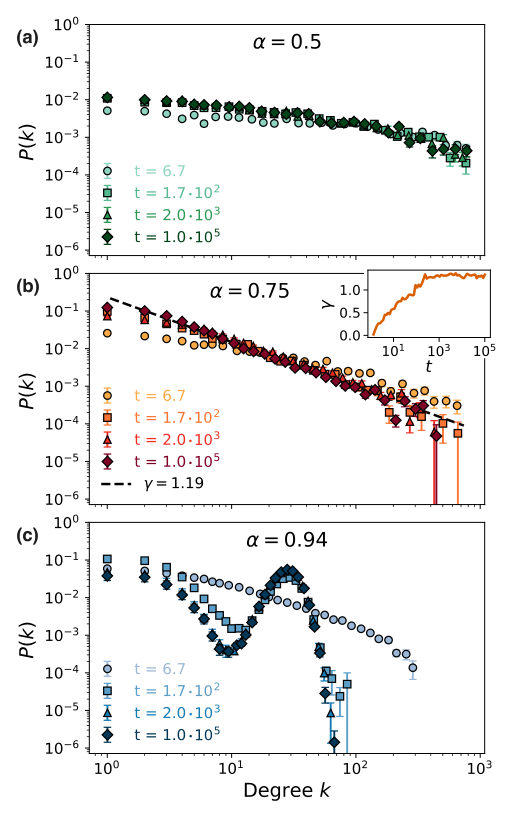 
Figure 5. Time evolution of wavefunction networks. (a), (b), (c) Degree distributions P(k) of the averaged wavefunction networks, built from configurations sampled for L = 18 at selected times in the non-ergodic phase (α = 0.5), at the critical point (α = 0.75), and in the ergodic phase (α = 0.94), respectively. The averaged degree distributions are obtained by averaging over 100 distributions, each of them obtained separately for different Hamiltonian realiza- tions, with Ns = 1000 and the cutoff R∗ n, where n = 10. The dashed line in panel (b) represents the fit with a power law P(k) ∝k−γ for k ∈[8, 150]. The inset shows the values of the interpolated γ in the same region as a function of...

**Summary.** This work proposes using statistical measures like Binary Intrinsic Dimension (BID) and network analysis on wavefunction snapshots to diagnose quantum dynamics. By analyzing the quantum sun model, the authors show that the ergodicity-breaking transition is marked by specific, measurable changes in these intrinsic data structures. This offers a powerful, non-observable-specific tool for quantum simulation experiments.

**Why it may be interesting.** It provides novel, experimentally accessible, data-driven signatures (BID, network topology) to diagnose fundamental quantum phenomena like ergodicity breaking, bridging quantum dynamics with modern data science tools.

Detailed structure

**Main problem.** The study investigates whether the intrinsic structure of projective measurement distributions (wavefunction snapshots) can reveal quantum dynamics beyond predefined observables, specifically focusing on the many-body ergodicity-breaking transition.

**Main result.** The critical point is uniquely characterized by a combination of extensive but submaximal Binary Intrinsic Dimension (BID) and scale-free network connectivity with highly connected hubs, distinguishing it from ergodic and nonergodic regimes.

**Method.** The authors employ data-driven diagnostics, including calculating the Binary Intrinsic Dimension (BID) from pairwise Hamming distances and constructing wavefunction networks based on these distances.

**Model / system.** The analysis uses the quantum sun model, a paradigmatic toy model for studying the many-body ergodicity-breaking transition, involving coupled qubits governed by a specific Hamiltonian.

**Key observables.** Binary Intrinsic Dimension (BID), network connectivity (scale-free vs. random), and the system's ergodic state.

**Important parameters / regimes.** The coupling strength $\alpha$, which controls the transition; the critical point $\alpha_c \approx 0.75$.

**Assumptions / limitations.** The number of collected snapshots ($N_s$) is much smaller than the full Hilbert-space dimension ($N_s \ll D$).

**Figures summary.** Figures illustrate the sampling of many-body configurations and the metric used for distance calculation (Hamming distance).

**Paper structure.** The paper develops diagnostics (BID and network analysis) to probe the ergodicity-breaking transition in the quantum sun model, showing how these metrics yield distinct signatures for the ergodic, critical, and nonergodic phases.

Abstract

Modern quantum experiments can probe many-body wavefunctions through projective measurements, providing snapshots of individual many-body configurations. A fundamental question is whether the intrinsic structure of their measurement distributions can reveal quantum dynamics beyond predefined observables. Here, we address this question at the many-body ergodicity-breaking transition using two complementary characteristics of nonequilibrium wavefunction snapshots: their binary intrinsic dimension (BID) and the topology of wavefunction networks constructed from Hamming distances. We show that the critical point is characterized by an extensive but submaximal BID, and scale-free network connectivity with highly connected hubs. These signatures distinguish the ergodic, critical, and nonergodic regimes, and provide experimentally accessible probes of ergodicity breaking from projective measurement snapshots.

[↑ back to top](#top)

### [Nonreciprocal Control of the Goos--Hänchen Shift via the Barnett Effect in Cavity Magnomechanics](http://arxiv.org/abs/2608.21795v1)

**Authors:** Shah Fahad, Gao Xianlong  
**Type:** theory · **Category:** other · **PDF:** <https://arxiv.org/pdf/2608.21795v1>  
**Analysis basis:** full PDF text, analyzed in chunks
**Topic relevance:** `analog quantum simulation` **3/5** · `interference shaping light` **3/5** · `Keldysh / 2PI / non-Gaussian methods` **2/5** · `driven-dissipative phase transition` **2/5** · `methods for driven-dissipative` **2/5** · `Tavis-Cummings & cavity-many-emitter` **1/5** · `correlated / nonlocal dissipation` **1/5** · `quantum measurements` **1/5** · `quantum optics experiment` **1/5**

📷 Fig 1

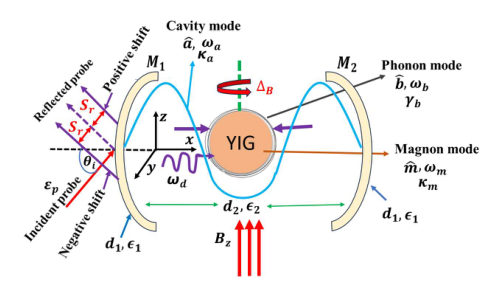 
FIG. 1. Schematic of the YIG-based CMM system. The system comprises a cavity photon mode ˆa, a magnon mode ˆm, and a phonon mode ˆb, characterized by frequencies (ωa, ωm, ωb) and decay rates (κa, κm, γb), respectively. The magnon frequency is controlled by the static bias field Bz, while rotation of the YIG sphere at angular frequency ∆B in- duces a Barnett field HB and consequently shifts the magnon resonance. The photon–magnon interaction is mediated by magnetic-dipole coupling, whereas the magnon–phonon inter- action arises from magnetostriction and is enhanced by a mi- crowave drive of frequency ωd applied along the x-axis. The bias (Bz), drive (Bx), and cavity (By) magnetic fields are mu-...

📷 Fig 2

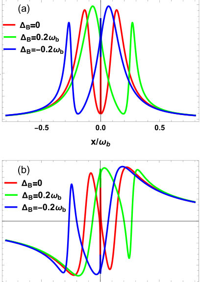 
FIG. 2. (a) Absorption spectra (Re[ET ]) and (b) disper- sion spectra (Im[ET ]) of the probe field as functions of the normalized effective detuning x/ωb. The curves correspond to different values of the Barnett frequency shift: ∆B = 0 (red), 0.2ωb (green), and −0.2ωb (blue). Fixed parameters: γb/2π = 150 Hz, κa/2π = 2.1 MHz, gma/2π = 2 MHz, Gmb/2π = 0.1 MHz, κm/2π = 0.1 MHz, and ωb/2π = 15 MHz.

📷 Fig 3

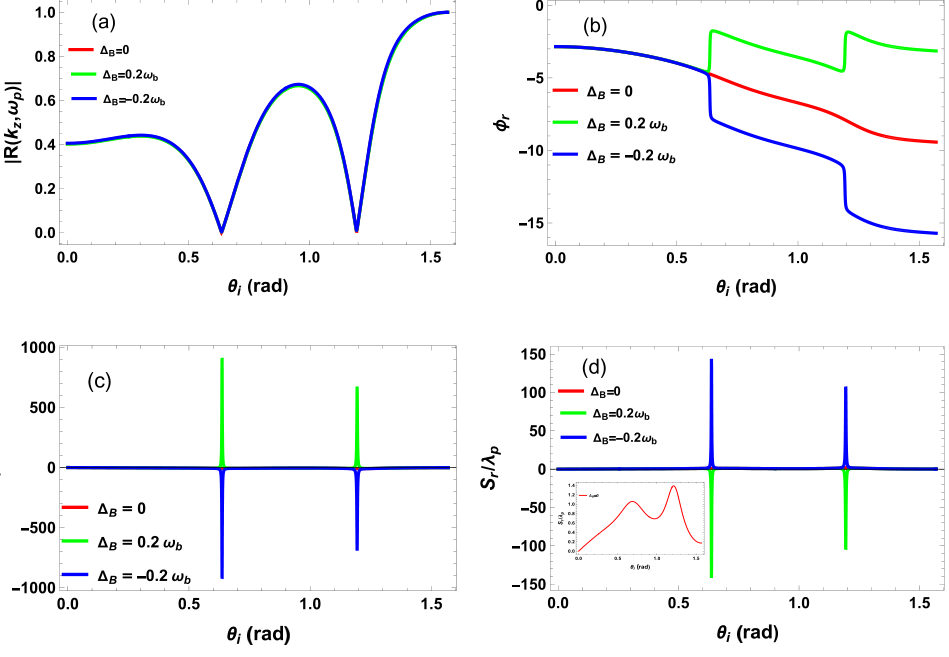 
FIG. 3. (a) Magnitude of the reflection coefficient |R(kz, ωp)|, (b) unwrapped phase of the reflection coefficient φr, (c) phase derivative dφr/dθi, and (d) normalized GHS Sr/λp as functions of the incident angle of the probe field θi at resonance (x = 0). The curves correspond to Barnett frequency shifts of ∆B = 0 (red), 0.2ωb (green), and −0.2ωb (blue). The inset in Fig 3 (d) shows the Sr/λp dependence on θi for ∆B = 0 (red) at x = 0. Fixed parameters: γb/2π = 150 Hz, κa/2π = 2.1 MHz, κm/2π = 0.1 MHz, ωb/2π = 15.0 MHz, gma/2π = 2 MHz, Gmb/2π = 0.1 MHz, d1 = 4.0 mm, d2 = 45 mm, ǫ0 = 1.0, ǫ1 = 2.2, and ωp/2π = 13.2 GHz.

📷 Fig 4

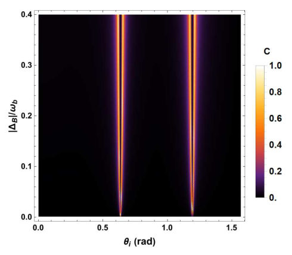 
FIG. 4. Contrast ratio C versus the probe-field incident angle θi at resonance (x = 0). Other parameters are as in Fig. 3.

📷 Fig 5

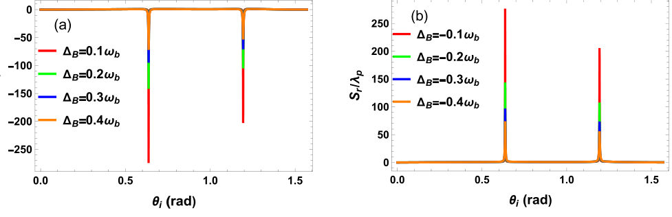 
FIG. 5. Variation of the normalized GHS Sr/λp with the probe-field incidence angle θi at resonance (x = 0). Panel (a) corresponds to positive Barnett-induced magnon frequency shifts: ∆B = 0.1ωb (red), 0.2ωb (green), 0.3ωb (blue), and 0.4ωb (orange). Panel (b) shows the corresponding negative shifts: ∆B = −0.1ωb (red), −0.2ωb (green), −0.3ωb (blue), and −0.4ωb (orange). All other parameters are the same as those used in Fig. 3.

**Summary.** This theoretical study details how a cavity magnomechanical system can generate a tunable, nonreciprocal Goos-Hänchen shift by leveraging the Barnett effect. By controlling the sign of the rotation-induced magnon frequency shift, researchers can achieve directional control over the beam shift, paving the way for magnetically reconfigurable microwave photonic devices.

**Why it may be interesting.** This work bridges cavity QED concepts (cavity coupling, resonance phenomena) with magnonics and mechanics, providing a platform for realizing magnetically tunable, nonreciprocal quantum optical effects.

Detailed structure

**Main problem.** The paper proposes a theoretical scheme to achieve and control a tunable nonreciprocal Goos-Hänchen shift (GHS) using the Barnett effect within a hybrid cavity magnomechanical system.

**Main result.** The Barnett effect allows for the sign-reversal of the GHS by changing the bias magnetic field, demonstrating a controllable mechanism for nonreciprocal beam shifts in microwave photonic devices.

**Method.** The analysis employs the transfer-matrix method and stationary-phase approximation on semiclassically derived equations of motion for the coupled photon, magnon, and phonon modes.

**Model / system.** The system is a Cavity Magnomechanical (CMM) setup featuring a rotating Yttrium Iron Garnet (YIG) sphere coupled to microwave cavity photons and mechanical phonons via magnetic-dipole and magnetostrictive interactions.

**Key observables.** Goos-Hänchen Shift (GHS), output probe spectrum (Fano resonance), and the contrast ratio quantifying nonreciprocity.

**Important parameters / regimes.** Barnett frequency shift ($\Delta B$), photon-magnon coupling ($g_{ma}$), magnon-phonon coupling ($G_{mb}$), and cavity length ($L$).

**Assumptions / limitations.** The analysis assumes a high mechanical quality factor ($Q_b \gg 1$) and utilizes the weak-probe approximation for linearization.

**Figures summary.** Figures illustrate the dependence of the GHS on the sign and magnitude of the Barnett shift ($\Delta B$), and show how coupling strengths ($g_{ma}, G_{mb}$) and cavity length modify this nonreciprocal response.

**Paper structure.** The paper develops the quantum dynamics using the Hamiltonian, derives semiclassical equations of motion, and then calculates the GHS using the transfer-matrix formalism, systematically analyzing the influence of the Barnett effect, $g_{ma}$, $G_{mb}$, and cavity length on the resulting nonreciprocity.

Abstract

We propose a theoretical scheme for realizing a tunable nonreciprocal Goos-Hänchen shift (GHS) in a hybrid cavity magnomechanical system. The setup consists of a rotating yttrium iron garnet sphere embedded in a microwave cavity, with magnetic-dipole and magnetostrictive interactions mediating magnon-photon and magnon-phonon couplings, respectively. Owing to the Barnett effect, the magnon frequency acquires a rotation-induced shift whose sign can be reversed by changing the direction of the bias magnetic field. We show that the output probe spectrum exhibits a Fano resonance, while the associated GHS responds asymmetrically to opposite field directions, providing a controllable mechanism for nonreciprocal beam shifts. The magnon-photon and magnon-phonon interactions are found to affect the GHS in opposite ways, while the cavity length offers an additional degree of tunability. These results provide a route toward magnetically reconfigurable microwave photonic devices and sensitive detection of Barnett-induced effective fields.

[↑ back to top](#top)

### [Quantum-enhanced sensing in a driven-dissipative system via chiral waveguide](http://arxiv.org/abs/2608.23433v1)

**Authors:** Yan Xi Foo, Saubhik Sarkar, Leong Chuan Kwek, Abolfazl Bayat, Davit Aghamalyan  
**Type:** theory · **Category:** other · **PDF:** <https://arxiv.org/pdf/2608.23433v1>  
**Analysis basis:** full PDF text, analyzed in chunks
**Topic relevance:** `correlated / nonlocal dissipation` **3/5** · `driven-dissipative phase transition` **3/5** · `methods for driven-dissipative` **3/5** · `non-equilibrium universality` **2/5** · `Keldysh / 2PI / non-Gaussian methods` **1/5** · `Tavis-Cummings & cavity-many-emitter` **1/5** · `analog quantum simulation` **1/5** · `quantum measurements` **1/5**

📷 Fig 1

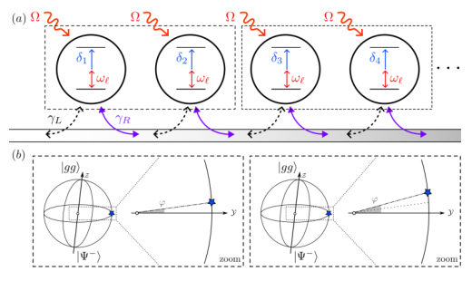 
FIG. 1. Schematic of the model. (a) N two-level systems or emitters are arranged in a 1D array and are connected to a 1D chiral waveg- uide. The emitters are coherently driven with Rabi frequency Ωand driving frequency ωℓ. The detunings δj are position dependent as the transition frequencies of the emitters ωj can have j-dependence. Due to the chirality of the waveguide, the photons are emitted with dif- ferent rates γL and γR into the left and right propagating modes. The waveguide mediates long-range interaction as the emitted photons can drive transition at a distance. (b) The effect of a weak detuning strength can be perturbatively accounted for by the corresponding change for each...

📷 Fig 2

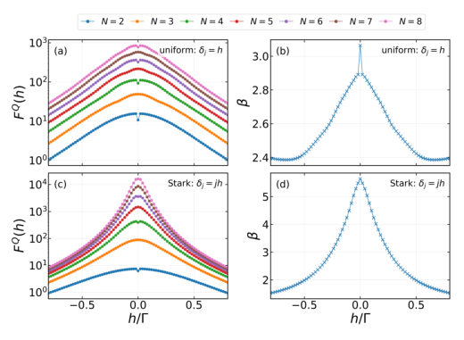 
FIG. 2. QFI analysis. Top and bottom panel correspond to the uni- form and Stark detuning, respectively. QFI FQ as a function of the detuning strength h for different system sizes with (a) uniform detun- ing and (c) Stark detuning. Scaling exponent β as a function of h for (b) uniform detuning and (d) Stark detuning. Here we fix Ω/Γ=0.25, γR/Γ=1, and γL/Γ=0.

📷 Fig 3

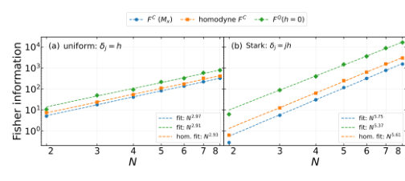 
FIG. 3. CFI analysis. Comparison of the QFI with CFI calcu- lated for the observable Mstag x and CFI for the full-record homodyne scheme for the fully chiral case at h=0, Ω/Γ=0.25 for the (a) uniform detuning and (b) Stark detuning.

📷 Fig 4

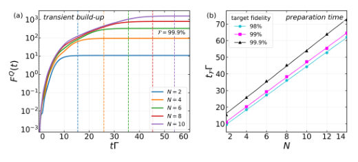 
FIG. 4. Probe preparation time. (a) QFI FQ evaluated at h=0 of time for uniform detuning as a function of time as the system reaches the steady state. Vertical dashed lines denote the time needed to reach 99.9% of the steady state QFI value for each system size. (b) Linear scaling of preparation time with system size for several choices of target fidelity with the steady state QFI value.

📷 Fig 5

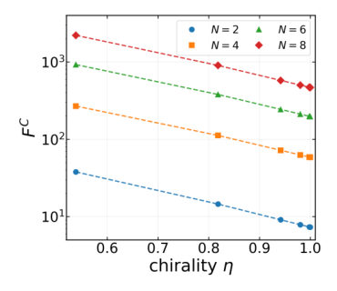 
FIG. 5. Effect of chirality. Effect of chirality η on the CFI evaluated for the observable Mstag x at h=0 with uniform detuning for different system sizes.

**Summary.** This paper investigates quantum sensing in a realistic, open quantum system modeled by emitters coupled to a chiral waveguide. It shows that the steady state achieved through dissipation can yield enhanced sensitivity to weak detuning. Crucially, the authors prove that this enhanced sensitivity scales favorably with system size even when the necessary preparation time is accounted for.

**Why it may be interesting.** This work is highly relevant as it tackles the crucial issue of harnessing engineered dissipation (a core topic in open quantum systems) to maintain or enhance quantum advantages in sensing protocols, moving beyond idealized closed-system models.

Detailed structure

**Main problem.** The paper addresses the challenge of achieving quantum-enhanced sensing precision in physical systems where environmental dissipation is present.

**Main result.** It analytically demonstrates that the steady state of a driven-dissipative system coupled to a chiral waveguide exhibits enhanced sensitivity to weak detuning, and this advantage is maintained even when considering the finite preparation time.

**Method.** The analysis involves solving the Lindblad master equation to find the steady state and calculating the Quantum Fisher Information (QFI) to quantify sensing limits.

**Model / system.** The system consists of $N$ two-level emitters arranged in a 1D array, coherently driven, and coupled to a chiral waveguide that acts as both an interaction mediator and a bath.

**Key observables.** Quantum Fisher Information ($F_E$), Classical Fisher Information (CFI), and the preparation time ($T$).

**Important parameters / regimes.** The degree of chirality ($\eta$), the system size ($N$), and the detuning strength ($\delta_j$).

**Assumptions / limitations.** The analysis assumes the Markovian regime and utilizes the steady state of the master equation as the sensing probe.

**Figures summary.** Figures illustrate the setup (emitter array coupled to a chiral waveguide), the scaling of QFI/CFI with detuning strength, and the linear scaling of the preparation time $T$ with system size $N$.

**Paper structure.** The paper builds from establishing the physical model (driven-dissipative system) to deriving the scaling laws for sensing enhancement using the steady state, and finally confirming the feasibility by analyzing the linear scaling of the required preparation time.

Abstract

Quantum sensors can achieve precision unattainable by classical sensors. However, dissipation coming from interaction with the environment can greatly degrade the performance of quantum sensors. Therefore, it is crucial to attempt harnessing dissipation to our advantage and investigate the sensing performance of driven-dissipative systems to gain practical quantum advantages. In this paper, we study a system of two-level systems driven coherently at a detuned frequency, and importantly, connected to a chiral waveguide that serves both as an interaction mediator and a bath. We show analytically that the steady state of such a system shows enhanced sensitivity to estimate weak detuning strength while the probe preparation time only grows linearly with system size. Therefore, the enhanced sensitivity is sustained even when the preparation time is incorporated. We further establish measurement protocols to achieve such sensitivity that are experimentally implementable. The chirality of the waveguide helps us to control both precision and range of enhanced sensitivity.

[↑ back to top](#top)

### [Relaxation-Rectified Anti-Jaynes-Cummings Cascades for Autonomous Fock-State Stabilization](http://arxiv.org/abs/2608.22298v1)

**Authors:** Yan Liu, Jiahua Li  
**Type:** theory · **Category:** other · **PDF:** <https://arxiv.org/pdf/2608.22298v1>  
**Analysis basis:** full PDF text, analyzed in chunks
**Topic relevance:** `correlated / nonlocal dissipation` **3/5** · `driven-dissipative phase transition` **3/5** · `methods for driven-dissipative` **3/5** · `Tavis-Cummings & cavity-many-emitter` **2/5** · `analog quantum simulation` **2/5** · `non-equilibrium universality` **1/5** · `quantum measurements` **1/5**

📷 Fig 1

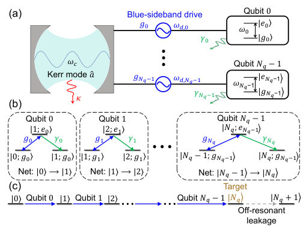 
FIG. 1. Dissipation-rectified Fock-state preparation. (a) A Kerr cavity mode is coupled to Nq relaxing auxiliary qubits through independently driven blue-sideband interactions. (b) For each qubit ℓ, coherent coupling followed by qubit relax- ation produces the net photon-raising transition |ℓ⟩→|ℓ+1⟩. (c) Cascading these processes pumps the cavity from |0⟩to the target state |Nq⟩, while further raising is off resonance. Blue, green, and gray arrows denote coherent blue-sideband transitions or the resulting raising processes, qubit relaxation, and off-resonant leakage, respectively.

📷 Fig 2

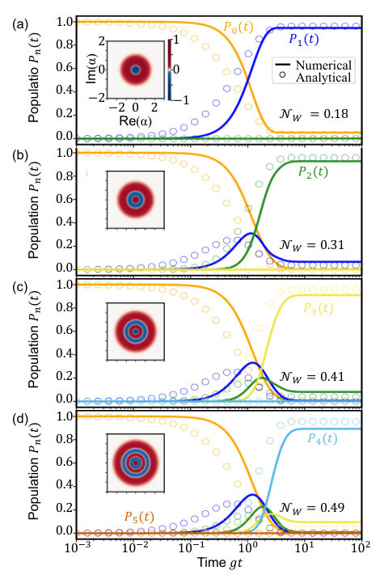 
FIG. 2. Time evolution of the cavity Fock-state populations for target states |1⟩, |2⟩, |3⟩, and |4⟩in panels (a)–(d), re- spectively. Different colors denote the populations Pn(t) of the corresponding Fock states |n⟩. Solid curves show the full numerical Lindblad dynamics, while open circles denote the corresponding analytical BD results. Insets show the Wigner functions of the stabilized cavity states, with the correspond- ing Wigner negativities NW indicated. The parameters are K/g = 100, κ/g = 0.05, and γ/g = 3.

📷 Fig 3

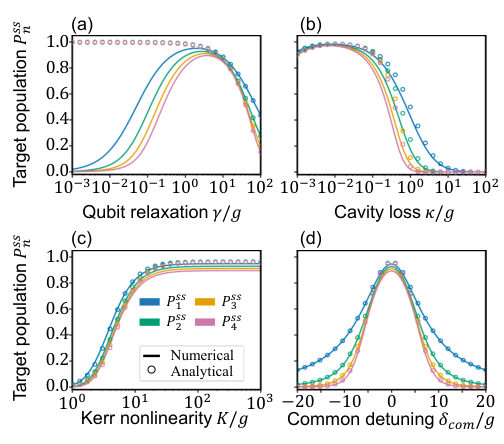 
FIG. 3. Steady-state target-state populations P ss n for |n⟩= |1⟩, |2⟩, |3⟩, and |4⟩as functions of (a) the qubit relaxation rate γ/g, (b) the cavity loss rate κ/g, (c) the Kerr nonlin- earity K/g, and (d) the common detuning δcom/g. Different colors correspond to different target Fock states. Solid curves show the full numerical Lindblad results, while open circles denote the corresponding analytical BD results. The fixed parameters are K/g = 100, κ/g = 0.05, and γ/g = 3, except for the quantity varied in each panel. In (c), the qubits are retuned according to ∆ℓ= −(2ℓ+ 1)K as K is varied; in (d), ∆ℓ= −(2ℓ+ 1)K + δcom.

📷 Fig 4

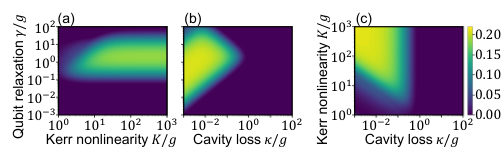 
FIG. 4. Steady-state Wigner negativity NW of the stabilized single-photon state over different parameter planes. (a) NW versus K/g and γ/g at κ/g = 0.05. (b) NW versus κ/g and γ/g at K/g = 100. (c) NW versus κ/g and K/g at γ/g = 3. When K is varied, the qubit is retuned according to ∆0 = −K to maintain resonance with the target |0, g0⟩↔|1, e0⟩ transition. All panels share the same color scale.

📷 Fig 5

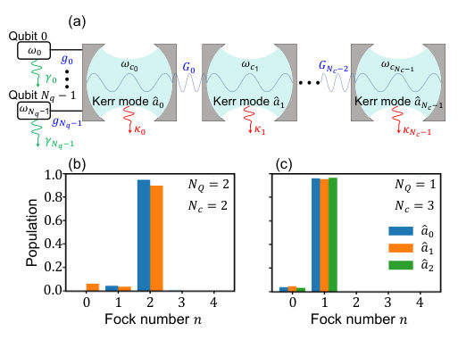 
FIG. 5. Extension of autonomous Fock-state stabilization to a Kerr-cavity chain. (a) The primary mode ˆa0 ≡ˆa, directly coupled to Nq auxiliary qubits, is connected to Nc−1 identical lossy Kerr modes through nearest-neighbor beam-splitter in- teractions of strength G. (b),(c) Local steady-state Fock-state populations of the individual cavities for (Nq, Nc) = (2, 2) and (1, 3), respectively. In the indirectly coupled cavities, the population of the same target Fock state as in the primary cavity ˆa0 is dominant, demonstrating the extension of the sta- bilization along the chain. The parameters are K/g = 100, G/g = 1, γ/g = 3, κ/g = 0.01, and δcom/g = 0.

**Summary.** The authors present a method to autonomously stabilize Fock states in a Kerr cavity by coupling it to auxiliary qubits. They use qubit relaxation to rectify the anti-Jaynes-Cummings interaction, creating a directed, photon-number selective cascade. This establishes a powerful resource for reservoir engineering, enabling nonclassical bosonic state preparation.

**Why it may be interesting.** This work provides a concrete, controllable mechanism for reservoir engineering in cavity QED, demonstrating how engineered dissipation can drive a system towards nonclassical quantum states like Fock states.

Detailed structure

**Main problem.** The paper proposes an autonomous scheme to stabilize specific Fock states within a Kerr cavity by engineering interactions with auxiliary qubits.

**Main result.** The combination of anti-Jaynes-Cummings interactions and qubit relaxation successfully creates a directed, photon-number selective cascade, leading to stable, nonclassical Fock state populations.

**Method.** The dynamics are analyzed using the Lindblad master equation, supplemented by an analytical birth-death model for steady-state population tracking.

**Model / system.** The system consists of a Kerr cavity mode coupled to an array of $N_q$ auxiliary qubits. The evolution is governed by a master equation incorporating Kerr nonlinearity and engineered Anti-Jaynes-Cummings (AJC) interactions.

**Key observables.** Steady-state Fock state populations ($P_{ss}^n$) and the presence of Wigner negativity ($N_W$).

**Important parameters / regimes.** Qubit relaxation rate ($\gamma$), cavity loss ($\kappa$), Kerr nonlinearity ($K$), and detuning ($\Delta_\ell$).

**Assumptions / limitations.** The analysis relies on the rectification of reversible AJC exchange via irreversible qubit relaxation, and the BD model is an approximation valid in certain regimes.

**Figures summary.** Figures illustrate the process flow (Fig. 1), the time evolution of Fock-state populations towards the target state (Fig. 2), the dependence of steady-state populations on various parameters (Fig. 3), and the resulting Wigner negativity (Fig. 4).

**Paper structure.** The paper develops the effective Hamiltonian via transformations (rotating frame, RWA), derives the dynamics using the Lindblad equation, analyzes the steady-state populations using a birth-death model, and finally investigates parameter robustness.

Abstract

We propose an autonomous scheme for stabilizing prescribed Fock states in a Kerr cavity by rectifying anti-Jaynes--Cummings interactions with auxiliary-qubit relaxation. Full Lindblad simulations demonstrate steady states dominated by the Fock states $|1\rangle$ through $|4\rangle$, accompanied by pronounced Wigner negativity. An analytical birth--death model captures the steady-state populations and identifies the operating regime for stabilization. These results establish auxiliary-qubit relaxation as a resource for autonomous reservoir engineering and provide a route to nonclassical bosonic-state preparation in a single Kerr cavity and, through a boundary reservoir, in a Kerr-cavity chain.

[↑ back to top](#top)

### [Dark-Mode Control of Contrasting Entanglement and Bell Nonlocality between Mechanical Oscillators](http://arxiv.org/abs/2608.23113v1)

**Authors:** Souvik Agasti, Philippe Djorwe, Xin Zhou  
**Type:** theory · **Category:** other · **PDF:** <https://arxiv.org/pdf/2608.23113v1>  
**Analysis basis:** full PDF text, analyzed in chunks
**Topic relevance:** `analog quantum simulation` **3/5** · `correlated / nonlocal dissipation` **3/5** · `Keldysh / 2PI / non-Gaussian methods` **2/5** · `driven-dissipative phase transition` **2/5** · `methods for driven-dissipative` **2/5** · `Tavis-Cummings & cavity-many-emitter` **1/5** · `quantum measurements` **1/5**

📷 Fig 1

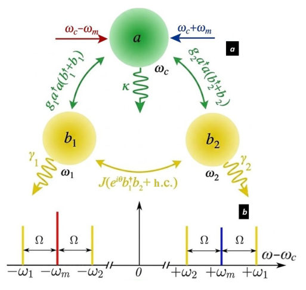 
FIG. 1. (a) Block diagram of the single-cavity double-drum optome- chanical setup, driven by a red and a blue drive. (b) The driving con- ditions, in terms of frequencies. The cavity resonance frequency is in the center, while the corresponding driving tones are indicated by blue and red lines, representing their role. The mechanical oscillation frequencies, indicated by the yellow lines, are placed symmetrically (at ω1, ω2) about detunings of Ωaround the average frequency ωm.

📷 Fig 2

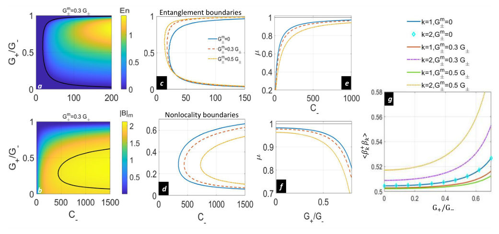 
FIG. 2. (a) Entanglement measured by logarithmic negativity and (b) maximal value of Bell’s function as a function of cooperativity (C−= 4G2/κγ1,2) and the coupling ratio G+/G−for Gm ±/G± = 0.3. Throughout this analysis, κ and γ1 = γ2 are kept fixed, while G−has been varied. The black line in (a) represents entanglement boundaries (En = 0), while in (b) it stands for the nonlocality boundary (|B|m = 2). (c) Entanglement and (d) nonlocality boundaries for different coupling imperfections. In both (c) and (d), the region to the right of the boundary corresponds to the regime where entanglement and nonlocality exist between the two mechanical oscillators. (e) purity of the state (µ) vs C−at...

📷 Fig 3

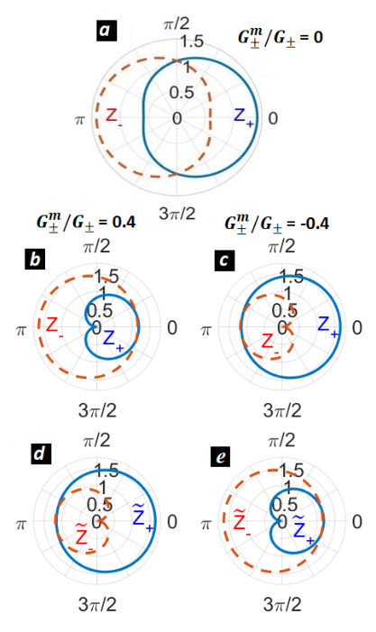 
FIG. 3. (a) In case of absence of coupling imperfections (Gm ± = 0) the redefined coupling factors (Z± = ˜Z±) are plotted versus the modulation phase θ in polar coordinates. The dark mode of the sys- tem appears at θ = (0, π). θ ̸= (0, π) is the regime of dark mode breaking. In case of presence of coupling imperfections (Gm ̸= 0), Z± is plotted in (b,c) and ˜Z± in (d,e). The used coupling imperfec- tions are Gm ±/G± = 0.4 in left side (b,d) and Gm ±/G± = −0.4 in right side (c,e). The parameter used here is J = Ωremains same for all the plots.

📷 Fig 4

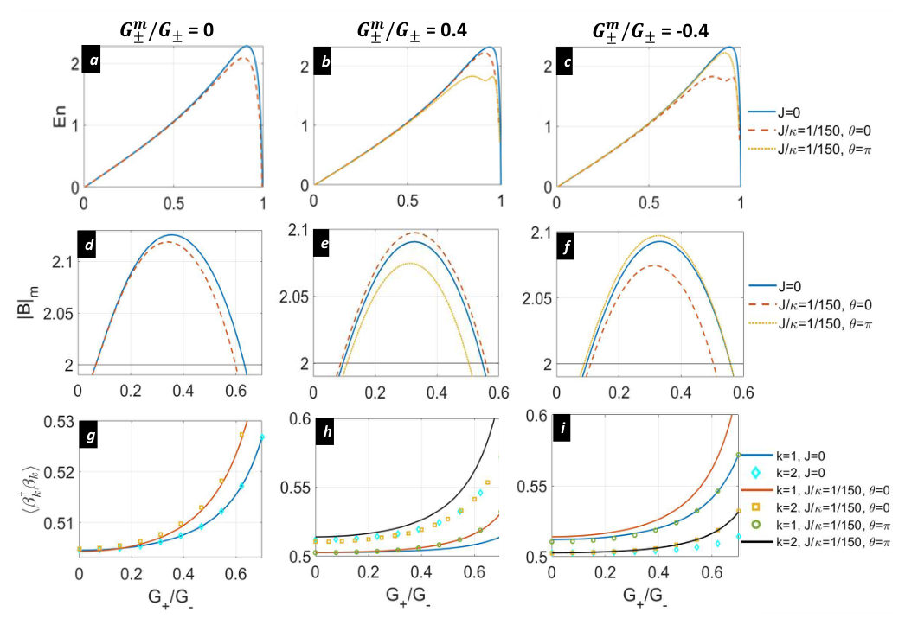 
FIG. 4. Entanglement in top row (a,b,c), nonlocality in middle row (d,e,f) and Bogoliubov occupation numbers in bottom row (g,h,i) vs G+/G−for Gm ±/G± = 0 at left column (a,d,g), Gm ±/G± = 0.4 at middle column (b,e,h) and Gm ±/G± = −0.4 at right column (c,f,i). In the middle row, the black solid line is the nonlocality boundary |B|m = 2. In case of all (a,d,g) both the lines of θ = π and θ = 0 fall on the same lines. All other parameters remain the same as in Fig. 2.

📷 Fig 5

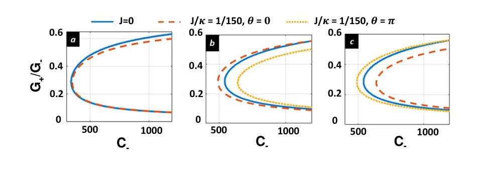 
FIG. 5. Nonlocality boundaries |B|m = 2 for different coupling imperfections (a) Gm ±/G± = 0 (b) Gm ±/G± = 0.4 and (c) Gm ±/G± = −0.4. In all the cases, likewise (a) and (b) in Fig. 2, on the right side of the boundary, one can find nonlocality between two mechanical oscillators. In case of (a), both the lines of θ = π and θ = 0 fall on the same line. All other parameters remain the same as in Fig. 2.

**Summary.** This paper proposes using a coupled optomechanical system to control quantum correlations between mechanical oscillators. It reveals that entanglement and Bell nonlocality can behave oppositely when system imperfections are present. By introducing phase-dependent phonon hopping, the authors demonstrate a method to selectively boost Bell nonlocality for quantum communication applications.

**Why it may be interesting.** This work is highly relevant as it tackles the non-trivial interplay between different quantum correlation measures (entanglement vs. nonlocality) in a controllable, experimentally realizable platform (optomechanics).

Detailed structure

**Main problem.** The study investigates the complex and often contrasting relationship between mechanical entanglement and Bell nonlocality in coupled optomechanical systems.

**Main result.** The authors show that coupling imperfections can enhance entanglement while suppressing Bell nonlocality, but phase-dependent phonon hopping allows for the selective enhancement of nonlocality even when entanglement is reduced.

**Method.** The analysis uses theoretical modeling involving the derivation and solution of Quantum Langevin Equations (QLEs) in the resolved-sideband regime.

**Model / system.** The system is an optomechanical setup comprising two mechanical oscillators coupled to a common cavity field. The dynamics are described by a Hamiltonian incorporating optomechanical, phonon-exchange, and driving terms.

**Key observables.** Entanglement (logarithmic negativity), CHSH Bell nonlocality, and state purity.

**Important parameters / regimes.** Coupling imperfections, phase-dependent hopping strength, and the operating regime (resolved-sideband).

**Assumptions / limitations.** The analysis assumes the resolved-sideband regime (mechanical frequency much larger than cavity decay rate).

**Figures summary.** Figures illustrate the system block diagram, boundaries for entanglement and nonlocality, and the dependence of Bell nonlocality on phase angle and coupling imperfections.

**Paper structure.** The paper builds from defining the Hamiltonian and system architecture to deriving the dynamics via QLEs, analyzing the impact of imperfections, and finally proposing phase-dependent hopping to selectively control nonlocality.

Abstract

This study presents a detailed proposal for an optomechanical system consisting of two mechanical oscillators coupled to a common cavity, aimed at generating pure and entangled two-mode squeezed mechanical steady states. We found that the violation of Bell's measurement may not occur where the entanglement is maximum; rather, nonlocality can be observed for lower entangled states. A central result is that optomechanical coupling imperfections can enhance mechanical entanglement while simultaneously suppressing Bell nonlocality by reducing the purity of the mechanical state. To mitigate this trade-off, we introduce phase-dependent phonon hopping between the mechanical oscillators and show that Bell nonlocality can be selectively enhanced in specific dark-mode configurations, even when the overall entanglement is reduced. We trace this contrasting behaviorto changes in state purity associated with the imbalance of the Bogoliubov-mode occupations. Compatible with existing microwave cavity optomechanical platforms, the proposed architecture provides an experimentally accessible route for controlling nonlocal quantum correlations in multimode mechanical systems. Our proposed scheme serves as an attractive platform for the deployment of continuous-variable teleportation and high-fidelity quantum communication.

[↑ back to top](#top)

### [Geometric Phases of a Driven Qubit: Comparing Berry and Uhlmann Holonomies](http://arxiv.org/abs/2608.22919v1)

**Authors:** Hyeonseok Yang, Changsuk Noh  
**Type:** theory · **Category:** quantum information and computing · **PDF:** <https://arxiv.org/pdf/2608.22919v1>  
**Analysis basis:** full PDF text, analyzed in chunks
**Topic relevance:** `driven-dissipative phase transition` **3/5** · `methods for driven-dissipative` **3/5** · `Keldysh / 2PI / non-Gaussian methods` **2/5** · `correlated / nonlocal dissipation` **2/5** · `non-equilibrium universality` **2/5** · `quantum measurements` **2/5**

📷 Fig 1

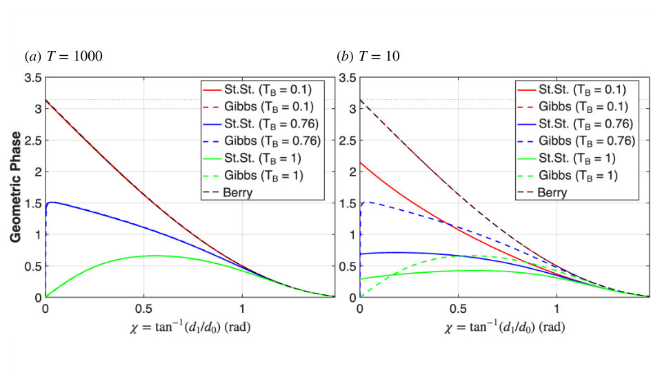 
FIG. 1. Magnitudes of geometric phases in a physical d1 scan at fixed d0 = 1, with χ =

📷 Fig 2

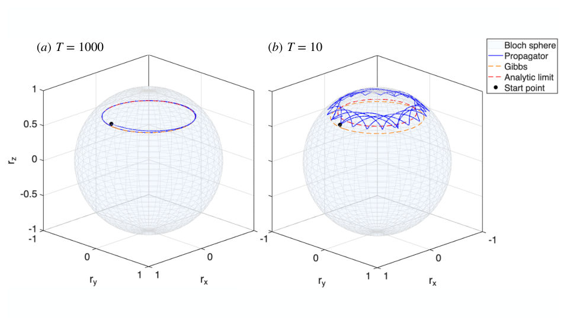 
FIG. 2. Bloch-sphere trajectories of the driven qubit, computed from the exact rotating-frame

📷 Fig 3

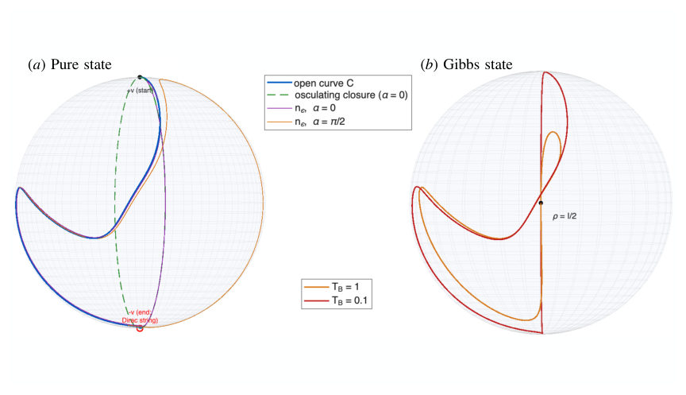 
FIG. 3. Bloch-space trajectories for the gap-closing drive of Eq. (73). (a) On the unit sphere the

📷 Fig 4

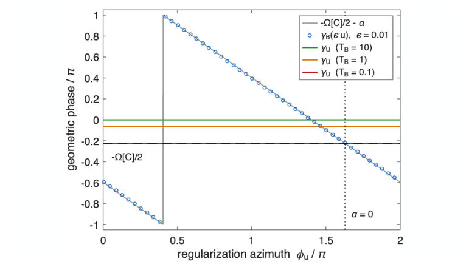 
FIG. 4. Geodesic selection rule for the drive of Eq. (73). Circles: regularized Berry phase

**Summary.** This theoretical paper compares the Berry phase (pure state) and the Uhlmann phase (mixed state) for a driven qubit. It shows that in the low-temperature, slow-driving limit, the Uhlmann phase correctly converges to the Berry phase, thereby establishing a physical link between the two concepts in open systems. The analysis is particularly insightful for understanding how decoherence affects the measurement of geometric phases.

**Why it may be interesting.** This work directly addresses the fundamental relationship between geometric phases in open quantum systems, which is crucial for understanding quantum memory, decoherence effects, and geometric control in quantum computation.

Detailed structure

**Main problem.** The paper compares the geometric phases accumulated by a qubit undergoing cyclic evolution when treated as a pure state (Berry phase) versus when treated as a mixed state (Uhlmann phase).

**Main result.** The Uhlmann phase converges to the Berry phase in the joint adiabatic and low-temperature limit, establishing a physical grounding for the Uhlmann--Berry correspondence in open quantum systems.

**Method.** The authors solve the Lindblad equation for the open system dynamics and derive closed-form expressions for both the Berry and Uhlmann connections and holonomies.

**Model / system.** The system is a qubit subjected to a uniformly gapped conical drive, modeled as an open quantum system governed by the Lindblad master equation.

**Key observables.** Berry phase ($\gamma_B$), Uhlmann phase ($\gamma_U$), steady-state density matrix ($
ho$), and the solid angle subtended on the Bloch sphere.

**Important parameters / regimes.** Temperature ($T_B$), driving frequency ($\omega$), and the adiabaticity parameter ($\eta$).

**Assumptions / limitations.** The analysis relies on the Born-Markov and secular approximations for the master equation, and specific limits (adiabatic, low-temperature) are analyzed.

**Figures summary.** Figures compare the magnitudes of dynamical and equilibrium geometric phases across varying parameters like the driving angle ($\chi$) and temperature ($T_B$).

**Paper structure.** The paper first establishes the dynamics via the Lindblad equation, derives the Uhlmann connection for the Gibbs cycle, and then analyzes the low-temperature, adiabatic limit to show the convergence to the Berry phase. It concludes by examining the breakdown of the correspondence at gap closings.

Abstract

The Berry phase arises naturally from the adiabatic dynamics of a pure quantum state, whereas the Uhlmann phase is usually formulated kinematically for a prescribed path of mixed states. For a qubit subject to a uniformly gapped conical drive, we obtain the Uhlmann connection and holonomy in closed form for the equilibrium Gibbs cycle. We then solve the corresponding Lindblad equation exactly in the rotating frame and show that its steady state forms a nonequilibrium limit cycle that lags the instantaneous Gibbs cycle. As the driving becomes slow, the Uhlmann phase approaches the equilibrium Uhlmann phase, which cooling then reduces to the Berry phase: in the joint adiabatic and low-temperature limit, the dynamical Uhlmann phase therefore converges to the Berry phase. This grounds the Uhlmann--Berry correspondence in the physical dynamics of an open system. We also characterize the finite-driving corrections, together with the discontinuous $π$ jump that the Uhlmann phase undergoes on the equatorial cycle as the temperature is varied. Finally, we examine an isolated transversal gap closing, where this zero-temperature correspondence can break down: the pure-state path becomes open, its closure is ambiguous, and gap-opening regularizations close it along a geodesic set by the direction of the bias field, splitting the Berry phase into a one-parameter family of values. The Gibbs path instead closes smoothly through the maximally mixed state, so the Uhlmann holonomy requires no regularization and remains unique and continuous at every finite temperature. In the low-temperature limit the Uhlmann phase selects a single member of the Berry family---the geodesic closure in the osculating plane, fixed by the velocity and acceleration of the driving field. The Uhlmann--Berry correspondence of the gapped regime thus survives the gap closing as a geodesic selection rule.

[↑ back to top](#top)

### [`It from Bit': is there a second law of quantum complexity?](http://arxiv.org/abs/2608.22977v1)

**Authors:** S. Davatolhagh, A. Sheykhi, M. H. Zarei  
**Type:** theory · **Category:** statistical mechanics · **PDF:** <https://arxiv.org/pdf/2608.22977v1>  
**Analysis basis:** full PDF text, analyzed in chunks
**Topic relevance:** `non-equilibrium universality` **3/5** · `Keldysh / 2PI / non-Gaussian methods` **2/5** · `methods for driven-dissipative` **2/5** · `quantum measurements` **2/5** · `analog quantum simulation` **1/5** · `correlated / nonlocal dissipation` **1/5** · `driven-dissipative phase transition` **1/5** · `scars & prethermalization` **1/5**

📷 Fig 1

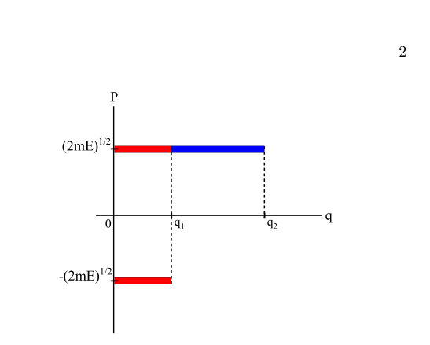 
FIG. 1: The phase-space diagram of a free particle with energy E and uncertainty ∆E ≪E moving from con- figuration point q1 to q2. The blue action strip repre- sents the shortest or the least action path between the two points while the longer (blue + red) is another path that also touches the origin in going from q1 to q2. Be- cause the area of each action strip in units of Planck’s constant h determines the number of quantum states Ω possibly swept out by the particle in going from q1 to q2, the least action strip (blue) is also the least entropic as S = K log Ω.

📷 Fig 2

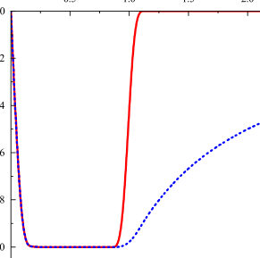 
FIG. 2: The information potential well of Eq. (25) with V (t) measured in units of the well depth V0, and time in units of the well width t0, representing an environ- ment out-of-equilibrium for the time period 0 &lt; t &lt; 1, returning to equilibrium at t = 1 with a time constant τeq ≪1, and staying in equilibrium for all times t &gt; 1. The blue dotted curve shows I1(t). Clearly the highest eigen-information |I1(t)| continues to evolve as t−1 long after heat-death, as all other states do (not shown). This is the part of evolution that the second law of thermody- namics tends to miss, but is captured by the second law of quantum complexity.

**Summary.** This paper proposes a 'second law of quantum complexity' that dictates how quantum information evolves after a system reaches thermal equilibrium. It shows that complexity continues to increase towards a maximum value, even after heat death, by reinterpreting the principle of least action through information theory. This offers a powerful, non-equilibrium tool for analyzing complex quantum dynamics.

**Why it may be interesting.** It provides a novel, information-theoretic framework for understanding non-equilibrium dynamics and the fate of quantum systems beyond standard thermodynamic predictions, linking concepts from general relativity (black holes) to statistical mechanics.

Detailed structure

**Main problem.** The paper investigates the existence and implications of a 'second law of quantum complexity' to govern the evolution of quantum states, particularly long after the system reaches thermodynamic equilibrium.

**Main result.** The quantum complexity is shown to increase monotonically towards a saturation value $C_{	ext{max}}$ even after heat death, following a specific time dependence, while decreasing in the out-of-equilibrium regime.

**Method.** The analysis reinterprets the principle of least action as a principle of least entropy increase and derives the complexity evolution using a quasistatic information quantization rule.

**Model / system.** The study applies to general physical systems, drawing analogies from classical mechanics and considering the evolution of quantum states, including concepts related to black hole interiors and information entropy.

**Key observables.** Quantum Complexity ($C$), Entropy ($S$), Available Information ($\Delta S$), and Action ($A$).

**Important parameters / regimes.** Equilibrium entropy ($S_{	ext{max}}$), time ($t$), and the characteristic time scales of equilibration ($t_0$).

**Assumptions / limitations.** The second law of quantum complexity is conjectured, and the derivation relies on assumptions regarding local equilibrium and the functional form derived from the second integral in the quantization rule.

**Figures summary.** Figure 1 illustrates the phase-space diagram linking the action strip area to accessible quantum states. Figure 2 shows the time evolution of the information potential and complexity, highlighting the post-equilibrium increase in complexity.

**Paper structure.** The paper establishes the link between least action and least entropy increase, derives the complexity from information quantization rules, and then analyzes the time evolution of complexity in both the long-time equilibrium limit and the initial out-of-equilibrium period.

Abstract

At a deeper level the principle of least action is interpreted as the law of least entropy increase consistent with Prigogine's principle of minimum entropy production, and the implications of quasistatic information quantization rule (Proc. R. Soc. A 480: 20240024), are explored for the conjectured second law of quantum complexity. It is thus shown that the conjectured second law of complexity is derivable from the information quantization rule such that long after heat-death the quantum state complexity evolves as $C(t)=C_{\rm max}\exp(-1/t)$, increasing with time to a saturation value $C_{\rm max}$ that is exponential in the equilibrium entropy $S_{\rm max}$. For the out-of-equilibrium circumstances, however, the quantum complexity can decrease with the time, asymptotically tending to a minimum determined by the distance from equilibrium.

[↑ back to top](#top)

### [Bound States in Exactly Solvable Polaritonic Models](http://arxiv.org/abs/2608.23535v1)

**Authors:** Sam Johar, Ryogo Katahira, Joseph Kraisler  
**Type:** theory · **Category:** other · **PDF:** <https://arxiv.org/pdf/2608.23535v1>  
**Analysis basis:** full PDF text, analyzed in chunks
**Topic relevance:** `Tavis-Cummings & cavity-many-emitter` **3/5** · `analog quantum simulation` **2/5** · `correlated / nonlocal dissipation` **2/5** · `driven-dissipative phase transition` **2/5** · `Keldysh / 2PI / non-Gaussian methods` **1/5** · `interference shaping light` **1/5** · `methods for driven-dissipative` **1/5**

📷 Fig 1

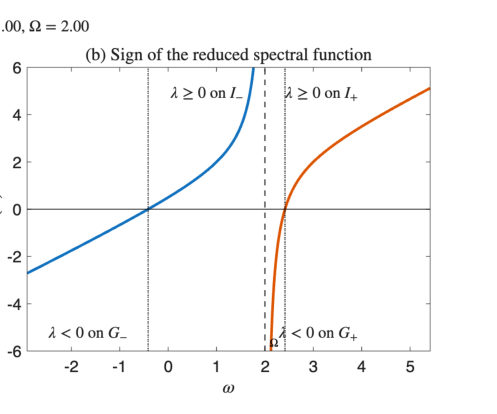 
Figure 1. (a) Spectral bands ω±(k) for the constant density model (b) Plot of the spectral function λ(ω) and the intervals of constant sign.

📷 Fig 2

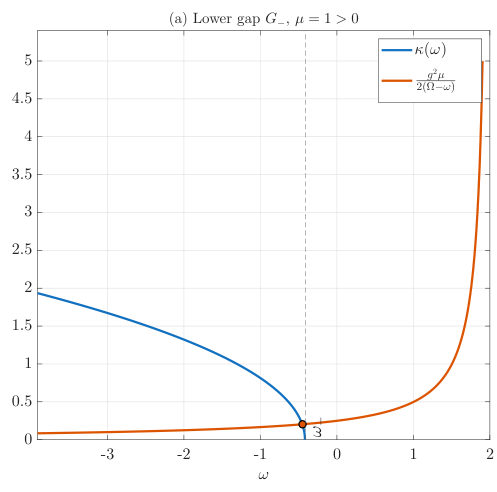 
Figure 2. Examples of crossings which correspond to solutions of (18). (a) A single intersection exists at a negative value. As µ increases, the orange curve increases

📷 Fig 3

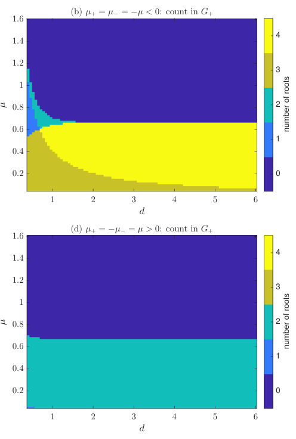 
Figure 3. Heat maps showing the number of bound-states for various values of d and µ in all cases. The number of roots is computed by subdividing each spec- tral gap, locating sign changes of the corresponding transcendental function, and separately detecting tangencies near double roots. All plots use the values Ω= 2, ρ0 = 1, g = 1.

📷 Fig 4

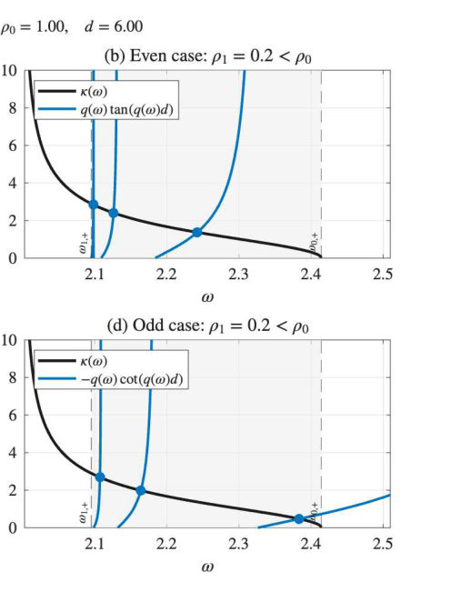 
Figure 4. Plots of the curves in (37) and (38) and their intersections. In (a) and (c) ρ1 = 5 &gt; ρ0 while in (b) and (d) ρ1 = 0.2 &lt; ρ0.

**Summary.** This paper theoretically analyzes bound states in a 1D polaritonic system coupling a scalar field to two-level atoms. It proves general existence theorems using the Birman-Schwinger principle and calculates the bound state frequencies for specific perturbations like point defects or finite barriers. The results are crucial for understanding localized excitations in structured quantum media.

**Why it may be interesting.** This work directly addresses the physics of light-matter interaction in structured media, a core topic in quantum optics and AMO physics, by providing rigorous mathematical conditions for localized excitations (polaritons).

Detailed structure

**Main problem.** The paper investigates the existence and properties of bound states in a one-dimensional scalar model describing an effective-mass quasiparticle field coupled to a continuum of two-level atoms.

**Main result.** The existence of bound states is rigorously proven using the Birman-Schwinger principle, providing specific conditions based on the sign and magnitude of spatially localized atomic density perturbations.

**Method.** The analysis reduces the coupled dynamics to a scalar eigenvalue problem, which is then solved using spectral theory techniques, including the Birman-Schwinger principle.

**Model / system.** The system models a 1D scalar field ($\phi$) coupled to two-level atoms ($\sigma$) via a Hamiltonian. The dynamics are analyzed under the Rotating Wave Approximation, leading to a Schrödinger-like equation with a frequency-dependent potential.

**Key observables.** Bound state frequencies ($\omega$), the decay constant ($\kappa(\omega)$), and the number of bound states.

**Important parameters / regimes.** Coupling constant ($g$), resonant frequency ($\Omega$), background density ($
ho_0$), and the perturbation strength ($\mu$).

**Assumptions / limitations.** The Rotating Wave Approximation (RWA) is assumed, and the analysis focuses on the single-excitation manifold.

**Figures summary.** Figures illustrate spectral bands ($\omega_\pm(k)$) and the relationship between the spectral parameter $\lambda(\omega)$ and the gaps. Other figures show crossings corresponding to bound state solutions for different defect profiles.

**Paper structure.** The paper establishes the governing Hamiltonian and reduces the problem to an eigenvalue equation. It then applies the Birman-Schwinger principle to prove existence theorems for bound states under various perturbation profiles (constant, $\delta$-function, finite barrier).

Abstract

We study a one-dimensional scalar model for an effective-mass quasiparticle field coupled to a continuum of two-level atoms with at most one excitation present. We prove a general theorem on the existence of bound states under sign-definite spatially localized perturbations of constant atomic density and analyze the bound states for several exactly solvable examples.

[↑ back to top](#top)

### [Environmental Control Extends Beyond Quantum Dephasing in Exciton Energy Transfer](http://arxiv.org/abs/2608.23423v1)

**Authors:** Junhua Zhou, Tianrui Chen, Dehao Yuan, Enhu He, Vandana Tiwari, Maxim Gelin, Francoise Remacle, R. J. Dwayne Miller, Fulu Zheng, Ajay Jha, Hong-Guang Duan  
**Type:** both · **Category:** other · **PDF:** <https://arxiv.org/pdf/2608.23423v1>  
**Analysis basis:** full PDF text, analyzed in chunks
**Topic relevance:** `correlated / nonlocal dissipation` **3/5** · `methods for driven-dissipative` **3/5** · `Keldysh / 2PI / non-Gaussian methods` **2/5** · `driven-dissipative phase transition` **2/5** · `non-equilibrium universality` **1/5** · `quantum measurements` **1/5**

📷 Fig 1

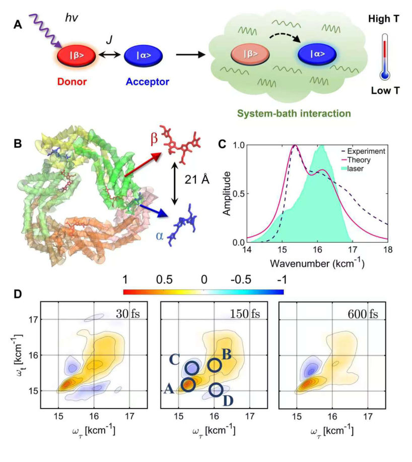 
Figure 1: APC structure and temperature-dependent 2DES. (A) Conceptual illustration of

📷 Fig 2

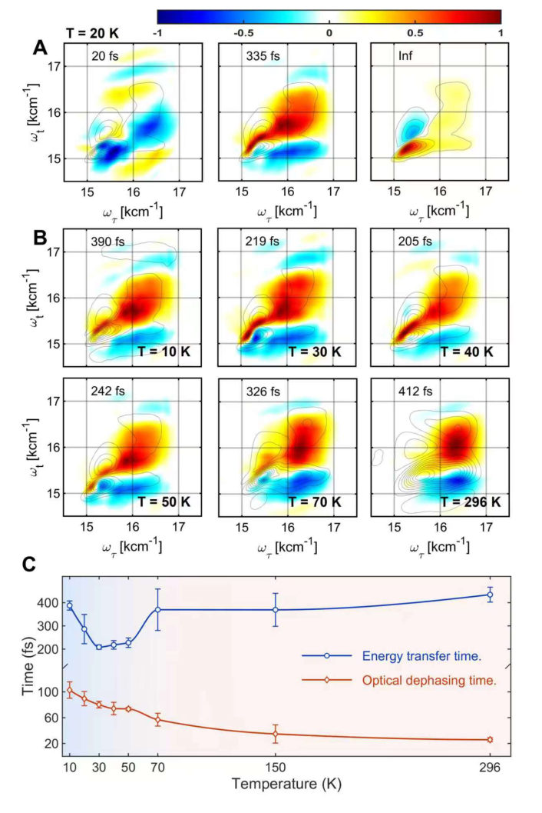 
Figure 2: Temperature dependence of excitation-energy transfer. (A) Representative 2DDAS ob-

📷 Fig 3

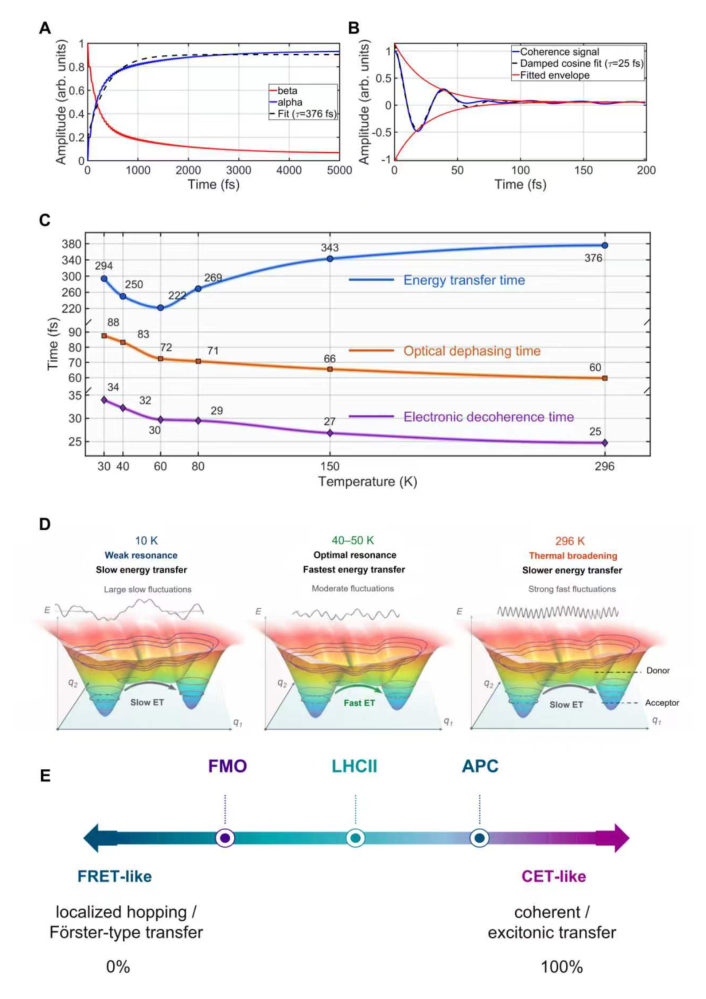 
Figure 3: HEOM simulations identify the environmental origin of the transport turnover. (A)

**Summary.** This work investigates energy transfer in the APC protein, finding that the transfer rate shows a complex, non-monotonic temperature dependence. This behavior cannot be explained by simple dephasing models, necessitating a detailed treatment of the environment's low-frequency spectral weight. The findings demonstrate that the specific frequency distribution of environmental coupling, not just the overall fluctuation strength, controls quantum energy transport efficiency.

**Why it may be interesting.** It provides a detailed, quantitative example of how environmental spectral weight distribution, rather than just the magnitude of fluctuations, dictates quantum transport rates in complex biological systems, which is highly relevant to open quantum system dynamics.

Detailed structure

**Main problem.** The study addresses how environmental fluctuations control excitation energy transfer in photosynthetic complexes, moving beyond simple models like incoherent hopping.

**Main result.** The energy transfer time exhibits a non-monotonic temperature dependence (minimum near 30-40 K), which contrasts sharply with the monotonic decrease of the homogeneous optical dephasing time.

**Method.** The research combines temperature-dependent 2DES measurements with advanced open-quantum system simulations using the Hierarchical Equations of Motion (HEOM).

**Model / system.** The system is the Allophycocyanin (APC) protein, modeled as a vibronically coupled excitonic dimer interacting with a structured, temperature-dependent environment.

**Key observables.** Energy transfer time ($eta 
ightarrow \alpha$), homogeneous optical dephasing time, and the environmental spectral density distribution.

**Important parameters / regimes.** Temperature range (10 K to 296 K), electronic coupling strength ($J$), and the frequency distribution of environmental spectral weight.

**Assumptions / limitations.** Conventional fixed-bath models fail; quantitative agreement requires allowing the low-frequency sector of the environmental spectral density to evolve anharmonically with temperature.

**Figures summary.** Figures compare the non-monotonic energy transfer turnover against the monotonic dephasing decrease, illustrating that low-frequency environmental modes govern the transport efficiency.

**Paper structure.** The paper establishes the physical problem using 2DES experiments across a wide temperature range, develops a detailed vibronic model, and uses HEOM simulations to reproduce the key non-monotonic temperature dependence, contrasting it with simpler dephasing metrics.

Abstract

Excitation-energy transfer underpins the conversion of light into usable energy in photosynthetic organisms and serves as a paradigm for evolutionary optimized transport in open quantum systems. Although this process is often described as incoherent thermally assisted hopping, such descriptions become inadequate when electronic coupling, vibronic interactions and environmental fluctuations occur on comparable energy scales. Determining how the environment controls transport therefore remains a fundamental challenge. Here, we use temperature-dependent 2DES to investigate energy transfer in the photosynthetic antenna protein allophycocyanin over the range 10 - 296 K. The dominant $β\rightarrow α$ transfer step exhibits a pronounced non-monotonic temperature dependence: the transfer time decreases from 400 fs at 10 K to 200 fs near 30- 40 K before increasing again to 400 fs at 296 K. In contrast, the homogeneous optical dephasing time decreases monotonically across the same temperature range. To interpret these observations, we model APC as a vibronically coupled excitonic dimer interacting with a structured environment and solve the dynamics using hierarchical equations of motion. Conventional fixed-bath models, including Drude-Lorentz and explicit intermolecular-mode spectral densities, fail to reproduce the observed turnover. Quantitative agreement is obtained only when the low-frequency sector of the environmental spectral density is allowed to anharmonically evolve strongly with temperature, while the high-frequency bath remains essentially unchanged. More broadly, these findings demonstrate that transport efficiency is controlled not simply by the magnitude of environmental fluctuations, but by the distribution of environmental spectral weight across frequency space, providing new experimental constraints on theories of molecular transport in complex quantum environments.

[↑ back to top](#top)

### [Non-Abelian Spin Counting of Ordered Stochastic Trajectories: Reentrant Finite-Time Chern Numbers](http://arxiv.org/abs/2608.23533v1)

**Authors:** Yangyang Du  
**Type:** theory · **Category:** statistical mechanics · **PDF:** <https://arxiv.org/pdf/2608.23533v1>  
**Analysis basis:** full PDF text, analyzed in chunks
**Topic relevance:** `Full counting statistics` **3/5** · `non-equilibrium universality` **3/5** · `driven-dissipative phase transition` **2/5** · `quantum measurements` **2/5** · `Keldysh / 2PI / non-Gaussian methods` **1/5** · `methods for driven-dissipative` **1/5**

📷 Fig 1

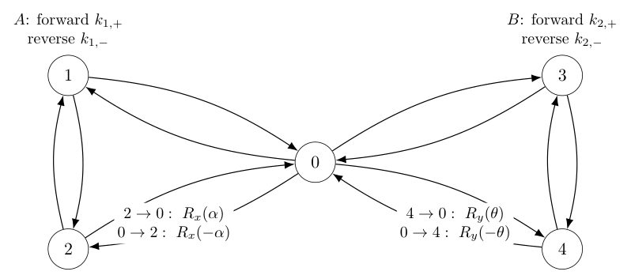 
Figure 1: Two-loop Markov network and the counting gauge. On cycle A the forward orientation 0 →1 →2 →0 has rate k1,+ and the reverse orientation has rate k1,−; cycle B is defined analogously. The auxiliary spin rotates only on the two distinguished closing edges, with inverse rotations on reverse jumps. The counter is passive and does not modify the transition rates.

📷 Fig 2

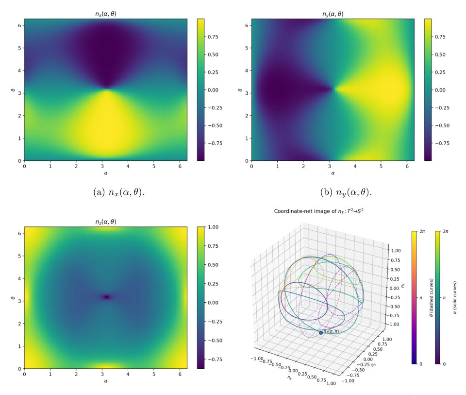 
Figure 2: Normalized mean-spin texture at T = 4. The component plots display the parameter-space structure, while the coordinate-net plot shows how the counting torus folds over the target sphere. The strong deformation near (π, π) is associated with the small polarization norm there.

📷 Fig 3

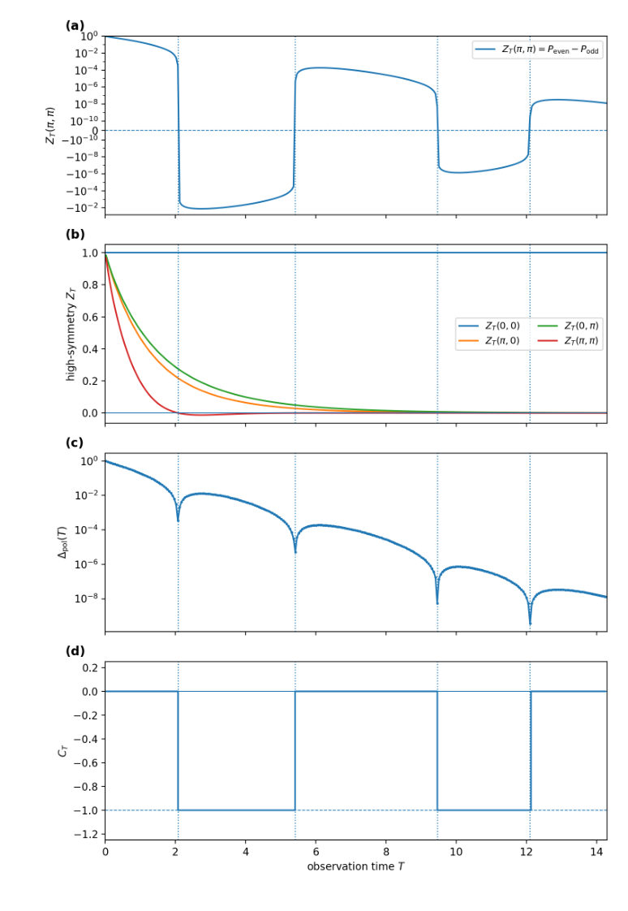 
Figure 3: Finite-time topological phase scan and parity signature. (a) Joint-current parity observable ZT (π, π) = Peven −Podd on a symmetric logarithmic scale; dotted lines mark its four zero crossings. (b) The four high-symmetry polarizations. The first three remain positive, while ZT (π, π) changes sign four times. (c) Polarization gap ∆pol(T), which closes at the same four critical times. (d) Chern number obtained independently from spherical triangulation. At each critical time the eigenline bundle is undefined because the mean polarization vanishes. The one-to-one correspondence between the Chern transitions and Peven = Podd is therefore a symmetry-resolved parity signature of the...

**Summary.** This paper develops a non-Abelian counting statistic to track the temporal ordering of events in stochastic processes, moving beyond the limitations of standard Full Counting Statistics. By mapping the ordered path ensemble to a complex line bundle, the authors calculate a Chern number ($C_T$) that quantifies this ordering. This shows that finite observation time can force a fixed process into distinct, topologically characterized sectors.

**Why it may be interesting.** The connection between non-equilibrium stochastic processes, topological invariants (Chern numbers), and path ordering is highly relevant for understanding fluctuation theorems and non-equilibrium steady states in complex quantum or classical systems.

Detailed structure

**Main problem.** To develop a counting statistic that captures the temporal ordering of stochastic events associated with different cycles, overcoming the limitation of conventional Full Counting Statistics (FCS) which only resolves net transport.

**Main result.** The non-Abelian counting construction yields a Chern number ($C_T$) that is sensitive to the temporal ordering of paths, demonstrating a Chern–parity correspondence with ordinary current-parity statistics.

**Method.** The authors introduce a non-Abelian counting construction using noncommuting rotations of an auxiliary spin, mapping the problem to calculating the Chern number of a complex line bundle over the counting torus.

**Model / system.** The analysis is performed on a five-state nonequilibrium figure-eight network, modeled as a stochastic Markov process with oriented cycles A and B.

**Key observables.** The Chern number ($C_T$), the mean spin $\mathbf{m}_T(\alpha, 	heta)$, and the parity observable $	ext{E}[(-1)^{Q_1+Q_2}]$ are key diagnostics.

**Important parameters / regimes.** Observation time $T$, and the parameters defining the cycle affinities ($A_i$).

**Assumptions / limitations.** The underlying dynamics are assumed to be classical and Markovian; the analysis relies on the existence of reflection symmetry to simplify the topological invariant calculation.

**Figures summary.** Figure 1 illustrates the two-loop Markov network and the associated counting gauge, showing spin rotations on specific edges. The notes detail the reentrant sequence of $C_T$ when varying observation time.

**Paper structure.** The paper progresses from identifying the failure of Abelian FCS to introducing the non-Abelian spin counting, deriving the topological invariant (Chern number), establishing the Chern–parity correspondence, and finally applying this to show time-dependent topological sectors in the path ensemble.

Abstract

Conventional full counting statistics assigns commuting phases to integrated stochastic currents and therefore resolves net transport but not, in general, the temporal ordering of events associated with different cycles. We introduce a non-Abelian counting construction in which crossings of two fundamental cycles rotate an auxiliary spin about different axes. The resulting ordered trajectory statistic has an exact finite-dimensional evolution equation for its first moment. The two rotation angles form a counting torus, and whenever the mean spin is nonzero its normalized direction defines a map $\mathbb T^2\to\mathbb S^2$, equivalently a complex eigenline bundle with a Chern number. Our main analytical result is a Chern--parity correspondence. Reflection symmetry equips this eigenline with a real structure and expresses $C_T\bmod2$ through first Stiefel--Whitney classes on the circles fixed by reflection. When the transverse polarization has no additional zeros along the reflection-fixed circles, these classes reduce to ordinary current-parity statistics at the four high-symmetry counting points. For a five-state nonequilibrium figure-eight network, varying only the observation time produces four polarization-gap closings and the reentrant sequence $C_T=0\to-1\to0\to-1\to0$. Every transition occurs at $(π,π)$ and coincides with a sign reversal of $\mathbb E[(-1)^{Q_1+Q_2}]$, while the full integer Chern number is obtained independently from the two-dimensional spin texture. Finite observation time can therefore organize a fixed stochastic process into distinct topological sectors of its ordered path ensemble.

[↑ back to top](#top)

### [Surface-Code Quantum Error Correction for Molecular Tweezer Arrays: Encoding, Layout, and Correlated Noise](http://arxiv.org/abs/2608.21961v1)

**Authors:** Niharika Verma, Utpal Roy  
**Type:** theory · **Category:** quantum information and computing · **PDF:** <https://arxiv.org/pdf/2608.21961v1>  
**Analysis basis:** full PDF text, analyzed in chunks
**Topic relevance:** `Rydberg arrays` **3/5** · `correlated / nonlocal dissipation` **3/5** · `QC/QI experiment` **2/5** · `analog quantum simulation` **2/5** · `methods for driven-dissipative` **1/5** · `quantum measurements` **1/5**

📷 Fig 1

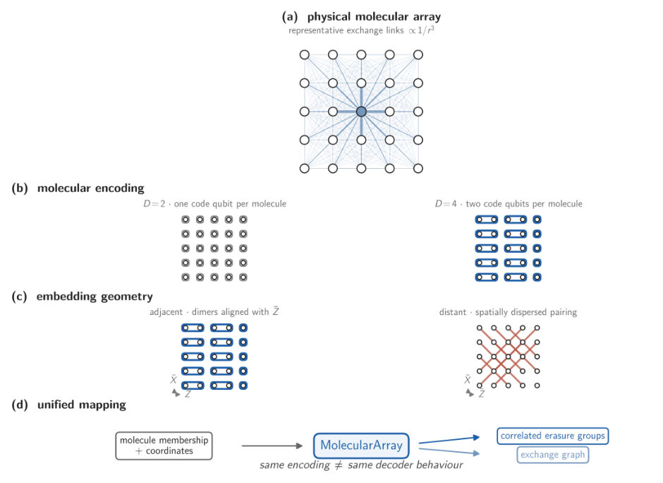 
FIG. 1. Physical to code mapping for a molecular tweezer array hosting the data qubits of a rotated surface code, illustrated at d = 5. Circles denote code qubits at their lattice positions; all panels are generated directly from the layout object used in the simulations, so the constructions shown are the ones analysed in the text. (a) Molecular array with representative dipolar exchange links. The faint mesh marks nearest neighbour couplings and the heavier links radiate from a single central site, with line width proportional to |wij|, illustrating the 1/r3 falloff. Only these representative links are drawn; the full graph couples every pair of molecular sites. (b) The two molecular...

📷 Fig 2

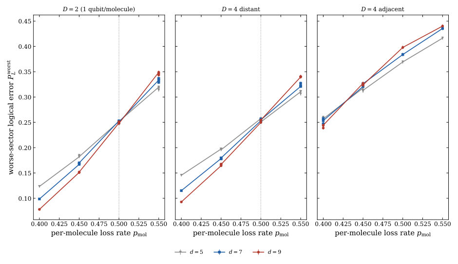 
FIG. 2. Worse sector logical error rate against per molecule loss rate at d = 5, 7, 9, pooled over three independent runs of 2 × 104 shots per sector. The dotted line marks pmol = 0.50 and is drawn only in the two panels where the curves cross there. Error bars are binomial.

📷 Fig 3

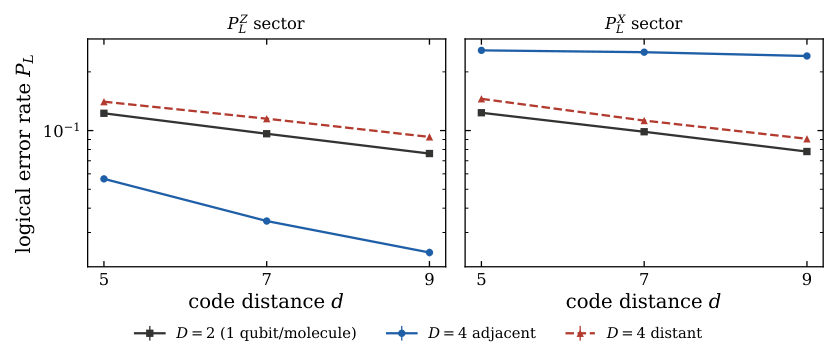 
FIG. 3. Logical error rate against code distance at pmol = 0.40, resolved by logical sector, on a shared logarithmic axis (2 × 104

📷 Fig 4

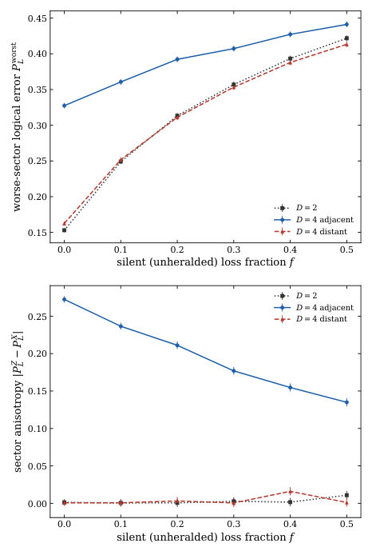 
FIG. 4. Effect of unheralded loss at d = 9, pmol = 0.45 (1.5 × 104 shots per sector, single run per point). Top: worse sector logical error against silent fraction f. Bottom: sector anisotropy |P Z L −P X L | against f. In the lower panel the D = 2 and D = 4 distant curves overlap near zero.

📷 Fig 5

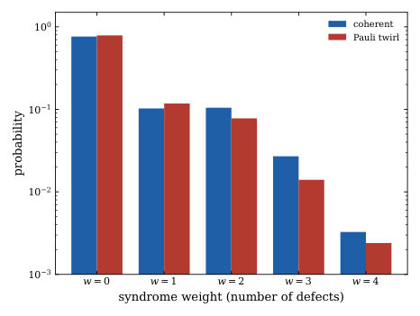 
FIG. 6. Syndrome weight distribution at d = 3, θ = 0.12. The coherent arm places less probability on weight one, which fails with certainty at this distance, and more on weights two and higher, which fail with probability 0.07 and below. Condi- tional failure probabilities are Pfail = 1.00 at w = 1, 0.07 at w = 2, and 0 at w = 3, 4.

**Summary.** This research analyzes quantum error correction on molecular tweezer arrays, demonstrating that the physical layout of the qubits is as critical as the encoding scheme itself. The authors show that spatial arrangement can induce significant directional biases in logical errors, necessitating the use of worst-case sector metrics for robust hardware design. The findings provide actionable design rules for building scalable, fault-tolerant quantum memories.

**Why it may be interesting.** This work directly bridges the gap between physical hardware realization (molecular arrays) and abstract quantum error correction theory, providing concrete, structure-dependent guidelines for designing fault-tolerant quantum processors.

Detailed structure

**Main problem.** The paper investigates how the physical structure of molecular tweezer arrays influences the performance of surface-code quantum error correction (QEC). It specifically compares different encoding strategies and the impact of spatial arrangement on error suppression.

**Main result.** Spatially dispersed $D=4$ encodings can achieve comparable error thresholds to $D=2$ encodings while using significantly fewer molecules. Crucially, the spatial embedding structure, rather than just the encoding dimension, dictates whether logical errors exhibit directional asymmetry.

**Method.** The authors constructed a mapping from the molecular array to a rotated surface code, simulating error rates under various noise models, including correlated molecular loss and coherent dipolar exchange.

**Model / system.** The platform is polar molecules trapped in optical tweezer arrays, used to implement qubits for a surface code. The system is modeled by considering correlated erasures based on qubit sharing and dipolar exchange interactions ($w_{ij} \propto r^{-3}$).

**Key observables.** Logical error rate ($P_L$), worst-case logical error ($P_{	ext{worst } L}$), and the degree of logical-sector asymmetry ($P_Z^L$ vs. $P_X^L$).

**Important parameters / regimes.** Code distance ($d=5, 7, 9$), molecular loss rate ($p_{mol}$), and the encoding dimension ($D=2$ vs. $D=4$).

**Assumptions / limitations.** The analysis is restricted to finite code distances, and the comparison of error rates is based on relative trends rather than asymptotic threshold determination.

**Figures summary.** Figures illustrate the physical-to-code mapping, the dependence of $P_{	ext{worst } L}$ on $p_{mol}$ for different encodings, and the suppression of logical errors in favored versus disfavored logical sectors as distance increases.

**Paper structure.** The paper progresses by first establishing the physical-to-code mapping, then comparing $D=2$ vs. $D=4$ encodings under correlated loss, followed by detailed analysis of how spatial embedding creates directional error asymmetries, and finally comparing different noise models (coherent vs. Pauli twirl) for the exchange interaction.

Abstract

Polar molecules trapped in optical tweezer arrays offer a promising platform for quantum information processing, providing precise control and long-range interactions that enable high-fidelity gate operations. We investigate quantum error correction in this system and show the influence of underlying physical noise. A mapping is constructed from a molecular tweezer array onto a rotated surface code in which a single specification of the array, namely, which code qubits share a molecule and where those molecules are located, determines both the correlated erasure structure and the dipolar exchange graph. We compare molecular encodings with rotational qudit dimensions (D), two and four under heralded molecular loss, coherent dipolar exchange, and imperfect heralding. It is found that a D= 4 encoding with spatially dispersed pairing exhibits a finite distance crossing at approximately the same per molecule loss rate as D= 2, while using 48-49 % fewer molecules, at the cost of a 6-10 % increase in sub-threshold logical error. Fixing the encoding and varying only the spatial embedding produces substantially larger effects: pairing the two co-located qubits along a lattice direction yields a logical-sector asymmetry of approximately fifty times. Over the simulated distances (d = 5, 7, 9), the disfavoured sector shows little or no suppression of logical error with increasing code distance, whereas the favoured sector improves by a factor of 1.5-2.3. We also find that Pauli twirl of the exchange interaction overestimates the logical error rate, which we attribute to the excitation-conserving structure of the interaction. These results reveal that the spatial embedding of correlated loss units is an important design parameter for molecular architectures and that single-sector benchmarks may be insufficient when correlated loss has directional structure.

[↑ back to top](#top)

### [Time reversal of complex evolution on a quantum computer](http://arxiv.org/abs/2608.22489v1)

**Authors:** Mahdi Kourehpaz, Dima L. Shepelyansky  
**Type:** theory · **Category:** statistical mechanics · **PDF:** <https://arxiv.org/pdf/2608.22489v1>  
**Analysis basis:** full PDF text, analyzed in chunks
**Topic relevance:** `analog quantum simulation` **3/5** · `non-equilibrium universality` **3/5** · `scars & prethermalization` **3/5** · `driven-dissipative phase transition` **2/5** · `quantum measurements` **1/5**

📷 Fig 1

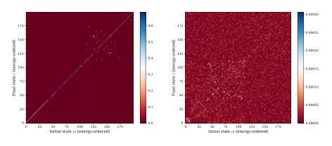 
FIG. 2. Matrix of excited state Wim after tr = 30 perturba- tion periods at nq = 4 × 4, ε = 2, and h = 0.1 (left); h = 1 (right); only 200 initial register states with minimal energy E0 = H0 are shown; m/i is index of initial/excited register state.

📷 Fig 2

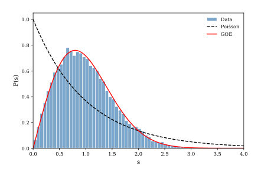 
FIG. 1. Level spacing statistics of quasienergies λ of unitary operator U at parameters ε = 2, h = 1, nq = 4 × 4 = 16; it is obtained by diagonalizing all ten symmetry sectors sepa- rately, there are approximately 4.9 × 104 spacings. The Pois- son (dashed curve) and Wigner surmise of RMT (red solid curve) distributions are also shown.

📷 Fig 3

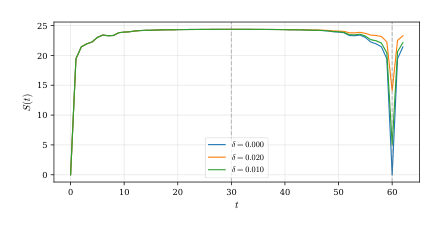 
FIG. 5. Entropy Sq dependence on time t for the same system parameters as in Fig. 4.

📷 Fig 4

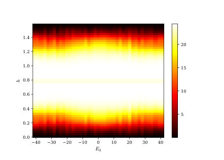 
FIG. 3. Quantum register melting: color bar shows entropy values Sq after tr = 30 evolution periods in dependence on h and initial energy E0 = H0 for nq = 5 × 5 = 25 qubits, ε = 2, tr = 30, |ψ0⟩= | ↑↑↑. . . ↑⟩. Melting sets in above a threshold in h and is strongest in the high-density central band (E0 ≈0), invading the low-density band edges later; the horizontal dark stripes are the fidelity register preserving areas.

📷 Fig 5

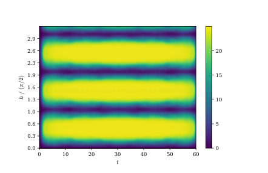 
FIG. 6. Entropy Sq dependence on h and time t shown by color (color bar with Sq values); here ε = 2, nq = 5 × 5 = 25, |ψ0⟩= | ↑↑↑. . . ↑⟩, tr = 30 and no imperfections. The kick strength expressed as h/(π/2) (vertical). Bright (yellow) bands mark fast saturation to a large entropy; the dark horizontal stripes at h/(π/2) = 0, 1, 2, 3, are the register- preserving resonances where the kick is trivial up to a phase.

**Summary.** This work proposes a quantum protocol to reverse complex, chaotic time evolution in a many-body qubit system, drawing a parallel to the historical Boltzmann-Loschmidt dispute. The protocol successfully restores the initial quantum state and entropy, demonstrating robustness against imperfections. Crucially, it highlights a 'butterfly effect' where local perturbations can destroy the global time-reversal symmetry.

**Why it may be interesting.** It provides a concrete, physical realization of time reversal in a highly non-equilibrium, chaotic quantum many-body system, linking fundamental statistical mechanics debates to modern quantum computation feasibility.

Detailed structure

**Main problem.** The paper addresses the problem of time reversal of thermalization, originally posed by the Boltzmann-Loschmidt dispute, within the modern context of quantum many-body systems.

**Main result.** A quantum protocol was proposed that successfully reverses complex, chaotic evolution, showing the system's entropy returning to its initial low value, and this reversal is robust against minor quantum gate imperfections.

**Method.** The time reversal is achieved by applying a time-reversed evolution operator ($U_r$) over a period equal to the initial evolution time, and its success is quantified using fidelity and entropy measurements.

**Model / system.** The model is the Time Reversal Kicked Ising (TIRKI) model, simulating qubits on a square lattice with next-nearest static couplings and driven by a pulsed magnetic field.

**Key observables.** Fidelity ($F(t)$), von Neumann entropy ($S_q$), and level spacing statistics of quasienergies ($\lambda$).

**Important parameters / regimes.** Quantum chaotic regime (characterized by RMT level spacing), the time return period ($2t_r$), and the strength of static imperfections ($\delta$).

**Assumptions / limitations.** The protocol assumes the system can be simulated by current quantum computers or annealers with hundreds of qubits, and the analysis relies on the system being in a chaotic regime.

**Figures summary.** Figure 1 compares level spacing statistics to Poisson and GOE distributions, confirming quantum chaos. Later figures illustrate the fidelity decay and the 'butterfly effect' when a single qubit inversion breaks time reversibility.

**Paper structure.** The paper first frames the classical Boltzmann-Loschmidt problem in quantum terms. It then details the TIRKI model and the time-reversal protocol using specific Hamiltonians and propagators. Key results are demonstrated by analyzing entropy growth, fidelity recovery, and the sensitivity to local perturbations (the butterfly effect).

Abstract

The Boltzmann-Loschmidt dispute in 1876-1877 discussed the problem of time reversal of ther- malization from time reversible classical equations of motion. Here, 150 years later, we highlight this problem in the frame of quantum computing. A quantum protocol is proposed that allows to perform a time reversal of complex evolution in the regime of many-body quantum chaos with many qubits. The system represents an evolution of qubits on a square lattice with inter-qubit next-nearest static couplings with a driven pulsed magnetic field. The system entropy grows rapidly to maximal values but returns to initial small values after time reversal. This time reversal is shown to be stable with respect to quantum gate imperfections. However, similar to the Lorenz butterfly effect, there is the butterfly effect of qubit when inversion of only one qubit breaks time reversibility of the whole system. It is argued that this protocol is accessible to nowadays quantum computers and annealers with hundreds of qubits.

[↑ back to top](#top)

### [Collective self-sorting on a chip](http://arxiv.org/abs/2608.22673v1)

**Authors:** Emanuel F. Teixeira, Thieu van den Bergh, Arjen Klok, Tijn Heesakkers, Alexandre Morin  
**Type:** both · **Category:** statistical mechanics · **PDF:** <https://arxiv.org/pdf/2608.22673v1>  
**Analysis basis:** full PDF text, analyzed in chunks
**Topic relevance:** `driven-dissipative phase transition` **3/5** · `non-equilibrium universality` **3/5** · `analog quantum simulation` **2/5** · `Frenkel-Kontorova` **1/5** · `correlated / nonlocal dissipation` **1/5** · `methods for driven-dissipative` **1/5**

📷 Fig 1

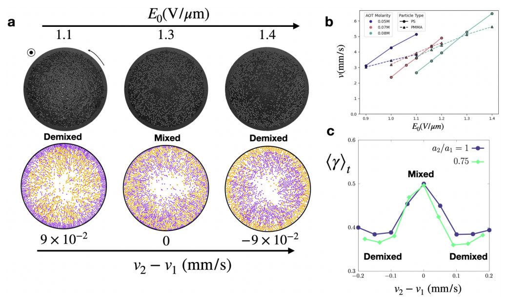 
FIG. 1. Differential self-propulsion speed controls radial demixing. a Experimental observations (top) of binary Quincke-roller flocks confined in a circular well. Reversing the applied electric field switches the relative propulsion speeds of the two species and consequently inverts the demixing pattern: the faster species accumulates near the outer boundary, whereas the slower species is enriched toward the centre. Particle-based simulations (bottom) reproduce the experimentally observed radial organization, with faster particles preferentially occupying the outer region and slower particles accumulating in the inner region. b Self-propulsion speed as a function of the applied electric...

📷 Fig 2

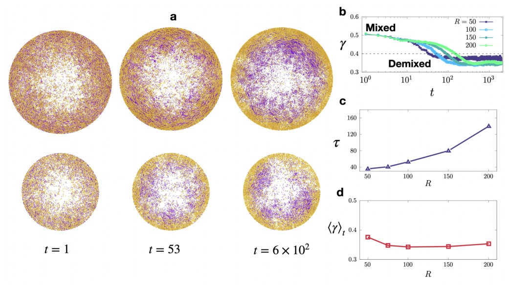 
FIG. 2. Smaller confinements accelerate demixing without compromising separation purity. a Configurations of binary active particles confined in circular arenas of different radii, showing the steady-state radial organization of the two species. b Time evolution of the demixing parameter, γ, for different arena sizes. The characteristic demixing time, τ, is defined as the first time at which γ &lt; 0.4, corresponding to the emergence of a macroscopically demixed state with a well- defined radial organization. c Characteristic demixing time as a function of the arena radius. Demixing occurs more rapidly in smaller arenas because particles must reorganize over shorter distances to establish the...

📷 Fig 3

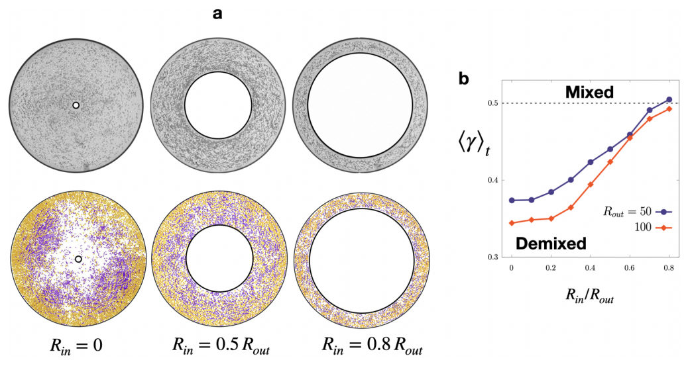 
FIG. 3. From arena to circular channels. a. Experimental snapshots of a binary mixture confined in an annular channel for different values of Rin/Rout, showing the progressive loss of radial demixing as the inner radius increases. b. Corresponding simulation snapshots obtained under the same conditions, reproducing the transition from a demixed to a mixed state. c. Steady-state demixing parameter from numerical simulations, ⟨γ⟩t, as a function of Rin/Rout for experiments and simulations. Demixing decreases monotonically with increasing Rin/Rout, demonstrating that the relative curvature of the inner and outer boundaries controls the efficiency of radial segregation.

📷 Fig 4

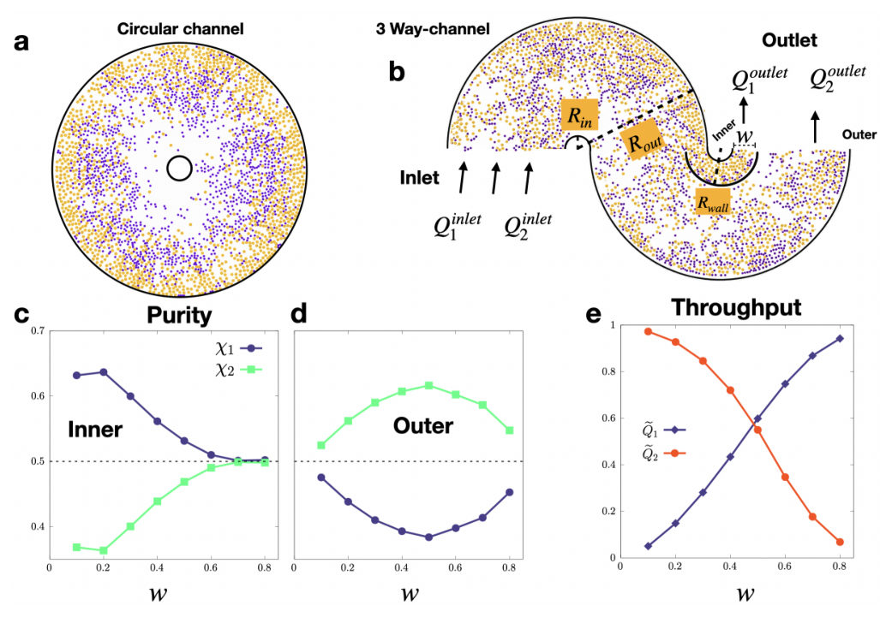 
FIG. 4. From circular channels to continuous particle collection. a. Circular annular channel used to generate radial demixing between fast and slow particles. b. Three-way sorting geometry obtained by combining two shifted semicircular channels and introducing a separating wall that directs the demixed populations towards distinct inner and outer outlets. The wall position is parametrized by w = (Rwall −Rin)/(Rout −Rin). c. Steady-state particle fractions χin 1 and χin 2 at the inner outlet as a function of w. The purity of fast particles is maximal around w ≃0.2. d. Corresponding particle fractions χout 1 and χout 2 at the outer outlet, with maximal purity of slow particles around w ≃0.5....

📷 Fig 5

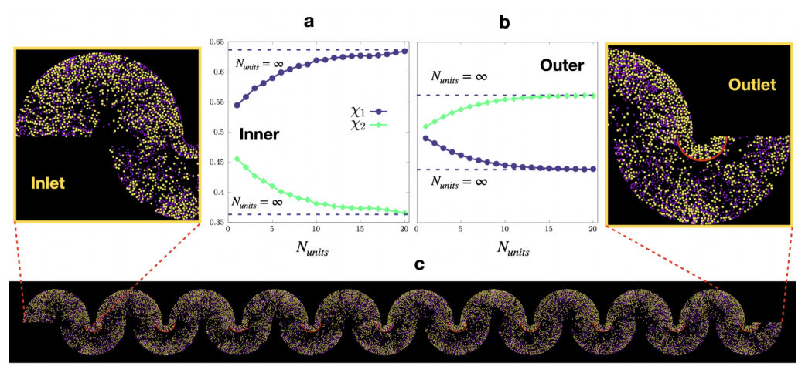 
FIG. 5. From periodic sorting to a finite-size device. a. Steady-state particle fractions measured at the inner and outer outlets as a function of the number of three-way sorting units, (Nunits). Dashed lines indicate the corresponding values obtained in the infinite-channel limit. The inner-outlet composition converges after approximately (Nunits ≃20), whereas the outer outlet reaches its asymptotic value after about (Nunits ≃12). b. Schematic of the finite sorting device composed of successive three- way channel units, showing the progressive segregation of the two particle species along the channel. c. Reinjection boundary condition used to mimic continuous operation of a finite device....

**Summary.** This work demonstrates how the inherent tendency of active particles to demix due to differences in self-propulsion speed can be engineered into a functional, continuous sorting device. By controlling the geometry of curved microfluidic channels, the authors successfully convert a microscopic active demixing process into a macroscopic, high-purity separation technique. This provides a powerful blueprint for autonomous microfluidic separation based on particle motility.

**Why it may be interesting.** While the core physics is classical active matter, the principles of non-equilibrium phase separation, pattern formation, and directed transport in confined geometries are highly relevant to understanding energy dissipation and collective dynamics in quantum many-body systems or engineered quantum devices.

Detailed structure

**Main problem.** The paper aims to develop a functional, continuous sorting strategy by harnessing collective active demixing in binary mixtures of self-propelled particles.

**Main result.** By designing a sequence of curved microfluidic units, the initial mixed suspension progressively demixes, leading to strong, controllable enrichment of the two species at distinct collection regions.

**Method.** The study combines particle-based molecular dynamics simulations with experimental measurements using Quincke-roller mixtures in microfluidic channels.

**Model / system.** The system involves binary mixtures of active particles exhibiting differential self-propulsion speed and excluded-volume interactions, confined within geometries ranging from circular wells to complex, snake-like annular channels.

**Key observables.** Spatial segregation patterns, demixing parameter ($\gamma$), normalized throughput ($	ilde{Q}_k$), and particle density fractions ($\chi_k$) at various downstream locations.

**Important parameters / regimes.** Differential self-propulsion speed, confinement geometry (e.g., $R_{in}/R_{out}$ ratio, wall position $w$), and the number of sequential sorting units ($N_{units}$).

**Assumptions / limitations.** The demixing mechanism is robust and can be controlled by geometry; the simulation models excluded-volume interactions and particle dynamics.

**Figures summary.** Figures illustrate radial demixing in circular wells (Fig. 1a), the acceleration of demixing in smaller confinements (Fig. 2), the control of segregation by boundary geometry (Fig. 3), and the final realization in a snake-like channel showing progressive enrichment (Fig. 6).

**Paper structure.** The paper progresses from establishing the fundamental mechanism of demixing using simple circular wells, to optimizing the geometry using annular channels and periodic boundary conditions, and finally demonstrating the scalability by constructing and testing a finite, continuous 'snake-like' sorting device.

Abstract

We harness two established ingredients for collective demixing: differential speed and curvature to create a self-sorting device. In binary mixtures, motility differences drive spontaneous spatial segregation, while confinement geometry determines how rapidly and strongly this demixing develops. Using particle based simulations, we systematically identify the geometrical conditions that promote efficient segregation and use these results to guide the design of a finite sorting architecture. We then translate these physical mechanisms into a sequence of curved microfluidic units that progressively amplify the separation of the two species and direct them toward distinct collection regions. Experiments with binary Quincke-roller mixtures confirm that an initially mixed suspension progressively demixes as it propagates through the device, leading to strong enrichment downstream. Our results demonstrate how collective active demixing can be converted into a functional continuous sorting strategy, providing a route toward autonomous microfluidic separation based on particle motility and confinement geometry.

[↑ back to top](#top)

### [Geometry-calibrated equilibrium sensing for inverse design of nonlocal topological photonic lattices](http://arxiv.org/abs/2608.22944v1)

**Authors:** Fatemeh Davoodi, Jeffrey McCord  
**Type:** both · **Category:** other · **PDF:** <https://arxiv.org/pdf/2608.22944v1>  
**Analysis basis:** full PDF text, analyzed in chunks
**Topic relevance:** `analog quantum simulation` **3/5** · `correlated / nonlocal dissipation` **2/5** · `driven-dissipative phase transition` **2/5** · `methods for driven-dissipative` **2/5** · `interference shaping light` **1/5** · `quantum measurements` **1/5**

📷 Fig 1

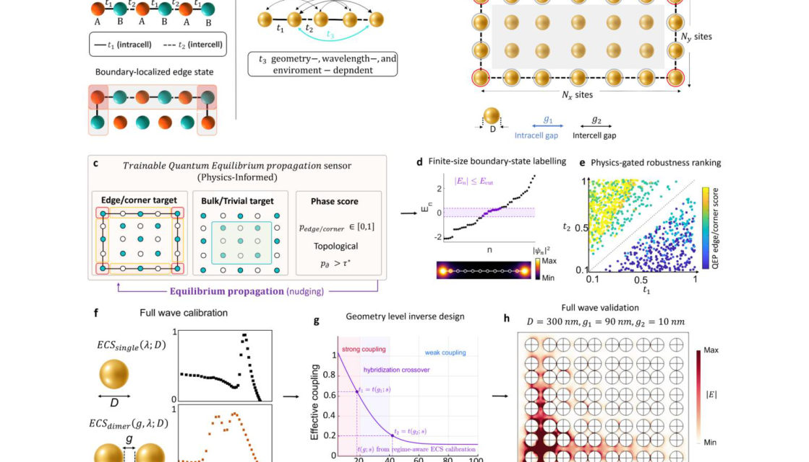 
Fig. 1 | Geometry-calibrated equilibrium sensing for nonlocal topological design. a, Conceptual comparison between an ideal short-range SSH lattice and a realistic nonlocal plasmonic SSH lattice. In the ideal model, the response is governed by the nearest-neighbor intracell and intercell couplings 𝑡1 and 𝑡2. In the plasmonic system, the effective longer-range coupling 𝑡3 depends on particle geometry, wavelength and local electromagnetic environment, deforming the nearest-neighbor SSH phase structure. b, Finite two-dimensional plasmonic SSH lattice used for boundary sensing and inverse design. The structure is partitioned into corner, edge and bulk sectors. The particle diameter is denoted...

📷 Fig 2

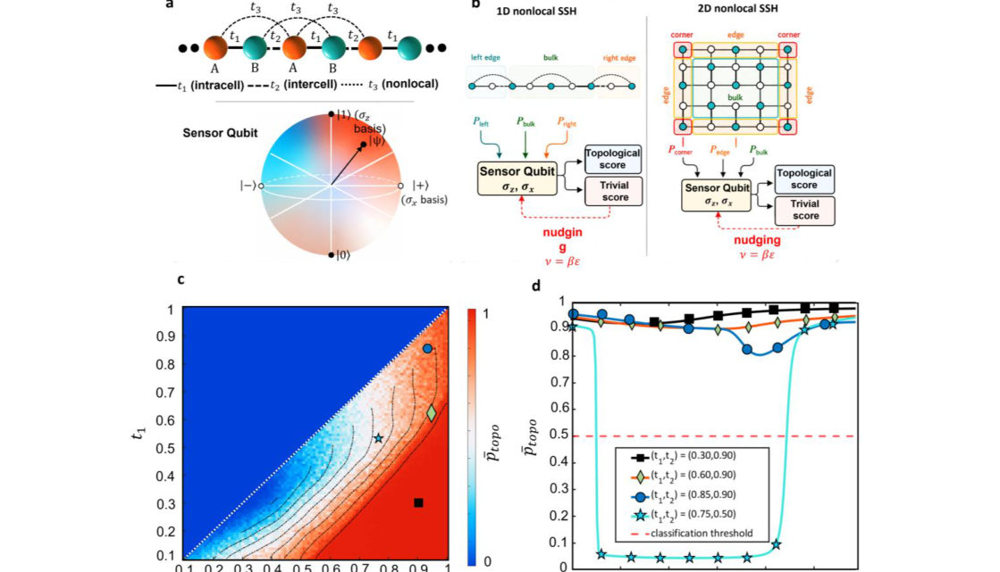 
Fig. 2 | Equilibrium sensing of nonlocal boundary response. a, Nonlocal one-dimensional SSH lattice used as the controlled benchmark. The intracell and intercell couplings are denoted by 𝑡1 and 𝑡2, while 𝑡3 introduces a longer-range off-diagonal coupling that perturbs the nearest- neighbour SSH limit. The physical lattice is coupled to a sensor qubit whose equilibrium state is read out in the 𝜎𝑧 and 𝜎𝑥 bases. b, Spatially resolved QEP sensing scheme for one- and two-dimensional lattices. In the one-dimensional chain, the sensor couples separately to left- edge, bulk and right-edge sectors. In the finite two-dimensional lattice, the sensor resolves corner, edge and bulk regions, allowing the...

📷 Fig 3

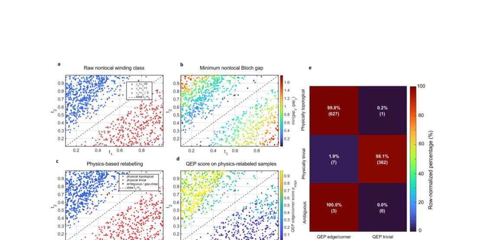 
Fig. 3 | Physical relabeling of the QEP response in nonlocal coupling space. a, Raw nonlocal winding classification of sampled coupling configurations in the (𝑡1, 𝑡2) plane. b, Minimum nonlocal Bloch gap for the same samples, identifying configurations close to gap closure. c, Physics-based relabeling obtained by combining the directional winding condition with a finite-gap threshold. Samples are assigned as physically topological, physically trivial or gap-ambiguous. d, QEP edge- or corner-response score evaluated on the physically relabeled samples. e, Row-normalized confusion matrix comparing the trained QEP response assignment with the independently determined physical classes. The...

📷 Fig 4

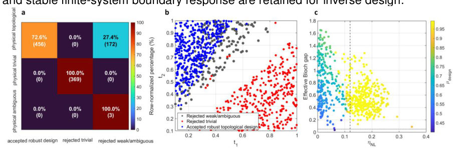 
Fig 4 | Physics-gated robustness ranking after relabeling. a, Physics-gated design- decision matrix showing the final design decision after applying the topology gate and robustness ranking. Physically trivial and gap-ambiguous samples are rejected, while physically topological samples are separated into accepted robust designs and rejected weak or ambiguous candidates. b, Distribution of accepted and rejected configurations in the (𝑡1, 𝑡2) plane. c, Dependence of the final design reliability score (𝜇design) on the effective Bloch gap and the nonlocality measure 𝜂NL. The dashed line marks the reference nonlocality value used in the robustness score. Only configurations with verified...

📷 Fig 5

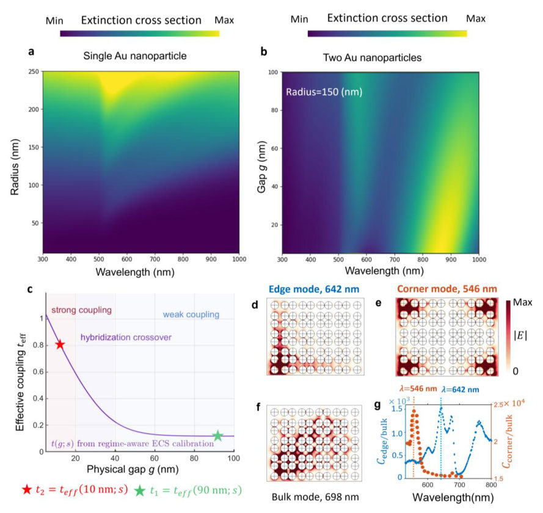 
Fig. 5 | Full-wave geometry-to-coupling calibration and inverse-designed plasmonic lattice. a, Full-wave extinction response of an isolated gold nanoparticle as a function of wavelength and particle radius. The single-particle spectrum defines the geometry-dependent optical resonance of the building block. b, Extinction response of a gold nanoparticle dimer with particle radius s = 150 nm plotted as a function of wavelength and gap 𝑔. The spectral shifts, redistribution and splitting relative to the isolated-particle response arise from electromagnetic hybridization. c, Regime-aware geometry-to-coupling mapping for the selected particle radius and design wavelength. The normalized effective...

**Summary.** This paper introduces a quantum equilibrium-propagation framework to enable the inverse design of nonlocal topological photonic lattices. It overcomes the limitations of nearest-neighbor models by incorporating full-wave electromagnetic interactions derived from plasmonic structures. The method rigorously verifies topological phases using winding numbers and identifies specific physical geometries that yield desired, strong boundary-localized optical responses.

**Why it may be interesting.** This work is highly relevant as it provides a concrete, physics-informed methodology for designing quantum optical structures where interactions are not simple nearest-neighbor hopping, bridging quantum topology with applied electromagnetism.

Detailed structure

**Main problem.** The paper addresses the challenge of inverse design for topological photonic lattices, moving beyond simplified nearest-neighbor models to incorporate realistic, long-range electromagnetic interactions.

**Main result.** A novel framework was developed that successfully links realistic electromagnetic geometry (via full-wave simulation) to physically verified, nonlocal topological design, identifying specific geometries supporting distinct boundary responses.

**Method.** The approach combines a geometry-calibrated quantum equilibrium-propagation (QEP) sensor with rigorous physical verification using nonlocal winding numbers and finite-gap criteria.

**Model / system.** The system involves finite nonlocal plasmonic Su-Schrieffer-Heeger (SSH) lattices constructed from gold nanoparticles. The model incorporates long-range, geometry- and wavelength-dependent electromagnetic couplings.

**Key observables.** Boundary-localized vs. trivial responses (measured by QEP sensor), nonlocal winding numbers, finite-gap criterion, and boundary-to-bulk intensity contrast.

**Important parameters / regimes.** Wavelength ($\lambda$), particle size, separation gaps ($g_1, g_2$), and the nonlocality regime ($\eta_{	ext{NL}}$).

**Assumptions / limitations.** The primary assumption is that the QEP sensor, when coupled with physical relabeling, can accurately map complex electromagnetic geometry to topological invariants and measurable boundary responses.

**Figures summary.** Figures illustrate the framework components, including the comparison between ideal and nonlocal SSH models, the QEP sensor mapping, the necessity of physical relabeling using winding numbers, and the final mapping of geometry to distinct spectral responses.

**Paper structure.** The paper introduces the problem (nonlocal interactions), develops the QEP sensing framework, implements a physics-gated relabeling procedure using winding numbers, calibrates the geometry-to-coupling relationship using full-wave simulations, and finally applies the inverse design to find target geometries.

Abstract

Topological photonic lattices are commonly designed using short-range Hamiltonians, yet realistic nanophotonic structures are governed by geometry- and wavelength-dependent long-range electromagnetic interactions. Here we introduce a geometry-calibrated quantum equilibrium-propagation framework for inference and inverse design in finite nonlocal plasmonic Su-Schrieffer-Heeger lattices. A two-qubit equilibrium sensor is trained in effective-coupling space to distinguish boundary-localized from trivial finite-lattice responses. Because labels inherited from the nearest-neighbor SSH model become unreliable in the presence of nonlocal hopping, each sample is independently relabeled using nonlocal winding numbers and a finite-gap criterion. On this physics-verified evaluation set, the sensor achieves 99.8% sensitivity and 98.1% specificity. A physics-gated robustness score then ranks verified configurations by boundary response, response contrast, gap stability and compatibility with the selected nonlocality regime. Full-wave extinction spectra of isolated and paired gold nanoparticles establish a geometry-to-coupling calibration linking particle size and separation to wavelength-resolved pair couplings. Projecting this calibration onto the verified coupling landscape identifies a finite plasmonic geometry supporting spectrally distinct corner- and edge-dominated responses at 546 and 642 nm, with sector-to-bulk intensity contrasts of $2.4 \times 10^{4}$ and $1.5 \times 10^{3}$, respectively. The framework links realistic electromagnetic geometry to nonlocal topological design, moving beyond nearest-neighbor design rules with physics-verified, geometry-resolved inference.

[↑ back to top](#top)

### [Inertial synchronization of networked oscillators in arbitrary dimensions](http://arxiv.org/abs/2608.23426v1)

**Authors:** Kirill Kovalenko, Bruce X. Dai, Fanshu Fang, Zerong Guo, Haoran Liu, Federico Botta, Charo I. del Genio, Stefano Boccaletti, Simona Olmi  
**Type:** theory · **Category:** disordered systems and neural networks · **PDF:** <https://arxiv.org/pdf/2608.23426v1>  
**Analysis basis:** full PDF text, analyzed in chunks
**Topic relevance:** `analog quantum simulation` **3/5** · `driven-dissipative phase transition` **2/5** · `non-equilibrium universality` **2/5** · `Frenkel-Kontorova` **1/5** · `Keldysh / 2PI / non-Gaussian methods` **1/5** · `correlated / nonlocal dissipation` **1/5** · `methods for driven-dissipative` **1/5**

📷 Fig 1

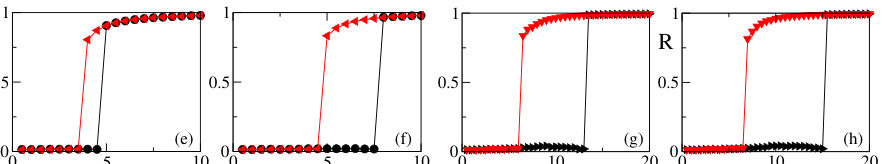 
Figure 1. Change in order of the transition. The time average of the order parameter ⟨R⟩vs. the coupling strength λ shows that the transition is continuous for small enough values of m. As m or the number of dimensions D increase, a hysteresis loop appears. In all panels, the black dots indicate the results of forward simulations and the red ones those of backwards simulations, the dashed lines with corresponding colours are the theoretical predictions, and the simulations were carried out for N = 1000 oscillators, for Ts = 100 time units after a transient time Tt = 400, varying ∆λ = 0.5. Simulations were performed applying a Runge-Kutta 4th order integration scheme with integration step...

📷 Fig 2

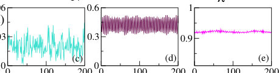 
Figure 2. The high inertia regime. (a) The critical cou- pling λF c increases with system size, eventually reaching ap- proximately 5.5. Blue dots denote the mean values over dif- ferent realizations, which range from 100 for N = 1000 to 20 for N = 100000. (b) Time average of the order parameter ⟨R⟩ vs. the coupling strength λ. The black and red triangles refer to simulations performed by following protocols (I) and (II). The color code of the filled diamonds corresponds to the color of the time traces shown in panels (c)-(e), that identify the asynchronous state (turquoise), cluster state (maroon) and partial synchronization (magenta). (c)-(e) Time behavior of the order parameter R(t) for...

📷 Fig 3

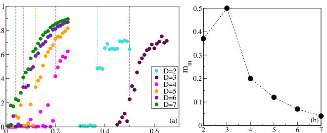 
Figure 3. The inertia needed to generate a first-order transition decreases with the dimensions. (a) Difference between the order parameter values in the two transition directions (when positive for the first time) during the backwards transition. (b) Minimum value of the mass mm needed to observe a discontinuous transition as a function of D.

📷 Fig 4

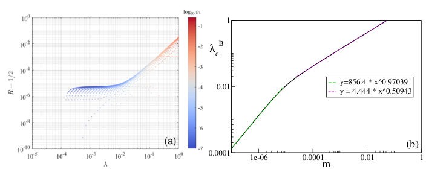 
Figure 4. The low inertia regime: recovering the classic D-dimensional Kuramoto model. (a) For vanishing λ, the order parameter approaches R = 1 2 for small-enough masses. (b) The scaling exponent of the smallest coupling λB c for which partial synchronization is observed with the mass crosses over from approximately 0.5 to approximately 1 as the mass decreases.

**Summary.** This work analyzes the inertial Kuramoto model in arbitrary dimensions to study collective synchronization. The key finding is that incorporating inertia fundamentally changes the synchronization transition, inducing hysteresis whose existence depends on the system's dimensionality and the magnitude of the inertia. This establishes inertia as a crucial control parameter for high-dimensional collective dynamics.

**Why it may be interesting.** The study of collective dynamics, phase transitions, and emergent order parameters in high-dimensional systems is highly relevant to understanding complex quantum many-body systems and open quantum systems.

Detailed structure

**Main problem.** The paper investigates the synchronization dynamics of networked oscillators in arbitrary dimensions, specifically focusing on the role of inertia.

**Main result.** Inertia fundamentally alters the synchronization transition, causing a crossover from continuous to discontinuous behavior, with the onset of hysteresis depending explicitly on both inertia and dimensionality parity.

**Method.** The analysis combines analytical theory, deriving self-consistent equations for the order parameter, with extensive numerical simulations.

**Model / system.** The system is modeled by an inertial Kuramoto model in $D$ dimensions, where the dynamics are governed by a generalized equation involving the second time derivative of the oscillator vectors.

**Key observables.** Order parameter ($R$), synchronization transition type (continuous vs. discontinuous), and the width of the hysteresis loop.

**Important parameters / regimes.** Dimensionality ($D$), inertia ($m$), and coupling strength ($\lambda$).

**Assumptions / limitations.** The analysis assumes the oscillator distribution is invariant under rotations around the mean order parameter ($	ilde{
ho}$).

**Figures summary.** Figures illustrate the change in transition order (continuous vs. hysteretic) with inertia and dimension, and show the time evolution of the order parameter across different synchronization regimes.

**Paper structure.** The paper develops the inertial Kuramoto model, derives mean-field equations, analyzes the transition points using stability criteria, and compares the resulting synchronization behavior across various dimensions and inertia regimes.

Abstract

The Kuramoto model provides a paradigmatic framework for studying synchronization of interacting oscillators, and has been generalized to arbitrary dimensions to describe swarms, flocks and multi-dimensional opinion dynamics. Yet, existing formulations neglect inertia, a key mechanism known to enhance information propagation and collective responsiveness. Here, we introduce and analyze an inertial Kuramoto model in arbitrary dimensions. We show that inertia fundamentally alters the nature of the synchronization transition, inducing a crossover from continuous to discontinuous behavior, with the onset of hysteresis depending explicitly on both inertia and dimensionality parity. Our analytical theory is supported by extensive numerical simulations. These results establish inertia as a crucial ingredient of high-dimensional collective dynamics and reveal a novel universal structure in synchronization phenomena.

[↑ back to top](#top)

### [Quantum Optomechanics with Imperfect Mirrors and Casimir-Polder Effect of Atoms with Different Dynamic Polarizabilities: A Unified Treatment via a Microscopic Model](http://arxiv.org/abs/2608.22098v1)

**Authors:** Bergen Dahl, Bei-Lok Hu  
**Type:** theory · **Category:** other · **PDF:** <https://arxiv.org/pdf/2608.22098v1>  
**Analysis basis:** full PDF text, analyzed in chunks
**Topic relevance:** `Keldysh / 2PI / non-Gaussian methods` **3/5** · `methods for driven-dissipative` **3/5** · `Tavis-Cummings & cavity-many-emitter` **1/5** · `analog quantum simulation` **1/5** · `correlated / nonlocal dissipation` **1/5** · `driven-dissipative phase transition` **1/5** · `quantum measurements` **1/5**

📷 Fig 1

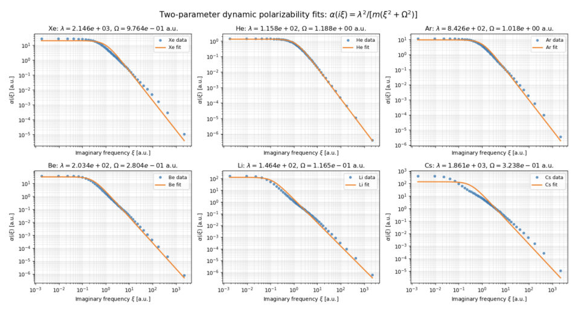 
FIG. 1. Fits of the dynamic polarizabilities for Xe, He, Ar, Be, Li, and Cs to the tabulated data.

📷 Fig 2

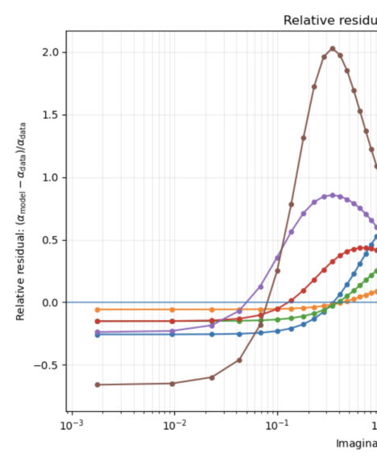 
FIG. 2. Relative residuals of the dynamic polarizabilities for Xe, He, Ar, Be, Li, and Cs.

📷 Fig 3

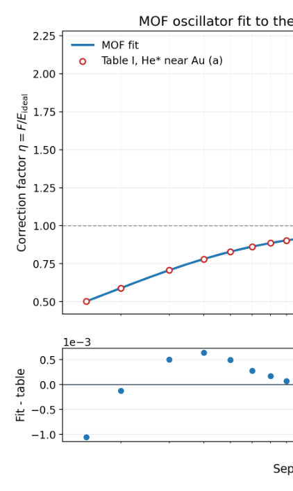 
FIG. 3. Fit of the correction factor as a function of distance to the data of Ref. [23].

**Summary.** This paper develops the Atom/Mirror-Oscillator-Field (AMOF) model, a microscopic theory for quantum optomechanics. It demonstrates the model's versatility by successfully calculating phenomena ranging from cavity field interactions with imperfect mirrors to the Casimir-Polder force between atoms and surfaces. The key contribution is showing that a single, unified microscopic framework can accurately describe diverse quantum optical and material physics problems.

**Why it may be interesting.** This work is highly relevant as it provides a rigorous, first-principles framework (microscopic dynamics) to calculate phenomena in open quantum systems, bridging the gap between idealized theoretical models and complex, real-world experimental setups in quantum optics and AMO.

Detailed structure

**Main problem.** The work aims to create a unified, microscopic model for quantum optomechanics (QOM) that accurately describes interactions involving imperfect mirrors and atoms with complex dynamic polarizabilities.

**Main result.** The proposed Atom/Mirror-Oscillator-Field (AMOF) model successfully reproduces established results for both cavity optomechanics (e.g., particle creation) and the Casimir-Polder force, showing excellent agreement with real material data.

**Method.** The authors employ a microscopic Hamiltonian approach, integrating out the internal oscillator degrees of freedom to derive effective field theories for calculating observables like transmission functions and free energy.

**Model / system.** The core is the AMOF model, which extends the MOF model by incorporating an internal degree of freedom (idf) for atoms or mirrors. This model describes the interaction between a quantum field ($\Phi$) and the mechanical/internal oscillator modes, allowing for a unified treatment of different physical boundaries.

**Key observables.** Transmission/reflection functions ($R(\omega), T(\omega)$), quantum fluctuations (particle number $N_{	ext{out}}(\omega)$), and the Casimir-Polder free energy ($F_A$).

**Important parameters / regimes.** The three intrinsic constituent parameters of the idf oscillator ($\lambda, m, \Omega$), and material properties like plasma frequencies or coupling strengths.

**Assumptions / limitations.** The analysis often relies on approximations such as the small displacement limit for mirrors and the dilute atomic limit for the Casimir-Polder calculation.

**Figures summary.** Not specified in the notes, but the structure implies comparisons between AMOF predictions and established boundary condition methods or experimental data fits.

**Paper structure.** The paper systematically tackles three related problems: 1) Imperfect mirrors in a cavity field, 2) Fitting the model's dynamic polarizability to tabulated data, and 3) Combining these to analyze the quantum-fluctuation-induced Casimir-Polder energy.

Abstract

This work aims at bringing the microphysics model of quantum optomechanics (QOM) proposed in [1] and developed in [2, 3] one step closer to be applicable to realistic experimental conditions, specifically, for imperfect mirrors, and for real materials. The atom/mirror-oscillator-field (AMOF) model features an internal degree of freedom for a mirror or an atom whose interaction with a quantum field determines the transmission functions of a mirror or the dynamic polarizability of an atom. We study three problems with this model: 1) An imperfect mirror moving in a cavity field, comparing results from the AMOF model with the boundary condition methods; 2) We analyze how well the dynamic polarizability derived from the AMOF model fits the tabulated data at different frequencies. 3) Combining these two parts we analyze the quantum fluctuations induced Casimir-Polder energy between a dilute atom space and a wall. We examine how well we can use the three constituent parameters of the idf oscillator in the AMOF model to match with published results on a meta-stable He* atom near a Au plate and found excellent agreements. These examples show that the AMOF model not only has a sound theoretical structure, because it is based on the microphysics dynamics of the basic constituents, it also has good practical values because it can produce accurate results for certain real materials.

[↑ back to top](#top)

### [Extreme-ultraviolet spectroscopy using quantum logic: a feasibility study for singly-ionized helium](http://arxiv.org/abs/2608.23516v1)

**Authors:** A. Martínez de Velasco, V. P. J. Barbé, E. L. Gründeman, A. Díaz Calderon, M. Collombon, J. J. Krauth, C. F. Roth, M. Favier, R. Taieb, T. E. Mehlstäubler, P. O. Schmidt, L. S. Dreissen, K. S. E. Eikema  
**Type:** both · **Category:** other · **PDF:** <https://arxiv.org/pdf/2608.23516v1>  
**Analysis basis:** full PDF text, analyzed in chunks
**Topic relevance:** `QC/QI experiment` **3/5** · `quantum measurements` **3/5** · `quantum optics experiment` **3/5** · `interference shaping light` **1/5**

📷 Fig 1

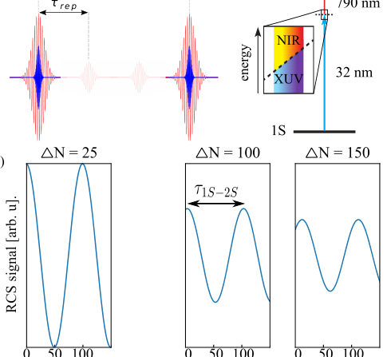 
FIG. 1. Depiction of Ramsey-comb spectroscopy of the 1S − 2S transition in He+. a) Pairs of phase-coherent, two-color 790 nm NIR (red) + 32 nm XUV (blue) pulses derived from a FC and separated in time by multiples of the FC repetition period τrep are used to perform a series of individual Ramsey- type measurements. The 32 nm light is the 25th harmonic of the NIR fundamental and is generated by HHG in a gas jet. b) The 40.81 eV energy gap of the 2-photon 1S−2S transition in He+ is bridged by a 790 nm photon and its 25th harmonic in the XUV at 32 nm. Inset: Different wavelength combinations within the bandwidths of the NIR and XUV pulses match the 1S −2S energy gap and their contributions...

📷 Fig 2

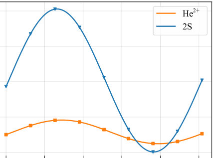 
FIG. 2. Simulated RCS fringes for 1S −2S excitation of He+, for a free and static He+ ion at a macrodelay of 600 fs (chosen for computational convenience). Solid lines are sinusoidal fits to the simulated data. For a NIR intensity of 4×1013 W/cm2

📷 Fig 3

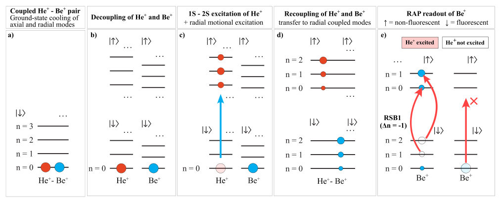 
FIG. 3. Quantum logic-type detection scheme based on single He+ and Be+ ions co-trapped in a linear Paul trap. For He+, |↓⟩= |1S⟩and |↑⟩= |2S⟩. For Be+, |↓⟩= 2S1/2 |F = 2, mf = 2⟩and |↑⟩= 2S1/2 |F = 1, mf = 1⟩. a) The coupled motional modes of He+ with Be+ are cooled to the ground state with both ions in their electronic ground state. b) The ions are radially motionally decoupled by relaxing the ion trap axial potential. c) Excitation of He+ to the electronic excited state |↑⟩by XUV radiation is accompanied by a large momentum transfer which promotes the He+ ion to a coherent motional state with average motional quanta ¯n = 11 distributed among its radial motional modes; The Be+ remains in...

📷 Fig 4

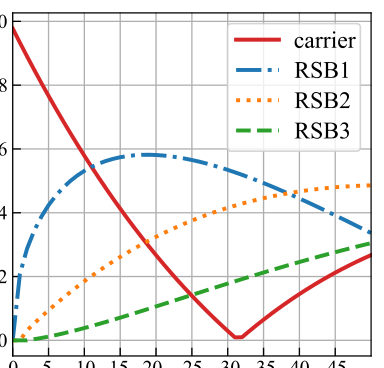 
FIG. 4. Normalized Rabi frequency for carrier (solid red), first- (dash-dotted blue), second- (dotted orange), and third- order (dashed purple) red sidebands for a Lamb-Dicke param- eter of η = 0.2.

📷 Fig 5

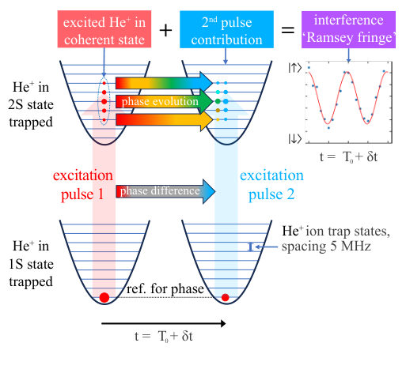 
FIG. 5. Schematic depiction of RCS of He+ in an ion trap. The He+ ion is decoupled from the Be+ ion and initially in the motional and electronic ground state (see part b of Fig. 3). The first RCS pulse, depicted as the light red vertical arrow, creates a superposition of the ground electronic and excited state. The electronic excited state features several occupied motional levels. The phase of the excited state wavefunction evolves as ϕk(t) = ωtrt + ωsec,kt. Each motional level evolves at its own frequency ωsec,k = k × ωsec, where ωsec is the ion secular frequency and k indexes the motional level. At a later time t the second excitation pulse, depicted as the light blue vertical arrow,...

**Summary.** This paper presents a feasibility study for using Quantum Logic spectroscopy combined with Ramsey-Comb techniques to measure the $1S-2S$ transition in $	ext{He}^+$ in the XUV range. By addressing technical challenges like Doppler broadening and phase noise, the authors demonstrate that high precision spectroscopy, crucial for testing QED, is achievable with trapped ions and high-harmonic generation sources.

**Why it may be interesting.** This work represents a state-of-the-art integration of several advanced quantum optics techniques—trapped ions, XUV combs, and quantum control—to push the boundaries of fundamental constant measurements.

Detailed structure

**Main problem.** The paper addresses the challenge of performing high-precision spectroscopy in the Extreme-Ultraviolet (XUV) range, specifically targeting the $1S-2S$ transition in singly-ionized helium ($	ext{He}^+$).

**Main result.** The authors show that achieving spectroscopic precision at the $10 	ext{ kHz}$ level is feasible using their proposed method, enabling improved tests of Quantum Electrodynamics (QED) or precise measurements of fundamental constants.

**Method.** They propose a novel Quantum Logic (QL) spectroscopy method combined with Ramsey-Comb Spectroscopy (RCS) to interrogate the weak XUV transition.

**Model / system.** The experiment uses a single $	ext{He}^+$ ion co-trapped with a $	ext{Be}^+$ ion in a Paul trap. Excitation is achieved by upconverting frequency-comb (FC) laser pulses to the XUV via High-Harmonic Generation (HHG).

**Key observables.** The primary observable is the population oscillation of the $2S$ state, measured via a nondestructive QL readout scheme.

**Important parameters / regimes.** The target transition is the $1S-2S$ transition at $40.81 	ext{ eV}$; the required precision is $10^{-12}$ fractional uncertainty.

**Assumptions / limitations.** Key assumptions include using an optical cavity to filter FC pulses for phase coherence and modeling motional dynamics outside the Lamb-Dicke regime.

**Figures summary.** Figure 1 depicts the Ramsey-comb spectroscopy setup using two-color NIR and XUV pulses, while Figure 2 shows simulated RCS fringes illustrating the population dynamics of the $2S$ state.

**Paper structure.** The paper introduces the need for XUV spectroscopy, proposes the QL-RCS scheme for $	ext{He}^+$, details the technical solutions for Doppler/recoil cancellation and phase coherence, and concludes with the feasibility demonstration for high-precision measurements.

Abstract

Extreme-ultraviolet (XUV) spectroscopy represents an important new direction in precision physics, with potential applications ranging from the metrology of fundamental constants to tests of physics beyond the Standard Model. However, the application of quantum control methods for precision spectroscopy remains an open challenge in the XUV range. Here we present a novel quantum logic (QL) spectroscopy method for precision spectroscopy of weak XUV transitions, and numerically validate its feasibility for the $1S-2S$ transition at 40.81\,eV in singly-ionized helium (He$^{+}$). We propose a scheme based on a single He$^{+}$ ion co-trapped with a Be$^{+}$ ion in a Paul trap, and He$^{+}$ excitation with pairs of frequency-comb (FC) laser pulses upconverted to the XUV via High-Harmonic Generation (HHG). We investigate a nondestructive QL scheme to detect $1S-2S$ excitation, and compare its performance with a destructive readout based on state-selective ionization. Phase coherence of the XUV light is modelled and an optical cavity is used to filter the FC pulses prior to HHG. We model the motional excitation dynamics of trapped ions outside the Lamb-Dicke regime, and numerically validate a scheme we proposed in \cite{Grundeman} to cancel the first-order Doppler broadening and the recoil shift by synchronizing the ion's secular period with the time delay between the two excitation pulses. We show that precision spectroscopy of the $1S-2S$ transition in He$^{+}$ at the 10 kHz level is feasible, for improved tests of quantum electrodynamics (QED), a measurement of the Rydberg constant $R_{\infty}$ independent of hydrogen measurements, or an improved determination of the alpha particle and helion charge radii. The proposed method may also be applied to XUV spectroscopy of other ions outside the Lamb-Dicke regime.

[↑ back to top](#top)

### [Flux-induced Aharonov-Bohm Oscillation in the Tunneling Spectroscopy of Kitaev Spin Liquids](http://arxiv.org/abs/2608.23561v1)

**Authors:** Wen-Han Kao, Elio J. König  
**Type:** both · **Category:** strongly correlated electrons · **PDF:** <https://arxiv.org/pdf/2608.23561v1>  
**Analysis basis:** full PDF text, analyzed in chunks
**Topic relevance:** `analog quantum simulation` **3/5** · `interference shaping light` **3/5** · `quantum measurements` **2/5** · `Keldysh / 2PI / non-Gaussian methods` **1/5** · `methods for driven-dissipative` **1/5**

📷 Fig 1

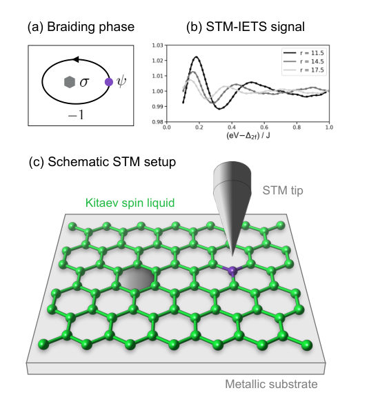 
FIG. 1. Proposed scanning tunneling microscopy (STM) setup for probing the Ising anyon braiding effect from an isolated 𝜋-flux ex- citation. (a) The full braiding phase from a fermion encircling an isolated 𝜋-flux excitation. (b) The proposed tunneling signal as a function of the bias voltage 𝑒𝑉(subtracted by the two-flux gap Δ2 𝑓), in units of the Kitaev coupling 𝐽. Different curves represent the dif- ferent measuring positions with a horizontal distance 𝑟in units of the lattice constant from the 𝜋-flux plaquette. (c) The schematic STM setup, where the tip is on top of one lattice site (highlighted in pur- ple) in the Kitaev spin-liquid layer. The isolated 𝜋-flux excitation is depicted as...

📷 Fig 2

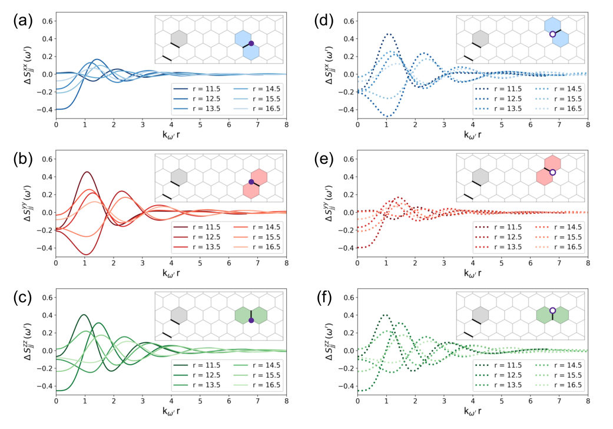 
FIG. 2. Different components of the flux-contrasted dynamical spin correlation function for (a)-(c) the A sublattice sites and (d)-(f) the B sublattice sites. On the horizontal axis, we define 𝑘𝜔′ = √︁

📷 Fig 3

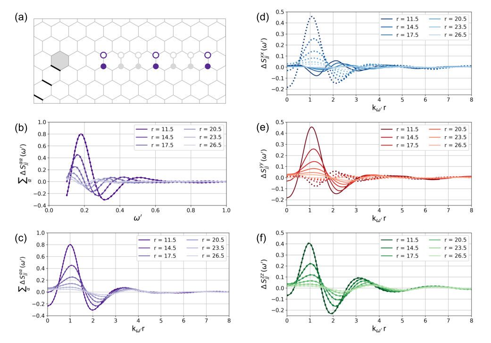 
FIG. 3. STM-IETS signals at measurement sites separated by three unit cells. (a) The setup for the measuring sites. Instead of measuring every site along the radial direction (Δ𝑟= 1), we select sites separated by Δ𝑟= 3 to remove the relative intervalley phase in the oscillation. (b)-(c) Aharonov-Bohm oscillations in the STM-IETS signal as a function of frequency or 𝑘𝜔′𝑟. Note that we shift the frequency with the two-flux gap Δ2 𝑓to show the alignment of the peaks. (d)-(f) Three components of the STM-IETS signals under the same Δ𝑟= 3 selection.

📷 Fig 4

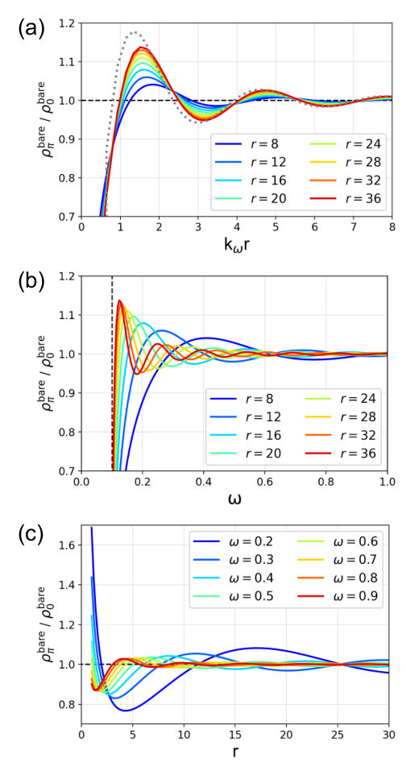 
FIG. 4. The bare LDOS of the continuum model in the presence of a 𝜋flux, calculated by Eq. (26). The linear LDOS is defined as a back- ground reference 𝜌bare 0 . In (a), each curve is evaluated at fixed 𝑟and 𝑘𝜔= √

📷 Fig 5

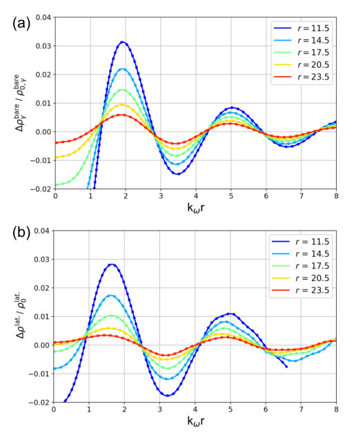 
FIG. 5. The flux-contrasted LDOS for (a) the continuum model, and (b) the lattice model (𝐿= 122) without the flux-pair insertion. The continuum model result is calculated by Eq. (35) and normalized by 𝜌bare 0,𝛾= −1

**Summary.** This paper demonstrates that intrinsic $\pi$-flux excitations in Kitaev spin liquids leave a detectable Aharonov-Bohm-like interference pattern in the local electronic tunneling spectrum. By combining exact diagonalization with continuum theory, the authors establish a robust, spatially resolved diagnostic tool for characterizing fermion-flux mutual statistics without needing to manipulate anyons directly.

**Why it may be interesting.** The work provides a concrete, measurable spectroscopic signature (the AB oscillation) for a purely quantum topological feature (the intrinsic flux) in a strongly correlated magnetic system, bridging abstract theory to potential experimental detection.

Detailed structure

**Main problem.** The central challenge is identifying emergent flux excitations and characterizing their mutual statistics with itinerant Majorana fermions within Kitaev spin liquids.

**Main result.** The authors show that an isolated $\pi$-flux imprints a measurable Aharonov-Bohm-like interference pattern on the charge-neutral Majorana continuum, which is confirmed by both exact diagonalization and continuum theory.

**Method.** The study combines theoretical calculations (large-scale exact diagonalization and low-energy continuum theory) with proposals for experimental measurement using Scanning Tunneling Microscopy with Inelastic Electron Tunneling Spectroscopy (STM-IETS).

**Model / system.** The system is based on the Kitaev honeycomb model, which is mapped onto a free-fermion Hamiltonian. The physics is analyzed in the presence of intrinsic $\pi$-flux excitations characterized by the flux operator $W_p = -1$.

**Key observables.** The key observable is the Aharonov-Bohm-like quantum oscillation in the local dynamical spin response, measured via the inelastic tunneling signal $rac{d^2I}{dV^2}$.

**Important parameters / regimes.** The key parameters include the flux quantum ($\pi$-flux), the bias voltage ($V$), and the tip-flux separation ($r$).

**Assumptions / limitations.** The analysis relies on the adiabatic approximation in the continuum theory and assumes the measuring site is far from other defects to maintain a constant two-flux gap.

**Figures summary.** Figure 1 illustrates the proposed STM setup and the dependence of the tunneling signal on bias voltage and tip-flux separation. Figure 2 shows the flux-contrasted dynamical spin correlation functions comparing the presence and absence of an isolated $\pi$-flux.

**Paper structure.** The paper progresses from defining the Kitaev model and the flux excitation, to deriving the necessary theoretical tools (Bogoliubov-de Gennes form, path integrals), and finally presenting the consistent results from both numerical simulations and continuum theory confirming the observable oscillation.

Abstract

Identifying emergent flux excitations and signatures of their mutual statistics with itinerant Majorana fermions remains a central challenge in Kitaev spin liquids. We show that an isolated $π$ flux imprints an intrinsic Aharonov-Bohm-like interference pattern on the charge-neutral Majorana continuum. Spatially resolved scanning tunneling microscopy with inelastic electron tunneling spectroscopy (STM-IETS) probes this oscillation in the local dynamical spin response as a function of both bias voltage and tip-flux separation, reflecting the $π$ phase acquired by Majorana trajectories encircling the flux. We show that large-scale exact diagonalization of the Kitaev honeycomb model and a complementary low-energy continuum theory yield consistent radial oscillations. These results provide a finite-energy, spatially resolved tunneling signature of a preexisting flux and a diagnostic of fermion-flux mutual statistics without requiring manipulation of individual anyons in the Kitaev spin liquid.

[↑ back to top](#top)

### [Emergent Second Law for Time-Dependent Nonequilibrium States](http://arxiv.org/abs/2608.21661v1)

**Authors:** Nahuel Freitas, Timur Aslyamov, Massimiliano Esposito  
**Type:** theory · **Category:** statistical mechanics · **PDF:** <https://arxiv.org/pdf/2608.21661v1>  
**Analysis basis:** full PDF text, analyzed in chunks
**Topic relevance:** `Keldysh / 2PI / non-Gaussian methods` **3/5** · `non-equilibrium universality` **3/5** · `methods for driven-dissipative` **2/5** · `driven-dissipative phase transition` **1/5**

📷 Fig 1

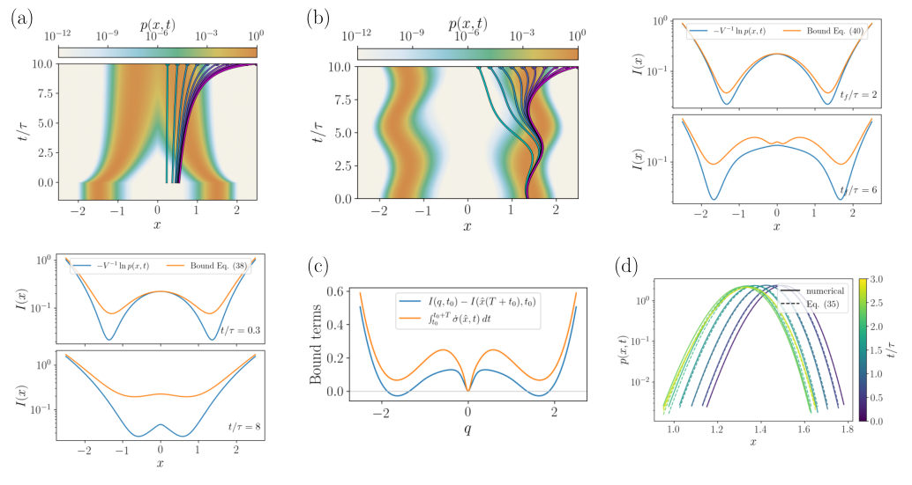 
FIG. 1. Relaxation after an instantaneous quench of the double-well potential (a) and a periodically driven double-well system (b–d). (a) Top: Evolution of the probability density 𝑝(𝑐,𝑡) ≃𝑉𝑃(𝑛,𝑡) after the control parameter is switched at 𝑡= 0 from 𝜆−= 1.5 to 𝜆+ = 0, with 𝛼= 0.04 and 𝑉= 200. The density is obtained by numerical integration of the master equation in Eq. (8), truncated to |𝑛| ≤𝑛𝑐= 2.5𝑉. Colored curves show backward deterministic trajectories ˆ𝑥𝑡. Bottom: Scaled self-information 𝐼(𝑐,𝑡) = −𝑉−1 ln𝑝(𝑐,𝑡) at 𝑡/𝜏= 0.3 and 𝑡/𝜏= 8, compared with the autonomous ESL bound in Eq. (30) for 𝜎nc = 0. (b) Left: Evolution of the probability density 𝑝(𝑐,𝑡) ≃𝑉𝑃(𝑛,𝑡) under the protocol 𝜆(𝑡) =...

**Summary.** This paper develops an Emergent Second Law for nonautonomous open quantum systems, providing a rigorous constraint on how macroscopic fluctuations evolve over time. By generalizing fluctuation theorems using large deviation theory, it establishes a bound on the rate function related to entropy production. This is significant because it offers a powerful, general thermodynamic tool to analyze non-equilibrium processes far from equilibrium.

**Why it may be interesting.** This work provides a powerful, general thermodynamic constraint (the ESL) on non-equilibrium dynamics, which is crucial for understanding how systems relax or evolve under time-varying external fields, connecting fluctuation theorems to macroscopic observables.

Detailed structure

**Main problem.** The paper derives an emergent second law that constrains time-dependent macroscopic fluctuations in nonautonomous open systems, generalizing existing fluctuation theorems.

**Main result.** A key inequality is established bounding the time-dependent rate function in terms of the entropy production along the most probable evolution under the time-reversed driving protocol.

**Method.** The derivation utilizes large deviation theory, transforming the master equation into a Hamilton-Jacobi equation to establish the bound.

**Model / system.** The analysis applies to general macroscopic stochastic systems described by continuous-time Markov jump processes, exemplified by systems with time-dependent potentials and rates.

**Key observables.** Rate function $I(c,t)$, Entropy Production (EP) rate $\langle\dot{\Sigma}
angle$, and the macroscopic density $p(c,t)$.

**Important parameters / regimes.** Time-dependent driving protocols, linear-response/slow-driving regime, and the large-deviation limit ($V 	o \infty$).

**Assumptions / limitations.** The derivation assumes the existence of a macroscopic limit and that the probability density follows the large-deviation form $p(c,t) \propto e^{-V I(c,t)}$.

**Figures summary.** Figures illustrate the comparison between numerically calculated rate functions and the derived bounds for both instantaneous quenches and periodically driven systems.

**Paper structure.** The paper builds from the general stochastic master equation to the large-deviation form, derives the Hamilton-Jacobi equation, establishes the general bound (ESL), and then specializes this bound to the linear-response and slow-driving regimes.

Abstract

For nonautonomous open systems described by macroscopic stochastic thermodynamics, we derive an emergent second law that constrains time-dependent macroscopic fluctuations by the entropy production along the most probable evolution under the time-reversed driving protocol. We show that this bound can be understood as a macroscopic consequence of the fluctuation theorem: the time reverse of this evolution provides a possible fluctuation path under the forward dynamics. In the linear-response and slow-driving regime, the bound becomes an equality to first order and generalizes the McLennan-Zubarev formula to the time-dependent probability density of nonautonomous systems with weak nonconservative affinities. We illustrate our results in a bistable system under sudden quenches and periodic driving.

[↑ back to top](#top)

### [Pair Filters in an Extended Hubbard Model at Resonance](http://arxiv.org/abs/2608.21870v1)

**Authors:** Ensuo Ma, Zhi Song  
**Type:** theory · **Category:** strongly correlated electrons · **PDF:** <https://arxiv.org/pdf/2608.21870v1>  
**Analysis basis:** full PDF text, analyzed in chunks
**Topic relevance:** `analog quantum simulation` **3/5** · `Keldysh / 2PI / non-Gaussian methods` **2/5** · `methods for driven-dissipative` **2/5** · `Frenkel-Kontorova` **1/5**

📷 Fig 1

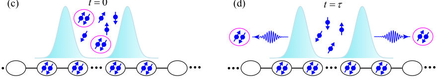 
FIG. 1. Schematic illustration of the main results of this work. The cyan wave packet represents the barrier, consisting of two neighboring doublon pairs, while the peach wave packet denotes either a single-electron or a bound-pair wave packet. (a) Scattering of a single-electron wave packet from the doublon-pair barrier. We show that the single electron is completely reflected by the barrier. (b) Scattering of a bound-pair wave packet from the same barrier. In contrast, the bound pair is perfectly transmitted through the barrier. (c) and (d) Schematic illustration of a potential application of these scattering properties. Initially, a mixture of single electrons and bound pairs is confined...

📷 Fig 2

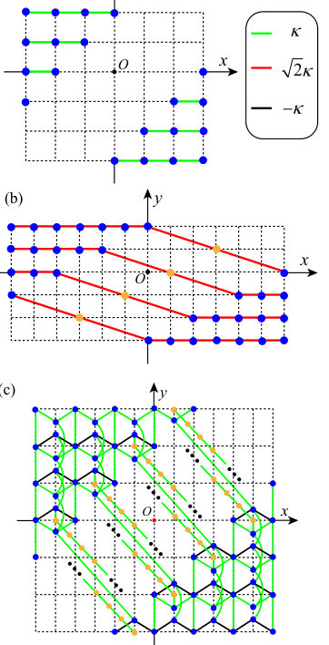 
FIG. 2. Schematics of effective Hamiltonians for several rep- resentative cases under the resonant condition U = V ≫κ. (a) The effective Hamiltonian in the subspace constructed by the states including an electron and a double-doublon, given by Eq. (11). Each solid blue dot denotes a state defined in Eq. (10), where x, y give the horizontal and vertical coordinates. The dashed grid highlights the scale, and the green line marks the hopping strength. (b) The effective Hamiltonian given in Eq. (17), describing the interaction between a doublon and a double-doublon. Each solid blue dot represents a multiple- particle state given by Eq. (13) mixing a double-doublon and a doublon or a singlet...

📷 Fig 3

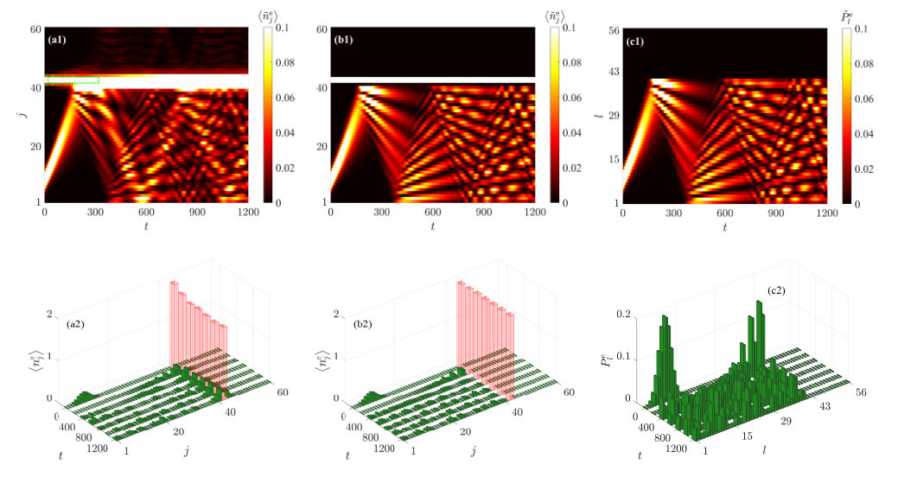 
FIG. 3. Numerical results for single-electron wave packet dynamics. The initial state is given by Eq. (25) with j0 = 8, y0 = 42, k0 = π/4, and α = 4. The hopping strength in HT is set to κ = 0.1, and N = 60. Panels (a1) and (b1) show the mean particle number at each site defined in Eq. (27) for U = 0.5 and U = 5, respectively. Here ˜ne j is the reduced mean particle number, obtained by dividing ne j by a constant. The green dashed rectangle in panel (a1) marks the position of the double-doublon. Panel (c1) shows the dynamics performed with the effective Hamiltonian in Eq. (11) with the same initial state as in (a1)

📷 Fig 4

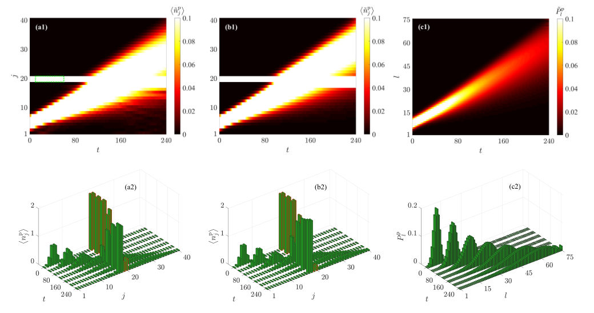 
FIG. 4. Numerical results for two-electron wave packet dynamics. The initial state is given by Eq. (30) with j0 = 8, y0 = 19, k0 = π/4, and α = 4. The hopping strength in HT is set to κ = 0.1, and N = 40. Panels (a1) and (b1) show the mean particle number at each site defined in Eq. (32) for U = 1 and U = 5, respectively. ˜np j is the reduced mean particle number, similar to that in Fig. 3. The green dashed rectangle in panel (a1) marks the position of the double-doublon. Panel (c1) shows the

**Summary.** This work analyzes the dynamics of bound pairs in the extended Hubbard model, revealing that a neighboring double-doublon structure acts as a highly efficient, particle-selective filter. It predicts that single electrons are perfectly reflected by this barrier, while composite singlet bound pairs pass through unimpeded. This mechanism offers a theoretical pathway for controlling quantum transport in strongly correlated systems.

**Why it may be interesting.** The concept of a dynamically generated, particle-selective barrier is highly relevant for understanding engineered quantum materials or optical lattice setups where controlling the passage of composite excitations versus single particles is desired.

Detailed structure

**Main problem.** Investigating the dynamics and scattering behavior of bound pairs (doublons) versus single fermions within an extended Hubbard model at resonance.

**Main result.** The double-doublon barrier acts as a particle-selective filter, allowing perfect transmission for singlet bound pairs while completely reflecting single electrons.

**Method.** Theoretical derivation using effective Hamiltonians and confirmation via time-dependent wave-packet simulations.

**Model / system.** The extended Hubbard model on a 1D chain, characterized by hopping ($\kappa$), on-site interaction ($U$), and nearest-neighbor interaction ($V$). The analysis focuses on the strong-interaction regime ($U, V \gg \kappa$) and the resonant condition ($V=U$).

**Key observables.** Reflection/transmission probabilities for single electrons and bound pairs; local particle density ($\langle n_e^j 
angle$); probability distributions ($P_e^l, P_p^l$).

**Important parameters / regimes.** Resonant condition ($V=U$), strong-interaction limit ($U \gg \kappa$), and the relative strengths of $U, V, \kappa$.

**Assumptions / limitations.** The analysis relies on projecting the dynamics onto low-energy subspaces and treating the hopping term ($H_T$) as a perturbation in the strong-interaction limit.

**Figures summary.** Figures schematically illustrate the perfect reflection of single-electron wave packets and perfect transmission of bound-pair wave packets by the double-doublon barrier, demonstrating the filtering mechanism.

**Paper structure.** The paper systematically derives effective Hamiltonians for different scattering processes (e.g., electron + double-doublon, doublon + double-doublon) and uses wave-packet simulations to confirm the predicted particle-selective scattering behavior in the resonant regime.

Abstract

We investigate the dynamics of bound pairs in an extended Hubbard model at resonance. We show that a single fermion and a singlet bound pair possess identical dispersion relations and scatter off each other. In contrast, a neighboring doublon pair is dynamically pinned in the strong-interaction regime. Remarkably, a single fermion and a singlet bound pair exhibit fundamentally different scattering behaviors when encountering a pinned doublon pair acting as a scattering center. While the singlet bound pair undergoes perfect transmission, the single fermion is completely reflected. These results demonstrate that a neighboring doublon pair functions as an efficient filter that separates bound pairs from single particles. Numerical simulations fully support the analytical predictions. Our findings provide a dynamical mechanism for generating and manipulating bound-pair states.

[↑ back to top](#top)

### [Simultaneous Intensity and Frequency Control for Optical Waveform Generation using an Acousto Optic Modulator](http://arxiv.org/abs/2608.21679v1)

**Authors:** Hariprasad Madathil, Shengzhi Wang, F. Elohim Becerra  
**Type:** experiment · **Category:** other · **PDF:** <https://arxiv.org/pdf/2608.21679v1>  
**Analysis basis:** full PDF text, analyzed in chunks
**Topic relevance:** `interference shaping light` **3/5** · `quantum optics experiment` **3/5** · `quantum measurements` **2/5**

📷 Fig 1

 
FIG. 1. Optical field manipulation using an AOM. Two con- trol voltages VAM (amplitude) and VF M (frequency), gener- ate an RF voltage VRF with controllable amplitude and fre- quency. The AOM generates diffracted beams from an input field Ein with frequency ω0. The field Eout in the first diffrac- tion order has a frequency and amplitude that depend on the control voltages VAM and VF M, and ω0.

📷 Fig 2

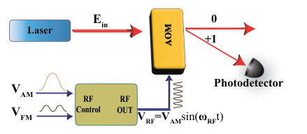 
Figure 2 shows the response of a typical AOM to an in- put RF voltage VRF ≈VAM sin ωRF t, with ωRF ≈VF M. Figure 2(a) shows the (linear) relationship between the control voltage VF M and the corresponding frequency ωRF of VRF . Because of energy and momentum conser- vation in the acousto-optic effect in AOMs, the frequency of the optical field in the first diffraction order (+1) Eout is ω0 + ωRF . As a result, the linear dependence of ωRF with VF M allows for directly controlling the frequency of Eout, with a simple linear calibration of the RF source. Here, we develop a simple method that takes into ac- count, and corrects for, the non-linear response of AOMs to RF input voltages that...

📷 Fig 3

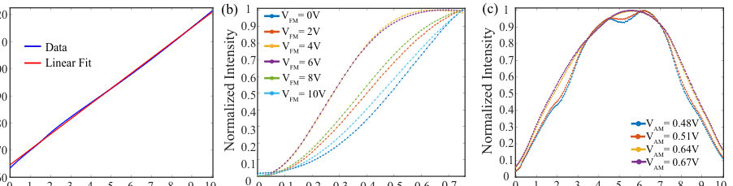 
FIG. 2. Frequency and amplitude response for the single-pass AOM. (a) (Linear) relationship between the control voltage VF M and frequency ωRF of VRF , which is used to drive the AOM. (b) Diffraction efficiency curves into the 1st diffraction order, as observed with a photo detector, as a function of VAM for several values of VF M. (c) Diffraction efficiency curves for the 1st

📷 Fig 4

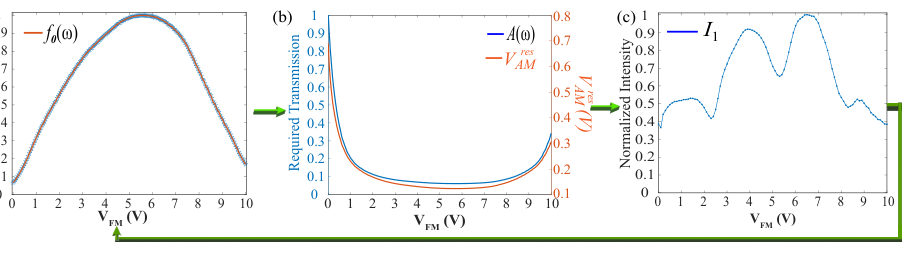 
FIG. 3. A schematic diagram that describes the iterative process associated with the intensity procedure. (a) Shows the initial frequency sweep of the AOM by varying the VF M voltages. (b) The reciprocal function needed for intensity calibration (blue) and the corresponding V res AM required voltages (orange). (c) Frequency sweep after the first iteration making use of the reciprocal V res AM voltages found in (b).

📷 Fig 5

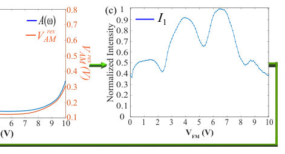 
Figure 3 (c) shows the intensity of the first diffrac- tion order as a function of frequency with an ampli- tude control voltage VAM = V res AM(ω), showing a signifi- cantly smaller intensity variation over the full frequency span, as compared to Figure 3(a). This new intensity response function I1 is then multiplied by the input re- sponse function f0(ω) in that iteration, shown in Figure 3 (a), to obtain the total response function up to that point f1(ω) ≡f0(ω) ∗I1. Function f1(ω) can then be used as a new input response function in Eq.(3) in a second iteration of this algorithm. As described in the following section, after a few iterations of this simple al- gorithm, it is...

**Summary.** This paper presents a novel, calibration-based method to achieve simultaneous, high-accuracy control over both the intensity and frequency of light generated by an Acousto-Optic Modulator (AOM). By employing an iterative correction algorithm, the authors compensate for the AOM's inherent nonlinear response. This allows for the generation of complex, programmable optical waveforms with unprecedented stability and precision.

**Why it may be interesting.** This work provides a robust, hardware-based technique for high-precision optical waveform generation, which is crucial for advanced quantum optics experiments requiring stable, tunable light sources.

Detailed structure

**Main problem.** The primary challenge is achieving precise, arbitrary simultaneous control over both the intensity and frequency of an optical field generated using an Acousto-Optic Modulator (AOM).

**Main result.** The authors developed an iterative calibration method that successfully maintains optical power within 1% of a constant target value over a wide frequency tuning range ($\approx 100$ MHz).

**Method.** The technique involves characterizing the AOM's nonlinear response to its RF drive voltages and applying an iterative correction algorithm to map input voltages accurately to desired output intensity and frequency shifts.

**Model / system.** The system utilizes an Acousto-Optic Modulator (AOM) driven by controlled RF voltages ($V_{AM}$ and $V_{FM}$) to modulate an optical field. The control is achieved through iterative compensation rather than relying on a detailed physical model.

**Key observables.** Output optical intensity ($I$), output optical field frequency ($\omega_{out}$), and the relative standard deviation ($\sigma$) of the intensity.

**Important parameters / regimes.** Frequency tuning range ($\approx 100$ MHz), relative intensity deviation ($\sigma \approx 0.2\%$), and the required number of calibration iterations (up to fourteen).

**Assumptions / limitations.** The method assumes that the AOM's nonlinear response can be characterized experimentally and compensated for iteratively, avoiding the need for a full physical model.

**Figures summary.** Figures illustrate the general AOM setup, the iterative compensation process (showing intensity stabilization), and the successful generation of complex waveforms (e.g., Gaussian intensity with frequency sweeps) in both single-pass and double-pass configurations.

**Paper structure.** The paper details the problem of AOM nonlinearity, proposes an iterative calibration methodology involving inverse function mapping, demonstrates the procedure using experimental setups, and applies the technique to generate complex, tailored optical waveforms.

Abstract

We describe a method for calibrating the response of an acousto-optic modulator (AOM) to enable precise, arbitrary control of the intensity and frequency of optical fields. The method involves characterizing the nonlinear response of the AOM to its input RF drive voltage and applying an iterative calibration/correction algorithm to accurately map input RF amplitude and frequency drive to output optical intensity and frequency shifts. After a few calibration/correction iterations, the calibration of the AOM maintains the optical power within 1$\%$ of a constant target value over relatively wide frequency tuning range ($\approx$100 MHz), with $σ=0.2\%$ relative deviation. We apply this calibration method to generate programmable waveforms and optical pulses with tailored intensity and frequency profiles that closely match their target specifications. This technique offers a simple and robust method for applications that require high-accuracy optical modulation.

[↑ back to top](#top)

### [TENSKEL: A Combinatorial Observable Tensor for Structured Measurement and Reconstruction](http://arxiv.org/abs/2608.21999v1)

**Authors:** Yvan Richard  
**Type:** theory · **Category:** other · **PDF:** <https://arxiv.org/pdf/2608.21999v1>  
**Analysis basis:** full PDF text, analyzed in chunks
**Topic relevance:** `quantum measurements` **3/5** · `Full counting statistics` **1/5** · `analog quantum simulation` **1/5** · `correlated / nonlocal dissipation` **1/5** · `driven-dissipative phase transition` **1/5** · `non-equilibrium universality` **1/5**

📷 Fig 1

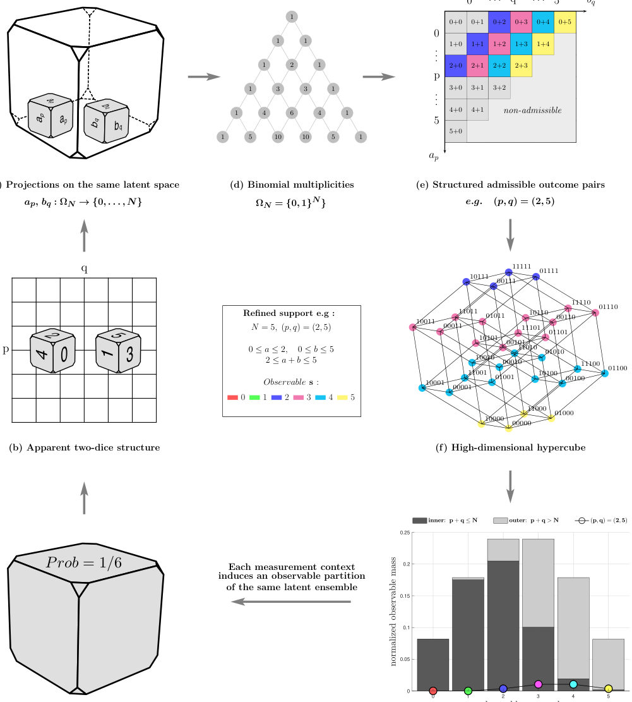 
Fig. 1: Conceptual organization of the TENSKEL observable construction for N = 5. (a) A classical die represents an elementary observable with uniform face probability. (b) An apparent two-dice structure introduces two observable coordinates. (c) The two coordinates are interpreted as complementary projections ap and bq acting on the same latent ensemble ΩN = {0, 1}N. (d) Aggregation of the 2N binary configurations produces Pascal/binomial multiplicities. (e) For a fixed context (p, q), only a constrained subset of observable pairs (a, b) is admissible. (f) The same latent hypercube supports the resulting context-dependent observable partition; the complete family of contexts is shown in...

📷 Fig 2

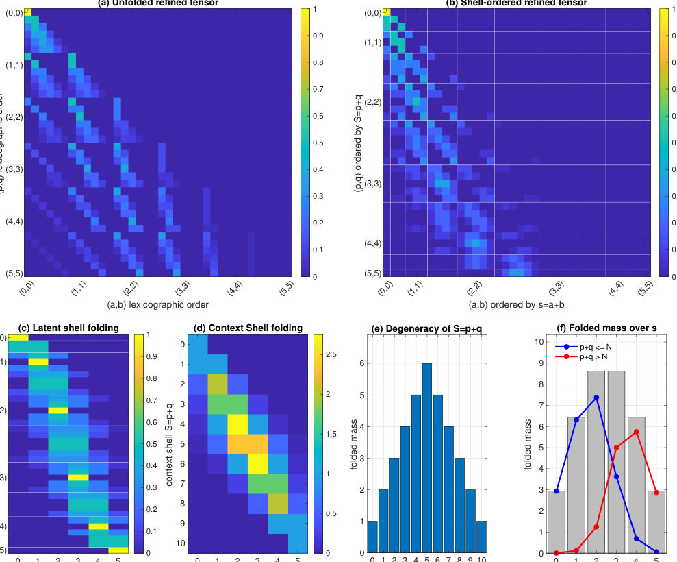 
Fig. 2: Tensor folding hierarchy of the refined TENSKEL construction for N = 5. (a) Unfolded refined tensor in lexicographic ordering of the measurement- context coordinates (p, q) and latent Pascal coordinates (a, b). The tensor encodes the admissible couplings and combinatorial multiplicities induced between the two discrete domains. (b) Shell-ordered representation obtained by reindexing both domains according to the context shell S = p + q and the latent Pascal shell s = a + b. The permutation preserves the tensor entries while revealing a block geometry organized by the respective shell degeneracies. White separator lines indicate context- and latent-shell boundaries. (c) Latent-shell...

**Summary.** This paper introduces TENSKEL, a novel combinatorial tensor framework designed to mathematically map the structure imposed on a latent configuration ensemble by partial measurements. It builds this tensor by analyzing how measurement contexts induce observable partitions on a binary hypercube, explicitly capturing combinatorial multiplicities. This provides a powerful, general mathematical tool for understanding the geometry of observation in complex systems.

**Why it may be interesting.** While not directly focused on quantum dynamics, the concept of structuring measurement outcomes via tensor decomposition and analyzing contextuality in the observable space has strong parallels to quantum measurement theory and quantum information geometry.

Detailed structure

**Main problem.** The paper addresses the challenge of explicitly representing the observable organization induced on a latent configuration ensemble when measurements are partial or aggregated.

**Main result.** It introduces TENSKEL, a combinatorial observable tensor framework that mathematically characterizes how latent configurations are structured by the measurement process, providing a structured kernel for reconstruction.

**Method.** The framework constructs a hierarchy of tensors by coupling measurement contexts to a latent Pascal organization using successive aggregation and folding operations on a binary latent ensemble.

**Model / system.** The model uses a binary latent ensemble $\Omega_N = \{0, 1\}^N$, where measurements are defined by projections ($a_p$ and $b_q$) onto this hypercube structure.

**Key observables.** The primary observable is the refined observable tensor $	ext{Tab}(p, q, a, b)$, which counts paths satisfying specific prefix conditions, and the induced kernel $	ext{Tab}^	op 	ext{Tab}$.

**Important parameters / regimes.** The dimensionality $N$ of the latent ensemble, and the context indices $(p, q)$ defining the measurement projections.

**Assumptions / limitations.** The framework is purely combinatorial, providing a mathematical representation of observation structure rather than proposing a new physical algorithm.

**Figures summary.** Figures conceptually illustrate the TENSKEL construction for $N=5$, showing how different measurement contexts induce observable partitions on the fixed latent hypercube, leading to Pascal/binomial multiplicities.

**Paper structure.** The paper develops the framework by defining the observable tensor, decomposing the measurement context into inner and outer regions, deriving closed-form combinatorial expressions, and demonstrating the structure's symmetries and reconstruction potential.

Abstract

Many imaging problems seek to reconstruct underlying configurations from partial observable measurements. While reconstruction algorithms operate on these measurements, the observable organization induced by the measurement process is rarely represented explicitly.   We introduce TENSKEL, a combinatorial observable framework for structured measurement and reconstruction based on tensor representations defined over discrete domains. Starting from a binary latent ensemble, the framework constructs a hierarchy of tensors coupling measurement contexts to a latent Pascal organization through successive aggregation and folding operations. Each measurement context induces an observable partition of the same latent ensemble, and the resulting tensor formulation makes explicit the associated combinatorial multiplicities, shell organization, degeneracies, and induced reconstruction geometry.   Rather than introducing a new reconstruction algorithm, this framework provides a mathematical representation of how latent configurations become organized under observation. The induced tensor kernel characterizes similarities between latent coordinates through their measurement-context responses, while regularized inversion provides a structured reconstruction of the latent representation from observable measurements. The binary construction further admits a natural multinomial extension to discrete simplex-supported latent representations.   Connections to Pascal cellular automata and structured discrete color mappings illustrate respectively compressed and multinomial realizations of the framework. More generally, TENSKEL provides a combinatorial basis for reasoning about the organization induced by observation, with potential relevance to computational imaging, inverse problems, structured sensing, and quantum-inspired measurement formulations.

[↑ back to top](#top)

### [Dynamics of Flat-Top--Bubble Vector Solitons](http://arxiv.org/abs/2608.22405v1)

**Authors:** M. O. D. Alotaibi, L. Al Sakkaf, U. Al Khawaja  
**Type:** theory · **Category:** quantum gases · **PDF:** <https://arxiv.org/pdf/2608.22405v1>  
**Analysis basis:** full PDF text, analyzed in chunks
**Topic relevance:** `Keldysh / 2PI / non-Gaussian methods` **3/5** · `analog quantum simulation` **2/5** · `methods for driven-dissipative` **2/5**

📷 Fig 1

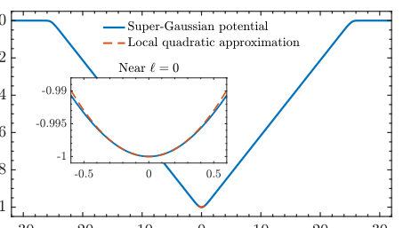 
FIG. 1. Normalized variational binding potential evalu- ated using the fitted parameters reported in the following nu- merical section: au = 12.9298, p = 22.7550, av = 12.6487, m = 21.5548, N1 = 30.65238, N2 = 30, and κ = 4. The solid curve is the numerically evaluated potential from Eq. (32), and the dashed curve is the local quadratic approximation in Eq. (38). The inset enlarges the small-displacement region near the aligned state.

📷 Fig 2

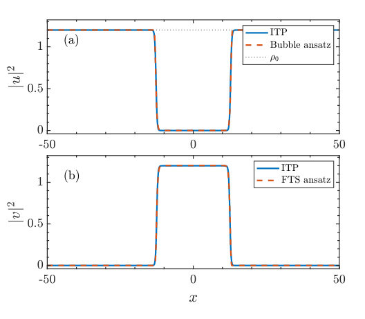 
FIG. 4. Comparison between the stationary profiles ob- tained by imaginary-time propagation (solid blue curves) and the normalized super-Gaussian ansatz (dashed orange curves) evaluated using the fitted parameters in Eq. (42). (a) Background-component density |u|2, showing the density bubble; the dotted line denotes the background density ρ0. (b) Localized flat-top density |v|2.

📷 Fig 3

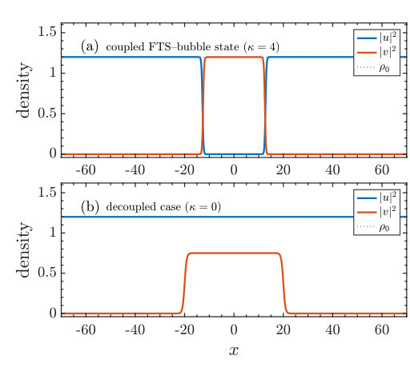 
FIG. 2. Stationary density profiles for g = q = 4, ρ0 = 1.2, and N2 = 30. (a) Coupled flat-top–bubble state with κ = 4. (b) Decoupled case with κ = 0. The dotted line denotes the background density ρ0.

📷 Fig 4

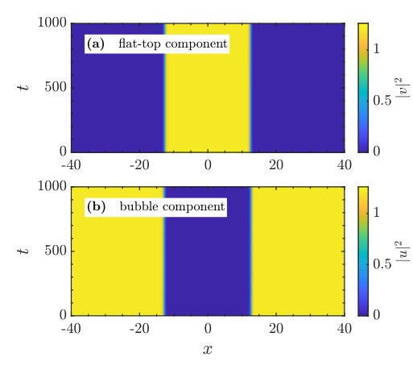 
FIG. 3. Stationary real-time evolution of the coupled state for g = q = 4, ρ0 = 1.2, κ = 4, and N2 = 30. (a) Density |v|2

📷 Fig 5

 
Figure 5 shows the component centers, their relative motion, and the FFT peak used to obtain Eq. (46). The

**Summary.** This work analyzes the dynamics of two-component vector solitons governed by nonlinear Schrödinger equations. By employing a variational approach, the authors predict the internal oscillation frequency and establish a critical energy threshold for soliton stability. Simulations confirm that above this threshold, the localized component can partially escape the background density bubble.

**Why it may be interesting.** The study of soliton dynamics, particularly the interplay between localized structures (FTS) and background fields (bubble), is highly relevant to nonlinear wave physics, which shares mathematical techniques with Bose-Einstein Condensates (BECs) and nonlinear optics.

Detailed structure

**Main problem.** The paper investigates the dynamics of two-component flat-top--bubble vector solitons, focusing on their internal oscillations and the conditions for partial escape.

**Main result.** The system exhibits weak internal oscillations whose frequency is predicted to be independent of amplitude, and a critical energy scale ($K_{	ext{escape}}$) was determined above which the localized component substantially escapes the background bubble.

**Method.** The dynamics are analyzed using a variational approximation applied to a background-subtracted formulation, supplemented by real-time numerical simulations.

**Model / system.** The system is modeled by coupled cubic-quintic nonlinear Schrödinger equations describing two interacting components: a localized flat-top soliton (FTS) and a background density bubble. The interaction forms a composite bound state.

**Key observables.** Internal mode frequency ($\omega$), relative separation ($\ell(t)$), and the fraction of the FTS norm remaining within the bubble ($F_{	ext{bubble}}(t)$).

**Important parameters / regimes.** The escape energy scale ($K_{	ext{escape}}$) and the coupling/nonlinearity parameters ($g, q, 
ho_0$).

**Assumptions / limitations.** The analysis relies on using normalized super-Gaussian profiles (ansatz) for the collective coordinates and assumes the background is modulationally stable.

**Figures summary.** Figures illustrate the variational binding potential, time evolution of component densities for coupled vs. decoupled states, and the dependence of oscillation frequency and component integrity on the strength of an external phase kick.

**Paper structure.** The paper progresses by defining the model, developing the variational approximation using super-Gaussian ansatz, presenting numerical verification of internal oscillations, and finally using energy matching to predict the critical escape scale.

Abstract

We investigate the dynamics of two-component flat-top--bubble vector solitons using a variational approximation and numerical simulations. The system is described by coupled cubic-quintic nonlinear Schrödinger equations with repulsive intercomponent coupling. We introduce a self-induced mechanism in which a localized flat-top soliton (FTS) generates a density bubble in a second component: the localized density acts as a repulsive potential for the background field, creating a composite bound state. A background-subtracted formulation and normalized super-Gaussian profiles yield collective-coordinate equations for the component centers and an effective interaction potential for their relative separation. The potential forms a binding well that is nearly triangular over its global displacement range but smooth and locally parabolic near its minimum. The variational approximation consequently predicts harmonic internal oscillations whose frequency is independent of amplitude in the small-oscillation regime. Real-time simulations verify this weak-kick behavior with good agreement between the variational and numerical frequencies. For strong phase imprints, equating the exact kick energy to the variational binding depth predicts a kick scale \(K_{\mathrm{escape}}\) for the onset of partial FTS escape. Real-time simulations support this prediction: below this scale, the composite remains nearly intact, whereas above it, a substantial fraction of the localized component leaves the bubble.

[↑ back to top](#top)

### [Partial-Moment PINNs for Caldeira--Leggett Parameter Learning in Quantum Brownian Motion](http://arxiv.org/abs/2608.23093v1)

**Authors:** Krishna Bhatia  
**Type:** theory · **Category:** statistical mechanics · **PDF:** <https://arxiv.org/pdf/2608.23093v1>  
**Analysis basis:** full PDF text, analyzed in chunks
**Topic relevance:** `methods for driven-dissipative` **3/5** · `Keldysh / 2PI / non-Gaussian methods` **1/5** · `correlated / nonlocal dissipation` **1/5** · `driven-dissipative phase transition` **1/5** · `quantum measurements` **1/5**

📷 Fig 1

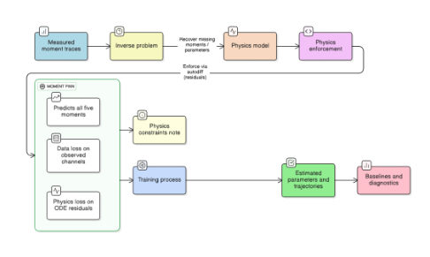 
Fig. 1. Workflow of the proposed Partial-Moment PINN for CL/HPZ parameter recovery from partial moment observations.

📷 Fig 2

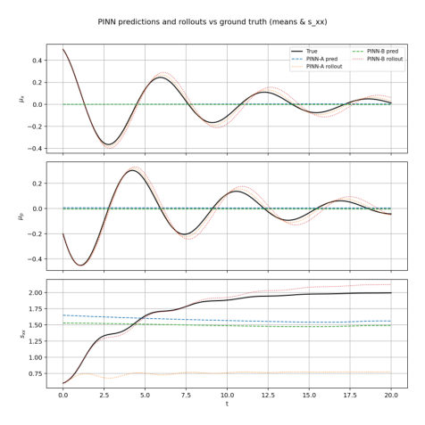 
Fig. 2. PINN predictions and ODE rollouts vs. ground truth for µx, µp, and σxx on the LTI dataset. Solid black: truth. Dashed: direct PINN prediction. Dotted: rollout using learned coefficients. The constrained PINN (green/dotted red) better respects dynamics, especially for σxx.

**Summary.** This paper develops a novel Partial-Moment PINN to estimate parameters of the Caldeira-Leggett model for Quantum Brownian Motion using only partial moment measurements. By embedding physical laws (like FDT and PSD) into the network loss function, the method achieves superior parameter recovery and dynamical prediction fidelity compared to traditional numerical solvers. It demonstrates a powerful synergy between machine learning and open quantum system theory for experimental data analysis.

**Why it may be interesting.** This work is highly relevant as it merges advanced machine learning (PINNs) with open quantum systems theory, providing a robust data-driven framework for parameter estimation in complex quantum dynamics where full state tomography is impossible.

Detailed structure

**Main problem.** The paper addresses the challenging problem of recovering physical parameters ($\omega, \gamma$) governing Quantum Brownian Motion (QBM) when only partial, noisy moment traces are available from measurements.

**Main result.** A constrained Partial-Moment PINN successfully recovers parameters with high accuracy, significantly outperforming traditional methods like Finite Differences and Kalman-EM, even when only a subset of moments are observed.

**Method.** The authors employ a Physics-Informed Neural Network (PINN) that operates directly on the evolution equations governing the first and second moments of the system, enforcing physical constraints like Positive Semi-Definiteness (PSD) and Fluctuation-Dissipation Theorems (FDT).

**Model / system.** The system modeled is a quantum harmonic oscillator coupled to an Ohmic bath, described by the Caldeira-Leggett model. The dynamics are captured by closed linear Ordinary Differential Equations (ODEs) for the five first/second moments.

**Key observables.** The primary observables are the five moments: $\{\mu_x, \mu_p, \sigma_{xx}, \sigma_{pp}, \sigma_{xp}\}$; the analysis focuses on recovering parameters from subsets like $\{\mu_x, \sigma_{xx}, \sigma_{xp}\}$.

**Important parameters / regimes.** The key parameters to learn are the oscillator frequency ($\omega$) and the damping rate ($\gamma$), along with the diffusion coefficients ($D_{xx}, D_{pp}, D_{xp}$).

**Assumptions / limitations.** Key assumptions include operating in the high-temperature, Markovian limit, enforcing the FDT ($D_{pp} = 2m\gamma k_B T$), and using sparse $\sigma_{pp}$ anchors to maintain numerical stability.

**Figures summary.** The notes reference Tables II, III, IV, and V, which summarize parameter recovery accuracy, ODE rollout error comparison, Fisher identifiability analysis (Condition Number), and Bootstrap confidence intervals, respectively.

**Paper structure.** The paper introduces the QBM model and the moment ODEs, proposes the constrained Partial-Moment PINN architecture, details the composite loss function incorporating physical constraints, and validates the method by comparing its performance against established numerical techniques using synthetic data.

Abstract

We study parameter recovery in the Caldeira--Leggett (quantum Brownian) oscillator from partial moment traces. Our model is a moment-level PINN that predicts the five first/second moments and enforces the linear CL/HPZ ODEs by automatic differentiation. Physical structure is imposed through a PSD (Cholesky) covariance head, high-temperature CL assumptions with $D_{xp}\approx0$, and fluctuation--dissipation ties between $D_{pp}$ and $γ$. On synthetic CL data with channels ${μ_x,σ_{xx},σ_{xp}}$, the constrained variant recovers $(ω,γ)$ accurately, stabilizes $D_{pp}$, and achieves low rollout error compared to finite differences and Kalman--EM (expectation--maximization) with exact Van Loan discretization. Fisher-style checks confirm that diffusion needs at least one variance observable, and sparse $σ_{pp}$ ``anchors'' restore conditioning. We also show that the same PINN can learn time-varying HPZ coefficients.

[↑ back to top](#top)

### [Quantics tensor cross interpolation for high-order strong-coupling expansions](http://arxiv.org/abs/2608.23160v1)

**Authors:** Kanghyeon Kim, Lei Geng, Philipp Werner, Aaram J. Kim  
**Type:** theory · **Category:** strongly correlated electrons · **PDF:** <https://arxiv.org/pdf/2608.23160v1>  
**Analysis basis:** full PDF text, analyzed in chunks
**Topic relevance:** `Keldysh / 2PI / non-Gaussian methods` **3/5** · `methods for driven-dissipative` **3/5** · `analog quantum simulation` **1/5**

📷 Fig 1

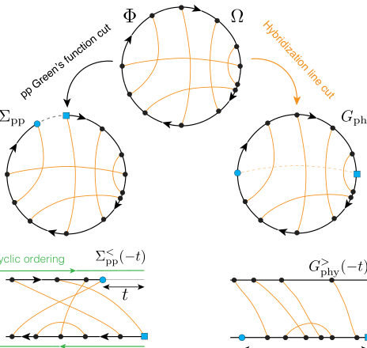 
FIG. 1. Diagram generation from the Luttinger-Ward Φ or the grand potential Ω. The PP self-energy (physical Green’s function) diagram is obtained by cutting a PP Green’s func- tion (hybridization function) line. Blue squares (circles) rep- resent impurity creation (annihilation) operators. The bot- tom panels show examples of Σpp and Gphy contributions represented on the Keldysh contour. Internal vertices (black dots) are integrated over the contour, respecting the cyclic ordering.

📷 Fig 2

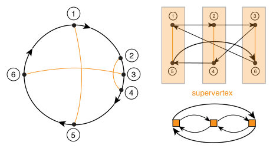 
FIG. 2. Transformation of a 3OA graph for checking the 2PI condition. The left panel shows the original diagram, the top right panel the definition of the supervertices (orange boxes), and the bottom right panel the corresponding supergraph con- sisting of supervertices connected by PP propagators.

📷 Fig 3

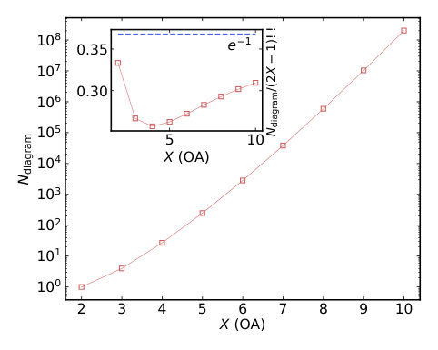 
FIG. 3. Number of XOA diagrams as a function of diagram order X. The inset shows the ratio between the number of 2PI diagrams and the total (including two-particle reducible) number of diagrams. The dashed line in the inset shows the exact asymptotic value of the ratio [40].

📷 Fig 4

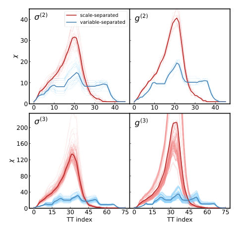 
FIG. 4. Bond dimension χ required to represent σ(X) (left column) and g(X) (right column) of the half-filled Ander- son impurity model using the scale-separated and variable- separated schemes for X = 2 (top row) and 3 (bottom row). The impurity site with U = 2 and µ = 1 is coupled to the fermionic bath of the semi-circular density of states (the half- bandwidth D as the energy unit) via the constant coupling g = 0.8. The temperature is T = 0.1. Each tensor train was constructed via QTCI with a maximum pointwise error of ∼10−4, verified against 106 randomly sampled tensor en- tries. Shaded lines show the bond-dimension profile of the individual tensor-trains; solid lines denote their...

📷 Fig 5

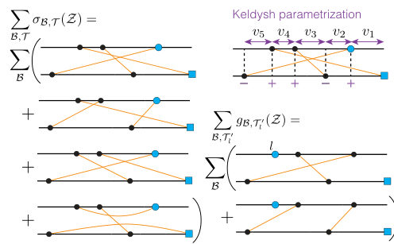 
FIG. 5. Diagram-summed contribution of a 3OA configura- tion to the PP self-energy (left) and Green’s function (bottom right). The top right panel illustrates the reparametrization of the configuration in terms of Keldysh indices and physical times.

**Summary.** This work presents a novel computational technique, quantics tensor cross interpolation (QTCI), to overcome the factorial complexity of high-order strong-coupling expansions in DMFT. By using a variable-separated framework, the authors achieve dramatically reduced computational resource requirements, allowing accurate study of complex phenomena like photo-doping and convergence analysis in strongly correlated materials.

**Why it may be interesting.** The development of advanced tensor network techniques like QTCI for calculating correlation functions in non-equilibrium settings provides powerful, general-purpose tools applicable to open quantum systems beyond standard quantum optics models.

Detailed structure

**Main problem.** The paper addresses the computational bottleneck in calculating high-order self-energies and Green's functions for strongly correlated electron systems using Dynamical Mean-Field Theory (DMFT).

**Main result.** The introduction of quantics tensor cross interpolation (QTCI) in a variable-separated framework significantly reduces the required bond dimensions, enabling self-consistent calculations up to the fourth order and revealing asymptotic behavior up to the sixth order.

**Method.** The authors employ diagrammatic techniques within the strong-coupling expansion, utilizing QTCI to efficiently represent multi-dimensional functions arising from contour time discretization, which is superior to previous scale-separated approaches.

**Model / system.** The study focuses on strongly correlated electron systems, often modeled by the Anderson impurity model or the Hubbard model, analyzed in both equilibrium and non-equilibrium (photo-doped) regimes.

**Key observables.** Spectral functions, physical Green's functions, and the self-energy ($\Sigma^{pp}$), along with magnetization and convergence diagnostics.

**Important parameters / regimes.** The order of the strong-coupling expansion (up to 6th order), temperature ($T$), interaction strength ($U$), and photo-doping concentration ($\delta$).

**Assumptions / limitations.** The formalism relies on the Two-Particle Irreducible (2PI) condition to ensure correct diagram summation, and the method assumes the applicability of tensor network representations for the complex functions.

**Figures summary.** Figures illustrate diagram generation (Luttinger-Ward functional), compare bond dimensions ($\chi$) between interpolation schemes (scale-separated vs. variable-separated), and show spectral functions for various correlated and photo-doped phases.

**Paper structure.** The paper builds from the general problem of high-order DMFT calculations, introduces QTCI as the solution, details the variable-separated parametrization and diagram-summed scheme, and validates the method by applying it to equilibrium, photo-doped, and noninteracting limits.

Abstract

Real-time impurity solvers enable the study of transport phenomena and the description of nonequilibrium lattice systems within the framework of dynamical mean-field theory (DMFT). They also provide direct access to the spectral functions of both equilibrium and nonequilibrium systems. A widely used approach is the self-consistent strong-coupling expansion, whose lowest-order implementation corresponds to the non-crossing approximation. Higher-order implementations, however, are computationally demanding because the number of diagram topologies grows factorially with expansion order, while the evaluation of self-energies and Green's functions requires increasingly high-dimensional integrations. Here, we demonstrate that the latter challenge can be mitigated by employing quantics tensor cross interpolation in a variable-separated framework. Compared with the previously used scale-separated approach, the new scheme yields substantially lower bond dimensions and capacitates self-consistent steady-state DMFT calculations up to fourth order. We illustrate its performance with representative results for both equilibrium and photo-doped systems. In addition, we analyze the convergence of the strong-coupling expansion in the challenging noninteracting limit by computing diagrams up to sixth order. At this order, the onset of the asymptotic regime of the strong-coupling expansion becomes apparent, which allows the application of extrapolation techniques.

[↑ back to top](#top)

### [Reinventing the Single-pixel Imaging Paradigm via Quantum-Operator-Based Signal Processing](http://arxiv.org/abs/2608.21783v1)

**Authors:** Bu-Ran Yu, Yi-Zhu Zhang, Kan-Xu Jia, Qian-Qian Bao, Shao-Ying Meng, Xi-Hao Chen  
**Type:** theory · **Category:** quantum information and computing · **PDF:** <https://arxiv.org/pdf/2608.21783v1>  
**Analysis basis:** full PDF text, analyzed in chunks
**Topic relevance:** `quantum measurements` **3/5** · `Tavis-Cummings & cavity-many-emitter` **1/5** · `analog quantum simulation` **1/5** · `driven-dissipative phase transition` **1/5** · `interference shaping light` **1/5**

📷 Fig 1

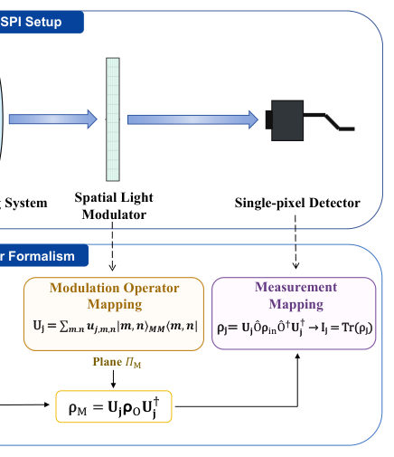 
Figure 1: Schematic of (a) passive SPI setup and (b) its corresponding quantum operator formalism.

📷 Fig 2

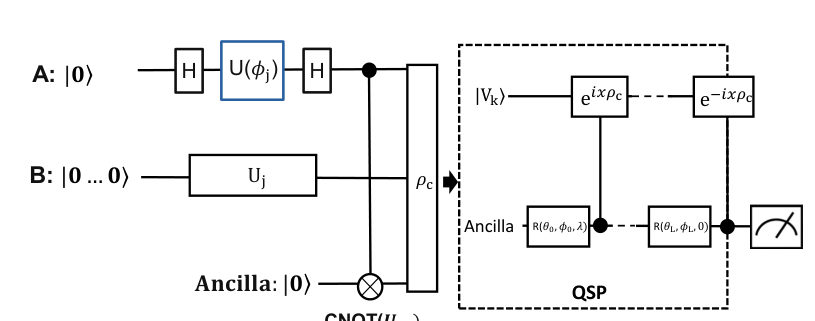 
Figure 2: Quantum circuit schematic of the proposed pre-measurement processing and QSP readout protocol. Register A is initialized in |0⟩and undergoes the H-U(ϕj)-H interferometric sequence, where the phase gate U(ϕj) encodes the bucket signal through ϕj = kIj with Ij = Tr(ρj). Register B is initialized in |0 · · · 0⟩and loaded with the modulation-pattern information through Uj. The auxiliary qubit is prepared in |0⟩and participates in the CNOT-assisted compression operation UCX, which rearranges the information-carrying blocks of the joint state into the compact effective density matrix ρc. The QSP module then acts on the eigenstate |Vk⟩and an ancilla qubit by alternating controlled...

📷 Fig 3

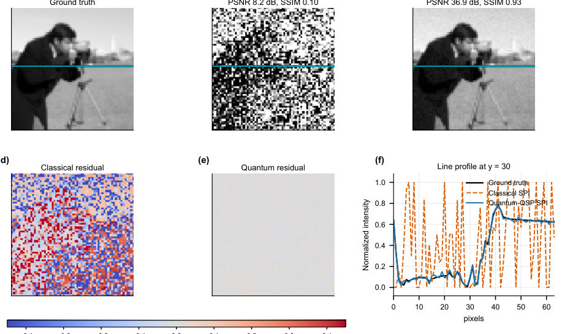 
Figure 3: Weak-light reconstruction benchmark for the standard 64×64 cameraman object under a fixed photon-starved Hadamard-SPI acquisition. (a) Ground-truth object. (b) Classical SPI reconstruction with shot-noise-limited bucket readout. (c) Quantum-QSP reconstruction using coherent phase-estimation scaling and finite sequence length L = 6 and κ = 1.57. (d),(e) Residual maps on the same color scale. (f) Horizontal line profile through y = 30 in panels (a)-(c). The same Hadamard sampling operator is used for both methods, with Nph = 3000 photons per differential pattern pair.

📷 Fig 4

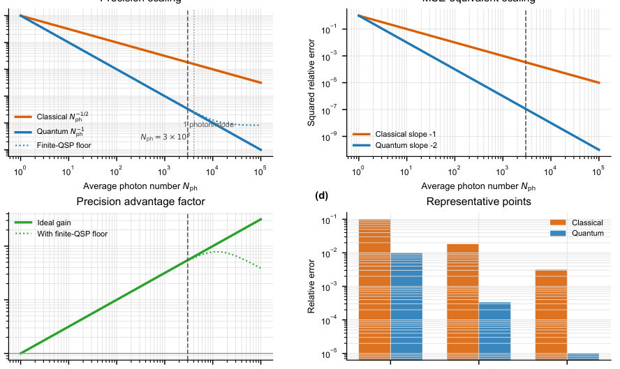 
Figure 4: Photon-number precision scaling used to interpret the weak-light reconstruction benchmark. (a) Relative intensity error versus average photon number Nph. The orange curve denotes the classical shot-noise law ϵcl = N −1/2 ph , the blue curve denotes the ideal coherent quantum scaling ϵq = N −1 ph , and the blue dotted curve includes a finite-QSP approximation floor of 8.1 × 10−5. The dashed vertical marker indicates Nph = 3 × 103, the photon budget used in Fig. 3; the dotted vertical marker at Nph = 4096 corresponds to one photon per spatial mode for a 64 × 64 image. (b) Squared relative error, which gives slopes −1 and −2 for the classical and ideal quantum models, respectively....

📷 Fig 5

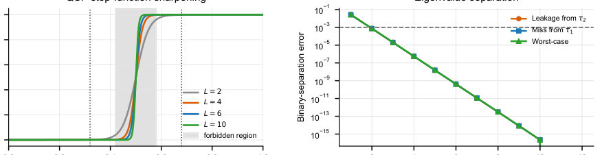 
Figure 5: QSP approximation and eigenvalue-separation behavior as a function of sequence length. (a) Exponential approximation-error bound ∆(L) = exp(−κL) with κ = 1.57, chosen such that ∆(4.4) ≃10−3. The orange dashed line marks the 10−3 target accuracy, and the green shaded region indicates the shallow-sequence window L = 5–10. (b) Required sequence length estimated from L = (2/π) ln(1/δ); for target accuracy δ = 10−3 the estimate gives L ≃4.4. (c) Step-filter response fs(τ) versus mapped eigenvalue τ = rkx for L = 2, 4, 6, 10. The gray band 0.42 &lt; τ &lt; 0.58 is the forbidden transition region where eigenvalues should not be placed. (d) Leakage from the lower mapped eigenvalue τ2 = 0.32,...

**Summary.** This paper proposes a quantum-operator-based theoretical framework to revolutionize single-pixel imaging by overcoming the classical shot-noise limit. By encoding spatial information into the eigenvalue spectrum of a quantum operator, the method achieves Heisenberg scaling for reconstruction accuracy. This establishes a universal blueprint for next-generation, quantum-enhanced sensing modalities.

**Why it may be interesting.** This work is highly relevant as it merges quantum optics (light-matter interaction, quantum states) with advanced quantum information processing techniques (state compression, unitary evolution) to solve a practical sensing problem, providing a blueprint for quantum-enhanced measurement.

Detailed structure

**Main problem.** The paper addresses the fundamental bottleneck in computational imaging and high-dimensional sensing caused by the classical, decoupled acquisition-reconstruction hierarchy, particularly limiting Single-Pixel Imaging (SPI).

**Main result.** The authors introduce a quantum-operator-based framework that theoretically demonstrates surpassing the classical shot-noise limit to approach the ultimate Heisenberg limit for spatial reconstruction.

**Method.** The core method involves mapping the spatial inverse problem onto the eigenvalue spectrum of a quantum operator, utilizing tailored light-matter interactions and coherent signal processing.

**Model / system.** The model uses a quantum-operator formalism applied to passive SPI setups, evolving the system state via object operators and subsequent modulation, which is then processed through a quantum interface involving SiV color centers and nanophotonic cavities.

**Key observables.** The primary observables are the reconstructed density matrix ($
ho_{rec}$) and the achieved scaling of the reconstruction error ($\epsilon$), which is compared against the classical shot-noise limit.

**Important parameters / regimes.** Key parameters include the total detected photon budget ($N_{frame} = 1.23 	imes 10^7$), the spatial-register size (e.g., $64 	imes 64$ object), and the coherence time ($T_2$).

**Assumptions / limitations.** The analysis assumes a coherent mode-to-qubit interface and relies on approximations for the quantum signal processing (QSP) depth, which introduces an error floor ($\delta_L$).

**Figures summary.** Figure 1 schematically illustrates the passive SPI setup and its corresponding quantum operator formalism. Table 1 provides a physical resource estimate for a benchmark $64 	imes 64$ Hadamard-SPI test.

**Paper structure.** The paper progresses from defining the classical bottleneck in SPI, to formulating the quantum-operator framework for state evolution, detailing the quantum interface for state compression and feature extraction (QPCA), and finally demonstrating the reconstruction via controlled unitary evolution to achieve Heisenberg scaling.

Abstract

A fundamental bottleneck across modern computational imaging and high-dimensional sensing is the conventional decoupled acquisition-reconstruction hierarchy, which subjects high-dimensional spatial sensing to the classical shot-noise limit and intense computational overhead. As a prominent manifestation of this limitation, single-pixel imaging (SPI) suffers severely from this paradigm. We reinvent this paradigm by introducing a quantum-operator-based SPI theoretical framework driven by coherent signal processing. Within this architecture, the spatial inverse problem is analytically mapped into the eigenvalue spectrum of a quantum operator via tailored light-matter interactions. By analytically synthesizing non-linear reconstruction operators via ultra-shallow quantum architectures, we theoretically demonstrate an exponential decay of spatial approximation errors, completely bypassing traditional linear solvers. This operator-space embedding not only shields reconstruction from noise via a strategic error-saturation zone but also bridges the gap from classical shot-noise scaling $\mathcal{O}(1/\sqrt{N_{\text{ph}}})$ to the ultimate Heisenberg limit $\mathcal{O}(1/N_{\text{ph}})$. Crucially, while formulated within SPI, this coherent operator paradigm fundamentally extends to general photon-starved, high-dimensional imaging modalities. This work establishes a universal theoretical blueprint for next-generation quantum-enhanced sensing, shifting the paradigm from iterative optimization to coherent operator-space evolution.

[↑ back to top](#top)

### [Entanglement-enhanced fluctuation-free daemonic ergotropy with random measurements](http://arxiv.org/abs/2608.23372v1)

**Authors:** Saptarshi Roy, Pritam Halder, Tamal Guha, Hyunseok Jeong  
**Type:** theory · **Category:** statistical mechanics · **PDF:** <https://arxiv.org/pdf/2608.23372v1>  
**Analysis basis:** full PDF text, analyzed in chunks
**Topic relevance:** `quantum measurements` **3/5** · `Full counting statistics` **1/5** · `correlated / nonlocal dissipation` **1/5** · `driven-dissipative phase transition` **1/5**

📷 Fig 1

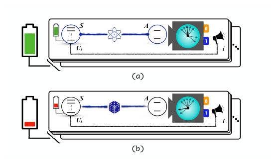 
FIG. 1. Schematic of the randomized daemonic ergotropy (RDE) extraction process. Random measurements on the auxiliary system A assist ergotropy extraction from the system S, and the extracted ergotropy is averaged over the measurement ensemble. In contrast to the conventional setting with optimized assisting measurements, randomized measurements reveal a clear separation between the per- formance of (a) entangled states and (b) classically correlated states. Entanglement can provide both a larger average ergotropic gain and reduced measurement-induced fluctuations.

📷 Fig 2

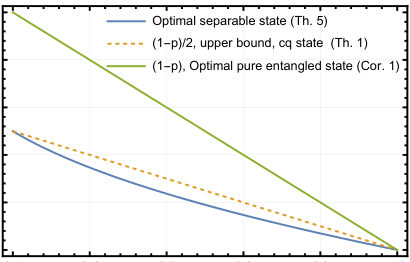 
FIG. 2. Randomized daemonic gain with fixed system marginal ρS = p |0⟩⟨0|+(1−p) |1⟩⟨1|. The maximal value of gain in RDE, ob- tained from general separable states via Theorem 5 is plotted against p (solid blue line). The linear bound for the cq states obtained in Theorem 1 is plotted via dashed orange lines. The green solid line is the maximal achievable gain for optimal pure entangled state (Corol- lary 1). All axes are dimensionless.

**Summary.** This work develops the concept of randomized daemonic ergotropy to quantify the thermodynamic advantage provided by quantum entanglement. It proves that while optimal measurements might not reveal an advantage, randomizing the measurement process exposes a fundamental trade-off: achieving positive average gain requires non-zero fluctuations for classical states, whereas entangled states can maintain high gain while remaining fluctuation-free.

**Why it may be interesting.** The connection between measurement-induced work fluctuations and the type of quantum correlation (entanglement vs. classical) provides a novel, measurable thermodynamic signature for entanglement, which is highly relevant to open quantum systems theory.

Detailed structure

**Main problem.** The paper investigates the role of quantum entanglement in enhancing work extraction (ergotropy) when the assisting measurement is randomized, defining this as randomized daemonic ergotropy (RDE). It aims to establish RDE as a thermodynamic probe for entanglement.

**Main result.** When measurements are randomized, the advantage of entanglement over classical correlations becomes apparent: entangled states can achieve higher average gain while remaining fluctuation-free, a feat impossible for quantum-classical states.

**Method.** The analysis involves deriving upper and lower bounds on the randomized gain and fluctuation using mathematical techniques, comparing performance under optimal versus Haar-random measurements.

**Model / system.** The model uses bipartite quantum systems ($
ho_{SA}$) undergoing work extraction via projective measurements on an auxiliary system (A). The analysis focuses on two-qubit systems and the comparison between entangled and separable states.

**Key observables.** Randomized Daemonic Ergotropy Gain ($\Delta E_{
ho SA}^D$), Fluctuation ($F_{
ho SA}^D$), and standard Ergotropy ($	ext{Erg}(
ho_S)$).

**Important parameters / regimes.** The degree of entanglement, the measurement basis randomness (Haar measure), and the fixed system marginal ($
ho_S$).

**Assumptions / limitations.** The analysis relies on the mathematical properties of ergotropy, convexity arguments, and the assumption of random projective measurements.

**Figures summary.** Figure 1 schematically contrasts the RDE extraction process, showing the performance gap between entangled and classically correlated states under randomized measurements.

**Paper structure.** The paper progresses by first establishing the benchmark of optimal measurements, then introducing the randomized setting, deriving bounds on gain and fluctuation for quantum-classical states, and finally demonstrating the entanglement advantage using specific entangled states and deriving necessary conditions for fluctuation-free gain.

Abstract

Optimized daemonic ergotropy can make entanglement thermodynamically dispensable in measurement-assisted work extraction: for a fixed system marginal, quantum-classical states can reproduce the maximal work obtainable by optimizing the auxiliary measurement. We show that this equivalence is broken when the auxiliary measurement is randomized. For qudit-qubit quantum-classical states under Haar-random projective measurements, we derive upper bounds on the averaged daemonic gain and prove a gain-fluctuation trade-off, showing that any positive randomized gain necessarily entails measurement-induced fluctuations. In sharp contrast, a family of two-qubit entangled pure states attains the algebraic maximum of the gain allowed by a system marginal while remaining fluctuation-free for every measurement basis, yielding at least twice the gain achievable by any quantum-classical state with the same marginal. We further demonstrate that such conclusion holds when general two-qubit separable states are considered positioning randomized gain as a sufficient criterion for entanglement certification. Finally, we show that the entanglement advantage persists under partially randomized measurements sampled from a polar cap around the optimal basis. These results establish randomized daemonic ergotropy as a thermodynamic probe of entanglement and exhibit the connection between measurement-induced work fluctuations on the type of correlations: quantum entanglement vs classical.

[↑ back to top](#top)

### [Optimal Nonparametric Estimation of Phase-Space Representations for Non-Gaussian Continuous Variable Quantum States](http://arxiv.org/abs/2608.22379v1)

**Authors:** Vladimir A. Orlov, Liubov A. Markovich  
**Type:** both · **Category:** other · **PDF:** <https://arxiv.org/pdf/2608.22379v1>  
**Analysis basis:** full PDF text, analyzed in chunks
**Topic relevance:** `quantum optics experiment` **3/5** · `quantum measurements` **2/5** · `Keldysh / 2PI / non-Gaussian methods` **1/5**

📷 Fig 1

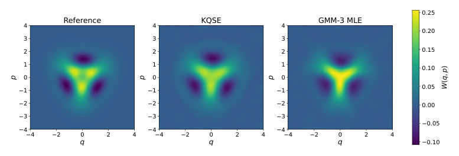 
Figure 1. The estimate of the Wigner function for the CCS (88) with a = 1 + 0.5i based on n = 1000 quadrature samples per tomographic setting. The reference function (94) is compared with KQSE and the GMM-3 MLE estimators obtained from the same synthetic quadrature data.

📷 Fig 2

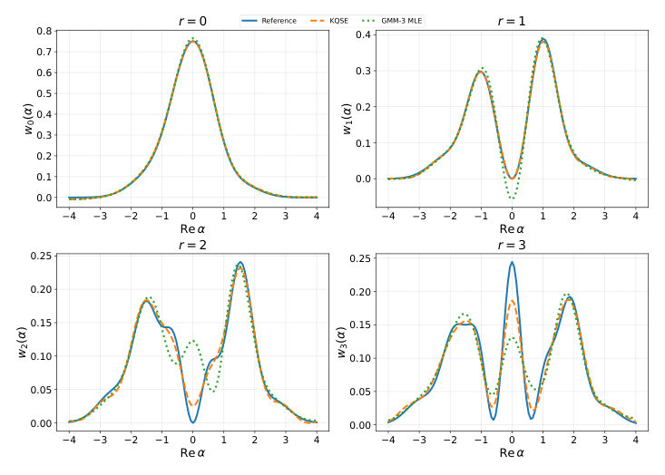 
Figure 2. The estimate of the Photon-number tomogram of the CCS based on n = 1000 quadrature samples per tomographic setting. The panels show wr(α), r = 0, 1, 2, 3, on the real displacement slice Im α = 0. The reference reconstructions (95) are compared with KQSE and GMM-3 MLE estimators obtained from the same synthetic quadrature data.

📷 Fig 3

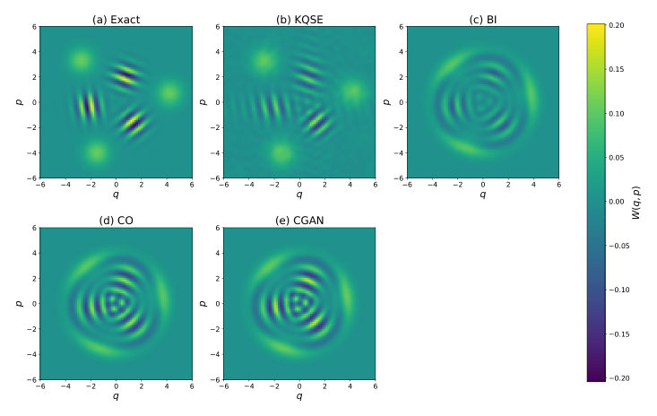 
Figure 3. The Wigner function of the CCS with a = 3 + 0.5i compared to the BI, CO, and CGAN estimators with the Fock space cut-off Ncut = 10, whereas KQSE is cut-off free.

📷 Fig 4

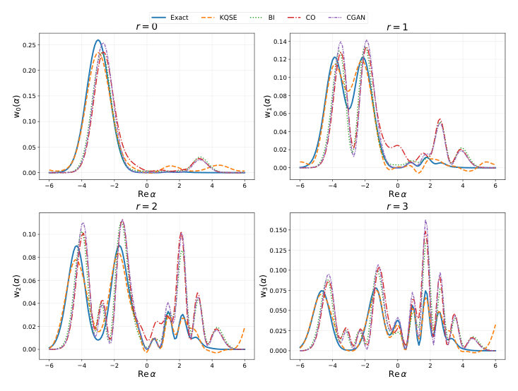 
Figure 4. The Photon-number tomograms wr(α), r = 0, 1, 2, 3, for the CCS with a = 3 + 0.5i compared to the BI, CO, and CGAN estimators with the Fock space cut-off Ncut = 10, whereas KQSE is cut-off free. The real displacement slice Im α = 0 is shown.

📷 Fig 5

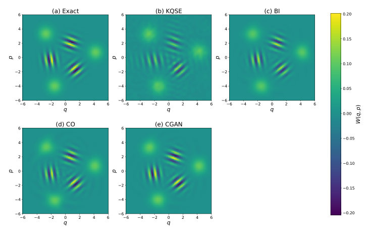 
Figure 5. The Wigner function of the CCS with a = 3 + 0.5i compared to the BI, CO, and CGAN estimators with the Fock space cut-off Ncut = 20, whereas KQSE is identical to that in Fig. 3, since it does not require a Fock space cut-off.

**Summary.** This paper introduces Kernel Quantum State Estimation (KQSE), a nonparametric technique to reconstruct CV quantum states from experimental tomographic data. By estimating the characteristic function directly, KQSE provides a unified and statistically robust framework applicable to both Gaussian and non-Gaussian states. It demonstrates near-optimal convergence rates, making it a superior tool for modern quantum state characterization experiments.

**Why it may be interesting.** This work provides a powerful, model-independent statistical tool for characterizing complex quantum states in continuous variable systems, which is crucial for experimental quantum optics and quantum information processing.

Detailed structure

**Main problem.** The paper develops an optimal, fully data-driven nonparametric method for reconstructing and characterizing continuous variable (CV) quantum states from experimental tomographic measurements.

**Main result.** The proposed Kernel Quantum State Estimation (KQSE) framework achieves a near-optimal mean squared error convergence rate of O(T^-1) for estimating various phase-space representations, outperforming state-of-the-art methods, especially for non-Gaussian states.

**Method.** It utilizes Kernel Quantum State Estimation (KQSE), which estimates the characteristic function of the quadrature distribution directly from experimental data and then applies kernel integral transformations to reconstruct observables.

**Model / system.** The study focuses on CV quantum states, which are characterized by their density operator $\rho$ and measured via homodyne or heterodyne detection, yielding tomographic quadrature probability distributions.

**Key observables.** Wigner function, density matrix kernel, photon-number tomograms, purity, and the characteristic function of the tomographic quadrature distribution.

**Important parameters / regimes.** Total number of measurements ($T$), Fock space cutoff ($N_{cut}$), and noise correction factors ($\kappa$).

**Assumptions / limitations.** The method is nonparametric, requiring no prior model assumption on the underlying tomographic PDF, though convergence analysis assumes standard regularity and tail decay conditions.

**Figures summary.** Figures compare reconstruction errors (e.g., $d\text{ISE}$) for the Wigner function and photon-number tomograms of a non-Gaussian kitten state across KQSE and several competing methods (BI, CO, CGAN).

**Paper structure.** The paper first introduces KQSE as a unified framework for state estimation. It then derives the convergence rates for the estimator. Finally, it presents numerical and experimental comparisons using non-Gaussian states to validate its performance against various established techniques.

Abstract

We further develop Kernel Quantum State Estimation (KQSE), a fully data-driven nonparametric method for continuous variable quantum state reconstruction and characterization, introduced in our recent work and rooted in nonparametric kernel density estimation (KDE). Unlike approaches relying on finite-dimensional basis truncations, parametric ansätze, or prior models, KQSE combines a new kernel estimator of the characteristic function of the tomographic quadrature distribution with suitable kernel integral transformations. The characteristic function is estimated directly from experimental homodyne or heterodyne data and subsequently transformed to estimate quantum state representations and characteristics, including the Wigner function and the density matrix kernel. Observing that several other physically relevant representations and characteristics admit transformations of a closely related form, we derive convergence rates for the corresponding broad class of KQSE-based estimators. The resulting framework covers all phase-space representations, the photon-number tomogram, trace products of quantum states, and purity. We derive mean squared error convergence rates for these kernel transformed estimators and show that the corresponding KQSE applications inherit the near optimal rate O(T^{-1}), where $T$ is the total number of measurements. The proposed theory applies equally to Gaussian and non-Gaussian continuous variable quantum states without imposing a Fock space cutoff. Numerical experiments on simulated Gaussian and non-Gaussian states and real homodyne data demonstrate the advantages of KQSE over state-of-the-art methods, establishing it as a statistically consistent and computationally modest framework for continuous variable quantum state estimation and characterization, particularly in the non-Gaussian regime.

[↑ back to top](#top)

### [Laughlin quasihole geometry from a single snapshot ensemble](http://arxiv.org/abs/2608.22384v1)

**Authors:** Kaushlendra Kumar  
**Type:** theory · **Category:** strongly correlated electrons · **PDF:** <https://arxiv.org/pdf/2608.22384v1>  
**Analysis basis:** full PDF text, analyzed in chunks
**Topic relevance:** `quantum measurements` **3/5** · `analog quantum simulation` **2/5**

📷 Fig 1

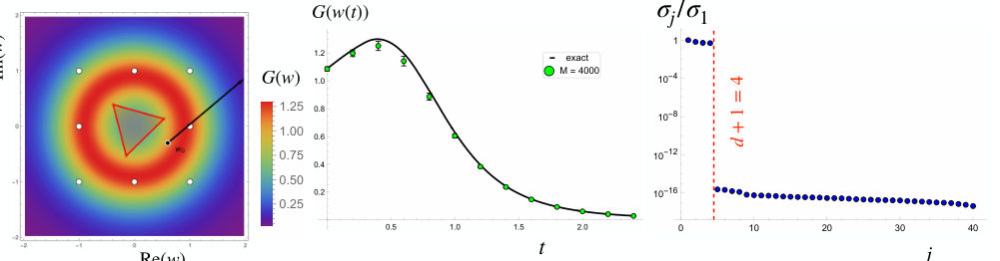 
FIG. 1. Single-reference reconstruction of quasihole geometry for an exactly enumerated q = 2 Nielsen–Cirac–Sierra state with Ns = 8, Np = 3, and p = 1. (a) Exact scalar metric coefficient G(w). White circles mark the lattice sites, the black point marks the prepared reference w0, the black ray is the reconstruction path, and the red triangle marks the three positions used for the Bargmann-phase test. (b) Reconstruction of G(w(t)) along the ray with green points showing one M = 4 × 103 realization, error bars giving one standard deviation over 160 independently generated reference ensembles while the black curve is exact. (c) Normalized singular values of the state matrix at 40 quasihole...

**Summary.** This work demonstrates that the complex quantum geometry of lattice Laughlin quasihole states can be fully determined from measuring the occupation probability distribution at just one reference point. By exploiting the known analytic structure of the state amplitudes, the authors reconstruct the quantum metric and Berry curvature, showing that single-shot measurements are surprisingly powerful tools for characterizing quantum geometry.

**Why it may be interesting.** It provides a powerful, non-standard method to extract full geometric information (metric, curvature) from minimal quantum measurements, which is highly relevant for characterizing complex many-body ground states.

Detailed structure

**Main problem.** The central problem is determining complex quantum geometric properties, such as the quantum metric and Berry curvature, using only a single probability distribution measurement (snapshot) from a lattice Laughlin quasihole state.

**Main result.** A single snapshot measurement is sufficient to reconstruct the complete complex Gram kernel, thereby fixing the quantum metric and Berry curvature of the state family.

**Method.** The reconstruction relies on a single-reference kernel identity, using the known analytic quasihole factor and the measured occupation probability $P_0(n)$ to determine the overlap kernel $K(w, v)$.

**Model / system.** The system is modeled by lattice Laughlin quasihole states, parameterized by the quasihole position $w$, whose amplitudes factorize based on the occupation configuration $n$.

**Key observables.** Quantum metric coefficient $G(w)$, Berry curvature $\Omega_{xy}$, Overlap Kernel $K(w, v)$, and the Connes distance $d_\Lambda$.

**Important parameters / regimes.** The reconstruction is limited by the Rényi-2 divergence $D_2(P_w\|P_0)$ and the local single-copy multiparameter information bound.

**Assumptions / limitations.** The reconstruction critically depends on the known analytic structure of the quasihole factor $f_n(w)$ and assumes the reference point $w_0$ is generic.

**Figures summary.** Figure 1 illustrates the reconstruction of the scalar metric coefficient $G(w)$ both analytically and numerically, alongside the singular values of the state matrix.

**Paper structure.** The paper develops a kernel identity from the single snapshot measurement, uses this identity to derive geometric quantities like the metric and distance, and finally analyzes the statistical limitations using divergence measures.

Abstract

Can a probability distribution measured in one basis determine complex quantum geometry? The answer is affirmative for a lattice Laughlin quasihole. The exact occupation law at one generic reference position, together with the known analytic quasihole factor, fixes the complete complex Gram kernel. A finite snapshot ensemble estimates this kernel without preparing another member of the family, and thereby determines finite-distance overlaps, Bargmann phases, the quantum metric, and the Berry curvature. The same analytic structure confines the family to an exact projective subspace whose dimension grows at most linearly with particle number. Exact enumeration of a Nielsen-Cirac-Sierra state demonstrates finite-shot reconstruction of both the metric and a geometric phase. Moreover, a Rényi-2 divergence sets the statistical range of the reconstruction while, at nondegenerate points, occupation readout also attains the local single-copy multiparameter information bound.

[↑ back to top](#top)

### [Measurement and reload costs in direct quantum simulation of nonlinear waves](http://arxiv.org/abs/2608.21647v1)

**Authors:** Ziqing Guo, Viraj Dsouza, Alex Khan, Abhishek Chopra, Rut Lineswala, Ziwen Pan  
**Type:** both · **Category:** quantum information and computing · **PDF:** <https://arxiv.org/pdf/2608.21647v1>  
**Analysis basis:** full PDF text, analyzed in chunks
**Topic relevance:** `quantum measurements` **3/5** · `analog quantum simulation` **1/5** · `methods for driven-dissipative` **1/5**

📷 Fig 1

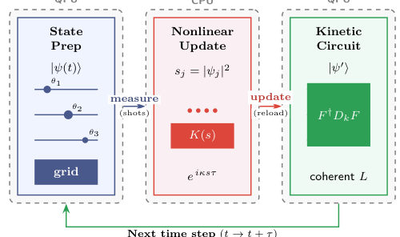 
FIG. 1. Diagram of the hybrid solver implementing the nonlinear half-kicks K∆t/2 as a measure–update–reload cy- cle between QPU and CPU, using computational-basis sam- pling of the intensities sj = |ψj|2, with the linear propagator L∆t = F †DkF applied coherently in the spectral basis, for one split step K∆t/2 L∆t K∆t/2 advancing t →t + ∆t.

📷 Fig 2

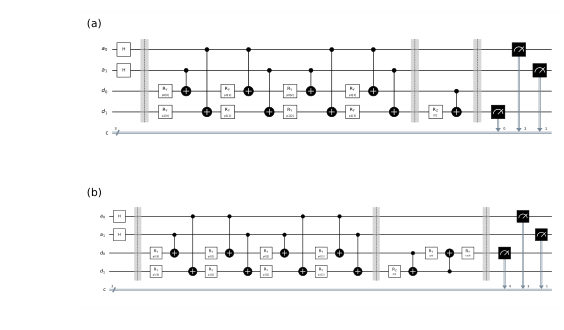 
FIG. 2. Vectorized arithmetic circuits of PolyKick, shown for two address qubits (a0, a1) and two data qubits (d0, d1). (a) For the elementwise product, uniformly controlled Ry rotations load both operands in parallel, and the Rz(π/2)- CX block writes the product onto the measured channel. (b) For the weighted sum, a controlled-Ry recombination re- alizes (1 −w) x + w y. The loading depth of Θ(N) controlled- NOT (CX) gates sets the reload latency τrel(N) of Eq. (4).

📷 Fig 3

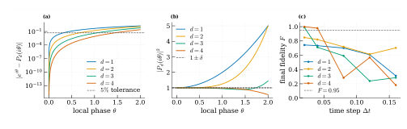 
FIG. 3. Accuracy diagnostics of the Taylor half-kick Pd(iθ) of Eq. (6), where d is the polynomial truncation degree and θ = κ|ψj|2∆t is the nonlinear phase accumulated at one grid point per timestep ∆t at nonlinearity strength κ. (a) Phase- factor error |eiθ −Pd(iθ)| for d = 1–4; the dashed line marks a representative 5% error tolerance. (b) Squared norm |Pd(iθ)|2

📷 Fig 4

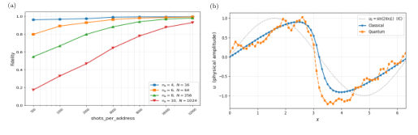 
FIG. 4. One-dimensional Burgers’ benchmark with a sinu- soidal initial condition at grid spacing ∆x = 1. (a) Single- step fidelity versus the number of measurement shots per address, for grid sizes N ∈{16, 64, 256, 1024} at viscosity ν = 0.4. (b) Steepening of the sinusoid into a shock precur- sor at ν = 0.01 and ∆t = ∆x = 0.1, evolved to the inviscid shock-formation time.

📷 Fig 5

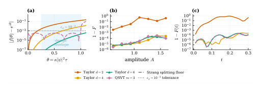 
FIG. 5. Taylor kick versus a QSVT/Chebyshev block encod- ing of the same phase oracle eiκ|ψ|2τ, both at phase tolerance ϵϕ = 10−3 over the design envelope Θ ∈[0.25, 1], for κ = 150, ∆t = 10−2, final time T = 0.3, soliton width 0.75, and a ∆t = 5 × 10−4 reference. (a) Per-step phase-factor error ver- sus the local phase θ; the dotted line marks ϵϕ. (b) Final infidelity 1 −F versus initial amplitude A. (c) Running infi- delity at A = 1.6; the dash-dot curve is the Strang splitting floor.

**Summary.** This work analyzes the resource costs of simulating nonlinear waves like the NLSE using quantum processors via a hybrid measurement-update-reload scheme. The authors demonstrate that the constant need to measure and reload the field state causes the quantum computational cost to scale worse than classical methods. Consequently, they identify achieving a coherent, measurement-free nonlinear update as the critical goal for realizing quantum advantage in this domain.

**Why it may be interesting.** It provides a rigorous, resource-aware analysis of the limitations of current quantum simulation schemes for nonlinear dynamics, setting a clear, quantitative benchmark (measurement-free evolution) for future hardware development.

Detailed structure

**Main problem.** The paper addresses the high computational cost associated with simulating nonlinear wave equations on quantum processors due to the necessity of repeatedly measuring and reloading the field state.

**Main result.** The quantum cost per step, dominated by measurement and reload overhead, scales poorly with grid size, showing no end-to-end advantage over classical methods at fixed precision.

**Method.** A hybrid split-step solver is proposed, which alternates between quantum evolution (linear steps) and classical updates (nonlinear kicks), with the field state being measured and reloaded at every time step.

**Model / system.** The primary models are nonlinear partial differential equations (PDEs), such as the Nonlinear Schrödinger Equation (NLSE) and the Burgers' equation. The quantum encoding maps an N-point field onto log_2(N) qubits.

**Key observables.** Overlap fidelity (F), phase-factor error, total step latency (T_step), and the ratio of quantum to classical work ($W_Q/W_{cl}$).

**Important parameters / regimes.** The resource budget is controlled by the timestep ($\Delta t$), polynomial degree ($d$), and shot count ($S$). The quantum cost scales as $O(N^2/\epsilon^2)$ due to readout requirements.

**Assumptions / limitations.** The analysis assumes that the measurement and reload costs dominate the overall computational work, and the PolyKick approximation is only accurate when the local nonlinear phase is small.

**Figures summary.** Figures illustrate the measure-update-reload cycle, fidelity diagnostics showing error sources, and resource comparisons demonstrating the scaling mismatch between quantum and classical work.

**Paper structure.** The paper introduces the hybrid solver, develops a comprehensive cost model accounting for shots and gates, validates the kernels on hardware, compares the resource scaling against classical FFT-based methods, and concludes by identifying the measurement-free update as the necessary target for quantum advantage.

Abstract

Quantum processors encode an N-point field in log_2(N) qubits, which renders nonlinear wave equations an important application for quantum simulation. Nonlinear evolution, however, requires the field values themselves, and these are not directly accessible without quantum measurement. Existing algorithms circumvent this measurement through linear embeddings and state copies, thereby obscuring its cost within the truncation order, the auxiliary dimensions, and the state preparation. In order to expose this cost, a hybrid split-step solver is proposed in which the field is measured, updated classically, and reloaded at every step, with all shots and gates accounted for in a single cost-and-error model. Since the entire field is available at every step, a property unavailable to linear approximations in strongly nonlinear regimes, the design of the solver reduces to a budgeting problem over the timestep, the polynomial degree, and the shot count. The coherent kernels of the solver are validated on superconducting hardware. An identical structure and bottleneck govern the viscous Burgers' equation in one and two dimensions. Because every step reads the full field, the quantum cost per step, measured as circuit depth multiplied by measurement shots, exceeds the classical cost with increasing grid size. The framework consequently identifies a coherent, measurement-free nonlinear update as the quantitative target that any end-to-end advantage must meet.

[↑ back to top](#top)

### [Odd-frequency pair correlations in the trapped fermionic Tonks-Girardeau gas](http://arxiv.org/abs/2608.21917v1)

**Authors:** M. Wong, K. Thompson, M. Governale, J. Brand, U. Zuelicke  
**Type:** theory · **Category:** quantum gases · **PDF:** <https://arxiv.org/pdf/2608.21917v1>  
**Analysis basis:** full PDF text, analyzed in chunks
**Topic relevance:** `analog quantum simulation` **3/5** · `Keldysh / 2PI / non-Gaussian methods` **2/5**

📷 Fig 1

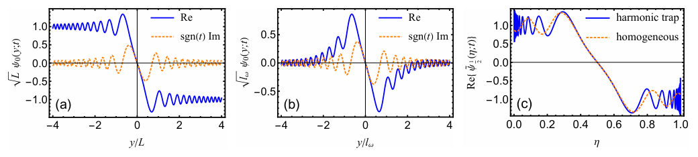 
FIG. 1. Coordinate dependence of the dressed single-fermion wave function ψx(y; t) defined in Eq. (12) for (a) the homogeneous FTG gas with ωLt = 0.1 and (b) the FTG gas in a harmonic-oscillator trap with ωt = 0.1. Here the real and imaginary parts are plotted as the solid blue and dashed orange curves, respectively. The imaginary part switches sign when t →−t. Panel (c) plots the dependence of the real part of the unit-less dressed single-fermion wave function on the universal coordinate η ≡F(y) [see Eqs. (18) and (19b)] for both the homogeneous and the harmonically trapped FTG gases with ωLt = ωt/π = 0.01.

📷 Fig 2

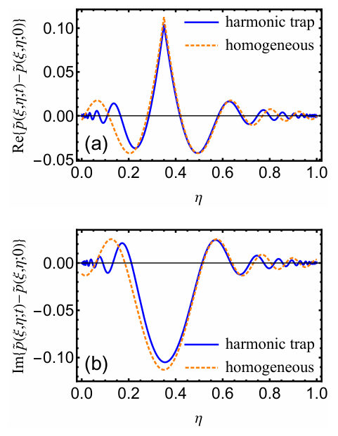 
FIG. 2. Comparison of the purely t-dependent contribution to ˜p(ξ, η; t) for the homogeneous and the harmonically trapped FTG gases with ωLt = ωt/π = 0.01 and ξ = 0.35.

📷 Fig 3

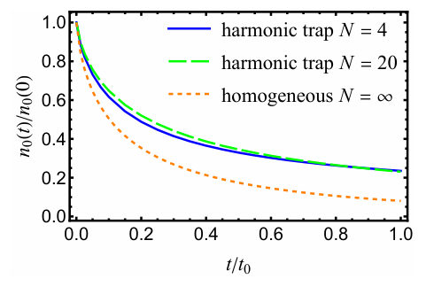 
FIG. 3. Dependence of the dominant T2bCM eigenvalue on t &gt; 0. The solid blue (dashed green) curve is for N = 4 (N = 20) in a harmonic trap and t0 = π/[(N −2)2ω]. The dotted orange curve plots the thermodynamic limit (34).

📷 Fig 4

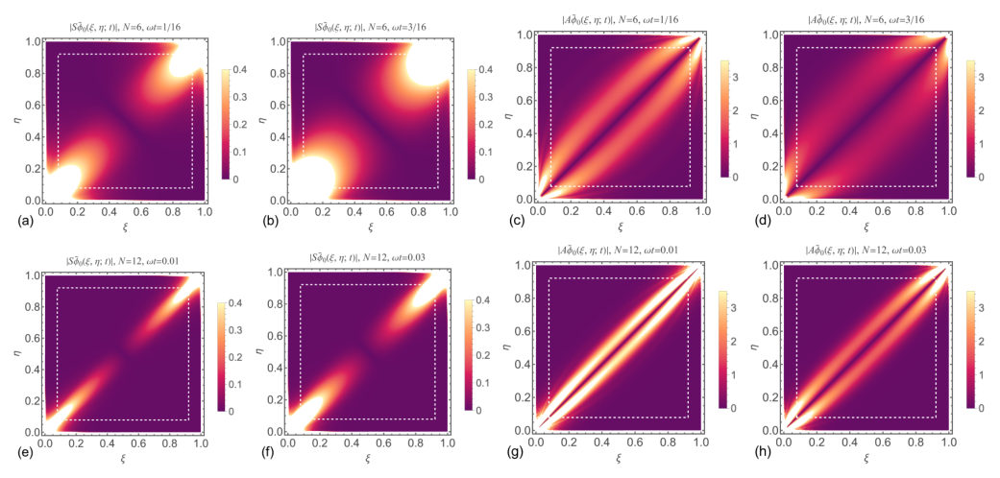 
FIG. 4. Pair-condensate order parameter for a harmonically trapped FTG gas, calculated from Eq. (35). The modulus of the symmetric [antisymmetric] part is plotted in panels (a), (b), (e) and (f) [(c), (d), (g) and (h)] using universal coordinates ξ = F(x) and η = F(y). The upper (lower) row shows results for N = 6 (N = 12) and two values of t differing by a factor of 3. Dashed rectangles delimit the region |x|, |y| ≤lω where the FTG gas is largely concentrated.

📷 Fig 5

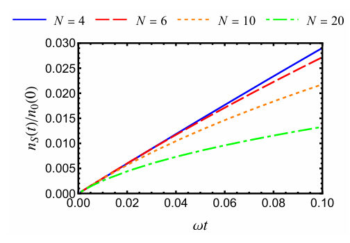 
FIG. 5. Magnitude of the odd-frequency, symmetric-pairing part of the FTG-gas superfluid order parameter. The quantity nS(t), defined in Eqs. (36), is plotted as a function of t for several values of the particle number N.

**Summary.** This theoretical study examines the fermionic Tonks-Girardeau gas, an exactly solvable model for strongly interacting fermions. The authors demonstrate the presence of unconventional odd-frequency pairing, which is a boundary-localized, mesoscopic phenomenon. They achieve this by generalizing ODLRO theory to analyze the time-dependent two-body correlation matrix.

**Why it may be interesting.** This work directly addresses advanced topics in strongly correlated quantum gases, specifically exploring unconventional pairing symmetries (odd-frequency) beyond standard BCS theory, which is highly relevant to modern AMO research.

Detailed structure

**Main problem.** The paper investigates the existence and nature of unconventional odd-frequency pair correlations within the fermionic Tonks-Girardeau (FTG) gas.

**Main result.** Odd-frequency pairing is predicted to exist in the trapped FTG gas, but it is a mesoscopic effect localized at the system's boundary and nonextensive thermodynamically.

**Method.** The analysis generalizes Yang's theory of Off-Diagonal Long-Range Order (ODLRO) by using the Time-Dependent Two-Body Correlation Matrix ($
ho_2$) and its time-ordered counterpart ($
ho_T^2$).

**Model / system.** The system is the fermionic Tonks-Girardeau (FTG) gas, an exactly solvable model known to exhibit conventional p-wave Cooper pairing, which is then analyzed under the influence of a trapping potential.

**Key observables.** The order parameter $\phi_T^0(x, y; t)$ and the macroscopic eigenvalue $n_0(t)$ derived from the T2bCM are key diagnostics for superfluidity and pairing.

**Important parameters / regimes.** Fixed particle number ($N$), finite time delay ($t$), and the trapping potential $V(x)$ (harmonic or square-well).

**Assumptions / limitations.** The analysis relies on the Off-Diagonal Long-Range Approximation (ODLRO) and the use of the Time-Dependent Two-Body Correlation Matrix formalism.

**Figures summary.** Figures illustrate the spatial dependence of wave functions and the time evolution of the macroscopic eigenvalue $n_0(t)$ for various particle numbers and potentials, alongside scaling plots for the odd-frequency pairing magnitude.

**Paper structure.** The work progresses by establishing the theoretical framework using the T2bCM, deriving the macroscopic eigenvalue $n_0(t)$ via ODLRO, and finally applying this formalism to calculate and analyze the signature of odd-frequency pairing in the trapped FTG gas.

Abstract

The fermionic Tonks-Girardeau gas is an exactly solvable model realizing a conventional macroscopic condensate of p-wave Cooper pairs. Here we demonstrate that, when confined by a trapping potential, it also hosts unconventional odd-frequency pairing, i.e., pair correlations with s-wave symmetry that are only present with a finite time delay t between fermions forming a pair. Quantitative results for fixed particle number are obtained using a generalization of Yang's theory of off-diagonal long-range order to define a t-dependent order parameter that is antisymmetric under combined t inversion and exchange of fermion-pair indices. Odd-frequency pairing in the fermionic Tonks-Girardeau gas is found to be a mesoscopic effect, localized at the system's boundary and therefore nonextensive thermodynamically. Our results show that this elusive hidden order is accessible in systems having fixed particle number, suggesting new avenues towards its experimental realization and further detailed study.

[↑ back to top](#top)

### [Towards a Digital Twin for the Ground to QEYSSat Quantum Link](http://arxiv.org/abs/2608.21968v1)

**Authors:** Henri P. N. Morin, Alex Maierean, Brendon L. Higgins, Ian DSouza, Vinodh R. R. Muthu, Thomas Jennewein  
**Type:** theory · **Category:** quantum information and computing · **PDF:** <https://arxiv.org/pdf/2608.21968v1>  
**Analysis basis:** full PDF text, analyzed in chunks
**Topic relevance:** `methods for driven-dissipative` **3/5** · `Full counting statistics` **1/5** · `quantum measurements` **1/5**

📷 Fig 1

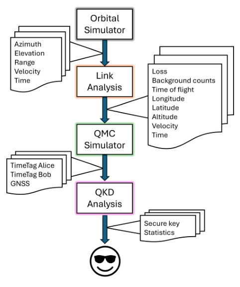 
FIG. 1: Full QEYSSat digital twin software stack. The data flow between each software is highlighted.

📷 Fig 2

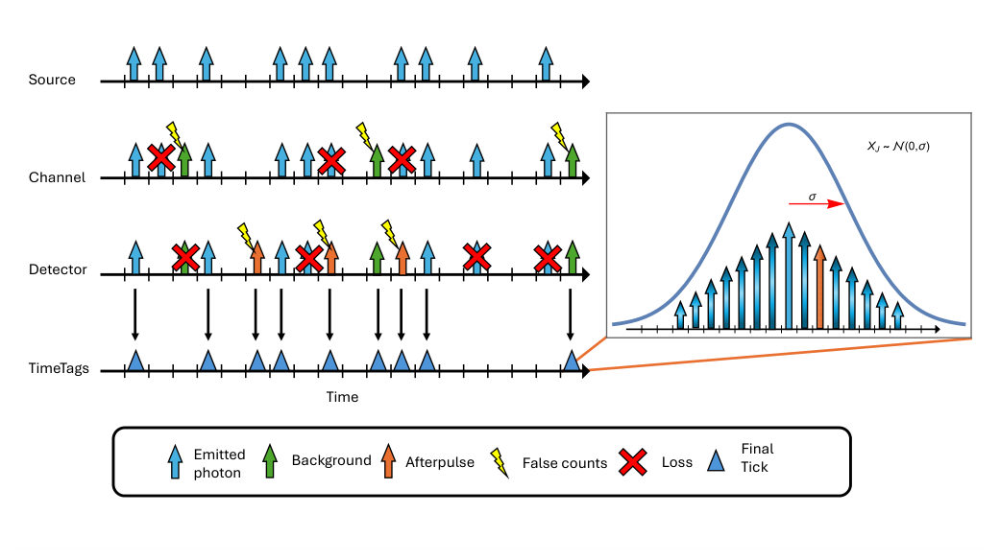 
FIG. 2: Visualization of the effects modelled in our link simulation, and the different modules of the simulation chain. The simulation operates with a fine-grain time bin (78 ps), and each photon is associated with a certain timetag. The relevant modules add, subtract, or move timetags within the time bins. First, the source randomly generates emissions for each bin in the given timestep. Second, the channel module removes emissions due to loss, and adds emissions due to background counts. Third, the detector module removes emissions due to detector efficiency and deadtime, adds emissions due to dark counts and afterpulsing, and changes the time ordering of events due to timing jitter as a...

📷 Fig 3

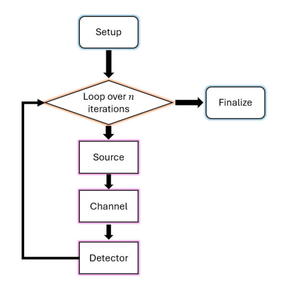 
FIG. 3: Main iteration performed by the QEYSSat Monte Carlo Simulator. The QMCS defines a given scenario to simulate based on given inputs. It iterates over the Monte Carlo time steps performing source tasks, channel tasks, and detector tasks, before safely saving all output files. The time steps are nominally 1 ms of real time.

📷 Fig 4

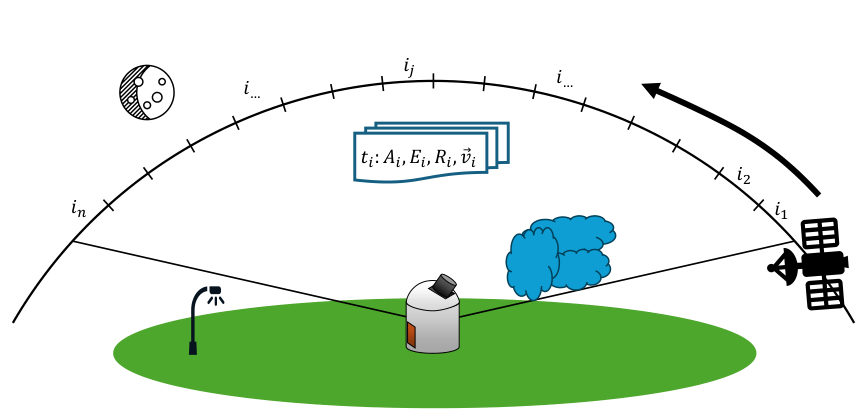 
FIG. 4: Discretized orbital pass. At each second ti of the simulated pass, azimuth Ai, elevation Ei, range Ri, and velocity ⃗vi data are generated within Ansys STK. This information is used to compute link properties as a function of time which is in turn ingested by the QEYSSat Monte Carlo Simulator. This data is assumed to be the quantum phase of the total orbital pass. Considered effects include turbulence, reflected moonlight, and light pollution.

📷 Fig 5

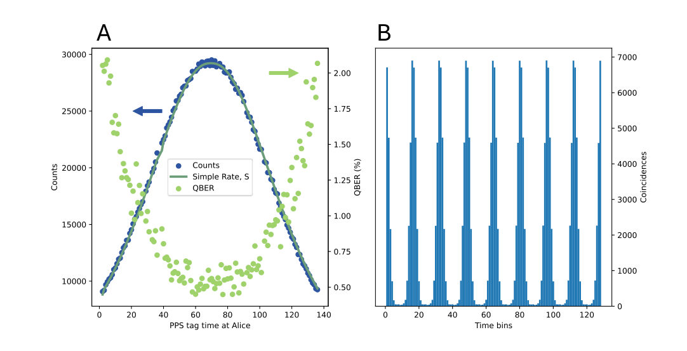 
FIG. 5: QBER, singles counts, coincidence histogram for an example simulated pass of 140 s. (A) Single counts (left axis, blue) show an increasing amount of detected photons as the satellite approaches zenith. The highest concentration of counts is located at zenith, and correspondingly relate to the lowest QBER (right axis, green). QBER worsens dramatically at the edges of the pass, corresponding to the lowest elevation and longest transmission distance. In the middle of the pass, QBER is at its lowest, around 0.5%. The simulated counts are compared against a simple model given by eq. (8). (B) Coincidence histogram extracted from frame 63 of Figure (A), which has the highest number of...

**Summary.** This paper presents a novel Monte Carlo simulator designed as a digital twin for the QEYSSat satellite quantum link. It accurately models all physical impairments—from source jitter and atmospheric turbulence to detector afterpulsing—in a probabilistic framework. This tool allows researchers to predict the achievable secure key rate, providing a crucial validation baseline for future space-based quantum communication missions.

**Why it may be interesting.** This work is highly relevant as it applies advanced simulation techniques to model open quantum systems (photon propagation) in a complex, noisy environment (space channel), directly impacting the feasibility and security analysis of quantum communication.

Detailed structure

**Main problem.** Simulating quantum key distribution (QKD) over space links requires high-fidelity models because simple analytical approximations compromise the provable security of the key.

**Main result.** The authors introduce a comprehensive Monte Carlo simulator that serves as a digital twin for the QEYSSat mission, capable of predicting secure key lengths under realistic physical conditions.

**Method.** A novel Monte Carlo simulation framework is developed to probabilistically model every physical interaction a photon undergoes from emission through transmission and detection.

**Model / system.** The system is the Quantum Encryption and Science Satellite (QEYSSat) quantum link. The simulator models the entire chain: Source (using Poisson statistics), Channel (accounting for atmospheric effects, loss, and turbulence), and Detector (incorporating memory effects like afterpulsing).

**Key observables.** Secure key length, Quantum Bit Error Rate (QBER), and detailed photon count data (timetags).

**Important parameters / regimes.** Link loss (potentially $> 35 	ext{ dB}$), detector deadtime, afterpulsing probability, and atmospheric parameters (e.g., from MODTRAN).

**Assumptions / limitations.** The simulation simplifies state tracking by using a 'state palette' instead of tracking full density matrices, and it assumes the primary loss mechanism is channel attenuation.

**Figures summary.** Figures illustrate the full software stack (digital twin), the simulation chain (Source $
ightarrow$ Channel $
ightarrow$ Detector $
ightarrow$ TimeTags), and the main iterative process of the simulator.

**Paper structure.** The paper details the necessity of high-fidelity simulation, introduces the QMCS methodology covering source, channel, and detector modules, demonstrates its application to QEYSSat links (including Eve's attack), and discusses its utility as a predictive digital twin for mission validation.

Abstract

Simulations of physical systems require high-fidelity models to accurately represent reality. Simple models may be analytically tractable, but may not be sufficiently representative of reality for the given application. The cost of this simplicity is accuracy, or in the case of quantum key distribution, provable security. Sources of this accuracy gap include the difficulty of modelling physical effects which do not lend themselves well to analytical descriptions, such as afterpulsing. Here, we introduce a novel Monte Carlo based photon emission, transmission, and detection simulator, designed in the context of the Quantum Encryption and Science Satellite (QEYSSat) mission. Within this simulator, every major physical effect a photon may experience during an experiment, from emission to detection, can be accounted for in a probabilistic manner. This methodology allows for the inclusion of experimental parameters which are relevant for a satellite mission, and their impacts on secure key lengths. This simulator serves as a comprehensive baseline to predict and validate experimental data for the upcoming QEYSSat mission.

[↑ back to top](#top)

### [Belief Propagation-based Disentanglers for Tensor Network State Preparation](http://arxiv.org/abs/2608.21902v1)

**Authors:** Tomasz Szołdra, Peter Schmelcher  
**Type:** theory · **Category:** numerical methods · **PDF:** <https://arxiv.org/pdf/2608.21902v1>  
**Analysis basis:** full PDF text, analyzed in chunks
**Topic relevance:** `methods for driven-dissipative` **3/5** · `analog quantum simulation` **1/5**

📷 Fig 1

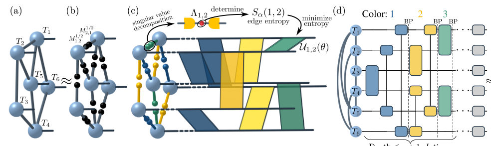 
Figure 1. Belief Propagation Disentangler. (a) Tensor network state with one tensor per qubit. (b) Belief propagation approximation of (a): each tensor’s environment is replaced with BP messages on incident edges (see text). (c) Edge entropy, Eq. (3), is computed from the singular values of M 1/2 µ,ν M 1/2 ν,µ . Two-qubit disentangler gate applied around a bond minimizes the edge entropy and solves a strictly local variational problem. Bonds are colored with a minimal number of colors which do not repeat in a given node (here, 3 colors). Disentanglers are optimized and applied on the bonds of the same color in parallel. (d) Corresponding quantum circuit. Gates of the same color commute; BP...

📷 Fig 2

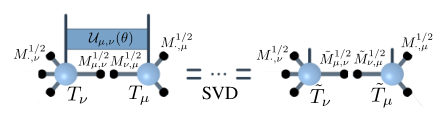 
Figure 2. Gate application in the BP gauge updates only Tµ, Tν, Mµ,ν, Mν,µ - see [63] for the complete algorithm.

📷 Fig 3

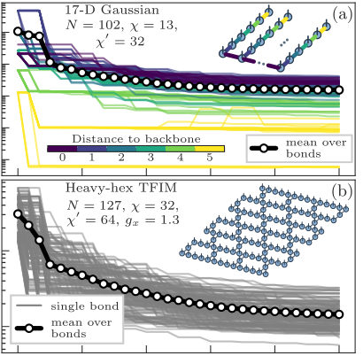 
Figure 3. Edge 2-R´enyi entropy as a function of the number of disentangling layers for (a) multivariate normal distribution and (b) ground state of the TFIM defined on the heavy-hex topology. Application of disentangling unitaries systemati- cally decreases the bond entropy.

📷 Fig 4

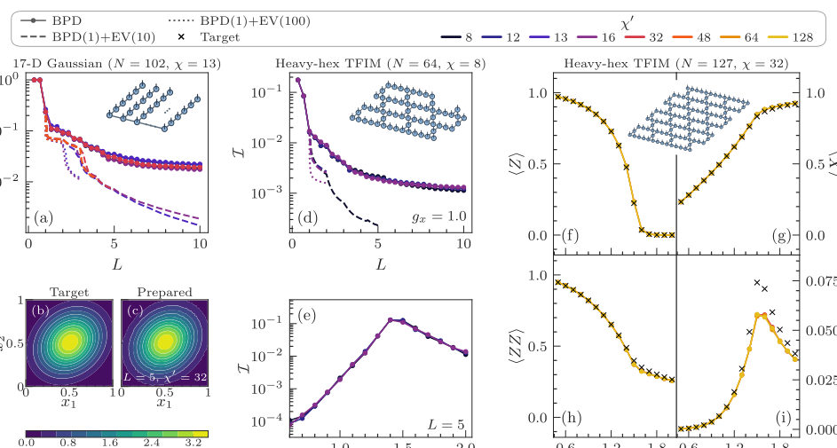 
Figure 4. (a) Infidelity of the 17-D Gaussian Eq. (7) saturating close to I ≈0.02 after L = 5 BPD layers. With EV sweeps one can reach better infidelities. (b-c) Probability distribution of variables x1, x2 with other variables fixed to µ = 0.5 for (b) target and (c) circuit from BPD(1)+EV(10). Positive correlation from (b) is almost ideally reproduced in (c). (d) Same as (a) but for the ground state of the TFIM on heavy-hex lattice restricted to 64 qubits, Eq. (8), gx = 1.0, with a small χ = 8, χ′ ≤16 so that the overlap network is exactly contractible. (e) Infidelity across the phase diagram, peaking around gx ≈1.4 −1.5. (f-i) Properties of the 127-qubit TFIM ground state. Deviations from...

📷 Fig 5

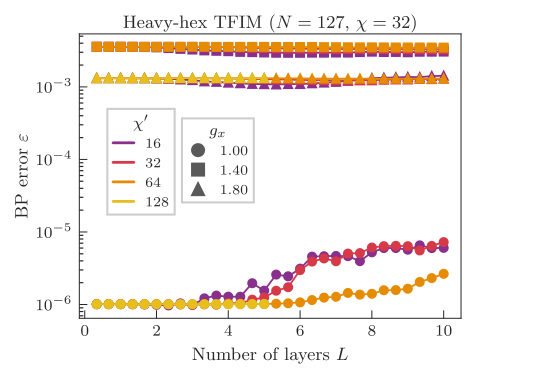 
Figure 5. BP Error of the disentangled state as a function of the number of disentangling layers L.

**Summary.** This paper introduces a Belief Propagation-based Disentangler (BPD) to synthesize quantum circuits for preparing complex Tensor Network states. By iteratively minimizing local edge entropy using nearest-neighbor gates, the method efficiently prepares states like TFIM ground states and Gaussian wavefunctions. This work significantly advances the transfer of classical tensor network physics onto quantum hardware.

**Why it may be interesting.** It provides a scalable, hardware-agnostic protocol to map classically tractable quantum states (like those from BP) onto quantum circuits, which is crucial for near-term quantum simulation.

Detailed structure

**Main problem.** Developing a quantum circuit synthesis method to prepare complex Tensor Network (TN) states for quantum simulation.

**Main result.** The Belief Propagation-based Disentangler (BPD) successfully prepares target states like Gaussian distributions and TFIM ground states on large lattices with high fidelity using only a few layers of local gates.

**Method.** The method reduces state preparation to a sequence of classical, local variational optimizations by applying nearest-neighbor 'disentangler' gates that minimize edge entropy, avoiding barren plateaus.

**Model / system.** The method targets quantum many-body states represented by Tensor Networks (TN), specifically those tractable via Belief Propagation (BP) approximations on graphs, including loopy lattices.

**Key observables.** Edge 2-Rényi Entropy, Fidelity ($F$), $\langle Z
angle$, $\langle X
angle$, and $\langle ZZ
angle$ for the TFIM.

**Important parameters / regimes.** Bond dimension ($\chi$), number of disentangling layers ($L$), and the graph structure (e.g., heavy-hex lattice).

**Assumptions / limitations.** The method relies on the BP approximation for loopy graphs and assumes the optimization landscape is free of barren plateaus.

**Figures summary.** Figures illustrate the BPD process, showing entropy reduction across layers for both Gaussian and TFIM targets, and comparing resulting observables against established benchmarks like DMRG.

**Paper structure.** The paper details the BPD algorithm, its application to preparing Gaussian states and TFIM ground states, and analyzes the convergence and stability of the process by monitoring entropy and observables across increasing bond dimensions.

Abstract

We develop a quantum circuit synthesis method for preparing a class of tensor network states. The scheme applies to states tractable with belief propagation (BP), a tensor network gauging scheme which recently allowed for classical simulations at large scales. The problem is reduced to independent, strictly local, classical variational optimizations: each nearest-neighbor two-qubit "disentangler" gate minimizes the entropy defined on an edge. Disentanglers drive the state to a product state and their Hermitian conjugate prepares the target. Each disentangling layer has depth at most $z+1$ (with $z$ the maximal number of nearest neighbors per site), the optimization has no barren plateaus, and the bond dimension stays bounded. As a demonstration, with only $3$-$5$ disentangling layers we prepare a $102$-qubit tree tensor network encoding a $17$-dimensional normal distribution and the transverse-field Ising model ground states on a $64$- to $127$-qubit heavy-hex lattice with fidelities of order $0.9-0.999$. The method opens new possibilities for quantum applications by transferring classical tensor network states onto hardware.

[↑ back to top](#top)

### [Entanglement governs early-time growth of randomness in projected ensembles](http://arxiv.org/abs/2608.22158v1)

**Authors:** Thuwaragesh Jayachandran, Wai-Keong Mok  
**Type:** theory · **Category:** statistical mechanics · **PDF:** <https://arxiv.org/pdf/2608.22158v1>  
**Analysis basis:** full PDF text, analyzed in chunks
**Topic relevance:** `quantum measurements` **3/5** · `scars & prethermalization` **1/5**

📷 Fig 1

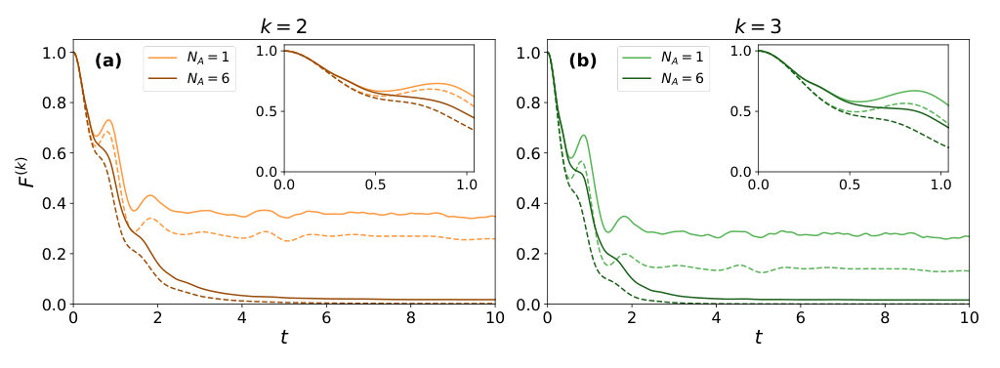 
FIG. 1. Numerical F (k)(t) (solid lines) and (F (1)(t))k (dashed lines) for (a) k = 2 and (b) k = 3 in the 1D mixed-field Ising model with bath size NB = 6. The inset shows a magnified view for t ∈[0, 1], where (F (1)(t))k agrees well with F (k)(t) up to Jt ≈0.2.

📷 Fig 2

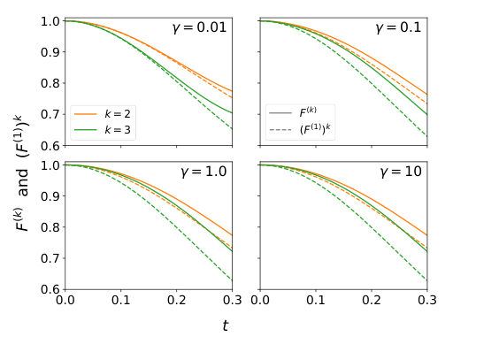 
FIG. 2. Numerical validation of Eq. (29) for initial states |Ψ0, γ⟩of subsystem sizes NA = 5 and NB = 6 evolved un- der the 1D mixed-field Ising model. Plots of F (k)(t) (solid lines) and (F (1)(t))k (dashed lines) for different values of γ are shown. Higher values of γ shrink pmin = e−2γ(2NB −1)/Nγ, thus reducing the short-time window over which the approx- imation holds.

📷 Fig 3

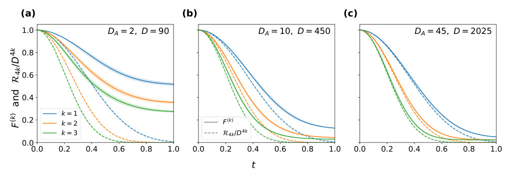 
FIG. 3. Ensemble-averaged F (k)(t) (solid lines) and R4k(t)/D4k (dashed lines) for 10 GUE samples, with DB = 45 and varying DA. Error bands depict one standard deviation over GUE samples. Better finite-dimension agreement is observed for larger DA.

📷 Fig 4

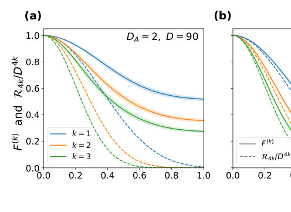 
Figure 3 compares E H∼EGUEF (k) with D−4kR4k for k =

📷 Fig 5

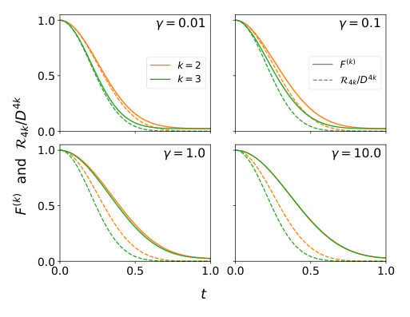 
FIG. 4. Numerical validation of the theory for initial states |Ψ0, γ⟩evolved under GUE Hamiltonians. Results are shown for DA = DB = 45. The early-time values of F (k)(t) (solid lines) and R4k(t)/D4k (dashed lines) begin to diverge at larger values of γ.

**Summary.** This theoretical paper analyzes how randomness builds up in quantum systems when a subsystem is measured, a process known as projected ensemble dynamics. It proves that the initial rate of this randomness growth is dictated solely by the initial bipartite entanglement between the measured and unmeasured parts of the system. This establishes entanglement as the primary mechanism controlling the onset of local quantum scrambling.

**Why it may be interesting.** This work provides a rigorous, quantitative link between entanglement measures (bipartite entanglement) and the initial rate of local information scrambling, which is fundamental to understanding thermalization dynamics in many-body quantum systems.

Detailed structure

**Main problem.** The paper investigates the mechanism governing the initial growth of randomness in projected quantum ensembles, contrasting this initial dynamics with the later emergence of universal pure-state statistics (deep thermalization).

**Main result.** The initial growth of local randomness in projected ensembles is governed entirely by the bipartite entanglement between the unmeasured subsystem and its complement, setting the initial timescale independently of the measurement basis.

**Method.** The analysis quantifies randomness using 'frame potentials' ($F^{(k)}(t)$) and employs time-series expansions (Taylor expansion) to analyze the short-time dynamics of projected states.

**Model / system.** The study considers a bipartite quantum system AB, initially in a product state, where subsystem B undergoes measurement, projecting the state onto an ensemble on subsystem A. The dynamics are governed by a general Hamiltonian $H$.

**Key observables.** Frame potentials ($F^{(k)}(t)$), subsystem purity ($F^{(1)}(t)$), and the entanglement timescale ($	ext{T}_{	ext{ent}}$).

**Important parameters / regimes.** The order of the frame potential ($k$), time ($t$), and the entanglement timescale ($	ext{T}_{	ext{ent}}$).

**Assumptions / limitations.** The initial bath state must have full support in the measurement basis for the leading-order results to hold; the analysis focuses strictly on the early-time regime.

**Figures summary.** Figures illustrate early-time approximations of $F^{(k)}(t)$ for specific models (like the 1D mixed-field Ising model) and compare these results to theoretical predictions derived from spectral form factors.

**Paper structure.** The paper develops the formalism for frame potentials, derives the early-time expansion for $F^{(k)}(t)$ based on the initial product state, and extends the analysis to unitarily invariant Hamiltonian ensembles, establishing a connection to spectral form factors.

Abstract

Deep thermalization concerns the emergence of universal pure-state statistics in projected ensembles at late times, yet the mechanism governing the initial growth of randomness remains unclear. Here, we study the short-time dynamics of projected ensembles generated from initially unentangled states, quantifying their randomness using frame potentials. For arbitrary Hamiltonians, provided the initial bath state has full support in the measurement basis, we show that the frame potentials to cubic order in time are determined entirely by the subsystem purity, and hence by the bipartite entanglement generated between the unmeasured subsystem and its complement. The entanglement timescale therefore sets the initial timescale for the growth of local randomness, independently of the bath measurement basis. For unitarily invariant Hamiltonian ensembles, we further relate the projected-ensemble frame potential at order $k$ to the $4k$-point spectral form factor, or equivalently to the $2k$th frame potential of the global unitary dynamics, establishing a direct connection between local and global randomness. Our results identify entanglement as the mechanism governing the onset of randomness in projected ensembles and clarify how local randomness emerges from global quantum dynamics.

[↑ back to top](#top)

### [Estimating the Fisher information from ARPES in general two-band models](http://arxiv.org/abs/2608.22511v1)

**Authors:** Gunnar F Lange  
**Type:** both · **Category:** other · **PDF:** <https://arxiv.org/pdf/2608.22511v1>  
**Analysis basis:** full PDF text, analyzed in chunks
**Topic relevance:** `quantum measurements` **3/5** · `analog quantum simulation` **1/5**

📷 Fig 1

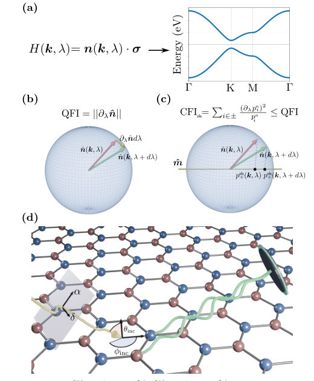 
FIG. 1. Conceptual summary of the work. (a) We study general two-band Bloch Hamiltonians H(k, λ), depending on a parameter λ. (b) The sensitivity of the ground state with respect to λ is captured by the Quantum Fisher Informa- tion (QFI). (c) The QFI can be approximated by the Clas- sical Fisher Information (CFI) along some axis ˆm, (CFI ˆ m), corresponding to a Pauli measurement along ˆm. (d) These probabilities can be accessed by Angle-Resolved Photoemis- sion Spectroscopy (ARPES) by suitably tuning incidence an- gles (θinc, ϕinc) and light polarizations (α, δ). For certain axis choices ˆmopt and k-values, CFI ˆ mopt equals the QFI, and the QFI can be reconstructed from a dichroism...

📷 Fig 2

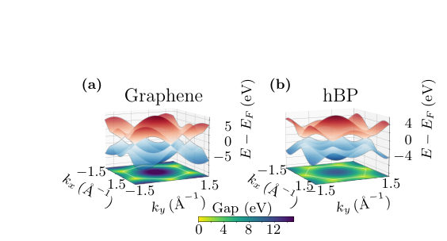 
FIG. 2. Unstrained band and gap structure for the two 2D materials considered. (a) Graphene a gapless semimetal and (b) hexagonal boron phosphide (hBP), a gapped insulator.

📷 Fig 3

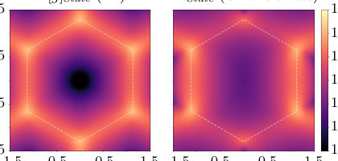 
FIG. 3. ARPES estimated CFI ˆ m metric [(a), (c)] and strain response [(b),(d)] in graphene and hBP, ignoring the param- eter dependence of the matrix elements. The results agree perfectly (to within 10−7) with the optimal QFI from Eq. (3), except at Γ. The optimized incidence and polarization angles are shown in App. D.

📷 Fig 4

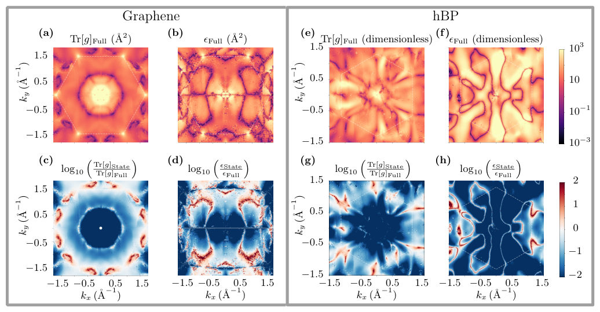 
FIG. 4. ARPES estimated CFI ˆ m metric- and strain-responses including variations in the state and matrix elements for graphene (a)–(b) and hBP (e)–(f). We also show the ratio of the response arising from changes in the quantum state, compared to changes due to the matrix elements for graphene in (c)–(d) and hBP in (g)–(h).

📷 Fig 5

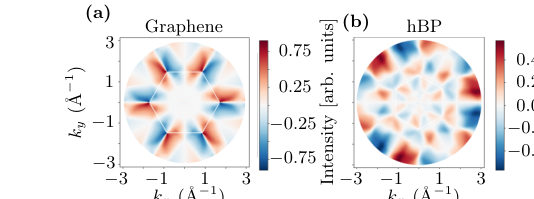 
FIG. 5. The computed circular dichroism coefficient CDAC= (ILCP −IRCP)/(ILCP + IRCP) for (a) grapene and (b) hBP at normal incidence.

**Summary.** This paper presents a novel theoretical and experimental scheme to measure the Quantum Fisher Information (QFI) in two-band solid state systems using Angle-Resolved Photoemission Spectroscopy (ARPES). By relating the QFI to the Classical Fisher Information derived from Pauli measurements, the authors provide a pathway to probe fundamental quantum properties, such as the quantum metric or strain response, using tunable light polarization and incidence angles.

**Why it may be interesting.** This work bridges fundamental quantum information theory (QFI) with cutting-edge experimental condensed matter spectroscopy (ARPES). The ability to map a theoretical quantum metric onto a measurable optical observable is highly relevant for quantum sensing applications in solid-state physics.

Detailed structure

**Main problem.** The paper addresses the challenge of estimating the Quantum Fisher Information (QFI) for a quantum state in a general two-band solid state system using Angle-Resolved Photoemission Spectroscopy (ARPES). It seeks to establish a measurable link between the theoretical QFI and experimentally accessible quantities.

**Main result.** The authors propose a detailed experimental scheme that relates the QFI to the Classical Fisher Information (CFI) derived from Pauli measurements, which can be measured by tuning ARPES incidence angles and light polarization.

**Method.** The methodology involves deriving the CFI from the measured photoemission intensity, which is proportional to a Pauli measurement observable. This requires advanced reconstruction techniques using multiple polarization measurements (e.g., EDAC code) to determine the necessary polarization vectors.

**Model / system.** The study focuses on general two-band solid state systems, exemplified by 2D materials like graphene and hexagonal boron phosphide (hBP). The physics is described using a Bloch Hamiltonian and analyzed via ARPES measurements of the photoemission intensity.

**Key observables.** Quantum Fisher Information (QFI), Classical Fisher Information (CFI), Quantum Metric, ARPES intensity $I(E, \mathbf{k}_f, \omega)$, and the dichroism coefficient (CDAC).

**Important parameters / regimes.** System parameters ($\lambda$) such as strain, incidence angles ($	heta_{	ext{inc}}, \phi_{	ext{inc}}$), and light polarization ($\alpha, \delta$).

**Assumptions / limitations.** The analysis assumes rapid photoionization and approximates the final state as a scattered wave. Furthermore, the optimal measurement basis requires careful selection of polarization vectors to satisfy specific symmetry conditions.

**Figures summary.** Figures illustrate the conceptual flow from Hamiltonian to QFI to CFI to ARPES measurement. Later figures show the numerically calculated optimal polarization angles required to measure the QFI response to strain or other parameters for graphene and hBP.

**Paper structure.** The paper first establishes the theoretical link between QFI and measurable CFI via Pauli measurements. It then details the experimental implementation using ARPES, involving the reconstruction of orbital matrix elements from multiple polarization measurements. Finally, it applies this framework to calculate the QFI response to external perturbations like strain for graphene and hBP.

Abstract

The Quantum Fisher information is frequently studied in the fields of quantum sensing and quantum metrology, as it specifies the sensitivity of a sensor through the Crámer-Rao bound, and in condensed matter physics where it relates to the quantum metric. Measuring the quantum Fisher information is therefore of significant current interest. In this work, we propose a scheme for measuring the quantum Fisher information with respect to any parameter in a general two-band solid state system using angle-resolved photoemission spectroscopy with carefully tuned incidence angles and light polarization. We investigate conditions under which this can be related back to information about the ground state of the material itself changing with system parameters.

[↑ back to top](#top)

### [Quantum-Geometric Length Scale for Long-distance Squeezing in Bosonic Bogoliubov Systems](http://arxiv.org/abs/2608.23380v1)

**Authors:** Sonu Verma, Sangmo Cheon, Myung-Joong Hwang, Moon Jip Park  
**Type:** theory · **Category:** other · **PDF:** <https://arxiv.org/pdf/2608.23380v1>  
**Analysis basis:** full PDF text, analyzed in chunks
**Topic relevance:** `analog quantum simulation` **3/5** · `Keldysh / 2PI / non-Gaussian methods` **1/5**

📷 Fig 1

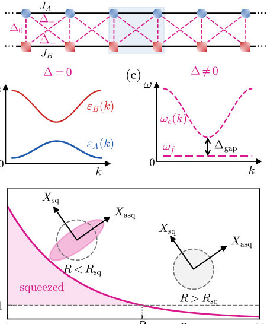 
FIG. 1. Pairing-induced Bogoliubov flat band and long- distance squeezing. (a) Bosonic lattice with modes A and B in each unit cell. Nearest-neighbor hoppings JA and JB act within the A and B sublattices, while onsite and intercell parametric pairings ∆0 and ∆± couple the two sublattices. The shaded region marks the finite support of a compact Bogoliubov generator. (b) Dispersive bands εA(k) and εB(k) in the absence of pairing. (c) For the pairing choice of Eq. (1), an exactly flat Bogoliubov band appears at ωf, separated by ∆gap from the remaining positive-frequency dispersive band ωc(k). The corresponding negative-frequency Nambu partners are omitted. (d) For a collective mode combining...

📷 Fig 2

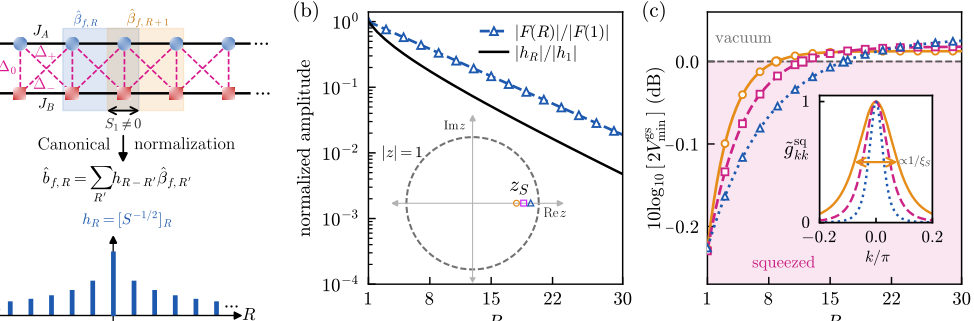 
FIG. 2. Extended canonical modes, anomalous correlations, and ground-state squeezing. (a) Nearest-neighbor hoppings JA, JB and onsite/intercell parametric pairings ∆0, ∆± generate compact Bogoliubov generators ˆβf,R. Neighboring generators have nonzero commutator overlap, [ˆβf,R, ˆβ† f,R+1] = S1 ̸= 0. Imposing canonical bosonic commutation relations gives ˆbf,R = P

📷 Fig 3

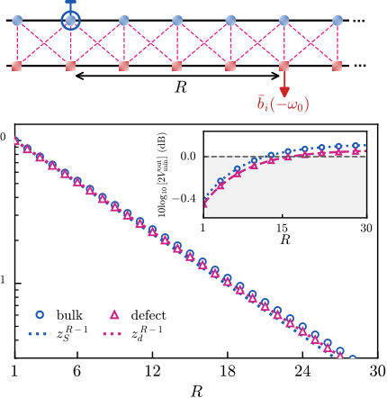 
FIG. 3. Frequency-filtered detection of long-distance squeezing. (a) The selected local output channels at A, 0 and B, R define the conjugate filtered signal and idler modes ¯bs(+ω0) and ¯bi(−ω0), where s and i denote signal and idler, respectively. We take ω0 = ωf for the translation-invariant bulk response and ω0 = ωd for the defect resonance. (b) Nor- malized anomalous output correlation |M out si (R)|/|M out si (1)|, where M out si (R) = ⟨δ¯bs δ¯bi⟩ss. Symbols show finite-bandwidth results, while dotted lines show the closed-system envelopes |zS|R−1 for the bulk and |zd|R−1 for the defect, respectively. At tf = 0, each response has a single exponential decay length in the closed-system...

**Summary.** The authors demonstrate that engineered flat bands in bosonic lattices enable long-range quantum correlations and squeezing, bypassing limitations imposed by dispersive wave propagation. They introduce an intrinsic quantum-geometric length scale ($\xi_S$), determined by a complex-momentum singularity, which governs the decay of these non-classical resources. This provides a powerful theoretical tool for controlling quantum resources in condensed matter systems.

**Why it may be interesting.** This work provides a deep theoretical link between the spectral geometry (flat bands) of interacting bosonic systems and the spatial extent of non-classical quantum resources like squeezing, which is highly relevant for quantum simulation and quantum optics.

Detailed structure

**Main problem.** The paper addresses how to achieve and quantify long-distance, phase-sensitive quantum correlations and sub-vacuum squeezing in bosonic lattices without relying on standard dispersive propagation mechanisms.

**Main result.** Parametric pairing can create an exactly flat Bogoliubov band, defining an intrinsic quantum-geometric length scale ($\xi_S$) that controls the spatial range of squeezing and anomalous correlations.

**Method.** The analysis involves constructing canonical Bogoliubov modes from compact generators and quantifying squeezing using the squeezing-sector symplectic quantum metric, linking the scale to a complex-momentum singularity.

**Model / system.** The system is a one-dimensional bosonic lattice modeled using Bogoliubov theory, specifically utilizing parametric pairing ($\Delta(k)$) to engineer an exactly flat band ($\omega_f$) within the spectrum.

**Key observables.** Anomalous correlation $F(R)$, sub-vacuum squeezing depth $D_{	ext{out}}(R)$, and the intrinsic quantum-geometric length scale $\xi_S$.

**Important parameters / regimes.** The flat band frequency ($\omega_f$), the complex-momentum singularity location ($z_S$), and the weak-damping limit.

**Assumptions / limitations.** The analysis relies on the existence of an exactly flat band and, in some analyses, assumes the weak-linewidth and narrow-filter limit for pole structure analysis.

**Figures summary.** Figures illustrate the lattice setup showing the flat band, the mechanism involving compact generators, and the relationship between the correlation decay length and the momentum-space width defined by $\xi_S$.

**Paper structure.** The paper progresses from establishing the physical model (flat band via pairing) to deriving the mathematical structure (canonical modes, symplectic metric) and finally quantifying the resulting physical resource (squeezing range and length scale $\xi_S$) through various diagnostic tools.

Abstract

Multimode squeezing is a key resource for continuous-variable quantum technologies, but its spatial range in bosonic lattices is usually tied to dispersive propagation. Here we show that parametric pairing can create an exactly flat Bogoliubov band spanned by compact Bogoliubov generators, while producing phase-sensitive anomalous correlations and sub-vacuum collective-mode squeezing that extend far beyond their finite support. Each compact generator mixes annihilation and creation operators, thereby encoding the Bogoliubov squeezing structure, and neighboring translated generators can have nonzero commutator overlap. Enforcing canonical bosonic commutation relations therefore requires spatially extended linear combinations of these translated compact generators, which define the canonical Bogoliubov modes. The squeezing transformation of these modes varies with momentum and is quantified by the squeezing-sector symplectic quantum metric. A complex-momentum singularity of the analytically continued canonical Bogoliubov modes sets both the anomalous-correlation decay length and the momentum-space width of this metric, defining an intrinsic quantum-geometric length scale. This singularity can be tuned continuously while preserving exact flatness, thereby controlling the spatial range of correlations and squeezing. Away from exact flatness, long-distance correlations persist through multiple decay channels, while modes localized by defects and dimerized boundaries provide complementary probes of the underlying quantum geometry. In the weak-damping limit, the same quantum-geometric length scale can be extracted from frequency-filtered two-port correlations. Our results establish the quantum geometry of canonical Bogoliubov modes as a mechanism for spatially extended quantum resources arising from compact Bogoliubov generators.

[↑ back to top](#top)

### [Theory of the Spinon-Mediated Witness Spin Glass in Herbertsmithite](http://arxiv.org/abs/2608.21514v1)

**Authors:** Mitikorn Wood-Thanan, Felix Flicker  
**Type:** theory · **Category:** disordered systems and neural networks · **PDF:** <https://arxiv.org/pdf/2608.21514v1>  
**Analysis basis:** full PDF text, analyzed in chunks
**Topic relevance:** `analog quantum simulation` **3/5** · `methods for driven-dissipative` **1/5**

📷 Fig 1

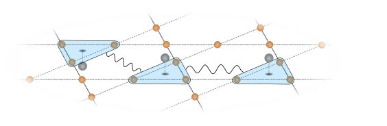 
FIG. 1: Schematic illustration of our model. Spin-1/2 Cu2+ ions (grey), termed witnesses, randomly occupy a fraction x of non-magnetic Zn sites (not shown). The quantum spin liquid in the kagome Cu2+ plane (brown) mediates an interaction between these witnesses, leading to their observed spin glass formation below T ∗= 260 mK [22].

📷 Fig 2

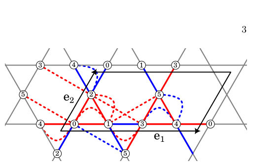 
FIG. 2: The signs of the hopping parameters used to define the QSLs. Solid lines indicate nearest neighbour hoppings t(1) lm (red positive, blue negative) which ensure π gauge flux through each hexagon (the product of hoppings around a hexagon is −1) and 0 flux through triangles. Dashed lines indicate second-neighbour hoppings t(2) lm used to define the Z2 QSL. The 6-atom unit cell, and basis vectors e1 and e2, are also shown.

📷 Fig 3

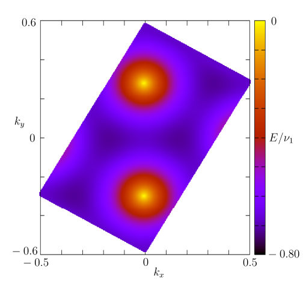 
FIG. 3: The Brillouin zone corresponding to the unit cell convention in Fig. 2; colours indicate the energy of the lowest-energy dispersing spinon band for the U(1) QSL (see Fig. 4), with Dirac nodes evident at EF . Node locations are gauge dependent, but their separation is gauge invariant and sets the behaviour of Jij.

📷 Fig 4

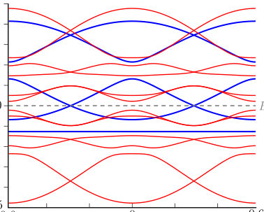 
FIG. 4: Spinon bandstructures along ky for the U(1) QSL (blue) and Z2 QSL (red).

📷 Fig 5

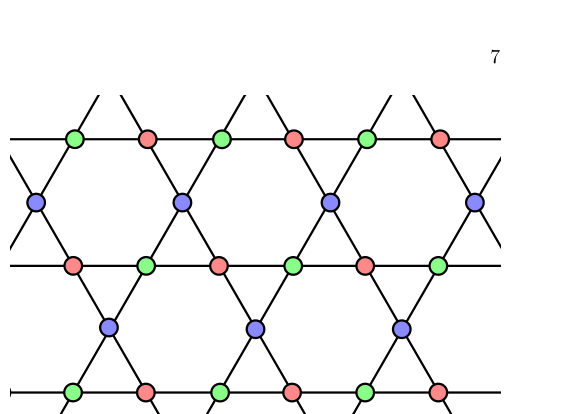 
FIG. 5: Tripartite colouring of kagome lattice sites. Witnesses sit above/below triangles and couple to the three closest kagome sites. The induced witness-witness coupling Jij involves a sum over 9 kagome spin-spin susceptibilities: 3 of AA/BB/CC type, 6 of AB/BC/AC type.

**Summary.** This theoretical work models the spin glass behavior in Herbertsmithite, where magnetic impurities interact via spinons from the underlying Quantum Spin Liquid (QSL). By comparing predictions from $\text{Z}_2$ and $\text{U}(1)$ QSL models against multiple experimental measurements, the authors propose a definitive neutron scattering test to distinguish between the two candidate QSL ground states.

**Why it may be interesting.** This work bridges the gap between abstract QSL theory and concrete experimental signatures in frustrated magnets, providing a clear, testable prediction (neutron scattering difference) that guides future experimental efforts.

Detailed structure

**Main problem.** To provide a full theoretical account of the spin glass formation among magnetic impurities (witnesses) in Herbertsmithite, mediated by the Quantum Spin Liquid (QSL) spinons.

**Main result.** The model successfully captures multiple experimental signatures, and crucially, predicts a qualitative difference in neutron scattering intensities between the $\text{Z}_2$ and $\text{U}(1)$ QSL candidates, offering a definitive test.

**Method.** The authors developed a theoretical model by deriving an effective witness-witness interaction ($J_{ij}$) from the QSL spinon susceptibility, followed by large-scale classical Monte Carlo simulations.

**Model / system.** The system is Herbertsmithite, a prototypical Quantum Spin Liquid (QSL) candidate on a kagome lattice. The model treats magnetic impurities ('witnesses') whose interactions are mediated by the underlying QSL spinons, considering both $\text{Z}_2$ and $\text{U}(1)$ QSL ground states.

**Key observables.** Spin glass formation temperature ($T^*$), magnetic noise ($S(f, T)$), DC magnetic susceptibility ($\chi(T)$), and static neutron scattering structure factor $S(\mathbf{q})$.

**Important parameters / regimes.** Witness-kagome spin coupling ($\gamma$), temperature ($T$), and witness concentration ($x$).

**Assumptions / limitations.** Key approximations include treating the witness spins as classical Ising spins and using mean-field theory for the QSL description, neglecting back-action of witnesses on the kagome spins.

**Figures summary.** Figures illustrate the model setup, showing $\text{Cu}^{2+}$ witnesses randomly occupying $\text{Zn}$ sites, and the theoretical predictions for various experimental observables like susceptibility and neutron scattering structure factor.

**Paper structure.** The paper establishes the physical problem (spin glass in Herbertsmithite), derives the effective Hamiltonian via QSL susceptibility, applies the model to fit multiple experimental data points, and finally uses the differences between $\text{Z}_2$ and $\text{U}(1)$ predictions to propose a definitive experimental test.

Abstract

Herbertsmithite is a prototypical candidate quantum spin liquid (QSL), believed to feature a long-range entangled ground state and deconfined fractionalised spinon excitations. Confirmation of these properties has been hindered by the presence of magnetic impurities (spin-1/2 Cu2+ spins substituted onto non-magnetic Zn2+ sites). Recently these impurities were reconceptualised as 'witnesses' of the QSL, inheriting long-range interactions and entanglement mediated by the QSL spinons, leading to spin glass formation amongst witnesses below 260 mK. Here we present a full theoretical account of this idea. Despite having only one free parameter (the witness-kagome spin coupling), our model captures the full range of experimental data, including: the formation of a spin glass amongst witnesses; the frequency and temperature dependence of the magnetic noise; a sharp peak in the DC magnetic susceptibility as a function of temperature; and the static neutron scattering structure factor at 2 K. Both candidate QSLs (Z2 and U(1)) give similar agreement with all data; however, our model predicts a qualitative difference between the Z2 and U(1) neutron scattering intensities below 260 mK, providing a long-sought definitive test to distinguish the two cases. We also predict phase diagrams as a function of temperature and witness concentration, finding a phase transition to different long-range ordered witness states for Z2 and U(1) at high concentration.

[↑ back to top](#top)

### [Batched and Complete U-Statistics for Trace-Polynomial Estimation from Classical Shadows](http://arxiv.org/abs/2608.22962v1)

**Authors:** Xinyu Song  
**Type:** theory · **Category:** quantum information and computing · **PDF:** <https://arxiv.org/pdf/2608.22962v1>  
**Analysis basis:** full PDF text, analyzed in chunks
**Topic relevance:** `quantum measurements` **3/5**

📷 Fig 1

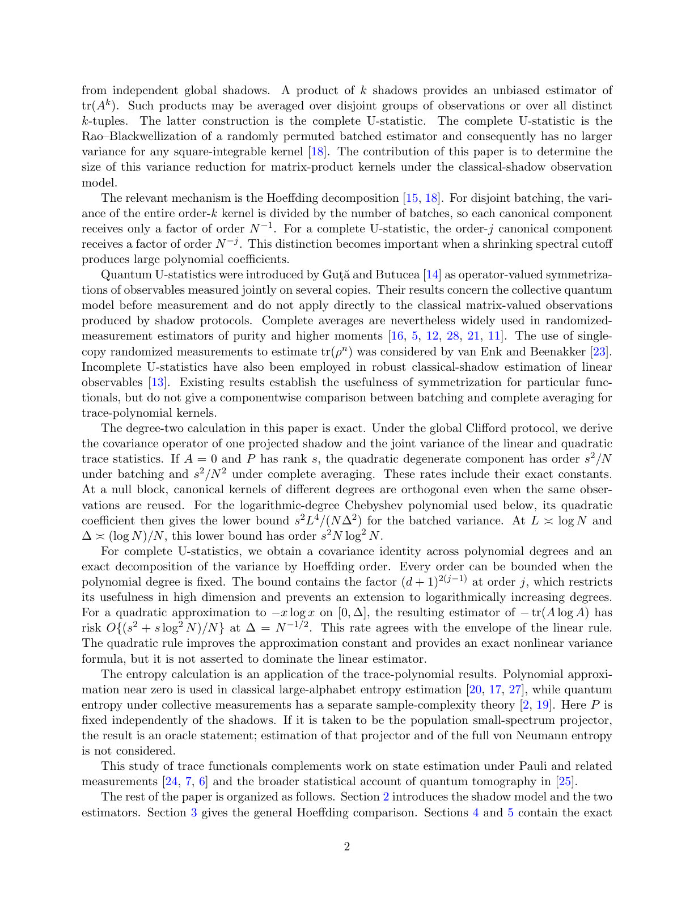 
Low-resolution page preview, page 2

📷 Fig 2

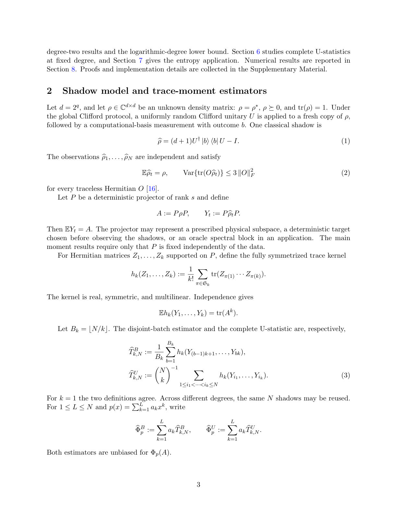 
Low-resolution page preview, page 3

📷 Fig 3

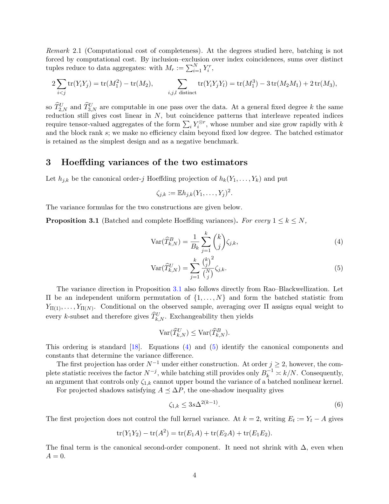 
Low-resolution page preview, page 4

📷 Fig 4

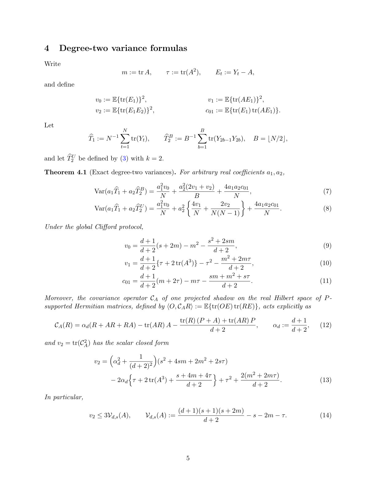 
Low-resolution page preview, page 5

📷 Fig 5

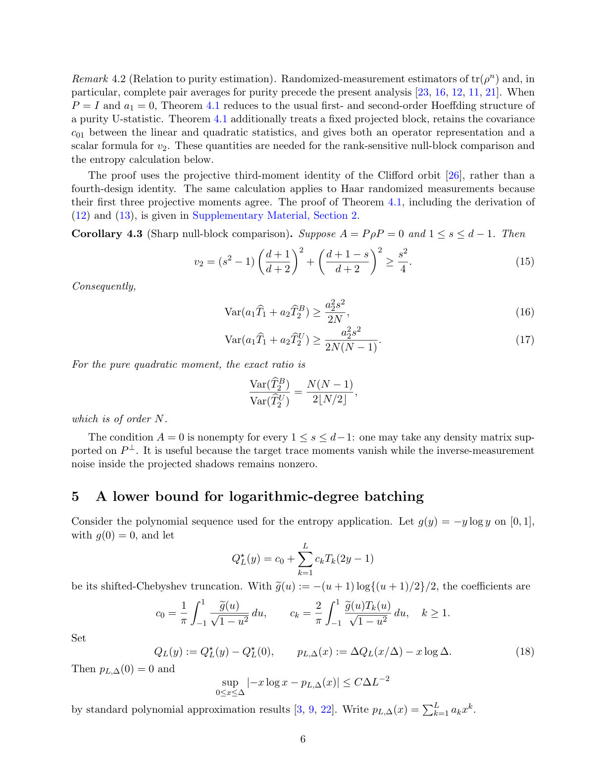 
Low-resolution page preview, page 6

**Summary.** This paper develops rigorous statistical theory to estimate quantum state properties, specifically trace polynomials, from measurements called classical shadows. It compares two estimation techniques, batching and complete U-statistics, deriving exact variance formulas. The results quantify the statistical advantage of the U-statistic approach, providing improved risk bounds for quantum information tasks like entropy estimation.

**Why it may be interesting.** This work provides crucial theoretical tools for quantum tomography and quantum state estimation, which are foundational to understanding quantum computation and quantum information processing.

Detailed structure

**Main problem.** The paper addresses the problem of accurately estimating the trace polynomial $	ext{tr } p(P
ho P)$ of an unknown quantum state $
ho$ using measurements derived from global classical shadows.

**Main result.** It rigorously compares the variance scaling of two estimators—disjoint batching and complete U-statistics—showing that the complete U-statistic provides superior variance reduction for certain terms.

**Method.** The analysis employs advanced statistical tools, including the Hoeffding decomposition and the derivation of exact variance and covariance identities for U-statistics, applied to quantum measurement statistics.

**Model / system.** The system involves estimating the density matrix $
ho$ via classical shadows generated using random Clifford unitaries. The analysis is highly mathematical, focusing on the statistical properties of these estimators rather than a specific physical Hamiltonian.

**Key observables.** The primary observables are the estimators $\hat{b}_T^B$ and $\hat{b}_T^U$, and the associated variance and risk bounds for trace moments and entropy functionals.

**Important parameters / regimes.** Key parameters include the rank $s$ of the projector $P$, the sample size $N$, and the polynomial degree $L$. The comparison hinges on the scaling of variance with $N$ (e.g., $1/N$ vs $1/N^2$).

**Assumptions / limitations.** The analysis relies on the global Clifford protocol and assumes that the projector $P$ is fixed independently of the measurement data. Higher-order bounds are limited to polynomial dependence on dimension.

**Figures summary.** The notes mention Monte Carlo experiments confirming degree-two variance formulas for both Clifford and Haar ensembles, and exact calculations illustrating entropy risks.

**Paper structure.** The paper builds from deriving exact degree-two variance formulas (Theorem 4.1) for linear and quadratic terms, extends this to general polynomial estimators using complete U-statistics (Theorems 6.1/6.2), and concludes with deriving and bounding the risk for entropy functionals (Corollaries 7.1/7.2).

Abstract

We study estimation of the trace polynomial $\operatorname{tr} p(PρP)$ from global classical shadows, where $ρ$ is an unknown quantum state and $P$ is a fixed projector. Disjoint batching and complete U-statistics yield unbiased estimators of the same trace moments, but assign different sample-size factors to the degenerate terms in their Hoeffding decompositions. Under the global Clifford protocol, exact degree-two variance formulas show that, on a null projected block of rank $s$, the quadratic degenerate term has order $s^2/N$ under batching and $s^2/N^2$ under complete symmetrization. For a logarithmic-degree polynomial used in entropy approximation, the quadratic coefficient raises the batched variance to at least order $s^2N\log^2N$ at the classical entropy cutoff. For complete U-statistics, we derive a cross-degree covariance identity and an exact variance decomposition for polynomial estimators. We also bound every Hoeffding order at a fixed degree and obtain a growing-dimensional risk bound for a small-spectrum entropy functional. The higher-order bounds retain a polynomial dependence on the ambient dimension and therefore do not cover logarithmically increasing degrees. Monte Carlo experiments confirm the degree-two formulas, and exact calculations illustrate the entropy risks.

[↑ back to top](#top)

### [Deterministic Preparation of Arbitrary Spin Eigenfunctions](http://arxiv.org/abs/2608.22892v1)

**Authors:** Wenxuan Tao, Jianan Wang, Fen Zuo  
**Type:** theory · **Category:** strongly correlated electrons · **PDF:** <https://arxiv.org/pdf/2608.22892v1>  
**Analysis basis:** full PDF text, analyzed in chunks
**Topic relevance:** `analog quantum simulation` **3/5**

📷 Fig 1

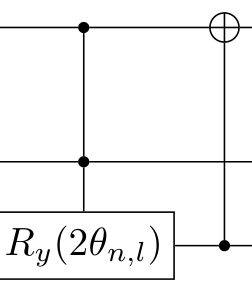 
Figure 1: The circuit Rn,l for 2 ≤l ≤n. Taken from [3].

📷 Fig 2

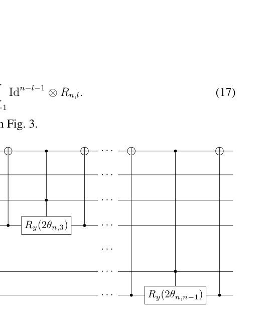 
Figure 3: The circuit for SCSn,n−1.

📷 Fig 3

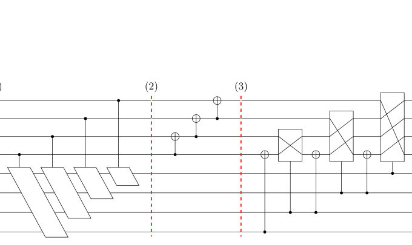 
Figure 4: A sketch of the WDB circuit. The details of the second and fourth modules are given below.

📷 Fig 4

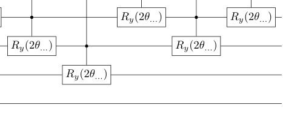 
Figure 5: An example of the duplication module. Taken from [2].

📷 Fig 5

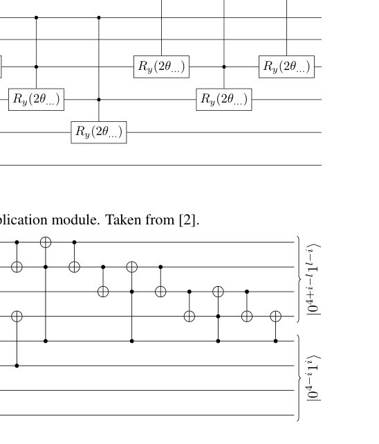 
Figure 6: An example of the elimination module. Taken from [2].

**Summary.** This work develops a general quantum circuit protocol to deterministically prepare any arbitrary spin eigenstate, extending previous methods designed for simpler Dicke states. By mapping the state structure onto a branching diagram, the authors derive recursive unitary operators based on coupling coefficients. This provides a powerful tool for simulating complex quantum many-body systems relevant to condensed matter physics.

**Why it may be interesting.** The ability to deterministically prepare complex, highly entangled spin states is foundational for simulating quantum many-body physics, which is central to strongly correlated electron systems.

Detailed structure

**Main problem.** The paper addresses the challenge of deterministically preparing arbitrary spin eigenfunctions, generalizing known efficient preparation methods for simpler states like Dicke states.

**Main result.** The authors successfully generalize the preparation techniques using a branching diagram approach, constructing the required unitary operators as products of sequential coupling gates.

**Method.** The methodology involves translating techniques from established state preparation algorithms (like WDB and SCS) into a general framework characterized by branching paths and binary spin trees.

**Model / system.** The system involves coupled spin-1/2 particles whose total spin eigenfunctions are the focus. The states are characterized by total spin quantum numbers and branching path symbols.

**Key observables.** Spin state amplitudes, total spin quantum numbers (S, Sz), and the structure of the branching diagram.

**Important parameters / regimes.** The number of spins ($n$), the target total spin ($S$), and the specific coupling coefficients derived from Clebsch-Gordan theory.

**Assumptions / limitations.** The construction relies on recursive relations derived from Clebsch-Gordan coefficients and assumes the implementability of the derived controlled rotation gates.

**Figures summary.** Figures illustrate the circuit diagrams for the WDB and SCS modules, the branching diagram structure for small $n$, and the specific duplication and elimination modules used in the circuit construction.

**Paper structure.** The paper progresses from reviewing Dicke state preparation (SCS/WDB) to introducing the general framework using branching diagrams. It then derives recursive circuit construction formulas and details the implementation of complex modules like the negative-logic WDB circuit.

Abstract

Quantum states with conserved total spins, or spin eigenfunctions, are important for studying quantum chemistry and quantum manybody physics problems. A typical class of spin eigenfunctions are Dicke states, which attain maximal spins. While we already have many efficient quantum algorithms to prepare Dicke states, it is not yet clear if we could do so for arbitrary spin eigenfunctions deterministically. Generalizing Bärtschi and Eidenbenz's elegant algorithms for Dicke state preparation, we successfully prepare arbitrary spin eigenfunctions characterized by branching paths and binary spin trees. As a byproduct, we also develop the corresponding classical algorithms to reconstruct all these spin states.

[↑ back to top](#top)

### [Does Probability Require a Single History?](http://arxiv.org/abs/2608.22733v1)

**Authors:** Jonathan Baxter  
**Type:** theory · **Category:** other · **PDF:** <https://arxiv.org/pdf/2608.22733v1>  
**Analysis basis:** full PDF text, analyzed in chunks
**Topic relevance:** `quantum measurements` **3/5**

📷 Fig 1

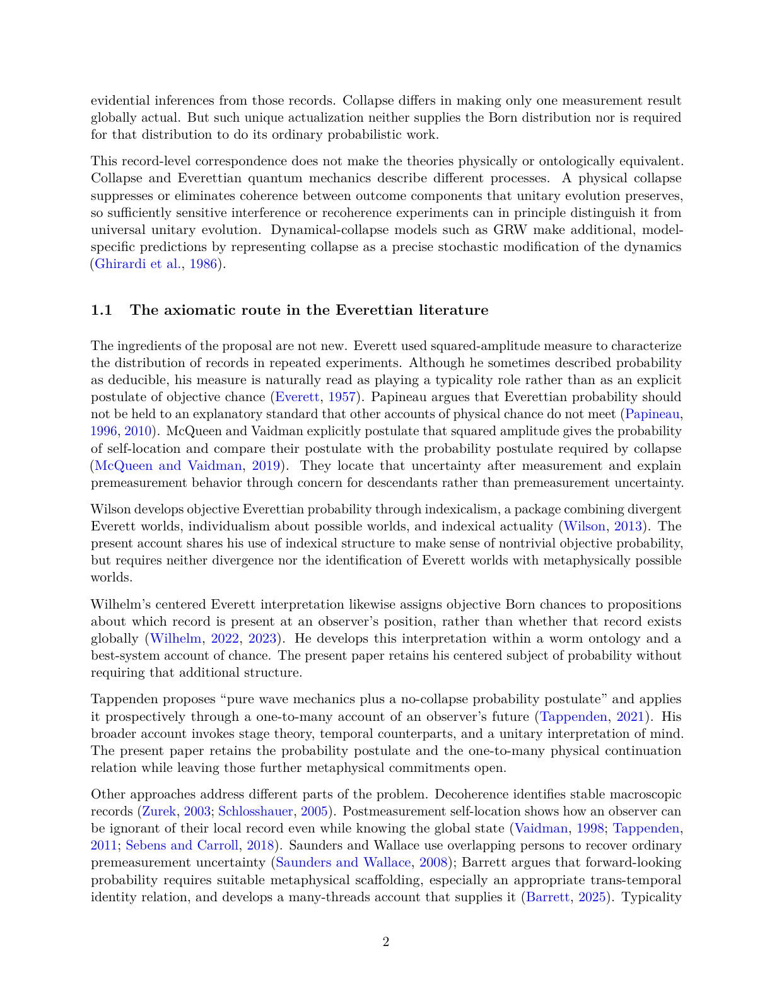 
Low-resolution page preview, page 2

📷 Fig 2

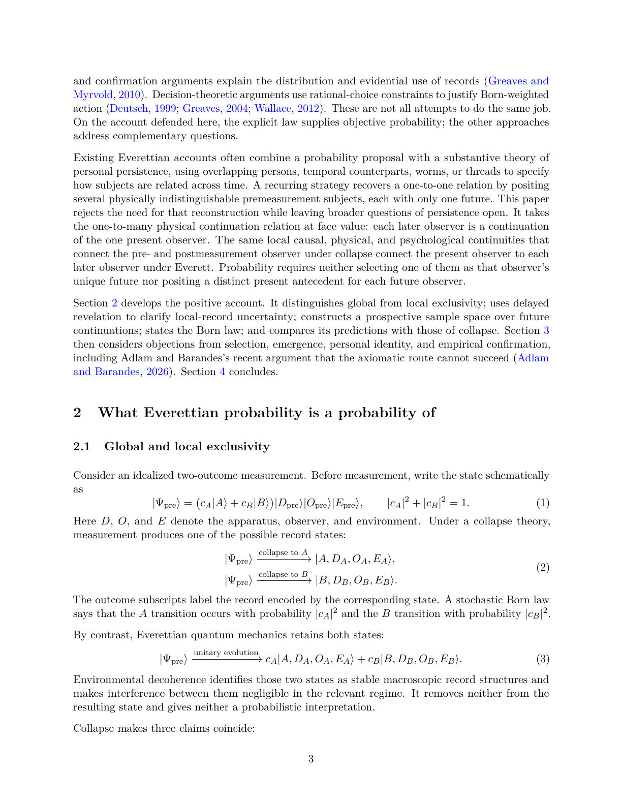 
Low-resolution page preview, page 3

📷 Fig 3

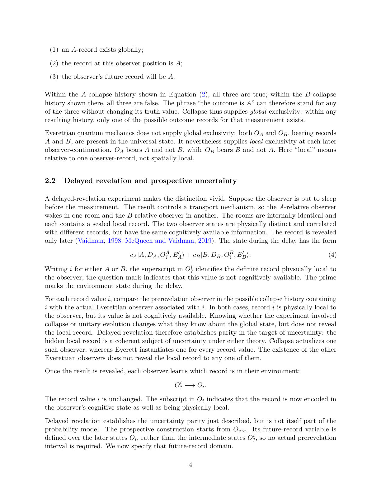 
Low-resolution page preview, page 4

📷 Fig 4

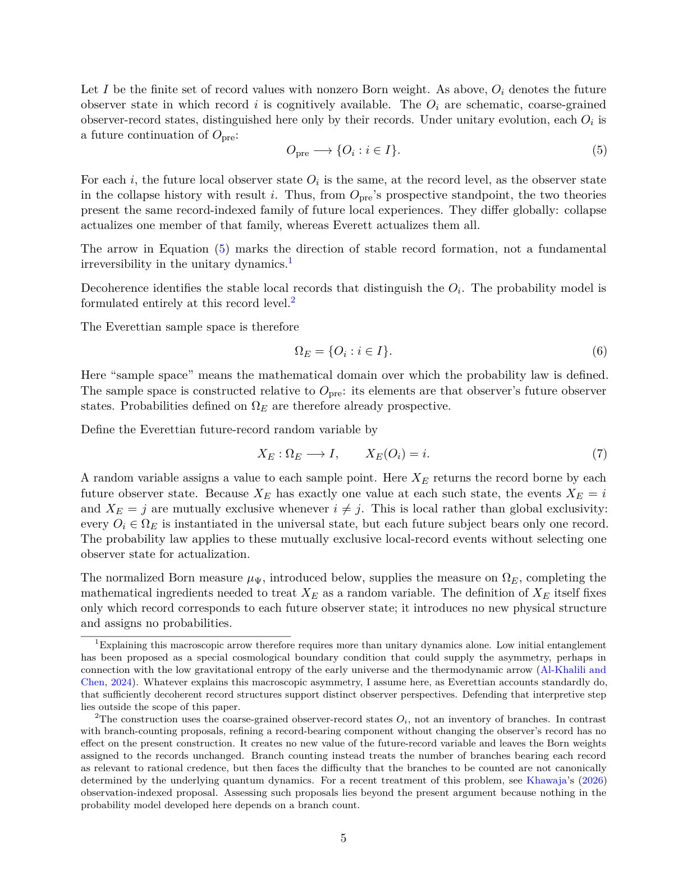 
Low-resolution page preview, page 5

📷 Fig 5

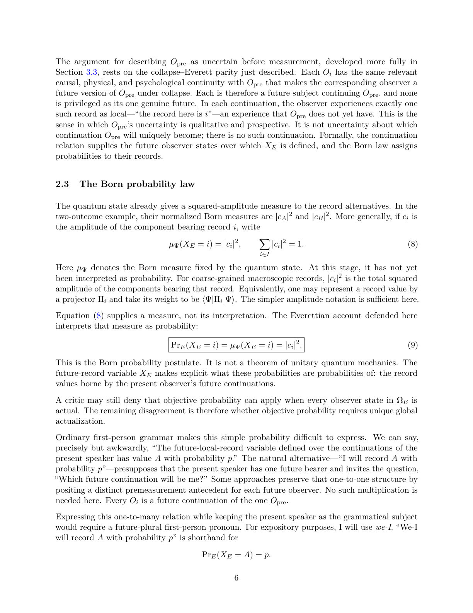 
Low-resolution page preview, page 6

**Summary.** This paper tackles the measurement problem by arguing that probability must be axiomatically postulated as a measure over an observer's future records, rather than being derived from the global ontology. It demonstrates that this minimal postulate allows the Everettian framework to reproduce the empirical predictions of collapse theories regarding local measurement outcomes. The work thus provides a path to reconcile unitary quantum mechanics with objective probability without requiring a single, unique global history.

**Why it may be interesting.** This work is highly relevant to open quantum systems and foundations, as it tackles the measurement problem by providing a minimal, axiomatic prescription for probability that remains consistent with unitary evolution at the level of local, recorded information.

Detailed structure

**Main problem.** The paper addresses the fundamental conflict between the unitary, branching nature of Everettian quantum mechanics and the necessity of assigning objective probabilities (Born measure) when all outcomes appear to occur globally.

**Main result.** The authors argue that objective probability must be postulated prospectively over the records borne by an observer's future continuations, showing that this axiomatic postulate yields the same record-level predictions as collapse theories.

**Method.** The approach is axiomatic, postulating the normalized Born measure as the objective probability and comparing the predictions of the Everettian law against the collapse law using thought experiments involving delayed revelation.

**Model / system.** The model compares two interpretations of quantum measurement: the collapse theory (single global outcome) and Everettian quantum mechanics (unitary evolution leading to multiple observer continuations). The analysis uses idealized two-outcome measurements and delayed revelation scenarios.

**Key observables.** The key observables are the record values borne by the observer's future continuations ($X_E$) versus the unique record in the global post-collapse state ($X_C$).

**Important parameters / regimes.** The core parameters are the squared amplitudes ($|c_i|^2$) which define the Born probability measure.

**Assumptions / limitations.** The primary assumption is the axiomatic postulate of the normalized Born measure as the objective probability, which is separated from theories of personal persistence.

**Figures summary.** The notes describe the comparison of sample spaces ($\Omega_E$ vs $\Omega_C$) and the mathematical derivation showing the equality of the probability distributions ($	ext{Pr}_E = 	ext{Pr}_C$) for the record variables.

**Paper structure.** The paper establishes the problem, proposes the axiomatic postulate for probability, demonstrates the equivalence of predictions at the record level using thought experiments, and finally defends this minimal postulate against various philosophical objections regarding selection and unique history.

Abstract

Everettian quantum mechanics is often said to lack coherent probability because every possible measurement result occurs. If all of them exist globally, what is probability supposed to be a probability of? This paper defends an axiomatic answer: normalized Born measure is postulated as objective probability over the records borne by an observer's future continuations. A collapse law assigns the same probabilities to possible global outcomes. Neither theory derives the probabilities from its ontology. I relate this minimal proposal to earlier axiomatic accounts, separate it from their accompanying theories of personal persistence, and defend it against recent arguments that the axiomatic route cannot succeed. At the level of recorded results, the Everettian law supports the same predictions and empirical inferences as the collapse law, despite the theories' different ontologies.

[↑ back to top](#top)

### [Identifiability and Estimation Precision in Quantum Network Tomography with Imperfect Bell-State Measurements](http://arxiv.org/abs/2608.21692v1)

**Authors:** Athira Kalavampara Raghunadhan, Matheus Guedes De Andrade, Don Towsley, Indrakshi Dey, Daniel Kilper, Nicola Marchetti  
**Type:** theory · **Category:** quantum information and computing · **PDF:** <https://arxiv.org/pdf/2608.21692v1>  
**Analysis basis:** full PDF text, analyzed in chunks
**Topic relevance:** `quantum measurements` **3/5**

📷 Fig 1

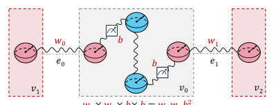 
Fig. 2. Two-link linear probe with a locally generated entangled pair at v0, yielding w0w1b2.

**Summary.** This work analyzes Quantum Network Tomography in star networks suffering from imperfect Bell-State Measurements. The authors develop specialized measurement probes to guarantee that all link and noise parameters are uniquely identifiable. They derive theoretical bounds on estimation precision, confirming that the proposed probes maintain stable accuracy even as the network grows.

**Why it may be interesting.** It provides rigorous theoretical tools (FIM, CRB) to quantify the limits of measurement in complex quantum systems, which is crucial for designing fault-tolerant quantum communication protocols.

Detailed structure

**Main problem.** The paper addresses the challenge of characterizing quantum links in Quantum Network Tomography (QNT) when the Bell-State Measurements (BSMs) used are imperfect.

**Main result.** By designing specific probe sequences, the authors ensure unique parameter identifiability and show that the estimation precision (CRB) remains stable for individual link parameters even as the network size increases.

**Method.** The study uses theoretical analysis involving the Fisher Information Matrix (FIM) and Cramér-Rao Bounds (CRB) to quantify estimation precision, alongside constructing specific probe measurements to ensure parameter identifiability.

**Model / system.** The system is an $n$-node star network where links are modeled as depolarizing channels characterized by a quality parameter $w_k$. Imperfections are introduced via a depolarizing channel affecting the BSMs, parameterized by $b$.

**Key observables.** Link entanglement quality ($w_k$), BSM noise parameter ($b$), Fisher Information Matrix (FIM), and Mean Squared Error (MSE).

**Important parameters / regimes.** Network size ($n$), link parameters ($w_k$), BSM imperfection parameter ($b$), and the number of measurement shots ($N$).

**Assumptions / limitations.** The analysis is limited to the star network topology, and the initial derivations rely on logarithmic transformations which exclude zero values for $w_k$ and $b$.

**Figures summary.** Figures illustrate probe construction in small networks, show the dependence of CRB on the BSM parameter $b$, and compare empirical MSEs from Monte Carlo simulations against theoretical CRBs as the number of shots increases.

**Paper structure.** The paper progresses by first identifying the parameter estimation challenges posed by imperfect BSMs, then developing improved probe designs to achieve unique identifiability, and finally deriving the FIM and MLEs to characterize the resulting estimation precision.

Abstract

We study Quantum Network Tomography (QNT) for end-to-end link-error characterization under imperfect Bell-state measurements (BSMs), where multiplicative coupling between link and measurement parameters makes identifiability non-trivial. For an n-node star network, we design probes that ensure unique identifiability and derive closed-form expressions for the Fisher Information Matrix (FIM) and Maximum Likelihood Estimators (MLEs), and characterize estimation precision through the Cramer-Rao Bound (CRB). The results show that BSM imperfections degrade estimation precision, while the proposed probes maintain nearly stable precision for individual link parameters as the network size increases. Monte Carlo simulations further confirm that the Mean Squared Error (MSE) approaches the CRB with increasing sample size.

[↑ back to top](#top)

### [Implementation of nonlocal multi-photon interference by mode swapping](http://arxiv.org/abs/2608.22850v1)

**Authors:** Holger F. Hofmann, Yuki Kodama, Jonte R. Hance  
**Type:** theory · **Category:** quantum information and computing · **PDF:** <https://arxiv.org/pdf/2608.22850v1>  
**Analysis basis:** full PDF text, analyzed in chunks
**Topic relevance:** `interference shaping light` **3/5**

📷 Fig 1

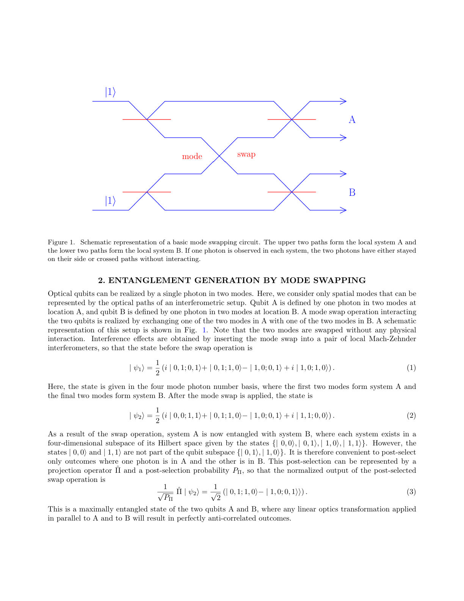 
Low-resolution page preview, page 2

📷 Fig 2

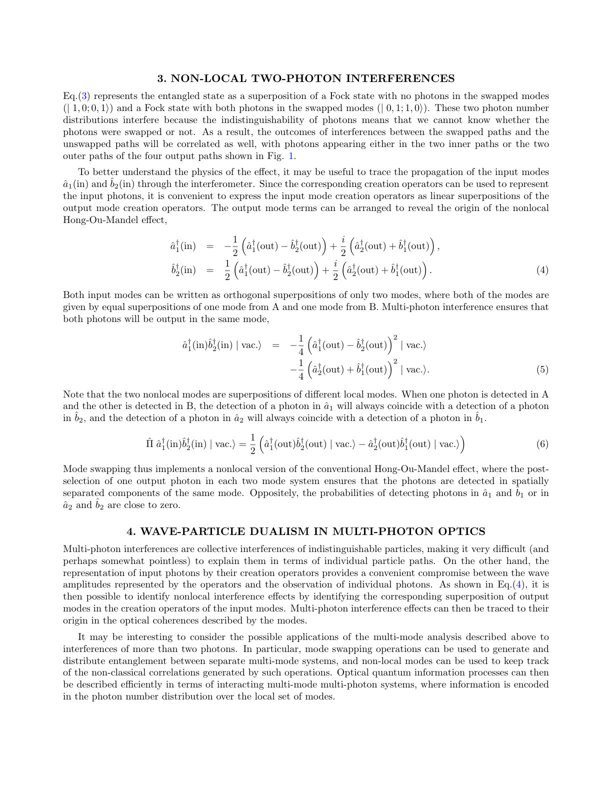 
Low-resolution page preview, page 3

📷 Fig 3

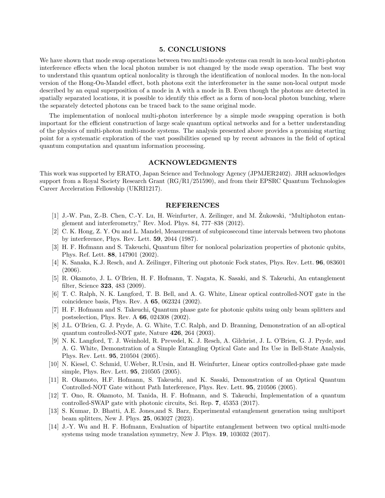 
Low-resolution page preview, page 4

📷 Fig 4

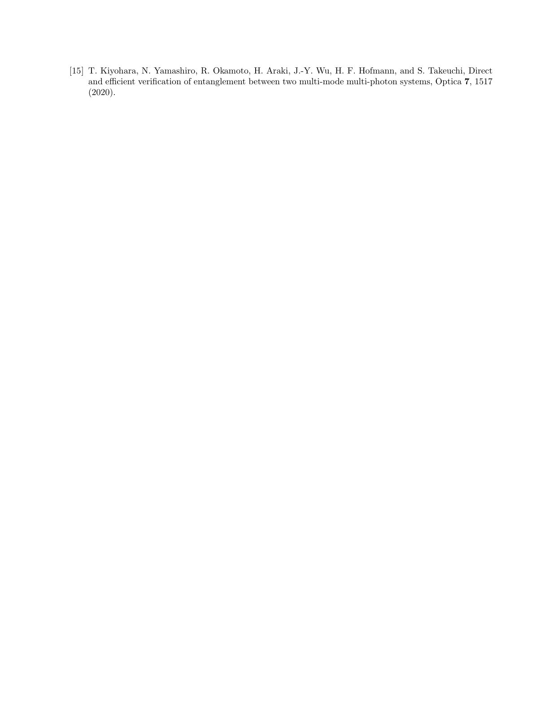 
Low-resolution page preview, page 5

**Summary.** This paper shows how to achieve non-local multi-photon interference by implementing a mode swap operation between two separate interferometers. By generating entanglement across these separated locations, the authors demonstrate a non-local Hong-Ou-Mandel effect. This technique is particularly valuable for quantum protocols that require distributing quantum information to distant parties.

**Why it may be interesting.** This work is highly relevant for quantum optics and quantum information, as it provides a concrete mechanism (mode swapping) to engineer non-local quantum correlations essential for quantum networking and distributed quantum computation.

Detailed structure

**Main problem.** The paper addresses the challenge of implementing and understanding non-local multi-photon interference in quantum optical systems.

**Main result.** It demonstrates that a mode swap operation can generate entanglement between photons in two spatially separated interferometers, thus realizing a non-local Hong-Ou-Mandel (HOM) effect.

**Method.** The method involves modeling the system using optical qubits and employing a mode swap operation followed by post-selection to project the state onto a maximally entangled subspace.

**Model / system.** The physical system is based on optical quantum information using multi-photon interference across two spatially separated interferometers (System A and System B). The analysis uses a four-mode photon number basis to model the state evolution.

**Key observables.** The key observable is the non-local correlation of photon detections, confirming the non-local HOM effect.

**Important parameters / regimes.** The analysis is concerned with the coherence properties across spatially separated modes.

**Assumptions / limitations.** The analysis relies on post-selection ($\hat{\Pi}$) to restrict the outcomes to the desired qubit subspace.

**Figures summary.** Figure 1 schematically illustrates the basic mode swapping circuit, showing the paths forming the local systems A and B.

**Paper structure.** The paper progresses from establishing the general importance of multi-photon interference to defining the system using local multi-mode setups, demonstrating how the mode swap generates entanglement, and finally using this entanglement to prove the non-local HOM effect.

Abstract

Multi-photon interference can be observed using independently generated photons as input. In the most simple case, these photons meet up at a beam splitter, resulting in quantum interference between transmission and reflection of the photons. Here, we show that non-local multi-photon interference can be implemented by using a mode swap operation to generate entanglement between the photons detected in the outputs of two spatially separated interferometers. The spatial separation of the output photons makes this implementation of multi-photon interference particularly suitable for quantum protocols that distribute quantum information to different parties.

[↑ back to top](#top)

### [Interaction-mediated Co-existence of Altermagnetism and Topology](http://arxiv.org/abs/2608.23442v1)

**Authors:** Jasmin Bedow, Nitin Kaushal, Marcel Franz  
**Type:** theory · **Category:** strongly correlated electrons · **PDF:** <https://arxiv.org/pdf/2608.23442v1>  
**Analysis basis:** full PDF text, analyzed in chunks
**Topic relevance:** `analog quantum simulation` **3/5**

📷 Fig 1

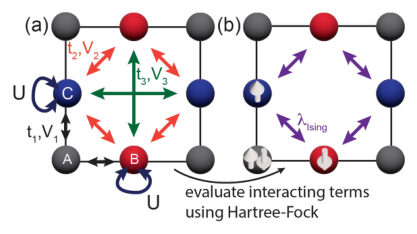 
Fig. 1. Process for creating a topological altermagnetic cor- related insulator from interactions: starting from a (a) Lieb lattice with hoppings and both on-site Hubbard and extended Coulomb interactions, whose interplay generates (b) alter- magnetic moments (here shown for average electronic density 4) with an effective Ising-type spin-orbit coupling betweeen the B and C sublattices.

📷 Fig 2

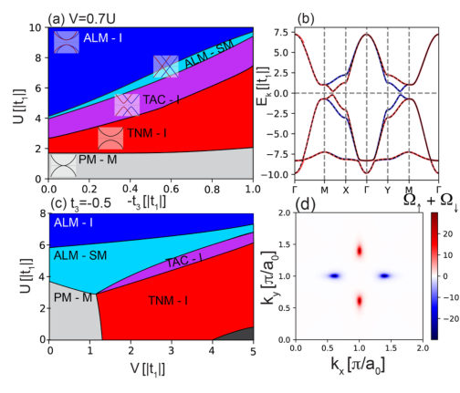 
Fig. 2. Topological phase diagram (a) as a function of U(V = 0.7U) and t3, (b) as a function of U and V for aver- age electronic density 4, (c) band structure in the topological altermagnetic phase with spin-↑(↓) polarization indicated in red (blue). (d) spin-resolved Berry curvature in the Brillouin zone. Parameters are t1 = −1, t2 = 1.5, ϵA = 0 with t3 = −0.5 in (b), U, V, t3 = (5.5, 3.85, −0.5) in (c,d).

📷 Fig 3

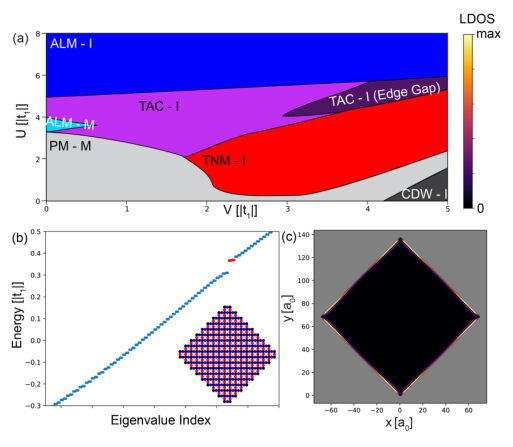 
Fig. 3. (a) Topological phase diagram for filling n = 4 with regions hosting corner modes indicated, (b) energy spectrum of a real-space system with diagonal A-terminated edges with energies corresponding to corner modes marked in red (see inset), (c) local density of states at the mean energy of the corner modes. Parameters are t1 = −1, t2 = 1.5, t3 = −0.2, ϵA = 0, λ1 = −0.4, λ3 = −0.2 and U = 5.2, V = 4.7 in (b,c).

📷 Fig 4

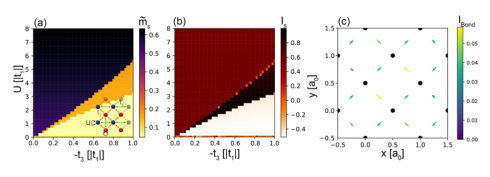 
Fig. 4. (a) Staggered magnetization, (b) total Ising correla- tion as a function of U and t3 with V = 0.05U, (c) bond-wise Ising correlation obtained from exact diagonalization on a 2×2 cluster. Parameters are t2 = 1.5 with U = 4.0, t3 = −1.0 in (c).

**Summary.** This paper analyzes an extended Hubbard model on a Lieb lattice to show that electron-electron interactions can spontaneously generate both altermagnetic order and topological gaps. Using Hartree-Fock theory, the authors map out a phase diagram revealing a sequence of correlated insulating and semimetallic states, including a novel TACI phase. This work highlights how strong correlations can mediate the co-existence of magnetism and topology.

**Why it may be interesting.** The explicit coupling between magnetic order (altermagnetism) and topological invariants (Chern number) in a strongly correlated lattice model provides a rich platform for studying emergent quantum phases beyond standard band theory.

Detailed structure

**Main problem.** The study investigates the simultaneous emergence and co-existence of altermagnetic order and a topological gap in interacting electron systems.

**Main result.** The authors demonstrate that electron-electron interactions naturally drive the system into a Topological Altermagnetic Correlated Insulator (TACI) phase, characterized by both magnetic and topological order.

**Method.** The research employs Unrestricted Hartree-Fock theory to self-consistently evaluate order parameters, supplemented by exact diagonalization for confirmation.

**Model / system.** The physical system modeled is an extended Hubbard model defined on a Lieb lattice, incorporating nearest-neighbor and third-neighbor Coulomb interactions.

**Key observables.** Altermagnetic order (staggered magnetization), topological order (spin Chern number), and the presence of gapless Dirac cones or insulating gaps.

**Important parameters / regimes.** Electron fillings of 2 and 4, and interaction strengths ($U, V$) relative to hopping parameters ($t_1, t_2, t_3$).

**Assumptions / limitations.** The analysis relies on the Hartree-Fock approximation, and it assumes the A sublattice remains non-magnetic.

**Figures summary.** Figures illustrate the phase diagram mapping the transition between Paramagnetic Metal, Topological Non-Magnetic Insulator (TNM), TACI phase, ALM semimetal, and Mott Insulator as interaction strengths are varied.

**Paper structure.** The paper systematically maps the phase diagram by increasing interaction strengths, showing a sequence of transitions from a paramagnetic metal to various correlated insulating or semimetallic states.

Abstract

We study an extended Hubbard model on Lieb lattice at electron filling 2 and 4, and demonstrate that the interactions lead to the simultaneous emergence of altermagnetic order and a topological gap. Using unrestricted Hartree-Fock theory, we evaluate both the altermagnetic and topological order parameters and show that they co-exist with an associated quantum spin Hall effect in a large region of the phase diagram, which we further support using exact diagonalization. Moreover, we demonstrate that inversion-symmetry breaking terms can also mediate second-order topological phases with associated corner modes.

[↑ back to top](#top)

### [Momentum-resolved EELS study of collective charge excitations in 1$T$-TaS$_2$](http://arxiv.org/abs/2608.23492v1)

**Authors:** Farzaneh Hoveyda-Marashi, Xuefei Guo, Caitlin Kengle, Camille Bernal-Choban, Yue Su, Jin Chen, Dipanjan Chaudhuri, Peter Abbamonte  
**Type:** experiment · **Category:** strongly correlated electrons · **PDF:** <https://arxiv.org/pdf/2608.23492v1>  
**Analysis basis:** full PDF text, analyzed in chunks
**Topic relevance:** `Frenkel-Kontorova` **3/5**

📷 Fig 1

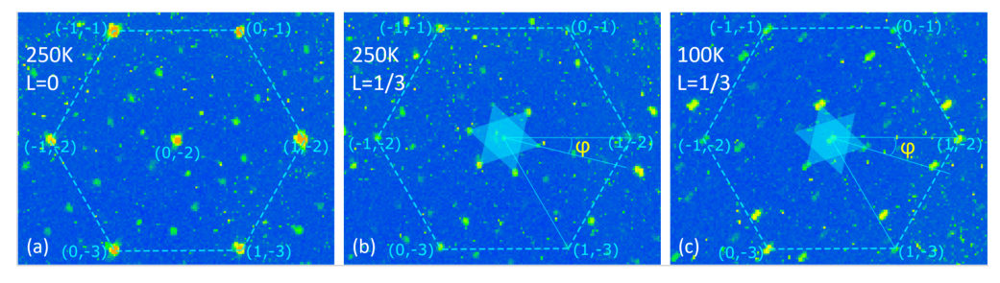 
FIG. 1. Single-crystal x-ray diffraction measurements of 1T-TaS2. (a) Reciprocal-space map at T = 250 K and L =0, showing the structural Bragg reflections. (b,c) Reciprocal-space maps at L =1/3 measured at 250 K in the nearly commensurate phase and 100 K in the commensurate phase, respectively. CDW satellite reflections are visible around the structural Bragg peaks. The angle φ indicates the orientation of the CDW wave vector, which rotates across the NC–C transition.

📷 Fig 2

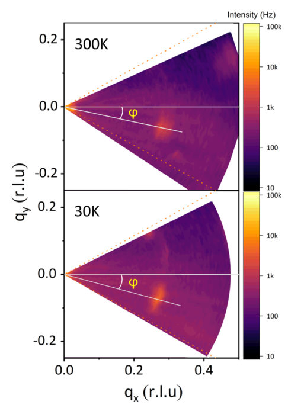 
FIG. 2. M-EELS momentum maps of elastically scattered electrons acquired at 300 K (top) and 30 K (bottom). Upon cooling from 300 K to 30 K, the CDW wave vector rotates by approximately 3◦. The dashed orange lines indicate the Brillouin-zone boundaries.

📷 Fig 3

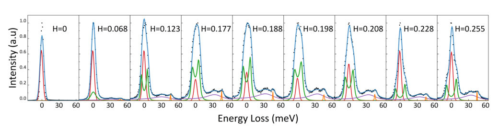 
FIG. 3. Low-energy M-EELS spectra in the nearly commensurate phase (T = 300 K). Fixed-momentum energy-loss scans measured along the CDW direction in reciprocal space. The in-plane momentum transfer is expressed in reciprocal lattice units (H, K), and the scans follow a trajectory parallel to the CDW wave vector, such that both H and K vary simultaneously. The colored spectral components represent the elastic peak in red, the acoustic phonon mode in green, and optical phonon modes in purple and orange. The blue curve shows the overall fit.

📷 Fig 4

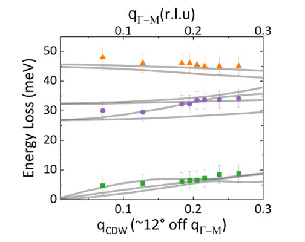 
FIG. 4. Phonon dispersion of 1T-TaS2 in the nearly com- mensurate phase at T = 300 K. Experimental mode energies extracted from the M-EELS spectra in Fig. 3 are shown for the acoustic phonon (green squares) and two optical phonon features (purple circles and orange triangles). The measure- ments were performed along the CDW wave-vector direction, approximately 12◦from Γ-M, and are compared with the cal- culated phonon dispersions of Liu et al. [27] along Γ-M (gray lines). The bottom axis denotes momentum along the experi- mental CDW direction, while the top axis denotes momentum along Γ-M used for the calculation.

📷 Fig 5

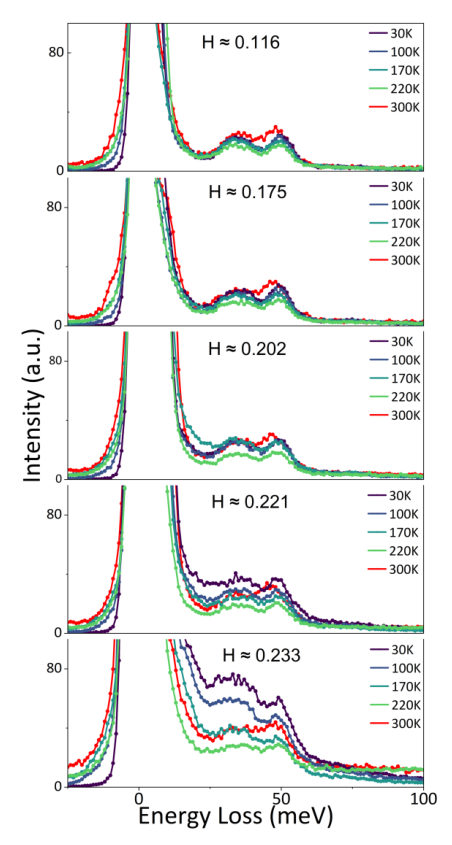 
FIG. 5. Temperature-dependent M-EELS spectra showing the optical phonon response at selected momenta along the CDW wave-vector direction. Spectra were acquired at T=30, 100, 170, 220, and 300 K, spanning the nearly commensu- rate–commensurate CDW transition. The optical phonon energies remain approximately unchanged across the tran- sition, while their spectral intensity exhibits a pronounced temperature dependence near the CDW ordering wave vec- tor, HCDW ≈0.233 r.l.u.

**Summary.** This work uses momentum-resolved EELS to characterize the charge excitations in 1T-TaS2 as it undergoes a CDW transition. The findings demonstrate that the material's electronic structure evolves significantly across this transition, evidenced by spectral weight redistribution and gap opening. The technique successfully links lattice dynamics measurements with finite-momentum electronic excitations.

**Why it may be interesting.** The study directly probes the interplay between lattice degrees of freedom (phonons) and electronic correlations (CDW gap opening) in a strongly correlated material, which is a key area of interest for understanding emergent electronic states.

Detailed structure

**Main problem.** The study investigates the low-energy charge excitations within the material 1T-TaS2 across its structural phase transition from a nearly commensurate to a commensurate Charge-Density-Wave (CDW) state.

**Main result.** The research reveals that the electronic response undergoes a substantial spectral weight redistribution and the opening of an energy gap below the CDW transition, while lattice dynamics (phonons) show temperature-dependent intensity changes.

**Method.** Momentum-resolved Electron Energy-Loss Spectroscopy (M-EELS) is employed, supplemented by single-crystal x-ray diffraction (XRD) measurements.

**Model / system.** The physical system is 1T-TaS2, a transition metal dichalcogenide known for its CDW transitions. The analysis involves modeling phonon dispersions using multicomponent fitting techniques and comparing electronic excitations to theoretical predictions.

**Key observables.** Acoustic and optical phonon energies/dispersions, CDW wave vector ($\phi$) rotation, spectral weight redistribution, and the opening of an energy gap in the electronic response.

**Important parameters / regimes.** Temperature (especially near the CDW transition temperature, e.g., 183 K), momentum transfer (finite momentum $q$), and energy loss ($\omega$).

**Assumptions / limitations.** The analysis assumes that M-EELS provides simultaneous access to lattice dynamics and finite-momentum valence band charge excitations, and that the observed gap is related to electron localization in the commensurate phase.

**Figures summary.** Figures show XRD maps confirming CDW satellite reflections and wave vector rotation; M-EELS momentum maps illustrate the CDW peak shift; and energy-loss spectra detail phonon fits and the gap opening below the transition.

**Paper structure.** The paper first establishes the structural changes via XRD, then uses M-EELS to map the low-energy excitations, analyzing phonon features in the nearly commensurate phase, tracking changes across the transition, and finally characterizing the electronic gap opening at higher energies.

Abstract

We use momentum-resolved electron energy-loss spectroscopy (M-EELS) to study the low-energy charge excitations of 1$T$-TaS$_2$ across the nearly commensurate-to-commensurate charge-density-wave (CDW) transition. Single-crystal x-ray diffraction and elastic M-EELS measurements confirm the expected rotation of the CDW wave vector upon entering the commensurate phase. In the nearly commensurate phase, the low-energy M-EELS spectra reveal an acoustic phonon branch and two optical phonon features whose energies and dispersions are broadly consistent with previous calculations and inelastic x-ray measurements. Across the transition, the optical phonon energies remain nearly unchanged, while their spectral intensity develops a pronounced temperature dependence near the CDW ordering wave vector. At higher energies, the finite-momentum charge response undergoes a substantial redistribution of spectral weight below the transition, consistent with the opening of an energy gap. These results demonstrate that M-EELS provides simultaneous access to lattice dynamics and finite-momentum valence band charge excitations in 1$T$-TaS$_2$, revealing their evolution across the commensurate CDW transition.

[↑ back to top](#top)

### [Prior-Informed Adaptive Shifts for Sequential Minimal Optimization in Variational Quantum Eigensolvers](http://arxiv.org/abs/2608.21616v1)

**Authors:** Frederik Stalschus, Samuele Pedrielli, Stefan Kühn, Karl Jansen, Kim A. Nicoli, Shinichi Nakajima  
**Type:** theory · **Category:** quantum information and computing · **PDF:** <https://arxiv.org/pdf/2608.21616v1>  
**Analysis basis:** full PDF text, analyzed in chunks
**Topic relevance:** `quantum measurements` **3/5**

📷 Fig 1

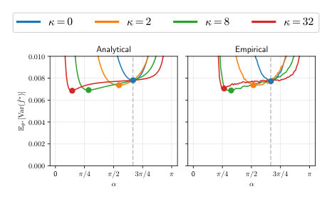 
FIG. 1: Theoretical (left) and empirical (right) expected variance of ˆf ∗for a single parameter update, as a function of α for several values of κ. The dashed line indicates α = 2π/3. For each (κ, α) pair, 50 000 minimizer θ∗ i ∼VonMises(µ=0, κ) are drawn and noisy observations at (0, −α, +α) are simulated with N(0, σ2/Nshots) noise. Settings: σ = 1, Nshots = 128.

📷 Fig 2

 
Figure 1 validates eq. (14) against the empirical ex- pected variance obtained from 50 000 sampled minimiz- ers per (κ, α) pair, showing close agreement across all tested values of α and κ. Endo et al. [13] showed using a uniform prior, i.e., κ = 0, that equidistant measurements spaced by 2π/3 minimize eq. (14). However, for arbitrary κ, the optimal positioning of observations cannot be obtained in closed form. This limitation is less severe than it appears, be- cause in sequential optimization for VQE we usually care more about minimizing the error of θ∗than of f ∗as this is the quantity we compute on each iteration in algorithm 1 and ultimately should yield the solution of eq. (1). In the...

📷 Fig 3

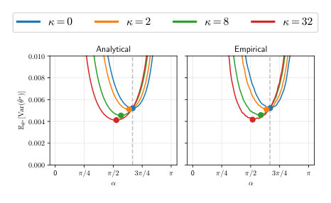 
FIG. 2: Theoretical (left) and empirical (right) expected variance of ˆθ∗as a function of α for several values of κ. The dashed line indicates α = 2π/3. For each (κ, α) pair, 50 000 minimizer θ∗ i ∼VonMises(µ=0, κ) are drawn and noisy observations at (0, −α, +α) are simulated with N(0, σ2/Nshots) noise. Angular errors are wrapped to [−π, π]. Settings: r = 1, σ = 1, Nshots = 128.

📷 Fig 4

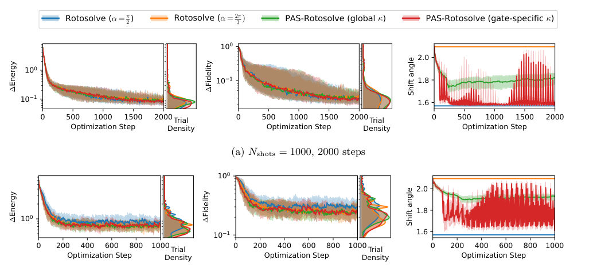 
FIG. 3: VQE on the TFIM Hamiltonian, L = 3-layer Q = 5-qubit ESU2 circuit. Rows: shot budget; columns within a row: energy (left), fidelity (middle), shift angle α (right). PAS-Rotosolve with global κ (green) and gate-specific κ (red) vs. Rotosolve with fixed shifts α = π/2 (blue) and α = 2π/3 (orange). Optimization progress shows the median (solid) and 25th/75th percentiles (shadows) over 100 trials, the inset square shows the distribution of the final solution.

📷 Fig 5

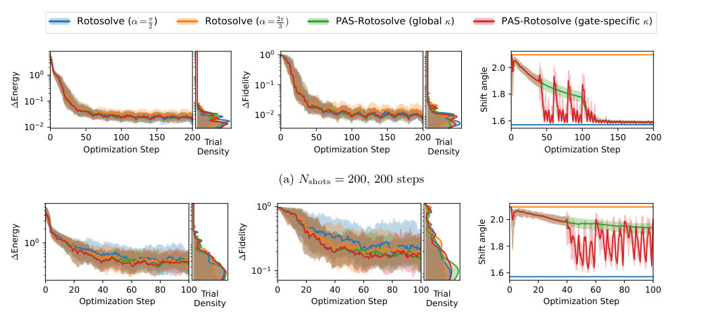 
FIG. 4: VQE on the MaxCut Hamiltonian, L = 5-layer Q = 4-qubit HEA circuit. Same layout as fig. 3. PAS-Rotosolve with global κ (green) and gate-specific κ (red) vs. Rotosolve with fixed shifts α = π/2 (blue) and α = 2π/3 (orange). Optimization progress shows the median (solid) and 25th/75th percentiles (shadows) over 100 trials, the inset square shows the distribution of the final solution.

**Summary.** This paper introduces a novel theory for optimizing measurement locations in Variational Quantum Eigensolvers (VQEs) that use Sequential Minimal Optimization. It argues that tracking the uncertainty of the minimizer, rather than the energy, is key. The resulting Prior-informed Adaptive Shifts (PAS) method dynamically adjusts measurement spacing to maintain optimal performance across different noise regimes.

**Why it may be interesting.** This work provides a rigorous, theoretically grounded guide for improving the convergence and stability of VQE algorithms by optimizing the measurement strategy itself, which is crucial for near-term quantum hardware.

Detailed structure

**Main problem.** The paper develops a new theory to determine optimal measurement locations for Sequential Minimal Optimization (SMO) methods used in Variational Quantum Eigensolvers (VQEs). It addresses the discrepancy between theoretical optimal measurements and practical performance.

**Main result.** The optimal measurement locations are not fixed but adaptively shift based on the prior knowledge of the energy minimizer, leading to the proposed Prior-informed Adaptive Shifts (PAS) method.

**Method.** The authors analyze the variance of the estimator of the minimizer ($\hat{	heta}^*$) rather than the energy estimate ($\hat{f}^*$), deriving closed-form optimal shifts based on prior concentration ($\kappa$).

**Model / system.** The study focuses on VQEs, which estimate the ground-state energy of a Hamiltonian $H$ by optimizing parameters $	heta$ in a parameterized quantum circuit ansatz $U(	heta)$. The optimization uses SMO techniques like Rotosolve.

**Key observables.** The primary observables are the estimated minimum energy ($\hat{f}^*$) and, critically, the estimated minimizer angle ($\hat{	heta}^*$).

**Important parameters / regimes.** The key parameters are the measurement spacing ($\alpha$), the prior concentration ($\kappa$), and the shot count (related to noise $\sigma^2$).

**Assumptions / limitations.** The analysis relies on first-order Taylor expansions for variance propagation and assumes the standard three-measurement procedure (Rotosolve) is used.

**Figures summary.** Figures compare the expected variance of $\hat{f}^*$ and $\hat{	heta}^*$ versus measurement spacing $\alpha$, validating the theoretical derivations for both energy and minimizer uncertainty.

**Paper structure.** The paper first critiques previous assumptions, then develops the theory by focusing on minimizing the variance of the minimizer. It derives the optimal shift $\alpha^*$ based on prior knowledge and proposes the adaptive PAS method, validating it numerically.

Abstract

Sequential minimal optimization methods, such as the Rotosolve and the Nakanishi-Fujii-Todo algorithm (NFT), are widely used for Variational Quantum Eigensolvers (VQEs). These methods optimize one parameter direction at a time, requiring measurements at only a few locations along that direction. In the presence of measurement shot noise, however, their performance depends critically on the choice of measurement locations, and recent studies suggest that equidistant measurements are optimal. However, we often observe that equidistant measurements are not always optimal in practice. We argue that this discrepancy between theory and practice arises from the fact that two assumptions underlying previous analyses do not generally hold: (1) the absence of prior knowledge about the energy minimizer, and (2) the use of the uncertainty of the estimated energy as a proxy for optimization performance. In this paper, we develop a new theory for determining optimal measurement locations. First, we show that incorporating prior information about the minimizer is beneficial. Early in optimization, when little is known about the pivot, i.e., the current minimizer, equidistant measurements are indeed near-optimal, but as the prior belief sharpens the optimal locations move away from equidistant. Second, rather than analyzing the uncertainty of the estimated minimum energy, we study the uncertainty of the estimator of the minimizer itself, which leads to substantially different strategies. Based on this analysis, we propose Prior-informed Adaptive Shifts (PAS), a method that automatically adjusts measurement locations during optimization. Numerical experiments across different shot counts and problems validate our theoretical findings and demonstrate that PAS adaptively recovers whichever fixed shift is best in each regime without it being specified in advance.

[↑ back to top](#top)

### [Scalable Quantum Key Distribution via GHZ Entanglement and Qubit Reuse](http://arxiv.org/abs/2608.21667v1)

**Authors:** Tasdiqul Islam, Rasman Mubtasim Swargo, Engin Arslan, Md Arifuzzaman  
**Type:** theory · **Category:** quantum information and computing · **PDF:** <https://arxiv.org/pdf/2608.21667v1>  
**Analysis basis:** full PDF text, analyzed in chunks
**Topic relevance:** `quantum measurements` **3/5**

📷 Fig 1

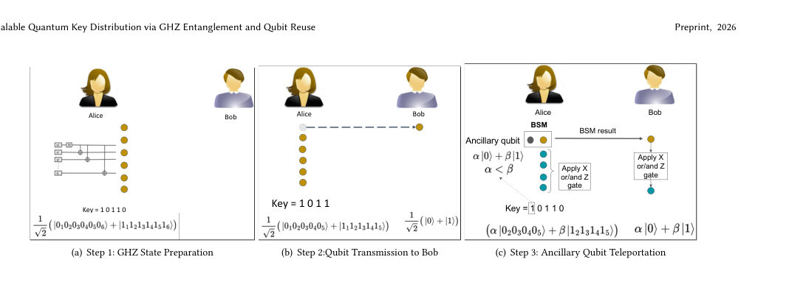 
Figure 1: Illustration of first three steps to send a classical bit from Alice to Bob using the proposed quantum key distribution method.

📷 Fig 2

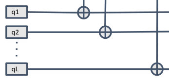 
Figure 2: Preparation of GHZ state with 𝐿+ 1 qubits

📷 Fig 3

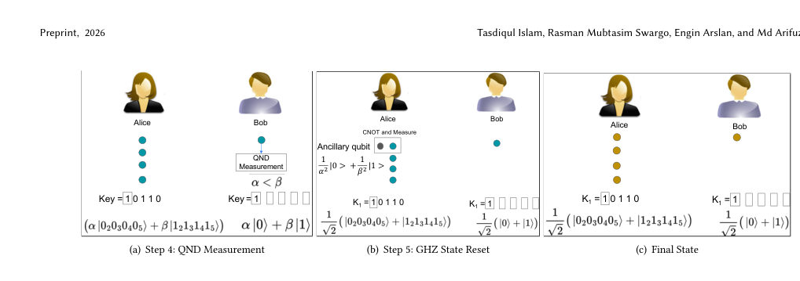 
Figure 3: Illustration of Steps 4-5 and final state to send a classical bit from Alice to Bob using the proposed quantum key distribution method.

**Summary.** This paper introduces a novel Quantum Key Distribution (QKD) protocol that leverages multi-qubit Greenberger–Horne–Zeilinger (GHZ) entanglement to drastically reduce the number of qubits transmitted per key bit. By employing Quantum Non-Demolition (QND) measurements and state resetting, the scheme achieves a high transmitted-qubit efficiency ($\eta=L$). This makes it a resource-efficient and noise-tolerant alternative for bandwidth-limited quantum networks.

**Why it may be interesting.** The focus on entanglement structure (GHZ states) and measurement techniques (QND) to enhance resource efficiency is highly relevant to developing practical quantum network protocols.

Detailed structure

**Main problem.** Conventional Quantum Key Distribution (QKD) protocols suffer from high overhead, requiring qubit transmission proportional to or exceeding the final key length, which strains limited quantum network resources.

**Main result.** The proposed GHZ entanglement-based QKD scheme achieves a transmitted-qubit efficiency ($\eta=L$), significantly reducing resource overhead while maintaining high fidelity.

**Method.** The scheme uses an $(L+1)$-qubit GHZ state, transmits only one qubit, and reuses the entanglement to encode and decode multiple classical key bits via Quantum Non-Demolition (QND) measurements and state resetting.

**Model / system.** The protocol is modeled using multi-qubit GHZ entangled states and relies on the ability to perform repeated QND measurements and local state resets on the remaining entangled qubits.

**Key observables.** Raw-key fidelity (100% for $L \le 12$), transmitted-qubit efficiency ($\eta=L$), and CHSH violation for integrity checks.

**Important parameters / regimes.** Depolarizing noise level ($p \le 0.005$), key length ($L$), and the number of qubits used in the initial GHZ state ($L+1$).

**Assumptions / limitations.** Assumes authenticated classical communication, local reset verification, and bounded-error QND discrimination.

**Figures summary.** Figures illustrate the three main steps: GHZ state preparation, single-bit teleportation using BSM, and the subsequent QND measurement followed by the GHZ state reset operation.

**Paper structure.** The paper first identifies the resource overhead problem in QKD, then details the GHZ-based protocol involving GHZ preparation, single-qubit transmission, and iterative key extraction via QND measurement and state resetting. Security is analyzed against various attacks, and performance is verified via simulation.

Abstract

Conventional Quantum Key Distribution (QKD) requires the transmission of qubits proportional to or exceeding the length of the key, as protocols such as BB84 transmit more qubits than the final key size due to basis sifting and privacy amplification. Since quantum networks are still in their infancy and have limited capacity, this overhead puts significant pressure on network resources. To address this issue, we propose a Multi-Qubit Greenberger--Horne--Zeilinger (GHZ) State-based QKD scheme that reduces the number of qubits transmitted over the quantum channel. The proposed method transmits one GHZ qubit between endpoints and reuses the resulting entanglement to convey multiple classical key bits with the help of Quantum Non-Demolition (QND) measurements. Under the stated assumptions on authenticated classical communication, local reset verification, and bounded-error QND discrimination, one can transfer $L$ classical bits by generating an (L+1)-qubit GHZ state and transferring one qubit to the remote party. We verify correctness using the NetSquid quantum network simulator: the protocol achieves 100\% raw-key fidelity for keys of length up to 12 bits under both ideal conditions and depolarizing noise up to p = 0.005 per round. We further show that the proposed QKD algorithm can be extended to multi-party QKD and server-client deployment. The proposed scheme offers a transmitted-qubit-efficient, noise-tolerant alternative for bandwidth-limited quantum networks.

[↑ back to top](#top)

### [Coarse-grained kinetic scale tightens thermodynamic spectral bounds of Markov cycles](http://arxiv.org/abs/2608.22934v1)

**Authors:** Rongxing Xu, Cuiling Meng  
**Type:** theory · **Category:** statistical mechanics · **PDF:** <https://arxiv.org/pdf/2608.22934v1>  
**Analysis basis:** full PDF text, analyzed in chunks
**Topic relevance:** `correlated / nonlocal dissipation` **2/5** · `driven-dissipative phase transition` **2/5** · `non-equilibrium universality` **2/5** · `Keldysh / 2PI / non-Gaussian methods` **1/5** · `analog quantum simulation` **1/5** · `methods for driven-dissipative` **1/5**

📷 Fig 1

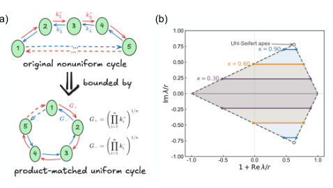 
FIG. 1. (a) Schematic of original cycle and the comparison uniform cycle. An original nonuniform Markov cycle with local forward and backward rates k+ i and k− i is associated with a product-matched uniform cycle whose rates are the geometric means G±. For each winding sector, the oscillation frequency of the original cycle is bounded by that of this uniform comparison cycle. (b) Illustration of the additional localization supplied by the kinetic factor κ at n = 7, A = 3, r = 1, and w = 1. The dashed boundary is the affinity-winding bounds given by the Ref.[27], whose upper apex is on the Uhl- Seifert ellipse [25]. The horizontal kinetic caps are shown for κ = 0.90, 0.60, and 0.30...

📷 Fig 2

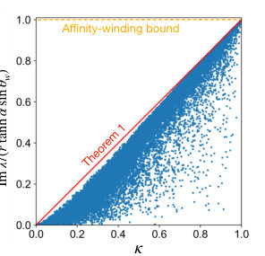 
FIG. 2. Numerical verification of the geometric-mean fre- quency bound for the cycle with n = 7. Each point represents a nonreal eigenmode of a numerically generated nonuniform Markov cycle, plotted in terms of κ and the normalized os- cillation frequency. The red solid line is the geometric-mean bound given by Theorem 1, whereas the orange dashed line is the affinity-winding bound on the imaginary part of λ.

📷 Fig 3

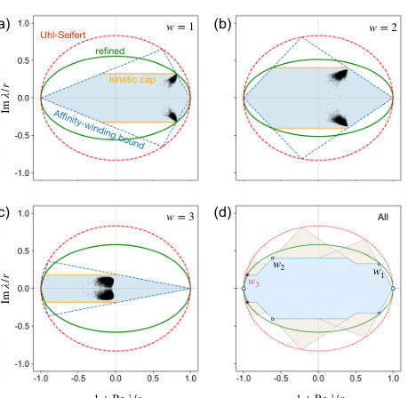 
FIG. 3. Kinetic refinement of winding-resolved and winding- independent spectral localization for fixing n = 7, κ = 0.5 and α = 1.2. (a)–(c) Spectral localization for winding sectors w = 1, 2, and 3, respectively. The blue dashed lines denote the established affinity-winding bounds, while the orange hori- zontal lines show the additional kinetic cap from Theorem 1. Their intersection gives the shaded winding-resolved region, ob- tained by truncating the apex of the universal affinity-winding triangle. The black points are numerically computed eigen- values in the corresponding winding sector. The red dashed curve is the Uhl-Seifert ellipse, whereas the green solid curve is the...

**Summary.** This paper refines the spectral bounds for Markov cycles by incorporating a coarse-grained kinetic scale derived from the geometric means of forward and backward transition rates. Using complex analysis and Floquet theory, the authors prove that this new kinetic information yields a strictly tighter bound than previously known universal bounds. This advances the understanding of how local rate distributions constrain the long-time dynamics of open quantum systems.

**Why it may be interesting.** This work provides a powerful, general framework for refining spectral bounds in non-equilibrium statistical mechanics by incorporating local kinetic details into global thermodynamic constraints, which is highly relevant for open quantum systems.

Detailed structure

**Main problem.** To sharpen the thermodynamic spectral bounds for Markov cycles beyond those depending only on cycle affinity and maximum escape rate.

**Main result.** The authors derive a strictly stronger spectral bound using a single additional kinetic quantity—the geometric means of forward and backward rates—which is only saturated by uniform cycles.

**Method.** The analysis employs complex-analytic techniques, transforming the eigenvalue problem into a reciprocal Jacobi form and utilizing Floquet theory to derive refined spectral constraints.

**Model / system.** The system is a continuous-time Markov jump process on a ring of $n$ states, governed by a master equation whose generator $R$ defines the dynamics.

**Key observables.** Eigenvalues $\lambda$ (specifically $	ext{Im } \lambda > 0$), oscillation frequencies, and the spectral region defined by the bounds.

**Important parameters / regimes.** Cycle affinity ($A$), geometric means of rates ($G^+, G^-$), and the dimensionless kinetic scale ($\kappa$).

**Assumptions / limitations.** The analysis focuses on genuinely oscillatory modes and assumes the existence of a coarse-grained kinetic scale that can be incorporated into the bounds.

**Figures summary.** Figures compare the original nonuniform cycle rates to the product-matched uniform cycle rates, illustrating how the new kinetic factor $\kappa$ localizes and sharpens the spectral bounds compared to the universal affinity-winding bounds.

**Paper structure.** The paper progresses from identifying the limitations of existing bounds to introducing the geometric mean kinetic scale, deriving the refined spectral bound via complex-analytic methods (Floquet theory/Jacobi forms), and finally demonstrating the strict improvement over previous universal bounds.

Abstract

Thermodynamic bounds on the spectrum of a Markov cycle depend on the cycle affinity and maximum escape rate, but they ignore how the local transition rates are distributed around the cycle. In this work, we show that a single additional cycle-wide kinetic quantity, the geometric means of forward and backward rates, yields a strictly stronger bound for every nonuniform cycle. By comparing each winding sector of the eigenmode with a product-matched uniform cycle, we bound oscillation frequencies, tighten the admissible spectral region, and show that only uniform cycles can saturate the Uhl-Seifert boundary. Our results show that retaining a coarse-grained kinetic scale can sharpen thermodynamic spectral bounds without requiring knowledge of the full generator. Our method also provides a complex-analytic framework which unifies generator-specific kinetic information with established affinity-winding bounds.

[↑ back to top](#top)

### [Free-Energy Differences from Nonequilibrium Fluctuations in High Dissipation](http://arxiv.org/abs/2608.23394v1)

**Authors:** Sreekanth K Manikandan, Giovanni Volpe  
**Type:** theory · **Category:** statistical mechanics · **PDF:** <https://arxiv.org/pdf/2608.23394v1>  
**Analysis basis:** full PDF text, analyzed in chunks
**Topic relevance:** `Keldysh / 2PI / non-Gaussian methods` **2/5** · `methods for driven-dissipative` **2/5** · `quantum measurements` **2/5** · `driven-dissipative phase transition` **1/5** · `non-equilibrium universality` **1/5**

📷 Fig 1

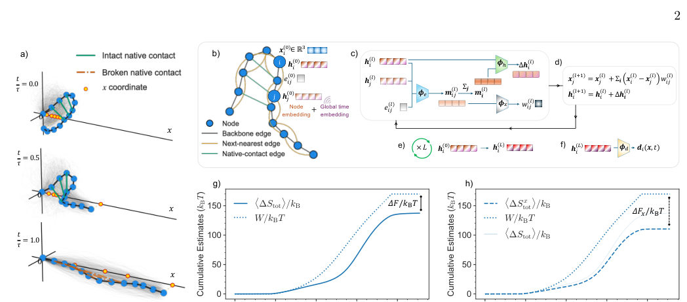 
FIG. 1. EquiNET—Equilibrium free-energy differences from Non-Equilibrium Trajectories. (a) Representative pulling trajectories of a biomolecule at normalized times t/τ = 0, 0.5, and 1, illustrating the unfolding process, where τ is the total duration of the pulling protocol. Polymer backbone (black solid line) with interaction sites (blue beads) along the molecule, intact native (green lines), and broken native contacts (orange dash-dotted lines). The x coordinates of selected beads (yellow filled circles) define the coarse-grained representation. Gray curves in the background represent other realizations from the ensemble of trajectories generated by repeated applications of the same...

📷 Fig 2

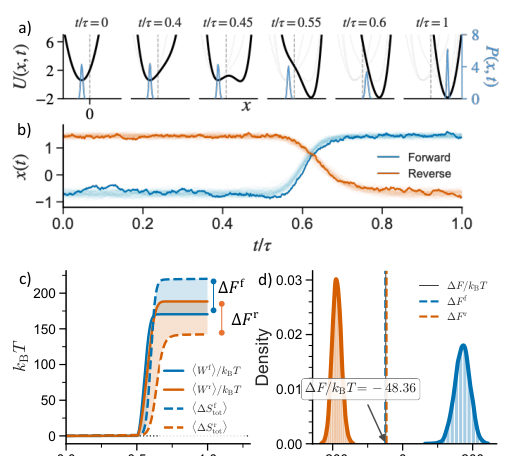 
FIG. 2. Free-energy estimation with EquiNET for a driven bistable system. (a) Snapshots of the time- dependent potential (black) and corresponding probability density (blue) during the forward protocol. The particle is initially confined in the left harmonic well, traverses an asym- metric double-well during the driving stage, and finally re- laxes into the right harmonic well. (b) Representative for- ward (blue) and reverse (orange) trajectories illustrating the nonequilibrium transport between the two metastable basins. A single trajectory in each direction is highlighted. Curves in the background represent other realizations from the en- semble of trajectories generated by repeated...

📷 Fig 3

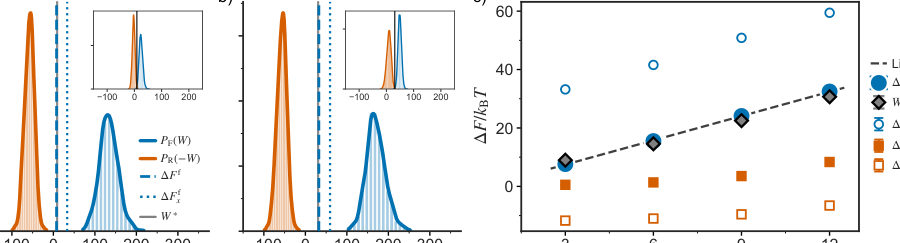 
FIG. 3. EquiNET equilibrium free-energy differences for the polymer hairpin model. (a-b) Forward (PF(W), blue) and reverse (PR(−W), orange) work distributions for native-contact strengths (a) ϵ/kBT = 3 and (b) ϵ/kBT = 12. The main panels show the work distributions obtained from the nonequilibrium pulling protocol used for inference, with dimensionless pulling velocity ˜vx = 2. The insets show the corresponding distributions obtained using a slower-driving protocol with ˜vx = 0.2, which lie closer to one another, and exhibit an overlap. The thick blue dashed lines indicate the free-energy differences ∆F f inferred with EquiNET using the full bead trajectories in the forward process, while...

📷 Fig 4

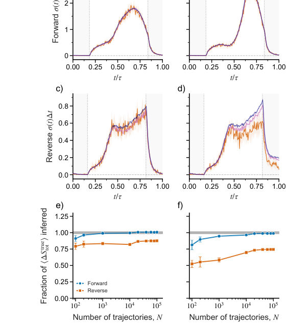 
FIG. 4. Convergence of the EquiNET entropy- production estimates. (a,b) Forward and (c,d) reverse entropy-production rates, σ(t)∆t, as functions of normalized time, t/τ, for interaction strengths ϵ/kBT = 3 and 12, respec- tively. For each ϵ, the colored curves correspond to the total numbers of trajectories used for inference: N = 103 (orange), 104 (purple), and 105 (blue). Solid curves show the mean over six independent runs, and the corresponding shaded bands in- dicate ±1 standard deviation. The N = 105 estimate serves as the large-sample reference. Gray shaded regions denote the initial and final equilibration periods, during which the pulling trap is held fixed. Increasing N suppresses...

**Summary.** This paper introduces EquiNET, a novel technique to calculate equilibrium free-energy differences from non-equilibrium work measurements. It overcomes the statistical limitations of traditional fluctuation theorems in highly dissipative systems by estimating entropy production directly from trajectory fluctuations. The method is validated on biomolecular folding, demonstrating accurate $\Delta F$ estimation where conventional methods fail.

**Why it may be interesting.** This work provides a robust, data-driven methodology for calculating fundamental thermodynamic quantities ($\Delta F$) from noisy, non-equilibrium measurements, which is crucial for analyzing complex dynamics in molecular and condensed matter systems.

Detailed structure

**Main problem.** The primary challenge is accurately determining equilibrium free-energy differences ($\Delta F$) from non-equilibrium work fluctuations, especially in high-dissipation regimes where standard fluctuation theorems fail due to rare event sampling.

**Main result.** The proposed EquiNET method successfully estimates $\Delta F$ (or provides rigorous lower bounds) by utilizing trajectory fluctuations to estimate entropy production without relying on rare negative entropy production events.

**Method.** The approach uses a variational optimization procedure derived from the short-time Thermodynamic Uncertainty Relation (TUR) to infer the instantaneous entropy production rate ($\sigma(t)$) from the first two cumulants of a weighted stochastic current.

**Model / system.** The theory is applied to general $d$-dimensional overdamped systems evolving under time-dependent protocols, validated numerically using biomolecular folding/unfolding simulations (polymer hairpin model).

**Key observables.** Work ($W$), Entropy Production ($\Delta S_{	ext{tot}}$), Free-energy difference ($\Delta F$), and the instantaneous entropy production rate ($\sigma(t)$).

**Important parameters / regimes.** High-dissipation regimes, temperature ($T$), and the structure of the time-dependent potential $\lambda(t)$.

**Assumptions / limitations.** The method exploits the asymptotic behavior of entropy production fluctuations in the short-time limit, allowing the use of only the first two cumulants of the stochastic current.

**Figures summary.** Figures illustrate the EquiNET framework, showing how integrating the inferred $\sigma(t)$ yields $\langle \Delta S_{	ext{tot}} 
angle$ and subsequently $\Delta F$, including visualizations for biomolecular folding.

**Paper structure.** The paper introduces the problem limitation, proposes the EquiNET method based on the TUR, details the variational inference procedure for $\sigma(t)$, and validates the approach using numerical simulations, including a detailed analysis of a polymer folding protocol.

Abstract

Equilibrium free-energy differences can be measured from nonequilibrium work fluctuations using fluctuation theorems, such as the Jarzynski equality and the Crooks fluctuation theorem. However, these approaches become statistically inefficient in high-dissipation regimes because their convergence requires trajectories with negative entropy production, events that occur exponentially rarely. Here, we demonstrate that repeated measurements of trajectory fluctuations are sufficient to determine entropy production without relying on such rare events, or to determine a lower bound on it when only partial measurements are available. This information then yields exact estimates of free-energy differences, or rigorous bounds. We validate this approach, named EquiNET, with numerical simulations, including one of biomolecular folding and unfolding, showing that it recovers accurate free-energy estimates even in regimes where conventional approaches fail.

[↑ back to top](#top)

### [Non-Hermitian Generalization of Bloch Sphere in Spacetime Algebra](http://arxiv.org/abs/2608.23232v1)

**Authors:** Chih-Wei Wang  
**Type:** theory · **Category:** other · **PDF:** <https://arxiv.org/pdf/2608.23232v1>  
**Analysis basis:** full PDF text, analyzed in chunks
**Topic relevance:** `driven-dissipative phase transition` **2/5** · `Keldysh / 2PI / non-Gaussian methods` **1/5** · `analog quantum simulation` **1/5** · `correlated / nonlocal dissipation` **1/5** · `methods for driven-dissipative` **1/5** · `non-equilibrium universality` **1/5** · `quantum measurements` **1/5**

📷 Fig 1

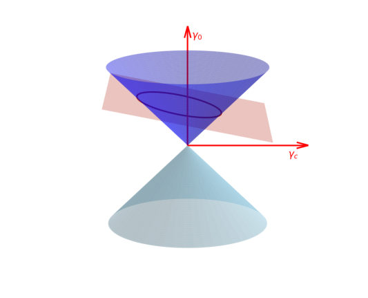 
FIG. 1. The light cone and tilted rotation generated by a non-Hermitian Hamiltonian satisfied the conditions in (39). The rotation is on the tilted plane because γ′ 0 is tilted toward γc direction. The cross-section of the tilted plane with the light cone is the trajectory of the null vector under the transformation.

📷 Fig 2

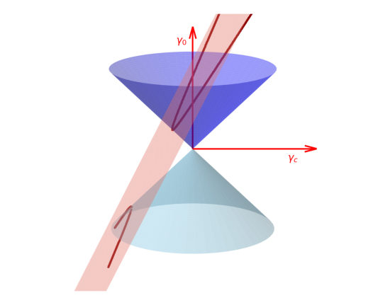 
FIG. 2. The light cone and tilted rotation generated by a non-Hermitian Hamiltonian satisfied the conditions in (62). The boost is on the tilted plane because γ′′′ 0 is tilted toward γc direction. The cross-section of the tilted plane with the future light cone is the trajectory of the null vector under the transformation.

📷 Fig 3

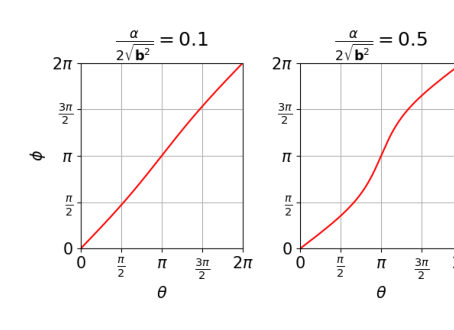 
FIG. 3. The figures show the relation between θ and ϕ for different values of α 2 √

**Summary.** This paper generalizes the Bloch sphere concept to non-Hermitian quantum systems by utilizing the Spacetime Algebra. It shows that the state space evolves onto a future light cone, and the dynamics are classified into four geometric types corresponding to Lorentz transformations. This provides a deep geometric understanding of non-unitary evolution, linking it to concepts like exceptional points.

**Why it may be interesting.** This work provides a powerful geometric framework connecting non-Hermitian quantum dynamics to fundamental concepts from special relativity (Lorentz transformations), which is highly relevant for understanding open quantum systems and non-unitary evolution in quantum optics.

Detailed structure

**Main problem.** The paper aims to establish a geometric generalization of the Bloch sphere for two-level quantum systems when subjected to non-Hermitian Hamiltonians.

**Main result.** The state space expands from the standard unit 2-sphere to a future light cone, and the Hamiltonian dynamics are classified into four geometric regimes corresponding to Lorentz transformations.

**Method.** The analysis employs the Spacetime Algebra (STA) formulation, lifting the state density operator to the full algebra to analyze non-unitary time evolution.

**Model / system.** The system studied is a two-level quantum system (qubit) governed by a general non-Hermitian Hamiltonian, whose time evolution is non-unitary.

**Key observables.** The trajectory of the state vector (null vector) on the light cone, and the eigenvalues of the Hamiltonian in different regimes.

**Important parameters / regimes.** The relative parameters defining the Hamiltonian, such as $a^2$ vs $b^2$, which determine the geometric class of the dynamics.

**Assumptions / limitations.** The core assumption is that lifting the state representation to the full STA is necessary to correctly model non-Hermitian time evolution, which corresponds to Lorentz transformations.

**Figures summary.** Figures illustrate the light cone geometry and the trajectories of the state vector under different types of non-Hermitian evolution, particularly highlighting the null rotation case.

**Paper structure.** The paper first introduces the generalization of the Bloch sphere using STA, then analyzes the time evolution operator's action, classifying the dynamics into four geometric types (rotations, boosts, null rotations), and finally using this framework to study topological features like exceptional points.

Abstract

We establish a geometric generalization of the Bloch sphere for two-level quantum systems with non-Hermitian Hamiltonians using the Spacetime Algebra (STA) formulation. By lifting the state density operator from the even subalgebra to the full STA, we show that the state space expands from the unit 2-sphere to a future light cone. The non-unitary time evolution generated by a general non-Hermitian Hamiltonian corresponds to proper orthochronous Lorentz transformations on the null vectors. We classify the Hamiltonian dynamics into four distinct geometric classes: spatial rotations (corresponding to $\mathcal{PT}$-symmetric systems), pure boosts (anti-$\mathcal{PT}$-symmetric systems), null rotations (exceptional points), and general mixtures. We also use this formulation to study several results from PT-symmetric quantum mechanics, including the topological features of the exceptional points.

[↑ back to top](#top)

### [Spontaneous currents determine capillary rise in active matter](http://arxiv.org/abs/2608.22878v1)

**Authors:** Xinyi Dong, Yongfeng Zhao  
**Type:** theory · **Category:** statistical mechanics · **PDF:** <https://arxiv.org/pdf/2608.22878v1>  
**Analysis basis:** full PDF text, analyzed in chunks
**Topic relevance:** `Keldysh / 2PI / non-Gaussian methods` **2/5** · `methods for driven-dissipative` **2/5** · `correlated / nonlocal dissipation` **1/5** · `driven-dissipative phase transition` **1/5** · `non-equilibrium universality` **1/5**

📷 Fig 1

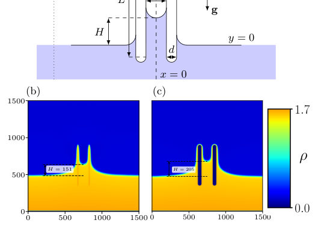 
FIG. 1. (a) Setup of capillary action. The system is confined in y and periodic in x, the top wall is soft and homogeneous so that liquid droplets cannot condensate. Under gravity g, the liquid sits at the bottom of the system. The tube is of width w and length L with impenetrable walls. The tube wall has a hemispherical tip with diameter d. We denote x = 0 at the central axis of tube, and y = 0 at the liquid level far from the tube. The capillary rise H is defined as the height of the meniscus inside the tube. Density field of active systems showing capillary rise with (b) a pointed tube and (c) a round tube with the same gravity, surface tension, and tube width.

📷 Fig 2

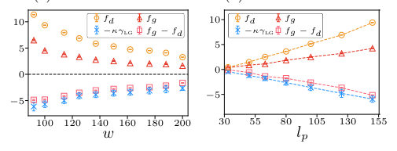 
FIG. 2. Numerical verification of active Jurin’s law (10) with varying (a) tube width w and (b) particles’ persistence length ℓp = v0/Dr. We vary Dr with fixed v0 in panel (b). The contribution of gravity fg is defined in Eq. (7), and the drag of currents fd is measured using f ∗ d = −µ−1 R ∞ −∞[Jy(0, y) − Jy(Lx/2, y)] dy where a finite size correction is considered. The difference fg −fd is verified to be balanced by the force from the liquid-gas surface, given by −κγLG measured using Eq. (9). We fix Dr = 0.05 in panel (a) and w = 150 in panel (b). Other parameters: v0 = 5, ϵ = 50, ϵw = 10, Lx = Ly = 1024, g = 0.015, d = 52.

📷 Fig 3

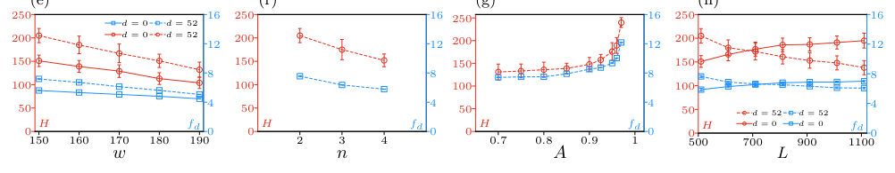 
FIG. 3. Capillary action depends on the global configuration of tubes. (a-d) Density (left) and current (right) fields of systems with (a) a pointed tube, (b) a round tube, and (c-d) multiple tubes. Data averaged using the left-right symmetry. Comparing (b) with (a), round tips mitigate the flow field caused by the geometric discontinuity, thereby reducing the capillary rise. In (b-d), the capillary rise decreases as the number of tubes increases. The amplitudes of the arrows are proportional to log|J/10−6|. Their color encodes their directions. (e) Capillary rise H and current drag fd with pointed tubes (d = 0) and round tubes (d = 52). As the tube width w varies, H is systematically lower...

📷 Fig 4

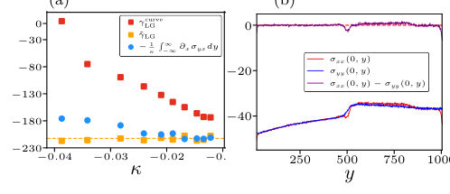 
FIG. 4. (a) γcurve LG measured inside the tube on curved interface with respect to the curvature κ. It is compared with ˜γLG measured at the boundary of the system, where the curvature is negligible. The dashed line shows the average of ˜γLG. The blue dots denote the phenomenological surface tension γ∗ LG. (b) The distribution of σxx and σyy along the central axis of the tube, which exhibits strong anisotropy under the influence of the flow field, the red dashed line indicates x = 0, the tube width w = 100. Parameters: v0 = 5, Dr = 0.05, Lx = Ly = 1024.

📷 Fig 5

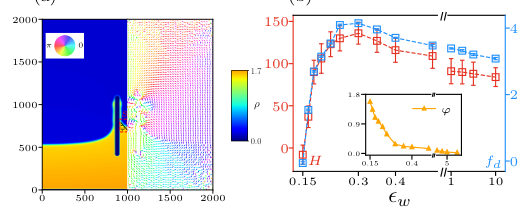 
FIG. 5. Capillary rise in active systems depends non- monotonically on the contact angle. (a) Density (left) and current (right) fields of capillary action in partially-wetting case. (b) The capillary rise H and the drag of currents fd as a function of the wall stiffness ϵw of the tube. Inset shows the contact angle φ as a function of ϵw. Parameters: v0 = 5, Dr = 0.05, g = 0.015, w = 200, ϵ = 50. In panel (a), Lx = Ly = 2000. In panel (b), Lx = Ly = 1024.

**Summary.** This work develops an active generalization of Jurin's law for capillary action in active fluids. It shows that the capillary rise is governed by a current-induced drag force, $f_d$, which is a non-equilibrium effect. Crucially, this active contribution makes the capillary rise dependent on the global geometry of the confining tube, not just its local diameter.

**Why it may be interesting.** While focused on classical active matter, the derivation of non-equilibrium force balances and the inclusion of current-induced non-local effects are highly relevant to understanding energy dissipation and boundary conditions in open quantum systems.

Detailed structure

**Main problem.** The paper investigates the capillary rise in active matter, which deviates significantly from the equilibrium Jurin's law due to the presence of self-propelled active particles.

**Main result.** The capillary rise is determined by the self-organized particle currents ($f_d$), leading to an active Jurin's law that depends on the global shape of the tube, not just its diameter.

**Method.** The authors derive the active force balance equation by integrating the momentum balance across the liquid-gas interface, leading to a generalized active Jurin's law.

**Model / system.** The system models active fluids composed of self-propelled particles confined within a tube, where particle dynamics are governed by Itô-Langevin equations.

**Key observables.** Capillary rise (H), active current drag ($f_d$), and the mechanical surface tension ($\gamma_{LG}$).

**Important parameters / regimes.** Tube shape (pointed vs. round tips), wall stiffness ($\epsilon_w$), and particle persistence length ($\ell_p$).

**Assumptions / limitations.** The analysis relies on force balance equations and makes approximations regarding the bulk liquid/gas isotropy and the limits of system size.

**Figures summary.** Figures compare capillary rise dependence on global configuration (tip shape, number of tubes) and show how $H$ and $f_d$ vary with wall stiffness and contact angle.

**Paper structure.** The paper builds from the standard force balance equation to derive the active Jurin's law, analyzing the contributions from surface tension, gravity, and the current-induced drag term ($H_J$).

Abstract

The capillary rise of simple passive fluids in a tube is controlled by the force balance between surface tension and gravity --Jurin's law of capillary action. For fluids composed of active particles interacting via pairwise forces, mechanical surface tension is negative, but a capillary rise was nevertheless reported and remains unexplained. We establish the active form of Jurin's law from the microscopic dynamics. It includes a drag emerging from particle currents that we find responsible for capillary rise. These active currents, alongside negative surface tension, lead to complex and counterintuitive capillary action phenomena that are impossible in equilibrium. In particular the capillary rise of active fluids depends on the shape of the tube, not solely on the tube diameter.

[↑ back to top](#top)

### [Superdiffusivity of random walks on the three-dimensional randomly oriented Manhattan lattice](http://arxiv.org/abs/2608.21701v1)

**Authors:** Tuan-Minh Nguyen  
**Type:** theory · **Category:** statistical mechanics · **PDF:** <https://arxiv.org/pdf/2608.21701v1>  
**Analysis basis:** full PDF text, analyzed in chunks
**Topic relevance:** `Keldysh / 2PI / non-Gaussian methods` **2/5** · `analog quantum simulation` **2/5** · `methods for driven-dissipative` **2/5**

📷 Fig 1

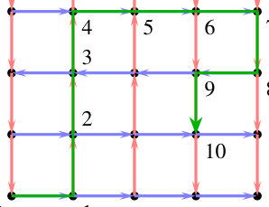 
FIGURE 1. A walk of 10 steps on the two-dimensional randomly oriented Manhattan lattice

**Summary.** This paper rigorously analyzes the anomalous diffusion of random walks on a 3D lattice where the axes are randomly oriented. It proves that in this critical dimension, the diffusion coefficient exhibits a specific superdiffusive divergence rate, confirming a long-standing conjecture. The methodology is highly technical, relying on advanced tools from functional analysis and stochastic processes applied to the resolvent operator.

**Why it may be interesting.** While focused on classical random walks, the rigorous mathematical techniques involving spectral analysis, operator bounds, and chaos expansions are highly relevant to analyzing transport and dynamics in complex quantum systems, such as disordered quantum Hamiltonians or open quantum systems.

Detailed structure

**Main problem.** The paper studies the superdiffusive behavior of random walks on a specific, randomly oriented lattice structure.

**Main result.** In the critical dimension $d=3$, the diffusion coefficient is shown to diverge in the Tauberian sense as $\sqrt{\log t}$ with a multiplicative correction involving $(\log\log t)^{\pm(2+\epsilon)}$.

**Method.** The analysis employs the resolvent method, utilizing a Rademacher chaos expansion to estimate the Laplace transform of the mean squared displacement.

**Model / system.** The model is a continuous-time random walk on the three-dimensional randomly oriented Manhattan lattice ($\mathbb{Z}^d$). The environment is random, assigning independent directions (forward/backward) to each axis-aligned line.

**Key observables.** Diffusion coefficient, Mean squared displacement $E[|X_t|^2]$, and the Laplace transform of the mean squared displacement $D(\lambda)$.

**Important parameters / regimes.** The critical dimension $d=3$, and the small parameter $\lambda$ used in the resolvent analysis.

**Assumptions / limitations.** The random environment is assumed to be stationary and doubly stochastic. The proof relies on bounding operators using recursive inequalities derived from the chaos expansion.

**Paper structure.** The paper establishes the problem context, relates the mean squared displacement to the resolvent of the generator, and then uses a recursive operator bounding technique (via chaos expansion) to derive the asymptotic bounds leading to the main theorem.

Abstract

We study the superdiffusive behavior of random walks on the randomly oriented Manhattan lattice, i.e., the $d$-dimensional integer lattice $\mathbb{Z}^d$ where each axis-aligned line is independently assigned a random direction (forward or backward) with equal probability. The walker takes nearest-neighbor steps, choosing an axis randomly and moving along the assigned direction of that axis's line, with equal probabilities for each axis. We show that, in the critical dimension $d=3$, the diffusion coefficient of the random walk diverges in the Tauberian sense as $\sqrt{\log t}$ with a multiplicative correction $(\log\log t)^{\pm(2+\varepsilon)}$ as time $t\to\infty$. This gives an answer to a conjecture by Ledger, Tóth and Valkó (2018).

[↑ back to top](#top)

### [Neural Network Field Theory at Finite Width](http://arxiv.org/abs/2608.21588v1)

**Authors:** Christian Ferko, Aaron Mutchler  
**Type:** theory · **Category:** disordered systems and neural networks · **PDF:** <https://arxiv.org/pdf/2608.21588v1>  
**Analysis basis:** full PDF text, analyzed in chunks
**Topic relevance:** `Keldysh / 2PI / non-Gaussian methods` **2/5** · `methods for driven-dissipative` **2/5** · `analog quantum simulation` **1/5**

📷 Fig 1

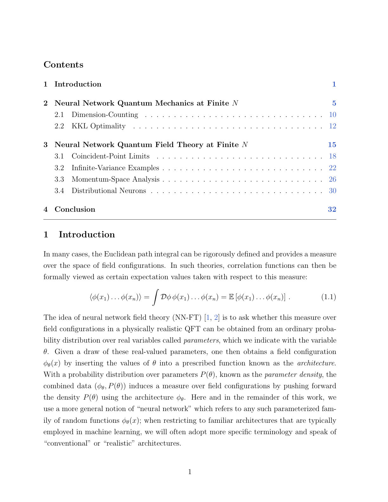 
Low-resolution page preview, page 2

📷 Fig 2

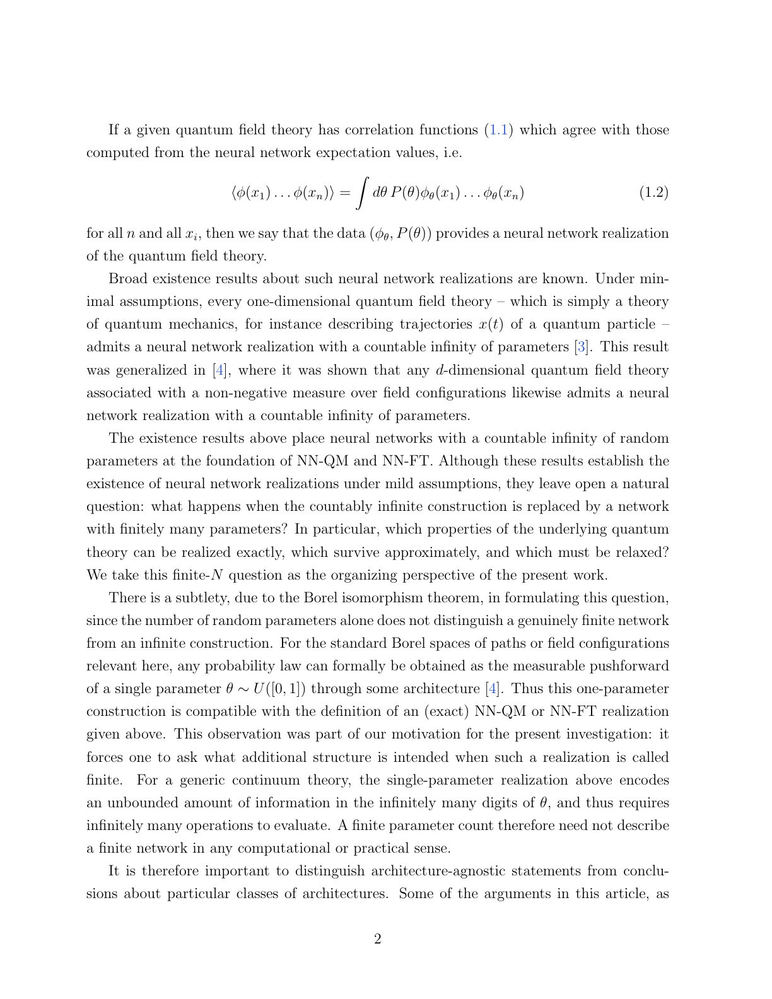 
Low-resolution page preview, page 3

📷 Fig 3

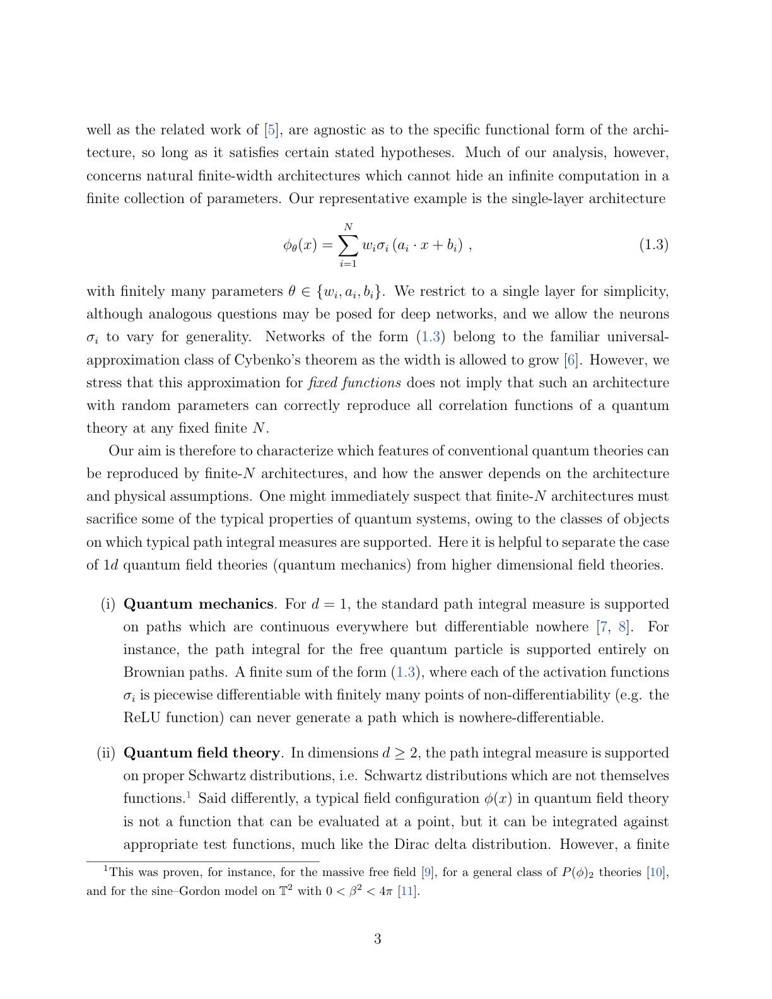 
Low-resolution page preview, page 4

📷 Fig 4

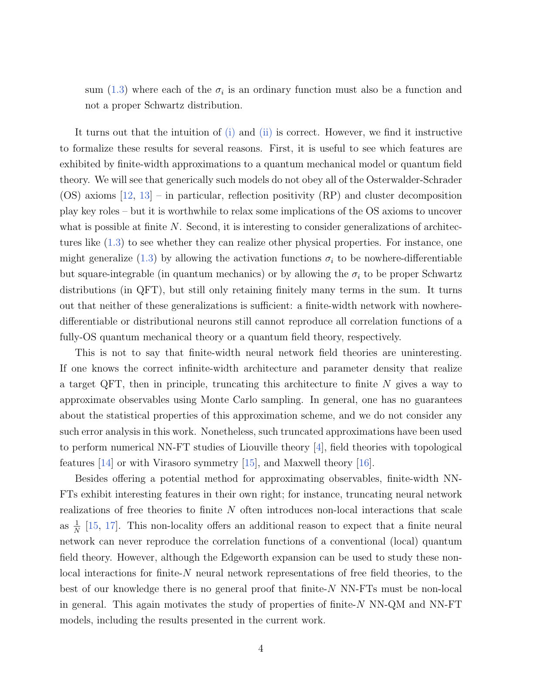 
Low-resolution page preview, page 5

📷 Fig 5

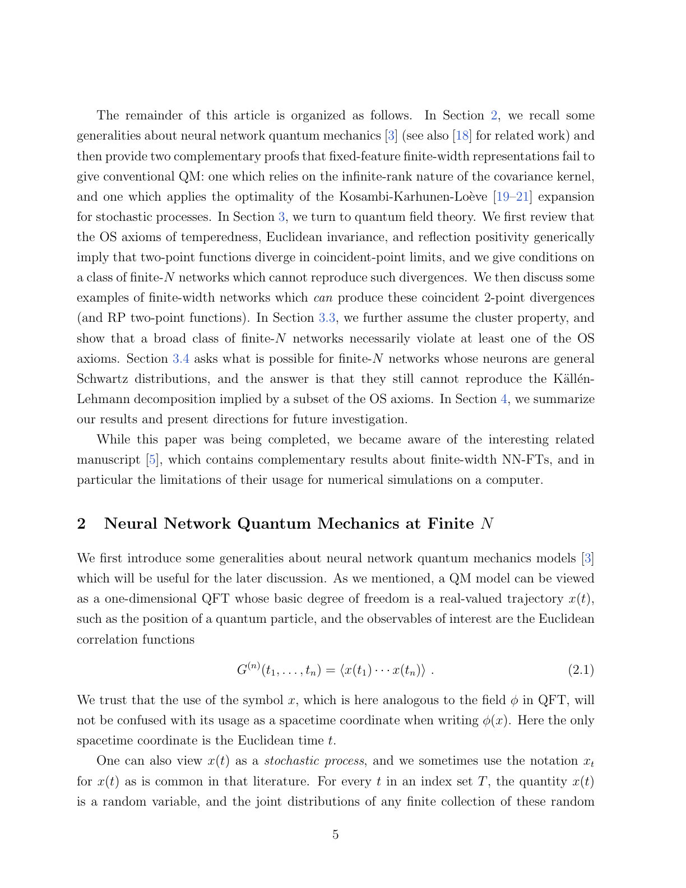 
Low-resolution page preview, page 6

**Summary.** This work explores the theoretical limits of representing quantum field theories using neural networks with a finite number of parameters. The authors demonstrate that such finite truncations generically fail to satisfy core physical axioms, such as reflection positivity, because the underlying mathematical structure required by QFTs is too complex for finite sums to capture. This sets a fundamental boundary on what ML models can simulate in quantum physics.

**Why it may be interesting.** It provides a rigorous theoretical constraint on the complexity of physical theories that can be encoded or simulated by finite-parameter machine learning models, linking fundamental physics axioms to computational limitations.

Detailed structure

**Main problem.** The paper investigates whether Quantum Mechanical (QM) and Quantum Field Theory (QFT) models can be accurately represented using Neural Networks (NNs) with a finite number of parameters.

**Main result.** Generically, finite-width NN models are incapable of reproducing the correlation functions of conventional, non-trivial QFTs or QM systems because they violate fundamental properties like reflection positivity or cluster decomposition.

**Method.** The authors compare the correlation functions derived from finite-width NN architectures (e.g., using finite sums of basis functions) against the known requirements of QFTs, such as the Källén-Lehmann representation.

**Model / system.** The study concerns the representation of quantum systems, ranging from 1D QM models (path integrals) to general QFTs, using NN ensembles parameterized by a finite set of weights.

**Key observables.** Correlation functions $\langle \phi(x_1) \cdots \phi(x_n) 
angle$, the connected two-point function (covariance kernel), and the adherence to the Källén-Lehmann representation.

**Important parameters / regimes.** The crucial parameter is the finite width $N$ of the neural network architecture, contrasting with the infinite parameters required for exact representation.

**Assumptions / limitations.** The analysis assumes the existence of a true QFT obeying standard axioms (like OS axioms) and focuses on the limitations imposed by truncating the representation to finite $N$.

**Paper structure.** The paper first establishes the general framework for NN representations of QFTs, then analyzes the 1D QM case using the two-point function, and finally extends the obstruction argument to general QFTs by considering distributional neurons.

Abstract

Under mild assumptions, any quantum mechanical (QM) model or quantum field theory (QFT) admits a representation in terms of an ensemble of neural networks with countably many random parameters. We investigate the features of NN-QM and NN-FT models with finitely many parameters, such as a feedforward network of width $N < \infty$. We find that, generically, such models must violate one of the properties of conventional Euclidean QFTs, such as reflection positivity or cluster decomposition. We present several complementary ways of understanding which features can and cannot be preserved at finite $N$, both in QM and in QFT.

[↑ back to top](#top)

### [Exact Fock-State Preparation with $n^{1/4}$ Circuit Depth](http://arxiv.org/abs/2608.23389v1)

**Authors:** Tanay Roy  
**Type:** theory · **Category:** other · **PDF:** <https://arxiv.org/pdf/2608.23389v1>  
**Analysis basis:** full PDF text, analyzed in chunks
**Topic relevance:** `analog quantum simulation` **2/5** · `Tavis-Cummings & cavity-many-emitter` **1/5** · `quantum measurements` **1/5**

📷 Fig 1

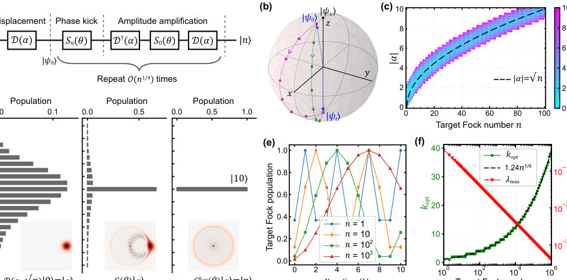 
FIG. 1. Deterministic Fock-state preparation. (a) Circuit based on phase kicks and amplitude amplification; the bracketed gates form one iterate G(θ) = Sr(θ)So(θ). (b) Trajectories from |α = √

📷 Fig 2

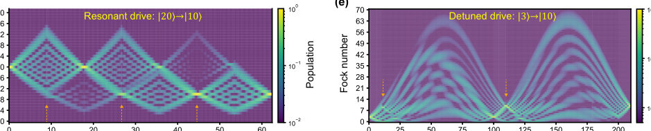 
FIG. 2. Generalized protocol. (a) Circuit for a finite- or infinite-dimensional system, with |ψ0⟩= U|m⟩and λ = |⟨ψt|ψ0⟩|2 &gt; 0. The oracle addresses multiple basis states. (b) Coherent-state trajectories under resonant (blue) and detuned (red) drives. (c) Fock populations (top panel) and density-matrix elements (bottom panel) for a 21-dimensional system starting from |10⟩, with targets {|3⟩, |15⟩, |16⟩}, λ = 0.156, and kopt = 2. (d) Resonant-drive transfer with λ = 0.075 and θ = 1.900; orange dashed lines mark instantaneous phase kicks. (e) Detuned-drive transfer with λ = 0.101, ∆/2π = 10 MHz, and θ = 2.679.

📷 Fig 3

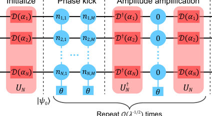 
FIG. 3. Multipartite-state preparation. Local displace- ments or a general unitary prepare |ψ0⟩in N bosonic modes or qudits. Generalized controlled-phase gates address the tar- get components, while the diffusion step applies a controlled phase to |0⟩⊗N.

**Summary.** The paper introduces a novel, deterministic protocol to prepare large Fock states in bosonic systems by framing the task as a two-dimensional amplitude amplification problem. This method requires only displacements and number-selective phase gates, achieving a crucial sublinear scaling of $O(n^{1/4})$ in circuit depth. This breakthrough offers a scalable route for implementing complex quantum simulations on platforms like cavity QED.

**Why it may be interesting.** This work provides a highly scalable, gate-level blueprint for generating highly excited nonclassical states, which is a major technological bottleneck for scaling bosonic quantum simulations and quantum computing architectures.

Detailed structure

**Main problem.** The core problem is achieving efficient, deterministic, and high-fidelity preparation of large Fock states ($|n
angle$) in bosonic quantum systems.

**Main result.** A deterministic one-parameter (D1p) protocol was developed that achieves this preparation with an iteration count scaling sublinearly as $O(n^{1/4})$.

**Method.** The protocol maps Fock-state preparation onto a two-dimensional amplitude amplification problem, utilizing only displacement operations and number-selective phase kicks.

**Model / system.** The work focuses on bosonic modes, applicable to platforms like cavity QED, trapped ions, and optomechanics. The underlying physics involves coherent states, Fock states, and controlled unitary operations.

**Key observables.** Fock state population ($|n
angle$), fidelity, and the required number of iterations ($k_{	ext{opt}}$).

**Important parameters / regimes.** The scaling factor $n^{1/4}$ for iteration count, the initial coherent state amplitude $\alpha \simeq \sqrt{n}$, and the overlap $\lambda$.

**Assumptions / limitations.** The ideal model assumes perfect phase matching and instantaneous, perfectly selective phase kicks, though the scaling remains favorable even when considering finite-duration gates.

**Figures summary.** Figures illustrate the circuit diagram for the D1p protocol, showing state evolution trajectories from coherent states to Fock states, and demonstrating the scaling of iteration counts.

**Paper structure.** The paper introduces the D1p protocol by recasting the problem as amplitude amplification. It details the required controls (displacements and phase kicks) and presents the scaling analysis ($O(n^{1/4})$). Extensions are shown for state transfer, multi-target cat states, and multipartite systems.

Abstract

Efficient, deterministic, and high-fidelity preparation of large Fock states is essential for scaling bosonic quantum technologies and exploring quantum phenomena at large excitation energies. We introduce a deterministic one-parameter (D1p) protocol that maps Fock-state preparation in an infinite-dimensional Hilbert space onto two-dimensional amplitude amplification. Starting from a coherent state with $|α|\simeq\sqrt{n}$, the initial target-state population scales as $n^{-1/2}$, yielding an iteration count and circuit depth of $\mathcal{O}(n^{1/4})$. Phase matching guarantees unit fidelity in the ideal model; remarkably, preparing $|{10^6}\rangle$ requires only 39 iterations. The protocol uses only displacements and number-selective phase operations, requires no numerical optimization, and further extends to state transfer, general superpositions, finite-dimensional systems, and multipartite entangled states. In the large-amplitude regime, its multi-target form prepares $L$-legged cat states with an iteration count determined only by $L$; cats with up to ten legs require only two iterations, independent of the coherent-state amplitude. This framework provides a broadly applicable route to highly excited bosonic states on platforms supporting these elementary controls.

[↑ back to top](#top)

### [Exact Quasiprobability Hierarchy of the Double-Morse Oscillator: From Potential Geometry to Operator Ordering](http://arxiv.org/abs/2608.23316v1)

**Authors:** F. Chogle, B. Teklu, M. F. Pereira  
**Type:** theory · **Category:** other · **PDF:** <https://arxiv.org/pdf/2608.23316v1>  
**Analysis basis:** full PDF text, analyzed in chunks
**Topic relevance:** `Keldysh / 2PI / non-Gaussian methods` **2/5** · `quantum measurements` **2/5**

📷 Fig 1

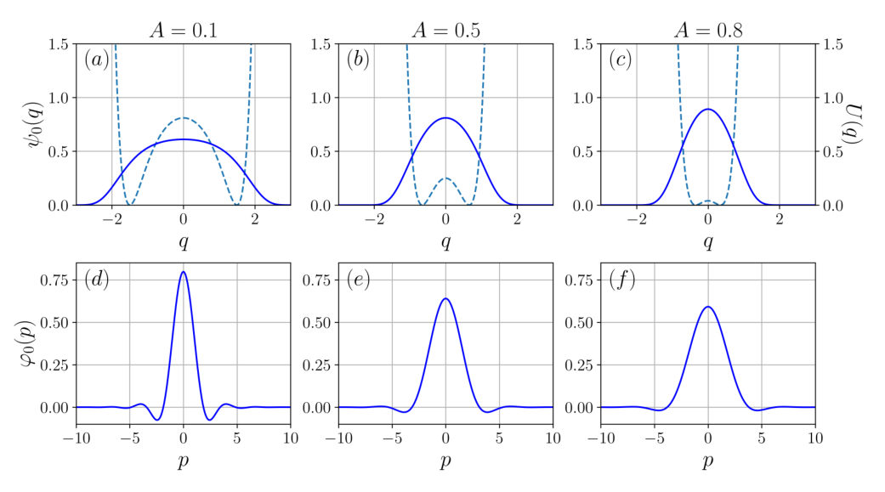 
FIG. 1. Ground-state position- and momentum-space wavefunctions of the quasi-exact double-Morse oscillator for µ = 1. Top row, panels (a)–(c): position-space amplitude ψ0(q) from Eq. (8), shown as a solid curve, together with the dimensionless potential U(q) = [A cosh(2q) −1]2, shown as a dashed curve. Bottom row, panels (d)–(f): momentum-space amplitude φ0(p) from Eq. (12). Columns correspond, from left to right, to A = 0.1, 0.5, and 0.8. The dimensionless coordinates are q = αx/2 and p = 2Px/(ℏα). As A increases, ψ0(q) narrows, whereas φ0(p) broadens and its oscillatory side lobes weaken. For 0 &lt; A &lt; 1, the potential is double-welled, while the n = 0 quasi-exact ground-state amplitude...

📷 Fig 2

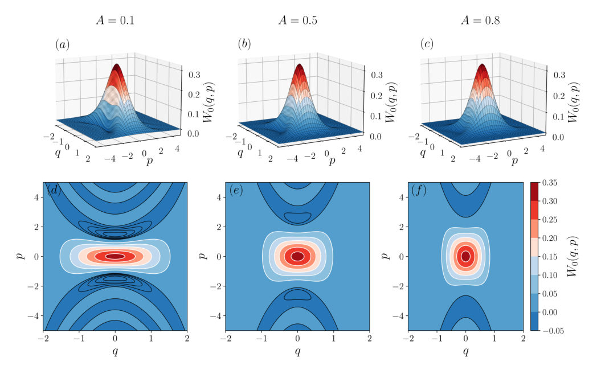 
FIG. 2. Three-dimensional surface plots (top row, panels (a)–(c)) and signed two-dimensional contour maps (bottom row, panels (d)–(f)) of the ground-state Wigner function W0(q, p), Eq. (20), for µ = 1. Columns correspond, from left to right, to A = 0.1, 0.5, and 0.8. Both rows represent the full signed Wigner function. Owing to the viewing angle and the comparatively small vertical extent of the negative lobes, the negative regions are less visually prominent in the surface plots and are more readily identified in the contour maps. White contours denote positive levels, while black contours denote zero and negative levels. As A increases, the central positive region narrows along q and...

📷 Fig 3

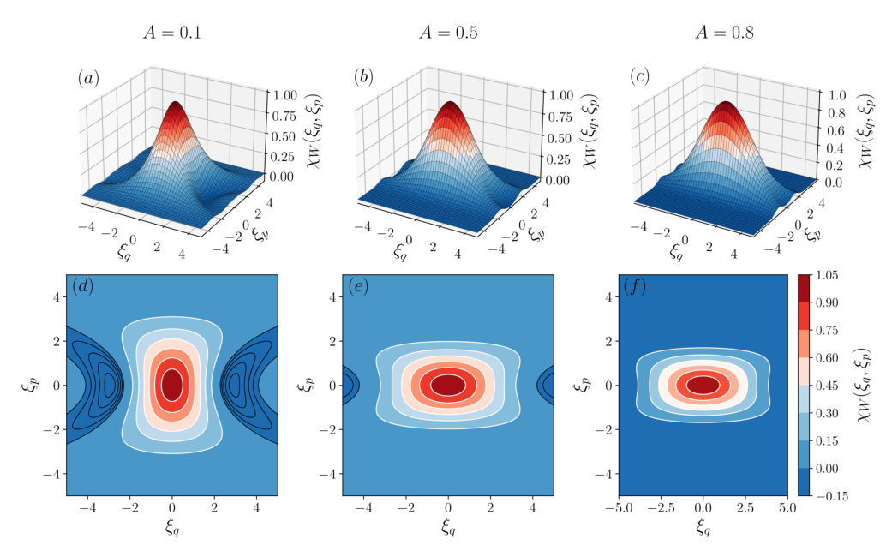 
FIG. 3. Three-dimensional surface plots (top row, panels (a)–(c)) and signed two-dimensional contour maps (bottom row, panels (d)–(f)) of the exact Weyl characteristic function χW (ξq, ξp), Eq. (22), for the quasi-exact double-Morse ground state with µ = 1. Columns correspond, from left to right, to A = 0.1, 0.5, and 0.8. Both rows represent the full signed characteristic function. Owing to the viewing angle and the comparatively small vertical extent of the negative side lobes, the negative regions are less visually prominent in the surface plots and are more readily identified in the contour maps. The function is real and even in both variables and satisfies χW (0, 0) = 1. White contours...

📷 Fig 4

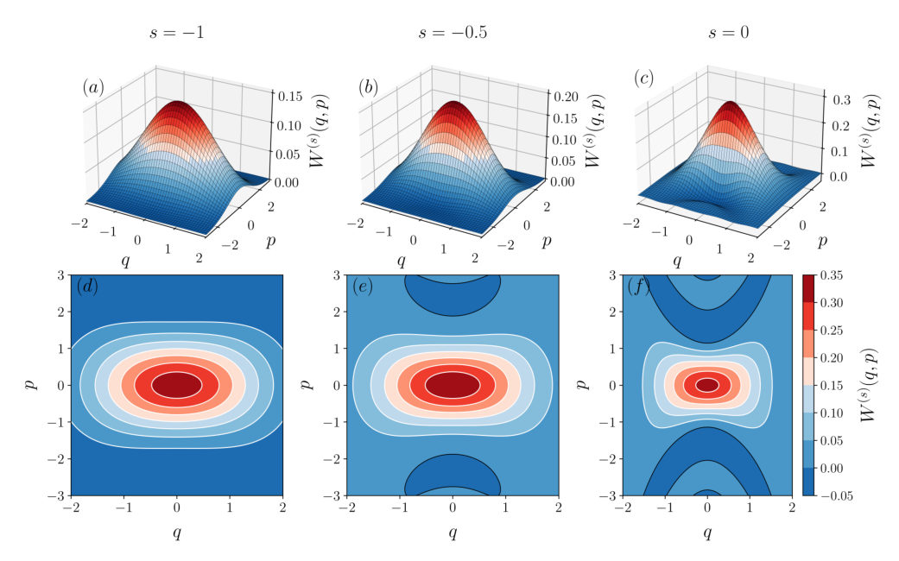 
FIG. 4. Three-dimensional surface plots (top row, panels (a)–(c)) and signed two-dimensional contour maps (bottom row, panels (d)–(f)) of the Cahill–Glauber s-ordered quasiprobability distributions W (s)(q, p) for the quasi-exact double-Morse ground state with µ = 1 and A = 0.1. From left to right, s = −1, −0.5, and 0, corresponding to the Husimi endpoint W (−1), an intermediate Gaussian-smoothed distribution, and the Wigner function W (0) = W0, respectively. Negative regions are more readily identified in the contour maps than in the corresponding three-dimensional surface plots. White contours denote positive levels, while black contours denote the zero and negative levels. The top-row...

📷 Fig 5

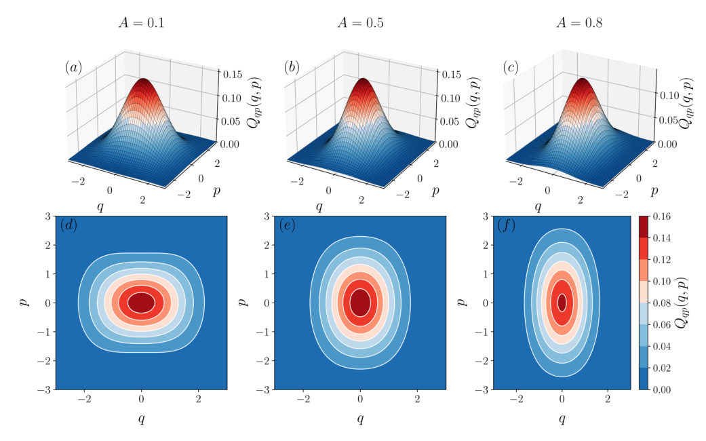 
FIG. 5. Three-dimensional surface plots (top row, panels (a)–(c)) and two-dimensional contour maps (bottom row, panels (d)– (f)) of the q, p-normalized Husimi distribution Qqp(q, p) ≡1

**Summary.** This paper provides a detailed, exact analysis of the ground state of the double-Morse oscillator using various quasiprobability distributions. It rigorously separates the physical effects of changing the potential geometry (controlled by $A$) from the mathematical artifacts introduced by the choice of phase-space representation (controlled by $s$). The key finding is that the nonclassical structure is robustly separated from the physical state evolution.

**Why it may be interesting.** This work provides a rigorous, quantitative benchmark for nonlinear phase-space methods, crucial for understanding quantum dynamics in anharmonic potentials where simple harmonic approximations fail.

Detailed structure

**Main problem.** To develop an exact, representation-consistent analysis that separates physical changes in phase-space geometry from changes introduced solely by the choice of quasiprobability representation.

**Main result.** The study demonstrates that the Hamiltonian parameter ($A$) controls the physical geometry, while the ordering parameter ($s$) controls the appearance of non-Gaussian, nonclassical structure across different phase-space representations.

**Method.** The authors use phase-space methods, calculating the Wigner and Weyl characteristic functions for the ground state, and analyzing the full Cahill–Glauber $s$-parameterized hierarchy.

**Model / system.** The system analyzed is the symmetric double-Morse oscillator, governed by a potential $V(x) = D [A \cosh(\alpha x) - 1]^2$. The analysis focuses on the lowest quasi-exact ground state.

**Key observables.** Wigner function (negative regions, non-Gaussianity), Weyl characteristic function, Husimi distribution (non-negativity), and Glauber–Sudarshan P-representation (distributional nature).

**Important parameters / regimes.** The potential geometry is controlled by the parameter $A$, while the representation resolution is controlled by the Cahill–Glauber ordering parameter $s$.

**Assumptions / limitations.** The analysis focuses on the quasi-exact sector ($\mu=1$) and assumes the separation of physical control ($A$) from representational control ($s$) is possible.

**Figures summary.** Figures illustrate the ground-state wavefunctions ($\psi_0(q)$ and $\varphi_0(p)$) for varying $A$, showing the localization trade-off, and demonstrate how the principal $A$-dependent geometry remains visible even after coherent-state coarse-graining.

**Paper structure.** The paper establishes the physical model (double-Morse oscillator), introduces the mathematical tools (quasiprobability representations), and then systematically analyzes how varying the physical parameter ($A$) versus the representation parameter ($s$) affects the resulting phase-space distributions.

Abstract

Phase-space and quasiprobability methods play key roles across quantum technologies, characterizing localization, non-Gaussianity, nonclassical resources, and coarse-graining. We present a representation-consistent analysis of the lowest quasi-exact ground state of the symmetric double-Morse oscillator. The parameter $A$ changes the potential geometry and physical state, whereas the Cahill--Glauber ordering parameter $s$ changes only the representation and phase-space resolution of a fixed density operator. Although the potential is double-welled for $0<A<1$, the exact ground-state amplitude is single-peaked at the origin and lies above the internal barrier; as $A$ approaches unity, the merged well remains locally quartic rather than harmonic. We obtain closed expressions for the Wigner function and Weyl characteristic function. The Wigner function shows the $A$-dependent exchange between position and momentum localization and retains negative regions, certifying nonclassicality and, for this pure state, non-Gaussianity. The Weyl function gives the Fourier-dual description, generates symmetrically ordered moments and cumulants, and yields the full $s$-ordered hierarchy. For $s<0$, isotropic Gaussian smoothing suppresses fine sign-changing structure while preserving the large-scale localization envelope. The Husimi endpoint is nonnegative without implying classicality, whereas the Glauber--Sudarshan $P$ representation remains distributional and does not define a regular positive coherent-state mixture. Thus, the reduced visual extent of Wigner-negative regions as $A$ increases is not classicalization: $A$ controls the physical geometry, while $s$ controls how the same non-Gaussian, nonclassical structure appears across complementary representations. This separation provides an exact benchmark for nonlinear phase-space methods. theory.

[↑ back to top](#top)

### [Run-and-tumble particles with preferred reorientation](http://arxiv.org/abs/2608.23519v1)

**Authors:** Callum Britton, Ziluo Zhang, Seongjun Han, Thibault Bertrand  
**Type:** theory · **Category:** statistical mechanics · **PDF:** <https://arxiv.org/pdf/2608.23519v1>  
**Analysis basis:** full PDF text, analyzed in chunks
**Topic relevance:** `Keldysh / 2PI / non-Gaussian methods` **2/5** · `methods for driven-dissipative` **2/5**

📷 Fig 1

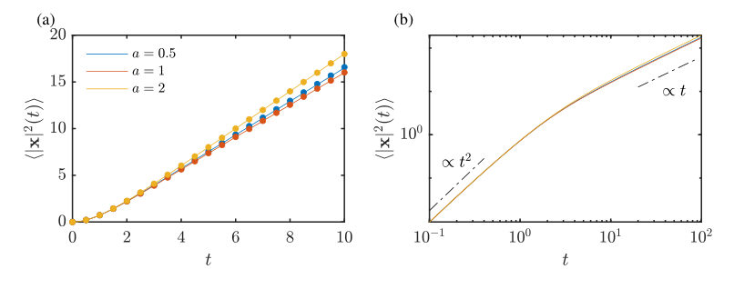 
Figure 1. Mean squared displacement – The MSD, Eq. (28), of an RTP with reorientation distribution given by Eq. (23) with a ∈{0.5, 1, 2} and β = 0.8. Here, we use the following parameters: D = 0; v = 1; α = 1; x0 = 0; θ0 = 0. The MSD is respectively plotted on both (a) a linear scale for comparison with numerical data and (b) a log-linear scale to show the distinct scaling with t. The symbols indicate simulation data and solid lines indicate the analytic result, Eq. (28). The dashed lines in panel (b) indicate respectively a ballistic behavior ∝t2 and a diffusive behavior ∝t.

📷 Fig 2

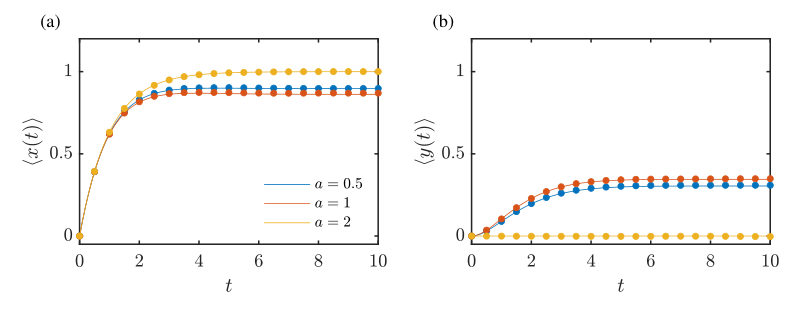 
Figure 2. Mean Displacements – The mean displacements, Eqs. (34a) and (34b), of an RTP with reorientation distribution given by Eq. (23) with a ∈{0.5, 1, 2} and β = 0.8. Here, we use the following parameters: D = 0; v = 1; α = 1; x0 = 0; θ0 = 0. Each panel respectively corresponds to (a) the mean displacement in the x direction ⟨x(t)⟩, Eq. (34a), and (b) the mean displacement in the y direction ⟨y(t)⟩, Eq. (34b). The symbols indicate simulation data and solid lines indicate analytic results, Eqs. (34a) and (34b).

📷 Fig 3

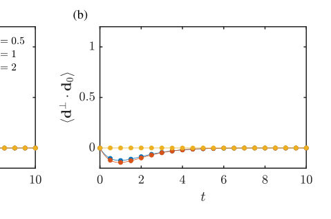 
Figure 3. Orientation autocorrelators – The orientation autocorrelators, Eqs. (40) and (44b), of an RTP with reorientation distribution given by Eq. (23) with a ∈{0.5, 1, 2} and β = 0.8. Here, we use the following parameters: D = 0; v = 1; α = 1; x0 = 0; θ0 = 0. Each panel respectively corresponds to (a) the orientation autocorrelator ⟨d · d0⟩,Eq. (40) and (b) the perpendicular orientation correlator ⟨d⊥· d0⟩, Eq. (44b). The symbols indicate simulation data and solid lines indicate analytic results, Eqs. (40) and (44b).

📷 Fig 4

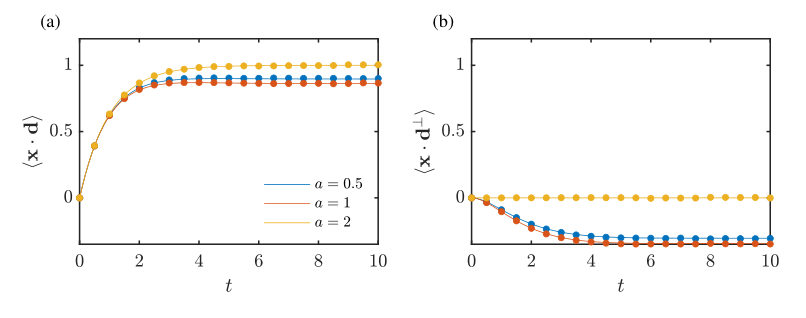 
Figure 4. Position-orientation cross-correlators – The position-orientation cross-correlators, Eqs. (47) and (48), of an RTP with reorientation distribution given by Eq. (23) with a ∈{0.5, 1, 2} and β = 0.8. Here, we use the following parameters: D = 0; v = 1; α = 1; x0 = 0; θ0 = 0. Each panel respectively corresponds to (a) the position-orientation cross-correlators ⟨x · d⟩, Eq. (47), and (b) the position-perpendicular orientation cross-correlators ⟨x · d⊥⟩, Eq. (48). The symbols indicate simulation data and solid lines indicate analytic results, Eqs. (47) and (48).

📷 Fig 5

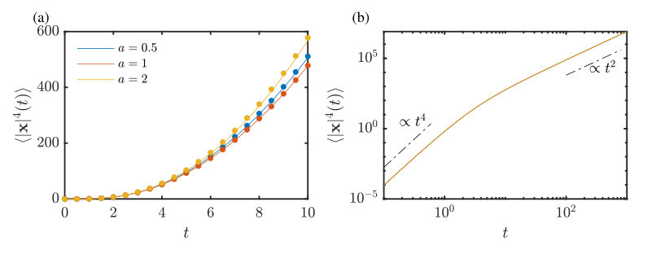 
Figure 5. Fourth spatial moment – The fourth spatial moment, Eq. (51), of an RTP with reorientation distribution given by Eq. (23) with a ∈{0.5, 1, 2} and β = 0.8. Here, we use the following parameters: D = 0; v = 1; α = 1; x0 = 0; θ0 = 0. The fourth moment is respectively plotted on both (a) a linear scale for comparison with numerical data and (b) a log-linear scale to show the distinct scaling with t. The symbols indicate simulation data and solid lines indicate the numerically integrated result from Eq. (51). The dashed lines in panel (b) indicate a transition from ballistic behavior ∝t4 to diffusive behavior ∝t2.

**Summary.** This work develops an exact Doi-Peliti field theory to analyze run-and-tumble particles with arbitrary, non-uniform reorientation probabilities. By mapping the dynamics onto chiral active Brownian particles, the authors establish a direct quantitative link between the shape of the tumble distribution and emergent transport properties like effective chirality and diffusion. This provides a powerful theoretical framework for studying complex active matter systems.

**Why it may be interesting.** The rigorous field-theoretic approach provides a powerful, systematic tool for characterizing non-equilibrium active matter dynamics, linking microscopic directional biases (tumble shape) to macroscopic transport properties (MSD).

Detailed structure

**Main problem.** The study investigates the dynamics of run-and-tumble particles (RTPs) when the reorientation (tumble) probabilities are non-uniform, moving beyond the standard uniform assumption.

**Main result.** The dynamics can be rigorously mapped to those of chiral active Brownian particles (cABPs), and the Mean Squared Displacement (MSD) can be calculated in $d$ dimensions using an effective persistence time ($\Lambda$).

**Method.** The authors derive and utilize an exact Doi-Peliti (DP) field theory formalism, calculating expectation values via path integrals in Fourier space.

**Model / system.** The system models active microswimmers (RTPs) whose orientation changes according to a general, non-uniform tumble distribution $\Pi(\psi)$. The dynamics are governed by a Fokker-Planck equation.

**Key observables.** Mean Squared Displacement (MSD), effective persistence ($\Lambda$), effective chirality ($\Omega$), and higher-order spatial moments.

**Important parameters / regimes.** The first Fourier modes ($\Pi_{\pm 1}$) of the tumble distribution, the tumble rate ($\alpha$), and the spatial dimension ($d$).

**Assumptions / limitations.** The analysis relies on the DP field theory structure and often assumes non-chiral or specific forms (like von Mises-Fisher) for the tumble distribution to simplify the mapping.

**Figures summary.** Figures illustrate the MSD vs. time for various dimensions ($d=2, 3, 4, 5$) using the von Mises-Fisher distribution, comparing simulation data to analytical results.

**Paper structure.** The paper develops the DP field theory for general tumble distributions, calculates single-particle observables like MSD, and extends the framework to $d$ dimensions, linking the tumble distribution's Fourier modes to effective particle parameters.

Abstract

Run-and-tumble particles (RTPs) are canonically modeled with uniform reorientation probabilities, an assumption that breaks down for many biological microswimmers. In this work, we investigate the dynamics of RTPs with arbitrary non-uniform tumble distributions. By deriving an exact Doi-Peliti field theory, we explicitly calculate a wide array of spatial and orientational observables. Notably, we demonstrate that the spatial dynamics exhibit an effective persistence and chirality governed entirely by the first Fourier modes of the tumble distribution, establishing a formal mapping to the dynamics of chiral active Brownian particles. Furthermore, our field-theoretic framework provides a systematic method to compute spatial moments to arbitrary order, allowing for the complete characterization and identification of complex tumbling dynamics. We illustrate the framework with wrapped Gaussian and bimodal Gaussian distributions, demonstrating explicit control over persistence and chirality. We further extend the field theory to $d$ dimensions, recovering the mean squared displacement in terms of a single effective tumble rate. Our results establish a direct link between the shape of the tumble distribution and the emergent dynamics, and provide a foundation for the study of interacting RTPs with non-uniform reorientation.

[↑ back to top](#top)

### [A Margolus-Levitin speed limit for observables: mean energy bounds expectation-value change quadratically](http://arxiv.org/abs/2608.22658v1)

**Authors:** Bryan Nasr  
**Type:** theory · **Category:** statistical mechanics · **PDF:** <https://arxiv.org/pdf/2608.22658v1>  
**Analysis basis:** full PDF text, analyzed in chunks
**Topic relevance:** `quantum measurements` **2/5** · `analog quantum simulation` **1/5**

📷 Fig 1

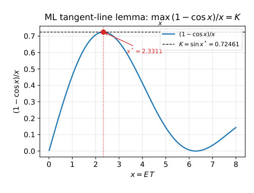 
FIG. 1. The tangent-line lemma. (1 −cos x)/x attains its supremum K = sin x⋆= 0.724611 . . . at x⋆= 2.331122 . . . (root of tan(x/2) = x), which fixes the sharp constant C⋆= 1/(8K).

📷 Fig 2

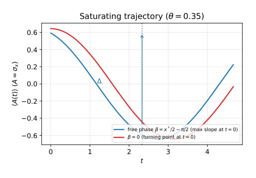 
FIG. 4. Saturating trajectory ⟨A(t)⟩(A = σx). With the optimal phase the expectation starts at maximum slope (and reaches its excursion ∆at T = x⋆/E); the real-amplitude (β = 0) case starts at a turning point and is suboptimal.

📷 Fig 3

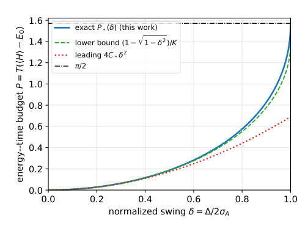 
FIG. 2. The exact observable trade-off curve P⋆(δ), Eq. (6): the minimum energy–time budget P = T(⟨H⟩−E0) for a normalized swing δ = ∆/2σA, tight at every δ. Its slope as δ →0 is set by C⋆and its δ →1 limit is π/2. It lies above the elementary lower bound (1 − √

📷 Fig 4

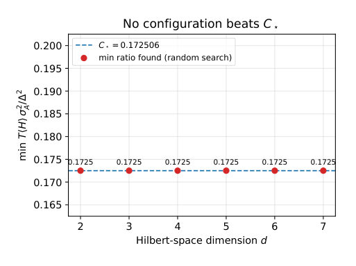 
FIG. 5. Global-optimizer minimum of T⟨H⟩σ2 A/∆2 per Hilbert-space dimension d. No configuration in d = 2–7 beats C⋆; each dimension approaches it from above.

📷 Fig 5

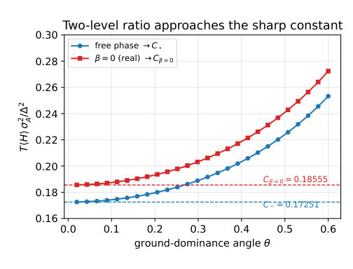 
FIG. 3. The two-level ratio T⟨H⟩σ2 A/∆2 versus the ground- dominance angle θ, approaching the sharp constant C⋆(free relative phase) and the phase-restricted suboptimum Cβ=0 = 0.185551, both from above as θ →0.

**Summary.** This work establishes a novel, sharp quadratic speed limit for observables, bounding the change in an expectation value ($\Delta\langle A 
angle$) by the mean energy available ($\langle H 
angle - E_0$). This result completes the mean-energy corner of the speed-limit landscape, offering a powerful, state-independent tool for analyzing quantum clocks and energy-constrained dynamics.

**Why it may be interesting.** It provides a powerful, complementary thermodynamic constraint on quantum evolution, particularly useful for understanding energy resolution limits in quantum metrology and timekeeping.

Detailed structure

**Main problem.** The paper aims to establish a fundamental, state-independent speed limit for the change in an observable's expectation value, $\Delta\langle A 
angle$, in a fixed quantum state.

**Main result.** It derives a sharp quadratic bound, $T \langle H 
angle \geq C_\star \Delta^2 / \sigma_A^2$, which complements existing linear bounds based on energy variance.

**Method.** The derivation uses techniques involving H"older's inequality and the tangent-line lemma to relate the observable change to the mean energy above the ground state.

**Model / system.** The analysis considers a quantum system evolving under a time-independent Hamiltonian $H$ on a finite-dimensional Hilbert space, applicable to both pure and mixed states.

**Key observables.** The change in expectation value $\Delta\langle A 
angle$, the mean energy above ground state $\langle H 
angle - E_0$, and the observable's spectral spread $\sigma_A$.

**Important parameters / regimes.** The sharp constant $C_\star = 1/(8 \sin x_*)$ and the quadratic dependence on the observable change $\Delta^2$.

**Assumptions / limitations.** The Hamiltonian $H$ is time-independent, and the bound is most relevant for near-ground dynamics or autonomous quantum clocks.

**Figures summary.** Figures illustrate the tangent-line lemma, the exact energy-time/swing trade-off curve $P_\star(\delta)$, and comparisons between different limiting regimes.

**Paper structure.** The paper first establishes a no-go theorem ruling out a linear mean-energy bound, then derives the main quadratic bound, and finally discusses its implications for quantum clocks and batteries.

Abstract

The Mandelstam-Tamm and Margolus-Levitin quantum speed limits bound how fast a state evolves, using the energy variance and the mean energy above the ground state. Speed limits on observables -- the change of an expectation value <A(t)> -- have so far used the variance (the Mandelstam-Tamm / quantum-Fisher-information lineage); the mean energy has not been brought to bear on the change of <A> in a fixed state. We close this branch. First, a no-go theorem: there is no state-independent linear mean-energy bound on the time to change an observable's expectation by Delta = |<A(T)> - <A(0)>|; the optimal state-independent exponent of Delta is exactly two. Second, the corresponding sharp quadratic bound, T (<H> - E_0) >= C_* Delta^2 / sigma_A^2, for every time-independent Hamiltonian H (ground energy E_0), every bounded observable A with spectral spread sigma_A = (lambda_max - lambda_min)/2, and every pure or mixed state, with the dimension-independent constant C_* = 1/(8 sin x_*) = 0.172506267461..., where x_* is the smallest positive root of tan(x/2) = x. The bound is tight, approached but not attained by a near-ground two-level family. We then give the exact energy-time/swing trade-off curve of which C_* is the small-swing slope -- tight at every swing, the observable analog of the Giovannetti-Lloyd-Maccone curve for states -- show the constant survives for mixed states via joint convexity of the trace distance, sharpen it for bandwidth-limited generators and several observables at once, and show the quadratic law degrades to a linear one when the initial state is an eigenvector of the observable. It completes the (mean-energy x observable) corner of the speed-limit landscape and, being quadratic, is most constraining where the linear variance bounds are weakest. Its cleanest physical home is the autonomous quantum clock, where it gives a coherent mean-energy resolution floor.

[↑ back to top](#top)

### [Engineering exact mobility edges in quasiperiodic Aharonov-Bohm chains](http://arxiv.org/abs/2608.22264v1)

**Authors:** Hai-Ying Cui, Yi-Cong Yu, Xiaoming Cai  
**Type:** theory · **Category:** disordered systems and neural networks · **PDF:** <https://arxiv.org/pdf/2608.22264v1>  
**Analysis basis:** full PDF text, analyzed in chunks
**Topic relevance:** `analog quantum simulation` **2/5** · `Frenkel-Kontorova` **1/5**

📷 Fig 1

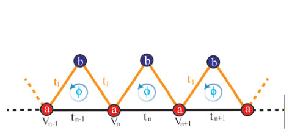 
FIG. 1. Schematic illustration of the quasiperiodic AB chain.

📷 Fig 2

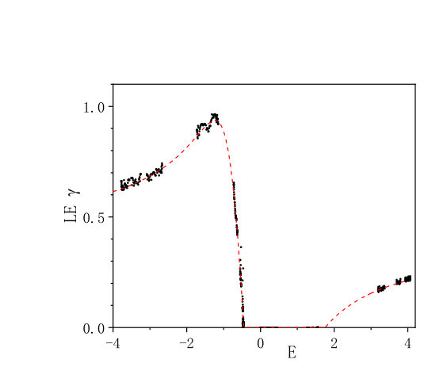 
FIG. 2. LEs of all single-particle states, as a function of en- ergy, for the system with L = 610, W = 0, t1 = 1, ϕ = 0.2π, and V = 1.5. The red dashed line corresponds to Eq.(10).

📷 Fig 3

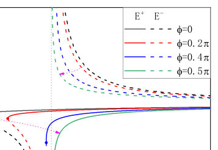 
FIG. 3. (a) Eigenenergies E as functions of the quasiperiodic potential strength V for diagonal AB chains with L = 610, W = 0, t1 = 1, and ϕ = 0.2π. The fractal dimension D2 of each state is color-coded. Gray dotted and blue dash-dotted lines mark the divergence (V = t) and the coincidence (V = t sin ϕ), respectively. (b) Exact MEs on the (E, V ) plane for systems with W = 0, t1 = 1, and various ϕ. The gray dotted line marks the divergence at V = t.

📷 Fig 4

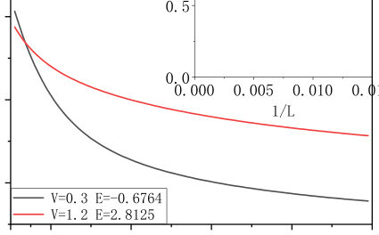 
FIG. 4. (a,b) Eigenenergies E versus the quasiperiodic po- tential strength V , with D2 values of all states color-coded, for off-diagonal AB chains with L = 610, t1 = 1, and ϕ = 0. (a) W = 0.5 &lt; t. (b) W = 1.5 &gt; t. Blue and black solid lines indicate the AMEs E+ 1 and E− 1 , respectively; pink and purple dashed lines indicate the MEs E− 2 and E+ 2 . The red dashed line is V = W, and the gray dotted line signals the divergence at V = t. (c) Generalized fractal dimension Dq versus q for two critical states (indicated by dots in (b)). Inset: Their finite-size scaling of D2.

📷 Fig 5

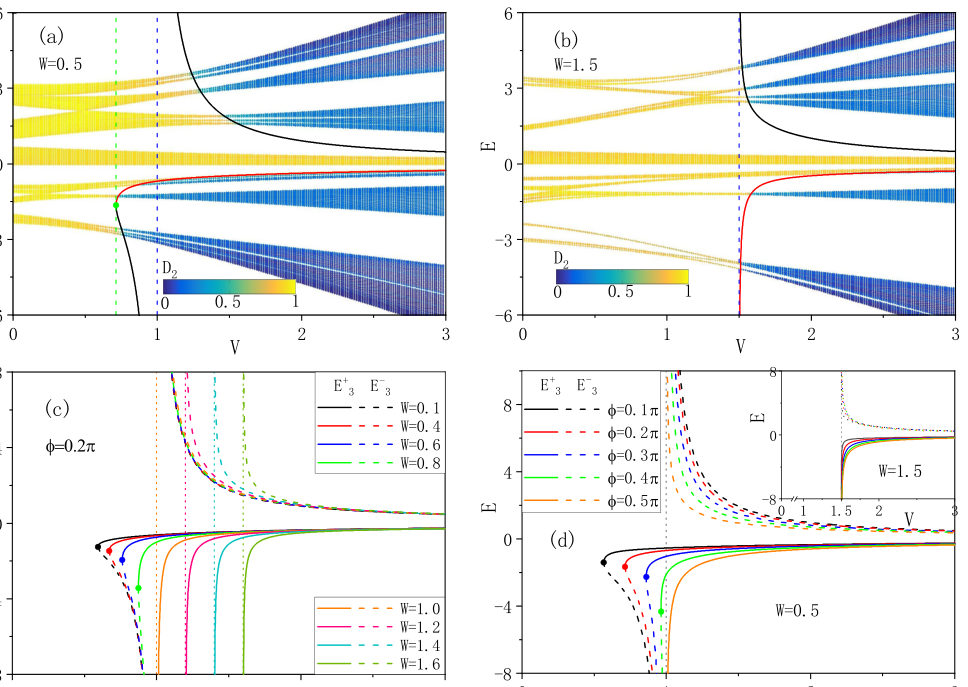 
FIG. 5. Eigenenergies E as functions of V for off-diagonal AB chains with L = 610, t1 = 1, and ϕ = 0.2π. The D2 values are color-coded. (a) W = 0.5 &lt; t. (b) W = 1.5 &gt; t. Black and red solid lines correspond to the MEs E− 3 and E+ 3 , and blue and green dashed lines mark the divergence (V = t) and the coincidence (V = Vc), respectively. (c) Exact MEs on the (E, V ) plane for t1 = 1, ϕ = 0.2π, and several values of W. Colored dotted lines indicate the asymptotes V = W for the corresponding MEs. (d) Main panel and inset: Exact MEs on the (E, V ) plane for t1 = 1 and different ϕ, with W = 0.5 (main) and W = 1.5 (inset). The gray dotted line marks the divergence at V = t.

**Summary.** This work develops a theoretical framework to precisely engineer mobility edges in quasiperiodic Aharonov-Bohm chains. By coupling Aubry-André-Harper models with a synthetic magnetic flux, the authors derive exact expressions for these edges. This tunability makes the model highly relevant for designing quantum devices in superconducting circuits or photonic waveguides.

**Why it may be interesting.** The ability to analytically derive exact, tunable mobility edges using a synthetic flux provides a powerful theoretical tool for designing quantum transport in engineered platforms.

Detailed structure

**Main problem.** The paper investigates localization phenomena and derives exact expressions for mobility edges in a quasiperiodic Aharonov-Bohm chain.

**Main result.** The authors establish a rigorous framework for engineering controllable mobility edges, showing that anomalous mobility edges can emerge even without conventional disorder features.

**Method.** The analysis involves analytically computing the Lyapunov exponent using Avila’s global theory of one-frequency Schrödinger operators.

**Model / system.** The system is a quasiperiodic Aharonov-Bohm chain, modeled as a lateral coupling of 1D diagonal and off-diagonal Aubry-André-Harper models to an auxiliary sublattice threaded by a synthetic magnetic flux.

**Key observables.** Mobility Edges (MEs) and Anomalous Mobility Edges (AMEs), and the Lyapunov Exponent ($\gamma$).

**Important parameters / regimes.** Magnetic flux ($\phi$), modulation strengths ($W, V$), and the quasiperiodicity parameter ($eta$).

**Assumptions / limitations.** The analysis relies on the AB geometry and the application of Avila’s global theory for exact results.

**Figures summary.** Figures illustrate the schematic of the chain and show how MEs evolve as parameters like modulation strength ($W$) and flux ($\phi$) are varied.

**Paper structure.** The paper progresses by defining the coupled Hamiltonian, deriving an effective eigenequation, calculating the Lyapunov exponent using advanced theory, and then analyzing the resulting MEs in both diagonal and off-diagonal limits.

Abstract

We investigate localization phenomena and exact mobility edges in a quasiperiodic Aharonov-Bohm chain, where the 1D canonical diagonal and off-diagonal Aubry-André-Harper models are laterally coupled to an auxiliary sublattice threaded by a synthetic magnetic flux. By analytically computing the Lyapunov exponent via Avila's global theory of one-frequency Schrödinger operators, we derive exact expressions for mobility edges. In the diagonal limit, the coupling to the auxiliary sublattice generates hyperbolic mobility edges that exhibit a sign-changing divergence and can be continuously tuned by the magnetic flux. In the off-diagonal regime, the interference between quasiperiodic hopping and indirect tunneling through the auxiliary sublattice gives rise to exact anomalous mobility edges that separate critical and extended states. Critical states and anomalous mobility edges emerge even in the absence of incommensurately distributed zeros in the hopping modulation, a behavior distinct from that of conventional off-diagonal models. Our results establish a rigorous theoretical framework for engineering controllable mobility edges, with the synthetic flux providing a tunable experimental knob that paves the way for realizations in platforms such as superconducting quantum circuits and photonic waveguides.

[↑ back to top](#top)

### [Instantons in a Double-Well are Poisson Distributed](http://arxiv.org/abs/2608.23342v1)

**Authors:** Jacob Shapiro  
**Type:** theory · **Category:** other · **PDF:** <https://arxiv.org/pdf/2608.23342v1>  
**Analysis basis:** full PDF text, analyzed in chunks
**Topic relevance:** `Keldysh / 2PI / non-Gaussian methods` **2/5** · `analog quantum simulation` **1/5**

📷 Fig 1

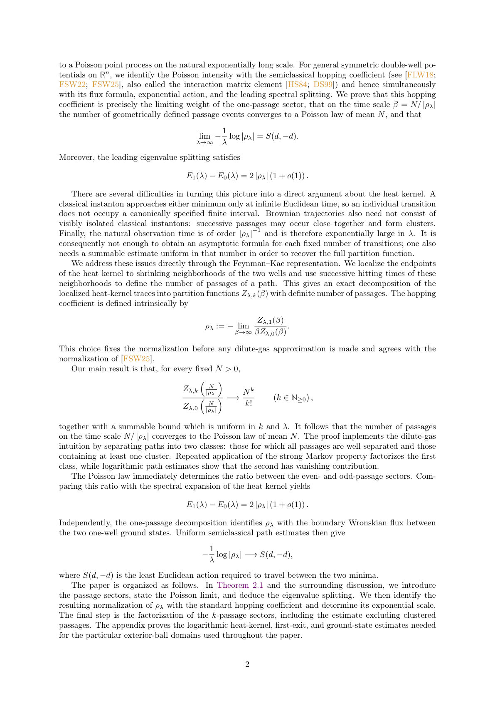 
Low-resolution page preview, page 2

📷 Fig 2

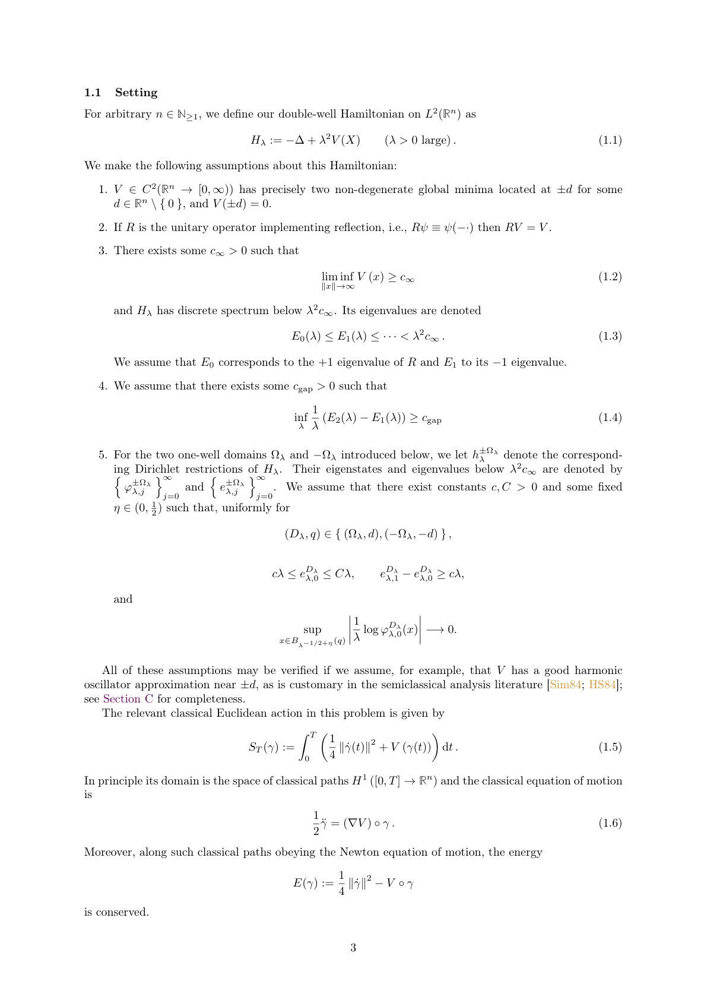 
Low-resolution page preview, page 3

📷 Fig 3

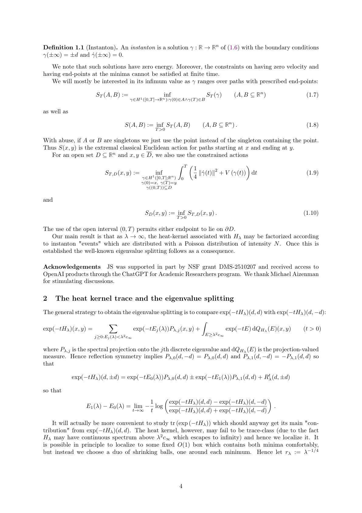 
Low-resolution page preview, page 4

📷 Fig 4

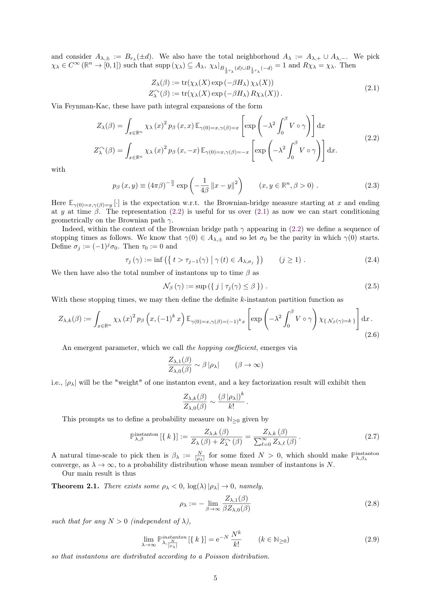 
Low-resolution page preview, page 5

📷 Fig 5

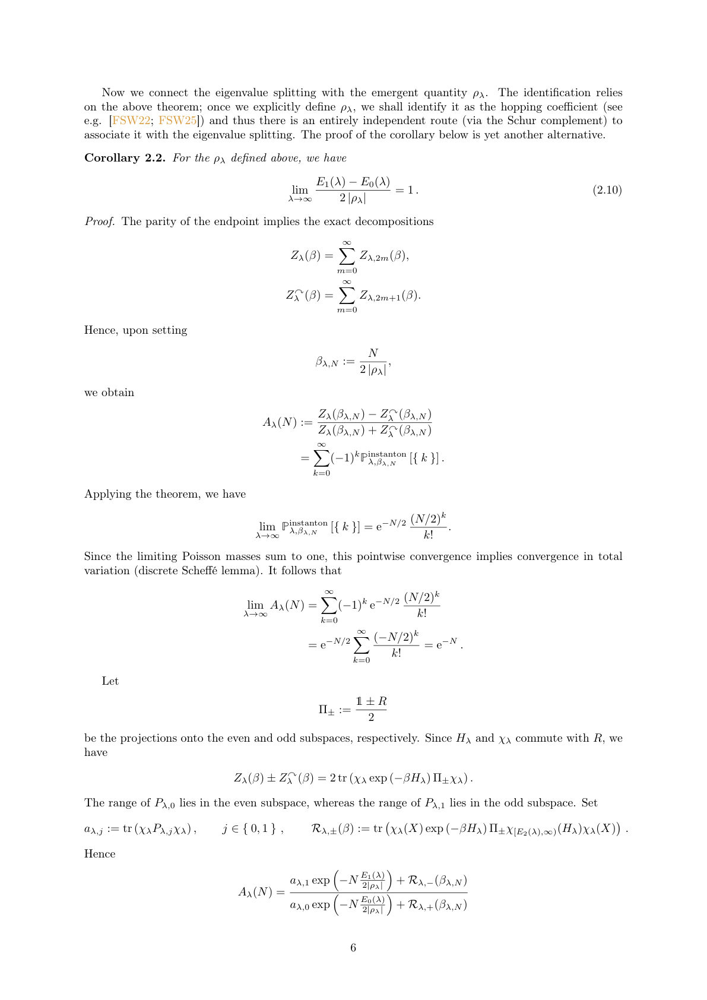 
Low-resolution page preview, page 6

**Summary.** This paper rigorously derives the semiclassical splitting of energy levels in a double-well potential by analyzing the heat-kernel trace. It shows that the tunneling events (instantons) follow a Poisson distribution, leading to a direct calculation of the energy splitting proportional to the hopping coefficient. This method provides a powerful, path-integral framework for understanding quantum tunneling phenomena.

**Why it may be interesting.** This work provides a rigorous, path-integral approach to calculating tunneling splittings, which is fundamental to understanding quantum tunneling in many physical systems, including those modeled by double-well potentials in AMO physics.

Detailed structure

**Main problem.** The paper rigorously analyzes the semiclassical splitting of a degenerate energy level in a symmetric double-well potential by studying the heat-kernel trace.

**Main result.** The number of tunneling passages (instantons) converges to a Poisson distribution, and the energy splitting is shown to be proportional to the hopping coefficient, $E_1(\lambda) - E_0(\lambda) \propto |
ho_\lambda|$.

**Method.** The analysis employs the Feynman-Kac representation to decompose the heat-kernel trace based on the number of passages made by a Brownian bridge, leading to a dilute-gas picture.

**Model / system.** The system is governed by a Schrödinger operator $H_\lambda = -\Delta + \lambda^2 V(X)$ on $\mathbb{R}^n$, where $V(X)$ is a symmetric double-well potential with minima at $\pm d$.

**Key observables.** Eigenvalue splitting ($E_1(\lambda) - E_0(\lambda)$), hopping coefficient ($
ho_\lambda$), and the Poisson distribution parameter $N$.

**Important parameters / regimes.** The large parameter $\lambda$, the effective time scale $eta = N/|
ho_\lambda|$, and the action $S(d, -d)$.

**Assumptions / limitations.** The potential must have exactly two non-degenerate global minima, and the analysis relies on localizing the heat kernel to shrinking neighborhoods of these wells.

**Paper structure.** The paper builds from the general heat-kernel trace analysis, decomposes it using the Feynman-Kac formula based on passage counting, establishes the Poisson limit for the passage number, and finally derives the eigenvalue splitting formula.

Abstract

We give a rigorous realization of the dilute instanton picture for a semiclassical Schrödinger operator with a symmetric double-well potential on $\mathbb{R}^n$. Using a localized Feynman--Kac representation, we decompose the heat-kernel trace according to the number of passages made by a Brownian bridge between shrinking neighborhoods of the two wells. We identify the weight of one passage with a hopping coefficient $ρ_λ$,   $\displaystyle ρ_λ= \int_{\partialΩ} \left( \nabla\overline{\varphi_{λ,0}^Ω}\, \varphi_{λ,0}^{-Ω} - \overline{\varphi_{λ,0}^Ω}\, \nabla\varphi_{λ,0}^{-Ω} \right)\cdotν. $   On the exponentially long time scale $β=N/\lvertρ_λ\rvert$, the number of passages converges, for every fixed $N>0$, to a Poisson random variable of mean $N$. We identify $-\frac{1}λ\log\lvertρ_λ\rvert\to S(d,-d)$ and obtain   $\displaystyle E_1(λ)-E_0(λ) = 2\lvertρ_λ\rvert\left(1+o(1)\right). $   Thus the familiar instanton expansion of the double-well eigenvalue splitting emerges directly from a factorization of the heat-kernel trace.

[↑ back to top](#top)

### [Non-uniform swelling of polyelectrolyte hydrogels: effects of charge regulation](http://arxiv.org/abs/2608.21698v1)

**Authors:** Du Chen, Rudolph Podgornik, David Andelman, Xianghong Wang, Linli He, Shigeyuki Komura, Bin Zheng  
**Type:** theory · **Category:** statistical mechanics · **PDF:** <https://arxiv.org/pdf/2608.21698v1>  
**Analysis basis:** full PDF text, analyzed in chunks
**Topic relevance:** `Keldysh / 2PI / non-Gaussian methods` **2/5** · `analog quantum simulation` **1/5**

📷 Fig 1

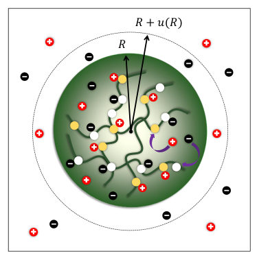 
FIG. 1. Schematic drawing of the CR gel model. The green sphere represents the gel volume. In the two-site model, the polymer chains contain n-type and p-type sites that can be- come negatively (white sites can be associated with black an- ions) or positively charged (yellow sites can be associated with red cations) through an association/dissociation process. The original gel radius is R, while R + u(R) is the swollen gel ra- dius. Free cations are marked in red and anions in black.

📷 Fig 2

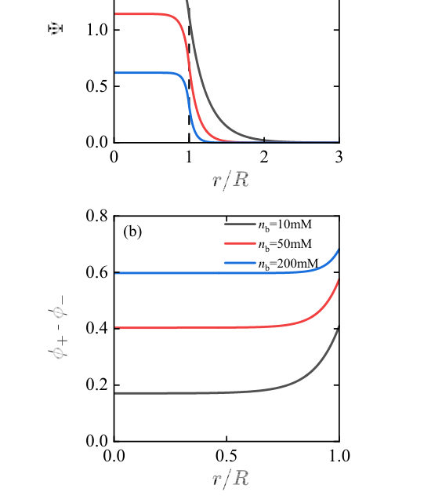 
FIG. 2. (a) The rescaled electrostatic potential profile Ψ=βeψ as a function of the rescaled distance from the gel center, r/R. (b) The spatial distribution of net charge fraction ϕ+ −ϕ−, as a function of r/R. The profiles are plotted for different val- ues of salt concentration, nb = 10 mM, 50 mM, and 200 mM. The corresponding Debye lengths are about 3 nm, 1.34 nm, and 0.67 nm, respectively. Thus, the screening length remains comparable to the gel radius R = 10 nm, especially at the low- est salt concentration. The other parameters are A± = ± 2, N± = 30, R = 10 nm, and ¯cp/(βK) = 0.02.

📷 Fig 3

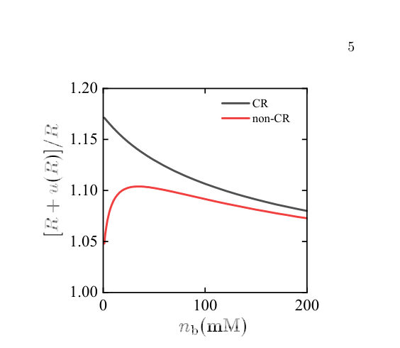 
FIG. 4. Salt concentration dependence of the normalized de- formed gel radius, [R+u(R)]/R, for the CR and non-CR gels. Other parameter values are A± = ± 2, N± = 30, R = 10 nm, and ¯cp/(βK) = 0.02.

📷 Fig 4

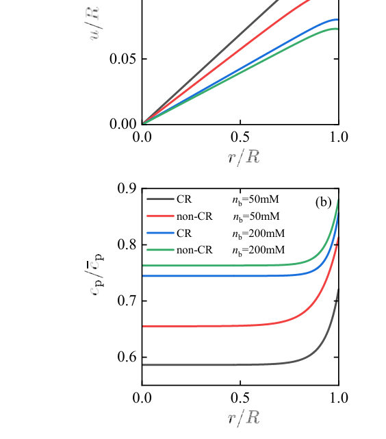 
FIG. 3. (a) The spatial distribution of the elastic dis- placement u/R, and (b) the normalized gel density profile, cp(r)/¯cp, as a function of the rescaled distance r/R from the gel center. The black (nb = 50 mM) and blue (nb = 200 mM) lines correspond to the CR case with parameters A± = ± 2, and N± = 30, while the red (nb = 50 mM) and green lines (nb = 200 mM) correspond to the non-CR case. The other parameters are R = 10 nm, and ¯cp/(βK) = 0.02.

**Summary.** This theoretical work models polyelectrolyte hydrogels to understand how charge regulation affects their swelling. By coupling electrostatics, elasticity, and charge state changes, the authors show that CR enhances the non-uniform swelling response compared to simpler fixed-charge models. This provides a theoretical tool for controlling responsive hydrogel materials.

**Why it may be interesting.** While focused on soft matter, the coupling between local charge state (CR) and mechanical deformation (elasticity) is a complex, non-linear many-body interaction that shares conceptual parallels with phase transitions or correlated electronic states.

Detailed structure

**Main problem.** The study investigates how charge regulation (CR) influences the non-uniform swelling behavior of polyelectrolyte hydrogels.

**Main result.** The inclusion of CR significantly strengthens the electro-elastic response, leading to more pronounced non-uniform swelling compared to gels modeled with fixed charges.

**Method.** The authors employed a theoretical framework combining Poisson-Boltzmann theory, electro-elastic coupling, and a two-site CR model to minimize the total free energy.

**Model / system.** The system is a spherical polyelectrolyte gel containing ionizable p-type and n-type sites, modeled using a total free energy functional incorporating electrostatic, mixing, elastic, and CR terms.

**Key observables.** Electrostatic potential (psi), elastic displacement (nabla.u), polymer density profile (cp(r)), and the spatial variation of charge fractions (phi_+-).

**Important parameters / regimes.** Salt concentrations (e.g., 10, 50, 200 mM), gel radius (R=10 nm), and the ratio of gel size to Debye length.

**Assumptions / limitations.** The gel is treated as an isotropic linear elastic medium, and the analysis is restricted to radially symmetric deformations, assuming small elastic deformations.

**Figures summary.** Figures illustrate the two-site CR model, the responsiveness of charge fractions to potential, the polymer density profile, and the salt dependence comparison between CR and non-CR gel sizes.

**Paper structure.** The paper develops the free energy functional, derives coupled differential equations for potential and displacement, and then analyzes the resulting profiles and the effect of salt concentration on swelling in both CR and non-CR regimes.

Abstract

We investigate the impact of charge regulation (CR) on the non-uniform swelling behavior of polyelectrolyte hydrogels. The Poisson-Boltzmann theory with electro-elastic coupling between the local polymer density and elastic deformation is considered. We investigate the spatial distributions of the elastic displacement and polymer density under different salt concentrations and compare charge-regulated gels with fixed-charge (non-CR) gels of the same net charge. Our results show that the CR induces spatially varying charge fractions, which strengthen the electro-elastic response and lead to stronger non-uniform swelling compared with non-CR gels. These findings provide a theoretical basis for understanding and controlling non-uniform swelling in responsive polyelectrolyte hydrogels.

[↑ back to top](#top)

### [Quantum Reservoir Computing with Physics-Informed Correction for Reduced-Order PDE Forecasting](http://arxiv.org/abs/2608.23119v1)

**Authors:** Krishna Bhatia, Harsh, Shalini Devendrababu  
**Type:** theory · **Category:** disordered systems and neural networks · **PDF:** <https://arxiv.org/pdf/2608.23119v1>  
**Analysis basis:** full PDF text, analyzed in chunks
**Topic relevance:** `methods for driven-dissipative` **2/5** · `analog quantum simulation` **1/5**

📷 Fig 1

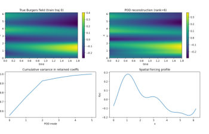 
Fig. 1: Dataset overview figures

📷 Fig 2

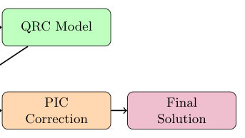 
Fig. 2: Workflow of the proposed QRC+PIC framework. A quantum reservoir generates rollout predictions that are then refined by a physics-informed correc- tor.

📷 Fig 3

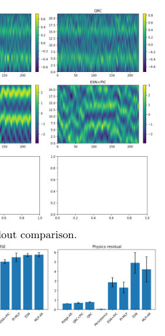 
Fig. 3: Primary KS figures.

📷 Fig 4

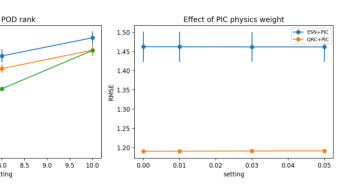 
Fig. 5: KS ablation overview, including lag depth, POD rank, horizon, and physics-loss sensitivity.

**Summary.** This paper proposes a novel hybrid forecasting method combining a Quantum Reservoir Computer (QRC) for initial predictions and a Physics-Informed Corrector (PIC) for refinement. Tested on chaotic PDEs like the KS equation, the QRC+PIC framework shows superior performance by enforcing physical laws during the forecasting process. It establishes a viable, physics-aware strategy for reduced-order modeling of complex physical systems.

**Why it may be interesting.** While the core is ML/PDE, the integration of quantum computation (QRC) into a physics-constrained machine learning framework (PINN) for complex dynamics is relevant to modeling quantum many-body systems where classical simulation is intractable.

Detailed structure

**Main problem.** The paper addresses the challenge of accurately forecasting solutions to nonlinear and chaotic Partial Differential Equations (PDEs) in a reduced-order manner.

**Main result.** The proposed hybrid Quantum Reservoir Computing (QRC) and Physics-Informed Corrector (PIC) architecture consistently improves forecasting accuracy over QRC alone on the chaotic Kuramoto-Sivashinsky (KS) benchmark.

**Method.** It employs a two-stage proposal-correction framework: QRC predicts latent dynamics, and a PINN-based PIC refines this proposal using physics constraints.

**Model / system.** The methodology is tested on the chaotic Kuramoto-Sivashinsky (KS) equation and the viscous Burgers equation, operating on a reduced-order representation derived via Proper Orthogonal Decomposition (POD) coefficients.

**Key observables.** Forecasting performance is quantified using field-level Root Mean Square Error (RMSE), Normalized RMSE (NRMSE), and the PDE residual.

**Important parameters / regimes.** The primary benchmark is the KS equation, while the auxiliary benchmark is the Burgers equation. The method involves tuning hyperparameters for the QRC and the PIC loss function.

**Assumptions / limitations.** The PIC is designed to be autonomous at test time, relying only on the proposal window, and the QRC used is a pure-state simulation, not hardware execution.

**Figures summary.** Figures illustrate the dataset overview for KS and Burgers, the QRC+PIC workflow, and provide comparative results (RMSE, NRMSE, residual) for both benchmarks across various models.

**Paper structure.** The paper introduces the problem, details the QRC+PIC hybrid architecture, evaluates it rigorously on the chaotic KS benchmark, and provides comparative analysis on the simpler Burgers benchmark, concluding with a discussion of the viability of the approach.

Abstract

We study a hybrid proposal--correction architecture for reduced-order PDE forecasting in which a pure-state quantum reservoir computer (QRC) predicts latent coefficient dynamics and a PINN-based physics-informed corrector (PIC) refines local rollout windows. The method is evaluated on Burgers and Kuramoto--Sivashinsky (KS), with KS as the primary chaotic benchmark. On KS, QRC+PIC consistently improves over QRC alone in RMSE, NRMSE, and PDE residual, while Burgers highlights a regime in which simple baselines remain strong. These results suggest that QRC proposals with local physics-informed correction are a viable benchmark-dependent reduced-order forecasting strategy.

[↑ back to top](#top)

### [What do position and time mean in the quantum wavefunction?](http://arxiv.org/abs/2608.23032v1)

**Authors:** Mustafa Bakr, Zichi Zhang, Margot Stakenborg  
**Type:** theory · **Category:** other · **PDF:** <https://arxiv.org/pdf/2608.23032v1>  
**Analysis basis:** full PDF text, analyzed in chunks
**Topic relevance:** `quantum measurements` **2/5** · `analog quantum simulation` **1/5**

📷 Fig 1

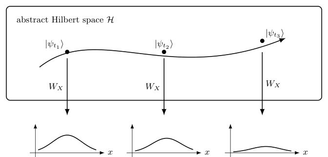 
FIG. 1. The two maps hidden in ψ(x, t). Time evolution selects a member |ψt⟩of a family of abstract states. Only afterward does a representation map WX turn that state into a function of the spectral coordinate x. The same notation ψ(x, t) compresses both operations.

📷 Fig 2

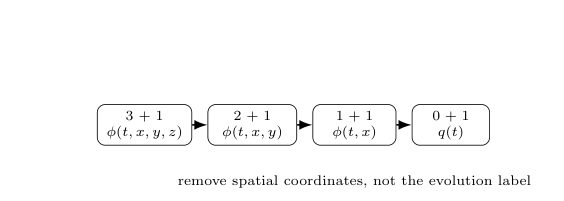 
FIG. 2. A dimensional route from field theory back to quan- tum mechanics. In the standard notation, “0+1 dimensional” means zero spatial dimensions plus one time dimension. A genuinely zero-dimensional field theory, with no time coordi- nate either, is instead an ordinary finite-dimensional integral or matrix-model-type object, not quantum mechanics.

📷 Fig 3

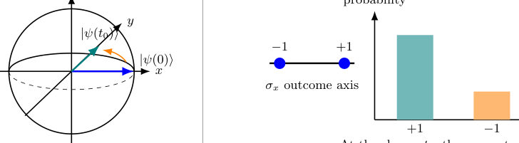 
FIG. 3. A two-level control example that separates the roles without any continuous-spectrum subtleties. (a) Schr¨odinger time labels the position of the abstract state along its unitary orbit. (b) Once an observable is selected, its spectrum supplies the possible measurement labels. The laboratory chooses t0. The apparatus returns a random spectral outcome.

📷 Fig 4

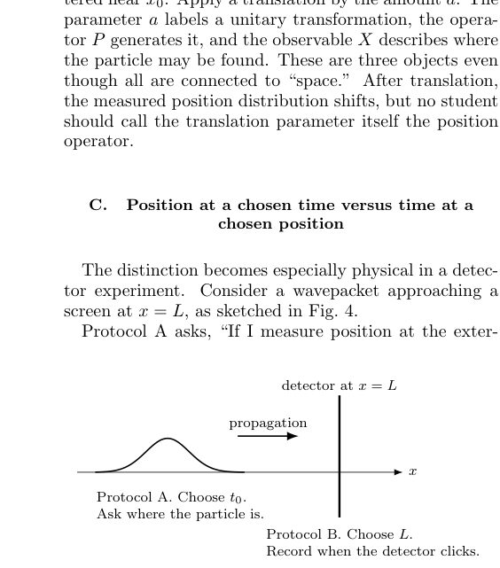 
FIG. 4. Two experiments that use the word “time” differently. In protocol A, t0 is externally prescribed and position is the random outcome. In protocol B, the detector location is pre- scribed and the registered event time is the random outcome. The density |ψ(x, t)|2 directly answers the first question, not in general the second.

📷 Fig 5

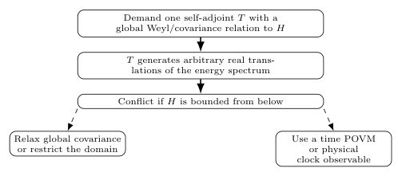 
FIG. 5. An assumption map for Pauli’s argument. The ob- struction is not a blanket prohibition on every object called a time observable. It follows from demanding a strong global canonical relation together with a semibounded Hamiltonian.

**Summary.** This paper tackles the deep conceptual confusion surrounding the notation $\psi(x, t)$ by providing a rigorous, pedagogical framework. It clarifies that the wavefunction arises from two distinct mathematical steps: time evolution selecting a state, and a spectral map representing that state as a function of an observable. The goal is not to solve the physical problem of time, but to clarify the mathematical roles of the labels $x$ and $t$.

**Why it may be interesting.** This paper is highly relevant as it provides a rigorous conceptual toolkit for understanding the mathematical structure underlying time and space in quantum theory, which is crucial for developing consistent theories in quantum gravity or advanced open quantum systems.

Detailed structure

**Main problem.** The paper addresses the fundamental notational ambiguity in quantum mechanics regarding the mathematical status of position ($x$) and time ($t$) when they appear as arguments of the wavefunction $\psi(x, t)$. It seeks to provide a unified pedagogical framework to separate mathematical roles from notational conventions.

**Main result.** The apparent asymmetry between $x$ and $t$ depends on whether they are treated as external evolution parameters, dynamical observables, or spectral labels. The notation $\psi(x, t)$ should be understood as a composition of time evolution followed by a spectral representation map.

**Method.** The authors use a combination of pedagogical exposition, rigorous mathematical tools like the spectral theorem, and conceptual comparisons (e.g., Stone's theorem analogy) to dissect the roles of different labels.

**Model / system.** The analysis is general, applying to any quantum system described by a state in a Hilbert space $\mathcal{H}$. Specific examples used to illustrate the concepts include spin-1/2 systems in magnetic fields, circuit-QED, and optical-clock measurements.

**Key observables.** Position ($x$), Time ($t$), Hamiltonian ($H$), Spectral outcomes ($\pm 1$ in spin example), and the wavefunction $\psi(x, t)$.

**Important parameters / regimes.** Planck's constant ($\hbar$), time evolution parameter ($t$), and spatial coordinates ($x$).

**Assumptions / limitations.** The paper distinguishes between background coordinates (parameters) and dynamical observables (operators), and notes that the strong form of Pauli's argument excludes only global canonical time operators.

**Figures summary.** The notes mention a taxonomy (Table I) separating roles like background coordinates from observables, and a diagram (Figure 2) showing a dimensional reduction route from field theory to quantum mechanics.

**Paper structure.** The paper is structured pedagogically, first tackling the notation $\psi(x, t)$, then developing a unified framework using spectral representations, distinguishing various coordinate roles, and finally discussing advanced topics like the problem of time and measurement protocols.

Abstract

The notation $ψ(x,t)$ is among the first pieces of quantum mechanics that students learn. It is also among the easiest to over-interpret. Because $x$ and $t$ occur as arguments of the same function, students may ask whether they have the same mathematical status. They may also ask whether $ψ(t)$ should require a generalized bra $\bra{t}$ in the same way that $ψ(x)=\braket{x}ψ$ is often written. A related question is whether the absence of a universal time operator follows simply from Pauli's argument. These questions mix several structures that are usually introduced in different parts of the curriculum. We present a unified pedagogical treatment built around two maps hidden in $ψ(x,t)$. Time evolution selects a state along a trajectory in Hilbert space. A spectral representation then maps that state to amplitudes labelled by outcomes of a chosen observable. We formulate the position representation without generalized eigenkets. We recover Dirac's $\ket{x}$ notation as a controlled continuum shorthand and use a finite-grid limit to show where delta normalization enters. We distinguish background coordinates, translation parameters, observables, spectral labels, and physical records. We also clarify the Stone-theorem analogy, compare prescribed-time position measurements with arrival-time measurements, state what the strong form of Pauli's argument excludes, and exhibit an exactly solvable boundary case in which a canonical self-adjoint time observable exists. Spin, circuit-QED, and optical-clock examples provide experimentally grounded checks. The aim is not a new interpretation of time. It is a reusable teaching framework for separating mathematical role from notation.

[↑ back to top](#top)

### [Efficient Computation of QKD Key Rates without Semidefinite Programming](http://arxiv.org/abs/2608.23285v1)

**Authors:** Bence Temesi, Antoine Gansel, Gereon Koßmann, Rene Schwonnek  
**Type:** both · **Category:** quantum information and computing · **PDF:** <https://arxiv.org/pdf/2608.23285v1>  
**Analysis basis:** full PDF text, analyzed in chunks
**Topic relevance:** `quantum measurements` **2/5**

📷 Fig 1

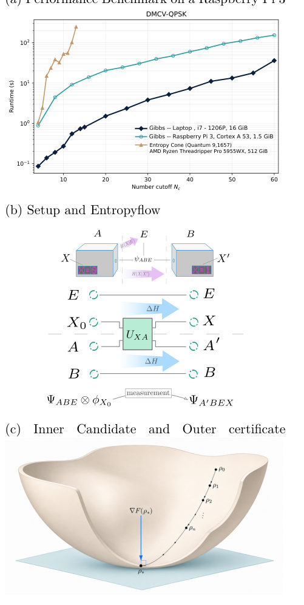 
Figure 1: (a) Runtime of our algorithm on a laptop and on a raspberry 3 in comparison to existing methods that run on workstations41. Benchmark for QPSK-DMCV- QKD based on example data from41. Details in Sec.2.2. (b) Basic setting of an entanglement based Alice-Bob- Eve protocol in stylised boxes and as circuit diagram. The uncertainty H(X|E) equals the entropy production ∆H of the measurement process X0E →XE. When dilated29 to a unitary UAX, the key map Φ : A →A′

📷 Fig 2

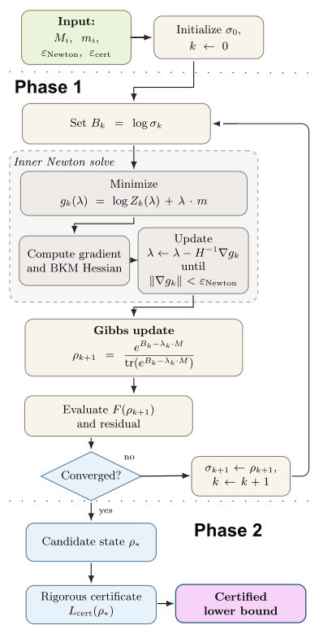 
Figure 2: Flow diagram of the candidate-and-certificate algorithm. Phase 1 generates with an iterative optimiza- tion over adopted Gibbs states a candidate state, which is in Phase 2 converted into a lower bound. The core computation effort is the loop for a newton method.

📷 Fig 3

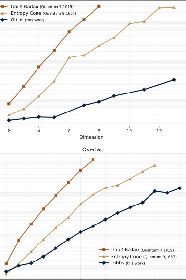 
Figure 3: A runtime comparison for the MUB protocol and the overlap protocol from37 as a function of the lo- cal dimension dA = dB is shown. We compare the com- putation of the extractable randomness from (3) in37, which uses the Gauß-Radau approximation of the rel- ative entropy53, the entropy cone methods41 and our method. The underlying devices are a laptop and the other hardware described in Fig. 1(a). All protocols de- liver at least precision 10−6 to the optimizer. Due to the logarithmic scaling, we observe that our new technique provides an improvement of several orders of magnitude.

📷 Fig 4

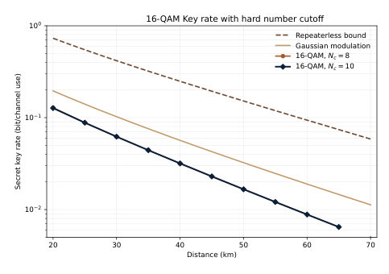 
Figure 4: A discrete modulation CVQKD protocol43

**Summary.** This paper presents a fast, resource-efficient algorithm to calculate the secure key rate for QKD by avoiding computationally prohibitive Semidefinite Programming. The method uses an iterative candidate-and-certificate approach, which only requires eigenvalue computations. This breakthrough enables the direct integration of rigorous security analysis into low-power, embedded QKD hardware.

**Why it may be interesting.** The focus on computational efficiency for security analysis is crucial for practical quantum technologies, allowing complex theoretical bounds to be implemented directly on field hardware.

Detailed structure

**Main problem.** The core problem is developing a computationally efficient method to estimate the secure key rate in Quantum Key Distribution (QKD) by calculating the minimal conditional entropy.

**Main result.** The authors propose a novel algorithm that avoids resource-intensive Semidefinite Programming (SDP), achieving memory scaling of $d^2$ and demonstrating real-time performance on embedded hardware.

**Method.** The method uses a candidate-and-certificate approach, iteratively finding a candidate state via Gibbs state calculations and then deriving a rigorous lower bound (certificate) using supporting planes.

**Model / system.** The system is based on QKD protocols modeled using density operators ($
ho$) and constrained by observed measurement statistics ($m_i$). The goal is to minimize the conditional entropy $F^* = \inf_{\psi_{ABE}} H(X|E)$.

**Key observables.** Minimal conditional entropy ($F^*$), candidate key rate ($F_{cand}$), and the rigorous lower bound certificate ($F_{cert}$).

**Important parameters / regimes.** Hilbert-space dimension ($d$), number of constraints ($n$), and the achievable key rate as a function of distance (e.g., for CVQKD).

**Assumptions / limitations.** The method assumes the feasibility of using eigenvalue computations and iterative convex optimization, and it provides a rigorous bound $	ext{cert} \le F^* \le 	ext{cand}$.

**Figures summary.** Figures illustrate runtime comparisons showing massive speedups on embedded hardware, the geometric process of the candidate-and-certificate method, and key rate scaling versus distance for a specific QKD protocol.

**Paper structure.** The paper introduces the problem, contrasts it with existing SDP-based methods, details the two-phase candidate-and-certificate algorithm (Gibbs state iteration followed by supporting plane certification), and validates the approach with hardware benchmarks and specific QKD tests.

Abstract

Translating observed data into a reliable estimate of the secure key rate is a crucial step for operating a quantum key distribution device. We provide a computational method for this task that only requires eigenvalue computations and is therefore both fast and resource efficient. In contrast, existing approaches rely on semidefinite programming or programming on the entropy cone, whose memory requirements can scale as $d^4$ in the underlying Hilbert-space dimension. Our method reduces this requirement to $d^2$. A minimal implementation of our algorithm takes fewer than 100 lines of Common Lisp. We demonstrate real-time key-rate estimation on a Raspberry Pi with a 1 GB memory and a Cortex-A53 processor. Despite these modest resources, our implementation outperforms existing workstation-based benchmarks by several orders of magnitude. Non-numerical verification can be incorporated with little overhead using rational approximations. These results open the way toward embedding complete numerical security analysis directly into qkd hardware.

[↑ back to top](#top)

### [Finite-Resolution Limits on Quantum Uniqueness](http://arxiv.org/abs/2608.22001v1)

**Authors:** Seramika Ariwahjoedi, Sameer Ahmad Mir, Mir Faizal  
**Type:** theory · **Category:** other · **PDF:** <https://arxiv.org/pdf/2608.22001v1>  
**Analysis basis:** full PDF text, analyzed in chunks
**Topic relevance:** `quantum measurements` **2/5**

📷 Fig 1

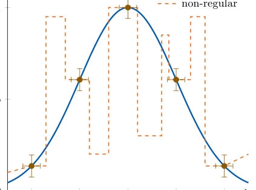 
FIG. 1. Finite-resolution access to Weyl translations (schematic). (a) Finite control precision restricts experimen- tal access to a discrete family of displacement parameters {ξk} ⊂R2 with ξ = (q, p), each realized only within a tol- erance δξ (disks). (b) Finite statistics determine only noisy estimates of an operational quantity, e.g. f(ξ) = ⟨ψ|W(ξ)|ψ⟩, at sampled settings; a regular (strongly continuous) and a non-regular realization can agree on all sampled points within error bars, so strong continuity is not operationally decidable from finite data.

**Summary.** This theoretical paper addresses the foundational question of whether finite experimental measurements of Weyl-displacement data can uniquely determine the structure of quantum theory. The authors prove that finite data is insufficient to enforce the strong continuity required for the Stone-von Neumann theorem, demonstrating that non-regular 'polymer' quantizations are indistinguishable from standard quantum mechanics using only finite measurements. This implies that selecting the correct quantum representation requires additional physical input, such as knowledge of the system's dynamics.

**Why it may be interesting.** This work is highly relevant to foundational quantum physics, particularly quantum gravity, as it sets precise operational boundaries on what can be deduced about the underlying mathematical structure of quantum theory from finite measurements.

Detailed structure

**Main problem.** The paper investigates whether the strong continuity assumption required by the Stone-von Neumann theorem for canonical quantization uniqueness can be certified using only finite experimental data.

**Main result.** Finite agreement with Schrödinger quantum mechanics (i.e., finite Weyl data) is insufficient to certify the regularity hypothesis, as non-regular polymer states can reproduce the expectation values of regular states to arbitrary accuracy.

**Method.** The authors use C*algebraic tools, comparing the expectation values derived from a standard regular Weyl representation against those from a canonical non-regular polymer representation using finite protocol algebras.

**Model / system.** The system is the canonical quantization of a single degree of freedom, modeled using Weyl operators implementing phase-space translations, comparing the standard regular representation with the non-regular polymer representation.

**Key observables.** Expectation values of bounded protocol observables (e.g., contractions $A_j$) measured over a finite set of Weyl displacements.

**Important parameters / regimes.** The finite set of displacement labels $S$ and the associated finite protocol algebra $C_S$.

**Assumptions / limitations.** The analysis is limited to finite-resolution interrogation of the Weyl relations, which only constrains the discrete protocol algebra $C_S$.

**Figures summary.** Figure 1 schematically illustrates that finite control precision restricts access to a discrete set of parameters, allowing regular and non-regular realizations to agree on sampled points within error bars.

**Paper structure.** The paper establishes the mathematical framework of the Weyl algebra and the Stone-von Neumann theorem, then constructs the polymer representation as a counterexample. It proceeds by showing that the operational compatibility condition derived from finite data is satisfied by both regular and non-regular models.

Abstract

The Stone-von Neumann theorem makes canonical quantization unique only after one imposes strong continuity of the Weyl translation groups. We show that this continuity assumption cannot be certified by any finite-resolution interrogation of the Weyl relations. A finite protocol probes only finitely many phase-space displacements and bounded expectation values, thereby determining a protocol algebra \(C_S\) generated by a finitely generated subgroup of Weyl translations, but not the regularity of an extension to the full Weyl algebra. Using the polymer representation as a canonical non-regular representation, we prove that for every regular Weyl representation, every normal state, and every finite family of bounded protocol observables, a polymer state reproduces the same expectation values to arbitrary prescribed accuracy. Thus finite agreement with Schrödinger quantum mechanics does not operationally certify the regularity hypothesis entering uniqueness. The result does not assert physical equivalence between regular and polymer quantizations, it identifies where additional input, such as Hamiltonian dynamics, energy regularity, semiclassicality, or a continuum limit, is required to distinguish or select representations. In this precise sense, non-regular polymer kinematics are not excluded by finite Weyl data alone, a point of direct relevance to quantum-gravity motivated quantizations.

[↑ back to top](#top)

### [Revised symmetry rule and intrinsically time-reversal symmetry breaking pairing in multi-orbital superconductors](http://arxiv.org/abs/2608.22902v1)

**Authors:** Chang-Youn Moon  
**Type:** theory · **Category:** strongly correlated electrons · **PDF:** <https://arxiv.org/pdf/2608.22902v1>  
**Analysis basis:** full PDF text, analyzed in chunks
**Topic relevance:** `Keldysh / 2PI / non-Gaussian methods` **2/5**

📷 Fig 1

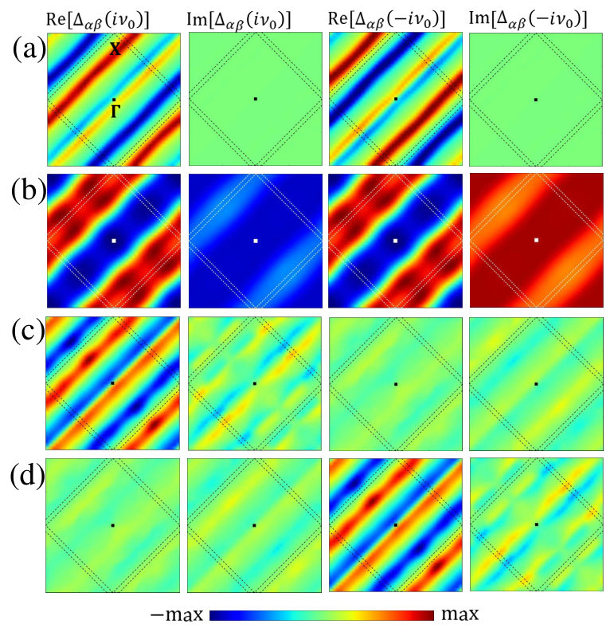 
FIG. 1: Examples of our numerical solutions for the SC gap function ∆αβ(k, iν) on the kz = 0

📷 Fig 2

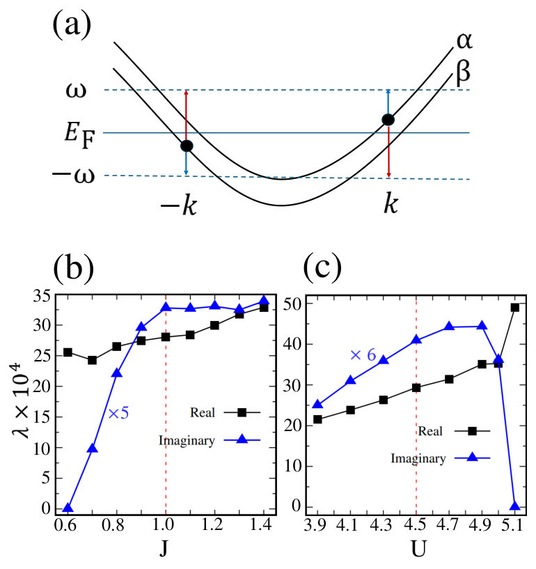 
FIG. 2: (a) A schematic showing the inequivalence of the electron pair propagation between

**Summary.** This theoretical work re-evaluates the symmetry rules for superconducting pairing in multi-orbital materials like $	ext{Sr}_2	ext{RuO}_4$. By solving the Eliashberg equation, the authors find that common symmetry assumptions are incorrect, leading to the prediction of unique, intrinsically time-reversal symmetry breaking pairing states. This opens new avenues for understanding exotic superconductivity driven by strong electronic correlations.

**Why it may be interesting.** The rigorous re-examination of symmetry constraints in pairing mechanisms provides a deeper theoretical understanding of exotic superconductivity, which is crucial for modeling strongly correlated materials where simple symmetries break down.

Detailed structure

**Main problem.** The paper investigates the fundamental symmetry rules governing superconducting (SC) pairing states in multi-orbital superconductors, challenging common assumptions about how the gap function transforms under orbital or time-reversal exchange.

**Main result.** The analysis reveals a revised symmetry rule showing that the pairing interaction is not invariant under $\hat{O}$ or $\hat{T}$ exchange, leading to the prediction of intrinsically Time-Reversal Symmetry (TRS) breaking pairing states characterized by complex eigenvalues.

**Method.** The study involves solving the linearized Eliashberg equation using a first-principles approach combining Density-Functional Theory with Dynamical Mean-Field Theory (DFT+DMFT).

**Model / system.** The system under study is multi-orbital superconductors, exemplified by $	ext{Sr}_2	ext{RuO}_4$. The theoretical framework uses the linearized Eliashberg equation to determine the SC gap function $\Delta$ and its associated eigenvalue $\lambda$.

**Key observables.** The SC order parameter ($\Delta$), the eigenvalue ($\lambda$), and the symmetry transformation properties of $\Delta$ under $\hat{O}$ and $\hat{T}$.

**Important parameters / regimes.** Hund's coupling ($J$), intra-orbital Coulomb repulsion ($U$), and temperature ($174 	ext{ K}$).

**Assumptions / limitations.** The standard symmetry classification ($\hat{O}\Delta = \pm\Delta$ and $\hat{T}\Delta = \pm\Delta$) is questioned, and the analysis neglects spin effects.

**Figures summary.** Figures illustrate different symmetry categories for gap solutions (Fig. 1) and schematically show the non-equivalence of electron pair propagation under $\hat{T}$ and $\hat{O}$ exchange (Fig. 2).

**Paper structure.** The paper progresses by first establishing the symmetry problem using the linearized Eliashberg equation, demonstrating the failure of simple symmetry assumptions, and finally deriving the conditions for exotic, TRS-breaking pairing states associated with complex eigenvalues.

Abstract

We investigate the basic symmetry rule for the particle permutation in superconducting (SC) pairing states by examining the numerical solution of the linearized Eliashberg equation for Sr$_2$RuO$_4$. We find that the general multi-band, frequency-dependent SC gap function does not simply transform to itself up to the minus sign with either orbital ($\hat{O}$) or frequency ($\hat{T}$) exchange between two pairing electrons, contradicting the common assumption which has been used without verification. It originates from the fact that paring interactions are not invariant under the $\hat{O}$ or $\hat{T}$ operation, and is demonstrated to be essential to correctly interpret and understand multi-band SC states. One of unique properties implied by our newly found symmetry rule is the possibility of the complex eigenvalue in the linearized gap equation where the corresponding gap functions $Δ$ always have real and imaginary components both non-zero in real frequencies, inherently breaking the time-reversal symmetry. Our numerical results suggest the possibility of this unique pairing in a real material, Sr$_2$RuO$_4$, for which the Hundness of the material is found to play a key role. The revised symmetry rule not only leads us to more comprehensive understanding of the known SC states, but also opens new possibilities into exotic and unique states.

[↑ back to top](#top)

### [Sample-Query Interconversion of Block Encoding of Unknown Quantum States](http://arxiv.org/abs/2608.22470v1)

**Authors:** Manaki Arihara, Mio Murao  
**Type:** theory · **Category:** quantum information and computing · **PDF:** <https://arxiv.org/pdf/2608.22470v1>  
**Analysis basis:** full PDF text, analyzed in chunks
**Topic relevance:** `quantum measurements` **2/5**

📷 Fig 1

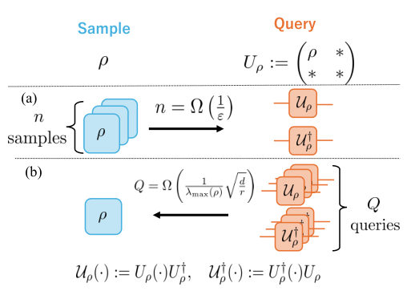 
Figure 1. Summary of the results. (a) Sample-to-query con- version: implementing ε-approximate block-encoding unitary channels Uρ and U† ρ given sample access to an unknown quan- tum state ρ. We show that Ω(1/ε) copies of ρ are required for this task (Theorem 3). (b) Query-to-sample conversion: recovering an unknown quantum state ρ given query access to its block-encoding unitary channels Uρ and U† ρ. We show

📷 Fig 2

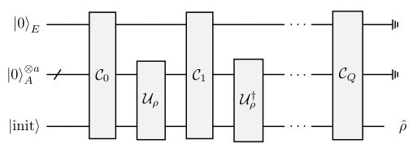 
Figure 2. The quantum circuit representing the most general strategy for Task 2. The first wire represents an environment system E, the second wire represents an auxiliary system A and the third wire represents the target system on which the recovered state ˆρ is output.

**Summary.** This paper rigorously analyzes the fundamental limitations in converting between an unknown quantum state and its block-encoding unitary representation. It proves that the required resources differ significantly depending on the direction of conversion, establishing a clear computational separation. This has implications for quantum learning algorithms that rely on encoding states into unitary channels.

**Why it may be interesting.** This work provides fundamental resource characterizations for quantum information tasks, showing that simply having access to a unitary representation (the block encoding) does not equate to the ability to efficiently reconstruct the underlying state, which is crucial for understanding quantum machine learning protocols.

Detailed structure

**Main problem.** The paper investigates the fundamental limits and convertibility between unknown quantum states ($
ho$) and their block-encoding unitary channels ($U_
ho$) in both directions (sample access $\leftrightarrow$ query access).

**Main result.** There is a computational separation between learning the state and generating it; specifically, state recovery requires a query complexity dependent on the state's dimension and maximum eigenvalue, while sample-to-query conversion requires a cost scaling with the inverse of the approximation error.

**Method.** The authors employ lower bound techniques, reducing the problem to quantum state discrimination and quantum search problems, and analyzing the required number of copies or queries needed to achieve a target fidelity.

**Model / system.** The model involves unknown quantum states $
ho$ on a $d$-dimensional Hilbert space, which are characterized by their block-encoding unitary channels $U_
ho$. The analysis uses concepts from quantum singular value transformation (QSVT) and quantum query complexity.

**Key observables.** Approximation error ($\epsilon$), maximum eigenvalue ($\lambda_{\max}(
ho)$), state rank ($r$), and the required number of copies or queries.

**Important parameters / regimes.** The complexity scales involve $\Omega(1/\epsilon)$ for sample-to-query, and $\Omega\left((1/\lambda_{\max}(
ho))^{d/r}
ight)$ for query-to-sample.

**Assumptions / limitations.** The analysis establishes lower bounds by relating the problem to quantum search/discrimination tasks, and the results highlight inherent limitations of the block encoding representation.

**Figures summary.** Figure 1 summarizes the two main conversion bounds: $\Omega(1/\epsilon)$ for sample-to-query and $\Omega\left((1/\lambda_{\max}(
ho))^{d/r}
ight)$ for query-to-sample. Figure 2 and 3 illustrate the quantum circuits used for the state recovery task.

**Paper structure.** The paper first analyzes the sample-to-query conversion, establishing a lower bound of $\Omega(1/\epsilon)$ copies. It then focuses on the query-to-sample conversion, deriving a lower bound dependent on $\lambda_{\max}(
ho)$ and the dimension $d$. Finally, it applies these techniques to state discrimination, confirming the separation between the two processes.

Abstract

Block encoding embeds a matrix as a sub-block of a unitary matrix and serves as a fundamental input model for quantum algorithms based on quantum singular value transformation, enabling polynomial transformations of matrices encoded in unitary operators. Block encoding of unknown quantum states can be useful for quantum learning; however, the fundamental limits on converting between unknown quantum states and their block-encoding unitary channels remain poorly understood. In this paper, we investigate this convertibility in both directions. First, we prove that implementing an $\varepsilon$-approximate block-encoding unitary channel of an unknown quantum state requires $Ω(1/\varepsilon)$ copies of the state, matching known upper bounds up to logarithmic factors. Second, we show that recovering a rank-$r$, $d$-dimensional quantum state $ρ$ given query access to its block-encoding unitary channel generally requires $Ω((1/λ_{\max}(ρ))\sqrt{d/r})$ queries, where $λ_{\max}(ρ)$ is the maximum eigenvalue of $ρ$, revealing an unavoidable dependence on the dimension of the state. Our results identify inherent limitations of block encoding as a representation of unknown quantum states and reveal a separation between learning properties of a quantum state and generating the state itself. Using our techniques, we further establish lower bounds for specific state-generation tasks, including ground-state preparation and Gibbs-state preparation.

[↑ back to top](#top)

### [Taming Spacetime Overhead and Design Complexity in Distributed Fault-Tolerant Superconducting Quantum Computation](http://arxiv.org/abs/2608.23159v1)

**Authors:** Qinjing Yu, Ke Liu  
**Type:** theory · **Category:** quantum information and computing · **PDF:** <https://arxiv.org/pdf/2608.23159v1>  
**Analysis basis:** full PDF text, analyzed in chunks
**Topic relevance:** `QC/QI experiment` **2/5**

📷 Fig 1

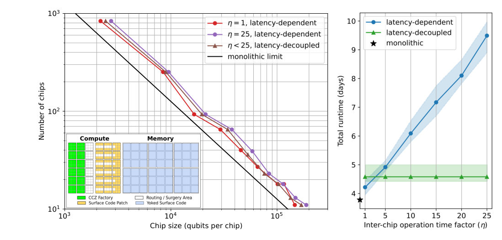 
FIG. 1. Spacetime overhead of distributed architectures for factoring 2048-bit RSA integers. A hardware-motivated noise model is considered, with physical error rate 10−3 and 10−2 for intra-chip and inter-chip operations, respectively. Left: Required number of QPUs as a function of chip capacity (qubits per QPU). The solid black line indicates the monolithic limit and effectively represents a constant total qubit count. Colored lines correspond to distributed architectures with various chip capacities, for different inter-chip operation time factors (η) and interface circuit protocols. Variations in chip size have a minimal impact on the total qubit count in the distributed architecture....

📷 Fig 2

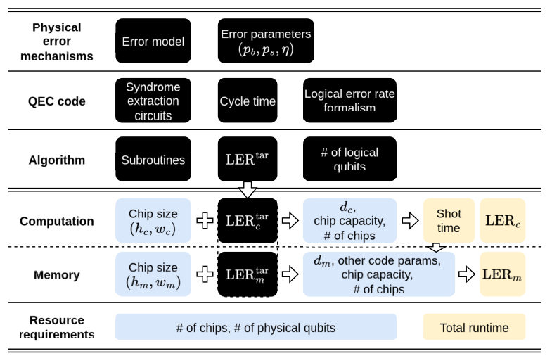 
FIG. 2. General procedure for resource estimation in the DFTQC architecture. The parameters highlighted in black are prerequisite inputs, while those highlighted in blue and yellow represent space cost and time cost, respectively.

📷 Fig 3

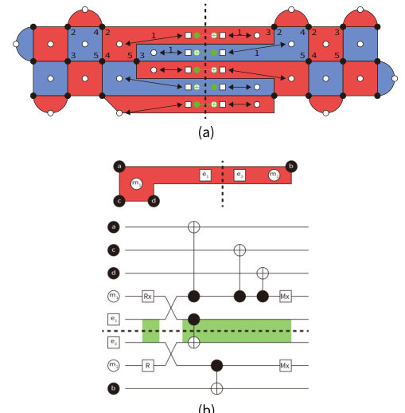 
FIG. 3. Physical qubit layouts at the interface and the correspond- ing gate sequences for inter-chip syndrome extraction. Blue (red) plaquettes denote Z(X)-stabilizers. The dashed line marks the inter- face between neighboring chips. The numbers indicate the order of two-qubit gates in one round of syndrome extraction. Inter-chip op- erations are shown in green. (a) Layout of our proposed circuit with buffer qubits (squares), which decouple intra-chip and inter-chip op- eration speeds while preserving code distance. Lines with arrows de- note SWAP gates. (b) X-stabilizer measurement circuit with buffer qubits. The green region indicates the maximum allowed duration of the inter-chip...

📷 Fig 4

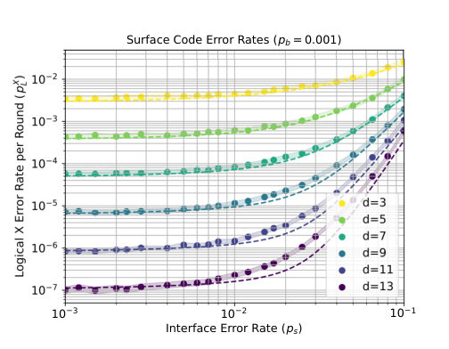 
FIG. 4. Logical X error rate per round pX L as a function of the inter- chip physical error rate for various code distances under η = 3 for the latency-decoupled protocol. The bulk physical error rate is fixed at pb = 10−3. Dashed curves show fits to the ansatz of Eq. (1). Shad- ing represents hypothetical logical error rates with a Bayes factor of at most 1000 relative to the maximum-likelihood hypothesis prob- ability, assuming a binomial distribution. For ps &gt; 10pb = 10−2, the logical error rates deviate slightly from the fitting curves, but the main resource estimation results are unaffected because we focus on the case of ps = 10pb.

📷 Fig 5

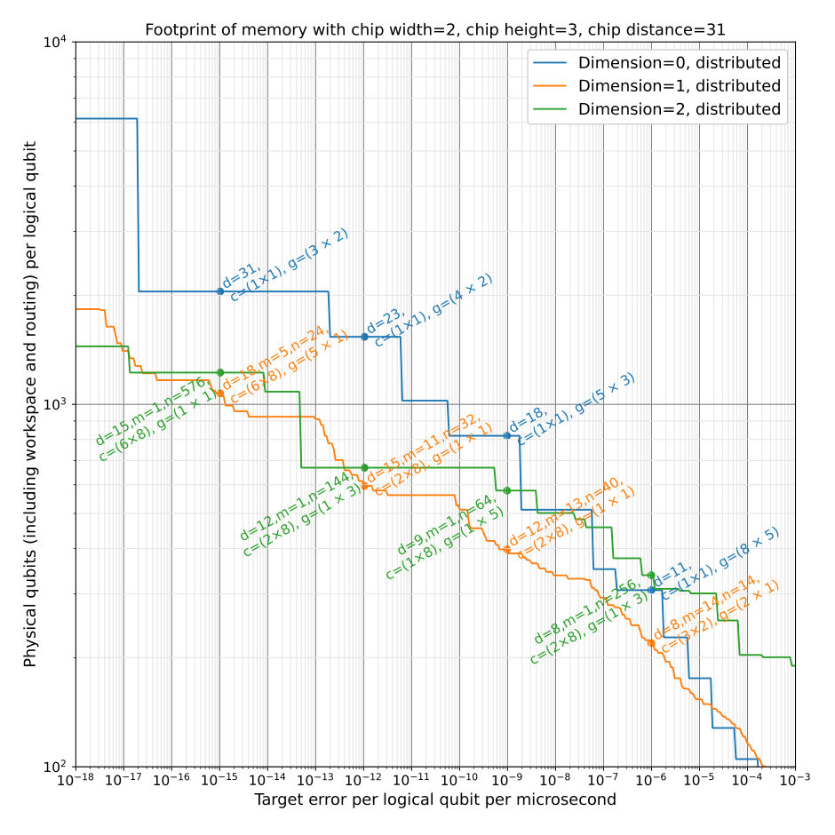 
FIG. 5. Inverse code rates of the standard surface code (Dimension=0) and yoked surface codes (Dimension=1, 2) for memory in the distributed architecture under varied target logical error rates. The chip size here is h = 3, w = 2, d = 31, and latency-decoupled protocol is used. The labels d, m, n, c, and g indicate the surface-code patch diameter (d), the number of CodeBlocks per CodeGroup (m), the number of used surface-code patches per CodeBlock (n), the layout of chips for each CodeLayout (c), and the layout of CodeGroups in each CodeLayout (g).

**Summary.** This paper analyzes the feasibility of scaling fault-tolerant quantum computation using distributed superconducting architectures. By developing a rigorous resource estimation protocol, the authors demonstrate that inter-chip communication overhead does not lead to prohibitive resource growth. This establishes a viable, scalable pathway for building large quantum computers constrained by manufacturability.

**Why it may be interesting.** While focused on superconducting hardware, the core concepts of resource scaling, overhead analysis, and architectural decoupling are highly relevant to any physical platform (like trapped ions or superconducting circuits) aiming for large-scale fault tolerance.

Detailed structure

**Main problem.** The paper addresses whether the overhead introduced by distributing fault-tolerant quantum computation across multiple, physically separated quantum processing units (QPUs) is prohibitive compared to monolithic designs.

**Main result.** The proposed distributed architecture shows only a modest, nearly scale-invariant resource overhead in both qubit count and execution time compared to ideal monolithic baselines.

**Method.** The authors developed a hardware-grounded architectural co-design and a comprehensive resource-estimation protocol that integrates physical hardware constraints and circuit-level error-correction performance.

**Model / system.** The work focuses on superconducting quantum computers utilizing surface-code-based modular processors, where computation is partitioned across multiple interconnected chips.

**Key observables.** Spacetime overhead (qubit count and execution time) for factoring large integers like RSA-2048.

**Important parameters / regimes.** Inter-chip latency/noise factors ($\eta$, $\gamma$), module capacity, and physical error rates ($p$).

**Assumptions / limitations.** The analysis assumes nearest-neighbor connectivity and relies on specific hardware parameters for superconducting qubits.

**Figures summary.** Figures illustrate the spacetime overhead comparison between monolithic and distributed architectures (Fig. 1), and detail the multi-layered procedure for resource estimation in the DFTQC architecture (Fig. 2).

**Paper structure.** The paper establishes the problem of modular overhead, presents a resource estimation protocol, applies it to a demanding benchmark (RSA-2048), and demonstrates that the overhead is manageable and scale-invariant.

Abstract

Scaling fault-tolerant superconducting quantum computers will likely require distributed architectures built from multiple manufacturable quantum processing units. A central question is whether noisy and slow inter-chip operations impose substantial spacetime overhead or orchestration burdens compared with monolithic architectures. To answer this question, we present a hardware-grounded architectural co-design together with a comprehensive resource-estimation protocol for surface-code-based modular processors. The design confines inter-chip latency and noise to module boundaries, preventing slow, noisy links from inducing prohibitive spacetime overhead or becoming a global orchestration bottleneck. The resource-estimation protocol integrates hardware constraints and circuit-level error-correction performance into utility-scale algorithmic cost estimates, enabling a controlled assessment of different architectures. Using RSA-2048 factorization as a demanding benchmark, we estimate resources under experimentally anchored parameters and realistic superconducting hardware constraints. Compared with a large, ideal monolithic baseline, the resulting distributed architecture requires only modest additional resource overhead in both qubit count and execution time. More importantly, the overhead is nearly scale-invariant across a broad module-capacity window, decoupling chip size from global performance. This decoupling turns module capacity from a finely tuned architectural parameter into a flexible engineering degree of freedom, allowing chip sizes to be set by manufacturability and control-packaging constraints rather than architectural fine-tuning. These results establish a viable route to distributed fault-tolerant superconducting quantum computation that scales without prohibitive resource growth or heavy orchestration burden.

[↑ back to top](#top)

### [Fock-state filtering of squeezed states: enhanced nonclassicality and effects of a thermal bath](http://arxiv.org/abs/2608.22668v1)

**Authors:** João Pedro González de Oliveira, A. Vidiella-Barranco  
**Type:** theory · **Category:** other · **PDF:** <https://arxiv.org/pdf/2608.22668v1>  
**Analysis basis:** full PDF text, analyzed in chunks
**Topic relevance:** `Full counting statistics` **1/5** · `Keldysh / 2PI / non-Gaussian methods` **1/5** · `correlated / nonlocal dissipation` **1/5** · `driven-dissipative phase transition` **1/5** · `methods for driven-dissipative` **1/5** · `quantum measurements` **1/5**

📷 Fig 1

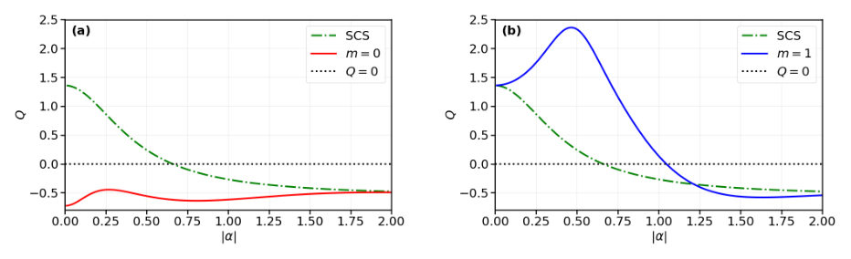 
Figure 1: Mandel’s Q parameter as a function of the coherent displacement α (control parameter) for a squeezed coherent state with r = 0.412 (green dot-dashed line) and Fock-filtered states with: (a) m = 0 (red continuous line) and (b) m = 1 (blue continuous line) components removed.

📷 Fig 2

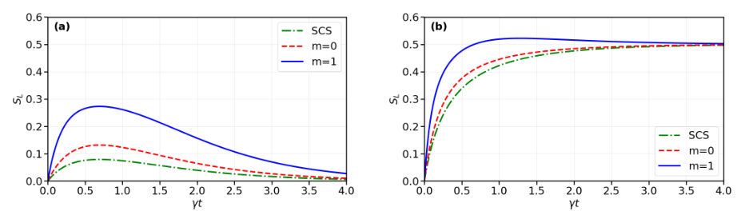 
Figure 2: Linear entropy SL of the cavity field state, as a function of the normalized time γt, for a field coupled to a thermal bath. The initial states are a squeezed coherent state with r = 0.412 and α = 1.64 (green dot-dashed line) and Fock-filtered states with either the m = 0 (red dashed line) or the m = 1 (blue continuous line) component removed; (a) zero temperature bath, n = 0; (b) finite temperature bath with n = 0.5.

📷 Fig 3

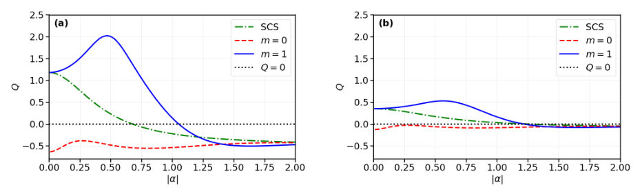 
Figure 3: Mandel’s Q parameter as a function of the coherent displacement α (control parameter) for a squeezed coherent state with r = 0.412 (green dot-dashed line), and Fock-filtered states with either the m = 0 (red dashed line) or the m = 1 (blue continuous line) components removed. The fields are in contact with a thermal bath (n = 0.1) at two distinct normalized times: (a) γt = 0.1; (b) γt = 1.0.

📷 Fig 4

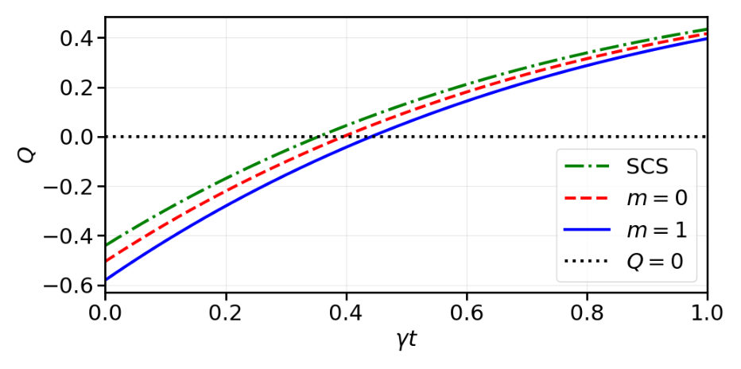 
Figure 4: Mandel’s Q parameter as a function of the normalized time γt, for a field coupled to a thermal bath with n = 0.1. The initial states are a squeezed coherent state with r = 0.412 and α = 1.64 (green dot-dashed line) and Fock-filtered states with either the m = 0 (red dashed line) or the m = 1 (blue continuous line) component removed.

📷 Fig 5

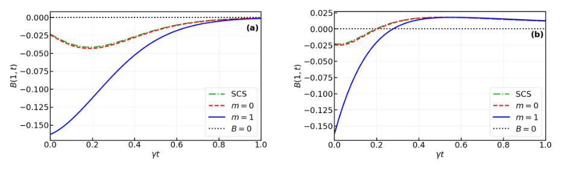 
Figure 5: Klyshko parameter B(1, t) of the cavity field state, as a function of the normalized time γt, for a field coupled to a thermal bath. The initial states are a squeezed coherent state with r = 0.412 and α = 1.64 (green dot-dashed line) and Fock-filtered states with either the m = 0 (red dashed line) or the m = 1 (blue continuous line) component removed; (a) zero temperature bath, n = 0; (b) finite temperature bath with n = 0.5.

**Summary.** This paper explores engineering nonclassical light states by selectively removing specific photon number components from squeezed coherent states. It demonstrates that this filtering enhances sub-Poissonian statistics, but critically analyzes how these engineered states degrade when coupled to a thermal environment. The findings highlight both the potential and the limitations of such photon-number engineering in realistic, dissipative quantum systems.

**Why it may be interesting.** This work is highly relevant as it combines advanced concepts in quantum optics (squeezing, Fock filtering) with the crucial aspects of open quantum systems (thermal baths), providing a realistic assessment of quantum state engineering.

Detailed structure

**Main problem.** The study investigates how selectively removing specific Fock components (Fock-state filtering) from squeezed coherent states can engineer and enhance their nonclassical photon statistics.

**Main result.** Filtering can enhance sub-Poissonian character, but the nonclassical signatures are rapidly degraded by environmental coupling to a thermal bath, although they persist over a measurable time scale.

**Method.** The analysis uses the master equation formalism to model open quantum system evolution, calculating photon-number statistics via Mandel's Q parameter.

**Model / system.** The system is a single quantized cavity mode (harmonic oscillator) initially prepared in a squeezed coherent state, which then interacts with a thermal bath, governed by a master equation.

**Key observables.** Mandel's Q parameter (for photon number fluctuations), Linear Entropy ($S_L$, for mixedness), and the Klyshko parameter ($B(n, t)$).

**Important parameters / regimes.** Coherent amplitude ($\alpha$), squeezing parameter ($r$), and the thermal bath coupling strength ($\gamma t$).

**Assumptions / limitations.** The analysis relies on the master equation framework for dissipation and assumes the validity of the dispersive approximation in the generation protocol.

**Figures summary.** Figures show the evolution of Mandel's Q parameter and the Klyshko parameter for filtered vs. unfiltered states under thermal decay, illustrating the decay of nonclassicality.

**Paper structure.** The paper first establishes the theoretical framework for filtering squeezed states, then analyzes the resulting photon statistics, and finally extends the analysis to model the time evolution and decay of these engineered states in a realistic thermal environment.

Abstract

The ability to tailor photon-number statistics is central to the generation and control of nonclassical states of light. Here, we investigate how Fock-state filtering of squeezed coherent states can be used to engineer their photon statistics. We consider the selective removal of the $m=0$ and $m=1$ Fock components and show that this process can enhance the sub-Poissonian character of the field, depending on the coherent amplitude. We then analyze the evolution of these engineered states in a thermal environment. Although all states eventually relax toward thermal statistics, the signatures of the filtering process may persist over a significant part of the evolution, while the purity of the filtered states is rapidly degraded by incoherent population redistribution. Our results illustrate both the potential and the limitations of photon-number engineering in realistic, dissipative settings.

[↑ back to top](#top)

### [High-Efficiency Ising Machine with Time-Dimensional Exchange Coupling](http://arxiv.org/abs/2608.21753v1)

**Authors:** Zhengyu Du, Haijie Xu, Kaiming Cai, Zhe Yuan, Yue Zhang  
**Type:** both · **Category:** statistical mechanics · **PDF:** <https://arxiv.org/pdf/2608.21753v1>  
**Analysis basis:** full PDF text, analyzed in chunks
**Topic relevance:** `analog quantum simulation` **1/5** · `driven-dissipative phase transition` **1/5** · `methods for driven-dissipative` **1/5** · `non-equilibrium universality` **1/5** · `quantum measurements` **1/5** · `scars & prethermalization` **1/5**

📷 Fig 1

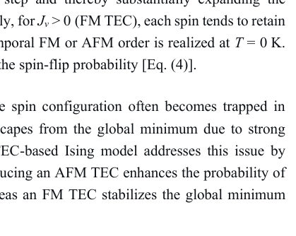 
FIG. 2. Performance of the TEC in solving a 10-node Max-Cut instance problem. (a) Solution accuracy versus TEC coupling Jv at different effective temperatures (kBT = 0.1 and 5 J). (b) Evolution of the optimal coupling [the Jv for the maximum accuracy in (a)] and its corresponding peak accuracy as a function of T (The red dashed line corresponds to the peak accuracy without TEC.).

📷 Fig 2

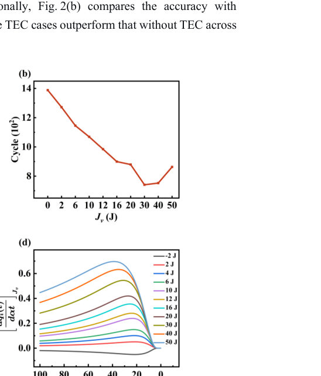 
FIG. 3. Annealing dynamics and convergence acceleration for a large-scale K2000 benchmark instance. (a) Evolution of the cut value over annealing cycles under various temporal coupling strengths Jv. The inset provides a magnified view of the early-stage trajectories, demonstrating the acceleration of the initial descent towards the ground state. (b) The number of cycles required to reach 95% of the optimal cut value (31670) as a function of Jv. (c) The evolution of flip probability with cycles for Jv = 0 and 30 J based on the calculation of Eq. (4). (d) The TEC- induced update velocity with temperature at different Jv based on the calculation of Eq. (3).

**Summary.** This work proposes a Time-Dimensional Exchange Coupling (TEC) to enhance the efficiency of solving combinatorial optimization problems like MaxCut on Ising machines. By introducing a temporal interaction between successive spin states, TEC improves sampling exploration at low temperatures and stabilizes solutions at high temperatures. This provides a hardware-efficient alternative to complex replica methods, significantly speeding up convergence.

**Why it may be interesting.** While focused on classical optimization, the dynamics involve time-delayed feedback loops and enhanced sampling mechanisms, which are conceptually related to non-equilibrium dynamics and thermalization processes studied in AMO physics.

Detailed structure

**Main problem.** The paper addresses the inefficiency of sampling the configuration space for solving combinatorial optimization problems, such as MaxCut, using probabilistic Ising machines.

**Main result.** The proposed Time-Dimensional Exchange Coupling (TEC) significantly accelerates convergence speed for MaxCut problems, offering a scalable and hardware-efficient alternative to replica-based quantum Monte Carlo methods.

**Method.** The authors introduce a TEC term into the Ising Hamiltonian, which couples the current spin configuration to the previous one in time, modifying the stochastic dynamics.

**Model / system.** The system is based on the Ising model implemented on a p-bit network, simulating the optimization process. The total energy includes both spatial interactions and the novel temporal exchange coupling term, E_total = E_spatial - sum(J_v * sigma_i(t) * sigma_i(t-1)).

**Key observables.** Convergence speed, solution accuracy (for MaxCut), update velocity, and the shift in optimal TEC coupling strength (J_v) with temperature.

**Important parameters / regimes.** The coupling strength J_v, temperature (T), and the size of the problem (up to 2000 vertices).

**Assumptions / limitations.** The method assumes the time interval between successive spin configurations is much longer than the spin relaxation time, and the hardware implementation is assumed to be feasible despite minor SPICE simulation inaccuracies.

**Figures summary.** Figures compare TEC to conventional methods, showing accelerated annealing dynamics for MaxCut; they also illustrate how the optimal TEC coupling strength shifts systematically with temperature.

**Paper structure.** The paper first identifies the limitations of existing sampling methods, then introduces the TEC Hamiltonian and dynamics, validates its effect on exploration/stability at different temperatures, and finally benchmarks its performance on large-scale MaxCut problems using both simulation and hardware modeling.

Abstract

Conventional probabilistic Ising machines often suffer from inefficient exploration of configuration space, while replica-based quantum Monte Carlo methods reduce sampling bottlenecks at the cost of large hardware overhead. Here we propose a time-dimensional exchange coupling (TEC) that replaces spatial replica coupling with a temporal exchange interaction between successive spin configurations of a single p-bit network. This TEC improves sampling efficiency without duplicating replica hardware. At low temperatures, antiferromagnetic TEC expands sampling range; at high temperatures, ferromagnetic TEC stabilizes the optimal state. For MaxCut problems with up to 2000 vertices, TEC significantly accelerates convergence speed. SPICE simulations confirm hardware feasibility. TEC offers a scalable, hardware-efficient strategy to enhance combinatorial optimization on existing Ising machines.

[↑ back to top](#top)

### [A Physical Response-and-Memory Model for Muon Optimization](http://arxiv.org/abs/2608.22994v1)

**Authors:** Yinze Hu, Hongjun Xiang, Xingao Gong, Hongyu Yu  
**Type:** theory · **Category:** disordered systems and neural networks · **PDF:** <https://arxiv.org/pdf/2608.22994v1>  
**Analysis basis:** full PDF text, analyzed in chunks
**Topic relevance:** `Frenkel-Kontorova` **1/5** · `correlated / nonlocal dissipation` **1/5** · `driven-dissipative phase transition` **1/5** · `methods for driven-dissipative` **1/5** · `non-equilibrium universality` **1/5**

📷 Fig 1

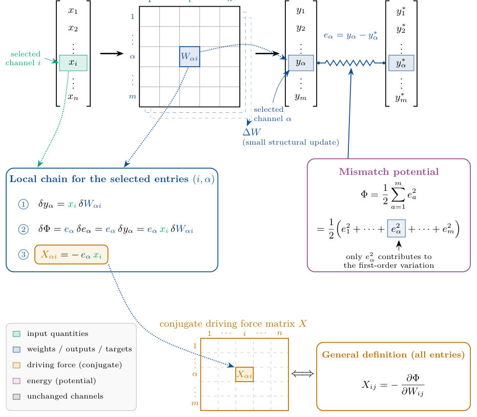 
Figure 1: Construction of the responsive medium and the mismatch potential (schematic). An input x passes through the weight matrix W to produce the output y = Wx; the mismatch between the output and the target y⋆, eα = yα −y⋆ α, is measured by the mismatch potential Φ = 1

📷 Fig 2

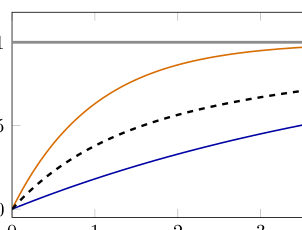 
Figure 2: Glassy picture and temporal picture of the Bi-Maxwell memory (schematic).

📷 Fig 3

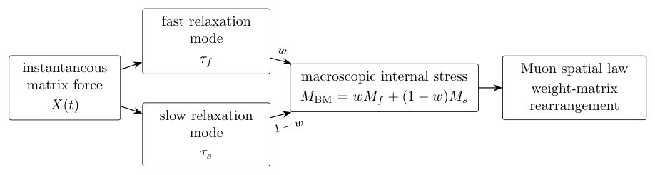 
Figure 3: Two-timescale structure of Bi-Maxwell (schematic). The same matrix force X(t) drives the fast and the slow relaxation mode; the two combine with weights w and 1 −w into the macroscopic internal stress MBM = wMf +(1−w)Ms, which then enters the spatial law to complete the weight- matrix rearrangement.

📷 Fig 4

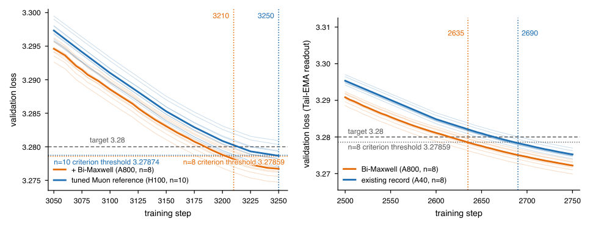 
Figure 4: Thin lines are per-seed curves, thick lines arm means; the dashed line is the 3.28 target, and the dotted lines are the pass thresholds implied by the margin criterion (3.28 −¯L)√n ≥0.004, that is ¯L ≤3.28 −0.004/√n, which depends on the seed count: 3.27859 at n = 8 (orange) and 3.27874 at n = 10 (blue). (a) Bare tuned-Muon stack (raw validation loss): the two-timescale arm (orange, A800, n = 8) first crosses at step 3210; the tuned reference (blue, H100, n = 10, by its n = 10 criterion) first crosses at step 3250. (b) Record stack (Tail-EMA readout): both arms have n = 8, so only the 3.27859 threshold applies; the two-timescale arm (orange, A800) at step 2635, the existing record...

📷 Fig 5

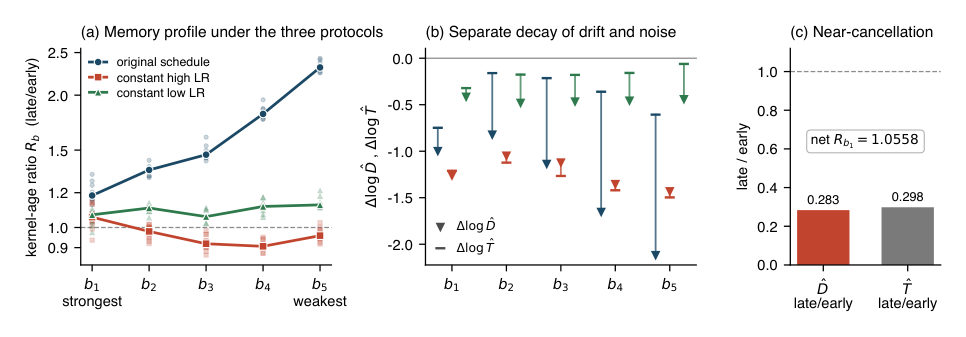 
Figure 5: Band-resolved optimal-memory profile under the three learning-rate protocols. (a) The kernel-age ratio Rb across mode bands; faint small markers are the per-trajectory readings (8 each for the original schedule and the constant low learning rate, 16 for the constant high learning rate), thick lines the median across trajectories, the grey dashed line Rb = 1, and the vertical axis is logarithmic. The original schedule lengthens in all five bands, by more towards the weaker bands; under the constant high learning rate only b1 lengthens while b3–b5 shorten; under the constant low learning rate all five lengthen again. (b) Per-tensor paired ∆log ˆDb (down triangles) and ∆log ˆTb...

**Summary.** This paper develops a physical model treating the neural network weight matrix as a memory-laden, responsive medium. By interpreting optimization momentum as accumulated internal stress, the authors propose the Bi-Maxwell optimizer, which uses a two-timescale memory kernel. This approach successfully models the underlying physics of learning dynamics and achieves state-of-the-art performance on LLM training benchmarks.

**Why it may be interesting.** The framework draws deep analogies between the physics of dissipative media (stress, relaxation, dissipation) and the abstract mathematics of deep learning optimization, providing a physical grounding for empirical ML heuristics.

Detailed structure

**Main problem.** The paper addresses the fundamental problem of determining the optimal update rule (optimizer) for training large language models, recognizing that this choice dictates the final achievable loss for a given computational budget.

**Main result.** The authors propose the Bi-Maxwell optimizer, which incorporates a two-timescale stress memory, leading to significantly faster convergence on benchmark LLM training tasks.

**Method.** They build a physical model treating the weight matrix as a responsive medium with memory, deriving the optimal update direction from principles of maximal dissipation under an output-side safety budget.

**Model / system.** The system is the weight matrix ($W$) of a neural network, modeled as a responsive medium whose dynamics are governed by a mismatch potential ($\Phi$) that dictates restoring forces and structural rearrangement rates.

**Key observables.** Momentum (interpreted as internal stress), the optimal memory length, and the structural rearrangement rate ($V$).

**Important parameters / regimes.** The relaxation timescales of the stress memory (fast and slow), and the output-side safety budget ($\epsilon$).

**Assumptions / limitations.** The structural rearrangement rate is assumed to be governed by a viscous analogy related to the mismatch potential, and the model predicts that the optimal memory length must grow with the training stage.

**Figures summary.** Figure 1 illustrates the responsive medium construction and mismatch potential; Figure 8 shows the local kernel-age proxy ($n_\star$) confirming that the optimal memory length increases across training stages.

**Paper structure.** The paper first establishes the physical analogy by defining the weight matrix as a responsive medium, deriving the governing dynamics from a mismatch potential. It then proposes the Bi-Maxwell optimizer by extending the memory kernel to two timescales, and finally validates this model by testing the predicted growth of optimal memory length against empirical benchmarks.

Abstract

Training large language models is costly. How low a loss the same compute can ultimately reach depends on how each step's gradient is converted into a weight update; the rule that performs this conversion is the optimizer. From SGD and AdamW to the recent Muon, effective update rules have mostly been shaped by engineering intuition and then selected on benchmarks. Muon semi-orthogonalizes the momentum matrix before applying the update and has kept breaking records on public training benchmarks; yet why the semi-orthogonalized direction works, and over how long a history the momentum should average, are two questions at present answered mainly by experience. Here we treat the weight matrix during training as a responsive medium with memory and build a physical model for it, in which both questions find answers: the semi-orthogonalized direction is the maximally dissipative response under an output-side safety budget, which explains why it works; momentum is the internal stress accumulated by the medium; how long it should average is set by the relaxation of this stress, and a real medium relaxes on more than one timescale, the simplest form being one fast and one slow. On this basis we propose the Bi-Maxwell optimizer. The framework further yields a testable consequence: gradient directions change fast early in training and more slowly later, so the optimal memory length should grow with training stage; step-by-step measurements of a proxy for it by a read-only probe across 8 independent training trajectories are consistent with this consequence. Replacing the memory kernel alone, from a single timescale to two, brings training to the target loss in noticeably fewer steps on a public large-language-model optimizer benchmark.

[↑ back to top](#top)

### [Note on Boltzmann's H-Theorem and Detailed Balance Dynamics](http://arxiv.org/abs/2608.22867v1)

**Authors:** Prabodh Shukla  
**Type:** theory · **Category:** statistical mechanics · **PDF:** <https://arxiv.org/pdf/2608.22867v1>  
**Analysis basis:** full PDF text, analyzed in chunks
**Topic relevance:** `driven-dissipative phase transition` **1/5** · `methods for driven-dissipative` **1/5** · `non-equilibrium universality` **1/5** · `scars & prethermalization` **1/5**

📷 Fig 1

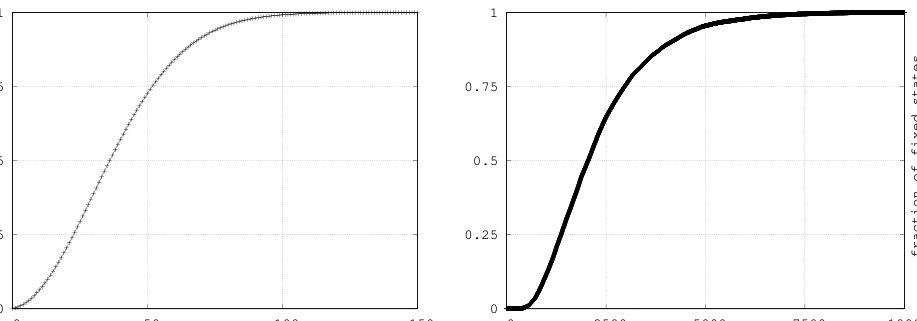 
FIG. 1: Increasing fraction of states in an ensemble that acquire equal probability under detailed balance dynamics. Fig.1(a) shows simulation on a modest size ensemble of 103 states, initially having uniformly distributed probabilities over the interval [0,1]. The x-axis shows increasing Monte Carlo steps of parallel dynamics for a randomly chosen initial state of an ensemble. The y-axis shows the fraction of states in the ensemble that acquire equal probability up to the corresponding time on the x-axis. The data is averaged over 103 runs of simulation. At each step of a given run, every state is paired randomly with another state of the ensemble and assumes the probability of that state....

📷 Fig 2

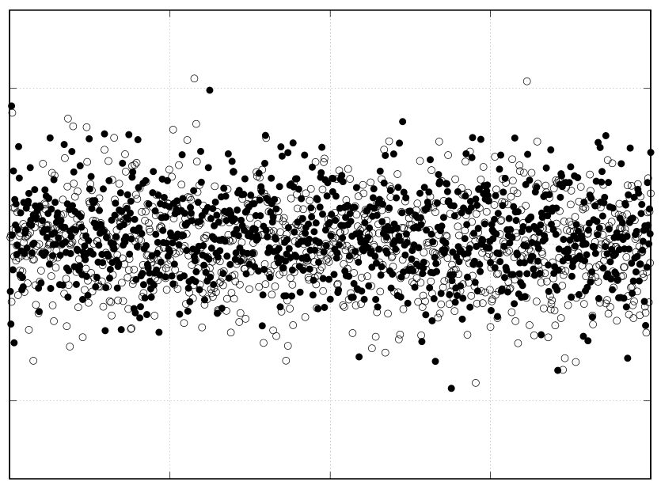 
FIG. 2: Initial and final probabilities of states in an ensemble of 103 states under detailed balance dynamics. The initial probabilities {pi; i = 1, . . . , 103} are chosen from a uniform rectangular distribution over the range [0,1].The final probabilities at the end of dynamics are constant equal to p∗for every state in the ensemble; p∗is equal to one of the initial probabilities pi chosen randomly. The simulation is repeated 103 times. The figure shows average of pi (open circles) and p∗(filled circles) over different runs for each state of the ensemble. The distributions {pi} and {p∗} are numerically indistinguishable, and both are centered around the average probability equal to 1/2 as may...

📷 Fig 3

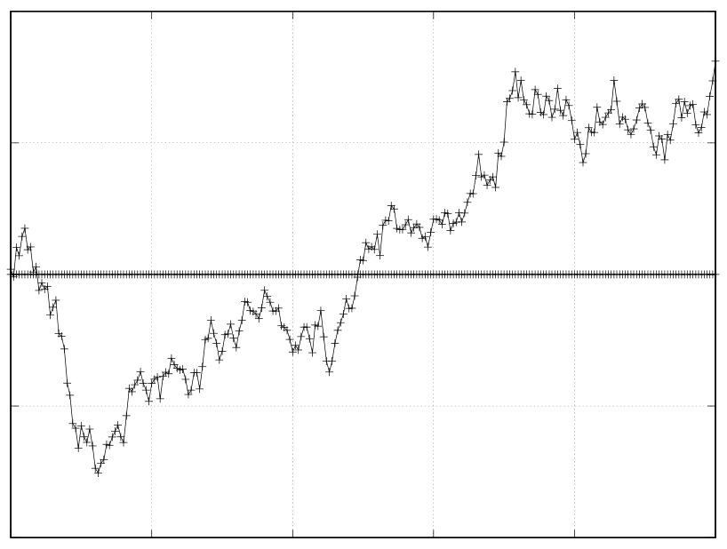 
FIG. 3: This figure presents another aspect of simulations presented in earlier figures. It shows entropy of an ensemble at successive steps of detailed balance update. Although all states in an ensemble of 103 states reach equal probability in about 150 steps, the value of entropy fluctuates about its average value 1/4 in different runs. Data from 103 runs are superimposed.

📷 Fig 4

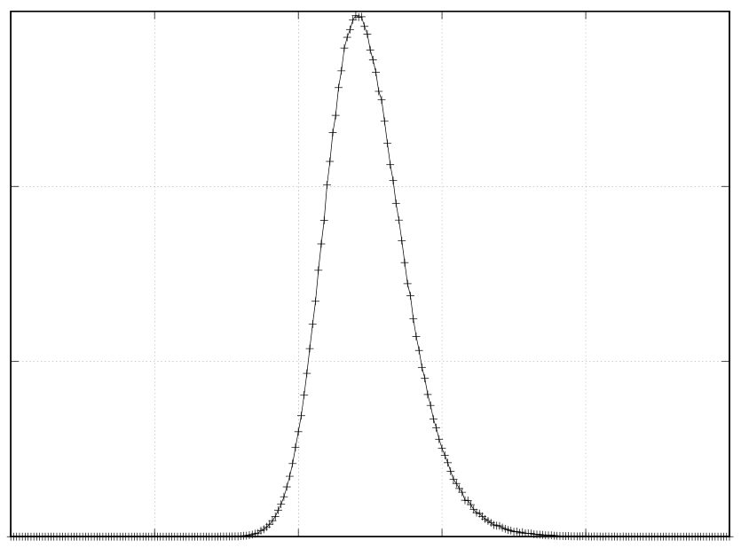 
FIG. 4: Spectrum of relaxation times that bring all states in an ensemble to have the same probability. The figure shows superimposed data over 106 runs of simulations on an ensemble of 103 states. The data is normalized such that heights of all data points in the figure add up to unity. Notice there is a relatively sharp peak in the density of relaxation times.

**Summary.** This paper numerically investigates Boltzmann's H-theorem by simulating how an ensemble of states approaches maximum entropy under detailed balance dynamics. It compares different update rules, finding that the rate of probability equalization is highly dependent on the connectivity of the state space. The work highlights the mathematical mechanisms underlying the arrow of time in statistical mechanics.

**Why it may be interesting.** It provides a detailed numerical study of how fundamental concepts like entropy increase and equilibrium are realized in abstract dynamical systems, touching upon the deep connection between microscopic dynamics and macroscopic irreversibility.

Detailed structure

**Main problem.** The paper investigates Boltzmann's H-theorem, which posits that the entropy of an ensemble increases until all states become equally probable, exploring the dynamics of this approach to equilibrium.

**Main result.** The rate of probability equalization depends heavily on the update dynamics; random pairing leads to rapid convergence, while restricted dynamics (like on a circle) are significantly slower.

**Method.** The study employs numerical Monte Carlo simulations to track the evolution of the ensemble's entropy and the equalization of state probabilities over time.

**Model / system.** The system is an abstract ensemble of thermodynamic states with probabilities $\{p_i\}$, whose evolution is governed by dynamics satisfying detailed balance conditions.

**Key observables.** Entropy change ($\Delta S$), fraction of states acquiring equal probability, and the distribution of relaxation times.

**Important parameters / regimes.** The number of states ($N$), the temperature ($T$), and the specific update rule (e.g., random pairing vs. nearest neighbor on a circle).

**Assumptions / limitations.** The analysis relies on the framework of detailed balance dynamics and compares results from specific discrete update rules, noting the conflict between the theorem's irreversibility and time-reversal symmetry.

**Figures summary.** Figures illustrate the rapid equalization of probabilities under random pairing versus slow equalization on a circle, show entropy fluctuations around equilibrium, and map the spectrum of relaxation times.

**Paper structure.** The paper introduces the H-theorem and the relevant dynamics, presents numerical simulations comparing different update rules, analyzes the convergence rates and entropy fluctuations, and discusses the theoretical implications regarding time's arrow.

Abstract

The Boltzmann H-theorem states that entropy of an ensemble of thermodynamic states increases until all states become equally probable. The evolution randomly picks one of the states in the ensemble and brings every other state to have the same probability as the selected state. Different realizations of evolution yield a distribution of selected states. We study this distribution numerically and discuss its relevance for equilibrium fluctuations in thermal as well as non thermal systems.

[↑ back to top](#top)

### [A minimal mechanism to generate long timescales without fine tuning](http://arxiv.org/abs/2608.21586v1)

**Authors:** Kathryn McClain, Shivang Rawat, Mia Morrell, Stefano Martiniani, David J. Heeger, Flaviano Morone  
**Type:** theory · **Category:** disordered systems and neural networks · **PDF:** <https://arxiv.org/pdf/2608.21586v1>  
**Analysis basis:** full PDF text, analyzed in chunks
**Topic relevance:** `driven-dissipative phase transition` **1/5** · `non-equilibrium universality` **1/5**

📷 Fig 1

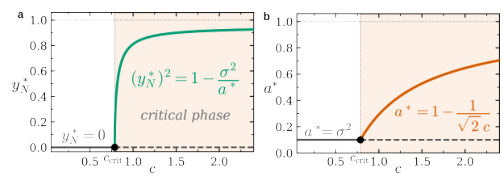 
FIG. 1. Fixed points of the dynamics (3) versus in- teraction strength c. a, Activity y∗ N of the top mode and b, gain a∗. Solid lines denote the stable fixed points and the dashed lines the unstable ones. At ccrit = 1/[ √

📷 Fig 2

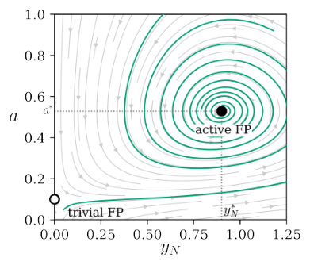 
FIG. 2. Relaxation to the active fixed point. Deter- ministic flow in the (yN, a) plane for c = 1.5 and σ2 = 0.1 (only yN &gt; 0 shown). The trivial fixed point (open circle) is unstable, and trajectories spiral into the active fixed point (filled circle) at (y∗ N, a∗), with frequency ω ≈√det J2, due to the complex eigenvalues µ± = β ± iω of the block J2 in Eq. (8).

📷 Fig 3

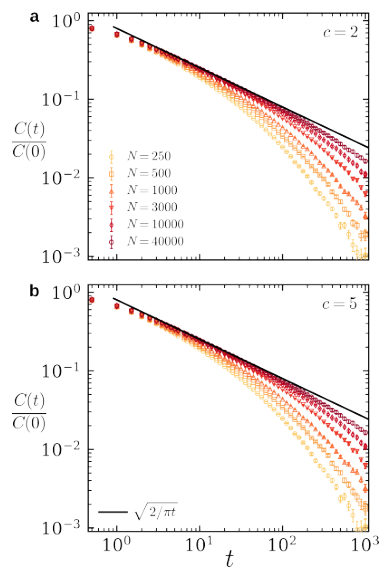 
FIG. 3. Scale-free correlations throughout the criti- cal phase. Normalized correlation function of the transverse modes for a, c = 2 and b, c = 5, at system sizes from N = 250 to N = 40000, obtained by numerical integration of Eq. (3) with σ2 = 0.1 and noise amplitude D = 0.01/N, averaged over many realizations of M (error bars are s.e.m.). The black line is the prediction p

**Summary.** This work proposes a minimal modification to a linear recurrent neural network by adding a dynamical feedback gain. This gain self-regulates the network's dynamics, ensuring that the system naturally operates at a critical point, thereby generating long-range, scale-free temporal correlations without requiring precise parameter tuning.

**Why it may be interesting.** The mechanism of self-organization to maintain a critical state is a general principle applicable to many complex systems, including those studied in AMO physics where parameter tuning is often a major hurdle.

Detailed structure

**Main problem.** The paper addresses the challenge of generating long timescales and scale-free correlations in neural dynamics without relying on fine-tuning of synaptic coupling strengths.

**Main result.** Introducing a dynamical recurrent feedback gain self-organizes such that the top eigenvalue of the effective recurrent matrix always lands at the stability edge, leading to scale-free correlations generically.

**Method.** The analysis involves linearizing the coupled dynamics (neuron activity and gain) around an active fixed point and analyzing the resulting relaxation rates and correlation functions.

**Model / system.** The system is a minimal linear stochastic recurrent neural network model incorporating a dynamical gain term that depends on the total network activity. The dynamics are governed by coupled differential equations for neuron states and the gain parameter.

**Key observables.** Long-time autocorrelation function $C(t)$, which exhibits algebraic decay ($t^{-\alpha}$) when the spectrum is gapless, and the self-organized gain $a^*$.

**Important parameters / regimes.** The coupling strength $c$ (interaction strength), the noise variance $\sigma^2$, and the characteristic timescales $	au_x, 	au_a$.

**Assumptions / limitations.** The analysis assumes the recurrent matrix $M$ is symmetric (e.g., GOE) and that the gain unit only senses the total network activity ($\|x\|^2$).

**Figures summary.** Figure 1 illustrates the emergence of an active fixed point at a critical coupling strength $c_{	ext{crit}}$. Figure 2 shows the deterministic flow spiraling into the active fixed point in the $(y_N, a)$ plane. Figure 3 confirms the $\propto t^{-1/2}$ power law decay of the normalized correlation function for various coupling strengths.

**Paper structure.** The paper first establishes the problem of fine-tuning in standard models. It then introduces the dynamical gain mechanism, deriving the coupled equations. The core analysis shows that the gain self-organizes to enforce criticality, leading to a stable critical phase characterized by power-law decay, independent of the initial coupling strength.

Abstract

Long timescales in brain dynamics give rise to power law correlations measured in experiments. A simple linear recurrent neural network model can reproduce this power law behavior, but the recurrent interaction strength needs to be fine tuned in order to sit at the edge of stability. We show that by adding a dynamical recurrent feedback gain to the simple linear model removes the need for fine tuning, because the gain self-organizes so that the spectrum of the effective recurrent matrix is always gapless with the top eigenvalue landing on the stability edge for any recurrent strength. As a consequence, long timescales and scale free correlations arise generically, as we demonstrate both analytically and numerically.

[↑ back to top](#top)

### [Anomalous metallic states at magnetic interfaces in an antiferromagnetic topological insulator candidate DyPtBi with ferroquadrupolar order](http://arxiv.org/abs/2608.22260v1)

**Authors:** Kentaro Ueda, Hiraku Saito, Zen Ogame, Isao Ishii, Ruo Hibino, Tatsuya Yanagisawa, Shinichi Itoh, Taro Nakajima, Yoshinori Tokura  
**Type:** experiment · **Category:** strongly correlated electrons · **PDF:** <https://arxiv.org/pdf/2608.22260v1>  
**Analysis basis:** full PDF text, analyzed in chunks
**Topic relevance:** `analog quantum simulation` **1/5** · `quantum measurements` **1/5**

📷 Fig 1

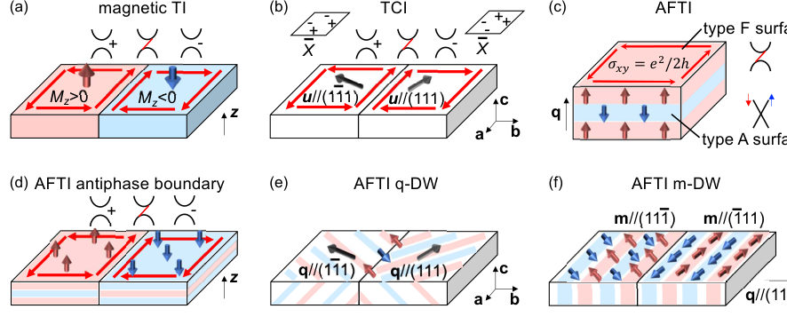 
FIG. 1. Schematic pictures of electronic states at domain walls (DWs) for (a) magnetic topological

📷 Fig 2

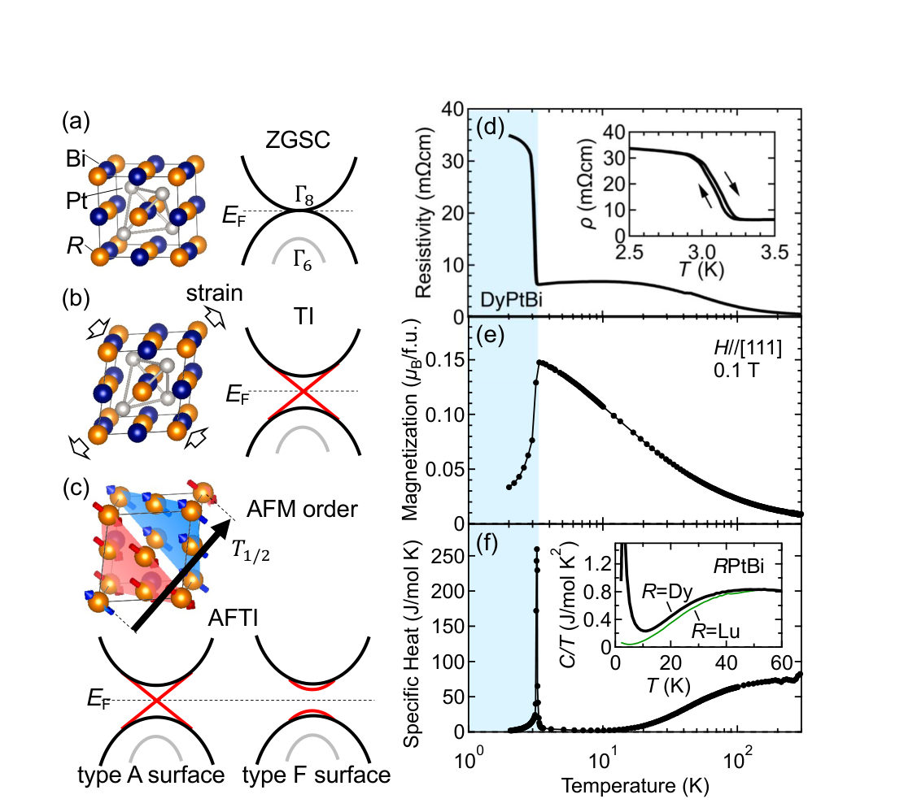 
FIG. 2. Schematic picture of crystal structure and band structure for (a) zerogap semiconductor

📷 Fig 3

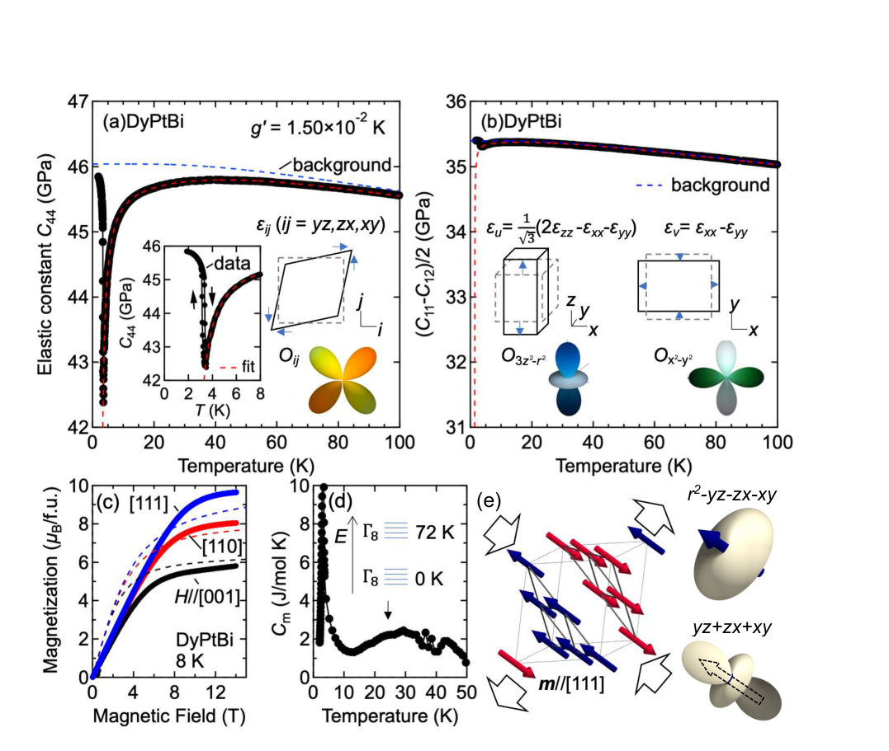 
FIG. 3. Temperature dependence of elastic constants (a) C44 and (b) (C11 −C12)/2 for DyPtBi.

📷 Fig 4

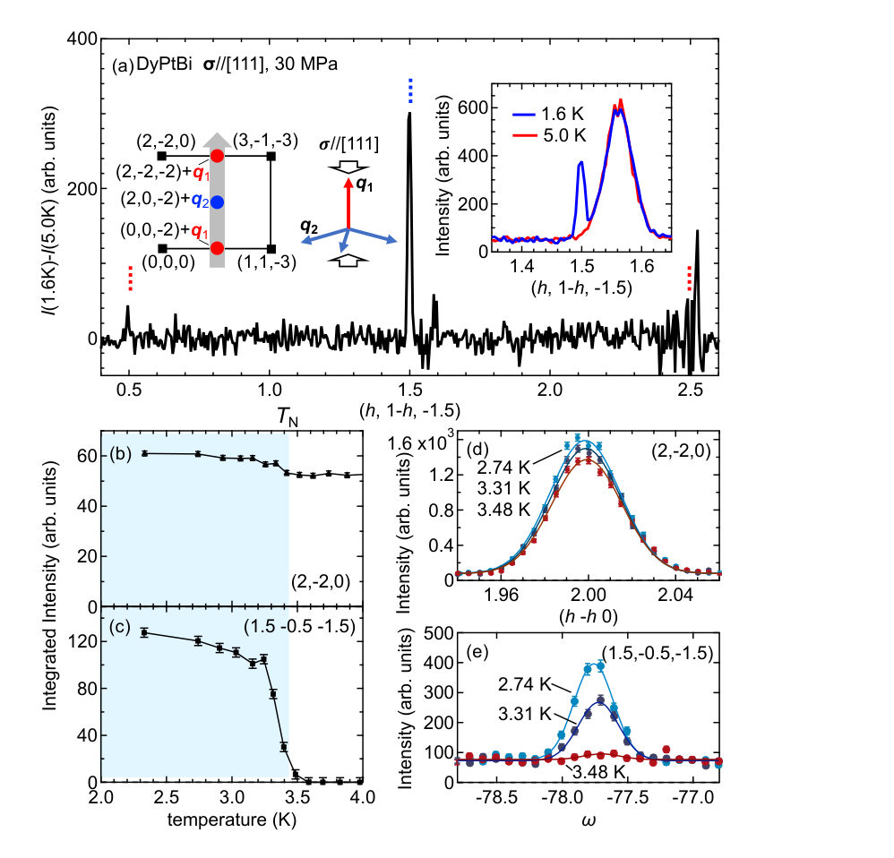 
FIG. 4. (a) Difference of neutron scattering intensity between 1.6 K and 5.0 K scanning along

📷 Fig 5

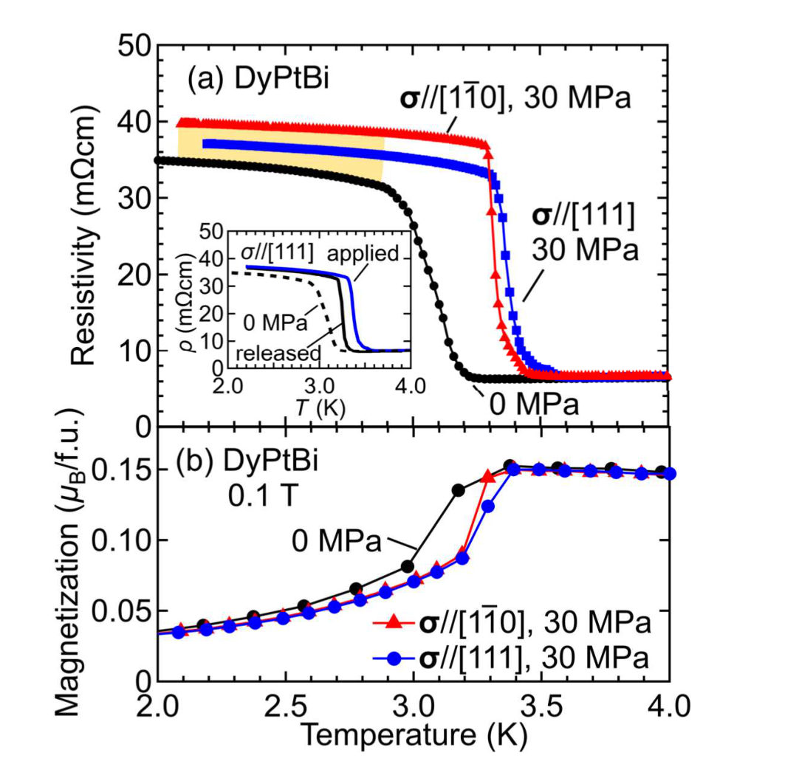 
FIG. 5. Temperature dependence of (a) resistivity and (b) magnetization at ambient pressure

**Summary.** This work investigates DyPtBi, an antiferromagnetic topological insulator candidate, to show how ferroquadrupolar order couples strongly to its electronic structure. By measuring resistivity and elastic constants under varying stress, the authors demonstrate that the material's topological properties can be actively controlled by manipulating its magnetic domain state. This highlights a promising route for engineering topological materials using strain engineering.

**Why it may be interesting.** The strong coupling between lattice degrees of freedom (quadrupolar order) and topological electronic states provides a platform for understanding emergent quantum phenomena controllable by strain, which is relevant to designing novel quantum materials.

Detailed structure

**Main problem.** Investigating anomalous metallic states at magnetic interfaces in an antiferromagnetic topological insulator candidate, focusing on the interplay between magnetic order, topological states, and ferroquadrupolar order.

**Main result.** The material exhibits topological electronic states entangled with multipolar degrees of freedom, allowing for *in situ* control of topological properties via external stress.

**Method.** The study combines transport measurements (resistivity), ultrasonic measurements (elastic constants), and neutron diffraction experiments under uniaxial stress.

**Model / system.** The physical system is DyPtBi, an antiferromagnetic topological insulator candidate. The analysis involves modeling the coupling between the $4f$ electron spins (governed by Crystal Electric Field theory) and lattice distortions (ferroquadrupolar order).

**Key observables.** Resistivity jumps, softening of the transverse ultrasonic mode ($6\%$), and a strong resistivity enhancement ($14\%$) under compressive uniaxial stress.

**Important parameters / regimes.** The magnetic transition temperature ($T_N = 3.2 	ext{ K}$), the applied uniaxial stress ($\sigma//[111]$), and the coupling constants governing quadrupolar interactions.

**Assumptions / limitations.** The analysis assumes the low frequency limit for CEF analysis and models the total free energy including contributions from $4f$-electrons and phonons.

**Figures summary.** Figures illustrate the temperature dependence of resistivity, magnetization, and elastic constants, showing anomalies near the magnetic transition, and schematics detail the electronic states at domain walls.

**Paper structure.** The paper systematically presents evidence for the interplay between magnetic and structural transitions, using transport and elastic measurements to confirm the role of ferroquadrupolar order, culminating in stress experiments that control the domain wall conductivity.

Abstract

Antiferromagnetic topological insulators provide a fertile platform where symmetry-breaking magnetic order is intertwined with topological electronic states. In particular, magnetic domain walls have attracted much attention, as they can be easily controlled by external fields as in general magnets, and moreover, host nontrivial electronic states distinct from those in bulks and sample surfaces. Here, we report a new antiferromagnetic topological insulator candidate DyPtBi, which hosts conductive magnetic domain walls controllable by uniaxial stress and magnetic field. We find that the resistivity exhibits abrupt increase upon the magnetic and structural phase transition. Concomitantly, the transverse ultrasonic mode shows remarkable softening of 6 %, indicating that the Dy 4f ferroquadrupolar order plays a vital role in the phase transition. Furthermore, we reveal by neutron experiments that applying compressive uniaxial stress aligns the magnetic domain state, leading to the strong resistivity enhancement of 14 % while eliminating the conductive magnetic domain walls. These findings demonstrate that DyPtBi exhibits topological electronic states entangled with multipolar degrees of freedom, providing a promising route for in situ control of topological properties.

[↑ back to top](#top)

### [Correlation inequalities for transversal field models with application to quantum glasses](http://arxiv.org/abs/2608.23177v1)

**Authors:** Chokri Manai, Simone Warzel  
**Type:** theory · **Category:** disordered systems and neural networks · **PDF:** <https://arxiv.org/pdf/2608.23177v1>  
**Analysis basis:** full PDF text, analyzed in chunks
**Topic relevance:** `Keldysh / 2PI / non-Gaussian methods` **1/5** · `analog quantum simulation` **1/5**

📷 Fig 1

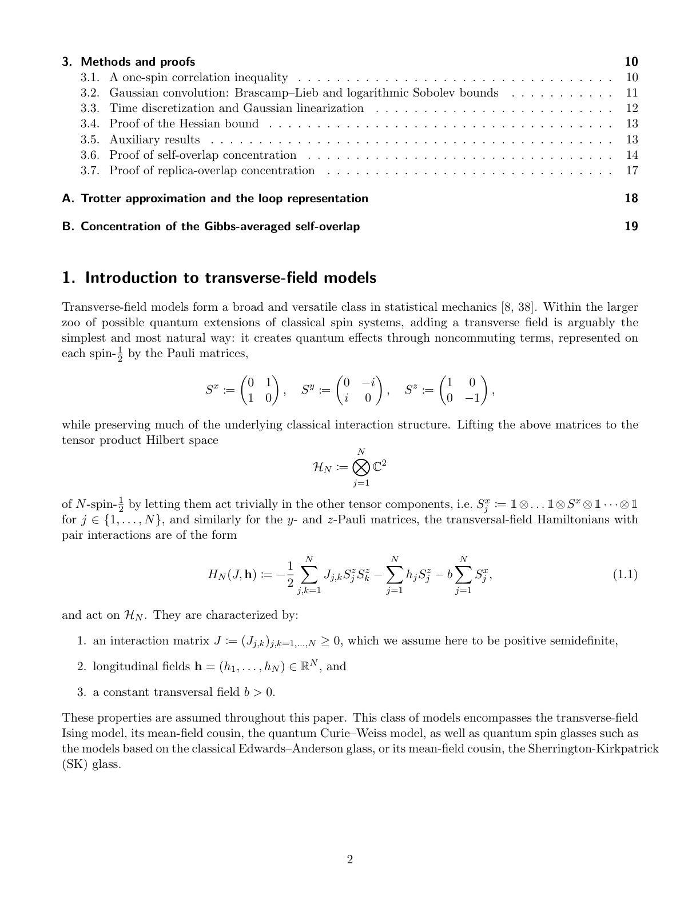 
Low-resolution page preview, page 2

📷 Fig 2

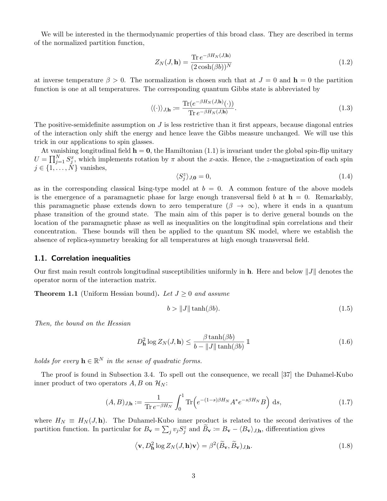 
Low-resolution page preview, page 3

📷 Fig 3

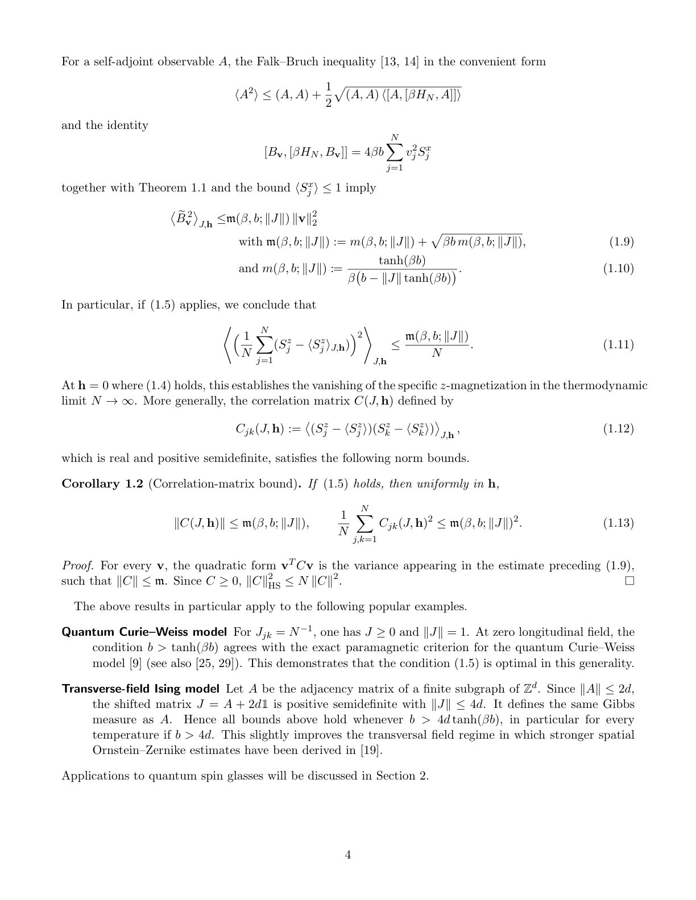 
Low-resolution page preview, page 4

📷 Fig 4

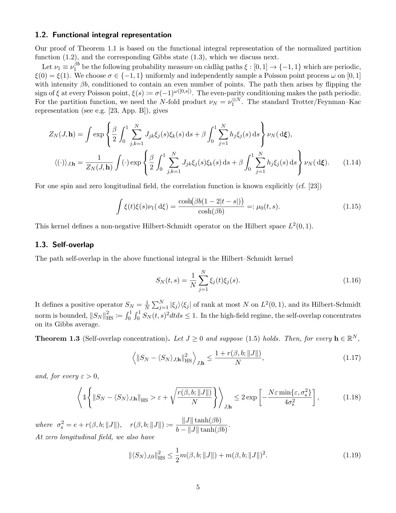 
Low-resolution page preview, page 5

📷 Fig 5

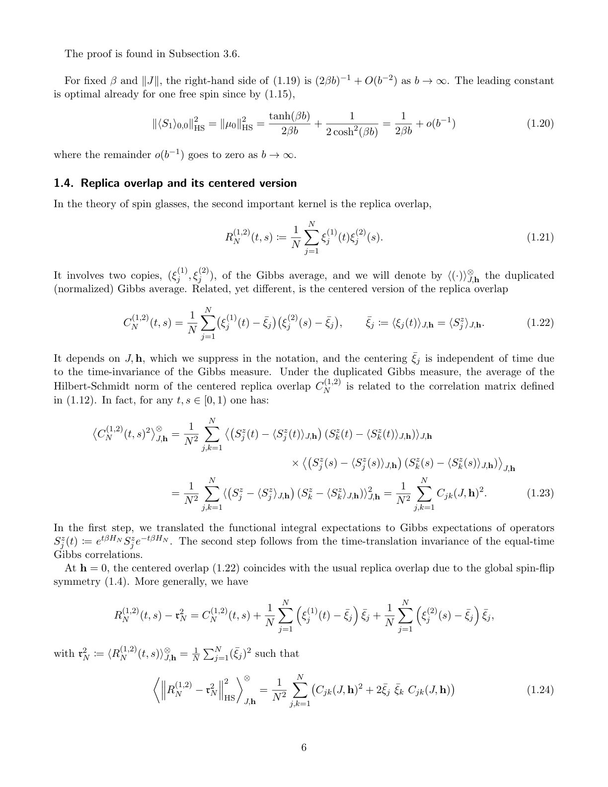 
Low-resolution page preview, page 6

**Summary.** This theoretical work develops general correlation inequalities for quantum spin glass models under a transversal field. By applying these inequalities, the authors characterize the phase diagram, predicting a transition from a low-field replica-symmetry-breaking regime to a high-field regime where replica order is absent. This provides deep insights into the quantum nature of glassy dynamics.

**Why it may be interesting.** The rigorous mathematical tools developed for bounding overlaps and proving concentration are highly relevant for understanding quantum phase transitions in complex, disordered quantum many-body systems.

Detailed structure

**Main problem.** The paper aims to derive general correlation inequalities for transversal field models and apply these tools to analyze the behavior of quantum spin glasses.

**Main result.** The authors establish distinct low- and high-field overlap phases for quantum spin glasses, showing that replica order vanishes in the high-field limit.

**Method.** The core methodology involves deriving a general correlation inequality using Gaussian convolution estimates, which extends the Ding-Song-Sun inequality and employs Brascamp-Lieb convexity techniques.

**Model / system.** The study focuses on transversal field models with pair interactions, encompassing the quantum Curie-Weiss, transversal field Ising model, and quantum spin glasses based on the Sherrington-Kirkpatrick (SK) and Edwards-Anderson models.

**Key observables.** Self-overlap ($S_N$), replica overlap ($R^{(1,2)}_N$), and the normalized quenched pressure ($p_N$).

**Important parameters / regimes.** Transversal field strength ($b$), interaction strength ($\|J\|$), and inverse temperature ($eta$).

**Assumptions / limitations.** The analysis assumes the existence of sufficiently strong transversal fields and relies on functional integral representations and concentration inequalities.

**Paper structure.** The paper builds from establishing general correlation inequalities (Theorem 1.1) to proving concentration bounds for self- and replica-overlaps (Theorems 1.3 and 1.4), culminating in the determination of high-field asymptotics for the pressure in the quantum SK model.

Abstract

We study the class of transversal field models with pair interactions, including the quantum Curie-Weiss and the transversal field Ising model, as well as quantum spin glasses based on the Sherrington-Kirkpatrick (SK) and Edwards-Anderson models. Our main result is a general correlation inequality based on a Gaussian convolution estimate, which is derived from an extension of the Ding-Song-Sun inequality and an application of Brascamp-Lieb convexity techniques. The results apply for sufficiently strong transversal fields and, for quantum spin glasses, yield a high-field regime without replica order. Combined with the previously established low-field replica-symmetry-breaking regime, this gives distinct low- and high-field overlap phases. As a corollary of the logarithmic Sobolev inequalities for the underlying functional integrals derived here, we show the concentration of the self- and replica-overlap, and determine the high-field asymptotics of the pressure in the quantum SK model.

[↑ back to top](#top)

### [Numerical Evaluation of ZX Calculus Optimization for Solovay Kitaev Quantum Circuit Synthesis](http://arxiv.org/abs/2608.22810v1)

**Authors:** Dulari De Silva, Anuradha Mahasinghe, Chon-Fai Kam, Kaushika De Silva, Frederic Cadet, Jingbo Wang  
**Type:** theory · **Category:** quantum information and computing · **PDF:** <https://arxiv.org/pdf/2608.22810v1>  
**Analysis basis:** full PDF text, analyzed in chunks
**Topic relevance:** `analog quantum simulation` **1/5** · `methods for driven-dissipative` **1/5**

📷 Fig 1

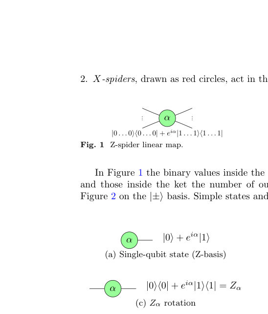 
Fig. 3 Diagrammatic representations of foundational ZX-calculus spider components: (a) Single- qubit state preparation in the green Z-basis; (b) Single-qubit state preparation in the red X-basis; (c) Green Zα rotation operator with single input and single output; (d) Red Xα rotation operator with single input and single output.

📷 Fig 2

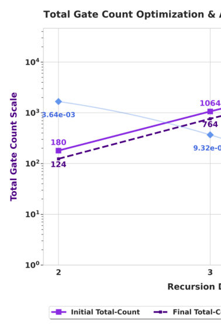 
Fig. 7 Total gate count before and after ZX-calculus post-processing for the worked example Rx(2.3), with the achieved error on the right-hand axis, against recursion depth. The error series is a function of the depth alone and is unchanged by the optimization.

📷 Fig 3

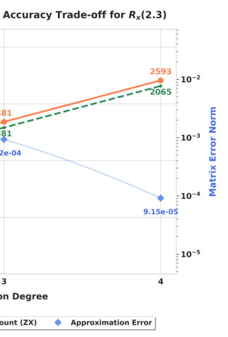 
Fig. 8 T-count before and after ZX-calculus post-processing for the worked example Rx(2.3), with the achieved error on the right-hand axis, against recursion depth.

📷 Fig 4

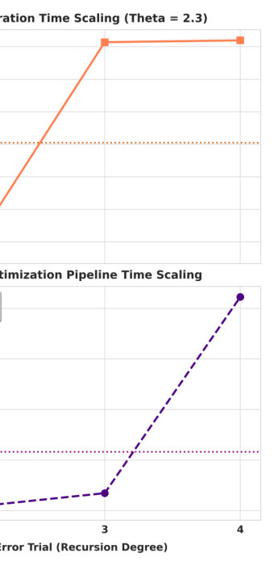 
Fig. 9 Wall-clock time against recursion depth for the worked example. Upper panel: synthesis alone. Lower panel: the combined pipeline. The dotted lines mark the means over the four depths.

**Summary.** This work quantifies the structural redundancy present in quantum circuits generated by the Solovay-Kitaev algorithm. By employing diagrammatic post-processing via ZX-calculus, the authors demonstrate that significant portions of the gate count and T-count can be removed without affecting the implemented quantum operation. This suggests a powerful, systematic optimization pathway for compiling complex quantum circuits.

**Why it may be interesting.** While focused on quantum computation, the rigorous analysis of structural redundancy and the development of efficient compilation techniques using diagrammatic methods (ZX-calculus) provides valuable theoretical tools applicable to optimizing quantum simulations in AMO physics.

Detailed structure

**Main problem.** The paper addresses the structural redundancy inherent in quantum circuits synthesized using the Solovay-Kitaev algorithm for approximating arbitrary single-qubit unitaries.

**Main result.** Diagrammatic post-processing using ZX-calculus rewriting successfully recovers a significant fraction of this redundancy, removing 26.6-30.1% of the total gate count and 18.5-22.2% of the T-count.

**Method.** The authors synthesize target unitaries using Solovay-Kitaev, map the resulting gate sequences to ZX-diagrams, and then apply automated graph-theoretic rewriting rules to simplify the structure.

**Model / system.** The model is fault-tolerant quantum computation, specifically synthesizing single-qubit unitaries ($U \in SU(2)$) using the Clifford+T gate set.

**Key observables.** Total gate count, T-count, and the percentage reduction achieved after post-processing.

**Important parameters / regimes.** Recursion depth (controls approximation level $\epsilon_k$), target unitary family ($R_x, R_y, R_z, U(	heta, \phi, \lambda)$), and the required precision $\epsilon$.

**Assumptions / limitations.** The comparison is against unoptimized Solovay-Kitaev output, and the compile-time cost of the rewriting layer can become dominant at deep recursion levels.

**Figures summary.** Figures illustrate the fundamental rewrite rules of the ZX-calculus and show the evolution of gate/T-count reduction versus recursion depth.

**Paper structure.** The paper details the synthesis process, the mapping to ZX-diagrams, the application of automated rewriting rules, and quantitative measurements comparing the initial circuit size to the optimized size across various depths and targets.

Abstract

Fault-tolerant architectures implement non-Clifford T gates through magic-state distillation, so the T-count of a synthesized circuit dominates its physical cost. The Solovay-Kitaev algorithm approximates any single-qubit unitary from a finite gate set with a sequence length that grows only polylogarithmically in the inverse target error, but it optimizes for numerical convergence rather than circuit economy, and its output carries structural redundancy that a gate-level compiler cannot see. We report a measurement of what diagrammatic post-processing recovers from that redundancy. Twelve hundred random single-qubit targets, spanning the three Pauli rotation families and the general gate U(theta, phi, lambda), are synthesized over Clifford+T at three recursion depths, translated into graph-like ZX-diagrams, simplified by automated rewriting, and extracted back to circuits. Post-processing removes 26.6-30.1% of the total gate count and 18.5-22.2% of the T-count. The absolute saving grows with recursion depth, from about 60 to about 1600 gates, while the fractional saving does not: it rises slightly from the shallowest setting and is then flat across a twenty-five-fold change in circuit length, and by the deepest setting the four target families are no longer distinguishable from one another. Because the rewrite rules preserve the implemented linear map, the approximation error is unchanged. The compile-time cost of the rewriting layer, by contrast, grows sharply with depth and comes to dominate the synthesis itself.

[↑ back to top](#top)

### [Quantum Monte Carlo in the Age of Many-Body Quantum Information](http://arxiv.org/abs/2608.23231v1)

**Authors:** Yi-Ming Ding, Bin-Bin Mao, Zheng Yan  
**Type:** theory · **Category:** numerical methods · **PDF:** <https://arxiv.org/pdf/2608.23231v1>  
**Analysis basis:** full PDF text, analyzed in chunks
**Topic relevance:** `analog quantum simulation` **1/5** · `methods for driven-dissipative` **1/5**

📷 Fig 1

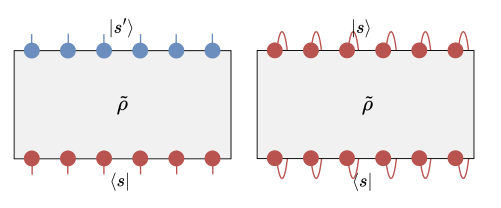 
FIG. 1: Diagrammatic illustration of a density matrix and its trace. (a) An open-time-boundary matrix element ⟨s|˜ρ|s′⟩, where ˜ρ connects the ket boundary state |s′⟩to the bra boundary state ⟨s| along the transfer direction. (b) The trace Tr(˜ρ), obtained by identifying s = s′, closing the boundary legs, and summing over the common boundary state. Only the boundary states are shown explicitly; representation-dependent auxiliary variables, such as SSE operator strings or path-integral imaginary-time histories, are omitted.

📷 Fig 2

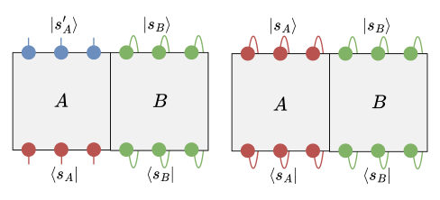 
FIG. 2: Diagrammatic illustration of a RDM and its trace. (a) The matrix element ⟨sA|˜ρA|s′ A⟩is obtained by identifying and summing over the B boundary states of the full density matrix, while keeping the A boundary states open. (b) Taking TrA(˜ρA) further identifies and sums over the remaining A boundary states, closing all boundary legs and giving TrA(˜ρA) = Tr(˜ρ).

📷 Fig 3

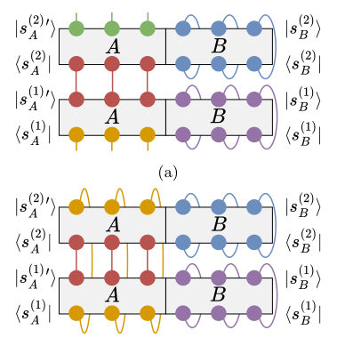 
FIG. 3: Diagrammatic illustration of the replicated RDM ˜ρ2 A and its trace. (a) The open-boundary matrix element of ˜ρ2 A. The two replicas are glued sequentially in subsystem A: the ket boundary state |s(1) A ′⟩of the first replica is identified with the bra boundary state ⟨s(2) A | of the second. The B degrees of freedom are traced within each replica. (b) The trace TrA(˜ρ2 A), obtained by further identifying and summing over the remaining open A boundary states |s(2) A ′⟩and ⟨s(1) A |. This closes all A boundary legs.

📷 Fig 4

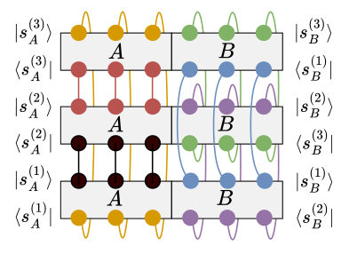 
FIG. 4: Diagrammatic illustration of the partially transposed replicated partition function Tr[(˜ρTB AB)3]. The three replicas are glued cyclically in subsystem A, as in the ordinary replicated construction. In subsystem B, however, the partial transpose changes the boundary connectivity, producing a different gluing pattern between replicas.

📷 Fig 5

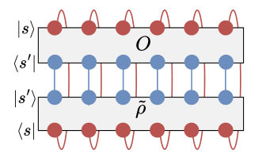 
FIG. 5: Diagrammatic illustration of the operator-inserted partition function ZO = Tr(˜ρO). The upper replica represents the operator insertion O, while the lower replica represents the density matrix ˜ρ. Closing the boundary indices implements the trace.

**Summary.** This review summarizes how Quantum Monte Carlo methods can be adapted to calculate complex, nonlinear quantum information diagnostics for many-body systems. It moves beyond simple expectation values to compute measures like entanglement entropy by sampling the full density matrix structure. This work is crucial for advancing the study of quantum correlations in strongly correlated materials using powerful numerical tools.

**Why it may be interesting.** It is highly relevant as it bridges advanced numerical techniques (QMC) with cutting-edge diagnostics in quantum information (entanglement measures), providing a roadmap for future simulations in AMO physics.

Detailed structure

**Main problem.** The paper addresses the challenge of extending Quantum Monte Carlo (QMC) methods beyond calculating conventional linear observables to compute complex, nonlinear diagnostics from many-body quantum information theory.

**Main result.** It provides a unified perspective on adapting QMC to extract advanced quantum information measures, such as entanglement entropies and entanglement spectra, for strongly correlated systems.

**Method.** The review details various QMC formulations, including those based on generalized partition-function ratios, allowing access to off-diagonal density matrix elements necessary for entanglement diagnostics.

**Model / system.** The focus is on strongly correlated quantum many-body systems, using qubit or spin-1/2 systems as the primary concrete setting, though the discussion is broadly applicable to qudit and bosonic systems.

**Key observables.** Entanglement entropies, entanglement spectra, Rényi negativities, stabilizer entropies, and observables related to spontaneous symmetry breaking.

**Important parameters / regimes.** The primary limitation discussed is the sign problem, which restricts the applicability of QMC methods.

**Assumptions / limitations.** The review assumes that the physical systems under consideration admit sign-problem-free QMC representations for the desired observables.

**Figures summary.** Figure 1 illustrates the mathematical difference between calculating the trace of a density matrix (full configuration space) versus calculating an open-time-boundary matrix element, highlighting the need to close boundary indices.

**Paper structure.** The discussion is organized logically by state representations (Section II), choice of basis (Section III), and general ratio estimation techniques (Section IV) to build a comprehensive methodological guide.

Abstract

Quantum Monte Carlo (QMC) methods are among the central numerical tools for studying strongly correlated quantum many-body systems, particularly in higher dimensions. As quantum information has introduced new information-theoretic perspectives and diagnostics into many-body physics, QMC methods have accordingly been extended beyond the measurement of conventional linear observables. This review summarizes recent progress in adapting QMC to many-body quantum-information, focusing on qubit or spin-$1/2$ systems as a concrete setting while keeping the discussion broadly applicable to qudit and bosonic systems. We present a unified perspective on the extraction of nonlinear diagnostics, including entanglement entropies and entanglement spectra, Rényi negativities for mixed-state entanglement, stabilizer entropies for quantum magic, and decoherence-driven phenomena such as the interplay between imaginary-time evolution and decoherence and strong-to-weak spontaneous symmetry breaking.

[↑ back to top](#top)

### [A high-entropy form of $R$Mn$_6$Sn$_6$ with distinct magnetotransport regimes correlated to different magnetic structures](http://arxiv.org/abs/2608.21633v1)

**Authors:** Kyle W. Fruhling, Jonathan Gaudet, William D. Ratcliff, Jonathan S. White, Siddharth Nandanwar, Noah J. Fau, Gregory T. McCandless, Enrique O. González Delgado, Julia Y. Chan, Oksana Zaharko, Michael A. Susner, Fazel Tafti  
**Type:** experiment · **Category:** strongly correlated electrons · **PDF:** <https://arxiv.org/pdf/2608.21633v1>  
**Analysis basis:** full PDF text, analyzed in chunks
**Topic relevance:** `Frenkel-Kontorova` **1/5**

📷 Fig 1

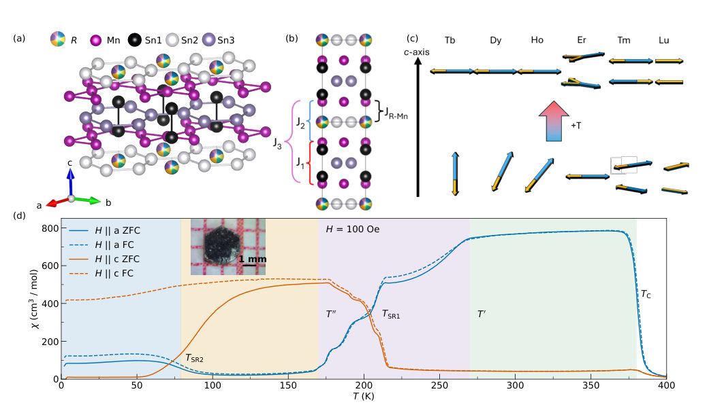 
FIG. 1. (a) The crystal structure of HE166 (same as other RMn6Sn6) showing the mixed rare-earth site and the kagome Mn layer. (b) Magnetic couplings in the RMn6Sn6 structure. (c) Magnetic ground states of various RMn6Sn6 materials in their pure form containing the rare-earth elements that were used to produce HE166. The blue arrows represent the rare-earth moment of a given unit cell and the orange arrows represent the Mn moments in a unit cell. (d) DC susceptibility vs. temperature measured in HE166. Inset: Example image of a hexagonal HE166 crystal on millimeter paper.

📷 Fig 2

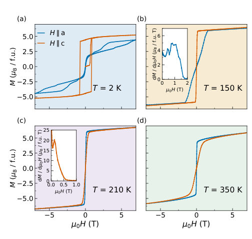 
FIG. 2. Magnetization as a function of field measured in HE166 at (a) 2 K, (b) 150 K (inset: derivative of magne- tization with respect to field with H∥a), (c) 210 K (inset: derivative of magnetization with respect to field with H∥c), and (d) 350 K. The background color of each panel corre- sponds to the temperature regimes in Fig. 1d.

📷 Fig 3

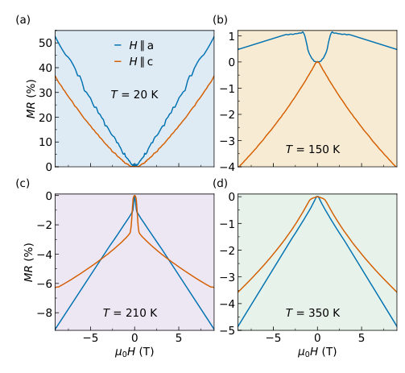 
FIG. 3. Longitudinal magnetoresistance as a function of field for HE166 at (a) 20 K, (b) 150 K, (c) 210 K, and (d) 350 K. The background color of each panel corresponds to the temperature regimes in Fig. 1d. All four panels show in-plane resistivity data, measured under both in-plane field (blue line) and out-of-plane field (orange line).

📷 Fig 4

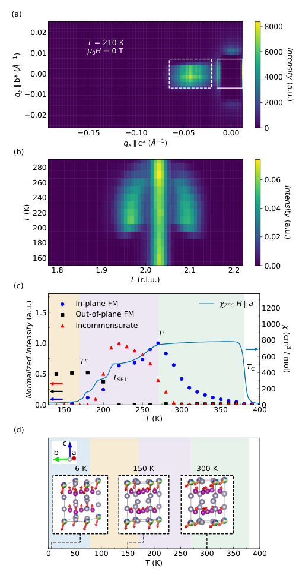 
FIG. 4. (a) SANS intensity at 210 K and zero-field. The white solid box highlights the region near the beam stop inte- grated in order to estimate the ferromagnetic in-plane contri- bution, and the white dotted box highlights the incommen- surate peak. (b) Neutron high-angle diffraction intensity in zero-field around the (002) nuclear peak. Incommensurate satellite peaks appear between 170 K and 270 K. (c) Left axis: the relative intensity of three different scattering pro- cesses; the in-plane FM contribution of the Q∼0 integration region (blue circles) as shown in the solid box in (a), its out- of-plane contribution (black squares), and the intensity of the satellite peak (red triangles)...

📷 Fig 5

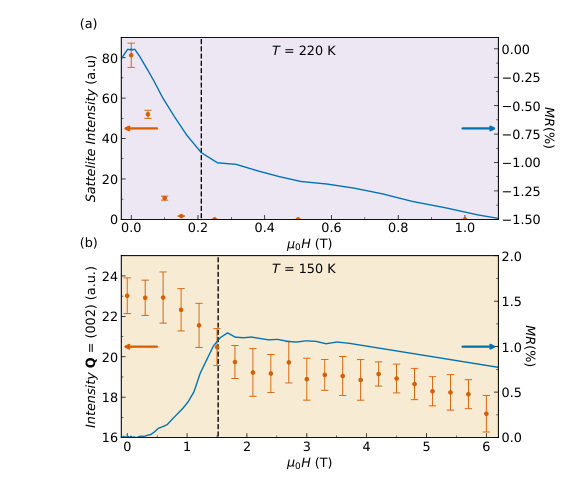 
FIG. 5. (a) Left axis: Satellite peak intensity at 220 K as a function of field showing complete suppression by 0.2 T. Right axis: Magnetoresistance at 220 K showing a change of slope at the same field where the satellite intensity is suppressed. (b) Left axis: Q = (002) peak intensity vs. field at 150 K showing a kink and sharp decrease in intensity near 1.5 T. Right axis: Magnetoresistance at 150 K showing a corresponding change from increasing to decreasing magnetoresistance.

**Summary.** This work investigates a high-entropy rare-earth manganite, $	ext{RMn}_6	ext{Sn}_6$, to understand how mixing multiple rare-earth elements controls its magnetic state. Through extensive measurements, the authors map out multiple magnetic transitions and observe a correlation between the magnetotransport anomalies and an incommensurate spin modulation. This highlights the potential for rare-earth engineering in designing novel magnetic materials.

**Why it may be interesting.** The study demonstrates how engineering disorder (high-entropy mixing) can stabilize and reveal complex, multi-stage magnetic ground states and associated transport phenomena, which is a key area of modern condensed matter physics.

Detailed structure

**Main problem.** To investigate how the interplay of multiple rare-earth elements in a high-entropy $	ext{RMn}_6	ext{Sn}_6$ structure influences its magnetic ordering and magnetotransport properties.

**Main result.** The material exhibits complex, temperature-dependent magnetic transitions (Paramagnet $	o$ easy-plane $	o$ easy-axis $	o$ canted $	ext{FiM}$) correlated with an incommensurate modulated spin state and nonmonotonic magnetoresistance.

**Method.** The study combines multiple experimental techniques, including magnetization measurements (MPMS), electrical transport (Hall effect, MR), and advanced neutron scattering (SANS, single-crystal diffraction).

**Model / system.** The physical system is the high-entropy compound $	ext{HE}166 = (	ext{Tb},	ext{Dy},	ext{Ho},	ext{Er},	ext{Tm},	ext{Lu})_1	ext{Mn}_6	ext{Sn}_6$, which is a layered magnet whose magnetism is governed by competing rare-earth interactions.

**Key observables.** Magnetic transition temperatures ($T_C=380 	ext{ K}$, $T_{	ext{SR}1}=207 	ext{ K}$, $T_{	ext{SR}2}=79 	ext{ K}$), magnetoresistance ($	ext{MR}$), and incommensurate magnetic scattering peaks ($\mathbf{k}_{	ext{inc}}$).

**Important parameters / regimes.** The rare-earth mixing ratio and the temperature/field regimes defining the magnetic anisotropy transitions (e.g., $270 	ext{ K}$ to $170 	ext{ K}$ for easy-plane to easy-axis change).

**Assumptions / limitations.** The magnetic behavior is assumed to be dictated by the interplay of various magnetic couplings ($J_1, J_2, J_3, J_{	ext{R-Mn}}$) and the rare-earth mixing effects.

**Figures summary.** Figures detail magnetization curves, magnetoresistance vs. field plots, and neutron scattering data showing both commensurate and incommensurate magnetic reflections at various temperatures.

**Paper structure.** The paper systematically characterizes the material's structure (XRD, EDX), maps out its magnetic phase transitions using magnetization measurements, and correlates these magnetic changes with transport anomalies (MR, Hall effect) and structural probes (Neutron Scattering).

Abstract

The kagome $R$Mn$_6$Sn$_6$ material family has attracted significant attention as high-temperature metallic magnets with a host of different magnetic orderings and anisotropy. Theoretical studies point to the rare-earth ($R$) as the determining factor for both the direction of magnetic anisotropy and the type of magnetic ordering in a given compound. This motivates studying high-entropy forms of $R$Mn$_6$Sn$_6$ to examine how the interplay of several rare-earth elements leads to different magnetic states in a single crystal. Here, we present a rare-earth mix of Tb, Dy, Ho, Er, Tm, and Lu that produces phase transitions from a paramagnet to an easy-plane ferrimagnet (FiM) below $T_{\text{C}}$ = 380 K, then to a FiM easy-axis state at $T_{\text{SR1}}$ = 207 K, to a canted FiM ground state below $T_{\text{SR2}}$ = 79 K. This behavior is consistent with previously reported high-entropy $R$Mn$_6$Sn$_6$ compounds; however, uniquely, the rare-earth mix studied here exhibits a broad transition from easy-plane to easy-axis anisotropy from 270 K to 170 K, and reveals a nonmonotonic magnetoresistance. Using neutron scattering data, we found that both observations correlate with an incommensurate modulated contribution to the spin state due to competing rare-earth interactions. This magnetoresistive behavior and the correlated spin structures underscore the potential for rare-earth engineering of magnetism.

[↑ back to top](#top)

### [Anomalous Local Heat Capacity and Bipartite Entanglement](http://arxiv.org/abs/2608.21508v1)

**Authors:** Jake Xuereb, A. de Oliveira Junior  
**Type:** theory · **Category:** statistical mechanics · **PDF:** <https://arxiv.org/pdf/2608.21508v1>  
**Analysis basis:** full PDF text, analyzed in chunks
**Topic relevance:** `analog quantum simulation` **1/5**

📷 Fig 1

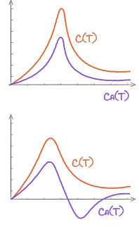 
FIG. 1. Anomalous heat capacity meets entanglement. At thermal equilibrium, (i) the global heat capacity C(T) (orange curve) of a noninteracting bipartite system is the sum of its local heat capacities, whereas (ii) in the presence of interactions, C(T) need not to be equal to the sum of the local contributions. Although the global heat ca- pacity remains nonnegative, a local heat capacity can become anoma- lous, i.e., negative, as illustrated by CA(T) (purple curve). Here, we investigate when such anomalous local thermal responses are con- nected to entanglement.

📷 Fig 2

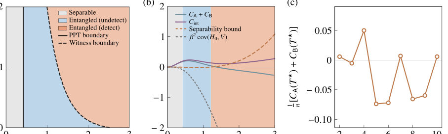 
FIG. 2. Thermodynamic entanglement detection in a spin chain. (a) Detection regions for the two-spin model as functions of βh and D/h, with J/h = 1. The solid curve marks the PPT boundary [19, 20], while the dashed curve marks the violation threshold of the separability bound in Eq. (7). The gray region is separable, the blue region is NPT-entangled but not detected by the thermodynamic witness, and the orange region contains states detected by the witness. (b) heat capacity formulation for D/h = J/h = 1. The local response CA(T) + CB(T) crosses the separability bound before their sum becomes negative. The covariance contribution β2 covβ(H0, Hint) drives the suppression of the local...

📷 Fig 3

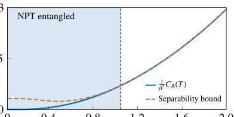 
FIG. 3. Local heat capacity and separability bound. Entanglement is detected when the local heat capacity reaches the right-hand side of Eq. (12). The shaded region indicates the NPT-entangled re- gion [25, 26], given by states satisfying varβ(pA + pB) varβ(xA −xB) &lt; 1. The figure shows that violation of the bound in Eq. (12) detects en- tanglement and that entanglement constrains the local heat capacity even in the absence of anomalies. The parameter value is χ/ω = 1.5.

**Summary.** This work establishes a quantitative link between quantum entanglement and the local heat capacity of interacting quantum systems. By deriving a separability bound based on energy fluctuations, the authors show that anomalous local heat capacities can serve as a thermodynamic witness for quantum correlations. This offers a powerful, general tool for characterizing quantum states using measurable thermal properties.

**Why it may be interesting.** It provides a novel, model-independent thermodynamic diagnostic tool—the local heat capacity bound—to detect quantum entanglement, bridging concepts from quantum information theory and classical thermodynamics.

Detailed structure

**Main problem.** The paper investigates how quantum entanglement at equilibrium influences the local heat capacity of interacting quantum systems, particularly focusing on the occurrence of anomalous (negative) heat capacities.

**Main result.** A model-independent separability bound is derived connecting local heat capacity fluctuations to entanglement, showing that violations of this bound detect quantum correlations.

**Method.** The authors use thermodynamic identities relating heat capacity to covariance and variance, deriving separability bounds based on local uncertainty relations for the system's energy operators.

**Model / system.** The study analyzes bipartite interacting quantum systems, exemplified by nearest neighbour spin-1/2 chains, coupled quantum harmonic oscillators (QHOs), and general Hamiltonians $H = H_A + H_B + H_{	ext{int}}$.

**Key observables.** Local Heat Capacity ($C_X(T)$), Global Heat Capacity ($C(T)$), Mutual Information, and the separability bound derived from energy fluctuations.

**Important parameters / regimes.** Temperature ($T$) or inverse temperature ($eta$), interaction strength ($J, \chi$), and the nature of the coupling ($H_{	ext{int}}$).

**Assumptions / limitations.** The analysis is primarily restricted to equilibrium states ($
ho_eta$) and bipartite systems, although the derived bounds are claimed to be model-independent.

**Figures summary.** Figures illustrate that local heat capacities can be anomalous in interacting systems, and they compare entanglement detection using the derived heat capacity bound against other criteria like the PPT boundary.

**Paper structure.** The paper develops the general framework by defining local heat capacity and deriving its decomposition. It then establishes the separability bound using fluctuation relations, applying this bound to specific models like spin chains and QHOs to demonstrate the connection between entanglement and thermodynamic anomalies.

Abstract

The heat capacity of a system quantifies how it energetically responds to changes in temperature at equilibrium. Whilst this quantity is positive and even additive for non-interacting systems, self-gravitating systems such as stars or subsystems of strongly interacting quantum systems are known to have negative or anomalous specific heat capacities. In this work, we investigate how the presence of entanglement at equilibrium can influence how an interacting system responds energetically to changes in temperature. We examine the local heat capacity of interacting quantum systems providing an analytical understanding for when anomalies occur. Most interestingly, we find a connection between local heat capacity anomalies and entanglement by deriving a separability bound based on the fluctuations of local and interaction energies. We illustrate our results with two examples (i) a nearest neighbour spin-1/2 chain and (ii) two coupled quantum harmonic oscillators. Lastly, we provide an information-theoretic formula connecting mutual information and athermality to the non-additivity of the heat capacity. Our results provide model-independent thermodynamic entanglement detection bounds and insight into the relationship between quantum correlations and the heat capacity of quantum systems.

[↑ back to top](#top)

### [Architectural scaling tradeoffs in modular 3D bosonic quantum processors](http://arxiv.org/abs/2608.21733v1)

**Authors:** Shaojiang Zhu, Ugur Alyanak, Tanay Roy, Alessandro Reineri, Andy C. Y. Li, Taeyoon Kim, Srivatsan Chakram, Akshay Murthy, Anna Grassellino, Alexander Romanenko  
**Type:** theory · **Category:** quantum information and computing · **PDF:** <https://arxiv.org/pdf/2608.21733v1>  
**Analysis basis:** full PDF text, analyzed in chunks
**Topic relevance:** `analog quantum simulation` **1/5**

📷 Fig 1

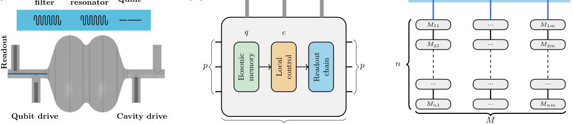 
FIG. 1. Physical-to-architectural mapping for a modular bosonic QPU built from TBMs. (a) Physical schematic of a TBM comprising an two-cell elliptical SRF cavity, ancillary transmon-based control and readout components, and external drive and readout interfaces. (b) Graph-level abstraction of one TBM, with local memory, control, and readout resources grouped into a module vertex. (c) Example of a hybrid communication graph containing M linear clusters of n modules.

📷 Fig 2

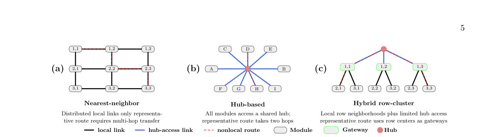 
FIG. 2. Comparison of three interconnect topologies for the same bosonic processor with 9 computational modules. (a) Nearest- neighbor grid with only local links; a representative nonlocal route requires multiple hops. (b) Hub-based architecture with a central hub connecting to all modules; the representative route uses two module-hub links. (c) hybrid row-cluster architecture that retains local row-chain connectivity while designating each row-center module as a gateway to the central hub.

📷 Fig 3

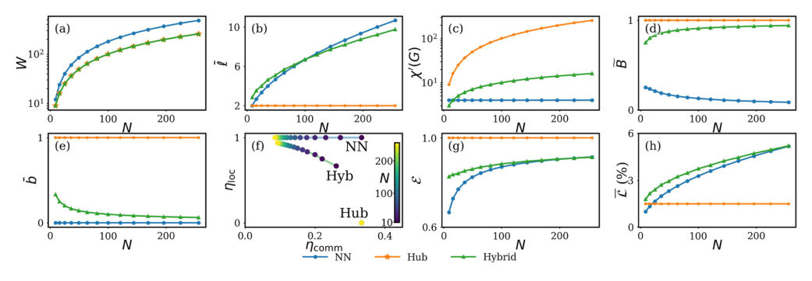 
FIG. 3. Architecture-level scaling comparison for the nearest-neighbor (NN), hub, and balanced hybrid interconnects. (a) Link count W, characterizing the total hardware-connectivity requirement. (b) Mean shortest-path distance ¯ℓbetween computa- tional modules, setting the baseline number of transfer steps required for communication. (c) Link-conflict scheduling depth C = χ′(G) under exclusive-endpoint activation, for which links sharing a module or routing resource cannot operate simul- taneously. (d) Normalized maximum shortest-path betweenness eB, characterizing the concentration of shortest-path traffic through intermediate vertices. (e) Normalized shared-resource burden ¯b = ∆r/N,...

📷 Fig 4

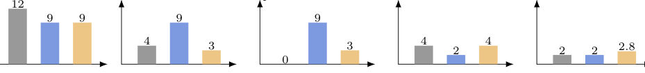 
FIG. 4. Topological proxy comparison for three 3 × 3 modular interconnects: nearest-neighbor (NN), global hub, and hybrid row-cluster. Panels show total number of links W, maximum graph degree ∆max, shared-hub burden ∆I, worst-case module- to-module path length ℓmax, and mean path length ¯ℓ.

**Summary.** This work proposes a comprehensive graph-theoretic framework to evaluate the scaling tradeoffs in modular 3D bosonic quantum processors. By analyzing different interconnect topologies, the authors map how various hardware costs, such as wiring and communication distance, are redistributed as the system size increases. This provides a systematic guide for the hardware co-design of future large-scale quantum computers.

**Why it may be interesting.** It provides a crucial, quantitative, and systematic methodology for assessing the physical feasibility and scaling limits of large-scale quantum hardware architectures, which is vital for experimental quantum information scientists.

Detailed structure

**Main problem.** The paper analyzes the architectural scaling tradeoffs for building large, modular three-dimensional (3D) bosonic quantum processors.

**Main result.** It develops a systematic framework showing that scaling costs (like wiring and communication distance) are redistributed across different topologies (nearest-neighbor, hub-based, hybrid), rather than having a single optimal solution.

**Method.** The analysis uses hardware-motivated graph-theoretic measures to compare various interconnect topologies and quantify scaling costs.

**Model / system.** The system is a modular QPU built from repeatable coupled-cavity modules (TBMs) connected by a structured inter-module communication graph.

**Key observables.** Interconnect count, communication distance ($ar{\ell}$), resource concentration, routing bottlenecks, and scheduling overhead.

**Important parameters / regimes.** Local module parameters ($q, c, p, V_{cell}$), total number of modules ($N$), and specific graph metrics like edge count and module degree.

**Assumptions / limitations.** Local module parameters are assumed not to scale with the total number of modules ($N$), and the analysis uses graph proxies rather than specifying coupling strengths or fidelities.

**Figures summary.** Figures illustrate the physical-to-architectural mapping of the TBM and compare the structural differences between nearest-neighbor, hub-based, and hybrid topologies for a small number of modules.

**Paper structure.** The paper progresses from defining the physical TBM unit to abstracting the system as a communication graph, comparing three major interconnect strategies, and finally providing a framework for systematic cost evaluation.

Abstract

We propose a modular three-dimensional bosonic quantum processor built from repeatable coupled-cavity modules linked by configurable interconnect networks. Using hardware-motivated graph-theoretic measures, we compare nearest-neighbor, hub-based, and hybrid architectures in terms of interconnect count, communication distance, resource concentration, and implementation complexity. Rather than identifying a universally optimal topology, our analysis shows how these architectures redistribute the costs of scaling, including wiring and port requirements, nonlocal communication distance, exposure to shared resources, routing bottlenecks, and scheduling overhead. Case studies of a \(3\times3\) processor and a larger hierarchical architecture further distinguish finite-size performance from asymptotic scaling. The resulting framework provides a systematic basis for evaluating modular three-dimensional bosonic processors and for identifying the device-level parameters required for quantitative hardware design.

[↑ back to top](#top)

### [Coordinate transformations and matter waves cloaking](http://arxiv.org/abs/2608.22256v1)

**Authors:** Reza G. Mohammadi, Ali G. Moghaddam, Ramin Mohammadkhani  
**Type:** theory · **Category:** other · **PDF:** <https://arxiv.org/pdf/2608.22256v1>  
**Analysis basis:** full PDF text, analyzed in chunks
**Topic relevance:** `analog quantum simulation` **1/5**

📷 Fig 1

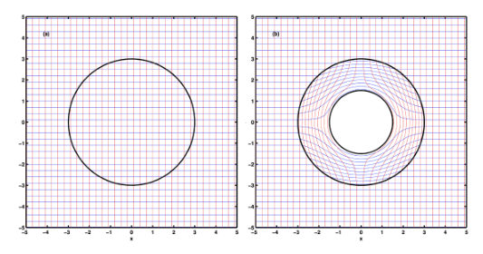 
FIG. 1. (Color online) Application of coordinate transformation to a spherical region subjected to a plane-wave electron propagating in the x-direction. As shown in the figures, the spatial transformation takes place in the x −y plane. Figure (a) shows the closed region (area inside the circle) in Cartesian coordinates, with vacuum region for both inside and outside regions of it. The rays of electron or generally matter waves (indicated by blue horizontal lines) and the wave fronts (shown by red perpendicular lines) of the incident propagating plane-wave are also shown. Figure (b) shows the transformed region according to the transformation given by Eq. (8) with b = 2a and the material...

📷 Fig 2

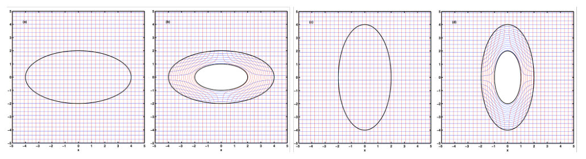 
FIG. 2. (Color online) Similar to Fig. 1 but for the ellipsoidal cloaks. Figure (a) and (c) show the closed region (area inside the horizontal and vertical ellipsoids) in Cartesian coordinates. Figures (b) and (d) show the transformed region according to the transformation Eq. (20) with b = 2a and the material properties in the cloaking region determined by Eqs. (24). The matter wave rays and wave fronts transform accordingly.

**Summary.** This paper develops a coordinate transformation method to design 'invisibility cloaks' for matter waves. By transforming the Schrödinger equation, the authors derive the necessary spatially varying mass tensors and potentials required to guide quantum waves around an object without scattering. This technique is successfully applied to spherical, cylindrical, and ellipsoidal geometries.

**Why it may be interesting.** This work provides a rigorous theoretical framework for designing metamaterials for quantum particles, which is highly relevant to quantum optics and the engineering of wave propagation in structured media.

Detailed structure

**Main problem.** The paper addresses the theoretical challenge of controlling wave propagation, specifically achieving invisibility cloaking, for matter waves.

**Main result.** The authors derive the exact spatially varying mass tensor and potential required to cloak matter waves using coordinate transformations for spherical, cylindrical, and ellipsoidal geometries.

**Method.** The methodology involves applying coordinate transformations to the Schrödinger equation with a position-dependent mass tensor, allowing the determination of the required material parameters in the physical space.

**Model / system.** The system modeled is matter waves governed by the time-independent Schrödinger equation, which is adapted to include a position-dependent mass tensor and potential, $\left(-rac{\hbar^2}{2} 
abla \cdot (\hat{m}^{-1} 
abla) + V
ight) \psi = E\psi$.

**Key observables.** The effective mass tensor components ($\mathbf{m}$) and the effective potential ($V$) are the key derived observables.

**Important parameters / regimes.** The geometry is defined by parameters like the inner radius ($a$) and outer radius ($b$) for the cloaking region.

**Assumptions / limitations.** The analysis assumes the wave equation remains covariant under coordinate transformations and focuses on orthogonal bases where the metric tensor is diagonal.

**Figures summary.** Figure 1 illustrates the mapping of a spherical region using coordinate transformation, while Figure 2 shows the mapping for ellipsoidal cloaks, comparing the physical region to the transformed cloaking region.

**Paper structure.** The paper establishes the theoretical framework using covariant forms of the Schrödinger equation, derives the transformation relations, and then applies this framework sequentially to derive specific material parameters for spherical, cylindrical, and ellipsoidal cloaks.

Abstract

Transformation method provides an efficient tool to control wave propagation inside the materials. Using the coordinate transformation approach, we study invisibility cloaks with sphere, cylinder and ellipsoid structures for electronic waves propagation. The underlying physics behind this investigation is the fact that the Schrödinger equation with position-dependent mass tensor and potentials has a covariant form that follows the coordinate transformation. Using this technique we obtain the exact spatial form of the mass tensor and potentials for a variety of cloaks with different shapes.

[↑ back to top](#top)

### [Fractality of the Schrödinger Density for Rough Data](http://arxiv.org/abs/2608.22547v1)

**Authors:** Masoud Ataei  
**Type:** theory · **Category:** other · **PDF:** <https://arxiv.org/pdf/2608.22547v1>  
**Analysis basis:** full PDF text, analyzed in chunks
**Topic relevance:** `interference shaping light` **1/5**

📷 Fig 1

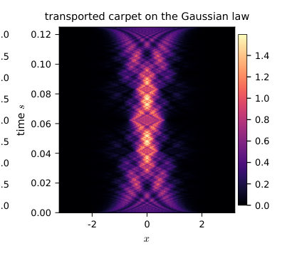 
Fig. 1 One observable period of the carpet flow, computed from the series (9). Left: the canonical carpet, the kernel ws over rank z and rescaled time s ∈[0, 1

📷 Fig 2

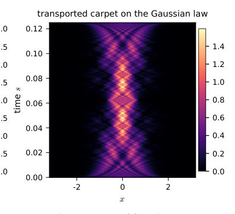 
Figure 1 displays one observable period of the flow, on rank space and transported onto the Gaussian law: the palindrome of the clock, the bright revivals of rational times, and the fractal interstices between them are visible to the eye. At rational times the carpet flow revives into finitely many quantile cells. Theorem 2 (Quantile mosaics). Let s = p/q in lowest terms. The phase χ(n) = e−2πin2p/q is periodic in n with period q, and its discrete Fourier expansion yields the revival

📷 Fig 3

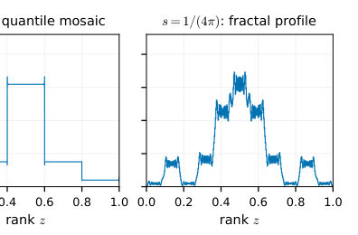 
Fig. 2 Three sections of the carpet, computed from the truncated series (9). Left: at s = 1 16 the density is the quartile blackout, vanishing identically on the outer quartiles and equal to 2 on the interquartile range. Center: the five-cell quantile mosaic at s = 1 20 ; the mosaic lives on the fifths rather than the twentieths, the Gauss coefficients with odd r vanishing for q ≡0 mod 4, so the cell count of Theorem 2 is not sharp. Right: at the generic time s = 1/(4π) the section is a fractal profile of upper box dimension 3

📷 Fig 4

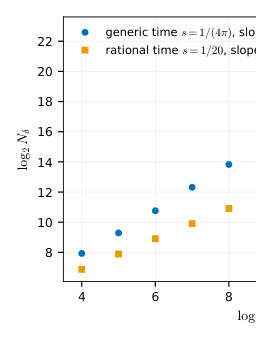 
Fig. 3 Box-counting regression on sections of the carpet: the number Nδ of δ-boxes meeting the graph of ws, over dyadic scales δ = 2−4, . . . , 2−14, computed from the series (9). At the generic time s = 1/(4π) the fitted slope over the five finest octaves is 1.530, matching the dimension 3

📷 Fig 5

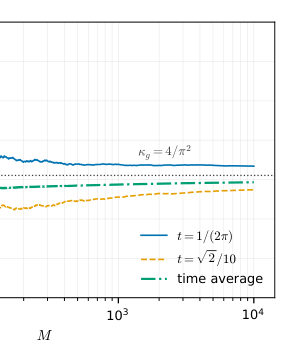 
Fig. 4 The strong law for the square-wave datum on the torus: the normalized critical mass YM(t)/ log M for two generic times and in time average, against the limit κg = 4/π2 ≈0.405 of the law (23). The deviation from the limit is of order 1/ log M: the mass itself is κg log M + O(1) with bounded mean-square fluctuations, by the variance bound of the theorem, and the division by log M makes the O(1) term visible at this range of M.

**Summary.** This theoretical paper rigorously proves that the intensity density of the free Schrödinger evolution for rough data exhibits universal fractal properties. It establishes the upper box dimension of this density to be exactly 3/2 and quantifies the logarithmic divergence of the critical Sobolev mass. The findings connect fundamental concepts of wave dynamics, fractal geometry, and spectral analysis.

**Why it may be interesting.** This work provides deep mathematical insights into the scaling and fractal geometry of quantum wave packet dynamics, connecting concepts from wave propagation (Talbot effect) to rigorous fractal analysis.

Detailed structure

**Main problem.** The paper determines the general fractality of the intensity (density) of the free Schrödinger evolution for rough periodic data, extending previous results limited to simple step functions.

**Main result.** The density's graph is proven to be fractal at almost every time, possessing an upper box dimension of exactly three halves (3/2). Furthermore, the critical Sobolev mass diverges logarithmically, with a rate determined by Wiener's jump statistic.

**Method.** The analysis employs advanced mathematical tools including the derangetropy operator, Fourier mode expansions, and probabilistic methods like the Borel–Cantelli lemma to analyze time-averaged properties.

**Model / system.** The model is the free Schrödinger evolution on the torus, applied to the observable intensity (density) derived from rough periodic data, relating to the Talbot effect in wave optics.

**Key observables.** The density of the evolving field (intensity, $|u|^2$), the upper box dimension of the density's graph, and the critical Sobolev mass.

**Important parameters / regimes.** The jump content of the initial data (Wiener's jump statistic), time $t$, and the spectral growth rate.

**Assumptions / limitations.** The analysis assumes the initial data is real, has bounded variation, and contains at least one jump. Some results rely on conjectures regarding almost-sure upgrades of mean laws.

**Paper structure.** The paper progresses by establishing the general fractal nature of the density, analyzing its time-averaged properties (e.g., time-averaged carpet and divergence), and calculating the asymptotic behavior of the critical mass using spectral representations.

Abstract

The observable of the Talbot effect is the intensity behind the grating: the density of the evolving field, not the field itself. Its fractality was previously known only for step data with rational jumps. We prove the general case. For arbitrary real data of bounded variation with at least one jump, the density of the free Schrödinger evolution on the torus is fractal at almost every time, with graph of upper box dimension exactly three halves. Its critical Sobolev mass diverges logarithmically, at a rate given in closed form by Wiener's jump statistic of the datum and independent of the positions and phases of the jumps. The same rate is halved along time traces and doubled for the Airy flow, so the critical mass probes the dispersion relation. Transported by the rank calculus of derangetropy operators, the theory equips every probability law with a quantum carpet: Gauss-sum revivals on quantile cells at rational times, a universal fractal at almost every other. The spectral growth rate of a single measured intensity profile returns the jump content of the grating, a prediction open to test in optical and matter-wave interferometry.

[↑ back to top](#top)

### [Hydrogen Molecular Ion and Molecule in Classical Electrodynamics with Classical Zero-Point Radiation](http://arxiv.org/abs/2608.22535v1)

**Authors:** Timothy H. Boyer  
**Type:** theory · **Category:** other · **PDF:** <https://arxiv.org/pdf/2608.22535v1>  
**Analysis basis:** full PDF text, analyzed in chunks
**Topic relevance:** `Keldysh / 2PI / non-Gaussian methods` **1/5**

📷 Fig 1

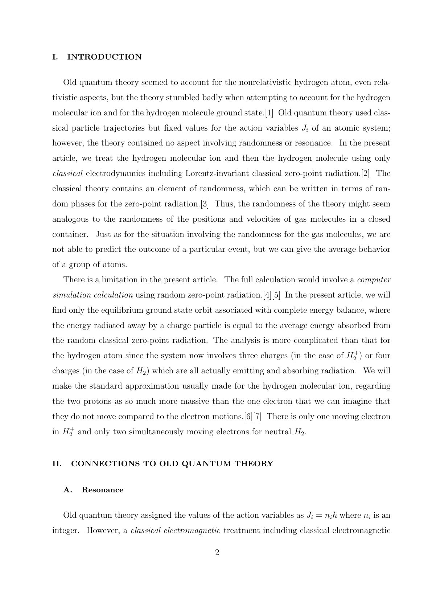 
Low-resolution page preview, page 2

📷 Fig 2

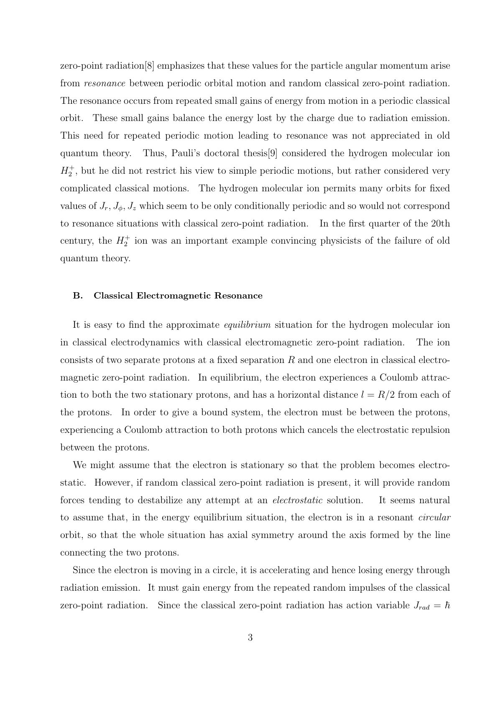 
Low-resolution page preview, page 3

📷 Fig 3

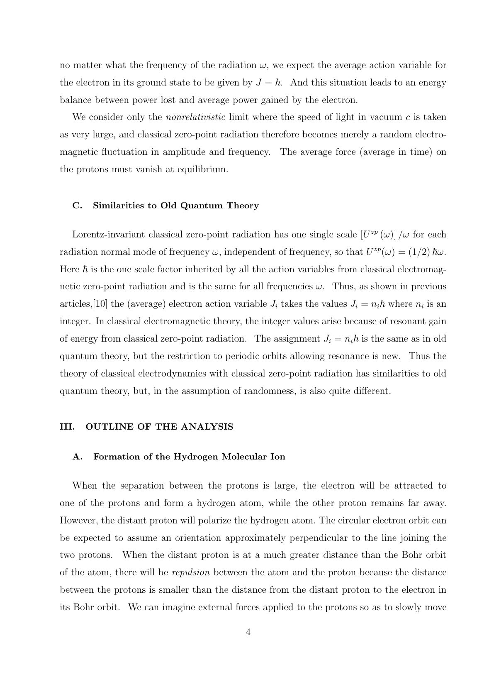 
Low-resolution page preview, page 4

📷 Fig 4

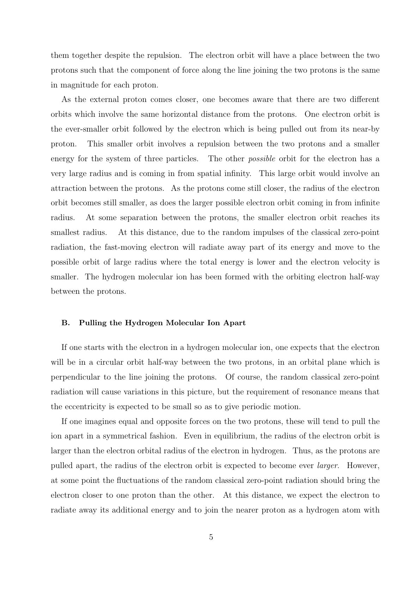 
Low-resolution page preview, page 5

📷 Fig 5

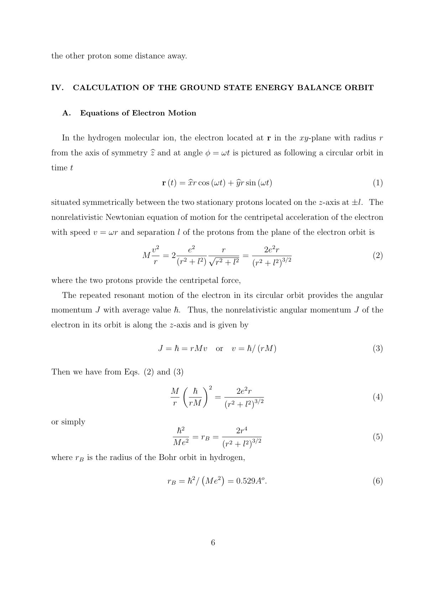 
Low-resolution page preview, page 6

**Summary.** This paper applies classical electrodynamics, including zero-point radiation, to calculate the binding energies of $	ext{H}_2^+$ and $	ext{H}_2$. It finds that the molecular ion is less bound than expected due to classical repulsive effects. The study provides quantitative estimates for binding energies and separations, offering a classical perspective on molecular stability.

**Why it may be interesting.** This work applies classical electrodynamics to molecular bonding, providing a theoretical comparison to quantum results and exploring how zero-point fluctuations modify chemical binding energies, which is relevant to open quantum systems and molecular structure.

Detailed structure

**Main problem.** The paper investigates the binding energies of the hydrogen molecular ion ($	ext{H}_2^+$) and the hydrogen molecule ($	ext{H}_2$) using a classical electrodynamics framework that incorporates classical zero-point radiation.

**Main result.** Classically, the molecular ion ($	ext{H}_2^+$) is predicted to be less strongly bound than a single hydrogen atom, a result attributed to repulsive forces when considering the electron's resonant orbit.

**Method.** The analysis uses approximate calculations based on classical electrodynamics, modeling the electron's motion as a resonant circular orbit while balancing energy loss from radiation against zero-point energy gain.

**Model / system.** The system involves the $	ext{H}_2^+$ and $	ext{H}_2$ molecules. The model treats the protons as stationary and analyzes the electron's dynamics using nonrelativistic equations of motion derived from classical electrodynamics.

**Key observables.** Binding energy of $	ext{H}_2^+$ ($\approx 2.1 	ext{ eV}$) and $	ext{H}_2$ ($\approx 4.6 	ext{ eV}$), and the equilibrium proton separation ($0.916 	ext{ a}_0$ for $	ext{H}_2^+$).

**Important parameters / regimes.** The zero-point radiation acts as a key energy source/sink; the analysis relies on the assumption of a resonant circular orbit for the electron.

**Assumptions / limitations.** The calculation is approximate, requiring a full computer simulation for accuracy. Key assumptions include treating the protons as much heavier than the electron and assuming the electron follows a resonant circular orbit.

**Figures summary.** Not specified.

**Paper structure.** The paper develops the classical equations of motion for the electron in $	ext{H}_2^+$ (using circular orbit assumptions) to find equilibrium parameters, then extends the analysis to $	ext{H}_2$ to compare binding energies.

Abstract

The hydrogen molecular ion and the hydrogen molecule are treated in an approximate calculation based on classical electrodynamics which includes classical zero-point radiation. It is found within the classical theory that a molecular ion is less-well bound than a hydrogen atom plus a distant proton. The smaller binding energy is explained due to the repulsive nature of the force between the proton and the atom when considering the most natural resonant orbit of the electron. The approximate classical electromagnetic calculation gives a binding energy of $2.1eV$ and a proton separation of $0.916A^{o}$ for the hydrogen molecular ion. The hydrogen molecule is formed by adding a single additional electron to the ion. The electrostatic attraction of the electron to the ion gives a binding energy of $4.6eV$ and a inter-proton separation of $0.6A^{o}$ for the hydrogen molecule in this classical electromagnetic approximation.

[↑ back to top](#top)

### [Importance-Reweighted Fock-Space Variational Monte Carlo](http://arxiv.org/abs/2608.22925v1)

**Authors:** Zheng Che  
**Type:** theory · **Category:** numerical methods · **PDF:** <https://arxiv.org/pdf/2608.22925v1>  
**Analysis basis:** full PDF text, analyzed in chunks
**Topic relevance:** `methods for driven-dissipative` **1/5**

📷 Fig 1

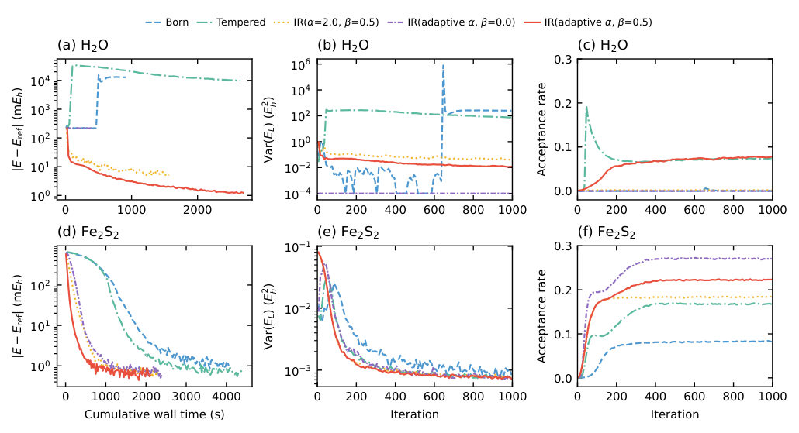 
Figure 1: Sampling and optimization over the first 1000 iterations for equilibrium H2O (top) and Fe2S2 (bottom). Born uses the Born distribution with a symmetric 50:50 single/double proposal; Tempered uses adaptive 𝛼with the same proposal; the three IR curves use the Hamiltonian-guided construction with (𝛼, 𝛽) = (2, 0.5), adaptive 𝛼with 𝛽= 0, and adaptive 𝛼with 𝛽= 0.5, respectively. Curves are medians over 10-iteration blocks. Left: |𝐸−𝐸ref| versus cumulative wall time, with FCI and SA-DMRG references for H2O and Fe2S2. Center: sampled local-energy variance, with values below 10−4 𝐸2 h shown at the plotting floor. Right: Metropolis–Hastings acceptance rate of the Markov chain.

📷 Fig 2

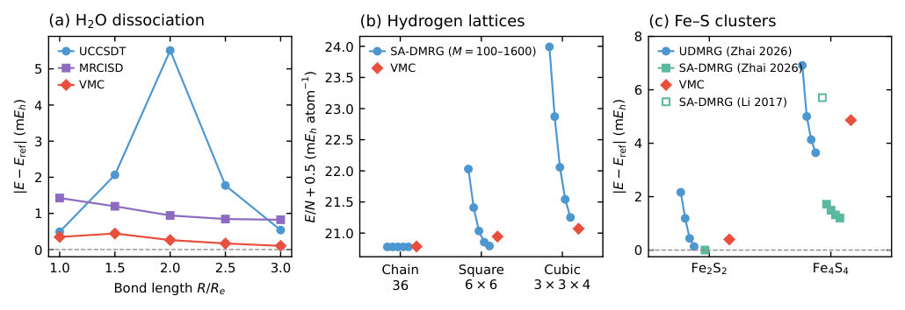 
Figure 2: Variational energy benchmarks. (a) Errors relative to FCI for all-electron (10𝑒, 24𝑜) H2O/cc-pVDZ, with UCCSDT and MRCISD for comparison.51 (b) Energies per atom for half-filled 36-site STO-6G chain, 6 × 6 square, and 3 × 3 × 4 cubic lattices, compared with SA-DMRG at 𝑀= 100–1600. (c) Errors for Fe2S2 (30𝑒, 20𝑜) and Fe4S4 (54𝑒, 36𝑜). References are −116.605609 𝐸h (𝑀= 12000 SA-DMRG) and −327.245342 𝐸h (extrapolated BS1 SA-DMRG), respectively. Filled DMRG points are from Ref.52 ; the open square is from Ref.47

📷 Fig 3

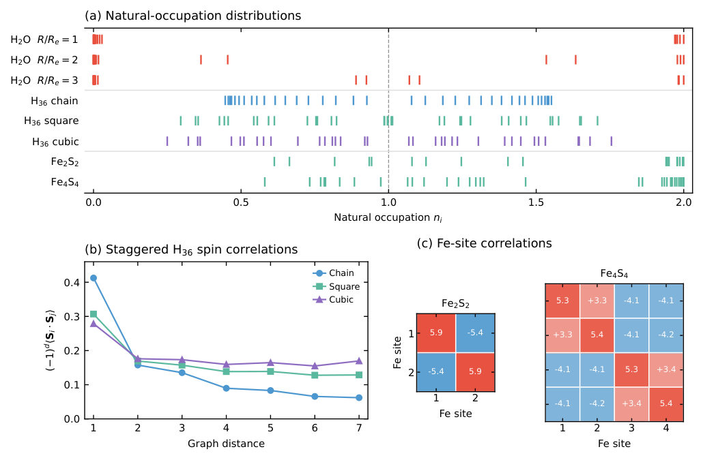 
Figure 3: Electronic-correlation diagnostics for the optimized IR-FS-VMC states. (a) Natural occupations for H2O at 𝑅/𝑅e = 1, 2, and 3, the three H36 lattices, and the iron–sulfur clusters; the dashed line marks 𝑛𝑖= 1. (b) Staggered H36 spin correlations (−1)𝑑⟨𝑺𝑖⋅𝑺𝑗⟩, averaged over orbital pairs at Manhattan distance 𝑑. (c) Fe-site correlations ⟨𝑺𝐼⋅𝑺𝐽⟩, obtained by summing over the five Fe 3𝑑orbitals on each site; diagonal entries are ⟨𝑺2 𝐼⟩.

**Summary.** This work introduces Importance-Reweighted Fock-Space Variational Monte Carlo (IR-FS-VMC) to overcome sampling limitations in electronic structure calculations. By redesigning the Monte Carlo evaluation using importance reweighting, the method accurately computes variational quantities for systems with varied electronic correlations. The protocol is shown to be robust across molecules and magnetic clusters, validating its use in challenging quantum chemistry regimes.

**Why it may be interesting.** The development of robust stochastic estimators that decouple the sampling process from the local energy fluctuations is crucial for applying VMC to complex, strongly correlated systems where standard sampling methods fail or become unstable.

Detailed structure

**Main problem.** The paper addresses the challenge of accurately evaluating variational quantities (energy, gradient, SR matrix) in Fock-space Variational Monte Carlo (FS-VMC) when the Born distributions vary significantly between electronic systems.

**Main result.** The proposed Importance-Reweighted FS-VMC (IR-FS-VMC) protocol successfully maintains the variational objective while robustly estimating necessary expectations across diverse electronic-correlation regimes.

**Method.** It redesigns the Monte Carlo evaluation by using an auxiliary distribution and a Hamiltonian-guided proposal for the Markov chain, followed by self-normalized importance reweighting to recover the required Born-distribution expectations.

**Model / system.** The method is applied to ab initio electronic Hamiltonians in a finite orbital basis, tested on molecular systems like H2O, hydrogen lattices, and strongly correlated iron-sulfur clusters (Fe2S2, Fe4S4).

**Key observables.** Variational energy, energy gradient, Stochastic Reconfiguration (SR) matrix, Markov-chain acceptance rate, and local-energy variance.

**Important parameters / regimes.** The method uses tunable parameters like the exponent $\alpha$ (controlling the auxiliary distribution) and thresholds $\epsilon_1, \epsilon_2$ for Hamiltonian decomposition.

**Assumptions / limitations.** The self-normalized estimators are consistent but biased at finite sample size; the method assumes the variational objective remains unchanged despite the redesign of the Monte Carlo evaluation.

**Figures summary.** Figures compare stochastic diagnostics (acceptance rate, local-energy variance) and final variational energies against established methods across bond stretching and lattice structures, showing the protocol's stability.

**Paper structure.** The paper introduces the IR-FS-VMC formalism, details the Hamiltonian decomposition and sampling protocols, and validates the method by applying it to a suite of chemically and electronically diverse systems, comparing results against high-accuracy benchmarks.

Abstract

Fock-space variational Monte Carlo (FS-VMC) evaluates variational quantities by stochastic sampling over discrete many-body configurations. For ab initio electronic Hamiltonians, Born distributions can differ markedly between systems, and a Markov chain that mixes well need not yield low-variance estimators. We introduce importance-reweighted FS-VMC (IR-FS-VMC), which leaves the variational objective unchanged while redesigning its Monte Carlo evaluation. An auxiliary distribution and Hamiltonian-guided proposal define the Markov chain, while an evaluation Markov kernel defines an analytically tractable evaluation distribution. Self-normalized importance reweighting then recovers the Born-distribution expectations entering the energy, gradient, and stochastic reconfiguration (SR) matrix. Controlled comparisons on equilibrium H2O and Fe2S2 separate Markov-chain acceptance from local-energy fluctuations and optimization behavior. Using one production protocol, calculations for H2O dissociation, 36-site hydrogen lattices, and Fe2S2 and Fe4S4 active spaces yield accurate variational energies across different Born distributions and electronic-correlation regimes. Together, these results show that the production protocol can support robust FS-VMC optimization across the electronic-structure regimes studied here.

[↑ back to top](#top)

### [Markov Constraints Enhance Identifiability in Quantum Shadow Inversion](http://arxiv.org/abs/2608.21765v1)

**Authors:** Zhixing Chen, Lin Chen  
**Type:** theory · **Category:** quantum information and computing · **PDF:** <https://arxiv.org/pdf/2608.21765v1>  
**Analysis basis:** full PDF text, analyzed in chunks
**Topic relevance:** `quantum measurements` **1/5**

📷 Fig 1

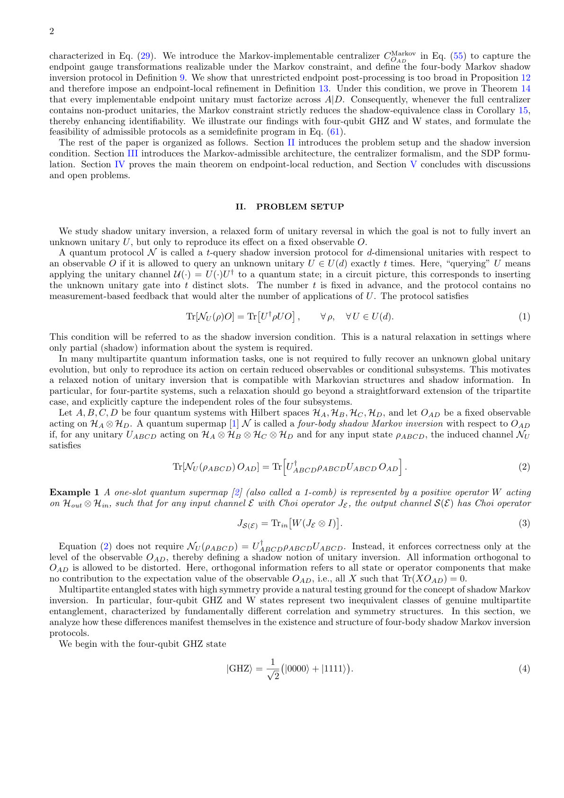 
Low-resolution page preview, page 2

📷 Fig 2

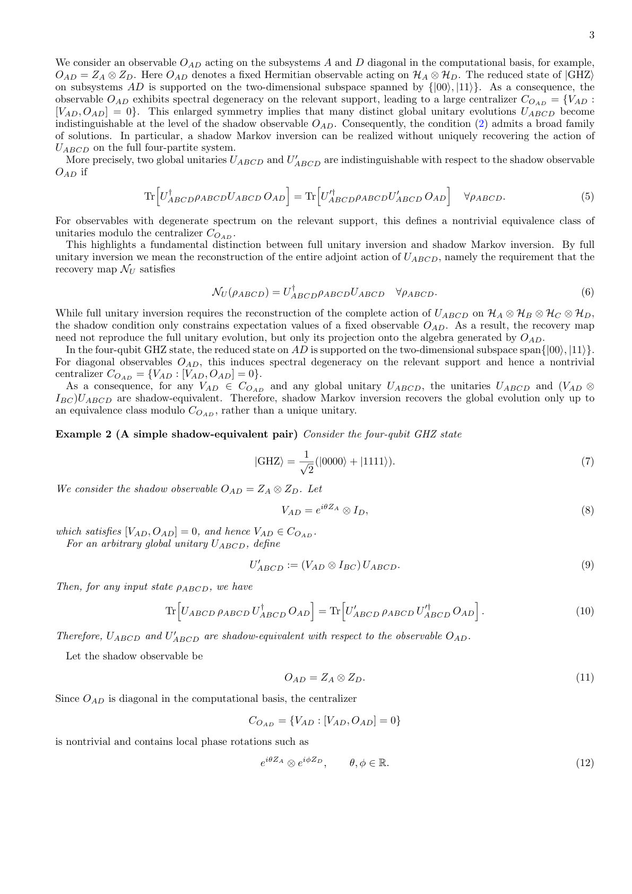 
Low-resolution page preview, page 3

📷 Fig 3

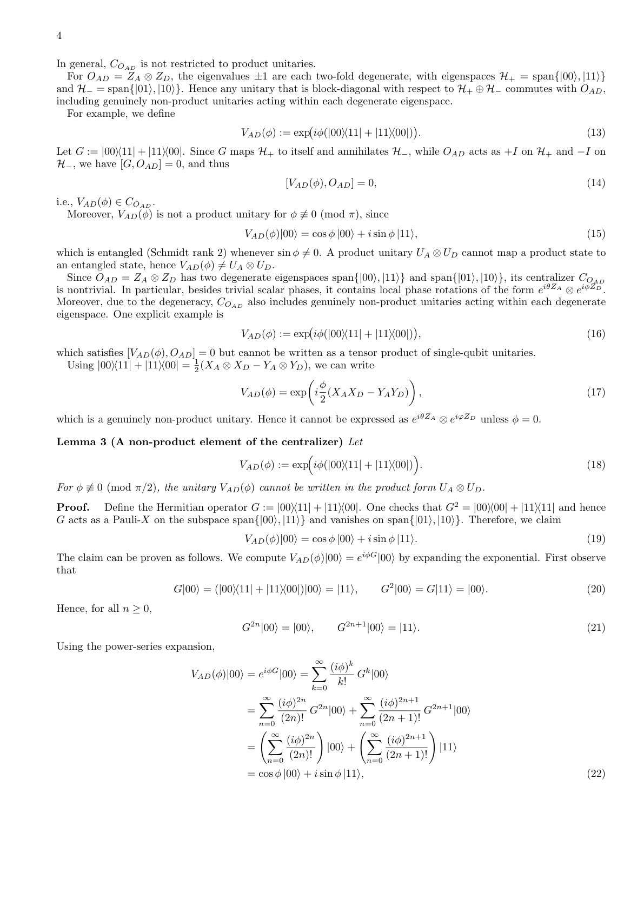 
Low-resolution page preview, page 4

📷 Fig 4

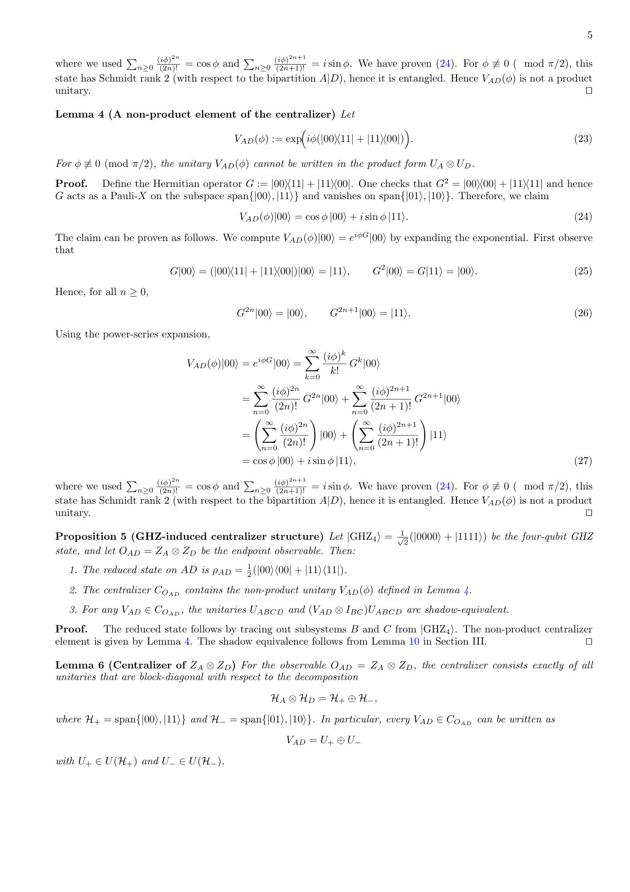 
Low-resolution page preview, page 5

📷 Fig 5

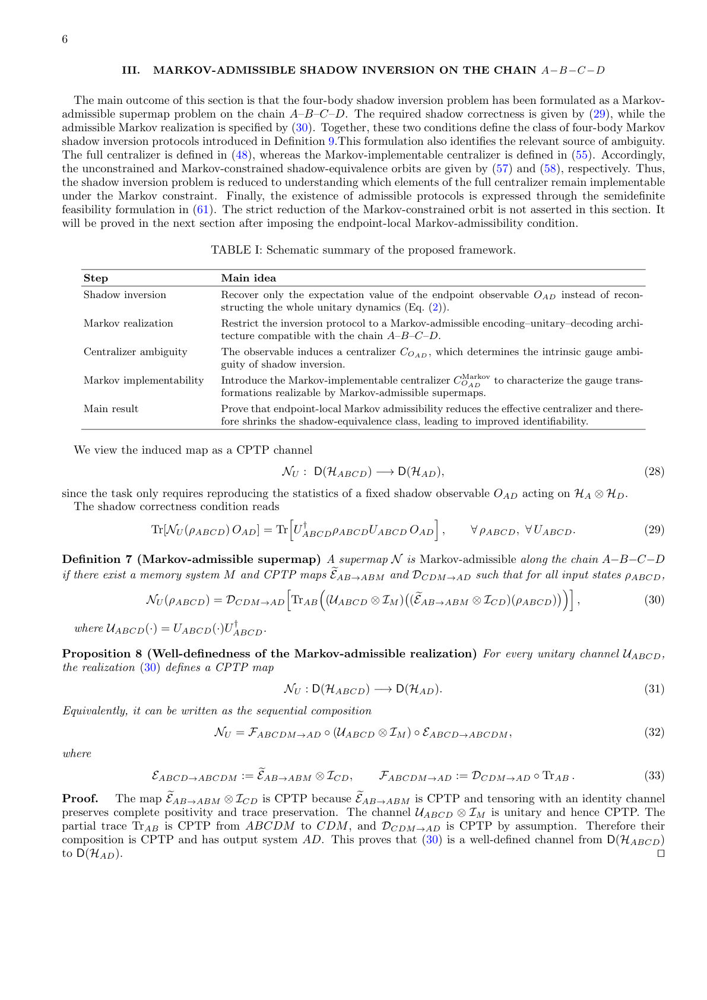 
Low-resolution page preview, page 6

**Summary.** This paper investigates quantum shadow inversion for four-partite systems, where the goal is to determine global unitary evolution from limited endpoint measurements. The authors demonstrate that incorporating Markovian locality constraints forces the system's inherent ambiguity (the centralizer) to shrink, thereby providing a structural enhancement to the process's identifiability.

**Why it may be interesting.** This work provides a rigorous structural mechanism showing how physical locality constraints (Markovianity) can act as a powerful resource to resolve ambiguities inherent in quantum process tomography or state reconstruction tasks.

Detailed structure

**Main problem.** The paper addresses quantum shadow inversion, which aims to reconstruct an unknown global unitary evolution from measurements involving only a fixed observable at the endpoints of a multi-partite quantum system.

**Main result.** By imposing Markovian locality constraints, the inherent ambiguity in the shadow inversion process (described by the centralizer) is strictly reduced, enhancing the identifiability of the underlying unitary dynamics.

**Method.** The authors use the framework of Markov-admissible supermaps and analyze the structure of the centralizer associated with the endpoint observable, comparing the full centralizer to the Markov-implementable centralizer.

**Model / system.** The study focuses on four-partite quantum systems (A-B-C-D) arranged linearly, whose evolution is governed by an unknown global unitary $U_{ABCD}$. The analysis is formalized using supermaps and Choi operators.

**Key observables.** The primary observable is the endpoint observable $O_{AD}$, and the key diagnostic is the centralizer $C_{OAD} = \{V_{AD} : [V_{AD}, O_{AD}] = 0\}$, which quantifies the ambiguity.

**Important parameters / regimes.** The system size (four parties) and the specific structure of the Markov constraint (endpoint-local refinement) are crucial parameters.

**Assumptions / limitations.** The core assumption leading to the enhancement is the imposition of the endpoint-local Markov admissibility condition, which forces endpoint unitaries to factorize across the A|D bipartition.

**Figures summary.** The notes do not provide a summary of figures, but mention schematic summaries (Table I) illustrating the progression from shadow inversion to Markov realization and centralizer ambiguity.

**Paper structure.** The paper follows a logical progression: defining the shadow inversion problem using Markov-admissible supermaps, introducing the centralizer ambiguity, and then proving that imposing endpoint-local Markov admissibility strictly reduces this ambiguity via the factorization requirement.

Abstract

We study quantum shadow inversion under Markovian locality constraints for four-partite systems arranged along the chain $A$--$B$--$C$--$D$. The goal is to reproduce the expectation value of a fixed endpoint observable $O_{AD}$ after an unknown global unitary, without requiring full unitary inversion. We formulate the task using Markov-admissible supermaps and introduce the Markov-implementable centralizer to describe the remaining endpoint gauge freedom. We show that unrestricted endpoint post-processing is too broad, and impose an endpoint-local refinement. Under this condition, every implementable endpoint unitary must factorize across $A|D$, so the Markov constraint strictly reduces the centralizer-induced shadow ambiguity whenever the full centralizer contains non-product unitaries. This provides a structural mechanism by which Markov locality enhances identifiability in quantum shadow inversion.

[↑ back to top](#top)

### [Motional Degrees of Freedom in Network Hamiltonian Models](http://arxiv.org/abs/2608.21634v1)

**Authors:** Peng Huang, Elizabeth M. Diessner, Carter T. Butts  
**Type:** theory · **Category:** statistical mechanics · **PDF:** <https://arxiv.org/pdf/2608.21634v1>  
**Analysis basis:** full PDF text, analyzed in chunks
**Topic relevance:** `analog quantum simulation` **1/5**

📷 Fig 1

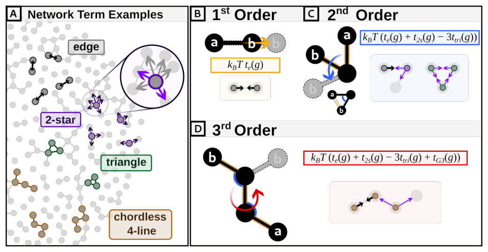 
FIG. 1. Network terms represent topological degrees of freedom of the aggregation graph, and are captured as parameters in the network Hamiltonian. A) Examples of structures contributing to terms used here on an arbitrary graph state, including edges (grey), 2-stars (purple), triangles (green), and chordless 4-lines (orange). A close-up of a 2-star shows one of the 6 2  2-stars centered on a single node; every pair of edges on the same node contributes a 2-star. B) First-order effects arise from bond vibrations between bound particles ‘a’ and ‘b’, indicated by a yellow arrow, contributing 2 df per edge (te(G)). C) Second-order effects arise from the angular oscillations (librations)...

📷 Fig 2

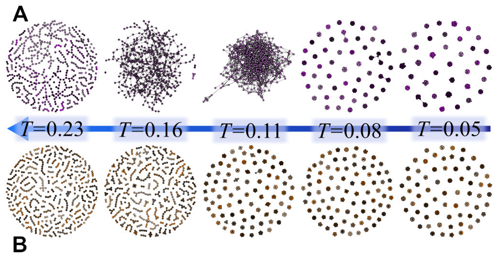 
FIG. 3. Typical aggregation graphs at extreme low temperature for 2nd (A) and 3rd (B) order models. Nodes are shaded to show distinct components. Both models transition from minimally aggregated states at T = 0.25 to compact particles by T = 0.0625, but show different behavior at intermediate temperatures.

📷 Fig 3

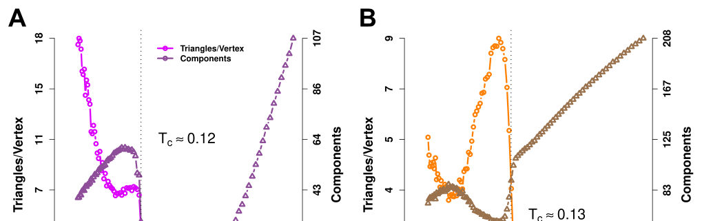 
FIG. 4. Phase behavior of 2nd (A) and 3rd (B) order models near the first low-temperature transition. Neither model generates triangulation above Tc, but adding a dihedral effect locally reverses the behavior of component count across the transition.

📷 Fig 4

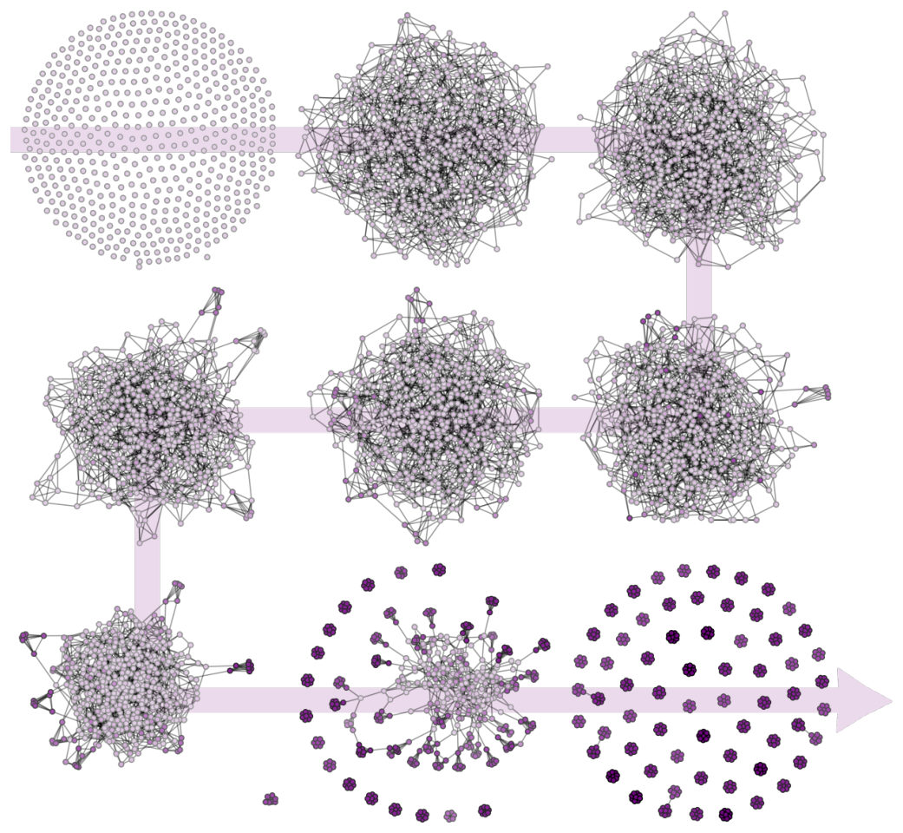 
FIG. 5. Aggregation kinetics trajectory for the second order model at T = 0.1; frames show states at 0 and 3125×2(0,1,2,3,4,5,6,7)

📷 Fig 5

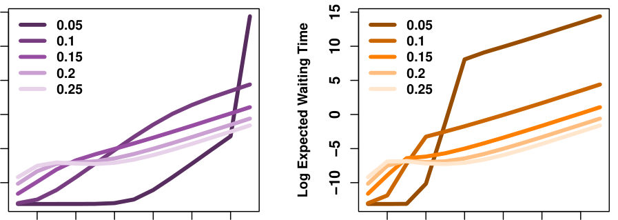 
FIG. 6. Log expected event times (relative to collision rate) for first passage from pure k-clique phases, by clique size, model order, and temperature. Cliques have little stability in low-order models, while high-order models selectively stabilize large cliques at low temperature.

**Summary.** This work extends Network Hamiltonian Models by explicitly accounting for motional energy contributions arising from two-, three-, and four-body interactions. By incorporating these terms, the model predicts that particle aggregation at low temperatures favors the formation of small, dense, droplet-like clusters rather than extended gel phases. This demonstrates how neglected local dynamics can fundamentally change the predicted macroscopic phase behavior.

**Why it may be interesting.** While focused on classical statistical mechanics, the methodology of coupling local energy constraints (motional terms) to global topological structure (the network) is relevant for understanding complex many-body dynamics in quantum systems where local fluctuations influence global phase transitions.

Detailed structure

**Main problem.** The paper addresses how to incorporate the influence of unmodeled motional degrees of freedom into Network Hamiltonian Models (NHMs) used to describe particle aggregation.

**Main result.** Incorporating three-body (libration) and four-body (dihedral) motional terms significantly alters the aggregation phase behavior at low temperatures, favoring the formation of small, droplet-like structures.

**Method.** The authors derive and incorporate energy terms into the network Hamiltonian based on the assumption of time-scale separation between bond formation and molecular motion.

**Model / system.** The model uses NHMs to describe aggregation, treating the system as a network where edges represent interactions. The Hamiltonian is augmented with terms representing vibrational, librational, and dihedral energy contributions.

**Key observables.** Density, number of components, mean component size, and the stability/transition behavior of the system across different model orders.

**Important parameters / regimes.** Temperature (T), and the order of the motional correction (2nd and 3rd order terms).

**Assumptions / limitations.** The primary assumption is the time-scale separation between bond dynamics and molecular motion, allowing motional energy contributions to be approximated by equilibrium terms.

**Figures summary.** Figures illustrate typical aggregation graphs at low temperatures for 2nd and 3rd order models, showing component changes, and plot phase behavior near the low-temperature transition.

**Paper structure.** The paper builds from the standard NHM framework, introduces the theoretical basis for motional terms (2, 3, and 4-body), and then uses simulations to compare the resulting phase transitions and aggregation states across different model orders.

Abstract

Network Hamiltonian Models (NHMs) provide an efficient framework for modeling the aggregation of interacting particles (e.g., the condensation of proteins into gel-like, oligomeric, or fibrillar states), representing the system as a network whose edges represent bound interactions. Terms within the network Hamiltonian represent multi-body interactions governing aggregation behavior, and are specified via topological degrees of freedom. Because motional degrees of freedom are not explicitly represented within the NHM, their influence must be indirectly accounted for by introduction of corresponding terms to the Hamiltonian. Here, we describe specifications for terms representing motional degrees of freedom of two, three, and four-body interactions. We also consider the impact of these terms on the aggregation states of a minimal system governed only by a pairwise edge potential, showing that three and four-body interactions favor condensation of the system into small droplet-like structures at low temperature.

[↑ back to top](#top)

### [Noise-Symmetry Optimization of Quantum Error-Corrected Metrology](http://arxiv.org/abs/2608.21842v1)

**Authors:** Shuyun Su, Shengshi Pang  
**Type:** theory · **Category:** quantum information and computing · **PDF:** <https://arxiv.org/pdf/2608.21842v1>  
**Analysis basis:** full PDF text, analyzed in chunks
**Topic relevance:** `quantum measurements` **1/5**

📷 Fig 1

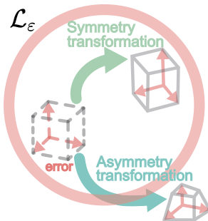 
Figure 1: Symmetry of correctable error space. A sym- metry transformation (light green arrow) keeps the cor- rectable errors within the linear space spanned by them- selves (red circle). In contrast, an asymmetry transfor- mation (deep green arrow) drives a correctable error out of Lε and turns it into an uncorrectable error.

📷 Fig 2

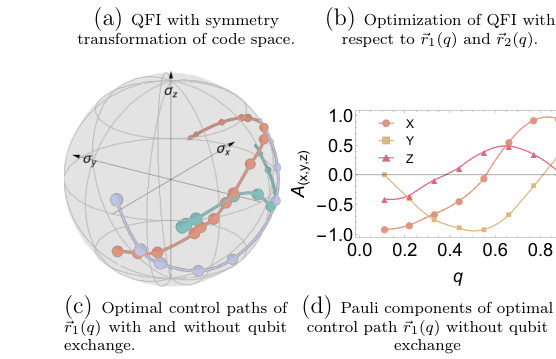 
Figure 2: Symmetry optimization of five-qubit code for stabilizer-sum Hamiltonian. (a) QFI is initially zero, but can rise to the maximum via local symmetry transfor- mation U(q) = N

📷 Fig 3

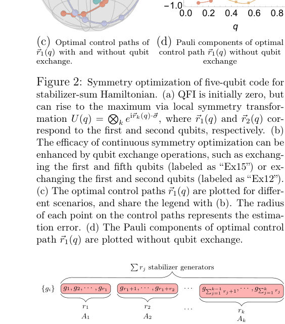 
Figure 3: Each Aj anticommutes with rj stabilizer gen- erators only. Together, the k symmetry generators Aj anticommute with Pk j=1 rj stabilizer generators jointly.

**Summary.** This paper introduces a symmetry-based optimization technique to enhance quantum metrology protected by QEC codes. It shows that by exploiting continuous symmetries in the noise model, one can systematically transform an encoding to maximize the Quantum Fisher Information. This allows codes that are otherwise metrologically 'dark' to achieve superior scaling, potentially reaching the Heisenberg limit.

**Why it may be interesting.** This work provides a powerful, systematic theoretical tool—symmetry optimization—to enhance quantum sensing protocols beyond what is guaranteed by error correction alone, which is crucial for realizing practical quantum sensors.

Detailed structure

**Main problem.** The primary challenge is overcoming the limitation where error-correcting capability in Quantum Error-Corrected (QEC) metrology does not guarantee high sensitivity to the parameter of interest.

**Main result.** By exploiting continuous unitary symmetries inherent in the correctable error space, the encoding can be systematically optimized to significantly enhance the Quantum Fisher Information (QFI), potentially reaching Heisenberg scaling.

**Method.** The authors develop a symmetry-based optimization approach that utilizes the continuous symmetries of the noise model to generate an equivalent, but metrologically superior, encoding.

**Model / system.** The study focuses on quantum metrology using QEC codes, particularly stabilizer codes, protecting against noise while estimating a parameter $\theta$ encoded in a Hamiltonian $H(\theta)$.

**Key observables.** Quantum Fisher Information (QFI), $F_\theta$, which quantifies the ultimate estimation precision.

**Important parameters / regimes.** The scaling of the QFI with the number of qubits ($n$), aiming for Standard Quantum Limit (SQL) or Heisenberg scaling.

**Assumptions / limitations.** The analysis assumes the correctable noise possesses unitary symmetries, and the optimization relies on finding symmetry generators that preserve the correctable error set.

**Figures summary.** Figures illustrate the concept of symmetry transformations preserving the error space, show the QFI rising from zero to a maximum via local symmetry transformations, and detail the structure of stabilizers and symmetry generators for specific codes.

**Paper structure.** The paper first establishes the gap between error correction and metrological sensitivity. It then introduces the symmetry-based optimization technique, deriving criteria for enhancement. Finally, it demonstrates this power using specific stabilizer codes, showing improved QFI scaling.

Abstract

Quantum error correction (QEC) codes have emerged as a powerful tool to protect quantum-enhanced metrology against noise. However, the ability to correct errors alone does not guarantee high metrological sensitivity, as the encoded states may become insensitive to the parameter of interest. Here we show that this limitation can be overcome by exploiting an intrinsic freedom of QEC codes: for a fixed set of correctable errors, the Knill-Laflamme conditions admit an equivalence class of encodings. When the correctable noise possesses unitary symmetries, these symmetries generate continuous transformations within this class, allowing systematic optimization of the encoding to increase the quantum Fisher information while preserving the correctable set of noise. Based on this observation, we develop a symmetry-based optimization approach and derive criteria identifying when such optimization can enhance metrological sensitivity. In particular, for stabilizer-sum Hamiltonians, symmetry optimization can convert a code with vanishing QFI into one achieving the standard quantum limit in general or even Heisenberg scaling in specific cases, illustrating the power of symmetry optimization for QEC-assisted quantum metrology.

[↑ back to top](#top)

### [Physics-Guided Linear Mapper for Quantum Error Mitigation](http://arxiv.org/abs/2608.23109v1)

**Authors:** Tulsi Chaudhari, Krishna Bhatia, Shalini Devendrababu, Srinjoy Ganguly, Luis Gerardo Ayala Bertel  
**Type:** theory · **Category:** quantum information and computing · **PDF:** <https://arxiv.org/pdf/2608.23109v1>  
**Analysis basis:** full PDF text, analyzed in chunks
**Topic relevance:** `quantum measurements` **1/5**

📷 Fig 1

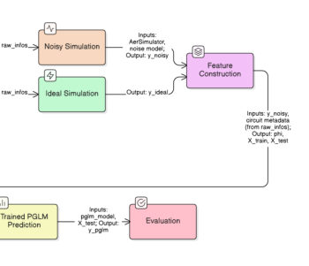 
Fig. 1: PGLM workflow: random circuit generation, noisy/ideal simulation, physics- guided feature construction, ridge training, prediction, and evaluation.

📷 Fig 2

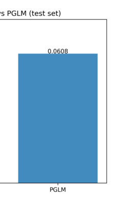 
Fig. 2: RMSE on the test set: raw noisy vs. PGLM.

📷 Fig 3

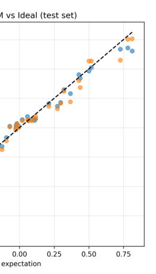 
Fig. 3: Scatter of raw (blue) and PGLM (orange) against the ideal (y=x dashed).

📷 Fig 4

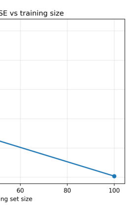 
Fig. 4: Ablation: RMSE vs. training set size. Knee near 50–100 circuits; best at 100.

📷 Fig 5

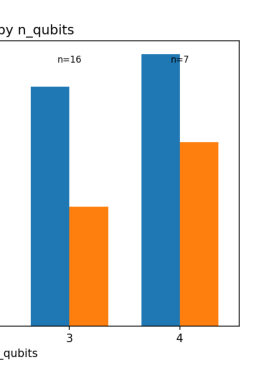 
Fig. 5: RMSE by qubit count. PGLM improves 2–4 qubit circuits but degrades 1-qubit.

**Summary.** This paper introduces the Physics-Guided Linear Mapper (PGLM), a novel, low-latency technique for Quantum Error Mitigation in NISQ devices. PGLM uses a linear model trained on circuit-derived features to estimate ideal quantum expectation values from noisy measurements. It proves highly effective in multi-qubit circuits where noise accumulates, offering a practical alternative to black-box machine learning methods.

**Why it may be interesting.** The focus on data-efficient, physically interpretable ML techniques for noise mitigation is highly relevant for developing practical quantum algorithms on near-term hardware.

Detailed structure

**Main problem.** The paper addresses the challenge of Quantum Error Mitigation (QEM) in Noisy Intermediate-Scale Quantum (NISQ) devices to extract accurate results without full Quantum Error Correction.

**Main result.** The proposed Physics-Guided Linear Mapper (PGLM) achieves significant RMSE reductions (e.g., 50.1% on 3-qubit circuits) in noise-accumulation regimes while maintaining sub-millisecond inference speed.

**Method.** PGLM uses a linear regression model trained on a minimal, 7-dimensional feature space derived from physical circuit properties (like depth and CNOT count) to map noisy expectation values to ideal ones.

**Model / system.** The study simulates quantum circuits on NISQ devices, focusing on 1-to-4 qubit systems subjected to idealized noise models, including depolarizing noise and readout errors.

**Key observables.** Root Mean Square Error (RMSE) reduction, ideal vs. noisy expectation values, and the performance of the linear mapping coefficients.

**Important parameters / regimes.** Circuit depth, CNOT count, gate error ($p_{	ext{gate}}$), and the regularization parameter ($\alpha$) used in ridge regression.

**Assumptions / limitations.** The method assumes that error accumulation can be modeled by a linear combination of physically derived features; performance is limited in high-fidelity, single-qubit regimes.

**Figures summary.** Figures illustrate the PGLM workflow, comparing raw noisy measurements against the ideal values, and showing performance degradation when moving from multi-qubit to single-qubit circuits.

**Paper structure.** The paper introduces the PGLM framework, details the physics-guided feature engineering process, presents the training methodology using ridge regression, and evaluates performance across varying circuit complexities and noise regimes.

Abstract

We introduce a novel physics-guided linear mapper (PGLM) for quantum error mitigation that uses seven distinct interpretable features derived from circuit complexity and device calibration data. The goal is to provide a data-efficient, interpretable, and low-latency alternative to the black-box machine learning for quantum error mitigation in noisy-intermediate scale quantum devices. Evaluated on 52 simulated benchmark circuits (1--4 qubits), PGLM demonstrates strong performance in noise-accumulation regimes: 50.1% RMSE reduction on 3-qubit circuits and 32.3% on 4-qubit circuits, while single-qubit circuits show degraded performance. A circuit-size-aware deployment policy achieves 32.6% aggregate improvement. Sub-millisecond inference enables integration into variational algorithms, and analysis of learned coefficients reveals that circuit depth and CNOT count dominate error prediction, consistent with decoherence mechanisms. Results are simulator-based with idealized noise models; hardware validation remains essential future work.

[↑ back to top](#top)

### [Quaternionic Hermitian Band Geometry in Four Dimensions: Realization on $S^4$ and Obstruction on $T^4$](http://arxiv.org/abs/2608.23556v1)

**Authors:** Dongju Hwang, Minjae Yu, Gil Young Cho  
**Type:** theory · **Category:** other · **PDF:** <https://arxiv.org/pdf/2608.23556v1>  
**Analysis basis:** full PDF text, analyzed in chunks
**Topic relevance:** `analog quantum simulation` **1/5**

📷 Fig 1

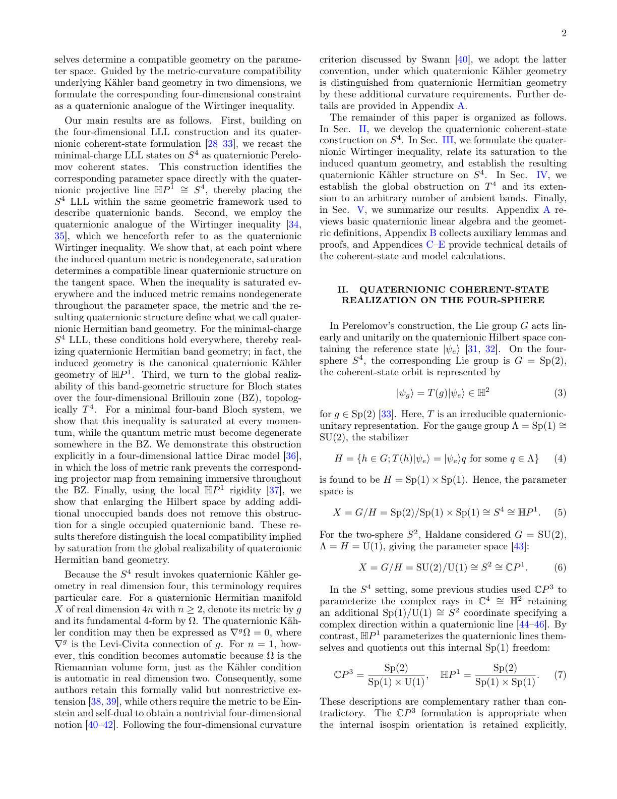 
Low-resolution page preview, page 2

📷 Fig 2

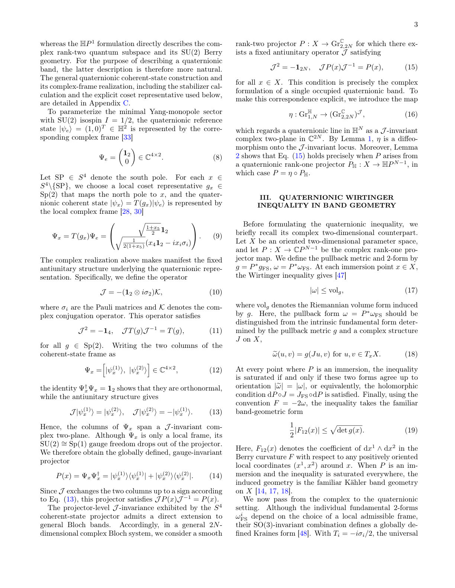 
Low-resolution page preview, page 3

📷 Fig 3

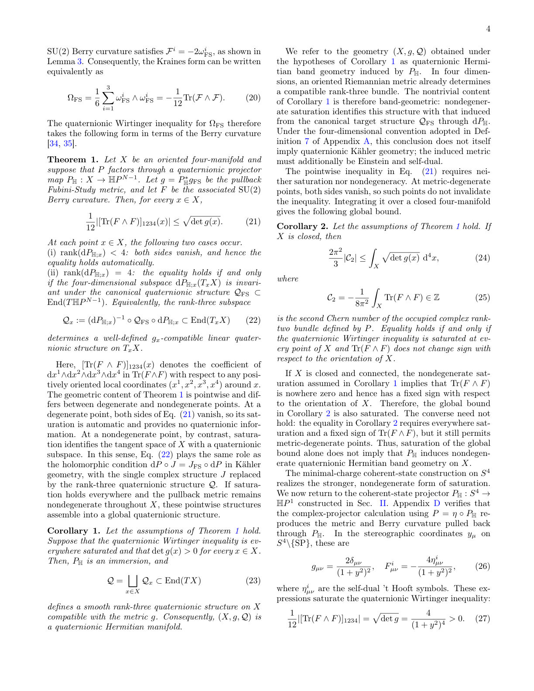 
Low-resolution page preview, page 4

📷 Fig 4

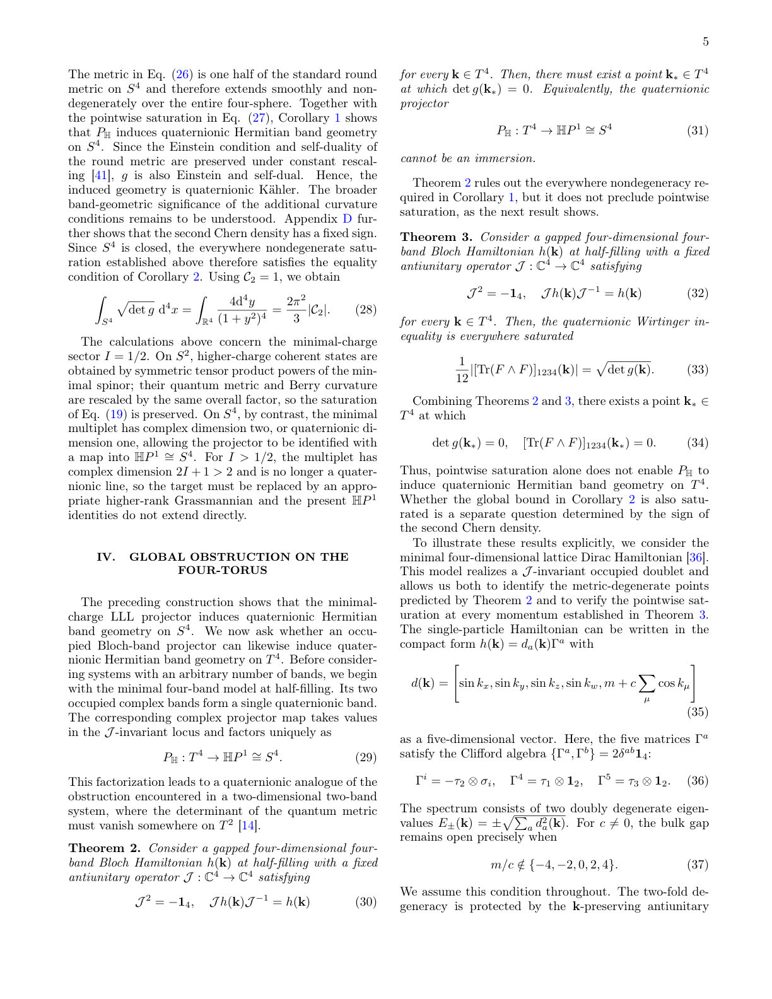 
Low-resolution page preview, page 5

📷 Fig 5

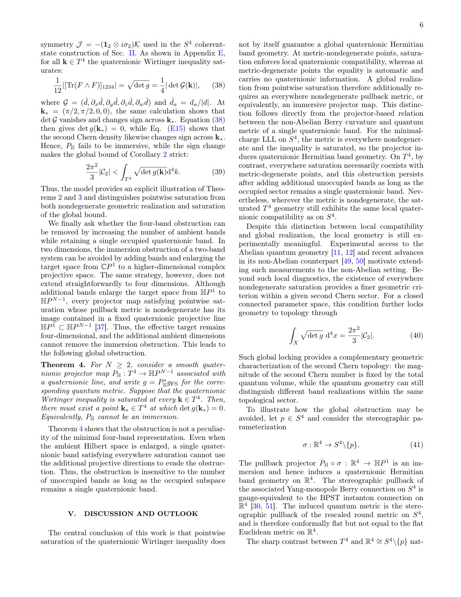 
Low-resolution page preview, page 6

**Summary.** This theoretical work investigates quaternionic Hermitian band geometry in 4D parameter spaces, using the quaternionic Wirtinger inequality as a diagnostic tool. It demonstrates that while the geometry is globally realized on the 4-sphere ($S^4$), topological constraints prevent its global realization on the 4-torus ($T^4$). This highlights a fundamental link between topology and the realizability of advanced geometric structures in electronic band theory.

**Why it may be interesting.** The work provides a powerful, symmetry-aware framework for understanding how global topology constrains the realizability of complex geometric structures (like quaternionic Kähler geometry) in condensed matter band theory.

Detailed structure

**Main problem.** The paper establishes a realization-obstruction dichotomy for quaternionic Hermitian band geometry in four-dimensional parameter spaces.

**Main result.** Global realization is achieved on $S^4$ using minimal-charge Landau levels, but the geometry is obstructed on $T^4$ due to topological constraints forcing metric degeneracy.

**Method.** The authors formulate the quaternionic Wirtinger inequality as a band-geometric bound, comparing its saturation conditions on $S^4$ versus $T^4$.

**Model / system.** The study analyzes the geometry derived from occupied doublets forming a 'quaternionic band' in a four-dimensional parameter space, contrasting the sphere ($S^4$) with the torus ($T^4$).

**Key observables.** Quantum metric, second Chern density, and the saturation of the quaternionic Wirtinger inequality.

**Important parameters / regimes.** The dimensionality of the parameter space (4D), the nature of the symmetry ($\mathcal{J}$), and the band structure (minimal charge/four-band system).

**Assumptions / limitations.** The framework extends 2D Kähler band geometry to 4D, and the analysis relies on the properties of the occupied subspace being preserved by an antiunitary symmetry $J$.

**Figures summary.** The notes do not describe specific figures, but reference calculations involving the Berry connection, curvature, and the explicit lattice Dirac Hamiltonian on $T^4$.

**Paper structure.** The paper develops the theory by first establishing the quaternionic Wirtinger inequality, then applying it to the $S^4$ case (showing realization), and finally contrasting this with the $T^4$ case (showing obstruction).

Abstract

We establish a realization-obstruction dichotomy for quaternionic Hermitian band geometry in four-dimensional parameter spaces: the minimal-charge lowest Landau level on $S^{4}$ provides a global realization, whereas an everywhere nondegenerate saturated realization induced by a single occupied quaternionic band is obstructed on $T^{4}$. An antiunitary symmetry $\mathcal{J}$ satisfying $\mathcal{J}^{2}=-1$ makes the occupied doublet a quaternionic band. Within this setting, we formulate the quaternionic Wirtinger inequality as a band-geometric bound involving the quantum metric and the second Chern density. At every nondegenerate saturation point, the canonical geometry of the quaternionic projective space pulls back to a compatible quaternionic structure on the parameter space; if these conditions hold everywhere, the parameter space acquires quaternionic Hermitian band geometry. On $S^{4}$, we express the minimal-charge states as quaternionic Perelomov coherent states and establish everywhere nondegenerate saturation, thereby realizing quaternionic Hermitian band geometry. On $T^{4}$, by contrast, a minimal four-band system saturates the inequality everywhere, but topology forces the quantum metric to become degenerate somewhere, obstructing a globally induced quaternionic structure. An explicit lattice Dirac Hamiltonian exhibits this obstruction. Adding unoccupied bands cannot remove this obstruction when the inequality is saturated everywhere, since the image of any nondegenerate saturated projector remains confined to a fixed $\mathbb{H}P^{1}$. These results provide a symmetry-aware framework for non-Abelian band geometry and show how parameter-space topology constrains the global realization of quaternionic Hermitian band geometry.

[↑ back to top](#top)

### [Robust Quantum Key Distribution Arbitrarily Close to Local Correlations](http://arxiv.org/abs/2608.22603v1)

**Authors:** Hari Krishnan SV, Andreas Winter  
**Type:** theory · **Category:** quantum information and computing · **PDF:** <https://arxiv.org/pdf/2608.22603v1>  
**Analysis basis:** full PDF text, analyzed in chunks
**Topic relevance:** `quantum measurements` **1/5**

📷 Fig 1

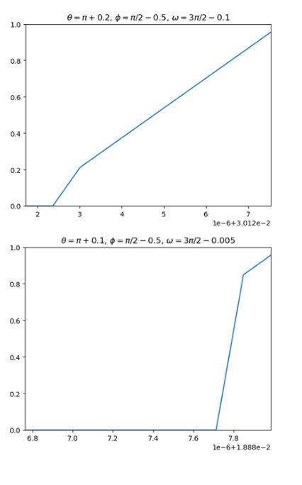 
Figure 1: Lower bound on the conditional entropy H(A|E, X = 0) versus observed Bell score η ∈(β(θ, ϕ, ω), τ(θ, ϕ, ω)) for the Bell correlator Tθ,ϕ,ω [15]. The chosen parameters (θ, ϕ, ω) move the quantum correlations arbitrarily close to the local boundary while main- taining a CHSH violation ≳2 and c0, c1 &gt; 0. The numerical SDP relaxations complement the analytical results by detailing key rates under sub-maximal violations (η &lt; τ): while positive key distillation remains theoretically robust near maximal violations (η →τ), the curves steepen sharply as local limits are approached, showing that allowable experimental noise shrinks rapidly.

📷 Fig 2

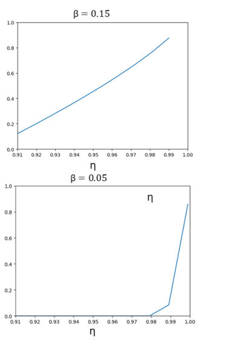 
Figure 2: Plot of H(A|E, X = 0) versus η for β = 0.2, 0.15, 0.1, and 0.05 for the Bell inequality used in [16]. While the theoretical maximum key rate remains robust near ideal violations (Bd →1), smaller values of β cause the curve to steepen sharply, demonstrating that noise tolerance shrinks rapidly as quantum correlations approach the classical bound- ary.

📷 Fig 3

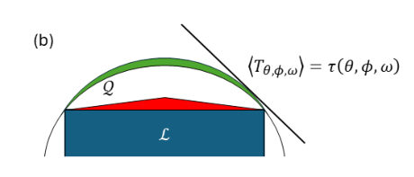 
Figure 3: Fig. (a) illustrates the nonlocal region that gives zero key rate in the red triangle following the convex-combination attack from [14]: P1 corresponds to the behaviour gen- erated by a Werner state ρv = v|ψ−⟩⟨ψ−|+(1−v)11

**Summary.** This paper establishes the robustness of device-independent quantum key distribution by showing that a constant secret key rate can be guaranteed even if the measured Bell violation is only slightly below the theoretical quantum limit. Using semidefinite programming and a robust self-test framework, the authors provide theoretical and numerical evidence for practical key generation rates. This advances the field by quantifying the tolerance for imperfections in real-world quantum devices.

**Why it may be interesting.** This work provides theoretical guarantees on the practical feasibility of QKD, showing that small experimental deviations from ideal quantum correlations do not necessarily lead to a complete loss of cryptographic security.

Detailed structure

**Main problem.** To demonstrate that the security of device-independent quantum key distribution (DIQKD) remains robust and guarantees a constant key rate even when the observed Bell violation is only slightly less than the theoretical maximum (Tsirelson bound).

**Main result.** The authors prove that a constant, non-zero secret key rate can be guaranteed if the observed Bell violation is sufficiently close to the respective Tsirelson bound for the considered Bell inequalities.

**Method.** The work employs a 'robust self-test' approach, utilizing semidefinite relaxations of the minimum min-entropy consistent with a given Bell violation to derive lower bounds on the key rate.

**Model / system.** The analysis focuses on DIQKD protocols involving two parties (Alice and Bob) using uncharacterized devices, whose security is tested by measuring violations of specific Bell inequalities.

**Key observables.** Bell Inequality Violation ($\eta$), Key Rate ($R$), Tsirelson Bound ($	au$), Classical Bound ($eta$).

**Important parameters / regimes.** The deviation parameter ($\epsilon$) quantifying how close the observed violation is to the Tsirelson bound.

**Assumptions / limitations.** The analysis is based on specific families of Bell inequalities and assumes the asymptotic (i.i.d.) limit for the key rate calculation.

**Figures summary.** Figures illustrate the key rate as a function of the Bell score, showing the rate remains non-zero even as the violation approaches the classical boundary.

**Paper structure.** The paper builds upon previous work by extending the key rate guarantee from requiring the absolute maximum Bell violation to requiring only a sufficiently close approximation to that maximum.

Abstract

Recently, Wooltorton et al. [Phys. Rev. Lett. 132, 210802 (2024)] and Farkas [Phys. Rev. Lett. 132, 210803 (2024)] have exhibited the mismatch between Bell inequality violations and their cryptographic application in device-independent quantum key distribution, by showing that arbitrarily close to the set of local behaviours there exist quantum correlations guaranteeing a constant rate of secret key. While these results require correlations attaining the maximum quantum value of a suitable Bell observable (aka the Tsirelson bound) and rely on a kind of ideal self-testing of a maximally entangled state and associated Bell measurement, here we show that the effect is robust: for every one of the Bell inequalities considered by Wooltorton \emph{et al.}, a constant rate of secret key ensues if the observed Bell violation is sufficiently close to the respective Tsirelson bound. For these and also the Bell inequalities of Farkas, we furthermore present numerical results based on semidefinite relaxations of the minimum min-entropy consistent with a certain Bell violation, which demonstrate that small but nonzero key rates can be guaranteed (in principle) by practical and efficient means.

[↑ back to top](#top)

### [Satisfying Quantum Codes: Physics-Informed and Hardware-Aware Code Design with SAT Solvers](http://arxiv.org/abs/2608.23460v1)

**Authors:** Ben DalFavero, William M. Watkins, Margarite L. LaBorde, Vincent Russo, Ethan Egger, Gregory Quiroz, Ryan LaRose  
**Type:** theory · **Category:** quantum information and computing · **PDF:** <https://arxiv.org/pdf/2608.23460v1>  
**Analysis basis:** full PDF text, analyzed in chunks
**Topic relevance:** `analog quantum simulation` **1/5**

📷 Fig 1

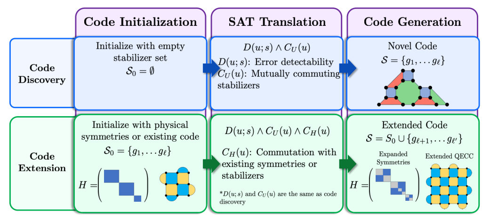 
Figure 1. Overview of our quantum code design framework. Our framework enables two categories of code design: code discovery and code extension. In the former, the code is initialized with an empty stabilizer set, while in the latter the initial set S0 is determined by a predetermined code or a set of physics-informed symmetries captured within the Hamiltonian H. Our SAT-based framework enables translation between both code design scenarios through the symplectic form, which encodes information about both the error set E and stabilizers/symmetries. Solutions to the SAT problem lead to novel codes “from scratch” or extended codes that contain the initial stabilizers. Both code discovery and...

📷 Fig 2

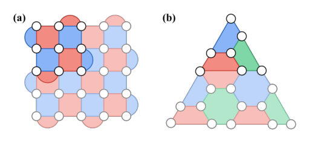 
Figure 2. Illustration of distance-increasing extensions of quantum codes with mutation, shown here for two QLDPC codes. (a) A distance d = 3 rotated surface code overlaid on a d = 5 distance surface code. (b) A distance d = 3 tri- angular color code (the Steane code) overlaid on a distance d = 5 triangular color code. Note that, in both cases, there are checks along the boundary of the smaller code that must be altered. Thus, these are examples of distance-increasing extensions with mutation.

📷 Fig 3

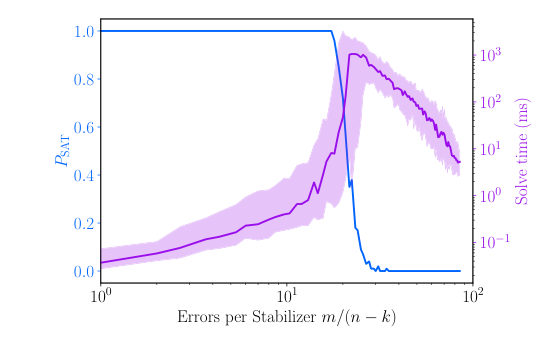 
Figure 3. Demonstration of the SAT–UNSAT phase tran- sition which we empirically observe for random instances of k-code design (Def. 3). The order parameter is the number of errors per stabilizer m/(n −k) in the code design problem. In addition to the transition in satisfiability probability pSAT at the critical value, the solve time peaks at this critical value. Additional numerical results and cases are discussed in detail in Appendix D.

📷 Fig 4

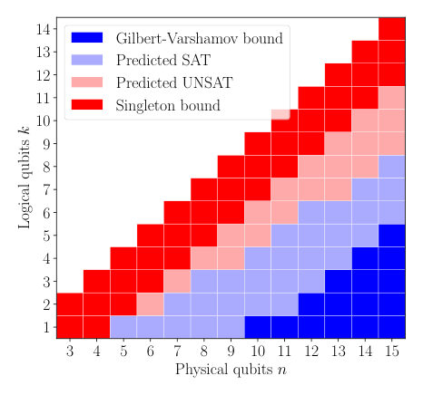 
Figure 4. Predicted existence of [[n, k, 3]] stabilizer codes as a function of the number of physical qubits n and logical qubits k. Dark blue denotes parameters for which code existence is guaranteed by the quantum Gilbert–Varshamov bound, while dark red denotes parameters excluded by the quantum Singleton bound. In the intermediate region, the empirical scaling model for the critical error-set size bmc(n, k, w), with w = d −1 = 2, predicts satisfiable (light blue) and unsatisfi- able (light red) k-Code Design instances.

📷 Fig 5

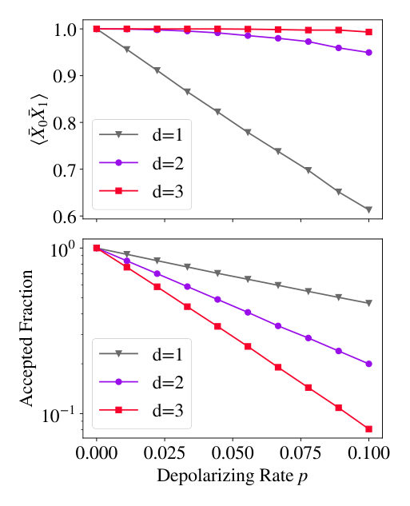 
Figure 5. Demonstration of improved accuracy in error- detected expectation values for physics-informed codes. Here we start from the symmetries (46) of an n = 6 Fermi-Hubbard Hamiltonian and extend to distance d = 2 and d = 3 codes. (top) Expectation value of the logical observable ¯ X0 ¯ X1 in a logical Bell state vs. depolarizing noise rate p. Without noise, this expectation value should be one. Here, logical state preparation is assumed to be done fault-tolerantly, and depolarizing noise acts on physical qubits after each logical operation. As can be seen, extending the codes to higher distances significantly improves the accuracy of the expecta- tion value. As discussed in the main...

**Summary.** This paper introduces a powerful, general framework for designing quantum error correction codes by reformulating the design problem as a Boolean Satisfiability (SAT) problem. By using state-of-the-art SAT solvers, the authors can computationally discover codes that respect specific physical symmetries or are tailored to realistic hardware noise profiles. This advances the practical feasibility of building fault-tolerant quantum computers.

**Why it may be interesting.** This is highly relevant as it provides a computational, systematic methodology for designing robust quantum hardware components (QEC codes) by mapping a complex physical problem onto a well-studied computational problem (SAT).

Detailed structure

**Main problem.** The paper addresses the challenge of designing quantum error correction (QEC) codes, which is currently done manually without considering specific physical or hardware constraints.

**Main result.** They developed a general framework that formulates code design as a Boolean Satisfiability (SAT) problem, successfully designing novel, hardware-aware codes with lower error rates than state-of-the-art surface codes.

**Method.** The core method involves translating the code design problem (including constraints from physics or noise models) into a SAT problem and leveraging state-of-the-art SAT solvers to find solutions.

**Model / system.** The work focuses on quantum stabilizer codes, which are used to protect quantum information. The framework is general enough to incorporate physics-inspired symmetries, such as those derived from the Fermi-Hubbard model, and detailed noise models.

**Key observables.** Logical error rate, satisfiability probability (PSAT), and the ability to encode up to 100 physical qubits.

**Important parameters / regimes.** Code parameters $[[n, k, d]]$, code-design density $m/(n-k)$, and the number of physical qubits ($n$).

**Assumptions / limitations.** The general problem is proven to be NP-complete, meaning an efficient algorithm for all cases is unlikely, and the approach relies on the practical effectiveness of modern SAT solvers.

**Figures summary.** Figures illustrate the code design framework overview, the phase transition in satisfiability probability vs. error parameter, and comparisons showing reduced logical error rates for novel codes under biased noise.

**Paper structure.** The paper introduces the framework, proves the NP-completeness of the problem, details the SAT formulation for code discovery and extension, and validates the method by applying it to physics-inspired and hardware-aware noise models.

Abstract

Although quantum error correction is widely believed to be necessary for impactful applications of quantum computers, the design of quantum error correction codes is largely done by hand, without respect to problem or hardware constraints. In this work, we present a highly general and flexible framework for the computational design of both physics-inspired and hardware-aware quantum codes. To do so, we formulate code design as a Boolean satisfiability (SAT) problem and show how to incorporate all required error correction criteria. We prove that code design is NP-complete, ruling out any efficient algorithm for designing codes in general. Nonetheless, we show that state-of-the-art SAT solvers are able to effectively find solutions for many practical problems. Notably, we are able to design physics-inspired codes with up to 100 physical qubits in minutes, and we design new hardware-aware codes for biased noise which have a lower logical error rate than state-of-the-art surface codes.

[↑ back to top](#top)

### [Sharp State-Independent Uncertainty Relations for Multipartite systems](http://arxiv.org/abs/2608.22656v1)

**Authors:** Yiling Wang, Naihuan Jing  
**Type:** theory · **Category:** other · **PDF:** <https://arxiv.org/pdf/2608.22656v1>  
**Analysis basis:** full PDF text, analyzed in chunks
**Topic relevance:** `analog quantum simulation` **1/5**

📷 Fig 1

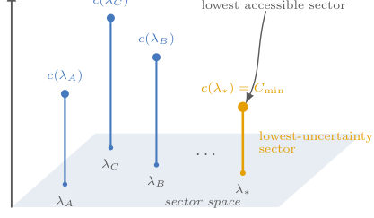 
FIG. 2. Sector-resolved uncertainty landscape for a reducible representation. Each irreducible sector λ is represented by a point in the sector space, while the vertical direction gives its uncertainty level c(λ) = 2⟨λ, δ⟩. The lowest accessible sector λ∗determines the sharp state-independent uncertainty floor Cmin = c(λ∗).

📷 Fig 2

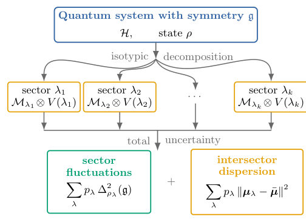 
FIG. 1. Symmetry-resolved structure of collective uncer- tainty. After isotypic decomposition, the total variance sepa- rates exactly into intrinsic quantum fluctuations and nonneg- ative dispersion between sectors.

**Summary.** This paper develops a general theoretical framework to find state-independent uncertainty relations for complex multipartite quantum systems governed by a symmetry algebra. By decomposing the total variance using representation theory, the authors show that the minimum unavoidable uncertainty is dictated entirely by the system's underlying symmetry structure. This provides a powerful, symmetry-based constraint on quantum fluctuations.

**Why it may be interesting.** This work provides a powerful, general mathematical tool derived from representation theory to constrain quantum fluctuations in complex, interacting many-body systems, offering insights beyond simple pairwise correlations.

Detailed structure

**Main problem.** The paper addresses the challenge of determining state-independent uncertainty relations for multipartite quantum systems whose symmetry representation is reducible.

**Main result.** It establishes a general framework showing that the minimum total uncertainty is determined solely by the intrinsic symmetry structure, specifically by the lowest accessible irreducible symmetry sector.

**Method.** The authors employ representation theory, utilizing the isotypic decomposition of the system's Hilbert space to decompose the total variance into intrinsic sector fluctuations and intersector dispersion.

**Model / system.** The analysis is applied to multipartite quantum systems whose collective observables are generated by a compact semisimple Lie algebra (like $su(2)$ for spin systems). The system's state space is treated as a reducible tensor-product representation.

**Key observables.** Total generator variance ($\Delta^2_
ho(g)$), intrinsic sector uncertainty ($c(\lambda) = 2\langle\lambda, \delta
angle$), and the sector weights ($p_\lambda$).

**Important parameters / regimes.** The symmetry algebra $\mathfrak g$, the set of highest weights $\Lambda(\mathcal{H})$, and the Weyl vector $\delta$.

**Assumptions / limitations.** The analysis relies on the existence of a compact semisimple Lie algebra and the validity of the isotypic decomposition theorem.

**Figures summary.** Figures illustrate the symmetry-resolved structure of uncertainty, showing the exact separation into intrinsic fluctuations and intersector dispersion, and demonstrating how the lowest accessible sector sets the sharp uncertainty floor.

**Paper structure.** The paper builds from the general problem of state-independent uncertainty to deriving an exact variance decomposition based on symmetry sectors. It then derives the sharp lower bound by minimizing over the accessible sectors, confirming results for spin-1/2 and spin-1 systems.

Abstract

Uncertainty relations constrain the fluctuations of incompatible observables, but most familiar bounds depend on the quantum state. State-independent uncertainty relations instead ask how much fluctuation remains unavoidable for every quantum state. For observables generated by a continuous symmetry, sharp state-independent bounds are known when the symmetry representation is irreducible. Multipartite collective systems, however, generally appear as reducible tensor-product representations of a symmetry algebra, which raises the question of how to determine their total uncertainty.   We resolve this problem for multipartite quantum systems with a compact semisimple symmetry algebra $\mathfrak g$. Exploiting the symmetry structure, we formulate a general framework for state-independent uncertainty based on representation theory. The total variance admits an exact decomposition into intrinsic fluctuations within irreducible sectors and a nonnegative dispersion between sectors. This yields the sharp state-independent bound for the total variance $Δ_ρ^2(\mathfrak g)$ on the multipartite Hilbert space $\mathcal H$ \[ \min_ρΔ_ρ^2(\mathfrak g) = \min_{λ\inΛ(\mathcal H)} 2\langleλ,δ\rangle, \] where $ρ$ is any density operator on $\mathcal H$, $Λ(\mathcal H)$ is the set of highest weights $λ$ labeling those sectors, and $δ$ is the Weyl vector. This demonstrates that the ultimate uncertainty is completely controlled by its intrinsic symmetry structure. As a special example, this result confirms our previous conjecture that the total uncertainty floor of collective spin-$1/2$ systems depends only on the parity of the particle number. We further illustrate the framework for multipartite spin-$1$ systems, demonstrating that the same symmetry-sector mechanism persists beyond spin-$1/2$.

[↑ back to top](#top)

## Other papers (25)

*Papers from primary archives without highlighted authors or any topic match. Click to expand.*

Show other papers

### [A DQMC study of the spectral and conductive properties of the two-dimensional Holstein model](http://arxiv.org/abs/2608.23379v1)

**Authors:** J. Neuhaus, B. Cohen-Stead, N. Mannella, S. Johnston  
**Type:** theory · **Category:** strongly correlated electrons · **PDF:** <https://arxiv.org/pdf/2608.23379v1>  
**Analysis basis:** full PDF text, analyzed in chunks

📷 Fig 1

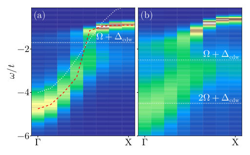 
FIG. 2. Examples of the Engelsberg-Schrieffer band kinks. (a) Results along the Γ −X for λ = 0.3, Ω/t = 1, βt = 20, and ⟨n⟩= 1.0. The dotted white line plots the noninteracting dispersion. The dashed red line is the observed kinked dis- persion. (b) Results along the Γ −X for λ = 0.3, Ω/t = 2, βt = 20, and ⟨n⟩= 1.0 plotted on a square root scale to high- light the spectral weight deeper in the band.

📷 Fig 2

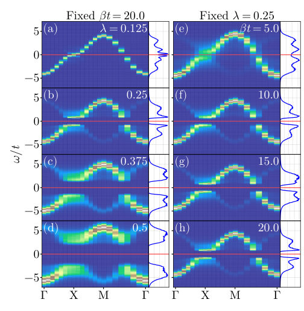 
FIG. 1. Single-particle spectral functions A(k, ω) for the half- filled (⟨n⟩= 1) Holstein model with Ω/t = 0.5. Panels (a)-(d) show results for fixed βt = 20 and select λ values. Panels (e)-(h) show results for fixed λ = 0.25 and select inverse tem- peratures β. The panels to the right of each spectral function show the density of states N(ω).

📷 Fig 3

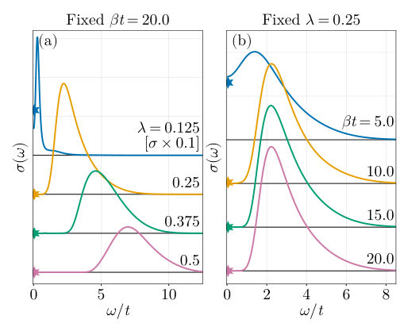 
FIG. 3. Optical conductivity for the half-filled (⟨n⟩= 1) Holstein model with Ω/t = 0.5. The star markers placed at ω/t = 0 are the dc conductivity values obtained using the imaginary time proxy σdc defined in Eq. (11). Panel (a) shows results for fixed inverse temperatures βt = 20 and select λ, while panel (b) shows results for fixed λ = 0.25 and select β.

📷 Fig 4

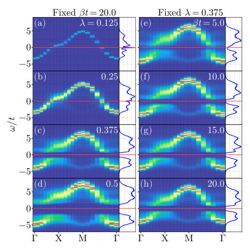 
FIG. 4. Single-particle spectral functions for Holstein model at ⟨n⟩= 0.7 and Ω/t = 0.5. Panels (a)-(d) show results for fixed βt = 20 and select λ values, while panels (e)-(h) show results for λ = 0.375 and select inverse temperatures β. The panels to the right of each spectral function show the density of states N(ω).

📷 Fig 5

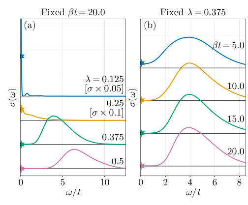 
FIG. 5. Optical conductivity for the doped Holstein model with ⟨n⟩= 0.7 and Ω/t = 0.5. The star markers at ω/t = 0 are the value of dc conductivity obtained using the imaginary axis proxy σdc given by Eq. (11). Panel (a) shows results for fixed inverse temperatures βt = 20 and select λ while panel (b) shows results for fixed λ = 0.375 and select β.

**Summary.** This paper uses advanced Determinant Quantum Monte Carlo simulations to study the two-dimensional Holstein model. It maps the system's behavior as doping changes, revealing transitions between metallic, polaron liquid, and charge-density-wave insulating phases. The work provides detailed spectral and conductive signatures of these correlated electronic states.

**Why it may be interesting.** The study provides detailed, unbiased numerical results for a canonical model (Holstein) that captures the interplay between electronic correlations and lattice degrees of freedom, which is central to understanding high-Tc superconductivity and polaronic physics.

Detailed structure

**Main problem.** The study investigates the dynamical properties of the two-dimensional Holstein model, specifically mapping the phase evolution as carrier concentration is tuned.

**Main result.** The analysis characterizes transitions from a dressed metallic phase through (bi)polaron liquid/insulator states to a charge-density-wave (CDW) insulator.

**Method.** The research employs numerically exact Determinant Quantum Monte Carlo (DQMC) simulations, requiring advanced analytic continuation techniques (DEAC/MaxEnt) to extract real-frequency observables.

**Model / system.** The system is the two-dimensional square lattice Holstein Hamiltonian, which describes the coupling between itinerant electrons and lattice phonons. The Hamiltonian includes terms for hopping, electron-phonon coupling, and lattice dynamics.

**Key observables.** Single-particle spectral function A(k, omega), optical conductivity sigma(omega), and charge/spin structure factors Sc(Q) and Ss(q).

**Important parameters / regimes.** Phonon energies, electron-phonon coupling strengths, carrier concentrations (doping), and temperature, studied across over 16,640 parameter values.

**Assumptions / limitations.** The use of DQMC is numerically exact but relies on complex analytic continuation methods (DEAC/MaxEnt) to bridge imaginary-time simulation data to real-frequency spectra.

**Figures summary.** The figures likely show the evolution of spectral weight, the opening of gaps in the spectral function, and the suppression of the Drude response in the optical conductivity as CDW order sets in.

**Paper structure.** The paper systematically analyzes the model across various parameter regimes, first establishing the theoretical framework using DQMC, then calculating key observables like the spectral function and conductivity, and finally mapping the phase diagram based on doping and coupling strength.

Abstract

We study the dynamical properties of the two-dimensional square lattice Holstein Hamiltonian using numerically exact determinant quantum Monte Carlo simulations. In particular, we report systematic calculations of the model's single-particle spectral function and optical conductivity over a range of phonon energies, electron-phonon coupling strengths, carrier concentrations, and temperatures. In doing so, we map the evolution of the system from a dressed metallic phase to a (bi)polaron liquid/insulator to a charge-density-wave insulator as the carrier concentration is tuned from dilute values to half-filling. We corroborate these results using several equal-time correlation measurements and related proxy quantities reconstructed from time-displaced correlation measurements. This paper is also accompanied by an extensive open data set, covering over 16,640 unique parameter values.

[↑ back to top](#top)

### [A test drive for exchange-correlation functionals on noncollinear magnets: Mn$_3$Ir, Mn$_3$Ge, NiS$_2$, and YMnO$_3$](http://arxiv.org/abs/2608.22464v1)

**Authors:** Marie-Therese Huebsch, Martijn Marsman, Jacques K. Desmarais, Stefano Pittalis, Fabien Tran  
**Type:** theory · **Category:** strongly correlated electrons · **PDF:** <https://arxiv.org/pdf/2608.22464v1>  
**Analysis basis:** full PDF text, analyzed in chunks

📷 Fig 1

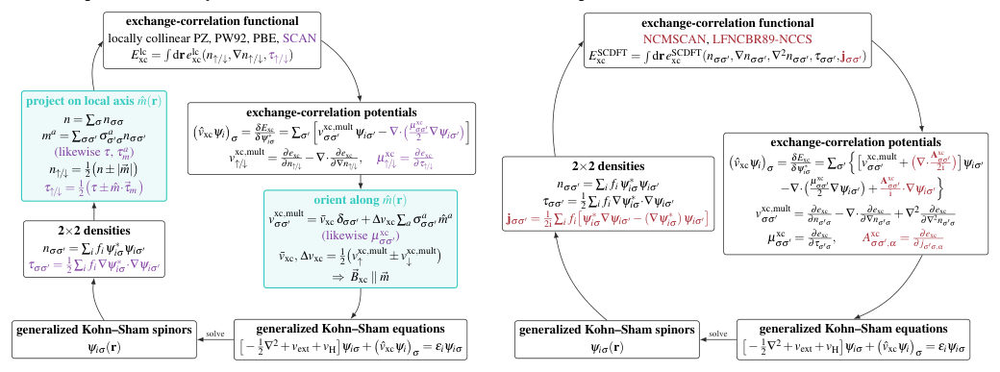 
FIG. 1. Self-consistency cycle of (a) spin-DFT in the locally collinear approximation and (b) spin-current DFT. Starting from the generalized Kohn–Sham (GKS) spinors ψiσ, the 2×2 densities are computed, the exchange-correlation (XC) energy is evaluated, and its variation with respect to ψ∗ iσ yields the XC potentials entering the GKS equations. Turquoise boxes mark the two steps exclusive to the locally collinear treatment: the projection of the densities onto the local spin-quantization axis ˆm = ⃗m/|⃗m| before the XC functional is evaluated, and the orientation of the resulting spin-diagonal potential along ˆm, which enforces zero XC torque. Purple denotes quantities specific to MGGA...

📷 Fig 2

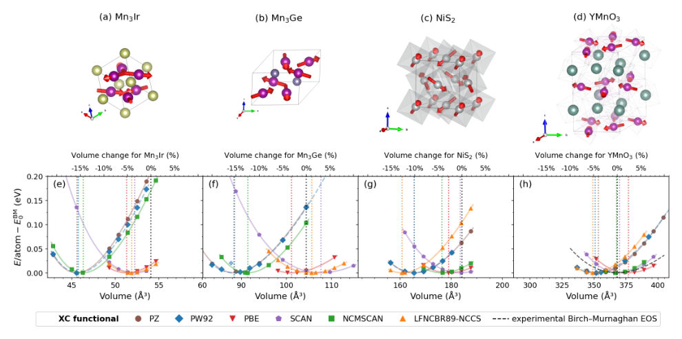 
FIG. 2. Structure, magnetic order, and equations of state of the four benchmark materials. (a)-(d) Conventional cells of Mn3Ir, Mn3Ge, NiS2, and YMnO3 with the experimentally determined magnetic configurations (red arrows) of MAGNDATA entries, cf. Table II. (e)-(h) Energy per atom, relative to the minimum EBM 0 of the respective Birch–Murnaghan (BM) fit, as a function of the cell volume for the six XC functionals. The cells are scaled isotropically, with the internal coordinates and (for the hexagonal systems) the c/a ratio fixed to the experimental structure. Symbols are computed total energies; the curves are the BM fits, drawn dashed for PW92 where it nearly coincides with PZ. Colored...

📷 Fig 3

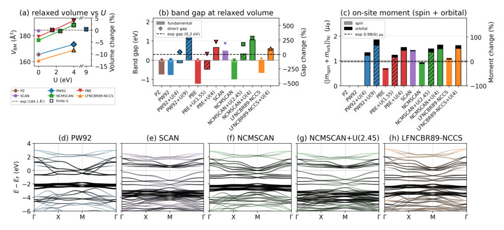 
FIG. 3. Structural, electronic, and magnetic properties of NiS2 depending on the exchange-correlation (XC) functional and on-site Coulomb interaction U. (a) Equilibrium volume VBM from the Birch–Murnaghan fits as a function of the on-site U applied to the Ni-3d shell: all functionals atU = 0; PW92, PBE, NCMSCAN, and LFNCBR89-NCCS at U = 4 eV (black-outlined markers); and NCMSCAN atU = 2.45 eV (cross), the value chosen such that VBM matches the experimental low-temperature volume of 184.1 Å3 (2 K, Ref. 114; dashed line). The right axis gives the volume change relative to this reference. (b) Fundamental (bars) and smallest direct (markers) band gap at each XC functional’s VBM. Negative values...

📷 Fig 4

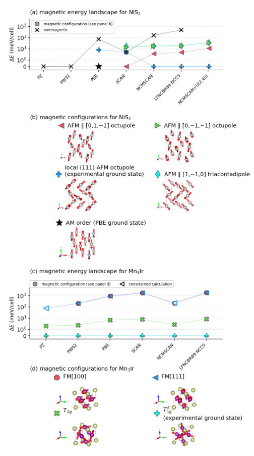 
FIG. 4. Relaxed-volume magnetic energy landscapes and candidate configurations for NiS2 [(a),(b)] and Mn3Ir [(c),(d)]. In the land- scape panels (a),(c), ∆E per cell is shown relative to each functional’s ground state on a logarithmic scale. The colored markers are the magnetic configurations rendered in panels (b),(d), black × marks the nonmagnetic solution, and open ◁denotes constrained calcula- tions (also shown in Fig. 5(b) at θ = 90◦). The black star in (a) is the collinear altermagnetic (AM) order that the PBE ground state converges to. Panels (b),(d) show the corresponding magnetic con- figurations, with the antiferromagnetic (AFM) experimental ground states highlighted.

📷 Fig 5

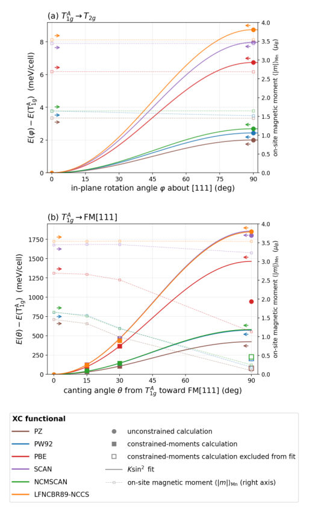 
FIG. 5. Magnetic anisotropy of Mn3Ir along two paths out of the T A 1g ground state resolved by XC functional (colors). (a) In-plane ro- tation by an angle ϕ about the [111] axis, connecting T A 1g (ϕ = 0) to T2g (ϕ = 90◦): the energy difference E(ϕ)−E(T A 1g) per cell (left axis) follows a Keff sin2 ϕ law (solid lines). (b) Canting by an an- gle θ from T A 1g toward FM[111], evaluated with constrained-moment calculations (squares) and fitted by KFM sin2 θ (using filled squares; omitting open markers). In both panels, dashed curves with open squares give the on-site Mn moment ⟨|m|⟩Mn read on the right axis.

**Summary.** This paper tests advanced theoretical methods for calculating the electronic structure of noncollinear magnets using first-principles DFT. By comparing Spin-Current DFT (SCDFT) against simpler Spin-DFT approaches, the authors demonstrate that SCDFT is necessary to accurately capture the complex spin textures observed in materials like $	ext{NiS}_2$. The findings establish SCDFT as a powerful, albeit complex, tool for modern magnetism research.

**Why it may be interesting.** This work is highly relevant as it pushes the boundaries of electronic structure theory for magnetic materials, providing advanced computational tools (SCDFT) necessary for modeling complex, non-collinear magnetic ordering that is central to modern condensed matter physics.

Detailed structure

**Main problem.** The primary challenge is developing and rigorously testing exchange-correlation (XC) approximations for describing noncollinear magnetism, as genuinely noncollinear approximations are largely untested in practice.

**Main result.** The study finds that only Spin-Current DFT (SCDFT) functionals successfully recover the spin texture of the experimental ground state for $	ext{NiS}_2$, demonstrating SCDFT's utility in capturing noncollinear physics.

**Method.** The authors employed first-principles calculations using the Vienna ab initio simulation package (VASP), comparing two SCDFT functionals ($	ext{NCMSCAN}$ and $	ext{LFNCBR89-NCCS}$) against locally collinear extensions of standard functionals ($	ext{PZ}$, $	ext{PW}92$, $	ext{PBE}$, $	ext{SCAN}$).

**Model / system.** The research focuses on four noncollinear $d$-electron antiferromagnetic magnets: $	ext{Mn}_3	ext{Ir}$, $	ext{Mn}_3	ext{Ge}$, $	ext{NiS}_2$, and $	ext{YMnO}_3$. The theoretical framework involves solving the Generalized Kohn–Sham (GKS) equations incorporating spin-current density dependence.

**Key observables.** Equilibrium lattice constants, electronic band gaps, on-site magnetic moments ($\mu_x, \mu_y, \mu_z$), and the recovery of the experimental spin texture.

**Important parameters / regimes.** The theoretical constraint of $	ext{U}(1)	imes	ext{SU}(2)$ gauge invariance is crucial for the SCDFT functionals.

**Assumptions / limitations.** The comparison highlights that while SCDFT captures noncollinear physics, the tested functionals do not uniformly reproduce all experimental observables with higher accuracy than their locally collinear counterparts.

**Figures summary.** Figure 1 contrasts the local collinear (SDFT) and noncollinear (SCDFT) calculation frameworks. Table VII compares the computational costs (SCF steps and time) of various functionals across the tested materials.

**Paper structure.** The paper systematically develops the theoretical framework, contrasting the restrictive local projection of Spin-DFT with the gauge-invariant approach of Spin-Current DFT. It then applies this framework to calculate and compare structural, electronic, and magnetic properties for the four target materials.

Abstract

A first-principles description of noncollinear magnets is challenging, and the practical behavior of genuinely noncollinear exchange-correlation approximations is largely untested. Spin-current density-functional theory (SCDFT) admits noncollinear approximations constrained by local U(1)$\times$SU(2) gauge invariance, an exact condition unavailable in the more restrictive framework of spin-DFT (SDFT). Using the Vienna ab initio simulation package (VASP), we compare two recently developed noncollinear SCDFT functionals, NCMSCAN and LFNCBR89-NCCS, against locally collinear SDFT extensions of four common functionals (PZ, PW92, PBE, and SCAN) for several noncollinear $d$-electron systems. The key finding is that among all tested functionals, only the SCDFT functionals recover the spin texture of the experimental ground state of NiS$_2$, and they do so at a cost comparable to standard semi-local approximations. Yet the two SCDFT functionals differ in equilibrium volumes, band gaps, and on-site magnetic moments. Overall, this survey illustrates the usefulness of SCDFT in capturing noncollinear physics with the tested approximations.

[↑ back to top](#top)

### [An Exactness Barrier for ZX-Calculus Optimization of Synthesized Clifford+T Circuits](http://arxiv.org/abs/2608.22801v1)

**Authors:** Chon-Fai Kam, Anuradha Mahasinghe, Kaushika De Silva, Frédéric Cadet, Jingbo Wang  
**Type:** theory · **Category:** quantum information and computing · **PDF:** <https://arxiv.org/pdf/2608.22801v1>  
**Analysis basis:** full PDF text, analyzed in chunks

📷 Fig 1

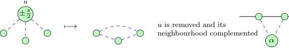 
FIG. 1. The rewriting rules used in this paper, stratified into the three tiers whose separate contributions our results isolate. Green circles are Z spiders carrying a phase, yellow boxes are Hadamard gates, solid lines are wires, and dashed blue lines are Hadamard edges. (a) A Clifford+T word becomes a chain of phase spiders and Hadamard boxes, with Zm the spider of phase mπ/4. (b) Tier 1 is the purely local layer: two adjacent same-colour spiders fuse by adding phases, and a zero-phase spider of degree two is an identity and is deleted. Section III shows that these two rules compute exactly the normal form of Z2 ∗Z8. (c) Tier 2 adds the graph operations, local complementation at a ±π/2...

📷 Fig 2

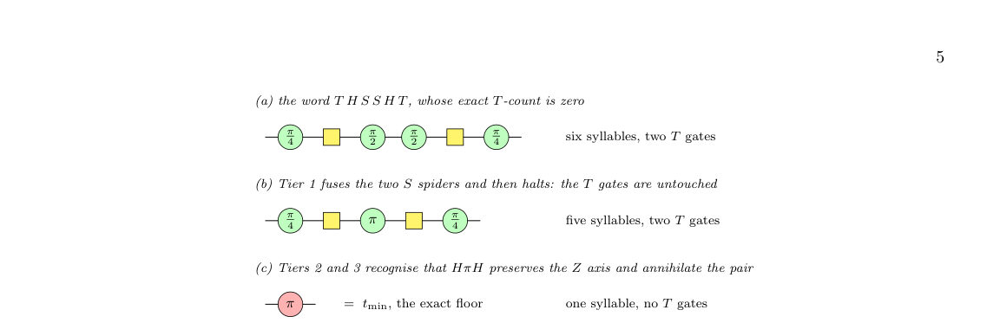 
FIG. 2. What each tier can and cannot do, shown on a single word. (a) The word T H S S H T implements a Clifford, so its minimal T-count is zero, but nothing about the syllable string reveals this. (b) Tier 1 sees only adjacent syllables of the same colour. It fuses S with S into a π spider and then has no further move, leaving both T gates in place: local rewriting alone certifies nothing about the T-count. (c) The interior Clifford HSSH equals X, which preserves the Z axis up to sign, so the two T phases can be brought together and cancel. Recognising this is exactly what the global strategies of Tiers 2 and 3 supply, and Sec. VI shows that at one qubit they supply neither more nor less:...

📷 Fig 3

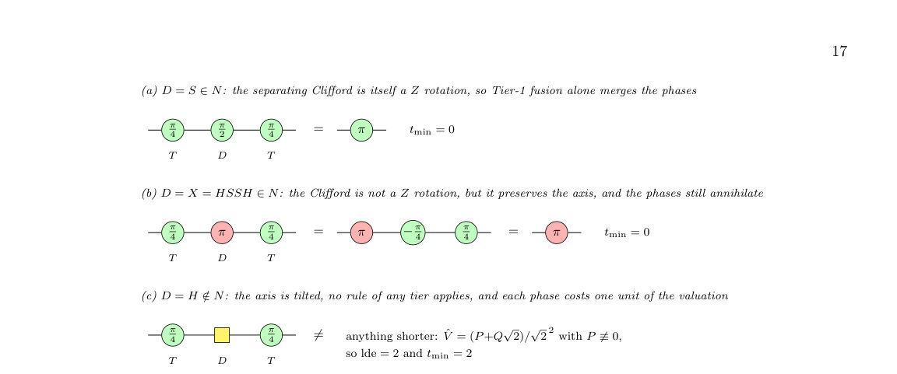 
FIG. 3. The normalizer condition of Lemma 7, illustrated on the shortest nontrivial words. In each row two T phases are separated by a single Clifford D. (a) When D is a Z rotation the three spiders are all green and Tier-1 fusion merges them outright, leaving a Clifford. (b) When D = X, which is HSSH and therefore not visibly a Z rotation at all, the phases still merge: X preserves the Z axis up to sign, so pushing the red π spider through the second phase negates it, the two green spiders fuse to zero, and both T gates disappear. Membership in N, not syntactic appearance, is what decides the outcome. (c) When D = H the axis is tilted, the two phases sit on genuinely different rotation...

📷 Fig 4

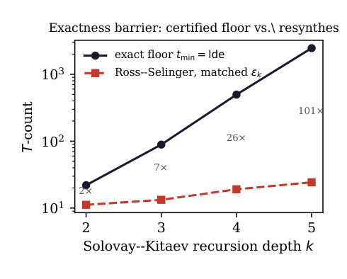 
FIG. 4. The exactness barrier separates the certified exact floor from approximation-aware resynthesis at matched accu- racy, with a geometrically growing gap (Theorem 3).

📷 Fig 5

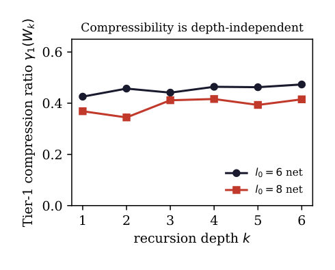 
FIG. 5. Tier-1 compression ratio is depth-independent on both nets, confirming Theorem 2.

**Summary.** This paper provides a unified theoretical framework to quantify the minimum number of T-gates required in a Clifford+T circuit, establishing an 'exactness barrier' using ZX-calculus. It resolves contradictions in circuit compilation by showing that both approximation-based and number-theoretic synthesis methods are fundamentally limited by this computable algebraic bound. This work is crucial for understanding the true compressibility of quantum circuits.

**Why it may be interesting.** While focused on quantum computation, the rigorous mathematical machinery developed—especially the use of algebraic invariants (the barrier) to constrain physical resources (T-gates)—provides powerful theoretical tools applicable to understanding resource limitations in complex quantum systems.

Detailed structure

**Main problem.** The paper addresses the discrepancy between how different methods synthesize quantum circuits and how much those circuits can be optimized using ZX-calculus rewriting.

**Main result.** It establishes a single, computable 'exactness barrier' (a lower bound on T-count) that governs the optimization of Clifford+T circuits, showing that both Solovay-Kitaev and number-theoretic synthesis approaches are constrained by this bound.

**Method.** The authors use advanced algebraic techniques involving ZX-calculus rewriting, exact arithmetic in Z[sqrt(2)], and rigorous proofs to derive this lower bound.

**Model / system.** The focus is on Clifford+T quantum circuits, which are represented and manipulated using ZX diagrams. The optimization goal is minimizing the T-gate count.

**Key observables.** T-count, the 'exactness barrier' (a lower bound on T-count), and the compression ratio achieved by ZX rewriting.

**Important parameters / regimes.** Recursion depth (e.g., depth five), the denominator exponent of the synthesized ring element, and the number of qubits ($n \ge 2$).

**Assumptions / limitations.** The analysis assumes that the optimization process preserves the implemented element exactly, and some results rely on calibrated ergodicity hypotheses.

**Figures summary.** Figures illustrate the three tiers of ZX-calculus rewriting rules (fusion, complementation, teleportation) and show the passage from a circuit representation to a graph-like form and finally to a generalized flow.

**Paper structure.** The paper builds the argument by first analyzing local simplification (Tier 1, free-product reduction), then establishing the general exactness barrier (Theorem 3), and finally proving the saturation of this barrier for specific synthesis methods (Linkage Theorem for single-qubit words).

Abstract

Gate synthesis and circuit optimization are usually studied separately, and evidence on their interaction is contradictory: ZX-calculus rewriting removes a stable fraction of Solovay-Kitaev circuits, yet almost nothing from number-theoretically synthesized circuits. We show both behaviours follow from a single bound. For any optimizer that preserves the implemented element exactly--including all sound ZX rewriting with extraction--the achievable T-count is bounded below by the denominator exponent of the synthesized ring element. This exactness barrier is computable per instance and separates exact post-processing from approximation-aware resynthesis by a certified factor reaching 101x at recursion depth five. The two behaviours are then the barrier operating at different distances from the floor. For Solovay-Kitaev circuits we prove that the local ZX simplification layer (spider fusion and identity removal) computes exactly the free-product normal form of Z_2 * Z_8, giving exact per-instance compression and, under a calibrated ergodicity hypothesis, a depth-independent limit law confirmed on two independently constructed nets. For number-theoretically synthesized circuits the floor is already saturated: on single-qubit words automated ZX simplification attains it exactly, via a closed-form formula for minimal T-count in terms of phase linkage through the Z-axis normalizer. At two qubits and beyond the same valuation yields unconditional rigidity certificates, which on the quantum-Shannon-decomposition plus gridsynth pipeline certify 99.4-99.9% of the synthesized T-count as incompressible, with rigidity strengthening as accuracy tightens. This explains, and predicts the size of, the near-null optimization recently reported for that pipeline.

[↑ back to top](#top)

### [Anomalous stabilization of excitons by metallic proximity](http://arxiv.org/abs/2608.23340v1)

**Authors:** Jeongkeun Song, Uksam Choi, Shan Lin, Du Li, Baekjune Kang, Li Yang, Ambrose Seo, Changhee Sohn, Ho Nyung Lee  
**Type:** both · **Category:** strongly correlated electrons · **PDF:** <https://arxiv.org/pdf/2608.23340v1>  
**Analysis basis:** full PDF text, analyzed in chunks

📷 Fig 1

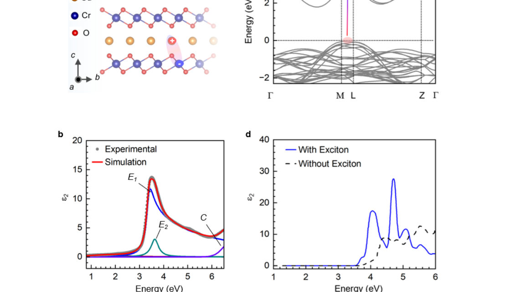 
Figure 1. Interlayer excitons in delafossite CuCrO2. a. Schematic of the CuCrO2 crystal structure and interlayer exciton formation. The red and blue spheres represent the hole and electron, respectively. b. Imaginary part of the dielectric function (ε2) of CuCrO2 measured at room temperature (grey dotted line) and fitted using the Tanguy model (red line). The fit resolves two excitonic transitions, E1 and E2, associated with interlayer Cu–Cr 3d excitations, along with a higher-energy charge-transfer transition (C) from O 2p to Cr 3d states. c. Calculated electronic band structure of CuCrO2. d. Comparison of the calculated imaginary part of ε2 obtained from GW–BSE (blue line, including...

📷 Fig 2

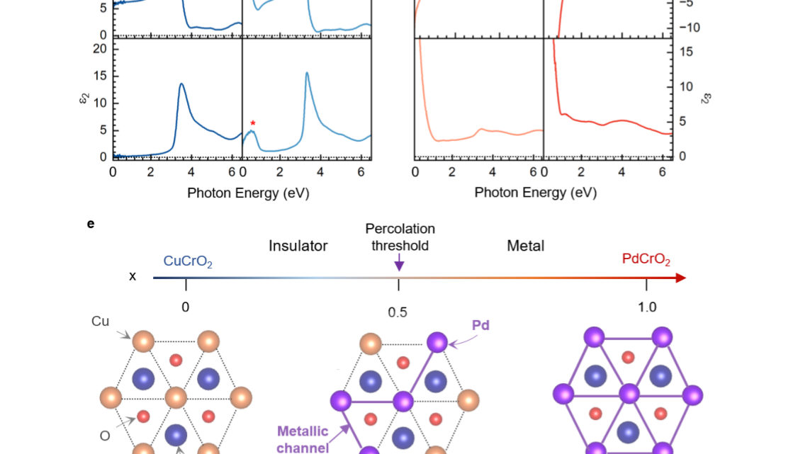 
Figure 2. Percolation-driven metal–insulator transition in PdxCu1-xCrO2. a-d, Real (ε1) and imaginary (ε2) parts of the dielectric function measured at room temperature for a. x = 0.0, b. x = 0.3, c. x = 0.5, and d. x = 1.0. A broad low-energy feature (red asterisk) emerges at the intermediate composition near x = 0.3, consistent with localized plasmonic response. e. Schematic illustration of the percolation-driven metal-insulator transition. At x ≈ 0.5, corresponding to the site-percolation threshold of a triangular lattice, conductive pathways form. For x = 1.0, the system becomes the fully metallic PdCrO2.

📷 Fig 3

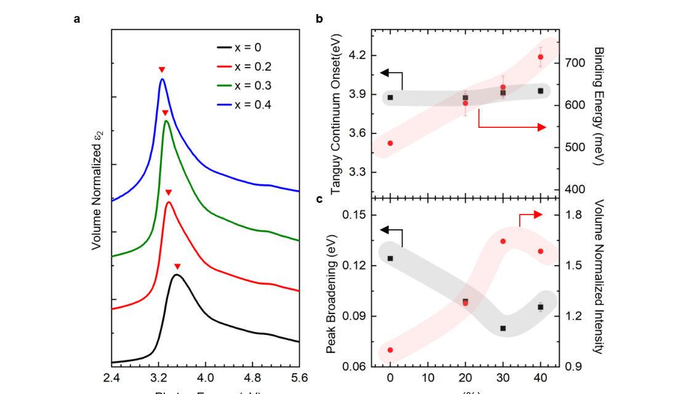 
Figure 3. Exciton stabilization in pre-percolation regime. a. Volume-normalized imaginary part of the dielectric function (ε2) for x = 0.0, 0.2, 0.3, and 0.4. Red inverted triangles mark the peak positions of the excitonic resonance, showing a systematic redshift with increasing Pd concentration. b. Evolution of the optical band gap (black squares) and exciton binding energy (Eb, red circles) extracted by fitting the Tanguy model as a function of Pd concentration (x). The binding energy increases monotonically in the pre-percolation regime. c. Excitonic linewidth (black squares) obtained by fitting the Tanguy model and the volume-normalized peak intensity (red circles) as a function of Pd...

📷 Fig 4

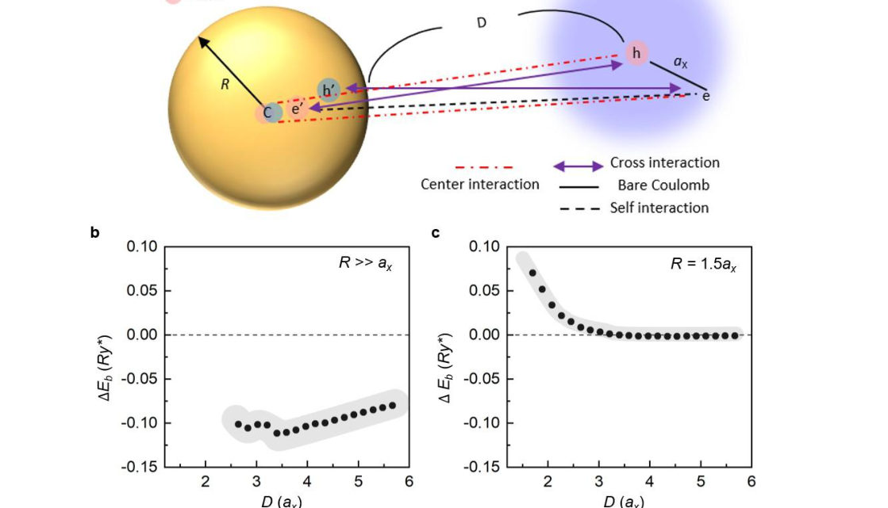 
Figure 4. Image-charge mechanism for exciton stabilization. a. Schematic of a heavy-hole exciton interacting with an isolated, neutral metallic sphere of radius R. The heavy hole (h) is positioned at a surface-to-hole distance D. To satisfy the equipotential and neutrality boundary conditions, the metal induces near-surface image charges (e', h') and neutralizing center image charges (C). This isolated metallic sphere generates additional self-, cross-, and center- interactions that perturb the bare Coulomb potential. The exciton Bohr radius is denoted by aX. b. Calculated change in exciton binding energy (ΔEb) as a function of separation distance (D) in the macroscopic metal limit (R &gt;&gt;...

**Summary.** This paper investigates how excitons behave in $	ext{Pd}_x	ext{Cu}_{1-x}	ext{CrO}_2$ thin films near a metal-insulator transition. Contrary to expectations, isolated metallic patches enhance exciton binding energy via image-charge interactions before the material becomes fully metallic. This suggests that nanoscale metallic proximity can be a powerful tool for engineering excitonic properties.

**Why it may be interesting.** The work provides a concrete example of how local, nanoscale electronic structure (image-charge effects) can override bulk screening predictions, offering a tunable mechanism for controlling excitonic properties in hybrid quantum materials.

Detailed structure

**Main problem.** The paper investigates the anomalous stabilization of excitons in insulating materials when they are in close proximity to metallic regions, challenging the conventional view that metals always suppress excitons via dielectric screening.

**Main result.** The study shows that in the pre-percolation regime, isolated metallic regions enhance electron-hole binding energy through image-charge interactions, leading to an increase in exciton binding energy before the continuous metallic network forms and causes screening.

**Method.** The research combines optical spectroscopy (measuring the dielectric function) with many-body GW–BSE calculations and employs an image-charge-based theoretical model to quantify the electrostatic interactions.

**Model / system.** The system studied is $	ext{Pd}_x	ext{Cu}_{1-x}	ext{CrO}_2$ thin films, which undergo a percolation-driven metal-insulator transition. The theoretical model uses an image-charge perturbation Hamiltonian to describe the interaction between excitons and isolated metallic inclusions.

**Key observables.** Exciton binding energy ($E_b$), redshift of the excitonic resonance peak ($E_1$), and the dielectric function ($\varepsilon_2$).

**Important parameters / regimes.** Percolation threshold ($x \approx 0.5$), separation distance ($D$) relative to exciton size ($a_X$), and the Pd concentration ($x$).

**Assumptions / limitations.** The analysis assumes that the system can be modeled as a heterogeneous composite, and the enhancement mechanism is dominated by local image-charge interactions when metallic regions are isolated.

**Figures summary.** Figures illustrate the systematic redshift and monotonic increase in $E_b$ as Pd doping approaches the percolation threshold, contrasting this enhancement with the quenching observed once a continuous metallic network forms.

**Paper structure.** The paper establishes the physical system and the problem (exciton stability vs. metal proximity). It presents experimental evidence of the percolation transition and the anomalous enhancement of $E_b$ in the pre-percolation regime. Finally, it uses an image-charge model to theoretically explain this enhancement mechanism.

Abstract

Metallic environments are generally expected to suppress excitons through strong dielectric screening, yet their influence can differ in composite systems where metallic and insulating regions coexist. Here, we investigate excitonic states in PdxCu1-xCrO2 thin films across a percolation-driven metal-insulator transition. Optical spectroscopy and many-body GW calculations show that CuCrO2 hosts strongly bound excitons with a binding energy of about 489 meV. With increasing Pd substitution, the system approaches an insulator-to-metal transition near x = 0.5, consistent with the site-percolation threshold of a triangular lattice. In the pre-percolation regime, the excitonic resonance redshifts by 241 meV while the Tanguy continuum onset remains nearly unchanged, consistent with a substantial increase in exciton binding energy before metallization. An image-charge-based excitonic hydrogen model shows that isolated metallic regions can enhance electron-hole binding through image-charge interactions, whereas conventional screening is recovered once a continuous metallic network forms. Although this model provides a possible interpretation of the observed excitonic evolution, an alternative scenario in which metallic and excitonic responses originate from electronically distinct states and evolve independently cannot be excluded. These results reveal unusual metallic-excitonic coexistence near a percolation-driven metal-insulator transition and suggest nanoscale metallic proximity as a possible route for modifying excitonic interactions.

[↑ back to top](#top)

### [Asymptotic entanglement in circle stabilizer states and states forbidding arbitrary vertex-minors](http://arxiv.org/abs/2608.21526v1)

**Authors:** Kenneth Goodenough, Marcelo Sales  
**Type:** theory · **Category:** quantum information and computing · **PDF:** <https://arxiv.org/pdf/2608.21526v1>  
**Analysis basis:** full PDF text, analyzed in chunks

📷 Fig 1

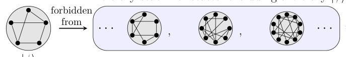 
FIG. 1. Graphical description of theorem I.5. Top depicts a sequence of arbitrary stabilizer states (which we depict as graph states for convenience), bottom depicts a sequence of stabilizer states, but that do not contain some arbitrary but fixed |ϕ⟩as a vertex-minor. The asymptotic entanglement, as quantified by the distance d and locally accessible information αloc can grow strongly (see main text for more details) for the top sequence, while the entanglement in any sequence of (sufficiently strongly rank-connected) stabilizer states forbidding |ϕ⟩is necessarily constrained.

📷 Fig 2

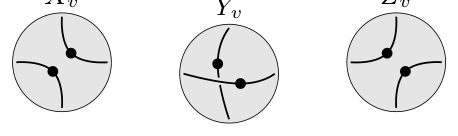 
FIG. 2. The three detachments at a vertex v. The un- der/overcrossing in the Yv detachment is only present for vi- sual clarity. We have suppressed the labels of v′ and v′′.

📷 Fig 3

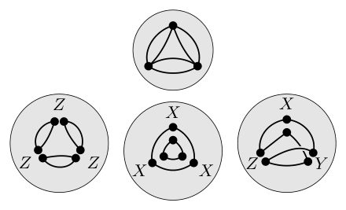 
FIG. 3. A 4-regular multigraph corresponding to the 3-GHZ state in the top, and three possible detachments at the bot- tom. The bottom three multigraphs have 3, 2 and 1 con- nected components, matching the expected evaluations of r(ZZZ) = 1, r(XXX) = 2 and r(XY Z) = 3, respectively.

📷 Fig 4

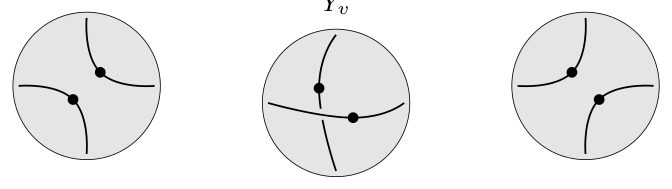 
FIG. 4. The three detachments at a vertex v. The under/overcrossing in the Yv detachment is only present for visual clarity. We have suppressed the labels of v′ and v′′.

📷 Fig 5

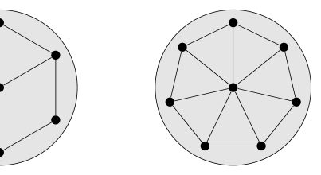 
FIG. 6. The three forbidden vertex-minors for circle stabilizer states.

**Summary.** This theoretical work establishes a deep link between the structural properties of quantum states (defined by forbidden vertex-minors) and their entanglement content. It proves that if a stabilizer state cannot contain a specific substructure, its entanglement is severely limited, growing only logarithmically with system size. The results are highly technical, relying on advanced concepts from matroid theory and graph theory, and are conditional on a major structural conjecture.

**Why it may be interesting.** The connection between forbidden substructures (vertex-minors) and the asymptotic scaling of entanglement is a fundamental structural result that constrains the complexity of quantum states achievable in physical devices.

Detailed structure

**Main problem.** The paper investigates the asymptotic entanglement properties of stabilizer states when those states are constrained by forbidding a specific substructure, known as a vertex-minor.

**Main result.** Assuming a structural conjecture, the entanglement (measured by distance and locally accessible information) of such constrained states grows only logarithmically with system size, contrasting with unconstrained states.

**Method.** The analysis connects entanglement measures to rank functions of multimatroids and uses graph theory (specifically 4-regular multigraphs) to establish structural bounds.

**Model / system.** The system under study is the set of stabilizer states, particularly 'circle stabilizer states,' which are associated with 4-regular multigraphs. The constraints are defined via the concept of a vertex-minor.

**Key observables.** Distance ($d$) and Locally Accessible Information ($\alpha_{	ext{loc}}$).

**Important parameters / regimes.** System size ($n$), the fixed forbidden vertex-minor ($\vert \phi 
angle$), and the rank of graph perturbations ($p$).

**Assumptions / limitations.** The primary results are conditional on Geelen’s weak structural conjecture regarding vertex-minors.

**Figures summary.** Figures illustrate the contrast between entanglement in arbitrary vs. constrained stabilizer states, and show graph detachments related to rank function evaluations in 4-regular multigraphs.

**Paper structure.** The paper builds from general bounds on entanglement measures (Prop I.3), connects these to multimatroid rank functions, establishes specific asymptotic bounds for circle stabilizer states (Theorems E.4, E.5), and culminates by lifting these results to general proper vertex-minor-closed families via graph perturbation theory (Theorem F.10).

Abstract

Stabilizer states play a central role in quantum information theory, and understanding their entanglement has motivated a large body of work. A well-studied question in particular is when a stabilizer state $|ψ\rangle$ can be transformed into another stabilizer state $|φ\rangle$ using only single-qubit Clifford operations and Pauli measurements. If this is possible, we say that $|φ\rangle$ is a vertex-minor of $|ψ\rangle$. Assuming Geelen's weak structural conjecture on vertex-minors, we establish the following general statement. For any fixed stabilizer state $|φ\rangle$, the entanglement in stabilizer states $|ψ\rangle$ that do not contain $|φ\rangle$ as a vertex-minor is asymptotically constrained. More concretely, we show that the distance of any sufficiently rank-connected $|ψ\rangle$ not containing $|φ\rangle$ as a vertex-minor grows as $O(\log n)$, and prove similar results for the so-called locally accessible information, a quantity that captures the amount of information that can be learned through single-qubit Pauli measurements. Our results rely on (i) connecting the above two entanglement measures to rank functions of multimatroids, (ii) connecting the rank functions of circle stabilizer states to rank functions on $4$-regular multigraphs, which asymptotically constrains the entanglement of circle stabilizer states, and (iii) using Geelen's weak structural conjecture on vertex-minors to `lift' the previous result to sufficiently connected states in proper vertex-minor-closed families of stabilizer states. Our results establish a connection between asymptotic stabilizer entanglement and forbidden vertex-minors, with direct implications for the entanglement that can be generated in quantum devices.

[↑ back to top](#top)

### [Breakdown of Edgeworth Expansion in Finite-Blocklength Regime and Exact Absorption via $q$-Deformation](http://arxiv.org/abs/2608.23303v1)

**Authors:** Hiroki Suyari  
**Type:** theory · **Category:** statistical mechanics · **PDF:** <https://arxiv.org/pdf/2608.23303v1>  
**Analysis basis:** full PDF text, analyzed in chunks

📷 Fig 1

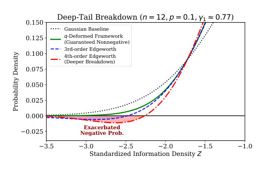 
Fig. 1. Breakdown of the conventional Edgeworth expansion in the deep- tail regime for a binary memoryless source (n = 12, PX(0) = 0.1). The third-order Edgeworth PDF crosses zero around z ≃−2.45. Appending the fourth-order correction further exacerbates this unphysical negative probabil- ity. In contrast, the proposed q-deformed framework structurally preserves nonnegativity across the entire domain.

📷 Fig 2

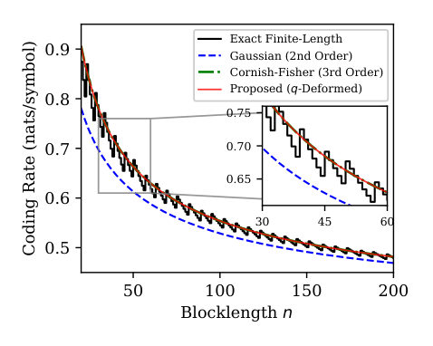 
Fig. 2. Achievable finite-blocklength coding rates for the asymmetric BMS (PX(0) = 0.1, ϵ = 10−3). The proposed q-deformed bound (red solid line) mathematically coincides with the highly accurate third-order Cornish-Fisher bound (green dashed line), precisely matching the exact discrete limit. It achieves this precision while structurally guaranteeing probability nonneg- ativity, overcoming the structural limitation of polynomial approximations.

📷 Fig 3

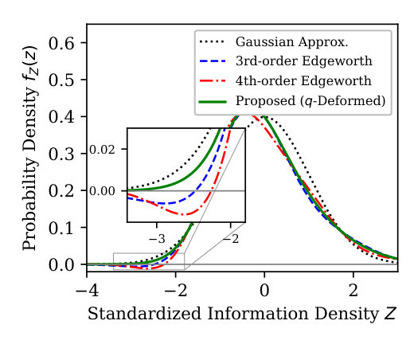 
Fig. 3. Probability density functions for the asymmetric BMS (n = 12, PX(0) = 0.1). Main plot: The overall distribution. Inset: Magnified view of the deep-tail regime where the conventional Edgeworth expansions (3rd and 4th order) become unphysically negative, while the proposed q-deformed framework exactly absorbs the skewness and remains nonnegative.

📷 Fig 4

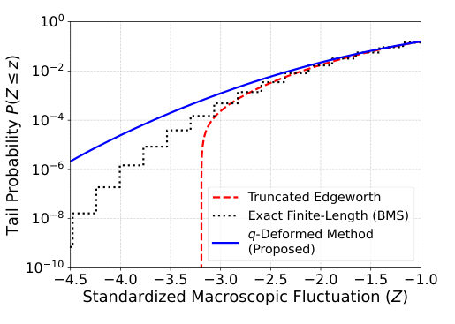 
Fig. 4. Logarithmic tail probability P(Z ≤z) in the deep-tail regime for the asymmetric binary memoryless source (BMS) with n = 200 and PX(0) = 0.1. The exact limit (dotted black line) exhibits a staircase structure reflecting the discrete nature of the source. The truncated Edgeworth expansion (dashed red line) drops to zero (rendering as a vertical drop in log scale), severely underestimating the error probability. The proposed q-deformed method (solid blue line) maintains nonnegativity, providing a mathematically safe, conservative upper bound that remains operationally tight to the discrete limit.

**Summary.** This paper resolves the mathematical failure of Edgeworth expansions in finite-blocklength information theory, which produce unphysical negative probabilities in the deep-tail. The authors introduce a $q$-deformed framework that structurally absorbs the finite-size skewness penalty. This method provides a robust, non-negative, and highly accurate bound for estimating operational limits in advanced communication systems.

**Why it may be interesting.** While the application is in information theory, the mathematical machinery—using $q$-deformations to regularize asymptotic expansions and maintain non-negativity—is a powerful technique applicable to non-equilibrium statistical mechanics and complex systems where standard approximations fail.

Detailed structure

**Main problem.** The paper addresses the structural failure of the Edgeworth expansion when estimating error probabilities in the deep-tail regime of finite-blocklength information theory, where unphysical negative probabilities arise.

**Main result.** A $q$-deformed framework is proposed that resolves this inconsistency by geometrically deforming the information density space, yielding a mathematically consistent and non-negative bound.

**Method.** The authors utilize a $q$-deformed statistical framework, replacing additive polynomial corrections with a geometric deformation parameterized by a dynamically scaled parameter derived from the third central moment.

**Model / system.** The context is finite-blocklength information theory, analyzing the standardized fluctuation of the information density $i(X_n)$ for source coding rates, relevant to 6G and URLLC communications.

**Key observables.** Standardized fluctuation $Z$, achievable source coding rates, and the probability density function $f_Z(z)$ in the deep-tail.

**Important parameters / regimes.** Single-letter entropy ($H$), varentropy ($V$), third central moment ($T$), and the dynamic scaling constant $\alpha = T/(3V^2)$.

**Assumptions / limitations.** The standard logarithm assumes a Gaussian measure baseline, and the $q$-deformed method provides a conservative upper bound on the error probability in the deep-tail.

**Figures summary.** Figures compare the breakdown of the 3rd-order Edgeworth PDF (showing negative values) against the non-negative $q$-deformed PDF, and compare achievable rates showing the $q$-bound matching the exact discrete limit.

**Paper structure.** The paper first establishes the failure of conventional asymptotic expansions (Edgeworth) in the deep-tail. It then introduces the $q$-deformed framework, proves its structural absorption of skewness via a dynamic scaling law, and finally validates this method by showing its superior mathematical consistency and matching state-of-the-art bounds.

Abstract

This paper addresses the structural breakdown of the Edgeworth expansion in the finite-blocklength (FBL) regime, where conventional asymptotic approximations yield unphysical negative probabilities in the deep-tail region. We propose a $q$-deformed framework that resolves this inconsistency by replacing additive polynomial perturbations with a geometric deformation of the information density space. Motivated by the linearization of nonlinear dynamics, we prove that dynamically scaling the $q$-logarithmic parameter exactly absorbs the third-order skewness while preserving global nonnegativity. We establish a universal asymptotic matching, demonstrating that the framework encapsulates higher-order asymptotic scales. Numerical results confirm that the proposed method matches the state-of-the-art precision of the Cornish-Fisher bound without the risk of negative probabilities. The framework offers a robust and computationally stable foundation for evaluating operational limits in ultra-reliable communications such as 6G and URLLC.

[↑ back to top](#top)

### [Characterization of Chaotic Evolution in Quantum Systems Induced by Random Hermitian Matrices](http://arxiv.org/abs/2608.22571v1)

**Authors:** Arkady Kurnosov, Sven Gnutzmann, Uzy Smilansky  
**Type:** theory · **Category:** statistical mechanics · **PDF:** <https://arxiv.org/pdf/2608.22571v1>  
**Analysis basis:** full PDF text, analyzed in chunks

📷 Fig 1

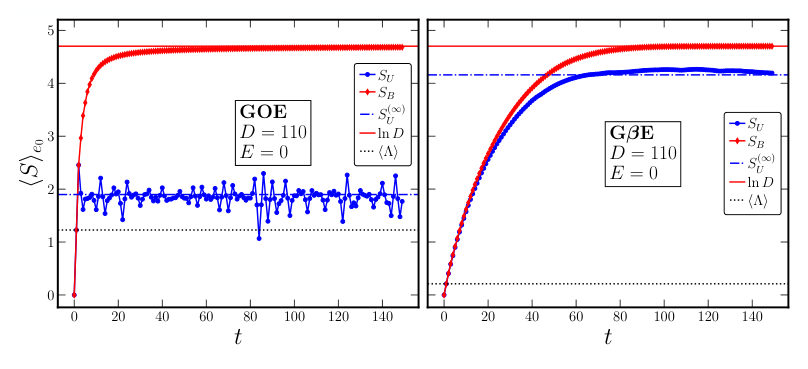 
Figure 1. Entropy as a function of topological time for a single realization, averaged over all localized initial states. Left: GOE. Right: GβE with β = 1.

📷 Fig 2

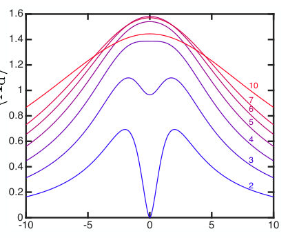 
Figure 2. Mean LE of the d-regular graph as a function of λ = E/ξ, see Eq. (22), for different values of d. The dependence on the graph connectivity is non-monotonic, with the maximum of ⟨Λd⟩attained at d = 6.

📷 Fig 3

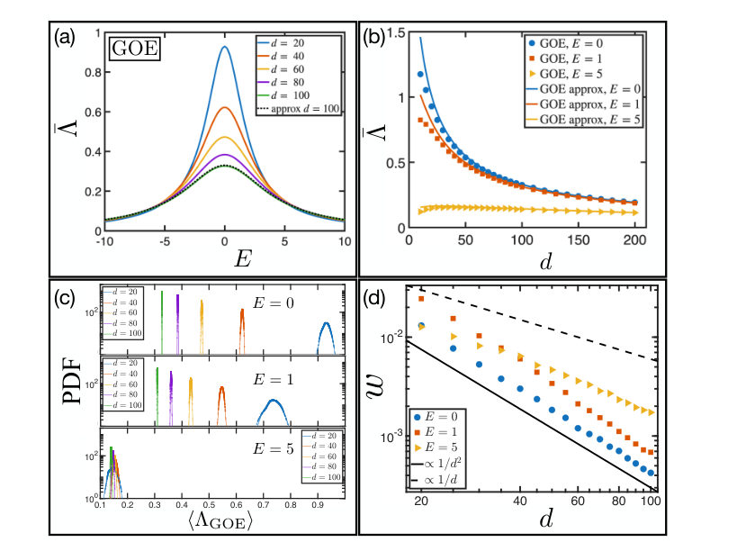 
Figure 3. Numerical simulations for the GOE ensemble. (a) Sample-averaged mean LE as a function of the energy E for different matrix dimensions d (solid lines). The sample size varies from 200 realizations for d = 20 to 3 realizations for d = 100. The black dashed line represents the approximation, Eq. (24), for d = 100. (b) Sample-averaged mean LE as a function of the matrix dimension d, together with the approximation, Eq. (24), for E = 0, 1, and 5. (c) Probability density function of the sample-averaged mean LE (logarithmic vertical axis) for different values of d and E, obtained from 1000 realizations for each parameter set. The solid lines are normal-distribution fits, N(µ, w2). (d)...

📷 Fig 4

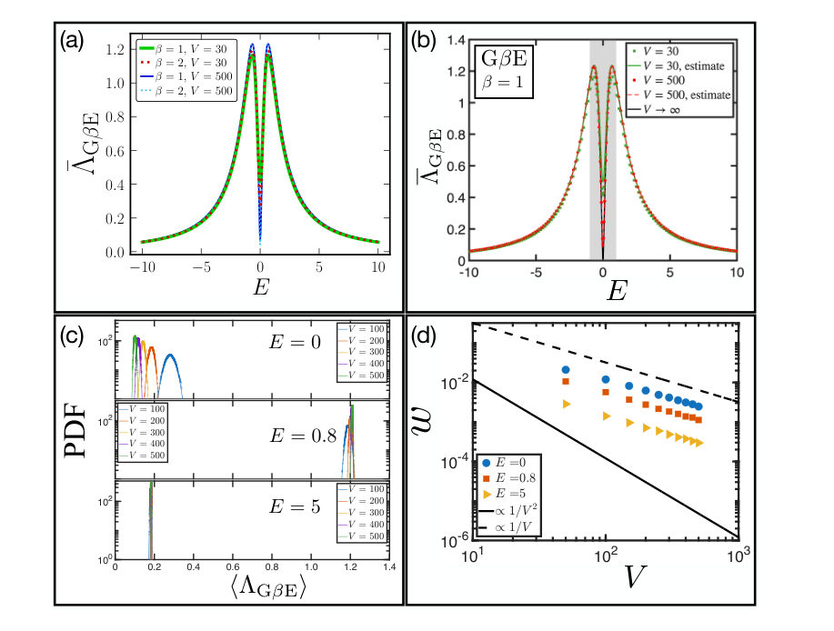 
Figure 4. Mean LE of the GβE ensembles. (a) Sample-averaged mean LE as a function of the energy E for β = 1, 2 and V = 30, 500. (b) Sample-averaged mean LE as a function of the energy E for β = 1, V = 30 (green markers) and V = 500 (red markers), together with the approximation given by Eq. (28). The black solid line corresponds to the asymptotic limit V →∞, while the shaded region indicates the transition regime. (c) Probability density function of the sample-averaged mean LE (logarithmic vertical axis) for different values of V and E, obtained from 1000 realizations for each parameter set. The solid lines are normal-distribution fits, N(µ, w2). (d) Width parameter w of the...

📷 Fig 5

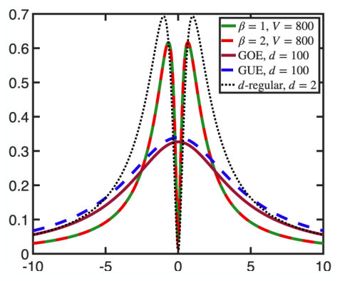 
Figure 5. Comparison of the mean LE for the GβE and Wigner–Dyson ensembles with that of the d-regular graph (d = 2). For graphical clarity, ΛGβE is multiplied by a factor of 1/2.

**Summary.** This theoretical work develops a method to quantify quantum chaos in systems governed by random Hermitian matrices by calculating the semiclassical Lyapunov exponent. It applies this formalism to several random matrix ensembles, deriving the mean LE and spectral gap as functions of energy. The results provide quantitative measures of how quickly quantum information scrambles and approaches equilibrium in these complex quantum systems.

**Why it may be interesting.** The connection between semiclassical chaos indicators (like LE) and quantum observables (like entanglement entropy or OTOCs) is crucial for understanding thermalization and quantum scrambling in complex many-body systems.

Detailed structure

**Main problem.** The paper characterizes the rate of chaotic evolution in quantum systems by defining and calculating the semiclassical Lyapunov exponent ($\Lambda$) and the spectral gap.

**Main result.** The mean Lyapunov exponent ($\langle\Lambda
angle$) and its variance are derived for various random-matrix ensembles (GOE, GUE, $d$-regular graphs, $Geta E$), showing how they characterize information scrambling and approach equilibrium.

**Method.** The analysis uses a quantum Poincaré map $U(E)$ to derive a corresponding classical Markov process, allowing the application of established techniques from classical chaos theory to quantum dynamics.

**Model / system.** The study applies to quantum systems whose dynamics are governed by a finite-dimensional Hermitian Hamiltonian $H$ derived from random matrices. The dynamics are analyzed via the energy-dependent quantum Poincaré map $U(E)$.

**Key observables.** Mean Lyapunov Exponent ($\langle\Lambda
angle$), variance of the LE ($\langle(\delta\Lambda)^2
angle$), and the spectral gap.

**Important parameters / regimes.** Energy ($E$), graph degree ($d$), and the random matrix ensemble type (GOE, GUE, $Geta E$).

**Assumptions / limitations.** The analysis relies on mapping quantum dynamics to a classical Markov process via the squared moduli of quantum amplitudes, and approximations are used for calculating LE moments and thermal averages.

**Figures summary.** Figures illustrate the saturation behavior of quantum and classical entropy ($S_U(t)$ and $S_B(t)$) over time for different ensembles.

**Paper structure.** The paper develops the formalism by defining the quantum Poincaré map, deriving the classical Markov map, calculating the mean LE using spectral properties, and finally applying this framework to calculate LEs and spectral gaps for specific random matrix ensembles, including thermal averaging.

Abstract

In a recent paper, a semiclassical Lyapunov exponent associated with a quantum Hamiltonian represented by a finite-dimensional Hermitian matrix was defined and placed on a mathematical foundation. The Lyapunov exponent characterizes the early stages of the evolution toward the ergodic state, while the late stages are characterized by the spectral gap of the corresponding Markov matrix. Here, we apply this formalism to five random-matrix ensembles. For each ensemble, we derive the mean Lyapunov exponent, its variance, and the spectral gap as functions of energy. We also present the corresponding thermal averages. Extensive numerical data are compared with the theoretical predictions.

[↑ back to top](#top)

### [Classical and quantum spectral density estimation under local graph access](http://arxiv.org/abs/2608.22769v1)

**Authors:** Rong-Hua Li, Meihao Liao, Yichun Yang  
**Type:** theory · **Category:** quantum information and computing · **PDF:** <https://arxiv.org/pdf/2608.22769v1>  
**Analysis basis:** full PDF text, analyzed in chunks

📷 Fig 1

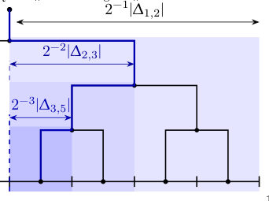 
Figure 3. Dyadic intervals of [−1, 1]. The k-th interval at level ℓis joined to its parent by an edge of length 2−ℓ. Its imbalance ∆ℓ,k is the difference between the masses that bν and ν assign to that interval, equivalently an entry of Aℓ(bν −νgrid). The net flow across the parent edge equals |∆ℓ,k| and contributes 2−ℓ|∆ℓ,k| to dtree(bν, νgrid). The resulting tree routing is a coupling of bν and νgrid, and W1(bν, νgrid) ⩽2dtree(bν, νgrid).

**Summary.** This paper analyzes spectral density estimation for graphs under limited local access, comparing classical and quantum query complexity. It proves that while the classical model requires an exponentially large number of queries, the quantum model achieves a polynomial scaling, demonstrating a clear quantum advantage. This advances the understanding of quantum query complexity in graph signal processing.

**Why it may be interesting.** The work provides a concrete example where quantum computation offers a significant, provable speedup over classical algorithms for a problem rooted in graph spectral analysis, which is highly relevant to quantum algorithms for physical systems.

Detailed structure

**Main problem.** The paper addresses the problem of estimating the spectral density of a graph's normalized adjacency matrix under limited local access to the graph structure.

**Main result.** It demonstrates a quantum advantage by showing that the quantum query complexity for this estimation scales polynomially ($\Omega(\epsilon^{-4/3})$) with the error $\epsilon$, significantly better than the exponential lower bound ($\Omega(2^{1/\epsilon})$) established for the classical local access model.

**Method.** The authors combine spectral graph theory with advanced quantum query complexity techniques, utilizing tools from coding theory (self-dual codes, Lagrangians) to establish lower bounds for quantum bit oracles, which are then mapped to graph queries.

**Model / system.** The system is an unweighted graph $G$, and the object of study is its normalized adjacency matrix $\mathbf{N}_G$. The analysis is framed within the quantum local access model, where graph functions are queried via reversible XOR oracles.

**Key observables.** The spectral density $
ho_G$ of the graph, and the error metric is the Wasserstein-1 distance $W_1(	ilde{
ho}, 
ho_G)$.

**Important parameters / regimes.** The approximation error $\epsilon$ is the key parameter, determining the scaling of the required number of queries.

**Assumptions / limitations.** The quantum model assumes graph functions can be exposed as reversible XOR oracles implementable in $O(1)$ time.

**Figures summary.** No specific figures were summarized, but the notes indicate a comparison of classical and quantum upper/lower bounds in a table.

**Paper structure.** The paper first establishes the classical lower bound for spectral density estimation. It then develops the mathematical machinery using quadratic forms and self-dual codes to prove a quantum query lower bound, culminating in the comparison showing the quantum advantage.

Abstract

We study spectral density estimation for the normalized adjacency matrix of an unweighted graph under local access model. Previously, Cohen-Steiner et al. [KDD 2018] proposed an algorithm for $\varepsilon$-approximate spectral density estimation in the Wasserstein-1 distance, using $2^{O(1/\varepsilon)}$ local queries to the graph. In this paper, we prove that every constant-success estimator with Wasserstein--$1$ error at most $\eps$ requires $2^{Ω(1/\eps)}$ queries, showing that the Cohen-Steiner algorithm is optimal up to constant in the exponent. This resolves the open problem left by previous researches Jin et al. [COLT 2023] and Peng et al. [COLT 2026].   We then turn to quantum local access model. We give an $\widetilde O(\eps^{-3})$-query algorithm estimating the spectral density with Wasserstein-1 error at most $\eps$. Finally, we prove a $\widetildeΩ(\eps^{-4/3})$ quantum lower bound when the graph is sufficiently large. As a result, quantum local access model changes the dependence on $\eps$ from exponential to polynomial.

[↑ back to top](#top)

### [Dataset Complexity Shapes Finite-Distance Loss Geometry in Neural Networks](http://arxiv.org/abs/2608.22361v1)

**Authors:** Jaeyong Bae, Hawoong Jeong  
**Type:** theory · **Category:** disordered systems and neural networks · **PDF:** <https://arxiv.org/pdf/2608.22361v1>  
**Analysis basis:** full PDF text, analyzed in chunks

📷 Fig 1

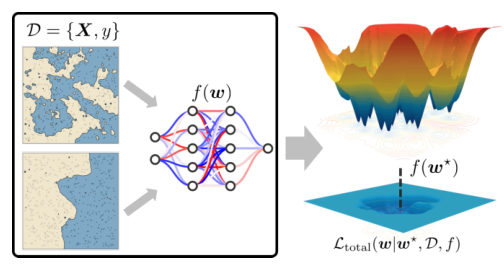 
FIG. 1. Schematic overview of our study. We examine how dataset complexity affects finite-distance loss geometry around trained neural-network solutions.

📷 Fig 2

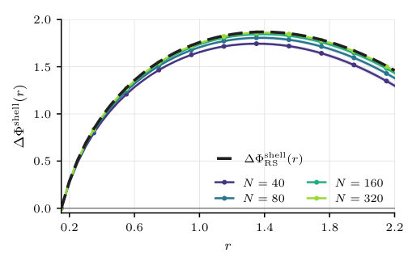 
FIG. 2. Full radial-shell local entropy in the controlled percep- tron benchmark. The dashed black curve shows the indepen- dently calculated thermodynamic-limit RS result ∆Φshell RS (r). Colored curves show the SMC estimates ∆Φshell N (r) for N ∈ {40, 80, 160, 320} trainable weights. Shaded bands denote one standard error across datasets after averaging 10 references within each of 10 independent datasets. Each radius uses 215

📷 Fig 3

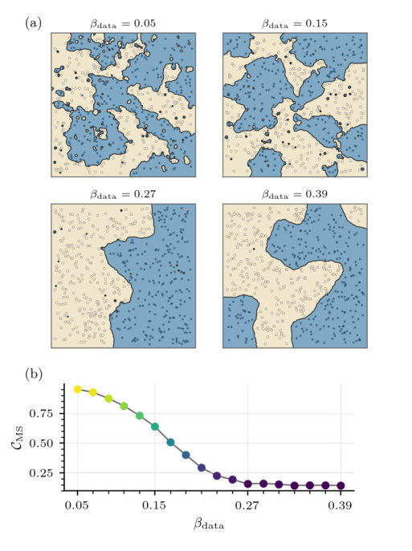 
FIG. 3. Controlled organization of the synthetic labels. (a) Four representative observed configurations spanning the con- trolled sweep. The colored regions and black interfaces visu- alize the organization of the sampled labels. (b) Mean CMS at every βdata, with standard errors across 60 independent datasets.

📷 Fig 4

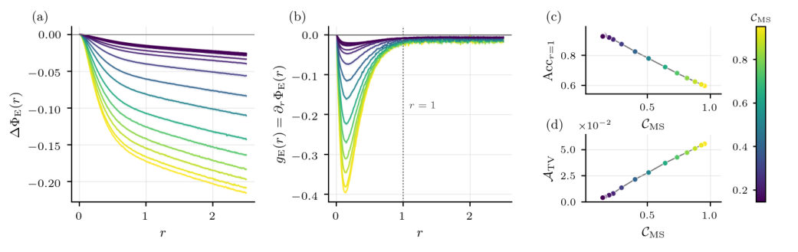 
FIG. 4. Local entropy across the controlled synthetic sweep. (a) Centered local entropy ∆ΦE(r). More negative values correspond to a smaller effective solution volume relative to r0. (b) Its radial derivative gE(r). The dotted line marks r = 1. (c) Particle-weighted, sample-wise training accuracy among the configurations contributing to the r = 1 shell, plotted against CMS. (d) Total radial variation ATV plotted against CMS. Curves show means at each βdata after averaging ten references within each of 60 independent datasets. Shaded bands and error bars denote standard errors across datasets. Color denotes CMS.

📷 Fig 5

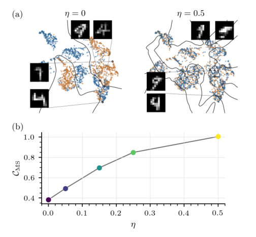 
FIG. 5. Dataset organization in the MNIST label-noise sweep. (a) Endpoint visualizations in shared UMAP coordinates for the clean endpoint (η = 0) and randomized endpoint (η = 0.5). Colors show the observed labels, and black contours summarize their organization in the embedding. UMAP is used only for visualization. (b) Mean CMS at each noise probability, with standard errors across ten paired datasets. The complexity measure is calculated in the standardized 100-dimensional input space.

**Summary.** This work connects the structural complexity of finite datasets to the geometry of the loss landscape in neural networks. By measuring local entropy, the authors show that dataset structure dictates how the effective volume of low-loss solutions contracts as one moves away from the trained parameters. This provides a deep theoretical insight into the relationship between data statistics and the underlying energy landscape organization.

**Why it may be interesting.** The connection between data structure (a classical ML concept) and the geometry of the energy landscape (a core concept in statistical mechanics and disordered systems) provides a powerful, non-trivial link between machine learning theory and condensed matter physics.

Detailed structure

**Main problem.** The study investigates how the structural complexity of a finite training dataset influences the geometry of the loss landscape in neural networks at finite distances from the trained solution.

**Main result.** Greater dataset complexity causes a non-uniform contraction of the effective solution volume (local entropy) near the solution, suggesting dataset structure dictates the organization of low-loss neighborhoods across finite distances.

**Method.** The authors employ local entropy, inspired by spin-glass theory, to measure the effective volume of low-loss parameter configurations, estimating it using adaptive sequential Monte Carlo and deriving theoretical limits via replica methods.

**Model / system.** The model involves fully connected feed-forward neural networks trained on datasets (like MNIST or synthetic 2D families). The analysis compares the dataset complexity, quantified by local label mixing, against the loss landscape geometry.

**Key observables.** Local entropy, radial derivative of local entropy, Multiscale Complexity (CMS), and the full radial-shell local entropy density ($\Phi_{RS}(r)$).

**Important parameters / regimes.** Dataset complexity (local label mixing), distance from reference solution ($r$), and regularization parameters ($\gamma, \lambda$).

**Assumptions / limitations.** The analysis relies on adapting concepts from spin-glass theory (e.g., Franz-Parisi construction) and utilizes replica symmetry breaking (RS) ansatz in the theoretical derivations.

**Figures summary.** Figures schematically illustrate how dataset complexity affects finite-distance loss geometry, and one figure compares finite-N Monte Carlo estimates of local entropy against the thermodynamic limit.

**Paper structure.** The paper progresses from defining the problem (dataset complexity vs. loss geometry) to developing theoretical tools (local entropy estimation via SMC and replica methods) and finally presenting results showing that dataset structure controls the contraction profile of the solution volume.

Abstract

Finite datasets can share the same size and low-order statistics while differing strongly in structural complexity. We connect this dataset complexity to loss-landscape geometry by pairing local label mixing across neighborhood scales with local entropy around trained neural-network solutions. Adapted from the Franz--Parisi construction in spin-glass theory, local entropy measures the effective volume of low-loss, solution-like parameter configurations at each distance from a reference. We estimate it in finite networks using adaptive sequential Monte Carlo. In a controlled synthetic sweep, greater dataset complexity produces a larger decrease in local entropy near the reference. Farther away, its radial derivative becomes weak and nearly common across conditions. Dataset complexity therefore changes where the effective solution volume contracts, rather than making it decrease uniformly faster. Experiments on real image data show the same qualitative trend, with label randomization further amplifying the effect. These results show that dataset structure shapes how low-loss neighborhoods are organized across finite distances from trained solutions.

[↑ back to top](#top)

### [Efficient Quantum Simulation of Linearized Vlasov--Poisson Dynamics Using Trotter and THRIFT Hamiltonian Simulation Methods](http://arxiv.org/abs/2608.23127v1)

**Authors:** Kartick Paul, Rahul V, S. Aravinda, Reetesh K. Gangwar  
**Type:** theory · **Category:** quantum information and computing · **PDF:** <https://arxiv.org/pdf/2608.23127v1>  
**Analysis basis:** full PDF text, analyzed in chunks

📷 Fig 1

 
FIG. 1. Temporal evolution of the electric-field energy, |E(t)|2 for the non-magnetized (Ωc = 0) linearized Vlasov- Poisson system with k = 0.45, Nv = 31, vmax = 5.0 vT and ∆t = 0.24. The resulting 32-dimensional Hamiltonian is en- coded into a five-qubit register. The black solid curve rep- resents the exact Hamiltonian evolution, while the colored curves show the first and second-order Trotter–Suzuki (Tr.) and THRIFT (TH.) approximations for r = 20 and r = 50 product-formula steps. The approximate solutions reproduce the oscillatory decay of the electric-field energy and converge toward the exact evolution as the number of product-formula steps and the approximation order increase are...

📷 Fig 2

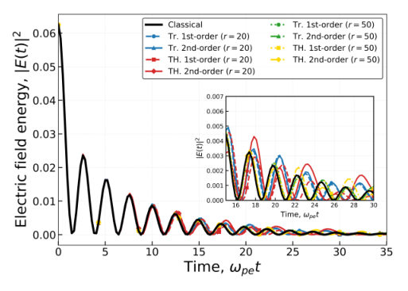 
Figure 1 shows the electric-field energy obtained from the exact Hamiltonian evolution together with the corre- sponding Trotter–Suzuki and THRIFT approximations.

📷 Fig 3

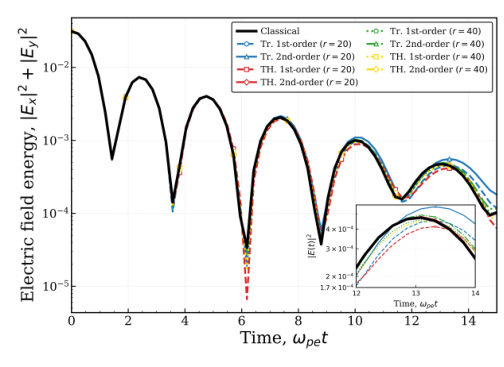 
FIG. 2. Semi-logarithmic evolution of the normalized electric-field energy, E(t) = |Ex(t)|2 + |Ey(t)|2, for the mag- netized linearized Vlasov–Poisson system with kx = ky = 0.4 and B0 = 0.3. A 31 × 31 velocity-space discretization is used, giving312 + 2 = 963 physical degrees of freedom and a 1024- dimensional padded Hilbert space encoded by ten qubits. The black solid curve denotes the exact Hamiltonian evo- lution, while the colored curves show the first- and second- order Trotter–Suzuki (Tr.) and THRIFT (TH.) simulations for r = 20 and r = 40 decomposition steps.

📷 Fig 4

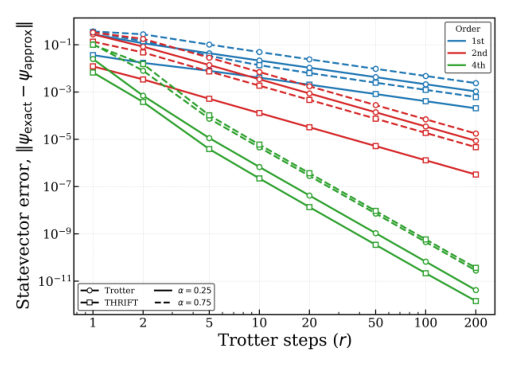 
FIG. 3. State-vector error, ∥ψexact(5)−ψapprox(5)∥2,as a func- tion of the number of product-formula steps r for the first, sec- ond and fourth-order Trotter and THRIFT algorithms, eval- uated at the fixed evolution time t = 5. Solid and dashed curves correspond to interaction strengths α = 0.25 and α = 0.75,respectively.

📷 Fig 5

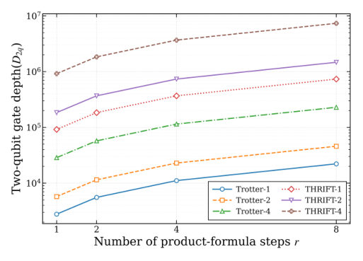 
FIG. 4. Two-qubit gate depth D2q versus the number of product-formula steps r for first, second and fourth-order Trotter and THRIFT circuits. The vertical axis D2q is plotted on a logarithmic scale. The calculations use the discretized Vlasov–Poisson Hamiltonian with Nv = 31 (five qubits) and a total evolution time t = 1. The two-qubit gate depth is calculated by retaining only two-qubit operations when de- termining the circuit depth.

**Summary.** This paper tackles the difficult quantum simulation of plasma dynamics governed by the Vlasov-Poisson system by mapping it onto a quantum Hamiltonian. It systematically compares the performance of Trotter-Suzuki and THRIFT time-evolution methods. The results establish that advanced techniques, particularly THRIFT combined with Richardson extrapolation, provide a resource-efficient pathway for accurate quantum simulation of plasma physics.

**Why it may be interesting.** This work directly addresses the computational bottleneck of simulating complex many-body physics (like plasma) on near-term quantum hardware by rigorously comparing advanced quantum simulation algorithms.

Detailed structure

**Main problem.** The core challenge is developing efficient quantum simulation protocols for the high-dimensional, non-equilibrium dynamics described by the linearized Vlasov-Poisson system.

**Main result.** The study provides a comprehensive comparison showing that the THRIFT framework, combined with higher-order Trotter formulas and Richardson extrapolation, offers a resource-efficient path to accurately simulating plasma dynamics on gate-based quantum computers.

**Method.** The time evolution operator $e^{-iHt}$ is approximated using product formulas (Trotter-Suzuki and THRIFT) and the resulting errors are systematically reduced using Richardson extrapolation.

**Model / system.** The system is the linearized Vlasov-Poisson equation describing plasma dynamics, which is reformulated into a Hermitian Hamiltonian $H = H_{	ext{stream}} + H_{	ext{electric}} + H_{	ext{magnetic}}$ suitable for quantum simulation.

**Key observables.** Electric field evolution, state fidelity, energy conservation, entanglement entropy, and quantum resource requirements (circuit depth, two-qubit gate complexity).

**Important parameters / regimes.** The small parameter $\alpha$ (related to the Hamiltonian decomposition $H = H_0 + \alpha H_1$) and the time step $\Delta t$ are crucial for error analysis.

**Assumptions / limitations.** The plasma is linearized, considering only electron dynamics with ions treated as a fixed background, and the simulation is mapped onto a gate-based quantum computation model.

**Figures summary.** Figures compare probability distributions and extracted electric-field energy between exact evolution and various simulation orders (e.g., 1st-order Trotter vs. THRIFT), demonstrating the error suppression achieved by higher-order methods and Richardson extrapolation.

**Paper structure.** The paper introduces the physical model and Hamiltonian, details the quantum simulation techniques (Trotter vs. THRIFT), systematically evaluates performance across multiple diagnostics (fidelity, energy, resources), and concludes by establishing practical guidelines for resource-efficient simulation.

Abstract

The Vlasov--Poisson system provides the fundamental kinetic description of plasma and plays a central role in understanding collective phenomena such as Landau damping and wave--particle interactions. Efficient numerical simulation of these dynamics remains challenging because of the high dimensionality of phase space. In this work, we studied magnetized and non-magnetized plasma using a quantum simulation framework for the linearized Vlasov-Poisson equation by reformulating the discretized system as a Hermitian Hamiltonian suitable for gate-based quantum computation. The time evolution is implemented using first, second and fourth-order Trotter--Suzuki product formulas and the recently proposed Time-Resolved Interaction Framework (THRIFT). The performance of the different simulation methods is systematically evaluated through electric field evolution, state fidelity, convergence behavior, energy conservation, entanglement entropy and quantum resource requirements, including circuit depth and two-qubit gate complexity, for both magnetized and non-magnetized plasma models. To further reduce finite time step errors without increasing circuit depth, Richardson extrapolation is incorporated as a error-mitigation technique. The results provide a comprehensive comparison of Trotter and THRIFT approaches and establish practical guidelines for accurate and resource-efficient quantum simulation of plasma dynamics on gate-based quantum computers.

[↑ back to top](#top)

### [Evolution of cooperation with Q-learning: how much information do we need?](http://arxiv.org/abs/2608.22705v1)

**Authors:** Yile Ku, Xin Ou, Jiqiang Zhang, Shengfeng Deng, Huiji Yue, Li Chen  
**Type:** theory · **Category:** disordered systems and neural networks · **PDF:** <https://arxiv.org/pdf/2608.22705v1>  
**Analysis basis:** full PDF text, analyzed in chunks

📷 Fig 1

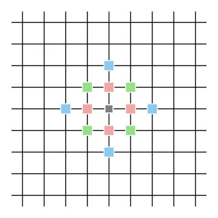 
FIG. 1: Scheme of the neighborhood structure on a two-dimensional lattice. For k = 1 ∼4, neighbors are randomly drawn from the four nearest neighbors (pink). For k = 5 ∼8, the four nearest neighbors are included, and the remaining neighbors are randomly selected from the four diagonal nearest neighbors (green). For k = 9 ∼12, all eight nearest and diagonal nearest neighbors are included, and the remaining neighbors are randomly chosen from the next-nearest neighbors (blue).

📷 Fig 2

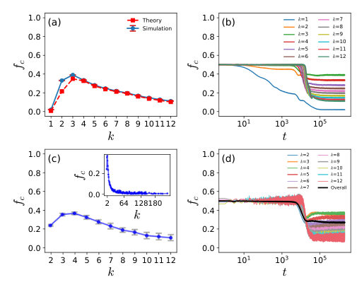 
FIG. 2: Impact of information on cooperation. (a,c) shows the dependence of the cooperation level on information quantity for 2d lattice and BA networks, respectively. In (a), the control parameter k is the neighbourhood size varied in our study, fC = NC/N, where NC is the number of cooperators and N = L × L is the total population size. For BA networks, k represents the node degree, and fC(k) = NC(k)/Nk, where Nk is the total number of individuals with degree k and NC(k) is the number of cooperators among them. The red dashed line in (a) is our semi-analytical treatment (Sec. V). Each data point is averaged over the last 1 × 104 time steps and over 50 independent realizations; error bars...

📷 Fig 3

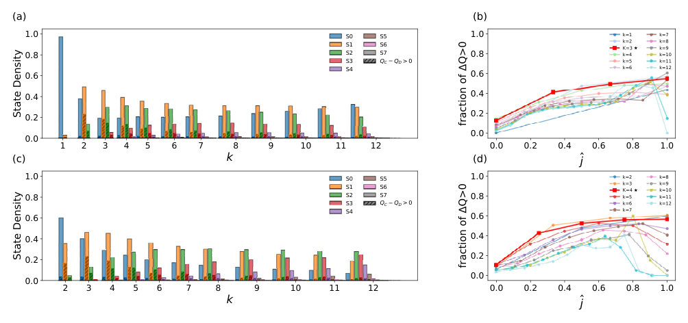 
FIG. 3: Cooperation preference analysis. (a) The state densities for different neighborhood sizes k on the 2d square lattice; the shaded portion of each bar represents the cooperation preference, defined as the fraction of cases with ∆Qsj &gt; 0. (b) The cooperation preference on 2d lattice, i.e., the fraction of ∆Qsj &gt; 0 within each state, where the state labeling is normalized by ˆj = j/k. (c, d) show the corresponding results for BA networks. All data are averaged over the last 1 × 104 steps after reaching steady state, and over 50 independent realizations. Other parameters: b = 0.1, α = 0.1, γ = 0.9, ε = 0.01.

📷 Fig 4

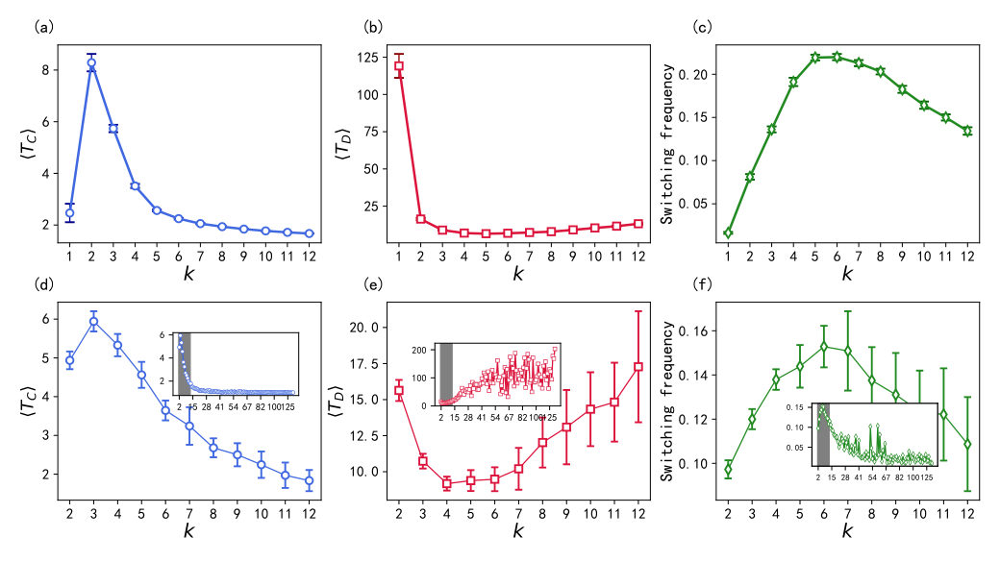 
FIG. 4: Strategy persistence and switching. (a, d) Average cooperation duration ⟨TC⟩; (b, e) Average defection duration ⟨TD⟩; (c, f) Strategy switching frequency. The upper row (a-c) corresponds to the 2d square lattice, and the bottom row (d-f) to the BA network. The insets in (d-f) show the full range of degrees, with the shaded regions indicating the enlarged portions displayed in the main panels. All data are averaged over the last 1 × 104 time steps after reaching the steady state at tmax = 2 × 106, and over 50 independent realizations. Error bars denote the standard deviation of the mean across 50 realizations. Other parameters: b = 0.1, α = 0.1, γ = 0.9, ε = 0.01.

📷 Fig 5

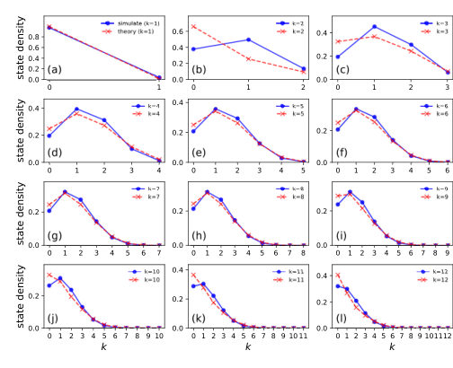 
FIG. 5: State densities for different numbers of neighbors on 2d lattice. Subplots (a-l) are for neighborhood sizes k = 1 ∼12; both simulation and theoretical results are shown. All the setups are the same as Fig. 2(a)

**Summary.** This work models cooperation evolution using Q-learning on structured populations, treating neighborhood size as a proxy for available information. It reveals that cooperation is maximized not by having the most information, but by having an optimal, moderate amount. This suggests a fundamental trade-off between information sufficiency and decision-making tractability.

**Why it may be interesting.** While the core topic is socio-physics, the use of Q-learning on complex networks to model emergent collective behavior shares methodological parallels with how ML/NN concepts are applied to complex physical systems.

Detailed structure

**Main problem.** The paper investigates the evolutionary basis of cooperation, specifically challenging the intuition that more information always leads to better decision-making.

**Main result.** A non-monotonic, inverted U-shaped relationship was found, demonstrating that an optimal, moderate amount of information is required to maximize cooperation.

**Method.** The study employs a Reinforcement Learning (Q-learning) framework to model how individuals in a structured population learn optimal strategies through trial and error.

**Model / system.** The model simulates cooperation evolution within a structured population placed on 2D square lattices or Barabási-Albert scale-free networks, playing a game like the Prisoner's Dilemma.

**Key observables.** Cooperation prevalence ($f_C$), cooperation preference ($\Delta Q_{s_j}$), and the relationship between $f_C$ and neighborhood size ($k$).

**Important parameters / regimes.** Neighborhood size ($k$), learning rate ($\alpha=0.1$), discount factor ($\gamma=0.9$), and exploration rate ($\epsilon=0.01$).

**Assumptions / limitations.** The primary assumption is that the Q-learning framework accurately models an 'introspective learning process' distinct from simple imitation.

**Figures summary.** Figures show the inverted U-shaped dependence of cooperation on neighborhood size for both 2D lattices and BA networks, and illustrate state densities and cooperation preferences for varying $k$.

**Paper structure.** The paper establishes the problem, details the Q-learning methodology on structured graphs, presents the key finding of non-monotonicity, and concludes with mechanistic interpretations regarding information balance.

Abstract

Cooperation is ubiquitous in both natural and human societies, yet its evolutionary basis remains a major challenge. A long-standing puzzle is whether having more information leads to better decision-making and thus a higher level of cooperation. To address this question, we adopt a recently developed reinforcement learning framework in which individuals learn through trial and error to maximize cumulative rewards - a paradigm that has successfully explained diverse emergent patterns in human behaviors. Specifically, we equip a structured population with the Q-learning algorithm and systematically vary the size of the interactive neighborhood, which serves as a proxy for perceived information. Interestingly, we observe a non-monotonic relationship between cooperation prevalence and neighborhood size in both two-dimensional square lattices and Barabasi-Albert scale-free networks. This inverted U-shaped dependence reveals that an optimal amount of information exists, yielding the highest level of cooperation. Mechanistic analyses show that a moderate neighborhood size enables individuals to strike an optimal balance between information sufficiency and decision-making tractability. This balance allows them to detect reciprocal opportunities while avoiding the deterioration of decision quality due to information overload. Our findings challenge everyday intuition, suggesting that a proper amount of information - not more - is optimal for the emergence of cooperation.

[↑ back to top](#top)

### [Exact and Optimal Recursive Quantum Search via Hilbert-Space Decomposition](http://arxiv.org/abs/2608.23002v1)

**Authors:** John Burke, Ciaran McGoldrick  
**Type:** theory · **Category:** quantum information and computing · **PDF:** <https://arxiv.org/pdf/2608.23002v1>  
**Analysis basis:** full PDF text, analyzed in chunks

📷 Fig 1

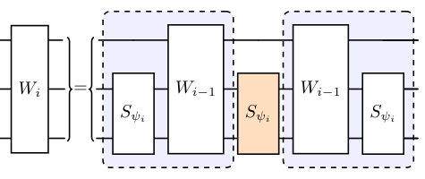 
Figure 1: One level of the recursion (6), consisting of two mirrored sequences of ti alternating applications of Wi−1 and Sψi, separated by a central Sψi. The reflection Sψi acts on registers i, . . . , 1, while the oracle enters only at the base through W0 = Sx.

📷 Fig 2

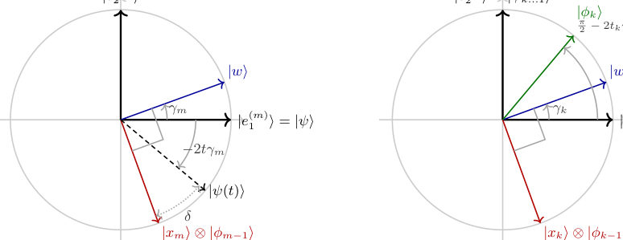 
Figure 2: The invariant plane of Lemma 3.4, drawn at the outermost level and at a level of the corrective cascade. In both panels the iterate is the product of two reflections within the plane. The first reflection is about |e1⟩. The second is about the axis |w⟩of (25), at angle γ from |e1⟩, so the iterate is the rotation by −2γ. The target ray of (27) lies at γ −π/2, perpendicular to |w⟩. In panel (a) the initial state at level m is |e(m) 1 ⟩= |ψ⟩. Each iterate rotates it by −2γm towards the target ray. The phase-tuned step of Section 3.3 absorbs the angle δ left after the last whole iterate. In panel (b) level k receives the residual |ϕk⟩of (26), at angle π/2 −2tkγk. The tk inverse...

📷 Fig 3

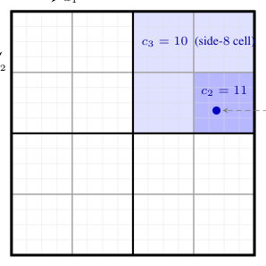 
Figure 3: The relabelling of Eqs. (71) and (72) on a 16 × 16 grid, with bases (b3, b2, b1) = (2, 2, 4) and the origin at the top-left corner. Register i holds digit i of each axis, and fixing the registers above level i selects the sub-cube of side ℓi containing v, shaded darker at each level.

**Summary.** This paper introduces a novel quantum search algorithm that achieves optimality by recursively decomposing the Hilbert space structure. By constructing the search operator from reflections over this decomposition, the authors derive an exact description of the state evolution, avoiding accumulated errors. This method yields optimal gate counts for both unstructured and spatial quantum search problems.

**Why it may be interesting.** The exact recursive description and the focus on structural decomposition provide a powerful, generalizable framework for analyzing quantum algorithms beyond simple amplitude amplification bounds.

Detailed structure

**Main problem.** The paper addresses the limitation of current quantum search algorithms by proposing a method that deeply exploits the underlying structure of the Hilbert space.

**Main result.** They achieve the simultaneously optimal $\Theta(\sqrt{N})$ oracle and non-oracle gate counts for unstructured search and recover known optimal bounds for spatial search in $d$-dimensional grids.

**Method.** The core method involves recursively decomposing the Hilbert space and constructing the search operator using reflections over this partition, which reduces the dynamics to a single rotation at each level.

**Model / system.** The model is the quantum search problem, analyzed by decomposing the Hilbert space ($\mathcal{H} = \mathcal{H}_m \otimes \cdots \otimes \mathcal{H}_1$) such that both the initial and target states factorize over this product structure.

**Key observables.** Success probability (derived exactly from the accumulated rotation angle), oracle gate count, and non-oracle gate count.

**Important parameters / regimes.** The dimension $N$ of the search space, the dimensionality $d$ of the grid, and the recurrence parameters $\{t_i\}$ controlling the recursion.

**Assumptions / limitations.** The initial state $|\psi
angle$ and target state $|x
angle$ must factorize over the chosen product partition of the Hilbert space.

**Figures summary.** Not specified in the notes.

**Paper structure.** The paper introduces the decomposition technique, derives the recursive structure using reflections, analyzes the dynamics via an angle recurrence, and applies this framework to unstructured and spatial search settings to derive optimal gate counts.

Abstract

Current approaches to quantum search fail to deeply exploit extant structure in the underlying Hilbert space. Decomposing the search by this structure empowers new strategies and formulations for quantum search and algorithm design. We present a new decomposition technique acting directly on this structure by recursively decomposing the Hilbert space and constructing the search operator from reflections over the resulting partition. When initial and target states factorise over this partition, dynamics reduce to a single rotation in a two-dimensional plane at each level, with angle given by a scalar recurrence. This recurrence avoids error accumulation from separately bounding success probabilities at each level, yielding an exact state description enabling treatment of the recursion as a whole. We obtain the target state deterministically and derive oracle and non-oracle costs independently of the search setting. For unstructured search, our approach attains the simultaneously optimal $Θ(\sqrt{N})$ oracle and non-oracle gate counts. For spatial search on $d$-dimension grids, it recovers the $O(\sqrt{N})$ time for $d\geq3$ and the $O\bigl(\sqrt{N}(\log N)^{3/2}\bigr)$ bound of Aaronson and Ambainis for $d=2$. The exact description of the recursion extends over our decomposition to new subdivision structures and provides a new approach for applying and analysing recursion in quantum algorithm design.

[↑ back to top](#top)

### [First-Principles Atomistic Structure and Dynamics of Polyethylene During High-Pressure Radical Polymerization via Machine Learning Force Fields](http://arxiv.org/abs/2608.21741v1)

**Authors:** Bharatha K. Gunawardana, Teresa Shah, Bicha Azizova, Deepa Ranabhat, Yizhi Song, Akshath Shastri, Srinjoy Ghose, Thomas E. Gartner, Hsin-Yu Ko  
**Type:** theory · **Category:** disordered systems and neural networks · **PDF:** <https://arxiv.org/pdf/2608.21741v1>  
**Analysis basis:** full PDF text, analyzed in chunks

📷 Fig 1

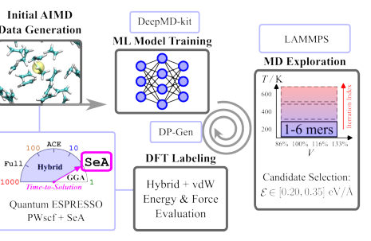 
FIG. 1. Schematic illustration of our workflow for training the machine-learning force field (MLFF) at the hybrid DFT+vdW level by integrating SeA and the DP ecosystem.

📷 Fig 2

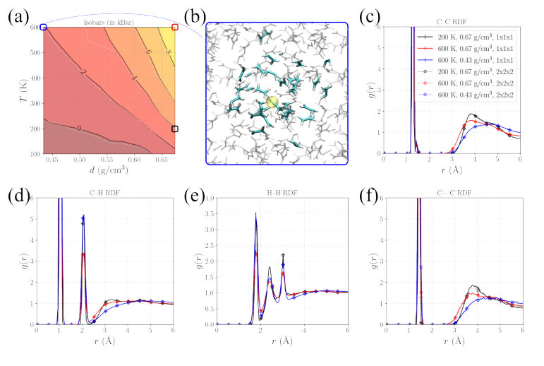 
FIG. 2. Assessment of finite-size effects on the solvated ethyl radical (1-mer). Panel (a) shows the isobars of (C2H5 · )(C2H4)31 in a periodic unit cell (color-shaded contour lines labeled with isovalues in kbar) plotted against corresponding isobars initiated with a 2x2x2 supercell (white dashed lines). Panel (b) provides a graphical representation of the condensed-phase system with C (H) atoms in cyan (white) and the radical highlighted in yellow. Panels (c-f) shows the C–C, C–H, H–H, and C · –C radial distribution functions (RDFs) of three select thermodynamic conditions labeled as color-coded open squares in (a); the marker shapes denote the initial condition—thus also the system...

📷 Fig 3

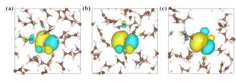 
FIG. 3. Three representative solvation structures (panels a–c) around an ethyl radical under a high- pressure polymerization of ethylene at T = 500 K and ρ = 0.57 g/cm3. Graphical representation of the condensed-phase systems include: (1) ball-and-stick models for the nuclei with C (H) atoms in brown (white) spheres; (2) localized orbital isosurfaces for the radical electrons at isovalues of ±0.8 Bohr−3/2

📷 Fig 4

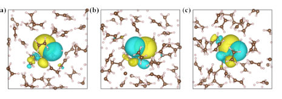 
FIG. 5. Representative solvation structures of PE oligomer radicals of lengths (a) n = 2, (b) n = 4, and (c) n = 6 under a high-pressure polymerization of ethylene at T = 500 K and ρ = 0.57 g/cm3 with the consistent graphical representation used in Fig. 3.

📷 Fig 5

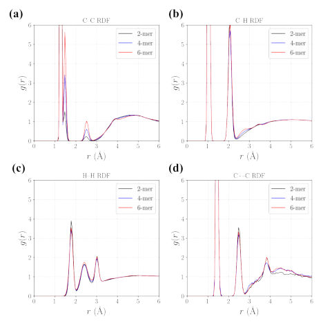 
FIG. 4. Chain-length-dependent radial distribution functions for (a) C–C, (b) C–H, (c) H–H, and (d) C · –C pairs sampled using the 32-molecule unit cell at T = 600 K and ρ = 0.43 g/cm3.

**Summary.** This work addresses the limitation of simulating polymer structure at the atomic level under reactive conditions by developing a Deep Potential Machine Learning Force Field (MLFF). The MLFF is trained using high-accuracy DFT data and is successfully applied to model Polyethylene polymerization. This demonstrates a powerful, first-principles approach for predicting polymer properties across large length and time scales.

**Why it may be interesting.** The use of MLFFs trained on high-level quantum chemistry methods to model complex, reactive condensed matter systems is highly relevant for developing predictive tools in quantum materials and soft matter physics.

Detailed structure

**Main problem.** The primary challenge is accurately simulating the atomistic structure and dynamics of polymers like Polyethylene (PE) under reactive, high-pressure conditions, a task difficult for traditional empirical potentials.

**Main result.** The authors successfully developed and validated a Deep Potential Machine Learning Force Field (MLFF) that accurately predicts PE structure and dynamics across various thermodynamic states and chain lengths, demonstrating first-principles accuracy for polymer simulation.

**Method.** The methodology combines the computational efficiency of a Deep Potential MLFF with the high chemical accuracy of first-principles, van der Waals corrected hybrid Density Functional Theory (DFT), facilitated by a high-throughput framework.

**Model / system.** The system studied is Polyethylene (PE) oligomers and polymers undergoing radical polymerization in an ethylene solvent under supercritical, high-pressure conditions. The model is the MLFF trained on DFT data, enabling large-scale Molecular Dynamics (MD) simulations.

**Key observables.** Local solvation environment (via RDFs), molecular weight scaling of structure/dynamics, and consistent fidelity across varying thermodynamic state points.

**Important parameters / regimes.** High-pressure/supercritical conditions ($p \ge 500 	ext{ bar}$), temperature range ($200-600 	ext{ K}$), and oligomer chain lengths ($n=1$ to $n=6$).

**Assumptions / limitations.** The MLFF trained on oligomers can be reliably extrapolated to predict the behavior of significantly longer, full-length polymer chains.

**Figures summary.** Figures illustrate the MLFF training workflow using SeA and the DP ecosystem, and show structural convergence of the solvation environment around radical-containing oligomers.

**Paper structure.** The paper details the necessity of bridging the gap between DFT accuracy and large-scale simulation needs. It outlines the MLFF training process using high-throughput DFT data, validates the model by studying oligomer solvation structures, and finally demonstrates the model's extensibility to long polymer chains.

Abstract

Polyethylene (PE) is one of the most commonly used synthetic polymers. While the synthesis and processing protocols for PE are well established, precise experimental assignment of microscopic structures at atomistic resolution (i.e., the position of each atom) remains largely limited to highly crystalline systems. This gap is often addressed via computer simulations using empirical interatomic potentials, which use approximate but efficient descriptions of interatomic interactions to reach the length and time scales needed to describe macromolecules. These empirical potentials typically perform well for bulk and/or collective properties but face challenges with chemical realism for complex systems, e.g., during reactive processes. In this work, we address this challenge by combining the computational efficiency of a deep potential (DP) machine-learning force field and the chemical realism of first-principles van der Waals (vdW) corrected hybrid density functional theory (DFT) enabled by a SeA high-throughput framework. Using this approach, we study the structure and dynamics of PE oligomers and polymers in an ethylene solvent under common high-pressure (supercritical) radical polymerization conditions. We found that the local solvation environment of radical-containing PE oligomers converges for chain lengths greater than (n~6), suggesting extensibility of our oligomer-trained MLFF to significantly longer polymers. We then confirmed the extensibility of these models to long PE chains by characterizing the molecular weight scaling of single-chain structure and dynamics, which showed classic good solvent behavior. Our PE MLFF retained a consistent level of fidelity and stability across a wide range of thermodynamic state points and chain lengths, at full atomistic resolution, therefore paving the way towards first-principles-based polymer structure and property prediction.

[↑ back to top](#top)

### [Generalizing Abell-Tersoff bond-order potential with explicit high-order many-body correlations for robust extrapolation of potential energy surfaces](http://arxiv.org/abs/2608.22933v1)

**Authors:** Ikuma Kohata  
**Type:** theory · **Category:** disordered systems and neural networks · **PDF:** <https://arxiv.org/pdf/2608.22933v1>  
**Analysis basis:** full PDF text, analyzed in chunks

📷 Fig 1

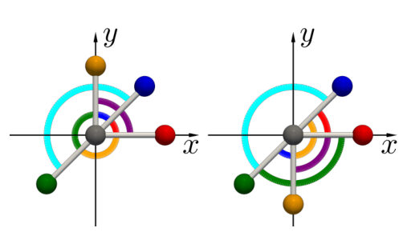 
FIG. 1. Two distinct bonding environments in planar CH4 that yield the same value of bond order bij in the Abell– Tersoff bond-order potential. The gray, red, blue, green, and yellow spheres represent atoms i, j, k, h, and u. Atom i is a carbon atom. Atoms j, k, h, and u are hydrogen atoms, which are indistinguishable under permutation. All bonds connected to atom i have the same length. The blue, red, purple, yellow, green, and cyan arcs indicate bond angles of 45◦, 45◦, 90◦, 135◦, 135◦, and 180◦, respectively.

📷 Fig 2

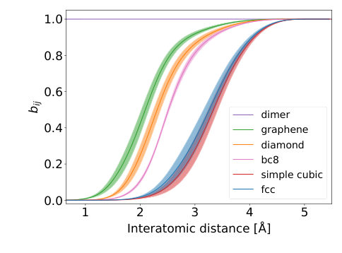 
FIG. 3. Asymptotic behavior of bond order bij for a nearest- neighbor bond in dimer, graphene, diamond, bc8, simple cu- bic, and fcc structures under isotropic scaling of the system. The bond-order profiles were averaged over four indepen- dently trained models, with the shaded regions indicating half of the standard deviation.

📷 Fig 3

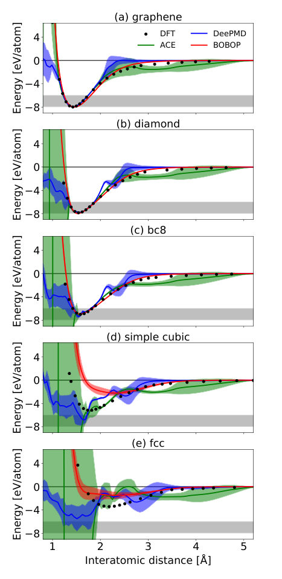 
FIG. 2. Cohesive energy as a function of nearest-neighbor interatomic distances for (a) graphene, (b) diamond, (c) bc8, (d) simple cubic, and (e) fcc, calculated with BOBOP, DeePMD, and ACE trained on the limited-diversity carbon dataset. Each energy curve was averaged over four indepen- dently trained models, with the color-shaded regions indicat- ing the standard deviations. The gray-shaded regions indicate the per-atom energy range covered by the training dataset.

📷 Fig 4

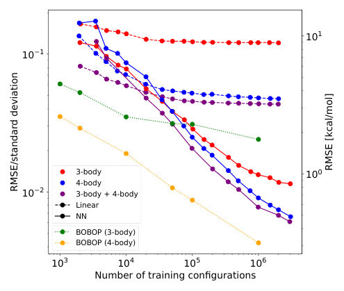 
FIG. 4. Test RMSEs for energy as a function of the num- ber of training configurations of CH4. Results for BOBOP with explicit three- and four-body features are shown. Test RMSEs for three-body, four-body, and combined three- and four-body atom-centered descriptors with linear and neural- network outputs reported in Ref. [14] are also shown for com- parison. The left axis shows the RMSE normalized by the standard deviation of the energy over the CH4 dataset, while the right axis shows the corresponding RMSE in kcal/mol.

📷 Fig 5

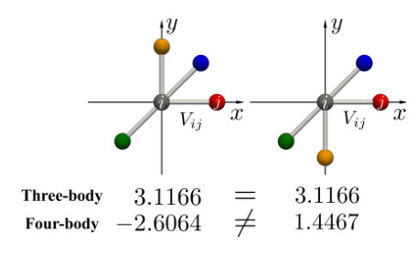 
FIG. 5. An example of bond-energy degeneracy between two planar CH4 configurations. The bond energy Vij based on three-body features exhibits the same value for both config- urations, whereas that based on four-body features distin- guishes between them.

**Summary.** This paper introduces BOBOP, a generalized interatomic potential that merges the chemical intuition of the Abell-Tersoff model with explicit, high-order many-body correlations. It aims to overcome the critical weakness of standard MLIPs—poor extrapolation—by embedding physical constraints into the potential's functional form. The resulting model shows improved accuracy and transferability, particularly under extreme thermodynamic conditions.

**Why it may be interesting.** While focused on condensed matter potentials, the methodology heavily relies on advanced machine learning descriptors and functional form constraints, making it relevant to the broader field of ML-physics and developing physically informed neural network potentials.

Detailed structure

**Main problem.** The primary challenge addressed is ensuring the reliability and physical accuracy of machine-learning interatomic potentials (MLIPs) when simulating atomic configurations far outside the training data distribution.

**Main result.** The proposed potential, BOBOP, successfully combines the chemically intuitive functional form of Abell-Tersoff potentials with explicit, high-order many-body correlations, leading to better extrapolation capabilities than standard MLIPs.

**Method.** The authors generalize the Abell-Tersoff potential by constructing a semiparametric model that incorporates explicit three-, four-, and five-body descriptors derived from local atomic environments.

**Model / system.** The model describes the potential energy surface (PES) of interacting atoms, using a modified Hamiltonian structure based on the Abell-Tersoff form. The local environment is encoded in a descriptor vector $\zeta_{ij}$ built from higher-order neighbor correlations.

**Key observables.** Potential Energy Surface (PES), bond order ($b_{ij}$), total energy ($E_{tot}$), and extrapolation accuracy under extreme conditions (high P/T).

**Important parameters / regimes.** Cutoff distance ($R_{cut}$), polynomial expansion order ($
u_{max}$), and the coefficients defining the many-body descriptors.

**Assumptions / limitations.** The core assumption is that incorporating physically motivated, high-order many-body constraints into the functional form can guide MLIPs toward physically plausible extrapolation behavior.

**Figures summary.** Not specified, but the notes detail the mathematical construction of higher-order descriptors (three-, four-, five-body) and the comparison of computational costs.

**Paper structure.** The paper first establishes the limitations of existing potentials (Abell-Tersoff, standard MLIPs). It then introduces the BOBOP framework, detailing the construction of high-order descriptors ($\zeta_{ij}$) and the final energy functional. Finally, it discusses the theoretical implications of the effective body order and computational scaling.

Abstract

Machine-learning interatomic potentials enable accurate and efficient atomistic simulations, but their reliability for out-of-distribution configurations far beyond the training domain remains a significant challenge. Here, to tackle this challenge, we introduce a semiparametric interatomic potential based on a generalization of the Abell--Tersoff bond-order potential, with a chemically informed functional form and explicit high-order many-body correlations. The model is trained and evaluated on various datasets, including silicon, carbon, water, and small molecules, achieving interpolation accuracy comparable to that of existing MLIP models while demonstrating better extrapolation to unseen configurations, including those under high-pressure and high-temperature conditions. These results demonstrate that physically motivated constraints incorporated into the functional form can improve the extrapolation behavior of interatomic potentials, providing insights into the inductive biases that can be used to control extrapolation in machine-learning interatomic potentials.

[↑ back to top](#top)

### [Inclusion-Minimal local indistinguishability: a weak form of nonlocality](http://arxiv.org/abs/2608.22393v1)

**Authors:** Mao-Sheng Li, Zong-Xing Xiong, Zhu-Jun Zheng, Yan-Ling Wang  
**Type:** theory · **Category:** quantum information and computing · **PDF:** <https://arxiv.org/pdf/2608.22393v1>  
**Analysis basis:** full PDF text, analyzed in chunks

📷 Fig 1

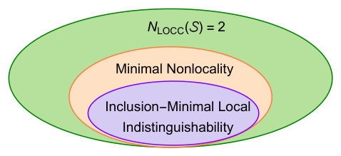 
FIG. 1. Relations among minimally nonlocal sets, inclusion- minimal locally indistinguishable sets, and sets with LOCC copy number NLOCC(S) = 2.

📷 Fig 2

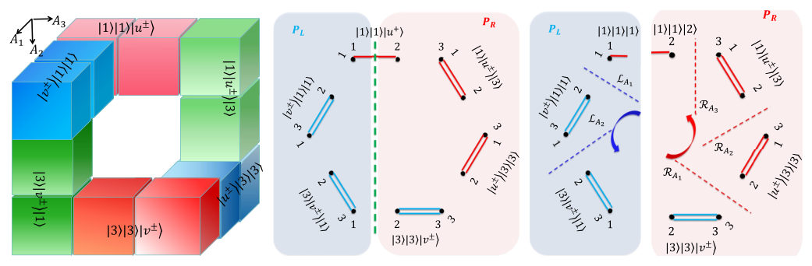 
FIG. 2. (Color online) (a) The geometry of the constructed states in S3 defined in Eq. (1). (b) The intuition of the connectivity of the states in S3 and the effect of the first projection play on A3. (c) The sequential measurements on the PL branch. (d) The sequential measurements on the PR branch.

📷 Fig 3

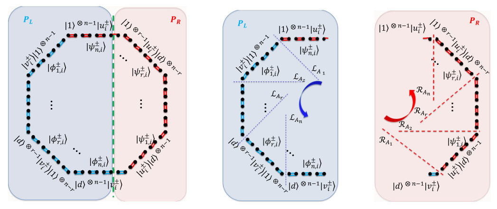 
FIG. 3. (Color online) Schematic illustration of the construction and the LOCC protocols. (a) Connectivity structure of the state families and the splitting of the set S′ induced by the first projective measurement on An. (b) Sequential measurements on the PL branch. (c) Sequential measurements on the PR branch.

**Summary.** This work explores 'inclusion-minimal local indistinguishability,' a weak measure of quantum nonlocality for sets of quantum states. The key finding is that such sets are fragile, as they become perfectly distinguishable by LOCC if one state is removed or if two identical copies of the state are available. The authors provide explicit constructions demonstrating this phenomenon in multipartite systems.

**Why it may be interesting.** It provides a structural, resource-based perspective on quantum nonlocality, showing that even weak forms of nonlocality are highly sensitive to minor changes in the experimental setup (state removal or copy number).

Detailed structure

**Main problem.** The paper investigates 'local indistinguishability,' a weak form of quantum nonlocality, by analyzing how this property changes when the set of candidate quantum states is reduced or when additional copies of the unknown state are supplied.

**Main result.** The authors prove that inclusion-minimal locally indistinguishable sets are fragile, requiring either the deletion of a state or the availability of two identical copies to become perfectly distinguishable via Local Operations and Classical Communication (LOCC).

**Method.** The analysis involves developing a hierarchy of concepts (inclusion-minimal vs. minimally nonlocal) and constructing explicit examples of product-state sets exhibiting this property.

**Model / system.** The focus is on sets $S$ of mutually orthogonal pure quantum states, specifically product states in multipartite Hilbert spaces, analyzed under the constraints of LOCC.

**Key observables.** Local distinguishability, inclusion-minimal property, and $N_{LOCC}(S)$ (the minimum number of identical copies needed for LOCC discrimination).

**Important parameters / regimes.** Odd dimension $d=2k+1$ and the number of parties $n \ge 2$ for explicit constructions.

**Assumptions / limitations.** The analysis relies on the framework of LOCC and assumes the states are orthogonal pure product states for the explicit constructions.

**Figures summary.** Figures illustrate the relationships between different types of nonlocal sets and schematically show the sequential measurements used to prove local distinguishability after state deletion.

**Paper structure.** The paper establishes definitions, proves that every finite locally indistinguishable set contains an inclusion-minimal subset, and then derives the operational consequence that such sets require two copies for LOCC discrimination, culminating in explicit constructions.

Abstract

Local discrimination of quantum states is a fundamental task in distributed quantum information processing and underlies applications such as quantum communication, data hiding, and secret sharing. Here we investigate a weak form of local indistinguishability by asking how easily it can disappear when the candidate set is reduced or an additional copy of the unknown state is supplied. We introduce inclusion-minimal locally indistinguishable sets, namely, locally indistinguishable sets for which every proper subset is perfectly distinguishable by local operations and classical communication (LOCC), and show that every finite locally indistinguishable set contains such a subset. We further find that any inclusion-minimal locally indistinguishable sets becomes perfectly distinguishable by LOCC when two identical copies are available, although a single copy is insufficient. Fininally, We construct explicit inclusion-minimal locally indistinguishable product-state sets in $(\mathbb C^d)^{\otimes n}$ for every odd $d=2k+1$ and $n\ge2$. These results show that local indistinguishability can be nontrivial at the single-copy level yet fragile under either the removal of candidate states or a modest increase in copy resources, providing a complementary perspective on the structure of quantum nonlocality.

[↑ back to top](#top)

### [Interplay of Magnetic Order, Structural Stability, and Orbital Ordering in BaFe2X3 (X = S and Se)](http://arxiv.org/abs/2608.23081v1)

**Authors:** Kunihiko Yamauchi, Takuya Aoyama, Kenya Ohgushi  
**Type:** both · **Category:** strongly correlated electrons · **PDF:** <https://arxiv.org/pdf/2608.23081v1>  
**Analysis basis:** full PDF text, analyzed in chunks

📷 Fig 1

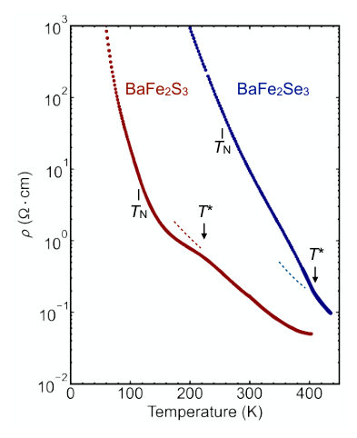 
FIG. 2. Temperature dependence of electric resistivity. The TN and T ⋆indicate antiferromagnetic transition and electronic anomaly related to the orbital state.

📷 Fig 2

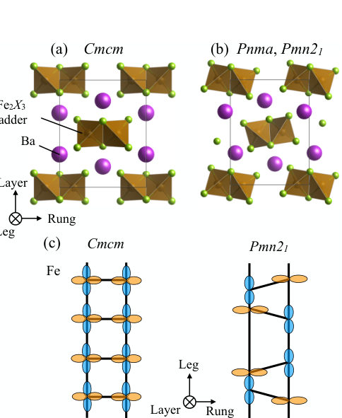 
FIG. 1. Crystal structure of BaFe2X3 in (a) Cmcm phase and (b) Pnma phase. (c) Schematic drawings of the local ladder structure and the possible patterns of the Fe-d orbital ordering with the space group of Cmcm and Pmn21.

📷 Fig 3

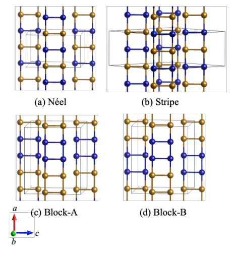 
FIG. 3. Magnetic configurations considered in this study: (a) N´eel, (b) Stripe, (c) Block-A, and (d) Block-B orders. For clarity, only the Fe sublattice is shown, while Ba and chalcogen (Se/S) atoms are omitted. Orange and blue spheres represent Fe sites with opposite spin orientations (denoted as Fe and Co in the structural files for technical convenience). The crystallographic axes are indicated in the lower left corner.

📷 Fig 4

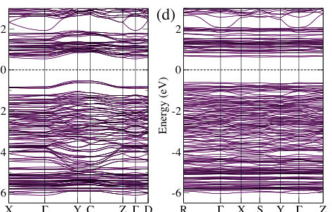 
FIG. 4. Electronic band structures of the optimized (a) Cmcm N´eel, (b) Pnma N´eel, (c) P21/c Stripe, and (d) Pc Block-B states obtained under the respective fixed magnetic orders in BaFe2Se3. Spin–orbit coupling was not included. The up- and down-spin bands are distin- guished by red and blue curves.

📷 Fig 5

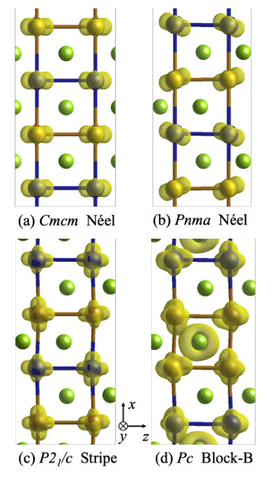 
FIG. 5. Partial charge densities integrated over the energy range from 0.5 eV below the valence-band maximum to the valence-band maximum in BaFe2Se3. The crystal symmetry is followed by the magnetic order: (a) Cmcm, N´eel, (b) Pnma, N´eel, (c) P21/c, Stripe, and (d) Pc, Block-B.

**Summary.** This work investigates how magnetic order dictates structural stability and orbital arrangement in the Mott insulators BaFe2X3. By combining DFT calculations with experimental measurements, the authors demonstrate that symmetry breaking, particularly in the Block-B state of BaFe2Se3, enhances orbital polarization, offering a microscopic understanding of the contrasting electronic behaviors of the two compounds.

**Why it may be interesting.** The strong coupling between lattice distortions (structural stability) and electronic degrees of freedom (orbital ordering) is a hallmark of strongly correlated electron systems, providing insights into mechanisms beyond simple magnetic ordering.

Detailed structure

**Main problem.** The study aims to clarify the complex interplay among magnetic order, structural stability, orbital ordering, and transport properties in the quasi-one-dimensional Mott insulators, BaFe2X3 (X = S and Se).

**Main result.** The magnetic configuration dictates the stable crystal structure and orbital ordering, with the Block-B state in BaFe2Se3 showing enhanced orbital polarization due to a cooperative Jahn–Teller-like distortion.

**Method.** The research combines experimental resistivity measurements with first-principles calculations (DFT+U) to systematically compare candidate magnetic and crystal structures.

**Model / system.** The physical system is the compound BaFe2X3 (X=S and Se), which possesses a ladder structure and exhibits rich magnetic and orbital phenomena. The calculations model various magnetic states (Néel, Stripe, Block) and associated crystal symmetries.

**Key observables.** Resistivity anomalies, relative energies ($\Delta E$), band gaps ($E_{	ext{gap}}$), and orbital polarization patterns visualized via partial charge densities.

**Important parameters / regimes.** The Hubbard U parameter (e.g., U=3 eV) is crucial for treating correlation effects; temperature ($T$) and magnetic ordering wavevectors ($\mathbf{q}$) are key parameters.

**Assumptions / limitations.** The calculations rely on DFT+U approximations and assume that structural stability is governed by the minimization of total energy across different magnetic/structural phases.

**Figures summary.** Figures illustrate crystal structures in different symmetries (Cmcm, Pnma, Pmn21), temperature dependence of resistivity, and visualizations of orbital ordering patterns associated with various magnetic states.

**Paper structure.** The paper systematically analyzes the structural implications of different magnetic orders (Néel, Stripe, Block) for both BaFe2S3 and BaFe2Se3, using DFT calculations to determine the most stable configuration and correlating this with observed transport anomalies.

Abstract

BaFe2X3 (X= S and Se) are quasi-one-dimensional Mott insulators with a ladder structure that exhibit Stripe- and Block-type antiferromagnetic order, respectively. The ladder arrangement of Fe atoms and strong electron correlations give rise to rich magnetic and orbital phenomena, including pressure-induced superconductivity and orbital-selective electronic states. Both compounds also show resistivity anomalies above the Neel temperature, suggesting that orbital degrees of freedom play an important role in their electronic properties. To clarify the interplay among magnetic order, structural stability, orbital ordering, and transport properties, we performed resistivity measurements and first-principles calculations for BaFe2S3 and BaFe2Se3, systematically comparing candidate magnetic and crystal structures. We find that the magnetic configuration strongly influences the stable crystal structure, orbital ordering, and transport anisotropy, providing a microscopic understanding of the contrasting electronic properties of the two compounds.

[↑ back to top](#top)

### [On the Four-Loop Higgs--Gluon Form Factor in Nonlocal Quantum Field Theory](http://arxiv.org/abs/2608.22623v1)

**Authors:** E. J. Thompson  
**Type:** theory · **Category:** other · **PDF:** <https://arxiv.org/pdf/2608.22623v1>  
**Analysis basis:** full PDF text, analyzed in chunks

📷 Fig 1

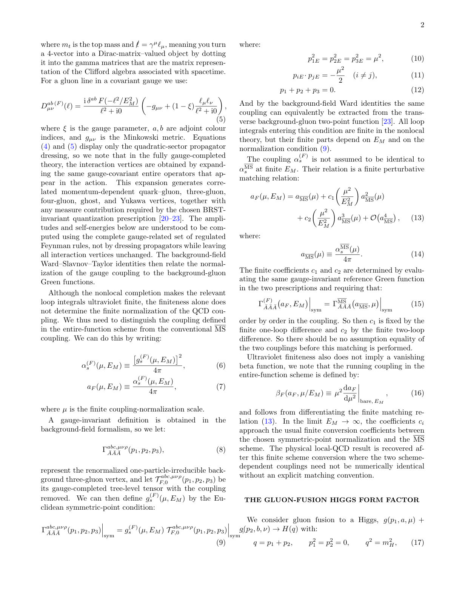 
Low-resolution page preview, page 2

📷 Fig 2

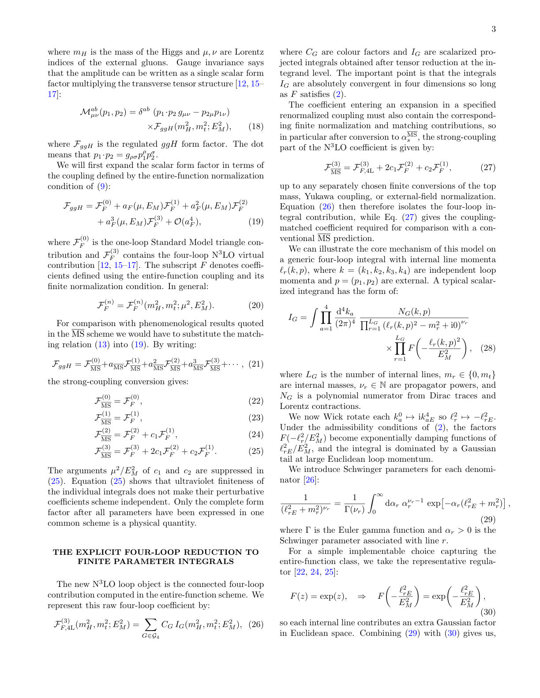 
Low-resolution page preview, page 3

📷 Fig 3

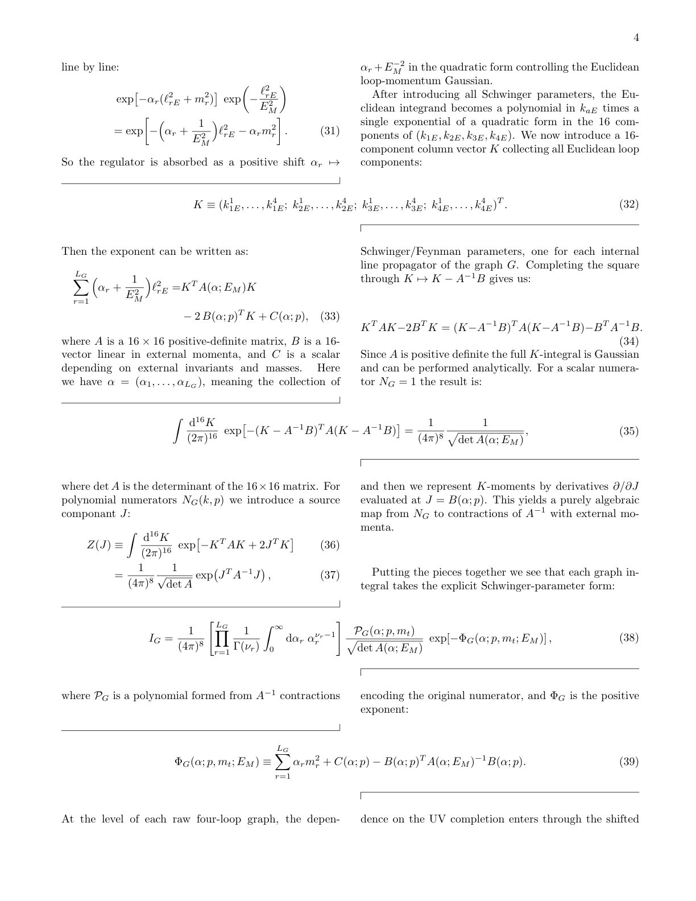 
Low-resolution page preview, page 4

📷 Fig 4

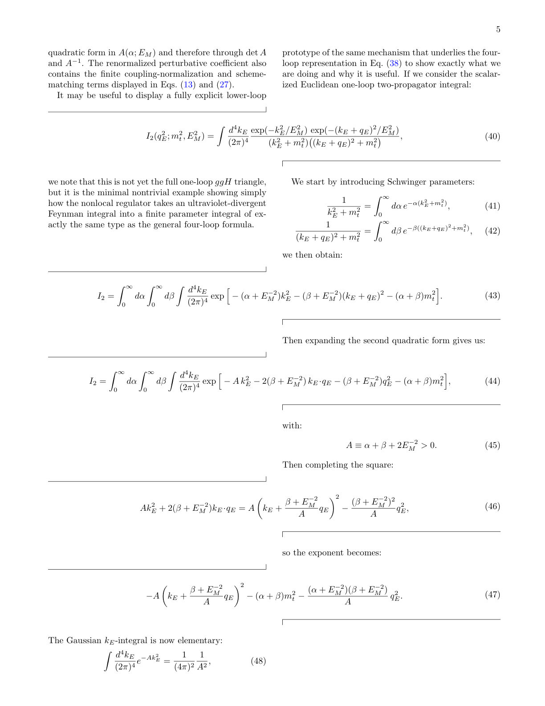 
Low-resolution page preview, page 5

📷 Fig 5

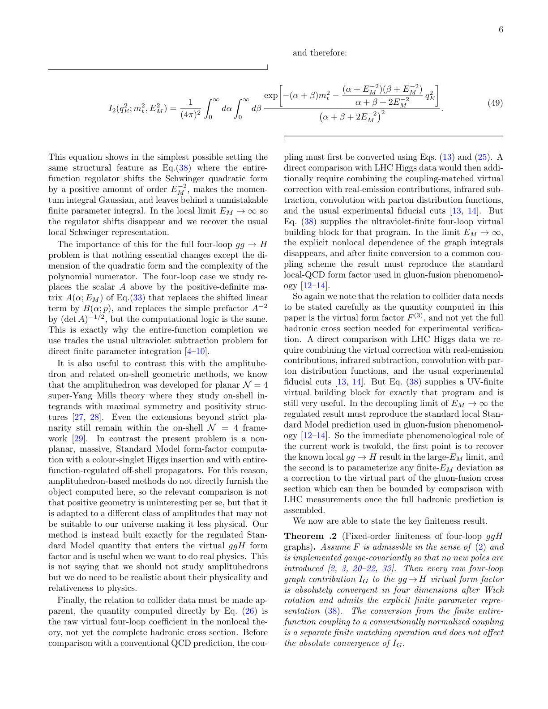 
Low-resolution page preview, page 6

**Summary.** This paper develops a novel technique using nonlocal quantum field theory to calculate the four-loop Higgs--Gluon form factor, a notoriously difficult quantity in QCD. By introducing a specific regulator, the authors render the previously divergent integrals absolutely convergent in four dimensions. This provides a calculable, UV-finite building block for high-precision predictions of Higgs physics at colliders.

**Why it may be interesting.** The methodology of using nonlocal regulators to tame UV divergences in perturbative calculations is a powerful, general technique applicable to any high-order calculation in quantum field theory, potentially simplifying complex calculations in other areas of particle physics.

Detailed structure

**Main problem.** The paper addresses the formidable challenge of calculating the virtual N$^3$LO contribution to Higgs production via gluon fusion in the Standard Model, which involves highly complex, multi-scale, four-loop QCD amplitudes.

**Main result.** The authors demonstrate that employing a nonlocal UV completion allows the calculation of the four-loop Higgs--Gluon form factor to become fully convergent in four dimensions, yielding a closed-form, finite parameter representation.

**Method.** The core method involves using an entire-function regulator in the background-field formalism, which transforms UV-divergent loop integrals into absolutely convergent Gaussian integrals solvable via Schwinger parameterization.

**Model / system.** The physical system is the Higgs boson production from gluon fusion ($gg 	o H$) within the framework of Quantum Chromodynamics (QCD). The theoretical tool employed is a nonlocal Quantum Field Theory providing a UV completion.

**Key observables.** The regulated four-loop Higgs--Gluon form factor ($F_{ggH}$), and the strong coupling constant ($\alpha_s$).

**Important parameters / regimes.** The regulator scale ($E_M$), the Higgs mass ($m_H$), and the top quark mass ($m_t$).

**Assumptions / limitations.** The method assumes the regulator function is 'admissible' and that the final physical result requires a separate, finite matching procedure to relate the non-local coupling to the standard $\overline{	ext{MS}}$ coupling.

**Paper structure.** The paper first identifies the difficulty of the N3LO calculation. It then introduces the nonlocal regulator to achieve UV convergence, deriving a closed-form Schwinger-parameter representation for the loop integrals. Finally, it details the necessary finite matching procedure to relate the calculated form factor to the standard $\overline{	ext{MS}}$ prediction.

Abstract

In particle physics the virtual N$^3$LO contribution to gluon-fusion Higgs production in the Standard Model requires four-loop multi-scale QCD amplitudes that in dimensional regularization are dominated by singular integral reduction and difficult master-integral evaluations. In this note we show that a nonlocal UV completion makes each fixed-order four-loop Feynman diagram fully convergent in four dimensions while keeping the analytic structure needed for Lehmann-Symanzik-Zimmermann (LSZ) reduction formula. For gluon-fusion $gg\!\to\!H$ we derive a closed form Schwinger-parameter representation where all loop-momentum integrals are performed analytically and thus leaving finite parameter integrals viable for direct numerical evaluation without needing the usual UV subtractions. This method heps to isolate the collider-hard contribution as a convergent four-loop form factor. The strong coupling then is defined by a finite normalization condition in the entire-function regularization scheme and it is related to the $\overline{\mathrm{MS}}$ coupling by finite matching where after this matching, the regulator-dependent corrections decouple in the local limit $E_M\!\to\!\infty$.

[↑ back to top](#top)

### [qiskit-qudits: A Qiskit Extension for Simulating Qudit Circuits](http://arxiv.org/abs/2608.22032v1)

**Authors:** Francesco Pudda  
**Type:** theory · **Category:** quantum information and computing · **PDF:** <https://arxiv.org/pdf/2608.22032v1>  
**Analysis basis:** full PDF text, analyzed in chunks

📷 Fig 1

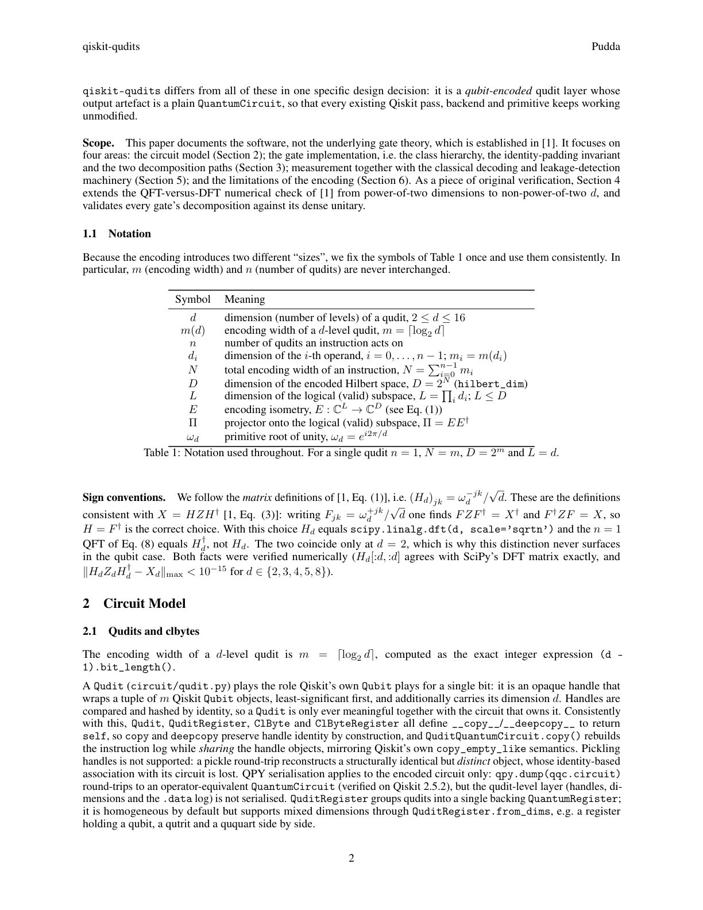 
Low-resolution page preview, page 2

📷 Fig 2

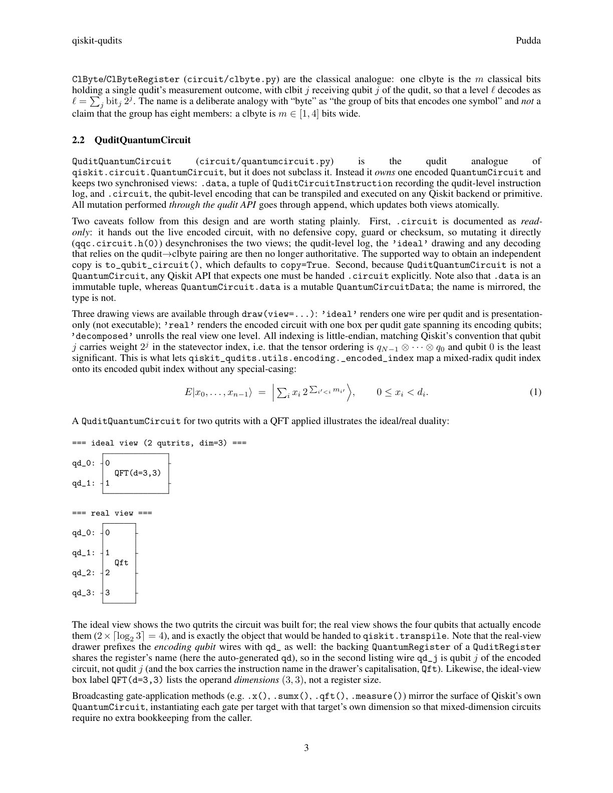 
Low-resolution page preview, page 3

📷 Fig 3

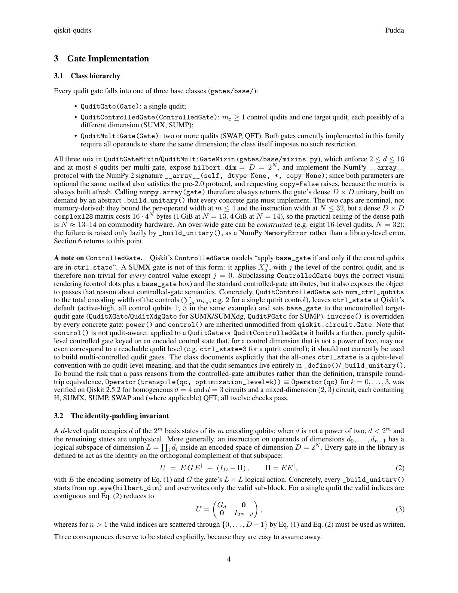 
Low-resolution page preview, page 4

📷 Fig 4

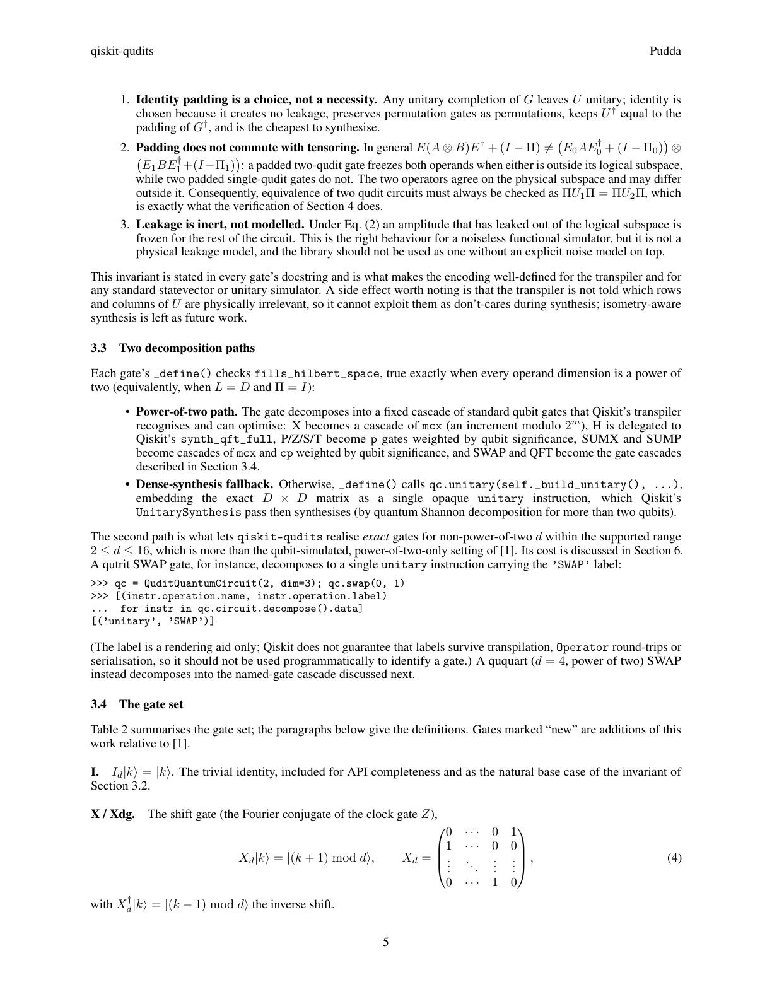 
Low-resolution page preview, page 5

📷 Fig 5

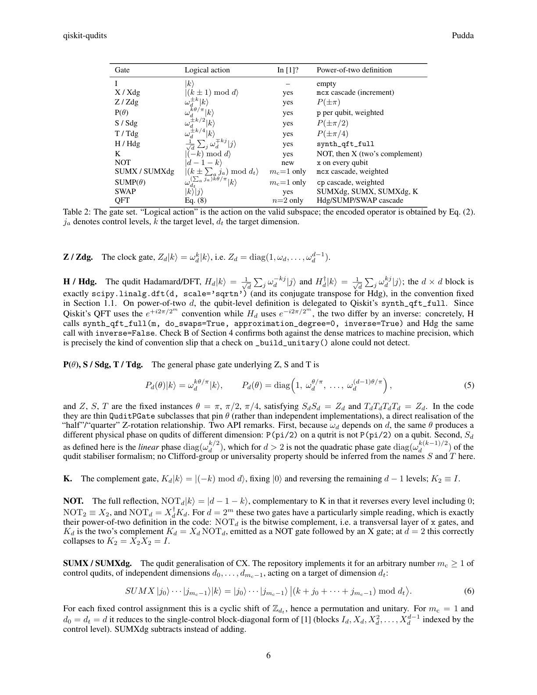 
Low-resolution page preview, page 6

**Summary.** This paper introduces qiskit-qudits, an extension allowing quantum circuits to operate on qudits of dimension $d$ up to 16. It achieves this by encoding qudits into qubits and employing a sophisticated gate synthesis strategy that balances efficiency (for power-of-two dimensions) with completeness (for arbitrary dimensions). This work is vital for advancing quantum simulation tools beyond the qubit paradigm.

**Why it may be interesting.** While focused on software implementation, the rigorous analysis of resource scaling (e.g., the massive overhead of the dense fallback vs. optimized cascades) provides crucial theoretical insights into the feasibility and resource requirements of simulating higher-dimensional quantum systems.

Detailed structure

**Main problem.** The paper addresses the challenge of extending the Qiskit quantum computing framework to simulate circuits involving qudits (d-level systems) beyond standard qubits.

**Main result.** It successfully implements a qudit-aware circuit model that supports exact simulation for dimensions $2 \le d \le 16$ by combining transpiler-friendly qubit decompositions with dense unitary synthesis.

**Method.** The core method involves encoding qudits into multiple qubits and using a hybrid gate synthesis strategy: optimized qubit cascades when dimensions are powers of two, and exact dense unitary embedding otherwise.

**Model / system.** The model is a generalized quantum circuit framework supporting qudits of dimension $d$. These are simulated by encoding them into $m = \lceil \log_2 d 
ceil$ qubits, resulting in a larger, padded Hilbert space.

**Key observables.** Resource costs (encoded qubits, CX count, depth) and the fidelity of gate decomposition against dense unitaries.

**Important parameters / regimes.** The qudit dimension $d$ (supported up to 16), the encoding width $m$, and the resulting total encoded Hilbert space dimension $D=2^N$.

**Assumptions / limitations.** The use of identity-padding to handle the mismatch between the logical qudit subspace and the physical encoded qubit space. The dense fallback path is computationally expensive and limited by memory.

**Figures summary.** The notes reference Table 5, which quantifies resource metrics (depth, build time, transpilation time) for various qudit gates (X, H, SUMX, QFT) across different dimensions.

**Paper structure.** The paper describes the circuit model, gate hierarchy (QuditGate, ControlledGate), the decomposition strategy (power-of-two vs. dense synthesis), and the measurement/decoding machinery. It concludes with numerical verification of the QFT and gate decompositions.

Abstract

qiskit-qudits is a Qiskit extension that simulates d-level qudits by encoding each one into m = ceil(log_2 d) qubits. Qudit gates are exposed as ordinary Qiskit Gate and ControlledGate subclasses, and operations that are not unitary gates (measurement, reset, barrier, state preparation) as dedicated Instruction subclasses dispatched through a dedicated apply() hook; every gate carries both a dense encoded unitary (via NumPy's array protocol) and a qubit-level definition. Because d need not be a power of two, the encoded Hilbert space is generally larger than the logical one; the library resolves this by the identity-padding convention, in which every gate acts as the identity on the unphysical part of the encoded space. When every operand dimension is a power of two, gates decompose into a fixed, transpiler-recognisable cascade of standard qubit gates; otherwise the library falls back to exact dense unitary synthesis, so that dimensions 2 <= d <= 16 are supported exactly, not only powers of two. This paper describes the software's circuit model, gate hierarchy, decomposition strategy, and measurement/decoding machinery, states its limitations, and verifies the implementation numerically: the qudit QFT against the discrete Fourier transform for both power-of-two and non-power-of-two d, extending the check of the underlying theory paper, which could only be run for d = 2^m, and every gate's emitted decomposition against its dense unitary across the whole gate set.

[↑ back to top](#top)

### [Quantifying Multipartite Entanglement Based on unified entropy](http://arxiv.org/abs/2608.22684v1)

**Authors:** Yan Hong, Tongtong Xu, Limin Gao  
**Type:** theory · **Category:** quantum information and computing · **PDF:** <https://arxiv.org/pdf/2608.22684v1>  
**Analysis basis:** full PDF text, analyzed in chunks

📷 Fig 1

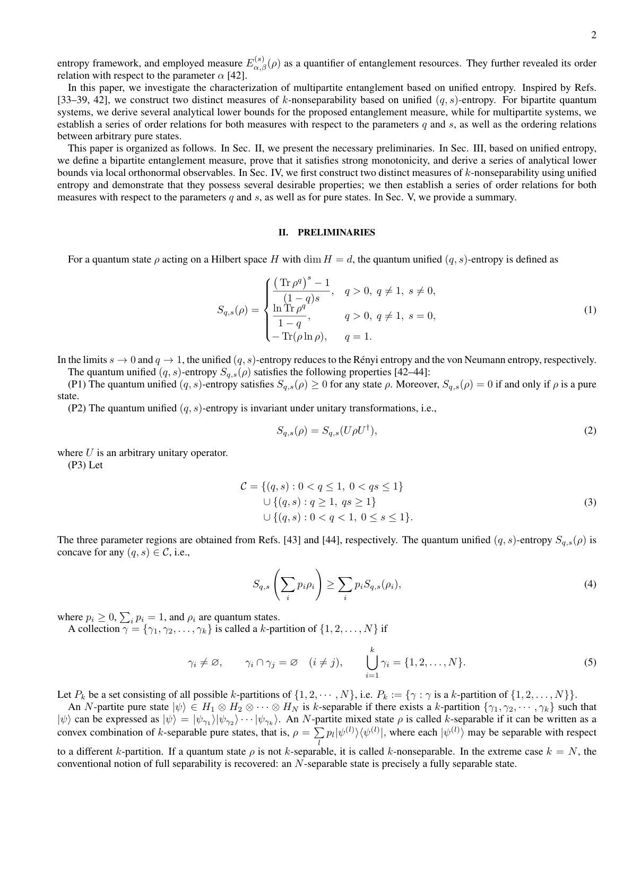 
Low-resolution page preview, page 2

📷 Fig 2

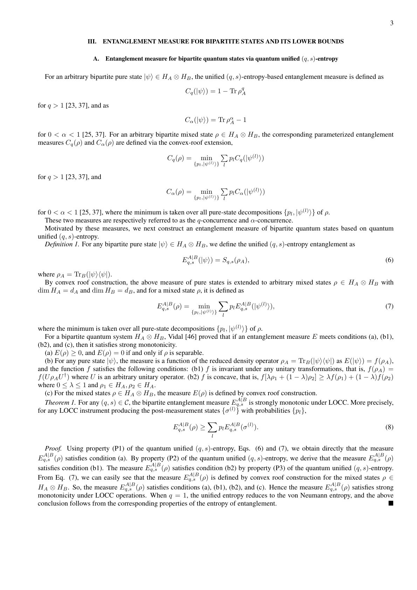 
Low-resolution page preview, page 3

📷 Fig 3

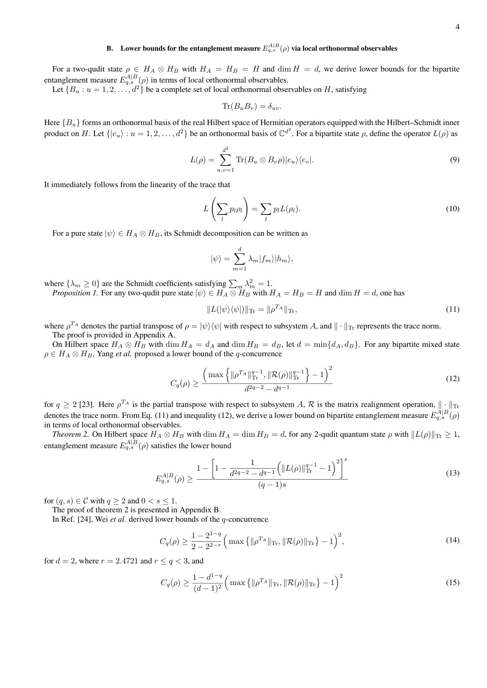 
Low-resolution page preview, page 4

📷 Fig 4

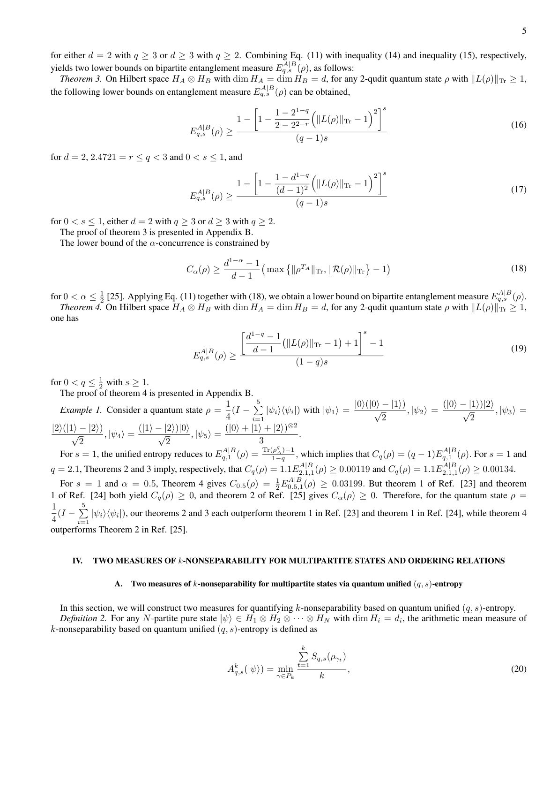 
Low-resolution page preview, page 5

📷 Fig 5

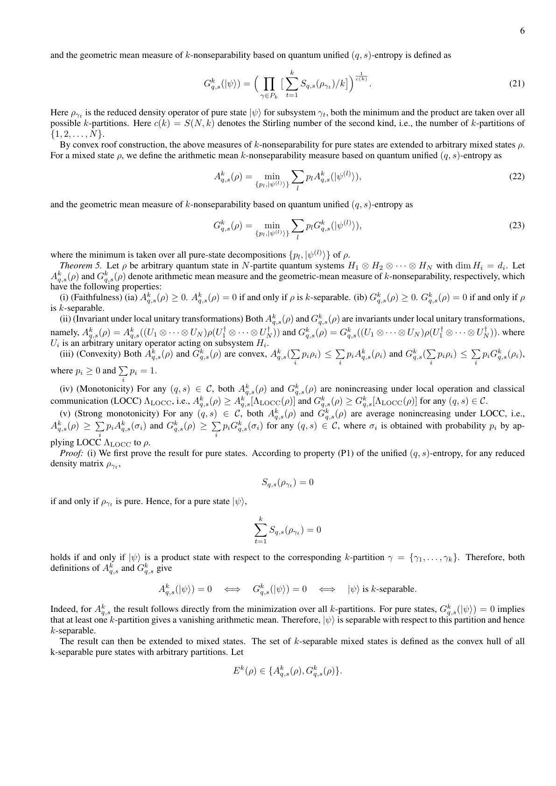 
Low-resolution page preview, page 6

**Summary.** This paper introduces a novel approach to quantifying multipartite entanglement using the unified $(q, s)$-entropy framework. It develops specific measures for $k$-nonseparability, proving they possess key desirable properties like monotonicity under LOCC. The work provides tighter analytical bounds for bipartite entanglement and establishes order relations between the proposed measures.

**Why it may be interesting.** The rigorous mathematical framework connecting generalized entropy measures to quantifiable entanglement monotones is highly relevant for understanding resource theories in quantum information.

Detailed structure

**Main problem.** The paper aims to develop and quantify measures for multipartite entanglement in quantum states.

**Main result.** It proposes and analyzes two new measures, $A_k^{q,s}(
ho)$ and $G_k^{q,s}(
ho)$, which are shown to satisfy desirable properties like faithfulness and local unitary invariance, and establishes their strong monotonicity under LOCC.

**Method.** The methodology centers on utilizing the unified $(q, s)$-entropy framework to construct entanglement measures for both bipartite and multipartite systems, extending results to mixed states via the convex roof construction.

**Model / system.** The study concerns general quantum states ($
ho$) in $N$-partite systems, applicable to both bipartite ($\mathcal{H}_A \otimes \mathcal{H}_B$) and multipartite settings. The analysis is general and does not specify a particular physical Hamiltonian or platform.

**Key observables.** Bipartite entanglement measure $E_{A|B}^{q,s}(
ho)$, and multipartite $k$-nonseparability measures $A_k^{q,s}(
ho)$ and $G_k^{q,s}(
ho)$.

**Important parameters / regimes.** The parameters $q$ and $s$ defining the unified entropy, and the number of parties $k$.

**Assumptions / limitations.** The derivation of strong monotonicity relies on the properties (P1)-(P3) of the unified $(q, s)$-entropy and the use of the convex-roof extension for mixed states.

**Paper structure.** The paper first introduces the unified $(q, s)$-entropy, then develops the bipartite entanglement measure $E_{A|B}^{q,s}(
ho)$ with associated lower bounds, and finally generalizes these concepts to propose and analyze the multipartite $k$-nonseparability measures $A_k^{q,s}(
ho)$ and $G_k^{q,s}(
ho)$.

Abstract

In this paper, we investigate the characterization of multipartite entanglement based on the unified $(q,s)$-entropy framework. For bipartite quantum states, we propose an entanglement measure $E_{q,s}^{A|B}(ρ)$ based on unified entropy and derive several analytical lower bounds for it using local orthonormal observables. We demonstrate with concrete examples that our lower bounds provide tighter estimates of quantum entanglement than several existing analytical bounds. For multipartite quantum states, based on unified entropy, we propose two measures $A^k_{q,s}(ρ)$ and $G^k_{q,s}(ρ)$ for quantifying $k$-nonseparability, and prove that these measures satisfy several desirable properties, such as faithfulness, local unitary invariance, and convexity. Moreover, we rigorously prove that when the parameters $q$ and $s$ are in certain ranges, $A^k_{q,s}(ρ)$ and $G^k_{q,s}(ρ)$ also satisfy monotonicity and strong monotonicity. Furthermore, we establish the order relations of the measures $A^k_{q,s}(ρ)$ and $G^k_{q,s}(ρ)$ with respect to the parameters $q$ and $s$ for fixed quantum states. In addition, for fixed $q$ and $s$, we also give their order relations for any two pure states.

[↑ back to top](#top)

### [Quantifying Nonstabilizerness of Codeword-Stabilized Codes](http://arxiv.org/abs/2608.22017v1)

**Authors:** Yuan Liu, Ke-Mi Xu  
**Type:** theory · **Category:** quantum information and computing · **PDF:** <https://arxiv.org/pdf/2608.22017v1>  
**Analysis basis:** full PDF text, analyzed in chunks

📷 Fig 1

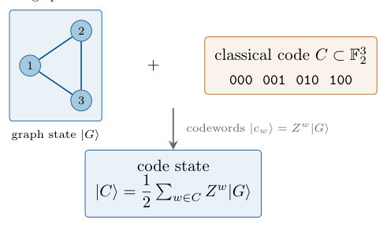 
FIG. 1. A CWS code is specified by a graph G and a classical code C (Here C ⊂F3 2 is shown); the code state |C⟩= 2−k/2 P

📷 Fig 2

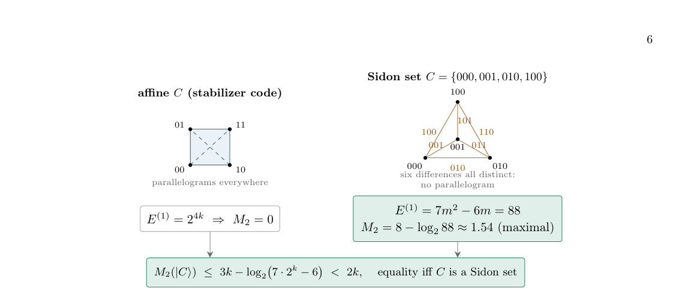 
FIG. 2. Extremes. Left: affine C is a stabilizer code; the whole set is an affine 2-plane, so parallelograms are everywhere, E(1) = 24k, and M2 = 0. Right: the Sidon set C = {000, 001, 010, 100} ⊂F3 2; its six pairwise differences are all distinct, so A(x) ∈{0, 2} and C contains no parallelogram, giving E(1) = 7m2 −6m = 88 and M2 = 8 −log2 88 ≈1.54. Sidon sets attain the universal bound M2 ≤3k −log2(7 · 2k −6) &lt; 2k.

**Summary.** This paper develops a quantitative theory to measure the 'nonstabilizerness' of quantum error-correcting codes, which quantifies their ability to support non-Clifford quantum gates. It achieves this by mapping the quantum resource to a classical combinatorial problem involving the collision structure of the code's codewords. The main result shows that the most 'magical' codes are those whose structure resembles Sidon sets, turning the search for quantum resources into a classical counting problem.

**Why it may be interesting.** This work provides a powerful, purely mathematical tool (additive combinatorics) to quantify a fundamental resource ('magic') required for building fault-tolerant quantum computers, bridging quantum information theory and number theory.

Detailed structure

**Main problem.** The paper develops a quantitative theory for the 'nonstabilizerness' (or 'magic') carried by Codeword-Stabilized (CWS) codes, which is necessary because stabilizer codes cannot provide transversal non-Clifford gates for fault-tolerant quantum computation.

**Main result.** The nonstabilizerness is shown to be determined by classical additive combinatorics, specifically related to how codewords collide under translation. The maximum magic is achieved by Sidon sets, and the search for magic-rich codes is reduced to classical counting problems.

**Method.** The authors establish a dictionary relating the quantum nonstabilizerness (measured by the second-order stabilizer Rényi entropy, $M_2$) to the classical parallelogram energy $E^{(1)}(C)$ of the underlying binary code $C$.

**Model / system.** The system analyzed is the CWS code, defined by a graph $G$ and a classical binary code $C \subseteq \mathbb{F}_2^n$. The code state is a uniform superposition over the codewords.

**Key observables.** Nonstabilizerness ($M_2$), Parallelogram energy ($E^{(1)}(C)$), and the structure of the classical code $C$ (e.g., Sidon sets).

**Important parameters / regimes.** The number of logical qubits ($k$), the size of the code ($m=|C|$), and the structure of the graph $G$ (e.g., edge-chromatic number $\chi'(G)$).

**Assumptions / limitations.** The analysis relies on the development of a quantitative link between the quantum observable $M_2$ and the classical combinatorial energy $E^{(1)}(C)$.

**Figures summary.** Figure 1 illustrates the construction of the CWS code. Other figures/tables mentioned relate to comparing $M_2$ values for different code types (e.g., Sidon sets vs. affine codes).

**Paper structure.** The paper first introduces the problem of non-Clifford gates and the need for non-stabilizer codes. It then develops the key dictionary relating $M_2$ to classical energy. Subsequent sections derive bounds, show structural invariances (like coset closure), and apply the results to specific gate requirements.

Abstract

Fault-tolerant quantum computation requires non-Clifford gates, which stabilizer codes cannot supply transversally. Non-stabilizer codes are the natural place to look for them, yet no quantitative theory of the nonstabilizerness (or magic) carried by such a code has existed. We develop one for codeword-stabilized (CWS) codes and show that the key quantity is classical: a code's nonstabilizerness is fixed by how its codewords collide under translation, a question that belongs to additive combinatorics. We show that the most magical codes are exactly the Sidon sets whenever a Sidon set of the required size exists, whose pairwise differences are all distinct. No code carries more than twice its number of logical qubits of nonstabilizerness however large it is physically. Furthermore, the same reduction gives structural and operational results. Nonstabilizerness is unchanged by coset closure, which yields non-stabilizer codes with arbitrarily many logical qubits and constant nonstabilizerness as the number of logical qubits grows. A diagonal transversal gate with $k$ logic qubits that is non-Clifford on $t$ coordinates forces the code's nonstabilizerness to be at most $2(k-t)$; thus the nonstabilizerness also bounds the non-Clifford gates needed to build the code and the cost of classically simulating it. Finally, entire families become exactly computable, and we obtain closed-form values for the Kerdock codes. Together these results turn the search for magic-rich codes and transversal non-Clifford gates into classical counting problems, which can be approached with standard tools from additive combinatorics.

[↑ back to top](#top)

### [Quantifying the dimensionality of multiparticle entanglement via partition rank](http://arxiv.org/abs/2608.23399v1)

**Authors:** Sophia Denker, Ismaël Septembre, Robin Krebs, Otfried Gühne  
**Type:** theory · **Category:** quantum information and computing · **PDF:** <https://arxiv.org/pdf/2608.23399v1>  
**Analysis basis:** full PDF text, analyzed in chunks

📷 Fig 1

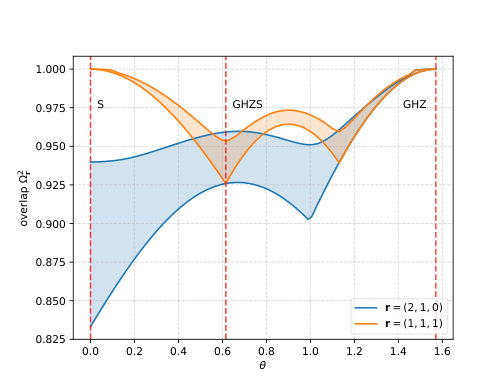 
FIG. 1. Overlap Ω2 r for different parametrizations of the state |ψ⟩= cos(θ)|S⟩+ sin(θ)|GHZ⟩. The upper bounds were com- puted by the PPT relaxation, the lower bounds by the see-saw algorithm. We find that in this case the vector r = (2, 1, 0) includes all permutations.

📷 Fig 2

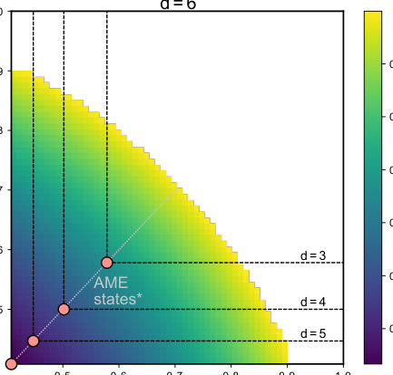 
FIG. 2. Analytical bound for the overlap with slice rank two states depending only on the Schmidt coefficients. The coefficient sAi is the largest Schmidt coefficient of |ψ⟩when considering the cut Ai|rest and analog for Aj. This plot was done for local dimension d = 6, restricting the possible values for the Schmidt coefficients; the black dashed lines show the smaller dimensions d ∈{3, 4, 5}. In the three particle case the orange points correspond to AME states. For the white area, the upper bound is trivial.

**Summary.** This paper introduces the 'partition rank' as a generalized measure to quantify the dimensionality of genuine multipartite entanglement in quantum states. By relating this concept to the tensor rank of quantum states, the authors provide a powerful mathematical tool that extends beyond the limitations of two-particle entanglement measures. This advances the theoretical understanding of entanglement resource quantification for complex quantum systems.

**Why it may be interesting.** It provides a rigorous, mathematically grounded tool (partition rank) to quantify entanglement complexity in multi-particle systems, which is crucial for understanding resource theories in quantum information.

Detailed structure

**Main problem.** The paper addresses the challenge of quantifying the dimensionality of entanglement in multipartite quantum systems, a problem where existing methods are limited beyond two particles.

**Main result.** The authors introduce the 'partition rank' as a novel measure to characterize genuine multipartite entanglement dimensionality, establishing that it provides a lower bound on existing measures like the GME-dimension.

**Method.** The core method involves defining the partition rank based on the minimum number of product terms required for state decomposition, which is mathematically formulated using tensor rank and slice rank concepts.

**Model / system.** The analysis focuses on general pure and mixed multiparticle quantum states, often exemplified by three-qutrit systems, and relates the concept to tensor decomposition theory.

**Key observables.** Partition rank ($r_P$), Overlap $\Omega_k^2(\psi)$, and the Partition Rank Vector (PRV).

**Important parameters / regimes.** The number of particles (e.g., three-qutrit systems) and the local dimension of the subsystems.

**Assumptions / limitations.** The approach generalizes tools from the geometric measure of entanglement and relies on tensor decomposition theory, though numerical stability is noted as a limitation.

**Figures summary.** Table I summarizes overlaps ($\Omega_2$) for various states using different computational methods, comparing results for specific entangled states like GHZ and $|S
angle$.

**Paper structure.** The paper develops the concept by first introducing the partition rank, then providing constructive methods and mathematical formulations using tensor ranks, and finally applying these tools to calculate overlaps and compare the new measure against established entanglement quantifiers.

Abstract

The usefulness of entanglement as a resource in quantum technologies increases for larger systems, that is, if more particles or higher-dimensional quantum systems are considered. Yet, the interplay between dimensionality and multiparticle entanglement is not well understood. Only for two-particle systems an unambiguous and coherent notion of entanglement dimensionality, based on the Schmidt decomposition, is known. We introduce a concept to characterize the entanglement dimensionality of multiparticle states based on decompositions of pure states into superpositions of states without genuine multiparticle entanglement. We provide constructive methods to characterize the resulting partition rank for pure and mixed states. This allows the identification of novel maximally correlated states as well as a discrete classification of quantum states under stochastic local operations and classical communication. From a mathematical perspective, our approach can be formulated in terms of the slice rank and partition rank of tensors and our results allow to characterize these by connecting them to a generalized injective tensor norm.

[↑ back to top](#top)

### [Quantum-Inspired Hybrid Neural Networks for Neural Decoding: A Controlled Ablation Study of Learnable Quantum Sidecar Integration](http://arxiv.org/abs/2608.22475v1)

**Authors:** Diana Legziel Levy, Menachem Finkelstein, Peter Chin, Eilon Vaadia, Sarel Cohen  
**Type:** both · **Category:** disordered systems and neural networks · **PDF:** <https://arxiv.org/pdf/2608.22475v1>  
**Analysis basis:** full PDF text, analyzed in chunks

📷 Fig 1

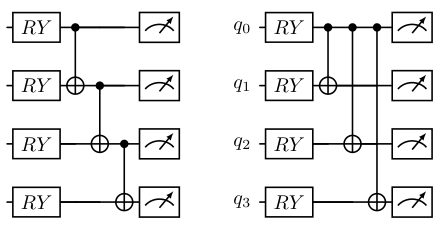 
Figure 1: Circuit topologies (1 of 2 layers shown). Chain: sequential nearest-neighbor CNOTs. Star: qubit 0 as hub with connections to all others.

📷 Fig 2

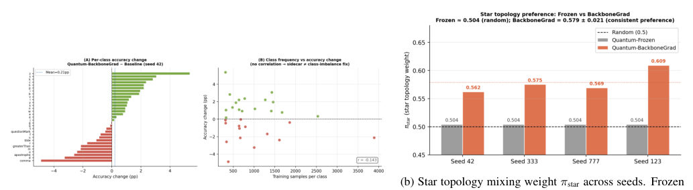 
Figure 2: Left: per-class representation effects are topology-dependent, not frequency-driven. Right: the star-topology prefer- ence is a consistent emergent property of backbone-coupled training.

**Summary.** This paper explores using quantum circuits as sidecar modules within a classical neural network for decoding neural activity. The authors find that while the quantum component induces structural reorganization in the learned representations, the overall performance improvement is marginal and ultimately constrained by the limited capacity of the small quantum circuit used.

**Why it may be interesting.** The work directly addresses the integration of quantum circuits into machine learning models, providing quantitative diagnostics (CKA, R) to assess if the quantum component induces genuine, measurable structural changes in feature space, which is relevant to understanding quantum feature mapping in complex systems.

Detailed structure

**Main problem.** The study investigates whether integrating Parameterized Quantum Circuits (PQCs) as residual sidecar modules into a classical deep neural network can measurably improve the geometric quality of learned representations for complex tasks like neural population decoding.

**Main result.** The hybrid model shows evidence of structural reorganization (lower CKA) and a consistent preference for a star-topology, but the overall performance is ultimately limited by the small representational capacity of the 4-qubit quantum circuit.

**Method.** The authors employed a systematic ablation study, comparing various quantum-classical coupling strategies (e.g., frozen vs. backbone-gradient-trained projections) on a 31-class classification task.

**Model / system.** The system is a hybrid architecture coupling a classical ResNet-50 backbone to a 4-qubit quantum sidecar circuit. Training involves optimizing parameters under controlled conditions using noiseless statevector simulation.

**Key observables.** Top-1 accuracy, Linear CKA similarity, Inter/Intra cosine centroid ratio (R), and the latent star-topology mixing weight (pi_star).

**Important parameters / regimes.** 4 qubits, 31 classes, noiseless statevector simulation, backbone-gradient training regime.

**Assumptions / limitations.** No quantum computational advantage is claimed; the primary limitation is identified as the hard capacity ceiling of the 4-qubit encoding for the given task complexity.

**Figures summary.** Figure 2 shows that per-class representation effects are topology-dependent, and the star-topology preference is a consistent emergent property of backbone-coupled training.

**Paper structure.** The paper progresses by establishing the hybrid model, comparing multiple training variants (ablation study), quantifying structural changes via geometry metrics (CKA, R), and concluding that capacity constraints limit performance gains.

Abstract

We study parameterized quantum circuits (PQCs) integrated as residual sidecar modules within a ResNet-50 backbone for 31-class neural population decoding---imagined handwriting classification from multi-neuron spike rasters. Under strictly controlled conditions (fixed data splits, seeds, and optimizer), we compare four model variants: baseline, quantum sidecar with frozen input projection, quantum sidecar with backbone-gradient-trained projection, and a measurement-guided variant that aligns angle encodings with circuit measurement outcomes. The backbone-gradient variant improves accuracy in 3/4 seeds (+0.19% mean, 95% CI [-1.10%, +1.48%]) and consistently reduces Linear CKA similarity to baseline features ($Δ=-0.025$, 4/4 seeds), indicating genuine structural reorganization of representations. A nine-variant ablation identifies simple shallow architectures as the most effective and reproducible configuration. Measurement-guided training consistently improves representation geometry without reducing accuracy. All results use noiseless statevector simulation on 4 qubits, a regime chosen to reflect the practical constraints of current near-term superconducting hardware; no quantum computational advantage over classical methods is claimed.

[↑ back to top](#top)

### [Role of $d$-electron density of states in the quantum size effect \newline of Pt-Ni and Pt-Pd nanoparticles](http://arxiv.org/abs/2608.22743v1)

**Authors:** S. Kitagawa, T. Ihara, Y. Kinoshita, K. Ishida, K. Kusada, H. Kitagawa  
**Type:** experiment · **Category:** strongly correlated electrons · **PDF:** <https://arxiv.org/pdf/2608.22743v1>  
**Analysis basis:** full PDF text, analyzed in chunks

📷 Fig 1

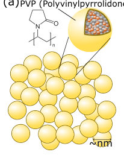 
FIG. 1. (a) Schematic image of Pt1−xXx nanoparticles (X = Pd, and Ni). Nanoparticles are covered by polyvinylpyrroli- done to prevent oxidation and particle-to-particle contact. (b) x dependence of the estimated Sommerfeld coefficient, which is proportional to the density of states at Fermi energy D(EF) in bulk Pt1−xXx alloy [21].

📷 Fig 2

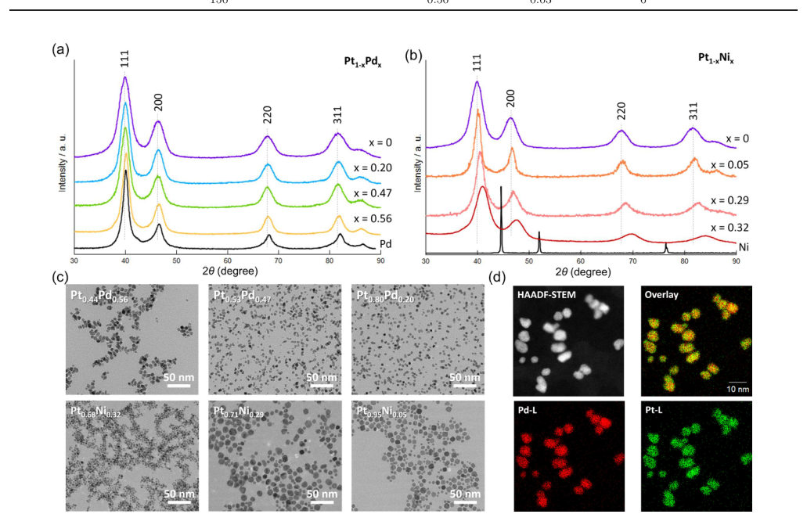 
FIG. 2. Powder X-ray diffraction patterns of (a) Pt1−xPdx and (b) Pt1−xNix using Cu-Kα radiation. (c) TEM images of the synthesized nanoparticles. (d) High-angle annular dark field scanning TEM image of Pt0.53Pd0.47, and the corresponding energy dispersive X-ray maps of Pd-L and Pt-L. The overlay of the Pd-L and Pt-L maps shows the formation of the solid-solution alloy.

📷 Fig 3

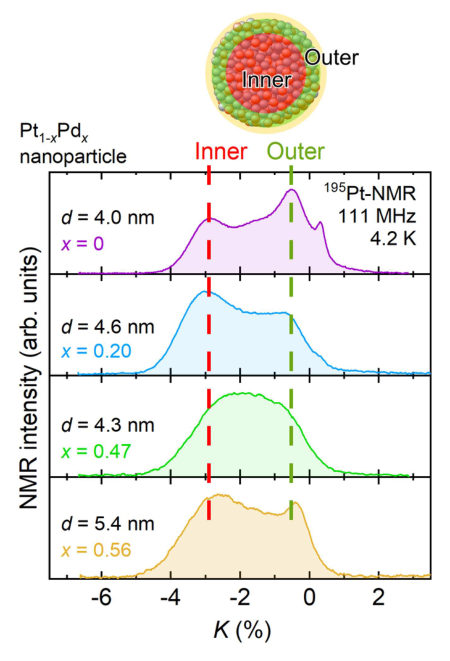 
FIG. 3. 195Pt-NMR spectrum of Pt1−xPdx nanoparticles for various x measured at 4.2 K. The particle size in each x is in- dicated in the panel. For 195Pt-NMR, the two-peak structure originating from the inner and the outer atoms was observed, indicated by the dashed lines. For reference, the data for the monometallic Pt nanoparticles [17] are also presented.

📷 Fig 4

 
Figure 3 shows the 195Pt-NMR spectra at 4.2 K for Pt1−xPdx nanoparticles with various Pd concentrations. The spectrum of monometallic Pt nanoparticles with a 4.0 nm diameter is also shown for comparison. Each spec- trum consists of two distinguishable peaks, attributed to the outer and inner regions of the nanoparticles, respec- tively. The Knight-shift difference between the peaks re- flects the local variation in the electronic density of states D(EF). Compared with the 4 nm Pt nanoparticles, the relative intensity of the outer peak is smaller in Pt1−xPdx samples, suggesting a larger particle size, consistent with the results of transmission electron microscopy. Figures 4(a) and 4(b) show...

📷 Fig 5

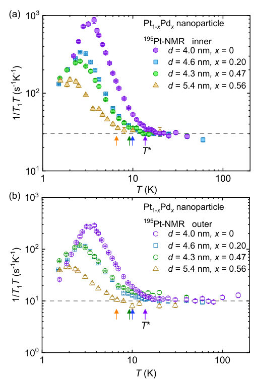 
FIG. 4. Temperature dependence of 1/T1T in the Pt1−xPdx nanoparticles at various x for the (a) inner and (b) outer regions of nanoparticles. The dashed lines indicate a con- stant value at high temperatures. The arrows indicate T ∗, where 1/T1T starts to increase. For reference, the data for the monometallic Pt nanoparticles [17] are also presented.

**Summary.** This paper uses $^{195}	ext{Pt}$ NMR to investigate the quantum size effect in $	ext{Pt-Ni}$ and $	ext{Pt-Pd}$ nanoparticles. The key finding is that the QSE is critically dependent on the presence of $d$-electrons, as demonstrated by the contrast between $	ext{Ni}$ and $	ext{Cu}$ alloying. The results confirm that the $d$-electron density of states governs the manifestation of this quantum size effect.

**Why it may be interesting.** The work provides experimental evidence linking macroscopic quantum phenomena (QSE) directly to the microscopic electronic structure (d-electron DOS), which is a key area of study in strongly correlated electron systems.

Detailed structure

**Main problem.** The study investigates the crucial role of the $d$-electron density of states in determining the manifestation of the quantum size effect (QSE) in bimetallic nanoparticles.

**Main result.** The QSE signatures are clearly observed and systematically analyzed in Pt-Ni nanoparticles, while the absence of these signatures in Pt-Cu nanoparticles highlights that $d$-electron participation is essential for the effect.

**Method.** The research employs $^{195}	ext{Pt}$ nuclear magnetic resonance (NMR) measurements to probe the temperature and size dependencies of the nuclear spin-lattice relaxation rate ($1/T_1T$).

**Model / system.** The physical system consists of bimetallic nanoparticles, specifically $	ext{Pt}_{1-x}	ext{Pd}_x$ and $	ext{Pt}_{1-x}	ext{Ni}_x$, which are analyzed using NMR spectroscopy to probe electronic structure effects.

**Key observables.** Nuclear spin-lattice relaxation rate divided by temperature ($1/T_1T$), Knight shift, and the characteristic temperature $T^*$ related to the Kubo gap.

**Important parameters / regimes.** Compositional concentration ($x$), particle size ($d$), and the characteristic energy scale $T^*$.

**Assumptions / limitations.** The QSE is fundamentally linked to the electronic structure, particularly the $d$-electron density of states at the Fermi level, as evidenced by the comparison with $	ext{Pt}_{1-x}	ext{Cu}_x$.

**Figures summary.** Figures illustrate the temperature dependence of $1/T_1T$ for different compositions, showing the characteristic anomaly associated with QSE, and present XRD/TEM data confirming nanoparticle formation.

**Paper structure.** The paper systematically compares the QSE behavior in $	ext{Pt}_{1-x}	ext{Pd}_x$ and $	ext{Pt}_{1-x}	ext{Ni}_x$ using NMR, contrasting them with $	ext{Pt}_{1-x}	ext{Cu}_x$. It analyzes the dependence of the characteristic temperature $T^*$ on composition and size, and concludes by discussing the implications for $d$-electron correlations and magnetic ordering.

Abstract

We investigated the quantum size effect (QSE) in bimetallic Pt$_{1-x}$Pd$_x$ and Pt$_{1-x}$Ni$_x$ nanoparticles, using $^{195}$Pt nuclear magnetic resonance measurements. The temperature and size dependencies of the anomaly in the nuclear spin-lattice relaxation rate divided by temperature $1/T_1T$ in the Pt$_{1-x}$Pd$_x$ nanoparticles suggest similar electron states between Pt and Pd atoms and are well understood by the QSE. The temperature and composition variations of $1/T_1T$ and Knight shift reveal a systematic increase in the density of states and reduction of the characteristic energy scale $T^*$ with increasing Ni content, consistent with the Kubo gap $δ_{\mathrm{Kubo}}$. In contrast to Pt$_{1-x}$Cu$_x$ nanoparticles where the QSE is suppressed, the Pt$_{1-x}$Ni$_x$ nanoparticles exhibit clear signatures of quantum energy discretization. This discrepancy highlights the essential role of $d$-electrons in the manifestation of the QSE. Furthermore, analysis of the modified Korringa parameter $K(α)$ suggests enhanced ferromagnetic correlations with increasing Ni concentration, approaching a ferromagnetic quantum critical regime. These results provide experimental evidence that $d$-electron density of states plays a crucial role in the manifestation of the QSE in the nanoparticles formed by the metallic $d$-electron atoms.

[↑ back to top](#top)

### [Spanning trees in the Assignment Problem: two theorems and two conjectures](http://arxiv.org/abs/2608.22308v1)

**Authors:** Sergio Caracciolo, Gabriele Sicuro, Andrea Sportiello  
**Type:** theory · **Category:** statistical mechanics · **PDF:** <https://arxiv.org/pdf/2608.22308v1>  
**Analysis basis:** full PDF text, analyzed in chunks

📷 Fig 1

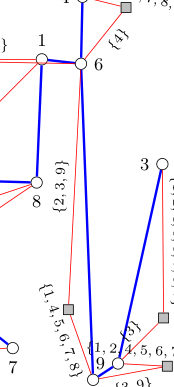 
Figure 1. Example of matching subgraphs H (red) and ¯H (blue). Here n = 8 and Wij = ∥xi−yj∥2. We show the labels of the vertices b ∈B, and the sets C(e). Note that both H and ¯H are spanning trees (respectively on G = Kn+1,n and on ¯G = Kn+1), according to Theorem 3.5, and that, while the tree H is not guaranteed to be non-crossing (because p = 2, instead of p = 1 for Corollary 7.1 to apply), and indeed it is crossing, the tree ¯H is non-crossing, in agreement with Theorem 8.3.

📷 Fig 2

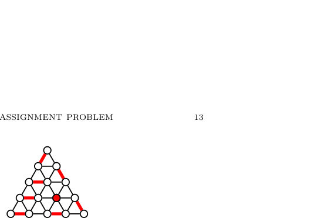 
Figure 4. Examples of graphs that have admissible removals con- sisting of a single vertex. (Left) A square portion of the square lattice of side 5. Even / odd, vertices are shown as circles / squares. Here, all circles are admissible removals. (Right) A triangular por- tion of the triangular lattice of side 5. This graph is in fact tripar- tite, although this property does not play an important role here, and each singleton set in each class is an admissible removal.

📷 Fig 3

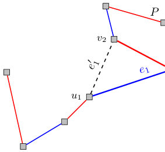 
Figure 5. Illustration of the alternating path and cycles appear- ing in the proof of Lemma 2.10.

📷 Fig 4

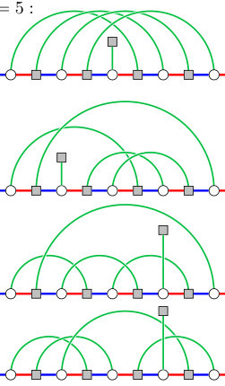 
Figure 7. All 3-Hamiltonian graphs with up to n = 5 A-vertices (circles), and 7 B-vertices (squares).

📷 Fig 5

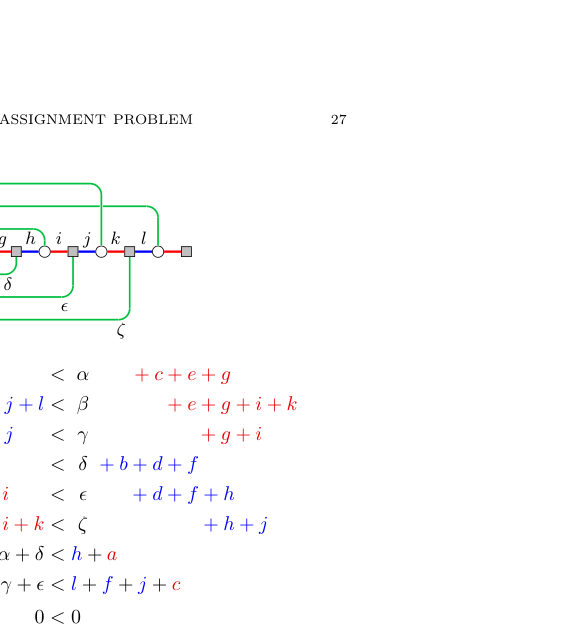 
Figure 8. Illustration of the expression I[w] for our running example.

**Summary.** This paper analyzes spanning trees derived from the Assignment Problem using geometric weights based on Euclidean distances. Key results prove that these structures are spanning trees and exhibit non-crossing properties for specific exponents ($p=1, 2$). The work culminates in conjectures linking these random graph structures to established concepts in statistical mechanics, such as Uniform Spanning Trees and $	ext{SLE}_\kappa$ curves.

**Why it may be interesting.** While the core is combinatorial optimization, the connection to geometric properties (non-crossing paths) and the explicit link to $	ext{SLE}_\kappa$ places this work at the intersection of statistical mechanics, random geometry, and critical phenomena, which is highly relevant to condensed matter theory.

Detailed structure

**Main problem.** The paper investigates the structure of spanning trees derived from the Minimum Matching Problem, particularly when the graph is bipartite (the Assignment Problem). It extends this analysis to geometric settings using Euclidean distances.

**Main result.** The authors prove that the constructed graphs $H$ and $ar{H}$ are spanning trees in specific settings, and they establish conditions under which these trees are non-crossing for $p=1$ and $p=2$. Furthermore, they conjecture an asymptotic connection to Uniform Spanning Trees and SLE curves.

**Method.** The analysis combines combinatorial optimization (Minimum Matching/Assignment Problem) with geometric probability and continuum limits. Techniques involve analyzing cost matrices derived from Euclidean distances and comparing results on flat versus curved manifolds.

**Model / system.** The model centers on finding optimal matchings in weighted graphs where weights are defined by the $p$-th power of Euclidean distances between point configurations in the plane. The context is generalized to random point configurations on planar domains or curved manifolds.

**Key observables.** The structure of the resulting graphs ($H$ and $ar{H}$), the non-crossing property of their planar embeddings, and the asymptotic distribution of paths ($	ext{SLE}_\kappa$).

**Important parameters / regimes.** The exponent $p$ (especially $p=1$ and $p=2$), the curvature of the manifold ($\eta$), and the density/distribution of the point configurations.

**Assumptions / limitations.** The theorems rely on 'suitable generality hypotheses.' The analysis of curved manifolds involves expansions in small parameters ($\eta$ and $	heta$).

**Figures summary.** Figure 1 illustrates an example showing that for $p=2$, the projected graph $ar{H}$ is non-crossing, while the direct construction $H$ is crossing.

**Paper structure.** The paper establishes foundational theorems regarding the spanning tree nature of $H_{\mathcal{J}}$ and $ar{H}_{\mathcal{J}}$. It then analyzes the geometric properties (non-crossing) for specific distance metrics ($p=1, 2$). Finally, it introduces conjectures concerning the asymptotic behavior of these trees in the Random Euclidean Assignment Problem, linking them to UST and SLE.

Abstract

The \emph{Minimum Matching Problem} consists of finding an independent edge set of minimum weight $M_{\star}(G)$ in a given edge-weighted graph $G$. When $G$ is bipartite, this reduces to the \emph{Assignment Problem}. We consider a variant of this problem defined by taking the union of optimal matchings across various slightly modified versions of the base graph: $H_{\mathcal{J}}(G)=\bigcup_{U \in \mathcal{J}} M_{\star}(G_{U})$. We establish two families of results: (1) In two distinct settings for the Assignment Problem, we prove that the resulting graphs $H_{\mathcal{J}}$, as well as certain associated graphs $\bar{H}_{\mathcal{J}}$, are spanning trees on the relevant base graphs $G$ and $\bar{G}$. (2) In these same settings, assuming the edge weights are given by the $p$-th power of Euclidean distances for point configurations in the plane, we show that for $p=1$ the tree $H_{\mathcal{J}}$ is non-crossing (i.e., its planar embedding has no crossing edges), whereas, remarkably, for $p=2$ the associated tree $\bar{H}_{\mathcal{J}}$ is non-crossing. Finally, we introduce novel conjectures in Statistical Mechanics, to be explored in future work: in the Random Euclidean Assignment Problem (where points are i.i.d.\ on a planar domain), we conjecture that for $p=2$ the trees $\bar{H}_{\mathcal{J}}$ are asymptotically distributed as Uniform Spanning Trees with free and wired boundary conditions in the two respective settings. In particular, suitable paths on the tree in the second setting, and on its planar dual in the first setting, are asymptotically distributed as $\text{SLE}_κ$ with $κ=2$.

[↑ back to top](#top)

### [Width-Independent Compressibility of Deep Neural Networks](http://arxiv.org/abs/2608.21752v1)

**Authors:** Hong-Yi Wang, Mingze Wang, Liu Ziyin  
**Type:** theory · **Category:** disordered systems and neural networks · **PDF:** <https://arxiv.org/pdf/2608.21752v1>  
**Analysis basis:** full PDF text, analyzed in chunks

📷 Fig 1

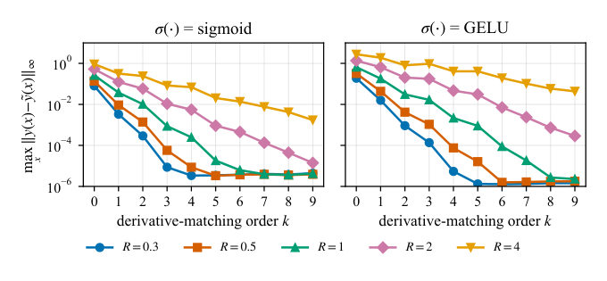 
Figure 1: Single-layer compression error versus derivative-matching order k on a randomly initialized [3, 2048, 2048] network, for sigmoid (left) and GELU (right) activations. Each curve is one input radius R. Both panels exhibit geometric decay in k at every R, with the per-step rate slowing as R grows — the qualitative behavior predicted by the (R/ρ0)k+1 rate of Theorem 6. For R ≤1 the curves saturate at the float32 noise floor (∼10−6) by k ≈5; at k = 9 the error is below 10−5 uniformly in the unit ball for both activations.

📷 Fig 2

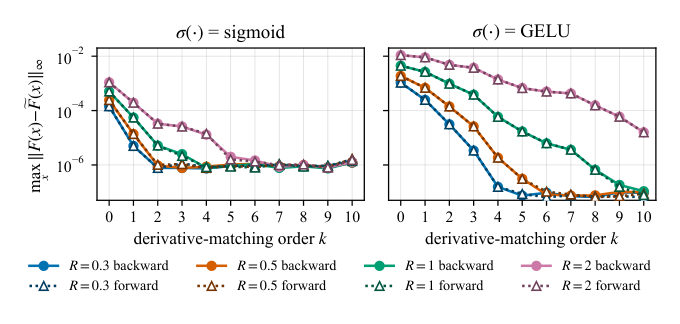 
Figure 2: Composed compression error versus per-step derivative-matching order k on a randomly initialized [2, 1024, 1024, 1024, 1024, 2] network, for sigmoid (left) and GELU (right). Each panel shows eight curves: four input radii R ∈{0.3, 0.5, 1, 2} in four colors, with backward order (compress the deepest hidden layer first) drawn solid with circles and forward order (shallowest first) drawn dotted with triangles. The two orders are essentially indistinguishable at every (k, R). Each compression step reduces its hidden layer to Dk = 2+k 2  ∈{1, 3, 6, . . . , 66} neurons.

📷 Fig 3

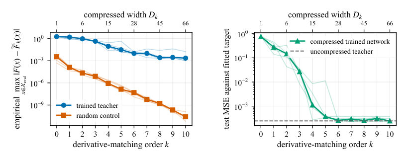 
Figure 3: Compression of all three hidden layers of a trained [2, 512, 512, 512, 1] sigmoid MLP, without fine-tuning. Thin curves are the five seeds and bold curves their medians. Left: empirical maximum teacher– compression discrepancy on the held-out set and projected local searches; frozen random controls are shown for comparison. Right: target MSE, with the median uncompressed-teacher MSE dashed.

📷 Fig 4

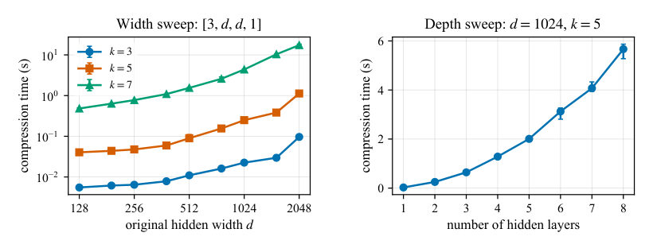 
Figure 4: End-to-end runtime of backward compression with the practical pivoted-QR implementation. The timed region includes derivative-feature evaluation, basis selection, the coefficient solve, weight reconstruction for every hidden layer, and the implementation’s numerical diagnostics; teacher construction and a small library warm-up are excluded. We use randomly initialized float64 sigmoid networks on CPU with one Torch/BLAS thread. Points are medians of three complete compressions and bars span their minima and maxima. Left: teachers [3, d, d, 1] for k = 3, 5, 7. Right: teachers [3, 1024, . . . , 1024, 1] with one through eight hidden layers at k = 5.

**Summary.** This paper provides a theoretical guarantee for compressing deep neural networks by showing that the required width to maintain accuracy scales only polylogarithmically with the inverse error budget, independent of the original width. It achieves this using a novel derivative-matching technique applied layer-wise in reverse order. The work establishes a fundamental complexity bound for deep function approximators.

**Why it may be interesting.** While focused on classical MLPs, the rigorous mathematical techniques involving functional approximation bounds, complexity scaling with dimension, and the distinction between fixed vs. parameterized systems are highly relevant to understanding the complexity of quantum state representations in neural networks.

Detailed structure

**Main problem.** To prove a uniform compressibility theorem for deep multilayer perceptrons (MLPs), demonstrating that a wide teacher network can be approximated by a much narrower network of the same depth.

**Main result.** The required retained width for approximation is polylogarithmic in the inverse of the error budget, $O((\log(1/\epsilon))^{d_{in}})$, and is strikingly independent of the original network width.

**Method.** The core technique involves a novel derivative-matching procedure that converts finite-order input-derivative matching into a uniform sup-norm bound on a bounded domain.

**Model / system.** The model is a deep multilayer perceptron defined by sequential applications of analytic activation functions ($\sigma$) and weight matrices ($W^{(\ell)}$). The analysis focuses on approximating a fixed, trained teacher network function.

**Key observables.** Retained width ($d'_\ell$), Approximation error ($\epsilon$), Effective input dimension ($d_{in}$)

**Important parameters / regimes.** Error budget ($\epsilon$), Input dimension ($d_{in}$), Depth ($L$)

**Assumptions / limitations.** The activations must be analytic (holomorphic extension required), and the analysis is restricted to approximating a fixed teacher network, not general families of networks.

**Figures summary.** One table summarizes per-seed diagnostics after backward compression, showing MSE, radius checks, and the first task-preserving dimension $D_k$ for several seeds.

**Paper structure.** The paper develops the theory by first establishing per-layer bounds using derivative matching, then extends this to a full deep-network compression via backward layer-wise composition, culminating in the main theorem bounding the final width.

Abstract

It has long been known that well-trained neural networks can be compressed very strongly without affecting their performance, an important phenomenon that remains poorly understood. We prove a uniform compressibility theorem for deep multilayer perceptrons with analytic activations. For a deep, wide fixed teacher network, there exists a narrow (same depth) network that approximately represents the same function as the original. The reachable compressed width is strikingly independent of the original width, but is $O((\log(1/\varepsilon))^{d_{in}})$, where $\varepsilon$ is the error budget and $d_{in}$ is the effective input dimension. Our construction involves a novel derivative-matching technique which is aware of the low-dimensional input, and a layer-wise reweighting that preserves the input-output mapping.

[↑ back to top](#top)

## Secondary cond-mat archives

*Papers from  mes-hall, other, soft, supr-con. These archives are de-prioritized — they appear at the end regardless of relevance score.*

### Relevant in secondary archives (27)

### [The principle of detailed balance between electrons and phonons in presence of excitonic effects](http://arxiv.org/abs/2608.23403v1)

**Authors:** Alberto Guandalini, Giovanni Caldarelli, Francesco Mauri, Francesco Macheda  
**Type:** theory · **Category:** statistical mechanics · **PDF:** <https://arxiv.org/pdf/2608.23403v1>  
**Analysis basis:** full PDF text, analyzed in chunks
**Topic relevance:** 🔥 `Keldysh / 2PI / non-Gaussian methods` **4/5** · `correlated / nonlocal dissipation` **3/5** · `driven-dissipative phase transition` **2/5** · `methods for driven-dissipative` **2/5** · `non-equilibrium universality` **2/5** · `analog quantum simulation` **1/5**

📷 Fig 1

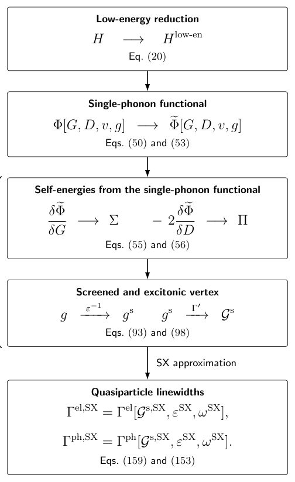 
FIG. 1: Workflow of the theoretical construction. The microscopic Hamiltonian is reduced to the low-energy model and used to define the single-phonon functional. Its functional derivatives generate the electronic and phononic self-energies. Screening and electron-hole ladder corrections produce, in turn, the dressed vertices gs and Gs. In the screened-exchange quasiparticle approximation and static-vertex limit, the electronic and phononic linewidths depend on the same vertex, electronic energies, and phonon frequencies.

📷 Fig 2

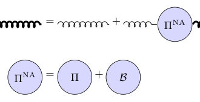 
FIG. 3: Dyson’s equation for the phonon propagator and decomposition of the nonadiabatic phonon self-energy, Eqs. (48) and (49).

📷 Fig 3

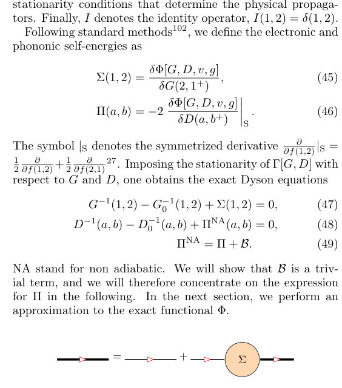 
FIG. 2: Dyson’s equation for the electronic Green’s function, Eq. (47).

📷 Fig 4

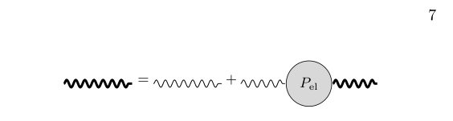 
FIG. 4: Dyson equation for the screened electronic interaction Wel, Eq. (59).

📷 Fig 5

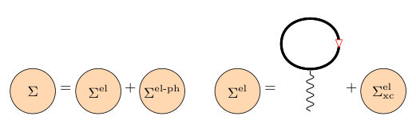 
FIG. 5: Electronic self-energy splitting, Eqs. (60) and (61).

**Summary.** This paper develops a many-body theory to calculate electron-phonon coupling while ensuring thermodynamic detailed balance, even when excitonic effects are present. By deriving both electronic and phononic self-energies from a single effective action using a generalized vertex, the authors provide a consistent framework for calculating scattering rates. This is demonstrated in graphene, showing how excitonic effects can maintain linewidths despite band structure modifications.

**Why it may be interesting.** The rigorous enforcement of detailed balance in calculating scattering rates is crucial for accurate non-equilibrium dynamics, which is highly relevant for understanding energy dissipation in quantum devices and materials.

Detailed structure

**Main problem.** The primary goal is to derive an electron-phonon coupling formulation that rigorously preserves the principle of thermodynamic detailed balance when excitonic effects are included in the many-body description.

**Main result.** The derived framework successfully ensures detailed balance by using a common, excitonic-enhanced vertex ($\mathcal{G}^{	extrm{s}}$) for both electronic and phononic self-energies, which can compensate for phase-space reductions in linewidths.

**Method.** The authors employ a many-body formulation starting from the microscopic Hamiltonian, constructing an effective action, and deriving coupled electronic and phononic self-energies via diagrammatic techniques.

**Model / system.** The study focuses on electron-phonon interactions in condensed matter systems, with a specific application to graphene. The theory utilizes the Born-Oppenheimer approximation and incorporates excitonic effects via a nonlocal vertex generalization.

**Key observables.** Electronic and phononic linewidths ($\Gamma_{el}, \Gamma_{ph}$), electronic and phononic self-energies ($\Sigma, \Pi_U$), and the effective action $\Gamma[G, D]$.

**Important parameters / regimes.** Screened-exchange approximation, static limit of the vertex, and the temperature ($T=300	ext{K}$ for final calculations).

**Assumptions / limitations.** The approach assumes that electron-hole correlations can be mapped onto interaction vertices, and approximations are made regarding the reference equilibrium geometry and residual double-counting terms in DFT calculations.

**Figures summary.** Figures illustrate the workflow from the Hamiltonian to self-energies and linewidths, and compare phonon frequencies calculated using static versus dynamical electron-phonon vertices.

**Paper structure.** The paper develops the theory by first establishing the low-energy Hamiltonian via the Born-Oppenheimer approximation, then constructing the effective action, deriving the self-energies via Dyson equations, and finally applying the formalism to calculate linewidths in graphene.

Abstract

Based on a many-body formulation, we derive an electron-phonon coupling including excitonic effects that preserves thermodynamic detailed balance between electronic and phononic scattering processes. We start from the microscopic electron-nucleus Hamiltonian, expand around the Born-Oppenheimer equilibrium geometry, and construct an effective action for the electronic and phononic propagators. From the same effective action, we derive both electronic and phononic self-energies in terms of a nonlocal vertex $\mathcal G^{\textrm{s}}$ including excitonic effects, which generalizes the usual local interaction vertex $g^{\textrm{s}}$. When electrons and phonons are well-defined quasiparticles in the screened-exchange approximation and $\mathcal G^{\textrm{s}}$ is taken in its static limit, both self-energies reduce to Fermi-golden-rule expressions containing the same $\mathcal G^{\textrm{s}}$, thereby ensuring detailed balance. As an application, we compute electronic and phononic linewidths in graphene and illustrate this common-vertex construction. We analyze the competition between the reduced scattering phase space induced by the screened-exchange band structure and the enhancement of the electron-phonon vertex due to excitonic effects, finding that the vertex enhancement can compensate for and overcome the phase-space reduction in both electronic and phononic linewidths.

[↑ back to top](#top)

### [Enhanced intrinsic spin-orbit driving of a Loss-DiVincenzo qubit near the spin-valley hotspot in Si/SiGe](http://arxiv.org/abs/2608.23246v1)

**Authors:** Alexander Willmes, Max Oberländer, Max Beer, Denny Dütz, Jhih-Sian Tu, Stefan Trellenkamp, Marco Lisker, Felix Reichmann, Lars R. Schreiber, Hendrik Bluhm  
**Type:** experiment · **Category:** quantum information and computing · **PDF:** <https://arxiv.org/pdf/2608.23246v1>  
**Analysis basis:** full PDF text, analyzed in chunks
**Topic relevance:** 🔥 `QC/QI experiment` **4/5** · `quantum measurements` **2/5** · `analog quantum simulation` **1/5**

📷 Fig 1

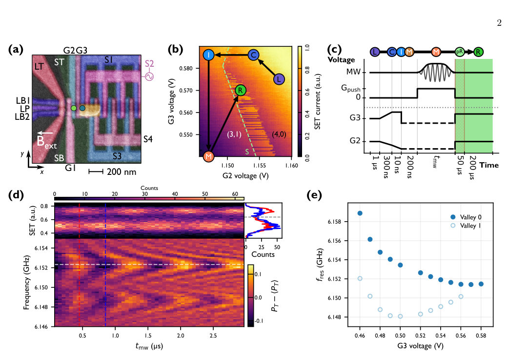 
FIG. 1. (a) False-colored scanning electron microscopy image of a nominally identical device where the green (blue) dot indicates the position of the left (right) quantum dot. A cobalt nanomagnet (amber rectangle) was evaporated on top of the gate stack but was found not to produce a detectable magnetic field (see main text). A microwave source is connected to gate set S2 for driving EDSR in the right dot. An external magnetic field Bext is applied in-plane along the channel. (b) Charge stability diagram of the closed system in the (3,1)-(4,0) regime, obtained by pulsing the interdot barrier and the plunger gate of the first dot; (L,R) denotes electron occupancies of left and right dots....

📷 Fig 2

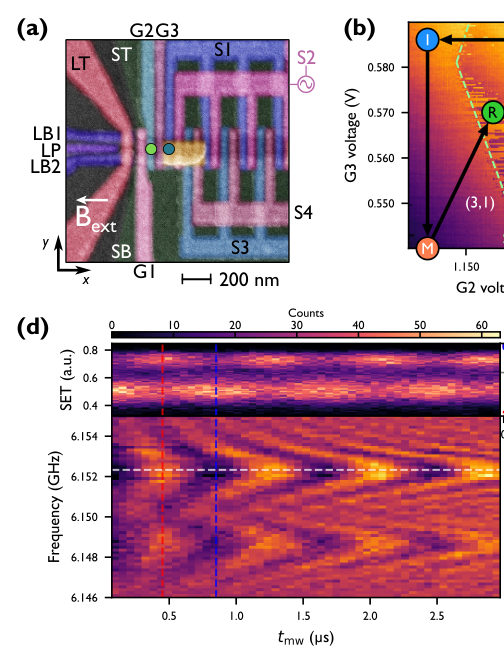 
Figure 1(a) shows a scanning electron micrograph of a nominally identical device. The device, which is similar

📷 Fig 3

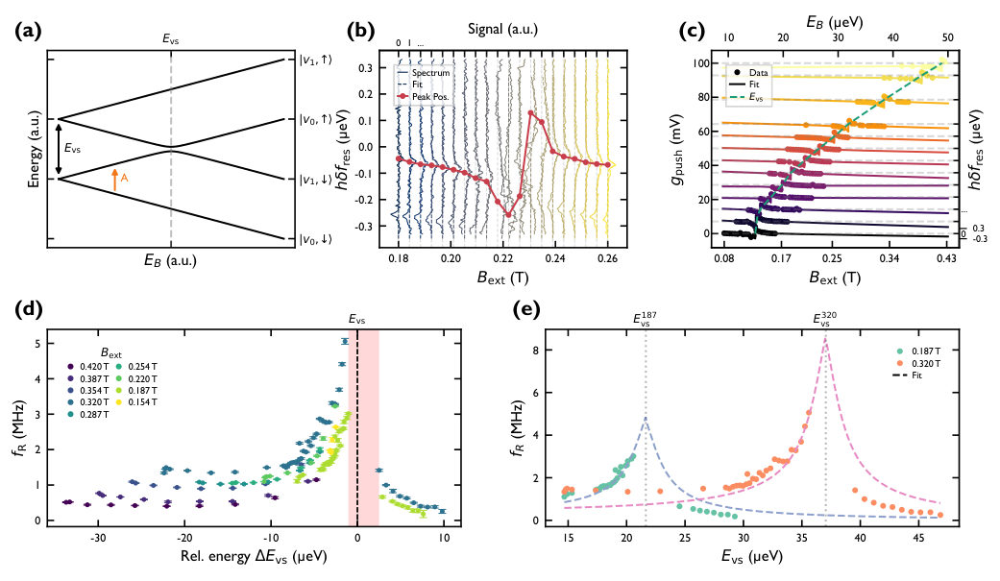 
FIG. 2. (a) Energy level diagram of an electron with two valley states split by Evs as a function of Zeeman splitting EB. The spin-valley hotspot is located at EB = Evs. Arrow A indicates the transition driven when the qubit is initialized in the |v0, ↓⟩ state. (b) Qubit spectra and resonance extraction for various external magnetic fields at gpush = 50 mV. Each trace (top axis) shows the normalized SET signal as the microwave frequency is swept around the expected resonance, hδfres = hfres −gµBBext (left axis), at fixed burst time tmw. A second (negative) peak at lower frequencies results from the subtraction of a frequency- detuned reference pulse. The extracted peak positions from...

📷 Fig 4

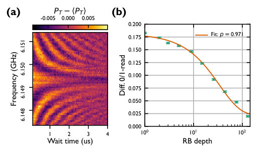 
FIG. 3. Qubit characterization at Bext = 220 mT, tuned away from the hotspot with EB &gt; Evs. (a) Ramsey exper- iment at the same electrostatic configuration used for ran- domized benchmarking in (b). Fitting decaying oscillations (Eq. (B1)) to the Ramsey pattern yields a median T ∗ 2 = 2.3 µs. In general, the measured T ∗ 2 -values are strongly position- dependent (see Appendix D). (b) Randomized benchmarking (RB) following AllXY calibration.

**Summary.** This experimental work investigates using intrinsic spin-orbit coupling in Si/SiGe qubits to achieve high-fidelity quantum gates near a predicted spin-valley hotspot. While the enhanced Rabi frequency was observed, the study also revealed significant asymmetries and variability, indicating that while the mechanism is confirmed, its practical implementation faces challenges for scalable control.

**Why it may be interesting.** This work provides crucial empirical data on utilizing intrinsic material couplings (i-SOC) for qubit control, directly addressing the feasibility of solid-state quantum computing platforms beyond traditional magnetic control.

Detailed structure

**Main problem.** The study aims to demonstrate and characterize the enhanced intrinsic spin-orbit coupling (i-SOC) driving of a Loss-DiVincenzo qubit near a predicted spin-valley hotspot in Si/SiGe heterostructures.

**Main result.** The researchers observed the predicted enhancement of the Rabi frequency near the hotspot, but also found significant asymmetries and variability, suggesting that i-SOC control is not yet a scalable strategy.

**Method.** The experiment uses microwave pulse sequences and Rabi measurements to probe the qubit dynamics, varying parameters like magnetic field and quantum dot position to map the energy detuning from the hotspot.

**Model / system.** The system is a spin qubit implemented in a Si/SiGe heterostructure, utilizing the spin-valley coupling mechanism. The physics is governed by the interplay between Zeeman splitting and valley splitting, leading to the 'hotspot' where hybridization occurs.

**Key observables.** Rabi frequency ($\Omega_R$), single-qubit Clifford fidelity ($F$), Chevron patterns, and the dependence of resonance frequency on energy detuning ($\Delta E_v$).

**Important parameters / regimes.** The hotspot condition ($\Delta E_v = 0$), the measured spin-valley coupling strength ($|C| \approx 0.75 \mu	ext{eV}$), and the achieved fidelity ($F \approx 98.6\%$).

**Assumptions / limitations.** The analysis assumes that the observed phenomena are dominated by i-SOC effects near the hotspot, although the variability suggests other noise sources (like nuclear spins) might be at play.

**Figures summary.** Figures detail Rabi experiments showing Chevron patterns, energy diagrams mapping the anticrossing, and plots showing the Rabi frequency dependence on detuning, alongside coherence time ($T_2^*$) vs. detuning.

**Paper structure.** The paper progresses from characterizing the basic qubit operation and observing the predicted Rabi enhancement at the hotspot, to detailing the observed asymmetries and limitations, and finally analyzing coherence time and noise susceptibility to constrain theoretical models.

Abstract

In most Si/SiGe-based spin qubit implementations, high-fidelity single-qubit gates are achieved using micromagnets, which enable the use of electric spin dipole resonance via synthetic spin-orbit coupling (s-SOC). In contrast, intrinsic spin-orbit coupling (i-SOC) in silicon is generally considered to be weak. However, in Si/SiGe heterostructures, theory predicts a substantial enhancement when the Zeeman splitting approaches the valley splitting if symmetry is reduced by an imperfect interface. Here, we demonstrate a Si/SiGe Loss-DiVincenzo qubit driven by i-SOC close to this so-called spin-valley hotspot. In particular, we characterize the Rabi frequency as a function of the energy detuning from the hotspot by sweeping both the magnetic field and quantum dot position. We observe the predicted enhancement of the Rabi frequency near the hotspot, but also find an asymmetry that deviates from existing theoretical models as well as distortions of the Chevron patterns near the hotspot. While we achieve an average single-qubit Clifford fidelity of 98.6 %, the strong variability of the valley splitting may impede the use of i-SOC-based control as a scalable operational strategy; understanding its effect is nevertheless important for reproducible high-fidelity control. Our results provide an empirical basis for refining current theoretical models of spin-valley physics in Si/SiGe heterostructures.

[↑ back to top](#top)

### [Propagating fronts of convection rolls in Rayleigh-Bénard convection](http://arxiv.org/abs/2608.21728v1)

**Authors:** Saikat Mukherjee, Mark Paul  
**Type:** both · **Category:** statistical mechanics · **PDF:** <https://arxiv.org/pdf/2608.21728v1>  
**Analysis basis:** full PDF text, analyzed in chunks
**Topic relevance:** 🔥 `non-equilibrium universality` **4/5** · `Frenkel-Kontorova` **1/5** · `analog quantum simulation` **1/5** · `driven-dissipative phase transition` **1/5**

📷 Fig 1

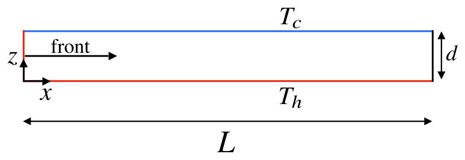 
Figure 1: 2D domain used to study the propagation of fronts of straight parallel rolls. A fluid layer of length L and depth d with a hot bottom wall at Th (red) and cold top wall at Tc (blue) where Th &gt; Tc. The front is initiated using a hot wall located as x = 0 (red) and propagates from left to right. The aspect ratios Γ = L/d used in the simulations are Γ = 30 and 60. Gravity opposes the z-direction.

📷 Fig 2

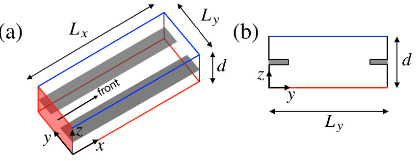 
Figure 2: A box domain with fins attached to the sidewalls. (a) A fluid layer of depth d with a rectangular cross section of lengths Lx and Ly in the x and y directions, respectively to yield Γx = Lx/d and Γy = Ly/d. The bottom wall is hot (red) and the top wall is cold (blue). Thin fins are attached to the sidewalls (shown in gray). The front is initiated at the wall located at x=0 (red) and propagates in the positive x-direction. (b) A y–z cross-section highlighting the fin geometry. The fins are no-slip surfaces of finite thickness in the y and z-directions and are perfect thermal conductors. We also use a box domain without fins (not shown) which is this domain with the gray fins removed....

📷 Fig 3

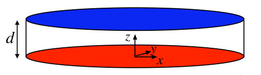 
Figure 3: Cylindrical domain used to study the propagation of concentric convection rolls. A fluid layer of depth d, radius r0, and aspect ratio Γ=r0/d with a hot bottom wall (red) at Th and cold top wall (blue) at Tc. All material boundaries are no-slip surfaces. The front is initiated at the origin by introducing a thermal perturbation at t=0. The front on concentric convection rolls propagates radially outward from the origin toward the sidewalls. Gravity opposes the z-direction and in our study Γ=40.

📷 Fig 4

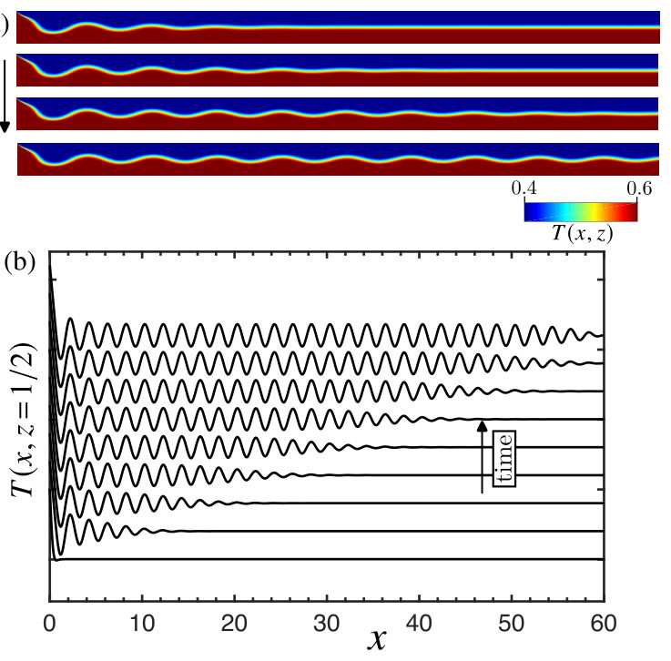 
Figure 4: The temperature variation of a fluid layer containing a front in a 2D domain forming a chain of counter-rotating convection rolls. Simulation parameters: Sim. 1, Γ=60, Ra=1745, Pr=1. (a) Color contours of T(x, z) at four times, the front propagates from left to right. The region 0≤x≤20 is shown for clarity. Red is hot rising fluid and blue is cool falling fluid. Time increases from top to bottom. (b) Temperature profiles T(x, z =1/2) as a function of time t. Time increases from bottom to top. The bottom curve is at t = 0, the interval between the remaining profiles is 5.68 time units.

📷 Fig 5

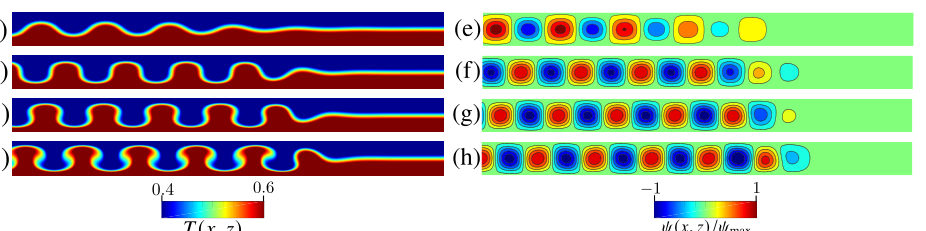 
Figure 5: Color contours of temperature (left column) and normalized stream function (right col- umn) for fronts in a 2D domain. Each row is for a different value of Ra and shows contours at the time when xf = 24. The spatial region 13 ≤x ≤26 is shown for clarity. (a),(e) Ra = 2000; (b),(f) Ra=3300; (c),(g) Ra=5000; (d),(h) Ra=104. Simulation parameters: Sim. 1, Γ=30, Pr=1.

**Summary.** This paper numerically analyzes how convection roll fronts propagate in Rayleigh-Bénard convection, determining scaling laws for front velocity and wavenumber. Key findings show that the front velocity scales as $\epsilon^{1/2}$ near onset, while the wavenumber scaling transitions from linear to $\epsilon^{1/4}$ further from threshold. The work is significant for understanding pattern selection in non-equilibrium physical systems.

**Why it may be interesting.** While focused on classical fluid dynamics, the study of pattern selection, front propagation, and universal scaling laws ($\epsilon^{1/2}$, $\epsilon^{1/4}$) shares mathematical similarities with pattern formation problems studied in non-equilibrium statistical mechanics and reaction-diffusion systems.

Detailed structure

**Main problem.** The study investigates the dynamics and scaling laws governing the propagation of fronts of convection rolls in Rayleigh-Bénard convection under supercritical conditions.

**Main result.** The front velocity scales as $\epsilon^{1/2}$ for small supercriticality ($\epsilon \lesssim 1$), while the wavenumber exhibits different scaling behaviors ($\epsilon$ vs. $\epsilon^{1/4}$) depending on the distance from onset.

**Method.** The research employs detailed numerical simulations in 2D and 3D using a spectral element approach, comparing results against amplitude equation predictions and experimental data.

**Model / system.** The physical system is Rayleigh-Bénard convection in a shallow fluid layer, governed by the Boussinesq equations. The focus is on the propagating front separating quiescent fluid from the forming convective rolls.

**Key observables.** Front velocity ($v_f$) and the wavenumber ($q$) of the convection rolls.

**Important parameters / regimes.** Reduced Rayleigh number ($\epsilon$), Prandtl number ($	ext{Pr}$), and domain geometry/boundary conditions.

**Assumptions / limitations.** The front dynamics are studied before the bulk instability fully develops, and comparisons are made assuming ideal boundary conditions (e.g., perfect thermal conductivity).

**Figures summary.** The notes describe setups for 2D, 3D box, and cylindrical domains illustrating the geometry of the convection front propagation.

**Paper structure.** The paper systematically explores the front dynamics by varying the dimensionality (2D vs 3D), the geometry (box vs cylinder), and the method of front initiation, while comparing scaling laws to theory and experiments.

Abstract

We investigate the propagation of counter-rotating convection rolls in Rayleigh-Bénard convection initiated locally in a quiescent fluid layer under supercritical conditions. The velocity of the front separating quiescent fluid from the forming convection rolls, and the wavenumber of the convection rolls remaining behind the front, are explored. We numerically investigate fronts of forming convection rolls over five orders of magnitude of the reduced Rayleigh number, $ε$, in 2D and 3D domains, for a broad range of boundary conditions, and for different front initiation approaches. In all cases, the front velocity increases as $ε^{1/2}$ with increasing $ε$ for $ε\lesssim 1$ in agreement with predictions using the amplitude equation. The amplitude equation description of the front velocity remains accurate for $ε\lesssim 10$ except when the Prandtl number is large which yields a velocity that is faster than predicted for a fluid layer far from threshold. The wavenumber of the convection rolls increases linearly with $ε$ in agreement with the wavenumber that maximizes the growth rate of perturbations in the linear regime. Farther from onset, the wavenumber growth transitions to a reduced scaling of $ε^{1/4}$ in agreement with predictions using the Swift-Hohenberg equation in the large $ε$ limit. The scalings describing the wavenumber variation with $ε$ are independent of the domain geometry, boundary conditions, and front initiation method. However, the front-selected wavenumber at criticality does not equal the critical wavenumber of the bulk instability, in general, and depends significantly upon these details. We compare our results with experimental measurements where possible.

[↑ back to top](#top)

### [Loop currents in Haldane's model and in time-reversal-breaking superconductors](http://arxiv.org/abs/2608.22083v1)

**Authors:** Azzam Alzahrani, Victor M. Yakovenko  
**Type:** theory · **Category:** other · **PDF:** <https://arxiv.org/pdf/2608.22083v1>  
**Analysis basis:** full PDF text, analyzed in chunks
**Topic relevance:** `analog quantum simulation` **3/5** · `Keldysh / 2PI / non-Gaussian methods` **2/5** · `methods for driven-dissipative` **2/5**

📷 Fig 1

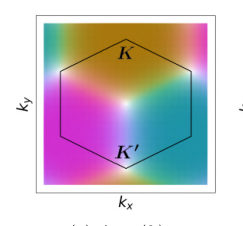 
Fig. 5: The inter-sublattice superconducting pairing amplitudes ∆AB(k) in panel (a) and ∆BA(k) in panel (b) over the Brillouin zone. The phase and magnitude are represented by color and saturation, respectively. The amplitude ∆AB(K′) = 0 vanishes at the K′ point, whereas ∆BA(K) = 0 vanishes at the K point.

📷 Fig 2

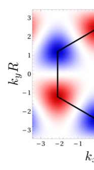 
Fig. 6: A 2D graph of the function f3(k) from Eq. (6) over the Brillouin zone. The function f3(k) appears in the loop current ˇIlc(k), Eq. (50), and in the supercon- ducting sublattice polarization Ξ(k), Eq. (56).

📷 Fig 3

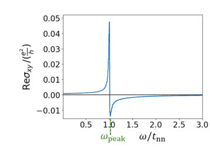 
Fig. 7: Frequency-dependence of the Hall conductivity in clean chiral d-wave super- conductor with 2D honeycomb lattice, with µ = −0.5tnn and ∆= 0.1tnn. (a) is the imaginary part and (b) is the real part.

📷 Fig 4

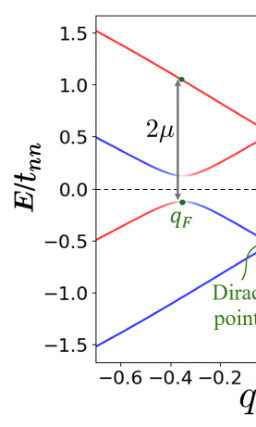 
Fig. 8: Vertical axis: Energy eigenvalues of the BdG Hamiltonian near the K point of the honeycomb lattice. Horizontal axis: The deviation qx = kx−Kx of momentum from the K point in the x direction. The horizontal dashed line represents the Fermi level at the energy distance µ from the Dirac point. Blue and red colors represent electron and hole states, respectively. The vertical lines with arrows indicate optical transitions from the energy −E1 in the lower band to E2 in the upper band.

📷 Fig 5

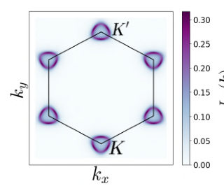 
Fig. 9: (a) Spectral density LH(k) from Eq. (75) shown over the Brillouin zone. (b) A close-up in the vicinity of the K point.

**Summary.** This theoretical work examines how loop currents manifest optically in topological materials, specifically Haldane's model and chiral superconductors. By relating the loop current expectation value to the frequency-dependent ac Hall conductivity, the authors predict sharp absorption peaks whose spectral weight directly quantifies the underlying chiral currents. This offers a pathway for experimental detection of topological superconductivity.

**Why it may be interesting.** The connection drawn between topological currents (loop currents) and measurable optical responses ($\sigma_H(\omega)$) provides a powerful, experimentally verifiable diagnostic tool for characterizing exotic superconducting and topological phases.

Detailed structure

**Main problem.** The study investigates the optical manifestations of loop currents in topological systems, specifically Haldane's model and time-reversal-breaking superconductors.

**Main result.** The authors establish a direct relationship between the optical spectral weight of the ac Hall conductivity and the magnitude of the induced loop currents in both models.

**Method.** Theoretical calculations involving Green's functions, Bogoliubov-de Gennes (BdG) Hamiltonians, and the analysis of optical conductivity ($\sigma_H(\omega)$) via Kubo-like formulas.

**Model / system.** The models analyzed are Haldane's model (a Chern insulator on the honeycomb lattice) and a chiral superconductor on the honeycomb lattice, both described using lattice Hamiltonians and BdG formalism.

**Key observables.** Loop currents ($\langle \hat{I}_{	ext{lc}} 
angle$), frequency-dependent ac Hall conductivity ($\sigma_{xy}(\omega)$), and the optical Hall spectral weight ($	ext{W}_{	ext{Hall}}$).

**Important parameters / regimes.** The superconducting gap ($\Delta$), Fermi level ($\mu$), and the energy difference between Dirac bands ($\omega_{	ext{peak}}$).

**Assumptions / limitations.** Approximations are made regarding the superconducting gap relative to the Fermi energy ($\Delta \ll 2\mu$), and the analysis focuses on the optical response rather than the DC response.

**Figures summary.** Figures illustrate Haldane's model on the honeycomb lattice, the spatial distribution of loop currents, and the energy eigenvalues near the K point showing optical transition peaks.

**Paper structure.** The paper proceeds by first calculating loop currents in Haldane's model, then extending the methodology to analyze the ac Hall conductivity in chiral superconductors, deriving relations between the spectral weight and loop currents.

Abstract

We present a theoretical study of optical manifestations of loop currents in Haldane's model and in time-reversal-breaking superconductors. For Haldane's model, we calculate the expectation value of loop currents in terms of model parameters and relate it with the integrated optical spectral weight for the frequency-dependent ac Hall conductivity. Thus, experimental measurements of the latter can provide information about the presence and magnitude of steady loop currents in the system. Then we elaborate on loop currents in a chiral superconductor on the honeycomb lattice, studied earlier by Brydon et al. (2019). We demonstrate that a sharp optical absorption peak in the ac Hall conductivity originates from excitations between the lower and upper Dirac bands, activated by the time-reversal-breaking superconductivity. The frequency of the peak is twice the energy difference between the Fermi level and the Dirac point. The optical spectral weight of the peak is directly related to the magnitude of loop currents induced in the unit cells by the chiral superconducting pairing, in similarity to Haldane's model.

[↑ back to top](#top)

### [Even-harmonic generation from topological edge states in generalized Su-Schrieffer-Heeger models](http://arxiv.org/abs/2608.22136v1)

**Authors:** Chi-Ting Liu, J-S You, Hsiu-Chuan Hsu  
**Type:** theory · **Category:** other · **PDF:** <https://arxiv.org/pdf/2608.22136v1>  
**Analysis basis:** full PDF text, analyzed in chunks
**Topic relevance:** `analog quantum simulation` **3/5** · `interference shaping light` **3/5**

📷 Fig 1

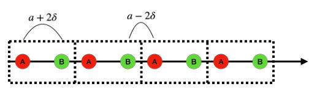 
FIG. 1. The schematic of the one-dimensional chain studied in this work. Each dashed rectangle denotes a unit cell containing two sublattices A and B. The distance between A and B within one unit cell is a + 2δ. The distance between A and B of neighboring unit cells is a −2δ.

📷 Fig 2

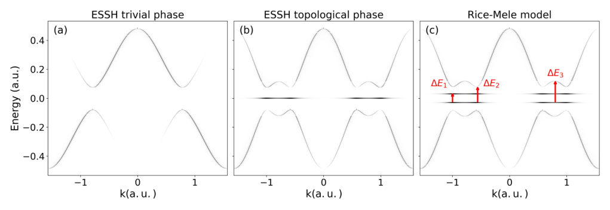 
FIG. 2. Momentum-resolved energy spectra of the ESSH-trivial (a), ESSH-topological (b) and the Rice-Mele models (c) for N = 2000. Red arrows in (c) indicate three energy differences defined in Table I: ∆E1 ≈0.06, ∆E2 ≈0.11, and ∆E3 ≈0.15.

📷 Fig 3

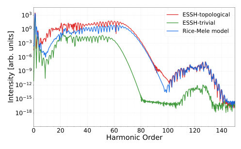 
FIG. 3. Harmonic spectra for the ESSH-trivial phase, ESSH- topological phase, and the Rice-Mele model for N = 2000, a = 2. The blue and red dashed vertical lines denote harmonic orders of 8 and 20.4, respectively.

📷 Fig 4

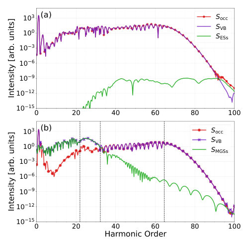 
FIG. 4. Decomposition analysis of harmonic spectrum compar- ing the contributions from the total dipole acceleration (Socc), valence-band states (SVB), and edge or midgap states (SESs or SMGSs) for (a) ESSH-topological phase, (b) Rice-Mele model. Black vertical dashed lines in the lower panels indicate char- acteristic harmonic orders corresponding to the bulk bandgap (Egap/ω ≈22), one quarter of the maximum CB-VB energy difference (Emax/4ω ≈32), and one half of the maximum CB-VB energy difference (Emax/2ω ≈64).

📷 Fig 5

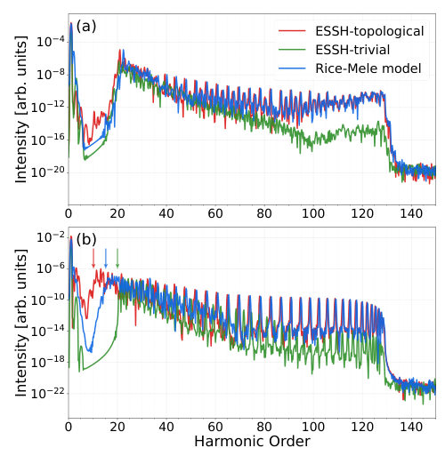 
FIG. 5. Harmonic spectrum of the ESSH-trivial phase, ESSH- topological phase, and the Rice-Mele model under localized illumination. (a) Illumination centered in the middle of the chain (x0 = 0). (b) Illumination applied at the boundary (x0 = 95). Three arrows indicate characteristic harmonic orders for three different models, from left to right: 10 (Egap/2 for ESSH model), 15 (∆E2 from occupied MGSs to CB valley for Rice-Mele model), and 20 (Egap for ESSH model).

**Summary.** This work uses High-order Harmonic Generation (HHG) as a diagnostic tool to study topological edge states in 1D quantum models like the ESSH chain. The key finding is that local laser illumination near a topological boundary enforces a selection rule, causing only even harmonics to appear. This demonstrates that controlling the laser's spatial position allows for symmetry control over the emitted quantum light spectrum.

**Why it may be interesting.** The finding that the spatial location of the laser can selectively control the symmetry of the emitted harmonics (even vs. odd) provides a novel, symmetry-based control mechanism for quantum light sources in low-dimensional nanostructures.

Detailed structure

**Main problem.** The study investigates High-order Harmonic Generation (HHG) in solids to probe the symmetry and topological properties of quantum materials.

**Main result.** Local illumination at a topological boundary causes the HHG spectrum to exhibit a selection rule where odd harmonics vanish and even harmonics become dominant, linked to the zero-energy edge states and particle-hole symmetry.

**Method.** The authors numerically compute the HHG spectrum by coupling the system Hamiltonian to a time-dependent laser pulse and analyzing the Fourier transform of the dipole acceleration.

**Model / system.** The research uses one-dimensional models, specifically the Extended Su-Schrieffer-Heeger (ESSH) model and the Rice-Mele model, which describe topological insulators with edge or midgap states.

**Key observables.** HHG spectrum intensity vs. harmonic order, decomposition of the total response into contributions from edge states (SESs) and valence bands (SVB).

**Important parameters / regimes.** Laser frequency ($\omega$), hopping parameters ($v, w, J, U$), and the spatial location of the laser illumination ($x_0$).

**Assumptions / limitations.** The analysis relies on the dipole approximation and the assumption that the zero-energy edge states possess particle-hole symmetry.

**Figures summary.** Figures compare HHG spectra under global vs. local illumination for different models, showing the emergence of even harmonics specifically when the laser is localized near a topological boundary.

**Paper structure.** The paper progresses by first establishing the theoretical framework of HHG in topological systems, then comparing global illumination results (ESSH vs. RM), and finally focusing on the crucial findings derived from local illumination to establish the even-harmonic selection rule.

Abstract

High-order harmonic generation (HHG) in solids has emerged as a powerful probe of symmetry and topological properties in quantum materials. In this work, we investigate the HHG response in one-dimensional solids with edge or midgap states under global and local illumination. We numerically compute the HHG spectrum for the Su-Schrieffer-Heeger (SSH) model with next-nearest-opposite sublattice hopping, dubbed the extended SSH (ESSH) model, and the Rice-Mele model, a one-dimensional system with broken inversion symmetry introduced via staggered on-site potentials. By contrasting the spectral features of the ESSH and Rice-Mele models under global illumination, our analysis reveals that although midgap states provide additional pathways for transitions, the resulting interference is destructive, leading to spectral features distinct from those of edge states. Furthermore, when a single boundary of the topological insulator is locally illuminated, the HHG spectrum of the edge states exhibits vanishing odd harmonics, leaving even harmonics dominant in the spectrum. We identify this even-harmonic selection rule as a consequence of the zero-energy character of the edge states and the particle-hole symmetry of the system, which enforces even field parity of the zero-mode response. These findings reveal that the spatial location of the laser illumination offers a route to control the symmetry of the system, thereby selectively suppressing or enhancing even- and odd-order harmonics in low-dimensional nanostructures.

[↑ back to top](#top)

### [Extrinsic nonlinear spin currents in spin-orbit coupled systems: A Boltzmann transport study](http://arxiv.org/abs/2608.21900v1)

**Authors:** Jiwei Tian, Huaqing Huang  
**Type:** theory · **Category:** statistical mechanics · **PDF:** <https://arxiv.org/pdf/2608.21900v1>  
**Analysis basis:** full PDF text, analyzed in chunks
**Topic relevance:** `Keldysh / 2PI / non-Gaussian methods` **3/5** · `methods for driven-dissipative` **2/5** · `non-equilibrium universality` **1/5**

📷 Fig 1

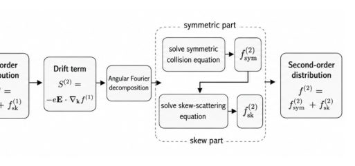 
FIG. 1. Recursive procedure for solving the Boltzmann equation order by order in the applied electric field.

📷 Fig 2

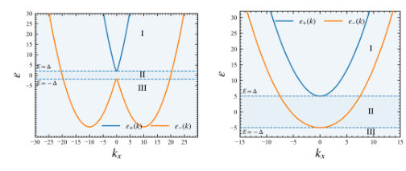 
FIG. 2. Energy-band structures of the Hamiltonian describ- ing the surface states of a topological insulator for (a) v = 5, ∆= 2, and m = 2; (b) v = 1, ∆= 5, and m = 2.

📷 Fig 3

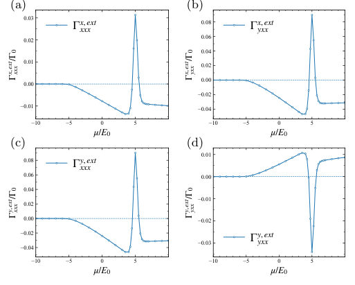 
FIG. 4. Second-order extrinsic nonlinear spin-current re- sponse coefficient Γm,ext knl as a function of the chemical poten- tial µ for a = 1, b = 0.2, m = 2, ∆= 5, v = 1, and β = 5: (a) Γx,ext xxx , (b) Γy,ext xxx , (c) Γx,ext yxx , and (d) Γy,ext yxx .

📷 Fig 4

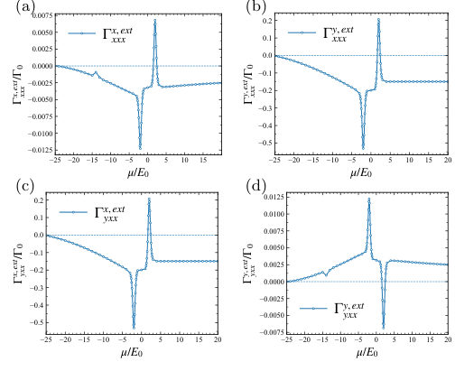 
FIG. 3. Second-order extrinsic nonlinear spin-current re- sponse coefficient Γm,ext knl as a function of the chemical poten- tial µ for a = 1, b = 0.2, m = 2, ∆= 2, v = 5, and β = 5: (a) Γx,ext xxx , (b) Γy,ext xxx , (c) Γx,ext yxx , and (d) Γy,ext yxx .

**Summary.** This work develops a sophisticated Boltzmann transport theory to calculate nonlinear spin currents in topological insulators, moving beyond simple relaxation-time approximations. By expanding the distribution function in angular Fourier harmonics, the authors show that higher-order harmonics are crucial for capturing the full physics of spin transport. The methodology provides a systematic way to analyze complex, non-equilibrium transport phenomena in SOC materials.

**Why it may be interesting.** While focused on condensed matter transport, the rigorous, non-equilibrium, harmonic expansion technique for solving the Boltzmann equation is a powerful theoretical tool applicable to open quantum systems dynamics.

Detailed structure

**Main problem.** The study addresses the limitations of the single-relaxation-time approximation when calculating extrinsic nonlinear spin currents in spin-orbit coupled systems.

**Main result.** Higher angular harmonics of the non-equilibrium distribution and scattering between distinct constant-energy contours are shown to be essential for accurately describing extrinsic nonlinear spin transport.

**Method.** The authors employ a semiclassical Boltzmann transport framework, decomposing the collision integral and the distribution function into Fourier harmonics to solve coupled algebraic equations recursively.

**Model / system.** The analysis is applied to the gapped surface states of a topological insulator, modeled by a specific Hamiltonian involving spin-orbit coupling and a gap term.

**Key observables.** Second-order extrinsic spin-current response coefficient ($\Gamma_{\ell, 	ext{ext}}^{ijl}$), and the angular harmonics ($\ell=1, 2$) of the distribution function.

**Important parameters / regimes.** The ratio $mv^2/\Delta$ dictates the scattering regime (monotonic vs. nonmonotonic band structure).

**Assumptions / limitations.** The analysis neglects the contribution of the skew-scattering part to the second-order distribution function and assumes elastic impurity scattering, which limits the relaxation of the $l=0$ harmonic.

**Figures summary.** Figures illustrate the recursive solution procedure, the band structures for different parameter regimes, and the calculated second-order extrinsic spin-current coefficients in the nonmonotonic regime.

**Paper structure.** The paper systematically develops the Boltzmann equation solution by expanding the distribution function in Fourier harmonics, solving coupled equations for different harmonics, and finally calculating the second-order spin current coefficients.

Abstract

We develop a semiclassical Boltzmann framework for second-order extrinsic spin transport in the presence of skew scattering. The conventional relaxation-time approximation reduces the full collision integral to a single phenomenological timescale and thereby neglects the angular structure of impurity scattering. While the transport relaxation time primarily characterizes the leading angular harmonic of the nonequilibrium distribution, nonlinear response is sensitive to its higher angular harmonics, which are governed by distinct components of the collision operator. We therefore retain the angular and band dependence of the scattering kernel and decompose both the collision integral and the distribution function into Fourier harmonics. The resulting coupled algebraic equations allow the symmetric and skew-scattering corrections to the distribution function to be obtained recursively order by order in the electric field. We apply this formalism to the gapped surface states of a topological insulator with spin-dependent impurity scattering and evaluate the corresponding second-order extrinsic spin-current response. Our results show that higher angular harmonics of the nonequilibrium distribution and scattering between distinct constant-energy contours play an essential role in extrinsic nonlinear spin transport beyond the single-relaxation-time approximation.

[↑ back to top](#top)

### [Structural disorder and critical voltage scaling in Al/AlOx/Al Josephson junction arrays](http://arxiv.org/abs/2608.22654v1)

**Authors:** Amanuel M. Berhane, Susan Coppersmith, Emma Mitchell, Timothy Duty  
**Type:** both · **Category:** disordered systems and neural networks · **PDF:** <https://arxiv.org/pdf/2608.22654v1>  
**Analysis basis:** full PDF text, analyzed in chunks
**Topic relevance:** `non-equilibrium universality` **3/5** · `Frenkel-Kontorova` **1/5** · `driven-dissipative phase transition` **1/5**

📷 Fig 1

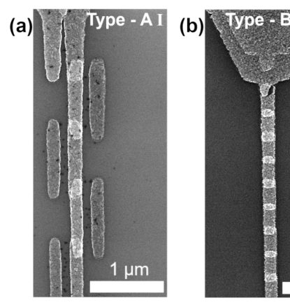 
Figure 1: Representative SEM images showing examples of Type-A and Type-B Josephson junction arrays. (a) Type-AI array consisting of 800 nm-long islands with uniform island geometry and the presence of excess metal strips. The nominal junction area of this family of arrays is 100×100 nm2. (b) Type-B arrays fabricated without excess metal strips. The left panel shows a single-junction chain (Type- BI) consisting of 400 nm-long islands with a uniform island width of 200 nm and a nominal junction area of 100 × 200 nm2. The right panel shows a SQUID array (Type-BII) fabricated with the same island and junction dimensions as the Type-BI chains. The Type-BI and Type-BII arrays were fabricated on...

📷 Fig 2

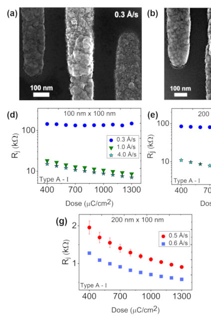 
Figure 2: SEM images of Type-AI junctions fabricated at evaporation rates of 0.3 ˚A/s (a), 1.0 ˚A/s (b), and 4.0 ˚A/s (c), illustrating the systematic evolution of film morphology with deposition rate. Average room-temperature single-junction resistance, Rj, as a function of electron-beam exposure dose for Type-AI arrays (N = 1000) with nominal junction areas of 100 × 100 nm2 (d) and 100 × 200 nm2

📷 Fig 3

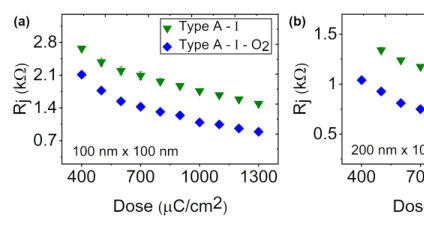 
Figure 3: Average room-temperature single-junction resistance Rj as a function of electron-beam exposure dose (junction area) for Type-AI arrays (N = 1000) fabri- cated with and without in situ post-oxidation, with all other processing parameters kept constant. (a) Arrays with nominal junction areas of 100×100 nm2. (b) Arrays with nominal junction areas of 100 × 200 nm2. The missing data point at an expo- sure dose of 1000 µC/cm2 in (b) corresponds to a failed device. (c) Critical-voltage scaling plot for Type-AI arrays fabricated with and without post-oxidation. The solid red lines show fits based on the pinned Luttinger-liquid theory [15].

📷 Fig 4

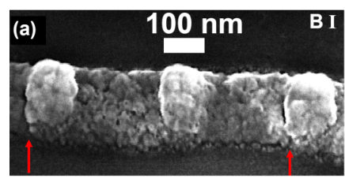 
Figure 4: (a) and (b) show magnified SEM images of Type-BI and Type-BII ar- rays, respectively, in which three representative junctions are shown, illustrating the systematic formation of nanoscale gaps at every other junction (red arrows) due to shadow evaporation in parallel direction.

📷 Fig 5

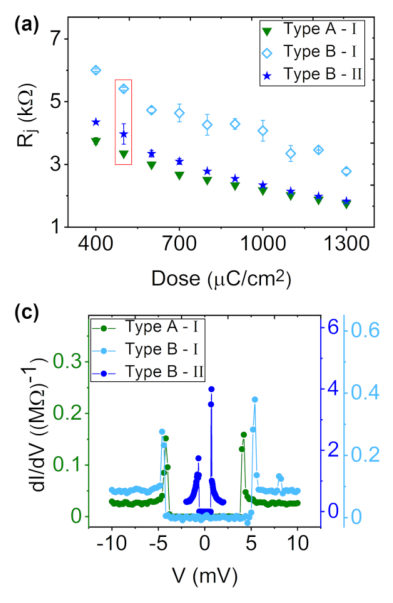 
Figure 5: Room-temperature single-junction resistance Rj as a function of electron- beam exposure dose (junction area) for Type-AI and Type-BI/Type-BII arrays. (b) Low-temperature (20 mK) dc current–voltage characteristics (IVCs) of three representative arrays of each type selected from the red box in (a), all fabricated at the same exposure dose of 500 µC/cm2 (corresponding to nominally identical junction areas). (c) Differential conductance traces corresponding to the IVCs in (b), highlighting the contrasting non-linear transport behaviour of the three device types. (d) Scaled critical voltage υ as a function of the scaled Bloch bandwidth w for Type-A and Type-B devices revealing distinct...

**Summary.** This work examines how structural disorder affects the critical voltage scaling in Josephson junction arrays. By comparing results from varying fabrication parameters (like deposition rate) against those with engineered defects (like nanoscale gaps), the authors map out which structural variations merely renormalize transport coefficients versus those that fundamentally alter the collective pinning physics. This provides crucial design guidelines for superconducting quantum devices.

**Why it may be interesting.** The robustness of the scaling law despite structural changes suggests underlying universal physics governing collective transport in disordered superconducting systems, which is relevant to understanding quantum phase transitions.

Detailed structure

**Main problem.** The study investigates how fabrication-induced structural defects influence the critical-voltage scaling in one-dimensional Josephson junction (JJ) arrays.

**Main result.** The normalized critical-voltage scaling is remarkably robust against variations in aluminum evaporation rates, but the scaling behavior is significantly altered by the deliberate introduction of nanoscale gaps.

**Method.** The authors combine low-temperature transport measurements (IVCs) with structural characterization (SEM) and theoretical analysis based on the pinned Luttinger-liquid theory.

**Model / system.** The physical system is Al/AlOx/Al Josephson junction arrays, operating in the insulating regime where transport is governed by collective charge dynamics and disorder-induced pinning.

**Key observables.** Critical voltage ($V_C$), room-temperature junction resistance ($R_j$), and the normalized critical-voltage scaling relationship ($
u$ vs. $w$).

**Important parameters / regimes.** Aluminum evaporation rate, junction geometry (Type-AI, Type-BI, Type-BII), and the ratio of Josephson energy to charging energy ($E_J/E_{CP}$).

**Assumptions / limitations.** The analysis relies on the pinned Luttinger-liquid theory to describe the collective transport behavior in the presence of disorder.

**Figures summary.** Figures show SEM images illustrating morphology changes with deposition rate, $R_j$ dependence on dose, and the collapse of normalized critical-voltage scaling onto a common functional form.

**Paper structure.** The paper systematically compares the effects of different structural modifications—varying evaporation rates, post-oxidation, and introducing nanoscale gaps—on the measured critical voltage scaling, contrasting the robustness of the functional form versus the sensitivity of the prefactors.

Abstract

The insulating state of one-dimensional Josephson junction (JJ) arrays is governed by collective charge dynamics and disorder-induced pinning, resulting in a finite critical voltage under dc bias. Here, we investigate the influence of fabrication-induced structural defects on the critical-voltage scaling of small-capacitance Aluminium-Aluminium oxide-Aluminium (Al/AlOx/Al) JJ arrays. Controlled variation of the aluminium evaporation rate produces pronounced changes in grain morphology and room-temperature junction resistance. Despite these substantial structural modifications, the normalised critical-voltage scaling is preserved, demonstrating that the collective transport behaviour is remarkably robust against this class of fabrication-induced defects. In contrast, the deliberate introduction of nanoscale gaps into the junctions introduces additional junction-to-junction structural variations that systematically modify the normalised scaling behaviour. Likewise, in situ postfabrication oxidation alters the scaling coefficient while preserving the functional form of the scaling law, indicating that the collective transport is sensitive to specific classes of structural modifications. These results establish which fabrication-induced structural defects influence the collective transport in insulating Al/AlOx/Al Josephson junction arrays, providing new insight into the role of fabrication-induced structural disorder and practical guidance for the design of future Quantum Phase Slip (QPS) devices.

[↑ back to top](#top)

### [Parity-dependent coupling of molecular spin chains to a superconductor](http://arxiv.org/abs/2608.22736v1)

**Authors:** Katerina Vaxevani, Jon Ortuzar, Stefano Trivini, Georg Monninger, Dongfei Wang, Vilas-Varela, Lucía Gómez-Rodrigo, Diego Peña, Jose Ignacio Pascual  
**Type:** both · **Category:** other · **PDF:** <https://arxiv.org/pdf/2608.22736v1>  
**Analysis basis:** full PDF text, analyzed in chunks
**Topic relevance:** `analog quantum simulation` **3/5** · `Keldysh / 2PI / non-Gaussian methods` **1/5**

📷 Fig 1

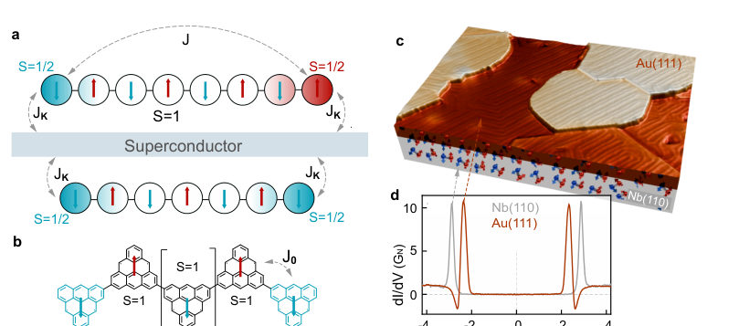 
Fig. 1. Interacting spin chains and a proximitized Au(111)/Nb surface: a Representation of an S=1 antiferromagnetic chain with fractional spin-1/2 edge states. Depending on the parity of the chain length N, the ground state is S=0 (even) or S=1 (odd), set by the relative orientation of the edge spins. b Chemical structure of a S=1 triangulene chain of length N used in this work as integer spin chain [13]. c STM topography of a Au film grown on Nb(110), exhibiting the characteristic herringbone reconstruction of Au(111) surfaces. d Differential conductance spectrum measured with a Nb tip on the clean Au(111)/Nb(110) surface (red), compared with a spectrum on the bare Nb(110) substrate...

📷 Fig 2

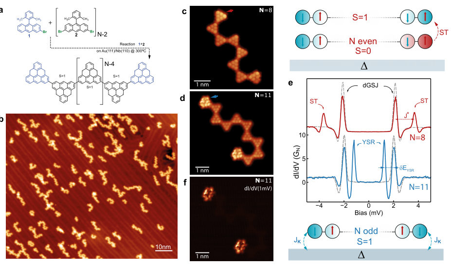 
Fig. 2. Triangulene chains over a proximitized Au(111) superconductor. a Chemical structure of the organic precursors used [13] and the targeted triangulene chain. b STM image of the surface of a Au(111) film grown on Nb(110) substrates (Section S1 for details). c,d Constant-height bond-resolved current images of two selected triangulene chains with N=8 and 11 units. These images and others in Supplementary Figures S3-S14 have been measured at low sample voltage (V=5 mV) using a CO-functionalized superconducting STM tip. e Comparison of differential conductance spectra acquired at the termini of the two chains, using a superconducting STM tip to enhance the energy resolution at 1.2 K (dI/dV...

📷 Fig 3

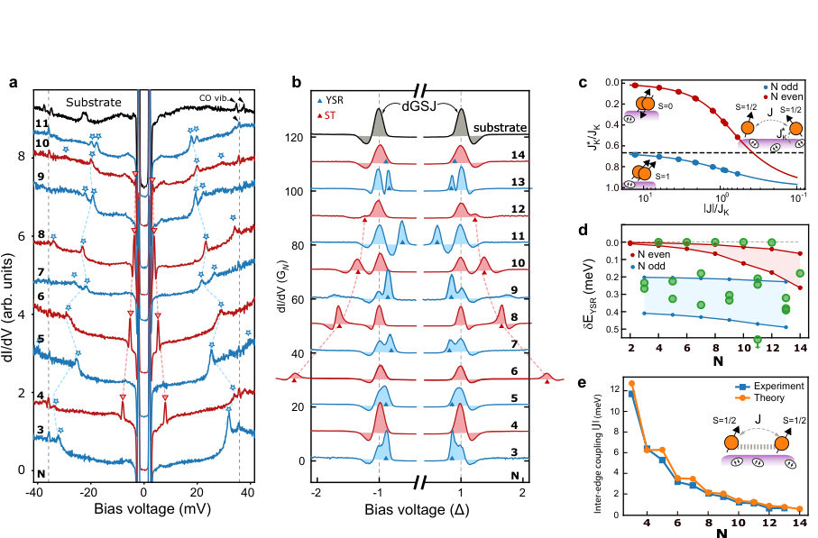 
Fig. 3. Scaling of edge excitations with spin-chain length: a Differential conductance spectra at the edge of triangulene chains with increasing length N. Down-pointing red triangles mark edge excitations; blue stars mark collective spin modes (dI/dV @ V = 50 mV, I = 1 nA). b Low-energy spectra at the termini of chains in panel a) and longer ones (Figs. S3–S14). The dGSJ resonances are aligned to remove tip-dependent gap variations; YSR states are marked with blue up-pointing triangles (dI/dV @ V = 5 mV, I = 500 pA). c Parity-dependent renormalization of J∗ K with |J|, from the two-site model of Section S5. Even chains show negligible J∗ K for larger |J| values, consistent with the absence...

📷 Fig 4

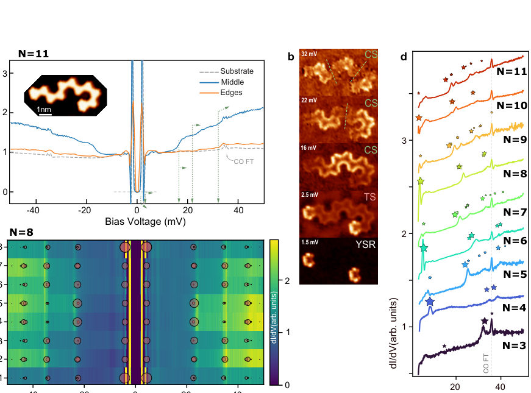 
Fig. 4. Collective spin modes in the bulk of triangulene chains. a Long-range dI/dV spectrum on the terminal triangulene (orange) of the N = 11 chain of Fig. 2d, compared with a spectrum of inner triangulenes (blue). Both spectra are averaged over signal-rich regions in the zig-zag edges of end-triangulene and middle triangulenes, respectively. To facilitate comparison, spectra are normalized to match the same dI/dV value at V=10 mV. The dashed line is a reference spectrum averaged over the surface area. (dI/dV @ V = 50 mV, I = 1 nA). b dI/dV map obtained at the indicated voltage values, also marked in a. The maps are acquired from a grid of spectra at junction resistance 50 MΩ. c dI/dV...

📷 Fig 5

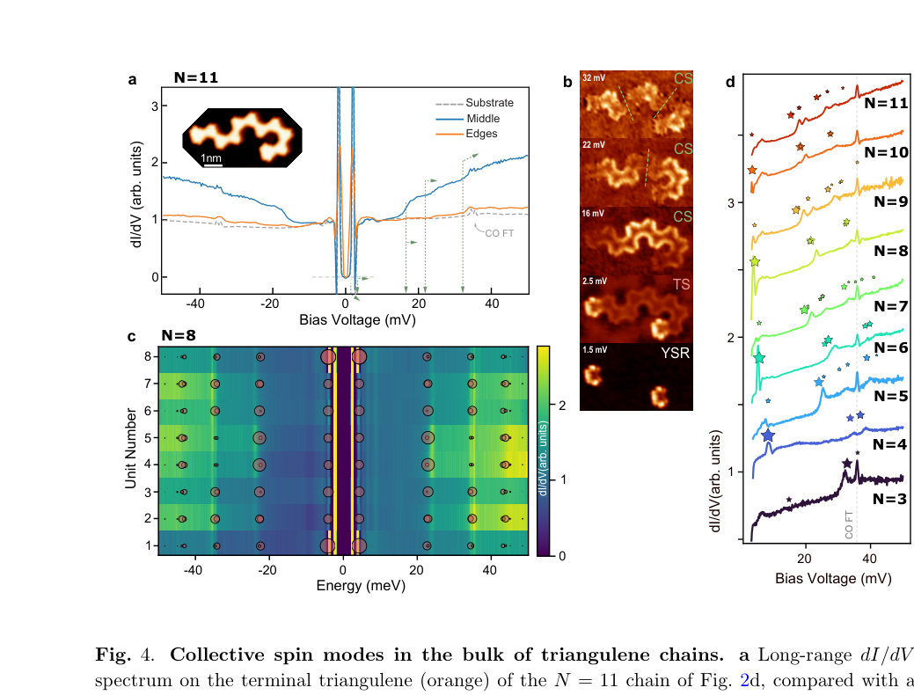 
Fig. 4c displays the spatial distribution of edge-localized ST and bulk CS excitations along

**Summary.** This paper reports on the parity-dependent coupling between molecular spin chains and a superconductor using STS on triangulene chains. They found that odd-length chains exhibit superconducting gap features (YSR states) due to their net S=1 ground state, while even-length chains are decoupled. This demonstrates a controllable mechanism for engineering spin-superconductor hybrid quantum systems.

**Why it may be interesting.** This work directly addresses the interplay between topological quantum states (Haldane chains) and superconducting proximity effects, which is central to building solid-state quantum devices and understanding emergent superconducting phenomena in molecular systems.

Detailed structure

**Main problem.** The study investigates whether the topological fractionalization of quantum numbers in molecular spin chains survives when coupled to a superconducting condensate.

**Main result.** The coupling exhibits a parity dependence: odd-length chains host Yu-Shiba-Rusinov (YSR) states from an S=1 ground state, while even-length chains form an S=0 ground state decoupled from the superconductor.

**Method.** The research combines scanning tunneling spectroscopy (STS) measurements on molecular chains with theoretical modeling using spin Hamiltonians.

**Model / system.** The system consists of molecular Haldane chains of spin-1 triangulene units grown on a proximitized Au(111)/Nb(110) superconducting surface. The physics is modeled using effective spin Hamiltonians incorporating inter-edge interactions and superconducting coupling.

**Key observables.** Yu-Shiba-Rusinov (YSR) bound states inside the superconducting gap, and extra-gap singlet-triplet (ST) excitations.

**Important parameters / regimes.** Chain length parity (odd vs. even), superconducting gap ($\Delta$), and the strength of inter-edge exchange interactions ($J$).

**Assumptions / limitations.** The analysis assumes the superconducting gap is protected by the quasiparticle gap, and the mechanism is governed by the sign and strength of inter-edge interactions.

**Figures summary.** Figures illustrate the system setup, STM topography, and dI/dV spectra comparing even and odd chains, showing the characteristic alternation of YSR resonances versus ST peaks.

**Paper structure.** The paper progresses by establishing the physical system and the open question, presenting STS measurements showing parity dependence, developing theoretical models (e.g., two-site superconductor model), and concluding with the implications for molecular spin qubits.

Abstract

Topological order can fractionalize the quantum numbers of the underlying particles. A paradigmatic example is the spin-1/2 states at the edges of an antiferromagnetic integer-spin chain, protected by a topological Haldane gap in the bulk and mutually coupled in short chains. Owing to their topological protection, they are natural building blocks for hybrid spin-superconductor quantum systems. Whether fractionalization survives the coupling to a superconducting condensate, however, remains an open question. Here we grow molecular Haldane chains of antiferromagnetically coupled spin-1 triangulene units on a proximitized Au(111)/Nb(110) surface and resolve a parity-dependent coupling of their spin-1/2 edge states to the superconducting condensate by scanning tunnelling spectroscopy. Odd-length chains host Yu-Shiba-Rusinov bound states inside the superconducting gap, originating from the net S=1 ground state, whereas even-length chains form an S=0 ground state decoupled from the superconductor. A two-site superconductor model reveals that this alternation arises from the sign and strength of the inter-edge interaction, a mechanism independently validated by extra-gap spin excitations in tunnelling spectra. Collective many-body spin excitation modes are also detected decoupled from the superconductor by the much larger Haldane gap. The length-tunable coupling of the edge spins to the superconductor opens a route toward molecular spin qubits based on $π$-conjugated carbon architectures.

[↑ back to top](#top)

### [A Topological Magnonic Black-White Hole Crystal](http://arxiv.org/abs/2608.22783v1)

**Authors:** D. Galvez-Poblete, R. M. Otxoa, A. S. Nunez, S. Allende  
**Type:** theory · **Category:** other · **PDF:** <https://arxiv.org/pdf/2608.22783v1>  
**Analysis basis:** full PDF text, analyzed in chunks
**Topic relevance:** `analog quantum simulation` **3/5**

📷 Fig 1

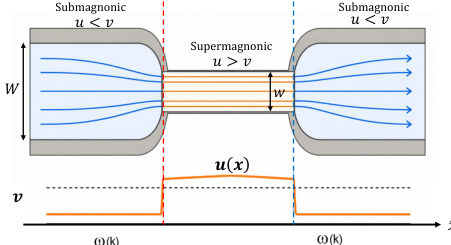 
FIG. 1. Schematic setup for black-hole (B-H) and white-hole (W-H) horizons in an antiferromagnetic system induced by a geometrical constriction, w ≪W , and an applied spin current. The central region hosts a supermagnonic regime (u &gt; v), whereas the outer regions remain submagnonic (u &lt; v). The lower panel displays the spatial profile of the effective flow velocity u(x), with the horizons located at the transition between both regimes.

📷 Fig 2

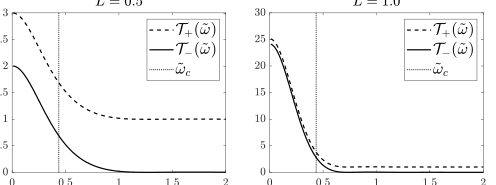 
FIG. 3. Negative T−(˜ω) and positive T+(˜ω) transmission co- efficients for different cavity ˜L ≡L/a, with ˜u2 ≡u2/v = 0.9 and ˜u1 ≡u1/v = u3/v = 1.1.In this configuration, the dimen- sionless critical frequency is given by ˜ωc ≡ωc/m = 0.4359.

📷 Fig 3

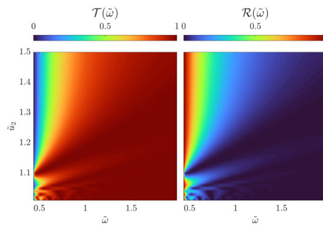 
FIG. 2. Transmission and reflection coefficient for BH-WH cavity, as a function of dimensionless supermagnonic velocity ˜u2 ≡u2/v and frequency ˜ω ≡ω/m, for L = a and ˜u1 ≡ u1/v = u3/v = 0.9.

📷 Fig 4

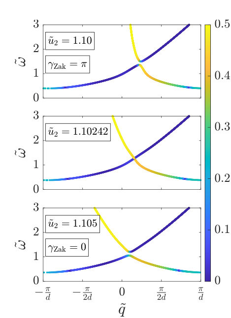 
FIG. 4. Band structure for different supermagnonic flux, and their topological Zak phase for ˜La = ˜Lb = 1.0, ˜u1 = 0.9 and ˜d = ˜La + ˜Lb. The dimensionless wave-number is defined as ˜q = qa. The colorbar indicates the relative presence of antimagnonic waves in the band, fAM.

📷 Fig 5

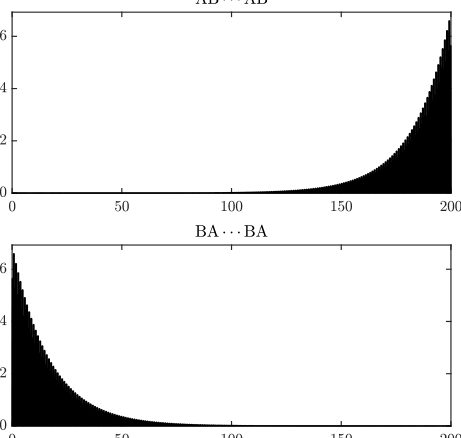 
FIG. 5. Spatial profile of the edge-state density, |ϕ(x)|2, at ˜ω = 1.365 for the topologically nontrivial phase (˜u2 = 1.10). The upper panel shows the edge state for the finite AB...AB chain configuration, whereas the the lower panel shows the corresponding edge state for the inverted BA...BA chain. Here, A and B denote the submagnonic and supermagnonic regions, respectively. Here, we have defined d = La + Lb.

**Summary.** This work connects analogue-horizon physics to topological magnonics by modeling spin waves in antiferromagnets subjected to inhomogeneous spin currents. The key finding is that creating periodic structures with supermagnonic regions induces topological phase transitions, leading to robust, electrically tunable edge states. This provides a novel platform for controlling spin-wave band topology.

**Why it may be interesting.** The direct analogy drawn between analogue horizons (a concept from general relativity/fluid dynamics) and topological band theory in a solid-state magnetic system is highly relevant for understanding engineered quantum phenomena in condensed matter.

Detailed structure

**Main problem.** The paper aims to establish a direct connection between analogue-horizon physics and topological magnonics, providing an electrically tunable method to control magnonic band topology.

**Main result.** A periodic arrangement of sub- and supermagnonic regions forms a non-reciprocal magnonic crystal that exhibits topological transitions, characterized by a change in the Zak phase and the emergence of hybrid magnon-antimagnon edge states.

**Method.** The analysis uses continuum models derived from spin wave dynamics, employing transfer matrix formalism and Bloch's theorem to analyze band structures and topological invariants like the Zak phase.

**Model / system.** The system is based on antiferromagnetic spin waves, whose low-energy dynamics map onto a massive Klein-Gordon scalar field. The physics is governed by the interplay between spin current-induced flow and the resulting formation of magnonic black- and white-hole horizons.

**Key observables.** Reflection (R) and Transmission (T) coefficients, the Zak phase, and the existence of hybrid magnon-antimagnon edge states.

**Important parameters / regimes.** The relative flow velocity ($u$) compared to the wave velocity ($v$), which determines the supermagnonic regime ($u>v$) necessary for topological transitions.

**Assumptions / limitations.** The analysis often assumes a conservative limit (ignoring dissipation) and relies on piecewise constant flow profiles for cavity modeling.

**Figures summary.** Figures illustrate the schematic setup of horizons, the R/T coefficients for cavities, the band structure evolution with supermagnonic flux, and the spatial profile of the localized edge state.

**Paper structure.** The paper progresses from defining the physical platform (spin waves/Klein-Gordon equation) to analyzing single-horizon physics, then extending to cavity configurations (BH-WH), and finally analyzing the periodic array using transfer matrices to quantify topological transitions.

Abstract

The low-energy dynamics of antiferromagnetic spin waves map onto a massive Klein-Gordon scalar field, providing a solid-state platform for analogue-horizon physics. We show that an inhomogeneous spin current generates an effective magnon flow capable of forming black- and white-hole horizons. Horizon-pair cavities exhibit resonant transport and superradiant-like amplification mediated by magnon-antimagnon mixing. Our central result is that a periodic arrangement of submagnonic and supermagnonic regions forms a non-reciprocal magnonic crystal in which entering the supermagnonic regime makes negative-norm propagating channels available and enables the bulk gap to close and reopen. This drives a topological transition characterized by a change in the Zak phase and the emergence of a hybrid magnon-antimagnon edge state. These results establish a direct connection between analogue-horizon physics and topological magnonics, providing an electrically tunable route for controlling magnonic band topology.

[↑ back to top](#top)

### [Weak coupling theory of nickel-based 327 superconductors](http://arxiv.org/abs/2608.22759v1)

**Authors:** Miao Jianjian, Chen Weiqiang  
**Type:** theory · **Category:** strongly correlated electrons · **PDF:** <https://arxiv.org/pdf/2608.22759v1>  
**Analysis basis:** full PDF text, analyzed in chunks
**Topic relevance:** `Keldysh / 2PI / non-Gaussian methods` **3/5**

📷 Fig 1

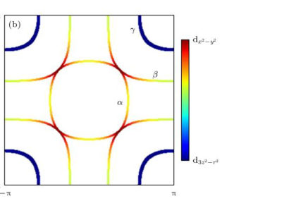 
Fig. 1 (a) The band structure and (b) the Fermi surface of the bilayer two-orbital

📷 Fig 2

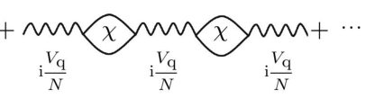 
Fig. 2 Feynman diagram expansion of the effective interaction. The single wavy

📷 Fig 3

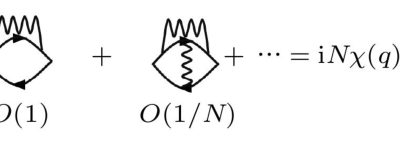 
Fig. 3 Feynman diagram expansion of the polarization bubble, where solid lines with arrows represent the electron Green's function.

📷 Fig 4

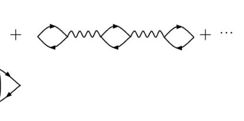 
Fig. 4 Feynman diagram expansion of the susceptibility at the RPA level. The second line shows the Feynman diagram representation of the Dyson equation.

📷 Fig 5

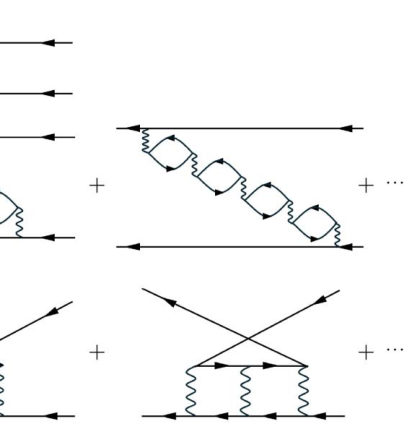 
Fig. 5 Feynman diagram expansion of the effective pairing interaction 𝛤𝑘𝑞 at the

**Summary.** This review surveys weak-coupling theories to explain superconductivity in nickelate superconductors. It models the system using a two-orbital Hubbard Hamiltonian and employs methods like RPA and FRG to analyze electronic instabilities. The consensus points to spin-fluctuation-mediated pairing with an $s_{\pm}$-wave symmetry, highlighting the importance of Fermi surface nesting in the $\gamma$ pocket.

**Why it may be interesting.** The detailed application of advanced many-body techniques like FRG and RPA to a novel high-Tc platform (nickelates) provides a rich theoretical framework for understanding unconventional pairing mechanisms, which is highly relevant to strongly correlated electron physics.

Detailed structure

**Main problem.** The paper aims to understand the mechanism and symmetry of emergent superconductivity in pressurized nickelate bilayer systems, specifically $	ext{La}_3	ext{Ni}_2	ext{O}_7$.

**Main result.** Weak-coupling theories consistently predict spin-fluctuation-mediated pairing, leading to an $s_{\pm}$-wave superconducting symmetry, with the $\gamma$ pocket derived from the $d_{3z^2-r^2}$ orbital being crucial.

**Method.** The study surveys and applies weak-coupling theoretical frameworks, including the Random Phase Approximation (RPA), the Fluctuation-Exchange Approximation (FLEX), and the Functional Renormalization Group (FRG).

**Model / system.** The system is modeled by a two-orbital Hubbard Hamiltonian on a bilayer square lattice, incorporating intra-orbital ($U$) and inter-orbital ($V$) repulsion, and Hund's coupling ($J_H$).

**Key observables.** Superconducting pairing symmetry ($s_{\pm}$-wave), spin/charge susceptibilities ($\chi_m, \chi_c$), and the superconducting gap function.

**Important parameters / regimes.** The interaction strength ($U$) relative to the bandwidth, and the pressure applied to the material.

**Assumptions / limitations.** The primary assumption is that weak-coupling theories are applicable, although the paper notes the need to integrate with strong-coupling pictures.

**Figures summary.** Figures illustrate the band structure and Fermi surface topology of the bilayer model, and diagrams detail the Feynman expansion used in RPA calculations.

**Paper structure.** The paper reviews the theoretical landscape, detailing the application of RPA, FLEX, and FRG to analyze instabilities. It focuses on how spin fluctuations, particularly those involving the $\gamma$ pocket, drive the predicted $s_{\pm}$-wave pairing symmetry.

Abstract

This review provides a comprehensive survey of weak-coupling theoretical approaches applied to understand the emergent superconductivity in the pressurized nickelate bilayer system $La_{3}Ni_{2}O_{7}$. Following the landmark discovery of its high-Tc superconductivity under pressure, this material has rapidly become a new paradigmatic platform in the field of unconventional superconductivity, joining cuprates and iron-based systems. We focus on three pivotal theoretical frameworks: the random phase approximation (RPA), the fluctuation-exchange approximation (FLEX), and the functional renormalization group (FRG). These methods are deployed to analyze the effective pairing interactions and emergent instabilities arising from the low-energy electronic structure, which is commonly modeled by a bilayer two-orbital Hubbard Hamiltonian incorporating the Ni $d_{x^2-y^2}$ and $d_{3z^2-r^2}$ orbitals.

[↑ back to top](#top)

### [A Comprehensive Study of Charge-Carrier Mobility in Double Lateral-Gate Silicon Junctionless Transistors](http://arxiv.org/abs/2608.22257v1)

**Authors:** Farhad Larki, Arash Dehzangi  
**Type:** both · **Category:** other · **PDF:** <https://arxiv.org/pdf/2608.22257v1>  
**Analysis basis:** full PDF text, analyzed in chunks
**Topic relevance:** `Keldysh / 2PI / non-Gaussian methods` **2/5** · `analog quantum simulation` **2/5** · `driven-dissipative phase transition` **2/5** · `methods for driven-dissipative` **2/5** · `non-equilibrium universality` **2/5** · `quantum measurements` **1/5**

📷 Fig 1

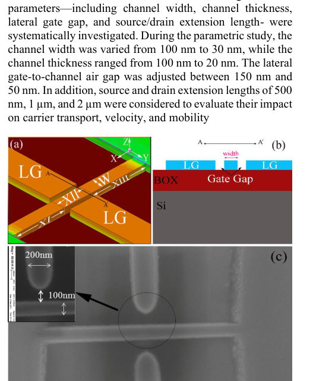 
Fig. 1 (a) Isometric schematic of the device, illustrating the configuration of the lateral gates and the silicon channel. The device width and various cross-sectional directions consist of source extension XI, channel region (XII) and drain extensions (XIII) are indicated. (b) Cross-sectional view along A–A′showing the gate gap, lateral gates (LG), and silicon channel on a BOX layer, representing a typical SOI structure. (c) SEM image of the fabricated device confirming the alignment and geometry of the lateral gates relative to the source and drain regions.

📷 Fig 2

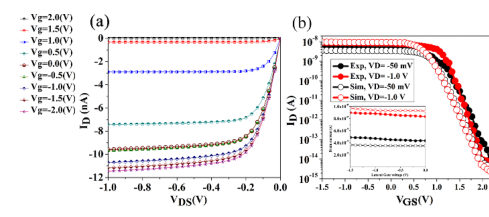 
Fig. 2(a) Simulated ID-VDS with VGS varied from -2V to +2V and (b) comparison of the measured and simulation ID x VGS curves with VDS of -50 mV and -1.0 V. The inset shows the on state region of the device.

📷 Fig 3

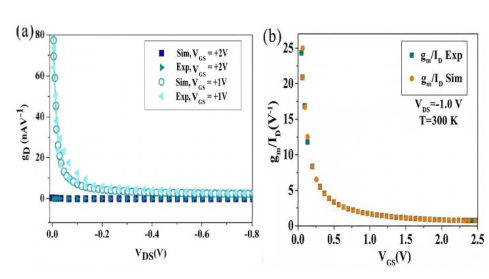 
Fig. 3 Drain conductance gD x VDS and (inset) transconductance gm/ID of the fabricated and simulated device.

📷 Fig 4

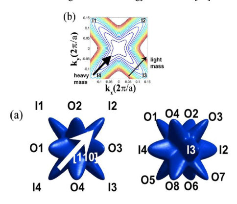 
Fig. 4 (a) Top and side view of bulk heavy hole (HH) Iso-surfaces under no stress and (b) iso-energy contour separated by 25 meV in the (001) plane for the lowest energy hole band under no stress condition (modified from [36]).

📷 Fig 5

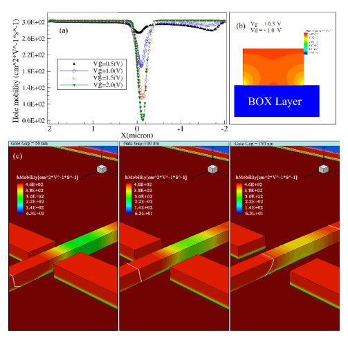 
Fig 5. (a) Hole mobility along a horizontal cut line at the center of the channel (Z= 50 nm) along the X-axis at gate voltage of +0.5, +1.0 , +1.5, +2.0 V and (b) a vertical cut at y= 0 at VDS= -1.0 V, VGS= +0.5 V. (c) an isometric view of hole mobility for devices with different gate gap of 50, 100, and 150 nm in the pinch off region, VGS = +2.0 V and VDS = −1.0 V.

**Summary.** This work comprehensively investigates charge-carrier mobility in advanced silicon junctionless transistors using a combination of experimental measurements and 3D TCAD simulations. The authors analyze how scaling the device geometry—specifically channel width and thickness—affects hole transport, revealing a critical trade-off between achieving high mobility and maximizing carrier drift velocity. The findings provide crucial guidelines for designing next-generation nanoscale electronic devices.

**Why it may be interesting.** While focused on solid-state electronics, the detailed modeling of non-equilibrium carrier transport, confinement effects, and scattering mechanisms shares mathematical parallels with open quantum systems or strongly coupled mesoscopic physics.

Detailed structure

**Main problem.** The study aims to provide a comprehensive understanding of charge-carrier mobility in p-type silicon double lateral-gate junctionless transistors (DLGJLTs). It seeks to establish design guidelines by analyzing how device geometry influences charge transport.

**Main result.** The paper details a mobility-velocity trade-off: while narrower channels increase drift velocity, they degrade mobility due to enhanced confinement and scattering. Optimal performance requires balancing channel width and thickness.

**Method.** The research combines experimental electrical characterization with advanced three-dimensional TCAD Sentaurus simulations using a hydrodynamic transport model.

**Model / system.** The physical system is a p-type silicon DLGJLT built on SOI substrates using AFM nanolithography. The analysis models hole transport, considering effects like carrier heating, non-equilibrium transport, and geometric confinement.

**Key observables.** Charge-carrier mobility, hole velocity, output/transfer characteristics ($I_D-V_{DS}$, $I_D-V_{GS}$), and drain conductance ($g_D$).

**Important parameters / regimes.** Channel width (30 nm to 100 nm), channel thickness (20 nm to 100 nm), and gate-to-channel air gap (50 nm to 150 nm).

**Assumptions / limitations.** The hydrodynamic model is used for high-field transport, and discrepancies between simulation and experiment are attributed to non-ideal interface effects like fixed charges.

**Figures summary.** Figures illustrate the device schematic, simulated output/transfer characteristics comparing theory and experiment, and plots showing hole mobility dependence on gate bias and confinement.

**Paper structure.** The paper progresses from presenting the device structure and basic electrical characterization to detailed simulation studies analyzing the impact of geometric scaling (width, thickness) on carrier transport mechanisms and mobility.

Abstract

We give in depth overview of charge-carrier mobility in p-type silicon double lateral-gate junctionless transistors (DLGJLT) through a mix of computer simulations and experimental results. The devices were built on low-doped silicon-on-insulator substrates using atomic force microscope nanolithography. Because the design uses air-gap side gates instead of a gate-oxide layer or junction, it allows electrical current to flow through a lightly doped silicon channel. This setup reduces impurity scattering and protects transport quality from interface damage. We used three-dimensional TCAD Sentaurus simulation tool to model the device's electrical behavior and confirm our experimental data for transconductance and drain conductance. We attempt to give a comprehensive view on the charge transition within the device.

[↑ back to top](#top)

### [Electrostatic control of Li+ density and transport rate in double-gated van der Waals devices](http://arxiv.org/abs/2608.23227v1)

**Authors:** E. Hoenig, X. Zhang, C. Li, J. Tong, G. Chen, L. Chen, D. Domaretskiy, D. R. da Costa, F. M. Peeters, M. Lozada-Hidalgo  
**Type:** experiment · **Category:** other · **PDF:** <https://arxiv.org/pdf/2608.23227v1>  
**Analysis basis:** full PDF text, analyzed in chunks
**Topic relevance:** `analog quantum simulation` **2/5** · `driven-dissipative phase transition` **2/5** · `non-equilibrium universality` **2/5** · `quantum measurements` **2/5** · `Frenkel-Kontorova` **1/5** · `Keldysh / 2PI / non-Gaussian methods` **1/5** · `methods for driven-dissipative` **1/5**

📷 Fig 1

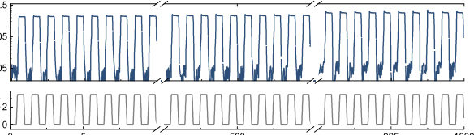 
Fig. 1. Control of Li+ transport in double-gated FLG/MoS2 devices. a, Schematic of few-layer graphene (FLG) devices. b, Charge-discharge curves as a function of ΣV = Vb + Vt for FLG (red), MoS2 (yellow) and sealed FLG (grey) devices under constant ΔV = Vb – Vt = 0.2 V for FLG and sealed FLG and ΔV =0.4 V for MoS2. Arrows indicate the scanning direction. Inset, data from the main panel in log scale. c, ΔV dependence of ionic current for a typical FLG device under constant ΣV = 2 V, with the different data sets corresponding to ON (red) and OFF (grey). Grey dashed lines, linear fits to data. Inset, charge-discharge curves for ΔV = 0.1-0.3 V. Red and grey circles mark current at ΣV = 2 V for...

📷 Fig 2

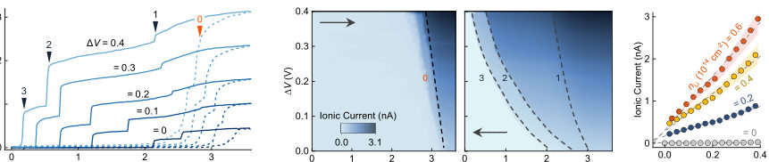 
Fig. 2. Maps of Li+ and electronic transport for FLG devices. a, Electronic current, I, versus ΣV = Vb + Vt at constant ΔV = Vb − Vt = 0.2 V. Orange and blue triangles, charge and discharge events, respectively; shown as peaks in panels b and c. Vertical line, position of the neutrality point (NP). Dashed orange and solid blue curves, intercalation (forward) and deintercalation (backward) sweeps. b, Background-subtracted electronic differential conductance, dI/d(ΣV), obtained from panel a. Each peak corresponds to an electronic charge–discharge event, and the area under the peak quantifies the event’s charge, Δn. c, Maps of electronic differential conductance vs. ΣV and ΔV. Left,...

📷 Fig 3

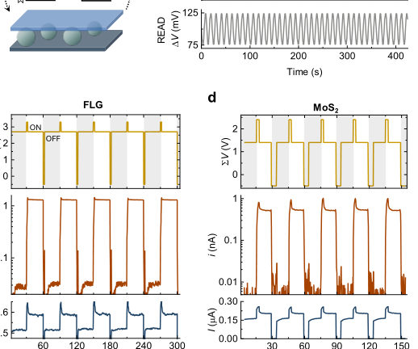 
Fig. 3. Independent control of charge and electric field enables precise logic and memory devices. a, Schematic of the signal protocol. ΣV and ΔV are set as the digital WRITE and analogue READ inputs, respectively. The schematic shows that the system is ON (OFF) when a high (low) pulse is applied to ΣV, charging (discharging) Li+ ions (shown as grey spheres) in the hBN/FLG interface (shown as planes). A small AC bias (50 mV peak-to-peak) is applied to the top gate to continuously tune the READ input. A small in-plane bias, Vds, is applied to readout electronic conductance, with the source connected to ground. b, Combined WRITE-READ process. A small AC bias is applied to the top gate,...

**Summary.** This work demonstrates that double-gating van der Waals devices allow for independent electrostatic control over both the density and the transport rate of $	ext{Li}^+$ ions. By utilizing two gate voltages, the system operates in a two-dimensional control space, enabling the creation of stable, high-performance hybrid ionic-electronic transistors for energy storage and computing.

**Why it may be interesting.** While focused on solid-state ionics, the concept of independently tuning two degrees of freedom ($\Sigma V$ and $\Delta V$) to control transport dynamics echoes concepts in open quantum systems where multiple external fields can decouple control parameters.

Detailed structure

**Main problem.** To achieve independent control over both the ionic density and the ionic transport rate in layered materials, moving beyond the conventional one-dimensional control space limited by a single applied potential.

**Main result.** The study demonstrated a two-dimensional control space for ion transport using double-gated van der Waals devices, enabling the device to function as a hybrid ionic-electronic transistor with high cycle stability.

**Method.** The researchers measured ionic current and electronic response using double-gating techniques on van der Waals heterostructures, analyzing hysteresis and temperature dependence.

**Model / system.** The physical system is a double-gated van der Waals device (e.g., FLG/hBN/electrolyte) where $	ext{Li}^+$ ions intercalate. The control is achieved by independently tuning the charge density ($\Sigma V$) and the electrochemical potential drop ($\Delta V$).

**Key observables.** Ionic current ($i$), electronic current ($I$), hysteresis loops, plateau current, and activation energies ($E_a$).

**Important parameters / regimes.** Double-gating voltages ($\Sigma V, \Delta V$), ionic density ($n_{	ext{Li}}$), and switching cycle count ($>1,000$ cycles).

**Assumptions / limitations.** The analysis assumes that $\Sigma V$ controls the charge density and $\Delta V$ controls the electrochemical potential drop, allowing for independent tuning.

**Figures summary.** Figures illustrate charge-discharge hysteresis, the dependence of ionic current on $\Delta V$ at fixed $\Sigma V$, temperature dependence of the plateau current, and long-term cycle stability tests.

**Paper structure.** The paper systematically presents measurements showing the decoupling of ionic density control ($\Sigma V$) from ionic transport rate control ($\Delta V$), followed by characterization of device performance as a transistor and memory element.

Abstract

Ion transport in crystalline hosts is controlled by an applied potential that simultaneously sets ionic distribution and transport rate, restricting operation to a one-dimensional control space. Here we show that the transport rate of Li+ ions in double-gated van der Waals devices can be modulated while the system occupies fixed ionic-density states. We measure the ionic current along the van der Waals interface between hexagonal boron nitride and graphene or MoS2 while simultaneously monitoring the in-plane electronic response. The ionic current exhibits pronounced hysteresis, with plateaus marking discrete ionic-density states balanced by electronic charge, while an independently tuneable electrochemical-potential drop controls the ionic transport rate. The devices sustain over 1,000 switching cycles and function as hybrid ionic-electronic transistors capable of logic operations and memory retention, with ON/OFF ratios exceeding two orders of magnitude. This work demonstrates a two-dimensional control space for ion transport in layered materials, opening new operating regimes for energy storage and ion-based computing.

[↑ back to top](#top)

### [Bifurcation structure and mesa pattern formation in a one-component nonlocal adhesion model with population pressure and degenerate mobility](http://arxiv.org/abs/2608.22844v1)

**Authors:** Shimpei Makida, Hideki Murakawa  
**Type:** theory · **Category:** statistical mechanics · **PDF:** <https://arxiv.org/pdf/2608.22844v1>  
**Analysis basis:** full PDF text, analyzed in chunks
**Topic relevance:** `analog quantum simulation` **2/5** · `driven-dissipative phase transition` **2/5** · `non-equilibrium universality` **2/5** · `Frenkel-Kontorova` **1/5** · `Keldysh / 2PI / non-Gaussian methods` **1/5** · `correlated / nonlocal dissipation` **1/5** · `methods for driven-dissipative` **1/5**

📷 Fig 1

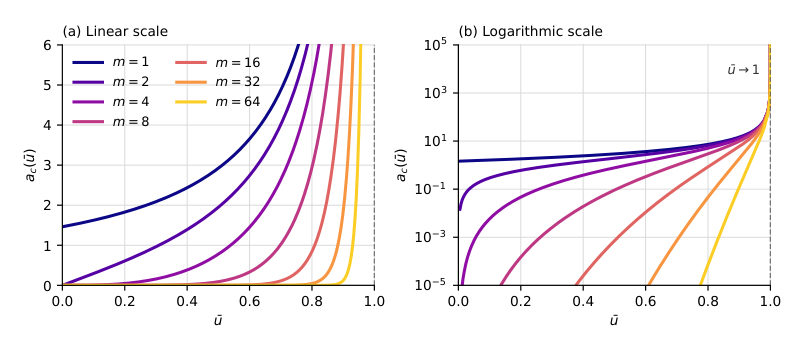 
Figure 1: Dependence of the critical adhesion strength ac(¯u) on the mean density ¯u and the nonlinear exponent m. The tent kernel in (2.2) is used, with L = 1.5 and Ω= [−L, L). For the nonzero admissible wavenumbers, bKmax = maxk∈(π/L)Z\{0} bK(k) = 27/(4π2), and ac(¯u) = m¯um−1/{(1 −¯um)bKmax}. Panel (a) shows the dependence on m at low to moderate mean densities on a linear scale, whereas panel (b) shows the divergence of ac(¯u) as ¯u →1 on a logarithmic scale.

📷 Fig 2

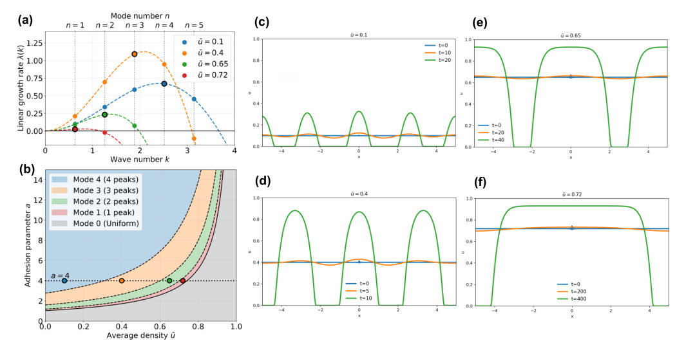 
Figure 2: Shift of the fastest-growing mode toward lower wavenumbers with increasing mean density for the tent kernel (2.2), with L = 5 fixed. (a) Linear growth rate λ(k) for different mean densities ¯u, with the adhesion strength fixed at a = 4. The dotted curves show the growth rate when k is treated as a continuous variable, and the circles indicate the admissible modes kn = nπ/L on the periodic domain. The black circles indicate the fastest-growing modes. As ¯u increases, the mode with the maximum growth rate shifts toward lower wavenumbers. (b) Linear mode-selection phase diagram in the (a, ¯u) plane. The horizontal line indicates a = 4, and the black circles indicate the mean...

📷 Fig 3

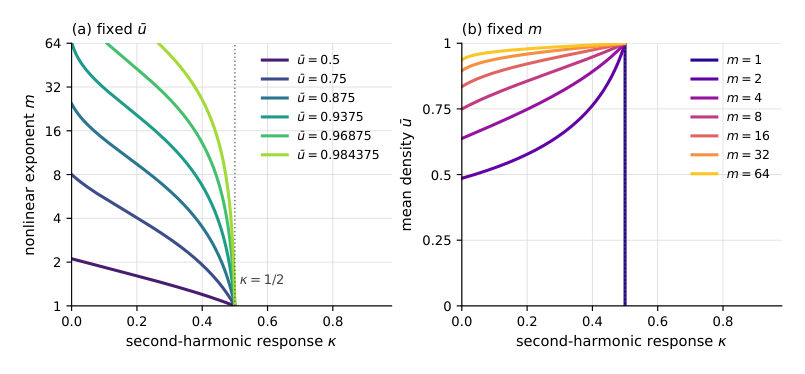 
Figure 3: Critical curves B(m, ¯u, κ) = 0 across which the Landau coefficient cL changes sign. (a) Critical curves in the (κ, m) plane for ¯u = 1/2, 3/4, 7/8, 15/16, 31/32, 63/64. (b) Critical curves in the (κ, ¯u) plane for m = 1, 2, 4, 8, 16, 32, 64. The dashed line indicates κ = 1/2.

📷 Fig 4

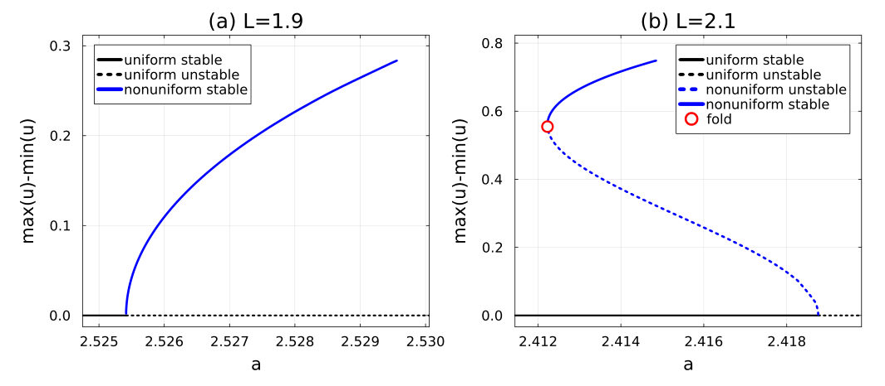 
Figure 4: Bifurcation diagrams for the tent kernel with m = 1, ¯u = 1/2, and R = 1: (a) L = 1.9 and (b) L = 2.1. The horizontal axis represents the adhesion strength a, and the vertical axis represents the magnitude of the spatial heterogeneity, max(u)−min(u). The black curves represent the homogeneous branch, and the blue curves represent the nonhomogeneous branch. Solid curves indicate stable branches, whereas dashed curves indicate unstable branches. The red open circle indicates the fold point.

📷 Fig 5

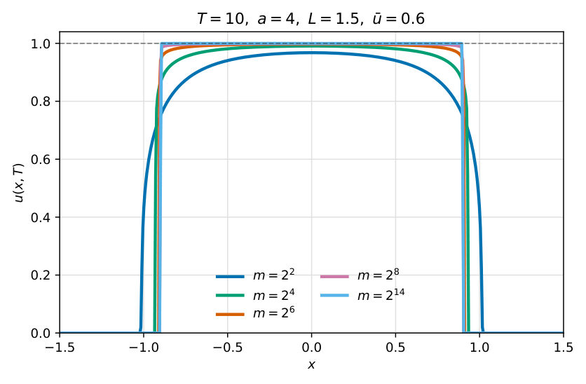 
Figure 5: Mesa pattern formation with increasing nonlinear exponent m. The parameters are ¯u = 0.6, a = 4, L = 1.5, and R = 1, and the profiles u(x, T) are shown at T = 10. The dashed line indicates the capacity limit u = 1.

**Summary.** This paper rigorously studies pattern formation in a nonlocal adhesion model describing cell density. It uses linear and nonlinear stability analyses to determine when and how patterns like 'mesas' emerge from a uniform state. The work connects the dynamics to the minimization of an energy functional, proving that the stable patterns correspond to extreme, highly structured configurations.

**Why it may be interesting.** While focused on cell adhesion, the mathematical techniques—such as analyzing pattern formation via bifurcation theory, energy minimization, and $\Gamma$-convergence—are highly relevant to understanding phase transitions and pattern selection in complex many-body systems, including those modeled in AMO physics.

Detailed structure

**Main problem.** The paper analyzes pattern formation, specifically the emergence of 'mesa patterns,' from a homogeneous steady state in a nonlocal adhesion model.

**Main result.** The bifurcation structure (supercritical vs. subcritical) depends on the mean density and nonlinear exponent, and the resulting stable patterns are characterized as capacity-constrained structures (mesa profiles).

**Method.** The analysis employs linear stability analysis to find instability thresholds, followed by weakly nonlinear analysis to derive amplitude equations (Stuart-Landau) and numerical bifurcation tracking.

**Model / system.** The system is a one-component nonlocal adhesion model describing cell density u(x, t), governed by a degenerate diffusion/advection equation incorporating population pressure and nonlocal adhesion via a kernel K.

**Key observables.** Instability threshold ($a_c$), Landau coefficient ($c_L$), and the resulting mesa profiles (saturated regions separated by low-density regions).

**Important parameters / regimes.** Adhesion strength ($a$), mean density ($ar{u}$), nonlinear exponent ($m$), and the nonlocal kernel properties.

**Assumptions / limitations.** The analysis relies on the capacity constraint ($0 \le u \le 1$) and utilizes $\Gamma$-convergence to relate the finite-$m$ energy functional to a limiting energy functional $E_\infty$.

**Figures summary.** Figures illustrate the dependence of the critical adhesion strength $a_c(ar{u})$ on $ar{u}$ and $m$, and bifurcation diagrams showing the stability of homogeneous and nonhomogeneous branches.

**Paper structure.** The paper follows a progression from linear stability analysis to deriving amplitude equations, then analyzing the bifurcation structure, and finally proving the connection between the energy minimization limit ($m 	o \infty$) and the observed mesa patterns.

Abstract

We analyze pattern formation from a homogeneous steady state in a one-component nonlocal adhesion model with population pressure and degenerate mobility. First, using linear stability analysis, we derive the instability threshold and a selection rule for the fastest-growing mode, and elucidate the mechanism by which the selected wavenumber shifts toward lower wavenumbers as the mean density increases. We then perform a weakly nonlinear analysis near the critical adhesion strength and derive an explicit expression for the Landau coefficient in the Stuart--Landau equation. This expression shows that the critical bifurcation is classified as supercritical or subcritical according to the mean density, the nonlinear exponent, and the second-harmonic response ratio of the kernel. Furthermore, we show that a large nonlinear exponent promotes a transition to subcriticality and confirm, through numerical bifurcation analysis and time-dependent simulations, a bifurcation structure with a fold point and the formation of mesa patterns. Finally, through the energy limit as \(m\to\infty\), we relate the observed mesa profiles to a capacity-constrained limiting structure.

[↑ back to top](#top)

### [Displacement-field-driven reconstruction of low energy transport in few-layer PtSe2](http://arxiv.org/abs/2608.23003v1)

**Authors:** Xiao Liu, Yaroslav Zhumagulov, Yuang Jie, Ahmet Enes Bozcali, Johan Felisaz, Qi Zhang, Oldvrich Cicvarek, Kenji Watanabe, Takashi Taniguchi, Zdeněk Sofer, Oleg V. Yazyev, Ahmet Avsar  
**Type:** both · **Category:** other · **PDF:** <https://arxiv.org/pdf/2608.23003v1>  
**Analysis basis:** full PDF text, analyzed in chunks
**Topic relevance:** `Keldysh / 2PI / non-Gaussian methods` **2/5** · `methods for driven-dissipative` **2/5** · `analog quantum simulation` **1/5** · `driven-dissipative phase transition` **1/5** · `non-equilibrium universality` **1/5** · `quantum measurements` **1/5**

📷 Fig 1

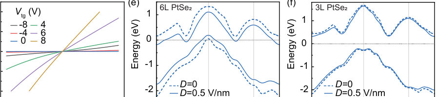 
FIG. 1. Device structure and basic transport characteristics of six-layer PtSe2. (a) Schematic of the dual-gated few-layer PtSe2 device. The PtSe2 channel is placed on pre-patterned Pt contact electrodes and encapsulated by top and bottom hBN layers. A Ti/Au top gate and a graphite bottom gate enable dual-gate control of carrier density and out-of-plane displacement field. (b) and (c) Temperature-dependent transfer characteristics of the six- and three-layer devices, respectively, measured from 20 to 300 K at Vbg = 0 V and Vbias = 0.2 V. (d) Output characteristics measured at 100 K and Vbg = 0 V for different Vtg values. (e) and (f) Schematic low-energy band structures of six- and...

📷 Fig 2

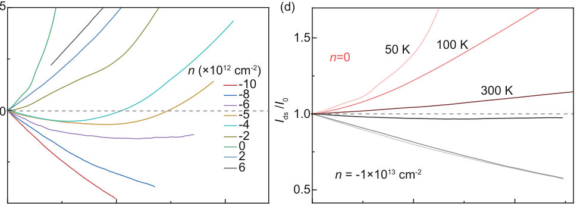 
FIG. 3. Displacement-field modulation of transport in six-layer PtSe2. (a) Current map measured at 50 K as a function of carrier density n and displacement field D, with Vbias = 0.5 V. With increasing D, the current near charge neutrality increases. (b) Horizontal line cuts from the map in (a), showing the current as a function of n at selected D values. Inset: semilog plot zoomed in near the CNP. (c) Vertical line cuts from the map in (a), plotted as normalized current Ids/I0 as a function of D at selected carrier densities. Here I0 denotes the current at D = 0 for each fixed n, either measured directly or obtained by extrapolation. The dashed line marks Ids/I0 = 1. (d) Normalized current...

📷 Fig 3

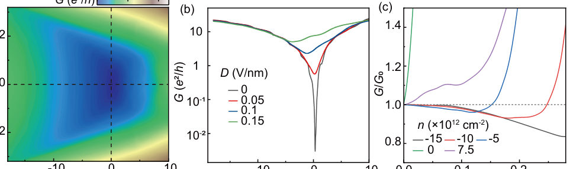 
FIG. 4. Wannier-model conductance of six-layer PtSe2 under a displacement field. (a) Calculated longitudinal conductance G of six-layer PtSe2 as a function of carrier density n and displacement field D. G is normalized by e2/h, where e is the elementary charge and h is Planck’s constant. The dashed lines mark charge neutrality and zero field. (b) Conductance as a function of carrier density at selected displacement fields. (c) Normalized conductance G/G0 as a function of displacement field at selected carrier densities, where G0 is the conductance at zero displacement field for the same carrier density.

**Summary.** This work demonstrates that applying an external perpendicular electric field can fundamentally reconstruct the electronic band structure in few-layer PtSe2, particularly when the material is near a semiconductor-to-semimetal transition. By measuring transport properties, the authors show that this field causes gap closure and modifies valence-band conductivity. This establishes finite-density transport as a sensitive tool for probing field-driven electronic structure engineering beyond simple band-gap control.

**Why it may be interesting.** While focused on solid-state physics, the concept of external fields inducing fundamental changes in electronic band structure and transport properties is relevant to understanding engineered quantum materials and open quantum systems.

Detailed structure

**Main problem.** The study investigates how a perpendicular displacement field modifies the low-energy electronic transport in few-layer semiconductors, focusing on the interplay between the field and interlayer hybridization.

**Main result.** The displacement field strongly reconstructs the low-energy band structure, causing gap suppression near charge neutrality and modifying valence-band conductivity in a thickness-dependent manner.

**Method.** The research combines electrical transport measurements on dual-gated devices with theoretical modeling using Wannier tight-binding calculations.

**Model / system.** The system is few-layer PtSe2, a layered semiconductor whose electronic structure is sensitive to thickness. The theoretical model uses a Wannier Hamiltonian incorporating an out-of-plane electric field term.

**Key observables.** Conductance (G), minimum current, normalized current vs. displacement field (D), and the evolution of the band gap.

**Important parameters / regimes.** Layer thickness (3L vs 6L), temperature (50 K to 300 K), and the magnitude of the perpendicular electric field (D).

**Assumptions / limitations.** The theoretical calculations utilize a fixed-relaxation-time approximation and neglect contact resistance or field-dependent disorder scattering.

**Figures summary.** Figures show device structures, temperature-dependent transfer/output characteristics, current maps, and theoretical conductance plots confirming field-induced band overlap and reconstruction.

**Paper structure.** The paper establishes the physical setup using device measurements, presents the core findings regarding field-induced transport changes in 6L PtSe2, and supports these observations with detailed Wannier model calculations.

Abstract

In layered semiconductors, a perpendicular displacement field generates an interlayer potential difference that competes with interlayer hybridization, modifying both the band gap and the finite-density electronic states that carry current. Resolving this interplay requires a material lying close to the semiconductor-to-semimetal transition, where moderate electric fields can strongly reshape the low-energy electronic structure. Here, we investigate displacement-field-driven transport in dual-gated semiconducting PtSe2, whose pronounced thickness-dependent electronic structure provides access to this low-band-gap regime. Unlike thinner layers, the displacement-field response is strong in six-layer PtSe2, which lies at the verge of the semiconductor-to-semimetal crossover with only a small residual transport gap. Even weak displacement fields rapidly suppress this residual gap near charge neutrality, driving the system toward a band-overlap regime. At the same time, the conductivity decreases in the heavily hole-doped regime, demonstrating that the displacement field modifies not only the gap but also the conducting valence-band states. Fixed-relaxation-time Wannier transport calculations reproduce both responses, showing that they originate from field-induced band overlap together with reconstruction of the valence-band dispersion. These results establish finite-density transport as a sensitive probe of displacement-field-driven electronic structure reconstruction and extend electrical control beyond conventional band-gap engineering.

[↑ back to top](#top)

### [Signatures of localization on the edge of a fractional topological insulator](http://arxiv.org/abs/2608.22520v1)

**Authors:** Yuzhuo Tian, Jinhong Park, Alexander D. Mirlin, Jukka I. Väyrynen  
**Type:** theory · **Category:** strongly correlated electrons · **PDF:** <https://arxiv.org/pdf/2608.22520v1>  
**Analysis basis:** full PDF text, analyzed in chunks
**Topic relevance:** `Keldysh / 2PI / non-Gaussian methods` **2/5** · `methods for driven-dissipative` **2/5** · `analog quantum simulation` **1/5** · `quantum measurements` **1/5**

📷 Fig 1

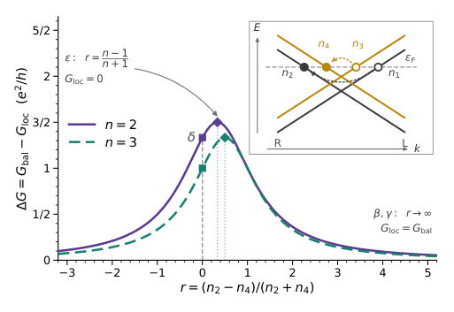 
FIG. 1. Conductance reduction ∆G = Gbal −Gloc, Eq. (59), versus r = (n2 −n4)/(n2 + n4) for n = 2 (solid) and n = 3 (dashed). The maximum (diamonds), Gloc = 0, is reached at r = (n −1)/(n + 1) and corresponds to M sup comp (ϵ phase); squares mark M back (δ) at r = 0, while M 2-el (β) and M sup (γ) have n2 = −n4 and lie at r →∞, where Gloc = Gbal. Inset: schematic energy spectrum of the edge modes, illustrating the scattering process encoded in the null vector M. The integer (dark) and fractional (light) sectors are each represented by a pair of crossing right- (R) and left-moving (L) branches, which cross the Fermi level εF at the four Fermi points corresponding to the modes of the chiral...

📷 Fig 2

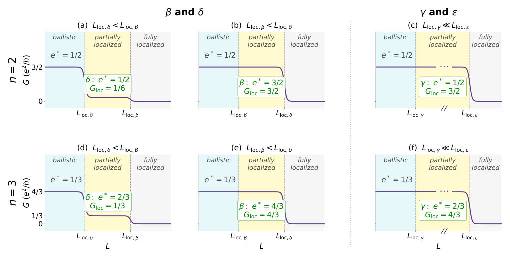 
FIG. 2. Schematic plots for the conductance G through a single edge as a function of the edge length L for different localization scenarios. The upper row (a–c) corresponds to n = 2, and the lower row (d–f) corresponds to n = 3. The column corresponds to different partially localized phases: the Left panels, (a) and (d), show the δ phase associated with the localization channel M back; the middle panels, (b) and (e), show the β phase associated with M 2-el; the right panels (c) and (f) show the γ phase associated with M sup. The δ and β localization channels are mutually compatible, while the γ and ϵ channels form another compatible pair. For each of the partially localized phases, the...

📷 Fig 3

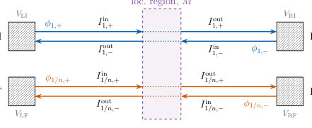 
FIG. 3. Four-terminal setup for the edge of a νFTI = 2(1 ± 1/n) FTI considered in Appendix E 2. The integer modes ϕ1,± (blue) and the fractional modes ϕ1/n,± (orange) are assumed to be spatially separated, so that contacts can be attached to them separately: the terminals LI and RI couple only to the integer modes, LF and RF only to the fractional ones. The applied voltages fix the incoming currents through Eq. (E2). Within the central region, whose length is large compared with ξ, one of the localization channels among M back, M 2-el, and M sup is assumed to be activated, while the four arms are ballistic; the currents entering and leaving this region are those of Eq. (E1). The blocks of...

**Summary.** This theoretical work analyzes how edge states in fractional topological insulators (FTIs) behave when they partially localize. By applying K-matrix formalism, the authors derive unique conductance signatures for three distinct localization channels. This provides a powerful experimental diagnostic tool, allowing researchers to identify the specific physical state of the FTI edge based on transport measurements.

**Why it may be interesting.** The detailed analysis of edge transport in fractional topological systems provides concrete, measurable signatures (conductance vs. charge) that can be compared against experimental measurements in moiré materials, linking abstract topological theory to observable transport physics.

Detailed structure

**Main problem.** The study investigates the transport properties of edges in fractional topological insulators (FTIs) when partial localization occurs.

**Main result.** The combination of measured edge conductance and the minimal quasiparticle charge provides a unique fingerprint to distinguish between three distinct partially localized edge phases.

**Method.** The authors use Wen's K matrix formalism to derive the reduced edge theory for different localization channels, calculating the resulting scattering matrices and conductances.

**Model / system.** The system is an FTI realized in van der Waals moiré materials, characterized by filling factors $\nu_{\text{FTI}} = 2(1\pm 1/n)$. The edge theory involves analyzing the coupling between integer and fractional bosonic fields.

**Key observables.** Edge conductances ($G$), minimal quasiparticle charge ($Q_m$), and the four-terminal conductance matrix ($G$).

**Important parameters / regimes.** Filling factor $\nu_{\text{FTI}}$, integer $n \geq 2$, and the specific localization channels (e.g., backscattering, two-electron tunneling, superconductivity).

**Assumptions / limitations.** Time-Reversal Symmetry (TRS) is preserved, and the analysis relies on the assumption of separate contactability for integer and fractional mode pairs.

**Figures summary.** The notes detail the derivation of scattering matrices ($S$) and conductance ($G$) for the three channels, showing distinct results for the four-terminal conductance matrices.

**Paper structure.** The paper progresses from establishing the general edge theory using K-matrices, to analyzing the conditions for partial localization, and finally calculating the specific conductances and fingerprints for the three identified channels.

Abstract

Recent experiments in van der Waals moiré materials have reported realizations of two-dimensional fractional topological insulators (FTIs). We study transport properties of FTI edges at filling factors $ν_{\text{FTI}} = 2(1\pm 1/n)$ with integer $n \geq 2$ (even or odd), each of which supports four counter-propagating edge modes. The edge modes can undergo partial localization, leaving two of the four edge modes conducting. We identify three distinct partial-localization channels and, for each channel, determine the reduced theory describing the remaining conducting modes, from which we obtain the minimal quasiparticle charge. We further explore transport properties of each partially localized phase and in particular determine the corresponding edge conductances. We demonstrate that measurements of the conductance together with the minimal quasiparticle charge provide a fingerprint that uniquely distinguishes the three partially localized phases.

[↑ back to top](#top)

### [Absence of lateral domain wall mobility in Zn1-xMgxO thin films](http://arxiv.org/abs/2608.23305v1)

**Authors:** Jack Eckstein, Kyle P. Kelley, William Prudnick, Jon-Paul Maria, Stephen Jesse, Neus Domingo, Rama K. Vasudevan  
**Type:** experiment · **Category:** other · **PDF:** <https://arxiv.org/pdf/2608.23305v1>  
**Analysis basis:** full PDF text, analyzed in chunks
**Topic relevance:** `quantum measurements` **2/5** · `Frenkel-Kontorova` **1/5** · `driven-dissipative phase transition` **1/5** · `non-equilibrium universality` **1/5**

📷 Fig 1

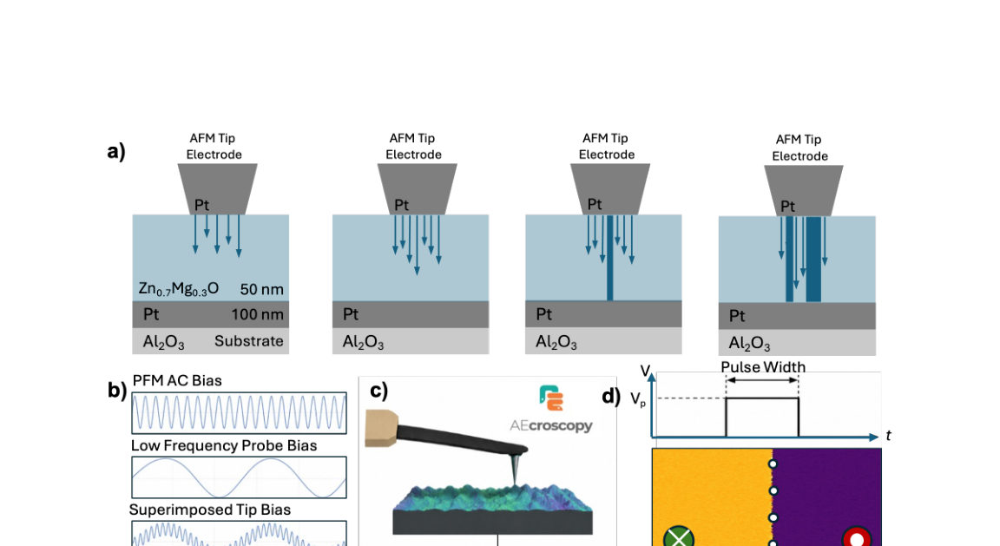 
Figure 1. Experimental approaches for probing domain wall mobility in Zn1-xMgxO. a) Fringing ridge (independent column) model of switching, in which a high density of nuclei at the electrode propagates as independent columns through the film thickness, without lateral wall growth. b) Scanning oscillator PFM (SO-PFM): a low-frequency, high- amplitude drive is mixed with a high-frequency, low-amplitude read signal, and the response at both frequencies is monitored simultaneously and applied to the tip as it is raster across the sample (c). (d) Automated pulse–probe experiments implemented on the AEcroscopy platform, in which pre-existing domain walls are pulsed by the AFM tip with prescribed...

📷 Fig 2

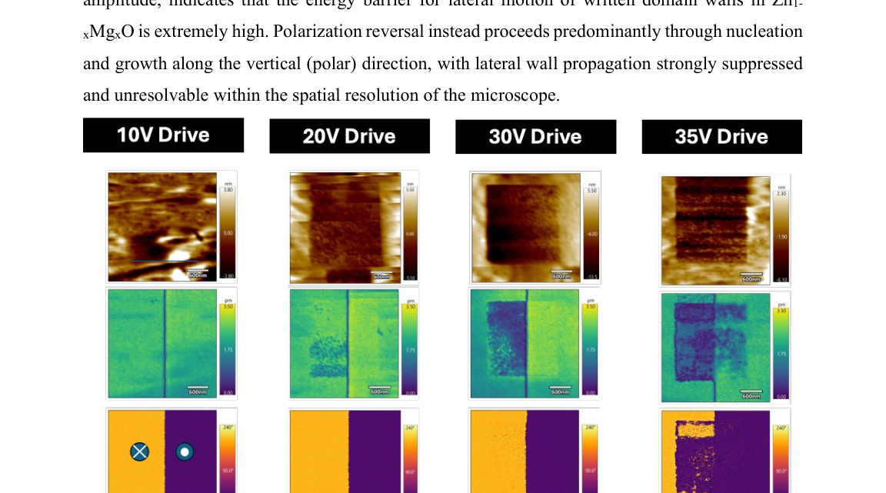 
Figure 2. SO-PFM measurements on Zn0.7Mg0.3O thin films at drive amplitudes of 10, 20, 30, and 35 V (left to right). Topography (top row), PFM amplitude (middle row), and PFM phase (bottom row) acquired after each SO-PFM

📷 Fig 3

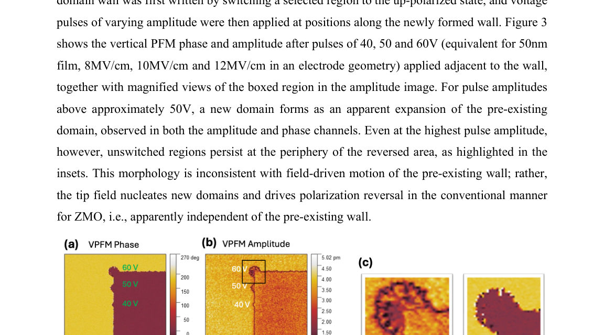 
Figure 3. Effect of a pre-existing domain wall on switching. Vertical PFM phase (a) and amplitude (b) after pulses of 40, 50, and 60 V applied at positions along a written domain wall. (c) Magnified amplitude (left) and phase (right) views of the boxed region in the amplitude image in (b), showing unswitched regions persisting at the periphery of the newly switched domain.

📷 Fig 4

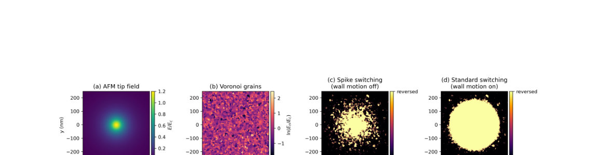 
Figure 4. Spike switching model simulations. (a) AFM tip field E/Ec; (b) map of the grain-resolved nucleation barriers log(En/Ec) generated by Voronoi tessellation; (c) final domain state for spike switching (lateral wall motion off), reproducing the unswitched grains observed experimentally; and (d) standard switching (wall motion on), yielding a compact, near-circular switched domain.

**Summary.** This work investigates the mechanism of ferroelectric switching in $	ext{Zn}_{1-x}	ext{Mg}_x	ext{O}$ thin films, finding that the process is governed by nucleation rather than the lateral movement of domain walls. Using advanced microscopy and modeling, the authors demonstrate that domain walls exhibit negligible mobility, establishing a new, nucleation-dominated switching mechanism for wurtzite ferroelectrics.

**Why it may be interesting.** While the core physics is ferroelectrics, the rigorous, quantitative measurement of domain wall dynamics using advanced microscopy techniques (SO-PFM) and the comparison to theoretical models of phase transitions make it relevant to understanding non-equilibrium dynamics in condensed matter.

Detailed structure

**Main problem.** The study compares the mechanisms of polarization reversal (switching) in wurtzite ferroelectrics ($	ext{Zn}_{1-x}	ext{Mg}_x	ext{O}$) versus classical perovskite ferroelectrics.

**Main result.** Polarization reversal in $	ext{Zn}_{1-x}	ext{Mg}_x	ext{O}$ is found to be dominated by the nucleation of vertically extended columnar filaments, as lateral domain wall mobility is negligible ($<10	ext{nm}$).

**Method.** The research employs advanced local characterization techniques, including scanning oscillator microscopy and point pulse-imaging, complemented by detailed simulations.

**Model / system.** The system is $	ext{Zn}_{1-x}	ext{Mg}_x	ext{O}$ thin films, which are wurtzite ferroelectrics. The analysis contrasts their switching behavior with that of perovskites, modeling the switching process as nucleation-controlled rather than growth-mediated.

**Key observables.** Local switching events, domain wall responses, lateral domain wall displacement, and the comparison of switching kinetics between wurtzite and perovskite systems.

**Important parameters / regimes.** Lateral domain wall mobility (shown to be sub 10 nm), coercive field, and grain size (mean size $\sim 10	ext{ nm}$).

**Assumptions / limitations.** The simulations often neglect elastic and depolarization effects, and the analysis of wall position relies on subtracting electrostatic contributions from the raw measurement signal.

**Figures summary.** Figures demonstrate that when lateral wall motion is disabled in simulations, the results match experimental observations of multiple unswitched grains, supporting the nucleation-dominated model.

**Paper structure.** The paper establishes the fundamental difference in switching mechanisms between perovskites (growth-dominated) and wurtzites. It then uses SO-PFM and pulse-probe methods to experimentally prove the lack of lateral wall movement in $	ext{Zn}_{1-x}	ext{Mg}_x	ext{O}$, culminating in simulations that confirm nucleation-limited switching.

Abstract

Polarization reversal in ferroelectrics arises from the coupled processes of domain nucleation and subsequent growth, yet the governing mechanisms differ fundamentally between classical perovskite oxides and emerging wurtzite ferroelectrics. While switching in perovskites is typically governed by mobile domain walls whose field-driven propagation dominates macroscopic kinetics, here we show that polarization reversal in wurtzite Zn1-xMgxO proceeds through a qualitatively different pathway. Using scanning oscillator microscopy, in combination with point pulse-imaging methods, we directly map local switching events and domain wall responses, revealing that domain walls in Zn1-xMgxO exhibit negligible lateral mobility (sub 10nm) and that polarization reversal proceeds predominantly through the nucleation of vertically extended columnar filaments with a lateral size on the order of the grains. This nucleation-controlled switching contrasts sharply with the growth-mediated dynamics characteristic of perovskite ferroelectrics and explains the abrupt, spatially localized switching behavior observed in wurtzite systems. These results establish nucleation-dominated filamentary reversal as a defining switching mechanism in Zn1-xMgxO and point towards the need for further studies to understand correlation lengths and nucleation processes across a range of grain sizes.

[↑ back to top](#top)

### [Fidelity susceptibility of Su-Schrieffer-Heeger model with further neighbour hopping term](http://arxiv.org/abs/2608.22875v1)

**Authors:** Surajit Mandal, Asim Kumar Ghosh  
**Type:** theory · **Category:** statistical mechanics · **PDF:** <https://arxiv.org/pdf/2608.22875v1>  
**Analysis basis:** full PDF text, analyzed in chunks
**Topic relevance:** `analog quantum simulation` **2/5** · `Frenkel-Kontorova` **1/5** · `quantum measurements` **1/5**

📷 Fig 1

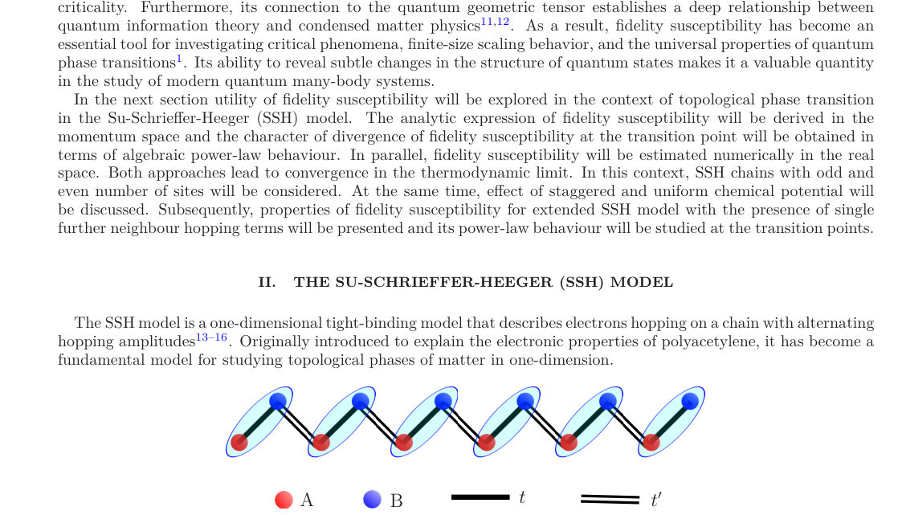 
FIG. 1: Geometry of Su-Schrieffer-Heeger (SSH) model. Two sites marked by A and B constitute unit cell as shown within shaded region.

📷 Fig 2

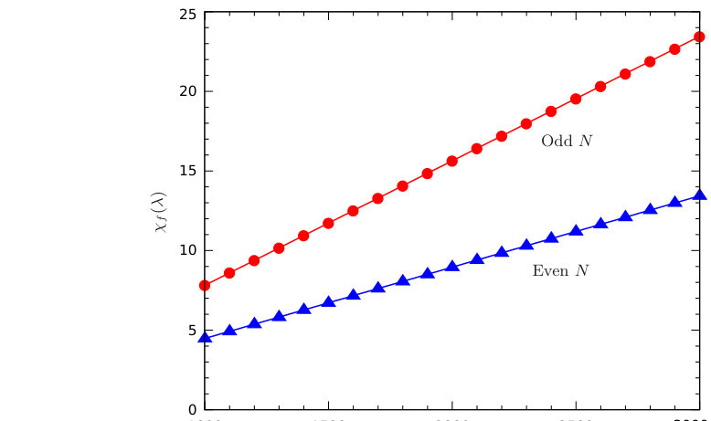 
FIG. 2: Finite size scaling of χf(λ) at the phase transition point (t/t′ = 1) for odd N (red circles) and even N (blue triangles). Straight line fitting are obtained with χf(λ) ≈0.00782N, for odd N and χf(λ) ≈0.00448N, for even N.

📷 Fig 3

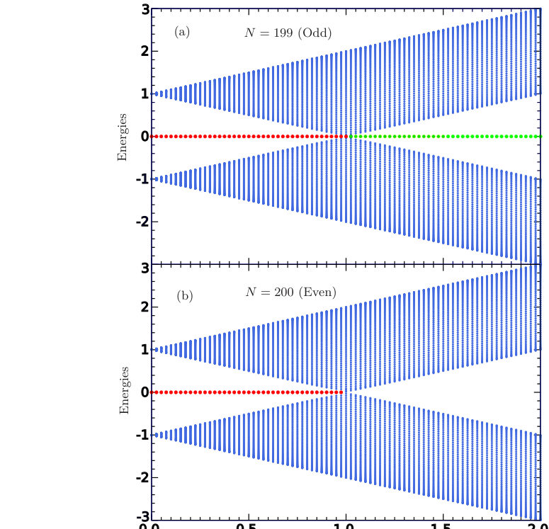 
FIG. 3: Energy spectrum for open SSH chain with respect to t/t′ for odd (a) and even (b) number of N. Zero energy edge modes are shown in red and green spheres.

📷 Fig 4

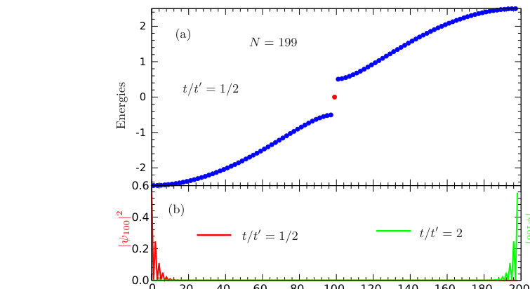 
FIG. 4: (a) Energy spectrum for open SSH chain for odd number of sites, N = 199. Zero-energy edge mode is shown in red sphere. (b) Amplitude density of edge mode, |ψ100|2, in the trivial (red line) and nontrivial (green line) phases.

📷 Fig 5

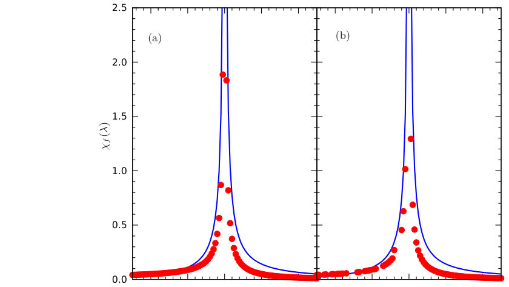 
FIG. 5: Variation of χf(λ) with respect to t/t′ in red circle for N = 1001 (odd N) in (a) and N = 1000 (even N) in (b). Analytic result as given in Eq. 17 is drawn in blue line for both in (a) and (b).

**Summary.** This work applies fidelity susceptibility to study the topological phase transition in the Su-Schrieffer-Heeger model augmented with a further neighbour hopping term. The divergence of $\chi_f$ at critical points confirms the phase transition, and the scaling analysis shows the fundamental physics remains consistent with the standard SSH model. This provides a robust diagnostic tool for characterizing quantum critical points in 1D topological systems.

**Why it may be interesting.** The use of fidelity susceptibility as a diagnostic tool for topological phase transitions is a powerful, non-local measure applicable to many quantum systems, making it relevant for understanding critical points in condensed matter models.

Detailed structure

**Main problem.** The study investigates the topological phase transition in the Su-Schrieffer-Heeger (SSH) model when augmented with a further neighbour hopping term.

**Main result.** The fidelity susceptibility ($\chi_f$) is found to diverge at the phase transition points, and the scaling exponent obtained numerically agrees with that of the standard SSH model.

**Method.** The analysis uses the fidelity susceptibility, derived from the overlap matrix of single-particle eigenstates, to detect quantum critical points.

**Model / system.** The system is the SSH model, a 1D tight-binding model, extended by adding a further neighbour hopping term. The Hamiltonian is analyzed in both momentum space and for finite chains with open boundary conditions.

**Key observables.** Fidelity susceptibility ($\chi_f$), which is sensitive to parameter variations and diverges at phase transitions.

**Important parameters / regimes.** The control parameter is $\lambda = t/t'$, and the study explores the effect of staggered potentials ($\mu$) and the strength of the further neighbour hopping term ($t_0$).

**Assumptions / limitations.** The analysis relies on the non-interacting fermionic nature of the system, allowing the use of Slater determinants for calculating fidelity.

**Figures summary.** Figures illustrate the energy spectrum under different perturbations (staggered potential, FN hopping) and show the variation of $\chi_f(\lambda)$ near the transition points, demonstrating divergence.

**Paper structure.** The paper first establishes the use of fidelity susceptibility to locate phase transitions in the standard SSH model. It then extends the analysis to include a further neighbour hopping term, deriving analytic and numerical expressions for $\chi_f$ to confirm the transition points and analyze scaling behavior.

Abstract

In this study, topological phase transition in Su-Schrieffer-Heeger (SSH) model with a further neighbour hopping term has been studied in terms of fidelity susceptibility. Topological phase transition point in the standard SSH model has been identified before by noting the divergence of fidelity susceptibility. The same approach has been employed here where fidelity susceptibility is found to diverge at the phase transition points. Additionally, effect of staggered potential on the fidelity susceptibility has been explored. Analytic expression for fidelity susceptibility has been obtained along with its numerical estimation on finite chains by exact diagonalization. Fidelity susceptibility exhibits sharp peaks at the phase transition points in both approaches. Scaling exponent of this divergence has been obtained numerically which is found to agree to that of the standard SSH model without further neighbour terms.

[↑ back to top](#top)

### [High Speed Contact-Resonance Tracking using Brownian motion](http://arxiv.org/abs/2608.21528v1)

**Authors:** J. Bemis, R. Proksch  
**Type:** experiment · **Category:** other · **PDF:** <https://arxiv.org/pdf/2608.21528v1>  
**Analysis basis:** full PDF text, analyzed in chunks
**Topic relevance:** `quantum measurements` **2/5** · `driven-dissipative phase transition` **1/5** · `interference shaping light` **1/5**

📷 Fig 1

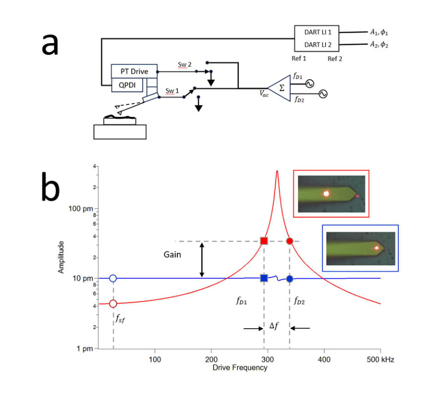 
FIG. 1. (a) Experimental configuration for simultaneous low-frequency interferometric single-frequency (iSF) and interferometric dual-AC resonance-tracking (iDART) measurements. The response is measured at a subresonant frequency fSF and at two frequencies, fD1 and fD2, placed on opposite sides of the contact resonance and separated by Δf. (b) Schematic response for detection near the tip and near the displacement maximum on the cantilever body. The off-resonance responses are comparable, whereas the body-position response is strongly amplified near contact resonance. Insets show the corresponding laser-spot positions.

📷 Fig 2

 
Figure 1 summarizes the measurement principle. As shown in Fig. 1(a), two drive tones at frequencies fD1 and

📷 Fig 3

 
FIG. 2. iDART PFM measurements of a PZT sample acquired at AC bias amplitudes of 400, 100, 25, and 0 mV. Spatial maps show the PFM amplitude (a), phase (b), and contact-resonance frequency (c). The corresponding complex PFM response is plotted in quadrature space for each AC bias (d). The point clouds are offset vertically along the quadrature axis for clarity. Probability-density distributions of the contact- resonance frequency show that the frequency contrast and distribution remain largely unchanged as the AC bias is reduced to zero (e).

📷 Fig 4

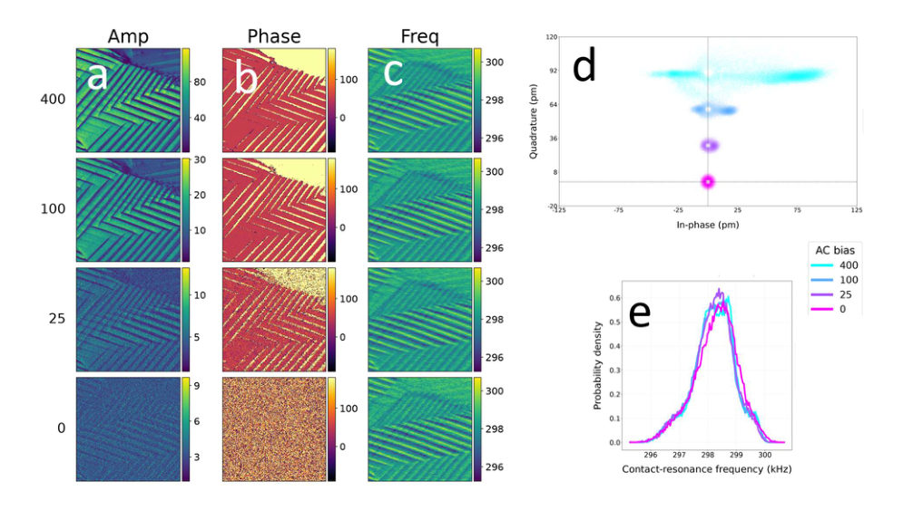 
Figure 2 compares the iDART response acquired at four AC bias amplitudes, 𝑉ୟୡ= 400, 100, 25, and 0 mV.

📷 Fig 5

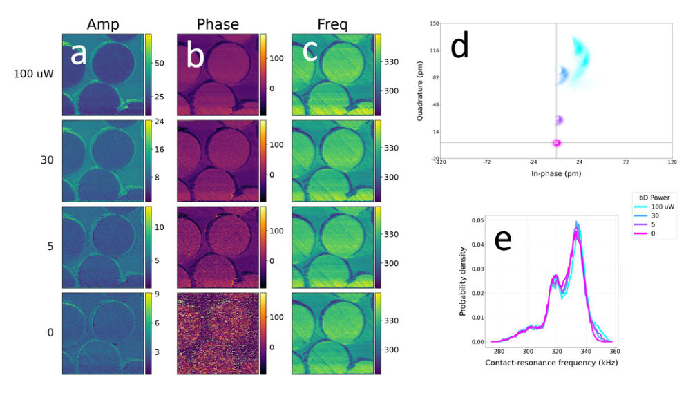 
FIG. 3. Photothermally driven contact-resonance measurements of carbon fibers embedded in an epoxy matrix, acquired at photothermal modulation powers of 100, 30, 5, and 0 𝜇𝑊. Spatial maps show the response amplitude (a), phase (b), and contact-resonance frequency (c). The corresponding complex response is plotted in quadrature space for each photothermal power (d). Probability-density distributions of the contact-

**Summary.** This paper introduces iDART, a novel technique for Contact-Resonance AFM that overcomes limitations from excitation artifacts. By combining advanced interferometry with two-frequency tracking, the method achieves high sensitivity. Crucially, it demonstrates that the contact resonance frequency can be measured robustly using only thermal (Brownian) motion, enabling high-resolution imaging without perturbing the sample with large electrical biases.

**Why it may be interesting.** While focused on classical mechanics, the ability to extract a stable, low-noise signal (frequency) from a system where the primary measurement signal (amplitude/phase) vanishes due to external driving mimics the challenge of measuring weak quantum signals in the presence of strong classical noise or decoherence.

Detailed structure

**Main problem.** Conventional Contact-Resonance AFM methods are limited by excitation artifacts or the need for averaging incompatible with routine imaging.

**Main result.** The proposed iDART technique successfully enables resonance-enhanced, drive-free nanomechanical imaging by showing that contact resonance frequency contrast persists even when electrical driving signals vanish.

**Method.** The authors introduce Interferometric Dual-AC Resonance Tracking (iDART), combining quadrature-phase differential interferometry with two-frequency resonance tracking.

**Model / system.** The experiment uses a cantilever tip interacting with a sample surface to measure local mechanical properties via contact resonance. The measurement system employs interferometry and active electrical/photothermal excitation.

**Key observables.** Contact stiffness, dissipation, electromechanical response, amplitude contrast, phase contrast, and contact-resonance frequency.

**Important parameters / regimes.** AC bias amplitudes (ranging from 400 mV down to 0 mV), photothermal modulation powers, and separation between drive tones ($\Delta f$).

**Assumptions / limitations.** The frequency measurement is robust and determined by local dynamic boundary conditions, independent of the coherent excitation source.

**Figures summary.** Figures illustrate the iDART setup using two drive tones and a reference tone. Key comparisons show that frequency maps remain stable at zero bias, while amplitude/phase maps vanish, confirming the robustness of the frequency measurement.

**Paper structure.** The paper introduces the limitations of existing CR-AFM techniques, details the iDART methodology combining interferometry and dual-AC tracking, presents experimental results comparing driven vs. thermally driven measurements, and concludes by establishing the technique's practical utility.

Abstract

Contact-resonance atomic force microscopy (CR-AFM) provides nanoscale maps of contact stiffness, dissipation, and electromechanical response, but conventional piezoacoustic excitation can obscure the cantilever resonance with actuator and sample-holder modes. Pure Brownian excitation avoids this transfer-function background, yet its small amplitude generally requires averaging that is incompatible with routine imaging. We introduce interferometric dual-AC resonance tracking (iDART), which combines quadrature-phase differential interferometry with two-frequency resonance tracking. By positioning the interferometric spot near the displacement maximum of the first contact-resonance mode, the detector noise floor is reduced below the off-resonance thermal displacement of the cantilever. Brownian spectra identify the contact mode and define the tracking frequencies, while active electrical excitation provides the signal-to-noise ratio required for pixel-resolved imaging. Simultaneous low-frequency and resonant measurements show that both electrical and photothermal drive increases contrast in the amplitude and phase channels without appreciably shifting the contact resonance. These results establish a practical route to resonance-enhanced, drive free nanomechanical imaging at conventional AFM scan rates.

[↑ back to top](#top)

### [Noise-Robust Spin-Orbit Qubit in Germanium Holes via p-Orbital Encoding](http://arxiv.org/abs/2608.21542v1)

**Authors:** Yasuo Oda, Jason P. Kestner  
**Type:** theory · **Category:** quantum information and computing · **PDF:** <https://arxiv.org/pdf/2608.21542v1>  
**Analysis basis:** full PDF text, analyzed in chunks
**Topic relevance:** `QC/QI experiment` **2/5** · `quantum measurements` **1/5**

📷 Fig 1

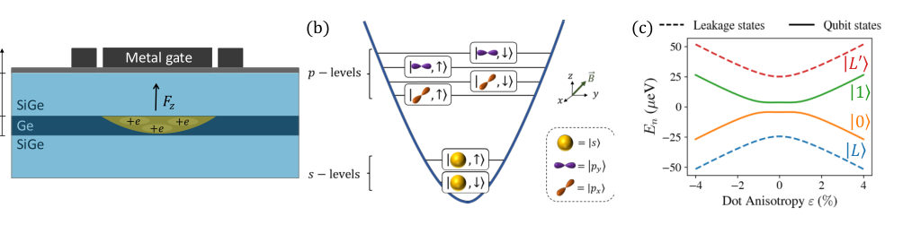 
Figure 1. Three-hole quantum dot in a planar Ge/SiGe heterostructure and energy level structure. (a) Cross-sectional schematic of the gate- defined quantum dot. The hole is confined vertically by the SiGe/Ge/SiGe layer structure, with a Ge quantum well of width dw = 18 nm, a SiGe cap layer of thickness di = 60 nm, and an insulating oxide layer. Lateral confinement is provided electrostatically by the metal gates. A uniform vertical electric field Fz pushes the hole toward the upper SiGe/Ge interface, and the accumulated hole wavefunction is illustrated in the quantum well. (b) Schematic energy level diagram in the three-hole shell-filling picture. The s-shell doublet is fully occupied by...

📷 Fig 2

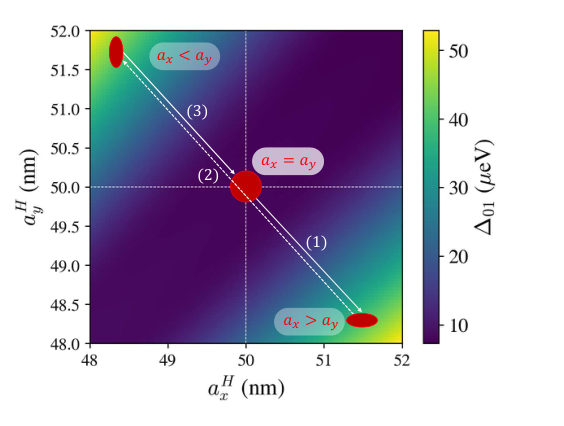 
Figure 2. Qubit level splitting ∆01 as a function of the lateral con- finement parameters (aH x , aH y ), with in-plane field B∥= 2 T and B⊥= 14 mT, chosen on the sweet-spot locus of Fig. 3(b). The la- beled points (1)–(3) mark configurations along the antidiagonal cut through the symmetric point aH x = aH y ; the level spectrum along this cut is shown in Fig. 1(c). The white arrows indicate the Landau-Zener sweep of Sec. V, which drives the anisotropy ε(t) along the antidiag- onal, through the avoided crossing at the symmetric point and back.

📷 Fig 3

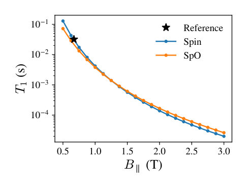 
Figure 4. Phonon-limited relaxation time T1 of the SpO qubit as a function of in-plane magnetic field B∥, compared to that of the single- hole spin qubit. The black star indicates the operating field of a ref- erence experimental device [10], showing good agreement with the phonon-induced relaxation model. Both curves are computed using Eq. (19) in the dipole approximation.

📷 Fig 4

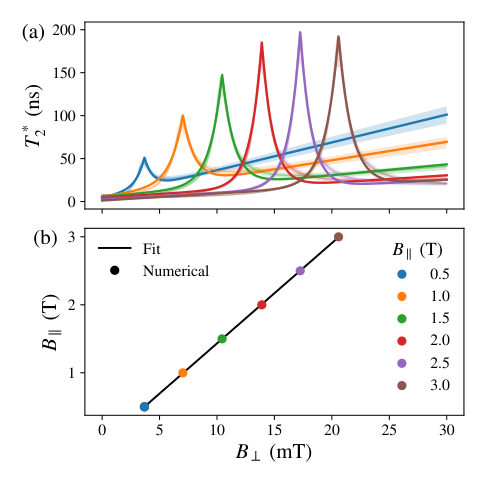 
Figure 3. Sweet-spot magnetic field and optimal out-of-plane field component. (a) Average T ∗ 2 as a function of the out-of-plane field component B⊥for varying in-plane field magnitude B∥, at the isotropic confinement point ε = 0, a0 = 50 nm. The in-plane field is oriented at 45◦between the x- and y-axes. Each data point is av- eraged over 100 charge-noise configurations, and shaded regions rep- resent the 95% confidence interval obtained by bootstrapping with replacement. Solid lines are fits to a peaked ansatz with a linear background given by B∥(B⊥) = c0 exp  −c1|B⊥−Bopt ⊥|  +c2B⊥, identifying the optimal out-of-plane field Bopt ⊥ that maximizes coher- ence for each B∥. (b) Fitted...

📷 Fig 5

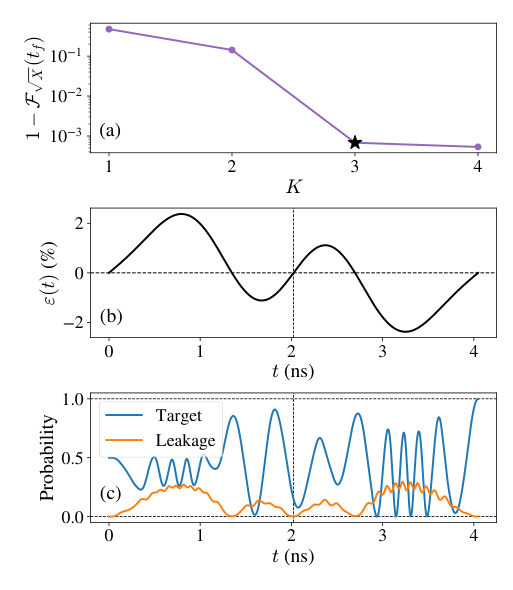 
Figure 5. Optimized Landau-Zener state transfer from |0⟩to |+y⟩≡ (|0⟩−i |1⟩) / √

**Summary.** This paper introduces a noise-robust qubit platform using the spin-p-orbital (SpO) manifold in a Germanium hole quantum dot. By operating at specific isotropic points, the qubit's energy splitting becomes insensitive to charge noise fluctuations. The authors further demonstrate the feasibility of implementing fast, high-fidelity quantum gates using purely electrical control techniques like adiabatic shuttling.

**Why it may be interesting.** This work provides a detailed, physics-based blueprint for realizing solid-state qubits, directly addressing noise mitigation and gate implementation using established semiconductor heterostructures, which is highly relevant to quantum computing hardware.

Detailed structure

**Main problem.** The primary challenge addressed is mitigating charge noise, a major obstacle for semiconductor quantum computation using Germanium hole qubits.

**Main result.** The authors propose encoding a qubit in a spin-p-orbital (SpO) manifold, demonstrating robustness against charge noise at specific isotropic operating points and designing all-electrical protocols for fast, high-fidelity quantum gates.

**Method.** The work involves developing an effective Hamiltonian within a four-band Luttinger-Kohn–Bir-Pikus framework, characterizing noise sweet spots, and optimizing gate sequences using adiabatic shuttling and state-transfer protocols.

**Model / system.** The system is a three-hole quantum dot fabricated in a planar Ge/SiGe heterostructure. The qubit is encoded in the $p$-shell of the topmost hole, modeled using a Luttinger-Kohn–Bir-Pikus Hamiltonian incorporating strain and electrostatic confinement.

**Key observables.** Qubit splitting ($\Delta_{01}$), coherence times ($T_2^*$), gate infidelity ($1 - F_{	ext{ZZ}}$), and the noise variance ($\langle\sigma
angle$).

**Important parameters / regimes.** The operating regime is the isotropic point ($\epsilon \approx 0$), and noise levels are targeted around $3 \mu	ext{eV}$ based on material parameters.

**Assumptions / limitations.** The analysis relies on a shell-filling approximation that treats the lowest two holes as an inert core, and the gate optimization uses a smooth flat-top ansatz.

**Figures summary.** Figures illustrate the energy level structure showing the qubit in the p-shell, the dependence of the qubit splitting on confinement anisotropy ($\epsilon$), and comparisons between different gate optimization techniques (GRAPE vs. flat-top ansatz).

**Paper structure.** The paper progresses from identifying charge noise as the bottleneck, to proposing the SpO qubit encoding and analyzing its noise robustness via sweet spot characterization. It then details all-electrical gate protocols, including Landau-Zener state transfer and two-qubit entangling gates via adiabatic shuttling.

Abstract

Germanium hole spin qubits are a leading platform for semiconductor quantum computation due to their strong spin-orbit coupling, all-electrical operability, and absence of valley degeneracy. A central obstacle is charge noise, which couples to the qubit through the same spin-orbit interaction that enables fast electrical control. In this work, we propose a new operational mode of a three-hole quantum dot in a planar Ge/SiGe heterostructure, modeled within a four-band Luttinger-Kohn--Bir-Pikus framework: a spin-$p$-orbital (SpO) qubit encoded in the $p$-shell of the topmost hole. We characterize charge noise sweet spots in the parameter space of electrostatic confinement and magnetic field, and estimate that relaxation rates of the SpO qubit are comparable to those of spin qubits hosted in single holes. We then design and optimize an all-electrical Landau-Zener state-transfer protocol that induces logical qubit state transitions without microwave driving, and we show that the quadrupole-quadrupole Coulomb interaction between neighboring dots enables fast two-qubit entangling gates operated by adiabatic shuttling.

[↑ back to top](#top)

### [Antidot superlattices in two-dimensional topological insulators](http://arxiv.org/abs/2608.22831v1)

**Authors:** Haolin Huang, Jackson S. Smith, Fabio Taddei, Michele Governale, Jared H. Cole  
**Type:** theory · **Category:** other · **PDF:** <https://arxiv.org/pdf/2608.22831v1>  
**Analysis basis:** full PDF text, analyzed in chunks
**Topic relevance:** `analog quantum simulation` **2/5**

📷 Fig 1

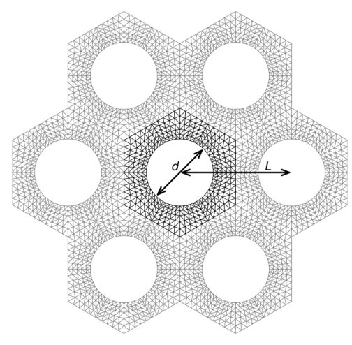 
FIG. 1. Schematic of the meshing of a hole array with hexagonal symmetry, with d and L labeled. The gray meshes are copies of the black mesh across the periodic boundaries. Note that the schematic is only indicative and the calculations were performed on finer meshes.

📷 Fig 2

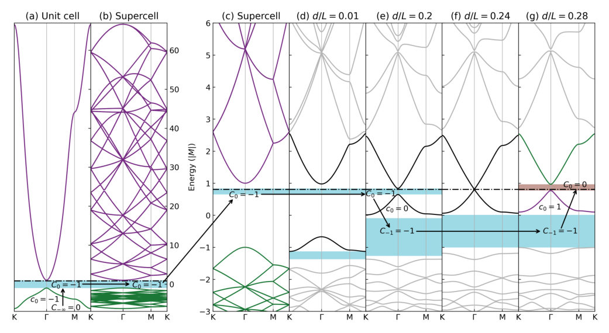 
FIG. 2. This is an illustrative diagram for Section II C, where the calculation of C0 for each system is carried out following a procedure schematically indicated here by the black arrows. (a-c) The band structures of a system with no hole (effectively d = 0), computed with (a) a rhombic unit cell that is equivalent to a hexagonal unit cell of L = 0.5r0, and (b-c) a hexagonal supercell of L = 2r0, consisting of the unit cells described in (a). Band folding relative to (a) can be observed in (b). Panel (c) is a zoomed-in view from (b). (d-g) The band structures of a hexagonal supercell of L = 2r0 with a hole of radius d, with the relative d/L ratio described in the title of each panel. In...

📷 Fig 3

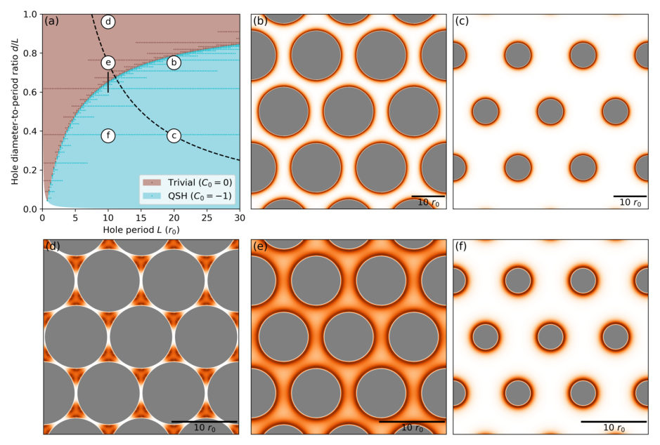 
FIG. 3. (a) A phase diagram for varying hole period and diameter. The dashed line is d = 7.5r0. The white shaded region is d &lt; 0.646nm = 0.0316r0. (b-f) Probability density for the states at the top of the valence band (at the Γ point) for hole periods and diameters labeled in (a). Darker orange means higher probability. The gray shaded region is the holes. The scale bar is 10r0. Only the hexagonal region around the hole in the center is used for simulation. The plots are created by repeating the region with respect to the periodic boundary conditions as in Fig. 1.

📷 Fig 4

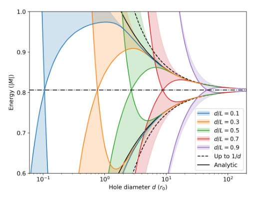 
FIG. 5. The colored solid lines are the energies at the Γ point of the two bands closest to Dirac point energy. The shaded region represents the difference in energy between the K and the Γ points. The black solid lines are the analytic results given in Appendix B for j = ±1/2, and the black dashed lines are the same results truncated to the order of 1/d given by Eq. 12. The dash-dotted line is the energy of the Dirac point.

📷 Fig 5

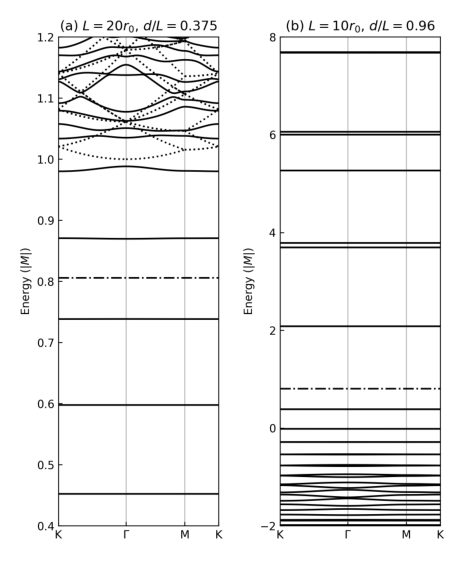 
FIG. 4. The band structures for (a) the system in Fig. 3c and (b) the system in Fig. 3d. The L and d/L values of the systems are labeled in the subfigure titles. The dash-dotted line is the energy of the Dirac point. The dotted lines in (a) is the band structure for a system with no holes.

**Summary.** This paper theoretically investigates the electronic properties of topological insulators patterned with antidots. Using advanced numerical methods on the BHZ model, the authors show that the topological state can be destroyed by controlling the overlap of edge states between adjacent holes. This work highlights the potential for lithographically patterned TIs in future quantum electronics.

**Why it may be interesting.** The work demonstrates how engineered nanoscale patterns can fundamentally alter the topological properties of quantum materials, providing a blueprint for designing novel electronic devices.

Detailed structure

**Main problem.** The study investigates how patterning a two-dimensional topological insulator (TI) with an array of circular holes (antidots) affects its electronic properties and topological character.

**Main result.** The material loses its topological character and becomes a trivial insulator when the holes are close together and the edge states overlap significantly, demonstrating a phase transition from the Quantum Spin Hall (QSH) state.

**Method.** Calculations utilize the Bernevig-Hughes-Zhang (BHZ) model, solved using the Finite Element Method (FEM) for discretization, and the band topology is analyzed using the Fukui-Hatsugai-Suzuki (FHS) method.

**Model / system.** The physical system is a 2D topological insulator patterned into a superlattice of circular holes (antidots). The effective Hamiltonian is modeled by the BHZ model, and the geometry is treated using FEM.

**Key observables.** Spin Chern number, quantized Hall conductance, and the energy levels of localized edge states.

**Important parameters / regimes.** Hole period ($L$) and the ratio of hole diameter to period ($d/L$).

**Assumptions / limitations.** The geometry is treated as smooth due to the large feature size relative to the underlying crystal lattice constant, and the BHZ model serves as the effective continuum Hamiltonian.

**Figures summary.** Figures illustrate the phase diagram mapping the transition between trivial and QSH phases based on hole parameters, and show the localization of edge states in the QSH phase versus delocalization in the trivial phase.

**Paper structure.** The paper progresses from defining the physical system and model to calculating topological invariants (Chern number) and finally mapping out a phase diagram that predicts the loss of topological order upon hole overlap.

Abstract

We investigate the electronic properties of a two-dimensional topological insulator patterned with an array of circular holes. The band structures of the topological insulator superlattices are calculated using the Bernevig-Hughes-Zhang model, discretized with the finite element method. The band topology is studied using the Fukui-Hatsugai-Suzuki method, exploiting the fact that topological charge is conserved when a band gap closes and reopens. We find that when the holes are close to each other and the edge states overlap significantly, the material loses its topological character and becomes a trivial insulator. The results show that patterning topological insulators changes their properties, and this can be achieved with a feature size compatible with current lithographic techniques. This shows the potential to incorporate patterned topological insulators in future electronics.

[↑ back to top](#top)

### [Competing Extended-$s$- and $d$-Wave Pairing from Distinct Spin-Fluctuation Channels in Stoichiometric $\mathrm{FeTe}$](http://arxiv.org/abs/2608.23467v1)

**Authors:** Yichen Hua, Wen-lin Yang, Jian-Jian Miao, Hu Xu, Changming Yue  
**Type:** theory · **Category:** strongly correlated electrons · **PDF:** <https://arxiv.org/pdf/2608.23467v1>  
**Analysis basis:** full PDF text, analyzed in chunks
**Topic relevance:** `Keldysh / 2PI / non-Gaussian methods` **2/5**

📷 Fig 1

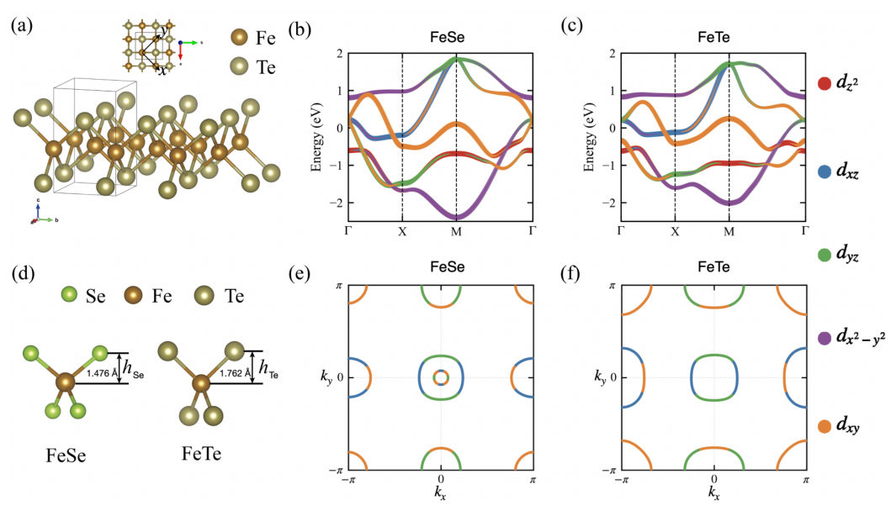 
FIG. 1. (a) Crystal structure of FeTe. The local coordinate axes are also shown. (b-c) Unfolded low-energy bands of the five-orbital tight-binding models for (b) FeSe and (c) FeTe. Marker colors denote Fe-3d orbital weights. (d) Local tetrahedral coordination and anion heights in FeSe and FeTe. (e-f) Fermi surfaces in the unfolded Brillouin zone for (e) FeSe and (f) FeTe, with orbital character indicated by color.

📷 Fig 2

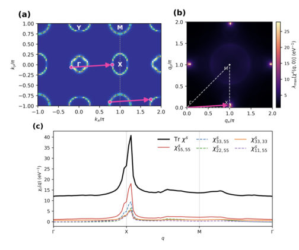 
FIG. 2. Fermi surface and spin susceptibility of stoichiomet- ric FeTe (n=1.20 electrons per orbital). Here, U = 1.5, and T = 0.001. (a) A(k, iπT) shown in an extended Brillouin-zone representation. The pink arrows mark two equivalent transla- tions by the same nesting wave vector Q/π = (1, 0.0625). (b) Largest eigenvalue of the spin susceptibility matrix χs(q, 0). The dashed white line marks the high-symmetry q-path Γ −X −M −Γ, and the pink arrow indicates the same Q vector as in panel (a). The center of panel (b) corresponds to the M point rather than the Γ point. (c) Static spin suscepti- bility along the q-path. The black curve is Tr χs(q), while the colored curves show the dominant...

📷 Fig 3

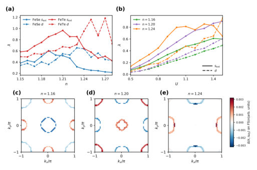 
FIG. 4. Pairing eigenvalues and leading gap structures. (a) Filling dependence of the leading sext- and d-wave eigenvalues λ for FeSe and FeTe at U = 1.5 and T = 0.001. (b) Inter- action dependence of λ for FeTe at n = 1.16, 1.20, and 1.24; solid and dashed lines denote the sext- and d-wave channels, respectively. (c)–(e) Fermi-surface projections of the leading gap function for FeTe at U = 1.5, T = 0.001, and fillings n = 1.16, 1.20, and 1.24, respectively. The color scale indi- cates the sign and relative amplitude of the gap function on the Fermi surface.

📷 Fig 4

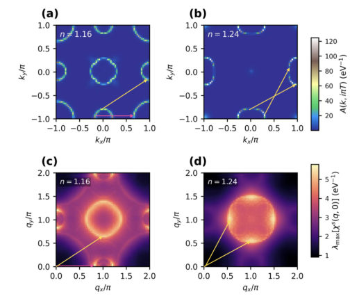 
FIG. 3. Fermi surfaces and spin susceptibilities of hole- and electron-doped FeTe. Here, U = 1.5, T = 0.001. The first row shows A(k, iπT) for FeTe with fillings (a) n = 1.16 and (b) n = 1.24. The second row shows the corresponding largest eigenvalue of the spin susceptibility for (c) n = 1.16 and (d) n = 1.24. The common color scale in panels (c,d) allows direct comparison of the susceptibility strength between the two fill- ings. The pink arrows indicate (0, π)-type nesting, while the yellow arrows denote (π, π)-type nesting.

📷 Fig 5

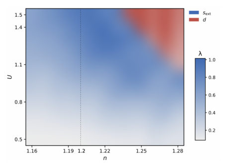 
FIG. 5. Pairing-symmetry phase diagram of FeTe in the U–n plane at T = 0.001. The color indicates the leading pairing channel obtained from the largest Eliashberg eigenvalue: ex- tended s-wave or d-wave. The vertical dashed line indicates the filling n =1.2 of the stoichiometric FeTe.

**Summary.** This theoretical study analyzes the superconducting pairing mechanism in $\mathrm{FeTe}$ using a five-orbital tight-binding model and the FLEX approximation. It reveals a strong competition between extended-$s$-wave and $d_{x^2-y^2}$-wave pairing symmetries. The favored symmetry switches depending on the doping level, providing concrete gap structures for comparison with spectroscopic measurements.

**Why it may be interesting.** While focused on iron pnictides, the methodology of using fluctuation-exchange theory to map out competing pairing symmetries based on Fermi surface nesting is a general technique for understanding unconventional superconductivity in correlated electron systems.

Detailed structure

**Main problem.** The paper investigates the competing superconducting pairing symmetries (extended-$s$-wave vs. $d_{x^2-y^2}$-wave) in stoichiometric and doped $\mathrm{FeTe}$.

**Main result.** The dominant pairing symmetry is highly dependent on doping: extended-$s$-wave is favored near stoichiometry, while $d_{x^2-y^2}$-wave becomes leading upon electron doping.

**Method.** The pairing instabilities are determined by solving the linearized Eliashberg equation within the fluctuation-exchange (FLEX) approximation.

**Model / system.** The study uses an experimentally constrained five-orbital tight-binding model for the tetragonal 11-type chalcogenide $\mathrm{FeTe}$. Electronic correlations are treated via a local Hubbard-Kanamori interaction Hamiltonian.

**Key observables.** Pairing tendency ($\lambda$), gap function ($\Delta(\mathbf{k})$), and spin/charge susceptibilities ($\hat{\chi}_{\mathrm{C/S}}(\mathbf{q})$).

**Important parameters / regimes.** Doping level ($n$), interaction strength ($U$), and momentum transfer vectors $\mathbf{q}$ near $(\pi, 0)$, $(0, \pi)$, and $(\pi, \pi)$.

**Assumptions / limitations.** The model neglects interlayer hoppings along the z-direction, and the pairing is analyzed within the spin-singlet channel approximation.

**Figures summary.** Figures illustrate the Fermi surface topology, spin susceptibility peaks related to nesting vectors, and the calculated gap functions for different doping regimes.

**Paper structure.** The work proceeds by constructing a tight-binding model, applying the FLEX approximation to calculate spin fluctuations, and then solving the Eliashberg equation to map out the competing $s$-wave and $d$-wave pairing instabilities as a function of doping.

Abstract

The recent observation of superconductivity in stoichiometric $\mathrm{FeTe}$ raises the question of how pairing develops in this tetragonal 11-type chalcogenide once interstitial Fe is removed. We construct an experimentally constrained five-orbital tight-binding model from first-principles calculations and treat electronic correlations and pairing within the fluctuation-exchange approximation. The linearized Eliashberg equation yields competing extended-$s$- and $d_{x^2-y^2}$-wave spin-singlet pairing instabilities. Near stoichiometric filling, spin fluctuations near $(π,0)$ and $(0,π)$ in the unfolded one-Fe Brillouin zone connect the $Γ/M$ hole pockets with the $X/Y$ electron pockets and favor an extended-$s$ gap that changes sign between the hole and electron sheets. Upon electron doping, depletion of the hole pockets shifts the dominant scattering toward the $X$--$Y$ channel near $(π,π)$, making the $d_{x^2-y^2}$-wave state the leading instability, with nodal lines that avoid most of the Fermi surface. The relative strengths of the two pairing channels vary with filling and interaction strength as the dominant spin-fluctuation channel changes. Under matched interaction strength, temperature, and filling, the extended-$s$ eigenvalue is larger in $\mathrm{FeTe}$ than in $\mathrm{FeSe}$ throughout the range considered, while the $d_{x^2-y^2}$-wave eigenvalue is also generally larger, particularly under electron doping. These results give concrete gap structures against which spectroscopic measurements of stoichiometric $\mathrm{FeTe}$ can be compared.

[↑ back to top](#top)

### [$\mathscr{PT}$-symmetric hydrodynamics of odd viscous liquids and their oscillator counterparts](http://arxiv.org/abs/2608.22958v1)

**Authors:** E. Kirkinis, A. Levchenko  
**Type:** theory · **Category:** other · **PDF:** <https://arxiv.org/pdf/2608.22958v1>  
**Analysis basis:** full PDF text, analyzed in chunks
**Topic relevance:** `Frenkel-Kontorova` **1/5** · `Keldysh / 2PI / non-Gaussian methods` **1/5** · `analog quantum simulation` **1/5** · `correlated / nonlocal dissipation` **1/5** · `driven-dissipative phase transition` **1/5** · `methods for driven-dissipative` **1/5** · `non-equilibrium universality` **1/5** · `quantum measurements` **1/5**

📷 Fig 1

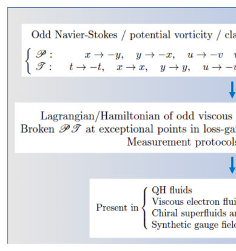 
Figure 1: Summary of main concepts introduced in this paper

📷 Fig 2

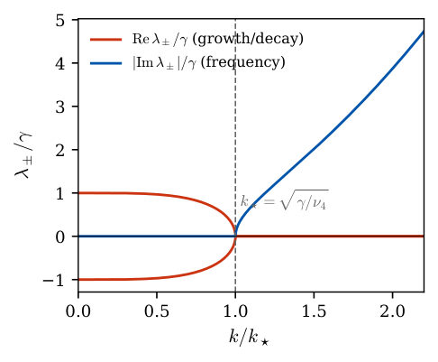 
Figure 2: PT transition of transverse waves in a three-dimensional odd viscous liquid with balanced gain and loss of the two polarizations, Eq. (29). Long-wavelength modes (k &lt; k⋆, cf. Eq. (31)) form growing/decaying pairs (broken PT ); short-wavelength modes oscillate at frequency p

📷 Fig 3

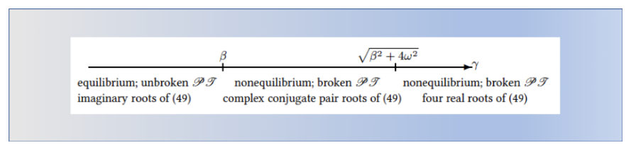 
Figure 3: Regimes that determine the character of the eigenvalues (50). In the left-most region the sign of (γ2 − β2)(γ2 −β2 −4ω2) is positive and the eigenvalues (50) are imaginary (unbroken PT ). In the middle region the sign of (γ2 −β2)(γ2 −β2 −4ω2) is negative and the eigenvalues become two complex conjugate pairs (broken PT , oscillatory). In the right-most region the sign of (γ2 −β2)(γ2 −β2 −4ω2) is positive and the eigenvalues are real (broken PT , overdamped).

📷 Fig 4

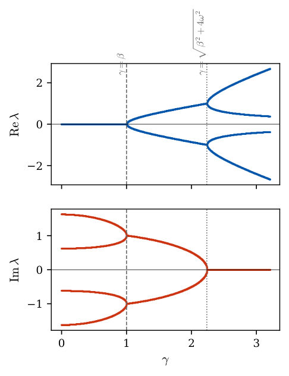 
Figure 4: Real and imaginary parts of the four eigenvalues (50) as functions of the loss-gain parameter γ, for odd friction β = 1 and ω = 1. For γ ∈(0, 1) all roots are imaginary (unbroken PT ; Rabi oscillations at the two frequencies (52)). At γ = β the exceptional point is crossed and for γ ∈(1, √

📷 Fig 5

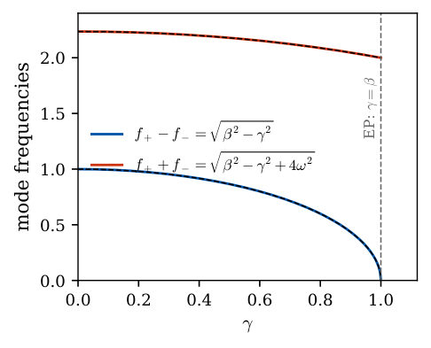 
Figure 5: Exact laws (52) for the two Rabi frequencies of the loss-gain odd oscillator in the unbroken phase (β = ω = 1). The difference f+ −f−= p

**Summary.** This paper introduces a novel method to measure 'odd viscosity' in time-reversal-broken fluids by leveraging the mathematical structure of Parity-Time ($\mathscr{PT}$) symmetry. By showing that the governing equations are $\mathscr{PT}$-symmetric, the authors derive protocols—both classical and quantum—that use phenomena like exceptional points to achieve highly sensitive measurements of this otherwise unmeasurable transport coefficient.

**Why it may be interesting.** The application of $\mathscr{PT}$-symmetry, a concept central to quantum optics and open quantum systems, to classical fluid dynamics and transport coefficients provides a novel diagnostic tool for measuring non-dissipative fluid properties.

Detailed structure

**Main problem.** The primary challenge is measuring 'odd viscosity,' which is a nondissipative component of viscous response that does no work, making it experimentally elusive.

**Main result.** The authors establish that the odd Navier-Stokes equations are $\mathscr{PT}$-symmetric, providing mechanical, stochastic, and spectroscopic protocols to measure this odd transport coefficient.

**Method.** The analysis uses the framework of $\mathscr{PT}$-symmetry, linearizing the fluid dynamics equations into forms resembling the Schrödinger equation or master equations for coupled oscillators.

**Model / system.** The study models odd viscous liquids using modified Navier-Stokes equations in 2D and 3D, and analyzes the behavior of trapped probes modeled as coupled oscillators.

**Key observables.** Odd viscosity ($\eta_o$), potential vorticity, exceptional points, and Rabi sidebands.

**Important parameters / regimes.** The odd friction coefficient ($\beta$), gain ($\gamma$), and the critical wavenumber ($k^*$).

**Assumptions / limitations.** The analysis relies on the existence and properties of $\mathscr{PT}$-symmetry within the fluid dynamics framework.

**Figures summary.** Figure 2 illustrates the $\mathscr{PT}$ transition of transverse waves, showing how the system transitions between broken and unbroken $\mathscr{PT}$ symmetry based on the wavenumber $k$.

**Paper structure.** The paper establishes the $\mathscr{PT}$ symmetry of the odd Navier-Stokes equations, analyzes the behavior of coupled odd oscillators, and extends the framework to quantum systems exhibiting Fock-Darwin spectra and Liouvillian exceptional points.

Abstract

Odd viscosity, the nondissipative part of the viscous response of a time-reversal-broken fluid, is notoriously difficult to measure precisely because it does no work. Here we show that parity-time ($\mathscr{PT}$) symmetry, familiar from non-Hermitian optics, converts this elusiveness into a measurement principle. The odd Navier-Stokes equations, that include the nonlinear inertial terms, are $\mathscr{PT}$-symmetric, follow from a Lagrangian, and linearize to a Schrödinger equation in which the odd viscosity plays the role of Planck's constant; potential vorticity obeys a generalized Ertel conservation law. A probe trapped in an odd liquid realizes a pair of oscillators coupled by odd friction, and supplying balanced loss and gain drives a twofold $\mathscr{PT}$ transition whose exceptional point and Rabi sidebands locate the odd viscosity with square-root-enhanced sensitivity. Upon quantization the spectrum is of Fock-Darwin form, and the dissipative pair exhibits a Liouvillian exceptional point separating linear from exponential heating. These results furnish mechanical, stochastic, and spectroscopic protocols for measuring odd transport coefficients in classical and quantum fluids.

[↑ back to top](#top)

### [Discovery of New Zintl Films and Nanowires Grown by Topotaxy Conversion of III-V Semiconductors](http://arxiv.org/abs/2608.22989v1)

**Authors:** Man Suk Song, Lothar Houben, Jean Souza, Edanel Fishbein, Moshe Haim, Ambikesh Gupta, Yufei Zhao, Anna-Eden Kossoy, Binghai Yan, Haim Beidenkopf, Hadas Shtrikman  
**Type:** both · **Category:** other · **PDF:** <https://arxiv.org/pdf/2608.22989v1>  
**Analysis basis:** full PDF text, analyzed in chunks
**Topic relevance:** `analog quantum simulation` **1/5**

📷 Fig 1

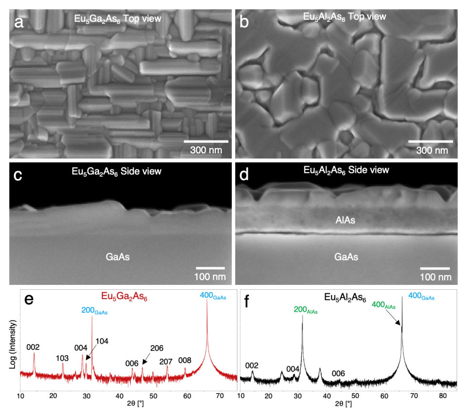 
Figure 1. Mutual exchange growth and XRD patterns of Zintl Eu5Ga2As6 and Eu5Al2As6 thin films. (a, b) Top-view SEM images of Eu5Ga2As6 and Eu5Al2As6 thin films grown on ZB (100) GaAs substrates, respectively. (c, d) Side-view SEM images of Eu5Ga2As6 and Eu5Al2As6 (including AlAs buffer layer) thin films, respectively. (e) XRD θ-2θ scan of Eu5Ga2As6 thin films grown on GaAs (100) substrates. (f) XRD θ-2θ scan of Eu5Al2As6 thin films grown on an AlAs buffer layer on GaAs (100) substrate.

📷 Fig 2

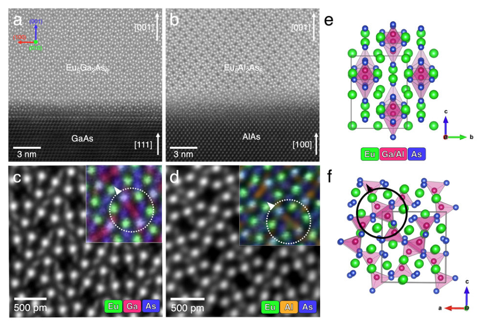 
Figure 2. Topotactic conversion of Zintl Eu5Ga2As6 and Eu5Al2As6 thin films. (a, b) High- angle annular dark-field (HAADF) scanning TEM images of the transformation interface between the Zintl thin film and (111)B GaAs substrate/(100) AlAs buffer layer on (100) GaAs substrate, respectively. (c, d) Atomic resolution HAADF/STEM images of Eu5Ga2As6 and Eu5Al2As6, respectively. The inset frames show atomic-scale EDS elemental maps of Eu (green), Ga/Al (magenta/orange), and As (blue), superimposed on the image. A circular marker reveals a superimposed view of chains of juxtaposed Ga(Al)As4 tetrahedra, aligned with the viewing direction in successive layers. (e, f) Atomic structure of EuGa(Al)As...

📷 Fig 3

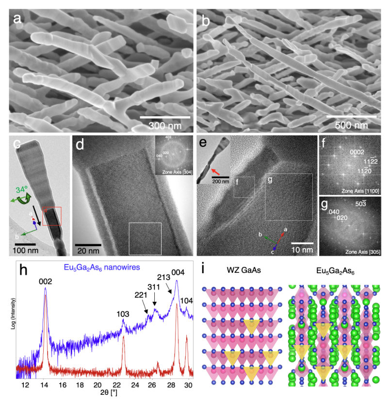 
Figure 3. Zintl Eu5Ga2As6 NWs topotactic-exchanged from WZ GaAs core NWs pre-grown on (100) GaAs substrates. (a, b) Bird’s-eye view SEM images of as-grown Eu5Ga2As6 NWs. There are two types of Zintl Eu5Ga2As6 NWs, showing (a) short-segment and (b) long-segment types. (c) TEM image of as-grown Eu5Ga2As6 NW fully exchanged from WZ GaAs NW. The middle segment, showing diffraction contrast, has a 34° tilt relative to the adjacent upper segment about the b-axis [Fig S07 in SI]. The arrow compass of the unit cell signifies the [304] zone axis of the middle segment. (d) An HRTEM image of the area marked by a red square in (c) and an FFT pattern (inset) of the area marked by a white square in (d)....

**Summary.** This work reports the successful synthesis of novel Zintl compounds, Eu5Ga2As6 and Eu5Al2As6, by growing them epitaxially from III-V semiconductor substrates. The research characterizes their unique crystal structures, complex magnetic ordering, and semiconducting nature, establishing a new, scalable route for creating functional magnetic thin films and nanowires.

**Why it may be interesting.** While focused on solid-state materials, the study of magnetic phase transitions (AFM/CAFM) and the coupling between structure and magnetism touches upon concepts relevant to correlated electron systems and emergent quantum phenomena in condensed matter.

Detailed structure

**Main problem.** The research aims to discover and synthesize new Zintl films and nanowires by extending the topotactic conversion methodology from III-V semiconductors.

**Main result.** Two new Zintl compounds, Eu5Ga2As6 and Eu5Al2As6, were successfully grown, exhibiting complex magnetic ordering and predicted semiconductor gaps suitable for spintronics and thermoelectric applications.

**Method.** The study combines experimental techniques like Molecular Beam Epitaxy (MBE), STEM-HAADF imaging, and magnetic measurements with theoretical predictions from *ab initio* calculations.

**Model / system.** The physical system involves Zintl phases, which are synthesized by converting the crystal structure of parent III-V semiconductors (like GaAs or AlAs) into the desired Zintl framework.

**Key observables.** Crystal structure (Pnma space group), electronic band gaps (0.79 eV and 0.90 eV), magnetic transitions (AFM, CAFM, spin-flop), and growth morphology (thin films and nanowires).

**Important parameters / regimes.** The stoichiometry of the new compounds (Eu5M2As6), the applied magnetic field strength, and the substrate orientation are key parameters.

**Assumptions / limitations.** The growth process is assumed to be topotactic, meaning the new structure is guided by the underlying crystal lattice of the parent semiconductor.

**Figures summary.** Figures show SEM/STEM images detailing the growth morphology and interface structure on various GaAs substrates, XRD scans confirming the Pnma structure, and M-H/M-T curves mapping the complex magnetic phase diagram.

**Paper structure.** The paper progresses by first establishing the methodology (topotactic conversion), then characterizing the growth on different substrates (morphology and structure), followed by detailed analysis of the electronic and magnetic properties, and concluding with potential applications.

Abstract

Zintl phases draw broad interest for their diverse structural, magnetic, thermoelectric, topological and optical properties. Recently, Zintl Eu$_3$In$_2$As$_4$ and Eu$_5$In$_2$As$_6$ nanowires with axion magneto-topology have been synthesized by molecular beam epitaxy via topotactic conversion of InAs wurtzite and zincblende nanowires. Here we extend this methodology, demonstrating that topotaxial mutual-exchange growth applies not only to a broader set of III-V semiconductors beyond InAs but also to three-dimensional substrates whose surfaces are converted into Zintl thin films, as well as to nanowires. We report the growth of two new compounds: Eu$_5$Ga$_2$As$_6$ thin films converted from GaAs substrates, and Eu$_5$Al$_2$As$_6$ thin films from AlAs films. We also convert GaAs nanowires of both wurtzite and zincblende structures into Eu$_5$Ga$_2$As$_6$ nanowires. Though the stoichiometry is the same as in the previously reported Eu$_5$In$_2$As$_6$ case, microscopy and diffraction reveal a single-phase Pnma symmetry group rather than Pbam, highlighting symmetry-guided topotactic pathways to new Zintl frameworks. The compounds host an intricate magnetic phase diagram with three magnetic transitions, including two distinct antiferromagnetic orders and a canted antiferromagnetic phase that evolves into another antiferromagnetic phase under applied field through a spin-flop transition. Ab initio calculations predict that both Zintls are semiconductors with gaps of 0.79 eV in Eu$_5$Ga$_2$As$_6$ and 0.90 eV in Eu$_5$Al$_2$As$_6$. The lower symmetry and increased structural complexity suggest suppressed lattice thermal conductivity, pointing to thermoelectric potential alongside prospects in spintronics and detector technologies. These results give an epitaxy-compatible route for discovering and integrating magnetic Zintl thin films and nanowires directly from relevant III-V semiconductors.

[↑ back to top](#top)

### [Mutual information-entropy plane: a new quantifier space for time series analysis](http://arxiv.org/abs/2608.23456v1)

**Authors:** Gonzalez Acosta Gaspar, Kowalski Andrés M  
**Type:** theory · **Category:** other · **PDF:** <https://arxiv.org/pdf/2608.23456v1>  
**Analysis basis:** full PDF text, analyzed in chunks
**Topic relevance:** `analog quantum simulation` **1/5**

📷 Fig 1

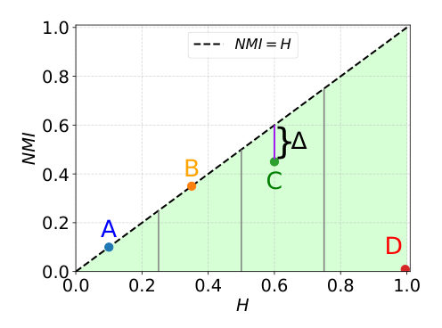 
Figure 1: Schematic representation of NMI vs. H. The green region delimits the admissible zone for the pair of points (H, NMI). The dashed line represents the identity line (NMI = H). The vertical distance from a point in the admissible region to that line (∆= H −NMI) indicates the degree of independence of the variable X relative to Y (if the projection considers the entropy H(X)), with maximum independence reached when ∆= H.

📷 Fig 2

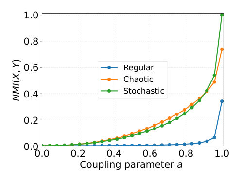 
Figure 2: Normalized mutual information (NMI(X, Y )) vs. the coupling parameter a for the different dynamical regimes.

📷 Fig 3

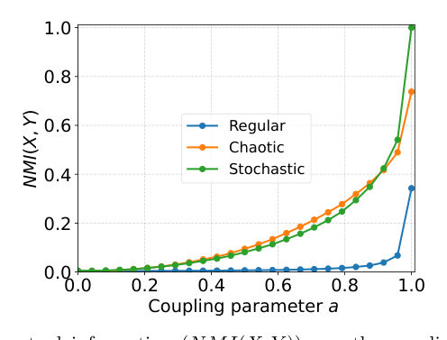 
Figure 3 shows the graph of NMI(X, Y ) versus the normalized permutation entropy H(X) for the different dynamics considered and for various values of the coupling parameter a. It can be observed that the entropy remains constant for each type of dynamics, and as the value of a increases, the value of the normalized mutual information NMI(X, Y ) increases until it reaches the maximum value given by the identity line NMI(X, Y ) = H(X). It is important to note that for this analysis, 25 values of a ∈[0, 1] were considered, with NMI = 0 when a = 0 (completely independent dynamics) and NMI(X, Y ) = H(X) when a = 1 (completely dependent dynamics).

📷 Fig 4

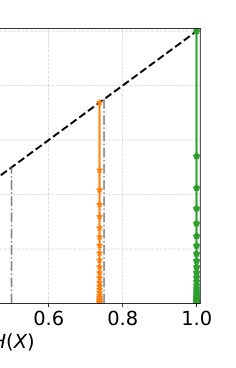 
Figure 3: NMI(X, Y ) vs. H(X) for the different dynamics considered.

📷 Fig 5

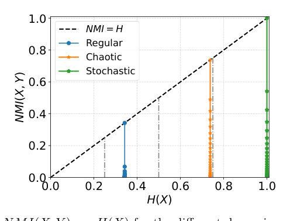 
Figure 4 shows the NMI(X, Y ) vs. H(X) and NMI(X, Y ) vs. H(Y ) planes to illustrate that projecting onto the entropy of the driving dynamics xt is generally not equivalent to projecting onto the entropy of the resulting process yt. The points in both representations coincide only under symmetric coupling conditions. Furthermore, it can be observed that ∆x = H(X) −NMI(X, Y ) &lt; ∆y = H(Y ) −NMI(X, Y ) across all values of the coupling parameter a ∈[0, 1). This asymmetry indicates a clear dependence of yt on xt, thereby establishing a directional flow of information between the time series.

**Summary.** This paper introduces the Mutual Information-Entropy (NMI-H) plane, a novel tool for analyzing time series by mapping intrinsic uncertainty against shared information. It uses entropy and mutual information to characterize dynamical systems, successfully distinguishing between regular, chaotic, and stochastic behaviors. Furthermore, it quantifies information flow directionality using conditional entropy projections.

**Why it may be interesting.** While not directly quantum, the concept of quantifying information flow and dependence ($\Delta_x = H(X|Y)$) is fundamentally related to quantum information measures like mutual information and entanglement entropy, offering a classical analogy for analyzing system coupling.

Detailed structure

**Main problem.** To develop a new two-dimensional quantifier plane for time series analysis that simultaneously characterizes the intrinsic uncertainty of a variable and the amount of information it shares with another.

**Main result.** The proposed NMI-H plane successfully characterizes distinct dynamical regimes (regular, chaotic, stochastic) and reveals directional information flow via conditional entropy projections.

**Method.** The plane combines normalized permutation entropy (H) and normalized permutation mutual information (NMI), using the difference (Delta) to quantify conditional entropy and informational independence.

**Model / system.** The analysis is applied to various time series representing different dynamical regimes, including regular oscillations, deterministic chaotic systems (like the logistic map), and stochastic noise.

**Key observables.** Normalized Permutation Entropy (H), Normalized Mutual Information (NMI), and the conditional entropy measures (Delta_x, Delta_y).

**Important parameters / regimes.** The coupling factor ($a$) used to construct coupled time series, and the embedding dimension used for normalization.

**Assumptions / limitations.** The method relies on consistent normalization derived from the Bandt and Pompe embedding dimension, but is sensitive to time series preprocessing and short/noisy data.

**Figures summary.** Figures illustrate the admissible region in the (H, NMI) plane, the evolution of NMI with the coupling parameter $a$ for different dynamics, and the asymmetry in conditional entropy projections ($\Delta_x$ vs. $\Delta_y$) demonstrating directionality.

**Paper structure.** The paper introduces the NMI-H plane, defines the key observables (H, NMI, Delta), analyzes the theoretical implications of the plane (e.g., $\Delta=0$ vs. $\Delta=H$), and validates its utility by testing it on known dynamical systems.

Abstract

This work presents a new two-dimensional quantifier plane that combines normalized permutation entropy and normalized permutation mutual information, both derived from Shannon's information theory and normalized consistently through the embedding dimension of the Bandt and Pompe method. Each point on the plane simultaneously characterizes the intrinsic uncertainty of a variable and the amount of information it shares with another. We further show that a third quantity, equivalent to the conditional entropy of one variable given the other, introduces a notion of informational independence and, when both projections of a variable pair are considered jointly, reveals directionality between them. \\ We analyze regular, chaotic, and stochastic dynamics to illustrate the relevance of the informational plane and show how these regimes evolve as a function of a coupling factor.

[↑ back to top](#top)

### [Physics-Constrained Neural Flow Maps for Long-Horizon Prediction of Spin Dynamics](http://arxiv.org/abs/2608.22006v1)

**Authors:** Haoen Feng, Shenglan Yuan, Shirong Lin  
**Type:** theory · **Category:** numerical methods · **PDF:** <https://arxiv.org/pdf/2608.22006v1>  
**Analysis basis:** full PDF text, analyzed in chunks
**Topic relevance:** `methods for driven-dissipative` **1/5**

📷 Fig 1

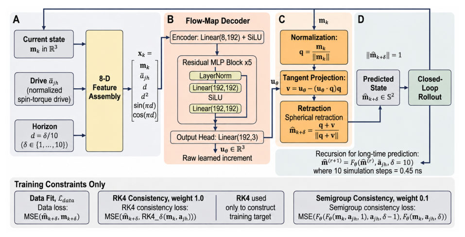 
Figure 1: Physics-constrained neural flow map. The current magnetization, normalized spin-transfer-torque strength, and requested prediction span are encoded as eight input features. A residual multi-layer perceptron produces a three-dimensional increment; tangent-space projection and spherical retraction constrain the predicted state to S2, after which the prediction is fed back for closed-loop propagation. Training combines data fitting, duplicate supervision equivalent to the data term, and single-split composition consistency. Each closed-loop call spans ten fine steps, corresponding to 0.45 ns.

📷 Fig 2

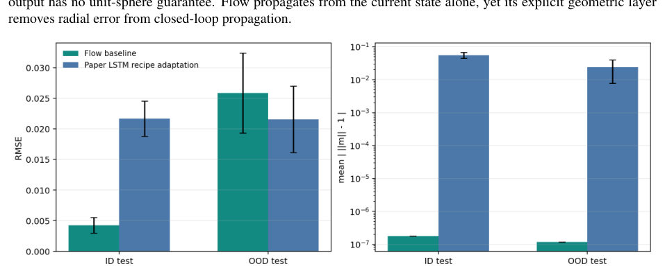 
Figure 2: Closed-loop comparison between Flow and the adapted LSTM over five independent training runs. The left panel shows componentwise RMSE for in-domain testing and stronger-drive OOD evaluation; the right panel shows maximum norm drift on a logarithmic scale. Bars and error bars denote the mean and sample standard deviation over five runs. Both methods use the same parameter split and future window, but LSTM warms up its hidden state with the complete observed history, whereas Flow reads only the boundary state.

📷 Fig 3

 
Figure 3 gives a single-trajectory waveform comparison at the in-domain boundary aJH = −0.03 to examine how temporal training coverage affects closed-loop phase error. During evaluation, every model reads reference information only through 49.995 ns and then extrapolates to approximately 200 ns. The legend labels “trained to 50” and “trained to 100” indicate that the corresponding training trajectories end at approximately 50 and 100 ns. Extending training coverage to 100 ns reduces the trajectory RMSE from 0.2373 to 0.0332 for Flow and from 0.8291 to 0.1445 for LSTM, showing that both autoregressive surrogates benefit from longer training trajectories. Under both training windows, the...

📷 Fig 4

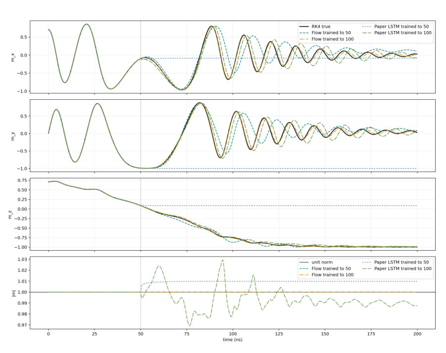 
Figure 3: Flow–LSTM waveform comparison under different temporal training horizons. The black curve is the discrete reference flow at aJH = −0.03. Green and orange denote Flow trained to approximately 50 and 100 ns; blue and light green denote the corresponding adapted LSTM models. All methods begin closed-loop extrapolation at t = 49.995 ns. The first three panels show the magnetization components, and the bottom panel shows the norm.

📷 Fig 5

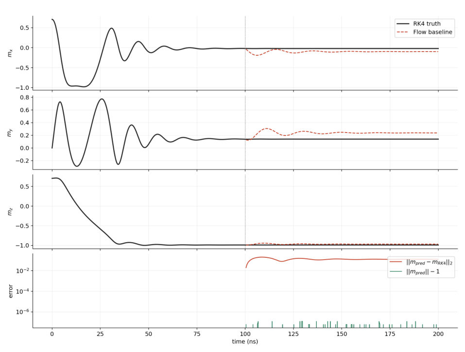 
Figure 4: Joint temporal and parameter extrapolation under the unseen, stronger drive aJH = −0.10. Closed-loop propagation begins at t = 99.99 ns and preserves unit norm throughout. Relative to the reference flow, the predicted asymptotic direction is systematically shifted in the mx and my components.

**Summary.** This paper introduces a physics-constrained neural flow map to accelerate the simulation of magnetization dynamics governed by the STT-LLG equation. By learning a direct, geometry-preserving mapping for finite-time evolution, it bypasses the need for slow, fine-step numerical integration. The method significantly improves accuracy and stability for long-horizon predictions compared to standard recurrent neural network approaches.

**Why it may be interesting.** This work provides a powerful, data-driven surrogate model for solving complex, non-linear differential equations governing magnetization dynamics, which is crucial for simulating spintronic devices and open quantum systems.

Detailed structure

**Main problem.** The primary challenge is overcoming the computational bottleneck associated with simulating current-driven magnetization dynamics, which traditionally requires computationally expensive, fine-step integration of the STT-LLG equation.

**Main result.** The proposed physics-constrained neural flow map achieves superior in-domain accuracy and geometric stability compared to an adapted LSTM baseline, enabling physically admissible long-horizon prediction.

**Method.** The authors developed a neural flow map that learns a finite-time evolution operator, mapping the current state, spin-torque strength, and time span directly to a future state in a single forward pass.

**Model / system.** The system models single-macrospin magnetization dynamics governed by the spin-transfer-torque Landau-Lifshitz-Gilbert (STT-LLG) equation, ensuring the magnetization vector remains constrained to the unit sphere ($\mathbb{S}^2$).

**Key observables.** Root Mean Square Error (RMSE) for state prediction, and maximum norm drift to quantify geometric stability.

**Important parameters / regimes.** The normalized spin-transfer-torque strength ($a_{JH}$), and the prediction time span ($\Delta t$).

**Assumptions / limitations.** The model relies on explicitly enforcing spherical geometry via tangent-space projection and spherical retraction to maintain physical admissibility, though dynamical extrapolation outside the training regime remains a limitation.

**Figures summary.** Figures compare the flow map's RMSE and norm drift against an LSTM baseline across in-domain and out-of-distribution (OOD) regimes, demonstrating superior geometric stability for the flow map.

**Paper structure.** The paper first identifies the computational bottleneck of STT-LLG simulation. It then proposes the physics-constrained flow map, detailing its architecture and loss function (incorporating data, duplication, and composition consistency terms). Finally, it validates the model by comparing its performance against LSTMs across various prediction regimes.

Abstract

Conventional simulation of current-driven magnetization relies on fine-step integration of the spin-transfer-torque Landau--Lifshitz--Gilbert equation, creating a computational bottleneck in parameter sweeps and control searches. In this work, we propose a physics-constrained neural flow map that learns finite-time dynamics directly on the unit sphere. The model maps the current magnetization, spin-torque strength, and requested time span to a future state in a single forward pass. Tangent-space projection and spherical retraction preserve unit magnetization during recursive, composition-consistent rollout. We validate the framework on single-spin trajectories under in-domain torques and previously unseen but stronger drive. Beyond the training horizon, it achieves an in-domain root mean square error of $0.00425$ with norm drift at the $10^{-7}$ level. The flow outperforms an adapted Long Short-Term Memory (LSTM) in in-domain accuracy and geometric stability, although the LSTM retains slightly lower out-of-distribution state error. The resulting geometry-preserving propagator reduces reliance on fine-step integration and enables physically admissible long-horizon prediction.

[↑ back to top](#top)

### [Pitch-controlled reorientational nonlinearity in chiral nematic liquid crystals: a reduced-order model for self-focusing and soliton formation](http://arxiv.org/abs/2608.21751v1)

**Authors:** Homa Saadatmand, M. Javad Zakeri, Ahmed Sameh Ahmed, Suraj Bhandari, Loubna Benkoula, Ameer B. Batarseh, Andrea Blanco-Redondo, Miroslaw Karpierz, Pawel S. Jung  
**Type:** theory · **Category:** other · **PDF:** <https://arxiv.org/pdf/2608.21751v1>  
**Analysis basis:** full PDF text, analyzed in chunks
**Topic relevance:** `interference shaping light` **1/5**

📷 Fig 1

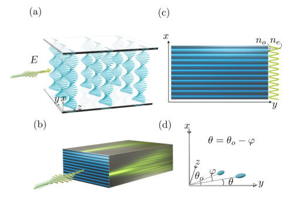 
FIG. 1: (a) Three-dimensional schematic of the chiral nematic liquid crystal (ChNLC) cell, where molecules form a periodic helical structure along the z-axis, leading to a refractive index modulation along the x-direction. (b) Beam propagation through the ChNLC medium, where the optical field experiences discrete diffraction along x and continuous diffraction along y, producing anisotropic spreading. (c) Top view illustrating the effective periodic index modulation along x (resulting in discrete diffraction), while the medium remains uniform along y. (d) Molecular reorientation geometry in the yz-plane, where the director angle is defined as θ = θ0 −φ, linking the initial alignment θ0 to...

📷 Fig 2

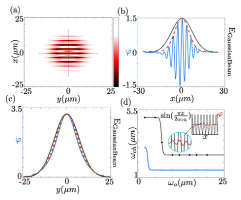 
FIG. 2: (a) Change in the molecular orientation angle φ(x, y) in the transverse plane induced by a Gaussian beam, calculated from Eq. (5). (b)–(c) The corresponding cross-sections of the reorientation angle φ along (b) the y-axis for x = 0 and (c) the x-axis for y = 0. The blue solid curve shows the numerically obtained φ, the red dashed curve represents the fitted envelope, and the black solid curve corresponds to the Gaussian beam electric-field profile. (d) Extracted ωch as a function of the input Gaussian beam waist ω0 (symbols), together with the empirical fit from Eq. (10) (solid curves) for Λ = 6 µm (blue) and Λ = 16 µm (black). Inset: comparison of the simulated reorientation...

📷 Fig 3

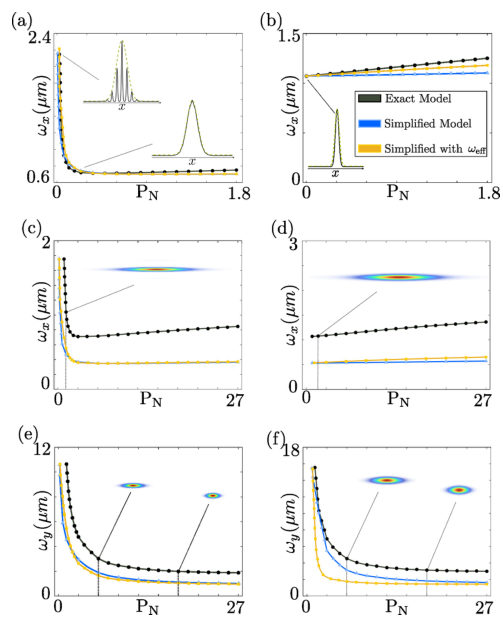 
FIG. 3: Comparison of bright soliton profiles obtained from the full numerical model (black curves), the reduced-order model (blue curves), and the effective-width approximation (yellow curves) for different chiral pitch values and transverse dimensionalities. The soliton power is normalized as PN = γ ε0∆ε

📷 Fig 4

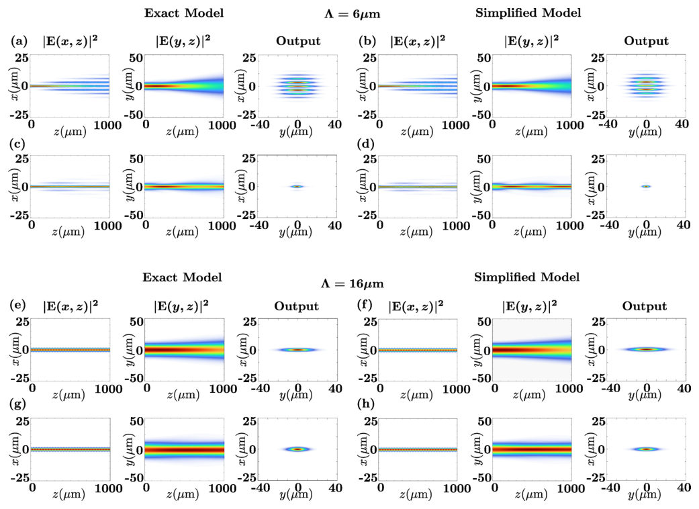 
FIG. 4: Comparison of nonlinear light dynamics obtained using the exact numerical model (left) and the reduced-order model (right), employing the approximation ωeff= Λ/8. For each case, the panels show the beam evolution along z in the xz plane at y = 0 (left), the yz plane at x = 0 (middle), and the transverse output intensity profile at z = 1 mm (right). In all simulations, the launched beam was elliptical, with parameters: for Λ = 6 µm, ω0x = 1 µm and ω0y = 6 µm (a)–(d); and for Λ = 16 µm, ω0x = 1.5 µm and ω0y = 10 µm (e)–(h). The normalized input powers were, for pitch Λ = 6 µm: (a) 3.0, (b) 1.5, (c) 4.6, (d) 2.8; and for pitch Λ = 16 µm: (e) 1.2, (f) 1.5, (g) 2.5, (h) 3.7. Comparisons...

📷 Fig 5

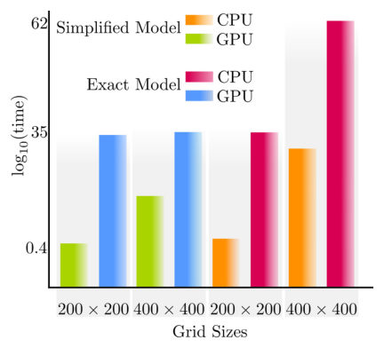 
FIG. 5: Comparison of computational cost between the simplified and exact models for transverse 2D grid sizes of 200 × 200 and 400 × 400. Simulations were performed in MATLAB R2024a on a system with an Intel(R) Core i7-14700K CPU (3.40 GHz), 128 GB RAM, and an NVIDIA GeForce RTX 4070 GPU, running Windows 11 Enterprise. The runtime corresponds to beam propagation over 200 µm. The vertical axis shows log10 of the runtime in seconds, illustrating the order-of-magnitude computational speedup achieved by the simplified model.

**Summary.** This work presents a highly efficient, reduced-order model for analyzing how light interacts with chiral nematic liquid crystals. It successfully predicts the formation of optical solitons and self-focusing, demonstrating that the crystal's inherent chiral pitch dictates the confinement scale. This provides a powerful, fast tool for designing nonlinear photonic devices using soft matter.

**Why it may be interesting.** The coupling between light propagation (optics) and the nonlinear, soft-matter director field (liquid crystals) presents a complex, non-Hamiltonian, nonlinear wave problem relevant to nonlinear optics and pattern formation.

Detailed structure

**Main problem.** The paper aims to develop a computationally efficient model to study nonlinear self-focusing and soliton formation in chiral nematic liquid crystals (ChNLCs).

**Main result.** The reduced-order model successfully reproduces the essential physics of saturable reorientational self-focusing, showing that the chiral pitch governs the characteristic length scale for soliton formation.

**Method.** The authors derived a reduced-order, semi-analytical model starting from the full Frank-Oseen equation, significantly reducing computational cost compared to standard iterative solvers.

**Model / system.** The system is Chiral Nematic Liquid Crystals (ChNLCs) whose optical properties are governed by light-induced molecular reorientation, described by the Frank-Oseen free energy minimization.

**Key observables.** Nonlinear refractive index, onset of self-localization, formation of discrete/continuous solitons, and astigmatic nematicons.

**Important parameters / regimes.** Chiral Pitch (Lambda, $\Lambda$), input beam waist ($\omega_0$), and elastic constants ($K$).

**Assumptions / limitations.** The model employs an adiabatic approximation for director dynamics and neglects full spatial nonlocality and long-range elastic interactions.

**Figures summary.** Figures illustrate the ChNLC cell structure, beam propagation, index modulation, and 2D soliton intensity distributions comparing exact and simplified model predictions.

**Paper structure.** The paper progresses from establishing the physical problem and governing equations (Frank-Oseen) to deriving the reduced-order model, validating its ability to capture key nonlinear phenomena (self-focusing, soliton transition) across 1D and 2D geometries.

Abstract

We present a reduced-order semi-analytical model for reorientational nonlinearity in chiral nematic liquid crystals, showing that the chiral pitch acts as the dominant physical length scale governing the onset of nonlinear self-focusing and soliton formation. Starting from the full Frank-Oseen equation, we derive a closed-form expression for the optically induced molecular rotation that captures the essential saturable response of the medium while reducing computational cost by more than two orders of magnitude compared with standard relaxation-method solvers. Despite its simplicity, the model reproduces the essential features of the numerically obtained nonlinear refractive index, the onset of self-localization, and the transition from discrete to continuous solitons in one and two dimensions. It further predicts the formation of fully localized astigmatic nematicons with only minor shifts in the self-localization threshold due to the neglect of nonlocal effects. The proposed model provides direct physical insight into light-matter interactions with soft matter media and offers a computationally efficient tool for the design and optimization of nonlinear photonic devices.

[↑ back to top](#top)

### [Three-dimensional Ising superconductors designed via inversion-symmetry breaking in intercalated NbSe$_2$ and NbTe$_2$](http://arxiv.org/abs/2608.23083v1)

**Authors:** Wenqian Tu, Run Lv, Xiaoying Li, Li'e Liu, Dingfu Shao, Yuping Sun, Wenjian Lu  
**Type:** theory · **Category:** strongly correlated electrons · **PDF:** <https://arxiv.org/pdf/2608.23083v1>  
**Analysis basis:** full PDF text, analyzed in chunks
**Topic relevance:** `Keldysh / 2PI / non-Gaussian methods` **1/5**

📷 Fig 1

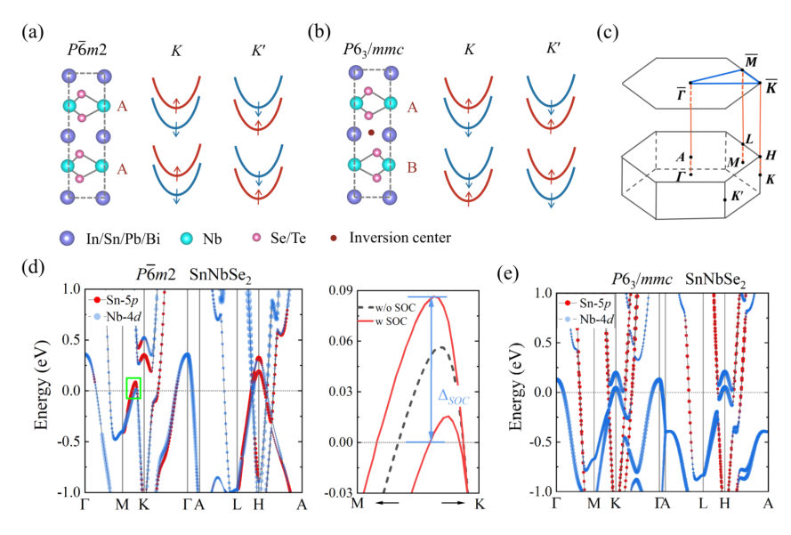 
FIG. 1. (a), (b) Crystal structures and schematic single-layer band dispersions near the K and K′ valleys for the non- centrosymmetric P¯6m2 phase and the centrosymmetric P63/mmc phase. The red dot in (b) marks the inversion center. (c) Bulk and projected (001) surface Brillouin zones of the hexagonal lattice. (d) Orbital-projected band structure of SnNbSe2 in the P¯6m2 phase, where the contributions of Sn-5p and Nb-4d orbitals are indicated by red and blue dots, respectively. The right panel enlarges the green-boxed region along M-K with (solid red) and without (dashed black) SOC. The blue arrow marks the SOC-induced band splitting ∆SOC. (e) Orbital-projected band structure of SnNbSe2 in...

📷 Fig 2

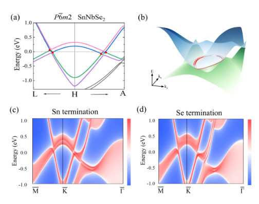 
FIG. 2. (a) Band structure of SnNbSe2 in the P¯6m2 phase along the L-H-A path, with nodal-line crossings marked by red dots. (b) 3D band dispersion in the kx-ky plane, where nodal rings are highlighted as red loops. (c), (d) Surface state spectra for the Sn-terminated and Se-terminated (001) sur- faces, respectively.

📷 Fig 3

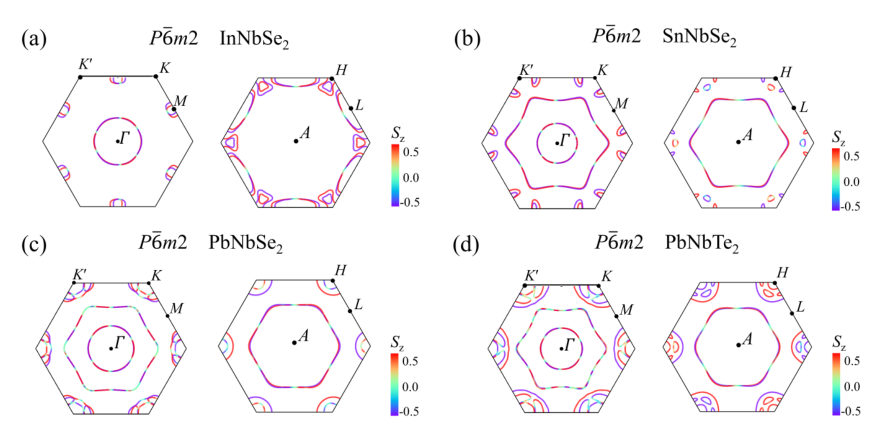 
FIG. 3. Spin-projected Fermi surfaces of the four superconducting candidates in the P¯6m2 structure, colored by the out-of-plane spin component Sz (red: positive, blue: negative). For each compound, the left and right columns show the Fermi surfaces at kz = 0 and kz = 1/2 planes, respectively. (a) InNbSe2, (b) SnNbSe2, (c) PbNbSe2 and (d) PbNbTe2.

📷 Fig 4

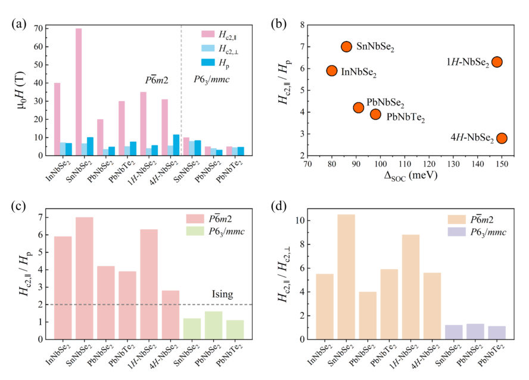 
FIG. 4. (a) Calculated in-plane upper critical field Hc2,∥(pink), out-of-plane upper critical field Hc2,⊥(light blue), and Pauli paramagnetic limit HP (dark blue) for nine compounds. The vertical dashed line separates the non-centrosymmetric P¯6m2 phase (left) from the centrosymmetric P63/mmc phase (right). (b) Ratio Hc2,∥/HP as a function of the SOC splitting ∆SOC for the four compounds in the P¯6m2 phase and the two reference non-centrosymmetric polytypes. (c) Ratio Hc2,∥/HP for all nine compounds, with the P¯6m2 (pink) and P63/mmc (green) phases distinguished. The dashed line marks Hc2,∥/HP = 2. (d) Anisotropy ratio Hc2,∥/Hc2,⊥, with the P¯6m2 (orange) and P63/mmc (purple) phases...

📷 Fig 5

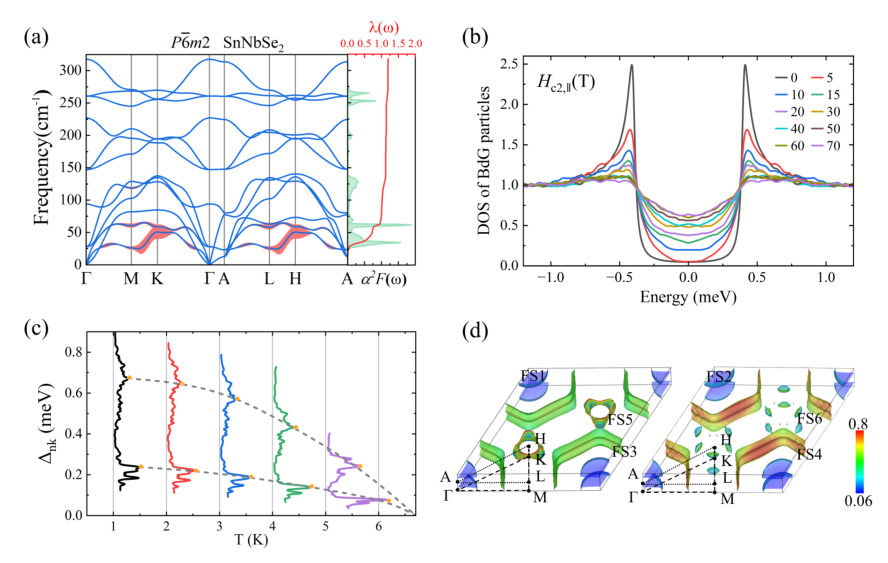 
FIG. 5. (a) Phonon dispersions of SnNbSe2 in the P¯6m2 phase weighted by the magnitude of electron-phonon coupling (EPC) strength γqν. The Eliashberg spectral function α2F(ω) (gray) and the integrated strength of the EPC constant λ(ω) (red) are plotted on the right side. (b) Quasiparticle density of states from the BdG Hamiltonian under different in-plane Zeeman fields. (c) Temperature-dependent superconducting gap ∆nk. The dashed lines are guides to the eye. (d) Momentum-resolved superconducting gap ∆k at T = 1 K projected onto the Fermi surface.

**Summary.** This work demonstrates that intercalating guest atoms into TMDs like NbSe2 can break inversion symmetry, which is crucial for stabilizing 3D Ising superconductivity. By identifying specific non-centrosymmetric phases, the authors predict that these materials can achieve upper critical fields significantly higher than the Pauli limit. This establishes intercalation as a powerful tool for designing novel superconducting materials.

**Why it may be interesting.** The concept of engineering superconductivity via symmetry breaking (specifically inversion symmetry) to enhance superconducting properties like critical fields is highly relevant to understanding exotic quantum states in condensed matter systems.

Detailed structure

**Main problem.** The challenge is realizing and understanding three-dimensional (3D) Ising superconductors, which exhibit upper critical fields far exceeding the Pauli paramagnetic limit.

**Main result.** Intercalation is established as a viable symmetry-engineering strategy to create 3D Ising superconductors in TMDs, with specific compounds like InNbSe2 and SnNbSe2 showing predicted high critical fields.

**Method.** The study uses first-principles calculations (DFT) combined with Bogoliubov-de Gennes (BdG) theory to model superconductivity and critical fields.

**Model / system.** The system involves intercalated NbSe2 and NbTe2 compounds, specifically focusing on the non-centrosymmetric P-6m2 polytype where inversion symmetry is broken. The superconducting state is modeled using a BdG Hamiltonian incorporating spin-orbit coupling and Zeeman terms.

**Key observables.** In-plane upper critical fields (H_c2,parallel), superconducting transition temperature (T_c), and the out-of-plane spin purity on the Fermi surface.

**Important parameters / regimes.** SOC splittings (80-100 meV), Pauli paramagnetic limit (H_P), and the ratio H_c2,parallel / H_P (predicted 4-7).

**Assumptions / limitations.** The superconducting pairing is modeled as s-wave spin-singlet, and the analysis relies on the assumption that intercalation successfully breaks inversion symmetry.

**Figures summary.** Figures illustrate crystal structures, band dispersions showing SOC splitting, and potentially the superconducting gap structure or spin texture maps.

**Paper structure.** The paper systematically designs 16 compounds, identifies the four promising non-centrosymmetric candidates, and then uses advanced calculations (BdG, spin texture analysis) to confirm the Ising superconducting mechanism and predict high critical fields.

Abstract

Ising superconductors exhibit in-plane upper critical fields far exceeding the Pauli paramagnetic limit, a hallmark first established in two-dimensional (2D) monolayer transition-metal dichalcogenides (TMDs). This field resilience requires the coexistence of strong spin-orbit coupling (SOC) and broken inversion symmetry, yet three-dimensional (3D) bulk realizations remain scarce because equilibrium stacking typically restores inversion symmetry. Here we demonstrate that intercalation provides a practical route to break this symmetry, systematically designing 16 NbSe$_2$- and NbTe$_2$-based compounds from four intercalants (In, Sn, Pb, Bi) across two polytypes: non-centrosymmetric $P\bar{6}m2$ and centrosymmetric $P6_3/mmc$. Four compounds in the $P\bar{6}m2$ phase, InNbSe$_2$, SnNbSe$_2$, PbNbSe$_2$, and PbNbTe$_2$, emerge as promising 3D Ising superconductors. They exhibit SOC splittings of 80-100 meV near the Fermi level, dominant out-of-plane spin polarization, and anisotropic superconductivity with $T_c=2.6$-$5.4$ K. Notably, spin-texture analysis reveals that the efficiency of Ising protection is governed not by the magnitude of SOC splitting alone but by the out-of-plane spin purity on the Fermi surface. Bogoliubov-de Gennes (BdG) calculations predict in-plane upper critical fields reaching 4-7 times the Pauli limit. These findings establish intercalation as a promising symmetry-engineering strategy for realizing 3D Ising superconductors in TMDs.

[↑ back to top](#top)

### Other secondary papers (2)

Show other secondary papers

### [Chiral Phonons and Giant Anisotropic Photoresponse in Quasi-1D van der Waals Semiconductor ZrSnS3](http://arxiv.org/abs/2608.22700v1)

**Authors:** Zahir Muhammad, Shashi B. Mishra, Gayatri, Grzegorz Krasucki, Wajid Ali, Katarzyna Olkowska-Pucko, Obaid Iqbal, Zia Ur Rehman, Aziz Ur Rahman, Maciej R. Molas, Lin Xiaoyang, Weisheng Zhao  
**Type:** both · **Category:** other · **PDF:** <https://arxiv.org/pdf/2608.22700v1>  
**Analysis basis:** full PDF text, analyzed in chunks

📷 Fig 1

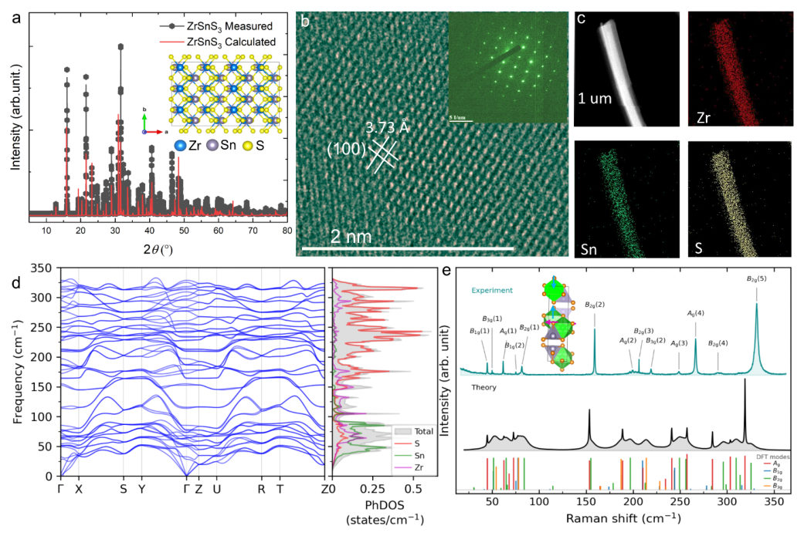 
FIG. 1. Structure characterization and Raman modes analysis of ZrSnS3: (a) Powder XRD analysis of grounded ZrSnS3 single crystals compared with standard ZrSnS3 data, inset: structure configuration of ZrSnS3, (b) HAADF STEM shows the crystal structure with lattice spacing of 3.73 ˚A, inset: the corresponding SAED pattern. (c) TEM image and its elemental mapping showing Zr, Sn, and S, respectively. (d) Phonon dispersion, along with total and atom-projected phonon density of states. (e) Experimental Raman spectrum measured at 5 K using 785 nm excitation and 500 µW laser power, compared with the unpolarized first-principles Raman spectrum. The theoretical spectrum is Lorentzian-broadened with...

📷 Fig 2

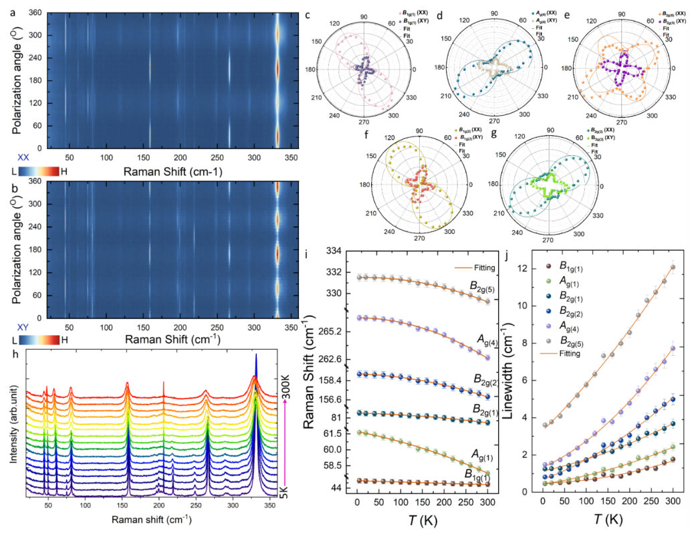 
FIG. 2. Polarization and temperature-dependent RS of ZrSnS3: (a, b) angle-dependent contour map of the RS using parallel and perpendicular polarization configurations, and (c-g) corresponding polar plots of higher-intensity modes at both parallel and vertical configurations, respectively. The measurement was performed at 5 K using an excitation energy of 785 nm with a laser power of 500 µW. (h) Raman spectra of ZrSnS3 as a function of temperature from 5 K to room temperature; (i, j) Raman energy shift and the corresponding linewidth as a function of temperature and their fitting. The orange line shows the corresponding fit using the Klemens model. For temperature-dependent measurements, the...

📷 Fig 3

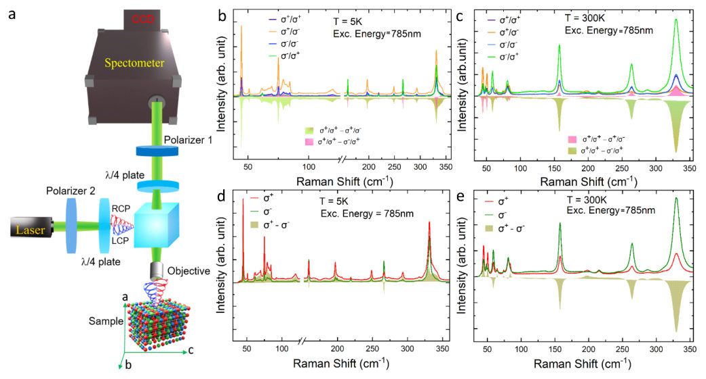 
FIG. 3. Circular polarized Raman spectra: (a) Schematic of the optical setup for helicity-resolved Raman spectroscopy measurements. Circularly and helicity-resolved Raman spectra of ZrSnS3 using laser excitation at 785 nm and a laser power of 1.2 mW measured at (b) 5 K and (c) 300 K. (d) &amp; (e) Helicity-resolved Raman spectra of ZrSnS3 with left and right circular polarization (σ+ and σ−) and the corresponding difference shows the chirality measured at 5 K and 300 K with fixed laser power of 1.2 mW, respectively.

📷 Fig 4

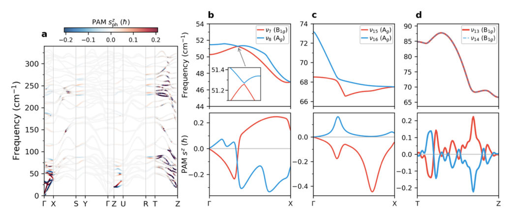 
FIG. 4. Chiral Phonons in ZrSnS3 from theory. (a) Calculated Phonon pseudo angular momentum (PAM) sz, along high-symmetry directions of the Brillouin zone, showing finite chirality mainly along Γ −X, Z −U, and T −Z. (b) Avoided crossing between B1g(1) and Ag(1) branches (ν = 7, 8) along Γ−X, together with the corresponding sz, showing a sign reversal as the modes exchange character. The zoom-in inset resolves the narrow gap at the avoided crossing. (c) Avoided crossing between Ag(2)-derived branches (ν = 15, 16) along Γ −X, producing the strongest low-frequency single branch PAM response. (d) Nearly degenerate B1g(2) phonon pairs (ν = 13, 14) along Γ −Z, with opposite sz carried by the two...

📷 Fig 5

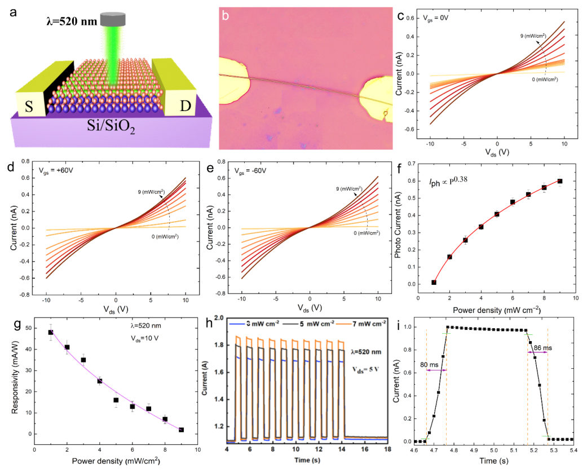 
FIG. 5. Performance of the photodetector based on ZrSnS3 nanowire. (a) Schematic diagram of the ZrSnS3 photode- tector on a SiO2/Si substrate. (b) Optical microscope photograph of the ZrSnS3 photodetector. Scale bar: 10 µm. (c-e) The photo current (Iph) at various power intensities of the incident 520 nm laser at gated voltage Vg (±60 V, 0 V). (f) Power density- dependent photocurrent under 520 nm illumination and the corresponding power-law fit. (g) Responsivity of the photodetector at 10 V source under 520 nm laser illumination at various intensities. (h) Long-time response stability of the photodetector. (i) The response time of the photodetector.

**Summary.** This work characterizes the anisotropic lattice dynamics of the 1D van der Waals semiconductor ZrSnS3 using advanced Raman spectroscopy and DFT. The study confirms strong structural anisotropy and reveals helicity-dependent phonon signatures, which are further validated by measuring a highly anisotropic photoresponse in fabricated nanowire devices. This establishes ZrSnS3 as a promising material for polarization-sensitive optoelectronics.

**Why it may be interesting.** The strong coupling observed between polarization, lattice vibrations (phonons), and charge carriers in a low-dimensional material like ZrSnS3 provides a platform for understanding directional quantum transport phenomena.

Detailed structure

**Main problem.** The study investigates the anisotropic lattice dynamics and photoresponse in the quasi-1D van der Waals semiconductor ZrSnS3.

**Main result.** The material exhibits strong structural and lattice anisotropy, evidenced by helicity-dependent phonon responses and a pronounced, power-scalable anisotropic photoresponse in fabricated nanowires.

**Method.** The research combines experimental techniques like angle- and polarization-dependent Raman spectroscopy with first-principles Density Functional Theory (DFT) calculations.

**Model / system.** The physical system is the quasi-one-dimensional van der Waals semiconductor ZrSnS3, belonging to the MXQ3 family, which possesses an orthorhombic structure.

**Key observables.** Raman spectra (unpolarized, polarized, helicity-resolved), phonon dispersion, photoresponsivity (mA/W), and temperature-dependent shifts/linewidths.

**Important parameters / regimes.** Temperature (e.g., 5 K), excitation wavelengths (405 nm vs. 785 nm), and polarization/helicity states.

**Assumptions / limitations.** The analysis assumes that the backscattering arrangement limits observation to certain symmetry modes, and that the Klemens model can describe anharmonic effects.

**Figures summary.** Figures show XRD/STEM confirmation of structure, phonon dispersion/DOS, comparison of experimental/theoretical Raman spectra, and polarization/temperature dependence maps.

**Paper structure.** The paper proceeds by characterizing the structure (XRD/STEM), validating lattice dynamics via DFT/Raman comparison, detailing temperature and polarization dependencies (including chirality), and concluding with optoelectronic device measurements.

Abstract

Low-dimensional van der Waals semiconductors with reduced symmetry provide a unique platform for exploring anisotropic physical properties. The quasi-one-dimensional family MXQ$_3$ (M = Hf, Zr; X = Sn; Q = S, Se) exhibits notable structural anisotropy, where zigzag atomic chains influence optical phenomena such as birefringence. This study investigates anisotropic lattice dynamics in ZrSnS$_3$ using angle- and polarization-dependent Raman spectroscopy. Temperature-dependent measurements reveal anharmonic phonon behavior, indicating strong phonon-phonon coupling. Density functional theory calculations show good agreement with the experimentally observed Raman spectra, validating the microscopic description of the lattice dynamics. We also observe a helicity-dependent intensity and a reversal in phonon intensity between lower- and higher-frequency modes under circularly polarized light, which is characteristic of chiral phonons governed by the polarization of the Zr/Sn chains. Our first-principles analysis further shows that angular-momentum-like phonon textures can emerge away from the $Γ$-point near mode-hybridization and avoided-crossing regions, providing microscopic insight into the observed helicity-dependent Raman signatures. Furthermore, we fabricate an optoelectronic device from a thin ZrSnS$_3$ nanowire, demonstrating a photoresponsivity of 50~mA/W under 520~nm laser excitation (1~mW/cm$^2$). The device exhibits a pronounced, power-scalable anisotropic photoresponse with a clear preferred polarization direction. These results highlight the coupling mechanisms between polarization, lattice vibrations, and charge carriers in ZrSnS$_3$, establishing it as a promising material for polarization-sensitive optoelectronics and directional quantum transport.

[↑ back to top](#top)

### [Quantum Geometry Driven Optical Responses in 1T-MX$_2$ Monolayers: A Symmetry-Constrained Slater-Koster Tight-Binding Approach](http://arxiv.org/abs/2608.23289v1)

**Authors:** Bikram Baruah, Snehasish Nandy, Subhasis Panda  
**Type:** theory · **Category:** other · **PDF:** <https://arxiv.org/pdf/2608.23289v1>  
**Analysis basis:** full PDF text, analyzed in chunks

📷 Fig 1

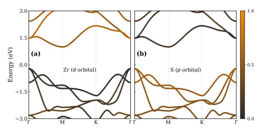 
FIG. 2. DFT-computed orbital-projected band structures of mono- layer ZrS2, illustrating the partial contributions of (a) Zr 4d and (b) S 3p states.

📷 Fig 2

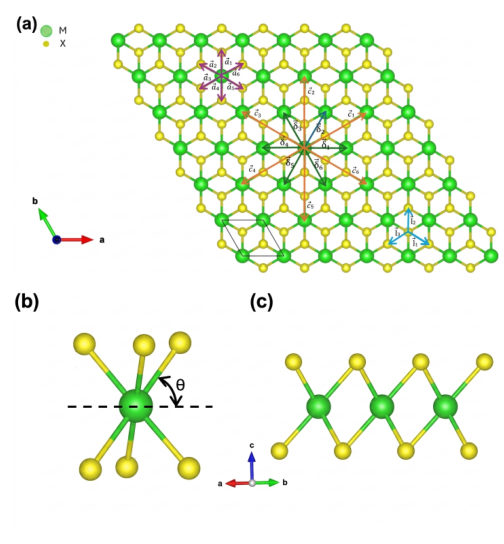 
FIG. 1. (a) Crystal structure of a monolayer 1T-MX2 compound, showing hopping vectors connecting nearest and next-nearest neigh- bor sites in the basal plane, (b) the angle between M–X bond and M layer, and (c) side view of the single layer 1T-MX2 compounds showing X–M–X stacking

📷 Fig 3

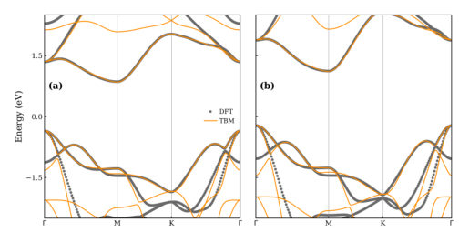 
FIG. 3. Band structures of monolayer (a) ZrS2 and (b) HfS2: DFT (gray dots) and TB model (orange solid lines).

📷 Fig 4

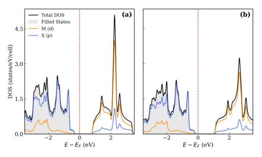 
FIG. 4. Total and orbital-projected DOS for monolayer (a) ZrS2 and (b) HfS2 obtained from the TB model. The shaded region indicates occupied states, and the red dashed line marks the Fermi level.

📷 Fig 5

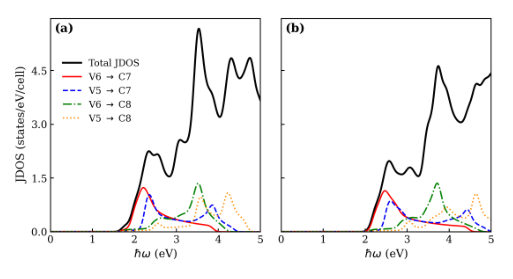 
FIG. 5. JDOS for monolayer (a) ZrS2 and (b) HfS2. The black curves represent the total JDOS, and the colored curves show the leading band-pair contributions arising from transitions between the upper valence and lower conduction bands.

**Summary.** This work develops a symmetry-constrained tight-binding model to study 1T-MX2 monolayers, linking their electronic structure to their quantum geometry. By showing that the interband f-sum rule connects the integrated optical spectral weight to the quantum metric, the authors propose that optical measurements can serve as a direct, experimental probe of the material's underlying quantum geometry.

**Why it may be interesting.** While focused on solid-state physics, the explicit connection between measurable optical properties (spectral weight) and a fundamental geometric invariant (quantum metric) provides a powerful, quantifiable diagnostic tool applicable to any system where geometry dictates electronic response.

Detailed structure

**Main problem.** The paper aims to develop a comprehensive, microscopic theoretical framework to connect the quantum geometry, electronic band structure, and optical response in 1T-MX2 monolayers.

**Main result.** They establish that the integrated optical spectral weight serves as an experimentally accessible probe for quantifying the quantum geometry of the occupied Bloch states in these materials.

**Method.** The study employs a transferable eleven-band Slater-Koster tight-binding (SK-TB) model, parameterized using DFT calculations for specific materials.

**Model / system.** The system is the centrosymmetric 1T-MX2 monolayer (e.g., ZrS2), modeled by an 11-band Hamiltonian constructed in an orthogonal orbital basis using symmetry-constrained SK parameters.

**Key observables.** Electronic structure (band gaps), optical conductivity (spectral weight), and the quantum metric (quantum geometric tensor).

**Important parameters / regimes.** The M–X bond angle ($	heta$) and the lattice constant ($a$) are key geometric parameters governing the Hamiltonian.

**Assumptions / limitations.** The primary assumption is that the SK-TB model, parameterized by DFT, can accurately capture the complex interplay between electronic structure and quantum geometry across the entire isostructural 1T-MX2 family.

**Figures summary.** The notes mention figures showing the crystal structure, the M–X bond angle ($	heta$), and DFT-computed orbital-projected band structures for monolayer ZrS2.

**Paper structure.** The paper develops the SK-TB Hamiltonian by defining various hopping matrices (M-X, X-X, M-M) based on the crystal geometry, parameterizes these using DFT fitting procedures, and then uses the resulting model to calculate and relate the quantum metric to the optical spectral weight.

Abstract

Centrosymmetric 1T-MX$_2$ monolayers(MLs) have attracted considerable attention owing to their intriguing transport properties and potential technological applications arising from the interplay among quantum geometry, electronic band structure, and band-gap characteristics. Despite this rich physics, a comprehensive microscopic tight-binding(TB) description that simultaneously captures these properties remains insufficiently established, while first-principles approaches can be computationally demanding for systematic investigations across different materials and perturbations. Here, we develop a transferable eleven-band Slater-Koster TB description of ML 1T-MX$_2$ TMDs and use it to establish a connection among their microscopic electronic structure, quantum geometry, and optical response. The model is constructed in an orthogonal orbital basis from the crystal geometry and symmetry-constrained SK parameters, with material-specific parametrizations obtained from DFT calculations for ML ZrS$_2$ and HfS$_2$. The resulting geometry-based Hamiltonian accurately describes the low-energy electronic structures and provides a natural framework for extending the analysis to the broader isostructural 1T-MX$_2$ family. We find that the pristine MLs possess a finite quantum metric, with the dominant contribution concentrated in the two highest occupied bands owing to the small near-gap energy separation and strong metal-chalcogen $p$-$d$ hybridization. Furthermore, we verify the interband $f$-sum rule, which directly relates the integrated optical spectral weight to the Brillouin-zone-averaged quantum metric. Our results establish optical spectral weight as an experimentally accessible probe of the quantum geometry of occupied Bloch states and provide a unified microscopic framework for connecting electronic structure, quantum geometry, and measurable optical responses across the 1T-MX$_2$ family.

[↑ back to top](#top)

