
# arxiv digest (quant-ph + cond-mat) — 2026-08-27

*114 papers · 17 relevant · 2 highlighted*

## 🔥 Most relevant (17)

*Every paper with at least one nonzero topic score, sorted by best-matching score. 🔥 marks scores ≥4/5. Click the title to jump to the full entry below; click [arXiv] to open the paper page. `(secondary)` marks papers from de-prioritized cond-mat archives.*

Show 17 relevant papers

- [Sustained macroscopic quantum coherence in a superradiant solid under ambient conditions](#paper-2608.23748) [[arXiv]](http://arxiv.org/abs/2608.23748v1) — 🔥 `Dicke superradiance` **4/5** · 🔥 `driven-dissipative phase transition` **4/5** · 🔥 `superradiant laser` **4/5** · `Tavis-Cummings & cavity-many-emitter` **3/5** · `correlated / nonlocal dissipation` **3/5** · `quantum optics experiment` **3/5** · `analog quantum simulation` **2/5** · `methods for driven-dissipative` **2/5** · `non-equilibrium universality` **2/5** · `Keldysh / 2PI / non-Gaussian methods` **1/5** · `QC/QI experiment` **1/5** · `quantum measurements` **1/5**
- [Scalable Lindblad Noise Learning via Stochastic Tensor-Network Simulation](#paper-2608.24668) [[arXiv]](http://arxiv.org/abs/2608.24668v1) — 🔥 `methods for driven-dissipative` **4/5** · `correlated / nonlocal dissipation` **3/5** · `driven-dissipative phase transition` **3/5** · `analog quantum simulation` **2/5** · `non-equilibrium universality` **2/5** · `quantum measurements` **2/5** · `Keldysh / 2PI / non-Gaussian methods` **1/5**
- [Nonequilibrium pulse dynamics and metastable latching in nonlinear kinetic inductance detectors](#paper-2608.23902) [[arXiv]](http://arxiv.org/abs/2608.23902v1) `(secondary)` — 🔥 `driven-dissipative phase transition` **4/5** · `non-equilibrium universality` **3/5** · `methods for driven-dissipative` **2/5** · `Keldysh / 2PI / non-Gaussian methods` **1/5** · `analog quantum simulation` **1/5** · `correlated / nonlocal dissipation` **1/5** · `quantum measurements` **1/5** · `scars & prethermalization` **1/5**
- [Towards Stirling cooler operable single-photon sources based on low-noise GaAs quantum dots](#paper-2608.24409) [[arXiv]](http://arxiv.org/abs/2608.24409v1) — 🔥 `quantum optics experiment` **4/5** · `interference shaping light` **3/5** · `QC/QI experiment` **1/5** · `Tavis-Cummings & cavity-many-emitter` **1/5** · `correlated / nonlocal dissipation` **1/5** · `driven-dissipative phase transition` **1/5** · `methods for driven-dissipative` **1/5** · `quantum measurements` **1/5**
- [Hamiltonian Learning at Scale](#paper-2608.23707) [[arXiv]](http://arxiv.org/abs/2608.23707v1) — 🔥 `methods for driven-dissipative` **4/5** · `analog quantum simulation` **3/5** · `quantum measurements` **2/5** · `correlated / nonlocal dissipation` **1/5** · `driven-dissipative phase transition` **1/5**
- [Observation of electron spin interactions between Rydberg atoms](#paper-2608.23711) [[arXiv]](http://arxiv.org/abs/2608.23711v1) — 🔥 `Rydberg arrays` **4/5** · 🔥 `analog quantum simulation` **4/5** · `QC/QI experiment` **2/5** · `quantum optics experiment` **1/5**
- ⭐ [Tunable-Size Unruh-DeWitt Detector in a Multimode Cavity](#paper-2608.24451) [[arXiv]](http://arxiv.org/abs/2608.24451v1) — 🔥 `analog quantum simulation` **4/5** · `Tavis-Cummings & cavity-many-emitter` **2/5** · `quantum measurements` **2/5** · `Keldysh / 2PI / non-Gaussian methods` **1/5** · `correlated / nonlocal dissipation` **1/5** · `methods for driven-dissipative` **1/5**
- [Tunable Mediated Interactions Near Spontaneous Symmetry Breaking: From Yukawa to Coulomb and Dzyaloshinskii--Moriya Interactions](#paper-2608.23954) [[arXiv]](http://arxiv.org/abs/2608.23954v1) — 🔥 `analog quantum simulation` **4/5** · `Keldysh / 2PI / non-Gaussian methods` **3/5** · `correlated / nonlocal dissipation` **2/5** · `methods for driven-dissipative` **1/5**
- [Three-slit interference with a which-path memory ancilla: A bright-dark state formulation](#paper-2608.24243) [[arXiv]](http://arxiv.org/abs/2608.24243v1) — 🔥 `interference shaping light` **4/5** · `methods for driven-dissipative` **2/5** · `quantum measurements` **2/5** · `correlated / nonlocal dissipation` **1/5**
- [AlGaAs nanowires as a universal platform for GaAs, InGaAs, and InAs quantum dots](#paper-2608.24495) [[arXiv]](http://arxiv.org/abs/2608.24495v1) — 🔥 `QC/QI experiment` **4/5** · `quantum optics experiment` **3/5** · `quantum measurements` **1/5**
- [Universal Spin-Position Coupled Rydberg Interactions](#paper-2608.23694) [[arXiv]](http://arxiv.org/abs/2608.23694v1) — 🔥 `Rydberg arrays` **4/5** · 🔥 `analog quantum simulation` **4/5**
- [QML for Quantum Sensing under Measurement-Induced Information Loss](#paper-2608.23934) [[arXiv]](http://arxiv.org/abs/2608.23934v1) — 🔥 `quantum measurements` **4/5** · `QC/QI experiment` **3/5**
- [Quantum simulation of circular cluster interactions in a linear spin chain](#paper-2608.24502) [[arXiv]](http://arxiv.org/abs/2608.24502v1) — 🔥 `analog quantum simulation` **4/5** · `quantum measurements` **2/5** · `methods for driven-dissipative` **1/5**
- [Bang-bang protocol for nondispersive qubit readout](#paper-2608.23681) [[arXiv]](http://arxiv.org/abs/2608.23681v1) — 🔥 `quantum measurements` **4/5** · `QC/QI experiment` **2/5**
- [Lifting connectivity bottlenecks in superconducting quantum processors via enriched native two-qubit gates](#paper-2608.24084) [[arXiv]](http://arxiv.org/abs/2608.24084v1) — 🔥 `QC/QI experiment` **4/5**
- [Quantum Change Intervals: Exact Asymptotic Localization with Collective Measurements](#paper-2608.24543) [[arXiv]](http://arxiv.org/abs/2608.24543v1) — 🔥 `quantum measurements` **4/5**
- [Quantum-geometry stabilization of dilute fractional Chern insulators](#paper-2608.24013) [[arXiv]](http://arxiv.org/abs/2608.24013v1) — 🔥 `analog quantum simulation` **4/5**

## ⭐ Highlighted (2)

*Papers by authors on your watch list. Click the title to jump to the full entry below; click [arXiv] to open the paper page.*

Show 2 highlighted papers

- ⭐ [Renormalization Group Flow Matching for Scalable Local Generative Modeling](#paper-2608.23696) [[arXiv]](http://arxiv.org/abs/2608.23696v1) — Yuto Ashida
- ⭐ [Tunable-Size Unruh-DeWitt Detector in a Multimode Cavity](#paper-2608.24451) [[arXiv]](http://arxiv.org/abs/2608.24451v1) — Helmut Ritsch

## All papers (77, sorted by relevance)

*Papers from quant-ph and your primary cond-mat archives (quant-gas, stat-mech, str-el, dis-nn). Highlighted papers (⭐) come first, then everything else sorted by topic-relevance score, highest first.*

### ⭐ [Tunable-Size Unruh-DeWitt Detector in a Multimode Cavity](http://arxiv.org/abs/2608.24451v1)

**Highlighted author(s):** Helmut Ritsch  
**Authors:** Simon Brunner, Farokh Mivehvar, Helmut Ritsch, Arkadiusz Kosior  
**Type:** theory · **Category:** other · **PDF:** <https://arxiv.org/pdf/2608.24451v1>  
**Analysis basis:** full PDF text, analyzed in chunks
**Topic relevance:** 🔥 `analog quantum simulation` **4/5** · `Tavis-Cummings & cavity-many-emitter` **2/5** · `quantum measurements` **2/5** · `Keldysh / 2PI / non-Gaussian methods` **1/5** · `correlated / nonlocal dissipation` **1/5** · `methods for driven-dissipative` **1/5**

📷 Fig 1

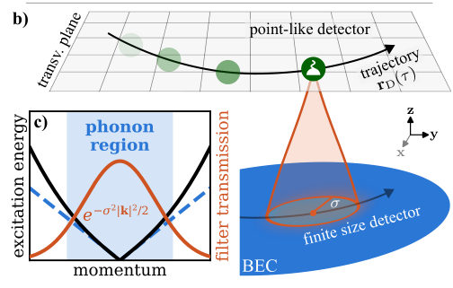 
FIG. 1. a) Setup. A 1D/2D BEC confined in the transverse plane of a longitudinally pumped (η) near-planar optical cav- ity. A two-level atom (green circle), held by an optical tweezer outside the BEC, serves as an Unruh–DeWitt detector. Con- densate and atom couple to many nearly degenerate cavity modes, which mediate an effective, finite-range interaction be- tween them. b) Effective model. The detector is steered along an accelerated trajectory in the transverse plane. Because the cavity-mediated coupling has a finite transverse range, the physically pointlike atom couples to an extended region of the condensate (orange cone), acquiring an effective detector size σ (projected ellipse on...

📷 Fig 2

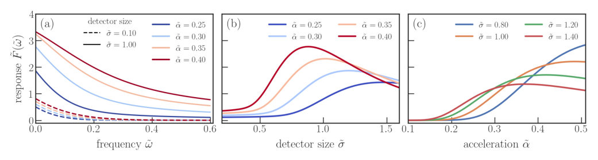 
FIG. 2. Detector response ˜F(˜ω) as a function of frequency, detector size, and acceleration. (a) Response versus dimensionless frequency ˜ω for small (˜σ = 0.10, dashed lines) and large (˜σ = 1.00, solid lines) detector sizes across various accelerations ˜α. For ˜σ = 0.10, the numerical results are indistinguishable from the analytical pointlike Unruh response formula. (b) Response as a function of detector size ˜σ for a fixed frequency ˜ω = 0.1, showcasing a distinct resonance-like amplification peak that shifts with acceleration. (c) Response versus acceleration ˜α at a fixed frequency ˜ω = 0.1 for several large detector sizes, illustrating how finite-size effects optimize the signal at...

📷 Fig 3

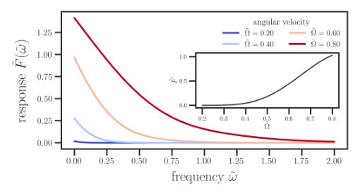 
FIG. 3. Nonthermal detector response ˜F(˜ω) for circular mo- tion in (2 + 1) dimensions. The main panel shows the dimen- sionless response as a function of detector frequency for fixed detector size ˜σ = 1 and orbital radius ˜R = 1, with the four curves corresponding to ˜Ω= 0.20, 0.40, 0.60, and 0.80 (from blue to red). The response increases with angular velocity and decreases with detector frequency. Unlike uniform linear acceleration, circular motion does not yield an exactly ther- mal spectrum. Inset: Response at fixed frequency ˜ω = 0.2 as a function of angular velocity, showing monotonic growth toward the relativistic regime.

📷 Fig 4

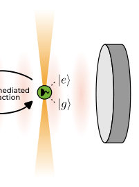 
FIG. 1. Alternative setup with a transversally pumped quasi-1D BEC.

**Summary.** This theoretical work proposes using a cavity-mediated interaction to create a tunable, finite-size detector within a Bose-Einstein condensate. This finite size acts as a momentum filter, allowing researchers to overcome theoretical limitations of point-like models when simulating relativistic quantum effects like the Unruh effect. The resulting framework offers a versatile platform for advanced quantum measurements using cold atoms.

**Why it may be interesting.** This work is highly relevant to AMO physics as it combines cavity QED techniques with ultracold atomic systems to simulate fundamental quantum field effects like the Unruh effect in a controllable, tunable manner.

Detailed structure

**Main problem.** The paper addresses the challenge of modeling relativistic analog particle detectors in Bose-Einstein condensates (BECs) by overcoming the limitations of point-like detector approximations.

**Main result.** The use of a cavity-mediated interaction provides an effective, tunable finite detector size ($\sigma$), which allows for momentum filtering that can enhance the signal at experimentally accessible accelerations.

**Method.** The authors derive the effective detector response rate by adiabatically eliminating fast cavity and BEC degrees of freedom, leading to a model resembling an Unruh-DeWitt detector coupled to density fluctuations.

**Model / system.** The system involves a two-level probe atom (UdW detector) coupled to a BEC confined in a multimode optical cavity. The interaction is mediated by the cavity, effectively giving the detector a finite size $\sigma$.

**Key observables.** Detector response rate $F(\omega)$ for uniform linear acceleration and uniform circular motion.

**Important parameters / regimes.** Tunable detector size ($\sigma$), momentum cutoff, acceleration ($\alpha$), and the BEC healing length ($\xi$).

**Assumptions / limitations.** The analysis relies on the phononic regime where the dispersion linearizes, and it assumes the contact interaction dominates over cavity-induced non-local interactions.

**Figures summary.** Figures illustrate the physical setup, the effective model showing finite-range coupling, and the resulting momentum filtering mechanism.

**Paper structure.** The paper progresses by first establishing the full Hamiltonian, then using adiabatic elimination to derive the effective detector-BEC coupling, and finally calculating the response rate for different motion profiles (linear and circular).

Abstract

Quantum simulators based on Bose-Einstein condensates (BECs) provide a powerful platform to study relativistic quantum-field phenomena in the lab and in particular emulate relativistic analog particle detectors. However, such detectors typically couple to excitations beyond the acoustic phonon regime, so that the nonlinear Bogoliubov dispersion introduces corrections that cause the effective relativistic description to break down. We propose to overcome this limitation using an intrinsically momentum-selective Unruh-DeWitt detector model in which a tweezer-trapped atom couples to the condensate through a multimode optical cavity. Although the atom is effectively pointlike, the cavity-mediated interaction kernel causes it to sample density fluctuations over a controllable finite region of the BEC equivalent to a finite-size detector. The effective detector size is tunable via the cavity mode structure determining a controllable momentum cutoff that filters out nonphononic excitations. We analytically calculate the response of such a detector for uniform linear acceleration and uniform circular motion and show that this momentum selectivity can enhance the signal at experimentally accessible accelerations. Compatible with existing cavity-QED platforms our scheme thus provides a versatile setting for analog quantum-field measurements or relativistic quantum-information protocols.

[↑ back to top](#top)

### ⭐ [Renormalization Group Flow Matching for Scalable Local Generative Modeling](http://arxiv.org/abs/2608.23696v1)

**Highlighted author(s):** Yuto Ashida  
**Authors:** Kanta Masuki, Yuto Ashida  
**Type:** theory · **Category:** statistical mechanics · **PDF:** <https://arxiv.org/pdf/2608.23696v1>  
**Analysis basis:** full PDF text, analyzed in chunks

📷 Fig 1

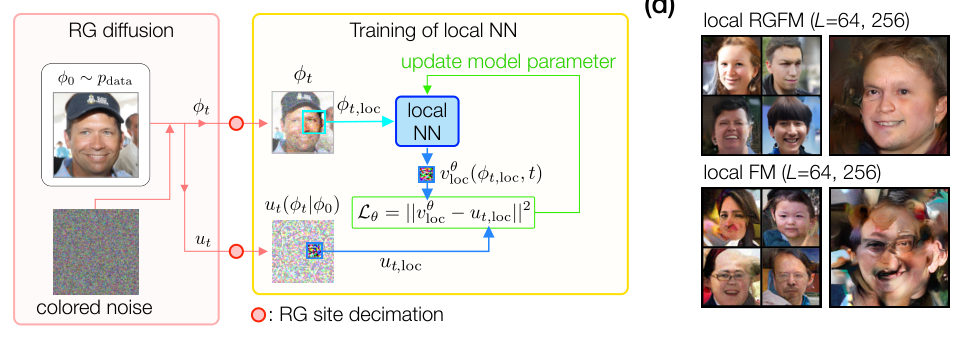 
FIG. 1. (a) Local generative modeling. Exploiting the underlying spatial structure of the data, the velocity field in a target region A (shaded in blue) is approximated using only the configuration ϕloc in its surrounding neighborhood. Data are generated by integrating the ODE flow defined by this locally approximated velocity field, which is learned using a local neural network (NN). (b) Schematic of the probability path used for local generative modeling with renormalization group flow matching (RGFM). The RG wavenumber scale Λ(t) is related to the logarithmic time t by Λ(t) = ΛUVe−t/τ with τ ≪1 being a characteristic time scale specified later. Along the forward path from t = 0 to t = 1,...

📷 Fig 2

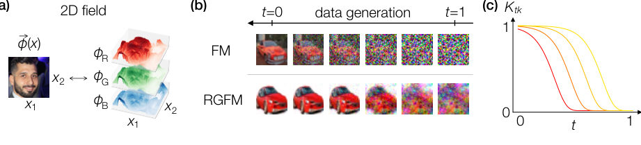 
FIG. 2. (a) Correspondence between image data and an R3-valued vector field ⃗ϕ = (ϕR, ϕG, ϕB) on the two-dimensional pixel lattice, where ⃗ϕ(x) represents the RGB value of the pixel at position x. (b) Data generation in the standard flow matching (FM) and the renormalization group flow matching (RGFM). (c) Behavior of the RG cutoff function Ktk in the Polchinski RG flow (24).

📷 Fig 3

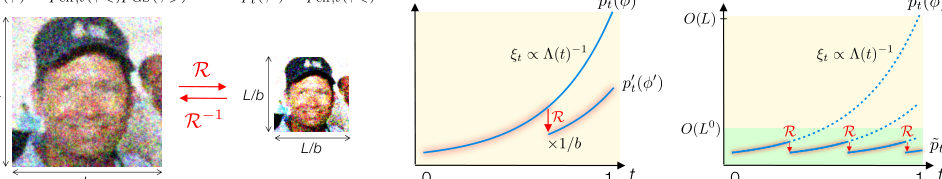 
FIG. 3. (a) Site-decimation transformation R and its probabilistic inverse R−1. The coarse-grained field ϕ′ is obtained by applying the discrete cosine transform (DCT) to ϕ, discarding the high-wavenumber modes ϕ&gt; with |k| &gt; Λ(t), and transforming the retained modes ϕ&lt; back onto the decimated lattice. Conversely, ϕ is reconstructed probabilistically by sampling the missing modes from pGS(ϕ&gt;) and applying the inverse DCT to the combined modes. (b) Score-locality length ξt along the RG diffusion path pt. While ξt grows as cΛ(t)−1, the transformation R, which reduces the linear lattice size from L to L/b, restores the locality length from ξt to ξt/b in lattice units. (c) Successive...

📷 Fig 4

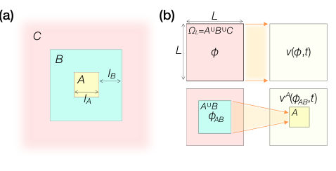 
FIG. 4. (a) Decomposition of the spatial domain ΩL into local regions A and B and the remaining region C = A ∪B. (b) Global and local velocity fields. In general, the velocity field v(ϕ, t) depends on the entire field configuration ϕ. The local velocity field on region A, denoted by vA(ϕAB, t), depends only on the field configuration ϕAB on A ∪B.

📷 Fig 5

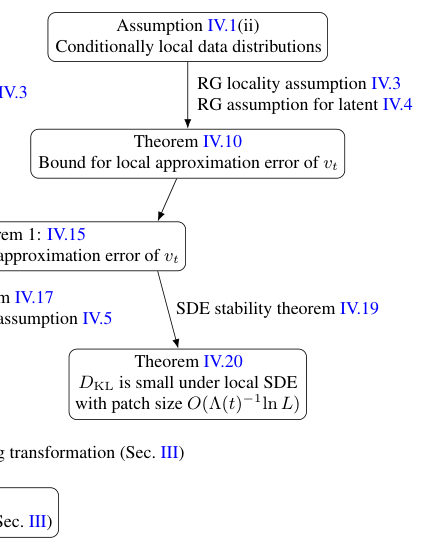 
FIG. 5. Flow chart of the main theorems and their proofs in Sec. IV.

**Summary.** This work introduces Renormalization Group Flow Matching (RGFM), a novel generative model that overcomes the scalability limitations of global models and the correlation deficiencies of purely local models. By embedding the systematic scale-connecting mechanism of the Renormalization Group into the flow matching process, RGFM enables the generation of highly coherent, long-range structured data using only local computations. This establishes RG-guided flows as a powerful paradigm for scalable generative modeling.

**Why it may be interesting.** The paper bridges the mathematical tools of RG theory, traditionally used for critical phenomena, directly into the computational framework of modern generative AI, providing a physically motivated mechanism for achieving scalability while preserving global structure.

Detailed structure

**Main problem.** Generative models face a tradeoff between the global coherence of expensive global methods and the efficiency but limited long-range correlation of local models.

**Main result.** The proposed Renormalization Group Flow Matching (RGFM) framework successfully generates high-quality samples that capture long-range correlations using only local computations.

**Method.** RGFM integrates the exact Renormalization Group (RG) flow as the probability path within a flow matching framework, progressively generating data from long- to short-wavelength structures.

**Model / system.** The model is a generative framework applied to complex, high-dimensional data (like images or physical field configurations), utilizing the mathematical structure of the RG to guide the probability flow.

**Key observables.** Global coherence, long-range correlations, and sample quality (e.g., FID score on FFHQ images).

**Important parameters / regimes.** RG wavenumber scale (Λ), system size (L), and error tolerance (ε).

**Assumptions / limitations.** The RGFM probability flow can be accurately approximated by local velocity fields acting over a specific, calculable spatial range derived from the RG structure.

**Figures summary.** Figures illustrate the schematic of local generative modeling, the RGFM probability path involving RG diffusion and site-decimation, and direct comparisons showing RGFM's superior global coherence over standard local flow matching for images.

**Paper structure.** The paper establishes the fundamental tradeoff in generative modeling, introduces RGFM by leveraging the RG's ability to connect scales, provides a theoretical analysis proving the locality of the flow approximation, and validates the method numerically on 1D and 2D image data.

Abstract

Despite their remarkable success in modeling complex data, generative models face a fundamental tradeoff. Global approaches can capture full structural coherence but suffer from high computational costs, while local models are efficient but often fail to reproduce long-range correlations and global coherence. The renormalization group (RG) bridges this gap by seamlessly connecting spatial structures across different length scales, retaining quasi-local descriptions at each step while preserving long-range correlations. We introduce renormalization group flow matching (RGFM), a generative framework that systematically structures data generation across different spatial scales. By using an exact RG flow as the probability path, RGFM progressively generates data from long- to short-wavelength structures. To reconcile scalability with global structure, we exploit two key properties of the RG: quasi-locality and scale separation. We rigorously show that the RGFM probability flow can be accurately approximated by local velocity fields acting over a spatial range $O(Λ^{-1}[\ln L+\ln(1/\varepsilon)])$ for RG wavenumber scale $Λ$, linear system size $L$, and prescribed error tolerance $\varepsilon$. This property enables local generative modeling with patches of size $O(\ln L)$ and a computational cost that scales nearly linearly with the system volume. We numerically demonstrate that local RGFM reproduces long-range correlations far beyond its receptive field in representative one-dimensional distributions, while conventional local flow matching exhibits substantial errors at long distances. On FFHQ images, RGFM yields far more coherent and higher-quality samples than local flow matching at 64x64 and 256x256. Our results establish RG-guided probability flows as a promising route toward scalable generative modeling that captures long-range structure using only local computation.

[↑ back to top](#top)

### [Sustained macroscopic quantum coherence in a superradiant solid under ambient conditions](http://arxiv.org/abs/2608.23748v1)

**Authors:** Wei-Jiang Wu, Da-Wu Xiao, Wen-Tao Wang, Xin-Yu Chen, Xian-Feng Wang, Ming-Zhong Ai, Quan Li, Ren-Bao Liu  
**Type:** both · **Category:** other · **PDF:** <https://arxiv.org/pdf/2608.23748v1>  
**Analysis basis:** full PDF text, analyzed in chunks
**Topic relevance:** 🔥 `Dicke superradiance` **4/5** · 🔥 `driven-dissipative phase transition` **4/5** · 🔥 `superradiant laser` **4/5** · `Tavis-Cummings & cavity-many-emitter` **3/5** · `correlated / nonlocal dissipation` **3/5** · `quantum optics experiment` **3/5** · `analog quantum simulation` **2/5** · `methods for driven-dissipative` **2/5** · `non-equilibrium universality` **2/5** · `Keldysh / 2PI / non-Gaussian methods` **1/5** · `QC/QI experiment` **1/5** · `quantum measurements` **1/5**

📷 Fig 1

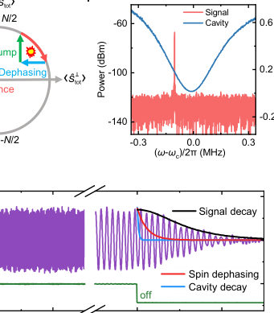 
Fig. 1 Superradiant masing of a diamond under ambient conditions. a, Setup. A diamond containing an ensemble of NV−spins is placed inside a sapphire ring and coupled to a microwave cavity field (white lines, see also Extended Data Fig. E2a). A magnetic field B from an electromagnet, applied along the NV−⟨111⟩axis, tunes the spin-transition frequency. The spins are optically pumped by a 532 nm laser, and the emitted microwave signal is detected by a loop antenna. Gas-flow cooling applied from above stabilizes the sample temperature (Method). b, Schematic spectra of the cavity mode, the inhomogeneously broadened spin ensemble, and a single spin, with corresponding linewidth κc, σ, and γϕ. c,...

📷 Fig 2

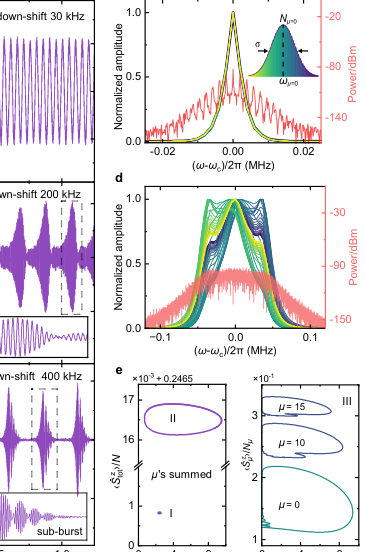 
Fig. 2 Synchronization of macroscopic coherence in a superradiant diamond. a, Spectrum of the superradiant maser as a function of pump rate. The spin-cavity detuning is zero and the cavity quality factor Q ≃24, 580. The insets show representative spectra extracted from dashed lines. b, Time-domain signals corresponding to spectra I-III in (a), showing, from top to bottom, CW, periodic amplitude modulation, and bursts. For clarity, the carrier frequencies are downshifted to 30 kHz, 200 kHz and 400 kHz, correspondingly; the dashed-boxed regions are enlarged insets. c, Numerically simulated spectra of the spin and photon coherence in the regime of periodic amplitude modulation. Inset shows the...

📷 Fig 3

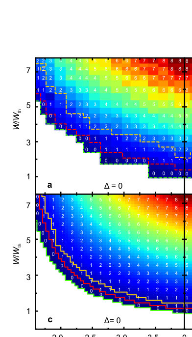 
Fig. 4 Phase diagram of the superradiant diamond maser. a, Measured intra-cavity super- radiant power (color map) and number of peaks per burst/period (white integers) versus pump rate (normalized by the threshold pump rate Wth at Q = 40, 000 and ∆= 0) and cavity quality factor under the spin-cavity resonance condition (detuning ∆= 0). Dashed lines divide the superradiant phase diagram into phases: CW maser (between the green and red dashed lines); PAM superradiance with a frequency-comb spectrum (between the red and yellow dashed lines); and superradiant burst with a plateau spectrum (above the yellow dashed line). b, Same as (a), but as a function of the pump rate and the spin–cavity...

**Summary.** This paper reports on achieving and characterizing sustained macroscopic quantum coherence in a superradiant solid using NV centers in diamond. By tuning system parameters, the authors observe distinct superradiant regimes—including continuous-wave, periodically modulated, and burst dynamics—confirming the solid-state generation of quantum light with many-body correlations. This establishes a robust platform for quantum technology research.

**Why it may be interesting.** This work is highly relevant as it provides a solid-state, ambient-condition platform to study fundamental quantum phenomena like superradiance and time-crystalline order, bridging quantum optics with solid-state physics.

Detailed structure

**Main problem.** The research aims to demonstrate and characterize sustained macroscopic quantum coherence in a superradiant solid operating under ambient conditions, overcoming limitations previously confining such phenomena to cryogenic or gaseous systems.

**Main result.** The authors successfully demonstrated spontaneous generation and maintenance of macroscopic quantum coherence in NV-center spins in diamond, observing distinct superradiant regimes (CW, PAM, bursts) that confirm solid-state quantum light sources.

**Method.** The study combines experimental measurements (microwave spectroscopy, time-domain signal recording) with theoretical modeling using mean-field theory and rate equations to analyze the spin-photon dynamics.

**Model / system.** The physical system is a superradiant maser utilizing Nitrogen-Vacancy (NV) center spins in diamond coupled to a microwave cavity. The dynamics are governed by a Hamiltonian describing the interaction between the collective spin ensemble and the cavity field.

**Key observables.** Continuous-wave (CW) maser emission, periodically amplitude-modulated (PAM) maser oscillations (suggesting a time crystal), and superradiant bursts, alongside coherence decay times.

**Important parameters / regimes.** Cavity linewidth ($\kappa_c$), spin relaxation rates ($\gamma, \sigma, \gamma_\phi$), and the pumping rate ($W$) are key parameters used to access different operational regimes.

**Assumptions / limitations.** The analysis relies on mean-field approximations for the collective spin dynamics, and later sections investigate the robustness of coherence against thermal noise.

**Figures summary.** Figures illustrate the experimental setup, the spectral evolution across different pump rates, time-domain signal decay showing long-lived coherence, and Bloch sphere trajectories mapping the system's state in the three distinct operational regimes.

**Paper structure.** The paper progresses by establishing the physical platform and Hamiltonian, detailing the experimental measurements across different pumping regimes (CW, PAM, Burst), and finally analyzing the underlying quantum dynamics, including the effects of thermal noise on coherence persistence.

Abstract

Macroscopic quantum coherence, such as in laser, Bose-Einstein condensates, superfluids, and superconductors, is important to fundamental physics and useful for quantum technologies. Superradiance provides a mechanism to produce coherence among a large number of particles and photons. Its implementation, however, has been limited to gaseous systems, solids at very low temperature, or short pulses. Here we demonstrate a solid-state superradiant maser under ambient conditions, which establishes long-lived coherence among about $10^{14}$ nitrogen-vacancy center spins in diamond and about $10^9$ photons in a microwave cavity. By varying the system parameters to access the above-threshold, well-above-threshold, and deep-above-threshold regimes, we observed continuous-wave masing, periodic amplitude modulation, and sequences of superradiant bursts, which are attributed, correspondingly, to macroscopic spin coherence synchronized at a fixed frequency, a coherent time crystal of large spins, and unsynchronized superradiant transients. This work demonstrates that macroscopic quantum coherence can be spontaneously generated and maintained in solids under ambient conditions and provides a solid-state platform for exploring bright quantum lights with many-body correlations.

[↑ back to top](#top)

### [Scalable Lindblad Noise Learning via Stochastic Tensor-Network Simulation](http://arxiv.org/abs/2608.24668v1)

**Authors:** Alejandro R. Ramos Ramos, Maximilian Fröhlich, Aaron Sander, Robert Wille, Martin Eigel, Michael Hintermüller, Patrick Gelß, Sebastian Pokutta  
**Type:** theory · **Category:** numerical methods · **PDF:** <https://arxiv.org/pdf/2608.24668v1>  
**Analysis basis:** full PDF text, analyzed in chunks
**Topic relevance:** 🔥 `methods for driven-dissipative` **4/5** · `correlated / nonlocal dissipation` **3/5** · `driven-dissipative phase transition` **3/5** · `analog quantum simulation` **2/5** · `non-equilibrium universality` **2/5** · `quantum measurements` **2/5** · `Keldysh / 2PI / non-Gaussian methods` **1/5**

📷 Fig 1

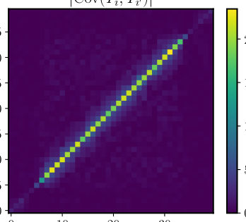 
FIG. 1. Empirical covariance matrix |Cov(Yijk, Yi′j′k′)| for the X observable (j = j′ = 1) at time steps k = 37 and k′ = 41, estimated from Ntraj = 1000 trajectories for a system size of Nsite = 40. These specific values of j, j′, k and k′ were selected because, among all time-step pairs, they exhibit the largest maximum covariance distance ℓ, of about 4.

📷 Fig 2

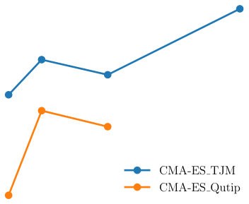 
FIG. 2. Optimal cost-function value vs. number of sites for a local-noise-model optimization. Both curves are obtained using the CMA-ES optimizer with TJM (blue) and QuTiP

📷 Fig 3

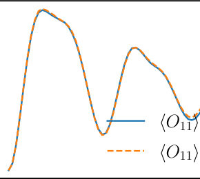 
FIG. 3. First row: evolution of the cost-function √

📷 Fig 4

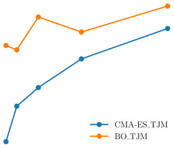 
FIG. 4. Optimal cost-function value vs. number of sites for a global-noise-model optimization. Both curves are obtained using TJM as Lindblad solver with CMA-ES (blue) and BO (orange) as optimizers.

📷 Fig 5

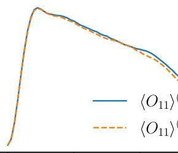 
FIG. 5. First row: evolution of the cost-function √

**Summary.** This paper introduces a scalable framework to learn unknown dissipation rates in large open quantum systems by combining the Tensor Jump Method (TJM) with gradient-free optimization. By minimizing a cost function based on local observable measurements, the authors overcome the computational limitations of previous methods. The work is significant for its combination of scalable numerics and rigorous theoretical guarantees on estimation accuracy.

**Why it may be interesting.** This work directly addresses the practical bottleneck in simulating realistic quantum devices by providing a scalable, statistically rigorous method for characterizing environmental coupling, which is crucial for error mitigation and quantum control.

Detailed structure

**Main problem.** The core challenge is developing a scalable method to estimate dissipation rates (Lindblad noise) in large open quantum systems, as traditional methods fail due to the computational cost of solving the Lindblad equation repeatedly.

**Main result.** The authors propose a framework combining the Tensor Jump Method (TJM) with gradient-free optimization, demonstrating scalability to hundreds of sites while providing rigorous theoretical guarantees on the estimation error.

**Method.** The approach uses TJM for stochastic simulation of open quantum dynamics, minimizing a least-squares cost-function defined on time series of local observable expectation values using optimization algorithms like CMA-ES or Bayesian Optimization.

**Model / system.** The study uses the Ising model as a testbed, governed by the Lindblad master equation, incorporating both local and spatially correlated dissipation terms. The dynamics are simulated using tensor-network techniques (TJM).

**Key observables.** Time series of local observable expectation values ($\langle O 
angle(t)$), and the purity $P(t) = 	ext{Tr}[
ho(t)^2]$.

**Important parameters / regimes.** Dissipation rates ($\gamma$), system size ($N_{	ext{site}}$ up to 160), and the number of stochastic trajectories ($N_{	ext{traj}}$).

**Assumptions / limitations.** The theoretical error analysis assumes a finite covariance distance, and the optimization relies on the cost-function being differentiable or amenable to gradient-free search.

**Figures summary.** Figures compare optimization convergence (BO vs. CMA-ES) across various system sizes, show the evolution of global dissipation rates, and compare optimized vs. reference observable trajectories.

**Paper structure.** The paper first establishes the problem and the TJM framework, then details the optimization setup using the Ising model, followed by rigorous theoretical analysis of the estimator variance and purity evolution, and concludes with numerical demonstrations of scalability.

Abstract

Learning dissipation rates in large-scale open quantum systems is a major obstacle for near-term quantum technologies, as existing Lindblad estimation methods are typically limited to small system sizes due to the computational complexity of repeatedly solving the Lindblad equation during optimization. Here, we propose a scalable noise-learning framework for Lindblad dissipation rates that combines a stochastic simulation method, the Tensor Jump Method (TJM), with gradient-free optimization of a least-squares cost-function defined on time series of local-observable expectation values. We demonstrate the approach on two noise models in the Ising model: a site-resolved (local) model, in which independent dissipation rates are learned for each site up to $N_{\mathrm{site}}=16$, and a spatially homogeneous (global) model with only seven parameters, scaled to $N_{\mathrm{site}}=160$ sites.We complement these numerical results with a series of exact, provable guarantees: the Frobenius variance of the TJM density-matrix estimator is shown to equal $(1-\mathrm{Tr}[ρ^2])/N_{\mathrm{traj}}$, an exact purity-based characterization of the stochastic estimation error; the corresponding purity evolution is proven to be monotonically non-increasing for Hermitian jump operators; and, under a finite covariance distance assumption, the standard deviation of the cost-function is shown to decrease with system size, so that fewer trajectories are needed to reach a fixed target accuracy as the system grows. Together, this combination of scalable numerics and rigorous theoretical guarantees positions TJM-based noise learning as a practical foundation for characterizing dissipation in large quantum devices and for guiding future work on error mitigation and quantum error correction.

[↑ back to top](#top)

### [Towards Stirling cooler operable single-photon sources based on low-noise GaAs quantum dots](http://arxiv.org/abs/2608.24409v1)

**Authors:** Maximilian Aigner, Jana Schlücking, Eva Schöll, Christian Weidinger, Gabriel Undeutsch, Ievgen Brytavskyi, Thomas Oberleitner, Tobias Maria Krieger, Ailton Jose Garcia Junior, Melina Peter, Thomas K. Bracht, Michał Gawełczyk, Saimon Filipe Covre da Silva, Santanu Manna, Yusuf Karli, Gregor Weihs, Doris E. Reiter, Armando Rastelli  
**Type:** both · **Category:** other · **PDF:** <https://arxiv.org/pdf/2608.24409v1>  
**Analysis basis:** full PDF text, analyzed in chunks
**Topic relevance:** 🔥 `quantum optics experiment` **4/5** · `interference shaping light` **3/5** · `QC/QI experiment` **1/5** · `Tavis-Cummings & cavity-many-emitter` **1/5** · `correlated / nonlocal dissipation` **1/5** · `driven-dissipative phase transition` **1/5** · `methods for driven-dissipative` **1/5** · `quantum measurements` **1/5**

📷 Fig 1

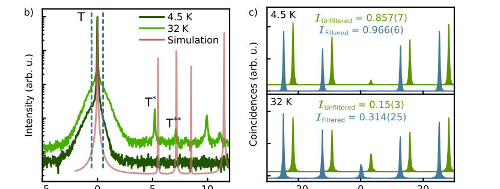 
FIG. 1. a) Schematic few-level structure of the QD with the ground state |G⟩, the negative trion state |T⟩, and the first excited trion state |T ∗⟩. The green arrows mark the radiative decay channels, while the red and orange arrows indicate phonon- mediated population exchange between the trion states. b) Resonance fluorescence spectra of |T⟩at a temperature of 4.5 K (dark green) and 32 K (light green) as well as a simulated spectrum (brown). The intensity is normalized to the maximum intensity in the respective spectrum. c) Coincidence count histograms of HOM measurements taken at 4.5 K (top) and 32 K (bottom) with (blue) and without (green) spectral filtering of the phonon sideband...

📷 Fig 2

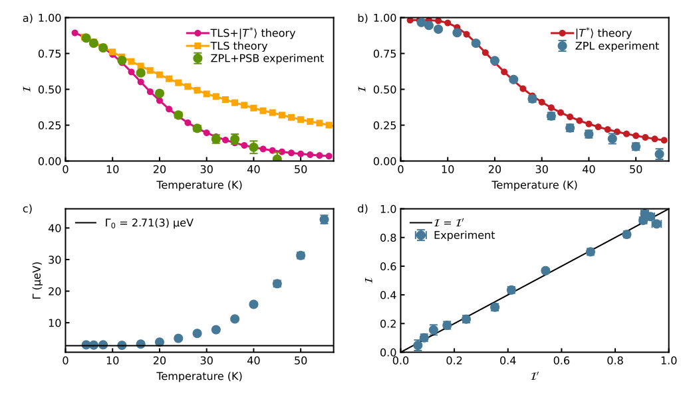 
FIG. 2. a) Indistinguishability of the unfiltered spectrum as a function of temperature (green circles) together with a sim- ulation including only diagonal coupling (orange squares) as well as diagonal and excited trion state coupling (pink circles) b) Indistinguishability of the filtered spectrum as a function of temperature (blue circles) and a simulation including excited trion state coupling c) Measured linewidth (blue circles) and Fourier-transform limit (black line) of the ZPL as a function of temperature d) Measured indistinguishability and Γ0/Γ of the ZPL for each temperature. The black line indicates I = Γ0/Γ

📷 Fig 3

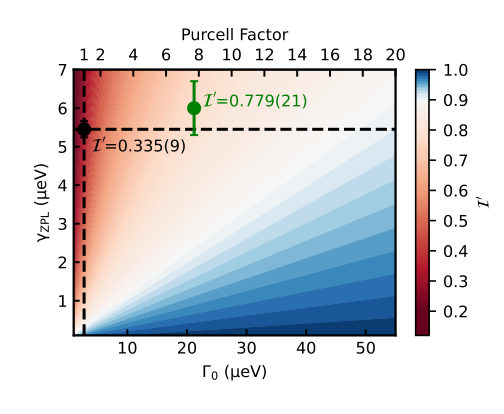 
FIG. 3. Predicted photon indistinguishability after Eq. (6) of the PSB-filtered emission at 32 K for different Γ0 (bottom axis), corresponding Purcell factor (top axis), and γZPL. The black circle indicates the data obtained from the measure- ments presented in Fig. 2, and the vertical and horizontal lines indicate a Purcell factor of one and a constant γZPL, re- spectively. The green circle indicates another measurement on a different charge-tunable QD embedded in an optical mi- crocavity [54] with an estimated Purcell factor of 7.7(1). The corresponding indistinguishability of I′ = 0.80(3)is fully con- sistent with the predictions (I′ = 0.779(21)).

**Summary.** This paper investigates improving single-photon sources in GaAs quantum dots to operate at higher temperatures. The authors model photon emission decay while accounting for phonon interactions and find that coupling to excited states severely degrades photon indistinguishability at moderate temperatures. By implementing cavity enhancement, they experimentally demonstrate a significant recovery of indistinguishability, advancing the feasibility of room-temperature quantum light sources.

**Why it may be interesting.** This work is highly relevant to AMO physics and quantum optics as it directly addresses decoherence mechanisms (phonon coupling, excited state coupling) in solid-state emitters, providing experimental and theoretical pathways to enhance photon indistinguishability at higher temperatures.

Detailed structure

**Main problem.** Developing single-photon sources for quantum technology that operate without demanding cryogenic cooling systems.

**Main result.** The authors demonstrated that Purcell enhancement using cavity-enhanced emission can significantly improve photon indistinguishability, reaching 0.80(3) at 32 K, which is a record for that temperature.

**Method.** The study combines theoretical modeling of carrier-phonon interactions with experimental measurements using two-photon interference (HOM setup) on GaAs quantum dots.

**Model / system.** The physical system is a low-noise GaAs quantum dot emitting photons from the negative trion state. The dynamics are modeled using a few-level system approach incorporating Lindblad operators to account for radiative decay and phonon coupling.

**Key observables.** Photon indistinguishability (I), emission linewidth, and temperature dependence of these quantities.

**Important parameters / regimes.** Operating temperatures (e.g., 4.5 K, 32 K, 55 K), and the coupling strength to excited trion states.

**Assumptions / limitations.** The analysis relies on modeling phonon interactions (diagonal coupling and coupling to excited states) and uses the Markov approximation for certain transitions.

**Figures summary.** Figures illustrate the few-level structure, resonance fluorescence spectra at different temperatures, and coincidence count histograms from HOM measurements comparing filtered versus unfiltered emission.

**Paper structure.** The paper progresses by establishing the need for high-indistinguishability sources, presenting the theoretical model incorporating phonon effects, detailing the experimental measurements across varying temperatures, and finally proposing and verifying Purcell enhancement as a solution to temperature-induced decoherence.

Abstract

For photonic quantum technology applications, sources capable of emitting photons with indistinguishability close to unity are essential. Ideally, these sources should not require demanding cooling systems. Here, we present temperature-dependent two-photon-interference measurements on photons produced by the radiative decay of the negative trion in a low-noise GaAs quantum dot, which are in quantitative agreement with theoretical calculations accounting for carrier-phonon interactions and coupling to excited states. While at at the lowest explored temperatures the emission linewidth reaches values only 6(2) % above the Fourier limit and the indistinguishability I between subsequently emitted photons reaches 0.966(6), the latter drops to 0.05(4) at 55 K. We show that this loss can be explained with the coupling with energetically close excited trion states and suggest that the photon indistinguishability at elevated temperatures can be increased by employing Purcell enhancement of the emission rate or by increasing the energy separation of the excited states. Using cavity-enhanced emission, we experimentally verify the first route and demonstrate an improvement in photon indistinguishability from 0.314(25) to 0.80(3) at 32 K, which - to our knowledge - is the highest reported value at such temperature.

[↑ back to top](#top)

### [Hamiltonian Learning at Scale](http://arxiv.org/abs/2608.23707v1)

**Authors:** Nathan Johnson, Eugene Dumitrescu  
**Type:** theory · **Category:** numerical methods · **PDF:** <https://arxiv.org/pdf/2608.23707v1>  
**Analysis basis:** full PDF text, analyzed in chunks
**Topic relevance:** 🔥 `methods for driven-dissipative` **4/5** · `analog quantum simulation` **3/5** · `quantum measurements` **2/5** · `correlated / nonlocal dissipation` **1/5** · `driven-dissipative phase transition` **1/5**

📷 Fig 1

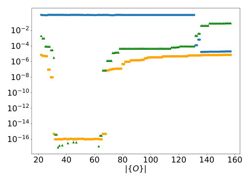 
Figure 1. Hamiltonian learning data as a function of increas- ing operator basis cardinality |{𝑂}| for 𝑁= 5. The error in the Hamiltonian learning solution Δ𝑐(blue circles) falls to ∼1 × 10−5 when the the spectral gap Δ𝑠, between the lowest and next singular values, (green triangles) is well defined, i.e., when Δ𝑠≫𝑠0 is much larger than the lowest singular value 𝑠0 (orange squares).

📷 Fig 2

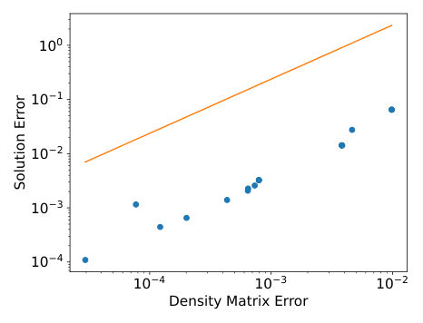 
Figure 2. Scaling of solution error with error in 𝜌at N=5. The error remains below the analytical upper bound.

📷 Fig 3

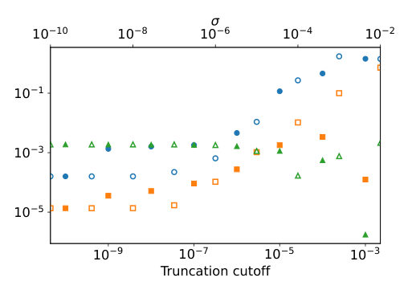 
Figure 3. Scaling of solution error Δ𝑐(blue circles), the small- est singular value 𝑠0 (orange squares), and the spectral gap Δ𝑠(green triangles) with the truncation cutoff for the 𝜌MPO and the standard deviation 𝜎of Gaussian noise added to the correlation matrix at N=300. The trend with 𝜎is given by open shapes and the other trend by closed shapes. By 10−5

**Summary.** This paper develops and analyzes a scalable protocol for learning a quantum system's Hamiltonian by analyzing its stability under various sources of numerical and measurement error. Using tensor network methods, the authors demonstrate the feasibility of learning complex Hamiltonians on large spin chains while providing quantitative error bounds for future experimental quantum simulation efforts.

**Why it may be interesting.** The rigorous error analysis and scaling demonstration using tensor networks provide crucial, quantitative guidelines for designing and interpreting future experimental quantum simulation protocols, especially those involving noisy measurements.

Detailed structure

**Main problem.** The core problem is determining the stability and error tolerance of protocols designed to learn a quantum system's Hamiltonian from limited measurements.

**Main result.** The protocol can be scaled up to learn mixed-field Ising model Hamiltonians on $N=300$ sites, and its stability is shown to depend critically on the spectral gap relative to the error magnitude.

**Method.** The work uses tensor network techniques (MPO) to simulate Hamiltonian learning, which relies on constructing and solving linear systems derived from approximate stationary states of the system's density matrix.

**Model / system.** The study focuses on learning the Hamiltonian ($H$) for an Ising model with transverse and longitudinal fields, extending the analysis to open quantum systems described by Lindbladians.

**Key observables.** Relative error of learned coefficients ($\Delta c$), Frobenius norm of the error ($\|H - 	ilde{H}\|_F$), and the spectral gap ($\Delta_s$).

**Important parameters / regimes.** System size ($N=300$), inverse temperature ($eta$), and various error parameters like Taylor expansion truncation ($\epsilon_K$) and MPO compression error ($\epsilon_C$).

**Assumptions / limitations.** The protocol assumes access to a thermal (Gibbs) state and relies on approximating this state using MPO techniques and Taylor series expansions, introducing quantifiable errors.

**Figures summary.** Figures illustrate the linear growth of solution error with density matrix error for small systems, and show the stability of the protocol for large $N$ when errors are small compared to the spectral gap.

**Paper structure.** The paper first establishes the protocol using stationary states and MPO tools, then rigorously analyzes error sources (truncation, compression) by deriving analytic bounds. It scales the simulation to large $N$ and discusses extensions to open systems using Quantum Fisher Information.

Abstract

Learning a quantum system's Hamiltonian is crucial for understanding and controlling its dynamics and has recently become a topic of widespread interest. To understand the learning protocol's error tolerances, i.e. its stability in the presence of inevitable errors, this work utilizes tensor network techniques to emulate Hamiltonian learning workflows at scale and with noise. Specifically, we employed a Hamiltonian learning technique based on approximate stationary states which are constructed using matrix product tools. We provide analytic bounds on the Hamiltonian learning estimation errors and perform numerical simulations that highlight learning error's stability under two families of errors. Using our workflow, we are able to scale up the protocol and learn mixed-field Ising model Hamiltonians of an $N=300$ site spin chain. By simulating the protocol at large scale, and empirically studying its practical limitations, our analysis of how errors affect the Hamiltonian learning process provides valuable lessons for future experiments. We conclude by discussing the avenues our work opens as well as future work that can support Hamiltonian learning experiments.

[↑ back to top](#top)

### [Observation of electron spin interactions between Rydberg atoms](http://arxiv.org/abs/2608.23711v1)

**Authors:** Le Ruan, Ziqi Zhou, Yuchen Guo, Chengshu Li, Cheng Chen  
**Type:** experiment · **Category:** other · **PDF:** <https://arxiv.org/pdf/2608.23711v1>  
**Analysis basis:** full PDF text, analyzed in chunks
**Topic relevance:** 🔥 `Rydberg arrays` **4/5** · 🔥 `analog quantum simulation` **4/5** · `QC/QI experiment` **2/5** · `quantum optics experiment` **1/5**

📷 Fig 1

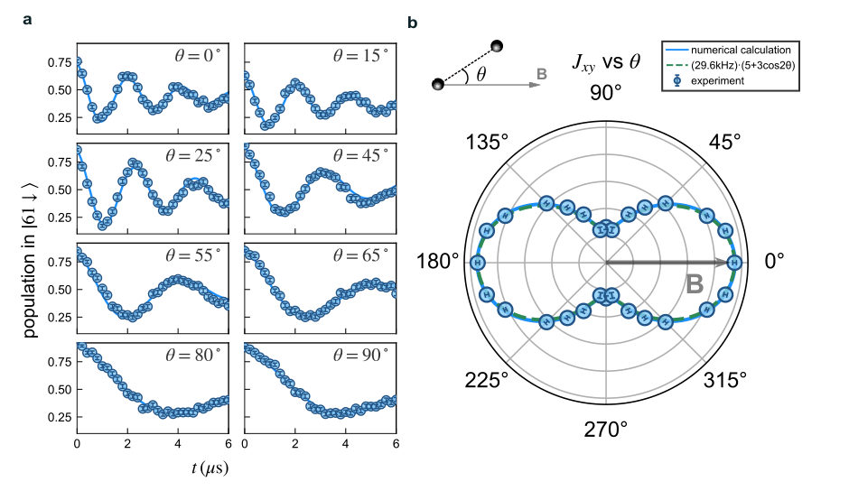 
Figure 2. Observing electron spin exchange between Rydberg atoms. a. Experimental data of electron spin exchange at fixed atomic separation d = 9.66 µm for various θ. Solid curves represent fits to the experimental data using P(t) = A e−t/τ cos(2Jxyt/ℏ+ ϕ0)+C, with the same global phase offset ϕ0 shared across all angles. We present ideal-case models, simulations accounting for experimental imperfections and the measured data in the Supplementary Material [39]. b. Angular dependence of Jxy. We compare the experimental data with numerical calculation [40, 41] (solid line) and theoretical model Jxy(θ) = J(5 + 3 cos 2θ)/8 (dashed line). We obtain Jxy/h = 0.236 ± 0.002 MHz at θ = 0◦, yielding...

📷 Fig 2

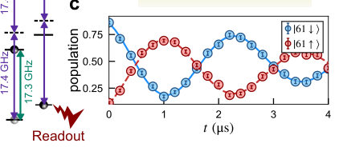 
Figure 3. Checking the population in |61 ↑⟩. a. Microwave transi- tions used for the readout of population in |61 ↑⟩, including a two- photon π-pulse transferring |61 ↑⟩to |60 ↑⟩and a π-pulse transfer- ring |60 ↓⟩to |60P ↓⟩. b. Readout sequence for |61 ↑⟩. Since the two-photon π-pulse can also transfer |61 ↓⟩to |60 ↓⟩, which would also be deexcited and detected, we apply a second π-pulse driving |60 ↓⟩to |60P ↓⟩to eliminate this crosstalk. c. Experimental results for θ = 25◦with |60 ↑⟩readout scheme.

📷 Fig 3

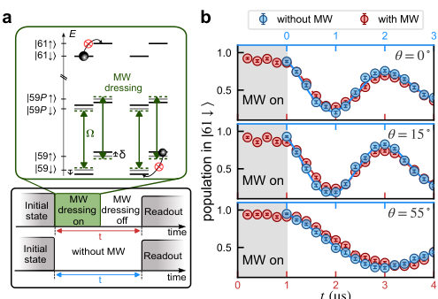 
Figure 4. Engineering electron spin interactions by differen- tial AC Stark shift via microwave dressing. a Microwave dress- ing scheme: a driving field with a frequency centered between the |59 ↑⟩→|59P ↑⟩and |59 ↓⟩→|59P ↓⟩transitions imparts dif- ferential light shifts, thereby generating a differential energy shift between |59 ↑⟩and |59 ↓⟩. b. Dynamics with (shaded) and with- out MW dressing. The time axes of the two datasets are shifted by 1 µs to show that spin-exchange dynamics resume immediately upon turning off the MW dressing, displaying near-perfect agreement with the baseline without MW-dressing.

📷 Fig 4

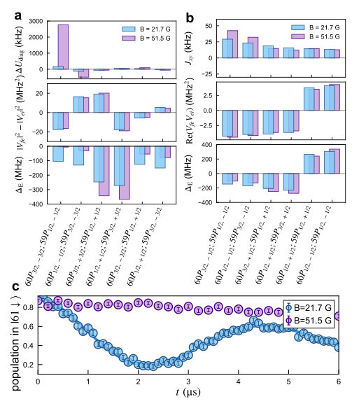 
Figure 5. Tuning electron spin interactions through contribu- tions of perturbation channels via magnetic field. a. Perturba- tion channel-resolved decomposition of the diagonal energy splitting between the initial state |61 ↓, 59 ↑⟩and the final state |61 ↑, 59 ↓⟩ for θ = 60◦at different magnetic fields. Top panel: contribu- tions of individual intermediate states to ∆Udiag; middle panel: en- ergy difference of the matrix elements coupling the initial and fi- nal states through each intermediate state, where i, f, and e denote the initial, final, and intermediate states; bottom panel: detunings of the intermediate states. At B = 51.5 G, the detuning of this channel 60P3/2,−3/2; 59P1/2,−1/2...

📷 Fig 5

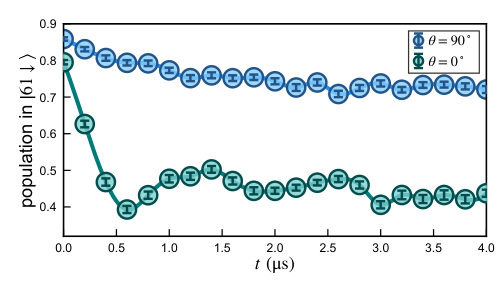 
Figure 6. Many-body dynamics in one-dimensional chains. For θ = 0◦, Jxy = J, Jz = −J/2, the spin polarization of non- addressed atoms relaxes rapidly into the xy-plane. For θ = 90◦, Jxy = J/4, Jz = J, the strong z-polarization is largely retained with less relaxation, evidencing the dominance of the longitudinal coupling Jz. Both chains consist of 18 atoms at d = 9.66 µm, ini- tialized in staggered N´eel state along z.

**Summary.** The researchers report the observation of electron spin interactions between Rydberg atoms, showing these interactions are driven by spin-orbit coupling and follow an anisotropic XXZ model. They demonstrate active control over this interaction using microwave dressing and magnetic fields. Crucially, they distinguish this genuine spin exchange from orbital exchange by measuring a pronounced angular anisotropy unique to the spin-exchange channel.

**Why it may be interesting.** This work is highly relevant as it provides a clean, experimentally verified platform for realizing and controlling spin-spin interactions in arrays, directly mapping onto fundamental models like the Heisenberg-Kitaev model, which is a major focus in quantum simulation.

Detailed structure

**Main problem.** The study aims to observe and characterize the electron spin interactions between Rydberg atoms, specifically distinguishing this genuine spin exchange from purely orbital exchange mechanisms.

**Main result.** The authors successfully observed coherent electron spin exchange dynamics governed by an anisotropic XXZ model, and crucially, they distinguished this spin interaction from orbital exchange by measuring a strong angular dependence in the spin-exchange coupling.

**Method.** The research employs controlled Rydberg atom arrays, utilizing microwave dressing and magnetic field tuning to manipulate and measure the spin-exchange dynamics between atoms.

**Model / system.** The system involves Rydberg atoms (e.g., Rb) where spin qubits are encoded in Zeeman sublevels. The interaction is modeled by an anisotropic XXZ Hamiltonian, $H = \sum_{i<j} [J_{xy}(	heta_{ij})(S_x^i S_x^j + S_y^i S_y^j) + J_z(	heta_{ij})S_z^i S_z^j]$, which arises from spin-orbit coupling via second-order dipole perturbation.

**Key observables.** Coherent electron spin exchange dynamics, coupling strengths ($J_{xy}, J_z$), and the angular dependence of the exchange coupling $J_{xy}(	heta) \propto (5 + 3 \cos 2	heta)/8$.

**Important parameters / regimes.** Interatomic separation ($d = 9.66 \mu	ext{m}$), magnetic field strength (up to $51.5 	ext{ G}$), and the angle $	heta$ defining the relative orientation of the atoms.

**Assumptions / limitations.** The analysis relies on second-order dipole perturbation theory to derive the spin-orbit coupling mechanism, and the fidelity of the measurement is corrected for various experimental imperfections (SPAM errors).

**Figures summary.** Figures illustrate the comparison between spin exchange vs. conventional dipole-dipole exchange, show the time evolution of spin populations under microwave dressing, and demonstrate the contrast between the strongly anisotropic $\Delta n=2$ spin exchange and the nearly isotropic $\Delta n=1$ orbital exchange.

**Paper structure.** The paper progresses by first establishing the observation of spin exchange, detailing control mechanisms (dressing, field tuning), quantifying the interaction anisotropy via theoretical mapping to the XXZ model, and finally providing a definitive diagnostic by contrasting the angular dependence of spin exchange ($\Delta n=2$) against orbital exchange ($\Delta n=1$).

Abstract

We report the observation of electron spin interactions between Rydberg atoms, which are driven by spin-orbit coupling through second-order dipole perturbation and exhibit a spatial anisotropy governed by the atomic configuration. Specifically, we observe coherent electron spin exchange dynamics, with the measured coupling strength agreeing well with both numerical calculations and theoretical models. Furthermore, we show that global microwave dressing enables active engineering and dynamical freezing of the spin exchange by introducing a differential AC Stark shift between the participating states. Additionally, we achieve tunability of the interaction by applying a stronger magnetic field, which effectively modifies the energy contributions of the underlying spin-orbit coupling channels. Finally, measuring spin dynamics in one-dimensional multi-atom chains aligned parallel or perpendicular to the magnetic field provides a self-consistent validation of the anisotropic XXZ framework. This electron spin interaction natively features spin-position coupling and enables a natural mapping onto the Heisenberg-Kitaev model. Our findings reveal a new class of electron spin-spin interactions among Rydberg atoms, expanding the scope of quantum simulation with Rydberg atom arrays.

[↑ back to top](#top)

### [Tunable Mediated Interactions Near Spontaneous Symmetry Breaking: From Yukawa to Coulomb and Dzyaloshinskii--Moriya Interactions](http://arxiv.org/abs/2608.23954v1)

**Authors:** Hoshu Hiyane, Hiroyuki Tajima  
**Type:** theory · **Category:** quantum gases · **PDF:** <https://arxiv.org/pdf/2608.23954v1>  
**Analysis basis:** full PDF text, analyzed in chunks
**Topic relevance:** 🔥 `analog quantum simulation` **4/5** · `Keldysh / 2PI / non-Gaussian methods` **3/5** · `correlated / nonlocal dissipation` **2/5** · `methods for driven-dissipative` **1/5**

📷 Fig 1

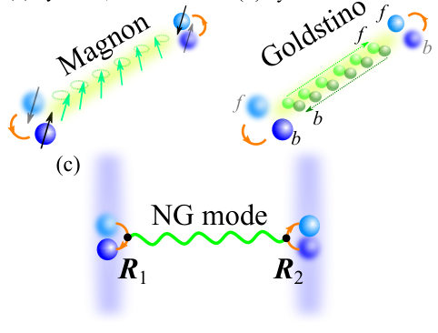 
FIG. 1. Schematics of mediated interactions between two im- purities. Three types of systems (I) Fermi–Fermi, (II) Bose– Bose, and (III) Bose–Fermi mixture are considered. (a) For a ferromagnetic medium (System I, II), a magnon excitation mediates the spin-exchange interaction between two impuri- ties. (b) For a Bose–Fermi mixture (System III), a goldstino excitation mediates an interaction that exchanges the two sta- tistically different impurities. (c) Proposed detection of long- range interactions mediated by the NG mode. Two impurities are localized at positions R1 and R2 by the optical tweezers (represented by shaded area) and involve the state-exchange interactions with the medium,...

📷 Fig 2

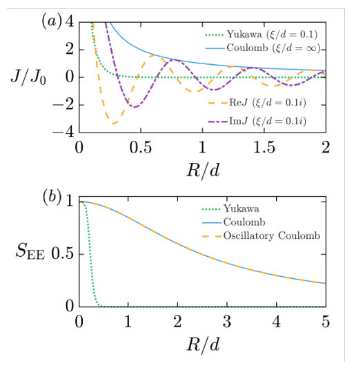 
FIG. 2. (a) Long-range mediated interaction J(R) between impurities. The range of interaction ξ = p

📷 Fig 3

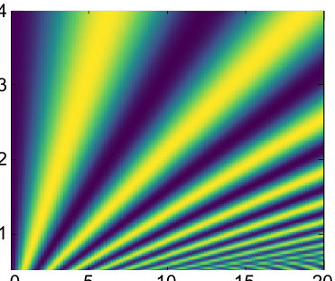 
FIG. 3. Transition probability P(t) at different R/d for ξ = ∞, where Coulomb-type long range exchange interac- tion emerge. The short-distance region R/d ≤0.5 is omitted because P(t) oscillates too rapidly to be resolved on this scale.

**Summary.** This paper details how tunable, long-range interactions can be engineered between impurities by coupling them to a quantum medium bath near spontaneous symmetry breaking. By controlling the gap of the mediating Nambu-Goldstone mode, the interaction can be tuned between short-range Yukawa, long-range Coulomb, and Dzyaloshinskii-Moriya forms. This offers a powerful platform for simulating complex spin models using cold atoms.

**Why it may be interesting.** This work directly connects fundamental concepts of symmetry breaking (NG modes) to controllable, long-range quantum interactions, providing a concrete roadmap for designing quantum simulators using ultracold atomic gases.

Detailed structure

**Main problem.** The paper proposes a theoretical framework to realize and characterize tunable, long-range mediated interactions between impurities using Nambu-Goldstone (NG) modes near spontaneous symmetry breaking (SSB).

**Main result.** The mediated interaction can be tuned to exhibit distinct long-range behaviors: Yukawa (gapped), Coulomb (gapless), or oscillatory-Coulomb (Dzyaloshinskii-Moriya-like) couplings.

**Method.** The effective interaction is derived by calculating the two-impurity coupling by tracing out the medium bath excitations, utilizing the medium's retarded susceptibility $\chi_{ret}$.

**Model / system.** The system involves two distinguishable impurities coupled to a quantum medium bath, which can be realized in various cold atom mixtures, such as Fermi-Fermi, Bose-Bose, or Bose-Fermi mixtures.

**Key observables.** Effective interaction strength $J(R)$, entanglement entropy, and the phase/amplitude of the interaction, which can be probed via Rabi oscillations or Ramsey interferometry.

**Important parameters / regimes.** The interaction range ($\xi$) and the type of coupling (Yukawa, Coulomb, DM) are controlled by tuning the gap of the NG mode relative to the energy difference between the impurities ($\omega_{	ext{gap}} - \Delta_1 + \Delta_2$).

**Assumptions / limitations.** The derivation relies on the leading order approximation of the cumulative expansion and uses Random Phase Approximation (RPA) for the itinerant ferromagnetic case.

**Figures summary.** Figure 1 schematically illustrates the three physical systems (Fermi-Fermi, Bose-Bose, Bose-Fermi) and the proposed detection setup using optical tweezers. Figure 2 relates to entanglement entropy measurements.

**Paper structure.** The paper builds from the general Hamiltonian formulation, derives the effective interaction via the medium susceptibility, and then analyzes the resulting interaction structure in different physical regimes (Yukawa, Coulomb, DM) based on the gap tuning.

Abstract

We propose a realization of tunable long-range mediated interactions generated by Nambu-Goldstone (NG) modes near spontaneous symmetry breaking. An effective exchange interaction emerges between two distinguishable impurities proportional to the retarded susceptibility mediated by the bath particles. The interaction is mediated by emergent NG modes associated with symmetry breaking in systems, namely the magnon mode in a repulsive two-component Fermi or Bose gas, or the goldstino mode in a Bose-Fermi mixture. When the NG mode is gapped by explicit symmetry breaking, the interaction has a Yukawa-type short-ranged interaction, whereas the gapless limit gives a Coulomb law. Above the NG mode threshold, the Dzyaloshinskii-Moriya-like cross product coupling emerges in a long-range form. Our proposal paves a way towards the realization of a quantum simulator of spin models and polarons with controllable non-local interactions.

[↑ back to top](#top)

### [Three-slit interference with a which-path memory ancilla: A bright-dark state formulation](http://arxiv.org/abs/2608.24243v1)

**Authors:** Ajay Kumar, Guruprasad Kadam, Anirban Pathak  
**Type:** theory · **Category:** quantum information and computing · **PDF:** <https://arxiv.org/pdf/2608.24243v1>  
**Analysis basis:** full PDF text, analyzed in chunks
**Topic relevance:** 🔥 `interference shaping light` **4/5** · `methods for driven-dissipative` **2/5** · `quantum measurements` **2/5** · `correlated / nonlocal dissipation` **1/5**

📷 Fig 1

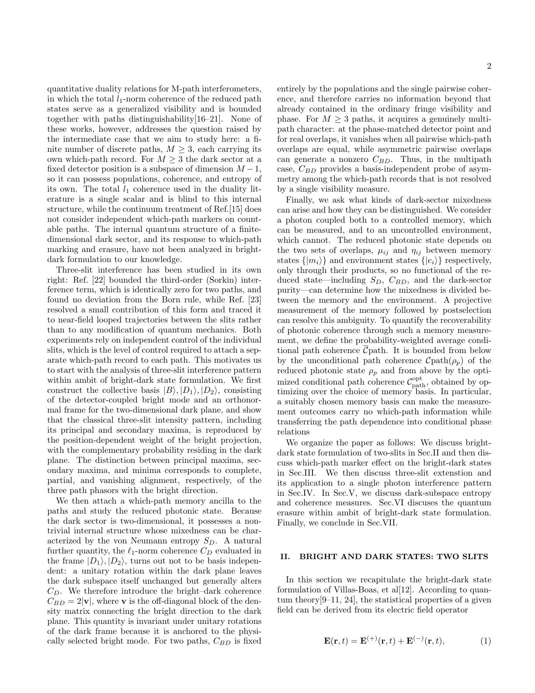 
Low-resolution page preview, page 2

📷 Fig 2

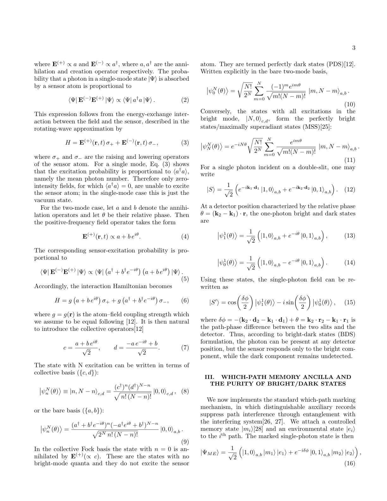 
Low-resolution page preview, page 3

📷 Fig 3

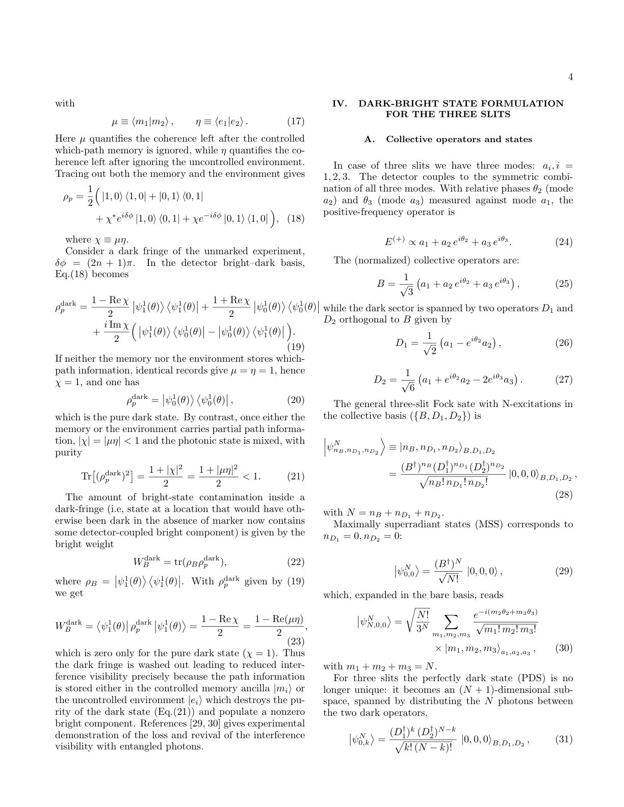 
Low-resolution page preview, page 4

📷 Fig 4

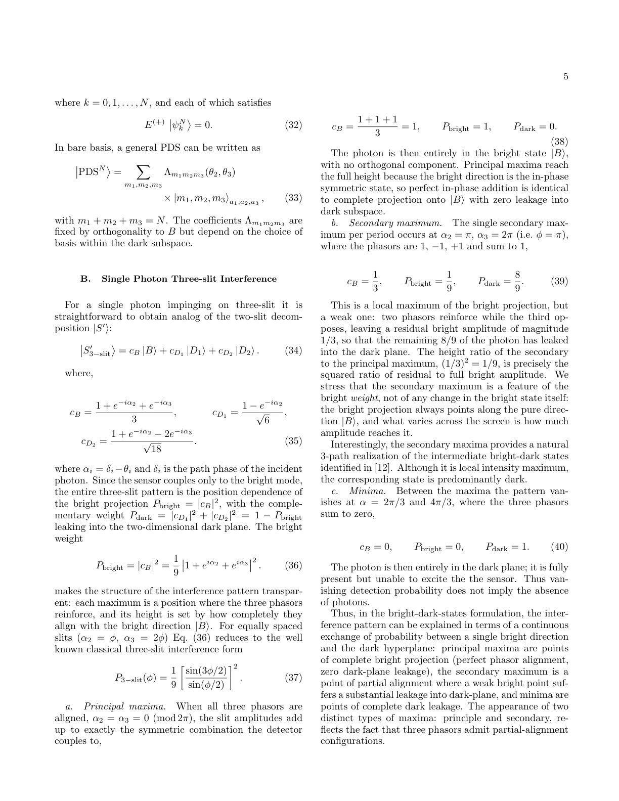 
Low-resolution page preview, page 5

📷 Fig 5

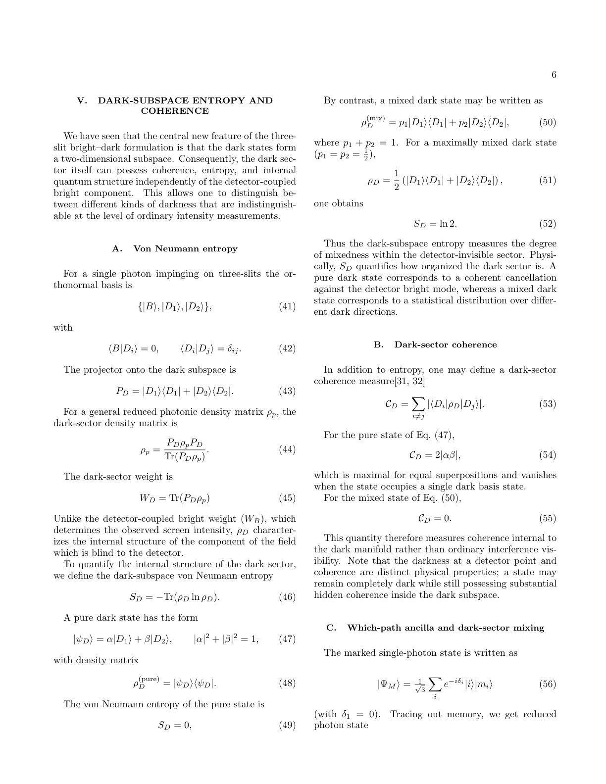 
Low-resolution page preview, page 6

**Summary.** This theoretical paper analyzes three-slit interference using the bright-dark state formalism to study the role of a which-path memory ancilla. It introduces a basis-invariant coherence measure, $C_{BD}$, which quantifies the multi-path quantum structure. The key finding is the ability to decompose the total coherence loss into a portion recoverable by measuring the memory and an irreducible deficit caused by the environment.

**Why it may be interesting.** This work provides a rigorous, quantitative framework for understanding how quantum coherence is degraded and potentially recovered in multi-path interference experiments by explicitly separating environmental decoherence from information stored in auxiliary quantum memories.

Detailed structure

**Main problem.** The paper investigates how path information stored in a which-path memory ancilla affects the interference pattern observed in a three-slit setup.

**Main result.** It establishes that the basis-invariant coherence measure, $C_{BD}$, quantifies the genuinely multi-path contribution arising from asymmetries in which-path overlaps for three or more slits.

**Method.** The analysis uses the bright-dark state description to decompose the photonic state and employs coherence measures, such as the von Neumann entropy and various coherence terms, to quantify interference visibility loss.

**Model / system.** The model is a three-slit interference experiment analyzed using the bright-dark state formulation, involving a photon state coupled to a memory ancilla and an environment.

**Key observables.** Von Neumann entropy ($S_D$), dark-sector coherence ($C_D$), and the basis-invariant bright-dark coherence ($C_{BD}$).

**Important parameters / regimes.** The number of slits ($M \ge 3$), and the overlaps ($\mu_{ij}, \eta_{ij}$) between path amplitudes.

**Assumptions / limitations.** The analysis assumes the ability to attach a separate which-path record to each path and relies on decomposing the coherence deficit into recoverable and irreducible parts.

**Paper structure.** The paper progresses by first defining the bright-dark state for $M$ slits, then introducing coherence measures like $C_{BD}$, and finally developing a decomposition showing how memory measurement allows recovery of path coherence lost due to accessible memory overlaps.

Abstract

In this paper, we study the effect of a which-path memory ancilla on the three-slit interference pattern within the framework of the bright--dark state description [Phys. Rev. Lett. 134, 133603 (2025)]. Whereas two slits give one bright mode, a photonic mode that couples to the detector atoms, and one dark mode, which does not couple to the detector atoms, three slits lead to one detector-coupled bright mode and a two-dimensional dark-mode subspace in the three-dimensional path space. We first discuss the classical three-slit interference pattern in terms of probability leakage into the dark subspace. We then study the von Neumann entropy $S_D$ of the dark subspace and the coherence measures of the reduced photonic state obtained by tracing out the memory: dark-sector coherence $C_D$ and bright--dark coherence $C_{BD}$. These quantities bring out the internal quantum structure of the two-dimensional dark subspace. We show that, whereas $C_D$ is not by itself a basis-independent physical observable, $C_{BD}$ is basis-invariant. We establish that, for two paths, $C_{BD}$ is fixed entirely by the populations and the single pairwise coherence, whereas for multiple paths, $M\geq 3$, it acquires a genuinely multipath contribution generated by asymmetry among the pairwise which-path overlaps. Finally, we distinguish the part of the path-coherence loss that is recoverable through a suitable measurement of the memory from the irreducible coherence deficit imposed by an uncontrolled environment.

[↑ back to top](#top)

### [AlGaAs nanowires as a universal platform for GaAs, InGaAs, and InAs quantum dots](http://arxiv.org/abs/2608.24495v1)

**Authors:** Rohan Radhakrishnan, Rodion Reznik, Gilles Patriarche, Igor Ilkiv, Konstantin Kotlyar, Anna Andreeva, George Cirlin, Nika Akopian  
**Type:** experiment · **Category:** quantum information and computing · **PDF:** <https://arxiv.org/pdf/2608.24495v1>  
**Analysis basis:** full PDF text, analyzed in chunks
**Topic relevance:** 🔥 `QC/QI experiment` **4/5** · `quantum optics experiment` **3/5** · `quantum measurements` **1/5**

📷 Fig 1

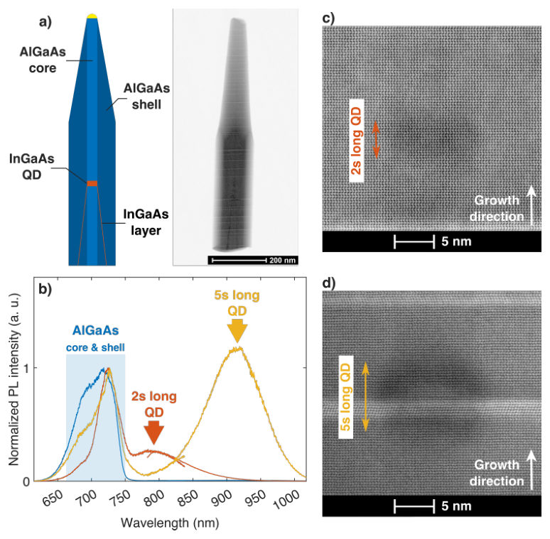 
Figure 1: Structural and optical characterization of InGaAs QDs embedded in

📷 Fig 2

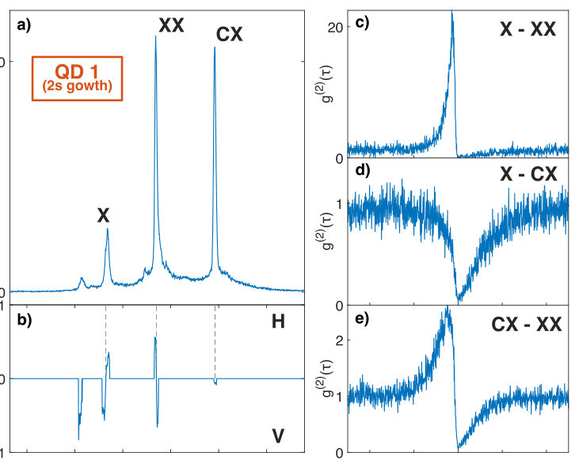 
Figure 2: Optical characterization of a 2 s InGaAs QD embedded in an AlGaAs

📷 Fig 3

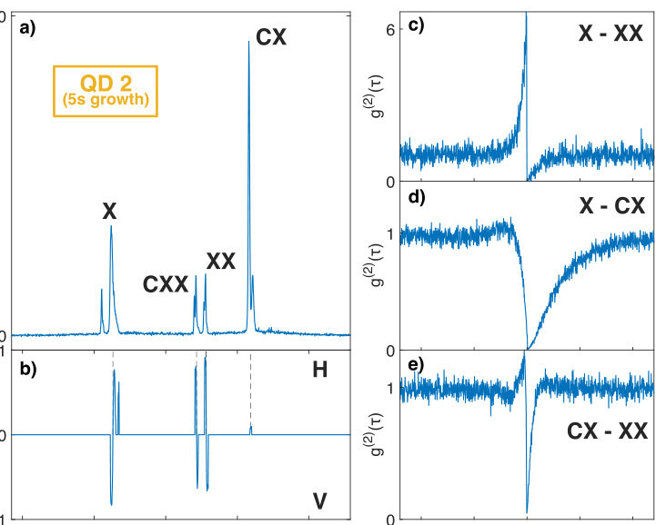 
Figure 3: Optical characterization of a 5 s InGaAs QD embedded in an AlGaAs

📷 Fig 4

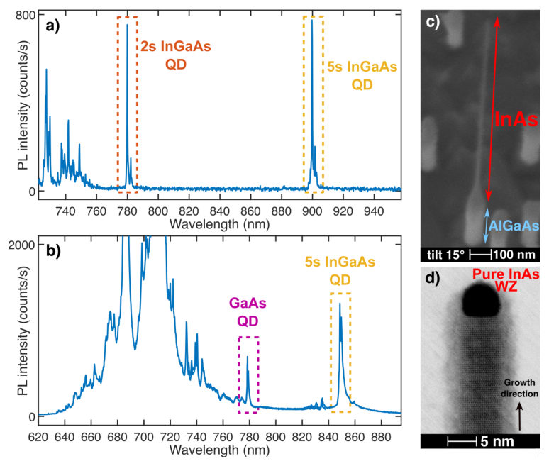 
Figure 4: Two different QDs in a nanowire, and a pure InAs segment on top of a

**Summary.** The authors introduce AlGaAs nanowires as a universal platform for fabricating and characterizing quantum dots made of GaAs, InGaAs, and InAs. By precisely controlling the growth process, they achieve deterministic tuning of the emission wavelength and successfully co-integrate different materials into single devices. This establishes a crucial building block for scalable, on-chip quantum light sources.

**Why it may be interesting.** This work directly addresses the hardware requirements for quantum networking by providing a scalable, multi-material platform for generating on-demand, spectrally tunable single-photon sources.

Detailed structure

**Main problem.** The challenge is to create a single, universal platform for optical quantum dots (QDs) that allows for wavelength tunability across a broad spectral range and enables the co-integration of multiple different QD materials.

**Main result.** AlGaAs nanowires are successfully demonstrated as a universal host material capable of growing and characterizing multiple QD types (GaAs, InGaAs, InAs) with tunable emission wavelengths and confirmed single-photon emission.

**Method.** The research employs Molecular Beam Epitaxy (MBE) for growth, coupled with advanced optical characterization techniques like micro-photoluminescence (PL) spectroscopy, polarization measurements, and cross-correlation measurements.

**Model / system.** The physical system is the AlGaAs nanowire acting as a host matrix for embedded semiconductor quantum dots (InGaAs, GaAs, InAs). The study investigates the excitonic and biexcitonic transitions within these confined structures.

**Key observables.** QD emission wavelength (tunable from $\sim 780 	ext{ nm}$ to $\sim 920 	ext{ nm}$), single-photon statistics ($g_2(0) \approx 0$), fine-structure splitting, and the observation of multiple excitonic transitions (X, XX, CX).

**Important parameters / regimes.** Growth time (used to tune emission wavelength), QD height, and the material composition (GaAs, InGaAs, InAs).

**Assumptions / limitations.** The primary assumption is that the AlGaAs nanowire structure provides a stable and controllable template for integrating disparate semiconductor materials into functional quantum emitters.

**Figures summary.** Figures illustrate the tunability of PL spectra across different growth times, confirm single-photon emission via cross-correlation, and show structural evidence (STEM/EDX) of pure InAs segments grown on the nanowire.

**Paper structure.** The paper progresses by first establishing the basic tunability of InGaAs QDs, then demonstrating the versatility by co-integrating multiple QD types (e.g., GaAs/InGaAs), and finally extending the platform's capability to include pure InAs segments, confirming material compatibility across the full GaAs-InAs range.

Abstract

Optical quantum dots (QDs) are central to photonic quantum technologies, with fabrication approaches tailored to different spectral ranges. A key challenge, however, is the realization of a unified platform$\unicode{x2014}$a single growth method combined with a host material offering a designable architecture$\unicode{x2014}$enabling wavelength tunability across the full emission range and co-integration of multiple quantum dots. Here, we introduce AlGaAs nanowires as a universal host for GaAs, InGaAs, and InAs QDs. Building on our previous demonstration of high-quality GaAs QDs, we realize InGaAs QDs with tunable emission by varying the growth duration from 2 to 5 s, achieving emission at 780 and 920 nm. We further showcase the platform's versatility for multi-quantum-dot devices by co-integrating two InGaAs QDs, as well as GaAs and InGaAs QDs within a single nanowire. Finally, we initiate a first step toward pure InAs QDs by growing a pristine InAs segment on AlGaAs nanowires, demonstrating material compatibility.

[↑ back to top](#top)

### [Universal Spin-Position Coupled Rydberg Interactions](http://arxiv.org/abs/2608.23694v1)

**Authors:** Chengshu Li, Hui Zhai  
**Type:** theory · **Category:** other · **PDF:** <https://arxiv.org/pdf/2608.23694v1>  
**Analysis basis:** full PDF text, analyzed in chunks
**Topic relevance:** 🔥 `Rydberg arrays` **4/5** · 🔥 `analog quantum simulation` **4/5**

📷 Fig 1

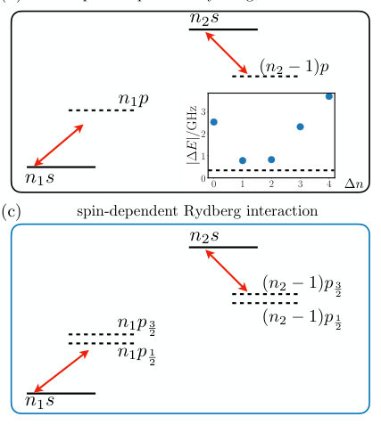 
Figure 1: From light shift to Rydberg interactions. (a) When a laser drives the atom, the detuning ∆E and the spin–orbit splitting ∆f define two competing energy scales. Depending on whether ∆E ≫∆f or ∆E ∼∆f, the induced light shift becomes either spin-independent (scalar) or spin-dependent (vector). (b) In conventional Rydberg interactions, the elec- tric dipole–dipole coupling acts as a perturbation, and the relevant energy defect ∆E = En1,p + En2−1,p −En1,s −En2,s is typically much larger than ∆f. The inset shows ∆E as a function of ∆n = n1 −n2. (c) When ∆E becomes com- parable to ∆f, the fine-structure splitting of the intermediate states must be explicitly taken into account, resulting...

📷 Fig 2

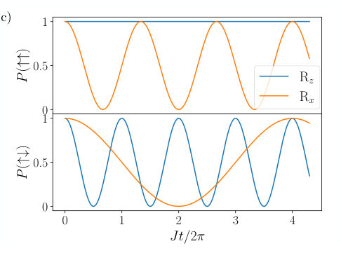 
Figure 2: Symmetry analysis and experimental consequences. (a) The spin-dependent Rydberg interaction involves two physical mechanisms: the electric dipole–dipole interaction between atoms and the electron spin–orbit coupling within each atom. (b) Two configurations with distinct spin dynam- ics. The spin quantization axis is along ˆz, and the interatomic displacement is either parallel to ˆz (Rz configuration) or to ˆx (Rx configuration). (c) Spin dynamics for two initial states |↑↑⟩and |↑↓⟩in the two configurations (Rz and Rx).

📷 Fig 3

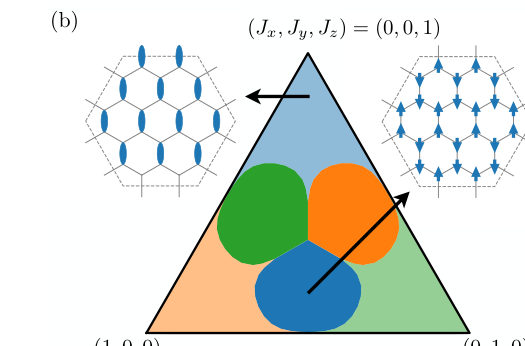 
Figure 3: Realizing the Kitaev–Heisenberg model. (a) Left: Schematic of the Kitaev model, where the spin interactions are of the form Sγ i Sγ j with γ = x, y, z on the three distinct bond types. Right: Proposed quantum simulation of the Kitaev–Heisenberg model with α = −3/2. The atoms are ar- ranged into two two-dimensional layers, with nearest-neighbor bonds aligned along the x, y, and z axes. The shaded surfaces are included to visualize the underlying three-dimensional cu- bic stacking, which provides an intuitive picture of the atomic positions. (b) Phase diagram as a function of the relative in- teraction strengths among the three bonds. The dark orange, green, and blue regions denote...

**Summary.** This paper uncovers a previously overlooked, universal, and strong electron-spin-dependent interaction in Rydberg atom arrays, arising from fine-structure splitting. This novel interaction possesses unique spin-space locking properties, allowing researchers to engineer the Kitaev-Heisenberg model. The resulting phase diagram predicts a stripe phase, offering a new platform for quantum simulation.

**Why it may be interesting.** This work provides a concrete, tunable mechanism within Rydberg arrays to engineer complex, anisotropic magnetic interactions, moving beyond simple van der Waals or purely dipolar couplings.

Detailed structure

**Main problem.** The paper investigates the emergence and universal form of strong electron-spin-dependent Rydberg interactions, which are typically ignored in current models of Rydberg atom arrays.

**Main result.** A universal, spin-dependent Rydberg interaction is found that is fundamentally distinct from conventional dipolar interactions and can realize the Kitaev-Heisenberg model, hosting a novel stripe phase.

**Method.** The analysis combines *ab initio* calculations, symmetry considerations (especially involving fine-structure splitting), and theoretical modeling of lattice Hamiltonians.

**Model / system.** The system is based on arrays of s-orbital Rydberg atoms. The interaction is modeled by a Hamiltonian that includes spin-space locking terms, allowing for the realization of the Kitaev-Heisenberg model on a lattice.

**Key observables.** Spin-space locking, stripe phases (breaking spin and translational symmetry), and the time evolution of spin states in different relative geometries.

**Important parameters / regimes.** The ratio of detuning ($\Delta E$) to fine-structure splitting ($\Delta f$), and the relative strengths of lattice couplings ($J_x, J_y, J_z$).

**Assumptions / limitations.** The derivation relies on symmetry arguments and assumes the dipole-dipole interaction is the primary perturbation channel when $\Delta E \sim \Delta f$.

**Figures summary.** Figures illustrate the transition from spin-independent to spin-dependent interactions, show spin dynamics in different geometries ($R_z, R_x$), and map out the phase diagram of the Kitaev-Heisenberg model, revealing the stripe phase.

**Paper structure.** The paper first establishes the physical mechanism for the spin-dependent interaction via fine-structure splitting. It then derives the universal Hamiltonian form and applies it to model the Kitaev-Heisenberg model, culminating in a detailed analysis of the resulting phase diagram.

Abstract

Strong interactions between $s$-orbital Rydberg atoms underpin atom-array-based quantum computation and quantum simulation. Typically, the spin dependence of these interactions is negligible and plays no practical role. In this Letter, we uncover that a strong electron-spin-dependent Rydberg interaction can emerge when the principal quantum numbers of the two $s$-orbital atoms differ by a sweet-spot value. This interaction originates from the fine-structure splitting of nearby $p$ orbitals, which endows it with distinct symmetry properties such that the electron spins are coupled to the relative position of the two atoms, featuring a spatially defined anisotropy. We further demonstrate that this interaction admits a universal form, independent of the principal quantum numbers, and highlight its fundamental distinction from conventional magnetic dipolar interactions, establishing it as a new type of native magnetic interaction in nature. Our findings introduce a new element to the Rydberg quantum simulation toolbox. As a concrete application, we propose a native realization of the Kitaev-Heisenberg model, which hosts an unusual stripe phase as a quantum many-body manifestation of spin-space locking.

[↑ back to top](#top)

### [QML for Quantum Sensing under Measurement-Induced Information Loss](http://arxiv.org/abs/2608.23934v1)

**Authors:** Sounak Bhowmik, Himanshu Thapliyal  
**Type:** theory · **Category:** quantum information and computing · **PDF:** <https://arxiv.org/pdf/2608.23934v1>  
**Analysis basis:** full PDF text, analyzed in chunks
**Topic relevance:** 🔥 `quantum measurements` **4/5** · `QC/QI experiment` **3/5**

📷 Fig 1

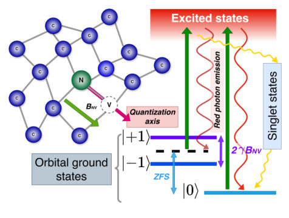 
Fig. 1: Level diagram of a nitrogen-vacancy center in diamond, where a substitutional nitrogen atom and an adjacent vacancy form a spin defect used for nanoscale magnetometry. Without any external magnetic field, the energies of the orbital ground states, ∈{|0⟩, |±1⟩}, split, called zero field splitting (ZFS). In the presence of an external magnetic field, BNV along the quantization axis of the crystal, the degenerate ground states, |+1⟩and |−1⟩, split up, which is referred to as Zeeman splitting. Once optically excited, the |±1⟩states decay through metastable singlet states to the ground state, |0⟩, leading to optical initialization and spin-dependent fluorescence to be read optically to...

📷 Fig 2

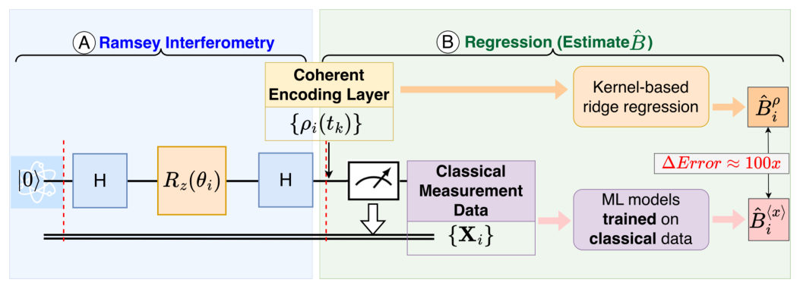 
Fig. 2: Magnetic field estimation using NV center-inspired quantum sensing simulation. (A) Ramsey Interferometry simulation: θi = γBitk; ρi(tk) is the corresponding density matrix, after the system evolves under a magnetic field Bi for time tk; xi is the corresponding expectation value of the observable. (B) Regression problem to estimate the unknown magnetic field: ˆBρ and ˆB⟨x⟩are the estimated magnetic field values based on coherent-state and classical measurement statistics, respectively.

📷 Fig 3

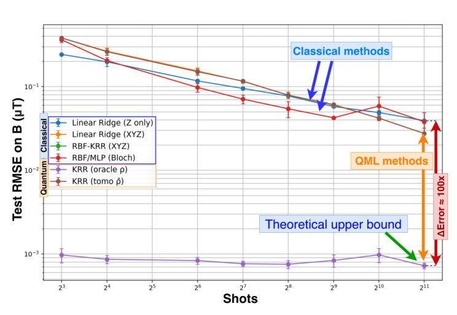 
Fig. 3: NV center-inspired magnetometry regression (mean ± std over seeds): Depicts the theoretical upper bound, and its performance gap with the models learning from the measurement data. The estimation error in the latter is 100 times more. Sensing pipelines that are more closely integrated with the coherent quantum states, or a more sophisticated measurement strategy, can help to close this gap and provide more accurate results.

📷 Fig 4

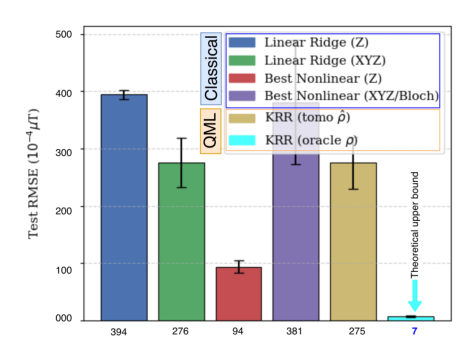 
Fig. 4: Test RMSE (µT) at 2048 shots (mean ± std): The RMSE is significantly lower in the theoretical upper bound, which highlights its gap with the measurement-based learning models.

**Summary.** This work investigates how Quantum Machine Learning (QML) can enhance magnetic field sensing using NV centers, focusing on the impact of measurement noise. By comparing models trained on raw measurement data versus those using pre-measurement quantum states, the authors show that access to quantum coherence provides a substantial, theoretically achievable performance boost. This underscores the need for quantum-native learning pipelines to minimize information loss in real-world quantum sensors.

**Why it may be interesting.** It provides a concrete, quantitative framework for understanding the limitations imposed by measurement back-action on quantum sensing protocols, which is crucial for designing fault-tolerant quantum measurements.

Detailed structure

**Main problem.** The paper addresses the challenge of extracting reliable parameters from noisy, measurement-limited quantum sensing data in the NISQ era.

**Main result.** QML-based sensing performance significantly improves when utilizing pre-measurement coherent quantum-state information, demonstrating that measurement-induced information loss is the primary bottleneck.

**Method.** The authors formulated magnetic field estimation as a supervised regression task, comparing classical ML models trained on measurement statistics against quantum kernel models trained on coherent quantum states.

**Model / system.** The study uses a Nitrogen-vacancy (NV) center in diamond as a quantum sensor, simulating Ramsey interferometry governed by a Zeeman Hamiltonian. The process involves unitary evolution followed by projective measurement.

**Key observables.** Magnetic field ($B$), estimation error (RMSE), and the comparison between classical vs. quantum kernel model performance.

**Important parameters / regimes.** Magnetic field range ($B \in [0, 2] \mu T$), evolution times ($\{5, 10, 20, 40, 60\} \mu s$), and noise parameters like $T_2$ and readout error.

**Assumptions / limitations.** The core comparison assumes that classical models are limited by measurement statistics, while quantum models can access the theoretical upper bound provided by coherent states.

**Figures summary.** Figures illustrate the NV center level diagram, the Ramsey interferometry setup, and comparative plots showing the gap between the theoretical upper bound (coherent state access) and measurement-limited model performance.

**Paper structure.** The paper establishes the sensing problem using NV centers, details the data acquisition by comparing classical (measurement-based) and quantum (coherent state) data types, and concludes by quantifying the performance gap attributable to measurement-induced information loss.

Abstract

Nitrogen-vacancy (NV) centers in diamond can serve as highly sensitive solid-state quantum sensors for high-sensitivity magnetometry. However, in the noisy intermediate-scale quantum (NISQ) era, extracting reliable information from noisy, finite-shot, and measurement-limited sensing data remains a considerable challenge. Whereas, quantum machine learning (QML) offers a potential path to improve parameter estimation by learning nonlinear relationships between quantum-sensing data and the underlying physical signal. In this work, we investigate the role of QML in magnetic-field estimation within an NV center-inspired magnetometry setting. We formulated magnetic field sensing as a supervised regression task. We compared the performance of several classical machine learning models trained on measurement-based classical data with that of quantum kernel-based models trained on pre-measurement coherent quantum states. Our objective is to isolate the impact of measurement-induced information loss and therefore provide a theoretical upper bound on the sensing performance. The upper bound is achievable only when coherent quantum information is directly available to the learning model. Our results show that QML-based sensing performance improves significantly with coherent quantum-state information, and not much with changes in model complexity or learning paradigm. This observation underscores the importance of learning pipelines that tightly integrate quantum sensors and QML models to enhance magnetic field sensing under realistic constraints.

[↑ back to top](#top)

### [Quantum simulation of circular cluster interactions in a linear spin chain](http://arxiv.org/abs/2608.24502v1)

**Authors:** Alexander van Lomwel, Hongzheng Zhao, Florian Mintert  
**Type:** theory · **Category:** other · **PDF:** <https://arxiv.org/pdf/2608.24502v1>  
**Analysis basis:** full PDF text, analyzed in chunks
**Topic relevance:** 🔥 `analog quantum simulation` **4/5** · `quantum measurements` **2/5** · `methods for driven-dissipative` **1/5**

📷 Fig 1

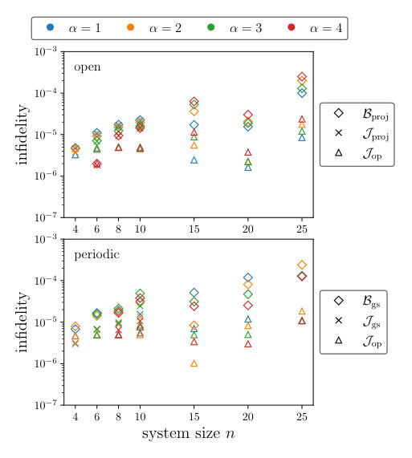 
FIG. 1. Infidelities as functions of system size n for ground state preparation of the OBC target KT = Kα n−α (top panel; Eq. (4)) and the PBC target KT = Kα n (bottom panel; Eq. (6)), for cluster interaction ranges α ∈[1, 4]. Triangles show the operator infidelity Jop = J (K(T), KT) (Eq. (A10)). Crosses show the infidelity between the projectors onto the ground spaces of K(T) and KT, Jproj (Eq. (A13)), in the de- generate OBC case, and the infidelity between the ground states of K(T) and KT, Jgs (Eq. (A11)), in the non- degenerate PBC case, while diamonds show their respective upper bounds, Bproj (Eq. (A14)) and Bgs (Eq. (A12)). With a typical operator infidelity of O(10−5), the bound...

📷 Fig 2

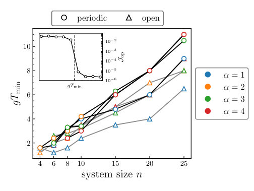 
FIG. 2. The minimum required duration gTmin, in terms of the interaction strength g of the system Hamiltonian Eq. (2), as a function of system size n. The triangle points represent target KT = Kα n−α (Eq. (4)) (OBC), and the circle points represent target KT = Kα n (Eq. (6)) (PBC), for cluster in- teraction ranges α ∈[1, 4]. The minimum duration appears to scale approximately linear with the system size and, for a given system size, the minimum duration does not vary considerably with the cluster interaction range α. While the minimum duration does increase for the PBC target Hamil- tonian, the duration is still comparable to that of the OBC target Hamiltonian. The top left inset shows an...

📷 Fig 3

 
Fig. 2 also shows gTmin as a function of system size n for both the OBC target with points depicted by trian- gles, and the PBC target with points depicted by circles, for cluster interaction ranges α ∈[1, 4]. Despite the lim- ited reliability of numerical optimization, a linear growth of gTmin with system size n is rather evident for both the open and periodic case, as well as the observation that gTmin does not vary considerably with the cluster inter- action range α. This scaling is remarkably weak, only requiring a small percentage of the full coherence bud- get of modern quantum simulators [62] at large system sizes, such as n = 25. While the minimum duration gTmin in order to realize...

**Summary.** This paper tackles the challenge of engineering complex quantum Hamiltonians, such as those exhibiting periodic boundary conditions, using a physical device naturally constrained to open boundary conditions. The authors develop a quantum control protocol that drives the system Hamiltonian towards the target Hamiltonian by minimizing infidelity. They show that this process is highly efficient, requiring only a modest, near-linear scaling of control time with system size.

**Why it may be interesting.** This work provides a concrete, scalable protocol for realizing complex, symmetry-enforced Hamiltonians (like those found in quantum simulation of correlated materials) using only local, controllable interactions, which is highly relevant for designing quantum simulators.

Detailed structure

**Main problem.** The central challenge is preparing ground states of Hamiltonians with symmetries fundamentally different from those of the underlying physical device, specifically achieving periodic boundary conditions (PBC) interactions on a linear geometry with open boundary conditions (OBC).

**Main result.** The authors demonstrate that this goal can be achieved using an analog protocol whose required control duration scales only moderately (near-linearly) with the system size, even for complex PBC targets.

**Method.** They employ time-dependent quantum control theory, designing the evolution of a system Hamiltonian $H(t)$ to map an initial state to the target ground state by minimizing operator and ground state infidelities.

**Model / system.** The system is a linear spin chain modeled by spin operators ($X_j, Y_j, Z_j$). The Hamiltonians involve nearest-neighbor interactions and target cluster interactions, which are analyzed within the framework of a Lie algebra.

**Key observables.** Operator infidelity ($J_{op}$), projector infidelity ($J_{proj}$), and ground state infidelity ($J_{gs}$), as well as the minimum required control duration ($gT_{min}$).

**Important parameters / regimes.** System size ($n$), interaction range ($\alpha$), and the control duration ($T$).

**Assumptions / limitations.** The analysis relies on the fact that the initial Hamiltonian has product state eigenstates, and the Lie algebra generated by the system operators is polynomially scaling.

**Figures summary.** Figures illustrate the scaling of operator and ground state infidelities, as well as the minimum required control duration, showing weak dependence on the interaction range $\alpha$ for both OBC and PBC cases.

**Paper structure.** The paper first establishes the physical problem of symmetry mismatch between target and device Hamiltonians. It then analyzes the structure of the relevant Lie algebra. Finally, it develops and applies the quantum control protocol, calculating infidelities and determining the scaling of the required control time for both OBC and PBC targets.

Abstract

The preparation of ground states of Hamiltonians with symmetries that are fundamentally different than those of the underlying device is a central challenge for quantum technologies. Here, we address this challenge with an analog protocol for the iconic generalized cluster Hamiltonian with the translational symmetry resultant from periodic boundary conditions based on a magnetization-preserving interaction on a linear geometry with open boundary conditions. Our results show that this goal can be achieved in a control duration that scales only moderately with the number of spins and Hamiltonian interaction complexity.

[↑ back to top](#top)

### [Bang-bang protocol for nondispersive qubit readout](http://arxiv.org/abs/2608.23681v1)

**Authors:** Nina del Ser, Yinan Chen, Jacob Steiner, Gil Refael  
**Type:** theory · **Category:** quantum information and computing · **PDF:** <https://arxiv.org/pdf/2608.23681v1>  
**Analysis basis:** full PDF text, analyzed in chunks
**Topic relevance:** 🔥 `quantum measurements` **4/5** · `QC/QI experiment` **2/5**

📷 Fig 1

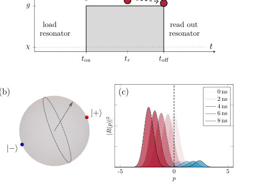 
FIG. 1. (a) Schematic of the bang-bang nondispersive readout protocol. (b) Bloch sphere representation of the |±⟩sweet- spot basis states of a qubit in the nondispersive JC model, Eq. (1). |±⟩are related to the Sz-eigenstates |↑, ↓⟩by Eq. (7), with θR →θJC, ϕR →ϕJC. (c) Probability distribution of the resonator quantum state projected onto the p-coordinate. At the readout time tr ≈7 ns, the distributions corresponding to |+⟩(red) and |−⟩(blue) become distinguishable. Parameters used in panels (b)–(c): g/2π =100 MHz, ∆/2π =23 MHz, and N = |α0|2 = 9.

📷 Fig 2

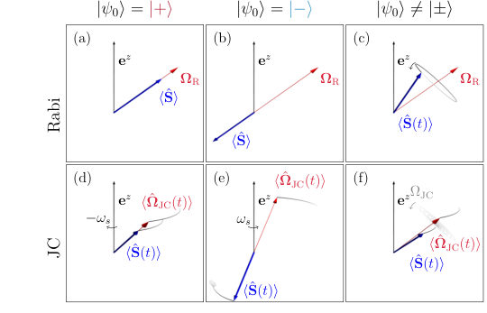 
FIG. 2. Time traces for 0 ≤t ≤20 TR/JC, with TR/JC = 2π/ΩR/JC, of the resonator static/dynamic drive vector (red) and qubit Bloch vector (blue) in the Rabi (panels (a)–(c)) and JC (panels (d)–(f)) models, in the rotating frame described by the unitary operators ˆUJC(t), ˆURabi(t) defined in Eq. (5). The qubit is initialized in the |±⟩eigenstates, i.e. parallel or antiparallel to the Rabi vector, in columns 1–2, and in an (unequal) superposition state of |±⟩in column 3. In the Rabi model, ⟨ˆS⟩always precesses anticlockwise at the Rabi frequency ΩR around ΩR, which is fixed [Eq. (8) and (11)]. In the JC model, ˆΩR is promoted to an operator and becomes dynamical [Eq. (13)]. Rabi oscillations...

📷 Fig 3

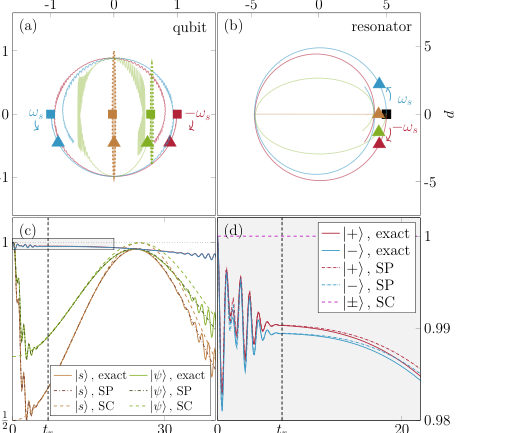 
FIG. 3. Panels (a)–(b): paths of ⟨ˆS⟩and ⟨ˆΩJC⟩projected onto the SxSy- and xp-planes, respectively, for initial qubit states |±⟩(red/blue), |s⟩= 1 √

📷 Fig 4

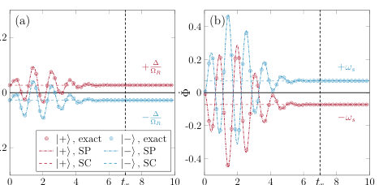 
FIG. 4. Qubit angles in the early-time window, 0 &lt; t ≲tr, for a qubit initialized in |±⟩(JC model in the rotating frame, as in Fig. 2 and 3). We plot cos(Θ) and ˙Φ for simplicity, where Θ, Φ are the polar and azimuthal angles of the qubit, respectively. Saddlepoint (SP) and semiclassical (SC) expressions for Θ, Φ were obtained by substituting Eq. (D1) and (D2) and Eq. (15) into Eq. (61), respectively. Only the SP approach is able to correctly capture the initial O(N −1) oscillations in the exact data for 0 &lt; t ≲tr. At t ≳tr, the exact data, SP and SC approaches match to leading order in 1/ √

📷 Fig 5

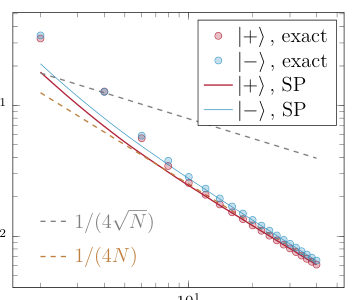 
FIG. 5. Loss in qubit purity, 1 −Tr  ˆρq(tr)2 , at readout time tr =7 ns, for a qubit initialized in sweet-spot states |±⟩ (r = ±1), as a function of N. Dashed lines correspond to the asymptotic 1/(4N) line (brown), with a 1/(4 √

**Summary.** This paper introduces a 'bang-bang' protocol to achieve fast, high-fidelity, and quantum-non-demolition (QND) readout for superconducting qubits. By replacing slow parameter sweeps with sudden coupling quenches, the protocol maintains high measurement fidelity even in the nondispersive regime. The theoretical analysis confirms that the error in both fidelity and QNDness scales favorably as $1/N$, making it a robust method for quantum information processing.

**Why it may be interesting.** This work provides a concrete, theoretically derived protocol for high-fidelity quantum measurement in superconducting circuits, directly impacting the feasibility of scalable quantum computation by improving readout fidelity.

Detailed structure

**Main problem.** The paper addresses the need for fast, precise, and quantum-non-demolition (QND) readout of superconducting qubits, overcoming limitations found in conventional dispersive readout methods.

**Main result.** A novel 'bang-bang' readout protocol, which uses sudden quenches of the coupling constant, achieves single-shot projective measurements with remarkably high fidelity and QNDness, with errors decreasing as $1/N$.

**Method.** The authors developed an analytical theory for the Jaynes-Cummings model dynamics, employing a saddle-point approximation and a systematic asymptotic expansion in powers of $1/\sqrt{N}$.

**Model / system.** The system involves superconducting qubits coupled to a harmonic readout resonator, modeled by the Jaynes-Cummings (JC) Hamiltonian. The protocol is tested in both the dispersive and nondispersive regimes.

**Key observables.** Fidelity, QNDness, qubit purity, and the resonator state distribution after measurement.

**Important parameters / regimes.** Photon number ($N$), coupling constant ($g$), detuning ($\Delta$), and the quench timing/protocol parameters.

**Assumptions / limitations.** The analysis relies on the JC model, assumes large photon numbers ($N \gtrsim 1$), and requires initializing the qubit in a specific 'sweet-spot basis' for optimal performance.

**Figures summary.** Figure 1 schematically illustrates the bang-bang protocol, the sweet-spot basis on the Bloch sphere, and the distinguishable resonator state distribution at readout. Other figures show time traces of Bloch vectors and fidelity/QNDness errors vs. protocol parameters.

**Paper structure.** The paper first establishes the problem with conventional readout, then introduces the bang-bang protocol. The core is the theoretical development using the JC model, followed by detailed calculations of fidelity and QNDness errors in the large $N$ limit, comparing results for different drive models.

Abstract

Fast, precise, and quantum-non-demolition (QND) readout of superconducting qubits is a fundamental component of high-fidelity quantum sensing and computation. Conventional approaches typically operate in the dispersive regime, where the qubit-resonator coupling $g$ is weak compared to the detuning $Δ$. While exhibiting good QND properties, the readout rate is limited to $\sim g^2\sqrt{N}/Δ\ll g$, where $N$ is the number of photons in the resonator. QND readout in the nondispersive regime, where the readout rate reaches its full potential $\sim g$, relies on parameter sweeps that may encounter resonances, leading to measurement-induced state transitions (MIST). In this work, we study a nondispersive readout protocol that replaces these sweeps by sudden quenches of the coupling constant, using a resonator that is preloaded with photons. We call this protocol bang-bang readout, and show that it realizes single-shot projective measurements. The fidelity and QNDness of the qubit post-measurement are remarkably high, with an error that decreases like $1/N$. To arrive at these findings, we develop an analytical theory for the dynamics and measurements of the Jaynes-Cummings (JC) model, including a systematic expansion of correction terms in powers of $1/\sqrt{N}$. We show that the protocol can also be implemented without preloading the resonator by instead strongly driving the qubit, e.g., with a classical flux drive.

[↑ back to top](#top)

### [Lifting connectivity bottlenecks in superconducting quantum processors via enriched native two-qubit gates](http://arxiv.org/abs/2608.24084v1)

**Authors:** Hanyi Wang, Jingzhe Guo, Lijun Sun, Zhaohui Yang, Weizhi Tao, Xingye Yuan, Qiankun Wang, Bihao Guo, Chunwang Liu, Rui Yang, Yang Li, Yu Fan, Jiasheng Hu, Junhe Wang, Shuyue Zheng, Shengbin Wang, Xinfang Zhang, Feng Wu, Hantao Sun, Jianxin Chen  
**Type:** both · **Category:** quantum information and computing · **PDF:** <https://arxiv.org/pdf/2608.24084v1>  
**Analysis basis:** full PDF text, analyzed in chunks
**Topic relevance:** 🔥 `QC/QI experiment` **4/5**

📷 Fig 1

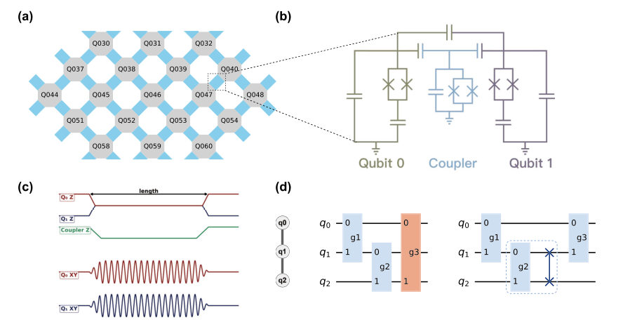 
FIG. 1: (a) Topological layout of qubits and couplers. Dark gray denotes qubits, and light blue denotes couplers. (b) Simplified circuit schematic of two qubits coupled via a tunable coupler. (c) Compiled pulse sequence for an arbitrary AshN two-qubit gate. From top to bottom: Z-control pulses on the two qubits, the Z-control pulse on the tunable coupler, and the XY-drive pulses applied to the two qubits. (d) The AshN gate reduces routing overhead via SWAP absorption. The left panel shows a three-qubit 1D chain topology (q0 ↔q1 ↔q2). The middle panel illustrates that, under a trivial initial mapping, gate g3 in the logical circuit is not directly executable. The right panel shows that a...

📷 Fig 2

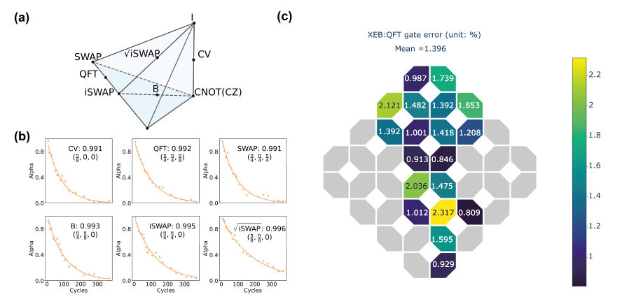 
FIG. 2: AshN gate performance of the system. (a) Illustration of the AshN two-qubit gate in the Weyl chamber calibrated in this work. Under the KAK decomposition, every two-qubit operation in SU(4) is locally equivalent to a point in the Weyl chamber. (b) Cross-entropy benchmarking (XEB) results for different types of AshN two-qubit gates. Here, “cycles” denotes the number of layers in the random circuits, and Alpha represents the XEB fidelity extracted from the cross-entropy between the experimental and ideal probability distributions. Each panel corresponds to a different type of AshN two-qubit gate; the annotations indicate the gate type, the extracted XEB fidelity, and the corresponding...

📷 Fig 3

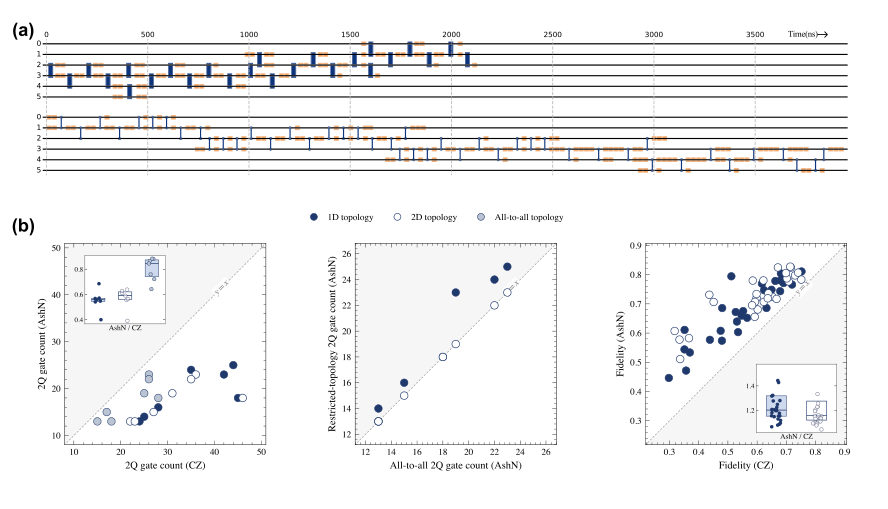 
FIG. 3: Comparison between CZ- and AshN-based two-qubit gate schemes. (a) Representative benchmark circuit compiled using the AshN- and CZ-based frameworks. The upper panel shows the AshN implementation, consisting of native AshN two-qubit gates and single-qubit gates, while the lower panel shows the corresponding CZ-based implementation composed of CZ and single-qubit gates. The circuit shown is one of the seven benchmark circuits used in the experiments. (b) Comparison of compiled two-qubit gate counts and circuit fidelities for the AshN- and CZ-based compilation schemes. The left panel compares the compiled two-qubit gate counts for the seven benchmark circuits using the AshN and CZ gate...

📷 Fig 4

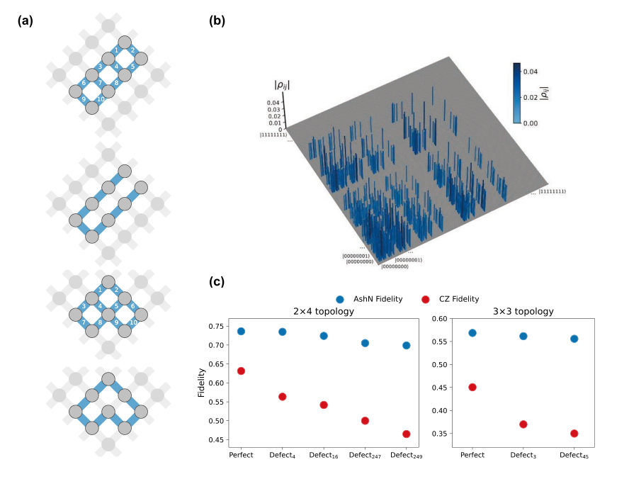 
FIG. 4: (a) Schematic of the qubit topologies used in this work. From top to bottom: the defect-free 2×4 topology, the corresponding Defect247 configuration, the defect-free 3×3 topology, and the corresponding Defect45 configuration. (b) Full quantum state tomography (QST) of the Dicke state prepared on the defect-free 2×4 topology using the AshN scheme, reconstructed in the computational basis. The ideal two-excitation Dicke state has support over 28 computational-basis states with equal probability 1/28, and the reconstructed state achieves a fidelity of F = 0.736 ± 0.001 with the ideal Dicke state. Bar height and color represent the magnitude of the reconstructed density-matrix element...

**Summary.** This paper introduces the AshN control scheme to overcome connectivity limitations in superconducting quantum processors. By engineering native two-qubit gates, the scheme allows complex logical operations and necessary qubit routing to be merged into single physical operations. This results in substantial reductions in gate count and demonstrates robust entanglement preparation even on hardware with connectivity defects.

**Why it may be interesting.** This work directly tackles hardware limitations in superconducting quantum computing, providing a practical, gate-level engineering solution (native-gate engineering) that improves resource efficiency and scalability for quantum algorithms.

Detailed structure

**Main problem.** The primary challenge addressed is the connectivity bottleneck in superconducting quantum processors, where planar layouts restrict interactions between distant qubits.

**Main result.** The proposed AshN control scheme effectively merges logical interactions and required qubit routing into single native operations, achieving significant reductions in two-qubit gate counts compared to standard CZ-based compilation.

**Method.** The authors use the AshN control scheme, which leverages rich two-qubit control on nearest-neighbor pairs to implement SWAP absorption, effectively transforming sparse hardware graphs into more connected computational architectures.

**Model / system.** The work focuses on superconducting quantum processors with nearest-neighbor coupling graphs. The methodology involves gate synthesis using the AshN protocol and optimization via a router called MirrorSABRE.

**Key observables.** Two-qubit gate count (showing reductions of 43-45% vs. CZ), state fidelity (e.g., 0.736 for Dicke state), and certification of genuine multipartite entanglement using a PPT witness.

**Important parameters / regimes.** The comparison is made across 1D and 2D lattice topologies, including testing robustness against up to three connectivity defects.

**Assumptions / limitations.** The process assumes the ability to calibrate the gate set against device imperfections, though the benefit of SWAP absorption is noted to be workload-dependent.

**Figures summary.** Figures illustrate the topological layout, the mechanism of SWAP absorption using AshN gates, and comparisons of gate counts and entanglement certification between AshN and CZ gate sets on various lattices.

**Paper structure.** The paper introduces the connectivity problem, details the AshN control scheme and its implementation (including the MirrorSABRE router), presents quantitative benchmarks showing gate count reduction, and validates the approach by preparing and certifying entanglement in multi-qubit states on defective lattices.

Abstract

Limited qubit connectivity is a central architectural constraint in superconducting quantum processors, whose planar layouts require additional gates to mediate interactions between distant qubits. Here, we use the AshN control scheme, where rich two-qubit control on every nearest-neighbour pair allows a logical interaction and the required qubit routing to be merged into a single native operation, effectively transforming a sparse hardware graph into a more connected computational architecture. For the benchmark instances studied, the resulting synthesis capability enables reliable execution on constrained one- and two-dimensional lattices, with compiled two-qubit gate counts approaching those of an all-to-all-connected reference. Across seven benchmark circuits on one- and two-dimensional topologies, the AshN-based implementation achieves geometric-mean reductions of $45.2\%$ and $43.7\%$ in two-qubit gate count compared with controlled-Z-based compilation, respectively. Using AshN gates, we prepare an eight-qubit two-excitation Dicke state with a fidelity of $0.736$ and certify its genuine multipartite entanglement using a fully positive-partial-transpose witness, whereas the same witness does not certify entanglement for the CZ-based implementation. The state fidelity and entanglement certification remain robust across the tested lattice configurations, including those with up to three connectivity defects. Our work establishes native-gate engineering as a practical approach to mitigating connectivity constraints.

[↑ back to top](#top)

### [Quantum Change Intervals: Exact Asymptotic Localization with Collective Measurements](http://arxiv.org/abs/2608.24543v1)

**Authors:** Xu Chen, Xue Ma  
**Type:** theory · **Category:** other · **PDF:** <https://arxiv.org/pdf/2608.24543v1>  
**Analysis basis:** full PDF text, analyzed in chunks
**Topic relevance:** 🔥 `quantum measurements` **4/5**

📷 Fig 1

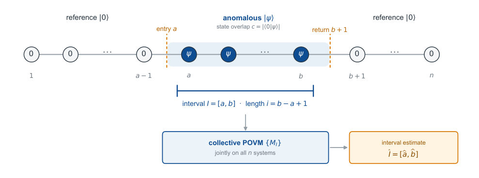 
Figure 1: Returning quantum change interval and collective localization. A source emits the reference state |0⟩except on a nonempty contiguous interval I = [a, b], where it emits the known anomalous state |ψ⟩. The entry and return boundaries are a and b + 1, respectively. For known length, i = b −a + 1 is fixed and only a is inferred; for unknown length, both endpoints are inferred. An arbitrary collective POVM may act on all n systems and returns an exact interval estimate bI. The state overlap is c = |⟨0|ψ⟩|; for 0 &lt; c &lt; 1, the local states are nonorthogonal.

📷 Fig 2

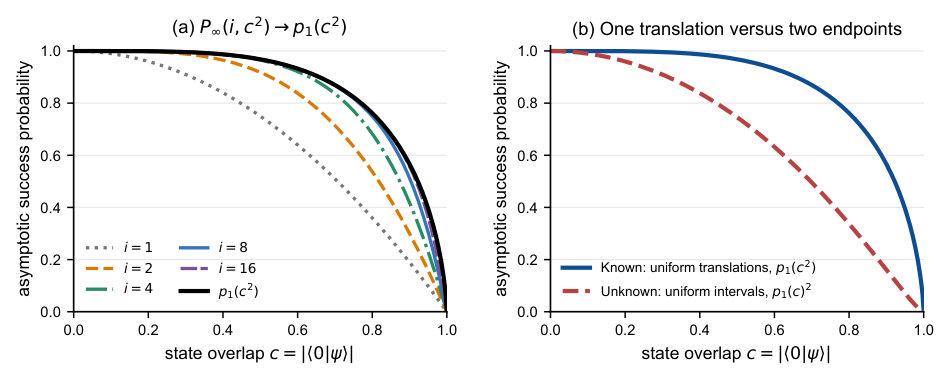 
Figure 2: Hierarchy of analytic localization limits. (a) The fixed-length Toeplitz integral P∞(i, c2) approaches the long- known-interval law p1(c2) as i grows. The i = 2 curve is equivalently given by the complete-elliptic-integral expression in Corollary 3.4. (b) The one-translation law p1(c2) and two-endpoint law p1(c)2 are shown for their respective uniform- translation and uniform-interval priors. The latter follows from the two-dimensional Følner limit and separable comparison symbol.

📷 Fig 3

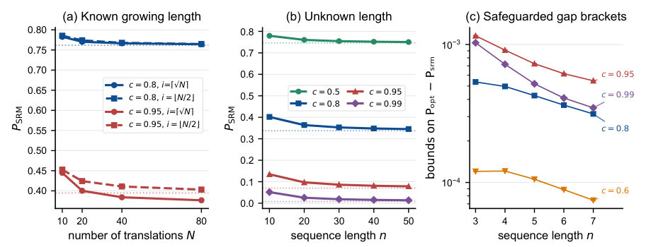 
Figure 3: Finite-size convergence and safeguarded floating-point SRM-gap brackets. (a) SRM success for i = ⌈ √

**Summary.** This theoretical paper derives the asymptotic optimal success probabilities for detecting a localized, transient quantum change in a stationary quantum signal. It rigorously compares the theoretical optimum with the Square-Root Measurement (SRM) limit under various prior assumptions regarding the unknown interval length. The results provide precise mathematical benchmarks for quantum change detection protocols.

**Why it may be interesting.** The rigorous mathematical framework for determining optimal detection strategies in quantum signal processing, especially the comparison between theoretical optima and practical measurements like SRM, is highly relevant to quantum sensing and quantum information theory.

Detailed structure

**Main problem.** The paper addresses the minimum-error localization of a transient, pure-state change occurring over a contiguous interval within an otherwise stationary quantum signal.

**Main result.** The asymptotic optimal and Square-Root Measurement (SRM) success probabilities converge to specific one-dimensional Toeplitz functionals, depending on whether the interval length is fixed or unknown.

**Method.** The analysis employs advanced mathematical techniques, including Toeplitz symbol analysis, Følner reduction, and the exceptional-sector Gram transfer theorem to establish asymptotic limits.

**Model / system.** The model involves a sequence of independent quantum outputs that are perturbed by a pure-state change $|\psi
angle$ localized to a specific interval $I$, compared against a reference state $|0
angle$.

**Key observables.** Minimum-error optimal success probability ($P_{	ext{opt}}$) and the Square-Root Measurement (SRM) success probability.

**Important parameters / regimes.** The state overlap $c = |\langle 0|\psi
angle|$, the interval length $i$, and the total sequence length $n$.

**Assumptions / limitations.** The analysis assumes independent outputs, an abrupt change, and the use of a zero-one reward criterion for minimum-error detection.

**Figures summary.** Figures illustrate the geometry of the quantum change interval and show numerical comparisons of SRM success probabilities for known and unknown growing lengths.

**Paper structure.** The paper progresses by first establishing the problem setup, then deriving asymptotic limits for fixed interval lengths, extending these results to the case where both interval length and number of translations diverge, and finally incorporating a no-change hypothesis via Bayes optimization.

Abstract

We study exact-label minimum-error localization of a transient, calibrated pure-state change occupying one nonempty contiguous interval in an otherwise stationary sequence of independent outputs, allowing arbitrary collective measurements. Let $c=|\langle 0|ψ\rangle|$ be fixed as the sequence length grows. For each fixed known interval length $i$, as the number $N$ of admissible translations tends to infinity, the corresponding Toeplitz symbol yields an exact square-root integral for the asymptotic optimal success probability, and the square-root measurement (SRM) attains the same limit. If the known length $i_n$ and $N_n=n-i_n+1$ both diverge, with no restriction on their ratio, the optimal and SRM success probabilities converge to the one-dimensional Toeplitz functional at the effective compound overlap $c^2$, namely $p_1(c^2)$. Under a uniform prior over all nonempty intervals, the unknown-length physical Gram kernel is not globally two-dimensional Toeplitz because of gap-dependent corrections. A triangular Følner reduction and an exceptional-sector Gram transfer theorem extend the comparison-kernel limits to the optimal and SRM success probabilities of the full physical ensemble, yielding $p_1(c)^2$. After adding a no-change hypothesis with fixed prior $π_0$, while retaining the uniform conditional distribution over anomalous intervals, the optimal joint Bayes limit is $π_0+(1-π_0)L$, where $L$ is the corresponding conditional localization limit; the weighted SRM for the augmented ensemble is not analyzed. Finite-size semidefinite programs and full dense physical-Gram SRM computations illustrate the asymptotic results.

[↑ back to top](#top)

### [Quantum-geometry stabilization of dilute fractional Chern insulators](http://arxiv.org/abs/2608.24013v1)

**Authors:** Ying-Xing Ding, Li-Min Zhang, Wen-Tong Li, D. L. Zhou, Wu-Ming Liu  
**Type:** theory · **Category:** strongly correlated electrons · **PDF:** <https://arxiv.org/pdf/2608.24013v1>  
**Analysis basis:** full PDF text, analyzed in chunks
**Topic relevance:** 🔥 `analog quantum simulation` **4/5**

📷 Fig 1

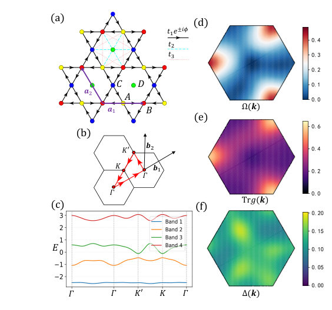 
FIG. 1. Center-decorated kagome lattice and single-particle band geometry. (a) Lattice structure and hopping pattern. (b) Brillouin zone. (c) Representative flat lowest band with Chern number C = 1 along the high-symmetry path, evalu- ated at t1 = 1, t2 = −1/3, t3 = 1/3, and ϕ ≈0.8π. (d)- (f) Berry curvature, trace of the quantum metric, and trace- condition deviation ∆(k) = Tr g(k) −|Ω(k)|.

📷 Fig 2

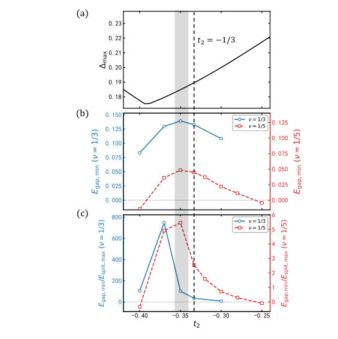 
FIG. 2. Optimization with respect to the center-site hop- ping t2 between the added D site and the kagome backbone. (a) Maximum trace-condition deviation ∆max. (b) Minimum many-body gap and (c) gap-to-splitting ratio over the twist- angle torus for ν = 1/3 and ν = 1/5. The shaded re- gion marks the stability-enhanced, geometry-improved win- dow, and the vertical black dashed line indicates t2 = −1/3, t2 = −0.35 is used below as a representative point.

📷 Fig 3

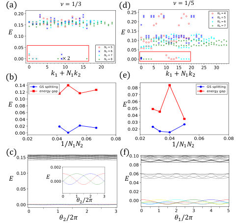 
FIG. 3. Low-energy spectra, finite-size scaling, and spectral flow at the optimized parameter. Panels (a)–(c) show results for ν = 1/3, and panels (d)–(f) show results for ν = 1/5: (a),(d) low-energy spectra, (b),(e) finite-size trends of the ground-state splitting and excitation gap, and (c),(f) spectral flow under flux insertion. The quasi-degenerate ground-state manifolds remain separated from higher excitations and re- turn to themselves under flux insertion.

📷 Fig 4

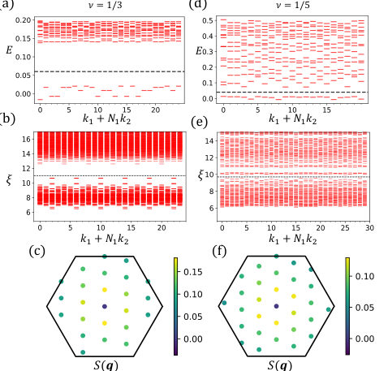 
FIG. 4. Quasihole spectra, particle entanglement spectra, and static structure factors at the optimized parameter. Pan- els (a)–(c) correspond to ν = 1/3, and panels (d)–(f) corre- spond to ν = 1/5: (a),(d) quasihole spectra, (b),(e) parti- cle entanglement spectra, and (c),(f) static structure factors S(q). The counting agrees with Abelian Laughlin FCIs, while S(q) shows no sharp ordering peak.

**Summary.** This paper proposes that the stability of dilute fractional Chern insulators can be enhanced not just by achieving band flatness, but by engineering the quantum geometry of the underlying electronic band structure. By tuning the lattice hopping parameter $t_2$ in a kagome model, the authors suppress competing charge-ordered phases and robustly maintain the topological liquid state at fillings like $
u=1/5$. This establishes quantum geometry engineering as a key design principle for realizing topological matter in artificial lattices.

**Why it may be interesting.** This work provides a concrete, tunable mechanism—quantum geometry engineering—to stabilize exotic topological states in synthetic lattice systems, which is highly relevant for designing quantum simulators using ultracold atoms.

Detailed structure

**Main problem.** The primary challenge is stabilizing dilute fractional Chern insulators (FCIs) at low fillings, which are inherently fragile and prone to competing charge-ordered phases, beyond simple optimization based on band flatness.

**Main result.** The stability of the FCI state is enhanced by engineering the quantum geometry of the underlying flat band, specifically by tuning the center-site hopping parameter $t_2$ away from the initial flatness-optimized limit.

**Method.** The study employs exact diagonalization on finite tori to analyze the many-body spectrum, alongside diagnostics involving the Berry curvature, Fubini–Study metric, and static structure factors.

**Model / system.** The system is modeled using a center-decorated kagome lattice, realized in the context of ultracold-fermion optical superlattices. The physics is captured by projecting the full Hamiltonian onto the lowest Chern band ($C=1$).

**Key observables.** Minimum many-body gap ($E_{	ext{gap,min}}$), total many-body Chern number ($C_{	ext{tot}}$), Berry curvature ($\Omega(\mathbf{k})$), and the deviation from the trace condition ($\Delta(\mathbf{k})$).

**Important parameters / regimes.** The center-site hopping $t_2$ is the key tunable parameter, with optimal stability found around $t_2 \approx -0.35$. The fillings studied are $
u=1/3$ and $
u=1/5$.

**Assumptions / limitations.** The analysis assumes that the low-energy physics can be accurately described by projecting the full Hamiltonian onto the lowest $C=1$ band, as the gap to higher bands is large.

**Figures summary.** Figures illustrate the dependence of quantum geometry metrics ($\Delta(\mathbf{k})$) and many-body stability ($E_{	ext{gap,min}}$) on $t_2$, confirming that geometry optimization yields better results than flatness optimization. Other figures show momentum occupation $n(\mathbf{k})$ and static structure factors $S(\mathbf{q})$ to rule out charge order.

**Paper structure.** The paper first establishes the problem of FCI fragility. It then introduces the center-decorated kagome model and uses quantum geometry diagnostics ($\Delta(\mathbf{k})$) to show that tuning $t_2$ improves stability. Finally, it confirms the topological liquid nature using multiple diagnostics (gap, spectral flow, $C_{	ext{tot}}$) at the optimized parameter point.

Abstract

Fractional Chern insulators have attracted broad interest as lattice analogs of fractional quantum Hall states without Landau levels. However, low-filling fractional Chern insulators are fragile because charge-ordered phases can compete strongly with the fractional topological liquid.   Here, we propose a center-decorated kagome model, motivated by geometry-tunable artificial lattices, in which the center-site hopping $t_2$ provides a direct knob for the quantum geometry of an isolated $C=1$ flat band.   Here quantum geometry refers to the Berry curvature and Fubini--Study metric, which determine the form factors of interactions projected into the Chern band. Exact diagonalization shows that tuning $t_2$ away from the flatness-optimized kagome limit reduces the trace-condition deviation, suppresses competing charge order, and enhances the many-body stability at both $ν=1/3$ and the more fragile $ν=1/5$ filling.   At $ν=1/5$, this stability-enhanced window persists under nearby interaction profiles, including variations of the dominant third-neighbor repulsion and weak nearest-neighbor admixtures.   Low-energy spectra, spectral flow, quasihole and entanglement counting, static structure factors, and the quantized total many-body Chern number $C_{\mathrm{tot}}=1$ consistently support Laughlin-like fractional Chern insulators.   These results identify quantum-geometry engineering as a route to stabilizing dilute fractional Chern insulators beyond band-flatness optimization alone.

[↑ back to top](#top)

### [Multi-hour stable trapping and threshold steady state of non-laser-coolable ions with ultracold atoms in a hybrid trap](http://arxiv.org/abs/2608.23768v1)

**Authors:** Satyabrata Baidya, Sourav Dutta  
**Type:** experiment · **Category:** other · **PDF:** <https://arxiv.org/pdf/2608.23768v1>  
**Analysis basis:** full PDF text, analyzed in chunks
**Topic relevance:** `QC/QI experiment` **3/5** · `analog quantum simulation` **3/5** · `driven-dissipative phase transition` **3/5** · `methods for driven-dissipative` **2/5** · `non-equilibrium universality` **2/5** · `quantum measurements` **2/5** · `Keldysh / 2PI / non-Gaussian methods` **1/5** · `correlated / nonlocal dissipation` **1/5** · `scars & prethermalization` **1/5**

📷 Fig 1

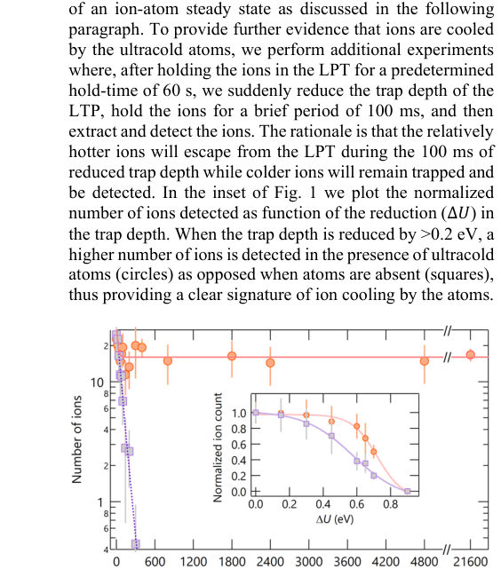 
FIG. 1. The number of ions detected after holding the ions in the ion trap for different values of hold times, either in the absence (squares) or presence (circles) of the ultracold atoms. The dotted and solid lines are fits to the model developed for the respective cases. The number of ions reach a steady state value in the presence of ultracold atoms. Inset: Normalized ion count when the trap depth is reduced by ∆𝑈 just prior to extraction of the ions for detection, with ions held either in absence (squares) or presence (circles) of ultracold atoms. The higher ion count in the presence of ultracold atom is a signature of ion cooling by atoms. The sigmoidal curves in the Inset are guides...

📷 Fig 2

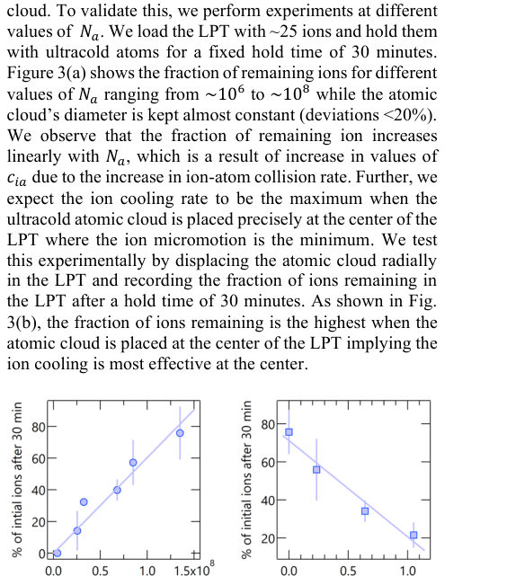 
FIG. 3. (a) The fraction of initial ions that remain in the ion trap after 30 minutes when held in the presence of ultracold atomic clouds containing different number of atoms. The fraction of remaining ions increases with the number of atoms due to enhanced ion-atom collision-induced cooling. (b) The fraction of remaining ions decreases as the ultracold atomic cloud in the MOT is displaced radially from the center of the ion trap.

📷 Fig 3

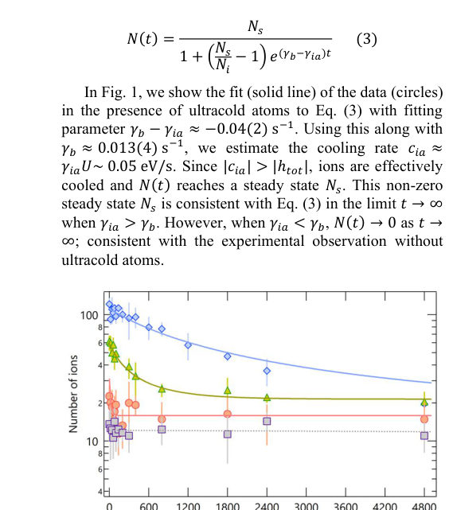 
FIG. 2. The number of ions (symbols) plotted as a function of the hold time for different values of initial ion count, while keeping the number of ultracold atoms the same in all cases. The solid lines are fits to Eq. (3). For initial ion count ≳22, the number of ions converges to a steady state value of 𝑁𝑠≈19 ± 3 after an initial phase of decay, while no decay is observed for initial ion count ≲ 22 as depicted by the square symbols.

📷 Fig 4

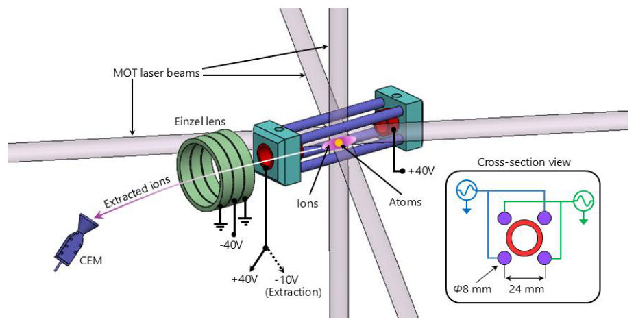 
Fig. 1S. Schematic diagram showing the LPT, Einzel lens, CEM and MOT laser beams. Inset: cross-section view of the LPT and the rf voltage configuration.

📷 Fig 5

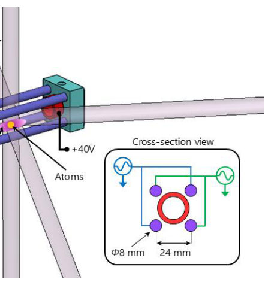 
Fig. 2S. Number of ions plotted against the additional radial drive frequency 𝑓𝑡𝑖𝑐𝑘𝑙𝑒.

**Summary.** The researchers demonstrated multi-hour stable trapping of non-laser-coolable Cs+ ions by coupling them with an ultracold Cs atomic cloud via Resonant Charge-Exchange cooling. This breakthrough establishes a robust, long-lived steady state, allowing for extended studies of fundamental ion-neutral interactions and setting stringent upper bounds on three-body recombination rates.

**Why it may be interesting.** This work directly addresses open quantum system dynamics in a complex, non-equilibrium setting, providing a platform to study ion-neutral chemistry and sympathetic cooling over extended timescales, which is crucial for quantum simulation.

Detailed structure

**Main problem.** The primary challenge was achieving and studying the long-lived steady state of non-laser-coolable ion ensembles when coupled with ultracold atoms, overcoming limitations of transient trapping regimes.

**Main result.** The authors achieved stable trapping of Cs+ ions for 6 hours using RCE cooling with ultracold Cs atoms, a massive improvement over the 3-minute lifetime observed without the atoms.

**Method.** The experiment utilizes a hybrid trap combining a linear Paul trap for Cs+ ions and a magneto-optical trap for ultracold Cs atoms, employing Resonant Charge-Exchange (RCE) cooling.

**Model / system.** The system involves Cs+ ions in a Paul trap interacting with a dense cloud of ultracold Cs atoms. The dynamics are modeled by balancing ion loss sources (background gas and ion-ion heating) against the cooling rate provided by ion-atom collisions.

**Key observables.** Ion number $N(t)$ over time, steady-state ion number $N_s$, and the ion lifetime.

**Important parameters / regimes.** The cooling rate ($\gamma_{ia}$) must overcome the total heating rate ($\hbar_{tot} = \hbar_b + \hbar_{ii}$); the steady state exhibits a threshold behavior $N_s$.

**Assumptions / limitations.** The analysis assumes the ion density remains constant when modeling the ion-ion heating term, and temperature estimations rely on Maxwell-Boltzmann distribution assumptions.

**Figures summary.** Figure 1 illustrates the ion population decay $N(t)$ vs. time, showing stabilization at a steady state when atoms are present, compared to exponential decay when atoms are absent.

**Paper structure.** The paper details the experimental setup (LPT, MOT, ion creation), presents the theoretical model describing ion loss dynamics (with and without atoms), and reports measurements demonstrating the long-lived steady state and its threshold behavior.

Abstract

We report multi-hour stable trapping and steady state of non-laser-coolable Cs$^{+}$ ions in a linear Paul trap, achieved via resonant charge-exchange (RCE) cooling with a precisely centered ultracold Cs cloud. Without cold atoms, all ions are lost within 3 minutes. With centered cold atoms, RCE cooling establishes a stable population of ions for 6 hours with no measurable decay -- more than two orders of magnitude longer hold times compared to prior hybrid atom-ion systems. We observe a threshold behavior in the steady-state number of ions ($N_{s}$): initial ion loadings above $N_{s}$ ions converge downward to $N_{s}$ ions and remain constant thereafter; initial loadings below $N_{s}$ ions show no measurable decay. The dynamics is governed by a competition between ion-ion rf heating and ion-atom collisional cooling. The prolonged, simultaneous ion-atom trapping suggests an upper bound on the three-body recombination-induced Cs$_{2}^{+}$ formation rate constant: $k_{3} << 1.4 \times 10^{-25} cm^{6} s^{-1}$. This remarkable realization of long-lived steady state overcomes a critical limitation of prior hybrid atom-ion systems and enables extended studies of ultracold ion-neutral chemistry, rare inelastic collisions, and sympathetic cooling routes for complex molecular ions.

[↑ back to top](#top)

### [An Ab initio Framework for Simulating Ultrafast Nonlinear Cavity Quantum Electrodynamics Spectra](http://arxiv.org/abs/2608.24180v1)

**Authors:** Luis Vasquez, Kewei Sun, Haibo Ma, Maxim F. Gelin  
**Type:** theory · **Category:** other · **PDF:** <https://arxiv.org/pdf/2608.24180v1>  
**Analysis basis:** full PDF text, analyzed in chunks
**Topic relevance:** `Keldysh / 2PI / non-Gaussian methods` **3/5** · `Tavis-Cummings & cavity-many-emitter` **3/5** · `methods for driven-dissipative` **3/5** · `analog quantum simulation` **2/5** · `quantum measurements` **2/5** · `correlated / nonlocal dissipation` **1/5** · `driven-dissipative phase transition` **1/5** · `interference shaping light` **1/5**

📷 Fig 1

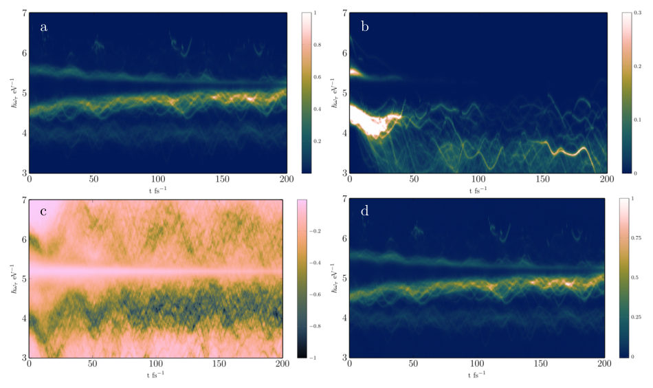 
Figure 1: cQED TA PP signals (GSB, SE, and ESA) of pyrazine at resonance i.e. ωc = 5.2 eV. DW input values: pulse duration τ = 5.0 fs, pump frequency ωpu = 5.2 eV, and probe carrier frequencies ωpr in the range from 3.0 eV to 7.0 eV in steps of 0.02 eV. cQDE input values: cavity loss rate κ = 0.018 fs−1 and the dipole coupling strength γ0 = 0.56 eV.

**Summary.** This paper introduces cQUEDA, a novel, computationally efficient theoretical framework for simulating ultrafast nonlinear spectroscopy in cavity QED systems. By extending the quasi-classical Doorway-Window approximation, the authors calculate the full transient absorption pump-probe spectrum, demonstrating its power by modeling pyrazine polaritons. This advances the field's ability to predict complex quantum optical responses in molecular cavities.

**Why it may be interesting.** This work provides a computationally efficient, *ab initio* framework to model complex, nonlinear, and ultrafast dynamics in strongly coupled light-matter systems, which is a major frontier in quantum optics and AMO physics.

Detailed structure

**Main problem.** The paper addresses the challenge of simulating ultrafast transient absorption pump-probe spectra of molecular polaritons, specifically tackling the simulation of polaritons' ultrafast dynamics and nonlinear optical properties in cavity Quantum Electrodynamics (QED).

**Main result.** The authors successfully developed and demonstrated the cQUEDA framework, showing it can compute GSB, SE, and ESA contributions to the TA PP spectra of pyrazine strongly coupled to a cavity, confirming polariton formation.

**Method.** The method utilizes an *ab initio* framework based on the quasi-classical Doorway-Window (DW) approximation, which combines semiclassical trajectory simulations with cavity QED functions.

**Model / system.** The system involves molecular polaritons formed by coupling molecular electronic states (e.g., pyrazine) to a cavity photonic mode, described by a structured Hamiltonian. The simulation framework is termed cQUEDA/sikeda.

**Key observables.** Transient Absorption (TA) pump-probe (PP) spectra, specifically the contributions from Ground-State Bleach (GSB), Stimulated Emission (SE), and Excited-State Absorption (ESA).

**Important parameters / regimes.** Cavity detuning ($\Delta\omega$), Rabi frequency ($\Omega_e$), cavity loss rate ($\kappa$), and the time delay ($T$) between pump and probe pulses.

**Assumptions / limitations.** The primary approximation is that the wavepacket dynamics during the probe time ($T$) occurs without the influence of the cavity, although future work aims to relax this assumption.

**Figures summary.** Figure 1 shows computed TA PP signals (GSB, SE, and ESA) for pyrazine at resonance, confirming the existence of two polaritonic eigenstates and observing Rabi splitting in the SE signal.

**Paper structure.** The paper introduces the need for the simulation, derives the necessary Hamiltonian structure, develops the cQUEDA formalism using the DW approximation, and demonstrates its application to calculate the three spectral components (GSB, SE, ESA) for a specific molecule.

Abstract

In this letter we introduce a theoretical framework for the simulation of ultrafast transient absorption pump-probe spectra of molecular polaritons. We derive and implement the cavity quantum electrodynamics (QED) evolution equations of polaritonic states within the framework of the quasi-classical doorway-Window pproximation, hereto referred cQUEDA /sikeda/. This framework uses outputs from mixed quantum-classical dynamics simulations in the absence of the cavity. Then by including cavity parameters accounting for cavity rate loss, coupling strength, and frequency detuning, we simulate transient absorption pump-probe spectra. Consequently, we address one of the main standing problems of cavity QED, the simulation of polaritons ultrafast dynamics and nonlinear optical properties. We demonstrate the performance of our method by computing the ground-state bleach (GSB), stimulated emission (SE), and excited-state absorption (ESA) contributions of transient absorption pump-probe spectra of pyrazine strongly coupled to a cavity. The cQUEDA is an on-the-fly computationally efficient framework with low computer requirements: the pyrazine calculations, for example, took minutes on modern laptops. cQUEDA offers wide-ranging applicability and can be generalized to model diverse nonlinear spectroscopic signals and quantum optics responses.

[↑ back to top](#top)

### [Collective Order Decouples Boundary Selection from Macroscopic Chirality in Confined Active Matter](http://arxiv.org/abs/2608.23942v1)

**Authors:** Néstor Sepúlveda  
**Type:** theory · **Category:** statistical mechanics · **PDF:** <https://arxiv.org/pdf/2608.23942v1>  
**Analysis basis:** full PDF text, analyzed in chunks
**Topic relevance:** `driven-dissipative phase transition` **3/5** · `non-equilibrium universality` **3/5** · `Keldysh / 2PI / non-Gaussian methods` **2/5** · `methods for driven-dissipative` **2/5** · `Frenkel-Kontorova` **1/5** · `correlated / nonlocal dissipation` **1/5** · `quantum measurements` **1/5**

📷 Fig 1

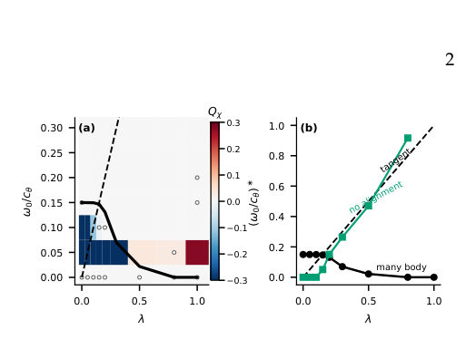 
FIG. 1. Local wall prediction compared with the many-body current. (a) State map of Qχ = sgn(ω0)⟨J⟩in the (λ, ω0/cθ) plane (Nseeds = 18; color range clipped at ±0.3). Negative and positive values indicate opposite- and same-handed circula- tion, respectively. Open circles mark points with |⟨J⟩|/SEM ≤ 2. The dashed curve gives the condition for an isolated particle to be tangent to the wall, Eq. (9); the solid curve gives the first zero of the mean many-body current after a negative-current interval. (b) Here (ω0/cθ)∗denotes the characteristic chiral- ity ratio associated with each curve: the first zero of the mean many-body current, the zero of the population-averaged wall orientation...

📷 Fig 2

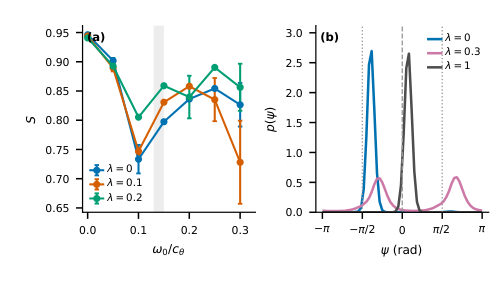 
FIG. 2. Orientational changes associated with reversal of the mean current. Colors denote the λ values listed in each panel; blue denotes λ = 0 in both. (a) Nematic order S for λ = 0, 0.1, 0.2; its pronounced decrease precedes the sign change of ⟨J⟩. (b) Wall-angle distributions at (λ, ω0/cθ) = (0, 0.10), (0.3, 0.10), (1, 0.05). The wall normal is ψ = 0 and the tangent directions are ψ = ±π/2 (dotted).

📷 Fig 3

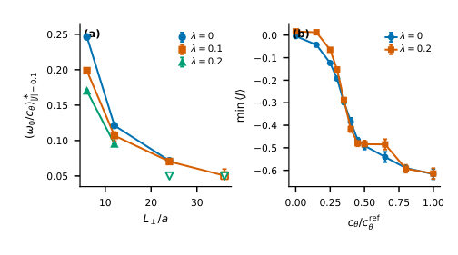 
FIG. 3. Dependence on confinement and interparticle align- ment. (a) Chirality at which |⟨J⟩| first falls below 0.1 for λ = 0, 0.1, 0.2 (seed-bootstrap 68% intervals). The open square has 51% bootstrap resolution; open downward triangles are left-censored at &lt; 0.05. (b) Most negative sampled ⟨J⟩versus cθ/cref θ for λ = 0 and 0.2 (SEM at the selected grid point). In this control, cθ denotes the independently varied interparticle coupling, while the wall torque is fixed; cref θ = 35.32 h−1.

**Summary.** This paper examines active matter confined by walls whose interaction strength varies continuously. It finds that the direction of global circulation is not solely determined by the wall's anchoring type, but rather by the collective internal order of the particles. This demonstrates a fundamental decoupling between local boundary selection and global transport properties.

**Why it may be interesting.** The concept of decoupling local boundary effects from global collective behavior is highly relevant to non-equilibrium statistical mechanics, active matter, and open quantum systems where boundary conditions play a crucial role.

Detailed structure

**Main problem.** The study investigates whether the boundary conditions (wall coupling) or the collective internal order of an active fluid dictates the direction of macroscopic circulation.

**Main result.** The local orientation at the wall and the direction of global circulation are selected by distinct physical processes, meaning the wall only dictates local possibilities, while collective order controls the global flow.

**Method.** The analysis combines theoretical derivations (e.g., single-particle fixed point conditions) with extensive numerical simulations across varying coupling parameters.

**Model / system.** The system models chiral self-propelled particles with nematic bulk alignment confined between parallel walls, whose wall coupling strength is continuously tuned between nematic and polar anchoring.

**Key observables.** Macroscopic chirality (sign of the mean current $\langle J 
angle$), nematic order parameter ($S$), and the local particle orientation distribution ($p(\psi)$).

**Important parameters / regimes.** The wall coupling parameter $\lambda \in [0, 1]$, which interpolates between nematic ($\lambda=0$) and polar ($\lambda=1$) anchoring.

**Assumptions / limitations.** The analysis separates the local single-particle dynamics from the many-body collective dynamics, and the comparison between the single-particle fixed point and the many-body sign change is key.

**Figures summary.** Figures compare the local wall prediction (dashed curve) against the many-body current sign change (solid curve), showing the sign change is independent of $\lambda$ for small $\lambda$ and distinct from the isolated-particle prediction.

**Paper structure.** The paper systematically analyzes the system's response across different wall coupling regimes ($\lambda$), comparing the local single-particle dynamics to the global many-body current behavior, culminating in the conclusion of decoupling.

Abstract

Can a boundary determine the direction of circulation in a collectively moving active fluid? We study chiral self-propelled particles with nematic bulk alignment, confined by walls whose orientational coupling varies continuously from nematic to polar. For an isolated particle at a wall, we derive the exact parameter condition under which a stable orientation is tangent to the wall. With predominantly nematic wall coupling, however, the many-body circulation changes sign at a chirality that is nearly independent of the wall symmetry. This sign change follows a pronounced decrease in nematic order and disappears when bulk alignment is removed. As the polar wall coupling becomes dominant, opposite-handed circulation is suppressed and same-handed polar locking emerges. Thus local orientation at a wall and the direction of macroscopic circulation are selected by distinct physical processes: the wall determines the possible local orientations, whereas collective order determines whether those orientations control the global flow.

[↑ back to top](#top)

### [Arithmetic Tuning of Dynamical Critical Exponents in Quasiperiodic Localization Transitions](http://arxiv.org/abs/2608.23990v1)

**Authors:** Tian-Cheng Yi, Yi-Fan Liu, Enguo Guan, Wen-Long You  
**Type:** theory · **Category:** disordered systems and neural networks · **PDF:** <https://arxiv.org/pdf/2608.23990v1>  
**Analysis basis:** full PDF text, analyzed in chunks
**Topic relevance:** `Frenkel-Kontorova` **3/5** · `non-equilibrium universality` **3/5** · `analog quantum simulation` **2/5** · `driven-dissipative phase transition` **2/5**

📷 Fig 1

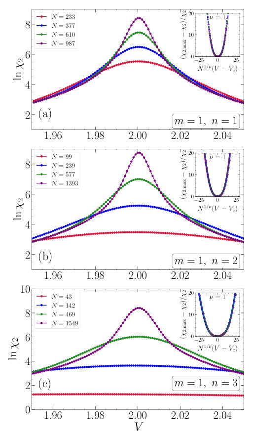 
FIG. 1. The logarithm of the fidelity susceptibility χ2 as a function of the quasiperiodic potential strength V for m = 1: (a) n = 1; (b) n = 2; (c) n = 3. The phase offset is fixed at ϕ = π. The insets show the rescaled fidelity susceptibility (χ2,max −χ2)/χ2 as a function of the scaling variable N 1/ν(V −Vc) for ν = 1. For all three cases, the critical point is Vc = 2, and the data collapse supports the correlation-length exponent ν = 1.

📷 Fig 2

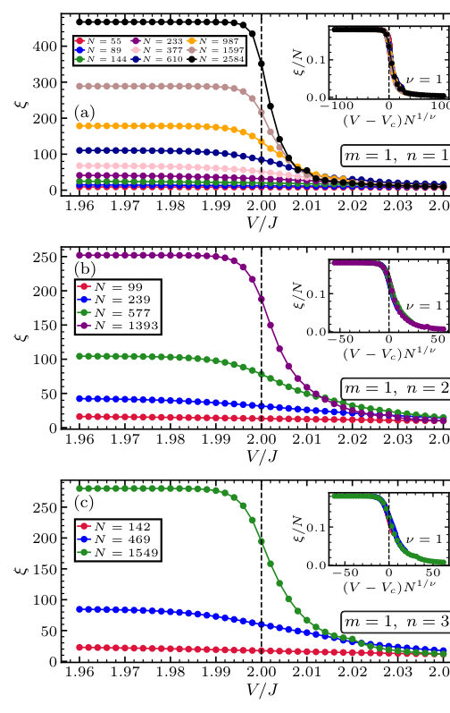 
FIG. 2. The localization length ξ as a function of the quasiperiodic potential strength V for m = 1: (a) n = 1; (b) n = 2; (c) n = 3. The vertical dashed line marks the self-dual critical point Vc = 2. The insets show the rescaled localization length ξ/N as a function of the scaling variable N 1/ν(V −Vc) for ν = 1. All results shown here are averaged over 50 random samples of the phase ϕ.

📷 Fig 3

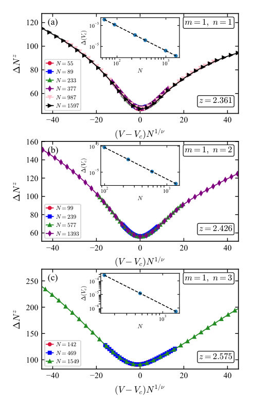 
FIG. 4. The rescaled excitation gap ∆N z as a function of the scaling variable (V −Vc)N 1/ν for m = 1: (a) n = 1; (b) n = 2; (c) n = 3. The insets show the log-log scaling of the critical gap ∆(Vc) with the system size N. For all three cases, the critical point is fixed at the self-dual point Vc = 2, and the data collapse is obtained with ν = 1. The corresponding dynamical exponents are z = 2.361, 2.426, and 2.575 for n = 1, 2, and 3, respectively. All results shown here are averaged over more than 500 random samples of the phase ϕ.

📷 Fig 4

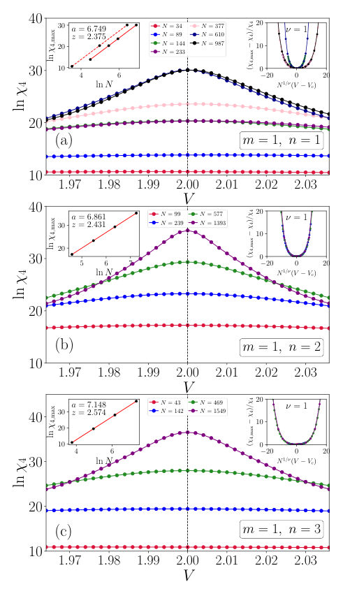 
FIG. 3. Finite-size scaling of the fourth-order fidelity susceptibility χ4 for the generalized AAH model with m = 1 and n = 1, 2, 3. The phase offset is fixed at ϕ = π. The left insets show the log–log fit of the peak value χ4,max according to ln χ4,max = a ln N + b. Using the scaling relation χ4,max ∼N 2/ν+2z and fixing ν = 1, the dynamical exponent is obtained as z = (a −2)/2. The extracted values are z = 2.375±0.004, 2.431±0.001, and 2.574±0.002 for n = 1, 2, and 3, respectively. The right insets show the correspond- ing scaling collapse with fixed ν = 1.

📷 Fig 5

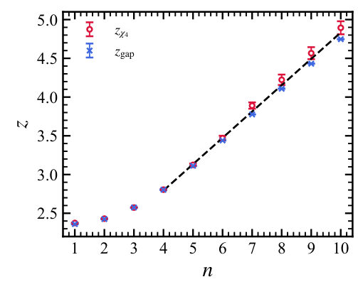 
FIG. 5. Dynamical critical exponent z as a function of the integer n in the generalized AAH model at fixed m = 1. The red circles de- note the exponent zχ4 extracted from the scaling of the fourth-order fidelity susceptibility, while the blue crosses denote zgap extracted from the finite-size scaling of the critical gap. Error bars represent the fitting uncertainties of the corresponding scaling analyses. The black dashed line is an unweighted linear fit to the averaged expo- nent zave = (zχ4 + zgap)/2 using the data with n ≥4. The fit gives zave = an + b, with a = 0.340 ± 0.003 and b = 1.43 ± 0.02. The data for n &lt; 4 are shown for comparison but are not included in the linear fit.

**Summary.** This paper demonstrates that the critical dynamics of localization transitions in quasiperiodic systems can be tuned simply by varying the incommensurate frequency ($\Omega$) derived from arithmetic sequences. While the correlation-length exponent remains fixed, the dynamical critical exponent varies systematically, suggesting that the arithmetic properties of the modulation parameter control the non-equilibrium quantum dynamics.

**Why it may be interesting.** The finding that the arithmetic structure of an irrational number can act as a control parameter for tuning dynamical critical behavior is highly relevant for understanding non-equilibrium quantum dynamics in engineered systems.

Detailed structure

**Main problem.** The study investigates how the dynamical critical exponents of localization transitions in quasiperiodic systems can be tuned without altering the underlying microscopic Hamiltonian.

**Main result.** The correlation-length exponent remains constant ($
u \simeq 1$), while the dynamical critical exponent ($z$) varies systematically by changing the incommensurate frequency ($\Omega$) via the arithmetic structure of generalized Fibonacci sequences.

**Method.** The analysis employs advanced diagnostics including generalized fidelity susceptibility, localization-length scaling, and finite-size gap analysis applied to the single-particle Schrödinger equation.

**Model / system.** The system is a one-dimensional tight-binding chain of spinless fermions subjected to a quasiperiodic onsite potential, defined by $V_j = V \cos(2\pi\Omega j + \phi)$. The quasiperiodicity is controlled by $\Omega$, which is derived from generalized Fibonacci sequences parameterized by $(m, n)$.

**Key observables.** Correlation-length exponent ($
u$), Dynamical critical exponent ($z$), Generalized fidelity susceptibility ($\chi^{2r+2}$), and the low-energy energy gap ($\Delta$).

**Important parameters / regimes.** Hopping amplitude ($J$), Modulation amplitude ($V$), and the incommensurate frequency ($\Omega$) controlled by the arithmetic parameters $(m, n)$.

**Assumptions / limitations.** The analysis assumes the system is quasiperiodic (ruling out rational $\Omega$) and uses finite-size scaling theory to extract critical exponents.

**Figures summary.** Figures illustrate data collapse for $
u=1$ using $\ln \chi^2$ and $\xi$ vs $V$ for different modulation parameters, confirming the robustness of $
u$.

**Paper structure.** The paper establishes the physical model and the control mechanism using arithmetic sequences. It then applies scaling analyses using fidelity susceptibility and gap measurements to extract $
u$ and $z$, demonstrating the differential dependence of these exponents on the arithmetic parameter $\Omega$.

Abstract

The critical exponents and universality classes of localization transitions in quasiperiodic systems are of fundamental importance for understanding critical phenomena in aperiodic systems. Here we show that the dynamical critical behavior can be tuned without adding new terms or changing the form of the Hamiltonian, but solely by varying the incommensurate frequency of the quasiperiodic onsite potential. We construct a family of incommensurate frequencies from the limiting ratios of generalized Fibonacci sequences controlled by the parameters $(m,n)$, and use them to define the quasiperiodic onsite potential. By combining generalized fidelity susceptibility, localization-length scaling, and finite-size gap analysis, we find that the correlation-length exponent is insensitive to the choice of the incommensurate frequency and remains consistent with the correlation-length critical exponent, $ν\simeq 1$, in the localization transition of the standard Aubry--Andr'e--Harper model. In contrast, the dynamical exponent extracted from the low-energy gap scaling varies systematically with the incommensurate frequency. Our results show that changing the incommensurate frequency provides a simple way to tune dynamical critical scaling in deterministic aperiodic systems. Our results suggest instead that the arithmetic structure of an irrational number can serve as a control parameter for nonequilibrium quantum dynamics, enabling the tuning of dynamical critical behavior without changing the microscopic Hamiltonian or the physical spatial dimension.

[↑ back to top](#top)

### [A Minimal Thermodynamically Consistent Chemical Oscillator](http://arxiv.org/abs/2608.24200v1)

**Authors:** Benedikt Remlein, Luca Monari, Beatrice Bartolomei, Giulio Ragazzon, Massimiliano Esposito, Emanuele Penocchio  
**Type:** theory · **Category:** statistical mechanics · **PDF:** <https://arxiv.org/pdf/2608.24200v1>  
**Analysis basis:** full PDF text, analyzed in chunks
**Topic relevance:** `driven-dissipative phase transition` **3/5** · `non-equilibrium universality` **3/5** · `Keldysh / 2PI / non-Gaussian methods` **1/5** · `correlated / nonlocal dissipation` **1/5** · `methods for driven-dissipative` **1/5**

📷 Fig 1

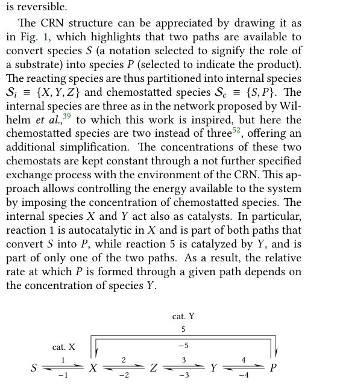 
FIG. 1. Schematics of the reaction network associated with the set of reactions in equation (1), with catalyzed steps explicitly indicated.

📷 Fig 2

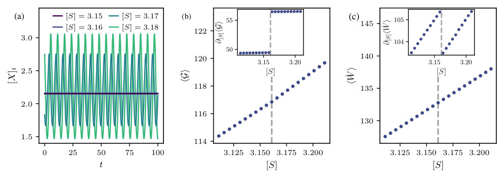 
FIG. 2. Hopf bifurcation and thermodynamic signatures in the minimal CRN (1). (a) Time evolution of the concentration [𝑋] for different values of the control parameter [𝑆], with oscillations observed for [𝑆] &gt; [𝑆𝑐] ≃3.161. (b) Time-averaged semi-grand Gibbs free energy ⟨G⟩as a function of [𝑆]. Inset: the derivative 𝜕[𝑆] ⟨G⟩is discontinuous at the critical value [𝑆𝑐] ≃3.161 and increases across the bifurcation. (c) Time- averaged non-conservative work rate ⟨¤𝑊⟩as a function of [𝑆]. Inset: the derivative 𝜕[𝑆] ⟨¤𝑊⟩is discontinuous at [𝑆𝑐] and decreases across the bifurcation. The grey dashed line indicates [𝑆𝑐]. Parameters (arbitrary units): 𝑘1 = 𝑘2 = 𝑘3 = 𝑘4 = 𝑘5 = 1, 𝑘−1 = 𝑘−2 = 𝑘−3 = 𝑘−4 =...

📷 Fig 3

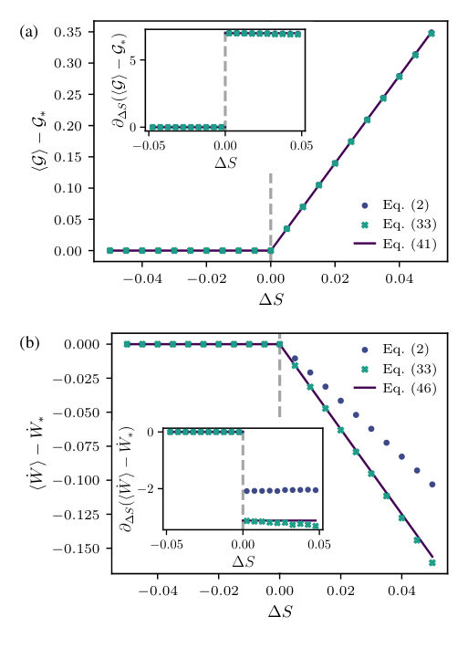 
FIG. 3. Comparison of the reversible CRN (1), the irreversible CRN (32), and the analytical solution in the vicinity of the Hopf bifurcation. Here, Δ𝑆≡[𝑆] −[𝑆𝑐] for the reversible RRE (2), and Δ𝑆≡[𝑆] −[𝑆HB] for the irreversible RRE (33). The analyt- ical solutions are obtained using Eq. (41) and Eq. (46). (a) Time- averaged semi-grand Gibbs free energy ⟨G⟩−G∗as a function of the control parameter Δ𝑆. Inset: the derivative 𝜕Δ𝑆(⟨G⟩−G∗) is dis- continuous at the bifurcation. (b) Time-averaged non-conservative work rate ⟨¤𝑊⟩−¤𝑊∗as a function of Δ𝑆. Inset: 𝜕Δ𝑆(⟨¤𝑊⟩−¤𝑊∗) is discontinuous at the bifurcation. Parameters (arbitrary units): 𝜅1 = 𝜅2 = 𝜅3 = 𝜅4 = 𝜅5 = 1, 𝜅−1 = 𝜅−2 = 𝜅−3 = 𝜅−4 = 10−2,...

📷 Fig 4

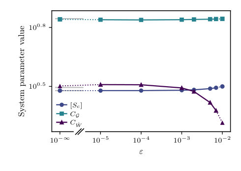 
FIG. 4. Approach to the irreversible limit. Backward rates are pa- rameterized by 𝜅−1 = 𝜅−2 = 𝜅−3 = 𝜀and 𝜅−5 = 𝜀2, preserving the Wegscheider condition. Shown are the numerically extracted Hopf threshold [𝑆𝑐] and jump coefficients 𝐶G and 𝐶¤𝑊as functions of 𝜀. Horizontal lines indicate the analytical predictions from the irreversible approximation (𝜀→0). The convergence demonstrates that the irreversible model captures the leading-order behavior of the reversible CRN.

📷 Fig 5

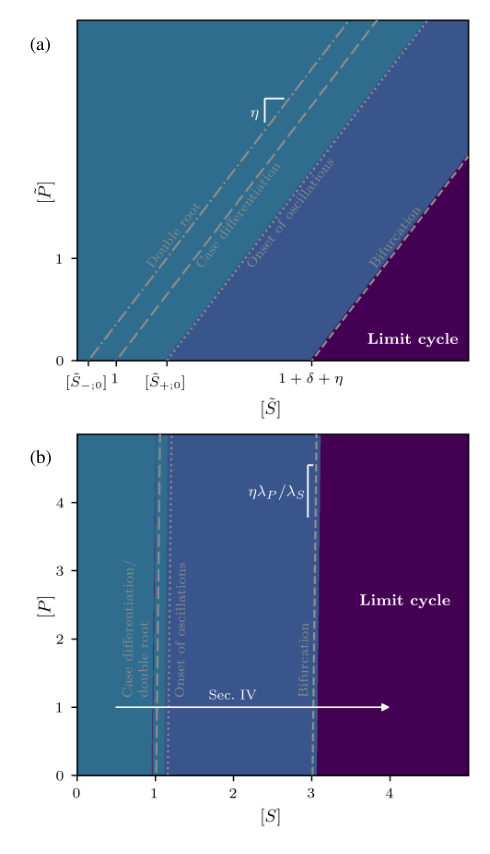 
FIG. 5. Phase space of the irreversible and reversible CRNs. (a) Schematic phase-space sketch of the irreversible CRN (32) using dimensionless concentrations, Eq. (30). The boundaries [ ˜𝑆±;0] = −2𝛿3+27𝛿𝜂+3𝛿2𝜂+3𝛿𝜂2−2𝜂3±2(𝛿2−𝛿𝜂+𝜂2)3/2

**Summary.** This paper develops a minimal, thermodynamically consistent chemical oscillator model to study autonomous oscillations driven by non-equilibrium processes. Using advanced mathematical techniques like normal-form reduction, the authors analytically determine the Hopf bifurcation point. Crucially, they show that this dynamical transition is accompanied by sharp, quantifiable discontinuities in key thermodynamic observables, bridging non-equilibrium dynamics and thermodynamics.

**Why it may be interesting.** The rigorous connection drawn between a non-equilibrium dynamical transition (Hopf bifurcation) and measurable thermodynamic quantities (discontinuities in free energy/work rate) provides a powerful theoretical tool for characterizing open, non-equilibrium systems.

Detailed structure

**Main problem.** To introduce and analyze a minimal, thermodynamically consistent chemical oscillator that exhibits autonomous oscillations under non-equilibrium driving.

**Main result.** The system undergoes a supercritical Hopf bifurcation at a critical parameter value, which is analytically linked to kink-like discontinuities in time-averaged thermodynamic observables like the semi-grand Gibbs free energy and non-conservative work rate.

**Method.** The analysis employs normal-form reduction near the Hopf bifurcation point, utilizing a controlled irreversible approximation to analytically determine the bifurcation structure and thermodynamic response.

**Model / system.** The model is a Chemical Reaction Network (CRN) involving five species, featuring reversible, uni- and bi-molecular reactions, and open to an environment via chemostatting. The dynamics are governed by the Reaction Rate Equation.

**Key observables.** Semi-grand Gibbs free energy, non-conservative work rate, Hopf bifurcation point, limit cycle radius, and angular frequency.

**Important parameters / regimes.** Chemostat concentration (control parameter), reaction rate constants, and the bifurcation parameter $[S]$.

**Assumptions / limitations.** The reactions are assumed to be elementary, allowing the use of Local Detailed Balance (LDB), and the analysis relies on normal-form reduction near the bifurcation point.

**Figures summary.** Figures illustrate the schematic reaction network, the time evolution of thermodynamic quantities ($\langle G 
angle$ and $\langle \dot{W} 
angle$) across the Hopf bifurcation, and the convergence of analytical predictions for the bifurcation threshold.

**Paper structure.** The paper establishes the minimal CRN, derives the necessary thermodynamic balance equations, analyzes the dynamics using normal-form reduction near the Hopf bifurcation, and finally calculates the discontinuity of thermodynamic observables at the onset of oscillations.

Abstract

Inspired by the chemical reaction network considered as the smallest system featuring a Hopf bifurcation and its reversible extension, we introduce an even more minimal reaction network that is thermodynamically consistent and exhibits autonomous oscillations under nonequilibrium driving. The model combines three features that are rarely realized simultaneously in compact oscillator networks: a chemically plausible structure restricted to uni- and bimolecular reactions, reversibility of such reactions, and analytical tractability. The system consists of three internal species coupled to two chemostatted species and still undergoes a supercritical Hopf bifurcation when a chemostat concentration is varied. To analyze the dynamics and thermodynamics near the onset of oscillations, we employ the mathematical technique of normal-form reduction, which allows obtaining a controlled irreversible approximation that preserves the leading phase-space structure of the full reversible network while enabling explicit calculations. This framework provides analytical access to the bifurcation structure and the leading contributions governing thermodynamic observables. Within this setting, we use the onset of oscillations to characterize the thermodynamic response of the system. In particular, we offer an analytical description of key thermodynamic quantities such as the semi-grand Gibbs free energy and the non-conservative work rate, which exhibit a kink-like discontinuity at the Hopf bifurcation. We thus provide an analytical description of a phenomenon previously characterized only through numerical simulations of more complex networks.

[↑ back to top](#top)

### [Geometric Thermodynamics of Scallop Motion with Two Control Parameters](http://arxiv.org/abs/2608.24158v1)

**Authors:** Hisao Hayakawa  
**Type:** theory · **Category:** statistical mechanics · **PDF:** <https://arxiv.org/pdf/2608.24158v1>  
**Analysis basis:** full PDF text, analyzed in chunks
**Topic relevance:** `non-equilibrium universality` **3/5** · `Keldysh / 2PI / non-Gaussian methods` **2/5** · `methods for driven-dissipative` **2/5** · `driven-dissipative phase transition` **1/5**

📷 Fig 1

 
FIG. 1. Schematic of the scallop model and two-phase driving protocol. (A) A scallop swimmer is represented by two rigid plates connected by a single hinge. The instantaneous opening angle x is the internal stochastic coordinate. The equilibrium opening angle θ1 sets the center of the internal potential, while the stiffness parameter θ2 modulates the hinge spring, k(θ2) = k0θ2. The internal potential is H(x; θ1, θ2) = 1/2k0L2θ2(x −θ1)2. Near the closed configuration x →0, the hydrodynamic mobility Mcl(x) vanishes due to lubrication. (B) The two control parameters (θ1, θ2) are varied periodically along a closed loop C in the two-dimensional toroidal parameter space T2. The resulting BSN...

📷 Fig 2

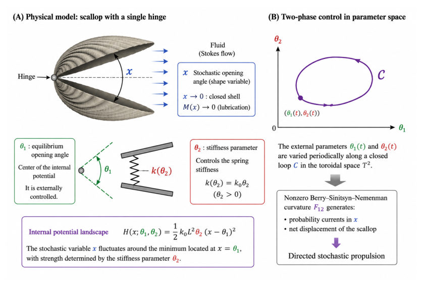 
Figure 1 summarizes the physical setup and overall logical structure of this study. We model a single-hinge scallop swimmer whose internal opening angle x is coupled to translational motion via a position-dependent mobility Meff(x) and a hydrodynamic connection G(x) (Sec. II B). Crucially, while x undergoes thermal fluctuations in a potential V (x; θ), the potential landscape is driven by two external control parameters, θ = (θ1, θ2)T , representing the potential minimum and effective stiffness, respectively (Sec. II C). A periodic modulation along a closed path C in parameter space T2 generates a non-zero probability current. In

📷 Fig 3

 
FIG. 2. Heatmap of the BSN curvature F12(θ1, θ2). The solid black circle denotes a typical circular trajectory in the parameter space used to extract a finite geometric displacement ∆X.

📷 Fig 4

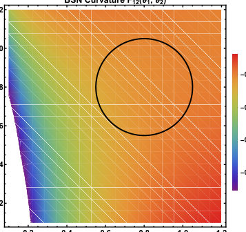 
Figure 3 shows the heatmap of the geometric displacement per cycle, ∆X(¯θ1, ¯θ2), as a function of the center coordinates (¯θ1, ¯θ2) for a fixed loop radius rloop := p

📷 Fig 5

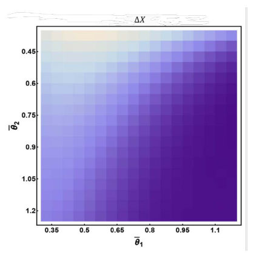 
FIG. 3. Heatmap of the geometric displacement ∆X(¯θ1, ¯θ2) in the mean-parameter space with a fixed loop radius rloop = 0.2.

**Summary.** This theoretical paper develops a geometric framework to explain how micro-swimmers can generate directed motion by exploiting thermal fluctuations when driven by time-varying external parameters. It mathematically links the resulting propulsion to the non-zero curvature of the parameter space and quantifies the associated energy dissipation using a Riemannian metric. This unifies concepts from stochastic mechanics, thermodynamics, and geometry in the context of active matter.

**Why it may be interesting.** It provides a powerful geometric framework linking non-equilibrium thermodynamics (entropy production) directly to the topology of the control parameter space (Berry curvature), which is a concept highly relevant in quantum pumping and quantum control.

Detailed structure

**Main problem.** To show how thermal fluctuations allow a micro-swimmer (scallop) to achieve directed propulsion, bypassing the constraints of Purcell's scallop theorem.

**Main result.** Directed geometric propulsion is achieved when the control parameters are cyclically modulated, leading to a non-zero Berry-Sinitsyn-Nemenman curvature and excess entropy production quantified by a Riemannian metric.

**Method.** The analysis uses stochastic thermodynamics, solving the Smoluchowski equation via perturbation theory and generalized inverse operators to calculate non-equilibrium work and entropy production.

**Model / system.** The system is a single-hinge scallop swimmer whose stochastic shape dynamics are governed by a Smoluchowski equation dependent on two time-varying control parameters ($	heta_1, 	heta_2$).

**Key observables.** Non-zero Berry-Sinitsyn-Nemenman curvature ($F_{12}$), Riemannian thermodynamic metric ($g_{ij}$), and excess entropy production ($\Sigma_{ex}$).

**Important parameters / regimes.** The slow-driving parameter $\epsilon$, and the control parameters $	heta(t)$ which are modulated along a closed loop in the parameter space $T^2$.

**Assumptions / limitations.** The analysis assumes Stokes flow ($	ext{Re} \ll 1$), utilizes perturbation theory for slow driving, and relies on the generalized inverse operator for the Smoluchowski generator.

**Figures summary.** Figure 1 schematically illustrates the scallop model and shows that cycling the control parameters along a closed loop in the parameter space induces the necessary geometric curvature and non-zero net displacement.

**Paper structure.** The paper develops the framework by first establishing the stochastic dynamics via the Smoluchowski equation, then applying perturbation theory to calculate non-equilibrium corrections, and finally deriving the geometric connection between excess entropy production and the Riemannian metric tensor.

Abstract

According to Purcell's scallop theorem, reciprocal single-degree-of-freedom shape deformations cannot achieve net propulsion in a viscous fluid. We show that this limitation is bypassed by thermal fluctuations in a two-parameter driven potential landscape. Formulating the stochastic shape dynamics via a Smoluchowski equation with position-dependent mobility $M_\mathrm{eff}(x)$, we utilize a generalized inverse operator to evaluate the slow-driving response. Cyclic modulation of the control parameters induces a non-zero Berry-Sinitsyn-Nemenman curvature $F_{12}(\bmθ)$, resulting in directed geometric propulsion. Simultaneously, the non-adiabatic excess dissipation is dictated by a Riemannian thermodynamic metric $g_{ij}(\bmθ)$. Our results provide a unified geometric foundation that bridges hydrodynamic friction, stochastic mechanics, and thermodynamic trade-offs in micro-swimmers.

[↑ back to top](#top)

### [Geometry-controlled correlated electric-field noise in enclosed ion traps from billiard return spectra](http://arxiv.org/abs/2608.24770v1)

**Authors:** Ayush Nadiger  
**Type:** theory · **Category:** other · **PDF:** <https://arxiv.org/pdf/2608.24770v1>  
**Analysis basis:** full PDF text, analyzed in chunks
**Topic relevance:** `correlated / nonlocal dissipation` **3/5** · `Keldysh / 2PI / non-Gaussian methods` **1/5** · `QC/QI experiment` **1/5** · `analog quantum simulation` **1/5** · `methods for driven-dissipative` **1/5** · `quantum measurements` **1/5**

📷 Fig 1

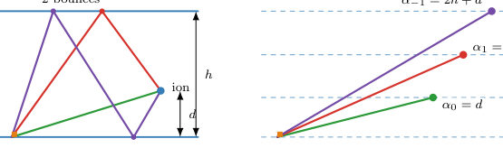 
FIG. 1. Parallel-wall geometry in three equivalent forms. Left: direct and reflected billiard paths from a point on the noisy plane to the ion. Center: unfolding turns the reflections into straight paths to image ions. Right: the corresponding normal-depth measure µ⊥ h = P

📷 Fig 2

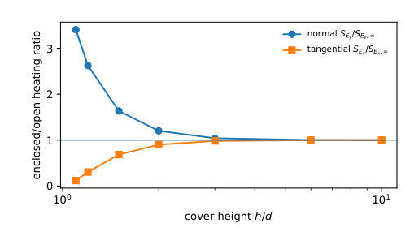 
FIG. 2. Mode-selective anomalous heating for a local source in the physical slab. A passive cover increases normal heating while suppressing tangential heating. At h/d = 2 the exact ratios are ζ(3) and η(3).

📷 Fig 3

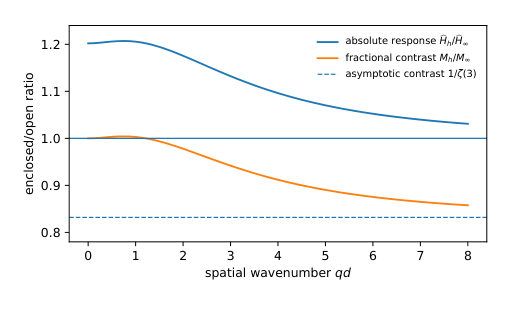 
FIG. 3. Absolute response and fractional contrast at h/d = 2 for the physical D = 2 slab. The enclosure increases b H at every wavenumber, while the normalized response Mh/M∞ falls below unity over the moderate- and high-q regime and tends to 1/ζ(3).

📷 Fig 4

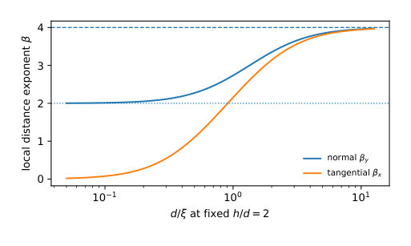 
FIG. 4. Local distance exponents for a Gaussian surface covariance at fixed h/d = 2. The normal mode crosses from the capacitor-like d−2 regime to the local-patch d−4 regime, while the tangential component approaches d0 for very large patches before recovering d−4.

📷 Fig 5

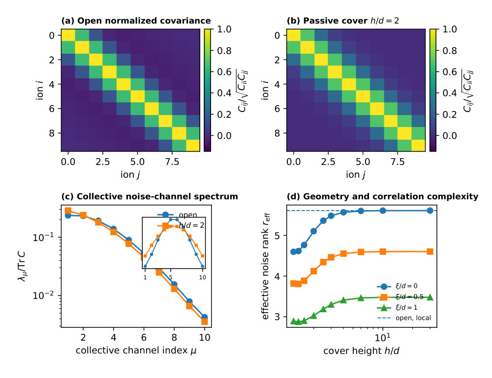 
FIG. 5. Collective normal-field noise for N = 10 equally spaced probes with spacing 0.6d. (a,b) Normalized spatial covariance in the open half-space and at h/d = 2. (c) Eigenvalues of the equal-frequency covariance/heating matrix normalized by their sum; the inset shows the leading covariance-eigenchannel profile. (d) Participation-ratio noise rank versus cover height for local and finite-correlation Gaussian surface spectra. The cover raises every absolute normal-field quadratic form while concentrating a larger fraction of the total noise into the leading collective channels.

**Summary.** This theoretical paper determines how the physical boundaries of an ion trap control the correlated electric-field noise acting on trapped ions. By employing techniques from spectral theory and billiards, the authors show that the enclosure geometry selectively enhances normal-field noise while suppressing tangential-field noise. This provides a fundamental understanding of how passive electrode design can be used to engineer the quantum noise environment for quantum computing applications.

**Why it may be interesting.** This work provides a powerful, quantitative link between macroscopic electrostatics (geometry) and microscopic quantum noise processes (heating rates, Lindblad operators) in trapped ions, offering a new diagnostic tool for trap quality.

Detailed structure

**Main problem.** The paper investigates how the passive conducting geometry of an enclosed ion trap dictates the spatial structure and magnitude of correlated electric-field noise experienced by trapped ions.

**Main result.** The enclosure geometry imposes a mode-selective filtering effect, increasing normal-field noise while decreasing tangential-field noise, and provides an exact return-pair functional describing this noise.

**Method.** The analysis uses boundary-potential covariance, the Dirichlet Green function, and billiard unfolding techniques to construct the electric-field cross-spectral matrix and its associated Kossakowski generator.

**Model / system.** The system is trapped ions confined within an enclosed geometry, such as a parallel slab or a general curved cover. The noise source is modeled as a stochastic electric field fluctuating due to the surrounding passive conductors.

**Key observables.** Electric-field cross-spectral matrix, collective environmental noise eigenchannels, noise rank, and the ratio of normal-to-tangential heating rates ($\zeta(3)$ and $\eta(3)$ at specific limits).

**Important parameters / regimes.** The ratio of cover height to ion spacing ($h/d$), the frequency ($\omega$), and the ion number ($N$).

**Assumptions / limitations.** The analysis relies on the Born–Markov secular approximation and assumes fixed stochastic source statistics, focusing on the geometric reshaping of the noise operator.

**Figures summary.** Figures illustrate the mode-selective filtering effect (normal vs. tangential heating ratios) and show the correlation between the electrostatic decay exponent and the shortest specular excess length across curved covers.

**Paper structure.** The paper progresses from establishing the general framework using boundary-potential covariance to deriving the exact return-pair functional for the parallel slab. It then applies this framework to show the collective ordering theorem for normal/tangential fields and extends the analysis to general curved covers, concluding with diagnostics on noise rank and gate exposure.

Abstract

We ask how passive conducting geometry determines the spatial structure of electric-field noise seen by trapped ions. From a boundary-potential covariance and the Dirichlet Green function we construct the $N$-ion electric-field cross-spectral matrix and its blockwise motional Kossakowski generator. In a parallel slab, billiard unfolding turns the electrostatic response into a return-depth measure and yields an exact return-pair functional for arbitrary stationary surface spectra. For every finite equal-height ion array, the passive cover increases the normal-field covariance matrix in the positive-semidefinite ordering and decreases the tangential-field covariance matrix in the same ordering: all collective normal-field coordinates acquire more absolute noise, while all collective tangential coordinates acquire less. At $h=2d$ the local-noise single-ion ratios are exactly $ζ(3)$ and $η(3)$.   Diagonalizing the equal-frequency covariance identifies collective environmental noise eigenchannels and a geometry-dependent noise rank; within a degenerate frequency block these become the Lindblad jump channels. In a ten-ion example, closing the cover to $h=2d$ lowers the participation rank from 5.61 to 5.11 while increasing the leading channel's share from 23.7% to 28.6%; a primitive Mølmer-Sørensen calculation shows how the projected covariance sets the weak-heating gate exposure. Beyond parallel walls, specular paths emerge as large-$q_z$ saddles of the screened boundary operator. Across 16 curved covers, the fitted electrostatic decay exponent correlates at 0.9991 with the independently computed shortest specular excess length, while separate tests resolve focusing and competing saddles.

[↑ back to top](#top)

### [Jerky Motion of Active Granular Particles](http://arxiv.org/abs/2608.24689v1)

**Authors:** Alexander P. Antonov, Marco Musacchio, Hartmut Löwen, Lorenzo Caprini  
**Type:** both · **Category:** statistical mechanics · **PDF:** <https://arxiv.org/pdf/2608.24689v1>  
**Analysis basis:** full PDF text, analyzed in chunks
**Topic relevance:** `non-equilibrium universality` **3/5** · `Frenkel-Kontorova` **1/5** · `Keldysh / 2PI / non-Gaussian methods` **1/5** · `correlated / nonlocal dissipation` **1/5** · `driven-dissipative phase transition` **1/5** · `methods for driven-dissipative` **1/5**

📷 Fig 1

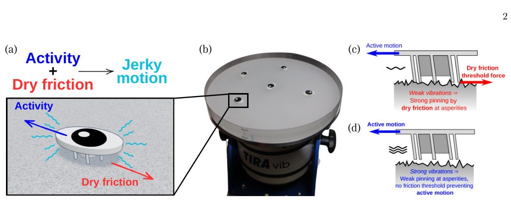 
FIG. 1. (a) Illustration of an active particle subject to dry friction, giving rise to jerky motion. (b) Experimental setup consisting of active vibrobots on a vertically vibrating plate. (c,d) Schematic illustration of the frictional contact. Under weak plate vibrations, the vibrobot remains strongly pinned at surface asperities, preventing active motion until the active force exceeds the dry-friction threshold (c). In this regime, the interplay between activity and dry friction gives rise to jerky motion. Under strong vibrations, pinning is greatly reduced (d), rendering dry friction ineffective and allowing persistent active motion.

📷 Fig 2

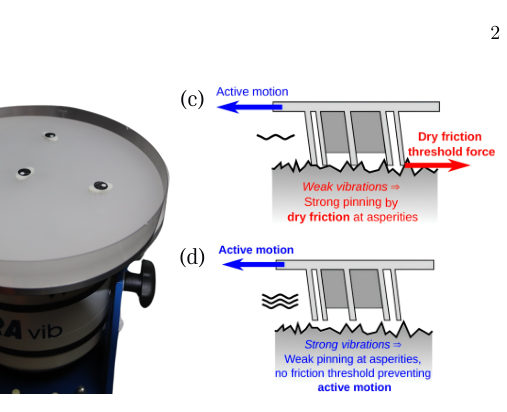 
Figure 2(a)-(b) shows that, at lower shaker amplitudes, the particle speed increases more sharply with time than at higher amplitudes. In both cases, slow diffusive ac- tivations are excluded to distinguish activity-driven mo- tion from passive diffusive dynamics. To characterize the underlying dynamics, we fit the time behavior of the par- ticle speed in the intermediate-velocity regime using the scaling relation v ∼tα. We focus on this regime be- cause, at high velocities, strong vibrations reduce the frequency of activation collisions with the plate, natu- rally slowing the acceleration, as shown in Fig. 2(a)-(b). These analyses reveal that α approaches the value ex- pected for jerky...

📷 Fig 3

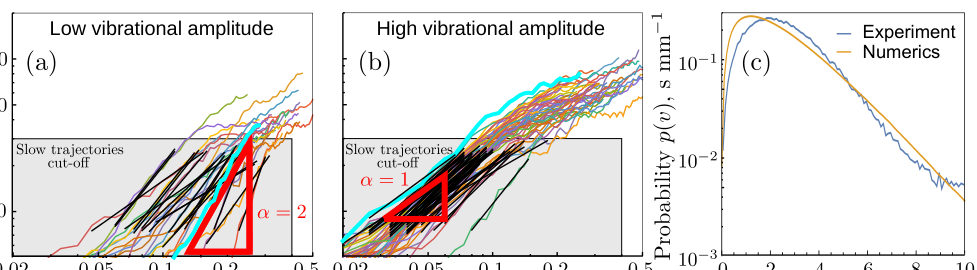 
FIG. 2. (a-b) Speed evolution analysis of experimental vibrobots initiating their motion after being at rest for (a) a regime dominated by dry friction (shaker’s frequency 75 Hz and amplitude 51.186 ± 0.160 µm, 20 trajectories), and (b) pinning-free regime (shaker’s frequency 75 Hz, amplitude 65.200 ± 0.217 µm, 43 trajectories). In the experiment, slow particles are excluded by imposing a threshold speed that must be achieved within a prescribed time window, as indicated by the gray rectangle. These results reveal much sharper speed increase for the dry friction case. The fitted exponent of v ∼tα, averaged over v ∈[7, 25], yields (a) α = 1.84±0.18, consistent with jerky motion within...

📷 Fig 4

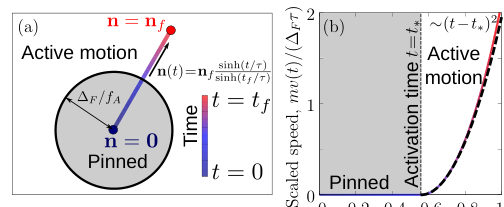 
FIG. 3. (a) Time color-coded activation path from the pinned state n = 0 to the activated state n = nf. The approximate form near the activation moment t = t∗(circle boundary) is given by Eq. (4) in the main text, while the full expression is provided in Eq. (11) of the End Matter. (b) Character- istic speed evolution given by Eq. (5a) along this activation path. For t &lt; t∗, the particle remains pinned and at rest (gray area), while after the activation at t = t∗the speed exhibits the quadratic growth characteristic of jerky motion. The color coding is identical in the main panel and the inset. The parameters are tf = τ, |nf| = 2, and ∆F /fA = 1.

📷 Fig 5

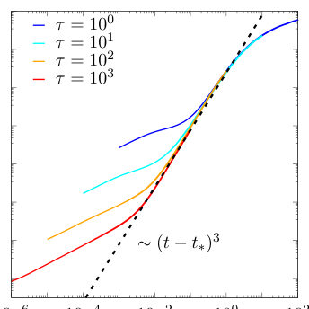 
FIG. 4. Scaled average displacement vs scaled time, demon- strating the data collapse onto a common curve. Displace- ments are calculated numerically from Eq. (3) with ∆F /fA = 1, K = 0 for the particle initiating its motion after being at rest. The averaging is performed over 5000 such activation events. For (t −t∗)/τ ≲1, the displacement follows the scal- ing law (6b) with C = 0.36, represented by the dashed line.

**Summary.** This work investigates jerky motion in active granular particles caused by the combination of self-propulsion and dry friction. The authors demonstrate that this interaction forces the dynamics into a jerk-dominated regime, predicting a quadratic increase in speed over time. The findings are supported by theoretical modeling, numerical analysis, and physical experiments using active vibrobots.

**Why it may be interesting.** The emergence of higher-order, non-Markovian dynamics from simple frictional contacts is a general mechanism in non-equilibrium statistical physics, relevant for understanding energy dissipation and transport in complex active matter systems.

Detailed structure

**Main problem.** The standard Newtonian description is insufficient for systems exhibiting abrupt transitions between rest and motion, necessitating the inclusion of higher-order derivatives like jerk.

**Main result.** The interplay between activity and dry friction robustly generates jerk-dominated dynamics, leading to quadratic speed increase ($v \sim t^2$) rather than the linear growth expected classically.

**Method.** The study combines analytical derivations (using path integrals and Onsager-Machlup functionals) with numerical simulations and physical experiments using active vibrobots.

**Model / system.** The system involves self-propelled particles (active granular particles) subjected to an active force and dry friction, which introduces a threshold for motion.

**Key observables.** Particle speed scaling exponent ($\alpha$), displacement scaling ($\delta r \sim t^3$), and the probability of activation.

**Important parameters / regimes.** Dry friction threshold force ($\Delta F$), activity strength, vibration amplitude (low vs. high), and persistence time ($	au$).

**Assumptions / limitations.** The analysis often relies on approximations such as neglecting white noise or assuming the velocity after activation is independent of the activation point.

**Figures summary.** Figures illustrate the mechanism of jerky motion due to dry friction, compare speed evolution in jerky vs. Newtonian regimes, and show data collapse confirming cubic scaling of displacement.

**Paper structure.** The paper establishes the theoretical need for higher-order dynamics, models the system using active Ornstein-Uhlenbeck processes coupled with dry friction, derives scaling laws, and validates these predictions through both numerical simulations and physical experiments.

Abstract

Abrupt transitions between rest and motion can render the standard Newtonian description -- based on position, velocity, and acceleration -- incomplete, requiring higher-order derivatives such as the jerk, the third time derivative of position. Here, we show that the interplay between activity and dry friction gives rise to robust jerk-dominated dynamics in self-propelled particles: the particle speed increases quadratically with time under an active force, in contrast to the linear growth expected for conventional Newtonian dynamics. We demonstrate this behavior analytically, numerically, and experimentally using active vibrobots self-propelling on a vertically vibrating plate at low vibration amplitudes, where surface asperities generate dry friction and, thus, give rise to jerky motion when combined with activity. Our results establish dry friction as a simple mechanism for realizing higher-order dynamics in active matter and suggest that jerky dynamics may arise broadly in nonequilibrium systems with frictional contacts.

[↑ back to top](#top)

### [Quantum Secure Time Transfer for Satellites](http://arxiv.org/abs/2608.24092v1)

**Authors:** Ravi Singh Adhikari, Anju Rani, Aman Gupta, Xiaoyu Ai, Robert Malaney  
**Type:** experiment · **Category:** quantum information and computing · **PDF:** <https://arxiv.org/pdf/2608.24092v1>  
**Analysis basis:** full PDF text, analyzed in chunks
**Topic relevance:** `QC/QI experiment` **3/5** · `quantum optics experiment` **3/5** · `interference shaping light` **1/5** · `quantum measurements` **1/5**

📷 Fig 1

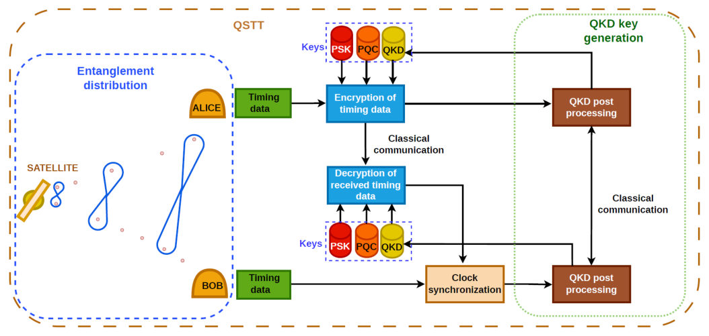 
Fig. 1: The QSTT system. A satellite with an onboard entangled photon source distributes entangled photons to Alice and Bob’s ground stations. Timing data is generated locally by both parties from the photon’s detection. Alice encrypts the timing data using the method described in Section II-B and transmits it to Bob via a classical communication channel. Upon receiving Alice’s encrypted timing data, Bob decrypts it, performs clock synchronization using his and Alice’s timing information, and corrects his time tag using the estimated clock offset. Upon successful synchronization, they perform QKD post-processing, including key sifting, error estimation, error correction, and privacy...

📷 Fig 2

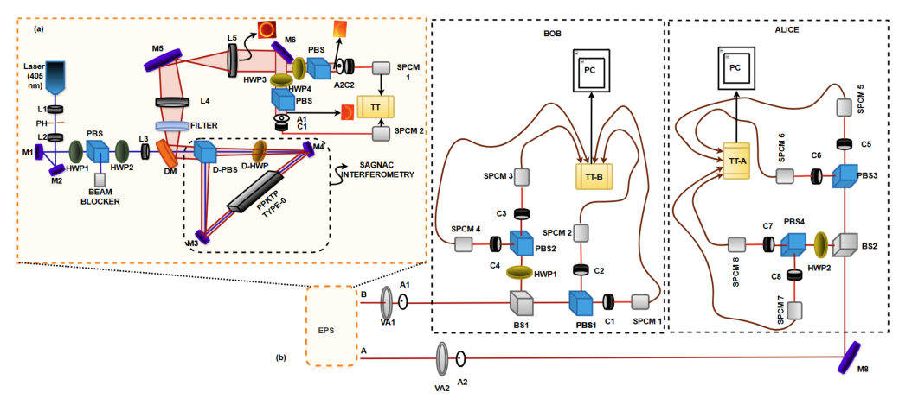 
Fig. 2: (a) Schematic of the experimental setup for degenerate, non-collinear, polarization-entangled photon-pair generation via the spontaneous parametric downconversion process in a type-0 PPKTP crystal using a Sagnac interferometer. The pump and the generated entangled photons are represented by blue and red rays, respectively. PH: Pinhole; HWP: Half-wave plate; PBS: Polarizing beam splitter; DM: Dichroic mirror; SPCM: Single-photon counting module; TT: time-tagger; D-HWP: Dual-HWP; D-PBS: Dual-PBS; M: Mirror; L: Lens; A: Aperture; C: Fiber coupler. (b) Schematic of the QSTT experimental setup. Here, the EPS is used to distribute entangled photons to Alice and Bob’s ground stations, each...

📷 Fig 3

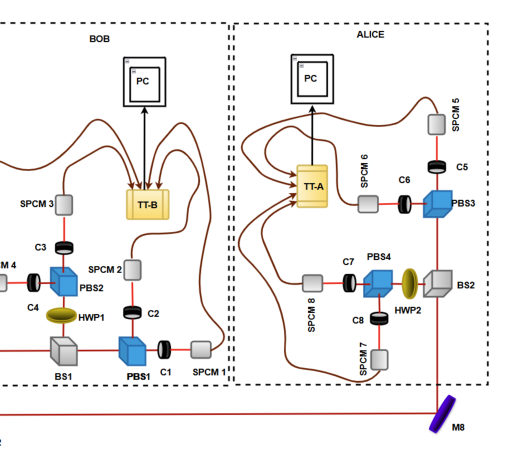 
Fig. 3: Measured performance metrics of the EPS. The brightness (on the left y-axis) and the heralding efficiency (on the right y-axis) of the EPS are plotted against pump power.

📷 Fig 4

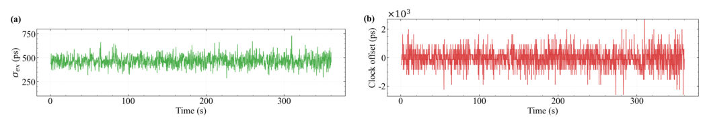 
Fig. 4: Clock synchronization protocol execution for the QKD system over 6 minutes of continuous operation at the satellite channel loss. (a) Experimental system timing jitter σex. (b) Clock offset. (c) Drift rate. (d) Coincidence counts (CC) (events/250 ms)), with a 400 ps coincidence window between Alice and Bob.

📷 Fig 5

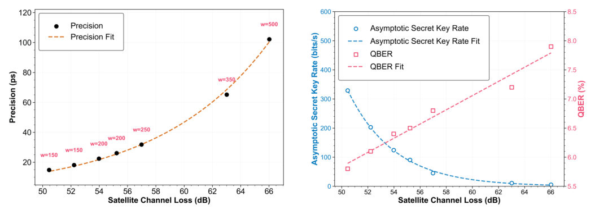 
Fig. 5: Clock synchronization performance of the QKD system under various satellite channel losses. (a) Precision versus satellite channel loss analysis plotted with w values labeled at the top of the scatter points. (b) The asymptotic secret key rate (on the left y axis) and the QBER (on the right y axis) are shown as a function of satellite channel loss.

**Summary.** This paper presents an experimental Quantum-Secure Time Transfer (QSTT) system designed for satellite communication. By leveraging entanglement-based photon sources and integrating Quantum Key Distribution (QKD), the system achieves unprecedented key rates and high clock synchronization precision. This advancement establishes a new benchmark for ultra-secure, space-based timing services.

**Why it may be interesting.** The work demonstrates advanced quantum networking protocols applied to time synchronization, which is a critical application area for quantum information science, particularly concerning secure communication over long-haul links.

Detailed structure

**Main problem.** The primary goal is to establish a highly secure and precise time synchronization method over satellite-to-ground channels, overcoming vulnerabilities and precision limits of classical timing protocols.

**Main result.** The developed Quantum-Secure Time Transfer (QSTT) system achieved a QKD key rate of approximately 3 bits s-1, representing a 30-fold increase over state-of-the-art Micius satellite demonstrations.

**Method.** The system combines entanglement-based quantum signaling for time transfer with Quantum Key Distribution (QKD) to encrypt time-tag data, incorporating post-quantum security and obfuscation techniques.

**Model / system.** The experiment uses an entanglement-based QSTT system emulated in a low Earth orbit channel, utilizing a type-0 Sagnac-based entangled-photon source (EPS) built with a PPKTP crystal.

**Key observables.** QKD Key Rate (3 bits s-1), Clock Offset (sub-nanosecond precision), and Timing Jitter ($\sigma_{ex} = 473$ ps).

**Important parameters / regimes.** 30-fold increase in QKD key rate vs. Micius; $10^{-10}$ security parameter; $\sim 2$ orders of magnitude increase in EPS rate using type-0 crystal.

**Assumptions / limitations.** The protocol assumes the use of QKD keys to seed symmetric encryption (like AES) rather than encrypting all data with a One-Time Pad (OTP) due to rate mismatch.

**Figures summary.** Figure 1 illustrates the overall QSTT system schematic, while Figure 2 details the experimental setups for both the EPS and the full QSTT system.

**Paper structure.** The paper details the physical setup (EPS using type-0 PPKTP), the QSTT protocol which involves data alignment and fine synchronization, and the security enhancements using QKD and post-quantum cryptography.

Abstract

We experimentally demonstrate an entanglement-based Quantum-Secure Time Transfer (QSTT) system in an emulated low Earth orbit satellite-to-ground channel using a type-0 Sagnac-based entangled-photon source. Our new QSTT system delivers a finite Quantum Key Distribution (QKD) key rate of approximately $3~$bits$~\text{s}^{-1}$ with a $10^{-10}$ security parameter, providing a $30$-fold increase in the QKD key rate compared to the state-of-the-art entanglement-based QKD system delivered by the Micius satellite. Beyond this high key rate outcome, novel to our QSTT system is a GPS-free clock synchronization, optimized use of QKD, embedded post-quantum security, and obfuscation of the system configuration via use of a pre-shared key. Collectively, these enhancements deliver the most efficient and secure deployment of QSTT to date, and point the way forward to high-accuracy ultra-secure time transfer in space.

[↑ back to top](#top)

### [Certified Fidelity Susceptibility from Classical Shadows](http://arxiv.org/abs/2608.24732v1)

**Authors:** Kiran Adhikari  
**Type:** theory · **Category:** statistical mechanics · **PDF:** <https://arxiv.org/pdf/2608.24732v1>  
**Analysis basis:** full PDF text, analyzed in chunks
**Topic relevance:** `analog quantum simulation` **3/5** · `quantum measurements` **3/5**

📷 Fig 1

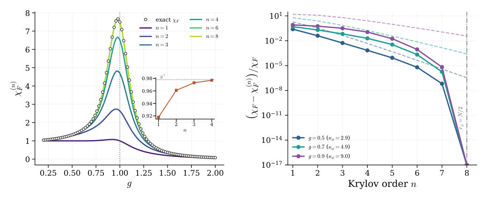 
Figure 1: Monotonic construction for the N = 16 1D TFIM. Left: χ(n) F compared with χF . The inset shows g∗ n approaching g∗= 0.978. Right: relative truncation error versus Krylov order. The errors remain below the geometric bound of Theorem 3 and vanish at n = N/2 = 8, where the Krylov hierarchy terminates.

**Summary.** This paper presents a rigorous, resource-efficient method to estimate the fidelity susceptibility ($\chi_F$), a key indicator of quantum phase transitions. It achieves this by reformulating $\chi_F$ as a moment reconstruction problem solvable via Krylov subspace techniques. By coupling this theory with randomized single-copy measurements (classical shadows), the authors provide a statistically certified lower bound on $\chi_F$ suitable for near-term quantum devices.

**Why it may be interesting.** This work provides a crucial bridge between theoretical quantum diagnostics ($\chi_F$) and practical, resource-constrained quantum measurements (classical shadows), making it highly relevant for experimental quantum simulation and metrology.

Detailed structure

**Main problem.** The paper addresses the challenge of directly measuring the fidelity susceptibility ($\chi_F$), a key diagnostic for quantum phase transitions and metrology, on quantum hardware.

**Main result.** It develops a method to certify a lower bound for $\chi_F$ by approximating it using randomized single-copy measurements and Krylov subspace methods.

**Method.** The core method involves reformulating $\chi_F$ as a moment problem, approximating it via the Krylov subspace, and then estimating the required moments using classical shadow techniques.

**Model / system.** The theory applies to general quantum systems described by a Hamiltonian $H(\lambda)$ with a non-degenerate ground state, often exemplified by models like the 1D Transverse-Field Ising Model.

**Key observables.** Fidelity susceptibility ($\chi_F$), linear static susceptibilities ($\chi_O$), and response moments ($M_k$).

**Important parameters / regimes.** The convergence rate depends on the response condition number ($\kappa_\phi$), and the required measurement resources scale with the desired accuracy ($\epsilon$) and failure probability ($\delta$).

**Assumptions / limitations.** Assumes a finite-dimensional Hilbert space, a non-degenerate ground state, and a spectral gap ($\Delta > 0$). The final bound is an additive, rather than relative, guarantee.

**Figures summary.** Figure 1 compares the calculated $\chi^{(n)}_F$ approximations against the exact $\chi_F$ for the 1D TFIM, demonstrating geometric convergence as the Krylov order $n$ increases.

**Paper structure.** The paper builds from the definition of $\chi_F$ via resolvent methods, reduces it to a moment reconstruction problem, applies Krylov subspace theory to establish a monotone lower bound hierarchy, and finally uses randomized Pauli measurements (classical shadows) to estimate these moments and certify the bound.

Abstract

Fidelity susceptibility is a useful probe of quantum phase transitions and quantum metrology, but its direct evaluation on a quantum device is challenging. By integrating Krylov-subspace methods with a resolvent-based reformulation, we present a method for certifying fidelity susceptibility using randomized single-copy measurements across repeated ground-state preparations. The resulting approximations form monotone lower bounds to the exact fidelity susceptibility and converge geometrically. We also present applications to metrology and linear static susceptibilities.

[↑ back to top](#top)

### [Dynamic quantum phase transitions in the two-leg Creutz ladder with long-range hopping](http://arxiv.org/abs/2608.24514v1)

**Authors:** J. A. da Silva, J. C. Xavier  
**Type:** theory · **Category:** statistical mechanics · **PDF:** <https://arxiv.org/pdf/2608.24514v1>  
**Analysis basis:** full PDF text, analyzed in chunks
**Topic relevance:** `non-equilibrium universality` **3/5** · `Keldysh / 2PI / non-Gaussian methods` **1/5** · `driven-dissipative phase transition` **1/5** · `scars & prethermalization` **1/5**

📷 Fig 1

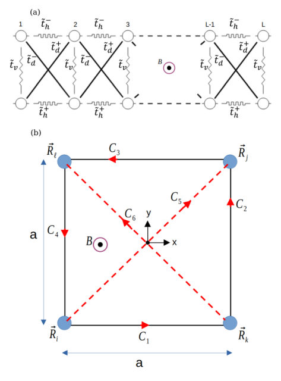 
Figure 1. (a) Representation of the two-leg Creutz ladder with length L and D = 1. The hopping amplitudes in the presence of a uniform perpendicular magnetic field are given by ˜tx,1 ≡˜t± x = e±iθt± x , x = h, d, and ˜tv = tv. Here θ = q

📷 Fig 2

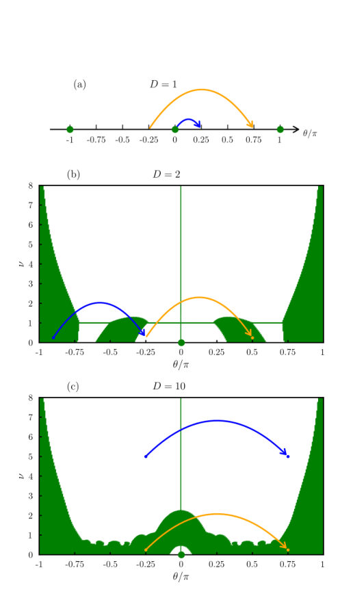 
Figure 2. Critical regions for D = 1, D = 2, and D = 10. In the green region, the gap is zero (critical region), while the white region is gapped. The arrows indicate the quench parameters considered in Figs. 3 and 5.

📷 Fig 3

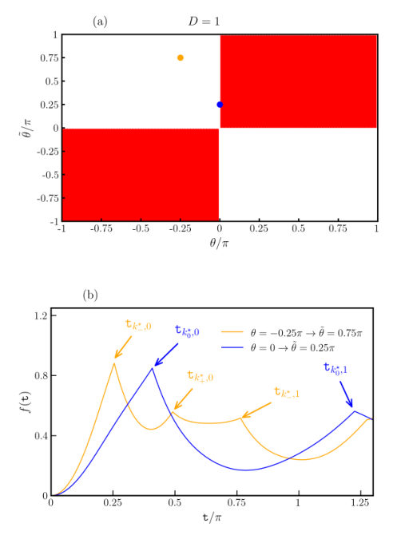 
Figure 3. Results for D = 1. (a) Diagram showing the param- eter region where DQPTs occur (white region) for a quench from θ to ˜θ. In the red region, DQPTs do not occur. The dots in this diagram correspond to the two quench parameters used in (b). (b) The dynamical free energy f(t) vs. t/π for a system of size L = 40000 and two quenches (see legend). The arrows indicate the cusp positions at the critical times tk⋆ ±,m and tk⋆ 0 ,m (see text). The momenta k⋆ ± and k⋆ 0 are given by Eqs. (35) and (36), respectively.

📷 Fig 4

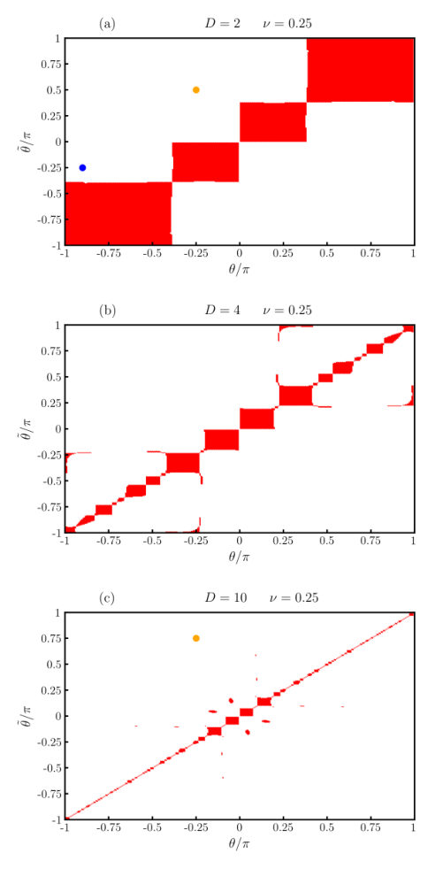 
Figure 4. Parameter region where DQPTs occur (white re- gion) for ν = 0.25; in the red region, DQPTs do not occur. Results for D = 2, D = 4, and D = 10 are presented in (a), (b), and (c), respectively. The dots in (a) and (c) indicate two of the quench parameters considered in Fig. 5 for ν = 0.25.

📷 Fig 5

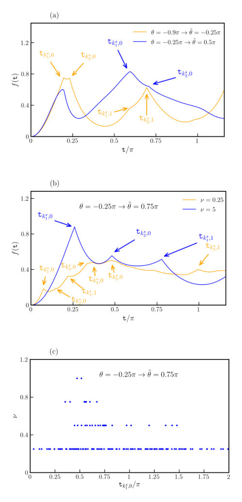 
Figure 5. (a) The dynamical free energy f(t) vs. t/π for a system of size L = 40000 with D = 2 and some quenches (see legend). The arrows indicate the cusp positions at the critical times tk⋆ i ,m (see text). (b) Same as in (a), but for D = 10 and a quench from θ = −0.25π to ˜θ = 0.75π and two values of ν (see legend). (c) The earliest critical time tk⋆ 1 ,0 for some values of ν for a quench from θ = −0.25π to ˜θ = −0.75π with D = 100.

**Summary.** This work theoretically investigates Dynamic Quantum Phase Transitions in the two-leg Creutz ladder with long-range hopping. By analyzing the dynamical free energy derived from an exact two-band model solution, the authors determine that the critical times are highly sensitive to the hopping decay exponent ($
u$) and the finite range ($D$). The findings suggest that for certain parameter regimes, the critical dynamics become extremely dense, indicating complex non-equilibrium behavior.

**Why it may be interesting.** The connection between long-range interactions, quasi-periodicity, and the emergence of dense critical dynamics is a key topic in non-equilibrium quantum many-body physics, relevant to understanding thermalization and quantum chaos.

Detailed structure

**Main problem.** The study investigates Dynamic Quantum Phase Transitions (DQPTs) that occur during quantum quenches in a specific lattice model.

**Main result.** The critical times where non-analyticities in the dynamical free energy appear depend on both the long-range hopping exponent (ν) and the finite range (D).

**Method.** The analysis involves calculating the Loschmidt amplitude and the dynamical free energy from an exact solution of a generic two-band model in momentum space.

**Model / system.** The system is the two-leg Creutz ladder incorporating long-range hopping, modeled as a spinless two-band free-fermion system. The Hamiltonian is analyzed under quantum quenches.

**Key observables.** Dynamical free energy f(t), Loschmidt amplitude Z(t), and the location of Yang-Lee-Fisher (YLF) zeros.

**Important parameters / regimes.** Long-range hopping exponent (ν), finite range (D), and quench parameters ($	heta, 	ilde{	heta}$).

**Assumptions / limitations.** The analysis relies on obtaining an exact solution for the generic two-band model in momentum space and identifying non-analyticities where YLF zeros hit the real-time axis.

**Figures summary.** Figures illustrate the parameter regions in which DQPTs occur for various values of D and show plots of the dynamical free energy f(t) near critical times.

**Paper structure.** The paper first establishes the general theoretical framework by solving the two-band model, deriving expressions for $f(t)$ and YLF zeros. It then applies this framework to the Creutz ladder, analyzing how the critical times and the existence of DQPTs depend on the long-range hopping parameters $
u$ and $D$.

Abstract

In this work, we investigate quantum quenches in the two-leg Creutz model with long-range hopping, where the hopping amplitudes decay with distance as a power law characterized by an exponent $ν$ and have a finite range $D$. We first obtain the exact solution of a generic two-band model in momentum space. This allows us to compute the Loschmidt amplitude and, consequently, the dynamical free energy $f(\texttt{t})$ of the two-band model. We also show how to determine the Yang-Lee Fisher (YLF) zeros by solving a nonlinear equation. We demonstrate that the two-leg Creutz model in momentum space is a special case of the generic two-band model. Using these results, we identify the non-analyticities in the dynamical free energy $f(\texttt{t})$ at critical times $\texttt{t}_{c}$. We find that the number of nontrivial critical times $N_{s}$ depends on both $ν$ and $D$. In particular, we show that for small $ν$ and large $D$ the critical times become increasingly dense, leading, in the appropriate regime, to non-analyticities at an increasingly dense set of times---similar to what was observed by Xavier and Hoyos [Phys. Rev. B, $\textbf{108}$, 214303 (2023)] in the Su-Schrieffer-Heeger (SSH) model with long-range hopping terms.

[↑ back to top](#top)

### [Efficient Treatment of Non-Linearity in Quantum Computational Fluid Dynamics Using Hybrid Tensor Networks](http://arxiv.org/abs/2608.24150v1)

**Authors:** Pia Siegl, Nis-Luca van Hülst, Maximilian Mandelt Buxadé, Tomohiro Hashizume, Dieter Jaksch  
**Type:** theory · **Category:** numerical methods · **PDF:** <https://arxiv.org/pdf/2608.24150v1>  
**Analysis basis:** full PDF text, analyzed in chunks
**Topic relevance:** `methods for driven-dissipative` **3/5** · `Keldysh / 2PI / non-Gaussian methods` **1/5** · `analog quantum simulation` **1/5** · `quantum measurements` **1/5**

📷 Fig 1

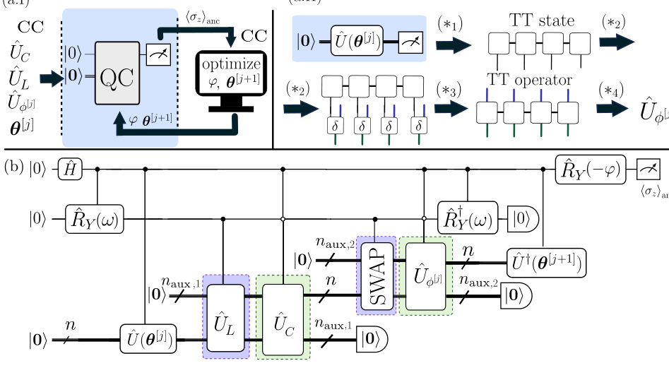 
FIG. 1. (a) Hybrid quantum-classical tensor network algorithm for solving nonlinear PDEs in CFD. The blue box marks operations performed on the quantum computer (QC) while the white areas show quantities stored and operations performed on a classical computer (CC). (a.I) Variational time-stepping loop: the quantum circuit evolves the state using operator unitaries and initial weights from the previous step, while a classical optimizer updates the parameters θ[j+1]

📷 Fig 2

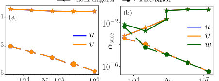 
FIG. 2. Optimal success probabilities αsucc over the number of grid points N. Solid lines with stars denote the diagonal block encoding approach, while dashed lines with pentagons represent the state-based Hadamard prod- uct (a) Success probability for a single Euler time step of the momentum equation for the two velocity components u, v of the two-dimensional TDJ flow and (b) the three ve- locity components u, v, w of the three-dimensional TGV flow. In panels (a) and (b), increasing grid resolution cor- responds to higher Reynolds numbers. Details on the sim- ulation parameters are provided in Appendix C. The suc- cess probabilities of the velocity components u and v are very similar and...

📷 Fig 3

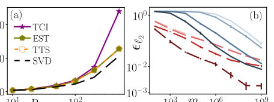 
FIG. 4. Evaluation of the TT-reconstruction techniques for the three-dimensional Taylor–Green vortex. (a) Re- quired bond dimension χ to represent the first compo- nent of the velocity vector u up to the relative ℓ2-error ϵℓ2 ≤0.01 across increasing Reynolds numbers Re. For TCI, χ is chosen such that the mean error over 100 inde- pendent runs satisfies ϵℓ2 ≤0.01. (b) ϵℓ2 over 10 indepen- dent reconstructions as a function of measurement shots m per expectation value, emulating finite-shot sampling noise. Line shades indicate increasing Reynolds number (Re = 10, 20, 50, 100, dark to light) using the EST (red, dashed lines) and the TCI (blue solid lines). Error bars represent the standard...

📷 Fig 4

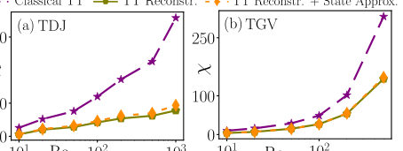 
FIG. 3. Required bond dimensions for evaluating all nonlinear advection terms Ai within a target ℓ2-error ϵℓ2 ≤0.01. We consider three cases: First, Classi- cal TT (deterministic evaluation of the complete nonlin- ear term with TTs using bond dimension χTN), second, TT-Reconstruction(truncation of the prefactor field uk to χbase, reflecting the classical reconstruction step in the hy- brid approach), and third, TT-Reconstruction + Circuit Approx. (truncation of the prefactor field uk to χbase, additionally accounts for finite quantum circuit accuracy by approximating the differentiated field ui in Ai as a TT with χTN + 0.1χTN). The slightly increased bond dimension of the differentiated...

📷 Fig 5

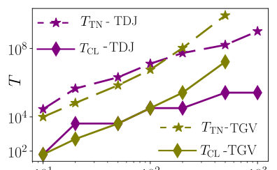 
FIG. 5. Computational cost TTN = χ4 TN of the fully classical tensor network solver and the classical over- head TCL = χ3 ceil of the hybrid solver. We use χceil = 2⌈log2(χbase)⌉and the values of χTN and χbase shown in Fig. 3, with χbase from TT-Reconstruction + Circuit Ap- prox. For the hybrid scheme, the cost of the classical step dominates at high bond dimensions as required in highly turbulent regimes.

**Summary.** This paper introduces a novel hybrid quantum-classical algorithm to overcome the major hurdle of nonlinearity in quantum CFD simulations. By using tensor-based block encodings, the method avoids the exponential resource scaling associated with previous state-based approaches. This breakthrough demonstrates a scalable pathway for achieving quantum advantage in simulating complex, high-Reynolds number fluid dynamics.

**Why it may be interesting.** While focused on fluid dynamics, the core methodology—using tensor networks and quantum programming to manage complex, non-linear operators—is highly relevant to simulating open quantum systems or many-body dynamics where nonlinear couplings are present.

Detailed structure

**Main problem.** The primary challenge addressed is the efficient and scalable implementation of nonlinear terms within Quantum Computational Fluid Dynamics (CFD) simulations.

**Main result.** The proposed hybrid quantum-classical tensor network algorithm significantly reduces the computational cost and memory footprint compared to fully classical tensor network solvers, establishing a scalable path toward quantum advantage in CFD.

**Method.** The authors propose a hybrid approach combining variational time-stepping with quantum tensor programming. Nonlinearity is handled by replacing state-based encodings with tensor-based block encodings, which are compiled into unitary gates.

**Model / system.** The study models Computational Fluid Dynamics (CFD), specifically simulating turbulent flow fields governed by nonlinear Partial Differential Equations (PDEs). Examples include the Temporally Developing Jet (TDJ) and Taylor Green Vortex (TGV).

**Key observables.** Success probability of the nonlinear operation ($\alpha_{succ}$), computational cost, memory footprint, and the field representation error ($\epsilon_{\ell_2}$).

**Important parameters / regimes.** Reynolds numbers ($Re \in \{10, 20, ..., 1000\}$), bond dimension ($\chi$), and time step ($\Delta t$).

**Assumptions / limitations.** The method assumes that the nonlinear terms can be effectively encoded into diagonal block encodings, which stabilizes the success probability against exponential decay with system size.

**Figures summary.** Figures illustrate the hybrid algorithm workflow, the quantum circuit decomposition for a single time step (distinguishing linear and nonlinear operators), and comparisons of error scaling and computational costs across various Reynolds numbers.

**Paper structure.** The paper details the theoretical framework for handling nonlinear PDEs using a hybrid quantum-classical loop. It then applies this framework to simulate specific turbulent flow examples (TDJ, TGV), providing rigorous error and cost analyses.

Abstract

Nonlinear terms present a fundamental challenge for quantum computational fluid dynamics, as their implementation on inherently linear quantum hardware typically requires resource-intensive workarounds that limit scalability to large-scale simulations. We present a hybrid quantum-classical tensor network algorithm that addresses this bottleneck by combining variational time-stepping with quantum tensor programming to efficiently compile operators and time-dependent fields into quantum circuits. Within a probabilistic framework, we replace prior state-based nonlinear implementations with tensor-based block encodings, stabilizing success probabilities that otherwise decay exponentially with system size. Benchmarking on turbulent flow fields demonstrates that the algorithm maintains high success probabilities and moderate measurement overhead across increasing Reynolds numbers and grid resolutions. Compared to fully classical tensor network solvers, our hybrid approach yields substantial reductions in both memory footprint and computational cost, establishing a scalable pathway toward practical quantum advantage in scale-resolving CFD simulations.

[↑ back to top](#top)

### [Kinetic Turnover in the Early-Stage Nucleation of Multi-Shell Condensed Clusters](http://arxiv.org/abs/2608.24792v1)

**Authors:** Kaicheng Zhu, Haibin Su  
**Type:** theory · **Category:** statistical mechanics · **PDF:** <https://arxiv.org/pdf/2608.24792v1>  
**Analysis basis:** full PDF text, analyzed in chunks
**Topic relevance:** `non-equilibrium universality` **3/5** · `Keldysh / 2PI / non-Gaussian methods` **1/5** · `driven-dissipative phase transition` **1/5** · `methods for driven-dissipative` **1/5**

📷 Fig 1

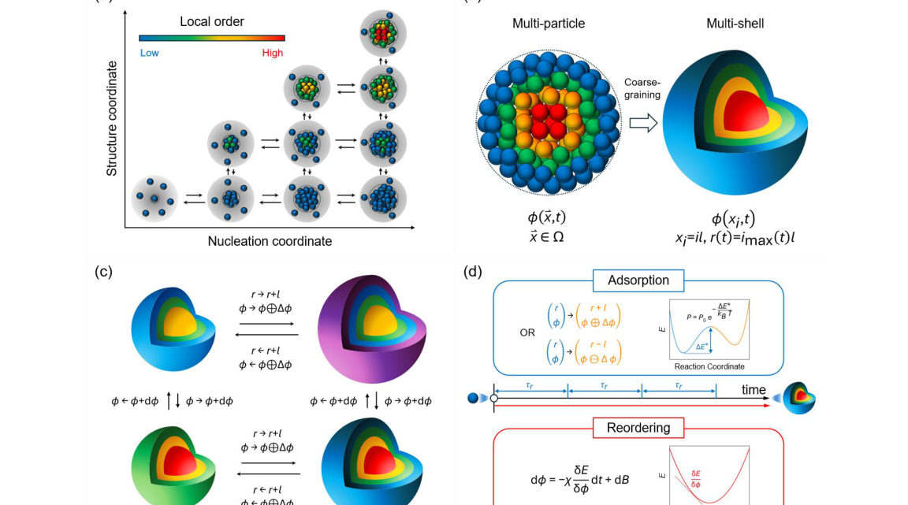 
Figure 1. Overview of the reordering-nucleation process within the multi-shell model. (a) Schematic of the reordering-nucleation pathways projected onto the nucleation and structural coordinates. (b) Representation of the multi-shell model, providing a reduced spatial description of a single condensed cluster where the continuous space domain of the order-parameter field 𝜙(𝑥, 𝑡) is discretized by shell thickness 𝑙 and the cluster radius 𝑟. (c) Reaction mechanisms governing adsorption (horizontal) and reordering (vertical) events. (d) Multiscale dynamics coupling discrete adsorption and continuous reordering events. Adsorption steps occur discretely, separated by a characteristic waiting...

📷 Fig 2

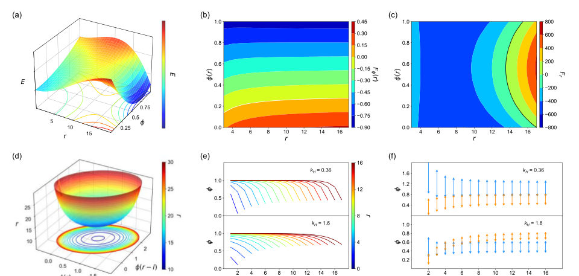 
Figure 2. Overview of the reaction mechanics. (a) Schematic illustration of the 𝐸-energy landscape projected onto the (𝑟, 𝜙) phase space. (b) The (𝑟, 𝜙)-dependent reordering-driving force 𝐹𝜙 acting at the interface when 𝜙(𝑟−𝑙) = (𝜙𝑆+ 𝜙𝐶)/2. (c) The (𝑟, 𝜙)-dependent nucleation-driving force 𝐹𝑟 when 𝜙(𝑟−𝑙) = (𝜙𝑆+ 𝜙𝐶)/2. (d) The critical nucleation regime (𝐹𝑟= 0) represented within the three-dimensional [𝑟, 𝜙(𝑟), 𝜙(𝑟−𝑙)] phase space. 𝑘𝐻 = 0.36 for panels (b), (c), and (d). (e) Size-dependent full-reordered states as a function of cluster radius. (f) Comparison between pro-nucleation states (blue) and full-reordered states (orange); the up triangles denote the corresponding 𝜙(𝑟−𝑙) and the down...

📷 Fig 3

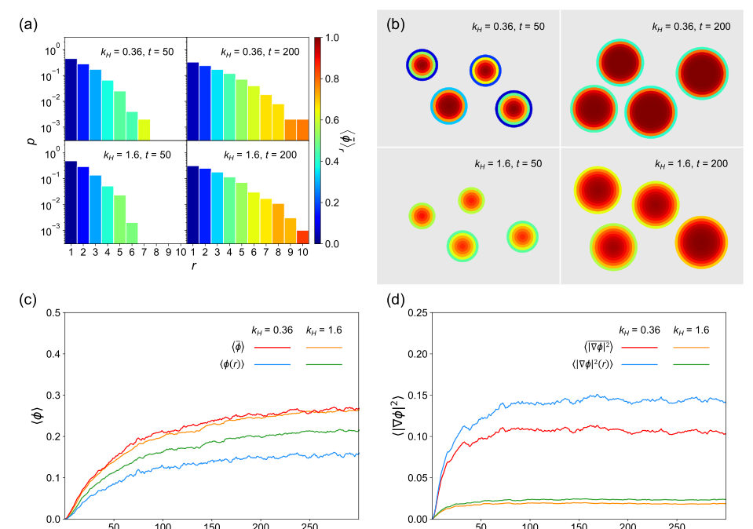 
Figure 3. Overview of early-stage nucleation dynamics. (a) Cluster radius 𝑟 distributions at weak (𝑘𝐻 = 0.36) and strong (𝑘𝐻 = 1.6) couplings, captured at 𝑡 = 50 and 200, respectively. The color scheme indicates the spatially averaged order parameters 〈𝜙̅〉𝑟 corresponding to distinct radius groups. (b) Representative morphological configurations of the condensed clusters, projected onto 2D planes. (c) Time-resolved evolution of the ensemble- averaged order parameters (spatial average 〈𝜙̅〉 and interfacial value 〈𝜙(𝑟)〉). (d) Time-resolved evolution of the ensemble-averaged spatial gradients (spatial average 〈|∇𝜙|2 ̅̅̅̅̅̅̅〉 and interfacial value 〈|∇𝜙|2(𝑟)〉). Here, overlines and angle brackets...

📷 Fig 4

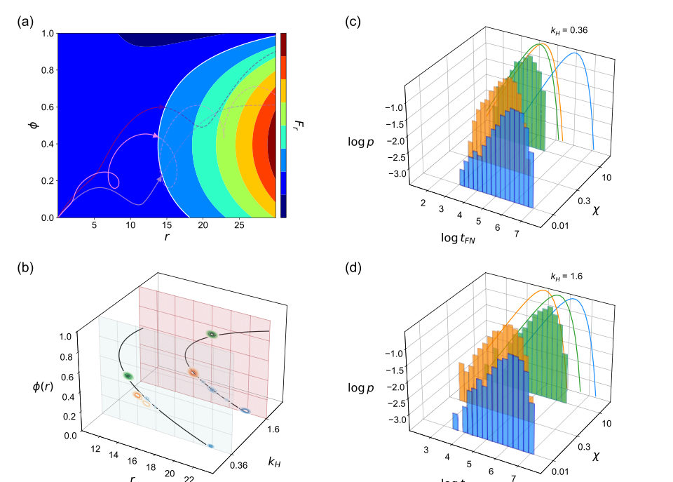 
Figure 4. Overview of the first-passage problem in early-stage nucleation. (a) Scheme of the first-passage paths within the (𝑟, 𝜙) phase space. The solid curves represent the first-passage trajectories from the initial state to the critical nucleation regime, superimposed on a background color map indicating the nucleation-driving force 𝐹𝑟. (b) Joint statistical distributions of the interfacial order parameters 𝜙(𝑟) and cluster radii 𝑟 at the onset of the first critical nucleation events with the reordering susceptibility 𝜒 = 0.01 (blue), 0.3 (orange), and 10 (green), respectively. Black lines serve as a guide to the eye. (c–d) Distributions of the first-passage times resolved under...

📷 Fig 5

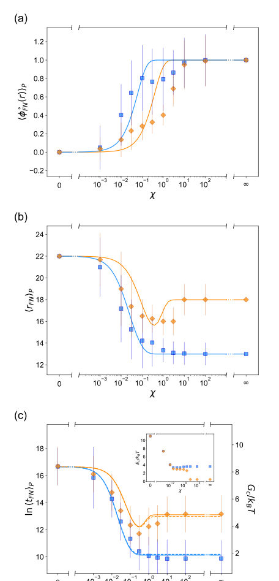 
Figure 5. First-passage properties evaluated across a wide parameter range. The path-averaged (a) relative interfacial order 〈𝜙𝐹𝑁

**Summary.** This work develops a multi-shell model to study the kinetics of early-stage nucleation in condensed clusters, explicitly coupling structural reordering dynamics to the growth process. Using stochastic simulations, the authors find that the interplay between these two mechanisms leads to a quantifiable kinetic turnover effect. This provides a predictive framework for understanding multi-step phase transitions beyond classical theories.

**Why it may be interesting.** The focus on non-equilibrium kinetics, path-dependence of the free energy barrier, and the explicit coupling of structural dynamics (reordering) to phase separation kinetics is highly relevant to understanding complex many-body transitions.

Detailed structure

**Main problem.** The paper addresses the discrepancy between theoretical and experimental nucleation rates, particularly when dynamic structural reordering occurs during multi-step phase transitions.

**Main result.** The study demonstrates a kinetic turnover effect where the relationship between mean first-passage time and reordering susceptibility becomes non-monotonic as coupling strength increases.

**Method.** The authors use stochastic simulations and path analysis on a multi-shell model to track the time-resolved evolution of structural order during early-stage nucleation.

**Model / system.** The system is a multi-shell condensed cluster modeled with a space-time-dependent order-parameter field $\phi(\mathbf{x}, t)$. The energy incorporates interfacial and bulk potentials, explicitly coupling structural reordering with cluster growth.

**Key observables.** Nucleation rate, mean first-passage time, reordering susceptibility, and the effective nucleation barrier.

**Important parameters / regimes.** Coupling strength ($k_H$), reordering rate, and the structural order parameter $\phi$.

**Assumptions / limitations.** The model neglects cluster-cluster coalescence and treats the process in an over-damped limit, focusing only on early-stage nucleation dynamics.

**Figures summary.** Figures illustrate the reordering-nucleation process pathways, the energy landscape in $(r, \phi)$ space, and show the path-averaged order parameter, cluster radius, and transition time across varying coupling strengths.

**Paper structure.** The paper develops a multi-shell model, details the coupled reordering and adsorption mechanisms, analyzes the first-passage problem using effective barriers, and presents simulations demonstrating the turnover effect.

Abstract

Nucleation is a key rate-limiting process in phase transition and phase separation. Recent studies highlight a significant discrepancy between experimentally measured nucleation rates and theoretical predictions, particularly when dynamic structural reordering occurs along multi-step pathways. To bridge this gap, we develop a multi-shell model with a space-time-dependent order-parameter field to describe the reordering-nucleation process, where structural reorganization couples with the early growth of condensed clusters. Through stochastic simulations, we track the time-resolved evolution of heterogeneous structural order inside growing clusters. Path analysis of the first-passage problem in early-stage nucleation demonstrates that shifting the reordering rate alters the nucleation rate by several orders of magnitude. Furthermore, as the coupling strength increases, the relationship between the mean first-passage time and reordering susceptibility shifts from monotonic to non-monotonic, exhibiting a turnover effect. We quantitatively rationalize these behaviors with an effective nucleation barrier that accounts for non-equilibrium properties. Our findings elucidate the mechanisms behind multi-step nucleation and offer a predictive framework for future studies.

[↑ back to top](#top)

### [Stable rotating vortex clusters in three-dimensional quantum droplets](http://arxiv.org/abs/2608.24036v1)

**Authors:** Liangwei Dong, Yaroslav V. Kartashov  
**Type:** theory · **Category:** quantum gases · **PDF:** <https://arxiv.org/pdf/2608.24036v1>  
**Analysis basis:** full PDF text, analyzed in chunks
**Topic relevance:** `analog quantum simulation` **3/5** · `Keldysh / 2PI / non-Gaussian methods` **2/5** · `methods for driven-dissipative` **1/5**

📷 Fig 1

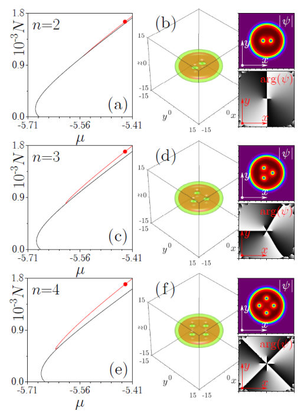 
Fig. 1. Dependence of norm of 3D vortex droplet cluster containing

📷 Fig 2

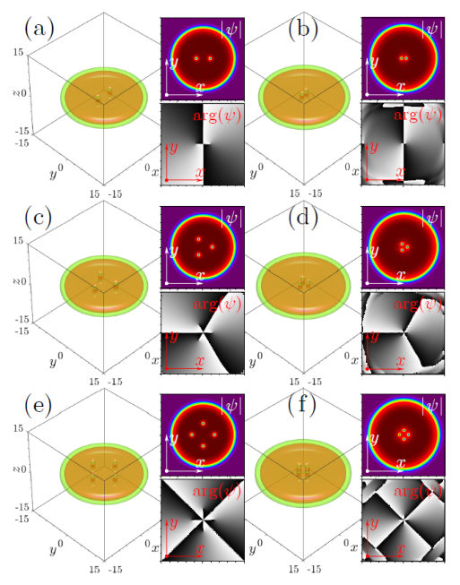 
Fig. 2. Examples of rotating clusters of two (a),(b), three (c),(d), and four (e),(f) vortex droplets at 3.5  . Panels (a),(c),(e) correspond to rotation frequency 0.08  , while panels (b),(d),(f) correspond to 0.50  . Insets show modulus  and phase arg( )  distri- butions in the ( , ) x y plane at 0 z  . The superimposed isosurfaces of  for each state are drawn at 0.2max  (green) and 0.7 max  (orange) levels.

📷 Fig 3

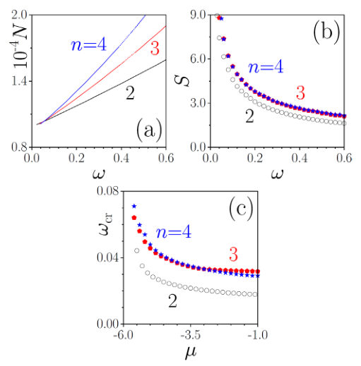 
Fig. 3. (a) Norm N of the vortex droplet clusters with different num- ber of vortices n and (b) the distance S between adjacent phase singularities versus rotation frequency  at 3.5  . In (a) solid

📷 Fig 4

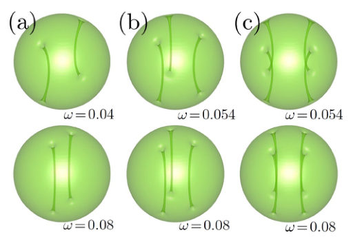 
Fig. 5. Isosurfaces drawn at 0.35max  level showing rotating clusters of two (a), three (b), and four (c) quantum droplets in spher- ical potential at 3.5  and different rotation frequencies.

📷 Fig 5

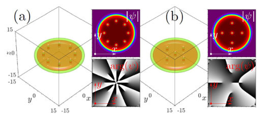 
Fig. 4. Examples of rotating vortex clusters with 8 vortices (а) and with 4 off-center and 1 central vortex (b) at 3.5  , 0.06  .

**Summary.** This paper predicts the existence of stable, rotating three-dimensional vortex quantum droplets within binary Bose-Einstein condensates. These clusters are stabilized by a combination of mean-field interactions, quantum fluctuations, and the Coriolis force due to rotation. The findings open theoretical avenues for observing stable, collective motion of multiple vortex lines in ultracold atomic systems.

**Why it may be interesting.** This work directly addresses the complex dynamics of interacting quantum fluids, specifically exploring how external forces (rotation) and quantum corrections stabilize exotic topological structures (vortex clusters) in BECs.

Detailed structure

**Main problem.** The paper predicts and characterizes stable three-dimensional (3D) vortex quantum droplets formed in binary Bose-Einstein condensates (BEC) that exhibit persistent rotation.

**Main result.** Stable vortex clusters, distinct from localized droplets, are found to exist in a wide parameter range, suggesting a route to observing regular collective motion of vortex lines in condensates.

**Method.** The study involves solving coupled dimensionless Gross-Pitaevskii equations incorporating Lee-Huang-Yang (LHY) quantum corrections and the Coriolis force arising from rotation.

**Model / system.** The system is a binary Bose-Einstein condensate modeled in 3D geometry, analyzed under the influence of mean-field nonlinearity, quantum fluctuations (LHY), rotation, and an external potential.

**Key observables.** The norm ($N$) of the cluster, the cluster radius, the distance between adjacent vortices, and the critical rotation frequency ($\omega_{crit}$).

**Important parameters / regimes.** Chemical potential ($\mu$), rotation frequency ($\omega$), and the number of vortex lines ($n$).

**Assumptions / limitations.** The analysis assumes equal masses and intra-species interactions for simplicity, and the stability is critically dependent on the repulsive LHY quantum corrections balancing the attractive residual mean-field nonlinearity.

**Figures summary.** Figure 1 shows the dependence of the cluster norm ($N$) on chemical potential ($\mu$) for 2, 3, and 4 vortex lines, illustrating bifurcation from single-vortex states. Other figures show 3D isosurfaces and stability evolution.

**Paper structure.** The paper progresses by establishing the physical model and governing equations, predicting the existence of the new cluster type, analyzing the dependence of cluster properties (size, norm) on rotation frequency and chemical potential, and finally demonstrating stability through numerical simulations.

Abstract

We predict a new type of stable three-dimensional (3D) vortex quantum droplets in binary Bose-Einstein condensate arranged into ring clusters that per-sistently rotate in the external potential. In contrast to clusters composed from localized quantum droplets, the states introduced here represent interacting vortex lines with identical topological charges nested in common 3D envelope and existing in much broader parameter range in comparison with local-ized quantum droplets. The intricate interplay between mean-field nonlinearity of Bose-Einstein condensate, quantum fluctuations described by Lee-Huang-Yang correction, Coriolis force arising due to rotation, and external potential leads to substantial variations of cluster shape upon increase of its rotation frequency. Rotating vortex clusters bifurcate from single-vortex quantum droplets and exist only above critical value of the rotation frequency that decreases with increase of chemical potential and depends on the number of vortex lines in the cluster. The radius of the cluster decreases with increase of rotation frequency and weakly varies with chemical potential, which determines mostly localization of the individual vortices in cluster and overall width of its envelope. Vortex droplet clusters are very robust objects existing in stable form in wide intervals of the number of particles for any number (odd or even) of vortex lines forming them. Our results may open the route to observation of stable arrays of vortex lines of different configurations per-forming regular collective motion in condensate.

[↑ back to top](#top)

### [Transport interpretation of entanglement Hamiltonian cumulants in integrable quantum quenches](http://arxiv.org/abs/2608.24613v1)

**Authors:** Riccardo Travaglino, Pasquale Calabrese  
**Type:** theory · **Category:** statistical mechanics · **PDF:** <https://arxiv.org/pdf/2608.24613v1>  
**Analysis basis:** full PDF text, analyzed in chunks
**Topic relevance:** `non-equilibrium universality` **3/5** · `Keldysh / 2PI / non-Gaussian methods` **1/5** · `analog quantum simulation` **1/5** · `scars & prethermalization` **1/5**

📷 Fig 1

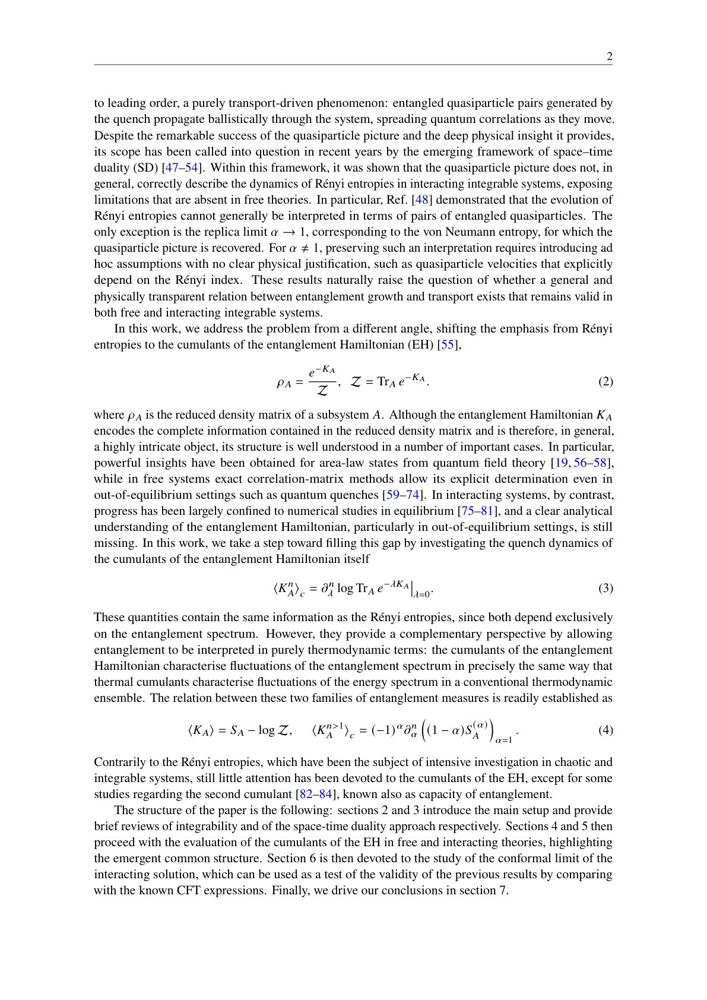 
Low-resolution page preview, page 2

📷 Fig 2

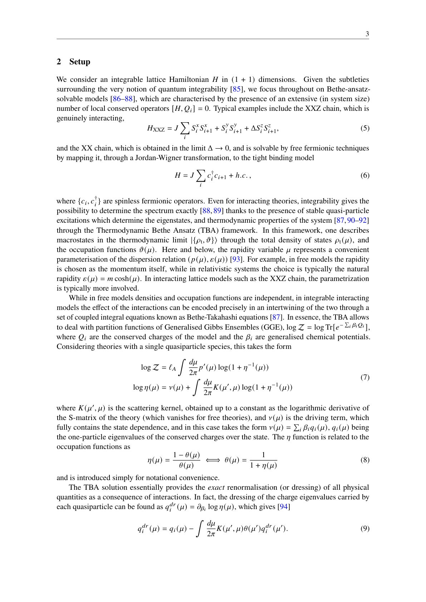 
Low-resolution page preview, page 3

📷 Fig 3

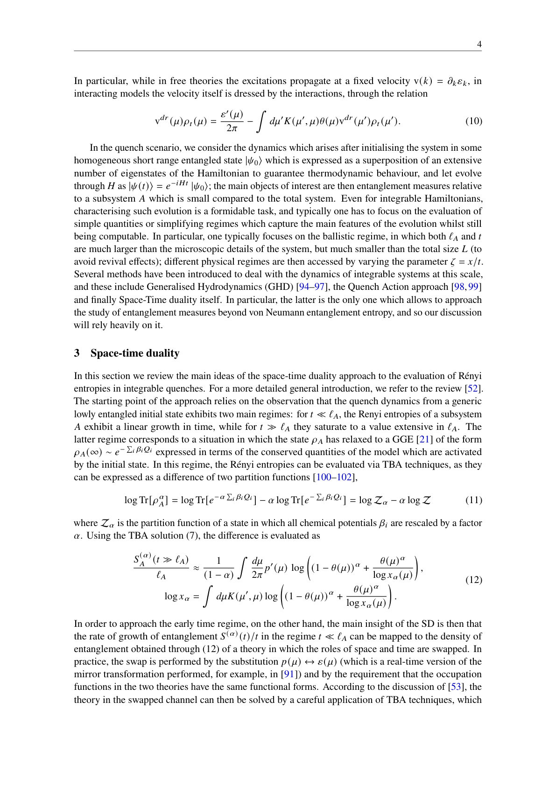 
Low-resolution page preview, page 4

📷 Fig 4

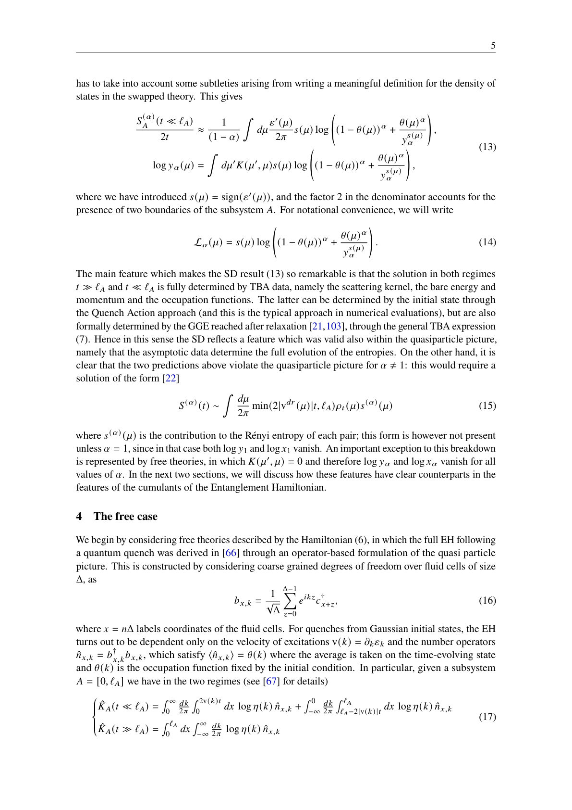 
Low-resolution page preview, page 5

📷 Fig 5

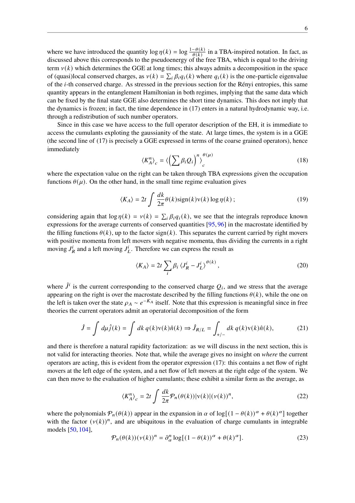 
Low-resolution page preview, page 6

**Summary.** This work connects the complex dynamics of entanglement in integrable quantum systems to fundamental concepts of transport theory. By showing that entanglement Hamiltonian cumulants are determined by conserved current cumulants, it offers a unified, transport-based description applicable across free, conformal, and interacting integrable models. This provides a deeper physical understanding of how entanglement evolves out of equilibrium.

**Why it may be interesting.** It provides a powerful, transport-based understanding of entanglement dynamics that complements the standard quasiparticle picture, which is particularly useful for understanding non-equilibrium quantum dynamics in 1D systems.

Detailed structure

**Main problem.** The paper aims to establish a direct connection between entanglement dynamics and transport properties in integrable quantum systems following global quantum quenches.

**Main result.** The cumulants of the entanglement Hamiltonian are exactly given by the cumulants of currents of suitable conserved charges evaluated in the macrostate selected by the initial state.

**Method.** The analysis uses the framework of integrable models, employing techniques like the Thermodynamic Bethe Ansatz (TBA) and space-time duality to relate entanglement measures to conserved charges.

**Model / system.** The study focuses on interacting integrable lattice Hamiltonians in (1+1) dimensions, such as the XXZ chain, undergoing global quantum quenches.

**Key observables.** Entanglement Hamiltonian cumulants ($\langle K_n^A 
angle_c$), Rényi entropies ($S_\alpha^A$), and conserved current cumulants.

**Important parameters / regimes.** The analysis covers the ballistic regime ($t \ll \ell_A$) and the long-time limit ($t \gg \ell_A$), comparing free, conformal, and interacting integrable limits.

**Assumptions / limitations.** The analysis relies on the applicability of the TBA framework to describe macrostates via Generalized Gibbs Ensembles (GGE).

**Paper structure.** The paper develops the theory by first analyzing the entanglement measures in the context of quenches, showing how the cumulants relate to conserved charges, and then demonstrating the consistency of this picture across different integrable limits.

Abstract

We study the dynamics of the cumulants of the entanglement Hamiltonian in interacting integrable models following global quantum quenches. Building on recent results based on space-time duality, we show that these cumulants are exactly given by the cumulants of currents of suitable conserved charges evaluated in the macrostate selected by the initial state. This establishes a direct connection between entanglement dynamics and transport, providing a transport counterpart to the quasiparticle picture that successfully describes the evolution of the von Neumann entropy. In the free-fermion and conformal limits, our results reduce to the difference between the current cumulants carried by right- and left-moving excitations, recovering previously known expressions. In interacting integrable models, where a decomposition into independent right and left movers is no longer meaningful at the operator level, a similar structure survives at the level of the entanglement spectrum, yielding a unified description of entanglement Hamiltonian fluctuations across free, conformal, and interacting integrable systems.

[↑ back to top](#top)

### [Altermagnetic Anomalous Hall Effect and Spin--Edge-Locked Chiral Modes in a Modified Kane--Mele--Hubbard Model](http://arxiv.org/abs/2608.24408v1)

**Authors:** Mohsen Hafez-Torbati, Alireza Qaiumzadeh  
**Type:** theory · **Category:** strongly correlated electrons · **PDF:** <https://arxiv.org/pdf/2608.24408v1>  
**Analysis basis:** full PDF text, analyzed in chunks
**Topic relevance:** `analog quantum simulation` **3/5** · `Keldysh / 2PI / non-Gaussian methods` **2/5**

📷 Fig 1

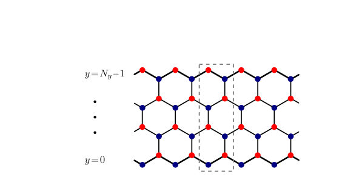 
FIG. 1. Honeycomb structure with periodic boundary condition in x and open periodic boundary condition in y direction. The number of sites in y direction is Ny. The zigzag edges at y = 0 and at y = Ny −1 are emboldened. The dashed box denotes the unit cell.

📷 Fig 2

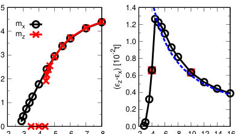 
FIG. 2. (a) Local magnetization for the z-AF solution (mz) and for the xy-AF solution (mx) versus the Hubbard interaction U. (b) The energy difference between the z-AF solution and the xy-AF solution per lattice site versus U. The blue dashed line displays the mean-field results of the effective low-energy spin model valid at the large-U limit, see the main text. Note that the z-AF solution does not exist below U ≈4.5t and εz denotes the energy per lattice site of the paramagnetic solution instead. The spin-orbit coupling is fixed to λ = 0.1t. The results are for the number of bath sites nb = 6 in the ED impurity solver except for the filled red squares at U = 4t and 10t which are for nb =...

📷 Fig 3

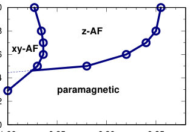 
FIG. 4. Magnetic phase diagram of the altermagnetic Kane-Mele- Hubbard model in Eq. (1). The horizontal axis represents the elec- tron density n and the vertical axis represents the Hubbard interac- tion U. The paramagnetic, the xy-AF, and the z-AF phases are dis- tinguished. The thin dashed line connects the z-AF phase boundary to its ending point U ≈4.5t at half-filling. The spin-orbit coupling is fixed to λ = 0.1t and the temperature to T = 0.05t. The number of bath sites nb = 6 is used in the ED impurity solver.

📷 Fig 4

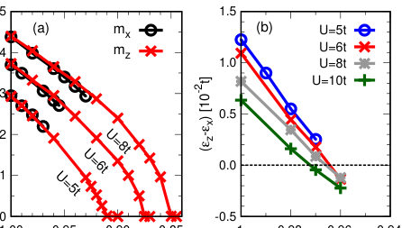 
FIG. 3. (a) Local magnetization for the z-AF solution (mz) and for the xy-AF solution (mx) versus the electron density n for different values of the Hubbard interaction U. (b) The energy difference per lattice site between the z-AF solution and the xy-AF solution versus n for different values of U. The data are obtained for the model parameter λ = 0.1t, the temperature T = 0.05t, and the number of bath sites nb = 6 in the ED impurity solver.

📷 Fig 5

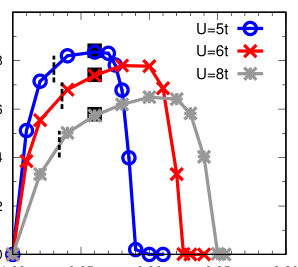 
FIG. 5. The anomalous Hall conductivity σyx = −σxy for the z-AF solution plotted versus the electron density n at different values of the Hubbard interaction U. The vertical black dashed line for each value of U specifies the electron density above which the system becomes a xy-AF phase. The anomalous Hall conductivity is entirely zero in the xy-AF phase. The spin-orbit coupling is fixed to λ = 0.1t and the temperature to T = 0.05t. The results are for the number of bath sites nb = 6 except for the filled black squares at n = 0.94 and different values of U, which are for nb = 8.

**Summary.** This theoretical study uses DMFT on the Kane-Mele-Hubbard model to predict the altermagnetic Anomalous Hall Effect (AHE) in correlated TMD monolayers. The key finding is that doping drives the system into a specific antiferromagnetic phase that breaks necessary symmetries, thereby generating a measurable AHE. This work provides a realistic, correlation-based mechanism for realizing such topological transport phenomena.

**Why it may be interesting.** The focus on correlation-driven topological phenomena (AHE) in strongly correlated materials like TMDs provides a rich theoretical playground for understanding emergent quantum states beyond simple band theory.

Detailed structure

**Main problem.** The paper establishes a correlation-driven route to the altermagnetic anomalous Hall effect (AHE) and its associated spin--edge-locked edge states.

**Main result.** Hole doping induces a spin-flop transition to an out-of-plane Néel-type antiferromagnetic phase, which breaks symmetry and generates a finite AHE, distinct from conventional ferromagnetism.

**Method.** The study employs Dynamical Mean-Field Theory (DMFT) to incorporate dynamical electronic correlations into the analysis of the Kane-Mele-Hubbard model.

**Model / system.** The system is modeled using a modified Kane-Mele-Hubbard (AKMH) model, applied to transition metal dichalcogenide (TMD) monolayers, incorporating hopping, spin-orbit coupling, and an onsite Hubbard interaction.

**Key observables.** Anomalous Hall conductivity (sigma_xy), magnetic phases (paramagnetic, xy-AF, z-AF), and spin--edge-locked chiral edge states.

**Important parameters / regimes.** Hubbard interaction strength (U), electron doping level (n), and spin-orbit coupling (lambda).

**Assumptions / limitations.** The DMFT approximation is used, which neglects nonlocal quantum fluctuations; the analysis contrasts results derived from spin-rotationally invariant interactions versus Ising-like ones.

**Figures summary.** Figures illustrate the honeycomb structure, the evolution of local magnetization and energy differences across magnetic transitions, and momentum-resolved spectral functions showing edge-localized modes.

**Paper structure.** The work systematically analyzes the system's behavior by varying the Hubbard interaction (U) and doping level (n). It first establishes the transition from a paramagnetic to an antiferromagnetic phase, then details how doping drives the system into the symmetry-breaking z-AF phase, which is responsible for the measurable AHE.

Abstract

We establish a correlation-driven route to the altermagnetic anomalous Hall effect (AHE) and its associated \emph{spin--edge-locked} edge states in a modified Kane--Mele--Hubbard model. Using dynamical mean-field theory (DMFT), we show that, at half-filling, increasing the Hubbard interaction drives the system from a metallic paramagnetic phase hosting antichiral edge states into an insulating in-plane Néel-type antiferromagnetic phase, in which a residual antiunitary symmetry forbids the AHE. Hole doping induces a spin-flop transition to an out-of-plane Néel-type antiferromagnetic phase, thereby breaking this symmetry and generating a finite anomalous Hall conductivity that persists into the strongly correlated regime. Distinct from a conventional spin-polarized Hall response in ferromagnets, the altermagnetic AHE receives equal and additive contributions from the two symmetry-related spin sectors and is accompanied by spin--edge-locked chiral states. Our results demonstrate that carrier doping and spin-rotationally invariant Hubbard interactions are sufficient to realize the altermagnetic AHE, without invoking an explicitly Ising-like interaction, and provide a realistic microscopic route toward its realization in correlated transition metal dichalcogenides monolayers.

[↑ back to top](#top)

### [Disorder-tuned crossing of monopole and conventional pairing instabilities in multi-Weyl semimetals](http://arxiv.org/abs/2608.24587v1)

**Authors:** Enrique Muñoz, Rodrigo Soto-Garrido  
**Type:** theory · **Category:** disordered systems and neural networks · **PDF:** <https://arxiv.org/pdf/2608.24587v1>  
**Analysis basis:** full PDF text, analyzed in chunks
**Topic relevance:** `Keldysh / 2PI / non-Gaussian methods` **3/5** · `driven-dissipative phase transition` **1/5** · `methods for driven-dissipative` **1/5**

📷 Fig 1

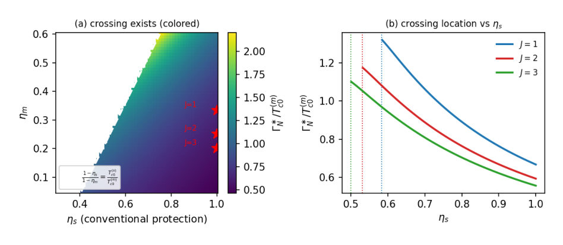 
FIG. 1. Crossing criterion for general channel protection, clean ratio r = T (s) c0 /T (m) c0 = 0.625. (a)

📷 Fig 2

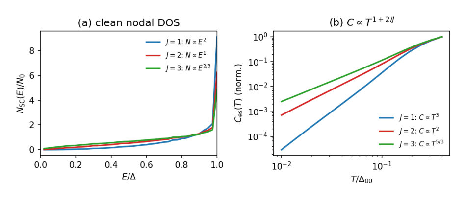 
FIG. 2. Clean nodal thermodynamics of the monopole channel. (a) Quasiparticle density of states

📷 Fig 3

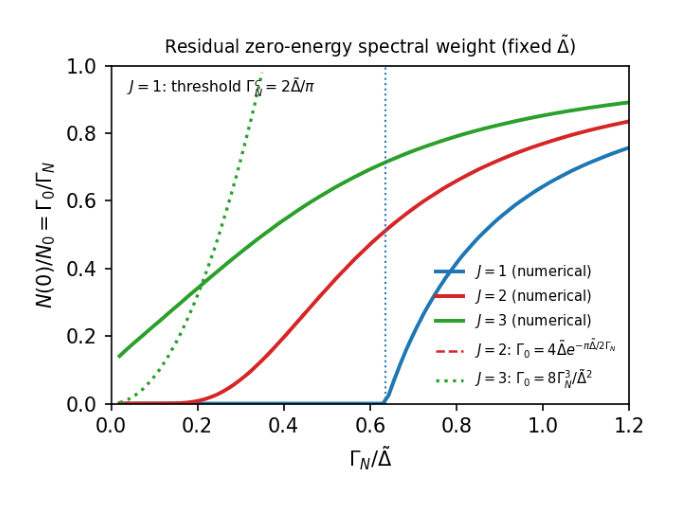 
FIG. 3. Residual zero-energy DOS N(0)/N0 = Γ0/ΓN from the angle-resolved Born self-consistency

📷 Fig 4

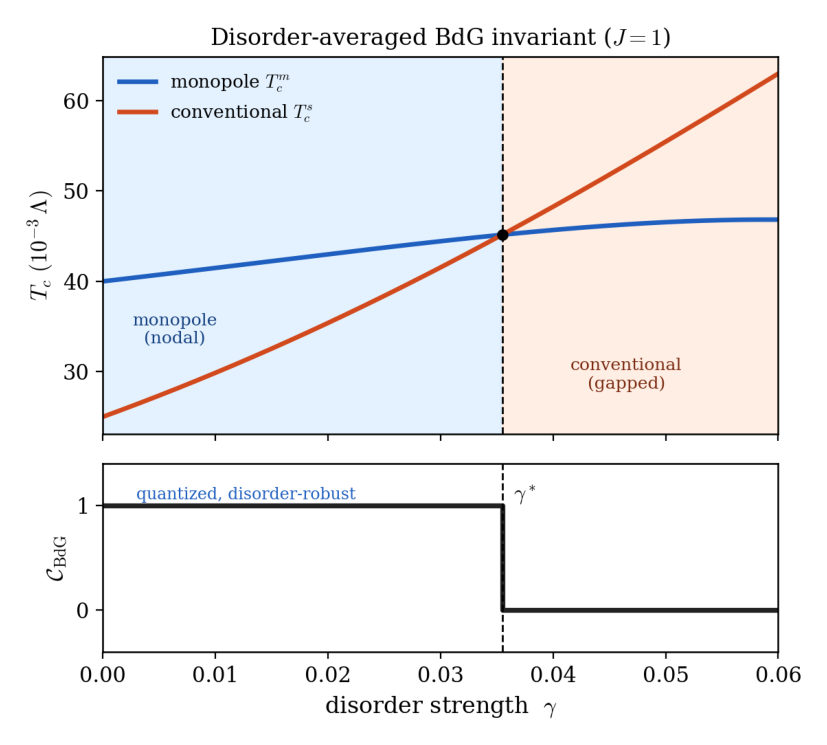 
FIG. 4. The two pure-state gap structures, shown side by side with no disorder axis so that no

📷 Fig 5

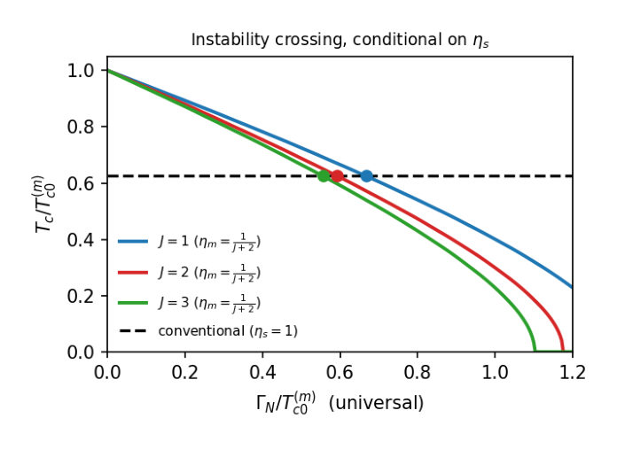 
FIG. 5. Instability crossing in the universal variable ΓN/T (m) c0 (primary presentation). Solid:

**Summary.** This theoretical work examines how non-magnetic disorder modifies the superconducting pairing mechanism in multi-Weyl semimetals. It finds that disorder tunes the system's instability from a topologically protected monopole state to a conventional s-wave state. The analysis relies on advanced diagrammatic techniques and reveals quantitative criteria for the survival of this superconducting phase transition in the presence of impurities.

**Why it may be interesting.** The study of pairing instabilities in topological semimetals under disorder is highly relevant to understanding superconductivity in novel quantum materials, which often exhibit strong coupling to topological features.

Detailed structure

**Main problem.** The paper investigates how non-magnetic impurity scattering tunes the pairing instability in a multi-Weyl semimetal, specifically analyzing the crossing between a topologically nontrivial monopole pairing channel and a conventional s-wave channel.

**Main result.** Disorder drives the pairing instability from the monopole to the conventional channel, and the crossing point is determined by disorder-dependent protection factors ($\eta_m, \eta_s$).

**Method.** The analysis uses Born and Abrikosov–Gor'kov theory, calculating self-energies and applying continuum Ginzburg-Landau estimates to study the competition between the two pairing instabilities.

**Model / system.** The system is a two-node multi-Weyl semimetal characterized by opposite chirality at $\pm Q$ and a monopole charge $J$. The low-energy physics is described by a Hamiltonian involving pseudospin and orbital degrees of freedom.

**Key observables.** Pairing instability channels (monopole vs. s-wave), crossing criterion $rac{1 - \eta_s}{1 - \eta_m} < rac{T_c^{(0)}}{T_m^{(0)}}$, and the pair-breaking rates ($\Gamma_N, \Gamma_m$).

**Important parameters / regimes.** The disorder strength is characterized by the small-pocket window $q_{\max} 	ext{intra}\xi_{	ext{dis}} \ll 1 \ll |2Q|\xi_{	ext{dis}}$, and the monopole protection factor $\eta_m(J) = 1/(J+2)$.

**Assumptions / limitations.** The analysis assumes an explicitly specified projected impurity kernel, treating disorder as valley-diagonal and momentum-independent within each Fermi pocket.

**Figures summary.** Figure 6 compares the coupled (red) versus decoupled (blue) crossing instability for $J=2$ and $J=3$, showing the persistence of the crossing under disorder broadening.

**Paper structure.** The paper progresses by first establishing the low-energy model and the two competing pairing channels. It then calculates the disorder-induced pair-breaking rates for both channels using AG theory. Finally, it analyzes the crossing condition using both continuum Ginzburg-Landau estimates and coupled Lorentzian-DOS-plus-AG tests.

Abstract

We study how non-magnetic impurity scattering affects the emergence and possible coexistence of pairing instabilities in a two-node multi-Weyl semimetal. Within an explicitly specified projected impurity kernel---valley diagonal and momentum independent across each Fermi pocket, the leading behaviour of non-magnetic disorder in the small-pocket window $q^{\max}_{\rm intra}ξ_{\rm dis}\ll1\ll|2\mathbf Q|ξ_{\rm dis}$, treated at leading order in Born and Abrikosov--Gor'kov theory---quenched disorder tunes the leading pairing instability from a topologically nontrivial monopole channel to a conventional ($s$-wave) one, extending our earlier clean-system analysis into the disordered regime. A Born self-energy calculation in the chiral band basis then gives: (i) a band-isotropic conventional channel that is Anderson protected against intra-node scalar disorder ($η_s=1$), introduced phenomenologically at the projected-band level; solving the competition for arbitrary $η_s$ yields the crossing criterion $(1-η_s)/(1-η_m)<T_{c0}^{(s)}/T_{c0}^{(m)}$, so the mechanism tolerates substantial loss of conventional-channel protection; and (ii) a rank-one monopole sector fixing $f_m$ as the exact eigenfunction with $η_m(J)=1/(J+2)$, exact given that kernel. The crossing location in $Γ_N/T_{c0}^{(m)}$ is set by $η_m(J)$, $η_s$, and $r=T_{c0}^{(s)}/T_{c0}^{(m)}$. From the clean projected BdG Hamiltonian the pure monopole nodes carry Berry charge $\pm J$, distinct from the gapped conventional solution; the clean nodal thermodynamics is charge-dependent, $N_{\rm SC}(E)\propto E^{2/J}$ and $C\propto T^{1+2/J}$, and the residual density of states shows a threshold only for $J=1$. The crossing lies in the moderately metallic regime, $μ/Γ_N\simeq11$--$14$ for the illustrative $T_{c0}^{(m)}/μ=0.133$ used in the figures.

[↑ back to top](#top)

### [Emergence of Stigmergic Transport in Granular Environments](http://arxiv.org/abs/2608.24383v1)

**Authors:** F. Wéry, F. N. Pinan Basualdo, B. Gorissen, N. Vandewalle  
**Type:** both · **Category:** statistical mechanics · **PDF:** <https://arxiv.org/pdf/2608.24383v1>  
**Analysis basis:** full PDF text, analyzed in chunks
**Topic relevance:** `non-equilibrium universality` **3/5** · `Frenkel-Kontorova` **1/5** · `driven-dissipative phase transition` **1/5**

📷 Fig 1

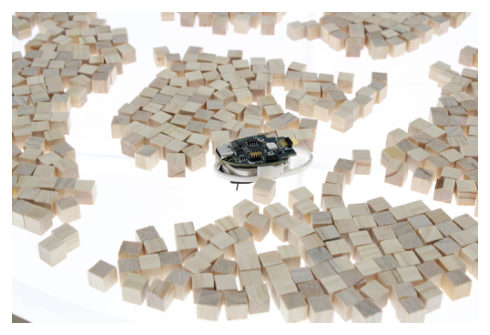 
FIG. 1. A bristlebot (GRASPion, [20]) is forming traces by pushing cubic wood blocks in an arena. Light comes from below.

📷 Fig 2

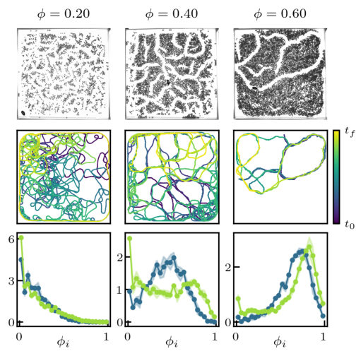 
FIG. 2. Main experimental results for three packing fractions, shown from left to right: ϕ = 0.2, ϕ = 0.4, and ϕ = 0.6. (top row) Images of the arena, emphasizing particle organization and trail formation at intermediate/high ϕ. (second row) Tra- jectories of the robot, with time indicated by the color scale. Duration tf −t0 is 12 min (low ϕ) and 20 min otherwise. Traces reveal multiple passages at intermediate/high ϕ. (bot- tom row) Probability Density Functions (PDF) of the local packing fraction ϕi when a 30 × 30 grid is considered on im- ages. Blue curves correspond to the initial state t0, while green curves correspond to the final state tf.

📷 Fig 3

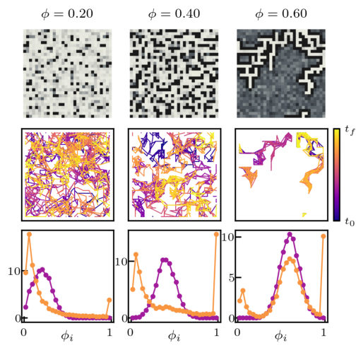 
FIG. 3. Main numerical results for three packing fractions, shown from left to right: ϕ = 0.2, ϕ = 0.4, and ϕ = 0.6. First row: Images of the system at the three packing fractions. Sec- ond row: Trajectories of the robot, with time indicated by a color scale. Third row: Probability Density Functions (PDF) of the local packing fraction ϕi. Violet curves correspond to the initial state, while orange curves correspond to the final state.

📷 Fig 4

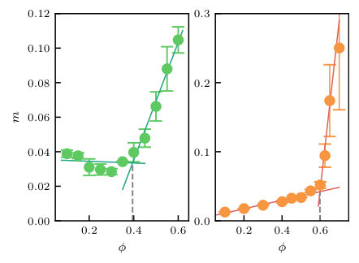 
FIG. 5. Memory order parameter m, defined in Eq. (4), as a function of the packing fraction ϕ. The sharp increase at ϕc, denoted by a dashed vertical line, identifies the onset of stig- mergic path formation in both experiments and simulations.

📷 Fig 5

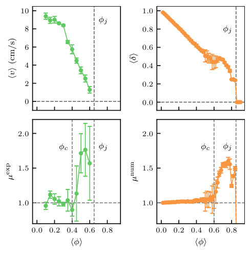 
FIG. 4. Speed and mobility of bot/walker in both experiments (left column) and simulations (right column). Critical points are denoted by vertical dashed lines. Speed vanishes to zero at ϕexp J ≈0.65 in experiments. Mean displacement per iteration δ reaches zero at ϕnum J ≈0.85 in simulations. Mobility µexp

**Summary.** This paper demonstrates that active agents can collectively build robust transport networks in granular media through stigmergic interactions. By coupling movement to environmental remodeling, the system exhibits enhanced mobility in an optimal regime that exists well below the jamming limit. The findings provide a general framework for understanding self-organized transport in complex, deformable substrates.

**Why it may be interesting.** The concept of self-organization driven by mechanical interactions and environmental memory is highly relevant to non-equilibrium statistical mechanics, pattern formation, and active matter systems.

Detailed structure

**Main problem.** The paper investigates the emergence of stigmergic transport—self-organized movement pathways—in deformable, granular environments.

**Main result.** Stigmergic transport emerges only above a critical packing fraction ($\phi_c$), leading to enhanced mobility, but this enhancement is suppressed as the system approaches the jamming transition ($\phi_J$).

**Method.** The study combines physical experiments using robotic walkers in granular media with a minimal stochastic simulation model.

**Model / system.** The system involves active agents (robotic walkers) moving through a deformable substrate of granular material (wooden cubes). The model tracks how movement modifies the local packing fraction ($\phi_i$) of the environment.

**Key observables.** Average velocity ($\langle v 
angle$), normalized mobility ($\mu$), and a memory order parameter ($m$) quantifying environmental structuring.

**Important parameters / regimes.** Packing fraction ($\phi$), critical packing fraction ($\phi_c$), and the jamming transition ($\phi_J$).

**Assumptions / limitations.** The model assumes material displacement is redistributed isotropically among neighbors, allowing for the persistence of depleted regions.

**Figures summary.** Figures illustrate the formation of particle traces and robot trajectories at different packing fractions, and plots show the evolution of mobility and the memory order parameter across the different transport regimes.

**Paper structure.** The work establishes the physical system, defines the competition between environmental memory and geometrical crowding, demonstrates the emergence of three regimes (random, trail formation, narrow path), and quantifies the optimal transport regime before jamming.

Abstract

We show that stigmergic path formation emerges in a deformable environment through the interplay between environmental memory and geometrical crowding. Using experiments with robotic random walkers together with a minimal stochastic model, we demonstrate the onset of persistent self-reinforced transport pathways above a critical packing fraction $φ_c$, where environmental memory enhances walker mobility. As the jamming transition $φ_J$ is approached, increasing crowding progressively suppresses this transport enhancement despite the persistence of environmental memory. The resulting non-monotonic behavior reveals an optimal transport regime well below jamming. More generally, our work establishes how active agents can collectively build transport networks through purely mechanical interactions with a deformable substrate.

[↑ back to top](#top)

### [Long-Range Order and Composite Boson Condensation in Lattice Quantum Hall States](http://arxiv.org/abs/2608.24628v1)

**Authors:** Fabian J. Pauw, Nathan Goldman, Felix A. Palm  
**Type:** theory · **Category:** other · **PDF:** <https://arxiv.org/pdf/2608.24628v1>  
**Analysis basis:** full PDF text, analyzed in chunks
**Topic relevance:** `analog quantum simulation` **3/5** · `methods for driven-dissipative` **2/5**

📷 Fig 1

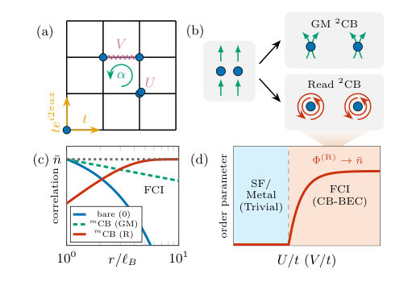 
FIG. 1. (a) Sketch of the square-lattice interacting Hof- stadter model with on-site (Hubbard) repulsion U (bosons) or nearest-neighbor repulsion V (fermions). (b) In the topo- logical phase at filling factor ν = 1/m (here, m = 2), both Read’s quasihole mapping (upper panel) and Girvin and Mac- Donald’s (GM) flux attachment (lower panel) yield composite bosons (mCBs). (c) While the correlations of the bare parti- cles decay rapidly with distance r (blue), GM’s CBs exhibit algebraic quasi long-range order (green), while Read’s CBs exhibit true long-range order (red). (d) In the bulk, we define a nonlocal order parameter Φ(R), resolving phase transitions between trivial and topological phases.

📷 Fig 2

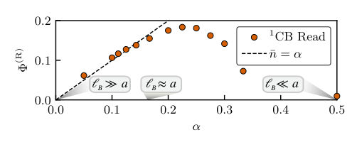 
FIG. 2. Averaged two-point correlations Φ(R) [Eq. (9)] of Read-type CBs in the bulk of a non-interacting Chern insu- lator at ν = 1 for a system of size L × L = 10 × 10. The particle number is varied with α to keep the filling factor constant. The dashed line corresponds to the continuum pre- diction of the long-range behavior of the Read-CB correlator, limr→∞ρ(R)(r)=α. For small flux α≤0.2 we find long-range order, ΦR ≈¯n=α, whereas with increasing lattice effects the long-range correlations fade away.

📷 Fig 3

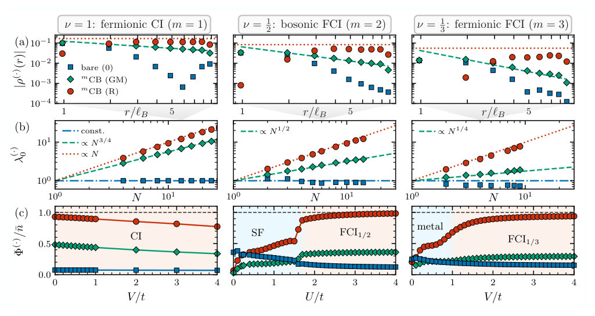 
FIG. 3. (a) Two-point correlation functions ρ(·)(r) of bare particles, Read (R), and Girvin-MacDonald (GM) CBs versus Euclidean distance r/ℓB. Columns display a noninteracting Chern insulator (left, N =13), a bosonic 1/2-Laughlin state (center, N = 6), and a fermionic 1/3-Laughlin state (right, N = 4). The numerical data agrees well with the continuum predictions (dashed lines): true long-range correlations for the Read-CBs (ρ(R)(r) ≈¯n = α/m [Eq. (6)]; red) and an algebraic decay for GM-CBs (ρ(GM)(r) ∝r−m/2 [Eq. (8)]; green). (b) This behavior is further confirmed by the particle-number scaling of the leading eigenvalue λ(·) 0 of the two-point correlation matrix for the states in (a),...

**Summary.** This paper develops a method using tensor networks to directly observe the condensation of composite bosons in lattice quantum Hall states. By calculating nonlocal correlation functions, the authors confirm the existence of true long-range topological order. This provides a powerful, measurable diagnostic tool ($\Phi(R)$) to map out quantum phase transitions in these exotic quantum materials.

**Why it may be interesting.** The explicit connection between topological order, nonlocal correlation functions, and measurable local measurements (via quantum simulators) provides a concrete, testable framework for understanding exotic quantum matter beyond traditional solid-state theory.

Detailed structure

**Main problem.** The paper aims to microscopically confirm the condensation of nonlocal composite bosons (CBs) that characterize the topological order in lattice quantum Hall (QH) states, and to define a nonlocal order parameter for phase transition detection.

**Main result.** Genuine long-range order is established in lattice QH states via CB condensation, and a nonlocal order parameter successfully pinpoints quantum phase transitions between trivial and topological regimes.

**Method.** The study employs tensor-network methods, specifically DMRG, to find ground states and calculate nonlocal correlation functions involving composite operators (Read-CBs and GM-CBs).

**Model / system.** The system is modeled using lattice Hamiltonians for Quantum Hall states, including bosonic and fermionic Laughlin states, implemented on a lattice structure (e.g., Harper-Hofstadter model).

**Key observables.** Read-CB correlation function ($
ho_R$), GM-CB correlation function ($
ho_{GM}$), and the nonlocal order parameter $\Phi(R)$.

**Important parameters / regimes.** Flux per plaquette ($\alpha$), filling factor ($
u$), and interaction strengths ($U/t$ or $V/t$).

**Assumptions / limitations.** The analysis is currently limited to single-component, Abelian quantum Hall states and relies on the applicability of tensor network methods to reconstruct nonlocal operators.

**Figures summary.** Figures illustrate the correlation functions ($
ho(\cdot)$) for different states and show the evolution of the normalized order parameter $\Phi(R)/ar{n}$ across phase transitions as a function of interaction strength.

**Paper structure.** The work progresses from defining the problem (topological order in QH states) to applying advanced numerical techniques (DMRG/MPS) to calculate nonlocal correlators. It then demonstrates the emergence of long-range order and uses the derived order parameter to map out phase boundaries.

Abstract

Topological states of matter, such as quantum Hall states, are characterized by the absence of local order parameters. In the continuum, their topological order has been reinterpreted as the condensation of nonlocal composite bosons, but this condensation and the resulting long-range correlations have so far eluded direct confirmation beyond the simplest trial states. Here, we apply tensor-network methods to lattice Hamiltonians hosting quantum Hall states, revealing this exotic order directly in interacting ground states and demonstrating both the long-range correlations and the condensation of composite bosons. These correlations define a nonlocal order parameter that identifies phase transitions between trivial and topological phases, for both bosonic and fermionic models. The corresponding operators are accessible through site-resolved, local measurements on an extensive number of particles, making them directly probable in quantum simulators. Our work opens new avenues for microscopic studies of topological quantum matter beyond the reach of traditional solid-state approaches.

[↑ back to top](#top)

### [Phase-controlled perfect nonlocal spin and charge diode effects in a four-terminal Josephson junction with $p$-wave magnets](http://arxiv.org/abs/2608.24147v1)

**Authors:** Lovy Sharma, Bimal Ghimire, Manisha Thakurathi  
**Type:** theory · **Category:** other · **PDF:** <https://arxiv.org/pdf/2608.24147v1>  
**Analysis basis:** full PDF text, analyzed in chunks
**Topic relevance:** `Keldysh / 2PI / non-Gaussian methods` **3/5** · `methods for driven-dissipative` **2/5**

📷 Fig 1

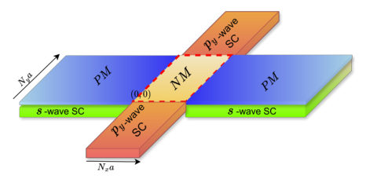 
FIG. 1: Schematic illustration of our four-terminal model, where the barrier region is NM coupled to four semi-infinite leads at the top, bottom, left, and right. The left and right leads host proximity-induced s-wave superconductivity in PM, while the top and bottom leads are py-wave SCs.

📷 Fig 2

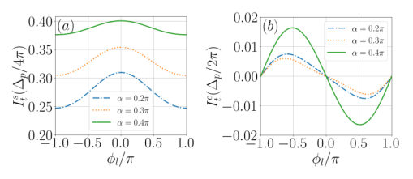 
FIG. 2: Transverse (a) spin current, Is t (b) charge current, Ic t as functions of the longitudinal phase differ- ence ϕl for crystallographic orientations α = 0.2π (blue), α = 0.3π (orange), and α = 0.4π (green). The calcula- tions are performed for ϕt = 0, VG = 0, tl = tt = t0, µ = 2t0, t0 = 1 tj = 0.5t0, ∆s = 0.005t0, ∆p = 0.05t0, Jsd = 0.2t0, and Nx = Ny = 5.

📷 Fig 3

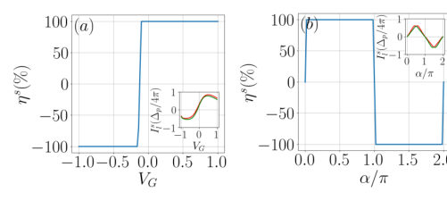 
FIG. 3: SDE ηs, as function of (a) gate potential, VG at ϕt = 0 and α = 0.2π and (b) lobe angle of PM, α at VG = 0 and ϕt = 0 . The insets display maximum (red) and minimum (green) current as a function of VG and α, respectively in the entire range of ϕl. The identical sign of the maximum and minimum current values for every VG and α results in a perfect 100% diode efficiency. Other system parameters are same as used in Fig [2].

📷 Fig 4

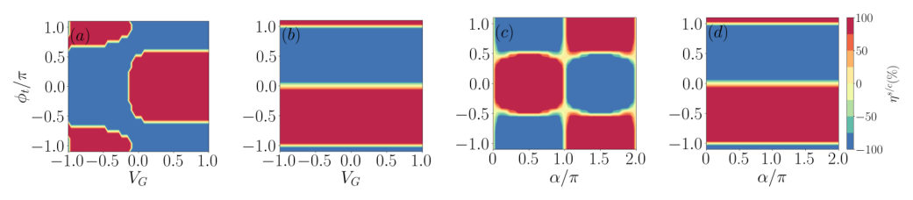 
FIG. 4: Contour plots of the SDE and CDE, ηs [(a),(c)] and ηc [(b),(d)], respectively, with the color scale repre- senting these diode efficiencies. The horizontal axis corresponds to the gate potential VG in panels (a) and (b), and to the PM crystallographic angle α in panels (c) and (d), while the vertical axis denotes the transverse phase difference ϕt in all panels. All other parameters are the same as those used in Fig. 2.

📷 Fig 5

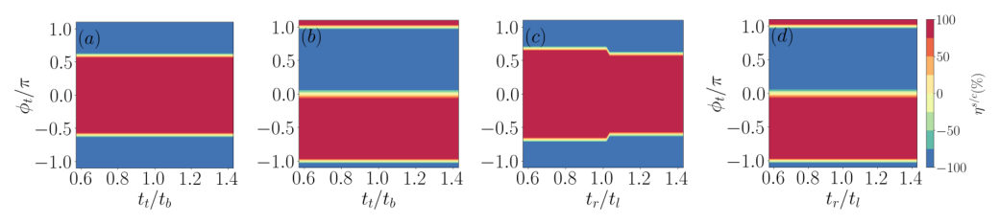 
FIG. 5: Contour plots of the transverse (a,c) SDE and (b,d) CDE, with the color scale representing the diode efficiencies. The horizontal axis corresponds to the interface-coupling ratio tt/tb in panels (a) and (b) with tr/tl = 1 and tr/tl in panels (c) and (d) with tt/tb = 1, while the vertical axis denotes the transverse phase difference ϕt in all panels. All other system parameters are the same as those used in Fig. 2.

**Summary.** This theoretical work proposes a four-terminal Josephson junction using p-wave magnets and p_y-wave superconductors to achieve perfect, phase-controlled spin and charge diode effects. By analyzing the system's Hamiltonian and using Green's functions, the authors demonstrate that the nonreciprocity can be robustly controlled by external parameters like gate voltage and crystal orientation. This establishes the junction as a highly tunable platform for dissipationless superconducting spintronics.

**Why it may be interesting.** The combination of unconventional superconductivity (p-wave) with magnetic proximity effects in a multi-terminal junction provides a rich platform for studying non-equilibrium quantum transport, which is highly relevant to superconducting spintronics and quantum devices.

Detailed structure

**Main problem.** The paper investigates the realization and control of perfect nonlocal spin and charge diode effects in a complex four-terminal Josephson junction.

**Main result.** The setup enables fully nonreciprocal spin and charge transport, with the diode efficiency being highly tunable via gate voltage and crystallographic orientation, and remaining robust against disorder.

**Method.** The study employs a theoretical Hamiltonian formalism, solving the system using the Bogoliubov-de Gennes (BdG) equation and Green's function techniques.

**Model / system.** The platform is a four-terminal Josephson junction featuring a normal-metal barrier coupled to superconducting leads: top/bottom leads are equal-spin triplet p_y-wave superconductors, and left/right leads are p-wave magnets proximity-coupled to s-wave superconductivity.

**Key observables.** Nonreciprocal spin and charge supercurrents (diode effects).

**Important parameters / regimes.** Transverse macroscopic phase difference, gate voltage applied to the barrier, and crystallographic orientation of the p-wave magnet.

**Assumptions / limitations.** The NM barrier and p-wave SC leads are assumed not to host localized magnetic moments, allowing for block-diagonalization in the sectoral basis.

**Figures summary.** Figure 1 provides a schematic illustration of the four-terminal model, showing the coupling of the NM barrier to the four distinct superconducting leads.

**Paper structure.** The paper first establishes the physical model and the goal of studying diode effects. It then details the theoretical framework using the full Hamiltonian decomposition and the BdG formalism. The core analysis involves calculating currents using Green's functions, followed by demonstrating the nonreciprocity and tunability of the diode response.

Abstract

We theoretically investigate charge and spin transport in a four-terminal Josephson junction with a normal-metal barrier. The top and bottom superconducting leads are equal-spin triplet $p_y$-wave superconductors, while the left and right leads are $p$-wave magnets with proximity-induced conventional $s$-wave superconductivity. When the transverse macroscopic phase difference between the top and bottom leads is set to zero, a longitudinal phase bias generates a pure transverse spin current with perfect 100% nonreciprocity. Remarkably, a finite transverse phase difference preserves the perfect spin-diode effect while simultaneously inducing a perfect charge-diode effect, enabling fully nonreciprocal spin and charge transport. Moreover, the spin-diode efficiency exhibits sharp, step-like switching as a function of both the gate voltage applied to the barrier and the crystallographic orientation of the $p$-wave magnet, providing independent and experimentally accessible knobs for controlling the diode polarity. The diode response remains robust against asymmetric interface couplings, nonmagnetic disorder, variations in the relative singlet and triplet pairing strengths, temperature, and junction dimensions, demonstrating that the effect is not a consequence of fine-tuned parameters. These findings establish the proposed four-terminal junction as a highly tunable and structurally robust platform for dissipationless, phase-controlled spin and charge rectification, with potential applications in superconducting spintronics.

[↑ back to top](#top)

### [Threshold and Parity BosonSampling in the Linear-Mode Regime](http://arxiv.org/abs/2608.24008v1)

**Authors:** Byeongseon Go, Hyunseok Jeong, Changhun Oh  
**Type:** theory · **Category:** quantum information and computing · **PDF:** <https://arxiv.org/pdf/2608.24008v1>  
**Analysis basis:** full PDF text, analyzed in chunks
**Topic relevance:** `quantum measurements` **3/5** · `Full counting statistics` **1/5** · `analog quantum simulation` **1/5**

📷 Fig 1

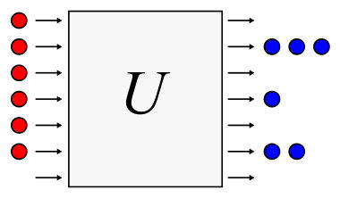 
FIG. 1. (a) Illustration of the basic BosonSampling setup, in which n single photons (red dots) are injected into an m-mode linear-optical circuit U and measured at the output. The blue dots illustrate one possible output occupation pattern, where multiple dots in the same output mode indicate a collision. (b) The same output occupation pattern represented in three different measurement bases. PNR detection records the full occupation vector, threshold measurement records whether each output mode is occupied, and parity measurement records each occupation number modulo 2.

📷 Fig 2

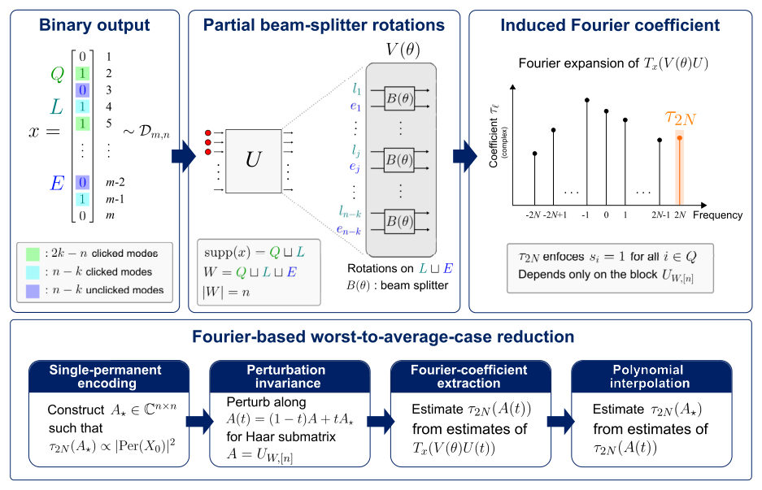 
FIG. 2. Proof overview of Theorem 1. Starting from a sampled threshold outcome x ∼Dm,n with k = |x| clicks, we decompose the clicked set as supp(x) = Q ⊔L, where |Q| = 2k −n and |L| = n −k, and choose an unclicked set E ⊆[m] \ supp(x) with |E| = n −k. Only the modes in L are paired with the unclicked modes in E and rotated by beam splitters B(θ), while the modes in Q are left unrotated. The resulting threshold probability is a Fourier series in θ of degree at most 2N, where N = 2n −2k. Its top Fourier coefficient τ2N filters out all terms except those in which every unrotated clicked mode i ∈Q contains exactly one photon; the remaining photons occupy the clicked modes in L, whose rotated rows...

📷 Fig 3

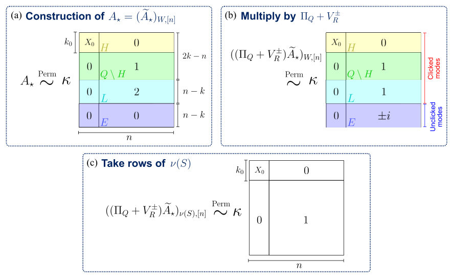 
FIG. 3. Illustration of the matrix constructions used in the proof of Lemma 4. (a) Schematic of the matrix A⋆= ( e A⋆)W,[n] in Eq. (48), constructed from a worst-case matrix X0 ∈{0, 1}k0×k0 with k0 &lt; |Q| = 2k −n by adjoining all-zero blocks, an all-ones block, and an all-twos block, together with a normalization factor κ &gt; 0. The notation Perm ∼ denotes equivalence up to row permutations. The row indices corresponding to H, Q \ H, L, and E are indicated by different colors. (b) Schematic of the matrices ((ΠQ + V ± R ) eA⋆)W,[n] in Eq. (49). (c) Schematic of the matrix ((ΠQ + V ± R ) e A⋆)ν(S),[n] in Eq. (53), obtained by imposing the constraint supp(S) = supp(x) and si = 1 ∀i ∈Q to (b).

📷 Fig 4

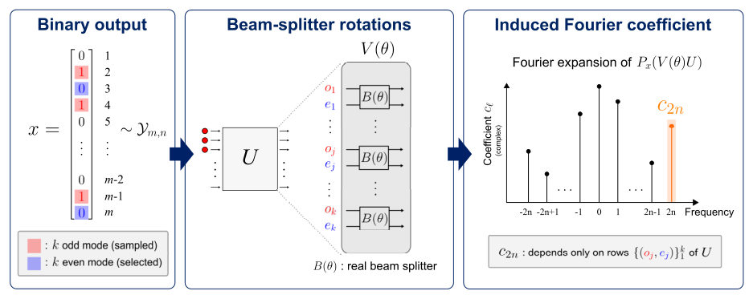 
FIG. 4. Parity-specific Fourier-filtering construction used in the proof of Theorem 2. Starting from a sampled parity outcome x ∼Ym,n with |x| = k odd parities, we choose k even-parity modes and apply paired beam-splitter rotations B(θ) to all odd- even pairs. The resulting probability becomes a Fourier series in θ of degree at most 2n. Its top Fourier coefficient, denoted by c2n, filters out all contributions except those in which all n photons occupy the rotated modes, and therefore depends only on the corresponding 2k × n submatrix UR,[n]. The shared worst-to-average-case reduction procedure is described in Secs. III C and IV.

📷 Fig 5

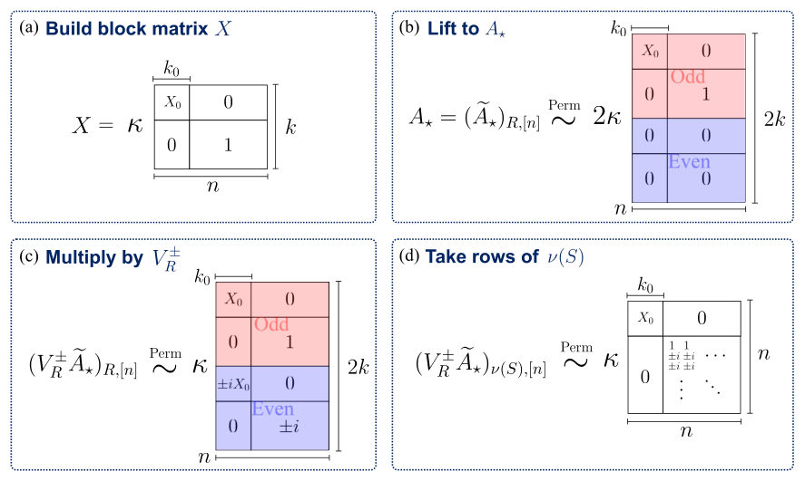 
FIG. 5. Illustration of the matrix constructions in the proof of Lemma 11. (a) Schematic of the block matrix X in Eq. (94), constructed from a worst-case matrix X0 ∈{0, 1}k0×k0 (where k0 &lt; k) by adjoining all-zero blocks and an all-ones block, together with a normalization factor κ &gt; 0. (b) Schematic of the matrix A⋆= ( e A⋆)R,[n] in Eq. (95), obtained by embedding X into the rows indexed by R = O ⊔E and the first n columns of a larger matrix e A⋆. In the figure, the labels “odd” and “even” inside the blocks indicate the rows indexed by O and E, respectively, corresponding to the modes where odd and even parities are measured. The notation Perm ∼ denotes equivalence up to row permutations....

**Summary.** This paper rigorously analyzes the computational complexity of BosonSampling when using simplified, binary measurements like threshold or parity detection, which are more relevant to current experiments than ideal photon-number resolution. The authors prove that estimating the typical output probabilities for these binary measurements remains \#P-hard, demonstrating that the inherent quantum hardness persists even under natural coarse-graining.

**Why it may be interesting.** This work directly addresses the practical limitations of quantum computation models by showing that the hard computational structure of BosonSampling survives natural, experimentally relevant measurement approximations (threshold/parity).

Detailed structure

**Main problem.** Characterizing the computational complexity of BosonSampling when using binary readout measurements (threshold or parity) instead of ideal photon-number-resolving detection.

**Main result.** The average-case estimation of typical output probabilities for both threshold and parity BosonSampling is proven to be \#P-hard in the linear-mode regime.

**Method.** The authors use a Fourier-coefficient extraction method, induced by coherent beam-splitter rotations, to embed a worst-case \#P-hard instance into the coarse-grained output probabilities.

**Model / system.** The system is BosonSampling, involving $n$ indistinguishable photons passing through a random linear-optical circuit ($U$). The analysis focuses on the linear-mode regime where the number of modes scales linearly with the number of photons.

**Key observables.** Threshold measurement probabilities ($T_x(U)$) and Parity measurement probabilities ($P_x(U)$).

**Important parameters / regimes.** The linear-mode regime ($m = \alpha n$ with $\alpha > 2$), and the error bounds $\epsilon$ and $\delta$ for the hardness proof.

**Assumptions / limitations.** The hardness proof relies on establishing average-case hardness for typical outcomes and assumes specific anti-concentration properties for Fourier coefficients (Conjecture 1 and Conjecture 2).

**Figures summary.** Figure 1 illustrates the basic BosonSampling setup, comparing PNR, threshold, and parity measurements on the output occupation pattern.

**Paper structure.** The paper progresses by first defining the hardness problems for TBS and PBS, then developing the core technical tool—the Fourier-coefficient extraction method—to show that the hard structure persists under binary coarse-graining, culminating in separate proofs for the \#P-hardness of ATE and APE.

Abstract

BosonSampling is among the most prominent candidates for demonstrating quantum advantage. However, while the hardness of BosonSampling relies on photon-number-resolving detection, many experimentally relevant settings and applications instead use binary readout based on threshold or parity measurements, whose computational complexity has not yet been rigorously characterized. In this work, we investigate the computational complexity of BosonSampling with threshold and parity measurements in the linear-mode regime, where the number of modes scales linearly with the number of photons and is most relevant to current experiments. In particular, we establish average-case #P-hardness of estimating typical output probabilities in threshold and parity BosonSampling, a crucial ingredient in proving the classical hardness of the corresponding sampling problems. The resulting imprecision bounds match those obtained in prior hardness results for standard photon-number-resolving BosonSampling in the linear-mode regime. The key technical ingredient is a Fourier-coefficient extraction method, induced by coherent beam-splitter rotations, that extracts hidden hard components within coarse-grained output probabilities. These results indicate that the hard output-probability structure of photon-number-resolving BosonSampling can persist under natural binary coarse-grainings, even in collision-dominant regimes.

[↑ back to top](#top)

### [Roton Instability in Quantum Droplets with Finite-Range Soft-Core Interaction](http://arxiv.org/abs/2608.24813v1)

**Authors:** Avra Banerjee  
**Type:** theory · **Category:** quantum gases · **PDF:** <https://arxiv.org/pdf/2608.24813v1>  
**Analysis basis:** full PDF text, analyzed in chunks
**Topic relevance:** `analog quantum simulation` **3/5** · `Keldysh / 2PI / non-Gaussian methods` **1/5**

📷 Fig 1

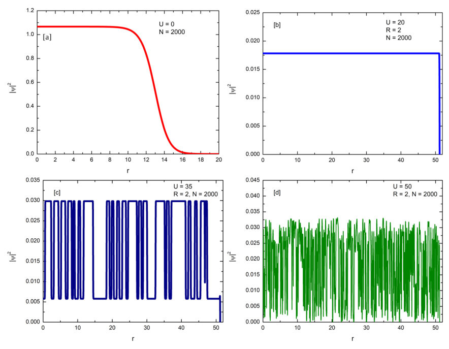 
FIG. 1. Density profile |ψ|2 of a self-bound quantum droplet (obtained by solving equation (3)) under the influence of a nonlocal Heaviside-type interaction with range R = 2 and total particle number N = 2000 for different interaction strengths U. (a) In the absence of nonlocal interaction, the droplet exhibits a characteristic flat-top density profile with a well-defined boundary. (b) For U = 20, the nonlocal interaction spreads the droplet over a larger spatial region while the density remains nearly uniform. The density decreases rapidly but continuously near the droplet surface, giving the appearance of an abrupt edge in the plotted scale. (c) For U = 35, these modulations become...

📷 Fig 2

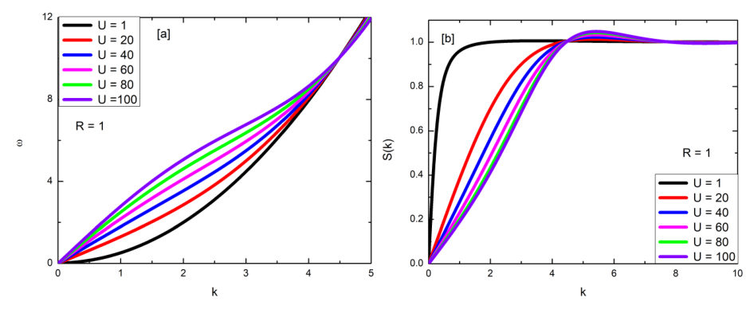 
FIG. 2. Collective excitation spectrum and corresponding static structure factor for a quantum droplet in thermodynamic limit and interaction range R = 1. (a) Excitation spectrum ω(k) for different nonlocal interaction strengths U. The spectrum remains phonon dominated without a prominent roton minimum. The low-momentum dispersion is linear and its slope increases with U, indicating an enhancement of the phonon velocity, while at larger momenta the dispersion approaches the free-particle limit. (b) Corresponding static structure factor S(k). A small peak appears at intermediate momentum and grows slightly with increasing U, reflecting enhanced density correlations, while S(k) →1 at large...

📷 Fig 3

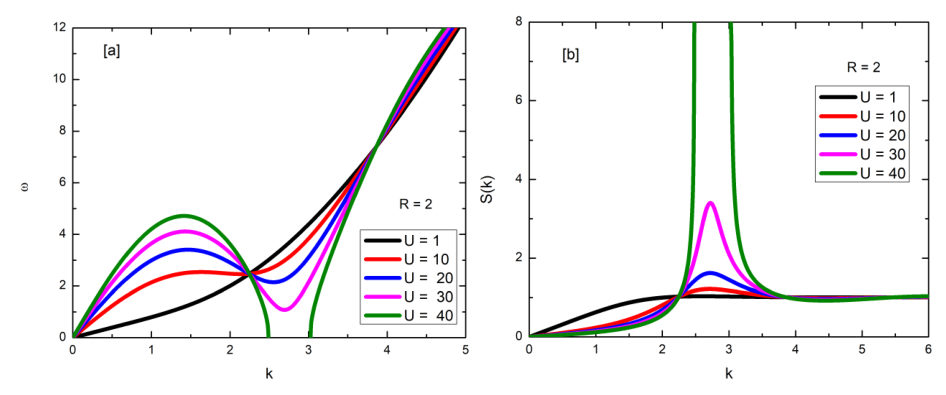 
FIG. 3. Collective excitation spectrum and corresponding static structure factor for interaction range R = 2 in thermodynamic limit . (a) Excitation spectrum ω(k) for different nonlocal interaction strengths U. For weak interaction (U = 1) the spectrum shows linear phononic dispersion at small momentum. With increasing U, a roton-like minimum develops at finite momentum and progressively softens, indicating the approach to roton instability [55, 56]. The slope of the phonon branch also increases, reflecting an enhancement of the phonon velocity. (b) Corresponding static structure factor S(k). A peak emerges and grows at finite momentum with increasing U, signaling enhanced density...

**Summary.** This theoretical study examines how finite-range soft-core interactions affect the stability of quantum droplets. By solving the extended Gross-Pitaevskii equation, the authors find that increasing interaction strength causes the excitation spectrum to develop a roton minimum. This softening signals an instability, which is experimentally verifiable through the growth of density correlations in the static structure factor.

**Why it may be interesting.** This work directly addresses the stability boundaries of quantum matter systems (like Bose-Einstein condensates) when interactions are non-local or have finite range, which is crucial for understanding superfluid behavior in ultracold atomic gases.

Detailed structure

**Main problem.** The paper investigates the emergence of roton instability in self-bound quantum droplets due to the inclusion of finite-range soft-core interactions.

**Main result.** The roton energy softens towards zero as the interaction strength and range increase, signaling a dynamical instability toward density modulation, which is confirmed by peaks in the static structure factor.

**Method.** The study uses theoretical modeling by solving the extended Gross-Pitaevskii equation and analyzing elementary excitations via the Bogoliubov ansatz.

**Model / system.** The system consists of self-bound quantum droplets interacting via a finite-range soft-core potential, modeled by an extended Gross-Pitaevskii equation incorporating Lee-Huang-Yang corrections and a nonlocal interaction term.

**Key observables.** Collective excitation spectrum $\omega(k)$ (looking for roton minimum) and the static structure factor $S(k)$ (looking for pronounced peaks at roton momentum).

**Important parameters / regimes.** Nonlocal interaction strength ($U$) and interaction range ($R$), analyzed in the large-droplet (thermodynamic) limit.

**Assumptions / limitations.** The analysis relies on the Bogoliubov approximation for elementary excitations and assumes bulk properties dominate in the thermodynamic limit.

**Figures summary.** Figures illustrate the density profile transitioning from uniform to modulated/fragmented, and show the excitation spectrum $\omega(k)$ and static structure factor $S(k)$ developing roton features as interaction strength increases.

**Paper structure.** The paper first sets up the extended Gross-Pitaevskii equation incorporating the finite-range interaction. It then analyzes the ground state and collective excitations using the Bogoliubov ansatz, deriving $\omega(k)$ and $S(k)$ to diagnose the onset of roton instability.

Abstract

We investigate the emergence of roton instability in self-bound quantum droplets interacting via a finite-range soft-core potential modeled by a Heaviside step interaction. The ground-state properties are obtained by solving the extended Gross-Pitaevskii equation including Lee-Huang-Yang corrections with a nonlocal interaction term. The collective excitation spectrum reveals the formation and progressive softening of a roton minimum as the interaction strength and range increase. When the roton energy approaches zero, the system becomes unstable, signaling the onset of density modulation. The rotonic behavior is further characterized through the static structure factor, which exhibits pronounced peaks at the roton momentum.

[↑ back to top](#top)

### [Frustration-induced degenerate spin state with up-up-down-down ordering in corner-connected Heisenberg square-plaquettes](http://arxiv.org/abs/2608.24172v1)

**Authors:** Pritam Manna, A. K. Bera  
**Type:** theory · **Category:** strongly correlated electrons · **PDF:** <https://arxiv.org/pdf/2608.24172v1>  
**Analysis basis:** full PDF text, analyzed in chunks
**Topic relevance:** `analog quantum simulation` **3/5**

📷 Fig 1

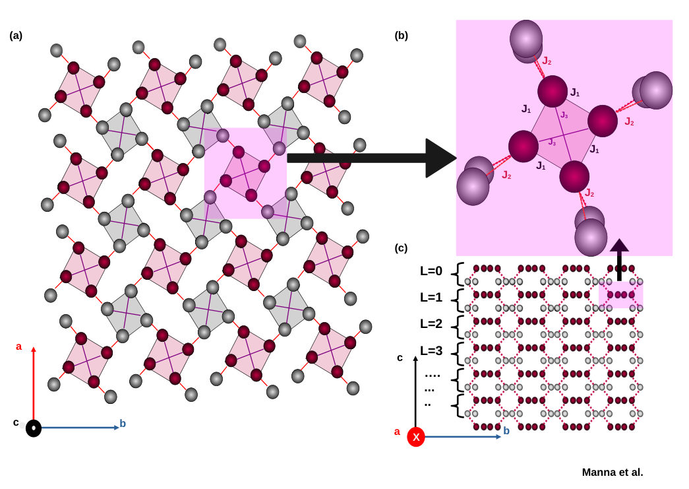 
FIG. 1. (a) Top view of the corner-connected square network, showing the arrangement of square plaquettes in the basal plane. The pink and gray squares are located in the adjacent layers along the c-axis. (b) Top view of the conventional unit cell (highlighted in magenta) indicating exchange paths: nearest-neighbor J1 along plaquette edges, diagonal J3 within each plaquette, and inter-plaquette J2 linking neighboring plaquettes (located on adjacent layers) through the corners. (c) Side view along the c axis, highlighting the three-dimensional stacking and connectivity of the network. For representation purposes, the layers are marked with numbers: L=0,1,2,3,... etc .

📷 Fig 2

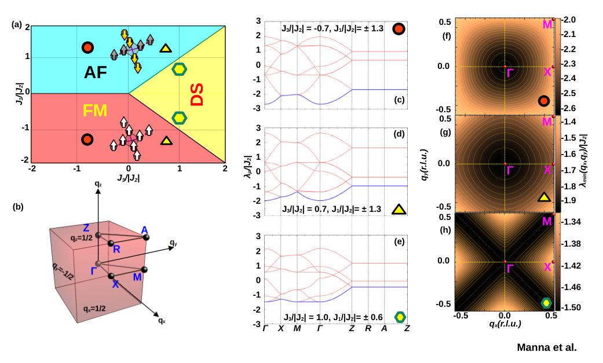 
FIG. 2. (a) Classical ground-state magnetic phase diagram obtained from a Luttinger–Tisza (LT) analysis; Representative parameter points used for the band-structure calculations are indicated on the diagram by symbols: a circle, a triangle, and a hexagon. Circle: J3/|J2| = −0.7, J1/|J2| = ±1.3 , Triangle: J3/|J2| = 0.7, J1/|J2| = ±1.3, Hexagon: J3/|J2| = 1.0, J1/|J2| = ±0.6 (b) High-symmetry path in the first Brillouin zone (of the conventional unit cell) adopted for the interaction- matrix band-structure plots, Γ−X−M−Γ−Z−R−A−Z. (c–e) Eigenvalue dispersions (λµ/|J2|, µ = 1, 2, 3, 4, 5, 6, 7, 8) of the LT interaction matrix J (q) along the path in (b) for the representative points in (a);...

📷 Fig 3

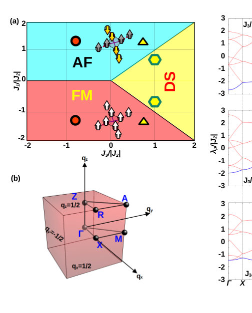 
Fig. 2(a) summarizes the phase topology obtained from λmin(q). (i) An antiferromagnetic (AF) configuration is stabilized in which nearest neighbors within each square plaquette alternate in sign, whereas the corner-connecting

📷 Fig 4

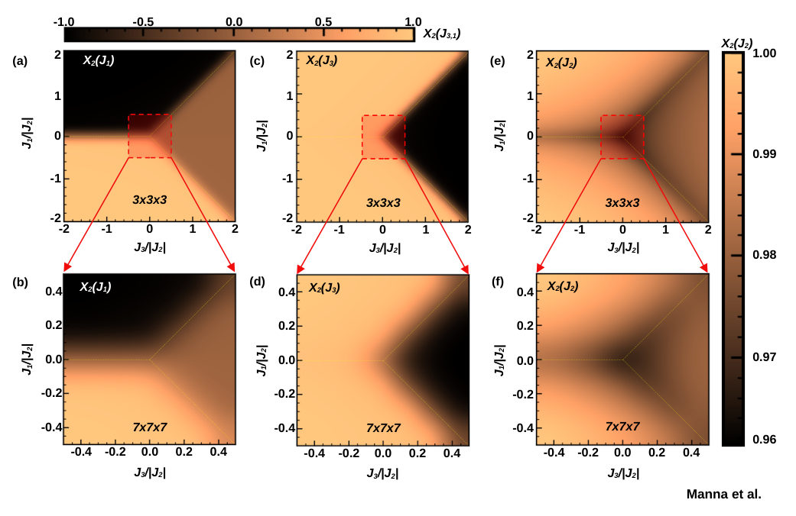 
FIG. 3. Variation of the two-point spin–spin correlation function X2(Ji) (i = 1, 2, 3) across the interaction parameter space obtained from Monte Carlo Simulations. The quantities X2(J1), X2(J2), and X2(J3) denote correlations along the edges of the square units (J1 bonds), along the bonds connecting the corners of adjacent square units (J2 bonds), and along the diagonals of the square units (J3 bonds), respectively. Panels (a), (c), and (e) present the correlation functions X2(J1), X2(J3), and X2(J2), respectively, calculated for a lattice size of 3 × 3 × 3 (216 spin sites) over a large parameter region J1/|J2|, J3/|J2| ∈[−2, 2]. Panels (b), (d), and (f) present the correlation functions...

📷 Fig 5

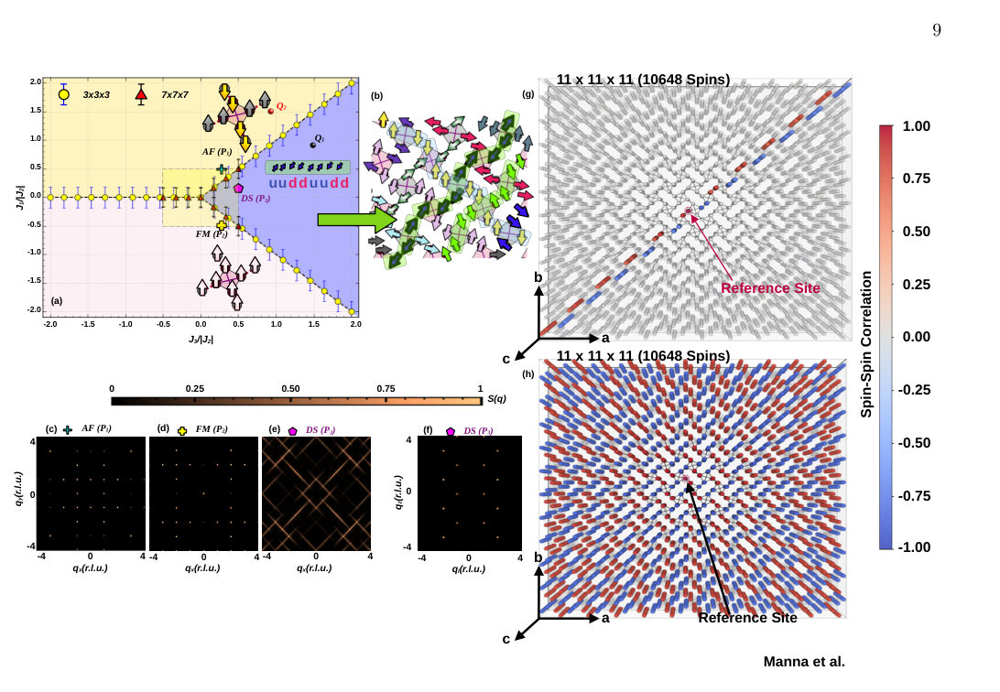 
FIG. 4. (a) Low temperature (T=0.1|J2|) magnetic phase diagram obtained from large-scale Monte Carlo simulations. Circular markers denote the phase-boundary points for the smaller lattice 3 × 3 × 3 (216 spin sites), and triangular markers denote those for the larger lattice 7 × 7 × 7 (2744 spin sites). The light-yellow and red regions indicate the antiferromagnetic (AF) and ferromagnetic (FM) phases, respectively, with representative spin configurations. The blue region corresponds to the DS phase. The three phase boundaries are J1 = −J3 (for J3 &gt; 0), J1 = J3 (for J3 &gt; 0), and J1 = 0 with J3 &lt; 0. Three representative points [P1 (J1/|J2| = 0.5, J3/|J2| = 0.3): AF], [P2 (J1/|J2| = −0.5,...

**Summary.** This paper analyzes frustrated magnetism in a corner-connected square plaquette lattice using a Heisenberg model. By combining Luttinger-Tisza minimization and Monte Carlo simulations, the authors map out a phase diagram revealing three distinct magnetic states. The most notable finding is a degenerate spin state (DS) exhibiting complex, multi-$\mathbf{q}$ ordering, which is further characterized by field-induced layer correlations.

**Why it may be interesting.** The detailed mapping of competing interactions and the emergence of a novel, highly degenerate spin state provides a rich theoretical playground for understanding frustrated magnetism, which is central to correlated electron physics.

Detailed structure

**Main problem.** The study investigates the complex, frustrated magnetic ground states arising from competing exchange interactions in a specific lattice geometry.

**Main result.** The system exhibits three low-temperature phases (AF, FM, and a Degenerate Spin State (DS)), with the DS state characterized by unique quasi-two-dimensional ordering and field-induced layer correlations.

**Method.** The research combines Luttinger-Tisza (LT) minimization for zero-temperature candidates with large-scale Monte Carlo (MC) simulations to map the classical magnetic phase diagram.

**Model / system.** The model is a Heisenberg spin system defined on a corner-connected square plaquette network, featuring three types of exchange couplings: $J_1$ (edges), $J_3$ (diagonals), and $J_2$ (inter-plaquette corners).

**Key observables.** Low-temperature magnetic phase diagram, two-point spin-spin correlation functions, plaquette-adapted staggered magnetization ($M_s$), and the four-spin order parameter ($O_2$).

**Important parameters / regimes.** Normalized ratios of exchange couplings $(J_1/|J_2|, J_3/|J_2|)$ and the external magnetic field ($H$).

**Assumptions / limitations.** The analysis focuses on the classical limit using hard-spin constraints in MC simulations, and the LT method provides zero-temperature lower bounds.

**Figures summary.** Figures illustrate the lattice geometry (plaquettes, unit cell) and show the field-temperature ($H-T$) phase diagram for the DS regime, highlighting the separation between positively and negatively correlated layers.

**Paper structure.** The paper first establishes the physical model and Hamiltonian, then applies LT analysis to find candidate ground states, followed by MC simulations to validate these states, map the phase diagram, and analyze the system's response to external fields.

Abstract

We investigate frustrated magnetism of a corner-connected square plaquette Heisenberg model with exchange interactions along the edges $(J_1)$, along inter-plaquette links $(J_2)$, and along square diagonals $(J_3)$. Using Luttinger--Tisza (LT) minimization of the Fourier interaction matrix $\mathcal J(\mathbf q)$ together with large-scale Monte Carlo (MC) simulations, we obtain a classical low-temperature magnetic phase diagram in the normalized plane $(J_1/|J_2|, J_3/|J_2|)$. The two methods play complementary roles: the LT analysis provides the zero-temperature candidate ordering wave vectors, while the MC simulations elucidate the resulting ordering tendencies under the hard-spin constraint at low but finite temperatures. Three regimes emerge at low temperatures, an antiferromagnetic phase (AF), a ferromagnetic phase (FM) and a degenerate spin state with \textit{up-up-down-down (uudd)} ordering (DS). For the frustrated degenerate spinstate, LT exhibits line-like minima along $q_x=\pm q_y$ in the $hk$-plane, revealing a highly degenerate spin configuration which violates the hard-spin constraint. The MC results uncover a state with quasi-two-dimensional ordering. The DS regime is intrinsically multi-$\mathbf{q}$: the ordered texture assembles itself from symmetry-related modes on the lines, producing a ``\textit{uudd}'' spin arrangement comprising of distinctive strong antiferromagnetic correlations on diagonals, ferromagnetic correlations on corner links, and highly suppressed correlations on the edges. The field-temperature phase diagram for a representative parameter point in the DS regime, determined by MC simulations, yields field induced distinct regions of negatively and positively correlated layers. These two regions are separated by a curve corresponding to negligible inter-layer correlations.

[↑ back to top](#top)

### [Graphix: A software framework for Measurement-Based Quantum Computation](http://arxiv.org/abs/2608.24781v1)

**Authors:** Mateo Uldemolins, Pranav Nair, Emlyn Graham, Shinichi Sunami, Thierry Martinez, Maxime Garnier  
**Type:** theory · **Category:** quantum information and computing · **PDF:** <https://arxiv.org/pdf/2608.24781v1>  
**Analysis basis:** full PDF text, analyzed in chunks
**Topic relevance:** `quantum measurements` **3/5**

📷 Fig 1

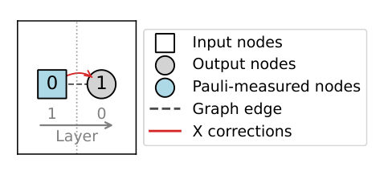 
Figure 1: Measurement-based quantum computation implementing a Hadamard gate. A red arrow from node i to node j indicates a correction Xsi j . The partition of the nodes layers represents the partial order induced by the correction strategy. Nodes are measured from left to right (in this basic example only node 0 is measured, and node 1 is an output node).

📷 Fig 2

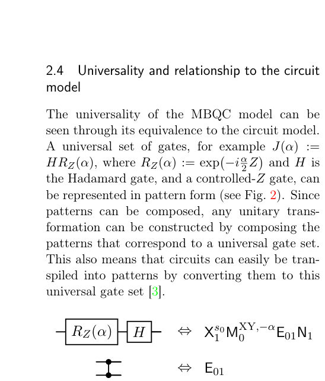 
Figure 2: Equivalence between a universal gate set and MBQC patterns. In the first pattern we have I = {0}, O = {1}, and in the second I = O = {0, 1}.

📷 Fig 3

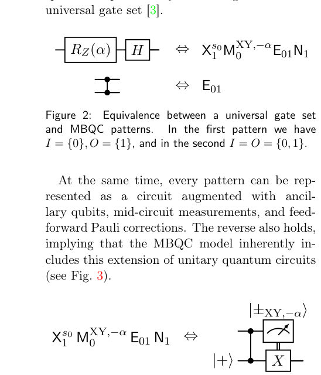 
Figure 3: MBQC patterns in the circuit model with an- cillas, mid-circuit measurements and feed-forward. This pattern implements an H gate if α = 0.

📷 Fig 4

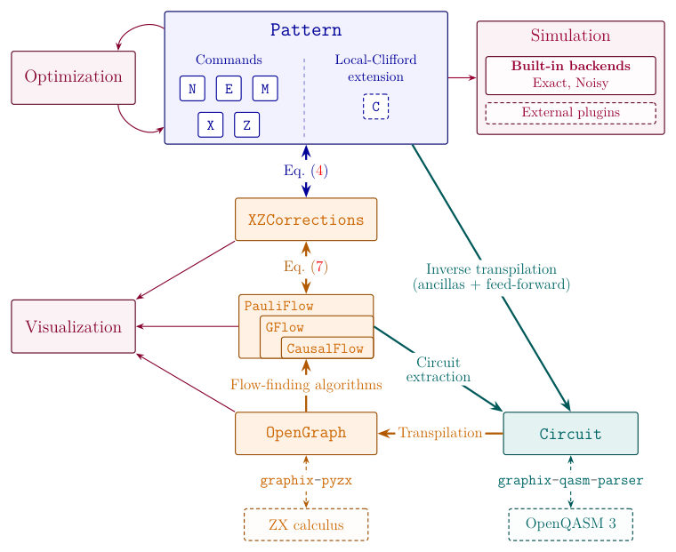 
Figure 4: Illustration of Graphix’ software architecture. Core MBQC objects are centered in blue and yellow, interfaces in red, circuits in green, and external packages with dashed borders.

📷 Fig 5

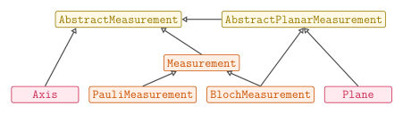 
Figure 5: A class diagram of measurements in Graphix. An arrow from B to A indicates that B is a subtype of A. MBQC objects O (e.g., OpenGraph, PauliFlow) are covariant in the measurement labels, meaning that O[B] is also a subtype of O[A]. Orange and red boxes correspond to classes representing mea- surement configurations with and without information about the angle, respectively. Yellow boxes corre- spond to abstract classes which cannot be directly in- stantiated. AbstractPlanarMeasurement narrows the type AbstractMeasurement allowing to distin- guish between planar (Plane, BlochMeasurement) and Pauli (Axis, PauliMeasurement) measurement configurations.

**Summary.** This paper introduces Graphix, a novel Python software framework designed to standardize and simplify the development of Measurement-Based Quantum Computation (MBQC) protocols. It provides a unified environment that handles the complex interplay between graph states, single-qubit measurements, and Pauli corrections. Graphix aims to accelerate research by offering a comprehensive, extensible infrastructure for the entire MBQC workflow.

**Why it may be interesting.** While focused on computation, the rigorous mathematical treatment of flow reconstruction (Causal, Generalised, Pauli) and the standardization of patterns provides deep insights into the underlying algebraic structure of quantum operations, which is relevant to understanding constraints in complex quantum systems.

Detailed structure

**Main problem.** The field lacks dedicated, unified software tools to bridge the theoretical foundations of Measurement-Based Quantum Computation (MBQC) with practical, extensible research workflows.

**Main result.** The authors introduce Graphix, a comprehensive Python framework that provides a unified, modular environment for developing, simulating, and analyzing MBQC protocols.

**Method.** The framework is built around the measurement calculus, allowing for the native representation of arbitrary MBQC computations, including state preparation, entanglement, measurements, and Pauli corrections.

**Model / system.** The model is Measurement-Based Quantum Computation (MBQC), which utilizes a graph state as a resource and performs computation via single-qubit measurements followed by classical feed-forward Pauli corrections.

**Key observables.** The induced partial order ($\prec$) on measured nodes, and the resulting Pauli corrections ($X_s, Z_s$) applied to the resource state.

**Important parameters / regimes.** The structure of the open graph $\Gamma$, the measurement angles ($\lambda, \alpha$), and the specific Pauli correction strategies ($x, z$).

**Assumptions / limitations.** The core assumption for computation is that the transitive closure of the correction set must define a strict partial order; standardization procedures assume the input pattern is well-formed.

**Figures summary.** Figure 1 illustrates an MBQC computation (Hadamard gate) showing the open graph, measurement maps, and resulting Pauli corrections (red arrows).

**Paper structure.** The paper reviews essential MBQC concepts (Section 2) using Graphix examples, followed by a detailed description of the library architecture and advanced formalisms like flow reconstruction (Sections 3 and beyond).

Abstract

Measurement-based quantum computing (MBQC) is a powerful model for quantum computation, but dedicated software tools that bridge its theoretical foundations with practical research workflows remain limited. We present Graphix, a software framework for MBQC written in Python that provides a unified environment for developing, integrating, and exploring measurement-based protocols and algorithms. Graphix establishes a modular, extensible, and user-friendly architecture for the compilation and simulation of quantum computations in the MBQC model with abstractions closely aligned with the theoretical formulations of MBQC. Through examples drawn from recent research on MBQC, we demonstrate Graphix's ability to reproduce and extend previous results. Graphix thus provides a software infrastructure for MBQC, supporting education and research while enabling collaborative development and accelerating the transition toward practical implementations.

[↑ back to top](#top)

### [Nearly Optimal Amplitude Estimation at any Depth](http://arxiv.org/abs/2608.24434v1)

**Authors:** Jona Erle, Bálint Koczor  
**Type:** theory · **Category:** quantum information and computing · **PDF:** <https://arxiv.org/pdf/2608.24434v1>  
**Analysis basis:** full PDF text, analyzed in chunks
**Topic relevance:** `quantum measurements` **3/5**

📷 Fig 1

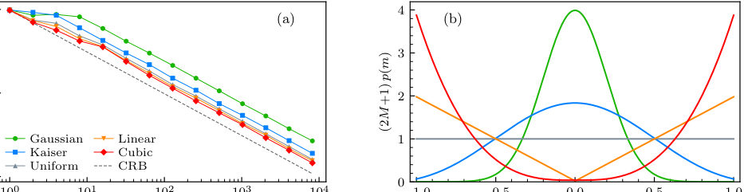 
FIG. 1. WLSAE for five window functions at fixed query budget Q = 106 and fixed λ = 0.5, over 104 independent runs with grid size K = ⌈100 p

📷 Fig 2

 
FIG. 2. Amplitude-uniformity of WLSAE applied to uniform window at fixed query budget Q = 106, over 104 independent runs with grid size K = ⌈100 p

📷 Fig 3

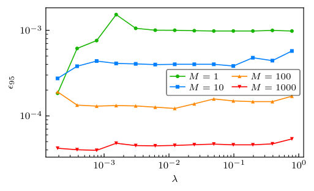 
Figure 2 sweeps λ over three orders of magnitude at fixed query budget Q = 106 using the uniform window. The curves do not degrade at the boundary and there- fore confirm the amplitude-uniformity promised by Theo- rem 1—each simply shifts down by M −1/2 as the depth increases. The dips of the M = 1 and M = 10 curves at small λ arise because the estimate is squeezed against the boundary of the search interval. Since ˆθ ≥0 while λ is close to 0 the error can no longer fluctuate symmetrically around λ, and the 95th percentile shrinks accordingly. In the extreme λ ≲1/(M √

**Summary.** This paper introduces Windowed Least Squares Amplitude Estimation (WLSAE), a quantum algorithm designed to estimate an unknown amplitude with high precision. It achieves a near-optimal query-depth scaling that is remarkably uniform across all possible input amplitudes. This robustness makes it a strong candidate for practical quantum applications like overlap certification in the early fault-tolerant regime.

**Why it may be interesting.** This work provides a significant algorithmic improvement for fundamental quantum estimation tasks, directly impacting the feasibility of quantum simulation and verification protocols that rely on accurate amplitude measurements.

Detailed structure

**Main problem.** The paper addresses the challenge of achieving near-optimal query-depth tradeoffs in Amplitude Estimation (AE) algorithms, particularly ensuring the quantum speedup persists uniformly across the entire range of possible amplitudes.

**Main result.** A novel algorithm, WLSAE, achieves the nearly optimal query-depth tradeoff $M^2N \in \widetilde{O}(\epsilon^{-2})$ uniformly for all amplitudes $a \in [0, 1]$, overcoming limitations of prior methods at the boundaries.

**Method.** The method develops Windowed Least Squares Amplitude Estimation (WLSAE) by sampling Grover circuit depths from a carefully constructed, admissible probability window $p$. The error is bounded using concentration inequalities like Bernstein's inequality.

**Model / system.** The core task is estimating the amplitude $a = \langle\psi| P |\psi
angle$ (or the angle $\lambda = \arcsin(\sqrt{a})$) associated with a unitary evolution $U$ and a projector $P$. The measurement relies on outcomes from circuits involving the Grover operator $G$.

**Key observables.** The primary observable is the estimated amplitude $\hat{a}$ or angle $\hat{	heta}$, with the goal of bounding the additive error $|\hat{	heta} - \lambda| \le \epsilon$.

**Important parameters / regimes.** The key parameters are the target error $\epsilon$, the maximum circuit depth $M$, and the number of shots $N$. The performance is analyzed across the full range of amplitudes $a \in [0, 1]$.

**Assumptions / limitations.** The analysis assumes the existence of an admissible probability window $p$ and relies on bounding the deviation of a loss function derived from quantum measurements using concentration inequalities.

**Figures summary.** Figure 1 compares various window functions (Gaussian, Uniform, etc.) for WLSAE, showing performance relative to the Cramér–Rao bound. Figure 2 confirms the algorithm's amplitude-uniformity by showing constant error bounds across $\lambda \in [0, \pi/2]$ for a fixed query budget.

**Paper structure.** The paper first defines the problem and the WLSAE framework. It then derives rigorous bounds on the estimation error by analyzing the variance of the loss function across the depth window. Finally, it applies these bounds to establish the near-optimal query-depth scaling and demonstrates the method's practical applicability.

Abstract

We develop a class of amplitude estimation algorithms with tunable circuit depth $M$ and circuit repetitions $N$, requiring neither ancilla qubits nor controlled Grover operations. For additive error $ε$ in the Grover angle, they attain the nearly optimal query-depth tradeoff $M^2N\in\widetilde{O}(ε^{-2})$ uniformly over $λ\in[0,π/2]$, spanning the full range from classical sampling at $M=1$ to the Heisenberg limit at $M=Θ(ε^{-1})$. While prior depth-tunable work establishes comparable angle-accuracy guarantees only away from the boundaries $λ\to0$ or $π/2$ or at discrete depth tradeoffs, our guarantee extends to both boundaries, so the quantum speedup persists there rather than degrading to classical sampling. Numerical experiments confirm the predicted uniform angle accuracy and show low overhead in practice, making them strong candidates for practical amplitude estimation in the early fault-tolerant regime, with applications such as overlap certification, trial-state verification, and Monte Carlo methods.

[↑ back to top](#top)

### [Bulk Phase Transition and Edge Behavior in Temporally Correlated Random Matrices](http://arxiv.org/abs/2608.23944v1)

**Authors:** Masato Hisakado, Takuya Kaneko  
**Type:** theory · **Category:** statistical mechanics · **PDF:** <https://arxiv.org/pdf/2608.23944v1>  
**Analysis basis:** full PDF text, analyzed in chunks
**Topic relevance:** `Keldysh / 2PI / non-Gaussian methods` **2/5** · `analog quantum simulation` **2/5** · `driven-dissipative phase transition` **2/5** · `methods for driven-dissipative` **2/5** · `non-equilibrium universality` **2/5**

📷 Fig 1

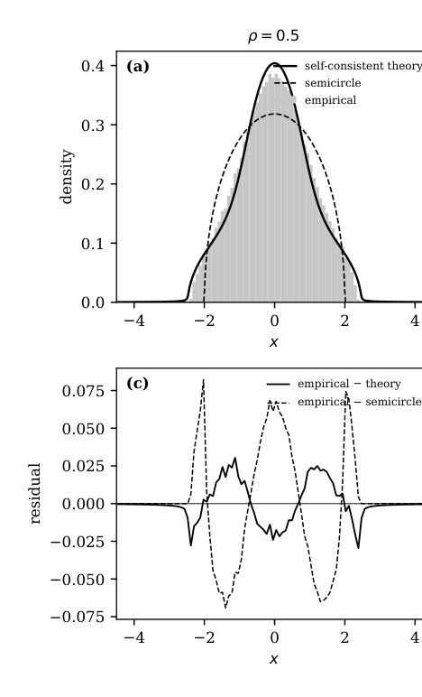 
FIG. 1: (a,b) Bulk spectral density of S at ρ = 0.5 and ρ = 0.8: empirical histogram

📷 Fig 2

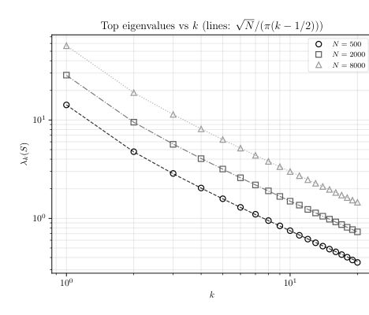 
FIG. 2: Top eigenvalues λk(S) of the noiseless Volterra ensemble S = M/ √

📷 Fig 3

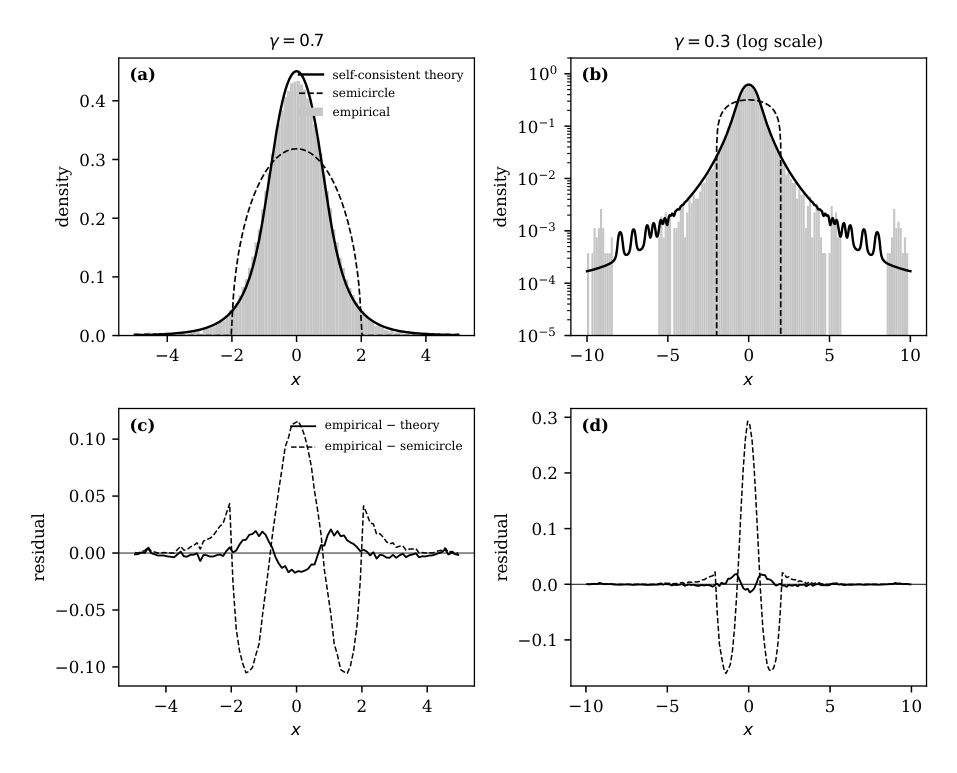 
FIG. 3: (a,b) Bulk spectral density of the power-law ensemble (Definition 2) at γ = 0.7

📷 Fig 4

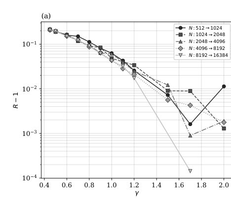 
FIG. 4: Binder-ratio diagnostic R(N, γ) −1, with R(N, γ) = λmax(2N, γ)/λmax(N, γ),

**Summary.** This work analyzes how the spectral properties of random matrices change when the underlying correlations decay slowly (power-law). Using the Matrix-Dyson-Equation framework, the authors derive exact results for the bulk density deformation and pinpoint critical exponents that govern the transition between different spectral regimes.

**Why it may be interesting.** While the focus is on random matrices, the mathematical techniques used to analyze spectral transitions and critical exponents are highly relevant to understanding phase transitions in complex quantum many-body systems, such as those modeled by disordered Hamiltonians or interacting quantum gases.

Detailed structure

**Main problem.** The study investigates the spectral behavior (bulk and edge) of Wigner-type random matrices whose underlying covariance structure exhibits long-range temporal correlations.

**Main result.** The bulk spectral density deforms from the semicircle law in a predictable manner, and the analysis establishes critical exponents ($\gamma_c=1/2$) governing the divergence of bulk moments for power-law correlations.

**Method.** The authors employ advanced techniques involving the Matrix-Dyson-Equation (MDE) framework, moment calculations, and the derivation of a scalar self-consistent equation for the Stieltjes transform.

**Model / system.** The model consists of symmetric $N 	imes N$ Wigner-type random matrices constructed from row-independent stationary Gaussian sequences, allowing for controlled correlation decay via AR(1) or power-law structures.

**Key observables.** Bulk spectral density $\varrho(x)$, the largest eigenvalue $\lambda_{\max}(S)$, and the fourth moment $\mu_4(
ho)$.

**Important parameters / regimes.** The correlation decay parameter $
ho$ (for AR(1)) and the power-law exponent $\gamma$ (for $d	au \sim t^{-\gamma}$), with critical points at $\gamma_c=1/2$ and $\gamma=1$.

**Assumptions / limitations.** The analysis relies on verifying hypotheses (A)-(E) of the MDE framework, though limitations exist for strong correlations ($
ho \gtrsim 0.7$).

**Figures summary.** Figures compare empirical spectral histograms against theoretical predictions (e.g., for $
ho=0.5, 0.8$) and show the collapse of top eigenvalues onto a singular-value cascade for the noiseless Volterra ensemble.

**Paper structure.** The paper progresses by first analyzing the AR(1) case, verifying MDE hypotheses and deriving the self-consistent equation. It then extends the analysis to power-law correlations, rigorously determining critical exponents ($\gamma_c$) and resolving the apparent conflict between smooth crossovers and discrete phase transitions.

Abstract

We study long-range correlated Wigner-type matrices built from row-independent stationary Gaussian sequences. For exponentially decaying (AR(1)) correlations, the bulk spectral density deforms from the semicircle law via an explicit combinatorial "hub" mechanism, yet we verify the flatness and decay hypotheses of the matrix-Dyson-equation framework (MDE), with numerical evidence supporting Tracy-Widom edge universality for every fixed $ρ<1$ of the exponential decay correlations; the degenerate limit $ρ\to1^-$ reduces to a symmetrized Volterra operator, connecting to the singular-value cascade identified in a companion BBP analysis. For power-law correlations $dt\sim t^{-γ}$, we identify $γ_c=1/2$ as the critical point for divergence of the bulk fourth-moment, while $γ=1$ marks the breakdown of the flatness condition governing the MDE edge analysis. We prove the fourth-moment transition exactly and find numerically that the self-consistent edge varies smoothly across $γ=1$, with no evidence of a kink or discontinuity.

[↑ back to top](#top)

### [Entropy Production Bounds the Accuracy of Computation in Markov Networks](http://arxiv.org/abs/2608.23764v1)

**Authors:** Songela W. Chen, David T. Limmer  
**Type:** theory · **Category:** statistical mechanics · **PDF:** <https://arxiv.org/pdf/2608.23764v1>  
**Analysis basis:** full PDF text, analyzed in chunks
**Topic relevance:** `correlated / nonlocal dissipation` **2/5** · `driven-dissipative phase transition` **2/5** · `non-equilibrium universality` **2/5** · `Keldysh / 2PI / non-Gaussian methods` **1/5** · `methods for driven-dissipative` **1/5** · `quantum measurements` **1/5**

📷 Fig 1

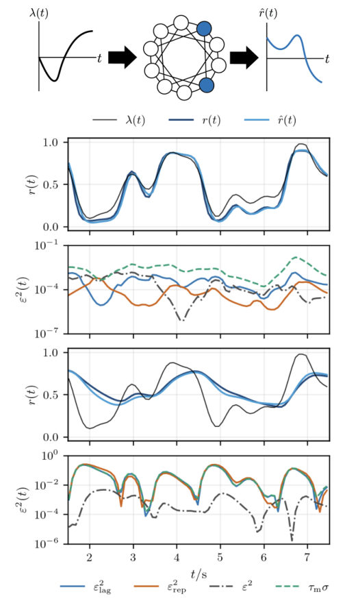 
FIG. 1. Error decomposition for trained reversible Markov networks with N = 10 states. The upper pair of panels shows a memoryless target. The lower pair shows a history- dependent target. In each trajectory panel, black denotes the input, dark blue the target output, and light blue the trained network output. The error panels decompose the squared tracking error into lag error ε2 lag, representation error ε2 rep, to- tal error ε2, and the thermodynamic bound τmσ.

📷 Fig 2

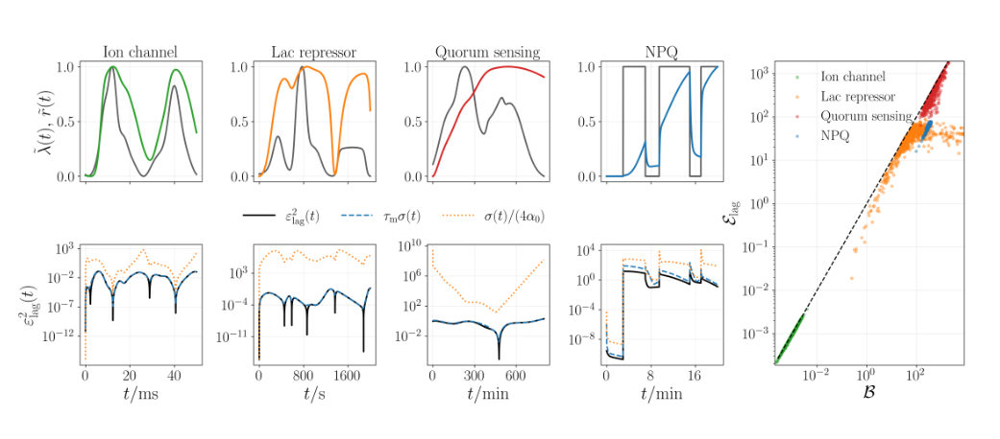 
FIG. 2. Thermodynamic lag-error bounds in four biochemical information-processing models. The first four columns show representative driven trajectories for the lac repressor, ligand-gated channel, quorum-sensing, and nonphotochemical quenching (NPQ) models. In the top row, black curves are normalized inputs ˜λ(t) ∝λ(t) and colored curves are normalized outputs ˜r(t) ∝ˆr(t). In the bottom row, black curves show the instantaneous squared lag error, blue dashed curves show the bound τmσ with quadratic entropy production, and orange dotted curves show the Sobolev bound σ/4α0 with the full entropy production. The rightmost panel compares the integrated lag error with the integrated bound across...

**Summary.** This work derives a fundamental thermodynamic bound showing that the computational error in stochastic networks is limited by the entropy production rate and the system's memory capacity. By applying this to models of biochemical processes, the authors establish a quantitative framework for understanding the energetic costs associated with biological computation. It demonstrates that high accuracy requires either significant energy dissipation or the retention of long-lived memory states.

**Why it may be interesting.** The connection between non-equilibrium thermodynamics (entropy production) and information processing capacity provides a fundamental, quantitative constraint on how efficiently biological systems can compute.

Detailed structure

**Main problem.** The paper establishes a universal thermodynamic bound on the accuracy of computation performed by stochastic networks.

**Main result.** The lag error in computation is bounded by the product of the entropy production rate and a memory time ($\epsilon^2_{	ext{lag}} \le 	au_m \sigma$).

**Method.** The analysis decomposes the total error into representation and lag components, deriving the bound using entropy production rates and relative entropy decay.

**Model / system.** The study uses reversible continuous-time Markov networks to model biological information processing, including systems like ion channels, Lac repressors, and NPQ.

**Key observables.** Computational error ($\epsilon^2$), Entropy Production Rate ($\sigma$), and Memory Time ($	au_m$).

**Important parameters / regimes.** The bound is derived for the near-equilibrium limit, highlighting the trade-off between dissipation and memory storage.

**Assumptions / limitations.** The analysis relies on decomposing the error and using quadratic approximations for entropy production in some models, though the bound itself is shown to be general.

**Figures summary.** Figures compare the integrated lag error against the derived thermodynamic bound across various random input protocols for multiple biochemical models.

**Paper structure.** The paper introduces the error decomposition, derives the core thermodynamic bound ($\epsilon^2_{	ext{lag}} \le 	au_m \sigma$), and then applies this framework to test it across several distinct, complex biological Markov models.

Abstract

Biological and artificial networks compute by transforming time-dependent inputs into functional outputs. Because the internal state of a stochastic network relaxes on finite timescales, its output generally lags behind a changing environment, producing computational errors. We show that for reversible continuous-time Markov networks the error admits a universal thermodynamic bound. Decomposing the total error into representation and lag contributions, we derive an inequality relating the lag error to the entropy production rate and a memory time equal to the integrated equilibrium autocorrelation of the output observable. The bound implies that accurate dynamical computation requires either substantial dissipation or long-lived memory encoded in slowly relaxing modes. We demonstrate these principles in artificial Markov networks and in models of biochemical information processing. Our results establish a thermodynamic limit on information processing in stochastic networks and provide a quantitative framework for understanding the energetic costs of biological computation.

[↑ back to top](#top)

### [The Loss Floor of Denoising Score Matching: Fisher Geometry from Schrödinger Bridges](http://arxiv.org/abs/2608.23916v1)

**Authors:** Avinash Raju, Kai Zhang  
**Type:** theory · **Category:** statistical mechanics · **PDF:** <https://arxiv.org/pdf/2608.23916v1>  
**Analysis basis:** full PDF text, analyzed in chunks
**Topic relevance:** `Keldysh / 2PI / non-Gaussian methods` **2/5** · `analog quantum simulation` **1/5** · `driven-dissipative phase transition` **1/5** · `methods for driven-dissipative` **1/5** · `non-equilibrium universality` **1/5** · `quantum measurements` **1/5**

📷 Fig 1

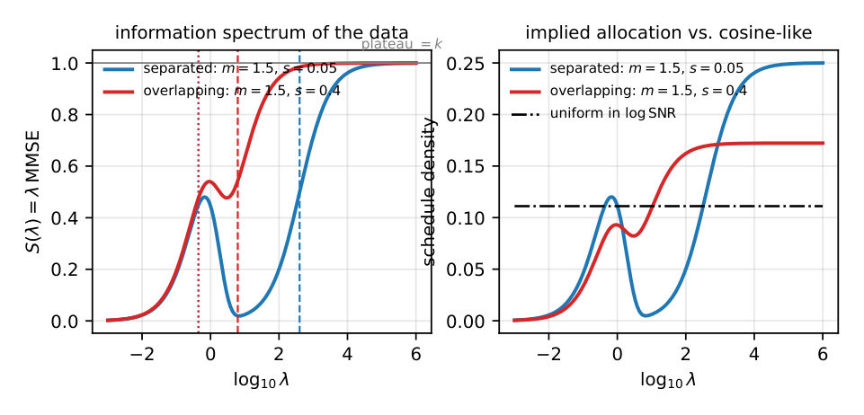 
Figure 1: Data/schedule separation of the loss floor. Left: the information spectrum S(λ) = λ MMSE(λ) for two mixtures. Dotted lines mark the mode-separation scale λ = m−2, dashed lines the within-mode scale λ = s−2; the plateau at large λ is the intrinsic dimension k = 1. Right: the schedule density implied by Eq. (4.8), compared with a uniform-in-logSNR allocation. Uniform allocation is correct only for featureless data.

📷 Fig 2

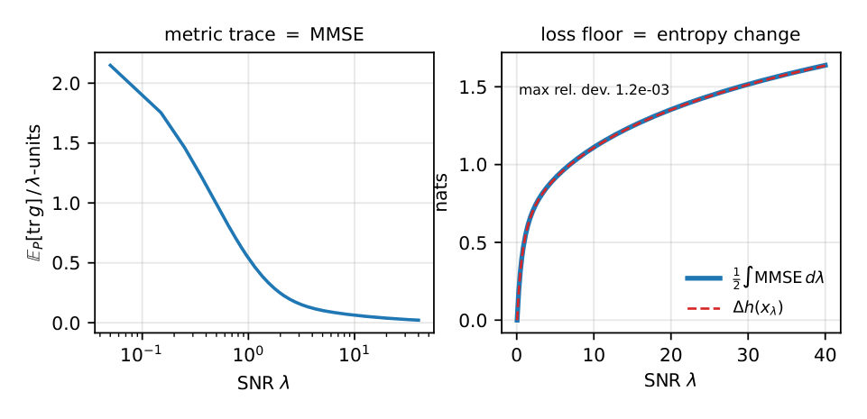 
Figure 2: The loss floor is an entropy. Left: the trace of the latent Fisher–Rao metric, equivalently the MMSE of endpoint estimation, along the flow. Right: the accumulated floor 1

📷 Fig 3

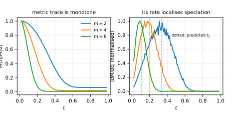 
Figure 4: The metric trace is monotone (left), while its rate localizes the symmetry-breaking transition (right), with dotted lines marking the predicted bimodality threshold.

📷 Fig 4

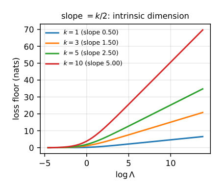 
Figure 3: The floor diverges logarithmically at the data end, with slope k/2 for Gaussian data of rank k in R10.

📷 Fig 5

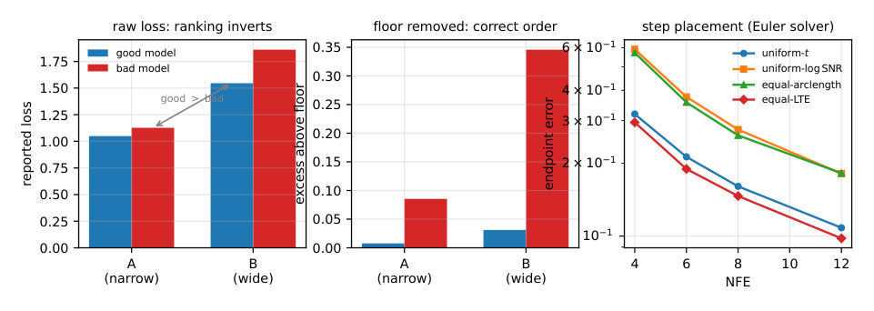 
Figure 5: Consequences of the decomposition. Left: raw training loss for two models of known quality on two SNR ranges; the ranking inverts. Centre: after subtracting the floor, the excess orders the models correctly on both ranges. Right: step placement for a first-order solver on the analytic mixture, mean endpoint error against the exactly integrated probability-flow ODE.

**Summary.** This theoretical paper analyzes the training loss of diffusion models, showing that the irreducible excess loss is mathematically equivalent to the integrated Fisher-Rao metric along the diffusion path. By deriving this from the Schrödinger bridge principle, it provides a deep geometric understanding of how the training objective captures the intrinsic information geometry of the data manifold.

**Why it may be interesting.** While focused on ML, the rigorous connection between information geometry (Fisher metric) and the fundamental path-space structure of stochastic processes is highly relevant to understanding the geometry of quantum state estimation and open quantum system dynamics.

Detailed structure

**Main problem.** The paper quantifies the 'irreducible excess' in the training loss of Denoising Score Matching (DSM) by relating it to the intrinsic geometry of the diffusion process.

**Main result.** This excess loss is exactly equal to the integrated trace of the Fisher–Rao metric of the conditional endpoint family, providing a geometric interpretation of the training objective floor.

**Method.** The derivation utilizes the Schrödinger bridge variational principle and employs information-theoretic tools, specifically relating the loss to the rate of mutual information loss.

**Model / system.** The model is a general diffusion process used in diffusion models, connecting a clean data distribution ($P_0$) to a noisy state ($P_T$) via a corruption kernel.

**Key observables.** Loss Floor, Fisher–Rao metric ($g(x, t)$), Mutual Information $I(y; x_t)$, and the excess action $\Delta S$.

**Important parameters / regimes.** Diffusion time $T$, noise schedule parameters ($\sigma_t, \alpha_t$), and the Signal-to-Noise Ratio (SNR).

**Assumptions / limitations.** Mild regularity assumptions are required for the general corruption kernel, and the analysis contrasts second-order training geometry with third-order sampling errors.

**Figures summary.** Figures demonstrate the agreement between the calculated floor ($rac{1}{2} R 	ext{MMSE} d\lambda$) and the entropy change ($\Delta h$) for Gaussian mixtures, and confirm the scaling of the floor divergence rate with the data rank $k$.

**Paper structure.** The paper builds from the general variational principle (Schrödinger bridge) to derive the geometric characterization of the loss floor via the Fisher metric, and then applies this to specific Gaussian cases to derive closed forms and test identities.

Abstract

Denoising score matching trains diffusion models by regressing onto a conditional score, although generation ultimately requires the marginal score. The two objectives share the same population minimizer, but the conditional target remains random at fixed noisy state and introduces an irreducible excess in the training loss. We isolate this excess and show that, for a general corruption kernel under mild regularity assumptions, it is exactly the trace of the Fisher--Rao metric of the conditional endpoint family, integrated along the diffusion trajectory. This gives an exact conditional-variance decomposition of the denoising objective and identifies the information geometry observed in diffusion latent spaces as an intrinsic component of the training loss. We derive the result from a Schr"odinger bridge variational principle, in which the ideal objective arises as excess path-space relative entropy. For corruption diffusions, the Fisher term is proportional to the rate at which the noisy state loses mutual information about the clean data, separating the loss floor into an information flow determined by the data and a weight determined by the corruption schedule and objective. In the Gaussian case, this yields a closed form for the floor, recovers reparametrization invariance of the continuous-time objective, and relates its high-SNR divergence to the information dimension of the data. Finally, we show that raw losses obtained with different noise ranges or weightings need not rank models consistently because they contain different additive floors, and contrast the second-order geometry seen by training with the third-order conditional statistics entering numerical sampling error.

[↑ back to top](#top)

### [Jamming states in random sequential adsorption of diffusion-limited aggregates](http://arxiv.org/abs/2608.23905v1)

**Authors:** Fahad Puthalath, Dipanjan Mandal, Sumanta Kundu  
**Type:** theory · **Category:** statistical mechanics · **PDF:** <https://arxiv.org/pdf/2608.23905v1>  
**Analysis basis:** full PDF text, analyzed in chunks
**Topic relevance:** `methods for driven-dissipative` **2/5** · `non-equilibrium universality` **2/5** · `analog quantum simulation` **1/5** · `driven-dissipative phase transition` **1/5**

📷 Fig 1

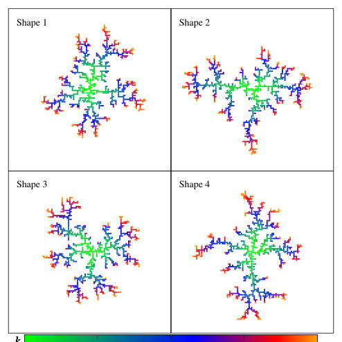 
FIG. 1. Typical DLA clusters on a square lattice at different stages of its growth process up to size k = 1024. Four different panels represent independently generated DLA clusters.

📷 Fig 2

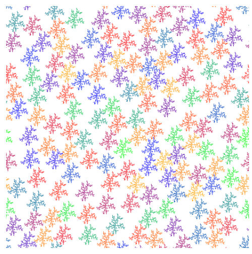 
FIG. 2. Typical jamming configuration for DLA clusters of size k = 1024 in the monodisperse fixed-shape model using shape-1 on a square lattice of size L = 1024 with periodic boundary conditions.

📷 Fig 3

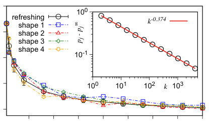 
FIG. 3. Jamming density pj as a function of DLA cluster size k for the four cluster shapes displayed in Fig. 1 in the monodis- perse fixed-shape variant and for the monodisperse refreshing- shape variant. Data are based on lattice size L = 2048 and averaged over 105 configurations for k ⩾32 and at least 104

📷 Fig 4

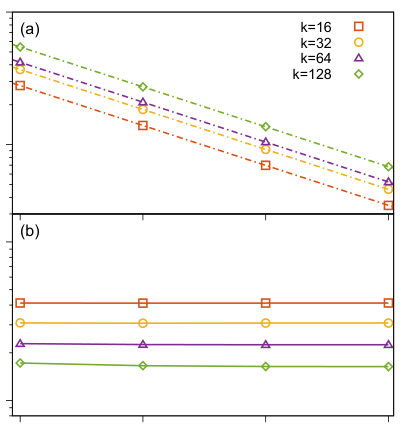 
FIG. 4. Scaling behavior of the fluctuation of jamming den- sity. (a) Log-log plot of the standard deviation σ(L) against system size L for the monodisperse fixed-shape variant. The dotted line shows a power-law fit L−1.0001(5). (b) Correspond- ing results ˜σ(L) for the refreshing-shape variant, showing no apparent dependence on L. Results are obtained by averaging over 105 realizations.

📷 Fig 5

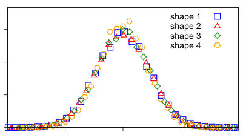 
FIG. 6. For fixed-shape and k = 32, the probability density distribution Pi(pj) data as in Fig. 5(a) shows excellent col- lapse when plotted as a function of (pj −⟨pj⟩).

**Summary.** This paper simulates the random sequential adsorption of DLA clusters on a lattice to study jamming states. It systematically analyzes how varying the diversity of cluster shapes—from fixed to highly polydisperse—affects the final jamming density and its fluctuations. The findings reveal that increased shape diversity leads to denser packing, providing quantitative scaling laws for these non-equilibrium deposition processes.

**Why it may be interesting.** While focused on classical statistical mechanics, the study of jamming transitions and the role of quenched disorder (shape diversity) in determining macroscopic properties has analogies in understanding complex energy landscapes or disordered quantum systems.

Detailed structure

**Main problem.** The study investigates how the diversity of cluster shapes affects the jamming properties when using Diffusion-Limited Aggregation (DLA) clusters for irreversible adsorption.

**Main result.** The jamming density decreases with cluster size as a power-law, and increasing shape polydispersity promotes denser packing. Furthermore, the fluctuation scaling of the jamming density differs significantly depending on whether the cluster shape pool is fixed or refreshed.

**Method.** The research employs large-scale Monte Carlo simulations to model the Random Sequential Adsorption (RSA) process using DLA clusters on a square lattice.

**Model / system.** The system is the irreversible adsorption of DLA clusters on a square lattice, analyzed through several model variants: fixed-shape, refreshing-shape, and polydisperse variants controlled by a pool size $S$.

**Key observables.** Jamming density ($p_j$), the scaling exponent $\alpha$ in $p_j(k) - p_\infty \sim k^{-\alpha}$, and the fluctuation of the jamming density ($\sigma(L)$).

**Important parameters / regimes.** Cluster size ($k$), system size ($L$), and the degree of shape diversity (controlled by $S$).

**Assumptions / limitations.** The analysis relies on the assumption that differences between model variants diminish at very large cluster sizes ($k 	o \infty$) due to the statistical self-similarity of DLA clusters.

**Figures summary.** Figures illustrate representative DLA clusters showing shape diversity and show the scaling behavior of the jamming density and its fluctuations ($\sigma(L)$) for different model variants.

**Paper structure.** The paper systematically compares results from multiple model variants (fixed vs. refreshing vs. polydisperse) to quantify the role of shape diversity on the jamming density and its fluctuations, establishing scaling laws for both observables.

Abstract

Motivated by the ubiquity of ramified fractal deposits in nature and engineered systems, we investigate the irreversible adsorption of diffusion-limited aggregation (DLA) clusters on a square lattice. We study the role of cluster shape diversity on jamming properties of the system by systematically controlling the number of distinct shapes used across and within realizations, encompassing both monodisperse and polydisperse model variants. Our large-scale simulations over a broad range of cluster sizes $2\leqslant k\leqslant4096$ show that the jamming density decreases with cluster size as a power-law $p_j(k)-p_j^\infty\sim k^{-α}$. Both $α$ and $p_j^\infty$ are found to depend on the degree of shape diversity, with $α$ ranging from $0.374(2)$ to $0.417(1)$. It is observed that increasing shape polydispersity promotes denser packing. Importantly, the fluctuations of the jamming density exhibit distinct scaling behavior: $σ(L)\sim1/L$ for a fixed pool of cluster shape(s), but remain $L$-independent when the pool of shape(s) is refreshed across different realizations. Furthermore, our results demonstrate that the differences between the model variants systematically diminish with increasing $k$ and are expected to vanish as $k\to\infty$ due to the statistical self-similarity of the DLA clusters.

[↑ back to top](#top)

### [Time-Dependent Tunneling in the Thin-Barrier Limit](http://arxiv.org/abs/2608.24032v1)

**Authors:** Tanmay Vachaspati, Frank Wilczek, Zara Yu  
**Type:** theory · **Category:** other · **PDF:** <https://arxiv.org/pdf/2608.24032v1>  
**Analysis basis:** full PDF text, analyzed in chunks
**Topic relevance:** `Keldysh / 2PI / non-Gaussian methods` **2/5** · `methods for driven-dissipative` **2/5** · `analog quantum simulation` **1/5** · `quantum measurements` **1/5**

📷 Fig 1

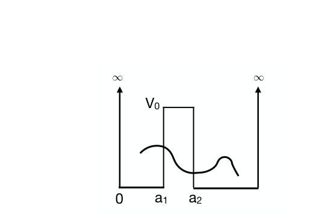 
FIG. 1: A finite barrier of height V0 and width d = a2 −a1 and an illustration of part of a wavefunction.

📷 Fig 2

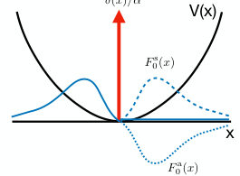 
FIG. 3: Lowest energy wavefunctions for α = 0.

📷 Fig 3

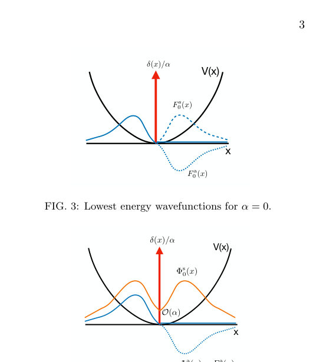 
FIG. 4: Lowest energy wavefunctions for small but non-zero α.

📷 Fig 4

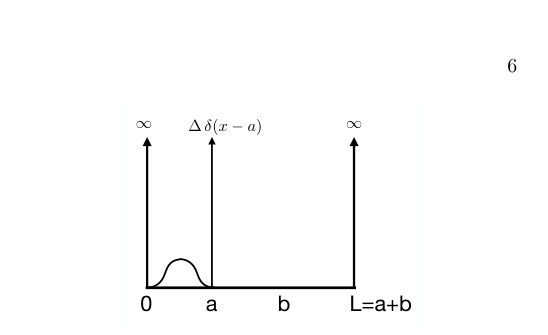 
FIG. 6: Illustration of the asymmetric double square well potential.

📷 Fig 5

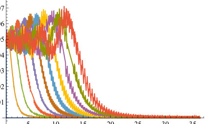 
FIG. 7: Snapshots of |Ψ(j) R |2 calculated from (74) for j = 1 with µ = 1, a = 1, b = 25 √

**Summary.** This paper develops a perturbative theory for quantum tunneling in the thin-barrier limit, moving beyond the standard WKB approximation. It derives that the time-dependent tunneling probability depends critically on system symmetry, predicting quadratic growth for resonant cases and linear growth otherwise. This work provides essential theoretical tools for modeling energy leakage and coherent dynamics in engineered quantum barriers.

**Why it may be interesting.** The detailed analysis of time-dependent tunneling rates, especially the distinction between $t^2$ and linear growth, provides crucial theoretical benchmarks for understanding coherent energy transfer in engineered quantum systems like optical lattices or mesoscopic structures.

Detailed structure

**Main problem.** The paper analyzes quantum tunneling when the tunneling action is small, specifically in the thin-barrier limit, contrasting with standard WKB methods.

**Main result.** The tunneling probability exhibits distinct time dependencies depending on the system's symmetry: quadratic growth ($\propto t^2$) in resonant/symmetric cases and linear growth in non-resonant/asymmetric cases.

**Method.** The analysis employs a perturbative expansion in the barrier strength ($\alpha$) and utilizes time-dependent Schrödinger equation solutions, often involving Green's functions or eigenbasis expansions.

**Model / system.** The system models a quantum particle tunneling through a potential barrier, which is idealized as a delta function barrier ($\alpha^{-1}\delta(x)$) in the thin-barrier limit. The Hamiltonian is solved using time-dependent methods.

**Key observables.** Tunneling probability ($P_R(t)$) and the time-dependent tunneling wavefunction $\psi(t, x>a)$.

**Important parameters / regimes.** The barrier strength $\alpha$ (control parameter), and the energy mismatch $\Delta E(a)^0 = E_a^0 - E_s^0$ which dictates the early-time rate.

**Assumptions / limitations.** The analysis relies on perturbative approximations in $\alpha$ and uses specific limits (e.g., early-time approximations, quadratic order in $\alpha$) to simplify the complex time evolution.

**Figures summary.** Figures illustrate the potential barriers (finite vs. delta function) and show the lowest energy wavefunctions for both zero and small non-zero barrier strengths.

**Paper structure.** The paper develops the theory by first establishing the thin-barrier limit equivalence, then solving the $\alpha=0$ case, and finally introducing the barrier strength perturbatively to derive the time-dependent tunneling probability in various regimes.

Abstract

The usual WKB analysis for quantum tunneling applies when the tunneling action is large, as it is for tall, wide potential barriers. In contrast we analyze tunneling when the action is small, as it is for tunneling across a tall, thin barrier. We develop a perturbative analysis where the control parameter is the inverse of the area under the potential barrier and apply our technique to several examples in $1+1$ dimensions. In resonant situations for bound particles we find that the tunneling probability grows with time as $\propto t^2$, while in non-resonant situations it grows linearly with time. We evaluate not only the tunneling probability but also the time-dependent tunneling wavefunction for a particle that escapes to infinity, {\it i.e.} from a quasi-bound state to the continuum.

[↑ back to top](#top)

### [Disorder-induced conducting edges on Kagomé lattice](http://arxiv.org/abs/2608.24472v1)

**Authors:** A. Chmeruk, D. Jones, L. Chioncel  
**Type:** theory · **Category:** disordered systems and neural networks · **PDF:** <https://arxiv.org/pdf/2608.24472v1>  
**Analysis basis:** full PDF text, analyzed in chunks
**Topic relevance:** `Keldysh / 2PI / non-Gaussian methods` **2/5** · `methods for driven-dissipative` **2/5** · `analog quantum simulation` **1/5**

📷 Fig 1

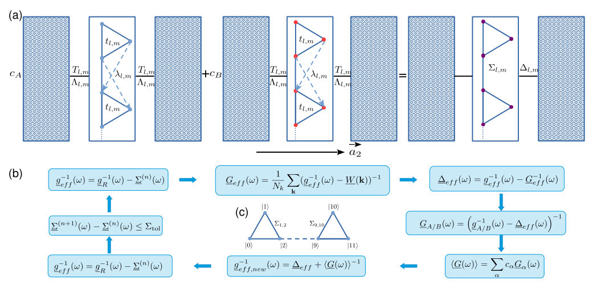 
FIG. 1: (a) Schematic representation of the Kagome-lattice tiling with Nc = 6 (the stripe here contains 6 sites) periodized along a2 direction. The solid lines represent intra-cluster NN hopping parameters ti,j and the NNN λi,j complex SOC couplings are depicted with dashed lines. The black line between the clusters depict inter-cluster couplings (Tij, Λij). (b) Flow diagram of the computational self-consistent embedding scheme Eq. (6) →(c) Enumeration of the basis sites inside the cluster and the corresponding off-diagonal components of the self-energy (12)

📷 Fig 2

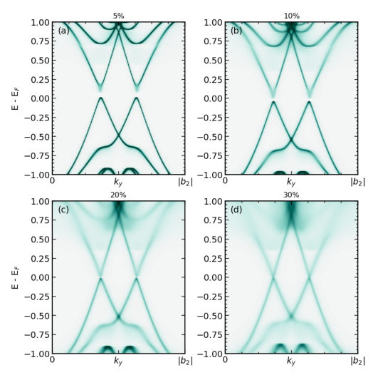 
FIG. 2: The Bloch spectral function with δ = 0.6 with varying concentrations up to 30% of B-type clusters. The gap closes at around 20 % . The smearing is η = 10−4

📷 Fig 3

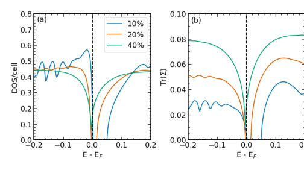 
FIG. 3: The evolution of the total DOS with concentration at δ = 0.5 reveals the gap closure at the concentration of 40%.

📷 Fig 4

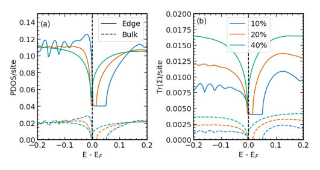 
FIG. 4: The evolution of the PDOS with concentration at δ = 0.5. To highlight the gap a different offsets for edge-PDOS (0.04) and Σ (0.004) are introduced

📷 Fig 5

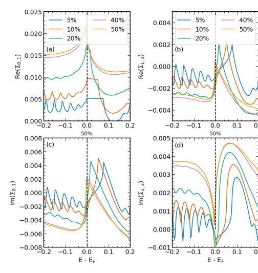 
FIG. 5: Off-diagonal components of the cluster self-energies for δ = 0.5 near the edge.

**Summary.** This theoretical work analyzes the effect of quenched disorder on the electronic structure of the Kagomé lattice using the cluster CPA. The key finding is that disorder-induced renormalization of hopping terms can drive the system into a gapless phase featuring conducting edge modes. This suggests that disorder can qualitatively modify the electronic spectrum in a manner reminiscent of topological phase transitions.

**Why it may be interesting.** The work uses advanced many-body techniques (CPA) to study how quenched disorder can induce emergent, quasi-topological features (conducting edges) in a lattice model, which is highly relevant to understanding disorder effects in quantum materials.

Detailed structure

**Main problem.** The study investigates how disorder can induce conducting edge states on the Kagomé lattice, potentially mimicking or modifying topological behavior.

**Main result.** Disorder averaging generates a non-local self-energy that drives the system through a gapless phase characterized by conducting edge modes over a broad range of impurity concentrations.

**Method.** The authors employ a cluster extension of the Coherent Potential Approximation (CPA) within a locator-interactor formalism to calculate disorder averages.

**Model / system.** The physical system is the Kagomé lattice, analyzed in a strip geometry. The model starts with a non-interacting Hamiltonian including nearest-neighbor and next-nearest-neighbor couplings, and disorder is introduced via random on-site energies (binary mixture).

**Key observables.** Spectral function, Total Density of States (DOS), Partial Density of States (PDOS) for bulk and edge contributions, and the disorder self-energy ($\Sigma$).

**Important parameters / regimes.** Impurity concentration (disorder strength $\delta$), and the ratio of disorder effects versus intrinsic Spin-Orbit Coupling (SOC) strength.

**Assumptions / limitations.** The analysis relies on the cluster CPA approximation, which treats fluctuations up to the cluster size, and the disorder is restricted to a binary mixture distribution.

**Figures summary.** Figures compare the spectral gap closure under disorder versus SOC. They show that the edge contribution to the PDOS is consistently larger than the bulk, and the spectral evolution due to disorder is qualitatively similar to SOC-driven changes.

**Paper structure.** The paper builds by first establishing the Hamiltonian and the CPA framework. It then calculates the spectral properties (DOS, PDOS) as a function of disorder strength, comparing these results to known SOC-driven topological transitions to analyze the origin of the gapless edge modes.

Abstract

Within a cluster extension of the coherent potential approximation, disorder averaging generates a non-local self-energy that renormalizes both diagonal and off-diagonal hopping terms of the non-interacting Kagome-lattice Hamiltonian. These renormalizations (of both nearest- and next-nearest-neighbor hopping amplitudes) drive the system between two topologically trivial insulating states through an intermediate gapless phase characterized by conducting edge modes over a broad range of impurity concentrations. Our results demonstrate that multiple-scattering effects alone can generate emergent effective spin-orbit interactions and qualitatively modify the edge spectrum of disordered Kagome systems.

[↑ back to top](#top)

### [A Dynamic-Kernel/QPacket Executable for Quantum Repeater Chains in Q2NS/ns-3](http://arxiv.org/abs/2608.24152v1)

**Authors:** Adam Pearson, Marcello Caleffi, Angela Sara Cacciapuoti  
**Type:** both · **Category:** quantum information and computing · **PDF:** <https://arxiv.org/pdf/2608.24152v1>  
**Analysis basis:** full PDF text, analyzed in chunks
**Topic relevance:** `methods for driven-dissipative` **2/5** · `quantum measurements` **2/5**

📷 Fig 1

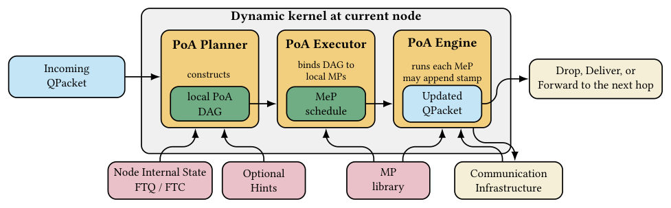 
Figure 1: Dynamic-Kernel pipeline triggered by an incoming QPacket. The Planner constructs a local PoA from the QPacket meta-header and node-local state. The Executor schedules feasible actions and binds them to MPs/MePs. The Engine runs these MPs/MePs and appends stamps only at action-commit boundaries before forwarding, delivering, or dropping the QPacket.

📷 Fig 2

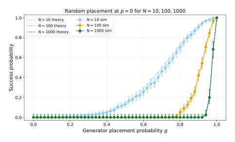 
Figure 2: Success probability of random generator placement with probability 𝑔without pre-distributed entanglement. Markers show Q2NS simulation results with 95% binomial confidence intervals; dashed curves show the analytical prob- ability that no two adjacent nodes both lack MPGEN.

📷 Fig 3

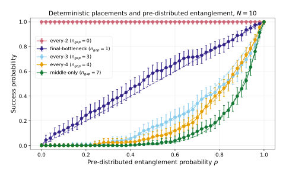 
Figure 3: Success probability for deterministic generator- capability placements as a function of the pre-distributed entanglement probability 𝑝for 𝑁= 10. Markers show Q2NS simulation results with 95% binomial confidence intervals, while dashed curves show the analytical probability 𝑝𝑛gen-unres.

📷 Fig 4

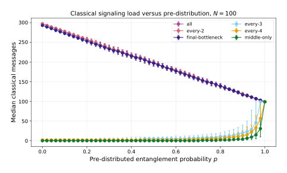 
Figure 4: Classical signaling load versus pre-distributed en- tanglement probability for 𝑁= 100. Increasing 𝑝reduces LINK_PREP associated signaling, but can enable further pro- gression before failure for unresolvable link placements.

📷 Fig 5

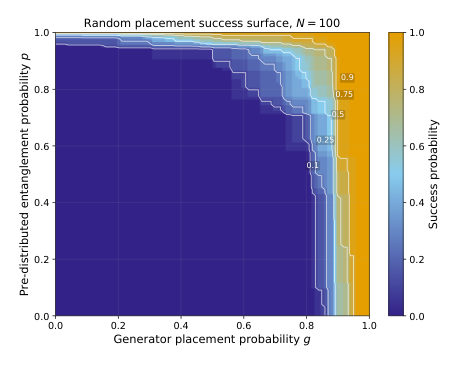 
Figure 5: Success probability under random generator place- ment with probability 𝑔and pre-distributed entanglement with probability 𝑝for 𝑁= 100. For each pair (𝑔, 𝑝), the color indicates the empirical success probability. Contours inter- polate samples at iso-success levels 0.1, 0.25, 0.5, 0.75, and 0.9.

**Summary.** This work presents an executable simulation framework for quantum repeater chains, using a novel Dynamic-Kernel/QPacket logic built on Q2NS/ns-3. It rigorously tests how entanglement distribution protocols behave under varying resource constraints, showing that overhead is dictated by complex policy interactions rather than just physical size. The study validates the platform's ability to support reproducible, policy-specific evaluation of quantum network concepts.

**Why it may be interesting.** While focused on networking, the concept of stateful, resource-constrained, and policy-driven local computation (the Dynamic Kernel) mirrors complex control mechanisms found in open quantum systems modeling, where local state updates dictate global evolution.

Detailed structure

**Main problem.** The paper addresses the challenge of designing and simulating quantum network protocols, specifically entanglement distribution over repeater chains, which requires logic beyond classical layering.

**Main result.** The study demonstrates that the overhead and cost of quantum packet forwarding are shaped not just by encoding, but critically by the policy choices and the availability of network resources.

**Method.** The authors implemented a specialized executable logic, the Dynamic-Kernel/QPacket, within the Q2NS/ns-3 simulation framework to model node-local decision-making pipelines.

**Model / system.** The system models a linear quantum repeater chain where entanglement is the primary resource. The core mechanism involves a Dynamic Kernel executing a Planner-Executor-Engine pipeline upon receiving a QPacket.

**Key observables.** Signaling load, QPacket meta-header growth, link-resolvability success probability, and accumulated forwarding delay.

**Important parameters / regimes.** Pre-distributed entanglement probability (p), generator placement probability (g), and chain length (N).

**Assumptions / limitations.** The implementation is deliberately scoped to a linear chain topology, and the Dynamic Kernel processing time is assumed instantaneous to isolate forwarding effects.

**Figures summary.** Figures illustrate the Dynamic-Kernel pipeline, show the linear growth of QPacket size with chain length, and plot classical signaling load and success probability as functions of pre-distributed entanglement probability.

**Paper structure.** The paper introduces the need for beyond-layering protocols, details the QPacket/Dynamic-Kernel mechanism (Planner-Executor-Engine), and then presents simulations analyzing how varying resource availability (p, g) affects performance metrics like success probability and signaling load.

Abstract

The Quantum Internet operates on entanglement, a non-local, non-copyable, stateful network resource, which motivates protocol organization beyond classical layering. We present a first executable specialization of the Dynamic Kernel/QPacket logic from the beyond-layering protocol suite, targeting entanglement distribution over a linear quantum repeater chain. The implementation builds on Q2NS, an ns-3-based quantum-network simulation module available through the ns-3 App Store. It realizes QPacket meta-headers with service intent and append-only action-commit stamps processed by node-local Dynamic Kernels organized as a Planner--Executor--Engine pipeline, while being deliberately scoped to an analytically verifiable service and policy. Within this scoped setting, we study node heterogeneity through a link-preparation policy that accounts for pre-distributed entanglement and uneven entanglement-generation support across nodes, including delegation via QPacket forwarding. Simulations verify analytical link-resolvability models and expose signaling load, forwarding behavior, and QPacket meta-header growth. Results show that QPacket overhead is shaped by more than just encoding, including policy choices and available network resources. Overall, this study demonstrates how the Q2NS/ns-3 substrate can support reproducible, policy-specific evaluation of quantum-native protocol-suite concepts.

[↑ back to top](#top)

### [Boundary Free Energies, Quenched Mixing, and Gibbs-State Selection in Disordered Ising Models](http://arxiv.org/abs/2608.24261v1)

**Authors:** Mauris Chueng, Hexiang Wang, Keheng Zhu  
**Type:** theory · **Category:** disordered systems and neural networks · **PDF:** <https://arxiv.org/pdf/2608.24261v1>  
**Analysis basis:** full PDF text, analyzed in chunks
**Topic relevance:** `analog quantum simulation` **2/5** · `Keldysh / 2PI / non-Gaussian methods` **1/5**

📷 Fig 1

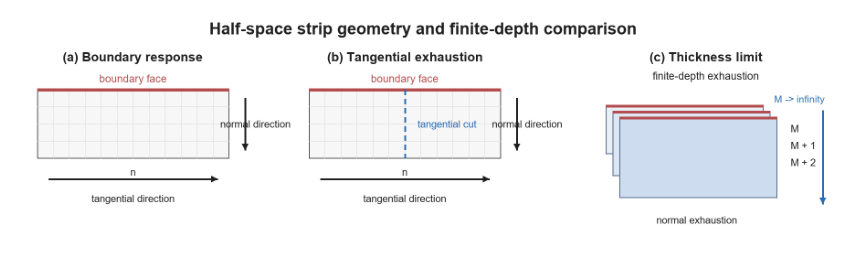 
Figure 1: Slab geometry. Panel (a) marks the boundary bonds of amplitude r; panel (b) shows a tangential cut used in almost-additivity; panel (c) shows the normal exhaustion, with the graphic depth M playing the role of the textual depth L. All other finite-volume faces are free.

📷 Fig 2

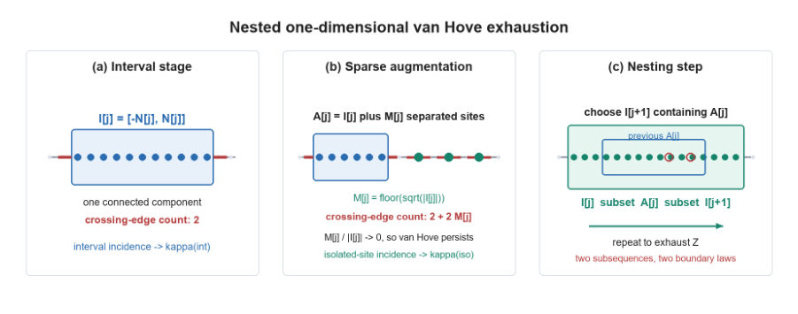 
Figure 2: The nested one-dimensional exhaustion in Theorem 9.2. An interval Ij has two crossing edges. The augmented set Aj adds Mj = ⌊ p

**Summary.** This work provides a rigorous mathematical analysis of disordered Ising models, focusing on how boundary conditions and disorder affect the system's free energy. The authors establish key convergence theorems for boundary free energies and prove conditions under which the system's thermodynamic state is uniquely determined (Gibbs-state selection). It advances the mathematical understanding of disordered critical phenomena.

**Why it may be interesting.** While focused on classical statistical mechanics, the rigorous mathematical techniques used—especially those involving localization, convergence of random fields, and controlling fluctuations in disordered systems—are highly relevant to understanding quantum phase transitions and quantum disordered systems.

Detailed structure

**Main problem.** The paper investigates the mathematical properties of boundary free energies, quenched mixing, and the selection of the correct Gibbs state in disordered Ising models.

**Main result.** Key results include proving the existence of fixed-depth tangential pressure and establishing Gibbs-state selection independence under specific mixing conditions.

**Method.** The analysis employs advanced techniques from statistical mechanics, including concentration inequalities, derivative representations derived from concavity, and stochastic localization arguments.

**Model / system.** The study focuses on nearest-neighbor disordered Ising models, characterized by random couplings ($J$) and analyzed on finite volumes that are extrapolated to infinite limits (e.g., half-spaces or infinite strips).

**Key observables.** Boundary free energies ($\Delta F$), tangential pressure ($p_L(r)$), boundary-response mixing (BRM), and seam-flip differences ($D_n$).

**Important parameters / regimes.** Inverse temperature ($eta$), dimension ($d \ge 2$), and the mixing condition $(2d-1)\mathbb E	anh(eta|J|) < 1$.

**Assumptions / limitations.** The analysis relies on assumptions regarding the geometry (regularity), the existence of certain mixing conditions (e.g., quenched exponential boundary-response mixing), and the ability to control fluctuations via concentration bounds.

**Figures summary.** Figure 1 illustrates the geometry of the slab, marking boundary bonds and different types of cuts (tangential, normal). Figure 2 shows the nested one-dimensional exhaustion used in convergence proofs.

**Paper structure.** The paper develops results by analyzing finite-volume identities, establishing the existence and properties of the tangential pressure limit, proving convergence results under mixing conditions, and concluding with discussions on necessary localization bounds and open problems.

Abstract

We study boundary free energies and half-space responses in nearest-neighbor disordered Ising models. First, we prove the existence of fixed-depth tangential pressure and identify its derivative almost everywhere with the limiting boundary response. Second, under quenched exponential boundary-response mixing, we prove Gibbs-state selection independence and exponential convergence of finite-depth pressures. We further show that uniform one-spin mixing yields DLR uniqueness and Gaussian normal localization, and verify the required mixing conditions whenever $(2d-1)\mathbb E\tanh(β\vert{}J\vert{})<1$. Finally, we establish an all-face surface limit in the bounded Dobrushin regime and provide counterexamples that delimit general surface and stiffness claims.

[↑ back to top](#top)

### [Influence of the inter-orbital interaction and kinetic terms on superconductivity: a simple two-orbital Hubbard model](http://arxiv.org/abs/2608.24337v1)

**Authors:** Vito Marino, Diego Florez-Ablan, Luca F. Tocchio, Massimo Capone, Federico Becca  
**Type:** theory · **Category:** strongly correlated electrons · **PDF:** <https://arxiv.org/pdf/2608.24337v1>  
**Analysis basis:** full PDF text, analyzed in chunks
**Topic relevance:** `analog quantum simulation` **2/5** · `Keldysh / 2PI / non-Gaussian methods` **1/5**

📷 Fig 1

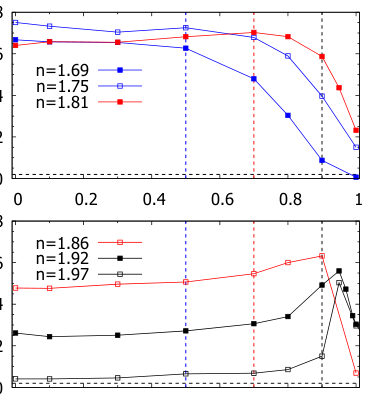 
FIG. 1. Superconducting order parameter of Eq. (19) for α = β (e.g., for intra-orbital singlets) and different elec- tron densities between n = 1.69 and n = 2. The horizontal dashed line indicates the superconducting order parameter at n = 1.69 in the noninteracting case (U = U ′ = 0). The dashed vertical lines correspond to the values of U ′/U shown in Fig. 3. For clarity, the various electron densities are split in two panels: n = 1.69, 1.75, and 1.81 (upper panel) and n = 1.86, 1.92, and 1.97 (lower panel). Data are shown for the L = 12 cluster and errorbars are smaller than the point size.

📷 Fig 2

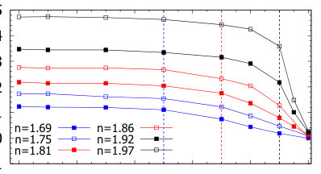 
FIG. 2. Intra-orbital singlet BCS variational parameter ∆of Eq. (8) as a function of U ′/U for different electron densities n in a range from 1.69 to 1.97.

📷 Fig 3

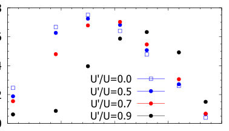 
FIG. 3. Superconducting order parameter of Eq. (19) for different values of U ′/U as a function of the electron density n. The full circles correspond to the vertical dashed lines in Fig. 1. The results for U ′ = 0 are also reported for compari- son. Data are shown for the L = 12 cluster and errorbars are smaller than the point size.

📷 Fig 4

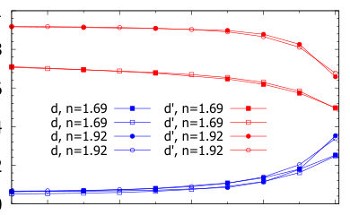 
FIG. 4. Intra- and inter-doublon density d = D/N and d′ = D′/N [see Eqs. (15) and (16)] as a function of U ′/U for n = 1.69 and n = 1.92 computed by VMC (full symbols). The DMFT results (empty symbols) are also reported for compar- ison. The VMC calculations are performed on the L = 12 cluster.

📷 Fig 5

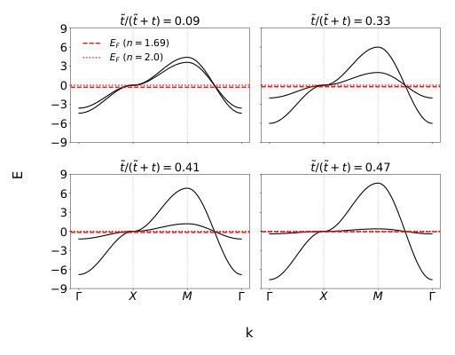 
FIG. 6. Non-interacting bands obtained from Eq. (21), for ˜t/t = 0.1 (upper-left panel), 0.3 (upper-right panel), 0.7 (lower-left panel), and 0.9 (lower-right panel). The path in the BZ is Γ →X →M →Γ, with Γ = (0, 0), X = (π, 0), and M = (π, π). The Fermi energies for n = 1.69 and 2 are also shown.

**Summary.** This work analyzes superconductivity in a two-orbital Hubbard model, demonstrating that inter-orbital interactions and hopping terms are crucial for enhancing pairing. Using VMC, the authors show that these orbital degrees of freedom stabilize superconductivity by coupling different electronic bands, which is a key feature distinguishing it from single-band models.

**Why it may be interesting.** The detailed analysis of how orbital hybridization ($	ilde{t}$) modifies the pairing mechanism by coupling different energy scales (flat vs. broad bands) provides insights into unconventional pairing mechanisms beyond simple single-band descriptions.

Detailed structure

**Main problem.** The study investigates how inter-orbital interactions and kinetic terms influence the emergence and magnitude of superconductivity in a multi-orbital system.

**Main result.** Inter-orbital terms ($U'$ and $	ilde{t}$) significantly enhance superconducting correlations compared to single-orbital models, with the enhancement being driven by the coexistence of flat and broad electronic bands.

**Method.** The research employs Variational Monte Carlo (VMC) techniques using Jastrow-Slater wave functions, supplemented by comparisons with Dynamical Mean-Field Theory (DMFT).

**Model / system.** The system is modeled by a minimal two-orbital Hubbard Hamiltonian, incorporating intra-orbital repulsion ($U$), inter-orbital repulsion ($U'$), and hopping terms ($t$ and $	ilde{t}$).

**Key observables.** Superconducting pairing correlations ($\phi^2_{\alphaeta}$), condensation energy ($\Delta E$), and orbital/inter-orbital doublon densities.

**Important parameters / regimes.** The ratio $U/t$, the inter-orbital repulsion $U'/U$, and the ratio of inter-orbital to intra-orbital hopping $	ilde{t}/t$.

**Assumptions / limitations.** The analysis focuses on uniform nonmagnetic states with an explicit pairing amplitude, and the model does not include Hund's coupling.

**Figures summary.** Figures illustrate the superconducting order parameter vs. electron density and vs. hopping ratios, and show the decomposition of the condensation energy into contributions from intra-orbital potential, inter-orbital potential, and kinetic energy.

**Paper structure.** The paper systematically analyzes the effects of $U'$ (at fixed $	ilde{t}=0$) and then introduces $	ilde{t}$, showing how each term modifies the superconducting dome and the underlying electronic structure, culminating in a discussion of the interplay between orbital character and pairing.

Abstract

We investigate a minimal two-orbital Hubbard model with intra- and inter-orbital nearest-neighbor hopping $t$ and $\tilde{t}$, as well as intra- and inter-orbital density-density interactions $U$ and $U'$ by means of variational ansätze based on Jastrow-Slater wave functions within quantum Monte Carlo techniques. To focus on the electronic mechanisms of superconductivity, we restrict the variational ansätze to uniform nonmagnetic states with an explicit pairing amplitude and compute the pairing correlations as a function of filling and model parameters. At $U/t=10$, superconducting correlations are highly enhanced by the presence of inter-orbital terms, $U'$ and $\tilde{t}$. For $\tilde{t}=0$, a finite value of $U'$ effectively screens the intra-orbital repulsion $U$, producing a shift in the superconducting dome. Consequently, inter-orbital repulsion yields a sizable increase in electron pairing compared to the single-orbital baseline. Furthermore, introducing a finite $\tilde{t}$ provides an additional boost to superconducting correlations, an effect driven by the simultaneous presence of flat and broad bands in the electronic structure.

[↑ back to top](#top)

### [Reentrance and temperature chaos in the $p$-spin Ising spin glass](http://arxiv.org/abs/2608.23904v1)

**Authors:** Hidetoshi Nishimori  
**Type:** theory · **Category:** disordered systems and neural networks · **PDF:** <https://arxiv.org/pdf/2608.23904v1>  
**Analysis basis:** full PDF text, analyzed in chunks
**Topic relevance:** `analog quantum simulation` **2/5** · `Keldysh / 2PI / non-Gaussian methods` **1/5**

📷 Fig 1

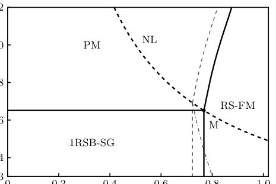 
FIG. 1. Schematic phase diagram of the present model for p = 3 [43]. Thick solid lines denote equilibrium phase boundaries. The horizontal line is the PM–1RSB-SG transition, which is independent of j0; the gently curved line extending upward to the right from the triple point M is the first-order PM–RS-FM transition; and the almost vertical line extending downward from M is the RS-FM–1RSB-SG phase boundary. The thick dashed line is the Nishimori line (NL), T = 1/(2j0), which passes through the triple point M and does not enter the SG phase. The thin dashed line is the metastability limit (spinodal line) of the FM phase. Since only equilibrium states are considered in the present paper, the...

📷 Fig 2

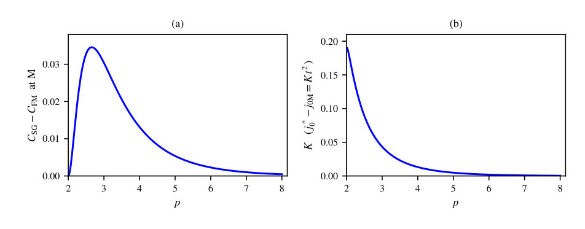 
FIG. 2. p dependence of the driving quantity for reentrance and of the curvature. (a) Specific-heat difference CSG −CFM at the triple point. It approaches zero at both endpoints, p →2+ and p →∞. As shown in Sec. III D, the behavior is (27/32)(p −2)2

📷 Fig 3

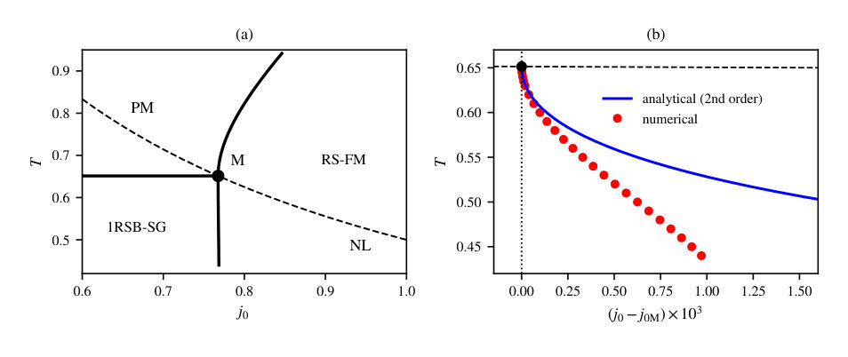 
FIG. 3. Phase diagram for p = 3. (a) Overall phase diagram. All solid lines are phase boundaries. This is a quantitatively calculated version of the schematic diagram in Fig. 1, with the spinodal line (thin dashed line) and the AT line (dash-dotted line) omitted. Horizontal line: PM–SG transition (Tc = 0.651385). Almost vertical line extending downward from M: FM–SG phase boundary. Line extending upward to the right from M: first-order PM–FM transition line. Dashed line: Nishimori line T = 1/(2j0). Black dot: triple point M. On this scale the FM–SG boundary is indistinguishable from a vertical line. (b) Enlarged view near the phase boundary. The horizontal axis is 103 times the deviation...

**Summary.** This theoretical paper analyzes the $p$-spin Ising spin glass model to establish a link between reentrant phase transitions and temperature chaos. By showing that the phase boundary reenters, the authors deduce that the system must exhibit temperature chaos, meaning the spin-state overlap vanishes for all pairs of temperatures within the spin glass phase. This advances the understanding of complex glassy dynamics in disordered quantum systems.

**Why it may be interesting.** The study of spin glasses and their phase transitions is foundational to understanding complex energy landscapes, which has parallels in optimizing quantum circuits or analyzing complex many-body quantum dynamics.

Detailed structure

**Main problem.** The paper investigates the physical relationship between two unusual properties in spin glasses: reentrant phase transitions and temperature chaos.

**Main result.** The authors analytically demonstrate that the ferromagnetic–spin glass boundary is reentrant for the $p$-spin Ising spin glass, which strongly suggests the existence of temperature chaos across the entire spin glass phase.

**Method.** The analysis involves expanding the free energy around the triple point and utilizing the contrapositive of a proposition relating reentrance to the existence of temperature chaos.

**Model / system.** The system studied is the fully connected Ising $p$-spin glass with a ferromagnetic bias, described by a Hamiltonian involving $p$-body interactions. The analysis uses replica calculations and free energy minimization techniques.

**Key observables.** The primary observables are the curvature of the ferromagnetic–spin glass phase boundary and the two-temperature spin-state overlap distribution, $P_2(x | eta_1, eta_2)$.

**Important parameters / regimes.** The key parameters include the spin interaction order $p$ (specifically $p>2$), the inverse temperatures ($eta_1, eta_2$), and the system size $N$ (taken to infinity).

**Assumptions / limitations.** The core assumption is that if the overlap vanishes for one temperature pair, it implies the vanishing of overlap for all pairs within the spin glass phase. The analysis also relies on the NOO proposition and the validity of the replica calculations.

**Figures summary.** The notes reference a schematic phase diagram for $p=3$ showing the PM, 1RSB-SG, RS-FM, and Nishimori Line boundaries, and a table listing calculated values for various parameters across different $p$.

**Paper structure.** The paper develops the theoretical framework by establishing the logical connection between reentrance and temperature chaos, provides an explicit analytical calculation for the $p$-spin model showing reentrance, and supports this conclusion with independent two-temperature replica calculations.

Abstract

Reentrant transitions and temperature chaos are two unusual properties of spin glasses and had long been considered physically unrelated. We recently established a logical relation between these two phenomena [Phys. Rev. E 112, 044140 (2025)]. In the present paper, we provide an explicit example of this logical relation in the fully connected Ising $p$-spin glass with a ferromagnetic bias. By expanding the free energy around the triple point, we show analytically that the ferromagnetic--spin glass boundary is reentrant in the vicinity of the triple point throughout the examined range of finite $p>2$. It then follows from the above logical relation that there exists at least one pair of distinct temperatures in the spin glass phase for which the overlap of spin configurations vanishes. This is a necessary condition for temperature chaos, but it would be quite unusual for the overlap to vanish only for selected temperature pairs but not for others within a single spin glass phase. These results therefore strongly suggest the existence of temperature chaos in the sense that the overlaps of spin configurations vanish for all temperature pairs throughout the spin glass phase. Independent evidence for this behavior is provided by a two-temperature replica calculation.

[↑ back to top](#top)

### [A Categorical Framework for Wave-Particle Complementarity: Continuous Observable Structures and Fourier-Pontryagin Duality](http://arxiv.org/abs/2608.23935v1)

**Authors:** Samuel B. Soltau  
**Type:** theory · **Category:** other · **PDF:** <https://arxiv.org/pdf/2608.23935v1>  
**Analysis basis:** full PDF text, analyzed in chunks
**Topic relevance:** `quantum measurements` **2/5**

📷 Fig 1

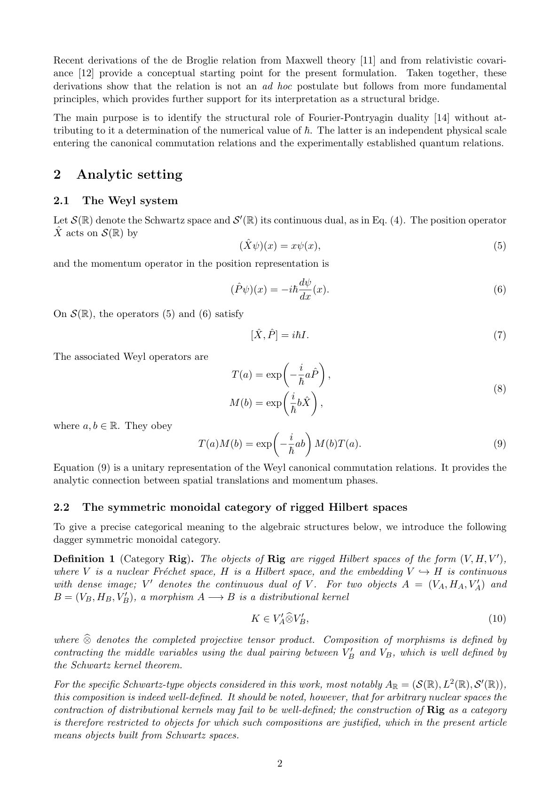 
Low-resolution page preview, page 2

📷 Fig 2

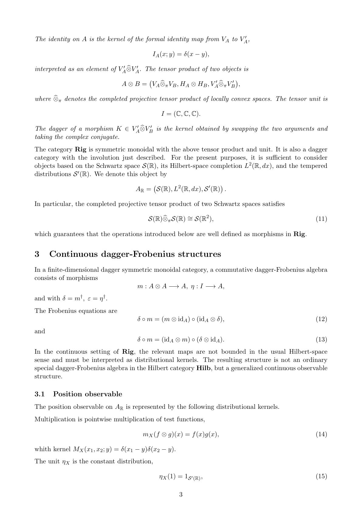 
Low-resolution page preview, page 3

📷 Fig 3

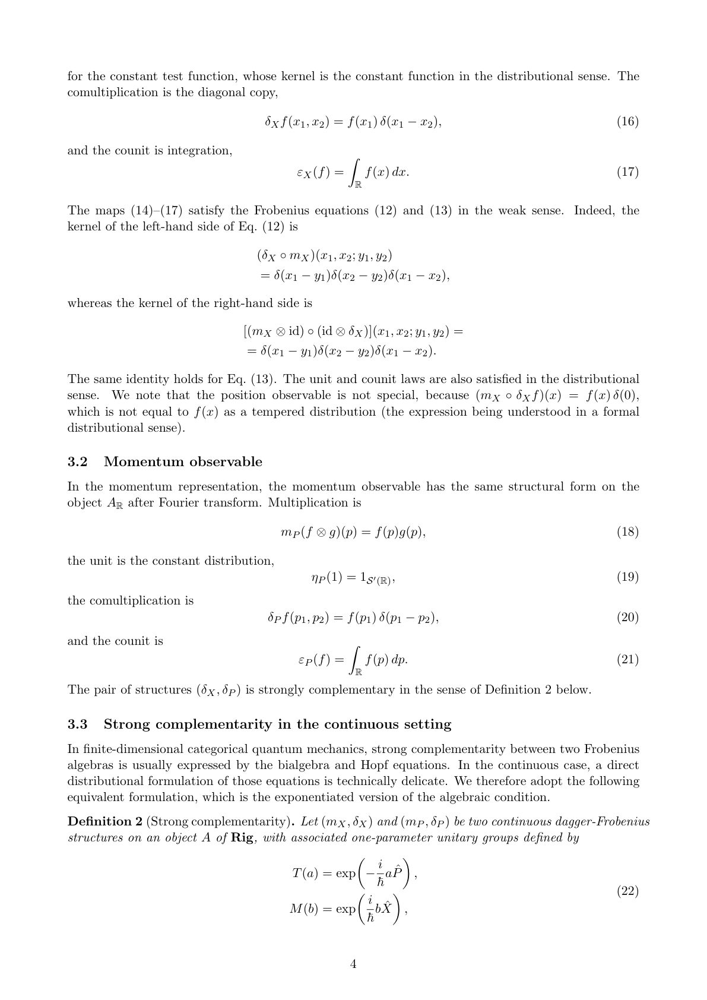 
Low-resolution page preview, page 4

📷 Fig 4

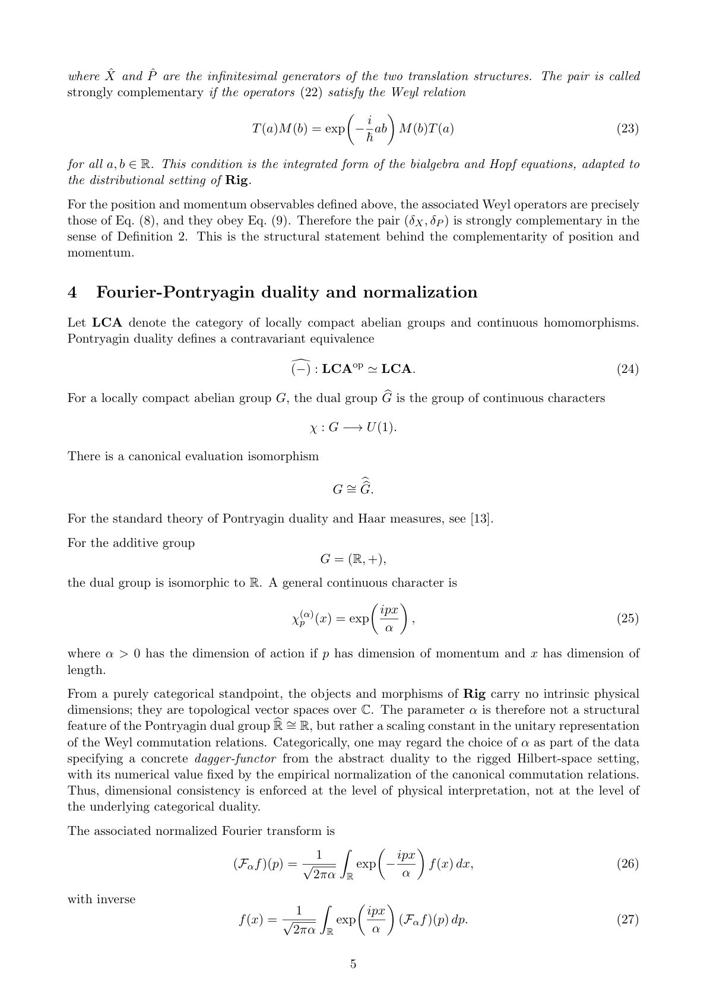 
Low-resolution page preview, page 5

📷 Fig 5

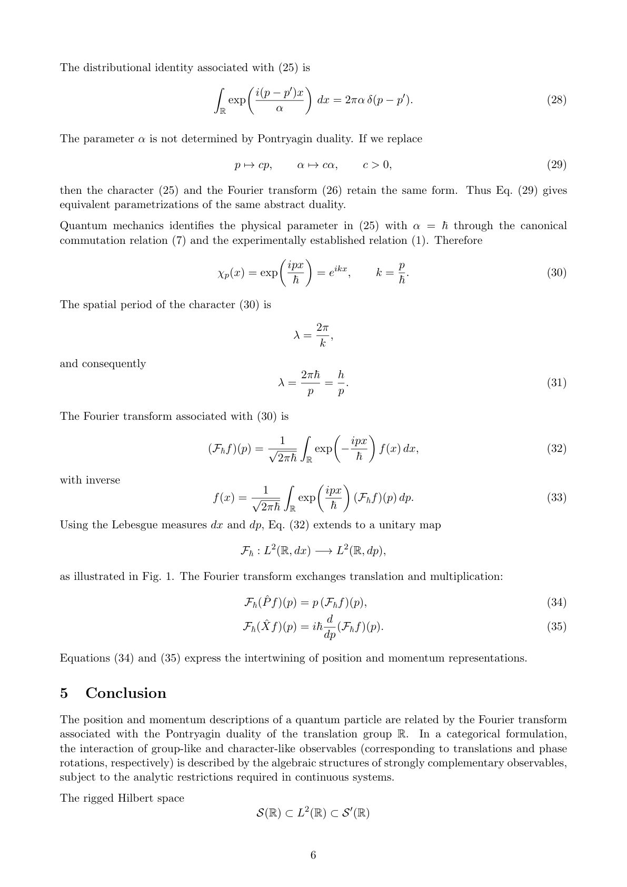 
Low-resolution page preview, page 6

**Summary.** This paper develops a highly abstract mathematical framework using category theory and Pontryagin duality to formalize wave-particle complementarity. It demonstrates that the mathematical structure of this complementarity is determined by duality, but the physical scale, embodied by Planck's constant $\hbar$, must be imposed externally via the canonical commutation relations. It offers a deep, structural view of the de Broglie relation.

**Why it may be interesting.** This work provides a highly abstract, foundational mathematical underpinning for a core concept in quantum mechanics (complementarity), which could inspire new ways to model measurement processes or quantum field theory structures.

Detailed structure

**Main problem.** The paper aims to rigorously formulate wave-particle complementarity and the de Broglie relation within the advanced mathematical framework of categorical quantum mechanics.

**Main result.** It shows that while Pontryagin duality determines the structural form of complementarity, the physical constant $\hbar$ must be supplied externally via the Weyl commutation relations to yield the correct de Broglie relation $\lambda = h/p$.

**Method.** The authors employ categorical quantum mechanics on rigged Hilbert spaces, using continuous dagger-Frobenius structures to represent position and momentum operators, and utilizing Pontryagin duality to relate these structures via the Fourier transform.

**Model / system.** The model is the quantum mechanical description of a particle, analyzed using abstract mathematical structures like rigged Hilbert spaces and categorical formalism, rather than a specific physical Hamiltonian or lattice model.

**Key observables.** Position ($\hat{X}$), momentum ($\hat{P}$), and the associated wave-particle character pairing $\chi_p(x) = \exp(ipx/\hbar)$.

**Important parameters / regimes.** Planck's constant ($\hbar$), the scaling parameter $\alpha$, and the physical constant $h$.

**Assumptions / limitations.** The framework assumes the validity of the categorical structure on Schwartz spaces and treats the identification $\alpha = \hbar$ as a necessary physical input fixed by the Weyl commutation relations.

**Figures summary.** Figure 1 illustrates the Fourier correspondence between the position and momentum representations.

**Paper structure.** The paper builds by first establishing the mathematical setting using categorical quantum mechanics and Pontryagin duality. It then derives the Fourier transform relating the two observable structures, demonstrating that the structural relationship is dictated by duality, while the physical scale ($\hbar$) is fixed by the canonical commutation relations.

Abstract

We present a formulation wave-particle complementarity and the de Broglie relation $λ=h/p$ within the framework of categorical quantum mechanics on rigged Hilbert spaces. Position and momentum are represented by continuous dagger-Frobenius structures associated with the locally compact abelian group $\mathbb{R}$ and its Pontryagin dual. The Fourier transform is the unitary implementation of Pontryagin duality and relates the two observable structures. We show that a general character pairing $χ_p^{(α)}(x)=\exp(ipx/α)$ yields a one-parameter family of unitarily equivalent Fourier transforms. Pontryagin duality therefore determines the structural form of the complementarity, but not the numerical value of Planck's constant. The identification $α=\hbar$ is a physical input fixed by the Weyl commutation relations. With this input, the spatial period of the character yields $λ=h/p$.

[↑ back to top](#top)

### [Certified Randomness without Structure Against Shallow-Query Adversaries](http://arxiv.org/abs/2608.24832v1)

**Authors:** Dakshita Khurana, Bhaskar Roberts, Avishay Tal  
**Type:** theory · **Category:** quantum information and computing · **PDF:** <https://arxiv.org/pdf/2608.24832v1>  
**Analysis basis:** full PDF text, analyzed in chunks
**Topic relevance:** `quantum measurements` **2/5**

📷 Fig 1

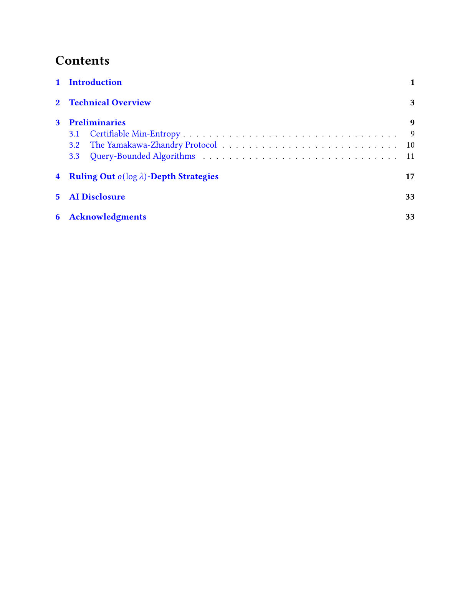 
Low-resolution page preview, page 2

📷 Fig 2

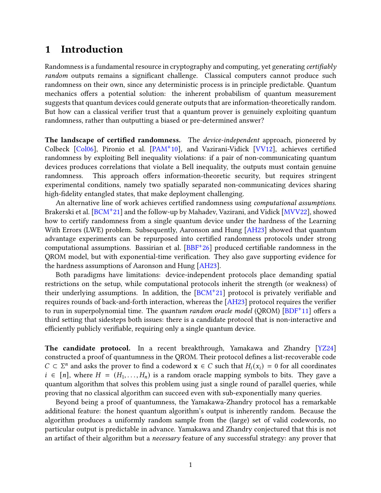 
Low-resolution page preview, page 3

📷 Fig 3

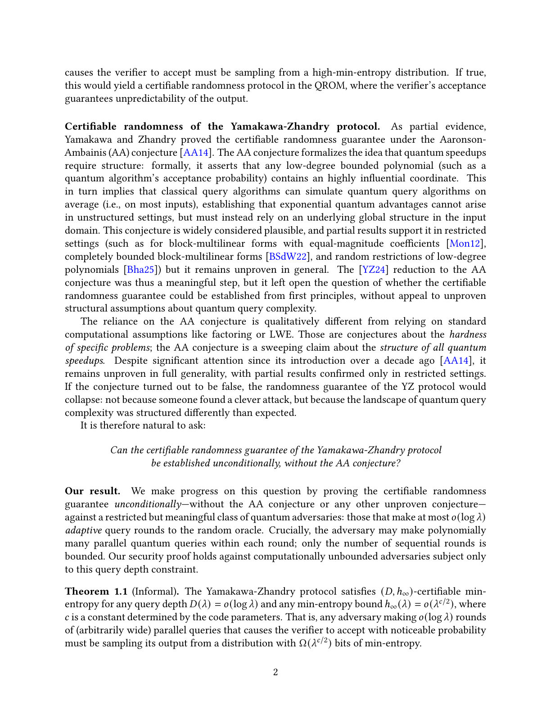 
Low-resolution page preview, page 4

📷 Fig 4

 
Low-resolution page preview, page 5

📷 Fig 5

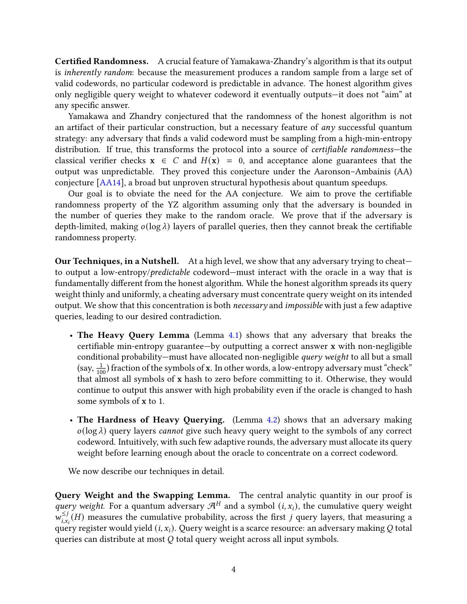 
Low-resolution page preview, page 6

**Summary.** This paper advances the field of quantum randomness by proving the security of a certifiable randomness protocol in the QROM. Crucially, it achieves this unconditionally by restricting the quantum adversary to a shallow query depth, thereby bypassing the need for the unproven Aaronson-Ambainis conjecture.

**Why it may be interesting.** While the topic is quantum cryptography, the rigorous analysis of query complexity and the use of information-theoretic bounds are highly relevant to understanding the limitations and capabilities of quantum information processing.

Detailed structure

**Main problem.** To prove the security of a certifiable randomness protocol in the Quantum Random Oracle Model (QROM) without relying on the unproven Aaronson-Ambainis conjecture.

**Main result.** The authors unconditionally prove the certifiable randomness guarantee for the Yamakawa-Zhandry protocol against quantum adversaries making only $o(\log \lambda)$ adaptive queries.

**Method.** The proof uses a two-step argument involving bounding the 'query weight' accumulated by the adversary across multiple query layers, culminating in a contradiction derived from probability bounds.

**Model / system.** The analysis is set in the Quantum Random Oracle Model (QROM), involving a quantum adversary querying a random oracle $H$ to test the validity of a candidate codeword $x$ from a list-recoverable code $\mathcal{C}$.

**Key observables.** Query weight ($w$), query depth ($D$), and the probability of the adversary successfully cheating ($\Pr[	ext{Event3}]$).

**Important parameters / regimes.** The depth of the adversary's queries, $D = o(\log \lambda)$, and the entropy measures $\delta(\lambda)$ and $h_\infty(\lambda)$.

**Assumptions / limitations.** The primary assumption is the restriction on the adversary's query depth to $o(\log \lambda)$ layers; the proof avoids the AA conjecture.

**Paper structure.** The paper builds upon the YZ protocol, first establishing the necessary tools (like the Swapping Lemma) to track query weight, then proceeding through a multi-step argument that bounds the adversary's ability to accumulate weight on the correct answer $x$ when the query depth is shallow.

Abstract

In a recent breakthrough, Yamakawa and Zhandry (J. ACM 2024) constructed a proof of quantumness in the quantum random oracle model (QROM) in which the quantum prover samples a codeword preimage of a publicly computable function H. They conjectured that given any H, a successful prover must sample their preimage from a high-entropy distribution over possible answers. If true, this would give a certifiable randomness protocol in the quantum random oracle model. As partial evidence for their conjecture, Yamakawa and Zhandry proved the security of their certifiable randomness protocol assuming the Aaronson-Ambainis conjecture.   We prove the security of the certifiable randomness protocol of Yamakawa-Zhandry unconditionally, without relying on the unproven Aaronson-Ambainis conjecture, against low query-depth quantum adversaries: specifically, adversaries that make up to o(\log λ) adaptive quantum queries to the random oracle.

[↑ back to top](#top)

### [Compositionality in quantum reference frame perspectives](http://arxiv.org/abs/2608.23698v1)

**Authors:** Bruna Sahdo, Esteban Castro-Ruiz  
**Type:** theory · **Category:** other · **PDF:** <https://arxiv.org/pdf/2608.23698v1>  
**Analysis basis:** full PDF text, analyzed in chunks
**Topic relevance:** `quantum measurements` **2/5**

📷 Fig 1

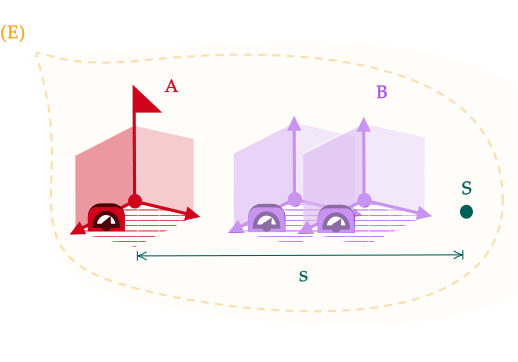 
Figure 1: A reduced setup, formed by reference frames A, B and system S (inside the dashed contour) is seen as part of an extended setup, containing the additional system S3. If the internal perspectives of A and B include only the relative degrees of freedom, reversible transformations between perspectives do not behave adequately under composition. This generates issues such as the ‘paradox of the third particle’. The formalism used here restores compositionality due to the ‘extra particle’ degrees of freedom present in each perspective.

📷 Fig 2

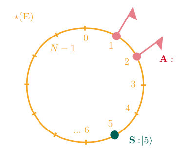 
Figure 2: Illustration of a setup containing two systems described by an external observer through the Hilbert space (HA ⊗HS)(E). Each of the systems carries the regular representation of the group G = ZN and the global external state in the picture is |ψ⟩(E) AS = 1/ √

📷 Fig 3

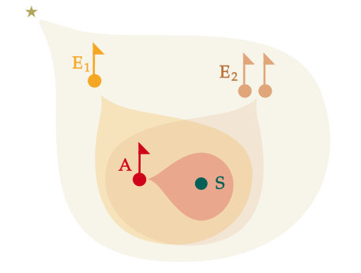 
Figure 3: Illustration of how the present QRF formalism consistently accounts for observers’ de- scriptions. External observers can use the formalism to describe QRF perspectives following the prescription of Section 2. At the same time, the frame of such an observer can itself be internalised, so that the observer’s use of the formalism is described by a new external observer, or by another observer at the same level with an explicit frame. Across this hierarchy of perspectives, with implicit and explicit frames, everyone agrees on the invariant information contained in a subsystem and the form of the perspective internal to it. In the picture, the descriptions of two observers Eve 1 and...

📷 Fig 4

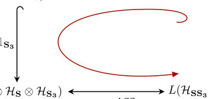 
Figure 4: Mapping operators of a bipartite setup into a tripartite setup in the perspective of QRF A in a way that is consistent with a potential external quantum description.

📷 Fig 5

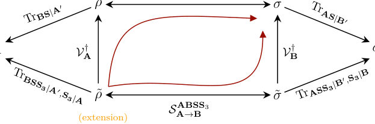 
Figure 5: Diagram showing the relation between states of Alice’s and Bob’s perspectives for a reduced setup consistently embedded in an extended setup. The diagram highlights two properties. (1) The commutativity of the central square shows that transforming from one QRF perspective to another and then removing a subsystem is equivalent to first removing that subsystem and then transforming in the reduced setup. (2) The triangles on the right- and left-hand sides of the diagram show that the reduced state of a relative subsystem is independent of whether it is described as part of an extended setup and can be unambiguously obtained by tracing out the other systems in a given perspective.

**Summary.** This paper develops a rigorous formalism to handle the composition of quantum subsystems when viewed from different Quantum Reference Frames (QRFs). It resolves inherent paradoxes by introducing 'extra-particle' degrees of freedom, establishing a consistent hierarchy of perspectives. The work shows that QRF composition is a generalization of standard quantum composition and introduces a procedure to recover classical descriptions.

**Why it may be interesting.** This work tackles foundational issues in quantum foundations concerning how local descriptions (reference frames) interact with global composition rules, which is crucial for understanding measurements and information flow in complex quantum systems.

Detailed structure

**Main problem.** The paper addresses the fundamental difficulty of defining compositionality when combining standard quantum composition rules with the formalism of Quantum Reference Frames (QRFs), which leads to paradoxes like the 'paradox of the third particle'.

**Main result.** The authors propose a consistent formalism that resolves these paradoxes by incorporating 'extra-particle' degrees of freedom, showing that QRF composition generalizes standard quantum tensor product composition.

**Method.** The methodology involves building upon a formal QRF framework, demonstrating consistency through mathematical constraints (like Equation 5), and introducing a procedure called 'classicalisation' to recover classical limits.

**Model / system.** The study uses abstract quantum systems (A, B, S, $S_3$) and their descriptions relative to different observers or reference frames (QRFs). Specific toy models involve systems carrying representations of finite Abelian groups ($\mathbb{Z}_N$).

**Key observables.** The consistency of state and operator representations across different observers, the set of compatible states for composition, and the phase/momentum superselection rules.

**Important parameters / regimes.** The structure of the reference frames (e.g., internal vs. external observers) and the nature of the subsystems being composed.

**Assumptions / limitations.** The formalism builds on a recent QRF framework; some analyses are restricted to finite Abelian groups ($\mathbb{Z}_N$).

**Figures summary.** Figure 1 illustrates the setup comparing reduced versus extended systems involving three subsystems; Figure 2 illustrates the setup with two systems (A and S) viewed from an external observer (Eve).

**Paper structure.** The paper progresses by first identifying the compositionality paradox in QRFs, then proposing a formalism using 'extra-particle' degrees of freedom to restore consistency, followed by characterizing the resulting structure, and concluding with the introduction and study of 'classicalisation'.

Abstract

Understanding a composite system through its constituents is a fundamental practice in physics. In the context of quantum reference frames (QRFs), however, combining the usual quantum-theoretic notion of composition with QRF perspectives gives rise to subtle issues, such as the 'paradox of the third particle'. Here we study in depth how to compose subsystems in QRF perspectives, building on a recent formalism for QRFs [E$.$Castro-Ruiz and O$.$Oreshkov, 2025]. We first show how the frames of external observers can be internalised and treated within the framework. This establishes a consistent hierarchy of QRF perspectives, which we use to define the adding and removing of subsystems. We then explain how, owing to the so-called 'extra-particle' degrees of freedom, the formalism gives a consistent treatment of subsystems, avoiding any paradoxes by construction. Consistency then implies that composing subsystems in a QRF perspective differs from, and generalises, the standard quantum-theoretic case. In particular, not every state can be appended in tensor-product form relative to a QRF, and we characterise the set of compatible states. Finally, we introduce 'classicalisation', a procedure that recovers a classical-like perspective from a general QRF. This procedure circumvents the aforementioned state restrictions but carries a different operational meaning, which we study through a concrete example.

[↑ back to top](#top)

### [Critical bifurcation and deconfined quantum criticality in an interacting cluster Ising chain](http://arxiv.org/abs/2608.24248v1)

**Authors:** Sourabh, Bachana Beradze, Mikheil Tsitsishvili, Alexander Nersesyan, Titas Chanda  
**Type:** theory · **Category:** statistical mechanics · **PDF:** <https://arxiv.org/pdf/2608.24248v1>  
**Analysis basis:** full PDF text, analyzed in chunks
**Topic relevance:** `methods for driven-dissipative` **2/5**

📷 Fig 1

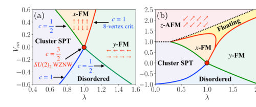 
FIG. 1. (Color online.) Schematic illustration of the criti- cal bifurcation in the interacting cluster Ising model and the phases it produces, in the plane of the Ising coupling λ and the interaction strength Vnn (Eqs. (1) and (12)). (a) Near the non-interacting critical point (red dot), a cluster SPT phase and a ferromagnet (y-FM) meet at the SU(2)2 WZNW point with central charge c = 3/2. Interactions split this point into an Ising line with c = 1/2 (green) and a Gaussian line with c = 1 (blue and red), which bound an intervening phase: a second ferromagnet (x-FM) for repulsive interactions, break- ing a symmetry incompatible with that of the y-FM, and a disordered phase for attractive...

📷 Fig 2

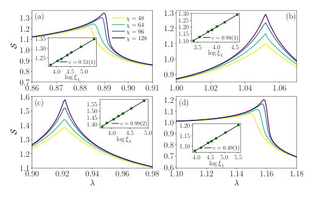 
FIG. 3. (Color online.) Bipartite entanglement entropy across the four bifurcated transition lines of the interacting CIM for different bond dimensions χ ∈[48, 128]. The upper panels correspond to Vnn = 0.2 and show the cluster ↔x-FM (a) and x-FM ↔y-FM (b) transitions, whereas the lower panels cor- respond to Vnn = −0.2 and show the cluster ↔disordered (c) and disordered ↔y-FM (d) transitions. The entropy maxima locate the respective transition points for each bond dimen- sion. The insets show the finite-entanglement scaling of these maxima with the corresponding correlation lengths ξχ accord- ing to Eq. (15). The extracted central charges are consistent with c = 1/2 Ising criticality for...

📷 Fig 3

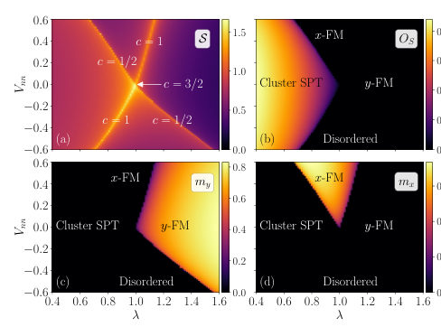 
FIG. 2. (Color online.) Phase diagram of the interacting CIM described by Eq. (12) in the vicinity of the non-interacting critical point (λ, Vnn) = (1, 0). We show the bipartite entan- glement entropy S (a), the string order parameter OS (b), and the magnetizations my (c) and mx (d), obtained using VUMPS with uMPS bond dimension χ = 128. For Vnn &gt; 0, an x-FM phase with non-zero mx emerges between the clus- ter and y-FM phases; for Vnn &lt; 0, these phases are instead separated by a disordered phase, and thus the non-interacting critical point at (λ, Vnn) = (1, 0) bifurcates into two transition lines on either side of the Vnn = 0 axis. The central charges labeled in (a) are confirmed via the...

📷 Fig 4

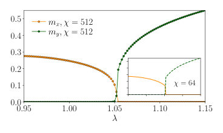 
FIG. 4. (Color online.) Magnetizations mx and my as func- tions of λ across the direct c = 1 transition between the x-FM and y-FM phases at fixed Vnn = 0.2, obtained using VUMPS with bond dimension χ = 512. The inset shows the corre- sponding results for χ = 64, where finite-entanglement effects make the transition appear considerably sharper.

📷 Fig 5

 
Figure 4 shows the simultaneous and continuous van- ishing of mx and my at the same critical point. The comparison between χ = 64 and χ = 512 shows that the continuous behavior is resolved only once the finite- entanglement correlation length is large enough. To- gether with the central charge c = 1 obtained in Sec. III, these results establish a direct continuous transition with diverging correlation length between the two Landau- incompatible FM phases. The simultaneous vanishing of mx and my suggests that the two Landau-incompatible orders are related by an emergent continuous rotation at criticality. Phe- nomenologically, this can be described by a compact an- gular field ϑ(x) ≡ϑ(x) +...

**Summary.** This work analyzes the quantum phase transitions in an interacting cluster Ising chain, demonstrating how a weak interaction causes a critical bifurcation from an initial high-symmetry critical point. The study successfully maps out a deconfined quantum critical line characterized by emergent O(2) symmetry, using a combination of tensor-network methods and weak-coupling field theory.

**Why it may be interesting.** The detailed mapping of quantum phase transitions, especially the realization of DQC and the connection to specific universality classes (like the eight-vertex model), provides deep insights into strongly correlated quantum matter.

Detailed structure

**Main problem.** The paper investigates the critical bifurcation and the nature of deconfined quantum criticality (DQC) in an interacting cluster Ising chain.

**Main result.** The interaction splits the non-interacting critical point into two distinct critical lines (Ising and Gaussian), leading to a DQC line with emergent O(2) symmetry, which is captured by weak-coupling field theory.

**Method.** The study employs tensor-network methods and weak-coupling field theory, supplemented by numerical simulations (MPS) to analyze the phase diagram.

**Model / system.** The system is the cluster Ising chain (CIM) augmented with a nearest-neighbor interaction. The non-interacting limit exhibits an O(3) symmetry and a critical point at c=3/2.

**Key observables.** Bipartite entanglement entropy (S), string order parameter (OS), and magnetizations in x, y, and z directions.

**Important parameters / regimes.** The interaction strength ($V_{	ext{nn}}$) and the coupling constants ($\lambda$) are key parameters controlling the phase transitions.

**Assumptions / limitations.** The weak-coupling theory is assumed valid in the analyzed regimes, though simulations reveal first-order transitions beyond its scope.

**Figures summary.** Figures schematically illustrate the critical bifurcation, showing the splitting of the initial critical point into Ising (c=1/2) and Gaussian (c=1) lines, and mapping out the subsequent DQC line and floating phase.

**Paper structure.** The paper analyzes the non-interacting limit (O(3) symmetry, c=3/2), then introduces the interaction which causes a critical bifurcation into two separate critical lines. It then analyzes the DQC line connecting two ferromagnets and the subsequent floating phase, concluding with the failure of the theory at strong coupling.

Abstract

We investigate the cluster Ising chain with an additional nearest-neighbor interaction using tensor-network methods and a weak-coupling field theory. Without the interaction, the Jordan-Wigner transformation decomposes the model into a triplet of identical Majorana chains related by an exact $O(3)$ flavor symmetry. Their common mass vanishes at the $SU(2)_2$ Wess-Zumino-Novikov-Witten critical point with central charge $c = 3/2$ separating the symmetry-protected topological cluster phase from a ferromagnet. The interaction reduces $O(3)$ to its cyclic subgroup $C_3$, splitting the triplet into a singlet and a doublet whose gaps close separately, producing a critical bifurcation into Ising ($c = 1/2$) and Gaussian ($c = 1$) critical lines. A second ferromagnetic phase opens between these critical lines for repulsive interactions and a disordered phase for attractive ones. The Gaussian line then separates two Landau-incompatible ferromagnets, realizing a deconfined quantum critical line with emergent $O(2)$ symmetry, along which our independently extracted exponents vary continuously yet satisfy the parameter-free relation $β= (2ν- 1)/4$ of the eight-vertex weak universality class. At stronger repulsion this line opens into an extended gapless floating phase with incommensurate algebraic correlations, entered through Berezinskii-Kosterlitz-Thouless transitions. All of these phases and the transitions between them are captured by the weak-coupling theory. Beyond its regime of validity, our simulations reveal a translation-symmetry-breaking antiferromagnet reached through first-order transitions.

[↑ back to top](#top)

### [Neutron scattering evidence for two-dimensionally coupled spin-dimerized antiferromagnetic lattice in α-Cu2P2O7](http://arxiv.org/abs/2608.24141v1)

**Authors:** B. Ghanta, K. S. Chikara, M. Ghanathe, L. Keller, D. Voneshen, A. K. Bera  
**Type:** both · **Category:** strongly correlated electrons · **PDF:** <https://arxiv.org/pdf/2608.24141v1>  
**Analysis basis:** full PDF text, analyzed in chunks
**Topic relevance:** `analog quantum simulation` **2/5**

📷 Fig 1

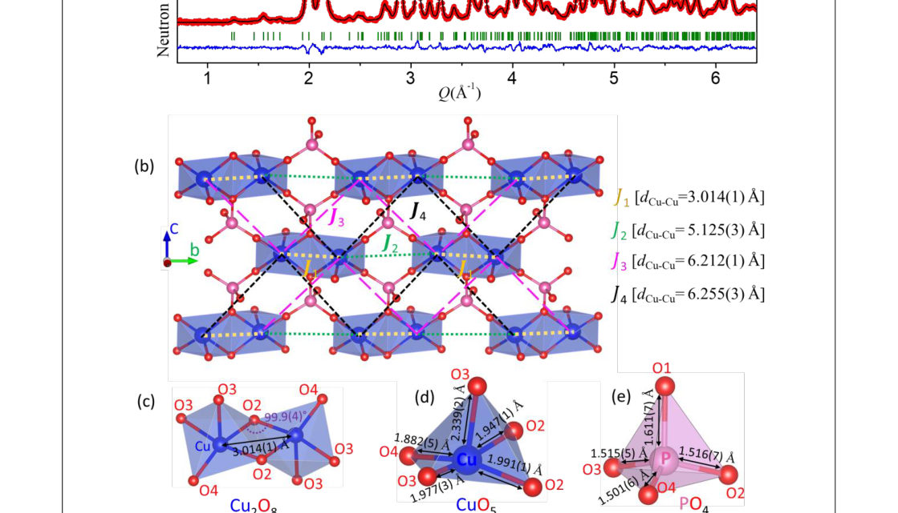 
FIG. 1. (a) Rietveld analyzed neutron powder diffraction pattern of α-Cu2P2O7, measured at 300 K using the neutron

📷 Fig 2

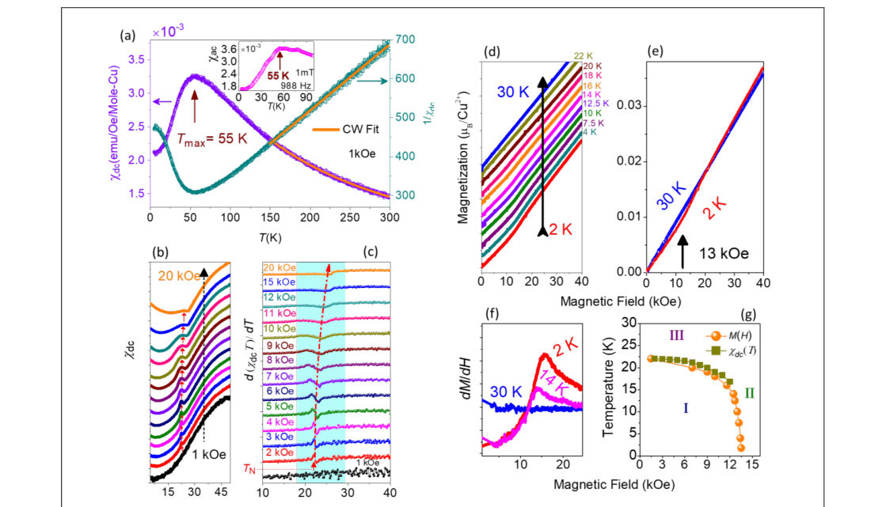 
FIG. 2. (a) The temperature-dependent of dc-susceptibility (χdc) and inverse of dc-susceptibility (1/ χdc) curves,

📷 Fig 3

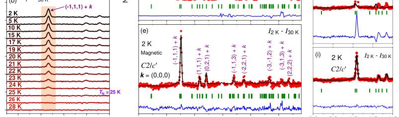 
FIG. 3. (a) The temperature-dependent neutron diffraction patterns of α-Cu2P2O7 measured over the temperature range

📷 Fig 4

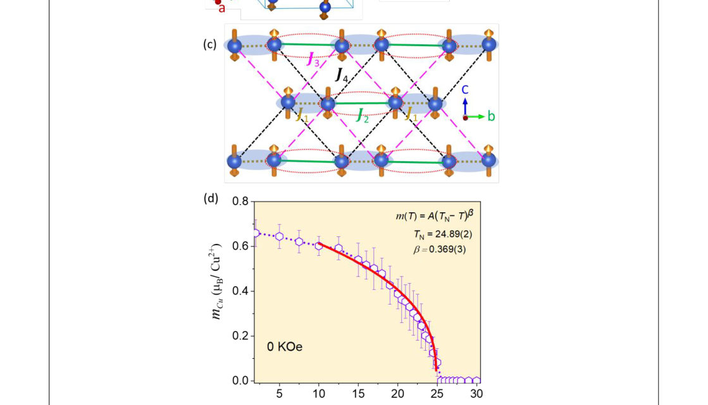 
FIG. 4. (a) The schematic magnetic unit cell of α-Cu2P2O7. (b) The spin direction within the ac plane. (c) The magnetic

📷 Fig 5

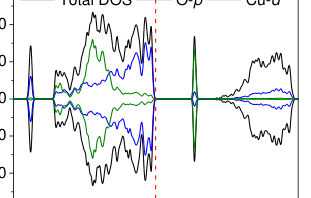 
FIG. 5. The calculated total density of states (DOS) and projected density of states (PDOS) for the Cu-d states and O-

**Summary.** This work resolves long-standing debates about the magnetic structure of alpha-Cu2P2O7 by combining inelastic neutron scattering, magnetization measurements, and spin-wave theory. It conclusively models the material as a 2D spin-dimerized antiferromagnet, pinpointing the dominant magnetic exchange to a specific, longer-range Cu-Cu interaction. The findings provide a detailed magnetic phase diagram and elucidate the roles of weak interlayer coupling and anisotropy.

**Why it may be interesting.** The detailed analysis of magnetic excitations and the identification of specific, long-range exchange pathways (7th nearest neighbors) in a transition metal phosphate provides a concrete case study for understanding magnetic interactions in strongly correlated insulators.

Detailed structure

**Main problem.** The microscopic magnetic model of the low-dimensional quantum magnet alpha-Cu2P2O7 has been controversial, requiring clarification of the dominant magnetic exchange pathways.

**Main result.** The study establishes the material as a two-dimensionally coupled spin-dimerized antiferromagnetic lattice, identifying the dominant exchange interaction as occurring between seventh-nearest-neighbor Cu-Cu pairs, not nearest neighbors.

**Method.** The research combines comprehensive experimental measurements (inelastic neutron scattering, neutron diffraction, magnetization) with advanced computational modeling (spin-wave theory, DFT).

**Model / system.** The system is alpha-Cu2P2O7, modeled as a 2D coupled spin-dimerized antiferromagnetic lattice. The Hamiltonian incorporates intradimer exchange (J2), interdimer exchanges (J1, J3, J4), weak interlayer coupling (J5), and single-ion anisotropy (D).

**Key observables.** Energy gaps in the spin-excitation spectrum, magnetic ordering temperature (TN), metamagnetic transitions in the H-T plane, and the magnitude of various exchange couplings (J2, J5, D).

**Important parameters / regimes.** Dominant intradimer exchange J2 = 7.73 meV; weak interlayer coupling J5 = 0.03 meV; anisotropy D; critical magnetic field near 13 kOe.

**Assumptions / limitations.** The analysis relies on fitting experimental data to a spin-wave model derived from a 2D coupled dimer Hamiltonian, contrasting with previous GGA+U predictions.

**Figures summary.** Figures show temperature-dependent INS spectra, field-dependent neutron diffraction patterns, and simulated spin-wave spectra comparing experimental observations to theoretical models based on fitted exchange parameters.

**Paper structure.** The paper progresses by first presenting the experimental evidence (INS, diffraction, magnetization) to constrain the magnetic model, followed by detailed spin-wave calculations that fit the observed energy gaps and magnetic phase boundaries.

Abstract

The microscopic magnetic model of the low-dimensional quantum magnet alpha-Cu2P2O7 has remained controversial. We present a comprehensive study of its magnetic ground state and excitation spectrum using temperature-dependent inelastic neutron scattering, neutron diffraction, magnetization measurements, and comprehensive spin-wave modeling. Our results unambiguously establish alpha-Cu2P2O7 as a two-dimensionally coupled spin-dimerized antiferromagnetic (AF) lattice within the bc plane, with a dominant AF exchange J2 = 7.73 meV (hereafter referred to as "intradimer exchange") and weaker exchange couplings J1, J3, and J4 in the two-dimensional lattice (hereafter referred to as "interdimer exchange"), in agreement with LDA-based density functional theory and in contrast to previous GGA+U predictions. The dominant intradimer AF exchange is found between seventh-nearest-neighbor Cu-Cu ion pairs [d(Cu-Cu) = 5.125(3) A] rather than nearest-neighbor Cu-Cu ion pairs [d(Cu-Cu) = 3.014(1) A] of the structural dimers. Weak interlayer coupling (J5 = 0.03 meV) stabilizes long-range antiferromagnetic order below TN = 25 K. We further identify a weak single-ion anisotropy, associated with the distorted CuO5 polyhedra, that opens a gap in the spin-excitation spectrum and drives a field-induced metamagnetic transition. Systematic spin-wave calculations elucidate the distinct roles of interlayer coupling J5 and anisotropy term D in producing two distinct energy gaps at different antiferromagnetic zone centers. Complementary neutron diffraction and magnetization measurements as a function of applied magnetic field uncover a previously overlooked metamagnetic transition near 13 kOe and allow construction of the magnetic phase diagram in the H-T plane.

[↑ back to top](#top)

### [QisMC: A Model Checker for QISKIT Program Debugging](http://arxiv.org/abs/2608.24320v1)

**Authors:** Aochu Dai, Mingsheng Ying  
**Type:** theory · **Category:** quantum information and computing · **PDF:** <https://arxiv.org/pdf/2608.24320v1>  
**Analysis basis:** full PDF text, analyzed in chunks
**Topic relevance:** `quantum measurements` **2/5**

📷 Fig 1

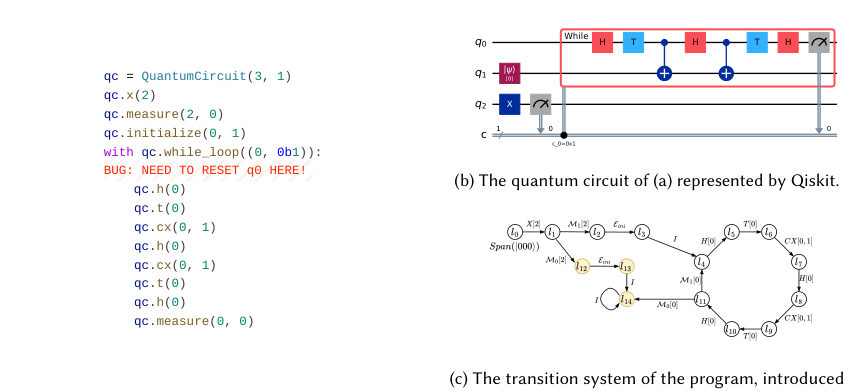 
Fig. 1. A buggy repeat-until-success program, circuit, and transition system to implement the 𝐼+𝑖 √

📷 Fig 2

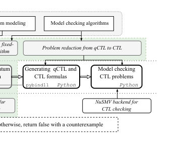 
Fig. 2. Overall structure of QisMC’s workflow.

📷 Fig 3

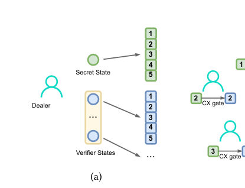 
Fig. 4. The procedure of verifiable quantum secret sharing based on the ⟦5, 1, 3⟧code.

📷 Fig 4

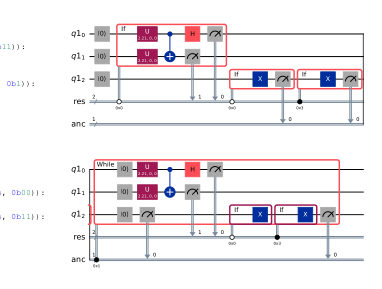 
Fig. 5. Qiskit program and circuit for quantum Bernoulli factory 𝑓(𝑝) = 4𝑝· (1 −𝑝).

📷 Fig 5

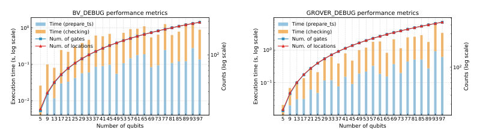 
Fig. 6. Performance of QisMC on Grover and BV benchmarks of VeriQBench. The execution time and number of locations are recorded. The 𝑦-axis is in log-scale.

**Summary.** This paper presents QisMC, a novel model checker designed to formally verify quantum programs written in Qiskit. It achieves this by modeling the program as a quantum-classical transition system and employing a specialized quantum computation tree logic (qCTL). QisMC offers automated, exhaustive verification and generates concrete counterexamples when bugs are found, significantly advancing quantum software debugging tools.

**Why it may be interesting.** While focused on software verification, the rigorous formalization of quantum control flow and state evolution using temporal logic is highly relevant for understanding the theoretical limits and guarantees of quantum computation.

Detailed structure

**Main problem.** The paper addresses the challenge of formally debugging complex quantum programs written in Qiskit, particularly those involving dynamic quantum-classical interactions like measurements and control flow.

**Main result.** It introduces QisMC, the first dedicated quantum model checker, which provides an automated, exhaustive verification framework for quantum programs.

**Method.** The authors develop a quantum-classical transition system and a quantum computation tree logic (qCTL) to model program behavior, reducing the problem to classical CTL model checking solvable via decision diagrams.

**Model / system.** The model is a quantum program executed on a quantum computer, modeled as a quantum-classical transition system. The state space involves quantum states (density matrices) and classical control flow variables.

**Key observables.** Safety, liveness, fairness, and invariance properties, diagnosed by generating a concrete counterexample execution path.

**Important parameters / regimes.** The complexity scales with the size of the quantum circuit and the depth of the control flow structure.

**Assumptions / limitations.** The framework assumes the ability to model quantum operations and classical control flow constructs within the Qiskit API structure.

**Figures summary.** Figure 1 illustrates a buggy Repeat-Until-Success (RUS) program, its Qiskit circuit, and the corresponding transition system. Figure 2 shows the overall QisMC workflow, detailing the qCTL logic and reduction to CTL.

**Paper structure.** The paper establishes the theoretical foundation by defining the quantum-classical transition system and qCTL, details the end-to-end QisMC framework (generation, logic, checking), proves the correctness of the model checking algorithm, and concludes with practical examples and benchmarks.

Abstract

We present QisMC, the first quantum model checker dedicated to debugging Qiskit programs. On the theoretical side, we introduce the notion of quantum-classical transition system and a quantum computation tree logic (qCTL) grounded in Birkhoff-von Neumann logic for modeling the behaviors and specifying the properties of Qiskit programs, respectively. On the implementation side, QisMC provides an end-to-end framework encompassing transition system generation, logical formula representation, and model checking algorithms, and it efficiently performs image computation based on decision diagrams. These methods and design principles give QisMC advantages over previous Qiskit program debuggers, including a unified property specification language, a fully automated and exhaustive verification process, and the ability to generate counterexamples. Extensive illustrative examples and benchmark evaluations demonstrate the practicality, efficiency, and scalability of QisMC in verifying realistic quantum programs.

[↑ back to top](#top)

### [Rank and Range Criteria for Mixed-State Determination from Local Marginals](http://arxiv.org/abs/2608.24061v1)

**Authors:** Xinyu Qiu, Minglong Qin, Caohan Cheng, Lin Chen, Delin Chu  
**Type:** theory · **Category:** quantum information and computing · **PDF:** <https://arxiv.org/pdf/2608.24061v1>  
**Analysis basis:** full PDF text, analyzed in chunks
**Topic relevance:** `quantum measurements` **2/5**

📷 Fig 1

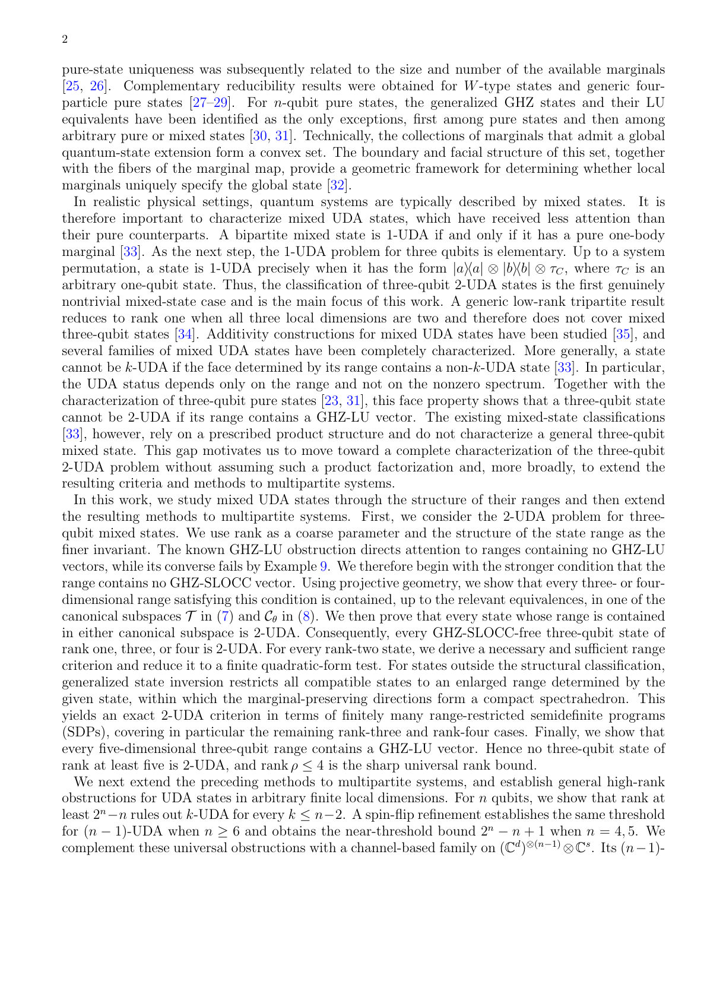 
Low-resolution page preview, page 2

📷 Fig 2

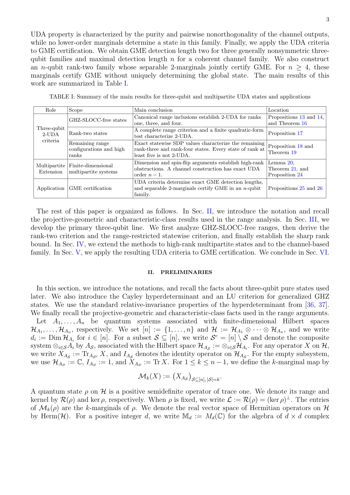 
Low-resolution page preview, page 3

📷 Fig 3

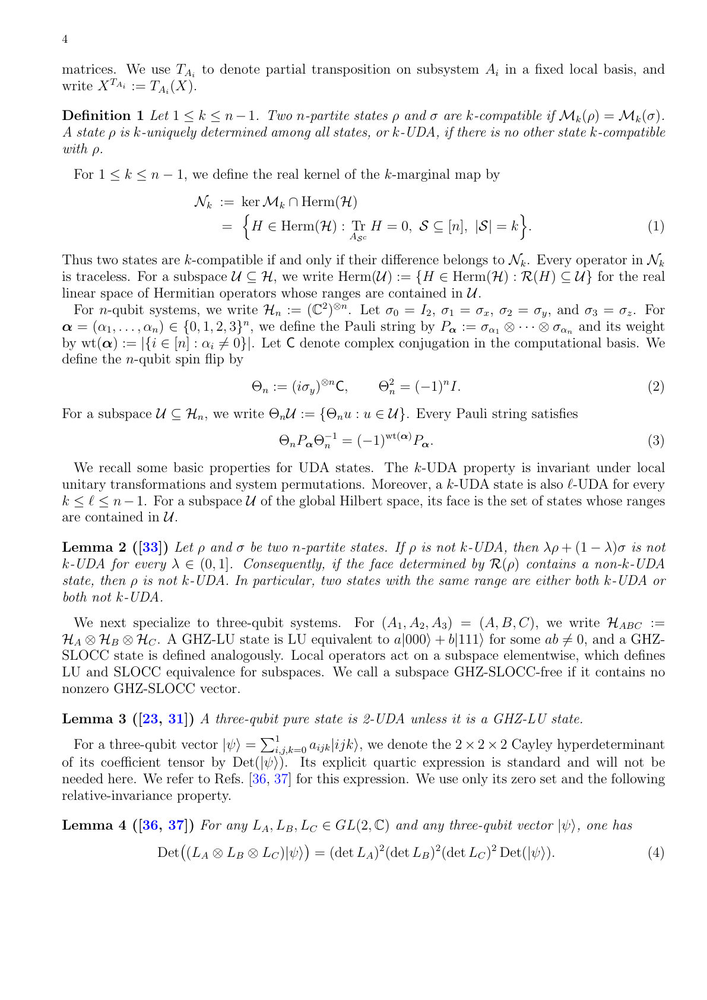 
Low-resolution page preview, page 4

📷 Fig 4

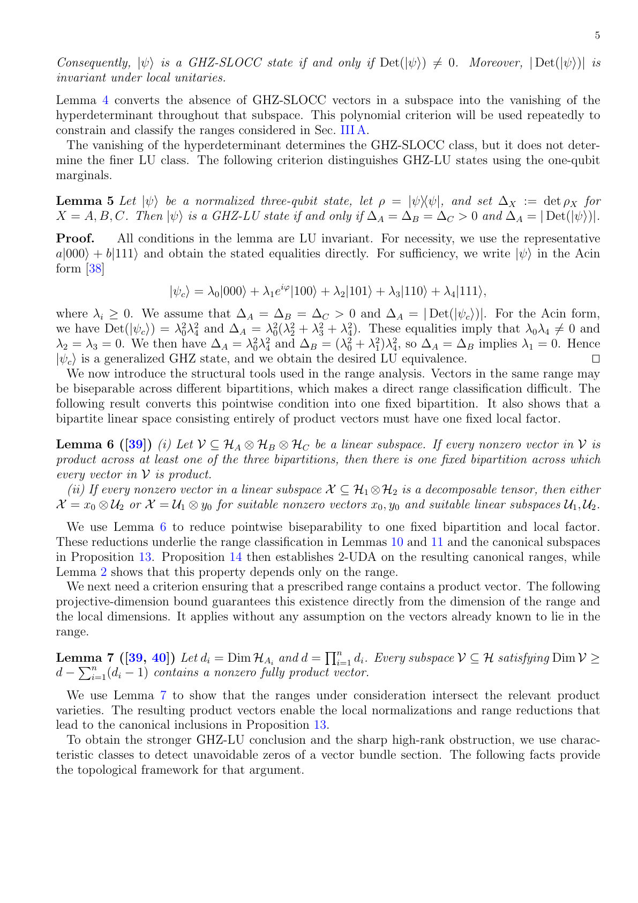 
Low-resolution page preview, page 5

📷 Fig 5

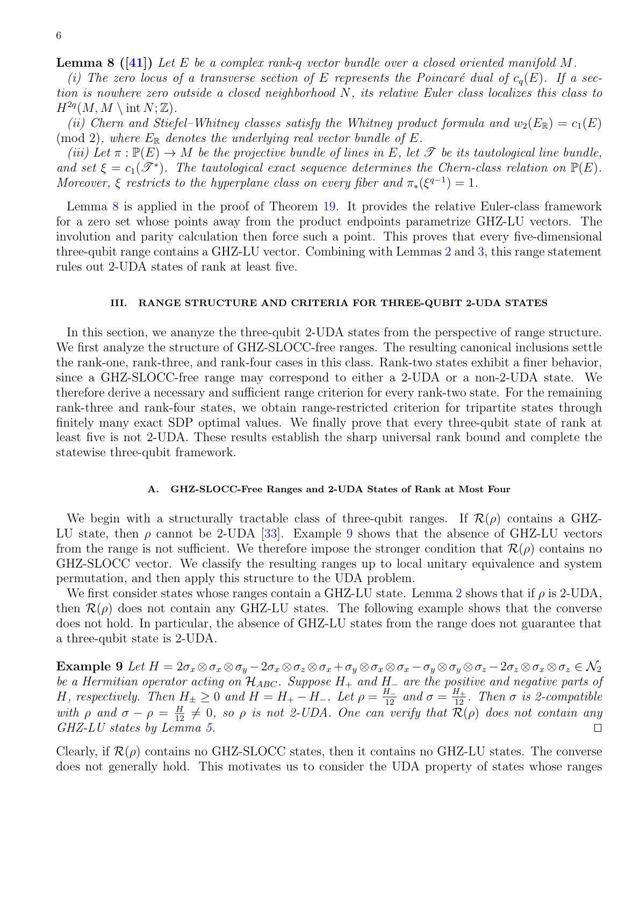 
Low-resolution page preview, page 6

**Summary.** This paper develops advanced range-based criteria to solve the problem of quantum state certification, determining when a mixed quantum state is uniquely specified by its local marginals. Using techniques like range-restricted SDP and analyzing state rank, the authors establish sharp bounds and necessary/sufficient conditions for $k$-UDA in multi-qubit systems. This has direct implications for certifying genuine multipartite entanglement.

**Why it may be interesting.** This work provides rigorous mathematical criteria for state reconstruction from local measurements, which is crucial for understanding the limits of quantum tomography and certifying entanglement in complex quantum systems.

Detailed structure

**Main problem.** The paper addresses the fundamental problem of determining whether a mixed quantum state is uniquely determined by its local $k$-body marginals ($k$-UDA) in quantum system certification.

**Main result.** The authors derive necessary and sufficient range criteria for $k$-UDA states, establishing sharp rank bounds (e.g., no three-qubit state of rank $\ge 5$ is 2-UDA) and characterizing when $(n-1)$-UDA holds for specific families of states.

**Method.** The methodology involves developing a range-based approach by analyzing the structure of the global state's range, utilizing advanced tools like range-restricted semidefinite programming (SDP) and concepts from projective geometry.

**Model / system.** The study focuses on general mixed quantum states on multipartite systems, specifically analyzing three-qubit states and extending results to arbitrary finite-dimensional tripartite and $n$-qubit systems.

**Key observables.** The primary observables are the $k$-body marginals ($M_k(
ho)$), the state's rank, and the certification status ($k$-UDA).

**Important parameters / regimes.** The key parameters include the number of subsystems ($n$), the order of marginals ($k$), and the rank of the quantum state $
ho$.

**Assumptions / limitations.** The analysis builds upon structural tools like characterizing GHZ-SLOCC-free ranges and relies on extending criteria from specific low-rank cases to general multipartite systems.

**Figures summary.** A summary table (Table I) is mentioned, which compiles the derived 2-UDA criteria for three-qubit states, high-rank obstructions for multipartite systems, and results for GME certification.

**Paper structure.** The paper progresses by first establishing the general problem, then deriving specific criteria for three-qubit states (including rank-two analysis), extending these range criteria to arbitrary tripartite states, and finally applying the results to characterize $(n-1)$-UDA for channel-based families and certify genuine multipartite entanglement.

Abstract

Determining whether a mixed quantum state is uniquely determined among all states by its k-body marginals (k-UDA) is a fundamental problem in quantum system certification. We develop a range-based approach to this problem by analyzing the structure of the range of the global state. For three-qubit states, we show that states with GHZ-SLOCC-free ranges are 2-UDA at ranks one, three, and four. We derive a necessary and sufficient range criterion for rank-two 2-UDA states and reduce it to a finite quadratic-form test. To cover the remaining range configurations, we formulate an exact range-restricted semidefinite programming criterion and extend it to arbitrary finite-dimensional tripartite states. We also show that every three-qubit state of rank at least five is not 2-UDA, and further extend high-rank obstructions to multipartite systems. For a channel-based multipartite family, we characterize exactly when a state is $(n-1)$-UDA and show that lower-order marginals never suffice. Finally, we apply these results to the certification of genuine multipartite entanglement.

[↑ back to top](#top)

### [Towards Optimal Quantum Estimators for State Frame Potential](http://arxiv.org/abs/2608.24711v1)

**Authors:** Jinge Bao, Wang Fang, Yoshifumi Nakata, Qisheng Wang  
**Type:** theory · **Category:** quantum information and computing · **PDF:** <https://arxiv.org/pdf/2608.24711v1>  
**Analysis basis:** full PDF text, analyzed in chunks
**Topic relevance:** `quantum measurements` **2/5**

📷 Fig 1

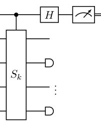 
Figure 1: The generalized SWAP-test circuit. Here, Sk is the cyclic-permutation gate defined in Eq. (157). The last k −1 data registers are discarded (traced out), and the control qubit is measured in the computational basis.

**Summary.** This paper develops optimal quantum estimation protocols for quantifying the state frame potential, a measure of how close a quantum state ensemble is to perfect randomness. It achieves state-of-the-art resource bounds—including a quadratic improvement in query complexity—across three distinct physical access models. The results are highly relevant for characterizing the randomness of quantum states in various physical settings.

**Why it may be interesting.** The work provides rigorous, optimized resource bounds for quantifying quantum randomness, which is a fundamental concept in quantum information theory and has implications for quantum cryptography and state verification.

Detailed structure

**Main problem.** The paper addresses the problem of estimating the state frame potential, $F_t(E)$, of a quantum state ensemble to a specified additive error $\epsilon$. This potential serves as a diagnostic for how close the ensemble is to approximating Haar randomness.

**Main result.** The authors establish near-optimal resource bounds for three different access models: $\Theta(\sqrt{t}/\epsilon)$ queries for the query model, $\Theta(t/\epsilon^2)$ samples for the general sample model, and a complexity dependent on the Rényi entropy for the single-copy model.

**Method.** The methodology involves establishing both upper and lower bounds for the estimation task across different quantum access models (query, general sample, single-copy). Techniques include composing block-encoding primitives and utilizing quantum singular value transformations.

**Model / system.** The analysis focuses on quantum state ensembles $E = \{(\mu_i, |\psi_i
angle)\}$, particularly those derived from projected state ensembles, which are relevant for assessing randomness in subsystems.

**Key observables.** State frame potential $F_t(E)$, additive error $\epsilon$, and the Rényi-$\alpha$ entropy $H_\alpha(\mu)$ of the ensemble weights.

**Important parameters / regimes.** The order of the potential $t$, the desired accuracy $\epsilon$, and the ensemble structure defined by the weights $\mu_i$.

**Assumptions / limitations.** The analysis assumes the existence of specific oracles (e.g., multi-state-preparation oracle) for complexity bounding, and the single-copy model requires prior knowledge of the Rényi entropy.

**Figures summary.** Not specified in the notes; the notes refer to Table 1 which compares resource bounds across the three access models.

**Paper structure.** The paper systematically analyzes the estimation problem under three distinct resource constraints: query access, general sample access, and single-copy sample access, deriving complexity bounds for each.

Abstract

The state frame potential is a standard diagnostic of how closely a quantum state ensemble approximates Haar randomness. In this work, we study the problem of estimating the state frame potential of order $t$ to within additive error $\varepsilon$ under three progressively weaker access models: (i) query access to a multi-state-preparation oracle, (ii) general sample access, and (iii) single-copy sample access. In the query model, we establish a near-optimal query complexity of $\widetildeΘ(\sqrt{t}/\varepsilon)$, yielding a quadratic improvement in the dependence on $t$ over the previous best result of Nakata, Takeuchi, Kliesch, and Darmawan (PRX Quantum 2025). In the general sample model, we establish the optimal sample complexity $Θ(t/\varepsilon^2)$. In the single-copy sample model, we present a store-and-estimate approach whose sample complexity depends on the Rényi entropy of the ensemble weights. As an application, we use the single-copy algorithm to assess the randomness of projected state ensembles, where the entropy term becomes the observational Rényi entropy associated with measuring one subsystem.

[↑ back to top](#top)

### [Weak irreducibility as a spectral criterion for phase coexistence](http://arxiv.org/abs/2608.23757v1)

**Authors:** Onofre Rojas  
**Type:** theory · **Category:** statistical mechanics · **PDF:** <https://arxiv.org/pdf/2608.23757v1>  
**Analysis basis:** full PDF text, analyzed in chunks
**Topic relevance:** `Keldysh / 2PI / non-Gaussian methods` **1/5** · `analog quantum simulation` **1/5** · `driven-dissipative phase transition` **1/5** · `methods for driven-dissipative` **1/5** · `non-equilibrium universality` **1/5** · `quantum measurements` **1/5** · `scars & prethermalization` **1/5**

📷 Fig 1

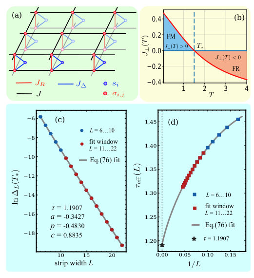 
Figure 1: Decorated bilayer realization and spectral extraction of the interface tension. (a) Schematic representation of the decorated bilayer Ising strip. (b) Effective interlayer coupling J⊥(T) as a function of temperature, showing the crossover between the FM and FR sectors at T = T∗. (c) ln ∆L(T∗) versus strip width L, with the corrected finite-width fit. (d) Effective interface tension τeff(L) = −(T∗/L) ln ∆L(T∗) versus 1/L. Parameters: J = 1, J∆= 1.0, JR ≈ −0.5305, and T∗= 1.5.

📷 Fig 2

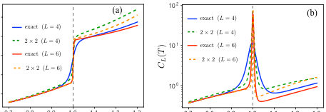 
Figure 2: Thermodynamic signatures of finite-size coexistence. (a) Entropy per site sL(T) as a function of T/T∗for strip widths L = 4 and L = 6, comparing the full transfer-matrix result with the effective two-sector (2 × 2) description. The vertical dashed line indicates the balance temperature T = T∗. (b) Specific heat per site CL(T) on a logarithmic scale for the same strip widths. The sharpening of the entropy crossover and of the specific-heat anomaly with increasing L is consistent with the narrowing of the finite-size coexistence window. Parame- ters: J = 1, J∆= 1.0, JR ≈−0.5305, and T∗= 1.5.

📷 Fig 3

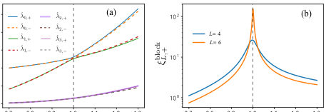 
Figure 3: Low-lying parity towers and block spectral length. (a) Leading nor- malized transfer-matrix eigenvalues ˆλn,+ (solid lines) and ˆλn,−(dashed lines) for L = 4 as functions of T/T∗, where ± denotes the global spin-flip parity. The low-energy spectrum organizes into nearly degenerate parity pairs. (b) Block spectral length ξblock L,+ , defined by Eq. (78), in the even global spin-flip parity block for L = 4 and L = 6. The vertical axis is logarithmic. Parameters: J = 1, J∆= 1.0, JR ≈−0.5305, and T∗= 1.5. Panel (a) reveals the symmetry-resolved organization of the low-energy manifold, whereas panel (b) shows the growth of the longest coexistence-related scale after the global...

**Summary.** This paper introduces 'weak irreducibility' as a spectral criterion to differentiate true thermodynamic phase coexistence from pseudo-transitions in finite systems. By analyzing the transfer operator's spectrum, the authors show that genuine coexistence requires the inter-sector connectivity to vanish in the thermodynamic limit. This provides a deep spectral understanding of how finite-size effects round off phase transitions.

**Why it may be interesting.** The spectral analysis provides a powerful, non-perturbative tool to characterize the nature of phase transitions, linking spectral properties directly to thermodynamic phase boundaries, which is relevant for understanding quantum critical points and phase separation in many-body systems.

Detailed structure

**Main problem.** To establish a rigorous, operator-level criterion to distinguish genuine thermodynamic phase coexistence from mere avoided crossings (pseudo-transitions) in finite-size systems.

**Main result.** Genuine phase coexistence emerges as the singular limit where inter-sector connectivity vanishes, leading to a reducible thermodynamic manifold, while pseudo-transitions retain finite connectivity.

**Method.** The analysis uses the transfer-matrix formalism, decomposing the operator into sector imbalance and inter-sector connectivity components to analyze the spectral structure.

**Model / system.** The study applies to statistical mechanics systems undergoing first-order phase transitions, analyzed using restricted transfer operators for finite transverse width (L).

**Key observables.** Sector imbalance, spectral gap (connectivity), and the weak irreducibility of the transfer operator.

**Important parameters / regimes.** Finite size (L), temperature (T), and the interface tension ($	au$).

**Assumptions / limitations.** The analysis assumes short-range interactions and relies on the Peierls estimate to show exponential suppression of connectivity in $d \ge 2$ systems.

**Paper structure.** The paper develops the effective two-sector transfer-operator reduction, introducing imbalance and connectivity coordinates, and then applies this framework to distinguish between pseudo-transitions (finite connectivity) and true coexistence (vanishing connectivity).

Abstract

Conventional finite-size theories describe first-order coexistence through free-energy competition and interfacial tunneling, but the distinct spectral roles of sector balance and inter-sector connectivity are not usually explicit. We show that pseudo-transitions and thermodynamic phase coexistence are governed by two spectral coordinates: sector imbalance locates balance, while connectivity determines whether that balance remains avoided. At balance, finite connectivity produces a unique dominant state with equal spectral weights in the symmetrized two-sector representation. For short-range systems with positive interface tension, interfacial costs suppress the connectivity exponentially, close the coexistence splitting, and asymptotically restore reducibility. Thus, genuine phase coexistence emerges as the singular limit of finite-size avoided coexistence, whereas one-dimensional pseudo-transitions retain finite connectivity. In a decorated bilayer Ising model, the coexistence gap at independently est

[↑ back to top](#top)

### [Classification of Non-Hermitian Flat Bands](http://arxiv.org/abs/2608.23769v1)

**Authors:** Chang-geun Oh, Jun-Won Rhim  
**Type:** theory · **Category:** strongly correlated electrons · **PDF:** <https://arxiv.org/pdf/2608.23769v1>  
**Analysis basis:** full PDF text, analyzed in chunks
**Topic relevance:** `Keldysh / 2PI / non-Gaussian methods` **1/5** · `analog quantum simulation` **1/5** · `correlated / nonlocal dissipation` **1/5** · `driven-dissipative phase transition` **1/5** · `methods for driven-dissipative` **1/5** · `non-equilibrium universality` **1/5**

📷 Fig 1

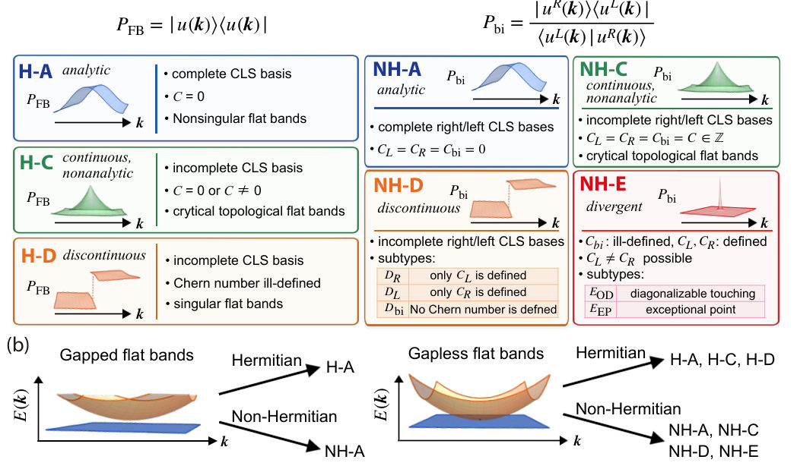 
FIG. 1. Projector-regularity classification of Hermitian and non-Hermitian exact flat bands. (a) Hermitian flat bands are classified by the regularity of the flat-band projector PFB(k): analytic (H-A), continuous but nonanalytic (H-C), and discontinuous (H-D). In non-Hermitian systems, the corresponding classification is governed by the biorthogonal projector Pbi(k), yielding NH-A, NH-C, NH-D, and NH-E. (b) Relation to spectral isolation. A gapped flat band is necessarily analytic (H-A or NH-A), whereas gapless flat bands can realize all Hermitian classes or the NH-A–NH-E hierarchy, depending on the regularity of the corresponding projector.

📷 Fig 2

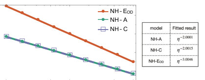 
FIG. 2. Chern-mismatch-induced enhancement of driven in- terorbital transfer. (a)–(c) Band structures of the NH-A, NH-C, and NH-EOD control models (see SM for details). (d)–(f) Magni- tude of the off-diagonal biorthogonal flat-band projector element, |(Pbi)AB(k)|. CL, CR and Cbi indicate left-eigenstate Chern num- ber, right-eigenstate Chern number and biorthogonal Chern num- ber, respectively. (g)–(i) Cross-orbital transfer intensity TB→A(k) at η = 0.1. (j) The maximum transfer intensity T max as a function of damping rate η and the fitted exponents.

**Summary.** This paper introduces a comprehensive, projector-based classification system for non-Hermitian flat bands, distinguishing four classes based on the mathematical regularity of the system's biorthogonal projector. The core finding is that the breakdown of projector continuity leads to topological invariants mismatch ($C_R 
eq C_L$), which is directly correlated with an anomalous enhancement in resonant cross-orbital energy transfer.

**Why it may be interesting.** The work provides a rigorous mathematical framework linking topological invariants (Chern numbers) to measurable transport phenomena (cross-orbital transfer) in non-Hermitian systems, which is highly relevant for understanding open quantum systems and engineered materials.

Detailed structure

**Main problem.** The paper establishes a projector-based classification scheme for non-Hermitian (NH) flat bands, extending known concepts from Hermitian systems.

**Main result.** The classification identifies four classes (NH-A, NH-C, NH-D, NH-E) based on the regularity of the biorthogonal projector, showing that topological mismatch ($C_R 
eq C_L$) in the NH-E class leads to anomalous resonant cross-orbital transfer.

**Method.** The methodology involves analyzing the mathematical regularity (analyticity, continuity, singularity) of the biorthogonal projector $P_{bi}(k)$ across the Brillouin zone and relating this regularity to topological invariants (Chern numbers) and transport properties.

**Model / system.** The study focuses on electronic systems exhibiting flat bands described by non-Hermitian Hamiltonians ($H 
eq H^\dagger$). The analysis compares the behavior of these bands across different mathematical regimes defined by the projector's properties.

**Key observables.** Right Chern number ($C_R$), Left Chern number ($C_L$), Biorthogonal Chern number ($C_{bi}$), and the cross-orbital transfer intensity $T_{B	o A}(k)$.

**Important parameters / regimes.** The classification depends critically on the regularity of the biorthogonal projector $P_{bi}(k)$ at the band touching points.

**Assumptions / limitations.** The analysis is primarily restricted to rank-one flat bands, though generalizations to higher-rank manifolds are mentioned as future work.

**Figures summary.** Figures illustrate the comparison between Hermitian and non-Hermitian classifications, showing band structures, projector magnitudes, and the scaling of maximum cross-orbital transfer intensity ($T_{	ext{max}}$) versus damping rate ($\eta$) for different classes.

**Paper structure.** The paper first introduces the need for a projector-based classification for NH flat bands. It then details the four classes (NH-A to NH-E) based on projector regularity, linking each class to specific topological invariants and measurable physical responses like cross-orbital transfer scaling.

Abstract

Exact flat bands provide a versatile setting for correlated and topological phenomena, yet their properties are controlled not only by their dispersion but also by the structure of their Bloch projectors. Here, we establish a projector-based classification of non-Hermitian flat bands. In contrast to Hermitian flat bands, non-Hermiticity introduces a biorthogonal projector whose left-right pairing permits a distinct norm-pole singularity. We identify four classes: analytic NH-A, continuous but nonanalytic NH-C, bounded but discontinuous NH-D, and pole-singular NH-E. We show that continuity of the biorthogonal projector preserves the locking of the right, left, and biorthogonal Chern numbers, $C_R=C_L=C_{\rm bi}$, thereby realizing non-Hermitian critical topological flat bands. Once continuity is lost, this locking can break down; in particular, a mismatch $C_R\neq C_L$ can occur in the NH-E class. Finally, we show that this Chern number mismatch ensures to produce an anomalous enhancement of resonant cross-orbital transfer. Our results establish biorthogonal projector regularity as the organizing principle linking compact localized states, topology, and driven response in non-Hermitian flat bands.

[↑ back to top](#top)

### [Beyond capillary condensation: Shear-induced bridging transitions in patterned slits](http://arxiv.org/abs/2608.24755v1)

**Authors:** Alexandr Malijevský, Andrew O. Parry, Jiří Janek  
**Type:** theory · **Category:** statistical mechanics · **PDF:** <https://arxiv.org/pdf/2608.24755v1>  
**Analysis basis:** full PDF text, analyzed in chunks
**Topic relevance:** `Frenkel-Kontorova` **1/5** · `Keldysh / 2PI / non-Gaussian methods` **1/5** · `analog quantum simulation` **1/5** · `driven-dissipative phase transition` **1/5** · `non-equilibrium universality` **1/5**

📷 Fig 1

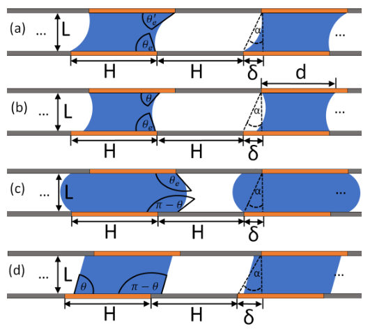 
FIG. 1. A patterned slit of width L with alternating stripes of competing wettability, A (orange) and B (gray), each of width H, laterally displaced by δ. (a) Type I bridging: both menisci are pinned at the patch edges and meet the walls at edge contact angles θe and θ′ e = θe −2α. (b) Type IIA bridging for p &lt; psat: one end of the meniscus is pinned and the other is unpinned meeting patch A with contact angle θ, so that the bridge covers only a length d ≤H. (c) Type-IIB bridging, for p &gt; psat, where the unpinned end meets patch B at angle π −θ. (d) Type III, for p = psat, where the menisci are planar whose ends are unpinned and meet patch A at contact angle θ and patch B at contact angle π...

📷 Fig 2

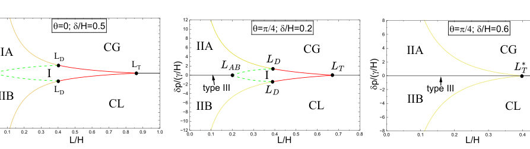 
FIG. 2. Sections of the surface phase diagram showing the phase boundaries separating the stability of the capillary gas (CG), capillary liquid (CL), pinned (type I), and partially pinned (type IIA, B) bridging phases, for different slit widths and pressures: a) maximum contrast b) partial contrast with δ &lt; δ†, c) partial contrast with δ &gt; δ†. For partial contrast, and only at δp = 0, the bridging phases are of type III and the menisci can freely slide until they meet an AB boundary.

📷 Fig 3

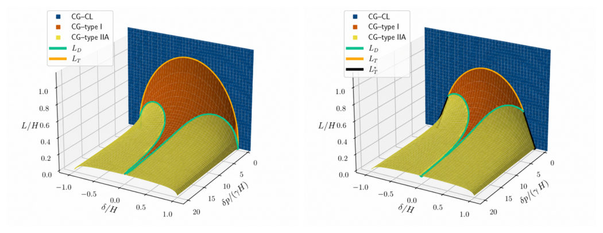 
FIG. 3. Three dimensional phase diagrams showing the surfaces of first-order CG→CL (blue), CG→type I bridge (red) and CG →type IIA (yellow) bridge phases for maximum and partial contrast. The green line is the crossover between type I and type IIA bridging phases. At δp = 0, three-phase coexistence occurs along the orange and black lines between CG, CL and type I and type III bridging phases, respectively. Left: maximum contrast slit (θ = 0); right: partial contrast slit (θ = 30◦).

📷 Fig 4

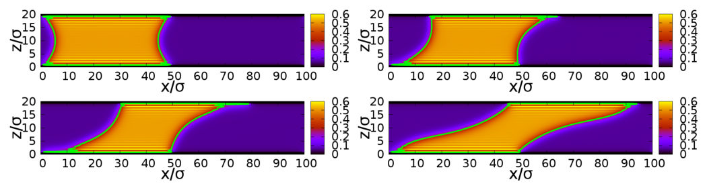 
FIG. 4. DFT equilibrium density profiles for a maximum contrast slit with H = 50 σ, L = 20 σ and increasing shear displace- ments. Each of the these bridging states coexist with a CG phase. For δ = 0, 15, and 45 σ the bridging is of type I involving pinned menisci. For the intermediate shear with δ = 30 σ, the bridging phase is of type II, and only one end is pinned. For the largest shear with δ = 45 σ which corresponds to the triple point where CG, CL and type I bridge coexist, the menisci remain strongly curved, even though the pressure is very close to bulk saturation demonstrating deviations from the macroscopic expectation due to the influence of intermolecular forces.

📷 Fig 5

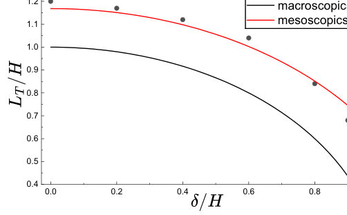 
FIG. 5. Triple-point line LT (δ) for the maximum contrast case (θ = 0) showing the comparison between the macro- scopic, mesoscopic and microscopic DFT results. Mesoscopic results account for long-ranged intermolecular forces which af- fect the surface free-energy of wetting drops and drying bub- bles on the A and B patches.

**Summary.** This work theoretically maps the complex phase diagram of a fluid confined between patterned walls subjected to shear. The competition between capillary condensation and interface delocalization forces the formation of novel 'bridging phases.' The research uses generalized Kelvin equations and DFT to predict multiple types of phase transitions, providing detailed insights into how geometry and external fields dictate fluid behavior.

**Why it may be interesting.** The study of confined fluids and wetting transitions, especially when coupled with external fields like shear, provides a rich playground for testing theories of phase transitions and interfacial physics, which share conceptual links with many-body systems in external potentials.

Detailed structure

**Main problem.** The study investigates the equilibrium phase behavior of a fluid confined within a slit formed by two patterned walls, focusing on the complex transitions induced by external shear.

**Main result.** The competition between capillary condensation and interface delocalization leads to an unusually rich phase diagram featuring multiple bridging phases (Type I, IIA, IIB, III) and both first-order and continuous phase transitions.

**Method.** The analysis employs generalized Kelvin equations to determine phase boundaries, supplemented by a microscopic density functional model (DFT) to characterize the bridging phases.

**Model / system.** The system is a fluid confined in a slit with patterned walls exhibiting competing wetting properties, subjected to a lateral shear displacement. The theoretical framework utilizes the grand potential ($\Omega$) calculated from surface tensions.

**Key observables.** Phase identification (CG, CL, bridging phases), phase transition types (first-order/continuous), and the correlation length ($\xi_y$) within the bridging phases.

**Important parameters / regimes.** Slit width ($L$), shear displacement ($\delta$), and the wetting contrast ($	heta$). Specific regimes are defined by comparing $L$ and $\delta$ against critical widths like $L_T(\delta)$ and $L_D(\delta)$.

**Assumptions / limitations.** The analysis relies on macroscopic descriptions corrected by mesoscopic terms (e.g., logarithmic corrections to the triple line) and uses DFT approximations for the grand potential.

**Figures summary.** Figures illustrate the four types of bridging states based on pinning conditions, show surface phase diagrams detailing transitions between gas, liquid, and bridging phases, and compare theoretical predictions for the triple-point line $L_T(\delta)$.

**Paper structure.** The paper systematically maps out the phase diagram by analyzing different slit width regimes (e.g., $L > L_T(\delta)$ vs. $L < L_D(\delta)$) under varying shear conditions, deriving specific equations for phase boundaries for each transition type.

Abstract

We study the equilibrium phase behavior of a fluid confined in a slit made from two patterned walls. Shearing the walls frustrates the fluid, due to a competition between capillary condensation and interface delocalization, forcing the formation of bridging phases with different pinning properties. This leads to an unusually rich phase diagram, displaying first-order and continuous phase transitions, depending sensitively on the slit width and shear. Generalized Kelvin equations determine the phase boundaries, while the bridging phases are characterized by large correlation lengths, predictions for which are tested using a microscopic density functional model.

[↑ back to top](#top)

### [Weaving Hopfions from Emergent Monopoles in a Chiral Magnet](http://arxiv.org/abs/2608.24116v1)

**Authors:** Shoya Kasai, Kotaro Shimizu, Shun Okumura, Yukitoshi Motome  
**Type:** theory · **Category:** other · **PDF:** <https://arxiv.org/pdf/2608.24116v1>  
**Analysis basis:** full PDF text, analyzed in chunks
**Topic relevance:** `Keldysh / 2PI / non-Gaussian methods` **1/5** · `driven-dissipative phase transition` **1/5** · `methods for driven-dissipative` **1/5** · `non-equilibrium universality` **1/5**

📷 Fig 1

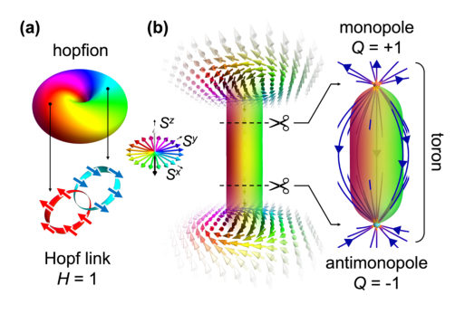 
FIG. 1. (a) A hopfion (top) and its two preimages (bottom). The preimages form a Hopf link that characterizes the hopfion topology with the Hopf number H = 1. (b) A skyrmion tube (left) and a toron (right). The toron is obtained by cutting the skyrmion tube at two points, where an emergent monopole and antimonopole are located. As illustrated by the blue streamlines, these defects serve as a source and a sink of the emergent magnetic field, which carry monopole charges Q = +1 and −1, respectively. The color code placed between (a) and (b) is used throughout this paper to represent spin configurations.

📷 Fig 2

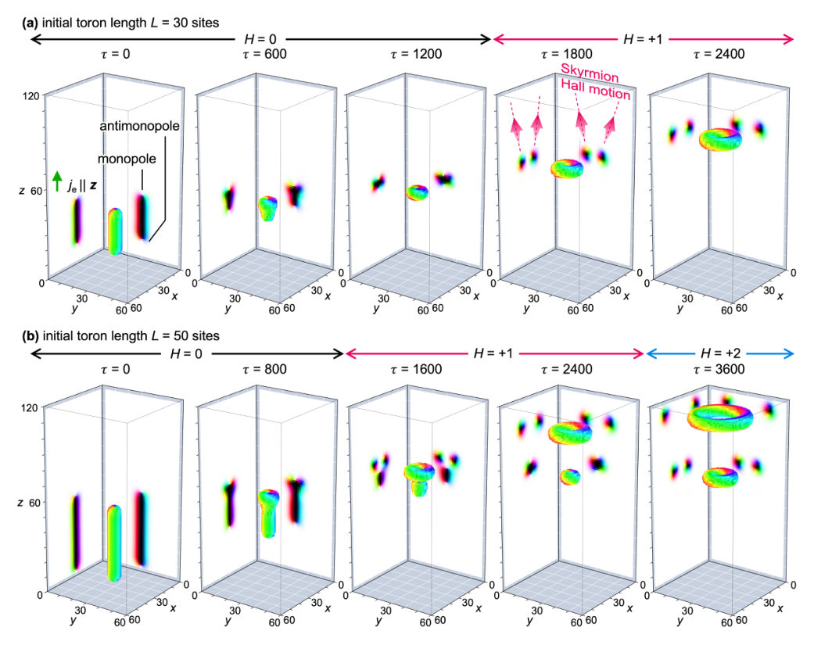 
FIG. 2. Current-driven dynamics of torons with initial lengths: L = 30 in (a) and L = 50 in (b), calculated for je = 0.4 and β = 0.05. Each panel shows the 3D spin structure and its 2D projections. In the 3D views, only regions satisfying Sz ≲0 are displayed, while empty regions correspond to Sz ≃1. The two boundary faces show the 2D configurations at x = 30 and y = 30. In the rightmost panel of (b), the entire structure is shifted by 30 lattice sites along the z direction for clarity.

📷 Fig 3

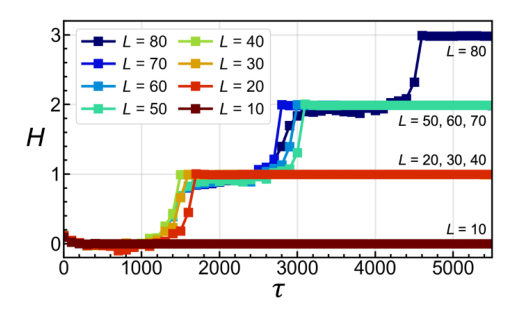 
FIG. 3. Time evolution of the Hopf number in Eq. (1) for different initial toron length L. We set je = 0.4 and β = 0.05.

📷 Fig 4

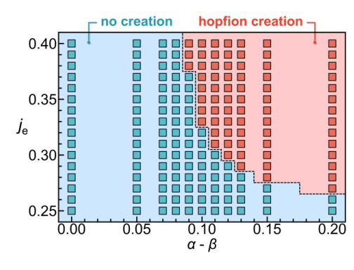 
FIG. 4. Final-state diagram at τ = 7000 for fixed damp- ing α = 0.2. Squares represent simulated parameter sets, while the dashed line denotes the phase boundary. In the red-shaded region, hopfion creation occurs within the simula- tion time range, whereas in the blue-shaded region the MAM annihilates and the system relaxes to a topologically trivial state. The final states are distinguished by calculating the Hopf number in Eq. (1).

📷 Fig 5

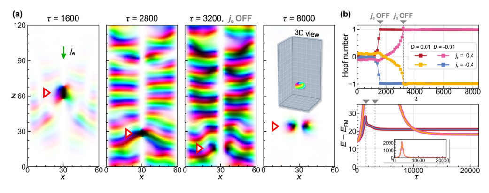 
FIG. 5. (a) The snapshots of the cross section at y = 30 plane during the toron dynamics driven by a pulse current with je = −0.4. The current is switched off at τ = 3200. All simulation conditions except the current direction are the same as those in Fig. 2(a), therefore the initial state is omitted here. The red triangle in each panel marks the position of the tracked spin texture. (b) The upper panel shows the time evolution of the Hopf number for the four combinations of current direction and the sign of the DMI. For the cases shown in red and blue, the current is switched off at τ = 1600 to compare the energy of the created hopfions. The lower panel shows the corresponding time...

**Summary.** This work proposes a current-driven mechanism to create magnetic hopfions, which are topologically knotted spin textures, starting from initial magnetic torons. By simulating the dynamics using the LLG equation, the authors show that the annihilation of an emergent monopole-antimonopole pair, induced by an electric current, converts the toron into a hopfion. This establishes a controllable, current-mediated route for generating complex topological states in chiral magnets.

**Why it may be interesting.** The study connects macroscopic current-driven dynamics (STT) to the creation of highly non-trivial topological excitations (Hopfions), providing a pathway to study knot theory in condensed matter systems, which is relevant to understanding complex magnetic memory or spintronic devices.

Detailed structure

**Main problem.** The primary goal is to establish a controlled, deterministic mechanism for generating magnetic hopfions, which possess complex knotted topology, from simpler magnetic textures like torons.

**Main result.** The study demonstrates that applying an electric current drives the annihilation of an emergent monopole-antimonopole pair within a toron, successfully converting it into one or more hopfions.

**Method.** The dynamics are simulated by solving the Landau-Lifshitz-Gilbert (LLG) equation, incorporating spin-transfer torque (STT) driven by an external current.

**Model / system.** The system is a chiral magnet modeled by a Hamiltonian including exchange, Dzyaloshinskii-Moriya interaction (DMI), and Zeeman coupling. The dynamics are governed by the LLG equation under the influence of STT.

**Key observables.** Hopf number (H), which quantifies the knot topology; toron length (L); and the time evolution of the topological invariant.

**Important parameters / regimes.** The initial toron length (L) dictates the number of hopfions; the sign of the applied current controls the sign of the Hopf invariant; and the threshold current is sensitive to material parameters.

**Assumptions / limitations.** The mechanism relies on the competition between toron length shortening and radial expansion, and the initial state is assumed to be metastable.

**Figures summary.** Figures illustrate the hopfion topology and toron structure, show the time evolution of toron dynamics under current for varying initial lengths, and plot the time evolution of the Hopf number to distinguish between trivial annihilation and hopfion generation.

**Paper structure.** The paper develops the theoretical framework using the LLG equation, simulates the evolution of torons under current, analyzes the dependence of the final topological state (Hopfion vs. trivial) on initial length and current strength, and concludes by mapping out an experimentally accessible creation pathway.

Abstract

Recent advances in three-dimensional magnetization imaging techniques have opened new avenues for exploring topological spin textures beyond domain walls and skyrmions. Among them, magnetic hopfions are particularly promising, as their knotted topology is expected to give rise to unconventional dynamics and responses; however, their controlled creation remains challenging. Here we propose a simple mechanism for generating hopfions from magnetic torons, three-dimensional textures hosting an emergent monopole-antimonopole pair. Using Landau-Lifshitz-Gilbert simulations, we show that an electric current drives the annihilation of this pair, converting a toron into a hopfion. The initial toron length determines the number of generated hopfions, while the current direction selects the sign of the Hopf invariant. We further find that the threshold current depends sensitively on material parameters, indicating a close connection to skyrmion dynamics. Our results establish an experimentally accessible route to hopfion creation and reveal a pathway from monopole defects to knotted topological textures.

[↑ back to top](#top)

### [Anomalous magnetocaloric effects in the quasi-one-dimensional antiferromagnet BaCo$_2$V$_2$O$_8$](http://arxiv.org/abs/2608.24463v1)

**Authors:** Jiahao Yang, Chao Dong, Xinlong Shi, Zhuo Wang, Tiantian Li, Liusuo Wu, Junfeng Wang, Zhangzhen He, Liang Li, Yongkang Luo, Jianda Wu  
**Type:** both · **Category:** other · **PDF:** <https://arxiv.org/pdf/2608.24463v1>  
**Analysis basis:** full PDF text, analyzed in chunks
**Topic relevance:** `analog quantum simulation` **1/5** · `methods for driven-dissipative` **1/5**

📷 Fig 1

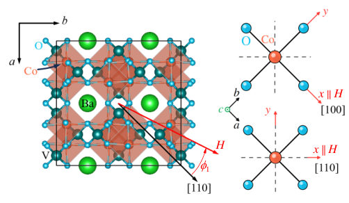 
FIG. 1. Crystalline structure of BaCo2V2O8 and geometry for the transverse-field directions H ∥[110] and H ∥[100] relative to the screw-chain local axes.

📷 Fig 2

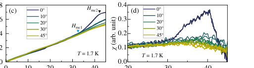 
FIG. 2. Experimental MCE and magnetization data of BaCo2V2O8 under magnetic field. The angle ϕ1 = 0◦de- notes H ∥[110] and ϕ1 = 45◦denotes H ∥[100]. (a) For H ∥[110], the temperature-dependent MCE data show that a single broad dip evolves into two dips (Hmc1 and Hmc2) as the temperature is lowered. (b) The T0 = 1.6 K MCE at var- ious angles. The curves are vertically shifted for clarity. (c) Angle-dependent magnetization (M) and (d) the correspond- ing magnetic susceptibility (χ = dM/dH) with high-field fea- tures near [110].

📷 Fig 3

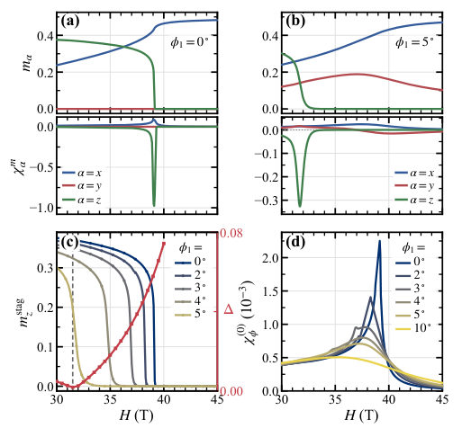 
FIG. 3. Magnetization, magnetic susceptibility and gener- alized susceptibility of the screw-chain XXZ model at zero- temperature. (a), (b) Uniform transverse magnetization mx, staggered components mstag y and mstag z , and their field deriva- tives χm α for ϕ1 = 0◦and 5◦, respectively. (c) Field depen- dence of mstag z for various ϕ1. The red line shows the exci- tation gap ∆for ϕ1 = 5◦, whose minimum (vertical dashed line) follows the collapse of mstag z at Hthr 1 . (d) Generalized susceptibility χ(0) ϕ for selected angles, showing the high-field response that defines Hthr 2 .

📷 Fig 4

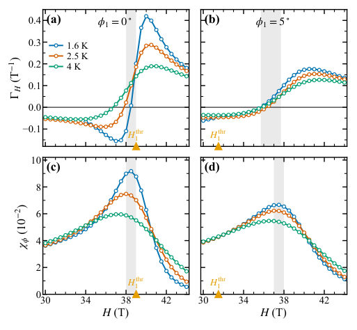 
FIG. 5. Finite-temperature Gr¨uneisen ratio ΓH (a,b) and susceptibility (c,d) of the screw-chain XXZ model for ϕ1 = 0◦(left) and 5◦(right). Gray bands mark the lowest- temperature ΓH sign-change regions and the corresponding lowest-temperature χϕ peak regions. Orange triangles mark the expected Ising transition fields Hthr 1 .

📷 Fig 5

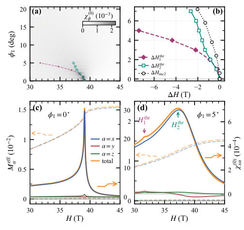 
FIG. 4. Angular evolution and component-resolved response of the screw-chain XXZ model at zero temperature. (a) In- tensity map of the generalized susceptibility χ(0) ϕ . Magenta diamonds and teal open squares mark Hthr 1 and Hthr 2 , respec- tively. (b) Angular shifts ∆Hi(ϕ1) = Hi(ϕ1) −Hi(0) of Hthr 1 , Hthr 2 , and the experimental Hmc2 values from Fig. 2(b). Black open circles mark the experimental data. (c),(d) Hellmann– Feynman decompositions of M (0) ϕ (dashed curves, left axes)

**Summary.** This paper investigates the magnetocaloric effect in the quasi-1D antiferromagnet BaCo2V2O8 by combining angle-resolved measurements with advanced tensor-network simulations. The research distinguishes between the field associated with the Ising critical point and a higher-field transverse response. It concludes that the MCE can be engineered by tailoring anisotropic Zeeman couplings, opening a route for magnetic cooling in quantum magnets.

**Why it may be interesting.** The work provides a detailed study of magnetic phase transitions and thermodynamic responses in a highly anisotropic quantum magnet, which is relevant for understanding magnetic field control over quantum ground states.

Detailed structure

**Main problem.** To determine whether the anomalous magnetocaloric effect (MCE) in the quasi-1D antiferromagnet BaCo2V2O8 is governed by the intrinsic Ising critical field or by transverse spin fluctuations when the applied magnetic field is rotated.

**Main result.** The dominant MCE response persists away from the intrinsic Ising critical region, suggesting that magnetic cooling can be achieved by engineering anisotropic Zeeman-coupling configurations in quantum magnets.

**Method.** The study combines angle-resolved MCE measurements with tensor-network calculations (DMRG) on an effective XXZ spin chain model.

**Model / system.** The system is the quasi-one-dimensional Ising-like antiferromagnet BaCo2V2O8, modeled by an effective spin-1/2 XXZ chain Hamiltonian incorporating site-dependent Zeeman couplings due to the material's geometry and anisotropic g-tensor.

**Key observables.** Magnetocaloric effect (MCE), magnetic Grüneisen ratio ($\Gamma_H$), Ising critical field ($H_{	ext{thr1}}$), and high-field temperature minimum ($H_{	ext{mc2}}$).

**Important parameters / regimes.** Applied magnetic field up to 45 T, temperature range around 1.6 K, and field rotation angles ($\phi_1$).

**Assumptions / limitations.** The system can be effectively described by an XXZ chain model, and DMRG methods are used to calculate ground state and finite-temperature properties.

**Figures summary.** Figures illustrate the crystal structure and geometry for different field directions, showing experimental MCE dips and angle-dependent magnetization/susceptibility data.

**Paper structure.** The paper progresses by establishing the physical model and experimental measurements, then using theoretical calculations (DMRG) to analyze the field dependence of various magnetic order parameters and thermodynamic quantities, culminating in a comparison between the theoretical and experimental findings regarding the MCE source.

Abstract

We investigate the transverse-field thermodynamics of the quasi-one-dimensional Ising-like antiferromagnet BaCo$_2$V$_2$O$_8$, whose tilted screw-chain geometry and anisotropic Landé $g$ tensor generate spatially modulated Zeeman couplings. Angle-resolved magnetocaloric-effect (MCE) measurements reveal a high-field temperature minimum near the transverse-field Ising critical field for $H\parallel[110]$ that persists and shifts only weakly upon field rotation. Tensor-network calculations show that the rotation-induced staggered transverse field rapidly lowers the Ising critical field and that the magnetic Grüneisen ratio changes sign near the high-field temperature minimum, consistent with experiment. Our results establish that a dominant MCE response can persist away from the Ising critical region, suggesting a route to magnetic cooling by tailoring anisotropic Zeeman-coupling configurations in quantum magnets.

[↑ back to top](#top)

### [Exact autoregressive sampling of planar Ising spin glasses via the Kac--Ward theory](http://arxiv.org/abs/2608.24382v1)

**Authors:** Jing Liu, Tao Chen, Tianrui Che, Lei Wang, Youjin Deng, Pan Zhang  
**Type:** theory · **Category:** disordered systems and neural networks · **PDF:** <https://arxiv.org/pdf/2608.24382v1>  
**Analysis basis:** full PDF text, analyzed in chunks
**Topic relevance:** `analog quantum simulation` **1/5** · `methods for driven-dissipative` **1/5**

📷 Fig 1

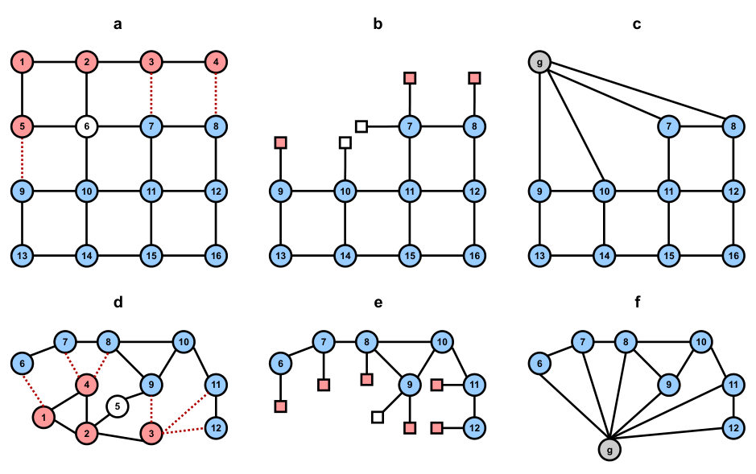 
FIG. 1. Schematic illustration of the exact autoregressive sampling algorithm via the Kac–Ward formula. (a) Snapshot of the sampling process on a 4 × 4 square lattice using a raster-scan order. The spins are partitioned into three sets: the frozen spins s&lt;i (red), the current spin si being sampled (white), and the unsampled spins s&gt;i (blue). The interactions between the frozen spins and the unsampled spins induce effective local fields on the boundary sites (dashed red lines). (b) The subgraph described by Eq. (10). (c) The auxiliary spin construction. To evaluate the partition functions Q± i in (b) using the Kac–Ward formula, the effective local fields are replaced by pairwise couplings to...

📷 Fig 2

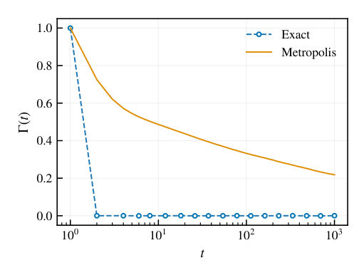 
FIG. 2. Autocorrelation function Γ(t) of the energy for the 2D EA spin glass. The simulation was performed on a 16×16 lattice at temperature T = 0.5 (β = 2). The Metropolis al- gorithm (orange) shows a stretched exponential decay, while the exact autoregressive sampler (blue) yields Γ(t) = δt,0, con- firming strictly i.i.d. samples. The disorder realizations are taken from Ref. [24]. Data are averaged over 100 independent runs.

📷 Fig 3

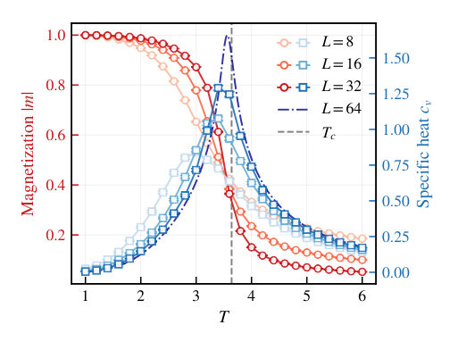 
FIG. 3. Validation on the triangular FM Ising model. The magnetization per spin |m| (red, left axis) and the specific heat per spin cv (blue, right axis) are plotted as a function of temperature T. The values are estimated on 10 000 i.i.d. samples. The specific heat curve for L = 64 is obtained by directly differentiating ln Z with respect to temperature. The vertical dotted line indicates the theoretical critical tempera- ture Tc = 4J/ ln 3 ≈3.641.

📷 Fig 4

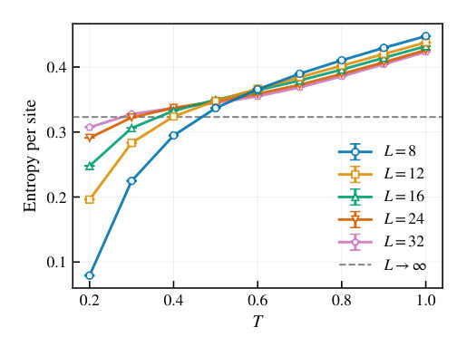 
FIG. 4. Direct entropy estimation via exact likelihoods. Tem- perature dependence of the entropy per site for the triangular AFM Ising model with system sizes L = 8 to 32. The hor- izontal dashed line marks the theoretical zero-temperature residual entropy (S0 ≈0.323).

**Summary.** This paper presents an exact autoregressive sampling algorithm for planar Ising spin glasses by creatively adapting the Kac--Ward theory. It overcomes the mathematical hurdles posed by boundary fields in conditional probability calculations using an auxiliary spin construction. The resulting method generates perfectly uncorrelated samples, offering a crucial, exact benchmark for validating approximate machine learning samplers in disordered systems.

**Why it may be interesting.** While focused on classical statistical mechanics, the development of an exact, non-Markovian sampling technique that provides a rigorous benchmark for neural samplers is highly relevant to developing robust generative models for complex physical systems.

Detailed structure

**Main problem.** The primary challenge is achieving exact sampling from the Boltzmann distribution of spin glasses, as standard MCMC methods suffer from critical slowing down, and modern neural samplers are only approximate.

**Main result.** The authors developed an exact autoregressive sampling algorithm that generates strictly i.i.d. samples with exact normalized likelihoods, providing a rigorous baseline for benchmarking machine learning samplers.

**Method.** The method adapts the Kac--Ward theory by introducing a planarity-preserving auxiliary spin construction to map the conditional partition functions, which are otherwise corrupted by boundary fields, into an extended zero-field Ising model solvable by a determinant formula.

**Model / system.** The system studied is the planar Ising spin glass, governed by the Hamiltonian E(s) = -sum<i,j> J_ij s_i s_j. The analysis is applied to specific cases like the triangular AFM Ising model.

**Key observables.** Autocorrelation function (expected to be delta-correlated, $\delta_{t,0}$), Entropy (S), Magnetization (|m|), and Specific Heat (c_v).

**Important parameters / regimes.** Temperature (T), system size (N), and the coupling constants J_ij.

**Assumptions / limitations.** The method relies critically on the planarity of the underlying graph structure and the successful construction of the auxiliary spin to maintain solvability.

**Figures summary.** Figures illustrate the sampling process using auxiliary spins, compare autocorrelation functions (Metropolis vs. exact sampler), and show temperature dependence of observables like entropy and specific heat.

**Paper structure.** The paper establishes the difficulty of exact sampling, introduces the Kac--Ward theory framework, details the novel auxiliary spin construction to handle boundary fields, derives the conditional probabilities via determinant ratios, and finally validates the method by calculating observables like entropy and comparing autocorrelation functions.

Abstract

Exact sampling from the Boltzmann distribution of spin glasses remains an outstanding challenge: Markov chain Monte Carlo methods suffer from critical slowing down and metastable trapping, while modern neural autoregressive samplers such as variational autoregressive networks are approximate and, in the absence of exact reference samples, cannot be rigorously benchmarked. Here we present an exact autoregressive sampling algorithm for planar Ising spin glasses based on the Kac--Ward theory. Under the chain-rule factorization, sequentially fixing spins induces boundary-localized external fields, which destroy the zero-field structure required for exact evaluation. By encoding these fields with a planarity-preserving auxiliary spin construction, the conditional partition functions are mapped to an extended zero-field Ising model and exactly evaluated using the Kac--Ward determinant formula. The method generates strictly independent and identically distributed samples with exact normalized likelihoods at a computational cost of $\mathcal{O}(N^{5/2})$ for $N$ spins, thereby providing an exact baseline for benchmarking neural autoregressive samplers.

[↑ back to top](#top)

### [Fast generation of spectrally-shaped disorder, on the sphere](http://arxiv.org/abs/2608.24867v1)

**Authors:** Mathias Casiulis, Stefano Martiniani  
**Type:** theory · **Category:** disordered systems and neural networks · **PDF:** <https://arxiv.org/pdf/2608.24867v1>  
**Analysis basis:** full PDF text, analyzed in chunks
**Topic relevance:** `analog quantum simulation` **1/5** · `interference shaping light` **1/5**

📷 Fig 1

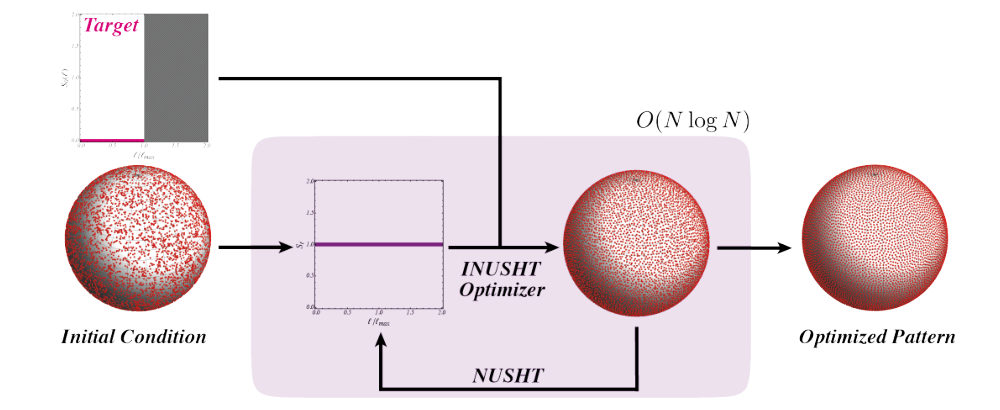 
FIG. 1. Sketch of the algorithm. We initialize the point pattern from a Poisson point pattern on the sphere and set a target over a finite amount of ℓmodes (ℓ≤ℓmax). The power spectrum Sℓis computed using a NUSHT, then the gradients of the loss using the inverse transform (INUSHT), which is used to update positions within a gradient-based optimizer (here, L-BFGS). One such step takes O(N log N) operations. Steps are repeated until a convergence criterion is met, yielding the optimized pattern.

📷 Fig 2

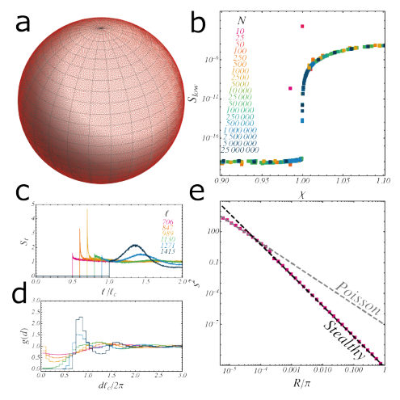 
FIG. 2. Stealthy hyperuniformity on the sphere. (a) Example stealthy hyperuniform pattern on the sphere, ob- tained for N = 105 points and ℓmax = 446, corresponding to χ ≈0.999. (b) Arithmetic average Slow of the final Sℓ in the constrained region against χ, across system sizes. (c) Final power spectra for N = 106 points and a few ℓmax val- ues given in inset. The x axis is rescaled by ℓc, the value of ℓmax that yields χ = 1. (d) Corresponding (spherical) radial distribution functions at a distance d. The x axis is rescaled to have the first feature around x = 1. (e) Reduced vari- ance s2 = var(nR)/E[nR]2 against the radius R of the ran- dom spherical caps used in the calculation (here...

📷 Fig 3

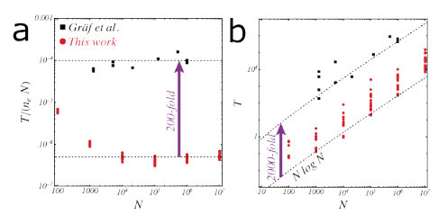 
FIG. 3. Benchmark. (a) Total optimization time T, in seconds, divided by the number of gradient evaluations ne and by the number of particles N. Our data (red symbols) was obtained across values of χ from 0.5 to 1 at each N. Black symbols represent times reported in Ref. 51. We highlight the asymptote of FaSHIoNPOp data by a dashed line, and a plausible line going through Gr¨af’s and Pott’s data [51]. (b) Raw time, in seconds, for the same data. We highlight with dashed lines plausible N log N scaling that capture the lower- end of both datasets.

📷 Fig 4

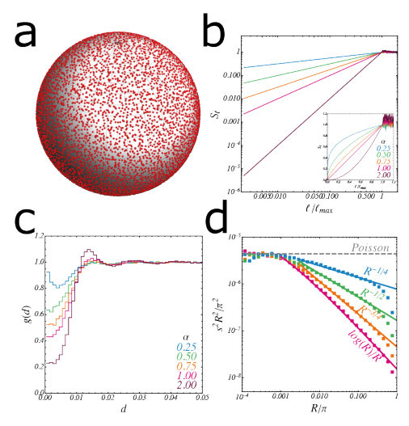 
FIG. 4. Power-law hyperuniformity. (a) Example opti- mized structure for N = 104 points with a power law Sℓ∝ℓ up to ℓmax = 140 (χ ≈1). (b) Final power spectra Sℓin log- log scale for N = 105 for constraints Sℓ∝ℓα up to ℓmax = 446 (χ ≈1) for α values 0.25, 0.5, 0.75, 1, 2. Inset: linear-scale plots of the same curves. (c) Corresponding radial distribu- tion functions. (d) Corresponding discrepancy measurements, here rescaled as s2R2/π2 to highlight R−α decays (continuous lines), and the log(R)/R decay for α = 1. The α = 2 case is here omitted to make the α = 1 decay more visible.

📷 Fig 5

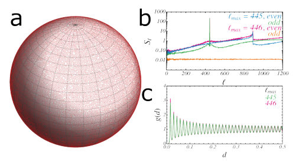 
FIG. 5. Gyromorphs. (a) Example gyromorph with N ≈ 105 and ℓmax = 446. (b) Log-scale power spectrum of opti- mized structures with N ≈105 for ℓmax = 445, split between the even (blue) and odd (green) ℓvalues, and for ℓmax = 446, split between the even (red) and odd (orange) ℓvalues. (c) Corresponding radial distribution functions for ℓmax = 445 (green) and ℓmax = 446 (red), against the distance d in radi- ans.

**Summary.** This work presents FaSHIoNPOp, a novel algorithm for designing point patterns on the sphere by enforcing desired spectral properties using spherical harmonics. It extends powerful spectral optimization techniques from flat space to curved manifolds, enabling applications in photonics and optimal sampling. The method achieves high efficiency ($O(N \log N)$) while allowing control over complex physical properties like hyperuniformity.

**Why it may be interesting.** The development of spectral optimization techniques for curved spaces provides a powerful, general tool for designing structured matter or optimal sampling configurations, which has analogues in designing quantum metamaterials or optimizing quantum state preparation.

Detailed structure

**Main problem.** The paper addresses the challenge of designing disordered point patterns with specific spectral properties on curved manifolds, specifically the sphere.

**Main result.** They introduce FaSHIoNPOp, an algorithm that successfully extends spectral optimization methods from flat Euclidean space to the sphere with $O(N \log N)$ complexity.

**Method.** The method uses an optimization framework based on enforcing target power spectra ($S_0(\ell)$) by minimizing a loss function derived from the Spherical Harmonics Transform (SHT).

**Model / system.** The system is point patterns distributed on the unit 2-sphere ($S \subset \mathbb{R}^3$). Applications include designing photonic coatings and sampling on curved manifolds.

**Key observables.** Power Spectrum ($S_\ell$), Radial Distribution Function ($g(	heta)$), Constraint Count ($\chi$), and Reduced Variance ($s^2$).

**Important parameters / regimes.** Number of points ($N$), maximum constrained mode ($\ell_{	ext{max}}$), and the target spectral coefficients ($S_0(\ell)$).

**Assumptions / limitations.** The optimization relies on fast, non-uniform spherical harmonics transforms (NUSHTs) and assumes small steps during gradient-based updates, projecting positions back onto the sphere.

**Figures summary.** Figures illustrate the algorithm flow (Initialization $	o$ SHT $	o$ Gradient $	o$ Update), and show results like the generation of hyperuniform structures ($S_\ell=0$ for $\ell \le \ell_{	ext{max}}$) and the scaling of reduced variance ($s^2$).

**Paper structure.** The paper systematically develops the theory by first establishing the spectral optimization framework on the sphere, deriving the necessary gradient calculations for the loss function, and then applying this machinery to generate and characterize specific disordered states like hyperuniform structures.

Abstract

The design of disordered point patterns with desirable properties is an exciting and ongoing research endeavor, with applications ranging from materials to computer science. A successful approach in recent years has been the optimization of point patterns through a loss function that enforces properties in their Fourier-space representation. Yet, these methods have so far strictly been limited to flat Euclidean space, precluding their use in the contexts of coatings of curved surfaces for photonics, or of sampling of curved manifolds for instance. We introduce FaSHIoNPOp, an algorithm that relies on fast non-uniform spherical harmonics transforms, to enforce pair correlations in point patterns on the sphere with an $O(N \log N)$ complexity in $N$ the number of points. Having demonstrated its performance, we showcase applications of FaSHIoNPOp, ranging from the generation of hyperuniform structures on the sphere for sampling and physical applications, to the design of gyromorphs (disordered structures with maximal scattering power at a given frequency) on the sphere. We additionally show that FaSHIoNPOp can be combined to both global constraints like centrosymmetry, with applications to the design of more isotropic $3d$ gyromorphs, and local real-space constraints like pair repulsion. Our work paves the way for optimal sampling and coating design on curved manifolds, with many applications across physics, materials and computer science.

[↑ back to top](#top)

### [Optimal Quantum Algorithm for Ground-State Energy Estimation with a Guiding State](http://arxiv.org/abs/2608.24494v1)

**Authors:** Stacey Jeffery, Freek Witteveen  
**Type:** theory · **Category:** quantum information and computing · **PDF:** <https://arxiv.org/pdf/2608.24494v1>  
**Analysis basis:** full PDF text, analyzed in chunks
**Topic relevance:** `analog quantum simulation` **1/5** · `quantum measurements` **1/5**

📷 Fig 1

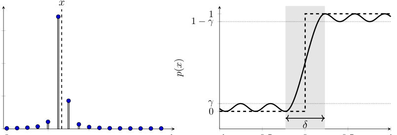 
Figure 1: An illustration of why previous approaches incur a log(1/γ) overhead. (a) In n-bit quantum phase estimation, if the true phase x does not have an exact n-bit binary representation, then the measurement distribution is spread over multiple outcomes and has nonzero tails. Sup- pressing the probability of a bad estimate below the signal level γ leads to logarithmic overhead. (b) In a QSVT-based approach, one approximates an ideal step function by a polynomial. The transition width must be at most δ, while the ripple size away from the transition must be at most γ. Achieving both requires degree Θ(δ−1 log(1/γ)).

📷 Fig 2

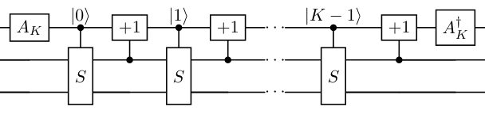 
Figure 2: The quantum algorithm in Theorem 2.5 that approximately implements US. Here K is a register with basis |0⟩, . . . , |K −1⟩where K is the number of calls the algorithm makes to S, and P is a qubit register that controls whether D is interpreted as H or L (so H ⊕L ⊆P ⊗D). AK is a unitary such that AK|0⟩= 1/ √

📷 Fig 3

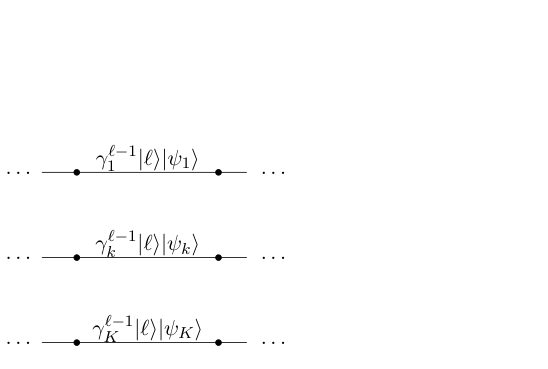 
Figure 4: Visualization of the transducer for decision phase estimation.

📷 Fig 4

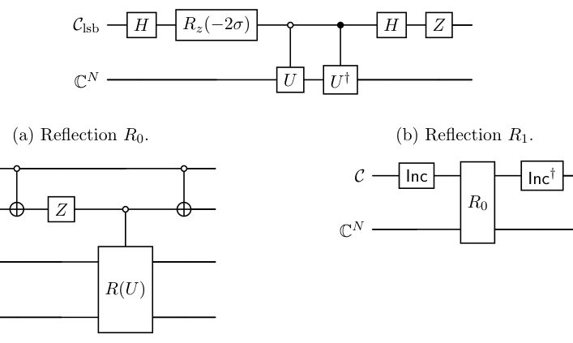 
Figure 5: Circuit implementations of the two reflections R0 and R1, where Rz(−2σ) = eiσZ. In (a) we decompose a binary expansion of the basis of system C in its least significant bit and the remainder, and insert an auxiliary qubit D in between. The CNOTs with open control on the infinite-dimensional Crest flip the auxiliary system if the state is |0⟩. These, and Inc and its adjoint in (b), are the only infinite-dimensional operations.

📷 Fig 5

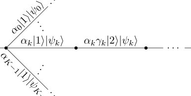 
Figure 6: Visualization of the transducer for threshold max eigenphase. It can be seen as a composition of the transducers visualized in Figure 3 and Figure 4, with an extra edge |¯1, 0⟩ added, whose purpose is to make the transducer canonical, by ensuring that the boundary is orthogonal to the space acted on by the oracle.

**Summary.** This paper develops an optimal quantum algorithm for estimating the ground-state energy of a system, which is mathematically equivalent to finding the largest eigenphase of the system's time-evolution unitary. By utilizing quantum transducers, the authors eliminate a previously unavoidable logarithmic overhead factor related to the guiding state overlap ($\gamma$), achieving a query complexity that matches theoretical lower bounds.

**Why it may be interesting.** This work provides a significant algorithmic improvement for a fundamental problem in quantum simulation, directly impacting the feasibility of quantum chemistry and condensed matter simulations on near-term quantum hardware.

Detailed structure

**Main problem.** The paper addresses the quantum algorithm for estimating the ground-state energy of a Hamiltonian, which is equivalent to estimating the largest eigenphase of the time-evolution unitary operator $U$ in a guided setting.

**Main result.** The authors present a quantum algorithm that achieves a query complexity for the guided ground-state energy estimation that matches the established lower bound, improving upon previous methods by eliminating a $\log(1/\gamma)$ overhead.

**Method.** The core method involves designing and composing exact quantum transducers for the decision versions of phase estimation and amplitude amplification, allowing for efficient composition of subroutines.

**Model / system.** The problem is framed using a general Hamiltonian $H$ and its time-evolution unitary $U = e^{-iH}$. The estimation is guided by an initial state $|\psi
angle$ that has a guaranteed overlap $\gamma$ with the ground state space.

**Key observables.** Ground state energy ($E_0$), largest eigenphase ($x_0$), and the unitary operator $U$.

**Important parameters / regimes.** Overlap parameter $\gamma$, desired precision $\delta$, and the error parameter $\epsilon$.

**Assumptions / limitations.** The analysis relies on the efficient composition properties of transducers and the ability to solve the problem via binary search on the threshold eigenphase problem.

**Figures summary.** Figure 1 illustrates the source of previous $\log(1/\gamma)$ overheads in QPE and QSVT. Figure 8 shows the interval update process during one round of the search algorithm.

**Paper structure.** The paper develops the algorithm by first solving the decision version (threshold problem) using transducers, which is then embedded into a binary search framework to achieve the final complexity bounds for the max eigenphase estimation.

Abstract

In the problem of ground-state energy estimation, one aims to estimate the smallest eigenvalue of a Hamiltonian, often given a guiding state, with some promised overlap $γ$ with the ground space. The main approach to this problem is to simulate its evolution, and estimate the smallest (or equivalently, largest) eigenphase of the resulting unitary $U$. We give a quantum algorithm that estimates the largest eigenphase of a unitary $U$ in this guided setting using a factor of $\log\frac{1}γ$ fewer queries to $U$ than the previous best approach. The result matches an existing lower bound, and answers an open question from Mande and de Wolf. The algorithm is based on transducers, which often allow composition of quantum algorithms without overhead from error reduction.

[↑ back to top](#top)

### [Accidental accuracy and vertex corrections in $GW$: Exact benchmarks for the extended Hubbard model](http://arxiv.org/abs/2608.24838v1)

**Authors:** Michael O. Atambo  
**Type:** theory · **Category:** strongly correlated electrons · **PDF:** <https://arxiv.org/pdf/2608.24838v1>  
**Analysis basis:** full PDF text, analyzed in chunks
**Topic relevance:** `analog quantum simulation` **1/5**

📷 Fig 1

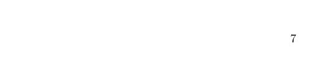 
FIG. 2. Fundamental gap ∆/t versus U/t for the N = 6 ring at V = 0: exact ED (circles) versus static G0W0 (squares). The exact gap grows linearly in the Mott regime while GW saturates. Inset: relative error.

📷 Fig 2

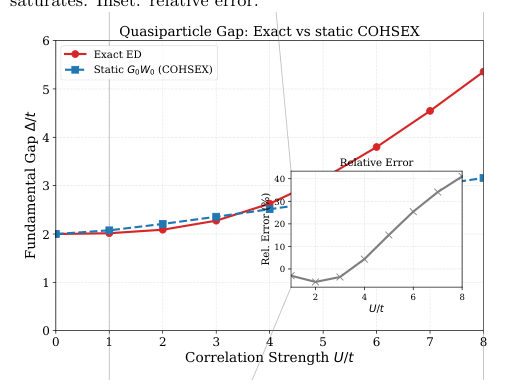 
FIG. 3. Channel analysis at V = 0: exact gap versus GW with electron–hole ladder polarization (under-correction), and versus static local self-energy vertex (over-correction). Only the self-energy channel can open the Mott gap, and only a dynamical vertex can do so quantitatively.

📷 Fig 3

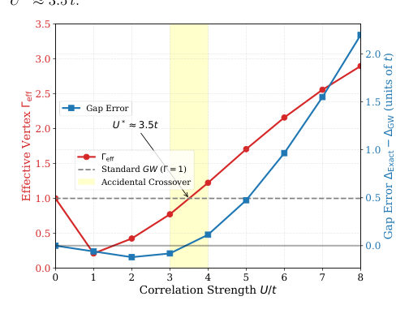 
FIG. 5. Crossover structure for V &gt; 0: gap error versus U/t for V = 0, 0.5, 1.0, showing the splitting of the single zero- crossing into a double-crossover window.

**Summary.** This work rigorously benchmarks the GW approximation against exact diagonalization for the extended Hubbard model. It finds that the approximation fails to correctly predict the Mott gap, quantifying the necessary vertex correction ($\Gamma_{	ext{eff}}$) which varies significantly across the phase diagram. The results establish quantitative criteria for assessing the reliability of GW in strongly correlated electronic systems.

**Why it may be interesting.** The detailed analysis of correlation effects, gap opening, and the failure of simple approximations like GW provides crucial theoretical diagnostics for understanding strongly correlated quantum materials.

Detailed structure

**Main problem.** The paper aims to quantify the reliability and error of the GW approximation for quasiparticle predictions in correlated materials, specifically addressing the role of vertex corrections.

**Main result.** The effective vertex correction ($\Gamma_{	ext{eff}}$) changes character across the phase diagram: it is $<1$ in the weak-coupling regime but grows large in the Mott regime, indicating that standard GW fails to capture the full gap opening.

**Method.** The authors benchmark GW theory against numerically exact results obtained via exact diagonalization (ED) of the extended Hubbard model on finite rings.

**Model / system.** The study uses the half-filled extended Hubbard model, described by a Hamiltonian including on-site ($U$) and nearest-neighbor ($V$) interactions, studied on finite rings.

**Key observables.** Effective vertex ($\Gamma_{	ext{eff}}$), quasiparticle gap ($\Delta$), and the comparison between ED and GW calculated gaps.

**Important parameters / regimes.** Interaction strengths ($U, V$), finite size ($N=6, 10$), and the crossover point $U^*$.

**Assumptions / limitations.** The analysis uses the static limit (COHSEX) for the self-energy and focuses on the spin-integrated density-channel functional.

**Figures summary.** Figures compare the exact ED gap versus the GW gap, show the dependence of $\Gamma_{	ext{eff}}$ on $U$, and illustrate how non-local interactions split the accidental crossover point.

**Paper structure.** The paper systematically analyzes the failure of GW in different regimes, first establishing the ED benchmark, then diagnosing the failure via $\Gamma_{	ext{eff}}$, and finally showing how non-local interactions complicate the picture.

Abstract

The $GW$ approximation is the standard tool for quasiparticle predictions in materials, yet its regime of validity in correlated systems remains poorly quantified, because \textit{ab initio} vertex corrections are computationally prohibitive. Using exact diagonalization of the half-filled extended Hubbard model on finite rings as a numerically exact reference, we construct the corresponding model-space $GW$ theory on the identical Hilbert space and quantify its error as a function of local ($U$) and non-local ($V$) interaction strength. We find that the vertex correction changes character across the phase diagram: in the weak-coupling regime the effective vertex $Γ_{\rm eff} < 1$, reflecting the suppression of RPA charge fluctuations by exact short-range correlations, whereas in the Mott regime $Γ_{\rm eff}$ grows monotonically (to $\sim 3$ for $N=6$, reflecting the local vertex required to open the Hubbard gap. Vertex corrections in the electron-hole (polarizability) channel are shown to \emph{worsen} the gap error, indicating that the Mott gap resides in the self-energy channel. For $V=0$, static $COHSEX$ is accidentally exact at a single crossover point $U^* \approx 3.5\,t$; finite $V$, through non-local Fock exchange, splits this point into a double-crossover window that collapses toward weak coupling. These results yield quantitative diagnostics for the reliability of $GW$ in correlated materials.

[↑ back to top](#top)

### [CircLS: Compiling Lattice Surgery to Physical Circuits with Dynamic Allocation](http://arxiv.org/abs/2608.23819v1)

**Authors:** John Yuehan Zhang  
**Type:** theory · **Category:** quantum information and computing · **PDF:** <https://arxiv.org/pdf/2608.23819v1>  
**Analysis basis:** full PDF text, analyzed in chunks
**Topic relevance:** `quantum measurements` **1/5**

📷 Fig 1

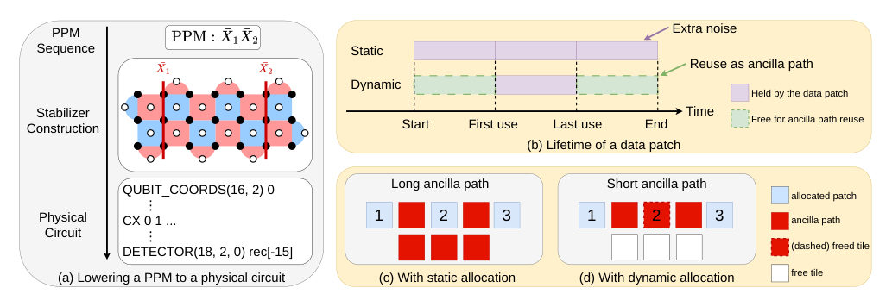 
Figure 1. (a) Lowering the PPM ¯𝑋1 ¯𝑋2: CircLS constructs the stabilizers that measure the product, then emits the physical circuit. (b) Under static allocation a data patch holds its tile from start to end, so it collects extra noise before its first use and after its last use. CircLS allocates the patch at its first use and frees it at its last use, and the freed span is open for ancilla path reuse. (c) and (d) Freeing shortens ancilla paths: patches 1 and 3 are jointly measured. With patch 2 still allocated, the ancilla path detours through five tiles. With patch 2 freed, it runs straight through three tiles.

📷 Fig 2

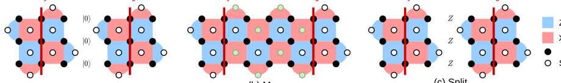 
Figure 2. LS for measuring ¯𝑋1 ¯𝑋2. (a) Initialize the intermediate qubits between two patches. (b) Merge the patches: the product of the green stabilizers equals the outcome of ¯𝑋1 ¯𝑋2. (c) Split the patches by measuring the intermediate qubits in the 𝑍basis.

📷 Fig 3

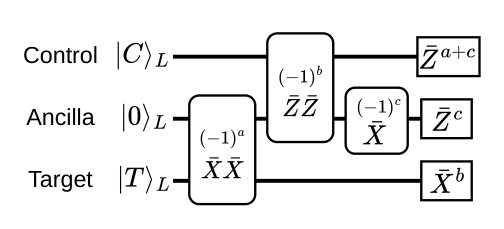 
Figure 3. Logical CNOT by LS: three PPMs with measure- ment results 𝑎, 𝑏, 𝑐, followed by three Pauli corrections.

📷 Fig 4

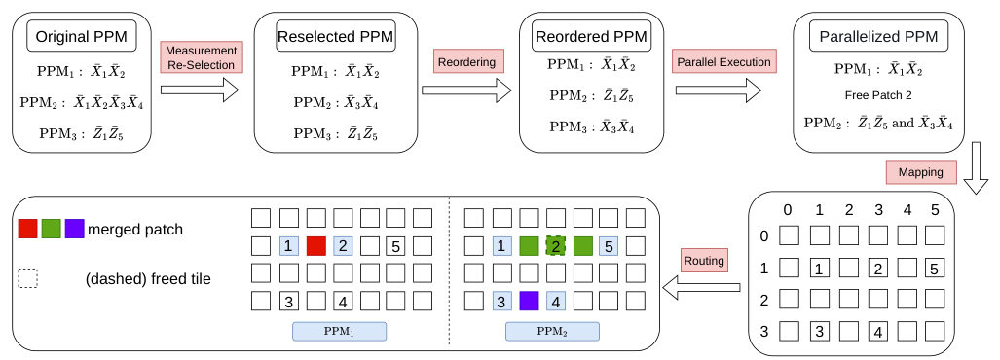 
Figure 4. A PPM sequence through the stages of CircLS. Re-selection replaces ¯𝑋1 ¯𝑋2 ¯𝑋3 ¯𝑋4 with ¯𝑋3 ¯𝑋4, reusing the outcome of ¯𝑋1 ¯𝑋2. Reordering moves ¯𝑍1 ¯𝑍5 forward. Parallel execution runs ¯𝑍1 ¯𝑍5 and ¯𝑋3 ¯𝑋4 together. Mapping places the five patches on the grid, and routing draws every ancilla path: the ancilla path of ¯𝑍1 ¯𝑍5 runs through the tile freed by patch 2.

📷 Fig 5

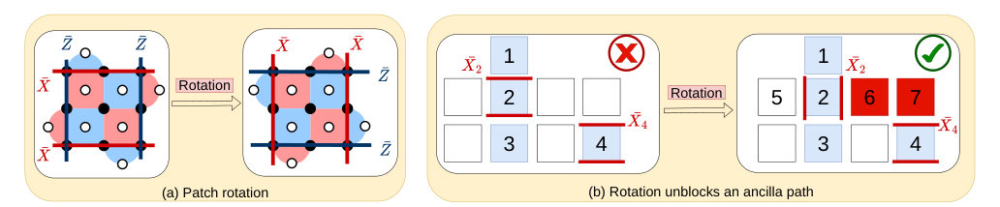 
Figure 6. (a) A patch has two kinds of boundaries: one pair supports the logical ¯𝑋and the other pair the logical ¯𝑍; the rotation protocol [43] turns the left orientation into the right one. (b) The PPM ¯𝑋2 ¯𝑋4 needs an ancilla path between the ¯𝑋boundaries of patches 2 and 4, but both ¯𝑋boundaries of patch 2 touch allocated patches: no ancilla path exists. After rotating patch 2, ¯𝑋2 sits on the left and right boundaries, and the ancilla path connects on the right.

**Summary.** This paper introduces CircLS, a compiler designed to translate abstract Lattice Surgery protocols into concrete, fault-tolerant physical quantum circuits. By implementing dynamic resource allocation—reusing physical tiles as they become free—CircLS drastically reduces the required spacetime volume and improves the predicted logical error rate compared to existing methods. This advancement is crucial for scaling quantum computation hardware.

**Why it may be interesting.** While focused on quantum computation, the resource optimization techniques (dynamic allocation, scheduling) are highly relevant to any physical implementation of quantum algorithms, including those using AMO platforms where qubit connectivity and coherence time are critical constraints.

Detailed structure

**Main problem.** The paper addresses the challenge of compiling Lattice Surgery (LS) protocols, specifically the Pauli Product Measurement (PPM) sequence, from a high-level logical description down to a detailed, fault-tolerant physical quantum circuit.

**Main result.** The proposed CircLS compiler successfully completes this pipeline and significantly improves resource efficiency, reducing the allocated spacetime volume by $5.5	imes$ and the Logical Error Rate (LER) by $14	imes$ compared to prior methods.

**Method.** It employs a linear-time stabilizer construction rule set to lower the PPM sequence to a Stim circuit, coupled with a novel dynamic data patch allocation scheme that reuses freed physical tiles as ancilla paths.

**Model / system.** The work is situated in the context of fault-tolerant quantum computing (FTQC) using Quantum Error Correction (QEC). Logical operations are realized via Lattice Surgery, which relies on sequences of Pauli Product Measurements (PPMs) implemented on physical qubits.

**Key observables.** Logical Error Rate (LER), allocated spacetime volume, and qubit-cycles.

**Important parameters / regimes.** Code distance ($d$), physical error rate ($p$), and the structure of the quantum program (e.g., CNOT, GHZ states).

**Assumptions / limitations.** The primary assumption is that local stabilizer construction rules are sufficient to guarantee global fault tolerance, and that dynamic allocation accurately models resource reuse.

**Figures summary.** Figures illustrate the comparison between static and dynamic resource allocation, the three stages of LS for measurement, and the required Pauli corrections for logical gates.

**Paper structure.** The paper introduces CircLS to bridge the gap between logical PPM sequences and physical circuits. It details the dynamic allocation technique, shows how this improves resource usage, and validates the compiler's performance by measuring LER and volume reduction against prior toolchains.

Abstract

In fault-tolerant quantum computing, lattice surgery (LS) is one of the leading ways to realize logical operations, and the Pauli product measurement (PPM) is the basic instruction of LS-based computing. Compilers on the PPM sequence, however, stay at the logical level rather than the physical circuit level. This is because the lowering is complicated: PPMs differ widely from each other, and each must be realized on the physical circuit without breaking fault tolerance. CircLS lowers the PPM sequence to a Stim circuit through linear-time stabilizer construction rules. This completes the pipeline from a quantum program through the PPM sequence to a Stim circuit, on which the compiled program can be verified at the circuit level and its logical error rate (LER) measured. Based on the lowering, we develop a compiler that allocates data patches dynamically: each patch is allocated at its first use and freed at its last use, and the freed tiles are reused as ancilla paths. CircLS reduces the allocated spacetime volume by $5.5\times$ and the LER by $14\times$ against the prior toolchain producing runnable circuits. CircLS is open source at https://github.com/John-YuehanZhang/CircLS.

[↑ back to top](#top)

### [Dynamical Consequences of Nontrivial Topology of Molecular Conical Intersections](http://arxiv.org/abs/2608.24864v1)

**Authors:** Indranil Ghosh, Kush Banker, Gregory S. Engel  
**Type:** theory · **Category:** other · **PDF:** <https://arxiv.org/pdf/2608.24864v1>  
**Analysis basis:** full PDF text, analyzed in chunks
**Topic relevance:** `quantum measurements` **1/5**

📷 Fig 1

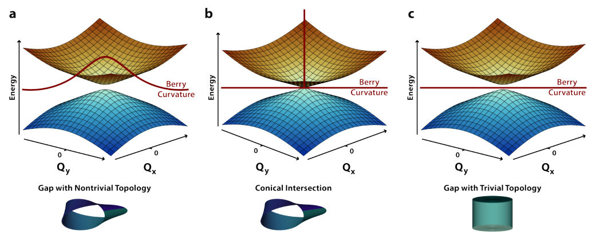 
FIG. 1: The three two-band Jahn–Teller Hamiltonians considered in this chapter, their adiabatic potential energy surfaces, and their Berry phases around the origin. The red line represents the magnitude of Berry Curvature, and is solely for illustrative purposes. (b) the gapless linear Jahn–Teller Hamiltonian HJT of Eq. 1, whose surfaces touch at a CI and which carries a quantized Berry phase γ = π around any loop enclosing the origin. (a) The spin–orbit-coupled (topologically non-trivial) gapped Hamiltonian Htop of Eq. 8, whose surfaces are separated by a gap 2|λ| and which carries a smooth, non-zero Berry curvature Ω−concentrated in a region of radius ∼|λ|/F around the origin (red...

📷 Fig 2

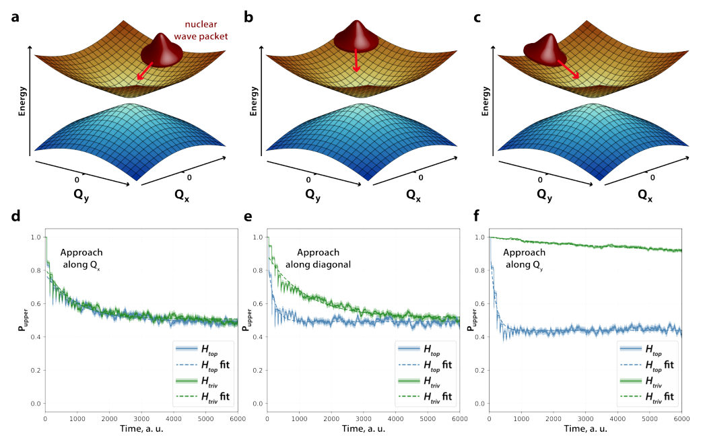 
FIG. 2: a, b and c shows the schematic of the gapped eigensurfaces for both the trivially and topologically gapped Hamiltonians. The initial position of the nuclear wave packet approaching {Qx, Qy} = {0, 0} is schematically shown in a, b and c. The corresponding surface hopping kinetics (depletion of population on the upper eigensurface) for the three approach directions (d: ˆQx; e:  ˆQx + ˆQy  / √

**Summary.** This paper explores how the underlying topology of molecular electronic structure, particularly at conical intersections, dictates chemical dynamics. By constructing two Hamiltonians with the same potential energy surfaces but different topological invariants, the authors demonstrate that the topology influences observable nonadiabatic hopping rates via surface hopping simulations. This work establishes topology as a fundamental determinant of molecular excited state relaxation.

**Why it may be interesting.** This work directly connects abstract concepts from topological physics (Berry curvature, topological invariants) to concrete, measurable quantities in molecular dynamics (nonadiabatic coupling, reaction rates), providing a powerful diagnostic tool for understanding excited state dynamics.

Detailed structure

**Main problem.** The paper investigates how the nontrivial topology of molecular conical intersections (CIs) influences nonadiabatic chemical dynamics, extending beyond the standard Berry phase description.

**Main result.** The authors show that a topological invariant, derived from the Berry curvature, can distinguish between two Hamiltonians ($H_{top}$ and $H_{triv}$) that share identical adiabatic potential energy surfaces, and this difference manifests in measurable, direction-dependent surface hopping rates.

**Method.** The study employs theoretical derivations using the Jahn-Teller model to calculate topological invariants and utilizes Fewest-Switches Surface Hopping (FSSH) simulations to compute nonadiabatic relaxation rates.

**Model / system.** The system is modeled using a two-level Jahn-Teller Hamiltonian, comparing a topologically non-trivial version ($H_{top}$) against a trivially gapped counterpart ($H_{triv}$), both exhibiting a CI.

**Key observables.** Relaxation rates ($R$) of population decay on the upper eigensurface, the topological invariant ($C$), and the Non-Adiabatic Coupling (NAC) vector components.

**Important parameters / regimes.** The coupling strength parameters ($F, \lambda$) and the approach direction ($\hat{Q}_x, \hat{Q}_y$) are crucial for observing the rate differences.

**Assumptions / limitations.** The analysis relies on the adiabatic approximation for the FSSH simulation, and the topological invariant is derived from the Berry curvature integral.

**Figures summary.** Figure 1 illustrates the three Hamiltonians (topological, CI, trivial) and their associated geometric structures. Figure 2 shows the surface hopping kinetics (population decay) for different approach directions and Hamiltonians.

**Paper structure.** The paper first establishes the theoretical framework by defining the topological invariant using the Berry curvature in the Jahn-Teller model. It then compares the resulting Hamiltonians ($H_{top}$ vs $H_{triv}$) and uses FSSH simulations to demonstrate that the topological difference leads to distinct, measurable nonadiabatic relaxation rates, particularly along certain nuclear coordinates.

Abstract

The topology of the electronic structure for an avoided crossing and a conical intersection (CI) is different and is characterized by the presence of the geometric phase in the electronic wavefunction in the latter. Using the linear Jahn-Teller model, we show that an avoided crossing can be created from the conical intersection while preserving the nontrivial topology of the latter by adding a Pauli $σ_y$ term to the Hamiltonian. Analogously to solid state systems, we derive a half-integer topological invariant as the integral of the Berry curvature over the CI nuclear branching space. We investigate the influence of electronic topology on chemical dynamics by conducting fewest-switches surface hopping simulations and find distinct hopping rates on identical eigensurfaces but with different topologies. Our work extends the influence of topology on molecular excited state dynamics beyond the Berry phase that can be practically realized through electron-nuclear and spin-orbit coupling.

[↑ back to top](#top)

### [General Construction of Time-Dependent Integrable Chiral Field Theories](http://arxiv.org/abs/2608.23770v1)

**Authors:** Pradip Kattel  
**Type:** theory · **Category:** other · **PDF:** <https://arxiv.org/pdf/2608.23770v1>  
**Analysis basis:** full PDF text, analyzed in chunks
**Topic relevance:** `Keldysh / 2PI / non-Gaussian methods` **1/5**

📷 Fig 1

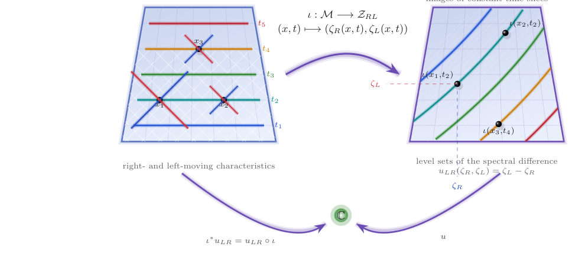 
FIG. 1. Characteristic map from physical spacetime to spectral space. Each spacetime event (x, t) determines the pair of spectral coordinates (ζR, ζL) associated with the right- and left-moving characteristics passing through that event. The colored curves in ZRL are the images of constant-time slices Mti under the characteristic map ι. They are equivalently level sets of the spectral difference uLR(ζR, ζL) = ζL −ζR. The pullback ι∗uLR = uLR ◦ι gives the spectral coordinate sampled by the right-left scattering process.

**Summary.** This paper presents a general geometric construction for time-dependent integrable chiral field theories. It shows that the time evolution of the system's interaction is not arbitrary but is rigidly fixed by the initial autonomous scattering data and the constraints of chiral kinematics and spatial homogeneity. This provides a powerful, unified method for generating complex, nonautonomous integrable models.

**Why it may be interesting.** The rigorous mathematical framework connecting autonomous scattering data (a common input in integrable models) to time-dependent dynamics is highly relevant for understanding how external time-varying fields or time-dependent couplings affect integrable quantum systems.

Detailed structure

**Main problem.** The paper develops a general mathematical procedure to construct time-dependent integrable chiral field theories starting only from autonomous unitary difference-form S-matrices satisfying the Yang-Baxter equation.

**Main result.** The nonautonomous dynamics are entirely determined by the initial autonomous scattering data, chiral kinematics, and the constraint of spatial homogeneity, providing a geometric route to time-dependent integrable systems.

**Method.** The method involves mapping spectral parameters along free chiral characteristics to define a spectral space, using the inverse Cayley transform to derive the local interaction, and imposing spatial homogeneity to fix the time dependence.

**Model / system.** The focus is on chiral field theories with linear dispersion, characterized by a Hamiltonian derived from a local contact interaction $V(u)$. The theory is analyzed using factorized scattering data derived from the S-matrix $S(u)$.

**Key observables.** The time-dependent Hamiltonian $H(t)$ and the resulting many-body wavefunctions.

**Important parameters / regimes.** The spectral parameter $u$, which evolves affinely in time as $u(t) = 2\kappa t + eta$.

**Assumptions / limitations.** The analysis assumes chiral field theories with linear dispersion and requires spatial homogeneity of the right-left scattering forces.

**Paper structure.** The paper builds the framework by first establishing the connection between autonomous scattering data and the local interaction via the Cayley transform. It then uses chiral kinematics and spatial homogeneity to determine the time dependence of the interaction, leading to the final construction of the time-dependent Hamiltonian and wavefunctions.

Abstract

We develop a general procedure for constructing time-dependent integrable chiral field theories from autonomous unitary difference-form $S$-matrices satisfying the Yang-Baxter equation. Spectral parameters are transported along the free right- and left-moving characteristics, defining a map from physical spacetime to spectral space on which the two-body scattering data are evaluated. Requiring spatially homogeneous right-left scattering forces the characteristic map to be affine. The inverse Cayley transform then determines the local contact interaction, while evaluation along the affine spectral trajectory fixes its time dependence. Thus, the nonautonomous interaction is determined by the autonomous scattering data together with chiral kinematics and spatial homogeneity, rather than being introduced independently. The Yang--Baxter equation supplies the factorized many-body transport, and on a spatial circle periodicity leads to quantum Knizhnik--Zamolodchikov (qKZ) equations whose compatibility defines a flat discrete transport in spectral space. Pulling the corresponding spectral-space amplitudes back to physical coordinates gives the time-dependent many-body wavefunctions. Rational $SU(N)$, trigonometric $U_q(\widehat{\mathfrak{sl}}_2)$, and rational $O(N)$ scattering illustrate how the same mechanism generates distinct nonautonomous interactions. The resulting framework gives a geometric route from autonomous factorized scattering data to time-dependent integrable field theories.

[↑ back to top](#top)

### [On Split Forms of Fusion Categories](http://arxiv.org/abs/2608.23743v1)

**Authors:** César Galindo  
**Type:** theory · **Category:** strongly correlated electrons · **PDF:** <https://arxiv.org/pdf/2608.23743v1>  
**Analysis basis:** full PDF text, analyzed in chunks
**Topic relevance:** `analog quantum simulation` **1/5**

📷 Fig 1

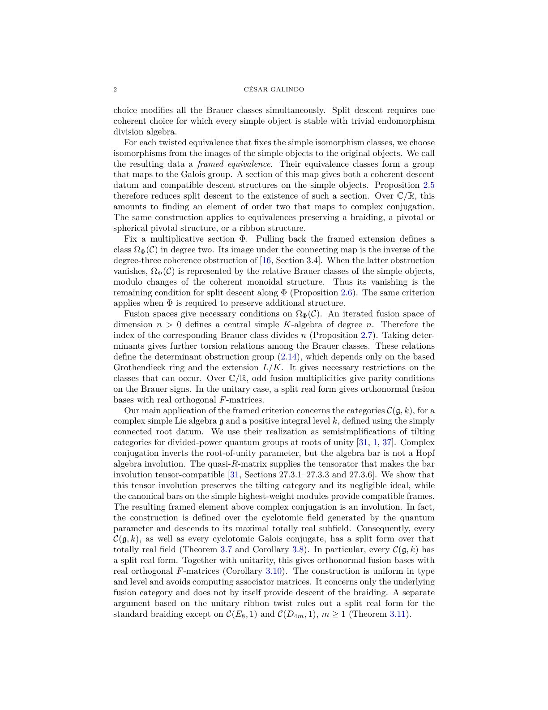 
Low-resolution page preview, page 2

📷 Fig 2

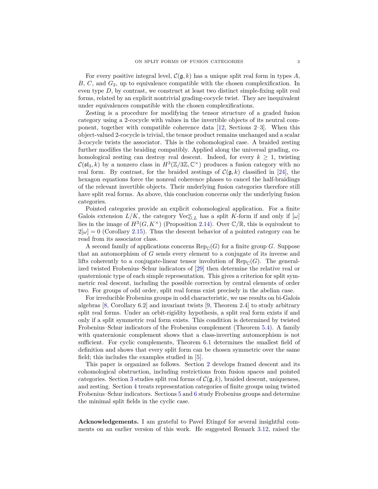 
Low-resolution page preview, page 3

📷 Fig 3

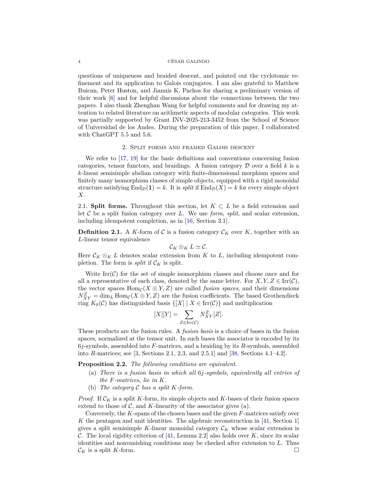 
Low-resolution page preview, page 4

📷 Fig 4

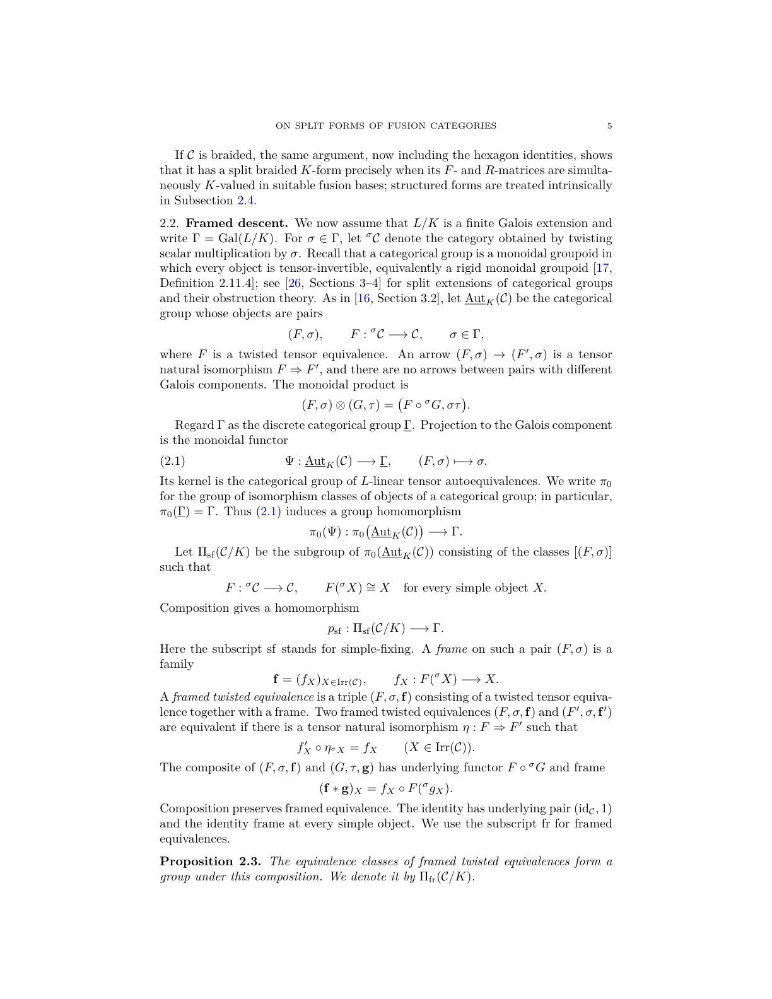 
Low-resolution page preview, page 5

📷 Fig 5

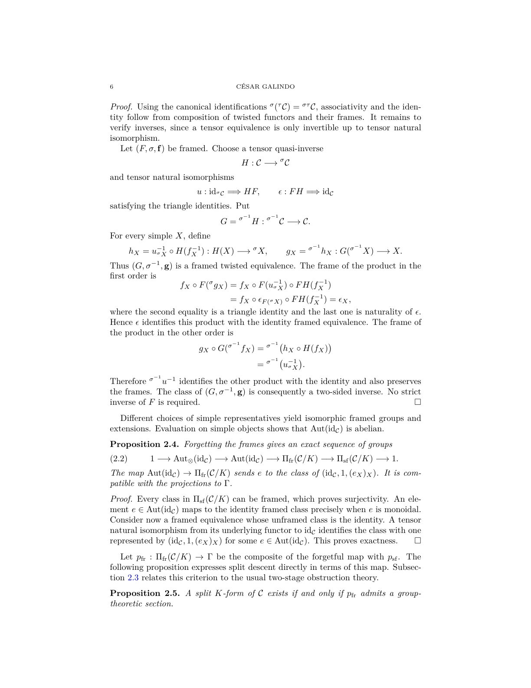 
Low-resolution page preview, page 6

**Summary.** This theoretical paper develops a framework to determine when a fusion category, particularly those arising from quantum groups, admits a 'split real form.' By translating the problem into group-theoretic splitting conditions and analyzing cohomology obstructions, the authors establish powerful criteria for the existence of such real structures, which has implications for classifying physical symmetries in condensed matter systems.

**Why it may be interesting.** The deep connection between abstract algebraic structures (fusion categories, Galois theory) and physical symmetries (like those governing quantum groups) provides powerful mathematical tools applicable to classifying phases of matter or topological orders.

Detailed structure

**Main problem.** The paper investigates the mathematical conditions for a fusion category, particularly those arising from quantum groups, to possess a 'split real form' over a specified field extension.

**Main result.** It proves that every fusion category $\mathcal{C}(\mathfrak{g}, k)$ associated with a quantum group has a split real form, although the standard braiding structure itself often does not.

**Method.** The analysis employs advanced techniques from Galois descent theory, group cohomology ($H^2, H^3$), and the study of algebraic obstructions derived from fusion coefficients and R-matrices.

**Model / system.** The primary mathematical objects are fusion categories, specifically $\mathcal{C}(\mathfrak{g}, k)$ derived from quantum groups at roots of unity, and representation categories $	ext{Rep}_{\mathbb{C}}(G)$ of certain finite groups $G$.

**Key observables.** The existence of a split form, the degree-two obstruction $\Omega_{\Phi}(C)$, and the vanishing of cohomology classes are key diagnostics.

**Important parameters / regimes.** The quantum parameter $k$, the root datum $(\mathfrak{g}, k)$, and the structure of the Galois group $	ext{Gal}(L/K)$ are crucial parameters.

**Assumptions / limitations.** The analysis assumes the existence of a finite Galois extension $L/K$ and relies on specific constructions involving the quasi-R-matrix for quantum groups.

**Paper structure.** The paper builds from general descent theory for fusion categories (Chunk 2) to specific applications to quantum groups (Chunk 1), and further analyzes the concrete case of representation categories of Frobenius groups (Chunks 3 & 4).

Abstract

We formulate split Galois descent for fusion categories through framed equivalences, reducing the existence of a split form to a group-theoretic splitting problem. The associated degree-two obstruction combines categorical coherence with stable descent of the simple objects, while fusion spaces impose index and parity restrictions. For quantum groups at roots of unity, we use the quasi-$R$-matrix to make the bar involution tensor-compatible and prove that the underlying fusion category $\mathcal C(\mathfrak g,k)$, associated with the simply connected root datum, has a split form over the maximal totally real subfield of the cyclotomic field generated by the quantum parameter. The same holds for all its cyclotomic Galois conjugates; in particular, every $\mathcal C(\mathfrak g,k)$ has a split real form. By contrast, no split real form exists for the standard braiding except on $\mathcal C(E_8,1)$ and $\mathcal C(D_{4m},1)$, $m \geq 1$. We further show that associative zesting can destroy real descent of $\mathcal C(\mathfrak g,k)$, while every braided zesting of $\mathcal C(\mathfrak g,k)$ still admits a split real form as an underlying fusion category. Applications to pointed and finite-group representation categories give criteria for real descent in terms of cohomology and Frobenius--Schur indicators.

[↑ back to top](#top)

### [Provable Quantum--Classical Separation for Continuous Gibbs Sampling](http://arxiv.org/abs/2608.24527v1)

**Authors:** Enrico Olivucci, Mariia Sobchuk, Sehmimul Hoque, Jeffrey Hnybida, Kyungho W. Kim, Ala Shayeghi, Pooya Ronagh  
**Type:** theory · **Category:** statistical mechanics · **PDF:** <https://arxiv.org/pdf/2608.24527v1>  
**Analysis basis:** full PDF text, analyzed in chunks
**Topic relevance:** `analog quantum simulation` **1/5**

📷 Fig 1

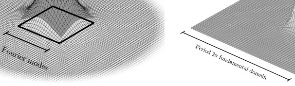 
FIG. 1. The role of Gevrey smoothness in our separation result. (a) The schematic of the decay of the Fourier modes of a periodic smooth function. The QSVT-based quantum algorithm requires truncating the Fourier transform of the Gibbs density to a threshold N. Mere smoothness (i.e., the (s = ∞)-Gevrey class) is too weak to guarantee N = polylog(1/ε), required for our quantum upper bound result. (b) The schematic of a bump function defined on a torus. Such functions hide their center of mass in a small area (patch) on the torus, and queries of any order to points outside the patch provide no information to help the search for the patch. These functions are not analytic (because any analytic...

📷 Fig 2

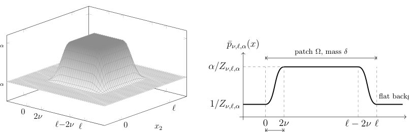 
FIG. 2. The bump density ¯pν,ℓ,α (21). Left: the two-dimensional case (d = 2), a mesa of height α/Zν,ℓ,α over the inner plateau [2ν, ℓ−2ν]2, falling to the flat background across ramps of width 2ν. Right: one-dimensional section. The barrier amplitude α is the plateau-to-background ratio, and the patch carries probability mass δ(ν, ℓ, α) (23).

📷 Fig 3

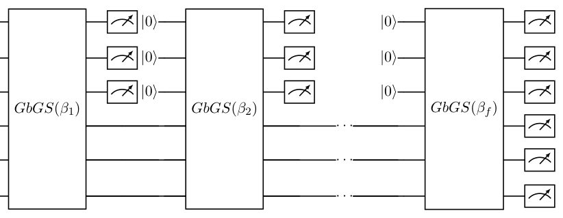 
FIG. 3. Annealing schedule consisting of repeated applications of the QSVTh protocol [LDCL26] with the decreasing target inverse temperatures. Each block F(β) represents application of the algorithm in Algorithm 1 with target temperature β and βf represents the target inverse temperature.

**Summary.** This paper establishes a provable quantum-classical separation for sampling from continuous Gibbs distributions on a torus. It shows that quantum algorithms can achieve a quadratic speedup in the barrier amplitude compared to the best classical algorithms. The separation relies on the specific smoothness properties (s-Gevrey class) of the underlying energy potential.

**Why it may be interesting.** This work provides a concrete, quantitative quantum advantage for sampling complex, high-dimensional probability distributions arising in statistical mechanics, which is highly relevant for simulating physical systems.

Detailed structure

**Main problem.** The paper proves the first quantum-classical separation for sampling from a Gibbs distribution over a continuous domain.

**Main result.** It shows that quantum algorithms can sample the state quadratically faster in the barrier amplitude ($\alpha$) compared to the best classical algorithms, achieving a separation ratio of $\Omega(\alpha^{c})$.

**Method.** The separation is established by deriving an information-theoretic lower bound for classical query complexity using an adversarial 'hide-and-seek' argument, and an upper bound using a quantum algorithm based on temperature annealing and quantum singular value thresholding.

**Model / system.** The system is sampling from a Gibbs state $p \propto e^{-eta E}$ defined on the $d$-dimensional torus $\mathbb{T}^d$, where $E$ is a smooth ($s$-Gevrey) potential. The difficulty is controlled by the barrier amplitude $\alpha = e^{eta\Delta}$.

**Key observables.** Total variation distance ($	ext{TV}$), query complexity ($N_{	ext{cl}}$ vs $N_q$), and the barrier amplitude $\alpha$.

**Important parameters / regimes.** Barrier amplitude $\alpha$, inverse temperature $eta$, Gevrey smoothness exponent $s$ ($s>1$ required for separation), and dimension $d$.

**Assumptions / limitations.** The separation holds for $s$-Gevrey functions where $s>1$ and $s 
eq \infty$. The quantum bound relies on the structure of the annealing schedule and the coherent gradient oracle.

**Figures summary.** Figure 1 illustrates the role of Gevrey smoothness by showing the decay of Fourier modes (requiring $s>1$) and demonstrating that mere smoothness ($s=\infty$) or analyticity ($s=1$) is insufficient for the separation.

**Paper structure.** The paper establishes the main theorem, proves the classical lower bound using an adversarial argument, presents the quantum algorithm using temperature annealing, and finally proves the separation ratio.

Abstract

We prove the first quantum--classical separation for a sampling problem over a continuous domain. For a class of Gibbs states $p\propto e^{-βE}$ on the torus $\mathbb{T}^d$ with smooth ($s$-Gevrey) potential and barrier amplitude $α=e^{βΔ}$, where $Δ= \max E-\min E$, every classical algorithm---querying the value, gradient, or any higher-order derivatives of the log-density---requires $Ω(α)$ queries to sample at constant accuracy in total variation distance, while a quantum algorithm based on quantum singular value thresholding and temperature annealing samples with $\tilde{O}\left(\sqrtα\right)$ queries to an oracle for the gradient. The advantage is quadratic in the barrier amplitude, which becomes exponential in the dimension, $e^{Ω(d)}$, at low temperature. The classical bound is information-theoretic, holding for every classical algorithm with query access to the Gibbs potential and its derivatives at any order.

[↑ back to top](#top)

### [Raman Circular Dichroism Reveals Higher-Order Quantum Geometry of Magnons](http://arxiv.org/abs/2608.23683v1)

**Authors:** Yong Chan Kim, Youngsu Choi, Kwang-Yong Choi, Kyusung Hwang  
**Type:** theory · **Category:** strongly correlated electrons · **PDF:** <https://arxiv.org/pdf/2608.23683v1>  
**Analysis basis:** full PDF text, analyzed in chunks
**Topic relevance:** `analog quantum simulation` **1/5**

📷 Fig 1

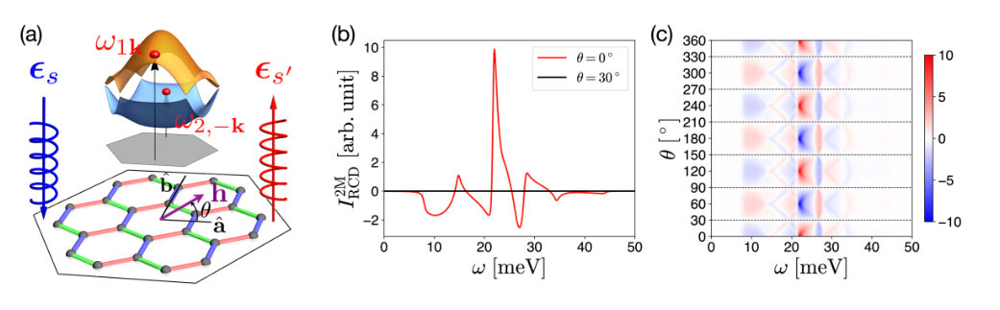 
FIG. 1. Raman circular dichroism of the field-polarized Kitaev system. (a) Schematic of Raman scattering. The magnetic field h(θ) is rotated within the honeycomb plane of the Kitaev system. The yellow and blue surfaces depict the magnon energy bands over the first Brillouin zone. (b) Two-magnon RCD intensity I2M RCD as a function of Raman energy shift ω obtained for the spin model HKJΓ Γ ′h [Eq. (25)] with the field aligned at θ = 0◦(red) and θ = 30◦(black). (c) Field-angle dependence of I2M RCD(ω). The RCD intensity changes sign as the field direction crosses a bond direction (θ = 30◦, 90◦, 150◦, 210◦, 270◦, 330◦) and vanishes when the field is aligned with a bond.

📷 Fig 2

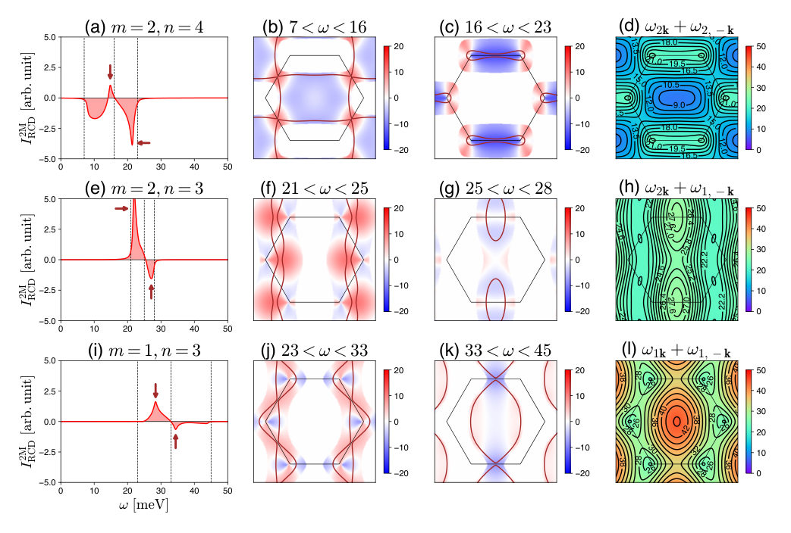 
FIG. 2. RCD intensity I2M RCD(ω, θ = 0◦) resolved into three two-magnon sectors. Top row: (m = 2, n = 4). (a) Sector- resolved RCD intensity. (b)–(d) Momentum-space maps of M24(k; 7meV &lt; ω &lt; 16meV), M24(k; 16meV &lt; ω &lt; 23meV), and ω2k + ω2,−k, respectively. Middle row: (m = 2, n = 3). (e) Sector-resolved RCD intensity. (f)–(h) Momentum-space maps of M23(k; 21meV &lt; ω &lt; 25meV), M23(k; 25meV &lt; ω &lt; 28meV), and ω2k + ω1,−k, respectively. Bottom row: (m = 1, n = 3). (i) Sector-resolved RCD intensity. (j)–(l) Momentum-space maps of M13(k; 23meV &lt; ω &lt; 33meV), M13(k; 33meV &lt; ω &lt; 45meV), and ω1k + ω1,−k, respectively. The hexagon denotes the first Brillouin zone. The brown lines indicate the magnon...

📷 Fig 3

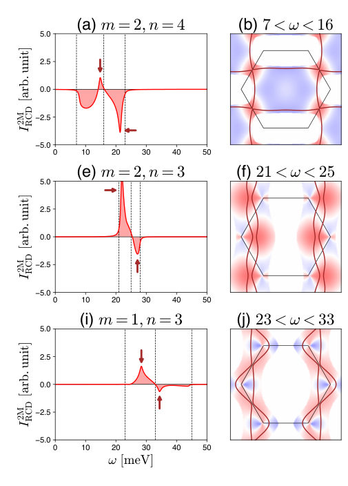 
Figure 1(b) shows the calculated RCD intensity I2M RCD(ω), which exhibits a broad continuum and sev- eral peaks at θ = 0◦whereas it vanishes across all fre- quencies at θ = 30◦. Figure 1(c) shows a color plot of the field-angle dependence of the RCD signals, revealing a distinguished sixfold rotational periodicity. To iden- tify their origins, we classify the two-magnon excitations ωmk + ωn−N,−k into three sectors.

📷 Fig 4

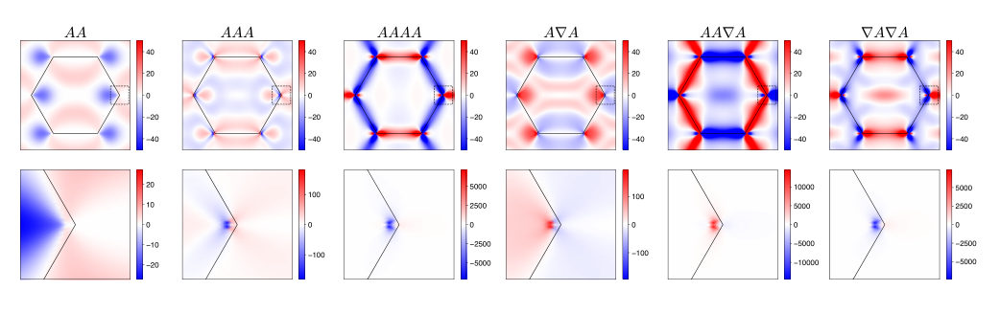 
FIG. 3. The L-matrix element Im h (Lxx nm −Lyy nm)Lxy mn i for m = 2 and n = 4, decomposed into six geometric components. Top:

📷 Fig 5

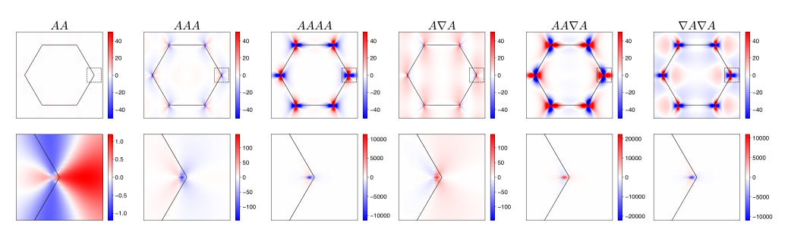 
FIG. 4. The L-matrix element Im h (Lxx nm −Lyy nm)Lxy mn i for m = 2 and n = 3, decomposed into six geometric components. Top:

**Summary.** This paper develops a theoretical framework to characterize the higher-order quantum geometry of magnons in magnetic materials using two-magnon Raman Circular Dichroism (RCD). By decomposing the RCD signal into six distinct geometric tensor contributions, the authors establish RCD as a powerful, non-trivial spectroscopic tool for probing generalized quantum geometry beyond standard metrics.

**Why it may be interesting.** The work provides a rigorous theoretical framework connecting measurable spectroscopic signals (RCD) directly to abstract, higher-order geometric properties of the underlying quantum excitations (magnons).

Detailed structure

**Main problem.** Developing a gauge-invariant theory to probe the higher-order quantum geometry of magnons using two-magnon Raman Circular Dichroism (RCD).

**Main result.** RCD is established as a spectroscopic probe for generalized magnon quantum geometry, with the spectrum being governed by higher-order geometric tensors.

**Method.** The theory decomposes the Raman operator into Berry connections and covariant derivatives, leading to the identification of six distinct higher-order quantum-geometric tensors that contribute to the two-magnon RCD intensity.

**Model / system.** The study applies the theory to a field-polarized Kitaev magnet, modeled by a spin Hamiltonian, and analyzes magnon excitations using Linear Spin-Wave Theory (LSWT).

**Key observables.** Two-magnon RCD intensity, $I_{2M}^{RCD}(\omega)$, and six higher-order quantum-geometric tensors (QGTs).

**Important parameters / regimes.** Kitaev coupling constant ($K$), exchange coupling ($J$), applied magnetic field ($h$), and field angle ($	heta$).

**Assumptions / limitations.** The analysis relies on LSWT and the successful decomposition of the Raman operator into specific geometric terms using projector representations.

**Figures summary.** Figures show the RCD intensity dependence on the magnetic field angle, resolved into three two-magnon sectors, and decomposed into six distinct geometric components.

**Paper structure.** The paper systematically builds the theory by defining single-state quantum geometric tensors, deriving their projector representations for second-order terms, and finally applying this framework to calculate the two-magnon RCD intensity as a sum of six geometric contributions.

Abstract

We develop a gauge-invariant theory of higher-order magnon quantum geometry probed by two-magnon Raman circular dichroism (RCD). The Raman operator decomposes into Berry connections, covariant derivatives, and products of Berry connections, giving rise to quantum geometric tensors beyond the quantum metric and Berry curvature. Applying this theory to a field-polarized Kitaev magnet, we show that higher-order geometric tensors govern the dichroic response. Our results establish RCD as a spectroscopic probe of generalized magnon quantum geometry.

[↑ back to top](#top)

### [Reality and Complexity of $F$-symbols in $2+1$d Topological Phases](http://arxiv.org/abs/2608.23693v1)

**Authors:** Matthew Buican, Peter Huston, Jiannis K. Pachos  
**Type:** theory · **Category:** strongly correlated electrons · **PDF:** <https://arxiv.org/pdf/2608.23693v1>  
**Analysis basis:** full PDF text, analyzed in chunks
**Topic relevance:** `analog quantum simulation` **1/5**

📷 Fig 1

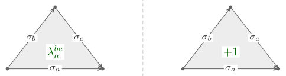 
Fig.1: A schematic picture of flatness in terms of the σa phases that describe the interaction between charge conjugation and pivotal data. Left: an allowed fusion vertex (a; b, c), i.e.

📷 Fig 2

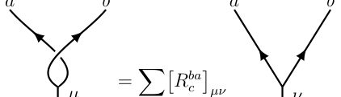 
Fig. 2: The F- and R-symbols of a braided fusion category. The F-symbols govern fusion

📷 Fig 3

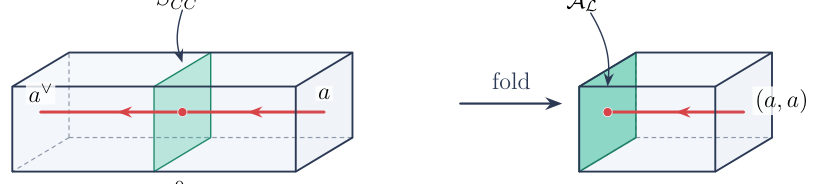 
Fig. 3: On the left, we have the 3-manifold, M ∼= Σ × I. The surface at y = 0 acts on the

**Summary.** This work establishes a deep physical principle governing when the fundamental F-symbols of anyon theories can be made real in a gauge. By linking this reality condition to the flatness of the charge-conjugation symmetry, the authors provide a unifying framework for understanding topological phases. This is significant because it offers a concrete, symmetry-based criterion for classifying quantum materials exhibiting topological order.

**Why it may be interesting.** The connection between topological invariants (F-symbols) and symmetry constraints (charge-conjugation flatness) provides a powerful, general principle for classifying realizable quantum phases, which is relevant for understanding emergent symmetries in strongly correlated electron systems.

Detailed structure

**Main problem.** The central problem is determining the physical conditions under which the F-symbols, which encode the associativity of fusion in anyon theories, can be made real via a suitable gauge transformation.

**Main result.** The reality of the F-symbols is shown to be governed by a physical mechanism related to the flatness of the braided charge-conjugation symmetry within the associated unitary ribbon category.

**Method.** The authors analyze the relationship between the F-symbols and their complex conjugates using gauge transformations, reducing the problem to a condition on the symmetry structure of the category.

**Model / system.** The theory is formulated using Unitary Modular Tensor Categories (UMTCs) that model $2+1$ dimensional Topological Quantum Field Theories (TQFTs) and anyon models, including families of Chern-Simons theories.

**Key observables.** The F-symbols, which quantify the associativity of fusion, and the associated R-matrices.

**Important parameters / regimes.** The structure of the charge-conjugation symmetry, specifically its 'flatness' or the grading property of the associated Frobenius-Schur data.

**Assumptions / limitations.** The analysis assumes the existence of a unitary ribbon category and relies on relating the reality condition to the trivialization of local gauge transformations.

**Figures summary.** Figure 1 schematically illustrates the concept of 'flatness' in the context of the charge-conjugation symmetry, showing the required triviality of the holonomy at fusion vertices.

**Paper structure.** The paper develops the argument by first establishing the gauge equivalence between F-symbols and their conjugates, then linking this equivalence to the physical condition of charge-conjugation symmetry, and finally showing that 'flatness' of this symmetry guarantees the existence of a real gauge.

Abstract

The $F$-symbols of an anyon theory encode the associativity of fusion and constitute some of the theory's most fundamental and, simultaneously, subtle data. Much of the subtlety lies in the gauge-dependence of the $F$-symbols. Despite their generic complexity, many braided anyon theories admit gauges in which all $F$-symbols are real, a phenomenon for which no general organising principle has been known. We identify a physical mechanism underlying this reality. For a unitary ribbon fusion category admitting an appropriate braided charge-conjugation symmetry, we show that the complex-conjugated $F$-symbols are related to the original ones by a gauge transformation. Finding a real gauge is thereby reduced to a condition on these transformations. When the charge-conjugation symmetry is suitably "flat,'' or equivalently when the associated "twisted'' Frobenius-Schur (or "generalized'' Kawanaka-Matsuyama) data respects a grading, these local transformations can be trivialised and a real gauge exists. This framework unifies a broad range of previously disparate examples, including families of Chern-Simons theories whose $F$-symbols are difficult to directly compute. Finally, we exhibit a unitary ribbon category that realizes a novel obstruction to the existence of a real gauge and therefore has inherently complex $F$-symbols.

[↑ back to top](#top)

### [Thermal DMRG for quasi one-dimensional magnetic molecules and chains](http://arxiv.org/abs/2608.24608v1)

**Authors:** L. Horstmann, J. Schnack  
**Type:** theory · **Category:** numerical methods · **PDF:** <https://arxiv.org/pdf/2608.24608v1>  
**Analysis basis:** full PDF text, analyzed in chunks
**Topic relevance:** `methods for driven-dissipative` **1/5**

📷 Fig 1

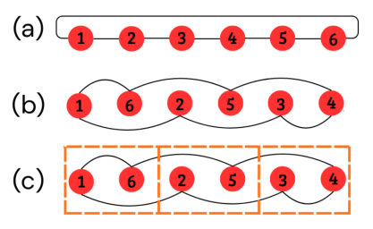 
Figure 1. Schematic view on how to improve periodic bound- ary condition: (a) MPS chain with one long interaction (b) reordering of the sites to only next-nearest interaction without changing physics (c) grouping two neighbouring sites together so the interaction is only nearest neighbour

📷 Fig 2

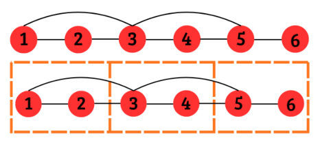 
Figure 2. Structure of the investigated delta chain with fer- romagnetic nearest neighbor exchange J1 and antiferromag- netic next-nearest neighbor exchange J2 between adjacent odd sites.

📷 Fig 3

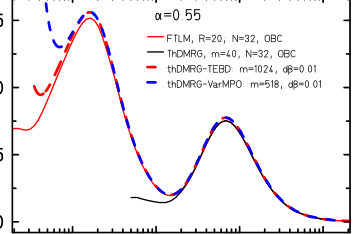 
Figure 3. Heat capacity for a delta chain: N = 32, α = 0.55, open boundary condition. Both methods, thDMRG-TEBD and thDMRG-VarMPO are used and compared to FTLM. VarMPO took 4 weeks compared to 2 days for TEBD on the same hardware with the same number of cores.

📷 Fig 4

 
Figure 3 shows the specific heat for N = 32 spins si = 1/2 at α = 0.55 calculated in four different ways. The FTLM result (thin red curve) is considered quasi- exact and serves as a benchmark. Our earlier investiga- tion [25] could not reproduce the double-peak structure, it was accurate only down to temperatures T/|J1| ∼0.1. The investigated new methods thDMRGt-TEBD and thDMRG-VarMPO are both able to follow the FTLM re- sult down to the low-temperature maximum at T/|J1| ∼ 0.01 and even beyond with reasonable choices of bond dimension m and imaginary-time step dβ. Computing times are both not short, but very different. VarMPO took 4 weeks compared to 2 days for TEBD on the same hardware...

📷 Fig 5

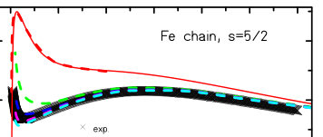 
Figure 5. Magnetic susceptibility χ = M/B at B = 0.1 T for open chains. Experimental results (symbols) and the an- tiferromagnetic exchange interaction are taken from Ref. [37]. thDMRG-TEBD calculations are given by dashed curves. For the N = 12 chain we did a calculation with bond dimension m = 200 and cooling steps dβ = 0.01 up to βmax = 2. For the other chains calculation were done with dβ = 0.001 up to βmax = 0.2 and m = {200; 250; 350} for N = {48; 120; 240}, respectively.

**Summary.** This paper investigates the feasibility of using advanced tensor network methods, particularly Thermal DMRG, to calculate thermal properties of large, complex quantum magnetic molecules and chains. By comparing results against exact diagonalization and FTLM, the authors map out the computational limits imposed by system geometry and interaction complexity. It provides a crucial resource for theoretical physicists working on strongly correlated magnetic materials.

**Why it may be interesting.** This work is highly relevant as it pushes the boundaries of applying tensor network methods to finite-temperature, interacting quantum spin systems, providing benchmarks for simulating complex magnetic materials.

Detailed structure

**Main problem.** The primary goal is to accurately evaluate thermal equilibrium properties of large, quasi one-dimensional magnetic molecules and chains that are too complex or large for exact diagonalization.

**Main result.** The study demonstrates that advanced tensor network methods can achieve accurate results for many realistic magnetic systems, although convergence is limited by geometry (Area Law) and specific boundary conditions.

**Method.** The authors employ advanced tensor network techniques, including Thermal DMRG (thDMRG) using both the Variational MPO approach and TEBD, alongside comparison with FTLM.

**Model / system.** The focus is on quantum spin systems, including quasi one-dimensional chains (e.g., delta chains, Fe chains) and molecular rings, described by Heisenberg-like Hamiltonians potentially including single-ion anisotropy.

**Key observables.** Magnetic susceptibility ($\chi$), specific heat ($C$), and entanglement entropy ($S_A$).

**Important parameters / regimes.** Bond dimension ($m$), temperature ($T$), and the nature of boundary conditions (open vs. periodic).

**Assumptions / limitations.** The methods are inherently limited by the geometry of the system (Area Law for MPS) and the complexity of interactions (e.g., TEBD is limited to nearest-neighbor interactions).

**Figures summary.** Figures compare magnetic susceptibility and entanglement entropy across different methods (ED, FTLM, thDMRG) for spin rings and chains, highlighting convergence behavior.

**Paper structure.** The paper systematically compares the performance of various numerical techniques (DMRG, TEBD, FTLM) across different physical models (open chains, rings, anisotropic systems) to determine the limits of current computational approaches for thermal quantum magnetism.

Abstract

Density matrix renormalization group methods or tensor network methods in general can not only be used to determine ground states but also to evaluate thermal equilibrium properties. Although convergence is superior for one-dimensional quantum spin systems with nearest neighbor exchange and open boundary conditions, the hope is that these methods can as well be employed to approximate magnetic observables of magnetic molecules with more complex interaction patterns. Here, we study the accuracy that can realistically be achieved for several archetypical quasi one-dimensional structures using the TenPy suite. In our study, we aim at systems that are too large for exact diagonalization or Krylov space methods.

[↑ back to top](#top)

## Other papers (19)

*Papers from primary archives without highlighted authors or any topic match. Click to expand.*

Show other papers

### [A Theory of Finite-Noise Optima and Generalization in Quantum Machine Learning](http://arxiv.org/abs/2608.24229v1)

**Authors:** Ziyu Zhang, Zikang Jia, Xiaosong Li, Yulong Dong  
**Type:** theory · **Category:** disordered systems and neural networks · **PDF:** <https://arxiv.org/pdf/2608.24229v1>  
**Analysis basis:** full PDF text, analyzed in chunks

📷 Fig 1

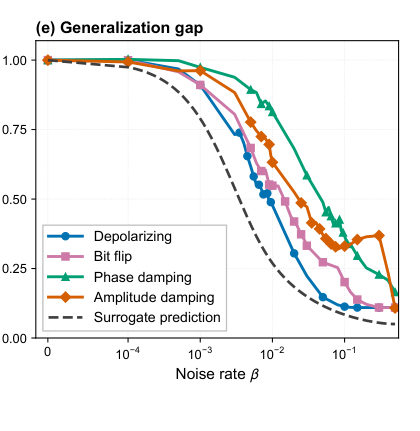 
Figure 1. Non-monotonic response of the four-qubit regression model to physical noise. (a–d) Final training and testing mean-squared errors for four quantum noise models. Curves show the mean over ten indepen- dently trained runs and shaded bands show one standard deviation. (e) Generalization gap normalized by its value at zero noise. The dashed line shows the surrogate prediction introduced below.

📷 Fig 2

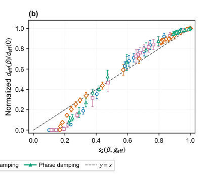 
Figure 2. Effective model complexity under physical noise. (a) Effective model complexity as a function of noise rate for the four noise models. Lines show the mean over ten runs and shaded regions show one standard deviation. (b) Effective model complexity normalized by its zero-noise value and plotted against s2(β, geff). Error bars show one standard deviation; fitted values of geff are reported in Section B.2.

📷 Fig 3

 
Fig. 2(a) shows that all four noise models reduce the effective model complexity, but at different rates. We account for this noise-model dependence by fitting geff separately for each model. After normalization, all four curves follow the predicted dependence on s2(β, geff) in Fig. 2(b). The ordering of geff can be understood from how directly each noise model changes the populations probed by the final measurement, which is Z⊗4 in this case. For example, phase damping suppresses only coherences and therefore affects the measured signal less directly. Depolarizing noise instead changes both populations and coherences, leading to the largest geff. The fitted values and further details are...

📷 Fig 4

 
Figure 3. Parameter-wise output-gradient norms under physical noise. (a–d) Root-mean-square output- gradient norm γi(β) versus parameter index i for representative noise rates. Each point is averaged over ten independent runs. In (b), the β = 0.5 bit-flip channel symmetrically averages the identity and bit-flip branches in the final noisy layer, giving γi(0.5) = 0 exactly; the corresponding curve is therefore absent on the logarithmic scale. (e) Output-gradient norm averaged over parameters and normalized by its zero-noise value. Roman numerals indicate three noise regimes.

📷 Fig 5

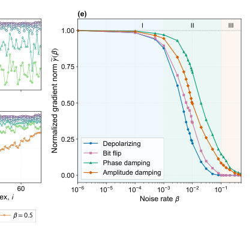 
Fig. 3(a–d) shows this quantity for every parameter. For the three unital noise models, the output-gradient norms decrease relatively uniformly across parameters as the noise rate increases. Amplitude damping instead develops a clear dependence on distance from the final measurement: parameters farther from the measurement have smaller output-gradient norms. This trend is con- sistent with recent results on quantum machine learning under non-unital noise [13]. Fig. 3(e) averages γi over parameters and normalizes it by its zero-noise value. This normalized quantity measures how strongly noise suppresses the output-gradient norm. All four noise models exhibit three regimes. The...

**Summary.** This work provides a statistical learning theory to explain why moderate levels of quantum noise can sometimes improve the performance of Quantum Machine Learning models. By introducing a noise-order purity parameter, the authors predict a finite-noise optimum where the benefits of noise-induced regularization balance the detrimental effects of signal degradation. This offers a pathway to actively harness noise in quantum algorithms.

**Why it may be interesting.** The concept of noise-induced regularization, where controlled noise can improve generalization by reducing effective model complexity, is highly relevant for understanding open quantum systems and noise resilience in quantum computation.

Detailed structure

**Main problem.** The paper develops a statistical learning theory to explain the non-monotonic effect of quantum noise on Quantum Machine Learning (QML) performance, particularly the intermediate-noise regime.

**Main result.** The non-monotonic behavior is explained by the competition between noise-induced reduction in model complexity and the attenuation of the learnable signal, leading to a predictable finite-noise optimum.

**Method.** The authors introduce a noise-order purity parameter derived from a surrogate model analysis to quantitatively link microscopic noise processes to macroscopic generalization performance.

**Model / system.** The system involves quantum circuits used for QML, subjected to various physical noise processes (e.g., depolarizing, bit-flip noise). The analysis uses a surrogate loss function to model the noisy responses.

**Key observables.** Generalization Gap ($\Delta_{gen}$), Noise-Order Purity ($s_2$), Effective Model Complexity ($	ext{deff}$), and Training/Testing Mean Squared Error (MSE).

**Important parameters / regimes.** Noise Rate ($eta$), Noise-Order Purity, and the intermediate-noise regime.

**Assumptions / limitations.** The theory relies on developing a statistical learning framework connecting noise processes to generalization bounds, and the analysis uses surrogate model approximations.

**Figures summary.** Figure 1 shows the non-monotonic test loss and decreasing generalization gap with noise. Other figures compare effective complexity and analyze the role of noise-order purity across different noise regimes.

**Paper structure.** The paper first establishes the problem of noise in QML, then develops the statistical theory using the noise-order purity parameter, derives the relationship between purity and generalization gap, and concludes by proposing noise programming to harness this effect.

Abstract

Quantum noise is expected to degrade quantum machine learning by driving circuits away from their noiseless implementations. Yet recent studies show moderate noise can reduce testing error, a behavior unexplained by weak-noise perturbative error accumulation or strong-noise trainability collapse. Here we develop a statistical learning theory connecting microscopic noise processes to macroscopic learning performance. At its heart is a noise-order purity parameter, derived from a surrogate model analysis, that predicts the noise-induced reduction in model complexity and the consequent reduction in the generalization gap. Noise simultaneously increases prediction bias. Their competition explains the intermediate-noise regime left open between these limits. It produces a finite-noise optimum whose location depends on the learning setup and can disappear in the large-sample limit. Numerical experiments validate these predictions. Noise programming can move a model towards this optimum. These results make the non-monotonic effect of noise predictable and provide a route to harness it.

[↑ back to top](#top)

### [ABSTRACTS: Amsterdam Benchmark Suite for the Time and Resource Analysis of Clifford+T Simulators](http://arxiv.org/abs/2608.24370v1)

**Authors:** Matthew Sutcliffe, John van de Wetering  
**Type:** theory · **Category:** quantum information and computing · **PDF:** <https://arxiv.org/pdf/2608.24370v1>  
**Analysis basis:** full PDF text, analyzed in chunks

📷 Fig 1

 
Figure 1: Overview of the automated ABSTRACTS benchmarking procedure, triggered when a new simulator or circuit (class) submission is accepted into the repository.

📷 Fig 2

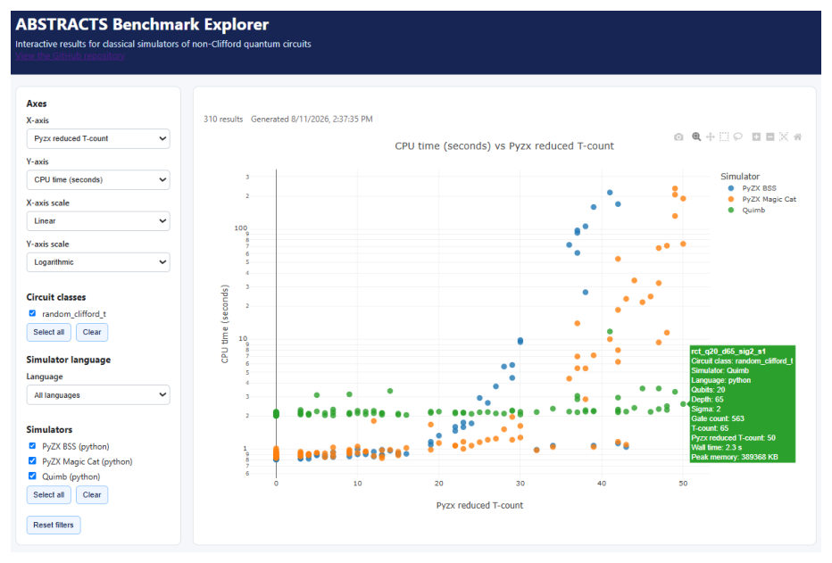 
Figure 2: The ABSTRACTS ‘dashboard’, hosted at https://mjsutcliffe99.github.io/ ABSTRACTS/, for visualisation and analysis of its benchmark results.

📷 Fig 3

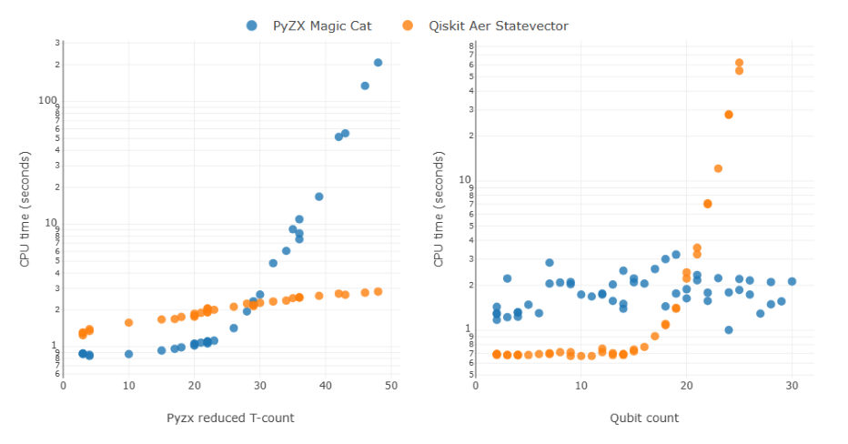 
Figure 3: Two plots generated via the ABSTRACTS dashboard, comparing the CPU time for simulating random Clifford+T circuits with the PyZX ‘Magic Cat’ [23] stabiliser decomposition strategy and the Qiskit Aer Statevector simulator [19]. The random Clifford+T circuits are of (left) a fixed qubit count of 20, and (right) a fixed T-count (after plugged ZX-calculus simplification) of 30, respectively. Observe the difference in exponential scaling across two different metrics, showing that neither method is better than the other in all cases.

📷 Fig 4

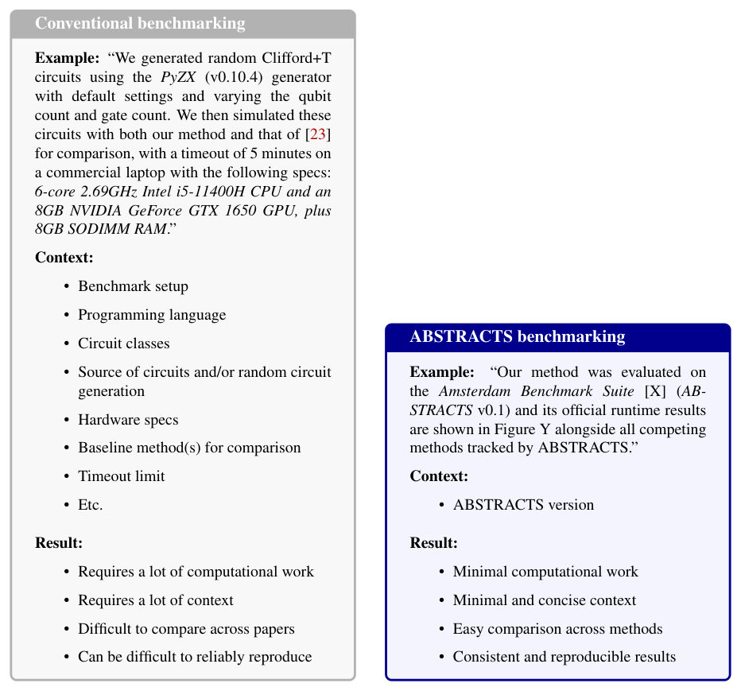 
Figure 4: A comparison of (left) the heavily contextual and verbose benchmarking summary typical of papers in the literature to date, and (right) a corresponding simple and concise summary facilitated by benchmarking with ABSTRACTS. In the latter case, the relevant computational details may be found on the GitHub repository from the ABSTRACTS version alone, rather than needing to be contextualised within each paper.

📷 Fig 5

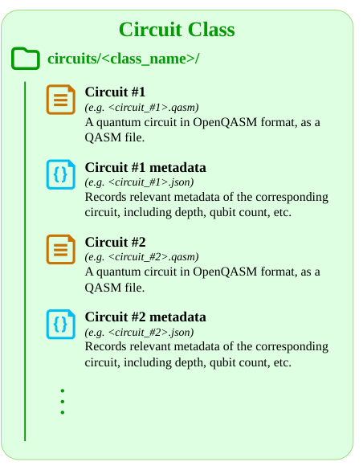 
Figure 5: The file structures of (left) a simulator and (right) a circuit class in the ABSTRACTS repo.

**Summary.** This paper addresses the lack of standardization in benchmarking classical quantum circuit simulators by introducing the Amsterdam Benchmark Suite (ABSTRACTS). It provides a canonical framework and consistent datasets to fairly compare the time and resource efficiency of various simulation techniques for Clifford+T circuits. This infrastructure is vital for the community to accurately assess the scaling behavior of quantum simulation methods.

**Why it may be interesting.** It provides essential tools for assessing the computational feasibility and scaling limits of simulating complex quantum circuits, which is crucial for understanding the resource requirements of quantum algorithms.

Detailed structure

**Main problem.** The field lacks a standardized, canonical benchmark suite for fairly comparing the efficiency of classical simulators designed for non-Clifford quantum circuits.

**Main result.** The authors introduce the Amsterdam Benchmark Suite (ABSTRACTS), a standardized infrastructure providing consistent datasets and virtual hardware to enable fair, quantitative comparison of simulator performance.

**Method.** The paper develops a comprehensive benchmarking framework that tests various simulation techniques (e.g., stabiliser decomposition, tensor contraction) against standardized Clifford+T circuits.

**Model / system.** The focus is on simulating non-Clifford quantum circuits, specifically those involving Clifford and T gates (Clifford+T circuits), which require strong simulation techniques.

**Key observables.** CPU time, memory usage, and scaling patterns relative to circuit metrics like qubit count and non-Clifford gate count.

**Important parameters / regimes.** Circuit depth, number of non-Clifford gates (T-count), and the specific simulation technique employed (e.g., stabiliser rank $\alpha$).

**Assumptions / limitations.** The performance comparison is highly dependent on the specific circuit class and the chosen metric, meaning no single simulator is universally superior.

**Figures summary.** Figures illustrate the automated benchmarking procedure, the dashboard for result visualization, and comparisons of CPU time scaling for different simulation methods on random circuits.

**Paper structure.** The paper identifies the standardization gap, proposes the ABSTRACTS framework, details the benchmarking procedure, and presents comparative results to demonstrate the utility of the standardized tool.

Abstract

Recent years have seen a rapid growth in literature presenting new methods for simulating non-Clifford quantum circuits with classical hardware. These methods span a range of approaches, including stabiliser decomposition and tensor contraction techniques, varying in efficiency depending on circuit class, depth, non-Clifford gate count, and other metrics. A notable limitation of this literature is the lack of a standardised approach to benchmarking, with each new paper outlining its own specification, simulating its own set of circuits on the authors' own hardware. This paper seeks to address this issue by presenting a standardised and canonical benchmark suite and infrastructure for quantifying the efficiency of non-Clifford classical simulators, with a consistent dataset of circuits and providing consistent (virtual) hardware, thereby enabling a fair comparison of results.

[↑ back to top](#top)

### [Bell-CHSH Violation for a Massless Majorana Field in a Double Cone from Modular Localization](http://arxiv.org/abs/2608.23753v1)

**Authors:** S. P. Sorella  
**Type:** theory · **Category:** quantum information and computing · **PDF:** <https://arxiv.org/pdf/2608.23753v1>  
**Analysis basis:** full PDF text, analyzed in chunks

📷 Fig 1

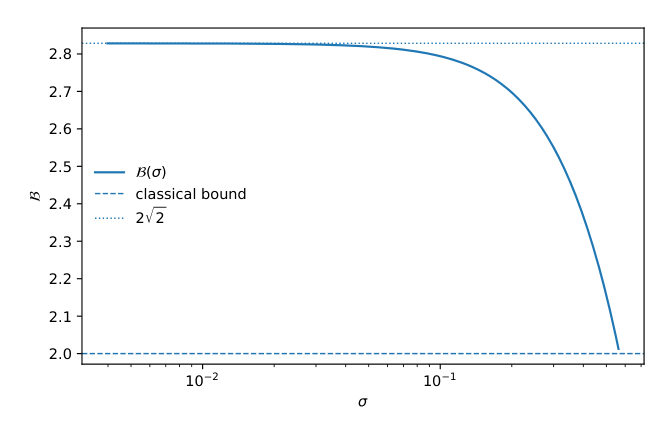 
Figure 1: The Gaussian Bell parameter B(σ). The dashed line is the classical CHSH bound 2 and the dotted line is the Tsirelson value 2 √

**Summary.** This theoretical paper analyzes Bell-CHSH correlations for a massless Majorana field confined to a double cone using advanced techniques from modular localization theory. By constructing the Bell functional using the field's one-particle scalar product, the authors demonstrate that the violation of the classical bound approaches the Tsirelson limit ($2\sqrt{2}$) as the localization profile becomes increasingly narrow. This links fundamental QFT structures to quantum information bounds.

**Why it may be interesting.** The connection between fundamental concepts in quantum field theory (modular localization, chiral fields) and quantum information theory (Bell inequalities) provides a novel physical realization for testing quantum non-locality.

Detailed structure

**Main problem.** The paper investigates the violation of Bell-CHSH inequalities using correlations derived from a chiral massless Majorana field localized in a double cone geometry.

**Main result.** Near-maximal Bell violation, approaching the Tsirelson bound of $2\sqrt{2}$, is achieved using smooth, rapidly decreasing Gaussian profiles in the modular momentum space.

**Method.** The analysis employs modular localization theory, deriving the one-particle scalar product in modular momentum space, and reducing the Bell test to a functional of this product.

**Model / system.** The system is a chiral massless Majorana field confined to a double cone region in 1+1 dimensions. The mathematical framework heavily utilizes concepts from modular operator theory (Tomita-Takesaki operator) applied to this field.

**Key observables.** The Bell parameter $B(\sigma)$, which is compared against the classical bound (2) and the Tsirelson value ($2\sqrt{2}$).

**Important parameters / regimes.** The Gaussian width parameter $\sigma$, which is taken to zero ($\sigma 	o 0^+$) to approach the maximal violation.

**Assumptions / limitations.** The construction requires the modular conjugation to be antiunitary with respect to the weighted scalar product, and the analysis is restricted to the one-particle level.

**Figures summary.** Figure 1 plots the Bell parameter $B(\sigma)$ versus $\sigma$, showing the approach towards the Tsirelson value, while Table 1 provides numerical values confirming this approach.

**Paper structure.** The paper first establishes the mathematical framework using modular localization for the field in the double cone. It then constructs the Bell-CHSH operator using the derived one-particle scalar products and analyzes the expectation value using Gaussian profiles to demonstrate the approach to the Tsirelson bound.

Abstract

We investigate Bell-CHSH correlations for a chiral massless Majorana field localized in a double cone. The conformal modular flow of the associated light-ray interval is converted into translations by a rapidity-like coordinate, and the one-particle scalar product is derived in modular momentum space. Particular attention is paid to the fact that this scalar product carries a Fermi-Dirac weight. Requiring the modular conjugation to be antiunitary with respect to that weighted scalar product fixes the Fourier-space realization of the modular objects. The resulting Tomita-Takesaki operator and its adjoint generate Alice and twisted-dual Bob directions for which all four crossed CAR orthogonality relations follow automatically from modular localization. The Bell problem then reduces to a simple one-function functional. For a Gaussian modular-momentum profile $h_σ(k)=\exp[-k^2/(2σ^2)]$ the Bell parameter is larger than the classical bound for a broad range of widths and approaches the Tsirelson value analytically, \[ \lim_{σ\to 0^+}{\it B}(σ)=2\sqrt2 \] Thus near-maximal Bell violation is obtained from an explicit sequence of smooth rapidly decreasing profiles concentrated around zero modular momentum, corresponding to the modular spectral value $λ=1$.

[↑ back to top](#top)

### [Bound State Analysis of Rank-One Delta Interactions Supported by Deformed Hyperspheres](http://arxiv.org/abs/2608.24508v1)

**Authors:** Hilal Demirdöğen, Fatih Erman, Merve Nur Sayar  
**Type:** theory · **Category:** other · **PDF:** <https://arxiv.org/pdf/2608.24508v1>  
**Analysis basis:** full PDF text, analyzed in chunks

📷 Fig 1

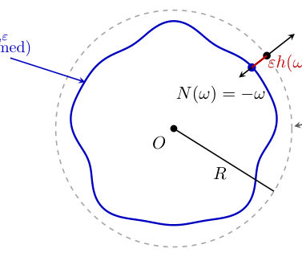 
Figure 1: Schematic illustration of a small normal deformation of the hypersphere Sn R ⊂Rn+1. The undeformed hypersphere is represented by the dashed gray curve, while the deformed hypersphere Sn R,ε is shown by the solid blue curve. The vector ω denotes the outward unit radial direction, and the inward normal is therefore N(ω) = −ω. In this convention, the deformation is described by Xε(ω) = Rω −εh(ω)ω.

**Summary.** This theoretical work investigates how the bound-state energy of a quantum particle interacting via a delta potential on a hypersphere changes when the sphere's surface is slightly deformed. The key finding is that, to first order, the energy shift depends only on the average displacement of the surface, suggesting that the system behaves as if it were on a perfectly round sphere with a slightly adjusted radius.

**Why it may be interesting.** The result that the energy depends only on the average displacement $\langle h 
angle$ is a powerful statement about the robustness of the spectrum to non-uniform deformations, which is relevant for understanding effective Hamiltonians in curved or perturbed geometries.

Detailed structure

**Main problem.** The paper analyzes the bound-state energy of a quantum system subjected to a rank-one delta interaction supported on a small normal deformation of an $n$-dimensional hypersphere.

**Main result.** To first order in the deformation parameter $\epsilon$, the bound-state energy depends only on the average normal displacement $\langle h 
angle$, implying spectral equivalence to a round sphere with an effective radius $R - \epsilon \langle h 
angle$.

**Method.** The analysis uses perturbation theory on the resolvent operator, expanding the matrix element of the free Green's function to first order in the deformation parameter $\epsilon$.

**Model / system.** The system is modeled by a Hamiltonian $H = H_0 - \lambda |\delta S_{n,R,\epsilon}
angle\langle\delta S_{n,R,\epsilon}|$, where $H_0 = -\Delta$ and the interaction is a rank-one delta potential supported on the deformed hypersphere $S^n_{R,\epsilon}$.

**Key observables.** Bound-state energy $E = -
u^2$, and the dependence of this energy on the average normal displacement $\langle h 
angle$.

**Important parameters / regimes.** The small deformation parameter $\epsilon$, the dimensionality $n$, and the coupling constant $\lambda$.

**Assumptions / limitations.** The analysis is restricted to the small deformation limit ($\epsilon \ll 1$) and the interaction is specifically the rank-one coupling associated with the normalized surface measure.

**Figures summary.** Figure 1 schematically illustrates the difference between the undeformed and deformed hypersphere; other figures likely contain mathematical derivations or summary tables of the bound-state equations.

**Paper structure.** The paper first establishes the bound-state equation for the undeformed sphere using Bessel functions. It then introduces the small deformation via $X_\epsilon(\omega)$ and calculates the first-order correction to the matrix element, leading to the main result regarding the dependence on $\langle h 
angle$.

Abstract

We study rank-one delta interactions supported by small normal deformations of an \(n\)-dimensional hypersphere \(S_R^n\subset\mathbb{R}^{n+1}\). The interaction is defined by the normalized surface measure on the support and therefore corresponds to the rotationally invariant sector of the hyperspherical shell problem. For the undeformed hypersphere, we derive the bound-state equation for \(E=-ν^2\) in terms of the modified Bessel product \[   I_{\frac{n-1}{2}}(νR)K_{\frac{n-1}{2}}(νR). \] We then consider an inward normal deformation \[   X_\varepsilon(ω)=(R-\varepsilon h(ω))ω,   \qquad ω\in S^n,   \qquad 0<\varepsilon\ll1. \] Our main result is that, to first order in \(\varepsilon\), the bound-state energy depends only on the average normal displacement \[   \langle h\rangle   =   \frac1{|S^n|}\int_{S^n}h(ω)\,dΩ_n(ω). \] Equivalently, the deformed hypersphere is spectrally equivalent, up to \(O(\varepsilon^2)\), to a round hypersphere with effective radius \(R-\varepsilon\langle h\rangle\). In particular, mean-zero deformations do not change the rank-one bound-state energy at first order.

[↑ back to top](#top)

### [Distributed Resource Theory of Entanglement and Magic](http://arxiv.org/abs/2608.24299v1)

**Authors:** Xiao Yuan, Wenhao Zhang, Qiming Ding, You Zhou  
**Type:** theory · **Category:** quantum information and computing · **PDF:** <https://arxiv.org/pdf/2608.24299v1>  
**Analysis basis:** full PDF text, analyzed in chunks

📷 Fig 1

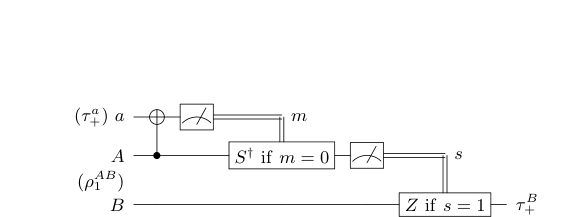 
FIG. 1. Gate-level realization in time order. The Za mea- surement on system a produces m ∈{0, 1}; Alice’s final XA measurement on system A produces the hidden sign s ∈{0, 1}. Only s is sent to Bob.

**Summary.** This paper introduces the Distributed Resource Theory of Entanglement and Magic (DREAM) to unify the study of entanglement and magic in quantum computing. It proves that DREAM captures resources beyond what is captured by considering entanglement and magic separately. The work reveals counterintuitive resource behaviors, such as teleporting magic states using only separable resources.

**Why it may be interesting.** It establishes a powerful, unified mathematical framework for quantifying multiple, distinct quantum resources, which is highly relevant for designing fault-tolerant quantum computation protocols.

Detailed structure

**Main problem.** To develop a unified resource-theoretic description (DREAM) for entanglement and magic in distributed fault-tolerant quantum computing, determining if resources beyond these two are necessary.

**Main result.** DREAM is strictly richer than treating entanglement and magic independently, and a shared separable state can enable magic state teleportation without consuming entanglement.

**Method.** The authors introduce the DREAM framework, defining free states based on local stabilizer circuits and analyzing resource flow using network flow analogies and robustness measures.

**Model / system.** The study models quantum networks on a graph G=(V, E), involving local quantum systems, communication links, and resource states like magic states and general quantum states.

**Key observables.** Entanglement, Magic, DREAM Resourcefulness, Teleportation Capability, Maximal Free Weight ($w_{FAB}$)

**Important parameters / regimes.** The resource threshold $|t|$ for states $\Theta_{2k}(t)$ to be free under DREAM, and network capacities ($c_e, h_e$).

**Assumptions / limitations.** The analysis relies on the properties of local stabilizer circuits and the reduction of resource allocation problems to max-flow min-cut theorems.

**Figures summary.** Figure 1 illustrates the gate-level realization of the magic state teleportation protocol, and other figures relate resource flow to network cuts.

**Paper structure.** The paper systematically introduces DREAM, proves its strict resource richness, demonstrates counterintuitive resource teleportation protocols, and extends the analysis to general quantum networks using network flow theorems.

Abstract

In distributed fault-tolerant quantum computing, entanglement and magic are essential resources for quantum communication and universal fault-tolerant computation, respectively. Although they are usually treated as distinct resource currencies, whether they admit a unified resource-theoretic description remains an open question. Here, we introduce the distributed resource theory of entanglement and magic (DREAM). In this framework, the free states are convex mixtures of product local stabilizer states, and the free operations are local stabilizer circuits assisted by classical communication (LSCC). We show that DREAM contains nontrivial resource states that are neither entanglement nor magic, so it is strictly richer than treating the two resources independently. Surprisingly, such resources can enable the teleportation of magic states between distant parties without consuming entanglement, revealing a counterintuitive form of resource teleportation mediated entirely by separable states. We further generalize this result to quantum networks and investigate general quantum-state teleportation under LSCC. We show that the shared resource under DREAM is closely related to the teleportation capability, quantified by the magic of the teleported state. Our work establish a systematic framework for studying distributed quantum resources and uncover intrinsic relations among distinct resources within a unified resource theory.

[↑ back to top](#top)

### [Efficient, precise DFT calculations of NMR shieldings: Revisiting the finite field approach](http://arxiv.org/abs/2608.24655v1)

**Authors:** Xiao Liu, Kaushik D. Nanda, Jiashu Liang, Martin Head-Gordon  
**Type:** theory · **Category:** numerical methods · **PDF:** <https://arxiv.org/pdf/2608.24655v1>  
**Analysis basis:** full PDF text, analyzed in chunks

📷 Fig 1

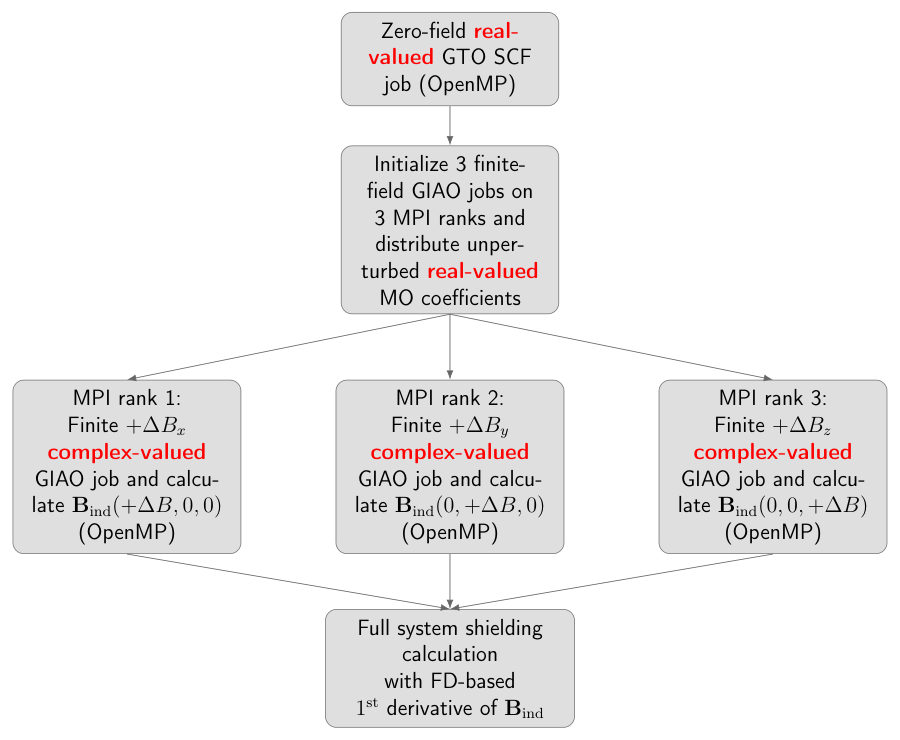 
Figure 1: Hybrid MPI/OpenMP parallel algorithm for finite-field shielding calculations.

📷 Fig 2

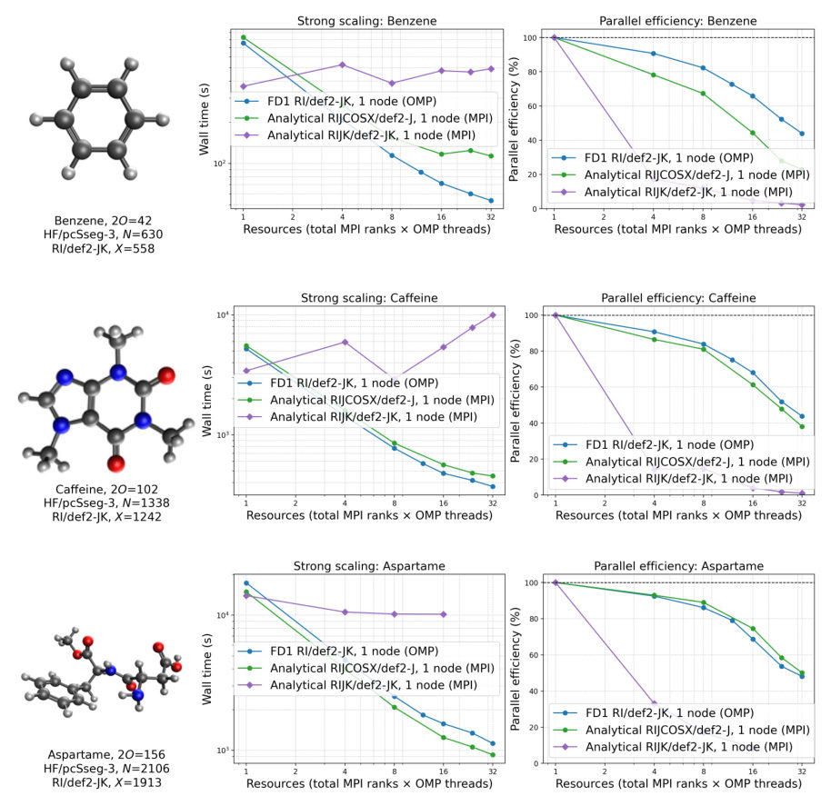 
Figure 2: Single-node performance for the 3 smaller systems: benzene, caffeine, and aspar- tame. The number of electrons (2O), AOs (N) (with the pcSseg-3 basis set), and auxiliary basis functions (X) (with the def2-JK auxiliary basis set used in the FD1 calculations) are listed beside the strong scaling plots.

📷 Fig 3

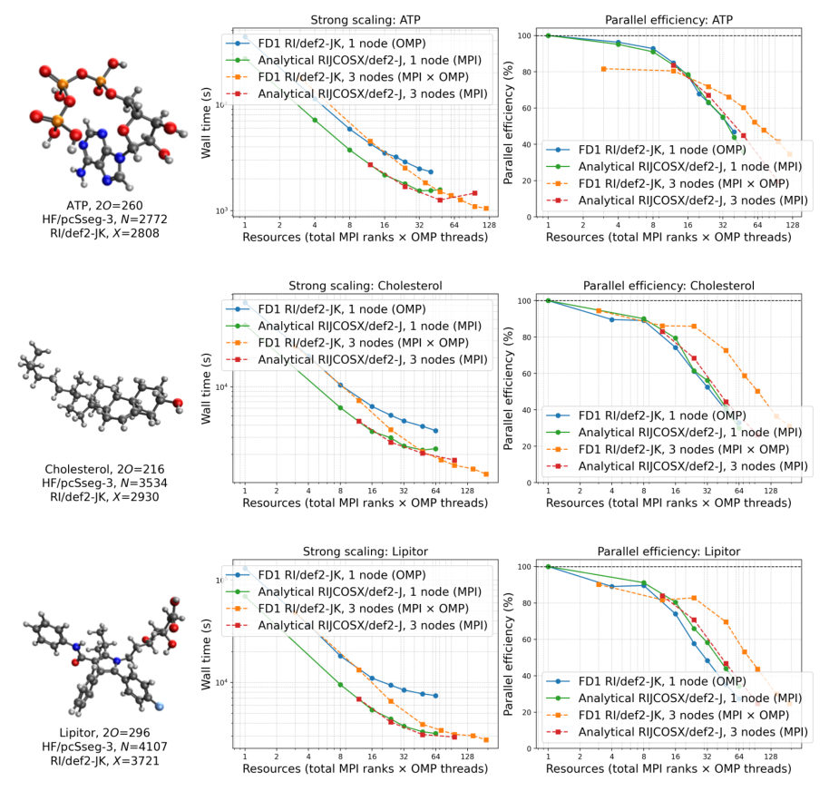 
Figure 3: Multi-node performance for the 3 larger systems: ATP, cholesterol, and lipitor. The number of electrons (2O), AOs (N) (with the pcSseg-3 basis set), and auxiliary basis functions (X) (with the def2-JK auxiliary basis set used in the FD1 calculations) are listed beside the strong scaling plots.

📷 Fig 4

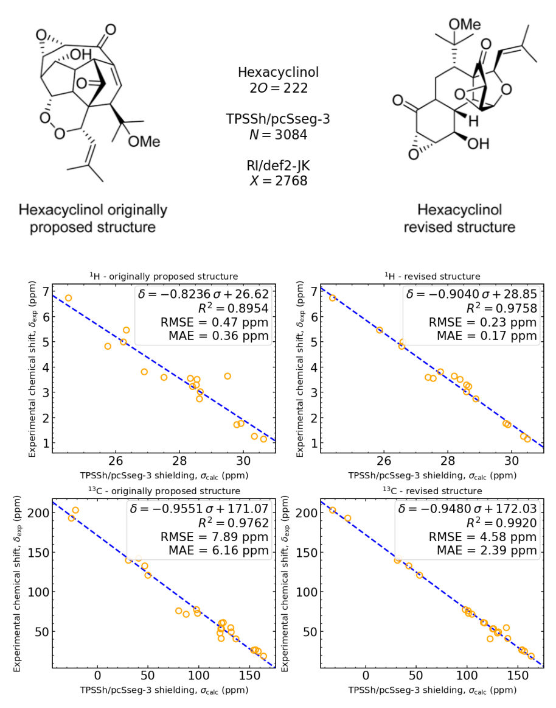 
Figure 4: Linear fit based on TPSSh/pcSseg-3 calculations against hexacylinol experimental chemical shifts for 1H and 13C, with the originally proposed structure (top left) and the revised structure (top right) adapted from a recent review by de Albuquerque et al.112 under CC-BY 4.0 license

**Summary.** This paper presents a scalable computational framework to calculate NMR shielding constants using Density Functional Theory. It overcomes the limitations of purely analytical or purely numerical methods by combining finite magnetic field differentiation with analytical first derivatives. The resulting hybrid algorithm is highly parallelizable and achieves high accuracy for complex chemical systems.

**Why it may be interesting.** While focused on quantum chemistry, the development of a highly parallelized, mixed numerical/analytical algorithm for calculating response properties is a significant contribution to computational quantum mechanics methodology.

Detailed structure

**Main problem.** The accurate and efficient calculation of NMR shielding tensors, which are second-derivative response properties crucial for interpreting NMR spectra.

**Main result.** The proposed mixed finite-field/analytical differentiation scheme achieves very good computational efficiency for DFT-level NMR shielding, matching the precision of state-of-the-art analytic methods.

**Method.** The authors developed a mixed numerical/analytical strategy, reformulating the second derivative as a finite first difference of a first derivative property, combined with RI approximation and hybrid MPI/OpenMP parallelization.

**Model / system.** The calculations are performed for closed-shell chemical systems using Gauge-Including Atomic Orbitals (GIAOs) within the framework of Density Functional Theory (DFT).

**Key observables.** Nuclear magnetic shielding tensor ($\sigma_{K}^{\alphaeta}$) and relative chemical shifts ($\delta$).

**Important parameters / regimes.** The method's accuracy depends on the choice of step sizes for finite differencing and the quality of the RI approximation.

**Assumptions / limitations.** The method is specifically tailored for closed-shell, time-reversal-symmetric systems, and the accuracy relies on the convergence of the finite difference scheme.

**Figures summary.** The notes describe comparisons of error metrics (MSE, MAE, RMSE) across various computational settings and detailed scaling analyses of wall time using MPI/OpenMP resources.

**Paper structure.** The paper introduces the physical problem, details the limitations of existing analytical and purely numerical methods, proposes the mixed finite-field approach, and validates its efficiency and accuracy through systematic comparisons.

Abstract

Absolute nuclear magnetic shielding constants and relative chemical shifts are second-derivative response properties that underpin the interpretation of Nuclear Magnetic Resonance (NMR) spectra and provide critical insights into the structural and electronic environments of diverse chemical systems. However, their accurate computation is often constrained by the need for method-specific, analytical response implementation, and therefore is particularly challenging for non-variational, correlated wavefunction methods where analytical second derivatives are frequently unavailable. Here we present a scalable framework that computes NMR shielding tensors through finite magnetic field differentiation of complex-valued, gauge-including atomic-orbital (GIAO) based self-consistent field (SCF) calculations. By combining hybrid MPI and OpenMP parallelization and resolution-of-identity (RI) approximation-based Coulomb (J) and Exchange (K) implementation and mixed numerical/analytical derivatives computational scheme, we achieve very good efficiency for hybrid density functional theory (DFT) NMR shielding, relative to existing state-of-the-art analytic implementations across realistic chemical systems of various sizes. Forward differentiation with optimal step sizes derived from rigorous error analysis retains favorable numerical errors much smaller than experimental uncertainty or intrinsic DFT errors. The results demonstrate that RI-accelerated finite magnetic field calculations can obtain DFT-level NMR shielding constants very precisely, providing a scalable foundation for extensions to more advanced quantum chemistry methods in future work.

[↑ back to top](#top)

### [Essentially optimal gate teleportation](http://arxiv.org/abs/2608.24345v1)

**Authors:** Lukas Schmitt, David Sutter  
**Type:** theory · **Category:** quantum information and computing · **PDF:** <https://arxiv.org/pdf/2608.24345v1>  
**Analysis basis:** full PDF text, analyzed in chunks

📷 Fig 1

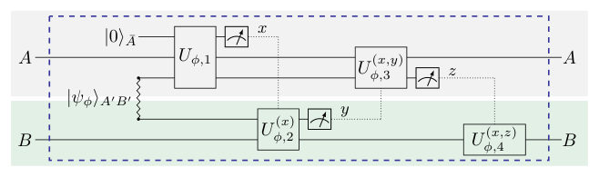 
Figure 2: Gate teleportation protocol for the controlled-phase gate Uϕ = diag(1, 1, 1, eiϕ) with ϕ ∈[0, π] using the entangled resource state |ψϕ⟩A′B′. Systems A and B denote the input qubits. Dotted lines depict classical communication.

📷 Fig 2

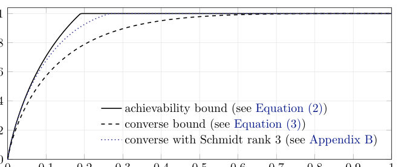 
Figure 3: Entanglement entropy of the resource state for teleporting a controlled-phase gate Uϕ = diag(1, 1, 1, eiϕ) of angle ϕ ∈[0, π]. The achievability bound shows the specific teleportation protocol explained in Figure 2. Below the dashed converse bound (in black) no teleportation is possible. If we limit the Schmidt rank of the resource state to 3, a stronger converse bound holds (in dotted blue).

📷 Fig 3

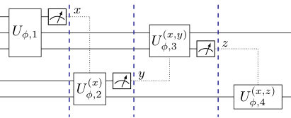 
Figure 4: Teleportation circuit for Uϕ. To prove correctness we need to show that |Ω(x,y,z) 4 ⟩AB is proportional to Uϕ|Λ⟩AB for all x, z ∈{0, 1} and for all y ∈{0, 1, 2}.

📷 Fig 4

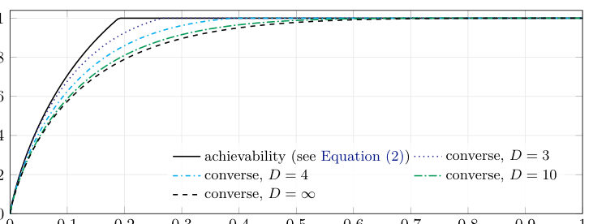 
Figure 5: Entanglement of the resource state for teleporting a controlled-phase gate Uϕ = diag(1, 1, 1, eiϕ) of angle ϕ ∈[0, π]. The achievability curve corresponds to the protocol in Figure 2. The converse curves show Equation (133) for resource states of Schmidt rank D ∈{3, 4, 10, ∞}. For such a state, gate teleportation below the corresponding curve is impossible.

**Summary.** This paper develops a highly optimized, deterministic protocol for teleporting the controlled-phase gate $U_\phi$ using minimal entanglement resources. By deriving tight upper and lower bounds on the required entanglement, the authors show that the resource cost scales near optimally with the gate parameter $\phi$. This work significantly improves the known resource scaling for implementing complex quantum gates like the QFT.

**Why it may be interesting.** While focused on abstract quantum information theory, the rigorous bounding techniques using entropy and resource constraints are foundational to understanding the limits of quantum computation protocols, which has implications for designing efficient quantum hardware.

Detailed structure

**Main problem.** The paper addresses the fundamental problem of implementing nonlocal unitary gates using only local operations, classical communication (LOCC), and a shared entangled resource state.

**Main result.** They present a deterministic protocol for the controlled-phase gate $U_\phi$ whose entanglement consumption is shown to be close to the theoretical optimum for all phase angles $\phi$.

**Method.** The authors derive both achievable upper bounds (via a specific protocol) and rigorous lower bounds (via entropy arguments and majorization criteria) on the required entanglement resource.

**Model / system.** The core model is quantum gate teleportation, specifically analyzing the resource cost for implementing the two-qubit controlled-phase gate $U_\phi = 	ext{diag}(1, 1, 1, e^{i\phi})$. The analysis involves resource states $|\psi
angle_{A'B'}$ and the associated entanglement entropy.

**Key observables.** Entanglement entropy (ebits), the entanglement cost $TC(U_\phi)$, and the required Schmidt rank of the resource state.

**Important parameters / regimes.** The phase angle $\phi \in [0, \pi]$, and the resource state parameters defining the Schmidt decomposition.

**Assumptions / limitations.** The analysis assumes deterministic and exact implementation of the unitary gate and relies on advanced mathematical tools like majorization criteria and determinant identities.

**Figures summary.** Figures illustrate the general gate teleportation setup, the specific four-round protocol for $U_\phi$, and plots comparing the derived achievability bounds against the converse bounds across varying $\phi$.

**Paper structure.** The paper builds from defining the general teleportation cost, presenting the specific protocol for $U_\phi$ (including its four rounds), deriving the necessary lower bounds using entropy arguments, and finally applying these results to improve the known cost for complex tasks like the Quantum Fourier Transform (QFT).

Abstract

Gate teleportation allows us to implement a nonlocal unitary using local operations, classical communication (LOCC), and a shared entangled state. Known deterministic teleportation protocols consume at least one full ebit and achieve optimal entanglement consumption only for Clifford gates. Here, we present a deterministic LOCC protocol for implementing the two-qubit controlled-phase gate $U_φ=\mathrm{diag}(1,1,1,e^{i φ})$ with $φ\in [0,π]$ whose entanglement consumption is close to optimal for every $φ$. In particular, vanishing rotation angles require vanishing entanglement.

[↑ back to top](#top)

### [Hartree--Fock coercivity for twisted bilayer graphene](http://arxiv.org/abs/2608.23884v1)

**Authors:** Kevin D. Stubbs, Maciej Zworski  
**Type:** theory · **Category:** strongly correlated electrons · **PDF:** <https://arxiv.org/pdf/2608.23884v1>  
**Analysis basis:** full PDF text, analyzed in chunks

📷 Fig 1

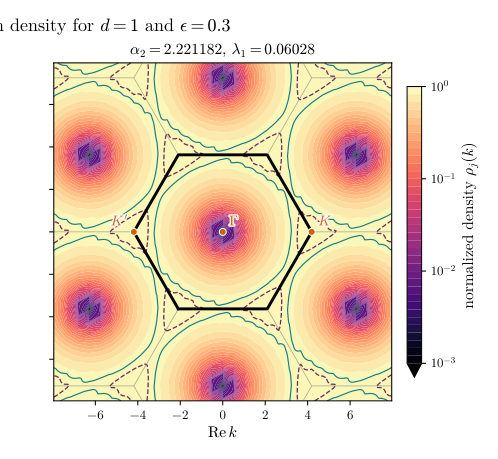 
Figure 1. Numerically computed lowest eigenfunctions, ψ1 (with the eigen- values λ1 determining the constants in (1.2)) for the first two magic angles of [TKV19]: the plot shows the log of the normalised density, ρjpkq :“ |ψ1pkq|2{maxq |ψ1pqq|2, for αj, j “ 1, 2. The parameters in (1.1) are d “ 1 and ε “ 0.3. The vanishing at Γ “ 0 follows from basic symmetries. This figure and Figure 2 were produced, on request, by ChatGPT 5.6.

📷 Fig 2

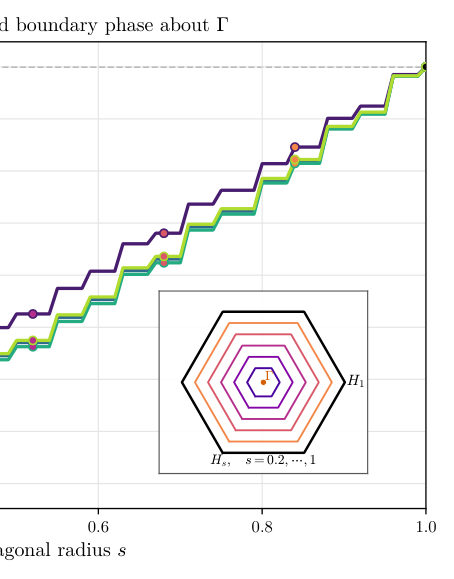 
Figure 2. Curvature of the tangent line bundle at Π`, E´bE˚ ` (φ in (1.2) are essentially sections of it), equipped with its natural connection, for the first four positive magic parameters. Writing Hs “ sH1 where H1 is the fundamental hexagon centred at Γ, the solid curves show the curvature enclosed by Hs (divided by 2π), and the circles, the corresponding continuously lifted phase along BHs. Since c1pE´ bE˚ `q “ 2, all four profiles have the common endpoint 2. Their intermediate shapes do however depend visibly on α, with the first magic parameter being the most distinct.

**Summary.** This paper rigorously analyzes the stability of correlated electron states in twisted bilayer graphene (TBG) using the Hartree-Fock approximation. It proves that the system's ground state is stable by demonstrating that the Hessian of the energy functional is strictly positive definite (coercive) at the expected minimizers. This mathematical result provides a deep theoretical underpinning for the insulating behavior observed in these correlated materials.

**Why it may be interesting.** The rigorous mathematical proof of coercivity provides a strong stability criterion for the correlated electron state, which is crucial for understanding the insulating phases observed in magic-angle graphene.

Detailed structure

**Main problem.** The study focuses on determining the stable ground states (minimizers) and proving the stability (coercivity) of the Hartree-Fock energy functional for flat bands in twisted bilayer graphene.

**Main result.** The minimizers are proven to correspond exactly to filling one of the two component flat bands, and the Hessian of the functional at these points is shown to be strictly coercive, indicating stability.

**Method.** The analysis employs advanced mathematical techniques involving the study of projection fields on Hilbert manifolds, utilizing topological invariants like Chern numbers to establish a positive lower bound on the Hessian.

**Model / system.** The system is Twisted Bilayer Graphene (TBG) at magic angles, modeled using a continuous version of the Bistritzer–MacDonald Hamiltonian. The physics is governed by minimizing the Hartree-Fock energy functional derived by projecting electron-electron interactions onto the flat bands.

**Key observables.** The primary observables are the minimizers of the Hartree-Fock functional ($\Pi = \Pi'$ or $\Pi = \Pi''$) and the coercivity constant ($c>0$) of the Hessian matrix.

**Important parameters / regimes.** Magic angles ($\alpha$) where the energy gap closes, and the filling fraction (specifically half-filling of the flat band).

**Assumptions / limitations.** The analysis assumes the existence of a simple magic angle and relies on mathematical techniques involving unitary trivializations and controlling variations in the projection fields.

**Figures summary.** Figure 1 shows numerically computed lowest eigenfunctions for the first two magic angles. Figure 2 illustrates the curvature of the tangent line bundle at the minimizer $\Pi'$, showing enclosed curvature.

**Paper structure.** The paper progresses by first defining the flat band structure and the Hartree-Fock functional, then proving that the minimizers must be projections onto the component bands ($\Pi'/\Pi''$), and finally establishing the strict coercivity of the Hessian at these minimizers.

Abstract

We study the minimisers of the Hartree--Fock functional for flat bands in the chiral model of twisted bilayer graphene introduced by Tarnopolsky, Kruchkov, and Vishwanath. Our model is a continuous version of the discrete model considered by Becker, Lin and Stubbs in previous works and the first result is a direct analogue of main theorems of those papers: at half filling of the flat band of multiplicity two, there are exactly two minimisers, obtained by occupying either one of the two sub-bands. (A more general version of this result, stressing its topological origins, was presented in Appendix A.8 of the Lecture Notes by Tao-Zworski.) The new contribution is the strict coercivity of the Hessian of the Hartree--Fock functional at the two minimisers. It is a consequence of the difference between the Chern numbers of the component bands and can be optimistically considered as a soft version of a ``spectral gap''.

[↑ back to top](#top)

### [Ideal Bose-Einstein condensation in the canonical ensemble: exact asymptotic estimates from large deviations](http://arxiv.org/abs/2608.24625v1)

**Authors:** Giacomo Gradenigo, Dario Lucente, Luca Salasnich  
**Type:** theory · **Category:** statistical mechanics · **PDF:** <https://arxiv.org/pdf/2608.24625v1>  
**Analysis basis:** full PDF text, analyzed in chunks

📷 Fig 1

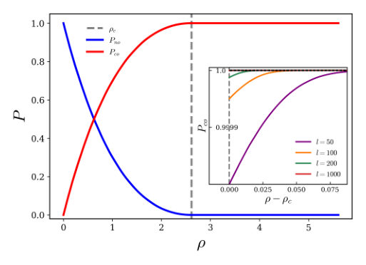 
FIG. 1. Main: analytical result for probabilities of the nor- mal phase, pno(ϱ) = Zno(ϱ)/Z(ϱ), and of the condensed phase, pco(ϱ) = Zco(ϱ)/Z(ϱ), for the value ℓ= 1000, where Zno(ϱ) is the partition function of the normal phase, Zco(ϱ) is the partition function of the condensed phase and Z(ϱ) = Zno(ϱ) + Zco(ϱ) is the partition function of the total sys- tem. In the normal regime, ϱ &lt; ϱc, Zno(ϱ) and Zco(ϱ) are computed by means of the saddle-point approximation, see Eqns. (48),(49), while in the condensed regime, ϱ &gt; ϱc, the two partition functions are computed with our large-deviation approach for ℓ≫1, see Eqns. (73),(74). Inset: Zoom in the vicinity of ϱc of the parametric dependence on ℓof...

📷 Fig 2

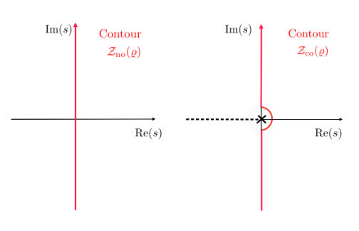 
FIG. 2. In this figure are shown the Bromwich contours con- sidered in the condensed regime, ϱ &gt; ϱc, for the explicit calcu- lation of the canonical partition function of the normal phase, Zno(ϱ) (left), and for the calculation of the canonical partition function of the condensed phase, Zco(ϱ) (right). The split- ting of the total partition function in these two components, Z(ϱ) = Zno(ϱ)+Zco(ϱ), is always possible and is discussed at the beginning of Sec. III. Notice that, for ϱ &gt; ϱc, for the parti- tion function of the condensed phase Zco(ϱ) the contour must be wrapped around the branch cut ending at the origin with the condensate pole, see the expressions of Zco(ϱ) reported in Eqns....

📷 Fig 3

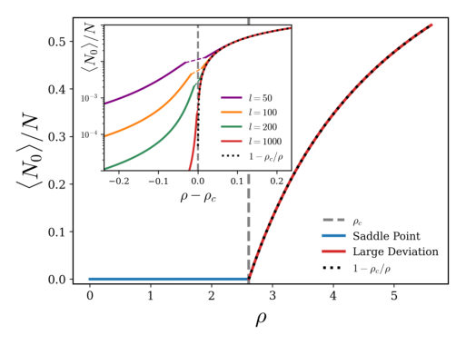 
FIG. 3. Main: Canonical average of the condensate fraction ⟨n0(ϱ)⟩= ⟨N0(ϱ)⟩/N plotted as function of the dimensionless density ϱ = N/ℓ3, for the fixed value of the large parameter ℓ= 103. The blue horizontal continuous line is the analyt- ical result for ⟨n0(ϱ)⟩in the normal regime, ϱ &lt; ϱc, as ob- tained with the saddle-point method for large ℓ, see Eq. 86 in Sec. V B. The red continuous increasing line is ⟨n0(ϱ)⟩ in the condensed regime, ϱ &gt; ϱc, obtained with the large- deviations approach of this work and corresponding to the expression in Eq. (96) from Sec. V C. Still in the main frame, the black dotted line represents the asymptotic behaviour of ⟨n0(ϱ)⟩= 1 −ϱc/ϱ obtained from the...

📷 Fig 4

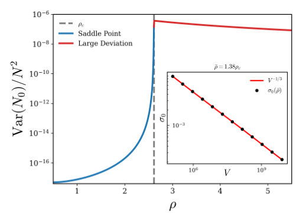 
FIG. 4. Main: Canonical average for fluctuations of the con- densate fraction, σ0(ϱ) = p

**Summary.** This work develops a large-deviations approach to calculate the canonical partition function for free bosons undergoing BEC. By analyzing the fixed-density ensemble, the authors obtain exact asymptotic estimates for key observables like the condensate fraction and its fluctuations in all regimes relative to the critical density. This method clarifies the mixed-order nature of the BEC transition and provides analytical tools applicable to other complex phase transitions.

**Why it may be interesting.** The rigorous treatment of the canonical ensemble, especially resolving the first-order nature of the transition and providing fluctuation scaling laws, offers a powerful theoretical tool applicable to other mixed-order phase transitions.

Detailed structure

**Main problem.** To derive exact asymptotic estimates for the canonical partition function of free bosons undergoing Bose-Einstein Condensation (BEC) using a large-deviations approach.

**Main result.** The large-deviations method provides explicit, simple analytical expressions for the condensate fraction and its fluctuations in both the normal and condensed regimes, revealing the mixed-order nature of the transition.

**Method.** The core method is applying large-deviations theory to the fixed-density (canonical) ensemble, involving complex contour integration and asymptotic analysis in the limit of large system size ($\ell 	o \infty$).

**Model / system.** The system is an ideal, non-interacting gas of bosons confined in a three-dimensional box. The analysis focuses on the fixed-density ensemble, contrasting it with standard grand-canonical approaches.

**Key observables.** Average condensate fraction $\langle n_0(\varrho) 
angle$, condensate fraction fluctuations $\sigma_0(\varrho)$, and the canonical partition function $Z(N)$.

**Important parameters / regimes.** Dimensionless density $\varrho = 
ho \lambda_T^3$, the large-deviations parameter $\ell = L/\lambda_T$, and the critical density $\varrho_c$.

**Assumptions / limitations.** The analysis is restricted to free bosons, and the method relies on asymptotic expansions in the large parameter $\ell$.

**Paper structure.** The paper establishes the problem by contrasting the canonical and grand-canonical ensembles. It then develops the large-deviations framework, providing explicit calculations for the partition function and observables in both regimes ($\varrho < \varrho_c$ and $\varrho > \varrho_c$) using complex analysis techniques.

Abstract

In this work we present a large-deviations approach to the calculation of the canonical partition function for free bosons. Three-dimensional Bose-Einstein condensation is studied in the fixed-density ensemble as a function of the dimensionless density $\varrho = ρλ_T^3$, with $ρ=N/L^3$ the standard particle density, $λ_T$ the thermal wavelength, $L$ the linear size of the box and $N$ the total number of particles. A large-deviations approach in terms of the dimensionless parameter $\ell=L/λ_T$ allows us to provide exact asymptotic estimates of the canonical partition function both above and below the critical density $\varrho_c$ for Bose-Einstein condensation. We show how this approach allows to explicitly account for finite-size effects and how it fully captures the first-order aspects of the transition, allowing us to explicitate its driving mechanism in terms of the competing probabilities of normal and condensed phases. The proposed large-deviations approach allows then to obtain in all regimes explicit and simple analytical expressions, at the leading order in the large parameter $\ell$, for both the average fraction of particles in the ground state, the condensate fraction $\langle n_0(\varrho) \rangle = \langle N_0(\varrho) \rangle/N$, and for its fluctuations, $σ_0(\varrho) = \sqrt{\langle N_0^2(\varrho)\rangle - \langle N_0(\varrho)\rangle^2}/N$, retrieving for instance the anomalous scaling $σ_0(\varrho)\sim 1/V^{1/3}$ in the condensed regime, $\varrho > \varrho_c$. Our large-deviations asymptotic estimate, by analytically clarifying the mixed-order nature of Bose-Einstein condensation, allows then to reveal the similarity between this transition and other mixed-order transitions, as for instance the localization transition in the Discrete Non-Linear Schrödinger Equation.

[↑ back to top](#top)

### [Improved Quantum Codes with Transversal T Gates](http://arxiv.org/abs/2608.24000v1)

**Authors:** Adam Wills  
**Type:** theory · **Category:** quantum information and computing · **PDF:** <https://arxiv.org/pdf/2608.24000v1>  
**Analysis basis:** full PDF text, analyzed in chunks

📷 Fig 1

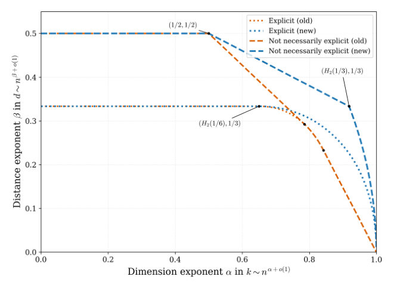 
Figure 1: The boundary of the achievable dimension and distance exponents (α, β) in the polynomial rate and distance regime k = Ω  nα+o(1) , d = Ω  nβ+o(1) , for quantum CSS codes with transversal T gates. We show both explicit constructions, and not necessarily explicit constructions, both new in this work, and previously known. We give the exact formulae for the boundaries of explicitly achievable exponents β(α), both new and existing, in Theorem 1 and Remark 1.5, and for not necessarily explicit families in Theorem 4 and Remark 1.6, respectively.

📷 Fig 2

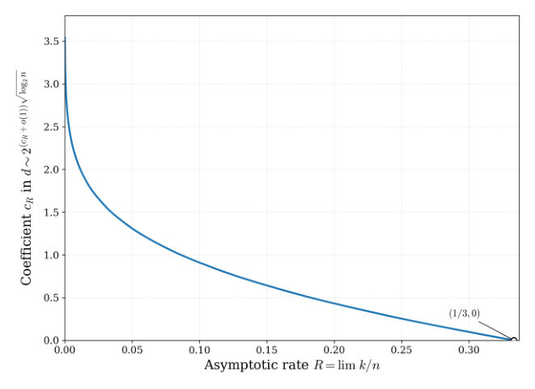 
Figure 2: The boundary of the achievable asymptotic parameters in the constant-rate regime. For a given constant rate R ∈(0, 1/3), we plot cR, where the achievable distance scaling is the growing sub-polynomial

**Summary.** This paper advances the theory of quantum error-correcting codes by improving the achievable parameters for codes supporting transversal T gates. Using advanced algebraic constructions based on punctured monomial codes, the authors achieve constant rate and growing distance for the first time in this context. This work significantly pushes the theoretical boundaries for building scalable, fault-tolerant quantum computers.

**Why it may be interesting.** While focused on abstract coding theory, the results provide concrete, improved bounds on the resource overheads (like distillation exponents) required for fault-tolerant quantum computation, which is a major theoretical bottleneck in quantum information science.

Detailed structure

**Main problem.** The primary goal is to improve the achievable parameters (rate and distance) of quantum error-correcting codes that support transversal T gates, which is crucial for fault-tolerant quantum computation.

**Main result.** The authors significantly broaden the achievable parameters by constructing codes that achieve constant rate and growing distance for the first time in this setting, and achieving $\gamma 	o 0$ for the overhead exponent.

**Method.** The work develops a theoretical framework using divisible decreasing monomial codes punctured at specific sets on the Boolean hypercube, and applies this to weighted Reed-Muller codes and randomized constructions.

**Model / system.** The study focuses on quantum CSS codes, specifically analyzing the constraints imposed by requiring a transversal T gate application across all physical qubits to yield the logical T gate.

**Key observables.** Achievable code parameters, including rate ($\alpha$), distance exponent ($eta$), and the overhead exponent ($\gamma$) for magic state distillation.

**Important parameters / regimes.** The regime of polynomial rate/distance, and the constant rate/growing distance regime, particularly for $R \in (0, 1/3)$.

**Assumptions / limitations.** The analysis is primarily restricted to stabilizer codes, although the authors suggest potential extensions beyond this class.

**Figures summary.** Figure 1 compares the boundaries of achievable dimension and distance exponents $(\alpha, eta)$ for explicit versus non-explicit constructions. Figure 2 plots the boundary in the constant-rate regime.

**Paper structure.** The paper first establishes the theoretical framework using punctured decreasing monomial codes, derives a closed-form distance expression, and then instantiates this with explicit constructions (like weighted Reed-Muller codes) and randomized methods to prove improved asymptotic bounds.

Abstract

In this work, we study quantum CSS codes with transversal $T$ gates. Here, $T$ gate transversality is meant in the strongest sense; the application of physical $T$ to every physical qubit yields logical $T$ on every logical qubit, without Clifford corrections. Despite the importance of the $T$ gate in fault-tolerant quantum computation, the parameters of asymptotic families of such codes have not been improved since the work of Hastings and Haah in 2017, and Haah in 2018. In this work, we significantly broaden the achievable parameters of quantum code families with transversal $T$ gates, both expanding the regime of achievable polynomial rate and distance, and constructing such codes with constant rate and growing distance; this is the first time the latter has been achieved, even when allowing Clifford corrections after the transversal $T$ gate. These are also the first codes achieving $γ\to 0$ for a code with a transversal $T$ gate, where $γ$ is the overhead exponent of magic state distillation.   To do this, we develop a framework of divisible decreasing monomial codes, punctured at a downward-closed set on the Boolean hypercube to create logical qubits. We prove a closed-form expression for the distance of such a code punctured at such a set, which may be of independent interest. We first instantiate this with an explicit construction based on weighted Reed-Muller codes, puncturing at low Hamming-weight points, and then with a randomised construction, where a small random set of points is protected from the puncturing to save quantum code distance, achieving improved parameters.

[↑ back to top](#top)

### [Large scale theoretical investigation of the phase diagram of twisted bilayer MoTe$_2$ at fractional fillings: agreements and contradictions with current experiments](http://arxiv.org/abs/2608.23675v1)

**Authors:** Heqiu Li, Jiabin Yu, Xiaodong Xu, B. Andrei Bernevig, N. Regnault  
**Type:** theory · **Category:** strongly correlated electrons · **PDF:** <https://arxiv.org/pdf/2608.23675v1>  
**Analysis basis:** full PDF text, analyzed in chunks

📷 Fig 1

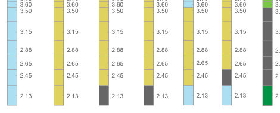 
FIG. 1. Phase diagrams of ground states for various twist angles and filling fractions at interaction strength 10/ϵ = 0.9. The ground states are obtained from 2BPV calcu- lations in 21-site system for ν = −2/3, −4/7, −3/7, −1/3 and 20-site system for ν = −3/5, −2/5. The fillings ν = −2/3, −3/5, −4/7, −3/7 are calculated in the sector with full spin polarization, and the calculations in ν = −2/5, −1/3 in- clude sectors with and without full spin polarization (more details can be found in Sec. IV C). The ν = −4/3 filling is obtained from 2BPV calculation with all spin sectors in 3 × 3 system. The light green region with partially polarized CDW refers to the case where the ground state of...

📷 Fig 2

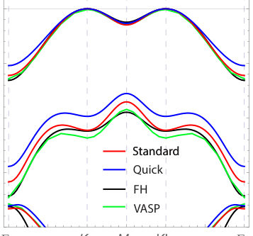 
FIG. 2. Band structures at 3.89◦of VASP (green) and the continuum model with FH parameters (black), the DFT no-fitting model in the standard basis (red) and quick basis (blue).

📷 Fig 3

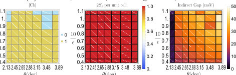 
FIG. 3. Hartree-Fock results at ν = −1 for (a) FH model and (b) no-fitting model standard basis in 18 × 18 system. Here |Ch| labels the absolute value of the Chern number of the ground states (left panel), 2Sz is twice of the spin in unit of ℏ(middle panel), and the indirect gap refers to the indirect gap of the HF band structure (right panel).

📷 Fig 4

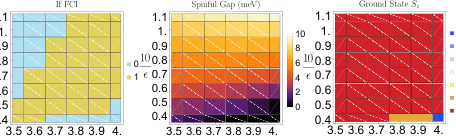 
FIG. 5. 1BPV ED results at ν = −1/3, −2/3, −4/3 for the FH model in a 9 × 2 system. The meaning of the labels can be found in the caption of Fig. 4.

📷 Fig 5

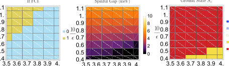 
FIG. 4. 1BPV ED results at ν = −1/3, −2/3, −4/3 for the FH model on a 3 × 4 grid. Here the calculations are all done on a momentum mesh of the form in Eq. (7) with Nx, Ny, en11, en12, en21 and en22 specified in the figure, and FCI momenta are shown in (kx, ky) format. “Range of Sz available” refers to the range of Sz included in the calculation, and the spin Sz is in the unit of ℏ. In the left panels, 1 means the system is in an FCI phase according to Prop. 1, while 0 means otherwise. In the middle panels, the spinful gap is shown as zero if its actual value becomes negative.

**Summary.** This paper performs an exact diagonalization study on twisted bilayer MoTe2 to map its interaction-driven phase diagram. By comparing one-band and two-band models, the authors confirm that multi-band physics is essential for accurately predicting the stability of Fractional Chern Insulators and identifying competing ground states like CDWs. The work establishes a critical theoretical benchmark for correlated topological matter in TMDs.

**Why it may be interesting.** The detailed comparison between 1BPV and 2BPV models, which directly addresses the necessity of including band mixing effects, provides a rigorous theoretical benchmark for understanding correlated topological phases in 2D materials.

Detailed structure

**Main problem.** To provide a comprehensive theoretical study of interaction-driven phases, particularly Fractional Chern Insulators (FCIs) and competing phases, in twisted bilayer MoTe2.

**Main result.** The 2BPV calculation successfully reproduces the experimentally observed hierarchy of FCIs at specific fillings, while showing that multi-band physics is crucial for accurate comparison with experiments.

**Method.** The study employs exact diagonalization (ED) studies on continuum-model moiré bands, comparing one-band-per-valley (1BPV) and two-band-per-valley (2BPV) projections.

**Model / system.** The physical system is twisted bilayer MoTe2 across experimentally relevant twist angles (2.13°–4°). The theoretical framework involves continuum-model moiré bands, comparing 1BPV and 2BPV calculations, and benchmarking against DFT-derived models.

**Key observables.** Existence and stability of FCIs, competition between FCI and Charge Density Wave (CDW) ground states, and signatures of Composite Fermi Liquid (CFL) physics.

**Important parameters / regimes.** Twist angles ($	heta$): $2.13^\circ$ to $4^\circ$; Fillings ($
u$): Odd-denominator fillings (e.g., $-2/3, -3/5, -4/7$) and half filling ($
u = -1/2$).

**Assumptions / limitations.** The study establishes a unified numerical benchmark, emphasizing that multi-band physics (2BPV) is essential for quantitative comparison with experiments, as 1BPV can overestimate stability.

**Figures summary.** Figure 1 shows phase diagrams of ground states for various twist angles and fillings derived from 2BPV calculations.

**Paper structure.** The paper systematically compares different theoretical models (1BPV vs 2BPV) across various fillings and twist angles to map out the phase diagram, focusing on reproducing known experimental features.

Abstract

We present a comprehensive exact-diagonalization study of interaction-driven phases in twisted bilayer MoTe$_2$ across experimentally relevant twist angles ($2.13^\circ$--$4^\circ$) and hole fillings. Using continuum-model moiré bands, we compare the one-band-per-valley (1BPV) projection with a two-band-per-valley (2BPV) calculation that includes interaction-driven band mixing, and we benchmark both the widely used first-harmonic continuum model and a parameter-free DFT ``fitting-free'' model. At odd-denominator fillings, the 2BPV calculation reproduces the experimentally observed hierarchy of fractional Chern insulators (FCIs) around $θ\approx 3.7^\circ$, including robust incompressible states at $ν=-2/3$, $-3/5$, and $-4/7$ while correctly finding the absence of an FCI at $ν=-3/7$, and it favors a charge density wave ground state at $ν=-1/3$ over the FCI. At half filling $ν=-1/2$, the 1BPV calculation exhibits clear composite Fermi liquid (CFL) signatures, whereas the band mixing in 2BPV calculations destabilizes the CFL ground state. Finally, motivated by the Landau-level analogy at $θ\approx 2.13^\circ$, we test the proposed non-abelian Pfaffian state at $ν=-3/2$ in the fully-polarized spin sector but find no evidence for this state within the models and parameters studied. Our results establish a unified numerical benchmark for correlated and topological phases in twisted bilayer MoTe$_2$ and clarify where multi-band physics is essential for a quantitative comparison with experiments.

[↑ back to top](#top)

### [Masked Differential-linear Distinguishers and Quantum Approaches](http://arxiv.org/abs/2608.24799v1)

**Authors:** Shobhit Pandey, Sarbani Sen, Debajyoti Bera, Ravi Anand  
**Type:** theory · **Category:** other · **PDF:** <https://arxiv.org/pdf/2608.24799v1>  
**Analysis basis:** full PDF text, analyzed in chunks

📷 Fig 1

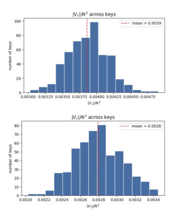 
Fig. 1. Distribution of the number of keys against the number of good mask pairs in 16-bit mini-AES, averaged over all keys. A total of 512 keys were randomly selected, sufficient number of mask pairs were sampled and the proportion of good pairs esti- mated to 0.95 confidence (using Wilson score). τ was set to 9/216. The values of w that were chosen were 0x0003 (top-left), 0x3009 (top-right), 0x0845 (bottom-left), 0x2504 (bottom-right).

📷 Fig 2

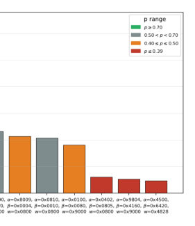 
Fig. 2. Variation in the values of MAC of sample (α, β, w) triplets across 50 random keys for 16-bit mini-AES. The root-mean-square (RMS) of the MAC values, across all keys, and with 95% confidence (Wilson’s score), are shown for all triplets.

📷 Fig 3

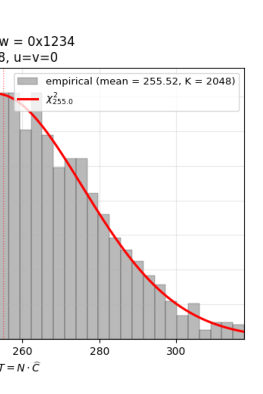 
Fig. 3. Distribution of capacity for 16-bit random permutations follow χ2(255) for an 8-dimensional vector space of mask pairs; u, v denotes the dimensions of zero-masks which were not used in this experiment. X-axis indicates capacity (scaled by N) and density indicate the probability density function.

📷 Fig 4

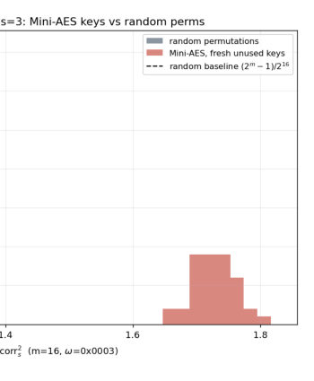 
Fig. 4. Distributions of keys that are vulnerable to capacity based attack. The 16- dimensional multidimensional approximation was chosen earlier by identifying good mask pairs across a set of randomly chosen keys. A fresh set of 40 keys was used for this experiment to prevent any bias arising from using the same keys for attacking as that for identifying the masks. X-axis shows the capacity.

📷 Fig 5

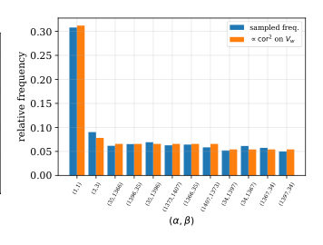 
Fig. 6. Simulated quantum MACSam- ple conditioned on the heavy set Vw.

**Summary.** This paper introduces Masked Differential-linear (MDL) approximations for cryptanalysis, centered on the Masked Auto-correlation (MAC) primitive. It presents a quantum algorithm to efficiently find powerful distinguishing mask pairs, simultaneously proving a super-polynomial classical lower bound for this task. This work establishes a quantum necessity result for identifying strong statistical correlations in cryptographic systems.

**Why it may be interesting.** While focused on cryptography, the rigorous development of quantum lower bounds and the explicit comparison between quantum and classical computational complexity for a core mathematical problem (finding high-correlation structures) is highly relevant to quantum information theory.

Detailed structure

**Main problem.** The paper develops a new framework, Masked Differential-linear (MDL) approximations, to cryptanalyze symmetric-key primitives by finding powerful statistical correlations.

**Main result.** It establishes the first result pairing a quantum upper bound with a classical lower bound for identifying high-correlation approximations, proving that quantum algorithms are necessary for this task.

**Method.** The authors introduce Masked Auto-correlation (MAC) and use quantum algorithms (constant-query sampling) to find mask pairs with high cross-correlation, contrasting this with a proven classical lower bound.

**Model / system.** The analysis is applied to the cryptanalysis of symmetric-key primitives, such as block ciphers (Mini-AES) and stream ciphers, using the permutation function $f$ as the core model.

**Key observables.** Masked cross-correlation $C_w^f(\alpha, eta)$, capacity of the masked auto-correlation space, and the signed score $	ext{Score}(k)$ for key recovery.

**Important parameters / regimes.** The query complexity bounds ($\Omega(N/\log N)$ classically) and the quantum speed-up factor (quadratic speed-up via amplitude estimation).

**Assumptions / limitations.** The core assumption is that the quantum upper bound and classical lower bound establish an absolute necessity for quantum computation in this specific cryptanalytic task.

**Figures summary.** Figures compare the energy profile versus the sharply peaked signed score for key recovery, and show the success of the distinguishing capacity against random permutations.

**Paper structure.** The paper introduces MAC and MDL approximations, presents the quantum sampling algorithm and the classical lower bound (MAC Fishing), and then applies this pipeline to demonstrate both distinguishing and key-recovery attacks on Mini-AES and a Simon cipher.

Abstract

We introduce masked auto-correlation, a new primitive for the cryptanalysis of symmetric-key primitives, together with a quantum attack pipeline built on it. For a permutation $f$, output masks $α,β$, and an input difference $w$, masked auto-correlation (MAC) measures the correlation between the masked outputs $α\cdot f(x)$ and $β\cdot f(x\oplus w)$. The associated masked differential-linear (MDL) approximations strictly generalize several classical techniques; ordinary linear cryptanalysis, differential-linear cryptanalysis, and the differential-linear connectivity table all arise as special cases. Our central object of study is the problem of finding mask pairs with large masked cross-correlation -- those that yield powerful distinguishers -- which we call MAC Fishing. We give a constant-query quantum algorithm that samples such pairs according to their squared correlation, and we prove an exponential classical lower bound of $Ω(N/\log N)$ queries, by adapting the hardness of Fourier Fishing. To our knowledge this is the first result pairing a quantum upper bound with a classical lower bound for the core task of identifying high-correlation approximations, making quantum algorithms an absolute necessity. Building on this, we analyse the distribution of masked auto-correlation for random permutations, and then construct capacity-based distinguishers and key-recovery attacks, both classically and with a quadratic quantum speed-up using amplitude estimation. We validate our claims with experiments on reduced-round mini-AES.

[↑ back to top](#top)

### [Non-Subhomogeneity of Minimal Operator Systems over Positive Semidefinite and Lorentz Cones](http://arxiv.org/abs/2608.24648v1)

**Authors:** Tim Netzer  
**Type:** theory · **Category:** other · **PDF:** <https://arxiv.org/pdf/2608.24648v1>  
**Analysis basis:** full PDF text, analyzed in chunks

📷 Fig 1

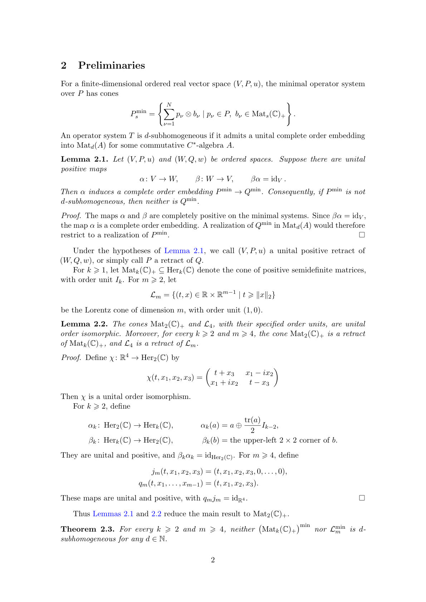 
Low-resolution page preview, page 2

📷 Fig 2

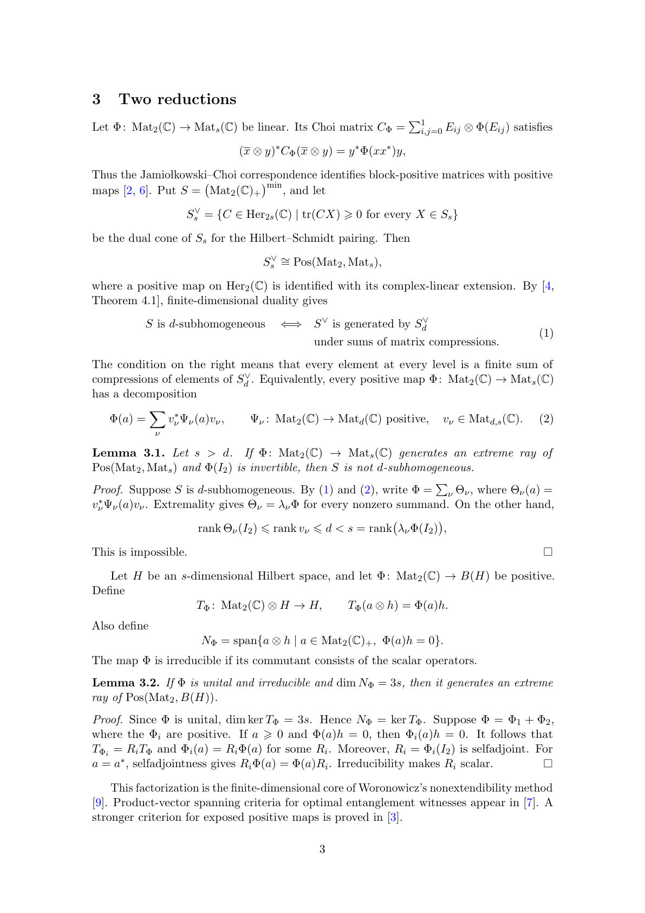 
Low-resolution page preview, page 3

📷 Fig 3

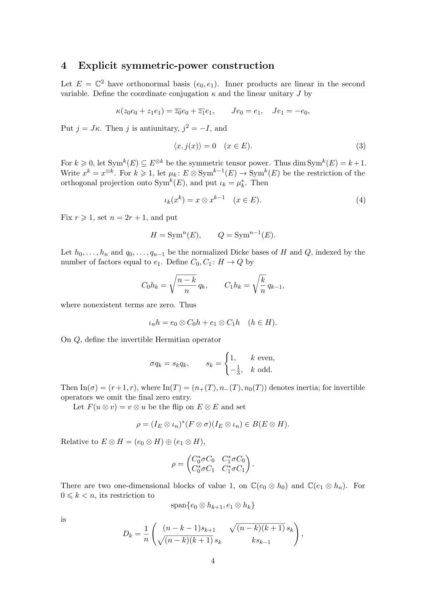 
Low-resolution page preview, page 4

📷 Fig 4

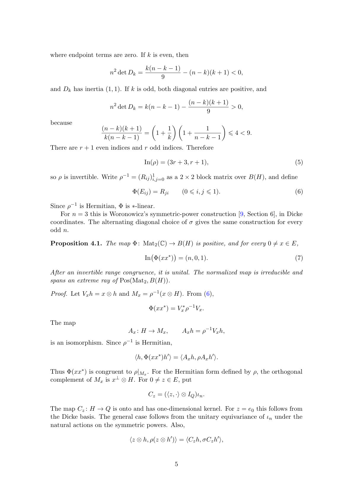 
Low-resolution page preview, page 5

📷 Fig 5

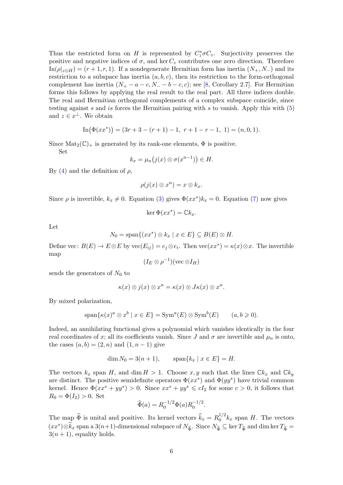 
Low-resolution page preview, page 6

**Summary.** This theoretical paper proves that the minimal operator systems associated with matrix positive semidefinite cones and Lorentz cones are not subhomogeneous. The authors achieve this by constructing specific positive maps whose properties violate the necessary conditions for subhomogeneity. This result has deep implications for understanding the structural complexity of quantum correlation measures.

**Why it may be interesting.** While highly abstract, the techniques involving operator systems, positive maps, and non-subhomogeneity are foundational in the mathematical physics of quantum correlations and entanglement structure, which underpins many quantum information theories.

Detailed structure

**Main problem.** The paper aims to prove that the minimal operator systems associated with the complex positive semidefinite cone ($	ext{Mat}_k(\mathbb{C})_+$) and the Lorentz cones ($\mathcal{L}_m$) are not subhomogeneous.

**Main result.** The minimal operator systems over $	ext{Mat}_k(\mathbb{C})_+$ ($k \ge 2$) and $\mathcal{L}_m$ ($m \ge 4$) are shown to be non-subhomogeneous, demonstrated via the construction of specific positive maps.

**Method.** The proof relies on analyzing the concept of $d$-subhomogeneity using duality arguments and constructing explicit positive, unital, and irreducible maps ($\Phi$) whose properties (like the inertia of $\Phi(xx^*)$) violate the conditions for subhomogeneity.

**Model / system.** The mathematical objects studied are operator systems, specifically the minimal operator systems derived from the positive semidefinite cone over matrices ($	ext{Mat}_k(\mathbb{C})_+$) and the Lorentz cones ($\mathcal{L}_m$).

**Key observables.** The inertia of the constructed positive map $\Phi(xx^*)$ and the commutant of related operators, which are shown to be scalar, are key diagnostics.

**Important parameters / regimes.** The dimensions $k \ge 2$ for the matrix cone and $m \ge 4$ for the Lorentz cone are critical parameters.

**Assumptions / limitations.** The results for the general cases are reduced to the $k=2$ and $m=4$ cases because the smaller systems are shown to be retracts of the larger ones.

**Paper structure.** The paper proceeds by establishing the non-subhomogeneity for the matrix cone and the Lorentz cone separately, utilizing lemmas concerning positive maps and their dual representations to construct counterexamples.

Abstract

The minimal operator systems over ${\rm Mat}_k(\mathbb C)_+$, $k\geqslant2$, and the Lorentz cones $\mathcal L_m$, $m\geqslant4$, are not subhomogeneous. For the $2\times2$ cone we construct extreme positive maps of arbitrarily large output dimension. Positive retracts give the remaining cases. Equivalently, for fixed $k\geqslant2$ and $d$, there exist $s>d$ and an entangled positive operator on $\mathbb C^k\otimes\mathbb C^s$ such that every compression of the second factor to $\mathbb C^d$ is separable.

[↑ back to top](#top)

### [Optimal copy complexity of quantum state cloning](http://arxiv.org/abs/2608.24484v1)

**Authors:** Sangwoo Jeon, Vaughn Sohn, Changhun Oh  
**Type:** theory · **Category:** quantum information and computing · **PDF:** <https://arxiv.org/pdf/2608.24484v1>  
**Analysis basis:** full PDF text, analyzed in chunks

📷 Fig 1

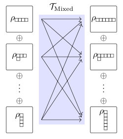 
FIG. 1. Representation-theoretic structure of unitary-covariant and permutation-invariant N →N + M cloning maps, illus- trated for M = 2. (a) In pure-state cloning, the input and ideal output states lie in the symmetric subspace, so the optimal cloning map reduces to the fixed map TPure. (b) For general mixed-state cloning, the focus of this work, the cloning map TMixed is expressed as a convex combination of component maps between irrep sectors.

📷 Fig 2

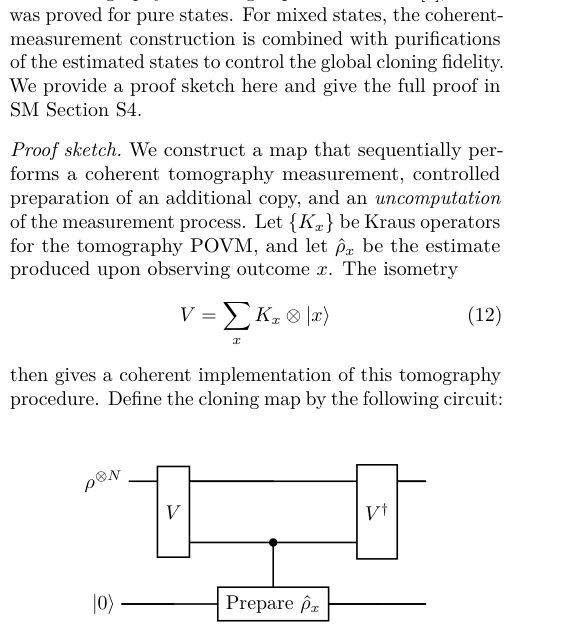 
FIG. 2. An N →N + 1 cloning map constructed from a tomography algorithm.

**Summary.** This theoretical paper determines the optimal resource scaling for quantum state cloning, finding the required input copies $N$ scale as $\Theta(Mrd/\epsilon)$. The authors achieve this by combining lower bounds derived from symmetry analysis with an upper bound constructed using random purification, revealing a deep connection between state cloning and quantum state tomography.

**Why it may be interesting.** The result provides a fundamental resource scaling law for quantum state manipulation, connecting the complexity of cloning to the rank of the state, which is a key measure of mixedness in quantum systems.

Detailed structure

**Main problem.** The paper determines the optimal asymptotic copy complexity required to approximately clone an unknown quantum state $
ho$ from $N$ input copies to produce $M$ additional copies.

**Main result.** The optimal copy complexity is established as $N = \Theta(Mrd/\epsilon)$, where $r$ is the rank of the state, $d$ is the dimension, and $\epsilon$ is the error tolerance.

**Method.** The authors use symmetry arguments, Schur-Weyl duality, and the construction of an upper bound via random purification to derive the necessary and sufficient scaling law.

**Model / system.** The focus is on $d$-dimensional quantum states $
ho$ of rank at most $r$. The task is to approximate the transformation $
ho^{\otimes N} 	o 
ho^{\otimes (N+M)}$ while maintaining a fidelity of at least $1-\epsilon$.

**Key observables.** Uhlmann fidelity $F(
ho, \sigma)$, input copy number $N$, and the number of copies to clone $M$.

**Important parameters / regimes.** The state dimension $d$, the state rank $r$, the number of copies $M$, and the error tolerance $\epsilon$.

**Assumptions / limitations.** The analysis is performed in the asymptotic regime ($\epsilon 	o 0$), and the lower bound proof relies on analyzing a specific family of states with a fixed flat spectrum.

**Figures summary.** Figure 1 illustrates the representation-theoretic structure of cloning maps for $M=2$, comparing pure-state and mixed-state decompositions. Figure 2 shows a circuit diagram for an $N 	o N+1$ cloning map derived from tomography.

**Paper structure.** The paper progresses from the known pure-state cloning result to the general mixed-state case. It establishes the lower bound using symmetry arguments on hard instances, and then constructs the matching upper bound using random purification, culminating in a connection to quantum state tomography.

Abstract

Quantum state cloning is the task of approximately producing additional copies of an unknown quantum state from a finite number of input copies. The optimal cloning fidelity is known exactly for pure states, but no comparable characterization is known for general mixed states. We determine the optimal asymptotic copy complexity for $d$-dimensional states of rank at most $r$: producing $M$ additional copies with worst-case fidelity at least $1-\varepsilon$ requires and is achievable with $N=Θ(Mrd/\varepsilon)$ input copies. Remarkably, the lower bound already holds for a family of states with a fixed flat spectrum, while the matching upper bound is achieved by random purification followed by optimal pure-state cloning. For $M=1$, we further show that high-fidelity tomography can be coherently converted into cloning with comparable error, revealing an operational origin of the matching cloning and tomography complexities.

[↑ back to top](#top)

### [Optimal Lower Bound for Ground-State Energy Estimation with a Guiding State](http://arxiv.org/abs/2608.24493v1)

**Authors:** Rolando D. Somma, Ronald de Wolf  
**Type:** theory · **Category:** quantum information and computing · **PDF:** <https://arxiv.org/pdf/2608.24493v1>  
**Analysis basis:** full PDF text, analyzed in chunks

📷 Fig 1

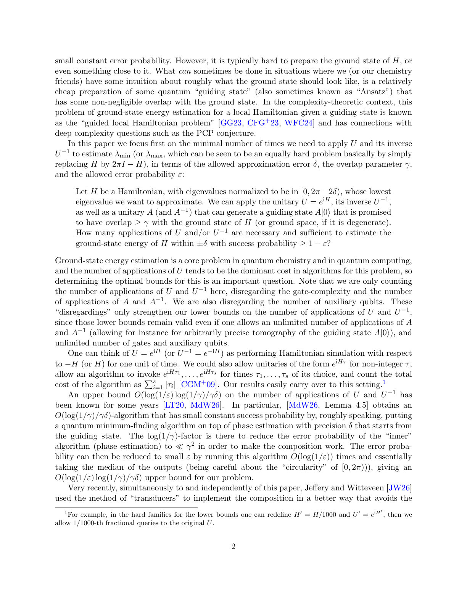 
Low-resolution page preview, page 2

📷 Fig 2

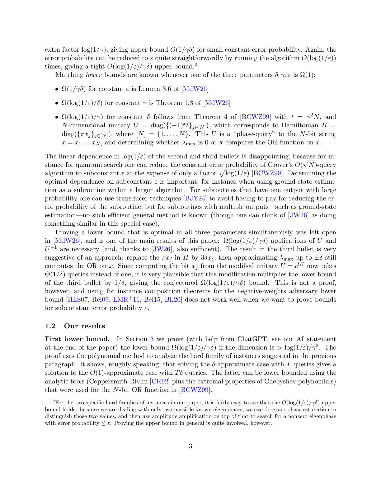 
Low-resolution page preview, page 3

📷 Fig 3

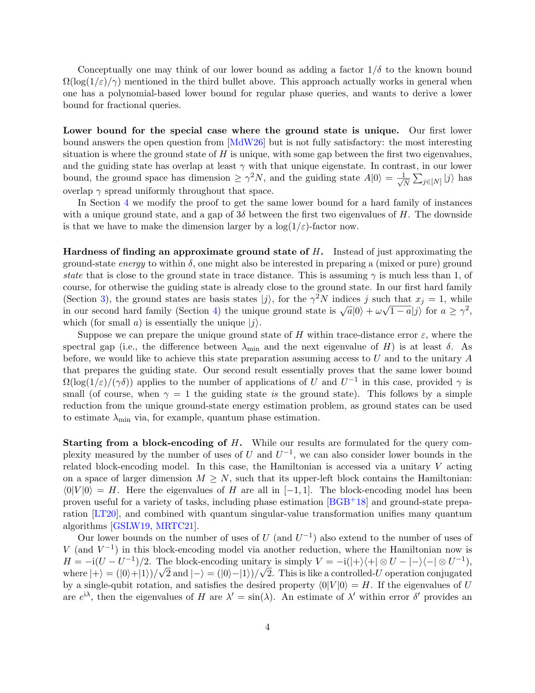 
Low-resolution page preview, page 4

📷 Fig 4

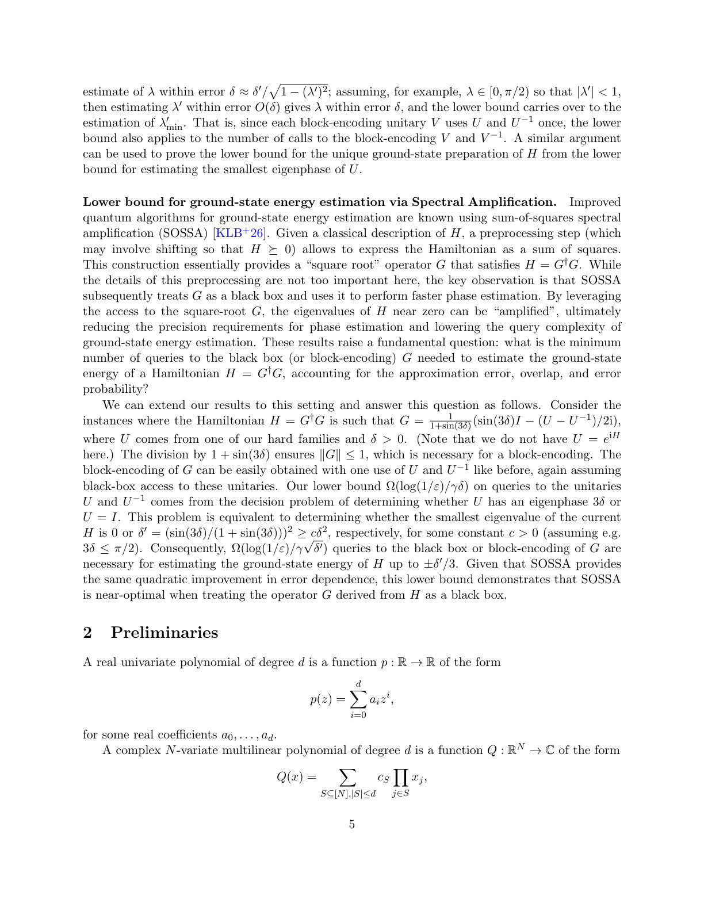 
Low-resolution page preview, page 5

📷 Fig 5

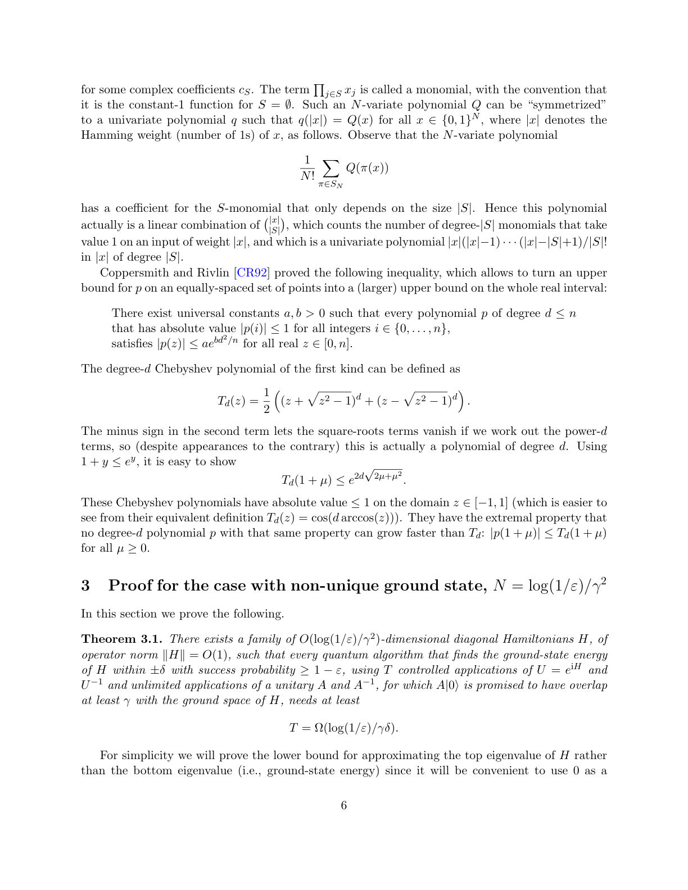 
Low-resolution page preview, page 6

**Summary.** This paper rigorously determines the minimum number of queries needed to estimate the ground-state energy of a quantum system using a guiding state. By employing advanced techniques from polynomial approximation theory, it establishes an optimal lower bound of $\Omega(\log(1/\epsilon)/(\gamma\delta))$. This result is crucial for understanding the fundamental computational limits of quantum simulation algorithms.

**Why it may be interesting.** This work provides fundamental complexity lower bounds for quantum simulation tasks, directly impacting the theoretical limits of quantum algorithms used to characterize quantum many-body ground states.

Detailed structure

**Main problem.** The paper establishes the optimal lower bound for the number of queries required to estimate the ground-state energy of a Hamiltonian, given access to its unitary evolution and a guiding state.

**Main result.** The joint lower bound for the query complexity is proven to be $\Omega(\log(1/\epsilon)/(\gamma\delta))$, matching the recently established upper bound.

**Method.** The proof heavily relies on the polynomial method, using tools like Chebyshev polynomials to derive lower bounds on the degree of approximating polynomials based on the required separation of function values.

**Model / system.** The problem is framed in the guided Hamiltonian problem, involving a Hamiltonian $H$ whose unitary $U=e^{iH}$ is accessible, along with a guiding state preparation unitary $A$ that overlaps with the ground space by $\gamma$.

**Key observables.** Ground-state energy ($\lambda_{\min}$), approximation error ($\delta$), and success probability ($\epsilon$).

**Important parameters / regimes.** The complexity scales inversely with the product of the overlap ($\gamma$) and the spectral gap ($\delta$), and logarithmically with the inverse of the error ($\epsilon$).

**Assumptions / limitations.** The lower bound proof requires the dimension of $H$ to be sufficiently large, and the results are shown to hold for various access models like block-encoding and fractional powers of $U$.

**Paper structure.** The paper builds upon previous work by establishing the general joint lower bound $\Omega(\log(1/\epsilon)/(\gamma\delta))$ using the polynomial method, and then extends this result to special cases like unique ground states and ground-state preparation.

Abstract

The guided Hamiltonian problem is the following: given access to the unitary $U=e^{i H}$ for some Hamiltonian $H$, and given access to a unitary that prepares a guiding state promised to have overlap at least $γ>0$ with the ground space of $H$, estimate the ground-state energy of $H$ within additive error $δ> 0$ and success probability at least $1-\varepsilon $, $\varepsilon>0$. How many applications of $U$ and its inverse $U^{-1}$ are necessary and sufficient? An upper bound $O(\log(1/\varepsilon)\log(1/γ)/γδ)$ was known, and was improved to $O(\log(1/\varepsilon)/γδ)$ very recently [JW26]. A matching lower bound was known whenever one of the three parameters $δ,γ,\varepsilon$ was held constant [MdW26]. In this paper we prove the joint lower bound $Ω(\log(1/\varepsilon)/γδ)$ with the tight $\varepsilon$-dependence provided the dimension of $H$ is at least $\log(1/\varepsilon)/γ^2$. Furthermore, we show that this same lower bound (with slightly larger dimension) holds for both the special case in which the ground state is guaranteed to be unique and $H$ has a gap of $δ$ between its first and second eigenvalue; and for ground-state preparation, where $δ$ denotes the spectral gap and $\varepsilon$ now is the approximation error. The lower bounds also apply when the Hamiltonian can be accessed via its block-encoding, and when fractional powers of $U$ are allowed, as in continuous-time Hamiltonian simulation. Lastly, improved upper bounds are known when $H$ is nonnegative and presented as a sum of squares; and our results imply the lower bound $Ω(\log(1/\varepsilon)/γ\sqrtδ)$ for this case.

[↑ back to top](#top)

### [Quantum Algorithms and Hardness for Point-Count Approximation over Finite Fields](http://arxiv.org/abs/2608.23929v1)

**Authors:** Yota Maeda, Hiroshi Yano  
**Type:** theory · **Category:** quantum information and computing · **PDF:** <https://arxiv.org/pdf/2608.23929v1>  
**Analysis basis:** full PDF text, analyzed in chunks

📷 Fig 1

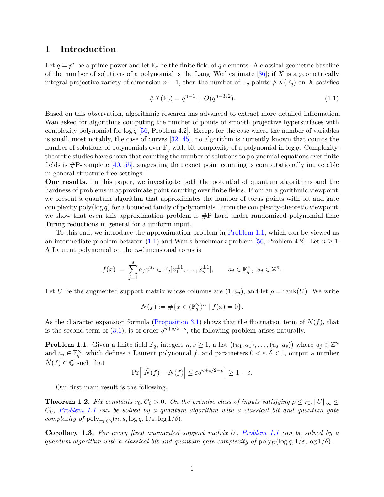 
Low-resolution page preview, page 2

📷 Fig 2

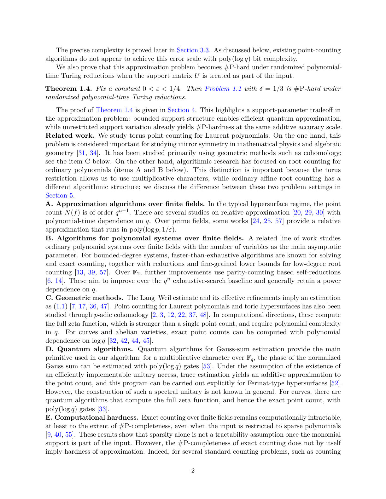 
Low-resolution page preview, page 3

📷 Fig 3

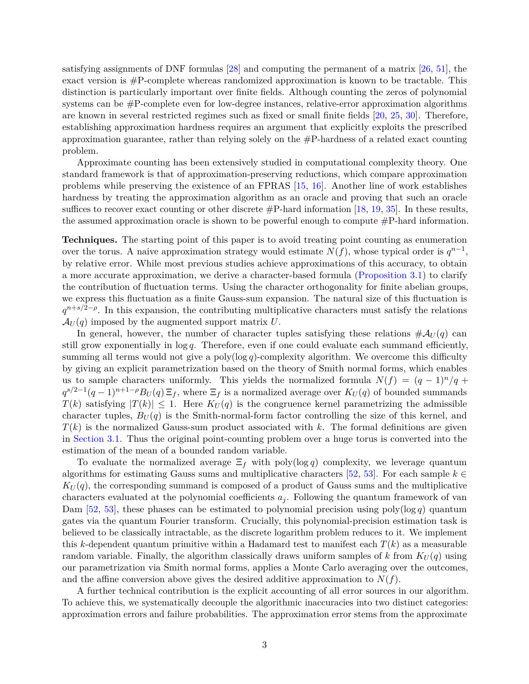 
Low-resolution page preview, page 4

📷 Fig 4

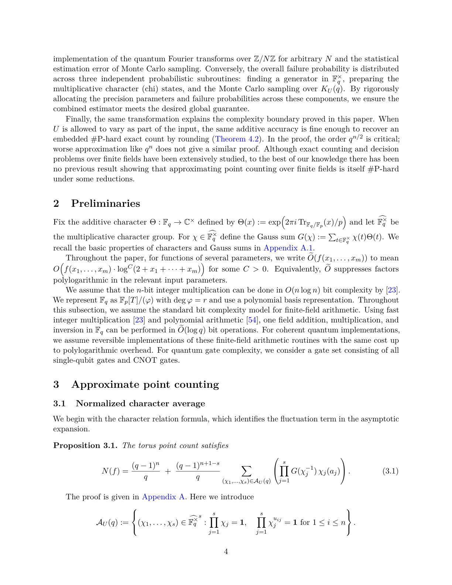 
Low-resolution page preview, page 5

📷 Fig 5

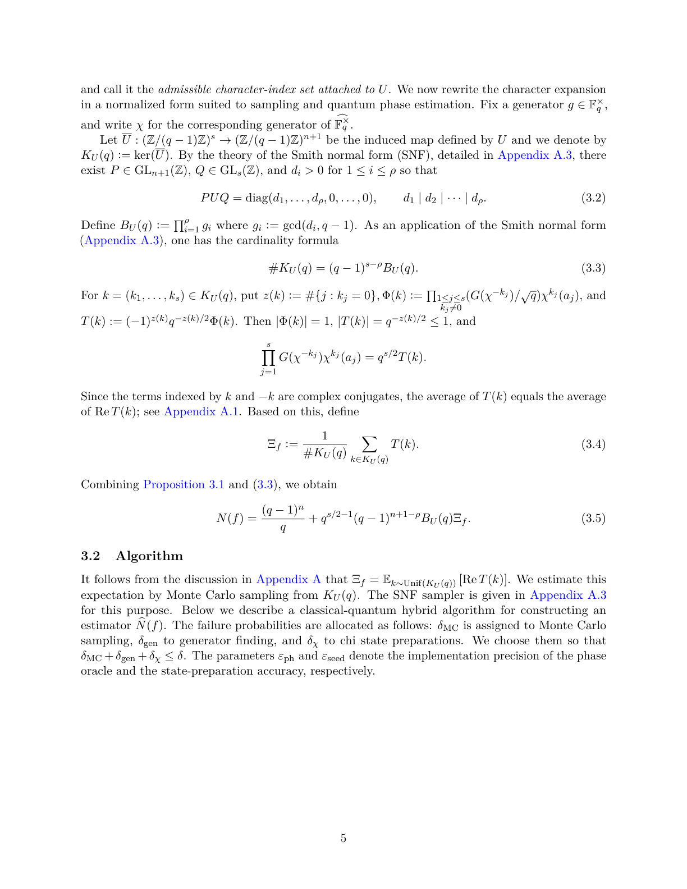 
Low-resolution page preview, page 6

**Summary.** This paper develops a quantum algorithm to efficiently approximate the number of solutions to Laurent polynomials over finite fields, achieving an additive error bound. It also proves that the general version of this counting problem is $\#	ext{P}$-hard. The work clarifies the trade-off between the required accuracy and the structural complexity of the input polynomial.

**Why it may be interesting.** While the problem is purely number-theoretic, the development of quantum algorithms to solve computationally hard counting problems over finite fields connects directly to quantum complexity theory and the limits of quantum computation.

Detailed structure

**Main problem.** The paper addresses the problem of approximating the number of solutions, $N(f)$, to a Laurent polynomial $f(x)$ over a finite field $\mathbb{F}_q$.

**Main result.** It presents a quantum algorithm achieving an additive approximation guarantee for $N(f)$ under certain structural constraints on the polynomial's support matrix, and proves the problem is $\#	ext{P}$-hard when the support matrix varies freely.

**Method.** The approach combines character sum expansions derived from algebraic geometry with quantum estimation techniques, specifically leveraging the Quantum Fourier Transform (QFT) for estimating Gauss sums.

**Model / system.** The mathematical model is the set of solutions to a Laurent polynomial $f(x) = \sum a_j x^{u_j}$ defined over the multiplicative group $(\mathbb{F}_q^	imes)^n$. The complexity analysis is performed in terms of quantum gate and classical bit complexity.

**Key observables.** The primary observable is $N(f) = \#\{x \in (\mathbb{F}_q^	imes)^n \mid f(x) = 0\}$, and the algorithm estimates this value within an additive error bound $\varepsilon q^{n+s/2-
ho}$.

**Important parameters / regimes.** Key parameters include the field size $q$, the polynomial support size $s$, the dimension $n$, and the rank $
ho$ of the augmented support matrix $U$.

**Assumptions / limitations.** The quantum algorithm's polynomial complexity relies on bounding the rank $
ho$ and the infinity norm of the support matrix $\|U\|_{\infty}$. The hardness proof relies on the ability to recover the count from the approximation error.

**Paper structure.** The paper first introduces the quantum algorithm for approximation (Theorem 1.2), followed by an alternative classical-quantum hybrid approach using character sums (Algorithm 1). It then establishes the computational hardness of the problem (Theorem 1.4 and Theorem D.3) by reducing from antichain counting.

Abstract

We study the approximation of the number of solutions of Laurent polynomials over finite fields. For a Laurent polynomial \[f(x)=\sum_{j=1}^{s}a_jx^{u_j}\in \mathbb{F}_q[x_1^{\pm1},\ldots,x_n^{\pm1}], \] let $U$ be its augmented support matrix whose columns are $(1,u_j)$ with rank $ρ$ and $N(f) := \# \{x\in (\mathbb{F}_q^\times)^n \mid f(x)=0\}$ be its torus point count. Our first main result is a quantum algorithm that outputs $\widehat{N}(f)$ satisfying \[ |\widehat{N}(f) - N(f)| \le \varepsilon q^{n+s/2-ρ} \] with success probability $1-δ$. Provided that $ρ$ and $\|U\|_\infty$ are bounded, the algorithm runs in both classical bit and quantum gate complexity $\mathrm{poly}(n, s, \log q, 1/\varepsilon, \log(1/δ))$. It provides finer resolution than relative-error approximations in general settings. To the best of our knowledge, in the explicit finite-field input model considered here, no previous algorithm achieves this additive accuracy with running time polynomial in $\log q$. Van Dam (arXiv:quant-ph/0405081) conjectured the existence of such an algorithm under the assumption of an oracle reflecting the algebraic properties of the polynomial. In contrast, by exploiting a point-counting formula derived from character sums over finite fields, we develop an alternative approach that efficiently approximates the number of points without assuming the existence of such an oracle. As a second main result, we prove that the same approximation problem becomes $\#$P-hard under randomized polynomial-time Turing reductions when the support matrix $U$ varies freely as part of the input. Thus, taken together, our results clarify how the effectiveness of the quantum approach depends on the tradeoff between the accuracy scale and the support parameters of the input polynomial.

[↑ back to top](#top)

### [StabQ: Quantum Program Analysis via Weighted Stabilizer Representations](http://arxiv.org/abs/2608.24144v1)

**Authors:** Shangzhou Xia, Junjie Luo, Jianjun Zhao  
**Type:** theory · **Category:** quantum information and computing · **PDF:** <https://arxiv.org/pdf/2608.24144v1>  
**Analysis basis:** full PDF text, analyzed in chunks

📷 Fig 1

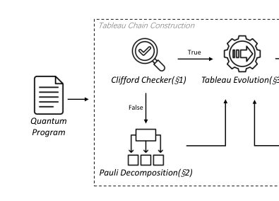 
Fig. 1. Workflow of StabQ.

📷 Fig 2

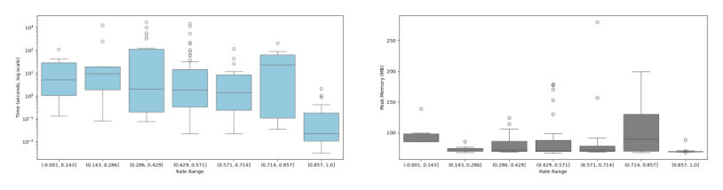 
Fig. 2. Time and memory overhead of StabQ model construction across benchmark circuits. The box plots show the distributions of model building time and peak memory consumption when the benchmark circuits are grouped by qubit number, gate number, and Clifford rate. The y-axes of the time overhead are logarithmic.

**Summary.** This paper introduces StabQ, a novel symbolic execution framework designed to analyze general quantum programs containing non-Clifford gates. It extends traditional stabilizer-based methods by representing states using weighted stabilizer tableaux and tracking execution history via a Tableau Chain. This allows for accurate, semantically consistent analysis of complex quantum computations.

**Why it may be interesting.** It provides a formal, symbolic tool to analyze complex quantum circuits beyond the restricted Clifford group, which is crucial for verifying algorithms involving arbitrary gates.

Detailed structure

**Main problem.** Quantum program analysis is difficult due to the exponentially large state space and the complexity introduced by non-Clifford quantum operations.

**Main result.** StabQ successfully extends stabilizer-based symbolic execution to analyze general quantum programs, maintaining semantic consistency across non-Clifford gates.

**Method.** It uses a symbolic execution framework that represents states as weighted combinations of stabilizer tableaux, incorporating a Pauli-decomposition mechanism to handle non-Clifford gates.

**Model / system.** The model is general quantum computation realized by quantum circuits, analyzed symbolically through the evolution of quantum states.

**Key observables.** Quantum state evolution, entanglement, and the detection of Clifford properties.

**Important parameters / regimes.** The complexity scales with the number of qubits and the depth of the circuit, mitigated by tableau consolidation.

**Assumptions / limitations.** The Pauli-decomposition mechanism allows non-Clifford operations to be integrated into the symbolic framework while preserving semantic fidelity.

**Paper structure.** The paper introduces the limitations of Clifford-only stabilizer methods, proposes StabQ to extend symbolic execution, details the Tableau Chain construction, and evaluates it on benchmark suites.

Abstract

Quantum program analysis remains challenging due to the exponentially large state space of quantum programs and the difficulty of precisely characterizing their execution behavior. In particular, non-Clifford operations introduce additional complexity that limits the applicability of stabilizer-based techniques. Although stabilizer representations provide compact descriptions for Clifford circuits, their limited expressiveness prevents them from directly supporting general quantum program analysis. In this work, we propose StabQ, a symbolic execution framework for quantum program analysis based on stabilizer representations. StabQ extends stabilizer-based symbolic execution beyond Clifford-only programs by introducing a symbolic state representation that captures and propagates quantum state evolution while preserving execution semantics. Based on this representation, StabQ constructs a Tableau Chain that represents the evolution of intermediate symbolic states throughout program execution and enables reusable analysis of quantum program executions. Furthermore, StabQ incorporates tableau consolidation and global-phase recovery mechanisms to mitigate symbolic state growth during execution. Building upon the Tableau Chain, StabQ supports multiple quantum program analysis tasks, including quantum state reconstruction, entanglement analysis, and Clifford-property detection. We evaluate StabQ on three benchmark suites---Algorithms, MQT Bench, and QASMBench. The results demonstrate that StabQ constructs semantically consistent symbolic models, accurately preserves quantum state evolution, and effectively supports downstream analysis tasks across diverse quantum programs.

[↑ back to top](#top)

### [Two Microscopic Mechanisms of Piezomagnetism in CoF$_2$ from First-Principles Calculations](http://arxiv.org/abs/2608.24227v1)

**Authors:** Hiroshi Katsumoto, Tamio Oguchi, Kunihiko Yamauchi  
**Type:** theory · **Category:** strongly correlated electrons · **PDF:** <https://arxiv.org/pdf/2608.24227v1>  
**Analysis basis:** full PDF text, analyzed in chunks

📷 Fig 1

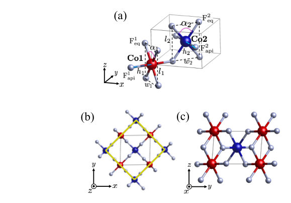 
FIG. 1. Crystal structures of CoF2. In this paper, the up-spin and down-spin Co sites are referred

📷 Fig 2

 
FIG. 2. (a) Piezomagnetically induced magnetization along the z axis as a function of the xy shear

📷 Fig 3

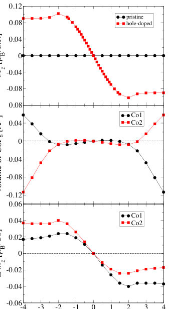 
Figure 3(a) shows the induced magnetization under the yz shear strain in the presence

📷 Fig 4

 
FIG. 3. (a) Induced magnetization along the x axis as a function of the yz shear strain with

📷 Fig 5

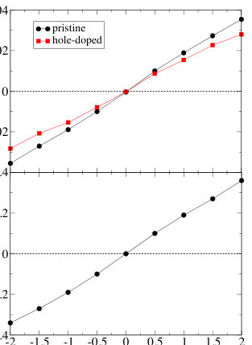 
Figure 3(b) shows the canting angle of the magnetic moments as a function of the yz

**Summary.** This theoretical study uses first-principles calculations to uncover the microscopic origins of piezomagnetism in $	ext{CoF}_2$. It reveals two distinct mechanisms: strain-induced moment imbalance via octahedral volume changes under $	ext{xy}$ shear, and spin canting driven by the Dzyaloshinskii–Moriya interaction under $	ext{yz}$ shear. This suggests that piezomagnetism in antiferromagnets can arise from fundamentally different physical origins.

**Why it may be interesting.** The identification of distinct, symmetry-breaking mechanisms (one electronic/structural, one relativistic/spin-texture) provides a deep, microscopic understanding of magnetoelectric coupling in transition metal compounds, which is relevant to emergent quantum phenomena.

Detailed structure

**Main problem.** To reveal the microscopic origins of piezomagnetism in the prototypical piezomagnetic and altermagnetic material, $	ext{CoF}_2$.

**Main result.** Two distinct mechanisms were found: one nonrelativistic mechanism driven by unequal local volumes under $	ext{xy}$ shear strain, and a relativistic mechanism arising from $	ext{SOC}$-induced spin canting via the Dzyaloshinskii–Moriya interaction under $	ext{yz}$ shear strain.

**Method.** First-principles electronic-structure calculations using DFT with the PAW method, incorporating noncollinear formalism and applying specific shear strains ($	ext{xy}$ and $	ext{yz}$).

**Model / system.** The study focuses on the rutile-structured $	ext{CoF}_2$ crystal, analyzing its magnetic and electronic response when subjected to external shear strains.

**Key observables.** Induced magnetization ($M$), local volumes of $	ext{CoF}_6$ octahedra, local magnetic moments on different sublattices, and piezomagnetic tensor components ($\Lambda_{ijk}$).

**Important parameters / regimes.** Shear strains ($\varepsilon_{	ext{xy}}, \varepsilon_{	ext{yz}}$), the presence/absence of Spin-Orbit Coupling (SOC), and doping levels (pristine vs. hole-doped).

**Assumptions / limitations.** The analysis relies on linear fits for calculating strain-form coefficients within specified strain limits ($|\varepsilon_{	ext{xy}}| \le 0.5$, $|\varepsilon_{	ext{yz}}| \le 1.0$).

**Figures summary.** Figures illustrate structural changes, induced magnetization vs. strain for both shear types, and electronic band structures/PDOS changes corresponding to the different physical mechanisms.

**Paper structure.** The paper systematically analyzes the piezomagnetic response under two distinct shear strains ($	ext{xy}$ and $	ext{yz}$), detailing the physical origin (volume mismatch vs. DMI/SOC) and quantifying the resulting magnetic moments and coefficients.

Abstract

Rutile-structured CoF$_2$ has long been recognized as a prototypical piezomagnetic material. Recently, it has attracted renewed interest as an altermagnet, exhibiting spin-split electronic bands even in the absence of spin-orbit coupling. Although the piezomagnetic response of CoF$_2$ has been extensively discussed from the viewpoint of magnetic symmetry, its microscopic origin has remained elusive. First-principles calculations reveal two distinct microscopic mechanisms of piezomagnetism in CoF$_2$. Under $xy$ shear strain, the local volumes of the CoF$_6$ octahedra surrounding the two Co sites become different, leading to unequal magnetic moments on the two sublattices and hence a net magnetization. In contrast, under $yz$ shear strain, the piezomagnetic response originates from spin canting induced by the Dzyaloshinskii--Moriya interaction through spin-orbit coupling. The presence of two distinct microscopic mechanisms may be a general feature of piezomagnetic antiferromagnets.

[↑ back to top](#top)

### [When Similarity Is Interaction-Driven: Quantum Kernels for Regime-Sensitive Learning](http://arxiv.org/abs/2608.24631v1)

**Authors:** Hanqiu Peng, Jianlong Lu, Ying Chen  
**Type:** both · **Category:** other · **PDF:** <https://arxiv.org/pdf/2608.24631v1>  
**Analysis basis:** full PDF text, analyzed in chunks

📷 Fig 1

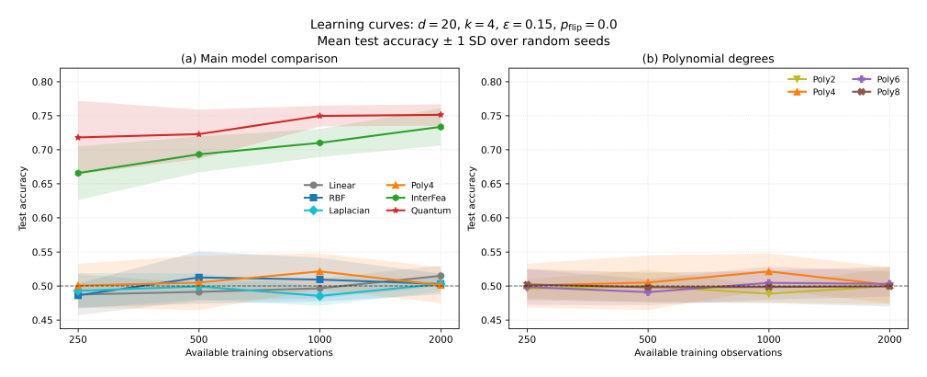 
Figure 1: Learning curves for the balanced (d, k) = (20, 4) setting. Lines and bands show mean test accuracy and ±1 standard deviation.

**Summary.** This work proposes an interaction-driven quantum kernel designed for machine learning tasks where data similarity depends on complex, high-order variable interactions. By encoding these interactions via entangled Pauli-string feature maps, the kernel achieves superior predictive performance on synthetic and real-world fraud detection benchmarks. The study emphasizes that the advantage lies in the feature-map's geometric alignment with the underlying physical structure, rather than quantum computational speedup.

**Why it may be interesting.** While the application is in ML, the use of entangled Pauli-string feature maps and the focus on encoding specific, high-order correlations relates to how complex quantum states can represent structured correlations, which is relevant to understanding entanglement structure in many-body systems.

Detailed structure

**Main problem.** The paper addresses how similarity in complex decision systems, such as fraud detection, is governed by high-order interactions between variables rather than simple Euclidean distance.

**Main result.** The proposed interaction-driven quantum kernel consistently outperforms standard kernels on synthetic benchmarks and achieves state-of-the-art performance on real-world fraud detection datasets.

**Method.** They introduce a thin-slab interaction model and construct a quantum kernel using entangled Pauli-string feature maps that explicitly encode sparse, high-order block interactions.

**Model / system.** The model is a quantum kernel applied to data structured into disjoint blocks, where the label generation is based on planted high-order block interactions, creating a regime-sensitive learning task.

**Key observables.** Mean accuracy and F1 score on fraud detection benchmarks; the kernel's ability to induce a geometry sensitive to interaction regimes.

**Important parameters / regimes.** Interaction order (up to eighth-order); input dimension (up to 80 dimensions); imbalance ratio of the data.

**Assumptions / limitations.** The performance advantage is shown to be predictive and representational, not necessarily evidence of a computational quantum speedup, as the kernel is classically evaluable.

**Paper structure.** The paper introduces the thin-slab model, proposes the interaction-driven quantum kernel, proves its theoretical properties (PSD, block-factorized), and validates its performance through controlled synthetic experiments across various interaction orders, culminating in real-world fraud detection benchmarks.

Abstract

Similarity in many decision systems is governed not by distance alone but by interactions among variables. In fraud and anomaly detection, small local perturbations can cross interaction-sensitive decision boundaries while leaving ambient distance almost unchanged. Motivated by this setting, we introduce a thin-slab interaction model and an interaction-driven quantum kernel constructed from entangled Pauli-string feature maps. The feature map explicitly encodes sparse high-order block interactions. We show that the resulting fidelity kernel is positive semidefinite, admits an exact block-factorized formulation, and induces a geometry sensitive to changes in interaction regime. Across balanced and imbalanced synthetic experiments spanning third-, fourth-, sixth-, and eighth-order interactions, the proposed kernel consistently outperforms linear, radial basis function, Laplacian, and polynomial kernels, as well as an engineered-interaction linear baseline supplied with the planted block products. On real fraud-detection benchmarks, it achieves the highest mean accuracy and F1 on Credit Card Fraud Detection and ranks second on IEEE-CIS Fraud Detection. These findings show that quantum-kernel performance depends on alignment between feature-map geometry and the underlying predictive structure, rather than on Hilbert-space dimension alone. Because the prescribed block-factorized kernel can also be evaluated exactly on a classical computer, the results establish predictive and representational value rather than computational quantum speedup.

[↑ back to top](#top)

## Secondary cond-mat archives

*Papers from  mes-hall, other, soft, supr-con. These archives are de-prioritized — they appear at the end regardless of relevance score.*

### Relevant in secondary archives (15)

### [Nonequilibrium pulse dynamics and metastable latching in nonlinear kinetic inductance detectors](http://arxiv.org/abs/2608.23902v1)

**Authors:** M. Rouble, C. Albert, P. Day, M. Dobbs, H. G. Leduc, J. Montgomery  
**Type:** both · **Category:** other · **PDF:** <https://arxiv.org/pdf/2608.23902v1>  
**Analysis basis:** full PDF text, analyzed in chunks
**Topic relevance:** 🔥 `driven-dissipative phase transition` **4/5** · `non-equilibrium universality` **3/5** · `methods for driven-dissipative` **2/5** · `Keldysh / 2PI / non-Gaussian methods` **1/5** · `analog quantum simulation` **1/5** · `correlated / nonlocal dissipation` **1/5** · `quantum measurements` **1/5** · `scars & prethermalization` **1/5**

📷 Fig 1

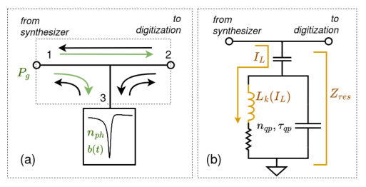 
FIG. 1. Equivalent descriptions of a driven resonator, with components affected by the readout current highlighted with colours. (a) A side-coupled resonator modeled as a one-port Kerr cavity embedded in a symmetric three-port network. A generator tone of power Pg enters the network from the syn- thesizer, producing an intracavity field b(t) with average pho- ton occupancy nph; the transmitted field is measured at the digitizer. This representation is used to describe the feed- back parameter space and infinitesimal perturbations from the steady-state nonlinear detuning. (b) Lumped-element cir- cuit representation of the same resonator. Absorbed optical load changes the quasiparticle...

📷 Fig 2

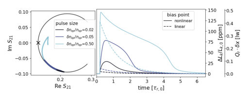 
FIG. 3. Effect of absorbed pulse energy on pulse response. The resonator is biased to a point just within the critical point, while the size of the injected quasiparticle pulse is var- ied. The response of the same resonator to the same injected pulses under a linear bias point is shown in dashed lines. In the linear case, the amplitude of the response is proportional to the size of the input pulse and the decay shape follows the same exponential shape as the recombination of the quasi- particles. In the nonlinear case, the response increases with input pulse size but the scales are not linearly related, and the shape of the response is distorted. For small pulses the rise time is notably...

📷 Fig 3

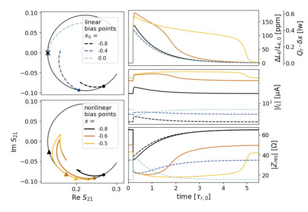 
FIG. 2. Calculated effect of bias point on pulse response. Identical quasiparticle pulses are applied to the same res- onator prepared at different bias points, both linear (blue dashed lines) and nonlinear (orange solid lines). In the linear case, the generator is located at three offset frequencies (where x0 ≃x since the nonlinear resonance shift is negligible) from the relaxed resonant frequency, at the same power. An × marks the location of the undriven resonant frequency. In the nonlinear case, the generator frequency is at fixed x0 ≃x0,c, with Pg increased to vary the nonlinear detuning, x. The location of the driven resonant frequency is marked with a triangle for each detuning on...

📷 Fig 4

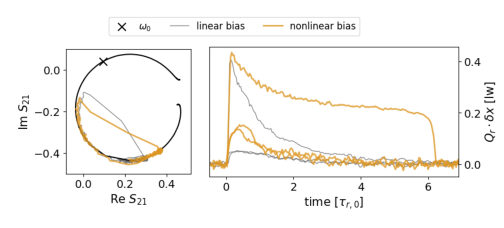 
FIG. 4. Response of a resonator to absorbed photons, mea- sured in the lab, at a linear (thin grey lines) and nonlinear (thick orange lines) operating point. The data are shown on the IQ plane (left, overlaid on a low-power frequency sweep of the same resonator) with the original timestreams shown at right. Although the readout current is non-zero in both cases, the linear bias point is at a substantially less nega- tive x0 and smaller Pg than the nonlinear bias point. At the linear bias point, the resonator response follows an exponen- tial decay, with a peak amplitude that scales with the energy of the absorbed pulse because the response is dominated by the quasiparticle transient. At the...

📷 Fig 5

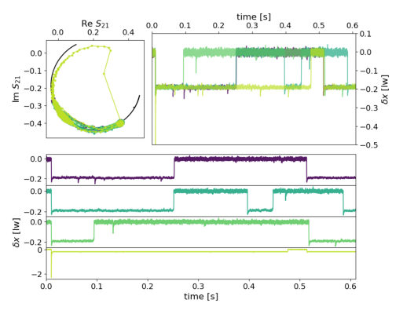 
FIG. 6. Measured latching response. The same resonator as in Fig. 4 is illuminated with IR photons while biased slightly be- yond the critical point. Upper panels show four measurements of the response under fixed operating conditions, in the plane of complex transmission and as continuous time streams. Suf- ficiently large absorbed energy events trigger the resonator to switch from its initial driven state to a metastable latched state corresponding to a stable solution on the other branch of the resonator transfer function, where it remains after the quasiparticle transient has decayed. The displacement of the latched state is determined by the generator power at the op- erating point,...

**Summary.** This work analyzes how high readout power drives nonlinear kinetic inductance detectors into complex dynamic regimes, leading to a stable, metastable latched state. By understanding this nonlinear response, the authors propose a method for achieving tunable, threshold-based detection for single-photon and rare-event experiments. The research bridges nonlinear circuit theory with superconducting detector physics.

**Why it may be interesting.** The concepts of driven nonlinear oscillators, bifurcation points, and metastable states are central to open quantum systems and quantum optics, providing a physical realization of non-trivial dynamical switching.

Detailed structure

**Main problem.** The study investigates the complex pulse dynamics and the emergence of metastable latching states in nonlinear microwave kinetic inductance detectors (MKIDs) when driven by high readout power.

**Main result.** Strong driving biases can induce a transition into a metastable latched state beyond resonance bifurcation, creating a tunable detection threshold independent of the initial quasiparticle transient decay.

**Method.** The authors combine nonlinear resonator theory (Duffing oscillator framework) with time-domain circuit calculations to model the detector's response to absorbed energy pulses.

**Model / system.** The system is a MKID modeled as a nonlinear resonator coupled to a readout circuit, where the kinetic inductance introduces nonlinearity dependent on the readout current and absorbed energy.

**Key observables.** Pulse amplitude, shape, relaxation time, and the existence/stability of the latched metastable state.

**Important parameters / regimes.** Readout bias power ($P_g$), frequency detuning ($x_0$), and the absorbed pulse energy.

**Assumptions / limitations.** The analysis distinguishes between local steady-state behavior and finite pulse excursions, and the nonlinear response is dominated by the current-dependent inductance rather than just quasiparticle decay.

**Figures summary.** Figures compare linear vs. nonlinear pulse responses under varying bias and energy, and illustrate state-space trajectories showing switching to a stable, latched branch beyond the bifurcation point.

**Paper structure.** The paper progresses from establishing the nonlinear resonator framework to analyzing the time-domain response, demonstrating the transition from simple exponential decay to complex, extended, and finally, bistable/latching behavior.

Abstract

Microwave kinetic inductance detectors are typically operated at high readout power to raise the detector signal above system noise. At sufficiently large readout power, the current-dependent kinetic inductance couples the detector response to its readout bias. Using a nonlinear resonator framework and time-domain circuit calculations, we show that the amplitude, shape, and relaxation time of the driven detector's response depend on both the absorbed energy and on the readout bias. Strongly driven bias points produce amplified, extended, and non-exponential pulse responses. Qualitative agreement between calculated and measured pulse responses indicates that these effects are dominated by the driven nonlinear resonator dynamics rather than by altered quasiparticle dynamics. Beyond resonance bifurcation, sufficiently large pulse events drive the resonator between stable branches, resulting in a metastable latched state which persists after the quasiparticle transient has decayed. The pulse energy required for branch switching is set by the readout bias, suggesting a mode of triggered detection with an in-situ tunable threshold. Although nonlinear operation requires calibration of the bias- and energy-dependent response, the enhanced pulse amplitude and duration, together with tunable latching and the ability to select these parameters via the readout operating state, are likely to be of interest for single-photon and rare-event experiments, especially those limited by amplifier or system noise.

[↑ back to top](#top)

### [Floquet engineering of spin-valley selective transport in jacutingaite](http://arxiv.org/abs/2608.24533v1)

**Authors:** Otman Bouladiane, Kamal Azaidaoui, Clarence Cortes, David Laroze, Ahmed Jellal  
**Type:** theory · **Category:** other · **PDF:** <https://arxiv.org/pdf/2608.24533v1>  
**Analysis basis:** full PDF text, analyzed in chunks
**Topic relevance:** `Keldysh / 2PI / non-Gaussian methods` **3/5** · `analog quantum simulation` **3/5** · `driven-dissipative phase transition` **3/5** · `methods for driven-dissipative` **3/5** · `non-equilibrium universality` **2/5** · `interference shaping light` **1/5** · `quantum measurements` **1/5**

📷 Fig 1

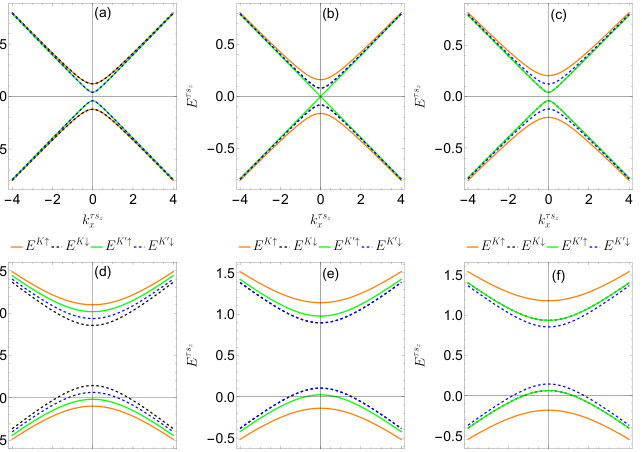 
FIG. 2. Spin- and valley-resolved energy dispersion Eηsz of monolayer Pt2HgSe3 as a function of the longitudinal wave-vector component in the leads kηsz x (a,b,c), and in the barrier region qηsz x (d,e,f) for V0 = 0.5 eV, ms = λso/2, and A0 = 0.8 Vfs/nm, with (a,d): Vz = 0, (b,e): Vz = λso/2, and (c,f): Vz = λso.

📷 Fig 2

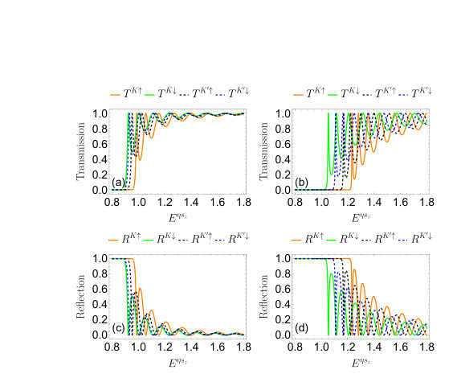 
FIG. 4. Spin- and valley-resolved transmission T ηsz (a,b) and reflection Rηsz probabilities as functions of the incident energy Eηsz for V0 = 0.5 eV, L = 4 nm, ky = 2 nm−1, ms = λso/2, and Vz = 0. (a,c): Moderate driving amplitude A0 = 0.4 Vfs/nm, and (b,d): strong driving amplitude A0 = 0.8 V fs/nm.

📷 Fig 3

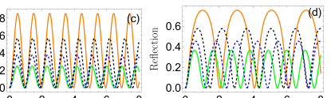 
FIG. 5. Spin- and valley-resolved transmission T ηsz (a,b) and reflection Rηsz (c,d) probabilities as functions of the barrier width L for V0 = 0.5 eV, Eηsz = 1.2 eV, ky = 1 nm−1, ms = λso/2 and Vz = 0. (a,c): Moderate driving amplitude A0 = 0.4 Vfs/nm, and (b,d): strong driving amplitude A0 = 0.8 V fs/nm.

📷 Fig 4

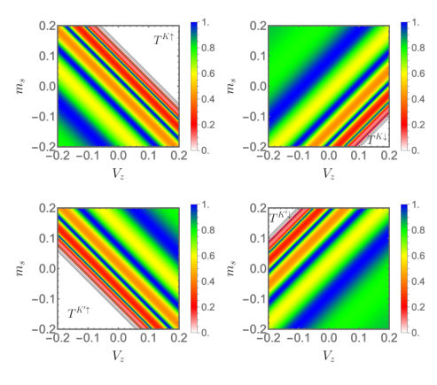 
FIG. 6. Density plot of spin- and valley-resolved transmission probability T ηsz as functions of the substrate mass ms and the sublattice staggered potential Vz for V0 = 0.5 eV, Eηsz = 1.2 eV, ky = 0.5 nm−1, L = 5 nm, and A0 = 0.8 Vfs/nm.

📷 Fig 5

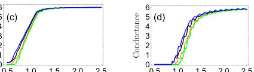 
FIG. 7. Valley- and spin-resolved conductance Gηsz as a func- tion of incident energy Eηsz for V0 = 0.5 eV, L = 5 nm. (a,b): ms = λso/2, Vz = 0, and (c,d): ms = 0, Vz = λso/2. (a,c): Moderate driving amplitude A0 = 0.4 Vfs/nm, and (b,d): strong driving amplitude A0 = 0.8 Vfs/nm.

**Summary.** This work demonstrates how off-resonant light irradiation (Floquet engineering) can induce a valley-dependent effective mass in a jacutingaite tunnel junction. By analyzing spin- and valley-resolved transport, the authors show that the junction acts as a tunable opto-spintronic element capable of achieving high levels of spin and valley polarization. This control is achieved by engineering the effective Hamiltonian using external fields and the driving light.

**Why it may be interesting.** The use of Floquet engineering to engineer topological properties (mass terms) in a solid-state system is highly relevant to open quantum systems and quantum optics, providing a mechanism to control quantum states using light.

Detailed structure

**Main problem.** The study investigates how to achieve highly selective electron transport based on spin and valley degrees of freedom in a two-dimensional material junction.

**Main result.** The system can exhibit near-perfect valley filtering and substantial spin polarization by tuning external fields and light-matter interactions. The spin and valley polarizations can be independently switched by controlling the drive amplitude, sublattice potential, and exchange field.

**Method.** The analysis employs scattering theory applied to an effective static Dirac Hamiltonian derived from the high-frequency limit of Floquet engineering.

**Model / system.** The physical system is a monolayer jacutingaite tunnel junction ($	ext{Pt}_2	ext{HgSe}_3$) where the barrier is irradiated by off-resonant circularly polarized light. The low-energy theory is based on a Dirac-Weyl Hamiltonian incorporating intrinsic spin-orbit coupling, which is modified by the photon dressing effect.

**Key observables.** Spin polarization ($P_s$), valley polarization ($P_v$), spin- and valley-resolved transmission/reflection, and Landauer conductance.

**Important parameters / regimes.** Drive amplitude ($A_0$), staggered sublattice potential ($V_z$), substrate-induced exchange field ($m_s$), and barrier width ($L$).

**Assumptions / limitations.** The analysis relies on the high-frequency limit (off-resonant driving) and models the junction as having an undriven source/drain connected to a driven barrier region.

**Figures summary.** Figures illustrate the dependence of conductance ($G_{\eta s z}$) on barrier width ($L$) showing Fabry-Pérot oscillations, and density plots showing the tunability of $P_s$ and $P_v$ across parameter space.

**Paper structure.** The paper develops the effective Hamiltonian via high-frequency expansion, uses scattering theory to calculate transport coefficients, and then analyzes how tuning $A_0$, $V_z$, and $m_s$ controls the resulting spin and valley polarizations.

Abstract

We study electron transport through a monolayer jacutingaite (Pt$_2$HgSe$_3$) tunnel junction in which only the barrier is irradiated by off-resonant circularly polarized light, while the leads remain undriven. In the high-frequency regime, the driven barrier reduces to an effective static Dirac Hamiltonian with a photon-dressed, valley-dependent mass term. A staggered sublattice potential $V_z$ and a substrate-induced exchange field $m_s$ provide additional tunable mass terms. Using scattering theory, we compute spin- and valley-resolved transmission and reflection, as well as the Landauer conductance. Photon dressing shifts the barrier {Dirac masses} with opposite signs in the ($\boldsymbol{K}, \boldsymbol{K}'$) valleys and induces a splitting of the propagation thresholds. The finite barrier then produces channel-dependent Fabry--Pérot-type interference through the phase $q_x^{ηs_z}L$. We find broad parameter windows with near-perfect valley filtering ($|P_v|\simeq 100\%$) and substantial spin polarization ($|P_s|\sim 70\%$). The dominant spin and valley polarizations can be switched by tuning the drive amplitude $A_0$, $V_z$, and~$m_s$.

[↑ back to top](#top)

### [Collective Topological Dark Solitons, Platicons, and Bright-Like Solitons in Normal Dispersion Optical Frequency Combs](http://arxiv.org/abs/2608.23708v1)

**Authors:** Seyed Danial Hashemi, Ankitkumar Maisuriya, Sunil Mittal  
**Type:** theory · **Category:** other · **PDF:** <https://arxiv.org/pdf/2608.23708v1>  
**Analysis basis:** full PDF text, analyzed in chunks
**Topic relevance:** `analog quantum simulation` **3/5** · `driven-dissipative phase transition` **3/5** · `methods for driven-dissipative` **3/5** · `interference shaping light` **2/5** · `Keldysh / 2PI / non-Gaussian methods` **1/5** · `correlated / nonlocal dissipation` **1/5** · `non-equilibrium universality` **1/5**

📷 Fig 1

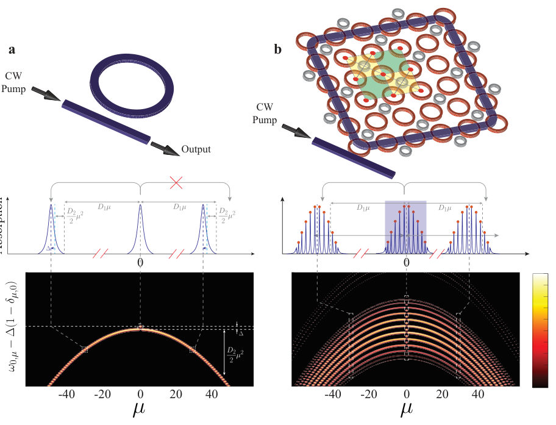 
FIG. 1. Generation of optical frequency combs in coupled resonator arrays with normal dispersion. a. Schematic of a single-ring resonator, with its absorption spectrum and dispersion. Due to normal dispersion and the cross-phase modulation-induced resonance frequency shift (∆), the phase-matching condition for four-wave mixing (FWM) is not satisfied for any FSR µ, preventing frequency comb generation. b. Schematic of the topological ring resonator lattice, with its absorption spectrum and dispersion. The presence of multiple topological edge- state resonances within each FSR intrinsically satisfies the phase-matching condition, enabling frequency comb generation without auxiliary mechanisms...

📷 Fig 2

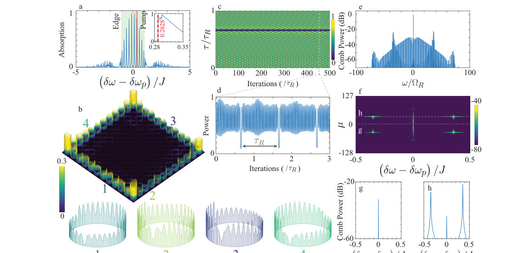 
FIG. 2. Topological dark solitons. a. Linear absorption spectrum of the topological lattice with edge state resonances shaded green. The pumped edge mode is shaded red. The inset shows the nonlinear cavity power. b. Intensity distribution in the lattice showing formation of topological dark solitons in every resonator on the edge. The insets show zoomed-in views at four different resonators. c,d. Temporal output showing dark soliton intensity dips, repeating every τR. e-h. Comb spectrum showing dominant oscillation of a single edge mode at µ = 0, and two side-band edge modes at µ = ±35.

📷 Fig 3

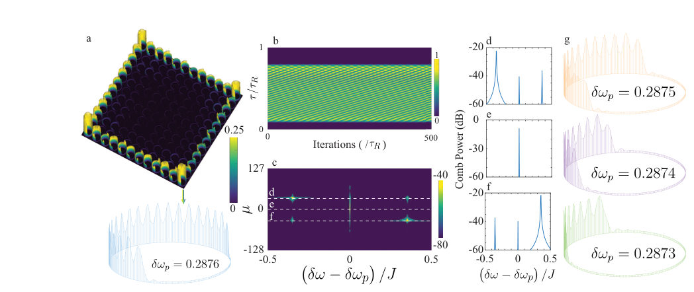 
FIG. 3. Topological platicons a. Lattice intensity distribution showing the formation of topological platicons in every edge resonator. The inset shows intensity in the resonator coupled to the input-output waveguide. b,c. Temporal and spectral output. d,e,f. Zoomed in comb spectra at µ = +35, 0, −35, respectively. g. Intensity distribution in the input-output ring showing tunability of the platicon width by red detuning the pump frequency.

📷 Fig 4

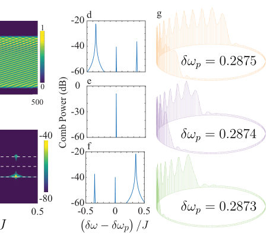 
Figure 3 shows the formation of a collective topological platicon state, in which each edge resonator supports a syn- chronized platicon characterized by a broad flat-top inten- sity profile with a weak periodic modulation. As in the dark-soliton regime, the switching fronts remain synchronized across all edge resonators, demonstrating large-scale collec- tive synchronization (Fig.3a and Movie M3). The temporal output therefore consists of a periodic sequence of modulated flat-top pulses repeating every round-trip time τR (Fig.3b). Nevertheless, unlike the dark-soliton state, where the modu- lating wave reverses its propagation direction across the two switching fronts, the modulation...

📷 Fig 5

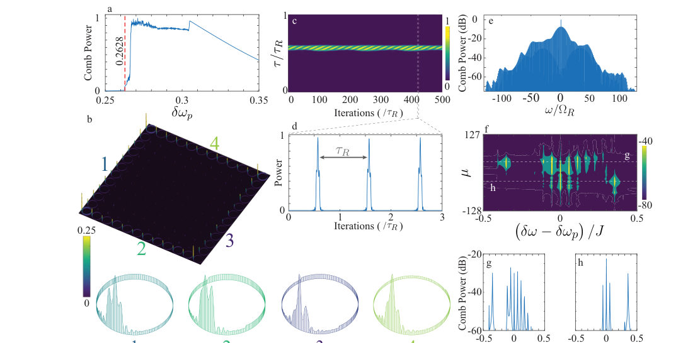 
FIG. 4. Topological bright-like solitons a. Nonlinear pump power as a function of pump frequency detuning. b. Lattice intensity distribution showing formation of topological bright-like solitons. Insets show intensity profiles in four different resonators on the edge. c, d. Temporal output as a function of round trips showing generation of bright pulses. e-h. Comb spectrum showing oscillation of multiple edge state resonances at each FSR.

**Summary.** This paper shows that topological edge states in 2D Kerr resonator lattices can generate optical frequency combs and various coherent soliton structures, including dark, platicon, and bright-like states, even when the material operates in the normal-dispersion regime. This circumvents the need for auxiliary mechanisms typically required for comb generation in such materials. The findings establish topological arrays as a highly versatile platform for engineering broadband coherent light sources.

**Why it may be interesting.** This work bridges concepts from topological physics (edge states) with nonlinear optics (solitons/frequency combs), providing a novel, robust platform for integrated photonics that overcomes limitations imposed by material dispersion.

Detailed structure

**Main problem.** The research aims to demonstrate the generation of optical frequency combs and various coherent dissipative structures (dark, platicons, bright-like solitons) in the normal-dispersion regime without needing auxiliary physical mechanisms.

**Main result.** Topological edge states in 2D Kerr resonator lattices intrinsically satisfy the phase-matching condition for four-wave mixing, enabling comb generation and supporting a versatile range of soliton states in normal dispersion.

**Method.** The analysis uses theoretical modeling based on tight-binding Hamiltonians and the Ikeda map formalism to simulate field evolution in coupled resonator arrays.

**Model / system.** The system is a two-dimensional Kerr resonator lattice modeled by a tight-binding Hamiltonian, incorporating topological edge states and operating in the normal-dispersion regime.

**Key observables.** Collective topological dark solitons, topological platicons, bright-like soliton states, and the associated frequency comb spectrum.

**Important parameters / regimes.** Normal-dispersion regime, 2D lattice structure, pump detuning, and coupling strengths (J).

**Assumptions / limitations.** The primary assumption is that topological edge states provide an intrinsic phase-matching mechanism, eliminating the need for external pumping or avoided crossings.

**Figures summary.** Figures illustrate the linear absorption spectrum showing edge state resonances, intensity distributions of dark solitons on the edge, and the evolution of the comb spectrum across different soliton regimes.

**Paper structure.** The paper establishes the physical system and the problem (comb generation in normal dispersion), details the mechanism (topological edge states satisfying phase-matching), and presents results showing the continuous evolution between different soliton types.

Abstract

Bright dissipative Kerr solitons generated in anomalous-dispersion microresonators underpin integrated optical frequency combs that have enabled applications including precision metrology, spectroscopy, coherent communications, and optical frequency synthesis. In contrast, Kerr resonators operating in the normal-dispersion regime can support dark solitons and platicons, but even the initiation of frequency comb generation typically requires auxiliary mechanisms, such as avoided mode crossings or pulsed pumping, to satisfy the phase-matching condition for four-wave mixing. Here we show that topological edge states in two-dimensional Kerr resonator lattices intrinsically satisfy this phase-matching condition, enabling the generation of optical frequency combs and novel coherent dissipative structures in the normal-dispersion regime without any auxiliary mechanisms. The resulting frequency combs self-organize into collective dark solitons that exhibit large-scale spatiotemporal synchronization across multiple resonators at the entire lattice edge. By tuning the pump detuning, we demonstrate the continuous evolution of topological dark solitons into topological platicons while preserving collective synchronization. Remarkably, we show that the topological lattice also supports collective bright-like soliton states despite all constituent resonators operating in the normal-dispersion regime. Our results establish topological Kerr resonator arrays as a versatile route for engineering a broad family of coherent dissipative structures, ranging from dark solitons to bright-like soliton states, within a single platform. They also provide a route toward integrated frequency-comb generation in material platforms and wavelength ranges where normal material dispersion has traditionally constrained comb generation in conventional single-resonator systems.

[↑ back to top](#top)

### [Composite fermions in the $ν=3$ fractional quantum spin Hall effect](http://arxiv.org/abs/2608.24059v1)

**Authors:** Hongquan Liu, D. E. Feldman  
**Type:** theory · **Category:** strongly correlated electrons · **PDF:** <https://arxiv.org/pdf/2608.24059v1>  
**Analysis basis:** full PDF text, analyzed in chunks
**Topic relevance:** `Full counting statistics` **3/5** · `quantum measurements` **3/5** · `Keldysh / 2PI / non-Gaussian methods` **1/5** · `analog quantum simulation` **1/5** · `methods for driven-dissipative` **1/5**

📷 Fig 1

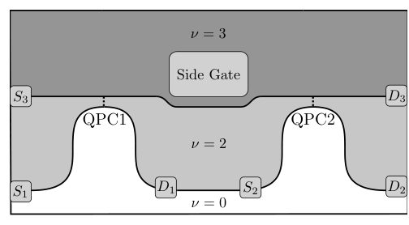 
FIG. 1. Device with two QPCs. The ν = 3 edge is connected to the interface between ν = 2 and ν = 0 at two QPCs. A gate is placed near the ν = 3 edge to vary the shape of the edge between the two QPCs.

📷 Fig 2

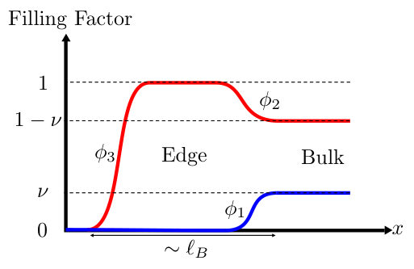 
FIG. 2. Spatial arrangement of the three edge modes. The integer mode lies on the outer edge and is separated by the distance on the order of the moire period from the two frac- tional modes.

📷 Fig 3

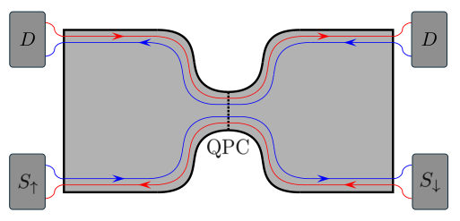 
FIG. 5. Single constriction as a QPC across a Hall bar. Dif- ferent terminals absorb and emit currents of the opposite spin polarizations.

📷 Fig 4

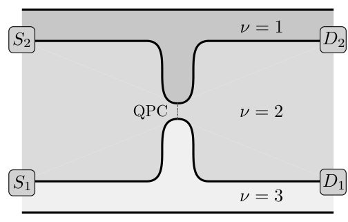 
FIG. 3. Single constriction across the ν = 2 Hall bar. The upper interface is in contact with a ν = 1 state and the lower interface with a ν = 3 state.

📷 Fig 5

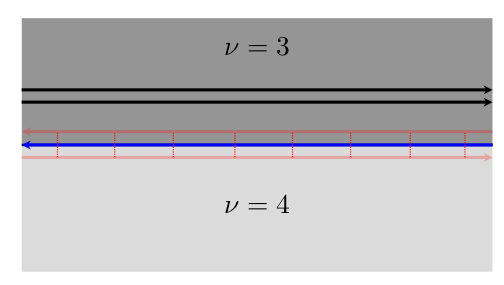 
FIG. 4. Interface between ν = 3 and ν = 4 from the particle- hole conjugation. The two fractional modes are shown in black color, the spin-up integer mode is shown in blue color, and the two spin-down integer modes which gap each other out are shown in faint red color.

**Summary.** This paper develops a comprehensive theoretical framework to classify the complex composite fermion states expected in the fractional quantum spin Hall effect at $\nu=3$. It extends established FQHE concepts to two-spin systems and proposes a rigorous experimental protocol combining shot noise, thermal conductance, and edge tunneling to definitively identify the underlying topological order.

**Why it may be interesting.** The work provides a detailed theoretical framework for characterizing topological phases in multi-component systems, which is highly relevant for understanding correlated electron behavior in novel 2D materials.

Detailed structure

**Main problem.** To classify and understand the composite fermion (CF) states in the putative fractional quantum spin Hall effect (FQSHE) at filling factor $\nu=3$, and to propose experimental methods to identify the relevant state.

**Main result.** The paper classifies two-component CF states into several groups (SV, JCX, MSD) and proposes a combination of three experimental probes—shot noise, thermal conductance, and edge tunneling—to uniquely identify the true topological state.

**Method.** The analysis uses the composite fermion picture, extending it to two spin components, and derives theoretical constraints on edge physics using effective Lagrangians and scaling dimensions.

**Model / system.** The system is the FQSHE in $\text{MoTe}_2$, modeled using composite fermions that account for two spin components. The theory builds upon established FQHE descriptions by incorporating spin-related degrees of freedom.

**Key observables.** Fractional quasiparticle charges ($e/2$ or $e/4$), chiral central charge (from thermal conductance), and the emergent symmetry group revealed by edge tunneling.

**Important parameters / regimes.** Filling factor $\nu=3$; the flux quanta parameters ($m, s_1, s_2$); and the scaling dimension $\Delta$ for tunneling operators.

**Assumptions / limitations.** The primary assumption is the applicability of the composite fermion picture to the two-component spin system, and that the three proposed experimental probes are sufficient for full characterization.

**Figures summary.** Figure 1 illustrates a device setup involving two Quantum Point Contacts (QPCs) connecting the $\nu=3$ edge to other interfaces, relevant for the proposed tunneling measurement.

**Paper structure.** The paper proceeds by first establishing the CF classification at $\nu=3$, then developing the edge theory using particle-hole transformations and effective Lagrangians, and finally detailing the necessary experimental diagnostics using noise, thermal transport, and tunneling measurements.

Abstract

Well-understood fractional quantum Hall states in GaAs and graphene can be described in terms of weakly interacting composite fermions. It is natural to expect that the same unifying principle applies to the putative fractional quantum spin Hall effect in MoTe$_2$. Since the quantum spin Hall effect involves two spin components, two types of composite fermions must be present. We classify all two-component composite-fermion states at the filling factor $ν=3$. The classification includes the three classes of states, which were introduced from different physical perspectives in Refs. Sodemann Villadiego, Phys. Rev. B 110, 045114 (2024), Jian et al., Phys. Rev. X 15, 021063 (2025), and May-Mann et al., Phys. Rev. B 111, L201111, (2025), as well as two new classes of states. A majority of the composite-fermion states break the time-reversal symmetry. We review quasiparticle charges, statistics, and edge theories for each possible state. We also address a way of identifying the experimentally relevant state or states. This can be accomplished by combining three probes. First, the shot noise technique provides information about fractional charges. Second, thermal conductance helps count edge modes. The third probe is based on a new idea and involves transport between two quantum point contacts along a single edge. We find that the current from one contact to the other depends on the shape of the edge channel, which can be controlled with a side gate. The probe reveals the emergent symmetry group of the low-energy edge theory.

[↑ back to top](#top)

### [Visualizing flat-band spatial renormalization in rhombohedral graphene superlattices](http://arxiv.org/abs/2608.24684v1)

**Authors:** Peng-Cheng Pan, Shihao Zhang, Yang Zhang, Ji Huang, Ling-Hui Tong, Chen-Chen Xu, Yuan Tian, Li Zhang, Lijie Zhang, Yuanyuan Hu, Wen-Xiao Wang, Zhihui Qin, Long-Jing Yin  
**Type:** both · **Category:** strongly correlated electrons · **PDF:** <https://arxiv.org/pdf/2608.24684v1>  
**Analysis basis:** full PDF text, analyzed in chunks
**Topic relevance:** `analog quantum simulation` **3/5** · `Frenkel-Kontorova` **1/5** · `Keldysh / 2PI / non-Gaussian methods` **1/5**

📷 Fig 1

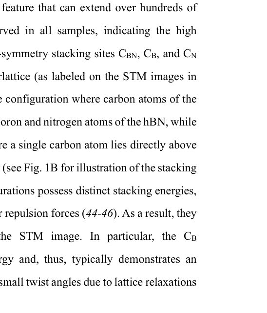 
Figure 1, E and F, shows the representative dI/dV spectra—reflecting the local

📷 Fig 2

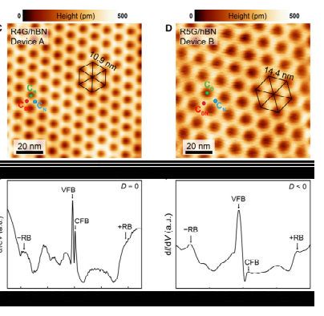 
Fig. 1. Topography and spectroscopy of RG/hBN moiré superlattices. (A)

📷 Fig 3

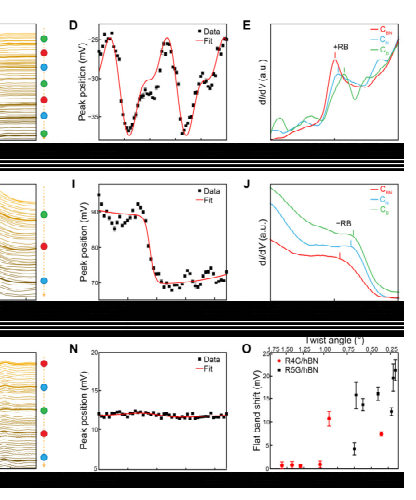 
Fig. 2. Visualization of spatial band renormalization in RG/hBN superlattices. (A,

📷 Fig 4

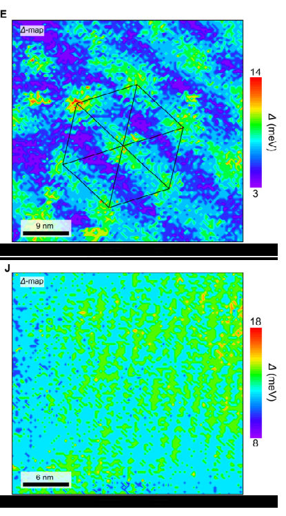 
Fig. 3. Spatial reshaping of electronic correlations. (A and F) STM topographic

📷 Fig 5

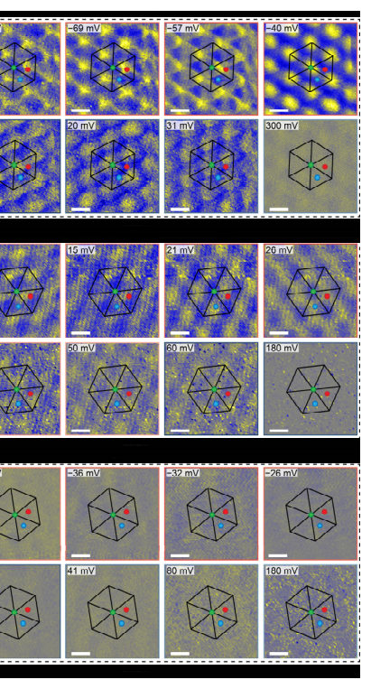 
Fig. 4. Visualization of spatial electronic localization transition. (A, D, and G) STM

**Summary.** This work uses STM to visualize how the moiré potential in graphene/hBN superlattices causes a periodic, site-dependent renormalization of flat electronic bands. The key finding is that this spatial modulation only exists above a critical moiré period ($\sim 10 	ext{ nm}$), establishing a direct, real-space link between the moiré potential and the emergence of topological order like the FQAHE.

**Why it may be interesting.** The direct visualization of how a geometric potential (the moiré pattern) dictates the emergence of topological order in a correlated system provides a concrete, experimentally verifiable mechanism for realizing exotic quantum states.

Detailed structure

**Main problem.** The study aims to clarify the microscopic role of the moiré potential in driving emergent correlated phases, such as the Fractional Quantum Anomalous Hall Effect (FQAHE), in rhombohedral graphene superlattices.

**Main result.** The authors visualize that the moiré potential causes a spatially periodic renormalization of flat bands, and this modulation vanishes below a critical moiré period ($\sim 10 	ext{ nm}$), which coincides with the threshold for FQAHE.

**Method.** The research combines Scanning Tunneling Microscopy/Spectroscopy (STM/STS) to image real-space electronic structure with theoretical modeling to attribute the modulation to atomic corrugation-induced charge redistribution.

**Model / system.** The system studied is rhombohedral graphene (RG) superlattices formed with hexagonal boron nitride (hBN) substrates (e.g., R4G/hBN, R5G/hBN). The physics involves flat-band physics, correlated electron behavior, and the formation of topological states.

**Key observables.** Spatially resolved energy shifts of flat bands ($	ext{d}I/	ext{d}V$ spectra), the magnitude of the band splitting gap ($\Delta$), and the persistence of moiré-scale modulation.

**Important parameters / regimes.** Moiré period ($\lambda_m$), which shows a critical threshold around $10 	ext{ nm}$; the filling level (full vs. partial); and the twist angle ($	heta$).

**Assumptions / limitations.** The mechanism driving the modulation is theoretically attributed to atomic corrugation inducing a spatially varying local chemical potential.

**Figures summary.** Figures show STM topography and spatially resolved $	ext{d}I/	ext{d}V$ spectra demonstrating site-dependent energy shifts. They illustrate the disappearance of this modulation when the moiré period is too small, and map the spatial reshaping of correlated states.

**Paper structure.** The paper establishes the problem by noting the importance of moiré-driven phases. It then uses STM/STS to observe the spatial renormalization of flat bands, demonstrating the dependence on the moiré period. Finally, it links this observed periodicity threshold to the theoretical requirement for topological order.

Abstract

Rhombohedral graphene/hBN moiré superlattices exhibit flat-band-driven emergent phases, including superconductivity and the fractional quantum anomalous Hall effect (FQAHE), yet the microscopic role of the moiré potential remains unclear. Here, using scanning tunneling microscopy, we visualize moiré-modulated spatial renormalization of flat bands in rhombohedral pentalayer and tetralayer graphene/hBN superlattices. We observe spatially hierarchical filling, manifested as periodic energy shifts of the flat bands at the moiré scale, leading to spatial reshaping of correlated states in the interacting regime. Remarkably, this modulation vanishes below a ~10 nm moiré period--the same threshold below which the FQAHE is absent. Theoretical modeling attributes this mechanism to atomic-corrugation-induced charge redistribution. Our work provides real-space visualization of moiré-engineered flat-band reconstruction, resolving a key link between moiré periodic potential and emergent topological order.

[↑ back to top](#top)

### [Quantum encoding of structured light into in-plane topological spin textures](http://arxiv.org/abs/2608.23856v1)

**Authors:** Pavel A. Vorobyev, Daichi Kurebayashi, Oleg A. Tretiakov  
**Type:** theory · **Category:** other · **PDF:** <https://arxiv.org/pdf/2608.23856v1>  
**Analysis basis:** full PDF text, analyzed in chunks
**Topic relevance:** `interference shaping light` **3/5**

📷 Fig 1

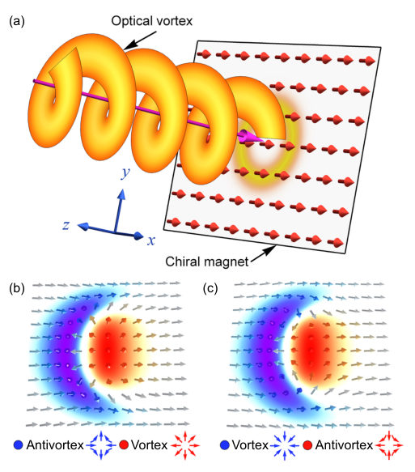 
FIG. 1. (a) Schematic illustration of the model. An OV beam is incident on a chiral magnetic thin film. The spiral represents the he- lical phase front of the OV, the magenta arrow indicates its propaga- tion direction, and the red arrows denote the initial uniform in-plane magnetization of the chiral magnet. (b) Magnetic configuration of an asymmetric bimeron. (c) Magnetic configuration of an asymmetric antibimeron. The sketches below panels (b) and (c) show the vortex- antivortex pair forming each spin texture.

📷 Fig 2

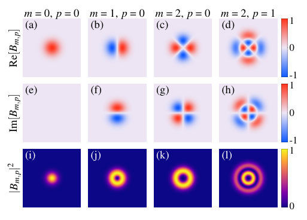 
FIG. 2. Normalized spatial profiles of LG modes at the focal plane (z = 0). The first row, panels (a) to (d), shows the real part Re[Bm,p] of the OV magnetic field. The second row, panels (e) to (h), shows its imaginary part Im[Bm,p]. The third row, panels (i) to (l), shows the corresponding intensity |Bm,p|2. The columns correspond to (m, p) = (0, 0), (1, 0), (2, 0), and (2, 1), respectively. The fields and intensities are normalized to their respective peak values, with the color scales indicated by the colorbars.

📷 Fig 3

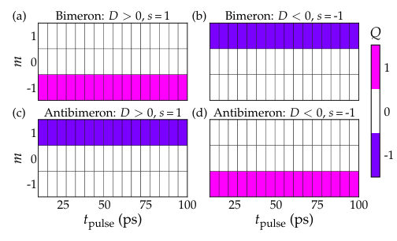 
FIG. 3. Nucleation outcome diagrams for circularly polarized OVs. The color maps show the topological charge Q as a function of the pulse duration tpulse and the OAM m. Panels (a) and (b) correspond to the Cnv-symmetric system hosting asymmetric bimerons for (a) D &gt; 0 with beam polarization s = 1, and (b) D &lt; 0 with s = −1. Panels (c) and (d) correspond to the D2d-symmetric system hosting asymmetric antibimerons for (c) D &gt; 0 with s = 1, and (d) D &lt; 0 with s = −1.

📷 Fig 4

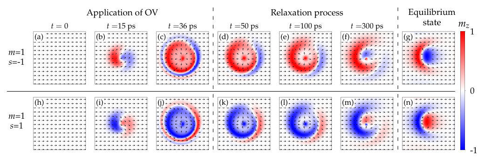 
FIG. 4. Nucleation of single in-plane topological spin textures in a chiral FM driven by circularly polarized OVs. The OV pulse carries OAM index m = 1 and has a total duration of tpulse = 36.5 ps. The top row [panels (a)–(g)] corresponds to right-handed circular polarization (s = −1), leading to the nucleation of an asymmetric bimeron. The bottom row [panels (h)–(n)] corresponds to left-handed circular polarization (s = 1), leading to the nucleation of an asymmetric antibimeron. Panels (a)–(c) and (h)–(j) show the magnetization dynamics during the OV pulse, while panels (d)–(f) and (k)–(m) show the subsequent relaxation after the pulse is switched off, with time reset to t = 0 at the start...

📷 Fig 5

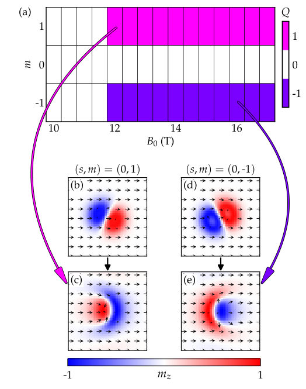 
FIG. 5. (a) Nucleation outcome diagram for linearly polarized OVs. The color map shows the topological charge Q as a function of the OV magnetic-field amplitude coefficient B0 and OAM m. (b)–(e) Nucleation of asymmetric bimerons. Panels (b) and (d) show the magnetization states at t = 5 ps during the OV pulse for m = 1 and m = −1 at B0 = 12 T and B0 = 16 T, respectively. The corresponding equilibrium states after relaxation are shown in (c), with Q = 1, and in (e), with Q = −1. The color in panels (b)–(e) represents the out- of-plane magnetization component.

**Summary.** This research demonstrates how structured light, specifically optical vortices, can be used to write precise, controllable topological spin textures in chiral magnetic films. By controlling the beam's orbital and spin angular momentum, researchers can deterministically encode these quantum optical properties into the magnetic topology, opening a new pathway for quantum-controlled spintronic devices.

**Why it may be interesting.** This work bridges quantum optics (structured light, OAM) directly into condensed matter magnetism, providing a mechanism for non-invasive, quantum-number-controlled manipulation of magnetic topology, which is highly relevant for advanced spintronics.

Detailed structure

**Main problem.** The paper investigates the deterministic and local writing of in-plane topological spin textures (like bimerons and antibimerons) within chiral ferromagnetic thin films using structured light, specifically optical vortices (OVs).

**Main result.** Structured light provides a versatile route for topology-selective writing, where the optical quantum numbers (OAM, SAM) can be directly encoded into the topological charge (Q) of the resulting magnetic texture.

**Method.** The study employs micromagnetic simulations to model the time evolution of magnetization dynamics driven by pulsed Laguerre-Gaussian optical vortex fields.

**Model / system.** The system is an ultrathin ferromagnetic film exhibiting chiral magnetic properties, governed by a free energy functional and simulated using the Landau-Lifshitz-Gilbert equation. The driving force is a time-dependent magnetic field derived from the structured light.

**Key observables.** Topological charge (Q), magnetic texture morphology (bimerons/antibimerons), and the dependence of these on optical quantum numbers (m, p, polarization s).

**Important parameters / regimes.** Material parameters include $M_s$, $A$, $D$, and $K_x$; simulation parameters involve beam waist ($W$), pulse duration ($t_{	ext{pulse}}$), and OAM ($m$).

**Assumptions / limitations.** The analysis relies on the paraxial approximation for the OV field and assumes the dynamics are governed by the LLG equation under the influence of the structured light pulse.

**Figures summary.** Figures illustrate the schematic of OV incidence on a chiral film, the spatial profiles of LG modes, and time-evolution maps showing the nucleation of single or clustered topological textures corresponding to specific input optical parameters.

**Paper structure.** The paper builds from defining the physical model and Hamiltonian, detailing the simulation protocol (three-stage writing process), presenting results for specific polarization/OAM combinations, and concluding with a general framework for topology-selective writing.

Abstract

Structured light offers a powerful means of controlling light-matter interactions through multiple tunable optical degrees of freedom. Using micromagnetic simulations, we investigate the nucleation of asymmetric bimerons and antibimerons by pulsed Laguerre-Gaussian optical vortices in chiral ferromagnetic thin films with $C_{nv}$ and $D_{2d}$ symmetries, respectively. For optical vortices with orbital angular momentum (OAM) $|m|=1$, circularly polarized beams deterministically nucleate a single bimeron or antibimeron via the interplay of spin angular momentum, OAM, and magnetic chirality, whereas linearly polarized beams produce textures whose topological charge directly follows the OAM ($Q=m$). Optical vortices with OAM $|m|>1$ nucleate clusters and other configurations composed of multiple spin textures, whose morphology and topological charge depend sensitively on the optical quantum numbers and pulse parameters. These findings reveal a route to topology-selective writing through the encoding of optical quantum numbers into distinct in-plane topological magnetic states.

[↑ back to top](#top)

### [Scattering-Induced Magnon Layer-Hall Transport beyond Band Geometry](http://arxiv.org/abs/2608.24023v1)

**Authors:** Zhiping Xue, Zhoujian Sun, Xiyin Ye, Lei Zhang, Tao Yu  
**Type:** theory · **Category:** other · **PDF:** <https://arxiv.org/pdf/2608.24023v1>  
**Analysis basis:** full PDF text, analyzed in chunks
**Topic relevance:** `Keldysh / 2PI / non-Gaussian methods` **2/5** · `analog quantum simulation` **2/5** · `methods for driven-dissipative` **2/5** · `correlated / nonlocal dissipation` **1/5** · `driven-dissipative phase transition` **1/5** · `non-equilibrium universality` **1/5**

📷 Fig 1

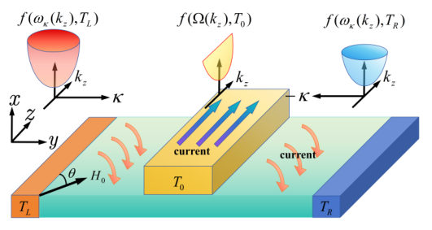 
FIG. 1. Magnon layer-Hall transport driven by dipolar scat- tering. The hybrid system consists of a magnetic nanowire (width w, thickness d) placed atop a magnetic film (thickness s). The magnetization of the film (nanowire) is tilted by an angle θ (˜θ) relative to the wire ˆz-axis. The film is sandwiched between two thermal reservoirs at temperatures TL and TR, establishing a longitudinal temperature gradient ∇T ∥ˆy. The wire acts as a local thermal reservoir at T0 = (TL + TR)/2.

📷 Fig 2

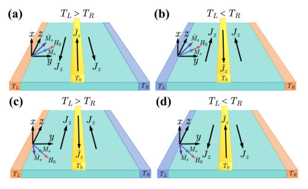 
FIG. 3. Manipulation of layer Hall current by the temperature gradient direction and the external field H0 that changes the directions θ and ˜θ of Ms and ˜ Ms.

📷 Fig 3

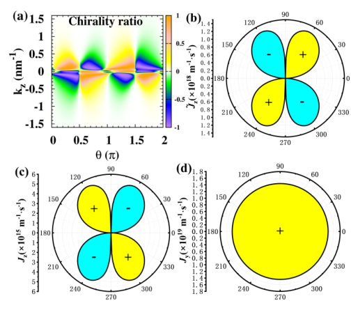 
FIG. 2. Transverse vs. longitudinal magnon current in the film and wire when biased by an applied field µ0H0 = 0.05 T in different directions, where the system resides in a sta- ble configuration ˜θ ≈θ. (a): dependence of chirality ratio η(κΩ, kz) on the wave vector kz and field direction θ. (b) and (c): transverse currents in the wire ( ˜Jz) and film (Jz) under different magnetization configurations. (d): longitudinal cur- rent (Jy) in the film versus the external field direction.

📷 Fig 4

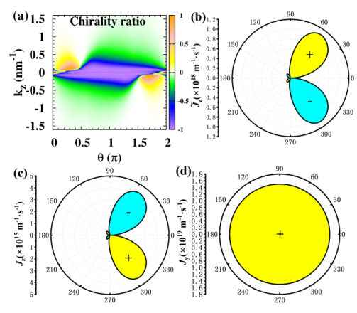 
FIG. 4. Magnon current density in the wire and film when bi- ased by a weak applied field µ0H0 = 0.01 T, where metastable states occur when θ ∈(90◦, 270◦). (a) plots the dependence of the chirality ratio on the wave vector (kz) and the field direction (θ). (b) and (c): switch on and off of the transverse Hall current in the wire ˜Jz and film Jz by the direction of the external magnetic field. (d): longitudinal magnon current Jy in the film, weakly affected by the external field.

**Summary.** This work introduces a novel, scattering-driven mechanism for the layer Hall effect in magnons, bypassing the need for topological band structures. By analyzing a nanowire on a magnetic film, the authors show that non-reciprocal dipolar scattering under a temperature gradient generates measurable transverse thermal Hall currents. This provides a robust, field-tunable pathway for realizing this effect in conventional magnetic materials.

**Why it may be interesting.** While the primary focus is condensed matter magnetism, the development of a scattering-theory approach to engineer directional transport (thermal/spin currents) based on symmetry breaking (non-reciprocity) is highly relevant to open quantum systems and engineered quantum transport phenomena.

Detailed structure

**Main problem.** To establish a fundamentally distinct mechanism for the layer Hall effect (LHE) in bosonic excitations, specifically magnons, that is driven by non-reciprocal dipolar scattering rather than geometric Berry curvature effects.

**Main result.** The study predicts a magnon LHE where a longitudinal temperature gradient drives opposite transverse thermal Hall currents, yielding a sizable Hall angle ($\sim 6^\circ$) in conventional magnetic heterostructures.

**Method.** The authors employ a microscopic scattering theory approach, deriving hybridization coefficients and analyzing the resulting magnon current densities under a temperature gradient.

**Model / system.** The system modeled is a hybrid chiral architecture: a magnetic nanowire placed atop a magnetic film, interacting via an interlayer dipolar coupling. The analysis focuses on the magnon excitations in this coupled system.

**Key observables.** Transverse thermal Hall currents ($	ilde{J}_z, J_z$), the Hall angle ($\sim 6^\circ$), and the dependence of currents on the external magnetic field orientation ($	heta$).

**Important parameters / regimes.** The non-reciprocal nature of the dipolar coupling ($g_{\kappa}(kz)$), the applied longitudinal temperature gradient ($
abla T$), and the external magnetic field strength ($\mu_0H_0$).

**Assumptions / limitations.** The analysis assumes the ballistic regime (micrometer length scales) and attributes the effect to the non-reciprocity of the dipolar coupling, thereby bypassing the need for topological engineering.

**Figures summary.** Figure 1 illustrates the physical setup: a magnetic nanowire on a magnetic film subjected to a longitudinal temperature gradient, with magnetization tilted by angles $	heta$ and $	ilde{	heta}$.

**Paper structure.** The paper builds from identifying the limitations of Berry curvature mechanisms to developing a scattering-theory framework based on non-reciprocal dipolar coupling, calculating the resulting transverse currents, and demonstrating the tunability and magnitude of the effect.

Abstract

The layer Hall effect has been exclusively attributed to layer-locked Berry curvature, posing a fundamental barrier to its realization in conventional magnets. Here we report a fundamentally distinct layer Hall effect for bosonic excitations, i.e., magnons, which originates solely from non-reciprocal dipolar scattering at heterointerfaces, thereby decoupling the phenomenon from geometric-phase mechanisms. Using a microscopic scattering theory, we demonstrate that a longitudinal temperature gradient drives opposite transverse thermal Hall currents in a nanowire atop a magnetic film, with the direction fully reconfigurable by the applied magnetic field. The effect yields a significant Hall angle of $\sim 6^{\circ}$ in conventional magnetic heterostructures, eliminating the need for topological engineering. Our findings establish a scattering-driven paradigm for layer Hall effect, extendable to ferrons and polar phonons, and predict a Hall response that is readily detectable in conventional magnetic heterostructures.

[↑ back to top](#top)

### [Intervalley Magnetotrions Tunable by Electric and Magnetic Fields in Buckled Two-Dimensional Materials](http://arxiv.org/abs/2608.24581v1)

**Authors:** Roman Ya. Kezerashvili, Shalva M. Tsiklauri, Anastasia Spiridonova  
**Type:** theory · **Category:** other · **PDF:** <https://arxiv.org/pdf/2608.24581v1>  
**Analysis basis:** full PDF text, analyzed in chunks
**Topic relevance:** `analog quantum simulation` **2/5** · `Keldysh / 2PI / non-Gaussian methods` **1/5**

📷 Fig 1

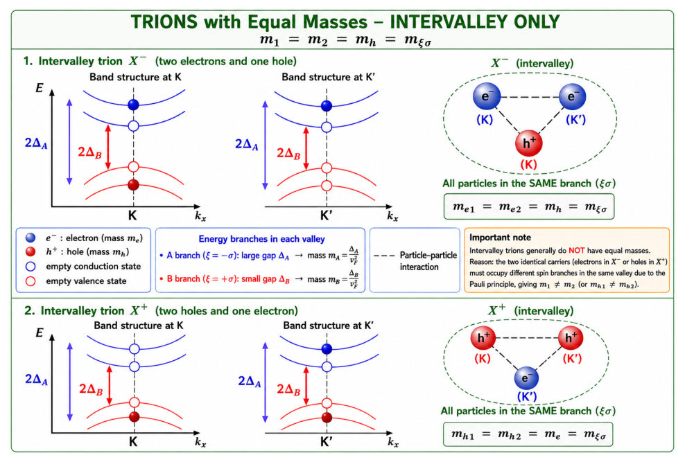 
FIG. 1: (Color online) Schematic illustration of equal-mass intervalley trions in Xene monolayers. The upper and lower panels show negatively charged, X−, and positively charged, X+, trions, respectively. The band structures near the K and K′ valleys are shown together with the occupation of the conduction and valence bands. Although the constituent particles occupy different valleys (K and K′), they belong to the same valley-spin branch (ξσ), yielding equal effective masses me1 = me2 = mh = mξσ for X−and mh1 = mh2 = me = mξσ for X+. The corresponding band occupations and three-body configurations are illustrated together with the A- and B-branch energy gaps.

📷 Fig 2

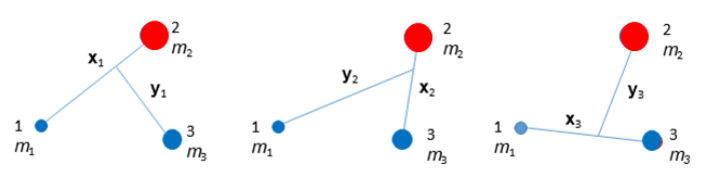 
FIG. 2: (Color online) Schematics of partition trees of Jacobi coordinates when three charged particles have different masses.

📷 Fig 3

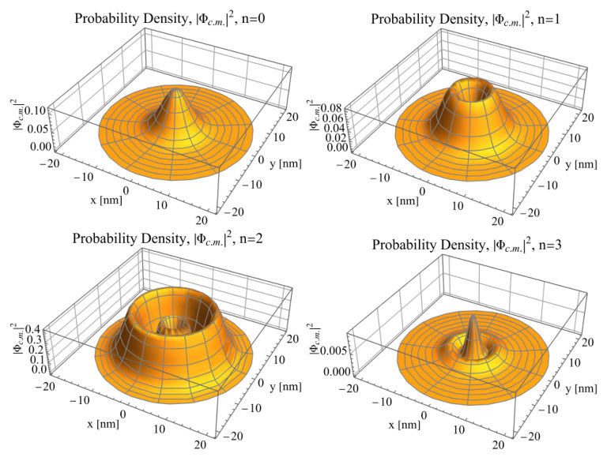 
FIG. 3: (Color online) Three-dimensional plots of |Φc.m.|2 versus x and y of the the Center-of-Mass of three the same mass fermions in magnetic field B = 50 T and electric field E⊥= 0.5 V/˚Ain different states.

📷 Fig 4

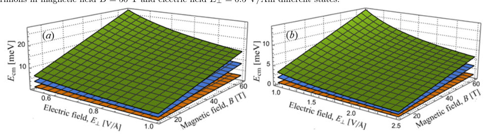 
FIG. 4: (Color online) Center-of-mass Landau energy surfaces of the X∓trions in silicene monolayer for the lowest three Landau levels as functions of the external electric and magnetic fields. Panels (a) and (b) show the results for the electric fields interval 0.5 ≤E⊥≤1.0 V/˚Aand 1.0 ≤E⊥≤2.5 V/˚A, respectively.

📷 Fig 5

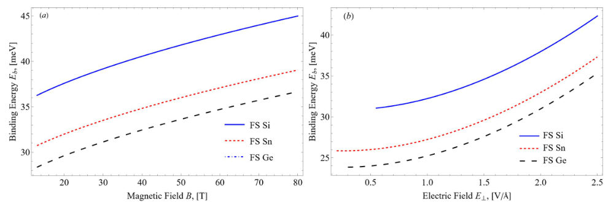 
FIG. 5: (Color online) Dependence of the binding energy of intervalley X∓magnetotrions in free-standing silicene, germanene, and stanene. (a) Binding energy as a function of the magnetic field B for a fixed perpendicular electric field E⊥= 2 V/˚A. (b) Binding energy as a function of the perpendicular electric field E⊥for a fixed magnetic field B = 40 T. The results demonstrate that both magnetic confinement and the electric-field-induced modification of the effective carrier masses enhance the trion binding energy.

**Summary.** This work theoretically models intervalley magnetotrions in 2D materials like silicene and stanene under combined electric and magnetic fields. It establishes that the system exhibits an exact separation of center-of-mass and internal dynamics when carrier masses are equal. This allows for independent, field-tunable control over both the collective motion (Landau levels) and the binding energy of the trion complex.

**Why it may be interesting.** The independent tunability of collective (c.m.) and internal degrees of freedom by external fields provides a powerful platform for engineering quantum states, relevant to quantum optics and open quantum systems.

Detailed structure

**Main problem.** The paper develops a theoretical framework to study intervalley magnetotrions in buckled two-dimensional materials under external electric and magnetic fields.

**Main result.** It shows that the center-of-mass and internal motions of these trions can separate exactly under the condition of equal electron and hole effective masses. Furthermore, the trion binding energy is found to increase monotonically with both applied fields.

**Method.** The analysis uses the effective-mass approximation to formulate the three-particle Schrödinger equation, solving the center-of-mass motion via a harmonic oscillator Hamiltonian and the internal motion using the hyperspherical harmonics method.

**Model / system.** The system involves trions (three-particle bound states) in Xene monolayers (silicene, germanene, stanene), modeled with the Rytova–Keldysh interaction potential, and subjected to perpendicular electric and magnetic fields.

**Key observables.** Trion binding energy, quantized Landau surface energies, and the separation of center-of-mass and internal motion.

**Important parameters / regimes.** High-magnetic-field regime ($B \gtrsim 15 	ext{ T}$), electric field ($E_\perp$), and the condition of equal effective masses ($m_{e1} = m_{e2} = m_h$).

**Assumptions / limitations.** The effective-mass approximation is employed, and the analysis is restricted to the high-magnetic-field regime.

**Figures summary.** Figure 1 schematically illustrates equal-mass intervalley trions in Xene monolayers, detailing the conditions for mass equality and showing the associated band structures.

**Paper structure.** The paper first establishes the theoretical framework for the three-particle system, then analyzes the center-of-mass motion leading to tunable Landau states, and finally investigates the internal dynamics using advanced quantum mechanical methods.

Abstract

We develop a theoretical framework for intervalley magnetotrions in buckled two-dimensional materials, including silicene, germanene, and stanene, subjected to perpendicular electric and magnetic fields. Within the effective-mass approximation, the three-particle Schrödinger equation is formulated with the Rytova--Keldysh interaction potential and analyzed in the high-magnetic-field regime. We demonstrate that intervalley trions with equal electron and hole effective masses constitute an exceptional case for which the center-of-mass and internal motions separate exactly. The center-of-mass motion is governed by a two-dimensional harmonic-oscillator Hamiltonian, leading to quantized Landau states whose energies form electrically tunable Landau surfaces controlled by the magnetic field and the electric-field dependence of the carrier effective masses. The internal motion is investigated by solving the three-body Schrödinger equation within the framework of the hyperspherical harmonics method. Numerical calculations reveal that the trion binding energy increases monotonically with both magnetic and electric fields owing to the combined effects of magnetic confinement and electric-field-induced enhancement of the effective masses. The strongest binding is obtained for silicene, followed by stanene and germanene. The present work provides a unified description of both the collective center-of-mass motion and the internal dynamics of magnetotrions in Xene monolayers, demonstrating that both degrees of freedom can be independently manipulated by external electric and magnetic fields.

[↑ back to top](#top)

### [Electronic cooling of a TiW alloy normal-metal island using Nb-based superconducting tunnel junctions](http://arxiv.org/abs/2608.24455v1)

**Authors:** Joel Hätinen, Renan Pires Loreto, Arvind Kumar, Jani Taskinen, Mika Prunnila  
**Type:** both · **Category:** statistical mechanics · **PDF:** <https://arxiv.org/pdf/2608.24455v1>  
**Analysis basis:** full PDF text, analyzed in chunks
**Topic relevance:** `Keldysh / 2PI / non-Gaussian methods` **1/5** · `correlated / nonlocal dissipation` **1/5** · `driven-dissipative phase transition` **1/5** · `methods for driven-dissipative` **1/5** · `non-equilibrium universality` **1/5**

📷 Fig 1

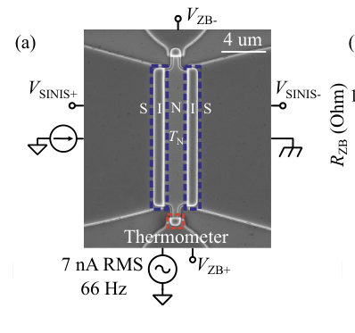 
Fig. 1 (a): Scanning electron micrograph of the mesoscopic cooler device with the experimental wiring. (b): Zero-bias resistance of the top junction with respect to the bath temperature. Linear interpolation between the data points is used as a thermometer calibration.

📷 Fig 2

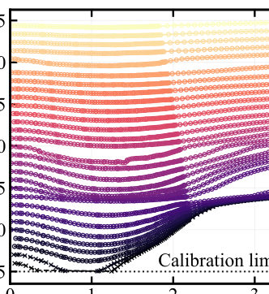 
Fig. 2 Cooling performance of the device. (a): Normal-metal electron temperature measured using the tunnel-junction thermometer as a function of voltage across the SINIS cooler. The operating bath temperature for each curve is recovered at zero cooler bias, i.e., TN = TBath at VSINIS = 0.(b): Absolute cooling from the bath with a maximum of 217 mK at TBath = 1.7 K. (c): Relative cooling from the bath with a maximum of 27% at TBath = 0.7 K.

**Summary.** This paper reports on the successful demonstration of electronic cooling in a TiW normal-metal island using superconducting tunnel junctions (NIS coolers). By measuring the temperature drop and characterizing the cooling power, the authors validate the use of these junctions for cryogenic applications. The work provides quantitative data on cooling efficiency and discusses discrepancies between theory and experiment regarding the optimal operating voltage.

**Why it may be interesting.** The work explores non-equilibrium thermodynamics and energy transport in mesoscopic superconducting circuits, which touches upon non-equilibrium statistical mechanics and heat engine concepts.

Detailed structure

**Main problem.** The paper demonstrates and characterizes the electronic cooling effect achieved in a normal-metal island using superconducting tunnel junctions.

**Main result.** Significant electronic cooling, up to 217 mK absolutely, is observed in the TiW-based normal-metal island, confirming the viability of NIS junctions for cryogenic cooling applications.

**Method.** The study combines electrical measurements (I-V curves, temperature sensing) with theoretical modeling based on energy-selective quasiparticle tunneling.

**Model / system.** The physical system is a mesoscopic NIS tunnel junction stack (TiW-Al/AlOx/Nb), where cooling arises from the energy-selective tunneling of quasiparticles between the normal metal and the superconductor.

**Key observables.** Normal-metal electron temperature ($T_N$), absolute and relative temperature reduction ($\delta T_N$), and the optimal bias voltage ($V_{Opt}$).

**Important parameters / regimes.** Operating temperature range (0.6 K to 3.5 K), maximum cooling values (217 mK, 27%), and superconducting energy gaps ($\Delta$).

**Assumptions / limitations.** The analysis relies on single-particle tunneling expressions and assumes that fitted junction parameters are temperature-independent, although discrepancies suggest otherwise.

**Figures summary.** Figures show SEM images, $T_N$ vs. voltage curves, and plots detailing the maximum absolute and relative cooling performance as a function of bath temperature.

**Paper structure.** The paper proceeds by demonstrating the cooling effect, calibrating the thermometer, quantifying the cooling performance across a temperature range, and finally comparing the measured optimal voltage against ideal BCS theory predictions.

Abstract

TiW thin films remain non-superconducting down to millikelvin temperatures and are compatible with large-scale CMOS manufacturing, making them attractive for cryogenic and quantum tunnel-junction devices, such as normal-metal-insulator-superconductor (NIS) thermal sensors and electron refrigerators. We demonstrate significant electronic cooling of a TiW-based normal-metal island and electron thermometry by using TiW-Al-AlOx-Nb NIS tunnel-junction stacks. The NIS thermometer enables local electron temperature measurements from 0.5 to 8.32 K. NIS cooling is observed between 0.6 and 3.5 K, with maximum absolute and relative temperature reductions of 217 mK and 27%, respectively. Calculations using tunnel-junction parameters obtained independently from current-voltage fits reproduce the measured optimum-voltage scale, which lies substantially below the ideal low-temperature prediction.

[↑ back to top](#top)

### [Kernel-Dependent Pattern Formation in a Population Model with Nonlocal Facilitation and Competition](http://arxiv.org/abs/2608.23964v1)

**Authors:** Olivia Clifton, Stephanie Dodson, Daniel B. Cooney  
**Type:** theory · **Category:** statistical mechanics · **PDF:** <https://arxiv.org/pdf/2608.23964v1>  
**Analysis basis:** full PDF text, analyzed in chunks
**Topic relevance:** `analog quantum simulation` **1/5** · `correlated / nonlocal dissipation` **1/5** · `driven-dissipative phase transition` **1/5** · `methods for driven-dissipative` **1/5** · `non-equilibrium universality` **1/5**

📷 Fig 1

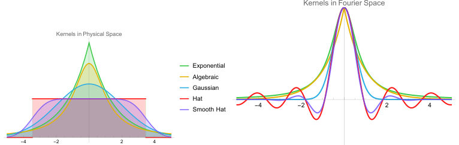 
Figure 1: Plots of example kernels with σc = 2. Left, plots of kernels in physical space. Right, plots of kernels in Fourier space.

📷 Fig 2

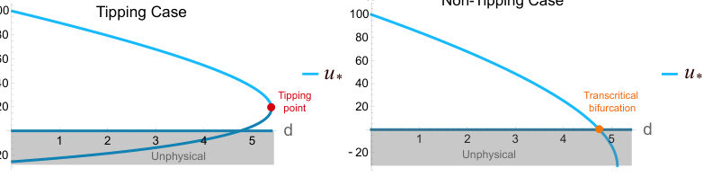 
Figure 2: Plots of uniform solutions u as the death rate d varies (negative solutions are unphysical), in each of 2 cases. (a) Example of tipping case, with parameter values from Figure 3. (b) Example of non-tipping case, with f0 = 0.005 and all other parameters the same as in panel (a).

📷 Fig 3

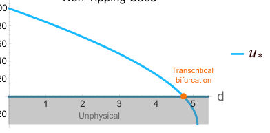 
Figure 3: Values of parameters used in numerics in Section 5

📷 Fig 4

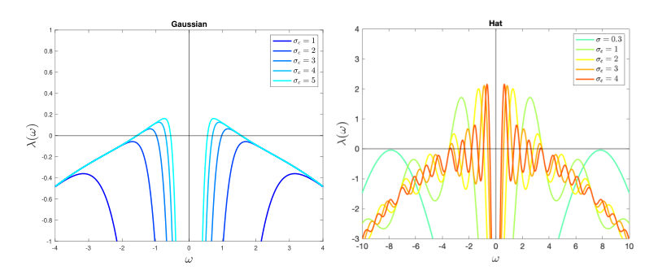 
Figure 4: Plots of the dispersion relations for the Gaussian kernel (left) and hat kernel (right) for various values of σc, with all other parameters from Figure 3.

📷 Fig 5

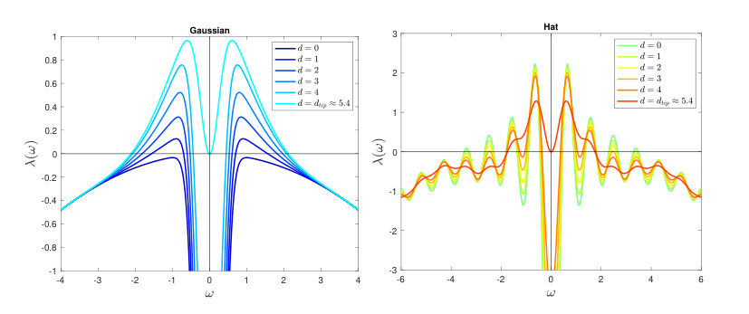 
Figure 5: Plots of the dispersion relation for the Gaussian kernel (left) and hat kernel (right) for various values of d, with all other parameters from Figure 3. Note that λ(0) is negative except at the tipping point when it equals 0, as expected since the uniform state undergoes a fold bifurcation.

**Summary.** This paper analyzes a nonlocal reaction-diffusion model for population dynamics to study pattern formation influenced by the specific mathematical form of interaction kernels. It finds that the kernel choice dictates the system's resilience, demonstrating a 'Turing-before-Tipping' mechanism for some kernels but not others. This highlights how nonlocal interactions fundamentally alter the stability and pattern-forming capabilities of complex ecological systems.

**Why it may be interesting.** While focused on ecology, the mathematical framework of pattern formation, bifurcation analysis, and resilience mechanisms in non-equilibrium systems shares theoretical overlap with pattern formation in quantum many-body systems.

Detailed structure

**Main problem.** The paper investigates how the choice of nonlocal interaction kernel affects pattern formation and persistence in a population model incorporating nonlocal competition and facilitation.

**Main result.** The choice of kernel creates a dichotomy in pattern behavior; Gaussian-type kernels show robust 'Turing-before-Tipping' resilience, while hat-type kernels do not exhibit this behavior regarding the death rate.

**Method.** The study employs center manifold analysis and numerical continuation methods to analyze pattern-forming bifurcations and pattern stability far from onset.

**Model / system.** It uses a single-species reaction-diffusion model for population density, incorporating nonlocal facilitation and competition terms governed by various kernels (Gaussian, exponential, hat, etc.).

**Key observables.** Pattern formation/bifurcation, pattern persistence past the tipping point, and early warning signs for population extinction.

**Important parameters / regimes.** The death rate ($d$) and the relative spatial scale of competition ($\sigma_c$) to facilitation ($\sigma_f$) are key bifurcation parameters.

**Assumptions / limitations.** The analysis fixes the facilitation scale ($\sigma_f = 1$), and the study compares kernels based on whether their Fourier transforms are non-negative (Gaussian-type) or take on negative values (Hat-type).

**Figures summary.** The notes reference figures illustrating example kernels in physical and Fourier space, and plots showing uniform solutions versus the death rate ($d$) for tipping (fold) and non-tipping (transcritical) bifurcations.

**Paper structure.** The paper analyzes the model via center manifold expansion to determine pattern-forming bifurcations, followed by numerical continuation methods to study pattern stability and the 'Turing-before-Tipping' phenomenon.

Abstract

Spatial patterns, such as those in dryland vegetation models, have historically been studied   in systems of reaction-diffusion systems with pattern onset via a Turing bifurcation from a spatially uniform state. More recently, spatial patterns have been considered in models that incorporate spatially extended interactions via nonlocal interaction kernels. It remains largely underexplored if and how the choice of nonlocal interaction kernel contributes to differences in pattern formation and persistence, particularly in models that contain competition and facilitation. Here, we investigate spatial patterns in a reaction-diffusion model for a single species that includes nonlocal competition and facilitation processes; Gaussian, exponential, algebraic, hat, and smooth hat kernels are considered as specific examples. Via a center manifold analysis, and using the relative spatial scale of competition to facilitation and the death rate as bifurcation parameters, we identify that the choice of kernel has impacts on the pattern forming bifurcation. Bifurcations using the Gaussian, exponential, and algebraic kernels largely follow expectations of Turing patterns, but patterns in the hat and smooth hat kernels can form even when the scale of competition is less than that of facilitation. The dynamics of patterns far from onset are investigated via numerical continuation methods. The model produces the so-called "Turing-before-Tipping" phenomenon demonstrating that the arrangement into spatial patterns is an effective resilience mechanism against harsh conditions. Again, there is a kernel-dependent dichotomy in pattern behavior. Early warning signs for population extinction are observed with the Gaussian, exponential, and algebraic kernels, but not under the hat or smooth hat cases.

[↑ back to top](#top)

### [Spectrally Programmable Spin-Polarized Photocurrents in WSe$_2$-NiPS$_3$ Magnetic van der Waals Heterostructures](http://arxiv.org/abs/2608.23832v1)

**Authors:** Rajesh Kumar Yadav, Michal Poplinger, Adi Levi, Adi Harchol, Nirman Chakraborty, Thomas Brumme, Thomas Heine, Efrat Lifshitz, Doron Naveh  
**Type:** both · **Category:** other · **PDF:** <https://arxiv.org/pdf/2608.23832v1>  
**Analysis basis:** full PDF text, analyzed in chunks
**Topic relevance:** `analog quantum simulation` **1/5** · `driven-dissipative phase transition` **1/5** · `interference shaping light` **1/5** · `quantum measurements` **1/5** · `quantum optics experiment` **1/5**

📷 Fig 1

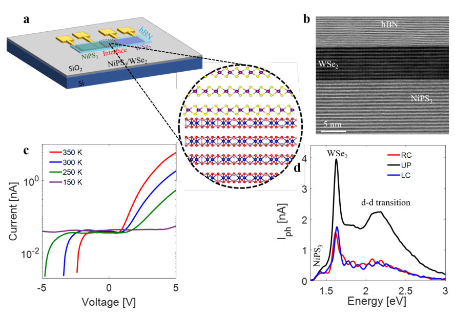 
Figure 1. Heterostructure p-n diode of WSe2 and NiPS3. a) schematic description of the device, the top layer represents

📷 Fig 2

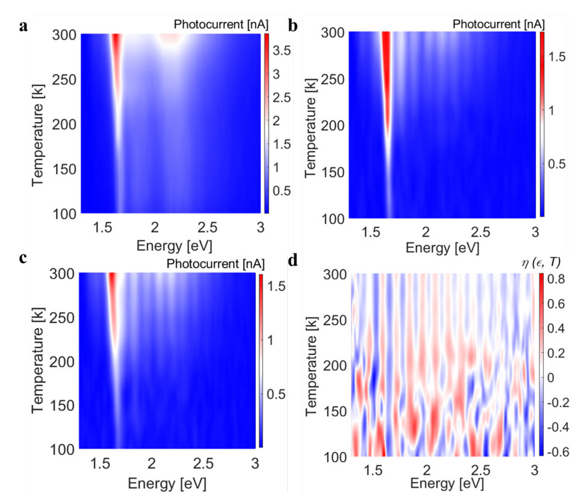 
Figure 2. Temperature (100-300 K) dependent photocurrent spectra. a–c) Photocurrent spectrum as a function of

📷 Fig 3

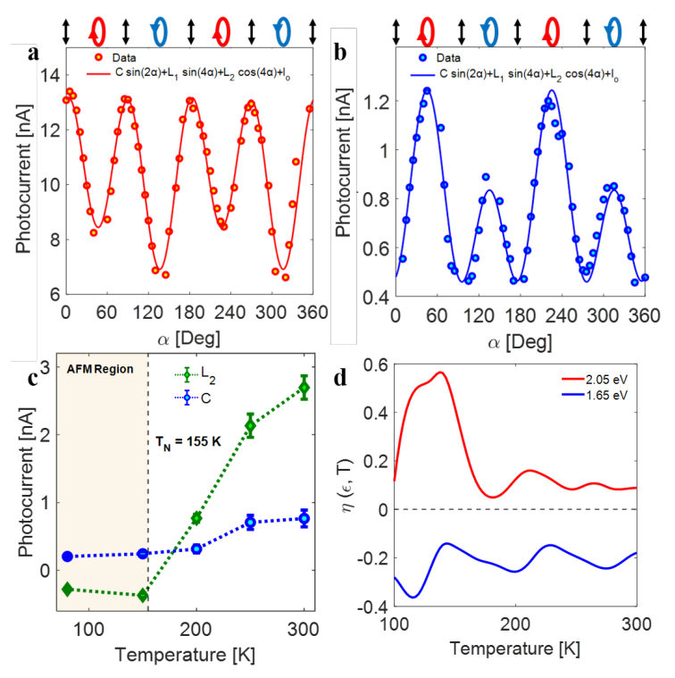 
Figure 3. Temperature (80-300 K) dependent Photogalvanic response at 45º oblique incidence. a, b) Photocurrent

📷 Fig 4

 
Figure 3 displays the monochromatic photogalvanic measurement with a He-Ne laser (1.96 eV)

📷 Fig 5

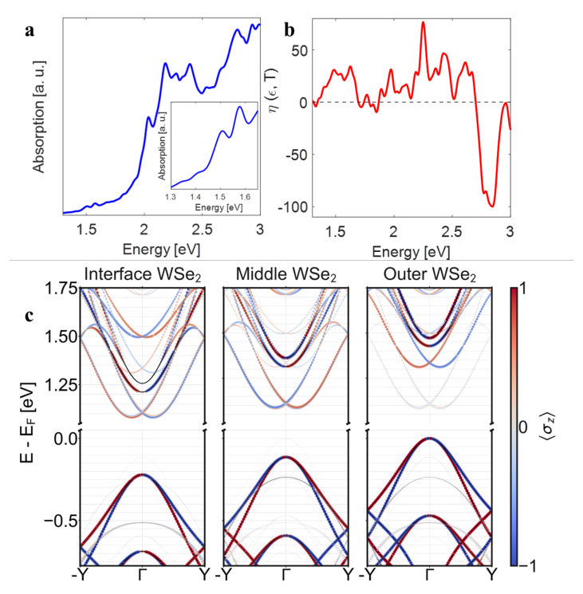 
Figure 4. Calculated electronic structure of WSe2-NiPS3 interface. a) Calculated absorption spectrum of the

**Summary.** This work introduces a novel opto-spintronic platform using a $	ext{WSe}_2-	ext{NiPS}_3$ van der Waals heterostructure. By using circularly polarized light, the researchers generate highly spin-polarized photocurrents. Crucially, they show that the spin polarization remains robust across the material's magnetic phase transition, establishing spectral tuning as a powerful, field-free control mechanism for spin-current generation.

**Why it may be interesting.** The concept of using spectral tuning as a control knob for spin transport is highly relevant to open quantum systems and quantum optics, as it suggests a non-magnetic, purely optical method to manipulate spin states in solid-state devices.

Detailed structure

**Main problem.** The core challenge addressed is the efficient generation and control of spin-polarized currents in semiconductors, overcoming limitations like impedance mismatch and the need for external magnetic fields.

**Main result.** The authors demonstrate that spectral tuning of excitation light in a $	ext{WSe}_2-	ext{NiPS}_3$ van der Waals heterostructure can generate robust, spectrally protected spin-polarized photocurrents without external magnetic fields.

**Method.** The study combines experimental measurements (photocurrent, photogalvanic spectroscopy using circularly polarized light) with first-principles electronic structure calculations.

**Model / system.** The physical system is a p-n diode heterostructure composed of the antiferromagnetic semiconductor $	ext{NiPS}_3$ and the semiconductor $	ext{WSe}_2$. The mechanism relies on interfacial hybridization and spin-layer locking induced by an electric field.

**Key observables.** Photocurrent spectra ($	ext{I}$ vs. photon energy $\epsilon$), degree of photocurrent polarization ($\eta$), and the persistence of spin polarization across the magnetic phase transition.

**Important parameters / regimes.** Temperature (especially near the Néel temperature), excitation photon energy ($\epsilon$), and the applied electric field strength.

**Assumptions / limitations.** The observed effects are attributed to electric-field-induced interfacial hybridization and symmetry breaking, which allows spectral tuning to control spin transport.

**Figures summary.** Figures illustrate the schematic of the diode, temperature-dependent photocurrent spectra showing circular dichroism, and the polarization dependence of the photogalvanic response as a function of polarization angle.

**Paper structure.** The paper establishes the problem, presents the $	ext{WSe}_2-	ext{NiPS}_3$ platform, details measurements showing high spin polarization, explains the mechanism via interfacial hybridization and symmetry protection, and concludes by positioning the material for opto-spintronic applications.

Abstract

Efficient generation and control of spin-polarized currents in semiconductors remain central challenges for spin-based electronics, particularly due to impedance mismatch and the reliance on magnetic fields or ferromagnetic contacts. Here, we introduce a materials platform for spectrally programmable spin transport based on a van der Waals heterostructure combining the antiferromagnetic semiconductor NiPS$_3$ with WSe$_2$. In a p-n diode architecture, circularly polarized excitation produces pronounced photoconductive resonances with spin polarization reaching 80% near the Neel temperature and persisting at 30% at room temperature. Remarkably, selected spectral bands retain their polarization sign across the magnetic phase transition, evidencing robust, spectrally protected spin-polarized current generation. Polarization-resolved photogalvanic measurements reveal a dominant circular injection-current mechanism, confirming spin-polarized carrier transport. First-principles calculations show that an applied electric field induces interfacial hybridization and spin-layer locking, giving rise to localized symmetry breaking and enhanced optical absorption while preserving global time-reversal symmetry. These results establish spectral tuning of excitation as a new control knob for spin transport, enabling spin-current generation without magnetic fields or polarization switching. Our findings position magnetic van der Waals heterostructures as a versatile platform for opto-spintronic functionality and spectrally programmable spintronic devices.

[↑ back to top](#top)

### [Hierarchical Quantum Transport from Coupled Topological Domain-Wall States in SSH Chains](http://arxiv.org/abs/2608.24694v1)

**Authors:** Alessio Palavicini, César G. Galván, Carlos Ramírez  
**Type:** theory · **Category:** other · **PDF:** <https://arxiv.org/pdf/2608.24694v1>  
**Analysis basis:** full PDF text, analyzed in chunks
**Topic relevance:** `Frenkel-Kontorova` **1/5** · `analog quantum simulation` **1/5**

📷 Fig 1

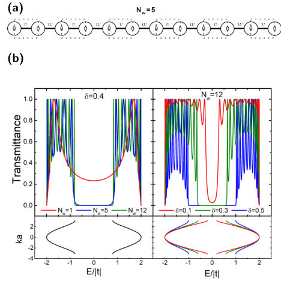 
Figure 1: (a) Finite Su-Shrieffer-Heeger model with hopping amplitudes v and w and length Nw = 5. (b) Transmittance and dispersion of SSH chains with: (Left) Fixed δ = 0.4 and Nw = 1, 5 and 12, and (Right) Fixed length Nw = 12, and δ = 0.1, 0.3, and 0.5. The number of transmission resonances increases with chain length, while the gap width is controlled by the dimerization parameter.

📷 Fig 2

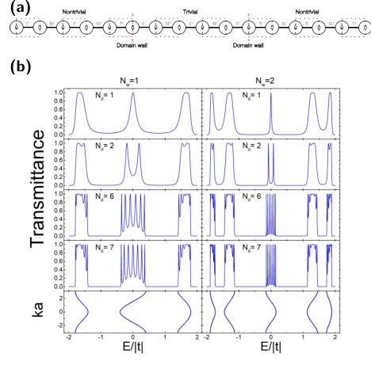 
Figure 2: Formation of minibands from coupled domain-wall states. (a) Domain-wall lattice ob- tained by concatenating SSH chains. The red dashed lines indicate the domain-wall positions. (b) Transmission spectra for increasing numbers of domain walls Nd and the corresponding band structures of the associated infinite periodic sys- tems. Hybridization of the localized domain-wall states produces minibands embedded within the original SSH gap. The cases Nw = 1 and Nw = 2 generate three-band and five-band spectra, respec- tively.

📷 Fig 3

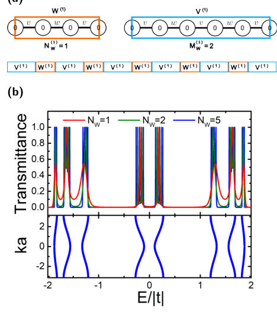 
Figure 3: (a) First-generation building blocks W (1) and V (1), corresponding to N(1) W = 1 and M(1) W = 2, respectively. The lower schematic illustrates the construction of an effective SSH chain from alternating V (1) and W (1) blocks. (b) Transmission spectra for effective SSH chains with NW = 1, 2, and 5, together with the band structure of the corresponding infinite periodic sequence. Calculations were performed for δ = 0.4.

📷 Fig 4

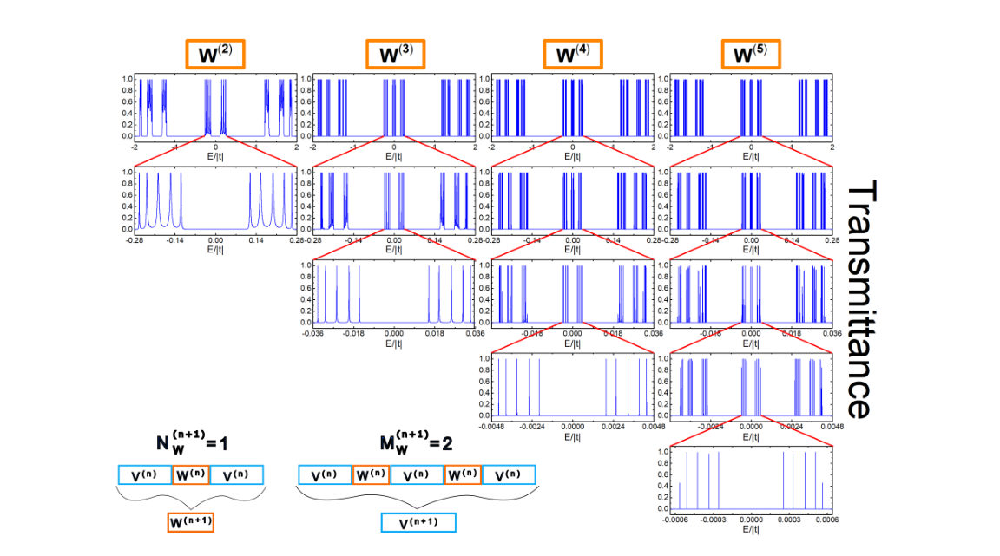 
Figure 4: Hierarchical SSH structures and their transmission spectra. Hierarchy levels are shown from left to right and their corresponding progressive amplifications from top to bottom. Boxes: Effective SSH building blocks of an arbitrary hierarchical level n.

📷 Fig 5

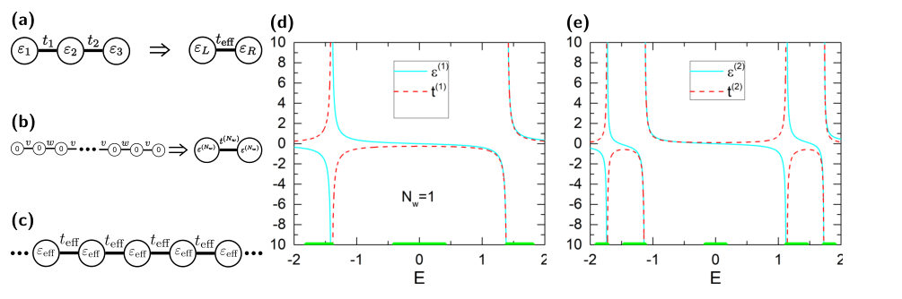 
Figure 5: Effective renormalized description of domain-wall lattices. (a) Elementary three-site decimation. (b) Iterative reduction of a finite SSH segment containing Nw hopping amplitudes w. (c) Effective periodic chain obtained after replacing each SSH segment by its renormalized counterpart. (d) Effective parameters for the elementary domain-wall lattice with Nw = 1. (e) Effective parameters for the elementary domain-wall lattice with Nw = 2. Red dashed curves correspond to the effective hopping t(Nw), while cyan solid curves denote the effective site energy ε(Nw). Green segments mark the energies satisfying the effective band condition, Eq. (17).

**Summary.** This work explores quantum transport in SSH chains containing topological domain walls, showing that their interaction creates a self-similar hierarchy of minibands. By developing a recursive construction and analyzing the system via successive decimation, the authors demonstrate how localized topological states act as emergent degrees of freedom to engineer complex, multiscale spectral features. This establishes a general connection between recursive topological building blocks and self-similar spectral organization in 1D quantum systems.

**Why it may be interesting.** The concept of emergent, self-similar spectral structures arising from simple local topological defects provides a powerful, general framework for understanding multiscale physics in low-dimensional quantum systems.

Detailed structure

**Main problem.** The paper investigates how the interaction of topological domain-wall states in Su-Schrieffer-Heeger (SSH) chains generates a self-similar, hierarchical structure in quantum transport properties.

**Main result.** The hybridization of domain-wall localized states leads to minibands whose structure can be recursively constructed, revealing a self-similar hierarchy of spectral gaps and resonances.

**Method.** The analysis combines the recursive scattering-matrix method with the development of an effective renormalized description based on successive decimation procedures.

**Model / system.** The system is based on SSH chains containing multiple topological domain walls. The model is analyzed by treating the domain-wall states as emergent degrees of freedom that define an effective, recursively built lattice structure.

**Key observables.** Transmission spectra, minibands, spectral gaps, and the hierarchy of interlaced singularities in the energy axis.

**Important parameters / regimes.** Dimerization parameter (delta), number of domain walls ($N_d$), and the recursive generation index ($n$).

**Assumptions / limitations.** The analysis relies on the recursive nature of the scattering-matrix method and the mathematical validity of the decimation procedure for generating effective parameters.

**Figures summary.** Figures illustrate the formation of domain-wall lattices, the resulting transmission spectra for increasing domain-wall numbers, and the recursive rules generating higher-order structures.

**Paper structure.** The paper progresses from analyzing the initial SSH model with domain walls to demonstrating the recursive construction of effective SSH structures within minibands, culminating in a rigorous mathematical analysis of the singularity generation via successive decimation.

Abstract

We investigate the transport properties of Su-Schrieffer-Heeger (SSH) chains containing multiple topological domain walls and show that their interaction generates a hierarchy of emergent spectral structures. Each domain wall contributes a localized state inside the SSH gap, and the hybridization of these states produces minibands whose signatures are directly reflected in the transmission spectra. By combining domain-wall lattices with different domain-wall separations, we construct effective SSH structures within the miniband subspace. The resulting transmission spectra reproduce the characteristic features of conventional SSH chains, including gap formation, finite-size resonances, and the correspondence between transmission spectra and band structure. The construction can be applied recursively, generating successive generations of effective SSH structures. As a consequence, effective SSH spectra repeatedly emerge within progressively narrower energy intervals, producing a self-similar hierarchy of minibands and spectral gaps. To understand the origin of this hierarchy, we develop an effective renormalized description based on successive decimation. The effective parameters exhibit a hierarchy of interlaced singularities whose number increases at each iteration. These singularities partition the energy axis into progressively finer intervals and provide a natural interpretation of the repeated fragmentation of the spectrum. Our results show that topological domain-wall states can act as emergent degrees of freedom from which multiscale transport channels, effective couplings, and hierarchical spectral structures may be engineered. More generally, the framework introduced here establishes a connection between recursive topological constructions, effective Hamiltonians, and the emergence of self-similar spectra in one-dimensional systems.

[↑ back to top](#top)

### [Josephson effect in bipolar magnetic semiconductors](http://arxiv.org/abs/2608.24322v1)

**Authors:** Polireddi Naveen, Abhiram Soori  
**Type:** theory · **Category:** other · **PDF:** <https://arxiv.org/pdf/2608.24322v1>  
**Analysis basis:** full PDF text, analyzed in chunks
**Topic relevance:** `Keldysh / 2PI / non-Gaussian methods` **1/5** · `analog quantum simulation` **1/5**

📷 Fig 1

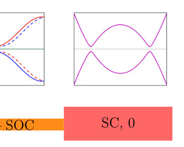 
FIG. 1. The schematic diagram of the set up and their respective dispersions above .

📷 Fig 2

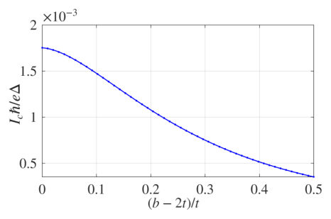 
FIG. 2. Critical current vs the band gap of the BMS for the parameters ∆= 0.1t, µs = −t, tj = t, µb = 0, α = 0, Ls = 15, Lb = 5.

📷 Fig 3

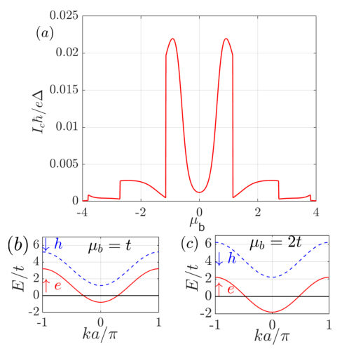 
FIG. 3. (a) Critical current versus the chemical potential of the BMS for the parameters ∆= 0.05t, tj = t, µs = 0, b = 2.2t, α = 0, Ls = 15, and Lb = 5. Below are the dispersions of the up-spin electron and down-spin hole at (b) µb = t and (c) µb = 2t.

📷 Fig 4

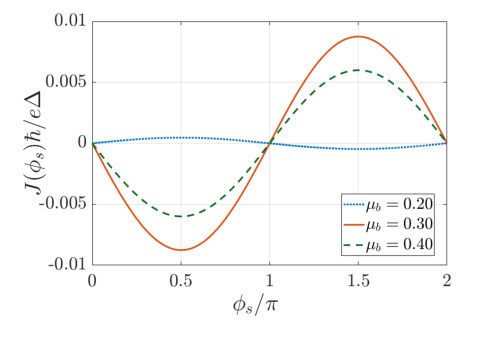 
FIG. 4. CPR relation for Josephson junction of BMS for the parameters ∆= 0.05t, µs = −t, tj = t, b = 2.2t, α = 0, Ls = 10, LB = 5 for different values of µb/t.

📷 Fig 5

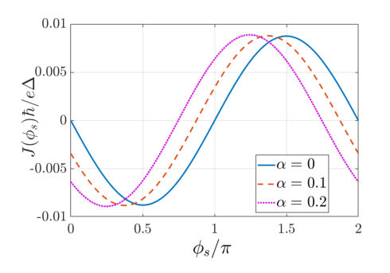 
FIG. 5. CPR relation for Josephson junction of BMS with SOC for the parameters ∆= 0.05t, µs = −t, tj = t, b = 2.2t, Ls = 10, LB = 5. for different values of α/t.

**Summary.** This theoretical work explores Josephson junctions utilizing bipolar magnetic semiconductors (BMSs) to demonstrate electrically tunable superconducting behavior. The authors show that gate-tuning the BMS chemical potential can induce a $0-\pi$ transition without external magnetic fields. Furthermore, they analyze an anomalous supercurrent arising from spin-polarized structure, distinguishing it from general superconducting nonreciprocity.

**Why it may be interesting.** The ability to control superconducting phase transitions purely electrically using magnetic semiconductors provides a novel platform for superconducting spintronics, relevant to understanding superconducting order parameters in engineered quantum materials.

Detailed structure

**Main problem.** The study investigates the Josephson effect in Josephson junctions incorporating bipolar magnetic semiconductors (BMSs) to achieve electrically tunable superconducting behavior.

**Main result.** The intrinsic exchange splitting allows for purely electrical control of the 0-$\pi$ transition without external magnetic fields, and the system exhibits an anomalous Josephson effect due to time-reversal symmetry breaking.

**Method.** The supercurrent and critical current are calculated by numerically diagonalizing the system's Hamiltonian, which models the junction as SC/BMS/SC.

**Model / system.** The physical system is a Josephson junction built using a BMS. The model uses a lattice Hamiltonian incorporating hopping integrals, chemical potentials, and spin-dependent terms arising from the BMS's intrinsic exchange splitting and Rashba SOC.

**Key observables.** Critical Josephson current ($I_c$), Current-Phase Relation (CPR), and the occurrence of the $0-\pi$ transition.

**Important parameters / regimes.** BMS chemical potential ($\mu_b$), Rashba SOC strength ($\alpha$), and the superconducting gap.

**Assumptions / limitations.** The analysis is performed on a one-dimensional junction, and the conclusion regarding the absence of a diode effect is specific to this 1D geometry.

**Figures summary.** Figures illustrate the critical current dependence on the BMS band gap and chemical potential, and show the CPR relation for the junction under varying conditions.

**Paper structure.** The paper first establishes the theoretical framework using a lattice model, then analyzes the dependence of $I_c$ on the BMS chemical potential, demonstrating the electrical control of the $0-\pi$ transition, and finally discusses the anomalous Josephson effect and its relation to nonreciprocity.

Abstract

We theoretically investigate equilibrium currents in a one-dimensional Josephson junction incorporating a bipolar magnetic semiconductor (BMS). We show that the intrinsic exchange splitting of the spin-resolved bands enables purely electrical control of the $0$--$π$ transition through gate-tunable modulation of the BMS chemical potential, eliminating the need for an external magnetic field. This provides a viable route toward electrically tunable $π$-junction behavior and highlights the potential of BMS-based Josephson devices for phase-controllable superconducting electronics. Furthermore, in the presence of Rashba spin--orbit coupling, we find an anomalous Josephson effect characterized by a finite equilibrium supercurrent at zero phase difference. This behavior originates from the intrinsic breaking of time-reversal symmetry associated with the spin-polarized electronic structure of the BMS. Interestingly, despite the simultaneous breaking of time-reversal and inversion symmetries---conditions often associated with nonreciprocal superconducting transport---we do not observe a Josephson diode effect. Our results therefore highlight an important distinction between anomalous Josephson transport and superconducting nonreciprocity: the former does not necessarily imply a finite critical-current asymmetry between opposite current directions.

[↑ back to top](#top)

### [Engineering Plasmons in Oxide/Graphene Heterostructures via Interfacial Charge Transfer](http://arxiv.org/abs/2608.24619v1)

**Authors:** Yuanchen Chi, Dongxu Di, Michael Fralaide, Jigang Wang, Zhe Fei  
**Type:** both · **Category:** other · **PDF:** <https://arxiv.org/pdf/2608.24619v1>  
**Analysis basis:** full PDF text, analyzed in chunks
**Topic relevance:** `interference shaping light` **1/5**

📷 Fig 1

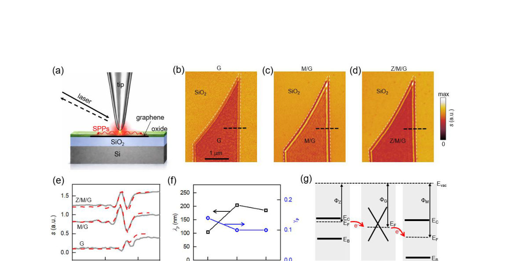 
Figure 1. (a) Schematic of the nano-IR imaging measurement of an oxide/graphene heterostructure. (b-d) Nano-IR images of bare graphene (G), MoOₓ/graphene (M/G) heterostructure, and ZnOx/MoOₓ/graphene (Z/M/G) heterostructure, respectively. The excitation laser energy is set to be 115 meV. (e) Line profiles perpendicular to the edges of the sample taken along the dashed lines in panels (b-d). (f) Extracted plasmon wavelength λp (black squares) and damping rate p (blue circles) by fitting the profiles in panel (e). (g) Band alignment diagram illustrating charge transfer between graphene and the two types of oxides. For quantitative analysis of the SPP fringes, we extract horizontal line...

📷 Fig 2

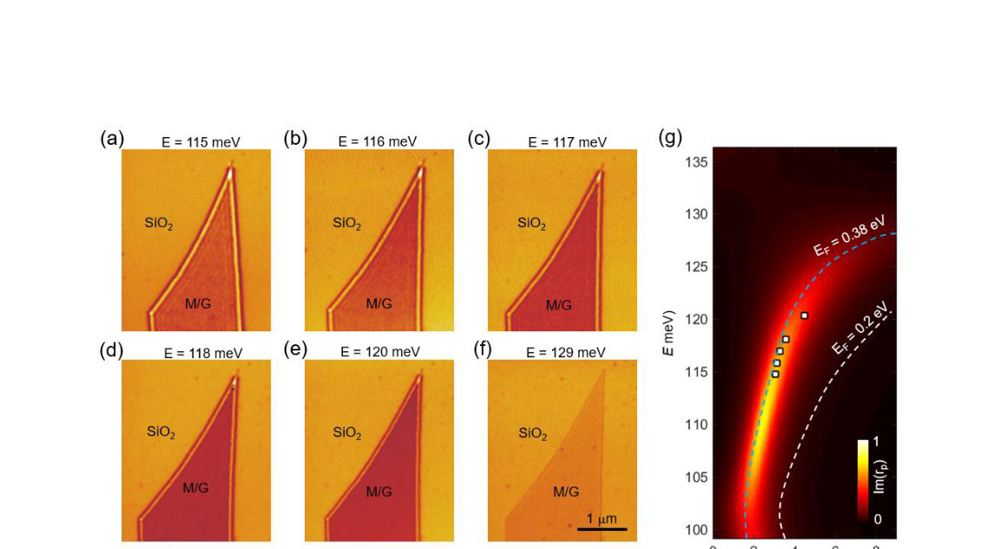 
Figure 2. (a–f) Nano-IR images acquired at different excitation energies (E). (g) Plasmon dispersion relationship from both experimental data (white squares) and theoretical calculations (colormap). The results in Figs. 1 and 2 demonstrate the effectiveness of charge-transfer doping by an ultrathin (~0.5 nm) MoOₓ overlayer in enhancing graphene SPPs. To further elucidate this mechanism, we perform systematic nano-IR imaging while using the MoOₓ thickness (d) as a tuning parameter. Specifically, MoOₓ is deposited on graphene in a stepwise manner, and after each deposition step, a nano-IR image is acquired to track the evolution of the SPP interference fringes. The images are plotted in Fig....

📷 Fig 3

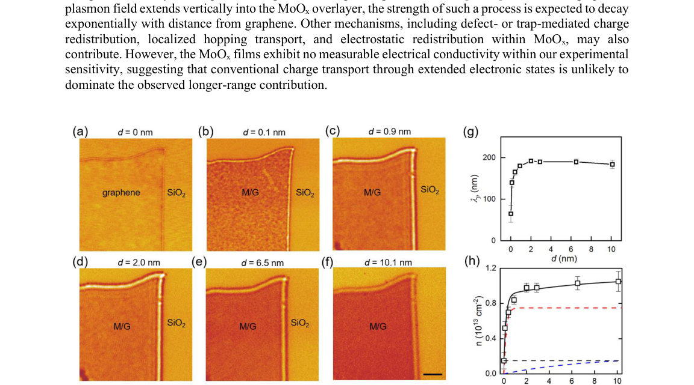 
Figure 3. (a-f) Nano-IR images of bare graphene and MoOx/graphene heterostructures with different thicknesses of MoOx. (g,h) The extracted plasmon wavelength p and carrier density n (data points) versus deposition thickness of MoOx. One advantage of graphene heterostructures fabricated with top-down methods (e.g., PVD or mechanical transfer) is the preserved capability of electrical gating. In comparison, intercalation [12-19] – the other method capable of producing stable charge-transfer graphene heterostructures – works mainly on few-layer graphene or graphite, so it might lose the capability or efficiency of electric gating due to the relatively large sample thickness. Nevertheless, the...

📷 Fig 4

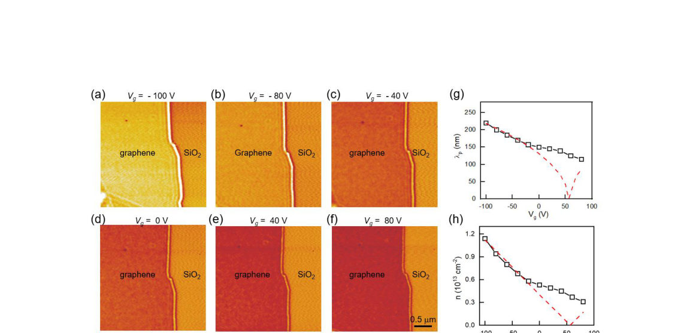 
Fig. 4. (a-f) Nano-IR images of a MoOₓ/graphene heterostructure acquired under various back-gate voltages Vg. (g,h) The extracted plasmon wavelength λp and carrier density n versus gate voltage (Vg). The red dashed curves in panels g and h are calculated dependence curves for pristine graphene based on Eqs. 2 and 3.

📷 Fig 5

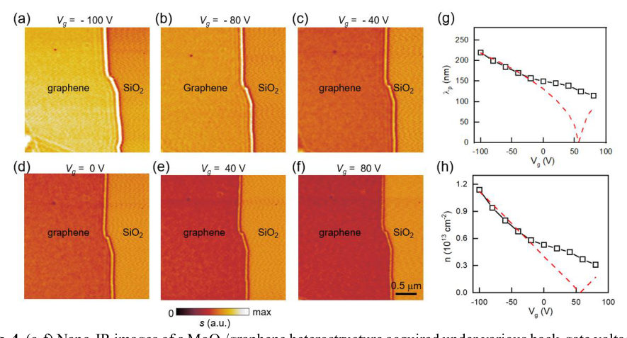 
Fig. 5. (a,b) Nano-IR images of a MoOₓ/graphene heterostructure acquired immediately after fabrication (a) and after 7 months of ambient exposure (b). (c) Line profiles (gray) extracted perpendicular to the SPP fringes in (a) and (b), together with the modeling profiles (red). 3. Conclusion

**Summary.** This research demonstrates that depositing ultrathin oxide layers on graphene allows for precise engineering of surface plasmon polaritons via interfacial charge transfer doping. By using s-SNOM and quantitative modeling, the authors show that the oxide material dictates the plasmon wavelength and stability, establishing oxide/graphene stacks as a robust platform for tunable infrared optoelectronics.

**Why it may be interesting.** The work provides a clear, tunable mechanism (interfacial charge transfer) to control plasmonic properties in 2D materials, which is highly relevant for designing stable, functional nanophotonic devices.

Detailed structure

**Main problem.** The paper investigates how interfacial charge transfer between oxide and graphene layers can be used to systematically engineer the optical and electronic properties, specifically the surface plasmon polaritons (SPPs), in these heterostructures.

**Main result.** Depositing $	ext{MoO}_x$ strongly enhances the plasmonic response and increases graphene doping, while subsequent $	ext{ZnO}_x$ deposition partially reverses these effects; the structure proves to be a robust platform for stable nanophotonics.

**Method.** The study combines experimental characterization using scattering-type s-SNOM with quantitative modeling based on multilayer transfer-matrix methods and charge transfer doping models.

**Model / system.** The physical system is an oxide/graphene heterostructure (e.g., $	ext{MoO}_x/	ext{graphene}$), where the plasmon dispersion and carrier density are modeled as functions of oxide thickness and external gating voltage.

**Key observables.** Plasmon wavelength ($\lambda_p$), damping rate ($\gamma_p$), graphene carrier density ($n$), and the evolution of the plasmon dispersion relationship $E(q_p)$.

**Important parameters / regimes.** Oxide layer thickness ($d$), gate voltage ($V_g$), and the work functions of the constituent materials ($\Phi_M, \Phi_Z$).

**Assumptions / limitations.** The analysis relies on modeling the plasmon field decay using the complex in-plane wavevector, leading to an intensity decay length $L_I = \lambda_p / (4\pi)$.

**Figures summary.** Figures show nano-IR images comparing bare graphene to structures with $	ext{MoO}_x$ and $	ext{ZnO}_x$, illustrating changes in fringe contrast and wavelength; dispersion plots map the plasmon energy vs. momentum.

**Paper structure.** The paper systematically presents experimental measurements varying oxide thickness and gate voltage, correlating observed plasmon shifts and damping rates with theoretical models of interfacial charge transfer doping and plasmon field decay.

Abstract

Interfacial charge transfer provides an effective route for tailoring the optical and electronic properties of two-dimensional materials. Here, we investigate infrared surface plasmon polaritons in oxide/graphene heterostructures using scattering-type scanning near-field optical microscopy. Ultrathin oxide overlayers deposited by physical vapor deposition enable systematic engineering of graphene plasmons through interfacial charge redistribution. MoOx strongly enhances the plasmonic response, producing a longer plasmon wavelength, stronger fringe contrast, and reduced damping, whereas a subsequently deposited ZnOx overlayer partially reverses these changes. Energy-dependent nano-infrared imaging combined with quantitative modeling reveals an increased graphene carrier density and the resulting modification of the plasmon dispersion. Thickness-dependent measurements show a rapid increase in charge-transfer doping at sub-nanometer MoOx thicknesses, followed by a weaker long-range contribution at larger overlayer thicknesses. Electrostatic gating further modulates the carrier density and produces a nonlinear response consistent with gate-dependent interfacial charge redistribution. In addition, an approximately 3-nm-thick MoOx overlayer stabilizes the plasmonic response for at least seven months under ambient conditions. These results establish oxide/graphene heterostructures as a robust platform compatible with scalable fabrication, providing a pathway toward stable and tunable infrared nanophotonic and optoelectronic devices.

[↑ back to top](#top)

### [Enhanced Superconductivity in Multilayer FeSe Films by Simplified Molecular Beam Epitaxy](http://arxiv.org/abs/2608.24710v1)

**Authors:** Maria Hilse, Hemian Yi, Zhe Chen, Jessica L. Thompson, Kalana D. Halanayake, Danielle Reifsnyder Hickey, Seong H. Kim, Cui-Zu Chang, Nitin Samarth, Roman Engel-Herbert  
**Type:** experiment · **Category:** strongly correlated electrons · **PDF:** <https://arxiv.org/pdf/2608.24710v1>  
**Analysis basis:** full PDF text, analyzed in chunks
**Topic relevance:** `analog quantum simulation` **1/5**

📷 Fig 1

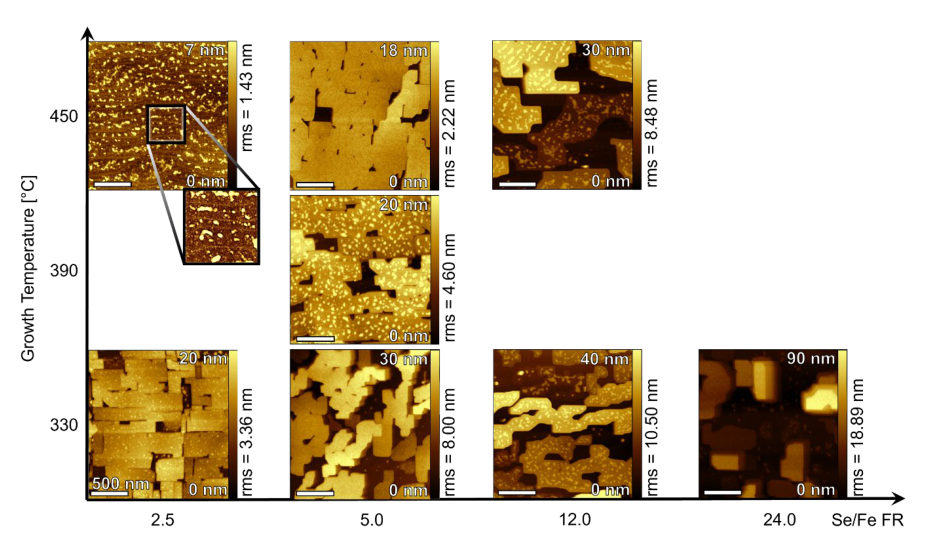 
Figure 1. Surface morphology measured in AFM for FeSe films grown at different

📷 Fig 2

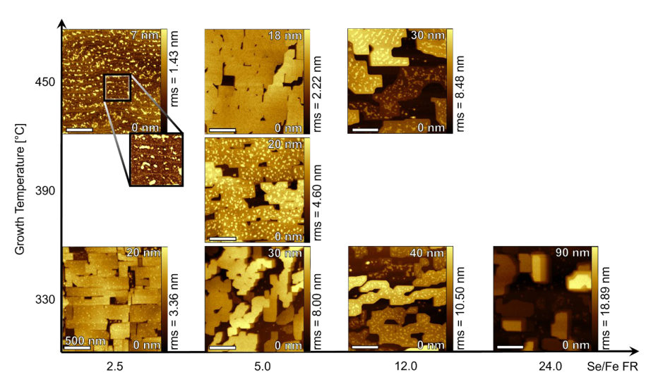 
Figure 1 thus demonstrates that a high Se overpressure during FeSe growth, i.e., high FR

📷 Fig 3

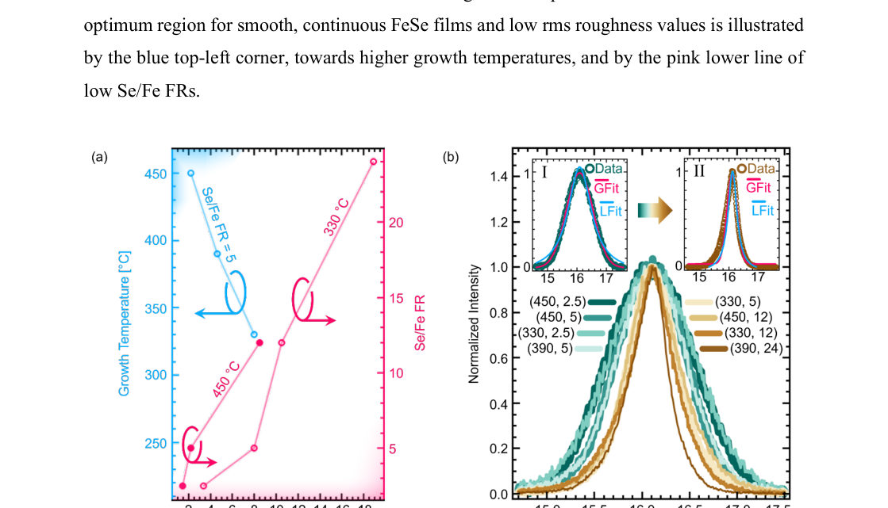 
Figure 2. (a) The rms values obtained for all samples shown in Figure 1 plotted over the FeSe

📷 Fig 4

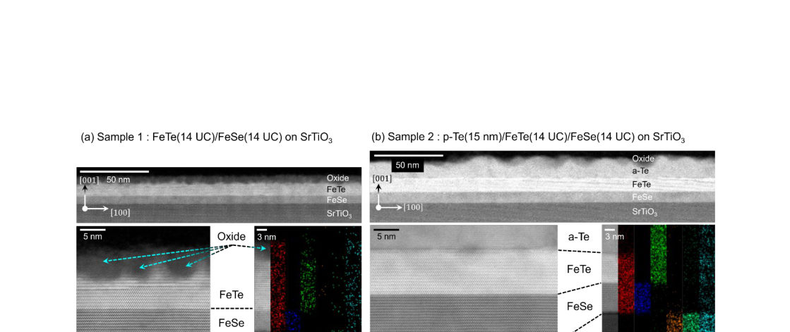 
Figure 3. ADF-STEM images at low and high magnification and EDX elemental maps of the

📷 Fig 5

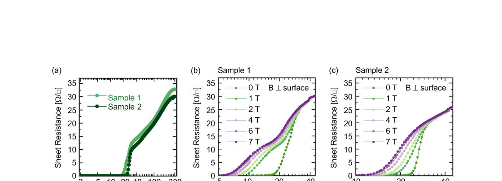 
Figure 4. (a) Electrical transport measurement of sheet resistance versus temperature at zero

**Summary.** This work reports a breakthrough in synthesizing superconducting FeSe films by developing a greatly simplified MBE growth protocol. By eliminating complex substrate pre-treatments and post-growth annealing, the authors achieved high-quality, multi-unit-cell films exhibiting a high superconducting transition temperature of $\sim 20 	ext{ K}$. This significantly advances the practical synthesis of high-temperature superconducting materials.

**Why it may be interesting.** While focused on solid-state superconductivity, the detailed control over epitaxial growth, stoichiometry, and structural transitions (e.g., island vs. layer-by-layer growth) provides valuable experimental insights into achieving highly ordered quantum materials, which is relevant for understanding correlated electron behavior in artificial quantum systems.

Detailed structure

**Main problem.** The primary goal is to achieve enhanced superconductivity in multilayer beta-FeSe films while significantly simplifying the complex molecular beam epitaxy (MBE) growth protocols previously required.

**Main result.** The authors successfully demonstrated an enhanced superconducting transition temperature ($T_c \sim 20 	ext{ K}$) in 14-unit-cell films using a greatly simplified MBE protocol that eliminates the need for substrate pre-treatment or post-growth UHV annealing.

**Method.** The study employs MBE growth techniques coupled with extensive characterization, including AFM, RHEED, XRD, and ex situ electrical transport measurements, to correlate growth parameters with film quality and superconducting properties.

**Model / system.** The physical system is multi-unit-cell (UC) beta-FeSe films epitaxially grown on SrTiO3(100) substrates. The research focuses on controlling the film's stoichiometry and crystalline quality to maximize the superconducting transition temperature.

**Key observables.** Superconducting transition temperature ($T_c$), root mean square (rms) roughness (AFM), XRD peak width (FWHM), and sheet resistance.

**Important parameters / regimes.** Growth Temperature ($T_{	ext{GG}}$), Se/Fe flux ratio (FR), and film thickness (up to 14 UC).

**Assumptions / limitations.** The authors challenge the prior understanding that elaborate protocols (pre-treatment, annealing) are strictly necessary for high-$T_c$ FeSe films.

**Figures summary.** Figures illustrate the dependence of AFM surface morphology on growth temperature and Se/Fe FR, while XRD scans track changes in crystallinity (peak width) across different growth conditions.

**Paper structure.** The paper establishes the background on enhanced $T_c$ in FeSe, presents the novel simplified growth protocol, details the characterization of morphology and structure using multiple techniques, and concludes with the measurement of high $T_c$ values.

Abstract

Multi-unit-cell (UC) \b{eta}-FeSe films grown on SrTiO3(100) continue to attract attention because of the significant enhancement in the superconducting transition temperature (Tc) compared to that in bulk FeSe. In prior reports of molecular beam epitaxy (MBE)-grown \b{eta}-FeSe/SrTiO3(100), elaborate growth protocols have been used to achieve enhanced Tc, leading to a general belief that careful pre-treatment of the SrTiO3 substrate and post-growth annealing in ultrahigh vacuum (UHV) are essential. Here, we report a greatly simplified protocol for the MBE growth of superconducting multi-UC \b{eta}-FeSe films on SrTiO3(100), eliminating the need for careful substrate pre-treatment and post-growth UHV annealing while still achieving an enhanced Tc. With appropriate capping, epitaxial films with 14 UC thickness exhibit a zero-resistance transition temperature Tc ~ 20 K in ex situ electrical transport measurements. The MBE optimization process is guided by the growth-parameter dependencies of film morphology and structural properties, as characterized by reflection high-energy electron diffraction, X-ray diffraction, atomic force microscopy, and scanning transmission electron microscopy.

[↑ back to top](#top)

### Other secondary papers (3)

Show other secondary papers

### [Exciton fine structure in nanocrystals: effect of cuboidal and spheroidal shapes](http://arxiv.org/abs/2608.24663v1)

**Authors:** M. A. Semina, O. O. Druzhinina, A. A. Golovatentko, A. V. Rodina  
**Type:** theory · **Category:** other · **PDF:** <https://arxiv.org/pdf/2608.24663v1>  
**Analysis basis:** full PDF text, analyzed in chunks

📷 Fig 1

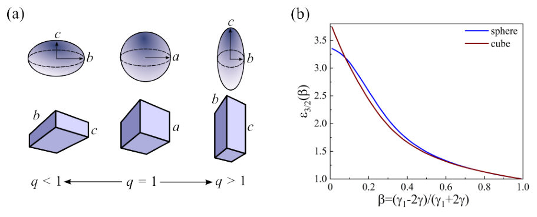 
FIG. 1. (a) The Sketch of the structures under study: (upper row) spherical NC with radius a and

📷 Fig 2

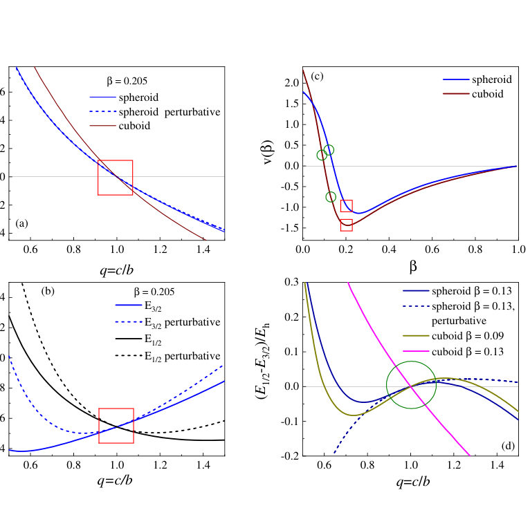 
FIG. 2. (a) The heavy and light hole splitting ∆= E1/2 −E3/2 in units of Eh as a function

📷 Fig 3

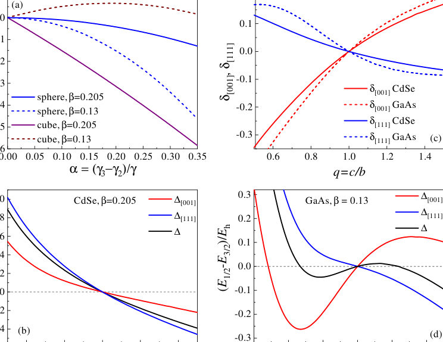 
FIG. 3. (a) The relative accuracy of the spherical approximation for Luttinger Hamiltonian

📷 Fig 4

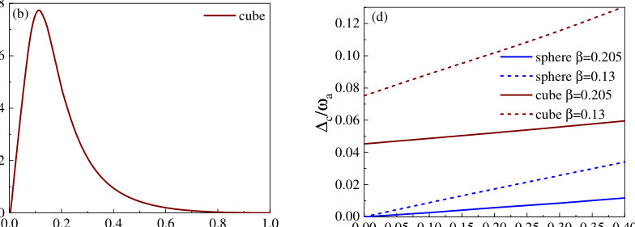 
FIG. 4. Dimensionless isotropic η/ωa , (a,c), and cubically-symmetric, ∆c/ωa , (b,d) electron-hole

📷 Fig 5

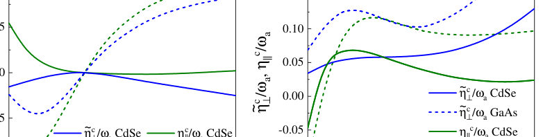 
FIG. 5. Dimensionless short-range exchange interaction constants (a) η⊥/ωa, η∥/ωa , and (b)

**Summary.** This theoretical work models the exciton fine structure in semiconductor nanocrystals with non-spherical shapes like cuboids and spheroids. It rigorously incorporates the effects of crystal symmetry and shape anisotropy into the exciton Hamiltonian. The key finding is that shape-induced exchange interactions significantly split the dark exciton states, providing crucial design rules for quantum emitters.

**Why it may be interesting.** The detailed quantum mechanical treatment of shape-dependent excitonic properties in low-dimensional semiconductors is highly relevant to quantum optics and quantum information applications utilizing semiconductor quantum emitters.

Detailed structure

**Main problem.** The paper investigates the exciton fine structure in semiconductor nanocrystals (NCs) that possess non-spherical, cuboidal, or spheroidal shapes.

**Main result.** The study identifies a non-negligible, shape-induced contribution to the short-range exchange interaction in cuboidal NCs, which causes a pronounced splitting of the dark exciton states.

**Method.** The authors employ symmetry analysis and non-perturbative theoretical calculations using an effective Hamiltonian derived from the Luttinger Hamiltonian for hole states.

**Model / system.** The system is colloidal semiconductor nanocrystals (e.g., zinc-blende structure) modeled with electron and hole wave functions, considering the effects of cubic symmetry and uniaxial anisotropy on the exciton Hamiltonian.

**Key observables.** Exciton fine structure splitting, hole ground state splitting, and oscillator strength.

**Important parameters / regimes.** Anisotropy ratios (q=c/b), material parameters (e.g., hole mass ratio $eta$), and the relative strength of anisotropic splitting versus exchange constants.

**Assumptions / limitations.** The analysis assumes the energy potential profile is box-like (infinite potential) and that electron/hole wave functions can be factorized.

**Figures summary.** Figures illustrate the dependence of hole ground state energy on material ratios for spherical and cubical NCs, and show the calculated exciton splitting ($\Delta$) as a function of the anisotropy ratio ($q=c/b$).

**Paper structure.** The paper builds from general symmetry analysis to derive an effective Hamiltonian, then applies this to calculate hole energy splittings under anisotropic conditions, and finally analyzes the resulting exciton fine structure and oscillator strength.

Abstract

We present the theory of the band-edge exciton fine structure in nanocrystals (NCs) with spheroidal and cuboidal shapes. The effects of the cubic symmetry of the crystal lattice, the cubic shape of the NC, and NC uniaxial anisotropy on the hole energy states and electron-hole exchange interactions are considered non-perturbatively. Symmetry analysis yields an effective Hamiltonian for the exciton fine structure, parameterized by one constant for hole energy splitting and five independent constants for exchange interaction. Numerical calculations reveal that in uniaxially anisotropic zinc-blende NCs, the sign of the hole ground state splitting depends on the material parameters and on the orientation of the anisotropy axis relative to the crystallographic axes. Beyond the conventional bulk cubically-symmetric contribution to the exchange interaction, which originates from Bloch-function symmetry and is typically negligible, in nanocrystals, we identify the contribution arising from the cubic symmetry of the envelope wavefunction. This cubically symmetric envelope-induced short-range exchange is non-negligible in cuboidal NCs and induces a pronounced splitting of the dark exciton states. We further analyze the influence of uniaxial anisotropy of the exchange constants on both the exciton fine structure and the oscillator strength. Special attention is paid to NCs, where the anisotropy of the exchange constants is comparable to a relatively small hole energy anisotropic splitting.

[↑ back to top](#top)

### [Intertwined spin-charge stripe order and polar lattice distortion in La$_{3}$Ni$_{2}$O$_{7}$](http://arxiv.org/abs/2608.23823v1)

**Authors:** Xiaoying Li, Wenqian Tu, Run Lv, Li'e Liu, Dingfu Shao, Yuping Sun, Wenjian Lu  
**Type:** theory · **Category:** strongly correlated electrons · **PDF:** <https://arxiv.org/pdf/2608.23823v1>  
**Analysis basis:** full PDF text, analyzed in chunks

📷 Fig 1

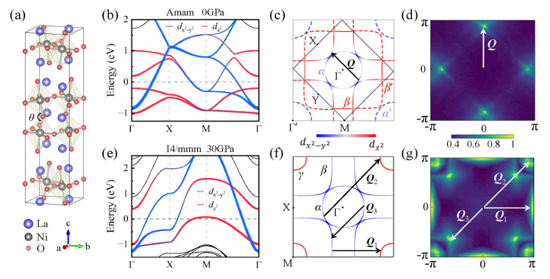 
FIG. 1. Crystal and electronic structures, Fermi surfaces, and spin susceptibility of La3Ni2O7 at ambient pressure and 30 GPa. (a) Amam crystal structure of La3Ni2O7 at ambient pressure, with θ denoting the interlayer Ni–O–Ni bond angle. (b) and (e) Orbital-projected band structures of the Amam and I4/mmm phases, respectively. Blue and red line widths represent the Ni-3dx2−y2 and Ni-3dz2 orbital weights. (c) and (f) Corresponding orbital-resolved Fermi surfaces projected onto the kx–ky plane, with relevant nesting vectors indicated. In (c), the black diamond and gray square indicate the folded and unfolded BZ, respectively (the dashed α′ and β′ are folded replicas of the α and β sheets)....

📷 Fig 2

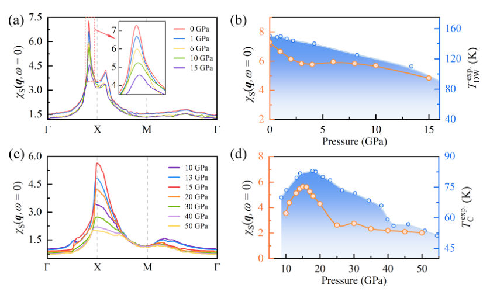 
FIG. 2. Pressure evolution of static spin susceptibility χS(q) of La3Ni2O7 and comparison with the experimental transition temperatures. (a) and (c) χS(q) along the Γ-X-M-Γ path at selected pressures. The inset in (a) highlights the dominant peak near the X point. In (c), the peak near the X point arises primarily from nesting between the β and γ FS sheets, characterized by Q1. (b) and (d) Pressure dependence of the peak value of χS(q) near X (orange), compared with the experimental density- wave-like transition temperature T exp. DW [27] and superconducting transition temperature T exp. C [28] (blue), respectively.

📷 Fig 3

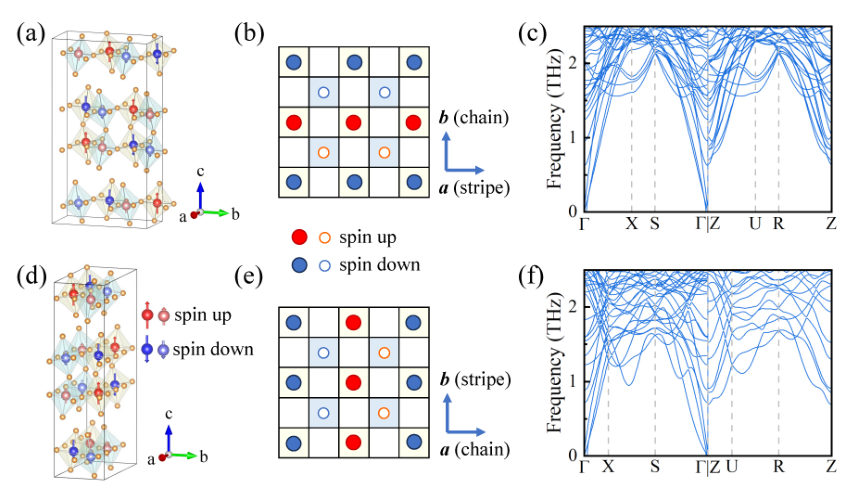 
FIG. 3. Magnetic configurations and phonon dispersions of the a- and b-oriented spin-charge-stripe states in La3Ni2O7. (a) and (d) Three-dimensional views of the relaxed a-stripe and b-stripe magnetic structures, respectively. Red and blue arrows denote spin-up and spin-down Ni moments, respectively. (b) and (e) Schematic top views of the corresponding spin arrangements in the NiO2 plane. The circle color denotes the spin direction, while the circle size and color saturation distinguish Ni sites with larger and smaller moment magnitudes. (c) and (f) Low-frequency phonon dispersions of the a-stripe and b-stripe states, respectively, along the selected high-symmetry path.

📷 Fig 4

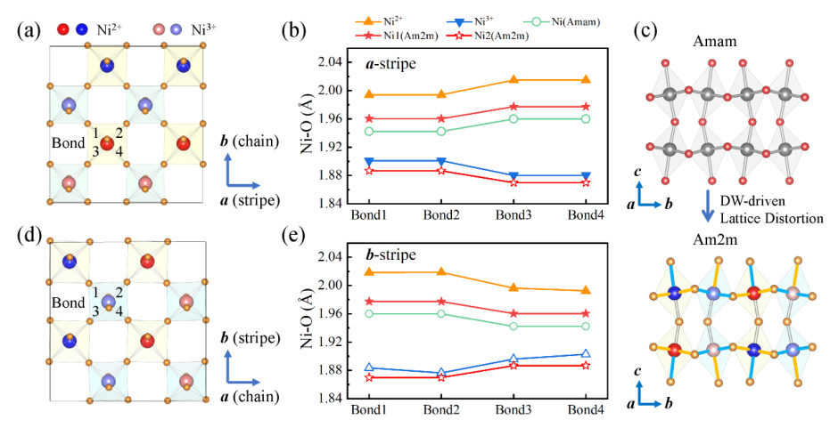 
FIG. 4. Local Ni–O bond disproportionation and DW-driven symmetry lowering in La3Ni2O7. (a) and (d) Top view of the relaxed a-stripe and b-stripe states, respectively. Red and blue indicate spin-up and spin-down moments, respectively, whereas the darker and lighter colors denote the Ni2+-like and Ni3+-like sites, respectively. The four in-plane Ni–O bonds are labeled Bond1–Bond4. (b) and (e) Corresponding Ni–O bond lengths, compared with those of the reference Amam and experimentally proposed Am2m structures. (c) Side views of the parent Amam structure and the relaxed a-stripe structures, illustrating the spontaneous symmetry lowering to polar Am2m. Yellow and blue bonds indicate Ni–O bond...

**Summary.** This theoretical study investigates the coupled spin, charge, and lattice ordering in La3Ni2O7 using first-principles calculations. It finds that spin-charge-stripe states are the ground state, which spontaneously distort into a polar structure. The work establishes that these three degrees of freedom are strongly intertwined, providing insights into the mechanism behind superconductivity in nickelates.

**Why it may be interesting.** The strong coupling between spin, charge, and lattice degrees of freedom, and the emergence of superconductivity linked to spin fluctuations, are central themes in strongly correlated electron physics, relevant to understanding unconventional superconductivity mechanisms.

Detailed structure

**Main problem.** The study aims to clarify the microscopic relationship among spin, charge, and lattice degrees of freedom in the low-temperature density-wave state of La3Ni2O7.

**Main result.** The spin-charge-stripe states are found to be energetically favored, and the system spontaneously relaxes into the polar Am2m structure via a polar distortion, establishing a unified picture of coupled responses.

**Method.** The research employs first-principles calculations using DFT+U and analyzes the pressure evolution of electronic structure and static spin susceptibility.

**Model / system.** The physical system is the nickelate material La3Ni2O7, which exhibits complex electronic, magnetic, and structural instabilities, particularly in its density-wave state.

**Key observables.** Static spin susceptibility (chi_S(q)), Fermi surface nesting vectors, local Ni magnetic moments, and lattice parameters (Ni–O bond lengths).

**Important parameters / regimes.** Pressure (P), which is used to tune the system through different electronic and magnetic regimes.

**Assumptions / limitations.** The analysis relies on DFT+U calculations and treats the spin susceptibility using a simplified Random Phase Approximation (RPA).

**Figures summary.** Figures illustrate the electronic structure, Fermi surface reconstruction, and the pressure dependence of the spin susceptibility peak, correlating it with both the density-wave and superconducting transition temperatures.

**Paper structure.** The paper progresses by first analyzing the ambient pressure SDW state driven by FS nesting, then investigating the pressure evolution, identifying the stable spin-charge-stripe states, and finally demonstrating the structural relaxation into the polar Am2m phase.

Abstract

The low-temperature density-wave state of La$_3$Ni$_2$O$_7$ hosts pronounced spin-density-wave (SDW) order, while recent experiments further reveal charge redistribution and a concomitant lattice-symmetry lowering. However, the microscopic relationship among spin, charge, and lattice remains unclear. Using first-principles calculations, we investigate the pressure evolution of the electronic structure and static spin susceptibility of La$_3$Ni$_2$O$_7$, together with the energetics and lattice response of representative magnetic configurations. We trace the SDW instability to strong Fermi-surface nesting and find that the high-pressure spin response closely tracks $T_{\mathrm C}$, suggesting spin-fluctuation-mediated pairing. Among the candidate magnetic states considered, the spin-charge-stripe states emerge as energetically favored and dynamically stable, developing pronounced disproportionation of both the local Ni moments and the Ni--O bond lengths. Remarkably, the lowest-energy a-stripe state spontaneously relaxes into the experimentally proposed polar Am2m structure through a polar distortion along the b axis. These results establish a unified picture in which spin, charge, and lattice responses are strongly intertwined in the low-pressure density-wave state, while spin fluctuations remain a plausible ingredient of superconductivity under pressure.

[↑ back to top](#top)

### [Nonlocal-nonlinear phonon polaritons](http://arxiv.org/abs/2608.24344v1)

**Authors:** Gonzalo Álvarez-Pérez, Line Jelver, Alexander Paarmann, Simone De Liberato  
**Type:** theory · **Category:** other · **PDF:** <https://arxiv.org/pdf/2608.24344v1>  
**Analysis basis:** full PDF text, analyzed in chunks

📷 Fig 1

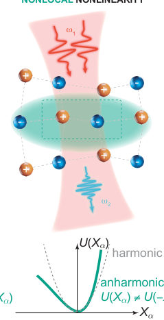 
Fig. 2 Local versus nonlocal origins of second-order optical nonlinearity in a crystal lattice. (a) In the local picture (left), the lattice response is identical from one unit cell to the next, so the second-order polarization at frequency ω2 is determined solely by the local response to the incident field at ω1. In the nonlocal picture (right), the lattice response varies across neighboring unit cells, giving rise to a spatially-dispersive (nonlocal) second-order polarization. (b) Potential energy landscape illustrating inversion symmetry: the local cubic anharmonicity U (0) 3 satisfies U(Xα) = U(−Xα) and is therefore forbidden in centrosymmetric crystals (left), while the...

📷 Fig 2

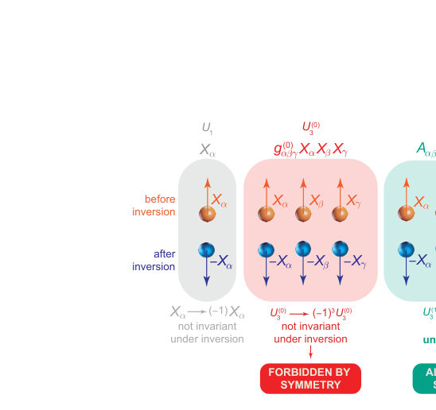 
Fig. 3 Schematic representation of the symmetry selection rules for the three leading anharmonic energy contributions of nonlocal-nonlinear PhPs under spatial inversion. U(0) 3 (zero spatial derivatives) and U(2) 3 (two spatial derivatives) acquire a sign change and are forbid-

📷 Fig 3

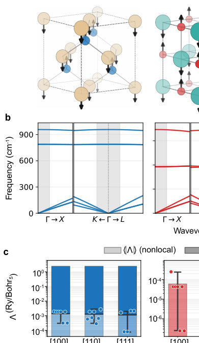 
Fig. 4 First-principles phonon dispersions and nonlocal anharmonic coefficients for three representative polar crystals. (a) Relaxed conventional unit cells of 3C-SiC (left), MgO (middle) and LiF (right). Arrows depict the Γ-point TO phonon displacement pattern at fixed amplitude for clarity. (b) Harmonic phonon band structures of cubic 3C-SiC, MgO, and LiF calculated using DFPT with the PBEsol functional, plotted along high-symmetry paths in the Brillouin zone. Grey shading marks the small-wavevector fitting window (q2 ≤0.005 (2π/a)2) used to extract the nonlocal harmonic coefficients βL and βT . The full harmonic phonon band structures are shown in the Supplementary Information. (c)...

**Summary.** This paper develops a theory to study nonlocal nonlinear optics in polar crystals by examining the coupling between light and lattice vibrations (phonon polaritons). It reveals a novel second-order nonlinear process stemming from lattice anharmonicity that can generate strong SHG signals even in materials that are otherwise centrosymmetric. The findings establish a new theoretical regime for light-matter interaction in dielectrics.

**Why it may be interesting.** This work bridges condensed matter theory (lattice dynamics, DFPT) with quantum optics (polaritons, nonlinear light-matter interaction), providing a detailed theoretical mechanism for enhanced nonlinear optical responses in solid-state dielectrics.

Detailed structure

**Main problem.** To theoretically investigate how nonlocality, arising from phonon confinement, reshapes nonlinear light-matter interactions in dielectrics, particularly in polar crystals.

**Main result.** The study identifies a new, nonlocal second-order nonlinear mechanism enabled by the interplay between optical-phonon propagation and ionic-bond anharmonicity, which can dominate SHG even in centrosymmetric materials.

**Method.** The authors use Density Functional Perturbation Theory (DFPT) to quantify the nonlocal second-order susceptibilities by analyzing the anharmonic potential energy functional.

**Model / system.** The system is modeled using polar crystals exhibiting phonon polaritons (PhPs). The nonlinearity is derived from the anharmonic terms ($U_3$) in the lattice potential, which are expanded in terms of wavevectors ($k, k'$).

**Key observables.** Nonlocal second-order susceptibilities ($\chi^{(2)}$), Second-Harmonic Generation (SHG) signals.

**Important parameters / regimes.** Phonon polariton resonance frequencies, wavevector dependence ($k$), and the degree of confinement (deeply subwavelength volumes).

**Assumptions / limitations.** The theory assumes the potential energy $U$ depends only on lattice displacement, confining nonlocality and anharmonicity to lattice origins.

**Figures summary.** Figure 1 compares local and nonlocal $\chi^{(2)}$ across the Reststrahlen Band for various crystals. Figure 2 compares the local versus nonlocal origins of the nonlinearity.

**Paper structure.** The paper establishes the physical problem (nonlocal nonlinearity in dielectrics), develops the theoretical framework using lattice dynamics and anharmonic potentials, calculates the nonlocal susceptibilities using DFPT, and presents results showing the new nonlinear regime.

Abstract

When light is confined to deeply subwavelength volumes, optical responses can become nonlocal. Yet how nonlocality reshapes nonlinear light-matter interactions remains largely unexplored, particularly in dielectrics. Here, we theoretically uncover a new class of nonlinear optical processes arising from the interplay between optical-phonon propagation and ionic-bond anharmonicity in polar crystals. We show that, unlike conventional local nonlinearities, this mechanism enables second-order responses even in centrosymmetric materials. Moreover, these responses can be tuned by the confinement and resonantly enhanced near optical-phonon resonances. Using density functional perturbation theory, we quantify the resulting nonlocal second-order susceptibilities in representative polar crystals. Our results establish nonlocal-nonlinear optics as a new regime of light-matter interaction in dielectrics.

[↑ back to top](#top)

